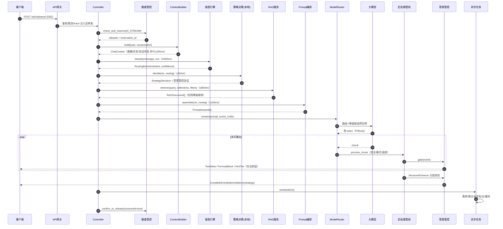
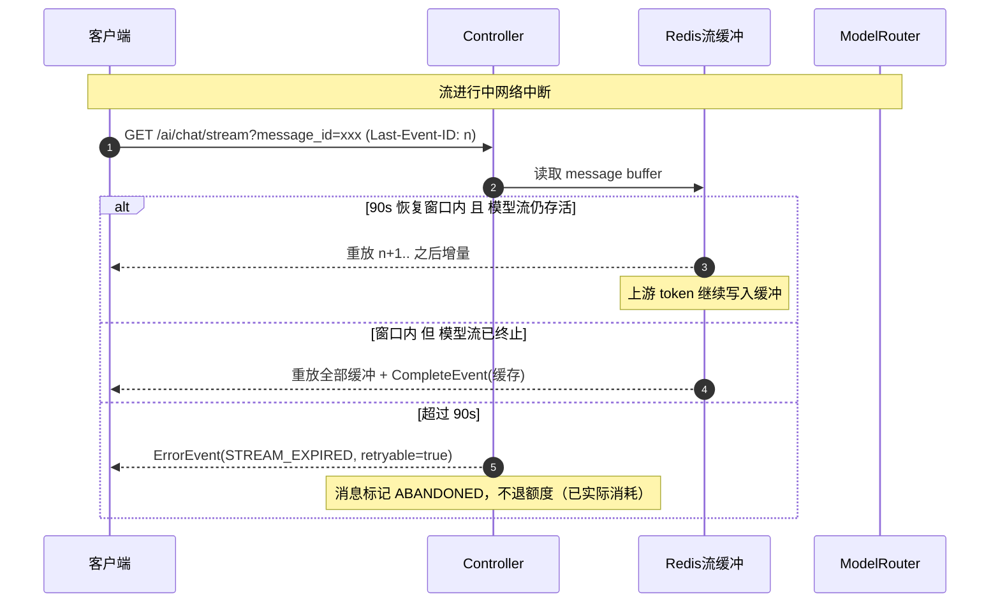

# AI辅导全链路请求处理与编排设计 - 详细设计

> **版本**: v1.1 | **日期**: 2026-08-17 | **状态**: 已补全（v1.0 截断于 §2.4 意图路由表）
> **关联文档**: AI对话引擎与会话管理、学习场景意图识别与智能路由引擎、AI-Prompt编排与场景模板系统、RAG与知识库系统、多模型调度与成本治理、AI回答后处理与智能优化管线、答案管控与渐进式提示引擎、SSE流式响应与AI增量渲染引擎

---

## 1. 文档定位与目标

### 1.1 为什么需要这份文档

PrimeTop 的 AI 辅导功能涉及 **10+ 个子系统** 的协同工作。各子系统的详细设计文档已分别编写，但缺少一份 **端到端的全链路编排文档**，回答以下关键问题：

1. 用户发送一条消息后，请求经过哪些服务？调用顺序是什么？
2. 各步骤之间的数据如何传递？上下游依赖是什么？
3. 整个链路的超时预算如何分配？某一步超时/失败时如何降级？
4. 流式（SSE）场景下，各步骤如何协作实现"边生成边处理边推送"？
5. 链路中如何插入新步骤（如灰度新特性）而不影响已有逻辑？

### 1.2 适用读者

- **服务端开发工程师**：理解 AI 辅导请求的完整处理链路，实现编排逻辑
- **客户端开发工程师**：理解请求协议、SSE 流协议和渲染时序
- **AI 工程师**：理解模型调用在整体链路中的位置和约束
- **测试工程师**：设计端到端集成测试用例

### 1.3 核心链路一览

```
客户端发送消息
    │
    ▼
[1] API 网关层 ─ 鉴权 / 限流 / 设备校验 / 请求预处理
    │
    ▼
[2] 请求入口 Controller ─ 参数校验 / 场景路由 / 额度校验
    │
    ▼
[3] 上下文构建 ─ 学生画像加载 / 对话历史加载 / 会话状态恢复
    │
    ▼
[4] 意图识别引擎 ─ 学习意图分类 / 学科识别 / 附件解析
    │
    ▼
[5] 教学策略决策 ─ 选择教学策略 / 计算引导深度 / 设定答案管控层级
    │
    ▼
[6] RAG 检索 ─ 知识库向量检索 / 教材内容匹配 / 考点关联
    │
    ▼
[7] Prompt 编排 ─ 模板选择 / 变量注入 / RAG结果注入 / 策略标签注入
    │
    ▼
[8] 模型调用 ─ 模型路由 / 调用分发 / 流式响应接收
    │
    ▼
[9] 后处理管线 ─ 安全过滤 / 格式规范 / 适龄化 / 知识点标注
    │
    ▼
[10] SSE 流式推送 ─ 增量渲染指令 / 答案管控层级检查
    │
    ▼
[11] 异步后置任务 ─ 学习记录 / 知识点标注完成 / 缓存写入 / 质量评估
    │
    ▼
客户端渲染完成
```

---

## 2. 链路阶段详细设计

### 2.1 API 网关层

**负责人**: API 网关（Kong/APISIX）
**超时预算**: 整体链路 120s，网关层自身处理 ≤ 50ms

#### 2.1.1 网关处理步骤

```python
# 网关层拦截器链（Lua/Plugin 配置示意）
# 顺序: 鉴权 → 限流 → 设备校验 → 请求预处理

# 1. JWT 鉴权
#    - 从 Header 提取 Bearer Token
#    - 校验签名、过期时间
#    - 提取 user_id, device_id 注入 Header: X-User-Id, X-Device-Id
#    - 无效 Token 返回 401

# 2. 全局限流
#    - 按 user_id 维度限流: 每秒最大 5 个 AI 请求
#    - 按功能维度限流: 额度管控系统校验剩余配额
#    - 超限返回 429, Header: Retry-After: 5

# 3. 设备校验
#    - 验证 device_id 合法性
#    - 校验 APP 版本是否低于最低支持版本
#    - 低版本返回 426, Body: { "upgrade_url": "..." }

# 4. 请求预处理
#    - 注入 trace_id (X-Trace-Id) 用于全链路追踪
#    - 记录请求开始时间 (X-Request-Start-Ts)
#    - 设置 upstream 超时: 120s (AI 流式场景)
```

#### 2.1.2 请求协议

客户端发送 AI 辅导请求的协议定义：

```typescript
// 客户端 → 服务端请求
// POST /api/v1/ai/chat/send
// Content-Type: application/json
// Authorization: Bearer <jwt_token>

interface AIChatRequest {
  /** 会话ID，首次为空由服务端创建 */
  conversation_id?: string;

  /** 用户消息内容 */
  message: string;

  /** 输入类型 */
  input_type: 'text' | 'voice' | 'image';

  /** 附件列表（图片、语音等） */
  attachments?: Array<{
    type: 'image' | 'voice';
    file_id: string;       // 已上传的文件ID
    mime_type: string;
    size_bytes: number;
    metadata?: {
      duration_ms?: number;    // 语音时长
      width?: number;          // 图片宽
      height?: number;         // 图片高
    };
  }>;

  /** 客户端上下文 */
  client_context: {
    current_page: string;        // 当前所在页面
    source_entry: string;        // 入口来源: home_shortcut/ai_tab/photo_qa/exercise
    subject_hint?: string;       // 用户当前选择的学科
    chapter_id?: string;         // 当前所在章节
    question_id?: string;        // 关联题目ID（从拍题跳转时）
    knowledge_point_id?: string; // 关联知识点ID
  };

  /** 客户端支持的SSE事件类型 */
  supported_events: string[];   // 默认 ['text','formula','card','status']
}
```

```typescript
// 服务端 SSE 响应流
// Content-Type: text/event-stream
// 每行格式: event: <type>\ndata: <json>\n\n

// SSE 事件类型定义
type SSEEvent =
  | ConversationCreatedEvent     // 会话创建（首次）
  | TextDeltaEvent               // 文本增量
  | FormulaBlockEvent            // 公式块
  | KnowledgeCardEvent           // 知识点卡片
  | HintTierEvent                // 答案管控层级提示
  | StatusEvent                  // 状态事件（思考中/检索中/...）
  | ErrorEvent                   // 错误事件
  | CompleteEvent                // 完成事件
  | PostProcessEvent             // 后处理异步结果（知识点标注等）

interface ConversationCreatedEvent {
  conversation_id: string;
  message_id: string;
}

interface TextDeltaEvent {
  delta: string;               // 增量文本
  is_markdown_start?: boolean;  // 是否开始新的 markdown 块
}

interface FormulaBlockEvent {
  latex: string;               // LaTeX 公式
  display_mode: boolean;       // 行间/行内
  label?: string;              // 公式标签
}

interface KnowledgeCardEvent {
  kp_id: string;
  name: string;
  chapter_path: string;        // "七年级上 > 第一章 > 1.1"
  mastery_level?: number;      // 学生当前掌握度
  action_url?: string;         // 深链接到知识点详情页
}

interface HintTierEvent {
  tier: number;                // 当前提示层级 0-4
  max_tier: number;            // 最大层级
  tier_label: string;          // "思路提示" / "关键步骤" / "完整解析"
  unlock_action?: string;      // "点击查看下一步提示"
}

interface StatusEvent {
  status: 'thinking' | 'retrieving' | 'generating' | 'post_processing';
  message?: string;            // 可选的状态描述
  progress?: number;           // 0-100, 可选进度
}

interface ErrorEvent {
  error_code: string;
  message: string;             // 用户友好的错误描述
  retryable: boolean;
  retry_after_ms?: number;
}

interface CompleteEvent {
  message_id: string;
  total_tokens: number;         // 总 token 消耗
  finish_reason: 'stop' | 'length' | 'content_filter';
  metadata: {
    model_used: string;
    latency_ms: number;         // 端到端延迟
    tokens_prompt: number;
    tokens_completion: number;
    rag_documents_count: number; // RAG 检索文档数
    strategy_used: string;      // 使用的教学策略
    guidance_level: number;     // 引导深度
    quality_score?: number;     // 质量评分
  };
}

interface PostProcessEvent {
  message_id: string;
  knowledge_points: Array<{    // 知识点标注结果
    kp_id: string;
    name: string;
    relevance_score: number;
  }>;
  safety_flags: string[];       // 安全标记
  quality_detail?: {            // 质量评估详情
    accuracy: number;
    completeness: number;
    age_appropriateness: number;
  };
}
```

---

### 2.2 请求入口 Controller

**负责人**: AI Chat Service
**超时预算**: ≤ 100ms（不含下游调用时间）

#### 2.2.1 处理流程

```python
# server/services/ai/chat/controller.py

class AIChatController:
    """AI 辅导聊天请求入口"""

    def __init__(
        self,
        quota_service: QuotaService,            # 额度管控
        context_builder: ContextBuilder,         # 上下文构建
        orchestrator: AIChatOrchestrator,        # 链路编排器
        session_manager: SessionManager,         # 会话管理
    ):
        self._quota = quota_service
        self._ctx_builder = context_builder
        self._orchestrator = orchestrator
        self._session = session_manager

    async def handle_send(
        self,
        request: AIChatRequest,
        user_id: int,
        device_id: str,
        trace_id: str,
    ) -> AsyncIterator[SSEEvent]:
        """
        处理 AI 聊天请求，返回 SSE 事件流。
        
        异常通过 SSE ErrorEvent 返回，不抛 HTTP 异常。
        """

        # ── Step 1: 参数校验 ──────────────────────────
        validation_error = self._validate_request(request)
        if validation_error:
            yield ErrorEvent(
                error_code="INVALID_REQUEST",
                message=validation_error,
                retryable=False,
            )
            return

        # ── Step 2: 额度校验 ──────────────────────────
        quota_check = await self._quota.check_and_reserve(
            user_id=user_id,
            feature=FeatureType.AI_STREAM,
            conversation_id=request.conversation_id,
        )
        if not quota_check.allowed:
            yield ErrorEvent(
                error_code="QUOTA_EXCEEDED",
                message=quota_check.denial_message,
                retryable=False,
            )
            return

        # 额度预留成功，后续无论成功失败都需要释放或确认消耗
        try:
            # ── Step 3: 会话获取或创建 ──────────────
            conversation = await self._session.get_or_create(
                conversation_id=request.conversation_id,
                user_id=user_id,
                client_context=request.client_context,
            )

            # SSE: 发送会话创建事件（新会话时）
            if conversation.is_new:
                yield ConversationCreatedEvent(
                    conversation_id=conversation.id,
                    message_id=conversation.current_message_id,
                )

            # ── Step 4: 发送初始状态 ──────────────────
            yield StatusEvent(status="thinking", message="正在理解你的问题...")

            # ── Step 5: 委托编排器处理核心链路 ──────
            async for event in self._orchestrator.process(
                conversation=conversation,
                request=request,
                user_id=user_id,
                trace_id=trace_id,
            ):
                yield event

        except QuotaExceededError as e:
            yield ErrorEvent(
                error_code="QUOTA_EXCEEDED",
                message="今日AI问答次数已达上限",
                retryable=False,
            )
        except ContentSafetyBlockError as e:
            yield ErrorEvent(
                error_code="CONTENT_BLOCKED",
                message="问题包含不当内容，请重新描述",
                retryable=False,
            )
        except ModelAllDownError as e:
            yield ErrorEvent(
                error_code="SERVICE_UNAVAILABLE",
                message="AI助手暂时无法回答，请稍后再试",
                retryable=True,
                retry_after_ms=5000,
            )
        except Exception as e:
            logger.exception(f"Unexpected error in AI chat: trace_id={trace_id}")
            yield ErrorEvent(
                error_code="INTERNAL_ERROR",
                message="出了点问题，请重试",
                retryable=True,
                retry_after_ms=3000,
            )
        finally:
            # ── Step 6: 额度确认/释放 ──────────────
            await self._quota.confirm_or_release(
                reservation_id=quota_check.reservation_id,
                consumed=True,  # 实际消耗（即使出错也算一次调用）
            )

    def _validate_request(self, req: AIChatRequest) -> Optional[str]:
        """参数校验，返回错误描述或 None"""
        if not req.message or not req.message.strip():
            return "消息内容不能为空"
        if len(req.message) > 5000:
            return "消息内容不能超过5000字"
        if req.attachments and len(req.attachments) > 5:
            return "最多同时上传5个附件"
        return None
```

---

### 2.3 上下文构建

**负责人**: ContextBuilder
**超时预算**: ≤ 200ms
**并行策略**: 学生画像、对话历史、会话状态三路并行加载

#### 2.3.1 上下文数据结构

```python
@dataclass
class ChatContext:
    """AI 辅导全链路上下文，贯穿整个请求处理过程"""
    
    # ── 基础信息 ──
    trace_id: str
    request_id: str
    user_id: int
    conversation_id: str
    message_id: str
    timestamp: datetime
    
    # ── 学生画像（来自学习状态建模引擎） ──
    student: StudentSnapshot
    
    # ── 对话历史（来自上下文管理引擎） ──
    conversation_history: list[ConversationMessage]
    conversation_summary: Optional[str]     # 长对话压缩摘要
    
    # ── 会话状态 ──
    session_state: SessionState
    
    # ── 意图识别结果 ──
    intent: Optional[IntentResult] = None
    
    # ── 教学策略 ──
    strategy_decision: Optional[StrategyDecision] = None
    
    # ── RAG 检索结果 ──
    rag_documents: list[RAGDocument] = field(default_factory=list)
    
    # ── 编排后的 Prompt ──
    final_prompt: Optional[PromptAssembly] = None
    
    # ── 模型调用结果 ──
    model_response: Optional[ModelResponse] = None
    
    # ── 后处理结果 ──
    post_process_result: Optional[PostProcessResult] = None
    
    # ── 链路追踪信息 ──
    stage_timings: dict[str, float] = field(default_factory=dict)  # 各阶段耗时
    stage_errors: dict[str, str] = field(default_factory=dict)     # 各阶段错误


@dataclass
class StudentSnapshot:
    """学生画像快照（请求级缓存，避免多次查询）"""
    user_id: int
    grade_level: GradeLevel
    stage: str                              # preschool/primary/junior/senior
    grade: int                              # 0-12
    semester: str
    textbook_edition: str
    subjects: list[str]                     # 关注的学科列表
    cognitive_level: CognitiveLevel
    subject_proficiencies: dict[str, float]  # 学科→熟练度
    learning_style: LearningStyle
    membership_tier: str                    # free/monthly/yearly
    is_new_user: bool
    
    # 近期学习指标
    recent_accuracy: float                  # 近7天整体正确率
    recent_active_minutes: float            # 近7天日均学习时长
    consecutive_study_days: int             # 连续学习天数


@dataclass
class SessionState:
    """会话级状态"""
    current_subject: Optional[str]          # 当前讨论的学科
    current_topic_id: Optional[str]         # 当前讨论的知识点
    current_guidance_level: int = 2         # 当前引导深度
    strategies_attempted: list[str] = field(default_factory=list)
    interaction_count: int = 0              # 本会话交互轮次
    frustration_score: float = 0.0          # 挫败感评估
    engagement_score: float = 0.7           # 参与度
    last_answer_tier: int = 0               # 上次答案展示层级
```

#### 2.3.2 并行加载实现

```python
class ContextBuilder:
    """上下文构建器：并行加载所有必需数据"""
    
    def __init__(
        self,
        student_repo: StudentProfileRepository,
        conversation_repo: ConversationRepository,
        session_cache: SessionCache,           # Redis 缓存
        state_engine: StudentStateEngine,      # 学习状态建模引擎
    ):
        self._student_repo = student_repo
        self._conversation_repo = conversation_repo
        self._session_cache = session_cache
        self._state_engine = state_engine

    async def build(
        self,
        user_id: int,
        conversation_id: str,
        request: AIChatRequest,
        trace_id: str,
    ) -> ChatContext:
        """
        并行构建上下文。总耗时取决于最慢的一路。
        """
        ctx = ChatContext(
            trace_id=trace_id,
            request_id=uuid4().hex,
            user_id=user_id,
            conversation_id=conversation_id,
            message_id=uuid4().hex,
            timestamp=datetime.utcnow(),
        )

        # 三路并行加载
        (
            student_snapshot,
            history,
            session_state,
        ) = await asyncio.gather(
            self._load_student_snapshot(user_id),
            self._load_conversation_history(conversation_id),
            self._load_session_state(conversation_id),
        )

        ctx.student = student_snapshot
        ctx.conversation_history = history.messages
        ctx.conversation_summary = history.summary
        ctx.session_state = session_state

        return ctx

    async def _load_student_snapshot(self, user_id: int) -> StudentSnapshot:
        """加载学生画像快照"""
        # 优先从 Redis 缓存读取（TTL 10min）
        cached = await self._session_cache.get_student_snapshot(user_id)
        if cached:
            return cached

        # 缓存未命中，从 DB + 状态引擎计算
        profile = await self._student_repo.get_by_user_id(user_id)
        state = await self._state_engine.get_current_state(user_id)

        snapshot = StudentSnapshot(
            user_id=user_id,
            grade_level=_grade_to_level(profile.grade),
            stage=profile.stage,
            grade=profile.grade,
            semester=profile.semester,
            textbook_edition=profile.textbook_edition,
            subjects=profile.subjects,
            cognitive_level=state.cognitive_level,
            subject_proficiencies=state.subject_proficiencies,
            learning_style=state.learning_style,
            membership_tier=profile.membership_tier,
            is_new_user=profile.total_sessions < 5,
            recent_accuracy=state.recent_accuracy,
            recent_active_minutes=state.recent_active_minutes,
            consecutive_study_days=state.consecutive_study_days,
        )

        # 写入缓存
        await self._session_cache.set_student_snapshot(
            user_id, snapshot, ttl=600
        )
        return snapshot

    async def _load_conversation_history(
        self, conversation_id: str
    ) -> ConversationHistory:
        """加载对话历史"""
        if not conversation_id:
            return ConversationHistory(messages=[], summary=None)
        return await self._conversation_repo.get_history(
            conversation_id=conversation_id,
            max_messages=20,       # 最近 20 轮
            include_summary=True,  # 长对话时附带压缩摘要
        )

    async def _load_session_state(self, conversation_id: str) -> SessionState:
        """从 Redis 加载会话级状态"""
        if not conversation_id:
            return SessionState()
        state = await self._session_cache.get_session_state(conversation_id)
        return state or SessionState()
```

---

### 2.4 意图识别引擎

**负责人**: 学习场景意图识别与智能路由引擎
**超时预算**: ≤ 500ms
**失败策略**: 降级为 `general_qa` 通用问答意图

#### 2.4.1 意图识别在链路中的位置

意图识别是链路的 **第一个决策分支点**，其结果决定后续的 Prompt 编排模板和 RAG 检索策略。

```python
# 意图类型到后续编排路径的映射
INTENT_ROUTING: dict[LearningIntent, RoutingConfig] = {
    # ── 解题类 ──
    LearningIntent.PHOTO_SOLVE: RoutingConfig(
        prompt_template="photo_qa_solve",
        rag_collections=["questions", "knowledge_points", "textbook_chapters"],
        model_preference="reasoning",      # 优先推理模型
        require_answer_control=True,       # 需要答案管控
    ),
    LearningIntent.TEXT_SOLVE: RoutingConfig(
        prompt_template="text_qa_solve",
        rag_collections=["questions", "knowledge_points"],
        model_preference="reasoning",
        require_answer_control=True,
    ),

    # ── 知识学习类 ──
    LearningIntent.CONCEPT_EXPLAIN: RoutingConfig(
        prompt_template="concept_explain",
        rag_collections=["knowledge_points", "textbook_chapters"],
        model_preference="general",
        require_answer_control=False,
    ),
    LearningIntent.REVIEW: RoutingConfig(
        prompt_template="mistake_recheck_solve",
        rag_collections=["questions", "knowledge_points", "mistake_patterns"],
        model_preference="reasoning",
        require_answer_control=True,
        answer_control_scene="mistake_review_first",  # 错题订正（首次）: 起始 TIER 0
    ),

    # ── v1.1 命名对齐说明 ─────────────────────────────
    # 上方 PHOTO_SOLVE / TEXT_SOLVE / CONCEPT_EXPLAIN / REVIEW 为 v1.0 局部命名，
    # 规范枚举以《学习场景意图识别与智能路由引擎》§LearningIntent 为准。
    # resolve_routing() 统一先做遗留名规范化再查表（见 §2.4.3），
    # 因此下方键值直接使用规范枚举，遗留键仅作历史映射保留。

    LearningIntent.EXAM_PREP: RoutingConfig(
        prompt_template="exam_prep_coach",
        rag_collections=["exam_points", "knowledge_points", "questions"],
        model_preference="general",
        require_answer_control=True,
        answer_control_scene="exam_prep",
    ),
    LearningIntent.MEMORIZATION: RoutingConfig(
        prompt_template="memorization_assist",
        rag_collections=["recite_materials", "knowledge_points"],
        model_preference="general",
        require_answer_control=False,
    ),
    LearningIntent.ESSAY_HELP: RoutingConfig(
        prompt_template="essay_coach",
        rag_collections=["essay_samples", "knowledge_points"],
        model_preference="general",
        require_answer_control=False,
    ),
    LearningIntent.ORAL_PRACTICE: RoutingConfig(
        prompt_template="oral_practice",
        rag_collections=[],
        model_preference="voice_capable",        # 需语音能力模型
        require_answer_control=False,
    ),
    LearningIntent.KNOWLEDGE_EXPLORE: RoutingConfig(
        prompt_template="knowledge_explore",
        rag_collections=["knowledge_points", "textbook_chapters"],
        model_preference="general",
        require_answer_control=False,
    ),
    LearningIntent.STUDY_PLAN: RoutingConfig(
        prompt_template="study_plan_assist",
        rag_collections=["knowledge_points"],
        model_preference="general",
        require_answer_control=False,
    ),
    LearningIntent.PROGRESS_CHECK: RoutingConfig(
        prompt_template="progress_report_explain",
        rag_collections=[],
        model_preference="general",
        require_answer_control=False,
    ),
    LearningIntent.GENERAL_QA: RoutingConfig(
        prompt_template="general_qa",
        rag_collections=["knowledge_points"],
        model_preference="general",
        require_answer_control=False,
    ),
}


@dataclass
class RoutingConfig:
    """意图 → 后续编排路径的静态路由配置"""
    prompt_template: str                        # Prompt 模板ID（见 §2.7）
    rag_collections: list[str]                  # RAG 检索集合（见 §2.6）
    model_preference: str                       # 模型偏好: reasoning/general/voice_capable
    require_answer_control: bool                # 是否经过答案管控引擎（见 §2.10）
    answer_control_scene: Optional[str] = None  # 答案管控场景键（None 则用默认场景表）
```

#### 2.4.2 意图识别调用契约

意图识别不是本链路自行实现，而是调用《学习场景意图识别与智能路由引擎》暴露的服务：

```python
class IntentClient:
    """意图识别引擎客户端（gRPC，500ms 硬超时）"""

    async def classify(
        self,
        message: str,
        attachments: list[AttachmentMeta],
        student: StudentSnapshot,
        session_state: SessionState,
        client_context: ClientContext,
    ) -> IntentResult:
        """
        返回 RoutingDecision 包装：
          primaryIntent   规范 LearningIntent 枚举值
          subIntent       可选 SubIntent
          confidence      0-1 置信度
          subject         识别出的学科（写入 session_state.current_subject）
          knowledge_point 识别出的知识点（写入 session_state.current_topic_id）
        """
```

**置信度三段路由**（与意图路由引擎 §置信度分级一致）：

| 置信度 | 处理 | 后续影响 |
|--------|------|---------|
| ≥ 0.75 | 直接采纳 | 正常进入 RoutingConfig 查表 |
| 0.50 - 0.75 | 采纳但标记 `low_confidence` | 教学策略保守化（§2.5），埋点打标 |
| < 0.50 | 降级 `GENERAL_QA` | 使用通用问答模板，跳过学科过滤 |

**失败策略**（触发 D1/D2 降级，用户无感知）：

| 异常 | 行为 |
|------|------|
| 500ms 超时 | 意图 = `GENERAL_QA`，`stage_errors["intent"]="timeout"`，链路继续 |
| 引擎异常/不可用 | 同上，`stage_errors["intent"]="unavailable"`，告警打点 |
| 输入模态为 IMAGE 且来自拍题跳转 | 不调用分类器，直接 `HOMEWORK_HELP + SubIntent.STEP_BY_STEP`（入口即意图，零延迟） |

#### 2.4.3 v1.0 遗留命名对齐表

| v1.0 局部命名（本文档历史版本） | 规范枚举（意图路由引擎） | 归一化条件 |
|------|------|------|
| `PHOTO_SOLVE` | `HOMEWORK_HELP` | `InputModality.IMAGE` |
| `TEXT_SOLVE` | `HOMEWORK_HELP` | `InputModality.TEXT` |
| `CONCEPT_EXPLAIN` | `CONCEPT_LEARN` | — |
| `REVIEW` | `MISTAKE_REVIEW` | — |

```python
# 遗留名归一化：实现层一律使用规范枚举查表
LEGACY_INTENT_ALIAS: dict[str, LearningIntent] = {
    "photo_solve": LearningIntent.HOMEWORK_HELP,
    "text_solve": LearningIntent.HOMEWORK_HELP,
    "concept_explain": LearningIntent.CONCEPT_LEARN,
    "review": LearningIntent.MISTAKE_REVIEW,
}

def resolve_routing(intent: LearningIntent) -> RoutingConfig:
    canonical = LEGACY_INTENT_ALIAS.get(intent.value, intent)  # 兼容历史持久化值
    return INTENT_ROUTING[canonical]
```

---

### 2.5 教学策略决策与编排器主循环

**负责人**: AIChatOrchestrator + AI 教育辅导策略引擎
**超时预算**: 策略决策 ≤ 50ms（纯本地规则，不调模型）

#### 2.5.1 编排器主循环

```python
class AIChatOrchestrator:
    """AI 辅导核心链路编排器：串起 [4]-[11] 全部阶段"""

    def __init__(
        self,
        intent_client: IntentClient,
        strategy_decider: StrategyDecider,
        rag_service: RAGService,
        prompt_assembler: PromptAssembler,
        model_router: ModelRouter,             # 多模型调度与成本治理
        post_pipeline: PostProcessPipeline,    # AI回答后处理与智能优化管线
        answer_control: AnswerControlEngine,   # 答案管控与渐进式提示引擎
        sse_emitter: SSEEmitter,
        async_tasks: AsyncPostTasks,
    ): ...

    async def process(
        self, conversation, request, user_id, trace_id
    ) -> AsyncIterator[SSEEvent]:
        ctx = await self._ctx_builder.build(user_id, conversation.id, request, trace_id)

        # [4] 意图识别（失败降级 GENERAL_QA，见 §2.4.2）
        ctx.intent = await self._with_timeout(
            self._intent_client.classify(...), budget_ms=500,
            fallback=IntentResult.general_qa(reason="degraded"),
        )
        routing = resolve_routing(ctx.intent.primary)

        # [5] 教学策略决策（本地规则）
        ctx.strategy_decision = self._strategy_decider.decide(ctx, routing)
        if routing.require_answer_control:
            ctx.answer_session = await self._answer_control.create_session(
                scene=ctx.strategy_decision.answer_control_scene,
                student_stage=ctx.student.stage,
                question_ref=request.client_context.question_id,
            )

        # [6] RAG 检索（800ms 预算，失败空结果继续）
        ctx.rag_documents = await self._with_timeout(
            self._rag_service.retrieve(ctx, routing), budget_ms=800,
            fallback=[], on_timeout=lambda: self._mark_degraded("rag"),
        )

        # [7] Prompt 编排
        ctx.final_prompt = self._prompt_assembler.assemble(ctx, routing)

        # [8] 模型调用 + [9] 流式后处理 + [10] SSE 推送（交织执行）
        async for chunk in self._model_router.stream(ctx.final_prompt, ctx):
            events = self._post_pipeline.process_chunk(ctx, chunk)   # 流式过滤器
            for ev in events:
                tier_gated = self._answer_control.gate(ev, ctx)      # 答案管控门控
                if tier_gated:
                    yield tier_gated

        # 收尾：Complete 事件 + 尾部过滤器
        yield await self._finalize(ctx)

        # [11] 异步后置任务（不阻塞流结束）
        self._async_tasks.schedule(ctx)
```

> 编排器内所有阶段耗时记入 `ctx.stage_timings`，异常记入 `ctx.stage_errors`，随消息持久化供排障与 §7 监控使用。

#### 2.5.2 教学策略决策

策略决策从《AI教育辅导策略引擎与启发式引导系统》的策略库中选型，输出 `StrategyDecision`：

```python
@dataclass
class StrategyDecision:
    strategy_id: str          # socratic / incremental_hint / direct_explain /
                              # analogy / worked_example / encourage_retry ...
    guidance_level: int       # 引导深度 1(全启发)-5(直给)，写入 Prompt 标签
    answer_control_scene: str # 答案管控场景键（见 §2.10 场景映射）
    reason: str               # 决策依据（埋点用）: low_confidence/frustrated/
                              # repeat_question/new_user/exam_season...
```

**本地决策规则（按优先级短路）**：

| 序 | 条件 | 决策 |
|----|------|------|
| R1 | `ctx.student.is_new_user` 且 `interaction_count == 0` | `direct_explain`，guidance=4（新用户先给完整体验） |
| R2 | `session_state.frustration_score > 0.7` | guidance +1（最多 5），策略换 `worked_example` |
| R3 | 同一 `current_topic_id` 连续 3 轮追问 | `analogy` + guidance +1（换讲法） |
| R4 | `intent.low_confidence` | guidance 收敛到 2（保守，先确认问题理解） |
| R5 | `SubIntent.HINT_ONLY` | guidance=1，`answer_control_scene="hint_only"` |
| R6 | `SubIntent.ANSWER_CHECK` | guidance=5，起始 TIER 4（只核对答案） |
| R7 | 幼儿/小学低年级（stage ≤ primary 且 grade ≤ 3） | guidance ≥ 3（低龄以理解为先） |
| R8 | 默认 | `incremental_hint`，guidance=2 |

`strategies_attempted` 记录本会话已用策略，R2/R3 触发换策略时优先选未用过的。

---

### 2.6 RAG 检索

**负责人**: RAG 检索增强生成系统（本链路为调用方）
**超时预算**: ≤ 800ms（硬超时，超时按空结果降级 D5）

#### 2.6.1 检索请求契约

```python
class RetrievalRequest:
    query: str                       # 用户消息（长文本截断至 512 字）
    collections: list[str]           # 来自 RoutingConfig.rag_collections
    filters: RetrievalFilters
    top_k: int = 8                   # 各集合召回总量上限
    min_score: float = 0.55          # 低于阈值丢弃，宁缺毋滥

class RetrievalFilters:
    grade_level: str                 # 学段过滤（教材版本适配）
    textbook_edition: str            # 教材版本优先
    subject: Optional[str]           # 意图识别出的学科
    exclude_kp_ids: list[str]        # 本会话已注入过的知识点去重


@dataclass
class RAGDocument:
    doc_id: str
    collection: str                  # questions/knowledge_points/textbook_chapters/...
    content: str                     # 已按 §5 分块的内容
    score: float
    source_meta: dict                # 章节、知识点、版权方（摘要≤50字，见溯源引用系统）
```

#### 2.6.2 链路侧规则

| 规则 | 说明 |
|------|------|
| 集合为空（如 ORAL_PRACTICE） | 跳过检索，`rag_documents_count = 0` |
| 检索超时/异常 | 空结果继续生成（D5/D6），`CompleteEvent.metadata.rag_documents_count=0`，埋点打标 |
| 学科冲突 | `filters.subject` 与命中文档学科不一致时降权（×0.7），不删除 |
| 幂等重放 | 同 `Idempotency-Key` 重放时直接复用上次 `retrieval_id` 结果，不重复检索 |
| 去重 | `exclude_kp_ids` + 内容 SimHash 去重，避免同一知识点多文档挤占 top_k |
| 透传 | `retrieval_id` 写入 `ctx.stage_timings["rag_retrieval_id"]`，供质量回流（RAG §6.2 反馈闭环） |

---

### 2.7 Prompt 编排

**负责人**: AI-Prompt 编排与场景模板系统（模板侧）+ AI 模型上下文管理与对话记忆引擎（预算侧）
**超时预算**: ≤ 100ms（纯内存组装）

#### 2.7.1 PromptAssembly 结构

```python
@dataclass
class PromptAssembly:
    template_id: str                 # RoutingConfig.prompt_template 命中的模板ID
    system_prompt: str               # 模板渲染后的系统提示（含策略/适龄标签）
    context_blocks: list[ContextBlock]  # 按 Token 预算裁剪后的上下文块
    total_tokens: int                # 组装后总 token（超预算触发裁剪）
    warnings: list[str]              # 模板缺失降级/裁剪发生等告警信息
```

**组装顺序**（与上下文记忆引擎 §上下文组装主流程一致，预算按 scene 分配）：

```
[system_prompt 策略+适龄标签] → [RAG 文档块] → [对话摘要(长会话)]
→ [近 N 轮历史] → [当前用户消息 + 附件描述]
```

#### 2.7.2 Token 预算与裁剪

| 块 | 默认占比 | 裁剪顺序（超预算时从后往前牺牲） |
|----|---------|------------------------------|
| system + 策略标签 | 15% | 不裁（红线） |
| RAG 文档 | 30% | ④ 先砍低分文档 |
| 对话摘要 | 10% | ③ 压缩为一句 |
| 历史轮次 | 30% | ② 从最旧一轮开始丢 |
| 当前消息 | 15% | 不裁（红线，超长走消息长度校验拒绝） |

幼儿/小学低年级场景启用 `young_learner` 覆盖：system 追加短句化、鼓励式、避免长推导的标签（对应 Prompt 场景策略表）。

模板缺失（`prompt_template_not_found`）时降级 D12：使用内置默认模板 `general_qa_default`，告警必须人工补配。

---

### 2.8 模型调用与流式接收

**负责人**: 多模型调度与成本治理（ModelRouter）
**超时预算**: 首 token ≤ 3s（P95），流式总时长 ≤ 90s

#### 2.8.1 意图/学科 → 场景编码映射

ModelRouter 以 `scene_code` 匹配路由规则（多模型调度 §4.3 场景编码）：

| 路由条件 | scene_code |
|---------|-----------|
| `HOMEWORK_HELP` + 数学 | `math_solve` |
| `HOMEWORK_HELP` + 物理/化学/生物 | `physics_solve` / `chemistry_solve` / `biology_solve` |
| `HOMEWORK_HELP` + 其他学科 | `ocr_solve`（拍图）/ `general_qa`（纯文本） |
| `CONCEPT_LEARN` | `knowledge_explain` |
| `ESSAY_HELP` + `SubIntent.OUTLINE_GEN` | `essay_outline` |
| `ESSAY_HELP` + 其他 | `essay_review` |
| `MEMORIZATION` | `recite_check` |
| `ORAL_PRACTICE` + 英语 | `english_oral` |
| 英语学科问答 | `english_qa` |
| stage ≤ primary 且 grade ≤ 3 | 任意场景叠加 `young_learner` 修饰符 |
| `GENERAL_QA`（兜底） | `general_qa` |

#### 2.8.2 流式调用规则

```python
async def stream(self, prompt: PromptAssembly, ctx: ChatContext):
    """
    - 路由得到降级链 [primary, fallback1, fallback2]（熔断器过滤已 OPEN 的实例）
    - 逐个尝试：连接失败/首token超时(3s) → 切下一个（D7）
    - 全部失败 → 抛 ModelAllDownError（D8，Controller 转 SERVICE_UNAVAILABLE）
    - 首 token 到达后不再切换（中途失败走断线恢复，见 §4）
    - 每个 chunk 结算 token 用量 → token_usage_logs（多模型调度 §2.4）
    """
```

| 规则 | 说明 |
|------|------|
| 重试边界 | 仅连接期重试（每实例 1 次）；流中途异常不自动重发（防重复计费/重复输出） |
| 心跳 | 模型 10s 无输出 → 发送 SSE 注释心跳 `: keep-alive`，防网关断连 |
| 背压 | `yield` 挂起即天然背压；消费慢于生产时 chunk 在内存有界队列（上限 256）排队，溢出断流走恢复 |
| 用量回填 | 流结束后 `CompleteEvent.metadata.tokens_prompt/completion` 与计费中心对账（±2% 告警） |

---

### 2.9 后处理管线接入

**负责人**: AI 回答后处理与智能优化管线（本链路以 STREAM 模式接入）

| 过滤器 | 接入点 | 流式行为 |
|--------|--------|---------|
| ParseFilter | 首 chunk | 初始化增量解析状态 |
| SafetyFilter（经 SOSF） | 每 chunk | 命中敏感 → 拦截替换（D-14），原文不外发 |
| SubjectCheckFilter | 每 chunk | 学科错误只标注不拦截，注入 `safety_flags` |
| AgeAdaptFilter | 句界缓冲 | 仅幼儿/小学低段启用重写，300ms 超时透传 |
| StructureEnhanceFilter | 流结束 | 检查 `<!--TIER:n-->` 分层标记完整性（§2.10.2） |
| FormatNormalizeFilter | 每 chunk | 公式未闭合 hold 缓冲，flush 时补齐 |
| QualityScoreFilter | 流结束 | 四维评分，低分禁写缓存 |
| KnowledgeTagFilter | 异步 | 完成后经 `PostProcessEvent` 补发 |

任何内联过滤器抛异常 → 该过滤器旁路（fail-open）+ `stage_errors` 记录，**绝不中断已建立的流**；SOSF 拦截属安全事件，走 fail-close（D-14）。

---

### 2.10 SSE 推送与答案管控执行

**负责人**: 答案管控与渐进式提示引擎（会话与层级权威）+ 本链路 SSEEmitter

#### 2.10.1 层级门控

`require_answer_control=True` 的意图（解题类）：

1. 模型输出按 TIER 0-4 分层（`problem_understanding → hint → key_insight → step_by_step → full_answer`）。
2. `create_session` 按场景 × 学段写入 `current_tier`（起始层级）与 `max_allowed_tier`：

| 场景（本链路） | 起始层级 | 可见范围 | max |
|---------------|---------|---------|-----|
| AI 文字问答（默认） | TIER 0（高中/初中）| 全部逐级 | 4 |
| 小学低年级 | TIER 1 | TIER 1-4 | 4 |
| 幼儿 | TIER 3 | 直接展示 | 4 |
| 练习作答中（从练习跳转提问） | — | 禁止查看解析 | 0 |
| 错题订正（首次） | TIER 0 | 全部 | 4 |
| 错题订正（复习） | TIER 1 | TIER 1-4 | 4 |
| `SubIntent.HINT_ONLY` | TIER 1 | TIER 1 | 1 |
| `SubIntent.ANSWER_CHECK` | TIER 4 | 仅答案核对 | 4 |

3. 流式输出时，超出 `current_tier` 的内容**不推送**，仅发送：

```json
{ "event": "hint_tier",
  "data": { "tier": 1, "max_tier": 4, "tier_label": "思路提示",
            "unlock_action": "点击查看下一步提示" } }
```

4. 揭示下一层由独立接口承接（客户端点击 → `POST /api/v1/ai/answers/{answer_session_id}/reveal`），服务端校验：
   - 场景允许（`max_allowed_tier > current_tier`）；
   - 分龄停留时间已满足（高中 15s / 初中 10s / 小学高年级 5s，自上一层揭示起算，服务端时间戳权威）；
   - 练习作答中场景直接 403（G-5 守卫，不可绕过）。
   通过后从已缓存的分层内容返回 `TIER n` 文本（不重新调模型）。

#### 2.10.2 分层标记契约

Prompt 模板要求模型按标记输出分层；StructureEnhanceFilter 流结束校验：

```
<!--TIER:0--> 题目理解...
<!--TIER:1--> 思路提示...
<!--TIER:2--> 关键突破...
<!--TIER:3--> 分步详解...
<!--TIER:4--> 完整答案...
```

- 标记完整 → 按层拆分入 `answer_tier_contents`，逐级揭示；
- 标记缺失/乱序 → 降级：整段按 `max_tier` 一次性可见（学习场景仍受场景起始层级约束），打点 `tier_markers_missing` 供 Prompt 回归排查；
- 标记内容安全过滤在拆分**之前**完成（SOSF 对全文生效）。

#### 2.10.3 服务端权威原则

`current_tier` / `max_allowed_tier` / 停留时间戳只存在于服务端（Redis + `answer_sessions` 表）。客户端永远只收到当前层内容，**不存在"先发全量再前端隐藏"的模式**——防抓包绕过（G-6）。

---

### 2.11 异步后置任务

`CompleteEvent` 发出后触发，全部失败只记日志/重试，不影响用户：

| 任务 | 目标系统 | 失败策略 |
|------|---------|---------|
| 消息落库（含 stage_timings/stage_errors） | AI对话引擎 `conversation_messages` | Outbox 重试 3 次 |
| 会话状态回写 Redis（current_subject/tier/interaction_count） | SessionCache | 重试 3 次后下轮重建（D-12） |
| 学习行为埋点 `ai_answer_completed`（intent/strategy/latency/tokens） | 统一埋点平台 | 本地缓冲补传 |
| KnowledgeTagFilter 异步标注 → `PostProcessEvent` | 知识点自动标注系统 | Celery 重试，超时静默 |
| 质量评分低于阈值 → `ai.answer.quality.low` 事件 | AI 质量监控/抽样审核 | Outbox |
| 高置信相似问缓存写入 | AI 输出缓存引擎 | 跳过（仅损失命中率） |
| 学习上下文更新（掌握度联动） | KTE 知识追踪引擎 | Outbox，幂等 |

---

## 3. 关键时序

### 3.1 主链路（Happy Path）



### 3.2 流中断恢复路径



---

## 4. 消息状态机

```
PENDING ──▶ CONTEXT_READY ──▶ INTENT_RESOLVED ──▶ STRATEGY_DECIDED
                                                        │
                            ┌───────────────────────────┘
                            ▼
                 RETRIEVAL_DONE ──▶ PROMPT_READY ──▶ MODEL_CALLING(STREAMING)
                                                        │
                              ┌─────────────────────────┤
                              ▼                         ▼
                        POST_PROCESSING ──▶ COMPLETED   INTERRUPTED
                              │                         │
                              ▼                         ├─(90s内恢复)──▶ STREAMING/COMPLETED
                           FAILED ◀──(任一阶段不可降级异常)──┘
                                                     └─(超窗)──▶ ABANDONED
```

| 守卫 | 规则 |
|------|------|
| G1 | `INTENT_RESOLVED` 前不允许消耗模型 token（意图降级路径除外） |
| G2 | `MODEL_CALLING` 只能来自 `PROMPT_READY`，防止跳过管控直接调模型 |
| G3 | `COMPLETED` 必须先经过 `POST_PROCESSING`（至少 QualityScore 完成或超时旁路） |
| G4 | `INTERRUPTED → STREAMING` 仅当恢复窗口（90s）内且携带合法 `Last-Event-ID` |
| G5 | 练习作答中场景 `max_allowed_tier=0`，任何 reveal 请求 403 |
| G6 | 层级内容仅服务端裁决下发，客户端参数不可影响 `current_tier` |
| G7 | `FAILED` 消息额度照常消耗（已产生模型调用的）；`ABANDONED` 不再触发异步任务 |
| G8 | 状态迁移全部带 `trace_id` 写 `ai_message_status_logs`（审计可回放） |

---

## 5. 幂等与重试

| 机制 | 键 | 行为 |
|------|----|------|
| 请求幂等 | Header `Idempotency-Key`（客户端 UUID，10 分钟有效） | 命中 → 不再调模型，从 Redis 流缓冲重放上次响应（含 Complete） |
| 消息去重 | `message_id`（服务端生成后经 ConversationCreated 下发） | 客户端断线重连携带 message_id，不会产生重复消息 |
| 额度预留 | `reservation_id` | `finally` 中 confirm_or_release，见 §2.2 |
| 模型重试 | 仅连接期 | 见 §2.8.2 |
| 异步任务 | Outbox / Celery 幂等键 `(message_id, task_type)` | 重复投递不重复执行 |
| 揭示幂等 | `(answer_session_id, to_tier)` | 重复 reveal 返回同一层内容 |

---

## 6. 错误码与降级矩阵

### 6.1 错误码（段位 55000-55099）

| 错误码 | 名称 | retryable | 客户端处理 |
|--------|------|-----------|-----------|
| 55001 | INVALID_REQUEST | 否 | Toast 提示后停留输入态 |
| 55002 | MESSAGE_TOO_LONG | 否 | 引导精简（>5000 字） |
| 55003 | ATTACHMENT_LIMIT | 否 | 提示最多 5 个附件 |
| 55004 | QUOTA_EXCEEDED | 否 | 弹额度说明 + 会员引导（勿焦虑式营销） |
| 55005 | CONTENT_BLOCKED | 否 | 提示重新描述，记录审计 |
| 55006 | INTENT_DEGRADED（内部） | — | 不下发，仅埋点 |
| 55007 | RAG_DEGRADED（内部） | — | 不下发，仅埋点 |
| 55008 | MODEL_ALL_DOWN | 是(5s) | 道歉语 + 稍后再试 |
| 55009 | MODEL_FIRST_TOKEN_TIMEOUT | 是(3s) | 自动切降级链后仍失败才下发 |
| 55010 | STREAM_INTERRUPTED | 是 | 客户端静默自动重连续传 |
| 55011 | STREAM_EXPIRED | 是 | 提示重新提问 |
| 55012 | CONTEXT_BUILD_FAILED | 是(2s) | 重建上下文重试一次 |
| 55013 | PROMPT_TEMPLATE_MISSING（内部） | — | 已降级默认模板，仅告警 |
| 55014 | TOKEN_BUDGET_EXCEEDED | 否 | 极端长上下文，引导新开会话 |
| 55015 | SAFETY_MID_STREAM_BLOCK | 否 | 输出到此为止 + 安全提示语 |
| 55016 | ANSWER_TIER_FORBIDDEN | 否 | 练习中 reveal 被拒，提示考后再看 |
| 55017 | CONVERSATION_ARCHIVED | 否 | 引导新开会话 |
| 55018 | RATE_LIMITED | 是(Retry-After) | 网关 429 透传 |
| 55019 | DUPLICATE_REQUEST（内部） | — | 幂等命中重放，不下发错误 |
| 55020 | INTERNAL_ERROR | 是(3s) | 兜底道歉 |

### 6.2 降级矩阵

| 编号 | 阶段 | 触发 | 动作 | 用户感知 |
|------|------|------|------|---------|
| D1 | 意图 | 500ms 超时 | GENERAL_QA | 无感（回答更泛化） |
| D2 | 意图 | 引擎异常 | GENERAL_QA + 告警 | 无感 |
| D3 | 画像 | 缓存/DB 均失败 | 仅学段年级的最小画像 | 讲解深度个性化减弱 |
| D4 | 历史 | 加载失败 | 空历史 + 摘要 | 无多轮记忆，首轮可用 |
| D5 | RAG | 超时 | 空检索继续 | 回答可能脱离教材版本（打标观察） |
| D6 | RAG | 异常 | 同 D5 | 同上 |
| D7 | 模型 | 首实例失败/首token超时 | 降级链下一实例 | 首字延迟增加 |
| D8 | 模型 | 全供应商不可用 | SERVICE_UNAVAILABLE | 道歉 + 稍后再试 |
| D9 | 流 | 中断 | 90s 窗口断点续传 | 自动接续 |
| D10 | 后处理 | 过滤器异常 | 旁路（安全类除外） | 无感 |
| D11 | 标注 | 知识点标注失败 | 静默，异步重试 | 卡片可能缺失 |
| D12 | Prompt | 模板缺失 | 默认模板 + 告警 | 风格略异 |

---

## 7. 监控与告警

| 指标 | 类型 | 告警阈值 |
|------|------|---------|
| `ai_chat_first_token_latency` | Histogram(P95) | > 3s 持续 5min |
| `ai_chat_e2e_latency` | Histogram | P99 > 30s（非模型因素） |
| `ai_chat_stage_duration{stage}` | Histogram | context>300ms / intent>600ms / rag>1000ms 持续 10min |
| `ai_chat_stream_interrupt_rate` | Counter 比率 | > 3% 持续 10min |
| `ai_chat_resume_success_rate` | 比率 | < 80% 告警 |
| `ai_chat_model_fallback_rate` | 比率 | > 15% 告警（供应商质量） |
| `ai_chat_quota_denial_rate` | 比率 | 突增 3σ（防误伤/防刷） |
| `ai_tier_reveal_conversion` | 漏斗 | 层级揭示率异常波动（策略回归信号） |
| `ai_answer_quality_low_rate` | 比率 | > 5% 持续 30min（联动质量监控） |
| `tier_markers_missing` | Counter | 突增 → Prompt 回归排查 |

`trace_id` 贯穿网关→Controller→各阶段→异步任务，`stage_timings` 随消息落库，支撑"慢在哪一段"的分钟级定位（对接分布式链路追踪规范）。

---

## 8. 性能预算与容量

**总预算 120s（网关 upstream 超时），常规问答目标 P50 ≤ 8s / P99 ≤ 25s（不含模型长推理场景）。**

| 阶段 | 预算 | 说明 |
|------|------|------|
| 网关 | 50ms | 鉴权/限流 Lua |
| Controller（含额度） | 100ms | 额度 Redis Lua 原子 |
| 上下文构建 | 200ms | 三路并行取最慢 |
| 意图识别 | 500ms | 超时即降级 |
| 策略决策 | 50ms | 纯内存 |
| RAG | 800ms | 超时即空结果 |
| Prompt 编排 | 100ms | 纯内存 |
| 首 token | 3s | P95 SLO |
| 流式传输 | ≤ 90s | 心跳保活 |
| 后处理内联开销 | chunk 间 ≤ 50ms | SOSF/格式化 |

容量基线（DAU 50 万，峰值 AI 问答 500 QPS）：SSE 并发长连接按 5 万规划，单 Pod 承载 3k 长连接 × 17 Pod（含 30% 冗余）；流缓冲 Redis 单独实例（内存 ≈ 并发 × 平均响应 8KB × 2 副本 ≈ 800MB，16GB 实例富余）。

---

## 9. 合规红线

| 编号 | 红线 |
|------|------|
| C1 | 未成年对话内容安全过滤先于任何下发（SOSF fail-close），无旁路开关 |
| C2 | 答案管控层级由服务端权威裁决，客户端不可传参越级（G5/G6） |
| C3 | AI 生成内容按 AIGC 标识规范携带显/隐式标识（对接溯源水印系统） |
| C4 | 对话记录加密存储，留存期限与删除策略遵循未成年人数据合规引擎 |
| C5 | 危机信号（自伤/伤害等）触发分级预警编排，不静默（对接心理危机信号检测引擎） |
| C6 | 数据最小化：画像快照仅取链路必需字段，不透传家庭/联系方式等敏感项给模型 |
| C7 | 语音/图片附件处理后按生命周期策略清理（原图 30 天），EXIF 先清洗 |
| C8 | 额度拒绝文案禁止焦虑式营销，遵守商业化注意事项 |

---

## 10. 契约对齐清单

| # | 对端文档 | 对齐点 | 方向 |
|---|---------|--------|------|
| 1 | 学习场景意图识别与智能路由引擎 | LearningIntent/SubIntent/RoutingDecision、置信度三段 | 消费 |
| 2 | 答案管控与渐进式提示引擎 | TIER 0-4、场景映射表、answer_sessions、reveal 守卫 | 调用 |
| 3 | 多模型调度与成本治理 | SceneCode 映射、降级链、token_usage_logs 对账 | 调用 |
| 4 | AI-Prompt编排与场景模板系统 | 模板ID、变量注入、模板缺失降级 | 调用 |
| 5 | AI模型上下文管理与对话记忆引擎 | Token 预算分配、20 轮历史+摘要、裁剪顺序 | 调用 |
| 6 | RAG检索增强生成系统 | RetrievalRequest/Document、retrieval_id 回流 | 调用 |
| 7 | AI回答后处理与智能优化管线 | STREAM 模式八过滤器接入点、fail-open/close 边界 | 调用 |
| 8 | 大模型流式输出实时安全过滤中间件（SOSF） | 每 chunk 拦截替换协议 | 调用 |
| 9 | SSE流式响应与AI增量渲染引擎 | §2.1.2 事件协议为唯一权威、Last-Event-ID 续传 | 供给 |
| 10 | AI对话引擎与会话管理 | 会话创建/归档、消息落库、turn_count/summary 阈值 | 调用 |
| 11 | 用户额度管控与功能门控引擎 | check_and_reserve/confirm_or_release、AI_STREAM 特征 | 调用 |
| 12 | 服务端-统一业务异常码与错误分类体系 | 55000-55099 段位登记、客户端码映射 | 登记 |
| 13 | 服务端-分布式链路追踪 | trace_id 注入与 stage_timings 上报 | 遵循 |
| 14 | 客户端-AI对话消息Markdown流式渲染 | TextDelta/FormulaBlock 增量契约 | 供给 |
| 15 | 学生AI对话心理危机信号检测引擎 | 危机信号事件异步送检（C5） | 供给 |

---

## 11. 验收场景（E2E）

| # | 场景 | 预期 |
|---|------|------|
| 1 | 小学三年级首次提问"鸡兔同笼" | 意图 HOMEWORK_HELP；起始 TIER 1；首 token ≤ 3s；额度确认消耗 |
| 2 | 高中数学长题分步追问 3 轮 | 历史与摘要正确注入；第 3 轮触发换讲法策略（R3） |
| 3 | 连续快速追问并表达挫败（"我还是不懂"×2） | frustration 上升，guidance +1，worked_example |
| 4 | 意图引擎人为停机 | 自动 GENERAL_QA，用户无感，告警出现 |
| 5 | RAG 注入 800ms 延迟 | 空检索继续，回答完成，rag_documents_count=0 打标 |
| 6 | 主模型 5xx | 降级链切换，回答完成，fallback_rate 打点 |
| 7 | 全供应商熔断 | SERVICE_UNAVAILABLE + 道歉语 + retryable |
| 8 | 流传输 20% 处断网 30s 后恢复 | Last-Event-ID 续传无重复无丢失 |
| 9 | 断网超过 90s | STREAM_EXPIRED；消息 ABANDONED；无重复扣额 |
| 10 | 同 Idempotency-Key 重复提交 | 重放缓存响应，模型只调用一次 |
| 11 | 高中生 TIER 1 揭示后 10s 请求 TIER 2 | 403（停留 15s 未满），20s 后成功 |
| 12 | 练习作答中请求 reveal | 403 + 考后提示（G5） |
| 13 | 模型输出缺少 TIER 标记 | 整段按场景层级一次性可见 + tier_markers_missing 打点 |
| 14 | 流中注入敏感词 | SOSF 拦截替换，前文正常保留，SAFETY_MID_STREAM_BLOCK 结束 |
| 15 | 5000+ 字超长消息 | MESSAGE_TOO_LONG，引导精简 |
| 16 | 免费用户超日限额 | QUOTA_EXCEEDED，文案无焦虑式营销（C8） |
| 17 | 幼儿段提问 | young_learner 场景叠加，短句鼓励风格，直接 TIER 3 |
| 18 | 危机语义消息（"不想活了"） | 过滤不外发原样内容，触发危机分级预警编排并落审计（C5） |

---

## 12. 维护记录

| 版本 | 日期 | 说明 |
|------|------|------|
| v1.0 | 2026-05-24 | 初稿（流式写入中断，截断于 §2.4 意图路由表 `REVIEW` 条目处） |
| v1.1 | 2026-08-17 | 烂尾补全：完成 §2.4 路由表与意图调用契约（含 v1.0 遗留命名对齐表）；新增 §2.5 编排器主循环与教学策略决策、§2.6 RAG 检索契约、§2.7 Prompt 编排与 Token 裁剪、§2.8 模型调用与降级链、§2.9 后处理管线接入边界、§2.10 答案管控执行与服务端权威原则、§2.11 异步后置任务；补齐 §3 主链路/中断恢复双时序、§4 消息状态机与 G1-G8、§5 幂等与重试、§6 错误码 55000-55099 与降级矩阵 D1-D12、§7 监控告警 10 指标、§8 性能预算与容量、§9 合规红线 C1-C8、§10 契约对齐 15 项、§11 验收场景 18 条。修复 v1.0 两处代码缺陷：`quota_check denial_message` 属性拼写、`ContextBuilder.build` 的 `trace_id` 未使用入参而误取 `request.trace_id`。 |
