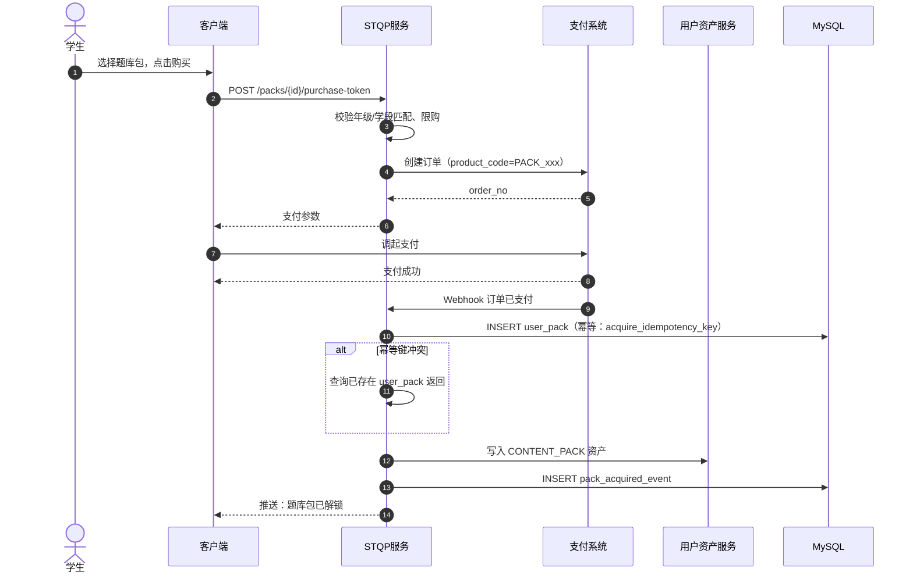
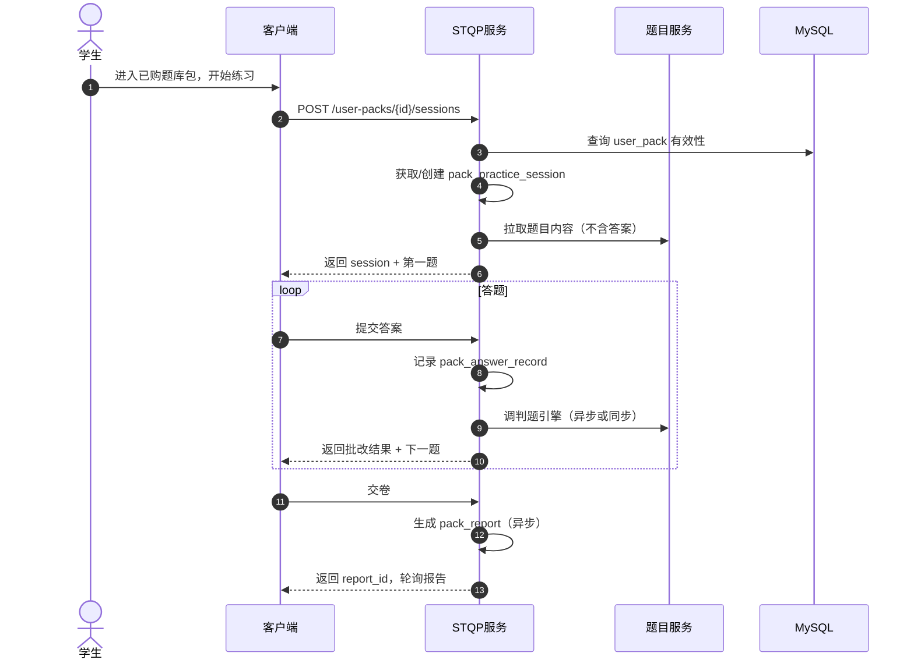

# 专项题库训练包 - 详细设计

> 版本：v1.0 | 更新时间：2026-08-22
> 状态：初稿待评审
> 对应总体设计：§11.2 增值服务 / §6.9 考点梳理 / §12.5 运营迭代

---

## 1. 概述

### 1.1 文档范围

本文档详细设计 PrimeTop 的**专项题库训练包（Special Topic Question Pack，简称 STQP）**，是增值服务与商品系统（VAS）下 `CONTENT_PACK` 子类的一个核心商品形态。学生可一次性购买某个学科/专题/考点的精选题库包，解锁后进行系统化的练习、查看能力报告、自动收录错题并衔接复习计划。

本模块只负责：

- 题库包的商品元数据与内容编排。
- 用户购买后的解锁、访问授权与有效期管理。
- 练习会话状态机、答题记录与能力报告生成。
- 与错题本、学情分析、学习规划、用户资产/额度的联动。

不负责：

- 题库内容生产与审核（由题目服务、内容审核管线负责）。
- 通用支付渠道处理（由支付与会员订阅系统负责，本模块调用其订单接口）。
- 会员订阅权益（由会员系统负责）。

### 1.2 术语定义

| 术语 | 英文 | 说明 |
|------|------|------|
| 题库包 | QuestionPack | 一个可售卖的专项训练集合，包含标题、封面、学科、学段、知识点、题目列表 |
| 题目项 | PackItem | 题库包内的一道题目引用，含排序、推荐用时、分值、标签 |
| 用户包 | UserPack | 用户购买/领取后产生的实例，记录有效期、解锁状态、练习进度 |
| 练习会话 | PackPracticeSession | 用户在某 UserPack 上的一次练习，支持分段/断点续练 |
| 知识点图谱 | KP Graph | 本题库包覆盖的知识点及前置依赖关系，用于能力诊断 |
| 能力报告 | PackReport | 单次或累计练习后的专题掌握度报告 |

### 1.3 与其他模块的关系

```text
┌──────────────────────────────────────────────────────────────────┐
│                           客户端                                  │
│    题库包商城  /  已购列表  /  练习页  /  能力报告页               │
└───────────────────────────┬──────────────────────────────────────┘
                            │
              ┌─────────────▼─────────────┐
              │   专项题库训练包服务       │  ← 本文档
              │   (stqp-service)         │
              └─────────────┬─────────────┘
                            │
    ┌───────────────────────┼───────────────────────┐
    ▼                       ▼                       ▼
┌──────────┐      ┌─────────────────┐     ┌────────────────┐
│ 支付系统  │      │   题目与题库服务  │     │  用户资产服务   │
│(订单/权益)│      │  (题目/解析/类题) │     │ (CONTENT_PACK) │
└──────────┘      └─────────────────┘     └────────────────┘
                            │
        ┌───────────────────┼───────────────────┐
        ▼                   ▼                   ▼
   ┌──────────┐       ┌──────────┐       ┌──────────┐
   │  错题服务  │       │ 学情分析  │       │ 学习规划  │
   └──────────┘       └──────────┘       └──────────┘
```

---

## 2. 数据结构设计

### 2.1 题库包主表 `question_pack`

```sql
CREATE TABLE question_pack (
    id                  BIGINT PRIMARY KEY AUTO_INCREMENT,
    pack_code           VARCHAR(64)  NOT NULL UNIQUE COMMENT '题库包编码，如 MATH_FUNC_GRADE9_001',
    name                VARCHAR(128) NOT NULL COMMENT '包名称，如 "九年级函数专题突破包"',
    subtitle            VARCHAR(256) COMMENT '副标题',
    description         TEXT COMMENT '商品详情（富文本/Markdown）',
    cover_image         VARCHAR(512) COMMENT '封面图 URL',
    detail_images       JSON COMMENT '详情图 URL 列表',

    -- 学科/学段/年级
    subject_code        VARCHAR(20)  NOT NULL COMMENT '学科编码',
    stage               TINYINT      NOT NULL COMMENT '学段：1幼儿 2小学 3初中 4高中',
    target_grades       JSON         NOT NULL COMMENT '适用年级列表，如 [7,8,9]',

    -- 专题定位
    topic_tags          JSON         COMMENT '专题标签，如 ["函数","二次函数","中考"]',
    knowledge_ids       JSON         NOT NULL COMMENT '覆盖知识点ID列表',

    -- 内容规格
    total_questions     INT          NOT NULL DEFAULT 0 COMMENT '题目总数',
    estimated_minutes   INT          COMMENT '预计完成总时长（分钟）',
    difficulty_band     VARCHAR(16)  COMMENT '难度带：EASY/MEDIUM/HARD/MIXED',

    -- 定价与售卖
    original_price_cents INT         NOT NULL COMMENT '原价（分）',
    current_price_cents  INT         NOT NULL COMMENT '现价（分）',
    currency            VARCHAR(8)   DEFAULT 'CNY',
    validity_type       VARCHAR(16)  NOT NULL DEFAULT 'PERMANENT' COMMENT 'PERMANENT/UNTIL_DATE/DAYS_AFTER_BUY',
    validity_days       INT          COMMENT '购买后N天有效',
    fixed_end_at        DATETIME     COMMENT 'UNTIL_DATE 类型的统一截止日期',

    -- 销售控制
    status              TINYINT      NOT NULL DEFAULT 0 COMMENT '0草稿 1上架 2下架 3售罄',
    on_sale_at          DATETIME     COMMENT '上架时间',
    off_sale_at         DATETIME     COMMENT '下架时间',
    purchase_limit      INT          DEFAULT NULL COMMENT '每用户限购，NULL 不限',
    sort_order          INT          DEFAULT 0,

    -- 版本与权限
    content_version     INT          NOT NULL DEFAULT 1 COMMENT '内容版本，用于更新后增量同步',
    min_app_version     VARCHAR(32)  COMMENT '最低客户端版本',

    created_at          DATETIME     NOT NULL DEFAULT CURRENT_TIMESTAMP,
    updated_at          DATETIME     NOT NULL DEFAULT CURRENT_TIMESTAMP ON UPDATE CURRENT_TIMESTAMP,
    created_by          BIGINT       COMMENT '创建人',

    INDEX idx_subject_stage (subject_code, stage),
    INDEX idx_status_sort (status, sort_order),
    INDEX idx_knowledge ( (CAST(knowledge_ids AS CHAR(255) ARRAY)) ), -- MySQL 8.0.17+ 多值索引，或落地到关联表
    INDEX idx_topic_tags ( (CAST(topic_tags AS CHAR(255) ARRAY)) )
) ENGINE=InnoDB DEFAULT CHARSET=utf8mb4 COMMENT='题库包主表';
```

> **说明**：`knowledge_ids` 与 `topic_tags` 的多值索引在 MySQL 8.0.17+ 可用；若版本不支持，请改用 `question_pack_knowledge` 关联表。

### 2.2 题库包题目关联表 `question_pack_item`

```sql
CREATE TABLE question_pack_item (
    id                  BIGINT PRIMARY KEY AUTO_INCREMENT,
    pack_id             BIGINT       NOT NULL COMMENT '题库包ID',
    question_id         BIGINT       NOT NULL COMMENT '题目ID',
    item_order          INT          NOT NULL DEFAULT 0 COMMENT '包内展示顺序',

    -- 练习配置
    suggested_minutes   DECIMAL(4,1) DEFAULT NULL COMMENT '建议用时（分钟）',
    score               INT          DEFAULT 10 COMMENT '本题分值',
    is_required         TINYINT(1)   DEFAULT 1 COMMENT '是否必做',
    stage_group         VARCHAR(32)  DEFAULT 'DEFAULT' COMMENT '阶段分组，如 PRETEST/PRACTICE/POSTTEST',

    -- 标签
    tags                JSON         COMMENT '包内标签，如 ["易错","压轴"]',

    created_at          DATETIME     NOT NULL DEFAULT CURRENT_TIMESTAMP,
    updated_at          DATETIME     NOT NULL DEFAULT CURRENT_TIMESTAMP ON UPDATE CURRENT_TIMESTAMP,

    UNIQUE INDEX uk_pack_question (pack_id, question_id),
    INDEX idx_pack_order (pack_id, item_order),

    FOREIGN KEY (pack_id) REFERENCES question_pack(id) ON DELETE RESTRICT,
    FOREIGN KEY (question_id) REFERENCES questions(id) ON DELETE RESTRICT
) ENGINE=InnoDB DEFAULT CHARSET=utf8mb4 COMMENT='题库包题目关联表';
```

### 2.3 用户已购/已领包实例表 `user_pack`

```sql
CREATE TABLE user_pack (
    id                  BIGINT PRIMARY KEY AUTO_INCREMENT,
    user_id             BIGINT       NOT NULL COMMENT '学生用户ID',
    pack_id             BIGINT       NOT NULL COMMENT '题库包ID',

    -- 来源
    source_type         VARCHAR(32)  NOT NULL COMMENT 'PURCHASE / GIFT / EVENT / MEMBERSHIP_BONUS / SYSTEM',
    order_no            VARCHAR(64)  COMMENT '关联支付订单号（购买时必填）',
    event_code          VARCHAR(64)  COMMENT '活动/赠送来源编码',

    -- 有效期
    valid_start_at      DATETIME     NOT NULL DEFAULT CURRENT_TIMESTAMP,
    valid_end_at        DATETIME     COMMENT 'NULL 表示永久有效',

    -- 状态
    status              VARCHAR(32)  NOT NULL DEFAULT 'ACTIVE' COMMENT 'ACTIVE / EXPIRED / REVOKED / PENDING',

    -- 进度统计（异步物化，非 SSOT）
    total_questions     INT          NOT NULL DEFAULT 0,
    answered_count      INT          NOT NULL DEFAULT 0,
    correct_count       INT          NOT NULL DEFAULT 0,
    last_practice_at    DATETIME     COMMENT '最后练习时间',
    first_finished_at   DATETIME     COMMENT '首次完成时间',

    -- 幂等与审计
    acquire_idempotency_key VARCHAR(128) COMMENT '领取幂等键，如 purchase:{order_no}',

    created_at          DATETIME     NOT NULL DEFAULT CURRENT_TIMESTAMP,
    updated_at          DATETIME     NOT NULL DEFAULT CURRENT_TIMESTAMP ON UPDATE CURRENT_TIMESTAMP,

    UNIQUE INDEX uk_user_pack (user_id, pack_id),
    INDEX idx_user_status (user_id, status),
    INDEX idx_expire (valid_end_at, status),

    FOREIGN KEY (pack_id) REFERENCES question_pack(id) ON DELETE RESTRICT
) ENGINE=InnoDB DEFAULT CHARSET=utf8mb4 COMMENT='用户已购/已领题库包实例表';
```

### 2.4 练习会话表 `pack_practice_session`

```sql
CREATE TABLE pack_practice_session (
    id                  BIGINT PRIMARY KEY AUTO_INCREMENT,
    session_id          CHAR(36)     NOT NULL UNIQUE COMMENT '全局会话ID',
    user_id             BIGINT       NOT NULL,
    user_pack_id        BIGINT       NOT NULL COMMENT '用户包实例ID',
    pack_id             BIGINT       NOT NULL,

    -- 会话状态
    status              VARCHAR(32)  NOT NULL DEFAULT 'ACTIVE' COMMENT 'ACTIVE / PAUSED / SUBMITTED / ABANDONED / EXPIRED',

    -- 进度快照
    current_item_order  INT          NOT NULL DEFAULT 0 COMMENT '当前做到第几题（0-based）',
    answered_item_ids   JSON         NOT NULL COMMENT '已答题目ID集合及答案快照',

    -- 计时
    started_at          DATETIME     NOT NULL DEFAULT CURRENT_TIMESTAMP,
    paused_at           DATETIME     COMMENT '暂停时刻',
    total_paused_seconds INT         NOT NULL DEFAULT 0 COMMENT '累计暂停秒数',
    submitted_at        DATETIME,
    abandoned_at        DATETIME,

    -- 客户端幂等
    client_request_id   VARCHAR(128) NOT NULL COMMENT '客户端请求幂等ID',

    version             INT          NOT NULL DEFAULT 0 COMMENT '乐观锁版本',

    created_at          DATETIME     NOT NULL DEFAULT CURRENT_TIMESTAMP,
    updated_at          DATETIME     NOT NULL DEFAULT CURRENT_TIMESTAMP ON UPDATE CURRENT_TIMESTAMP,

    UNIQUE INDEX uk_user_pack_active (user_id, user_pack_id, status) WHERE status IN ('ACTIVE','PAUSED'),
    INDEX idx_user_pack_session (user_pack_id, status),
    INDEX idx_expire (started_at, status),

    FOREIGN KEY (user_pack_id) REFERENCES user_pack(id) ON DELETE RESTRICT
) ENGINE=InnoDB DEFAULT CHARSET=utf8mb4 COMMENT='题库包练习会话表';
```

> **MySQL 部分唯一索引写法**：若 MySQL 不支持 `WHERE` 部分索引，使用普通 UNIQUE 并配合应用层守卫 G3（同用户包仅允许一个活跃/暂停会话）。

### 2.5 答题记录表 `pack_answer_record`

```sql
CREATE TABLE pack_answer_record (
    id                  BIGINT PRIMARY KEY AUTO_INCREMENT,
    session_id          CHAR(36)     NOT NULL,
    user_id             BIGINT       NOT NULL,
    user_pack_id        BIGINT       NOT NULL,
    pack_id             BIGINT       NOT NULL,
    question_id         BIGINT       NOT NULL,

    -- 作答内容
    answer_content      TEXT         COMMENT '用户原始答案',
    answer_type         VARCHAR(16)  COMMENT 'TEXT / IMAGE / AUDIO / CHOICE',
    submitted_at        DATETIME     NOT NULL DEFAULT CURRENT_TIMESTAMP,

    -- 批改结果
    judge_status        VARCHAR(32)  NOT NULL DEFAULT 'PENDING' COMMENT 'PENDING / CORRECT / PARTIAL / WRONG / JUDGE_FAILED',
    score               INT          COMMENT '本题得分',
    judge_result        JSON         COMMENT '判题结果明细',

    -- 幂等
    client_answer_id    VARCHAR(128) NOT NULL COMMENT '客户端答案ID',

    created_at          DATETIME     NOT NULL DEFAULT CURRENT_TIMESTAMP,
    updated_at          DATETIME     NOT NULL DEFAULT CURRENT_TIMESTAMP ON UPDATE CURRENT_TIMESTAMP,

    UNIQUE INDEX uk_session_answer (session_id, client_answer_id),
    INDEX idx_user_pack (user_id, user_pack_id),
    INDEX idx_judge_status (judge_status),

    FOREIGN KEY (session_id) REFERENCES pack_practice_session(session_id) ON DELETE RESTRICT
) ENGINE=InnoDB DEFAULT CHARSET=utf8mb4 COMMENT='题库包答题记录表';
```

### 2.6 能力报告快照表 `pack_report`

```sql
CREATE TABLE pack_report (
    id                  BIGINT PRIMARY KEY AUTO_INCREMENT,
    user_id             BIGINT       NOT NULL,
    user_pack_id        BIGINT       NOT NULL,
    pack_id             BIGINT       NOT NULL,

    report_type         VARCHAR(32)  NOT NULL DEFAULT 'SESSION' COMMENT 'SESSION(单次) / CUMULATIVE(累计)',
    linked_session_id   CHAR(36)     COMMENT '关联会话ID',

    -- 统计
    total_questions     INT          NOT NULL,
    answered_count      INT          NOT NULL,
    correct_count       INT          NOT NULL,
    score_total         INT          NOT NULL,
    score_got           INT          NOT NULL,
    used_minutes        INT          NOT NULL COMMENT '有效用时（分钟，已扣除暂停）',

    -- 知识点维度
    kp_stats            JSON         NOT NULL COMMENT '各知识点 {kp_id, name, total, correct, mastery_level}',
    weak_kp_ids         JSON         COMMENT '薄弱知识点ID列表',
    strong_kp_ids       JSON         COMMENT '优势知识点ID列表',

    -- 推荐动作
    recommendations     JSON         COMMENT '推荐动作列表：练错题/看解析/学知识点/做类题',

    -- 生成状态
    gen_status          VARCHAR(32)  NOT NULL DEFAULT 'PENDING' COMMENT 'PENDING / READY / FAILED',
    generated_at        DATETIME,

    created_at          DATETIME     NOT NULL DEFAULT CURRENT_TIMESTAMP,
    updated_at          DATETIME     NOT NULL DEFAULT CURRENT_TIMESTAMP ON UPDATE CURRENT_TIMESTAMP,

    INDEX idx_user_pack_type (user_id, user_pack_id, report_type),
    INDEX idx_gen_status (gen_status),

    FOREIGN KEY (user_pack_id) REFERENCES user_pack(id) ON DELETE RESTRICT
) ENGINE=InnoDB DEFAULT CHARSET=utf8mb4 COMMENT='题库包能力报告快照表';
```

### 2.7 缓存键设计

| 键 | 类型 | TTL | 说明 |
|---|---|---|---|
| `stqp:pack:{pack_id}` | String | 10 min | 题库包元数据 JSON |
| `stqp:pack:items:{pack_id}` | String | 10 min | 题目ID有序列表 |
| `stqp:user_pack:{user_pack_id}` | Hash | 5 min | 用户包状态与进度 |
| `stqp:session:{session_id}` | Hash | 10 min | 会话状态快照 |
| `stqp:lock:session:{user_pack_id}` | String | 30 s | 创建会话分布式锁 |
| `stqp:count:user:{user_id}:packs` | Hash | 1 min | 用户已购包数缓存（仅展示） |

---

## 3. API 接口设计

### 3.1 接口通用约定

- 基址：`https://api.primetop.example.com/v1/stqp`
- 鉴权：Header `Authorization: Bearer {access_token}`
- 学生视角接口需校验 user_id 与 token 一致；家长视角查询需校验绑定关系。
- 幂等：写入类接口通过 `Idempotency-Key` 或 `client_request_id` 保证幂等。
- 响应统一封装：

```json
{
  "code": 0,
  "message": "ok",
  "data": { ... },
  "trace_id": "trace_xxx"
}
```

### 3.2 学生端接口

#### 3.2.1 题库包列表

```http
GET /packs
```

请求参数（Query）：

| 参数 | 类型 | 必填 | 说明 |
|---|---|---|---|
| subject_code | string | 否 | 学科过滤 |
| stage | int | 否 | 学段过滤 |
| keyword | string | 否 | 名称搜索，最多 32 字 |
| page | int | 否 | 默认 1 |
| size | int | 否 | 默认 10，最大 50 |

响应：

```json
{
  "code": 0,
  "data": {
    "list": [
      {
        "pack_id": 10001,
        "pack_code": "MATH_FUNC_GRADE9_001",
        "name": "九年级函数专题突破包",
        "cover_image": "https://...",
        "subject_code": "MATH",
        "stage": 3,
        "target_grades": [7, 8, 9],
        "topic_tags": ["函数", "二次函数"],
        "total_questions": 30,
        "estimated_minutes": 45,
        "difficulty_band": "MEDIUM",
        "original_price_cents": 1990,
        "current_price_cents": 990,
        "owned": false,
        "purchase_limit": 1
      }
    ],
    "total": 100,
    "page": 1,
    "size": 10
  }
}
```

#### 3.2.2 题库包详情

```http
GET /packs/{pack_id}
```

响应关键字段：

```json
{
  "code": 0,
  "data": {
    "pack_id": 10001,
    "name": "九年级函数专题突破包",
    "description": "...",
    "cover_image": "...",
    "total_questions": 30,
    "knowledge_summary": [
      {"kp_id": 101, "name": "二次函数图像", "question_count": 8}
    ],
    "owned": true,
    "user_pack_id": 20001,
    "valid_end_at": "2027-08-22T10:00:00Z",
    "progress": {
      "answered_count": 12,
      "correct_count": 9,
      "last_practice_at": "2026-08-21T15:30:00Z"
    }
  }
}
```

#### 3.2.3 创建练习会话

```http
POST /user-packs/{user_pack_id}/sessions
```

请求体：

```json
{
  "client_request_id": "req_202608221000_abc",
  "continue_last": true
}
```

响应：

```json
{
  "code": 0,
  "data": {
    "session_id": "sess_xxx",
    "status": "ACTIVE",
    "pack_id": 10001,
    "total_questions": 30,
    "current_item_order": 0,
    "first_question": {
      "item_order": 0,
      "question_id": 9001,
      "suggested_minutes": 2
    }
  }
}
```

**幂等语义**：同一 `client_request_id` 返回相同会话；若已存在 ACTIVE/PAUSED 会话且 `continue_last=true`，优先复用。

#### 3.2.4 拉取题目

```http
GET /sessions/{session_id}/questions/{item_order}
```

响应：

```json
{
  "code": 0,
  "data": {
    "item_order": 5,
    "question_id": 9006,
    "stage_group": "PRACTICE",
    "suggested_minutes": 3,
    "question": {
      "stem": "已知二次函数...",
      "options": [...],
      "question_type": "CHOICE"
    },
    "answered": false,
    "is_last": false
  }
}
```

> **约束**：交卷前不返回 `correct_answer` 与 `analysis`，仅返回题干、选项与提示（与练习测评一致）。

#### 3.2.5 提交答案

```http
POST /sessions/{session_id}/answers
```

请求体：

```json
{
  "client_answer_id": "ans_202608221001_xyz",
  "item_order": 5,
  "answer_content": "A",
  "answer_type": "CHOICE",
  "spent_seconds": 125
}
```

响应：

```json
{
  "code": 0,
  "data": {
    "answer_id": 8001,
    "judge_status": "CORRECT",
    "score": 10,
    "correct": true,
    "next_item_order": 6
  }
}
```

#### 3.2.6 暂停 / 继续

```http
POST /sessions/{session_id}/pause
POST /sessions/{session_id}/resume
```

#### 3.2.7 交卷

```http
POST /sessions/{session_id}/submit
```

响应：

```json
{
  "code": 0,
  "data": {
    "session_id": "sess_xxx",
    "report_id": 7001,
    "report_status": "PENDING",
    "poll_url": "/reports/7001"
  }
}
```

#### 3.2.8 获取能力报告

```http
GET /reports/{report_id}
```

响应示例：

```json
{
  "code": 0,
  "data": {
    "report_id": 7001,
    "report_type": "SESSION",
    "total_questions": 30,
    "answered_count": 28,
    "correct_count": 20,
    "score_total": 300,
    "score_got": 210,
    "used_minutes": 38,
    "kp_stats": [
      {"kp_id": 101, "name": "二次函数图像", "total": 8, "correct": 6, "mastery_level": "GOOD"}
    ],
    "weak_kp_ids": [102, 105],
    "recommendations": [
      {"type": "REVIEW_MISTAKE", "kp_id": 102, "text": "建议复习 "函数最值" 相关错题"},
      {"type": "PRACTICE_SIMILAR", "kp_id": 105, "text": "再练 3 道相似题巩固"}
    ]
  }
}
```

### 3.3 内部 gRPC 接口

```protobuf
service StqpInternalService {
  // 查询用户是否拥有某题库包
  rpc CheckUserPackOwnership(CheckUserPackOwnershipRequest) returns (CheckUserPackOwnershipResponse);

  // 批量查询用户包进度（供学习规划/学情使用）
  rpc BatchGetUserPackProgress(BatchGetUserPackProgressRequest) returns (BatchGetUserPackProgressResponse);

  // 内容包变更后失效缓存
  rpc InvalidatePackCache(InvalidatePackCacheRequest) returns (InvalidatePackCacheResponse);
}
```

### 3.4 管理后台接口

| 方法 | 路径 | 说明 |
|---|---|---|
| POST | /admin/packs | 创建题库包 |
| PUT | /admin/packs/{pack_id} | 更新元数据 |
| POST | /admin/packs/{pack_id}/items | 批量添加/替换题目 |
| POST | /admin/packs/{pack_id}/publish | 上架（需双人审批） |
| POST | /admin/packs/{pack_id}/offline | 下架 |
| GET | /admin/packs/{pack_id}/stats | 销售与练习统计 |

---

## 4. 核心流程设计

### 4.1 购买解锁流程



**关键规则**：

- `acquire_idempotency_key = 'purchase:' || order_no`，保证同一订单只解锁一次。
- 若 Webhook 重复投递，按幂等键查询已存在记录后返回成功。
- 购买后写入 `user_pack`，有效期根据 `validity_type` 计算。

### 4.2 开始练习流程



### 4.3 报告生成流程

报告生成采用异步任务，原因：

1. 需聚合多维度知识点掌握度。
2. 可能调用学情分析服务计算长期能力值。
3. 避免阻塞交卷接口。

步骤：

1. 收到 `submit` 后，将 session 状态改为 `SUBMITTED`。
2. 发送 `stqp.session.submitted` 事件到消息队列。
3. Report Worker 消费事件，计算各知识点正确率。
4. 调用学情分析服务 `BatchGetKpMastery` 融合长期数据。
5. 生成 `recommendations`。
6. 写入 `pack_report`，状态 `READY`。
7. 通过 WebSocket 或长轮询通知客户端。

---

## 5. 状态机

### 5.1 题库包商品状态机

```text
DRAFT --[提交审核]--> REVIEWING --[审核通过]--> PUBLISHED
  |                      |
  |-[编辑]               |-[驳回]
  ▼                      ▼
DRAFT                 DRAFT

PUBLISHED --[下架]--> OFFLINE
  |                      |
  |-[重新上架]          |-[再次上架]
  ▼                      ▼
PUBLISHED             PUBLISHED
```

守卫规则：

- G1：题目数量 ≥ 5 且所有题目已审核通过才能进入 `PUBLISHED`。
- G2：下架时若已有用户购买，仍可继续访问至有效期结束（商品状态不影响已购实例）。
- G3：价格修改仅允许在 `DRAFT` 状态；已上架需先下架。

### 5.2 用户包实例状态机

```text
PENDING --[支付/领取成功]--> ACTIVE
ACTIVE --[有效期到]--> EXPIRED
ACTIVE --[违规/退款]--> REVOKED
EXPIRED --[续购/赠送延期]--> ACTIVE
```

守卫规则：

- G4：`ACTIVE` 状态下才可创建练习会话。
- G5：`EXPIRED` 状态下仅允许查看历史报告，不允许新建会话。
- G6：`REVOKED` 状态用户端列表中隐藏，历史记录保留。

### 5.3 练习会话状态机

```text
ACTIVE --[暂停]--> PAUSED
ACTIVE --[交卷]--> SUBMITTED
ACTIVE --[放弃]--> ABANDONED
ACTIVE --[24小时未操作]--> EXPIRED
PAUSED --[继续]--> ACTIVE
PAUSED --[24小时未操作]--> EXPIRED
```

守卫规则：

- G7：同一 `user_pack_id` 同时只能有一个 `ACTIVE` 或 `PAUSED` 会话。
- G8：已交卷或已放弃的会话不可再次提交。
- G9：会话超过 24 小时未操作自动标记为 `ABANDONED` 或 `EXPIRED`（由调度任务处理）。

---

## 6. 关键代码示例

### 6.1 创建练习会话（伪代码）

```java
@Transactional
public PracticeSession createSession(Long userId, Long userPackId, String clientRequestId, boolean continueLast) {
    UserPack userPack = userPackRepo.findById(userPackId)
        .orElseThrow(() -> new StqpException(59104));

    // G4: 仅 ACTIVE 可练习
    if (!"ACTIVE".equals(userPack.getStatus())) {
        throw new StqpException(59102);
    }
    // G7: 学段匹配
    if (!isGradeAllowed(userPack.getPackId(), userId)) {
        throw new StqpException(59106);
    }

    // 尝试复用已有会话
    if (continueLast) {
        Optional<PackPracticeSession> active = sessionRepo
            .findActiveOrPausedByUserPack(userPackId);
        if (active.isPresent()) {
            return active.get();
        }
    }

    // 幂等创建
    String lockKey = "stqp:lock:session:" + userPackId;
    boolean locked = redis.tryLock(lockKey, 30);
    if (!locked) throw new StqpException(59107);
    try {
        Optional<PackPracticeSession> existing = sessionRepo
            .findByClientRequestId(clientRequestId);
        if (existing.isPresent()) return existing.get();

        PackPracticeSession session = new PackPracticeSession();
        session.setSessionId(UUID.randomUUID().toString());
        session.setUserId(userId);
        session.setUserPackId(userPackId);
        session.setPackId(userPack.getPackId());
        session.setStatus("ACTIVE");
        session.setClientRequestId(clientRequestId);
        session.setAnsweredItemIds("[]");
        sessionRepo.save(session);
        return session;
    } finally {
        redis.unlock(lockKey);
    }
}
```

### 6.2 答题提交与判题（伪代码）

```java
public AnswerSubmitResult submitAnswer(String sessionId, AnswerSubmitRequest req) {
    PackPracticeSession session = sessionRepo.findBySessionId(sessionId)
        .orElseThrow(() -> new StqpException(59108));

    if (!"ACTIVE".equals(session.getStatus())) {
        throw new StqpException(59109);
    }

    // 幂等：同一 client_answer_id 只记录一次
    Optional<PackAnswerRecord> existing = answerRepo
        .findBySessionIdAndClientAnswerId(sessionId, req.getClientAnswerId());
    if (existing.isPresent()) {
        return toResult(existing.get());
    }

    PackItem item = packItemRepo.findByPackIdAndOrder(session.getPackId(), req.getItemOrder())
        .orElseThrow(() -> new StqpException(59110));

    // 调用判题服务
    JudgeResult judge = judgeService.judge(item.getQuestionId(), req.getAnswerContent());

    PackAnswerRecord record = new PackAnswerRecord();
    record.setSessionId(sessionId);
    record.setUserId(session.getUserId());
    record.setUserPackId(session.getUserPackId());
    record.setPackId(session.getPackId());
    record.setQuestionId(item.getQuestionId());
    record.setAnswerContent(req.getAnswerContent());
    record.setClientAnswerId(req.getClientAnswerId());
    record.setJudgeStatus(judge.getStatus());
    record.setScore(judge.getScore());
    record.setJudgeResult(JsonUtils.toJson(judge));
    answerRepo.save(record);

    // 更新会话进度
    sessionRepo.updateProgress(sessionId, req.getItemOrder(), judge.getStatus());

    return AnswerSubmitResult.builder()
        .answerId(record.getId())
        .judgeStatus(judge.getStatus())
        .score(judge.getScore())
        .nextItemOrder(req.getItemOrder() + 1)
        .build();
}
```

### 6.3 报告生成 Worker（伪代码）

```java
@KafkaListener(topics = "stqp.session.submitted")
public void onSessionSubmitted(SessionSubmittedEvent event) {
    String sessionId = event.getSessionId();
    List<PackAnswerRecord> records = answerRepo.findBySessionId(sessionId);

    Map<Long, KpStat> kpStats = new HashMap<>();
    int totalScore = 0;
    int gotScore = 0;
    for (PackAnswerRecord r : records) {
        List<Long> kpIds = questionKpRepo.findKpIdsByQuestionId(r.getQuestionId());
        for (Long kpId : kpIds) {
            KpStat stat = kpStats.computeIfAbsent(kpId, KpStat::new);
            stat.total += 1;
            if ("CORRECT".equals(r.getJudgeStatus())) stat.correct += 1;
        }
        PackItem item = packItemRepo.findByPackIdAndQuestionId(r.getPackId(), r.getQuestionId());
        totalScore += item.getScore();
        gotScore += r.getScore() != null ? r.getScore() : 0;
    }

    // 融合长期掌握度（调用学情分析服务）
    MasterySnapshot mastery = learningProfileService.getKpMastery(event.getUserId(), kpStats.keySet());

    PackReport report = new PackReport();
    report.setUserId(event.getUserId());
    report.setUserPackId(event.getUserPackId());
    report.setPackId(event.getPackId());
    report.setLinkedSessionId(sessionId);
    report.setReportType("SESSION");
    report.setTotalQuestions(event.getTotalQuestions());
    report.setAnsweredCount(records.size());
    report.setCorrectCount((int) records.stream().filter(r -> "CORRECT".equals(r.getJudgeStatus())).count());
    report.setScoreTotal(totalScore);
    report.setScoreGot(gotScore);
    report.setKpStats(buildKpStatsJson(kpStats, mastery));
    report.setWeakKpIds(deriveWeakKps(kpStats, mastery));
    report.setRecommendations(generateRecommendations(kpStats, mastery));
    report.setGenStatus("READY");
    report.setGeneratedAt(LocalDateTime.now());
    reportRepo.save(report);

    // 通知客户端
    wsNotifier.send(event.getUserId(), new ReportReadyMessage(report.getId()));
}
```

---

## 7. 错误码设计

错误码段：**59100-59199**

| 错误码 | HTTP 状态 | 中文说明 | 处理建议 |
|---|---|---|---|
| 59100 | 400 | 参数错误 | 检查请求参数 |
| 59101 | 401 | 未登录或 Token 失效 | 重新登录 |
| 59102 | 403 | 用户包未激活或已过期 | 引导购买/续费 |
| 59103 | 403 | 用户包已被撤销 | 客服申诉 |
| 59104 | 404 | 用户包不存在 | 检查 user_pack_id |
| 59105 | 404 | 题库包不存在 | 检查 pack_id |
| 59106 | 403 | 当前年级/学段不符合题库包适用范围 | 提示不可练习 |
| 59107 | 429 | 创建会话并发冲突，请重试 | 稍后重试 |
| 59108 | 404 | 练习会话不存在 | 检查 session_id |
| 59109 | 409 | 练习会话状态不允许该操作 | 根据状态提示 |
| 59110 | 404 | 题目项不存在 | 检查 item_order |
| 59111 | 409 | 答案已提交，请勿重复提交 | 幂等重放 |
| 59112 | 403 | 题库包已下架，无法购买 | 提示用户 |
| 59113 | 409 | 已达购买上限 | 提示限购 |
| 59114 | 500 | 判题服务异常 | 稍后重试或人工复核 |
| 59115 | 500 | 报告生成失败 | 异步重试，客户端轮询 |
| 59116 | 200 | 报告尚未生成完成 | 客户端继续轮询 |
| 59117 | 403 | 已购包不可再次购买 | 引导进入练习 |
| 59118 | 400 | 客户端请求ID重复但参数不一致 | 修正参数 |
| 59119 | 403 | 未购买该题库包 | 引导购买 |
| 59120 | 500 | 支付订单创建失败 | 稍后重试 |

---

## 8. 幂等与并发控制

| 场景 | 幂等键 | 机制 | 说明 |
|---|---|---|---|
| 购买解锁 | `purchase:{order_no}` | DB 唯一索引 `uk_user_pack` + 应用层先查后插 | 防 Webhook 重复解锁 |
| 创建会话 | `client_request_id` | Redis 分布式锁 + DB 唯一索引 | 防客户端重试创建多个会话 |
| 提交答案 | `session_id + client_answer_id` | DB 唯一索引 | 答案不重判 |
| 交卷 | `session_id` | 状态机 CAS | 同一会话只交卷一次 |
| 后台发布 | `pack_id + version` | 乐观锁 `version` | 并发编辑互斥 |

---

## 9. 事件与 Outbox

### 9.1 发布事件

| 事件名 | 说明 | 消费方 |
|---|---|---|
| `stqp.user_pack.acquired` | 用户获得题库包 | 用户资产服务、消息推送 |
| `stqp.user_pack.expired` | 用户包过期 | 消息推送、学习规划 |
| `stqp.session.submitted` | 练习会话交卷 | 报告生成 Worker、错题服务 |
| `stqp.report.ready` | 能力报告生成完成 | 消息推送、学习规划 |
| `stqp.answer.judged` | 单题判题完成 | 学情分析服务、错题服务 |

### 9.2 Outbox 表

```sql
CREATE TABLE stqp_outbox (
    id              BIGINT PRIMARY KEY AUTO_INCREMENT,
    aggregate_type  VARCHAR(64)  NOT NULL COMMENT '聚合类型',
    aggregate_id    VARCHAR(64)  NOT NULL COMMENT '聚合ID',
    event_type      VARCHAR(128) NOT NULL,
    payload         JSON         NOT NULL,
    status          VARCHAR(32)  NOT NULL DEFAULT 'PENDING' COMMENT 'PENDING / SENT / FAILED',
    retry_count     INT          DEFAULT 0,
    created_at      DATETIME     NOT NULL DEFAULT CURRENT_TIMESTAMP,
    INDEX idx_status_created (status, created_at)
) ENGINE=InnoDB DEFAULT CHARSET=utf8mb4 COMMENT='STQP Outbox';
```

---

## 10. 降级与容灾

| 故障场景 | 降级策略 | 红线 |
|---|---|---|
| 判题服务超时 | 返回 `JUDGE_FAILED`，客户端展示“待批改”，后台异步重试 | 不允许误标对错 |
| 学情分析服务不可用 | 报告仅基于本次会话数据生成，长期掌握度字段置空 | 不阻塞报告生成 |
| Redis 缓存失效 | 直接查 DB，QPS 下降但功能可用 | 不拒绝读请求 |
| 支付系统异常 | 无法创建订单，提示稍后重试 | 不 phantom 扣款 |
| 题目服务不可用 | 无法拉取题目时，提示“内容加载失败”，允许重新进入 | 不展示错误题目 |

---

## 11. 监控与埋点

### 11.1 业务指标

| 指标 | 口径 | 告警阈值 |
|---|---|---|
| 题库包购买转化率 | 购买 UV / 详情页 UV | 低于 2% 关注 |
| 练习完成率 | 完成会话数 / 开始会话数 | 低于 60% 关注 |
| 平均正确率 | 所有会话 correct_count / answered_count | 用于内容难度校准 |
| 报告生成延迟 P99 | submit 到 report READY 的时间 | > 5s P2 |
| 判题失败率 | JUDGE_FAILED 数 / 总答案数 | > 1% P1 |

### 11.2 埋点事件

| 事件 | 触发时机 | 关键属性 |
|---|---|---|
| `stqp_pack_view` | 进入题库包详情 | pack_id, owned |
| `stqp_pack_purchase_click` | 点击购买 | pack_id, price_cents |
| `stqp_session_start` | 开始练习 | user_pack_id, pack_id |
| `stqp_answer_submit` | 提交答案 | item_order, spent_seconds |
| `stqp_session_submit` | 交卷 | answered_count, used_minutes |
| `stqp_report_view` | 查看报告 | report_id, weak_kp_count |

---

## 12. 安全与合规

1. **答案保密**：交卷前不返回标准答案与解析，防止直接抄写。
2. **权限隔离**：学生只能查看自己的 `user_pack` 与答题记录；家长仅可查看汇总报告。
3. **数据最小化**：能力报告不向第三方暴露原始答题内容。
4. **未成年人保护**：购买需校验家长门控（统一家长门引擎），避免未成年人误充值。
5. **内容审核**：所有上架题目需先经过题目服务审核流程。

---

## 13. 关联文档

| 文档 | 关系 |
|---|---|
| `增值服务与商品系统-详细设计.md` | 商品模型、资产体系 |
| `支付与会员订阅-详细设计.md` | 订单、支付、权益 |
| `题目与题库服务-详细设计.md` | 题目元数据、判题接口 |
| `错题服务-详细设计.md` | 错题收录与复习 |
| `学情分析-详细设计.md` | 知识点掌握度融合 |
| `学习规划-详细设计.md` | 推荐动作生成任务 |
| `用户额度与API调用管控系统-详细设计.md` | 购买/练习行为是否受额度限制 |

---

## 14. 验收场景

| 编号 | 场景 | 验收标准 |
|---|---|---|
| A1 | 学生浏览题库包列表 | 列表展示价格、题量、难度、是否已购 |
| A2 | 学生购买题库包 | 支付成功后 5 秒内解锁，已购列表可见 |
| A3 | 重复 Webhook 不解锁两次 | 同一订单多次回调只生成一条 user_pack |
| A4 | 不符合学段不可购买 | 年级不匹配时购买按钮置灰并提示 |
| A5 | 开始练习生成会话 | 返回 session_id，记录 started_at |
| A6 | 断点续练 | 退出 APP 后重新进入，恢复到上次题目 |
| A7 | 答案幂等 | 网络抖动导致答案重复提交，只记录一次 |
| A8 | 交卷后生成报告 | 报告包含知识点维度、薄弱项、推荐动作 |
| A9 | 过期用户包不可练习 | 提示已过期并引导续购 |
| A10 | 下架商品不影响已购 | 已购用户仍可练习至有效期结束 |
| A11 | 24 小时未操作自动失效 | 调度任务将会话标记为 EXPIRED |
| A12 | 判题服务异常时友好降级 | 显示“待批改”，不阻塞继续答题 |

---

## 15. 维护记录

| 日期 | 版本 | 说明 | 作者 |
|---|---|---|---|
| 2026-08-22 | v1.0 | 初稿：专项题库训练包完整设计 | 克劳德 |
