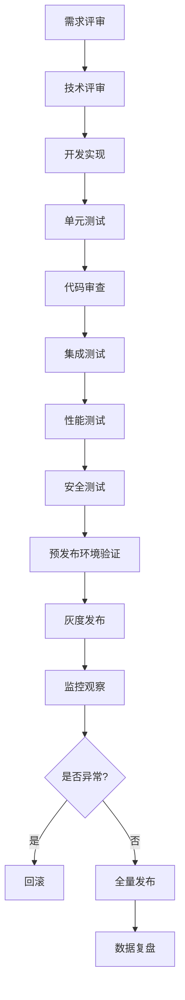
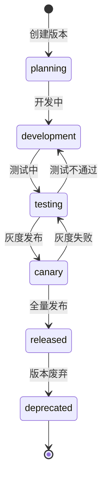
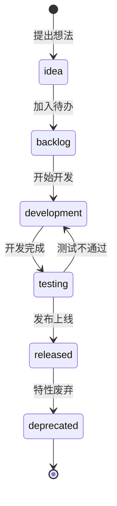

# 产品迭代规划与版本演进策略详细设计

## 1. 概述

### 1.1 模块定位
产品迭代规划与版本演进策略模块是 PrimeTop 项目的核心管理模块，负责制定和管理产品从 MVP 到成熟期的完整迭代路径，确保产品能够根据市场需求、用户反馈和技术发展进行有序演进。

### 1.2 设计目标
1. 建立清晰的产品迭代路线图，支持从 MVP 到成熟期的渐进式发展
2. 实现版本发布管理，包括版本规划、特性开发、测试验收、灰度发布
3. 建立数据驱动的迭代决策机制，基于用户反馈和业务数据调整优先级
4. 支持特性开关和灰度发布，降低发布风险
5. 建立跨部门协作机制，确保产品、研发、运营、测试高效配合

### 1.3 适用范围
- 产品经理进行版本规划和需求管理
- 研发团队进行特性开发和版本交付
- 测试团队进行质量验收和发布验证
- 运营团队进行用户反馈收集和数据分析

## 2. 版本规划体系

### 2.1 版本命名规范
```
主版本号.次版本号.修订号 (vX.Y.Z)
- 主版本号 (X)：重大架构变更、全新产品线
- 次版本号 (Y)：新功能模块、重要特性
- 修订号 (Z)：Bug修复、性能优化、小改进
```

### 2.2 版本阶段定义

| 版本阶段 | 目标 | 周期 | 核心特性 |
|---------|------|------|---------|
| MVP (v0.1) | 验证核心学习闭环 | 8-12周 | AI问答、拍题、同步课堂、错题本、学习记录 |
| Alpha (v0.2) | 内部测试与反馈 | 4-6周 | 完善核心功能、基础会员体系 |
| Beta (v0.5) | 小范围用户测试 | 6-8周 | 扩展学科、完善体验、数据埋点 |
| V1.0 (v1.0) | 正式发布 | 8-10周 | 全功能覆盖、稳定可靠、商业化 |
| V1.5 (v1.5) | 差异化增强 | 10-12周 | 知识图谱、理科专题、文科背诵 |
| V2.0 (v2.0) | 多端拓展 | 12-16周 | Web端、小程序、教师端、学校端 |

### 2.3 版本发布节奏
```
MVP → Alpha (4周) → Beta (6周) → V1.0 (8周) → V1.5 (10周) → V2.0 (12周)
↓        ↓           ↓            ↓           ↓           ↓
核心验证  内部测试   用户测试    正式上线    差异化    多端拓展
```

### 2.4 版本里程碑管理

#### 2.4.1 里程碑定义
每个版本包含以下里程碑节点：
1. **需求冻结**：需求评审完成，不再变更
2. **设计完成**：原型设计、技术设计完成
3. **开发完成**：所有功能开发完成，通过单元测试
4. **测试完成**：功能测试、性能测试、兼容性测试完成
5. **灰度发布**：小范围用户试用，收集反馈
6. **正式发布**：全量发布，监控告警就绪

#### 2.4.2 里程碑跟踪
```sql
-- 版本里程碑表
CREATE TABLE version_milestones (
    id BIGINT PRIMARY KEY AUTO_INCREMENT,
    version_id VARCHAR(50) NOT NULL COMMENT '版本ID',
    milestone_type VARCHAR(50) NOT NULL COMMENT '里程碑类型',
    planned_date DATE NOT NULL COMMENT '计划日期',
    actual_date DATE COMMENT '实际完成日期',
    status VARCHAR(20) NOT NULL COMMENT '状态：pending/in_progress/completed/delayed',
    owner VARCHAR(100) COMMENT '负责人',
    notes TEXT COMMENT '备注',
    created_at TIMESTAMP DEFAULT CURRENT_TIMESTAMP,
    updated_at TIMESTAMP DEFAULT CURRENT_TIMESTAMP ON UPDATE CURRENT_TIMESTAMP,
    INDEX idx_version_id (version_id),
    INDEX idx_milestone_type (milestone_type)
) ENGINE=InnoDB DEFAULT CHARSET=utf8mb4 COMMENT='版本里程碑表';
```

## 3. 特性管理

### 3.1 特性分类体系
```
特性分类
├── 核心功能特性
│   ├── AI智能辅导
│   ├── 拍照搜题
│   ├── 同步课堂
│   ├── 错题整理
│   └── 学情分析
├── 用户体验特性
│   ├── 性能优化
│   ├── 交互改进
│   ├── UI优化
│   └── 无障碍支持
├── 商业化特性
│   ├── 会员体系
│   ├── 支付订阅
│   ├── 增值服务
│   └── 运营活动
└── 技术架构特性
    ├── 架构优化
    ├── 安全加固
    ├── 性能提升
    └── 可观测性
```

### 3.2 特性优先级矩阵
使用 RICE 评分模型进行特性优先级评估：

```python
class FeaturePriority:
    """特性优先级评估"""
    
    def calculate_rice_score(self, reach, impact, confidence, effort):
        """
        计算 RICE 评分
        - Reach: 影响用户数
        - Impact: 对用户的影响程度 (0.25/0.5/1/2/3)
        - Confidence: 信心程度 (%)
        - Effort: 工作量 (人月)
        """
        return (reach * impact * confidence) / effort
    
    def get_impact_level(self, impact_description):
        """根据描述转换为影响程度"""
        impact_map = {
            'massive': 3,
            'high': 2,
            'medium': 1,
            'low': 0.5,
            'minimal': 0.25
        }
        return impact_map.get(impact_description.lower(), 1)
```

### 3.3 特性生命周期管理

```sql
-- 特性管理表
CREATE TABLE features (
    id BIGINT PRIMARY KEY AUTO_INCREMENT,
    feature_code VARCHAR(50) UNIQUE NOT NULL COMMENT '特性编码',
    feature_name VARCHAR(200) NOT NULL COMMENT '特性名称',
    feature_category VARCHAR(50) NOT NULL COMMENT '特性分类',
    description TEXT COMMENT '特性描述',
    priority INT DEFAULT 0 COMMENT '优先级',
    status VARCHAR(20) NOT NULL COMMENT '状态：idea/backlog/development/testing/released/deprecated',
    target_version VARCHAR(50) COMMENT '目标版本',
    actual_version VARCHAR(50) COMMENT '实际发布版本',
    rice_score DECIMAL(10,2) COMMENT 'RICE评分',
    reach INT COMMENT '影响用户数',
    impact DECIMAL(3,2) COMMENT '影响程度',
    confidence DECIMAL(5,2) COMMENT '信心程度',
    effort DECIMAL(10,2) COMMENT '工作量(人月)',
    owner VARCHAR(100) COMMENT '负责人',
    created_by VARCHAR(100) NOT NULL COMMENT '创建人',
    created_at TIMESTAMP DEFAULT CURRENT_TIMESTAMP,
    updated_at TIMESTAMP DEFAULT CURRENT_TIMESTAMP ON UPDATE CURRENT_TIMESTAMP,
    released_at TIMESTAMP NULL COMMENT '发布时间',
    deprecated_at TIMESTAMP NULL COMMENT '废弃时间',
    INDEX idx_feature_code (feature_code),
    INDEX idx_status (status),
    INDEX idx_target_version (target_version),
    INDEX idx_priority (priority)
) ENGINE=InnoDB DEFAULT CHARSET=utf8mb4 COMMENT='特性管理表';

-- 特性依赖关系表
CREATE TABLE feature_dependencies (
    id BIGINT PRIMARY KEY AUTO_INCREMENT,
    feature_id BIGINT NOT NULL COMMENT '特性ID',
    depends_on_feature_id BIGINT NOT NULL COMMENT '依赖的特性ID',
    dependency_type VARCHAR(20) NOT NULL COMMENT '依赖类型：must/should/could',
    created_at TIMESTAMP DEFAULT CURRENT_TIMESTAMP,
    FOREIGN KEY (feature_id) REFERENCES features(id) ON DELETE CASCADE,
    FOREIGN KEY (depends_on_feature_id) REFERENCES features(id) ON DELETE CASCADE,
    UNIQUE KEY uk_feature_dependency (feature_id, depends_on_feature_id)
) ENGINE=InnoDB DEFAULT CHARSET=utf8mb4 COMMENT='特性依赖关系表';
```

## 4. 灰度发布系统

### 4.1 灰度策略定义

#### 4.1.1 灰度用户分组
```sql
-- 灰度用户分组表
CREATE TABLE canary_groups (
    id BIGINT PRIMARY KEY AUTO_INCREMENT,
    group_name VARCHAR(100) NOT NULL COMMENT '分组名称',
    group_type VARCHAR(50) NOT NULL COMMENT '分组类型：random/whitelist/attribute',
    percentage INT DEFAULT 0 COMMENT '灰度比例(0-100)',
    attributes JSON COMMENT '用户属性条件',
    user_list JSON COMMENT '白名单用户ID列表',
    status VARCHAR(20) NOT NULL COMMENT '状态：active/inactive',
    created_at TIMESTAMP DEFAULT CURRENT_TIMESTAMP,
    updated_at TIMESTAMP DEFAULT CURRENT_TIMESTAMP ON UPDATE CURRENT_TIMESTAMP,
    INDEX idx_group_type (group_type),
    INDEX idx_status (status)
) ENGINE=InnoDB DEFAULT CHARSET=utf8mb4 COMMENT='灰度用户分组表';
```

#### 4.1.2 灰度配置管理
```sql
-- 灰度配置表
CREATE TABLE canary_configs (
    id BIGINT PRIMARY KEY AUTO_INCREMENT,
    config_key VARCHAR(100) UNIQUE NOT NULL COMMENT '配置键',
    config_value TEXT NOT NULL COMMENT '配置值',
    feature_code VARCHAR(50) COMMENT '特性编码',
    version_range VARCHAR(50) COMMENT '版本范围',
    canary_group_id BIGINT COMMENT '灰度分组ID',
    enabled BOOLEAN DEFAULT TRUE COMMENT '是否启用',
    description TEXT COMMENT '描述',
    created_by VARCHAR(100) NOT NULL COMMENT '创建人',
    created_at TIMESTAMP DEFAULT CURRENT_TIMESTAMP,
    updated_at TIMESTAMP DEFAULT CURRENT_TIMESTAMP ON UPDATE CURRENT_TIMESTAMP,
    INDEX idx_config_key (config_key),
    INDEX idx_feature_code (feature_code),
    INDEX idx_canary_group_id (canary_group_id)
) ENGINE=InnoDB DEFAULT CHARSET=utf8mb4 COMMENT='灰度配置表';
```

### 4.2 灰度决策引擎

```python
class CanaryDecisionEngine:
    """灰度发布决策引擎"""
    
    def __init__(self, redis_client, db_client):
        self.redis = redis_client
        self.db = db_client
    
    def should_enable_feature(self, user_id, feature_code, version):
        """
        判断是否为用户启用特性
        """
        # 1. 检查特性是否全局发布
        if self._is_globally_released(feature_code, version):
            return True
        
        # 2. 检查特性是否在灰度中
        canary_config = self._get_canary_config(feature_code, version)
        if not canary_config:
            return False
        
        # 3. 根据灰度策略判断
        group = self._get_canary_group(canary_config['canary_group_id'])
        if group['group_type'] == 'random':
            return self._random_canary(user_id, group['percentage'])
        elif group['group_type'] == 'whitelist':
            return self._whitelist_canary(user_id, group['user_list'])
        elif group['group_type'] == 'attribute':
            return self._attribute_canary(user_id, group['attributes'])
        
        return False
    
    def _random_canary(self, user_id, percentage):
        """随机灰度"""
        # 使用用户ID的哈希值保证一致性
        user_hash = hash(user_id) % 100
        return user_hash < percentage
    
    def _whitelist_canary(self, user_id, user_list):
        """白名单灰度"""
        return user_id in user_list
    
    def _attribute_canary(self, user_id, attributes):
        """基于属性的灰度"""
        user = self._get_user_attributes(user_id)
        for attr_name, attr_value in attributes.items():
            if user.get(attr_name) != attr_value:
                return False
        return True
    
    def _get_user_attributes(self, user_id):
        """获取用户属性"""
        # 从缓存或数据库获取用户属性
        cache_key = f"user:attributes:{user_id}"
        cached = self.redis.get(cache_key)
        if cached:
            return json.loads(cached)
        
        # 从数据库查询
        user = self.db.query("SELECT grade_level, subject, membership_level FROM users WHERE id = %s", user_id)
        attributes = {
            'grade_level': user['grade_level'],
            'subject': user['subject'],
            'membership_level': user['membership_level']
        }
        
        # 缓存用户属性
        self.redis.setex(cache_key, 3600, json.dumps(attributes))
        return attributes
```

### 4.3 灰度监控与回滚

```python
class CanaryMonitor:
    """灰度监控"""
    
    def __init__(self, metrics_client, alert_client):
        self.metrics = metrics_client
        self.alert = alert_client
    
    def monitor_canary_release(self, feature_code, canary_group_id):
        """
        监控灰度发布的关键指标
        """
        metrics = {
            'error_rate': self._calculate_error_rate(feature_code, canary_group_id),
            'response_time': self._calculate_response_time(feature_code, canary_group_id),
            'user_satisfaction': self._calculate_user_satisfaction(feature_code, canary_group_id),
            'conversion_rate': self._calculate_conversion_rate(feature_code, canary_group_id)
        }
        
        # 检查是否超过阈值
        thresholds = self._get_thresholds(feature_code)
        for metric_name, value in metrics.items():
            if value > thresholds.get(metric_name, float('inf')):
                self.alert.send_alert(
                    severity='high',
                    title=f'灰度发布异常：{feature_code}',
                    message=f'{metric_name} 超过阈值：{value} > {thresholds[metric_name]}',
                    metadata={
                        'feature_code': feature_code,
                        'canary_group_id': canary_group_id,
                        'metric_name': metric_name,
                        'current_value': value,
                        'threshold': thresholds[metric_name]
                    }
                )
                return False
        
        return True
    
    def _calculate_error_rate(self, feature_code, canary_group_id):
        """计算错误率"""
        # 查询灰度用户组的错误率
        end_time = datetime.now()
        start_time = end_time - timedelta(hours=1)
        
        error_count = self.metrics.query(
            f'count_over_time(error_count{{feature_code="{feature_code}",canary_group_id="{canary_group_id}"}}[1h])'
        )
        total_count = self.metrics.query(
            f'count_over_time(request_count{{feature_code="{feature_code}",canary_group_id="{canary_group_id}"}}[1h])'
        )
        
        if total_count == 0:
            return 0
        
        return error_count / total_count
```

## 5. 数据驱动的迭代决策

### 5.1 关键指标体系

#### 5.1.1 用户增长指标
```sql
-- 用户增长指标聚合表
CREATE TABLE user_growth_metrics (
    id BIGINT PRIMARY KEY AUTO_INCREMENT,
    metric_date DATE NOT NULL COMMENT '统计日期',
    new_users INT DEFAULT 0 COMMENT '新增用户数',
    active_users_daily INT DEFAULT 0 COMMENT '日活跃用户数',
    active_users_weekly INT DEFAULT 0 COMMENT '周活跃用户数',
    active_users_monthly INT DEFAULT 0 COMMENT '月活跃用户数',
    retention_day1 DECIMAL(5,2) DEFAULT 0 COMMENT '次日留存率',
    retention_day7 DECIMAL(5,2) DEFAULT 0 COMMENT '7日留存率',
    retention_day30 DECIMAL(5,2) DEFAULT 0 COMMENT '30日留存率',
    created_at TIMESTAMP DEFAULT CURRENT_TIMESTAMP,
    UNIQUE KEY uk_metric_date (metric_date),
    INDEX idx_metric_date (metric_date)
) ENGINE=InnoDB DEFAULT CHARSET=utf8mb4 COMMENT='用户增长指标表';
```

#### 5.1.2 学习效果指标
```sql
-- 学习效果指标聚合表
CREATE TABLE learning_effectiveness_metrics (
    id BIGINT PRIMARY KEY AUTO_INCREMENT,
    metric_date DATE NOT NULL COMMENT '统计日期',
    avg_study_time_per_user DECIMAL(10,2) DEFAULT 0 COMMENT '人均学习时长(分钟)',
    ai_question_count INT DEFAULT 0 COMMENT 'AI问答次数',
    photo_question_count INT DEFAULT 0 COMMENT '拍题次数',
    mistake_count INT DEFAULT 0 COMMENT '错题数量',
    mistake_review_rate DECIMAL(5,2) DEFAULT 0 COMMENT '错题复习率',
    plan_completion_rate DECIMAL(5,2) DEFAULT 0 COMMENT '学习计划完成率',
    weak_point_improvement_rate DECIMAL(5,2) DEFAULT 0 COMMENT '薄弱知识点改善率',
    created_at TIMESTAMP DEFAULT CURRENT_TIMESTAMP,
    UNIQUE KEY uk_metric_date (metric_date),
    INDEX idx_metric_date (metric_date)
) ENGINE=InnoDB DEFAULT CHARSET=utf8mb4 COMMENT='学习效果指标表';
```

#### 5.1.3 商业化指标
```sql
-- 商业化指标聚合表
CREATE TABLE business_metrics (
    id BIGINT PRIMARY KEY AUTO_INCREMENT,
    metric_date DATE NOT NULL COMMENT '统计日期',
    conversion_rate_free_to_paid DECIMAL(5,2) DEFAULT 0 COMMENT '免费转付费转化率',
    monthly_revenue DECIMAL(15,2) DEFAULT 0 COMMENT '月度收入',
    yearly_revenue DECIMAL(15,2) DEFAULT 0 COMMENT '年度收入',
    membership_renewal_rate DECIMAL(5,2) DEFAULT 0 COMMENT '会员续费率',
    avg_revenue_per_user DECIMAL(10,2) DEFAULT 0 COMMENT '单用户平均收入',
    ai_cost_per_user DECIMAL(10,2) DEFAULT 0 COMMENT '单用户AI调用成本',
    created_at TIMESTAMP DEFAULT CURRENT_TIMESTAMP,
    UNIQUE KEY uk_metric_date (metric_date),
    INDEX idx_metric_date (metric_date)
) ENGINE=InnoDB DEFAULT CHARSET=utf8mb4 COMMENT='商业化指标表';
```

### 5.2 迭代效果评估

```python
class IterationEffectEvaluator:
    """迭代效果评估"""
    
    def __init__(self, db_client, metrics_client):
        self.db = db_client
        self.metrics = metrics_client
    
    def evaluate_version_performance(self, version_id):
        """
        评估版本发布后的效果
        """
        version_info = self._get_version_info(version_id)
        pre_release_date = version_info['release_date'] - timedelta(days=7)
        post_release_date = version_info['release_date'] + timedelta(days=7)
        
        # 对比发布前后的关键指标
        metrics_comparison = {
            'active_users': self._compare_metric('active_users_daily', pre_release_date, post_release_date),
            'retention_day7': self._compare_metric('retention_day7', pre_release_date, post_release_date),
            'conversion_rate': self._compare_metric('conversion_rate_free_to_paid', pre_release_date, post_release_date),
            'user_satisfaction': self._compare_metric('user_satisfaction_score', pre_release_date, post_release_date),
            'error_rate': self._compare_metric('error_rate', pre_release_date, post_release_date)
        }
        
        # 计算综合评分
        overall_score = self._calculate_overall_score(metrics_comparison)
        
        return {
            'version_id': version_id,
            'metrics_comparison': metrics_comparison,
            'overall_score': overall_score,
            'recommendation': self._generate_recommendation(overall_score, metrics_comparison)
        }
    
    def _compare_metric(self, metric_name, pre_date, post_date):
        """对比发布前后的指标"""
        pre_value = self._get_metric_value(metric_name, pre_date)
        post_value = self._get_metric_value(metric_name, post_date)
        
        if pre_value == 0:
            change_rate = 0
        else:
            change_rate = ((post_value - pre_value) / pre_value) * 100
        
        return {
            'pre_value': pre_value,
            'post_value': post_value,
            'change_rate': change_rate,
            'is_positive': change_rate > 0 if metric_name != 'error_rate' else change_rate < 0
        }
    
    def _calculate_overall_score(self, metrics_comparison):
        """计算综合评分"""
        score = 0
        weight = {
            'active_users': 0.25,
            'retention_day7': 0.25,
            'conversion_rate': 0.20,
            'user_satisfaction': 0.20,
            'error_rate': 0.10
        }
        
        for metric_name, comparison in metrics_comparison.items():
            if comparison['is_positive']:
                score += weight[metric_name] * min(abs(comparison['change_rate']) / 10, 1)
            else:
                score -= weight[metric_name] * min(abs(comparison['change_rate']) / 10, 1)
        
        return max(0, min(100, score * 100))
```

### 5.3 用户反馈分析

```python
class UserFeedbackAnalyzer:
    """用户反馈分析"""
    
    def __init__(self, db_client, nlp_client):
        self.db = db_client
        self.nlp = nlp_client
    
    def analyze_feedback(self, feedback_type, time_range):
        """
        分析用户反馈
        """
        # 查询用户反馈
        feedbacks = self.db.query(
            """
            SELECT id, user_id, content, rating, category, created_at
            FROM user_feedback
            WHERE feedback_type = %s
            AND created_at >= %s
            ORDER BY created_at DESC
            """,
            (feedback_type, time_range['start'])
        )
        
        # 情感分析
        sentiment_analysis = self._analyze_sentiment(feedbacks)
        
        # 主题聚类
        topic_clustering = self._cluster_topics(feedbacks)
        
        # 问题分类
        issue_classification = self._classify_issues(feedbacks)
        
        return {
            'total_count': len(feedbacks),
            'sentiment_analysis': sentiment_analysis,
            'topic_clustering': topic_clustering,
            'issue_classification': issue_classification
        }
    
    def _analyze_sentiment(self, feedbacks):
        """情感分析"""
        sentiments = {
            'positive': 0,
            'neutral': 0,
            'negative': 0
        }
        
        for feedback in feedbacks:
            sentiment = self.nlp.analyze_sentiment(feedback['content'])
            sentiments[sentiment] += 1
        
        total = len(feedbacks)
        return {
            'positive': sentiments['positive'] / total,
            'neutral': sentiments['neutral'] / total,
            'negative': sentiments['negative'] / total
        }
```

## 6. 发布流程管理

### 6.1 发布流程定义



### 6.2 发布流程管理表

```sql
-- 发布流程记录表
CREATE TABLE release_process (
    id BIGINT PRIMARY KEY AUTO_INCREMENT,
    version_id VARCHAR(50) NOT NULL COMMENT '版本ID',
    process_stage VARCHAR(50) NOT NULL COMMENT '流程阶段',
    stage_status VARCHAR(20) NOT NULL COMMENT '阶段状态：pending/in_progress/completed/failed',
    start_time TIMESTAMP NULL COMMENT '开始时间',
    end_time TIMESTAMP NULL COMMENT '结束时间',
    duration_seconds INT COMMENT '耗时(秒)',
    executor VARCHAR(100) COMMENT '执行人',
    notes TEXT COMMENT '备注',
    created_at TIMESTAMP DEFAULT CURRENT_TIMESTAMP,
    updated_at TIMESTAMP DEFAULT CURRENT_TIMESTAMP ON UPDATE CURRENT_TIMESTAMP,
    INDEX idx_version_id (version_id),
    INDEX idx_process_stage (process_stage)
) ENGINE=InnoDB DEFAULT CHARSET=utf8mb4 COMMENT='发布流程记录表';

-- 发布检查清单表
CREATE TABLE release_checklist (
    id BIGINT PRIMARY KEY AUTO_INCREMENT,
    version_id VARCHAR(50) NOT NULL COMMENT '版本ID',
    checklist_item VARCHAR(200) NOT NULL COMMENT '检查项',
    checklist_category VARCHAR(50) NOT NULL COMMENT '检查分类',
    is_required BOOLEAN DEFAULT TRUE COMMENT '是否必需',
    status VARCHAR(20) NOT NULL COMMENT '状态：pending/passed/failed/skipped',
    checker VARCHAR(100) COMMENT '检查人',
    check_time TIMESTAMP NULL COMMENT '检查时间',
    evidence TEXT COMMENT '证据链接',
    notes TEXT COMMENT '备注',
    created_at TIMESTAMP DEFAULT CURRENT_TIMESTAMP,
    updated_at TIMESTAMP DEFAULT CURRENT_TIMESTAMP ON UPDATE CURRENT_TIMESTAMP,
    INDEX idx_version_id (version_id),
    INDEX idx_checklist_category (checklist_category)
) ENGINE=InnoDB DEFAULT CHARSET=utf8mb4 COMMENT='发布检查清单表';
```

### 6.3 自动化发布流水线

```python
class ReleasePipeline:
    """自动化发布流水线"""
    
    def __init__(self, config, git_client, docker_client, k8s_client):
        self.config = config
        self.git = git_client
        self.docker = docker_client
        self.k8s = k8s_client
    
    def execute_release(self, version_id, environment):
        """
        执行发布流程
        """
        try:
            # 1. 代码检出
            self._checkout_code(version_id)
            
            # 2. 构建镜像
            image_tag = self._build_image(version_id)
            
            # 3. 推送镜像
            self._push_image(image_tag)
            
            # 4. 部署到环境
            self._deploy_to_environment(image_tag, environment)
            
            # 5. 健康检查
            self._health_check(environment)
            
            # 6. 记录发布结果
            self._record_release_result(version_id, environment, 'success')
            
            return True
            
        except Exception as e:
            # 发布失败，记录错误并回滚
            self._record_release_result(version_id, environment, 'failed', str(e))
            self._rollback(environment)
            return False
    
    def _checkout_code(self, version_id):
        """检出代码"""
        repo_url = self.config['git']['repo_url']
        branch = f'release/{version_id}'
        
        self.git.clone(repo_url, branch)
        self.logger.info(f'代码检出成功：{branch}')
    
    def _build_image(self, version_id):
        """构建镜像"""
        image_name = self.config['docker']['image_name']
        image_tag = f'{image_name}:{version_id}'
        
        self.docker.build(
            path='.',
            tag=image_tag,
            build_args={
                'VERSION': version_id,
                'BUILD_TIME': datetime.now().isoformat()
            }
        )
        
        self.logger.info(f'镜像构建成功：{image_tag}')
        return image_tag
    
    def _deploy_to_environment(self, image_tag, environment):
        """部署到环境"""
        namespace = self.config['k8s'][f'{environment}_namespace']
        deployment_name = self.config['k8s']['deployment_name']
        
        # 更新部署的镜像
        self.k8s.update_deployment_image(
            namespace=namespace,
            deployment_name=deployment_name,
            image=image_tag
        )
        
        # 等待部署完成
        self.k8s.wait_for_deployment_ready(
            namespace=namespace,
            deployment_name=deployment_name,
            timeout=300
        )
        
        self.logger.info(f'部署成功：{environment}')
```

## 7. 回滚机制

### 7.1 回滚策略

```python
class RollbackManager:
    """回滚管理器"""
    
    def __init__(self, k8s_client, db_client, redis_client):
        self.k8s = k8s_client
        self.db = db_client
        self.redis = redis_client
    
    def rollback(self, version_id, environment, reason):
        """
        执行回滚
        """
        try:
            # 1. 获取上一个稳定版本
            previous_version = self._get_previous_stable_version(version_id)
            if not previous_version:
                raise Exception('没有可回滚的稳定版本')
            
            # 2. 记录回滚操作
            self._record_rollback(version_id, previous_version, environment, reason)
            
            # 3. 回滚应用部署
            self._rollback_deployment(previous_version, environment)
            
            # 4. 回滚数据库变更（如果有）
            self._rollback_database(version_id, previous_version)
            
            # 5. 清理缓存
            self._clear_cache()
            
            # 6. 发送通知
            self._send_rollback_notification(version_id, previous_version, reason)
            
            self.logger.info(f'回滚成功：{version_id} -> {previous_version}')
            return True
            
        except Exception as e:
            self.logger.error(f'回滚失败：{str(e)}')
            return False
    
    def _get_previous_stable_version(self, current_version):
        """获取上一个稳定版本"""
        result = self.db.query(
            """
            SELECT version_id 
            FROM versions 
            WHERE version_id < %s 
            AND status = 'released'
            ORDER BY release_date DESC 
            LIMIT 1
            """,
            (current_version,)
        )
        return result[0]['version_id'] if result else None
    
    def _rollback_deployment(self, previous_version, environment):
        """回滚应用部署"""
        image_tag = f'{self.config["docker"]["image_name"]}:{previous_version}'
        namespace = self.config['k8s'][f'{environment}_namespace']
        deployment_name = self.config['k8s']['deployment_name']
        
        self.k8s.update_deployment_image(
            namespace=namespace,
            deployment_name=deployment_name,
            image=image_tag
        )
        
        self.k8s.wait_for_deployment_ready(
            namespace=namespace,
            deployment_name=deployment_name,
            timeout=300
        )
    
    def _rollback_database(self, current_version, previous_version):
        """回滚数据库变更"""
        # 查询数据库迁移记录
        migrations = self.db.query(
            """
            SELECT migration_file, rollback_file
            FROM database_migrations
            WHERE version_id = %s
            AND status = 'executed'
            """,
            (current_version,)
        )
        
        # 执行回滚脚本
        for migration in migrations:
            if migration['rollback_file']:
                self._execute_migration_rollback(migration['rollback_file'])
```

## 8. 状态流转

### 8.1 版本状态流转



### 8.2 特性状态流转



## 9. 错误处理

### 9.1 发布错误处理

```python
class ReleaseErrorHandler:
    """发布错误处理器"""
    
    def __init__(self, alert_client, rollback_manager):
        self.alert = alert_client
        self.rollback = rollback_manager
    
    def handle_release_error(self, version_id, environment, error_type, error_message):
        """
        处理发布错误
        """
        # 1. 记录错误
        self._log_error(version_id, environment, error_type, error_message)
        
        # 2. 发送告警
        self.alert.send_alert(
            severity='critical',
            title=f'发布错误：{version_id}',
            message=f'环境：{environment}，错误类型：{error_type}，错误信息：{error_message}',
            metadata={
                'version_id': version_id,
                'environment': environment,
                'error_type': error_type,
                'error_message': error_message,
                'timestamp': datetime.now().isoformat()
            }
        )
        
        # 3. 根据错误类型决定是否回滚
        if self._should_rollback(error_type):
            self.rollback.rollback(
                version_id=version_id,
                environment=environment,
                reason=f'发布错误：{error_type}'
            )
    
    def _should_rollback(self, error_type):
        """判断是否需要回滚"""
        critical_errors = [
            'health_check_failed',
            'high_error_rate',
            'performance_degradation',
            'data_corruption',
            'security_issue'
        ]
        return error_type in critical_errors
```

### 9.2 数据一致性错误处理

```python
class DataConsistencyHandler:
    """数据一致性处理器"""
    
    def __init__(self, db_client, redis_client):
        self.db = db_client
        self.redis = redis_client
    
    def check_data_consistency(self, version_id):
        """
        检查数据一致性
        """
        consistency_checks = [
            self._check_user_data_consistency,
            self._check_learning_data_consistency,
            self._check_payment_data_consistency,
            self._check_content_data_consistency
        ]
        
        results = []
        for check_func in consistency_checks:
            try:
                result = check_func()
                results.append(result)
            except Exception as e:
                results.append({
                    'check_name': check_func.__name__,
                    'status': 'error',
                    'message': str(e)
                })
        
        return {
            'version_id': version_id,
            'consistency_checks': results,
            'overall_status': 'passed' if all(r['status'] == 'passed' for r in results) else 'failed'
        }
    
    def _check_user_data_consistency(self):
        """检查用户数据一致性"""
        # 检查用户表和用户档案表的一致性
        inconsistent_users = self.db.query(
            """
            SELECT u.id 
            FROM users u
            LEFT JOIN student_profiles sp ON u.id = sp.user_id
            WHERE sp.id IS NULL
            """
        )
        
        if inconsistent_users:
            return {
                'check_name': 'user_data_consistency',
                'status': 'failed',
                'message': f'发现{len(inconsistent_users)}个用户数据不一致',
                'details': [u['id'] for u in inconsistent_users]
            }
        
        return {
            'check_name': 'user_data_consistency',
            'status': 'passed',
            'message': '用户数据一致性检查通过'
        }
```

## 10. API接口设计

### 10.1 版本管理API

```
POST /api/v1/versions
创建版本
Request:
{
  "version_id": "v1.0.0",
  "version_name": "正式版1.0",
  "target_release_date": "2024-01-01",
  "description": "版本描述"
}
Response:
{
  "code": 200,
  "message": "success",
  "data": {
    "version_id": "v1.0.0",
    "status": "planning",
    "created_at": "2023-12-01T00:00:00Z"
  }
}
```

```
GET /api/v1/versions/{version_id}
获取版本详情
Response:
{
  "code": 200,
  "message": "success",
  "data": {
    "version_id": "v1.0.0",
    "version_name": "正式版1.0",
    "status": "released",
    "release_date": "2024-01-01T00:00:00Z",
    "features": [...],
    "milestones": [...],
    "metrics": {...}
  }
}
```

### 10.2 特性管理API

```
POST /api/v1/features
创建特性
Request:
{
  "feature_code": "AI_TUTORING_V2",
  "feature_name": "AI智能辅导V2",
  "feature_category": "核心功能特性",
  "description": "增强的AI智能辅导功能",
  "priority": 100,
  "target_version": "v1.0.0"
}
Response:
{
  "code": 200,
  "message": "success",
  "data": {
    "id": 1,
    "feature_code": "AI_TUTORING_V2",
    "status": "backlog",
    "created_at": "2023-12-01T00:00:00Z"
  }
}
```

### 10.3 灰度发布API

```
POST /api/v1/canary/configs
创建灰度配置
Request:
{
  "config_key": "feature.ai_tutoring_v2.enabled",
  "config_value": "true",
  "feature_code": "AI_TUTORING_V2",
  "version_range": "v1.0.0-v1.1.0",
  "canary_group_id": 1,
  "description": "AI智能辅导V2灰度开关"
}
Response:
{
  "code": 200,
  "message": "success",
  "data": {
    "id": 1,
    "config_key": "feature.ai_tutoring_v2.enabled",
    "enabled": true
  }
}
```

```
GET /api/v1/canary/check
检查用户是否在灰度中
Request:
{
  "user_id": 12345,
  "feature_code": "AI_TUTORING_V2",
  "version": "v1.0.0"
}
Response:
{
  "code": 200,
  "message": "success",
  "data": {
    "enabled": true,
    "canary_group_id": 1,
    "group_name": "灰度组1"
  }
}
```

### 10.4 发布流程API

```
POST /api/v1/releases/execute
执行发布
Request:
{
  "version_id": "v1.0.0",
  "environment": "production",
  "canary_percentage": 10
}
Response:
{
  "code": 200,
  "message": "success",
  "data": {
    "release_id": "rel_20240101_120000",
    "status": "in_progress",
    "stages": [
      {"stage": "checkout_code", "status": "completed"},
      {"stage": "build_image", "status": "in_progress"}
    ]
  }
}
```

```
POST /api/v1/releases/rollback
回滚发布
Request:
{
  "version_id": "v1.0.0",
  "environment": "production",
  "reason": "错误率过高"
}
Response:
{
  "code": 200,
  "message": "success",
  "data": {
    "rollback_id": "rb_20240101_130000",
    "previous_version": "v0.9.0",
    "status": "in_progress"
  }
}
```

## 11. 关键代码示例

### 11.1 版本管理服务

```python
class VersionManagementService:
    """版本管理服务"""
    
    def __init__(self, db_client, cache_client):
        self.db = db_client
        self.cache = cache_client
    
    def create_version(self, version_data):
        """创建版本"""
        version_id = version_data['version_id']
        
        # 验证版本号格式
        if not self._validate_version_format(version_id):
            raise ValueError('版本号格式不正确')
        
        # 检查版本是否已存在
        if self._version_exists(version_id):
            raise ValueError('版本已存在')
        
        # 创建版本记录
        version_record = {
            'version_id': version_id,
            'version_name': version_data.get('version_name', ''),
            'status': 'planning',
            'target_release_date': version_data.get('target_release_date'),
            'description': version_data.get('description', ''),
            'created_by': version_data.get('created_by', 'system')
        }
        
        version_id = self.db.insert('versions', version_record)
        
        # 创建默认里程碑
        self._create_default_milestones(version_id)
        
        # 清除缓存
        self.cache.delete(f'version:{version_id}')
        
        return version_record
    
    def update_version_status(self, version_id, new_status):
        """更新版本状态"""
        # 验证状态流转是否合法
        if not self._validate_status_transition(version_id, new_status):
            raise ValueError('非法的状态流转')
        
        # 更新状态
        self.db.update(
            'versions',
            {'status': new_status},
            {'version_id': version_id}
        )
        
        # 更新对应的里程碑
        if new_status == 'released':
            self._update_milestone_status(version_id, 'release', 'completed')
        elif new_status == 'canary':
            self._update_milestone_status(version_id, 'canary_release', 'completed')
        
        # 清除缓存
        self.cache.delete(f'version:{version_id}')
        
        return True
    
    def get_version_roadmap(self):
        """获取版本路线图"""
        versions = self.db.query(
            """
            SELECT version_id, version_name, status, target_release_date
            FROM versions
            WHERE status IN ('planning', 'development', 'testing', 'canary')
            ORDER BY target_release_date ASC
            """
        )
        
        return {
            'roadmap': versions,
            'current_version': self._get_current_version(),
            'next_version': self._get_next_version()
        }
```

### 11.2 特性开关服务

```python
class FeatureToggleService:
    """特性开关服务"""
    
    def __init__(self, db_client, redis_client, config):
        self.db = db_client
        self.redis = redis_client
        self.config = config
    
    def is_feature_enabled(self, user_id, feature_code):
        """
        检查特性是否启用
        """
        # 1. 检查缓存
        cache_key = f'feature:{feature_code}:{user_id}'
        cached_result = self.redis.get(cache_key)
        if cached_result is not None:
            return cached_result == '1'
        
        # 2. 获取用户当前版本
        user_version = self._get_user_version(user_id)
        
        # 3. 检查特性是否在该版本中发布
        feature_info = self._get_feature_info(feature_code, user_version)
        if not feature_info:
            return False
        
        # 4. 检查特性是否全局启用
        if feature_info['status'] == 'released':
            result = True
        # 5. 检查特性是否在灰度中
        elif feature_info['status'] == 'canary':
            result = self._check_canary_eligibility(user_id, feature_code)
        else:
            result = False
        
        # 6. 缓存结果
        self.redis.setex(cache_key, 300, '1' if result else '0')
        
        return result
    
    def get_user_features(self, user_id):
        """
        获取用户可用的特性列表
        """
        user_version = self._get_user_version(user_id)
        
        # 获取该版本的所有特性
        features = self.db.query(
            """
            SELECT feature_code, feature_name, description
            FROM features
            WHERE actual_version = %s
            AND status IN ('released', 'canary')
            """,
            (user_version,)
        )
        
        # 过滤用户可用的特性
        enabled_features = []
        for feature in features:
            if self.is_feature_enabled(user_id, feature['feature_code']):
                enabled_features.append(feature)
        
        return enabled_features
    
    def _check_canary_eligibility(self, user_id, feature_code):
        """
        检查用户是否符合灰度条件
        """
        # 获取灰度配置
        canary_config = self._get_canary_config(feature_code)
        if not canary_config:
            return False
        
        # 根据灰度策略判断
        if canary_config['group_type'] == 'random':
            return self._random_canary_check(user_id, canary_config['percentage'])
        elif canary_config['group_type'] == 'whitelist':
            return user_id in canary_config['user_list']
        elif canary_config['group_type'] == 'attribute':
            return self._attribute_canary_check(user_id, canary_config['attributes'])
        
        return False
```

## 12. 监控与告警

### 12.1 发布监控指标

```python
class ReleaseMonitor:
    """发布监控"""
    
    def __init__(self, prometheus_client, alert_manager):
        self.prometheus = prometheus_client
        self.alert = alert_manager
    
    def monitor_release_metrics(self, version_id):
        """
        监控发布指标
        """
        metrics = {
            'release_success_rate': self._get_release_success_rate(version_id),
            'rollback_rate': self._get_rollback_rate(version_id),
            'deployment_time': self._get_deployment_time(version_id),
            'error_rate': self._get_error_rate(version_id),
            'performance_impact': self._get_performance_impact(version_id)
        }
        
        # 检查是否触发告警
        if metrics['error_rate'] > 0.01:  # 错误率超过1%
            self.alert.send_alert(
                severity='high',
                title=f'版本{version_id}错误率过高',
                message=f'当前错误率：{metrics["error_rate"]:.2%}',
                metrics=metrics
            )
        
        return metrics
    
    def _get_error_rate(self, version_id):
        """获取错误率"""
        query = f'''
        rate(error_total{{version="{version_id}"}}[5m])
        /
        rate(request_total{{version="{version_id}"}}[5m])
        '''
        result = self.prometheus.query(query)
        return float(result[0]['value'][1]) if result else 0
```

### 12.2 告警规则配置

```yaml
# 告警规则配置
alerting:
  rules:
    - name: release_error_rate_high
      expr: |
        rate(error_total{version="v1.0.0"}[5m]) 
        / 
        rate(request_total{version="v1.0.0"}[5m]) 
        > 0.01
      for: 5m
      labels:
        severity: high
      annotations:
        summary: "版本{{ $labels.version }}错误率过高"
        description: "错误率：{{ $value | humanizePercentage }}"
    
    - name: release_rollback_triggered
      expr: increase(rollback_total[1m]) > 0
      labels:
        severity: critical
      annotations:
        summary: "检测到回滚操作"
        description: "版本{{ $labels.version }}发生回滚"
    
    - name: release_deployment_timeout
      expr: |
        time() - release_start_timestamp{status="in_progress"} > 1800
      labels:
        severity: warning
      annotations:
        summary: "部署超时"
        description: "版本{{ $labels.version }}部署超过30分钟"
```

## 13. 安全考虑

### 13.1 权限控制
1. **版本管理权限**：只有产品经理和技术负责人可以创建和修改版本
2. **发布权限**：只有运维团队和指定开发人员可以执行发布
3. **灰度配置权限**：只有产品经理和运营人员可以配置灰度策略
4. **回滚权限**：只有运维团队负责人可以执行回滚操作

### 13.2 审计日志
```sql
-- 操作审计日志表
CREATE TABLE operation_audit_log (
    id BIGINT PRIMARY KEY AUTO_INCREMENT,
    operator_id BIGINT NOT NULL COMMENT '操作人ID',
    operator_name VARCHAR(100) NOT NULL COMMENT '操作人姓名',
    operation_type VARCHAR(50) NOT NULL COMMENT '操作类型',
    operation_target VARCHAR(100) NOT NULL COMMENT '操作目标',
    operation_detail JSON COMMENT '操作详情',
    ip_address VARCHAR(50) COMMENT 'IP地址',
    user_agent TEXT COMMENT '用户代理',
    operation_result VARCHAR(20) NOT NULL COMMENT '操作结果：success/failure',
    error_message TEXT COMMENT '错误信息',
    created_at TIMESTAMP DEFAULT CURRENT_TIMESTAMP,
    INDEX idx_operator_id (operator_id),
    INDEX idx_operation_type (operation_type),
    INDEX idx_created_at (created_at)
) ENGINE=InnoDB DEFAULT CHARSET=utf8mb4 COMMENT='操作审计日志表';
```

### 13.3 数据安全
1. **敏感信息加密**：版本配置中的敏感信息（如API密钥）需要加密存储
2. **访问控制**：灰度用户数据需要严格访问控制，防止数据泄露
3. **数据备份**：发布前自动备份关键数据，支持快速恢复
4. **日志脱敏**：审计日志中的敏感信息需要脱敏处理

## 14. 性能优化

### 14.1 缓存策略
```python
class ReleaseCacheManager:
    """发布缓存管理器"""
    
    def __init__(self, redis_client):
        self.redis = redis_client
    
    def cache_feature_config(self, feature_code, config):
        """缓存特性配置"""
        cache_key = f'feature:config:{feature_code}'
        self.redis.setex(cache_key, 3600, json.dumps(config))
    
    def get_cached_feature_config(self, feature_code):
        """获取缓存的特性配置"""
        cache_key = f'feature:config:{feature_code}'
        cached = self.redis.get(cache_key)
        if cached:
            return json.loads(cached)
        return None
    
    def cache_version_info(self, version_id, version_info):
        """缓存版本信息"""
        cache_key = f'version:info:{version_id}'
        self.redis.setex(cache_key, 7200, json.dumps(version_info))
    
    def invalidate_feature_cache(self, feature_code):
        """清除特性缓存"""
        pattern = f'feature:{feature_code}:*'
        keys = self.redis.keys(pattern)
        if keys:
            self.redis.delete(*keys)
```

### 14.2 批量操作优化
```python
class BatchOperationOptimizer:
    """批量操作优化器"""
    
    def __init__(self, db_client):
        self.db = db_client
    
    def batch_update_feature_status(self, feature_ids, new_status):
        """批量更新特性状态"""
        # 使用批量插入而不是逐条更新
        self.db.execute(
            """
            UPDATE features 
            SET status = %s, updated_at = NOW() 
            WHERE id IN %s
            """,
            (new_status, tuple(feature_ids))
        )
    
    def batch_create_canary_configs(self, configs):
        """批量创建灰度配置"""
        # 使用批量插入
        self.db.batch_insert('canary_configs', configs)
        
        # 批量清除相关缓存
        feature_codes = [config['feature_code'] for config in configs]
        self._batch_invalidate_cache(feature_codes)
```

## 15. 测试策略

### 15.1 单元测试
```python
import unittest
from unittest.mock import Mock, patch

class TestVersionManagementService(unittest.TestCase):
    """版本管理服务单元测试"""
    
    def setUp(self):
        self.db_client = Mock()
        self.cache_client = Mock()
        self.service = VersionManagementService(self.db_client, self.cache_client)
    
    def test_create_version_success(self):
        """测试创建版本成功"""
        version_data = {
            'version_id': 'v1.0.0',
            'version_name': '正式版1.0',
            'target_release_date': '2024-01-01',
            'description': '测试版本',
            'created_by': 'test_user'
        }
        
        # Mock数据库操作
        self.db_client.insert.return_value = 1
        self.db_client.query.return_value = []
        
        result = self.service.create_version(version_data)
        
        self.assertEqual(result['version_id'], 'v1.0.0')
        self.assertEqual(result['status'], 'planning')
        self.db_client.insert.assert_called_once()
    
    def test_create_version_duplicate(self):
        """测试创建重复版本"""
        version_data = {
            'version_id': 'v1.0.0',
            'version_name': '正式版1.0',
            'created_by': 'test_user'
        }
        
        # Mock版本已存在
        self.db_client.query.return_value = [{'version_id': 'v1.0.0'}]
        
        with self.assertRaises(ValueError):
            self.service.create_version(version_data)
```

### 15.2 集成测试
```python
class TestReleasePipelineIntegration(unittest.TestCase):
    """发布流水线集成测试"""
    
    def setUp(self):
        self.pipeline = ReleasePipeline(
            config=get_test_config(),
            git_client=MockGitClient(),
            docker_client=MockDockerClient(),
            k8s_client=MockK8sClient()
        )
    
    def test_complete_release_flow(self):
        """测试完整的发布流程"""
        version_id = 'v1.0.0'
        environment = 'staging'
        
        result = self.pipeline.execute_release(version_id, environment)
        
        self.assertTrue(result)
        # 验证各个阶段的执行
        self.assertEqual(self.pipeline.git.clone.call_count, 1)
        self.assertEqual(self.pipeline.docker.build.call_count, 1)
        self.assertEqual(self.pipeline.k8s.update_deployment_image.call_count, 1)
```

## 16. 部署建议

### 16.1 环境配置
```yaml
# 开发环境配置
development:
  git:
    repo_url: "git@github.com:primetop/app.git"
  docker:
    image_name: "registry.primetop.com/app"
  k8s:
    development_namespace: "primetop-dev"
    deployment_name: "primetop-app"

# 测试环境配置
staging:
  git:
    repo_url: "git@github.com:primetop/app.git"
  docker:
    image_name: "registry.primetop.com/app"
  k8s:
    staging_namespace: "primetop-staging"
    deployment_name: "primetop-app"

# 生产环境配置
production:
  git:
    repo_url: "git@github.com:primetop/app.git"
  docker:
    image_name: "registry.primetop.com/app"
  k8s:
    production_namespace: "primetop-prod"
    deployment_name: "primetop-app"
```

### 16.2 部署检查清单
- [ ] 代码审查通过
- [ ] 单元测试覆盖率 > 80%
- [ ] 集成测试通过
- [ ] 性能测试通过
- [ ] 安全测试通过
- [ ] 数据库迁移脚本准备就绪
- [ ] 回滚方案准备就绪
- [ ] 监控告警配置完成
- [ ] 运维团队准备就绪
- [ ] 用户通知准备就绪

## 17. 运维手册

### 17.1 日常运维
1. **版本监控**：定期检查版本发布状态和关键指标
2. **灰度管理**：监控灰度发布效果，及时调整灰度策略
3. **问题处理**：快速响应发布相关问题，必要时执行回滚
4. **数据备份**：定期备份版本配置和发布记录

### 17.2 应急处理
1. **发布失败**：立即停止发布流程，分析失败原因
2. **性能问题**：监控关键指标，必要时执行回滚
3. **数据问题**：验证数据一致性，执行数据修复
4. **安全问题**：立即停止相关特性，执行安全修复

## 18. 附录

### 18.1 版本规划模板
```markdown
# 版本规划文档

## 版本信息
- 版本号：v1.0.0
- 版本名称：正式版1.0
- 目标发布日期：2024-01-01
- 版本负责人：张三

## 核心目标
1. 完成核心学习闭环
2. 实现商业化基础能力
3. 达成稳定性目标

## 功能列表
- [ ] AI智能辅导
- [ ] 拍照搜题
- [ ] 同步课堂
- [ ] 错题整理
- [ ] 学情分析
- [ ] 会员体系
- [ ] 支付订阅

## 技术改进
- [ ] 性能优化
- [ ] 安全加固
- [ ] 监控完善

## 风险评估
1. AI模型稳定性风险
2. 支付接口集成风险
3. 数据一致性风险

## 应急预案
1. AI模型降级方案
2. 支付降级方案
3. 数据回滚方案
```

### 18.2 发布检查清单模板
```markdown
# 发布检查清单

## 前置检查
- [ ] 代码审查完成
- [ ] 测试通过
- [ ] 性能测试通过
- [ ] 安全测试通过
- [ ] 文档更新完成

## 发布过程检查
- [ ] 代码检出成功
- [ ] 镜像构建成功
- [ ] 镜像推送成功
- [ ] 部署成功
- [ ] 健康检查通过

## 发布后检查
- [ ] 监控指标正常
- [ ] 错误率正常
- [ ] 性能指标正常
- [ ] 用户反馈正常
- [ ] 业务数据正常
```

---

*本文档为 PrimeTop 项目产品迭代规划与版本演进策略的详细设计，涵盖了版本管理、特性管理、灰度发布、数据驱动决策、发布流程、回滚机制等核心内容，为产品迭代提供完整的技术实现指导。*