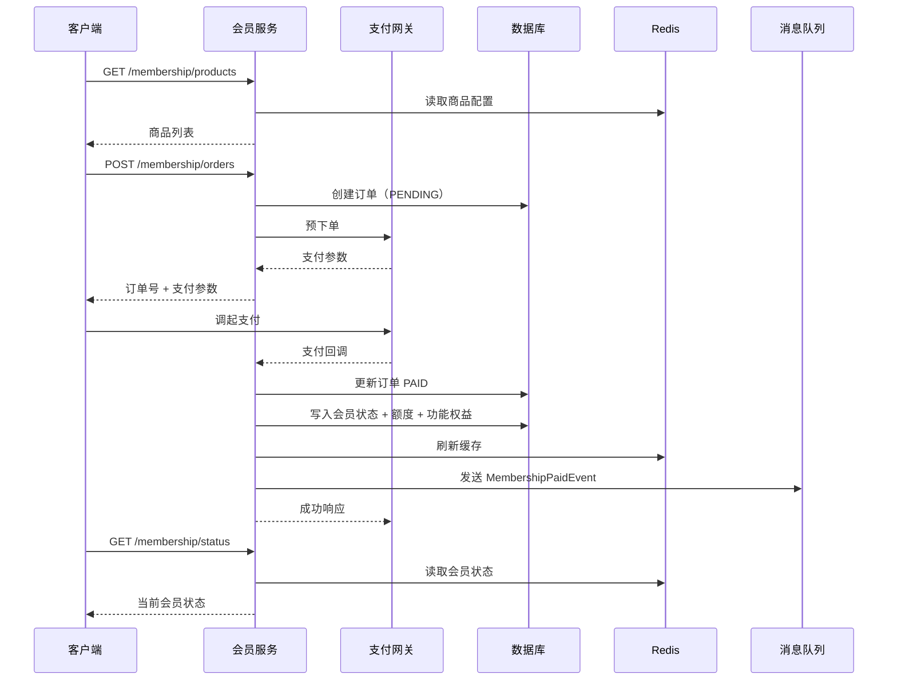

# 会员订阅服务 - 详细设计

## 1. 概述

### 1.1 模块定位

会员订阅服务是 PrimeTop 商业化的核心交易履约模块，负责会员资格与增值权益的全生命周期管理。它以"订单 - 支付 - 权益 - 额度"为主线，承接客户端的购买/续费/升级/降级操作，对接微信支付、支付宝、Apple/Google 应用内购等渠道，并向 AI 服务、拍题服务、同步课堂、家长中心等业务模块提供统一的会员身份与额度校验能力。

### 1.2 核心职责

| 职责 | 说明 |
|------|------|
| 会员商品配置 | 管理会员等级、价格、权益、额度、促销策略及平台差异（iOS/Android） |
| 订单管理 | 支持新购、续费、升级、增值包购买等订单类型的创建、查询、幂等创建 |
| 支付处理 | 对接多渠道支付，完成预下单、回调处理、对账、退款和异常补偿 |
| 权益发放 | 支付成功后按规则计算生效区间，写入会员状态并发放额度/功能/内容包 |
| 权益变更 | 支持升级、降级、续费、试用转正式、自动续费、取消订阅等状态流转 |
| 额度管理 | 维护 AI 问答、拍照搜题、作文批改等按次/按量的权益额度，并提供原子扣减 |
| 权益校验 | 对外暴露会员身份、额度余额、功能开关的统一查询与扣减接口 |
| 生命周期管理 | 处理到期、续费、退款、自动续费失败、降级等时序事件 |
| 数据运营 | 输出会员转化、续费、收入、权益消耗、LTV 等数据 |

### 1.3 依赖关系

```text
会员订阅服务（本模块）
  ├─ 调用：用户服务（获取用户、未成年人、家长绑定信息）
  ├─ 调用：支付网关（微信/支付宝/Apple/Google 预下单与回调）
  ├─ 调用：消息队列（发送订单/权益/退款事件）
  ├─ 调用：额度/资产服务（发放和扣减 AI 额度、内容包）
  ├─ 调用：优惠券服务（核销优惠券、计算优惠价格）
  ├─ 调用：审计服务（记录订单操作、财务对账）
  ├─ 调用：风控服务（未成年人支付、反欺诈、异常退款）
  └─ 被调用：AI 服务、拍题服务、同步课堂、作文辅导、家长中心、管理后台
```

### 1.4 业务术语

| 术语 | 说明 |
|------|------|
| Tier | 会员等级，如 free/monthly/quarterly/annual/exam_prep |
| Quota | 额度，按功能类型（ai_chat/photo_search/essay_correction）给出的可用次数 |
| Add-on | 增值包，不延长会员时长但补充额度或内容包 |
| Upgrade | 升级，从低等级会员购买更高等级会员，按剩余价值折算 |
| Proration | 折算，升级/降级时按剩余天数计算差价 |
| Grace period | 宽限期，会员到期后给予的短暂保留权益时间 |

---

## 2. 数据模型

### 2.1 核心实体关系

```text
membership_tier_config (1) ───< membership_products (N) ───< membership_orders (N)
        │                                                       │
        │                                                       │
        │                                                       v
        │                                              user_memberships (1)
        │                                                       │
        └──────────────────── user_assets (N) <─────────────────┘
```

### 2.2 数据库表设计

#### 2.2.1 会员等级配置表 `membership_tier_config`

```sql
CREATE TABLE membership_tier_config (
    id INT PRIMARY KEY AUTO_INCREMENT COMMENT '主键ID',
    tier_code VARCHAR(32) NOT NULL UNIQUE COMMENT '等级编码：free/monthly/quarterly/annual/exam_prep/lifetime',
    tier_name VARCHAR(64) NOT NULL COMMENT '等级名称',
    tier_level INT NOT NULL COMMENT '等级排序（越大越高级）',
    duration_days INT NOT NULL COMMENT '默认有效期天数',

    price_cents INT NOT NULL COMMENT '标准售价（分）',
    original_price_cents INT NOT NULL COMMENT '划线价（分）',
    currency VARCHAR(8) NOT NULL DEFAULT 'CNY' COMMENT '币种',

    -- 权益矩阵
    quotas JSON NOT NULL COMMENT '额度配置：{"ai_chat":100,"photo_search":50,"essay_correction":10}',
    features JSON NOT NULL COMMENT '功能白名单：["sync_classroom","study_report","knowledge_graph"]',
    content_packs JSON NULL COMMENT '内容包列表：["premium_courses","exam_prep_kit"]',

    -- 自动续费配置
    auto_renew_supported TINYINT NOT NULL DEFAULT 0 COMMENT '是否支持自动续费：0/1',
    auto_renew_product_id VARCHAR(64) NULL COMMENT '自动续费对应的外部商品ID',

    -- 显示控制
    is_popular TINYINT NOT NULL DEFAULT 0 COMMENT '是否推荐标签',
    is_visible TINYINT NOT NULL DEFAULT 1 COMMENT '是否可见',
    sort_order INT NOT NULL DEFAULT 0 COMMENT '排序序号',
    effective_from DATETIME NULL COMMENT '生效开始时间',
    effective_until DATETIME NULL COMMENT '生效结束时间',

    created_at DATETIME NOT NULL DEFAULT CURRENT_TIMESTAMP,
    updated_at DATETIME NOT NULL DEFAULT CURRENT_TIMESTAMP ON UPDATE CURRENT_TIMESTAMP,

    INDEX idx_level (tier_level),
    INDEX idx_visible (is_visible, effective_from, effective_until)
) ENGINE=InnoDB DEFAULT CHARSET=utf8mb4 COMMENT='会员等级配置表';
```

#### 2.2.2 会员商品表 `membership_products`

用于管理不同平台、渠道、活动下的实际售卖商品快照。

```sql
CREATE TABLE membership_products (
    id BIGINT PRIMARY KEY AUTO_INCREMENT,
    product_id VARCHAR(64) NOT NULL UNIQUE COMMENT '商品ID，如 annual_ios_2026q3',
    tier_code VARCHAR(32) NOT NULL COMMENT '关联等级编码',

    product_name VARCHAR(128) NOT NULL COMMENT '商品名称',
    product_type VARCHAR(32) NOT NULL COMMENT '类型：subscription/addon/trial',
    platform VARCHAR(16) NOT NULL COMMENT '平台：ios/android/web',
    channel VARCHAR(32) NOT NULL COMMENT '售卖渠道：app/web/apple_iap/google_play',

    duration_days INT NOT NULL COMMENT '有效期天数',
    price_cents INT NOT NULL COMMENT '实际售价（分）',
    original_price_cents INT NOT NULL COMMENT '划线价（分）',

    -- 商品快照
    tier_snapshot JSON NOT NULL COMMENT '等级配置快照（权益、额度、功能）',
    sale_tags JSON NULL COMMENT '营销标签：["限时特惠","首年优惠"]',

    -- 渠道商品ID
    external_product_id VARCHAR(128) NULL COMMENT 'Apple/Google 商品ID',
    external_product_group VARCHAR(128) NULL COMMENT 'Apple 订阅组 ID',

    -- 上下架
    is_on_sale TINYINT NOT NULL DEFAULT 1 COMMENT '是否上架',
    sale_start DATETIME NULL,
    sale_end DATETIME NULL,

    created_at DATETIME NOT NULL DEFAULT CURRENT_TIMESTAMP,
    updated_at DATETIME NOT NULL DEFAULT CURRENT_TIMESTAMP ON UPDATE CURRENT_TIMESTAMP,

    INDEX idx_tier_platform (tier_code, platform, is_on_sale),
    INDEX idx_channel (channel, external_product_id)
) ENGINE=InnoDB DEFAULT CHARSET=utf8mb4 COMMENT='会员商品表';
```

#### 2.2.3 会员订单表 `membership_orders`

```sql
CREATE TABLE membership_orders (
    id BIGINT PRIMARY KEY AUTO_INCREMENT,
    order_no VARCHAR(32) NOT NULL UNIQUE COMMENT '业务订单号 MOS{yyyyMMdd}{6位seq}',
    user_id BIGINT NOT NULL COMMENT '用户ID',
    order_type VARCHAR(32) NOT NULL COMMENT '订单类型：subscription_new/renew/upgrade/downgrade/addon/trial',

    -- 商品信息
    product_id VARCHAR(64) NOT NULL COMMENT '商品ID',
    product_name VARCHAR(128) NOT NULL COMMENT '商品快照名称',
    product_snapshot JSON NOT NULL COMMENT '商品快照（价格、权益、时长）',
    tier_code VARCHAR(32) NOT NULL COMMENT '目标会员等级',
    previous_tier_code VARCHAR(32) NULL COMMENT '升级/降级前等级',

    -- 价格信息
    original_price_cents INT NOT NULL COMMENT '原价（分）',
    discount_amount_cents INT NOT NULL DEFAULT 0 COMMENT '优惠金额（分）',
    payable_amount_cents INT NOT NULL COMMENT '应付金额（分）',
    paid_amount_cents INT NOT NULL DEFAULT 0 COMMENT '实付金额（分）',
    discount_reason VARCHAR(64) NULL COMMENT '优惠原因：promotion/coupon/first_purchase/proration',
    coupon_id VARCHAR(64) NULL COMMENT '优惠券ID',
    proration_credit_cents INT NOT NULL DEFAULT 0 COMMENT '升级/降级时旧会员折算抵扣金额（分）',

    -- 支付信息
    payment_channel VARCHAR(32) NOT NULL COMMENT '支付渠道：wechat_pay/alipay/apple_iap/google_pay',
    payment_status VARCHAR(16) NOT NULL DEFAULT 'pending' COMMENT 'pending/paid/failed/refunded/partial_refunded/closed',
    payment_time DATETIME NULL,
    transaction_id VARCHAR(128) NULL COMMENT '第三方支付流水号',
    payment_raw_data JSON NULL COMMENT '第三方回调原始数据',

    -- 会员生效信息
    effective_start DATE NOT NULL COMMENT '权益生效日期',
    effective_end DATE NOT NULL COMMENT '权益失效日期',
    duration_days INT NOT NULL COMMENT '购买天数',

    -- 自动续费
    auto_renew TINYINT NOT NULL DEFAULT 0 COMMENT '是否开启自动续费',
    auto_renew_external_sub_id VARCHAR(128) NULL COMMENT '外部订阅ID',

    -- 风控与合规
    risk_check_passed TINYINT NOT NULL DEFAULT 0 COMMENT '风控检查是否通过',
    risk_check_detail JSON NULL,
    minor_verified TINYINT NOT NULL DEFAULT 0 COMMENT '未成年人支付验证',
    parent_auth_token VARCHAR(256) NULL COMMENT '家长授权token',

    -- 客户端信息
    device_id VARCHAR(64) NULL,
    client_ip VARCHAR(45) NULL,
    app_version VARCHAR(16) NULL,
    platform VARCHAR(16) NOT NULL COMMENT 'ios/android/web',

    -- 状态机
    order_status VARCHAR(16) NOT NULL DEFAULT 'created' COMMENT 'created/paid/granted/expired/refunded/closed',
    remark VARCHAR(256) NULL,

    created_at DATETIME NOT NULL DEFAULT CURRENT_TIMESTAMP,
    updated_at DATETIME NOT NULL DEFAULT CURRENT_TIMESTAMP ON UPDATE CURRENT_TIMESTAMP,

    INDEX idx_user_id (user_id),
    INDEX idx_payment_status (payment_status),
    INDEX idx_order_status (order_status),
    INDEX idx_created_at (created_at),
    INDEX idx_transaction_id (transaction_id),
    INDEX idx_effective_end (effective_end)
) ENGINE=InnoDB DEFAULT CHARSET=utf8mb4 COMMENT='会员订阅订单表';
```

#### 2.2.4 用户会员状态表 `user_memberships`

```sql
CREATE TABLE user_memberships (
    id BIGINT PRIMARY KEY AUTO_INCREMENT,
    user_id BIGINT NOT NULL UNIQUE COMMENT '用户ID',

    current_tier_code VARCHAR(32) NOT NULL DEFAULT 'free' COMMENT '当前等级',
    previous_tier_code VARCHAR(32) NULL COMMENT '上一等级',
    status VARCHAR(16) NOT NULL DEFAULT 'active' COMMENT 'active/trial/expiring_soon/expired/cancelled/grace/refunded/suspended',

    started_at DATETIME NOT NULL COMMENT '会员开始时间',
    expires_at DATETIME NOT NULL COMMENT '会员到期时间',
    grace_period_end DATETIME NULL COMMENT '宽限期结束时间',

    auto_renew TINYINT NOT NULL DEFAULT 0,
    auto_renew_channel VARCHAR(32) NULL,
    auto_renext_next_bill_date DATE NULL COMMENT '下次扣费日期',

    trial_used TINYINT NOT NULL DEFAULT 0,
    trial_expires_at DATETIME NULL,

    total_paid_cents INT NOT NULL DEFAULT 0,
    total_orders INT NOT NULL DEFAULT 0,
    consecutive_periods INT NOT NULL DEFAULT 0 COMMENT '连续续费周期数',

    cancelled_at DATETIME NULL,
    cancel_reason VARCHAR(64) NULL,
    cancel_source VARCHAR(32) NULL COMMENT '用户取消/系统到期/支付失败',

    external_sub_id VARCHAR(128) NULL COMMENT 'Apple/Google 原始订阅ID',
    external_management_url VARCHAR(256) NULL,

    created_at DATETIME NOT NULL DEFAULT CURRENT_TIMESTAMP,
    updated_at DATETIME NOT NULL DEFAULT CURRENT_TIMESTAMP ON UPDATE CURRENT_TIMESTAMP,

    INDEX idx_status (status),
    INDEX idx_expires_at (expires_at),
    INDEX idx_auto_renew (auto_renew, expires_at),
    INDEX idx_grace (grace_period_end)
) ENGINE=InnoDB DEFAULT CHARSET=utf8mb4 COMMENT='用户会员状态表';
```

#### 2.2.5 用户额度资产表 `user_quota_assets`

```sql
CREATE TABLE user_quota_assets (
    id BIGINT PRIMARY KEY AUTO_INCREMENT,
    user_id BIGINT NOT NULL,
    asset_type VARCHAR(32) NOT NULL COMMENT 'quota_pack/time_pack/content_pack',
    asset_id VARCHAR(64) NOT NULL COMMENT '资产ID',
    source_order_no VARCHAR(32) NOT NULL COMMENT '来源订单号',

    quota_type VARCHAR(32) NOT NULL COMMENT '额度类型：ai_chat/photo_search/essay_correction/video_analysis',
    total_amount INT NOT NULL COMMENT '总量',
    used_amount INT NOT NULL DEFAULT 0,
    remaining_amount INT NOT NULL COMMENT '剩余量（冗余）',

    grant_type VARCHAR(32) NOT NULL COMMENT '发放类型：subscription/addon/promotion/trial/compensation',
    linked_tier_code VARCHAR(32) NULL COMMENT '关联等级',

    granted_at DATETIME NOT NULL,
    expires_at DATETIME NOT NULL,
    status VARCHAR(16) NOT NULL DEFAULT 'active' COMMENT 'active/exhausted/expired/refunded/frozen',

    created_at DATETIME NOT NULL DEFAULT CURRENT_TIMESTAMP,
    updated_at DATETIME NOT NULL DEFAULT CURRENT_TIMESTAMP ON UPDATE CURRENT_TIMESTAMP,

    UNIQUE KEY uk_asset (user_id, asset_id),
    INDEX idx_user_quota (user_id, quota_type, status),
    INDEX idx_expires (expires_at, status)
) ENGINE=InnoDB DEFAULT CHARSET=utf8mb4 COMMENT='用户额度资产表';
```

#### 2.2.6 用户功能权益表 `user_feature_entitlements`

```sql
CREATE TABLE user_feature_entitlements (
    id BIGINT PRIMARY KEY AUTO_INCREMENT,
    user_id BIGINT NOT NULL,
    feature_code VARCHAR(32) NOT NULL COMMENT '功能编码',
    grant_type VARCHAR(32) NOT NULL COMMENT '来源：subscription/addon/trial/promotion',
    source_order_no VARCHAR(32) NOT NULL,
    granted_at DATETIME NOT NULL,
    expires_at DATETIME NOT NULL,
    status VARCHAR(16) NOT NULL DEFAULT 'active',

    created_at DATETIME NOT NULL DEFAULT CURRENT_TIMESTAMP,

    UNIQUE KEY uk_user_feature (user_id, feature_code, grant_type, source_order_no),
    INDEX idx_user_feature_active (user_id, feature_code, status)
) ENGINE=InnoDB DEFAULT CHARSET=utf8mb4 COMMENT='用户功能权益表';
```

### 2.3 Redis 缓存设计

```text
# 用户会员状态缓存（Hash，到期时自动删除）
KEY:    user:membership:{user_id}
VALUE:  {tier_code, status, expires_at, grace_period_end, auto_renew, updated_at}
TTL:    会员到期时间 + 1天

# 用户额度缓存（String，原子递减）
KEY:    user:quota:{user_id}:{quota_type}
VALUE:  剩余整数次数
TTL:    最近到期资产的时间

# 用户功能权益集合（Set）
KEY:    user:features:{user_id}
VALUE:  {feature_code}:{expires_at} 集合
TTL:    会员到期时间 + 1天

# 订单幂等键
KEY:    order:idempotent:{user_id}:{product_id}:{coupon_id}:{hash}
VALUE:  order_no
TTL:    5分钟

# 支付回调分布式锁
KEY:    pay:callback:lock:{transaction_id}
VALUE:  1
TTL:    30秒

# 价格配置缓存
KEY:    config:membership:products:{platform}
VALUE:  JSON 商品列表
TTL:    10分钟

# 会员商品配置缓存
KEY:    config:tier:{tier_code}
VALUE:  JSON 等级配置
TTL:    30分钟
```

---

## 3. API 接口设计

### 3.1 获取会员商品列表

**`GET /api/v1/membership/products`**

**请求参数：**

| 参数 | 类型 | 必填 | 说明 |
|------|------|------|------|
| platform | string | 是 | 平台：ios/android/web |
| grade_code | string | 否 | 年级代码，用于分龄推荐 |
| include_addons | bool | 否 | 是否包含增值包，默认 false |

**响应示例：**

```json
{
  "code": 0,
  "message": "success",
  "data": {
    "current_tier": {
      "tier_code": "monthly",
      "tier_name": "月度会员",
      "expires_at": "2026-08-19T23:59:59+08:00",
      "status": "active"
    },
    "products": [
      {
        "product_id": "annual_ios_2026q3",
        "product_name": "年度会员",
        "product_type": "subscription",
        "tier_code": "annual",
        "tier_level": 4,
        "price_cents": 29800,
        "original_price_cents": 59800,
        "currency": "CNY",
        "duration_days": 365,
        "sale_tags": ["限时特惠", "推荐"],
        "is_popular": true,
        "features": ["同步课堂", "学情报告", "知识图谱", "AI问答无限次"],
        "quotas": {
          "ai_chat": -1,
          "photo_search": 100,
          "essay_correction": 20
        }
      }
    ],
    "addons": [
      {
        "product_id": "photo_search_50_pack",
        "product_name": "拍照搜题 50 次包",
        "product_type": "addon",
        "price_cents": 1200,
        "duration_days": 30,
        "quotas": { "photo_search": 50 }
      }
    ]
  }
}
```

### 3.2 创建会员订单

**`POST /api/v1/membership/orders`**

**请求参数：**

```json
{
  "product_id": "annual_ios_2026q3",
  "order_type": "subscription_new",
  "payment_channel": "apple_iap",
  "coupon_id": "CPN_20260602_ABC",
  "use_trial": false,
  "minor_auth_token": "auth_token_xyz",
  "device_id": "device_abc123",
  "client_ip": "192.168.1.100",
  "platform": "ios",
  "app_version": "1.2.0"
}
```

**响应示例：**

```json
{
  "code": 0,
  "message": "success",
  "data": {
    "order_no": "MOS20260720000123",
    "payment_status": "pending",
    "require_payment": true,
    "payable_amount_cents": 29800,
    "payment_params": {
      "channel": "apple_iap",
      "product_id": "annual_ios_2026q3",
      "external_product_id": "com.primetop.annual.2026q3",
      "application_username": "MOS20260720000123"
    },
    "effective_start": "2026-07-20",
    "effective_end": "2027-07-20"
  }
}
```

### 3.3 查询订单详情

**`GET /api/v1/membership/orders/{order_no}`**

**响应示例：**

```json
{
  "code": 0,
  "message": "success",
  "data": {
    "order_no": "MOS20260720000123",
    "order_type": "subscription_new",
    "payment_status": "paid",
    "order_status": "granted",
    "product_id": "annual_ios_2026q3",
    "product_name": "年度会员",
    "payable_amount_cents": 29800,
    "paid_amount_cents": 29800,
    "payment_channel": "apple_iap",
    "transaction_id": "1000000123456789",
    "payment_time": "2026-07-20T09:45:00+08:00",
    "effective_start": "2026-07-20",
    "effective_end": "2027-07-20",
    "created_at": "2026-07-20T09:42:00+08:00"
  }
}
```

### 3.4 查询当前会员状态

**`GET /api/v1/membership/status`**

**响应示例：**

```json
{
  "code": 0,
  "message": "success",
  "data": {
    "user_id": 123456,
    "current_tier": {
      "tier_code": "annual",
      "tier_name": "年度会员",
      "tier_level": 4
    },
    "status": "active",
    "started_at": "2026-07-20T09:45:00+08:00",
    "expires_at": "2027-07-20T23:59:59+08:00",
    "grace_period_end": null,
    "auto_renew": true,
    "auto_renew_channel": "apple_iap",
    "trial_used": false,
    "total_paid_cents": 29800,
    "quotas": [
      {
        "quota_type": "ai_chat",
        "total_amount": -1,
        "used_amount": 128,
        "remaining_amount": -1,
        "unlimited": true
      },
      {
        "quota_type": "photo_search",
        "total_amount": 100,
        "used_amount": 23,
        "remaining_amount": 77,
        "unlimited": false
      }
    ],
    "features": ["sync_classroom", "study_report", "knowledge_graph", "essay_correction"]
  }
}
```

### 3.5 查询额度余额

**`GET /api/v1/membership/quota/{quota_type}`**

**响应示例：**

```json
{
  "code": 0,
  "message": "success",
  "data": {
    "quota_type": "photo_search",
    "remaining_amount": 77,
    "unlimited": false,
    "expires_at": "2027-07-20T23:59:59+08:00"
  }
}
```

### 3.6 扣减额度

**`POST /api/v1/membership/quota/consume`**

**内部服务接口，需网关鉴权。**

**请求参数：**

```json
{
  "user_id": 123456,
  "quota_type": "photo_search",
  "consume_amount": 1,
  "biz_type": "photo_search",
  "biz_id": "search_abc123",
  "idempotent_key": "photo_search_abc123"
}
```

**响应示例：**

```json
{
  "code": 0,
  "message": "success",
  "data": {
    "succeed": true,
    "remaining_amount": 76,
    "consumed_asset_id": "asset_xxx"
  }
}
```

### 3.7 校验功能权限

**`GET /api/v1/membership/entitlement/{feature_code}`**

**响应示例：**

```json
{
  "code": 0,
  "message": "success",
  "data": {
    "feature_code": "knowledge_graph",
    "accessible": true,
    "expires_at": "2027-07-20T23:59:59+08:00"
  }
}
```

### 3.8 处理支付回调

**`POST /api/v1/membership/payment/callback/{channel}`**

**由支付渠道服务端调用，幂等处理。**

**请求体：** 支付渠道原始报文（不同渠道结构不同）。

**响应示例：**

```json
{
  "code": 0,
  "message": "success"
}
```

### 3.9 取消自动续费

**`POST /api/v1/membership/auto-renew/cancel`**

**请求参数：**

```json
{
  "cancel_reason": "user_cancelled",
  "external_sub_id": "1000000123456789"
}
```

**响应示例：**

```json
{
  "code": 0,
  "message": "success",
  "data": {
    "auto_renew": false,
    "current_membership_expires_at": "2027-07-20T23:59:59+08:00"
  }
}
```

### 3.10 管理后台：创建/更新会员等级

**`POST /admin/v1/membership/tiers`**

**请求参数：**

```json
{
  "tier_code": "annual",
  "tier_name": "年度会员",
  "tier_level": 4,
  "duration_days": 365,
  "price_cents": 29800,
  "original_price_cents": 59800,
  "quotas": {
    "ai_chat": -1,
    "photo_search": 100,
    "essay_correction": 20
  },
  "features": ["sync_classroom", "study_report", "knowledge_graph"],
  "is_visible": true,
  "sort_order": 1
}
```

### 3.11 错误码

| 错误码 | 说明 | 触发场景 |
|--------|------|----------|
| 100001 | 商品不存在或已下架 | 创建订单时 product_id 无效 |
| 100002 | 订单已存在 | 幂等创建时重复提交 |
| 100003 | 支付渠道不可用 | 渠道配置缺失或平台不匹配 |
| 100004 | 未成年人支付验证失败 | 未通过家长授权 |
| 100005 | 风控拦截 | 异常下单行为 |
| 100006 | 优惠券不可用 | 优惠券已过期或不符合条件 |
| 100007 | 额度不足 | 扣减额度时余额不足 |
| 100008 | 会员状态异常 | 升级/降级时状态冲突 |
| 100009 | 重复回调 | 支付回调已处理 |
| 100010 | 退款失败 | 退款金额超过可退金额或渠道失败 |
| 100011 | 自动续费取消失败 | 外部订阅状态异常 |

---

## 4. 业务逻辑与状态机

### 4.1 订单状态机

```text
                    ┌─────────────┐
                    │   created   │
                    └──────┬──────┘
                           │ 支付成功
                           ▼
                    ┌─────────────┐
                    │     paid    │◄────────────┐
                    └──────┬──────┘             │
                           │ 权益发放           │ 发放失败重试
                           ▼                  │
                    ┌─────────────┐          │
                    │   granted   │──────────┘
                    └──────┬──────┘
                           │ 到期/退款
           ┌───────────────┼───────────────┐
           ▼               ▼               ▼
    ┌────────────┐   ┌────────────┐  ┌────────────┐
    │   closed   │   │  refunded  │  │  expired   │
    └────────────┘   └────────────┘  └────────────┘
```

### 4.2 用户会员状态机

```text
                    ┌─────────────┐
         ┌─────────│    free     │────────────┐
         │         └──────┬──────┘            │
         │                │ 购买/试用          │
         │                ▼                   │
         │         ┌─────────────┐           │
         │         │   active    │◄──────────┤ 续费成功
         │         └──────┬──────┘           │
         │                │ 到期前7天        │
         │                ▼                  │
         │         ┌─────────────┐           │
         │         │ expiring_soon│           │
         │         └──────┬──────┘           │
         │                │ 到期             │
         │                ▼                  │
         │         ┌─────────────┐           │
         │         │   expired   │           │
         │         └──────┬──────┘           │
         │                │ 宽限期           │
         │                ▼                  │
         │         ┌─────────────┐           │
         └────────►│    grace    │───────────┘ 续费成功
                   └──────┬──────┘
                          │ 退款
                          ▼
                   ┌─────────────┐
                   │  refunded   │
                   └─────────────┘
```

### 4.3 升级/降级价格折算逻辑

当用户从低等级会员购买高等级会员时，按剩余有效价值折算。

```python
def calculate_upgrade_price(
    new_product_price_cents: int,
    current_tier_price_per_day_cents: float,
    remaining_days: int,
    coupon_discount_cents: int = 0
) -> int:
    """
    升级应付价格 = 新商品价 - 旧会员剩余价值 + 优惠抵扣
    旧会员剩余价值 = 当前等级日单价 * 剩余天数
    最低不得低于 0
    """
    remaining_credit = int(current_tier_price_per_day_cents * remaining_days)
    payable = max(0, new_product_price_cents - remaining_credit - coupon_discount_cents)
    return payable
```

### 4.4 权益发放流程

支付成功后，系统执行以下步骤：

1. 幂等校验：通过订单号幂等键确认未处理。
2. 更新订单状态：`paid` → `granted`。
3. 计算会员区间：
   - 新购：生效时间 = max(当前时间, 订单创建时间)，结束时间 = 生效时间 + duration_days
   - 续费：结束时间 = 当前会员结束时间 + duration_days
   - 升级：立即生效，结束时间 = 原结束时间 + 新购买时长（按产品设计）
4. 写入/更新 `user_memberships`。
5. 发放额度：创建 `user_quota_assets` 记录。
6. 发放功能权益：创建 `user_feature_entitlements` 记录。
7. 刷新 Redis 缓存。
8. 发送事件：支付成功、权益发放、会员变更。

### 4.5 自动续费流程

```text
1. 用户购买订阅时勾选自动续费，Apple/Google 在订阅组内管理续费
2. 服务端收到 Apple/Google 续费回调
3. 校验 external_sub_id 和 transaction_id 是否已处理
4. 创建 renewal 订单并标记为 paid
5. 延长 user_memberships.expires_at
6. 重置/发放新周期的额度
7. 发送续费成功事件
8. 若续费失败，进入宽限期，到期后降级为 free
```

### 4.6 会员到期与降级处理

```text
每日定时任务扫描 user_memberships：
1. 筛选 expires_at < now() 且 status = active 的记录
2. 更新 status = expired
3. 若配置了宽限期，更新 status = grace，grace_period_end = now() + 7天
4. 宽限期结束后，降级为 free，清理过期的功能权益和额度
5. 发送会员到期/降级事件
```

---

## 5. 关键代码示例

### 5.1 订单服务核心类

```java
@Service
public class MembershipOrderService {

    @Autowired
    private MembershipOrderRepository orderRepository;
    @Autowired
    private UserMembershipRepository userMembershipRepository;
    @Autowired
    private MembershipProductRepository productRepository;
    @Autowired
    private IdempotencyService idempotencyService;
    @Autowired
    private PaymentGatewayRouter paymentGatewayRouter;
    @Autowired
    private RedissonClient redissonClient;
    @Autowired
    private ApplicationEventPublisher eventPublisher;

    @Transactional
    public CreateOrderResult createOrder(CreateOrderRequest request) {
        // 1. 获取商品并校验
        MembershipProduct product = productRepository
            .findByProductIdAndPlatform(request.getProductId(), request.getPlatform())
            .orElseThrow(() -> new MembershipException(ORDER_PRODUCT_NOT_FOUND));

        if (!product.isOnSale()) {
            throw new MembershipException(ORDER_PRODUCT_NOT_ON_SALE);
        }

        // 2. 风控与未成年人校验
        RiskCheckResult risk = riskCheckService.check(request);
        if (!risk.isPassed()) {
            throw new MembershipException(RISK_CHECK_REJECTED, risk.getDetail());
        }
        if (request.isMinor() && !minorAuthService.verify(request.getMinorAuthToken())) {
            throw new MembershipException(MINOR_AUTH_FAILED);
        }

        // 3. 价格计算（含升级折算）
        UserMembership currentMembership = userMembershipRepository
            .findByUserId(request.getUserId()).orElse(null);
        PriceCalculation price = priceCalculator.calculate(
            request, product, currentMembership
        );

        // 4. 幂等创建订单
        String idempotencyKey = buildIdempotencyKey(request);
        String existingOrderNo = idempotencyService.get(idempotencyKey);
        if (existingOrderNo != null) {
            return CreateOrderResult.fromExisting(existingOrderNo);
        }

        // 5. 生成订单号
        String orderNo = orderNoGenerator.next("MOS");

        MembershipOrder order = MembershipOrder.builder()
            .orderNo(orderNo)
            .userId(request.getUserId())
            .orderType(resolveOrderType(request, currentMembership))
            .productId(product.getProductId())
            .productName(product.getProductName())
            .productSnapshot(product.toSnapshot())
            .tierCode(product.getTierCode())
            .previousTierCode(currentMembership != null ? currentMembership.getCurrentTierCode() : null)
            .originalPriceCents(price.getOriginalPriceCents())
            .discountAmountCents(price.getDiscountAmountCents())
            .payableAmountCents(price.getPayableAmountCents())
            .discountReason(price.getDiscountReason())
            .couponId(request.getCouponId())
            .prorationCreditCents(price.getProrationCreditCents())
            .paymentChannel(request.getPaymentChannel())
            .paymentStatus(PaymentStatus.PENDING)
            .orderStatus(OrderStatus.CREATED)
            .effectiveStart(price.getEffectiveStart())
            .effectiveEnd(price.getEffectiveEnd())
            .durationDays(product.getDurationDays())
            .autoRenew(request.isAutoRenew())
            .minorVerified(request.isMinor())
            .parentAuthToken(request.getMinorAuthToken())
            .deviceId(request.getDeviceId())
            .clientIp(request.getClientIp())
            .platform(request.getPlatform())
            .appVersion(request.getAppVersion())
            .build();

        orderRepository.save(order);
        idempotencyService.set(idempotencyKey, orderNo, Duration.ofMinutes(5));

        // 6. 预下单（获取支付参数）
        PaymentPrepayResult prepay = paymentGatewayRouter
            .get(request.getPaymentChannel())
            .prepay(order);

        return CreateOrderResult.builder()
            .orderNo(orderNo)
            .paymentStatus(PaymentStatus.PENDING)
            .requirePayment(prepay.isRequirePayment())
            .payableAmountCents(order.getPayableAmountCents())
            .paymentParams(prepay.getPaymentParams())
            .effectiveStart(order.getEffectiveStart())
            .effectiveEnd(order.getEffectiveEnd())
            .build();
    }

    @Transactional
    public void handlePaymentCallback(String channel, PaymentCallbackPayload payload) {
        // 1. 幂等锁
        String lockKey = "pay:callback:lock:" + payload.getTransactionId();
        RLock lock = redissonClient.getLock(lockKey);
        if (!lock.tryLock(3, 30, TimeUnit.SECONDS)) {
            throw new MembershipException(PAYMENT_CALLBACK_DUPLICATE);
        }
        try {
            // 2. 校验签名
            PaymentGateway gateway = paymentGatewayRouter.get(channel);
            if (!gateway.verifySignature(payload)) {
                throw new MembershipException(PAYMENT_SIGNATURE_INVALID);
            }

            // 3. 查询订单
            MembershipOrder order = orderRepository
                .findByOrderNo(payload.getOutOrderNo())
                .orElseThrow(() -> new MembershipException(ORDER_NOT_FOUND));

            if (order.getPaymentStatus() == PaymentStatus.PAID) {
                return; // 已处理，直接返回成功
            }

            if (payload.isSuccess()) {
                order.setPaymentStatus(PaymentStatus.PAID);
                order.setOrderStatus(OrderStatus.PAID);
                order.setPaymentTime(payload.getPaymentTime());
                order.setTransactionId(payload.getTransactionId());
                order.setPaymentRawData(payload.getRawData());
                orderRepository.save(order);

                // 4. 发放权益
                grantMembership(order);

                // 5. 发送事件
                eventPublisher.publishEvent(new MembershipPaidEvent(order));
            } else {
                order.setPaymentStatus(PaymentStatus.FAILED);
                order.setOrderStatus(OrderStatus.CLOSED);
                order.setRemark(payload.getFailureReason());
                orderRepository.save(order);
            }
        } finally {
            lock.unlock();
        }
    }

    @Transactional
    protected void grantMembership(MembershipOrder order) {
        UserMembership membership = userMembershipRepository
            .findByUserId(order.getUserId())
            .orElseGet(() -> UserMembership.builder()
                .userId(order.getUserId())
                .currentTierCode("free")
                .status(MembershipStatus.EXPIRED)
                .startedAt(LocalDateTime.now())
                .expiresAt(LocalDateTime.now())
                .build());

        MembershipTierSnapshot tier = order.getProductSnapshot().getTierSnapshot();

        // 计算新会员区间
        LocalDateTime startTime = LocalDateTime.now();
        LocalDateTime endTime = order.getEffectiveEnd().atTime(LocalTime.MAX);
        if (membership.isActive() && order.getOrderType().isRenewal()) {
            endTime = membership.getExpiresAt().plusDays(order.getDurationDays());
        }

        membership.setPreviousTierCode(membership.getCurrentTierCode());
        membership.setCurrentTierCode(order.getTierCode());
        membership.setStatus(MembershipStatus.ACTIVE);
        membership.setStartedAt(startTime);
        membership.setExpiresAt(endTime);
        membership.setAutoRenew(order.isAutoRenew());
        membership.setAutoRenewChannel(order.getPaymentChannel());
        membership.setTotalPaidCents(membership.getTotalPaidCents() + order.getPaidAmountCents());
        membership.setTotalOrders(membership.getTotalOrders() + 1);
        membership.setConsecutivePeriods(
            order.getOrderType().isRenewal() ? membership.getConsecutivePeriods() + 1 : 1
        );
        membership.setExternalSubId(order.getAutoRenewExternalSubId());
        userMembershipRepository.save(membership);

        // 发放额度
        for (QuotaConfig quota : tier.getQuotas()) {
            UserQuotaAsset asset = UserQuotaAsset.builder()
                .userId(order.getUserId())
                .assetType("quota_pack")
                .assetId(generateAssetId())
                .sourceOrderNo(order.getOrderNo())
                .quotaType(quota.getQuotaType())
                .totalAmount(quota.getAmount())
                .remainingAmount(quota.getAmount())
                .grantType(resolveGrantType(order.getOrderType()))
                .linkedTierCode(order.getTierCode())
                .grantedAt(LocalDateTime.now())
                .expiresAt(endTime)
                .status(AssetStatus.ACTIVE)
                .build();
            userQuotaAssetRepository.save(asset);
        }

        // 发放功能权益
        for (String featureCode : tier.getFeatures()) {
            UserFeatureEntitlement entitlement = UserFeatureEntitlement.builder()
                .userId(order.getUserId())
                .featureCode(featureCode)
                .grantType(resolveGrantType(order.getOrderType()))
                .sourceOrderNo(order.getOrderNo())
                .grantedAt(LocalDateTime.now())
                .expiresAt(endTime)
                .status(EntitlementStatus.ACTIVE)
                .build();
            featureEntitlementRepository.save(entitlement);
        }

        // 刷新缓存
        membershipCacheService.refresh(order.getUserId());

        order.setOrderStatus(OrderStatus.GRANTED);
        orderRepository.save(order);
    }
}
```

### 5.2 额度扣减服务

```java
@Service
public class QuotaService {

    @Autowired
    private StringRedisTemplate redisTemplate;
    @Autowired
    private UserQuotaAssetRepository quotaAssetRepository;

    public QuotaConsumeResult consume(QuotaConsumeRequest request) {
        Long userId = request.getUserId();
        String quotaType = request.getQuotaType();

        // 1. 先查缓存判断是否无限额度
        String cacheKey = "user:quota:" + userId + ":" + quotaType;
        String cached = redisTemplate.opsForValue().get(cacheKey);
        if ("-1".equals(cached)) {
            return QuotaConsumeResult.unlimited();
        }

        // 2. 从数据库按到期时间正序扣减
        List<UserQuotaAsset> assets = quotaAssetRepository
            .findActiveByUserIdAndQuotaType(userId, quotaType, Sort.by(Sort.Direction.ASC, "expiresAt"));

        int remaining = assets.stream().mapToInt(UserQuotaAsset::getRemainingAmount).sum();
        if (remaining < request.getConsumeAmount()) {
            throw new MembershipException(QUOTA_INSUFFICIENT);
        }

        int toConsume = request.getConsumeAmount();
        String consumedAssetId = null;
        for (UserQuotaAsset asset : assets) {
            if (toConsume <= 0) break;
            int consume = Math.min(toConsume, asset.getRemainingAmount());
            int updated = quotaAssetRepository.decrementRemaining(asset.getId(), consume);
            if (updated > 0) {
                toConsume -= consume;
                consumedAssetId = asset.getAssetId();
            }
        }

        if (toConsume > 0) {
            throw new MembershipException(QUOTA_CONCURRENT_CONFLICT);
        }

        // 3. 刷新缓存
        refreshQuotaCache(userId, quotaType);

        return QuotaConsumeResult.builder()
            .succeed(true)
            .remainingAmount(getRemaining(userId, quotaType))
            .consumedAssetId(consumedAssetId)
            .build();
    }

    private void refreshQuotaCache(Long userId, String quotaType) {
        List<UserQuotaAsset> assets = quotaAssetRepository
            .findActiveByUserIdAndQuotaType(userId, quotaType, Sort.by(Sort.Direction.ASC, "expiresAt"));

        int remaining = assets.stream().mapToInt(UserQuotaAsset::getRemainingAmount).sum();
        String cacheKey = "user:quota:" + userId + ":" + quotaType;
        if (remaining < 0) {
            redisTemplate.opsForValue().set(cacheKey, "-1");
        } else {
            redisTemplate.opsForValue().set(cacheKey, String.valueOf(remaining));
        }
        // 设置 TTL 为最近到期资产的时间
        assets.stream().findFirst().ifPresent(asset -> {
            long ttlSeconds = Duration.between(LocalDateTime.now(), asset.getExpiresAt()).getSeconds();
            redisTemplate.expire(cacheKey, ttlSeconds, TimeUnit.SECONDS);
        });
    }
}
```

### 5.3 会员状态检查与刷新任务

```java
@Component
public class MembershipExpireJob {

    @Autowired
    private UserMembershipRepository membershipRepository;
    @Autowired
    private MembershipCacheService cacheService;
    @Autowired
    private ApplicationEventPublisher eventPublisher;

    /**
     * 每 10 分钟扫描一次到期会员
     */
    @Scheduled(cron = "0 0/10 * * * ?")
    @Transactional
    public void processExpiredMemberships() {
        LocalDateTime now = LocalDateTime.now();
        List<UserMembership> expiredList = membershipRepository
            .findByStatusAndExpiresAtBefore(MembershipStatus.ACTIVE, now);

        for (UserMembership membership : expiredList) {
            membership.setStatus(MembershipStatus.EXPIRED);
            membership.setPreviousTierCode(membership.getCurrentTierCode());
            membership.setCurrentTierCode("free");
            membership.setAutoRenew(false);
            membership.setAutoRenewChannel(null);
            membershipRepository.save(membership);

            cacheService.refresh(membership.getUserId());
            eventPublisher.publishEvent(new MembershipExpiredEvent(membership));
        }
    }

    /**
     * 每日检查宽限期到期
     */
    @Scheduled(cron = "0 30 2 * * ?")
    @Transactional
    public void processGracePeriodEnd() {
        LocalDateTime now = LocalDateTime.now();
        List<UserMembership> graceList = membershipRepository
            .findByStatusAndGracePeriodEndBefore(MembershipStatus.GRACE, now);

        for (UserMembership membership : graceList) {
            membership.setStatus(MembershipStatus.EXPIRED);
            membership.setCurrentTierCode("free");
            membershipRepository.save(membership);
            cacheService.refresh(membership.getUserId());
        }
    }
}
```

---

## 6. 错误处理

### 6.1 异常分类

| 异常类型 | 场景 | 处理策略 |
|----------|------|----------|
| 业务异常 | 商品不存在、额度不足、状态冲突 | 返回明确错误码，前端提示用户 |
| 支付异常 | 回调失败、签名错误、渠道超时 | 记录日志，异步对账补偿 |
| 并发异常 | 重复回调、重复扣减 | 分布式锁 + 幂等键 |
| 外部异常 | 渠道不可用、网络抖动 | 重试 3 次，失败转人工/对账 |
| 数据异常 | 权益发放后订单状态不一致 | 定时对账任务修复 |

### 6.2 重试策略

```yaml
membership:
  retry:
    payment-callback:
      max-attempts: 3
      backoff: 500ms
      multiplier: 2
    grant-benefits:
      max-attempts: 5
      backoff: 1s
      multiplier: 2
    quota-consume:
      max-attempts: 3
      backoff: 100ms
```

### 6.3 支付回调幂等处理

```java
// 使用 Redis 分布式锁 + 数据库订单状态双重校验
// 1. 锁 key：pay:callback:lock:{transaction_id}
// 2. 数据库订单状态校验
// 3. 处理成功后写入订单 payment_raw_data 作为幂等凭证
// 4. 同一 transaction_id 的重复回调直接返回成功
```

### 6.4 权益发放失败补偿

```java
// 若支付成功但权益发放失败，订单状态停留在 paid
// 定时任务扫描 order_status = paid 且 created_at > 5分钟 的订单
// 自动重试 grantMembership，成功后状态变为 granted
// 超过 1 小时仍未成功，触发告警并转人工处理
```

---

## 7. 性能优化

### 7.1 缓存策略

| 缓存对象 | 存储 | 更新策略 | 过期策略 |
|----------|------|----------|----------|
| 用户会员状态 | Redis Hash | 权益发放/到期时刷新 | TTL 至会员到期后 1 天 |
| 用户额度 | Redis String | 扣减/发放时刷新 | TTL 至最近资产过期 |
| 商品配置 | Redis Hash | 管理后台修改时失效 | 10 分钟 |
| 等级配置 | Redis JSON | 管理后台修改时失效 | 30 分钟 |

### 7.2 数据库优化

- `membership_orders` 按 `user_id` 分库分表（用户维度），或按时间分区。
- `user_memberships` 单表即可，但需建立 `(status, expires_at)` 联合索引用于定时扫描。
- `user_quota_assets` 建立 `(user_id, quota_type, status, expires_at)` 联合索引，加速扣减查询。
- 使用乐观锁或数据库原子 `UPDATE ... SET remaining = remaining - ? WHERE remaining >= ?` 避免并发扣减问题。

### 7.3 并发控制

- 支付回调：使用 Redis 分布式锁保证同一 transaction_id 只处理一次。
- 额度扣减：使用 Redis 缓存 + 数据库原子更新，避免超扣。
- 订单创建：使用幂等键避免重复下单。
- 会员状态更新：使用数据库版本号或 `UPDATE ... WHERE status = ?` 条件更新避免并发覆盖。

### 7.4 资源限制

- 单日单个用户下单次数限制：10 次/天。
- 优惠券使用次数限制：1 次/用户。
- 自动续费回调处理队列限流：1000 TPS。
- 额度扣减接口限流：10,000 TPS。

---

## 8. 安全考虑

### 8.1 未成年人保护

- 未成年人下单必须携带 `minor_auth_token`（家长授权或实名认证）。
- 风控服务根据用户年龄、设备、金额、支付频率进行拦截。
- 单日累计消费金额超过阈值需二次家长确认。
- 退款通道优先处理未成年人误充值订单。

### 8.2 权限控制

| 接口 | 访问方 | 权限要求 |
|------|--------|----------|
| GET /api/v1/membership/products | 所有登录用户 | 用户登录 |
| POST /api/v1/membership/orders | 登录用户 | 未成年人需家长授权 |
| GET /api/v1/membership/status | 登录用户 | 仅能查看自己的状态 |
| POST /api/v1/membership/quota/consume | 内部服务 | 服务间鉴权 |
| POST /admin/v1/membership/tiers | 运营后台 | 财务/运营角色 |
| POST /api/v1/membership/payment/callback | 支付渠道 | IP 白名单 + 签名验证 |

### 8.3 数据验证

- 所有价格计算以服务端商品配置为准，不信任客户端传入价格。
- 支付回调必须验证签名和 IP 白名单。
- 订单金额、优惠金额、实付金额需满足一致性校验。
- 外部商品 ID 与平台必须匹配（如 iOS 商品不能走支付宝支付）。

### 8.4 审计日志

- 记录所有订单创建、支付、退款、权益发放、取消自动续费操作。
- 审计日志包含：操作人、操作时间、订单号、金额、变更前后状态、IP、设备号。
- 财务对账依赖订单表和支付回调原始数据。

---

## 9. 测试策略

### 9.1 单元测试

| 测试目标 | 覆盖点 |
|----------|--------|
| 价格计算 | 原价、优惠券、升级折算、降级退款 |
| 订单创建 | 幂等、商品校验、风控、未成年人校验 |
| 支付回调 | 幂等、签名验证、重复回调、失败回调 |
| 权益发放 | 新购、续费、升级、额度/功能发放 |
| 额度扣减 | 正常扣减、余额不足、并发扣减、无限额度 |
| 状态机 | 到期、续费、取消、退款、降级 |

### 9.2 集成测试

- 使用沙箱环境对接微信支付、支付宝、Apple/Google 测试环境。
- 模拟支付回调和续费回调。
- 验证 Redis 缓存与数据库一致性。
- 验证 MQ 事件发送与消费。

### 9.3 性能测试

- 支付回调峰值：1000 TPS，平均延迟 < 100ms。
- 额度扣减峰值：10,000 TPS，无超扣。
- 会员商品列表查询：QPS 5000，P99 < 50ms（依赖缓存）。
- 到期扫描任务：10 万条会员记录，5 分钟内处理完成。

### 9.4 关键测试用例

```gherkin
Feature: 会员购买与权益发放
  Scenario: 用户购买年度会员
    Given 用户已登录且当前为 free 会员
    When 用户选择 annual 商品并支付成功
    Then 订单状态为 granted
    And 用户会员等级为 annual
    And 用户获得对应额度和功能权益

  Scenario: 重复支付回调
    Given 用户订单已支付并发放权益
    When 支付渠道再次发送同一 transaction_id 的回调
    Then 系统返回成功且不重复发放权益

  Scenario: 额度不足
    Given 用户 photo_search 额度剩余 0
    When 用户调用拍照搜题
    Then 返回 QUOTA_INSUFFICIENT 错误并引导购买增值包

  Scenario: 自动续费成功
    Given 用户年度会员已开启自动续费
    When Apple 发送续费回调
    Then 会员到期时间延长 365 天
    And 新周期额度重新发放
```

---

## 10. 接口时序示例

### 10.1 新购会员流程



---

## 11. 部署与运维

### 11.1 关键配置

```yaml
membership:
  order:
    idempotency-ttl: 5m
    max-amount-cents: 500000  # 单笔最大 5000 元
  grace-period-days: 7
  trial:
    enabled: true
    duration-days: 3
  auto-renew:
    reminder-days-before-expire: 7
  quota:
    unlimited-marker: -1
    cache-refresh-async: true
```

### 11.2 监控指标

| 指标 | 说明 | 告警阈值 |
|------|------|----------|
| membership_order_create_qps | 订单创建 QPS | - |
| membership_payment_callback_latency | 回调处理耗时 | P99 > 200ms |
| membership_payment_callback_fail_rate | 回调失败率 | > 1% |
| membership_grant_fail_count | 权益发放失败数 | > 10/小时 |
| membership_quota_over_consume | 额度超扣事件 | > 0 |
| membership_revenue_cents | 收入金额 | - |
| membership_active_users | 活跃会员数 | - |

### 11.3 对账任务

- 每日凌晨 2 点执行对账任务：
  1. 拉取微信支付、支付宝、Apple/Google 账单。
  2. 与 `membership_orders` 中 payment_status = paid 的订单比对。
  3. 标记差异记录：金额不一致、状态不一致、单边账。
  4. 对差异记录自动补偿或生成人工处理工单。

---

## 12. 版本演进建议

| 阶段 | 功能 |
|------|------|
| MVP | 支持月度/年度会员、微信支付/支付宝、基础额度、订单/权益/退款 |
| V1.0 | 支持 Apple/Google IAP、自动续费、优惠券、升级/降级折算 |
| V1.5 | 家庭套餐、多孩子共享权益、增值包、兑换码 |
| V2.0 | 多区域定价、税务合规、B 端机构订阅、发票自动开具 |
