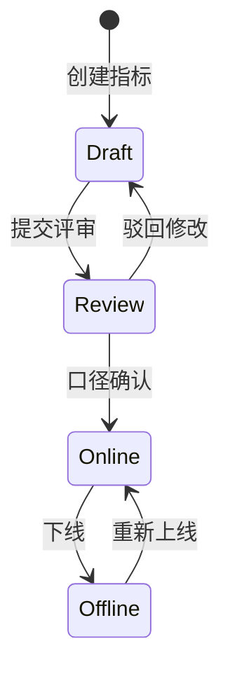
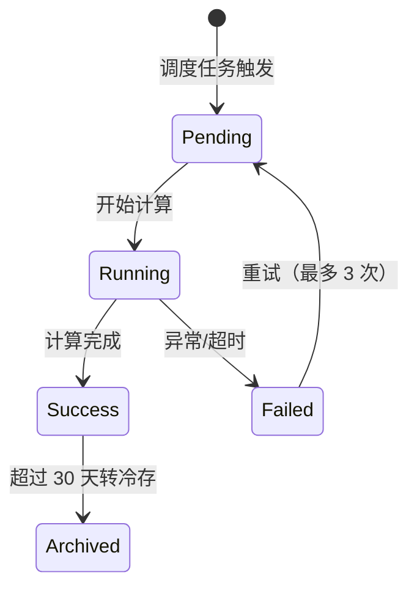

# 关键指标设计 - 详细设计

> 对应原始设计文档第 16 节「关键指标设计」，以及各模块中涉及的业务指标定义、口径与计算需求。
> 本文件聚焦「指标本身」：定义、公式、维度、粒度、数据源、计算周期、输出 API；埋点采集实现见《数据埋点与关键指标系统-详细设计.md》，统一计算与查询引擎见《服务端-统一指标中心与数据语义查询引擎-详细设计.md》。

## 1. 概述

### 1.1 目标

为 PrimeTop 建立一套可落地的关键指标体系（KPI Catalog），覆盖原始设计文档中提出的四类指标：

1. **用户指标**：增长、活跃、留存、角色分布。
2. **学习指标**：学习投入、辅导使用、错题治理、计划完成、薄弱点改善。
3. **商业指标**：会员转化、收入、续费、成本、ARPU。
4. **质量指标**：AI 质量、拍题识别、接口稳定性、App 稳定性、内容审核。

### 1.2 设计原则

| 原则 | 说明 |
|------|------|
| 单一事实源（SSOT） | 每个指标只在一个地方定义，避免口径分叉。 |
| 可计算 | 每个指标必须能写成 SQL/代码，并给出最小示例。 |
| 可对比 | 支持分维度、分粒度、分时间窗口下钻。 |
| 可审计 | 指标版本、计算任务、数据源、异常修正全部留痕。 |
| 可消费 | 输出标准 API，供学生端、家长端、后台、BI 直接使用。 |

### 1.3 与周边系统的关系

```text
┌─────────────────────────────────────────────────────────────┐
│                         消费方                               │
│  学生端报告 │ 家长端报告 │ 教师端 │ 运营后台 │ 管理驾驶舱     │
└──────────────────────┬────────────────────────────────────┘
                       │ REST / gRPC
┌──────────────────────▼────────────────────────────────────┐
│            统一指标中心 UMC（查询/计算引擎）                 │
└──────────────────────┬────────────────────────────────────┘
                       │ 读取指标目录 + 数据源
┌──────────────────────▼────────────────────────────────────┐
│        本文件：关键指标设计（KPI Catalog）                    │
│   定义、公式、维度、数据源、计算周期、质量规则                 │
└─────────────────────────────────────────────────────────────┘
```

---

## 2. 指标体系总览

### 2.1 指标编号规则

指标编码采用三段式：`KPI-{类别}-{序号}`

- 类别：USER / LEARN / BIZ / QUAL / SYS
- 序号：3 位自增数字

示例：`KPI-USER-001` 表示新增注册用户数。

### 2.2 指标清单

| 指标编码 | 指标名称 | 类别 | 默认粒度 | 更新频率 | 数据源 |
|---------|---------|------|---------|---------|--------|
| KPI-USER-001 | 新增注册用户数 | 用户 | 日/周/月 | T+1 小时 | 用户注册事件 |
| KPI-USER-002 | 日活跃用户数（DAU） | 用户 | 日 | 实时 | 活跃事件 |
| KPI-USER-003 | 月活跃用户数（MAU） | 用户 | 月 | T+1 小时 | 活跃事件 |
| KPI-USER-004 | 次日留存率 | 用户 | 日 | T+1 日 | 活跃事件 |
| KPI-USER-005 | 7 日留存率 | 用户 | 日 | T+1 日 | 活跃事件 |
| KPI-USER-006 | 30 日留存率 | 用户 | 日 | T+1 日 | 活跃事件 |
| KPI-USER-007 | 学段年级分布 | 用户 | 日 | T+1 小时 | 学生档案 |
| KPI-USER-008 | 家长绑定率 | 用户 | 日/周 | T+1 小时 | 家长绑定事件 |
| KPI-LEARN-001 | 人均每日学习时长 | 学习 | 日 | T+1 小时 | 学习会话事件 |
| KPI-LEARN-002 | AI 问答次数 | 学习 | 日/小时 | 实时 | AI 问答事件 |
| KPI-LEARN-003 | AI 问答人均次数 | 学习 | 日 | T+1 小时 | AI 问答事件 |
| KPI-LEARN-004 | 拍题次数 | 学习 | 日/小时 | 实时 | 拍题事件 |
| KPI-LEARN-005 | 拍题解析完成率 | 学习 | 日 | T+1 小时 | 拍题结果事件 |
| KPI-LEARN-006 | 错题收录数量 | 学习 | 日/周 | T+1 小时 | 错题收录事件 |
| KPI-LEARN-007 | 错题复习完成率 | 学习 | 日/周 | T+1 小时 | 错题复习事件 |
| KPI-LEARN-008 | 学习计划完成率 | 学习 | 日/周/月 | T+1 小时 | 任务完成事件 |
| KPI-LEARN-009 | 薄弱知识点改善率 | 学习 | 周/月 | T+1 日 | 答题记录 + 掌握度 |
| KPI-BIZ-001 | 免费→会员转化率 | 商业 | 日/周/月 | T+1 小时 | 订单事件 |
| KPI-BIZ-002 | 月度订阅收入（MRR） | 商业 | 月 | T+1 小时 | 订单事件 |
| KPI-BIZ-003 | 年度订阅收入（ARR） | 商业 | 月 | T+1 小时 | 订单事件 |
| KPI-BIZ-004 | 会员续费率 | 商业 | 月 | T+1 日 | 会员状态变更 |
| KPI-BIZ-005 | 单用户 AI 调用成本 | 商业 | 日/月 | T+1 小时 | AI 调用日志 |
| KPI-BIZ-006 | 付费用户 ARPU | 商业 | 月 | T+1 日 | 订单 + 用户 |
| KPI-QUAL-001 | AI 回答用户满意率 | 质量 | 日/周 | T+1 小时 | 反馈事件 |
| KPI-QUAL-002 | 拍题识别准确率 | 质量 | 日 | T+1 小时 | OCR 结果 + 用户反馈 |
| KPI-QUAL-003 | AI 解析错误反馈率 | 质量 | 日 | T+1 小时 | 纠错反馈事件 |
| KPI-QUAL-004 | 系统接口成功率 | 质量 | 分钟/小时 | 实时 | 网关日志 |
| KPI-QUAL-005 | App 崩溃率 | 质量 | 日/小时 | T+1 小时 | 崩溃上报 |
| KPI-QUAL-006 | 内容审核拦截率 | 质量 | 日/小时 | T+1 小时 | 审核事件 |

---

## 3. 指标元数据模型

### 3.1 指标目录表 `kpi_catalog`

用于保存每个指标的定义，是统一指标中心的「只读配置源」。

| 字段 | 类型 | 说明 |
|------|------|------|
| `kpi_code` | VARCHAR(32) PK | 指标编码，如 `KPI-USER-001` |
| `kpi_name` | VARCHAR(128) | 中文名称 |
| `kpi_name_en` | VARCHAR(128) | 英文名称，用于看板/BI |
| `category` | VARCHAR(16) | USER / LEARN / BIZ / QUAL / SYS |
| `description` | TEXT | 业务含义 |
| `formula` | TEXT | 计算公式（伪代码/SQL 片段） |
| `unit` | VARCHAR(32) | 单位：人、次、%、元、token |
| `default_grain` | VARCHAR(16) | 默认粒度：day / week / month / hour |
| `update_freq` | VARCHAR(32) | 更新频率：realtime / T+1h / T+1d |
| `data_source` | VARCHAR(256) | 主数据源表或事件 |
| `owner` | VARCHAR(64) | 指标业务负责人 |
| `status` | TINYINT | 0 草稿 / 1 已上线 / 2 已下线 |
| `version` | INT | 版本号，每次变更 +1 |
| `created_at` | DATETIME | 创建时间 |
| `updated_at` | DATETIME | 更新时间 |

### 3.2 指标维度表 `kpi_dimension`

| 字段 | 类型 | 说明 |
|------|------|------|
| `dim_code` | VARCHAR(32) PK | 维度编码，如 `DIM_GRADE` |
| `dim_name` | VARCHAR(64) | 维度名称 |
| `applicable_kpis` | JSON | 适用指标编码列表 |

### 3.3 指标维度值表 `kpi_dimension_value`

| 字段 | 类型 | 说明 |
|------|------|------|
| `dim_code` | VARCHAR(32) | 维度编码 |
| `dim_value` | VARCHAR(64) | 维度值，如 `grade_7` |
| `dim_value_name` | VARCHAR(128) | 展示名，如「七年级」 |

### 3.4 指标版本变更日志 `kpi_version_log`

| 字段 | 类型 | 说明 |
|------|------|------|
| `id` | BIGINT PK | 自增 |
| `kpi_code` | VARCHAR(32) | 指标编码 |
| `version` | INT | 版本号 |
| `change_summary` | TEXT | 变更摘要 |
| `formula_before` | TEXT | 变更前公式 |
| `formula_after` | TEXT | 变更后公式 |
| `changed_by` | VARCHAR(64) | 变更人 |
| `changed_at` | DATETIME | 变更时间 |

---

## 4. 具体指标定义

### 4.1 用户指标

#### KPI-USER-001 新增注册用户数

- **业务含义**：统计周期内完成注册流程的去重用户数。
- **计算公式**：
  ```
  count(distinct user_id) where event='user.register' and status='success' within period
  ```
- **维度**：学段、年级、注册渠道（手机号/微信/Apple/华为）、设备类型。
- **数据源**：`events.user_register` / `users` 表。
- **更新频率**：T+1 小时。
- **注意**：
  - 排除测试账号（`is_test=1`）。
  - 同一设备在 24 小时内重复注册只计 1 次（防刷）。

#### KPI-USER-002 日活跃用户数（DAU）

- **业务含义**：自然日内至少产生一次有效活跃事件的去重用户。
- **计算公式**：
  ```
  count(distinct user_id) where event='app.active' and date = T
  ```
- **口径**：有效活跃事件包括打开 App、完成一次 AI 问答、拍题、完成学习任务中的任意一种。
- **维度**：学段、年级、会员状态、渠道、版本。
- **数据源**：`events.app_active`。
- **更新频率**：实时（基于流式）/ T+1 小时（离线校准）。

#### KPI-USER-003 月活跃用户数（MAU）

- **业务含义**：自然月内至少产生一次有效活跃事件的去重用户。
- **计算公式**：
  ```
  count(distinct user_id) where event in active_events and month = M
  ```
- **维度**：学段、年级、渠道、版本。
- **数据源**：`events.app_active`。

#### KPI-USER-004/005/006 留存率

- **业务含义**：某日新增用户在第 N 日仍活跃的比例。
- **计算公式**：
  ```
  retention_rate(N) = count(distinct user_id active on day T+N who registered on day T)
                      / count(distinct user_id registered on day T) * 100%
  ```
- **口径**：
  - 次日留存：N=1
  - 7 日留存：N=7
  - 30 日留存：N=30
- **维度**：注册渠道、学段、年级。
- **数据源**：`events.user_register`, `events.app_active`。
- **更新频率**：T+1 日。

#### KPI-USER-007 学段年级分布

- **业务含义**：当前活跃用户按学段、年级的分布。
- **计算公式**：
  ```
  count(distinct user_id) group by phase, grade
  ```
- **数据源**：`users.student_profile`。
- **更新频率**：T+1 小时。

#### KPI-USER-008 家长绑定率

- **业务含义**：学生账号中至少绑定一位家长的比例。
- **计算公式**：
  ```
  count(distinct student_user_id with parent_binding) / count(distinct student_user_id) * 100%
  ```
- **数据源**：`parent_bindings`。
- **更新频率**：T+1 小时。

---

### 4.2 学习指标

#### KPI-LEARN-001 人均每日学习时长

- **业务含义**：活跃用户平均每日有效学习时长（分钟）。
- **计算公式**：
  ```
  sum(valid_learning_duration_seconds) / 60 / count(distinct active_user_id)
  ```
- **口径**：
  - 有效学习时长 = 学习会话中处于前台且有交互的时长。
  - 排除后台挂起、锁屏、息屏超过 30 秒的时段。
  - 单用户单日封顶 180 分钟，超出部分不计入（防误刷）。
- **维度**：学段、年级、学科、学习模块。
- **数据源**：`events.learning_session`。
- **更新频率**：T+1 小时。

#### KPI-LEARN-002 AI 问答次数

- **业务含义**：统计周期内 AI 问答会话的总次数（以用户发起一次提问为 1 次）。
- **计算公式**：
  ```
  count(*) where event='ai.question.asked'
  ```
- **维度**：学段、学科、问题类型、模型类型。
- **数据源**：`events.ai_question`。
- **更新频率**：实时。

#### KPI-LEARN-003 AI 问答人均次数

- **计算公式**：
  ```
  count(ai_question_id) / count(distinct user_id)
  ```
- **维度**：学段、年级、会员状态。

#### KPI-LEARN-004 拍题次数

- **业务含义**：用户点击拍照并完成上传的总次数。
- **计算公式**：
  ```
  count(*) where event='question.photo.uploaded'
  ```
- **维度**：学段、学科、题目来源（印刷/手写/混合）。
- **数据源**：`events.photo_question`。

#### KPI-LEARN-005 拍题解析完成率

- **业务含义**：拍题请求中最终成功返回解析的比例。
- **计算公式**：
  ```
  count(*) where result_status='success' / count(*) where event='question.photo.uploaded' * 100%
  ```
- **维度**：学段、学科、OCR 类型、模型类型。
- **数据源**：`events.photo_question_result`。

#### KPI-LEARN-006 错题收录数量

- **业务含义**：统计周期内新进入错题本的题目数量（按用户-题目去重）。
- **计算公式**：
  ```
  count(distinct concat(user_id, ':', question_id)) where event='mistake.added'
  ```
- **维度**：学段、学科、错误原因标签。
- **数据源**：`events.mistake_added` / `mistake_records`。

#### KPI-LEARN-007 错题复习完成率

- **业务含义**：当日/周计划内错题复习任务中，实际完成的比例。
- **计算公式**：
  ```
  count(distinct review_task_id where status='completed')
  / count(distinct review_task_id where status in ('pending','completed')) * 100%
  ```
- **维度**：学段、学科、遗忘曲线阶段。
- **数据源**：`mistake_review_tasks`。

#### KPI-LEARN-008 学习计划完成率

- **业务含义**：学习计划任务实际完成数占计划总数的比例。
- **计算公式**：
  ```
  count(task_id where status='completed') / count(task_id) * 100%
  ```
- **维度**：学段、计划类型（日/周/月/备考）。
- **数据源**：`study_plan_tasks`。

#### KPI-LEARN-009 薄弱知识点改善率

- **业务含义**：上一周期被判定为薄弱的知识点，在当前周期掌握度提升的比例。
- **计算公式**：
  ```
  count(kp_id where current_mastery >= threshold and previous_mastery < threshold)
  / count(kp_id where previous_mastery < threshold) * 100%
  ```
- **口径**：
  - 薄弱阈值：掌握度 < 0.6。
  - 改善阈值：掌握度提升 >= 0.15 或达到 0.7。
- **维度**：学段、学科、知识点。
- **数据源**：`kp_mastery`。
- **更新频率**：周/月。

---

### 4.3 商业指标

#### KPI-BIZ-001 免费→会员转化率

- **业务含义**：统计周期内，从免费状态首次购买会员的用户占比。
- **计算公式**：
  ```
  count(distinct user_id where first_paid_order in period)
  / count(distinct dau_user_id in period) * 100%
  ```
- **维度**：学段、渠道、会员套餐类型。
- **数据源**：`orders`, `users`。
- **更新频率**：T+1 小时。

#### KPI-BIZ-002 月度订阅收入（MRR）

- **业务含义**：按月末时点折算的月度经常性订阅收入。
- **计算公式**：
  ```
  sum(plan_amount / plan_duration_months) for all active subscriptions at month_end
  ```
- **口径**：
  - 只统计状态为 `active` 的订阅。
  - 年度会员按 12 个月分摊，季度会员按 3 个月分摊。
  - 不含退款、优惠抵扣部分。
- **维度**：学段、套餐类型、渠道。
- **数据源**：`membership_subscriptions`。
- **更新频率**：T+1 日。

#### KPI-BIZ-003 年度订阅收入（ARR）

- **计算公式**：
  ```
  MRR * 12
  ```
- **口径**：ARR 为 MRR 的年度化口径，不直接等于自然年累计收入。

#### KPI-BIZ-004 会员续费率

- **业务含义**：到期会员中选择续费（含自动续费）的比例。
- **计算公式**：
  ```
  count(subscription_id where renewed within grace_period)
  / count(subscription_id where expired in period) * 100%
  ```
- **口径**：
  - 续费宽限期：到期后 7 天内完成续费均计入。
  - 同一用户在宽限期内多次续费只计 1 次。
- **维度**：套餐类型、渠道、学段。
- **数据源**：`membership_subscriptions`。

#### KPI-BIZ-005 单用户 AI 调用成本

- **业务含义**：平摊到每个活跃用户的 AI 调用成本。
- **计算公式**：
  ```
  sum(ai_cost_cny) / count(distinct active_user_id)
  ```
- **口径**：
  - `ai_cost_cny` 包含大模型 token 费用、OCR 费用、TTS/ASR 费用。
  - 分母为统计周期内产生任意 AI 调用的活跃用户。
- **维度**：学段、模型类型、功能模块。
- **数据源**：`ai_call_logs`。

#### KPI-BIZ-006 付费用户 ARPU

- **业务含义**：统计周期内，付费用户平均收入。
- **计算公式**：
  ```
  sum(order_actual_amount) / count(distinct paid_user_id)
  ```
- **维度**：套餐类型、渠道、学段。
- **数据源**：`orders`。

---

### 4.4 质量指标

#### KPI-QUAL-001 AI 回答用户满意率

- **业务含义**：用户对 AI 回答点「有用/满意」的比例。
- **计算公式**：
  ```
  count(feedback where rating in ('up','satisfied'))
  / count(feedback where rating is not null) * 100%
  ```
- **维度**：学段、学科、模型类型、回答类型。
- **数据源**：`events.ai_feedback`。

#### KPI-QUAL-002 拍题识别准确率

- **业务含义**：OCR 识别结果与用户/运营标注一致的题目比例。
- **计算公式**：
  ```
  count(*) where ocr_result_status='correct'
  / count(*) where ocr_result_status in ('correct','incorrect','uncertain') * 100%
  ```
- **口径**：
  - 抽样比例：每日随机抽取 5% + 用户反馈 100%。
  - `uncertain` 状态不计入分母（人工复核中）。
- **维度**：学段、学科、题目类型（印刷/手写/公式）。
- **数据源**：`ocr_evaluation_samples`。

#### KPI-QUAL-003 AI 解析错误反馈率

- **业务含义**：用户主动标记 AI 解析有错的次数占 AI 回答总数的比例。
- **计算公式**：
  ```
  count(*) where feedback_type='ai_error'
  / count(*) where event='ai.answer.delivered' * 100%
  ```
- **维度**：学段、学科、模型类型。
- **数据源**：`events.ai_feedback`。

#### KPI-QUAL-004 系统接口成功率

- **业务含义**：服务端接口返回 HTTP 2xx 的请求占比。
- **计算公式**：
  ```
  count(request where http_status < 500 and http_status >= 200)
  / count(total_request) * 100%
  ```
- **口径**：
  - 排除 4xx 客户端错误（视为用户输入问题）。
  - 仅统计业务网关接入的接口。
- **维度**：接口路径、服务、版本。
- **数据源**：`gateway_access_logs`。
- **更新频率**：分钟/小时。

#### KPI-QUAL-005 App 崩溃率

- **业务含义**：活跃用户中发生崩溃的用户占比。
- **计算公式**：
  ```
  count(distinct user_id where crash_event in period)
  / count(distinct active_user_id in period) * 100%
  ```
- **维度**：App 版本、设备型号、OS 版本。
- **数据源**：`events.app_crash`。

#### KPI-QUAL-006 内容审核拦截率

- **业务含义**：AI 输出或用户上传内容中被审核拦截的比例。
- **计算公式**：
  ```
  count(*) where audit_action='block'
  / count(*) where audit_event in ('ai_output','user_image','user_text') * 100%
  ```
- **维度**：内容类型、学段、风险类别。
- **数据源**：`content_audit_logs`。

---

## 5. 维度与粒度

### 5.1 通用维度表

| 维度编码 | 维度名称 | 适用指标类别 | 示例值 |
|---------|---------|------------|--------|
| `DIM_DATE` | 日期 | 全部 | 2026-08-31 |
| `DIM_PHASE` | 学段 | 用户/学习 | 幼儿 / 小学 / 初中 / 高中 |
| `DIM_GRADE` | 年级 | 用户/学习 | 一年级 / 七年级 / 高三 |
| `DIM_SUBJECT` | 学科 | 学习/质量 | 数学 / 英语 / 物理 |
| `DIM_CHANNEL` | 渠道 | 用户/商业 | organic / wechat / ad_x |
| `DIM_MEMBERSHIP` | 会员状态 | 用户/商业 | free / monthly / yearly |
| `DIM_VERSION` | App 版本 | 用户/质量 | 1.2.3 |
| `DIM_MODEL` | AI 模型 | 学习/质量 | gpt-4o / kimi-k2 |

### 5.2 粒度约定

| 粒度 | 说明 | 存储表命名 | 典型延迟 |
|------|------|-----------|---------|
| 分钟 | 接口成功率、AI 问答 QPS | `kpi_value_minute` | 实时 |
| 小时 | DAU、AI 问答次数、学习时长 | `kpi_value_hour` | T+5min |
| 日 | 留存率、转化率、错题复习率 | `kpi_value_day` | T+1h |
| 周 | 周活跃用户、周学习时长 | `kpi_value_week` | T+1d |
| 月 | MAU、MRR、ARPU | `kpi_value_month` | T+1d |

### 5.3 指标值存储表 `kpi_value_<grain>`

| 字段 | 类型 | 说明 |
|------|------|------|
| `kpi_code` | VARCHAR(32) | 指标编码 |
| `grain` | VARCHAR(16) | 粒度 |
| `period_start` | DATETIME | 周期开始 |
| `period_end` | DATETIME | 周期结束 |
| `dim_json` | JSON | 维度键值对，如 `{"phase":"小学","grade":"三年级"}` |
| `numerator` | DECIMAL(20,6) | 分子（可选，用于比率类指标） |
| `denominator` | DECIMAL(20,6) | 分母（可选） |
| `value` | DECIMAL(20,6) | 指标值 |
| `unit` | VARCHAR(32) | 单位 |
| `calculated_at` | DATETIME | 计算时间 |
| `job_id` | VARCHAR(64) | 计算任务 ID，用于溯源 |

---

## 6. 数据采集事件映射

每个指标必须能够追溯到原始事件。以下为最小事件映射表。

| 指标编码 | 依赖事件 | 事件核心字段 |
|---------|---------|------------|
| KPI-USER-001 | `user.register` | `user_id`, `channel`, `phase`, `grade`, `timestamp` |
| KPI-USER-002 | `app.active` | `user_id`, `date`, `session_id` |
| KPI-USER-004 | `user.register`, `app.active` | `user_id`, `register_date`, `active_date` |
| KPI-LEARN-001 | `learning.session.end` | `user_id`, `duration_sec`, `module`, `subject`, `is_valid` |
| KPI-LEARN-002 | `ai.question.asked` | `user_id`, `question_id`, `subject`, `model_type` |
| KPI-LEARN-004 | `question.photo.uploaded` | `user_id`, `photo_id`, `subject` |
| KPI-LEARN-005 | `question.photo.result` | `photo_id`, `result_status`, `question_id` |
| KPI-LEARN-006 | `mistake.added` | `user_id`, `question_id`, `subject`, `error_tag` |
| KPI-LEARN-008 | `study_plan.task.update` | `task_id`, `user_id`, `status`, `plan_type` |
| KPI-BIZ-001 | `order.paid` | `user_id`, `order_id`, `amount`, `product_type`, `is_first_pay` |
| KPI-BIZ-002 | `membership.subscription.active` | `subscription_id`, `plan_amount`, `plan_duration_months` |
| KPI-QUAL-001 | `ai.feedback` | `question_id`, `rating`, `subject` |
| KPI-QUAL-004 | `gateway.access` | `request_id`, `http_status`, `path`, `service` |

---

## 7. 计算逻辑与 SQL 示例

### 7.1 日活 DAU（小时粒度）

```sql
INSERT INTO kpi_value_hour
(kpi_code, grain, period_start, period_end, dim_json, value, unit, calculated_at, job_id)
SELECT
  'KPI-USER-002' AS kpi_code,
  'hour' AS grain,
  DATE_FORMAT(event_time, '%Y-%m-%d %H:00:00') AS period_start,
  DATE_FORMAT(event_time, '%Y-%m-%d %H:59:59') AS period_end,
  JSON_OBJECT('phase', phase, 'grade', grade) AS dim_json,
  COUNT(DISTINCT user_id) AS value,
  '人' AS unit,
  NOW() AS calculated_at,
  '${JOB_ID}' AS job_id
FROM events_app_active
WHERE event_time >= '${START_TIME}' AND event_time < '${END_TIME}'
  AND is_test = 0
GROUP BY DATE_FORMAT(event_time, '%Y-%m-%d %H:00:00'), phase, grade;
```

### 7.2 次日留存率

```sql
WITH new_users AS (
  SELECT user_id, DATE(register_time) AS register_date
  FROM events_user_register
  WHERE register_time >= DATE_SUB('${TODAY}', INTERVAL 30 DAY)
    AND is_test = 0
),
active_users AS (
  SELECT user_id, DATE(active_time) AS active_date
  FROM events_app_active
  WHERE active_time >= DATE_SUB('${TODAY}', INTERVAL 30 DAY)
    AND is_test = 0
)
INSERT INTO kpi_value_day
SELECT
  'KPI-USER-004' AS kpi_code,
  'day' AS grain,
  nu.register_date AS period_start,
  nu.register_date AS period_end,
  NULL AS dim_json,
  COUNT(DISTINCT au.user_id) / COUNT(DISTINCT nu.user_id) * 100 AS value,
  '%' AS unit,
  NOW(),
  '${JOB_ID}'
FROM new_users nu
LEFT JOIN active_users au
  ON nu.user_id = au.user_id AND au.active_date = DATE_ADD(nu.register_date, INTERVAL 1 DAY)
GROUP BY nu.register_date;
```

### 7.3 错题复习完成率

```sql
INSERT INTO kpi_value_day
SELECT
  'KPI-LEARN-007' AS kpi_code,
  'day' AS grain,
  DATE(review_date) AS period_start,
  DATE(review_date) AS period_end,
  JSON_OBJECT('phase', phase, 'subject', subject) AS dim_json,
  SUM(CASE WHEN status = 'completed' THEN 1 ELSE 0 END)
    / COUNT(*) * 100 AS value,
  '%' AS unit,
  NOW(),
  '${JOB_ID}'
FROM mistake_review_tasks
WHERE review_date >= '${START_DATE}' AND review_date < '${END_DATE}'
GROUP BY DATE(review_date), phase, subject;
```

### 7.4 MRR

```sql
INSERT INTO kpi_value_month
SELECT
  'KPI-BIZ-002' AS kpi_code,
  'month' AS grain,
  LAST_DAY('${MONTH_END}') - INTERVAL 1 MONTH + INTERVAL 1 DAY AS period_start,
  LAST_DAY('${MONTH_END}') AS period_end,
  JSON_OBJECT('product_type', product_type) AS dim_json,
  SUM(plan_amount / plan_duration_months) AS value,
  '元' AS unit,
  NOW(),
  '${JOB_ID}'
FROM membership_subscriptions
WHERE status = 'active'
  AND start_date <= LAST_DAY('${MONTH_END}')
  AND end_date > LAST_DAY('${MONTH_END}')
GROUP BY product_type;
```

---

## 8. API 接口设计

### 8.1 查询指标值

**POST** `/api/v1/metrics/query`

#### 请求体

```json
{
  "kpi_codes": ["KPI-USER-002", "KPI-LEARN-002"],
  "grain": "day",
  "start_date": "2026-08-01",
  "end_date": "2026-08-31",
  "dimensions": {
    "phase": "初中"
  }
}
```

#### 响应体

```json
{
  "code": 0,
  "data": [
    {
      "kpi_code": "KPI-USER-002",
      "kpi_name": "日活跃用户数（DAU）",
      "grain": "day",
      "period": "2026-08-31",
      "value": 12480,
      "unit": "人",
      "dimensions": {"phase": "初中"}
    }
  ]
}
```

### 8.2 查询指标目录

**GET** `/api/v1/metrics/catalog?category=LEARN&keyword=错题`

#### 响应体

```json
{
  "code": 0,
  "data": [
    {
      "kpi_code": "KPI-LEARN-006",
      "kpi_name": "错题收录数量",
      "category": "LEARN",
      "formula": "count(distinct concat(user_id, ':', question_id)) where event='mistake.added'",
      "unit": "题",
      "default_grain": "day"
    }
  ]
}
```

### 8.3 生成学情/运营报告

**POST** `/api/v1/metrics/report`

#### 请求体

```json
{
  "report_type": "weekly_learning",
  "user_id": 10086,
  "start_date": "2026-08-24",
  "end_date": "2026-08-31",
  "kpis": [
    "KPI-LEARN-001",
    "KPI-LEARN-008",
    "KPI-LEARN-009"
  ]
}
```

#### 响应体

```json
{
  "code": 0,
  "data": {
    "summary": {
      "total_learning_minutes": 245,
      "plan_completion_rate": 78.5,
      "weak_kp_improvement_rate": 33.3
    },
    "daily_trend": [
      {"date": "2026-08-24", "learning_minutes": 35},
      {"date": "2026-08-25", "learning_minutes": 42}
    ]
  }
}
```

### 8.4 错误码

| 错误码 | 含义 | 处理建议 |
|--------|------|---------|
| 0 | 成功 | - |
| 40001 | 指标编码不存在 | 检查 `kpi_code` |
| 40002 | 粒度不支持 | 检查 `grain` 是否在指标支持的粒度列表 |
| 40003 | 维度值非法 | 检查维度枚举 |
| 40004 | 时间范围超过限制 | 单次查询跨度不超过 90 天 |
| 50001 | 计算任务失败 | 查看 job_id 日志 |

---

## 9. 关键代码示例

### 9.1 指标计算任务抽象（Python）

```python
from abc import ABC, abstractmethod
from typing import Dict, Any
from datetime import datetime

class KpiCalculator(ABC):
    @property
    @abstractmethod
    def kpi_code(self) -> str:
        pass

    @abstractmethod
    def compute(self, start: datetime, end: datetime, dims: Dict[str, Any]) -> Dict:
        """返回 {value, numerator, denominator, unit}"""
        pass

class DauCalculator(KpiCalculator):
    kpi_code = 'KPI-USER-002'

    def compute(self, start, end, dims):
        sql = """
        SELECT COUNT(DISTINCT user_id) AS v
        FROM events_app_active
        WHERE event_time >= :start AND event_time < :end
          AND is_test = 0
        """
        params = {'start': start, 'end': end}
        for k, v in dims.items():
            sql += f" AND {k} = :{k}"
            params[k] = v
        result = db.execute(sql, params).fetchone()
        return {
            'value': result['v'],
            'numerator': result['v'],
            'denominator': None,
            'unit': '人'
        }
```

### 9.2 指标注册器

```python
class KpiRegistry:
    def __init__(self):
        self._calculators: Dict[str, KpiCalculator] = {}

    def register(self, calculator: KpiCalculator):
        self._calculators[calculator.kpi_code] = calculator

    def get(self, kpi_code: str) -> KpiCalculator:
        calc = self._calculators.get(kpi_code)
        if not calc:
            raise KpiNotFoundException(kpi_code)
        return calc

# 初始化
registry = KpiRegistry()
registry.register(DauCalculator())
```

### 9.3 数据校验守卫（SQL 检查）

```sql
-- 校验 DAU 不应大于注册用户数（简单合理性）
SELECT period_start, dau_value, reg_value
FROM (
  SELECT period_start, value AS dau_value
  FROM kpi_value_day WHERE kpi_code='KPI-USER-002'
) d
LEFT JOIN (
  SELECT period_start, SUM(value) AS reg_value
  FROM kpi_value_day WHERE kpi_code='KPI-USER-001' GROUP BY period_start
) r USING(period_start)
WHERE dau_value > reg_value * 1.5;
```

---

## 10. 状态流转 / 生命周期

### 10.1 指标定义生命周期



### 10.2 指标值计算生命周期



---

## 11. 错误处理

### 11.1 计算任务失败

| 场景 | 处理策略 |
|------|---------|
| 数据源超时 | 指数退避重试 3 次，仍失败则标记 Failed 并告警。 |
| SQL 语法错误 | 直接标记 Failed，不自动重试，人工介入。 |
| 中间结果缺失 | 使用上一周期值补全，并在 `value` 中标记 `is_estimated=1`。 |
| 下游写库失败 | 写入失败任务队列，延迟 5 分钟重试。 |

### 11.2 指标值异常

| 场景 | 处理策略 |
|------|---------|
| 值为负或空 | 校验规则拦截，告警并停止写入。 |
| 环比波动 >50% | 触发数据质量告警，人工复核。 |
| 分母为 0 | 比率类指标返回 `null` 并在备注中标记 `denominator_zero`。 |
| 维度值漂移 | 使用维度映射表兜底，无法映射的归入 `unknown`。 |

### 11.3 API 异常

- 参数校验失败：返回 400 + 错误码。
- 指标未上线：返回 40001。
- 查询超时：返回 504，建议客户端缩小时间范围或降低粒度。

---

## 12. 对账与校验

### 12.1 日对账任务

每日 03:00 运行对账任务，核对：

1. 事件表与指标表计数一致性。
2. 同一指标不同粒度汇总一致性（如小时 DAU 求和 ≈ 日 DAU）。
3. 比率类指标分子/分母与原子指标一致性。

### 12.2 对账 SQL 示例

```sql
-- 核对小时 DAU 汇总是否等于日 DAU
SELECT d.period_start,
       d.value AS day_value,
       SUM(h.value) AS hour_sum
FROM kpi_value_day d
JOIN kpi_value_hour h
  ON d.kpi_code = h.kpi_code
 AND DATE(h.period_start) = d.period_start
WHERE d.kpi_code = 'KPI-USER-002'
  AND d.period_start = '${DATE}'
GROUP BY d.period_start, d.value
HAVING ABS(d.value - SUM(h.value)) > 1;
```

### 12.3 告警阈值

| 校验项 | 阈值 | 告警级别 |
|--------|------|---------|
| 小时汇总与日间差 | >1% | P1 |
| 事件表与指标表计数差 | >0.5% | P1 |
| 指标值为空 | >5% 的粒度 | P2 |
| 环比波动 | >50% | P2 |

---

## 13. 性能与容量

### 13.1 计算性能要求

- 日粒度批处理：所有日级指标应在 2 小时内完成。
- 小时粒度批处理：应在 5 分钟内完成。
- 分钟级指标：延迟 < 30 秒。
- API 查询 P99 < 500ms（热数据走缓存）。

### 13.2 存储估算

| 表 | 行数估算 | 说明 |
|----|---------|------|
| `kpi_catalog` | < 200 行 | 全量指标定义 |
| `kpi_value_day` | ~1 亿行/年 | 按 50 个指标 × 30 维度组合 × 365 天 |
| `kpi_value_hour` | ~10 亿行/年 | 小时粒度保留 30 天，之后聚合为日 |
| `kpi_value_minute` | ~50 亿行/90 天 | 分钟粒度保留 7 天 |

### 13.3 缓存策略

- 热查询（今日 DAU、本周完成率）缓存 5 分钟。
- 历史数据按日期分片，ClickHouse 按 `period_start` 分区。

---

## 14. 安全与合规

1. **数据权限**：家长端只能查询自己孩子的指标；教师端只能查询班级聚合指标；运营后台按角色控制数据范围。
2. **敏感指标**：单用户学习行为明细不通过指标 API 暴露，只输出聚合值。
3. **未成年人保护**：指标中不包含未成年人真实姓名、手机号、精确位置。
4. **审计**：指标定义变更、数值修正必须记录 `kpi_version_log` 和 `kpi_correction_log`。

---

## 15. 关联文档

| 文档 | 关系 |
|------|------|
| `docs/design/启硕-PrimeTop-全学段AI辅助学习软件项目设计文档.md` | 原始设计文档第 16 节 |
| `docs2/数据埋点与关键指标系统-详细设计.md` | 埋点采集与事件传输实现 |
| `docs2/服务端-统一指标中心与数据语义查询引擎-详细设计.md` | 指标计算与查询引擎实现 |
| `docs2/数据字典与统一枚举体系-详细设计.md` | 维度枚举值来源 |
| `docs2/服务端-统一响应封装与分页查询规范-详细设计.md` | API 响应结构规范 |

---

## 16. 验收标准

1. `kpi_catalog` 中包含本文档定义的全部 31 个指标，且字段完整。
2. 每个指标至少有一个可运行的计算 SQL/代码示例。
3. `kpi_value_day` / `kpi_value_hour` / `kpi_value_month` 表可正常写入。
4. `/api/v1/metrics/query` 能返回正确格式的指标值。
5. 对账任务每日成功运行，无 P1 告警。
6. 指标定义变更通过 `kpi_version_log` 留痕。
