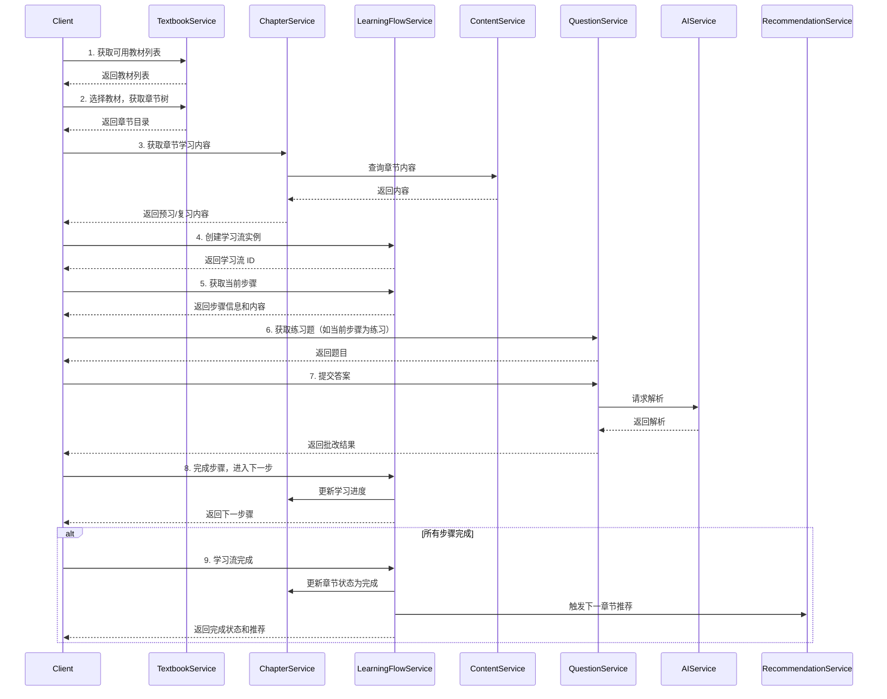

# 同步课堂学习服务 - 详细设计

## 1. 模块概述

### 1.1 功能定位

同步课堂学习服务是启硕 PrimeTop 的核心模块，负责围绕国内主流教材版本，按学段、年级、学科、章节组织学习内容，实现学生课堂进度的同步学习和个性化知识巩固。

### 1.2 核心能力

1. 教材版本管理与章节目录映射
2. 章节内容聚合与结构化组织
3. 个性化学习流编排与推荐
4. 学习进度追踪与知识掌握度评估
5. 预习复习任务智能生成
6. 跨教材版本知识点对齐与迁移

### 1.3 技术架构

```
客户端
  ├─ 教材选择与章节导航
  ├─ 学习内容展示（预习/复习）
  ├─ 练习题与解析
  └─ 学习进度反馈
       │
API 网关层
       │
业务服务层（本模块）
  ├─ TextbookService：教材版本管理
  ├─ ChapterService：章节内容管理
  ├─ LearningFlowService：学习流编排
  ├─ ProgressService：学习进度追踪
  └─ KnowledgeMappingService：知识点映射
       │
依赖服务
  ├─ 内容服务（ContentService）：教材资源、知识点、考点
  ├─ AI 服务（AIService）：内容生成、智能推荐
  ├─ 题目服务（QuestionService）：章节练习题
  ├─ 学习服务（LearningService）：学习记录、错题
  └─ 推荐服务（RecommendationService）：个性化内容推荐
       │
数据层
  ├─ PostgreSQL：教材、章节、学习进度、学习流配置
  ├─ Redis：缓存热点章节、学习流模板
  └─ Elasticsearch：章节内容搜索
```

---

## 2. 数据结构设计

### 2.1 教材版本表（textbooks）

| 字段名 | 类型 | 说明 | 约束 |
|--------|------|------|------|
| id | BIGINT | 主键 | PK, AUTO_INCREMENT |
| publisher_id | BIGINT | 出版社 ID | FK → publishers(id) |
| name | VARCHAR(128) | 教材名称（如"人教版七年级数学上册"） | NOT NULL |
| short_name | VARCHAR(32) | 简称（如"人教七数上"） | UNIQUE |
| education_level | VARCHAR(16) | 学段（kindergarten/primary/junior/senior） | NOT NULL |
| grade | SMALLINT | 年级（1-12，幼儿园 1-3） | NOT NULL |
| semester | TINYINT | 学期（1=上册，2=下册） | NOT NULL |
| subject_id | BIGINT | 学科 ID | FK → subjects(id) |
| cover_image_url | VARCHAR(512) | 封面图 URL | |
| description | TEXT | 教材简介 | |
| isbn | VARCHAR(20) | ISBN 编号 | UNIQUE |
| edition_year | SMALLINT | 版本年份 | |
| region | VARCHAR(32) | 适用区域（如"全国""北京"） | |
| status | TINYINT | 状态（1=启用，0=停用） | DEFAULT 1 |
| sort_order | INT | 排序序号 | |
| created_at | TIMESTAMP(3) | 创建时间 | DEFAULT CURRENT_TIMESTAMP(3) |
| updated_at | TIMESTAMP(3) | 更新时间 | ON UPDATE CURRENT_TIMESTAMP(3) |

### 2.2 章节目录表（textbook_chapters）

| 字段名 | 类型 | 说明 | 约束 |
|--------|------|------|------|
| id | BIGINT | 主键 | PK, AUTO_INCREMENT |
| textbook_id | BIGINT | 教材 ID | FK → textbooks(id) |
| parent_id | BIGINT | 父章节 ID（NULL 表示顶层） | FK → textbook_chapters(id) |
| code | VARCHAR(32) | 章节编码（如"1.1.1"） | |
| title | VARCHAR(128) | 章节标题 | NOT NULL |
| level | TINYINT | 层级（1=册，2=单元，3=章，4=节，5=知识点） | NOT NULL |
| sort_order | INT | 同级排序 | |
| estimated_hours | DECIMAL(3,1) | 预计学习时长（小时） | DEFAULT 2.0 |
| knowledge_points | JSONB | 关联知识点 ID 数组 | |
| exam_points | JSONB | 关联考点 ID 数组 | |
| tags | JSONB | 标签数组（如["重点""难点""高考常考"]） | |
| status | TINYINT | 状态（1=启用，0=停用） | DEFAULT 1 |
| created_at | TIMESTAMP(3) | 创建时间 | DEFAULT CURRENT_TIMESTAMP(3) |
| updated_at | TIMESTAMP(3) | 更新时间 | ON UPDATE CURRENT_TIMESTAMP(3) |

索引：
- `idx_textbook_parent` (textbook_id, parent_id)
- `idx_textbook_level` (textbook_id, level)
- `idx_code` (textbook_id, code)

### 2.3 章节内容表（chapter_contents）

| 字段名 | 类型 | 说明 | 约束 |
|--------|------|------|------|
| id | BIGINT | 主键 | PK, AUTO_INCREMENT |
| chapter_id | BIGINT | 章节 ID | FK → textbook_chapters(id) |
| content_type | VARCHAR(16) | 内容类型（preview/review/summary/exercise） | NOT NULL |
| title | VARCHAR(128) | 内容标题 | |
| content_body | TEXT | 内容主体（Markdown） | NOT NULL |
| structured_data | JSONB | 结构化数据（如知识点列表、公式） | |
| media_urls | JSONB | 多媒体资源 URL 数组 | |
| difficulty | TINYINT | 难度等级（1-5） | DEFAULT 3 |
| estimated_minutes | SMALLINT | 预计用时（分钟） | |
| ai_generated | BOOLEAN | 是否 AI 生成 | DEFAULT FALSE |
| version | INT | 内容版本号 | DEFAULT 1 |
| status | TINYINT | 状态（1=已发布，0=草稿） | DEFAULT 1 |
| created_by | BIGINT | 创建人 ID | |
| created_at | TIMESTAMP(3) | 创建时间 | DEFAULT CURRENT_TIMESTAMP(3) |
| updated_at | TIMESTAMP(3) | 更新时间 | ON UPDATE CURRENT_TIMESTAMP(3) |

索引：
- `idx_chapter_type` (chapter_id, content_type)

### 2.4 学习进度表（student_chapter_progress）

| 字段名 | 类型 | 说明 | 约束 |
|--------|------|------|------|
| id | BIGINT | 主键 | PK, AUTO_INCREMENT |
| user_id | BIGINT | 用户 ID | FK → users(id) |
| student_profile_id | BIGINT | 学生档案 ID | FK → student_profiles(id) |
| textbook_id | BIGINT | 教材 ID | FK → textbooks(id) |
| chapter_id | BIGINT | 章节 ID | FK → textbook_chapters(id) |
| status | VARCHAR(16) | 学习状态（not_started/in_progress/completed/mastered） | DEFAULT 'not_started' |
| preview_status | TINYINT | 预习完成度（0-100） | DEFAULT 0 |
| review_status | TINYINT | 复习完成度（0-100） | DEFAULT 0 |
| exercise_score | DECIMAL(5,2) | 练习得分 | |
| exercise_count | SMALLINT | 练习题完成数 | DEFAULT 0 |
| exercise_total | SMALLINT | 练习题总数 | |
| mastery_level | TINYINT | 掌握度（1-5） | |
| started_at | TIMESTAMP(3) | 开始学习时间 | |
| completed_at | TIMESTAMP(3) | 完成时间 | |
| last_study_at | TIMESTAMP(3) | 最后学习时间 | |
| total_study_duration | INT | 总学习时长（秒） | DEFAULT 0 |
| learning_data | JSONB | 学习详情数据 | |
| created_at | TIMESTAMP(3) | 创建时间 | DEFAULT CURRENT_TIMESTAMP(3) |
| updated_at | TIMESTAMP(3) | 更新时间 | ON UPDATE CURRENT_TIMESTAMP(3) |

唯一索引：
- `uk_user_chapter` (user_id, textbook_id, chapter_id)

索引：
- `idx_student_profile` (student_profile_id, textbook_id)
- `idx_status` (status, last_study_at)
- `idx_textbook` (textbook_id, chapter_id)

### 2.5 学习流配置表（learning_flow_templates）

| 字段名 | 类型 | 说明 | 约束 |
|--------|------|------|------|
| id | BIGINT | 主键 | PK, AUTO_INCREMENT |
| name | VARCHAR(64) | 流程名称 | NOT NULL |
| flow_type | VARCHAR(32) | 流程类型（chapter_review/weakness_breakthrough/exam_prep） | NOT NULL |
| education_level | VARCHAR(16) | 适用学段 | |
| subject_id | BIGINT | 适用学科 | FK → subjects(id) |
| difficulty_range | VARCHAR(16) | 难度范围（如"1-3"） | |
| flow_steps | JSONB | 流程步骤定义（详见下文） | NOT NULL |
| estimated_duration | SMALLINT | 预计总时长（分钟） | |
| is_default | BOOLEAN | 是否默认流程 | DEFAULT FALSE |
| status | TINYINT | 状态（1=启用，0=停用） | DEFAULT 1 |
| created_by | BIGINT | 创建人 ID | |
| created_at | TIMESTAMP(3) | 创建时间 | DEFAULT CURRENT_TIMESTAMP(3) |
| updated_at | TIMESTAMP(3) | 更新时间 | ON UPDATE CURRENT_TIMESTAMP(3) |

`flow_steps` JSONB 结构示例：
```json
[
  {
    "step_order": 1,
    "step_type": "content_reading",
    "title": "预习内容阅读",
    "content_type": "preview",
    "estimated_minutes": 10,
    "required": true,
    "ai_assist": true
  },
  {
    "step_order": 2,
    "step_type": "quiz",
    "title": "基础练习",
    "question_count": 5,
    "difficulty_range": "1-2",
    "estimated_minutes": 8,
    "required": true
  },
  {
    "step_order": 3,
    "step_type": "ai_explanation",
    "title": "知识点讲解",
    "estimated_minutes": 5,
    "required": false,
    "ai_assist": true
  },
  {
    "step_order": 4,
    "step_type": "exercise",
    "title": "巩固练习",
    "question_count": 10,
    "difficulty_range": "2-4",
    "estimated_minutes": 15,
    "required": true
  }
]
```

### 2.6 学生学习流实例表（student_learning_flows）

| 字段名 | 类型 | 说明 | 约束 |
|--------|------|------|------|
| id | BIGINT | 主键 | PK, AUTO_INCREMENT |
| user_id | BIGINT | 用户 ID | FK → users(id) |
| student_profile_id | BIGINT | 学生档案 ID | FK → student_profiles(id) |
| textbook_id | BIGINT | 教材 ID | FK → textbooks(id) |
| chapter_id | BIGINT | 章节 ID | FK → textbook_chapters(id) |
| flow_template_id | BIGINT | 流程模板 ID | FK → learning_flow_templates(id) |
| status | VARCHAR(16) | 状态（not_started/in_progress/completed/paused） | DEFAULT 'not_started' |
| current_step | INT | 当前步骤序号 | DEFAULT 1 |
| completed_steps | JSONB | 已完成步骤列表 | |
| step_data | JSONB | 各步骤数据 | |
| total_score | DECIMAL(5,2) | 总得分 | |
| started_at | TIMESTAMP(3) | 开始时间 | |
| completed_at | TIMESTAMP(3) | 完成时间 | |
| total_duration | INT | 总时长（秒） | |
| created_at | TIMESTAMP(3) | 创建时间 | DEFAULT CURRENT_TIMESTAMP(3) |
| updated_at | TIMESTAMP(3) | 更新时间 | ON UPDATE CURRENT_TIMESTAMP(3) |

唯一索引：
- `uk_user_chapter_flow` (user_id, textbook_id, chapter_id, flow_template_id)

---

## 3. API 接口设计

### 3.1 教材版本管理

#### 3.1.1 获取可用教材列表

**接口**: `GET /api/v1/textbooks`

**请求参数**:
| 参数名 | 类型 | 必填 | 说明 |
|--------|------|------|------|
| education_level | string | 否 | 学段筛选（kindergarten/primary/junior/senior） |
| grade | int | 否 | 年级筛选 |
| subject_id | long | 否 | 学科 ID 筛选 |
| page | int | 否 | 页码，默认 1 |
| page_size | int | 否 | 每页数量，默认 20 |

**响应示例**:
```json
{
  "code": 0,
  "message": "success",
  "data": {
    "total": 50,
    "page": 1,
    "page_size": 20,
    "items": [
      {
        "id": 1001,
        "name": "人教版七年级数学上册",
        "short_name": "人教七数上",
        "education_level": "junior",
        "grade": 7,
        "semester": 1,
        "subject": {
          "id": 1,
          "name": "数学",
          "code": "math"
        },
        "cover_image_url": "https://cdn.example.com/textbooks/1001/cover.jpg",
        "publisher": {
          "id": 10,
          "name": "人民教育出版社"
        },
        "region": "全国",
        "edition_year": 2024,
        "status": 1
      }
    ]
  }
}
```

#### 3.1.2 获取教材详情

**接口**: `GET /api/v1/textbooks/{textbook_id}`

**路径参数**:
- `textbook_id`: 教材 ID

**响应示例**:
```json
{
  "code": 0,
  "message": "success",
  "data": {
    "id": 1001,
    "name": "人教版七年级数学上册",
    "cover_image_url": "https://cdn.example.com/textbooks/1001/cover.jpg",
    "description": "适用于全国初中一年级数学课程...",
    "subject": {
      "id": 1,
      "name": "数学"
    },
    "publisher": {
      "id": 10,
      "name": "人民教育出版社"
    },
    "education_level": "junior",
    "grade": 7,
    "semester": 1,
    "isbn": "978-7-107-xxxxx-x",
    "edition_year": 2024,
    "region": "全国",
    "chapter_count": 12,
    "estimated_hours": 48
  }
}
```

### 3.2 章节目录管理

#### 3.2.1 获取教材章节树

**接口**: `GET /api/v1/textbooks/{textbook_id}/chapters`

**请求参数**:
| 参数名 | 类型 | 必填 | 说明 |
|--------|------|------|------|
| level | int | 否 | 限制层级深度，默认全部 |
| include_content | boolean | 否 | 是否包含内容概览，默认 false |

**响应示例**:
```json
{
  "code": 0,
  "message": "success",
  "data": {
    "textbook_id": 1001,
    "chapters": [
      {
        "id": 2001,
        "code": "1",
        "title": "有理数",
        "level": 2,
        "sort_order": 1,
        "estimated_hours": 8,
        "children": [
          {
            "id": 2002,
            "code": "1.1",
            "title": "正数和负数",
            "level": 3,
            "sort_order": 1,
            "estimated_hours": 2,
            "knowledge_points": [101, 102],
            "exam_points": [501, 502],
            "tags": ["重点"],
            "children": [
              {
                "id": 2003,
                "code": "1.1.1",
                "title": "正负数的意义",
                "level": 4,
                "sort_order": 1
              }
            ]
          }
        ]
      }
    ]
  }
}
```

#### 3.2.2 获取章节详情

**接口**: `GET /api/v1/chapters/{chapter_id}`

**路径参数**:
- `chapter_id`: 章节 ID

**响应示例**:
```json
{
  "code": 0,
  "message": "success",
  "data": {
    "id": 2002,
    "code": "1.1",
    "title": "正数和负数",
    "textbook": {
      "id": 1001,
      "name": "人教版七年级数学上册"
    },
    "level": 3,
    "estimated_hours": 2,
    "knowledge_points": [
      {
        "id": 101,
        "name": "有理数的概念",
        "description": "理解正数、负数、零的含义"
      }
    ],
    "exam_points": [
      {
        "id": 501,
        "name": "正负数的表示",
        "frequency": "high"
      }
    ],
    "tags": ["重点", "基础"],
    "content_types": ["preview", "review", "exercise"],
    "parent_chapter": {
      "id": 2001,
      "title": "有理数"
    }
  }
}
```

### 3.3 学习内容获取

#### 3.3.1 获取章节学习内容

**接口**: `GET /api/v1/chapters/{chapter_id}/contents`

**请求参数**:
| 参数名 | 类型 | 必填 | 说明 |
|--------|------|------|------|
| content_type | string | 否 | 内容类型（preview/review/summary/exercise），默认全部 |

**响应示例**:
```json
{
  "code": 0,
  "message": "success",
  "data": {
    "chapter_id": 2002,
    "contents": [
      {
        "id": 3001,
        "content_type": "preview",
        "title": "课前预习",
        "content_body": "# 正数和负数的预习\n\n## 学习目标\n...",
        "structured_data": {
          "key_concepts": ["正数", "负数", "零"],
          "formulas": []
        },
        "media_urls": [
          "https://cdn.example.com/contents/3001/image1.png"
        ],
        "difficulty": 2,
        "estimated_minutes": 10
      }
    ]
  }
}
```

### 3.4 学习进度管理

#### 3.4.1 获取用户学习进度

**接口**: `GET /api/v1/students/{student_id}/progress`

**请求参数**:
| 参数名 | 类型 | 必填 | 说明 |
|--------|------|------|------|
| textbook_id | long | 否 | 教材 ID 筛选 |
| chapter_id | long | 否 | 章节 ID 筛选 |
| status | string | 否 | 状态筛选（in_progress/completed/mastered） |

**响应示例**:
```json
{
  "code": 0,
  "message": "success",
  "data": {
    "student_id": 10001,
    "summary": {
      "total_chapters": 12,
      "completed_chapters": 5,
      "in_progress_chapters": 2,
      "mastery_avg": 3.6,
      "total_study_hours": 18.5
    },
    "progress_list": [
      {
        "id": 5001,
        "chapter": {
          "id": 2002,
          "code": "1.1",
          "title": "正数和负数"
        },
        "status": "completed",
        "preview_status": 100,
        "review_status": 90,
        "exercise_score": 85.5,
        "mastery_level": 4,
        "last_study_at": "2026-06-16T10:30:00Z"
      }
    ]
  }
}
```

#### 3.4.2 更新章节学习进度

**接口**: `POST /api/v1/students/{student_id}/progress/{chapter_id}`

**请求体**:
```json
{
  "status": "completed",
  "preview_status": 100,
  "review_status": 80,
  "exercise_score": 90,
  "exercise_count": 10,
  "exercise_total": 10,
  "mastery_level": 4,
  "study_duration": 1800
}
```

**响应示例**:
```json
{
  "code": 0,
  "message": "success",
  "data": {
    "id": 5001,
    "status": "completed",
    "mastery_level": 4,
    "updated_at": "2026-06-16T11:00:00Z"
  }
}
```

### 3.5 学习流管理

#### 3.5.1 创建学习流

**接口**: `POST /api/v1/students/{student_id}/learning-flows`

**请求体**:
```json
{
  "textbook_id": 1001,
  "chapter_id": 2002,
  "flow_template_id": 101
}
```

**响应示例**:
```json
{
  "code": 0,
  "message": "success",
  "data": {
    "id": 6001,
    "status": "not_started",
    "current_step": 1,
    "flow_template": {
      "id": 101,
      "name": "章节复习流程",
      "estimated_duration": 38
    },
    "steps": [
      {
        "step_order": 1,
        "step_type": "content_reading",
        "title": "预习内容阅读",
        "estimated_minutes": 10
      }
    ]
  }
}
```

#### 3.5.2 获取学习流当前步骤

**接口**: `GET /api/v1/students/{student_id}/learning-flows/{flow_id}/current-step`

**响应示例**:
```json
{
  "code": 0,
  "message": "success",
  "data": {
    "flow_id": 6001,
    "current_step": 1,
    "step": {
      "step_order": 1,
      "step_type": "content_reading",
      "title": "预习内容阅读",
      "content_type": "preview",
      "estimated_minutes": 10,
      "required": true,
      "ai_assist": true
    },
    "chapter_content": {
      "id": 3001,
      "title": "课前预习",
      "content_body": "# 正数和负数的预习\n...",
      "media_urls": ["https://cdn.example.com/contents/3001/image1.png"]
    }
  }
}
```

#### 3.5.3 完成学习流步骤

**接口**: `POST /api/v1/students/{student_id}/learning-flows/{flow_id}/steps/{step_order}/complete`

**请求体**:
```json
{
  "duration": 600,
  "score": 95,
  "answers": [
    {
      "question_id": 1001,
      "selected_option": "A",
      "is_correct": true
    }
  ]
}
```

**响应示例**:
```json
{
  "code": 0,
  "message": "success",
  "data": {
    "flow_id": 6001,
    "current_step": 2,
    "next_step": {
      "step_order": 2,
      "step_type": "quiz",
      "title": "基础练习",
      "question_count": 5
    },
    "is_completed": false
  }
}
```

### 3.6 个性化推荐

#### 3.6.1 获取推荐章节

**接口**: `GET /api/v1/students/{student_id}/recommended-chapters`

**请求参数**:
| 参数名 | 类型 | 必填 | 说明 |
|--------|------|------|------|
| limit | int | 否 | 返回数量，默认 3 |
| reason_type | string | 否 | 推荐原因类型（weakness/progress/continuity） |

**响应示例**:
```json
{
  "code": 0,
  "message": "success",
  "data": {
    "recommendations": [
      {
        "chapter": {
          "id": 2005,
          "title": "一元一次方程",
          "code": "3.1"
        },
        "reason_type": "weakness",
        "reason": "您的练习正确率较低，建议重点复习",
        "priority": 1,
        "estimated_hours": 3
      }
    ]
  }
}
```

---

## 4. 关键业务流程

### 4.1 同步课堂学习完整流程



### 4.2 学习流编排与执行

**状态机**:
```
not_started -> in_progress -> completed
               \-> paused -> in_progress
               \-> abandoned
```

**状态流转规则**:
1. **not_started → in_progress**: 用户开始第一步学习
2. **in_progress → completed**: 所有必选步骤完成
3. **in_progress → paused**: 用户主动暂停学习
4. **paused → in_progress**: 用户恢复学习
5. **in_progress → abandoned**: 超过 7 天未继续，系统自动标记

### 4.3 个性化学习流生成

**输入参数**:
- 学生学段、年级、学科
- 学习目标（预习/复习/考试冲刺）
- 当前掌握水平
- 历史学习行为数据
- 薄弱点识别结果

**生成逻辑**:
```python
def generate_personalized_flow(student_profile, chapter, learning_goal):
    # 1. 获取基础流程模板
    base_template = get_flow_template(
        education_level=student_profile.education_level,
        flow_type=learning_goal
    )

    # 2. 根据掌握度调整步骤
    mastery = get_chapter_mastery(student_profile.id, chapter.id)

    if mastery < 3:
        # 掌握度低，增加基础讲解和练习
        steps = insert_after(
            base_template.flow_steps,
            step_type="ai_explanation",
            position=1,
            extra_steps=[
                {"step_type": "concept_intro", "title": "基础概念讲解"},
                {"step_type": "easy_practice", "title": "基础练习"}
            ]
        )
    else:
        # 掌握度高，增加拓展内容
        steps = insert_after(
            base_template.flow_steps,
            step_type="exercise",
            position=-1,
            extra_steps=[
                {"step_type": "advanced_quiz", "title": "拓展练习"},
                {"step_type": "application_scenario", "title": "应用场景"}
            ]
        )

    # 3. 根据学习时间限制压缩/扩展
    if student_profile.available_time < 30:
        steps = compress_steps(steps, target_minutes=student_profile.available_time)

    # 4. 个性化内容绑定
    for step in steps:
        if step.get("content_type"):
            step["content_id"] = get_personalized_content(
                chapter.id,
                step["content_type"],
                student_profile.difficulty_preference
            )
        if step.get("question_count"):
            step["question_ids"] = get_adaptive_questions(
                chapter.id,
                step["difficulty_range"],
                student_profile.weak_points
            )

    return {
        "flow_steps": steps,
        "estimated_duration": sum(s.get("estimated_minutes", 0) for s in steps)
    }
```

---

## 5. 关键代码示例

### 5.1 章节目录树查询服务

```java
@Service
@RequiredArgsConstructor
public class ChapterService {

    private final ChapterRepository chapterRepository;
    private final ContentService contentService;
    private final RedisTemplate<String, Object> redisTemplate;

    private static final String CHAPTER_TREE_CACHE_KEY = "chapter:tree:%d";

    /**
     * 获取教材章节树
     */
    public ChapterTreeDTO getChapterTree(Long textbookId, Integer maxLevel, boolean includeContent) {
        // 尝试从缓存获取
        String cacheKey = String.format(CHAPTER_TREE_CACHE_KEY, textbookId);
        ChapterTreeDTO cached = (ChapterTreeDTO) redisTemplate.opsForValue().get(cacheKey);
        if (cached != null) {
            return cached;
        }

        // 查询所有章节
        List<TextbookChapter> chapters = chapterRepository.findByTextbookId(textbookId);

        // 构建树形结构
        List<ChapterTreeNode> rootNodes = buildTree(chapters, null, 0, maxLevel);

        // 如果需要包含内容概览
        if (includeContent) {
            enrichWithContentSummary(rootNodes, textbookId);
        }

        ChapterTreeDTO result = new ChapterTreeDTO(textbookId, rootNodes);

        // 缓存 1 小时
        redisTemplate.opsForValue().set(cacheKey, result, 1, TimeUnit.HOURS);

        return result;
    }

    /**
     * 递归构建章节树
     */
    private List<ChapterTreeNode> buildTree(
            List<TextbookChapter> allChapters,
            Long parentId,
            int currentLevel,
            Integer maxLevel
    ) {
        if (maxLevel != null && currentLevel >= maxLevel) {
            return Collections.emptyList();
        }

        return allChapters.stream()
                .filter(ch -> Objects.equals(ch.getParentId(), parentId))
                .sorted(Comparator.comparing(TextbookChapter::getSortOrder))
                .map(ch -> {
                    ChapterTreeNode node = toTreeNode(ch);
                    node.setChildren(buildTree(allChapters, ch.getId(), currentLevel + 1, maxLevel));
                    return node;
                })
                .collect(Collectors.toList());
    }

    /**
     * 丰富内容概览信息
     */
    private void enrichWithContentSummary(List<ChapterTreeNode> nodes, Long textbookId) {
        for (ChapterTreeNode node : nodes) {
            if (node.getLevel() >= 4) { // 只为知识点级别丰富内容
                List<ChapterContentType> types = contentService.getAvailableContentTypes(node.getId());
                node.setContentTypes(types);
            }
            if (!CollectionUtils.isEmpty(node.getChildren())) {
                enrichWithContentSummary(node.getChildren(), textbookId);
            }
        }
    }

    /**
     * 清除章节树缓存（章节内容更新时调用）
     */
    public void evictChapterTreeCache(Long textbookId) {
        String cacheKey = String.format(CHAPTER_TREE_CACHE_KEY, textbookId);
        redisTemplate.delete(cacheKey);
    }
}
```

### 5.2 学习流执行引擎

```java
@Service
@RequiredArgsConstructor
public class LearningFlowExecutionService {

    private final StudentLearningFlowRepository flowRepository;
    private final ChapterService chapterService;
    private final QuestionService questionService;
    private final AIService aiService;
    private final ProgressService progressService;

    /**
     * 创建学习流实例
     */
    @Transactional
    public StudentLearningFlow createFlow(
            Long studentId,
            Long textbookId,
            Long chapterId,
            Long flowTemplateId
    ) {
        // 检查是否已有进行中的学习流
        Optional<StudentLearningFlow> existingFlow =
                flowRepository.findActiveFlow(studentId, textbookId, chapterId);
        if (existingFlow.isPresent()) {
            return existingFlow.get();
        }

        // 获取流程模板
        LearningFlowTemplate template = flowTemplateRepository.findById(flowTemplateId)
                .orElseThrow(() -> new NotFoundException("Flow template not found"));

        // 个性化调整步骤
        List<FlowStep> personalizedSteps = personalizeSteps(
                studentId,
                chapterId,
                template.getFlowSteps()
        );

        // 创建学习流实例
        StudentLearningFlow flow = new StudentLearningFlow();
        flow.setUserId(studentId);
        flow.setStudentProfileId(getStudentProfileId(studentId));
        flow.setTextbookId(textbookId);
        flow.setChapterId(chapterId);
        flow.setFlowTemplateId(flowTemplateId);
        flow.setStatus("not_started");
        flow.setCurrentStep(1);
        flow.setStepData(initStepData(personalizedSteps));

        return flowRepository.save(flow);
    }

    /**
     * 个性化调整步骤
     */
    private List<FlowStep> personalizeSteps(Long studentId, Long chapterId, List<FlowStep> baseSteps) {
        StudentMastery mastery = progressService.getMasteryLevel(studentId, chapterId);

        if (mastery.getLevel() < 3) {
            // 掌握度低，增加基础讲解步骤
            FlowStep explanationStep = FlowStep.builder()
                    .stepOrder(1)
                    .stepType("ai_explanation")
                    .title("知识点详解")
                    .estimatedMinutes(8)
                    .aiAssist(true)
                    .build();
            baseSteps.add(0, explanationStep);
        }

        return renumberSteps(baseSteps);
    }

    /**
     * 完成步骤
     */
    @Transactional
    public CompleteStepResult completeStep(
            Long flowId,
            Integer stepOrder,
            CompleteStepRequest request
    ) {
        StudentLearningFlow flow = flowRepository.findById(flowId)
                .orElseThrow(() -> new NotFoundException("Flow not found"));

        // 验证步骤顺序
        if (!flow.getCurrentStep().equals(stepOrder)) {
            throw new BusinessException("Invalid step order");
        }

        // 记录步骤数据
        FlowStep step = getFlowStep(flow, stepOrder);
        Map<String, Object> stepData = flow.getStepData();

        if ("quiz".equals(step.getStepType()) || "exercise".equals(step.getStepType())) {
            // 批改答案
            QuizGradingResult grading = gradeQuiz(request.getAnswers());
            stepData.put("step_" + stepOrder, Map.of(
                    "score", grading.getScore(),
                    "correct_count", grading.getCorrectCount(),
                    "duration", request.getDuration()
            ));
        } else {
            stepData.put("step_" + stepOrder, Map.of(
                    "duration", request.getDuration(),
                    "completed_at", Instant.now()
            ));
        }

        flow.setStepData(stepData);
        flow.setTotalDuration(flow.getTotalDuration() + request.getDuration());

        // 判断是否还有下一步
        List<FlowStep> allSteps = getAllSteps(flow);
        if (stepOrder >= allSteps.size()) {
            // 学习流完成
            flow.setStatus("completed");
            flow.setCompletedAt(Instant.now());

            // 更新章节学习进度
            progressService.updateChapterProgress(
                    flow.getUserId(),
                    flow.getTextbookId(),
                    flow.getChapterId(),
                    calculateOverallScore(stepData)
            );

            return CompleteStepResult.builder()
                    .isCompleted(true)
                    .finalScore(calculateOverallScore(stepData))
                    .nextRecommendations(getNextRecommendations(flow))
                    .build();
        } else {
            // 进入下一步
            flow.setCurrentStep(stepOrder + 1);
            return CompleteStepResult.builder()
                    .isCompleted(false)
                    .nextStep(allSteps.get(stepOrder))
                    .build();
        }

        flowRepository.save(flow);
    }

    /**
     * 获取当前步骤内容
     */
    public CurrentStepResponse getCurrentStep(Long flowId) {
        StudentLearningFlow flow = flowRepository.findById(flowId)
                .orElseThrow(() -> new NotFoundException("Flow not found"));

        if ("completed".equals(flow.getStatus())) {
            throw new BusinessException("Flow already completed");
        }

        FlowStep step = getFlowStep(flow, flow.getCurrentStep());

        CurrentStepResponse response = new CurrentStepResponse();
        response.setFlowId(flowId);
        response.setCurrentStep(flow.getCurrentStep());
        response.setStep(step);

        // 根据步骤类型加载内容
        if ("content_reading".equals(step.getStepType())) {
            response.setChapterContent(
                    chapterService.getChapterContent(flow.getChapterId(), step.getContentType())
            );
        } else if ("quiz".equals(step.getStepType()) || "exercise".equals(step.getStepType())) {
            response.setQuestions(
                    questionService.getQuestionsForStep(flow.getChapterId(), step)
            );
        }

        return response;
    }
}
```

### 5.3 章节学习进度追踪

```java
@Service
@RequiredArgsConstructor
public class ChapterProgressService {

    private final StudentChapterProgressRepository progressRepository;
    private final QuestionService questionService;
    private final MistakeService mistakeService;

    /**
     * 更新章节学习进度
     */
    @Transactional
    public void updateProgress(Long userId, UpdateProgressRequest request) {
        StudentChapterProgress progress = progressRepository
                .findByUserAndChapter(userId, request.getTextbookId(), request.getChapterId())
                .orElseGet(() -> createNewProgress(userId, request));

        // 更新预习/复习状态
        if (request.getPreviewStatus() != null) {
            progress.setPreviewStatus(request.getPreviewStatus());
        }
        if (request.getReviewStatus() != null) {
            progress.setReviewStatus(request.getReviewStatus());
        }

        // 更新练习数据
        if (request.getExerciseCount() != null) {
            progress.setExerciseCount(request.getExerciseCount());
        }
        if (request.getExerciseTotal() != null) {
            progress.setExerciseTotal(request.getExerciseTotal());
        }
        if (request.getExerciseScore() != null) {
            progress.setExerciseScore(request.getExerciseScore());
        }

        // 更新学习时长
        if (request.getStudyDuration() != null) {
            progress.setTotalStudyDuration(
                    progress.getTotalStudyDuration() + request.getStudyDuration()
            );
        }

        // 自动计算掌握度
        if (request.getMasteryLevel() == null) {
            progress.setMasteryLevel(calculateMasteryLevel(progress));
        }

        // 更新状态
        progress.setStatus(determineStatus(progress));

        progress.setLastStudyAt(Instant.now());
        if ("completed".equals(progress.getStatus()) && progress.getCompletedAt() == null) {
            progress.setCompletedAt(Instant.now());
        }

        progressRepository.save(progress);
    }

    /**
     * 计算掌握度（1-5级）
     */
    private int calculateMasteryLevel(StudentChapterProgress progress) {
        int previewScore = progress.getPreviewStatus();
        int reviewScore = progress.getReviewStatus();
        float exerciseScore = progress.getExerciseScore() != null ?
                progress.getExerciseScore().floatValue() : 0f;

        // 权重：练习 50%，复习 30%，预习 20%
        float weightedScore = exerciseScore * 0.5f + reviewScore * 0.3f + previewScore * 0.2f;

        if (weightedScore >= 95) return 5;  // 精通
        if (weightedScore >= 85) return 4;  // 熟练
        if (weightedScore >= 70) return 3;  // 掌握
        if (weightedScore >= 50) return 2;  // 初步
        return 1;  // 未掌握
    }

    /**
     * 确定学习状态
     */
    private String determineStatus(StudentChapterProgress progress) {
        if (progress.getExerciseCount() == null || progress.getExerciseCount() == 0) {
            return "not_started";
        }

        float completionRate = (float) progress.getExerciseCount() / progress.getExerciseTotal();
        if (completionRate >= 1.0f) {
            return progress.getMasteryLevel() >= 3 ? "mastered" : "completed";
        } else if (completionRate > 0) {
            return "in_progress";
        }

        return "not_started";
    }

    /**
     * 获取学生薄弱章节
     */
    public List<ChapterWeaknessDTO> getWeakChapters(Long studentId, Long textbookId, int limit) {
        List<StudentChapterProgress> progressList = progressRepository
                .findByStudentAndTextbook(studentId, textbookId);

        return progressList.stream()
                .filter(p -> p.getMasteryLevel() != null && p.getMasteryLevel() < 3)
                .sorted(Comparator.comparing(StudentChapterProgress::getMasteryLevel))
                .limit(limit)
                .map(this::toWeaknessDTO)
                .collect(Collectors.toList());
    }

    /**
     * 同步章节到下一章节（推荐继续学习）
     */
    public Optional<Long> recommendNextChapter(Long userId, Long textbookId) {
        // 查找已完成但下一章节未开始的
        List<StudentChapterProgress> completed = progressRepository
                .findByUserAndTextbookAndStatus(userId, textbookId, "completed");

        for (StudentChapterProgress progress : completed) {
            Optional<Long> nextChapterId = findNextChapter(
                    progress.getChapterId(),
                    textbookId
            );
            if (nextChapterId.isPresent()) {
                boolean nextStarted = progressRepository
                        .existsByUserAndChapter(userId, textbookId, nextChapterId.get());
                if (!nextStarted) {
                    return nextChapterId;
                }
            }
        }

        return Optional.empty();
    }

    /**
     * 找到下一章节 ID
     */
    private Optional<Long> findNextChapter(Long currentChapterId, Long textbookId) {
        return chapterRepository.findNextChapter(textbookId, currentChapterId)
                .map(TextbookChapter::getId);
    }
}
```

---

## 6. 错误处理

### 6.1 错误码定义

| 错误码 | 说明 | HTTP 状态码 |
|--------|------|-------------|
| TEXTBOOK_NOT_FOUND | 教材不存在 | 404 |
| CHAPTER_NOT_FOUND | 章节不存在 | 404 |
| CONTENT_NOT_AVAILABLE | 章节内容暂不可用 | 404 |
| FLOW_TEMPLATE_NOT_FOUND | 学习流模板不存在 | 404 |
| FLOW_ALREADY_COMPLETED | 学习流已完成 | 400 |
| INVALID_STEP_ORDER | 步骤顺序错误 | 400 |
| STUDENT_PROFILE_NOT_FOUND | 学生档案不存在 | 404 |
| TEXTBOOK_VERSION_MISMATCH | 教材版本不匹配 | 400 |
| CHAPTER_LOCKED | 章节已锁定（需要先学前置章节） | 403 |

### 6.2 异常处理示例

```java
@RestControllerAdvice
public class SyncClassroomExceptionHandler {

    @ExceptionHandler(TextbookNotFoundException.class)
    public ResponseEntity<ErrorResponse> handleTextbookNotFound(TextbookNotFoundException ex) {
        ErrorResponse error = ErrorResponse.builder()
                .code("TEXTBOOK_NOT_FOUND")
                .message("指定的教材不存在或已下架")
                .timestamp(Instant.now())
                .build();
        return ResponseEntity.status(HttpStatus.NOT_FOUND).body(error);
    }

    @ExceptionHandler(ChapterLockedException.class)
    public ResponseEntity<ErrorResponse> handleChapterLocked(ChapterLockedException ex) {
        ErrorResponse error = ErrorResponse.builder()
                .code("CHAPTER_LOCKED")
                .message("该章节需要先完成前置章节：" + ex.getPrerequisiteChapter())
                .timestamp(Instant.now())
                .details(Map.of(
                        "locked_chapter_id", ex.getChapterId(),
                        "prerequisite_chapter_id", ex.getPrerequisiteChapterId()
                ))
                .build();
        return ResponseEntity.status(HttpStatus.FORBIDDEN).body(error);
    }

    @ExceptionHandler(InvalidStepOrderException.class)
    public ResponseEntity<ErrorResponse> handleInvalidStepOrder(InvalidStepOrderException ex) {
        ErrorResponse error = ErrorResponse.builder()
                .code("INVALID_STEP_ORDER")
                .message("步骤顺序错误，请按顺序完成学习")
                .timestamp(Instant.now())
                .details(Map.of(
                        "expected_step", ex.getExpectedStep(),
                        "actual_step", ex.getActualStep()
                ))
                .build();
        return ResponseEntity.status(HttpStatus.BAD_REQUEST).body(error);
    }
}
```

### 6.3 章节前置依赖检查

```java
@Service
public class ChapterAccessControlService {

    private final ChapterRepository chapterRepository;
    private final ProgressRepository progressRepository;

    /**
     * 检查章节是否可访问
     */
    public void checkChapterAccess(Long userId, Long textbookId, Long chapterId) {
        TextbookChapter chapter = chapterRepository.findById(chapterId)
                .orElseThrow(() -> new ChapterNotFoundException(chapterId));

        // 查找前置依赖章节
        List<TextbookChapter> prerequisites = findPrerequisiteChapters(chapter);

        for (TextbookChapter prerequisite : prerequisites) {
            boolean isCompleted = progressRepository.isChapterCompleted(
                    userId, textbookId, prerequisite.getId()
            );

            if (!isCompleted) {
                throw new ChapterLockedException(
                        chapterId,
                        prerequisite.getId(),
                        prerequisite.getTitle()
                );
            }
        }
    }

    /**
     * 查找前置依赖章节
     */
    private List<TextbookChapter> findPrerequisiteChapters(TextbookChapter chapter) {
        // 根据知识图谱的依赖关系查找
        return chapterRepository.findPrerequisiteChapters(chapter.getId());
    }
}
```

---

## 7. 性能优化策略

### 7.1 缓存策略

| 缓存对象 | 缓存键 | 过期时间 | 更新策略 |
|----------|--------|----------|----------|
| 教材列表 | `textbooks:list:{params_hash}` | 1 小时 | 教材状态变更时清除 |
| 章节树 | `chapter:tree:{textbook_id}` | 1 小时 | 章节内容更新时清除 |
| 章节内容 | `chapter:content:{chapter_id}:{type}` | 24 小时 | 内容发布时清除 |
| 学习进度 | `progress:{user_id}:{textbook_id}` | 10 分钟 | 进度更新时写入 |
| 学习流模板 | `flow:template:{template_id}` | 永久 | 模板更新时清除 |

### 7.2 数据库优化

1. **索引设计**：
   - `(textbook_id, parent_id)` 加速章节树查询
   - `(user_id, textbook_id, chapter_id)` 唯一索引保障进度唯一性
   - `(student_profile_id, textbook_id)` 加速进度统计查询

2. **分页查询优化**：
   ```sql
   -- 使用游标分页避免深度分页问题
   SELECT * FROM textbook_chapters
   WHERE textbook_id = ? AND parent_id IS NULL
   ORDER BY id
   LIMIT ? OFFSET ?;
   ```

3. **聚合查询优化**：
   ```sql
   -- 使用 CTE 预计算学习统计
   WITH chapter_stats AS (
       SELECT
           chapter_id,
           COUNT(*) as student_count,
           AVG(mastery_level) as avg_mastery
       FROM student_chapter_progress
       WHERE textbook_id = ?
       GROUP BY chapter_id
   )
   SELECT c.*, cs.student_count, cs.avg_mastery
   FROM textbook_chapters c
   LEFT JOIN chapter_stats cs ON c.id = cs.chapter_id;
   ```

### 7.3 异步处理

**学习行为数据异步写入**：
```java
@Service
@RequiredArgsConstructor
public class LearningEventPublisher {

    private final KafkaTemplate<String, String> kafkaTemplate;

    /**
     * 异步发布学习事件
     */
    @Async
    public void publishLearningEvent(LearningEvent event) {
        String payload = JsonUtils.toJson(event);
        kafkaTemplate.send("learning-events", event.getUserId().toString(), payload);
    }
}
```

**章节内容预加载**：
```java
@Component
public class ChapterContentPreloader {

    @Scheduled(cron = "0 0 2 * * ?")  // 每天凌晨 2 点
    public void preloadHotChapters() {
        // 查询热门章节
        List<Long> hotChapterIds = chapterRepository.findHotChapters(LocalDateTime.now().minusDays(7));

        for (Long chapterId : hotChapterIds) {
            CompletableFuture.runAsync(() -> {
                chapterService.loadChapterContent(chapterId);
            });
        }
    }
}
```

---

## 8. 边界条件与注意事项

### 8.1 教材版本切换

**场景**：学生从人教版切换到苏教版

**处理逻辑**：
1. 检查目标教材是否存在对应年级
2. 将现有学习进度标记为"已归档"
3. 创建新的学习进度记录
4. 尝试映射知识点关系，迁移错题记录
5. 清除缓存，重新加载章节树

```java
@Service
public class TextbookSwitchService {

    @Transactional
    public void switchTextbook(Long userId, Long newTextbookId) {
        StudentProfile profile = studentProfileService.getByUserId(userId);

        // 1. 检查新教材兼容性
        Textbook newTextbook = textbookRepository.findById(newTextbookId)
                .orElseThrow(() -> new TextbookNotFoundException(newTextbookId));

        if (!isCompatible(profile.getCurrentTextbookId(), newTextbookId)) {
            throw new TextbookIncompatibleException("教材版本不兼容");
        }

        // 2. 归档旧进度
        progressRepository.archiveByUserAndTextbook(userId, profile.getCurrentTextbookId());

        // 3. 迁移错题
        mistakeService.migrateMistakes(
                userId,
                profile.getCurrentTextbookId(),
                newTextbookId
        );

        // 4. 更新学生档案
        profile.setCurrentTextbookId(newTextbookId);
        studentProfileRepository.save(profile);

        // 5. 清除缓存
        cacheManager.evict("progress", userId);
    }
}
```

### 8.2 章节内容缺失

**场景**：章节内容尚未生成或发布

**处理逻辑**：
1. 返回"内容生成中"提示
2. 触发异步内容生成任务
3. 提供替代学习内容（如基础知识点介绍）
4. 推荐学习相关已发布的章节

```java
@Service
public class ChapterContentFallbackService {

    /**
     * 处理内容缺失场景
     */
    public ChapterContentResponse handleMissingContent(Long chapterId, String contentType) {
        // 触发内容生成
        contentGenerationService.triggerGeneration(chapterId, contentType);

        // 返回占位内容
        ChapterContentResponse fallback = new ChapterContentResponse();
        fallback.setStatus("generating");
        fallback.setMessage("该章节内容正在生成中，预计 10 分钟后可查看");

        // 提供替代内容
        List<TextbookChapter> alternativeChapters = findAlternativeChapters(chapterId);
        fallback.setAlternativeChapters(alternativeChapters);

        return fallback;
    }
}
```

### 8.3 学习流超时处理

**场景**：用户开始学习后长时间未继续

**处理逻辑**：
1. 定时任务扫描超过 7 天未更新的学习流
2. 自动标记为"abandoned"状态
3. 记录原因到学习数据
4. 发送提醒通知

```java
@Component
public class LearningFlowTimeoutHandler {

    @Scheduled(fixedRate = 3600000)  // 每小时执行
    public void handleTimeoutFlows() {
        LocalDateTime timeoutThreshold = LocalDateTime.now().minusDays(7);

        List<StudentLearningFlow> timeoutFlows = flowRepository
                .findTimeoutFlows(timeoutThreshold);

        for (StudentLearningFlow flow : timeoutFlows) {
            flow.setStatus("abandoned");
            flowRepository.save(flow);

            // 发送提醒
            notificationService.sendLearningReminder(
                    flow.getUserId(),
                    "您上次学习已暂停 7 天，建议继续完成"
            );
        }
    }
}
```

---

## 9. 监控与告警

### 9.1 关键指标监控

| 指标 | 说明 | 告警阈值 |
|------|------|----------|
| `sync_classroom.chapter_content_load_time` | 章节内容加载耗时 | P99 > 1s |
| `sync_classroom.flow_completion_rate` | 学习流完成率 | < 60% |
| `sync_classroom.progress_update_error_rate` | 进度更新错误率 | > 1% |
| `sync_classroom.cache_hit_rate` | 缓存命中率 | < 80% |
| `sync_classroom.concurrent_learning_users` | 同时学习用户数 | > 10000 |

### 9.2 Prometheus 指标示例

```java
@Component
public class SyncClassroomMetrics {

    private final Counter chapterViewCounter = Counter.build()
            .name("sync_classroom_chapter_views_total")
            .help("Total chapter views")
            .labelNames("textbook_id", "chapter_id")
            .register();

    private final Histogram contentLoadTime = Histogram.build()
            .name("sync_classroom_content_load_duration_seconds")
            .help("Chapter content load duration")
            .labelNames("content_type")
            .register();

    public void recordChapterView(Long textbookId, Long chapterId) {
        chapterViewCounter.labels(
                textbookId.toString(),
                chapterId.toString()
        ).inc();
    }

    public Timer.Sample startContentLoadTimer(String contentType) {
        return Timer.start();
    }

    public void stopContentLoadTimer(Timer.Sample sample, String contentType) {
        sample.stop(contentLoadTime.labels(contentType));
    }
}
```

---

## 10. 附录

### 10.1 学习流步骤类型枚举

```java
public enum FlowStepType {
    CONTENT_READING,      // 内容阅读
    QUIZ,                 // 小测验
    EXERCISE,             // 练习
    AI_EXPLANATION,       // AI 讲解
    VIDEO_WATCH,          // 视频观看
    FLASHCARD_REVIEW,     // 抽卡复习
    MIND_MAP_BUILDING,    // 思维导图
    PEER_DISCUSSION,      // 同伴讨论
    SELF_REFLECTION       // 自我反思
}
```

### 10.2 章节内容类型枚举

```java
public enum ChapterContentType {
    PREVIEW,      // 预习
    REVIEW,       // 复习
    SUMMARY,      // 总结
    EXERCISE,     // 练习题
    EXTENSION,    // 拓展
    EXPERIMENT    // 实验
}
```

### 10.3 数据库迁移脚本示例（SQL）

```sql
-- 创建教材版本表
CREATE TABLE textbooks (
    id BIGINT PRIMARY KEY AUTO_INCREMENT,
    publisher_id BIGINT NOT NULL,
    name VARCHAR(128) NOT NULL,
    short_name VARCHAR(32) NOT NULL UNIQUE,
    education_level VARCHAR(16) NOT NULL,
    grade SMALLINT NOT NULL,
    semester TINYINT NOT NULL,
    subject_id BIGINT NOT NULL,
    cover_image_url VARCHAR(512),
    description TEXT,
    isbn VARCHAR(20) UNIQUE,
    edition_year SMALLINT,
    region VARCHAR(32),
    status TINYINT DEFAULT 1,
    sort_order INT,
    created_at TIMESTAMP(3) DEFAULT CURRENT_TIMESTAMP(3),
    updated_at TIMESTAMP(3) DEFAULT CURRENT_TIMESTAMP(3) ON UPDATE CURRENT_TIMESTAMP(3),
    INDEX idx_edu_grade (education_level, grade, subject_id),
    INDEX idx_publisher (publisher_id)
) ENGINE=InnoDB DEFAULT CHARSET=utf8mb4 COLLATE=utf8mb4_unicode_ci;

-- 创建章节目录表
CREATE TABLE textbook_chapters (
    id BIGINT PRIMARY KEY AUTO_INCREMENT,
    textbook_id BIGINT NOT NULL,
    parent_id BIGINT,
    code VARCHAR(32),
    title VARCHAR(128) NOT NULL,
    level TINYINT NOT NULL,
    sort_order INT,
    estimated_hours DECIMAL(3,1) DEFAULT 2.0,
    knowledge_points JSONB,
    exam_points JSONB,
    tags JSONB,
    status TINYINT DEFAULT 1,
    created_at TIMESTAMP(3) DEFAULT CURRENT_TIMESTAMP(3),
    updated_at TIMESTAMP(3) DEFAULT CURRENT_TIMESTAMP(3) ON UPDATE CURRENT_TIMESTAMP(3),
    UNIQUE KEY uk_textbook_code (textbook_id, code),
    INDEX idx_textbook_parent (textbook_id, parent_id),
    INDEX idx_textbook_level (textbook_id, level),
    FOREIGN KEY (textbook_id) REFERENCES textbooks(id) ON DELETE CASCADE,
    FOREIGN KEY (parent_id) REFERENCES textbook_chapters(id) ON DELETE CASCADE
) ENGINE=InnoDB DEFAULT CHARSET=utf8mb4 COLLATE=utf8mb4_unicode_ci;
```

---

## 11. 参考资料

- 原始设计文档：`docs/design/启硕-PrimeTop-全学段AI辅助学习软件项目设计文档.md`
- 相关详细设计：
  - `教材内容数字化与结构化生产管线-详细设计.md`
  - `教育内容知识切片与微课智能分段生成引擎-详细设计.md`
  - `知识点体系与教材映射引擎-详细设计.md`
  - `端到端流程设计-同步课堂学习与知识巩固完整链路-详细设计.md`