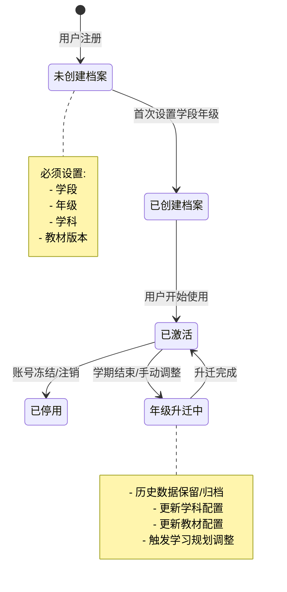
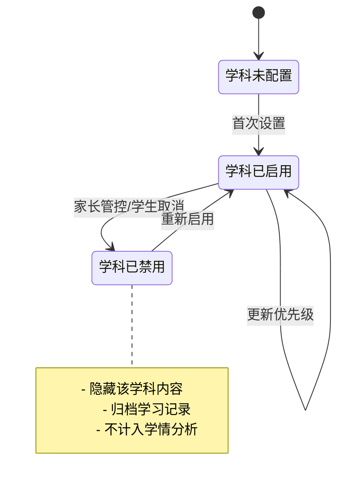

# 学生档案与年级学科设置详细设计

## 1. 概述

### 1.1 设计目标

学生档案与年级学科设置模块是 PrimeTop 产品的核心基础设施，负责管理学生的基本信息、学段、年级、教材版本和学科配置。该模块为后续的 AI 辅导、内容推荐、学情分析、错题管理等功能提供关键的学生上下文信息。

**核心价值：**
- 确保AI讲解内容的适龄化（不同年级采用不同表达深度和示例）
- 实现与教材课标的精准对接
- 支持学段衔接和年级升迁的学习数据连续性
- 提供家长管控和个性化配置的基础数据

### 1.2 适用范围

- **用户类型**：学生用户、家长用户、管理员
- **学段覆盖**：幼儿园、小学、初中、高中
- **操作场景**：
  - 首次注册后的学段年级设置引导
  - 学段升迁时的年级更新
  - 教材版本更换
  - 学科启用/禁用（家长管控）
  - 多孩子切换（家长视角）
  - 管理后台学生信息维护

### 1.3 设计原则

1. **数据准确性**：学段、年级、教材版本必须严格对应，避免错配
2. **数据连续性**：学段升迁时保留历史学习数据
3. **用户友好性**：设置流程简单明了，支持后续修改
4. **家长可控性**：低龄学生可由家长代为设置和管控
5. **扩展性**：支持新增教材版本、学科、年级枚举
6. **可追溯性**：关键设置变更保留审计日志

---

## 2. 数据结构设计

### 2.1 核心实体关系图

```
User (用户基础表)
  └─ StudentProfile (学生档案表)
       ├─ SubjectConfig (学科配置表)
       ├─ TextbookConfig (教材配置表)
       ├─ GradeChangeLog (年级升迁日志表)
       └─ StudyTarget (学习目标表)
```

### 2.2 数据库表设计

#### 2.2.1 StudentProfile（学生档案表）

```sql
CREATE TABLE student_profiles (
    id BIGINT PRIMARY KEY AUTO_INCREMENT COMMENT '主键ID',
    user_id BIGINT NOT NULL COMMENT '用户ID，关联users表',
    nickname VARCHAR(64) NOT NULL COMMENT '学生昵称',
    avatar_url VARCHAR(512) COMMENT '头像URL',
    gender TINYINT COMMENT '性别：0-未知，1-男，2-女',
    birthday DATE COMMENT '出生日期（用于年龄计算和适龄化调整）',
    school_name VARCHAR(128) COMMENT '学校名称',
    enrollment_year INT COMMENT '入学年份（用于自动计算年级）',
    grade_stage ENUM('kindergarten', 'primary', 'junior_high', 'senior_high') NOT NULL COMMENT '学段',
    grade_level INT NOT NULL COMMENT '年级级别：kindergarten(1-3), primary(1-6), junior_high(1-3), senior_high(1-3)',
    grade_display_name VARCHAR(32) NOT NULL COMMENT '年级显示名称：如"三年级""高一"',
    is_active TINYINT DEFAULT 1 COMMENT '是否激活：0-停用，1-激活',
    is_minor TINYINT GENERATED ALWAYS AS (CASE WHEN TIMESTAMPDIFF(YEAR, birthday, CURDATE()) < 18 THEN 1 ELSE 0 END) COMMENT '是否未成年人（计算字段）',
    settings JSON COMMENT '个性化设置JSON：{"studyGoal":"","preferredStudyTime":"","difficultyLevel":""}',
    created_at DATETIME DEFAULT CURRENT_TIMESTAMP COMMENT '创建时间',
    updated_at DATETIME DEFAULT CURRENT_TIMESTAMP ON UPDATE CURRENT_TIMESTAMP COMMENT '更新时间',
    UNIQUE KEY uk_user_id (user_id),
    KEY idx_grade_stage_level (grade_stage, grade_level),
    KEY idx_enrollment_year (enrollment_year)
) ENGINE=InnoDB DEFAULT CHARSET=utf8mb4 COLLATE=utf8mb4_unicode_ci COMMENT='学生档案表';
```

**settings JSON 结构示例：**
```json
{
    "studyGoal": "中考冲刺",
    "preferredStudyTime": "19:00-21:00",
    "difficultyLevel": "standard",
    "studyMode": "balanced",
    "customGoals": ["提高数学计算能力", "加强英语单词记忆"]
}
```

#### 2.2.2 SubjectConfig（学科配置表）

```sql
CREATE TABLE subject_configs (
    id BIGINT PRIMARY KEY AUTO_INCREMENT COMMENT '主键ID',
    student_profile_id BIGINT NOT NULL COMMENT '学生档案ID',
    subject_id INT NOT NULL COMMENT '学科ID，关联subjects表',
    subject_name VARCHAR(32) NOT NULL COMMENT '学科名称',
    subject_code VARCHAR(16) NOT NULL COMMENT '学科代码：chinese, math, english, physics, chemistry, biology, history, geography, politics',
    is_enabled TINYINT DEFAULT 1 COMMENT '是否启用：0-禁用，1-启用',
    priority INT DEFAULT 0 COMMENT '优先级：数值越大优先级越高（用于首页展示排序）',
    proficiency_level ENUM('beginner', 'intermediate', 'advanced', 'expert') DEFAULT 'intermediate' COMMENT '掌握程度评估',
    last_practiced_at DATETIME COMMENT '最后练习时间',
    total_practice_count INT DEFAULT 0 COMMENT '总练习次数',
    correct_rate DECIMAL(5,2) DEFAULT 0.00 COMMENT '正确率',
    created_at DATETIME DEFAULT CURRENT_TIMESTAMP COMMENT '创建时间',
    updated_at DATETIME DEFAULT CURRENT_TIMESTAMP ON UPDATE CURRENT_TIMESTAMP COMMENT '更新时间',
    UNIQUE KEY uk_profile_subject (student_profile_id, subject_id),
    KEY idx_subject_code (subject_code),
    FOREIGN KEY (student_profile_id) REFERENCES student_profiles(id) ON DELETE CASCADE
) ENGINE=InnoDB DEFAULT CHARSET=utf8mb4 COLLATE=utf8mb4_unicode_ci COMMENT='学生学科配置表';
```

#### 2.2.3 TextbookConfig（教材配置表）

```sql
CREATE TABLE textbook_configs (
    id BIGINT PRIMARY KEY AUTO_INCREMENT COMMENT '主键ID',
    student_profile_id BIGINT NOT NULL COMMENT '学生档案ID',
    subject_id INT NOT NULL COMMENT '学科ID',
    publisher_id INT NOT NULL COMMENT '出版社ID，关联publishers表',
    textbook_name VARCHAR(128) NOT NULL COMMENT '教材名称，如"人教版小学语文三年级上册"',
    textbook_version VARCHAR(32) NOT NULL COMMENT '教材版本编号：RJ, SJ, BS, WYF等',
    textbook_series VARCHAR(64) NOT NULL COMMENT '教材系列：如"人教版"',
    grade_stage ENUM('kindergarten', 'primary', 'junior_high', 'senior_high') NOT NULL COMMENT '适用学段',
    grade_level INT NOT NULL COMMENT '适用年级',
    semester TINYINT NOT NULL COMMENT '学期：1-上册，2-下册',
    edition_year INT COMMENT '版次年份，如2024版',
    is_active TINYINT DEFAULT 1 COMMENT '是否激活：0-停用，1-激活',
    current_chapter_id INT COMMENT '当前学习章节ID（可选，用于记录学习进度）',
    sync_school TINYINT DEFAULT 0 COMMENT '是否与学校教材同步：0-否，1-是',
    created_at DATETIME DEFAULT CURRENT_TIMESTAMP COMMENT '创建时间',
    updated_at DATETIME DEFAULT CURRENT_TIMESTAMP ON UPDATE CURRENT_TIMESTAMP COMMENT '更新时间',
    UNIQUE KEY uk_profile_subject (student_profile_id, subject_id),
    KEY idx_publisher_version (publisher_id, textbook_version),
    FOREIGN KEY (student_profile_id) REFERENCES student_profiles(id) ON DELETE CASCADE
) ENGINE=InnoDB DEFAULT CHARSET=utf8mb4 COLLATE=utf8mb4_unicode_ci COMMENT='学生教材配置表';
```

#### 2.2.4 GradeChangeLog（年级升迁日志表）

```sql
CREATE TABLE grade_change_logs (
    id BIGINT PRIMARY KEY AUTO_INCREMENT COMMENT '主键ID',
    student_profile_id BIGINT NOT NULL COMMENT '学生档案ID',
    old_grade_stage ENUM('kindergarten', 'primary', 'junior_high', 'senior_high') COMMENT '原学段',
    old_grade_level INT COMMENT '原年级',
    old_grade_display_name VARCHAR(32) COMMENT '原年级显示名称',
    new_grade_stage ENUM('kindergarten', 'primary', 'junior_high', 'senior_high') NOT NULL COMMENT '新学段',
    new_grade_level INT NOT NULL COMMENT '新年级',
    new_grade_display_name VARCHAR(32) NOT NULL COMMENT '新年级显示名称',
    change_type ENUM('automatic', 'manual', 'school_sync') NOT NULL COMMENT '升迁类型：automatic-系统自动，manual-手动调整，school_sync-学校同步',
    change_reason VARCHAR(256) COMMENT '升迁原因说明',
    operated_by BIGINT COMMENT '操作人ID（用户ID或管理员ID）',
    operator_role ENUM('student', 'parent', 'admin', 'system') COMMENT '操作人角色',
    data_preserved TINYINT DEFAULT 1 COMMENT '历史数据是否保留：0-清空，1-保留',
    created_at DATETIME DEFAULT CURRENT_TIMESTAMP COMMENT '创建时间',
    KEY idx_profile_id (student_profile_id),
    KEY idx_change_time (created_at),
    FOREIGN KEY (student_profile_id) REFERENCES student_profiles(id) ON DELETE CASCADE
) ENGINE=InnoDB DEFAULT CHARSET=utf8mb4 COLLATE=utf8mb4_unicode_ci COMMENT='年级升迁日志表';
```

#### 2.2.5 StudyTarget（学习目标表）

```sql
CREATE TABLE study_targets (
    id BIGINT PRIMARY KEY AUTO_INCREMENT COMMENT '主键ID',
    student_profile_id BIGINT NOT NULL COMMENT '学生档案ID',
    target_type ENUM('daily', 'weekly', 'monthly', 'term', 'exam', 'long_term') NOT NULL COMMENT '目标类型',
    target_title VARCHAR(128) NOT NULL COMMENT '目标标题',
    target_description TEXT COMMENT '目标详细描述',
    target_subjects JSON COMMENT '目标涉及学科：["math", "english"]',
    target_metrics JSON COMMENT '目标指标：{"dailyStudyTime": 60, "weeklyPracticeCount": 100}',
    target_deadline DATE COMMENT '目标截止日期',
    is_achieved TINYINT DEFAULT 0 COMMENT '是否达成：0-未达成，1-已达成',
    achieved_at DATETIME COMMENT '达成时间',
    progress DECIMAL(5,2) DEFAULT 0.00 COMMENT '达成进度百分比',
    created_at DATETIME DEFAULT CURRENT_TIMESTAMP COMMENT '创建时间',
    updated_at DATETIME DEFAULT CURRENT_TIMESTAMP ON UPDATE CURRENT_TIMESTAMP COMMENT '更新时间',
    KEY idx_profile_type (student_profile_id, target_type),
    KEY idx_deadline (target_deadline),
    FOREIGN KEY (student_profile_id) REFERENCES student_profiles(id) ON DELETE CASCADE
) ENGINE=InnoDB DEFAULT CHARSET=utf8mb4 COLLATE=utf8mb4_unicode_ci COMMENT='学习目标表';
```

### 2.3 基础数据表设计

#### 2.3.1 Subjects（学科基础表）

```sql
CREATE TABLE subjects (
    id INT PRIMARY KEY AUTO_INCREMENT COMMENT '主键ID',
    subject_name VARCHAR(32) NOT NULL COMMENT '学科名称',
    subject_code VARCHAR(16) NOT NULL UNIQUE COMMENT '学科代码',
    subject_category ENUM('language', 'science', 'humanities', 'art', 'other') COMMENT '学科类别',
    icon_url VARCHAR(256) COMMENT '学科图标URL',
    color_code VARCHAR(16) COMMENT '学科主题色',
    sort_order INT DEFAULT 0 COMMENT '排序号',
    is_active TINYINT DEFAULT 1 COMMENT '是否启用',
    created_at DATETIME DEFAULT CURRENT_TIMESTAMP COMMENT '创建时间',
    updated_at DATETIME DEFAULT CURRENT_TIMESTAMP ON UPDATE CURRENT_TIMESTAMP COMMENT '更新时间'
) ENGINE=InnoDB DEFAULT CHARSET=utf8mb4 COLLATE=utf8mb4_unicode_ci COMMENT='学科基础表';
```

**初始数据示例：**
```sql
INSERT INTO subjects (subject_name, subject_code, subject_category, icon_url, color_code, sort_order) VALUES
('语文', 'chinese', 'language', '/icons/chinese.png', '#FF6B6B', 1),
('数学', 'math', 'science', '/icons/math.png', '#4ECDC4', 2),
('英语', 'english', 'language', '/icons/english.png', '#95E1D3', 3),
('物理', 'physics', 'science', '/icons/physics.png', '#A8D8EA', 4),
('化学', 'chemistry', 'science', '/icons/chemistry.png', '#FFD93D', 5),
('生物', 'biology', 'science', '/icons/biology.png', '#6BCB77', 6),
('历史', 'history', 'humanities', '/icons/history.png', '#C44569', 7),
('地理', 'geography', 'humanities', '/icons/geography.png', '#F8B500', 8),
('政治', 'politics', 'humanities', '/icons/politics.png', '#DDA0DD', 9);
```

#### 2.3.2 Publishers（出版社基础表）

```sql
CREATE TABLE publishers (
    id INT PRIMARY KEY AUTO_INCREMENT COMMENT '主键ID',
    publisher_name VARCHAR(128) NOT NULL COMMENT '出版社名称',
    publisher_code VARCHAR(32) NOT NULL UNIQUE COMMENT '出版社代码',
    publisher_full_name VARCHAR(256) COMMENT '出版社全称',
    logo_url VARCHAR(256) COMMENT '出版社Logo',
    is_national_standard TINYINT DEFAULT 0 COMMENT '是否国标教材：0-否，1-是',
    sort_order INT DEFAULT 0 COMMENT '排序号',
    created_at DATETIME DEFAULT CURRENT_TIMESTAMP COMMENT '创建时间'
) ENGINE=InnoDB DEFAULT CHARSET=utf8mb4 COLLATE=utf8mb4_unicode_ci COMMENT='出版社基础表';
```

**初始数据示例：**
```sql
INSERT INTO publishers (publisher_name, publisher_code, publisher_full_name, is_national_standard, sort_order) VALUES
('人教版', 'RJ', '人民教育出版社', 1, 1),
('苏教版', 'SJ', '江苏教育出版社', 1, 2),
('北师大版', 'BS', '北京师范大学出版社', 1, 3),
('外研版', 'WYF', '外语教学与研究出版社', 1, 4),
('湘教版', 'XJ', '湖南教育出版社', 0, 5);
```

#### 2.3.3 GradeStageConfig（年级阶段配置表）

```sql
CREATE TABLE grade_stage_configs (
    id INT PRIMARY KEY AUTO_INCREMENT COMMENT '主键ID',
    stage_code ENUM('kindergarten', 'primary', 'junior_high', 'senior_high') NOT NULL COMMENT '学段代码',
    stage_name VARCHAR(32) NOT NULL COMMENT '学段名称',
    grade_level INT NOT NULL COMMENT '年级级别',
    grade_display_name VARCHAR(32) NOT NULL COMMENT '年级显示名称',
    age_range_min INT COMMENT '适用年龄范围-最小值',
    age_range_max INT COMMENT '适用年龄范围-最大值',
    ai_explanation_level INT COMMENT 'AI讲解深度级别：1-最简单，5-最深奥',
    allowed_subjects JSON COMMENT '允许启用的学科列表',
    created_at DATETIME DEFAULT CURRENT_TIMESTAMP COMMENT '创建时间',
    UNIQUE KEY uk_stage_level (stage_code, grade_level)
) ENGINE=InnoDB DEFAULT CHARSET=utf8mb4 COLLATE=utf8mb4_unicode_ci COMMENT='年级阶段配置表';
```

**初始数据示例：**
```sql
INSERT INTO grade_stage_configs (stage_code, stage_name, grade_level, grade_display_name, age_range_min, age_range_max, ai_explanation_level, allowed_subjects) VALUES
('kindergarten', '幼儿园', 1, '小班', 3, 4, 1, '["chinese", "math", "art"]'),
('kindergarten', '幼儿园', 2, '中班', 4, 5, 1, '["chinese", "math", "art"]'),
('kindergarten', '幼儿园', 3, '大班', 5, 6, 1, '["chinese", "math", "art", "english"]'),
('primary', '小学', 1, '一年级', 6, 7, 2, '["chinese", "math", "english"]'),
('primary', '小学', 2, '二年级', 7, 8, 2, '["chinese", "math", "english"]'),
('primary', '小学', 3, '三年级', 8, 9, 2, '["chinese", "math", "english", "science"]'),
('primary', '小学', 4, '四年级', 9, 10, 2, '["chinese", "math", "english", "science"]'),
('primary', '小学', 5, '五年级', 10, 11, 3, '["chinese", "math", "english", "science"]'),
('primary', '小学', 6, '六年级', 11, 12, 3, '["chinese", "math", "english", "science"]'),
('junior_high', '初中', 1, '初一', 12, 13, 3, '["chinese", "math", "english", "physics", "chemistry", "biology", "history", "geography", "politics"]'),
('junior_high', '初中', 2, '初二', 13, 14, 3, '["chinese", "math", "english", "physics", "chemistry", "biology", "history", "geography", "politics"]'),
('junior_high', '初中', 3, '初三', 14, 15, 4, '["chinese", "math", "english", "physics", "chemistry", "biology", "history", "geography", "politics"]'),
('senior_high', '高中', 1, '高一', 15, 16, 4, '["chinese", "math", "english", "physics", "chemistry", "biology", "history", "geography", "politics"]'),
('senior_high', '高中', 2, '高二', 16, 17, 4, '["chinese", "math", "english", "physics", "chemistry", "biology", "history", "geography", "politics"]'),
('senior_high', '高中', 3, '高三', 17, 18, 5, '["chinese", "math", "english", "physics", "chemistry", "biology", "history", "geography", "politics"]');
```

---

## 3. API 接口设计

### 3.1 学生档案管理接口

#### 3.1.1 创建学生档案

**接口路径：** `POST /api/v1/student/profiles`

**请求参数：**
```json
{
    "nickname": "小明",
    "avatarUrl": "https://cdn.primetop.com/avatars/default.png",
    "gender": 1,
    "birthday": "2015-05-20",
    "schoolName": "北京实验小学",
    "enrollmentYear": 2021,
    "gradeStage": "primary",
    "gradeLevel": 3,
    "gradeDisplayName": "三年级",
    "subjects": [
        {"subjectCode": "chinese", "isEnabled": true, "priority": 1},
        {"subjectCode": "math", "isEnabled": true, "priority": 2},
        {"subjectCode": "english", "isEnabled": true, "priority": 3}
    ],
    "textbooks": [
        {
            "subjectCode": "chinese",
            "publisherCode": "RJ",
            "textbookVersion": "RJ",
            "gradeLevel": 3,
            "semester": 1
        },
        {
            "subjectCode": "math",
            "publisherCode": "RJ",
            "textbookVersion": "RJ",
            "gradeLevel": 3,
            "semester": 1
        },
        {
            "subjectCode": "english",
            "publisherCode": "WYF",
            "textbookVersion": "WYF",
            "gradeLevel": 3,
            "semester": 1
        }
    ],
    "settings": {
        "studyGoal": "提高数学计算能力",
        "preferredStudyTime": "19:00-21:00",
        "difficultyLevel": "standard"
    }
}
```

**响应参数：**
```json
{
    "code": 200,
    "message": "学生档案创建成功",
    "data": {
        "studentId": 123456789,
        "userId": 1000001,
        "nickname": "小明",
        "gradeStage": "primary",
        "gradeLevel": 3,
        "gradeDisplayName": "三年级",
        "isMinor": true,
        "subjects": [
            {
                "subjectId": 1,
                "subjectName": "语文",
                "subjectCode": "chinese",
                "isEnabled": true,
                "priority": 1
            },
            {
                "subjectId": 2,
                "subjectName": "数学",
                "subjectCode": "math",
                "isEnabled": true,
                "priority": 2
            },
            {
                "subjectId": 3,
                "subjectName": "英语",
                "subjectCode": "english",
                "isEnabled": true,
                "priority": 3
            }
        ],
        "textbooks": [
            {
                "id": 1001,
                "subjectName": "语文",
                "textbookName": "人教版小学语文三年级上册",
                "textbookVersion": "RJ",
                "semester": 1
            },
            {
                "id": 1002,
                "subjectName": "数学",
                "textbookName": "人教版小学数学三年级上册",
                "textbookVersion": "RJ",
                "semester": 1
            },
            {
                "id": 1003,
                "subjectName": "英语",
                "textbookName": "外研版小学英语三年级上册",
                "textbookVersion": "WYF",
                "semester": 1
            }
        ],
        "createdAt": "2026-06-26T11:45:00Z",
        "updatedAt": "2026-06-26T11:45:00Z"
    }
}
```

**错误码：**
- `400001`: 参数校验失败（学段与年级不匹配、birthday格式错误等）
- `400002`: 学科不存在
- `400003`: 教材版本不存在或不匹配当前年级
- `409001`: 用户已存在学生档案
- `500001`: 数据库操作失败

#### 3.1.2 获取学生档案

**接口路径：** `GET /api/v1/student/profiles`

**请求参数：** 无（从token中获取userId）

**响应参数：**
```json
{
    "code": 200,
    "message": "获取学生档案成功",
    "data": {
        "studentId": 123456789,
        "userId": 1000001,
        "nickname": "小明",
        "avatarUrl": "https://cdn.primetop.com/avatars/default.png",
        "gender": 1,
        "genderDisplay": "男",
        "birthday": "2015-05-20",
        "age": 11,
        "schoolName": "北京实验小学",
        "enrollmentYear": 2021,
        "gradeStage": "primary",
        "gradeStageDisplay": "小学",
        "gradeLevel": 3,
        "gradeDisplayName": "三年级",
        "isMinor": true,
        "settings": {
            "studyGoal": "提高数学计算能力",
            "preferredStudyTime": "19:00-21:00",
            "difficultyLevel": "standard"
        },
        "subjects": [
            {
                "subjectId": 1,
                "subjectName": "语文",
                "subjectCode": "chinese",
                "isEnabled": true,
                "priority": 1,
                "proficiencyLevel": "intermediate",
                "totalPracticeCount": 156,
                "correctRate": 85.50
            }
        ],
        "textbooks": [
            {
                "id": 1001,
                "subjectId": 1,
                "subjectName": "语文",
                "textbookName": "人教版小学语文三年级上册",
                "textbookVersion": "RJ",
                "textbookSeries": "人教版",
                "semester": 1,
                "isActive": true,
                "syncSchool": true
            }
        ],
        "studyTargets": [
            {
                "id": 1,
                "targetType": "daily",
                "targetTitle": "每日学习60分钟",
                "progress": 75.00,
                "isAchieved": false
            }
        ],
        "createdAt": "2026-06-26T11:45:00Z",
        "updatedAt": "2026-06-26T11:45:00Z"
    }
}
```

#### 3.1.3 更新学生档案基本信息

**接口路径：** `PATCH /api/v1/student/profiles`

**请求参数：**
```json
{
    "nickname": "小明",
    "avatarUrl": "https://cdn.primetop.com/avatars/new.png",
    "schoolName": "北京市第一实验小学",
    "settings": {
        "studyGoal": "提高数学和英语成绩",
        "preferredStudyTime": "18:30-20:30"
    }
}
```

**响应参数：** 同创建接口

**错误码：**
- `400001`: 参数校验失败
- `404001`: 学生档案不存在
- `500001`: 数据库操作失败

### 3.2 年级升迁接口

#### 3.2.1 年级升迁

**接口路径：** `POST /api/v1/student/grade-promotion`

**请求参数：**
```json
{
    "newGradeStage": "primary",
    "newGradeLevel": 4,
    "newGradeDisplayName": "四年级",
    "changeType": "manual",
    "changeReason": "新学期开学",
    "preserveData": true
}
```

**响应参数：**
```json
{
    "code": 200,
    "message": "年级升迁成功",
    "data": {
        "studentId": 123456789,
        "oldGrade": {
            "gradeStage": "primary",
            "gradeLevel": 3,
            "gradeDisplayName": "三年级"
        },
        "newGrade": {
            "gradeStage": "primary",
            "gradeLevel": 4,
            "gradeDisplayName": "四年级"
        },
        "changeLogId": 98765,
        "dataPreserved": true,
        "promotedAt": "2026-06-26T11:45:00Z"
    }
}
```

**业务逻辑：**
1. 验证新年级是否合法（grade_stage_configs表中存在）
2. 如果preserveData=false，清空或归档历史学习数据
3. 更新student_profiles表
4. 记录变更日志到grade_change_logs表
5. 触发年级升迁事件通知家长和学习规划引擎

**错误码：**
- `400001`: 参数校验失败
- `400002`: 新年级配置不存在
- `400003`: 年级只能升迁不能降级（特殊业务需求可放开）
- `404001`: 学生档案不存在
- `500001`: 数据库操作失败

### 3.3 学科配置接口

#### 3.3.1 更新学科配置

**接口路径：** `PATCH /api/v1/student/subjects`

**请求参数：**
```json
{
    "subjects": [
        {
            "subjectCode": "math",
            "isEnabled": true,
            "priority": 1
        },
        {
            "subjectCode": "english",
            "isEnabled": false,
            "priority": 3
        }
    ]
}
```

**响应参数：**
```json
{
    "code": 200,
    "message": "学科配置更新成功",
    "data": {
        "studentId": 123456789,
        "subjects": [
            {
                "subjectId": 2,
                "subjectName": "数学",
                "subjectCode": "math",
                "isEnabled": true,
                "priority": 1
            },
            {
                "subjectId": 3,
                "subjectName": "英语",
                "subjectCode": "english",
                "isEnabled": false,
                "priority": 3
            }
        ],
        "updatedAt": "2026-06-26T11:45:00Z"
    }
}
```

**业务逻辑：**
1. 验证学科代码是否存在于subjects表
2. 更新subject_configs表
3. 如果禁用某学科，触发相关数据清理或归档
4. 如果是家长操作，记录家长管控日志

### 3.4 教材配置接口

#### 3.4.1 更新教材配置

**接口路径：** `PATCH /api/v1/student/textbooks`

**请求参数：**
```json
{
    "textbooks": [
        {
            "subjectCode": "chinese",
            "publisherCode": "SJ",
            "textbookVersion": "SJ",
            "semester": 1,
            "syncSchool": true
        }
    ]
}
```

**响应参数：**
```json
{
    "code": 200,
    "message": "教材配置更新成功",
    "data": {
        "studentId": 123456789,
        "textbooks": [
            {
                "id": 1001,
                "subjectName": "语文",
                "textbookName": "苏教版小学语文三年级上册",
                "textbookVersion": "SJ",
                "textbookSeries": "苏教版",
                "semester": 1,
                "isActive": true,
                "syncSchool": true
            }
        ],
        "updatedAt": "2026-06-26T11:45:00Z"
    }
}
```

**业务逻辑：**
1. 验证教材版本与当前学段年级是否匹配
2. 更新textbook_configs表
3. 清空或归档与旧教材相关的学习进度（可选）
4. 触发内容同步服务，同步新教材的章节、知识点

### 3.5 学习目标接口

#### 3.5.1 创建学习目标

**接口路径：** `POST /api/v1/student/study-targets`

**请求参数：**
```json
{
    "targetType": "monthly",
    "targetTitle": "月度目标：完成100道数学题",
    "targetDescription": "本月份完成数学练习100道，正确率达到80%以上",
    "targetSubjects": ["math"],
    "targetMetrics": {
        "practiceCount": 100,
        "correctRate": 80.00
    },
    "targetDeadline": "2026-07-26"
}
```

**响应参数：**
```json
{
    "code": 200,
    "message": "学习目标创建成功",
    "data": {
        "targetId": 12345,
        "studentId": 123456789,
        "targetType": "monthly",
        "targetTitle": "月度目标：完成100道数学题",
        "targetDescription": "本月份完成数学练习100道，正确率达到80%以上",
        "targetSubjects": ["math"],
        "targetMetrics": {
            "practiceCount": 100,
            "correctRate": 80.00
        },
        "targetDeadline": "2026-07-26",
        "isAchieved": false,
        "progress": 0.00,
        "createdAt": "2026-06-26T11:45:00Z"
    }
}
```

### 3.6 基础数据查询接口

#### 3.6.1 获取学段年级列表

**接口路径：** `GET /api/v1/student/grade-stages`

**查询参数：**
- `stageCode` (可选): 学段代码，如`primary`，不传则返回所有学段

**响应参数：**
```json
{
    "code": 200,
    "message": "获取学段年级列表成功",
    "data": {
        "gradeStages": [
            {
                "stageCode": "kindergarten",
                "stageName": "幼儿园",
                "grades": [
                    {
                        "gradeLevel": 1,
                        "gradeDisplayName": "小班",
                        "ageRange": "3-4岁",
                        "aiExplanationLevel": 1
                    },
                    {
                        "gradeLevel": 2,
                        "gradeDisplayName": "中班",
                        "ageRange": "4-5岁",
                        "aiExplanationLevel": 1
                    },
                    {
                        "gradeLevel": 3,
                        "gradeDisplayName": "大班",
                        "ageRange": "5-6岁",
                        "aiExplanationLevel": 1
                    }
                ]
            },
            {
                "stageCode": "primary",
                "stageName": "小学",
                "grades": [
                    {
                        "gradeLevel": 1,
                        "gradeDisplayName": "一年级",
                        "ageRange": "6-7岁",
                        "aiExplanationLevel": 2
                    },
                    {
                        "gradeLevel": 2,
                        "gradeDisplayName": "二年级",
                        "ageRange": "7-8岁",
                        "aiExplanationLevel": 2
                    },
                    {
                        "gradeLevel": 3,
                        "gradeDisplayName": "三年级",
                        "ageRange": "8-9岁",
                        "aiExplanationLevel": 2
                    },
                    {
                        "gradeLevel": 4,
                        "gradeDisplayName": "四年级",
                        "ageRange": "9-10岁",
                        "aiExplanationLevel": 2
                    },
                    {
                        "gradeLevel": 5,
                        "gradeDisplayName": "五年级",
                        "ageRange": "10-11岁",
                        "aiExplanationLevel": 3
                    },
                    {
                        "gradeLevel": 6,
                        "gradeDisplayName": "六年级",
                        "ageRange": "11-12岁",
                        "aiExplanationLevel": 3
                    }
                ]
            }
        ]
    }
}
```

#### 3.6.2 获取学科列表

**接口路径：** `GET /api/v1/student/subjects`

**查询参数：**
- `gradeStage` (可选): 学段代码，不传则返回所有学科

**响应参数：**
```json
{
    "code": 200,
    "message": "获取学科列表成功",
    "data": {
        "subjects": [
            {
                "subjectId": 1,
                "subjectName": "语文",
                "subjectCode": "chinese",
                "subjectCategory": "language",
                "iconUrl": "/icons/chinese.png",
                "colorCode": "#FF6B6B",
                "sortOrder": 1,
                "isActive": true
            },
            {
                "subjectId": 2,
                "subjectName": "数学",
                "subjectCode": "math",
                "subjectCategory": "science",
                "iconUrl": "/icons/math.png",
                "colorCode": "#4ECDC4",
                "sortOrder": 2,
                "isActive": true
            }
        ]
    }
}
```

#### 3.6.3 获取教材版本列表

**接口路径：** `GET /api/v1/student/publishers`

**查询参数：**
- `subjectCode` (可选): 学科代码，不传则返回所有出版社

**响应参数：**
```json
{
    "code": 200,
    "message": "获取教材版本列表成功",
    "data": {
        "publishers": [
            {
                "publisherId": 1,
                "publisherName": "人教版",
                "publisherCode": "RJ",
                "publisherFullName": "人民教育出版社",
                "logoUrl": "/logos/rj.png",
                "isNationalStandard": true,
                "sortOrder": 1
            },
            {
                "publisherId": 2,
                "publisherName": "苏教版",
                "publisherCode": "SJ",
                "publisherFullName": "江苏教育出版社",
                "logoUrl": "/logos/sj.png",
                "isNationalStandard": true,
                "sortOrder": 2
            }
        ]
    }
}
```

#### 3.6.4 获取年级对应的教材列表

**接口路径：** `GET /api/v1/student/textbooks/available`

**查询参数：**
- `gradeStage` (必填): 学段代码
- `gradeLevel` (必填): 年级级别
- `subjectCode` (可选): 学科代码

**响应参数：**
```json
{
    "code": 200,
    "message": "获取可用教材列表成功",
    "data": {
        "textbooks": [
            {
                "subjectCode": "chinese",
                "subjectName": "语文",
                "publishers": [
                    {
                        "publisherCode": "RJ",
                        "publisherName": "人教版",
                        "textbooks": [
                            {
                                "textbookName": "人教版小学语文三年级上册",
                                "textbookVersion": "RJ",
                                "semester": 1,
                                "editionYear": 2024
                            },
                            {
                                "textbookName": "人教版小学语文三年级下册",
                                "textbookVersion": "RJ",
                                "semester": 2,
                                "editionYear": 2024
                            }
                        ]
                    },
                    {
                        "publisherCode": "SJ",
                        "publisherName": "苏教版",
                        "textbooks": [
                            {
                                "textbookName": "苏教版小学语文三年级上册",
                                "textbookVersion": "SJ",
                                "semester": 1,
                                "editionYear": 2024
                            }
                        ]
                    }
                ]
            }
        ]
    }
}
```

### 3.7 多孩子管理接口（家长端）

#### 3.7.1 家长查看绑定的孩子列表

**接口路径：** `GET /api/v1/parent/children`

**响应参数：**
```json
{
    "code": 200,
    "message": "获取孩子列表成功",
    "data": {
        "children": [
            {
                "studentId": 123456789,
                "nickname": "小明",
                "avatarUrl": "https://cdn.primetop.com/avatars/xiaoming.png",
                "gradeStage": "primary",
                "gradeDisplayName": "三年级",
                "isMinor": true,
                "bindAt": "2026-01-01T00:00:00Z"
            },
            {
                "studentId": 123456790,
                "nickname": "小红",
                "avatarUrl": "https://cdn.primetop.com/avatars/xiaohong.png",
                "gradeStage": "kindergarten",
                "gradeDisplayName": "大班",
                "isMinor": true,
                "bindAt": "2026-03-01T00:00:00Z"
            }
        ]
    }
}
```

#### 3.7.2 家长切换当前查看的孩子

**接口路径：** `POST /api/v1/parent/switch-child`

**请求参数：**
```json
{
    "studentId": 123456790
}
```

**响应参数：**
```json
{
    "code": 200,
    "message": "切换孩子成功",
    "data": {
        "currentStudentId": 123456790,
        "studentNickname": "小红",
        "switchedAt": "2026-06-26T11:45:00Z"
    }
}
```

**业务逻辑：**
1. 验证家长是否有权限访问该孩子
2. 更新家长当前查看的孩子ID（可存储在token claims或session中）
3. 后续家长端请求都基于当前选中的孩子

---

## 4. 核心实现代码示例

### 4.1 学生档案创建服务（Go示例）

```go
package service

import (
    "context"
    "database/sql"
    "encoding/json"
    "errors"
    "fmt"
    "time"
    
    "github.com/primetop/internal/model"
    "github.com/primetop/internal/repository"
    "github.com/primetop/pkg/logger"
    "go.uber.org/zap"
)

type StudentProfileService struct {
    studentRepo    repository.StudentProfileRepository
    subjectRepo    repository.SubjectRepository
    textbookRepo   repository.TextbookRepository
    gradeConfigRepo repository.GradeConfigRepository
    publisherRepo  repository.PublisherRepository
    logger         *zap.Logger
}

func NewStudentProfileService(
    studentRepo repository.StudentProfileRepository,
    subjectRepo repository.SubjectRepository,
    textbookRepo repository.TextbookRepository,
    gradeConfigRepo repository.GradeConfigRepository,
    publisherRepo repository.PublisherRepository,
) *StudentProfileService {
    return &StudentProfileService{
        studentRepo:     studentRepo,
        subjectRepo:     subjectRepo,
        textbookRepo:    textbookRepo,
        gradeConfigRepo: gradeConfigRepo,
        publisherRepo:   publisherRepo,
        logger:         logger.GetLogger(),
    }
}

// CreateStudentProfile 创建学生档案
func (s *StudentProfileService) CreateStudentProfile(ctx context.Context, req *CreateStudentProfileRequest) (*model.StudentProfile, error) {
    // 1. 参数校验：验证学段年级是否合法
    gradeConfig, err := s.gradeConfigRepo.GetByStageAndLevel(ctx, req.GradeStage, req.GradeLevel)
    if err != nil {
        if errors.Is(err, sql.ErrNoRows) {
            s.logger.Error("学段年级配置不存在",
                zap.String("gradeStage", req.GradeStage),
                zap.Int("gradeLevel", req.GradeLevel),
            )
            return nil, ErrInvalidGradeStage
        }
        return nil, fmt.Errorf("获取年级配置失败: %w", err)
    }
    
    // 2. 验证学科是否存在
    subjectIdsMap := make(map[int]bool)
    for _, subjReq := range req.Subjects {
        subject, err := s.subjectRepo.GetByCode(ctx, subjReq.SubjectCode)
        if err != nil {
            if errors.Is(err, sql.ErrNoRows) {
                s.logger.Error("学科不存在", zap.String("subjectCode", subjReq.SubjectCode))
                return nil, ErrSubjectNotFound
            }
            return nil, fmt.Errorf("获取学科信息失败: %w", err)
        }
        subjectIdsMap[subject.ID] = true
    }
    
    // 3. 验证教材版本是否存在且匹配当前年级
    textbookConfigs := make([]*model.TextbookConfig, 0, len(req.Textbooks))
    for _, tbReq := range req.Textbooks {
        // 获取教材信息
        publisher, err := s.publisherRepo.GetByCode(ctx, tbReq.PublisherCode)
        if err != nil {
            s.logger.Error("出版社不存在", zap.String("publisherCode", tbReq.PublisherCode))
            return nil, ErrPublisherNotFound
        }
        
        // 验证教材版本与年级是否匹配（这里简化校验，实际应根据教材数据库校验）
        if tbReq.GradeLevel != req.GradeLevel {
            s.logger.Error("教材版本与年级不匹配",
                zap.Int("textbookGradeLevel", tbReq.GradeLevel),
                zap.Int("profileGradeLevel", req.GradeLevel),
            )
            return nil, ErrTextbookGradeMismatch
        }
        
        // 查找学科ID
        subject, err := s.subjectRepo.GetByCode(ctx, tbReq.SubjectCode)
        if err != nil {
            return nil, fmt.Errorf("获取学科信息失败: %w", err)
        }
        
        textbookConfig := &model.TextbookConfig{
            SubjectID:         subject.ID,
            PublisherID:       publisher.ID,
            TextbookName:      fmt.Sprintf("%s小学%s%s年级%s册", publisher.PublisherName, subject.SubjectName, gradeConfig.GradeDisplayName, getSemesterName(tbReq.Semester)),
            TextbookVersion:   tbReq.TextbookVersion,
            TextbookSeries:    publisher.PublisherName,
            GradeStage:        req.GradeStage,
            GradeLevel:        req.GradeLevel,
            Semester:          tbReq.Semester,
            IsActive:          true,
            SyncSchool:        false,
        }
        textbookConfigs = append(textbookConfigs, textbookConfig)
    }
    
    // 4. 构建学生档案
    settingsJSON, _ := json.Marshal(req.Settings)
    profile := &model.StudentProfile{
        UserID:           req.UserID,
        Nickname:         req.Nickname,
        AvatarURL:        req.AvatarURL,
        Gender:           req.Gender,
        Birthday:         req.Birthday,
        SchoolName:       req.SchoolName,
        EnrollmentYear:   req.EnrollmentYear,
        GradeStage:       req.GradeStage,
        GradeLevel:       req.GradeLevel,
        GradeDisplayName: req.GradeDisplayName,
        IsActive:         true,
        Settings:         string(settingsJSON),
    }
    
    // 5. 事务处理：创建学生档案、学科配置、教材配置
    tx, err := s.studentRepo.BeginTx(ctx)
    if err != nil {
        return nil, fmt.Errorf("开启事务失败: %w", err)
    }
    defer tx.Rollback()
    
    // 创建学生档案
    createdProfile, err := s.studentRepo.CreateWithTx(ctx, tx, profile)
    if err != nil {
        return nil, fmt.Errorf("创建学生档案失败: %w", err)
    }
    
    // 创建学科配置
    subjectConfigs := make([]*model.SubjectConfig, 0, len(req.Subjects))
    for _, subjReq := range req.Subjects {
        subject, err := s.subjectRepo.GetByCode(ctx, subjReq.SubjectCode)
        if err != nil {
            return nil, fmt.Errorf("获取学科信息失败: %w", err)
        }
        
        subjectConfig := &model.SubjectConfig{
            StudentProfileID: createdProfile.ID,
            SubjectID:        subject.ID,
            SubjectName:      subject.SubjectName,
            SubjectCode:      subject.SubjectCode,
            IsEnabled:        subjReq.IsEnabled,
            Priority:         subjReq.Priority,
            ProficiencyLevel: "beginner", // 默认为初学者
        }
        subjectConfigs = append(subjectConfigs, subjectConfig)
    }
    
    if err := s.subjectRepo.BatchCreateWithTx(ctx, tx, createdProfile.ID, subjectConfigs); err != nil {
        return nil, fmt.Errorf("创建学科配置失败: %w", err)
    }
    
    // 创建教材配置
    for _, tbConfig := range textbookConfigs {
        tbConfig.StudentProfileID = createdProfile.ID
    }
    if err := s.textbookRepo.BatchCreateWithTx(ctx, tx, createdProfile.ID, textbookConfigs); err != nil {
        return nil, fmt.Errorf("创建教材配置失败: %w", err)
    }
    
    // 提交事务
    if err := tx.Commit(); err != nil {
        return nil, fmt.Errorf("提交事务失败: %w", err)
    }
    
    s.logger.Info("学生档案创建成功",
        zap.Int64("studentId", createdProfile.ID),
        zap.Int64("userId", req.UserID),
        zap.String("nickname", req.Nickname),
        zap.String("gradeStage", req.GradeStage),
        zap.Int("gradeLevel", req.GradeLevel),
    )
    
    return createdProfile, nil
}

// PromoteGrade 年级升迁
func (s *StudentProfileService) PromoteGrade(ctx context.Context, req *PromoteGradeRequest) (*model.GradeChangeLog, error) {
    // 1. 获取当前学生档案
    profile, err := s.studentRepo.GetByUserID(ctx, req.UserID)
    if err != nil {
        if errors.Is(err, sql.ErrNoRows) {
            return nil, ErrStudentProfileNotFound
        }
        return nil, fmt.Errorf("获取学生档案失败: %w", err)
    }
    
    // 2. 验证新年级是否合法
    newGradeConfig, err := s.gradeConfigRepo.GetByStageAndLevel(ctx, req.NewGradeStage, req.NewGradeLevel)
    if err != nil {
        return nil, ErrInvalidNewGrade
    }
    
    // 3. 验证只能升迁不能降级（可根据业务需求调整）
    if !isGradePromotion(profile.GradeStage, profile.GradeLevel, req.NewGradeStage, req.NewGradeLevel) {
        s.logger.Error("年级只能升迁不能降级",
            zap.String("oldGrade", fmt.Sprintf("%s-%d", profile.GradeStage, profile.GradeLevel)),
            zap.String("newGrade", fmt.Sprintf("%s-%d", req.NewGradeStage, req.NewGradeLevel)),
        )
        return nil, ErrGradeDemotionNotAllowed
    }
    
    // 4. 事务处理
    tx, err := s.studentRepo.BeginTx(ctx)
    if err != nil {
        return nil, fmt.Errorf("开启事务失败: %w", err)
    }
    defer tx.Rollback()
    
    // 记录旧年级信息
    oldGradeStage := profile.GradeStage
    oldGradeLevel := profile.GradeLevel
    oldGradeDisplayName := profile.GradeDisplayName
    
    // 更新学生档案
    profile.GradeStage = req.NewGradeStage
    profile.GradeLevel = req.NewGradeLevel
    profile.GradeDisplayName = req.NewGradeDisplayName
    
    if err := s.studentRepo.UpdateWithTx(ctx, tx, profile); err != nil {
        return nil, fmt.Errorf("更新学生档案失败: %w", err)
    }
    
    // 如果preserveData=false，清理或归档历史数据
    if !req.PreserveData {
        if err := s.archiveHistoricalData(ctx, tx, profile.ID); err != nil {
            return nil, fmt.Errorf("归档历史数据失败: %w", err)
        }
    }
    
    // 记录升迁日志
    changeLog := &model.GradeChangeLog{
        StudentProfileID:    profile.ID,
        OldGradeStage:       oldGradeStage,
        OldGradeLevel:       oldGradeLevel,
        OldGradeDisplayName: oldGradeDisplayName,
        NewGradeStage:       req.NewGradeStage,
        NewGradeLevel:       req.NewGradeLevel,
        NewGradeDisplayName: req.NewGradeDisplayName,
        ChangeType:          req.ChangeType,
        ChangeReason:        req.ChangeReason,
        OperatedBy:          req.OperatedBy,
        OperatorRole:        req.OperatorRole,
        DataPreserved:       boolToInt(req.PreserveData),
    }
    
    createdLog, err := s.studentRepo.CreateChangeLogWithTx(ctx, tx, changeLog)
    if err != nil {
        return nil, fmt.Errorf("创建升迁日志失败: %w", err)
    }
    
    // 提交事务
    if err := tx.Commit(); err != nil {
        return nil, fmt.Errorf("提交事务失败: %w", err)
    }
    
    // 5. 异步触发后续处理（通知家长、更新学习规划等）
    go s.handlePostPromotionTasks(context.Background(), profile.ID, createdLog.ID)
    
    s.logger.Info("年级升迁成功",
        zap.Int64("studentId", profile.ID),
        zap.String("oldGrade", oldGradeDisplayName),
        zap.String("newGrade", req.NewGradeDisplayName),
        zap.String("changeType", req.ChangeType),
    )
    
    return createdLog, nil
}

// 辅助函数
func getSemesterName(semester int) string {
    if semester == 1 {
        return "上"
    }
    return "下"
}

func boolToInt(b bool) int {
    if b {
        return 1
    }
    return 0
}

func isGradePromotion(oldStage string, oldLevel int, newStage string, newLevel int) bool {
    // 简化判断：可以根据实际学段等级计算
    // 示例：primary-3 < primary-4 < junior_high-1
    stageOrder := map[string]int{
        "kindergarten": 1,
        "primary":      2,
        "junior_high":  3,
        "senior_high":  4,
    }
    
    oldOrder := stageOrder[oldStage]*100 + oldLevel
    newOrder := stageOrder[newStage]*100 + newLevel
    
    return newOrder > oldOrder
}

func (s *StudentProfileService) archiveHistoricalData(ctx context.Context, tx *sql.Tx, studentID int64) error {
    // 实现数据归档逻辑（如将错题、学习记录等移动到归档表）
    // 这里省略具体实现
    return nil
}

func (s *StudentProfileService) handlePostPromotionTasks(ctx context.Context, studentID int64, changeLogID int64) {
    // 异步处理升迁后的任务
    // 1. 发送通知给家长
    // 2. 更新学习规划
    // 3. 触发内容同步
    s.logger.Info("处理升迁后任务",
        zap.Int64("studentId", studentID),
        zap.Int64("changeLogId", changeLogID),
    )
}
```

### 4.2 学生档案查询服务（Go示例）

```go
// GetStudentProfileWithDetails 获取学生档案及详细信息
func (s *StudentProfileService) GetStudentProfileWithDetails(ctx context.Context, userID int64) (*StudentProfileDetail, error) {
    // 1. 获取学生档案基本信息
    profile, err := s.studentRepo.GetByUserID(ctx, userID)
    if err != nil {
        if errors.Is(err, sql.ErrNoRows) {
            return nil, ErrStudentProfileNotFound
        }
        return nil, fmt.Errorf("获取学生档案失败: %w", err)
    }
    
    // 2. 获取学科配置
    subjectConfigs, err := s.subjectRepo.GetByStudentProfileID(ctx, profile.ID)
    if err != nil {
        return nil, fmt.Errorf("获取学科配置失败: %w", err)
    }
    
    // 3. 获取教材配置
    textbookConfigs, err := s.textbookRepo.GetByStudentProfileID(ctx, profile.ID)
    if err != nil {
        return nil, fmt.Errorf("获取教材配置失败: %w", err)
    }
    
    // 4. 获取学习目标
    studyTargets, err := s.studentRepo.GetStudyTargets(ctx, profile.ID)
    if err != nil {
        return nil, fmt.Errorf("获取学习目标失败: %w", err)
    }
    
    // 5. 构建响应
    detail := &StudentProfileDetail{
        StudentID:       profile.ID,
        UserID:          profile.UserID,
        Nickname:        profile.Nickname,
        AvatarURL:       profile.AvatarURL,
        Gender:          profile.Gender,
        GenderDisplay:   getGenderDisplay(profile.Gender),
        Birthday:        profile.Birthday,
        Age:             calculateAge(profile.Birthday),
        SchoolName:      profile.SchoolName,
        EnrollmentYear:  profile.EnrollmentYear,
        GradeStage:      profile.GradeStage,
        GradeStageDisplay: getGradeStageDisplay(profile.GradeStage),
        GradeLevel:      profile.GradeLevel,
        GradeDisplayName: profile.GradeDisplayName,
        IsMinor:         calculateIsMinor(profile.Birthday),
        Settings:        parseSettings(profile.Settings),
    }
    
    // 转换学科配置
    for _, sc := range subjectConfigs {
        detail.Subjects = append(detail.Subjects, &SubjectConfigDTO{
            SubjectID:         sc.SubjectID,
            SubjectName:       sc.SubjectName,
            SubjectCode:       sc.SubjectCode,
            IsEnabled:         sc.IsEnabled,
            Priority:          sc.Priority,
            ProficiencyLevel:  sc.ProficiencyLevel,
            TotalPracticeCount: sc.TotalPracticeCount,
            CorrectRate:       sc.CorrectRate,
        })
    }
    
    // 转换教材配置
    for _, tc := range textbookConfigs {
        detail.Textbooks = append(detail.Textbooks, &TextbookConfigDTO{
            ID:              tc.ID,
            SubjectID:       tc.SubjectID,
            SubjectName:     tc.SubjectName,
            TextbookName:    tc.TextbookName,
            TextbookVersion: tc.TextbookVersion,
            TextbookSeries:  tc.TextbookSeries,
            Semester:        tc.Semester,
            IsActive:        tc.IsActive,
            SyncSchool:      tc.SyncSchool,
        })
    }
    
    // 转换学习目标
    for _, st := range studyTargets {
        detail.StudyTargets = append(detail.StudyTargets, &StudyTargetDTO{
            ID:              st.ID,
            TargetType:      st.TargetType,
            TargetTitle:     st.TargetTitle,
            Progress:        st.Progress,
            IsAchieved:      st.IsAchieved,
        })
    }
    
    return detail, nil
}

// 辅助函数
func getGenderDisplay(gender sql.NullInt64) string {
    if !gender.Valid {
        return "未知"
    }
    switch gender.Int64 {
    case 1:
        return "男"
    case 2:
        return "女"
    default:
        return "未知"
    }
}

func getGradeStageDisplay(stage string) string {
    switch stage {
    case "kindergarten":
        return "幼儿园"
    case "primary":
        return "小学"
    case "junior_high":
        return "初中"
    case "senior_high":
        return "高中"
    default:
        return ""
    }
}

func calculateAge(birthday sql.NullTime) int {
    if !birthday.Valid {
        return 0
    }
    return time.Now().Year() - birthday.Time.Year()
}

func calculateIsMinor(birthday sql.NullTime) bool {
    age := calculateAge(birthday)
    return age < 18
}

func parseSettings(settingsStr string) map[string]interface{} {
    var settings map[string]interface{}
    if err := json.Unmarshal([]byte(settingsStr), &settings); err != nil {
        return make(map[string]interface{})
    }
    return settings
}
```

### 4.3 年级自动升迁定时任务（Go示例）

```go
package job

import (
    "context"
    "fmt"
    "time"
    
    "github.com/primetop/internal/model"
    "github.com/primetop/internal/repository"
    "github.com/primetop/internal/service"
    "github.com/primetop/pkg/logger"
    "go.uber.org/zap"
)

type GradePromotionJob struct {
    studentRepo   repository.StudentProfileRepository
    gradeService  *service.StudentProfileService
    logger        *zap.Logger
}

func NewGradePromotionJob(
    studentRepo repository.StudentProfileRepository,
    gradeService *service.StudentProfileService,
) *GradePromotionJob {
    return &GradePromotionJob{
        studentRepo:  studentRepo,
        gradeService: gradeService,
        logger:       logger.GetLogger(),
    }
}

// RunAutoPromotion 执行自动年级升迁（定时任务）
func (j *GradePromotionJob) RunAutoPromotion(ctx context.Context) error {
    j.logger.Info("开始执行自动年级升迁任务")
    
    // 1. 查询需要升迁的学生（假设每年9月1日升迁）
    now := time.Now()
    targetMonth := time.September
    targetDay := 1
    
    if now.Month() != targetMonth || now.Day() != targetDay {
        j.logger.Info("当前日期不是升迁日，跳过任务",
            zap.Time("now", now),
            zap.String("targetDate", fmt.Sprintf("%d-%d", targetMonth, targetDay)),
        )
        return nil
    }
    
    // 2. 查询所有需要升迁的学生
    students, err := j.studentRepo.GetAllActiveProfiles(ctx)
    if err != nil {
        j.logger.Error("查询学生档案失败", zap.Error(err))
        return fmt.Errorf("查询学生档案失败: %w", err)
    }
    
    promotionCount := 0
    failCount := 0
    
    // 3. 逐个处理升迁
    for _, student := range students {
        newStage, newLevel, displayName, shouldPromote := j.calculateNextGrade(student.GradeStage, student.GradeLevel)
        
        if !shouldPromote {
            continue
        }
        
        req := &service.PromoteGradeRequest{
            UserID:              student.UserID,
            NewGradeStage:       newStage,
            NewGradeLevel:       newLevel,
            NewGradeDisplayName: displayName,
            ChangeType:          "automatic",
            ChangeReason:        "系统自动升迁（新学期）",
            OperatedBy:          0, // 0表示系统
            OperatorRole:        "system",
            PreserveData:        true,
        }
        
        _, err := j.gradeService.PromoteGrade(ctx, req)
        if err != nil {
            j.logger.Error("学生自动升迁失败",
                zap.Int64("studentId", student.ID),
                zap.Int64("userId", student.UserID),
                zap.String("nickname", student.Nickname),
                zap.Error(err),
            )
            failCount++
            continue
        }
        
        promotionCount++
    }
    
    j.logger.Info("自动年级升迁任务完成",
        zap.Int("totalStudents", len(students)),
        zap.Int("promotedCount", promotionCount),
        zap.Int("failCount", failCount),
    )
    
    return nil
}

// calculateNextGrade 计算下一学年年级
func (j *GradePromotionJob) calculateNextGrade(currentStage string, currentLevel int) (string, int, string, bool) {
    switch currentStage {
    case "kindergarten":
        if currentLevel < 3 {
            return "kindergarten", currentLevel + 1, fmt.Sprintf("%s班", getKindergartenGradeName(currentLevel+1)), true
        } else {
            return "primary", 1, "一年级", true
        }
    case "primary":
        if currentLevel < 6 {
            return "primary", currentLevel + 1, fmt.Sprintf("%d年级", currentLevel+1), true
        } else {
            return "junior_high", 1, "初一", true
        }
    case "junior_high":
        if currentLevel < 3 {
            return "junior_high", currentLevel + 1, getJuniorHighGradeName(currentLevel+1), true
        } else {
            return "senior_high", 1, "高一", true
        }
    case "senior_high":
        if currentLevel < 3 {
            return "senior_high", currentLevel + 1, getSeniorHighGradeName(currentLevel+1), true
        } else {
            return "", 0, "", false // 高三毕业后不升迁
        }
    default:
        return "", 0, "", false
    }
}

func getKindergartenGradeName(level int) string {
    names := []string{"", "小", "中", "大"}
    if level >= 1 && level <= len(names) {
        return names[level]
    }
    return ""
}

func getJuniorHighGradeName(level int) string {
    names := []string{"", "初一", "初二", "初三"}
    if level >= 1 && level <= len(names) {
        return names[level]
    }
    return ""
}

func getSeniorHighGradeName(level int) string {
    names := []string{"", "高一", "高二", "高三"}
    if level >= 1 && level <= len(names) {
        return names[level]
    }
    return ""
}
```

---

## 5. 状态流转设计

### 5.1 学生档案生命周期



### 5.2 年级升迁流程

```mermaid
sequenceDiagram
    participant S as 学生/家长
    participant C as 客户端
    participant A as API网关
    participant Service as 学生档案服务
    participant DB as 数据库
    participant Event as 事件总线
    participant Notify as 通知服务
    participant Plan as 学习规划服务

    S->>C: 申请年级升迁
    C->>A: POST /api/v1/student/grade-promotion
    A->>Service: 验证权限并处理请求
    Service->>DB: 查询当前档案
    DB-->>Service: 返回档案信息
    Service->>DB: 验证新年级配置
    DB-->>Service: 返回年级配置
    Service->>DB: 开启事务
    Service->>DB: 更新学生档案
    Service->>DB: 记录升迁日志
    Service->>DB: 提交事务
    DB-->>Service: 事务成功
    Service->>Event: 发布年级升迁事件
    Service-->>A: 返回升迁结果
    A-->>C: 返回成功响应
    C-->>S: 显示升迁成功
    
    Event->>Notify: 通知家长
    Event->>Plan: 更新学习规划
    
    Note over Service, Plan
        异步处理：
        1. 推送通知家长
        2. 调整学习计划
        3. 同步教材内容
    end Note
```

### 5.3 学科配置变更流程



---

## 6. 错误处理与错误码

### 6.1 错误码定义

| 错误码 | 错误信息 | 说明 |
|--------|----------|------|
| 400001 | 参数校验失败 | 请求参数不符合要求 |
| 400002 | 学科不存在 | 指定的学科代码无效 |
| 400003 | 教材版本不存在或不匹配当前年级 | 教材版本与学段年级不匹配 |
| 400004 | 年级配置不存在 | 指定的学段年级组合无效 |
| 400005 | 年级只能升迁不能降级 | 尝试降级年级 |
| 400006 | 家长无权访问该学生档案 | 家长访问未绑定的孩子 |
| 404001 | 学生档案不存在 | 用户尚未创建学生档案 |
| 404002 | 学科配置不存在 | 指定的学科配置不存在 |
| 409001 | 用户已存在学生档案 | 重复创建学生档案 |
| 409002 | 教材版本已配置 | 同一学科重复配置教材 |
| 500001 | 数据库操作失败 | 数据库异常 |
| 500002 | 事务提交失败 | 事务处理异常 |
| 500003 | 外部服务调用失败 | 如教材内容同步失败 |

### 6.2 错误处理示例

```go
package handler

import (
    "net/http"
    
    "github.com/gin-gonic/gin"
    "github.com/primetop/internal/errors"
    "github.com/primetop/pkg/response"
)

func HandleStudentProfileError(c *gin.Context, err error) {
    switch {
    case errors.Is(err, errors.ErrInvalidGradeStage):
        response.Error(c, http.StatusBadRequest, 400004, "年级配置不存在", nil)
    case errors.Is(err, errors.ErrSubjectNotFound):
        response.Error(c, http.StatusBadRequest, 400002, "学科不存在", nil)
    case errors.Is(err, errors.ErrTextbookGradeMismatch):
        response.Error(c, http.StatusBadRequest, 400003, "教材版本与年级不匹配", nil)
    case errors.Is(err, errors.ErrStudentProfileNotFound):
        response.Error(c, http.StatusNotFound, 404001, "学生档案不存在", nil)
    case errors.Is(err, errors.ErrStudentProfileAlreadyExists):
        response.Error(c, http.StatusConflict, 409001, "用户已存在学生档案", nil)
    case errors.Is(err, errors.ErrGradeDemotionNotAllowed):
        response.Error(c, http.StatusBadRequest, 400005, "年级只能升迁不能降级", nil)
    default:
        response.Error(c, http.StatusInternalServerError, 500001, "系统内部错误", nil)
    }
}
```

---

## 7. 与其他模块的集成

### 7.1 AI辅导模块集成

**集成点：**
1. AI辅导需要获取学生的学段、年级、学科信息，用于生成适龄化的讲解内容
2. AI辅导需要获取教材版本，用于RAG检索相关知识点
3. AI辅导需要获取学生的能力画像，用于调整讲解深度

**API调用示例：**
```go
// AI辅导服务获取学生上下文
func (a *AITutorService) GetStudentContext(userID int64) (*StudentContext, error) {
    profile, err := a.studentService.GetStudentProfileWithDetails(context.Background(), userID)
    if err != nil {
        return nil, err
    }
    
    // 获取AI讲解深度级别
    aiLevel := a.getAIExplanationLevel(profile.GradeStage, profile.GradeLevel)
    
    // 获取启用的学科列表
    enabledSubjects := make([]string, 0)
    for _, subj := range profile.Subjects {
        if subj.IsEnabled {
            enabledSubjects = append(enabledSubjects, subj.SubjectCode)
        }
    }
    
    // 获取教材版本映射
    textbookMap := make(map[string]string)
    for _, tb := range profile.Textbooks {
        textbookMap[tb.SubjectCode] = tb.TextbookVersion
    }
    
    return &StudentContext{
        StudentID:        profile.StudentID,
        Nickname:         profile.Nickname,
        GradeStage:       profile.GradeStage,
        GradeLevel:       profile.GradeLevel,
        GradeDisplayName: profile.GradeDisplayName,
        Age:              profile.Age,
        IsMinor:          profile.IsMinor,
        AIExplanationLevel: aiLevel,
        EnabledSubjects:  enabledSubjects,
        TextbookVersions: textbookMap,
    }, nil
}
```

### 7.2 学习规划模块集成

**集成点：**
1. 学习规划需要基于学生的学段、年级生成个性化计划
2. 年级升迁时需要自动调整学习计划
3. 学习目标需要与学生的年级和学科匹配

**事件监听示例：**
```go
// 监听年级升迁事件
func (p *PlanService) OnGradePromoted(event *GradePromotionEvent) error {
    // 1. 获取学生的新年级信息
    profile, err := p.studentService.GetByID(context.Background(), event.StudentID)
    if err != nil {
        return err
    }
    
    // 2. 重新生成学习计划
    newPlan, err := p.GenerateStudyPlan(context.Background(), profile.ID)
    if err != nil {
        return err
    }
    
    // 3. 归档旧计划
    if err := p.ArchiveOldPlan(context.Background(), profile.ID); err != nil {
        p.logger.Error("归档旧学习计划失败", zap.Error(err))
    }
    
    p.logger.Info("年级升迁后学习计划更新成功",
        zap.Int64("studentId", profile.ID),
        zap.Int64("newPlanId", newPlan.ID),
    )
    
    return nil
}
```

### 7.3 错题管理模块集成

**集成点：**
1. 错题需要关联学生的年级和学科
2. 年级升迁时错题按年级归档
3. 错题分析需要基于学科配置统计

### 7.4 学情分析模块集成

**集成点：**
1. 学情分析需要基于学生的年级和学科配置
2. 掌握度评估需要参照年级段的AI讲解深度
3. 学习报告需要显示学生的年级和教材版本

### 7.5 内容同步模块集成

**集成点：**
1. 教材版本更新时需要同步教材内容
2. 年级升迁时需要同步新年级的教材内容
3. 学科启用时需要同步对应学科的教材内容

---

## 8. 测试要点

### 8.1 功能测试

#### 8.1.1 学生档案创建测试

| 测试用例 | 输入 | 预期结果 |
|----------|------|----------|
| 正常创建学生档案 | 有效学段年级、学科、教材 | 创建成功，返回学生ID |
| 重复创建学生档案 | 同一用户再次创建 | 返回409错误，提示已存在 |
| 学段年级不匹配 | kindergarten学段+gradeLevel=4 | 返回400错误，提示配置不存在 |
| 学科不存在 | subjectCode=invalid | 返回400错误，提示学科不存在 |
| 教材版本与年级不匹配 | 三年级+高中教材 | 返回400错误，提示不匹配 |
| 缺少必填字段 | 缺少nickname或gradeLevel | 返回400错误，提示参数校验失败 |

#### 8.1.2 年级升迁测试

| 测试用例 | 输入 | 预期结果 |
|----------|------|----------|
| 正常年级升迁 | 三年级→四年级 | 升迁成功，记录日志，保留历史数据 |
| 学段升迁 | 六年级→初一 | 升迁成功，学段和年级都更新 |
| 尝试降级 | 三年级→二年级 | 返回400错误，提示只能升迁 |
| 年级配置不存在 | 升迁到不存在的年级 | 返回400错误，提示配置不存在 |
| 保留数据标志为false | preserveData=false | 升迁成功，历史数据被归档或清空 |

#### 8.1.3 学科配置测试

| 测试用例 | 输入 | 预期结果 |
|----------|------|----------|
| 启用新学科 | subjectCode=physics, isEnabled=true | 创建学科配置，可用于学习 |
| 禁用学科 | isEnabled=false | 学科被禁用，不显示在学习内容中 |
| 更新学科优先级 | priority=10 | 学科排序更新 |
| 学科不存在 | subjectCode=invalid | 返回400错误，提示学科不存在 |

### 8.2 集成测试

1. **年级升迁后学习规划自动调整**
   - 升迁年级后，检查学习规划是否自动生成新计划
   - 检查旧计划是否被归档

2. **AI辅导获取学生上下文**
   - 模拟AI辅导服务调用学生档案接口
   - 验证返回的学段、年级、教材版本信息是否正确

3. **多孩子家长切换**
   - 家长绑定两个孩子
   - 切换孩子后，验证查看的学情、错题等是否正确对应

4. **教材版本变更后内容同步**
   - 更新学生教材版本
   - 验证教材内容是否同步到学生端

### 8.3 性能测试

1. **并发创建学生档案**
   - 模拟1000个用户并发创建学生档案
   - 验证数据库事务是否正确
   - 验证响应时间是否在500ms以内

2. **批量年级升迁**
   - 模拟定时任务批量升迁10000个学生
   - 验证任务执行时间
   - 验证是否有遗漏或重复

3. **查询学生档案及详细信息**
   - 验证查询响应时间是否在200ms以内
   - 验证缓存是否生效

### 8.4 安全测试

1. **越权访问测试**
   - 尝试用学生A的token访问学生B的档案
   - 验证是否返回403错误

2. **家长权限测试**
   - 验证家长只能查看绑定的孩子档案
   - 验证家长不能修改孩子的设置（如学段年级）

3. **SQL注入测试**
   - 在nickname、schoolName等字段输入SQL注入字符串
   - 验证是否被正确过滤

---

## 9. 数据迁移与版本管理

### 9.1 初期数据迁移

**场景：** 系统上线前需要导入基础数据

```sql
-- 导入学科基础数据
INSERT INTO subjects (subject_name, subject_code, subject_category, icon_url, color_code, sort_order) VALUES
('语文', 'chinese', 'language', '/icons/chinese.png', '#FF6B6B', 1),
('数学', 'math', 'science', '/icons/math.png', '#4ECDC4', 2),
-- ... 其他学科
;

-- 导入出版社数据
INSERT INTO publishers (publisher_name, publisher_code, publisher_full_name, is_national_standard, sort_order) VALUES
('人教版', 'RJ', '人民教育出版社', 1, 1),
-- ... 其他出版社
;

-- 导入年级阶段配置
INSERT INTO grade_stage_configs (stage_code, stage_name, grade_level, grade_display_name, age_range_min, age_range_max, ai_explanation_level, allowed_subjects) VALUES
('kindergarten', '幼儿园', 1, '小班', 3, 4, 1, '["chinese", "math", "art"]'),
-- ... 其他年级配置
;
```

### 9.2 数据Schema版本管理

**场景：** 后续需要修改表结构，需要管理Schema版本

```sql
-- 创建版本管理表
CREATE TABLE schema_versions (
    id INT PRIMARY KEY AUTO_INCREMENT,
    version VARCHAR(32) NOT NULL,
    description TEXT,
    applied_at DATETIME DEFAULT CURRENT_TIMESTAMP,
    UNIQUE KEY uk_version (version)
) ENGINE=InnoDB DEFAULT CHARSET=utf8mb4 COMMENT='Schema版本管理表';

-- 记录初始版本
INSERT INTO schema_versions (version, description) VALUES ('1.0.0', '初始Schema版本');
```

**版本升级脚本示例：**
```sql
-- 版本1.1.0：添加AI讲解深度级别字段
ALTER TABLE grade_stage_configs ADD COLUMN ai_explanation_level INT DEFAULT 3 COMMENT 'AI讲解深度级别';
INSERT INTO schema_versions (version, description) VALUES ('1.1.0', '添加AI讲解深度级别字段');

-- 版本1.2.0：添加教材当前学习章节
ALTER TABLE textbook_configs ADD COLUMN current_chapter_id INT COMMENT '当前学习章节ID';
INSERT INTO schema_versions (version, description) VALUES ('1.2.0', '添加教材当前学习章节字段');
```

---

## 10. 附录

### 10.1 学段年级枚举定义

```go
package model

type GradeStage string

const (
    GradeStageKindergarten GradeStage = "kindergarten"
    GradeStagePrimary      GradeStage = "primary"
    GradeStageJuniorHigh   GradeStage = "junior_high"
    GradeStageSeniorHigh   GradeStage = "senior_high"
)

func (gs GradeStage) DisplayName() string {
    switch gs {
    case GradeStageKindergarten:
        return "幼儿园"
    case GradeStagePrimary:
        return "小学"
    case GradeStageJuniorHigh:
        return "初中"
    case GradeStageSeniorHigh:
        return "高中"
    default:
        return ""
    }
}

type GradeLevel int

func (gl GradeLevel) DisplayName(stage GradeStage) string {
    if stage == GradeStageKindergarten {
        return []string{"", "小班", "中班", "大班"}[gl]
    }
    if stage == GradeStageJuniorHigh {
        return []string{"", "初一", "初二", "初三"}[gl]
    }
    if stage == GradeStageSeniorHigh {
        return []string{"", "高一", "高二", "高三"}[gl]
    }
    return fmt.Sprintf("%d年级", gl)
}
```

### 10.2 学科枚举定义

```go
type SubjectCode string

const (
    SubjectCodeChinese   SubjectCode = "chinese"
    SubjectCodeMath      SubjectCode = "math"
    SubjectCodeEnglish   SubjectCode = "english"
    SubjectCodePhysics   SubjectCode = "physics"
    SubjectCodeChemistry SubjectCode = "chemistry"
    SubjectCodeBiology   SubjectCode = "biology"
    SubjectCodeHistory   SubjectCode = "history"
    SubjectCodeGeography SubjectCode = "geography"
    SubjectCodePolitics  SubjectCode = "politics"
)

func (sc SubjectCode) DisplayName() string {
    names := map[SubjectCode]string{
        SubjectCodeChinese:   "语文",
        SubjectCodeMath:      "数学",
        SubjectCodeEnglish:   "英语",
        SubjectCodePhysics:   "物理",
        SubjectCodeChemistry: "化学",
        SubjectCodeBiology:   "生物",
        SubjectCodeHistory:   "历史",
        SubjectCodeGeography: "地理",
        SubjectCodePolitics:  "政治",
    }
    return names[sc]
}
```

### 10.3 出版社代码枚举定义

```go
type PublisherCode string

const (
    PublisherCodeRJ  PublisherCode = "RJ"  // 人教版
    PublisherCodeSJ  PublisherCode = "SJ"  // 苏教版
    PublisherCodeBS  PublisherCode = "BS"  // 北师大版
    PublisherCodeWYF PublisherCode = "WYF" // 外研版
    PublisherCodeXJ  PublisherCode = "XJ"  // 湘教版
)
```

### 10.4 配置示例

#### 10.4.1 学生设置JSON示例

```json
{
    "studyGoal": "提高数学和英语成绩",
    "preferredStudyTime": "18:30-20:30",
    "difficultyLevel": "standard",
    "studyMode": "balanced",
    "customGoals": [
        "每周完成50道数学题",
        "每天背诵10个英语单词",
        "提高语文阅读理解能力"
    ],
    "notificationPreferences": {
        "dailyReminder": true,
        "weeklyReport": true,
        "gradePromotionAlert": true
    }
}
```

#### 10.4.2 学习目标指标JSON示例

```json
{
    "dailyStudyTime": 60,
    "weeklyPracticeCount": 100,
    "monthlyCorrectRate": 80.0,
    "subjectTargets": {
        "math": {
            "practiceCount": 50,
            "correctRate": 85.0
        },
        "english": {
            "practiceCount": 30,
            "correctRate": 75.0
        }
    }
}
```

---

## 11. 总结

本详细设计文档完整定义了学生档案与年级学科设置模块的数据结构、API接口、核心实现、状态流转、错误处理和集成方案。

**关键要点：**
1. **数据准确性**：通过基础数据表（subjects、publishers、grade_stage_configs）保证学段、年级、教材版本的规范性和一致性
2. **数据连续性**：通过年级升迁日志（grade_change_logs）和数据保留策略保证学习数据的连续性
3. **业务完整性**：支持学生档案创建、查询、更新、年级升迁、学科配置、教材配置等完整业务流程
4. **系统集成**：与AI辅导、学习规划、错题管理、学情分析等模块深度集成
5. **可扩展性**：支持新增学科、出版社、教材版本，支持自定义年级阶段配置

**后续优化方向：**
1. 引入学生能力画像，实现更智能的AI讲解深度调整
2. 支持多教材版本并行学习（如同时学习人教版数学和苏教版数学）
3. 增加年级升迁前的预览和确认流程
4. 支持学习目标模板和智能目标推荐
5. 增加学生档案的数据导出和迁移功能