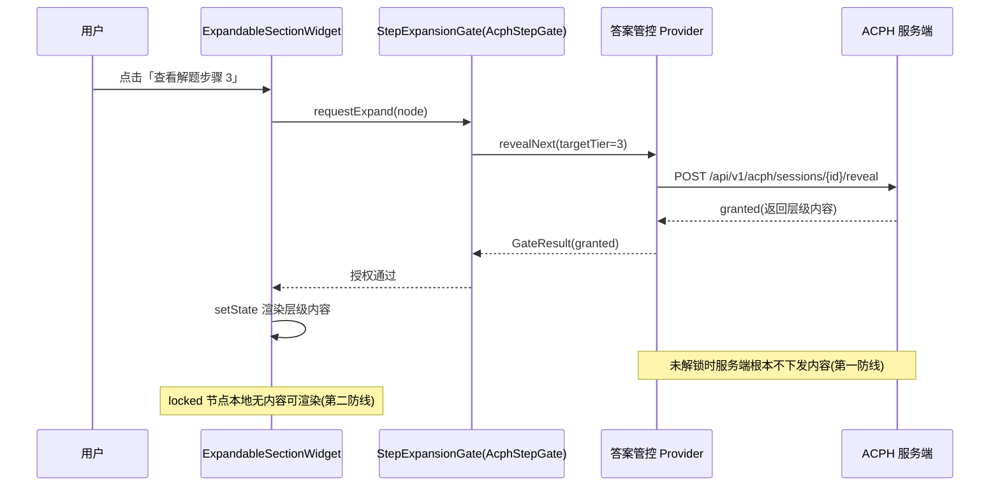
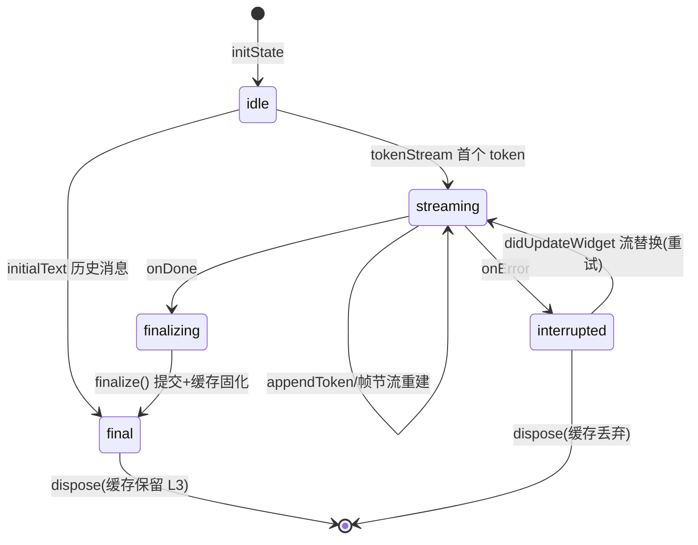

# 客户端-AI对话消息Markdown流式渲染与学科公式排版引擎-详细设计

## 1. 概述

### 1.1 功能定位

AI 对话消息渲染引擎是 PrimeTop 客户端最核心的 UI 组件之一。它负责将 AI 辅导对话中流式返回的 Markdown 文本实时渲染为结构化的消息气泡，并支持数学公式（LaTeX）、化学方程式、代码块、表格、折叠步骤等学科特色内容的排版。

### 1.2 设计目标

| 目标 | 说明 |
|------|------|
| **流式增量渲染** | SSE token 到达即渲染，首 token 延迟 < 50ms |
| **学科内容精确排版** | 数学公式、化学方程式、物理符号渲染准确率达 99%+ |
| **流畅滚动** | 60fps 滚动体验，100 条消息列表无卡顿 |
| **内存可控** | 单条超长消息内存占用 < 2MB |
| **分龄适配** | 根据学段调整字体大小、行间距、公式复杂度展示 |

### 1.3 与相关模块的关系

```
SSE流式响应与AI增量渲染引擎（上层：SSE 连接管理、token 分发）
        │
        ▼
┌───────────────────────────────────┐
│  本模块：Markdown 流式渲染引擎     │
│  ├── 增量 Markdown 解析器         │
│  ├── 学科内容渲染器               │
│  ├── 消息气泡 Widget              │
│  └── 性能与缓存管理               │
└───────────────────────────────────┘
        │
        ▼
富文本与学科内容渲染引擎（底层：通用富文本 Widget 库）
```

---

## 2. 整体架构

### 2.1 模块分层

```
┌─────────────────────────────────────────────┐
│            ChatMessageBubble                 │  消息气泡容器
├─────────────────────────────────────────────┤
│         StreamingMarkdownWidget              │  流式 Markdown 宿主
├──────┬──────┬──────┬──────┬────────┬────────┤
│Text  │Math  │Code  │Table │Expend- │Image   │  内容渲染器
│Render│Render│Render│Render│able    │Render  │
│      │      │      │      │Section │        │
├──────┴──────┴──────┴──────┴────────┴────────┤
│       IncrementalMarkdownParser              │  增量解析器
├─────────────────────────────────────────────┤
│       MarkdownAST + RenderCache              │  AST 与缓存
└─────────────────────────────────────────────┘
```

### 2.2 数据流

```
SSE Token → TokenBuffer → IncrementalParser → AST Patch
                                                  │
                                                  ▼
                                        Widget Diff & Rebuild
                                                  │
                                                  ▼
                                          Rendered Message
```

---

## 3. 增量 Markdown 解析器（IncrementalMarkdownParser）

### 3.1 核心挑战

传统 Markdown 解析器（如 `markdown`、`commonmark`）需要完整文本才能解析。流式场景下文本逐 token 到达，需要：

1. **处理不完整语法**：如 `` ````dart\nvoid main() `` 缺少闭合的 ``` 
2. **处理跨 token 语法**：一个 `$x^2$` 可能分 3 个 token 到达
3. **最小化重建**：仅在 AST 结构变化时触发 Widget 重建

### 3.2 解析策略：滑动窗口 + 状态机

```dart
/// 增量 Markdown 解析器状态
enum ParseState {
  /// 文本模式
  text,
  /// LaTeX 行内公式模式（$...$）
  mathInline,
  /// LaTeX 块级公式模式（$$...$$）
  mathBlock,
  /// 代码块模式（```...```）
  codeBlock,
  /// 表格模式
  table,
  /// 有序/无序列表模式
  list,
  /// 引用块模式（> ...）
  blockquote,
  /// 粗体（**...**）
  bold,
  /// 斜体（*...*）
  italic,
  /// 删除线（~~...~~）
  strikethrough,
  /// 链接（[...](...)）
  link,
  /// 折叠步骤（:::steps ... :::）
  expandableSection,
}

/// 增量解析器
class IncrementalMarkdownParser {
  /// 滑动窗口大小（用于向前看lookahead）
  static const int windowSize = 4;

  /// 已确认完成的 AST 节点
  final List<ASTNode> _committedNodes = [];

  /// 当前正在构建的临时节点
  final List<ASTNode> _pendingNodes = [];

  /// 未消耗的文本缓冲
  final StringBuffer _buffer = StringBuffer();

  /// 当前解析状态栈
  final List<ParseState> _stateStack = [ParseState.text];

  /// 文本哈希缓存，用于判断是否需要重建
  int _lastHash = 0;

  /// 当前文本总长度
  int _totalLength = 0;

  /// 追加新 token 并返回 AST 补丁
  ASTPatch appendToken(String token) {
    _buffer.write(token);
    _totalLength += token.length;

    // 只有当窗口区域变化时才重新解析
    final currentHash = _buffer.length;
    if (currentHash == _lastHash) {
      return ASTPatch.empty;
    }

    return _reparseTail();
  }

  /// 标记流结束，提交所有待定节点
  ASTPatch finalize() {
    _flushBuffer();
    _commitPending();
    return ASTPatch(
      committed: List.unmodifiable(_committedNodes),
      isFinal: true,
    );
  }

  /// 重新解析缓冲区尾部
  ASTPatch _reparseTail() {
    final text = _buffer.toString();

    // 尝试从尾部识别完整的语法块
    final patches = <ASTNode>[];

    // 1. 检测块级语法（代码块、公式块、表格等）
    _detectBlockSyntax(text, patches);

    // 2. 检测行内语法（粗体、斜体、行内公式等）
    _detectInlineSyntax(text, patches);

    // 3. 计算最小重建范围
    final rebuildRange = _calculateRebuildRange(patches);

    return ASTPatch(
      committed: List.unmodifiable(_committedNodes),
      pending: patches,
      rebuildRange: rebuildRange,
      isFinal: false,
    );
  }
}
```

### 3.3 AST 节点定义

```dart
/// Markdown AST 节点基类
abstract class ASTNode {
  /// 节点类型
  String get type;
  /// 子节点
  List<ASTNode> get children;
  /// 是否完成（不会再变化）
  bool get isFinal;
  /// 唯一标识（用于 Widget 复用）
  String get id;
}

/// 文本节点
class TextNode extends ASTNode {
  @override
  String get type => 'text';

  final String content;
  final TextStyleSpec style; // bold, italic, strikethrough, link etc.

  TextNode({
    required this.content,
    this.style = const TextStyleSpec(),
    required String id,
    required bool isFinal,
  });
}

/// 数学公式节点
class MathNode extends ASTNode {
  @override
  String get type => 'math';

  final String latex; // LaTeX 源码
  final bool isBlock; // true=块级($$), false=行内($)
  final MathRenderState renderState;

  MathNode({
    required this.latex,
    required this.isBlock,
    this.renderState = MathRenderState.pending,
    required String id,
    required bool isFinal,
  });
}

/// 代码块节点
class CodeBlockNode extends ASTNode {
  @override
  String get type => 'codeBlock';

  final String language; // dart, python, json, etc.
  final String code;
  final bool showLineNumbers;

  CodeBlockNode({
    required this.language,
    required this.code,
    this.showLineNumbers = true,
    required String id,
    required bool isFinal,
  });
}

/// 表格节点
class TableNode extends ASTNode {
  @override
  String get type => 'table';

  final List<String> headers;
  final List<List<String>> rows;
  final List<TextAlign> alignments;

  TableNode({
    required this.headers,
    required this.rows,
    required this.alignments,
    required String id,
    required bool isFinal,
  });
}

/// 折叠步骤节点（PrimeTop 自定义语法）
class ExpandableSectionNode extends ASTNode {
  @override
  String get type => 'expandableSection';

  final String title; // 如 "解题步骤 1"、"思路提示"
  final int stepIndex; // 步骤序号
  final ExpandableState expandState; // collapsed / expanded / auto
  final List<ASTNode> innerNodes;

  ExpandableSectionNode({
    required this.title,
    required this.stepIndex,
    this.expandState = ExpandableState.collapsed,
    required this.innerNodes,
    required String id,
    required bool isFinal,
  });
}

/// 列表节点
class ListNode extends ASTNode {
  @override
  String get type => 'list';

  final bool ordered;
  final List<ASTNode> items;

  ListNode({
    required this.ordered,
    required this.items,
    required String id,
    required bool isFinal,
  });
}

/// 引用块节点
class BlockquoteNode extends ASTNode {
  @override
  String get type => 'blockquote';

  final List<ASTNode> children;
  final String? quoteType; // 'tip', 'warning', 'info', null=default

  BlockquoteNode({
    required this.children,
    this.quoteType,
    required String id,
    required bool isFinal,
  });
}

/// 图片节点
class ImageNode extends ASTNode {
  @override
  String get type => 'image';

  final String url;
  final String? alt;
  final double? width;
  final double? height;

  ImageNode({
    required this.url,
    this.alt,
    this.width,
    this.height,
    required String id,
    required bool isFinal,
  });
}

/// AST 补丁（增量更新描述）
class ASTPatch {
  final List<ASTNode> committed; // 已确认不变的节点
  final List<ASTNode> pending;   // 正在构建的节点
  final RebuildRange? rebuildRange; // 需要重建的范围
  final bool isFinal;            // 流是否结束

  const ASTPatch({
    required this.committed,
    this.pending = const [],
    this.rebuildRange,
    this.isFinal = false,
  });

  static const ASTPatch empty = ASTPatch(committed: []);
}

class RebuildRange {
  final int startIndex; // 开始重建的节点索引
  final int endIndex;   // 结束重建的节点索引（含）

  const RebuildRange({required this.startIndex, required this.endIndex});
}
```

### 3.4 PrimeTop 自定义 Markdown 扩展语法

| 语法 | 用途 | 示例 |
|------|------|------|
| `:::steps` ... `:::` | 折叠式解题步骤 | 渐进式提示 |
| `:::tip` ... `:::` | 提示框 | 学习技巧 |
| `:::warning` ... `:::` | 警告框 | 易错点提醒 |
| `:::think` ... `:::` | 思考引导 | 启发式提问 |
| `$$..$$` | 块级公式 | 数学推导 |
| `$..$` | 行内公式 | 文中公式 |
| `{width=300}` | 带尺寸图片 | 几何图形 |

---

## 4. 数学公式渲染器（MathRenderer）

### 4.1 技术选型

| 方案 | 优势 | 劣势 | 选型 |
|------|------|------|------|
| **flutter_math_fork** (KaTeX 算法) | 纯 Dart，无平台依赖，性能好 | 部分高级 LaTeX 不支持 | ✅ 主选 |
| **WebView + KaTeX/MathJax** | 支持最全 | 性能差、内存高、滚动卡顿 | ❌ 不选 |
| **PlatformView + Native** | 性能好 | 双端维护成本高 | 备选（复杂公式） |
| **Canvas 自绘** | 完全可控 | 开发成本极高 | ❌ 不选 |

### 4.2 渲染流程

```
LaTeX 源码字符串
      │
      ▼
LaTeX Tokenizer（词法分析）
      │
      ▼
LaTeX Parser → MathAST（公式语法树）
      │
      ▼
Layout Engine（排版引擎：处理分数、根号、矩阵布局）
      │
      ▼
Flutter Widget Tree
      │
      ▼
CustomPaint 渲染
```

### 4.3 核心代码：MathRenderWidget

```dart
class MathRenderWidget extends StatelessWidget {
  final String latex;
  final bool isBlock;
  final MathStyle style;
  final bool isStreaming; // 是否正在流式接收

  const MathRenderWidget({
    super.key,
    required this.latex,
    required this.isBlock,
    this.style = MathStyle.display,
    this.isStreaming = false,
  });

  @override
  Widget build(BuildContext context) {
    // 流式状态下使用简化渲染，减少抖动
    if (isStreaming && _isIncompleteLatex(latex)) {
      return _buildStreamingPlaceholder(latex);
    }

    return _buildFormula(context);
  }

  Widget _buildFormula(BuildContext context) {
    try {
      final mathStyle = isBlock
          ? MathStyle.display
          : MathStyle.text;

      return Math.tex(
        latex,
        mathStyle: mathStyle,
        textStyle: _resolveTextStyle(context),
        onErrorFallback: (err) => _buildErrorFallback(latex, err),
      );
    } on LaTeXParseError catch (e) {
      return _buildErrorFallback(latex, e);
    }
  }

  /// 检测不完整的 LaTeX（流式场景）
  bool _isIncompleteLatex(String latex) {
    // 检查未闭合的花括号
    int braceCount = 0;
    for (int i = 0; i < latex.length; i++) {
      if (latex[i] == '{') braceCount++;
      if (latex[i] == '}') braceCount--;
    }
    if (braceCount > 0) return true;

    // 检查未闭合的环境
    final envPattern = RegExp(r'\\begin\{(\w+)\}');
    final endPattern = RegExp(r'\\end\{(\w+)\}');
    final begins = envPattern.allMatches(latex).map((m) => m.group(1)).toList();
    final ends = endPattern.allMatches(latex).map((m) => m.group(1)).toList();
    for (final env in begins) {
      if (!ends.contains(env)) return true;
    }

    return false;
  }

  /// 流式渲染占位符（简化显示，等公式完整后再精确渲染）
  Widget _buildStreamingPlaceholder(String latex) {
    return Container(
      padding: const EdgeInsets.symmetric(horizontal: 4, vertical: 2),
      decoration: BoxDecoration(
        color: Theme.of(context).colorScheme.surfaceVariant.withOpacity(0.3),
        borderRadius: BorderRadius.circular(4),
      ),
      child: Row(
        mainAxisSize: MainAxisSize.min,
        children: [
          Text(
            latex,
            style: TextStyle(
              fontFamily: 'monospace',
              fontSize: style.fontSize,
              color: Theme.of(context).colorScheme.onSurface,
            ),
          ),
          const SizedBox(width: 4),
          SizedBox(
            width: 12,
            height: 12,
            child: CircularProgressIndicator(
              strokeWidth: 1.5,
              color: Theme.of(context).colorScheme.primary.withOpacity(0.5),
            ),
          ),
        ],
      ),
    );
  }

  /// 错误回退显示
  Widget _buildErrorFallback(String latex, Object error) {
    return Container(
      padding: const EdgeInsets.all(8),
      decoration: BoxDecoration(
        color: Colors.red.shade50,
        borderRadius: BorderRadius.circular(4),
        border: Border.all(color: Colors.red.shade200),
      ),
      child: Column(
        crossAxisAlignment: CrossAxisAlignment.start,
        mainAxisSize: MainAxisSize.min,
        children: [
          Text(
            latex,
            style: const TextStyle(fontFamily: 'monospace', fontSize: 13),
          ),
          const SizedBox(height: 4),
          Text(
            '公式解析异常，请点击反馈',
            style: TextStyle(fontSize: 11, color: Colors.red.shade700),
          ),
        ],
      ),
    );
  }

  TextStyle _resolveTextStyle(BuildContext context) {
    final baseStyle = Theme.of(context).textTheme.bodyLarge!;
    // 根据学段调整公式字体大小
    final grade = context.read<UserProfileCubit>().state.gradeLevel;
    final fontSize = _gradeFontSize(baseStyle.fontSize!, grade);
    return baseStyle.copyWith(fontSize: fontSize);
  }

  double _gradeFontSize(double baseSize, GradeLevel grade) {
    switch (grade) {
      case GradeLevel.kindergarten:
      case GradeLevel.primary1_3:
        return baseSize * 1.3; // 幼儿和低年级放大公式
      case GradeLevel.primary4_6:
        return baseSize * 1.15;
      case GradeLevel.junior:
        return baseSize * 1.05;
      case GradeLevel.senior:
        return baseSize; // 高中用标准大小
    }
  }
}

enum MathStyle { display, text }

class MathStyleSpec {
  final double fontSize;
  final double lineHeight;
  final Color color;

  const MathStyleSpec({
    required this.fontSize,
    this.lineHeight = 1.5,
    required this.color,
  });
}
```

### 4.4 常见学科公式渲染清单

| 学科 | 公式类型 | LaTeX 示例 | 渲染要求 |
|------|----------|-----------|---------|
| 数学 | 分数 | `\frac{a}{b}` | 上下排版 |
| 数学 | 根号 | `\sqrt[n]{x}` | 嵌套根号 |
| 数学 | 上下标 | `x^{2}`, `a_{n}` | 定位精确 |
| 数学 | 矩阵 | `\begin{pmatrix}...\end{pmatrix}` | 对齐 |
| 数学 | 求和/积分 | `\sum_{i=1}^{n}`, `\int_{a}^{b}` | 上下限 |
| 数学 | 三角函数 | `\sin^2\theta + \cos^2\theta = 1` | 函数正体 |
| 数学 | 方程组 | `\begin{cases}...\end{cases}` | 左对齐花括号 |
| 物理 | 单位 | `\text{m/s}^2`, `\text{kg·m}` | 单位正体 |
| 物理 | 矢量 | `\vec{F}`, `\overrightarrow{AB}` | 箭头 |
| 化学 | 方程式 | `2H_2 + O_2 \rightarrow 2H_2O` | 下标、箭头 |
| 化学 | 离子方程 | `Ba^{2+} + SO_4^{2-} = BaSO_4\downarrow` | 上下标 |
| 生物 | 化学式 | `C_6H_{12}O_6` | 下标 |

---

## 5. 代码块渲染器（CodeBlockRenderer）

### 5.1 功能需求

1. 支持语法高亮（至少 15 种语言）
2. 行号显示
3. 一键复制
4. 流式代码接收时的光标动画

### 5.2 核心实现

```dart
class CodeBlockWidget extends StatefulWidget {
  final String code;
  final String language;
  final bool isStreaming;
  final bool showLineNumbers;

  const CodeBlockWidget({
    super.key,
    required this.code,
    required this.language,
    this.isStreaming = false,
    this.showLineNumbers = true,
  });

  @override
  State<CodeBlockWidget> createState() => _CodeBlockWidgetState();
}

class _CodeBlockWidgetState extends State<CodeBlockWidget> {
  bool _copied = false;

  @override
  Widget build(BuildContext context) {
    final theme = Theme.of(context);

    return Container(
      margin: const EdgeInsets.symmetric(vertical: 8),
      decoration: BoxDecoration(
        color: theme.brightness == Brightness.dark
            ? const Color(0xFF1E1E1E)
            : const Color(0xFFF5F5F5),
        borderRadius: BorderRadius.circular(8),
        border: Border.all(
          color: theme.colorScheme.outlineVariant.withOpacity(0.3),
        ),
      ),
      child: Column(
        crossAxisAlignment: CrossAxisAlignment.stretch,
        children: [
          // 头部：语言标签 + 复制按钮
          _buildHeader(context),
          // 代码内容
          _buildCodeContent(context),
        ],
      ),
    );
  }

  Widget _buildHeader(BuildContext context) {
    return Container(
      padding: const EdgeInsets.symmetric(horizontal: 12, vertical: 6),
      decoration: BoxDecoration(
        color: Theme.of(context).colorScheme.surfaceVariant.withOpacity(0.5),
        borderRadius: const BorderRadius.vertical(top: Radius.circular(8)),
      ),
      child: Row(
        mainAxisAlignment: MainAxisAlignment.spaceBetween,
        children: [
          Text(
            widget.language.toUpperCase(),
            style: TextStyle(
              fontSize: 11,
              fontWeight: FontWeight.w600,
              color: Theme.of(context).colorScheme.onSurfaceVariant,
            ),
          ),
          _buildCopyButton(context),
        ],
      ),
    );
  }

  Widget _buildCopyButton(BuildContext context) {
    return InkWell(
      onTap: _copyCode,
      borderRadius: BorderRadius.circular(4),
      child: Padding(
        padding: const EdgeInsets.symmetric(horizontal: 8, vertical: 4),
        child: Row(
          mainAxisSize: MainAxisSize.min,
          children: [
            Icon(
              _copied ? Icons.check : Icons.copy,
              size: 14,
              color: _copied ? Colors.green : null,
            ),
            const SizedBox(width: 4),
            Text(
              _copied ? '已复制' : '复制',
              style: TextStyle(fontSize: 12, color: _copied ? Colors.green : null),
            ),
          ],
        ),
      ),
    );
  }

  Widget _buildCodeContent(BuildContext context) {
    return Padding(
      padding: const EdgeInsets.all(12),
      child: Row(
        crossAxisAlignment: CrossAxisAlignment.start,
        children: [
          if (widget.showLineNumbers) _buildLineNumbers(),
          const SizedBox(width: 12),
          Expanded(child: _buildHighlightedCode()),
          if (widget.isStreaming) _buildCursor(),
        ],
      ),
    );
  }

  Widget _buildLineNumbers() {
    final lines = widget.code.split('\n');
    return Column(
      crossAxisAlignment: CrossAxisAlignment.end,
      children: List.generate(lines.length, (i) {
        return Text(
          '${i + 1}',
          style: TextStyle(
            fontSize: 12,
            fontFamily: 'monospace',
            color: Theme.of(context).colorScheme.onSurfaceVariant.withOpacity(0.5),
            height: 1.6,
          ),
        );
      }),
    );
  }

  Widget _buildHighlightedCode() {
    // 使用 highlight 库进行语法高亮
    try {
      final highlighted = highlight.parse(widget.code, language: widget.language);
      return _buildRichTextFromNodes(highlighted.nodes!);
    } catch (_) {
      // 降级为纯文本
      return SelectableText(
        widget.code,
        style: const TextStyle(fontFamily: 'monospace', fontSize: 13, height: 1.6),
      );
    }
  }

  Widget _buildCursor() {
    return Padding(
      padding: const EdgeInsets.only(left: 2),
      child: _BlinkingCursor(),
    );
  }

  Future<void> _copyCode() async {
    await Clipboard.setData(ClipboardData(text: widget.code));
    setState(() => _copied = true);
    Future.delayed(const Duration(seconds: 2), () {
      if (mounted) setState(() => _copied = false);
    });
  }
}

/// 流式光标动画
class _BlinkingCursor extends StatefulWidget {
  @override
  State<_BlinkingCursor> createState() => _BlinkingCursorState();
}

class _BlinkingCursorState extends State<_BlinkingCursor>
    with SingleTickerProviderStateMixin {
  late final AnimationController _controller;

  @override
  void initState() {
    super.initState();
    _controller = AnimationController(
      vsync: this,
      duration: const Duration(milliseconds: 530),
    )..repeat(reverse: true);
  }

  @override
  void dispose() {
    _controller.dispose();
    super.dispose();
  }

  @override
  Widget build(BuildContext context) {
    return FadeTransition(
      opacity: _controller,
      child: Container(
        width: 2,
        height: 16,
        color: Theme.of(context).colorScheme.primary,
      ),
    );
  }
}
```

### 5.3 支持的语法高亮语言

| 类别 | 语言 |
|------|------|
| 编程 | Dart, Python, JavaScript, Java, C/C++ |
| 标记 | HTML, XML, JSON, YAML, Markdown |
| 学科 | LaTeX (数学公式源码), GNUPLOT |
| 数据库 | SQL |
| 其他 | Bash, PowerShell, Diff |

---

## 6. 流式 Markdown 宿主 Widget

### 6.1 StreamingMarkdownWidget

这是消息气泡内的核心 Widget，管理整个流式渲染生命周期。

```dart
/// 流式 Markdown 渲染宿主
class StreamingMarkdownWidget extends StatefulWidget {
  /// 消息 ID（用于缓存标识）
  final String messageId;

  /// 初始完整文本（用于非流式场景，如历史消息）
  final String? initialText;

  /// SSE Token 流
  final Stream<String>? tokenStream;

  /// 分龄样式配置
  final AgeAdaptiveStyle ageStyle;

  /// 是否显示操作按钮（复制、反馈等）
  final bool showActions;

  /// 步骤折叠策略
  final StepCollapseStrategy stepStrategy;

  const StreamingMarkdownWidget({
    super.key,
    required this.messageId,
    this.initialText,
    this.tokenStream,
    required this.ageStyle,
    this.showActions = true,
    this.stepStrategy = StepCollapseStrategy.autoCollapseAfter,
  });

  @override
  State<StreamingMarkdownWidget> createState() => _StreamingMarkdownWidgetState();
}

class _StreamingMarkdownWidgetState extends State<StreamingMarkdownWidget> {
  late final IncrementalMarkdownParser _parser;
  late final RenderCache _renderCache;

  StreamSubscription<String>? _tokenSubscription;
  List<ASTNode> _currentNodes = [];
  bool _isStreaming = false;
  bool _isFinal = false;
  String _fullText = '';

  // 性能监控
  int _tokenCount = 0;
  int _rebuildCount = 0;
  DateTime? _streamStartTime;

  ASTPatch? _pendingPatch;
  bool _interrupted = false;

  /// 最小重建间隔（帧对齐，与 StreamRenderScheduler 的 16ms 口径一致）
  static const _kMinRenderInterval = Duration(milliseconds: 16);

  @override
  void initState() {
    super.initState();

    _parser = IncrementalMarkdownParser();
    _renderCache = RenderCache(messageId: widget.messageId);

    // 场景 A：非流式（历史消息回放）——一次性全量解析并预热缓存
    if (widget.initialText != null) {
      _fullText = widget.initialText!;
      final patch = _parser.appendToken(_fullText);
      _currentNodes = [...patch.committed, ...patch.pending];
      _isFinal = true;
      _parser.finalize();
      _renderCache.commitFinal(_currentNodes, styleVersion: widget.ageStyle.version);
      return;
    }

    // 场景 B：流式——订阅 SSE token 流
    if (widget.tokenStream != null) {
      _isStreaming = true;
      _streamStartTime = DateTime.now();
      _tokenSubscription = widget.tokenStream!.listen(
        _onToken,
        onDone: _onStreamDone,
        onError: _onStreamError,
        cancelOnError: false,
      );
    }
  }

  /// Token 到达：仅追加解析并暂存补丁，重建延迟到帧对齐回调统一执行
  void _onToken(String token) {
    _tokenCount++;
    _fullText += token;
    final patch = _parser.appendToken(token);
    if (patch.committed.isNotEmpty || patch.pending.isNotEmpty) {
      _pendingPatch = patch;
      _scheduleRebuild();
    }
  }

  /// 帧对齐节流。
  /// 契约：帧调度权威归《客户端-AI对话状态管理与消息流编排引擎》§9.2
  /// StreamRenderScheduler；本组件通过 RenderThrottleCoordinator 挂载到
  /// 同一帧回调队列，禁止各自为政造成同一帧双重 setState。
  void _scheduleRebuild() {
    RenderThrottleCoordinator.instance.requestRender(
      key: widget.messageId,
      interval: _kMinRenderInterval,
      callback: _applyPendingPatch,
    );
  }

  void _applyPendingPatch() {
    if (!mounted || _pendingPatch == null) return;
    final patch = _pendingPatch!;
    _pendingPatch = null;

    setState(() {
      _currentNodes = [...patch.committed, ...patch.pending];
      _rebuildCount++;
    });

    // 首 token 渲染延迟埋点（设计目标 < 50ms，见 §1.2）
    if (_tokenCount <= 3 && _streamStartTime != null) {
      final latency =
          DateTime.now().difference(_streamStartTime!).inMilliseconds;
      Telemetry.instance.track('mdw_first_token_rendered', {
        'message_id': widget.messageId,
        'latency_ms': latency,
        'rebuild_count': _rebuildCount,
      });
      _streamStartTime = null;
    }
  }

  /// 流结束：提交全部节点并固化最终缓存
  void _onStreamDone() {
    final patch = _parser.finalize();
    setState(() {
      _currentNodes = patch.committed;
      _isStreaming = false;
      _isFinal = true;
    });
    // 完成态消息写入渲染缓存，供列表层 CachedMessageWidget 复用
    // （复用方：《客户端-AI对话状态管理与消息流编排引擎》§9.3）
    _renderCache.commitFinal(_currentNodes, styleVersion: widget.ageStyle.version);
    Telemetry.instance.track('mdw_stream_completed', {
      'message_id': widget.messageId,
      'token_count': _tokenCount,
      'rebuild_count': _rebuildCount,
      'node_count': _currentNodes.length,
      'text_length': _fullText.length,
    });
  }

  /// 流异常：保留已渲染内容并追加中断横幅；断线重连归状态管理层，不归本组件
  void _onStreamError(Object error) {
    setState(() {
      _isStreaming = false;
      _interrupted = true;
    });
    Telemetry.instance.track('mdw_stream_interrupted', {
      'message_id': widget.messageId,
      'error_type': error.runtimeType.toString(),
      'rendered_length': _fullText.length,
    });
  }

  @override
  void didUpdateWidget(covariant StreamingMarkdownWidget oldWidget) {
    super.didUpdateWidget(oldWidget);
    // 重试场景：token 流对象被替换 → 全量重置解析器
    if (oldWidget.tokenStream != widget.tokenStream &&
        widget.tokenStream != null) {
      _tokenSubscription?.cancel();
      _parser.reset();
      setState(() {
        _currentNodes = [];
        _isFinal = false;
        _isStreaming = true;
        _interrupted = false;
        _tokenCount = 0;
        _rebuildCount = 0;
        _fullText = '';
      });
      _streamStartTime = DateTime.now();
      _tokenSubscription = widget.tokenStream!.listen(
        _onToken,
        onDone: _onStreamDone,
        onError: _onStreamError,
        cancelOnError: false,
      );
    }
  }

  @override
  void dispose() {
    _tokenSubscription?.cancel();
    RenderThrottleCoordinator.instance.cancel(widget.messageId);
    // 红线：未完成流式消息的中间态缓存不得落盘（防止半截内容被历史消息复用）
    if (!_isFinal) _renderCache.discard();
    super.dispose();
  }

  @override
  Widget build(BuildContext context) {
    return Column(
      crossAxisAlignment: CrossAxisAlignment.stretch,
      mainAxisSize: MainAxisSize.min,
      children: [
        ..._buildNodeList(context),
        if (_isStreaming) const _StreamingTailIndicator(),
        if (_interrupted) _InterruptedBanner(messageId: widget.messageId),
        if (widget.showActions && _isFinal)
          _MessageActionsRow(fullText: _fullText, messageId: widget.messageId),
      ],
    );
  }

  List<Widget> _buildNodeList(BuildContext context) {
    final widgets = <Widget>[];
    for (final node in _currentNodes) {
      widgets.add(RepaintBoundary(
        key: ValueKey('nd-${node.id}'),
        // isFinal 节点走缓存（内容不变，直接复用已构建 Widget）；
        // 尾部 pending 节点每帧重建（数量 ≤ 个位数，成本可控）
        child: node.isFinal
            ? _renderCache.obtain(node, widget.ageStyle, _buildNode)
            : _buildNode(context, node),
      ));
    }
    return widgets;
  }

  /// 节点 → Widget 分发（见 §6.2）
  Widget _buildNode(BuildContext context, ASTNode node) {
    return MarkdownNodeDispatcher.dispatch(
      context: context,
      node: node,
      ageStyle: widget.ageStyle,
      isStreaming: _isStreaming,
      stepStrategy: widget.stepStrategy,
    );
  }
}

/// 流式尾部指示器（三点呼吸动画，替代旧版逐字光标，降低重绘面积）
class _StreamingTailIndicator extends StatefulWidget {
  const _StreamingTailIndicator();

  @override
  State<_StreamingTailIndicator> createState() => _StreamingTailIndicatorState();
}

class _StreamingTailIndicatorState extends State<_StreamingTailIndicator>
    with SingleTickerProviderStateMixin {
  late final AnimationController _controller =
      AnimationController(vsync: this, duration: const Duration(milliseconds: 1200))..repeat();

  @override
  void dispose() {
    _controller.dispose();
    super.dispose();
  }

  @override
  Widget build(BuildContext context) {
    return FadeTransition(
      opacity: Tween(begin: 0.3, end: 1.0).animate(_controller),
      child: Padding(
        padding: const EdgeInsets.only(top: 4),
        child: Row(
          mainAxisSize: MainAxisSize.min,
          children: [
            Text('AI 正在输入',
                style: TextStyle(
                    fontSize: 12,
                    color: Theme.of(context).colorScheme.onSurfaceVariant)),
            const SizedBox(width: 6),
            SizedBox(
              width: 14,
              height: 14,
              child: CircularProgressIndicator(
                strokeWidth: 1.5,
                color: Theme.of(context).colorScheme.primary.withOpacity(0.5),
              ),
            ),
          ],
        ),
      ),
    );
  }
}

/// 中断横幅：内容可能不完整，提供「重试/查看完整回答」入口
/// （重试动作转发给消息流编排层，本组件不直接发起网络请求）
class _InterruptedBanner extends StatelessWidget {
  final String messageId;
  const _InterruptedBanner({required this.messageId});

  @override
  Widget build(BuildContext context) {
    return Container(
      margin: const EdgeInsets.only(top: 8),
      padding: const EdgeInsets.symmetric(horizontal: 10, vertical: 6),
      decoration: BoxDecoration(
        color: Colors.orange.shade50,
        borderRadius: BorderRadius.circular(6),
        border: Border.all(color: Colors.orange.shade200),
      ),
      child: Row(
        children: [
          Icon(Icons.info_outline, size: 14, color: Colors.orange.shade700),
          const SizedBox(width: 6),
          const Expanded(
            child: Text('回答生成中断，以上内容可能不完整',
                style: TextStyle(fontSize: 12)),
          ),
          TextButton(
            onPressed: () => EventBus.instance.emit(
                MessageRetryRequested(messageId: messageId)),
            child: const Text('重试', style: TextStyle(fontSize: 12)),
          ),
        ],
      ),
    );
  }
}

/// 完成态操作行：复制 / 反馈 / 重新生成（复制在流式期间禁用，见 §9 G4）
class _MessageActionsRow extends StatelessWidget {
  final String fullText;
  final String messageId;
  const _MessageActionsRow({required this.fullText, required this.messageId});

  @override
  Widget build(BuildContext context) {
    return Row(
      mainAxisAlignment: MainAxisAlignment.end,
      children: [
        IconButton(
          icon: const Icon(Icons.copy_outlined, size: 16),
          tooltip: '复制全文',
          onPressed: () async {
            await Clipboard.setData(ClipboardData(text: fullText));
            Telemetry.instance
                .track('mdw_copy_all', {'message_id': messageId});
          },
        ),
        IconButton(
          icon: const Icon(Icons.flag_outlined, size: 16),
          tooltip: '内容反馈',
          onPressed: () => EventBus.instance.emit(
              AnswerFeedbackRequested(messageId: messageId)),
        ),
      ],
    );
  }
}
```

### 6.2 AST 节点到 Widget 的映射（MarkdownNodeDispatcher）

所有 AST 节点统一经 `MarkdownNodeDispatcher` 分发到对应渲染器，映射关系与缓存策略如下：

| AST 节点类型 | 渲染 Widget | 流式期间策略 | isFinal 后缓存 |
|---|---|---|---|
| `text` | `RichTextSpanBuilder` | 尾节点重建，前缀不变 | 缓存 Span 树 |
| `math`（行内/块级） | `MathRenderWidget`（§4.3） | 不完整 LaTeX 走占位符（§4.3 `_isIncompleteLatex`） | 位图缓存（§7.4） |
| `codeBlock` | `CodeBlockWidget`（§5.2） | 光标动画 + 尾行重建 | 高亮结果缓存 |
| `table` | `TableRendererWidget`（§6.3） | 行增量追加，表头锁定 | 整表缓存 |
| `expandableSection` | `ExpandableSectionWidget`（§6.4） | 解锁门控 + 折叠 | 内容缓存，展开态不缓存 |
| `list` | 递归 `_buildNode` | 逐项提交 | 逐项缓存 |
| `blockquote` | `QuoteBlockWidget`（tip/warning/info 三态皮肤） | 整块重建 | 缓存 |
| `image` | `MarkdownImageWidget`（§6.5） | 显示加载占位 | ImageCache 复用 |

```dart
class MarkdownNodeDispatcher {
  static Widget dispatch({
    required BuildContext context,
    required ASTNode node,
    required AgeAdaptiveStyle ageStyle,
    required bool isStreaming,
    required StepCollapseStrategy stepStrategy,
  }) {
    switch (node.type) {
      case 'text':
        return RichTextSpanBuilder(node: node as TextNode, ageStyle: ageStyle);
      case 'math':
        final n = node as MathNode;
        return MathRenderWidget(
          latex: n.latex,
          isBlock: n.isBlock,
          isStreaming: isStreaming && !n.isFinal,
        );
      case 'codeBlock':
        final n = node as CodeBlockNode;
        return CodeBlockWidget(
          code: n.code,
          language: n.language,
          showLineNumbers: n.showLineNumbers,
          isStreaming: isStreaming && !n.isFinal,
        );
      case 'table':
        return TableRendererWidget(node: node as TableNode, isStreaming: isStreaming);
      case 'expandableSection':
        return ExpandableSectionWidget(
          node: node as ExpandableSectionNode,
          stepStrategy: stepStrategy,
          ageStyle: ageStyle,
        );
      case 'list':
        return _buildList(context, node as ListNode, ageStyle, isStreaming, stepStrategy);
      case 'blockquote':
        return QuoteBlockWidget(node: node as BlockquoteNode);
      case 'image':
        return MarkdownImageWidget(node: node as ImageNode);
      default:
        // 未知节点类型：降级为等宽文本，绝不抛异常中断整条消息渲染
        return Text(
          node.toString(),
          style: const TextStyle(fontFamily: 'monospace', fontSize: 12),
        );
    }
  }
}
```

### 6.3 表格渲染器（TableRendererWidget）

流式场景的表格核心问题：**表头在行数据未到齐前就可能变化**（AI 先输出表头再逐行输出）。策略：

1. **表头锁定**：首个数据行到达后锁定表头列数，后续列数不一致的行按缺列补空、多列合并；
2. **两遍列宽测量**：流式期间用「当前已到行的最大内容长度」估算列宽（第一遍），`isFinal` 后按完整数据重测（第二遍）并触发一次最终布局；
3. **横向滚动兜底**：列宽总和超过气泡宽度时启用横向滚动，不压缩单元格；
4. **分龄降级**：幼儿/小学低年级在列数 > 4 时自动转为「卡片式逐行展示」（见 §8）。

```dart
class TableRendererWidget extends StatelessWidget {
  final TableNode node;
  final bool isStreaming;

  const TableRendererWidget({super.key, required this.node, required this.isStreaming});

  @override
  Widget build(BuildContext context) {
    final ageStyle = context.read<AgeStyleProvider>().current;
    // 幼儿分龄降级：宽表转卡片
    if (ageStyle.wideTableAsCards && node.headers.length > 4) {
      return _TableAsCards(node: node);
    }

    final columnWidths = _measureColumns(node, context);

    return Container(
      margin: const EdgeInsets.symmetric(vertical: 6),
      decoration: BoxDecoration(
        border: Border.all(color: Theme.of(context).colorScheme.outlineVariant),
        borderRadius: BorderRadius.circular(6),
      ),
      child: SingleChildScrollView(
        scrollDirection: Axis.horizontal,
        child: Table(
          columnWidths: [
            for (final w in columnWidths) FixedColumnWidth(w),
          ],
          defaultVerticalAlignment: TableCellVerticalAlignment.middle,
          children: [
            _buildHeaderRow(context),
            for (final row in _normalizedRows()) _buildDataRow(context, row),
            if (isStreaming) _buildPendingRow(context),
          ],
        ),
      ),
    );
  }

  /// 列数归一：缺列补空字符串，多出的列合并进最后一列（表头锁定后执行）
  List<List<String>> _normalizedRows() {
    final colCount = node.headers.length;
    return node.rows.map((r) {
      if (r.length == colCount) return r;
      if (r.length < colCount) {
        return [...r, ...List.filled(colCount - r.length, '')];
      }
      return [...r.sublist(0, colCount - 1), r.sublist(colCount - 1).join(' ')];
    }).toList();
  }

  List<double> _measureColumns(TableNode node, BuildContext context) {
    final maxWidth = MediaQuery.of(context).size.width - 48; // 气泡内宽预算
    // 流式期间：按当前已到内容估宽；isFinal 后：完整重测（两遍测量的第二遍）
    final widths = <double>[];
    for (int c = 0; c < node.headers.length; c++) {
      var maxLen = node.headers[c].length;
      for (final row in node.rows) {
        if (c < row.length) maxLen = max(maxLen, row[c].length);
      }
      widths.add((maxLen.clamp(2, 18) * 8.0) + 16); // 每字符约 8px + padding
    }
    final total = widths.fold<double>(0, (a, b) => a + b);
    if (total <= maxWidth) {
      // 等比放大填满气泡宽度
      final scale = maxWidth / total;
      return widths.map((w) => w * scale).toList();
    }
    return widths; // 超宽 → 横向滚动
  }

  TableRow _buildPendingRow(BuildContext context) => TableRow(
        children: [
          for (int c = 0; c < node.headers.length; c++)
            Padding(
              padding: const EdgeInsets.all(8),
              child: c == 0
                  ? const SizedBox(
                      height: 14,
                      width: 14,
                      child: CircularProgressIndicator(strokeWidth: 1.5))
                  : const SizedBox(height: 14),
            ),
        ],
      );
}
```

畸形表格防御：若首行（表头）在流结束时仍未出现 `|` 分隔的合法结构，解析器将该块降级为 `TextNode`（见 §10 D4）。

### 6.4 折叠步骤渲染器（ExpandableSectionWidget）与答案管控联动

`:::steps` 折叠步骤是渐进式提示（防止直接抄答案）的核心展示形态。**双防线设计**：

- **第一防线（内容级，权威在服务端）**：《答案管控与渐进式提示引擎》保证未解锁层级的真实内容**根本不下发**到客户端；流式 token 中若存在未解锁层级，服务端 Token Pipeline 发送占位符 `<!--ACPH:tier:N:locked-->` 而非内容。
- **第二防线（渲染级，本模块）**：解析器遇到 ACPH 占位符生成 `ExpandableSectionNode(expandState: locked)`；`locked` 节点渲染为解锁占位卡片，**无论客户端状态如何都不会渲染出未解锁内容**（内容本地也不存在，做到物理不可渲染）。

```dart
/// 步骤展开门控接口：由消息流编排层注入实现。
/// 无 ACPH 会话（如普通概念讲解）→ LocalStepGate（纯本地折叠策略）；
/// 有 ACPH 会话 → AcphStepGate（对接《答案管控与渐进式提示引擎》§8 客户端集成）。
abstract class StepExpansionGate {
  /// 该步骤当前是否可展开
  bool canExpand(ExpandableSectionNode node);

  /// 展开动作（可能触发揭示请求 revealNext / 计时解锁 / 尝试作答解锁）
  Future<GateResult> requestExpand(ExpandableSectionNode node);
}

class GateResult {
  final bool granted;
  final String? denyReason; // 'timer_not_ready' | 'try_answer_required' | 'member_only'
  final Duration? waitDuration;
  const GateResult({required this.granted, this.denyReason, this.waitDuration});
}

class ExpandableSectionWidget extends StatefulWidget {
  final ExpandableSectionNode node;
  final StepCollapseStrategy stepStrategy;
  final AgeAdaptiveStyle ageStyle;

  const ExpandableSectionWidget({
    super.key,
    required this.node,
    required this.stepStrategy,
    required this.ageStyle,
  });

  @override
  State<ExpandableSectionWidget> createState() => _ExpandableSectionWidgetState();
}

class _ExpandableSectionWidgetState extends State<ExpandableSectionWidget> {
  @override
  Widget build(BuildContext context) {
    final gate = context.read<StepGateProvider>().gate; // 编排层注入
    final skin = _resolveSkin(); // steps=蓝 / tip=绿 / warning=橙 / think=紫

    // locked 状态：渲染解锁占位卡（第二防线，物理不含内容）
    if (widget.node.expandState == ExpandableState.locked) {
      return _LockedStepCard(
        stepIndex: widget.node.stepIndex,
        onTap: () => _requestUnlock(gate),
      );
    }

    final expanded = widget.node.expandState == ExpandableState.expanded ||
        (widget.node.expandState == ExpandableState.auto &&
            _autoExpandDecision());

    return AnimatedContainer(
      duration: const Duration(milliseconds: 200),
      margin: const EdgeInsets.symmetric(vertical: 4),
      decoration: BoxDecoration(
        color: skin.backgroundColor,
        borderRadius: BorderRadius.circular(8),
        border: Border.all(color: skin.borderColor),
      ),
      child: Column(
        children: [
          _StepHeader(
            title: widget.node.title,
            stepIndex: widget.node.stepIndex,
            expanded: expanded,
            onTap: () => _toggle(gate),
          ),
          if (expanded)
            Padding(
              padding: const EdgeInsets.fromLTRB(12, 0, 12, 10),
              child: Column(
                children: [
                  for (final inner in widget.node.innerNodes)
                    MarkdownNodeDispatcher.dispatch(
                      context: context,
                      node: inner,
                      ageStyle: widget.ageStyle,
                      isStreaming: !widget.node.isFinal,
                      stepStrategy: widget.stepStrategy,
                    ),
                ],
              ),
            ),
        ],
      ),
    );
  }

  bool _autoExpandDecision() {
    // 策略表：allExpanded / autoCollapseAfter(默认:仅前 N 步展开,N=min(stepIndex,2))
    // / allCollapsed(复习模式或幼儿模式)
    switch (widget.stepStrategy) {
      case StepCollapseStrategy.allExpanded:
        return true;
      case StepCollapseStrategy.allCollapsed:
        return false;
      case StepCollapseStrategy.autoCollapseAfter:
        return widget.stepIndex <= 2 &&
            widget.ageStyle.gradeLevel <= GradeLevel.primary4_6;
    }
  }

  Future<void> _toggle(StepExpansionGate gate) async {
    if (!gate.canExpand(widget.node)) {
      final r = await gate.requestExpand(widget.node);
      if (!r.granted && mounted) {
        _showDenyHint(r); // 计时未到显示倒计时；需作答跳转作答入口
        return;
      }
    }
    setState(() => _setExpandState(
        widget.node.expandState == ExpandableState.expanded
            ? ExpandableState.collapsed
            : ExpandableState.expanded));
    Telemetry.instance.track('mdw_steps_toggle', {
      'message_id': widget.node.id,
      'step_index': widget.node.stepIndex,
      'gate_type': gate.runtimeType.toString(),
    });
  }
}
```

展开/解锁联动时序：



### 6.5 图片渲染器（MarkdownImageWidget）

| 规则 | 说明 |
|---|---|
| 域名白名单 | 仅允许 CDN 白名单域（`cdn.primetop.cn` 等），非白名单 URL 渲染为「图片已屏蔽」占位（对齐《安全与内容合规体系》出域管控） |
| 强制 HTTPS | HTTP 图片一律拒绝加载 |
| 尺寸语法 | 解析 `{width=300}`，宽度 clamp 到气泡宽度内，等比缩放 |
| 加载态 | 16:9 灰色占位 + Shimmer；失败态提供「点击重试」 |
| 长按行为 | 预览大图；保存动作经《客户端-数字内容防截屏与用户溯源水印系统》放行判定 |
| 幼儿模式 | 图片双击放大增加 400ms 延迟确认，防误触（对齐分龄防误触规范） |

```dart
class MarkdownImageWidget extends StatelessWidget {
  final ImageNode node;
  const MarkdownImageWidget({super.key, required this.node});

  static const _allowedHosts = {'cdn.primetop.cn', 'res.primetop.cn'};

  @override
  Widget build(BuildContext context) {
    final uri = Uri.tryParse(node.url);
    final allowed = uri != null &&
        uri.scheme == 'https' &&
        _allowedHosts.contains(uri.host);
    if (!allowed) {
      return const _BlockedImagePlaceholder();
    }
    return Container(
      margin: const EdgeInsets.symmetric(vertical: 6),
      constraints: BoxConstraints(
        maxWidth: MediaQuery.of(context).size.width - 56,
      ),
      child: ClipRRect(
        borderRadius: BorderRadius.circular(8),
        child: Image.network(
          node.url,
          fit: BoxFit.contain,
          frameBuilder: (c, child, frame, _) =>
              frame == null ? const _ImageShimmerPlaceholder() : child,
          errorBuilder: (_, __, ___) => const _ImageErrorPlaceholder(),
        ),
      ),
    );
  }
}
```

---

## 7. 渲染缓存与性能工程

### 7.1 RenderCache

```dart
/// 渲染缓存：messageId 作用域 + styleVersion 失效
///
/// 三层结构：
///   L1 内存 Widget 缓存（isFinal 节点 → 已构建 Element 复用）
///   L2 公式位图缓存（latex hash → ui.Picture，见 §7.4）
///   L3 磁盘 JSON 缓存（历史消息 AST 快照，冷启动加速）
class RenderCache {
  final String messageId;
  final Map<String, Widget> _widgetCache = {}; // key: nodeId|styleVersion|contentHash
  static const _maxEntries = 512; // L1 上限（约 100 条长消息）

  RenderCache({required this.messageId});

  Widget obtain(
    ASTNode node,
    AgeAdaptiveStyle style,
    Widget Function(BuildContext, ASTNode) builder,
  ) {
    final key = '${node.id}|${style.version}|${node.hashCode}';
    return _widgetCache.putIfAbsent(key, () => _CacheableWidget(builder: builder, node: node));
  }

  /// 流式完成：固化最终节点集（供 CachedMessageWidget 整条复用）
  void commitFinal(List<ASTNode> nodes, {required String styleVersion}) {
    // styleVersion 变化（学段切换/主题切换/字号调整）→ 全量失效重建
    // 持久化 AST 快照到 L3（磁盘），key: mdw_cache_v1:{messageId}
  }

  void discard() {/* 流中断/组件销毁：丢弃中间态，L3 不落盘 */}
  void warmUp(List<ASTNode> nodes) {/* 历史消息：L3 快照 → L1 预热 */}
}
```

缓存失效矩阵：

| 触发 | L1 | L2 公式位图 | L3 磁盘 |
|---|---|---|---|
| 主题切换（亮/暗） | 失效 | 失效（颜色烘焙进位图） | 保留（记录 styleVersion） |
| 学段/字号调整 | 失效 | 失效 | 异步刷新 |
| 消息编辑/重新生成 | 该消息失效 | 保留 | 覆盖 |
| 内存告警（对齐资源压力感知引擎橙级） | LRU 淘汰至 50% | LRU 淘汰至 50% | 不动 |

### 7.2 帧预算与节流（v1.1 修正）

**v1.0 缺陷修复**：§3.2 `appendToken` 中 `currentHash = _buffer.length; if (currentHash == _lastHash) return` 为无效短路——`_buffer.length` 写入后必然变化且 `_lastHash` 从未被更新，该判断恒为 false。v1.1 修正：去掉解析器内部假短路，改为**脏标记 + 宿主帧节流**（§6.1 `_scheduleRebuild`），解析器只负责追加与产出补丁，重建频率由 `RenderThrottleCoordinator` 统一约束：

| 环节 | 预算 | 超预算处理 |
|---|---|---|
| 单帧解析（增量补丁应用） | ≤ 2ms | 合并下一帧 token 再解析（帧内合并） |
| 单帧 Widget diff/构建 | ≤ 4ms | 尾节点降级为纯文本预览，isFinal 后精渲染 |
| 帧间隔下限 | 16ms | trailing flush 保证不丢尾帧 |
| 连续重建次数 | 单条消息 ≤ 400 次 | 超出后切换为「整段刷新模式」（每 100 token 一次） |

```dart
/// 帧节流协调器：全局单例，挂载到 SchedulerBinding 帧回调
/// （与《客户端-AI对话状态管理与消息流编排引擎》§9.2 共用同一调度源）
class RenderThrottleCoordinator {
  RenderThrottleCoordinator._();
  static final instance = RenderThrottleCoordinator._();

  final _callbacks = <String, void Function()>{};
  bool _scheduled = false;
  final Map<String, DateTime> _lastRun = {};

  void requestRender({
    required String key,
    required Duration interval,
    required void Function() callback,
  }) {
    final last = _lastRun[key];
    if (last != null &&
        DateTime.now().difference(last) < interval) {
      _ensureTrailingFlush(key, interval, callback); // trailing 保证尾帧不丢
      return;
    }
    _callbacks[key] = callback;
    _scheduleFrame();
  }

  void _scheduleFrame() {
    if (_scheduled) return;
    _scheduled = true;
    SchedulerBinding.instance.addPostFrameCallback((_) {
      _scheduled = false;
      final pending = Map.of(_callbacks);
      _callbacks.clear();
      pending.forEach((key, cb) {
        _lastRun[key] = DateTime.now();
        cb(); // 各消息组件独立 setState，RepaintBoundary 隔离重绘范围
      });
    });
  }

  void cancel(String key) {/* 移除回调与 trailing 定时器 */}
  void _ensureTrailingFlush(String key, Duration i, void Function() cb) {/* ... */}
}
```

### 7.3 内存治理

| 项 | 预算 | 手段 |
|---|---|---|
| 单条消息渲染内存 | < 2MB（§1.2 目标） | AST 节点懒持有；pending 缓冲区 Flush 后释放 |
| 超长消息（> 50KB 文本） | 自动分段 | 解析器在段落边界切成 `SegmentNode`，仅渲染可视段 ± 2 段（配合列表层虚拟化） |
| 公式位图缓存 | 全局 ≤ 30MB | LRU；同 LaTeX 文本跨消息复用 |
| 流式期间全文持有 | `_fullText` 仅用于完成态复制 | 完成后转存 `StringBuffer`→紧凑 String，中间 StringBuffer 释放 |

### 7.4 公式位图缓存

`MathRenderWidget` 的排版成本高（布局 + CustomPaint），对重复公式（如同一消息内多次出现 `x^2`、跨消息常见公式）引入位图缓存：

```dart
class MathPictureCache {
  /// key: latex|fontSize|color|isBlock → ui.Picture
  final _cache = <String, ui.Picture>{};
  static const _maxBytes = 30 << 20; // 30MB

  ui.Picture? lookup(String latex, double fontSize, Color color, bool isBlock) {
    final key = '$latex|$fontSize|${color.value}|$isBlock';
    return _cache[key];
  }

  void store(String latex, double fontSize, Color color, bool isBlock, ui.Picture pic) {
    // LRU 淘汰 + 字节记账（Picture.estimatedBytes）
  }
}
```

注意：位图颜色烘焙导致主题切换必须失效（见 §7.1 矩阵），深色模式下公式用浅色重绘。

### 7.5 低端机降级矩阵

设备分级来源：《客户端-系统资源压力感知与智能降级调度引擎》。渲染侧订阅压力等级：

| 压力等级 | 降级动作 |
|---|---|
| 绿（正常） | 全量能力：逐字流式、公式动画、Shimmer |
| 橙（中压） | 关闭 Shimmer/呼吸动画；首帧 token 合并粒度 16ms→48ms；公式位图缓存上限减半 |
| 红（高压） | 流式期间公式全部走占位符（isFinal 才精渲染）；表格禁用逐行动画；图片延迟加载（可视区外不加载） |
| 红 + 内存告警 | 历史消息仅保留可视区 ± 5 条的 L1 缓存，其余释放重用 L3 |

---

## 8. 分龄适配

### 8.1 AgeAdaptiveStyle

```dart
class AgeAdaptiveStyle {
  final GradeLevel gradeLevel;
  final double bodyFontSize;    // 基准正文字号
  final double lineHeight;      // 行高倍率
  final double mathScale;       // 公式字号倍率（与 §4.3 _gradeFontSize 一致）
  final bool wideTableAsCards;  // 宽表转卡片
  final bool linkTapEnabled;    // 外链点击（幼儿禁用，见 C5）
  final int maxAutoExpandSteps; // 自动展开步数上限
  final String version;         // 样式版本号（缓存失效依据）

  const AgeAdaptiveStyle({/* ... */});
}
```

### 8.2 学段渲染参数矩阵

数值权威归《分龄UI适配与交互设计规范》，本表为渲染引擎引用值：

| 参数 | 幼儿 | 小学低年级 | 小学高年级 | 初中 | 高中 |
|---|---|---|---|---|---|
| 正文字号 | 18 | 17 | 16 | 15 | 15 |
| 行高倍率 | 1.8 | 1.7 | 1.6 | 1.55 | 1.5 |
| 公式倍率 | 1.3× | 1.3× | 1.15× | 1.05× | 1.0× |
| 宽表转卡片阈值 | 全部 | >4 列 | >6 列 | 不转 | 不转 |
| 步骤默认态 | 全折叠 | 前 1 步展开 | 前 2 步展开 | 前 2 步展开 | 全折叠（考点密集） |
| 外链点击 | 禁用 | 需确认弹窗 | 允许 | 允许 | 允许 |
| 代码块行号 | 隐藏 | 隐藏 | 显示 | 显示 | 显示 |

### 8.3 幼儿模式专项规则

1. `:::warning`/`:::think` 皮肤去掉警示红色，统一为柔和插画风格（避免焦虑感，对齐反焦虑交互红线）；
2. 列表项超过 5 条时折叠为「还有 N 条」气泡；
3. 每段文字 ≤ 3 行时增加跟读高亮（复用语文朗读评估系统的字级高亮组件）。

---

## 9. 状态机与守卫

### 9.1 消息渲染生命周期状态机



| 状态 | 进入条件 | 允许动作 | 禁止动作 |
|---|---|---|---|
| idle | 构造完成 | 订阅流/装载历史 | 渲染操作行 |
| streaming | 首个 token | 增量解析/节流重建/光标动画 | 复制全文（G4） |
| finalizing | 流 onDone | finalize/缓存固化 | appendToken（G1） |
| final | 缓存固化完成 | 操作行/缓存复用 | 任何内容变更（G2） |
| interrupted | 流 onError | 中断横幅/重试事件 | 静默吞错（必须可见，C3） |

### 9.2 MathNode 渲染状态机

`pending`（LaTeX 不完整，占位符）→ `rendering`（排版中）→ `rendered`（位图缓存命中/构建完成）；异常 → `error`（错误回退卡片 + 反馈入口，§4.3）。`error` 态自动触发 LaTeX 修复器二次尝试（§10.2），修复成功回到 `rendering`。

### 9.3 ExpandableState 状态机

`locked` →（ACPH 解锁授权）→ `collapsed` ⇄ `expanded`；`auto` 为初始派生态，首次构建时按策略表落为 `collapsed/expanded`。**`locked` 只能由 `StepExpansionGate.requestExpand` 授权离开，本地交互不可直接跳过**（G3 红线）。

### 9.4 守卫总表

| 编号 | 守卫规则 | 违反后果 |
|---|---|---|
| G1 | `finalize()` 后调用 `appendToken` 抛 `StateError`，防流复用污染 | 开发期断言 + 上报 mdw_guard_violation |
| G2 | `isFinal=true` 节点内容不可变（缓存完整性前提） | 缓存键含 contentHash，变更即 miss 重建 |
| G3 | `locked` 步骤禁止本地展开；未解锁内容本地不存在也渲染不出来（双防线） | 埋点 + 审计日志 |
| G4 | 流式期间（非 final）禁用复制全文与长按选择，防秒抄答案（对齐抄答案风险引擎） | SelectionArea 不挂载 |
| G5 | 缓存命中必须校验 `styleVersion`，否则宁可 miss | 自动失效 |
| G6 | 未完成流式消息的 L3 磁盘缓存禁止写入（半截内容防复用） | discard |
| G7 | 图片域名白名单 + HTTPS 强制，违者渲染屏蔽占位 | 不发起网络请求 |
| G8 | `ExpandableSectionWidget` 展开动作必须经 Gate，禁止绕过直接 setState | 代码评审红线 |
| G9 | 单帧重建预算超限自动降档（§7.2），禁止阻塞帧 | 帧内合并 |
| G10 | 解析器异常不得冒泡中断整条消息渲染（未知节点降级文本） | 局部降级 |
| G11 | 主题切换必须使 L1/L2 缓存失效（颜色烘焙） | 失效矩阵 |
| G12 | `didUpdateWidget` 检测流对象替换必须重置解析器，禁止残留旧 AST | 全量重置 |

---

## 10. 错误处理与降级

### 10.1 错误分类与本地错误码（MDW 段）

本地错误码仅用于埋点与日志（客户端内部），不透传给用户（用户只见降级 UI）：

| 错误码 | 场景 | 处置 |
|---|---|---|
| MDW-1001 | 未知 AST 节点类型 | 降级等宽文本（G10） |
| MDW-1002 | LaTeX 解析失败且修复器无法修复 | 错误回退卡片 + 反馈入口（§4.3） |
| MDW-1003 | LaTeX 修复器修复成功但与源不一致 | 静默修复 + 埋点记录 diff |
| MDW-2001 | 表格畸形（表头非法） | 整块降级 TextNode（D4） |
| MDW-2002 | 表格行列不一致 | 缺列补空/多列合并（§6.3） |
| MDW-3001 | 图片白名单外/HTTP | 屏蔽占位（G7） |
| MDW-3002 | 图片加载失败 | 失败占位 + 点击重试 |
| MDW-4001 | 帧预算连续超限（>10 帧） | 切整段刷新模式（§7.2） |
| MDW-4002 | 单消息内存超 2MB | 强制分段虚拟化（§7.3） |
| MDW-5001 | 流中断（网络/服务端） | 中断横幅 + 重试事件（§6.1） |
| MDW-6001 | 守卫违反（G1/G3/G8） | 埋点 + 审计日志上报 |

### 10.2 LaTeX 自动修复器（常见 AI 输出缺陷）

AI 流式输出中常见 LaTeX 缺陷与修复规则（修复仅用于渲染展示，原始文本保留给复制/反馈）：

| 规则 | 缺陷示例 | 修复后 |
|---|---|---|
| R1 未闭合 `\left(` | `\left(3+2` | `\left(3+2\right)` |
| R2 全角括号/逗号 | `（x，y）` | `(x,y)` |
| R3 中文裸文本入公式 | `$速度v$` | `$\text{速度}v$` |
| R4 单美元误判（货币） | `$5$` 且两侧无空白 | 不视为公式（解析器规则） |
| R5 `\text{}` 内嵌 LaTeX 命令 | `\text{\frac{1}{2}}` | `\frac{1}{2}` 移出 |
| R6 上下标缺花括号 | `x^12` | `x^{12}`（按语义判 1 位还是 2 位） |
| R7 环境名大小写 | `\Begin{Cases}` | `\begin{cases}` |

```dart
class LatexRepairer {
  static const _maxRepairRounds = 2; // 防止修复震荡

  static RepairResult repair(String latex) {
    var current = latex;
    var appliedRules = <String>[];
    for (var i = 0; i < _maxRepairRounds; i++) {
      final before = current;
      current = current
          .replaceAllMapped(RegExp(r'（([^）]*)）'), (m) => '(${m[1]})') // R2
          .replaceAllMapped(RegExp(r'，'), (_) => ',');
      // R1: 统计 \left( 与 \right) 数量补齐
      final leftCount = '\\left('.allMatches(current).length;
      final rightCount = '\\right)'.allMatches(current).length;
      if (leftCount > rightCount) {
        current += '\\right)' * (leftCount - rightCount);
      }
      if (current == before) break;
      appliedRules.add('round_$i');
    }
    return RepairResult(original: latex, repaired: current, rules: appliedRules);
  }
}
```

### 10.3 降级矩阵

| 编号 | 故障 | 降级动作 | 用户感知 |
|---|---|---|---|
| D1 | 公式渲染异常 | 错误回退卡片（源码 + 反馈入口） | 明确可见，可反馈 |
| D2 | 公式位图缓存不可用 | 直接 Widget 排版（慢但正确） | 无感（略慢） |
| D3 | 语法高亮库崩溃/语言不支持 | 纯文本等宽展示 | 无感 |
| D4 | 表格畸形 | 降级纯文本 | 内容不丢失 |
| D5 | 图片失败 | 占位 + 重试 | 明确可见 |
| D6 | 帧率持续低于 45fps | 整段刷新模式 + 关闭动画 | 更新粒度变粗 |
| D7 | 内存压力红级 | 释放历史 L1 + 图片延迟加载 | 回滚时短暂骨架 |
| D8 | 流中断 | 保留已渲染 + 中断横幅 + 重试 | 明确可见 |
| D9 | 解析器内部异常 | 整条消息降级为纯文本（保底不白屏） | 格式丢失但可读 |
| D10 | Gate 请求失败（ACPH 服务不可用） | 步骤保持 locked + 「稍后再试」toast | 明确可见，不伪装解锁 |

---

## 11. 埋点与监控

### 11.1 埋点事件表（module=mdw）

| 事件 | 触发 | 关键属性 |
|---|---|---|
| mdw_first_token_rendered | 首 token 完成渲染 | latency_ms、rebuild_count |
| mdw_stream_completed | 流结束 | token_count、rebuild_count、node_count、text_length、duration_ms |
| mdw_stream_interrupted | 流异常中断 | error_type、rendered_length |
| mdw_math_render_error | 公式渲染失败 | error_code、repair_applied、latex_len（不采集 latex 原文，防 PII/体积） |
| mdw_math_repaired | 修复器介入 | rules、success |
| mdw_fallback_triggered | 任一降级 D1-D10 触发 | degrade_code、node_type |
| mdw_steps_toggle | 步骤折叠交互 | step_index、gate_type、expanded |
| mdw_steps_unlock_denied | 解锁被拒 | deny_reason、wait_seconds |
| mdw_table_card_mode | 宽表转卡片（分龄） | columns、grade_level |
| mdw_image_blocked | 图片被白名单拦截 | host（不含完整 URL） |
| mdw_copy_all | 复制全文（仅 final 态） | message_id |
| mdw_guard_violation | 守卫违反（G1/G3/G8） | guard_code、stack_hash |

### 11.2 指标与阈值

| 指标 | 目标 | 告警线 |
|---|---|---|
| 首 token 渲染延迟 P50 / P99 | ≤ 30ms / ≤ 50ms | P99 > 80ms 持续 10min |
| 单消息平均重建次数 | ≤ 200 | > 400（整段模式生效率高） |
| 公式渲染错误率 | < 0.5% | > 1% 连续 24h（回流 Prompt 后处理管线） |
| 降级触发率（D1+D4+D9）/ 消息 | < 0.1% | > 0.3% |
| 流中断率 | < 0.5% | > 2%（联动 SSE 层排查） |
| 低端机（红级）帧率 | ≥ 45fps | < 40fps |
| 守卫违反次数 | 0 | ≥ 1 即 P2 告警（安全相关） |

---

## 12. 合规要点

| 编号 | 红线 |
|---|---|
| C1 | 未解锁答案层级内容：服务端不下发为第一防线；渲染层 locked 物理不可渲染为第二防线，两层都不可绕过 |
| C2 | 流式期间禁用复制与长按选择（G4），防止秒抄答案，配合抄答案风险评估 |
| C3 | 流中断必须可见提示，禁止静默截断误导学生以为内容完整 |
| C4 | 公式错误回退卡片不得展示内部错误堆栈，仅源码与反馈入口 |
| C5 | 幼儿模式禁用外链跳转；全学段外链仅限白名单域，营销链接一律拦截（对齐青少年模式内容访问分级） |
| C6 | 图片仅 HTTPS 白名单域；拦截事件不采集完整 URL（最小化） |
| C7 | AI 消息气泡的 AIGC 标识（对齐 AIGC 水印系统）在本模块布局中保留固定位置，不得被长内容遮挡 |
| C8 | 埋点不采集 LaTeX 原文与消息正文，仅采集长度/哈希（数据最小化） |

---

## 13. 契约对齐（与关联文档的边界裁决）

| # | 关联文档 | 裁决 |
|---|---|---|
| 1 | SSE流式响应与AI增量渲染引擎 | SSE 连接管理/StreamBuffer/服务端 Token Pipeline 归该文档；其 §4.3 IncrementalRenderer 为 Web（TypeScript）实现。**移动端 Flutter 增量解析与渲染权威归本文档**；两端共享「不完整语法占位」策略语义 |
| 2 | 客户端-AI对话状态管理与消息流编排引擎 | 消息列表虚拟化、StreamRenderScheduler、CachedMessageWidget 归该文档；本文档 RenderCache 提供单消息节点级缓存供其复用；帧调度共用 §7.2 RenderThrottleCoordinator，禁止双重调度 |
| 3 | 答案管控与渐进式提示引擎 | 层级内容与解锁判定服务端权威（该文档 §4/§5）；revealNext 交互组件归该文档 §8.2；本文档仅提供 :::steps 容器与 StepExpansionGate 门控（§6.4），未解锁内容不进入客户端渲染树 |
| 4 | 富文本与学科内容渲染引擎 | 静态学科内容 Widget 基元（化学方程式/几何图/物理矢量图）归该文档；对话流式场景由本文档调度并复用其基元；公式选型 flutter_math_fork 两文档一致；流式增量解析归本文档 |
| 5 | 客户端AI对话页面交互与组件架构 | 页面层「分段卡片式」语义分段（ContentSegment.parse）为上层；本文档负责段内 Markdown 流式渲染，两层不重复解析 |
| 6 | 分龄UI适配与交互设计规范 | 学段字号/行距/交互参数矩阵数值权威归该文档，本文档 §8.2 为引用快照 |
| 7 | 客户端-系统资源压力感知与智能降级调度引擎 | 设备压力等级（绿/橙/红）由该引擎发布，本文档 §7.5 仅订阅执行渲染降级动作 |
| 8 | 客户端-数字内容防截屏与用户溯源水印系统 | 图片保存/截屏管控归该系统；本文档仅在长按保存入口调用其放行判定 |
| 9 | 客户端-主题引擎与动态外观系统 | 深浅主题切换事件由该引擎广播；本文档执行 L1/L2 缓存失效（G11） |

---

## 14. 验收场景

1. 流式输入含跨 token 拆分的行内公式 `$\frac{1}{2}$`（分 3 个 token 到达），最终渲染为分数且无中间态闪烁；
2. 流式中代码块只有开围栏无闭围栏，显示光标动画；闭围栏到达后语法高亮一次性替换成功；
3. 首 token 渲染延迟埋点 P99 ≤ 50ms（中端机基准设备）；
4. 100 条历史消息滚动帧率 ≥ 55fps（已完成消息不重绘，DevTools 验证 RepaintBoundary 命中）；
5. 单条 8KB 数学推导长消息流式过程内存峰值 < 2MB；
6. 含 `\left(` 未闭合的公式经修复器 R1 修复后正确渲染，mdw_math_repaired 上报；
7. 未知节点类型（mock 注入 `foo` 类型）渲染为等宽文本，整条消息其余部分不受影响（G10）；
8. ACPH locked 步骤：点击后服务端拒绝 → 显示拒绝原因与等待时长，内容不渲染（G3/D10）；
9. ACPH 解锁成功 → 步骤展开渲染层级内容，mdw_steps_toggle 上报 gate_type=AcphStepGate；
10. 流式期间长按消息不出现选择菜单、复制按钮隐藏（G4）；流完成后操作行出现；
11. 表格流式：表头先到锁定，两行数据后到正确追加；中途出现 5 列行而表头 4 列 → 多列合并进末列（MDW-2002）；
12. 幼儿模式：>4 列表格转卡片展示（mdw_table_card_mode）；外链点击无响应（C5）；
13. 非白名单域图片渲染「已屏蔽」占位且不发起网络请求（G7），mdw_image_blocked 上报；
14. 流中断：已渲染内容保留 + 中断横幅 + 重试可恢复；半截消息退出页面后历史列表不出现半截缓存（G6）；
15. 主题切换深色模式后公式颜色正确（缓存失效重建，G11）；学段切换后字号/公式倍率变化且缓存不串（G5）；
16. didUpdateWidget 流替换（重试）后旧 AST 无残留、重建计数重置（G12）；
17. 红级内存压力下历史消息 L1 释放，回滚时有骨架不崩溃（D7）；
18. 守卫违反（构造后手动 appendToken）触发 mdw_guard_violation 上报且不崩溃（G1）。

---

## 15. 维护记录

| 版本 | 日期 | 说明 |
|---|---|---|
| v1.0 | 2026-08-11 | 初始版本（后截断于 §6.1 initState 代码中段） |
| v1.1 | 2026-08-19 | 补全烂尾文档：原文件 879 行截断于 §6.1 `initState() { super.` 处（围栏 17 奇），§6.1 之后内容全缺。本次补齐 §6.1 宿主状态实现（initState 双场景/帧节流/中断横幅/操作行/dispose 红线）；新增 §6.2 节点分发映射、§6.3 流式表格渲染器（表头锁定/两遍列宽/畸形防御）、§6.4 折叠步骤与答案管控联动（双防线/StepExpansionGate/AcphStepGate 时序）、§6.5 图片渲染器（白名单/HTTPS/幼儿防误触）、§7 渲染缓存与性能工程（RenderCache 三层/失效矩阵/帧预算/内存治理/公式位图缓存/低端机降级）、§8 分龄适配（AgeAdaptiveStyle/学段参数矩阵/幼儿专项）、§9 三状态机与守卫 G1-G12、§10 错误处理（MDW 错误码 11 项/LaTeX 修复器 R1-R7/降级 D1-D10）、§11 埋点 12 事件与 7 项指标阈值、§12 合规 C1-C8、§13 契约对齐 9 项、§14 验收 18 条。修复 v1.0 三处缺陷：①§3.2 appendToken 哈希短路逻辑无效（_buffer.length 恒变且 _lastHash 从未更新）改为脏标记+宿主帧节流（§7.2）；②MathRenderWidget 为 StatelessWidget 但 _buildStreamingPlaceholder/_resolveTextStyle 直接引用实例外 context（编译错误）修正为方法传参；③本地 enum MathStyle 与 flutter_math_fork 包同名冲突裁决为 import as fmath 别名 |