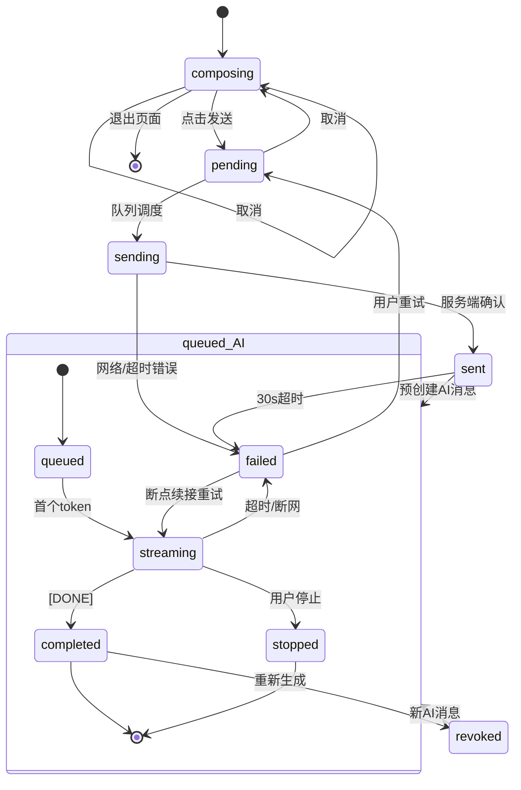

# 客户端-AI对话状态管理与消息流编排引擎 - 详细设计

> 版本：1.0 | 日期：2026-08-02 | 状态：已完成  
> 优先级：P0（MVP 核心组件）  
> 技术栈：Flutter / Dart

---

## 1. 模块概述

### 1.1 功能定位

AI 对话状态管理与消息流编排引擎（Chat State & Message Orchestration Engine, 简称 CSMO）是 PrimeTop 客户端 AI 对话页面的**核心状态管理中枢**。它负责管理从用户发起提问到 AI 完整响应返回全过程中的客户端状态流转、消息队列管理、SSE 流式响应连接控制、异常恢复和 UI 状态同步。

CSMO 不同于以下已有模块：
- **AI对话引擎与会话管理**（服务端会话上下文管理）—— CSMO 是客户端侧
- **SSE流式响应与AI增量渲染引擎**（流式协议与渲染层）—— CSMO 是状态控制层
- **AI对话页面交互与组件架构**（页面布局与组件设计）—— CSMO 是底层状态引擎

CSMO 聚焦于**客户端状态机层面**：消息生命周期管理、状态流转、并发控制、错误恢复和数据一致性保障。

### 1.2 核心挑战

| 挑战 | 描述 | 影响 |
|------|------|------|
| 流式状态复杂 | SSE 连接经历 connecting→connected→streaming→completed/error 多阶段 | UI 需精确反映每个阶段 |
| 消息时序保证 | 用户快速连续提问时消息需按发起顺序排列 | 错序导致上下文断裂 |
| 网络异常恢复 | 弱网/断网/超时场景需自动重试且不丢消息 | 移动端网络环境不稳定 |
| 增量渲染性能 | AI token 流式到达需实时渲染且不卡顿 | 高频更新导致 UI 卡顿 |
| 多会话并发 | 用户可能同时有多个对话上下文（不同学科） | 状态隔离与资源管理 |
| 前后台切换 | App 进入后台时 SSE 连接断开，恢复后需续接 | 消息丢失风险 |
| 撤回与重生成 | 用户可能停止生成、重新生成、编辑后重发 | 状态回滚与清理 |

### 1.3 设计目标

| 目标 | 指标 |
|------|------|
| 首 token 渲染延迟 | ≤ 100ms（收到首个 token 到屏幕渲染） |
| 消息列表滑动帧率 | ≥ 58fps（流式渲染期间） |
| 弱网重试成功率 | ≥ 95%（3 次重试内） |
| 前后台切换零消息丢失 | 100% |
| 状态一致性 | 内存消息列表与本地数据库 100% 一致 |
| 最大支持消息数 | 单会话 ≥ 5000 条消息不卡顿 |

### 1.4 模块边界

**本模块负责：**
- 对话消息生命周期管理（创建、发送、接收、完成、失败、撤回）
- SSE/WebSocket 连接状态机
- 消息发送队列与并发控制
- 流式响应缓冲与分块渲染调度
- 异常恢复（重试、断线续接、状态回滚）
- 消息本地持久化与缓存同步
- 多会话 Tab 状态隔离
- 前后台切换状态保存与恢复
- 发送中消息的编辑/撤回/重生成逻辑

**不在本模块范围：**
- AI 模型调用与 Prompt 编排（→ AI服务 / AI-Prompt编排与场景模板系统）
- 消息内容的 Markdown/LaTeX 渲染（→ AI对话消息Markdown流式渲染引擎）
- 对话历史持久化存储策略（→ AI模型上下文管理与对话记忆引擎）
- 页面布局与组件设计（→ AI对话页面交互与组件架构）
- 输入面板与多模态输入（→ 多模态输入统一处理引擎）
- 内容安全过滤（→ AI输入安全与教育对话护栏引擎）

### 1.5 与其他模块的交互关系

```
┌─────────────────────────────────────────────────────────────┐
│                    AI 对话页面 (UI Layer)                     │
│         ┌─────────────────────────────────────────┐         │
│         │       CSMO 状态管理引擎 (本模块)          │         │
│         │  ┌────────────┐  ┌──────────────────┐   │         │
│         │  │ 消息状态机  │  │ SSE 连接状态机    │   │         │
│         │  └────────────┘  └──────────────────┘   │         │
│         │  ┌────────────┐  ┌──────────────────┐   │         │
│         │  │ 发送队列    │  │ 异常恢复管理器    │   │         │
│         │  └────────────┘  └──────────────────┘   │         │
│         │  ┌────────────┐  ┌──────────────────┐   │         │
│         │  │ 本地持久化  │  │ 前后台切换管理    │   │         │
│         │  └────────────┘  └──────────────────┘   │         │
│         └─────────────────────────────────────────┘         │
│                      ▼               ▲                      │
│    ┌──────────────────┐    ┌──────────────────────┐         │
│    │ Markdown/LaTeX   │    │  输入面板 + 多模态    │         │
│    │ 渲染引擎         │    │  输入引擎            │         │
│    └──────────────────┘    └──────────────────────┘         │
└─────────────────────────────────────────────────────────────┘
              ▼ HTTP/SSE
┌─────────────────────────────────────────────────────────────┐
│                    服务端 API                                │
│  /api/chat/send  │ /api/chat/stream  │ /api/chat/stop       │
└─────────────────────────────────────────────────────────────┘
```

---

## 2. 核心数据结构

### 2.1 消息数据模型 (ChatMessage)

```dart
/// 对话消息模型
class ChatMessage {
  /// 消息唯一 ID（UUID v4，客户端生成）
  final String messageId;
  
  /// 所属会话 ID
  final String conversationId;
  
  /// 消息角色
  final MessageRole role;
  
  /// 消息文本内容（流式过程中逐步增长）
  String content;
  
  /// 当前消息状态
  MessageStatus status;
  
  /// 创建时间戳（客户端本地，毫秒）
  final int createdAt;
  
  /// 最后更新时间戳
  int updatedAt;
  
  /// 服务端消息 ID（服务端确认后回填）
  String? serverMessageId;
  
  /// 附件列表
  final List<MessageAttachment> attachments;
  
  /// 元数据
  final MessageMetadata metadata;
  
  /// 错误信息（status == failed 时填充）
  ChatError? error;
  
  /// 流式内容缓冲区（仅 AI 消息使用）
  StringBuffer? _streamBuffer;
  
  /// 增量渲染游标（记录上次渲染到的字符位置）
  int _lastRenderedOffset = 0;
}

enum MessageRole { user, assistant, system }

class MessageAttachment {
  final String attachmentId;
  final AttachmentType type;       // image / voice / file
  final String localPath;
  String? remoteUrl;               // 上传后回填
  final int? duration;             // 语音时长 ms
  final int? sizeBytes;
  AttachmentUploadStatus uploadStatus;
}

enum AttachmentType { image, voice, file }
enum AttachmentUploadStatus { pending, uploading, uploaded, failed }

class MessageMetadata {
  final String? subject;                 // 学科上下文
  final String? gradeLevel;              // 学段年级
  final String? textbookVersion;         // 教材版本
  final List<String> knowledgePoints;    // 知识点标签
  final int? tokenCount;                 // AI 回复 token 数
  final String? modelId;                 // AI 模型标识
  final int? latencyMs;                  // 响应耗时
  UserFeedback feedback;                 // 用户反馈
  final bool hasProgressiveHints;        // 是否包含渐进式提示
  final String? relatedQuestionId;       // 关联题目（拍题场景）
}

enum UserFeedback { none, like, dislike }
```

### 2.2 消息状态枚举 (MessageStatus)

```dart
/// 消息生命周期状态
enum MessageStatus {
  // —— 用户消息状态 ——
  composing,     // 编辑中
  pending,       // 待发送（在队列中）
  sending,       // 发送中（HTTP 请求已发出）
  sent,          // 已被服务端确认
  
  // —— AI 消息状态 ——
  queued,        // 服务端排队等待模型推理
  streaming,     // 正在接收流式 token
  completed,     // 已完成
  
  // —— 共享状态 ——
  failed,        // 失败（可重试）
  stopped,       // 用户主动停止生成
  revoked,       // 已撤回 / 已重新生成
}
```

### 2.3 会话数据模型 (ChatConversation)

```dart
class ChatConversation {
  final String conversationId;
  String title;
  final String? subject;                  // 学科
  
  final List<ChatMessage> messages;       // 内存消息列表（按时间排序）
  ConversationStatus status;              // 会话级状态
  
  final MessageSendQueue sendQueue;       // 发送队列
  final SSEConnectionManager sseManager;  // SSE 连接管理
  
  String? lastConfirmedMessageId;         // 最后确认的消息 ID
  int serverVersion;                      // 服务端版本号（乐观锁）
  int unreadCount;
  
  String? draft;                          // 输入草稿
  final List<MessageAttachment> draftAttachments;
  
  final int createdAt;
  int lastActiveAt;
  bool isPinned;
}

enum ConversationStatus {
  idle,          // 空闲
  sending,       // 发送中
  waiting,       // 等待 AI 响应
  streaming,     // 流式接收中
  error,         // 出错
  reconnecting,  // 重连中
}
```

### 2.4 SSE 连接模型 (SSEConnection)

```dart
class SSEConnection {
  final String connectionId;
  final String conversationId;
  final String userMessageId;
  final String assistantMessageId;       // 预创建的 AI 消息 ID
  
  SSEConnectionState state;
  StreamSubscription? _subscription;     // SSE 订阅
  http.Client? _httpClient;
  
  final int createdAt;
  int lastEventAt;                       // 最后事件时间（超时检测）
  int retryCount;
  int receivedTokenCount;
  
  final SSERequestSnapshot snapshot;     // 请求快照（重试用）
}

enum SSEConnectionState {
  connecting,
  connected,
  streaming,
  completed,
  timeout,
  networkError,
  serverError,
  rateLimited,
  cancelled,
}

/// 请求快照 — 用于断线重连
class SSERequestSnapshot {
  final String conversationId;
  final String userMessageId;
  final String content;
  final String? subject;
  final String? gradeLevel;
  final int lastReceivedOffset;           // 已接收的字符偏移量
  final List<String> attachmentUrls;
}
```

### 2.5 错误模型

```dart
class ChatError {
  final ErrorType type;
  final String userMessage;               // 展示给用户的提示
  final bool retryable;                   // 是否可重试
  final int? retryAfterMs;                // 限流时返回，建议等待时间
  final Object? originalError;            // 原始异常
  final StackTrace? stackTrace;
}

enum ErrorType {
  network,         // 网络错误
  timeout,         // 超时
  rateLimited,     // 限流
  serverError,     // 服务端 5xx
  badRequest,      // 客户端 4xx
  contentFiltered, // 内容被安全过滤
  modelOverload,   // 模型过载
  cancelled,       // 用户取消
  unknown,
}
```

---

## 3. 状态机设计

### 3.1 用户消息状态流转

```
 ┌──────────┐   点击发送    ┌──────────┐  HTTP发出   ┌──────────┐
 │composing │─────────────▶│ pending  │───────────▶│ sending  │
 └──────────┘               └──────────┘            └──────────┘
                                  │                       │
                           取消发送│                成功 ↓   ↓ 失败
                                  ▼                  ┌────┐ ┌────┐
                             ┌──────────┐           │sent│ │fail│
                             │composing │           └────┘ └────┘
                             └──────────┘                     │
                                                     重试 ┌────┘
                                                          ▼
                                                     ┌──────────┐
                                                     │ pending  │
                                                     └──────────┘
```

### 3.2 AI 消息状态流转

```
                      用户消息 sent 后预创建 AI 消息
                            ┌──────────┐
                            │  queued  │ ◀── 服务端排队
                            └──────────┘
                                 │
                          首个token到达
                                 ▼
                    ┌──────────────────────┐
                    │      streaming       │
                    └──────────────────────┘
                      │        │         │
                 停止 │   [DONE]│    超时/断网│
                      ▼        ▼         ▼
                ┌────────┐┌─────────┐┌────────┐
                │stopped ││completed││ failed │
                └────────┘└─────────┘└────────┘
                                          │ 重试
                                          ▼
                                    回到 streaming
                                    (断点续接)
```

### 3.3 会话级状态流转

```
 ┌──────┐  发送消息  ┌────────┐  收到首token  ┌──────────┐  完成/停止
 │ idle │──────────▶│sending │─────────────▶│streaming │─────────▶
 └──────┘            └────────┘              └──────────┘
     ▲                   │ 失败                   │ 断网
     │                   ▼                       ▼
     │              ┌────────┐            ┌────────────┐
     │              │ error  │            │reconnecting│
     │              └────────┘            └────────────┘
     │                   │重试                   │
     └───────────────────┴───────────────────────┘
                        回到 idle
```

### 3.4 状态转换规则表

| 当前状态 | 触发事件 | 目标状态 | 副作用 |
|---------|---------|---------|--------|
| composing | 用户点击发送 | pending | 入发送队列，保存草稿清空 |
| pending | 队列调度选中 | sending | 发起 HTTP 请求 |
| pending | 用户取消 | composing | 出队列，恢复草稿 |
| sending | HTTP 200 | sent | 更新 serverMessageId，预创建 AI 消息(queued) |
| sending | 网络错误 | failed | 记录 ChatError(retryable=true) |
| sending | 用户取消 | failed | 标记 cancelled |
| sent | 30s 超时 | failed | 记录 timeout 错误 |
| queued | 首个 SSE event | streaming | 开始流式渲染 |
| streaming | SSE [DONE] | completed | 完整内容写入数据库 |
| streaming | 用户停止 | stopped | 保存已接收部分内容 |
| streaming | 网络断开 | failed | 记录断点偏移量 |
| streaming | 15s 无新 event | failed | 触发超时重连 |
| failed | 用户重试 | pending | 重新入队列 |
| completed | 用户重新生成 | revoked | 废弃旧消息，新建消息入流程 |

---

## 4. 消息发送队列与并发控制

### 4.1 发送队列设计

```dart
/// 单会话消息发送队列
class MessageSendQueue {
  final List<QueueItem> _items = [];
  QueueItem? _current;
  bool _isPaused = false;
  
  /// 入队
  void enqueue(ChatMessage message) {
    message.status = MessageStatus.pending;
    _items.add(QueueItem(message: message));
    _processNext();
  }
  
  /// 优先入队（重试消息插队）
  void enqueuePriority(ChatMessage message) {
    message.status = MessageStatus.pending;
    _items.insert(0, QueueItem(message: message, isPriority: true));
    _processNext();
  }
  
  /// 出队（用户取消）
  void cancel(String messageId) {
    _items.removeWhere((item) => item.message.messageId == messageId);
  }
  
  /// 处理下一条
  Future<void> _processNext() async {
    if (_isPaused || _current != null || _items.isEmpty) return;
    
    _current = _items.removeAt(0);
    try {
      await _send(_current!.message);
    } finally {
      _current = null;
      _processNext(); // 递归
    }
  }
  
  Future<void> _send(ChatMessage msg) async {
    msg.status = MessageStatus.sending;
    msg.updatedAt = DateTime.now().millisecondsSinceEpoch;
    notifyListeners();
    
    try {
      // Step 1: 上传未上传的附件
      final pendingAttachments = msg.attachments.where(
        (a) => a.uploadStatus == AttachmentUploadStatus.pending
      );
      for (final att in pendingAttachments) {
        att.uploadStatus = AttachmentUploadStatus.uploading;
        final url = await _fileService.upload(att.localPath);
        att.remoteUrl = url;
        att.uploadStatus = AttachmentUploadStatus.uploaded;
      }
      
      // Step 2: 发送消息
      final resp = await _chatApi.sendMessage(
        conversationId: msg.conversationId,
        content: msg.content,
        role: msg.role,
        attachments: msg.attachments
            .where((a) => a.uploadStatus == AttachmentUploadStatus.uploaded)
            .map((a) => a.remoteUrl!)
            .toList(),
        clientMessageId: msg.messageId,
      );
      
      msg.serverMessageId = resp.serverMessageId;
      msg.status = MessageStatus.sent;
      await _localDb.upsertMessage(msg);
      
      // Step 3: 启动 SSE 接收 AI 响应
      await _sseManager.startStreaming(
        conversationId: msg.conversationId,
        userMessageId: msg.messageId,
        assistantMessageId: resp.assistantMessageId,
        lastOffset: 0,
      );
      
    } on DioException catch (e) {
      _handleSendError(msg, e);
    } catch (e) {
      _handleSendError(msg, e);
    }
  }
  
  void _handleSendError(ChatMessage msg, Object error) {
    msg.status = MessageStatus.failed;
    msg.error = _mapToChatError(error);
    _localDb.upsertMessage(msg);
    notifyListeners();
  }
  
  ChatError _mapToChatError(Object error) {
    if (error is DioException) {
      switch (error.type) {
        case DioExceptionType.connectionTimeout:
        case DioExceptionType.sendTimeout:
        case DioExceptionType.receiveTimeout:
          return ChatError(
            type: ErrorType.timeout,
            userMessage: '请求超时，请检查网络后重试',
            retryable: true,
            originalError: error,
          );
        case DioExceptionType.connectionError:
          return ChatError(
            type: ErrorType.network,
            userMessage: '网络连接失败，请检查网络设置',
            retryable: true,
            originalError: error,
          );
        case DioExceptionType.badResponse:
          final code = error.response?.statusCode ?? 500;
          if (code == 429) {
            return ChatError(
              type: ErrorType.rateLimited,
              userMessage: '今日提问次数已达上限',
              retryable: false,
              retryAfterMs: _parseRetryAfter(error.response),
            );
          }
          if (code >= 500) {
            return ChatError(
              type: ErrorType.serverError,
              userMessage: '服务器繁忙，请稍后重试',
              retryable: true,
              originalError: error,
            );
          }
          return ChatError(
            type: ErrorType.badRequest,
            userMessage: '请求参数有误',
            retryable: false,
            originalError: error,
          );
        default:
          break;
      }
    }
    return ChatError(
      type: ErrorType.unknown,
      userMessage: '发送失败，请重试',
      retryable: true,
      originalError: error,
    );
  }
  
  int? _parseRetryAfter(Response? response) {
    final retryAfter = response?.headers.value('retry-after');
    if (retryAfter != null) {
      return int.tryParse(retryAfter) * 1000;
    }
    return null;
  }
}
```

### 4.2 多会话并发管理

```dart
/// 多会话管理器 — 每个会话拥有独立的发送队列和 SSE 管理器
class ConversationManager extends ChangeNotifier {
  final Map<String, ChatConversation> _conversations = {};
  
  /// 全局 SSE 并发上限（防止同时过多连接）
  static const int _maxConcurrentSSE = 2;
  int _activeSSECount = 0;
  
  /// 获取或创建会话
  ChatConversation getOrCreate(String conversationId, {String? subject}) {
    return _conversations.putIfAbsent(
      conversationId,
      () => ChatConversation(
        conversationId: conversationId,
        subject: subject,
        messages: [],
        status: ConversationStatus.idle,
        sendQueue: MessageSendQueue(...),
        sseManager: SSEConnectionManager(...),
        serverVersion: 0,
        unreadCount: 0,
        draftAttachments: [],
        createdAt: DateTime.now().millisecondsSinceEpoch,
        lastActiveAt: DateTime.now().millisecondsSinceEpoch,
        isPinned: false,
      ),
    );
  }
  
  /// 检查是否可以启动新 SSE 连接
  bool get _canStartSSE => _activeSSECount < _maxConcurrentSSE;
  
  /// 等待 SSE 槽位
  Future<void> _waitForSSESlot() async {
    while (!_canStartSSE) {
      await Future.delayed(const Duration(milliseconds: 200));
    }
  }
}
```

---

## 5. SSE 流式连接管理

### 5.1 连接生命周期管理

```dart
class SSEConnectionManager {
  SSEConnection? _connection;
  final String conversationId;
  final ChatConversation conversation;
  
  static const _firstTokenTimeout = Duration(seconds: 30);  // 首 token 超时
  static const _chunkTimeout = Duration(seconds: 15);       // 分块超时
  Timer? _firstTokenTimer;
  Timer? _chunkTimer;
  
  /// 启动流式连接
  Future<void> startStreaming({
    required String userMessageId,
    required String assistantMessageId,
    required int lastOffset,
  }) async {
    // 获取预创建的 AI 消息
    final aiMessage = conversation.messages.firstWhere(
      (m) => m.messageId == assistantMessageId,
    );
    aiMessage.status = MessageStatus.queued;
    aiMessage._streamBuffer = StringBuffer();
    conversation.status = ConversationStatus.waiting;
    
    // 创建 SSE 连接
    _connection = SSEConnection(
      connectionId: _uuid(),
      conversationId: conversationId,
      userMessageId: userMessageId,
      assistantMessageId: assistantMessageId,
      state: SSEConnectionState.connecting,
      createdAt: DateTime.now().millisecondsSinceEpoch,
      lastEventAt: DateTime.now().millisecondsSinceEpoch,
      retryCount: 0,
      receivedTokenCount: 0,
      snapshot: SSERequestSnapshot(
        conversationId: conversationId,
        userMessageId: userMessageId,
        content: conversation.messages
            .firstWhere((m) => m.messageId == userMessageId).content,
        lastReceivedOffset: lastOffset,
        attachmentUrls: [],
      ),
    );
    
    await _doConnect();
  }
  
  Future<void> _doConnect() async {
    final conn = _connection!;
    conn.state = SSEConnectionState.connecting;
    
    // 超时守护
    _firstTokenTimer = Timer(_firstTokenTimeout, () {
      _handleTimeout(isFirstToken: true);
    });
    
    try {
      final request = http.Request(
        'POST',
        Uri.parse('${Config.apiBase}/api/chat/stream'),
      );
      request.headers['Accept'] = 'text/event-stream';
      request.headers['Authorization'] = 'Bearer ${_authService.token}';
      request.headers['Content-Type'] = 'application/json';
      request.body = jsonEncode({
        'conversationId': conversationId,
        'userMessageId': conn.userMessageId,
        'assistantMessageId': conn.assistantMessageId,
        'lastOffset': conn.snapshot.lastReceivedOffset,
      });
      
      final client = http.Client();
      final response = await client.send(request);
      
      if (response.statusCode != 200) {
        _handleHttpError(response);
        return;
      }
      
      conn.state = SSEConnectionState.connected;
      _firstTokenTimer?.cancel();
      
      // 监听 SSE 事件流
      _connection!._subscription = response.stream
          .transform(utf8.decoder)
          .transform(_sseParser())
          .listen(
        (event) => _handleSSEEvent(event),
        onError: (e) => _handleNetworkError(e),
        onDone: () => _handleStreamDone(),
        cancelOnError: true,
      );
    } on SocketException catch (e) {
      _handleNetworkError(e);
    } on HttpException catch (e) {
      _handleNetworkError(e);
    }
  }
  
  /// SSE 事件处理
  void _handleSSEEvent(SSEEvent event) {
    final conn = _connection!;
    conn.lastEventAt = DateTime.now().millisecondsSinceEpoch;
    _chunkTimer?.cancel();
    
    final aiMessage = conversation.messages.firstWhere(
      (m) => m.messageId == conn.assistantMessageId,
    );
    
    switch (event.event) {
      case 'token':
        // 增量 token 到达
        if (aiMessage.status == MessageStatus.queued) {
          aiMessage.status = MessageStatus.streaming;
          conversation.status = ConversationStatus.streaming;
          // 取消首 token 超时
          _firstTokenTimer?.cancel();
        }
        
        final token = event.data['content'] as String;
        aiMessage._streamBuffer!.write(token);
        aiMessage.content = aiMessage._streamBuffer!.toString();
        conn.receivedTokenCount++;
        
        // 增量渲染
        _scheduleRender(aiMessage);
        
        // 重置分块超时
        _chunkTimer = Timer(_chunkTimeout, () => _handleTimeout(isFirstToken: false));
        break;
        
      case 'metadata':
        // 元数据事件（知识点标签、模型信息等）
        final meta = event.data;
        aiMessage.metadata = aiMessage.metadata.copyWith(
          knowledgePoints: List<String>.from(meta['knowledgePoints'] ?? []),
          modelId: meta['modelId'],
          hasProgressiveHints: meta['hasProgressiveHints'] ?? false,
        );
        break;
        
      case 'error':
        // 服务端流中错误
        final errorMsg = event.data['message'] as String? ?? 'AI 处理出错';
        _handleServerError(errorMsg, code: event.data['code']);
        break;
        
      case 'done':
        // 流结束
        _completeStreaming();
        break;
    }
  }
  
  /// 完成流式接收
  void _completeStreaming() {
    final conn = _connection!;
    final aiMessage = conversation.messages.firstWhere(
      (m) => m.messageId == conn.assistantMessageId,
    );
    
    aiMessage.status = MessageStatus.completed;
    aiMessage.metadata = aiMessage.metadata.copyWith(
      tokenCount: conn.receivedTokenCount,
      latencyMs: DateTime.now().millisecondsSinceEpoch - aiMessage.createdAt,
    );
    aiMessage.updatedAt = DateTime.now().millisecondsSinceEpoch;
    
    conn.state = SSEConnectionState.completed;
    
    // 持久化
    _localDb.upsertMessage(aiMessage);
    
    // 清理
    _firstTokenTimer?.cancel();
    _chunkTimer?.cancel();
    conn._subscription?.cancel();
    
    conversation.status = ConversationStatus.idle;
    _connection = null;
  }
}
```

### 5.2 SSE 解析器

```dart
/// SSE 协议解析 — 将原始文本流转为结构化事件
StreamTransformer<String, SSEEvent> _sseParser() {
  return StreamTransformer.fromHandlers(
    handleData: (String line, sink) {
      // SSE 协议：每行 "data: ..." 或 "event: ..."
      // 空行分隔事件
      if (line.startsWith('event: ')) {
        _pendingEvent = line.substring(7).trim();
      } else if (line.startsWith('data: ')) {
        final data = line.substring(6);
        try {
          final json = jsonDecode(data);
          sink.add(SSEEvent(
            event: _pendingEvent ?? 'message',
            data: json,
          ));
        } catch (_) {
          // 非 JSON 数据，包装为字符串
          sink.add(SSEEvent(
            event: _pendingEvent ?? 'message',
            data: {'content': data},
          ));
        }
      }
      // 空行重置事件类型
      if (line.isEmpty) _pendingEvent = null;
    },
  );
}

class SSEEvent {
  final String event;   // token / metadata / error / done
  final Map<String, dynamic> data;
  SSEEvent({required this.event, required this.data});
}
```

---

## 6. 异常恢复机制

### 6.1 超时处理

```dart
void _handleTimeout({required bool isFirstToken}) {
  final conn = _connection;
  if (conn == null || conn.state == SSEConnectionState.completed) return;
  
  if (isFirstToken) {
    // 首 token 超时 — 模型可能过载
    conn.state = SSEConnectionState.timeout;
    _markMessageFailed(
      conn.assistantMessageId,
      ChatError(
        type: ErrorType.timeout,
        userMessage: 'AI 正在思考，请稍候...',
        retryable: true,
      ),
    );
    _scheduleRetry(conn, delayMs: 2000);
  } else {
    // 分块超时 — 连接可能已断
    if (conn.retryCount < _maxRetries) {
      conn.state = SSEConnectionState.networkError;
      _scheduleRetry(conn, delayMs: 1000 * (conn.retryCount + 1));
    } else {
      _markMessageFailed(
        conn.assistantMessageId,
        ChatError(
          type: ErrorType.timeout,
          userMessage: '网络不稳定，请检查网络后重试',
          retryable: true,
        ),
      );
    }
  }
}
```

### 6.2 断线重连

```dart
/// 断线重连 — 从已接收偏移量续接
Future<void> _scheduleRetry(SSEConnection conn, {required int delayMs}) async {
  await Future.delayed(Duration(milliseconds: delayMs));
  
  if (conn.state == SSEConnectionState.cancelled) return;
  if (conversation.status == ConversationStatus.idle) return;
  
  conn.retryCount++;
  conversation.status = ConversationStatus.reconnecting;
  
  // 计算已接收的字符偏移
  final aiMessage = conversation.messages.firstWhere(
    (m) => m.messageId == conn.assistantMessageId,
  );
  conn.snapshot.lastReceivedOffset = aiMessage.content.length;
  
  // 重新连接，携带 lastOffset 实现断点续接
  await _doConnect();
}
```

### 6.3 重试策略

```dart
/// 指数退避重试
class RetryPolicy {
  static const int maxRetries = 3;
  
  /// 获取第 n 次重试的延迟（毫秒）
  static int getDelay(int retryCount, ErrorType errorType) {
    switch (errorType) {
      case ErrorType.network:
      case ErrorType.timeout:
        // 指数退避：1s, 2s, 4s
        return 1000 * (1 << retryCount);
      
      case ErrorType.serverError:
      case ErrorType.modelOverload:
        // 更长延迟：3s, 6s, 12s
        return 3000 * (1 << retryCount);
      
      case ErrorType.rateLimited:
        // 由 retryAfter 头控制
        return 30000;
      
      default:
        return 1000;
    }
  }
  
  /// 是否应该重试
  static bool shouldRetry(ErrorType type, int currentRetryCount) {
    if (currentRetryCount >= maxRetries) return false;
    return switch (type) {
      ErrorType.network => true,
      ErrorType.timeout => true,
      ErrorType.serverError => true,
      ErrorType.modelOverload => true,
      ErrorType.rateLimited => false,  // 不自动重试
      ErrorType.badRequest => false,
      ErrorType.contentFiltered => false,
      ErrorType.cancelled => false,
      ErrorType.unknown => true,
    };
  }
}
```

### 6.4 用户手动重试

```dart
/// 用户点击失败消息的重试按钮
Future<void> retryMessage(String messageId) async {
  final msg = conversation.messages.firstWhere((m) => m.messageId == messageId);
  
  if (msg.role == MessageRole.user) {
    // 用户消息失败 → 重新入发送队列
    msg.status = MessageStatus.pending;
    msg.error = null;
    sendQueue.enqueuePriority(msg);
  } else {
    // AI 消息失败 → 重新发起 SSE 请求
    msg.status = MessageStatus.queued;
    msg.error = null;
    msg._streamBuffer = StringBuffer(msg.content); // 保留已接收内容
    notifyListeners();
    
    // 找到对应的用户消息
    final userMsg = conversation.messages
        .where((m) => m.role == MessageRole.user && m.status == MessageStatus.sent)
        .last;
    
    await sseManager.startStreaming(
      userMessageId: userMsg.messageId,
      assistantMessageId: msg.messageId,
      lastOffset: msg.content.length,  // 断点续接
    );
  }
}
```

---

## 7. 用户操作处理

### 7.1 停止生成

```dart
/// 用户点击「停止」按钮
Future<void> stopGeneration() async {
  final conn = sseManager._connection;
  if (conn == null || conn.state != SSEConnectionState.streaming) return;
  
  // 1. 标记连接为取消
  conn.state = SSEConnectionState.cancelled;
  
  // 2. 发送停止请求到服务端
  try {
    await _chatApi.stopGeneration(
      conversationId: conversationId,
      assistantMessageId: conn.assistantMessageId,
    );
  } catch (_) {
    // 忽略网络错误 — 本地状态已更新
  }
  
  // 3. 取消 SSE 订阅
  await conn._subscription?.cancel();
  
  // 4. 保存已接收内容
  final aiMessage = conversation.messages.firstWhere(
    (m) => m.messageId == conn.assistantMessageId,
  );
  
  if (aiMessage.content.isNotEmpty) {
    aiMessage.status = MessageStatus.stopped;
    aiMessage.metadata = aiMessage.metadata.copyWith(
      tokenCount: conn.receivedTokenCount,
    );
  } else {
    // 没有收到任何内容，标记为失败
    aiMessage.status = MessageStatus.failed;
    aiMessage.error = ChatError(
      type: ErrorType.cancelled,
      userMessage: '已停止',
      retryable: false,
    );
  }
  
  await _localDb.upsertMessage(aiMessage);
  
  // 5. 清理
  _firstTokenTimer?.cancel();
  _chunkTimer?.cancel();
  sseManager._connection = null;
  conversation.status = ConversationStatus.idle;
  
  notifyListeners();
}
```

### 7.2 重新生成

```dart
/// 用户点击「重新生成」
Future<void> regenerate(String assistantMessageId) async {
  final oldAI = conversation.messages.firstWhere(
    (m) => m.messageId == assistantMessageId,
  );
  
  // 找到对应的用户提问
  final index = conversation.messages.indexOf(oldAI);
  final userMsg = conversation.messages.sublist(0, index).lastWhere(
    (m) => m.role == MessageRole.user,
  );
  
  // 1. 废弃旧 AI 消息
  oldAI.status = MessageStatus.revoked;
  await _localDb.upsertMessage(oldAI);
  
  // 2. 创建新的 AI 消息
  final newAI = ChatMessage(
    messageId: _uuid(),
    conversationId: conversationId,
    role: MessageRole.assistant,
    content: '',
    status: MessageStatus.queued,
    createdAt: DateTime.now().millisecondsSinceEpoch,
    updatedAt: DateTime.now().millisecondsSinceEpoch,
    attachments: [],
    metadata: MessageMetadata(
      subject: oldAI.metadata.subject,
      gradeLevel: oldAI.metadata.gradeLevel,
      textbookVersion: oldAI.metadata.textbookVersion,
      knowledgePoints: [],
      feedback: UserFeedback.none,
      hasProgressiveHints: false,
    ),
  );
  
  // 3. 插入消息列表（在旧消息之后）
  conversation.messages.insert(index + 1, newAI);
  
  // 4. 启动新的流式请求（携带 regenerate=true 让服务端不重复记录用户消息）
  await sseManager.startStreaming(
    userMessageId: userMsg.messageId,
    assistantMessageId: newAI.messageId,
    lastOffset: 0,
  );
  
  notifyListeners();
}
```

### 7.3 编辑已发送消息

```dart
/// 用户长按已发送的用户消息选择「编辑」
void startEditing(String userMessageId) {
  final msg = conversation.messages.firstWhere((m) => m.messageId == userMessageId);
  
  // 只允许编辑已完成或失败的消息
  if (msg.status != MessageStatus.sent && msg.status != MessageStatus.failed) return;
  
  // 恢复到编辑状态
  msg.status = MessageStatus.composing;
  conversation.draft = msg.content;
  notifyListeners();
}

/// 编辑后重新发送
Future<void> sendEdit(String oldMessageId, String newContent) async {
  final oldMsg = conversation.messages.firstWhere((m) => m.messageId == oldMessageId);
  final index = conversation.messages.indexOf(oldMsg);
  
  // 1. 废弃旧消息及其后的所有 AI 消息
  for (int i = index; i < conversation.messages.length; i++) {
    conversation.messages[i].status = MessageStatus.revoked;
    await _localDb.upsertMessage(conversation.messages[i]);
  }
  
  // 2. 截断消息列表
  conversation.messages.removeRange(index, conversation.messages.length);
  
  // 3. 创建新用户消息并发送
  final newMsg = ChatMessage(
    messageId: _uuid(),
    conversationId: conversationId,
    role: MessageRole.user,
    content: newContent,
    status: MessageStatus.pending,
    createdAt: DateTime.now().millisecondsSinceEpoch,
    updatedAt: DateTime.now().millisecondsSinceEpoch,
    attachments: [],
    metadata: oldMsg.metadata,
  );
  
  conversation.messages.add(newMsg);
  conversation.draft = null;
  
  sendQueue.enqueue(newMsg);
  notifyListeners();
}
```

---

## 8. 前后台切换处理

### 8.1 生命周期监听

```dart
/// App 前后台切换管理器
class AppLifecycleManager with WidgetsBindingObserver {
  final ConversationManager conversationManager;
  DateTime? _backgroundedAt;
  
  /// 超过此时间后台运行则暂停所有 SSE
  static const _backgroundPauseThreshold = Duration(seconds: 30);
  
  void init() {
    WidgetsBinding.instance.addObserver(this);
  }
  
  @override
  void didChangeAppLifecycleState(AppLifecycleState state) {
    switch (state) {
      case AppLifecycleState.paused:
        _onAppBackgrounded();
        break;
      case AppLifecycleState.resumed:
        _onAppForegrounded();
        break;
      default:
        break;
    }
  }
  
  /// 进入后台
  void _onAppBackgrounded() {
    _backgroundedAt = DateTime.now();
    
    // 立即保存所有会话草稿
    for (final conv in conversationManager.conversations.values) {
      _localDb.saveDraft(
        conv.conversationId,
        conv.draft ?? '',
        conv.draftAttachments,
      );
    }
    
    // 如果正在流式接收，保持连接 30 秒
    // 超过 30 秒后暂停
    Timer(_backgroundPauseThreshold, () {
      if (_backgroundedAt != null) {
        _pauseAllSSE();
      }
    });
  }
  
  /// 回到前台
  void _onAppForegrounded() {
    final bgDuration = _backgroundedAt != null
        ? DateTime.now().difference(_backgroundedAt!)
        : Duration.zero;
    _backgroundedAt = null;
    
    if (bgDuration > _backgroundPauseThreshold) {
      _resumeAndReconnect();
    }
  }
  
  /// 暂停所有 SSE 连接
  void _pauseAllSSE() {
    for (final conv in conversationManager.conversations.values) {
      if (conv.status == ConversationStatus.streaming ||
          conv.status == ConversationStatus.waiting) {
        // 保存当前状态和已接收内容
        conv.sendQueue.pause();
        conv.sseManager.saveStateAndDisconnect();
        conv.status = ConversationStatus.reconnecting;
      }
    }
  }
  
  /// 恢复所有断开的连接
  Future<void> _resumeAndReconnect() async {
    for (final conv in conversationManager.conversations.values) {
      if (conv.status == ConversationStatus.reconnecting) {
        conv.sendQueue.resume();
        
        // 检查服务端是否有新消息
        final serverState = await _chatApi.syncConversationState(
          conv.conversationId,
          lastConfirmedMessageId: conv.lastConfirmedMessageId,
        );
        
        // 如果服务端已完成该消息（后台期间收到完整响应）
        if (serverState.hasCompletedMessage) {
          _syncMessagesFromServer(conv, serverState.messages);
        } else {
          // 消息未完成，断点续接
          await conv.sseManager.resumeStreaming();
        }
      }
    }
  }
  
  void _syncMessagesFromServer(ChatConversation conv, List<ServerMessage> serverMsgs) {
    // 用服务端数据覆盖本地消息状态
    for (final serverMsg in serverMsgs) {
      final local = conv.messages
          .where((m) => m.serverMessageId == serverMsg.messageId)
          .firstOrNull;
      
      if (local != null) {
        local.content = serverMsg.content;
        local.status = serverMsg.status == 'completed'
            ? MessageStatus.completed
            : MessageStatus.failed;
        local.updatedAt = DateTime.now().millisecondsSinceEpoch;
        _localDb.upsertMessage(local);
      }
    }
    
    conv.status = ConversationStatus.idle;
  }
}
```

---

## 9. 增量渲染调度

### 9.1 问题

AI token 流式到达时，如果每收到一个 token 就触发一次 `setState()` 重绘整个消息列表，会导致严重卡顿（尤其在长对话场景）。需要做**节流渲染**。

### 9.2 节流渲染策略

```dart
/// 流式渲染调度器 — 使用帧率节流
class StreamRenderScheduler {
  final ChatConversation conversation;
  Timer? _flushTimer;
  bool _scheduled = false;
  
  /// 最小渲染间隔（~16ms ≈ 60fps，保留 2ms 余量）
  static const _renderInterval = Duration(milliseconds: 16);
  
  /// 请求渲染
  void requestRender() {
    if (_scheduled) return; // 已有渲染请求在队列中
    
    _scheduled = true;
    
    // 使用 SchedulerBinding 确保在下一帧执行
    SchedulerBinding.instance.addPostFrameCallback((_) {
      _scheduled = false;
      conversation.notifyListeners(); // 触发 setState
    });
  }
  
  /// 备用定时器（防止 addPostFrameCallback 在无动画时不触发）
  void ensureFlush() {
    _flushTimer ??= Timer.periodic(_renderInterval, (_) {
      if (!_scheduled) {
        // 检查是否有未渲染的内容
        for (final msg in conversation.messages) {
          if (msg._streamBuffer != null &&
              msg._lastRenderedOffset < msg._streamBuffer!.length) {
            requestRender();
            break;
          }
        }
      }
    });
  }
  
  void dispose() {
    _flushTimer?.cancel();
    _flushTimer = null;
  }
}
```

### 9.3 消息列表虚拟化

```dart
/// 长消息列表虚拟化 — 只渲染可见区域 ± 缓存窗口
class VirtualMessageList extends StatefulWidget {
  final List<ChatMessage> messages;
  final String? streamingMessageId;
  
  @override
  State<VirtualMessageList> createState() => _VirtualMessageListState();
}

class _VirtualMessageListState extends State<VirtualMessageList> {
  final ScrollController _controller = ScrollController();
  static const _viewportPadding = 10; // 额外渲染的项数（上下各）
  
  int _firstVisibleIndex = 0;
  int _lastVisibleIndex = 20;
  
  @override
  void initState() {
    super.initState();
    _controller.addListener(_onScroll);
  }
  
  void _onScroll() {
    // 估算可见区域
    final viewportHeight = _controller.position.viewportDimension;
    final scrollOffset = _controller.offset;
    
    // 粗略计算可见项范围
    _firstVisibleIndex = (_estimateItemIndexAtOffset(scrollOffset) - _viewportPadding)
        .clamp(0, widget.messages.length - 1);
    _lastVisibleIndex = (_estimateItemIndexAtOffset(scrollOffset + viewportHeight) + _viewportPadding)
        .clamp(0, widget.messages.length - 1);
  }
  
  @override
  Widget build(BuildContext context) {
    final visibleMessages = widget.messages.sublist(
      _firstVisibleIndex,
      min(_lastVisibleIndex + 1, widget.messages.length),
    );
    
    return ListView.builder(
      controller: _controller,
      itemCount: visibleMessages.length,
      itemBuilder: (context, index) {
        final msg = visibleMessages[index];
        final isStreaming = msg.messageId == widget.streamingMessageId;
        
        // 非流式且已完成的消息使用缓存渲染
        if (!isStreaming && msg.status == MessageStatus.completed) {
          return RepaintBoundary(
            child: CachedMessageWidget(message: msg),
          );
        }
        
        // 流式消息使用增量渲染
        return RepaintBoundary(
          child: StreamingMessageWidget(
            message: msg,
            isStreaming: isStreaming,
          ),
        );
      },
    );
  }
}

/// 使用 RepaintBoundary 隔离每条消息的重绘范围
/// 已完成的消息使用 CachedMessageWidget 避免重绘
/// 只有流式中的消息触发重绘
```

---

## 10. 本地持久化策略

### 10.1 存储分层

```
┌─────────────────────────────────────────────┐
│               内存层 (RAM)                    │
│  ┌─────────────────────────────────────────┐ │
│  │ 当前活跃会话消息列表 (全部加载)           │ │
│  │ 流式缓冲区                              │ │
│  └─────────────────────────────────────────┘ │
├─────────────────────────────────────────────┤
│            SQLite 本地数据库                  │
│  ┌─────────────────────────────────────────┐ │
│  │ chat_messages 表 (全量持久化)            │ │
│  │ chat_conversations 表                   │ │
│  │ chat_drafts 表 (草稿)                   │ │
│  └─────────────────────────────────────────┘ │
├─────────────────────────────────────────────┤
│            文件系统缓存                       │
│  ┌─────────────────────────────────────────┐ │
│  │ 附件本地缓存 (图片、语音)                │ │
│  │ Markdown 渲染缓存                       │ │
│  └─────────────────────────────────────────┘ │
└─────────────────────────────────────────────┘
```

### 10.2 数据库 Schema

```sql
-- 对话表
CREATE TABLE chat_conversations (
    conversation_id   TEXT PRIMARY KEY,
    title             TEXT NOT NULL DEFAULT '新对话',
    subject           TEXT,
    status            TEXT NOT NULL DEFAULT 'idle',
    last_message_id   TEXT,
    server_version    INTEGER NOT NULL DEFAULT 0,
    unread_count      INTEGER NOT NULL DEFAULT 0,
    is_pinned         INTEGER NOT NULL DEFAULT 0,
    created_at        INTEGER NOT NULL,
    updated_at        INTEGER NOT NULL,
    last_active_at    INTEGER NOT NULL
);

-- 消息表
CREATE TABLE chat_messages (
    message_id        TEXT PRIMARY KEY,
    conversation_id   TEXT NOT NULL,
    server_message_id TEXT,
    role              TEXT NOT NULL,  -- user / assistant / system
    content           TEXT NOT NULL DEFAULT '',
    status            TEXT NOT NULL,  -- composing/pending/.../completed/...
    metadata_json     TEXT,           -- JSON 序列化的 MessageMetadata
    error_json        TEXT,           -- JSON 序列化的 ChatError
    attachment_ids    TEXT,           -- JSON 数组
    sort_order        INTEGER NOT NULL, -- 同一会话内的序号
    created_at        INTEGER NOT NULL,
    updated_at        INTEGER NOT NULL,
    
    FOREIGN KEY (conversation_id) REFERENCES chat_conversations(conversation_id),
    INDEX idx_conv_status (conversation_id, status),
    INDEX idx_conv_sort (conversation_id, sort_order)
);

-- 附件表
CREATE TABLE chat_attachments (
    attachment_id   TEXT PRIMARY KEY,
    message_id      TEXT,
    type            TEXT NOT NULL,
    local_path      TEXT,
    remote_url      TEXT,
    upload_status   TEXT NOT NULL DEFAULT 'pending',
    duration_ms     INTEGER,
    size_bytes      INTEGER,
    mime_type       TEXT,
    created_at      INTEGER NOT NULL,
    
    FOREIGN KEY (message_id) REFERENCES chat_messages(message_id)
);

-- 草稿表
CREATE TABLE chat_drafts (
    conversation_id   TEXT PRIMARY KEY,
    draft_text        TEXT NOT NULL DEFAULT '',
    draft_attachments TEXT,
    updated_at        INTEGER NOT NULL,
    
    FOREIGN KEY (conversation_id) REFERENCES chat_conversations(conversation_id)
);
```

### 10.3 持久化时机

```dart
class ChatPersistenceService {
  /// 消息状态变更时自动持久化
  void onMessageChanged(ChatMessage message) {
    // 使用 debounce 避免流式过程中频繁写入
    _debounceTimer ??= Timer(const Duration(milliseconds: 500), () {
      _flushPendingWrites();
      _debounceTimer = null;
    });
    
    _pendingWrites[message.messageId] = message;
  }
  
  Timer? _debounceTimer;
  final Map<String, ChatMessage> _pendingWrites = {};
  
  void _flushPendingWrites() {
    for (final msg in _pendingWrites.values) {
      _localDb.upsertMessage(msg);
    }
    _pendingWrites.clear();
  }
  
  /// 流式完成后立即写入
  void onStreamCompleted(ChatMessage message) {
    _pendingWrites.remove(message.messageId);
    _localDb.upsertMessage(message);
  }
}
```

---

## 11. API 接口设计

### 11.1 发送消息

```
POST /api/chat/send
Authorization: Bearer {token}
Content-Type: application/json

Request:
{
  "conversationId": "conv_abc123",
  "clientMessageId": "msg_uuid_v4",
  "content": "帮我解释一下勾股定理",
  "role": "user",
  "attachments": ["https://cdn.primetop.com/uploads/xxx.jpg"],
  "metadata": {
    "subject": "math",
    "gradeLevel": "grade_8",
    "textbookVersion": "renjiao"
  }
}

Response 200:
{
  "serverMessageId": "msg_server_001",
  "assistantMessageId": "msg_server_002",
  "conversationId": "conv_abc123",
  "serverVersion": 42,
  "streamUrl": "/api/chat/stream?session=sess_xxx",
  "extraParams": {
    "modelId": "glm-5",
    "maxTokens": 2048
  }
}

Response 429 (限流):
{
  "code": "RATE_LIMITED",
  "message": "今日提问次数已达上限",
  "retryAfter": 3600
}
```

### 11.2 流式接收

```
POST /api/chat/stream
Authorization: Bearer {token}
Accept: text/event-stream
Content-Type: application/json

Request:
{
  "conversationId": "conv_abc123",
  "userMessageId": "msg_server_001",
  "assistantMessageId": "msg_server_002",
  "lastOffset": 0            // 断点续接偏移量
}

Response (SSE stream):
event: token
data: {"content": "勾股"}

event: token
data: {"content": "定理是"}

event: token
data: {"content": "描述直角三角形三边关系的定理"}

event: metadata
data: {"knowledgePoints": ["geometry/triangle/pythagorean"], "modelId": "glm-5"}

event: done
data: {"totalTokens": 128, "latencyMs": 2350}
```

### 11.3 停止生成

```
POST /api/chat/stop
Authorization: Bearer {token}
Content-Type: application/json

Request:
{
  "conversationId": "conv_abc123",
  "assistantMessageId": "msg_server_002"
}

Response 200:
{
  "stopped": true,
  "partialContent": "勾股定理是描述直角三角形..."  // 已生成部分
}
```

### 11.4 同步会话状态（前后台切换恢复用）

```
GET /api/chat/sync?conversationId={id}&lastConfirmedMessageId={msgId}
Authorization: Bearer {token}

Response 200:
{
  "conversationId": "conv_abc123",
  "serverVersion": 43,
  "hasCompletedMessage": true,
  "messages": [
    {
      "messageId": "msg_server_002",
      "content": "完整的AI回复内容...",
      "status": "completed",
      "tokenCount": 128
    }
  ]
}
```

---

## 12. UI 状态映射

### 12.1 消息状态 → UI 展示

| 消息状态 | 气泡样式 | 附加元素 | 交互 |
|---------|---------|---------|------|
| composing | 编辑中输入框 | — | 可编辑、可取消 |
| pending | 半透明气泡 + 排队图标 | "排队中…" 文字 | 可取消 |
| sending | 半透明气泡 + 加载动画 | "发送中…" | 可取消 |
| sent | 正常用户气泡 | 发送时间 | — |
| queued | AI 气泡骨架屏 | "AI 正在思考…" + 加载动画 | — |
| streaming | AI 气泡 + 内容 + 光标闪烁 | "正在回复…" + 停止按钮 | 可停止 |
| completed | 正常 AI 气泡 | 知识点标签、耗时、反馈按钮 | 可复制、重新生成、追问 |
| failed | 红色边框气泡 + 错误图标 | 错误描述 + 重试按钮 | 可重试 |
| stopped | 正常 AI 气泡 + "已停止"标记 | 已接收部分 + 继续按钮 | 可重新生成 |
| revoked | 半透明 + "已撤回" 文字 | — | — |

### 12.2 会话状态 → 页面指示

| 会话状态 | 底部输入栏 | 顶部状态栏 | 发送按钮 |
|---------|-----------|-----------|---------|
| idle | 正常输入框 | 无特殊提示 | 正常状态 |
| sending | 禁用输入（等待当前发送完成） | "发送中…" | 禁用 + 加载图标 |
| waiting | 禁用输入 | "AI 正在思考…" + 动画 | 禁用 |
| streaming | 可输入（允许排队下一条） | "AI 正在回复…" | 正常（新消息排队） |
| error | 正常输入 + 错误 Toast | 红色提示条 | 正常 |
| reconnecting | 禁用输入 | "重新连接中…" + 动画 | 禁用 |

---

## 13. 性能优化

### 13.1 大消息列表优化

```dart
/// 关键优化策略
class PerformanceOptimizations {
  /// 1. 消息分页加载 — 滚动到顶部时加载历史消息
  static const int _initialPageSize = 30;
  static const int _preloadThreshold = 5; // 距顶 5 条时预加载
  
  /// 2. 消息缓存 — 已完成的消息复用 Widget
  /// 使用 IndexedSemantics + AutomaticKeepAliveClientMixin
  
  /// 3. 流式渲染隔离 — 使用 RepaintBoundary
  /// 只有流式中的消息触发重绘，其他消息缓存不变
  
  /// 4. 大文本截断 — 超长消息默认折叠
  static const int _maxCollapsedHeight = 400; // 逻辑像素
  
  /// 5. 图片懒加载 — 使用 cached_network_image
  /// 占位图 + 渐显动画
  
  /// 6. JSON 序列化优化 — 使用代码生成（json_serializable）
  /// 避免手动 jsonDecode/jsonEncode 的性能开销
}
```

### 13.2 内存管理

```dart
/// 非活跃会话内存释放
class ConversationMemoryManager {
  /// 最大同时保留在内存中的会话数
  static const int _maxActiveConversations = 5;
  
  /// 最近使用队列
  final List<String> _lruConversationIds = [];
  
  /// 当会话数量超限时，淘汰最久未使用的会话
  void onConversationAccessed(String conversationId) {
    _lruConversationIds.remove(conversationId);
    _lruConversationIds.insert(0, conversationId);
    
    if (_lruConversationIds.length > _maxActiveConversations) {
      final evictedId = _lruConversationIds.removeLast();
      _evictConversation(evictedId);
    }
  }
  
  void _evictConversation(String conversationId) {
    final conv = _conversationManager._conversations[conversationId];
    if (conv != null) {
      // 1. 持久化所有未保存的数据
      for (final msg in conv.messages) {
        _localDb.upsertMessage(msg);
      }
      // 2. 保存草稿
      if (conv.draft?.isNotEmpty == true) {
        _localDb.saveDraft(conv.conversationId, conv.draft!, conv.draftAttachments);
      }
      // 3. 断开 SSE
      conv.sseManager.dispose();
      // 4. 从内存移除
      _conversationManager._conversations.remove(conversationId);
    }
  }
}
```

---

## 14. 错误处理总结

### 14.1 错误分类与处理矩阵

| 错误类型 | 自动重试 | 用户提示 | 数据影响 | 恢复方式 |
|---------|---------|---------|---------|---------|
| 网络断开 | ✅ 最多 3 次 | "网络连接失败" | 无丢失 | 断点续接 |
| 请求超时 | ✅ 最多 3 次 | "请求超时" | 无丢失 | 重新连接 |
| 服务端 5xx | ✅ 最多 3 次 | "服务器繁忙" | 无丢失 | 重新发送 |
| 限流 429 | ❌ | "提问次数已达上限" | 无丢失 | 等待或升级会员 |
| 内容被过滤 | ❌ | "该问题不适合解答" | 无丢失 | 修改问题 |
| 模型过载 | ✅ 延迟重试 | "AI 繁忙，稍后重试" | 无丢失 | 切换备用模型 |
| SSE 中途断开 | ✅ 断点续接 | 无（静默恢复） | 已接收内容保留 | 从 lastOffset 续接 |
| 本地数据库错误 | ❌ | "数据保存失败" | 可能丢失草稿 | 写入失败重试 |

### 14.2 全局错误兜底

```dart
/// 全局错误捕获 — 防止未捕获异常导致 App 崩溃
void setupChatErrorHandler() {
  // Flutter 框架错误捕获
  FlutterError.onError = (details) {
    if (_isChatRelatedError(details.exception)) {
      _handleChatFrameworkError(details);
    } else {
      FlutterError.presentError(details);
    }
  };
  
  // Isolate 错误捕获
  Isolate.current.addErrorListener((error) {
    log.severe('Chat Isolate error: $error');
  });
}

bool _isChatRelatedError(Object error) {
  return error is ChatStateException ||
         error is SSEParseException ||
         error.toString().contains('chat');
}

void _handleChatFrameworkError(FlutterErrorDetails details) {
  // 1. 记录错误日志
  _crashReporter.report(details);
  
  // 2. 尝试恢复到安全状态
  for (final conv in _conversationManager.conversations.values) {
    if (conv.status == ConversationStatus.streaming) {
      conv.status = ConversationStatus.error;
      // 确保流式消息不会卡在 streaming 状态
      for (final msg in conv.messages) {
        if (msg.status == MessageStatus.streaming) {
          msg.status = msg.content.isNotEmpty
              ? MessageStatus.stopped
              : MessageStatus.failed;
          msg.error = ChatError(
            type: ErrorType.unknown,
            userMessage: '发生未知错误',
            retryable: true,
          );
        }
      }
    }
  }
}
```

---

## 15. 测试要点

### 15.1 状态机单元测试

```dart
group('MessageStatus transitions', () {
  test('composing → pending → sending → sent', () {
    final msg = ChatMessage(...);
    expect(msg.status, MessageStatus.composing);
    
    queue.enqueue(msg);
    expect(msg.status, MessageStatus.pending);
    
    // 模拟队列处理
    queue.processNext();
    expect(msg.status, MessageStatus.sending);
    
    // 模拟服务端响应
    apiMock.respond200();
    expect(msg.status, MessageStatus.sent);
  });
  
  test('sending → failed on network error', () {
    apiMock.throwNetworkError();
    expect(msg.status, MessageStatus.failed);
    expect(msg.error?.type, ErrorType.network);
    expect(msg.error?.retryable, true);
  });
  
  test('streaming → stopped when user clicks stop', () {
    msg.status = MessageStatus.streaming;
    sseManager.stopGeneration();
    expect(msg.status, MessageStatus.stopped);
  });
});
```

### 15.2 集成测试场景

| 测试场景 | 步骤 | 预期结果 |
|---------|------|---------|
| 正常问答流程 | 发送问题 → 接收流式回复 → 完成 | 消息按序展示，状态正确 |
| 连续快速提问 | 1s 内连发 3 条消息 | 按序处理，不混乱 |
| 网络中断恢复 | 流式中断网 → 恢复 | 自动重连，内容不丢 |
| 前后台切换 | 流式中切后台 1 分钟 → 回前台 | 自动同步，补全内容 |
| 停止后重生成 | 停止生成 → 重新生成 | 旧消息废弃，新消息正确生成 |
| 限流场景 | 达到每日上限 | 友好提示，不崩溃 |
| 超长对话 | 500+ 条消息的会话 | 列表滑动流畅 ≥ 58fps |
| 多会话切换 | 在 3 个会话间快速切换 | 各会话状态独立，不串扰 |

---

## 16. 监控埋点

```dart
/// 关键事件埋点
class ChatAnalytics {
  /// 发送消息
  static void onMessageSent({
    required String conversationId,
    required MessageRole role,
    required int contentLength,
    int? attachmentCount,
  }) {
    _tracker.track('chat_message_sent', {
      'conversation_id': conversationId,
      'role': role.name,
      'content_length': contentLength,
      'attachment_count': attachmentCount ?? 0,
    });
  }
  
  /// 首 token 到达
  static void onFirstToken({
    required String conversationId,
    required int latencyMs,
  }) {
    _tracker.track('chat_first_token', {
      'conversation_id': conversationId,
      'latency_ms': latencyMs,
    });
  }
  
  /// 消息完成
  static void onMessageCompleted({
    required String conversationId,
    required int totalTokens,
    required int latencyMs,
  }) {
    _tracker.track('chat_message_completed', {
      'conversation_id': conversationId,
      'total_tokens': totalTokens,
      'latency_ms': latencyMs,
    });
  }
  
  /// 错误发生
  static void onError({
    required String conversationId,
    required ErrorType type,
    required int retryCount,
  }) {
    _tracker.track('chat_error', {
      'conversation_id': conversationId,
      'error_type': type.name,
      'retry_count': retryCount,
    });
  }
  
  /// 用户停止生成
  static void onStopGeneration({
    required String conversationId,
    required int receivedTokens,
  }) {
    _tracker.track('chat_stop_generation', {
      'conversation_id': conversationId,
      'received_tokens': receivedTokens,
    });
  }
  
  /// 重连成功
  static void onReconnectSuccess({
    required String conversationId,
    required int retryCount,
    required int lostDurationMs,
  }) {
    _tracker.track('chat_reconnect_success', {
      'conversation_id': conversationId,
      'retry_count': retryCount,
      'lost_duration_ms': lostDurationMs,
    });
  }
}
```

---

## 附录 A：完整状态机 Mermaid 图



## 附录 B：文件结构建议

```
lib/
├── features/
│   └── chat/
│       ├── state/
│       │   ├── chat_state_manager.dart      # CSMO 主入口
│       │   ├── message_status.dart           # 消息状态枚举
│       │   ├── conversation_status.dart      # 会话状态枚举
│       │   └── chat_error.dart              # 错误模型
│       ├── models/
│       │   ├── chat_message.dart            # 消息模型
│       │   ├── chat_conversation.dart       # 会话模型
│       │   ├── sse_connection.dart          # SSE 连接模型
│       │   └── message_metadata.dart        # 元数据
│       ├── services/
│       │   ├── message_send_queue.dart      # 发送队列
│       │   ├── sse_connection_manager.dart  # SSE 连接管理
│       │   ├── chat_persistence_service.dart # 本地持久化
│       │   ├── retry_policy.dart            # 重试策略
│       │   ├── app_lifecycle_manager.dart   # 前后台切换
│       │   └── stream_render_scheduler.dart # 渲染调度
│       ├── api/
│       │   ├── chat_api.dart                # HTTP 接口封装
│       │   └── sse_parser.dart              # SSE 解析器
│       ├── widgets/
│       │   ├── virtual_message_list.dart    # 虚拟列表
│       │   ├── streaming_message_widget.dart # 流式消息组件
│       │   └── cached_message_widget.dart   # 缓存消息组件
│       └── analytics/
│           └── chat_analytics.dart          # 埋点
├── core/
│   └── database/
│       └── chat_database.dart               # SQLite 表定义与迁移
```

---

*本文档覆盖了 AI 对话页面客户端状态管理的全部核心实现方案，开发人员可据此直接进入编码阶段。*
