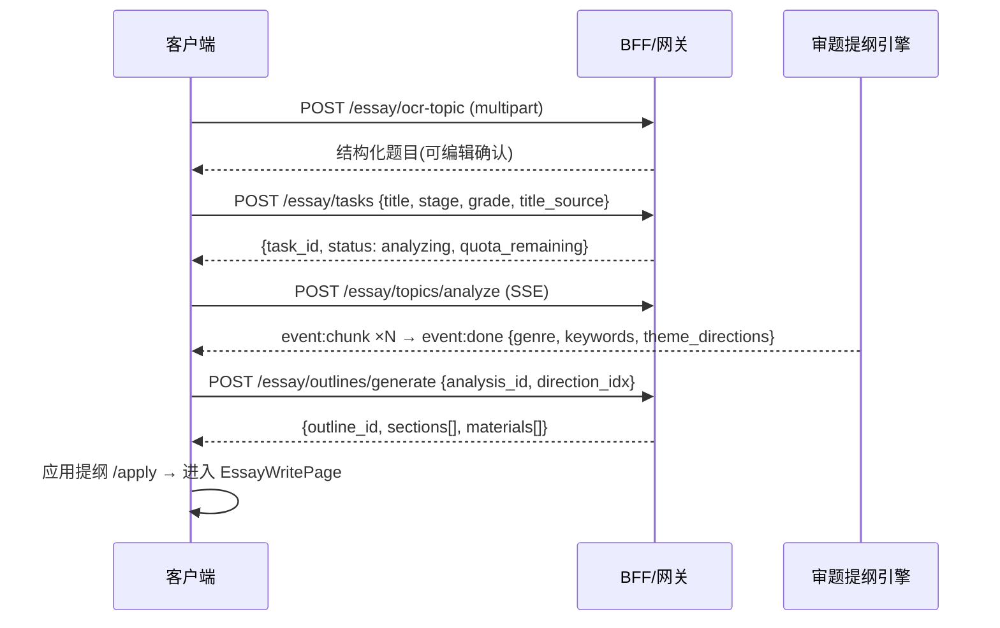
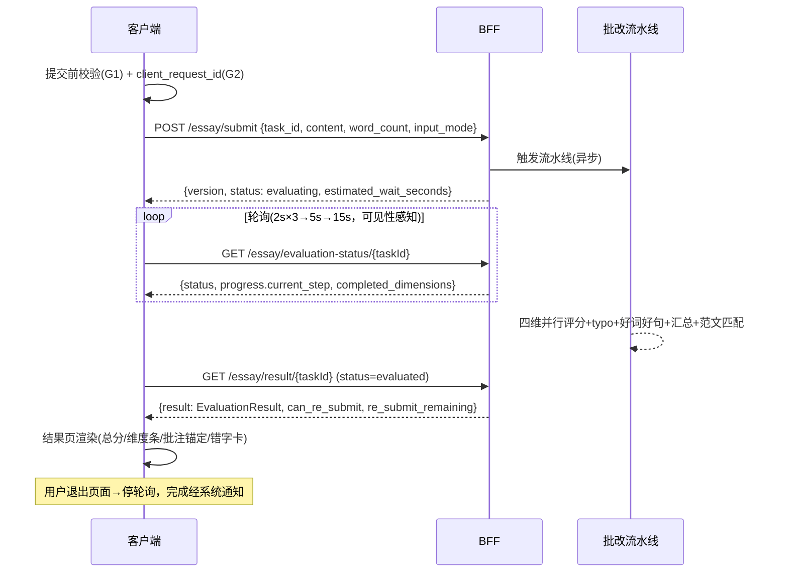
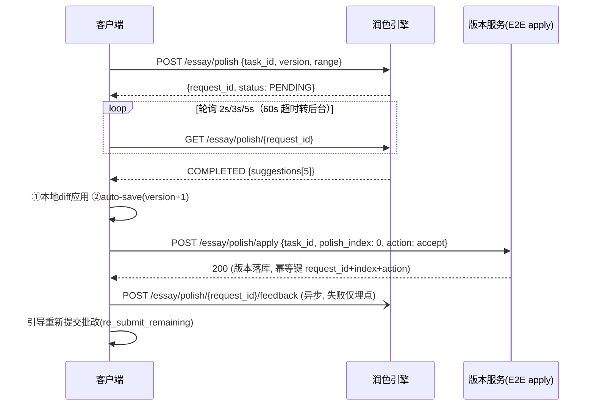

# 客户端-作文辅导页面架构与批改交互设计

> 本文档细化 PrimeTop 作文辅导功能的客户端页面架构、交互流程、组件设计与数据流，
> 使开发人员可直接参照实现 Flutter 页面与 Widget。

---

## 1. 概述

### 1.1 功能定位

作文辅导模块面向小学至高中学生，提供从审题 → 提纲 → 素材 → 写作 → 批改 → 润色的完整写作辅助链路。客户端负责：

1. 作文题目/图片输入与识别
2. 分步引导式写作流程（审题 → 提纲 → 起草 → 提交）
3. AI 批改结果的多维度可视化展示
4. 润色建议的交互式采纳/拒绝
5. 范文对比与学习
6. 作文历史管理与导出

### 1.2 覆盖学段与分龄策略

| 学段 | 字数范围 | 写作类型 | 交互侧重 |
|------|---------|---------|---------|
| 小学低年级(1-2) | 50-200字 | 看图写话、日记 | 语音输入为主，图片引导，字数少 |
| 小学中年级(3-4) | 200-400字 | 记叙文、观察日记 | 语音+文字混合，模板引导 |
| 小学高年级(5-6) | 400-600字 | 记叙文、说明文、读后感 | 文字输入为主，提纲引导 |
| 初中 | 600-800字 | 记叙文、说明文、议论文 | 自主写作，AI辅助批改 |
| 高中 | 800-1000字 | 议论文、散文、材料作文 | 深度批改，思辨分析 |

### 1.3 与其他模块的关系

```
┌─────────────────────────────────────────────────────────┐
│                    作文辅导页面架构                        │
├──────────┬──────────┬──────────┬──────────┬──────────────┤
│  拍照采集  │ 富文本编辑│ AI对话引擎 │ 学情分析  │  收藏与笔记  │
│  (预处理)  │ (书写引擎)│ (批改/润色)│(写作能力) │ (素材收藏)   │
└──────────┴──────────┴──────────┴──────────┴──────────────┘
         ↕              ↕              ↕
  拍照图像采集     AI对话引擎      学情分析服务
  预处理引擎      会话管理       学习行为事件
```

---

## 2. 页面导航架构

### 2.1 路由树

```
/essay                          → EssayHomePage (作文辅导首页)
/essay/create                   → EssayCreatePage (新建作文)
/essay/create/photo             → EssayPhotoInputPage (拍照输入)
/essay/create/text              → EssayTextInputPage (手动输入题目)
/essay/create/select            → EssayTopicSelectPage (题库选题)
/essay/write/:essayId           → EssayWritePage (写作主页面)
/essay/write/:essayId/outline   → EssayOutlinePage (提纲生成)
/essay/write/:essayId/draft     → EssayDraftPage (起草页面)
/essay/submit/:essayId          → EssaySubmitPage (提交确认)
/essay/result/:essayId          → EssayResultPage (批改结果)
/essay/result/:essayId/polish   → EssayPolishPage (润色建议)
/essay/result/:essayId/compare  → EssayComparePage (范文对比)
/essay/history                  → EssayHistoryPage (作文历史)
/essay/history/:essayId         → EssayDetailPage (作文详情)
/essay/topics                   → EssayTopicLibPage (题库浏览)
/essay/materials                → EssayMaterialLibPage (素材库)
```

### 2.2 路由守卫

| 路由 | 守卫规则 |
|------|---------|
| /essay/* | 已登录 + 已选择年级学科 |
| /essay/create/* | 会员权益检查（免费用户每日1次，会员不限） |
| /essay/result/:essayId/polish | 润色额度门控：免费用户 1 次/天完整可用，超额引导升级会员（v1.1 按 E2E §12.1 额度表修正 v1.0"会员专属"表述，见 §3.5.1） |

---

## 3. 核心页面设计

### 3.1 EssayHomePage — 作文辅导首页

#### 3.1.1 页面结构

```
┌──────────────────────────────────┐
│  AppBar: "作文辅导"                │
├──────────────────────────────────┤
│  ┌─ 写作引导卡 ──────────────────┐ │
│  │ 📝 开始新写作                  │ │
│  │ 拍照识别题目 / 手动输入 / 题库选题│ │
│  └───────────────────────────────┘ │
├──────────────────────────────────┤
│  今日写作任务（来自学习规划）        │
│  ┌─TaskCard─┐ ┌─TaskCard─┐       │
│  │ 完成一篇  │ │ 积累3个  │       │
│  │ 记叙文   │ │ 写作素材 │       │
│  └──────────┘ └──────────┘       │
├──────────────────────────────────┤
│  继续写作（未完成的作文）           │
│  ┌─DraftCard──────────────┐      │
│  │ 📄 那一次，我长大了       │      │
│  │ 进度: 已写 320/600 字    │      │
│  │ 上次编辑: 2小时前         │      │
│  └────────────────────────┘      │
├──────────────────────────────────┤
│  最近批改                        │
│  ┌─ResultCard─────────────┐      │
│  │ ⭐ 85分  "春天的色彩"     │      │
│  │ 立意:优 结构:良 语言:良   │      │
│  └────────────────────────┘      │
├──────────────────────────────────┤
│  写作能力雷达图                    │
│     [雷达图组件]                   │
├──────────────────────────────────┤
│  热门素材推荐                     │
│  ┌─素材─┐┌─素材─┐┌─素材─┐       │
│  └─────┘└─────┘└─────┘       │
└──────────────────────────────────┘
```

#### 3.1.2 数据加载策略

```dart
class EssayHomeProvider extends AsyncNotifier<EssayHomeData> {
  @override
  Future<EssayHomeData> build() async {
    final results = await Future.wait([
      _fetchOngoingDrafts(),   // 进行中的草稿
      _fetchRecentResults(),   // 最近批改结果
      _fetchWritingAbility(),  // 写作能力数据
      _fetchTodayTasks(),      // 今日任务
      _fetchHotMaterials(),    // 热门素材
    ]);
    return EssayHomeData(
      drafts: results[0],
      recentResults: results[1],
      ability: results[2],
      tasks: results[3],
      materials: results[4],
    );
  }
}
```

#### 3.1.3 API 接口

```
GET /api/v1/essay/home
Response:
{
  "ongoing_drafts": [
    {
      "essay_id": "ess_abc123",
      "title": "那一次，我长大了",
      "word_count": 320,
      "target_word_count": 600,
      "updated_at": "2026-05-27T15:30:00Z",
      "progress": "drafting"  // outline | drafting | submitted | reviewed
    }
  ],
  "recent_results": [
    {
      "essay_id": "ess_def456",
      "title": "春天的色彩",
      "score": 85,
      "dimensions": {
        "thesis": "excellent",
        "structure": "good",
        "language": "good",
        "content": "excellent",
        "writing": "good"
      },
      "reviewed_at": "2026-05-26T10:00:00Z"
    }
  ],
  "writing_ability": {
    "total_essays": 12,
    "avg_score": 78.5,
    "dimensions": {
      "thesis": 0.82,
      "structure": 0.71,
      "language": 0.76,
      "content": 0.80,
      "writing": 0.68
    },
    "trend": "improving"  // improving | stable | declining
  },
  "today_tasks": [...],
  "hot_materials": [...]
}
```

---

### 3.2 EssayCreatePage — 新建作文入口

#### 3.2.1 三种输入模式

| 模式 | 入口 | 适用场景 |
|------|------|---------|
| 拍照输入 | 相机按钮 | 试卷/作业上的作文题目 |
| 手动输入 | 文本按钮 | 学生已知题目 |
| 题库选题 | 题库按钮 | 想练习特定类型作文 |

#### 3.2.2 拍照输入流程

```
用户点击"拍照输入"
    ↓
调用相机 → 拍照图像采集与预处理引擎
    ↓
图像预处理(裁剪/增强/压缩)
    ↓
上传至服务端 → OCR识别题目文字
    ↓
展示识别结果(可编辑修正)
    ↓
AI审题分析 → 进入写作流程
```

#### 3.2.3 手动输入界面

```
┌──────────────────────────────────┐
│  ← 新建作文                       │
├──────────────────────────────────┤
│  作文题目 *                       │
│  ┌──────────────────────────────┐│
│  │ 请输入作文题目                 ││
│  └──────────────────────────────┘│
│                                  │
│  作文要求（选填）                  │
│  ┌──────────────────────────────┐│
│  │ 如: 字数要求、文体要求等        ││
│  └──────────────────────────────┘│
│                                  │
│  文体选择                         │
│  [记叙文] [议论文] [说明文] [散文]  │
│  [读后感] [书信] [其他]            │
│                                  │
│  字数要求                         │
│  ○ 200-400字  ○ 400-600字         │
│  ○ 600-800字  ○ 800字以上         │
│                                  │
│  ┌──────────────────────────────┐│
│  │       下一步：AI审题分析        ││
│  └──────────────────────────────┘│
└──────────────────────────────────┘
```

#### 3.2.4 API 接口

```
POST /api/v1/essay/create
Request:
{
  "source_type": "photo" | "text" | "topic",
  "title": "那一次，我长大了",
  "requirements": "600字记叙文，有真情实感",
  "genre": "narrative",
  "target_word_count": 600,
  "photo_url": "https://...",   // source_type=photo时
  "topic_id": "topic_123",      // source_type=topic时
  "grade_level": "grade_6",
  "subject": "chinese"
}

Response:
{
  "essay_id": "ess_abc123",
  "title": "那一次，我长大了",
  "analysis": {
    "keywords": ["成长", "经历", "感悟"],
    "theme": "通过叙述一次成长经历，表达对成长的感悟",
    "genre_requirement": "记叙文，要求叙事完整，有细节描写",
    "suggested_structure": "开头点题 → 叙事经过（详写） → 感悟收尾",
    "key_points": [
      "选择一件有代表性的成长事件",
      "叙事要有时间、地点、人物、起因、经过、结果",
      "要有心理活动的描写",
      "结尾要点题，升华主题"
    ]
  }
}
```

---

### 3.3 EssayWritePage — 写作主页面（核心）

#### 3.3.1 写作阶段状态机

```
                    ┌──────────┐
                    │  outline  │ ← 生成提纲
                    │  (提纲)   │
                    └─────┬────┘
                          │ 确认提纲
                    ┌─────▼────┐
         ┌─────────│  drafting  │──────────┐
         │         │  (起草)   │          │
         │         └─────┬────┘          │
         │ 重新生成提纲    │ 完成初稿        │ 保存草稿退出
         │               │               │
    ┌────▼────┐   ┌─────▼────┐    ┌─────▼────┐
    │ outline │   │ submitted │    │  saved   │
    │         │   │  (已提交)  │    │ (草稿保存)│
    └─────────┘   └─────┬────┘    └──────────┘
                        │ AI批改完成
                  ┌─────▼────┐
                  │ reviewed  │
                  │ (已批改)  │
                  └─────┬────┘
                        │ 查看结果
                  ┌─────▼────┐
                  │  polish   │
                  │ (润色中)  │
                  └──────────┘
```

#### 3.3.2 提纲生成页（EssayOutlinePage）

```
┌──────────────────────────────────┐
│  ← AI提纲建议           重新生成 ↻ │
├──────────────────────────────────┤
│  题目：那一次，我长大了            │
│  文体：记叙文 | 目标：600字         │
├──────────────────────────────────┤
│  📋 AI生成的提纲                   │
│                                  │
│  一、开头（约80字）                │
│  ┌──────────────────────────────┐│
│  │ 用一句话引出成长的主题，设置   ││
│  │ 悬念或情感基调                ││
│  │ [可编辑]                     ││
│  └──────────────────────────────┘│
│                                  │
│  二、经过（约400字）⭐详写          │
│  ┌──────────────────────────────┐│
│  │ 1. 事件起因（什么时候、在哪里）││
│  │ 2. 发展过程（遇到什么困难/转折）││
│  │ 3. 关键细节（心理活动、动作描写）││
│  │ [可编辑]                     ││
│  └──────────────────────────────┘│
│                                  │
│  三、感悟（约120字）               │
│  ┌──────────────────────────────┐│
│  │ 回扣主题，总结成长感悟，       ││
│  │ 可引用或比喻升华              ││
│  │ [可编辑]                     ││
│  └──────────────────────────────┘│
│                                  │
│  💡 素材推荐                      │
│  ┌─素材卡───────────────────────┐│
│  │ "成长就像破茧成蝶..."        ││
│  │ +收藏                        ││
│  └──────────────────────────────┘│
│                                  │
│  ┌──────────────────────────────┐│
│  │    ✏️ 按此提纲开始写作         ││
│  └──────────────────────────────┘│
│  ┌──────────────────────────────┐│
│  │    🚀 跳过提纲，直接写作       ││
│  └──────────────────────────────┘│
└──────────────────────────────────┘
```

#### 3.3.3 起草页面（EssayDraftPage）

写作主页面集成富文本编辑器（`客户端-富文本编辑器与作文书写引擎`）。

```
┌──────────────────────────────────┐
│  ← 写作中   自动保存 ✓    提交 →  │
├──────────────────────────────────┤
│  题目：那一次，我长大了            │
├──────────────────────────────────┤
│                                  │
│  [富文本编辑区域]                  │
│                                  │
│  那是我十岁那年的夏天，            │
│  我第一次独自坐火车去外婆家。      │
│  |  ← 光标                       │
│                                  │
│                                  │
│                                  │
│                                  │
├──────────────────────────────────┤
│  字数：32/600   ⏱ 00:15:30       │
│  [提纲] [素材] [AI助手] [语音输入]  │
└──────────────────────────────────┘
```

**写作辅助面板（BottomSheet）：**

| 按钮 | 功能 |
|------|------|
| 提纲 | 展开提纲浮层，可查看/编辑 |
| 素材 | 素材库面板，支持搜索和插入 |
| AI助手 | 在编辑器内发起AI对话（续写/改写/查词） |
| 语音输入 | 调用ASR，语音转文字插入编辑器 |

#### 3.3.4 写作中的AI助手交互

写作过程中，学生可呼出AI助手获得实时帮助：

```
┌──────────────────────────────────┐
│  AI写作助手                       │
├──────────────────────────────────┤
│  你：帮我续写下一段，要有心理描写   │
│                                  │
│  AI：以下是续写建议（蓝色文字）：   │
│  ┌──────────────────────────────┐│
│  │ 火车缓缓驶出站台，我趴在窗边，││
│  │ 看着站台上妈妈的身影越来越小，││
│  │ 心里突然涌上一阵酸楚。这是我  ││
│  │ 第一次离开妈妈独自远行...     ││
│  └──────────────────────────────┘│
│  [采纳] [换一种写法] [自己写]     │
├──────────────────────────────────┤
│  快捷指令：                       │
│  [续写] [改写选中] [换个开头]      │
│  [优美句子] [检查错别字] [查成语]  │
└──────────────────────────────────┘
```

**注意**：AI续写内容以可区分样式（如蓝色/虚线框）展示，学生需主动"采纳"才写入正文。这是防止代写的教育设计。

#### 3.3.5 自动保存机制

```dart
class AutoSaveManager {
  Timer? _debounceTimer;
  static const _saveInterval = Duration(seconds: 30);
  static const _debounceDelay = Duration(seconds: 3);

  void onContentChanged(String content) {
    _debounceTimer?.cancel();
    _debounceTimer = Timer(_debounceDelay, () => _saveDraft(content));
  }

  Future<void> _saveDraft(String content) async {
    final local = await _saveToLocal(content);  // Hive 即时存
    if (await _networkAvailable()) {
      await _syncToServer(content);  // 异步同步服务端
    }
  }

  void onAppPaused() => _saveDraft(currentContent); // 切后台立即存
}
```

#### 3.3.6 API 接口

```
# 获取提纲
POST /api/v1/essay/{essay_id}/outline
Request:
{
  "force_regenerate": false  // true时强制重新生成
}
Response:
{
  "outline_id": "out_123",
  "sections": [
    {
      "index": 1,
      "title": "开头",
      "word_budget": 80,
      "description": "用一句话引出成长的主题...",
      "tips": ["可以设置悬念", "可以用对话开头"],
      "editable": true
    },
    ...
  ],
  "materials": [
    {
      "material_id": "mat_456",
      "content": "成长就像破茧成蝶...",
      "category": "开头金句",
      "source": "recommendation"
    }
  ]
}

# 保存草稿
PUT /api/v1/essay/{essay_id}/draft
Request:
{
  "content": "<富文本HTML>",
  "word_count": 320,
  "plain_text": "纯文本内容",
  "outline_confirmed": true
}
Response:
{
  "essay_id": "ess_abc123",
  "saved_at": "2026-05-27T17:00:00Z",
  "auto_save_id": "as_789"
}

# 提交作文
POST /api/v1/essay/{essay_id}/submit
Request:
{
  "content": "<富文本HTML>",
  "plain_text": "纯文本内容",
  "word_count": 580,
  "time_spent_seconds": 1800,
  "used_ai_assist": true,
  "ai_assist_count": 3
}
Response:
{
  "essay_id": "ess_abc123",
  "status": "reviewing",
  "estimated_time_seconds": 30,  // 预估批改等待时间
  "queue_position": 1
}
```

---

### 3.4 EssayResultPage — 批改结果页（核心）

这是作文辅导模块最关键的展示页面。

#### 3.4.1 总分概览区

```
┌──────────────────────────────────┐
│  ← 批改结果         分享 · 导出   │
├──────────────────────────────────┤
│         ┌──────────┐             │
│         │          │             │
│         │   85     │             │
│         │   分     │             │
│         │          │             │
│         └──────────┘             │
│     "春天的色彩" - 记叙文          │
│     字数：580/600 · 用时30分钟     │
├──────────────────────────────────┤
│  评分总览                         │
│                                  │
│  立意  ████████████░░  90        │
│  结构  ██████████░░░░  80        │
│  语言  ███████████░░░  85        │
│  内容  █████████████░  92        │
│  书写  ████████░░░░░░  70        │
│                                  │
│  AI综合评价：                     │
│  "这篇作文立意新颖，通过春天的色彩  │
│   变化表达了对生命力的感悟。结构清  │
│   晰，语言优美，但部分段落过渡略显  │
│   生硬，书写工整度有提升空间。"     │
├──────────────────────────────────┤
│  [查看详细批注] [润色建议] [范文对比] │
│  [重新批改] [加入错题本(错别字)]     │
└──────────────────────────────────┘
```

#### 3.4.2 详细批注视图

在原文上叠加批注，支持行内标注：

```
┌──────────────────────────────────┐
│  ← 详细批注    批注类型筛选        │
├──────────────────────────────────┤
│  筛选: [全部] [优点] [问题] [建议]  │
├──────────────────────────────────┤
│                                  │
│  春天来了，大地换上了绿色的新装。   │
│  ─── 🟢 "开篇点题，语言优美" ───  │
│                                  │
│  桃花开了，粉粉的，很漂亮。        │
│  ─── 🔴 "描述较笼统，建议增加细节  │
│   如颜色深浅、花瓣形态" ────────── │
│                                  │
│  微风拂过，花瓣像蝴蝶一样翩翩起舞。 │
│  ─── 🟢 "比喻生动，画面感强" ───── │
│                                  │
│  [点击批注展开详细说明]            │
├──────────────────────────────────┤
│  📊 批注统计                     │
│  优点 12处 | 问题 5处 | 建议 8处   │
│  错别字 2处 | 标点 1处 | 好词 6处   │
└──────────────────────────────────┘
```

**批注交互细节：**

| 交互 | 行为 | 说明 |
|------|------|------|
| 筛选切换 | 顶部 Chip 单选：全部/优点/问题/建议/错别字 | 切换后非命中批注折叠为浅色下划线，不消失 |
| 点击批注锚点 | 展开批注气泡卡片 | 显示完整说明、建议文本与 `[一键修改] [忽略]` 按钮 |
| 一键修改 | 仅 `suggestedText != null` 时可用 | 替换锚点原文（进撤销栈，可 Ctrl+Z） |
| 列表↔原文双向跳转 | 批注列表模式点条目 → 原文滚动定位 | `scrollIntoView(alignment: center)` + 高亮闪烁 1.2s |
| 忽略批注 | 本地隐藏（会话级） | 不上报服务端，重新进入页面恢复展示 |

**批注数据契约（对齐《客户端-富文本编辑器与作文书写引擎》§7.2 AIAnnotationData 与 E2E §7.6 result 结构）：**

```dart
class EssayAnnotation {
  final String id;               // ann_0001
  final AnnotationType type;     // strength优点 | issue问题 | suggestion建议 | typo错别字 | punctuation标点 | goodPhrase好词好句
  final int startOffset;         // 基于 plain_text 的字符偏移（UTF-16 code unit）
  final int endOffset;
  final String originalText;     // 命中原文
  final String? suggestedText;   // 建议替换文本；null = 纯提醒类批注
  final String comment;          // 一句话摘要（气泡首行）
  final String? detail;          // 展开后的详细说明（可含修改示例）
  final String severity;         // info | warning | error
}
```

> **偏移口径**：服务端批注偏移基于提交时的 `plain_text`。富文本渲染时由书写引擎共享 AST（书写引擎 §16）提供 `plain_offset ↔ 节点` 映射；若学生已在 `revising` 态改动原文导致映射失败，该批注标记为 **stale**，气泡提示"原文已修改，请手动检查该处"，禁用一键修改（守卫 G7）。

#### 3.4.3 错别字与标点修正视图

```
┌──────────────────────────────────┐
│  ← 错别字订正 (共 3 处)           │
├──────────────────────────────────┤
│  ┌─订正卡 1/3─────────────────┐  │
│  │ 原文: 我迫不急待地跑向操场  │  │
│  │         ──┬──              │  │
│  │ 修正: 我迫不【待】地跑向操场 │  │
│  │ 拼写错误："迫不及急"应为      │  │
│  │ "迫不及待"，记忆口诀：…      │  │
│  │ [订正] [加入错题本] [跳过]   │  │
│  └────────────────────────────┘  │
│  …                               │
├──────────────────────────────────┤
│  [全部订正]          已处理 0/3   │
└──────────────────────────────────┘
```

交互规则：

1. **订正**：单字/词级替换，进撤销栈；订正后自动进入下一张。
2. **加入错题本**：仅收录"错字 → 正确写法 + 语境句子"（≤30 字截断），**不收录作文全文**（合规 C6，错题条目 `source=essay_typo`，登记为《错题服务》v1.1 扩展需求）。
3. **全部订正**：批量应用全部 `suggestedText != null` 的错别字；stale 项跳过并逐条提示。
4. 订正结果随下一次 `auto-save` 落入新草稿版本；若字数因此变化，前端重算 `word_count`。

#### 3.4.4 好词好句高亮

- 结果页提供"好词好句"筛选（对齐批改引擎 `GET /api/v1/essay/good-phrases?subject=chinese`，按 `category=修辞/描写/立意` 分组）。
- 每条好句卡片：原文摘录 + AI 点评（为什么好）+ `[收藏到素材库] [仿写一句]`。
- "仿写一句"进入 AI 助手（action=`rewrite`，上下文注入该句，见 §3.3.4），仿写结果同样走采纳制（防代写红线 C1）。

#### 3.4.5 分维度详情

点击评分总览任一维度条 → 维度详情 BottomSheet：

```
┌──────────────────────────────────┐
│  语言与表达  85/100        关闭 ✕  │
├──────────────────────────────────┤
│  评语: 用词准确，"翩翩起舞"等      │
│  比喻贴切；句式以短句为主，建议     │
│  穿插长句增强节奏感。              │
├──────────────────────────────────┤
│  评估要点:                        │
│  语言流畅性  ████████████░ 88    │
│  用词准确性  ███████████░░ 84    │
│  修辞运用    ████████████░ 87    │
│  句式多样性  ██████████░░░ 78    │
├──────────────────────────────────┤
│  [查看该维度相关批注(6)]           │
└──────────────────────────────────┘
```

数据来源：批改引擎维度评分输出中的 `criteriaResults`（要点级子分），客户端只做展示，不再二次计算。

#### 3.4.6 批改等待态（EssayReviewingPage）

提交后进入等待页，**轮询** E2E 权威进度接口（服务端未提供批改进度 SSE 端点，审题才是 SSE，见契约 R6）：

```
GET /api/v1/essay/evaluation-status/{taskId}
→ { status: 'evaluating' | 'evaluated' | 'failed',
    progress: { current_step, completed_dimensions, total_dimensions },
    estimated_wait_seconds, error? }
```

| 设计点 | 规则 |
|--------|------|
| 进度可视化 | current_step 映射文案：preprocess=内容预检 / scoring=逐维度批改(x/4) / aggregating=汇总评语 / matching=匹配范文；线性进度条按 completed_dimensions/total 计算，不显示百分比虚假精度 |
| 轮询节奏 | 2s×3 → 5s×N → 120s 后转 15s 慢轮询；页面不可见暂停，恢复可见立即单次（守卫与 §4 轮询控制器） |
| 等待内容 | 本地静态"写作小贴士"轮播（不耗 AI 额度）；预计剩余时间按 estimated_wait_seconds 展示 |
| 退出保留 | "先去学别的，批改完成通知你" → 停轮询，完成事件经系统通知投递（对齐《端到端流程设计-系统通知触发与消息推送投递完整链路》） |
| 结果就绪 | status=evaluated → 拉取结果 → 转场动画进入 EssayResultPage |
| 失败 | status=failed → 展示错误码映射文案 + [重试]（服务端 failed→evaluating 权威转移）+ [返回修改]（revising） |

#### 3.4.7 重新批改与多轮修改循环

- 结果字段 `can_re_submit=true` 且 `re_submit_remaining>0` 时展示"修改后重新提交"。
- 修改走 revising 流程：编辑器解锁 → 采纳润色/订正/手改 → `POST /api/v1/essay/submit`（同端点，`version+1`）→ 新一轮 evaluating。
- 每轮结果独立保留（版本树见 §3.7），支持分数趋势对比："本次 85 分，比上一版 +7 分 🎉"。

#### 3.4.8 结果页 API 与维度编码

```
# 获取批改结果（E2E §7.6 权威）
GET /api/v1/essay/result/{taskId}
→ { task_id, version, task: {title, genre, stage, grade},
    content, word_count, result: EvaluationResult,
    evaluated_at, can_re_submit, re_submit_remaining }
```

**维度编码映射表（v1.1 修正 v1.0 缺陷 F5：维度 code 权威归批改引擎 §6.1/§6.2）：**

| 维度 code（服务端权威） | 中文名 | v1.0 草案字段 | 处置 |
|------|------|------|------|
| `content` | 内容与立意 | thesis + content | 两项合并展示，立意与充实度走 criteriaResults 子分 |
| `structure` | 结构与逻辑 | structure | 不变 |
| `language` | 语言与表达 | language | 不变 |
| `creativity` | 创意与想象 | （缺失） | v1.1 补充展示 |
| `handwriting` | 书写（仅拍照手写稿 `input_mode=image` 时输出） | writing | 打字/OCR 输入不展示该维度 |
| 英语 `mechanics` | 拼写与格式 | — | 英语作文时展示 |

```dart
class EvaluationResult {
  final int totalScore;                       // 加权总分
  final String overallComment;                // AI 总评
  final List<DimensionScore> dimensions;      // 维度分
  final List<EssayAnnotation> annotations;    // 全量批注
  final List<TypoItem> typos;                 // 错别字/标点明细
  final List<GoodPhrase> goodPhrases;         // 好词好句
  final List<PolishSuggestion> polishPreview; // 润色建议预览(前2条，完整列表走 §3.5)
}

class DimensionScore {
  final String code;        // content | structure | language | creativity | handwriting | mechanics
  final int score;          // 0-100
  final String grade;       // excellent | good | fair | poor（等级映射展示）
  final String comment;
  final List<CriterionScore> criteriaResults;
}
```

#### 3.4.9 分享与导出

- **分享**：结果页分享生成"作文成绩卡"（委托《客户端-学习报告卡片生成与社交分享图片渲染引擎》），卡面仅含：题目、分数、五维条形、AI 一句点评精选；**脱敏红线**：不含姓名/学校/班级/作文正文（合规 C5）。
- **导出**：PDF 导出（委托《学习内容PDF导出与打印服务》）含原文 + 批注 + 评语 + 分数表，水印含用户 ID 溯源码（对齐数字内容防截屏与溯源水印系统）。

---

### 3.5 EssayPolishPage — 润色建议页

#### 3.5.1 额度与入口（v1.1 修正 v1.0 缺陷 F2）

| 用户类型 | 发起润色次数/天 | 说明 |
|---------|---------------|------|
| 免费用户 | 1 次 | 完整可用；超额弹窗引导升级会员（非"仅预览前2条"） |
| 月度会员 | 5 次 | — |
| 年度会员 | 不限 | — |

> 额度表权威归 E2E §12.1。v1.0 §2.2 路由守卫"润色会员专属（免费仅预览前2条）"与本表冲突，v1.1 已按额度表修正；结果页预览的前 2 条建议仅为引流入口，不构成功能门控。

入口：结果页 `[润色建议]` 按钮 / 作文详情页。可选范围：全文 或 选中段落（≥50 字）。

#### 3.5.2 发起与轮询（对齐润色引擎三段式）

```
# 1. 提交润色请求（异步）
POST /api/v1/essay/polish
{ "task_id": 123, "version": 2, "content": "...", "range": "full" | "selection", "selection_text": "..." }
→ { "request_id": "pol_456", "status": "PENDING" }

# 2. 轮询结果
GET /api/v1/essay/polish/{request_id}
→ { "status": "PENDING" | "PROCESSING" | "COMPLETED" | "FAILED", "suggestions": [...] }
```

轮询节奏 2s/3s/5s 封顶，总超时 60s；超时转后台等待（"完成后在通知中心提醒你"），PENDING 结果服务端保留 7 天，过期返回 `POLISH_007` 清理本地记录（守卫 G13）。

#### 3.5.3 建议列表与 diff 视图

```dart
class PolishSuggestion {
  final int index;              // apply 接口的 polish_index
  final String category;        // 词汇升级 | 句式优化 | 修辞增强 | 逻辑衔接 | 细节扩写
  final int startOffset;        // plain_text 偏移
  final int endOffset;
  final String originalText;    // 原句
  final String suggestedText;   // 建议句
  final String reason;          // 修改理由（教学化表述）
  final String applyType;       // replace | insert | delete
}
```

```
┌──────────────────────────────────┐
│  ← 润色建议 (5 条)     [批量操作]  │
├──────────────────────────────────┤
│  ① 句式优化                       │
│  ┌──────────────────────────────┐│
│  │ 桃花开了，粉粉的，很漂亮。     ││
│  │   ↓                          ││
│  │ 桃花绽满枝头，粉霞一般，       ││
│  │ 明艳得晃眼。                  ││
│  │ 💬 增加"绽满枝头/粉霞"意象，  ││
│  │   画面感更强（字数 +6）        ││
│  │ [采纳] [换一种] [忽略]        ││
│  └──────────────────────────────┘│
│  …                               │
├──────────────────────────────────┤
│  已采纳 0/5   [采纳后重新批改看变化]│
└──────────────────────────────────┘
```

- **换一种**：携带 `suggestion_index` 重新发起单点润色（复用润色请求，`range=selection`，不重复扣额度当日内首次；同 index 换一种 ≤3 次，防无限生成）。
- 幼儿/小学低年级：diff 文案朗读化（长按朗读原句与建议句）。

#### 3.5.4 采纳闭环（关键流程，守卫 G5）

```
点击[采纳]
  ↓ ① 本地应用 diff 到富文本 AST（进撤销栈）
  ↓ ② 触发云保存 auto-save（draft_version + 1，失败则回滚本地应用并提示）
  ↓ ③ POST /api/v1/essay/polish/apply            ← E2E §8.2 权威（版本落库）
     { task_id, polish_index, action: 'accept' }
  ↓ ④ 异步 POST /api/v1/essay/polish/{request_id}/feedback   ← 润色引擎质量回流
     （失败仅埋点，不阻塞、不提示）
  ↓ ⑤ 全部处理完成 → 引导"重新提交批改看分数变化"（§3.4.7）
```

**撤销处理**：已 apply 的建议本地撤销 → 再次 auto-save 产生新版本；服务端 apply 记录不回滚（版本化留痕），气泡提示"历史修改记录已保留，可在版本树查看"。

**幂等**：`(request_id, polish_index, action)` 为 apply 幂等键；双击/重试不重复落版本（见 §8）。

#### 3.5.5 批量操作

`POST /api/v1/essay/polish/batch-apply`（E2E §8.2）：支持"全部采纳词汇/订正类安全建议"；修辞增强类（表达风格改变）必须逐条确认——批量采纳仅限 `applyType=replace 且 category∈{词汇升级, 逻辑衔接}` 白名单，防一键洗稿（合规 C1 延伸）。

---

### 3.6 EssayComparePage — 范文对比页

#### 3.6.1 范文选择

```
# 画像推荐（首屏，附推荐理由）
GET /api/v1/essay-examples/recommend?limit=5
# 条件搜索（更多）
GET /api/v1/essay-examples/search?genre=narrative&theme=成长&gradeStage=2
```

每张范文卡：题目、文体、难度、字数、match_reason（"与你同题型/比你高一个档次"）。

#### 3.6.2 对比视图

```
# 生成 AI 对比分析（额度：免费 2 次/天，见 E2E §12.1）
POST /api/v1/essay-examples/compare
{ "task_id": 123, "example_id": 456 }
→ { structureDiff, languageDiff, techniqueDiff, themeDiff, improvementSuggestions[] }
```

- **竖屏**：上下滚动分段对照——习作段落（左标学生的）↔ 范文对应段（按 `GET /essay-examples/{id}/segments` 结构模式对齐：开头/经过/高潮/结尾）。
- **横屏/平板**：左右分栏同步滚动（滚动同步率 0.9，可解锁独立滚动）。
- **维度双圈雷达**：同轴叠加学生维度分与范文质量分。
- 对比结论区：四维差异卡（结构/语言/技巧/主题）+ 提升建议（具体到句的修改示例）。

#### 3.6.3 学习动作

| 动作 | 接口 | 说明 |
|------|------|------|
| 好词好句收藏 | `GET /essay-examples/{id}/highlights` → 收藏入素材库 | 走《收藏与笔记系统》 |
| 仿写框架 | `GET /essay-examples/{id}/imitation-template` | 生成该范文的结构骨架，进入新写作任务复用 |
| 学习记录上报 | `POST /essay-examples/{id}/study-record` | 停留/翻阅行为，供推荐画像回流 |
| 范文评分 | `POST /essay-examples/{id}/rating` | "对我有帮助"反馈 |

#### 3.6.4 版权与使用红线

范文**仅供学习参考**：复制超过 40 字触发劝阻提示（"范文是好老师，不是抄写本——试试用自己的话改写"）；不提供范文全文一键导出/分享（合规 C4）。

---

### 3.7 EssayHistoryPage / EssayDetailPage — 历史与详情

- **列表**：时间倒序，筛选（全部/写作中/已批改），每项含 score、version 数、较上次分数趋势箭头。数据端点：`GET /api/v1/essay/tasks?status=&page=&size=`（**登记为 E2E v1.1 扩展需求**，当前以 home 接口 + 本地 result 缓存兜底，见契约 R11）。
- **详情（EssayDetailPage）**：版本树时间线

```
v4 ● 重新提交批改  88分 ── 当前
v3 ● 手动修改（订正3处错别字）
v2 ● 采纳润色建议 2 条
v1 ● 首次提交      85分
```

点任意两版本 → **diff 视图**（新增绿色、删除红色，对齐 E2E §8.3 版本管理）；底部 `[导出PDF] [分享成绩卡]`。

---

### 3.8 EssayTopicLibPage / EssayMaterialLibPage — 题库与素材库

- **题库**：`GET /api/v1/essay/prompts?gradeStage=&essayType=&subject=&page=`（批改引擎）；相似题推荐 `GET /api/v1/essay/prompts/similar`；选中题目 → 走 §3.2 创建流程（`title_source=textbook|practice`，守卫 G12：必须携带 stage/grade 快照，防跨学段超纲）。
- **素材库**：`GET /api/v1/essay/good-phrases?subject=&category=&page=`，分类页签（开头金句/结尾升华/人物描写/景物描写/修辞运用）；素材卡 `[复制] [插入编辑器] [收藏]`；收藏走《收藏与笔记系统》统一入口。

---

## 4. 状态管理与数据流

### 4.1 Provider 架构（Riverpod）

| Provider | 类型 | 职责 |
|----------|------|------|
| `essayHomeProvider` | AsyncNotifier（§3.1.2 已定义） | 首页五路聚合 |
| `essayTaskProvider(taskId)` | AsyncNotifier-family | 任务+草稿+结果聚合；写作中不 autoDispose |
| `evaluationStatusProvider(taskId)` | Stream/轮询控制器 | 批改进度轮询生命周期 |
| `polishRequestProvider(requestId)` | FutureProvider-family | 润色轮询 |
| `compareProvider(taskId)` | AsyncNotifier | 范文推荐与对比分析 |
| `essayCacheBoxProvider` | Provider<Hive box> | 本地缓存（§6） |

### 4.2 轮询控制器（关键代码）

```dart
class EvaluationPollingController extends AutoDisposeNotifier<AsyncValue<EvalStatus>> {
  Timer? _timer;
  int _attempt = 0;
  bool _visible = true;

  Duration get _interval {
    if (_attempt < 3) return const Duration(seconds: 2);
    if (_attempt < 24) return const Duration(seconds: 5);   // ~2 分钟
    return const Duration(seconds: 15);                     // 慢轮询
  }

  Future<void> _tick() async {
    if (!_visible) return;                       // 页面不可见暂停（省电）
    try {
      final s = await ref.read(essayApiProvider).evaluationStatus(taskId);
      _attempt++;
      if (s.status == 'evaluated') {
        state = AsyncData(s);
        await ref.read(essayTaskProvider(taskId).notifier).loadResult(); // 拉结果
        _stop();
        return;
      }
      if (s.status == 'failed') { state = AsyncData(s); _stop(); return; }
      state = AsyncData(s);
    } catch (_) {
      // 网络失败：保持上次状态，退避重试；连续失败 ≥10 次提示 D3
    }
    _schedule();
  }

  void onVisibilityChanged(bool visible) {       // WidgetsBindingObserver 驱动
    _visible = visible;
    if (visible) _tick();                        // 恢复可见立即单次
  }

  @override
  void dispose() { _timer?.cancel(); super.dispose(); }   // 页面退出必停（G 守卫）
}
```

### 4.3 数据流总览

```
EssayCreatePage ──create/analyze(SSE)──▶ essayTaskProvider ──outline──▶ EssayWritePage
     │                                        │        ▲auto-save(队列+version)
     │                                        ▼        │
     └──ocr-topic──▶ 预处理引擎            EssaySubmitPage
                                              │ submit(client_request_id)
                                              ▼
                                   EvaluationPolling → EssayResultPage
                                              │                    │
                                              │             polish/apply  compare
                                              ▼                    ▼
                                          EssayDetailPage(版本树)  Polish/Compare
```

---

## 5. 关键交互时序图

### 5.1 创建 + 审题（SSE） + 提纲



### 5.2 提交 + 轮询批改 + 结果渲染



### 5.3 润色采纳闭环



---

## 6. 客户端数据模型与本地存储

### 6.1 本地存储 Schema（Hive，box: `essay_cache`）

| Key | Value | TTL/规则 |
|-----|-------|---------|
| `draft:{taskId}` | EssayDraft（content AST JSON + plain + version + updated_at） | 任务存续期；注销清空 |
| `result:{taskId}:{version}` | EvaluationResult JSON | 24h |
| `polish:{requestId}` | PolishRequest 状态 | 7 天（对齐 POLISH_007） |
| `home:payload` | 首页聚合 JSON | 10min（stale 标注） |
| `pending_submit:{taskId}` | 提交幂等锁 + client_request_id | 提交成功即删 |

### 6.2 离线兜底

- 无网时：写作全功能本地可用（编辑器本地存储权威，书写引擎 §8）；home/result 读缓存并标注"离线数据"。
- 恢复网络：auto-save 队列按序 flush（队首失败阻塞重试，退避 2^n 封顶 10min）；提交队列仅 1 条（当前任务）。

---

## 7. 状态机与守卫规则

### 7.1 客户端展示态 ↔ 服务端权威态映射（v1.1 补，修 v1.0 缺陷 F1）

服务端权威：E2E §11.1 任务级十态；批改引擎 §5.3 submission 六态为提交记录内态（两层并存，客户端路由按任务级）。

| 客户端展示态（v1.0 五态 + v1.1 补 reviewing） | 服务端任务态 | 页面 |
|------|------|------|
| creating | created | EssayCreatePage |
| analyzing | analyzing / outlining | 审题/提纲页 |
| writing | writing（内含 v1.0 的 outline/drafting 子态） | EssayWritePage |
| **reviewing（v1.1 补）** | submitted / evaluating | EssayReviewingPage |
| reviewed | evaluated | EssayResultPage |
| revising | revising / re_submitted(→evaluating) | EssayWritePage（解锁编辑） |
| failed | failed | 等待页失败态 |

### 7.2 守卫总表

| # | 规则 |
|---|------|
| G1 | 提交前校验：题目非空；word_count < min 弹确认（"字数未达标，确定提交？"），> max×1.2 警告超字风险；均不硬阻断 |
| G2 | 提交幂等：client_request_id（UUID）随请求携带 + 本地 `pending_submit` 锁，双击/重试不重复提交 |
| G3 | submitted/evaluating 态编辑器只读；revising 态解锁 |
| G4 | auto-save 服务端返回 version_conflict → 拉远端版本做三方提示（本地/远端/双版本合并），默认不静默覆盖（§8.2） |
| G5 | 润色采纳四步顺序固定：本地应用→auto-save 成功→apply 上报→feedback；auto-save 失败回滚本地应用 |
| G6 | AI 写作辅助前端预检额度（免费 5 次/天），服务端权威扣减；used_ai_assist/ai_assist_count 随 submit 上报（依赖度引擎数据源） |
| G7 | 一键修改/订正前校验 anchor 命中原文（originalText 精确匹配），不匹配转 stale 手动处理 |
| G8 | failed 态 [重试] 前先 QUOTA 预检，额度不足走升级引导；重试后进入 reviewing |
| G9 | 退出写作页必 flush 本地暂存（书写引擎 §8 生命周期钩子） |
| G10 | 结果页内容只读；任何修改创建新版本（revising），不原地改 evaluated 结果 |
| G11 | 分享卡内容脱敏白名单制（题目/分数/维度/一句点评），未成年人分享受家长可见性设置约束 |
| G12 | 题库选题必须携带 stage/grade 快照入参；服务端校验超纲返回 ESSAY_TOPIC_003 类错误时前端引导确认 |
| G13 | 润色 PENDING 不阻塞 UI；7 天过期（POLISH_007）清理本地 polish:{requestId} |
| G14 | 范文 example_id 仅接受服务端推荐/搜索响应内的 id，防任意 id 越权探测 |

---

## 8. 幂等与并发控制

### 8.1 提交幂等（未知态裁决）

```
POST /essay/submit 网络超时（结果未知）
  → GET /essay/evaluation-status/{taskId}
     ├─ evaluating/evaluated → 视为提交成功，清除 pending 锁，进入轮询
     └─ writing（仍草稿）    → 用同一 client_request_id 重试提交（≤3 次，退避 5s）
```

### 8.2 auto-save 并发与多端

- 单端：3s debounce + 30s 周期 + onPause 立即存（书写引擎 §8 权威，本文 §3.3.5 对齐）。
- 云同步 `POST /essay/draft/auto-save` 携带 `draft_version` 乐观锁；冲突（version_conflict）→ G4 三方提示。多端编辑裁决：`(device_id, updated_at)` LWW 为默认，但**冲突双方字数均 >100 时保留双版本快照 7 天**供人工合并（对齐《多端数据同步与冲突解决策略》essay 域：草稿按编辑器分段合并，正文不做整篇覆盖）。

### 8.3 SSE 断线重连

审题/写作助手 SSE 断线：携带 Last-Event-ID 重连 ≤3 次（间隔 1s/3s/5s）；仍失败 → 审题降级 D1、写作助手降级 D2'（禁用快捷按钮并提示稍后再试）。审题结果已落库（E2E §4.2 步骤⑦），重新进入页面可拉取，不丢任务。

### 8.4 采纳/反馈幂等

- apply 幂等键 `(request_id, polish_index, action)`；feedback 幂等键 `request_id`（最后一次覆盖语义）。
- 批量 batch-apply 服务端逐条独立事务，失败项回传 `failed_items`，客户端仅标记失败项可重试。

---

## 9. 错误码映射与降级策略

### 9.1 错误码 → 用户文案与动作

| 服务端错误码 | 场景 | 用户文案 | 动作 |
|------|------|------|------|
| ESSAY_TOPIC_001/002 | 审题输入 | "请输入题目（500 字内）" | 聚焦输入框 |
| ESSAY_TOPIC_004 | 任务不存在 | "任务已失效" | 刷新列表 |
| ESSAY_TOPIC_005 | 重复审题 | 静默 | 展示已有结果 |
| ESSAY_TOPIC_010/011 | 文体低置信/不支持 | "请确认文体" | 文体选择弹层 |
| ESSAY_TOPIC_020/021 | AI 失败 | "审题小助手打了个盹，再试一次？" | [重试]（1 次）→ D2 |
| ESSAY_TOPIC_030 / ESSAY_OUTLINE_020 | 次数超限 | "今日审题/提纲次数已用完" | 会员引导 |
| ESSAY_OUTLINE_030 | 提纲已应用 | "提纲已开始使用" | 引导重新生成 |
| ESSAY_OCR_FAILED / ESSAY_NO_TOPIC_FOUND | 拍照 | "没认出题目，重拍或手动输入" | 重拍/切手动 |
| QUOTA_EXCEEDED | 批改/润色额度 | "今日批改次数已用完" | 会员引导（明日恢复提示） |
| AI_SERVICE_UNAVAILABLE | 提交触发 | "AI 服务暂时不可用" | 任务保留 created，稍后重试 |
| POLISH_001/002 | 润色输入/草稿 | 输入提示 | — |
| POLISH_003 | 内容安全拦截 | "内容包含不适宜信息，请修改后重试" | 定位段落（不展示命中词） |
| POLISH_004/005 | 模型/解析失败 | "润色失败，本次不消耗次数" | [重试]（服务端已补偿额度） |
| POLISH_006 | 润色额度 | 同 QUOTA_EXCEEDED | 会员引导 |
| POLISH_007 | 结果过期 | "润色结果已过期（7 天）" | 清理本地，引导重新发起 |
| POLISH_008 | 学段不匹配 | "题目与你的年级不符" | 确认年级弹层 |

### 9.2 降级矩阵 D1-D10

| # | 故障 | 降级方案 |
|---|------|---------|
| D1 | 审题 SSE 不可用 | 降级轮询任务状态拉取已落库结果（最长 60s），仍无 → D2 |
| D2 | 审题 AI 失败 | 展示"跳过审题直接写作"；服务端模板提纲兜底（审题引擎 §6.3 规则生成），客户端标注"通用提纲" |
| D3 | 进度接口连续失败 ≥10 次 | 停轮询，提示"批改完成后通知你"；通知中心投递（不丢结果） |
| D4 | 批改 failed | [重试]一次（服务端 retry 通道）；再失败保留草稿 + 通知 + 客服入口 |
| D5 | 结果接口失败 | 读本地 result 缓存（stale 标注）+ 后台重试 |
| D6 | 润色轮询超时 | 转后台等待，完成经通知；不阻塞结果页其他操作 |
| D7 | 对比分析失败 | 降级展示范文全文 + 分段标注（无 AI 对比），提示稍后再试 |
| D8 | 写作全程离线 | 编辑器本地全功能；恢复后 auto-save 队列按序同步 |
| D9 | 分享卡渲染失败 | 降级纯文本分享（题目+分数），不阻塞 |
| D10 | 题库/素材接口失败 | 本地缓存 + 空态引导（"内容君在路上"），不影响写作主流程 |

---

## 10. 埋点事件（module=essay）

| 事件 | 关键参数 |
|------|---------|
| essay_home_enter | — |
| essay_create_start | source=photo/text/topic |
| essay_ocr_submit / essay_ocr_confirm | 可编辑修正率（编辑字符数/识别字符数） |
| essay_topic_analyzed | latency_ms, sse_retry |
| essay_outline_generate / essay_outline_skip | direction_idx |
| essay_write_start | outline_used |
| essay_ai_assist | action=continue/rewrite/expand/condense, adopted(0/1) |
| essay_voice_input | duration_s, inserted_chars |
| essay_autosave_fail | reason=network/version_conflict/quota |
| essay_submit | word_count, time_spent_s, ai_assist_count, input_mode |
| essay_review_viewed | score, first_view(0/1) |
| essay_annotation_click | type, resolved=modify/ignore |
| essay_typo_fix | fixed_count, to_mistake_book(0/1) |
| essay_polish_request / essay_polish_apply | suggestion_count, accepted_count, category |
| essay_compare_view | example_id, ai_compare(0/1) |
| essay_material_collect | category |
| essay_share / essay_export | channel, format |

**核心指标**：提交→查看结果转化率（目标 ≥90%）；AI 辅助采纳率（防代写监控联动，超 70% 触发依赖度引擎关注）；润色采纳率（目标 ≥40%）；批改完成时长 P95（目标 ≤60s）；免费额度触达率（转化运营输入）。

---

## 11. 性能设计

| 项 | 目标 | 手段 |
|----|------|------|
| 首页首屏 | 800ms 内（缓存命中即渲染） | 五路并行 + home:payload 缓存 + 骨架屏 |
| 结果页渲染 | 2000 字作文 P95 <500ms | 批注列表懒构建（按可视区）、维度条动画帧预算 16ms |
| 轮询电量 | 后台 0 请求 | 可见性感知 + 退避（§4.2） |
| 长文编辑 | 万字不卡顿 | 编辑器虚拟化（书写引擎 §11 权威） |
| 拍照上传 | ≤1.5MB/图 | 预处理引擎压缩；弱网降分辨率重试 |

---

## 12. 合规红线

| # | 红线 |
|---|------|
| C1 | 防代写：AI 续写/仿写内容永不自动写入正文，必须显式采纳且可撤销；批量润色仅限安全类建议白名单；ai_assist_count 全量上报 |
| C2 | AIGC 披露：批改/润色结果页固定展示"AI 批改仅供参考"标识 |
| C3 | 内容安全：作文正文与润色输入经服务端敏感过滤（UGC 通道）；危机信号直连心理危机引擎（不打扰学生端展示） |
| C4 | 范文版权：仅供学习；>40 字复制劝阻；不提供全文导出/分享 |
| C5 | 分享脱敏：成绩卡白名单字段制；未成年人分享受家长可见性设置约束 |
| C6 | 错题本联动仅收录错字与正确写法 + ≤30 字语境，不收录作文全文 |
| C7 | 注销/清数据：本地 essay_cache 全清（对齐《离线缓存与数据同步》C 条） |
| C8 | 作文域无商业广告；会员引导仅在额度触达点展示，频控每日 ≤3 次 |
| C9 | 拍照隐私：OCR 图片仅用于识别，不写入系统相册，服务端按保留策略清理 |
| C10 | 家长可见边界：家长端可见完成情况与分数趋势；作文正文默认不对家长端展示全文（对齐学生学习数据家庭共享可见度分级） |

---

## 13. 契约对齐（R1-R14）

| # | 裁决 |
|---|------|
| R1 | 标识体系：E2E `task_id`（essay_tasks 任务级）为客户端路由权威；批改引擎 `submissionId` 为提交记录内态（服务端内部）；v1.0 草案的 `essay_id`（ess_ 前缀）判定为客户端本地草稿 ID，提交后绑定 task_id，不再向服务端传递 |
| R2 | 创建入口权威 `POST /api/v1/essay/tasks`（E2E §3.3）；v1.0 草案 `POST /essay/create` 废弃；创建响应内嵌 analysis 的写法改为两步（create → analyze），BFF 可聚合但客户端按两步实现 |
| R3 | 拍照识别权威 `POST /api/v1/essay/ocr-topic`（E2E §3.2）；图像采集/裁剪/压缩归《拍照图像采集与预处理引擎》，OCR 管线归《图片处理与OCR识别管线》 |
| R4 | 审题/提纲权威归《作文审题分析与提纲生成引擎》9 接口；v1.0 草案 `POST /essay/{id}/outline` 废弃，改 `POST /essay/outlines/generate`、`/regenerate`、`PUT /essay/outlines/{outlineId}`、`/apply` |
| R5 | 提交批改：客户端统一走 E2E `POST /api/v1/essay/submit`（task_id+version+estimated_wait）；批改引擎 `POST /essay/submissions`+`/evaluate` 为 BFF 下游内部调用（服务端两文档路径冲突以 E2E 为客户端口径，登记批改引擎文档 v1.2 修订项） |
| R6 | 进度/结果：`GET /essay/evaluation-status/{taskId}`、`GET /essay/result/{taskId}`（E2E §7.5/7.6）为唯一客户端端点；批改进度为**轮询**（服务端无 SSE 端点），审题与写作助手为 SSE（`/essay/topics/analyze`、`/essay/writing-assist`） |
| R7 | 润色：建议生成走润色引擎三段式（`POST /essay/polish` → 轮询 → feedback）；采纳/批量落版本走 E2E `POST /essay/polish/apply|batch-apply`；feedback 定位为质量回流，apply 成功后异步补报，失败不阻塞（两文档职责切分裁决） |
| R8 | 范文：全部走《作文范文智能推荐与结构拆解分析引擎》`/essay-examples/*` 14 接口；`GET /essay/reference-essays`（批改引擎）保留为结果页轻量推荐入口，详情/对比以范文引擎为权威 |
| R9 | 额度权威归 E2E §12.1 额度表；v1.0 §2.2"润色会员专属"表述已修正（缺陷 F2）；前端预检 + 服务端权威双闸 |
| R10 | 字数统计口径权威归书写引擎 §10（中文计数规则）；客户端上报 word_count，服务端校验差异 >10% 以服务端为准回写并 toast 提示 |
| R11 | 历史列表 `GET /essay/tasks` 分页端点登记为 E2E v1.1 扩展需求；当前版本客户端以 home 接口 + 本地缓存兜底 |
| R12 | AI 写作助手（续写/改写/扩写/缩写）请求走书写引擎 §7.5 与 E2E §6.5 `POST /essay/writing-assist (SSE)`；防代写交互规范以本文 §3.3.4 + C1 为准，依赖度数据源 used_ai_assist/ai_assist_count 随 submit 上报 |
| R13 | 错别字→错题本：条目 `source=essay_typo`，登记《错题服务》v1.1 扩展需求（当前版本收藏动作仅本地+素材库） |
| R14 | 状态机：E2E 任务级十态为权威；客户端六展示态映射见 §7.1；批改引擎 submission 六态不直接驱动客户端路由 |

---

## 14. 验收场景（18 条）

1. 拍照输入：拍摄含题目试卷 → OCR 返回结构化题目 → 用户修正 2 处 → 创建任务成功，quota_remaining 正确展示。
2. OCR 无题目：拍摄无关图片 → 提示"未检测到作文题目" → 一键切手动输入。
3. 手动输入：填写题目/文体/字数 → 创建成功 → 审题 SSE 流式渲染（打字机效果），断网重连后结果不丢。
4. 题库选题：小学用户选初中题目 → 服务端拦截 → 前端展示年级确认弹层（G12）。
5. 提纲：生成 3 段提纲 → 编辑第二段描述 → 重新生成（换立意方向）→ 应用提纲进入写作，编辑器预填段落标题。
6. 跳过提纲：直接写作路径可用，outline_used=false 埋点正确。
7. 自动保存：写作 40s → 切后台 → 返回 → 内容无损且 draft_version 递增；另一设备同任务编辑 → version_conflict → 三方提示出现（G4）。
8. AI 助手：请求续写 → 建议蓝色虚线展示 → 采纳写入正文可撤销；拒绝 3 次"换一种"后仍不写入；ai_assist_count 累计正确。
9. 免费额度：第 6 次调用写作助手 → 前端预检拦截 + 会员引导；服务端 403 兜底文案一致。
10. 提交：600 字提交 → 双击提交按钮仅一次请求（G2）；进入等待页进度条按维度推进（x/4）。
11. 轮询：等待页切后台 5 分钟 → 无后台请求；回前台立即拉取；批改完成通知在通知中心可见。
12. 结果页：四维分数条 + creativity 维度展示（F5 修正验证）；批注锚点点击滚动定位准确；筛选"错别字"仅显示 2 条。
13. 错别字订正：全部订正后 plain_text 更新、word_count 重算；加入错题本仅含错字与 30 字语境。
14. 润色：免费用户当日第 2 次发起 → 会员引导（非预览截断）；采纳 1 条建议 → 版本树出现 v2、apply 幂等（重复点击不重复落版本）。
15. 润色超时：轮询 60s 未完成 → 转后台提示 → 完成后通知中心提醒可查看（G13）。
16. 范文对比：选择推荐范文 → 竖屏上下对照 + 双圈雷达；AI 对比失败 → 降级全文+分段展示（D7）；复制 41 字触发劝阻（C4）。
17. 多轮修改：v1 85 分 → 采纳建议重新提交 → v2 88 分，分数趋势"+3"展示正确；版本 diff 红绿标注正确。
18. 注销清理：账号注销 → essay_cache 全清、pending 锁与 polish 记录清空（C7）。

---

## 15. 关联文档

| 文档 | 关系 |
|------|------|
| 端到端流程设计-作文辅导与批改完整链路 | 全链路权威（任务状态机/提交/进度/结果/额度） |
| 服务端-作文审题分析与提纲生成引擎 | 审题/提纲 API 权威 |
| 服务端-作文批改评分引擎与写作能力评估服务 | 评分维度/好词好句/写作画像权威 |
| 服务端-作文润色建议引擎 | 润色三段式与建议结构权威 |
| 服务端-作文范文智能推荐与结构拆解分析引擎 | 范文/对比/仿写框架权威 |
| 客户端富文本编辑器与作文书写引擎 | 编辑器/自动保存/字数统计/AI 批注结构权威 |
| 客户端-拍照图像采集与预处理引擎 / 图片处理与OCR识别管线 | 拍照链路 |
| 客户端-学习报告卡片生成与社交分享图片渲染引擎 | 成绩卡分享 |
| 学习内容PDF导出与打印服务 | PDF 导出 |
| 多端数据同步与冲突解决策略 | 草稿多端合并 |
| 离线缓存与数据同步 | 本地存储与恢复 |
| 服务端-学生AI辅助依赖度智能监测引擎 | ai_assist_count 数据下游 |
| 服务端-学生学习数据家庭共享可见度分级引擎 | 家长可见边界（C10） |

---

## 维护记录

**v1.0（2026-08-15）**：初版，覆盖 §1-§3.4.2（截断于详细批注视图 ASCII 图中部，围栏未闭合）。

**v1.1（2026-08-20）**：补全烂尾文档（592 → 1301 行，围栏 31 → 70 偶）。原文件截断于 §3.4.2 详细批注视图线框图尾部（围栏未闭合），批注交互/错字订正/维度详情/等待态/多轮修改/润色/范文对比/历史版本/题库素材及状态管理/时序/数据模型/状态机守卫/幂等/错误码降级/埋点/性能/合规/契约/验收全部缺失。本次补齐：§3.4.2 收尾（批注交互五规则 + EssayAnnotation 契约 + 偏移口径与 stale 裁决）；新增 §3.4.3 错别字订正视图（错题本联动边界）、§3.4.4 好词好句、§3.4.5 分维度详情（criteriaResults）、§3.4.6 批改等待态（轮询节奏/退场通知）、§3.4.7 多轮修改循环、§3.4.8 结果 API 与维度编码映射（修 F5）、§3.4.9 分享导出脱敏、§3.5 润色页（额度修正 F2/三段式轮询/采纳四步闭环 G5/批量白名单）、§3.6 范文对比页（分段对照/双圈雷达/版权红线）、§3.7 历史与版本树 diff、§3.8 题库素材库、§4 Provider 架构与轮询控制器代码、§5 时序图×3、§6 Hive Schema 与离线兜底、§7 展示态↔服务端十态映射（修 F1）与守卫 G1-G14、§8 幂等四节（提交未知态裁决/version 冲突三方提示/SSE 重连）、§9 错误码映射 19 项与降级 D1-D10、§10 埋点 19 事件与 5 指标、§11 性能、§12 合规 C1-C10、§13 契约对齐 R1-R14（核心裁决：task_id 权威/创建两步化/提交走 E2E 端点/润色双接口职责切分/维度 code 归批改引擎/额度归 E2E §12.1）、§14 验收 18 条、§15 关联文档。

**v1.0 缺陷登记（本轮修复）**：
- F1：§3.3.1 写作状态机缺 reviewing 等待态，且与服务端十态无映射 → §7.1 补映射表；
- F2：§2.2 路由守卫"润色会员专属（免费仅预览前 2 条）"与 E2E §12.1 额度表（免费 1 次/天完整可用）冲突 → 按额度表修正（§3.5.1）；
- F3：§3.1.3/§3.2.4/§3.3.6 API 路径（/essay/create、/essay/{id}/outline、/essay/{id}/submit）与服务端权威端点不一致 → 统一收敛至 E2E+引擎端点（R2/R4/R5），v1.0 路径保留原文不动、以本表裁决为准；
- F4：§3.3.5 自动保存无 version 乐观锁与多端冲突处理 → §8.2 补；
- F5：§3.1.3/§3.4.1 维度字段（thesis/content/writing 五维）与批改引擎 §6.1 四维 code（content/structure/language/creativity）不一致 → §3.4.8 映射表裁决，writing 仅手写稿模式展示；
- F6：§3.3.6 提交响应缺 version 字段，无法支撑多轮修改版本树 → 对齐 E2E §7.2（version/estimated_wait_seconds）。
