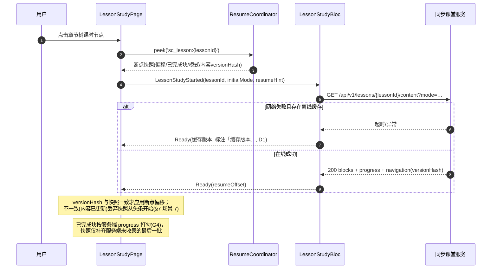
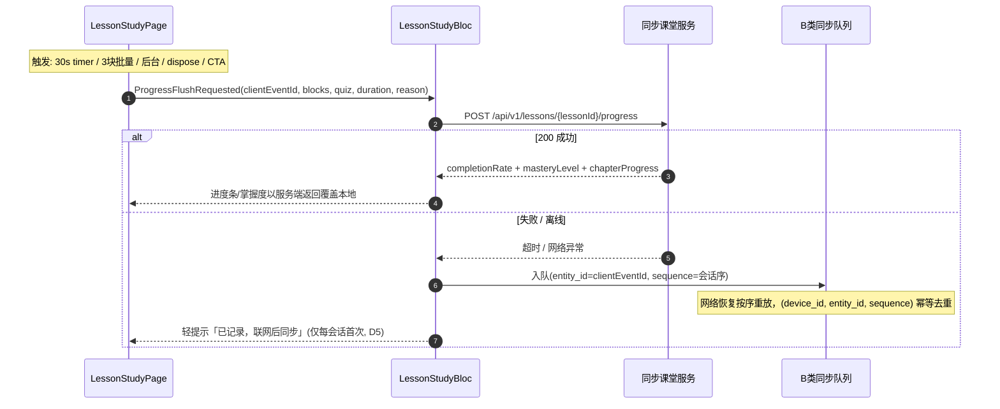
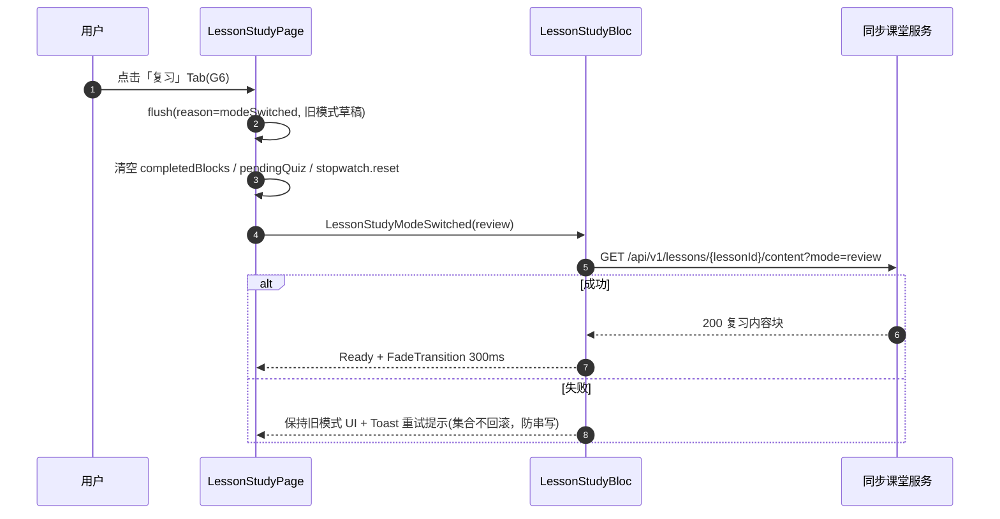
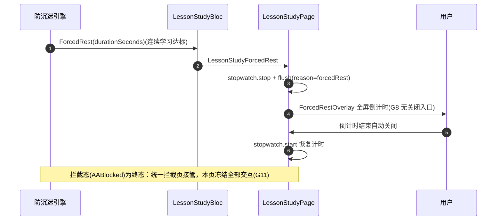

# 客户端 - 同步课堂学习页面架构与章节导航交互设计

## 1. 文档概述

### 1.1 目的

本文档细化 PrimeTop 客户端"同步课堂学习"模块的页面架构、章节导航交互、学习内容展示、进度追踪与跨端状态同步等客户端侧详细设计，为 Flutter 客户端开发人员提供可直接落地的编码指导。

### 1.2 范围

- 同步课堂入口与模块导航架构
- 教材选择器交互流程
- 章节目录树组件与导航
- 章节/课时学习页面布局
- 预习、复习、同步练习三种学习模式的前端切换与状态管理
- 学习进度本地缓存与服务端同步
- 离线学习场景适配
- 分龄 UI 差异化渲染策略

### 1.3 依赖

| 依赖模块 | 文档 |
| --- | --- |
| 同步课堂学习（服务端） | `同步课堂学习-详细设计.md` |
| 课程内容与结构化学习路径 | `课程内容与结构化学习路径管理-详细设计.md` |
| 客户端架构与前端框架 | `客户端架构与前端框架-详细设计.md` |
| 客户端状态管理架构 | `客户端状态管理架构-详细设计.md` |
| 客户端路由与深链接 | `客户端路由与深链接系统-详细设计.md` |
| 分龄UI适配 | `分龄UI适配与交互设计规范-详细设计.md` |
| 客户端本地持久层 | `客户端本地持久层与数据管理-详细设计.md` |
| 客户端页面状态模式 | `客户端页面状态模式与骨架屏加载空态错误态设计规范-详细设计.md` |

---

## 2. 页面架构总览

### 2.1 页面层级

```
同步课堂 Tab（底部导航入口）
├── 教材选择页 (TextbookSelectorPage)
│   ├── 学段选择器 (StagePicker)
│   ├── 年级选择器 (GradePicker)
│   ├── 学期选择器 (SemesterPicker)
│   ├── 教材版本选择器 (TextbookPicker)
│   └── 学科选择器 (SubjectPicker)
│
├── 章节目录页 (ChapterDirectoryPage)
│   ├── 学科/教材切换横栏
│   ├── 章节树列表 (ChapterTreeView)
│   │   ├── 单元节点 (UnitNode)
│   │   ├── 章节点 (ChapterNode)
│   │   └── 课时节点 (LessonNode)
│   ├── 学习进度总览卡片
│   └── 最近学习快速入口
│
├── 课时学习页 (LessonStudyPage)
│   ├── 学习模式切换栏 (预习/复习/练习)
│   ├── 内容渲染区 (LessonContentArea)
│   │   ├── 知识讲解卡片 (KnowledgeCard)
│   │   ├── 重点标注卡片 (KeyPointCard)
│   │   ├── 例题卡片 (ExampleCard)
│   │   ├── 练习互动卡片 (PracticeCard)
│   │   └── 多媒体内容 (MediaContent)
│   ├── 侧边知识点导航抽屉
│   ├── 学习进度条
│   └── 底部操作栏 (收藏/笔记/错题/继续)
│
├── 同步练习页 (SyncPracticePage)
│   ├── 题目展示区
│   ├── 答题交互区
│   └── 练习结果汇总
│
└── 章节总结页 (ChapterSummaryPage)
    ├── 知识点掌握度雷达图
    ├── 练习正确率统计
    ├── 薄弱知识点推荐
    └── 下一章节推荐
```

### 2.2 路由定义

```dart
// lib/routes/sync_classroom_routes.dart

class SyncClassroomRoutes {
  /// 同步课堂 Tab 首页 -> 章节目录
  static const String chapterDirectory = '/sync-classroom';

  /// 教材选择器（全屏弹窗）
  static const String textbookSelector = '/sync-classroom/textbook-selector';

  /// 课时学习页
  /// 参数: chapterId, lessonId, mode (preview|review|practice)
  static const String lessonStudy = '/sync-classroom/lesson/:lessonId';

  /// 同步练习
  /// 参数: chapterId, exerciseType (basic|advanced|comprehensive)
  static const String syncPractice = '/sync-classroom/practice/:chapterId';

  /// 章节总结
  /// 参数: chapterId
  static const String chapterSummary = '/sync-classroom/summary/:chapterId';
}

// 深链接映射
// primetop://sync-classroom/chapter/{chapterId}  -> 章节目录定位到该章节
// primetop://sync-classroom/lesson/{lessonId}    -> 直接进入课时学习
// primetop://sync-classroom/practice/{chapterId} -> 直接进入同步练习
```

### 2.3 页面状态机

```
                    ┌──────────────┐
                    │  选择教材    │
                    │ (首次/切换)  │
                    └──────┬───────┘
                           │ 选定
                           ▼
                    ┌──────────────┐
           ┌───────│  章节目录    │───────┐
           │       └──────────────┘       │
           │ 切换教材               点击课时│
           │(长按/顶部入口)                │
           ▼                              ▼
    ┌──────────────┐              ┌──────────────┐
    │  教材选择器  │              │  课时学习    │
    │  (Modal)     │              │              │
    └──────────────┘              └──────┬───────┘
                                         │
                           ┌─────────────┼─────────────┐
                           │ 切换模式     │ 进入练习     │ 完成学习
                           ▼             ▼              ▼
                    ┌──────────┐  ┌──────────┐  ┌──────────┐
                    │ 重新加载  │  │ 同步练习  │  │ 章节总结  │
                    │ 对应内容  │  │          │  │          │
                    └──────────┘  └──────────┘  └──────────┘
```

---

## 3. 数据结构定义

### 3.1 客户端侧数据模型

```dart
// lib/features/sync_classroom/domain/models/

/// 教材版本
class Textbook {
  final String id;
  final String name;            // "人教版数学"
  final String publisher;       // "人民教育出版社"
  final String subjectCode;     // "MATH"
  final String stageCode;       // "PRIMARY" | "JUNIOR" | "SENIOR"
  final String gradeCode;       // "G4" (四年级)
  final String semesterCode;    // "S1" (上学期) | "S2" (下学期)
  final String coverUrl;
  final bool isDefault;         // 是否为当前用户默认教材
  final int chapterCount;
  final DateTime updatedAt;

  const Textbook({
    required this.id,
    required this.name,
    required this.publisher,
    required this.subjectCode,
    required this.stageCode,
    required this.gradeCode,
    required this.semesterCode,
    this.coverUrl = '',
    this.isDefault = false,
    this.chapterCount = 0,
    DateTime? updatedAt,
  }) : updatedAt = updatedAt ?? DateTime.now();
}

/// 章节目录节点（树形结构）
class ChapterNode {
  final String id;
  final String parentId;        // 空字符串表示根节点
  final String title;
  final ChapterNodeType type;   // unit | chapter | lesson
  final int order;              // 同级排序
  final List<ChapterNode> children;
  final ChapterProgress? progress;
  final bool hasExercise;       // 是否有配套练习
  final bool hasPreviewContent; // 是否有预习内容
  final bool hasReviewContent;  // 是否有复习内容
  final String? knowledgeTag;   // 关联知识点标签

  const ChapterNode({
    required this.id,
    this.parentId = '',
    required this.title,
    required this.type,
    this.order = 0,
    this.children = const [],
    this.progress,
    this.hasExercise = false,
    this.hasPreviewContent = true,
    this.hasReviewContent = true,
    this.knowledgeTag,
  });

  /// 展开状态（UI 状态，不属于领域模型，用 ValueNotifier 管理）
  bool get isLeaf => children.isEmpty;
  bool get isUnit => type == ChapterNodeType.unit;
  bool get isChapter => type == ChapterNodeType.chapter;
  bool get isLesson => type == ChapterNodeType.lesson;
}

enum ChapterNodeType { unit, chapter, lesson }

/// 章节学习进度
class ChapterProgress {
  final String chapterId;
  final double completionRate;  // 0.0 ~ 1.0
  final int totalLessons;
  final int completedLessons;
  final int totalExercises;
  final int completedExercises;
  final double avgAccuracy;     // 练习平均正确率
  final DateTime? lastStudyAt;
  final int studyDurationSeconds; // 累计学习时长(秒)
  final MasteryLevel masteryLevel;

  const ChapterProgress({
    required this.chapterId,
    this.completionRate = 0.0,
    this.totalLessons = 0,
    this.completedLessons = 0,
    this.totalExercises = 0,
    this.completedExercises = 0,
    this.avgAccuracy = 0.0,
    this.lastStudyAt,
    this.studyDurationSeconds = 0,
    this.masteryLevel = MasteryLevel.notStarted,
  });
}

/// 掌握度等级
enum MasteryLevel {
  notStarted,   // 未开始
  previewing,   // 预习中
  learning,     // 学习中
  practicing,   // 练习中
  reviewing,    // 复习巩固
  mastered,     // 已掌握
  needReview,   // 需要复习
  ;

  String get label => switch (this) {
    notStarted => '未开始',
    previewing => '预习中',
    learning   => '学习中',
    practicing => '练习中',
    reviewing  => '复习巩固',
    mastered   => '已掌握',
    needReview => '需要复习',
  };

  /// 对应进度条颜色
  String get colorHex => switch (this) {
    notStarted => '#E0E0E0',
    previewing => '#90CAF9',
    learning   => '#42A5F5',
    practicing => '#66BB6A',
    reviewing  => '#FFA726',
    mastered   => '#4CAF50',
    needReview => '#EF5350',
  };
}

/// 学习模式
enum StudyMode {
  preview,  // 预习
  review,   // 复习
  practice; // 练习

  String get label => switch (this) {
    preview  => '预习',
    review   => '复习',
    practice => '练习',
  };

  String get icon => switch (this) {
    preview  => 'preview',
    review   => 'replay',
    practice => 'edit_note',
  };
}

/// 课时内容块（服务端返回后在客户端渲染的基础单元）
class LessonContentBlock {
  final String id;
  final ContentBlockType type;
  final Map<String, dynamic> data;  // 渲染数据
  final int order;

  const LessonContentBlock({
    required this.id,
    required this.type,
    required this.data,
    this.order = 0,
  });
}

enum ContentBlockType {
  knowledgeText,    // 知识讲解文本
  keyPoint,         // 重点标注
  formula,          // 数学公式
  example,          // 例题
  image,            // 图片
  audio,            // 音频
  video,            // 视频
  interactiveQuiz,  // 互动问答
  comparisonTable,  // 对比表格
  mindMap,          // 思维导图
  summaryCard,      // 知识总结卡片
}

/// 用户教材偏好（本地持久化）
class UserTextbookPreference {
  final String userId;
  final Map<String, String> activeTextbooks; // subjectCode -> textbookId
  final String? lastViewedChapterId;
  final DateTime updatedAt;

  const UserTextbookPreference({
    required this.userId,
    this.activeTextbooks = const {},
    this.lastViewedChapterId,
    DateTime? updatedAt,
  }) : updatedAt = updatedAt ?? DateTime.now();
}
```

### 3.2 服务端 API 接口

#### 3.2.1 获取教材列表

```
GET /api/v1/textbooks

Query Parameters:
  stageCode   (可选) 学段过滤: PRIMARY | JUNIOR | SENIOR
  gradeCode   (可选) 年级过滤: G1 ~ G12
  subjectCode (可选) 学科过滤: MATH | CHINESE | ENGLISH | ...

Response 200:
{
  "code": 0,
  "data": {
    "textbooks": [
      {
        "id": "tb_math_pe_g4s1",
        "name": "人教版数学四年级上册",
        "publisher": "人民教育出版社",
        "subjectCode": "MATH",
        "stageCode": "PRIMARY",
        "gradeCode": "G4",
        "semesterCode": "S1",
        "coverUrl": "https://cdn.primetop.com/textbooks/math_pe_g4s1.jpg",
        "chapterCount": 8,
        "updatedAt": "2026-05-20T10:00:00Z"
      }
    ],
    "total": 24
  }
}
```

#### 3.2.2 获取章节目录树

```
GET /api/v1/textbooks/{textbookId}/chapters

Response 200:
{
  "code": 0,
  "data": {
    "textbookId": "tb_math_pe_g4s1",
    "chapters": [
      {
        "id": "unit_1",
        "parentId": "",
        "title": "第一单元 大数的认识",
        "type": "unit",
        "order": 1,
        "hasExercise": true,
        "children": [
          {
            "id": "ch_1_1",
            "parentId": "unit_1",
            "title": "1.1 亿以内数的认识",
            "type": "chapter",
            "order": 1,
            "hasExercise": true,
            "children": [
              {
                "id": "ls_1_1_1",
                "parentId": "ch_1_1",
                "title": "认识计数单位",
                "type": "lesson",
                "order": 1,
                "hasExercise": true,
                "hasPreviewContent": true,
                "hasReviewContent": true,
                "knowledgeTag": "counting_unit",
                "children": []
              }
            ]
          }
        ]
      }
    ]
  }
}
```

#### 3.2.3 获取课时学习内容

```
GET /api/v1/lessons/{lessonId}/content

Query Parameters:
  mode (可选) preview | review | practice，默认按用户当前进度选择

Response 200:
{
  "code": 0,
  "data": {
    "lessonId": "ls_1_1_1",
    "lessonTitle": "认识计数单位",
    "mode": "preview",
    "blocks": [
      {
        "id": "blk_001",
        "type": "knowledgeText",
        "order": 1,
        "data": {
          "title": "计数单位有哪些？",
          "content": "我们在数物体的时候，用来表示物体个数的 1、2、3、4、5……叫做计数单位。",
          "richText": "<p>我们在数物体的时候...</p>",
          "keyPoints": ["个、十、百、千、万都是计数单位", "每相邻两个计数单位之间的进率是10"]
        }
      },
      {
        "id": "blk_002",
        "type": "example",
        "order": 2,
        "data": {
          "question": "从个位起，第5位是什么位？",
          "answer": "万位",
          "steps": [
            {"step": 1, "text": "个位是第1位"},
            {"step": 2, "text": "十位是第2位"},
            {"step": 3, "text": "百位是第3位"},
            {"step": 4, "text": "千位是第4位"},
            {"step": 5, "text": "万位是第5位"}
          ]
        }
      },
      {
        "id": "blk_003",
        "type": "interactiveQuiz",
        "order": 3,
        "data": {
          "quizType": "choice",
          "question": "10个一千是（）",
          "options": ["一百", "一千", "一万", "十万"],
          "correctIndex": 2,
          "explanation": "每相邻两个计数单位之间的进率都是10，所以10个一千是一万。"
        }
      }
    ],
    "progress": {
      "completionRate": 0.0,
      "masteryLevel": "notStarted"
    },
    "navigation": {
      "prevLessonId": null,
      "nextLessonId": "ls_1_1_2",
      "chapterId": "ch_1_1",
      "unitId": "unit_1"
    }
  }
}
```

#### 3.2.4 提交学习进度

```
POST /api/v1/lessons/{lessonId}/progress

Request Body:
{
  "mode": "preview",
  "blocksCompleted": ["blk_001", "blk_002", "blk_003"],
  "quizResults": [
    {"blockId": "blk_003", "correct": true, "answerIndex": 2}
  ],
  "durationSeconds": 180,
  "completedAt": "2026-05-27T09:00:00Z"
}

Response 200:
{
  "code": 0,
  "data": {
    "lessonId": "ls_1_1_1",
    "completionRate": 1.0,
    "masteryLevel": "previewing",
    "chapterProgress": {
      "completionRate": 0.33,
      "completedLessons": 1,
      "totalLessons": 3
    }
  }
}
```

#### 3.2.5 获取章节学习进度（批量）

```
GET /api/v1/textbooks/{textbookId}/progress

Response 200:
{
  "code": 0,
  "data": {
    "textbookId": "tb_math_pe_g4s1",
    "overallCompletionRate": 0.25,
    "chapters": [
      {
        "chapterId": "unit_1",
        "completionRate": 0.5,
        "completedLessons": 3,
        "totalLessons": 6,
        "avgAccuracy": 0.85,
        "masteryLevel": "learning",
        "lastStudyAt": "2026-05-26T15:30:00Z"
      }
    ]
  }
}
```

#### 3.2.6 获取章节总结

```
GET /api/v1/chapters/{chapterId}/summary

Response 200:
{
  "code": 0,
  "data": {
    "chapterId": "ch_1_1",
    "chapterTitle": "亿以内数的认识",
    "knowledgePoints": [
      {
        "id": "kp_001",
        "name": "计数单位",
        "masteryLevel": "mastered",
        "accuracy": 1.0
      },
      {
        "id": "kp_002",
        "name": "数位顺序表",
        "masteryLevel": "learning",
        "accuracy": 0.75
      }
    ],
    "exerciseStats": {
      "totalAttempted": 15,
      "totalCorrect": 12,
      "accuracy": 0.8
    },
    "weakPoints": ["数位顺序表", "大数读写"],
    "recommendedNext": {
      "chapterId": "ch_1_2",
      "title": "1.2 数的产生与十进制计数法"
    },
    "studyDurationSeconds": 3600
  }
}
```

---

## 4. 核心组件设计

### 4.1 教材选择器 (TextbookSelectorSheet)

教材选择器以底部弹窗 (BottomSheet) 形式展示，采用级联选择模式。

```dart
// lib/features/sync_classroom/presentation/widgets/textbook_selector_sheet.dart

class TextbookSelectorSheet extends StatefulWidget {
  final String? currentTextbookId;
  final ValueChanged<Textbook> onSelected;

  const TextbookSelectorSheet({
    super.key,
    this.currentTextbookId,
    required this.onSelected,
  });

  /// 显示教材选择器
  static Future<Textbook?> show(BuildContext context, {
    String? currentTextbookId,
  }) {
    return showModalBottomSheet<Textbook>(
      context: context,
      isScrollControlled: true,
      shape: const RoundedRectangleBorder(
        borderRadius: BorderRadius.vertical(top: Radius.circular(16)),
      ),
      builder: (_) => TextbookSelectorSheet(
        currentTextbookId: currentTextbookId,
        onSelected: (tb) => Navigator.pop(context, tb),
      ),
    );
  }

  @override
  State<TextbookSelectorSheet> createState() => _TextbookSelectorSheetState();
}

class _TextbookSelectorSheetState extends State<TextbookSelectorSheet> {
  // 级联选择状态
  String? _selectedStage;
  String? _selectedGrade;
  String? _selectedSubject;
  String? _selectedSemester;

  // 步骤指示器：学段 -> 年级+学科 -> 学期 -> 教材版本
  int _currentStep = 0;

  /// 根据用户 StudentProfile 预填默认值
  @override
  void initState() {
    super.initState();
    _prefillFromUserProfile();
  }

  void _prefillFromUserProfile() {
    // 从全局用户状态读取当前学段、年级
    final profile = context.read<UserProfileBloc>().state.profile;
    if (profile != null) {
      _selectedStage = profile.stageCode;
      _selectedGrade = profile.gradeCode;
      // 自动跳到教材版本选择步骤
      if (_selectedStage != null && _selectedGrade != null) {
        _currentStep = 2;
      }
    }
  }

  @override
  Widget build(BuildContext context) {
    return DraggableScrollableSheet(
      initialChildSize: 0.7,
      maxChildSize: 0.95,
      minChildSize: 0.5,
      expand: false,
      builder: (context, scrollController) {
        return Column(
          children: [
            _buildHeader(),
            _buildStepIndicator(),
            Expanded(
              child: _buildStepContent(scrollController),
            ),
          ],
        );
      },
    );
  }

  Widget _buildStepIndicator() {
    // 水平步骤指示器：学段 → 年级+学科 → 学期 → 确认
    return StepIndicator(
      currentStep: _currentStep,
      steps: const ['学段', '年级学科', '学期', '确认'],
      onStepTapped: (step) {
        if (step < _currentStep) {
          setState(() => _currentStep = step);
        }
      },
    );
  }

  Widget _buildStepContent(ScrollController controller) {
    return switch (_currentStep) {
      0 => _buildStagePicker(controller),
      1 => _buildGradeSubjectPicker(controller),
      2 => _buildSemesterPicker(controller),
      3 => _buildTextbookConfirm(controller),
      _ => const SizedBox.shrink(),
    };
  }
}
```

**级联选择逻辑：**

```
学段选择 → 自动过滤对应年级列表
年级+学科选择 → 自动过滤对应学期
学期选择 → 调用 API 获取教材列表
确认 → 显示匹配的教材版本列表供用户选择
```

**分龄适配：**
- 幼儿/小学低年级：大按钮网格布局，图片+文字
- 小学高年级/初中：列表+图标
- 高中：紧凑列表，支持搜索

### 4.2 章节目录树 (ChapterTreeView)

```dart
// lib/features/sync_classroom/presentation/widgets/chapter_tree_view.dart

class ChapterTreeView extends StatefulWidget {
  final List<ChapterNode> chapters;
  final ValueChanged<ChapterNode> onLessonTap;
  final ValueChanged<ChapterNode>? onChapterTap;
  final String? highlightedChapterId;

  const ChapterTreeView({
    super.key,
    required this.chapters,
    required this.onLessonTap,
    this.onChapterTap,
    this.highlightedChapterId,
  });

  @override
  State<ChapterTreeView> createState() => _ChapterTreeViewState();
}

class _ChapterTreeViewState extends State<ChapterTreeView> {
  /// 展开状态管理
  final Map<String, bool> _expandedNodes = {};

  /// 自动展开包含上次学习位置的节点
  void _autoExpandToLastStudied(String? lastChapterId) {
    if (lastChapterId == null) return;
    _expandPathTo(lastChapterId, widget.chapters);
  }

  void _expandPathTo(String targetId, List<ChapterNode> nodes) {
    for (final node in nodes) {
      if (_containsTarget(node, targetId)) {
        setState(() => _expandedNodes[node.id] = true);
        _expandPathTo(targetId, node.children);
      }
    }
  }

  bool _containsTarget(ChapterNode node, String targetId) {
    if (node.id == targetId) return true;
    return node.children.any((child) => _containsTarget(child, targetId));
  }

  @override
  Widget build(BuildContext context) {
    return ListView.builder(
      padding: const EdgeInsets.symmetric(horizontal: 16, vertical: 8),
      itemCount: widget.chapters.length,
      itemBuilder: (context, index) {
        return _buildTreeNode(
          node: widget.chapters[index],
          level: 0,
        );
      },
    );
  }

  Widget _buildTreeNode({
    required ChapterNode node,
    required int level,
  }) {
    final isExpanded = _expandedNodes[node.id] ?? false;
    final indent = level * 24.0;

    return Column(
      crossAxisAlignment: CrossAxisAlignment.start,
      children: [
        // 当前节点
        _TreeNodeTile(
          node: node,
          indent: indent,
          isExpanded: isExpanded,
          isHighlighted: node.id == widget.highlightedChapterId,
          onTap: () => _handleNodeTap(node),
          onExpandToggle: node.isLeaf
              ? null
              : () => setState(() {
                _expandedNodes[node.id] = !isExpanded;
              }),
        ),

        // 子节点（展开时显示，带动画）
        AnimatedCrossFade(
          firstChild: const SizedBox.shrink(),
          secondChild: Column(
            children: node.children
                .map((child) => _buildTreeNode(node: child, level: level + 1))
                .toList(),
          ),
          crossFadeState: isExpanded
              ? CrossFadeState.showSecond
              : CrossFadeState.showFirst,
          duration: const Duration(milliseconds: 200),
        ),
      ],
    );
  }

  void _handleNodeTap(ChapterNode node) {
    if (node.isLesson) {
      widget.onLessonTap(node);
    } else {
      // 非叶子节点：切换展开状态
      setState(() {
        _expandedNodes[node.id] = !(_expandedNodes[node.id] ?? false);
      });
      widget.onChapterTap?.call(node);
    }
  }
}
```

**节点渲染样式（按类型和掌握度）：**

```dart
class _TreeNodeTile extends StatelessWidget {
  // ... 构造参数省略

  @override
  Widget build(BuildContext context) {
    return InkWell(
      onTap: onTap,
      borderRadius: BorderRadius.circular(8),
      child: Padding(
        padding: EdgeInsets.only(left: indent),
        child: Row(
          children: [
            // 展开/收起图标（非叶子节点）
            if (!node.isLeaf)
              AnimatedRotation(
                turns: isExpanded ? 0.25 : 0,
                duration: const Duration(milliseconds: 200),
                child: Icon(Icons.chevron_right, size: 20),
              )
            else
              const SizedBox(width: 20),

            // 掌握度指示器
            _MasteryIndicator(level: node.progress?.masteryLevel),

            const SizedBox(width: 8),

            // 标题
            Expanded(
              child: Text(
                node.title,
                style: _titleStyle(context),
                maxLines: 2,
                overflow: TextOverflow.ellipsis,
              ),
            ),

            // 进度百分比（仅章节和单元）
            if (!node.isLeaf && node.progress != null)
              _ProgressBadge(progress: node.progress!),

            // 练习标识
            if (node.hasExercise)
              Padding(
                padding: const EdgeInsets.only(left: 4),
                child: Icon(Icons.edit_note, size: 16, color: Colors.grey),
              ),
          ],
        ),
      ),
    );
  }

  TextStyle _titleStyle(BuildContext context) {
    if (node.isLesson) {
      return Theme.of(context).textTheme.bodyMedium!;
    }
    if (node.isUnit) {
      return Theme.of(context).textTheme.titleSmall!.copyWith(
        fontWeight: FontWeight.bold,
      );
    }
    return Theme.of(context).textTheme.bodyLarge!;
  }
}
```

**掌握度指示器（彩色圆点）：**

```dart
class _MasteryIndicator extends StatelessWidget {
  final MasteryLevel? level;

  @override
  Widget build(BuildContext context) {
    final color = _colorForLevel(level);
    return Container(
      width: 8,
      height: 8,
      decoration: BoxDecoration(
        shape: BoxShape.circle,
        color: color,
      ),
    );
  }

  Color _colorForLevel(MasteryLevel? level) {
    if (level == null) return Colors.grey[300]!;
    // 使用 masteryLevel.colorHex 转换
    return HexColor.fromHex(level.colorHex);
  }
}
```

### 4.3 课时学习页 (LessonStudyPage)

```dart
// lib/features/sync_classroom/presentation/pages/lesson_study_page.dart

class LessonStudyPage extends StatefulWidget {
  final String lessonId;
  final StudyMode initialMode;

  const LessonStudyPage({
    super.key,
    required this.lessonId,
    this.initialMode = StudyMode.preview,
  });

  @override
  State<LessonStudyPage> createState() => _LessonStudyPageState();
}

class _LessonStudyPageState extends State<LessonStudyPage>
    with TickerProviderStateMixin, WidgetsBindingObserver {
  late final LessonStudyBloc _bloc;

  /// 内容滚动控制器
  final ScrollController _scrollController = ScrollController();

  /// 学习计时器
  final Stopwatch _studyStopwatch = Stopwatch();

  /// 已完成的内容块ID集合
  final Set<String> _completedBlocks = {};

  /// 模式切换动画控制器
  late final AnimationController _modeSwitchController;

  // —— v1.1 补全：会话级私有状态（G3 幂等键 / G9 离线暂存）——
  final List<QuizResultDraft> _pendingQuizResults = [];
  late final String _sessionId = 'ls_${widget.lessonId}_${DateTime.now().millisecondsSinceEpoch}';
  int _clientEventSeq = 0;
  Timer? _autoFlushTimer;

  @override
  void initState() {
    super.initState();
    _bloc = context.read<LessonStudyBloc>()
      ..add(LessonStudyStarted(
        lessonId: widget.lessonId,
        initialMode: widget.initialMode,
        // 断点续学：从上下文恢复器读取上次滚动偏移与已完成块快照（委托《客户端-断点续学与学习上下文恢复》）
        resumeHint: ResumeCoordinator.peek('sc_lesson:${widget.lessonId}'),
      ));
    _modeSwitchController = AnimationController(
      vsync: this,
      duration: const Duration(milliseconds: 300),
    );
    _scrollController.addListener(_onScrollChanged);
    WidgetsBinding.instance.addObserver(this); // G2 计时口径：前后台感知
    // 30s 兜底自动落盘（G5：任意退出路径丢进度 ≤ 30s）
    _autoFlushTimer = Timer.periodic(const Duration(seconds: 30), (_) {
      _flushProgress(reason: ProgressFlushReason.autoTimer);
    });
  }

  @override
  void dispose() {
    _flushProgress(reason: ProgressFlushReason.pageDisposed); // G5 退出必落盘
    _autoFlushTimer?.cancel();
    WidgetsBinding.instance.removeObserver(this);
    _modeSwitchController.dispose();
    _scrollController.removeListener(_onScrollChanged);
    _scrollController.dispose();
    _bloc.add(const LessonStudySessionEnded());
    super.dispose();
  }

  // ---------- 生命周期与计时（G2：仅前台 + 可见 + 非强制休息时累计） ----------

  @override
  void didChangeAppLifecycleState(AppLifecycleState state) {
    switch (state) {
      case AppLifecycleState.resumed:
        _studyStopwatch.start();
        _bloc.add(const LessonStudyVisibilityResumed());
      case AppLifecycleState.inactive:
      case AppLifecycleState.hidden:
      case AppLifecycleState.paused:
        _studyStopwatch.stop();
        _flushProgress(reason: ProgressFlushReason.backgrounded);
      case AppLifecycleState.detached:
        _flushProgress(reason: ProgressFlushReason.detached);
    }
  }

  // ---------- 滚动监听与块完成追踪 ----------

  void _onScrollChanged() {
    // 仅记录断点快照；曝光判定由 LessonContentArea 内 ExposureTracker 负责
    ResumeCoordinator.mark(
      'sc_lesson:${widget.lessonId}',
      scrollOffset: _scrollController.offset,
      completedBlocks: _completedBlocks.toList(),
      mode: _bloc.state.mode,
    );
  }

  void _onBlockCompleted(String blockId) {
    if (_completedBlocks.add(blockId)) {
      _bloc.add(LessonStudyBlockCompleted(blockId));
      // 每累计 3 个块自动批量保存，减少请求频次
      if (_completedBlocks.length % 3 == 0) {
        _flushProgress(reason: ProgressFlushReason.autoBatch);
      }
    }
  }

  void _onQuizAnswered(String blockId, QuizAnswer answer) {
    // 在线：bloc 提交判题并回填反馈；离线：仅暂存，不本地判对错（G9）
    _pendingQuizResults.add(
      QuizResultDraft(blockId: blockId, answer: answer, answeredAt: DateTime.now()),
    );
    _bloc.add(LessonStudyQuizAnswered(blockId, answer));
  }

  // ---------- 进度落盘（在线直报 + 失败/离线自动入 B 类同步队列，G3 幂等） ----------

  void _flushProgress({required ProgressFlushReason reason}) {
    final durationSeconds = _studyStopwatch.elapsed.inSeconds;
    if (_completedBlocks.isEmpty &&
        _pendingQuizResults.isEmpty &&
        durationSeconds == 0) {
      return; // 无有效学习信号，不产生空事件
    }
    _studyStopwatch.reset(); // flush 后重算，防止双计（对齐时长对账引擎 module=sc 口径）
    _bloc.add(LessonStudyProgressFlushRequested(
      clientEventId: '$_sessionId:${_clientEventSeq += 1}',
      blocksCompleted: _completedBlocks.toList(),
      quizResults: List.of(_pendingQuizResults),
      durationSeconds: durationSeconds,
      reason: reason,
    ));
    _pendingQuizResults.clear();
  }

  // ---------- 构建 ----------

  @override
  Widget build(BuildContext context) {
    return BlocConsumer<LessonStudyBloc, LessonStudyState>(
      bloc: _bloc,
      listener: (context, state) {
        if (state is LessonStudyForcedRest) _enterForcedRest(state); // G8 不可跳过
        if (state is LessonStudyAABlocked) _showAABlocked(state); // G11 防沉迷
        if (state is LessonStudyCompleted) _onLessonCompleted(state);
      },
      builder: (context, state) {
        return Scaffold(
          appBar: StudyAppBar(
            lessonTitle: state.lessonTitle,
            chapterCrumb: state.chapterTitle,
            mode: state.mode,
            onModeSwitched: _switchMode, // 预习/复习切换；练习模式走独立页面
            onOutlineTap: () => _openKnowledgeDrawer(state),
          ),
          endDrawer: KnowledgeNavDrawer(blocks: state.blocks), // 侧边知识点导航
          body: _buildBody(state),
          bottomNavigationBar: StudyBottomBar(
            isFavorite: state.isFavorite,
            onFavorite: () => _bloc.add(const LessonStudyFavoriteToggled()),
            onNote: () => _openNoteEditor(state), // 委托阅读器批注系统
            onReport: () => _openContentReport(state), // 委托内容纠错反馈
            primaryLabel: state.completionRate >= 1.0 ? '查看章节总结' : '继续下一课时',
            onPrimary: () => _onPrimaryCta(state),
          ),
        );
      },
    );
  }

  Widget _buildBody(LessonStudyState state) {
    return switch (state) {
      LessonStudyLoading() => const LessonSkeleton(), // 骨架屏（页面状态模式规范）
      LessonStudyFailure(:final error) => LessonErrorView(
        error: error,
        onRetry: () => _bloc.add(LessonStudyRetried(widget.lessonId)),
        onOfflineCache: () => _bloc.add(const LessonStudyOfflineCacheRequested()),
      ),
      LessonStudyReady() => FadeTransition(
        // 模式切换内容重载的淡入动画（300ms）
        opacity: _modeSwitchController,
        child: LessonContentArea(
          blocks: state.blocks,
          completedIds: _completedBlocks,
          resumeOffset: state.resumeOffset,
          onBlockCompleted: _onBlockCompleted,
          onQuizAnswered: _onQuizAnswered,
        ),
      ),
      _ => const SizedBox.shrink(),
    };
  }

  // ---------- 模式切换（G6：切模式即保存旧模式草稿，重置计时与完成集合） ----------

  void _switchMode(StudyMode target) {
    if (target == _bloc.state.mode) return;
    if (target == StudyMode.practice) {
      // 练习不在课时页内嵌，跳转独立同步练习页（对齐 §2.3 页面状态机）
      _flushProgress(reason: ProgressFlushReason.modeSwitched);
      context.push(SyncClassroomRoutes.syncPractice
          .replaceFirst(':chapterId', _bloc.state.chapterId));
      return;
    }
    _flushProgress(reason: ProgressFlushReason.modeSwitched);
    _completedBlocks.clear();
    _pendingQuizResults.clear();
    _studyStopwatch.reset();
    _bloc.add(LessonStudyModeSwitched(target));
    _modeSwitchController.forward(from: 0);
  }

  // ---------- 强制休息（G8：由防沉迷引擎下发，本页无条件服从） ----------

  Future<void> _enterForcedRest(LessonStudyForcedRest state) async {
    _studyStopwatch.stop();
    _flushProgress(reason: ProgressFlushReason.forcedRest);
    await ForcedRestOverlay.show(context, durationSeconds: state.durationSeconds);
    _studyStopwatch.start(); // 休息结束恢复计时
  }

  void _showAABlocked(LessonStudyAABlocked state) {
    AntiAddictionGate.show(context, reason: state.reason); // 统一拦截页，禁止绕过
  }

  // ---------- 主 CTA ----------

  void _onPrimaryCta(LessonStudyReady state) {
    _flushProgress(reason: ProgressFlushReason.cta);
    if (state.completionRate >= 1.0) {
      context.push(SyncClassroomRoutes.chapterSummary
          .replaceFirst(':chapterId', state.chapterId));
    } else if (state.navigation.nextLessonId != null) {
      context.pushReplacement(SyncClassroomRoutes.lessonStudy
          .replaceFirst(':lessonId', state.navigation.nextLessonId!));
    }
  }

  void _onLessonCompleted(LessonStudyCompleted state) {
    // 完成动效后引导：练习巩固 / 下一课时 / 章节总结（分龄文案差异）
    LessonCompleteSheet.show(context, state: state);
  }

  void _openKnowledgeDrawer(LessonStudyReady state) {
    Scaffold.of(context).openEndDrawer();
  }

  void _openNoteEditor(LessonStudyReady state) =>
      NoteEditorSheet.show(context, scope: NoteScope.lesson(widget.lessonId));

  void _openContentReport(LessonStudyReady state) =>
      ContentReportSheet.show(context, refType: 'lesson', refId: widget.lessonId);
}
```

**课时学习页关键设计说明：**

1. **单一计时权威**：`_studyStopwatch` 是本页唯一计时器，口径为「前台 + 可见 + 非强制休息」（G2）；flush 时读取并 `reset()`，同一秒数不会被累计两次，服务端时长对账引擎（`module=sc`）为最终权威。
2. **进度落盘分级**：见下表，所有通道最终都收敛到 `LessonStudyProgressFlushRequested` 一个事件，携带 `clientEventId`（G3）。

| 触发时机 | reason | 通道 | 说明 |
| --- | --- | --- | --- |
| 30s 兜底定时 | `autoTimer` | 在线直报，失败入队 | 丢进度上限 30s（G5） |
| 每完成 3 个内容块 | `autoBatch` | 在线直报，失败入队 | 减少请求频次 |
| 模式切换前 | `modeSwitched` | 在线直报，失败入队 | 旧模式草稿必保存（G6） |
| 退后台 / detached | `backgrounded` / `detached` | 在线直报，失败入队 | 后台可能只有 ≤2s 窗口，超时即入队 |
| dispose | `pageDisposed` | 同步 flush 后入队（不等响应） | 阻塞式，最多等待 300ms |
| 强制休息前 | `forcedRest` | 在线直报，失败入队 | 休息期间不计时（G8） |
| 主 CTA 点击 | `cta` | 在线直报，失败入队 | 跳转前确保进度已带最新值 |

3. **离线兜底**：直报失败或当前离线时，flush 事件写入 B 类同步队列（委托《客户端-离线缓存与数据同步》，`(device_id, entity_id, sequence)` 幂等键三元组中 `entity_id = clientEventId`），网络恢复后按序重放；重放成功与否以服务端返回的 `completionRate` 为准。

### 4.4 配套模型与支撑组件

#### 4.4.1 进度落盘相关模型

```dart
// lib/features/sync_classroom/domain/models/progress_flush.dart

/// 进度落盘触发原因（埋点维度 + 服务端异常诊断维度）
enum ProgressFlushReason {
  autoTimer,     // 30s 兜底定时
  autoBatch,     // 每完成 3 个内容块
  modeSwitched,  // 模式切换前保存旧模式草稿
  backgrounded,  // 退到后台
  detached,      // App 即将被系统回收（iOS detached）
  pageDisposed,  // 页面 dispose
  forcedRest,    // 强制休息前
  cta,           // 主 CTA（继续下一课时 / 查看章节总结）
  manual;        // 退出确认弹窗等用户手动触发

  String get label => name; // 埋点上报原样使用枚举名
}

/// 互动问答作答草稿（G9：仅存作答事实，不含对错判定）
/// 对错与解析由服务端判题结果回填，客户端不得使用本地 correctIndex 预判
@immutable
class QuizResultDraft {
  final String blockId;
  final QuizAnswer answer;       // 选项索引 / 文本 / 语音转写引用
  final DateTime answeredAt;

  const QuizResultDraft({
    required this.blockId,
    required this.answer,
    required this.answeredAt,
  });

  Map<String, dynamic> toJson() => {
    'blockId': blockId,
    'answer': answer.toJson(),
    'answeredAt': answeredAt.toIso8601String(),
  };
}
```

#### 4.4.2 LessonContentArea 内容块渲染与曝光追踪

```dart
// lib/features/sync_classroom/presentation/widgets/lesson_content_area.dart

/// 内容块工厂注册表：ContentBlockType -> WidgetBuilder
/// 未知类型降级为纯文本卡片（G10 降级链 D2，对齐 CardWidgetRegistry 协议）
final Map<ContentBlockType, BlockWidgetBuilder> kBlockRegistry = {
  ContentBlockType.knowledgeText: (b) => KnowledgeCard(block: b),
  ContentBlockType.keyPoint:      (b) => KeyPointCard(block: b),
  ContentBlockType.formula:       (b) => FormulaCard(block: b),      // 委托 MDW 公式渲染
  ContentBlockType.example:       (b) => ExampleCard(block: b),      // 分步展开受 ACPH 门控
  ContentBlockType.image:         (b) => ImageBlock(block: b),
  ContentBlockType.audio:         (b) => AudioBlock(block: b),       // 委托音频播放器组件
  ContentBlockType.video:         (b) => VideoBlock(block: b),
  ContentBlockType.interactiveQuiz: (b) => PracticeCard(block: b),   // 判题走练习判题链路
  ContentBlockType.comparisonTable: (b) => ComparisonTableBlock(block: b),
  ContentBlockType.mindMap:       (b) => MindMapBlock(block: b),     // 静态预览，交互跳图谱页
  ContentBlockType.summaryCard:   (b) => SummaryCard(block: b),
};

/// 曝光追踪器（G7）：可视面积 >= 50% 且停留 >= 500ms 才记一次曝光。
/// 曝光仅用于埋点与推荐疲劳治理，不参与完成度计算；
/// 完成度唯一入口是 onBlockCompleted（滚动到底部自动触发或用户点击「学完了」）。
class ExposureTracker {
  static const double kVisibleRatio = 0.5;
  static const Duration kDwellTime = Duration(milliseconds: 500);

  void onViewportChanged(String blockId, double visibleRatio, Rect viewport) {
    if (visibleRatio >= kVisibleRatio) {
      _pending[blockId] ??= DateTime.now(); // 首次满足面积即起表
    } else {
      _pending.remove(blockId);            // 离开视口重新起表，防刷曝光
    }
  }

  void onTick() { // 挂在 30s 兜底 timer 同帧，不新增 timer
    final now = DateTime.now();
    _pending.removeWhere((id, since) {
      if (now.difference(since) >= kDwellTime) {
        Analytics.track('sc_block_expose', props: {'blockId': id});
        return true;
      }
      return false;
    });
  }
}
```

**互动问答作答流（在线 / 离线双分支）：**

| 分支 | 流程 | 约束 |
| --- | --- | --- |
| 在线 | `PracticeCard` 作答 → `LessonStudyQuizAnswered` → BFF 提交判题 → 判题结果回填卡片（对错 + 解析） | 判题委托多题型统一判题引擎；`correctIndex/explanation` 在 ACPH 未解锁时服务端不下发（C2） |
| 离线 | 作答仅写入 `_pendingQuizResults`（G9 不判对错），卡片显示「已记录，联网后判题」 | 恢复在线后随 flush 上报，结果以判题回填为准；卡片暂存态在重进页面后以服务端状态重建 |

#### 4.4.3 LessonCompleteSheet 完成引导（分龄）

| 学段 | 完成动效 | 引导主按钮 | 次按钮 |
| --- | --- | --- | --- |
| 幼儿 | 星星礼花 + 语音夸奖（音效受家长管控开关约束，C4） | 「再来一课」（语音图标按钮） | 无（防误触，单 CTA） |
| 小学低年级 | 徽章点亮动画 | 「做练习巩固」 | 「下一课」 |
| 小学高年级 / 初中 | 简洁完成卡 + 用时统计 | 「做练习巩固」 | 「下一课 / 查看总结」 |
| 高中 | 掌握度对比条 + 考点提示一行 | 「查看章节总结」 | 「专项训练」 |

```dart
/// 完成引导弹窗：按钮跳转全部经过 _flushProgress(reason: cta) 后再路由
class LessonCompleteSheet {
  static Future<void> show(BuildContext context, {required LessonStudyCompleted state}) {
    final stage = context.read<UserProfileBloc>().state.profile?.stageCode ?? 'PRIMARY';
    return showModalBottomSheet(
      context: context,
      builder: (_) => _CompleteSheetView(state: state, stage: stage),
    );
  }
}
```

#### 4.4.4 分龄适配参数（学段 × 关键交互）

| 参数 | 幼儿 | 小学 | 初中 | 高中 |
| --- | --- | --- | --- | --- |
| 信息密度（每屏内容块） | 1-2 | 2-4 | 3-6 | 4-8 |
| 侧边知识点抽屉 | 不提供（图标块导航） | 提供（图标+文字） | 提供 | 提供（含考点角标） |
| 正文基准字号 | 20sp | 17sp | 16sp | 15sp |
| 完成 CTA 形态 | 大图标按钮（≥64dp） | 图文按钮 | 文字按钮 | 文字按钮 |
| 强制休息提示 | 全屏动画 + 语音引导 | 全屏倒计时 | 全屏倒计时 | 顶部横幅 + 倒计时 |
| 模式切换入口 | 隐藏（家长代管） | 顶部双 Tab | 顶部三 Tab | 顶部三 Tab + 键盘快捷（Web/Pad） |

> 字号/间距/色彩等基础 token 统一引用《分龄UI适配与交互设计规范》权威表，本表仅列本页差异项。

---

## 5. 核心交互流程

### 5.1 课时加载与断点恢复



### 5.2 进度落盘与离线兜底



### 5.3 学习模式切换



### 5.4 强制休息与防沉迷拦截



---

## 6. 状态机与守卫总表

### 6.1 课时学习页状态机

```text
                    ┌─────────┐
        进入页面    │ Loading │
                 ─►└────┬────┘
              成功│      │失败(无缓存)
                  ▼      ▼
            ┌─────────┐ ┌─────────┐  重试   ┌─────────┐
            │  Ready  │ │ Failure │ ──────► │ Loading │
            └────┬────┘ └────┬────┘         └─────────┘
        完成全部│      离线缓存兜底(D1)
                 ▼      └─────► Ready(缓存版本, 只读标注)
            ┌───────────┐
            │ Completed │(引导弹窗 → 练习/总结/下一课)
            └───────────┘

  覆盖层(不改主状态)：ForcedRest(强制休息倒计时, G8)
  终态：AABlocked(防沉迷拦截, 页面冻结, G11)
```

### 6.2 守卫总表（G1-G12）

| 守卫 | 规则 | 违反后果 / 裁决 |
| --- | --- | --- |
| G1 | 页面状态机合法转移：`Loading→Ready/Failure`、`Failure→Loading`（重试或离线缓存）、`Ready→Completed` 单向；`Completed` 不回 `Ready`（重学走新会话） | 非法转移触发 assert 上报埋点 `sc_state_violation`（仅 debug 弹窗） |
| G2 | 计时口径：仅前台 + 可见 + 非强制休息时累计；后台/遮挡/休息立即停表 | 服务端时长对账引擎（module=sc）为权威；客户端上报与服务端口径偏差 >10% 触发对账告警 |
| G3 | 进度事件幂等：`clientEventId = sessionId:seq`，会话内单调递增；服务端以 `(userId, lessonId, clientEventId)` 去重 | 重复投递仅回放首次结果，completionRate 不重复累计 |
| G4 | 完成块集合单调：`_completedBlocks` 只增不减；唯一重置入口是模式切换（G6）；与服务端 progress 冲突时以服务端返回为准 | 本地打勾仅是乐观展示，最终以 flush 响应覆盖 |
| G5 | 任意退出路径丢进度 ≤30s：30s 兜底 timer + dispose/backgrounded/detached 必 flush | 崩溃场景由下次启动时 B 类队列中残留的最后一条快照补偿（每会话至多补 1 条，重复由 G3 去重） |
| G6 | 模式切换原子性：先 flush 旧模式草稿 → 清空集合与计时 → 拉取新模式内容；拉取失败停留在旧模式 UI 且集合不回滚 | 防止跨模式进度串写；重试由用户再次触发 |
| G7 | 内容块曝光判定：可视面积 ≥50% 且停留 ≥500ms；曝光仅用于埋点与推荐疲劳治理，不计入完成度 | 曝光→完成转化率 <40% 连续 3 天触发内容吸引力复盘（教研侧指标） |
| G8 | 强制休息不可跳过：overlay 无关闭入口，时长由防沉迷引擎权威下发；休息期间计时停止 | 任何业务交互不得覆盖/关闭 overlay（含会员场景） |
| G9 | 离线作答不判对错：作答草稿仅存事实，对错与解析由服务端判题回填 | 本地不得用 correctIndex 预判（对齐 ACPH；服务端未解锁时本就不下发答案字段） |
| G10 | 教材切换清空：切换教材后 `lastViewedChapterId`、断点键空间、树展开状态全部重置 | 防止跨教材进度串味；切换需二次确认弹窗 |
| G11 | 防沉迷拦截终态：`AABlocked` 弹统一拦截页（AntiAddictionGate），本页冻结一切交互 | 拦截页样式/申诉入口归《防沉迷与未成年人保护机制》文档 |
| G12 | 章节总结只读：总结页不发起任何写操作；推荐跳转（recommendedNext）前校验目标章节属于当前教材版本 | 越教材/越版本跳转按 404 兜底并回到目录页 |

---

## 7. 幂等与并发场景

| # | 场景 | 机制 |
| --- | --- | --- |
| 1 | 进度事件重复投递（网络层自动重试 + B 类队列重放双通道） | `clientEventId` 会话级单调；服务端 `(userId, lessonId, clientEventId)` 唯一键去重，重复请求回放首次响应 |
| 2 | dispose 与自动落盘 timer 竞态 | dispose 中先 `cancel` timer 再同步 flush；flush 事件已入 bloc 队列，bloc 生命周期长于页面（由模块 Provider 持有） |
| 3 | 同帧多次 flush（autoBatch 与 cta 叠加） | flush 后立即 `reset()` 计时器并清空 pending；二次 flush 检测到全空集合 + 0 秒即短路返回，不产生空事件 |
| 4 | 模式切换与 30s timer 竞态 | 切换流程第一步即 flush（reason=modeSwitched）；timer 回调发现 stopwatch 已 reset 走空事件短路 |
| 5 | 多端同课时并发学习（手机 + Pad） | 服务端按块级并集合并 completionRate；客户端收到响应直接覆盖本地集合（G4 裁决），不发送本地全量覆盖语义 |
| 6 | 离线队列重放与恢复后在线直报重复 | B 类队列 `entity_id = clientEventId`，`(device_id, entity_id, sequence)` 三元组幂等；恢复在线先重放队列再放开直报（队列非空期间直报挂起） |
| 7 | 断点快照与内容版本竞态（离线期间内容已更新） | 快照携带内容 versionHash；Ready 后比对不一致则丢弃快照从头条开始，埋点 `sc_resume_drop`（带 staleReason） |
| 8 | 强制休息与用户操作并发（休息触发瞬间用户正提交作答） | overlay 展示前先同步 flush；作答草稿已在 flush 载荷中；休息结束后回到页面，卡片以服务端判题状态重建 |

---

## 8. 错误处理与降级

### 8.1 服务端错误码映射

| 错误码 | 场景 | 客户端动作 |
| --- | --- | --- |
| 40001 | 参数校验失败 | 埋点上报 `sc_api_bad_request`，不重试（属客户端缺陷信号） |
| 40101 | 未登录 / Token 过期 | 静默刷新 Token 后原样重放一次；失败跳登录页（断点快照保留） |
| 40301 | 无权限（教材未解锁 / 非会员章节） | 显示解锁引导（会员引导弹窗受 C6 频控：每日 ≤1 次）；返回目录入口常驻 |
| 40401 | 课时不存在 / 已下线 | 清除断点快照 → Toast 提示 → 返回章节目录 |
| 40901 | 数据冲突（教材已选等） | 重新拉取教材列表与目录，以服务端为准重建 UI |
| 50001 | 服务内部错误 | 指数退避重试 2 次（1s/4s）→ 仍失败转离线缓存 / B 类队列 |
| 57305 | 学习流已过期 | 引导重新进入章节（流已归档），清断点 |
| 57309 | 内容已更新（stale，携带 new_version_hash） | 对话框二选一：「重新加载」（丢断点拉新版） / 「稍后再说」（旧缓存只读模式，顶部常驻「内容已更新」横幅） |
| 57315 | 生成限流 | Toast「学习流生成中，请稍后再试」+ 60s 冷却 |
| 超时 / 弱网 | 任意请求 | 内容请求走离线缓存兜底（D1）；进度写入 B 类队列（D5） |

### 8.2 降级矩阵（D1-D10）

| # | 故障 | 降级策略 |
| --- | --- | --- |
| D1 | 内容接口超时 / 失败 | 先渲染离线缓存并标注「缓存版本」，后台静默拉新版，成功后 Toast 可刷新 |
| D2 | 无缓存且失败 | 错误态页（重试 / 返回目录）；未知内容块类型降级纯文本卡 |
| D3 | 图片 / 音视频加载失败 | 占位图 + 点击重试，不阻塞其余文本块渲染 |
| D4 | 公式渲染失败 | 委托 MDW 引擎降级链：修复器 R1-R7 → 位图缓存 → LaTeX 源码等宽文本 |
| D5 | 进度上报失败 | 入 B 类队列；UI 仅每会话首次显示「已记录，联网后同步」轻提示，不重复打扰 |
| D6 | 章节进度批量接口失败 | 目录页使用本地缓存进度渲染 + 提供「刷新」按钮；不显示过期掌握度颜色（灰化处理） |
| D7 | 章节总结接口失败 | 显示本地累计数据（块完成 / 本地练习记录），顶部标注「部分数据未同步」 |
| D8 | 断点快照损坏（反序列化失败） | 丢弃快照从头条开始，埋点 `sc_resume_corrupt`；连续损坏 3 次清空该模块全部快照 |
| D9 | 低端机渲染压力 | 订阅资源压力引擎：先关动效 → 图片清晰度降一档 → 替换渐变为纯色（裁剪顺序红线归资源压力引擎 G13） |
| D10 | 防沉迷状态查询失败 | fail-secure：按最严格分龄档位本地约束（时长上限取本学段最低值），恢复后以引擎状态为准 |

---

## 9. 埋点事件与监控指标

### 9.1 埋点事件表（module=sc）

| 事件 | 触发时机 | 关键属性 |
| --- | --- | --- |
| `sc_chapter_enter` | 章节目录页曝光 | textbookId, subjectCode, gradeCode |
| `sc_textbook_switch` | 教材切换完成 | fromTextbookId, toTextbookId, entry(long_press/top_bar/first_run) |
| `sc_lesson_start` | 课时首次进入 Ready | lessonId, mode, resumed(bool), fromCache(bool) |
| `sc_resume_restore` | 断点恢复生效 | lessonId, offsetPx, completedBlockCount |
| `sc_resume_drop` | 断点快照被丢弃 | lessonId, staleReason(version_mismatch/corrupt) |
| `sc_block_expose` | 内容块曝光（G7） | lessonId, blockId, blockType |
| `sc_block_complete` | 内容块完成 | lessonId, blockId, blockType |
| `sc_quiz_answer` | 互动问答作答 | lessonId, blockId, quizType, correct(仅在线), offline(bool) |
| `sc_progress_flush` | 进度落盘结果 | lessonId, reason, durationSec, blockCount, quizCount, success, offline |
| `sc_mode_switch` | 模式切换 | lessonId, from, to |
| `sc_lesson_complete` | 课时完成 | lessonId, mode, totalDurationSec, completedBlockCount |
| `sc_practice_enter` | 进入同步练习 | chapterId, exerciseType, source(mode_bar/summary/complete_sheet) |
| `sc_summary_view` | 章节总结页曝光 | chapterId |
| `sc_forced_rest_enter` / `sc_forced_rest_exit` | 强制休息进入 / 结束 | durationSec |
| `sc_aa_blocked` | 防沉迷拦截 | reason |
| `sc_state_violation` | 状态机非法转移（G1） | from, to, lessonId |

> 红线：所有事件仅采集 blockId / 类型 / 计数类属性，**不采集题目原文、选项内容与作答文本**（C8）。

### 9.2 指标与阈值

| 指标 | 口径 | 阈值 / 告警 |
| --- | --- | --- |
| 断点恢复使用率 | sc_resume_restore / sc_lesson_start | 健康区间 ≥35%，过低排查快照写入链路 |
| 进度上报在线成功率 | sc_progress_flush(success) 占比 | ≥99%；<95% 持续 1h P2 告警 |
| 离线积压深度 | B 类队列 sc 实体待重放数 | P95 ≤20；>100 P2、>500 P1 告警 |
| 课时完成率 | sc_lesson_complete / sc_lesson_start（周维度） | ≥55%；持续走低触发内容长度/难度复盘 |
| 曝光→完成转化率 | sc_block_complete / sc_block_expose（同类块） | ≥70%；<40% 连续 3 天内容复盘（G7） |
| 平均课时会话时长 | sc_lesson_complete.totalDurationSec 均值 | 与服务端 module=sc 对账偏差 ≤10%（G2） |
| 模式切换→练习转化 | sc_practice_enter(source=mode_bar) / sc_mode_switch | 观测项，指导 CTA 文案迭代 |
| 强制休息触发率 | sc_forced_rest_enter / DAU（分龄） | 异常升高排查防沉迷配置 |

---

## 10. 性能优化

1. **目录首帧**：章节树本地快照缓存先行渲染（≤300ms），网络全量数据到达后 diff 更新展开状态。
2. **课时首帧**：Ready 首帧 ≤800ms（含缓存命中）；冷启动进入 ≤2s（对齐总设计 §13.1）。
3. **树虚拟化**：章节树节点 >200 启用 Sliver 树虚拟化；800 节点目录中端机滚动 ≥55fps。
4. **内容块懒构建**：仅构建可见区 ±2 屏的 Widget；图片经统一图片加载框架预加载（并发 ≤2）。
5. **计时器合并**：全页唯一 30s timer 兼作曝光判定 tick（§4.4.2）；`ResumeCoordinator.mark` 滚动防抖 200ms。
6. **内存**：blocks 的 `data` Map 延迟解析（首次构建时才反序列化强类型）；离开页面释放视频控制器与音频焦点，重资源归组件库回收。

---

## 11. 合规要点（C1-C8）

| # | 要点 |
| --- | --- |
| C1 | 时长与休息约束（G8/G11）优先于一切业务交互；离线场景不豁免，本地时钟防回拨（对齐离线缓存文档 C 组红线） |
| C2 | 答案管控：互动问答默认「先提示后答案」，对错与解析由服务端判题回填（G9）；预习模式不展示完整解题步骤（对齐 ACPH 渐进式提示） |
| C3 | 数据最小化：断点快照仅含滚动偏移 / 块 ID / 模式 / versionHash，不含题目内容、笔记正文与任何个人文本 |
| C4 | 幼儿场景：完成动效音效受家长管控开关约束；无文字依赖的主 CTA；语音引导文案过审 |
| C5 | 成长型反馈：薄弱点提示禁用负面标签文案（「差」「落后」禁用），统一成长型话术（对齐分龄 UI 规范话术红线） |
| C6 | 会员引导频控：解锁引导每日 ≤1 次；学习进行中不弹任何付费类弹窗 |
| C7 | 内容时效：缓存内容必须显示「缓存版本」标注；教材版本切换后旧版本缓存内容不得跨版本展示（G10 联动） |
| C8 | 埋点合规：事件不采集题目原文与作答内容；曝光埋点不含截屏 / 截图类数据 |

---

## 12. 契约对齐（R1-R12）

| # | 裁决 |
| --- | --- |
| R1 | 章节内容 / 学习流 / 阶段解锁的服务端权威归《服务端-同步课堂章节内容聚合与个性化学习流编排服务》（57300 段错误码）；本文档 §3.2 的 `/api/v1/lessons/*` 为其客户端投影，字段以服务端 v1.1 为准 |
| R2 | completionRate / masteryLevel / chapterProgress 一律由服务端计算返回，客户端只上报行为事实（块完成 / 作答 / 时长），禁止本地推导掌握度（G4） |
| R3 | 学习时长口径归服务端时长对账引擎（module=sc）；客户端 stopwatch 仅是上报源，flush 后 reset 防双计（G2） |
| R4 | 互动问答答案管控归《答案管控与渐进式提示引擎（ACPH）》：未解锁时服务端不下发 correctIndex/explanation（v1.0 §3.2.3 直接下发答案字段列为服务端扩展需求），客户端 G9 对齐不预判 |
| R5 | 断点续学键空间 `sc_lesson:{lessonId}`、快照容量与淘汰策略归《客户端-断点续学与学习上下文恢复》；本页仅定义写入时机（滚动防抖 200ms） |
| R6 | 离线进度兜底归《客户端-离线缓存与数据同步》B 类队列；幂等键三元组 `(device_id, entity_id, sequence)` 与重放顺序以其为权威 |
| R7 | 强制休息 / 防沉迷拦截的触发规则、overlay 样式、申诉入口归《防沉迷与未成年人保护机制》；本页无条件服从（G8/G11），不自行判定时长档位 |
| R8 | 同步练习页答题流程、判题、错题收录归《客户端-练习测评答题页面架构》与多题型判题引擎；本页仅携带 `chapterId/exerciseType` 跳转（§2.2 路由） |
| R9 | 批注（NoteEditorSheet）归《客户端-学习内容阅读器内批注与高亮系统》（scope=lesson）；收藏归收藏笔记系统，本页仅入口 |
| R10 | 内容纠错（ContentReportSheet，refType=lesson）归《服务端-教学内容用户纠错反馈与内容质量持续迭代引擎》 |
| R11 | 章节总结页数据（知识点掌握度 / weakPoints / recommendedNext）归学情分析与章节完成度评估引擎，本页只读渲染（G12） |
| R12 | 埋点事件注册与属性 schema 归《客户端-埋点事件体系与数据采集规范》；module=sc 的事件不得与其他模块（番茄钟 / 学习会话）重复计量同一段时长 |

---

## 13. 验收场景（18 条）

| # | 场景 | 预期 |
| --- | --- | --- |
| 1 | 冷启动直接深链接进入课时 | 骨架屏 → Ready ≤2s；埋点 sc_lesson_start(fromCache=false) |
| 2 | 学习 40s 后退出重进 | 自动恢复滚动位置，已完成块打勾；埋点 sc_resume_restore |
| 3 | 学习 35s 杀进程 | 服务端收到 ≥1 条进度事件（durationSec=30±2，autoTimer 通道，G5） |
| 4 | 正常返回键退出 | dispose 同步 flush，目录页进度即时更新（pageDisposed 通道） |
| 5 | 后台 60s 再回前台 | 本轮 flush 的 durationSec 不含后台时长（G2） |
| 6 | 同一 clientEventId 重复上报（弱网重试） | 服务端 completionRate 不重复累计，返回首次结果（G3） |
| 7 | 预习切复习 | 旧模式草稿已保存；新模式完成集合从 0 开始；300ms 淡入动画（G6） |
| 8 | 断网状态作答互动问答 | 卡片显示「已记录，联网后判题」，不显示对错（G9）；恢复后判题结果回填 |
| 9 | 离线期间内容被更新（57309） | 弹二选一对话框；选「重新加载」断点丢弃且埋点 sc_resume_drop(version_mismatch) |
| 10 | 连续学习触发强制休息 | overlay 全屏倒计时、无关闭入口、计时停止（G8）；结束后恢复计时 |
| 11 | 防沉迷受限时段进入 | 统一拦截页接管，页面无任何绕过路径（G11） |
| 12 | 切换教材 | 目录 / 断点 / 展开状态全部重置（G10）；二次确认弹窗出现 |
| 13 | 800 节点章节树滚动 | 中端机 ≥55fps（虚拟化生效，§10.3） |
| 14 | 总结页点击越版本推荐 | 被拦截并回到目录（G12），不出现 404 白屏 |
| 15 | 内容接口失败且有缓存 | 渲染缓存版本 + 「缓存版本」标注（D1）；后台更新成功后提示可刷新 |
| 16 | 弱网连跑 10 分钟 | B 类队列积压 P95 ≤20；恢复网络后 60s 内清空且无重复事件（§7 场景 6） |
| 17 | 幼儿账号完成课时 | 星星礼花 + 语音夸奖 + 单 CTA（§4.4.3）；音效遵循家长管控开关（C4） |
| 18 | 手机与 Pad 交替学习同一课时 | completionRate 以服务端并集为准，无回退（§7 场景 5） |

---

## 14. 关联文档

| 文档 | 关系 |
| --- | --- |
| 同步课堂学习-详细设计.md / 同步课堂学习服务-详细设计.md | 服务端模块级设计（本文档为其客户端侧细化） |
| 服务端-同步课堂章节内容聚合与个性化学习流编排服务-详细设计.md | 内容编排与学习流权威（R1） |
| 客户端-断点续学与学习上下文恢复-详细设计.md | 断点快照基础设施（R5） |
| 客户端-离线缓存与数据同步-详细设计.md | B 类队列与幂等键权威（R6） |
| 防沉迷与未成年人保护机制-详细设计.md | 强制休息与拦截（R7） |
| 答案管控与渐进式提示引擎-详细设计.md | 互动问答答案管控（R4/C2） |
| 客户端-练习测评答题页面架构与交互流程设计-详细设计.md | 同步练习承接页（R8） |
| 客户端-学习内容统一阅读器核心架构-详细设计.md | 内容块渲染底座与批注（R9） |
| 客户端-埋点事件体系与数据采集规范-详细设计.md | module=sc 事件注册（R12） |
| 分龄UI适配与交互设计规范-详细设计.md | 分龄 token 权威（§4.4.4） |

---

## 维护记录

| 版本 | 日期 | 说明 |
| --- | --- | --- |
| v1.0 | 2026-08-14 | 初稿（至 §4.3 LessonStudyPage initState 处截断，代码块未闭合） |
| v1.1 | 2026-08-20 | 烂尾补全（973 → 1673 行）：完成 §4.3 课时学习页（WidgetsBindingObserver 生命周期计时 G2 / 滚动断点快照 / 块完成批存 / 进度落盘 clientEventId 幂等 G3 / 30s 兜底 G5 / 模式切换原子性 G6 / 强制休息 G8 / 离线作答不判对错 G9 / 防沉迷拦截 G11 / 主 CTA 与完成引导）；新增 §4.4 配套模型（ProgressFlushReason 九值 / QuizResultDraft / ExposureTracker 曝光判定 G7 / 分龄参数矩阵）、§5 时序图 ×4、§6 页面状态机 + 守卫 G1-G12、§7 幂等并发八场景、§8 错误码映射（含 57309 stale 双选择分支）与降级 D1-D10、§9 埋点 16 事件（module=sc）与 8 指标、§10 性能、§11 合规 C1-C8、§12 契约对齐 R1-R12、§13 验收 18 条、§14 关联文档。登记 v1.0 三处缺陷：①§3.2.3 interactiveQuiz 直接下发 correctIndex/explanation 与 ACPH 冲突，列为服务端扩展需求（R4）；②§3.2.4 进度提交缺幂等字段，v1.1 补 clientEventId/reason（G3）；③§2.3 页面状态机缺 Failure/离线缓存分支，§6.1 补全（G1/D1） |