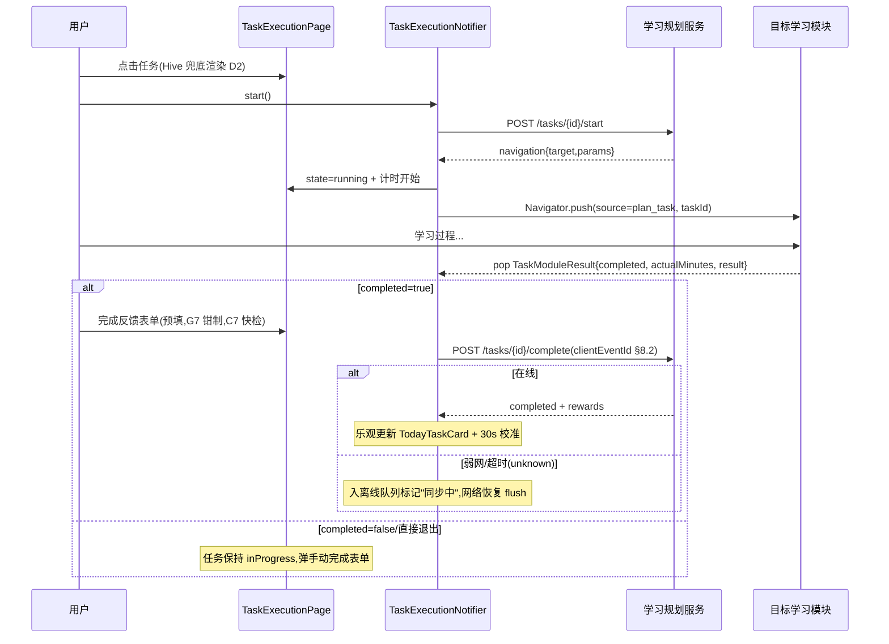
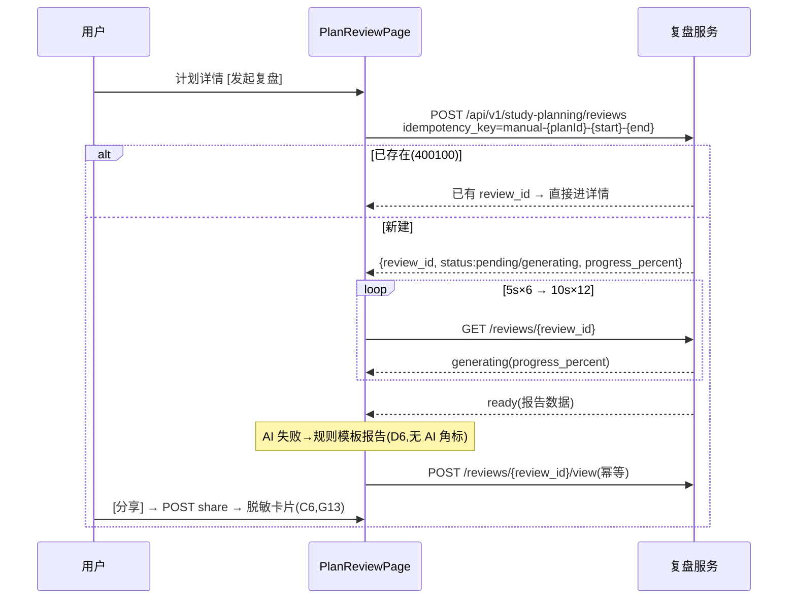
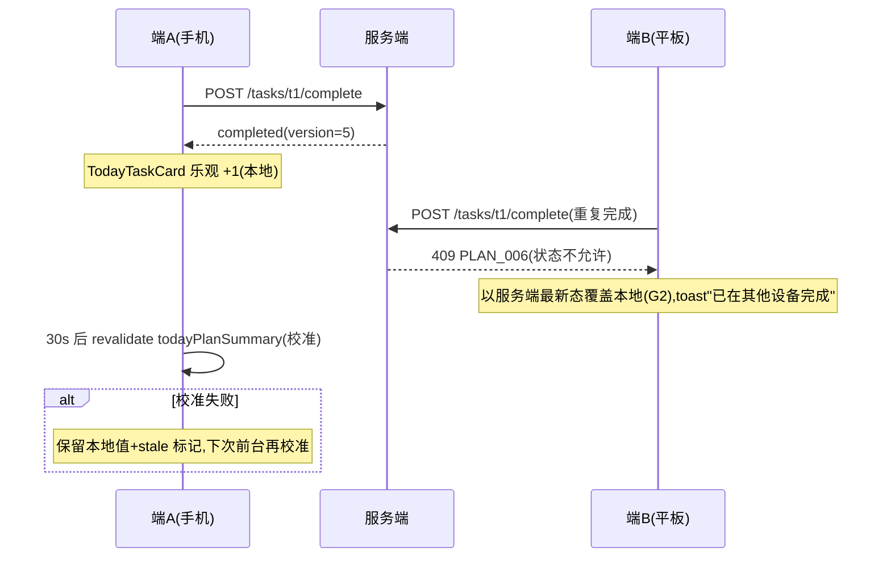

# 客户端 - 学习规划页面架构与任务管理交互设计

## 1. 文档概述

### 1.1 目的

本文档细化 PrimeTop 客户端"学习规划"模块的页面架构、任务管理交互、计划生成引导、复盘报告展示、跨模块任务跳转等客户端侧详细设计，为 Flutter 客户端开发人员提供可直接落地的编码指导。

### 1.2 范围

- 学习规划模块导航架构与页面层级
- 目标管理页面（创建/编辑/列表）
- 计划生成向导页（多步骤引导）
- 今日任务卡片与任务列表页
- 任务执行跳转与回调机制
- 计划详情与进度可视化
- 复盘报告页面与图表展示
- 提醒配置页面
- 智能调整建议展示
- 分龄 UI 差异化策略
- 离线场景适配与本地缓存
- 页面状态管理与 Riverpod Provider 设计

### 1.3 依赖

| 依赖模块 | 文档 |
| --- | --- |
| 学习规划（服务端） | `学习规划-详细设计.md` |
| 首页与学习工作台 | `首页与学习工作台-详细设计.md` |
| 客户端架构与前端框架 | `客户端架构与前端框架-详细设计.md` |
| 客户端状态管理架构 | `客户端状态管理架构-详细设计.md` |
| 客户端路由与深链接 | `客户端路由与深链接系统-详细设计.md` |
| 分龄UI适配 | `分龄UI适配与交互设计规范-详细设计.md` |
| 客户端本地持久层 | `客户端本地持久层与数据管理-详细设计.md` |
| 客户端页面状态模式 | `客户端页面状态模式与骨架屏加载空态错误态设计规范-详细设计.md` |
| 客户端通用列表组件 | `客户端通用列表组件与分页加载引擎-详细设计.md` |
| 学习数据可视化 | `学习数据可视化与图表渲染引擎-详细设计.md` |
| 学习计时器与番茄钟 | `学习计时器与番茄钟专注模式-详细设计.md` |
| 间隔重复算法 | `间隔重复算法与遗忘曲线复习调度引擎-详细设计.md` |

---

## 2. 页面架构总览

### 2.1 页面层级

```
学习规划 Tab（底部导航入口）
├── 规划首页 (PlanningHomePage)
│   ├── 今日任务卡片 (TodayTaskCard) ─── 首页聚合API内嵌
│   ├── 当前活跃计划概览 (ActivePlanSummary)
│   ├── 目标进度卡片 (GoalProgressCard)
│   ├── 快捷操作栏 (QuickActions)
│   └── 最近复盘摘要 (RecentReviewSummary)
│
├── 目标管理页 (GoalListPage)
│   ├── 活跃目标列表
│   ├── 已完成/已放弃目标（折叠）
│   └── 创建目标按钮 → GoalCreationSheet
│
├── 目标创建/编辑 (GoalCreationSheet / BottomSheet)
│   ├── 目标名称输入
│   ├── 目标类型选择（daily/weekly/exam/semester）
│   ├── 学科选择
│   ├── 目标日期选择
│   ├── 当前水平 / 目标水平
│   └── 保存按钮
│
├── 计划生成向导 (PlanGenerationWizard) ─── 3步流程
│   ├── Step1: 目标选择
│   ├── Step2: 参数配置（每日时长/难度/偏好学科）
│   ├── Step3: AI 生成中 + 预览确认
│   └── 确认激活
│
├── 计划详情页 (PlanDetailPage)
│   ├── 计划头部信息卡（标题/进度/日期范围）
│   ├── 日历视图 (PlanCalendarView)
│   ├── 任务列表（按日期分组）
│   ├── 智能调整建议横幅
│   └── 底部操作栏（暂停/调整/取消）
│
├── 任务执行页 (TaskExecutionPage)
│   ├── 任务信息头部
│   ├── 任务类型引导区（跳转目标模块）
│   ├── 计时器组件
│   ├── 完成反馈表单
│   └── 跳过/放弃操作
│
├── 复盘报告页 (PlanReviewPage)
│   ├── 周期信息头部
│   ├── 完成率环形图
│   ├── 学习时长柱状图
│   ├── 知识点进步/退步列表
│   ├── AI 分析文本区
│   └── 下阶段建议 + 调整计划按钮
│
├── 提醒设置页 (ReminderSettingsPage)
│   ├── 提醒开关
│   ├── 提醒时间选择
│   ├── 重复规则设置
│   └── 渠道选择（App推送/家长推送）
│
└── 智能调整建议页 (AdjustmentSuggestionPage)
    ├── AI 分析摘要
    ├── 建议列表（增/删/改任务）
    ├── 每条建议的采纳/忽略操作
    └── 一键全部采纳
```

### 2.2 路由定义

```dart
// lib/routes/planning_routes.dart

class PlanningRoutes {
  /// 学习规划 Tab 首页
  static const String home = '/planning';

  /// 目标列表
  static const String goals = '/planning/goals';

  /// 计划生成向导
  /// 参数: goalId (可选，从目标页带入)
  static const String planWizard = '/planning/plan-wizard';

  /// 计划详情
  /// 参数: planId
  static const String planDetail = '/planning/plan/:planId';

  /// 任务执行
  /// 参数: taskId
  static const String taskExecution = '/planning/task/:taskId';

  /// 复盘报告
  /// 参数: planId, reviewId
  static const String review = '/planning/plan/:planId/review/:reviewId';

  /// 提醒设置
  /// 参数: planId
  static const String reminders = '/planning/plan/:planId/reminders';

  /// 智能调整建议
  /// 参数: planId
  static const String adjustments = '/planning/plan/:planId/adjustments';
}

// 深链接映射
// primetop://planning/today              → 规划首页
// primetop://planning/goal/{goalId}      → 目标详情
// primetop://planning/plan/{planId}      → 计划详情
// primetop://planning/task/{taskId}      → 任务执行
// primetop://planning/review/{reviewId}  → 复盘报告
```

### 2.3 模块导航状态机

```
                    ┌──────────────────┐
                    │  规划首页        │
                    │  PlanningHome    │
                    └───────┬──────────┘
                            │
          ┌─────────────────┼─────────────────┐
          │                 │                  │
          ▼                 ▼                  ▼
  ┌──────────────┐  ┌──────────────┐   ┌──────────────┐
  │ 目标管理     │  │ 计划生成     │   │ 今日任务     │
  │ GoalList     │  │ 向导         │   │ (首页内嵌)   │
  └──────┬───────┘  └──────┬───────┘   └──────┬───────┘
         │                 │                   │
         │ 创建目标        │ 确认激活          │ 点击任务
         ▼                 ▼                   ▼
  ┌──────────────┐  ┌──────────────┐   ┌──────────────┐
  │ GoalCreation │  │ 计划详情     │   │ 任务执行     │
  │ Sheet        │  │ PlanDetail   │◄──│ TaskExec     │
  └──────────────┘  └──────┬───────┘   └──────┬───────┘
                          │                   │
              ┌───────────┼───────┐          │ 完成回调
              │           │       │          │
              ▼           ▼       ▼          │
     ┌────────────┐ ┌────────┐ ┌────────┐   │
     │ 日历视图   │ │ 复盘   │ │ 提醒   │   │
     │ Calendar   │ │ Report │ │ Settngs│   │
     └────────────┘ └────────┘ └────────┘   │
                                             │
                     ┌───────────────────────┘
                     │ 跳转到对应学习模块
                     ▼
           ┌──────────────────┐
           │ 目标模块         │
           │ (同步课堂/错题   │
           │  /AI对话/练习等) │
           └──────────────────┘
```

---

## 3. 客户端数据模型

### 3.1 Dart 数据类

```dart
// lib/features/planning/domain/models/

/// 学习目标
class Goal {
  final String goalId;
  final String title;
  final GoalType goalType;
  final String? subjectId;
  final String? targetExam;
  final DateTime targetDate;
  final String? currentLevel;
  final String? targetLevel;
  final GoalStatus status;
  final DateTime createdAt;
  final DateTime updatedAt;

  /// 是否有活跃计划
  final bool hasActivePlan;
  /// 总体进度 0.0 ~ 1.0
  final double progress;

  const Goal({
    required this.goalId,
    required this.title,
    required this.goalType,
    this.subjectId,
    this.targetExam,
    required this.targetDate,
    this.currentLevel,
    this.targetLevel,
    required this.status,
    required this.createdAt,
    required this.updatedAt,
    this.hasActivePlan = false,
    this.progress = 0.0,
  });

  /// 距离目标日期剩余天数
  int get daysRemaining => targetDate.difference(DateTime.now()).inDays;

  /// 是否即将到期（3天内）
  bool get isUrgent => daysRemaining <= 3 && daysRemaining >= 0;
}

enum GoalType { daily, weekly, monthly, examPreparation, semester }
enum GoalStatus { active, completed, abandoned, expired }

/// 学习计划
class StudyPlan {
  final String planId;
  final String? goalId;
  final String title;
  final PlanType planType;
  final PlanStatus status;
  final DateTime startDate;
  final DateTime endDate;
  final int totalTasks;
  final int completedTasks;
  final int estimatedMinutes;
  final int actualMinutes;
  final DifficultyLevel difficultyLevel;
  final bool aiGenerated;
  final PlanMetadata? metadata;
  final DateTime createdAt;
  final DateTime updatedAt;

  /// 完成率
  double get completionRate =>
      totalTasks > 0 ? completedTasks / totalTasks : 0.0;

  /// 总进度百分比
  double get progressPercent =>
      estimatedMinutes > 0 ? actualMinutes / estimatedMinutes : 0.0;

  /// 剩余天数
  int get daysRemaining => endDate.difference(DateTime.now()).inDays;

  /// 是否有调整建议待查看
  final bool hasPendingAdjustments;

  const StudyPlan({
    required this.planId,
    this.goalId,
    required this.title,
    required this.planType,
    required this.status,
    required this.startDate,
    required this.endDate,
    this.totalTasks = 0,
    this.completedTasks = 0,
    this.estimatedMinutes = 0,
    this.actualMinutes = 0,
    this.difficultyLevel = DifficultyLevel.moderate,
    this.aiGenerated = false,
    this.metadata,
    required this.createdAt,
    required this.updatedAt,
    this.hasPendingAdjustments = false,
  });
}

enum PlanType { daily, weekly, monthly, sprint }
enum PlanStatus { draft, active, paused, completed, cancelled }
enum DifficultyLevel { easy, moderate, intensive }

class PlanMetadata {
  final List<String> subjects;
  final List<String> chapters;
  final List<String> knowledgePoints;
  final List<String> weakPoints;

  const PlanMetadata({
    this.subjects = const [],
    this.chapters = const [],
    this.knowledgePoints = const [],
    this.weakPoints = const [],
  });
}

/// 学习任务
class StudyTask {
  final String taskId;
  final String planId;
  final String title;
  final TaskType taskType;
  final String? subjectId;
  final String? chapterId;
  final List<String> knowledgePointIds;
  final String? description;
  final DateTime scheduledDate;
  final TimeOfDay? scheduledTimeStart;
  final TimeOfDay? scheduledTimeEnd;
  final int estimatedMinutes;
  final int? actualMinutes;
  final TaskStatus status;
  final TaskPriority priority;
  final String? parentTaskId;
  final int sortOrder;
  final String? aiPromptHint;
  final String? resultSummary;
  final DateTime? completedAt;
  final DateTime createdAt;

  /// 图标名称映射
  String get iconName {
    switch (taskType) {
      case TaskType.chapterStudy: return 'book_open';
      case TaskType.exercise: return 'pencil_line';
      case TaskType.mistakeReview: return 'refresh_circle';
      case TaskType.aiTutoring: return 'brain';
      case TaskType.mockTest: return 'timer';
      case TaskType.memorization: return 'text_recognition';
      case TaskType.essayPractice: return 'doc_text';
    }
  }

  /// 跳转目标路由和参数
  TaskNavigationTarget? get navigationTarget {
    switch (taskType) {
      case TaskType.chapterStudy:
        return TaskNavigationTarget(
          route: '/sync-classroom/lesson/$chapterId',
          params: {'mode': 'review'},
        );
      case TaskType.exercise:
        return TaskNavigationTarget(
          route: '/sync-classroom/practice/$chapterId',
          params: {'type': 'basic'},
        );
      case TaskType.mistakeReview:
        return TaskNavigationTarget(
          route: '/mistakes/review',
          params: {'knowledgePointIds': knowledgePointIds.join(',')},
        );
      case TaskType.aiTutoring:
        return TaskNavigationTarget(
          route: '/ai-tutor',
          params: {'prompt': aiPromptHint},
        );
      case TaskType.mockTest:
        return TaskNavigationTarget(
          route: '/exam/mock',
          params: {'subjectId': subjectId},
        );
      case TaskType.memorization:
        return TaskNavigationTarget(
          route: '/memorization',
          params: {'knowledgePointIds': knowledgePointIds.join(',')},
        );
      case TaskType.essayPractice:
        return TaskNavigationTarget(
          route: '/essay',
          params: {'subjectId': subjectId},
        );
      default:
        return null;
    }
  }

  const StudyTask({
    required this.taskId,
    required this.planId,
    required this.title,
    required this.taskType,
    this.subjectId,
    this.chapterId,
    this.knowledgePointIds = const [],
    this.description,
    required this.scheduledDate,
    this.scheduledTimeStart,
    this.scheduledTimeEnd,
    this.estimatedMinutes = 15,
    this.actualMinutes,
    required this.status,
    this.priority = TaskPriority.medium,
    this.parentTaskId,
    this.sortOrder = 0,
    this.aiPromptHint,
    this.resultSummary,
    this.completedAt,
    required this.createdAt,
  });
}

enum TaskType {
  chapterStudy,
  exercise,
  mistakeReview,
  aiTutoring,
  mockTest,
  memorization,
  essayPractice,
}

/// v1.1 修正(F2)：对齐服务端任务六态状态机（E2E §7.1），新增 paused/expired；
/// overdue 不再作为持久化状态，改为展示派生态 isOverdueDisplay（见 §7.1 映射表）
enum TaskStatus { pending, inProgress, paused, completed, skipped, expired }

/// 展示派生态扩展（StudyTask 成员，v1.1 增补 F2）：
/// scheduledDate 早于今日且未进入终态时，任务行以 overdue 样式渲染
extension TaskOverdueDisplay on StudyTask {
  bool get isOverdueDisplay {
    final terminal = status == TaskStatus.completed ||
        status == TaskStatus.skipped ||
        status == TaskStatus.expired;
    if (terminal) return status == TaskStatus.expired; // 服务端定时标记
    final today = DateTime.now();
    final d = DateTime(scheduledDate.year, scheduledDate.month, scheduledDate.day);
    final t = DateTime(today.year, today.month, today.day);
    return d.isBefore(t);
  }
}
enum TaskPriority { high, medium, low }

/// 任务跳转目标
class TaskNavigationTarget {
  final String route;
  final Map<String, String> params;
  const TaskNavigationTarget({required this.route, this.params = const {}});
}

/// 今日任务聚合
class TodayPlanSummary {
  final DateTime date;
  final List<PlanWithTasks> plans;
  final int totalTasks;
  final int completedTasks;
  final int totalEstimatedMinutes;
  final int completedMinutes;

  const TodayPlanSummary({
    required this.date,
    required this.plans,
    this.totalTasks = 0,
    this.completedTasks = 0,
    this.totalEstimatedMinutes = 0,
    this.completedMinutes = 0,
  });

  double get overallProgress =>
      totalTasks > 0 ? completedTasks / totalTasks : 0.0;
}

/// 计划 + 其下今日任务
class PlanWithTasks {
  final StudyPlan plan;
  final List<StudyTask> todayTasks;

  const PlanWithTasks({required this.plan, this.todayTasks = const []});
}

/// 复盘报告
class PlanReview {
  final String reviewId;
  final String planId;
  final ReviewType reviewType;
  final DateTime periodStart;
  final DateTime periodEnd;
  final ReviewMetrics metrics;
  final String? aiAnalysis;
  final List<String> suggestions;
  final DateTime createdAt;

  const PlanReview({
    required this.reviewId,
    required this.planId,
    required this.reviewType,
    required this.periodStart,
    required this.periodEnd,
    required this.metrics,
    this.aiAnalysis,
    this.suggestions = const [],
    required this.createdAt,
  });
}

enum ReviewType { daily, weekly, milestone, planCompletion }

class ReviewMetrics {
  final int totalTasks;
  final int completedTasks;
  final double completionRate;
  final int totalStudyMinutes;
  final double? averageAccuracy;
  final List<KnowledgePointChange> improved;
  final List<KnowledgePointChange> persistent;
  final List<KnowledgePointChange> newWeakPoints;

  const ReviewMetrics({
    this.totalTasks = 0,
    this.completedTasks = 0,
    this.completionRate = 0.0,
    this.totalStudyMinutes = 0,
    this.averageAccuracy,
    this.improved = const [],
    this.persistent = const [],
    this.newWeakPoints = const [],
  });
}

class KnowledgePointChange {
  final String name;
  final double before;
  final double after;

  /// 变化量（正数=进步，负数=退步）
  double get delta => after - before;

  const KnowledgePointChange({
    required this.name,
    required this.before,
    required this.after,
  });
}

/// 调整建议
class AdjustmentSuggestion {
  final String suggestionId;
  final String analysis;
  final List<AdjustmentAction> actions;
  final bool accepted;

  const AdjustmentSuggestion({
    required this.suggestionId,
    required this.analysis,
    required this.actions,
    this.accepted = false,
  });
}

enum AdjustmentActionType { addTask, removeTask, rescheduleTask }

class AdjustmentAction {
  final AdjustmentActionType type;
  final String? taskId;
  final StudyTask? newTask;
  final DateTime? newDate;
  final String reason;

  const AdjustmentAction({
    required this.type,
    this.taskId,
    this.newTask,
    this.newDate,
    required this.reason,
  });
}

/// 提醒配置
class ReminderConfig {
  final String reminderId;
  final String? planId;
  final ReminderType reminderType;
  final bool enabled;
  final TimeOfDay? reminderTime;
  final RepeatRule repeatRule;
  final List<int> customDays; // 1=周一 ... 7=周日
  final ReminderChannel channel;

  const ReminderConfig({
    required this.reminderId,
    this.planId,
    required this.reminderType,
    this.enabled = true,
    this.reminderTime,
    this.repeatRule = RepeatRule.once,
    this.customDays = const [],
    this.channel = ReminderChannel.appPush,
  });
}

enum ReminderType { taskStart, taskDue, dailyReview, weeklySummary, parentReport }
enum RepeatRule { once, daily, weekly, custom }
enum ReminderChannel { appPush, sms, parentPush }
```

### 3.2 Hive 本地缓存模型

```dart
// lib/features/planning/data/local/

@HiveType(typeId: 42)
class GoalHive extends HiveObject {
  @HiveField(0) late String goalId;
  @HiveField(1) late String title;
  @HiveField(2) late int goalTypeIndex;
  @HiveField(3) String? subjectId;
  @HiveField(4) String? targetExam;
  @HiveField(5) late DateTime targetDate;
  @HiveField(6) String? currentLevel;
  @HiveField(7) String? targetLevel;
  @HiveField(8) late int statusIndex;
  @HiveField(9) late bool hasActivePlan;
  @HiveField(10) late double progress;
  @HiveField(11) late DateTime cachedAt;
}

@HiveType(typeId: 43)
class StudyPlanHive extends HiveObject {
  @HiveField(0) late String planId;
  @HiveField(1) String? goalId;
  @HiveField(2) late String title;
  @HiveField(3) late int planTypeIndex;
  @HiveField(4) late int statusIndex;
  @HiveField(5) late DateTime startDate;
  @HiveField(6) late DateTime endDate;
  @HiveField(7) late int totalTasks;
  @HiveField(8) late int completedTasks;
  @HiveField(9) late int estimatedMinutes;
  @HiveField(10) late int actualMinutes;
  @HiveField(11) late bool hasPendingAdjustments;
  @HiveField(12) late DateTime cachedAt;
}

@HiveType(typeId: 44)
class StudyTaskHive extends HiveObject {
  @HiveField(0) late String taskId;
  @HiveField(1) late String planId;
  @HiveField(2) late String title;
  @HiveField(3) late int taskTypeIndex;
  @HiveField(4) String? subjectId;
  @HiveField(5) String? chapterId;
  @HiveField(6) late DateTime scheduledDate;
  @HiveField(7) late int estimatedMinutes;
  @HiveField(8) int? actualMinutes;
  @HiveField(9) late int statusIndex;
  @HiveField(10) late int priorityIndex;
  @HiveField(11) late int sortOrder;
  @HiveField(12) String? aiPromptHint;
  @HiveField(13) String? resultSummary;
  // v1.1 增补(F4)：离线跳转目标模块所需参数与服务端下发 deeplink
  @HiveField(15) List<String> knowledgePointIds = const [];
  @HiveField(16) String? deeplink;
  @HiveField(14) late DateTime cachedAt;
}
```

---

## 4. Riverpod Provider 设计

### 4.1 Provider 总览

```dart
// lib/features/planning/providers/planning_providers.dart

/// ── API Client ──────────────────────────────────────
@riverpod
PlanningApiClient planningApiClient(Ref ref) =>
    PlanningApiClient(ref.watch(dioProvider));

/// ── 今日任务聚合 ──────────────────────────────────────
@riverpod
Future<TodayPlanSummary> todayPlanSummary(Ref ref) {
  final api = ref.watch(planningApiClientProvider);
  return api.getTodayPlan();
}

/// ── 目标列表 ──────────────────────────────────────────
@riverpod
Future<List<Goal>> activeGoals(Ref ref) {
  final api = ref.watch(planningApiClientProvider);
  return api.getGoals(status: GoalStatus.active);
}

@riverpod
Future<List<Goal>> allGoals(Ref ref) {
  final api = ref.watch(planningApiClientProvider);
  return api.getGoals();
}

/// ── 活跃计划列表 ──────────────────────────────────────
@riverpod
Future<List<StudyPlan>> activePlans(Ref ref) {
  final api = ref.watch(planningApiClientProvider);
  return api.getPlans(status: PlanStatus.active);
}

/// ── 计划详情（含任务列表） ──────────────────────────────
@riverpod
Future<PlanDetailState> planDetail(Ref ref, String planId) {
  final api = ref.watch(planningApiClientProvider);
  return api.getPlanDetail(planId);
}

/// ── 计划中指定日期的任务列表 ───────────────────────────
@riverpod
Future<List<StudyTask>> planTasksByDate(Ref ref, PlanDateParams params) {
  final api = ref.watch(planningApiClientProvider);
  return api.getPlanTasks(
    planId: params.planId,
    scheduledDate: params.date,
  );
}

/// ── 任务详情 ──────────────────────────────────────────
@riverpod
Future<StudyTask> taskDetail(Ref ref, String taskId) {
  final api = ref.watch(planningApiClientProvider);
  return api.getTask(taskId);
}

/// ── 复盘报告 ──────────────────────────────────────────
@riverpod
Future<PlanReview> planReview(Ref ref, String planId, String reviewId) {
  final api = ref.watch(planningApiClientProvider);
  return api.getReview(planId, reviewId);
}

/// ── 调整建议 ──────────────────────────────────────────
@riverpod
Future<AdjustmentSuggestion> adjustmentSuggestions(Ref ref, String planId) {
  final api = ref.watch(planningApiClientProvider);
  return api.getAdjustmentSuggestions(planId);
}

/// ── 提醒配置列表 ──────────────────────────────────────
@riverpod
Future<List<ReminderConfig>> planReminders(Ref ref, String planId) {
  final api = ref.watch(planningApiClientProvider);
  return api.getReminders(planId: planId);
}

/// ── 计划生成状态 ──────────────────────────────────────
@riverpod
class PlanGenerationNotifier extends _$PlanGenerationNotifier {
  @override
  PlanGenerationState build() => const PlanGenerationState.idle();

  Future<void> generate(PlanGenerationInput input) async {
    state = const PlanGenerationState.generating();
    try {
      final api = ref.read(planningApiClientProvider);
      final plan = await api.generatePlan(input);
      state = PlanGenerationState.preview(plan);
    } on ApiException catch (e) {
      state = PlanGenerationState.error(e.message);
    }
  }

  Future<void> confirm(String planId) async {
    final api = ref.read(planningApiClientProvider);
    await api.activatePlan(planId);
    state = const PlanGenerationState.completed();
    // 刷新活跃计划列表
    ref.invalidate(activePlansProvider);
    ref.invalidate(todayPlanSummaryProvider);
  }
}

/// 计划生成状态
sealed class PlanGenerationState {
  const PlanGenerationState();
  factory PlanGenerationState.idle() = _Idle;
  factory PlanGenerationState.generating() = _Generating;
  factory PlanGenerationState.preview(StudyPlan plan) = _Preview;
  factory PlanGenerationState.completed() = _Completed;
  factory PlanGenerationState.error(String message) = _Error;
}

/// ── 任务执行状态 ──────────────────────────────────────
@riverpod
class TaskExecutionNotifier extends _$TaskExecutionNotifier {
  @override
  TaskExecutionState build(String taskId) =>
      const TaskExecutionState.initial();

  Future<void> start() async {
    try {
      final api = ref.read(planningApiClientProvider);
      final result = await api.startTask(taskId);
      state = TaskExecutionState.running(
        startedAt: DateTime.now(),
        navigationTarget: result.navigation,
      );
    } on ApiException catch (e) {
      state = TaskExecutionState.error(e.message);
    }
  }

  Future<void> complete({
    required int actualMinutes,
    String? resultSummary,
    String? feedback,
  }) async {
    final api = ref.read(planningApiClientProvider);
    await api.completeTask(
      taskId,
      actualMinutes: actualMinutes,
      resultSummary: resultSummary,
      feedback: feedback,
    );
    state = const TaskExecutionState.completed();
    // 刷新相关数据
    ref.invalidate(todayPlanSummaryProvider);
    ref.invalidate(activePlansProvider);
  }

  Future<void> skip({String? reason, DateTime? rescheduleDate}) async {
    final api = ref.read(planningApiClientProvider);
    await api.skipTask(taskId, reason: reason, rescheduleDate: rescheduleDate);
    state = const TaskExecutionState.skipped();
    ref.invalidate(todayPlanSummaryProvider);
  }
}

sealed class TaskExecutionState {
  const TaskExecutionState();
  factory TaskExecutionState.initial() = _Initial;
  factory TaskExecutionState.running({
    required DateTime startedAt,
    TaskNavigationTarget? navigationTarget,
  }) = _Running;
  factory TaskExecutionState.completed() = _Completed;
  factory TaskExecutionState.skipped() = _Skipped;
  factory TaskExecutionState.error(String message) = _Error;
}
```

### 4.2 Provider 依赖图

```
planningApiClient
    │
    ├── todayPlanSummary  ◄──── 首页 TodayTaskCard 依赖
    │
    ├── activeGoals       ◄──── 规划首页 GoalProgressCard
    │
    ├── activePlans       ◄──── 规划首页 ActivePlanSummary
    │
    ├── planDetail(id)    ◄──── 计划详情页
    │   └── planTasksByDate(planId, date)
    │
    ├── taskDetail(id)    ◄──── 任务执行页
    │
    ├── planGeneration    ◄──── 计划生成向导（Notifer，有状态）
    │   ├── [invalidate] → activePlans, todayPlanSummary
    │
    ├── taskExecution(id) ◄──── 任务执行（Notifier，有状态）
    │   ├── [invalidate] → todayPlanSummary, activePlans
    │
    ├── planReview        ◄──── 复盘报告页
    ├── adjustmentSuggestions ◄─ 智能调整页
    └── planReminders     ◄──── 提醒设置页
```

---

## 5. 核心页面详细设计

### 5.1 规划首页（PlanningHomePage）

#### 5.1.1 页面布局

```
┌─────────────────────────────────────┐
│  AppBar: 学习规划                    │
├─────────────────────────────────────┤
│                                      │
│  ┌─ TodayTaskCard ────────────────┐  │
│  │  📋 今日任务          3/5 ✅   │  │
│  │  ───────────────────────────── │  │
│  │  ✅ 复习：一元二次方程  25min  │  │
│  │  ✅ 错题复习：方程    18min   │  │
│  │  ✅ 练习：二次函数    30min   │  │
│  │  ⬜ 背诵：《赤壁赋》  15min   │  │
│  │  ⬜ AI辅导：二次函数  20min   │  │
│  │  ───────────────────────────── │  │
│  │  已学 73 / 108 分钟           │  │
│  │  ████████████░░░░░░░  67%     │  │
│  │                  [查看全部 →]  │  │
│  └───────────────────────────────┘  │
│                                      │
│  ┌─ ActivePlanSummary ────────────┐  │
│  │  📅 第21周学习计划             │  │
│  │  5/19 - 5/25 · 数学+物理      │  │
│  │  完成率 42% ████████░░░░       │  │
│  │                   [进入计划 →]  │  │
│  └───────────────────────────────┘  │
│                                      │
│  ┌─ GoalProgressCard ─────────────┐  │
│  │  🎯 期末考试数学90+            │  │
│  │  距截止还剩 43 天             │  │
│  │  进度 35% ███████░░░░░░░       │  │
│  │  ⚠️ 二次函数掌握度偏低         │  │
│  │               [查看目标 →]     │  │
│  └───────────────────────────────┘  │
│                                      │
│  ┌─ QuickActions ─────────────────┐  │
│  │  [+ 新目标]  [📝 生成计划]    │  │
│  └───────────────────────────────┘  │
│                                      │
│  ┌─ RecentReviewSummary ──────────┐  │
│  │  📊 上周复盘 · 完成率 68%      │  │
│  │  ⬆ 数学 +4.2%  ⬇ 物理 -1.8%  │  │
│  │                [查看复盘 →]    │  │
│  └───────────────────────────────┘  │
│                                      │
└─────────────────────────────────────┘
```

**交互规则矩阵：**

| 区域 | 交互行为 | 数据 Provider | 空态/降级 |
| --- | --- | --- | --- |
| TodayTaskCard 单条任务行 | 点击 → `taskExecution/:taskId`（overdue 行亦可进入） | todayPlanSummary | 无任务时卡片显示“今天还没有学习任务”引导文案，CTA → 计划生成向导 |
| TodayTaskCard [查看全部] | 展开 `TodayTaskFullSheet`（按计划分组的全量列表，复用通用列表组件规范） | todayPlanSummary | — |
| ActivePlanSummary | 点击 → `planDetail/:planId` | activePlans | 无活跃计划：卡片替换为引导卡（“生成你的第一份计划”） |
| GoalProgressCard | 点击 → `goals` 列表页并定位该目标卡片高亮 1.2s（F1 裁决：深链接 `planning/goal/{goalId}` 同口径） | activeGoals | 无目标：替换为新目标引导卡 |
| ⚠️ 掌握度警示行 | 跳转 `/analytics/kp/:kpId` 学情知识点详情；幼儿与小学低年级不渲染该行（C3 反焦虑红线） | goal progress 聚合接口（F6 裁决，不直连掌握度引擎） | 掌握度数据缺失时整行隐藏（D10） |
| QuickActions [+ 新目标] | 弹出 GoalCreationSheet | — | — |
| QuickActions [📝 生成计划] | 进入 planWizard | — | — |
| RecentReviewSummary | 进入 `review/:planId/:reviewId`（reviewId 取服务端最近一条） | planReview 缓存 + 服务端 | 无复盘记录：卡片整体隐藏（不占位） |

#### 5.1.2 页面状态与刷新策略

| 状态 | 表现 | 触发 |
| --- | --- | --- |
| Loading（首次） | TodayTaskCard + ActivePlanSummary 双卡骨架屏 | 无 Hive 缓存 |
| Content（缓存） | 立即渲染缓存 + 顶部细进度条静默刷新（SWR） | Hive 缓存 5min TTL 内直出，超时后台刷新 |
| Error | 错误态插画 + [重试]；有缓存时走 D1：展示缓存 + 顶部“内容更新于 X 分钟前”横幅 | 网络失败/5xx |
| Empty（目标与计划双空） | 新手引导插画 + [创建第一个目标]/[AI 生成学习计划] 双 CTA | activeGoals 与 activePlans 均空 |

- 刷新触发：下拉刷新（强制 revalidate）；`EventBus.taskCompleted` 乐观更新 TodayTaskCard（完成数 +1、进度条动画）并在 30s 后服务端校准（对齐首页工作台跨模块联动协议，防乐观值漂移）。
- 学段切换 / 教材版本变更事件：`ref.invalidate` 全部 planning Provider 并清今日任务缓存（G11）。

#### 5.1.3 TodayTaskFullSheet

- 按计划分组的 SliverList；每组头部为 ActivePlanSummary 迷你条；任务行复用 `TaskListTile`（§5.4.3）。
- 顶部日期切换仅支持今日/昨日（昨日只读）；不支持查看未来任务（任务生成以日为粒度，防提前焦虑与刷进度）。
- 作用域标注“计划任务”：多源任务（作业/系统推荐）归统一任务调度引擎队列，本 Sheet 仅计划维度（R2）。

### 5.2 目标管理页（GoalListPage）

#### 5.2.1 列表结构

- 活跃目标（active）：卡片列表，每卡展示 标题 / 类型标签 / 学科 / 截止倒计时（`daysRemaining`，isUrgent 时红色） / 进度条 / 关联计划入口。
- 已完成 & 已放弃：折叠分组（默认收起），仅标题 + 终态日期。
- 右下角 FAB [+ 新目标]。

#### 5.2.2 GoalCreationSheet 表单与校验

| 字段 | 控件 | 校验规则 | 说明 |
| --- | --- | --- | --- |
| 目标名称 | TextField | 1-30 字，本地敏感词快检（C7） | 幼儿段由家长代填 |
| 目标类型 | ChoiceChip | 必选 | daily/weekly/monthly/examPreparation/semester |
| 学科 | 底部选择器 | examPreparation/semester 必选；daily 可空 | 数据源学科基础数据缓存 |
| 目标日期 | DatePicker | ≥ 明天 且 ≤ 365 天后（PLAN_010 前置校验） | examPreparation 自动带出考试日历 |
| 当前/目标水平 | 滑块或文本 | 选填 | 如“数学 75 → 90” |

- 数量上限：同类型+同学科最多 5 个（服务端 PLAN_008；客户端打开表单时预检，超限禁用提交 + 引导清理旧目标）。
- 提交成功：`ref.invalidate(activeGoalsProvider)`，Sheet 关闭，列表乐观插入（标记 `optimistic=true`，失败回滚并 toast）。

#### 5.2.3 目标编辑与删除

- 编辑：点击卡片 → GoalDetailSheet（进度 + 关联计划 + 编辑入口），编辑复用 CreationSheet 预填。
- 删除：二次确认 Dialog 列出影响面（关联活跃计划将一并取消，历史任务与复盘保留）；删除为服务端软删除，客户端立即移出 active 列表。
- 终态目标（completed/abandoned）只读渲染，操作入口隐藏（PLAN_002 映射）。

#### 5.2.4 目标进度展示（F1/F6 裁决承载）

- 进度数据唯一入口 `GET /api/v1/study-planning/goals/{goal_id}/progress`（服务端聚合任务完成度与知识点掌握度变化），客户端不直连掌握度融合引擎（R5）。
- 深链接 `primetop://planning/goal/{goalId}`：路由至 GoalListPage 并滚动定位该目标卡片（1.2s 高亮动效）；目标不存在/无权限（PLAN_001）时展示通用“内容不存在”页。

### 5.3 计划生成向导（PlanGenerationWizard）

#### 5.3.1 Step1 目标选择

- 列出 active 目标（含 progress 快照）；支持 [跳过，直接生成周期计划]（goalId 传 null，服务端按当前学段/学科默认编排）。
- 选中目标后展示其元信息（截止日期、薄弱点摘要——来自 progress 接口）。

#### 5.3.2 Step2 参数配置

| 参数 | 控件 | 约束 |
| --- | --- | --- |
| 计划类型 | ChoiceChip | weekly/monthly/sprint（考前冲刺） |
| 日期范围 | 区间选择 | 默认对齐目标截止；与已有活跃计划重叠时前端预检提示（服务端 PLAN_004 兑底） |
| 每日投入时长 | Slider 15-120min 步长 5 | 上限按防沉迷分龄档硬钳制：幼儿 40 / 小学 60 / 初中 90 / 高中 120（G6 红线：滑块最大值直接钳制而非提交时报错） |
| 难度 | 三档 Segmented | easy/moderate/intensive |
| 偏好学科 | 多选 Chips | ≤3 个；提示“偏好学科将获得更多练习占比” |

#### 5.3.3 Step3 生成中与预览

- 生成请求 `POST /plans/generate` 携带 `Idempotency-Key: wizard-{goalId}-{dateRange}-{paramsHash}`（G8，防重复提交产生多份草稿）。
- 生成中态：动效插画 + 文案“AI 正在根据你的学情编排计划…”；超时阈值 30s；失败提供 [重试] 与 [用标准模板生成] 双选项（后者请求 `generate?mode=template`，产物 `aiGenerated=false`，预览页打“标准模板”标签，D3）。
- PLAN_009（AI 降级模板）：不报错，正常进入预览，但展示“本次为标准模板计划（AI 暂不可用）”提示条。
- 预览页：周历缩略图 + 任务类型分布（图标统计条）+ 每日预计时长曲线；操作 [确认激活] / [重新生成] / [放弃]。

#### 5.3.4 确认激活

- `POST /plans/{plan_id}/activate`（F5 修正）：成功 → state=completed → 跳转 planDetail（success toast + 新手引导气泡）；失败（PLAN_004 等）→ 回到 preview 态并 toast 错误，state 不得停在 completed（G3）。
- 激活成功后 invalidate：activePlans / todayPlanSummary / allGoals（hasActivePlan 变化）。

## 5.4 计划详情页（PlanDetailPage）

### 5.4.1 页面布局

```
┌─────────────────────────────────────┐
│  ◀ AppBar: 第21周学习计划   ⋯       │
├─────────────────────────────────────┤
│  ┌─ PlanHeaderCard ───────────────┐  │
│  │  📅 第21周学习计划  [AI生成]   │  │
│  │  5/19 - 5/25 · weekly · 数学   │  │
│  │  任务 12/28 · 时长 210/480min  │  │
│  │  ████████████░░░░░░░  43%     │  │
│  └───────────────────────────────┘  │
│                                      │
│  ┌─ SmartAdjustBanner ───────────┐  │
│  │  💡 AI 建议调整本周计划 (2)     │  │
│  │  前半周完成率偏低，建议顺延…   │  │
│  │              [查看建议] [×]    │  │
│  └───────────────────────────────┘  │
│                                      │
│  ┌─ PlanCalendarView ────────────┐  │
│  │  ◀      2026年5月       ▶    │  │
│  │  一  二  三  四  五  六  日   │  │
│  │  ●   ●●  ●   ●●● ●●  ●   ●●● │  │
│  │      [19][20][21][22][23]...  │  │
│  └───────────────────────────────┘  │
│                                      │
│  ┌─ 按日期任务分组列表 ───────────┐  │
│  │  ── 5月21日 · 4任务 2完成 ──  │  │
│  │  TaskListTile ×N               │  │
│  │  ── 5月22日 · 3任务 0完成 ──  │  │
│  │  TaskListTile ×N               │  │
│  └───────────────────────────────┘  │
│                                      │
├─────────────────────────────────────┤
│  [⏸ 暂停]   [⚙ 调整]   [🗑 取消]    │
└─────────────────────────────────────┘
```

**头部信息卡：**

| 元素 | 数据来源 | 说明 |
| --- | --- | --- |
| 标题 + [AI生成]/[标准模板] 标签 | StudyPlan.title / aiGenerated | PLAN_009 模板产物统一打"标准模板"标签（§5.3.3） |
| 日期范围 + 类型 + 学科 | startDate/endDate/planType/metadata.subjects | sprint 类型追加 🔥 冲刺角标 |
| 任务完成数 / 时长数 | totalTasks/completedTasks/estimatedMinutes/actualMinutes | 双指标避免单一"完成率"施压感（C3 分龄弱化，幼儿段仅展示任务数） |
| 进度条 | completionRate | paused 态变灰并显示"已暂停"文案 |

### 5.4.2 日历视图（PlanCalendarView）

- 月历横向可切月，选中日期加载 `planTasksByDate(planId, date)`；当日高亮圈；计划起止范围外日期置灰不可选。
- 每日格底部任务负载点：● 数量 = 当日任务数（≤3 个点 + 数字角标）；完成日点色变绿； overdue 日橙色。
- 日负载色阶（4 档热力）仅初中及以上学段渲染，幼儿/小学低年级仅圆点（信息负载分龄，对齐《分龄UI适配》）。
- 低端设备（Tier C）关闭热力色阶与切换动画，只保留圆点（D9 同源裁决）。

### 5.4.3 任务列表与 TaskListTile（通用组件）

TaskListTile 为本模块唯一样式权威，TodayTaskCard / TodayTaskFullSheet / 计划详情列表三处复用：

```
┌──────────────────────────────────────────────┐
│ [状态图标] 复习：一元二次方程求根公式          │
│            📖 章节 · 预计25min · 🔴高优先级   │
│                            [继续 →]          │
└──────────────────────────────────────────────┘
```

| 状态 | 左侧图标 | 行为 |
| --- | --- | --- |
| pending | ⬜ | 点击 → taskExecution 页 |
| inProgress | 🔄 蓝色 | 点击 → taskExecution（继续）；trailing [继续 →] |
| paused | ⏸ 灰蓝 | 点击 → taskExecution（恢复确认后 resume） |
| completed | ✅ 绿 | 行置灰 60% 透明，点击展开 resultSummary 详情弹层（只读） |
| skipped | ⏭️ 灰 | 置灰；显示跳过原因标签 |
| expired / overdue 派生 | ⚠️ 橙 | 当日 24:00 前仍可点击执行（G9）；跨日只读 |

- 优先级标签仅 high 渲染 🔴，medium/low 不渲染（降噪）。
- 时间窗任务（scheduledTimeStart 非空）在标题右侧显示 `18:00-18:30` 灰字。
- 分组头：`日期 · N任务 M完成`；跨日滚动时吸顶。
- 操作反馈：PLAN_005（任务不属于当前用户，多见于账号切换后缓存残留）→ toast + 整页强制 revalidate（G11 同源清理）；PLAN_006（状态不允许）→ 以服务端最新状态覆盖本地渲染（G2）。

### 5.4.4 底部操作栏

| 操作 | 端点 | 交互与守卫 |
| --- | --- | --- |
| ⏸ 暂停 / ▶️ 恢复 | `POST /plans/{plan_id}/pause` / `resume` | 二次确认 Dialog 说明影响（今日任务聚合剔除该计划任务）；成功后 invalidate activePlans/todayPlanSummary/planDetail；paused 态下日历与任务行进入只读（G4） |
| ⚙ 调整 | `POST /plans/{plan_id}/adjust` | 打开调整表单（日期范围/每日时长/难度/偏好学科，预填当前值）；每日时长 slider 同 G6 分龄钳制；提交后若 AI 需重排任务展示"重排中"横幅，完成后 hasPendingAdjustments 可能置 true |
| 🗑 取消 | `POST /plans/{plan_id}/cancel` | 双重确认：第一层列出影响面（未完成任务 N 个将过期、关联目标失去活跃计划、历史完成记录与复盘保留）；第二层输入计划标题前 4 字确认（防误触，对齐全局防误触规范）；cancelled 后跳回规划首页 |
| 已完成计划 | — | 操作栏替换为 [查看复盘] + [再次生成同类计划]（携带 metadata 预填向导 Step2） |

### 5.4.5 智能调整建议横幅（SmartAdjustBanner）

- 触发：`planDetail.hasPendingAdjustments == true` 时头部卡下方渲染；同一建议 dismissed 后 7 天内不再出现（本地记录 suggestionId+dismissedAt）。
- 文案取 analysis 截断 40 字 + [查看建议] 进入 §5.8；[×] 本轮隐藏（不等于服务端 dismiss）。
- 红线：横幅为非阻断式，不得使用全屏弹窗/强提醒打断正在执行的任务（对齐统一学习干预编排频控原则，R7 边界）。
- PLAN_007（建议不存在或已过期）：横幅点击后 404 → 横幅本地清除 + revalidate planDetail。

---

## 5.5 任务执行页（TaskExecutionPage）

### 5.5.1 页面结构与进入流程

```
┌─────────────────────────────────────┐
│  ◀ 返回          任务执行            │
├─────────────────────────────────────┤
│  ┌─ 任务信息头 ───────────────────┐  │
│  │  📖 复习：一元二次方程求根公式  │  │
│  │  章节：八下·第3章 · 🔴高优先级 │  │
│  │  预计 25 min · 来自第21周计划  │  │
│  └───────────────────────────────┘  │
│                                      │
│  ┌─ 说明区（可折叠）──────────────┐  │
│  │  知识点：一元二次方程·求根公式 │  │
│  │  任务说明：复习课本例题…       │  │
│  └───────────────────────────────┘  │
│                                      │
│  ┌─ 计时器区（开始后显示）────────┐  │
│  │        12:36  ⏸              │  │
│  │   （本任务已进行 12 分 36 秒） │  │
│  └───────────────────────────────┘  │
│                                      │
│        [ 🚀 开始学习 ]               │
│  [ ⏭ 跳过此任务 ]                   │
├─────────────────────────────────────┤
│  进入学习后本页保持，返回时承接结果  │
└─────────────────────────────────────┘
```

进入即加载 `taskDetail(taskId)`（Hive 兜底渲染 D2）；overdue 任务头部追加橙色提示条"该任务已过期，今日 24:00 前完成仍有效"（G9）。

### 5.5.2 跨模块跳转与结果回调协议

**开始流程**（对齐 E2E §7.3）：

1. 点击 [开始学习] → `POST /tasks/{task_id}/start` → 返回 `navigation{target, params}`（服务端权威）。
2. 路由解析优先级：服务端 `navigation` → 任务 `deeplink` 字段（F4）→ 客户端 `navigationTarget` 本地映射兜底（离线态）。
3. `Navigator.push` 携带 `source: 'plan_task', taskId`；本页保持挂起（不销毁），等待目标模块 `pop` 返回 `TaskModuleResult`。
4. deeplink 失效（目标章节已删除/模块下线）→ 路由异常捕获 → 兜底跳转 AI 对话页并注入 `aiPromptHint`（G10/D7），toast "原学习内容不可用，已为你打开 AI 辅导"。

**结果回调契约（TaskModuleResult）：**

```dart
/// 各目标模块返回给任务执行页的统一结果契约
class TaskModuleResult {
  final bool completed;          // 用户是否完成学习闭环
  final int? actualMinutes;      // 模块统计的实际学习分钟（权威，见 R10）
  final String? resultSummary;   // 模块生成的摘要
  final Map<String, dynamic>? result; // 类型相关载荷（见下表）
}
```

| 任务类型 | result 载荷 | 摘要来源 |
| --- | --- | --- |
| chapterStudy | `{blockCompleted: int, progress: double}` | 课时学习页块完成回调 |
| exercise | `{practiceSessionId, accuracy, questionsTotal, questionsCorrect}` | 练习测评会话结算 |
| mistakeReview | `{reviewIds, completedCount, accuracy}` | 错题复习结算 |
| aiTutoring | `{conversationId, messageCount}` | AI 对话退出 |
| mockTest | `{mockExamId, score}` | 考试模拟提交 |
| memorization | `{sessionId, passRate}` | 背诵检测结算 |
| essayPractice | `{essayId, submitted}` | 作文提交/暂存 |

- 目标模块未返回结果（用户直接退出）→ 回到本页弹出完成确认表单（§5.5.4），时长取计时器值，由用户手动确认——**不自动标记完成**（G2 完成事实以用户确认为准）。
- 目标模块返回 `completed=false` → 停留本页，任务保持 inProgress。

### 5.5.3 计时器与时长口径

- 本页计时器仅作用户感知展示（进入目标模块后前台挂起计时、回页恢复）；**任务维度 actualMinutes 权威优先级**：模块返回值 > 用户表单输入 > 计时器值（R10：学习总时长归学习会话引擎权威，此处仅任务维度补充，不重复计入）。
- actualMinutes 钳制（G7）：`1 ≤ actualMinutes ≤ estimatedMinutes × 3`，超出上限自动钳至 `estimatedMinutes × 3` 并提示"时长已按任务预估上限记录"（防刷时长积分）。
- 专注模式联动：番茄钟开启时本页显示悬浮胶囊入口（互不打断，对齐学习计时器文档 §组件边界）。
- 防沉迷：全局 AABlocked 触发时计时器挂起并展示休息 overlay；幼儿段 40min 档到达即自动引导结束任务（对齐防沉迷分龄档，C2）。

### 5.5.4 完成反馈表单

```
┌─────────────────────────────────────┐
│  🎉 任务完成！                       │
├─────────────────────────────────────┤
│  实际用时   [-] 25 min [+]          │
│  学习小结   (选填，≤200字)          │
│  ┌─────────────────────────────┐   │
│  │ textarea                    │   │
│  └─────────────────────────────┘   │
│  这次任务体验如何？                 │
│  [👍有帮助] [🙂简单] [🤔偏难] [😐没帮助] │
├─────────────────────────────────────┤
│        [ 提交 ]   [ 取消 ]           │
└─────────────────────────────────────┘
```

- feedback 四枚举 chips 对齐服务端 E2E §7.2（helpful/too_easy/too_hard/not_useful），单选可跳过（F3 修正：v1.0 为自由文本，与服务端枚举不一致）。
- resultSummary 有模块返回值时预填可编辑；本地敏感词快检（C7）。
- 提交 → `complete()`（携带 clientEventId，见 §8.2）→ 乐观更新 TodayTaskCard + 30s 服务端校准（§8.4）→ 返回来源页。
- 幼儿段：表单简化为星级 + 大按钮，文字输入隐藏（分龄矩阵 §5.9）。

### 5.5.5 跳过与改期（F3 增补：pause/resume）

```
跳过 Dialog:
┌─────────────────────────────────────┐
│  跳过「复习：一元二次方程」？         │
│  原因: (单选)                       │
│  ○ 太累了  ○ 没时间  ○ 太难了       │
│  ○ 不感兴趣 ○ 其他                  │
│  ☑ 改期到其他日期 [5月23日 ▾]       │
│        [ 取消 ]  [ 确认跳过 ]        │
└─────────────────────────────────────┘
```

- reason 枚举取服务端《学习规划》§4.3.3 请求体示例与 E2E §7.2 枚举的并集（too_tired/no_time/too_hard/not_interested/other；too_tired 仅存在于服务端示例，已登记 E2E 枚举表 v1.1 扩展，见 R6）；reschedule 可选，默认勾选并推荐明日（服务端 `reschedule/reschedule_date` 透传）。
- overdue 任务跳过时隐藏"改期"选项（G9：过期任务改期无意义，直接 expired/skipped）。
- high 优先级任务跳过需二次确认文案（"这是本计划的关键任务，确定跳过？"）——不阻断，仅降冲动跳过率。

**TaskExecutionNotifier v1.1 增补（F3）：**

```dart
  /// v1.1 增补(F3)：任务级暂停/恢复，对齐服务端 paused 态与计划级 pause 端点
  Future<void> pause() async {
    final api = ref.read(planningApiClientProvider);
    await api.pauseTask(taskId);          // POST /tasks/{task_id}/pause
    state = const TaskExecutionState.paused();
  }

  Future<void> resume() async {
    final api = ref.read(planningApiClientProvider);
    await api.resumeTask(taskId);         // POST /tasks/{task_id}/resume
    state = TaskExecutionState.running(startedAt: DateTime.now());
  }
```

sealed class 增补 `factory TaskExecutionState.paused() = _Paused;`。

---

## 5.6 复盘报告页（PlanReviewPage）

### 5.6.1 复盘列表与生成中态

- 入口：计划详情 [查看复盘] / 规划首页 RecentReviewSummary / 推送 deeplink `planning/review/{reviewId}`。
- 列表：`GET /api/v1/study-planning/plans/{plan_id}/reviews` 分页（复用通用列表组件）；行元素 = 类型标签 + 周期 + 完成率 + 生成时间 + 未读点（viewed=false）。
- 手动复盘：active 计划详情页 [发起复盘] → `POST /api/v1/study-planning/reviews`，请求体：

```json
{
  "plan_id": "p_20260519_def456",
  "review_type": "manual",
  "start_date": "2026-05-19",
  "end_date": "2026-05-25",
  "idempotency_key": "manual-{planId}-{start}-{end}"
}
```

- 响应 pending/generating → 全屏生成中态（插画 + progress_percent 进度条），轮询 `GET /reviews/{review_id}`：5s 间隔 × 6 次 → 10s × 12 次 → 超时转后台生成，列表行显示"生成中"角标，生成完成经推送/刷新可见（400103/400106 均按此处理，R6）。
- 400100（复盘已存在）：不报错，直接跳转已有 reviewId 详情（幂等命中即成功语义）。

### 5.6.2 报告详情布局

```
┌─────────────────────────────────────┐
│  📊 第21周复盘   5/19-5/25  [分享]  │
├─────────────────────────────────────┤
│   完成率        学习时长             │
│   ◔ 76%        ▂▄▆▅▃ 312min        │
│   练习正确率 78% (上周 72% ⬆)      │
├─────────────────────────────────────┤
│  📈 进步                            │
│   一元一次方程   65% → 82%  ⬆17    │
│  ⚠ 仍需加强                        │
│   二次函数       45% → 48%          │
├─────────────────────────────────────┤
│  🤖 AI 分析                [AI生成] │
│  "本周完成 76% 任务，方程类掌握…   │
│   建议下周增加二次函数图像性质…"    │
├─────────────────────────────────────┤
│  [ 根据 AI 建议调整计划 ]            │
└─────────────────────────────────────┘
```

- 图表全部复用《学习数据可视化与图表渲染引擎》组件（环形/柱状/趋势箭头），不自建（R12）。
- AI 分析区：右上角持久"AI 生成"角标（C4 AIGC 标识红线）；AI 降级报告（复盘服务规则模板）不渲染角标，改渲染"数据小结"标题（D6）。
- 知识点进步/退步列表：幼儿与小学低年级仅渲染"进步"分组，退步与"仍需加强"整组隐藏，文案替换为徽章鼓励样式（C3 反焦虑红线）。
- [根据 AI 建议调整计划] → POST smart-adjust 拉取建议 → 跳转 §5.8 智能调整建议页。
- [分享] 仅 ready/viewed 态可用（G13）；生成分享卡片走复盘服务 share 端点，卡片仅含聚合指标（完成率/时长/进步数），不含姓名全名与薄弱点明细（C6 脱敏红线，复盘服务 §4.5 卡片规范权威）。

### 5.6.3 查看与忽略上报

- 详情首帧渲染成功后自动 `POST /reviews/{review_id}/view`（幂等，失败静默重试一次）；未读点消除。
- [忽略本报告] 二次确认 → `POST /reviews/{review_id}/dismiss` → 返回列表并 revalidate。
- failed 态报告：详情页展示 error_hint + [重新生成]（走手动复盘同端点，幂等键换 `manual-{planId}-{start}-{end}-retry{n}`，避免命中 400100 旧失败记录，R6）。

---

## 5.7 提醒设置页（ReminderSettingsPage）

### 5.7.1 列表与新建

- 列表：`GET /reminders?plan_id=`；行 = 类型图标 + 时间 + 重复规则 + 渠道 + 启用开关。
- 新建/编辑 Sheet 字段表：

| 字段 | 控件 | 约束 |
| --- | --- | --- |
| 提醒类型 | ChoiceChip | taskStart/dailyReview/weeklySummary/parentReport 四类（对齐服务端枚举） |
| 提醒时间 | TimePicker | **仅可选 07:00–21:30**（C5 防打扰红线，服务端兑底校验）；超出范围选择器直接禁用 |
| 重复规则 | Segmented | once/daily/weekly/custom（custom 展开 1-7 多选） |
| 渠道 | 单选 | appPush 默认；parentPush 需家长已绑定（未绑定时选项置灰 + 引导跳家长中心）；sms 不对学生端开放 |

### 5.7.2 行为细则

- 每计划提醒数量上限 5 条（服务端约束，客户端预检：第 5 条后 [+ 新建] 置灰并提示）。
- 删除/关闭即时生效：本地通知（若为 D8 本地兜底创建）同步 cancel；服务端投递归《学习提醒与智能通知调度系统》+ 多厂商推送通道适配层，客户端仅负责配置（R7）。
- 本地通知兜底（D8）：当日 taskStart 提醒在提醒服务异常时由客户端本地触发，通知携带 `local=1` 标记防与服务端推送重复展示（客户端按 reminderId+date 去重）。
- 免打扰与频控：客户端不自行其是，全量对齐《服务端-多源通知智能合并与用户通知疲劳度管控引擎》决策结果（R7）。

---

## 5.8 智能调整建议页（AdjustmentSuggestionPage）

### 5.8.1 建议列表

```
┌─────────────────────────────────────┐
│  💡 AI 调整建议        [全部采纳]    │
├─────────────────────────────────────┤
│  分析摘要：本周前3天完成率仅40%，   │
│  数学一元二次方程正确率偏低(55%)…   │
├─────────────────────────────────────┤
│  ┌─ 建议 1/2 ────────────────────┐  │
│  │ ➕ 新增任务                    │  │
│  │ 专项练习：一元二次方程应用题    │  │
│  │ 5月22日 · 25min · 🔴高        │  │
│  │ 理由：该知识点正确率持续<60%   │  │
│  │        [✓ 采纳]  [✕ 忽略]     │  │
│  └───────────────────────────────┘  │
│  ┌─ 建议 2/2 ────────────────────┐  │
│  │ 📅 改期 t_005 → 5月23日       │  │
│  │ 理由：前置知识点掌握不足       │  │
│  │        [✓ 采纳]  [✕ 忽略]     │  │
│  └───────────────────────────────┘  │
└─────────────────────────────────────┘
```

- 数据源：进入页面若 `hasPendingAdjustments` 但无缓存 → `POST /plans/{plan_id}/smart-adjust` 触发生成（生成中态同复盘轮询节奏）→ 或直接 `GET /adjustment-suggestions` 拉取已存建议。
- 建议卡：type 徽章（➕addTask / ➖removeTask / 📅rescheduleTask）+ diff 预览（reschedule 显示 原→新 日期；remove 显示将被移除任务与已投入时长）+ reason。
- removeTask 类建议涉及已完成任务时该卡禁用并标注"该任务已完成，建议已失效"（服务端生成时规避，客户端兜底）。

### 5.8.2 采纳与忽略

- 单条采纳端点（R8：服务端《学习规划》v1.0 仅定义 smart-adjust 生成与 GET 查询，**采纳/忽略端点缺失**，已登记服务端 v1.1 扩展需求）：`POST /api/v1/study-planning/plans/{plan_id}/adjustment-suggestions/{suggestion_id}/accept` 与 `.../dismiss`。
- 过渡期（服务端未就绪）：采纳动作降级为打开 §5.4.4 手动调整表单并预填对应变更（D5），toast "当前版本请手动应用调整"；忽略为本地隐藏 + dismissedAt 记录。
- [全部采纳]：逐条串行提交（无批量端点），展示进度 `2/3`；部分失败 → 完成后弹出失败清单（suggestionId + 错误码），可重试失败项；全部成功 → invalidate planDetail/planTasksByDate/todayPlanSummary → 返回计划详情并 toast "计划已更新"。
- PLAN_007（建议过期）：该卡置灰标注"已过期"，禁止采纳。
- 采纳后的任务变化在计划详情日历与分组列表即时反映；新增任务若落在今日，同步出现在 TodayTaskCard（invalidate todayPlanSummary）。

---

## 5.9 分龄 UI 差异化策略

| 维度 | 幼儿 | 小学低年级 | 小学高年级 | 初中 | 高中 |
| --- | --- | --- | --- | --- | --- |
| 规划首页信息密度 | 仅今日任务大卡+徽章 | 任务卡+目标卡（无掌握度警示行 C3） | 全量卡片 | 全量+冲刺入口 | 全量+sprint 类型+倒计时强化 |
| RecentReviewSummary | 隐藏（改造成长徽章墙） | 简版（仅完成率+鼓励文案） | 标准版 | 标准版 | 标准版+进步率对比 |
| TaskListTile 文案 | 图标为主+语音播报按钮 | 大字号+图标标签 | 标准字号 | 标准 | 标准+优先级常显 |
| 每日时长上限（G6） | 40min | 60min | 60min | 90min | 120min |
| 完成反馈表单 | 星级+大按钮 | 星级+选填一句话 | 标准表单 | 标准表单 | 标准表单 |
| 跳过理由选项 | 仅 2 项（太难了/不想学）+家长模式入口 | 3 项简化 | 标准枚举 | 标准枚举 | 标准枚举 |
| 目标/向导操作 | 家长代操作（G14 家长验证） | 家长可代 | 自主 | 自主 | 自主 |
| 复盘报告 | 隐藏退步组（C3） | 隐藏退步组 | 隐藏"仍需加强" | 全量（成长型文案） | 全量 |
| 日历热力色阶 | 关闭 | 关闭 | 开启 | 开启 | 开启 |

- 分龄参数由远程配置 `planning_age_ui_config` 下发，客户端内置默认值兜底（对齐远程配置同步引擎）；学段判定以服务端 profile 权威。
- 幼儿段语音播报：任务标题/结果反馈支持 TTS 播报按钮（复用语音服务 TTS 通道，音频不留存红线不变）。

---

## 6. 核心时序图

> 注：本章图中 API 路径为缩写，权威全路径以服务端《学习规划-详细设计》§4 与《学习规划复盘服务-详细设计》§4 为准（统一 `/api/v1/study-planning/` 前缀）。

### 6.1 计划生成向导全链路（含降级与冲突）

```mermaid
sequenceDiagram
    participant U as 用户
    participant W as PlanGenerationWizard
    participant P as PlanGenerationNotifier
    participant S as 学习规划服务
    U->>W: Step1 选目标(可跳过)
    U->>W: Step2 配置参数(G6 分龄钳制)
    U->>P: generate(input)
    P->>P: state=generating(30s 超时)
    P->>S: POST /plans/generate<br/>Idempotency-Key: wizard-{goalId}-{range}-{hash}(G8)
    alt AI 正常
        S-->>P: draft 计划(aiGenerated=true)
    else AI 超时/降级(PLAN_009)
        S-->>P: 模板计划(aiGenerated=false)
        Note over P: 不报错,进 preview,打"标准模板"标签(D3)
    else 生成失败(PLAN_003)
        S-->>P: error
        Note over W: [重试](同幂等键) / [用标准模板生成]
    end
    P->>P: state=preview(plan)
    U->>W: 预览页 [确认激活]
    P->>S: POST /plans/{plan_id}/activate
    alt 成功
        S-->>P: active
        P->>P: state=completed; invalidate activePlans/todayPlanSummary/allGoals
        P->>U: 跳转 planDetail + 新手气泡
    else 冲突(PLAN_004)
        S-->>P: error
        Note over P: 回 preview 态 toast,不得停在 completed(G3)
    end
```

### 6.2 任务执行跨模块跳转与完成回调（含离线队列）



### 6.3 复盘生成轮询与查看上报



### 6.4 多端竞态与 30s 校准


---

## 7. 状态机与守卫总表

### 7.1 任务六态状态机与展示映射（F2 裁决承载）

服务端权威状态机（E2E §7.1）：

```
pending ──start──▶ in_progress ──complete──▶ completed(终态)
   │                    │        ──skip────▶ skipped(终态)
   │                    │        ──pause───▶ paused ──resume──▶ in_progress
   │                    │        ──超时────▶ expired(终态,定时任务标记)
   └───skip─────────────┘
```

| 服务端状态 | 客户端 TaskStatus | TaskListTile 展示 | isOverdueDisplay | 可用操作 |
| --- | --- | --- | --- | --- |
| pending | pending | ⬜ 白 | 当日=false / 过期日=true | 开始、跳过（含改期） |
| in_progress | inProgress | 🔄 蓝 | 同上 | 完成、暂停、跳过（不含改期） |
| paused | paused | ⏸ 灰蓝 | 同上 | 恢复、跳过 |
| completed | completed | ✅ 绿，行 60% 透明 | 恒 false | 只读展开 resultSummary |
| skipped | skipped | ⏭️ 灰 | 恒 false | 只读（显示原因标签） |
| expired | expired | ⚠️ 橙（终态） | 恒 true（服务端已标记） | 跨日只读 |
| （非持久化） | —（派生扩展） | ⚠️ 橙 + 「已过期」提示条 | true（未终态且 scheduledDate < 今日） | 当日 24:00 前仍可执行（G9） |

- 客户端**不新增任何持久化状态**；overdue 仅为渲染派生态（§3.1 extension），一切状态判定以服务端任务详情为准。
- 本地缓存中任务状态过期时（Hive cachedAt 距今 > 5min），任务行进入「待校准」弱化渲染（透明度 80%），点击后先 revalidate 再进入执行页。

### 7.2 计划五态状态机

```
draft ──activate──▶ active ──pause──▶ paused ──resume──▶ active
  │                   │                                   │
  │放弃/24h 超时回收    ├──全部任务终态且周期结束──▶ completed(终态)
  ▼                   └────────cancel──────────▶ cancelled(终态)
discarded(服务端回收)
```

| 状态 | 客户端表现 | 守卫 |
| --- | --- | --- |
| draft | 仅存在于向导 preview 态；不进入 activePlans / TodayTaskCard | G5：草稿不入任何聚合 |
| active | 全量交互（执行/调整/暂停/取消/复盘） | — |
| paused | 日历与任务列表只读，底部操作栏仅 [▶️ 恢复] 与 [🗑 取消] | G4 |
| completed | 操作栏替换为 [查看复盘] + [再次生成同类计划] | — |
| cancelled | 从列表移除；详情经深链接进入时只读展示 | — |

### 7.3 目标四态状态机

```
active ──达成──▶ completed(终态)
   │    ──用户放弃──▶ abandoned(终态)
   └────目标日期过期─▶ expired(终态)
```

- 终态目标只读渲染，编辑/删除入口隐藏（服务端 PLAN_002 兑底；删除仅作用于 active 目标）。
- expired 由服务端定时任务标记；客户端在 `daysRemaining < 0` 且 status=active 时，卡片追加「已过截止日」灰条（仍以服务端状态为准，本地不擅自改态）。

### 7.4 向导状态机（PlanGenerationState）

```
idle ──generate──▶ generating ──成功──▶ preview ──activate 成功──▶ completed(终态)
                      │                  │                          ▲
                      │失败               │[重新生成]/失败回退         │ G3:失败不得进入
                      ▼                  ▼                          
                    error ◀───────────── preview（activate 失败停留 preview + toast）
```

- completed 为终态；离开页面销毁 Notifier 即回 idle（draft 由服务端 24h 回收，G5）。

### 7.5 任务执行状态机（TaskExecutionState）

```
initial ──start 成功──▶ running ──complete──▶ completed(终态)
   │                      │      ──skip─────▶ skipped(终态)
   │                      ├──pause──▶ paused ──resume──▶ running
   │                      └──API 异常──▶ error ──重试──▶ running
   └──start 失败──▶ error
```

### 7.6 守卫总表 G1-G14

| 守卫 | 规则 | 违反后果/兜底 |
| --- | --- | --- |
| G1 | 任务操作合法性：仅 pending/in_progress/paused 可发起对应变更（对齐 §7.1 转移表）；终态任务客户端禁用一切写入口 | 服务端 409 PLAN_006 兜底 |
| G2 | 服务端权威覆盖：任何 PLAN_006 / 版本冲突，本地乐观态立即让位服务端最新态重渲染 | toast「已在其他设备完成/更新」 |
| G3 | 向导状态完整性：activate 失败不得停留 completed；completed 单向终态 | 回 preview 态并保留草稿 |
| G4 | paused 计划只读：任务行、日历、复盘发起入口全部只读 | — |
| G5 | draft 计划不入聚合：不进 activePlans / TodayTaskCard / 目标 hasActivePlan | 服务端 24h 回收草稿 |
| G6 | 每日投入时长分龄钳制：幼儿 40 / 小学 60 / 初中 90 / 高中 120（分钟），滑块上限直接钳制（非提交报错） | 服务端 PLAN_010 二次校验 |
| G7 | actualMinutes 钳制：1 ≤ x ≤ estimatedMinutes × 3，超上限自动钳制并提示 | 防刷时长 |
| G8 | 计划生成幂等：Idempotency-Key = wizard-{goalId}-{dateRange}-{paramsHash}，重试/双击复用同键 | 同参重复提交返回同一 draft |
| G9 | overdue 当日宽限：过期任务当日 24:00 前仍可执行；跳过时不提供改期选项 | 跨日转 expired 只读 |
| G10 | deeplink 失效兜底：路由异常统一捕获兜底跳转 AI 对话页并注入 aiPromptHint | D7，toast 引导 |
| G11 | 学段/教材版本/账号切换：invalidate 全部 planning Provider 并清 Hive 规划盒（typeId 42-44）；PLAN_005 触发同源强制 revalidate | 防跨账号数据残留 |
| G12 | 今日任务时间窗：TodayTaskFullSheet 仅今日/昨日（昨日只读），不展示未来任务 | 防提前焦虑与刷进度 |
| G13 | 复盘分享门控：仅 ready/viewed 态可 [分享]；generating/dismissed/failed 态按钮隐藏 | 服务端 4001xx 兜底 |
| G14 | 幼儿段代操作：目标创建/删除、计划取消、复盘忽略等写操作需家长门验证（统一家长门 purpose=planning.child_operate，V1 PIN 即可） | 未验证禁用入口 |

---

## 8. 幂等与并发控制

### 8.1 幂等键总表

| 操作 | 幂等键 | 生成方 | 语义 |
| --- | --- | --- | --- |
| 计划生成 | `Idempotency-Key: wizard-{goalId}-{dateRange}-{paramsHash}` | 客户端（G8） | 同参重复提交返回同一 draft |
| 计划激活 | planId（服务端状态机天然幂等） | 服务端 | 重复 activate 已 active 计划返回成功（幂等命中） |
| 任务开始 | taskId + 服务端状态机 | 服务端 | 重复 start in_progress 任务返回成功与最新态 |
| 任务完成 | clientEventId（UUID v4） | 客户端（§8.2） | 未知态重试防双记，防多端重复计分 |
| 任务跳过 | clientEventId（与完成共用生成器） | 客户端 | 同上 |
| 手动复盘 | `manual-{planId}-{start}-{end}`；重试追加 `-retry{n}` | 客户端（R6） | 400100 命中即成功语义 |
| 复盘查看 | reviewId（服务端幂等） | 服务端 | 重复 view 无副作用 |
| 建议采纳/忽略 | suggestionId + 请求体 hash | 服务端（端点 v1.1 扩展，R8） | 重复采纳返回首次结果 |

### 8.2 任务完成 clientEventId 幂等（§5.5.4 引用）

- 用户点击 [提交] 时预分配 UUID v4 作为 clientEventId，随 `POST /tasks/{task_id}/complete` 请求体携带（`client_event_id` 字段，登记服务端 v1.1 扩展：现有 §4.3.2 请求体无此字段，过渡期以请求头 `X-Client-Event-Id` 传递）。
- 超时/网络异常（响应未知态）：同 clientEventId 重试 ≤ 3 次（2^n 退避：2s/4s/8s ± 20% 抖动）；服务端按 (user_id, client_event_id) 去重，重试命中返回首次结果（rewards 不重复发放）。
- 重试耗尽 → 任务完成事实入离线队列（§8.3），UI 显示「同步中」角标；任务行本地按 completed 渲染（乐观，G2 服务端权威兜底）。
- 3 次后仍失败且离线队列 flush 也失败（dead）→ 任务行回退 in_progress 渲染 + 「同步失败，点击重试」红条。

### 8.3 离线队列与保序 flush

- 队列载体：Hive `planning_pending_ops` 盒，元素 `{seq, op, taskId, clientEventId, payload, createdAt, retries}`；seq 本地单调递增，flush 按序执行（complete 先于 skip 的乱序到达由服务端状态机拒绝，客户端 seq 保证同任务操作不乱序）。
- 触发：网络恢复广播 / App 前台 / 手动下拉刷新；单次 flush ≤ 20 条，逐条串行。
- 失败：单条重试计入元素 retries，≥3 次标 dead 并在任务行显示红条（点击重试重置计数）；dead 超过 30 天由本地清理任务移除并埋点 `plan_sync_dead_drop`。
- 与《离线缓存与数据同步》关系：本队列为 B 类（用户意图类）操作队列，幂等键 (device_id, entity_id, sequence) 口径以该文档为权威（R6 同源裁决）；本模块不重复实现通用同步层。

### 8.4 乐观更新与 30s 服务端校准（§5.5.4/§6.4 引用）

- `EventBus.taskCompleted` 触发 TodayTaskCard 完成数 +1、进度条动画前进（乐观层）。
- 30s 后延迟 revalidate `todayPlanSummary`（对齐《首页与学习工作台》跨模块联动协议）；差异项以服务端为准整体重渲染。
- 校准失败（网络异常）：保留乐观值 + stale 标记（卡片右上「更新于 X 分钟前」），下次前台恢复再校准；乐观值展示期 ≤ 24h，超时强制以缓存态替换乐观态。
- 防漂移：同一任务 30s 窗口内重复完成事件只消费一次（按 taskId 去重）。

### 8.5 多端并发竞态裁决

| 场景 | 时序 | 裁决 |
| --- | --- | --- |
| 双端同时完成同一任务 | 端A 成功 → 端B 提交 | 端B 收 PLAN_006 → G2 服务端态覆盖 + toast「已在其他设备完成」 |
| 一端暂停、一端完成 | pause 先到、complete 后到 | complete 收 PLAN_006（paused 不可直接 complete）→ 客户端提示「任务已暂停，恢复后完成」 |
| 计划调整与任务执行并发 | adjust 重排期间用户完成任务 | 完成以 taskId 为准不受重排影响；重排结果经 planDetail revalidate 反映 |
| 向导激活与另一端激活同草稿 | 双端同 draft activate | 服务端状态机幂等，双端均成功；后到端 invalidate 列表 |
| 目标删除与计划取消并发 | 删除目标触发级联取消计划 | 服务端级联；客户端 PLAN_004/PLAN_002 冲突时统一 revalidate 回真实态 |

### 8.6 账号切换与学段切换清理（G11）

- 账号切换：登出即清 Hive 规划三盒（42/43/44）+ pending 队列（dead 化，防新账号误 flush 旧意图）。
- 学段/教材版本变更：清 StudyTaskHive / StudyPlanHive（任务与计划强绑学段），GoalHive 保留但 invalidate 全部 Provider；变更事件名对齐《客户端-学段年级切换与教材版本更新引导》事件协议（R11）。
- PLAN_005 命中（多为账号切换后缓存残留）：静默清三盒 → 强制 revalidate → 再渲染。

---

## 9. 错误码映射与降级矩阵

### 9.1 业务错误码映射（PLAN 段权威：服务端《学习规划》§7；复盘段权威：《学习规划复盘服务》§6.2）

| 错误码 | 含义 | HTTP | 客户端处理 |
| --- | --- | --- | --- |
| PLAN_001 | 目标不存在或无权限 | 404 | 通用「内容不存在」页（深链接兜底同口径，§5.2.4） |
| PLAN_002 | 目标状态不允许操作 | 409 | toast「目标已完结，仅可查看」；终态卡片只读 |
| PLAN_003 | 计划生成失败（AI 异常） | 500 | [重试]（同幂等键 G8）/[用标准模板生成] 双选项 |
| PLAN_004 | 计划日期冲突/状态冲突 | 409 | 向导回 preview + 冲突说明；详情页操作 → revalidate |
| PLAN_005 | 任务不属于当前用户 | 403 | toast + G11 同源清理 + 强制 revalidate |
| PLAN_006 | 任务状态不允许该操作 | 409 | G2：服务端最新态覆盖本地渲染 + 上下文 toast |
| PLAN_007 | 调整建议不存在或已过期 | 404 | 建议卡置灰「已过期」；横幅本地清除 + revalidate |
| PLAN_008 | 超出目标数量限制 | 409 | 提交按钮预检禁用（表单打开时）；兜底 toast + 引导清理 |
| PLAN_009 | AI 超时降级（返回模板计划） | **200 语义** | 不弹错；预览页「标准模板」提示条（D3） |
| PLAN_010 | 日期格式或范围无效 | 400 | 表单内联校验（提交前拦截为主，G6/DatePicker 边界） |
| 400100 | 复盘已存在 | 200（返回已有） | 直接跳转已有 reviewId 详情（幂等命中即成功） |
| 400101/400102 | 计划/复盘不存在 | 404 | 通用「内容不存在」页 |
| 400103 | 复盘尚未生成完成 | 202 | 继续轮询（§5.6.1 节奏） |
| 400104 | 复盘生成失败 | 500 | 详情页 error_hint + [重新生成]（幂等键换 -retry{n}） |
| 400105 | 无权访问该复盘 | 403 | 通用无权限提示（不暴露存在性） |
| 400106 | 生成任务超时 | 202 | 转后台生成：列表行「生成中」角标，完成经推送可见 |
| 400107 | 参数非法 | 400 | 表单内联错误 |
| 基础段 401/403/429/5xx | 未登录/越权/限流/服务异常 | — | 统一走《客户端网络请求治理》全局拦截：登录跳转 / 无权限提示 / 限流冷却 toast（42901 冷却 30s）/ 通用错误 + [重试] |

### 9.2 降级矩阵 D1-D10

| 编号 | 场景 | 降级策略 | 红线 |
| --- | --- | --- | --- |
| D1 | todayPlanSummary 拉取失败 | Hive 缓存直出 + 「内容更新于 X 分钟前」横幅；无缓存 → 骨架 + [重试] | 不静默清空已展示数据 |
| D2 | taskDetail 拉取失败 | StudyTaskHive 兜底渲染（F4 deeplink 字段支撑离线跳转）；无缓存 → 错误态页 | 缓存态不展示「同步中」误导 |
| D3 | 计划生成 AI 失败/PLAN_009 | 标准模板计划，预览页打「标准模板」标签 + 提示条 | 不伪装成 AI 产物（C4 联动） |
| D4 | planDetail 拉取失败 | StudyPlanHive 头部卡兜底 + 任务列表骨架 + [重试]；无缓存整页错误态 | 头部进度条用缓存值加 stale 样式 |
| D5 | 建议采纳端点未就绪（R8） | 降级打开手动调整表单并预填对应变更；toast「当前版本请手动应用调整」 | 忽略仅本地隐藏，不伪造服务端成功 |
| D6 | 复盘 AI 失败 | 规则模板报告：标题改「数据小结」，不渲染 AI 角标（C4） | 模板报告不得出现 AI 分析口吻 |
| D7 | 任务 deeplink 失效 | 兜底跳转 AI 对话页注入 aiPromptHint（G10） | 不得停留在无反馈的破图/白屏 |
| D8 | 提醒服务异常 | 当日 taskStart 类由客户端本地通知兜底（local=1，按 reminderId+date 去重） | 本地兜底不承担 weeklySummary/parentReport 类（无数据） |
| D9 | 低端设备（Tier C） | 关闭日历热力色阶与切换动画、图表降采样、TaskListTile 关闭骨架动画 | 60fps 帧预算优先于视觉效果 |
| D10 | 掌握度/进度数据缺失 | GoalProgressCard 警示行整行隐藏（不占位）；复盘知识点组缺失时隐藏分组 | 不得展示空数据占位或 0% 误导 |

---

## 10. 埋点与监控指标

### 10.1 埋点事件（module=plan，命名对齐《客户端埋点事件体系》snake_case 规范）

| 事件 | 触发时机 | 关键参数 |
| --- | --- | --- |
| plan_tab_view | 规划 Tab 首次曝光 | stage, has_active_plan |
| goal_create_submit / goal_create_success | 提交/成功 | goal_type, has_subject（失败埋 goal_create_fail + error_code） |
| goal_edit / goal_delete | 编辑/删除成功 | goal_id, delete_cascade_confirmed |
| plan_wizard_enter / plan_wizard_step2_done | 进入向导/完成参数配置 | entry（quick_action/goal_card/empty_state）, plan_type |
| plan_generate_request / plan_generate_success / plan_generate_fail | 生成请求/成功/失败 | goal_id(nullable), is_ai（true/template）, duration_ms, error_code |
| plan_activate_success / plan_activate_fail | 激活 | plan_id, error_code |
| plan_pause / plan_resume / plan_cancel / plan_adjust_submit | 计划操作 | plan_id, active_days |
| task_start | 开始任务 | task_id, task_type, is_overdue |
| task_complete | 完成提交成功 | task_id, task_type, actual_minutes（分桶 0-10/10-20/20-40/40+）, feedback, source（module/form） |
| task_skip | 跳过成功 | task_id, reason, has_reschedule |
| task_deeplink_fallback | D7 兜底触发 | task_id, task_type, fail_reason |
| review_request / review_view / review_share | 复盘操作 | review_id, review_type, is_ai_report |
| suggestion_view / suggestion_accept / suggestion_dismiss | 建议操作 | suggestion_id, action_type, batch_size（全部采纳时） |
| reminder_create / reminder_toggle / reminder_delete | 提醒配置 | reminder_type, channel, enabled |
| plan_sync_dead_drop | 离线队列 dead 清理（§8.3） | op, age_days |

- 采集红线：不采集目标名称/学习小结原文（C7 同源）；actualMinutes 仅分桶上报防个体时长画像滥用（C1 最小化）。

### 10.2 指标与告警（对齐埋点平台看板）

| 指标 | 口径 | 阈值/告警 |
| --- | --- | --- |
| 向导转化率 | plan_activate_success / plan_wizard_enter | < 25% 连续 3 天 → P2（产品复盘） |
| 生成降级率 | template 成功 / 生成成功 | > 30% 连续 3 天 → P2（AI 服务健康联动） |
| 任务日完成率 | task_complete / (task_complete + task_skip + expired) | 分学段看板，无告警（运营观测） |
| 跳过率 | task_skip / task_start | > 20% 连续 7 天 → P3 观测（内容难度信号回流 R9） |
| D7 兜底率 | task_deeplink_fallback / task_start | > 2% 单日 → P2（deeplink 配置/内容下线排查） |
| 30s 校准偏差率 | 校准前后完成数不一致任务数 / 乐观更新任务数 | > 1% → P2（乐观协议审查） |
| 离线队列 dead 率 | dead / 入队总数 | > 0.5% 单日 → P3 |
| 复盘查看率 | review_view / review ready 推送到达 | 看板观测 |

---

## 11. 性能设计

| 项 | 目标 | 手段 |
| --- | --- | --- |
| 规划首页首帧（有缓存） | ≤ 100ms | Hive 直出 + SWR；Provider family 参数化避免全量失效 |
| planDetail 冷加载 | P95 ≤ 1.2s | 头部卡与任务列表并行请求；include_tasks=true 单请求聚合 |
| 日历月切换 | 60fps（帧预算 16ms） | 月格状态预计算；热力色阶仅在滚动停止后绘制（D9 可关） |
| TaskListTile 列表 | 分页 20 条/页 | 复用通用列表组件分页引擎；吸顶分组头用 SliverPersistentHeader |
| Hive 读取 | ≤ 10ms | 盒内字段扁平化（§3.2）；列表反序列化 Isolate 化（>200 条时） |
| 图表 | 懒构建 | 进入视口才 build（RevealOnViewport）；位图走可视化引擎 LRU |
| 内存 | 规划模块 ≤ 30MB | 日历仅保留前后各 1 月数据；图表控制器 dispose 释放 |

- 帧率监控接入《客户端性能监控与用户体验度量系统》FPS 采集，planning 路由打点维度 route=planning_*。

---

## 12. 合规红线 C1-C10

| 编号 | 红线 | 承载点 |
| --- | --- | --- |
| C1 | 规划数据属未成年人个人信息：本地缓存纳入全库加密；埋点不采集标题/小结原文；actualMinutes 分桶上报 | §3.2、§10.1 |
| C2 | 防沉迷分龄硬钳制不可绕过：G6 滑块上限、任务执行页 AABlocked 挂起与幼儿 40min 档自动引导结束 | §5.3.2、§5.5.3 |
| C3 | 反焦虑红线：幼儿/小学低年级不渲染掌握度警示行；复盘隐藏退步组改徽章鼓励；幼儿首页改成长徽章墙 | §5.1.1、§5.6.2、§5.9 |
| C4 | AIGC 标识：AI 计划预览「AI 生成」标签、复盘 AI 分析角标常驻；模板产物（D3/D6）不得打 AI 标识 | §5.4.1、§5.6.2 |
| C5 | 提醒防打扰：时间窗 07:00–21:30 客户端禁选 + 服务端兑底；不产生夜间任务催学话术 | §5.7.1 |
| C6 | 分享脱敏：复盘卡片仅聚合指标（完成率/时长/进步数），不含全名与薄弱点明细；仅 ready/viewed 态可分享（G13） | §5.6.2 |
| C7 | 用户输入安全：目标名称/学习小结本地敏感词快检后提交；失败内联提示不改拦为静默 | §5.2.2、§5.5.4 |
| C8 | 跳转上下文最小化：aiPromptHint 与 deeplink 参数仅含学习上下文（章节/知识点/题型），禁携画像与测评明细 | §5.5.2 |
| C9 | 推送频控归口：提醒类通知不突破未成年人日推送上限；规划模块零营销内容 | R7 |
| C10 | 账户注销/数据导出：规划数据随数据导出与账户注销链路处置；注销后客户端清空本地规划缓存 | §8.6 同源 |

---

## 13. 契约对齐 R1-R14

| 编号 | 裁决 | 对齐文档 |
| --- | --- | --- |
| R1 | todayPlanSummary Provider 为首页 TodayTaskCard 计划维度唯一数据源；EventBus.taskCompleted 乐观更新 + 30s 校准协议权威归首页工作台 §跨模块联动，本文档为消费方 | 首页与学习工作台-详细设计 |
| R2 | 多源任务（作业/系统推荐）展示归统一任务调度引擎队列；TodayTaskFullSheet 仅计划维度切片并作用域标注 | 服务端-多源学习任务统一调度与优先级仲裁引擎 |
| R3 | planning:// 深链接前缀在路由注册表登记（§2.2 全量清单）；未注册/失效路由走路由系统统一 404 兜底 | 客户端路由与深链接系统 |
| R4 | 任务执行页计时器仅任务维度感知展示；专注模式与番茄钟数据归学习计时器模块，双方不互写（悬浮胶囊为唯一联动入口） | 学习计时器与番茄钟专注模式 |
| R5 | 目标进度唯一入口 `GET /goals/{goal_id}/progress` 服务端聚合；客户端不直连掌握度融合引擎 | 学习规划-详细设计 §4.6.3 |
| R6 | 复盘轮询节奏（5s×6→10s×12→后台化）、400100 幂等命中即成功、重试幂等键 -retry{n} 规则；skip reason 枚举取服务端示例 ∪ E2E 四枚举（too_tired 登记为 E2E §7.2 v1.1 枚举扩展）；离线队列幂等键 (device_id, entity_id, sequence) 权威归离线缓存文档 | 学习规划复盘服务、E2E 学习规划链路、离线缓存与数据同步 |
| R7 | 提醒投递权威归学习提醒调度系统 + 多源通知合并引擎（频控/免打扰/合并）；SmartAdjustBanner 非阻断式对齐统一学习干预编排频控原则 | 学习提醒与智能通知调度系统、多源通知智能合并引擎、统一学习干预编排 |
| R8 | 建议单条 accept/dismiss 端点在服务端《学习规划》v1.0 缺失，登记服务端 v1.1 扩展需求；过渡期 D5 手动表单降级 | 学习规划-详细设计 §4.4 |
| R9 | 计划任务生成/状态/重排权威归服务端规划域（生成→每日任务智能生成与执行追踪、重排→学习计划动态调整与智能重排、模板→学习计划模板库）；客户端不本地造任务、不本地重排 | 服务端-每日任务智能生成、学习计划动态调整与智能重排服务、学习计划模板库 |
| R10 | actualMinutes 权威优先级：模块返回 > 用户表单 > 计时器；学习总时长归学习会话引擎权威，任务维度时长防双计（G7 钳制防刷） | 服务端-学习时长统计与有效性判定、学习会话引擎 |
| R11 | 学段/教材版本变更事件订阅协议（事件名、载荷、时序）以学段切换与学科上下文文档为权威；触发 G11 清理 | 客户端-学段年级切换与教材版本更新引导、客户端-学科上下文与学习环境管理 |
| R12 | 全部图表复用学习数据可视化引擎组件（环形/柱状/趋势），本模块不自建图表 | 学习数据可视化与图表渲染引擎 |
| R13 | 任务完成 rewards（积分/经验）仅透传服务端 complete 响应展示，客户端不本地计算、不缓存余额 | 用户学习激励中心与行为奖励统一规则引擎 |
| R14 | complete 请求体 client_event_id 字段登记服务端《学习规划》v1.1 扩展（现有 §4.3.2 未定义）；过渡期以 X-Client-Event-Id 头传递，服务端按需消费 | 学习规划-详细设计 §4.3.2、本文档 §8.2 |

---

## 14. 验收场景（18 条）

| # | 场景 | 预期 |
| --- | --- | --- |
| 1 | 冷启动无缓存进规划 Tab | 双卡骨架 → 数据到达渲染；无网络 → 错误态 + [重试] |
| 2 | 5min 内二次进入 | Hive 缓存直出 ≤100ms + 顶部细进度条静默刷新（SWR） |
| 3 | 目标与计划双空 | 新手引导插画 + [创建第一个目标]/[AI 生成学习计划] 双 CTA（空态） |
| 4 | 同类型+同学科已有 5 个活跃目标再开表单 | 提交禁用 + 超限提示；服务端 PLAN_008 兜底一致 |
| 5 | 向导生成按钮快速双击/网络超时重试 | 同 Idempotency-Key 仅产生一份 draft（G8）；重试返回同草稿 |
| 6 | 幼儿账号进入向导 Step2 | 时长滑块上限钳至 40min 无法拖更（G6）；高中账号 120min |
| 7 | AI 生成超时 | PLAN_009 → 正常进预览 + 「标准模板（AI 暂不可用）」提示条（D3） |
| 8 | 激活时另一端已建同期计划 | PLAN_004 → 回 preview 态 toast，状态机未停留 completed（G3） |
| 9 | 执行 chapterStudy 任务全链路 | start 返回 navigation → 跳章节页 → 返回 TaskModuleResult → 表单预填 actualMinutes → 提交成功（R10 权威序） |
| 10 | 任务目标章节已下线 | deeplink 路由异常 → 兜底 AI 对话 + aiPromptHint 注入 + toast（G10/D7），埋 task_deeplink_fallback |
| 11 | 弱网提交完成（响应超时） | 同 clientEventId 重试 3 次 → 入离线队列「同步中」角标 → 网络恢复 flush 成功且 rewards 不重复（§8.2/8.3） |
| 12 | 平板完成同一任务后手机再提交 | 手机收 PLAN_006 → 服务端态覆盖 +「已在其他设备完成」toast（G2）；30s 校准无差异 |
| 13 | 昨日任务今日 10:00 进入 | 行 overdue 橙色 + 提示条「今日 24:00 前完成仍有效」，可执行（G9）；次日进入转 expired 只读 |
| 14 | 暂停计划后查看详情 | 日历/任务行只读、操作栏仅恢复与取消（G4）；恢复后今日聚合重新包含该计划任务 |
| 15 | 手动复盘后立刻再次发起 | 400100 → 直接跳已有 reviewId（幂等命中）；生成中退出重进显示「生成中」角标（400103/400106 轮询转后台） |
| 16 | 分享 generating 态复盘 | 分享按钮不可见（G13）；ready 态卡片仅含聚合指标、无姓名全名与薄弱点明细（C6） |
| 17 | 服务端建议采纳端点 404 | D5：自动打开手动调整表单预填变更 + toast；不伪造采纳成功 |
| 18 | 学段切换（初二→初三） | 全部 planning Provider invalidate、任务/计划缓存清空重建（G11）；切换中 pending 队列 dead 化不误 flush |

---

## 15. 关联文档

| 文档 | 关系 |
| --- | --- |
| 学习规划-详细设计.md | 服务端权威（API/错误码/状态机） |
| 学习规划复盘服务-详细设计.md | 复盘域权威（4001xx/轮询/分享卡片规范） |
| 端到端流程设计-学习规划与每日任务完整链路-详细设计.md | E2E 权威（任务六态/feedback 与 reason 枚举/deeplink 路由） |
| 服务端-每日任务智能生成与学习计划执行追踪服务-详细设计.md | 每日任务生成权威 |
| 服务端-多源学习任务统一调度与优先级仲裁引擎-详细设计.md | 多源任务聚合权威（R2） |
| 首页与学习工作台-详细设计.md | TodayTaskCard 联动协议权威（R1） |
| 客户端路由与深链接系统-详细设计.md | 深链接注册与兜底（R3） |
| 学习计时器与番茄钟专注模式-详细设计.md | 专注模式边界（R4） |
| 学习数据可视化与图表渲染引擎-详细设计.md | 图表组件复用（R12） |
| 离线缓存与数据同步-详细设计.md | 离线队列与幂等键权威（R6） |
| 分龄UI适配与交互设计规范-详细设计.md | 分龄参数矩阵权威 |
| 防沉迷与未成年人保护机制-详细设计.md | 分龄时长档权威（G6/C2） |
| 客户端埋点事件体系与数据采集规范-详细设计.md | 埋点命名与采集规范 |
| 服务端-统一家长门与监护人授权核验引擎-详细设计.md | 幼儿代操作验证（G14） |

---

## 维护记录

- **v1.0（2026-08-14 初稿，916 行）**：截断于 §5.3.4「确认激活」处（围栏未闭合 @877，登记于 _tail_triage_20260820.txt 修复队列）；§5.4 之后（计划详情/任务执行/复盘/提醒/调整建议/分龄/时序/状态机/幂等/错误码/降级/埋点/性能/合规/契约/验收）全部缺失。
- **v1.1（2026-08-20）**：两轮会话接力完成。前半（已在工作区）：§1-§5.3.4 重写与 F1-F6 修复；后半（本轮）：合并续写草稿并补齐 §5.4-§15 与维护记录。内容：
  - 补全 §5.4 计划详情（日历热力/TaskListTile 样式权威/底部操作栏双确认/调整横幅非阻断）、§5.5 任务执行（跨模块结果回调协议 TaskModuleResult 七类型载荷/计时口径 R10/G7 钳制/跳过与改期/pause-resume F3）、§5.6 复盘（手动复盘幂等与轮询/分享脱敏 G13/查看上报）、§5.7 提醒（时间窗 C5/本地兜底 D8）、§5.8 智能调整建议（采纳端点缺失 R8 与 D5 过渡）、§5.9 分龄矩阵（含 G6 时长档与幼儿家长代操作 G14）、§6 时序图 ×4；
  - 新增 §7 五套状态机与守卫 G1-G14（§7.1 服务端六态↔客户端展示映射表承载 F2 裁决）、§8 幂等并发六节（clientEventId 三次退避/离线保序队列/30s 校准/多端竞态五场景/切换清理）、§9 错误码映射（PLAN_001-010 + 400100-400107 + 基础段）与降级 D1-D10、§10 埋点 21 事件（module=plan）与 8 指标告警、§11 性能八项、§12 合规 C1-C10、§13 契约对齐 R1-R14、§14 验收 18 条、§15 关联文档；
  - v1.0 缺陷登记与修复：F1 深链接 goal 定位口径统一（§5.1.1/§5.2.4）；F2 TaskStatus 缺 paused/expired 且 overdue 误作持久态（§3.1/§7.1）；F3 feedback 自由文本与服务端枚举不一致 + skip reason 枚举并集裁决（§5.5.4/§5.5.5/R6）；F4 Hive StudyTaskHive 缺跳转参数（§3.2 F4 增补）；F5 activate 端点误写（§5.3.4）；F6 目标进度直连掌握度引擎改为服务端聚合接口（§5.2.4/R5）；
  - 新登记服务端/E2E 扩展需求：建议 accept/dismiss 端点（R8）、complete 请求体 client_event_id（R14）、E2E skip reason 枚举补 too_tired（R6）。
