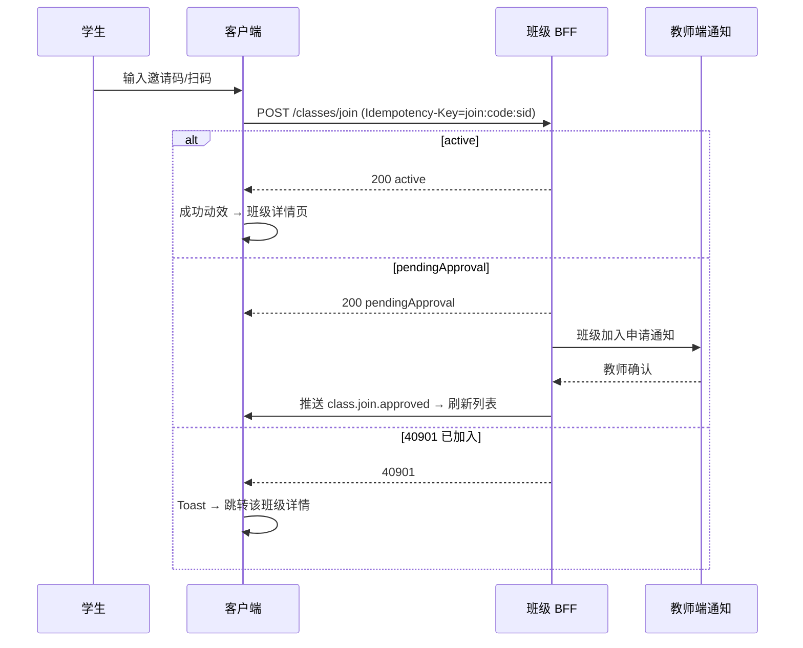
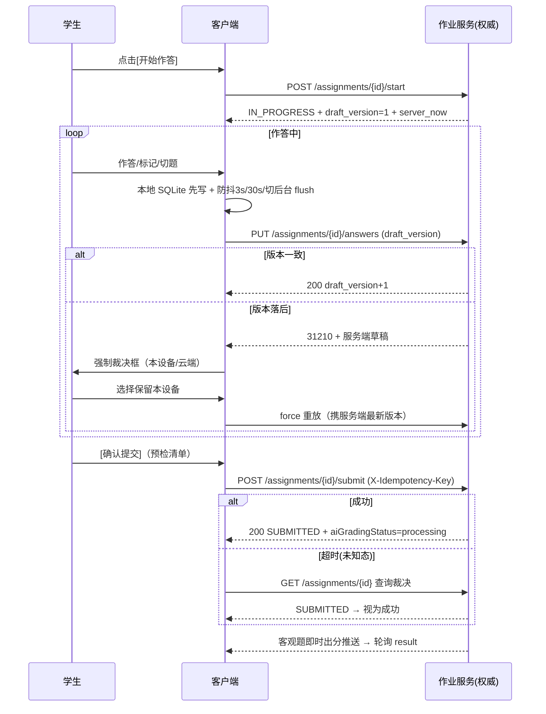
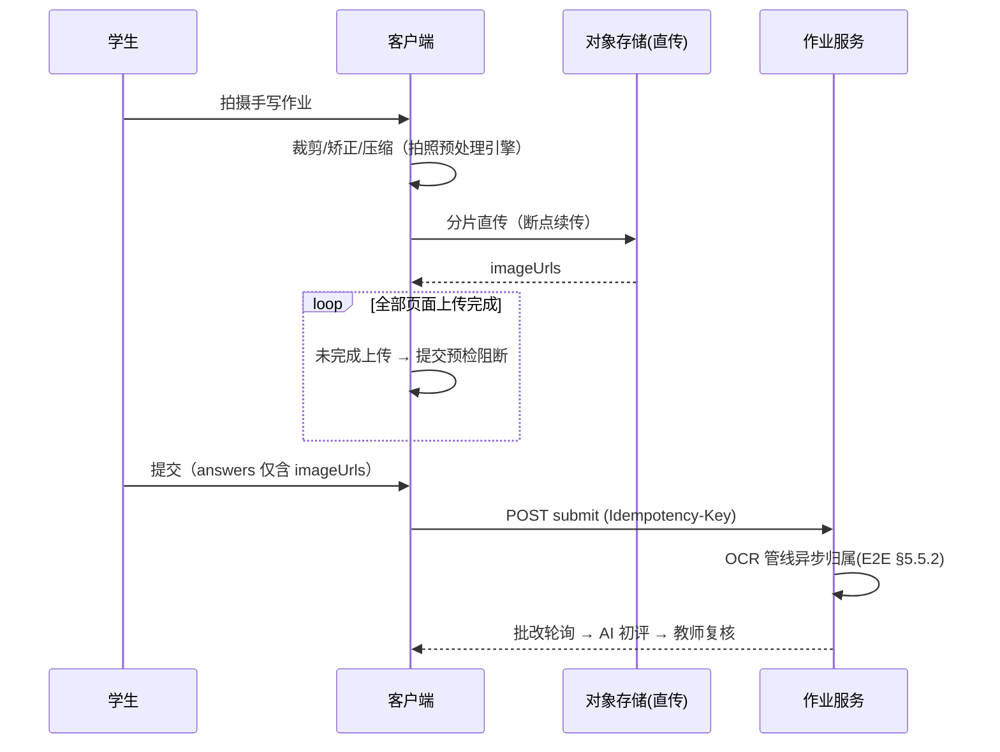
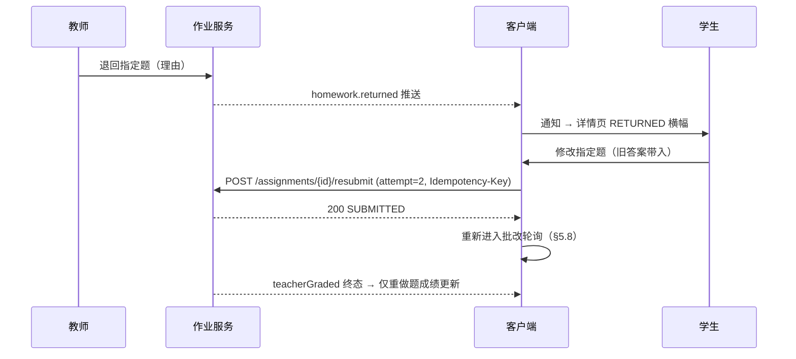

# 客户端-学生班级与作业提交页面架构与交互设计

> 版本：1.0  
> 日期：2026-06-13  
> 状态：详细设计（V2.0 规划）  
> 模块优先级：P3（中长期扩展）  
> 关联文档：`客户端-教师端页面架构与班级管理交互设计.md`、`端到端流程设计-教师端班级管理与作业发布完整链路-详细设计.md`、`服务端-教师班级管理与作业发布服务-详细设计.md`、`客户端架构与前端框架-详细设计.md`、`客户端组件库与设计系统-详细设计.md`、`客户端-底部导航栏与App主框架Shell架构设计-详细设计.md`

---

## 1. 模块概述

### 1.1 功能定位

学生班级与作业提交模块是 PrimeTop V2.0 面向**学生用户**的班级参与和作业交互页面体系，负责：
- 学生通过班级邀请码加入班级
- 查看已加入班级列表及班级详情
- 接收并查看教师发布的作业任务
- 完成作业答题（选择题、填空题、拍照上传等）
- 提交作业并查看 AI 辅助批改结果
- 查看教师批改反馈与评分
- 查看班级学情概览与个人排名
- 接收班级通知与教师消息

### 1.2 与教师端的互补关系

| 维度 | 教师端 | 学生端（本文档） |
|------|--------|-------------------|
| 终端 | Web 管理后台 / 小程序 | APP（Android/iOS） |
| 核心操作 | 创建班级、发布作业、批改评分 | 加入班级、完成作业、查看反馈 |
| 页面入口 | Web 导航栏 / 小程序 TabBar | APP 首页"班级"入口 + 消息推送 |
| 信息密度 | 高密度数据表格、批量操作 | 卡片式、任务驱动、渐进展示 |

### 1.3 技术选型

| 维度 | 方案 | 说明 |
|------|------|------|
| 框架 | Flutter（与主 APP 一致） | 复用现有客户端架构 |
| 状态管理 | Riverpod | 异步作业列表、班级状态管理 |
| 路由 | GoRouter | 嵌套路由支持班级/作业层级导航 |
| 列表组件 | 现有通用列表组件 | 复用分页加载引擎 |
| 富文本渲染 | 现有富文本与学科内容渲染引擎 | 公式、图片、代码块渲染 |
| 图片拍摄 | 现有客户端多媒体选取与处理服务 | 拍照、裁剪、压缩 |

### 1.4 前置依赖

| 依赖模块 | 说明 |
|----------|------|
| 客户端-底部导航栏与App主框架Shell架构设计 | 主导航结构、Tab 切换 |
| 客户端-首页与学习工作台页面架构与交互设计 | 首页班级入口、待办任务卡片 |
| 客户端-通知中心与消息列表页面架构与交互设计 | 作业推送通知、班级消息 |
| 客户端-题目展示与答题交互组件库 | 答题 UI 组件 |
| 客户端-拍照图像采集与预处理引擎 | 拍照上传作业 |
| 客户端-学情分析页面架构与报告展示交互 | 班级学情图表 |
| 客户端网络请求治理与弱网适配方案 | 离线作业草稿保存 |
| 客户端-页面状态模式与骨架屏加载空态错误态设计规范 | 加载态、空态、错误态 |

---

## 2. 页面架构总览

### 2.1 页面树

```
App Shell
├── 首页（学习工作台）
│   ├── [快捷入口] 班级中心
│   ├── [待办卡片] 待完成作业卡片
│   └── [消息] 班级通知摘要
│
├── 班级中心（新增一级页面）
│   ├── 班级列表页
│   │   ├── 加入班级页（扫码/输入邀请码）
│   │   └── 班级详情页
│   │       ├── 班级信息 Tab
│   │       ├── 作业列表 Tab
│   │       │   ├── 作业详情页
│   │       │   │   ├── 答题页
│   │       │   │   │   ├── 选择题答题组件
│   │       │   │   │   ├── 填空题答题组件
│   │       │   │   │   ├── 拍照上传组件
│   │       │   │   │   └── 语音作答组件
│   │       │   │   ├── 作业提交确认页
│   │       │   │   └── 作业批改结果页
│   │       │   │       ├── AI 批改详情
│   │       │   │       └── 教师批改详情
│   │       │   └── 作业历史列表
│   │       ├── 学情概览 Tab
│   │       │   ├── 个人学情卡片
│   │       │   └── 班级对比图表
│   │       └── 成员列表 Tab
│   │           └── 同学信息卡片
│   └── 班级设置（退出班级等）
│
└── 消息中心
    └── 班级消息列表
        ├── 新作业通知
        ├── 批改完成通知
        └── 班级公告
```

### 2.2 导航入口设计

学生端班级功能的入口分布在三个位置：

| 入口位置 | 展示形式 | 交互 |
|----------|----------|------|
| 首页快捷操作区 | "我的班级"图标（教室图标） | 点击进入班级中心 |
| 首页待办任务卡片 | "待完成作业 (N)" 卡片 | 点击直接进入待完成作业列表 |
| 消息推送 | 系统通知 + App 内消息 | 点击跳转对应作业详情 |
| 底部导航"学习"Tab | 同步课堂页面顶部"班级"入口 | 二级入口，避免导航过载 |

---

## 3. 数据结构定义

### 3.1 客户端本地数据模型

```dart
/// 班级概要信息
class ClassSummary {
  final String classId;           // 班级 ID
  final String className;         // 班级名称，如"三年一班"
  final String schoolName;        // 学校名称
  final String teacherName;       // 教师姓名
  final String? teacherAvatar;    // 教师头像 URL
  final int studentCount;         // 学生人数
  final String subject;           // 主学科
  final String grade;             // 年级，如"三年级"
  final String? coverImage;       // 班级封面图
  final DateTime joinedAt;        // 加入时间
  final int pendingHomeworkCount; // 待完成作业数
  final ClassRole role;           // 学生固定为 student
  final bool isActive;            // 班级是否活跃
}

/// 班级角色枚举
enum ClassRole {
  student,
  parentObserver,  // 家长以观察者身份查看
}

/// 作业概要信息
class HomeworkSummary {
  final String homeworkId;        // 作业 ID
  final String classId;           // 所属班级 ID
  final String title;             // 作业标题
  final String? description;      // 作业描述
  final HomeworkType type;        // 作业类型
  final HomeworkStatus status;    // 作业状态（对学生而言）
  final int totalQuestions;       // 总题数
  final int? answeredQuestions;   // 已答题数（进行中时有值）
  final DateTime publishTime;     // 发布时间
  final DateTime deadline;        // 截止时间
  final Duration? remainingTime;  // 剩余时间（计算属性）
  final int? score;               // 得分（已批改时有值）
  final int? totalScore;          // 总分
  final bool allowLateSubmit;     // 是否允许迟交
  final String? teacherComment;   // 教师评语
  final List<String> knowledgePoints; // 关联知识点
}

/// 作业类型
enum HomeworkType {
  practice,       // 练习题（选择题、填空题等）
  photoUpload,    // 拍照上传（手写作业）
  voiceRecord,    // 语音作答（背诵、口语）
  mixed,          // 混合类型
  examSimulation, // 模拟考试
}

/// 作业状态（学生视角）
enum HomeworkStatus {
  notStarted,     // 未开始
  inProgress,     // 进行中
  submitted,      // 已提交（待批改）
  aiGraded,       // AI 已批改（待教师确认）
  teacherGraded,  // 教师已批改
  overdue,        // 已过期未提交
  lateSubmitted,  // 迟交
}

/// 作业详情
class HomeworkDetail {
  final String homeworkId;
  final String classId;
  final String title;
  final String? description;
  final HomeworkType type;
  final DateTime publishTime;
  final DateTime deadline;
  final bool allowLateSubmit;
  final int timeLimitMinutes;     // 时限（分钟），0 表示不限时
  final List<QuestionItem> questions;   // 题目列表
  final int totalScore;
  final List<String> knowledgePoints;
  final String? teacherTip;       // 教师提示/注意事项
}

/// 题目项
class QuestionItem {
  final String questionId;
  final int orderIndex;           // 题号
  final QuestionType type;        // 题型
  final String content;           // 题干（富文本 HTML）
  final List<String>? options;    // 选项（选择题）
  final int score;                // 分值
  final AnswerState answerState;  // 作答状态
  final dynamic userAnswer;       // 学生答案（类型根据题型变化）
  final String? aiFeedback;       // AI 批改反馈
  final int? aiScore;             // AI 批改得分
  final String? teacherFeedback;  // 教师批改反馈
  final int? teacherScore;        // 教师批改得分
  final String? correctAnswer;    // 正确答案（批改后可见）
  final String? explanation;      // 解析（批改后可见）
}

/// 题型枚举
enum QuestionType {
  singleChoice,     // 单选题
  multipleChoice,   // 多选题
  fillBlank,        // 填空题
  trueOrFalse,      // 判断题
  shortAnswer,      // 简答题
  photoAnswer,      // 拍照作答
  voiceAnswer,      // 语音作答
  calculation,      // 计算题（分步）
}

/// 答题状态
enum AnswerState {
  unanswered,      // 未作答
  answered,        // 已作答（未提交）
  submitted,       // 已提交
  graded,          // 已批改
}

/// 作业提交结果
class HomeworkSubmitResult {
  final String homeworkId;
  final String submissionId;
  final DateTime submitTime;
  final SubmitStatus status;
  final String? message;
}

/// 提交状态
enum SubmitStatus {
  success,
  partialSuccess,  // 部分题目提交成功
  failed,
  autoSaved,       // 自动保存
}

/// 班级学情概览
class ClassLearningOverview {
  final String classId;
  final int totalStudents;
  final int myRank;               // 我的排名
  final double myScore;           // 我的得分率
  final double avgScore;          // 班级平均得分率
  final List<SubjectScore> subjectScores;  // 各学科得分
  final List<KnowledgePointMastery> weakPoints; // 薄弱知识点
  final int completedHomework;    // 已完成作业数
  final int totalHomework;        // 总作业数
  final double onTimeRate;        // 准时提交率
}

/// 学科得分
class SubjectScore {
  final String subject;
  final double scoreRate;         // 得分率 0-1
  final double classAvgRate;      // 班级平均
}

/// 知识点掌握度
class KnowledgePointMastery {
  final String pointId;
  final String pointName;
  final double masteryLevel;      // 0-1
  final double classAvgLevel;
  final int errorCount;           // 错误次数
}
```

### 3.2 本地缓存策略

```dart
/// 班级数据本地缓存配置
class ClassLocalCache {
  /// 缓存键
  static const String classListKey = 'cache:class_list';
  static const String homeworkListPrefix = 'cache:homework_list:';
  static const String homeworkDetailPrefix = 'cache:homework_detail:';
  static const String homeworkDraftPrefix = 'draft:homework:';
  
  /// 过期时间
  static const Duration classListTTL = Duration(minutes: 30);
  static const Duration homeworkListTTL = Duration(minutes: 5);
  static const Duration homeworkDetailTTL = Duration(minutes: 10);
  
  /// 草稿永不过期，手动清除
}
```

---

## 4. API 接口设计

### 4.1 班级相关接口

#### 4.1.1 加入班级

```
POST /api/v2/classes/join
Content-Type: application/json
Authorization: Bearer {token}

Request:
{
  "inviteCode": "ABC123",       // 邀请码
  "studentName": "张小明",       // 学生在班级中的显示名（可选，默认用昵称）
  "grade": "三年级",             // 年级（可选，用于教师确认）
  "classId": "cls_abc123"       // 班级 ID（可选，扫码加入时携带）
}

Response 200:
{
  "code": 0,
  "data": {
    "classId": "cls_abc123",
    "className": "三年一班",
    "teacherName": "王老师",
    "joinedAt": "2026-06-13T10:00:00.000Z",
    "status": "active"           // active | pendingApproval
  }
}

Response 400 (无效邀请码):
{
  "code": 40401,
  "message": "邀请码无效或已过期"
}

Response 409 (已加入):
{
  "code": 40901,
  "message": "您已是该班级成员"
}
```

#### 4.1.2 获取已加入班级列表

```
GET /api/v2/classes?page=1&pageSize=20&status=active
Authorization: Bearer {token}

Response 200:
{
  "code": 0,
  "data": {
    "total": 3,
    "page": 1,
    "pageSize": 20,
    "items": [
      {
        "classId": "cls_abc123",
        "className": "三年一班",
        "schoolName": "启明小学",
        "teacherName": "王老师",
        "teacherAvatar": "https://cdn.example.com/avatar/teacher1.jpg",
        "studentCount": 42,
        "subject": "数学",
        "grade": "三年级",
        "coverImage": "https://cdn.example.com/class/cover1.jpg",
        "joinedAt": "2026-03-01T08:00:00.000Z",
        "pendingHomeworkCount": 2,
        "isActive": true,
        "recentHomework": {
          "homeworkId": "hw_001",
          "title": "第三单元练习",
          "status": "notStarted",
          "deadline": "2026-06-14T23:59:59.000Z"
        }
      }
    ]
  }
}
```

#### 4.1.3 获取班级详情

```
GET /api/v2/classes/{classId}
Authorization: Bearer {token}

Response 200:
{
  "code": 0,
  "data": {
    "classId": "cls_abc123",
    "className": "三年一班",
    "schoolName": "启明小学",
    "teacherName": "王老师",
    "teacherAvatar": "https://cdn.example.com/avatar/teacher1.jpg",
    "teacherBio": "从教15年，高级教师",
    "subject": "数学",
    "grade": "三年级",
    "studentCount": 42,
    "coverImage": "https://cdn.example.com/class/cover1.jpg",
    "joinedAt": "2026-03-01T08:00:00.000Z",
    "announcement": "下周二进行第三单元测验，请同学们做好准备！",
    "stats": {
      "totalHomework": 28,
      "completedHomework": 25,
      "onTimeRate": 0.92,
      "avgScore": 85.3
    }
  }
}
```

#### 4.1.4 退出班级

```
POST /api/v2/classes/{classId}/leave
Authorization: Bearer {token}

Request:
{
  "reason": "转学"              // 退出原因（可选）
}

Response 200:
{
  "code": 0,
  "data": {
    "classId": "cls_abc123",
    "leftAt": "2026-06-13T10:30:00.000Z"
  }
}
```

### 4.2 作业相关接口

#### 4.2.1 获取班级作业列表

```
GET /api/v2/classes/{classId}/homework?page=1&pageSize=10&status=all
Authorization: Bearer {token}

Query Params:
  status: all | pending | submitted | graded | overdue

Response 200:
{
  "code": 0,
  "data": {
    "total": 15,
    "page": 1,
    "pageSize": 10,
    "items": [
      {
        "homeworkId": "hw_001",
        "classId": "cls_abc123",
        "title": "第三单元综合练习",
        "description": "包含本单元重点知识点的综合练习",
        "type": "mixed",
        "status": "notStarted",
        "totalQuestions": 15,
        "answeredQuestions": 0,
        "publishTime": "2026-06-12T08:00:00.000Z",
        "deadline": "2026-06-14T23:59:59.000Z",
        "allowLateSubmit": true,
        "knowledgePoints": ["分数加减法", "分数乘除法"],
        "score": null,
        "totalScore": 100
      },
      {
        "homeworkId": "hw_002",
        "classId": "cls_abc123",
        "title": "口算练习第12天",
        "type": "practice",
        "status": "teacherGraded",
        "totalQuestions": 20,
        "publishTime": "2026-06-10T08:00:00.000Z",
        "deadline": "2026-06-11T23:59:59.000Z",
        "allowLateSubmit": false,
        "score": 95,
        "totalScore": 100,
        "teacherComment": "计算速度有进步，注意分数化简！"
      }
    ]
  }
}
```

#### 4.2.2 获取作业详情

```
GET /api/v2/classes/{classId}/homework/{homeworkId}
Authorization: Bearer {token}

Response 200:
{
  "code": 0,
  "data": {
    "homeworkId": "hw_001",
    "classId": "cls_abc123",
    "title": "第三单元综合练习",
    "description": "包含本单元重点知识点的综合练习，请认真作答。",
    "type": "mixed",
    "publishTime": "2026-06-12T08:00:00.000Z",
    "deadline": "2026-06-14T23:59:59.000Z",
    "allowLateSubmit": true,
    "timeLimitMinutes": 60,
    "totalScore": 100,
    "teacherTip": "注意审题，分数化简到最简形式。",
    "knowledgePoints": ["分数加减法", "分数乘除法", "分数应用题"],
    "myStatus": "notStarted",
    "questions": [
      {
        "questionId": "q_001",
        "orderIndex": 1,
        "type": "singleChoice",
        "content": "<p>计算：$\\frac{3}{4} + \\frac{1}{4}$ = ？</p>",
        "options": ["$\\frac{1}{2}$", "1", "$\\frac{4}{4}$", "2"],
        "score": 5,
        "answerState": "unanswered",
        "userAnswer": null,
        "aiFeedback": null,
        "aiScore": null,
        "teacherFeedback": null,
        "teacherScore": null,
        "correctAnswer": null,
        "explanation": null
      },
      {
        "questionId": "q_002",
        "orderIndex": 2,
        "type": "fillBlank",
        "content": "<p>$\\frac{5}{6} - \\frac{1}{3}$ = <input type=\"blank\" id=\"b1\" /></p>",
        "options": null,
        "score": 5,
        "answerState": "unanswered",
        "userAnswer": null
      },
      {
        "questionId": "q_003",
        "orderIndex": 3,
        "type": "photoAnswer",
        "content": "<p>请写出以下计算题的完整解题过程：</p><p>$\\frac{7}{8} \\div \\frac{1}{4}$</p>",
        "score": 10,
        "answerState": "unanswered",
        "userAnswer": null
      }
    ]
  }
}
```

#### 4.2.3 保存答题草稿

```
PUT /api/v2/classes/{classId}/homework/{homeworkId}/draft
Authorization: Bearer {token}

Request:
{
  "questionId": "q_001",
  "answer": "B",
  "timestamp": "2026-06-13T10:30:00.000Z"
}

Response 200:
{
  "code": 0,
  "data": {
    "saved": true,
    "lastSavedAt": "2026-06-13T10:30:00.000Z"
  }
}
```

#### 4.2.4 批量保存答题草稿

```
PUT /api/v2/classes/{classId}/homework/{homeworkId}/draft/batch
Authorization: Bearer {token}

Request:
{
  "answers": [
    {"questionId": "q_001", "answer": "B"},
    {"questionId": "q_002", "answer": "\\frac{1}{2}"},
    {"questionId": "q_003", "answer": {"imageUrls": ["https://cdn.example.com/upload/hw001_q3.jpg"]}}
  ]
}

Response 200:
{
  "code": 0,
  "data": {
    "savedCount": 3,
    "lastSavedAt": "2026-06-13T10:35:00.000Z"
  }
}
```

#### 4.2.5 提交作业

```
POST /api/v2/classes/{classId}/homework/{homeworkId}/submit
Authorization: Bearer {token}

Request:
{
  "answers": [
    {
      "questionId": "q_001",
      "answer": "B",
      "timeSpentSeconds": 30
    },
    {
      "questionId": "q_002",
      "answer": "\\frac{1}{2}",
      "timeSpentSeconds": 45
    },
    {
      "questionId": "q_003",
      "answer": {
        "imageUrls": ["https://cdn.example.com/upload/hw001_q3.jpg"],
        "imageCount": 1
      },
      "timeSpentSeconds": 120
    }
  ],
  "totalTimeSpentSeconds": 195,
  "submittedAt": "2026-06-13T10:45:00.000Z"
}

Response 200:
{
  "code": 0,
  "data": {
    "homeworkId": "hw_001",
    "submissionId": "sub_abc123",
    "submitTime": "2026-06-13T10:45:00.000Z",
    "status": "success",
    "aiGradingStatus": "processing",
    "message": "作业提交成功，AI 正在批改中..."
  }
}

Response 400 (已过期且不允许迟交):
{
  "code": 40010,
  "message": "作业已截止，教师未开启迟交通道"
}

Response 409 (重复提交):
{
  "code": 40902,
  "message": "作业已提交，请勿重复操作"
}
```

#### 4.2.6 获取批改结果

```
GET /api/v2/classes/{classId}/homework/{homeworkId}/result
Authorization: Bearer {token}

Response 200:
{
  "code": 0,
  "data": {
    "homeworkId": "hw_001",
    "submissionId": "sub_abc123",
    "submitTime": "2026-06-13T10:45:00.000Z",
    "gradingStatus": "teacherGraded",
    "totalScore": 90,
    "maxScore": 100,
    "classAvgScore": 82.5,
    "classRank": 8,
    "classTotalStudents": 42,
    "timeSpent": "3分15秒",
    "teacherComment": "整体不错，第3题注意分数除法要先倒再乘。",
    "isLate": false,
    "gradingStatus": "teacherGraded",   // objectiveGraded | aiGraded | teacherGraded（分阶段渐进）
    "scoreBand": "TOP25",              // 义务教育学段排名 band 化：TOP25|UPPER|MIDDLE|LOWER；高中返回精确 classRank
    "classRank": null,                  // 仅高中学段返回精确名次，义务教育恒为 null（合规 C2）
    "questionResults": [
      {
        "questionId": "q_001",
        "type": "singleChoice",
        "myAnswer": "B",
        "correctAnswer": "B",
        "isCorrect": true,
        "score": 5,
        "maxScore": 5,
        "grader": "system",           // system（客观题判题引擎）| ai | teacher
        "explanation": "同分母分数相加，分母不变分子相加：3/4+1/4=4/4=1。",
        "knowledgePoints": ["分数加减法"]
      },
      {
        "questionId": "q_003",
        "type": "photoAnswer",
        "myAnswer": { "imageUrls": ["https://cdn.example.com/upload/hw001_q3.jpg"] },
        "isCorrect": false,
        "score": 7,
        "maxScore": 10,
        "grader": "teacher",
        "teacherFeedback": "步骤正确但最后未化简，扣 3 分。",
        "aiFeedback": "解题过程完整，建议检查最终结果是否为最简分数。",
        "explanationLocked": false     // 答案管控字段：true 时解析需走 ACPH 揭示流程
      }
    ],
    "weakPoints": [
      { "pointId": "kp_012", "pointName": "分数除法", "errorCount": 2 }
    ],
    "addToMistakeBook": true           // 服务端已按 E2E §5.12.2 规则自动收录，此字段仅作客户端展示提示
  }
}
```

> **渐进式披露**：`gradingStatus=objectiveGraded` 时仅客观题出分可查，主观题保持 `"score": null`；`aiGraded` 后主观题 AI 分与反馈可见（教师复核前标注「AI 初评」角标）；`teacherGraded` 后教师评分与评语覆盖展示。客户端轮询策略见 §5.8。`explanationLocked` 与《答案管控与渐进式提示引擎》联动：未完成订正前解析分步锁定。

| 错误码 | 场景 | 客户端处理 |
| --- | --- | --- |
| 31220 `RESULT_NOT_READY` | 尚无任何批改结果 | 继续轮询（§5.8 退避策略） |
| 31204 `ASSIGNMENT_NOT_FOUND` | 不在名单/作业已删除 | 返回列表页并刷新 |
| 31206 `ASSIGNMENT_WITHDRAWN` | 教师已撤回 | 展示撤回说明页（§5.10） |

#### 4.2.7 退回重做（RETURNED → 指定题重做提交）

```
POST /api/v1/student/assignments/{assignmentId}/resubmit
Authorization: Bearer {student_token}
X-Idempotency-Key: {uuid}

Request:
{
  "attempt": 2,                          // 第几次重做，服务端 CAS 校验
  "answers": [
    { "questionId": "q_003", "answer": {"imageUrls": ["https://cdn.example.com/upload/hw001_q3_v2.jpg"]}, "timeSpentSeconds": 180 }
  ],
  "serverDeadline": "2026-06-16T23:59:59.000Z"   // 客户端最近一次获取的截止时间回传，服务端校验未被篡改
}

Response 200:
{
  "code": 0,
  "data": {
    "homeworkId": "hw_001",
    "submissionId": "sub_def456",
    "status": "SUBMITTED",
    "redoQuestionIds": ["q_003"],
    "serverNow": "2026-06-15T10:00:00.000Z"
  }
}

Response 409:
{ "code": 31231, "message": "STATE_CONFLICT" }   // 状态机拒绝（如教师已撤回），客户端强制刷新状态
```

> 仅教师退回单（RETURNED）指定题可重做提交，端点与提交通道分离；重做不重置其他题成绩。对应服务端状态机 `RETURNED → IN_PROGRESS → SUBMITTED`（E2E §7.1），客户端守卫见 G9。

### 4.3 班级学情接口（学情概览 Tab）

#### 4.3.1 获取班级学情概览

```
GET /api/v2/classes/{classId}/learning-overview?term=current
Authorization: Bearer {token}

Response 200:
{
  "code": 0,
  "data": {
    "classId": "cls_abc123",
    "totalStudents": 42,
    "myBand": "UPPER",                  // 义务教育 band 化：TOP25|UPPER|MIDDLE|LOWER（合规 C2）
    "myScoreRate": 0.87,
    "avgScoreRate": 0.79,
    "subjectScores": [
      { "subject": "数学", "scoreRate": 0.87, "classAvgRate": 0.79 }
    ],
    "weakPoints": [
      { "pointId": "kp_012", "pointName": "分数除法", "masteryLevel": 0.42, "classAvgLevel": 0.68, "errorCount": 3 }
    ],
    "completedHomework": 25,
    "totalHomework": 28,
    "onTimeRate": 0.92,
    "trend": "improving"                // improving | stable | declining
  }
}
```

> 学情数据的**权威计算方**为《服务端-学情分析》《多渠道学习数据融合与统一知识掌握度计算引擎》，本接口仅为班级域聚合投影（契约 R14）；`myBand` 与 `masteryLevel` 分级口径以掌握度引擎等级迟滞映射为准，客户端不做二次换算。

#### 4.3.2 获取班级公告

```
GET /api/v2/classes/{classId}/announcements?page=1&pageSize=10
Authorization: Bearer {token}

Response 200:
{
  "code": 0,
  "data": {
    "total": 5,
    "items": [
      {
        "announcementId": "ann_001",
        "title": "下周二第三单元测验",
        "content": "请同学们复习分数加减乘除...",
        "publishTime": "2026-06-12T08:00:00.000Z",
        "publisherName": "王老师"
      }
    ]
  }
}
```

### 4.4 班级成员列表接口

```
GET /api/v2/classes/{classId}/members?page=1&pageSize=50
Authorization: Bearer {token}

Response 200:
{
  "code": 0,
  "data": {
    "total": 42,
    "items": [
      {
        "memberId": "m_001",
        "displayName": "张小明",           // 班级内显示名，非账号昵称
        "avatarType": "virtual",          // virtual（虚拟形象，默认）| custom（已授权自定义）
        "band": "TOP25",                  // 仅返回 band，不返回分数/排名（合规 C2/C3）
        "isMe": true
      }
    ]
  }
}
```

> **未成年人社交保护红线（合规 C3）**：成员接口**不返回**任何联系方式、真实姓名、账号 ID、精确排名、得分；头像默认虚拟形象（消费《学生个性化虚拟形象系统》的班级展示模式）；成员列表仅支持「查看」，不提供私信、加好友入口。家长观察者（parentObserver）不可访问成员列表。

### 4.5 API 契约总表与路径裁决（F1 承载）

v1.0 定义的 `/api/v2/classes/{classId}/homework/*` 五端点与《端到端流程设计-学生作业接收完成提交与反馈闭环》权威端点（`/api/v1/student/assignments/*`）冲突。裁决如下：

| 域 | v1.0 端点（本文 §4.2） | 权威端点（对齐 E2E） | 裁决 |
| --- | --- | --- | --- |
| 作业列表 | `GET /api/v2/classes/{classId}/homework` | `GET /api/v1/student/assignments?class_id=` | **改用权威端点**，班级维度作为查询参数 |
| 作业详情 | `GET .../homework/{homeworkId}` | `GET /api/v1/student/assignments/{assignmentId}` | **改用权威端点**（含 server_now/grace_period） |
| 保存草稿（单题/批量） | `PUT .../draft`、`PUT .../draft/batch` | `PUT /api/v1/student/assignments/{id}/answers` | **废弃 v1.0 双端点**，统一为权威端点（batch 语义内含于 answers 数组），新增 draft_version 乐观锁（F3） |
| 提交作业 | `POST .../homework/{id}/submit` | `POST /api/v1/student/assignments/{id}/submit` | **改用权威端点** + `X-Idempotency-Key` 幂等头（F4） |
| 批改结果 | `GET .../homework/{id}/result` | `GET /api/v1/student/assignments/{id}/result` | **改用权威端点**，响应结构以本文 §4.2.6 为客户端消费契约（band 化修正 F5） |
| 退回重做 | （v1.0 缺失） | `POST /api/v1/student/assignments/{id}/resubmit` | 本文 §4.2.7 新增定义 |
| 加入/列表/详情/退出班级 | `/api/v2/classes/*` | — | **保留**，班级域归《服务端-教师班级管理与作业发布服务》BFF 扩展，登记为该服务 v1.1 扩展需求（R7） |
| 学情概览/公告/成员 | `/api/v2/classes/{classId}/*` | — | **保留**（同上），数据权威归学情/掌握度引擎（R14） |

> 客户端统一通过 `HomeworkApiClient`（§6）封装权威端点；§4.2.1-4.2.6 中 v1.0 路径仅作历史参照，开发实现以本表右列为准。错误码段统一收敛至 312xx（作业域）与 404xx/409xx（班级域），映射见 §10.1。

---

## 5. 核心页面详细设计

### 5.1 班级中心首页（ClassCenterPage）

#### 5.1.1 页面结构

```
┌──────────────────────────────────┐
│  班级中心                [＋加入] │
├──────────────────────────────────┤
│ ┌──────────────────────────────┐ │
│ │ 🏫 三年一班 · 数学    2 份待交 │ │ ← ClassCard：点击进详情
│ │ 王老师 · 42 人                │ │
│ │ ⏰ 第三单元练习 剩 1天4小时    │ │ ← 最近一份待交作业倒计时
│ └──────────────────────────────┘ │
│ ┌──────────────────────────────┐ │
│ │ 🏫 启明英语角 · 英语   无待交  │ │
│ └──────────────────────────────┘ │
│        （下拉刷新 / 上滑分页）     │
├──────────────────────────────────┤
│ 空态：还没有加入班级 → [输入邀请码] │
│      [扫一扫]                     │
└──────────────────────────────────┘
```

#### 5.1.2 行为细则

- **数据加载**：进入页面优先读缓存（TTL 30 分钟，§3.2）立即渲染，再后台刷新；`pendingHomeworkCount` 角标同步刷新首页「我的班级」入口。
- **待办聚合**：首页工作台的「待完成作业 (N)」卡片经《多源学习任务统一调度与优先级仲裁引擎》的 `HOMEWORK` 任务类型聚合投递（契约 R12），本页倒计时以作业详情接口下发的 `server_now` 为基准（R5），禁止用本地时钟直接减 `deadline`。
- **多班级折叠**：班级数 > 3 时默认展开前 3 个，其余收进「查看全部班级」。
- **pendingApproval 态**：加入后 `status=pendingApproval` 的班级卡片置灰显示「等待老师确认」，不展示作业与成员数据（G4）。

### 5.2 加入班级页（JoinClassPage）

#### 5.2.1 双通道入口

| 通道 | 交互 | 说明 |
| --- | --- | --- |
| 输入邀请码 | 6 位字母数字输入框 + 确认按钮 | 支持粘贴自动大写化；实时校验格式 `^[A-Z0-9]{6}$`，格式不符时按钮置灰 |
| 扫码 | 调起相机扫描二维码 | 复用《服务端-二维码生成与扫码业务管理服务》客户端扫码组件；扫码结果携带 `classId`，走同一 join 接口 |

#### 5.2.2 流程与状态

```
输入/扫码 → POST /classes/join
  ├─ 200 active           → 成功动效 → 进班级详情页
  ├─ 200 pendingApproval  → 「已申请，等待老师确认」页（可撤回申请）
  ├─ 40401 邀请码无效      → 输入框标红 + 「邀请码无效或已过期」
  ├─ 40901 已加入          → Toast + 直接跳转该班级详情
  └─ 40302 班级已满/已关闭  → 说明页（联系教师）
```

- **显示名**：默认取学生档案昵称；教师要求实名班级（服务端 `requireRealName=true`）时显示名输入框置为必填且不可后续修改。
- **重复点击防护**：提交按钮点击后立即置 `loading` 并禁用，接口幂等键为 `join:{inviteCode}:{studentId}`（§9.1）。
- **合规**：加入班级弹窗需展示《班级服务知情提示》（数据可见范围：教师可见学情、同学仅见显示名与虚拟头像），家长绑定账号需家长门二次确认（幼儿/小学低年级，合规 C4）。

### 5.3 班级详情页（ClassDetailPage）

#### 5.3.1 三 Tab 结构

| Tab | 内容 | 数据源 |
| --- | --- | --- |
| 作业（默认） | 作业列表（§5.4） | assignments 权威端点 |
| 学情 | 个人学情卡片 + 班级对比图（§5.11） | learning-overview |
| 成员 | 成员网格（§4.4，仅 active 学生可见） | members |

- 顶部班级信息卡（名称/学校/教师/人数/公告摘要），公告摘要点击展开公告列表（§4.3.2）。
- 右上角「···」菜单：退出班级（双确认，输入班级名确认防误触）、公告列表。
- **退出班级**：`POST /classes/{id}/leave` 幂等（§9.1）；退出后本地缓存（班级/作业/草稿）立即清理（G8），进行中作业草稿弹窗提示「退出后未提交的作答将丢失」。

### 5.4 作业列表页（HomeworkListTab）

#### 5.4.1 列表项设计

```
┌──────────────────────────────────┐
│ 🔴 第三单元综合练习      [进行中] │ ← 状态徽章（展示映射见 §8.1）
│ 15 题 · 截止 06-14 23:59          │
│ ▓▓▓▓▓░░░░░ 已答 7/15              │ ← 进行中显示进度条
│ ⏰ 剩 1 天 4 小时 32 分            │ ← <24h 橙色、<2h 红色+呼吸动效
├──────────────────────────────────┤
│ ✅ 口算练习第12天        [已批改] │
│ 得分 95/100 · 班级前25%           │ ← band 展示（义务教育）
└──────────────────────────────────┘
```

#### 5.4.2 筛选与排序

- 筛选 Chips：`全部 | 待完成 | 已提交 | 已批改 | 已过期`（对应权威状态 PENDING/IN_PROGRESS+OVERDUE / SUBMITTED+GRADING / GRADED+RETURNED / EXPIRED）。
- 排序默认「截止时间升序」，待完成在前；已批改按批改时间倒序。
- `OVERDUE` 且宽限期内（`grace_period_minutes` 未耗尽）的卡片显示「⏰ 已截止 · 补交通道开启中」，点击进入答题页走迟交提交流程（服务端置 `is_late=1`）；宽限期耗尽变 `EXPIRED` 终态，卡片置灰。

#### 5.4.3 倒计时口径（F4 承载）

```dart
Duration? computeRemaining(HomeworkSummary hw, DateTime serverNow) {
  // serverNow 来自最近一次任意作业接口响应的 server_now 字段
  // 叠加本地已流逝时间（每次响应校准一次本地偏移量）
  final localOffset = serverNow.difference(DateTime.now().toUtc());
  final effectiveNow = DateTime.now().toUtc().add(localOffset);
  return hw.deadline.difference(effectiveNow);
}
```

- 倒计时仅作**展示**；提交能否成功的裁决一律以服务端时间为准（接口返回 31205/40010 时按服务端结果展示）。

### 5.5 作业详情页（HomeworkDetailPage）

#### 5.5.1 进入流程与开始作答门

```
进入详情页
  ├─ GET /assignments/{id}（缓存 10 分钟 + 强制刷新 myStatus）
  ├─ myStatus=PENDING     → 展示作业说明卡（标题/描述/题数/总分/时限/截止/teacherTip）
  │                          [开始作答] 按钮 → POST /assignments/{id}/start
  │                          → 200 IN_PROGRESS + draft_version → 进答题页
  │                          → 31205 已过期 | 31206 已撤回 → 特殊态页（§5.10）
  ├─ myStatus=IN_PROGRESS → [继续作答]（显示已答进度）→ 断点续答（§5.6.6）
  ├─ myStatus=SUBMITTED/GRADING → [查看批改进度]（§5.8 渐进式）
  ├─ myStatus=GRADED      → [查看成绩与解析] → 批改结果页
  ├─ myStatus=RETURNED    → [重新完成退回题目] → §5.9
  └─ myStatus=OVERDUE     → 宽限期内：[补交作业]（红色横幅提示将记迟交）
```

- **时限作业**：`timeLimitMinutes > 0` 时 start 接口返回 `timeLimitDeadline`（服务端计算的绝对截止点），答题页以此为准计时，到时自动触发提交流程（G6）；切后台计时**不暂停**（防切换计时器作弊，与《在线测评防作弊检测引擎》口径一致）。
- **teacherTip** 与知识点标签在说明卡顶部展示，作为「预习式提示」而非答案泄露。

### 5.6 答题页（HomeworkAnswerPage）

#### 5.6.1 页面结构

```
┌──────────────────────────────────┐
│ ← 第三单元综合练习   7/15  [答题卡]│ ← 顶部：题号网格抽屉入口
│ ⏰ 剩 58:12（限时作业） / 剩 1天4h  │
├──────────────────────────────────┤
│  [第 8 题 · 填空 · 5分]           │
│  ┌────────────────────────────┐  │
│  │ 题干（富文本渲染引擎）        │  │
│  │ 含 LaTeX 公式 / 图片 / 图形   │  │
│  └────────────────────────────┘  │
│  答题区（按题型路由组件）           │
├──────────────────────────────────┤
│ [🚩标记]  ← 上一题   下一题 →     │
└──────────────────────────────────┘
```

#### 5.6.2 题型组件复用矩阵

| 题型 | 复用组件（《题目展示与答题交互组件库》） | 作业域扩展点 |
| --- | --- | --- |
| singleChoice / multipleChoice / trueOrFalse | ChoiceQuestionWidget | 无 |
| fillBlank | FillBlankQuestionWidget | 多空位 blanks[index] 结构直连草稿 JSON |
| shortAnswer / calculation | ShortAnswerEditor（富文本编辑器裁剪版） | 支持公式键盘（数学公式输入系统） |
| photoAnswer | PhotoAnswerWidget | 复用《拍照图像采集与预处理引擎》：拍摄→裁剪→压缩→直传 OSS（分片续传），仅回传 imageUrls |
| voiceAnswer | VoiceAnswerRecorder | 复用语音录制引擎；录音上限 60s；ASR 转写文本随答案提交，音频文件 URL 附带 |

- 拍照题上传**独立于提交**：拍摄完成即后台直传对象存储（弱网走分片续传），提交时仅携带 URL 列表，避免提交事务内做大文件传输（对齐 E2E §5.5）。

#### 5.6.3 自动保存调度（F3 承载，对齐 E2E §5.4）

| 触发 | 行为 |
| --- | --- |
| 单题作答变更 | 防抖 3s 入队 |
| 切换题目 | 立即 flush 该题 |
| 每 30 秒 | 批量 flush 脏题 |
| 切后台/接电话 | `AppLifecycleState.paused` 立即 flush 全部脏题 |
| 提交前 | 强制 flush，失败则提交预检不通过 |

```dart
class DraftSaveScheduler {
  Future<void> flush({bool force = false}) async {
    final dirty = _repo.takeDirtyAnswers();
    if (dirty.isEmpty) return;
    try {
      final res = await api.saveAnswers(
        assignmentId,
        draftVersion: _repo.draftVersion,   // 乐观锁版本号
        answers: dirty,
      );
      _repo.draftVersion = res.draftVersion; // 成功后推进本地版本
    } on ApiException catch (e) {
      if (e.code == 31210) {                 // DRAFT_VERSION_CONFLICT
        _conflictController.resolve(res: e.data); // 弹多端冲突裁决框（§5.6.5）
      } else if (e.code == 31211) {          // DEADLINE_PASSED
        _repo.markPendingLateSubmit(dirty);  // 本地标记待补交
      } else {
        _repo.rollbackDirty(dirty);          // 回滚脏标记，指数退避重试
        scheduleRetry();
      }
    }
  }
}
```

- 本地草稿（SQLite `homework_draft` 表）**先写本地再同步**：本地写入永不丢失，网络层自动重试豁免清单包含 `/assignments/*/answers`。

#### 5.6.4 标记待检查（MARKED_FOR_REVIEW）

- 答题卡网格中标记题显示 🚩；提交确认页将标记题列为「请再检查」分组（§5.7）。
- 标记状态仅存本地草稿 `status=MARKED_FOR_REVIEW`，随草稿同步；服务端不产生独立事件。

#### 5.6.5 多端冲突裁决（对齐 E2E §5.6.3）

收到 31210 时弹出**强制裁决框**（不可关闭、不可自动合并）：

```
┌──────────────────────────────────┐
│     检测到另一设备正在作答         │
│  两份作答内容存在差异，请选择保留： │
│ ┌────────────┐  ┌────────────┐   │
│ │保留本设备内容│  │使用云端内容  │   │
│ │(已答 9 题)  │  │(已答 6 题)  │   │
│ └────────────┘  └────────────┘   │
│ 选择后将覆盖另一份，不可恢复       │
└──────────────────────────────────┘
```

- 「保留本设备」= 以服务端返回的最新 `draft_version` 携带本地全量脏题 `force` 重放保存（一次 CAS，不产生半覆盖）；
- 「使用云端」= 丢弃本地草稿，以服务端草稿重建答题页状态；
- 教育场景裁决原则：**必须用户显式裁决，禁止自动合并**（防止答案串号）。

#### 5.6.6 断点续答

- 答题页 dispose 时持久化：当前题号、滚动位置、限时作业剩余秒数、draft_version；再次进入直接恢复。
- 跨设备续答：进入答题页时以服务端草稿为准（本地仅当 `draft_version >= 服务端版本` 时提示冲突）。

### 5.7 提交确认页（SubmitConfirmPage）

#### 5.7.1 提交预检清单

| 检查项 | 不通过时行为 |
| --- | --- |
| 未答题数 > 0 | 列出未答题号，需勾选「确认空题提交」才能继续 |
| 标记待检查 > 0 | 分组展示，提示逐题确认（可一键取消全部标记） |
| 拍照题存在未完成上传 | 阻断提交，展示上传进度，提供「重拍」 |
| 倒计时 < 5 分钟 | 顶部红色横幅「即将截止」，确认按钮加倒计时秒级刷新 |
| 已过截止 | 双分支：宽限期内→「补交（将记为迟交）」确认；宽限期外→阻断，展示「作业已失效」 |

#### 5.7.2 提交互位与幂等（F4 承载）

```
点击[确认提交]
  → 按钮立即 loading + 禁用 + 生成 X-Idempotency-Key 缓存于本地
  → 强制 flush 草稿（成功才继续）
  → POST /assignments/{id}/submit（携带 answers + totalTimeSpentSeconds）
  ├─ 200 → 提交成功页（AI 批改中动效）→ §5.8 轮询
  ├─ 超时/网络错误 → 未知态：不自动重发！
  │    → GET /assignments/{id} 查询 myStatus：
  │       SUBMITTED/GRADING → 视为成功（幂等回放）
  │       仍 IN_PROGRESS → 用户手动重试（复用同一 Idempotency-Key）
  ├─ 40902/31231 → 刷新状态，按服务端为准渲染
  └─ 40010/31205 → 已截止页
```

- **未知态裁决**是防重复提交的核心：服务端以 `X-Idempotency-Key + assignmentId + studentId` 幂等（E2E §5.7.2），客户端超时后必须先查后重试，禁止盲目重发。

### 5.8 批改结果页（GradingResultPage）

#### 5.8.1 渐进式披露三阶段

| gradingStatus | 展示内容 | 轮询策略 |
| --- | --- | --- |
| SUBMITTED（刚提交） | 「客观题批改中」全屏动效 | 3s 后首查 |
| objectiveGraded | 客观题得分/对错即时展示，主观题灰色「AI 初评中」 | 15s/30s/60s 退避轮询，上限 5 分钟转手动刷新 |
| aiGraded | 主观题 AI 分+反馈（角标「AI 初评，待老师确认」），总分=当前可得分 | 停止轮询，教师发布后由推送通知唤起重查 |
| teacherGraded | 教师终评全覆盖、teacherComment、band、错题收录提示 | 终态，缓存可离线回看 |

- 轮询请求合并：`GET /assignments/{id}/result` 单接口承载（响应内 `gradingStatus` 字段驱动），不另设进度接口；页面不可见时暂停轮询（`AppLifecycleState` 监听），回前台立即补一次。

#### 5.8.2 结果展示与解析管控联动

- 每题卡片：我的答案 vs 正确答案、得分/满分、grader 来源角标（系统/AI/教师）、错题原因快捷标签（复用错题本错因标签）。
- **解析默认折叠**：展开即触发 `homework_hint_expand` 埋点（答案管控漏斗）；`explanationLocked=true` 的题目，解析按 ACPH 分步揭示（先思路→关键步骤→完整答案），错题已由服务端按 E2E §5.12.2 自动收录，客户端展示「已加入错题本」入口直达错题详情。
- 弱知识点区块：weakPoints 列表 + 「去补弱」按钮 → 跳转薄弱点靶向训练（消费《学生薄弱点识别与靶向训练推荐服务》落地页）。

### 5.9 退回重做页（RETURNED，F6 承载）

- 入口：推送通知「老师退回了你的作业」/ 作业列表 `RETURNED` 徽章 / 详情页横幅。
- 页面形态：**仅开放教师指定题**（`redoQuestionIds`），其余题以只读卡片展示原成绩；顶部横幅展示教师退回理由。
- 重做提交走 `resubmit` 端点（§4.2.7），成功后状态回 SUBMITTED，重新进入批改轮询（§5.8）；`attempt` 递增并在结果页显示「第 2 次提交」。
- 退回题的旧答案自动带入答题区供修改，不强制清空。

### 5.10 特殊状态页（F6 承载）

| 服务端态 | 页面表现 | 可用操作 |
| --- | ---| --- |
| EXPIRED（终态） | 置灰卡片「作业已失效」；详情页只读展示题目与（教师发布后的）班级解析 | 查看解析（如教师已发布）、联系教师（跳转家校沟通） |
| WITHDRAWN（记录态） | 「老师已撤回这份作业」说明页，成绩不计入统计 | 返回列表 |
| EXEMPTED（记录态） | 「老师标记你免交本作业」说明页，不计入未交率 | 返回列表 |
| pendingApproval（班级级） | §5.1.2 置灰卡片 | 撤回申请 |

### 5.11 学情概览 Tab（LearningOverviewTab）

- **个人学情卡**：得分率环形图、band 徽章（义务教育显示「班级前 25%」类文案；高中显示精确名次）、准时提交率、完成作业数趋势（近 4 周）。
- **班级对比图**：各学科「我 vs 班级平均」双柱图；薄弱知识点列表（我 vs 班级均值差距排序）。
- **红线**：图表仅对比「我 vs 平均/band」，**不渲染班级成员个体数据**；家长观察者视角额外过滤 band，仅显示等级描述（L3 粒度，对齐《学生学习数据家庭共享可见度分级》）。

### 5.12 分龄 UI 差异化策略

| 学段 | 答题页 | 结果页 | 班级功能 |
| --- | --- | --- | --- |
| 幼儿/小学低年级 | 大字号、题目朗读按钮、拍照题优先引导；家长可代操作（家长门） | 星星/徽章激励替代分数展示（成长型话术） | 家长代加入班级、代提交 |
| 小学高年级 | 标准 UI + 倒计时亲和文案（「加油，还有 1 天」） | 分数 + 鼓励语；band 文案「超过了大部分同学」 | 自主加入需家长门首次确认 |
| 初中 | 信息密度标准，突出错题与知识点归因 | 分数 + band + 弱点补强入口 | 完整功能 |
| 高中 | 高密度（答题卡常驻侧栏可选）、精确排名可见 | 分数 + 精确名次 + 趋势线 | 完整功能；倒计时文案专业化 |

- 防沉迷联动：作业答题计入学习时长（统一时长归因引擎口径 R14），触发休息提醒时草稿强制 flush 后展示休息遮罩（复用全局休息调度，G7）。

---

## 6. Riverpod Provider 设计

### 6.1 Provider 总览

```dart
/// 班级域
final classListProvider = AsyncNotifierProvider<ClassListNotifier, List<ClassSummary>>(ClassListNotifier.new);
final classDetailProvider = FutureProvider.family<ClassDetail, String>((ref, id) => ...);
final joinClassProvider = NotifierProvider<JoinClassNotifier, JoinState>(JoinClassNotifier.new);

/// 作业域（以权威 assignments 端点为数据源）
final homeworkListProvider = AsyncNotifierProvider.family<HomeworkListNotifier, HomeworkListState, String>(
  HomeworkListFamily().call);                                    // family=classId
final homeworkDetailProvider = AsyncNotifierProvider.family<HomeworkDetailNotifier, HomeworkDetailState, String>(
  HomeworkDetailFamily().call);                                  // family=assignmentId
final answerSessionProvider = NotifierProvider.family<AnswerSessionNotifier, AnswerSessionState, String>(
  AnswerSessionFamily().call);                                   // 答题会话（草稿调度核心）
final gradingResultProvider = AsyncNotifierProvider.family<GradingResultNotifier, GradingResultState, String>(
  GradingResultFamily().call);                                   // 批改轮询
final serverClockProvider = NotifierProvider<ServerClockNotifier, DateTime>(ServerClockNotifier.new);
```

### 6.2 关键设计点

- **ServerClockNotifier（F4 承载）**：拦截 `HomeworkApiClient` 所有响应中的 `server_now`，滑动平均校准本地偏移；答题倒计时、截止判断、限时计时统一消费此 Provider，任何页面不再各自取系统时间。
- **AnswerSessionNotifier**：持有 `draftVersion`、脏题集合、flush 调度器（§5.6.3）；与 `AppLifecycleListener` 绑定实现切后台 flush；dispose 时持久化断点快照。
- **Provider 依赖图**：

```
classListProvider ──┬→ homeworkListProvider(classId) ──→ homeworkDetailProvider(id)
serverClockProvider ┤                                        │
                    │                              answerSessionProvider(id)
                    │                                        │
                    └→ classDetailProvider           gradingResultProvider(id)
                                                        ↑ resubmit 归并到 detail 刷新
```

- **失效策略**：提交成功后 `homeworkListProvider(classId)` 与 `homeworkDetailProvider(id)` 失效重建；批改轮询终态后写本地缓存（TTL 内离线可回看）。

---

## 7. 核心时序图

### 7.1 加入班级（含 pendingApproval）



### 7.2 在线作答主链路（自动保存 + 多端冲突 + 提交幂等）



### 7.3 拍照作业链路（场景 D）



### 7.4 退回重做链路（RETURNED）



---

## 8. 状态机与守卫总表

### 8.1 客户端展示态 ↔ 服务端权威态映射（F2 承载）

服务端八态 + 三记录态为唯一权威（E2E §4.2/§7.1），客户端 `HomeworkStatus` 为**展示层派生枚举**（读时映射，不落库）：

| 服务端权威态 | 客户端展示态 | 徽章文案 | 说明 |
| --- | --- | --- | --- |
| PENDING | notStarted | 未开始 | 首次查看记 first_view 回执 |
| IN_PROGRESS | inProgress | 进行中 | 有草稿即此态 |
| SUBMITTED | submitted | 已提交 | 副字段 gradingStatus=processing |
| GRADING | submitted | 批改中 | 与 SUBMITTED 合并展示为「已提交·批改中」 |
| GRADED | teacherGraded | 已批改 | gradingStatus=teacherGraded |
| （GRADING 阶段细分） | aiGraded | AI 初评中/已出 | 由 result.gradingStatus 派生，非状态机态 |
| RETURNED | returned | 需重做 | **v1.0 缺失，v1.1 新增** |
| OVERDUE | overdue | 已截止(可补交) | 宽限期内可补交，is_late 标志随提交落库 |
| EXPIRED | expired | 已失效 | 终态，**v1.0 缺失，v1.1 新增** |
| WITHDRAWN（记录态） | withdrawn | 教师已撤回 | **v1.0 缺失，v1.1 新增** |
| EXEMPTED（记录态） | exempted | 免交 | **v1.0 缺失，v1.1 新增** |
| （SUBMITTED + is_late=1） | lateSubmitted | 已补交 | **降级为标志**：v1.0 将其误设为独立状态，裁决为 `isLate` 字段 + overdue 前置态组合展示 |

> 裁决：v1.0 `aiGraded/teacherGraded` 双态与服务端 GRADING/GRADED 语义错位——批改进度是 `gradingStatus` 结果字段（§4.2.6）而非学生作业状态机状态；`lateSubmitted` 不是状态而是提交属性。

### 8.2 答题页状态机（AnswerSessionState）

```
idle → loading(详情/start) → answering ⇄ saving(脏题flush中)
                                   ├→ conflict(31210 强制裁决) → answering
                                   ├→ submitting(预检+提交) → submitted → (离开答题页)
                                   ├→ timeUp(限时到时) → submitting(G6 自动提交)
                                   └→ interrupted(切后台/休息) → answering(恢复)
loading → failure(31205/31206) → (特殊态页 §5.10)
```

### 8.3 批改轮询状态机（GradingResultState）

```
idle → waitingObjective(3s首查) → objectiveGraded(退避轮询15/30/60s)
     → aiGraded(停止轮询·等推送) → teacherGraded(终态·缓存)
waitingObjective/轮询中 → pageHidden(暂停轮询) → pageVisible(立即补查)
任意轮询态 → resultError(31220 继续退避 | 网络 → 手动刷新)
```

### 8.4 班级成员关系状态机（学生视角）

```
none → applying(pendingApproval) ⇄ revoked(撤回申请)
none/applying → active → left(退出/被移出，终态)
active → active(viewOnly)（家长观察者只读，不可作答提交）
```

### 8.5 守卫总表 G1-G14

| 守卫 | 规则 | 违反后果 |
| --- | --- | --- |
| G1 | 提交/重交必须携带 `X-Idempotency-Key`，且未知态先查询裁决后重试 | 按服务端 31231/幂等闸门拒绝 |
| G2 | 草稿保存必须携带 `draftVersion` 乐观锁；冲突必须用户显式裁决 | 31210 循环冲突 |
| G3 | 倒计时/限时计时必须基于 `serverClockProvider`（server_now 校准） | 截止判断与用户感知漂移 |
| G4 | `pendingApproval` 班级不拉取作业/成员/学情数据 | 空数据报错 |
| G5 | `EXPIRED` 终态任何写操作（草稿/提交/重做）客户端预拦截 | 服务端拒绝 31205 |
| G6 | 限时作业到时自动触发提交流程（不可关闭弹窗拦截） | 超时成绩无效争议 |
| G7 | 休息提醒/防沉迷触发时：flush 草稿 → 遮罩；不丢失作答 | 草稿丢失 |
| G8 | 退出班级/被移出：本地班级缓存、作业草稿、断点立即清理 | 数据残留泄露 |
| G9 | 仅 `RETURNED` 态显示重做入口；resubmit 的 `attempt` 必须与服务端一致 | 31231 STATE_CONFLICT |
| G10 | 拍照题存在未完成上传时阻断提交 | 提交后无图可判 |
| G11 | 成员列表渲染层过滤任何非白名单字段（防御性，服务端已裁剪） | 合规事故 |
| G12 | 义务教育学段隐藏精确排名 UI 组件（即使接口误返 classRank） | 合规 C2 红线 |
| G13 | 结果页解析展开必须走 ACPH 揭示流程；`explanationLocked` 不可绕过 | 答案管控失效 |
| G14 | 答题页 dispose 必须执行：flush → 断点快照 → 取消轮询 | 断点/草稿丢失 |

---

## 9. 幂等与并发控制

### 9.1 幂等键总表

| 操作 | 幂等键 | 层级 | 说明 |
| --- | --- | --- | --- |
| 加入班级 | `join:{inviteCode}:{studentId}` | 服务端 | 重复点击/重试安全 |
| 退出班级 | `leave:{classId}:{studentId}` | 服务端 | 双确认后调用，重复调用返回幂等结果 |
| 草稿保存 | `draft_version` CAS | 数据库行级 | 乐观锁，见 §5.6.3 |
| 提交作业 | `X-Idempotency-Key: {uuid}` + `(assignmentId, studentId)` | 服务端闸门 | 对齐 E2E §5.7.2 |
| 退回重做 | `X-Idempotency-Key` + `attempt` | 服务端闸门 | attempt 不匹配返回 31231 |
| 首次查看回执 | 事件去重（assignmentId, studentId） | 服务端 | 客户端无需处理 |

### 9.2 多端并发竞态场景表

| 场景 | 现象 | 裁决 |
| --- | --- | --- |
| 双设备同时作答 | 31210 冲突 | 用户强制裁决（§5.6.5），禁止自动合并 |
| 双设备先后提交 | 第二次提交 40902/31231 | 刷新状态以先提交者为准，后者提示「已在其他设备提交」 |
| 答题中教师撤回 | 详情刷新得 WITHDRAWN | 答题页弹「作业已被老师撤回」，草稿本地保留 24h 供参考 |
| 答题中教师退回其他同学 | 不影响本人 | 状态独立，不联动 |
| 提交瞬间到时/过截止 | 提交返回 31205 或成功(迟交) | 以服务端裁决展示，不猜测 |
| 轮询中教师发布成绩 | 推送与轮询同时到达 | 轮询响应幂等覆盖缓存，推送仅作唤起信号 |

### 9.3 离线队列衔接（对齐 E2E §9.2）

- 离线时客观题/文本作答全部写本地 SQLite，`save_draft` 任务入 `sync_queue`（FIFO，submit 优先级最高）；
- 网络恢复 flush 指数退避 2s/4s/8s（上限 60s）；队列上限 500 条；
- **提交任务在队列中超过截止时间** → 标记 `DEADLINE_UNKNOWN`，联网后先查后发（§5.7.2 未知态裁决），按服务端裁决展示（成功迟交 / 已失效）；
- 离线能力边界（查看缓存详情 / 文本作答 / 回看已缓存结果 = 可离线；拍照上传、提交裁决、批改结果首拉 = 需在线）与 E2E §9.1 完全一致；通用设施复用《离线缓存与数据同步》，作业域仅定义冲突键 `assignmentId+questionId`。

---

## 10. 错误码与降级策略

### 10.1 错误码映射总表（F5 承载）

客户端统一经 `HomeworkApiException` 封装；本地错误码（HWK_xxx）仅用于埋点与日志，不对用户透出。

| 服务端码 | 域 | 场景 | 客户端动作 |
| --- | --- | --- | --- |
| 31201 / 31204 | 作业 | 作业不存在/不在名单/已撤回 | 返回列表并强制刷新 |
| 31205 | 作业 | 已过宽限期（EXPIRED） | 「作业已截止」页 + 联系教师入口 |
| 31206 | 作业 | 教师已撤回 | WITHDRAWN 说明页 |
| 31210 | 作业 | 草稿版本冲突 | 强制裁决框（§5.6.5） |
| 31211 | 作业 | 草稿在截止后提交 | 本地标记待补交 |
| 31220 | 作业 | 结果未就绪 | 轮询退避继续 |
| 31231 | 作业 | 状态机冲突（含重复提交 40902 归并） | 强制刷新以服务端为准 |
| 40010 | 作业(旧) | v1.0 截止码，收敛映射为 31205 语义 | 同 31205 |
| 40401 | 班级 | 邀请码无效/过期 | 输入框标红重试 |
| 40901 | 班级 | 已是该班级成员 | Toast + 跳转详情 |
| 40302 | 班级 | 班级已满/已关闭 | 说明页 |
| 40303 | 班级 | 非 active 成员访问作业/成员 | 刷新成员关系（G4/G8） |
| 429 | 通用 | 频控（轮询过快/接口限流） | 退避加倍 |
| HWK_001 | 本地 | 草稿 flush 连续失败 ≥5 次 | 顶部常驻「草稿未同步」横幅 |
| HWK_002 | 本地 | 图片直传失败 | 题卡标红 + 重拍/重传 |
| HWK_003 | 本地 | server_now 超过 10 分钟未校准 | 倒计时加「仅供参考」角标 |
| HWK_004 | 本地 | 离线队列 DEADLINE_UNKNOWN 积压 | 待办卡片黄条提示联网裁决 |
| HWK_005 | 本地 | 答题页恢复快照损坏 | 回退服务端草稿重建 |

### 10.2 降级矩阵 D1-D10

| 编号 | 故障 | 降级行为 | 红线 |
| --- | --- | --- | --- |
| D1 | 作业列表接口失败 | 读缓存渲染 + 顶部「数据可能过期」 | — |
| D2 | 详情接口失败 | 缓存详情 + 重试按钮；无缓存则错误态 | — |
| D3 | 草稿保存失败 | 本地保留 + 自动重试 + HWK_001 横幅 | 本地草稿永不丢失 |
| D4 | 提交网络失败 | 未知态查询裁决流程 | 禁止盲目重发 |
| D5 | 拍照直传失败 | 分片续传/降画质重传 | 不降级为「不传图直接提交」 |
| D6 | 批改轮询持续失败 | 转手动刷新 + 推送兜底 | — |
| D7 | 学情概览失败 | 隐藏学情 Tab 内容显示重试 | — |
| D8 | server_now 校准失败 | HWK_003 角标，展示倒计时 | 提交裁决仍以服务端为准 |
| D9 | 班级 BFF 整体不可用 | 班级入口置灰 + 已缓存作业仍可用 | 不影响作业作答主链路（作业域独立服务） |
| D10 | 推送服务异常 | 打开 APP 时列表强制刷新兜底 | — |

---

## 11. 埋点与指标

### 11.1 埋点事件清单（module=classhw）

对齐 E2E §11.1 十事件，班级域新增 8 事件：

| 事件 | 触发 | 关键属性 |
| --- | --- | --- |
| class_center_view | 班级中心曝光 | class_count |
| class_join_result | 加入班级结果 | channel(scan/code), result(active/pending/40901) |
| class_join_approve_wait | 等待确认时长（审批回执对齐） | wait_ms |
| class_leave_confirm | 退出班级确认 | has_draft |
| homework_list_filter | 列表筛选 | status |
| homework_answer_page_enter | 答题页进入 | resume(0/1), offline(0/1) |
| homework_draft_conflict | 多端冲突弹窗 | choice(local/cloud) |
| homework_result_view | 结果页查看 | grading_status, band, is_late |
| homework_redo_enter | 退回重做进入 | attempt, redo_count |
| + E2E 十事件透传 | homework_detail_view / homework_start / answer_autosave / homework_photo_upload_result / homework_submit_result / homework_objective_graded / homework_grade_view / homework_hint_expand / homework_redo_submit / homework_notify_received | 事件名与 E2E §11.1 完全一致（R11） |

### 11.2 核心指标与告警

| 指标 | 目标 | 告警阈值 |
| --- | --- | --- |
| 通知→打开作业转化（24h） | ≥60% | <40% 持续 2 天（产品） |
| 草稿保存成功率 | ≥99% | <97% 持续 10min（HWK_001 暴露率同看） |
| 多端冲突发生率 | <0.5% | >2% 排查异常登录 |
| 提交未知态占比 | <1% | >3% 排查网络/服务端延迟 |
| 拍照题上传失败率 | <3% | >8% 检查直传链路 |
| 批改轮询 P95 首屏（objectiveGraded） | ≤5s | >10s 持续 5min |
| 加入班级成功率 | ≥98% | <95% 检查邀请码服务 |

---

## 12. 性能设计

| 项 | 目标 | 手段 |
| --- | --- | --- |
| 班级列表首屏 | ≤800ms（缓存命中 ≤100ms） | 缓存先行 + 后台刷新 |
| 作业详情首屏 | ≤1s | 题目载荷按需（题干富文本懒渲染） |
| 答题页切题 | ≤150ms | 题目组件懒加载 + 富文本渲染缓存（复用渲染引擎 L1/L2 缓存） |
| 自动保存开销 | 用户无感（后台 isolate） | 防抖合并 + 增量题集 |
| 50 题大作业内存 | ≤120MB | 题目虚拟化列表 + 图片按屏预加载 |
| 轮询请求量 | 单用户单作业 ≤12 次/周期 | 退避策略 + 页面可见性暂停 |

---

## 13. 合规红线 C1-C10

| 编号 | 红线 |
| --- | --- |
| C1 | 未成年人社交保护：成员列表零联系方式/真实姓名/账号 ID；默认虚拟头像；无私信与好友功能 |
| C2 | 义务教育学段（小学/初中）**不展示精确排名与分数榜**，一律 band 化（TOP25/UPPER/MIDDLE/LOWER）；高中精确名次需服务端学段判定下发，客户端 G12 双保险 |
| C3 | 成员间可见数据仅限：班级显示名、虚拟头像、band；个人成绩仅本人与家长（分级）/教师可见 |
| C4 | 家长门：幼儿/小学低年级加入班级、退出班级需家长授权（消费《统一家长门》凭证）；家长观察者只读不可代提交（viewOnly） |
| C5 | 防沉迷：作业作答计入学习时长并受分龄硬上限钳制；休息遮罩不可跳过（G7）；禁止以「作业紧急」话术诱导超时 |
| C6 | 成绩推送文案成长型话术（白名单词库）；不得制造焦虑式对比（「落后于 XX 名同学」禁用） |
| C7 | 拍照作业图片仅用于本次批改与错题收录，遵从 OCR 管线 EXIF 清洗与人脸遮蔽规范；不作任何社交展示 |
| C8 | 教师评语经内容安全通道下发（过滤后渲染）；学生端不展示教师对其他同学的任何评价 |
| C9 | 退出班级后：作业成绩按服务端保留策略（教师端可见），学生端缓存立即清理（G8）；账号注销走全局数据导出与注销流程 |
| C10 | 班级数据不用于营销定向；学情投影接口对家长观察者执行 L3 粒度过滤 |

---

## 14. 契约对齐 R1-R14

| 编号 | 裁决 |
| --- | --- |
| R1 | 作业作答/提交/批改域 API 端点权威归《端到端-学生作业接收完成提交与反馈闭环》`/api/v1/student/assignments/*`；本文 §4.2 v1.0 路径废弃（§4.5 映射表） |
| R2 | 学生作业状态机权威为服务端八态+三记录态（E2E §7.1）；客户端枚举为展示层派生映射（§8.1），`aiGraded` 归并为 `gradingStatus` 结果字段、`lateSubmitted` 归并为 `isLate` 标志 |
| R3 | 草稿保存统一 `PUT /assignments/{id}/answers` + `draft_version` 乐观锁（E2E §5.4.2）；v1.0 单题/批量双草稿端点废弃 |
| R4 | 提交幂等：`X-Idempotency-Key`（E2E §5.7.2）；客户端未知态先查后重试（G1） |
| R5 | 倒计时/截止裁决：`server_now` 随响应下发为展示基准，裁决一律服务端时间（E2E §5.2.2） |
| R6 | 作业域错误码权威 312xx 段；班级域 404xx/409xx 段；v1.0 40010 收敛映射 31205 |
| R7 | 班级域端点（join/list/detail/leave/members/overview/announcements）保留 `/api/v2/classes/*`，登记为《服务端-教师班级管理与作业发布服务》v1.1 学生侧 BFF 扩展需求 |
| R8 | 排名 band 化口径对齐《教师端与班级管理》§12 义务教育合规条款与《学生学习成效同伴基准参照引擎》band 分级（TOP25/UPPER/MIDDLE/LOWER） |
| R9 | 结果页解析揭示与《答案管控与渐进式提示引擎》联动：`explanationLocked` 字段 + `homework_hint_expand` 漏斗埋点 |
| R10 | 离线队列/退避/冲突框架复用《离线缓存与数据同步》《客户端本地持久层与数据管理》，作业域仅定义冲突键 `assignmentId+questionId` 与 DEADLINE_UNKNOWN 语义 |
| R11 | 埋点事件名与 E2E §11.1 完全一致（十事件透传），班级域新增事件挂 module=classhw |
| R12 | 首页「待完成作业」卡片经《多源学习任务统一调度与优先级仲裁引擎》HOMEWORK 任务类型投递；本模块完成任务后回调 complete（时长仅展示，防双计） |
| R13 | 作业通知频率受《多源通知智能合并与疲劳度管控引擎》约束（1 小时 ≤2 条、多作业合并汇总推送） |
| R14 | 学情/掌握度数据权威归《多渠道学习数据融合与统一知识掌握度计算引擎》；学习时长归因归《学生学习时长跨模块统一归因引擎》；本模块学情 Tab 仅为投影消费方，不做二次计算 |

---

## 15. 验收场景清单（18 条）

1. 输入有效邀请码加入班级成功，列表即时出现新班级并刷新角标。
2. 扫码加入 pendingApproval 班级，卡片置灰显示「等待确认」，教师确认后推送解锁。
3. 无效邀请码/已满班级分别展示对应错误态，输入框可修改重试。
4. 邀请码重复提交（快速双击）仅产生一次加入请求（幂等键生效）。
5. 开始作答后杀进程重进，断点续答恢复到原题与已答内容（本地 SQLite 优先，服务端草稿校验版本）。
6. 双设备作答触发 31210，弹出强制裁决框；「保留本设备」force 重放成功且另一端再保存时收到冲突。
7. 作答 30 秒/切题/切后台三个触发点均正确 flush 草稿；断网时本地保留并出现 HWK_001 横幅，恢复网络自动补传。
8. 限时作业切后台回来计时按 server_now 校准不漂移；到时自动提交弹窗不可拦截。
9. 提交时存在未上传完成的拍照题，提交被阻断并展示上传进度。
10. 提交请求超时进入未知态，查询裁决返回 SUBMITTED，客户端展示成功且未重复提交（Idempotency-Key 一致）。
11. 截止后宽限期内补交：列表显示「补交通道开启中」，提交成功结果页显示「迟交」标记（isLate）。
12. 宽限期外提交被 31205 拦截，展示「作业已失效」终态页。
13. 提交后 3 秒首查出客观题成绩，主观题灰色「AI 初评中」；aiGraded 后显示 AI 角标反馈；teacherGraded 后教师评分覆盖展示。
14. 义务教育学段结果页与学情 Tab 全程无精确名次（G12：接口注错返回 classRank 也不渲染）；高中学段显示名次。
15. 教师退回指定题后，仅指定题可重做，其余题只读；resubmit 成绩仅更新重做题。
16. 教师撤回作业后，答题中客户端弹撤回说明，草稿本地保留且作业卡片变 WITHDRAWN 置灰。
17. 退出班级双确认后本地缓存与草稿清理（G8），作业列表不再出现该班级；家长观察者进入成员列表被 40303 拦截。
18. 答题中触发休息提醒：草稿 flush → 休息遮罩展示，恢复后回到原题继续（G7）。

---

## 16. 关联文档

| 文档 | 关系 |
| --- | --- |
| 端到端流程设计-学生作业接收完成提交与反馈闭环完整链路 | 作业域 API/状态机/幂等权威 |
| 服务端-教师班级管理与作业发布服务 | 班级域服务端权威（学生侧 BFF 扩展 R7） |
| 客户端-题目展示与答题交互组件库 | 题型组件复用 |
| 客户端-拍照图像采集与预处理引擎 | 拍照题采集与直传 |
| 答案管控与渐进式提示引擎 | 解析揭示联动（R9） |
| 多源学习任务统一调度与优先级仲裁引擎 | 首页待办聚合（R12） |
| 离线缓存与数据同步 / 客户端本地持久层 | 离线队列与草稿持久化（R10） |
| 多渠道学习数据融合与统一知识掌握度计算引擎 | 学情数据权威（R14） |
| 客户端-通知中心与消息列表页面架构与交互设计 | 作业/班级通知消费 |
| 教师端与班级管理（§12） | 义务教育排名合规先例（R8） |

---

## 维护记录

- **v1.0（2026-06-13）**：初稿，页面树/数据模型/班级与作业 API 骨架；文档在 §4.2.6 批改结果响应 JSON 中途截断（688 行）。
- **v1.1（2026-08-20）**：补全烂尾文档并做契约对齐（688 → 1611 行）：
  - 补齐 §4.2.6 批改结果完整响应（questionResults/渐进披露/band 化）与 §4.2.7 退回重做端点；
  - 新增 §4.3 班级学情/公告、§4.4 成员列表（未成年人裁剪）、§4.5 API 契约总表与路径裁决（F1）；
  - 新增 §5.1-§5.12 十二节页面详细设计（答题页自动保存调度/多端冲突裁决/提交未知态裁决/批改渐进披露/退回重做/四特殊态页/分龄矩阵）；
  - 新增 §6 Provider 设计（ServerClockNotifier 校准）、§7 时序图×4、§8 状态机四套与守卫 G1-G14（含 §8.1 展示态↔权威态映射承载 F2）、§9 幂等并发（幂等键总表/竞态场景/离线队列衔接）、§10 错误码映射与降级 D1-D10、§11 埋点与指标、§12 性能、§13 合规 C1-C10、§14 契约对齐 R1-R14、§15 验收 18 条、§16 关联文档；
  - 登记 v1.0 六处缺陷：
    - **F1** 作业域 API 路径与 E2E 权威端点冲突（/api/v2/classes/*/homework vs /api/v1/student/assignments），§4.5 裁决收敛至权威端点，v1.0 端点废弃；
    - **F2** HomeworkStatus 枚举与服务端八态+三记录态不对齐（缺 RETURNED/EXPIRED/WITHDRAWN/EXEMPTED；aiGraded/teacherGraded 语义错位；lateSubmitted 应为 isLate 标志），§8.1 映射表承载裁决；
    - **F3** 草稿保存 API 无 draft_version 乐观锁（§4.2.3/4.2.4 双端点废弃，统一 E2E §5.4.2 answers 端点），多端冲突无承载；
    - **F4** 提交无 X-Idempotency-Key 幂等头与未知态裁决流程；倒计时缺 server_now 服务端时钟基准（§5.4.3/§6 ServerClockNotifier 补齐）；
    - **F5** 批改结果与学情接口返回精确 classRank 违反义务教育 band 化合规红线，修正为 scoreBand 为主、classRank 仅高中下发（C2/G12）；
    - **F6** 缺 RETURNED/EXPIRED/WITHDRAWN/EXEMPTED 四态页面分支与交互（§5.9/§5.10 补齐）。
