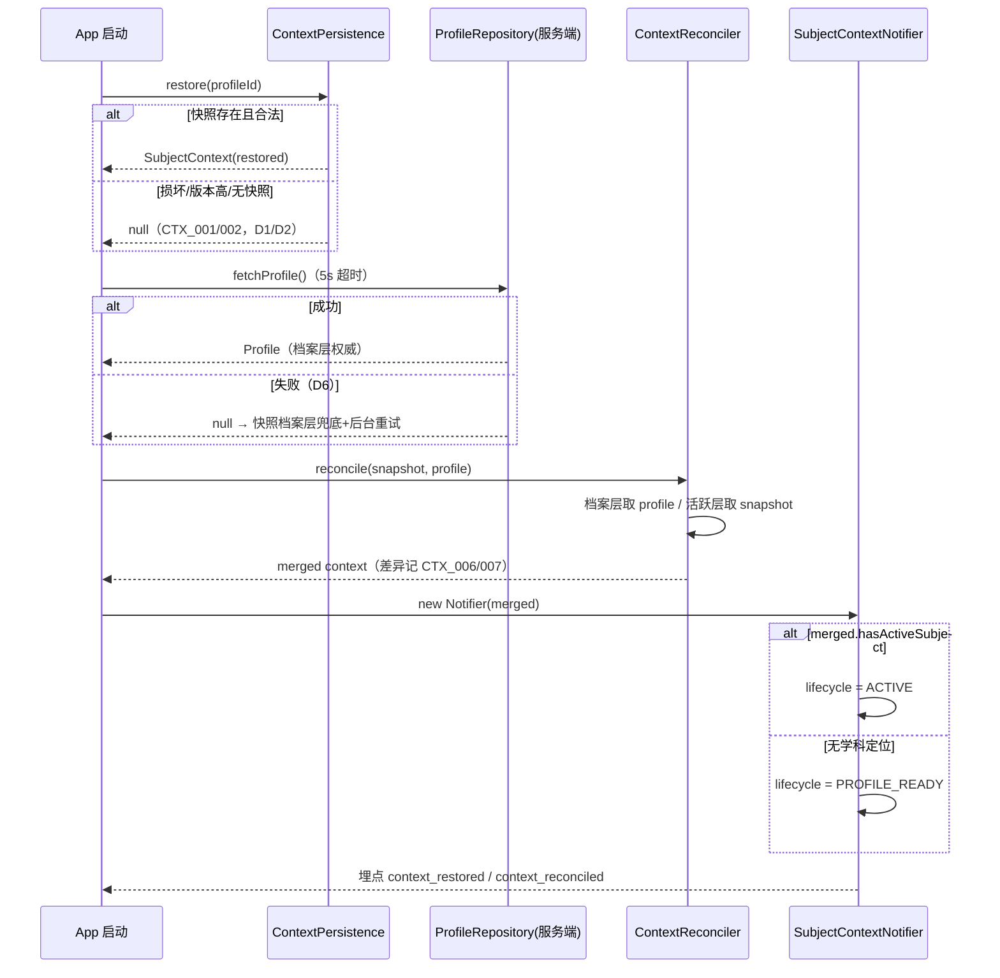
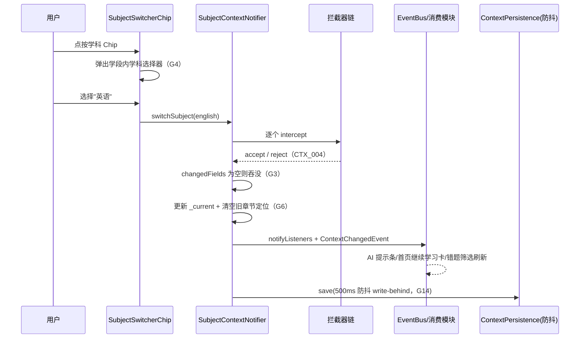
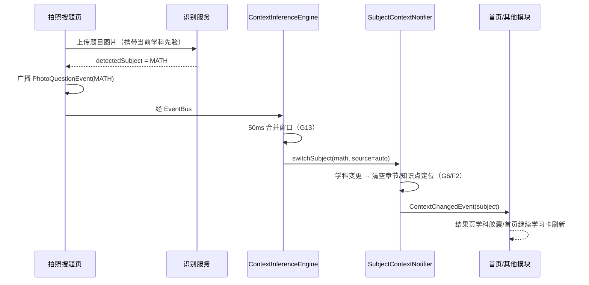
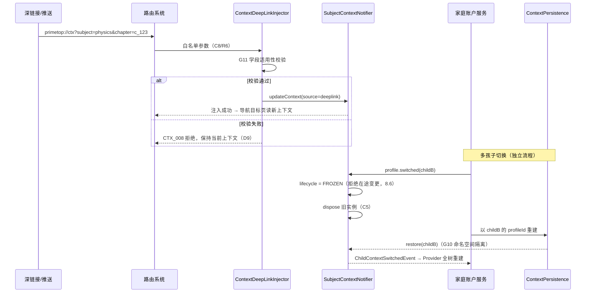

# 客户端 - 学科上下文与学习环境管理 详细设计

> **版本**: v1.1 | **日期**: 2026-08-21 | **状态**: 已补全（原 v1.0 初稿 2026-05-29，§5.1 起截断，v1.1 补全并修复 F1-F6 缺陷，见文末维护记录）
> **模块定位**: 客户端核心基础设施 — 管理用户当前学习上下文（学科、年级、教材版本、章节、学段），在全 App 范围内统一流转、持久化、自动推断与手动切换。
> **关联模块**: 客户端状态管理架构、客户端路由与深链接系统、AI对话引擎与会话管理、同步课堂学习、自适应学习与个性化推荐引擎、客户端-首页与学习工作台、用户账号体系

---

## 1. 背景与问题

### 1.1 为什么需要学科上下文管理

PrimeTop 是一个覆盖全学段、全学科的教育 App。用户在使用过程中，**几乎所有功能模块都依赖"当前学习环境"**：

| 功能模块 | 需要的上下文 |
|----------|-------------|
| AI 对话 | 学段 + 学科 + 年级 → 决定讲解深度、Prompt 策略 |
| 拍照搜题 | 学科 + 年级 → 影响题目识别模型和解析风格 |
| 同步课堂 | 教材版本 + 年级 + 学期 + 章节 → 匹配教材内容 |
| 错题本 | 学科 + 章节 → 筛选和归类错题 |
| 考点梳理 | 学科 + 学段 + 考试类型 → 匹配考点范围 |
| 作文辅导 | 学段 + 年级 → 匹配写作要求和评分标准 |
| 练习测评 | 学科 + 知识点范围 + 难度 → 组卷参数 |
| 学习规划 | 学段 + 学科 + 目标考试 → 生成计划 |
| 首页推荐 | 全量上下文 → 个性化推荐卡片内容 |

如果每个页面各自维护学科信息，会导致：

1. **上下文不一致**：AI 对话时是数学，但错题本显示英语
2. **切换体验差**：每次进入新页面都要重新选学科
3. **数据丢失**：从 AI 对话跳转到错题本再返回，上下文已丢失
4. **AI 提问缺上下文**：用户在数学章节下问"这道题怎么做"，AI 不知道是哪科
5. **推荐不精准**：首页推荐与用户当前学习进度脱节

### 1.2 设计目标

| 目标 | 说明 |
|------|------|
| 全局一致性 | App 内任何时刻，只有一个"当前学科上下文"，所有模块感知一致 |
| 自动推断 | 根据用户行为（浏览章节、拍题、对话）自动更新上下文 |
| 手动覆盖 | 用户可随时手动切换学科/年级/章节 |
| 持久化 | 上下文在 App 重启后恢复 |
| 多维度 | 上下文包含学段、年级、学科、教材版本、学期、章节、知识点等多层次 |
| 性能 | 上下文读取零延迟（内存直读），变更通知实时 |

### 1.3 非目标

- 不负责用户档案（年级、学段）的编辑保存（由用户账号体系负责）
- 不负责教材版本的全量管理（由内容服务负责）
- 不负责 AI Prompt 的组装（由 AI 对话引擎负责），只提供上下文数据

---

## 2. 核心概念与数据结构

### 2.1 学科上下文模型

```dart
/// 学科上下文 — 描述用户当前的学习环境
/// 这是一个不可变对象（Immutable），通过 copyWith 产生新实例
class SubjectContext {
  /// === 用户档案层（相对稳定，很少变化）===
  
  /// 学段：kindergarten / primary / junior / senior
  final Stage stage;
  
  /// 年级：1-12（幼儿园为 0）
  final int grade;
  
  /// 学期：first / second
  final Semester semester;
  
  /// 教材版本：人教版、苏教版、北师大版 等
  /// 不同学科可以有不同的教材版本
  final Map<Subject, TextbookEdition> textbookEditions;
  
  /// === 当前活跃层（频繁变化）===
  
  /// 当前学科
  final Subject? activeSubject;
  
  /// 当前章节 ID（可选，用户可能在学科根目录）
  final String? activeChapterId;
  
  /// 当前知识点 ID（可选，更细粒度的定位）
  final String? activeKnowledgePointId;
  
  /// === 上下文来源 ===
  
  /// 上下文是如何确定的：auto / manual / deeplink / recommendation
  final ContextSource source;
  
  /// 上下文更新的时间戳
  final DateTime updatedAt;
  
  const SubjectContext({
    required this.stage,
    required this.grade,
    required this.semester,
    required this.textbookEditions,
    this.activeSubject,
    this.activeChapterId,
    this.activeKnowledgePointId,
    this.source = ContextSource.auto,
    DateTime? updatedAt,
  }) : updatedAt = updatedAt ?? DateTime.now();
  
  /// 获取当前学科对应的教材版本
  TextbookEdition? get activeTextbookEdition =>
      activeSubject != null ? textbookEditions[activeSubject] : null;
  
  /// v1.1(F1)：copyWith 完整实现。可空字段使用哨兵区分「未指定(保持原值)」与
  /// 「显式置空(清除定位)」——直接传 null 表示清除，传 [clear] 语义等价于 null，
  /// 省略参数表示保持原值。否则 switchSubject 切换学科时无法清空旧学科的
  /// 章节/知识点定位（v1.0 缺陷：copyWith 仅为桩声明且无清空语义）。
  static const _keep = Object();
  static const clear = Object(); // 语义化哨兵：显式清除（可空字段专用）
  
  SubjectContext copyWith({
    Object? stage = _keep,
    Object? grade = _keep,
    Object? semester = _keep,
    Object? textbookEditions = _keep,
    Object? activeSubject = _keep,
    Object? activeChapterId = _keep,
    Object? activeKnowledgePointId = _keep,
    Object? source = _keep,
  }) {
    return SubjectContext(
      stage: identical(stage, _keep) ? this.stage : stage as Stage,
      grade: identical(grade, _keep) ? this.grade : grade as int,
      semester:
          identical(semester, _keep) ? this.semester : semester as Semester,
      textbookEditions: identical(textbookEditions, _keep)
          ? this.textbookEditions
          : textbookEditions as Map<Subject, TextbookEdition>,
      // 注意：传 null 即清除（哨兵 _keep 才是保持）
      activeSubject: identical(activeSubject, _keep)
          ? this.activeSubject
          : activeSubject as Subject?,
      activeChapterId: identical(activeChapterId, _keep)
          ? this.activeChapterId
          : activeChapterId as String?,
      activeKnowledgePointId: identical(activeKnowledgePointId, _keep)
          ? this.activeKnowledgePointId
          : activeKnowledgePointId as String?,
      source:
          identical(source, _keep) ? this.source : source as ContextSource,
    );
  }
}
```

### 2.2 枚举定义

```dart
/// 学段
enum Stage {
  kindergarten('幼儿启蒙', 'kindergarten', ageRange: '3-6'),
  primary('小学', 'primary', gradeRange: '1-6'),
  junior('初中', 'junior', gradeRange: '7-9'),
  senior('高中', 'senior', gradeRange: '10-12');
  
  final String label;
  final String code;
  final String? ageRange;
  final String? gradeRange;
  
  /// 从年级数字推断学段
  static Stage fromGrade(int grade) {
    if (grade == 0) return kindergarten;
    if (grade >= 1 && grade <= 6) return primary;
    if (grade >= 7 && grade <= 9) return junior;
    if (grade >= 10 && grade <= 12) return senior;
    throw ArgumentError('Invalid grade: $grade');
  }
}

/// 学科
enum Subject {
  chinese('语文', 'CHN', stage: {Stage.primary, Stage.junior, Stage.senior}),
  math('数学', 'MATH', stage: {Stage.primary, Stage.junior, Stage.senior}),
  english('英语', 'ENG', stage: {Stage.primary, Stage.junior, Stage.senior}),
  physics('物理', 'PHY', stage: {Stage.junior, Stage.senior}),
  chemistry('化学', 'CHE', stage: {Stage.junior, Stage.senior}),
  biology('生物', 'BIO', stage: {Stage.junior, Stage.senior}),
  history('历史', 'HIS', stage: {Stage.junior, Stage.senior}),
  geography('地理', 'GEO', stage: {Stage.junior, Stage.senior}),
  politics('政治', 'POL', stage: {Stage.junior, Stage.senior}),
  pinyin('拼音', 'PIN', stage: {Stage.kindergarten, Stage.primary}),
  literacy('识字', 'LIT', stage: {Stage.kindergarten, Stage.primary});
  
  final String label;
  final String code;
  final Set<Stage> stage;
  
  /// 获取指定学段下的所有学科
  static List<Subject> forStage(Stage stage) =>
      values.where((s) => s.stage.contains(stage)).toList();
}

/// 学期
enum Semester {
  first('上学期', 'S1'),
  second('下学期', 'S2');
  final String label;
  final String code;
  
  /// 根据月份自动推断当前学期
  static Semester current() {
    final month = DateTime.now().month;
    return (month >= 2 && month <= 7) ? second : first;
  }
}

/// 教材版本
enum TextbookEdition {
  renjia('人教版', 'RJ'),
  sujiao('苏教版', 'SJ'),
  bsd('北师大版', 'BSD'),
  waiyan('外研版', 'WY'),
  huadong('华东师大版', 'HD'),
  yuelu('岳麓版', 'YL'),
  other('其他', 'OTHER');
  
  final String label;
  final String code;
}

/// 上下文来源
enum ContextSource {
  auto('自动推断'),      // 根据用户行为自动设置
  manual('手动切换'),    // 用户主动切换学科/章节
  deeplink('深链接'),    // 从外部链接/通知进入
  recommendation('推荐'), // 由推荐系统设置
  restored('恢复');      // App 重启后恢复上次上下文
  
  final String label;
}
```

### 2.3 上下文变更事件

```dart
/// 上下文变更事件 — 用于通知所有监听者
class ContextChangedEvent {
  /// 变更前的上下文
  final SubjectContext previous;
  
  /// 变更后的上下文
  final SubjectContext current;
  
  /// 具体变更了哪些字段
  final Set<ContextField> changedFields;
  
  /// 触发变更的原因/来源页面
  final String triggerSource;
  
  final DateTime timestamp;
  
  ContextChangedEvent({
    required this.previous,
    required this.current,
    required this.changedFields,
    required this.triggerSource,
    DateTime? timestamp,
  }) : timestamp = timestamp ?? DateTime.now();
}

enum ContextField {
  stage,           // 学段变化（如升学）
  grade,           // 年级变化
  semester,        // 学期变化
  subject,         // 学科切换
  chapter,         // 章节变化
  knowledgePoint,  // 知识点变化
  textbookEdition, // 教材版本变化
}
```

---

## 3. 架构设计

### 3.1 整体架构

```
┌──────────────────────────────────────────────────────────────┐
│                        UI 层                                  │
│  ┌──────┐ ┌──────┐ ┌──────┐ ┌──────┐ ┌──────┐ ┌──────┐     │
│  │ 首页 │ │ AI   │ │ 同步 │ │ 错题 │ │ 考点 │ │ 作文 │ ... │
│  │      │ │ 对话 │ │ 课堂 │ │ 本   │ │ 梳理 │ │ 辅导 │     │
│  └──┬───┘ └──┬───┘ └──┬───┘ └──┬───┘ └──┬───┘ └──┬───┘     │
│     │        │        │        │        │        │          │
│     └────────┴────────┴────────┴────────┴────────┘          │
│                          │ 读取 / 监听                       │
│                          ▼                                   │
│  ┌─────────────────────────────────────────────────────────┐│
│  │            SubjectContextProvider (InheritedWidget)      ││
│  │  · 全局唯一实例，挂在 MaterialApp 之下                    ││
│  │  · 所有子树通过 context.subjectContext 访问              ││
│  └────────────────────────┬────────────────────────────────┘│
│                           │                                  │
│  ┌────────────────────────┴────────────────────────────────┐│
│  │          SubjectContextNotifier (ChangeNotifier)         ││
│  │  · 持有 SubjectContext 当前值                            ││
│  │  · 提供 updateContext() 方法                             ││
│  │  · 发出 ContextChangedEvent 通知                         ││
│  │  · 自动持久化到本地存储                                   ││
│  └────────────────────────┬────────────────────────────────┘│
│                           │                                  │
│  ┌────────────────────────┴────────────────────────────────┐│
│  │             ContextInferenceEngine (推断引擎)             ││
│  │  · 监听用户行为事件                                      ││
│  │  · 根据行为自动推断上下文变更                              ││
│  │  · 发起 updateContext() 调用                              ││
│  └─────────────────────────────────────────────────────────┘│
│                                                              │
│  ┌─────────────────────────────────────────────────────────┐│
│  │              ContextPersistence (持久化层)                ││
│  │  · SharedPreferences 快照存储                             ││
│  │  · 启动时恢复                                            ││
│  └─────────────────────────────────────────────────────────┘│
└──────────────────────────────────────────────────────────────┘
```

### 3.2 核心类职责

| 类 | 职责 | 生命周期 |
|----|------|---------|
| `SubjectContext` | 不可变数据模型，描述当前上下文 | 每次变更产生新实例 |
| `SubjectContextNotifier` | 持有当前上下文状态，处理变更通知 | App 全局单例 |
| `SubjectContextProvider` | InheritedWidget，将 Notifier 注入 Widget 树 | 挂在 MaterialApp 之下 |
| `ContextInferenceEngine` | 监听用户行为，自动推断上下文 | App 全局单例 |
| `ContextPersistence` | 上下文的本地持久化和恢复 | App 全局单例 |
| `ContextChangedEvent` | 上下文变更事件 | 每次变更产生 |

### 3.3 Widget 树挂载位置

```dart
void main() {
  runApp(
    SubjectContextProvider(
      notifier: subjectContextNotifier,  // 全局单例
      child: PrimeTopApp(),
    ),
  );
}

// 任何页面中获取上下文
class SomePage extends StatelessWidget {
  @override
  Widget build(BuildContext context) {
    final ctx = SubjectContextProvider.of(context);
    print('当前学科: ${ctx.activeSubject?.label}');
    print('当前章节: ${ctx.activeChapterId}');
    // ...
  }
}
```

---

## 4. 详细设计

### 4.1 SubjectContextNotifier

```dart
class SubjectContextNotifier extends ChangeNotifier {
  SubjectContext _current;
  final ContextPersistence _persistence;
  final List<ContextInterceptor> _interceptors;

  /// v1.1(F6)：补齐 v1.0 未声明却被引用的字段（编译级缺陷）
  final AppLogger _logger = AppLogger.tag('ctx.notifier');
  final EventBus _eventBus; // 全局事件总线（《客户端状态管理架构》单例，测试可注入）
  
  SubjectContextNotifier({
    required SubjectContext initial,
    required ContextPersistence persistence,
    List<ContextInterceptor>? interceptors,
    EventBus? eventBus, // v1.1(F6)
  })  : _current = initial,
        _persistence = persistence,
        _interceptors = interceptors ?? [],
        _eventBus = eventBus ?? globalEventBus;

  /// 获取当前上下文（只读）
  SubjectContext get current => _current;

  /// 快捷访问器
  Stage get stage => _current.stage;
  int get grade => _current.grade;
  Subject? get activeSubject => _current.activeSubject;
  String? get activeChapterId => _current.activeChapterId;
  
  /// 是否已选择学科
  bool get hasActiveSubject => _current.activeSubject != null;

  /// === 核心方法：更新上下文 ===
  /// 
  /// 所有上下文变更必须通过此方法，确保：
  /// 1. 经过拦截器链（校验、日志、埋点）
  /// 2. 计算变更字段
  /// 3. 发出通知
  /// 4. 异步持久化
  void updateContext(
    SubjectContext newContext, {
    String triggerSource = 'unknown',
  }) {
    // 1. 通过拦截器链
    for (final interceptor in _interceptors) {
      final result = interceptor.intercept(_current, newContext);
      if (result.reject) {
        _logger.warning('上下文变更被拦截: ${result.reason}');
        return;
      }
      newContext = result.context ?? newContext;
    }

    // 2. 计算变更字段
    final changedFields = _computeChangedFields(_current, newContext);
    if (changedFields.isEmpty) return; // 无实际变更

    // 3. 记录事件
    final event = ContextChangedEvent(
      previous: _current,
      current: newContext,
      changedFields: changedFields,
      triggerSource: triggerSource,
    );

    // 4. 更新状态
    _current = newContext;

    // 5. 异步持久化（不阻塞通知）
    _persistence.save(_current).catchError((e) {
      _logger.error('上下文持久化失败', error: e);
    });

    // 6. 发出通知
    notifyListeners();
    
    // 7. 发出事件总线通知（跨模块）
    _eventBus.fire(event);
    
    _logger.info(
      '上下文变更: ${changedFields.map((f) => f.name).join(', ')} '
      '来源: $triggerSource',
    );
  }

  /// 便捷方法：切换学科
  ///
  /// v1.1(F1)修复：学科发生变更且调用方未显式携带新章节时，必须清空旧学科的
  /// 章节/知识点定位（G6）——v1.0 直接透传 null 在哨兵语义下等于「保持原值」，
  /// 会导致切到英语后 activeChapterId 仍指向数学第三章。
  void switchSubject(
    Subject subject, {
    String? chapterId,
    String? knowledgePointId,
    ContextSource source = ContextSource.manual,
    String triggerSource = 'subject_switcher',
  }) {
    final subjectChanged = subject != _current.activeSubject;
    updateContext(
      _current.copyWith(
        activeSubject: subject,
        // 学科变更且未携带章节 → 显式清除旧定位（G6）；同学科且未携带章节 →
        // 同样清空回落学科级（切换器语义）；携带章节 → 显式定位
        activeChapterId: subjectChanged && chapterId == null
            ? SubjectContext.clear
            : chapterId,
        activeKnowledgePointId: subjectChanged && knowledgePointId == null
            ? SubjectContext.clear
            : knowledgePointId,
        source: source,
      ),
      triggerSource: triggerSource,
    );
  }

  /// 便捷方法：导航到章节
  void navigateToChapter(
    String chapterId, {
    String? knowledgePointId,
    ContextSource source = ContextSource.auto,
    String triggerSource = 'chapter_navigation',
  }) {
    updateContext(
      _current.copyWith(
        activeChapterId: chapterId,
        activeKnowledgePointId: knowledgePointId,
        source: source,
      ),
      triggerSource: triggerSource,
    );
  }

  /// 便捷方法：升级年级（学年切换）
  ///
  /// v1.1(F3)修复三点：
  /// 1. 升学后原学科可能不适用新学段（如幼小衔接后 literacy 仅存至小学低段），
  ///    不适用的 activeSubject 置 null 回落 PROFILE_READY 态，由用户/推荐重新选择；
  /// 2. 教材版本允许由调用方（升迁事件载荷）携带新学段默认版本重置；
  /// 3. G7：年级/学段变更的权威触发方是《服务端-用户年级升迁与学段转换服务》
  ///    下发的 user.grade.promoted 事件（经用户账号体系承接），客户端禁止本地
  ///    自发调用本方法发起升迁（仅事件承接、测试与管理工具使用）。
  void promoteGrade(
    int newGrade, {
    Map<Subject, TextbookEdition>? newTextbookEditions,
    String triggerSource = 'grade_promoted_event',
  }) {
    final newStage = Stage.fromGrade(newGrade);
    final oldSubject = _current.activeSubject;
    final nextSubject =
        (oldSubject != null && oldSubject.stage.contains(newStage))
            ? oldSubject
            : null; // 不适用新学段 → 清除，回落 PROFILE_READY
    updateContext(
      _current.copyWith(
        grade: newGrade,
        stage: newStage,
        activeSubject: nextSubject,
        activeChapterId: SubjectContext.clear,
        activeKnowledgePointId: SubjectContext.clear,
        textbookEditions:
            newTextbookEditions ?? _current.textbookEditions, // 未携带则保持
        source: ContextSource.auto, // 事件驱动，非用户手动
      ),
      triggerSource: triggerSource,
    );
  }

  /// 计算变更字段
  Set<ContextField> _computeChangedFields(
    SubjectContext prev, SubjectContext curr,
  ) {
    final fields = <ContextField>{};
    if (prev.stage != curr.stage) fields.add(ContextField.stage);
    if (prev.grade != curr.grade) fields.add(ContextField.grade);
    if (prev.semester != curr.semester) fields.add(ContextField.semester);
    if (prev.activeSubject != curr.activeSubject) fields.add(ContextField.subject);
    if (prev.activeChapterId != curr.activeChapterId) fields.add(ContextField.chapter);
    if (prev.activeKnowledgePointId != curr.activeKnowledgePointId) {
      fields.add(ContextField.knowledgePoint);
    }
    if (!mapEquals(prev.textbookEditions, curr.textbookEditions)) {
      fields.add(ContextField.textbookEdition);
    }
    return fields;
  }
}
```

### 4.2 拦截器机制

```dart
/// 上下文变更拦截器 — 在变更生效前进行校验或修正
abstract class ContextInterceptor {
  InterceptResult intercept(SubjectContext current, SubjectContext proposed);
}

class InterceptResult {
  final bool reject;
  final String? reason;
  final SubjectContext? context; // 修正后的上下文（如果不 reject）
  
  InterceptResult.accept({SubjectContext? context})
      : reject = false, reason = null, this.context = context;
  
  InterceptResult.reject(this.reason)
      : reject = true, context = null;
}

/// 拦截器示例：学科合法性校验
class SubjectStageValidationInterceptor implements ContextInterceptor {
  @override
  InterceptResult intercept(SubjectContext current, SubjectContext proposed) {
    // 检查学科是否适用于当前学段
    if (proposed.activeSubject != null) {
      if (!proposed.activeSubject!.stage.contains(proposed.stage)) {
        return InterceptResult.reject(
          '${proposed.activeSubject!.label} 不适用于${proposed.stage.label}学段',
        );
      }
    }
    return InterceptResult.accept();
  }
}

/// 拦截器示例：章节归属校验
class ChapterOwnershipInterceptor implements ContextInterceptor {
  final ChapterRepository _chapterRepo;
  
  ChapterOwnershipInterceptor(this._chapterRepo);
  
  @override
  InterceptResult intercept(SubjectContext current, SubjectContext proposed) {
    if (proposed.activeChapterId != null && proposed.activeSubject != null) {
      // 异步校验章节是否属于当前学科（实际项目中需要异步处理）
      // 此处简化为同步示意
      final chapter = _chapterRepo.getChapterSync(proposed.activeChapterId!);
      if (chapter != null && chapter.subject != proposed.activeSubject) {
        return InterceptResult.reject(
          '章节 ${proposed.activeChapterId} 不属于${proposed.activeSubject!.label}',
        );
      }
    }
    return InterceptResult.accept();
  }
}

/// 拦截器示例：埋点记录
class ContextAnalyticsInterceptor implements ContextInterceptor {
  final AnalyticsService _analytics;
  
  ContextAnalyticsInterceptor(this._analytics);
  
  @override
  InterceptResult intercept(SubjectContext current, SubjectContext proposed) {
    // 记录上下文变更埋点（不阻止变更）
    _analytics.track('context_change', properties: {
      'from_subject': current.activeSubject?.code,
      'to_subject': proposed.activeSubject?.code,
      'from_chapter': current.activeChapterId,
      'to_chapter': proposed.activeChapterId,
      'source': proposed.source.name,
    });
    return InterceptResult.accept();
  }
}
```

### 4.3 自动推断引擎

```dart
/// 上下文自动推断引擎
///
/// 监听用户行为事件，根据行为类型自动更新学科上下文。
/// 例如：用户打开"数学第3章"，自动将上下文切到数学/第3章。
///
/// v1.1(F2)修复：v1.0 的 PhotoQuestionEvent / AIConversationStartedEvent /
/// PracticeStartedEvent 分支直接 copyWith 切换 activeSubject，在 _keep 哨兵
/// 语义下旧学科的章节/知识点定位残留；ChapterViewedEvent 分支丢失知识点
/// 清空语义（回到章节根目录时旧知识点仍高亮）。v1.1 统一裁决：
/// 1. 凡涉及学科变更的推断一律走 switchSubject（G6 清空内建）；
/// 2. 同学科内章节导航显式传知识点（null = 回到章节根 → 显式清除）；
/// 3. G12：同场景内 auto 推断不得覆盖 manual/deeplink 刚设置的上下文；
/// 4. G13：50ms 合并窗口内多次推断事件只应用最后一次（防通知风暴）。
class ContextInferenceEngine {
  final SubjectContextNotifier _notifier;
  final EventBus _eventBus;
  final AppLogger _log = AppLogger.tag('ctx.inference');

  ContextInferenceEngine(this._notifier, this._eventBus) {
    _subscribeToEvents();
  }

  void _subscribeToEvents() {
    // 监听章节浏览事件（同步课堂/知识图谱内导航）
    _eventBus.on<ChapterViewedEvent>().listen((event) {
      _applyMerged(() {
        if (event.subject != _notifier.activeSubject) {
          // 学科变更 → switchSubject 内建清空旧定位（G6）
          _notifier.switchSubject(
            event.subject,
            chapterId: event.chapterId,
            source: ContextSource.auto,
            triggerSource: 'chapter_view',
          );
        } else {
          // 同学科内导航：knowledgePointId 为 null = 回到章节根 → 显式清除
          _notifier.updateContext(
            _notifier.current.copyWith(
              activeChapterId: event.chapterId,
              activeKnowledgePointId:
                  event.knowledgePointId ?? SubjectContext.clear,
              source: ContextSource.auto,
            ),
            triggerSource: 'chapter_view',
          );
        }
      });
    });

    // 监听拍照搜题识别结果事件（UNKNOWN 不触发，R11）
    _eventBus.on<PhotoQuestionEvent>().listen((event) {
      if (event.detectedSubject != null &&
          event.detectedSubject != _notifier.activeSubject) {
        _applyMerged(() {
          _notifier.switchSubject(
            event.detectedSubject!,
            source: ContextSource.auto,
            triggerSource: 'photo_question',
          );
        });
      }
    });

    // 监听 AI 对话开始事件（用户在对话内显式指定学科）
    _eventBus.on<AIConversationStartedEvent>().listen((event) {
      if (event.specifiedSubject != null &&
          event.specifiedSubject != _notifier.activeSubject) {
        _applyMerged(() {
          _notifier.switchSubject(
            event.specifiedSubject!,
            source: ContextSource.auto,
            triggerSource: 'ai_conversation_start',
          );
        });
      }
    });

    // 监听练习开始事件（chapterId 必填；null = 学科级练习 → 清除章节定位）
    _eventBus.on<PracticeStartedEvent>().listen((event) {
      _applyMerged(() {
        _notifier.switchSubject(
          event.subject,
          chapterId: event.chapterId,
          knowledgePointId: event.knowledgePointId,
          source: ContextSource.auto,
          triggerSource: 'practice_start',
        );
      });
    });

    // 监听错题查看事件
    _eventBus.on<MistakeViewedEvent>().listen((event) {
      if (event.subject != _notifier.activeSubject) {
        _applyMerged(() {
          _notifier.switchSubject(
            event.subject,
            source: ContextSource.auto,
            triggerSource: 'mistake_view',
          );
        });
      }
    });
  }

  /// G12：同场景内 auto 不得覆盖显式源——应用前比对当前 source，
  /// manual/deeplink 刚设置（2s 内）则丢弃本次推断（记 debug 日志）。
  void _applyMerged(void Function() apply) {
    if (_notifier.current.source == ContextSource.manual ||
        _notifier.current.source == ContextSource.deeplink) {
      final age = DateTime.now().difference(_notifier.current.updatedAt);
      if (age < const Duration(seconds: 2)) {
        _log.debug('G12 显式源保护期内，丢弃推断');
        return;
      }
    }
    _pendingApply = apply;
    _mergeTimer ??= Timer(const Duration(milliseconds: 50), () {
      _mergeTimer = null;
      final fn = _pendingApply;
      _pendingApply = null;
      fn?.call(); // G13：窗口内多次事件只应用最后一次
    });
  }

  void Function()? _pendingApply;
  Timer? _mergeTimer;

  /// 页面销毁/App 退后台时调用，防 Timer 泄漏与后台应用陈旧推断
  void dispose() {
    _mergeTimer?.cancel();
    _mergeTimer = null;
    _pendingApply = null;
  }
}
```

### 4.4 持久化层

```dart
class ContextPersistence {
  /// v1.1(F5)：快照 Key 按 profileId 命名空间隔离——家庭账户多孩子切换时
  /// 防止 A 孩子的上下文恢复到 B 孩子（串号）。格式：subject_context:{profileId}
  static const _keyPrefix = 'subject_context';
  static const kSnapshotVersion = 1;
  final SharedPreferences _prefs;
  final String profileId; // 当前学生档案 ID（切换孩子时销毁重建本实例）

  String get _key => '$_keyPrefix:$profileId';

  /// 简易日志器（示意，对齐《客户端日志采集与远程诊断系统》的 Logger 门面）
  final AppLogger _log = AppLogger.tag('ctx.persistence');
  
  ContextPersistence(this._prefs, {required this.profileId});
  
  /// 保存当前上下文快照
  Future<void> save(SubjectContext context) async {
    final json = _serialize(context);
    await _prefs.setString(_key, jsonEncode(json));
  }
  
  /// 恢复上次保存的上下文
  SubjectContext? restore() {
    final raw = _prefs.getString(_key);
    if (raw == null) return null;
    try {
      final map = jsonDecode(raw) as Map<String, dynamic>;
      // v1.1(F5)：消费 serialize 已写入的 version 字段——高版本客户端写的快照
      // 前向不兼容，放弃恢复走默认（CTX_002），而非 v1.0 的直接反序列化抛错。
      final version = map['version'] as int? ?? 1;
      if (version > kSnapshotVersion) {
        _log.warn('CTX_002 快照版本 $version 高于当前客户端支持，放弃恢复');
        return null;
      }
      return _deserialize(map);
    } catch (e) {
      _log.warn('CTX_001 快照损坏，放弃恢复: $e');
      return null; // 快照损坏（D2），返回 null，由调用方决定默认值
    }
  }
  
  /// 清除（用于登出）
  Future<void> clear() async {
    await _prefs.remove(_key);
  }
  
  Map<String, dynamic> _serialize(SubjectContext ctx) => {
    'stage': ctx.stage.name,
    'grade': ctx.grade,
    'semester': ctx.semester.name,
    'textbookEditions': ctx.textbookEditions.map(
      (k, v) => MapEntry(k.name, v.name),
    ),
    'activeSubject': ctx.activeSubject?.name,
    'activeChapterId': ctx.activeChapterId,
    'activeKnowledgePointId': ctx.activeKnowledgePointId,
    'source': 'restored', // 恢复后标记为 restored
    'updatedAt': ctx.updatedAt.toIso8601String(),
    // 版本号，用于未来格式升级
    'version': 1,
  };
  
  /// v1.1(F5)：字段级容错——枚举名未知（App 降级安装/枚举改名/异端写入）时
  /// 该字段降级为 null/默认值并记 CTX_003，不再让 byName 抛异常导致整份
  /// 快照被丢弃（v1.0 行为：单字段失败 → restore 返回 null → 全部回默认）。
  SubjectContext _deserialize(Map<String, dynamic> json) {
    final stageMap = Stage.values.asNameMap();
    final semesterMap = Semester.values.asNameMap();
    final subjectMap = Subject.values.asNameMap();
    final editionMap = TextbookEdition.values.asNameMap();

    Subject? trySubject(String? name) {
      if (name == null) return null;
      final s = subjectMap[name];
      if (s == null) _log.warn('CTX_003 未知学科枚举: $name，已忽略');
      return s;
    }

    final stage = stageMap[json['stage'] as String?] ??
        (json['grade'] != null
            ? Stage.fromGrade(json['grade'] as int)
            : Stage.primary); // 学段未知时按年级反推，再退 primary
    final editions = <Subject, TextbookEdition>{};
    for (final entry
        in (json['textbookEditions'] as Map<String, dynamic>? ?? {}).entries) {
      final subject = subjectMap[entry.key];
      final edition = editionMap[entry.value as String?];
      if (subject != null && edition != null) {
        editions[subject] = edition; // 单条失败只丢该条
      } else {
        _log.warn('CTX_003 教材版本条目无法识别: ${entry.key}=${entry.value}');
      }
    }

    return SubjectContext(
      stage: stage,
      grade: (json['grade'] as int?) ??
          (stage == Stage.kindergarten ? 0 : 1), // 年级缺失时按学段回退首年级
      semester: semesterMap[json['semester'] as String?] ?? Semester.current(),
      textbookEditions: editions,
      activeSubject: trySubject(json['activeSubject'] as String?),
      activeChapterId: json['activeChapterId'] as String?,
      activeKnowledgePointId: json['activeKnowledgePointId'] as String?,
      source: ContextSource.restored,
    );
  }
}
```

---

### 4.5 上下文生命周期与启动恢复（F4）

v1.0 在 §4.1 的 `promoteGrade` 注释中引用了 `PROFILE_READY` 态但全文未定义，且未规定启动时「本地快照 vs 服务端档案」的权威边界。v1.1 定义四态生命周期与启动对账流程。

```dart
/// 上下文生命周期状态（F4）
enum ContextLifecycle {
  bootstrapping, // 启动恢复与档案对账中（拒绝一切变更，见 8.2）
  profileReady,  // 档案层就绪但无学科定位（等待首次选择/推荐）
  active,        // 完整上下文可用
  frozen,        // 切换孩子中（拒绝一切变更，等待旧实例销毁）
}
```

启动恢复与对账流程（G8 双层权威裁决）：

```dart
/// App 启动时调用（或切换孩子后重建时调用）
Future<SubjectContextNotifier> bootstrapContext({
  required String profileId,
  required SharedPreferences prefs,
  required ProfileRepository profileRepo,
  List<ContextInterceptor> interceptors = const [],
}) async {
  // 1. 恢复本地快照（活跃层权威）
  final persistence = ContextPersistence(prefs, profileId: profileId);
  final snapshot = persistence.restore(); // null = 无快照/损坏/版本高(D1/D2/G9)

  // 2. 拉取服务端档案（档案层权威；失败 D6：用快照档案层并后台重试）
  final profile = await profileRepo
      .fetch()
      .timeout(const Duration(seconds: 5))
      .catchError((_) => null);

  // 3. 对账合并（见下方裁决表）
  final merged = ContextReconciler.reconcile(snapshot: snapshot, profile: profile);

  // 4. 构造 Notifier 并进入对应状态
  final notifier = SubjectContextNotifier(
    initial: merged,
    persistence: persistence,
    interceptors: interceptors,
  );
  notifier.lifecycle = merged.hasActiveSubject
      ? ContextLifecycle.active
      : ContextLifecycle.profileReady;
  return notifier;
}
```

对账裁决表（`ContextReconciler.reconcile` 的合并规则，G8）：

| 字段组 | 本地快照 | 服务端档案 | 合并结果 | 冲突时动作 |
|--------|---------|-----------|---------|-----------|
| stage / grade / semester / textbookEditions（档案层） | 展示值 | **权威** | 档案值 | 与快照不一致记 CTX_006（对账校正） |
| activeSubject（活跃层） | **权威** | ×（服务端不存 UI 定位，R1） | 快照值；但须通过新学段适配校验，不适用则清除并记 CTX_007 | — |
| activeChapterId / activeKnowledgePointId（活跃层） | **权威** | × | 快照值；学科被清除时联动清空（G6） | — |
| 双方均缺失 | — | — | 构造 profileReady 默认上下文（stage/grade 取档案或 primary/1，无学科定位） | 埋点 context_restored(result=fresh) |

服务端档案不可用时（D6）：以快照档案层充当档案层合并，后台重试拉取（指数退避 ≤3 次）；成功后若发现档案层差异，补一次对账并广播 `ContextChangedEvent(changedFields 含档案层字段)`。

### 4.6 深链接上下文注入（F6）

v1.0 定义了 `ContextSource.deeplink` 枚举但全无消费链路。v1.1 补注入器：

```dart
/// 深链接注入器：承接《客户端路由与深链接系统》解析出的白名单参数（C8/R6）
/// 链接形如 primetop://ctx?subject=physics&chapter=c_123&kp=k_456
class ContextDeepLinkInjector {
  static const whitelist = {'subject', 'chapter', 'kp'}; // grade 仅展示校正不落档案层(G7/G8)

  /// 返回 true=注入成功；false=被拒（G11/D9，记 CTX_008，保持当前上下文）
  bool inject(Uri link, SubjectContextNotifier notifier) {
    final params = link.queryParameters;
    if (!params.containsKey('subject')) return _reject('缺少 subject 参数');

    final subject = Subject.values.asNameMap()[params['subject']];
    if (subject == null) return _reject('未知学科 ${params['subject']}');

    // G11：学段适用性校验（拦截器在 updateContext 内会二次校验，此处前置快速失败）
    if (!subject.stage.contains(notifier.stage)) {
      return _reject('${subject.label} 不适用于 ${notifier.stage.label} 学段');
    }

    notifier.updateContext(
      notifier.current.copyWith(
        activeSubject: subject,
        activeChapterId: params['chapter'] ?? SubjectContext.clear,
        activeKnowledgePointId: params['kp'] ?? SubjectContext.clear,
        source: ContextSource.deeplink,
      ),
      triggerSource: 'deeplink:${link.host}${link.path}',
    );
    return true;
  }

  bool _reject(String reason) {
    AppLogger.tag('ctx.deeplink').warn('CTX_008 深链接注入被拒: $reason');
    return false;
  }
}
```

注入时机裁决：

| 场景 | 时机 | 说明 |
|------|------|------|
| 冷启动深链接 | `bootstrapContext` 完成后、首帧渲染前 | BOOTSTRAP 态不注入（G1），对账完成后立即注入，避免首帧闪变 |
| 运行中收到深链接（通知/外链） | 路由跳转前注入 | 注入成功后再导航目标页，页面读到的是新上下文 |
| 深链接携带 grade 参数 | 仅作展示校正提示 | 档案层变更权威归服务端（G7/G8），客户端不落库 |

### 4.7 多孩子切换流程（F5/G10）

```dart
/// 孩子切换编排：承接《服务端-家庭账户管理与多孩子切换服务》下发的
/// profile.switched 事件（经用户账号体系转发到客户端 EventBus）
Future<void> onChildSwitched(String newProfileId) async {
  final old = subjectContextNotifier;
  old.lifecycle = ContextLifecycle.frozen; // 8.6：冻结在途变更
  old.dispose();                           // C5：释放监听与内存态，防串号残留

  subjectContextNotifier = await bootstrapContext(
    profileId: newProfileId,               // G10：按新孩子命名空间恢复其快照
    prefs: sharedPrefs,
    profileRepo: profileRepository,
  );

  eventBus.fire(ChildContextSwitchedEvent(newProfileId));
  // UI 侧：SubjectContextProvider 重建（ChangeNotifierProvider 覣换通知者），
  // 所有依赖页面自动从新实例读取，无需逐页清理。
}
```

切换期间在途写请求的裁决见 8.6；切换后旧孩子的快照不删除（切回时定位仍在），仅内存态销毁。

---

## 5. 上下文在各模块中的消费方式

统一消费原则（所有模块共同遵守）：

| 原则 | 说明 |
|------|------|
| 只读走 Provider | `SubjectContextProvider.of(context)` 内存直读，禁止各页面缓存学科字段 |
| 变更走 Notifier | 手动操作用 `switchSubject`/`navigateToChapter`；行为推断只广播事件、由引擎统一回写 |
| 禁止自建学科状态 | 任何模块不得维护私有"当前学科"字段（v1.0 痛点 1 的根治） |
| 监听变更刷新 | 页面级 `Selector`/局部重建，避免整页 rebuild（§11） |

### 5.1 AI 对话模块

```dart
class AIConversationPage extends StatefulWidget {
  const AIConversationPage({super.key, this.initialSubject});
  final Subject? initialSubject; // 入口/深链接携带的可选学科

  @override
  State<AIConversationPage> createState() => _AIConversationPageState();
}

class _AIConversationPageState extends State<AIConversationPage> {
  StreamSubscription<ContextChangedEvent>? _sub;

  @override
  void initState() {
    super.initState();
    // 入口显式指定学科 → 广播给推断引擎统一回写（页面不自维护学科状态）
    if (widget.initialSubject != null) {
      eventBus.fire(AIConversationStartedEvent(widget.initialSubject));
    }
    // 会话期间上下文切换 → 顶部"学习环境"提示条（下一问生效，不打断当前回答流）
    _sub = eventBus.on<ContextChangedEvent>().listen((e) {
      if (e.changedFields.contains(ContextField.subject)) {
        ContextHintBanner.of(context)
            ?.show('${e.current.activeSubject?.label}·学习环境已切换');
      }
    });
  }

  /// 组装 AI 请求上下文载荷（R9：字段名对齐《AI对话引擎与会话管理》ContextPack）
  Map<String, dynamic> buildContextPayload() {
    final ctx = SubjectContextProvider.of(context);
    return {
      'stage': ctx.stage.code,
      'grade': ctx.grade,
      'subject': ctx.activeSubject?.code,
      'chapterId': ctx.activeChapterId,
      'knowledgePointId': ctx.activeKnowledgePointId,
      'textbookEdition': ctx.activeTextbookEdition?.code,
      'semester': ctx.semester.code,
    };
  }

  @override
  void dispose() {
    _sub?.cancel();
    super.dispose();
  }

  @override
  Widget build(BuildContext context) {/* 对话列表 + 输入栏，略 */}
}
```

AI 对话对上下文的三处消费：① Prompt 策略选择（stage+grade 决定讲解深度与术语级）；② 学科路由（subject 决定走对应学科辅导引擎）；③ 答案管控策略组（subject+stage 匹配《答案管控与渐进式提示引擎》策略）。

### 5.2 同步课堂模块

```dart
// 章节树加载：上下文四要素直接决定内容匹配
final ctx = SubjectContextProvider.of(context);
final tree = await chapterRepo.loadTree(
  stage: ctx.stage,
  grade: ctx.grade,
  semester: ctx.semester,
  subject: ctx.activeSubject ?? Subject.math,
  edition: ctx.activeTextbookEdition ?? TextbookEdition.renjia, // D8 兜底
);

// 用户点开章节 → 广播事件（推断引擎回写，页面不自维护）
eventBus.fire(ChapterViewedEvent(
  subject: tree.subject,
  chapterId: chapter.id,
  knowledgePointId: null, // 进入章节根 → 引擎显式清除旧知识点定位（F2）
));
```

教材版本失配提示：章节树接口返回的 `edition` 与上下文 `activeTextbookEdition` 不一致时，页面顶部横幅提示"当前教材为 X 版，切换版本"，点击调 `updateContext` 修正（triggerSource='sc_edition_mismatch'）。

### 5.3 练习测评模块

```dart
// 组卷默认参数从上下文取（学科/章节/知识点范围/难度基准）
final params = PracticeParams.fromContext(SubjectContextProvider.of(context));

// 练习开始 → 广播（引擎回写定位，供后续首页"继续学习"与错题归因）
eventBus.fire(PracticeStartedEvent(
  subject: params.subject,
  chapterId: params.chapterId,
  knowledgePointId: params.knowledgePointId,
));
```

练习入口的学科 Chip 即 `SubjectSwitcherChip`（§5.7），切换动作 `switchSubject(manual)`。

### 5.4 拍照搜题模块

- 拍题前：上下文 `activeSubject` 作为识别先验（预筛学科识别模型，提升小题识别准确率）；
- 识别完成：结果页广播 `PhotoQuestionEvent(detectedSubject)`，与当前学科不一致时由引擎自动切换（F2/G6），页面顶部显示"识别学科：数学"胶囊；
- 多题跨学科：取占比最高学科广播一次，不做逐题切换（防抖 G13）。

### 5.5 错题本与考点梳理模块

- 错题本列表默认筛选 = `activeSubject`；用户在筛选器切换 = `switchSubject(manual, triggerSource='mistake_filter')`；
- 错题详情进入广播 `MistakeViewedEvent`（学科不同才切，引擎内建判断）；
- 考点梳理入口按 `stage + activeSubject` 匹配考点范围与考试类型。

### 5.6 首页与推荐模块

```dart
// 首页"继续学习"卡片直接读上下文渲染（R12）
final ctx = SubjectContextProvider.of(context);
ContinueCard(
  subject: ctx.activeSubject,
  chapterId: ctx.activeChapterId,
  edition: ctx.activeTextbookEdition,
  onTap: () => router.go('/sc/chapter/${ctx.activeChapterId}'),
);
```

- 上下文快照经 GLCM handoff 上报（R1），作为推荐信号之一（最近学习学科/章节权重）；
- 首页顶部"学段·教材"Chip 的数据源即上下文档案层，点击跳设置页修改（不在首页直接改）。

### 5.7 全局学科切换器组件（SubjectSwitcherChip）

各模块头部复用的统一切换入口：

```dart
class SubjectSwitcherChip extends StatelessWidget {
  const SubjectSwitcherChip({super.key, this.showChapter = true});
  final bool showChapter;

  @override
  Widget build(BuildContext context) {
    final notifier = SubjectContextProvider.notifierOf(context);
    final ctx = SubjectContextProvider.of(context);
    return ActionChip(
      avatar: SubjectIcon(ctx.activeSubject),
      label: Text(_label(ctx)),
      onPressed: () => _openSwitcherSheet(context, notifier, ctx),
    );
  }

  String _label(SubjectContext ctx) => !ctx.hasActiveSubject
      ? '选择学科'
      : showChapter && ctx.activeChapterId != null
          ? '${ctx.activeSubject!.label}·${chapterNameOf(ctx.activeChapterId!)}'
          : ctx.activeSubject!.label;

  Future<void> _openSwitcherSheet(
    BuildContext context,
    SubjectContextNotifier notifier,
    SubjectContext ctx,
  ) async {
    final picked = await showSubjectPickerSheet(
      context,
      subjects: Subject.forStage(ctx.stage), // G4：仅展示学段适用学科（D8 降级全量）
    );
    if (picked != null) {
      notifier.switchSubject(picked); // manual 源，未携带章节 → 清空定位（G6 切换器语义）
    }
  }
}
```

幼儿段（kindergarten）适配：切换器为大图标宫格、双击确认（防误触，C4）；家长代操作场景走家长工具栏同组件。

---

## 6. 核心流程时序图

### 6.1 启动恢复与服务端档案对账（F4/G8）



### 6.2 手动学科切换全链路



### 6.3 拍照搜题自动推断（F2/G13）



### 6.4 深链接注入与多孩子切换



---

## 7. 状态机与守卫

### 7.1 上下文生命周期状态机（F4）

```
bootstrapping ──restore+对账完成,有学科──▶ active
     │                                       ▲
     ├─restore+对账完成,无学科──▶ profileReady ┘ 用户选择学科(G4)后进入 active
     └─冷启动深链接携带合法学科(G11)──▶ active（注入后即有定位）
active ──profile.switched──▶ frozen ──dispose──▶ [实例销毁]
profileReady ──profile.switched──▶ frozen（同上）
```

| 状态 | 含义 | 允许的操作 | 迁出条件 |
|------|------|-----------|---------|
| bootstrapping | 恢复与对账中 | 只读 `current`（初值可能为空壳）；拒绝一切 `updateContext` | bootstrapContext 返回 |
| profileReady | 档案层就绪、无学科定位 | `switchSubject`；接收推荐建议（ContextSource.recommendation） | 选定学科 → active |
| active | 完整上下文可用 | 全部便捷方法 | profile.switched → frozen |
| frozen | 切孩子中 | 拒绝一切变更（记 warn 日志） | dispose（终态，实例废弃） |

### 7.2 学科定位展示态（Chip 三态）

| 展示态 | 条件 | 文案形态 | 点击行为 |
|--------|------|---------|---------|
| EMPTY | profileReady | "选择学科"（CTA 样式） | 打开选择器 |
| SUBJECT_ONLY | active 且 activeChapterId == null | "数学" | 打开选择器（可带二级章节） |
| SUBJECT_CHAPTER | active 且 activeChapterId != null | "数学·第三章" | 打开选择器；长按清除章节定位回落学科级 |

### 7.3 守卫总表 G1-G14

| 守卫 | 规则 | 违反后果/处理 |
|------|------|--------------|
| G1 单写者 | 一切变更必须经 `updateContext`（便捷方法内部同样收敛到它），禁止外部直接改 `_current` 或绕过拦截器 | code review 拦截；`_current` 私有 + setter 缺失由编译器保证 |
| G2 拦截拒绝 | 拦截器 reject 后本次变更整体放弃：状态不变、不持久化、不发事件 | 仅记 CTX_004 日志 |
| G3 空变更吞没 | `changedFields` 为空 → 静默返回（不通知/不落盘/不埋点） | 幂等基石（8.1） |
| G4 学段适配 | `activeSubject` 必须适用 `stage`；校验拦截器强制执行 | 拦截器自身异常时 fail-secure 拒绝变更（D4） |
| G5 章节归属 | `activeChapterId` 必须属于 `activeSubject`（异步校验） | 不符则回滚并广播回滚事件（8.7/D7） |
| G6 定位清空 | 学科变更且未携带新章节 → 清空 chapter/KP；同学科调用且未携带章节 → 同样清空回落学科级（切换器语义） | 防跨学科脏定位（F1/F2 根治规则） |
| G7 升学权威 | grade/stage 变更仅承接服务端 `user.grade.promoted` 事件，客户端禁止自发升迁 | `promoteGrade` 仅供事件承接/测试/管理工具 |
| G8 启动对账 | 档案层（stage/grade/semester/editions）服务端权威；活跃层（subject/chapter/KP）本地快照权威 | 冲突按权威方校正并记 CTX_006/007 |
| G9 快照版本 | 快照 `version > kSnapshotVersion` → 放弃恢复走默认 | CTX_002，防高版本前向不兼容 |
| G10 孩子隔离 | 快照 Key 按 profileId 命名空间；禁止跨档案恢复/读取 | 任何降级路径不得违反（D 系红线） |
| G11 深链接校验 | 注入学科必须适用学段且参数合法，否则拒绝并保持当前 | CTX_008/D9 |
| G12 显式性优先 | manual > deeplink > auto；同场景内 auto 不得覆盖更显式来源刚设置的上下文 | 引擎按 `current.source` 与场景判断（§4.3） |
| G13 推断合并 | 50ms 窗口内多次推断事件仅应用最后一次；manual/deeplink 不受合并影响 | 防通知风暴与抖动 |
| G14 持久化容忍 | 持久化写失败不回滚内存态（内存态=运行时权威），仅记 CTX_005 | 下次变更重写覆盖；D3 纯内存模式 |

---

## 8. 幂等与并发场景

| # | 场景 | 时序 | 裁决 |
|---|------|------|------|
| 8.1 | 同值重复切换（双击 Chip） | 两次 `switchSubject(math)` 且当前已是 math | 第二次 changedFields 为空被 G3 吞没，无通知无落盘 |
| 8.2 | BOOTSTRAP 期间用户操作 | 对账未完成时用户点学科 Chip | bootstrapping 态拒绝变更（记 warn）；UI 层启动骨架屏同步禁点，对账完成后恢复——不排队（避免对账结果与用户意图冲突） |
| 8.3 | 持久化旧写覆盖 | 连续快速变更 A→B→C，防抖落盘 | 500ms 防抖只落最终态 C；落盘前比对 `updatedAt`（旧快照禁止覆盖新快照），写后回读校验失败仅记 CTX_005（G14） |
| 8.4 | 引擎重复订阅 | 推断引擎被初始化两次（热重载/页面误建） | 构造函数内订阅前断言 EventBus 单订阅标记；重复构造直接复用单例 |
| 8.5 | 多端上下文冲突 | 平板与手机各有本地快照，GLCM 服务端亦有会话画像 | 客户端定位不与服务端双向同步（R1）：GLCM ContextPack 仅作 AI 感知输入，不回写客户端本地定位；各端各自维护快照，深链接/推荐可显式对齐 |
| 8.6 | 切孩子与在途变更竞态 | frozen 前一瞬间有 `updateContext` 进入拦截器链 | 变更入口第一步检查 lifecycle：非 active/profileReady 直接拒绝（记 warn）；已通过检查的变更在旧实例上完成但随实例销毁，不影响新孩子 |
| 8.7 | 章节归属异步校验竞态 | 校验进行中用户又切了学科 | 校验回调携带 proposed 上下文引用，与 `notifier.current` 不 identical 则丢弃（过期裁决）；校验不符且未过期 → 回滚变更并广播回滚事件（D7） |
| 8.8 | 深链接与自动推断同帧 | deeplink 注入与某行为事件同帧到达 | G12：deeplink 显式性高于 auto，推断被合并窗口吸收后应用前再比对 source，显式源优先 |

---

## 9. 错误码与降级

### 9.1 诊断日志码（CTX 段，R14 注册于日志采集系统）

本模块为客户端本地基础设施，无独立服务端错误码段；异常以诊断码进日志（对齐《客户端日志采集与远程诊断系统》）：

| 码 | 场景 | 级别 | 关联守卫/降级 |
|----|------|------|--------------|
| CTX_001 | 快照损坏，放弃恢复 | warn | D1 / G9 |
| CTX_002 | 快照版本高于当前客户端 | warn | D1 / G9 |
| CTX_003 | 枚举名未知，字段级忽略 | warn | D2 |
| CTX_004 | 变更被拦截器拒绝 | info | G2/G4/G5 |
| CTX_005 | 持久化写失败（内存态不受影响） | error | G14 / D3 |
| CTX_006 | 对账冲突，档案层按服务端校正 | info | G8 |
| CTX_007 | 升学/对账后学科不适用新学段被清除 | info | F3 / G8 |
| CTX_008 | 深链接注入被拒 | warn | G11 / D9 |

### 9.2 降级矩阵 D1-D10

| # | 故障 | 降级行为 | 红线 |
|---|------|---------|------|
| D1 | 恢复失败/无快照 | 走 profileReady 默认上下文，引导选择学科 | — |
| D2 | 快照单字段未知 | 字段级忽略（CTX_003），不弃整份快照 | — |
| D3 | SharedPreferences 不可用 | 纯内存模式（重启丢定位），不阻塞主流程 | 不因持久化故障禁用上下文功能 |
| D4 | 拦截器自身异常 | 校验类（G4）fail-secure 拒绝变更；记录类（埋点）跳过继续 | 学段校验永不 fail-open |
| D5 | EventBus 不可用 | 仅 notifyListeners 本地通知（跨模块感知退化为页面级） | — |
| D6 | 服务端档案拉取失败 | 快照档案层兜底 + 后台指数退避重试（≤3 次），成功后补对账 | 重试成功必须补对账（G8） |
| D7 | 章节归属校验超时（>2s） | 放行 + pendingVerify 异步复核，不符则回滚并广播回滚事件 | 不阻塞用户导航 |
| D8 | 学段学科清单异常（forStage 空） | 切换器降级展示全学科，选择后由 G4 校验兜底 | — |
| D9 | 深链接参数非法/不适用 | 忽略注入保持当前上下文（CTX_008） | 不因深链接中断路由跳转本身 |
| D10 | 通知风暴 | G13 合并窗口 + 页面级 Selector 颗粒度 | — |

---

## 10. 埋点设计（module=ctx，R10）

| 事件 | 触发 | 属性（白名单） | 采样 |
|------|------|---------------|------|
| context_change | 每次 G3 放行后的变更 | from/to_subject、from/to_chapter、changed_fields、source、trigger_source | subject/chapter 级全量；仅 knowledgePoint 级变更采样 10% |
| context_first_subject_selected | profileReady 态首次选择学科 | subject、trigger_source | 全量 |
| context_restored | 启动恢复完成 | result(restored/fresh/degraded)、has_subject | 全量 |
| context_reconciled | 对账发生档案层校正 | diff_fields、CTX_006/007 | 全量 |
| context_deeplink_injected | 深链接注入结果 | accepted、subject、reason | 全量 |
| child_context_switched | 多孩子切换完成 | 无（不携带 profileId 明文，C1） | 全量 |

禁止属性：profileId 明文、章节学习时长等衍生统计（C3）。

---

## 11. 性能设计

| 项 | 预算/目标 | 手段 |
|----|----------|------|
| 上下文读取 | O(1)，<1µs | 不可变对象内存直读（InheritedWidget） |
| 变更通知颗粒度 | 只重建依赖该字段的子树 | 页面级 `Selector<SubjectContextNotifier, Subject?>` 等局部订阅 |
| 拦截器同步链 | <1ms | 同步拦截器只做纯校验；归属校验异步（D7） |
| 推断合并窗口 | 50ms（G13） | 高频行为事件合并应用 |
| 持久化 | 500ms 防抖 write-behind，不阻塞 UI | 只写最终态；写失败不重试阻塞（G14） |
| 快照体积 | <2KB | 仅枚举名与 ID，无内容文本 |
| 冷启动恢复 | restore <5ms（本地同步读） | SharedPreferences 单 Key 单次读取 |

---

## 12. 合规要点 C1-C10

| # | 红线 |
|---|------|
| C1 | 快照仅存学习定位字段（枚举名/章节与知识点 ID），无姓名等 PII；profileId 为本地随机标识，埋点不携带明文 |
| C2 | 上下文数据不得用于广告/营销定向（对齐 GLCM 合规边界，仅学习推荐可用） |
| C3 | 埋点属性白名单（§10），禁止携带学习时长等衍生敏感统计 |
| C4 | 幼儿段（kindergarten）禁用自动推断，仅手动/家长代操作（防误触+分龄交互规范） |
| C5 | 多孩子隔离（G10）：切换后旧实例立即销毁，内存不残留上一孩子的定位 |
| C6 | 自动推断消费的行为事件清单固定为 §4.3 五类，新增事件类型须过隐私评审 |
| C7 | 快照内容不进入崩溃上报附件（崩溃诊断仅含 CTX 诊断码） |
| C8 | 深链接仅解析白名单参数（subject/chapter/kp），不执行外跳、不读取任意参数 |
| C9 | 家长中心可查询"自动切换记录"（最近 7 天 trigger_source 明细，透明性要求） |
| C10 | 上下文诊断日志 30 天滚动清理（对齐日志采集系统保留策略） |

---

## 13. 契约对齐 R1-R14

| # | 对齐项 | 裁决 |
|---|--------|------|
| R1 | 与《服务端-学生学习上下文全局管理与跨模块AI感知编排引擎（GLCM）》边界 | 客户端 SubjectContext = UI 会话层定位权威；GLCM = 服务端 AI 感知权威。客户端经 handoff 上报学科上下文快照（scope=subject_context）；GLCM ContextPack 拉取不回写客户端本地定位（只增不删，8.5） |
| R2 | GLCM 显式写入接口 | 客户端不调 GLCM 显式写入 API 上报定位（定位经 handoff 事件通道，避免双写）；仅阅读上下文等模块的实体引用走显式写入 |
| R3 | 年级/学段升迁 | `promoteGrade` 仅承接《服务端-用户年级升迁与学段转换服务》经账号体系下发的 `user.grade.promoted`（G7） |
| R4 | 教材版本 | `textbookEditions` 以《教材版本与章节管理服务》下发为权威，启动对账档案层校正（G8）；失配横幅见 §5.2 |
| R5 | 学期判定 | `Semester.current()` 仅离线兜底；在线以《学期与学年管理服务》学年日历为准（对账校正） |
| R6 | 深链接参数 schema | 参数名 subject/chapter/kp 对齐《客户端路由与深链接系统》注册表；新增参数须双向登记 |
| R7 | 多孩子切换 | 承接《服务端-家庭账户管理与多孩子切换服务》`profile.switched` 事件（§4.7）；切换后旧快照保留（切回可用） |
| R8 | 状态管理选型 | 本文 InheritedWidget+ChangeNotifier 为机制示意；实际注册方式以《客户端状态管理架构》为准（Riverpod 包装 Notifier，语义不变） |
| R9 | AI 消费字段名 | `buildContextPayload` 字段名对齐《AI对话引擎与会话管理》ContextPack 注入协议（stage/grade/subject/chapterId/...） |
| R10 | 埋点命名 | module=ctx 与事件名对齐《客户端埋点事件体系与数据采集规范》注册中心 |
| R11 | 拍照识题枚举 | `PhotoQuestionEvent.detectedSubject` 对齐《拍照识题》识别结果枚举；UNKNOWN 态不触发切换 |
| R12 | 首页卡片 | 继续学习卡 payload 对齐《服务端-首页内容卡片推荐与聚合编排服务》today 上下文字段 |
| R13 | 持久化规范 | SharedPreferences Key 命名空间 `subject_context:{profileId}` 与 version 字段对齐《客户端本地持久层与数据管理》 |
| R14 | 日志码注册 | CTX_001-008 注册于《客户端日志采集与远程诊断系统》诊断码段 |

---

## 14. 验收场景（18 条）

| # | 场景 | 预期 |
|---|------|------|
| 1 | 冷启动无快照 | 进入 profileReady，Chip 显示"选择学科"CTA |
| 2 | 冷启动有合法快照 | 恢复至学科·章节定位，source=restored，lifecycle=active |
| 3 | 快照单字段枚举未知（伪造 chemistry=XX） | 该字段忽略、其余正常恢复（CTX_003，D2） |
| 4 | 快照 version=99 | 放弃恢复走默认（CTX_002/G9） |
| 5 | 快照 Key 含另一 profileId 数据 | 不读取（G10 命名空间隔离，A 孩子永不恢复 B 孩子快照） |
| 6 | 数学→英语切换且未带章节 | activeChapterId/KP 均为 null（G6/F1） |
| 7 | 同学科 switchSubject 不带章节 | 章节清空回落学科级（G6 切换器语义，Chip 显示"数学"） |
| 8 | 初二注入 literacy（不适学段） | 拦截器拒绝（G4/CTX_004），上下文不变 |
| 9 | `user.grade.promoted` 7→8 年级携带物理 | stage= junior、物理保留判定通过、章节清空、版本重置（G7/F3） |
| 10 | 幼儿→小学升学（grade 0→1） | pinyin/literacy 均适用保留；chinese/math 可选 |
| 11 | 服务端档案 grade=8 vs 快照 grade=7 | 对账以服务端 8 为准（CTX_006/G8），活跃层定位保留 |
| 12 | 当前英语，拍照识别为数学 | 自动切换 + 清空章节（F2/G6），结果页胶囊"识别学科：数学" |
| 13 | 50ms 窗口内连续两个推断事件 | 仅应用最后一个（G13），notifyListeners 单次 |
| 14 | 运行中深链接 subject=physics&chapter=c_123（初中生） | 注入成功 source=deeplink，导航后页面读到物理·c_123 |
| 15 | 高中生深链接 subject=literacy | 拒绝（G11/D9/CTX_008），路由仍正常跳转目标页（用当前上下文） |
| 16 | 切孩子 A→B→A | B 恢复 B 快照、A 切回恢复 A 定位；frozen 期间在途变更被拒（8.6） |
| 17 | 持久化写失败（mock prefs 抛错） | 内存态正常工作、记 CTX_005、无崩溃（G14/D3） |
| 18 | 压测：窗口内 1000 次章节导航 | 合并后每窗口 ≤1 次 notifyListeners，UI 无卡顿（G13/D10） |

---

## 15. 关联文档

- 客户端-状态管理架构-详细设计（R8 注册方式权威）
- 客户端-路由与深链接系统-详细设计（R6 参数注册表）
- 客户端-本地持久层与数据管理-详细设计（R13 Key 规范）
- 客户端-首页与学习工作台页面架构与交互设计（§5.6 消费方）
- 客户端-同步课堂学习页面架构与章节导航交互设计（§5.2 消费方）
- 客户端日志采集与远程诊断系统-详细设计（R14 诊断码段）
- 客户端埋点事件体系与数据采集规范-详细设计（R10 事件注册）
- 服务端-学生学习上下文全局管理与跨模块AI感知编排引擎-详细设计（R1/R2 边界）
- 服务端-用户年级升迁与学段转换服务-详细设计（R3 事件权威）
- 服务端-家庭账户管理与多孩子切换服务-详细设计（R7 切换事件）
- 服务端-教材版本与章节管理服务 / 学期与学年管理服务（R4/R5 档案层权威）
- AI对话引擎与会话管理-详细设计（R9 ContextPack 协议）

---

## 16. 维护记录

**v1.0（2026-05-29）**：初稿 606 行，截断于 §5.1 AI 对话模块代码块中段（`initState` 内 `super.` 处），§5 之后内容全缺；无守卫表/幂等/降级/合规/契约/验收章节。

**v1.1（2026-08-21）**：补全至当前版本，分两轮会话完成（首轮完成 F1/F3/F5 修复与 §4 局部重写后中断；本轮核验后续写 §4.3 F2 修复、§4.5-§4.7、§5-§16 并整体围栏校验）。

缺陷修复登记（F1-F6，均针对 v1.0）：

| # | v1.0 缺陷 | 修复 |
|---|-----------|------|
| F1 | `copyWith` 仅为桩声明且无可空字段清空语义，切学科无法清空旧章节/知识点定位 | §2.1 哨兵 `_keep`/`clear` 完整实现；§4.1 `switchSubject` 清空逻辑（G6） |
| F2 | 推断引擎 PhotoQuestion/AIConversation/PracticeStarted 分支直接 copyWith 切学科不清空定位；ChapterViewed 分支丢失知识点清空语义 | §4.3 重写：学科变更一律走 switchSubject；章节导航显式携带 KP（null=清除）；补 50ms 合并窗口（G13）与显式性优先（G12） |
| F3 | `promoteGrade` 不处理学段不适配学科、允许本地自发升迁、版本未随迁 | §4.1：不适配学科清除回落 profileReady；事件权威 G7；版本可随迁 |
| F4 | `PROFILE_READY` 被引用但未定义；启动无服务端档案对账，快照与服务端档案冲突无裁决 | 新增 §4.5 四态生命周期与 ContextReconciler 双层权威对账（G8） |
| F5 | 持久化快照无 profileId 隔离（多孩子串号）、无版本护栏、单字段损坏弃整份快照 | §4.4：`subject_context:{profileId}` 命名空间 + version 护栏（G9）+ 字段级容错（CTX_003）；§4.7 切换流程（G10） |
| F6 | Notifier 引用未声明的 `_logger`/`_eventBus`（编译级缺陷）；`ContextSource.deeplink` 枚举无消费链路 | §4.1 补字段声明；新增 §4.6 深链接注入器（G11/C8/R6） |

章节增补清单：§4.5 生命周期与启动恢复、§4.6 深链接注入、§4.7 多孩子切换、§5.1-§5.7 模块消费方式与全局切换器组件、§6 时序图×4、§7 状态机（四态生命周期/Chip 三态/守卫 G1-G14）、§8 幂等并发八场景、§9 CTX_001-008 诊断码与降级 D1-D10、§10 埋点六事件、§11 性能七项、§12 合规 C1-C10、§13 契约对齐 R1-R14、§14 验收 18 条、§15 关联文档。

另修正 v1.1 首轮遗留笔误：§4.1 `switchSubject` 内注释与实际语义不符（「同学科透传」实际为清空回落学科级，见 G6 切换器语义），本轮按实现行为修正注释。
