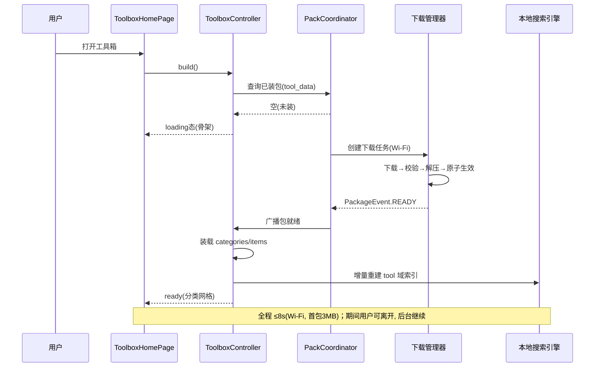
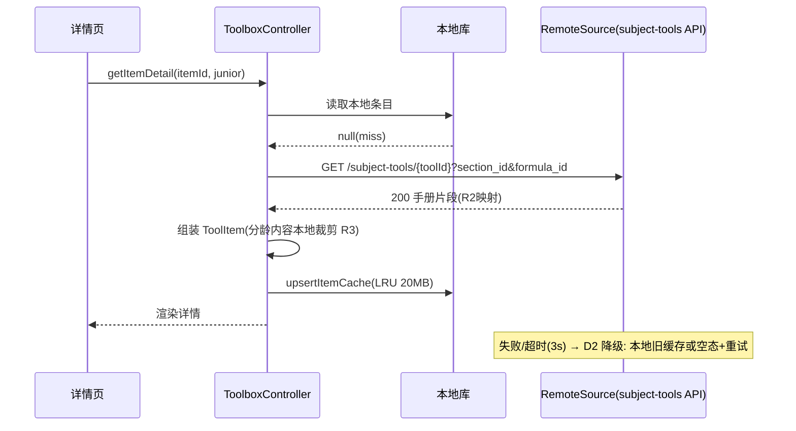
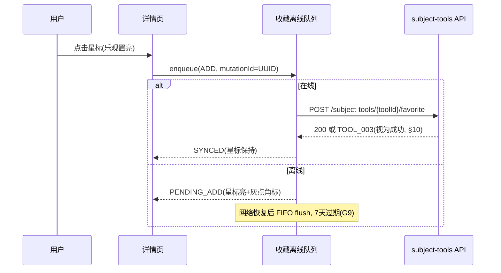
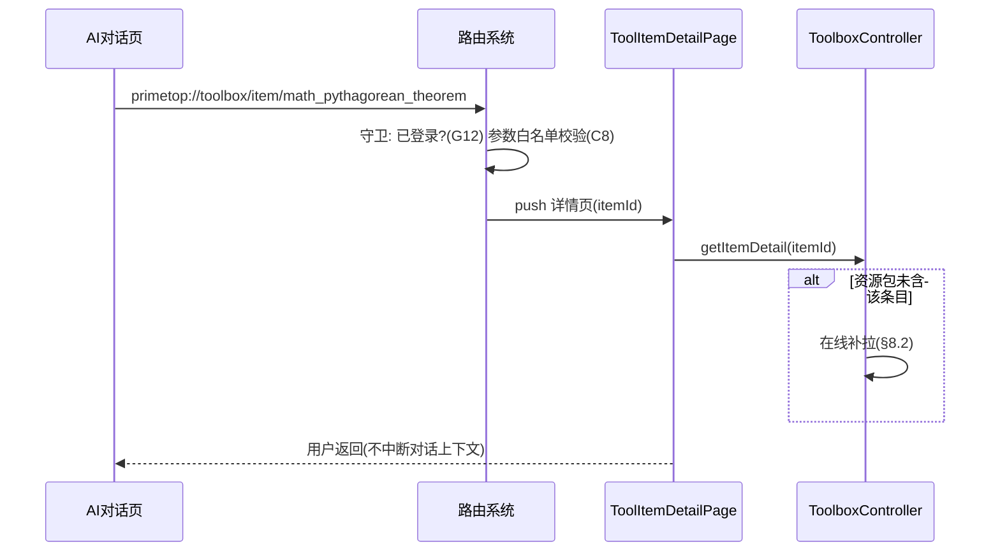
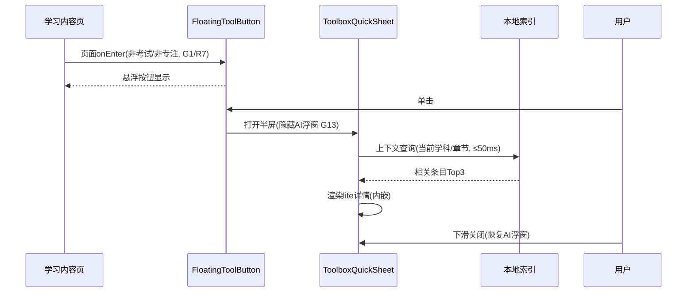

# 客户端 - 学科工具箱与参考资料速查页面架构与交互设计

## 1. 概述

### 1.1 模块定位

学科工具箱与参考资料速查（Subject Toolbox & Reference Quick-Lookup，简称 STRef）是 PrimeTop 客户端的辅助学习基础设施。它为学生在解题、复习、背诵过程中提供**即时可查的结构化参考资料**和**轻量级学科工具**，帮助学生快速查阅公式、常数、词汇、年代、元素等学科基础知识，减少"查资料"对学习心流的打断。

### 1.2 设计原则

| 原则 | 说明 |
|------|------|
| **即查即用** | 从任何学习页面都能 1 步触达工具箱，3 秒内完成查阅 |
| **零学习成本** | 采用学生已熟悉的呈现形式（表格、卡片、列表），不需要学习新交互 |
| **分龄适配** | 小学生看到简化版（带图、带例），高中生看到完整版（含推导、含变式） |
| **离线可用** | 核心参考资料内置于资源包，弱网/离线环境正常使用 |
| **上下文感知** | 根据当前学科、章节自动定位到相关工具页 |

### 1.3 依赖关系

| 依赖模块 | 关系 |
|----------|------|
| 学科工具与参考资料库（服务端） | 提供工具数据 CRUD、版本管理、增量更新 |
| 客户端资源包下载管理器 | 负责工具箱数据包的下载、版本校验、离线存储 |
| 客户端状态管理架构 | 全局工具箱状态注入、当前学科/章节上下文 |
| 客户端路由与深链接系统 | 支持从 AI 对话、拍题结果等页面跳转到指定工具条目 |
| 客户端搜索服务 | 工具箱内容的全文检索与模糊匹配 |
| 客户端主题引擎 | 分龄主题适配 |
| 客户端组件库与设计系统 | 通用列表、卡片、折叠面板等基础组件 |

### 1.4 版本规划

| 阶段 | 范围 |
|------|------|
| MVP | 数学公式速查、英语词典、古诗文速查 3 个工具 |
| V1.0 | +化学元素周期表、物理常数表、历史年表、地理知识卡 |
| V1.5 | +单位换算器、科学计算器、作文素材库 |
| V2.0 | 自定义工具条目收藏、工具箱内搜索、AI 辅助查询 |

---

## 2. 信息架构与页面结构

### 2.1 入口设计

```
┌──────────────────────────────────────────────────┐
│  全局入口 (3种)                                    │
├──────────────────────────────────────────────────┤
│  1. 底部导航 "我的" → 工具箱入口                    │
│  2. 学习页面悬浮按钮 (学科工具 🔧)                   │
│  3. AI对话/AI回答中的公式/术语 → 点击跳转工具详情    │
│  4. 深链接: primetop://toolbox/{toolId}/{itemId}  │
└──────────────────────────────────────────────────┘
```

### 2.2 页面层级

```
ToolboxHomePage          ── 工具箱首页（工具分类网格）
├── ToolCategoryPage     ── 工具分类详情（如"数学公式"）
│   ├── ToolItemListPage ── 工具条目列表（如"三角函数公式"）
│   │   └── ToolItemDetailPage ── 工具条目详情（单个公式详情）
│   └── InteractiveToolPage   ── 交互式工具（如计算器、换算器）
├── ToolboxSearchPage    ── 工具箱搜索页
└── ToolboxFavoritesPage ── 收藏的工具条目
```

### 2.3 工具分类体系

| 分类 ID | 名称 | 图标 | 包含工具 | 适用学段 |
|---------|------|------|----------|----------|
| `math_formula` | 数学公式 | 📐 | 代数、几何、三角、概率统计、导数积分 | 小学-高中 |
| `math_calc` | 数学工具 | 🧮 | 科学计算器、单位换算器 | 小学-高中 |
| `chinese_poetry` | 古诗文库 | 📜 | 必背古诗、文言文、名句 | 小学-高中 |
| `english_dict` | 英语词典 | 📖 | 核心词汇、短语、语法速查 | 小学-高中 |
| `physics_const` | 物理常数 | ⚡ | 物理常数、公式、单位 | 初中-高中 |
| `chemistry_elem` | 化学元素 | 🧪 | 元素周期表、化学方程式 | 初中-高中 |
| `history_timeline` | 历史年表 | 🕰️ | 中外历史事件年表 | 初中-高中 |
| `geo_atlas` | 地理知识 | 🌍 | 地理知识卡、地图识读 | 初中-高中 |
| `bio_atlas` | 生物图鉴 | 🔬 | 生物结构图、分类表 | 初中-高中 |
| `writing_material` | 作文素材 | ✍️ | 名言警句、典故、时政素材 | 小学-高中 |

### 2.4 学段过滤规则

```dart
/// 根据用户学段决定显示的工具分类和内容深度
enum GradeTier {
  primary,    // 小学 (G1-G6)
  junior,     // 初中 (G7-G9)
  senior,     // 高中 (G10-G12)
}

/// 分类可见性配置
const kCategoryVisibility = {
  'math_formula': {GradeTier.primary, GradeTier.junior, GradeTier.senior},
  'math_calc':    {GradeTier.primary, GradeTier.junior, GradeTier.senior},
  'chinese_poetry': {GradeTier.primary, GradeTier.junior, GradeTier.senior},
  'english_dict': {GradeTier.primary, GradeTier.junior, GradeTier.senior},
  'physics_const': {GradeTier.junior, GradeTier.senior},
  'chemistry_elem': {GradeTier.junior, GradeTier.senior},
  'history_timeline': {GradeTier.junior, GradeTier.senior},
  'geo_atlas':     {GradeTier.junior, GradeTier.senior},
  'bio_atlas':     {GradeTier.junior, GradeTier.senior},
  'writing_material': {GradeTier.primary, GradeTier.junior, GradeTier.senior},
};
```

---

## 3. 数据结构定义

### 3.1 核心数据模型

```dart
/// 工具分类
class ToolCategory {
  final String categoryId;      // 'math_formula', 'chemistry_elem', ...
  final String name;            // 显示名称
  final String iconAsset;       // 图标资源路径
  final String description;     // 分类简介
  final int sortOrder;          // 排序权重
  final Set<GradeTier> gradeTiers; // 适用学段
  final String? colorTheme;     // 分类主题色 (可选)
  final int itemCount;          // 包含条目数（冗余，用于展示）
}

/// 工具子分类（如"三角函数"是"数学公式"下的子分类）
class ToolSubCategory {
  final String subCategoryId;
  final String categoryId;      // 父分类
  final String name;
  final String? iconAsset;
  final int sortOrder;
  final int itemCount;
}

/// 工具条目（单个公式/元素/词条等）
class ToolItem {
  final String itemId;          // 唯一标识
  final String categoryId;
  final String? subCategoryId;
  final String title;           // 条目标题（如"勾股定理"）
  final String summary;         // 一句话概要
  final GradeTier minGrade;     // 最低适用学段
  final GradeTier maxGrade;     // 最高适用学段
  final List<String> tags;      // 搜索标签 ['勾股定理','a²+b²=c²','直角三角形']
  final List<String> relatedKpIds; // 关联知识点ID
  final ToolContent content;    // 正文内容（结构化）
  final String? latexFormula;   // LaTeX 公式（如有）
  final String? imageUrl;       // 配图路径（如有）
  final int dataVersion;        // 数据版本号
}

/// 工具条目内容（结构化富文本）
class ToolContent {
  /// 小学版内容（简化、带图、带例）
  final ContentBlock? primaryContent;
  /// 初中版内容
  final ContentBlock? juniorContent;
  /// 高中版内容（完整、含推导、含变式）
  final ContentBlock? seniorContent;
  /// 通用版（不分学段时使用）
  final ContentBlock? universalContent;
}

/// 内容块（支持多种段落类型）
class ContentBlock {
  final List<ContentParagraph> paragraphs;
}

class ContentParagraph {
  final ParagraphType type;   // text, formula, image, table, tip, warning, example
  final String content;       // Markdown/LaTeX/JSON(表格)
  final Map<String, dynamic>? metadata; // 额外数据（图片URL、表格结构等）
}

enum ParagraphType {
  text,       // 普通文本（Markdown）
  formula,    // LaTeX 公式
  image,      // 图片
  table,      // 结构化表格
  tip,        // 提示框 💡
  warning,    // 注意事项 ⚠️
  example,    // 示例/例题
  interactive,// 交互式内容（计算器输入框等）
}

/// 用户收藏记录
class ToolFavorite {
  final String userId;
  final String itemId;
  final String categoryId;
  final DateTime createdAt;
  final String? note;  // 用户备注
}
```

### 3.2 服务端数据库表

```sql
-- 工具分类
CREATE TABLE tool_categories (
    category_id     VARCHAR(32) PRIMARY KEY,
    name            VARCHAR(64) NOT NULL,
    icon_asset      VARCHAR(255),
    description     VARCHAR(255),
    sort_order      INT NOT NULL DEFAULT 0,
    grade_tiers     VARCHAR(32) NOT NULL DEFAULT 'primary,junior,senior',
    color_theme     VARCHAR(16),
    item_count      INT NOT NULL DEFAULT 0,
    data_version    INT NOT NULL DEFAULT 1,
    is_active       TINYINT NOT NULL DEFAULT 1,
    created_at      DATETIME NOT NULL DEFAULT CURRENT_TIMESTAMP,
    updated_at      DATETIME NOT NULL DEFAULT CURRENT_TIMESTAMP ON UPDATE CURRENT_TIMESTAMP,
    INDEX idx_sort (sort_order)
) ENGINE=InnoDB DEFAULT CHARSET=utf8mb4;

-- 工具子分类
CREATE TABLE tool_sub_categories (
    sub_category_id VARCHAR(64) PRIMARY KEY,
    category_id     VARCHAR(32) NOT NULL,
    name            VARCHAR(64) NOT NULL,
    icon_asset      VARCHAR(255),
    sort_order      INT NOT NULL DEFAULT 0,
    item_count      INT NOT NULL DEFAULT 0,
    is_active       TINYINT NOT NULL DEFAULT 1,
    created_at      DATETIME NOT NULL DEFAULT CURRENT_TIMESTAMP,
    updated_at      DATETIME NOT NULL DEFAULT CURRENT_TIMESTAMP ON UPDATE CURRENT_TIMESTAMP,
    INDEX idx_category_sort (category_id, sort_order),
    FOREIGN KEY (category_id) REFERENCES tool_categories(category_id)
) ENGINE=InnoDB DEFAULT CHARSET=utf8mb4;

-- 工具条目
CREATE TABLE tool_items (
    item_id         VARCHAR(64) PRIMARY KEY,
    category_id     VARCHAR(32) NOT NULL,
    sub_category_id VARCHAR(64),
    title           VARCHAR(128) NOT NULL,
    summary         VARCHAR(255),
    min_grade       VARCHAR(16) NOT NULL DEFAULT 'primary',
    max_grade       VARCHAR(16) NOT NULL DEFAULT 'senior',
    tags            JSON,               -- 搜索标签
    related_kp_ids  JSON,               -- 关联知识点
    latex_formula   VARCHAR(512),
    image_url       VARCHAR(512),
    -- 分学段内容（JSON 存储结构化内容块）
    primary_content  JSON,
    junior_content   JSON,
    senior_content   JSON,
    universal_content JSON,
    data_version    INT NOT NULL DEFAULT 1,
    is_active       TINYINT NOT NULL DEFAULT 1,
    created_at      DATETIME NOT NULL DEFAULT CURRENT_TIMESTAMP,
    updated_at      DATETIME NOT NULL DEFAULT CURRENT_TIMESTAMP ON UPDATE CURRENT_TIMESTAMP,
    INDEX idx_category (category_id, sub_category_id),
    INDEX idx_grade (min_grade, max_grade),
    FULLTEXT INDEX ft_search (title, summary),
    FOREIGN KEY (category_id) REFERENCES tool_categories(category_id),
    FOREIGN KEY (sub_category_id) REFERENCES tool_sub_categories(sub_category_id)
) ENGINE=InnoDB DEFAULT CHARSET=utf8mb4;

-- 用户收藏
CREATE TABLE tool_favorites (
    id              BIGINT AUTO_INCREMENT PRIMARY KEY,
    user_id         BIGINT NOT NULL,
    item_id         VARCHAR(64) NOT NULL,
    category_id     VARCHAR(32) NOT NULL,
    note            VARCHAR(255),
    created_at      DATETIME NOT NULL DEFAULT CURRENT_TIMESTAMP,
    UNIQUE KEY uk_user_item (user_id, item_id),
    INDEX idx_user (user_id, created_at DESC),
    FOREIGN KEY (item_id) REFERENCES tool_items(item_id)
) ENGINE=InnoDB DEFAULT CHARSET=utf8mb4;

-- 工具箱资源包版本
CREATE TABLE toolbox_resource_packs (
    pack_id         VARCHAR(64) PRIMARY KEY,
    category_id     VARCHAR(32),
    version         INT NOT NULL,
    file_url        VARCHAR(512) NOT NULL,
    file_size_bytes BIGINT NOT NULL,
    checksum_md5    VARCHAR(32) NOT NULL,
    min_app_version VARCHAR(16),
    target_grade    VARCHAR(16),   -- primary/junior/senior/all
    is_active       TINYINT NOT NULL DEFAULT 1,
    created_at      DATETIME NOT NULL DEFAULT CURRENT_TIMESTAMP,
    INDEX idx_category_version (category_id, version DESC)
) ENGINE=InnoDB DEFAULT CHARSET=utf8mb4;
```

---

## 4. API 接口设计

### 4.1 获取工具分类列表

```
GET /api/v1/toolbox/categories
```

**Query 参数：**

| 参数 | 类型 | 必填 | 说明 |
|------|------|------|------|
| `grade_tier` | string | 否 | 按学段过滤 (primary/junior/senior)，默认使用用户当前学段 |

**响应：**

```json
{
  "code": 0,
  "data": {
    "categories": [
      {
        "categoryId": "math_formula",
        "name": "数学公式",
        "iconAsset": "assets/toolbox/ic_math_formula.svg",
        "description": "代数、几何、三角函数等常用公式",
        "sortOrder": 1,
        "gradeTiers": ["primary", "junior", "senior"],
        "colorTheme": "#4A90D9",
        "itemCount": 256,
        "subCategories": [
          {
            "subCategoryId": "math_formula_algebra",
            "name": "代数",
            "sortOrder": 1,
            "itemCount": 48
          },
          {
            "subCategoryId": "math_formula_geometry",
            "name": "几何",
            "sortOrder": 2,
            "itemCount": 62
          }
        ]
      }
    ]
  }
}
```

### 4.2 获取工具条目列表

```
GET /api/v1/toolbox/categories/{categoryId}/items
```

**Query 参数：**

| 参数 | 类型 | 必填 | 说明 |
|------|------|------|------|
| `sub_category_id` | string | 否 | 子分类过滤 |
| `grade_tier` | string | 否 | 学段过滤 |
| `page` | int | 否 | 页码，默认 1 |
| `page_size` | int | 否 | 每页条数，默认 50，最大 200 |
| `keyword` | string | 否 | 搜索关键词（模糊匹配 title/tags） |

**响应：**

```json
{
  "code": 0,
  "data": {
    "items": [
      {
        "itemId": "math_pythagorean_theorem",
        "categoryId": "math_formula",
        "subCategoryId": "math_formula_geometry",
        "title": "勾股定理",
        "summary": "直角三角形两直角边的平方和等于斜边的平方",
        "latexFormula": "a^2 + b^2 = c^2",
        "imageUrl": null,
        "tags": ["勾股定理", "直角三角形", "a²+b²=c²"]
      }
    ],
    "total": 62,
    "page": 1,
    "pageSize": 50
  }
}
```

### 4.3 获取工具条目详情

```
GET /api/v1/toolbox/items/{itemId}
```

**Query 参数：**

| 参数 | 类型 | 必填 | 说明 |
|------|------|------|------|
| `grade_tier` | string | 否 | 请求特定学段内容，默认用户当前学段 |

**响应：**

```json
{
  "code": 0,
  "data": {
    "itemId": "math_pythagorean_theorem",
    "categoryId": "math_formula",
    "subCategoryId": "math_formula_geometry",
    "title": "勾股定理",
    "summary": "直角三角形两直角边的平方和等于斜边的平方",
    "latexFormula": "a^2 + b^2 = c^2",
    "tags": ["勾股定理", "直角三角形", "a²+b²=c²"],
    "relatedKpIds": ["kp_geometry_triangle", "kp_geometry_distance"],
    "content": {
      "paragraphs": [
        {
          "type": "text",
          "content": "**勾股定理**（Pythagorean theorem）是平面几何中最基本的定理之一。"
        },
        {
          "type": "formula",
          "content": "a^2 + b^2 = c^2"
        },
        {
          "type": "text",
          "content": "其中 $a$、$b$ 为直角三角形的两条直角边，$c$ 为斜边。"
        },
        {
          "type": "example",
          "content": "已知直角三角形两直角边分别为 3 和 4，求斜边。\n\n解：$c = \\sqrt{3^2 + 4^2} = \\sqrt{9 + 16} = \\sqrt{25} = 5$"
        },
        {
          "type": "tip",
          "content": "常见的勾股数组：(3,4,5)、(5,12,13)、(8,15,17)、(7,24,25)"
        },
        {
          "type": "warning",
          "content": "注意：勾股定理仅适用于直角三角形！在非直角三角形中应使用余弦定理。"
        }
      ]
    }
  }
}
```

### 4.4 工具箱搜索

```
GET /api/v1/toolbox/search
```

**Query 参数：**

| 参数 | 类型 | 必填 | 说明 |
|------|------|------|------|
| `keyword` | string | 是 | 搜索关键词 |
| `category_id` | string | 否 | 限定分类 |
| `grade_tier` | string | 否 | 学段过滤 |
| `page` | int | 否 | 页码 |
| `page_size` | int | 否 | 每页条数 |

**响应：** 同条目列表格式，增加 `highlight` 字段标记匹配片段。

### 4.5 收藏操作

```
POST   /api/v1/toolbox/favorites          -- 添加收藏
DELETE /api/v1/toolbox/favorites/{itemId}  -- 取消收藏
GET    /api/v1/toolbox/favorites           -- 收藏列表
```

**添加收藏请求体：**

```json
{
  "itemId": "math_pythagorean_theorem",
  "note": "期中考试重点"
}
```

**收藏列表响应：** 同条目列表格式 + `note` + `createdAt` 字段。

### 4.6 资源包版本检查与下载

```
GET /api/v1/toolbox/resource-packs/check
```

**Query 参数：**

| 参数 | 类型 | 必填 | 说明 |
|------|------|------|------|
| `grade_tier` | string | 是 | 目标学段 |
| `current_versions` | string | 否 | 当前已有资源包版本 JSON `{categoryId: version}` |

**响应：**

```json
{
  "code": 0,
  "data": {
    "updates": [
      {
        "packId": "math_formula_primary_v3",
        "categoryId": "math_formula",
        "version": 3,
        "fileUrl": "https://cdn.primetop.cn/toolbox/math_formula_primary_v3.zip",
        "fileSizeBytes": 1048576,
        "checksumMd5": "a1b2c3d4e5f6...",
        "updateType": "incremental"
      }
    ],
    "fullPacks": [
      {
        "packId": "chemistry_elem_junior_v1",
        "categoryId": "chemistry_elem",
        "version": 1,
        "fileUrl": "https://cdn.primetop.cn/toolbox/chemistry_elem_junior_v1.zip",
        "fileSizeBytes": 2097152,
        "checksumMd5": "x1y2z3...",
        "updateType": "full"
      }
    ]
  }
}
```

---

## 5. 页面详细设计

### 5.1 工具箱首页 (ToolboxHomePage)

#### 5.1.1 页面布局

```
┌──────────────────────────────────┐
│  ← 学科工具箱          🔍 搜索   │ AppBar
├──────────────────────────────────┤
│                                  │
│  ┌──────┐  ┌──────┐  ┌──────┐   │
│  │ 📐   │  │ 🧮   │  │ 📜   │   │
│  │数学  │  │数学  │  │古诗  │   │
│  │公式  │  │工具  │  │文库  │   │
│  │256条 │  │2个   │  │180首 │   │
│  └──────┘  └──────┘  └──────┘   │  工具网格
│                                  │  (2列 or 3列)
│  ┌──────┐  ┌──────┐  ┌──────┐   │
│  │ 📖   │  │ ⚡   │  │ 🧪   │   │
│  │英语  │  │物理  │  │化学  │   │
│  │词典  │  │常数  │  │元素  │   │
│  │3200词│  │85项  │  │118个 │   │
│  └──────┘  └──────┘  └──────┘   │
│                                  │
│  ┌──────┐  ┌──────┐  ┌──────┐   │
│  │ 🕰️   │  │ 🌍   │  │ ✍️   │   │
│  │历史  │  │地理  │  │作文  │   │
│  │年表  │  │知识  │  │素材  │   │
│  └──────┘  └──────┘  └──────┘   │
│                                  │
├──────────────────────────────────┤
│  ⭐ 我的收藏 (最近3条)  查看全部 >│  收藏快捷入口
│  ┌──────────┐ ┌──────────┐ ...    │
│  │勾股定理  │ │水的沸点  │        │
│  └──────────┘ └──────────┘        │
├──────────────────────────────────┤
│  📶 离线数据包已就绪 v3 · 共9个分类│  资源包状态条
└──────────────────────────────────┘
```

> 布局规则：学段为 primary 时网格固定 2 列（大卡片、带示例缩略图）；
> junior/senior 为 3 列（紧凑卡片）。分类顺序按 §5.1.2 上下文排序动态调整。

#### 5.1.2 首页交互行为

| 行为 | 规则 |
|------|------|
| **上下文排序** | 读取《客户端-学科上下文与学习环境管理》的当前学科/章节（只读），命中的分类上浮至首位并显示 `当前: 二次函数` 角标；无上下文时按 `sortOrder` 静态排序 |
| **最近使用** | 本地维护最近打开的 3 个条目（LRU，仅本地不云同步），展示在收藏快照区右侧，与收藏区二选一（最近使用优先展示） |
| **学段过滤** | 进入页面即按 `kCategoryVisibility` 过滤；学段切换（升迁）后下次进入自动重算，已在详情页时不打断 |
| **资源包状态条** | 显示已就绪数据包版本与分类数；点击进入资源包管理页（复用《客户端-资源包下载管理器》详情页，不重复实现） |
| **分类卡片点击** | 进入 ToolCategoryPage；`math_calc` 分类下无列表型内容的工具（科学计算器）直接进入 InteractiveToolPage |
| **搜索点击** | 进入 ToolboxSearchPage，键盘默认弹出，光标定位输入框 |
| **下拉刷新** | 在线态检查资源包与分类树版本；离线态显示"离线模式"提示 |

#### 5.1.3 空态与异常态

| 状态 | 表现 |
|------|------|
| 资源包未下载且网络不可用 | 全屏空态：图标 + "工具箱数据包尚未下载，请连接网络后重试" + [重试] 按钮 |
| 资源包下载中 | 分类卡片显示骨架占位 + 顶部进度条（复用下载管理器进度流） |
| 学段下无可见分类（理论不出现） | 兜底空态文案 + [切换学段] 引导（跳转个人中心） |

### 5.2 工具分类详情页 (ToolCategoryPage)

#### 5.2.1 页面布局

```
┌──────────────────────────────────┐
│  ← 数学公式            🔍 搜索   │ AppBar(分类名)
├──────────────────────────────────┤
│ [全部] [代数] [几何] [三角] …    │ 子分类 Chips(横滑)
├──────────────────────────────────┤
│ ┌──────────────────────────────┐ │
│ │ 勾股定理          a²+b²=c² ⭐│ │ 条目卡片
│ │ 直角三角形两直角边的平方和…  │ │
│ ├──────────────────────────────┤ │
│ │ 平方差公式  a²-b²=(a+b)(a-b) │ │
│ │ 两数平方差等于两数和与差之积 │ │
│ ├──────────────────────────────┤ │
│ │ 完全平方公式  (a±b)²=a²±…   │ │
│ └──────────────────────────────┘ │
│                     A B C D E F… │ 侧栏索引(词典/年表类)
│  [正在加载更多…]                  │ 分页加载
└──────────────────────────────────┘
```

#### 5.2.2 交互规则

| 规则 | 说明 |
|------|------|
| 数据源 | 优先本地资源包（离线可用）；本地缺失条目在线补拉并写回缓存 |
| 条目卡片 | 标题 + summary 单行截断 + LaTeX 预览（只读渲染）+ 收藏星标（快捷切换） |
| 侧栏索引 | 仅 `english_dict`（A-Z）与 `history_timeline`（朝代）启用；其余分类隐藏 |
| 分页 | 本地数据 `page_size=50` 内存分页；在线模式走服务端分页（见 §15 R1 映射） |
| 子分类切换 | Chips 单选，切换时列表回到顶部并重新分页；"全部"为默认 |
| 搜索 | 点击 AppBar 搜索图标，预填 `category_id` 进入 ToolboxSearchPage |

### 5.3 工具条目详情页 (ToolItemDetailPage)

#### 5.3.1 页面布局

```
┌──────────────────────────────────┐
│  ← 几何 · 三角函数        ⭐ 📝  │ AppBar(面包屑+收藏+笔记)
├──────────────────────────────────┤
│         勾股定理                  │ 标题区
│    ┌──────────────────────┐      │
│    │   a² + b² = c²       │ 📋  │ LaTeX 大字渲染+复制
│    └──────────────────────┘      │
│  [小学版] [初中版●] [高中版]      │ 分龄内容切换器
├──────────────────────────────────┤
│  **勾股定理**是平面几何中最基本…  │ 内容块渲染
│  💡 常见勾股数组: (3,4,5)…       │ tip 块
│  ⚠️ 仅适用于直角三角形！          │ warning 块
│  📝 例: 已知直角边 3 和 4…       │ example 块(可折叠)
├──────────────────────────────────┤
│  🔗 相关知识点                    │
│  [直角三角形] [两点间距离公式]    │ 跳转知识点详情
├──────────────────────────────────┤
│  🤖 不懂? 问AI助手               │ 唤起AI对话(带上下文)
└──────────────────────────────────┘
```

#### 5.3.2 交互规则

| 规则 | 说明 |
|------|------|
| 分龄内容切换 | 默认锁定用户学段对应内容块；可手动切换其他学段版本查看（高学段版本显示"高年级版本，部分内容超出当前所学"提示条）；无对应内容时回退 `universalContent`（G10） |
| LaTeX 复制 | 点击 📋 复制 LaTeX 原文，Toast "已复制"；渲染组件复用《客户端-AI对话消息Markdown流式渲染与学科公式排版引擎》的只读渲染模式（§15 R8） |
| 收藏 | AppBar 星标乐观切换，落本地 + 离线同步队列（§10） |
| 笔记 | 📝 打开笔记底部弹层：多行文本 ≤200 字，本地敏感词快检（G14）；保存至条目 note 字段 |
| 相关知识点 | 点击跳转同步课堂知识点详情（深链接 `primetop://learn/kp/{kpId}`）；离线时禁用并提示 |
| 问 AI | 唤起 AI 对话页并预填上下文："请给我讲讲{title}，我的年级是{grade}"（G6：离线禁用） |
| 内容块渲染 | `ParagraphType` 七类块渲染：text(Markdown)/formula(LaTeX)/image/tip/warning/example(默认折叠，点击展开)/interactive(仅 InteractiveToolPage 场景) |

### 5.4 交互式工具页 (InteractiveToolPage)

#### 5.4.1 科学计算器

```
┌──────────────────────────────────┐
│  ← 科学计算器                     │
├──────────────────────────────────┤
│  sin(30°)+√2×(3+4)²              │ 表达式输入行
│  = 8.91421356…                   │ 实时结果行
├──────────────────────────────────┤
│ DEG│RAD  [sin][cos][tan][ln]     │
│ [log][√][^][π][e][!]             │ 函数面板
│ [7][8][9][÷] [4][5][6][×]       │
│ [1][2][3][−] [0][.][=][+]        │
│ [C][⌫][(][)]                     │
└──────────────────────────────────┘
```

| 规则 | 说明 |
|------|------|
| 表达式引擎 | 端内自研递归下降解析器（无第三方 JS 引擎依赖），支持隐式乘法、角度/弧度切换、10 位有效数字四舍五入 |
| 历史记录 | 最近 20 条本地记录（不云同步、不上报表达式内容，仅上报使用次数埋点） |
| 防作弊边界 | 考试/测评作答会话中整个工具箱入口禁用（G1/G7，见 §15 R12） |
| 崩溃兜底 | 解析器异常隔离至独立 Isolate，连续崩溃 2 次降级为基础四则运算面板（D5） |

#### 5.4.2 单位换算器

| 规则 | 说明 |
|------|------|
| 换算域 | 长度/面积/体积/质量/温度/时间/速度/压强/能量 九类；每类内置系数表（资源包 `units.json`） |
| 交互 | 类别 → 原单位/目标单位（双向箭头一键交换）→ 数值输入实时双向换算 |
| 精度 | 换算结果保留 6 位有效数字，尾随零截断；温度类走仿射换算公式非纯系数 |

### 5.5 工具箱搜索页 (ToolboxSearchPage)

```
┌──────────────────────────────────┐
│  ←  │ 🔍 输入公式名/关键词…   ✕  │
├──────────────────────────────────┤
│  热门: 勾股定理 二次函数 电阻…   │ 无输入时
├──────────────────────────────────┤
│  勾股定理 · 数学公式              │ 结果卡片
│  直角三角形…<b>a²</b>+…          │ 高亮片段
│  平方差公式 · 数学公式            │
│  …                               │
├──────────────────────────────────┤
│  [本地结果 12 条] [在线更多 →]    │ 来源标签
└──────────────────────────────────┘
```

| 规则 | 说明 |
|------|------|
| 双引擎 | **本地索引优先**：注册于《客户端本地搜索与离线内容检索引擎》`SearchContentType.tool` 域（索引 title/tags/latex 归一化文本，见 §15 R4）；本地 0 命中或用户点"在线更多"时走服务端 `/api/v1/subject-tools/search`（§15 R1） |
| 输入匹配 | 支持中文/拼音首字母/别名（"勾股"→勾股定理）、LaTeX 关键词（"a^2+b^2"）；输入防抖 250ms |
| 高亮 | 关键词命中片段 `<b>` 包裹，latex 字段命中时高亮公式名 |
| 热门词 | 本地缓存运营下发 Top10（随资源包更新），离线可展示 |
| 性能 | 本地搜索 P90 ≤300ms（M3）；超时 800ms 先出本地结果，在线结果异步补充（D6） |

### 5.6 收藏页 (ToolboxFavoritesPage)

| 规则 | 说明 |
|------|------|
| 分组 | 按分类分组折叠展示，组内按收藏时间倒序；支持长按拖动置顶（仅本地排序，不同步） |
| 条目卡片 | 标题 + 分类面包屑 + 备注（有则显示一行截断）+ LaTeX 预览 |
| 操作 | 左滑：取消收藏/编辑备注；空态引导去逛工具箱 |
| 上限 | 单用户 500 条（G5），达到上限时提示清理并阻止新增 |
| 离线 | 全量离线可用（收藏条目所在资源包必装；条目被服务端下线时本地保留并标"已下线"灰显，G10） |

### 5.7 悬浮入口与半屏速查面板 (FloatingToolButton + ToolboxQuickSheet)

> 兑现 §1.2 "从任何学习页面 1 步触达" 的核心入口。

#### 5.7.1 悬浮按钮 (FloatingToolButton)

| 规则 | 说明 |
|------|------|
| 挂载范围 | 同步课堂/练习测评(练习模式)/错题本/考点梳理/复习等**学习内容页**；AI 对话页/首页/个人中心不挂载（已有直达入口） |
| 位置 | 右侧边缘垂直居中偏下，可拖动吸附；位置本地记忆 |
| 显隐联动 | 专注模式（番茄钟）进行中 → 隐藏（§15 R7）；考试/测评作答会话 → 隐藏（G1）；幼儿段（primary 低龄 G1-G3）→ 不挂载（G11，防误触） |
| 交互 | 单击展开半屏面板；拖动仅移动不触发 |
| 设置 | 设置页可全局关闭"学习页工具悬浮入口" |

#### 5.7.2 半屏速查面板 (ToolboxQuickSheet)

```
┌──────────────────────────────────┐
│  ← 底部弹起 340dp · 可上滑全屏    │
│  [🔍 搜工具/公式…            ]   │ 搜索框(自动聚焦)
│  当前: 物理 · 欧姆定律            │ 上下文条(可关闭)
│  ┌────────────────────────────┐ │
│  │ 相关: 欧姆定律  I=U/R      │ │ 上下文命中条目
│  │ 相关: 电阻串联 R=R₁+R₂     │ │ (最多3条)
│  ├────────────────────────────┤ │
│  │ 常用: 勾股定理 · 元素周期表 │ │ 最近使用+常用
│  │      · 物理常数 · 英语词典 │ │
│  └────────────────────────────┘ │
└──────────────────────────────────┘
```

| 规则 | 说明 |
|------|------|
| 高度 | 半屏 340dp 起步，可上滑拖拽至全屏（进入 ToolboxHomePage 容器复用） |
| 上下文条 | 当前页面学科/章节命中的条目 Top3（本地索引查询，≤50ms）；点击"✕"本次会话内不再显示 |
| 打开条目 | 条目在面板内嵌打开（详情页 lite 版：标题+公式+核心内容，省略相关知识点/问AI），双击标题或点"展开"跳全屏详情页 |
| 互斥 | 面板打开时隐藏全局浮窗 AI 助手（G13，§15 R7）；面板关闭恢复 |
| 心流保护 | 单次学习会话内面板累计打开 ≥8 次时轻提示"要不要试试先记一记？查阅太频繁啦"（仅提示不阻断） |
| 关闭方式 | 下滑手势/点击遮罩；ESC（键盘设备） |


---

## 6. 状态管理与数据流

### 6.1 Provider 架构（Riverpod）

```
toolboxServiceProvider            ── 工具箱门面(对UI唯一出口)
├── toolboxRepositoryProvider     ── 仓库层(本地优先)
│   ├── toolboxLocalSourceProvider   ── Drift/SQLite 本地库 + 资源包产物
│   └── toolboxRemoteSourceProvider  ── subject-tools API(在线补拉)
├── toolboxPackCoordinatorProvider ── 资源包协调器(委托下载管理器)
├── toolboxSearchIndexerProvider   ── 本地索引写入/查询(委托本地搜索引擎)
└── toolboxContextProvider         ── 学科上下文只读消费
```

### 6.2 关键代码

```dart
/// 工具箱状态
@immutable
class ToolboxState {
  final ToolLoadStatus status;        // idle/loading/ready(partial)/ready/error
  final GradeTier gradeTier;          // 用户当前学段(随账号档案)
  final List<ToolCategory> categories; // 学段过滤后的分类树
  final Map<String, int> packVersions; // categoryId -> 已装版本
  final ToolboxOnlineMode onlineMode;  // offlineOnly/onlineFallback/online
}

/// 门面控制器
class ToolboxController extends AutoDisposeAsyncNotifier<ToolboxState> {
  @override
  Future<ToolboxState> build() async {
    final tier = await ref.watch(userProfileProvider.future).gradeTierOf();
    // 1. 资源包就绪检查(不阻塞首帧, 先出已装内容)
    final packs = ref.read(toolboxPackCoordinatorProvider);
    final localTree = await ref.read(toolboxLocalSourceProvider)
        .loadCategoryTree(tier);            // 学段过滤 + itemCount
    // 2. 版本检查在后台执行, 有更新时刷新状态(不弹窗, 走资源包状态条)
    unawaited(packs.checkAndScheduleUpdates(
      currentVersions: localTree.packVersions,
      onWifiOnlyDefault: true,             // G4: 蜂窝需用户确认
    ));
    // 3. 增量写搜索索引(资源包安装/更新回调触发, 见 §7.3)
    return ToolboxState(
      status: localTree.isEmpty ? ToolLoadStatus.loading : ToolLoadStatus.ready,
      gradeTier: tier,
      categories: localTree.categories,
      packVersions: localTree.packVersions,
      onlineMode: await _resolveOnlineMode(),
    );
  }

  /// 条目详情: 本地 miss → 在线补拉 → 写回本地缓存
  Future<ToolItem?> getItemDetail(String itemId, {GradeTier? contentTier}) async {
    final local = await ref.read(toolboxLocalSourceProvider)
        .getItem(itemId, contentTier: contentTier ?? state.value!.gradeTier);
    if (local != null && !local.isStale) return local;
    final remote = await ref.read(toolboxRemoteSourceProvider)
        .fetchItem(itemId);                // 映射见 §15 R2/R3, 失败降级 D2
    if (remote != null) {
      await ref.read(toolboxLocalSourceProvider).upsertItemCache(remote);
    }
    return remote ?? local;                // 双 miss 返回本地旧版兜底
  }
}
```

### 6.3 数据流规则

| 规则 | 说明 |
|------|------|
| 本地优先 | 分类树/条目列表/详情一律先读本地资源包与缓存；在线补拉仅发生在本地 miss 或显式"在线更多" |
| 学段切换 | 监听用户档案学段变更 → 分类树重算（300ms 去抖）；详情页不打断，返回列表时生效 |
| 单向数据流 | UI 只读 `ToolboxState`；所有变更经 controller 方法 → 本地写 → state 重建 |
| 收藏独立 | 收藏状态单独 `favoritesProvider`（含同步队列），避免收藏同步失败阻塞浏览主流程 |

---

## 7. 离线数据包与版本更新

### 7.1 资源包结构（PackageType.TOOL_DATA）

```
toolbox-math_formula-junior-v3.zip
├── manifest.json          ── 包清单(见下)
├── categories.json        ── 分类/子分类元数据
├── items/*.ndjson         ── 条目数据(按子分类分片, 每行一个 ToolItem JSON)
├── units.json             ── 单位换算系数表(仅 math_calc 包)
└── assets/icons/*.webp    ── 分类图标(可选, 缺失走内置占位 D9)
```

```json
// manifest.json
{
  "packageId": "toolbox-math_formula-junior-v3",
  "type": "tool_data",
  "categoryId": "math_formula",
  "targetGrade": "junior",
  "version": 3,
  "checksumMd5": "a1b2c3d4...",
  "diffBase": 2,                       // 增量基准版本(全量包为 null)
  "toolIdMap": {                        // 客户端条目 → 服务端 tool 映射(§15 R2)
    "math_pythagorean_theorem": { "toolId": 1001, "sectionId": "s2", "formulaId": "f7" },
    "math_quadratic_formula":   { "toolId": 1002 }
  },
  "minAppVersion": "1.0.0"
}
```

### 7.2 版本更新流程

| 步骤 | 说明 |
|------|------|
| 1. 触发 | 工具箱首页进入 / App 启动后台巡检（复用下载管理器调度，每日 1 次） |
| 2. 检查 | 统一走下载管理器版本清单接口（§15 R5；v1.0 §4.6 的 `/toolbox/resource-packs/check` 收敛废弃）；携带 `{packageId: version}` |
| 3. 下载 | 优先差分包（《学习资源包增量更新与差分合并引擎》），合并失败自动回退全量包（D7） |
| 4. 校验 | MD5 校验 + 解压原子目录替换；失败标记 `CORRUPTED` 触发重下（最多 2 次，仍失败进错误态） |
| 5. 生效 | 原子切换 `READY` → 广播包事件 → 重建本地索引（增量）→ 刷新 `ToolboxState` |
| 蜂窝策略 | 未成年人蜂窝网络默认不自动下载（G4），提示"连接 Wi-Fi 后自动更新"或用户明确确认 |

### 7.3 本地存储与索引

| 项 | 设计 |
|----|------|
| 结构化存储 | Drift(SQLite)：`toolbox_items` 表（itemId 主键、categoryId 索引、JSON content 列、dataVersion 列）；资源包安装时批量 upsert，事务包裹 |
| 搜索索引 | 委托本地搜索引擎 `SearchContentType.tool` 域：字段 title/tags/pinyin_initials/latex_normalized；资源包生效后增量重建（后台 Isolate，≤2s/包） |
| 缓存淘汰 | 在线补拉的条目缓存 LRU 上限 20MB；资源包条目不参与淘汰 |
| 索引损坏 | 索引校验失败 → 清空 tool 域索引后台重建 + 期间搜索走在线兜底（D3） |

---

## 8. 关键流程时序图

### 8.1 首次进入工具箱（资源包冷启动）



### 8.2 在线条目详情查询（本地 miss 补拉）



### 8.3 收藏操作与离线同步



### 8.4 深链接跳转（AI 回答中的公式引用）



### 8.5 悬浮面板半屏速查



---

## 9. 状态机与守卫

### 9.1 工具箱整体可用性状态（派生态，随资源包状态推导）

```
UNAVAILABLE ──(包就绪)──► READY_FOR_USE
     ▲                       │ │
     │ (包损坏且无网络)       │ │(包未装/损坏但在线)
     └───────────────────────┘ ▼
                     DEGRADED_ONLINE_ONLY(在线兜底 D1)
```

| 状态 | 进入条件 | UI 表现 |
|------|----------|---------|
| `UNAVAILABLE` | 无任何 tool_data 包且网络不可用 | 全屏空态 + 重试 |
| `DEGRADED_ONLINE_ONLY` | 包缺失/损坏但可在线 | 顶部黄条"当前为在线模式，下载离线数据包后可离线使用" |
| `READY_FOR_USE` | ≥1 个包 READY | 正常（状态条显示包版本） |

### 9.2 收藏同步状态机

```
SYNCED ──(离线ADD)──► PENDING_ADD ──(flush 成功/TOOL_003)──► SYNCED
   │                        │
   │                   (flush 网络失败, 保留)
   │                        │
   └──(离线REMOVE)──► PENDING_REMOVE ──(flush 成功/TOOL_004)──► SYNCED
                        │ (同条目 ADD+REMOVE 相继发生 → 队列内合并抵消, 直接 SYNCED)
```

| 迁移 | 守卫 |
|------|------|
| PENDING_* → SYNCED | flush 成功或冲突码幂等视为成功（§10） |
| PENDING_ADD → 废弃 | 队列项 >7 天（G9），条目收藏回滚为未收藏并轻提示 |
| 任何态 → CONFLICT | 多端合并出现 A 端 ADD / B 端 REMOVE 同条目 → 并集优先保收藏（ADD 胜），不弹冲突框 |

### 9.3 资源包状态映射（消费下载管理器四态）

| 下载管理器状态 | 工具箱语义 |
|----------------|------------|
| `READY` | READY_FOR_USE（对应分类） |
| `PARTIAL` | 下载中：骨架 + 进度条 |
| `CORRUPTED` | DEGRADED_ONLINE_ONLY + 自动重下（≤2 次） |
| `EXPIRED` | 版本落后：可用旧版 + 状态条提示可更新 |

### 9.4 守卫总表 G1-G14

| 守卫 | 规则 | 违反后果 |
|------|------|----------|
| G1 | 考试/测评作答会话期间隐藏全部工具箱入口（悬浮按钮+深链接拦截，§15 R12） | 深链接在考试态被路由守卫阻断并 Toast"考试中不可使用" |
| G2 | 专注模式（番茄钟）进行中悬浮按钮隐藏，工具箱主入口保留 | — |
| G3 | 学段过滤不可被深链接绕过：junior 用户深链 senior-only 条目 → 显示 universal 版或"该内容适用高中"提示页 | 不展示超纲分龄内容 |
| G4 | 未成年人蜂窝网络默认不自动下载资源包 | 需 Wi-Fi 或用户显式确认 |
| G5 | 收藏上限 500 条/用户 | 达上限阻止新增并引导清理 |
| G6 | "问 AI"入口离线禁用 | 置灰 + Toast"离线状态暂不可用" |
| G7 | 科学计算器/换算器在考试会话中禁用（与 G1 联动，双保险） | — |
| G8 | 本地 dataVersion < 服务端 dataVersion 时详情页提示"内容有更新" | 不阻断阅读，点击刷新在线拉取 |
| G9 | 收藏离线队列项 TTL 7 天 | 过期回滚 + 轻提示 |
| G10 | 服务端条目归档（TOOL_007）后本地保留灰显"已下线"，不再出现在搜索结果 | 收藏列表保留 |
| G11 | 幼儿段（G1-G3）不挂载悬浮按钮，工具箱入口位于家长中心引导路径 | 防误触 |
| G12 | 深链接冷启动未登录 → 落登录页，登录成功后回跳目标条目 | — |
| G13 | QuickSheet 与全局浮窗 AI 助手互斥：面板打开隐藏浮窗 | — |
| G14 | 笔记内容 ≤200 字 + 本地敏感词快检（命中则拒绝保存并提示修改） | — |


---

## 10. 幂等与并发控制

| 场景 | 机制 |
|------|------|
| 收藏重复添加 | 服务端 `TOOL_003`(已收藏) 客户端**视为成功**（幂等语义，F4 修复）；本地 `uk_user_item` 同名约束先拦 |
| 收藏重复取消 | `TOOL_004`(未收藏) 同样视为成功 |
| 离线收藏队列 | 每次操作生成 `mutationId`(UUID v4)；flush 携带 `X-Idempotency-Key: mutationId`；同条目 ADD/REMOVE 相继发生时队列内合并抵消（§9.2） |
| 多端收藏合并 | 拉取收藏列表做并集合并；同条目冲突 ADD 胜（不丢用户资产）；服务端 uk 兜底 |
| 双击收藏防抖 | UI 层 300ms 防抖 + 乐观置位期间忽略重复点击 |
| 资源包并发下载 | 委托下载管理器单飞（同 packageId 任务合并回调），工具箱只消费结果事件 |
| 学段切换并发 | 分类树重算去抖 300ms；进行中的列表分页请求携带世代号(generation)，旧世代响应丢弃 |
| 搜索并发 | 输入防抖 250ms；仅最后一次请求渲染（请求序号比对） |
| 索引重建并发 | 重建期间搜索降级在线（D3），重建完成原子切换索引快照 |

---

## 11. 错误码与异常封装

### 11.1 客户端内部错误码（TOOLBOX_xxx，仅埋点与日志，不直接展示）

| 码 | 含义 | 用户可见文案 |
|----|------|--------------|
| TOOLBOX_001 | 资源包校验失败(CORRUPTED) | "数据包校验失败，正在重新下载" |
| TOOLBOX_002 | 资源包解析失败(zip slip/格式错误) | "数据包异常，请稍后重试" |
| TOOLBOX_003 | 本地数据库读写失败 | "本地数据异常，已切换在线模式" |
| TOOLBOX_004 | 本地索引损坏触发重建 | 静默（后台重建 + D3） |
| TOOLBOX_005 | 计算器表达式解析异常 | "表达式有误，请检查输入" |
| TOOLBOX_006 | 深链接参数非法(C8 拦截) | "链接无效" |
| TOOLBOX_007 | 分龄内容缺失(universal 亦空) | "该内容暂无{学段}版本" + 反馈入口 |
| TOOLBOX_008 | 收藏队列 flush 失败(重试耗尽) | 角标"部分收藏未同步" |
| TOOLBOX_009 | 笔记保存被敏感词拦截 | "笔记含不适宜内容，请修改" |
| TOOLBOX_010 | 上下文查询超时(QuickSheet) | 静默降级为"常用"列表 |

### 11.2 服务端错误码映射（TOOL_001~008，权威：《学科工具与参考资料库-详细设计》§6.1）

| 服务端码 | 客户端处理 |
|----------|------------|
| TOOL_001 不存在 | 详情页空态"内容不存在或已下线" + 返回 |
| TOOL_002 参数错误 | Toast + 上报（属客户端 bug 信号） |
| TOOL_003 已收藏 | **幂等视为成功**（§10） |
| TOOL_004 未收藏 | **幂等视为成功**（§10） |
| TOOL_005/006 评分/笔记无效 | 表单校验提示 |
| TOOL_007 已归档 | 本地条目标"已下线"灰显（G10） |
| TOOL_008 限流 | 本地缓存兜底，60s 后自动重试（D2） |

> 网络层通用错误（超时/断网/5xx）按《客户端网络请求治理与弱网适配方案》统一封装，本文不重复定义。

---

## 12. 降级矩阵 D1-D10

| 编号 | 故障 | 降级行为 |
|------|------|----------|
| D1 | 资源包未就绪 | 在线模式可用（黄条提示），核心查阅不中断 |
| D2 | 服务端不可达/限流 | 本地资源包只读；在线补拉场景显示缓存旧版或空态+重试 |
| D3 | 本地索引损坏 | 清空 tool 域索引后台重建；期间搜索走在线兜底 |
| D4 | embed 数据拉取失败 | AI 对话内工具卡片降级为纯 LaTeX 文本卡片（点击仍可跳详情） |
| D5 | 计算器引擎连续崩溃 | 隔离 Isolate + 降级基础四则面板 |
| D6 | 搜索在线超时(800ms) | 先渲染本地结果，在线结果到达后追加"在线更多" |
| D7 | 差分包合并失败 | 自动回退全量包下载（用户无感） |
| D8 | 收藏同步失败 | 队列暂存 + 星标灰点角标；不阻塞浏览 |
| D9 | 图标/图片资源缺失 | 内置占位图标；详情图缺失显示公式文本版 |
| D10 | 分龄内容缺失 | 回退 universalContent；再缺失 TOOLBOX_007 空态 |

> 总红线：任何降级不得导致已下载离线内容的**已可见内容变为不可见**；降级只影响新增查询与同步。

---

## 13. 埋点事件与性能指标

### 13.1 埋点事件（module=toolbox）

| 事件 | 触发时机 | 关键属性 |
|------|----------|----------|
| toolbox_home_view | 首页曝光 | pack_ready_count/grade_tier/entry(底部导航|悬浮|深链) |
| toolbox_category_open | 分类页打开 | category_id/duration_ms |
| toolbox_item_view | 条目详情曝光 | item_id/content_tier(实际渲染学段版本)/source(list/search/favorite/quick_sheet/deeplink) |
| toolbox_item_copy_latex | 复制 LaTeX | item_id |
| toolbox_favorite_add / _remove | 收藏变更 | item_id/offline(bool)/queue_len |
| toolbox_search_start / _submit / _result_click | 搜索链路 | keyword_len/engine(local/online)/result_count/hit_rank |
| toolbox_calculator_use | 计算器出结果 | expr_len(仅长度,不采集表达式内容,隐私) |
| toolbox_unit_convert_use | 换算完成 | category(长度/质量…) |
| toolbox_note_add | 笔记保存 | item_id/note_len |
| toolbox_float_button_show / _click | 悬浮按钮曝光/点击 | host_page(宿主页面) |
| toolbox_quick_sheet_query | 半屏上下文查询 | has_context/context_hit_count |
| toolbox_deeplink_open | 深链接进入 | item_id/from(ai_chat/share) |
| toolbox_grade_content_switch | 分龄切换 | from_tier/to_tier |
| toolbox_offline_use | 离线态完成一次查阅 | item_id |
| toolbox_pack_download_result | 包更新结果 | package_id/result(success/fail/corrupt)/duration_ms/is_diff |

> 口径裁决（§15 R10）：工具箱使用**不计入有效学习时长**，事件不携带 `learn_duration` 字段；仅计 App 使用时长。

### 13.2 性能指标 M1-M8

| 指标 | 目标 |
|------|------|
| M1 工具箱首开(本地就绪) | P90 ≤800ms |
| M2 半屏面板上下文查询 | P90 ≤150ms(50ms 内命中为优) |
| M3 本地搜索 | P90 ≤300ms |
| M4 条目详情渲染(本地) | P90 ≤500ms(含 LaTeX) |
| M5 悬浮按钮宿主页帧率影响 | <1ms/帧(可忽略) |
| M6 收藏同步成功率 | ≥99.5%(7 天窗口) |
| M7 深链接到达率(点击→详情曝光) | ≥99% |
| M8 工具箱模块崩溃率 | 0(计算器 Isolate 隔离兜底 D5) |

性能预算：工具箱常驻内存 ≤80MB(含索引)；tool 域索引体积 ≤15MB；单包 ≤5MB(与下载管理器 tool_data 规格一致)。

---

## 14. 合规要点 C1-C8

| 编号 | 要点 |
|------|------|
| C1 | 内容版权：第三方词典/素材/年表数据须有授权链路，条目 metadata 带 `source` 与授权到期字段，到期由内容侧下线（客户端随包更新） |
| C2 | 分龄内容安全：各学段内容块经服务端内容审核管线后随包下发；客户端不自行拼接未审核内容 |
| C3 | 零商业化：工具箱内无任何广告/会员推销入口；会员权益不限制基础查阅功能（公式速查全学段免费） |
| C4 | 防作弊边界：考试会话禁用（G1/G7），与《在线测评防作弊检测引擎》状态联动（§15 R12） |
| C5 | 数据最小化：收藏/笔记仅账号同步，不用于推荐画像与营销定向；计算器历史仅本地 |
| C6 | AIGC 标识：若内容块为 AI 辅助生成，随包携带 `aigc:true` 标记并在详情页角落展示 |
| C7 | 外部分享：分享卡片仅含条目标题与公式文本，不携带用户标识与学习数据 |
| C8 | 深链接参数白名单校验：`itemId` 字符集 `[a-z0-9_]{1,64}`，非法参数直接 TOOLBOX_006，防注入 |

---

## 15. 契约对齐（与其他文档的边界与裁决）

| # | 对齐项 | 裁决 |
|---|--------|------|
| R1 | **API 权威**：本文 §4 v1.0 使用 `/api/v1/toolbox/*`，与服务端权威《学科工具与参考资料库-详细设计》`/api/v1/subject-tools/*` 冲突（F1）。**裁决：服务端路径为唯一权威**，客户端 RemoteSource 统一映射：`categories`→`GET /subject-tools?type=&grade=`、`items`→`GET /subject-tools?q=&type=`、`item 详情`→`GET /subject-tools/{tool_id}?section_id=&formula_id=`、`search`→`GET /subject-tools/search`、`favorites`→`POST/DELETE /subject-tools/{tool_id}/favorite`、`GET /subject-tools/favorites`。§4 原路径废弃仅存档 |
| R2 | **条目粒度映射**（F2）：客户端 `itemId`(公式级 string) ↔ 服务端 `tool_id`(手册级 int) 通过资源包 `manifest.toolIdMap` 映射；**登记服务端 v1.1 扩展需求**：手册内条目锚点参数(`section_id/formula_id`)与条目级收藏(`favorite` 支持锚点) |
| R3 | **分龄内容变体**（F3）：服务端现状仅 `applicable_grades` 过滤，无 primary/junior/senior 内容分版。过渡期客户端按 `min_grade/max_grade` 本地过滤 + `universalContent` 渲染；**登记服务端 v1.1 扩展需求**：`grade_tier` 参数与分学段内容列 |
| R4 | **本地搜索注册**：注册为《客户端本地搜索与离线内容检索引擎》`SearchContentType.tool` 域；本文负责索引写入（资源包生效回调）与结果点击路由；搜索 UI 与联想能力复用该引擎 |
| R5 | **资源包注册**：包类型 `tool_data`（《客户端-资源包下载管理器》§2.1 已预定义）；`packageId` 命名空间 `toolbox-{categoryId}-{tier}-v{n}`；版本清单/下载/校验/淘汰全权归下载管理器，本文 §4.6 的 `/toolbox/resource-packs/check` **收敛废弃**（F5）；增量更新委托《学习资源包增量更新与差分合并引擎》 |
| R6 | **深链接注册**：`primetop://toolbox`(首页)与 `primetop://toolbox/item/{itemId}`(条目) 登记至《客户端路由与深链接系统》路由守卫注册表：需登录(G12)、参数白名单(C8)、考试态阻断(G1) |
| R7 | **悬浮入口联动**：与《客户端-全局浮窗AI助手》互斥(G13)；《客户端-学习专注模式与全局防打扰智能调度引擎》专注态隐藏(G2)；幼儿段不挂载对齐《客户端-全局防误触与儿童安全交互保护机制》(G11) |
| R8 | **公式渲染复用**：详情页/卡片 LaTeX 渲染复用《客户端-AI对话消息Markdown流式渲染与学科公式排版引擎》只读渲染组件，不重复实现渲染管线；本文定义容器与字号体系 |
| R9 | **学科上下文**：只读消费《客户端-学科上下文与学习环境管理》当前学科/章节用于排序与 QuickSheet 上下文命中；**不回写任何工具箱状态到上下文**（查阅行为不改变学科环境） |
| R10 | **学习时长口径**：工具箱查阅不计入有效学习时长（对齐《亲子共学》有效时长口径与《服务端-学生学习时长跨模块统一归因与对账引擎》），仅计 App 使用时长；埋点无 `learn_duration`（F6） |
| R11 | **收藏体系边界**：工具箱收藏独立于《收藏与笔记系统》（服务端 `tool_favorites` vs unified favorites），不合并；轻量 note 字段归本文，深度笔记/Markdown 笔记归笔记系统 |
| R12 | **防作弊联动**：《服务端-在线测评防作弊检测与考试诚信度评估引擎》考试会话状态经全局广播（考试进行中信号）由本文消费执行 G1/G7；深链接拦截在路由守卫层实施 |

---

## 16. 验收场景（18 条）

| # | 场景 | 预期 |
|---|------|------|
| 1 | 小学 G3 用户首启进入工具箱 | 仅见 4 个 primary 分类（数学公式/数学工具/古诗文/英语词典/作文素材），2 列大卡片 |
| 2 | 初中生冷启动深链 senior-only 条目 | G3：显示 universal 版或"该内容适用高中"提示，不展示超纲内容 |
| 3 | 断网状态打开已下载分类 | 全功能可用（列表/详情/收藏乐观操作/搜索本地命中） |
| 4 | 断网状态点"问 AI" | G6：置灰 + Toast |
| 5 | 在线点击收藏后立即断网再取消收藏 | 星标即时切换；网络恢复后队列 flush 最终状态=未收藏（队列合并） |
| 6 | 服务端返回 TOOL_003(已收藏) | 客户端视为成功，星标保持，无报错（幂等） |
| 7 | 资源包蜂窝网络自动更新（未成年人） | G4：不自动下载，提示 Wi-Fi 或显式确认 |
| 8 | 差分包校验失败 | D7：自动回退全量包，用户无感，埋点 result=fail→success(全量) |
| 9 | 包 CORRUPTED 两次重下仍失败 | 进入 DEGRADED_ONLINE_ONLY 黄条 + 在线模式可用 |
| 10 | 练习测评 EXAM 模式切后台再回 | 悬浮按钮隐藏（G1）；深链 primetop://toolbox/item/x 被阻断并 Toast |
| 11 | 专注模式（番茄钟）进行中 | 悬浮按钮隐藏（G2），工具箱主入口仍可用 |
| 12 | QuickSheet 打开时 AI 浮窗可见 | AI 浮窗隐藏（G13）；面板关闭后恢复 |
| 13 | 学习页内 3 步完成"查勾股定理" | 悬浮按钮→输入"勾股"→出结果 ≤3s（M1/M2/M3 达标） |
| 14 | 搜索输入"a^2+b^" | latex_normalized 命中勾股定理，高亮公式名 |
| 15 | 收藏达 500 条再添加 | G5：阻止并引导清理 |
| 16 | 笔记输入违规词 | G14：拒绝保存，提示修改 |
| 17 | 服务端归档某条目(TOOL_007)后在线访问 | 详情提示已下线；收藏列表本地灰显保留（G10）；搜索不再出现 |
| 18 | 本地索引文件损坏后搜索 | D3：后台重建 + 本次搜索走在线，结果正常返回 |

---

## 17. 关联文档

| 文档 | 关系 |
|------|------|
| 学科工具与参考资料库-详细设计 | 服务端权威（API/错误码/内容模型，§15 R1-R3） |
| 客户端-资源包下载管理器-详细设计 | tool_data 包生命周期权威（R5） |
| 客户端本地搜索与离线内容检索引擎-详细设计 | tool 搜索域宿主（R4） |
| 客户端路由与深链接系统-详细设计 | 深链接注册与守卫（R6） |
| 客户端-学科上下文与学习环境管理-详细设计 | 上下文只读消费（R9） |
| 客户端-AI对话消息Markdown流式渲染与学科公式排版引擎-详细设计 | LaTeX 只读渲染组件（R8） |
| 客户端-全局浮窗AI助手与跨页面学习辅助-详细设计 | 互斥裁决（R7） |
| 收藏与笔记系统-详细设计 | 收藏边界（R11） |
| 客户端-元素周期表交互组件与化学学科工具集-详细设计 | chemistry_elem 分类下钻实现（互为引用） |
| 客户端-学习计时器与番茄钟专注模式-详细设计 | 专注态隐藏联动（R7/G2） |

---

## 维护记录

| 版本 | 日期 | 说明 |
|------|------|------|
| v1.0 | 2026-08-14 | 初版：§1-§4 与 §5.1.1 部分完成，其后截断（围栏 533 未闭合，共 559 行） |
| v1.1 | 2026-08-21 | 补全烂尾文档（559→全文）：§5.1.1 线框收尾与 §5.1.2-§5.1.3 首页交互；新增 §5.2-§5.7（分类页/详情页/交互工具/搜索/收藏/悬浮入口与半屏速查面板）、§6 状态管理与数据流（Riverpod 门面+本地优先）、§7 离线数据包（tool_data 结构/manifest.toolIdMap/差分更新/本地索引）、§8 时序图×5、§9 可用性派生态+收藏同步状态机+守卫 G1-G14、§10 幂等九场景、§11 客户端 TOOLBOX_001~010 与服务端 TOOL_001~008 映射、§12 降级 D1-D10、§13 埋点 17 事件与 M1-M8、§14 合规 C1-C8、§15 契约对齐 R1-R12、§16 验收 18 条。修复 v1.0 六处缺陷：F1 API 路径与权威冲突收敛至 /subject-tools/*（R1）；F2 itemId 与服务端 tool_id 粒度悬空→manifest 映射+服务端 v1.1 扩展需求（R2）；F3 grade_tier 分龄内容服务端未支持→过渡策略（R3）；F4 收藏冲突码未按幂等处理（§10/§11.2）；F5 资源包检查 API 与下载管理器职责重叠→收敛（R5）；F6 缺失防打扰/防作弊/幼儿防误触边界与学习时长口径（G1/G2/G7/G11、R10） |

