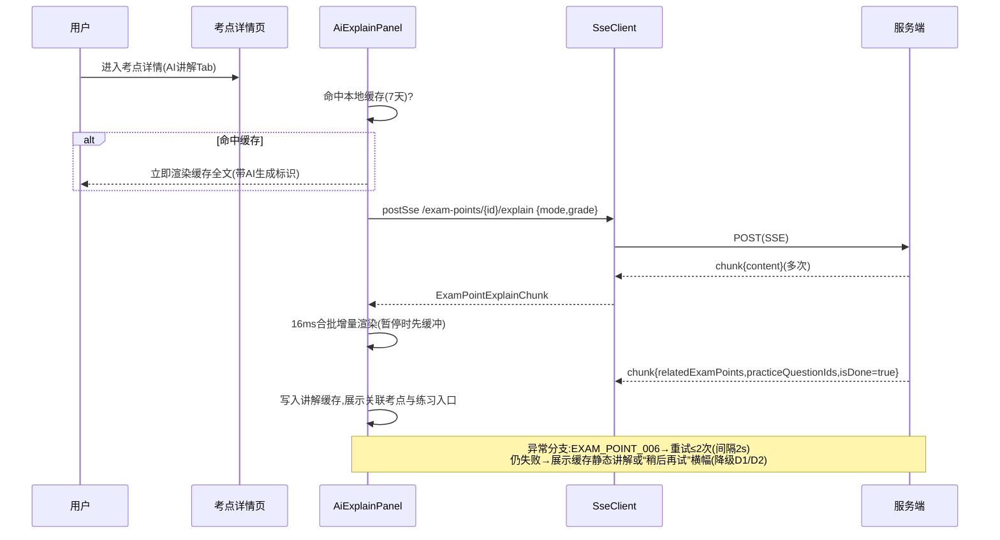
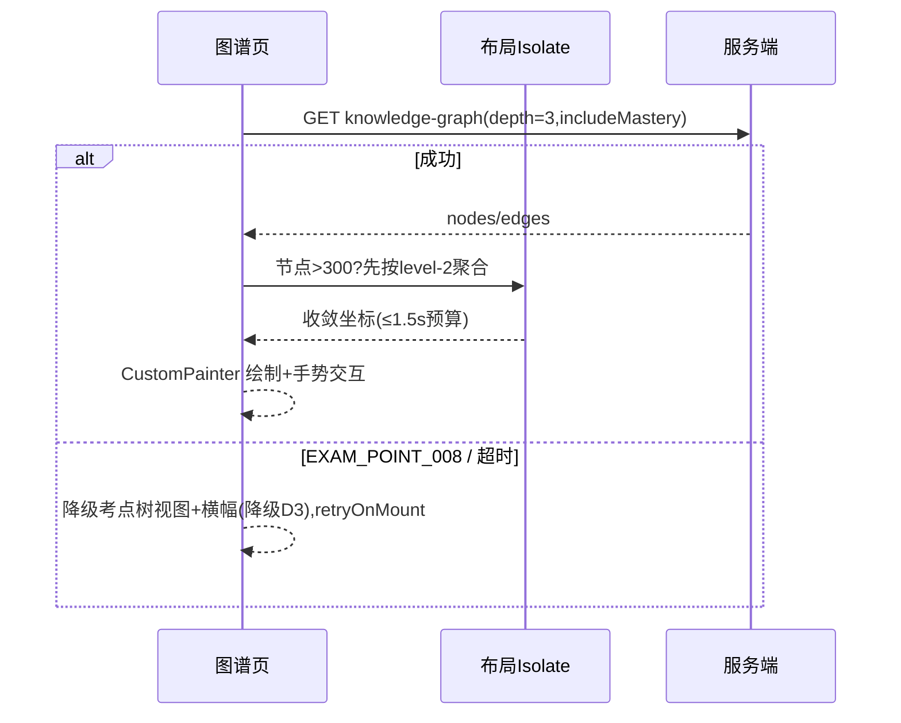

# 客户端 - 考点梳理页面架构与专题复习交互设计

> **版本**: v1.1 | **日期**: 2026-08-19 | **状态**: 已补全(v1.0 初稿 2026-05-28,原文件截断于 §4.2 SprintDayDetail 定义处,围栏未闭合;v1.1 补齐 §4.2 收尾、§5-§15 页面架构/交互流程/状态机/缓存/埋点/性能/降级/合规/契约/验收全部章节)
> **原始需求来源**: `docs/design/启硕-PrimeTop-全学段AI辅助学习软件项目设计文档` §6.9 考点梳理模块
> **服务端文档**: `考点梳理-详细设计.md`
> **关联模块**: 客户端架构与前端框架、客户端状态管理架构、客户端组件库与设计系统、客户端路由与深链接系统、知识点体系与教材映射引擎、学习数据可视化与图表渲染引擎、互动练习与即时反馈引擎、SSE流式响应与AI增量渲染引擎

---

## 1. 模块概述

### 1.1 功能定位

考点梳理页面是面向初中、高中学生的考试备考核心入口，提供考点清单浏览、知识图谱可视化、高频考点排行、专题突破训练和考前冲刺计划五大功能。本文档聚焦 **Flutter 客户端侧**的页面架构、组件设计、状态管理和交互实现，让开发人员可直接编码。

### 1.2 目标用户与分龄策略

| 学段 | 信息密度 | 核心诉求 | 交互特点 |
|------|----------|----------|----------|
| 初中 (7-9年级) | 中等 | 中考高频考点速查、专题训练 | 卡片化、颜色鲜明、进度条直观 |
| 高中 (10-12年级) | 高 | 高考全考点覆盖、知识图谱、冲刺规划 | 列表紧凑、图谱交互丰富、数据面板 |

### 1.3 页面清单

| 页面 | 路由 | 优先级 | 说明 |
|------|------|--------|------|
| 考点总览页 | `/exam-points` | P1 | 学科/学段选择 + 考点树/图谱切换 + 高频TOP + 掌握概况 |
| 考点详情页 | `/exam-points/:id` | P1 | 考点描述、AI讲解(SSE)、关联考点、易错点、考情统计 |
| 高频考点页 | `/exam-points/hot` | P1 | 高频考点排行榜 + 筛选器 |
| 知识图谱页 | `/exam-points/graph` | P2 | 交互式力导向图 + 节点详情面板 |
| 专题列表页 | `/exam-topics` | P1 | 专题卡片网格/列表 + 筛选 |
| 专题详情页 | `/exam-topics/:id` | P1 | 专题考点进度 + 训练入口 + AI分析 |
| 专题训练页 | `/exam-topics/:id/train` | P1 | 逐题答题 + 实时掌握度更新 |
| 专题报告页 | `/exam-topics/:id/report` | P1 | 训练结果分析 + 薄弱点建议 |
| 冲刺计划页 | `/exam-points/sprint` | P2 | 生成/查看冲刺计划 + 每日任务 |
| 冲刺任务执行页 | `/exam-points/sprint/:planId/day/:day` | P2 | 当日任务列表 + 执行入口 |

### 1.4 依赖的客户端基础模块

| 模块 | 使用方式 |
|------|----------|
| `客户端状态管理架构` | Riverpod 2.x 异步 Provider |
| `客户端路由与深链接系统` | GoRouter 路由注册 |
| `客户端组件库与设计系统` | 分龄主题 Token、通用组件 |
| `SSE流式响应与AI增量渲染引擎` | AI讲解流式渲染 |
| `客户端-题目展示与答题交互组件库` | 专题训练复用答题组件 |
| `学习数据可视化与图表渲染引擎` | 掌握度雷达图、考情柱状图 |
| `客户端网络请求治理与弱网适配方案` | Dio 请求层 + 离线缓存 |

---

## 2. 路由注册

### 2.1 GoRouter 配置

```dart
// lib/app/router/exam_points_routes.dart

import 'package:go_router/go_router.dart';
import '../pages/exam_points/*.dart';

List<RouteBase> examPointsRoutes = [
  ShellRoute(
    builder: (context, state, child) => ExamPointsShellPage(child: child),
    routes: [
      GoRoute(
        path: '/exam-points',
        name: 'examPointsOverview',
        builder: (context, state) => const ExamPointsOverviewPage(),
        routes: [
          GoRoute(
            path: 'hot',
            name: 'examPointsHot',
            builder: (context, state) => const ExamPointsHotPage(),
          ),
          GoRoute(
            path: 'graph',
            name: 'examPointsGraph',
            builder: (context, state) => const ExamPointsGraphPage(),
          ),
          GoRoute(
            path: 'sprint',
            name: 'examPointsSprint',
            builder: (context, state) => const SprintPlanListPage(),
            routes: [
              GoRoute(
                path: 'create',
                name: 'sprintPlanCreate',
                builder: (context, state) => const SprintPlanCreatePage(),
              ),
            ],
          ),
          GoRoute(
            path: ':examPointId',
            name: 'examPointDetail',
            builder: (context, state) {
              final id = int.parse(state.pathParameters['examPointId']!);
              return ExamPointDetailPage(examPointId: id);
            },
          ),
        ],
      ),
      GoRoute(
        path: '/exam-topics',
        name: 'examTopics',
        builder: (context, state) => const ExamTopicsListPage(),
        routes: [
          GoRoute(
            path: ':topicId',
            name: 'examTopicDetail',
            builder: (context, state) {
              final id = int.parse(state.pathParameters['topicId']!);
              return ExamTopicDetailPage(topicId: id);
            },
            routes: [
              GoRoute(
                path: 'train',
                name: 'examTopicTrain',
                builder: (context, state) {
                  final id = int.parse(state.pathParameters['topicId']!);
                  return ExamTopicTrainPage(topicId: id);
                },
              ),
              GoRoute(
                path: 'report',
                name: 'examTopicReport',
                builder: (context, state) {
                  final id = int.parse(state.pathParameters['topicId']!);
                  return ExamTopicReportPage(topicId: id);
                },
              ),
            ],
          ),
        ],
      ),
      GoRoute(
        path: '/exam-points/sprint/:planId/day/:day',
        name: 'sprintDayTasks',
        builder: (context, state) {
          final planId = state.pathParameters['planId']!;
          final day = int.parse(state.pathParameters['day']!);
          return SprintDayTasksPage(planId: planId, day: day);
        },
      ),
    ],
  ),
];
```

### 2.2 深链接配置

```dart
// 深链接 URI 格式
// primetop://exam-points                    → 考点总览
// primetop://exam-points/hot                → 高频考点
// primetop://exam-points/graph              → 知识图谱
// primetop://exam-points/123                → 考点详情(123)
// primetop://exam-topics                    → 专题列表
// primetop://exam-topics/456                → 专题详情(456)
// primetop://exam-topics/456/train          → 开始训练
// primetop://exam-points/sprint/create      → 创建冲刺计划
// primetop://exam-points/sprint/plan1/day/3 → 冲刺第3天
```

---

## 3. 数据模型 (Dart)

### 3.1 核心实体

```dart
// lib/features/exam_points/domain/entities.dart

import 'package:freezed_annotation/freezed_annotation.dart';

part 'entities.freezed.dart';
part 'entities.g.dart';

/// 考点节点
@freezed
class ExamPoint with _$ExamPoint {
  const factory ExamPoint({
    required int id,
    required String code,
    required String name,
    String? description,
    required int subjectId,
    required String stage,           // 'junior_high' | 'senior_high'
    int? parentId,
    required int level,              // 1=大类, 2=中类, 3=具体考点
    @Default(0) int sortOrder,
    double? examFrequency,           // 0-100
    double? difficultyAvg,           // 1-5
    @Default([]) List<int> knowledgePointIds,
    @Default([]) List<ExamPoint> children,
    UserExamPointMastery? mastery,
  }) = _ExamPoint;

  factory ExamPoint.fromJson(Map<String, dynamic> json) =>
      _$ExamPointFromJson(json);
}

/// 用户考点掌握度
@freezed
class UserExamPointMastery with _$UserExamPointMastery {
  const factory UserExamPointMastery({
    required int examPointId,
    required MasteryLevel masteryLevel,
    required int correctCount,
    required int totalCount,
    DateTime? lastPracticedAt,
  }) = _UserExamPointMastery;

  factory UserExamPointMastery.fromJson(Map<String, dynamic> json) =>
      _$UserExamPointMasteryFromJson(json);
}

/// 掌握等级枚举
enum MasteryLevel {
  @JsonValue('unknown')
  unknown('未练习', Colors.grey),
  @JsonValue('weak')
  weak('薄弱', Colors.red),
  @JsonValue('basic')
  basic('基础', Colors.orange),
  @JsonValue('proficient')
  proficient('良好', Colors.blue),
  @JsonValue('strong')
  strong('熟练', Colors.green);

  final String label;
  final Color color;
  const MasteryLevel(this.label, this.color);
}

/// 高频考点条目
@freezed
class HotExamPoint with _$HotExamPoint {
  const factory HotExamPoint({
    required int examPointId,
    required String name,
    required double frequency,
    double? avgScoreRatio,
    @Default([]) List<String> questionTypes,
    MasteryLevel? masteryLevel,
  }) = _HotExamPoint;

  factory HotExamPoint.fromJson(Map<String, dynamic> json) =>
      _$HotExamPointFromJson(json);
}

/// 易错点
@freezed
class CommonMistake with _$CommonMistake {
  const factory CommonMistake({
    required int id,
    required int examPointId,
    required String title,
    required String description,
    required String mistakePattern,
    required String correctApproach,
    double? occurrenceRate,
  }) = _CommonMistake;

  factory CommonMistake.fromJson(Map<String, dynamic> json) =>
      _$CommonMistakeFromJson(json);
}

/// 专题
@freezed
class ExamTopic with _$ExamTopic {
  const factory ExamTopic({
    required int id,
    required String code,
    required String name,
    String? description,
    required int subjectId,
    required String stage,
    String? difficultyRange,
    @Default([]) List<int> examPointIds,
    String? coverImageUrl,
    TopicProgress? userProgress,
  }) = _ExamTopic;

  factory ExamTopic.fromJson(Map<String, dynamic> json) =>
      _$ExamTopicFromJson(json);
}

/// 专题进度
@freezed
class TopicProgress with _$TopicProgress {
  const factory TopicProgress({
    required int completedPoints,
    required int totalPoints,
  }) = _TopicProgress;

  factory TopicProgress.fromJson(Map<String, dynamic> json) =>
      _$TopicProgressFromJson(json);

  const TopicProgress._();

  double get percentage => totalPoints > 0
      ? (completedPoints / totalPoints * 100)
      : 0.0;
}

/// 知识图谱数据
@freezed
class KnowledgeGraphData with _$KnowledgeGraphData {
  const factory KnowledgeGraphData({
    required List<GraphNode> nodes,
    required List<GraphEdge> edges,
  }) = _KnowledgeGraphData;

  factory KnowledgeGraphData.fromJson(Map<String, dynamic> json) =>
      _$KnowledgeGraphDataFromJson(json);
}

@freezed
class GraphNode with _$GraphNode {
  const factory GraphNode({
    required int id,
    required String label,
    MasteryLevel? masteryLevel,
    double? examFrequency,
    @Default(false) bool isHot,
    @Default(false) bool isExpanded,
  }) = _GraphNode;

  factory GraphNode.fromJson(Map<String, dynamic> json) =>
      _$GraphNodeFromJson(json);
}

@freezed
class GraphEdge with _$GraphEdge {
  const factory GraphEdge({
    required int source,
    required int target,
    required EdgeType type,
    @Default(1) int strength,
  }) = _GraphEdge;

  factory GraphEdge.fromJson(Map<String, dynamic> json) =>
      _$GraphEdgeFromJson(json);
}

enum EdgeType {
  @JsonValue('prerequisite') prerequisite,
  @JsonValue('related') related,
  @JsonValue('parallel') parallel,
  @JsonValue('contains') contains,
}

/// 冲刺计划
@freezed
class SprintPlan with _$SprintPlan {
  const factory SprintPlan({
    required String planId,
    required int totalDays,
    required String subjectName,
    required String examType,
    required DateTime examDate,
    @Default([]) List<SprintPhase> phases,
    required SprintPlanStatus status,
  }) = _SprintPlan;

  factory SprintPlan.fromJson(Map<String, dynamic> json) =>
      _$SprintPlanFromJson(json);
}

enum SprintPlanStatus { draft, previewing, active, completed }

@freezed
class SprintPhase with _$SprintPhase {
  const factory SprintPhase({
    required String name,
    required int startDay,
    required int endDay,
    @Default([]) List<SprintTask> tasks,
  }) = _SprintPhase;

  factory SprintPhase.fromJson(Map<String, dynamic> json) =>
      _$SprintPhaseFromJson(json);
}

@freezed
class SprintTask with _$SprintTask {
  const factory SprintTask({
    required int day,
    required List<int> examPointIds,
    required String taskType,
    required int estimatedMinutes,
    required String description,
    @Default(false) bool isCompleted,
  }) = _SprintTask;

  factory SprintTask.fromJson(Map<String, dynamic> json) =>
      _$SprintTaskFromJson(json);
}

/// 专题训练会话状态
@freezed
class TrainingSession with _$TrainingSession {
  const factory TrainingSession({
    required int topicId,
    required List<TrainingQuestion> questions,
    required TrainingStatus status,
    int currentIndex = 0,
    @Default([]) List<TrainingAnswer> answers,
    DateTime? startedAt,
    DateTime? completedAt,
  }) = _TrainingSession;

  factory TrainingSession.fromJson(Map<String, dynamic> json) =>
      _$TrainingSessionFromJson(json);
}

enum TrainingStatus { idle, loading, answering, reviewing, completed, reported }

@freezed
class TrainingQuestion with _$TrainingQuestion {
  const factory TrainingQuestion({
    required int questionId,
    required int examPointId,
    required double difficulty,
    required String type,
    String? source,
  }) = _TrainingQuestion;

  factory TrainingQuestion.fromJson(Map<String, dynamic> json) =>
      _$TrainingQuestionFromJson(json);
}

@freezed
class TrainingAnswer with _$TrainingAnswer {
  const factory TrainingAnswer({
    required int questionId,
    required bool isCorrect,
    required String userAnswer,
    String? aiAnalysis,
  }) = _TrainingAnswer;

  factory TrainingAnswer.fromJson(Map<String, dynamic> json) =>
      _$TrainingAnswerFromJson(json);
}
```

---

## 4. Riverpod Provider 设计

### 4.1 Provider 总览

```dart
// lib/features/exam_points/providers/providers.dart

/// ==================== 考点树 ====================

/// 当前选中的学科+学段筛选条件
@riverpod
class ExamPointsFilter extends _$ExamPointsFilter {
  @override
  ExamPointsFilterState build() => ExamPointsFilterState(
    subjectId: null,
    stage: null,
    viewMode: ExamPointsViewMode.tree, // tree | graph
  );

  void setSubject(int subjectId) {
    state = state.copyWith(subjectId: subjectId);
    // 重置考点树
    ref.invalidate(examPointsTreeProvider);
  }

  void setStage(String stage) {
    state = state.copyWith(stage: stage);
    ref.invalidate(examPointsTreeProvider);
  }

  void toggleViewMode() {
    state = state.copyWith(
      viewMode: state.viewMode == ExamPointsViewMode.tree
          ? ExamPointsViewMode.graph
          : ExamPointsViewMode.tree,
    );
  }
}

@freezed
class ExamPointsFilterState with _$ExamPointsFilterState {
  const factory ExamPointsFilterState({
    int? subjectId,
    String? stage,
    required ExamPointsViewMode viewMode,
  }) = _ExamPointsFilterState;
}

enum ExamPointsViewMode { tree, graph }

/// 考点树数据
@riverpod
Future<List<ExamPoint>> examPointsTree(ExamPointsTreeRef ref) async {
  final filter = ref.watch(examPointsFilterProvider);
  if (filter.subjectId == null || filter.stage == null) {
    return [];
  }

  final api = ref.watch(examPointsApiProvider);
  final tree = await api.getExamPointsTree(
    subjectId: filter.subjectId!,
    stage: filter.stage!,
  );

  // 缓存到本地 Hive
  await ref.read(localCacheProvider).cacheExamPointsTree(
    key: '${filter.subjectId}_${filter.stage}',
    data: tree,
  );

  return tree;
}

/// ==================== 掌握度概况 ====================

/// 掌握度统计（按等级分组计数）
@riverpod
Future<MasteryOverview> masteryOverview(MasteryOverviewRef ref) async {
  final filter = ref.watch(examPointsFilterProvider);
  if (filter.subjectId == null || filter.stage == null) {
    return MasteryOverview.empty();
  }

  final api = ref.watch(examPointsApiProvider);
  return api.getMasteryOverview(
    subjectId: filter.subjectId!,
    stage: filter.stage!,
  );
}

@freezed
class MasteryOverview with _$MasteryOverview {
  const factory MasteryOverview({
    @Default(0) int strong,
    @Default(0) int proficient,
    @Default(0) int basic,
    @Default(0) int weak,
    @Default(0) int unknown,
  }) = _MasteryOverview;

  const MasteryOverview._();

  factory MasteryOverview.empty() => const MasteryOverview();

  int get total => strong + proficient + basic + weak + unknown;

  double get masteryRate => total > 0
      ? ((strong + proficient) / total * 100)
      : 0.0;

  List<MasterySegment> get segments => [
    MasterySegment(level: MasteryLevel.strong, count: strong),
    MasterySegment(level: MasteryLevel.proficient, count: proficient),
    MasterySegment(level: MasteryLevel.basic, count: basic),
    MasterySegment(level: MasteryLevel.weak, count: weak),
    MasterySegment(level: MasteryLevel.unknown, count: unknown),
  ];
}

@freezed
class MasterySegment with _$MasterySegment {
  const factory MasterySegment({
    required MasteryLevel level,
    required int count,
  }) = _MasterySegment;
}

/// ==================== 高频考点 ====================

@riverpod
Future<List<HotExamPoint>> hotExamPoints(HotExamPointsRef ref) async {
  final filter = ref.watch(examPointsFilterProvider);
  if (filter.subjectId == null || filter.stage == null) return [];

  final api = ref.watch(examPointsApiProvider);
  return api.getHotExamPoints(
    subjectId: filter.subjectId!,
    stage: filter.stage!,
    topN: 20,
  );
}

/// ==================== 考点详情 ====================

@riverpod
Future<ExamPointDetail> examPointDetail(ExamPointDetailRef ref, int examPointId) async {
  final api = ref.watch(examPointsApiProvider);
  return api.getExamPointDetail(examPointId);
}

/// ==================== 知识图谱 ====================

@riverpod
Future<KnowledgeGraphData> knowledgeGraph(KnowledgeGraphRef ref) async {
  final filter = ref.watch(examPointsFilterProvider);
  if (filter.subjectId == null || filter.stage == null) {
    return const KnowledgeGraphData(nodes: [], edges: []);
  }

  final api = ref.watch(examPointsApiProvider);
  return api.getKnowledgeGraph(
    subjectId: filter.subjectId!,
    stage: filter.stage!,
    includeMastery: true,
  );
}

/// 图谱中选中的节点
@riverpod
class SelectedGraphNode extends _$SelectedGraphNode {
  @override
  int? build() => null;

  void select(int? nodeId) => state = nodeId;
}

/// ==================== 专题 ====================

@riverpod
Future<List<ExamTopic>> examTopics(ExamTopicsRef ref) async {
  final filter = ref.watch(examPointsFilterProvider);
  if (filter.subjectId == null || filter.stage == null) return [];

  final api = ref.watch(examPointsApiProvider);
  return api.getExamTopics(
    subjectId: filter.subjectId!,
    stage: filter.stage!,
  );
}

@riverpod
Future<ExamTopicDetail> examTopicDetail(ExamTopicDetailRef ref, int topicId) async {
  final api = ref.watch(examPointsApiProvider);
  return api.getExamTopicDetail(topicId);
}

/// ==================== 专题训练 ====================

@riverpod
class TrainingSessionNotifier extends _$TrainingSessionNotifier {
  @override
  TrainingSession? build() => null;

  Future<void> startTraining(int topicId) async {
    state = TrainingSession(
      topicId: topicId,
      questions: [],
      status: TrainingStatus.loading,
    );

    try {
      final api = ref.read(examPointsApiProvider);
      final detail = await api.getExamTopicDetail(topicId);

      state = state!.copyWith(
        questions: detail.trainingQuestions,
        status: TrainingStatus.answering,
        startedAt: DateTime.now(),
      );
    } catch (e) {
      state = state!.copyWith(status: TrainingStatus.idle);
      rethrow;
    }
  }

  void submitAnswer(int questionId, String answer, bool isCorrect) {
    if (state == null) return;

    final newAnswer = TrainingAnswer(
      questionId: questionId,
      isCorrect: isCorrect,
      userAnswer: answer,
    );

    final nextIndex = state!.currentIndex + 1;
    final isLast = nextIndex >= state!.questions.length;

    state = state!.copyWith(
      answers: [...state!.answers, newAnswer],
      currentIndex: nextIndex,
      status: isLast ? TrainingStatus.completed : TrainingStatus.answering,
      completedAt: isLast ? DateTime.now() : null,
    );
  }

  void enterReview() {
    if (state != null) {
      state = state!.copyWith(status: TrainingStatus.reviewing);
    }
  }

  void complete() {
    if (state != null) {
      state = state!.copyWith(status: TrainingStatus.reported);
    }
  }
}

/// ==================== 冲刺计划 ====================

@riverpod
Future<List<SprintPlan>> sprintPlans(SprintPlansRef ref) async {
  final api = ref.watch(examPointsApiProvider);
  return api.getSprintPlans();
}

@riverpod
class SprintPlanCreator extends _$SprintPlanCreator {
  @override
  SprintPlanCreatorState build() => const SprintPlanCreatorState();

  Future<void> generate({
    required int subjectId,
    required String stage,
    required String examType,
    required DateTime examDate,
    required int dailyMinutes,
    required bool focusWeakPoints,
  }) async {
    state = const SprintPlanCreatorState(isGenerating: true);

    try {
      final api = ref.read(examPointsApiProvider);
      final plan = await api.generateSprintPlan(
        subjectId: subjectId,
        stage: stage,
        examType: examType,
        examDate: examDate.toIso8601String(),
        dailyMinutes: dailyMinutes,
        focusWeakPoints: focusWeakPoints,
      );
      state = SprintPlanCreatorState(isGenerating: false, plan: plan);
    } catch (e) {
      state = SprintPlanCreatorState(isGenerating: false, error: e.toString());
    }
  }

  Future<void> confirm() async {
    final plan = state.plan;
    if (plan == null) return;

    final api = ref.read(examPointsApiProvider);
    await api.confirmSprintPlan(plan.planId);
    ref.invalidate(sprintPlansProvider);
  }
}

@freezed
class SprintPlanCreatorState with _$SprintPlanCreatorState {
  const factory SprintPlanCreatorState({
    @Default(false) bool isGenerating,
    SprintPlan? plan,
    String? error,
  }) = _SprintPlanCreatorState;
}
```

### 4.2 API 抽象层

```dart
// lib/features/exam_points/data/exam_points_api.dart

abstract class ExamPointsApi {
  // 考点树
  Future<List<ExamPoint>> getExamPointsTree({
    required int subjectId,
    required String stage,
    int? grade,
  });

  // 考点详情
  Future<ExamPointDetail> getExamPointDetail(int examPointId);

  // 高频考点
  Future<List<HotExamPoint>> getHotExamPoints({
    required int subjectId,
    required String stage,
    String? examType,
    int topN = 20,
  });

  // 知识图谱
  Future<KnowledgeGraphData> getKnowledgeGraph({
    required int subjectId,
    required String stage,
    int? rootPointId,
    int depth = 3,
    bool includeMastery = true,
  });

  // 掌握度概况
  Future<MasteryOverview> getMasteryOverview({
    required int subjectId,
    required String stage,
  });

  // 专题列表
  Future<List<ExamTopic>> getExamTopics({
    required int subjectId,
    required String stage,
    int? difficulty,
  });

  // 专题详情
  Future<ExamTopicDetail> getExamTopicDetail(int topicId);

  // AI 考点讲解（SSE 流式）
  Stream<ExamPointExplainChunk> explainExamPoint({
    required int examPointId,
    required String mode,
    bool includeExamples = true,
    bool includeMistakes = true,
    required int grade,
  });

  // 冲刺计划
  Future<SprintPlan> generateSprintPlan({
    required int subjectId,
    required String stage,
    required String examType,
    required String examDate,
    required int dailyMinutes,
    required bool focusWeakPoints,
  });

  Future<void> confirmSprintPlan(String planId);
  Future<List<SprintPlan>> getSprintPlans();
  Future<SprintDayDetail> getSprintDayDetail(String planId, int day);
}
```

```dart
// lib/features/exam_points/data/exam_points_api_impl.dart

class ExamPointsApiImpl implements ExamPointsApi {
  final Dio _dio;
  final SseClient _sseClient;

  ExamPointsApiImpl(this._dio, this._sseClient);

  @override
  Future<List<ExamPoint>> getExamPointsTree({
    required int subjectId,
    required String stage,
    int? grade,
  }) async {
    final response = await _dio.get(
      '/api/v1/exam-points/tree',
      queryParameters: {
        'subjectId': subjectId,
        'stage': stage,
        if (grade != null) 'grade': grade,
      },
    );
    return (response.data['data']['tree'] as List)
        .map((e) => ExamPoint.fromJson(e))
        .toList();
  }

  @override
  Stream<ExamPointExplainChunk> explainExamPoint({
    required int examPointId,
    required String mode,
    required bool includeExamples,
    required bool includeMistakes,
    required int grade,
  }) {
    return _sseClient.postSse(
      '/api/v1/exam-points/$examPointId/explain',
      body: {
        'mode': mode,
        'includeExamples': includeExamples,
        'includeMistakes': includeMistakes,
        'grade': grade,
      },
      parser: (json) => ExamPointExplainChunk.fromJson(json),
    );
  }

  // ... 其他方法实现类似
}

/// SSE 流式讲解数据块
@freezed
class ExamPointExplainChunk with _$ExamPointExplainChunk {
  const factory ExamPointExplainChunk({
    String? content,            // Markdown 片段
    List<int>? relatedExamPoints,
    List<int>? practiceQuestionIds,
    @Default(false) bool isDone,
  }) = _ExamPointExplainChunk;

  factory ExamPointExplainChunk.fromJson(Map<String, dynamic> json) =>
      _$ExamPointExplainChunkFromJson(json);
}

/// 考点详情（含关联数据）
@freezed
class ExamPointDetail with _$ExamPointDetail {
  const factory ExamPointDetail({
    required ExamPoint point,
    @Default([]) List<ExamPoint> prerequisites,
    @Default([]) List<ExamPoint> relatedPoints,
    @Default([]) List<CommonMistake> commonMistakes,
    HotInfo? hotInfo,
    @Default([]) List<ExamFrequencyRecord> recentExamFrequency,
  }) = _ExamPointDetail;

  factory ExamPointDetail.fromJson(Map<String, dynamic> json) =>
      _$ExamPointDetailFromJson(json);
}

@freezed
class HotInfo with _$HotInfo {
  const factory HotInfo({
    required bool isHot,
    required double frequency,
    @Default([]) List<String> questionTypes,
  }) = _HotInfo;

  factory HotInfo.fromJson(Map<String, dynamic> json) =>
      _$HotInfoFromJson(json);
}

@freezed
class ExamFrequencyRecord with _$ExamFrequencyRecord {
  const factory ExamFrequencyRecord({
    required int year,
    required List<ExamQuestionEntry> entries,
  }) = _ExamFrequencyRecord;

  factory ExamFrequencyRecord.fromJson(Map<String, dynamic> json) =>
      _$ExamFrequencyRecordFromJson(json);
}

@freezed
class ExamQuestionEntry with _$ExamQuestionEntry {
  const factory ExamQuestionEntry({
    required String questionType,
    required int score,
  }) = _ExamQuestionEntry;

  factory ExamQuestionEntry.fromJson(Map<String, dynamic> json) =>
      _$ExamQuestionEntryFromJson(json);
}

/// 专题详情（含训练内容）
@freezed
class ExamTopicDetail with _$ExamTopicDetail {
  const factory ExamTopicDetail({
    required ExamTopic topic,
    @Default([]) List<TopicExamPoint> examPoints,
    @Default([]) List<TrainingQuestion> trainingQuestions,
  }) = _ExamTopicDetail;

  factory ExamTopicDetail.fromJson(Map<String, dynamic> json) =>
      _$ExamTopicDetailFromJson(json);
}

@freezed
class TopicExamPoint with _$TopicExamPoint {
  const factory TopicExamPoint({
    required int id,
    required String name,
    required MasteryLevel masteryLevel,
    @Default(false) bool isHot,
    @Default([]) List<String> recommendedActions,
  }) = _TopicExamPoint;

  factory TopicExamPoint.fromJson(Map<String, dynamic> json) =>
      _$TopicExamPointFromJson(json);
}

/// 冲刺计划当日详情
@freezed
class SprintDayDetail with _$SprintDayDetail {
  const factory SprintDayDetail({
    required int day,
    required SprintTask task,
    @Default([]) List<ExamPoint> examPoints,
    @Default(false) bool isCompleted,
  }) = _SprintDayDetail;

  factory SprintDayDetail.fromJson(Map<String, dynamic> json) =>
      _$SprintDayDetailFromJson(json);
}
```

`ExamPointsApiImpl` 其余方法实现(错误码统一封装见 §4.3):

```dart
// lib/features/exam_points/data/exam_points_api_impl.dart (续)

  @override
  Future<List<HotExamPoint>> getHotExamPoints({
    required int subjectId,
    required String stage,
    String? examType,
    int topN = 20,
  }) async {
    final response = await _dio.get(
      '/api/v1/exam-points/hot',
      queryParameters: {
        'subjectId': subjectId,
        'stage': stage,
        if (examType != null) 'examType': examType,
        'topN': topN,
      },
    );
    return (response.data['data']['points'] as List)
        .map((e) => HotExamPoint.fromJson(e))
        .toList();
  }

  @override
  Future<KnowledgeGraphData> getKnowledgeGraph({
    required int subjectId,
    required String stage,
    int? rootPointId,
    int depth = 3,
    bool includeMastery = true,
  }) async {
    final response = await _dio.get(
      '/api/v1/exam-points/knowledge-graph',
      queryParameters: {
        'subjectId': subjectId,
        'stage': stage,
        'depth': depth,
        'includeMastery': includeMastery,
        if (rootPointId != null) 'rootPointId': rootPointId,
      },
    );
    return KnowledgeGraphData.fromJson(response.data['data']);
  }

  @override
  Future<MasteryOverview> getMasteryOverview({
    required int subjectId,
    required String stage,
  }) async {
    final response = await _dio.get(
      '/api/v1/exam-points/mastery-overview',
      queryParameters: {'subjectId': subjectId, 'stage': stage},
    );
    return MasteryOverview.fromJson(response.data['data']);
  }

  @override
  Future<List<ExamTopic>> getExamTopics({
    required int subjectId,
    required String stage,
    int? difficulty,
  }) async {
    final response = await _dio.get(
      '/api/v1/exam-topics',
      queryParameters: {
        'subjectId': subjectId,
        'stage': stage,
        if (difficulty != null) 'difficulty': difficulty,
      },
    );
    return (response.data['data']['topics'] as List)
        .map((e) => ExamTopic.fromJson(e))
        .toList();
  }

  @override
  Future<ExamTopicDetail> getExamTopicDetail(int topicId) async {
    final response = await _dio.get('/api/v1/exam-topics/$topicId');
    return ExamTopicDetail.fromJson(response.data['data']);
  }

  @override
  Future<SprintPlan> generateSprintPlan({
    required int subjectId,
    required String stage,
    required String examType,
    required String examDate,
    required int dailyMinutes,
    required bool focusWeakPoints,
  }) async {
    final response = await _dio.post(
      '/api/v1/exam-points/sprint-plan',
      data: {
        'subjectId': subjectId,
        'stage': stage,
        'examType': examType,
        'examDate': examDate,
        'dailyMinutes': dailyMinutes,
        'focusWeakPoints': focusWeakPoints,
      },
      options: Options(
        // 幂等键:同一表单重复点击/超时重试不重复生成(对齐《接口幂等性与防重提交机制》)
        headers: {
          'Idempotency-Key': _idemKey('sprint-gen', [subjectId, examType, examDate]),
        },
      ),
    );
    return SprintPlan.fromJson(response.data['data']);
  }

  @override
  Future<void> confirmSprintPlan(String planId) => _dio.post(
        '/api/v1/exam-points/sprint-plan/$planId/confirm',
      ).then((_) {});

  @override
  Future<List<SprintPlan>> getSprintPlans() async {
    final response = await _dio.get('/api/v1/exam-points/sprint-plan');
    return (response.data['data']['plans'] as List)
        .map((e) => SprintPlan.fromJson(e))
        .toList();
  }

  @override
  Future<SprintDayDetail> getSprintDayDetail(String planId, int day) async {
    final response = await _dio.get(
      '/api/v1/exam-points/sprint-plan/$planId/day/$day',
    );
    return SprintDayDetail.fromJson(response.data['data']);
  }

  /// 确定性幂等键派生:同参数同会话重复提交复用同一 Key
  String _idemKey(String biz, List<Object> parts) =>
      '$biz-${parts.join('-')}-${_sessionSeed}';

  static final String _sessionSeed =
      DateTime.now().millisecondsSinceEpoch.toRadixString(36);
}
```

> 注:`mastery-overview`、`sprint-plan/{planId}/confirm`、`sprint-plan` GET 列表、`sprint-plan/{planId}/day/{day}` 四个端点为客户端必要能力,服务端《考点梳理-详细设计》§3 仅登记了生成接口,已在 §13 契约对齐中登记为服务端 v1.1 扩展需求并给出建议契约。

### 4.3 错误码统一封装

服务端错误码为 `EXAM_POINT_001` ~ `EXAM_POINT_010`(见《考点梳理-详细设计》§10.1)。客户端统一拦截并映射为业务异常:

```dart
// lib/features/exam_points/data/exam_points_api_error.dart

class ExamPointsApiException implements Exception {
  final String code;      // EXAM_POINT_001 .. EXAM_POINT_010
  final String message;   // 服务端下发文案(已适龄化)
  final String? action;   // 预置恢复动作路由,如 'backToList' / 'openMembership'

  const ExamPointsApiException(this.code, this.message, this.action);

  /// Dio 错误 → 领域异常归一
  factory ExamPointsApiException.fromDio(DioException e) {
    final body = e.response?.data;
    if (body is Map && body['errorCode'] is String) {
      return ExamPointsApiException(
        body['errorCode'] as String,
        (body['message'] ?? '服务暂时不可用,请稍后重试') as String,
        body['action'] as String?,
      );
    }
    // 网络层错误:无 errorCode,归一为本地超时/断网两类
    return ExamPointsApiException(
      e.type == DioExceptionType.connectionTimeout ||
              e.type == DioExceptionType.receiveTimeout
          ? 'EXAM_POINT_009'
          : 'LOCAL_NETWORK',
      e.type == DioExceptionType.receiveTimeout ? '加载超时,请重试' : '网络连接不可用',
      null,
    );
  }
}
```

UI 层只处理 `ExamPointsApiException`,禁止直接散落处理 `DioException`(对齐《客户端网络请求治理与弱网适配方案》)。

---

## 5. 页面架构与组件设计

### 5.1 考点总览页 `/exam-points`

```text
┌──────────────────────────────────────┐
│ ← 考点梳理        [数学▾] [初中▾] ⚙ │  AppBar:返回 + 学科/学段筛选器
├──────────────────────────────────────┤
│ ┌ 掌握概况卡(点击展开明细) ──────┐ │
│ │    ◔ 62%        良好以上占比     │ │
│ │ 熟练12 良好30 基础41 薄弱18 未练9 │ │
│ │ [去补薄弱 →]                     │ │
│ └──────────────────────────────────┘ │
│ [考点树] [高频考点] [知识图谱] ←Tab   │
├──────────────────────────────────────┤
│ ▾ 数与式                    大类     │
│   ▾ 方程与不等式      高频 92 [薄弱] │
│     · 一元二次方程-配方法  88 [基础] │
│     · 一元二次方程-判别式  85 [良好] │
│   ▸ 函数及其图像         高频 90 [良好] │
│ ▾ 图形与几何               大类     │
│ ...                                  │
└──────────────────────────────────────┘
```

**Widget 树:**

```dart
ExamPointsOverviewPage
├── ExamPointsAppBar              // 学科/学段下拉,持久化到 SharedPreferences
├── MasteryOverviewCard           // 环形图 + 五级计数,点击薄弱色块→高频页带筛选
│   ├── MasteryRingChart          // 复用《学习数据可视化与图表渲染引擎》
│   └── MasteryLegend
├── TabBar(考点树 | 高频考点 | 知识图谱)
└── TabBarView
    ├── ExamPointTreeView         // 懒展开:仅渲染已展开节点,ListView.builder
    │   └── ExamPointTile         // 频次徽标 + MasteryChip + 展开箭头
    ├── ExamPointsHotView         // 见 §5.3
    └── ExamPointsGraphView       // 见 §5.4
```

**交互规则:**

| 规则 | 说明 |
|------|------|
| 筛选器持久化 | 学科+学段写入本地偏好,冷启动恢复;变更即 `ref.invalidate` 考点树/图谱/高频三 Provider |
| 树懒展开 | level-1 默认全折叠,仅展开时拉取子节点缓存;叶子节点(level-3)点击→考点详情页 |
| 高频徽标 | `examFrequency >= 80` 显示🔥徽标,60-79 显示“较高”,<60 不显示 |
| 掌握度 Chip | 颜色取 `MasteryLevel.color`;`unknown` 灰色文案“未练习” |
| 下拉刷新 | 刷新考点树+掌握概况;高频/图谱按各自缓存策略 |
| 页面状态 | 骨架屏(树 8 行占位)/空态(该学科无考点数据)/错误态(重试按钮),对齐《客户端页面状态模式》 |

### 5.2 考点详情页 `/exam-points/:id`

```text
┌──────────────────────────────────────┐
│ ← 一元二次方程-配方法       高频🔥92 │
├──────────────────────────────────────┤
│ 难度 ★★★☆☆ · 你的掌握 [基础] 34/50  │
│ [前置:一元二次方程] [相关:函数思想]   │
├──────────────────────────────────────┤
│ [AI讲解] [考情统计] [易错点] [关联考点]│
├──────────────────────────────────────┤
│ ┌ AI讲解面板 ─────────────────────┐ │
│ │ ◉ AI 生成 · 流式输出中…          │ │
│ │ 配方法是通过把二次项…            │ │
│ │ ▊ (打字光标)                    │ │
│ │ [⏸暂停] [↻重新生成] [速览|详解]   │ │
│ │ ────── 输出完成 ──────           │ │
│ │ 相关考点: 判别式(12) 函数图像(45)│ │
│ │ [去练习 3 题 →]                  │ │
│ └──────────────────────────────────┘ │
└──────────────────────────────────────┘
```

**AI 讲解面板 `AiExplainPanel`:**

- 流式渲染:复用《SSE流式响应与AI增量渲染引擎》的 Markdown 增量渲染器,16ms 帧级合批,LaTeX 公式交给学科公式渲染组件;
- 模式切换:`速览`(约 300 字)/`详解`(分步推导+例题),切换即重新发起 SSE,旧流先 cancel;
- AIGC 标识:面板顶部固定“◉ AI 生成”角标,不得随内容滚动移出视口(合规 C1);
- 暂停/继续:仅暂停本地渲染(SSE 流继续接收并缓冲),避免服务端重复计费;
- 完成后:`relatedExamPoints` 渲染为可点 Chip;`practiceQuestionIds` 渲染“去练习”入口,跳转考点详情内的内嵌练习页(复用答题组件库);
- 缓存:同一 `(examPointId, mode)` 的完整讲解缓存 7 天,下次进入先展示缓存再静默刷新(仅当内容版本变更时覆盖)。

**考情统计 Tab:** 近 5 年 `recentExamFrequency` 渲染分组柱状图(年份×题型分值),数据为空时显示“暂无近5年考情数据”。

**易错点 Tab:** `CommonMistake` 卡片列表:错误模式 → 正确思路,`occurrenceRate` 以进度条展示(文案“×% 的同学在此失分”,成长型话术,禁用“很多人错”式贬损表述,合规 C3)。

**关联考点 Tab:** 前置考点链(必须按依赖顺序渲染,缺口标黄)与相关考点网格;点击进入对应详情页。

### 5.3 高频考点页 `/exam-points/hot`

- 筛选器行:题型(全部/选择/填空/解答)、掌握度(全部/薄弱/未练习);筛选仅本地过滤已拉取的 TopN 列表;
- 排行列表 `HotPointRankTile`:排名序号 + 考点名 + 频次横条(frequency 归一化宽度) + 题型标签 + 我的掌握 Chip;
- 点击→考点详情页;“去训练”快捷按钮→跳转该考点所属专题详情(若有)或详情页内练习;
- 数据过期兜底:接口失败时读取上一期快照并展示“数据更新于 X 月 X 日”横幅(降级 D4)。

### 5.4 知识图谱页 `/exam-points/graph`

**渲染方案:** 自研 `KnowledgeGraphView`(CustomPainter + 力导向布局):

- 布局在 `Isolate` 中迭代(300 节点收敛预算 ≤ 1.5s),主 Isolate 仅做绘制;
- 节点半径 ∝ `examFrequency`(8~22px 逻辑像素),填充色 = 掌握度色,外环双圈 = 高频标记;
- 边样式:`prerequisite` 实线箭头 / `related` 虚线 / `parallel` 点线 / `contains` 淡灰无箭头;
- 手势:单击节点→底部 `GraphNodeSheet`(名称/掌握/频次/操作:看讲解、去练习、聚焦子图);双击→以该节点为 root 重新拉取 depth=2 子图(渐进式展开);捏合缩放(0.5x~2.5x)+ 平移;长按→高亮一跳邻域并淡化其余;
- 图例常驻右下角可折叠。

**性能护栏:**

| 条件 | 行为 |
|------|------|
| 节点 > 300 | 自动按 level-2 聚合(子节点折叠计数徽标),提示“已聚合显示,双击展开” |
| 节点 > 800 或接口 EXAM_POINT_008 | 降级为考点树视图 + 顶部横幅“图谱暂不可用”(降级 D3) |
| 帧率 < 50fps 持续 3s | 关闭边抗锯齿与阴影,节点标签仅缩放 >0.8x 时绘制 |

### 5.5 专题列表页与专题详情页

**专题列表 `/exam-topics`:** 2 列卡片网格;卡片 = 封面图 + 专题名 + 考点数 + 难度区间标签 + 进度环(0% 时不显示);下拉刷新;空态引导“完成考点诊断后为你推荐专题”。

**专题详情 `/exam-topics/:id`:**

```text
┌──────────────────────────────────────┐
│ ← 专题:二次函数综合突破              │
├──────────────────────────────────────┤
│ 覆盖 8 个考点 · 进度 ◔ 3/8 · 建议 40分 │
│ ┌ AI 专题分析(缓存) ────────────┐   │
│ │ 你在“数形结合”类题目正确率 45%, │   │
│ │ 建议优先突破图像平移变换…       │   │
│ └────────────────────────────────┘   │
│ 考点清单:                            │
│ ☑ 二次函数图像        [良好] 高频     │
│ ☐ 图像平移变换        [薄弱] [去训练] │
│ ☐ 与一元二次方程联动  [未练习]        │
│ ...                                  │
│      [ 开始训练(8题·约15分钟) ]      │
└──────────────────────────────────────┘
```

- 考点清单行内 `recommendedActions` 渲染动作 Chip:去训练 / 看讲解 / 加入错题复习;
- “开始训练”按钮:训练进行中(存在未完成会话)时文案变为“继续训练”,并恢复到 `currentIndex`;
- AI 分析摘要来自专题详情接口,带 AIGC 标识;接口失败时隐藏该卡(不阻断主流程)。

### 5.6 专题训练页 `/exam-topics/:id/train`

复用《客户端-题目展示与答题交互组件库》:`QuestionView` + `AnswerFeedbackPanel`。

```text
┌──────────────────────────────────────┐
│ ✕(退出需确认)  进度 ▓▓▓░░ 3/8  ⏱ 04:12 │
├──────────────────────────────────────┤
│ [考点:图像平移变换] 难度★★★☆        │
│                                      │
│        题目题干(富文本+公式)          │
│        选项/作答区                    │
│                                      │
│         [ 提交答案 ]                  │
├──────────────────────────────────────┤
│ 提交后: ✓ 回答正确 / ✗ 再想一想       │
│ 答案解析(可展开) [下一题 →]           │
└──────────────────────────────────────┘
```

**交互规则:**

| 规则 | 说明 |
|------|------|
| 退出保护 | 进行中退出弹二次确认:“训练进度不会保存,确定退出?”(训练为一次性会话,不落草稿;守卫 G6) |
| 提交判定 | 答案提交走练习判题链路(判题引擎),客户端不本地判分;返回 `isCorrect + 解析` |
| 即时反馈 | 正确→绿色横幅+鼓励文案;错误→红色横幅+“查看解析”折叠面板(对齐渐进式提示:先展示思路第一步,不直接给完整答案,见《答案管控与渐进式提示引擎》) |
| 最后一题 | 完成后自动进入 completed,展示结算过渡动画 800ms → `pushReplacement` 报告页 |
| 计时 | 客户端仅展示累计时长(学习时长统计以服务端会话口径为准,对齐《学习时长统计与有效性判定引擎》防双计) |
| 弱网 | 提交请求带 `clientRequestId`,超时自动重试 1 次;重试仍失败→暂存本地队列,恢复后补交并同步结果(仅答案事实,不重复判题) |

### 5.7 专题报告页 `/exam-topics/:id/report`

- 头部结算卡:正确率环形图 + 用时 + 训练题数 + 相比上次变化(首次训练不显示对比);
- 考点掌握变化列表:训练前后 MasteryLevel 迁移(如 基础→良好 ↑),以箭头 Chip 展示;
- 薄弱点建议:错误题对应考点 + 建议动作(再练同类题 / 看讲解 / 加入错题本);“加入错题本”走错题服务统一入口(训练报告不直接写错题,守卫 G5 报告后置动作);
- AI 分析段:SSE 流式或缓存文案,含 AIGC 标识;失败时显示规则化统计文案模板(降级 D1);
- 底部 CTA:`再练一轮`(重新 startTraining)/ `生成同类题`(练习服务 generate-similar)。

### 5.8 冲刺计划页与冲刺任务执行页

**冲刺计划列表 `/exam-points/sprint`:**

- 进行中计划大卡:科目 + 考试倒计时(距考试 N 天) + 总进度条 + 今日任务摘要卡(点击直达当日页);考试已过且未完成→提示归档并可创建新计划;
- 历史计划折叠列表(只读);
- FAB“+ 新建计划”→创建页。

**创建页 `/exam-points/sprint/create`:**

表单:学科(单选)、考试类型(zhongkao/gaokao/月考/期末)、考试日期(DatePicker,须晚于今天,校验 EXAM_POINT_007 前置)、每日投入分钟 Slider(15~120,步长 15)、薄弱优先 Switch(默认开)。

生成流程:`生成` → 按钮 loading(预计 3~8s,展示分阶段进度文案“正在分析考点频次→规划阶段→编排任务”) → 成功进入预览态(不落库为 active)→ 阶段时间轴预览(见下)→ `确认启用` → active 并返回计划列表。

```text
┌ 阶段时间轴预览 ──────────────────────┐
│ Day 1──7   高频考点速览   ███████░░░  │
│ Day 8──18  薄弱点突破     ░(待开始)   │
│ Day 19─27  模拟与查漏     ░(待开始)   │
│ [↻ 重新生成]      [✓ 确认启用]        │
└──────────────────────────────────────┘
```

**当日任务页 `/exam-points/sprint/:planId/day/:day`:**

- 头部:Day N/总天数 + 阶段名 + 任务描述 + 预计用时;
- 考点 Chip 列表(点击→考点详情);按 taskType 渲染主操作:review_and_practice→“开始复习+练习”;intensive_practice→“开始强化训练”(跳转专题/练习);
- 完成按钮:点击→乐观更新为已完成→调 complete 接口(幂等)→失败回滚并重试;已完成状态展示✓;
- 超前完成/补做:仅允许访问今天与之前的天数,未来天数置灰(防赶工焦虑,合规 C2)。

### 5.9 通用组件清单

| 组件 | 位置 | 职责 |
|------|------|------|
| `MasteryChip` | design_system | 掌握度色块+文案,五级 |
| `MasteryRingChart` | charts | 掌握概况环形图 |
| `FrequencyBadge` | exam_points | 高频/较高徽标 |
| `ExamPointTile` | exam_points | 树节点行(可展开) |
| `ExamPointTreeView` | exam_points | 懒加载层级树 |
| `KnowledgeGraphView` | exam_points | 力导向图谱(§5.4) |
| `GraphNodeSheet` | exam_points | 节点详情底部弹层 |
| `HotPointRankTile` | exam_points | 高频排行行 |
| `TopicCard` / `TopicPointChecklist` | exam_topics | 专题卡/考点清单 |
| `TrainingProgressBar` | exam_topics | 训练进度条+计时 |
| `AiExplainPanel` | shared(考点/专题报告复用) | SSE 讲解面板(§5.2) |
| `ExamFrequencyBarChart` | charts | 考情柱状图 |
| `SprintPhaseTimeline` | exam_points | 阶段时间轴 |
| `SprintDayCard` | exam_points | 今日任务卡 |
| `CountdownBanner` | exam_points | 考试倒计时横幅 |

---

## 6. 关键交互流程时序

### 6.1 AI 考点讲解 SSE 流



### 6.2 专题训练闭环

```mermaid
sequenceDiagram
    participant U as 用户
    participant T as 训练页
    participant N as TrainingSessionNotifier
    participant J as 练习判题链路(判题引擎)

    U->>T: 点击“开始训练”
    T->>N: startTraining(topicId)
    N->>N: status=loading(骨架题卡)
    N-->>T: questions 就绪,status=answering
    U->>T: 作答并提交(clientRequestId)
    T->>J: 单题判题请求
    J-->>T: isCorrect + 解析
    T->>N: submitAnswer(questionId,answer,isCorrect)
    N-->>T: 即时反馈;非末题→answering,末题→completed
    T->>T: 结算过渡→pushReplacement 报告页
    Note over T,J: 弱网:超时重试1次→仍失败暂存本地队列恢复后补交(仅答案事实)<br/>重复提交:EXAM_POINT_010→直接展示已有报告(守卫G4)
```

### 6.3 冲刺计划生成-确认-执行

```mermaid
sequenceDiagram
    participant U as 用户
    participant C as 创建页(SprintPlanCreator)
    participant L as 计划列表页
    participant D as 当日任务页
    participant API as 服务端

    U->>C: 填写表单→生成
    C->>API: POST sprint-plan(Idempotency-Key)
    API-->>C: plan(phases,previewing)
    U->>C: 预览时间轴→确认启用
    C->>API: POST confirm(planId)
    API-->>C: active
    C->>L: invalidate(sprintPlans) 返回列表
    U->>D: 今日任务→完成
    D->>API: complete(幂等,乐观更新+失败回滚)
    API-->>D: ok→进度刷新
    Note over C,API: 生成超时/失败:保留表单可重试(降级D6);<br/>日期已过:EXAM_POINT_007 表单级提示
```

### 6.4 知识图谱加载与降级



---

## 7. 状态机与守卫

### 7.1 专题训练状态机(客户端视角)

`TrainingStatus`: `idle → loading → answering ⇄ reviewing → completed → reported`,与服务端《考点梳理-详细设计》§9.1 一致;`reported` 为客户端终态(报告已展示)。

| 守卫 | 规则 |
|------|------|
| G1 | `loading` 中禁止提交答案与退出(仅允许等待或取消) |
| G2 | 仅 `answering` 可提交;`reviewing` 仅允许“下一题/结束训练” |
| G3 | `reviewing → 下一题` 回到 `answering`;`结束训练` → `completed`(未答完需确认) |
| G4 | `completed/reported` 状态重复提交:本地拦截;服务端返回 EXAM_POINT_010 时直接路由已有报告页 |
| G5 | 报告页动作(加错题本/再练一轮)均为报告后置动作,不回写训练会话状态 |
| G6 | `answering/reviewing` 中退出:二次确认;确认后 session 置空(不保存进度,除非“继续训练”恢复场景仍活跃) |
| G7 | 重复 `startTraining` 需当前会话为 null 或已终态;否则提示“当前训练未结束”并路由回训练页 |
| G8 | 会话内 `currentIndex` 单调递增,不可回退改答(与单题判题事实一致,防掌握度重复信号) |

### 7.2 冲刺计划状态机

`SprintPlanStatus`: `draft → previewing → active → completed`(服务端权威;客户端 `SprintPlanCreator` 仅经历 previewing 前段)。

| 守卫 | 规则 |
|------|------|
| G9 | 仅 `previewing` 可 confirm;`draft` 不可见(服务端内部态) |
| G10 | 仅 `active` 计划可执行/完成任务;`completed` 只读 |
| G11 | 同学科同时仅一个 `active` 计划:创建时若存在,提示“替换现有计划?”(替换走重新生成) |
| G12 | 未来天数任务置灰(§5.8);考试日当天后任务标记过期可补做但计入“已过期完成” |

### 7.3 Provider 生命周期守卫

| 守卫 | 规则 |
|------|------|
| G13 | `examPointsTreeProvider` 依赖 filter;filter 变更自动 invalidate,旧请求结果丢弃(以最新 subjectId+stage 为准) |
| G14 | 路由离开图谱页释放布局 Isolate;`AiExplainPanel` dispose 时取消 SSE 流,防泄漏 |
| G15 | 学段升迁/教材版本切换事件(全局 EventBus)→ 清空本模块全部 Hive 缓存与 Provider 状态 |

---

## 8. 离线与缓存策略

| 缓存 Key(Hive) | 内容 | TTL | 失效触发 |
|------|------|-----|----------|
| `exam_tree_{subject}_{stage}` | 考点树 JSON | 7 天 | 教材版本变更/学段升迁/学科切换重写 |
| `hot_points_{subject}_{stage}` | 高频列表快照(含生成日期) | 至下期快照 | 服务端 snapshotVersion 变化 |
| `explain_{pointId}_{mode}` | AI 讲解全文 | 7 天,LRU 上限 50 条 | 内容版本变更(版本号随 chunk 下发) |
| `topic_detail_{topicId}` | 专题详情 | 24h | 训练完成后(掌握度已变) |
| `sprint_active_plan` | active 计划摘要 | 会话内 | confirm/complete/归档 |

- 离线场景:总览树/高频/专题列表可用缓存只读展示,顶部“离线模式,数据可能不是最新”横幅;训练/AI 讲解/计划生成等写路径直接引导联网(降级 D9);
- 缓存读写统一走《客户端本地持久层与数据管理》的 LocalCache 门面,禁止页面直取 Hive box;
- 训练答案补交队列与《离线缓存与数据同步》的同步域分界:仅答案事实事件走其同步通道,训练会话进度本身不跨端同步(P2 不做多端接续)。

---

## 9. 埋点事件设计

模块前缀 `exam`(对齐《客户端埋点事件体系与数据采集规范》,以下为 `$module_$event` 中 event 名):

| 事件 | 触发时机 | 关键参数 |
|------|----------|----------|
| `point_overview_view` | 总览页首帧 | subject_id, stage, tab |
| `point_tree_expand` | 展开树节点 | node_id, level |
| `point_detail_view` | 考点详情曝光 | point_id, entry(from_tree/hot/graph/sprint) |
| `point_explain_start` | 发起 AI 讲解 | point_id, mode, from_cache |
| `point_explain_done` | 流式完成/缓存展示 | point_id, mode, duration_ms, chars |
| `point_explain_fail` | 讲解失败终止 | point_id, mode, error_code, retry_count |
| `point_explain_practice_click` | 讲解面板练习入口点击 | point_id, question_count |
| `graph_view_render` | 图谱渲染完成/降级 | node_count, edge_count, degraded(bool), elapsed_ms |
| `graph_node_click` | 节点点击 | node_id, mastery_level |
| `topic_list_view` / `topic_detail_view` | 专题曝光 | topic_id, progress |
| `train_start` / `train_submit` / `train_complete` | 训练生命周期 | topic_id, question_id, is_correct, index/total, duration_s |
| `train_report_view` | 报告曝光 | topic_id, accuracy, weak_point_count |
| `sprint_generate` / `sprint_confirm` | 计划生成/确认 | subject_id, exam_type, total_days, daily_minutes, weak_focus |
| `sprint_task_complete` | 当日任务完成 | plan_id, day, task_type, on_time(bool) |
| `membership_gate_hit` | EXAM_POINT_004 命中 | point_id, gate_scene |

监控看板核心指标:AI 讲解完成率(完成/发起)、训练完成率、计划确认率(确认/生成)、Day7 计划坚持率、图谱降级率。

---

## 10. 性能优化

| 指标 | 目标 | 手段 |
|------|------|------|
| 总览页首帧 | ≤ 800ms(缓存命中 ≤ 300ms) | 树缓存先行渲染,网络数据到达后 diff 刷新 |
| 图谱交互帧率 | 60fps(低端机 ≥ 50) | Isolate 布局、RepaintBoundary、标签按缩放级别绘制、边样式预烘焙 Path |
| SSE 首 token 感知 | ≤ 2s | 先渲染缓存/骨架文案,流到即绘 |
| 训练页切题 | ≤ 200ms | 题卡预构建(index+1 预渲染离屏) |
| 列表滚动 | 无 jank>16ms | ListView.builder + cacheExtent=400,徽标/Chip 常量复用 |

其他:学科公式渲染缓存编译结果;图谱布局结果按 `(subject,stage,rootPointId)` 内存缓存 LRU 3 份;深链接冷启动直达详情页时使用 `deferred` 组件加载非首屏 Tab。

---

## 11. 错误处理与降级矩阵

### 11.1 服务端错误码 → 客户端动作映射

| 错误码 | 场景 | 客户端动作 |
|------|------|------------|
| EXAM_POINT_001 | 考点不存在(深链接过期/内容下线) | Toast“考点不存在”,自动 pop 回总览页 |
| EXAM_POINT_002 | 学科/学段参数无效 | 筛选器回退默认值并刷新 |
| EXAM_POINT_003 | 专题不存在 | Toast + pop 回专题列表 |
| EXAM_POINT_004 | 非会员访问高级考点 | 权益说明弹层(具体权益名),引导开通(频控:每日≤1 次,合规 C5) |
| EXAM_POINT_005 | 生成过于频繁 | 按钮 60s 倒计时禁用 + Toast |
| EXAM_POINT_006 | AI 讲解不可用 | 见 D1/D2 |
| EXAM_POINT_007 | 冲刺参数错误 | 表单字段级标红提示(日期≤今天等) |
| EXAM_POINT_008 | 图谱数据异常 | 见 D3 |
| EXAM_POINT_009 | 训练题加载超时 | 重试弹层(重试/返回);二次失败建议更换专题 |
| EXAM_POINT_010 | 训练重复提交 | 路由已有报告页 |

### 11.2 降级矩阵 D1–D10

| 编号 | 场景 | 降级行为 |
|------|------|----------|
| D1 | AI 讲解服务不可用 | 展示 7 天缓存讲解;无缓存→静态模块化讲解模板(频次/难度/前置链由详情接口数据组装) |
| D2 | SSE 中途断流 | 自动重连 ≤2 次(2s 间隔);仍失败保留已接收内容+“重新生成”按钮 |
| D3 | 图谱数据异常/超大规模 | 降级考点树视图 + 可重试横幅;节点>300 自动聚合 |
| D4 | 高频数据过期/失败 | 上期快照 + “更新于 X 月 X 日”横幅 |
| D5 | 训练题加载超时 | 重试 1 次→失败提示更换题目源(返回专题详情) |
| D6 | 冲刺生成失败/超时 | 保留表单全部输入,错误横幅+重试;不自动重复提交(幂等键复用) |
| D7 | 非会员拦截 | 权益引导(频控);不阻断其他免费考点浏览 |
| D8 | 重复提交 | 直接展示已有结果,不重放判题 |
| D9 | 弱网/离线 | 读路径缓存只读+横幅;写路径禁用并提示联网 |
| D10 | 服务端 5xx | 统一错误态页(插画+重试);埋点 error 上报,不暴露内部细节 |

---

## 12. 合规红线

| 编号 | 红线 |
|------|------|
| C1 | 所有 AI 生成内容(讲解/专题分析/报告分析)必须带“AI 生成”标识,标识不可被滚动移出视口 |
| C2 | 冲刺计划交互不得制造焦虑:未来任务置灰、完成即鼓励休息、倒计时文案中性(“距考试还有 N 天”),禁用红色警告式倒计时;防沉迷时段内不展示“继续任务”类强引导 |
| C3 | 薄弱点相关文案遵循成长型话术词库:用“待提升/突破口”,禁用“差/落后/拖后腿” |
| C4 | 学生端不展示任何同学间排名对比数据(高频榜为客观考频统计,允许;报告页禁用班级/同学维度对比) |
| C5 | 会员引导弹层每日 ≤1 次,可明确关闭且当日内不再触发 |
| C6 | 已下线考点内容:详情页 404 态(EXAM_POINT_001),缓存同步清理,不残留可访问入口 |
| C7 | 权益拦截说明必须指明具体所缺权益与该考点属性,不得使用模糊话术 |
| C8 | 深链接/分享链接不携带用户身份数据与个人学习数据 |

---

## 13. 契约对齐

| # | 对齐项 | 结论 |
|---|--------|------|
| 1 | 考点树/详情/高频/图谱/专题/讲解/生成 七组 API | 路径与参数以《考点梳理-详细设计》§3 为准,本文 §4.2 与之一致 |
| 2 | `mastery-overview`、`sprint-plan`(GET)、`confirm`、`day/{n}` 四端点 | 服务端文档未登记,列为《考点梳理-详细设计》v1.1 扩展需求;建议契约:GET `sprint-plan` 返回 `{plans:[...]}`;POST `confirm` 返回 active 计划;GET `day/{n}` 返回 SprintDayDetail;均复用 EXAM_POINT 错误码段 |
| 3 | E2E 备考会话(`/api/v1/exam-prep/{prep_id}/*`) | 归属《端到端流程设计-考点梳理与备考冲刺完整链路》;本模块为轻量独立入口,若用户已有备考会话,深链接冲突时优先路由备考工作台(不重复建计划) |
| 4 | 训练单题判定 | 判定与解析由练习判题链路(多题型统一判题引擎)返回;客户端不本地判分;解析展示遵守《答案管控与渐进式提示引擎》分步披露 |
| 5 | SSE chunk 契约 | `content/relatedExamPoints/practiceQuestionIds/isDone` 四字段为稳定契约;事件帧格式对齐《SSE流式响应与AI增量渲染引擎》 |
| 6 | 答题 UI | 复用《客户端-题目展示与答题交互组件库》QuestionView/AnswerFeedbackPanel,不另建题卡组件 |
| 7 | 图表 | 掌握环图/考情柱状图复用《学习数据可视化与图表渲染引擎》组件 |
| 8 | 埋点注册 | module=`exam` 于埋点平台注册,字段命名蛇形,上报走统一采集 SDK |
| 9 | 掌握度枚举 | `unknown/weak/basic/proficient/strong` 与服务端 `user_exam_point_mastery.mastery_level` 值域一致 |
| 10 | 缓存与离线 | Hive 读写走《客户端本地持久层》LocalCache 门面;同步域边界见 §8 |
| 11 | 幂等 | 计划生成 Idempotency-Key、任务 complete、训练提交 clientRequestId,均对齐《接口幂等性与防重提交机制》 |
| 12 | 路由与深链接 | 路由名/路径注册到《客户端路由与深链接系统》总表;`primetop://` scheme 见 §2.2 |

---

## 14. 验收场景(18 条)

1. 初中生首次进入考点总览:默认选中本地偏好学科,骨架屏→树渲染 ≤800ms,掌握概况五级计数与树 Chip 一致
2. 切换学科/学段:树/高频/图谱三 Provider 失效重建,无旧数据闪烁(以最新筛选为准)
3. 展开含 200+ 子节点大类:滚动无 jank,懒加载子节点无重复请求
4. 深链接 `primetop://exam-points/99999`(不存在):Toast“考点不存在”并自动返回总览
5. AI 讲解冷启动:骨架→首 token ≤2s,流式渲染含 LaTeX 公式正确排版,完成后出现关联考点与练习入口
6. 讲解流中途断网:自动重连 2 次失败后保留已接收内容,网络恢复点“重新生成”可完整输出
7. 二次进入同考点同模式:先展示缓存全文(带 AI 标识),静默刷新不闪烁
8. 图谱页 500 节点学科:自动聚合为 level-2,双击节点展开子图,缩放平移 60fps
9. 图谱接口返回 EXAM_POINT_008:自动降级树视图+横幅,恢复后 retryOnMount 成功切回
10. 高频页接口失败:展示上期快照+“更新于 X 月 X 日”,筛选器仍可用
11. 专题训练答错题:反馈横幅仅展示思路第一步,展开可见完整解析;最后一题完成自动进入报告
12. 训练中断网提交答案:超时重试 1 次→暂存队列,恢复后补交,报告正确率与实际作答一致
13. 重复提交训练结果(EXAM_POINT_010):不报错,直接路由已有报告页
14. 训练中点退出:二次确认文案正确;确认后返回专题详情按钮恢复“开始训练”
15. 冲刺计划创建:日期选今天→表单级报错(EXAM_POINT_007 前置校验);生成 8s 成功进入预览;确认后列表出现进行中卡片与倒计时
16. 生成按钮连点/超时重试:同 Idempotency-Key,服务端仅生成一份计划
17. 当日任务完成:乐观更新→接口失败回滚+自动重试;未来天数置灰不可点
18. 非会员访问高级考点:权益弹层说明具体权益,当日关闭后再次命中不再弹窗(频控生效),免费考点浏览不受影响

---

## 15. 关联文档

| 文档 | 关系 |
|------|------|
| `考点梳理-详细设计.md` | 服务端权威:数据模型/API/错误码/降级/双状态机 |
| `端到端流程设计-考点梳理与备考冲刺完整链路-详细设计.md` | E2E 编排:备考会话/诊断/模考;本模块为其中考点消费与轻量冲刺入口 |
| `客户端-题目展示与答题交互组件库` | 训练页答题组件复用 |
| `SSE流式响应与AI增量渲染引擎` | AI 讲解流式渲染协议 |
| `答案管控与渐进式提示引擎` | 解析分步披露规则 |
| `学习数据可视化与图表渲染引擎` | 图表组件 |
| `客户端本地持久层与数据管理` / `离线缓存与数据同步` | 缓存门面与同步边界 |
| `客户端路由与深链接系统` / `客户端页面状态模式与骨架屏加载空态错误态设计规范` | 路由注册与页面状态 |
| `客户端埋点事件体系与数据采集规范` | 埋点上报 |
| `接口幂等性与防重提交机制` | 幂等键规范 |

---

## 维护记录

| 版本 | 日期 | 说明 |
|------|------|------|
| v1.0 | 2026-05-28 | 初稿(§1-§4.2 中途截断) |
| v1.1 | 2026-08-19 | 补全烂尾文档:补齐 §4.2 API 实现收尾与幂等键;新增 §4.3 错误码封装、§5 页面架构与组件设计(总览/详情/AI讲解/高频/图谱/专题/训练/报告/冲刺 9 组页面+15 组件清单)、§6 四条关键时序(SSE 讲解/训练闭环/冲刺生成确认/图谱降级)、§7 三组状态机守卫 G1-G15、§8 离线缓存五 Key 与同步边界、§9 埋点 18 事件、§10 性能指标、§11 错误码映射与降级 D1-D10、§12 合规 C1-C8、§13 契约对齐 12 项(含服务端 4 个 sprint 相关端点登记为 v1.1 扩展需求)、§14 验收 18 条、§15 关联文档 |