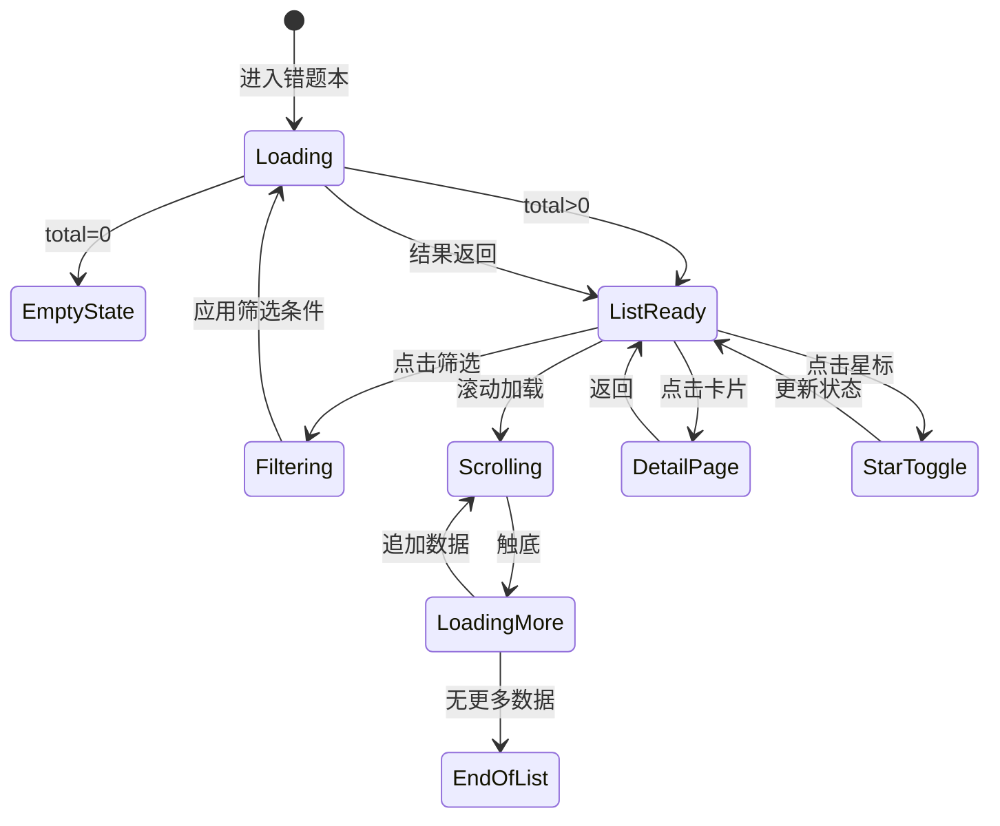

# 客户端 - 错题本页面架构与复习交互流程 详细设计

> **模块定位**：本设计覆盖错题本在客户端侧的完整页面架构、组件体系、交互流程与状态管理，是开发人员直接编码的依据。
>
> **前置依赖**：
> - 《错题整理-详细设计》— 服务端错题数据模型与 API
> - 《间隔重复算法与遗忘曲线复习调度引擎-详细设计》— 复习调度算法
> - 《客户端-题目展示与答题交互组件库》— 通用题目渲染组件
> - 《客户端状态管理架构》— 全局状态管理方案

---

## 1. 概述

### 1.1 功能目标

错题本是 PrimeTop 核心学习闭环中 P0 优先级功能。客户端需提供：

1. **错题浏览与筛选**：按学科、章节、知识点、错因、时间等多维度查看错题
2. **错题详情查看**：展示题目原文、学生错误答案、正确解析、知识点关联
3. **错题复习答题**：支持重新作答，记录订正结果，驱动间隔重复调度
4. **错因标注与分类**：学生可对错因进行二次标注和补充
5. **错题打印/导出**：支持生成 PDF 方便线下复习
6. **数据统计看板**：展示错题分布、复习进度、掌握趋势

### 1.2 页面导航关系

```
首页工作台 → 错题本 Tab
  ├── 错题列表页 (MistakeListPage)
  │   ├── 筛选面板 (FilterPanel)
  │   ├── 错题卡片列表 (MistakeCardList)
  │   └── 错题详情页 (MistakeDetailPage)
  │       ├── 题目展示区
  │       ├── 解析展示区（渐进式）
  │       ├── 错因标注区
  │       ├── 同类题推荐
  │       └── [复习答题] → 复习答题页 (ReviewAnswerPage)
  ├── 复习模式页 (ReviewSessionPage)
  │   ├── 今日待复习列表
  │   ├── 答题卡片（逐题模式）
  │   └── 复习结果汇总页 (ReviewResultPage)
  ├── 错题统计页 (MistakeStatsPage)
  │   ├── 错题分布图
  │   ├── 复习进度
  │   └── 掌握趋势
  └── 错题导出页 (MistakeExportPage)
```

---

## 2. 数据结构定义

### 2.1 客户端本地数据模型

```dart
/// 错题摘要模型（列表项）
class MistakeItem {
  final String mistakeId;          // 错题唯一 ID
  final String questionId;         // 关联题目 ID
  final String subjectCode;        // 学科代码: "MATH", "CHINESE", ...
  final String gradeCode;          // 年级代码: "G7", "G8", ...
  final String textbookId;         // 教材版本 ID
  final String chapterId;          // 章节 ID
  final String chapterName;        // 章节名称
  final List<String> knowledgePointIds; // 知识点 ID 列表
  final List<String> knowledgePointNames; // 知识点名称列表
  final MistakeSourceType sourceType; // 来源: 拍题/练习/手动
  final String sourceDesc;         // 来源描述
  
  // 错误信息
  final String studentAnswer;      // 学生原始答案
  final String correctAnswer;      // 正确答案
  final String? mistakeReasonCode; // 错因代码（系统标注）
  final String? mistakeReasonLabel;// 错因标签（显示用）
  final String? userReasonNote;    // 用户补充的错因备注
  
  // 复习调度
  final DateTime createTime;       // 首次录入时间
  final DateTime? lastReviewTime;  // 上次复习时间
  final DateTime? nextReviewTime;  // 下次应复习时间
  final int reviewCount;           // 已复习次数
  final int correctCount;          // 复习答对次数
  final MasteryLevel masteryLevel; // 掌握程度
  final ReviewStatus reviewStatus; // 复习状态
  
  // 题目摘要（列表展示用，避免加载完整题目）
  final String questionBrief;      // 题目摘要文本（截断）
  final String? questionThumbUrl;  // 题目缩略图 URL（含图题目）
  final QuestionType questionType; // 题型
  
  // 布尔标记
  final bool isStarred;            // 是否星标
  final bool isResolved;           // 是否已掌握（归档）
}

/// 掌握程度枚举
enum MasteryLevel {
  unknown,    // 未评估
  unfamiliar, // 生疏（0-1次答对）
  familiar,   // 熟悉（连续1次答对）
  mastered,   // 掌握（连续2次答对，间隔≥3天）
  archived,   // 已归档（连续3次答对，间隔≥7天）
}

/// 复习状态
enum ReviewStatus {
  pending,       // 待首次复习
  due,           // 已到期，需复习
  notDue,        // 未到期
  completed,     // 今日已完成
  archived,      // 已归档
}

/// 错因枚举（与后端保持同步）
enum MistakeReason {
  concept,      // 概念不清
  calculation,  // 计算失误
  misread,      // 审题错误
  method,       // 方法错误
  careless,     // 粗心大意
  knowledgeGap, // 知识遗漏
  timePressure, // 时间不够
  other,        // 其他
}

/// 复习会话模型
class ReviewSession {
  final String sessionId;
  final DateTime startTime;
  final DateTime? endTime;
  final int totalCount;           // 本轮复习总题数
  final int completedCount;       // 已完成题数
  final int correctCount;         // 答对题数
  final ReviewSessionStatus status;
  final List<ReviewRecord> records;
}

class ReviewRecord {
  final String mistakeId;
  final String questionId;
  final String userAnswer;         // 本次作答
  final bool isCorrect;            // 是否正确
  final int timeSpentMs;           // 答题耗时（毫秒）
  final bool usedHint;             // 是否使用了提示
  final int hintLevel;             // 提示级别 0-3
  final DateTime answeredAt;
}

/// 筛选条件模型
class MistakeFilter {
  String? subjectCode;
  String? chapterId;
  String? knowledgePointId;
  MistakeReason? mistakeReason;
  MasteryLevel? masteryLevel;
  ReviewStatus? reviewStatus;
  DateTimeRange? dateRange;
  bool? isStarred;
  String? keyword;                 // 全文搜索关键词
  
  // 排序
  MistakeSortField sortField;
  bool sortAsc;
}

enum MistakeSortField {
  createTime,      // 按录入时间
  nextReviewTime,  // 按下次复习时间
  masteryLevel,    // 按掌握程度
  reviewCount,     // 按复习次数
}
```

### 2.2 服务端 API 接口

#### 2.2.1 错题列表查询

```
GET /api/v1/mistakes
```

**请求参数：**

| 参数 | 类型 | 必填 | 说明 |
|------|------|------|------|
| subjectCode | string | 否 | 学科筛选 |
| chapterId | string | 否 | 章节筛选 |
| knowledgePointId | string | 否 | 知识点筛选 |
| mistakeReason | string | 否 | 错因筛选 |
| masteryLevel | string | 否 | 掌握程度筛选 |
| reviewStatus | string | 否 | 复习状态筛选 |
| isStarred | bool | 否 | 仅星标 |
| keyword | string | 否 | 关键词搜索 |
| dateStart | string(ISO) | 否 | 起始日期 |
| dateEnd | string(ISO) | 否 | 截止日期 |
| sortField | string | 否 | 排序字段，默认 createTime |
| sortOrder | string | 否 | asc/desc，默认 desc |
| page | int | 否 | 页码，默认 1 |
| pageSize | int | 否 | 每页条数，默认 20（最大 50） |

**响应体：**

```json
{
  "code": 0,
  "data": {
    "total": 156,
    "page": 1,
    "pageSize": 20,
    "items": [
      {
        "mistakeId": "mk_20260527_abc123",
        "questionId": "q_xyz789",
        "subjectCode": "MATH",
        "subjectName": "数学",
        "gradeCode": "G8",
        "chapterId": "ch_math_g8_03",
        "chapterName": "一次函数",
        "knowledgePoints": [
          { "id": "kp_001", "name": "一次函数图像" },
          { "id": "kp_002", "name": "待定系数法" }
        ],
        "sourceType": "PHOTO",
        "studentAnswer": "y=2x+1",
        "correctAnswer": "y=-2x+1",
        "mistakeReason": { "code": "CALCULATION", "label": "计算失误" },
        "userReasonNote": "符号看错了",
        "createTime": "2026-05-25T14:30:00+08:00",
        "lastReviewTime": "2026-05-26T10:00:00+08:00",
        "nextReviewTime": "2026-05-27T10:00:00+08:00",
        "reviewCount": 1,
        "correctCount": 0,
        "masteryLevel": "UNFAMILIAR",
        "reviewStatus": "DUE",
        "questionBrief": "已知一次函数图像过点(1,-1)和(-1,3)，求解析式",
        "questionThumbUrl": null,
        "questionType": "FILL_BLANK",
        "isStarred": true,
        "isResolved": false
      }
    ],
    "summary": {
      "totalCount": 156,
      "dueCount": 12,
      "todayCompletedCount": 5,
      "masteredCount": 43
    }
  }
}
```

#### 2.2.2 错题详情查询

```
GET /api/v1/mistakes/{mistakeId}
```

**响应体（关键字段补充）：**

```json
{
  "code": 0,
  "data": {
    "mistakeId": "mk_20260527_abc123",
    "...": "（同列表项字段）",
    "question": {
      "questionId": "q_xyz789",
      "content": "已知一次函数图像过点(1,-1)和(-1,3)，求该一次函数的解析式。",
      "contentType": "RICH_TEXT",
      "imageUrl": null,
      "options": null,
      "questionType": "FILL_BLANK",
      "difficulty": 0.6,
      "subjectCode": "MATH"
    },
    "analysis": {
      "correctAnswer": "y=-2x+1",
      "answerDetail": "设y=kx+b，代入点(1,-1)和(-1,3)...\n\nk+b=-1\n-k+b=3\n\n解得 k=-2, b=1\n所以 y=-2x+1",
      "steps": [
        {
          "order": 1,
          "title": "设出一般形式",
          "content": "设一次函数为 y=kx+b",
          "keyFormula": true
        },
        {
          "order": 2,
          "title": "代入已知条件",
          "content": "将点(1,-1)代入：k+b=-1\n将点(-1,3)代入：-k+b=3",
          "keyFormula": false
        },
        {
          "order": 3,
          "title": "解方程组",
          "content": "两式相加：2b=2，所以 b=1\n代回：k=-2",
          "keyFormula": false
        },
        {
          "order": 4,
          "title": "写出结果",
          "content": "y=-2x+1",
          "keyFormula": true
        }
      ],
      "keyPoints": ["待定系数法", "二元一次方程组"],
      "commonMistakes": ["符号错误", "计算错误"]
    },
    "reviewHistory": [
      {
        "reviewTime": "2026-05-26T10:00:00+08:00",
        "userAnswer": "y=2x+1",
        "isCorrect": false,
        "timeSpentMs": 45000,
        "usedHint": true,
        "hintLevel": 2
      }
    ],
    "relatedQuestions": [
      { "questionId": "q_rel_001", "brief": "..." },
      { "questionId": "q_rel_002", "brief": "..." }
    ]
  }
}
```

#### 2.2.3 更新错因标注

```
PUT /api/v1/mistakes/{mistakeId}/reason
```

```json
{
  "mistakeReason": "CALCULATION",
  "userNote": "正负号看错，以后要先确定k的正负"
}
```

#### 2.2.4 提交复习结果

```
POST /api/v1/mistakes/{mistakeId}/review
```

```json
{
  "userAnswer": "y=-2x+1",
  "timeSpentMs": 60000,
  "usedHint": false,
  "hintLevel": 0
}
```

**响应体：**

```json
{
  "code": 0,
  "data": {
    "isCorrect": true,
    "correctAnswer": "y=-2x+1",
    "explanation": "...",
    "newMasteryLevel": "FAMILIAR",
    "nextReviewTime": "2026-05-30T10:00:00+08:00",
    "streakInfo": {
      "currentStreak": 1,
      "requiredStreak": 2,
      "daysToMaster": 3
    }
  }
}
```

#### 2.2.5 获取今日复习计划

```
GET /api/v1/mistakes/review/plan?date=2026-05-27
```

**响应体：**

```json
{
  "code": 0,
  "data": {
    "date": "2026-05-27",
    "totalDue": 12,
    "newDue": 4,
    "overdue": 3,
    "reReview": 5,
    "estimatedMinutes": 25,
    "items": [
      {
        "mistakeId": "mk_20260527_abc123",
        "priority": 1,
        "reason": "逾期1天",
        "subjectCode": "MATH",
        "questionBrief": "..."
      }
    ],
    "completedToday": 5
  }
}
```

#### 2.2.6 批量提交复习结果（复习会话结束时）

```
POST /api/v1/mistakes/review/batch
```

```json
{
  "sessionId": "rs_20260527_xxx",
  "records": [
    {
      "mistakeId": "mk_20260527_abc123",
      "userAnswer": "y=-2x+1",
      "isCorrect": true,
      "timeSpentMs": 60000,
      "usedHint": false,
      "hintLevel": 0
    }
  ]
}
```

#### 2.2.7 星标/取消星标

```
PUT /api/v1/mistakes/{mistakeId}/star
```

```json
{ "isStarred": true }
```

#### 2.2.8 错题统计

```
GET /api/v1/mistakes/stats?subjectCode=MATH&period=30d
```

**响应体：**

```json
{
  "code": 0,
  "data": {
    "subjectStats": [
      { "subjectCode": "MATH", "subjectName": "数学", "totalCount": 45, "masteredCount": 20, "dueCount": 8 },
      { "subjectCode": "PHYSICS", "subjectName": "物理", "totalCount": 32, "masteredCount": 15, "dueCount": 5 }
    ],
    "reasonDistribution": [
      { "reason": "CALCULATION", "label": "计算失误", "count": 28, "percentage": 35.0 },
      { "reason": "CONCEPT", "label": "概念不清", "count": 22, "percentage": 27.5 }
    ],
    "masteryTrend": [
      { "date": "2026-05-20", "masteredRate": 0.25 },
      { "date": "2026-05-27", "masteredRate": 0.35 }
    ],
    "reviewHeatmap": [
      { "date": "2026-05-27", "reviewCount": 12, "correctRate": 0.75 }
    ],
    "chapterDistribution": [
      { "chapterId": "ch_math_g8_03", "chapterName": "一次函数", "count": 8 }
    ]
  }
}
```

#### 2.2.9 导出错题 PDF

```
POST /api/v1/mistakes/export
```

```json
{
  "format": "PDF",
  "filter": {
    "subjectCode": "MATH",
    "chapterId": "ch_math_g8_03"
  },
  "options": {
    "includeAnalysis": true,
    "includeStudentAnswer": true,
    "groupByChapter": true,
    "maxItems": 50
  }
}
```

**响应：** 返回异步任务 ID，客户端轮询或通过 SSE 接收下载链接。

```json
{
  "code": 0,
  "data": {
    "taskId": "export_20260527_xxx",
    "estimatedSeconds": 10
  }
}
```

---

## 3. 页面架构设计

### 3.1 整体架构（Flutter Widget Tree）

```
MistakeModuleApp (顶层入口)
├── MistakeTabContainer (底部 Tab 容器)
│   ├── Tab: 错题列表
│   │   └── MistakeListPage
│   │       ├── MistakeSummaryBar          ← 统计摘要条
│   │       ├── MistakeFilterBar           ← 筛选/排序工具栏
│   │       ├── MistakeFilterPanel         ← 可展开筛选面板
│   │       ├── MistakeCardList            ← 错题卡片列表
│   │       └── MistakeEmptyState          ← 空态提示
│   ├── Tab: 今日复习
│   │   └── ReviewSessionPage
│   │       ├── ReviewPlanHeader           ← 今日计划概要
│   │       ├── ReviewCardCarousel         ← 复习答题卡片
│   │       └── ReviewProgressIndicator    ← 进度指示器
│   ├── Tab: 统计
│   │   └── MistakeStatsPage
│   │       ├── MasteryOverviewCard        ← 掌握度总览
│   │       ├── SubjectDistributionChart   ← 学科分布图
│   │       ├── ReasonPieChart             ← 错因饼图
│   │       ├── MasteryTrendLineChart      ← 掌握趋势折线
│   │       └── ReviewHeatmapCalendar      ← 复习热力日历
│   └── FAB: + 添加错题 → 拍照上传
```

### 3.2 页面级状态管理

```dart
/// 使用 Riverpod 管理错题模块全局状态

/// 错题列表状态
@riverpod
class MistakeList extends _$MistakeList {
  @override
  Future<MistakeListState> build(MistakeFilter filter) async {
    // 首次加载 + 缓存策略
    final result = await _repository.fetchMistakes(
      filter: filter,
      page: 1,
      pageSize: 20,
    );
    return MistakeListState(
      items: result.items,
      total: result.total,
      summary: result.summary,
      currentPage: 1,
      hasMore: result.items.length < result.total,
      filter: filter,
    );
  }
  
  Future<void> loadMore() async { /* 分页加载 */ }
  Future<void> refresh() async { /* 下拉刷新 */ }
  Future<void> updateFilter(MistakeFilter newFilter) async { /* 筛选变更 */ }
  Future<void> toggleStar(String mistakeId) async { /* 星标切换 */ }
}

/// 复习会话状态
@riverpod
class ReviewSession extends _$ReviewSession {
  @override
  Future<ReviewSessionState> build() async {
    final plan = await _repository.fetchReviewPlan(DateTime.now());
    return ReviewSessionState(
      plan: plan,
      currentIndex: 0,
      records: [],
      status: ReviewSessionStatus.ready,
    );
  }
  
  Future<void> startReview() async { /* 开始复习 */ }
  Future<void> submitAnswer(String answer) async { /* 提交答案 */ }
  Future<void> requestHint() async { /* 请求提示 */ }
  Future<void> skip() async { /* 跳过 */ }
  Future<void> finish() async { /* 结束本轮复习 */ }
}

/// 错题详情状态
@riverpod
class MistakeDetail extends _$MistakeDetail {
  @override
  Future<MistakeDetailState> build(String mistakeId) async {
    final detail = await _repository.fetchMistakeDetail(mistakeId);
    return MistakeDetailState(
      detail: detail,
      analysisRevealLevel: 0,  // 渐进式展开级别
    );
  }
  
  void revealNextStep() { /* 展示下一步解析 */ }
  void revealFullAnalysis() { /* 展示全部解析 */ }
  Future<void> updateReason(MistakeReason reason, String note) async { /* 更新错因 */ }
}
```

---

## 4. 核心交互流程

### 4.1 错题列表浏览流程



**列表页加载策略：**

1. **首次加载**：请求第 1 页 + summary 统计摘要
2. **下拉刷新**：重置到第 1 页，清空本地缓存
3. **上拉加载**：追加下一页数据，使用 `ScrollController` 检测触底
4. **本地缓存**：错题列表缓存 5 分钟，复习提交后立即失效
5. **乐观更新**：星标操作本地立即生效，后台异步同步

### 4.2 筛选面板交互

```
┌─────────────────────────────────────────┐
│  错题筛选                           [重置] │
├─────────────────────────────────────────┤
│  学科                                    │
│  [全部] [数学] [物理] [化学] [语文] ...    │
│                                          │
│  章节（跟随学科联动）                      │
│  [全部] [一次函数] [二次函数] [三角形] ... │
│                                          │
│  错因                                    │
│  [全部] [计算失误] [概念不清] [审题错误]... │
│                                          │
│  掌握程度                                │
│  [全部] [生疏] [熟悉] [掌握] [已归档]      │
│                                          │
│  复习状态                                │
│  [全部] [待复习] [已到期] [已完成]         │
│                                          │
│  时间范围                                │
│  [近7天] [近30天] [本学期] [自定义]        │
│                                          │
│  ─────────────────────────────────       │
│  [         确定 (156题)          ]        │
└─────────────────────────────────────────┘
```

**筛选联动规则：**
- 选择学科 → 章节列表更新为该学科下章节
- 选择章节 → 知识点列表更新
- 筛选条件变更 → 显示匹配数量预览（不自动搜索，需点击确定）
- 筛选条件持久化至本地存储，下次打开恢复

### 4.3 错题卡片组件设计

```
┌─────────────────────────────────────────┐
│ ☆  数学 · 八年级 · 一次函数      [···]  │
│                                          │
│  已知一次函数图像过点(1,-1)和            │
│  (-1,3)，求该一次函数的解析式。           │
│                                          │
│  ┌──────────────────────────────────┐    │
│  │  我的答案:  y=2x+1              │    │
│  │  正确答案:  y=-2x+1             │    │
│  └──────────────────────────────────┘    │
│                                          │
│  🏷 计算失误  📅 5月25日  🔄 已到期      │
│  掌握度: ██████░░░░ 60%  生疏             │
│                                          │
│  [开始复习]  [查看详情]  [同类题]         │
└─────────────────────────────────────────┘
```

**卡片数据绑定：**

| UI 元素 | 数据字段 | 交互 |
|---------|----------|------|
| 星标图标 | `isStarred` | 点击切换星标 |
| 学科/章节 | `subjectName` + `chapterName` | 无交互 |
| 题目摘要 | `questionBrief` | 截断显示，最多3行 |
| 我的答案 | `studentAnswer` | 红色文字，带删除线样式 |
| 正确答案 | `correctAnswer` | 绿色文字 |
| 错因标签 | `mistakeReasonLabel` | 点击筛选同错因 |
| 日期 | `createTime` | 相对时间显示 |
| 复习状态 | `reviewStatus` | 状态指示器 |
| 掌握度条 | `reviewCount`/`correctCount` | 进度条 |
| 开始复习 | `reviewStatus == DUE` | 仅到期/逾期时显示 |

### 4.4 错题详情页 - 渐进式解析展示

**核心设计理念：** 默认不展示完整解析，引导学生先思考。

```
展开级别 0 — 题目 + 错误答案 + 知识点标签
    │
    ▼ 点击 "查看思路提示"
展开级别 1 — 思路提示（1-2句引导语）
    │
    ▼ 点击 "继续展开"
展开级别 2 — 分步解析（逐步展示，每次展开一步）
    │
    ▼ 点击 "查看完整解析"
展开级别 3 — 完整解析 + 易错点 + 方法总结
    │
    ▼ 点击 "我来重新做"
进入复习答题模式
```

**关键代码示例（渐进式解析组件）：**

```dart
class ProgressiveAnalysis extends ConsumerWidget {
  final String mistakeId;
  
  @override
  Widget build(BuildContext context, WidgetRef ref) {
    final state = ref.watch(mistakeDetailProvider(mistakeId));
    final revealLevel = state.analysisRevealLevel;
    final analysis = state.detail.analysis;
    
    return Column(
      crossAxisAlignment: CrossAxisAlignment.start,
      children: [
        // Level 0: 始终展示错误答案对比
        _buildAnswerComparison(state.detail),
        
        // Level 1: 思路提示
        if (revealLevel >= 1) ...[
          _buildHintSection(analysis.hint),
        ] else
          _buildRevealButton(
            text: '查看思路提示',
            onTap: () => ref
              .read(mistakeDetailProvider(mistakeId).notifier)
              .setRevealLevel(1),
          ),
        
        // Level 2: 分步解析
        if (revealLevel >= 2) ...[
          _buildStepByStep(
            analysis.steps,
            visibleSteps: revealLevel - 1, // 逐步展开
          ),
        ] else if (revealLevel >= 1)
          _buildRevealButton(
            text: '继续展开解析',
            onTap: () => ref
              .read(mistakeDetailProvider(mistakeId).notifier)
              .setRevealLevel(2),
          ),
        
        // Level 3: 完整解析
        if (revealLevel >= 3) ...[
          _buildKeyPoints(analysis.keyPoints),
          _buildCommonMistakes(analysis.commonMistakes),
        ] else if (revealLevel >= 2)
          _buildRevealButton(
            text: '查看完整解析与方法总结',
            onTap: () => ref
              .read(mistakeDetailProvider(mistakeId).notifier)
              .setRevealLevel(3),
          ),
        
        // 底部操作区
        if (revealLevel >= 1)
          _buildActionButtons(context, state.detail),
      ],
    );
  }
  
  Widget _buildRevealButton({required String text, required VoidCallback onTap}) {
    return Padding(
      padding: const EdgeInsets.symmetric(vertical: 8),
      child: OutlinedButton.icon(
        onPressed: onTap,
        icon: const Icon(Icons.lightbulb_outline),
        label: Text(text),
        style: OutlinedButton.styleFrom(
          foregroundColor: AppColors.primary,
        ),
      ),
    );
  }
}
```

---

## 5. 复习交互流程（核心闭环）

### 5.1 复习入口与触发条件

| 触发场景 | 入口位置 | 说明 |
|---------|----------|------|
| 首页提醒 | 首页今日任务卡片 | "你有 N 道错题待复习" |
| 推送通知 | 系统推送 | 复习时间到期提醒 |
| 错题本 Tab | 今日复习页 | 主动进入复习 |
| 详情页入口 | 错题详情页 | 单题重新作答 |

### 5.2 复习会话状态机

```
                    ┌──────────────────────┐
                    │      PLAN_READY       │
                    │  (加载今日复习计划)     │
                    └──────────┬───────────┘
                               │ 点击开始
                               ▼
                    ┌──────────────────────┐
                    │     ANSWERING         │
                    │  (展示题目,等待作答)    │
                    └──────────┬───────────┘
                          ╱    │    \
               请求提示 ╱     │     \ 跳过
                      ╱      │      \
                     ▼       ▼       ▼
            ┌──────────┐  提交答案  ┌──────────┐
            │  HINTING  │    │     │  SKIPPED  │
            │ (展示提示) │    │     │ (标记跳过) │
            └─────┬────┘    │     └─────┬────┘
                  │         │           │
                  └──► ANSWERING ◄──────┘
                          │
                          ▼
                ┌──────────────────┐
                │    SHOWING_RESULT  │
                │ (展示答对/答错反馈) │
                └────────┬─────────┘
                         │
               ┌─────────┴──────────┐
               ▼                    ▼
        ┌──────────┐        ┌──────────┐
        │  CORRECT  │        │  WRONG    │
        │ 展示鼓励  │        │ 展示解析  │
        └─────┬────┘        └─────┬────┘
              │                    │
              └────────┬───────────┘
                       ▼
              ┌────────────────┐
              │  HAS_MORE?      │
              └───┬────────┬───┘
                 是│       │否
                   ▼       ▼
            ANSWERING   SESSION_DONE
                         │
                         ▼
                  ┌──────────────┐
                  │ RESULT_SUMMARY │
                  │ (本轮复习总结)  │
                  └──────────────┘
```

### 5.3 复习答题卡片交互

```
┌─────────────────────────────────────────┐
│  复习进度  3/12  ████████░░░░░░░░░░ 25%  │
│  数学 · 一次函数                    [退出] │
├─────────────────────────────────────────┤
│                                          │
│  已知一次函数图像过点(1,-1)和            │
│  (-1,3)，求该一次函数的解析式。           │
│                                          │
│  ─────────────────────────────────       │
│                                          │
│  提示：回忆待定系数法的一般步骤           │
│                                          │
│  ─────────────────────────────────       │
│  你的答案：                               │
│  ┌──────────────────────────────────┐    │
│  │  y=                              │    │
│  └──────────────────────────────────┘    │
│                                          │
│  [使用提示 (2/3)]  [跳过]  [提交答案]     │
└─────────────────────────────────────────┘
```

**答题卡片关键逻辑：**

```dart
class ReviewAnswerCard extends ConsumerStatefulWidget {
  final MistakeItem mistake;
  final int index;
  final int total;
  
  @override
  ConsumerState<ReviewAnswerCard> createState() => _ReviewAnswerCardState();
}

class _ReviewAnswerCardState extends ConsumerState<ReviewAnswerCard> {
  final _answerController = TextEditingController();
  int _hintLevel = 0;         // 已使用提示级别
  final _maxHints = 3;        // 最大提示次数
  final _stopwatch = Stopwatch();
  bool _submitted = false;
  
  @override
  void initState() {
    super.initState();
    _stopwatch.start();
  }
  
  void _requestHint() {
    if (_hintLevel < _maxHints) {
      setState(() => _hintLevel++);
      // 记录使用提示到复习记录
      ref.read(reviewSessionProvider.notifier)
         .recordHint(widget.mistake.mistakeId, _hintLevel);
    }
  }
  
  Future<void> _submit() async {
    _stopwatch.stop();
    _submitted = true;
    
    final result = await ref.read(reviewSessionProvider.notifier)
        .submitAnswer(
          mistakeId: widget.mistake.mistakeId,
          answer: _answerController.text,
          timeSpentMs: _stopwatch.elapsedMilliseconds,
          usedHint: _hintLevel > 0,
          hintLevel: _hintLevel,
        );
    
    if (!mounted) return;
    
    // 展示结果反馈动画
    _showResultFeedback(result);
  }
  
  void _showResultFeedback(ReviewAnswerResult result) {
    final color = result.isCorrect ? AppColors.success : AppColors.error;
    final icon = result.isCorrect ? Icons.check_circle : Icons.cancel;
    final message = result.isCorrect 
        ? _getCorrectMessage(result.newMasteryLevel)
        : '没关系，下次一定行！';
    
    ScaffoldMessenger.of(context).showSnackBar(
      SnackBar(
        backgroundColor: color,
        duration: const Duration(seconds: 2),
        content: Row(
          children: [
            Icon(icon, color: Colors.white),
            const SizedBox(width: 8),
            Text(message),
          ],
        ),
      ),
    );
  }
  
  String _getCorrectMessage(MasteryLevel level) {
    switch (level) {
      case MasteryLevel.familiar:
        return '不错！再来一次就能掌握了 💪';
      case MasteryLevel.mastered:
        return '太棒了！这道题你已经掌握了 🎉';
      case MasteryLevel.archived:
        return '完美！这道题已归档 🏆';
      default:
        return '答对了，继续加油！';
    }
  }
}
```

### 5.4 提示分级策略

复习模式中提供最多 3 级提示，每使用一级，该题复习权重降低：

| 提示级别 | 内容 | 对掌握度的影响 |
|---------|------|---------------|
| Level 1 | 知识点提示（"这题考查的是待定系数法"） | 答对后按 80% 计入连续正确次数 |
| Level 2 | 步骤提示（"第一步：设 y=kx+b"） | 答对后按 50% 计入 |
| Level 3 | 关键步骤提示（"两式相加可消 k"） | 答对后按 30% 计入，且仍标记为"有辅助"

### 5.5 复习结果汇总页

```
┌─────────────────────────────────────────┐
│          本轮复习完成 🎉                  │
│                                          │
│      ┌────┐                              │
│      │ 8  │  总题数                       │
│      └────┘                              │
│   ┌──────┐  ┌──────┐  ┌──────┐           │
│   │  5   │  │  3   │  │  2   │           │
│   │ 答对  │  │ 答错  │  │ 跳过  │           │
│   └──────┘  └──────┘  └──────┘           │
│                                          │
│  正确率: 62.5%  ████████░░░░              │
│  用时: 15 分钟                           │
│  平均每题: 1分52秒                        │
│                                          │
│  掌握度变化:                              │
│  ├─ 2 题升级为「熟悉」                    │
│  ├─ 1 题升级为「掌握」                    │
│  └─ 1 题降级（再次答错）                  │
│                                          │
│  下次复习: 明天有 5 道待复习              │
│                                          │
│  [查看错题详情]  [继续复习更多]  [返回]    │
└─────────────────────────────────────────┘
```

---

## 6. 错因标注交互

### 6.1 错因选择面板

在错题详情页，用户可点击「标注错因」按钮，弹出底部 Sheet：

```
┌─────────────────────────────────────────┐
│  选择错因                          [关闭] │
├─────────────────────────────────────────┤
│                                          │
│  系统自动标注: 计算失误                   │
│  你觉得更准确的是：                       │
│                                          │
│  ○ 概念不清                              │
│  ● 计算失误  ← 系统推荐                  │
│  ○ 审题错误                              │
│  ○ 方法错误                              │
│  ○ 粗心大意                              │
│  ○ 知识遗漏                              │
│  ○ 时间不够                              │
│  ○ 其他                                  │
│                                          │
│  补充说明（可选）：                       │
│  ┌──────────────────────────────────┐    │
│  │  正负号看错，以后要先确定k的正负    │    │
│  └──────────────────────────────────┘    │
│                                          │
│  [         保存           ]              │
└─────────────────────────────────────────┘
```

**错因标注对复习的影响：**
- `概念不清` → 关联知识点，复习时优先推送相关基础题
- `计算失误` → 复习时关注计算环节，减少提示
- `审题错误` → 复习时加粗题目关键条件
- `知识遗漏` → 建议回顾对应章节，标记前置知识薄弱

---

## 7. 统计看板设计

### 7.1 掌握度总览卡片

```
┌─────────────────────────────────────────┐
│  错题总览                    本学期      │
├─────────────────────────────────────────┤
│                                          │
│  总计 156 道                             │
│  ████████ 生疏 45  ██████ 熟悉 38         │
│  ████ 掌握 43  ██ 已归档 30               │
│                                          │
│  今日待复习: 12 道   已完成: 5 道         │
│  本周掌握率: 35% ↑ 5% (较上周)            │
│                                          │
└─────────────────────────────────────────┘
```

### 7.2 复习热力日历

使用 GitHub 式热力图，展示每日复习活跃度：

```
│          5月                            │
│  日 一 二 三 四 五 六                     │
│            1  2  3  4                    │
│   5  6  7  8  9 10 11                    │
│  12 13 14 15 16 17 18                    │
│  19 20 21 22 23 24 25                    │
│  26 27 ■ ■ ■ ■ ■ ■                      │
│                                          │
│  ■ 无  ■ 1-5题  ■ 6-10题  ■ 11-20题  ■ >20题│
```

颜色深浅表示当日复习题数，点击某天可查看该天复习详情。

---

## 8. 离线策略与数据同步

### 8.1 本地缓存策略

| 数据类型 | 缓存方式 | 过期策略 | 离线可用 |
|---------|----------|---------|---------|
| 错题列表 | SQLite 本地库 | 服务端变更推送失效 | 只读 |
| 错题详情 | SQLite + 图片本地缓存 | 随列表失效 | 完整可用 |
| 复习计划 | SQLite | 每日首次联网时更新 | 可复习（仅已缓存题目） |
| 复习结果 | 本地队列 | 立即同步，失败后重试 | 离线答题，联网后同步 |
| 统计数据 | SQLite 缓存 | 联网后刷新 | 展示缓存数据 |

### 8.2 离线复习流程

```dart
class OfflineReviewQueue {
  /// 离线答题结果队列
  final List<PendingReviewRecord> _pendingRecords = [];
  
  /// 保存离线复习结果
  Future<void> saveOfflineReview(ReviewRecord record) async {
    final box = await Hive.openBox('offline_reviews');
    await box.add({
      'mistakeId': record.mistakeId,
      'userAnswer': record.userAnswer,
      'isCorrect': record.isCorrect,
      'timeSpentMs': record.timeSpentMs,
      'usedHint': record.usedHint,
      'hintLevel': record.hintLevel,
      'answeredAt': record.answeredAt.toIso8601String(),
      'synced': false,
    });
  }
  
  /// 网络恢复后批量同步
  Future<void> syncPendingReviews() async {
    final box = await Hive.openBox('offline_reviews');
    final unsynced = box.values.where((e) => e['synced'] == false).toList();
    
    if (unsynced.isEmpty) return;
    
    final records = unsynced.map((e) => ReviewRecord(
      mistakeId: e['mistakeId'],
      userAnswer: e['userAnswer'],
      isCorrect: e['isCorrect'],
      timeSpentMs: e['timeSpentMs'],
      usedHint: e['usedHint'],
      hintLevel: e['hintLevel'],
      answeredAt: DateTime.parse(e['answeredAt']),
    )).toList();
    
    try {
      await _repository.batchSubmitReviews(records);
      // 标记为已同步
      for (int i = 0; i < unsynced.length; i++) {
        final key = box.keyAt(box.values.toList().indexOf(unsynced[i]));
        await box.put(key, {...unsynced[i], 'synced': true});
      }
    } catch (e) {
      // 同步失败，保留队列，下次重试
      debugPrint('Offline review sync failed: $e');
    }
  }
}
```

---

## 9. 错误处理与降级策略

### 9.1 错误场景与处理

| 场景 | 错误码 | 客户端处理 |
|------|--------|-----------|
| 列表加载失败 | `MISTAKE_LIST_001` | 展示错误态，提供重试按钮；展示本地缓存数据（如有） |
| 详情加载失败 | `MISTAKE_DETAIL_001` | Toast 提示，返回列表 |
| 筛选无结果 | - | 展示空态插画 + "换个条件试试" 提示 |
| 复习提交失败 | `REVIEW_SUBMIT_001` | 本地暂存，标记待同步，不阻塞后续答题 |
| 星标操作失败 | `STAR_TOGGLE_001` | 回滚本地 UI 状态，Toast 提示 |
| 导出超时 | `EXPORT_TIMEOUT` | 提示文件较大，建议缩小范围后重试 |
| 网络断开 | - | 自动切换离线模式，仅展示已缓存错题 |

### 9.2 分龄 UI 适配

| 学段 | 列表样式 | 复习模式 | 激励文案 |
|------|---------|---------|---------|
| 小学 | 卡片更大、图标更多、色彩丰富 | 答对展示动画+星星奖励 | "你太厉害了！" ⭐ |
| 初中 | 信息密度适中、操作简洁 | 答对展示简洁反馈 | "掌握得不错！" 💪 |
| 高中 | 信息密度高、操作高效 | 直接展示数据反馈 | "掌握率 +5%" 📊 |

### 9.3 大屏/横屏适配

- **列表页**：双列卡片布局，筛选面板侧边常驻
- **详情页**：左侧题目 + 右侧解析双栏布局
- **复习模式**：题目居中放大，底部操作栏固定
- **统计页**：多图表并列展示

---

## 10. 性能优化要点

### 10.1 列表性能

1. **卡片 Widget 复用**：使用 `ListView.builder` + `AutomaticKeepAliveClientMixin`
2. **图片懒加载**：题目缩略图使用 `cached_network_image`，占位图 + 渐显
3. **分页预加载**：滚动到 80% 位置时预加载下一页
4. **筛选防抖**：筛选条件变更后 300ms 防抖再请求

### 10.2 复习模式性能

1. **题目预加载**：当前题作答时预加载下一题的完整数据
2. **动画轻量化**：答对/答错反馈使用 Lottie 轻量动画，不超过 50KB
3. **计时器精度**：使用 `Stopwatch` 而非 `Timer`，避免累积误差

### 10.3 内存管理

```dart
/// 错题列表页使用 AutoDispose 防止内存泄漏
@riverpod
class MistakeList extends _$MistakeList with AutoDisposeMixin {
  // 页面退出时自动清理状态
}

/// 图片缓存策略
final _imageCacheConfig = CacheConfig(
  maxMemoryCacheSize: 100 * 1024 * 1024, // 100MB 内存缓存
  maxDiskCacheSize: 500 * 1024 * 1024,   // 500MB 磁盘缓存
  diskCachePath: 'mistake_thumbnails',
);
```

---

## 11. 关键组件接口定义

### 11.1 数据仓库接口

```dart
abstract class MistakeRepository {
  /// 查询错题列表
  Future<PagedResult<MistakeItem>> fetchMistakes({
    required MistakeFilter filter,
    required int page,
    required int pageSize,
  });
  
  /// 获取错题详情
  Future<MistakeDetail> fetchMistakeDetail(String mistakeId);
  
  /// 获取今日复习计划
  Future<ReviewPlan> fetchReviewPlan(DateTime date);
  
  /// 提交单题复习结果
  Future<ReviewAnswerResult> submitReview({
    required String mistakeId,
    required String userAnswer,
    required int timeSpentMs,
    required bool usedHint,
    required int hintLevel,
  });
  
  /// 批量提交复习结果
  Future<void> batchSubmitReviews(List<ReviewRecord> records);
  
  /// 更新错因标注
  Future<void> updateMistakeReason({
    required String mistakeId,
    required String reasonCode,
    String? userNote,
  });
  
  /// 切换星标
  Future<void> toggleStar(String mistakeId, bool isStarred);
  
  /// 获取统计数据
  Future<MistakeStats> fetchStats({
    String? subjectCode,
    required String period,
  });
  
  /// 请求导出
  Future<ExportTask> requestExport(ExportRequest request);
  
  /// 查询导出进度
  Future<ExportTask> queryExportTask(String taskId);
  
  /// 获取题目提示
  Future<QuestionHint> getHint({
    required String mistakeId,
    required int hintLevel,
  });
}
```

### 11.2 路由定义

```dart
/// 错题本模块路由
class MistakeRoutes {
  static const String prefix = '/mistake';
  
  /// 错题列表
  static String list() => '$prefix/list';
  
  /// 错题详情
  static String detail(String mistakeId) => '$prefix/detail/$mistakeId';
  
  /// 复习模式
  static String review() => '$prefix/review';
  
  /// 复习结果
  static String reviewResult(String sessionId) =>
      '$prefix/review/result/$sessionId';
  
  /// 统计
  static String stats() => '$prefix/stats';
  
  /// 导出
  static String export() => '$prefix/export';
  
  /// 从其他模块跳入复习指定错题
  static String reviewSingle(String mistakeId) =>
      '$prefix/review?mistakeId=$mistakeId';
}

/// 路由注册
final mistakeRoutes = [
  GoRoute(
    path: MistakeRoutes.prefix,
    builder: (context, state) => const MistakeTabContainer(),
    routes: [
      GoRoute(
        path: 'detail/:mistakeId',
        builder: (context, state) {
          final mistakeId = state.pathParameters['mistakeId']!;
          return MistakeDetailPage(mistakeId: mistakeId);
        },
      ),
      GoRoute(
        path: 'review',
        builder: (context, state) {
          final mistakeId = state.uri.queryParameters['mistakeId'];
          return ReviewSessionPage(initialMistakeId: mistakeId);
        },
      ),
      GoRoute(
        path: 'review/result/:sessionId',
        builder: (context, state) {
          final sessionId = state.pathParameters['sessionId']!;
          return ReviewResultPage(sessionId: sessionId);
        },
      ),
      GoRoute(
        path: 'stats',
        builder: (context, state) => const MistakeStatsPage(),
      ),
      GoRoute(
        path: 'export',
        builder: (context, state) => const MistakeExportPage(),
      ),
    ],
  ),
];
```

---

## 12. 与其他模块的交互

| 模块 | 交互点 | 方式 |
|------|--------|------|
| 首页工作台 | 今日待复习卡片 | 监听 `reviewPlanProvider`，展示 dueCount |
| 拍题答疑 | 一键加入错题本 | 调用 `POST /mistakes` 后刷新列表 Provider |
| AI 对话 | 推荐同类题 | 复用题目组件，点击后跳转详情 |
| 练习测评 | 错题自动收录 | 练习结束后批量同步错题 |
| 学习规划 | 每日错题复习任务 | 读取复习计划，纳入每日任务清单 |
| 学情分析 | 错题分布数据 | 共享统计 API，支持交叉分析 |
| 通知中心 | 复习到期提醒 | 注册本地通知 + 推送 |}