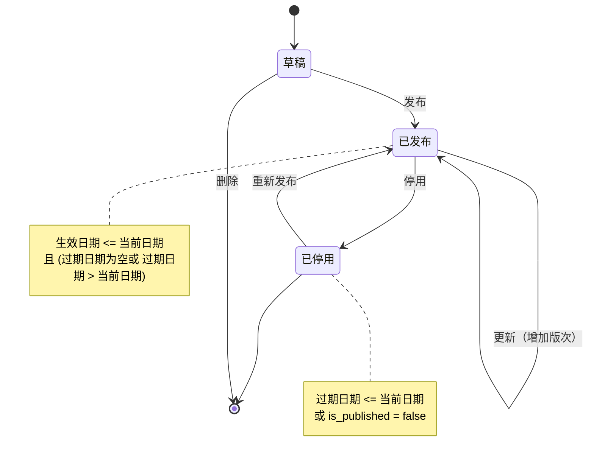
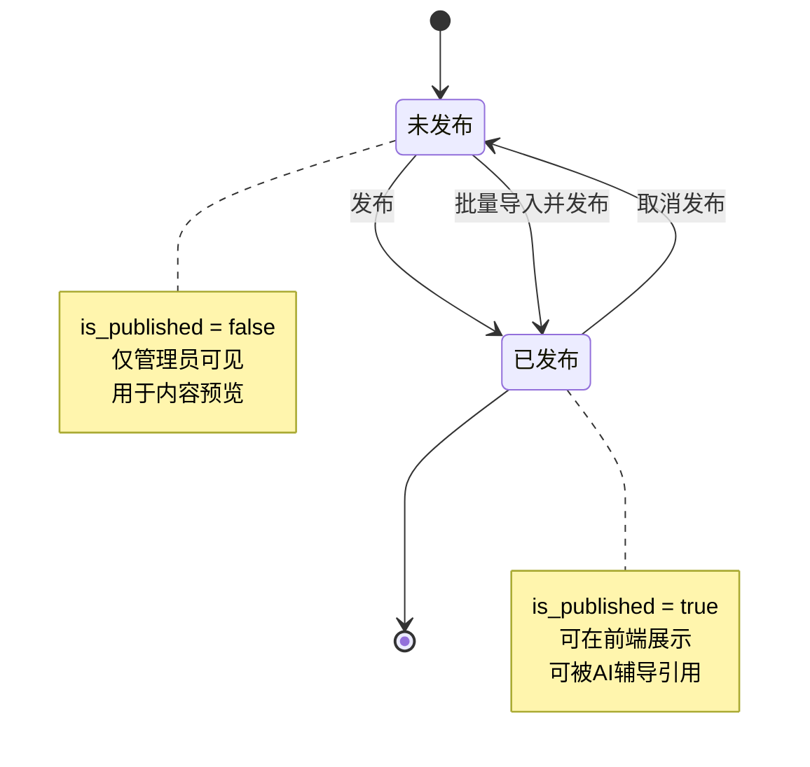
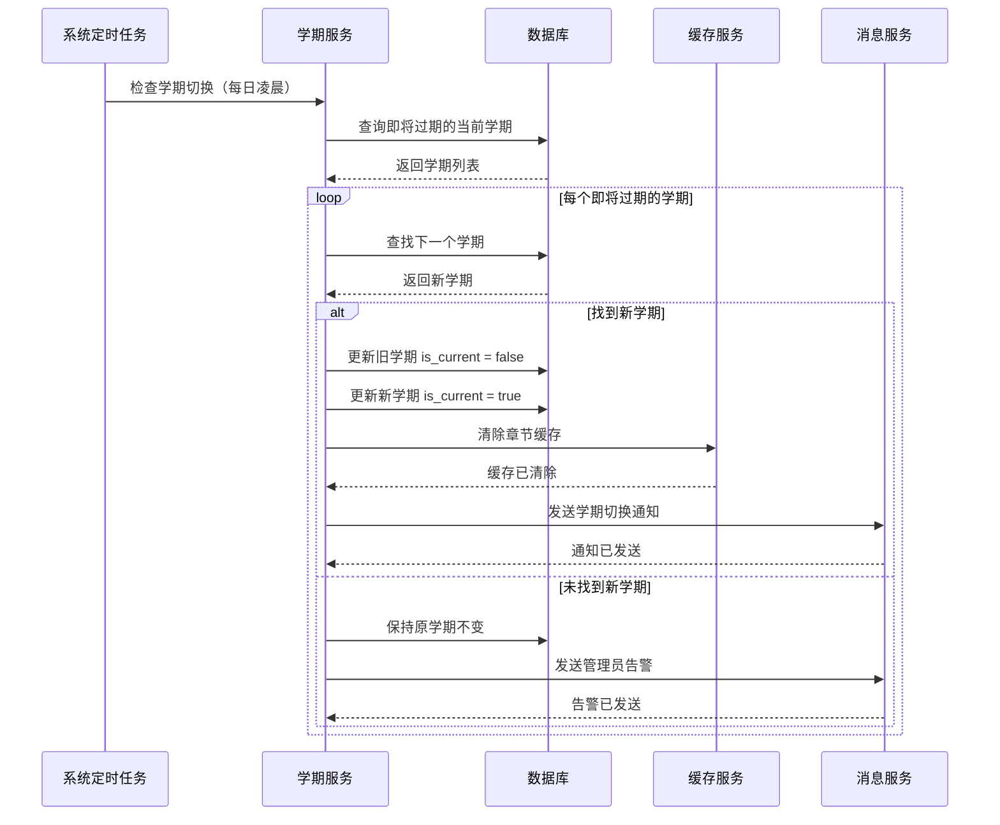

# 年级学科基础数据管理与教材版本适配 - 详细设计文档

## 1. 模块概述

### 1.1 功能定位

年级学科基础数据管理与教材版本适配模块是 PrimeTop 平台的基础数据服务层，负责维护和管理平台所有年级、学科、教材版本、学期、章节等基础元数据。该模块是内容匹配、AI 辅导、学情分析、学习规划等功能的核心基础，确保用户的学习路径与实际教材和课程标准保持同步。

### 1.2 核心能力

| 能力 | 说明 | 优先级 |
|------|------|--------|
| 学段管理 | 维护幼儿园、小学、初中、高中学段定义及年级映射 | P0 |
| 学科管理 | 维护各学段的学科列表、学科图标、学科标签 | P0 |
| 教材版本管理 | 维护各学科各年级的教材版本（人教版、苏教版、北师大版等） | P0 |
| 学期管理 | 维护上学期、下学期及对应教材内容 | P0 |
| 章节目录管理 | 维护各教材版本各年级各学期的章节目录结构 | P0 |
| 知识点映射 | 维护教材章节与知识点的映射关系 | P0 |
| 版本兼容性管理 | 处理教材版本更新、修订、停用的兼容性问题 | P1 |
| 管理后台维护 | 提供可视化的管理界面进行基础数据的增删改查 | P0 |
| 数据缓存与预热 | 热点数据缓存，提升查询性能 | P0 |

### 1.3 适用范围

- **服务对象**：同步课堂、AI 智能辅导、题库服务、学习规划、学情分析等所有需要基础数据的服务
- **使用场景**：
  - 同步课堂展示教材章节目录
  - AI 辅导根据用户年级匹配教材内容
  - 题库服务按教材版本筛选题目
  - 学习规划按章节安排任务
  - 学情分析按学科和章节统计掌握度

## 2. 数据结构设计

### 2.1 核心实体定义

#### 2.1.1 学段 (EducationStage)

```typescript
interface EducationStage {
  id: string;                    // 学段ID
  name: string;                  // 学段名称：幼儿园、小学、初中、高中
  code: string;                  // 学段编码：kindergarten、primary、junior、senior
  gradeRange: {
    start: number;               // 起始年级
    end: number;                 // 结束年级
  };
  ageRange: {
    start: number;               // 起始年龄
    end: number;                 // 结束年龄
  };
  description: string;           // 学段描述
  isPublished: boolean;          // 是否发布
  sortOrder: number;             // 排序序号
  createdAt: Date;
  updatedAt: Date;
}
```

**示例数据：**
```json
{
  "id": "stage-primary-001",
  "name": "小学",
  "code": "primary",
  "gradeRange": {"start": 1, "end": 6},
  "ageRange": {"start": 6, "end": 12},
  "description": "小学阶段，涵盖1-6年级",
  "isPublished": true,
  "sortOrder": 1
}
```

#### 2.1.2 年级 (Grade)

```typescript
interface Grade {
  id: string;                    // 年级ID
  stageId: string;               // 所属学段ID
  name: string;                  // 年级名称：一年级、二年级...或：初一、初二...
  gradeNumber: number;           // 年级数字：1, 2, 3, 4, 5, 6, 7, 8, 9, 10, 11, 12
  code: string;                  // 年级编码：g1, g2, g3, g4, g5, g6, j1, j2, j3, s1, s2, s3
  isPublished: boolean;          // 是否发布
  sortOrder: number;             // 排序序号
  createdAt: Date;
  updatedAt: Date;
}
```

**示例数据：**
```json
{
  "id": "grade-g1-001",
  "stageId": "stage-primary-001",
  "name": "一年级",
  "gradeNumber": 1,
  "code": "g1",
  "isPublished": true,
  "sortOrder": 1
}
```

#### 2.1.3 学科 (Subject)

```typescript
interface Subject {
  id: string;                    // 学科ID
  name: string;                  // 学科名称：语文、数学、英语...
  code: string;                  // 学科编码：chinese、math、english...
  icon: string;                  // 学科图标URL
  color: string;                 // 学科主题色（十六进制）
  applicableStages: string[];    // 适用学段ID列表
  isCompulsory: boolean;         // 是否主科
  description: string;           // 学科描述
  isPublished: boolean;          // 是否发布
  sortOrder: number;             // 排序序号
  createdAt: Date;
  updatedAt: Date;
}
```

**示例数据：**
```json
{
  "id": "subject-math-001",
  "name": "数学",
  "code": "math",
  "icon": "https://cdn.primetop.com/icons/subject-math.png",
  "color": "#4A90E2",
  "applicableStages": ["stage-primary-001", "stage-junior-001", "stage-senior-001"],
  "isCompulsory": true,
  "description": "数学学科",
  "isPublished": true,
  "sortOrder": 1
}
```

#### 2.1.4 教材版本 (TextbookVersion)

```typescript
interface TextbookVersion {
  id: string;                    // 教材版本ID
  publisherId: string;           // 出版社ID
  subjectId: string;             // 学科ID
  gradeId: string;               // 年级ID
  name: string;                  // 教材版本名称：人教版、苏教版、北师大版...
  code: string;                  // 教材版本编码：pep、sj、bsd...
  edition: string;               // 版次：2023版、2024版...
  isbn: string;                  // ISBN号
  coverImageUrl: string;         // 封面图片URL
  description: string;           // 教材描述
  isMainstream: boolean;         // 是否主流版本
  isPublished: boolean;          // 是否发布
  effectiveDate: Date;           // 生效日期
  expiryDate?: Date;             // 过期日期（可选，用于停用）
  sortOrder: number;             // 排序序号
  createdAt: Date;
  updatedAt: Date;
}
```

**示例数据：**
```json
{
  "id": "textbook-math-g1-pep-001",
  "publisherId": "publisher-001",
  "subjectId": "subject-math-001",
  "gradeId": "grade-g1-001",
  "name": "人教版",
  "code": "pep",
  "edition": "2024版",
  "isbn": "978-7-107-XXXXX-X",
  "coverImageUrl": "https://cdn.primetop.com/textbook/math/g1-pep-cover.png",
  "description": "人民教育出版社小学一年级数学教材",
  "isMainstream": true,
  "isPublished": true,
  "effectiveDate": "2024-09-01T00:00:00.000Z",
  "sortOrder": 1
}
```

#### 2.1.5 学期 (Semester)

```typescript
interface Semester {
  id: string;                    // 学期ID
  textbookVersionId: string;     // 所属教材版本ID
  name: string;                  // 学期名称：上学期、下学期
  code: string;                  // 学期编码：first、second
  startDate: Date;               // 开始日期
  endDate: Date;                 // 结束日期
  isCurrent: boolean;            // 是否当前学期
  isPublished: boolean;          // 是否发布
  sortOrder: number;             // 排序序号
  createdAt: Date;
  updatedAt: Date;
}
```

**示例数据：**
```json
{
  "id": "semester-math-g1-pep-first-001",
  "textbookVersionId": "textbook-math-g1-pep-001",
  "name": "上学期",
  "code": "first",
  "startDate": "2024-09-01T00:00:00.000Z",
  "endDate": "2025-01-31T23:59:59.000Z",
  "isCurrent": true,
  "isPublished": true,
  "sortOrder": 1
}
```

#### 2.1.6 章节 (Chapter)

```typescript
interface Chapter {
  id: string;                    // 章节ID
  semesterId: string;            // 所属学期ID
  parentId?: string;             // 父章节ID（用于多级目录）
  name: string;                  // 章节名称
  chapterNumber: string;         // 章节编号：1、1.1、1.1.1
  level: number;                 // 层级：1=单元，2=课，3=知识点
  type: ChapterType;             // 章节类型：unit、lesson、knowledge
  description: string;           // 章节描述
  estimatedHours: number;        // 预计学习时长（小时）
  orderInParent: number;         // 在父章节中的排序
  isPublished: boolean;          // 是否发布
  createdAt: Date;
  updatedAt: Date;
}

enum ChapterType {
  UNIT = 'unit',           // 单元
  LESSON = 'lesson',       // 课
  KNOWLEDGE = 'knowledge'  // 知识点
}
```

**示例数据：**
```json
{
  "id": "chapter-math-g1-pep-unit1-001",
  "semesterId": "semester-math-g1-pep-first-001",
  "name": "第一单元  数一数",
  "chapterNumber": "1",
  "level": 1,
  "type": "unit",
  "description": "通过数物体的活动，初步了解数数的基本方法",
  "estimatedHours": 4,
  "orderInParent": 1,
  "isPublished": true
}
```

#### 2.1.7 学科年级学科关联 (GradeSubject)

```typescript
interface GradeSubject {
  id: string;                    // 关联ID
  gradeId: string;               // 年级ID
  subjectId: string;             // 学科ID
  isAvailable: boolean;          // 是否可用
  defaultTextbookVersionId?: string;  // 默认教材版本ID
  sortOrder: number;             // 排序序号
  createdAt: Date;
  updatedAt: Date;
}
```

**示例数据：**
```json
{
  "id": "gs-g1-math-001",
  "gradeId": "grade-g1-001",
  "subjectId": "subject-math-001",
  "isAvailable": true,
  "defaultTextbookVersionId": "textbook-math-g1-pep-001",
  "sortOrder": 1
}
```

### 2.2 数据库表结构设计

#### 2.2.1 education_stages 表

```sql
CREATE TABLE education_stages (
  id VARCHAR(50) PRIMARY KEY COMMENT '学段ID',
  name VARCHAR(50) NOT NULL COMMENT '学段名称',
  code VARCHAR(20) NOT NULL UNIQUE COMMENT '学段编码',
  grade_start INT NOT NULL COMMENT '起始年级',
  grade_end INT NOT NULL COMMENT '结束年级',
  age_start INT NOT NULL COMMENT '起始年龄',
  age_end INT NOT NULL COMMENT '结束年龄',
  description VARCHAR(500) COMMENT '学段描述',
  is_published BOOLEAN DEFAULT TRUE COMMENT '是否发布',
  sort_order INT DEFAULT 0 COMMENT '排序序号',
  created_at TIMESTAMP DEFAULT CURRENT_TIMESTAMP,
  updated_at TIMESTAMP DEFAULT CURRENT_TIMESTAMP ON UPDATE CURRENT_TIMESTAMP,
  INDEX idx_code (code),
  INDEX idx_is_published (is_published)
) ENGINE=InnoDB DEFAULT CHARSET=utf8mb4 COMMENT='学段表';
```

#### 2.2.2 grades 表

```sql
CREATE TABLE grades (
  id VARCHAR(50) PRIMARY KEY COMMENT '年级ID',
  stage_id VARCHAR(50) NOT NULL COMMENT '所属学段ID',
  name VARCHAR(20) NOT NULL COMMENT '年级名称',
  grade_number INT NOT NULL COMMENT '年级数字',
  code VARCHAR(10) NOT NULL UNIQUE COMMENT '年级编码',
  is_published BOOLEAN DEFAULT TRUE COMMENT '是否发布',
  sort_order INT DEFAULT 0 COMMENT '排序序号',
  created_at TIMESTAMP DEFAULT CURRENT_TIMESTAMP,
  updated_at TIMESTAMP DEFAULT CURRENT_TIMESTAMP ON UPDATE CURRENT_TIMESTAMP,
  FOREIGN KEY (stage_id) REFERENCES education_stages(id) ON DELETE CASCADE,
  INDEX idx_stage_id (stage_id),
  INDEX idx_code (code),
  INDEX idx_grade_number (grade_number),
  INDEX idx_is_published (is_published)
) ENGINE=InnoDB DEFAULT CHARSET=utf8mb4 COMMENT='年级表';
```

#### 2.2.3 subjects 表

```sql
CREATE TABLE subjects (
  id VARCHAR(50) PRIMARY KEY COMMENT '学科ID',
  name VARCHAR(50) NOT NULL COMMENT '学科名称',
  code VARCHAR(20) NOT NULL UNIQUE COMMENT '学科编码',
  icon VARCHAR(255) COMMENT '学科图标URL',
  color VARCHAR(7) COMMENT '学科主题色',
  is_compulsory BOOLEAN DEFAULT FALSE COMMENT '是否主科',
  description VARCHAR(500) COMMENT '学科描述',
  is_published BOOLEAN DEFAULT TRUE COMMENT '是否发布',
  sort_order INT DEFAULT 0 COMMENT '排序序号',
  created_at TIMESTAMP DEFAULT CURRENT_TIMESTAMP,
  updated_at TIMESTAMP DEFAULT CURRENT_TIMESTAMP ON UPDATE CURRENT_TIMESTAMP,
  INDEX idx_code (code),
  INDEX idx_is_published (is_published)
) ENGINE=InnoDB DEFAULT CHARSET=utf8mb4 COMMENT='学科表';
```

#### 2.2.4 subject_stage_applicability 表

```sql
CREATE TABLE subject_stage_applicability (
  id VARCHAR(50) PRIMARY KEY,
  subject_id VARCHAR(50) NOT NULL COMMENT '学科ID',
  stage_id VARCHAR(50) NOT NULL COMMENT '学段ID',
  created_at TIMESTAMP DEFAULT CURRENT_TIMESTAMP,
  FOREIGN KEY (subject_id) REFERENCES subjects(id) ON DELETE CASCADE,
  FOREIGN KEY (stage_id) REFERENCES education_stages(id) ON DELETE CASCADE,
  UNIQUE KEY uk_subject_stage (subject_id, stage_id),
  INDEX idx_subject_id (subject_id),
  INDEX idx_stage_id (stage_id)
) ENGINE=InnoDB DEFAULT CHARSET=utf8mb4 COMMENT='学科学段适用性表';
```

#### 2.2.5 textbook_versions 表

```sql
CREATE TABLE textbook_versions (
  id VARCHAR(50) PRIMARY KEY COMMENT '教材版本ID',
  publisher_id VARCHAR(50) COMMENT '出版社ID',
  subject_id VARCHAR(50) NOT NULL COMMENT '学科ID',
  grade_id VARCHAR(50) NOT NULL COMMENT '年级ID',
  name VARCHAR(50) NOT NULL COMMENT '教材版本名称',
  code VARCHAR(20) NOT NULL COMMENT '教材版本编码',
  edition VARCHAR(20) COMMENT '版次',
  isbn VARCHAR(20) COMMENT 'ISBN号',
  cover_image_url VARCHAR(255) COMMENT '封面图片URL',
  description VARCHAR(500) COMMENT '教材描述',
  is_mainstream BOOLEAN DEFAULT FALSE COMMENT '是否主流版本',
  is_published BOOLEAN DEFAULT TRUE COMMENT '是否发布',
  effective_date TIMESTAMP NULL COMMENT '生效日期',
  expiry_date TIMESTAMP NULL COMMENT '过期日期',
  sort_order INT DEFAULT 0 COMMENT '排序序号',
  created_at TIMESTAMP DEFAULT CURRENT_TIMESTAMP,
  updated_at TIMESTAMP DEFAULT CURRENT_TIMESTAMP ON UPDATE CURRENT_TIMESTAMP,
  FOREIGN KEY (subject_id) REFERENCES subjects(id) ON DELETE CASCADE,
  FOREIGN KEY (grade_id) REFERENCES grades(id) ON DELETE CASCADE,
  INDEX idx_subject_grade (subject_id, grade_id),
  INDEX idx_code (code),
  INDEX idx_is_published (is_published),
  INDEX idx_effective_date (effective_date)
) ENGINE=InnoDB DEFAULT CHARSET=utf8mb4 COMMENT='教材版本表';
```

#### 2.2.6 semesters 表

```sql
CREATE TABLE semesters (
  id VARCHAR(50) PRIMARY KEY COMMENT '学期ID',
  textbook_version_id VARCHAR(50) NOT NULL COMMENT '教材版本ID',
  name VARCHAR(20) NOT NULL COMMENT '学期名称',
  code VARCHAR(10) NOT NULL COMMENT '学期编码',
  start_date TIMESTAMP NULL COMMENT '开始日期',
  end_date TIMESTAMP NULL COMMENT '结束日期',
  is_current BOOLEAN DEFAULT FALSE COMMENT '是否当前学期',
  is_published BOOLEAN DEFAULT TRUE COMMENT '是否发布',
  sort_order INT DEFAULT 0 COMMENT '排序序号',
  created_at TIMESTAMP DEFAULT CURRENT_TIMESTAMP,
  updated_at TIMESTAMP DEFAULT CURRENT_TIMESTAMP ON UPDATE CURRENT_TIMESTAMP,
  FOREIGN KEY (textbook_version_id) REFERENCES textbook_versions(id) ON DELETE CASCADE,
  INDEX idx_textbook_version_id (textbook_version_id),
  INDEX idx_is_current (is_current),
  INDEX idx_is_published (is_published)
) ENGINE=InnoDB DEFAULT CHARSET=utf8mb4 COMMENT='学期表';
```

#### 2.2.7 chapters 表

```sql
CREATE TABLE chapters (
  id VARCHAR(50) PRIMARY KEY COMMENT '章节ID',
  semester_id VARCHAR(50) NOT NULL COMMENT '学期ID',
  parent_id VARCHAR(50) COMMENT '父章节ID',
  name VARCHAR(200) NOT NULL COMMENT '章节名称',
  chapter_number VARCHAR(20) NOT NULL COMMENT '章节编号',
  level INT NOT NULL COMMENT '层级',
  type ENUM('unit', 'lesson', 'knowledge') NOT NULL COMMENT '章节类型',
  description TEXT COMMENT '章节描述',
  estimated_hours DECIMAL(4,1) COMMENT '预计学习时长（小时）',
  order_in_parent INT DEFAULT 0 COMMENT '在父章节中的排序',
  is_published BOOLEAN DEFAULT TRUE COMMENT '是否发布',
  created_at TIMESTAMP DEFAULT CURRENT_TIMESTAMP,
  updated_at TIMESTAMP DEFAULT CURRENT_TIMESTAMP ON UPDATE CURRENT_TIMESTAMP,
  FOREIGN KEY (semester_id) REFERENCES semesters(id) ON DELETE CASCADE,
  FOREIGN KEY (parent_id) REFERENCES chapters(id) ON DELETE CASCADE,
  INDEX idx_semester_id (semester_id),
  INDEX idx_parent_id (parent_id),
  INDEX idx_level (level),
  INDEX idx_type (type),
  INDEX idx_is_published (is_published)
) ENGINE=InnoDB DEFAULT CHARSET=utf8mb4 COMMENT='章节表';
```

#### 2.2.8 grade_subjects 表

```sql
CREATE TABLE grade_subjects (
  id VARCHAR(50) PRIMARY KEY,
  grade_id VARCHAR(50) NOT NULL COMMENT '年级ID',
  subject_id VARCHAR(50) NOT NULL COMMENT '学科ID',
  is_available BOOLEAN DEFAULT TRUE COMMENT '是否可用',
  default_textbook_version_id VARCHAR(50) COMMENT '默认教材版本ID',
  sort_order INT DEFAULT 0 COMMENT '排序序号',
  created_at TIMESTAMP DEFAULT CURRENT_TIMESTAMP,
  updated_at TIMESTAMP DEFAULT CURRENT_TIMESTAMP ON UPDATE CURRENT_TIMESTAMP,
  FOREIGN KEY (grade_id) REFERENCES grades(id) ON DELETE CASCADE,
  FOREIGN KEY (subject_id) REFERENCES subjects(id) ON DELETE CASCADE,
  FOREIGN KEY (default_textbook_version_id) REFERENCES textbook_versions(id) ON DELETE SET NULL,
  UNIQUE KEY uk_grade_subject (grade_id, subject_id),
  INDEX idx_grade_id (grade_id),
  INDEX idx_subject_id (subject_id)
) ENGINE=InnoDB DEFAULT CHARSET=utf8mb4 COMMENT '年级学科关联表';
```

## 3. API 接口设计

### 3.1 学段管理接口

#### 3.1.1 获取所有学段

```typescript
// GET /api/v1/education-stages

interface GetEducationStagesRequest {
  isPublished?: boolean;  // 是否只返回已发布的
}

interface GetEducationStagesResponse {
  code: number;
  message: string;
  data: EducationStage[];
}
```

**示例请求：**
```http
GET /api/v1/education-stages?isPublished=true
```

**示例响应：**
```json
{
  "code": 0,
  "message": "success",
  "data": [
    {
      "id": "stage-kindergarten-001",
      "name": "幼儿园",
      "code": "kindergarten",
      "gradeRange": {"start": -1, "end": 0},
      "ageRange": {"start": 3, "end": 6},
      "description": "幼儿园阶段",
      "isPublished": true,
      "sortOrder": 0
    },
    {
      "id": "stage-primary-001",
      "name": "小学",
      "code": "primary",
      "gradeRange": {"start": 1, "end": 6},
      "ageRange": {"start": 6, "end": 12},
      "description": "小学阶段",
      "isPublished": true,
      "sortOrder": 1
    }
  ]
}
```

#### 3.1.2 获取学段详情

```typescript
// GET /api/v1/education-stages/:id

interface GetEducationStageResponse {
  code: number;
  message: string;
  data: EducationStage & {
    grades: Grade[];
  };
}
```

### 3.2 年级管理接口

#### 3.2.1 获取所有年级

```typescript
// GET /api/v1/grades

interface GetGradesRequest {
  stageId?: string;       // 学段ID筛选
  isPublished?: boolean;  // 是否只返回已发布的
}

interface GetGradesResponse {
  code: number;
  message: string;
  data: Grade[];
}
```

**示例请求：**
```http
GET /api/v1/grades?stageId=stage-primary-001&isPublished=true
```

**示例响应：**
```json
{
  "code": 0,
  "message": "success",
  "data": [
    {
      "id": "grade-g1-001",
      "stageId": "stage-primary-001",
      "name": "一年级",
      "gradeNumber": 1,
      "code": "g1",
      "isPublished": true,
      "sortOrder": 1
    },
    {
      "id": "grade-g2-001",
      "stageId": "stage-primary-001",
      "name": "二年级",
      "gradeNumber": 2,
      "code": "g2",
      "isPublished": true,
      "sortOrder": 2
    }
  ]
}
```

### 3.3 学科管理接口

#### 3.3.1 获取所有学科

```typescript
// GET /api/v1/subjects

interface GetSubjectsRequest {
  stageId?: string;       // 学段ID筛选（返回适用该学段的学科）
  isPublished?: boolean;  // 是否只返回已发布的
}

interface GetSubjectsResponse {
  code: number;
  message: string;
  data: Subject[];
}
```

**示例请求：**
```http
GET /api/v1/subjects?stageId=stage-primary-001
```

**示例响应：**
```json
{
  "code": 0,
  "message": "success",
  "data": [
    {
      "id": "subject-chinese-001",
      "name": "语文",
      "code": "chinese",
      "icon": "https://cdn.primetop.com/icons/subject-chinese.png",
      "color": "#E74C3C",
      "applicableStages": ["stage-primary-001", "stage-junior-001", "stage-senior-001"],
      "isCompulsory": true,
      "description": "语文学科",
      "isPublished": true,
      "sortOrder": 0
    },
    {
      "id": "subject-math-001",
      "name": "数学",
      "code": "math",
      "icon": "https://cdn.primetop.com/icons/subject-math.png",
      "color": "#4A90E2",
      "applicableStages": ["stage-primary-001", "stage-junior-001", "stage-senior-001"],
      "isCompulsory": true,
      "description": "数学学科",
      "isPublished": true,
      "sortOrder": 1
    }
  ]
}
```

#### 3.3.2 获取年级的可用学科

```typescript
// GET /api/v1/grades/:gradeId/subjects

interface GetGradeSubjectsResponse {
  code: number;
  message: string;
  data: Array<{
    subject: Subject;
    isAvailable: boolean;
    defaultTextbookVersion?: TextbookVersion;
  }>;
}
```

### 3.4 教材版本管理接口

#### 3.4.1 获取教材版本列表

```typescript
// GET /api/v1/textbook-versions

interface GetTextbookVersionsRequest {
  subjectId?: string;       // 学科ID筛选
  gradeId?: string;         // 年级ID筛选
  code?: string;            // 版本编码筛选
  isMainstream?: boolean;   // 是否只返回主流版本
  isPublished?: boolean;    // 是否只返回已发布的
}

interface GetTextbookVersionsResponse {
  code: number;
  message: string;
  data: TextbookVersion[];
}
```

**示例请求：**
```http
GET /api/v1/textbook-versions?subjectId=subject-math-001&gradeId=grade-g1-001&isPublished=true
```

**示例响应：**
```json
{
  "code": 0,
  "message": "success",
  "data": [
    {
      "id": "textbook-math-g1-pep-001",
      "publisherId": "publisher-001",
      "subjectId": "subject-math-001",
      "gradeId": "grade-g1-001",
      "name": "人教版",
      "code": "pep",
      "edition": "2024版",
      "isbn": "978-7-107-XXXXX-X",
      "coverImageUrl": "https://cdn.primetop.com/textbook/math/g1-pep-cover.png",
      "description": "人民教育出版社小学一年级数学教材",
      "isMainstream": true,
      "isPublished": true,
      "effectiveDate": "2024-09-01T00:00:00.000Z",
      "sortOrder": 1
    },
    {
      "id": "textbook-math-g1-bsd-001",
      "publisherId": "publisher-002",
      "subjectId": "subject-math-001",
      "gradeId": "grade-g1-001",
      "name": "北师大版",
      "code": "bsd",
      "edition": "2024版",
      "isbn": "978-7-303-XXXXX-X",
      "coverImageUrl": "https://cdn.primetop.com/textbook/math/g1-bsd-cover.png",
      "description": "北京师范大学出版社小学一年级数学教材",
      "isMainstream": true,
      "isPublished": true,
      "effectiveDate": "2024-09-01T00:00:00.000Z",
      "sortOrder": 2
    }
  ]
}
```

### 3.5 章节目录管理接口

#### 3.5.1 获取教材章节目录（树形结构）

```typescript
// GET /api/v1/textbook-versions/:textbookVersionId/chapters

interface GetChaptersRequest {
  semesterCode?: 'first' | 'second';  // 学期筛选
  level?: number;                     // 层级筛选
  isPublished?: boolean;              // 是否只返回已发布的
}

interface GetChaptersResponse {
  code: number;
  message: string;
  data: ChapterTreeNode[];
}

interface ChapterTreeNode extends Chapter {
  children?: ChapterTreeNode[];
}
```

**示例请求：**
```http
GET /api/v1/textbook-versions/textbook-math-g1-pep-001/chapters?semesterCode=first
```

**示例响应：**
```json
{
  "code": 0,
  "message": "success",
  "data": [
    {
      "id": "chapter-math-g1-pep-u1-001",
      "semesterId": "semester-math-g1-pep-first-001",
      "name": "第一单元  数一数",
      "chapterNumber": "1",
      "level": 1,
      "type": "unit",
      "description": "通过数物体的活动，初步了解数数的基本方法",
      "estimatedHours": 4,
      "orderInParent": 1,
      "isPublished": true,
      "children": [
        {
          "id": "chapter-math-g1-pep-u1-l1-001",
          "semesterId": "semester-math-g1-pep-first-001",
          "parentId": "chapter-math-g1-pep-u1-001",
          "name": "第1课  数一数",
          "chapterNumber": "1.1",
          "level": 2,
          "type": "lesson",
          "description": "认识1-10的数字",
          "estimatedHours": 2,
          "orderInParent": 1,
          "isPublished": true,
          "children": [
            {
              "id": "chapter-math-g1-pep-u1-l1-k1-001",
              "semesterId": "semester-math-g1-pep-first-001",
              "parentId": "chapter-math-g1-pep-u1-l1-001",
              "name": "认识数字1-5",
              "chapterNumber": "1.1.1",
              "level": 3,
              "type": "knowledge",
              "description": "认识数字1-5，会数、会认、会写",
              "estimatedHours": 1,
              "orderInParent": 1,
              "isPublished": true
            }
          ]
        }
      ]
    }
  ]
}
```

#### 3.5.2 获取单个章节详情

```typescript
// GET /api/v1/chapters/:id

interface GetChapterResponse {
  code: number;
  message: string;
  data: Chapter & {
    parent?: Chapter;
    children: Chapter[];
    textbookVersion: TextbookVersion;
  };
}
```

### 3.6 综合查询接口

#### 3.6.1 根据年级学科获取教材版本和章节

```typescript
// GET /api/v1/grades/:gradeId/subjects/:subjectId/textbook

interface GetGradeSubjectTextbookResponse {
  code: number;
  message: string;
  data: {
    grade: Grade;
    subject: Subject;
    textbookVersions: TextbookVersion[];
    currentSemester?: {
      semester: Semester;
      chapters: ChapterTreeNode[];
    };
  };
}
```

**示例请求：**
```http
GET /api/v1/grades/grade-g1-001/subjects/subject-math-001/textbook
```

**示例响应：**
```json
{
  "code": 0,
  "message": "success",
  "data": {
    "grade": {
      "id": "grade-g1-001",
      "stageId": "stage-primary-001",
      "name": "一年级",
      "gradeNumber": 1,
      "code": "g1",
      "isPublished": true,
      "sortOrder": 1
    },
    "subject": {
      "id": "subject-math-001",
      "name": "数学",
      "code": "math",
      "icon": "https://cdn.primetop.com/icons/subject-math.png",
      "color": "#4A90E2",
      "applicableStages": ["stage-primary-001"],
      "isCompulsory": true,
      "description": "数学学科",
      "isPublished": true,
      "sortOrder": 1
    },
    "textbookVersions": [
      {
        "id": "textbook-math-g1-pep-001",
        "name": "人教版",
        "code": "pep",
        "edition": "2024版",
        "isMainstream": true,
        "isPublished": true
      }
    ],
    "currentSemester": {
      "semester": {
        "id": "semester-math-g1-pep-first-001",
        "textbookVersionId": "textbook-math-g1-pep-001",
        "name": "上学期",
        "code": "first",
        "startDate": "2024-09-01T00:00:00.000Z",
        "endDate": "2025-01-31T23:59:59.000Z",
        "isCurrent": true
      },
      " chapters": [/* 章节树结构 */]
    }
  }
}
```

### 3.7 管理后台接口（仅管理员）

#### 3.7.1 创建教材版本

```typescript
// POST /api/v1/admin/textbook-versions

interface CreateTextbookVersionRequest {
  publisherId: string;
  subjectId: string;
  gradeId: string;
  name: string;
  code: string;
  edition?: string;
  isbn?: string;
  coverImageUrl?: string;
  description?: string;
  isMainstream?: boolean;
  effectiveDate?: Date;
  sortOrder?: number;
}

interface CreateTextbookVersionResponse {
  code: number;
  message: string;
  data: TextbookVersion;
}
```

#### 3.7.2 创建章节

```typescript
// POST /api/v1/admin/chapters

interface CreateChapterRequest {
  semesterId: string;
  parentId?: string;
  name: string;
  chapterNumber: string;
  level: number;
  type: ChapterType;
  description?: string;
  estimatedHours?: number;
  orderInParent?: number;
}

interface CreateChapterResponse {
  code: number;
  message: string;
  data: Chapter;
}
```

#### 3.7.3 批量导入章节目录

```typescript
// POST /api/v1/admin/chapters/batch-import

interface BatchImportChaptersRequest {
  textbookVersionId: string;
  semesterCode: 'first' | 'second';
  chapters: ChapterImportItem[];
}

interface ChapterImportItem {
  name: string;
  chapterNumber: string;
  level: number;
  type: ChapterType;
  description?: string;
  estimatedHours?: number;
  orderInParent: number;
  children?: ChapterImportItem[];
}

interface BatchImportChaptersResponse {
  code: number;
  message: string;
  data: {
    successCount: number;
    failedCount: number;
    errors: Array<{ path: string; error: string }>;
  };
}
```

## 4. 关键代码示例

### 4.1 数据库查询优化 - 获取章节树

```typescript
// 使用递归CTE查询章节树
async function getChapterTree(semesterId: string): Promise<ChapterTreeNode[]> {
  const query = `
    WITH RECURSIVE chapter_tree AS (
      -- 基础查询：获取顶级章节（没有父节点的章节）
      SELECT
        id,
        semester_id,
        parent_id,
        name,
        chapter_number,
        level,
        type,
        description,
        estimated_hours,
        order_in_parent,
        is_published,
        CAST('' AS CHAR(1000)) AS path,
        1 AS depth
      FROM chapters
      WHERE semester_id = ? AND parent_id IS NULL AND is_published = TRUE
      ORDER BY order_in_parent ASC

      UNION ALL

      -- 递归查询：获取子章节
      SELECT
        c.id,
        c.semester_id,
        c.parent_id,
        c.name,
        c.chapter_number,
        c.level,
        c.type,
        c.description,
        c.estimated_hours,
        c.order_in_parent,
        c.is_published,
        CONCAT(ct.path, ',', c.id) AS path,
        ct.depth + 1
      FROM chapters c
      INNER JOIN chapter_tree ct ON c.parent_id = ct.id
      WHERE c.is_published = TRUE
    )
    SELECT * FROM chapter_tree
    ORDER BY path;
  `;

  const rows = await db.query(query, [semesterId]);

  // 将扁平结果转换为树形结构
  return buildTreeFromFlatList(rows);
}

function buildTreeFromFlatList(flatList: any[]): ChapterTreeNode[] {
  const map = new Map<string, ChapterTreeNode>();
  const roots: ChapterTreeNode[] = [];

  // 第一遍：创建所有节点
  for (const item of flatList) {
    const node: ChapterTreeNode = {
      id: item.id,
      semesterId: item.semester_id,
      parentId: item.parent_id,
      name: item.name,
      chapterNumber: item.chapter_number,
      level: item.level,
      type: item.type,
      description: item.description,
      estimatedHours: item.estimated_hours,
      orderInParent: item.order_in_parent,
      isPublished: item.is_published,
      children: []
    };
    map.set(item.id, node);

    if (!item.parent_id) {
      roots.push(node);
    }
  }

  // 第二遍：建立父子关系
  for (const item of flatList) {
    if (item.parent_id) {
      const parent = map.get(item.parent_id);
      const child = map.get(item.id);
      if (parent && child) {
        parent.children!.push(child);
      }
    }
  }

  return roots;
}
```

### 4.2 缓存策略实现

```typescript
import Redis from 'ioredis';

const redis = new Redis({
  host: process.env.REDIS_HOST,
  port: parseInt(process.env.REDIS_PORT || '6379'),
});

const CACHE_PREFIX = 'primetop:basis:';

export class BasisDataService {
  /**
   * 获取年级学科配置（带缓存）
   */
  async getGradeSubjects(gradeId: string): Promise<GradeSubjectConfig[]> {
    const cacheKey = `${CACHE_PREFIX}grade:${gradeId}:subjects`;
    const cached = await redis.get(cacheKey);

    if (cached) {
      return JSON.parse(cached);
    }

    const query = `
      SELECT
        gs.id,
        gs.grade_id,
        gs.subject_id,
        gs.is_available,
        gs.default_textbook_version_id,
        gs.sort_order,
        s.name AS subject_name,
        s.code AS subject_code,
        s.icon AS subject_icon,
        s.color AS subject_color,
        s.is_compulsory
      FROM grade_subjects gs
      INNER JOIN subjects s ON gs.subject_id = s.id
      WHERE gs.grade_id = ? AND s.is_published = TRUE
      ORDER BY gs.sort_order ASC
    `;

    const results = await db.query(query, [gradeId]);

    // 缓存24小时
    await redis.setex(cacheKey, 86400, JSON.stringify(results));

    return results;
  }

  /**
   * 获取教材版本列表（带缓存）
   */
  async getTextbookVersions(subjectId: string, gradeId: string): Promise<TextbookVersion[]> {
    const cacheKey = `${CACHE_PREFIX}textbook:${subjectId}:${gradeId}`;
    const cached = await redis.get(cacheKey);

    if (cached) {
      return JSON.parse(cached);
    }

    const query = `
      SELECT * FROM textbook_versions
      WHERE subject_id = ? AND grade_id = ? AND is_published = TRUE
      ORDER BY is_mainstream DESC, sort_order ASC
    `;

    const results = await db.query(query, [subjectId, gradeId]);

    // 缓存7天（教材版本变更较少）
    await redis.setex(cacheKey, 604800, JSON.stringify(results));

    return results;
  }

  /**
   * 获取章节目录树（带缓存）
   */
  async getChapterTree(textbookVersionId: string, semesterCode: string): Promise<ChapterTreeNode[]> {
    const cacheKey = `${CACHE_PREFIX}chapters:${textbookVersionId}:${semesterCode}`;
    const cached = await redis.get(cacheKey);

    if (cached) {
      return JSON.parse(cached);
    }

    // 先获取学期ID
    const semester = await db.query(
      'SELECT id FROM semesters WHERE textbook_version_id = ? AND code = ? AND is_published = TRUE LIMIT 1',
      [textbookVersionId, semesterCode]
    );

    if (!semester.length) {
      throw new Error('Semester not found');
    }

    const chapters = await getChapterTree(semester[0].id);

    // 缓存1小时
    await redis.setex(cacheKey, 3600, JSON.stringify(chapters));

    return chapters;
  }

  /**
   * 清除相关缓存（数据更新时调用）
   */
  async clearCache(type: string, ...params: string[]): Promise<void> {
    const keys = [];

    switch (type) {
      case 'grade_subjects':
        keys.push(`${CACHE_PREFIX}grade:${params[0]}:subjects`);
        break;
      case 'textbook_versions':
        keys.push(`${CACHE_PREFIX}textbook:${params[0]}:${params[1]}`);
        break;
      case 'chapters':
        keys.push(`${CACHE_PREFIX}chapters:${params[0]}:${params[1]}`);
        break;
    }

    if (keys.length > 0) {
      await redis.del(...keys);
    }
  }
}
```

### 4.3 版本兼容性处理

```typescript
export class TextbookVersionCompatibilityService {
  /**
   * 检查教材版本是否在有效期内
   */
  async isVersionValid(textbookVersionId: string): Promise<boolean> {
    const version = await db.query(
      'SELECT * FROM textbook_versions WHERE id = ?',
      [textbookVersionId]
    );

    if (!version.length) {
      return false;
    }

    const now = new Date();
    const { effectiveDate, expiryDate, isPublished } = version[0];

    if (!isPublished) {
      return false;
    }

    if (effectiveDate && now < new Date(effectiveDate)) {
      return false;
    }

    if (expiryDate && now > new Date(expiryDate)) {
      return false;
    }

    return true;
  }

  /**
   * 获取用户的教材版本，如果已过期则推荐替换版本
   */
  async getUserTextbookVersion(userId: string, subjectId: string, gradeId: string): Promise<{
    currentVersion: TextbookVersion | null;
    recommendedVersion?: TextbookVersion;
    isExpired: boolean;
  }> {
    // 获取用户设置的教材版本
    const userSetting = await db.query(
      'SELECT textbook_version_id FROM student_settings WHERE user_id = ? AND subject_id = ?',
      [userId, subjectId]
    );

    if (!userSetting.length) {
      // 用户未设置，返回默认版本
      const defaultVersion = await this.getDefaultTextbookVersion(subjectId, gradeId);
      return {
        currentVersion: defaultVersion,
        isExpired: false
      };
    }

    const currentVersionId = userSetting[0].textbook_version_id;
    const isValid = await this.isVersionValid(currentVersionId);

    if (isValid) {
      const currentVersion = await db.query(
        'SELECT * FROM textbook_versions WHERE id = ?',
        [currentVersionId]
      );
      return {
        currentVersion: currentVersion[0],
        isExpired: false
      };
    }

    // 当前版本已过期，查找推荐版本
    const recommendedVersion = await this.findRecommendedVersion(subjectId, gradeId, currentVersionId);

    return {
      currentVersion: null,
      recommendedVersion,
      isExpired: true
    };
  }

  /**
   * 查找推荐的替代版本
   */
  private async findRecommendedVersion(
    subjectId: string,
    gradeId: string,
    expiredVersionId: string
  ): Promise<TextbookVersion | null> {
    // 获取已过期版本的信息
    const expiredVersion = await db.query(
      'SELECT code, publisher_id FROM textbook_versions WHERE id = ?',
      [expiredVersionId]
    );

    if (!expiredVersion.length) {
      return this.getDefaultTextbookVersion(subjectId, gradeId);
    }

    const { code, publisherId } = expiredVersion[0];

    // 优先推荐同出版社、同编码的新版本
    const samePublisherVersion = await db.query(
      `SELECT * FROM textbook_versions
       WHERE subject_id = ? AND grade_id = ? AND publisher_id = ? AND code = ?
       AND is_published = TRUE AND id != ?
       AND (effective_date IS NULL OR effective_date <= NOW())
       AND (expiry_date IS NULL OR expiry_date > NOW())
       ORDER BY edition DESC LIMIT 1`,
      [subjectId, gradeId, publisherId, code, expiredVersionId]
    );

    if (samePublisherVersion.length) {
      return samePublisherVersion[0];
    }

    // 其次推荐同编码的主流版本
    const mainstreamVersion = await db.query(
      `SELECT * FROM textbook_versions
       WHERE subject_id = ? AND grade_id = ? AND code = ? AND is_mainstream = TRUE
       AND is_published = TRUE AND id != ?
       AND (effective_date IS NULL OR effective_date <= NOW())
       AND (expiry_date IS NULL OR expiry_date > NOW())
       ORDER BY edition DESC LIMIT 1`,
      [subjectId, gradeId, code, expiredVersionId]
    );

    if (mainstreamVersion.length) {
      return mainstreamVersion[0];
    }

    // 最后返回默认版本
    return this.getDefaultTextbookVersion(subjectId, gradeId);
  }

  /**
   * 获取默认教材版本
   */
  private async getDefaultTextbookVersion(subjectId: string, gradeId: string): Promise<TextbookVersion | null> {
    const defaultVersion = await db.query(
      `SELECT default_textbook_version_id FROM grade_subjects
       WHERE grade_id = ? AND subject_id = ? AND is_available = TRUE`
      [gradeId, subjectId]
    );

    if (!defaultVersion.length || !defaultVersion[0].defaultTextbookVersionId) {
      // 查找主流版本
      const mainstream = await db.query(
        `SELECT * FROM textbook_versions
         WHERE subject_id = ? AND grade_id = ? AND is_mainstream = TRUE AND is_published = TRUE
         ORDER BY sort_order ASC LIMIT 1`,
        [subjectId, gradeId]
      );
      return mainstream.length ? mainstream[0] : null;
    }

    const version = await db.query(
      'SELECT * FROM textbook_versions WHERE id = ?',
      [defaultVersion[0].defaultTextbookVersionId]
    );

    return version.length ? version[0] : null;
  }
}
```

## 5. 状态流转

### 5.1 教材版本生命周期状态机



### 5.2 章节发布状态流转



### 5.3 当前学期切换流程



## 6. 错误处理

### 6.1 错误码定义

```typescript
export enum BasisDataErrorCode {
  // 学段相关 (1000-1099)
  STAGE_NOT_FOUND = 1001,
  STAGE_NOT_PUBLISHED = 1002,

  // 年级相关 (1100-1199)
  GRADE_NOT_FOUND = 1101,
  GRADE_NOT_PUBLISHED = 1102,
  GRADE_MISMATCH = 1103,  // 年级与学段不匹配

  // 学科相关 (1200-1299)
  SUBJECT_NOT_FOUND = 1201,
  SUBJECT_NOT_PUBLISHED = 1202,
  SUBJECT_NOT_AVAILABLE_FOR_GRADE = 1203,  // 学科在该年级不可用

  // 教材版本相关 (1300-1399)
  TEXTBOOK_VERSION_NOT_FOUND = 1301,
  TEXTBOOK_VERSION_NOT_PUBLISHED = 1302,
  TEXTBOOK_VERSION_EXPIRED = 1303,
  TEXTBOOK_VERSION_NOT_EFFECTIVE = 1304,
  TEXTBOOK_VERSION_NOT_FOUND_FOR_SUBJECT_GRADE = 1305,

  // 章节相关 (1400-1499)
  CHAPTER_NOT_FOUND = 1401,
  CHAPTER_NOT_PUBLISHED = 1402,
  CHAPTER_CYCLE_DETECTED = 1403,  // 章节存在循环引用
  CHAPTER_PARENT_NOT_FOUND = 1404,

  // 学期相关 (1500-1599)
  SEMESTER_NOT_FOUND = 1501,
  SEMESTER_NOT_PUBLISHED = 1502,
  NO_CURRENT_SEMESTER = 1503,  // 没有当前学期
  SEMESTER_OVERLAP = 1504,  // 学期时间重叠

  // 数据一致性 (1600-1699)
  DATA_INCONSISTENCY = 1601,
  REFERENCE_NOT_FOUND = 1602,
}
```

### 6.2 错误处理示例

```typescript
export class BasisDataError extends Error {
  constructor(
    public code: BasisDataErrorCode,
    message: string,
    public details?: any
  ) {
    super(message);
    this.name = 'BasisDataError';
  }
}

export class BasisDataErrorHandler {
  /**
   * 获取教材版本并处理错误
   */
  async getTextbookVersionSafely(
    textbookVersionId: string
  ): Promise<TextbookVersion> {
    const version = await db.query(
      'SELECT * FROM textbook_versions WHERE id = ?',
      [textbookVersionId]
    );

    if (!version.length) {
      throw new BasisDataError(
        BasisDataErrorCode.TEXTBOOK_VERSION_NOT_FOUND,
        '教材版本不存在',
        { textbookVersionId }
      );
    }

    const versionData = version[0];

    if (!versionData.isPublished) {
      throw new BasisDataError(
        BasisDataErrorCode.TEXTBOOK_VERSION_NOT_PUBLISHED,
        '教材版本未发布',
        { textbookVersionId, name: versionData.name }
      );
    }

    const now = new Date();

    if (versionData.effectiveDate && now < new Date(versionData.effectiveDate)) {
      throw new BasisDataError(
        BasisDataErrorCode.TEXTBOOK_VERSION_NOT_EFFECTIVE,
        '教材版本尚未生效',
        {
          textbookVersionId,
          effectiveDate: versionData.effectiveDate,
          currentDate: now.toISOString()
        }
      );
    }

    if (versionData.expiryDate && now > new Date(versionData.expiryDate)) {
      throw new BasisDataError(
        BasisDataErrorCode.TEXTBOOK_VERSION_EXPIRED,
        '教材版本已过期',
        {
          textbookVersionId,
          expiryDate: versionData.expiryDate,
          currentDate: now.toISOString()
        }
      );
    }

    return versionData;
  }

  /**
   * 获取年级的可用学科并处理错误
   */
  async getAvailableSubjectsForGrade(gradeId: string): Promise<Subject[]> {
    // 检查年级是否存在
    const grade = await db.query('SELECT * FROM grades WHERE id = ?', [gradeId]);

    if (!grade.length) {
      throw new BasisDataError(
        BasisDataErrorCode.GRADE_NOT_FOUND,
        '年级不存在',
        { gradeId }
      );
    }

    if (!grade[0].isPublished) {
      throw new BasisDataError(
        BasisDataErrorCode.GRADE_NOT_PUBLISHED,
        '年级未发布',
        { gradeId, name: grade[0].name }
      );
    }

    // 获取年级的可用学科
    const subjects = await db.query(
      `SELECT DISTINCT s.*
       FROM grade_subjects gs
       INNER JOIN subjects s ON gs.subject_id = s.id
       WHERE gs.grade_id = ? AND gs.is_available = TRUE AND s.is_published = TRUE
       ORDER BY gs.sort_order ASC`,
      [gradeId]
    );

    if (subjects.length === 0) {
      throw new BasisDataError(
        BasisDataErrorCode.SUBJECT_NOT_AVAILABLE_FOR_GRADE,
        '该年级暂无可用学科',
        { gradeId }
      );
    }

    return subjects;
  }

  /**
   * 章节循环检测（防止形成无限循环）
   */
  async detectChapterCycle(chapterId: string, parentId: string): Promise<boolean> {
    if (!parentId) {
      return false;
    }

    // 递归检查父节点链，看是否会回到当前节点
    const path = [chapterId];
    let currentParentId = parentId;

    while (currentParentId) {
      if (path.includes(currentParentId)) {
        // 形成循环
        return true;
      }

      path.push(currentParentId);

      const parent = await db.query(
        'SELECT parent_id FROM chapters WHERE id = ?',
        [currentParentId]
      );

      if (!parent.length) {
        break;
      }

      currentParentId = parent[0].parentId;
    }

    return false;
  }
}
```

## 7. 数据预热与初始化

### 7.1 基础数据初始化脚本

```typescript
/**
 * 初始化基础数据
 */
async function initializeBasisData() {
  console.log('开始初始化基础数据...');

  // 1. 初始化学段
  await initializeEducationStages();

  // 2. 初始化年级
  await initializeGrades();

  // 3. 初始化学科
  await initializeSubjects();

  // 4. 初始化年级学科关联
  await initializeGradeSubjects();

  console.log('基础数据初始化完成');
}

async function initializeEducationStages() {
  const stages = [
    {
      id: 'stage-kindergarten-001',
      name: '幼儿园',
      code: 'kindergarten',
      gradeRange: { start: -1, end: 0 },
      ageRange: { start: 3, end: 6 },
      description: '幼儿园阶段',
      sortOrder: 0
    },
    {
      id: 'stage-primary-001',
      name: '小学',
      code: 'primary',
      gradeRange: { start: 1, end: 6 },
      ageRange: { start: 6, end: 12 },
      description: '小学阶段',
      sortOrder: 1
    },
    {
      id: 'stage-junior-001',
      name: '初中',
      code: 'junior',
      gradeRange: { start: 7, end: 9 },
      ageRange: { start: 12, end: 15 },
      description: '初中阶段',
      sortOrder: 2
    },
    {
      id: 'stage-senior-001',
      name: '高中',
      code: 'senior',
      gradeRange: { start: 10, end: 12 },
      ageRange: { start: 15, end: 18 },
      description: '高中阶段',
      sortOrder: 3
    }
  ];

  for (const stage of stages) {
    await db.query(
      `INSERT INTO education_stages (id, name, code, grade_start, grade_end, age_start, age_end, description, sort_order)
       VALUES (?, ?, ?, ?, ?, ?, ?, ?, ?)
       ON DUPLICATE KEY UPDATE name = VALUES(name), description = VALUES(description)`,
      [stage.id, stage.name, stage.code, stage.gradeRange.start, stage.gradeRange.end,
       stage.ageRange.start, stage.ageRange.end, stage.description, stage.sortOrder]
    );
  }

  console.log('学段初始化完成');
}

async function initializeGrades() {
  const grades = [
    // 幼儿园
    { id: 'grade-k1-001', stageId: 'stage-kindergarten-001', name: '小班', gradeNumber: -1, code: 'k1', sortOrder: 1 },
    { id: 'grade-k2-001', stageId: 'stage-kindergarten-001', name: '中班', gradeNumber: 0, code: 'k2', sortOrder: 2 },
    { id: 'grade-k3-001', stageId: 'stage-kindergarten-001', name: '大班', gradeNumber: 0, code: 'k3', sortOrder: 3 },

    // 小学
    { id: 'grade-g1-001', stageId: 'stage-primary-001', name: '一年级', gradeNumber: 1, code: 'g1', sortOrder: 1 },
    { id: 'grade-g2-001', stageId: 'stage-primary-001', name: '二年级', gradeNumber: 2, code: 'g2', sortOrder: 2 },
    { id: 'grade-g3-001', stageId: 'stage-primary-001', name: '三年级', gradeNumber: 3, code: 'g3', sortOrder: 3 },
    { id: 'grade-g4-001', stageId: 'stage-primary-001', name: '四年级', gradeNumber: 4, code: 'g4', sortOrder: 4 },
    { id: 'grade-g5-001', stageId: 'stage-primary-001', name: '五年级', gradeNumber: 5, code: 'g5', sortOrder: 5 },
    { id: 'grade-g6-001', stageId: 'stage-primary-001', name: '六年级', gradeNumber: 6, code: 'g6', sortOrder: 6 },

    // 初中
    { id: 'grade-j1-001', stageId: 'stage-junior-001', name: '初一', gradeNumber: 7, code: 'j1', sortOrder: 1 },
    { id: 'grade-j2-001', stageId: 'stage-junior-001', name: '初二', gradeNumber: 8, code: 'j2', sortOrder: 2 },
    { id: 'grade-j3-001', stageId: 'stage-junior-001', name: '初三', gradeNumber: 9, code: 'j3', sortOrder: 3 },

    // 高中
    { id: 'grade-s1-001', stageId: 'stage-senior-001', name: '高一', gradeNumber: 10, code: 's1', sortOrder: 1 },
    { id: 'grade-s2-001', stageId: 'stage-senior-001', name: '高二', gradeNumber: 11, code: 's2', sortOrder: 2 },
    { id: 'grade-s3-001', stageId: 'stage-senior-001', name: '高三', gradeNumber: 12, code: 's3', sortOrder: 3 },
  ];

  for (const grade of grades) {
    await db.query(
      `INSERT INTO grades (id, stage_id, name, grade_number, code, sort_order)
       VALUES (?, ?, ?, ?, ?, ?)
       ON DUPLICATE KEY UPDATE name = VALUES(name)`,
      [grade.id, grade.stageId, grade.name, grade.gradeNumber, grade.code, grade.sortOrder]
    );
  }

  console.log('年级初始化完成');
}

async function initializeSubjects() {
  const subjects = [
    {
      id: 'subject-chinese-001',
      name: '语文',
      code: 'chinese',
      icon: 'https://cdn.primetop.com/icons/subject-chinese.png',
      color: '#E74C3C',
      isCompulsory: true,
      description: '语文学科',
      applicableStages: ['stage-kindergarten-001', 'stage-primary-001', 'stage-junior-001', 'stage-senior-001'],
      sortOrder: 0
    },
    {
      id: 'subject-math-001',
      name: '数学',
      code: 'math',
      icon: 'https://cdn.primetop.com/icons/subject-math.png',
      color: '#4A90E2',
      isCompulsory: true,
      description: '数学学科',
      applicableStages: ['stage-primary-001', 'stage-junior-001', 'stage-senior-001'],
      sortOrder: 1
    },
    {
      id: 'subject-english-001',
      name: '英语',
      code: 'english',
      icon: 'https://cdn.primetop.com/icons/subject-english.png',
      color: '#9B59B6',
      isCompulsory: true,
      description: '英语学科',
      applicableStages: ['stage-primary-001', 'stage-junior-001', 'stage-senior-001'],
      sortOrder: 2
    },
    {
      id: 'subject-physics-001',
      name: '物理',
      code: 'physics',
      icon: 'https://cdn.primetop.com/icons/subject-physics.png',
      color: '#3498DB',
      isCompulsory: true,
      description: '物理学科',
      applicableStages: ['stage-junior-001', 'stage-senior-001'],
      sortOrder: 3
    },
    {
      id: 'subject-chemistry-001',
      name: '化学',
      code: 'chemistry',
      icon: 'https://cdn.primetop.com/icons/subject-chemistry.png',
      color: '#2ECC71',
      isCompulsory: true,
      description: '化学学科',
      applicableStages: ['stage-junior-001', 'stage-senior-001'],
      sortOrder: 4
    },
    {
      id: 'subject-biology-001',
      name: '生物',
      code: 'biology',
      icon: 'https://cdn.primetop.com/icons/subject-biology.png',
      color: '#27AE60',
      isCompulsory: false,
      description: '生物学科',
      applicableStages: ['stage-junior-001', 'stage-senior-001'],
      sortOrder: 5
    },
    {
      id: 'subject-history-001',
      name: '历史',
      code: 'history',
      icon: 'https://cdn.primetop.com/icons/subject-history.png',
      color: '#E67E22',
      isCompulsory: false,
      description: '历史学科',
      applicableStages: ['stage-junior-001', 'stage-senior-001'],
      sortOrder: 6
    },
    {
      id: 'subject-geography-001',
      name: '地理',
      code: 'geography',
      icon: 'https://cdn.primetop.com/icons/subject-geography.png',
      color: '#16A085',
      isCompulsory: false,
      description: '地理学科',
      applicableStages: ['stage-junior-001', 'stage-senior-001'],
      sortOrder: 7
    },
    {
      id: 'subject-politics-001',
      name: '政治',
      code: 'politics',
      icon: 'https://cdn.primetop.com/icons/subject-politics.png',
      color: '#F39C12',
      isCompulsory: true,
      description: '政治学科',
      applicableStages: ['stage-junior-001', 'stage-senior-001'],
      sortOrder: 8
    }
  ];

  for (const subject of subjects) {
    await db.query(
      `INSERT INTO subjects (id, name, code, icon, color, is_compulsory, description, sort_order)
       VALUES (?, ?, ?, ?, ?, ?, ?, ?)
       ON DUPLICATE KEY UPDATE name = VALUES(name), icon = VALUES(icon)`,
      [subject.id, subject.name, subject.code, subject.icon, subject.color,
       subject.isCompulsory, subject.description, subject.sortOrder]
    );

    // 插入学科学段关联
    for (const stageId of subject.applicableStages) {
      await db.query(
        `INSERT IGNORE INTO subject_stage_applicability (id, subject_id, stage_id)
         VALUES (?, ?, ?)`,
        [`${subject.id}-${stageId}`, subject.id, stageId]
      );
    }
  }

  console.log('学科初始化完成');
}

async function initializeGradeSubjects() {
  const gradeSubjectMap = [
    // 小学年级
    { gradeId: 'grade-g1-001', subjects: ['subject-chinese-001', 'subject-math-001', 'subject-english-001'] },
    { gradeId: 'grade-g2-001', subjects: ['subject-chinese-001', 'subject-math-001', 'subject-english-001'] },
    { gradeId: 'grade-g3-001', subjects: ['subject-chinese-001', 'subject-math-001', 'subject-english-001'] },
    { gradeId: 'grade-g4-001', subjects: ['subject-chinese-001', 'subject-math-001', 'subject-english-001'] },
    { gradeId: 'grade-g5-001', subjects: ['subject-chinese-001', 'subject-math-001', 'subject-english-001'] },
    { gradeId: 'grade-g6-001', subjects: ['subject-chinese-001', 'subject-math-001', 'subject-english-001'] },

    // 初中年级
    { gradeId: 'grade-j1-001', subjects: ['subject-chinese-001', 'subject-math-001', 'subject-english-001', 'subject-physics-001', 'subject-history-001', 'subject-geography-001', 'subject-politics-001'] },
    { gradeId: 'grade-j2-001', subjects: ['subject-chinese-001', 'subject-math-001', 'subject-english-001', 'subject-physics-001', 'subject-chemistry-001', 'subject-biology-001', 'subject-history-001', 'subject-geography-001', 'subject-politics-001'] },
    { gradeId: 'grade-j3-001', subjects: ['subject-chinese-001', 'subject-math-001', 'subject-english-001', 'subject-physics-001', 'subject-chemistry-001', 'subject-biology-001', 'subject-history-001', 'subject-geography-001', 'subject-politics-001'] },

    // 高中年级
    { gradeId: 'grade-s1-001', subjects: ['subject-chinese-001', 'subject-math-001', 'subject-english-001', 'subject-physics-001', 'subject-chemistry-001', 'subject-biology-001', 'subject-history-001', 'subject-geography-001', 'subject-politics-001'] },
    { gradeId: 'grade-s2-001', subjects: ['subject-chinese-001', 'subject-math-001', 'subject-english-001', 'subject-physics-001', 'subject-chemistry-001', 'subject-biology-001', 'subject-history-001', 'subject-geography-001', 'subject-politics-001'] },
    { gradeId: 'grade-s3-001', subjects: ['subject-chinese-001', 'subject-math-001', 'subject-english-001', 'subject-physics-001', 'subject-chemistry-001', 'subject-biology-001', 'subject-history-001', 'subject-geography-001', 'subject-politics-001'] },
  ];

  let sortOrder = 1;
  for (const mapping of gradeSubjectMap) {
    for (const subjectId of mapping.subjects) {
      await db.query(
        `INSERT IGNORE INTO grade_subjects (id, grade_id, subject_id, is_available, sort_order)
         VALUES (?, ?, ?, TRUE, ?)`,
        [`${mapping.gradeId}-${subjectId}`, mapping.gradeId, subjectId, sortOrder++]
      );
    }
  }

  console.log('年级学科关联初始化完成');
}
```

### 7.2 缓存预热脚本

```typescript
/**
 * 预热热点数据到缓存
 */
async function warmupCache() {
  console.log('开始预热缓存...');

  // 1. 预热年级学科配置
  await warmupGradeSubjectsCache();

  // 2. 预热主流教材版本
  await warmupMainstreamTextbookVersionsCache();

  // 3. 预热当前学期章节树
  await warmupCurrentSemesterChaptersCache();

  console.log('缓存预热完成');
}

async function warmupGradeSubjectsCache() {
  const grades = await db.query('SELECT id FROM grades WHERE is_published = TRUE');

  for (const grade of grades) {
    try {
      await basisDataService.getGradeSubjects(grade.id);
      console.log(`预热年级学科缓存: ${grade.id}`);
    } catch (error) {
      console.error(`预热年级学科缓存失败: ${grade.id}`, error);
    }
  }
}

async function warmupMainstreamTextbookVersionsCache() {
  const gradeSubjects = await db.query(`
    SELECT DISTINCT g.id AS grade_id, s.id AS subject_id
    FROM grade_subjects gs
    INNER JOIN grades g ON gs.grade_id = g.id
    INNER JOIN subjects s ON gs.subject_id = s.id
    WHERE gs.is_available = TRUE AND g.is_published = TRUE AND s.is_published = TRUE
  `);

  for (const item of gradeSubjects) {
    try {
      await basisDataService.getTextbookVersions(item.subject_id, item.grade_id);
      console.log(`预热教材版本缓存: ${item.grade_id}-${item.subject_id}`);
    } catch (error) {
      console.error(`预热教材版本缓存失败: ${item.grade_id}-${item.subject_id}`, error);
    }
  }
}

async function warmupCurrentSemesterChaptersCache() {
  const currentSemesters = await db.query(
    'SELECT id, textbook_version_id, code FROM semesters WHERE is_current = TRUE AND is_published = TRUE'
  );

  for (const semester of currentSemesters) {
    try {
      await basisDataService.getChapterTree(semester.textbook_version_id, semester.code);
      console.log(`预热章节树缓存: ${semester.id}`);
    } catch (error) {
      console.error(`预热章节树缓存失败: ${semester.id}`, error);
    }
  }
}
```

## 8. 性能优化策略

### 8.1 数据库优化

1. **索引优化**
   - 为所有外键建立索引
   - 为常用查询条件（is_published、is_current等）建立索引
   - 为复合查询建立复合索引

2. **查询优化**
   - 使用递归CTE查询章节树，避免多次查询
   - 批量查询替代循环查询
   - 使用JOIN减少查询次数

3. **读写分离**
   - 读操作使用从库
   - 写操作使用主库
   - 热点数据使用缓存

### 8.2 缓存策略

1. **多级缓存**
   - L1：应用内存缓存（本地缓存）
   - L2：Redis分布式缓存

2. **缓存失效策略**
   - 主动失效：数据更新时主动清除缓存
   - 被动失效：设置TTL自动过期
   - 预热：系统启动或定时任务预热热点数据

3. **缓存键设计**
   - 采用层次化命名空间
   - 包含业务标识和版本号
   - 支持批量清除

### 8.3 接口性能

1. **分页查询**
   - 列表接口支持分页
   - 树形结构默认只展开顶层

2. **数据裁剪**
   - 列表接口只返回必要字段
   - 详情接口按需加载关联数据

3. **并发控制**
   - 高频查询接口限流
   - 批量操作接口限流

## 9. 测试用例

### 9.1 单元测试示例

```typescript
import { describe, it, expect, beforeEach, afterEach } from '@jest/globals';
import { BasisDataErrorHandler, BasisDataErrorCode } from './BasisDataErrorHandler';

describe('BasisDataErrorHandler', () => {
  let errorHandler: BasisDataErrorHandler;

  beforeEach(() => {
    errorHandler = new BasisDataErrorHandler();
  });

  afterEach(() => {
    // 清理测试数据
  });

  describe('getTextbookVersionSafely', () => {
    it('应返回有效的教材版本', async () => {
      const version = await errorHandler.getTextbookVersionSafely('textbook-math-g1-pep-001');

      expect(version).toBeDefined();
      expect(version.id).toBe('textbook-math-g1-pep-001');
      expect(version.isPublished).toBe(true);
    });

    it('应抛出错误当教材版本不存在', async () => {
      await expect(
        errorHandler.getTextbookVersionSafely('non-existent-id')
      ).rejects.toThrow(BasisDataError);

      try {
        await errorHandler.getTextbookVersionSafely('non-existent-id');
      } catch (error) {
        expect(error.code).toBe(BasisDataErrorCode.TEXTBOOK_VERSION_NOT_FOUND);
      }
    });

    it('应抛出错误当教材版本未发布', async () => {
      await expect(
        errorHandler.getTextbookVersionSafely('textbook-unpublished-001')
      ).rejects.toThrow(BasisDataError);

      try {
        await errorHandler.getTextbookVersionSafely('textbook-unpublished-001');
      } catch (error) {
        expect(error.code).toBe(BasisDataErrorCode.TEXTBOOK_VERSION_NOT_PUBLISHED);
      }
    });

    it('应抛出错误当教材版本已过期', async () => {
      await expect(
        errorHandler.getTextbookVersionSafely('textbook-expired-001')
      ).rejects.toThrow(BasisDataError);

      try {
        await errorHandler.getTextbookVersionSafely('textbook-expired-001');
      } catch (error) {
        expect(error.code).toBe(BasisDataErrorCode.TEXTBOOK_VERSION_EXPIRED);
      }
    });
  });

  describe('getAvailableSubjectsForGrade', () => {
    it('应返回年级的可用学科', async () => {
      const subjects = await errorHandler.getAvailableSubjectsForGrade('grade-g1-001');

      expect(subjects).toBeInstanceOf(Array);
      expect(subjects.length).toBeGreaterThan(0);
      expect(subjects[0].isPublished).toBe(true);
    });

    it('应抛出错误当年级不存在', async () => {
      await expect(
        errorHandler.getAvailableSubjectsForGrade('non-existent-grade')
      ).rejects.toThrow(BasisDataError);

      try {
        await errorHandler.getAvailableSubjectsForGrade('non-existent-grade');
      } catch (error) {
        expect(error.code).toBe(BasisDataErrorCode.GRADE_NOT_FOUND);
      }
    });
  });
});
```

### 9.2 集成测试示例

```typescript
describe('教材版本管理API集成测试', () => {
  let testServer: TestServer;
  let authToken: string;

  beforeAll(async () => {
    testServer = await setupTestServer();
    authToken = await getAdminAuthToken();
  });

  afterAll(async () => {
    await testServer.close();
  });

  it('应能创建教材版本', async () => {
    const response = await request(testServer.app)
      .post('/api/v1/admin/textbook-versions')
      .set('Authorization', `Bearer ${authToken}`)
      .send({
        publisherId: 'publisher-001',
        subjectId: 'subject-math-001',
        gradeId: 'grade-g1-001',
        name: '测试版',
        code: 'test',
        edition: '2024版',
        isMainstream: false
      });

    expect(response.status).toBe(200);
    expect(response.body.code).toBe(0);
    expect(response.body.data).toBeDefined();
    expect(response.body.data.id).toBeDefined();
  });

  it('应能获取教材版本列表', async () => {
    const response = await request(testServer.app)
      .get('/api/v1/textbook-versions?subjectId=subject-math-001&gradeId=grade-g1-001');

    expect(response.status).toBe(200);
    expect(response.body.code).toBe(0);
    expect(response.body.data).toBeInstanceOf(Array);
  });

  it('应能批量导入章节目录', async () => {
    const chaptersData = [
      {
        name: '第一单元',
        chapterNumber: '1',
        level: 1,
        type: 'unit',
        orderInParent: 1,
        children: [
          {
            name: '第1课',
            chapterNumber: '1.1',
            level: 2,
            type: 'lesson',
            orderInParent: 1
          }
        ]
      }
    ];

    const response = await request(testServer.app)
      .post('/api/v1/admin/chapters/batch-import')
      .set('Authorization', `Bearer ${authToken}`)
      .send({
        textbookVersionId: 'textbook-math-g1-pep-001',
        semesterCode: 'first',
        chapters: chaptersData
      });

    expect(response.status).toBe(200);
    expect(response.body.code).toBe(0);
    expect(response.body.data.successCount).toBeGreaterThan(0);
  });
});
```

## 10. 部署与运维

### 10.1 数据库迁移

```sql
-- 创建迁移表
CREATE TABLE IF NOT EXISTS schema_migrations (
  version VARCHAR(255) PRIMARY KEY,
  applied_at TIMESTAMP DEFAULT CURRENT_TIMESTAMP
) ENGINE=InnoDB DEFAULT CHARSET=utf8mb4;

-- 记录当前版本
INSERT INTO schema_migrations (version) VALUES ('v1.0.0-basis-data');
```

### 10.2 监控指标

1. **基础数据查询成功率**
   - 按接口统计查询成功率
   - 监控错误码分布

2. **缓存命中率**
   - 按缓存键类型统计命中率
   - 监控缓存失效频率

3. **数据一致性检查**
   - 定期检查外键引用完整性
   - 检查 is_published 与实际可用性的一致性

4. **性能指标**
   - 查询响应时间
   - 缓存预热耗时
   - 章节树查询耗时

### 10.3 告警规则

1. **基础数据不可用**
   - 触发条件：查询失败率 > 5%
   - 通知方式：邮件 + 钉钉

2. **缓存失效频繁**
   - 触发条件：缓存命中率 < 80%
   - 通知方式：邮件

3. **数据异常**
   - 触发条件：章节循环检测失败
   - 通知方式：钉钉 + 短信

## 11. 附录

### 11.1 教材版本编码规范

| 出版社 | 编码 | 说明 |
|--------|------|------|
| 人民教育出版社 | pep | People's Education Press |
| 江苏教育出版社 | sj | Su Jiao |
| 北京师范大学出版社 | bsd | Bei Shi Da |
| 外语教学与研究出版社 | fltrp | Foreign Language Teaching and Research Press |
| 上海教育出版社 | sep | Shanghai Education Press |

### 11.2 年级编码规范

| 学段 | 年级 | 编码 |
|------|------|------|
| 幼儿园 | 小班 | k1 |
| 幼儿园 | 中班 | k2 |
| 幼儿园 | 大班 | k3 |
| 小学 | 一年级 | g1 |
| 小学 | 二年级 | g2 |
| ... | ... | ... |
| 初中 | 初一 | j1 |
| 初中 | 初二 | j2 |
| 初中 | 初三 | j3 |
| 高中 | 高一 | s1 |
| 高中 | 高二 | s2 |
| 高中 | 高三 | s3 |

### 11.3 学科编码规范

| 学科 | 编码 |
|------|------|
| 语文 | chinese |
| 数学 | math |
| 英语 | english |
| 物理 | physics |
| 化学 | chemistry |
| 生物 | biology |
| 历史 | history |
| 地理 | geography |
| 政治 | politics |
| 科学 | science |
| 道德与法治 | morality |

---

**文档版本：** v1.0.0  
**创建日期：** 2024-07-07  
**最后更新：** 2024-07-07  
**维护人员：** 基础数据服务团队