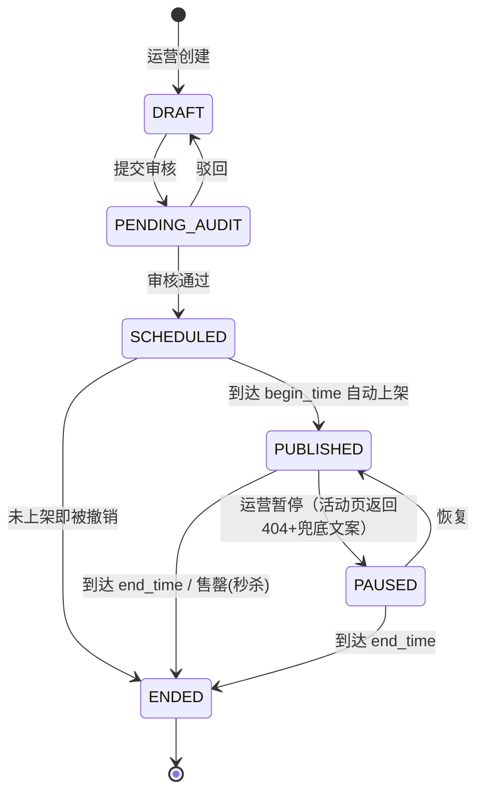
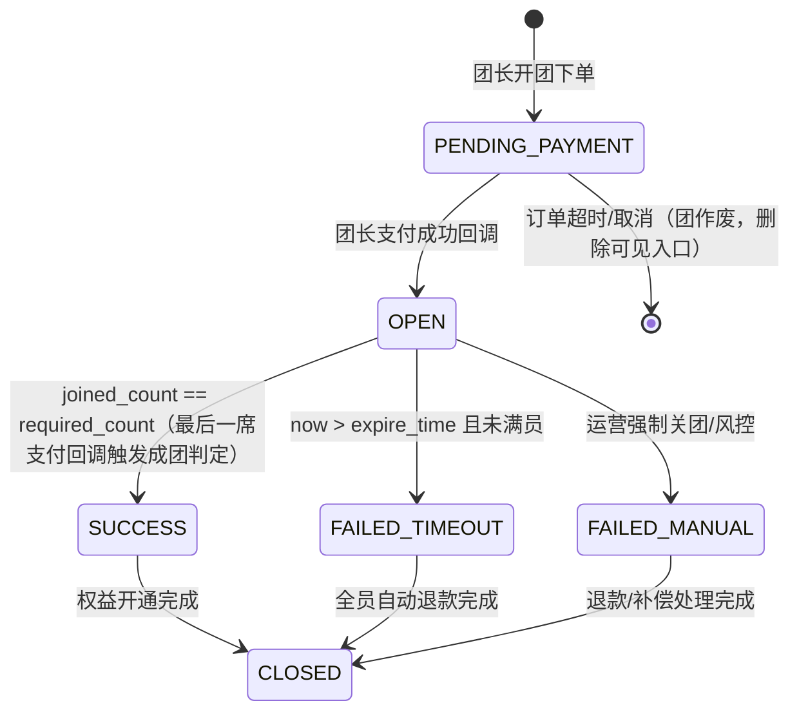
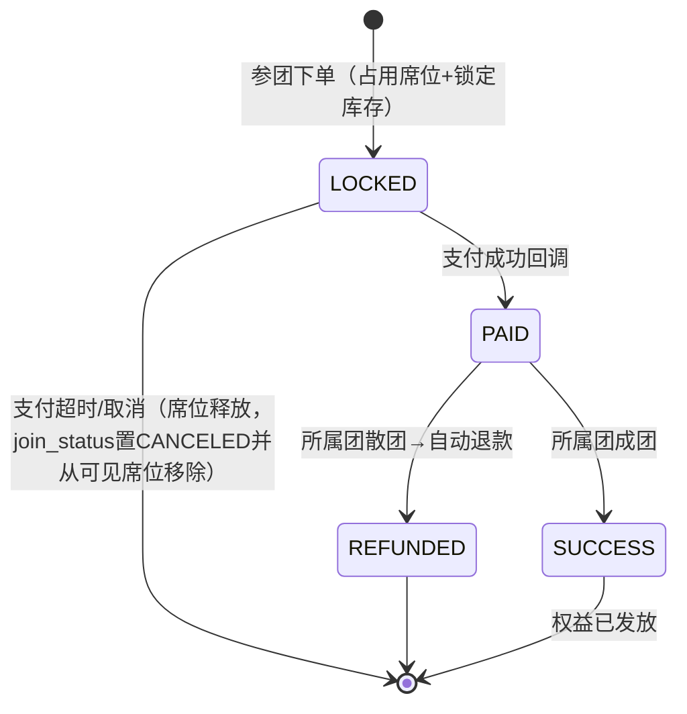
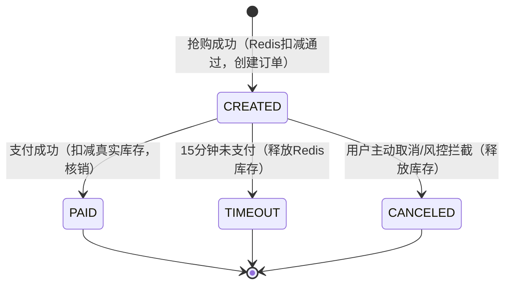
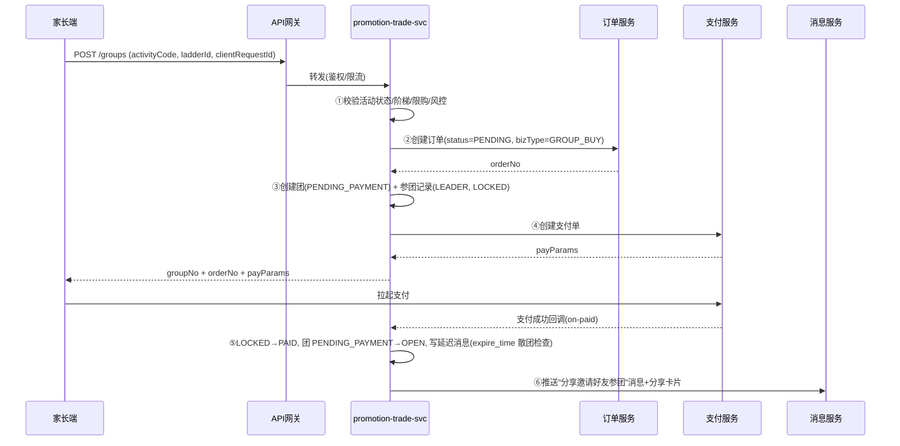
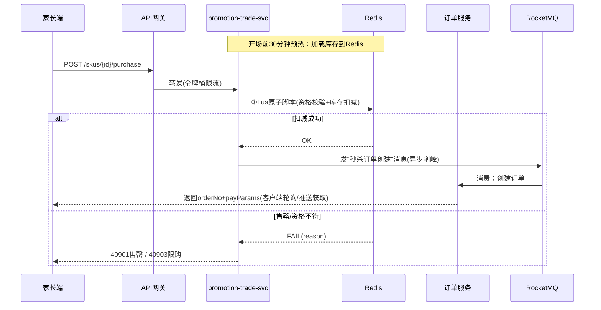

# 拼团与限时秒杀促销交易引擎 - 详细设计

> 模块代号：`promotion-trade-svc`
> 文档版本：v1.0
> 关联原始设计：《启硕-PrimeTop-全学段AI辅助学习软件项目设计文档》§11 盈利模式设计、§11.4 商业化注意事项
> 关联细化文档：《优惠券与促销活动引擎-详细设计》《支付服务与订单管理-详细设计》《服务端-邀请裂变与用户增长服务-详细设计》《服务端-未成年人支付风控与误充值自动识别退款引擎-详细设计》《服务端-统一人机验证与智能风控验证码引擎-详细设计》

## 1. 模块概述

### 1.1 定位

拼团与限时秒杀是会员订阅与增值服务的**社交裂变型促销交易机制**，服务于两个商业化目标：

1. **拼团（GroupBuy）**：通过"家长发起拼团→分享→好友参团→成团低价购"的链路，为会员套餐/增值服务包带来低成本裂变获客，是《邀请裂变与用户增长服务》的付费转化承接器。
2. **限时秒杀（FlashSale）**：通过限时限量特价制造稀缺感，在开学季、考试季、寒暑假等运营节点集中转化观望用户，并拉新促活。

两者共享一套**促销交易基础设施**：活动配置、库存管理、资格校验、订单联动、退款补偿、防刷风控，因此合并为一个引擎统一设计。

### 1.2 与其他模块的关系

| 模块 | 关系 |
| --- | --- |
| 支付服务与订单管理 | 拼团/秒杀下单复用统一订单模型，支付回调后由本引擎判定成团/核销库存 |
| 优惠券与促销活动引擎 | 秒杀价与优惠券默认互斥，由叠加规则统一仲裁；拼团订单原则上不可用券 |
| 会员订阅服务 | 成团后发放的权益（会员天数、增值包）由会员服务开通 |
| 邀请裂变与用户增长服务 | 拼团分享卡片复用分享链路、渠道归因与短链服务 |
| 消息与推送服务 | 成团/散团/退款通知、开团提醒、秒杀开始提醒 |
| 统一人机验证与风控验证码引擎 | 高风险下单前置人机验证 |
| 未成年人支付风控引擎 | **所有拼团/秒杀交易入口强制走家长代付通道**，未成年人账号不可直接支付 |
| 延迟任务调度引擎 | 拼团超时散团、秒杀订单超时未支付释放库存，基于延迟消息实现 |

### 1.3 设计原则

1. **库存不超卖**：秒杀库存以 Redis 原子扣减为准入闸门，DB 异步落库对账，宁可少卖不可超卖。
2. **资金安全优先**：拼团失败自动原路退款，退款失败进人工工单，绝不静默吞掉。
3. **交易幂等**：所有下单/参团/退款操作以业务唯一键 + 状态机保证幂等，支付回调可重放。
4. **未成年人合规**：产品定位为 K12 教育产品，促销面向**家长决策人**，学生端只可见不可付；不使用诱导性文案（如"最后1小时"虚假倒计时），遵守《广告法》与未成年人保护要求。
5. **可降级**：秒杀排队/Redis 故障时降级为"活动太火爆，稍后再试"，不影响正常会员购买链路。

### 1.4 业务边界

本引擎负责：活动配置与生命周期、库存、成团判定、资格与限购、超时散团与退款触发、防刷。

本引擎不负责：支付通道对接（支付服务）、权益开通（会员服务）、优惠券计算（优惠券引擎）、内容审核（商品本身由商品服务管理）。

---

## 2. 核心概念与数据模型

### 2.1 概念模型

```text
PromotionActivity (促销活动聚合根，抽象)
├── GroupBuyActivity   拼团活动（团品：SKU+成团价+人数+时限）
│     └── GroupBuyGroup        团实例（一次开团）
│             └── GroupBuyParticipant  参团记录（一个用户在一团中的席位）
└── FlashSaleSession  秒杀场次（时间段）
      └── FlashSaleSku         场次商品（SKU+秒杀价+场次库存）
            └── FlashSalePurchaseRecord  购买记录
```

- 拼团活动挂载**一个 SKU**（如"年度会员家庭版"），支持配置阶梯价（2人团/3人团）。
- 秒杀按**场次**组织（如 8月20日 10:00 场），一场次可含多个 SKU。
- 团实例与购买记录均关联统一订单号 `order_no`（订单服务生成），本引擎不重复建订单表。

### 2.2 拼团活动（GroupBuyActivity）

```sql
CREATE TABLE group_buy_activity (
    id                  BIGSERIAL PRIMARY KEY,
    code                VARCHAR(64) NOT NULL UNIQUE,        -- 活动编码，如 GB-ANNUAL-202609
    name                VARCHAR(128) NOT NULL,              -- 活动名称，如 "开学季年度会员拼团"
    sku_id              BIGINT NOT NULL,                    -- 关联商品/套餐ID（会员套餐或增值包）
    sku_snapshot        JSONB NOT NULL,                     -- SKU快照（名称/原价/时长/权益列表），防活动期间商品变更
    spec                JSONB NOT NULL,                     -- 成团规格，见 §2.3
    begin_time          TIMESTAMPTZ NOT NULL,
    end_time            TIMESTAMPTZ NOT NULL,
    total_group_limit   INTEGER NOT NULL DEFAULT -1,        -- 总开团数上限，-1不限
    per_user_join_limit INTEGER NOT NULL DEFAULT 1,         -- 每用户可参团次数（同一活动）
    per_user_open_limit INTEGER NOT NULL DEFAULT 1,         -- 每用户可开团次数
    new_user_only       BOOLEAN NOT NULL DEFAULT FALSE,     -- 是否仅限新付费用户（拉新团）
    status              VARCHAR(32) NOT NULL DEFAULT 'DRAFT',
    audit_status        VARCHAR(32) NOT NULL DEFAULT 'PENDING', -- 内容合规审核状态
    creator_id          BIGINT NOT NULL,
    created_at          TIMESTAMPTZ NOT NULL DEFAULT now(),
    updated_at          TIMESTAMPTZ NOT NULL DEFAULT now()
);
CREATE INDEX idx_gba_time ON group_buy_activity (begin_time, end_time) WHERE status = 'PUBLISHED';
```

### 2.3 成团规格（spec）

```json
// spec 结构：支持阶梯团
{
  "ladder": [
    { "ladderId": "L2", "requiredCount": 2, "groupPriceCent": 19900, "maxDurationHours": 24 },
    { "ladderId": "L3", "requiredCount": 3, "groupPriceCent": 17900, "maxDurationHours": 24 }
  ],
  "allowSelfBuy": true,          // 团长是否自动占一席（默认true）
  "refundOnFail": true,          // 散团自动退款
  "shareTitle": "年度会员3人团，立省XX元",
  "shareDesc": "邀请好友一起拼，孩子学习资源全家共享",
  "shareImage": "https://cdn.primetop.cn/promo/gb-202609.png"
}
```

字段约束：`groupPriceCent` 单位为分；`maxDurationHours` ≤ 72（拼团时效过长会显著降低成团率，产品上限统一 72h）。

### 2.4 团实例（GroupBuyGroup）

```sql
CREATE TABLE group_buy_group (
    id                  BIGSERIAL PRIMARY KEY,
    group_no            VARCHAR(40) NOT NULL UNIQUE,        -- 团号，如 G20260820153012A8F3，分享链路对外标识
    activity_id         BIGINT NOT NULL,
    ladder_id           VARCHAR(16) NOT NULL,               -- 选定的阶梯
    required_count      SMALLINT NOT NULL,                  -- 成团人数
    joined_count        SMALLINT NOT NULL DEFAULT 0,        -- 已支付参团人数（不含锁定期）
    leader_user_id      BIGINT NOT NULL,                    -- 团长（家长账号）
    status              VARCHAR(32) NOT NULL DEFAULT 'PENDING_PAYMENT', -- 见 §3.2
    expire_time         TIMESTAMPTZ NOT NULL,               -- 成团截止时间 = 团长支付时间 + maxDurationHours
    success_time        TIMESTAMPTZ,
    close_reason        VARCHAR(32),                        -- TIMEOUT / MANUAL / ACTIVITY_END
    created_at          TIMESTAMPTZ NOT NULL DEFAULT now(),
    updated_at          TIMESTAMPTZ NOT NULL DEFAULT now(),
    version             INTEGER NOT NULL DEFAULT 0          -- 乐观锁
);
CREATE INDEX idx_gbg_expire ON group_buy_group (expire_time) WHERE status IN ('OPEN','PENDING_PAYMENT');
CREATE INDEX idx_gbg_leader ON group_buy_group (leader_user_id, activity_id);
```

> 说明：团从"开团下单"即创建，团长支付成功后进入 `OPEN`；未支付则停留 `PENDING_PAYMENT`，15 分钟订单超时自动作废。

### 2.5 参团记录（GroupBuyParticipant）

```sql
CREATE TABLE group_buy_participant (
    id                  BIGSERIAL PRIMARY KEY,
    group_id            BIGINT NOT NULL,
    activity_id         BIGINT NOT NULL,
    user_id             BIGINT NOT NULL,                    -- 参团家长账号
    role                VARCHAR(8) NOT NULL,                -- LEADER / MEMBER
    order_no            VARCHAR(64) NOT NULL UNIQUE,        -- 关联统一订单（一人一团一单， UNIQUE 保证不重复参团）
    join_status         VARCHAR(32) NOT NULL DEFAULT 'LOCKED', -- LOCKED→PAID→SUCCESS/REFUNDED，见 §3.3
    paid_amount_cent    INTEGER NOT NULL DEFAULT 0,
    paid_at             TIMESTAMPTZ,
    refund_status       VARCHAR(32) NOT NULL DEFAULT 'NONE',-- NONE / REFUNDING / REFUNDED / REFUND_FAILED
    refund_order_no     VARCHAR(64),
    refunded_at         TIMESTAMPTZ,
    created_at          TIMESTAMPTZ NOT NULL DEFAULT now(),
    updated_at          TIMESTAMPTZ NOT NULL DEFAULT now()
);
CREATE UNIQUE INDEX uk_gbp_user_group ON group_buy_participant (group_id, user_id);  -- 同一团不可重复占席
CREATE INDEX idx_gbp_user ON group_buy_participant (user_id, join_status);
```

### 2.6 秒杀场次与场次商品

```sql
CREATE TABLE flash_sale_session (
    id                  BIGSERIAL PRIMARY KEY,
    code                VARCHAR(64) NOT NULL UNIQUE,        -- 如 FS-20260901-1000
    name                VARCHAR(128) NOT NULL,              -- "9月1日10点开学专场"
    begin_time          TIMESTAMPTZ NOT NULL,
    end_time            TIMESTAMPTZ NOT NULL,
    status              VARCHAR(32) NOT NULL DEFAULT 'DRAFT',
    creator_id          BIGINT NOT NULL,
    created_at          TIMESTAMPTZ NOT NULL DEFAULT now()
);

CREATE TABLE flash_sale_sku (
    id                  BIGSERIAL PRIMARY KEY,
    session_id          BIGINT NOT NULL,
    sku_id              BIGINT NOT NULL,
    sku_snapshot        JSONB NOT NULL,
    sale_price_cent     INTEGER NOT NULL,                   -- 秒杀价（分）
    original_price_cent INTEGER NOT NULL,                   -- 划线原价（分），必须为真实日常价，杜绝虚构原价
    stock_total         INTEGER NOT NULL,                   -- 场次总库存
    stock_sold          INTEGER NOT NULL DEFAULT 0,         -- 已售（支付成功口径）
    stock_locked        INTEGER NOT NULL DEFAULT 0,         -- 下单锁定中（未支付）
    per_user_limit      INTEGER NOT NULL DEFAULT 1,         -- 每账号限购
    per_device_limit    INTEGER NOT NULL DEFAULT 2,         -- 每设备限购（防小号）
    purchase_limit_window_hours INTEGER NOT NULL DEFAULT 24, -- 限购统计窗口
    UNIQUE (session_id, sku_id)
);

CREATE TABLE flash_sale_purchase_record (
    id                  BIGSERIAL PRIMARY KEY,
    session_id          BIGINT NOT NULL,
    fs_sku_id           BIGINT NOT NULL,
    user_id             BIGINT NOT NULL,
    order_no            VARCHAR(64) NOT NULL UNIQUE,
    buy_status          VARCHAR(32) NOT NULL DEFAULT 'CREATED', -- CREATED/PAID/CANCELED/TIMEOUT
    queue_token         VARCHAR(64),                        -- 排队令牌（§5.4）
    paid_at             TIMESTAMPTZ,
    canceled_at         TIMESTAMPTZ,
    cancel_reason       VARCHAR(32),                        -- USER_CANCEL / PAY_TIMEOUT / RISK_REJECT
    created_at          TIMESTAMPTZ NOT NULL DEFAULT now()
);
CREATE INDEX idx_fspr_user ON flash_sale_purchase_record (user_id, fs_sku_id, created_at);
```

### 2.7 核心枚举定义

```java
public enum ActivityStatus { DRAFT, PENDING_AUDIT, SCHEDULED, PUBLISHED, PAUSED, ENDED }
public enum GroupStatus {
    PENDING_PAYMENT,   // 已开团，团长未支付（15分钟锁席）
    OPEN,              // 拼团中，可继续参团
    SUCCESS,           // 已成团
    FAILED_TIMEOUT,    // 超时未成团（散团）
    FAILED_MANUAL,     // 管理员强制关团（活动下架/风控）
    CLOSED             // 终态归档（退款完成后）
}
public enum JoinStatus { LOCKED, PAID, SUCCESS, REFUNDED }
public enum RefundStatus { NONE, REFUNDING, REFUNDED, REFUND_FAILED }
public enum PurchaseStatus { CREATED, PAID, CANCELED, TIMEOUT }
```

---

## 3. 状态流转

### 3.1 促销活动状态机（拼团/秒杀共用）



约束：`ENDED` 后不可再产生新团/新购；进行中的团允许继续走完（拼团），秒杀未支付订单按超时处理。

### 3.2 团实例状态机



成团判定在支付回调事务内执行（见 §5.2），`FAILED_TIMEOUT` 由延迟任务触发（见 §5.3）。

### 3.3 参团记录状态机



> 注意：`LOCKED` 席位不计入 `joined_count`，但占位展示（前端显示"支付中"），锁定期 15 分钟，防止"占坑不付"。

### 3.4 秒杀购买记录状态机



---

## 4. API 接口设计

统一前缀 `/api/v1`，学生端（STU）与家长端（PAR）同域鉴权，角色见《服务端-平台多角色统一身份与跨角色切换管理服务》。响应统一走《服务端-统一响应封装与分页查询规范》。

### 4.1 客户端接口

#### 4.1.1 拼团活动详情

```
GET /promo/groupbuy/activities/{activityCode}
```

响应：

```json
{
  "code": 0,
  "data": {
    "activityCode": "GB-ANNUAL-202609",
    "name": "开学季年度会员拼团",
    "sku": { "skuId": 3001, "title": "年度会员·家庭版", "originalPriceCent": 36500, "benefits": ["全学段同步课堂", "无限AI问答"] },
    "ladder": [
      { "ladderId": "L2", "requiredCount": 2, "groupPriceCent": 19900 },
      { "ladderId": "L3", "requiredCount": 3, "groupPriceCent": 17900 }
    ],
    "beginTime": "2026-09-01T00:00:00+08:00",
    "endTime": "2026-09-14T23:59:59+08:00",
    "stat": { "totalGroups": 8231, "successRate": 0.71 },
    "myStatus": { "joined": false, "remainingJoinQuota": 1 }
  }
}
```

#### 4.1.2 开团

```
POST /promo/groupbuy/groups
{
  "activityCode": "GB-ANNUAL-202609",
  "ladderId": "L3",
  "clientRequestId": "c7f1e2a9-..."   // 客户端幂等键
}
```

响应（成功创建，待支付）：

```json
{
  "code": 0,
  "data": {
    "groupNo": "G20260901102345B2C1",
    "orderNo": "PO202609011023450012",
    "payAmountCent": 17900,
    "payExpireAt": "2026-09-01T10:38:45+08:00",   // 15分钟支付窗口
    "payParams": { "channel": "WECHAT_H5", "prepayId": "..." }
  }
}
```

错误码见 §7.1（`PROMO_GB_ACTIVITY_END`、`PROMO_GB_LADDER_INVALID`、`PROMO_GB_OPEN_LIMIT` 等）。

#### 4.1.3 参团（通过分享链路进入）

```
POST /promo/groupbuy/groups/{groupNo}/join
{
  "clientRequestId": "..."
}
```

服务端校验：团状态 `OPEN`、未满员、活动进行中、用户限购、同人不同团（同一活动允许开一团参 N-1 团由 `per_user_join_limit` 控制）。响应同开团（返回本席位的订单与支付参数）。

#### 4.1.4 团详情（分享落地页）

```
GET /promo/groupbuy/groups/{groupNo}
```

返回团状态、已占席位脱敏昵称（`张**妈妈`）、剩余席位数、倒计时 `expireTime`、当前用户是否已在团中。**团满员或已结束时返回 `PROMO_GB_GROUP_NOT_JOINABLE`，落地页展示"去看看其他拼团"引导至活动页。**

#### 4.1.5 我的拼团

```
GET /promo/groupbuy/my-groups?status=ALL|OPEN|SUCCESS|REFUNDED&page=1&size=10
```

#### 4.1.6 秒杀场次与商品列表

```
GET /promo/flashsale/sessions/current
GET /promo/flashsale/sessions/{sessionCode}/skus
```

响应中每个 SKU 附带实时库存状态：`IN_STOCK / SOLD_OUT / NOT_STARTED / ENDED`，以及"已抢 X%"进度（前端展示用，来自 Redis 计数近似值，允许轻微误差）。

#### 4.1.7 秒杀预约（开播提醒）

```
POST /promo/flashsale/skus/{fsSkuId}/remind     // 预约开始前5分钟推送提醒
DELETE /promo/flashsale/skus/{fsSkuId}/remind
```

#### 4.1.8 秒杀抢购（核心）

```
POST /promo/flashsale/skus/{fsSkuId}/purchase
{
  "clientRequestId": "...",
  "captchaToken": "..."        // 风控等级≥2时必填，来自人机验证引擎
}
```

三种结果：

```json
// ① 抢购成功，待支付
{ "code": 0, "data": { "orderNo": "PO...", "payAmountCent": 9900, "payExpireAt": "...", "payParams": {...} } }

// ② 售罄
{ "code": 40901, "message": "已抢光，看看其他专场吧" }

// ③ 排队中（削峰开启时）
{ "code": 40902, "data": { "queueToken": "QT-..." , "pollAfterMs": 2000} }
```

排队结果轮询：

```
GET /promo/flashsale/queue/{queueToken}
```

### 4.2 运营后台接口

| 接口 | 方法 | 说明 |
| --- | --- | --- |
| `/admin/promo/groupbuy/activities` | POST | 创建拼团活动（spec 见 §2.3），提交后进入审核 |
| `/admin/promo/groupbuy/activities/{id}` | PUT | 修改（仅 DRAFT/PAUSED 可改价格，已开团活动只可暂停） |
| `/admin/promo/groupbuy/activities/{id}/publish` | POST | 审核通过后定时发布 |
| `/admin/promo/groupbuy/activities/{id}/pause` | POST | 暂停（进行中团不强制散团，默认走完） |
| `/admin/promo/groupbuy/groups/{groupNo}/close` | POST | 强制关团（需二级审批，触发退款） |
| `/admin/promo/flashsale/sessions` | POST/PUT | 场次与SKU配置、库存设置 |
| `/admin/promo/flashsale/skus/{id}/stock/adjust` | POST | 库存调整（仅可加不可减已锁定） |
| `/admin/promo/overview?from=&to=` | GET | 数据看板：成团率、GMV、退款、秒杀峰值QPS |

所有管理操作走《服务端-审计日志与操作追溯系统》记录审计日志；强制关团与价格修改需二级审批。

### 4.3 内部服务接口（Feign/RPC）

| 接口 | 消费方 | 说明 |
| --- | --- | --- |
| `POST /internal/promo/groupbuy/on-paid` | 支付服务回调编排 | 通知某团某席位已支付，触发成团判定 |
| `POST /internal/promo/flashsale/on-paid` | 支付服务 | 秒杀订单支付成功核销 |
| `POST /internal/promo/order/on-canceled` | 订单服务 | 订单取消/超时，释放席位或库存 |
| `POST /internal/promo/refund/callback` | 支付服务退款回调 | 更新 refund_status，驱动 CLOSED |

安全：内部接口走服务间鉴权（双向 TLS + 服务账号），不暴露公网。

---

## 5. 核心业务流程

### 5.1 开团与参团流程



参团流程相同，差异仅在第③步：校验团 `OPEN` 且 `joined_count + locked < required_count`，落 `uk_gbp_user_group` 唯一索引防并发重复占席。

### 5.2 支付回调与成团判定（关键并发点）

成团判定必须是**原子**的：最后一席支付回调与散团延迟任务可能并发执行（expire_time 前一秒支付成功 vs 定时器触发散团），以团行乐观锁仲裁：

```java
@Transactional
public void onParticipantPaid(Long participantId, String payOrderNo) {
    GroupBuyParticipant p = participantMapper.selectForUpdate(participantId);
    if (p.getJoinStatus() != JoinStatus.LOCKED) {
        return; // 幂等：重复回调直接返回
    }
    // 1. 席位置为已支付
    participantMapper.markPaid(p.getId(), payOrderNo);

    // 2. 团计数 +1（乐观锁防止与散团任务并发）
    GroupBuyGroup g = groupMapper.selectById(p.getGroupId());
    int affected = groupMapper.incrementJoinedCount(g.getId(), g.getVersion()); 
    // UPDATE group_buy_group SET joined_count = joined_count + 1, version = version + 1,
    //        status = CASE WHEN joined_count + 1 >= required_count THEN 'SUCCESS' ELSE status END,
    //        success_time = CASE WHEN joined_count + 1 >= required_count THEN now() ELSE success_time END
    // WHERE id = ? AND version = ? AND status = 'OPEN'
    if (affected == 0) {
        // 团已不在 OPEN（极可能已被散团任务关闭）→ 该笔支付进入自动退款
        refundService.createAutoRefund(p, "GROUP_CLOSED_BEFORE_PAY");
        return;
    }

    // 3. 成团则发放权益 + 通知
    GroupBuyGroup fresh = groupMapper.selectById(g.getId());
    if (fresh.getStatus() == GroupStatus.SUCCESS) {
        // 取消该团所有散团检查延迟消息（tag=group:{groupNo}），防迟到散团
        delayQueue.cancel("group-close:" + fresh.getGroupNo());
        List<GroupBuyParticipant> all = participantMapper.selectByGroup(fresh.getId());
        all.forEach(m -> participantMapper.markJoinSuccess(m.getId()));
        memberService.grantGroupBuyBenefits(fresh, all);      // 逐席发放权益（失败重试，见§7.2）
        msgService.notifyGroupSuccess(fresh, all);            // 成团通知
        metrics.increment("groupbuy.success", fresh.getActivityId());
    }
}
```

要点：
1. **UPDATE 带 CASE 判定成团**，数据库行级原子性保证恰好一次成团动作；
2. 散团延迟消息在成团时**主动取消**，即使取消失败，散团任务也会因 `status != OPEN` 而空转退出（双保险）；
3. 支付与散团竞态中"付款瞬间团被关"的用户，走自动退款，并在通知中说明原因。

### 5.3 超时散团与自动退款

延迟任务（基于《服务端-统一延迟任务调度与到期事件触发引擎》，RocketMQ 延迟消息或 Redis ZSet 轮询兜底）：

```java
@DelayTask(topic = "group-close", tagExpr = "group:{groupNo}")
public void onGroupExpire(String groupNo) {
    GroupBuyGroup g = groupMapper.selectByNo(groupNo);
    if (g == null || g.getStatus() != GroupStatus.OPEN) return;     // 已成团/已处理，幂等退出

    // 乐观锁关闭团，抢占"散团权"
    int affected = groupMapper.compareAndClose(g.getId(), g.getVersion(),
            GroupStatus.FAILED_TIMEOUT, "TIMEOUT");
    if (affected == 0) return; // 并发：成团判定刚成功

    List<GroupBuyParticipant> paid = participantMapper.selectByGroup(g.getId(), JoinStatus.PAID);
    for (GroupBuyParticipant p : paid) {
        refundService.createAutoRefund(p, "GROUP_FAILED_TIMEOUT");  // 逐笔原路退
    }
    msgService.notifyGroupFailed(g, paid.size());
}
```

自动退款流程：`refund_status=REFUNDING` → 调支付服务退款接口 → 回调置 `REFUNDED` 并将 `join_status=REFUNDED` → 全部处理完后团置 `CLOSED`。退款失败（`REFUND_FAILED`）自动重试 3 次（间隔 1m/10m/1h），仍失败则创建客服工单并在看板标红，**绝不静默**。

### 5.4 秒杀抢购流程（预热/排队/扣减/落库）



#### Redis Lua 脚本（资格 + 库存一步完成）

```lua
-- KEYS[1]=fs:stock:{fsSkuId}  KEYS[2]=fs:userbuy:{fsSkuId}:{userId}
-- KEYS[3]=fs:devicebuy:{fsSkuId}:{deviceId}
-- ARGV[1]=perUserLimit ARGV[2]=perDeviceLimit ARGV[3]=windowSec ARGV[4]=orderToken
if tonumber(redis.call('GET', KEYS[1]) or '-1') <= 0 then
    return {0, 'SOLD_OUT'}
end
local ub = tonumber(redis.call('GET', KEYS[2]) or '0')
if ub >= tonumber(ARGV[1]) then return {0, 'USER_LIMIT'} end
local db = tonumber(redis.call('GET', KEYS[3]) or '0')
if db >= tonumber(ARGV[2]) then return {0, 'DEVICE_LIMIT'} end

redis.call('DECR', KEYS[1])
redis.call('INCR', KEYS[2]); redis.call('EXPIRE', KEYS[2], ARGV[3])
redis.call('INCR', KEYS[3]); redis.call('EXPIRE', KEYS[3], ARGV[3])
redis.call('SADD', 'fs:pending:'..KEYS[1], ARGV[4])   -- 未支付集合，超时回滚用
return {1, 'OK'}
```

对应回滚脚本（订单取消/超时时）：

```lua
-- KEYS[1]=fs:stock:{fsSkuId} KEYS[2]=fs:pending:{fsSkuId}
-- ARGV[1]=orderToken
if redis.call('SREM', KEYS[2], ARGV[1]) == 1 then
    redis.call('INCR', KEYS[1])
    return 1
end
return 0   -- 已回滚过，幂等
```

#### 库存预热与一致性

- 开场前 30 分钟，定时任务将 `stock_total - stock_sold - stock_locked` 写入 `fs:stock:{id}`；
- 支付成功核销时同步 `UPDATE flash_sale_sku SET stock_sold = stock_sold + 1`；每 5 分钟对账任务比对 Redis 未支付集合与 DB，修正漂移；
- **Redis 故障降级**：Lua 不可用时直接返回 503 + "活动太火爆"，绝不退化为 DB 直扣（防止打穿）。

#### 排队削峰（可选，QPS > 2k 时开启）

网关层按 SKU 维度令牌桶放行，超出部分返回 `queueToken`，客户端 2s 轮询 `GET /promo/flashsale/queue/{token}`，令牌生效后携带其调用 purchase，相当于虚拟排队。

### 5.5 与家长代付的强制联动（合规关键流)

1. 拼团开团/参团、秒杀抢购接口在校验链第一步执行**账号角色判定**：当前登录主体必须是家长角色（`ParentAccount`）或已通过《未成年人支付风控》判定的代付场景；
2. 学生端活动页展示"请邀请爸爸妈妈开通"按钮，点击拉起家长端代付流程（家长端扫码/账号切换），**学生账号不触达支付参数**；
3. 所有促销文案禁用"仅剩X份"虚假库存提示与"错过再等一年"焦虑话术，文案审核复用《服务端-教育场景敏感词多层次过滤》规则集，`广告法极限词` 单独成组。

---

## 6. 关键代码实现

### 6.1 模块结构（Spring Boot 单模块，归属 marketing 域）

```text
promotion-trade-svc
├── controller
│   ├── GroupBuyClientController.java
│   ├── FlashSaleClientController.java
│   ├── PromoAdminController.java
│   └── InternalCallbackController.java
├── service
│   ├── GroupBuyService.java          # 开团/参团/成团判定
│   ├── GroupCloseDelayHandler.java   # 散团延迟任务
│   ├── FlashSaleService.java         # 抢购/预热/对账
│   ├── PromoQualifyService.java      # 资格/限购/风控校验链
│   └── PromoRefundService.java       # 自动退款
├── infra
│   ├── redis/SeckillLuaScripts.java
│   ├── mq/PromoMqProducer.java
│   └── delay/PromoDelayTasks.java
└── repository (MyBatis-Plus Mapper)
```

### 6.2 幂等控制

三层幂等：

1. **客户端幂等键** `clientRequestId`：`promo_idempotent` 表 `UNIQUE(clientRequestId)`，冲突时直接返回首次结果（缓存于 Redis，TTL 10 分钟）；
2. **订单唯一约束**：`order_no` 在参团/购买记录上 UNIQUE，防重复建单；
3. **状态机幂等**：所有状态迁移 SQL 均带 `WHERE status = 期望前态`，affected=0 视为重复请求。

```java
public PurchaseResult purchase(Long userId, Long fsSkuId, Req req) {
    // 1. 幂等检查
    String cached = redis.get("promo:idem:" + req.getClientRequestId());
    if (cached != null) return json.parse(cached, PurchaseResult.class);

    // 2. 前置校验（活动时间、场次、家长角色、人机验证）
    qualifyService.checkPurchaseQualify(userId, fsSkuId, req.getCaptchaToken());

    // 3. Redis 原子扣减
    LuaResult r = seckillLua.execute(fsSkuId, userId, req.getDeviceId());
    if (!r.ok()) throw new PromoException(r.errorCode());  // SOLD_OUT/USER_LIMIT/DEVICE_LIMIT

    // 4. MQ 异步建单（削峰）；客户端拿到 orderToken 轮询结果
    String orderToken = idGen.next();
    mq.send("promo-flashsale-order", FlashSaleOrderMsg.of(fsSkuId, userId, orderToken));
    PurchaseResult result = PurchaseResult.pending(orderToken);
    redis.setex("promo:idem:" + req.getClientRequestId(), 600, json.dump(result));
    return result;
}
```

### 6.3 定时任务清单

| 任务 | 频率 | 说明 |
| --- | --- | --- |
| 活动状态机推进 | 1min | SCHEDULED→PUBLISHED、PUBLISHED→ENDED |
| 未支付订单超时关闭 | 1min 扫描 + 延迟消息双保险 | 与订单服务协同，触发席位/库存释放 |
| 秒杀库存对账 | 5min | Redis pending 集合 vs DB，修正漂移并告警 |
| 退款失败重试 | 1min | 3 次退避后转人工 |
| 拼团数据汇总 | 5min | 成团率/裂变系数写入指标中心 |

---

## 7. 错误处理

### 7.1 统一错误码

| 错误码 | 场景 | 用户文案 | 处理策略 |
| --- | --- | --- | --- |
| 40900 PROMO_NOT_FOUND | 活动/团不存在 | 活动不存在或已下架 | 引导回活动列表 |
| 40901 PROMO_FS_SOLD_OUT | 秒杀售罄 | 已抢光，看看其他专场吧 | 终态，不重试 |
| 40902 PROMO_FS_QUEUING | 排队中 | 排队中，请稍候 | 客户端轮询 |
| 40903 PROMO_FS_USER_LIMIT | 超限购 | 每人限购N件哦 | 终态 |
| 40904 PROMO_FS_NOT_STARTED/ENDED | 未开始/已结束 | 还未开始/已结束 | 前端按场次时间展示 |
| 40910 PROMO_GB_LADDER_INVALID | 阶梯不存在/已变更 | 活动已更新，请刷新 | 刷新活动详情 |
| 40911 PROMO_GB_GROUP_NOT_JOINABLE | 团满/关闭/过期 | 手慢了，去看看其他拼团 | 引导开新团 |
| 40912 PROMO_GB_JOIN_LIMIT | 参团次数用尽 | 本期拼团次数已用完 | 终态 |
| 40913 PROMO_GB_DUPLICATE_JOIN | 同团重复参团 | 你已在该团中 | 跳转我的拼团 |
| 40914 PROMO_GB_SELF_JOIN_LIMIT | 团长不可参自己团（allowSelfBuy=false 时） | 不能参加自己开的团 | — |
| 40915 PROMO_NOT_PARENT_ACCOUNT | 非家长账号支付 | 请邀请爸爸妈妈完成开通 | 拉起家长代付 |
| 40920 PROMO_RISK_REJECTED | 风控拦截 | 当前操作存在风险，暂时无法完成 | 记录风控日志，人工复核 |
| 40930 PROMO_REFUND_FAILED | 退款失败 | 退款未成功，客服将尽快联系您 | 重试+工单 |
| 50000 PROMO_INTERNAL | 内部异常 | 系统繁忙，请稍后再试 | 告警+日志追踪 |

### 7.2 并发与一致性场景

| 场景 | 保护机制 |
| --- | --- |
| 同用户双击开团/参团 | clientRequestId 幂等 + 唯一索引 |
| 最后一席多请求并发 | `UPDATE ... CASE WHEN` 原子成团，仅一个事务生效 |
| 成团 vs 散团竞态 | 团乐观锁 + 散团任务幂等退出 + 迟到支付自动退款 |
| 秒杀超卖 | Redis Lua 原子扣减，DB 只核销不判库存 |
| 秒杀 Redis/DB 库存漂移 | 5min 对账修正 + 告警 |
| 支付回调重复投递 | 参团/购买状态机幂等 |
| 权益发放失败（成团后） | 补偿队列重试；仍失败转工单，团保持 SUCCESS 不回滚（钱货分离，先保资金正确，权益可补发） |

### 7.3 降级策略

| 依赖 | 故障表现 | 降级动作 |
| --- | --- | --- |
| Redis | Lua 脚本不可用 | 秒杀返回 503 引导文案；拼团正常（拼团不依赖 Redis 库存） |
| 延迟任务中心 | 散团消息丢失 | 1min 兜底扫描 `expire_time < now() AND status='OPEN'` |
| 消息队列 | 建单消息积压 | 客户端 orderToken 轮询超时提示"确认中"；本地事件表补偿 |
| 支付服务 | 退款接口失败 | 退避重试 3 次 → 工单 |

---

## 8. 缓存与热点设计

| 键 | 类型 | TTL | 说明 |
| --- | --- | --- | --- |
| `promo:gb:act:{code}` | String(JSON) | 5min | 活动详情聚合，变更时主动失效 |
| `promo:gb:group:{groupNo}` | Hash | 至散团+1d | 团状态、已占席位（分享落地页高频读） |
| `fs:stock:{fsSkuId}` | String(int) | 场次结束+1h | 秒杀库存（权威准入） |
| `fs:pending:{fsSkuId}` | Set | 同上 | 未支付订单令牌，超时回滚依据 |
| `fs:userbuy:{fsSkuId}:{userId}` | String | 限购窗口 | 用户已购计数 |
| `promo:idem:{clientRequestId}` | String | 10min | 幂等结果缓存 |

热点团详情（爆款拼团分享）与秒杀商品页读多写少，由网关层缓存 + 上述键承担；库存类键禁止设置过长 TTL 防泄漏累积。

---

## 9. 数据统计与运营分析

### 9.1 核心指标（接入统一指标中心）

- **拼团**：开团数、成团数、成团率、平均成团时长、参团转化率（分享→参团）、裂变系数（每团带来的新用户数）、散团退款率、拼团 GMV；
- **秒杀**：抢购 QPS 峰值、下单转化率、支付转化率、售罄时长、库存水位曲线、排队人数峰值；
- **联动**：拼团新客 7 日留存 vs 自然新客、秒杀用户后续续费率。

### 9.2 埋点事件

| 事件 | 触发点 | 关键属性 |
| --- | --- | --- |
| `promo_gb_view` | 活动页曝光 | activityCode, source |
| `promo_gb_open` | 开团成功 | activityCode, ladderId, groupNo |
| `promo_gb_share` | 点击分享 | groupNo, channel(WeChat/SMS/…) |
| `promo_gb_join_view` | 分享落地页曝光 | groupNo, invitedUserId |
| `promo_gb_join` | 参团支付成功 | groupNo, isRetry |
| `promo_gb_success / fail` | 成团/散团 | groupNo, joinedCount, duration |
| `promo_fs_view / remind / rush / paysucc` | 秒杀链路 | sessionCode, fsSkuId, queueMs |

---

## 10. 安全与合规

1. **未成年人保护**：
   - 支付主体强制家长账号（§5.5）；学生端无任何支付参数；
   - 促销推送仅触达家长端通道；学生端不展示价格促销类运营位（见《服务端-教育平台青少年模式风控》）；
   - 单账号月促销消费限额（默认 2000 元）联动未成年人支付风控引擎。
2. **防刷**：
   - 账号/设备/手机号三维限购；同人同团唯一索引；
   - 高风险等级（IP 聚集、新设备、批量昵称）强制人机验证，拦截进 `PROMO_RISK_REJECTED`；
   - 异常团（参团账号同 IP 段占比 > 80% 且新注册 > 90%）标记风控复核，不予裂变奖励结算。
3. **价格合规**：`original_price_cent` 必须为近 30 天真实成交最低日常价，落库时由商品服务签名快照，运营不可手改划线价；
4. **审计**：活动创建/改价/关团/库存调整全部走审计日志，关团与改价需二级审批；
5. **退款保障**：散团自动退款 SLA：触发后 5 分钟内发起，24 小时内到账（渠道差异除外）。

---

## 11. MVP 分期计划

### 11.1 第 1 期（随 V1.5 运营活动版本，约 3 周）

- 拼团单阶梯（固定人数固定价）、开团/参团/成团/散团退款全链路；
- 分享卡片 + 落地页 + 我的拼团；
- 秒杀：单场次单 SKU、Redis Lua 扣减、15 分钟支付超时释放；
- 管理后台：活动配置、强制关团、基础看板。

### 11.2 第 2 期（V2.0，约 2 周）

- 阶梯团、新人专享团、老带新裂变奖励结算（对接积分体系）；
- 秒杀预约提醒、排队削峰、库存对账自动化；
- 防刷三维限购与人机验证联动、价格快照签名。

### 11.3 第 3 期（按运营需求）

- 砍价活动（复用参团/退款基础设施，增加"帮砍"动作流）；
- 拼团失败转化（散团时发放安慰券，引导优惠券引擎）；
- 裂变系数归因与渠道分成报表。

---

## 12. 测试要点清单

1. **成团并发**：N 个用户同时支付最后一席，恰好一人触发成团，其余为普通 PAID；
2. **成团/散团竞态**：expire_time±1s 内支付，验证不出现"已支付却被散团不退款"；
3. **秒杀超卖**：5000 并发抢 100 库存，最终成功订单 ≤ 100；
4. **超时释放**：秒杀下单不支付 15 分钟，Redis 库存回滚可再抢；
5. **幂等**：同一 clientRequestId 重放 10 次仅一单；支付回调重复投递仅核销一次；
6. **退款**：散团全员原路退，单笔退款失败不阻塞他人；
7. **合规**：学生账号调用支付类接口返回 40915；促销推送不触达学生通道；
8. **降级**：杀掉 Redis，拼团可正常走完，秒杀返回 503 文案；
9. **对账**：人工制造 Redis/DB 漂移，5 分钟内修正并告警。

---

## 13. 变更记录

| 版本 | 日期 | 说明 |
| --- | --- | --- |
| v1.0 | 2026-08-15 | 初稿：拼团+秒杀全链路设计 |
