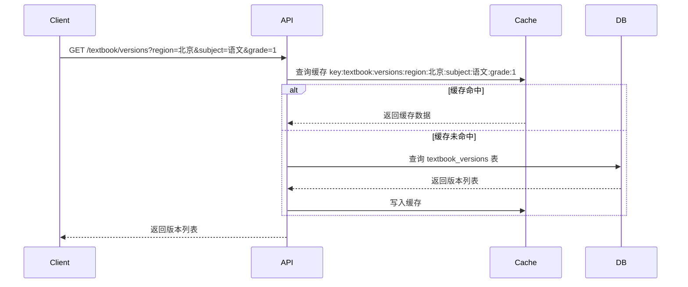

# 教材版本与章节管理服务 详细设计

## 1. 概述

### 1.1 模块定位
教材版本与章节管理服务是 PrimeTop 平台的核心基础数据服务，负责维护国内主流教材版本信息、章节结构、知识点映射关系以及版本更新生命周期。该服务为同步课堂、题库匹配、学习路径编排、知识点溯源等上层业务提供统一、准确、及时的教材数据支撑。

### 1.2 核心职责
- 维护教材版本基础数据（出版社、学科、年级、适用区域等）
- 管理教材章节目录结构（学期、单元、课时）
- 维护知识点与章节、教材版本的映射关系
- 支持教材版本变更检测、版本同步与内容更新
- 提供教材章节查询、遍历、比对等数据接口
- 保障教材数据的一致性、可追溯性和可扩展性

### 1.3 依赖关系
- 依赖：用户服务（获取当前用户学段、年级、学科设置）
- 依赖：内容服务（教材内容数字化与结构化）
- 依赖：知识库系统（知识点体系与教材映射）
- 被依赖：同步课堂学习服务、题库服务、学习规划服务、个性化推荐引擎

## 2. 数据模型

### 2.1 核心实体定义

#### TextbookVersion（教材版本）
```json
{
  "id": "string",               // 版本唯一标识（如：PEP-BJ-XIAOXUE-YUWEN-2022）
  "name": "string",             // 版本名称（如：人教版-北京-小学语文-2022版）
  "publisher": "string",        // 出版社
  "region": "string",           // 适用区域（如：北京、全国通用）
  "subjectId": "string",        // 关联学科ID
  "gradeStart": "int",          // 起始年级
  "gradeEnd": "int",            // 结束年级
  "semester": "int",            // 学期数（1表示上册，2表示下册，3表示全册）
  "year": "int",                // 版本年份
  "status": "enum",             // 状态：ACTIVE, ARCHIVED, DRAFT
  "coverUrl": "string",         // 封面图片URL
  "description": "string",      // 版本描述
  "tags": ["string"],           // 标签（如：新课标、部编版、实验版）
  "metadata": {                 // 扩展元数据
    "isbn": "string",
    "author": "string",
    "edition": "string"
  },
  "createdAt": "timestamp",
  "updatedAt": "timestamp",
  "effectiveDate": "timestamp", // 生效日期
  "expireDate": "timestamp"     // 过期日期
}
```

#### TextbookChapter（教材章节）
```json
{
  "id": "string",               // 章节唯一标识
  "versionId": "string",        // 所属教材版本ID
  "parentId": "string|null",    // 父章节ID（根节点为null）
  "type": "enum",               // 类型：SEMESTER(学期), UNIT(单元), LESSON(课时), SECTION(小节)
  "order": "int",               // 同级排序
  "code": "string",             // 章节编码（如：UNIT1, LESSON1-1）
  "name": "string",             // 章节名称
  "description": "string",      // 章节简介
  "knowledgePointIds": ["string"], // 关联知识点ID列表
  "estimatedHours": "float",    // 预估学时（小时）
  "tags": ["string"],           // 标签（如：重点、难点、必考）
  "contentSummary": "string",   // 内容摘要（用于AI理解章节主题）
  "metadata": {                 // 扩展元数据
    "pageRange": "string",      // 原书页码范围
    "keywords": ["string"]      // 关键词
  },
  "createdAt": "timestamp",
  "updatedAt": "timestamp"
}
```

#### KnowledgePointMapping（知识点映射）
```json
{
  "id": "string",               // 映射关系ID
  "knowledgePointId": "string", // 知识点ID
  "chapterId": "string",        // 章节ID
  "weight": "float",            // 权重（0-1，表示知识点在该章节中的重要性）
  "position": "enum",           // 出现位置：INTRO(导入), CORE(核心), EXTEND(拓展)
  "relationship": "enum",       // 关系类型：MAIN(主要), SECONDARY(次要), REVIEW(复习)
  "createdAt": "timestamp",
  "updatedAt": "timestamp"
}
```

#### TextbookChangeLog（教材变更记录）
```json
{
  "id": "string",
  "versionId": "string",        // 教材版本ID
  "chapterId": "string|null",   // 章节ID（null表示版本级变更）
  "changeType": "enum",         // 变更类型：ADD, UPDATE, DELETE, MERGE, SPLIT
  "changeDescription": "string",// 变更描述
  "oldData": "object",          // 变更前数据快照
  "newData": "object",          // 变更后数据快照
  "operatorId": "string",       // 操作人ID
  "operatorName": "string",     // 操作人姓名
  "reason": "string",           // 变更原因
  "impactAssessment": {         // 影响评估
    "affectedUsers": "int",     // 受影响用户数
    "affectedQuestions": "int", // 受影响题目数
    "affectedPlans": "int",     // 受影响学习计划数
  },
  "createdAt": "timestamp"
}
```

### 2.2 数据库表结构

#### textbook_versions
```sql
CREATE TABLE textbook_versions (
  id VARCHAR(64) PRIMARY KEY,
  name VARCHAR(255) NOT NULL,
  publisher VARCHAR(128) NOT NULL,
  region VARCHAR(64) NOT NULL,
  subject_id VARCHAR(32) NOT NULL,
  grade_start TINYINT NOT NULL,
  grade_end TINYINT NOT NULL,
  semester TINYINT NOT NULL DEFAULT 2,
  year INT NOT NULL,
  status ENUM('ACTIVE', 'ARCHIVED', 'DRAFT') NOT NULL DEFAULT 'DRAFT',
  cover_url VARCHAR(512),
  description TEXT,
  tags JSON,
  metadata JSON,
  created_at TIMESTAMP DEFAULT CURRENT_TIMESTAMP,
  updated_at TIMESTAMP DEFAULT CURRENT_TIMESTAMP ON UPDATE CURRENT_TIMESTAMP,
  effective_date TIMESTAMP,
  expire_date TIMESTAMP,
  INDEX idx_subject_grade (subject_id, grade_start, grade_end),
  INDEX idx_region (region),
  INDEX idx_status (status),
  UNIQUE KEY uk_name_year (name, year)
) ENGINE=InnoDB DEFAULT CHARSET=utf8mb4 COLLATE=utf8mb4_unicode_ci;
```

#### textbook_chapters
```sql
CREATE TABLE textbook_chapters (
  id VARCHAR(64) PRIMARY KEY,
  version_id VARCHAR(64) NOT NULL,
  parent_id VARCHAR(64),
  type ENUM('SEMESTER', 'UNIT', 'LESSON', 'SECTION') NOT NULL,
  `order` INT NOT NULL DEFAULT 0,
  code VARCHAR(64),
  name VARCHAR(255) NOT NULL,
  description TEXT,
  knowledge_point_ids JSON,
  estimated_hours DECIMAL(4,2),
  tags JSON,
  content_summary TEXT,
  metadata JSON,
  created_at TIMESTAMP DEFAULT CURRENT_TIMESTAMP,
  updated_at TIMESTAMP DEFAULT CURRENT_TIMESTAMP ON UPDATE CURRENT_TIMESTAMP,
  INDEX idx_version_parent (version_id, parent_id),
  INDEX idx_parent_order (parent_id, `order`),
  FOREIGN KEY (version_id) REFERENCES textbook_versions(id) ON DELETE CASCADE,
  FOREIGN KEY (parent_id) REFERENCES textbook_chapters(id) ON DELETE CASCADE
) ENGINE=InnoDB DEFAULT CHARSET=utf8mb4 COLLATE=utf8mb4_unicode_ci;
```

#### knowledge_point_mappings
```sql
CREATE TABLE knowledge_point_mappings (
  id VARCHAR(64) PRIMARY KEY,
  knowledge_point_id VARCHAR(64) NOT NULL,
  chapter_id VARCHAR(64) NOT NULL,
  weight DECIMAL(3,2) NOT NULL DEFAULT 0.5,
  position ENUM('INTRO', 'CORE', 'EXTEND') NOT NULL DEFAULT 'CORE',
  relationship ENUM('MAIN', 'SECONDARY', 'REVIEW') NOT NULL DEFAULT 'MAIN',
  created_at TIMESTAMP DEFAULT CURRENT_TIMESTAMP,
  updated_at TIMESTAMP DEFAULT CURRENT_TIMESTAMP ON UPDATE CURRENT_TIMESTAMP,
  UNIQUE KEY uk_kp_chapter (knowledge_point_id, chapter_id),
  INDEX idx_chapter (chapter_id),
  INDEX idx_knowledge_point (knowledge_point_id)
) ENGINE=InnoDB DEFAULT CHARSET=utf8mb4 COLLATE=utf8mb4_unicode_ci;
```

#### textbook_change_logs
```sql
CREATE TABLE textbook_change_logs (
  id VARCHAR(64) PRIMARY KEY,
  version_id VARCHAR(64) NOT NULL,
  chapter_id VARCHAR(64),
  change_type ENUM('ADD', 'UPDATE', 'DELETE', 'MERGE', 'SPLIT') NOT NULL,
  change_description TEXT,
  old_data JSON,
  new_data JSON,
  operator_id VARCHAR(64),
  operator_name VARCHAR(128),
  reason TEXT,
  impact_assessment JSON,
  created_at TIMESTAMP DEFAULT CURRENT_TIMESTAMP,
  INDEX idx_version (version_id),
  INDEX idx_created_at (created_at),
  FOREIGN KEY (version_id) REFERENCES textbook_versions(id) ON DELETE CASCADE
) ENGINE=InnoDB DEFAULT CHARSET=utf8mb4 COLLATE=utf8mb4_unicode_ci;
```

### 2.3 缓存策略

#### Redis缓存键设计
```text
# 教材版本列表缓存
textbook:versions:region:{region}:subject:{subject}:grade:{grade}
TTL: 24小时

# 教材版本详情缓存
textbook:version:{versionId}
TTL: 1小时

# 章节树缓存（按版本）
textbook:chapters:tree:{versionId}
TTL: 4小时

# 章节详情缓存
textbook:chapter:{chapterId}
TTL: 2小时

# 知识点映射缓存
textbook:kp:map:{chapterId}
TTL: 2小时

# 用户当前教材版本缓存
user:current:version:{userId}:{subject}
TTL: 12小时
```

#### 缓存更新策略
- 写操作先更新数据库，再删除相关缓存键
- 读取时采用Cache-Aside模式
- 批量数据导入时先清空缓存，再预热

## 3. API接口设计

### 3.1 接口列表

| 接口名称 | 方法 | 路径 | 说明 |
|---------|------|------|------|
| 获取教材版本列表 | GET | /api/v1/textbook/versions | 根据条件查询教材版本 |
| 获取教材版本详情 | GET | /api/v1/textbook/versions/{versionId} | 获取指定版本详情 |
| 获取章节树 | GET | /api/v1/textbook/versions/{versionId}/chapters/tree | 获取版本完整章节树 |
| 获取章节详情 | GET | /api/v1/textbook/chapters/{chapterId} | 获取章节详细信息 |
| 获取章节知识图谱 | GET | /api/v1/textbook/chapters/{chapterId}/knowledge-graph | 获取章节关联知识点 |
| 获取章节知识点映射 | GET | /api/v1/textbook/chapters/{chapterId}/knowledge-mappings | 获取知识点映射列表 |
| 创建教材版本 | POST | /api/v1/textbook/versions | 创建新教材版本（管理后台） |
| 更新教材版本 | PUT | /api/v1/textbook/versions/{versionId} | 更新教材版本（管理后台） |
| 创建章节 | POST | /api/v1/textbook/chapters | 创建章节（管理后台） |
| 更新章节 | PUT | /api/v1/textbook/chapters/{chapterId} | 更新章节（管理后台） |
| 删除章节 | DELETE | /api/v1/textbook/chapters/{chapterId} | 删除章节（管理后台） |
| 批量导入章节 | POST | /api/v1/textbook/versions/{versionId}/chapters/import | 批量导入章节（管理后台） |
| 获取教材变更记录 | GET | /api/v1/textbook/versions/{versionId}/change-logs | 获取变更历史（管理后台） |

### 3.2 请求/响应格式

#### 获取教材版本列表
**请求：**
```http
GET /api/v1/textbook/versions?region=北京&subject=语文&grade=1&semester=1&status=ACTIVE
```

**响应：**
```json
{
  "code": 0,
  "message": "success",
  "data": {
    "total": 5,
    "items": [
      {
        "id": "PEP-BJ-XIAOXUE-YUWEN-2022-1",
        "name": "人教版-北京-小学语文-2022版上册",
        "publisher": "人民教育出版社",
        "region": "北京",
        "subjectId": "CHINESE",
        "subjectName": "语文",
        "gradeStart": 1,
        "gradeEnd": 1,
        "semester": 1,
        "year": 2022,
        "status": "ACTIVE",
        "coverUrl": "https://cdn.example.com/covers/pep-bj-yuwen-1-1.jpg",
        "description": "义务教育教科书语文一年级上册",
        "tags": ["新课标", "部编版"],
        "createdAt": "2024-01-01T00:00:00Z"
      }
    ]
  }
}
```

#### 获取章节树
**请求：**
```http
GET /api/v1/textbook/versions/{versionId}/chapters/tree
```

**响应：**
```json
{
  "code": 0,
  "message": "success",
  "data": {
    "versionId": "PEP-BJ-XIAOXUE-YUWEN-2022-1",
    "tree": [
      {
        "id": "CH1-SEMESTER1",
        "type": "SEMESTER",
        "code": "SEMESTER1",
        "name": "上册",
        "order": 1,
        "children": [
          {
            "id": "CH1-UNIT1",
            "type": "UNIT",
            "code": "UNIT1",
            "name": "第一单元",
            "order": 1,
            "estimatedHours": 12.5,
            "children": [
              {
                "id": "CH1-LESSON1-1",
                "type": "LESSON",
                "code": "LESSON1-1",
                "name": "天地人",
                "order": 1,
                "estimatedHours": 2.0,
                "knowledgePointCount": 3,
                "children": []
              }
            ]
          }
        ]
      }
    ]
  }
}
```

#### 获取章节知识点映射
**请求：**
```http
GET /api/v1/textbook/chapters/{chapterId}/knowledge-mappings
```

**响应：**
```json
{
  "code": 0,
  "message": "success",
  "data": {
    "chapterId": "CH1-LESSON1-1",
    "chapterName": "天地人",
    "mappings": [
      {
        "id": "MAP-001",
        "knowledgePointId": "KP-CH1-001",
        "knowledgePointName": "汉字识字",
        "weight": 0.9,
        "position": "CORE",
        "relationship": "MAIN"
      }
    ],
    "total": 1
  }
}
```

#### 批量导入章节
**请求：**
```http
POST /api/v1/textbook/versions/{versionId}/chapters/import
Content-Type: multipart/form-data

file: chapters.xlsx
```

**响应：**
```json
{
  "code": 0,
  "message": "success",
  "data": {
    "totalProcessed": 50,
    "successCount": 48,
    "failCount": 2,
    "errors": [
      {
        "row": 12,
        "field": "name",
        "message": "章节名称不能为空"
      },
      {
        "row": 25,
        "field": "parentId",
        "message": "父章节不存在"
      }
    ]
  }
}
```

### 3.3 错误码定义

| 错误码 | 说明 | HTTP状态码 |
|--------|------|-----------|
| 40001 | 教材版本不存在 | 404 |
| 40002 | 教材版本已归档，不可修改 | 400 |
| 40003 | 章节不存在 | 404 |
| 40004 | 章节下存在子章节，无法删除 | 400 |
| 40005 | 知识点映射已存在 | 409 |
| 40006 | 教材版本名称重复 | 409 |
| 40007 | 章节编码重复 | 409 |
| 40008 | 导入文件格式错误 | 400 |
| 40009 | 年级范围不合法 | 400 |
| 40101 | 无权限操作（管理后台） | 403 |

## 4. 业务逻辑

### 4.1 核心流程

#### 教材版本查询流程


#### 章节树构建流程
1. 根据版本ID查询所有章节（按order排序）
2. 使用Map建立父子关系索引
3. 递归构建树形结构
4. 标注叶子节点和层级深度
5. 计算每个节点的子节点数量和预估总学时
6. 缓存结果

#### 知识点映射更新流程
1. 验证章节和知识点存在性
2. 检查映射关系是否已存在
3. 更新权重和关系类型
4. 记录变更日志
5. 清除相关缓存

### 4.2 状态机

#### 教材版本状态流转
```
DRAFT → ACTIVE → ARCHIVED
  ↓       ↓        ↑
(删除) (归档)   (不可逆)
```

状态说明：
- DRAFT：草稿状态，可编辑，不对用户可见
- ACTIVE：已发布，对用户可见，可更新章节，不可删除
- ARCHIVED：已归档，只读，对历史用户可见，对新用户不可见

#### 章节类型约束
- SEMESTER（学期）：只能作为根节点或直接子节点
- UNIT（单元）：父节点必须是SEMESTER或UNIT
- LESSON（课时）：父节点必须是UNIT或SECTION
- SECTION（小节）：父节点必须是LESSON或SECTION

### 4.3 关键算法

#### 章节树遍历与学时计算
```python
def calculate_total_hours(node):
    """递归计算章节及其子章节的总学时"""
    if not node.children:
        return node.estimated_hours or 0
    
    total = node.estimated_hours or 0
    for child in node.children:
        total += calculate_total_hours(child)
    
    node.totalHours = total
    return total

def build_chapter_tree(chapters):
    """构建章节树"""
    chapter_map = {ch.id: ch for ch in chapters}
    roots = []
    
    for ch in chapters:
        if ch.parentId is None:
            roots.append(ch)
        else:
            parent = chapter_map.get(ch.parentId)
            if parent:
                if not hasattr(parent, 'children'):
                    parent.children = []
                parent.children.append(ch)
    
    # 计算总学时
    for root in roots:
        calculate_total_hours(root)
    
    return roots
```

#### 知识点权重聚合算法
```python
def aggregate_knowledge_weights(chapter_ids):
    """聚合章节下知识点的权重"""
    from collections import defaultdict
    
    kp_weights = defaultdict(float)
    kp_count = defaultdict(int)
    
    for ch_id in chapter_ids:
        mappings = get_knowledge_mappings_by_chapter(ch_id)
        for mapping in mappings:
            kp_id = mapping.knowledgePointId
            kp_weights[kp_id] += mapping.weight
            kp_count[kp_id] += 1
    
    # 归一化权重
    result = {}
    for kp_id, total_weight in kp_weights.items():
        result[kp_id] = {
            "weight": total_weight / kp_count[kp_id],
            "occurrence": kp_count[kp_id]
        }
    
    return result
```

#### 教材版本推荐算法
```python
def recommend_version(user_info):
    """根据用户信息推荐教材版本"""
    factors = []
    
    # 地区匹配（权重：40%）
    regional_versions = get_versions_by_region(user_info.region)
    factors.append((regional_versions, 0.4))
    
    # 学科匹配（权重：30%）
    subject_versions = get_versions_by_subject(user_info.subject)
    factors.append((subject_versions, 0.3))
    
    # 学校偏好（权重：20%）
    if user_info.schoolId:
        school_versions = get_versions_by_school(user_info.schoolId)
        factors.append((school_versions, 0.2))
    
    # 年级匹配（权重：10%）
    grade_versions = get_versions_by_grade(user_info.grade)
    factors.append((grade_versions, 0.1))
    
    # 加权评分
    version_scores = defaultdict(float)
    for versions, weight in factors:
        for v in versions:
            version_scores[v.id] += weight
    
    # 排序并返回
    sorted_versions = sorted(version_scores.items(), key=lambda x: x[1], reverse=True)
    return [v[0] for v in sorted_versions[:3]]
```

## 5. 代码示例

### 5.1 核心类定义

```java
// TextbookVersionService.java
@Service
public class TextbookVersionService {
    
    @Autowired
    private TextbookVersionRepository versionRepository;
    
    @Autowired
    private TextbookChapterRepository chapterRepository;
    
    @Autowired
    private KnowledgeMappingRepository mappingRepository;
    
    @Autowired
    private RedisTemplate<String, Object> redisTemplate;
    
    private static final String CACHE_KEY_VERSION_PREFIX = "textbook:version:";
    private static final Duration CACHE_TTL_VERSION = Duration.ofHours(1);
    
    /**
     * 根据条件查询教材版本
     */
    public List<TextbookVersion> queryVersions(TextbookVersionQuery query) {
        String cacheKey = buildVersionCacheKey(query);
        
        // 尝试从缓存获取
        List<TextbookVersion> cached = (List<TextbookVersion>) redisTemplate.opsForValue().get(cacheKey);
        if (cached != null && !cached.isEmpty()) {
            return cached;
        }
        
        // 查询数据库
        List<TextbookVersion> versions = versionRepository.findByConditions(
            query.getRegion(),
            query.getSubjectId(),
            query.getGrade(),
            query.getStatus()
        );
        
        // 写入缓存
        if (!versions.isEmpty()) {
            redisTemplate.opsForValue().set(cacheKey, versions, Duration.ofHours(24));
        }
        
        return versions;
    }
    
    /**
     * 获取教材版本详情
     */
    public TextbookVersion getVersionDetail(String versionId) {
        String cacheKey = CACHE_KEY_VERSION_PREFIX + versionId;
        
        TextbookVersion version = (TextbookVersion) redisTemplate.opsForValue().get(cacheKey);
        if (version == null) {
            version = versionRepository.findById(versionId)
                .orElseThrow(() -> new BusinessException(ErrorCode.TEXTBOOK_VERSION_NOT_FOUND));
            
            redisTemplate.opsForValue().set(cacheKey, version, CACHE_TTL_VERSION);
        }
        
        return version;
    }
    
    /**
     * 创建教材版本
     */
    @Transactional
    public TextbookVersion createVersion(TextbookVersionDTO dto, OperatorInfo operator) {
        // 校验名称唯一性
        if (versionRepository.existsByNameAndYear(dto.getName(), dto.getYear())) {
            throw new BusinessException(ErrorCode.TEXTBOOK_VERSION_NAME_DUPLICATE);
        }
        
        // 校验年级范围
        if (dto.getGradeStart() > dto.getGradeEnd()) {
            throw new BusinessException(ErrorCode.GRADE_RANGE_INVALID);
        }
        
        // 构建实体
        TextbookVersion version = new TextbookVersion();
        version.setId(generateVersionId(dto));
        version.setName(dto.getName());
        version.setPublisher(dto.getPublisher());
        version.setRegion(dto.getRegion());
        version.setSubjectId(dto.getSubjectId());
        version.setGradeStart(dto.getGradeStart());
        version.setGradeEnd(dto.getGradeEnd());
        version.setSemester(dto.getSemester());
        version.setYear(dto.getYear());
        version.setStatus(TextbookVersionStatus.DRAFT);
        version.setCoverUrl(dto.getCoverUrl());
        version.setDescription(dto.getDescription());
        version.setTags(dto.getTags());
        version.setMetadata(dto.getMetadata());
        version.setEffectiveDate(dto.getEffectiveDate());
        
        // 保存
        version = versionRepository.save(version);
        
        // 记录变更日志
        recordChangeLog(version.getId(), null, version, ChangeType.ADD, operator);
        
        return version;
    }
    
    /**
     * 发布教材版本
     */
    @Transactional
    public void publishVersion(String versionId, OperatorInfo operator) {
        TextbookVersion version = getVersionDetail(versionId);
        
        if (version.getStatus() != TextbookVersionStatus.DRAFT) {
            throw new BusinessException(ErrorCode.TEXTBOOK_VERSION_STATUS_INVALID);
        }
        
        // 检查是否有章节
        long chapterCount = chapterRepository.countByVersionId(versionId);
        if (chapterCount == 0) {
            throw new BusinessException(ErrorCode.TEXTBOOK_VERSION_NO_CHAPTERS);
        }
        
        // 更新状态
        version.setStatus(TextbookVersionStatus.ACTIVE);
        version.setUpdatedAt(Instant.now());
        versionRepository.save(version);
        
        // 清除缓存
        clearVersionCache(versionId);
        
        // 记录变更日志
        recordChangeLog(versionId, null, version, ChangeType.UPDATE, operator);
    }
    
    /**
     * 获取章节树
     */
    public List<ChapterTreeNode> getChapterTree(String versionId) {
        String cacheKey = "textbook:chapters:tree:" + versionId;
        
        List<ChapterTreeNode> tree = (List<ChapterTreeNode>) redisTemplate.opsForValue().get(cacheKey);
        if (tree != null) {
            return tree;
        }
        
        // 查询所有章节
        List<TextbookChapter> chapters = chapterRepository.findByVersionIdOrderByParentIdOrderAsc(versionId);
        
        // 构建树
        tree = buildChapterTree(chapters);
        
        // 缓存
        redisTemplate.opsForValue().set(cacheKey, tree, Duration.ofHours(4));
        
        return tree;
    }
    
    /**
     * 创建章节
     */
    @Transactional
    public TextbookChapter createChapter(TextbookChapterDTO dto, OperatorInfo operator) {
        // 校验版本存在性
        TextbookVersion version = getVersionDetail(dto.getVersionId());
        
        // 校验父章节
        if (dto.getParentId() != null) {
            TextbookChapter parent = chapterRepository.findById(dto.getParentId())
                .orElseThrow(() -> new BusinessException(ErrorCode.CHAPTER_NOT_FOUND));
            
            // 校验父章节属于同一版本
            if (!parent.getVersionId().equals(dto.getVersionId())) {
                throw new BusinessException(ErrorCode.CHAPTER_PARENT_VERSION_MISMATCH);
            }
            
            // 校验章节类型约束
            validateChapterTypeConstraint(parent.getType(), dto.getType());
        }
        
        // 校验编码唯一性
        if (chapterRepository.existsByVersionIdAndCode(dto.getVersionId(), dto.getCode())) {
            throw new BusinessException(ErrorCode.CHAPTER_CODE_DUPLICATE);
        }
        
        // 构建实体
        TextbookChapter chapter = new TextbookChapter();
        chapter.setId(generateChapterId());
        chapter.setVersionId(dto.getVersionId());
        chapter.setParentId(dto.getParentId());
        chapter.setType(dto.getType());
        chapter.setOrder(dto.getOrder());
        chapter.setCode(dto.getCode());
        chapter.setName(dto.getName());
        chapter.setDescription(dto.getDescription());
        chapter.setKnowledgePointIds(dto.getKnowledgePointIds());
        chapter.setEstimatedHours(dto.getEstimatedHours());
        chapter.setTags(dto.getTags());
        chapter.setContentSummary(dto.getContentSummary());
        chapter.setMetadata(dto.getMetadata());
        
        // 保存
        chapter = chapterRepository.save(chapter);
        
        // 批量创建知识点映射
        if (dto.getKnowledgePointIds() != null && !dto.getKnowledgePointIds().isEmpty()) {
            batchCreateKnowledgeMappings(chapter.getId(), dto.getKnowledgePointIds(), operator);
        }
        
        // 清除缓存
        clearChapterCache(chapter.getVersionId(), chapter.getId());
        
        // 记录变更日志
        recordChangeLog(dto.getVersionId(), chapter.getId(), null, chapter, ChangeType.ADD, operator);
        
        return chapter;
    }
    
    /**
     * 批量导入章节
     */
    @Transactional
    public ChapterImportResult importChapters(String versionId, MultipartFile file, OperatorInfo operator) {
        // 校验版本
        TextbookVersion version = getVersionDetail(versionId);
        if (version.getStatus() != TextbookVersionStatus.DRAFT) {
            throw new BusinessException(ErrorCode.TEXTBOOK_VERSION_NOT_DRAFT);
        }
        
        // 解析Excel
        List<TextbookChapterDTO> chapterDTOs = parseChapterExcel(file);
        
        int successCount = 0;
        int failCount = 0;
        List<ImportError> errors = new ArrayList<>();
        
        // 批量创建
        for (int i = 0; i < chapterDTOs.size(); i++) {
            TextbookChapterDTO dto = chapterDTOs.get(i);
            dto.setVersionId(versionId);
            
            try {
                createChapter(dto, operator);
                successCount++;
            } catch (Exception e) {
                failCount++;
                errors.add(new ImportError(i + 1, e.getMessage()));
            }
        }
        
        // 清除缓存
        clearChapterCache(versionId, null);
        
        return new ChapterImportResult(chapterDTOs.size(), successCount, failCount, errors);
    }
    
    /**
     * 章节类型约束校验
     */
    private void validateChapterTypeConstraint(ChapterType parentType, ChapterType childType) {
        Map<ChapterType, Set<ChapterType>> allowedChildren = Map.of(
            ChapterType.SEMESTER, Set.of(ChapterType.UNIT),
            ChapterType.UNIT, Set.of(ChapterType.UNIT, ChapterType.LESSON),
            ChapterType.LESSON, Set.of(ChapterType.LESSON, ChapterType.SECTION),
            ChapterType.SECTION, Set.of(ChapterType.SECTION)
        );
        
        Set<ChapterType> allowed = allowedChildren.get(parentType);
        if (allowed == null || !allowed.contains(childType)) {
            throw new BusinessException(ErrorCode.CHAPTER_TYPE_CONSTRAINT_VIOLATION);
        }
    }
    
    /**
     * 构建章节树
     */
    private List<ChapterTreeNode> buildChapterTree(List<TextbookChapter> chapters) {
        Map<String, ChapterTreeNode> nodeMap = new HashMap<>();
        List<ChapterTreeNode> roots = new ArrayList<>();
        
        // 创建所有节点
        for (TextbookChapter ch : chapters) {
            ChapterTreeNode node = new ChapterTreeNode();
            node.setId(ch.getId());
            node.setType(ch.getType());
            node.setCode(ch.getCode());
            node.setName(ch.getName());
            node.setOrder(ch.getOrder());
            node.setEstimatedHours(ch.getEstimatedHours());
            node.setKnowledgePointCount(ch.getKnowledgePointIds() != null ? ch.getKnowledgePointIds().size() : 0);
            node.setChildren(new ArrayList<>());
            
            nodeMap.put(ch.getId(), node);
        }
        
        // 建立父子关系
        for (TextbookChapter ch : chapters) {
            ChapterTreeNode node = nodeMap.get(ch.getId());
            
            if (ch.getParentId() == null) {
                roots.add(node);
            } else {
                ChapterTreeNode parent = nodeMap.get(ch.getParentId());
                if (parent != null) {
                    parent.getChildren().add(node);
                }
            }
        }
        
        // 计算总学时
        for (ChapterTreeNode root : roots) {
            calculateTotalHours(root);
        }
        
        // 按order排序
        roots.sort(Comparator.comparingInt(ChapterTreeNode::getOrder));
        
        return roots;
    }
    
    /**
     * 递归计算总学时
     */
    private double calculateTotalHours(ChapterTreeNode node) {
        if (node.getChildren().isEmpty()) {
            node.setTotalHours(node.getEstimatedHours());
            return node.getTotalHours();
        }
        
        double total = node.getEstimatedHours() != null ? node.getEstimatedHours() : 0;
        for (ChapterTreeNode child : node.getChildren()) {
            total += calculateTotalHours(child);
        }
        
        node.setTotalHours(total);
        return total;
    }
    
    /**
     * 批量创建知识点映射
     */
    private void batchCreateKnowledgeMappings(String chapterId, List<String> kpIds, OperatorInfo operator) {
        List<KnowledgePointMapping> mappings = new ArrayList<>();
        for (String kpId : kpIds) {
            KnowledgePointMapping mapping = new KnowledgePointMapping();
            mapping.setId(generateMappingId());
            mapping.setKnowledgePointId(kpId);
            mapping.setChapterId(chapterId);
            mapping.setWeight(0.5f);
            mapping.setPosition(KnowledgePosition.CORE);
            mapping.setRelationship(KnowledgeRelationship.MAIN);
            mappings.add(mapping);
        }
        
        mappingRepository.saveAll(mappings);
    }
    
    /**
     * 记录变更日志
     */
    private void recordChangeLog(String versionId, String chapterId, Object oldData, Object newData, ChangeType changeType, OperatorInfo operator) {
        TextbookChangeLog log = new TextbookChangeLog();
        log.setId(generateChangeLogId());
        log.setVersionId(versionId);
        log.setChapterId(chapterId);
        log.setChangeType(changeType);
        log.setChangeDescription(generateChangeDescription(changeType, newData));
        log.setOldData(oldData != null ? JsonUtils.toJson(oldData) : null);
        log.setNewData(newData != null ? JsonUtils.toJson(newData) : null);
        log.setOperatorId(operator.getId());
        log.setOperatorName(operator.getName());
        log.setReason(operator.getReason());
        
        // 评估影响
        log.setImpactAssessment(assessImpact(versionId, chapterId, changeType));
        
        changeLogRepository.save(log);
    }
    
    /**
     * 评估变更影响
     */
    private ImpactAssessment assessImpact(String versionId, String chapterId, ChangeType changeType) {
        ImpactAssessment assessment = new ImpactAssessment();
        
        // 统计受影响用户数
        assessment.setAffectedUsers(userVersionRepository.countByVersionId(versionId));
        
        // 统计受影响题目数
        assessment.setAffectedQuestions(questionRepository.countByVersionIdAndChapterId(versionId, chapterId));
        
        // 统计受影响学习计划数
        assessment.setAffectedPlans(studyPlanRepository.countByVersionId(versionId));
        
        return assessment;
    }
    
    // 缓存清除方法
    private void clearVersionCache(String versionId) {
        redisTemplate.delete(CACHE_KEY_VERSION_PREFIX + versionId);
        redisTemplate.delete("textbook:chapters:tree:" + versionId);
    }
    
    private void clearChapterCache(String versionId, String chapterId) {
        redisTemplate.delete("textbook:chapters:tree:" + versionId);
        if (chapterId != null) {
            redisTemplate.delete("textbook:chapter:" + chapterId);
            redisTemplate.delete("textbook:kp:map:" + chapterId);
        }
    }
}
```

### 5.2 关键方法实现

```java
// 章节Excel解析器
public class ChapterExcelParser {
    
    public List<TextbookChapterDTO> parse(MultipartFile file) throws IOException {
        Workbook workbook = WorkbookFactory.create(file.getInputStream());
        Sheet sheet = workbook.getSheetAt(0);
        
        List<TextbookChapterDTO> chapters = new ArrayList<>();
        Map<String, String> codeToIdMap = new HashMap<>();
        
        // 跳过标题行，从第二行开始
        for (int i = 1; i <= sheet.getLastRowNum(); i++) {
            Row row = sheet.getRow(i);
            if (row == null) continue;
            
            try {
                TextbookChapterDTO dto = new TextbookChapterDTO();
                
                // 读取列数据
                String code = getCellStringValue(row, 0);  // 章节编码
                String name = getCellStringValue(row, 1);  // 章节名称
                String typeStr = getCellStringValue(row, 2);  // 类型
                String parentCode = getCellStringValue(row, 3);  // 父章节编码
                Integer order = getCellIntValue(row, 4);  // 排序
                Double hours = getCellDoubleValue(row, 5);  // 预估学时
                String kpIds = getCellStringValue(row, 6);  // 知识点ID（逗号分隔）
                String description = getCellStringValue(row, 7);  // 描述
                
                // 校验必填字段
                if (StringUtils.isBlank(code) || StringUtils.isBlank(name)) {
                    throw new IllegalArgumentException("章节编码和名称不能为空");
                }
                
                dto.setCode(code);
                dto.setName(name);
                dto.setType(ChapterType.valueOf(typeStr));
                dto.setParentId(codeToIdMap.get(parentCode));  // 通过父编码查找ID
                dto.setOrder(order);
                dto.setEstimatedHours(hours);
                dto.setDescription(description);
                
                // 解析知识点ID
                if (StringUtils.isNotBlank(kpIds)) {
                    dto.setKnowledgePointIds(Arrays.asList(kpIds.split(",")));
                }
                
                chapters.add(dto);
                
                // 记录编码与ID映射（临时ID，实际创建时会重新生成）
                codeToIdMap.put(code, "TEMP_" + code);
                
            } catch (Exception e) {
                throw new IOException("第" + (i + 1) + "行解析失败: " + e.getMessage(), e);
            }
        }
        
        workbook.close();
        return chapters;
    }
    
    private String getCellStringValue(Row row, int cellIndex) {
        Cell cell = row.getCell(cellIndex);
        if (cell == null) return null;
        
        switch (cell.getCellType()) {
            case STRING:
                return cell.getStringCellValue().trim();
            case NUMERIC:
                return String.valueOf((long) cell.getNumericCellValue());
            default:
                return null;
        }
    }
    
    private Integer getCellIntValue(Row row, int cellIndex) {
        Cell cell = row.getCell(cellIndex);
        if (cell == null || cell.getCellType() != CellType.NUMERIC) {
            return null;
        }
        return (int) cell.getNumericCellValue();
    }
    
    private Double getCellDoubleValue(Row row, int cellIndex) {
        Cell cell = row.getCell(cellIndex);
        if (cell == null || cell.getCellType() != CellType.NUMERIC) {
            return null;
        }
        return cell.getNumericCellValue();
    }
}
```

### 5.3 配置示例

```yaml
# application.yml
textbook:
  # 缓存配置
  cache:
    version-ttl: 3600  # 版本缓存1小时
    chapter-tree-ttl: 14400  # 章节树缓存4小时
    chapter-detail-ttl: 7200  # 章节详情缓存2小时
    
  # 导入配置
  import:
    max-file-size: 10MB
    allowed-extensions: .xlsx, .xls
    max-chapters-per-import: 500
    
  # 版本管理配置
  version:
    max-active-versions-per-subject: 10  # 每个学科最多激活版本数
    auto-archive-days: 730  # 2年后自动归档
```

```java
// RedisConfig.java
@Configuration
public class RedisConfig {
    
    @Bean
    public RedisTemplate<String, Object> redisTemplate(RedisConnectionFactory factory) {
        RedisTemplate<String, Object> template = new RedisTemplate<>();
        template.setConnectionFactory(factory);
        
        // Key序列化
        template.setKeySerializer(new StringRedisSerializer());
        template.setHashKeySerializer(new StringRedisSerializer());
        
        // Value序列化
        GenericJackson2JsonRedisSerializer serializer = new GenericJackson2JsonRedisSerializer();
        template.setValueSerializer(serializer);
        template.setHashValueSerializer(serializer);
        
        return template;
    }
}
```

## 6. 错误处理

### 6.1 异常类型

```java
public enum ErrorCode {
    // 教材版本相关
    TEXTBOOK_VERSION_NOT_FOUND(40001, "教材版本不存在"),
    TEXTBOOK_VERSION_ARCHIVED(40002, "教材版本已归档，不可修改"),
    TEXTBOOK_VERSION_NO_CHAPTERS(40003, "教材版本无章节内容，无法发布"),
    TEXTBOOK_VERSION_NAME_DUPLICATE(40006, "教材版本名称重复"),
    TEXTBOOK_VERSION_NOT_DRAFT(40010, "教材版本非草稿状态"),
    
    // 章节相关
    CHAPTER_NOT_FOUND(40003, "章节不存在"),
    CHAPTER_HAS_CHILDREN(40004, "章节下存在子章节，无法删除"),
    CHAPTER_CODE_DUPLICATE(40007, "章节编码重复"),
    CHAPTER_TYPE_CONSTRAINT_VIOLATION(40011, "章节类型约束违反"),
    CHAPTER_PARENT_VERSION_MISMATCH(40012, "父章节与子章节版本不一致"),
    
    // 知识点映射相关
    KNOWLEDGE_MAPPING_EXISTS(40005, "知识点映射已存在"),
    
    // 导入相关
    IMPORT_FILE_FORMAT_ERROR(40008, "导入文件格式错误"),
    IMPORT_FILE_TOO_LARGE(40009, "导入文件过大"),
    
    // 业务规则相关
    GRADE_RANGE_INVALID(40009, "年级范围不合法"),
    
    // 权限相关
    NO_PERMISSION(40101, "无权限操作");
    
    private final int code;
    private final String message;
    
    ErrorCode(int code, String message) {
        this.code = code;
        this.message = message;
    }
    
    public int getCode() {
        return code;
    }
    
    public String getMessage() {
        return message;
    }
}
```

### 6.2 重试策略

对于数据库操作失败（如乐观锁冲突），采用指数退避重试：

```java
@Retryable(
    value = {OptimisticLockingFailureException.class},
    maxAttempts = 3,
    backoff = @Backoff(delay = 100, multiplier = 2)
)
public TextbookVersion updateVersion(TextbookVersionDTO dto, OperatorInfo operator) {
    // 更新逻辑
}
```

### 6.3 降级方案

- **Redis缓存故障**：降级为直接查询数据库，不影响业务功能
- **Excel导入失败**：返回详细错误信息，支持部分成功部分失败
- **教材版本服务不可用**：返回默认教材版本列表（硬编码数据）

## 7. 性能优化

### 7.1 缓存策略

- **多级缓存**：本地缓存（Caffeine） + 分布式缓存（Redis）
- **缓存预热**：应用启动时加载热门教材版本到本地缓存
- **缓存击穿防护**：使用Redisson分布式锁防止缓存击穿
- **缓存雪崩防护**：设置随机过期时间

### 7.2 并发控制

- **乐观锁**：对教材版本、章节使用版本号控制并发更新
- **悲观锁**：批量导入时对版本加锁，防止并发修改

```java
@Version
private Long version;  // 乐观锁版本号
```

### 7.3 资源限制

- **查询限制**：单次查询最多返回100个教材版本
- **导入限制**：单次导入最多500个章节
- **递归深度限制**：章节树深度不超过10层

### 7.4 数据库优化

- **索引设计**：为常用查询字段建立组合索引
- **分表策略**：按教材版本ID hash分表（章节表）
- **读写分离**：查询走从库，写操作走主库

## 8. 安全考虑

### 8.1 权限控制

- **管理后台接口**：需管理员角色权限
- **普通用户接口**：仅查询权限，无修改权限

```java
@PreAuthorize("hasRole('ADMIN')")
@PostMapping("/versions")
public TextbookVersion createVersion(@RequestBody TextbookVersionDTO dto) {
    return textbookVersionService.createVersion(dto, getOperatorInfo());
}
```

### 8.2 数据验证

- **输入验证**：使用@Valid注解验证DTO参数
- **业务规则验证**：在Service层进行复杂业务逻辑验证
- **SQL注入防护**：使用JPA参数化查询

```java
public class TextbookVersionDTO {
    @NotBlank(message = "版本名称不能为空")
    @Length(max = 255, message = "版本名称最长255字符")
    private String name;
    
    @NotBlank(message = "出版社不能为空")
    private String publisher;
    
    @Min(value = 1, message = "起始年级最小为1")
    @Max(value = 12, message = "起始年级最大为12")
    private Integer gradeStart;
    
    // ...
}
```

### 8.3 审计日志

- 记录所有修改操作（创建、更新、删除）
- 包含操作人、操作时间、变更前后数据、变更原因
- 支持按时间、版本、操作人查询审计日志

## 9. 测试策略

### 9.1 单元测试

```java
@SpringBootTest
class TextbookVersionServiceTest {
    
    @Autowired
    private TextbookVersionService service;
    
    @MockBean
    private TextbookVersionRepository repository;
    
    @Test
    void testCreateVersion_Success() {
        // Given
        TextbookVersionDTO dto = new TextbookVersionDTO();
        dto.setName("人教版-小学语文-2024版");
        dto.setPublisher("人民教育出版社");
        dto.setGradeStart(1);
        dto.setGradeEnd(6);
        
        when(repository.existsByNameAndYear(any(), any())).thenReturn(false);
        when(repository.save(any())).thenReturn(new TextbookVersion());
        
        // When
        TextbookVersion result = service.createVersion(dto, mockOperator());
        
        // Then
        assertNotNull(result);
        verify(repository, times(1)).save(any());
    }
    
    @Test
    void testCreateVersion_NameDuplicate_ThrowsException() {
        // Given
        TextbookVersionDTO dto = new TextbookVersionDTO();
        dto.setName("人教版-小学语文-2024版");
        dto.setYear(2024);
        
        when(repository.existsByNameAndYear(any(), any())).thenReturn(true);
        
        // When & Then
        assertThrows(BusinessException.class, () -> 
            service.createVersion(dto, mockOperator())
        );
    }
}
```

### 9.2 集成测试

```java
@SpringBootTest
@AutoConfigureMockMvc
@Transactional
class TextbookVersionControllerIntegrationTest {
    
    @Autowired
    private MockMvc mockMvc;
    
    @Test
    void testGetChapterTree_Success() throws Exception {
        // Given
        String versionId = "TEST-VERSION-001";
        
        // When & Then
        mockMvc.perform(get("/api/v1/textbook/versions/{versionId}/chapters/tree", versionId))
            .andExpect(status().isOk())
            .andExpect(jsonPath("$.code").value(0))
            .andExpect(jsonPath("$.data.tree").isArray());
    }
}
```

### 9.3 性能测试

```java
@Test
void testQueryVersions_Performance() {
    // Given
    long startTime = System.currentTimeMillis();
    
    // When
    for (int i = 0; i < 1000; i++) {
        service.queryVersions(new TextbookVersionQuery("北京", "语文", 1));
    }
    
    // Then
    long duration = System.currentTimeMillis() - startTime;
    assertTrue(duration < 5000, "查询1000次应在5秒内完成");
}
```

---

**文档版本：** v1.0  
**创建日期：** 2026-07-02  
**最后更新：** 2026-07-02  
**维护者：** PrimeTop 技术团队