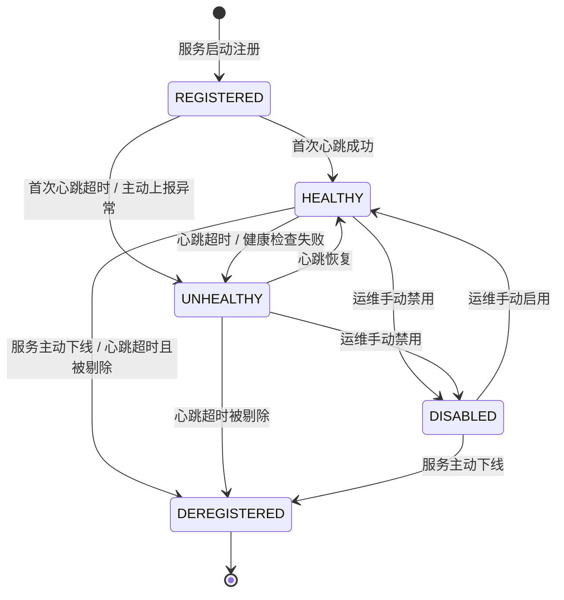
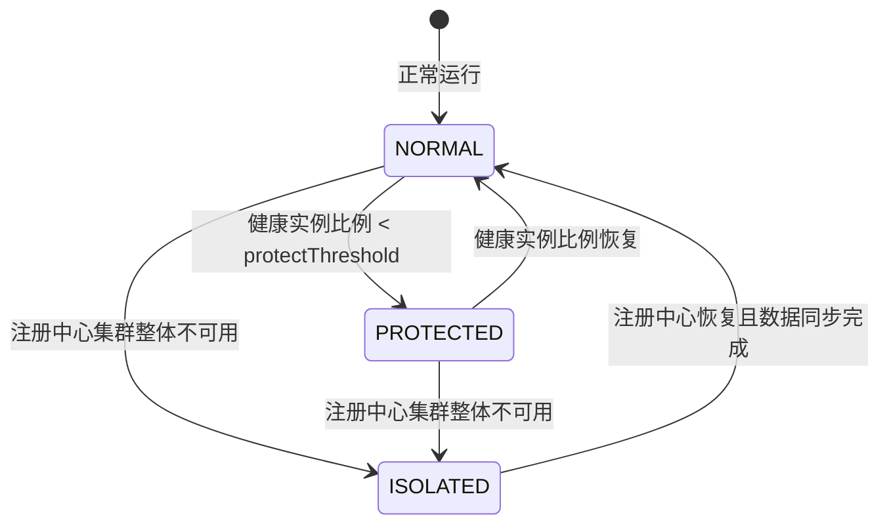

# 服务注册与发现机制 - 详细设计

> 模块版本：v2.0 | 最后更新：2026-08-22
> 原始需求来源：`docs/design/启硕-PrimeTop-全学段AI辅助学习软件项目设计文档.md` §8.4 服务端架构
> 关联文档：
> - `docs2/配置中心与动态配置管理-详细设计.md`
> - `docs2/服务端服务架构与部署设计-详细设计.md`
> - `docs2/API网关服务-详细设计.md`
> - `docs2/服务端统一限流熔断与流量防护体系-详细设计.md`

---

## 1. 概述

### 1.1 设计目标

PrimeTop 服务端从模块化单体向微服务演进过程中，服务实例数量会随自动扩缩容、蓝绿发布、故障重启而动态变化。本设计定义一套统一、高可用、可观测的服务注册与发现机制，目标包括：

1. **服务寻址解耦**：调用方仅通过服务名（Service Name）即可获取可用实例，禁止硬编码 IP/端口。
2. **健康感知**：实时感知实例健康状态，自动剔除异常节点，新节点自动加入流量。
3. **负载均衡**：支持权重、同可用区优先、灰度标签等多维路由策略。
4. **环境隔离**：开发、测试、预发、生产环境通过 Namespace 严格隔离。
5. **平滑演进**：MVP 阶段可作为配置中心使用，V1.0+ 接入完整注册发现能力。
6. **异构兼容**：Java 服务通过 SDK 接入，Python/Go/Node 服务通过 Open API 或 Sidecar 接入。

### 1.2 适用范围

| 范围 | 说明 |
|------|------|
| 服务类型 | 用户服务、学习服务、AI 服务、题目服务、错题服务、规划服务、支付服务、内容服务等 |
| 调用方式 | HTTP REST、gRPC、Dubbo |
| 接入角色 | 服务提供者（Provider）、服务消费者（Consumer）、API 网关、定时任务调度器 |
| 运行环境 | K8s / 虚拟机 / 裸金属混合部署 |

### 1.3 非功能性目标

| 指标 | 目标值 |
|------|--------|
| 服务发现接口 P99 延迟 | ≤ 10 ms（本地缓存命中） / ≤ 50 ms（首次拉取） |
| 实例状态变更传播时延 | ≤ 5 s（临时实例心跳超时默认 15 s） |
| 注册中心可用性 | 99.99%（3 节点集群） |
| 客户端缓存失效保护 | 注册中心不可用时，可依赖本地缓存继续运行 ≥ 5 min |
| 命名空间隔离强度 | 跨 Namespace 不可见，异常越界访问 403 |

---

## 2. 总体架构

### 2.1 组件分层

```text
┌─────────────────────────────────────────────────────────────┐
│                         客户端 / 网关层                       │
│   Java SDK (Spring Cloud)   Python SDK   Go SDK   API Gateway │
└──────────────────────┬──────────────────────────────────────┘
│                      │ HTTP / gRPC / UDP 心跳                    │
├──────────────────────▼──────────────────────────────────────┤
│                  注册发现中心 (Registry)                     │
│   ┌──────────────┐  ┌──────────────┐  ┌──────────────┐       │
│   │  Nacos Node1 │──│  Nacos Node2 │──│  Nacos Node3 │       │
│   │   (Leader)   │  │  (Follower)  │  │  (Follower)  │       │
│   └──────────────┘  └──────────────┘  └──────────────┘       │
│                    MySQL / 内置 Derby / 外部存储               │
└─────────────────────────────────────────────────────────────┘
```

### 2.2 核心组件职责

| 组件 | 职责 |
|------|------|
| `Registry Server` | Nacos 集群，维护服务元数据、实例列表、健康状态，提供注册/发现/配置接口 |
| `Provider Agent` | 服务实例启动时注册，周期性发送心跳，正常关闭时主动下线 |
| `Consumer Agent` | 订阅目标服务，维护本地缓存，执行路由与负载均衡 |
| `Gateway Agent` | 网关侧订阅服务列表，实现动态路由与灰度转发 |
| `Admin Console` | 可视化服务治理：上下线、权重调整、元数据编辑、健康检查 |
| `Monitor` | 采集注册中心指标、客户端 SDK 指标，提供告警 |

---

## 3. 数据结构设计

### 3.1 核心实体定义

#### 3.1.1 Service（服务）

```java
public class Service {
    private String namespaceId;      // 命名空间
    private String groupName;        // 分组，默认 DEFAULT_GROUP
    private String serviceName;      // 服务名，如 user-service
    private String protectThreshold; // 保护阈值，默认 0.0
    private Map<String, String> metadata; // 服务级元数据
    private Long createTime;
    private Long lastModifiedTime;
}
```

#### 3.1.2 Instance（实例）

```java
public class Instance {
    private String instanceId;   // ip:port#cluster#group
    private String ip;
    private Integer port;
    private Double weight;       // 默认 1.0
    private Boolean healthy;     // 健康状态
    private Boolean enabled;     // 是否启用（人工下线）
    private Boolean ephemeral;   // 是否临时实例，推荐 true
    private String clusterName;  // 集群名，如 DEFAULT / HANGZHOU
    private Map<String, String> metadata; // 版本、灰度标签、可用区
}
```

### 3.2 数据库表设计（Nacos 外部 MySQL 持久化）

```sql
-- 服务信息表
CREATE TABLE `service_info` (
    `id` BIGINT AUTO_INCREMENT PRIMARY KEY COMMENT '自增主键',
    `namespace_id` VARCHAR(64) NOT NULL DEFAULT 'public' COMMENT '命名空间',
    `group_name` VARCHAR(128) NOT NULL DEFAULT 'DEFAULT_GROUP' COMMENT '分组名',
    `service_name` VARCHAR(256) NOT NULL COMMENT '服务名',
    `protect_threshold` DECIMAL(3,2) NOT NULL DEFAULT 0.00 COMMENT '保护阈值 0~1',
    `metadata` JSON COMMENT '服务元数据',
    `create_time` DATETIME(3) NOT NULL DEFAULT CURRENT_TIMESTAMP(3),
    `last_modified_time` DATETIME(3) NOT NULL DEFAULT CURRENT_TIMESTAMP(3) ON UPDATE CURRENT_TIMESTAMP(3),
    UNIQUE KEY `uk_service` (`namespace_id`, `group_name`, `service_name`),
    KEY `idx_namespace` (`namespace_id`),
    KEY `idx_last_modified` (`last_modified_time`)
) ENGINE=InnoDB DEFAULT CHARSET=utf8mb4 COMMENT='服务注册中心-服务信息表';

-- 实例信息表
CREATE TABLE `instance_info` (
    `id` BIGINT AUTO_INCREMENT PRIMARY KEY,
    `namespace_id` VARCHAR(64) NOT NULL DEFAULT 'public',
    `group_name` VARCHAR(128) NOT NULL DEFAULT 'DEFAULT_GROUP',
    `service_name` VARCHAR(256) NOT NULL,
    `instance_id` VARCHAR(512) NOT NULL COMMENT '实例唯一标识 ip:port',
    `ip` VARCHAR(64) NOT NULL,
    `port` INT NOT NULL,
    `weight` DECIMAL(8,4) NOT NULL DEFAULT 1.0000,
    `healthy` TINYINT NOT NULL DEFAULT 1,
    `enabled` TINYINT NOT NULL DEFAULT 1,
    `ephemeral` TINYINT NOT NULL DEFAULT 1,
    `cluster_name` VARCHAR(128) DEFAULT 'DEFAULT',
    `metadata` JSON COMMENT '实例元数据',
    `last_heartbeat_time` DATETIME(3) NOT NULL DEFAULT CURRENT_TIMESTAMP(3) COMMENT '最近一次心跳',
    `create_time` DATETIME(3) NOT NULL DEFAULT CURRENT_TIMESTAMP(3),
    UNIQUE KEY `uk_instance` (`namespace_id`, `group_name`, `service_name`, `instance_id`),
    KEY `idx_service` (`namespace_id`, `group_name`, `service_name`),
    KEY `idx_heartbeat` (`last_heartbeat_time`)
) ENGINE=InnoDB DEFAULT CHARSET=utf8mb4 COMMENT='服务注册中心-实例信息表';

-- 心跳日志表（用于故障排查与审计，保留 7 天）
CREATE TABLE `heartbeat_log` (
    `id` BIGINT AUTO_INCREMENT PRIMARY KEY,
    `namespace_id` VARCHAR(64) NOT NULL,
    `service_name` VARCHAR(256) NOT NULL,
    `instance_id` VARCHAR(512) NOT NULL,
    `event_type` VARCHAR(32) NOT NULL COMMENT 'BEAT / REGISTER / DEREGISTER / HEALTH_CHANGE',
    `client_ip` VARCHAR(64),
    `created_at` DATETIME(3) NOT NULL DEFAULT CURRENT_TIMESTAMP(3),
    KEY `idx_instance_time` (`instance_id`, `created_at`)
) ENGINE=InnoDB DEFAULT CHARSET=utf8mb4 COMMENT='心跳日志'
PARTITION BY RANGE (TO_DAYS(`created_at`)) (
    PARTITION p_current VALUES LESS THAN (TO_DAYS('2026-08-30')),
    PARTITION p_future VALUES LESS THAN MAXVALUE
);

-- 命名空间表
CREATE TABLE `namespace` (
    `id` BIGINT AUTO_INCREMENT PRIMARY KEY,
    `namespace_id` VARCHAR(64) NOT NULL UNIQUE,
    `namespace_name` VARCHAR(128) NOT NULL,
    `description` VARCHAR(512),
    `created_at` DATETIME(3) NOT NULL DEFAULT CURRENT_TIMESTAMP(3)
) ENGINE=InnoDB DEFAULT CHARSET=utf8mb4 COMMENT='命名空间';
```

### 3.3 Redis 缓存键设计

用于加速网关/高频消费者的服务发现，减轻注册中心压力。

| Key | 类型 | TTL | 说明 |
|-----|------|-----|------|
| `registry:svc:{namespace}:{group}:{service}` | String (JSON) | 10 s | 服务实例列表缓存 |
| `registry:svc:{namespace}:{group}:{service}:ver` | String | 10 s | 实例列表版本号 |
| `registry:svc:{namespace}:{group}:{service}:healthy` | Set | 10 s | 健康实例 ID 集合 |
| `registry:client:{consumerId}:sub` | Set | 300 s | 消费者订阅的服务列表 |
| `registry:protect:{namespace}:{service}` | String | 60 s | 保护模式标记 |

---

## 4. API 接口设计

### 4.1 RESTful 接口

#### 4.1.1 服务注册（Provider 启动调用）

```http
POST /nacos/v1/ns/instance
Content-Type: application/x-www-form-urlencoded

namespaceId=prod
&serviceName=user-service
&groupName=PRIMETOP_GROUP
&ip=10.0.1.12
&port=8080
&weight=1.0
&enable=true
&healthy=true
&ephemeral=true
&metadata={"version":"v1.2.0","env":"prod","zone":"hangzhou","gray":"false"}
```

**成功响应：**
```json
{
  "code": 0,
  "message": "ok",
  "data": "ok"
}
```

#### 4.1.2 服务心跳（Provider 周期性调用）

```http
PUT /nacos/v1/ns/instance/beat
Content-Type: application/x-www-form-urlencoded

namespaceId=prod
&serviceName=user-service
&groupName=PRIMETOP_GROUP
&beat={"ip":"10.0.1.12","port":8080,"serviceName":"user-service","cluster":"DEFAULT","weight":1.0}
```

**响应：**
```json
{
  "code": 0,
  "message": "ok",
  "data": {
    "clientBeatInterval": 5000,
    "lightBeatEnabled": true
  }
}
```

#### 4.1.3 服务发现（Consumer / Gateway 调用）

```http
GET /nacos/v1/ns/instance/list?serviceName=user-service&groupName=PRIMETOP_GROUP&namespaceId=prod&healthyOnly=true
```

**响应：**
```json
{
  "code": 0,
  "message": "ok",
  "data": {
    "name": "user-service",
    "groupName": "PRIMETOP_GROUP",
    "clusters": "DEFAULT",
    "cacheMillis": 10000,
    "hosts": [
      {
        "instanceId": "10.0.1.12#8080#DEFAULT#PRIMETOP_GROUP",
        "ip": "10.0.1.12",
        "port": 8080,
        "weight": 1.0,
        "healthy": true,
        "enabled": true,
        "metadata": { "version": "v1.2.0", "zone": "hangzhou", "gray": "false" }
      },
      {
        "instanceId": "10.0.1.13#8080#DEFAULT#PRIMETOP_GROUP",
        "ip": "10.0.1.13",
        "port": 8080,
        "weight": 1.0,
        "healthy": true,
        "enabled": true,
        "metadata": { "version": "v1.2.0", "zone": "hangzhou", "gray": "true" }
      }
    ]
  }
}
```

#### 4.1.4 服务下线（Provider 关闭调用）

```http
DELETE /nacos/v1/ns/instance
Content-Type: application/x-www-form-urlencoded

namespaceId=prod
&serviceName=user-service
&groupName=PRIMETOP_GROUP
&ip=10.0.1.12
&port=8080
```

#### 4.1.5 管理接口：实例上下线与权重调整

```http
PUT /nacos/v1/ns/instance
Content-Type: application/x-www-form-urlencoded

namespaceId=prod
&serviceName=user-service
&groupName=PRIMETOP_GROUP
&ip=10.0.1.12
&port=8080
&weight=2.0
&enable=false
```

### 4.2 gRPC 接口（内部服务间高性能发现）

```protobuf
syntax = "proto3";
package primetop.registry.v1;

service RegistryService {
  rpc RegisterInstance (RegisterInstanceRequest) returns (InstanceResponse);
  rpc DeregisterInstance (DeregisterInstanceRequest) returns (InstanceResponse);
  rpc Heartbeat (HeartbeatRequest) returns (HeartbeatResponse);
}

service DiscoveryService {
  rpc GetInstances (GetInstancesRequest) returns (InstanceListResponse);
  rpc Subscribe (SubscribeRequest) returns (stream InstanceChangeEvent);
  rpc GetHealthSnapshot (HealthSnapshotRequest) returns (HealthSnapshotResponse);
}

message RegisterInstanceRequest {
  string namespace_id = 1;
  string group_name = 2;
  string service_name = 3;
  string ip = 4;
  int32 port = 5;
  double weight = 6;
  bool ephemeral = 7;
  map<string, string> metadata = 8;
}

message GetInstancesRequest {
  string namespace_id = 1;
  string group_name = 2;
  string service_name = 3;
  bool healthy_only = 4;
}

message InstanceListResponse {
  string service_name = 1;
  repeated Instance hosts = 2;
  int64 version = 3;
}

message Instance {
  string instance_id = 1;
  string ip = 2;
  int32 port = 3;
  double weight = 4;
  bool healthy = 5;
  bool enabled = 6;
  map<string, string> metadata = 7;
}

message InstanceChangeEvent {
  string service_name = 1;
  string instance_id = 2;
  string change_type = 3; // ADD / REMOVE / HEALTH_CHANGE / METADATA_CHANGE
  Instance instance = 4;
}
```

---

## 5. 关键代码示例

### 5.1 Spring Cloud 服务提供者配置

```yaml
# bootstrap.yml
spring:
  application:
    name: user-service
  cloud:
    nacos:
      discovery:
        server-addr: ${NACOS_ADDR:nacos.primetop.svc:8848}
        namespace: ${NACOS_NAMESPACE:prod}
        group: PRIMETOP_GROUP
        username: ${NACOS_USER:primetop}
        password: ${NACOS_PASS:******}
        metadata:
          version: "@project.version@"
          env: "${SPRING_PROFILES_ACTIVE:prod}"
          zone: "${AVAILABILITY_ZONE:hangzhou}"
          gray: "${GRAY_INSTANCE:false}"
        ephemeral: true
        heart-beat-interval: 5000
        heart-beat-timeout: 15000
```

```java
@SpringBootApplication
@EnableDiscoveryClient
public class UserServiceApplication {
    public static void main(String[] args) {
        SpringApplication.run(UserServiceApplication.class, args);
    }
}
```

### 5.2 自定义灰度负载均衡器

```java
@Slf4j
public class GrayLoadBalancer implements ReactorServiceInstanceLoadBalancer {

    private final ObjectProvider<ServiceInstanceListSupplier> supplier;
    private final String serviceId;
    private final GrayRuleProperties grayRule;

    public GrayLoadBalancer(ObjectProvider<ServiceInstanceListSupplier> supplier,
                            String serviceId, GrayRuleProperties grayRule) {
        this.supplier = supplier;
        this.serviceId = serviceId;
        this.grayRule = grayRule;
    }

    @Override
    public Mono<Response<ServiceInstance>> choose(Request request) {
        ServiceInstanceListSupplier supplier = this.supplier.getIfAvailable();
        boolean grayUser = isGrayUser(request);
        return supplier.get(request).next()
            .map(instances -> filterAndPick(instances, grayUser));
    }

    private boolean isGrayUser(Request request) {
        Object context = request.getContext();
        if (context instanceof RequestDataContext rdc) {
            HttpHeaders headers = rdc.getClientRequest().getHeaders();
            String userId = headers.getFirst("X-User-Id");
            if (userId == null || userId.isBlank()) return false;
            return HashUtil.consistentHash(userId, 100) < grayRule.getPercent();
        }
        return false;
    }

    private Response<ServiceInstance> filterAndPick(List<ServiceInstance> instances, boolean grayUser) {
        List<ServiceInstance> candidates = instances.stream()
            .filter(inst -> inst instanceof NacosServiceInstance)
            .filter(inst -> {
                String grayMeta = inst.getMetadata().get("gray");
                return grayUser == "true".equalsIgnoreCase(grayMeta);
            })
            .toList();
        if (candidates.isEmpty()) {
            candidates = instances;
        }
        // 加权随机
        ServiceInstance chosen = WeightedRandomChooser.choose(candidates);
        return new DefaultResponse(chosen);
    }
}
```

### 5.3 心跳调度器（Java 示例）

```java
@Component
public class NacosHeartbeatScheduler {

    @Autowired
    private NacosDiscoveryClient discoveryClient;

    @PostConstruct
    public void schedule() {
        ScheduledExecutorService executor = Executors.newSingleThreadScheduledExecutor(r -> {
            Thread t = new Thread(r, "nacos-heartbeat");
            t.setDaemon(true);
            return t;
        });
        executor.scheduleAtFixedRate(this::sendBeat, 0, 5, TimeUnit.SECONDS);
    }

    private void sendBeat() {
        try {
            // Nacos SDK 内部已自动发送心跳，此处仅用于自定义扩展：如上报业务健康指标
            discoveryClient.healthCheck();
        } catch (Exception e) {
            log.warn("Registry heartbeat failed: {}", e.getMessage());
        }
    }
}
```

### 5.4 Python 消费者 SDK 简化示例

```python
import requests
import random
from typing import List, Dict

class DiscoveryClient:
    def __init__(self, server_addr: str, namespace: str = "public", group: str = "DEFAULT_GROUP"):
        self.server = server_addr
        self.namespace = namespace
        self.group = group
        self._cache: Dict[str, List[dict]] = {}

    def get_instances(self, service_name: str, healthy_only: bool = True) -> List[dict]:
        url = f"{self.server}/nacos/v1/ns/instance/list"
        params = {
            "serviceName": service_name,
            "namespaceId": self.namespace,
            "groupName": self.group,
            "healthyOnly": "true" if healthy_only else "false"
        }
        resp = requests.get(url, params=params, timeout=3)
        resp.raise_for_status()
        data = resp.json().get("data", {})
        hosts = data.get("hosts", [])
        self._cache[service_name] = hosts
        return hosts

    def choose(self, service_name: str) -> dict:
        hosts = self._cache.get(service_name) or self.get_instances(service_name)
        if not hosts:
            raise RuntimeError(f"No healthy instance for {service_name}")
        return random.choice(hosts)
```

### 5.5 Go Sidecar 心跳任务

```go
package main

import (
    "bytes"
    "net/http"
    "net/url"
    "time"
)

func startHeartbeat(serverAddr, namespace, serviceName, group, ip string, port int) {
    ticker := time.NewTicker(5 * time.Second)
    go func() {
        for range ticker.C {
            beat := url.Values{
                "namespaceId": {namespace},
                "serviceName": {serviceName},
                "groupName":   {group},
                "beat":        {`{"ip":"` + ip + `","port":` + string(port) + `,"serviceName":"` + serviceName + `"}`},
            }
            resp, err := http.Post(serverAddr+"/nacos/v1/ns/instance/beat",
                "application/x-www-form-urlencoded", bytes.NewBufferString(beat.Encode()))
            if err != nil {
                log.Printf("heartbeat error: %v", err)
                continue
            }
            resp.Body.Close()
        }
    }()
}
```

---

## 6. 状态流转

### 6.1 实例生命周期状态机



| 状态 | 含义 | 是否参与负载均衡 |
|------|------|------------------|
| REGISTERED | 已注册但未完成首次心跳 | 否 |
| HEALTHY | 健康且启用 | 是 |
| UNHEALTHY | 心跳丢失或健康检查失败 | 否 |
| DISABLED | 人工下线（保留注册信息） | 否 |
| DEREGISTERED | 已注销，不再存在 | 否 |

**状态转换约束（守卫规则）：**

- G1：同一命名空间 + 分组 + 服务下，`instance_id` 唯一。
- G2：`REGISTERED` 实例必须在 15 s 内完成首次心跳，否则自动迁移为 `UNHEALTHY`。
- G3：临时实例超过 3 次心跳超时（默认 15 s × 3 = 45 s）后，自动转移到 `DEREGISTERED`。
- G4：人工 `DISABLED` 实例不会仅因心跳超时而注销，保留至运维恢复或主动下线。
- G5：实例元数据变更时，必须同步更新 `last_modified_time`，并推送增量事件。
- G6：跨 Namespace 的状态变更请求必须返回 403。

### 6.2 服务保护模式状态机



| 模式 | 行为 |
|------|------|
| NORMAL | 正常心跳剔除与实例发现 |
| PROTECTED | 停止剔除过期实例，消费者使用缓存列表，容忍部分不健康节点 |
| ISOLATED | 客户端完全使用本地缓存，停止向注册中心写入，仅记录日志 |

---

## 7. 错误处理

### 7.1 错误码段

使用统一错误码段 `REG-5xxxx`（与注册发现相关）：

| 错误码 | HTTP 状态 | 含义 | 处理建议 |
|--------|-----------|------|----------|
| 50000 | 200 | 成功 | - |
| 50001 | 400 | 参数非法（缺少 serviceName / ip / port） | 检查请求参数 |
| 50002 | 404 | 服务不存在 | 确认服务已注册 |
| 50003 | 404 | 实例不存在 | 检查 instance_id |
| 50004 | 409 | 实例已注册 | 幂等：忽略或使用心跳 |
| 50005 | 403 | 命名空间无权限 | 检查 token / namespace |
| 50006 | 503 | 注册中心不可用 | 客户端启用本地缓存 |
| 50007 | 500 | 内部存储异常 | 告警并降级 |
| 50008 | 429 | 注册限流 | 退避重试 |
| 50009 | 400 | metadata 格式非法 | 校验 JSON |
| 50010 | 500 | 心跳包解析失败 | 检查 beat JSON 格式 |

### 7.2 降级与容错策略

| 场景 | 策略 |
|------|------|
| 注册中心短时不可用 | 客户端使用本地缓存继续调用，心跳失败仅记录日志，不立即自杀 |
| 注册中心长时不可用（> 5 min） | 触发自我保护（ISOLATED），定时任务重连，管理员介入 |
| 实例全部不健康 | 若开启保护模式，仍按缓存列表调用，配合熔断器兜底；否则返回 503 |
| 心跳发送失败 | 指数退避：1 s / 2 s / 4 s / 8 s，最多 5 次 |
| 发现接口超时 | 返回上次缓存，标记 `degraded=true`，触发告警 |
| 权重为 0 | 排除该实例；若全部权重为 0，抛出 50014 |

### 7.3 重试与幂等

- **注册幂等**：同一 `namespace + group + service + instance_id` 重复注册视为更新，返回 200。
- **下线幂等**：重复下线返回 200，不报错。
- **心跳幂等**：同一实例的心跳包仅刷新时间戳，不生成新记录。
- **重试幂等**：注册/下线/心跳接口均为幂等，允许重试；权重调整使用乐观锁（version）。

---

## 8. 灰度发布与负载均衡

### 8.1 灰度标签规范

实例元数据中统一使用以下 Key：

| Key | 示例值 | 说明 |
|-----|--------|------|
| `version` | `v1.2.0` | 服务版本 |
| `gray` | `true` / `false` | 是否为灰度实例 |
| `zone` | `hangzhou` / `shanghai` | 可用区 |
| `routeTag` | `new-feature-x` | 自定义路由标签 |
| `canaryPercent` | `10` | 仅灰度实例有效，表示承接百分比 |

### 8.2 路由优先级

1. **Namespace 匹配**：请求只能路由到同 Namespace 实例。
2. **灰度匹配**：若请求带有灰度标识，优先选择 `gray=true` 实例；无匹配时回退普通实例。
3. **可用区优先**：在同类型实例中，优先选择与 Consumer 同 `zone` 的实例。
4. **权重随机**：在候选集中按实例 `weight` 加权随机选择。

### 8.3 网关动态路由示例

```yaml
spring:
  cloud:
    gateway:
      routes:
        - id: user-service
          uri: lb://user-service
          predicates:
            - Path=/api/v1/user/**
          filters:
            - name: GrayFilter
              args:
                headerName: X-Gray-Tag
```

---

## 9. 安全设计

### 9.1 访问控制

- Nacos 开启鉴权：`nacos.core.auth.enabled=true`。
- 每个 Namespace 使用独立 token，禁止跨 Namespace 操作。
- 服务注册接口仅允许内部服务白名单 IP 段访问，通过网关 / 防火墙限制。
- 管理接口需要运维角色权限，关键操作（修改权重、强制下线）记录审计日志。

### 9.2 通信加密

- 生产环境 Nacos Server 暴露 HTTPS，客户端通过 TLS 1.2+ 连接。
- 敏感元数据（如内部服务密钥）禁止写入 `metadata`，应使用独立密钥管理系统。

### 9.3 数据隔离

| 隔离维度 | 实现 |
|----------|------|
| 环境 | 通过 `namespace_id` 隔离，禁止 prod 与 test 互相发现 |
| 分组 | 同一 Namespace 下通过 `group_name` 隔离，如 `PRIMETOP_GROUP` 与 `THIRD_PARTY_GROUP` |
| 服务 | 服务名唯一，实例列表按服务名划分 |

---

## 10. 监控与告警

### 10.1 核心指标

| 指标 | 类型 | 告警阈值 |
|------|------|----------|
| `registry_service_count` | Gauge | 突变 ±20% |
| `registry_instance_count` | Gauge | 突变 ±30% |
| `registry_heartbeat_lost_rate` | Rate | > 1% / 5min |
| `registry_register_fail_count` | Counter | > 0 / 1min |
| `registry_discovery_p99_latency` | Histogram | > 50 ms |
| `registry_client_cache_hit_rate` | Gauge | < 90% |
| `registry_protected_mode_active` | Gauge | 持续时间 > 3 min |
| `registry_auth_fail_count` | Counter | > 10 / 5min |

### 10.2 日志规范

```json
{
  "timestamp": "2026-08-22T04:30:00.000Z",
  "level": "INFO",
  "module": "registry",
  "event": "INSTANCE_REGISTERED",
  "namespaceId": "prod",
  "serviceName": "user-service",
  "instanceId": "10.0.1.12#8080#DEFAULT",
  "clientIp": "10.0.1.12",
  "elapsedMs": 3
}
```

### 10.3 告警分级

| 告警 | 级别 | 通知方式 |
|------|------|----------|
| 注册中心节点宕机 | P0 | 电话 + 短信 + IM |
| 保护模式持续 3 min | P1 | IM + 短信 |
| 单服务实例全部不健康 | P1 | IM |
| 心跳丢失率 > 1% | P2 | IM |
| 发现接口 P99 > 50 ms | P2 | IM |

---

## 11. 部署与运维

### 11.1 Nacos 集群部署（3 节点）

```yaml
# nacos-cluster.conf
10.0.10.101:8848
10.0.10.102:8848
10.0.10.103:8848
```

- 使用 MySQL 外置存储，开启主从同步。
- 每个节点分配 4C8G，JVM 堆内存 4G。
- 前端通过 Nginx / K8s Ingress 做负载均衡。

### 11.2 客户端配置模板

| 参数 | 默认值 | 说明 |
|------|--------|------|
| `heart-beat-interval` | 5000 ms | 心跳间隔 |
| `heart-beat-timeout` | 15000 ms | 心跳超时 |
| `service-cache-ttl` | 10000 ms | 本地缓存刷新周期 |
| `failover-on-no-server` | true | 无注册中心时是否启用缓存 |
| `max-retry` | 3 | 注册/下线失败重试次数 |

### 11.3 版本演进

| 阶段 | 版本 | 落地内容 |
|------|------|----------|
| MVP | v0.5 | 仅引入 Nacos 作为配置中心，服务内调用直连 |
| V1.0 | v1.0 | Java 服务接入注册发现，网关动态路由，灰度 10% |
| V1.5 | v1.5 | Python / Go 服务通过 Open API 接入，同可用区优先 |
| V2.0 | v2.0 | 与 Istio / K8s Service Mesh 集成，Nacos 作为控制面元数据 |

---

## 12. 验收标准

| 编号 | 场景 | 验收标准 |
|------|------|----------|
| A1 | 服务启动注册 | 服务启动后 5 s 内可在 Nacos 控制台看到实例且状态为 HEALTHY |
| A2 | 服务优雅下线 | 服务关闭后，实例在 15 s 内从注册中心移除，且无调用失败 |
| A3 | 心跳超时剔除 | 模拟实例断网 45 s，实例自动标记为不健康并被剔除 |
| A4 | 注册中心不可用 | 关闭所有 Nacos 节点，Consumer 使用本地缓存仍可正常调用 5 min |
| A5 | 灰度路由 | 10% 灰度流量正确进入 gray=true 实例 |
| A6 | 可用区优先 | 同 Zone 实例优先被选中，跨 Zone 比例 < 5%（在有同 Zone 实例时） |
| A7 | 权重调整 | 调整实例权重后，流量按比例分配，误差 < 5% |
| A8 | 命名空间隔离 | dev 环境 Consumer 无法发现 prod 服务，返回 403 |
| A9 | 保护模式 | 健康实例比例低于阈值时，注册中心进入保护模式，不剔除过期实例 |
| A10 | 多语言接入 | Python 服务通过 Open API 完成注册、心跳、发现全流程 |

---

## 13. 关联文档与参考资料

- `docs2/配置中心与动态配置管理-详细设计.md`
- `docs2/服务端服务架构与部署设计-详细设计.md`
- `docs2/API网关服务-详细设计.md`
- `docs2/服务端统一限流熔断与流量防护体系-详细设计.md`
- Nacos 官方文档：https://nacos.io/zh-cn/docs/what-is-nacos.html
- Spring Cloud Alibaba Discovery 文档：https://sca.aliyun.com/docs/2021/user-guide/nacos/discovery
