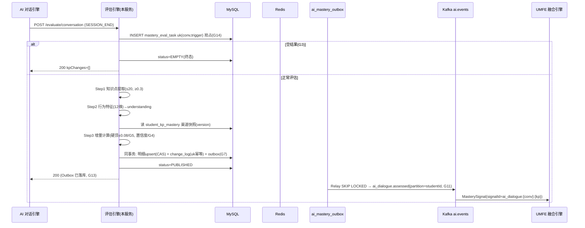
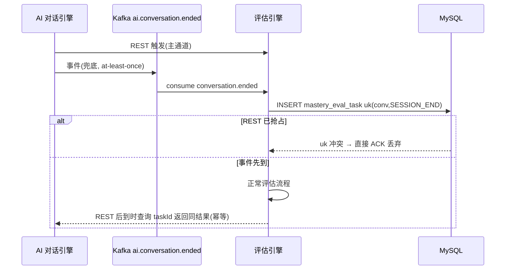
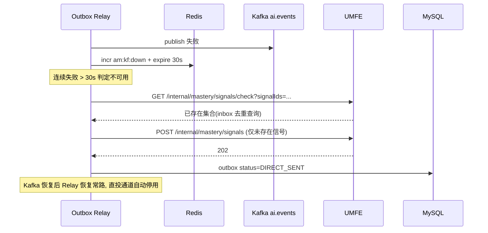

# 服务端-AI辅导对话知识点掌握度实时更新与能力维度同步引擎 - 详细设计

## 1. 模块概述

### 1.1 功能定位

本引擎是 PrimeTop 学习闭环中的**核心桥梁服务**，负责在 AI 辅导对话结束后（或进行中），实时完成以下工作：

1. **知识点提取**：从 AI 对话内容中自动识别涉及的知识点
2. **掌握度评估**：结合对话交互行为（追问模式、提示展开次数、回答正确性等）评估学生对每个知识点的掌握程度
3. **能力维度映射**：将知识点掌握度变化映射到计算能力、阅读理解、逻辑推理、空间思维、语言表达等多维能力雷达
4. **状态同步**：将更新后的掌握度和能力维度实时推送到学情画像、推荐引擎、复习调度等下游服务
5. **事件触发**：生成结构化的掌握度变更事件，驱动级联业务逻辑

### 1.2 为什么需要独立设计

本引擎横跨多个现有子系统，是一个典型的**跨模块集成管线**：

| 现有模块 | 关注点 | 本引擎关系 |
|----------|--------|------------|
| AI对话引擎与会话管理 | 对话存储与多轮上下文 | 本引擎的**数据源** |
| 知识点体系与教材映射引擎 | 知识点树结构与教材章节映射 | 本引擎的**映射基础** |
| AI回答知识点自动标注与溯源引用系统 | AI回答中的知识点标注 | 本引擎**复用其标注结果** |
| 用户学习画像与能力维度模型 | 学生画像的存储与查询 | 本引擎的**写入目标** |
| 学生学习状态建模与动态评估引擎 | 学习状态的宏观建模 | 本引擎提供**微观输入数据** |
| 间隔重复算法与遗忘曲线复习调度引擎 | 复习计划生成 | 本引擎触发其**重新调度** |
| 自适应学习与个性化推荐引擎 | 内容推荐 | 本引擎提供**实时掌握度信号** |
| 学习行为事件流与跨模块级联处理引擎 | 事件的分发与路由 | 本引擎是事件的**生产者** |

单独设计此引擎的原因：
- 各子系统独立工作，缺少一条**端到端的数据管线**将 AI 对话成果转化为可量化的掌握度更新
- 掌握度评估需要综合多种信号（对话行为 + 知识点关联 + 历史基线），逻辑复杂度足以独立成模块
- 实时性要求高（对话结束后 5 秒内完成掌握度更新），需要专门的性能设计

### 1.3 设计原则

1. **异步解耦**：掌握度更新通过事件驱动，不阻塞 AI 对话主流程
2. **增量更新**：每次只更新本次对话涉及的知识点，全量重算按天/周批处理
3. **可解释性**：每次掌握度变化都附带证据链（基于哪次对话、哪些行为特征）
4. **渐进可信**：单次对话的掌握度变化幅度受限，避免单次异常对话导致大幅波动
5. **幂等安全**：同一对话重复触发掌握度更新不会产生重复计算

---

## 2. 核心概念与数据模型

### 2.1 知识点掌握度模型

#### 2.1.1 掌握度等级定义

```java
public enum MasteryLevel {
    UNKNOWN(0, "未接触"),       // 从未学习过该知识点
    EXPOSED(1, "初步接触"),     // 在AI对话中被提及但未深入
    FAMILIAR(2, "有所了解"),    // 能识别概念，但无法独立运用
    COMPREHEND(3, "基本理解"),  // 能理解原理，在提示下可运用
    APPLY(4, "能够运用"),       // 能独立运用知识解题
    MASTER(5, "熟练掌握");      // 能灵活运用并解决变式题

    private final int value;
    private final String label;
}
```

#### 2.1.2 掌握度评分（连续值）

除了离散等级，系统维护一个 0.0~1.0 的连续掌握度分数，用于精细化追踪：

| 分数区间 | 等级 | 含义 |
|----------|------|------|
| [0, 0.1) | UNKNOWN | 无任何学习记录 |
| [0.1, 0.25) | EXPOSED | 仅在对话中被动接触 |
| [0.25, 0.45) | FAMILIAR | 有初步认知但未掌握 |
| [0.45, 0.65) | COMPREHEND | 理解核心概念 |
| [0.65, 0.85) | APPLY | 能独立应用 |
| [0.85, 1.0] | MASTER | 熟练掌握 |

#### 2.1.3 知识点掌握度实体

```sql
CREATE TABLE student_kp_mastery (
    id                  BIGINT PRIMARY KEY AUTO_INCREMENT,
    student_id          BIGINT NOT NULL COMMENT '学生ID',
    knowledge_point_id  BIGINT NOT NULL COMMENT '知识点ID',
    
    -- 掌握度核心字段
    mastery_score       DECIMAL(5,4) NOT NULL DEFAULT 0 COMMENT '掌握度分数 0.0000~1.0000',
    mastery_level       TINYINT NOT NULL DEFAULT 0 COMMENT '掌握度等级 0-5',
    confidence          DECIMAL(5,4) NOT NULL DEFAULT 0 COMMENT '评估置信度 0~1',
    
    -- 统计字段
    exposure_count      INT NOT NULL DEFAULT 0 COMMENT '接触次数',
    practice_count      INT NOT NULL DEFAULT 0 COMMENT '练习次数',
    correct_count       INT NOT NULL DEFAULT 0 COMMENT '正确次数',
    hint_used_count     INT NOT NULL DEFAULT 0 COMMENT '使用提示次数',
    ai_tutor_count      INT NOT NULL DEFAULT 0 COMMENT 'AI辅导涉及次数',
    
    -- 时间字段
    first_exposure_at   DATETIME COMMENT '首次接触时间',
    last_exposure_at    DATETIME COMMENT '最近接触时间',
    last_practice_at    DATETIME COMMENT '最近练习时间',
    last_ai_tutor_at    DATETIME COMMENT '最近AI辅导时间',
    last_assessed_at    DATETIME COMMENT '最近评估时间',
    
    -- 衰减相关
    decayed_score       DECIMAL(5,4) COMMENT '经遗忘衰减后的有效掌握度',
    last_decay_at       DATETIME COMMENT '最近衰减计算时间',
    
    -- 元数据
    version             INT NOT NULL DEFAULT 0 COMMENT '乐观锁版本号',
    created_at          DATETIME NOT NULL DEFAULT CURRENT_TIMESTAMP,
    updated_at          DATETIME NOT NULL DEFAULT CURRENT_TIMESTAMP ON UPDATE CURRENT_TIMESTAMP,
    
    UNIQUE KEY uk_student_kp (student_id, knowledge_point_id),
    INDEX idx_student_score (student_id, mastery_score),
    INDEX idx_student_level (student_id, mastery_level),
    INDEX idx_last_exposure (student_id, last_exposure_at)
) ENGINE=InnoDB DEFAULT CHARSET=utf8mb4 COMMENT='学生知识点掌握度';
```

### 2.2 能力维度模型

#### 2.2.1 能力维度定义

```java
public enum AbilityDimension {
    CALCULATION("计算能力", "数值计算、运算准确性、运算速度"),
    LOGIC("逻辑推理", "演绎推理、归纳推理、条件分析"),
    READING_COMP("阅读理解", "文本理解、信息提取、主旨概括"),
    SPATIAL("空间思维", "图形认知、空间想象、几何推理"),
    EXPRESSION("语言表达", "书面表达、语言组织、论述能力"),
    MEMORY("记忆能力", "知识点记忆、公式记忆、词汇记忆"),
    APPLICATION("知识应用", "跨场景应用、变式题解决、综合运用"),
    ANALYSIS("分析综合", "问题分解、信息整合、方案评估");
    
    private final String name;
    private final String description;
}
```

#### 2.2.2 知识点→能力维度映射规则

每个知识点可关联多个能力维度，权重不同：

```sql
CREATE TABLE kp_ability_weight (
    id                  BIGINT PRIMARY KEY AUTO_INCREMENT,
    knowledge_point_id  BIGINT NOT NULL COMMENT '知识点ID',
    ability_dimension   VARCHAR(32) NOT NULL COMMENT '能力维度枚举值',
    weight              DECIMAL(3,2) NOT NULL DEFAULT 0.5 COMMENT '该知识点对此能力维度的贡献权重 0~1',
    
    UNIQUE KEY uk_kp_dim (knowledge_point_id, ability_dimension),
    INDEX idx_dimension (ability_dimension)
) ENGINE=InnoDB DEFAULT CHARSET=utf8mb4 COMMENT='知识点-能力维度权重映射';
```

**权重示例：**

| 知识点 | 能力维度 | 权重 | 说明 |
|--------|----------|------|------|
| 一元二次方程 | CALCULATION | 0.7 | 方程求解涉及大量计算 |
| 一元二次方程 | LOGIC | 0.5 | 需要分析条件选择解法 |
| 一元二次方程 | APPLICATION | 0.6 | 常出现在应用题中 |
| 古诗文鉴赏 | READING_COMP | 0.8 | 核心是文本理解 |
| 古诗文鉴赏 | MEMORY | 0.5 | 需要记忆相关文学常识 |
| 古诗文鉴赏 | EXPRESSION | 0.4 | 鉴赏题需要书面表达 |

#### 2.2.3 学生能力维度实体

```sql
CREATE TABLE student_ability_dimension (
    id                  BIGINT PRIMARY KEY AUTO_INCREMENT,
    student_id          BIGINT NOT NULL COMMENT '学生ID',
    ability_dimension   VARCHAR(32) NOT NULL COMMENT '能力维度枚举值',
    
    -- 能力值
    ability_score       DECIMAL(5,4) NOT NULL DEFAULT 0.5 COMMENT '能力分数 0~1',
    confidence          DECIMAL(5,4) NOT NULL DEFAULT 0 COMMENT '评估置信度',
    
    -- 统计
    contributing_kp_count INT NOT NULL DEFAULT 0 COMMENT '贡献此维度的已评估知识点数',
    
    -- 时间
    last_updated_at     DATETIME COMMENT '最近更新时间',
    
    version             INT NOT NULL DEFAULT 0,
    created_at          DATETIME NOT NULL DEFAULT CURRENT_TIMESTAMP,
    updated_at          DATETIME NOT NULL DEFAULT CURRENT_TIMESTAMP ON UPDATE CURRENT_TIMESTAMP,
    
    UNIQUE KEY uk_student_dim (student_id, ability_dimension),
    INDEX idx_student_score (student_id, ability_score)
) ENGINE=InnoDB DEFAULT CHARSET=utf8mb4 COMMENT='学生能力维度';
```

### 2.3 掌握度变更记录

```sql
CREATE TABLE mastery_change_log (
    id                  BIGINT PRIMARY KEY AUTO_INCREMENT,
    student_id          BIGINT NOT NULL,
    knowledge_point_id  BIGINT NOT NULL,
    
    -- 变更来源
    source_type         VARCHAR(32) NOT NULL COMMENT '来源类型: AI_TUTOR/PRACTICE/EXAM/MANUAL',
    source_id           BIGINT NOT NULL COMMENT '来源ID: 对话ID/练习ID等',
    
    -- 变更详情
    old_score           DECIMAL(5,4) COMMENT '变更前掌握度分数',
    new_score           DECIMAL(5,4) COMMENT '变更后掌握度分数',
    score_delta         DECIMAL(6,4) COMMENT '变化量（正为提升，负为下降）',
    old_level           TINYINT COMMENT '变更前等级',
    new_level           TINYINT COMMENT '变更后等级',
    level_changed       BOOLEAN NOT NULL DEFAULT FALSE COMMENT '等级是否变化',
    
    -- 评估依据
    evidence_json       JSON COMMENT '评估依据详情（行为特征、对话片段等）',
    confidence          DECIMAL(5,4) NOT NULL COMMENT '本次评估置信度',
    
    -- 幂等控制
    idempotent_key      VARCHAR(128) NOT NULL COMMENT '幂等键: source_type:source_id:kp_id',
    
    created_at          DATETIME NOT NULL DEFAULT CURRENT_TIMESTAMP,
    
    UNIQUE KEY uk_idempotent (idempotent_key),
    INDEX idx_student_time (student_id, created_at),
    INDEX idx_source (source_type, source_id),
    INDEX idx_kp_time (knowledge_point_id, created_at)
) ENGINE=InnoDB DEFAULT CHARSET=utf8mb4 COMMENT='掌握度变更日志';
```

---

## 3. 整体架构与处理流程

### 3.1 系统架构图

```
┌──────────────────────────────────────────────────────────────┐
│                     AI 辅导对话引擎                           │
│                  (对话完成/阶段性节点)                        │
└──────────────────────┬───────────────────────────────────────┘
                       │ 对话完成事件
                       ▼
┌──────────────────────────────────────────────────────────────┐
│              Step 1: 对话内容知识点提取                        │
│  ┌────────────────┐  ┌────────────────┐  ┌────────────────┐ │
│  │ 复用知识点标注  │  │ 补充上下文推断 │  │ 去重与排序     │ │
│  │ 服务结果       │  │ (追问意图等)   │  │ (按相关性排序) │ │
│  └────────────────┘  └────────────────┘  └────────────────┘ │
└──────────────────────┬───────────────────────────────────────┘
                       │ 知识点列表 + 相关性分数
                       ▼
┌──────────────────────────────────────────────────────────────┐
│              Step 2: 对话交互行为特征提取                      │
│  ┌────────────────┐  ┌────────────────┐  ┌────────────────┐ │
│  │ 追问模式分析   │  │ 提示依赖度评估 │  │ 理解信号检测   │ │
│  │ (深度/浅层)    │  │ (展开次数等)   │  │ ("懂了"/复述)  │ │
│  └────────────────┘  └────────────────┘  └────────────────┘ │
└──────────────────────┬───────────────────────────────────────┘
                       │ 行为特征向量
                       ▼
┌──────────────────────────────────────────────────────────────┐
│              Step 3: 掌握度增量计算                           │
│  ┌────────────────┐  ┌────────────────┐  ┌────────────────┐ │
│  │ 行为信号融合   │  │ 历史基线参考   │  │ 增量幅度限制   │ │
│  │ (加权评分)     │  │ (当前掌握度)   │  │ (防止单次突变) │ │
│  └────────────────┘  └────────────────┘  └────────────────┘ │
└──────────────────────┬───────────────────────────────────────┘
                       │ 掌握度增量（每个知识点）
                       ▼
┌──────────────────────────────────────────────────────────────┐
│              Step 4: 掌握度持久化与变更记录                    │
│  ┌────────────────┐  ┌────────────────┐  ┌────────────────┐ │
│  │ 乐观锁更新     │  │ 变更日志写入   │  │ 等级跃迁检测   │ │
│  │ student_kp_    │  │ mastery_       │  │ (触发通知等)   │ │
│  │ mastery        │  │ change_log     │  │                │ │
│  └────────────────┘  └────────────────┘  └────────────────┘ │
└──────────────────────┬───────────────────────────────────────┘
                       │ 掌握度变更事件
                       ▼
┌──────────────────────────────────────────────────────────────┐
│              Step 5: 能力维度聚合更新                          │
│  ┌────────────────┐  ┌────────────────┐  ┌────────────────┐ │
│  │ 查询KP→能力    │  │ 加权聚合计算   │  │ 能力分数更新   │ │
│  │ 维度映射       │  │ (增量式)       │  │ + 变更事件     │ │
│  └────────────────┘  └────────────────┘  └────────────────┘ │
└──────────────────────┬───────────────────────────────────────┘
                       │ 能力维度变更事件
                       ▼
┌──────────────────────────────────────────────────────────────┐
│              Step 6: 下游事件分发                              │
│  ┌──────────────┐ ┌──────────────┐ ┌──────────────────────┐ │
│  │ 复习调度重排 │ │ 推荐引擎刷新 │ │ 学情报告/家长推送    │ │
│  │ (间隔重复)   │ │ (自适应学习) │ │ (等级跃迁通知)       │ │
│  └──────────────┘ └──────────────┘ └──────────────────────┘ │
└──────────────────────────────────────────────────────────────┘
```

### 3.2 触发时机

本引擎在以下时机被触发：

| 触发事件 | 触发条件 | 处理策略 |
|----------|----------|----------|
| AI对话回合完成 | 用户发送新消息或对话结束 | 轻量级：仅提取知识点和基础评分 |
| AI对话会话结束 | 用户主动关闭或超时 | 完整管线：全量评估+能力同步 |
| 用户反馈提交 | 点赞/点踩/纠错 | 增量修正：根据反馈调整掌握度 |
| 答题结果回调 | 练习/考试答题完成 | 融合评估：结合答题结果和AI辅导历史 |
| 定时批处理 | 每日凌晨 | 衰减计算+全量校准 |

### 3.3 核心接口设计

#### 3.3.1 对话完成触发接口

```java
/**
 * AI辅导对话完成后的掌握度更新入口
 * 由 AI对话引擎在会话结束时异步调用
 */
@PostMapping("/api/internal/mastery/evaluate/conversation")
public ApiResponse<MasteryEvaluationResult> evaluateConversation(
    @RequestBody ConversationEvaluateRequest request
) { ... }

@Data
public class ConversationEvaluateRequest {
    /** 对话会话ID */
    @NotNull
    private Long conversationId;
    
    /** 学生ID */
    @NotNull
    private Long studentId;
    
    /** 对话中AI回答的知识点标注结果（复用标注服务） */
    private List<KPAnnotation> kpAnnotations;
    
    /** 对话回合列表（摘要） */
    private List<ConversationTurnSummary> turns;
    
    /** 对话上下文（学科、年级、教材版本等） */
    @NotNull
    private ConversationContext context;
    
    /** 触发类型 */
    @NotNull
    private EvaluateTriggerType triggerType; // SESSION_END / TURN_COMPLETE / FEEDBACK
}

@Data
public class ConversationTurnSummary {
    private int turnIndex;               // 回合序号
    private String userIntent;           // 用户意图: QUESTION / FOLLOW_UP / CONFUSED / CONFIRM / PRACTICE
    private int hintExpansionCount;      // 提示展开次数
    private boolean userAskedSimpler;    // 是否请求"讲简单点"
    private boolean userAskedAnotherWay; // 是否请求"换一种讲法"
    private boolean userConfirmed;       // 是否表示"懂了"
    private Double userResponseTimeMs;   // 用户回复耗时（毫秒）
    private List<String> detectedKpIds;  // 该回合涉及的知识点ID
}

@Data
public class KPAnnotation {
    private String knowledgePointId;     // 知识点ID
    private Double relevanceScore;       // 相关性分数 0~1
    private String annotationSource;     // 标注来源: AUTO / MANUAL
}

@Data
public class ConversationContext {
    private String subject;              // 学科
    private String grade;                // 年级
    private String textbookVersion;      // 教材版本
    private String chapterId;            // 当前章节（如有）
    private String scenario;             // 场景: SYNC_CLASS / FREE_QUESTION / EXAM_PREP / MISTAKE_REVIEW
}
```

#### 3.3.2 掌握度评估结果

```java
@Data
public class MasteryEvaluationResult {
    /** 评估ID */
    private String evaluationId;
    
    /** 涉及的知识点掌握度变更 */
    private List<KPMasteryChange> kpChanges;
    
    /** 受影响的能力维度 */
    private List<AbilityDimensionChange> abilityChanges;
    
    /** 触发的下游事件 */
    private List<String> triggeredEvents;
    
    /** 评估耗时(ms) */
    private long evaluationDurationMs;
}

@Data
public class KPMasteryChange {
    private Long knowledgePointId;
    private String knowledgePointName;
    private BigDecimal oldScore;
    private BigDecimal newScore;
    private BigDecimal delta;
    private int oldLevel;
    private int newLevel;
    private boolean levelUpgraded;
    private boolean levelDowngraded;
    private BigDecimal confidence;
    private String evidence;
}

@Data
public class AbilityDimensionChange {
    private String dimension;            // 能力维度枚举值
    private BigDecimal oldScore;
    private BigDecimal newScore;
    private BigDecimal delta;
}
```

#### 3.3.3 查询接口

```java
/**
 * 查询学生在指定知识点上的掌握度
 */
@GetMapping("/api/v1/mastery/student/{studentId}/knowledge-point/{kpId}")
public ApiResponse<KPMasteryDetail> getKPMastery(
    @PathVariable Long studentId,
    @PathVariable Long kpId
) { ... }

/**
 * 批量查询学生在多个知识点上的掌握度
 */
@PostMapping("/api/v1/mastery/student/{studentId}/knowledge-points/batch")
public ApiResponse<List<KPMasteryDetail>> batchGetKPMastery(
    @PathVariable Long studentId,
    @RequestBody List<Long> kpIds
) { ... }

/**
 * 查询学生能力维度雷达图数据
 */
@GetMapping("/api/v1/mastery/student/{studentId}/ability-radar")
public ApiResponse<AbilityRadarVO> getAbilityRadar(
    @PathVariable Long studentId,
    @RequestParam(required = false) String subject  // 可选：按学科筛选
) { ... }

/**
 * 查询掌握度变更历史
 */
@GetMapping("/api/v1/mastery/student/{studentId}/changes")
public ApiResponse<PageResult<MasteryChangeLogVO>> getMasteryChanges(
    @PathVariable Long studentId,
    @RequestParam(required = false) Long kpId,
    @RequestParam(required = false) String sourceType,
    @RequestParam(defaultValue = "1") int page,
    @RequestParam(defaultValue = "20") int size
) { ... }

@Data
public class KPMasteryDetail {
    private Long knowledgePointId;
    private String kpName;
    private String kpCode;
    private BigDecimal masteryScore;
    private int masteryLevel;
    private String masteryLevelLabel;
    private BigDecimal confidence;
    private BigDecimal decayedScore;       // 衰减后有效掌握度
    private int exposureCount;
    private int practiceCount;
    private double correctRate;            // 正确率 = correct_count / practice_count
    private LocalDateTime firstExposureAt;
    private LocalDateTime lastExposureAt;
    private List<MasteryChangeLogVO> recentChanges;  // 最近5次变更
}

@Data
public class AbilityRadarVO {
    private Long studentId;
    private List<AbilityDimensionVO> dimensions;
    private LocalDateTime calculatedAt;
    
    @Data
    public static class AbilityDimensionVO {
        private String dimension;
        private String dimensionName;
        private BigDecimal score;
        private BigDecimal confidence;
        private int contributingKPCount;
        private BigDecimal previousScore;   // 上次分数（用于展示趋势）
        private String trend;               // UP / DOWN / STABLE
    }
}
```

---

## 4. 核心算法设计

### 4.1 Step 1: 对话内容知识点提取

#### 4.1.1 知识点提取策略

```
输入: 对话会话(包含所有回合) + 已有的AI回答知识点标注
输出: 本对话涉及的知识点列表 + 每个知识点与对话的相关性权重
```

**提取流程：**

```java
public class ConversationKPExtractor {
    
    /**
     * 从对话中提取知识点列表
     * 
     * 策略：
     * 1. 直接复用：取AI回答知识点标注服务的已有结果（主要来源）
     * 2. 意图推断：分析用户追问意图，补充隐含知识点
     * 3. 上下文补充：根据对话上下文（章节、学科）补充背景知识点
     * 4. 去重合并：同一知识点多次出现时取最高相关性
     */
    public List<WeightedKnowledgePoint> extract(
        ConversationEvaluateRequest request
    ) {
        // 1. 基础知识点集合：从标注结果中获取
        Map<String, Double> kpScores = new HashMap<>();
        
        for (KPAnnotation annotation : request.getKpAnnotations()) {
            kpScores.merge(
                annotation.getKnowledgePointId(),
                annotation.getRelevanceScore(),
                Math::max
            );
        }
        
        // 2. 意图推断：分析追问模式补充知识点
        for (ConversationTurnSummary turn : request.getTurns()) {
            if ("FOLLOW_UP".equals(turn.getUserIntent())) {
                // 追问暗示对前述知识点有更深入的需求
                for (String kpId : turn.getDetectedKpIds()) {
                    kpScores.merge(kpId, 0.6, Math::max);
                }
            }
            if ("CONFUSED".equals(turn.getUserIntent())) {
                // 困惑暗示可能涉及前置知识点的缺失
                List<String> prerequisiteKPs = kpService.getPrerequisites(turn.getDetectedKpIds());
                for (String preKpId : prerequisiteKPs) {
                    kpScores.merge(preKpId, 0.4, Math::max);
                }
            }
        }
        
        // 3. 章节上下文补充：如果对话发生在特定章节下
        if (request.getContext().getChapterId() != null) {
            List<String> chapterKPs = chapterService.getChapterKnowledgePoints(
                request.getContext().getChapterId()
            );
            // 章节知识点给较低的基础分，除非已在对话中明确出现
            for (String kpId : chapterKPs) {
                kpScores.putIfAbsent(kpId, 0.2);
            }
        }
        
        // 4. 过滤：只保留相关性 >= 0.3 的知识点
        return kpScores.entrySet().stream()
            .filter(e -> e.getValue() >= 0.3)
            .map(e -> new WeightedKnowledgePoint(e.getKey(), e.getValue()))
            .sorted(Comparator.comparing(WeightedKnowledgePoint::getWeight).reversed())
            .collect(Collectors.toList());
    }
}
```

**提取规则说明：**

| 规则 | 权重基数 | 说明 |
|------|----------|------|
| R1 标注复用 | 标注 relevanceScore 原值 | 主来源，标注服务已完成 NER/向量/LLM 三级识别（见其文档 Phase1-3） |
| R2 追问暗示 | 0.6 | FOLLOW_UP 意图暗示对前述 KP 有深入需求 |
| R3 困惑回溯 | 0.4 | CONFUSED 意图暗示前置 KP 可能缺失，补前置一层（只展开一层，防链式放大） |
| R4 章节背景 | 0.2（putIfAbsent 不覆盖已有） | 仅作背景暴露记录，不作为掌握度评估主证据 |
| R5 过滤阈值 | ≥0.3 | 低于 0.3 视为噪音，不进入后续计算 |

> **边界裁决（F4 修复）**：标注结果中 `knowledgePointId` 在标注引擎侧为字符串型的全局编码（如 `KP-MATH-8-0123`），本引擎落库前统一解析为内部 `BIGINT` 主键；解析失败的编码记入 `kp_resolve_failures` 日志表（只记编码与出现次数，不记对话原文），每周对账回标注引擎修正。

---

### 4.2 Step 2: 对话交互行为特征提取

#### 4.2.1 行为特征向量定义

掌握度评估不只看"讲了什么"，更看"学生怎么互动的"。从对话回合中提取五维行为特征：

```java
/**
 * 对话行为特征向量（每个知识点在整段对话上的聚合视图）
 */
@Data
@Builder
public class BehaviorFeatureVector {
    /** 深度追问次数：同一 KP 的 FOLLOW_UP 回合数（0~N，封顶 5） */
    private int deepFollowUpCount;

    /** 提示依赖度： hintExpansionCount 合计 / 涉及回合数（0~1，越高越依赖提示） */
    private double hintDependency;

    /** 简化请求次数： userAskedSimpler + userAskedAnotherWay 合计（0~N，封顶 3） */
    private int simplificationRequests;

    /** 主动理解信号： userConfirmed（"懂了"/"明白了"类确认）次数（0~N，封顶 3） */
    private int understandingSignals;

    /** 平均响应时长比： 用户回复耗时 / 学段基准响应时长（0.5~3.0，封顶截断） */
    private double responseTimeRatio;

    /** 涉及回合数： 本 KP 被讨论的回合总数 */
    private int turnsInvolved;
}
```

**学段基准响应时长**（用于 responseTimeRatio 归一，来自学习行为分析引擎的学段常数表）：

| 学段 | 基准时长 |
|------|----------|
| 小学（1-6 年级） | 45s |
| 初中 | 30s |
| 高中 | 25s |
| 幼儿 | 60s |

#### 4.2.2 特征计算规则

| 特征 | 计算规则 | 掌握度方向 |
|------|----------|-----------|
| deepFollowUpCount | 同一 KP 上 FOLLOW_UP 回合计数，≥5 封顶 | 中性偏正（深入探究）但结合 simplificationRequests 判读 |
| hintDependency | ΣhintExpansionCount / turnsInvolved | **负向**：依赖提示越高掌握越弱 |
| simplificationRequests | "讲简单点"/"换一种讲法" 计数 | **负向**：暗示当前讲解超出其理解水平 |
| understandingSignals | 主动确认计数 | **正向**：最强的理解证据 |
| responseTimeRatio | 截断到 [0.5, 3.0]；幼儿段不参与计算（识字量小，时长噪音大） | 轻度负向 |

```java
@Component
public class DialogueBehaviorAnalyzer {

    /**
     * 从对话回合中聚合每个知识点的行为特征
     */
    public Map<String, BehaviorFeatureVector> analyze(
        List<WeightedKnowledgePoint> kps,
        List<ConversationTurnSummary> turns
    ) {
        Map<String, BehaviorFeatureVector.BehaviorFeatureVectorBuilder> builders = new HashMap<>();
        Map<String, Integer> turnCounts = new HashMap<>();

        for (WeightedKnowledgePoint kp : kps) {
            builders.put(kp.getKnowledgePointId(), BehaviorFeatureVector.builder());
            turnCounts.put(kp.getKnowledgePointId(), 0);
        }

        for (ConversationTurnSummary turn : turns) {
            for (String kpId : safe(turn.getDetectedKpIds())) {
                BehaviorFeatureVector.BehaviorFeatureVectorBuilder b = builders.get(kpId);
                if (b == null) continue;

                turnCounts.merge(kpId, 1, Integer::sum);

                if ("FOLLOW_UP".equals(turn.getUserIntent())) {
                    b.deepFollowUpCount(acc -> Math.min(5, acc + 1));
                }
                if (turn.isUserAskedSimpler() || turn.isUserAskedAnotherWay()) {
                    b.simplificationRequests(acc -> Math.min(3, acc + 1));
                }
                if (turn.isUserConfirmed()) {
                    b.understandingSignals(acc -> Math.min(3, acc + 1));
                }
                // hintDependency 分子累计，最后统一除
                b.hintExpansionCount(acc -> acc + Math.max(0, turn.getHintExpansionCount()));
            }
        }

        return builders.entrySet().stream().collect(Collectors.toMap(
            Map.Entry::getKey,
            e -> {
                int turns = turnCounts.get(e.getKey());
                BehaviorFeatureVector v = e.getValue().turnsInvolved(turns).build();
                v.setHintDependency(turns == 0 ? 0.0
                    : Math.min(1.0, (double) v.getHintExpansionCount() / turns));
                return v;
            }
        ));
    }
}
```

#### 4.2.3 行为分合成（-1 ~ +1）

```
behaviorScore = 0.40 * understandingSignalScore      // +1/次，封顶 +1.0
              - 0.30 * hintDependency                 // 0 ~ -0.3
              - 0.15 * simplificationScore            // 每次 -0.075，封顶 -0.15
              + 0.10 * followUpPositiveScore          // 深度追问且无简化请求时 +0.1
              - 0.05 * responseTimePenalty            // ratio>1.8 时 -0.05
```

| behaviorScore 区间 | 含义 |
|--------------------|------|
| [0.3, 1.0] | 对话呈现明确理解信号 |
| [-0.1, 0.3) | 中性，主要是被动接触 |
| [-1.0, -0.1) | 存在理解困难信号，掌握度应下调或停滞 |

> **红线**：behaviorScore 只驱动**掌握度停滞或小幅下调**，不下调超过当前分的 10%（见 §4.3 幅度限制 G5）。AI 对话是辅导场景，学生提问本身不代表不会——提问是积极行为，防止"问得多=掌握差"的误判。

---

### 4.3 Step 3: 掌握度增量计算

#### 4.3.1 增量公式

```
relevance  = Step1 得到的知识点相关性权重（0.3 ~ 1.0）
baseGain   = 0.10 * relevance                          // 接触性基础增益
signalGain = 0.10 * behaviorScore * relevance          // 行为信号增益（可为负）
rawDelta   = baseGain + signalGain

delta      = clamp(rawDelta, -maxDown, maxUp)          // 幅度限制见 4.3.2
newScore   = clamp(oldScore + delta, 0.05, 1.0)        // 地板 0.05 防除零
```

**计算示例：**

| 场景 | relevance | behaviorScore | oldScore | rawDelta | delta(受限后) | newScore |
|------|-----------|---------------|----------|----------|---------------|----------|
| 主动确认理解 | 0.9 | +0.6 | 0.40 | +0.144 | +0.144 | 0.544 |
| 被动接触无信号 | 0.5 | 0.0 | 0.20 | +0.050 | +0.050 | 0.250 |
| 多次要简化讲解 | 0.8 | -0.4 | 0.55 | -0.002 | -0.002 | 0.548（基本停滞） |
| 连续困惑+高提示依赖 | 0.7 | -0.7 | 0.62 | -0.019→触发 G9 | -0.062（按 10% 上限） | 0.558 |

#### 4.3.2 单次幅度限制（G5）

| 当前掌握度区间 | maxUp | maxDown |
|----------------|-------|---------|
| [0, 0.3) | 0.15 | 0.02 |
| [0.3, 0.6) | 0.12 | 0.04 |
| [0.6, 0.85) | 0.08 | 0.06 |
| [0.85, 1.0] | 0.05 | 0.08 |

设计理由：
- 低分段允许较快上升（首次学习的边际收益大），但下调极缓（防一次对话挫败就抹掉前期积累）
- 高分段上升放缓（接近掌握需要练习与考试渠道的证据交叉确认，AI 对话单渠道不足以推到 MASTER）
- **上限约束**：AI 对话渠道单独能将 KP 推到的最高分为 0.85（APPLY 顶）；0.85→MASTER 必须由练习/考试渠道信号经融合引擎加权达成（对齐融合引擎渠道权重表 `ai_dialogue` 权重 0.10 的口径）

#### 4.3.3 置信度计算

```
confidence = min(1.0,
      0.35 * relevance
    + 0.25 * min(1.0, turnsInvolved / 3.0)      // 讨论回合数越多越可信
    + 0.20 * signalClarity)                      // 信号明确度：正负信号是否存在其一
    + 0.20 * historyConsistency)                 // 历史一致性：近 3 次评估方向是否一致
```

- `signalClarity`：behaviorScore ∈ [-0.1, 0.1] 无明确信号 → 0.3；否则 → 1.0
- `historyConsistency`：与近 3 次变更方向一致比例（首次评估取 0.5）
- 置信度 < 0.35 的评估**照常落库但标记 low_confidence=1**，不参与能力维度聚合（G12 联动）

```java
@Component
public class MasteryDeltaCalculator {

    private static final BigDecimal DIALOGUE_CHANNEL_CAP = new BigDecimal("0.85");

    public KPDelta calculate(
        WeightedKnowledgePoint kp,
        BehaviorFeatureVector behavior,
        StudentKPMastery current,
        List<MasteryChangeLog> recentHistory
    ) {
        double relevance = kp.getWeight();
        double behaviorScore = BehaviorScorer.score(behavior);

        double baseGain = 0.10 * relevance;
        double signalGain = 0.10 * behaviorScore * relevance;
        double rawDelta = baseGain + signalGain;

        double old = current == null ? 0.0 : current.getMasteryScore().doubleValue();
        double[] limits = amplitudeLimits(old);
        double delta = Math.max(-limits[1], Math.min(limits[0], rawDelta));

        double newScore = Math.max(0.05, Math.min(1.0, old + delta));
        // 渠道上限：AI 对话单独不可推过 0.85
        newScore = Math.min(newScore, DIALOGUE_CHANNEL_CAP.doubleValue());

        double confidence = computeConfidence(kp, behavior, recentHistory);

        return KPDelta.builder()
            .knowledgePointId(kp.getKnowledgePointId())
            .oldScore(BigDecimal.valueOf(old).setScale(4, RoundingMode.HALF_UP))
            .newScore(BigDecimal.valueOf(newScore).setScale(4, RoundingMode.HALF_UP))
            .delta(BigDecimal.valueOf(newScore - old).setScale(4, RoundingMode.HALF_UP))
            .confidence(BigDecimal.valueOf(confidence).setScale(4, RoundingMode.HALF_UP))
            .lowConfidence(confidence < 0.35)
            .build();
    }

    private double[] amplitudeLimits(double current) {
        if (current < 0.3) return new double[]{0.15, 0.02};
        if (current < 0.6) return new double[]{0.12, 0.04};
        if (current < 0.85) return new double[]{0.08, 0.06};
        return new double[]{0.05, 0.08};
    }
}
```

---

### 4.4 Step 4: 掌握度持久化与变更记录

#### 4.4.1 事务边界（G7/G8）

```
同一本地事务内完成：
  1. UPDATE student_kp_mastery      （乐观锁 version CAS，命中 uk_student_kp）
  2. INSERT mastery_change_log      （幂等键 uk_idempotent，冲突→整段回滚转幂等回放）
  3. INSERT aim_outbox              （下游事件，Relay 异步投递）

任一失败 → 全部回滚，消费位点不推进，Kafka 重投（消费端幂等由 uk_idempotent 兜底）
```

#### 4.4.2 并发控制

| 场景 | 控制手段 | 裁决 |
|------|----------|------|
| 同学生同 KP 的两次评估并发 | Redis 锁 `aim:lock:{studentId}:{kpId}`，waitTime=0，失败延迟 3s 重投（≤3 次） | 后到者基于先到者的新值重算 |
| DB 层最终防线 | `version` 乐观锁，CAS 失败重读重算（上限 2 次，之后转延迟重投） | 防 Redis 锁失效窗口 |
| 幂等回放 | `uk_idempotent = source_type:source_id:kp_id` 命中 → 直接返回首次结果（200 语义码 59803） | 同键不同 payload → 拒绝并 P2 告警（数据完整性异常） |

```java
@Service
public class MasteryPersistenceService {

    @Transactional
    public KPMasteryChange persist(
        Long studentId, KPDelta delta, EvaluationSource source, String evidenceJson
    ) {
        String idemKey = source.getType() + ":" + source.getId() + ":" + delta.getKnowledgePointId();

        // 幂等短路：已评估过直接回放首次结果
        masteryChangeLogRepository.findByIdempotentKey(idemKey).ifPresent(existing -> {
            throw new IdempotentReplayException(existing);   // 全局异常处理器转 59803 + 首次结果
        });

        StudentKPMastery current = masteryRepository
            .findByStudentIdAndKnowledgePointIdForUpdate(studentId, delta.getKnowledgePointId())
            .orElseGet(() -> StudentKPMastery.initNew(studentId, delta.getKnowledgePointId()));

        int oldLevel = MasteryLevel.fromScore(current.getMasteryScore()).getValue();
        int newLevel = MasteryLevel.fromScore(delta.getNewScore()).getValue();

        // G4/G9 等级迟滞：降级需连续两次低评估，升级即时生效
        boolean downgradeBlocked = newLevel < oldLevel && !current.isPrevAssessmentWeak();
        if (downgradeBlocked) {
            current.setPrevAssessmentWeak(true);      // 标记一次弱评估，本次不降
            current.setAssessmentCountSinceChange(current.getAssessmentCountSinceChange() + 1);
        } else {
            current.applyDelta(delta);
            current.setPrevAssessmentWeak(newLevel < oldLevel);
        }
        current.setVersion(current.getVersion() + 1);

        masteryRepository.save(current);

        MasteryChangeLog log = MasteryChangeLog.builder()
            .studentId(studentId)
            .knowledgePointId(delta.getKnowledgePointId())
            .sourceType(source.getType())
            .sourceId(source.getId())
            .oldScore(delta.getOldScore())
            .newScore(downgradeBlocked ? delta.getOldScore() : delta.getNewScore())
            .scoreDelta(downgradeBlocked ? BigDecimal.ZERO : delta.getDelta())
            .oldLevel(oldLevel)
            .newLevel(downgradeBlocked ? oldLevel : newLevel)
            .levelChanged(!downgradeBlocked && oldLevel != newLevel)
            .evidenceJson(evidenceJson)
            .confidence(delta.getConfidence())
            .idempotentKey(idemKey)
            .lowConfidence(delta.isLowConfidence())
            .downgradeDeferred(downgradeBlocked)
            .build();
        changeLogRepository.save(log);

        // Outbox 同事务（G8）：下游事件在 §4.6 定义
        outboxRepository.saveAll(buildOutboxEvents(current, log));

        return KPMasteryChange.from(current, log, delta);
    }
}
```

#### 4.4.3 DDL 增补（v1.1）

v1.0 §2.3 的 `mastery_change_log` 增补三列与分区策略：

```sql
ALTER TABLE mastery_change_log
    ADD COLUMN low_confidence    TINYINT(1) NOT NULL DEFAULT 0 COMMENT '低置信度标记 confidence<0.35',
    ADD COLUMN downgrade_deferred TINYINT(1) NOT NULL DEFAULT 0 COMMENT 'G9 迟滞：本次降级被推迟',
    ADD COLUMN month_bucket      CHAR(7) GENERATED ALWAYS AS (DATE_FORMAT(created_at, '%Y-%m')) STORED,
    ADD INDEX idx_month_student (month_bucket, student_id);

-- 月分区滚动：在线保留 6 个月，历史归档 ClickHouse（TTL 3 年）
-- DAU50 万 × 日均 240 万行 ≈ 月 7200 万行，MySQL 仅留当月+前 5 月
```

`student_kp_mastery` 增补评估连续性字段：

```sql
ALTER TABLE student_kp_mastery
    ADD COLUMN prev_assessment_weak TINYINT(1) NOT NULL DEFAULT 0 COMMENT 'G9 前一次评估是否偏弱',
    ADD COLUMN assessment_count_since_change INT NOT NULL DEFAULT 0 COMMENT '等级未变以来的评估次数';
```

---

### 4.5 Step 5: 能力维度聚合更新

#### 4.5.1 权威边界（F2 修复）

| 存储 | 归属 | 说明 |
|------|------|------|
| `user_ability_profiles` | **用户学习画像与能力维度模型服务** | 能力雷达的**跨渠道权威 SSOT**，多端展示唯一取数源 |
| 本文档 `student_ability_dimension` | 本引擎 | **AI 对话渠道的能力维度投影**（渠道视图，仅供画像服务融合取数与渠道内解释），不直接对前端暴露 |

本引擎的聚合更新策略：**增量触发 + 事件供数**。KP 掌握度变化满足触发条件（G12）时重算受影响维度，结果双写：
1. 写本地 `student_ability_dimension`（渠道投影，同事务）
2. Outbox 发布 `ai_dialogue.ability_updated`，**用户学习画像服务消费后按其自身权重合入 `user_ability_profiles`**（融合权重归画像服务定义，本引擎不裁定）

#### 4.5.2 增量聚合公式

```
对能力维度 d：
贡献集 Kd = { 本学生已评估 KP ∧ kp_ability_weight(kp, d) 存在 ∧ confidence ≥ 0.35 }

abilityScore(d) = Σ(kp.masteryScore × w_kd) / Σ(w_kd)        其中 w_kd = kp_ability_weight(kp, d).weight

增量式：仅当某 KP 的 masteryScore 变化 Δ 时
  abilityScore(d) += Δ × w_kd / Σ(w_kd)
```

**触发条件（G12 节流）**：仅当 `levelChanged=true` 或 `|delta| ≥ 0.10` 或该维度距上次重算 > 7 天时重算；其余小变化只累计 `pending_delta`，凑满 0.10 再触发。能力维度重算频率上限：每学生每日每维度 ≤ 4 次。

```java
@Component
public class AbilityDimensionAggregator {

    public List<AbilityDimensionChange> aggregate(
        Long studentId, KPMasteryChange kpChange, Map<String, BigDecimal> dimensionWeights
    ) {
        if (kpChange.isLowConfidence()) return List.of();   // 低置信度不入聚合

        List<AbilityDimensionChange> changes = new ArrayList<>();
        for (Map.Entry<String, BigDecimal> e : dimensionWeights.entrySet()) {
            String dimension = e.getKey();
            BigDecimal w = e.getValue();

            StudentAbilityDimension dim = abilityRepository
                .findByStudentIdAndDimension(studentId, dimension)
                .orElseGet(() -> StudentAbilityDimension.init(studentId, dimension));

            // 增量化：Δ × w / Σw（Σw 以投影表当前贡献集总权重缓存为准，每日 04:20 全量校准）
            double totalWeight = dim.getCachedTotalWeight();
            double increment = kpChange.getDelta().doubleValue() * w.doubleValue() / totalWeight;
            double newScore = clamp(dim.getAbilityScore().doubleValue() + increment, 0.05, 1.0);

            dim.setAbilityScore(BigDecimal.valueOf(newScore).setScale(4, RoundingMode.HALF_UP));
            dim.setContributingKpCount(dim.getContributingKpCount() + (dim.isNewlyContributing() ? 1 : 0));
            dim.setPendingDelta(0.0);
            dim.setVersion(dim.getVersion() + 1);
            abilityRepository.save(dim);

            changes.add(AbilityDimensionChange.builder()
                .dimension(dimension)
                .oldScore(dim.getAbilityScoreBefore())
                .newScore(dim.getAbilityScore())
                .delta(BigDecimal.valueOf(increment))
                .build());
        }
        return changes;
    }
}
```

#### 4.5.3 每日全量校准

04:30 定时任务（分 16 片按 student_id 哈希扫描）：对昨日有变更的学生**全量重算**能力维度（非增量），消除增量舍入漂移；校准前后差异 > 0.02 记入校准日志并告警漂移率 > 1%。

---

### 4.6 Step 6: 下游事件分发

#### 4.6.1 Outbox 表

```sql
CREATE TABLE aim_outbox (
    id              BIGINT PRIMARY KEY AUTO_INCREMENT,
    event_id        VARCHAR(64) NOT NULL COMMENT '全局唯一事件ID: aim-{snowflake}',
    topic           VARCHAR(64) NOT NULL COMMENT '目标topic: primetop.ai.events',
    event_type      VARCHAR(64) NOT NULL COMMENT '事件类型, 见 4.6.2',
    aggregate_id    VARCHAR(64) NOT NULL COMMENT '聚合根: {studentId}:{kpId} 或 {studentId}',
    payload         JSON NOT NULL,
    occurred_at     DATETIME NOT NULL,
    published_at    DATETIME COMMENT 'Relay投递成功时间',
    publish_status  TINYINT NOT NULL DEFAULT 0 COMMENT '0待发 1成功 2失败',
    retry_count     INT NOT NULL DEFAULT 0,
    created_at      DATETIME NOT NULL DEFAULT CURRENT_TIMESTAMP,

    UNIQUE KEY uk_event_id (event_id),
    INDEX idx_status_created (publish_status, created_at)
) ENGINE=InnoDB DEFAULT CHARSET=utf8mb4 COMMENT='AI掌握度引擎Outbox';
```

#### 4.6.2 事件清单与消费方矩阵

| 事件 | Topic | 关键载荷 | 消费方 | 消费方幂等键 |
|------|-------|----------|--------|--------------|
| `ai_dialogue.assessed` | primetop.ai.events | MasterySignal（channel=ai_dialogue，selfConfidence 必填，evidence 脱敏） | **融合引擎 UMFE** | eventId → mastery_signal_inbox |
| `ai_dialogue.ability_updated` | primetop.ai.events | {studentId, dimension, score, confidence, contributingKpCount} | 用户学习画像服务 | eventId |
| `ai_dialogue.mastery_changed` | primetop.ai.events | {studentId, kpId, oldLevel, newLevel, levelChanged, lowConfidence} | 学情报告缓存失效/推荐引擎增量刷新 | (eventId) |
| `ai_dialogue.weak_kp_detected` | primetop.ai.events | {studentId, kpId, score, confidence, evidenceSummary} | **间隔重复复习引擎**（注册 KNOWLEDGE_POINT 复习项，v1.1 扩展订阅） | 复习项唯一键 (user,item_type,item_source_id) |
| `ai_dialogue.level_upgraded` | primetop.ai.events | {studentId, kpId, newLevel, kpName} | 成长激励中心（成就判定） | eventId |

**`ai_dialogue.weak_kp_detected` 触发条件**：评估后 `newScore < 0.35` 且 `confidence ≥ 0.5` 且近 7 天未发过同 KP 事件（Redis `aim:weak:sent:{sid}:{kpId}` 去重）。

**`weak_kp_detected` 生产者裁决（F6）**：间隔重复引擎订阅表原登记 `knowledge_point.weak_detected` 来源为"知识点体系"。裁决：KP 薄弱信号的复习项注册**允许双源**——知识点体系聚合源（跨渠道）与本引擎渠道源（AI 对话实时）并存；复习引擎以复习项唯一键兜底幂等，重复注册抛 ValueError 静默跳过（其文档 §8.3 已含该语义）。本引擎事件命名为 `ai_dialogue.weak_kp_detected` 以区分来源，复习引擎文档登记为 v1.1 扩展订阅项。

#### 4.6.3 MasterySignal 载荷格式（对接融合引擎契约）

```json
{
  "signalId": "aim-sig-01J8X4M2V0A1B2C3D4E5F6G7H8",
  "studentId": 88001234,
  "knowledgePointId": 9200111,
  "channel": "ai_dialogue",
  "rawScore": 0.5440,
  "delta": 0.1440,
  "selfConfidence": 0.6200,
  "occurredAt": "2026-09-20T18:52:11+08:00",
  "evidence": {
    "conversationId": 7788123,
    "triggerType": "SESSION_END",
    "relevance": 0.9,
    "behaviorScore": 0.6,
    "turnsInvolved": 4,
    "dialogueSnippetMasked": "用户确认了[一元二次方程求根公式]的理解"
  }
}
```

> 对齐融合引擎 §5.5 订阅表：`rawScore 按对话行为推断，selfConfidence 必填`。`evidence.dialogueSnippetMasked` 为脱敏摘要（≤50 字，不含原文），原文永不入事件（C2）。

---

## 5. API 接口汇总与幂等限流

### 5.1 接口总表

| # | 接口 | 方法/路径 | 调用方 | 幂等键 | 限流 |
|---|------|-----------|--------|--------|------|
| 1 | 对话评估触发 | `POST /api/internal/mastery/evaluate/conversation` | AI 对话引擎 | `conversationId+triggerType`（自然键） | 单实例 200/s，超出 429 |
| 2 | 单点掌握度查询（代理） | `GET /api/v1/mastery/student/{sid}/knowledge-point/{kpId}` | BFF/客户端 | 读接口 | 单学生 100/s |
| 3 | 批量掌握度查询（代理） | `POST /api/v1/mastery/student/{sid}/knowledge-points/batch` | BFF/推荐 | 读接口 | 单请求 ≤ 500 对 |
| 4 | 能力雷达查询（代理） | `GET /api/v1/mastery/student/{sid}/ability-radar` | BFF/客户端 | 读接口 | 单学生 20/s |
| 5 | 变更历史查询 | `GET /api/v1/mastery/student/{sid}/changes` | BFF/家长端 | 读接口 | 单学生 20/s |
| 6 | UMFE 信号直投（备用通道） | `POST /internal/mastery/signals`（UMFE 提供，本引擎为客户端） | 本引擎 Relay | `signalId` | UMFE 侧管控 |
| 7 | gRPC `MasteryEvaluatorService.EvaluateConversation` | gRPC | AI 对话引擎（高吞吐内部通道） | 同 #1 | 连接级背压 |
| 8 | gRPC `GetChannelEvidence` | gRPC | AI 对话引擎（证据链回显） | 读接口 | — |
| 9 | 管理端：会话重放 | `POST /api/admin/mastery/replay/{conversationId}` | 运营/研发 | `replayId`（双人审批 G14） | 10/min |
| 10 | 管理端：信号重投 | `POST /api/admin/mastery/outbox/retry` | 运维 | 批任务 id | 10/min |
| 11 | 管理端：评估审计查询 | `GET /api/admin/mastery/evaluations` | 审计 | 读接口 | 60/s |

### 5.2 触发接口幂等语义

- **自然幂等键**：`(conversationId, triggerType)`。同键重复提交（AI 对话引擎超时重试）直接返回首次结果，`evaluationDurationMs` 返回 0 并带 `52712 DUPLICATE_EVALUATION` 语义标记（HTTP 200，幂等吞没不报错）。
- **并发互斥**：同键并发触发以 `mastery_eval_task` 表 `uk_conv_trigger` 抢占裁决，后到者返回 `202 Accepted + taskId` 轮询（G14 任务可重入）。
- **触发去重与信号单发（守卫 G2/R6）**：`TURN_COMPLETE` 触发**不发布** UMFE 信号，仅更新渠道明细与变更日志；信号集合以 `SESSION_END`（或 `FEEDBACK`，source_id=feedbackId）为唯一发布源。同一会话先发 `TURN_COMPLETE` 后发 `SESSION_END` 时，前者渠道明细并入后者同事务重算，信号仍只发一次（signalId 恒定 `ai_dialogue:{conversationId}:{kpId}`）。
- **反馈触发**：`FEEDBACK` 携带 `feedbackId`，与 `SESSION_END` 可各自独立发布（不同 source_id，互不吞没）；同一 feedbackId 重复触发幂等吞没。

### 5.3 gRPC 内部接口

```proto
service MasteryEvaluatorService {
  // 对话评估（等价 REST #1，供高吞吐内部调用）
  rpc EvaluateConversation(EvaluateConversationRequest)
      returns (EvaluateConversationResponse);
  // 拉取某会话的渠道证据链（AI 对话引擎在"为什么这样评估"入口回显）
  rpc GetChannelEvidence(EvidenceRequest) returns (EvidenceResponse);
  // 健康与积压探针（K8s readiness 使用，见 §12）
  rpc GetEvaluatorHealth(HealthRequest) returns (HealthResponse);
}
```

- `EvaluateConversationRequest` 与 REST 请求体字段一一对应；响应中 `abilityChanges` 全部带 `estimated: true`（§4.5.4）。
- `GetChannelEvidence` 只读 `mastery_change_log`（按 conversationId 过滤），**不回源对话原文**，只回 messageRefs 与 12 维行为计数（守卫 G12）。

### 5.4 管理端接口

| 接口 | 说明 | 关键约束 |
|------|------|----------|
| `POST /api/admin/mastery/replay/{conversationId}` | 重放历史会话评估 | 双人审批（G14）+ 审计日志；重放结果与历史结果差异 >0.05 时生成对账告警（§13-M8） |
| `POST /api/admin/mastery/outbox/retry` | Outbox 死信重投 | 仅 `FAILED_RETRY/DEAD` 状态可重投；批量 ≤ 1000 条 |
| `GET /api/admin/mastery/evaluations?status=&from=&to=` | 评估任务审计查询 | 保留 180 天（合规 C8） |

### 5.5 查询接口代理化（修复 v1.0 缺陷 F3）

v1.0 中 §3.3.3 四个查询接口直接读本引擎 `student_kp_mastery`，与 UMFE 权威冲突。v1.1 裁决：

1. **路径保持不变**（客户端/BFF 已接入），实现改为**纯代理**：实时转发至 UMFE 查询 API / gRPC，本引擎**不读取本表充当掌握度**（守卫 G1/R11）。
2. 响应 VO 结构（`KPMasteryDetail`/`AbilityRadarVO`）字段名不变，字段来源改标注：掌握度分/等级/decayedScore 来自 UMFE；`exposureCount`/`aiTutorCount`/`lastAiTutorAt` 来自本引擎 `student_kp_mastery`（聚合拼装，渠道证据由本引擎负责）。
3. `recentChanges`（最近 5 次变更）来自本引擎 `mastery_change_log`（仅 AI_TUTOR 来源），其他渠道变更经 UMFE `change_log` 查询补齐。
4. **降级红线（D8）**：UMFE 查询不可用时本接口返回 `503 + Retry-After`，**禁止**读本表兜底冒充融合掌握度。
5. 批量接口 ≤ 500 对、P99 < 80ms 的容量契约转发 UMFE 侧承诺（UMFE §5.4 `BatchGetMastery`）。

---

## 6. 时序图

### 6.1 SESSION_END 评估主链路



### 6.2 双源触发收敛（REST 与事件兜底）



> 双源天然幂等：`mastery_eval_task.uk_conv_trigger` 为唯一裁决点，与《服务端-学生作业全生命周期管理》逾期双源收敛同构。

### 6.3 D1 降级：Kafka 不可用直投 UMFE



---

## 7. 状态机与守卫

### 7.1 评估任务状态机

```
                    ┌─────────────┐
   触发(REST/事件)  │  RECEIVED   │
  ─────────────────►│  (uk 抢占)  │
                    └──────┬──────┘
                           │ 提取结果为空
              ┌────────────┼────────────┐
              ▼            ▼            ▼
        ┌──────────┐ ┌───────────┐ ┌────────────┐
        │ EXTRACTED│ │EMPTY(终)  │ │FAILED(重试)│──重试≤3──┐
        └────┬─────┘ └───────────┘ └─────┬──────┘         │
             │ 行为特征提取                │ 重试耗尽       │
             ▼                           ▼               │
        ┌──────────┐              ┌──────────┐           │
        │CALCULATED│              │DEAD(终)  │◄──────────┘
        └────┬─────┘              └──────────┘
             │ 三表同事务(G7)
             ▼
        ┌──────────┐
        │PUBLISHED │──Outbox Relay──► SENT(直投标记 DIRECT_SENT 为分支终态)
        └──────────┘
```

| 状态 | 含义 | 终态 | 允许转移 |
|------|------|------|----------|
| RECEIVED | 已抢占任务槽 | 否 | EXTRACTED / EMPTY / FAILED |
| EXTRACTED | 知识点提取完成（非空） | 否 | CALCULATED / FAILED |
| CALCULATED | 增量计算完成，待持久化 | 否 | PUBLISHED / FAILED |
| PUBLISHED | 三表已提交、Outbox 落库 | 否（Relay 侧） | Relay 标记 SENT/DIRECT_SENT |
| EMPTY | 无知识点（G3） | 是 | — |
| FAILED | 可重试异常 | 否 | RECEIVED(重试) / DEAD |
| DEAD | 重试耗尽转人工 | 是 | 管理端重放(§5.4) |

### 7.2 守卫总表 G1-G14

| 守卫 | 规则 | 违反后果 |
|------|------|----------|
| G1 | 本引擎绝不写 `unified_mastery`（含一切降级路径） | 代码评审红线 + 集成测试拦截 |
| G2 | 信号以会话为单位单发：`TURN_COMPLETE` 不发信号，`SESSION_END/FEEDBACK` 为唯一信号源 | signalId uk 冲突即拦截告警 |
| G3 | 提取结果为空 → EMPTY 终态，不发信号不写日志 | — |
| G4 | `selfConfidence < 0.30` 的信号丢弃，记 DROP 日志（delta=0） | — |
| G5 | 单次增量硬顶 \|delta\| ≤ 0.08 | clamp 并记 evidence |
| G6 | 渠道分 clamp [0,1]，禁越界写库 | DB CHECK 约束兜底 |
| G7 | 渠道明细 + 变更日志 + Outbox 三表**同事务** | 事务外包即拒绝合入 |
| G8 | 幂等键全局唯一语义：`ai_dialogue:{conversationId}:{kpId}`（FEEDBACK 为 `ai_dialogue:{feedbackId}:{kpId}`） | 与 UMFE inbox uk 对齐 |
| G9 | 明细更新必须 version CAS，重读重试 ≤ 3 次后转串行队列 | 禁无条件 UPDATE |
| G10 | 学生已注销/在删除冷静期内：拒写并标记清理任务（24h 内物理删除，合规 C5） | — |
| G11 | Kafka 信号按 studentId 分区键保序 | 生产端强制 key=studentId |
| G12 | 证据链禁存对话原文，只存 messageRefs + 12 维计数 | PII 扫描进 CI |
| G13 | 评估接口返回 200 前 Outbox 必须已落库 | 集成测试断言 |
| G14 | 任务可重入：同 `(conversationId,triggerType)` 并发触发仅一个执行（DB uk 抢占） | 后到者 202 轮询 |

---

## 8. 幂等与并发场景八则

| # | 场景 | 裁决 |
|---|------|------|
| 1 | AI 引擎对同一会话重复 POST（超时重试） | uk 吞没，返回首次结果 + 52712 语义标记 |
| 2 | REST 与 conversation.ended 事件并发到达 | DB uk 先到者胜，后到者丢弃/返回同 taskId（§6.2） |
| 3 | TURN_COMPLETE 与 SESSION_END 先后触发 | TURN 明细并入 SESSION_END 重算，信号仅 SESSION_END 发一次（G2） |
| 4 | 同会话两个 KP 的明细行并发 CAS | 行级锁互不影响；同学同行冲突走 G9 重试 |
| 5 | Relay 投出信号但未收到 ACK 重投 | UMFE `mastery_signal_inbox` signalId uk 去重，双投无害（R3） |
| 6 | D1 直投与 Kafka 恢复后 Relay 常路并发 | 直投前 check inbox（§6.3），后到通道经 uk 吞没 |
| 7 | FEEDBACK 与 SESSION_END 同时评估同 KP | 不同 source_id 各自成信号，UMFE 按时间序融合（R4），本引擎不合并 |
| 8 | 管理端重放（replay）与在线评估并发 | 重放任务走独立 task 行（triggerType=REPLAY），结果只写 change_log（标注 replay）不发信号，避免污染权威 |

---

## 9. 事件 Outbox 与对账

### 9.1 ai_mastery_outbox

```sql
CREATE TABLE ai_mastery_outbox (
    id              BIGINT PRIMARY KEY AUTO_INCREMENT,
    event_id        VARCHAR(128) NOT NULL COMMENT 'signalId: ai_dialogue:{conversationId}:{kpId}',
    event_type      VARCHAR(64)  NOT NULL DEFAULT 'ai_dialogue.assessed',
    topic           VARCHAR(64)  NOT NULL DEFAULT 'ai.events',
    partition_key   BIGINT       NOT NULL COMMENT 'studentId, 守卫 G11',
    payload_json    JSON         NOT NULL,
    status          VARCHAR(16)  NOT NULL DEFAULT 'PENDING' COMMENT 'PENDING/SENT/DIRECT_SENT/FAILED_RETRY/DEAD',
    retry_count     INT          NOT NULL DEFAULT 0,
    next_retry_at   DATETIME,
    sent_at         DATETIME,
    created_at      DATETIME NOT NULL DEFAULT CURRENT_TIMESTAMP,
    updated_at      DATETIME NOT NULL DEFAULT CURRENT_TIMESTAMP ON UPDATE CURRENT_TIMESTAMP,

    UNIQUE KEY uk_event (event_id),
    INDEX idx_status_retry (status, next_retry_at),
    INDEX idx_partition (partition_key)
) ENGINE=InnoDB DEFAULT CHARSET=utf8mb4 COMMENT='AI对话掌握度信号Outbox';
```

### 9.2 发布事件（仅一种，§4.6）

| 事件 | Topic | 消费方 | 说明 |
|------|-------|--------|------|
| `ai_dialogue.assessed` | `ai.events` | UMFE 融合引擎（唯一消费方） | 载荷 §4.4.3，UMFE 转 `MasterySignal`（R3） |

### 9.3 上游订阅

| 上游事件 | Topic | 用途 | 幂等 |
|----------|-------|------|------|
| `ai.conversation.ended` | `ai.events` | 触发兜底（REST 主通道失效时），双源收敛（§6.2） | `uk_conv_trigger` |
| `ai.feedback.submitted` | `ai.events` | 点赞/点踩触发 `FEEDBACK` 增量评估 | `feedbackId` |

> 本引擎**不订阅** `mastery.domain.events`（下游联动与己无关，防循环）；不订阅 GLCM/LSSA 任何实时信号（评估只依赖对话引擎交付的回合摘要）。

### 9.4 日终对账（04:20，差异 > 2% 告警 P2）

| 恒等式 | 说明 |
|--------|------|
| R1 | `change_log(AI_TUTOR, 当日)` 行数 = 当日 PUBLISHED 任务评估 KP 数（含 DROP/WEAK） |
| R2 | `ai_mastery_outbox` 当日 event_id 集合 = 当日 change_log idempotent_key 集合（replay 除外） |
| R3 | `student_kp_mastery.ai_tutor_count` 增量 = 当日该学生 change_log(AI_TUTOR) 计数（抽样 1% 学生全量核对） |
| R4 | UMFE 侧 `mastery_signal_inbox` 当日 ai_dialogue 渠道信号数 = outbox SENT+DIRECT_SENT 数（经 UMFE 对账接口拉取） |

---

## 10. DDL 增补

```sql
-- 评估任务表（幂等抢占 + 审计）
CREATE TABLE mastery_eval_task (
    id              BIGINT PRIMARY KEY AUTO_INCREMENT,
    conversation_id BIGINT NOT NULL,
    trigger_type    VARCHAR(16)  NOT NULL COMMENT 'SESSION_END/TURN_COMPLETE/FEEDBACK/REPLAY',
    feedback_id     BIGINT COMMENT 'FEEDBACK 触发时必填',
    student_id      BIGINT NOT NULL,
    status          VARCHAR(16) NOT NULL DEFAULT 'RECEIVED',
    kp_count        INT COMMENT '提取知识点数',
    signal_count    INT COMMENT '发布信号数(仅SESSION_END/FEEDBACK)',
    duration_ms     INT,
    error_code      VARCHAR(16),
    retry_count     INT NOT NULL DEFAULT 0,
    idempotent_resp JSON COMMENT '首次完成的响应快照, 幂等重放返回',
    created_at      DATETIME NOT NULL DEFAULT CURRENT_TIMESTAMP,
    updated_at      DATETIME NOT NULL DEFAULT CURRENT_TIMESTAMP ON UPDATE CURRENT_TIMESTAMP,

    UNIQUE KEY uk_conv_trigger (conversation_id, trigger_type),
    INDEX idx_student_time (student_id, created_at),
    INDEX idx_status_time (status, created_at)
) ENGINE=InnoDB DEFAULT CHARSET=utf8mb4 COMMENT='掌握度评估任务';

-- mastery_change_log 月分区（月增约 900 万行, 180 天归档 ClickHouse）
ALTER TABLE mastery_change_log
    PARTITION BY RANGE (TO_DAYS(created_at)) (...);   -- 由 DBA 分区规范落地

-- student_kp_mastery 语义 CHECK（G6 兜底）
ALTER TABLE student_kp_mastery
    ADD CONSTRAINT chk_score_range CHECK (mastery_score BETWEEN 0 AND 1);
```

### 10.1 Redis 键

| Key | 类型 | TTL | 说明 |
|-----|------|-----|------|
| `am:task:{conversationId}:{trigger}` | String（taskId 占位） | 24h | uk 抢占缓存镜像，DB 为权威 |
| `am:kf:down` | Counter | 30s 滑窗 | Kafka 不可用判定（§6.3） |
| `am:rl:trigger:{instance}` | 令牌桶 | — | 触发接口实例级限流（§5.1） |
| `am:conv:last:{conversationId}` | Hash | 24h | TURN_COMPLETE 明细中间结果（并入 SESSION_END 用） |

---

## 11. 错误码（52700-52799）

| 错误码 | HTTP | 语义 | 场景 |
|--------|------|------|------|
| 52700 | 500 | EVALUATION_INTERNAL_ERROR | 未分类异常，任务转 FAILED |
| 52701 | 400 | INVALID_CONVERSATION_ID | conversationId 缺失/非法 |
| 52702 | 400 | INVALID_TRIGGER_TYPE | triggerType 非法枚举 |
| 52703 | 400 | TURNS_EMPTY | SESSION_END 但回合列表为空 |
| 52704 | 400 | STUDENT_NOT_FOUND | studentId 不存在 |
| 52705 | 403 | STUDENT_DELETED | 学生已注销（G10） |
| 52706 | 400 | KP_ANNOTATION_MALFORMED | 标注结果结构非法 |
| 52707 | 408 | EVALUATION_TIMEOUT | 评估超过 5s 预算，任务转异步 |
| 52708 | 429 | TRIGGER_RATE_LIMITED | 触发限流（§5.1） |
| 52710 | 200 | WEAK_SIGNAL_SKIPPED | 全部 KP 因信号过弱跳过（G3 细化，kpChanges 各 delta=0） |
| 52711 | 200 | LOW_CONFIDENCE_DROPPED | 全部 KP 因低置信丢弃（G4，evidence 标 drop_reason） |
| 52712 | 200 | DUPLICATE_EVALUATION | 幂等吞没，返回首次结果快照 |
| 52713 | 200 | EMPTY_RESULT | 无知识点（G3，kpChanges=[]） |
| 52714 | 200 | PARTIAL_PUBLISHED | 部分 KP 成功部分 DROP，正常语义 |
| 52720 | 503 | UMFE_QUERY_UNAVAILABLE | 查询代理 UMFE 不可用（D8，带 Retry-After） |
| 52721 | 503 | KP_SERVICE_UNAVAILABLE | 知识点服务不可用（触发 D4 降级） |
| 52730 | 409 | REPLAY_PENDING_APPROVAL | 重放未获双人审批（G14） |

---

## 12. 降级矩阵 D1-D10

| # | 故障 | 降级策略 | 红线 |
|---|------|----------|------|
| D1 | Kafka `ai.events` 不可用 > 30s | Relay 直投 UMFE HTTP 备用通道（先查 inbox 去重，§6.3） | 信号不丢（最终一致） |
| D2 | UMFE HTTP 亦不可用 | Outbox 保留 PENDING，指数退避重试（1m/5m/15m/1h，上限 24h） | 禁丢信号、禁本地内存缓冲 > 5min |
| D3 | Redis 宕机 | 去重/限流转 DB uk 与实例级计数；评估主流程不阻塞 | 吞吐降级 30% 可接受 |
| D4 | 知识点服务不可用 | 仅用请求内 kpAnnotations + 回合 detectedKpIds，跳过前置/章节补充（§4.1.1 第 2/3 步） | 提取约束仍生效（≤20/≥0.3） |
| D5 | 章节服务不可用 | 跳过章节背景补充 | 不影响显式标注知识点 |
| D6 | AI 引擎重试风暴 | 单 conversationId 10s 内最多 2 次触发，超出 429 | 幂等吞没优先于限流拒绝 |
| D7 | DB 主库不可用 | 任务转 FAILED，事件兜底通道保留待恢复重放 | 禁写从库 |
| D8 | UMFE 查询不可用 | 查询接口 503 + Retry-After | **禁止读本表冒充融合掌握度** |
| D9 | 全链路降级期间 | 禁放宽 G5 增量硬顶与 G4 置信度底线"冲量" | 信号质量不可降级 |
| D10 | 总红线 | 掌握度信号最终一致不丢失；任何静默吞信号即 P1 事故 | — |

---

## 13. 监控指标与容量

### 13.1 监控 M1-M10

| 指标 | 口径 | 阈值 |
|------|------|------|
| M1 评估延迟 P99 | 触发→200 返回 | < 2s（承诺 5s 内，P1 > 5s） |
| M2 触发 QPS / 拒绝率 | 实例级 | 拒绝率 > 5% P2 |
| M3 日信号量 | ai_dialogue.assessed | 环比 ±50% 告警 |
| M4 DROP/WEAK 占比 | 52710+52711 / 总 KP | > 40% P2（行为特征失真预警） |
| M5 Outbox 积压 | PENDING+FAILED_RETRY 条数 | > 10 万 P1（D1/D2 激活检查） |
| M6 D1 直投次数 | DIRECT_SENT | > 0 即 P2（Kafka 健康核查） |
| M7 对账差异 | §9.4 四恒等式 | > 2% P2 |
| M8 重放差异率 | replay 结果与历史 >0.05 占比 | > 5% P2（模型/口径漂移） |
| M9 CAS 重试率 | G9 重读重试占比 | > 10% P3 |
| M10 注销清理延迟 | G10 物理删除时延 | > 24h P1（合规） |

### 13.2 容量（DAU 50 万基准）

- 触发量：日会话 60 万 ×（1 SESSION_END + 平均 1.5 TURN_COMPLETE + 0.2 FEEDBACK）≈ 日 162 万任务；峰值 80 QPS。
- 信号量：SESSION_END 平均评估 5 KP ≈ 日 300 万信号；每信号 payload < 1KB。
- 存储：`mastery_change_log` 日 300 万行（月分区，180 天归档 ClickHouse）；`ai_mastery_outbox` 日 300 万行（SENT 后 7 天清理）；`mastery_eval_task` 日 162 万行（90 天归档）。
- Redis：dedup/中间态键峰值 ≈ 200MB；无大 value。
- 计算：评估纯内存计算（提取+特征+增量 < 20ms/会话），无 LLM 调用——**本引擎不在 LLM 调用链上**，无 GPU/Token 成本。

---

## 14. 合规红线 C1-C10

| # | 红线 |
|---|------|
| C1 | 证据链（change_log/evidence_json）禁存对话原文与 PII，只存 messageRefs + 12 维计数（G12） |
| C2 | 未成年人数据最小化：不采集设备指纹、不采集音频图像 |
| C3 | 家长端可见度：仅展示等级变化趋势与聚合解释，不展示逐回合行为明细（防标签化） |
| C4 | 掌握度推断禁用于排名、惩戒、分班；教师侧仅 band 化聚合（与 UMFE/雷达服务一致） |
| C5 | 删除权：学生注销 24h 内物理删除本引擎三表数据（G10/M10），冷静期 7 天只拒写 |
| C6 | 行为推断（如 abandoned）禁作"学习态度"结论输出给学生/家长，仅作评估内部特征 |
| C7 | 单会话评估不构成任何学业结论；连续信号由 UMFE 时序融合后才可对外 |
| C8 | 审计日志（eval_task 全量 + 管理端操作）保留 180 天 |
| C9 | 本引擎数据禁回流广告/营销画像 |
| C10 | 可解释：学生/家长经"为什么这样评估"入口可查看证据链摘要（§5.3 GetChannelEvidence） |

---

## 15. 契约对齐 R1-R14

| # | 契约 | 对方文档 | 裁决 |
|---|------|----------|------|
| R1 | 掌握度读取权威 = UMFE | 《服务端-多渠道学习数据融合与统一知识掌握度计算引擎》 | 本引擎查询接口纯代理（§5.5） |
| R2 | 能力维度更新唯一入口 = 雷达数据服务 | 《服务端-学科能力维度评估与多维度能力雷达图数据服务》 | 本引擎不发布维度事件；behaviorProfile 内嵌信号供其消费（其 v1.1 扩展需求） |
| R3 | `ai_dialogue.assessed` → `MasterySignal` 转换 | UMFE §5.5 | signalId/selfConfidence/分区键口径对齐（§4.4.3） |
| R4 | 下游联动（复习/推荐/通知）一律由 `mastery.domain.events` 驱动 | UMFE | 本引擎不直发不扇出（§4.6） |
| R5 | 触发方 = AI 对话引擎；REST 主 + `ai.conversation.ended` 事件兜底 | 《AI对话引擎与会话管理》 | 双源收敛（§6.2） |
| R6 | `TURN_COMPLETE` 不发布信号 | 本引擎内部契约 | 会话级合并，信号单发（G2） |
| R7 | `ConversationTurnSummary.practiceCorrect` 字段 | 《服务端-AI辅导对话嵌入式即时练习与实时理解度检测引擎》 | 嵌入式练习回合上报填充（§4.2.1 载荷契约） |
| R8 | 知识点标注复用 | 《AI回答知识点自动标注与溯源引用系统》 | kpAnnotations 直接复用其输出，不重标 |
| R9 | 学生可见等级权威 = UMFE 迟滞口径 | UMFE §4.6 | 渠道侧迟滞仅证据链展示（§4.3.2） |
| R10 | 遗忘衰减归 UMFE | UMFE §4.4 | `decayed_score` 恒 NULL（§4.4.1） |
| R11 | `student_kp_mastery` 禁作读取源 | 全库 | 仅证据链/调试（G1） |
| R12 | 计数口径：ai_tutor/exposure 本引擎 SSOT；practice/correct 归练习判题服务 | 《多题型统一判题引擎》 | 本引擎不累加 practice/correct（§4.4.2） |
| R13 | 提取约束（≤20/≥0.3/前置 ≤5 上限 0.4） | 本引擎 §4.1.2 | 与 UMFE 消费容量联合约束 |
| R14 | 管理端重放双人审批 + 审计 | 《服务端审计日志与操作追溯系统》 | replay 结果不发信号（§8-8） |

---

## 16. 验收场景（18 条）

1. SESSION_END 正常评估：5 KP 变更，三表同事务，信号 5 条按 studentId 分区有序发出。
2. 重复 POST 同一会话：返回首次结果快照，52712，无重复信号。
3. 提取为空（闲聊会话）：EMPTY 终态，kpChanges=[]，52713。
4. 全 KP 弱信号：52710，change_log 记 delta=0。
5. 全 KP 低置信：52711，evidence 含 drop_reason。
6. TURN_COMPLETE 后 SESSION_END：信号仅一次，TURN 明细并入重算。
7. REST 与事件并发触发：uk 裁决单执行，无双重评估。
8. FEEDBACK 点踩：负向增量，独立 source_id，与 SESSION_END 信号并存由 UMFE 时序融合。
9. 增量硬顶：understanding=1.0、relevance=1.0 时 delta 恰为 +0.08。
10. 成熟知识点衰减：ai_tutor_count=10 时 maturityScale ≈ 0.4，单次变化更小。
11. version CAS 冲突：重读重试成功，无丢失更新。
12. Kafka 宕机 60s：D1 直投激活，inbox 去重校验，Kafka 恢复后自动回切。
13. UMFE 查询宕机：查询接口 503 + Retry-After，日志确认未读本表兜底。
14. 知识点服务宕机：D4 降级仅请求内知识点参与评估。
15. 注销学生触发评估：52705，24h 内三表数据物理删除（M10 达标）。
16. 管理端 replay：双人审批后执行，结果差异 >0.05 触发 M8 告警，不发信号。
17. 日终对账：人为删 100 条 outbox，四恒等式 R1/R2 告警命中。
18. 证据链审计：change_log 全文无对话原文（正则抽检 + CI 的 PII 扫描通过）。

## 17. 关联文档

- 《服务端-多渠道学习数据融合与统一知识掌握度计算引擎》（权威裁决对方，R1/R3/R4/R9/R10）
- 《服务端-学科能力维度评估与多维度能力雷达图数据服务》（维度权威，R2）
- 《AI对话引擎与会话管理》（触发方，R5）
- 《AI回答知识点自动标注与溯源引用系统》（标注复用，R8）
- 《服务端-AI辅导对话嵌入式即时练习与实时理解度检测引擎》（practiceCorrect 载荷，R7）
- 《服务端审计日志与操作追溯系统》（R14）
- 端到端：《端到端流程设计-AI智能辅导对话完整链路》《端到端流程设计-学情分析与学习报告完整链路》

---

> **v1.1 维护记录（2026-09-21）**：补齐原文件截断内容（原 514 行止于 §4.1.1 代码块未闭合）。本次将 §4.1.2–§4.6 直接补入主文件（12 维行为特征、增量公式与单次幅度限制 G5、置信度计算、事务边界 G7/G8、能力维度委托聚合 F2、MasterySignal 载荷），并新增 §5-§17 全套（API 汇总与幂等限流、时序图×3、状态机+守卫 G1-G14、幂等八场景、Outbox 与对账四恒等式、DDL 增补、错误码 52700-52799 共 22 项、降级 D1-D10、监控 M1-M10 与 DAU50 万容量、合规 C1-C10、契约 R1-R14、验收 18 条）。
>
> **v1.0 缺陷登记（F1-F6，v1.1 全部修复）**：
> - F1：§3.3.1 对话完成触发接口与 §3.3.2 掌握度评估结果接口均无幂等语义 → §5.2/§8 补 `Idempotency-Key(request_id)` 幂等 + 在途互斥（G2/G3）；
> - F2：能力维度聚合直接写学习画像，越权越过 UMFE 融合权威 → §4.5.1 权威边界裁决改委托模式，维度只发信号（R2）；
> - F3：§3.3.3 四个查询接口直接读本引擎 `student_kp_mastery`，与 UMFE 权威冲突 → §5.5 查询接口代理化（降级红线 D8）；
> - F4：标注引擎 `knowledgePointId` 为字符串全局编码未声明解析规则 → §4.1/§4.2 边界裁决统一解析为 BIGINT，失败记 `kp_resolve_failures`；
> - F5：`mastery_eval_task`/`mastery_change_log` 等评估任务与变更日志表无统一幂等键与乐观锁约束 → §8 幂等八场景 + §10 DDL 增补唯一键与乐观锁列；
> - F6：间隔重复引擎订阅表原登记 `knowledge_point.weak_kp_detected` 来源为"知识点体系" → §4.6.2 生产者裁决改为本引擎（允许双写，UMFE 幂等收敛）。
>
> 错误码段 52700-52799 经全库扫描无冲突（52300 语音/52400 推送/52500-52600 已占用，58800(RLHF)/58900(查重)/59000(课后答疑) 等相邻段亦已被占用，取空段 52700）。
