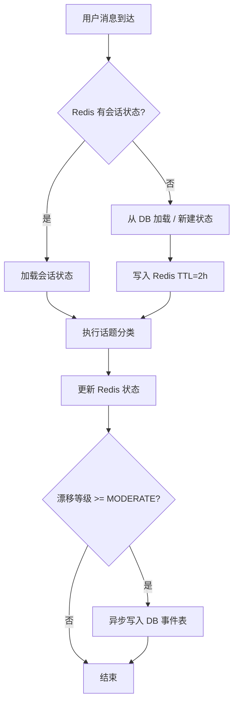
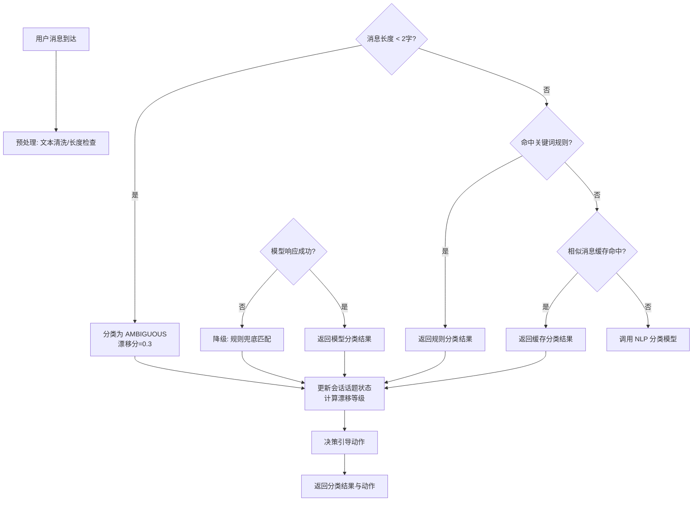
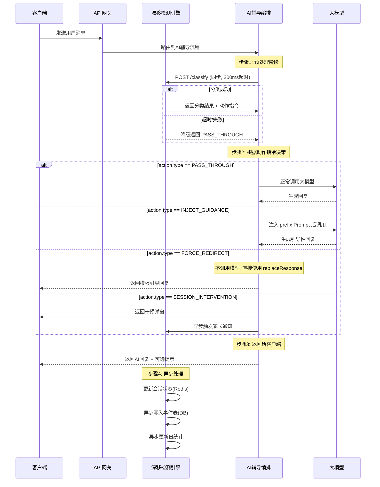

# 服务端-AI辅导对话话题漂移检测与学习焦点智能引导拉回引擎 详细设计

## 1. 概述

### 1.1 模块定位

本引擎负责在多轮 AI 辅导对话中实时检测学生话题是否从"学习相关"偏移到"非学习类闲聊"，并根据漂移程度执行分级引导拉回策略，确保 AI 辅导对话始终聚焦于教育目标。

### 1.2 核心职责

| 职责 | 说明 |
| --- | --- |
| 话题分类 | 对每轮用户输入进行学习相关性分类与学科归属判断 |
| 漂移检测 | 在对话会话维度追踪话题轨迹，识别持续性漂移 |
| 引导拉回 | 根据漂移等级执行温和提醒→话题引导→强制重定向 |
| 频次管控 | 记录漂移频次，触发家长通知或学习模式限制 |
| 数据沉淀 | 输出漂移事件供学情分析与运营报表使用 |

### 1.3 与现有模块的边界

| 现有模块 | 关注点 | 本模块区别 |
| --- | --- | --- |
| AI输入安全与教育对话护栏引擎 | 拦截色情/暴力/政治敏感等**有害**内容 | 本模块关注**无害但非学习**的内容（游戏、娱乐、社交闲聊） |
| 用户提问质量评估与低质提问智能引导优化引擎 | 评估提问是否**模糊/表述不清**并引导优化 | 本模块关注话题是否**偏离学习领域** |
| AI对话安全审计与敏感内容自动上报服务 | 事后审计与合规上报 | 本模块是**实时**检测与即时干预 |
| 防沉迷与未成年人保护机制 | 基于时长/时段的**全局**使用限制 | 本模块基于**对话内容语义**进行细粒度引导 |

### 1.4 依赖关系

```
┌─────────────────────────────────────────────────┐
│              AI辅导对话主流程                      │
│  (AI辅导全链路请求处理与编排设计)                    │
└──────────────┬──────────────────────────────────┘
               │ 每轮用户消息
               ▼
┌─────────────────────────────────────────────────┐
│        话题漂移检测与引导拉回引擎 (本模块)           │
├─────────┬──────────┬──────────┬────────────────┤
│ 话题分类器 │ 漂移状态机 │ 引导策略  │ 漂移事件产出    │
└────┬────┴────┬─────┴────┬─────┴────────┬───────┘
     │         │          │              │
     ▼         ▼          ▼              ▼
  NLP模型    Redis       Prompt         Kafka
  分类服务   会话状态    注入/拦截      事件总线
```

---

## 2. 数据模型

### 2.1 核心实体定义

#### 2.1.1 ConversationTopicState（会话话题状态）

每轮对话后更新，维护当前会话的话题轨迹。

```java
/**
 * 对话会话话题状态
 * Redis Hash Key: topic_state:{conversationId}
 * TTL: 会话结束后保留 2 小时
 */
public class ConversationTopicState {

    /** 会话ID */
    private String conversationId;

    /** 用户ID */
    private Long userId;

    /** 当前学科上下文（数学/语文/英语/物理...） */
    private String currentSubject;

    /** 当前学习话题关键词集合 */
    private Set<String> currentTopicKeywords;

    /** 连续非学习轮次数 */
    private int consecutiveOffTopicCount = 0;

    /** 本会话累计非学习轮次数 */
    private int totalOffTopicCount = 0;

    /** 本会话总轮次数 */
    private int totalTurnCount = 0;

    /** 当前漂移等级: NONE / MILD / MODERATE / SEVERE */
    private DriftLevel currentDriftLevel = DriftLevel.NONE;

    /** 最近一次漂移检测时间戳 */
    private Long lastDriftCheckTimestamp;

    /** 最近一次引导拉回策略类型 */
    private RedirectStrategyType lastRedirectStrategy;

    /** 本会话已执行的引导拉回次数 */
    private int redirectCount = 0;

    /** 最后一次用户消息摘要（用于幂等判断） */
    private String lastMessageHash;

    /** 会话话题轨迹（最近 N 轮） */
    private List<TopicTurnRecord> topicTrail = new ArrayList<>();

    /** 漂移警告标志（用于家长通知去重） */
    private boolean parentNotified = false;
}
```

#### 2.1.2 TopicTurnRecord（单轮话题记录）

```java
/**
 * 单轮对话的话题分类记录
 */
public class TopicTurnRecord {

    /** 轮次序号 */
    private int turnIndex;

    /** 用户消息ID */
    private String messageId;

    /** 消息摘要 Hash (SHA-256 前 16 位) */
    private String messageHash;

    /** 话题分类结果 */
    private TopicClassification classification;

    /** 检测到的学科（如适用） */
    private String detectedSubject;

    /** 话题关键词 */
    private Set<String> keywords;

    /** 漂移分数 0.0~1.0（越高越偏离学习） */
    private float driftScore;

    /** 时间戳 */
    private Long timestamp;
}
```

#### 2.1.3 TopicClassification（话题分类结果）

```java
/**
 * 话题分类结果枚举
 */
public enum TopicCategory {

    /** 学习相关 - 与当前学科话题直接相关 */
    LEARNING_CORE,

    /** 学习相关 - 学科延伸/方法讨论/学习计划 */
    LEARNING_RELATED,

    /** 学习相关 - 元认知提问（"我为什么学不好"） */
    LEARNING_META,

    /** 非学习 - 日常闲聊/问候 */
    OFFTOPIC_CASUAL,

    /** 非学习 - 娱乐/游戏/影视/明星 */
    OFFTOPIC_ENTERTAINMENT,

    /** 非学习 - 社交/情感/人际关系 */
    OFFTOPIC_SOCIAL,

    /** 非学习 - 尝试绕过学习限制（让AI讲故事/写非学习内容） */
    OFFTOPIC_EXPLOIT,

    /** 无法判断（极短消息/无意义输入） */
    AMBIGUOUS;
}
```

#### 2.1.4 DriftLevel（漂移等级）

```java
public enum DriftLevel {

    /** 无漂移 - 当前对话完全聚焦学习 */
    NONE(0),

    /** 轻微漂移 - 出现 1 轮非学习内容，暂不干预 */
    MILD(1),

    /** 中度漂移 - 连续 2~3 轮非学习内容，启动引导拉回 */
    MODERATE(2),

    /** 严重漂移 - 连续 4+ 轮非学习内容，执行强制重定向 */
    SEVERE(3);

    private final int level;

    DriftLevel(int level) { this.level = level; }

    public int getLevel() { return level; }
}
```

### 2.2 数据库表结构

#### 2.2.1 ai_topic_drift_event（漂移事件表）

记录每次检测到的漂移事件，供分析和运营使用。

```sql
CREATE TABLE ai_topic_drift_event (
    id              BIGINT       PRIMARY KEY AUTO_INCREMENT,
    event_id        VARCHAR(64)  NOT NULL UNIQUE COMMENT '事件唯一ID',
    user_id         BIGINT       NOT NULL COMMENT '用户ID',
    conversation_id VARCHAR(64)  NOT NULL COMMENT '会话ID',
    message_id      VARCHAR(64)  NOT NULL COMMENT '触发消息ID',

    -- 分类信息
    topic_category  VARCHAR(32)  NOT NULL COMMENT '话题分类 OFFTOPIC_*',
    detected_subject VARCHAR(16) DEFAULT NULL COMMENT '原本学科上下文',
    drift_score     DECIMAL(4,3) NOT NULL COMMENT '漂移分数 0.000~1.000',

    -- 漂移状态
    drift_level     VARCHAR(16)  NOT NULL COMMENT '漂移等级 MILD/MODERATE/SEVERE',
    consecutive_count INT        NOT NULL DEFAULT 1 COMMENT '当时连续非学习轮次',

    -- 干预信息
    redirect_strategy VARCHAR(32) NOT NULL COMMENT '引导策略类型',
    redirect_result  VARCHAR(16)  NOT NULL DEFAULT 'PENDING' COMMENT '引导结果 PENDING/RESUMED/IGNORED/ESCALATED',

    -- 时间
    created_at      DATETIME(3)  NOT NULL DEFAULT CURRENT_TIMESTAMP(3),

    -- 索引
    INDEX idx_user_time (user_id, created_at),
    INDEX idx_conversation (conversation_id),
    INDEX idx_level_time (drift_level, created_at)
) ENGINE=InnoDB DEFAULT CHARSET=utf8mb4 COMMENT='AI对话话题漂移事件表';
```

#### 2.2.2 ai_topic_drift_daily_stat（漂移日统计表）

按用户按天聚合，用于学情报告和运营分析。

```sql
CREATE TABLE ai_topic_drift_daily_stat (
    id              BIGINT       PRIMARY KEY AUTO_INCREMENT,
    user_id         BIGINT       NOT NULL,
    stat_date       DATE         NOT NULL,

    total_conversations  INT     NOT NULL DEFAULT 0 COMMENT '总会话数',
    conversations_with_drift INT  NOT NULL DEFAULT 0 COMMENT '发生漂移的会话数',
    total_offtopic_turns INT     NOT NULL DEFAULT 0 COMMENT '非学习消息总数',
    total_turns     INT          NOT NULL DEFAULT 0 COMMENT '总消息轮次',
    max_consecutive_drift INT    NOT NULL DEFAULT 0 COMMENT '最大连续漂移轮次',
    redirect_count  INT          NOT NULL DEFAULT 0 COMMENT '执行引导拉回次数',
    resume_success_count INT     NOT NULL DEFAULT 0 COMMENT '引导拉回成功次数',

    -- 漂移类别分布 (JSON)
    category_distribution JSON   DEFAULT NULL COMMENT '{"ENTERTAINMENT": 5, "SOCIAL": 3, ...}',

    created_at      DATETIME(3)  NOT NULL DEFAULT CURRENT_TIMESTAMP(3),
    updated_at      DATETIME(3)  NOT NULL DEFAULT CURRENT_TIMESTAMP(3) ON UPDATE CURRENT_TIMESTAMP(3),

    UNIQUE KEY uk_user_date (user_id, stat_date),
    INDEX idx_date (stat_date)
) ENGINE=InnoDB DEFAULT CHARSET=utf8mb4 COMMENT='AI对话话题漂移日统计表';
```

### 2.3 Redis 数据结构

| Key 模式 | 类型 | TTL | 说明 |
| --- | --- | --- | --- |
| `topic_state:{conversationId}` | Hash | 2h | 会话话题状态（当前漂移计数、等级、轨迹） |
| `topic_state:{conversationId}:trail` | List | 2h | 最近 10 轮话题分类记录（JSON 序列化） |
| `user_drift:{userId}:daily` | String(int) | 24h | 当日漂移总次数（用于频次管控） |
| `user_drift:{userId}:cooldown` | String | 动态 | 引导拉回冷却标志，防止短时间内重复干预 |
| `drift:model:version` | String | 永久 | 当前分类模型版本号 |

### 2.4 缓存策略



---

## 3. API 接口设计

### 3.1 核心 API 列表

| 接口 | 方法 | 路径 | 说明 |
| --- | --- | --- | --- |
| 话题分类检测 | POST | `/api/v1/topic-drift/classify` | 对单条用户消息进行话题分类与漂移检测 |
| 获取引导策略 | GET | `/api/v1/topic-drift/redirect-strategy` | 根据当前漂移状态获取引导拉回策略 |
| 上报引导结果 | POST | `/api/v1/topic-drift/redirect-result` | 上报引导拉回执行后的结果 |
| 查询会话漂移摘要 | GET | `/api/v1/topic-drift/conversation/{conversationId}/summary` | 查询指定会话的漂移统计 |
| 查询用户日漂移统计 | GET | `/api/v1/topic-drift/user/{userId}/daily` | 查询用户当天的漂移汇总 |

### 3.2 详细接口定义

#### 3.2.1 话题分类检测

**POST `/api/v1/topic-drift/classify`**

由 AI 辅导对话主流程在**每轮用户消息预处理阶段**同步调用。

**请求体：**

```json
{
  "conversationId": "conv_20260706_210000_abc123",
  "userId": 100086,
  "messageId": "msg_20260706_210001_def456",
  "messageContent": "这道二次函数的对称轴怎么求来着？",
  "messageType": "TEXT",
  "context": {
    "subject": "数学",
    "gradeLevel": "初三",
    "textbookVersion": "人教版",
    "chapterId": "ch_math_9_grade_ch22",
    "conversationTurn": 5
  }
}
```

**响应体：**

```json
{
  "code": 0,
  "data": {
    "messageId": "msg_20260706_210001_def456",
    "classification": {
      "category": "LEARNING_CORE",
      "detectedSubject": "数学",
      "keywords": ["二次函数", "对称轴"],
      "driftScore": 0.05,
      "confidence": 0.97
    },
    "driftState": {
      "consecutiveOffTopicCount": 0,
      "totalOffTopicCount": 1,
      "totalTurnCount": 5,
      "currentDriftLevel": "NONE",
      "topicTrail": [
        {"turnIndex": 3, "category": "LEARNING_CORE", "driftScore": 0.02},
        {"turnIndex": 4, "category": "OFFTOPIC_CASUAL", "driftScore": 0.82},
        {"turnIndex": 5, "category": "LEARNING_CORE", "driftScore": 0.05}
      ]
    },
    "action": {
      "type": "PASS_THROUGH",
      "injectPromptPrefix": null,
      "userHint": null
    }
  }
}
```

**漂移场景的响应示例（连续第 3 轮非学习）：**

```json
{
  "code": 0,
  "data": {
    "classification": {
      "category": "OFFTOPIC_ENTERTAINMENT",
      "detectedSubject": null,
      "keywords": ["游戏", "段位", "排位"],
      "driftScore": 0.93,
      "confidence": 0.95
    },
    "driftState": {
      "consecutiveOffTopicCount": 3,
      "totalOffTopicCount": 4,
      "totalTurnCount": 8,
      "currentDriftLevel": "MODERATE"
    },
    "action": {
      "type": "INJECT_GUIDANCE",
      "injectPromptPrefix": "[系统指令] 用户已连续3轮讨论非学习话题（游戏）。请在回答中：1) 简短回应后快速转向学习话题 2) 引用之前的数学学习上下文 3) 提出一个相关的学习问题引导用户回到正题。保持友善语气，不要说教。",
      "userHint": null,
      "strategyType": "GENTLE_REDIRECT"
    }
  }
}
```

**严重漂移的强制重定向示例：**

```json
{
  "code": 0,
  "data": {
    "classification": {
      "category": "OFFTOPIC_EXPLOIT",
      "detectedSubject": null,
      "keywords": ["帮我写", "作文代写", "不用管学习"],
      "driftScore": 0.98,
      "confidence": 0.99
    },
    "driftState": {
      "consecutiveOffTopicCount": 5,
      "totalOffTopicCount": 7,
      "totalTurnCount": 10,
      "currentDriftLevel": "SEVERE"
    },
    "action": {
      "type": "FORCE_REDIRECT",
      "injectPromptPrefix": null,
      "replaceResponse": "我发现我们聊了好几轮和学习无关的内容啦 😊\n\n学习时间不容易，要不我们先继续刚才的数学题？二次函数的对称轴是 x = -b/(2a)，你记得这个公式吗？\n\n如果现在不想学数学，也可以换个学科，或者先休息一下～",
      "userHint": "💡 我是你的学习助手，主要帮助你学习哦～",
      "strategyType": "FORCE_LEARNING_REDIRECT"
    }
  }
}
```

#### 3.2.2 获取引导策略

**GET `/api/v1/topic-drift/redirect-strategy?conversationId={id}`**

在 AI 回复生成前查询当前应执行的策略。

```json
{
  "code": 0,
  "data": {
    "strategyType": "GENTLE_REDIRECT",
    "driftLevel": "MODERATE",
    "promptInjection": "[系统指令] ...",
    "options": {
      "allowResponse": true,
      "appendLearningHint": true,
      "suggestSubjectSwitch": false,
      "showBreakReminder": false
    }
  }
}
```

#### 3.2.3 上报引导结果

**POST `/api/v1/topic-drift/redirect-result`**

在引导策略执行后，根据用户下一轮行为上报结果。

```json
{
  "conversationId": "conv_20260706_210000_abc123",
  "userId": 100086,
  "eventId": "evt_drift_20260706_210500_001",
  "result": "RESUMED",
  "resumedSubject": "数学"
}
```

`result` 取值：
- `RESUMED` — 引导成功，用户回到了学习话题
- `IGNORED` — 用户忽略了引导，继续非学习话题
- `ESCALATED` — 升级处理（触发家长通知或会话限制）
- `SESSION_ENDED` — 用户退出了对话

#### 3.2.4 查询会话漂移摘要

**GET `/api/v1/topic-drift/conversation/{conversationId}/summary`**

```json
{
  "code": 0,
  "data": {
    "conversationId": "conv_20260706_210000_abc123",
    "userId": 100086,
    "totalTurns": 15,
    "offTopicTurns": 4,
    "offTopicRatio": 0.267,
    "maxConsecutiveDrift": 3,
    "categoryBreakdown": {
      "LEARNING_CORE": 9,
      "LEARNING_RELATED": 2,
      "OFFTOPIC_CASUAL": 1,
      "OFFTOPIC_ENTERTAINMENT": 3
    },
    "redirectExecuted": 2,
    "redirectSucceeded": 1,
    "finalDriftLevel": "NONE",
    "conversationOutcome": "RESUMED_LEARNING"
  }
}
```

#### 3.2.5 查询用户日漂移统计

**GET `/api/v1/topic-drift/user/{userId}/daily?date=2026-07-06`**

```json
{
  "code": 0,
  "data": {
    "userId": 100086,
    "date": "2026-07-06",
    "conversationsWithDrift": 2,
    "totalConversations": 8,
    "driftConversationRatio": 0.25,
    "totalOffTopicTurns": 12,
    "totalTurns": 87,
    "mostCommonOffTopic": "OFFTOPIC_ENTERTAINMENT",
    "redirectSuccessRate": 0.67
  }
}
```

### 3.3 错误码定义

| 错误码 | HTTP Status | 说明 | 处理建议 |
| --- | --- | --- | --- |
| `TOPIC_DRIFT_001` | 400 | 缺少 conversationId 或 userId | 前端检查参数 |
| `TOPIC_DRIFT_002` | 400 | 消息内容为空或仅含空白 | 跳过分类，直接放行 |
| `TOPIC_DRIFT_003` | 429 | 分类服务限流 | 降级为规则匹配（见 4.5） |
| `TOPIC_DRIFT_004` | 500 | 分类模型调用失败 | 降级为规则匹配，记录告警 |
| `TOPIC_DRIFT_005` | 404 | 会话状态不存在（已过期） | 重新初始化会话状态 |
| `TOPIC_DRIFT_006` | 409 | 重复请求（messageHash 相同） | 返回上次分类结果（幂等） |

---

## 4. 业务逻辑

### 4.1 话题分类流程（核心）



### 4.2 漂移等级计算规则

```java
/**
 * 漂移等级计算核心逻辑
 */
public class DriftLevelCalculator {

    // 连续非学习轮次阈值
    private static final int MILD_THRESHOLD = 1;
    private static final int MODERATE_THRESHOLD = 2;
    private static final int SEVERE_THRESHOLD = 4;

    // 单轮高漂移分直接升级
    private static final float HIGH_DRIFT_SCORE = 0.95f;

    /**
     * 根据当前会话状态计算漂移等级
     *
     * @param state 会话话题状态
     * @param latestClassification 本轮分类结果
     * @return 漂移等级
     */
    public DriftLevel calculate(ConversationTopicState state,
                                 TopicClassification latestClassification) {

        boolean isOffTopic = isOffTopic(latestClassification.getCategory());
        int consecutive = state.getConsecutiveOffTopicCount();
        int redirectCount = state.getRedirectCount();

        if (!isOffTopic) {
            // 用户回到了学习话题
            return DriftLevel.NONE;
        }

        // 特殊情况：高漂移分 + 已有引导历史 → 直接升级
        if (latestClassification.getDriftScore() >= HIGH_DRIFT_SCORE
                && redirectCount >= 2) {
            return DriftLevel.SEVERE;
        }

        // 基于连续轮次判定
        if (consecutive >= SEVERE_THRESHOLD) {
            return DriftLevel.SEVERE;
        } else if (consecutive >= MODERATE_THRESHOLD) {
            return DriftLevel.MODERATE;
        } else {
            return DriftLevel.MILD;
        }
    }

    private boolean isOffTopic(TopicCategory category) {
        return category.name().startsWith("OFFTOPIC");
    }
}
```

### 4.3 引导拉回策略矩阵

| 漂移等级 | 策略类型 | 执行动作 | Prompt 注入 | 用户可见提示 |
| --- | --- | --- | --- | --- |
| NONE | PASS_THROUGH | 正常传递给 AI 模型 | 无 | 无 |
| MILD | MONITOR_ONLY | 仅记录，不干预 | 无 | 无 |
| MODERATE(首次) | GENTLE_REDIRECT | 注入引导指令给 AI | "简短回应后转向学习话题" | 无 |
| MODERATE(已引导) | GENTLE_REDIRECT_PLUS | 注入+追加学习提示 | "引用之前学习上下文引导回来" | 💡 底部轻提示 |
| SEVERE(首次) | FORCE_LEARNING_REDIRECT | 替换 AI 回复内容 | 不调用模型，使用模板回复 | 全屏引导卡片 |
| SEVERE(持续) | SESSION_INTERVENTION | 会话级干预 | 暂停AI回复 | "休息一下吧"弹窗 + 家长通知 |

### 4.4 引导拉回策略详细实现

```java
/**
 * 引导拉回策略决策器
 */
public class RedirectStrategyDecider {

    /**
     * 根据漂移状态决策引导策略
     */
    public RedirectAction decide(ConversationTopicState state,
                                  TopicClassification classification) {

        DriftLevel level = state.getCurrentDriftLevel();
        int redirectCount = state.getRedirectCount();

        // 冷却期检查：距离上次引导 < 30 秒则不重复引导
        if (isInCooldown(state)) {
            return RedirectAction.passThrough();
        }

        return switch (level) {
            case NONE, MILD -> RedirectAction.passThrough();

            case MODERATE -> {
                if (redirectCount == 0) {
                    // 第一次引导：温和提示 AI
                    yield RedirectAction.builder()
                        .type(ActionType.INJECT_GUIDANCE)
                        .strategyType(RedirectStrategyType.GENTLE_REDIRECT)
                        .injectPromptPrefix(buildGentleRedirectPrompt(state))
                        .build();
                } else {
                    // 后续引导：追加学习提示
                    yield RedirectAction.builder()
                        .type(ActionType.INJECT_GUIDANCE)
                        .strategyType(RedirectStrategyType.GENTLE_REDIRECT_PLUS)
                        .injectPromptPrefix(buildGentleRedirectPrompt(state))
                        .userHint("💡 我是你的学习助手，主要帮你学习哦～")
                        .build();
                }
            }

            case SEVERE -> {
                if (redirectCount < 3) {
                    // 强制重定向：替换 AI 回复
                    yield RedirectAction.builder()
                        .type(ActionType.FORCE_REDIRECT)
                        .strategyType(RedirectStrategyType.FORCE_LEARNING_REDIRECT)
                        .replaceResponse(buildForceRedirectResponse(state))
                        .userHint("📌 学习时间到啦，让我们回到学习吧！")
                        .build();
                } else {
                    // 会话级干预
                    yield RedirectAction.builder()
                        .type(ActionType.SESSION_INTERVENTION)
                        .strategyType(RedirectStrategyType.SESSION_INTERVENTION)
                        .pauseAiResponse(true)
                        .showInterventionDialog(buildInterventionDialog(state))
                        .triggerParentNotification(shouldNotifyParent(state))
                        .build();
                }
            }
        };
    }

    /**
     * 温和引导 Prompt 构建
     */
    private String buildGentleRedirectPrompt(ConversationTopicState state) {
        return String.format(
            "[系统指令] 用户已连续%d轮讨论非学习话题。" +
            "请在回答中：1) 简短回应后快速转向学习话题 " +
            "2) 尝试引用之前的%s学习上下文 " +
            "3) 提出一个相关的学习问题引导用户回到正题。" +
            "保持友善语气，不要说教，不要直接拒绝回答。",
            state.getConsecutiveOffTopicCount(),
            state.getCurrentSubject() != null ? state.getCurrentSubject() : ""
        );
    }

    /**
     * 强制重定向回复模板
     */
    private String buildForceRedirectResponse(ConversationTopicState state) {
        String subjectHint = state.getCurrentSubject() != null
            ? String.format("我们之前在学%s，", state.getCurrentSubject())
            : "";

        return String.format(
            "我注意到我们聊了好几轮和学习无关的内容啦 😊\n\n" +
            "%s要不我们继续之前的学习内容？\n\n" +
            "如果现在不想学这个，也可以：\n" +
            "• 换个学科问问\n" +
            "• 做一道练习题\n" +
            "• 先休息一下，待会儿再继续～\n\n" +
            "我随时在这里陪你学习！💪",
            subjectHint
        );
    }

    private boolean isInCooldown(ConversationTopicState state) {
        if (state.getLastDriftCheckTimestamp() == null) return false;
        long elapsed = System.currentTimeMillis() - state.getLastDriftCheckTimestamp();
        return elapsed < 30_000; // 30 秒冷却
    }

    private boolean shouldNotifyParent(ConversationTopicState state) {
        return !state.isParentNotified()
            && state.getTotalOffTopicCount() >= 10;
    }
}
```

### 4.5 降级规则匹配（模型不可用时）

当 NLP 分类模型不可用时，使用基于关键词和正则的规则引擎兜底。

```java
/**
 * 规则兜底分类器
 * 在模型服务不可用时自动启用
 */
public class RuleBasedClassifier {

    // 预定义规则库（可配置化，存储于配置中心）
    private static final List<TopicRule> RULES = List.of(
        // 娱乐/游戏类
        TopicRule.of("OFFTOPIC_ENTERTAINMENT", 0.90,
            List.of("游戏", "段位", "排位", "吃鸡", "王者", "原神",
                    "电视剧", "综艺", "明星", "追星", "动漫", "番剧"),
            List.of("\\b(怎么)?打(游戏|排位)\\b", "\\b(推荐|好看).*(剧|电影|综艺)\\b")),

        // 社交/情感类
        TopicRule.of("OFFTOPIC_SOCIAL", 0.85,
            List.of("女朋友", "男朋友", "暗恋", "表白", "分手",
                    "同学说我", "老师讨厌", "被孤立", "友谊"),
            List.of()),

        // 利用AI做非学习事
        TopicRule.of("OFFTOPIC_EXPLOIT", 0.95,
            List.of("帮我写作文", "代写", "帮我做", "直接给答案",
                    "不用解释", "只给结果", "帮我编", "编一个故事"),
            List.of("\\b帮我(写|编|造).*(不是|不用).*(学习|作业|题目)\\b")),

        // 日常闲聊
        TopicRule.of("OFFTOPIC_CASUAL", 0.70,
            List.of("你好", "在吗", "无聊", "无聊啊", "陪我聊天", "你是谁",
                    "你有名字吗", "今天天气", "吃饭了吗"),
            List.of("^(你好|hi|hello|嗨)$"))
    );

    /**
     * 规则匹配分类
     */
    public TopicClassification classify(String text) {
        String normalized = text.toLowerCase().trim();

        for (TopicRule rule : RULES) {
            // 关键词匹配
            boolean keywordHit = rule.getKeywords().stream()
                .anyMatch(kw -> normalized.contains(kw.toLowerCase()));

            // 正则匹配
            boolean regexHit = rule.getPatterns().stream()
                .anyMatch(p -> Pattern.matches(p, normalized));

            if (keywordHit || regexHit) {
                return TopicClassification.builder()
                    .category(TopicCategory.valueOf(rule.getCategory()))
                    .driftScore(rule.getDriftScore())
                    .confidence(0.60f) // 规则匹配置信度较低
                    .source("RULE_FALLBACK")
                    .build();
            }
        }

        // 默认：无法判定
        return TopicClassification.builder()
            .category(TopicCategory.AMBIGUOUS)
            .driftScore(0.3f)
            .confidence(0.30f)
            .source("RULE_FALLBACK")
            .build();
    }
}
```

### 4.6 话题分类模型调用设计

主分类器使用轻量级 NLP 模型（推荐 FastText / 微调小模型 BERT-tiny），确保低延迟。

```java
/**
 * 模型分类器 - 调用远程 NLP 服务
 */
public class ModelTopicClassifier {

    private final NlpModelClient modelClient;
    private final RuleBasedClassifier fallback = new RuleBasedClassifier();

    /**
     * 对用户消息进行话题分类
     *
     * @return 分类结果，绝不返回 null（模型失败时降级为规则匹配）
     */
    public TopicClassification classify(ClassifyRequest request) {
        try {
            // 构建模型输入
            ModelInput input = ModelInput.builder()
                .text(request.getMessageContent())
                .subject(request.getContext().getSubject())
                .gradeLevel(request.getContext().getGradeLevel())
                .conversationHistory(request.getRecentMessages())
                .build();

            // 调用模型，超时 200ms
            ModelResult result = modelClient.predict(input, Duration.ofMillis(200));

            return TopicClassification.builder()
                .category(parseCategory(result.getLabel()))
                .driftScore(result.getDriftScore())
                .confidence(result.getConfidence())
                .keywords(result.getExtractedKeywords())
                .detectedSubject(result.getDetectedSubject())
                .source("MODEL")
                .build();

        } catch (TimeoutException e) {
            log.warn("话题分类模型超时, conversationId={}", request.getConversationId());
            return fallback.classify(request.getMessageContent());
        } catch (Exception e) {
            log.error("话题分类模型调用失败, 降级为规则匹配", e);
            return fallback.classify(request.getMessageContent());
        }
    }

    private TopicCategory parseCategory(String label) {
        try {
            return TopicCategory.valueOf(label);
        } catch (IllegalArgumentException e) {
            return TopicCategory.AMBIGUOUS;
        }
    }
}
```

---

## 5. 集成接入点

### 5.1 在 AI 辅导主流程中的位置



### 5.2 与现有系统的集成方式

```yaml
# application-topic-drift.yml

topic:
  drift:
    enabled: true                    # 功能开关
    model-timeout-ms: 200            # 模型调用超时
    cache-ttl-seconds: 7200          # 会话状态缓存时长
    cooldown-ms: 30000               # 引导冷却时间
    max-redirect-per-session: 5      # 单会话最大引导次数
    parent-notify-threshold: 10      # 家长通知的漂移总次数阈值

    # 降级配置
    fallback:
      enabled: true
      strategy: RULE_BASED           # 降级策略: RULE_BASED / ALWAYS_PASS

    # 模型配置
    model:
      endpoint: http://nlp-service:8501/v1/models/topic-classifier:predict
      version: v1.2.0
      min-confidence: 0.65           # 低于此置信度时使用规则兜底

    # Kafka 事件输出
    events:
      enabled: true
      topic: ai-topic-drift-events
      consumer-group: topic-drift-analytics
```

### 5.3 事件输出（供其他模块消费）

```json
// Kafka Topic: ai-topic-drift-events
{
  "eventType": "DRIFT_DETECTED",
  "eventId": "evt_drift_20260706_210500_001",
  "userId": 100086,
  "conversationId": "conv_20260706_210000_abc123",
  "messageId": "msg_20260706_210001_def456",
  "driftLevel": "MODERATE",
  "category": "OFFTOPIC_ENTERTAINMENT",
  "driftScore": 0.93,
  "consecutiveCount": 3,
  "strategyType": "GENTLE_REDIRECT",
  "timestamp": "2026-07-06T13:39:00.000Z"
}
```

消费方：
- **学情分析模块**：将漂移数据纳入学习专注度分析
- **家长中心模块**：在家长报告中展示学习专注情况
- **防沉迷模块**：高频漂移作为使用习惯异常信号
- **运营分析模块**：统计平台整体学习专注率

---

## 6. 错误处理

### 6.1 异常类型与处理策略

| 异常场景 | 处理策略 | 用户影响 |
| --- | --- | --- |
| NLP 模型服务不可用 | 降级为规则匹配引擎 | 无感知（精度略降） |
| NLP 模型超时(>200ms) | 返回 PASS_THROUGH，异步重试 | 无感知 |
| Redis 会话状态丢失 | 从 DB 重建最近 N 轮状态 | 可能丢失部分轨迹 |
| DB 写入失败 | 记录本地日志，异步重试补偿 | 无感知 |
| Kafka 发送失败 | 本地缓冲 + 定时重发 | 下游延迟收到事件 |
| 配置中心不可用 | 使用本地缓存配置 | 配置无法热更新 |

### 6.2 幂等性保证

```java
/**
 * 幂等处理：同一消息不会被重复分类
 */
public class TopicDriftService {

    public ClassifyResponse classify(ClassifyRequest request) {
        String messageHash = sha256Short(request.getMessageContent());

        // 检查是否已处理过此消息
        ConversationTopicState state = loadState(request.getConversationId());
        if (messageHash.equals(state.getLastMessageHash())) {
            // 幂等返回上次结果
            return buildResponseFromCache(state);
        }

        // 执行分类...
    }
}
```

### 6.3 熔断与限流

```java
/**
 * 分类服务熔断配置
 * 当模型连续失败时，自动切换到规则模式
 */
@CircuitBreaker(
    name = "topic-classifier",
    fallbackMethod = "classifyFallback"
)
@RateLimiter(
    name = "topic-classifier",
    limitForPeriod = 500,  // 每秒最大 500 次
    limitRefreshPeriod = "1s"
)
public TopicClassification classify(ClassifyRequest request) {
    // ... 模型调用
}

// 熔断降级方法
private TopicClassification classifyFallback(ClassifyRequest request, Throwable t) {
    log.warn("话题分类服务降级: {}", t.getMessage());
    return ruleBasedClassifier.classify(request.getMessageContent());
}
```

---

## 7. 性能优化

### 7.1 性能指标要求

| 指标 | 目标值 | 说明 |
| --- | --- | --- |
| 单次分类延迟 P99 | < 50ms | 不含模型调用，含状态更新 |
| 单次分类延迟（含模型）P99 | < 200ms | 含模型调用 |
| 吞吐量 | >= 500 QPS | 高峰期并发分类请求 |
| Redis 操作延迟 P99 | < 5ms | 会话状态读写 |

### 7.2 优化手段

```java
/**
 * 1. 短文本快速路径：消息极短时跳过模型调用
 */
if (messageContent.length() <= 3) {
    return quickClassify(messageContent); // 基于规则表
}

/**
 * 2. 批量更新：漂移事件先写入 Redis 队列，定时批量 flush 到 DB
 */
@Scheduled(fixedDelay = 5000) // 每 5 秒批量写入
public void batchFlushEvents() {
    List<DriftEvent> batch = redisTemplate.opsForList()
        .range("drift:event:queue", 0, 99);
    if (!batch.isEmpty()) {
        eventMapper.batchInsert(batch);
        redisTemplate.opsForList().trim("drift:event:queue", batch.size(), -1);
    }
}

/**
 * 3. 会话轨迹压缩：只保留最近 10 轮，超出自动淘汰
 */
private void appendToTrail(ConversationTopicState state, TopicTurnRecord record) {
    LinkedList<TopicTurnRecord> trail = new LinkedList<>(state.getTopicTrail());
    trail.addLast(record);
    while (trail.size() > 10) {
        trail.removeFirst();
    }
    state.setTopicTrail(new ArrayList<>(trail));
}

/**
 * 4. 相似消息缓存：避免对相同内容重复调用模型
 */
@Cacheable(value = "topic-classify",
           key = "T(DigestUtils).md5Hex(#request.messageContent)",
           unless = "#result.classification.confidence < 0.5")
public ClassifyResponse classify(ClassifyRequest request) {
    // ...
}
```

---

## 8. 安全考虑

### 8.1 数据安全

- 用户消息内容在日志中需脱敏（仅记录 messageHash）
- 漂移事件表不存储原始消息全文，仅存储分类结果与关键词
- Redis 会话状态的 TTL 限制为 2 小时，不长期留存

### 8.2 误判保护

```java
/**
 * 用户申诉机制：允许用户标记"我这是在学习"
 */
@PostMapping("/api/v1/topic-drift/appeal")
public ApiResponse appeal(@RequestBody AppealRequest request) {
    // 记录用户申诉
    // 如果某规则/模型频繁被申诉，触发规则复审流程
    // 连续申诉 3 次以上，降低该用户的漂移检测灵敏度
}
```

### 8.3 隐私保护

- 漂移事件中的 keywords 字段经过敏感词过滤，不包含用户个人信息
- 家长通知内容仅包含统计数据（"本周有 N 次对话偏离学习话题"），不含原始对话内容
- 用户可在隐私设置中关闭漂移检测功能

---

## 9. 测试策略

### 9.1 单元测试

```java
class TopicDriftServiceTest {

    @Test
    @DisplayName("连续3轮非学习内容应触发 MODERATE 漂移")
    void shouldDetectModerateDrift() {
        // Given
        ConversationTopicState state = ConversationTopicState.builder()
            .consecutiveOffTopicCount(2)
            .currentSubject("数学")
            .build();

        TopicClassification classification = TopicClassification.builder()
            .category(TopicCategory.OFFTOPIC_ENTERTAINMENT)
            .driftScore(0.85f)
            .build();

        // When
        state.setConsecutiveOffTopicCount(3);
        DriftLevel level = calculator.calculate(state, classification);

        // Then
        assertEquals(DriftLevel.MODERATE, level);
    }

    @Test
    @DisplayName("学习核心消息漂移分应小于0.1")
    void learningCoreShouldHaveLowDriftScore() {
        TopicClassification result = classifier.classify(
            ClassifyRequest.builder()
                .messageContent("请帮我讲解勾股定理的证明过程")
                .context(Context.builder().subject("数学").build())
                .build()
        );

        assertEquals(TopicCategory.LEARNING_CORE, result.getCategory());
        assertTrue(result.getDriftScore() < 0.1f);
    }

    @Test
    @DisplayName("模型超时应降级为规则匹配")
    void shouldFallbackOnTimeout() {
        when(modelClient.predict(any(), any()))
            .thenThrow(new TimeoutException("model timeout"));

        TopicClassification result = classifier.classify(
            ClassifyRequest.builder()
                .messageContent("王者排位怎么打")
                .build()
        );

        assertEquals(TopicCategory.OFFTOPIC_ENTERTAINMENT, result.getCategory());
        assertEquals("RULE_FALLBACK", result.getSource());
    }

    @Test
    @DisplayName("同一消息重复请求应幂等返回")
    void shouldBeIdempotent() {
        String content = "这道题怎么做";

        ClassifyResponse r1 = service.classify(buildRequest(content));
        ClassifyResponse r2 = service.classify(buildRequest(content));

        assertEquals(r1.getClassification().getCategory(),
                     r2.getClassification().getCategory());
    }

    @Test
    @DisplayName("严重漂移且多次引导无效应触发会话干预")
    void severeDriftShouldTriggerIntervention() {
        ConversationTopicState state = ConversationTopicState.builder()
            .consecutiveOffTopicCount(5)
            .redirectCount(3)
            .build();

        RedirectAction action = decider.decide(state, offTopicClassification);

        assertEquals(ActionType.SESSION_INTERVENTION, action.getType());
        assertTrue(action.isTriggerParentNotification());
    }
}
```

### 9.2 集成测试

```java
@SpringBootTest
class TopicDriftIntegrationTest {

    @Test
    @DisplayName("端到端：多轮对话漂移检测与引导拉回完整流程")
    void endToEnd_driftDetectionAndRedirect() {
        String convId = "conv_test_001";

        // Round 1: 学习内容
        ClassifyResponse r1 = service.classify(request(convId, "帮我讲一下力的分解"));
        assertEquals(DriftLevel.NONE, r1.getDriftState().getCurrentDriftLevel());

        // Round 2: 偏离到闲聊
        ClassifyResponse r2 = service.classify(request(convId, "今天好无聊啊"));
        assertEquals(DriftLevel.MILD, r2.getDriftState().getCurrentDriftLevel());

        // Round 3: 继续偏离到游戏
        ClassifyResponse r3 = service.classify(request(convId, "王者荣耀怎么上分快"));
        assertEquals(DriftLevel.MODERATE, r3.getDriftState().getCurrentDriftLevel());
        assertEquals(ActionType.INJECT_GUIDANCE, r3.getAction().getType());

        // Round 4: 引导后回到学习
        ClassifyResponse r4 = service.classify(request(convId, "好吧，那力的平行四边形定则是什么"));
        assertEquals(DriftLevel.NONE, r4.getDriftState().getCurrentDriftLevel());

        // 验证事件产出
        verify(eventPublisher).publish(argThat(event ->
            event.getEventType().equals("DRIFT_DETECTED")
            && event.getDriftLevel().equals("MODERATE")
        ));
    }
}
```

### 9.3 测试数据集

需要准备覆盖以下场景的标注数据集（至少 2000 条）：

| 类别 | 样本数 | 示例 |
| --- | --- | --- |
| LEARNING_CORE | 500 | "二次函数顶点坐标公式是什么" |
| LEARNING_RELATED | 200 | "怎么制定期末复习计划" |
| LEARNING_META | 100 | "我数学总是学不好怎么办" |
| OFFTOPIC_CASUAL | 200 | "你好呀"、"今天天气不错" |
| OFFTOPIC_ENTERTAINMENT | 300 | "原神怎么抽五星"、"最近有什么好看的电影" |
| OFFTOPIC_SOCIAL | 200 | "同学不跟我玩了"、"怎么交朋友" |
| OFFTOPIC_EXPLOIT | 200 | "帮我写一篇不关于学习的作文"、"直接告诉我答案不用解释" |
| AMBIGUOUS | 100 | "嗯"、"哦"、"??"、"1" |
| 边界场景 | 200 | "用物理原理解释游戏机制"、"用英语描述一部电影" |

---

## 10. 监控与告警

### 10.1 关键监控指标

| 指标 | 类型 | 告警阈值 |
| --- | --- | --- |
| `topic_drift_classify_latency_p99` | 延迟 | > 200ms 持续 1 分钟 |
| `topic_drift_model_error_rate` | 错误率 | > 10% 持续 3 分钟 |
| `topic_drift_fallback_rate` | 降级率 | > 30% 持续 5 分钟 |
| `topic_drift_detection_rate` | 业务指标 | 突增 > 50% 环比（可能模型异常） |
| `topic_drift_redirect_success_rate` | 业务指标 | < 40% 持续 1 小时（引导策略需调整） |
| `topic_drift_severe_rate` | 业务指标 | > 5% 的会话触发 SEVERE（需关注用户群体） |

### 10.2 Prometheus 指标定义

```java
@Component
public class TopicDriftMetrics {

    private final MeterRegistry registry;

    // 分类延迟
    private final Timer classifyLatency;

    // 降级率
    private final Counter classifyFallbackCounter;
    private final Counter classifySuccessCounter;

    // 漂移等级分布
    private final Counter driftLevelCounter;

    // 引导成功率
    private final Counter redirectTotal;
    private final Counter redirectSuccess;

    public TopicDriftMetrics(MeterRegistry registry) {
        this.registry = registry;
        this.classifyLatency = Timer.builder("topic_drift_classify_latency")
            .publishPercentiles(0.5, 0.95, 0.99)
            .register(registry);

        this.classifyFallbackCounter = Counter.builder("topic_drift_classify_total")
            .tag("result", "fallback")
            .register(registry);

        this.classifySuccessCounter = Counter.builder("topic_drift_classify_total")
            .tag("result", "success")
            .register(registry);

        this.driftLevelCounter = Counter.builder("topic_drift_level_total")
            .register(registry);

        this.redirectTotal = Counter.builder("topic_drift_redirect_total")
            .register(registry);

        this.redirectSuccess = Counter.builder("topic_drift_redirect_success")
            .register(registry);
    }
}
```

---

## 11. 配置化运营

### 11.1 运营可配置项

以下配置项通过配置中心管理，运营人员可动态调整：

| 配置项 | 默认值 | 说明 |
| --- | --- | --- |
| `topic.drift.enabled` | true | 全局开关 |
| `topic.drift.mild-threshold` | 1 | 轻微漂移连续轮次阈值 |
| `topic.drift.moderate-threshold` | 2 | 中度漂移连续轮次阈值 |
| `topic.drift.severe-threshold` | 4 | 严重漂移连续轮次阈值 |
| `topic.drift.cooldown-ms` | 30000 | 引导冷却时间 |
| `topic.drift.max-redirect` | 5 | 单会话最大引导次数 |
| `topic.drift.parent-notify-threshold` | 10 | 家长通知阈值 |
| `topic.drift.rules.enabled` | true | 规则兜底开关 |
| `topic.drift.rules.keywords` | (动态) | 规则关键词库（JSON） |
| `topic.drift.model.endpoint` | (动态) | 模型服务地址 |

### 11.2 灰度发布策略

```yaml
topic:
  drift:
    # 按用户 ID 尾号灰度
    gray-release:
      enabled: true
      strategy: USER_ID_MOD
      ratio: 10          # 先对 10% 用户开放
      user-whitelist:    # 白名单用户优先体验
        - 100086
        - 100087
```

灰度判断逻辑：

```java
public boolean isEnabledForUser(Long userId) {
    if (!config.isEnabled()) return false;
    if (config.getGrayRelease().getUserWhitelist().contains(userId)) return true;
    return Math.abs(userId % 100) < config.getGrayRelease().getRatio();
}
```

---

## 12. 与其他模块的协作

### 12.1 与家长中心模块

当 `parentNotified` 触发时，向家长中心发送结构化通知：

```json
// 发送到家长中心的通知事件
{
  "notificationType": "LEARNING_FOCUS_ALERT",
  "userId": 100086,
  "parentUserId": 100080,
  "data": {
    "date": "2026-07-06",
    "conversationsWithDrift": 2,
    "totalConversations": 8,
    "totalOffTopicTurns": 12,
    "topOffTopicCategory": "OFFTOPIC_ENTERTAINMENT"
  },
  "suggestion": "建议家长与孩子沟通学习习惯，了解是否遇到学习困难"
}
```

### 12.2 与防沉迷模块

当 SEVERE 漂移触发 `SESSION_INTERVENTION` 时，通知防沉迷模块记录一次"专注度异常"：

```json
// 发送到防沉迷模块的事件
{
  "eventType": "FOCUS_ANOMALY",
  "userId": 100086,
  "conversationId": "conv_20260706_210000_abc123",
  "detail": "连续5轮非学习话题，多次引导无效",
  "timestamp": "2026-07-06T13:39:00.000Z"
}
```

### 12.3 与学情分析模块

每日凌晨通过定时任务聚合前一天的漂移统计，推送至学情分析模块，作为"学习专注度"维度数据源。

```json
// 每日学习专注度数据
{
  "userId": 100086,
  "date": "2026-07-05",
  "focusScore": 0.73,
  "totalLearningTurns": 65,
  "totalOffTopicTurns": 12,
  "redirectSuccessRate": 0.67,
  "topOffTopicCategory": "OFFTOPIC_ENTERTAINMENT",
  "trend": "DECREASING"
}
```

---

## 13. 演进路线

| 阶段 | 能力 | 时间线 |
| --- | --- | --- |
| V1.0 | 规则引擎 + 基础引导策略 | MVP 同步上线 |
| V1.5 | 轻量 NLP 模型替代纯规则 | V1.0 上线后 4 周 |
| V2.0 | 基于用户画像的个性化灵敏度调整 | V1.5 上线后 8 周 |
| V2.5 | 多语言漂移检测（英语对话场景） | 视产品国际化进度 |
| V3.0 | 基于强化学习的自适应引导策略 | 研究探索阶段 |
