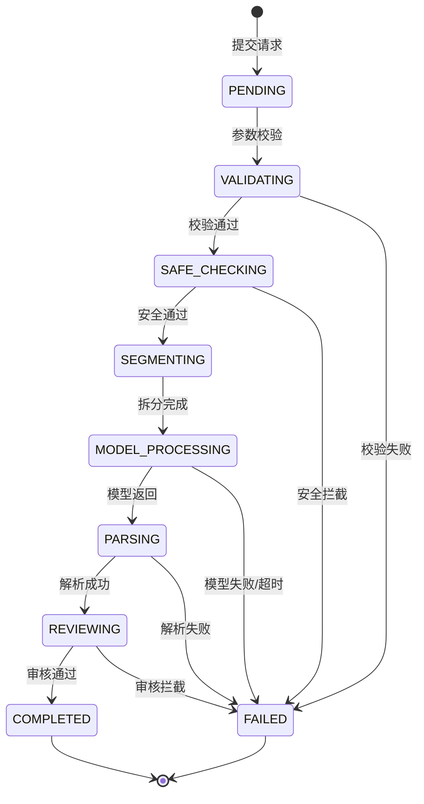

# 服务端-作文润色建议引擎 - 详细设计

> **版本**：v1.0 | **日期**：2026-08-03 | **状态**：初稿  
> **关联文档**：`docs/design/启硕-PrimeTop-全学段AI辅助学习软件项目设计文档.md` 第 6.10 节（作文辅导模块）、`docs2/作文辅导-详细设计.md`、`docs2/服务端-作文批改评分引擎与写作能力评估服务-详细设计.md`、`docs2/服务端-作文素材库管理与主题素材智能推荐服务-详细设计.md`

---

## 1. 概述

### 1.1 功能定位

作文润色建议引擎是 PrimeTop 作文辅导模块的**局部修改辅助引擎**。核心目标是：在学生已完成的作文正文或段落基础上，识别表达、结构、语言、修辞等方面可改进的位置，给出**具体到句/词的修改建议**，而不是替学生整篇重写。引擎遵循 "启发引导、保留原意、学生做主" 的原则。

一句话定位：**让学生看到自己作文中“哪里可以改、为什么改、可以怎么改”。**

### 1.2 核心能力

| 能力域 | 能力项 | 优先级 | 说明 |
|--------|--------|--------|------|
| 输入处理 | 段落/全文接收 | P0 | 接收纯文本、Markdown 或按段落拆分后的文本 |
| 输入处理 | 学段/年级适配 | P0 | 小学、初中、高中使用不同的评价深度和语言 |
| 问题识别 | 语言表达问题 | P0 | 用词重复、口语化、搭配不当、语序不顺 |
| 问题识别 | 结构衔接问题 | P0 | 段落过渡、逻辑顺序、首尾呼应 |
| 问题识别 | 修辞与文采问题 | P1 | 比喻、排比、细节描写等可优化点 |
| 建议生成 | 局部修改建议 | P0 | 给出修改后的候选句/词，并保留原句 |
| 建议生成 | 原因说明 | P0 | 说明为什么此处需要修改，帮助学生理解 |
| 建议生成 | 多候选与可拒绝 | P1 | 一个位置可给出多个改写候选，用户可选择采纳/忽略 |
| 安全与合规 | 内容安全过滤 | P0 | 对输入/输出进行合规审核，拒绝代写/涉敏内容 |
| 反馈闭环 | 采纳率统计 | P1 | 记录学生采纳/忽略/修改后采纳的行为 |

### 1.3 服务边界

| 职责 | 归属 |
|------|------|
| 接收作文正文并拆解为润色单元 | ✅ 本引擎 |
| 识别局部可改进点并生成建议 | ✅ 本引擎 |
| 控制不整篇代写 | ✅ 本引擎（通过 Prompt 与输出后处理） |
| 学段化表达与难度适配 | ✅ 本引擎 |
| 作文任务/草稿的创建与版本管理 | ❌ 作文任务/草稿服务 |
| 整篇作文综合批改与评分 | ❌ 作文批改评分引擎 |
| 素材推荐与范文拆解 | ❌ 素材库/范文引擎 |
| 客户端 UI 渲染 | ❌ 客户端 |
| 大模型通用对话 | ❌ AI 智能辅导服务 |

### 1.4 依赖关系

```text
┌─────────────────────────────────────────┐
│ 作文润色建议引擎                         │
│ (EssayPolishSuggestionEngine)            │
└──────┬──────────┬──────────┬────────────┘
       │          │          │
       ▼          ▼          ▼
   ┌──────┐  ┌────────┐  ┌──────────┐
   │ 用户服务 │  │ 大模型  │  │ 内容安全  │
   │        │  │ API    │  │ 审核服务  │
   └──────┘  └────────┘  └──────────┘
       │
       ▼
   ┌──────────┐
   │ 作文任务服务│
   │ (读取草稿) │
   └──────────┘
```

---

## 2. 数据结构设计

### 2.1 核心实体关系

```text
EssayPolishRequest (润色请求)
    │ 1:1
    ▼
EssayPolishResult (润色结果)
    │ 1:N
    ▼
EssayPolishSuggestion (单条修改建议)
    │ 1:N
    ▼
PolishFeedback (用户反馈)

EssayPolishRuleConfig (润色规则配置)
```

### 2.2 润色请求表 `essay_polish_request`

```sql
CREATE TABLE essay_polish_request (
    id                  BIGINT PRIMARY KEY AUTO_INCREMENT COMMENT '请求ID',
    user_id             BIGINT NOT NULL COMMENT '用户ID',
    task_id             BIGINT COMMENT '关联作文任务ID',
    draft_id            BIGINT NOT NULL COMMENT '关联作文草稿ID',
    conversation_id       BIGINT COMMENT '关联AI会话ID（可选）',
    -- 输入控制
    polish_type         VARCHAR(30) NOT NULL DEFAULT 'full' COMMENT '润色范围: full/paragraph/sentence/selected',
    polish_dimensions   JSON COMMENT '润色维度 ["language","structure","rhetoric"]',
    input_text          MEDIUMTEXT NOT NULL COMMENT '用户提交的待润色文本',
    input_segments      JSON COMMENT '段落拆分结果 [{"idx":0,"text":"..."}]',
    -- 上下文快照
    stage               VARCHAR(20) NOT NULL COMMENT '学段: primary/junior/senior',
    grade               INT NOT NULL COMMENT '年级: 1-12',
    subject             VARCHAR(20) NOT NULL DEFAULT 'chinese' COMMENT '学科: chinese/english',
    word_count          INT NOT NULL DEFAULT 0 COMMENT '输入字数',
    -- 状态
    status              TINYINT NOT NULL DEFAULT 0 COMMENT '状态: 0=待处理,1=处理中,2=完成,3=失败',
    error_code          VARCHAR(50) COMMENT '失败错误码',
    error_message       VARCHAR(500) COMMENT '失败说明',
    -- 资源消耗
    model_name          VARCHAR(50) COMMENT '实际使用模型',
    token_used          INT COMMENT '大模型总Token消耗',
    -- 时间
    created_at          DATETIME NOT NULL DEFAULT CURRENT_TIMESTAMP,
    updated_at          DATETIME NOT NULL DEFAULT CURRENT_TIMESTAMP ON UPDATE CURRENT_TIMESTAMP,
    completed_at        DATETIME COMMENT '完成时间',

    INDEX idx_user_status (user_id, status),
    INDEX idx_draft (draft_id),
    INDEX idx_task (task_id),
    INDEX idx_created (created_at DESC)
) ENGINE=InnoDB DEFAULT CHARSET=utf8mb4 COMMENT='作文润色请求';
```

### 2.3 润色结果表 `essay_polish_result`

```sql
CREATE TABLE essay_polish_result (
    id                  BIGINT PRIMARY KEY AUTO_INCREMENT COMMENT '结果ID',
    request_id          BIGINT NOT NULL COMMENT '请求ID',
    -- 输出
    output_segments     JSON COMMENT '润色后段落 [{"idx":0,"text":"..."}]',
    suggestion_count    INT NOT NULL DEFAULT 0 COMMENT '建议条数',
    summary             TEXT COMMENT '总体润色总结（非重写）',
    -- 模型元信息
    model_name          VARCHAR(50) COMMENT '模型名称',
    prompt_tokens       INT COMMENT 'Prompt Token数',
    completion_tokens   INT COMMENT '输出 Token数',
    latency_ms          INT COMMENT '调用耗时（毫秒）',
    -- 安全
    safety_status       TINYINT NOT NULL DEFAULT 0 COMMENT '0=待审,1=通过,2=拦截',
    safety_reason       VARCHAR(200) COMMENT '拦截原因',
    -- 时间
    created_at          DATETIME NOT NULL DEFAULT CURRENT_TIMESTAMP,

    UNIQUE KEY uk_request (request_id),
    INDEX idx_created (created_at DESC)
) ENGINE=InnoDB DEFAULT CHARSET=utf8mb4 COMMENT='作文润色结果';
```

### 2.4 润色建议表 `essay_polish_suggestion`

```sql
CREATE TABLE essay_polish_suggestion (
    id                  BIGINT PRIMARY KEY AUTO_INCREMENT COMMENT '建议ID',
    result_id           BIGINT NOT NULL COMMENT '结果ID',
    request_id          BIGINT NOT NULL COMMENT '请求ID',
    segment_index       INT NOT NULL DEFAULT 0 COMMENT '所在段落索引',
    -- 定位
    start_pos           INT NOT NULL COMMENT '在原段落中起始字符位置',
    end_pos             INT NOT NULL COMMENT '在原段落中结束字符位置',
    original_text       VARCHAR(1000) NOT NULL COMMENT '原始文本片段',
    -- 问题与建议
    dimension           VARCHAR(30) NOT NULL COMMENT '维度: language/structure/rhetoric/grammar/logic',
    problem             VARCHAR(500) NOT NULL COMMENT '问题说明',
    suggestion          VARCHAR(1000) NOT NULL COMMENT '修改建议描述',
    candidate_texts     JSON COMMENT '候选改写文本列表（1-3条）',
    explanation         VARCHAR(1000) COMMENT '为什么要这样改（教学解释）',
    -- 质量
    confidence          DECIMAL(3,2) COMMENT '模型置信度 0.00-1.00',
    -- 反馈
    user_action         TINYINT COMMENT '用户操作: 0=忽略,1=采纳,2=修改后采纳,3=只看',
    user_revision       VARCHAR(1000) COMMENT '用户采纳后写入的文本',
    -- 时间
    created_at          DATETIME NOT NULL DEFAULT CURRENT_TIMESTAMP,
    updated_at          DATETIME NOT NULL DEFAULT CURRENT_TIMESTAMP ON UPDATE CURRENT_TIMESTAMP,

    INDEX idx_result (result_id),
    INDEX idx_request_segment (request_id, segment_index),
    INDEX idx_dimension (dimension)
) ENGINE=InnoDB DEFAULT CHARSET=utf8mb4 COMMENT='作文润色建议';
```

### 2.5 润色规则配置表 `essay_polish_rule_config`

```sql
CREATE TABLE essay_polish_rule_config (
    id                  BIGINT PRIMARY KEY AUTO_INCREMENT COMMENT '规则ID',
    rule_code           VARCHAR(50) NOT NULL COMMENT '规则编码',
    rule_name           VARCHAR(100) NOT NULL COMMENT '规则名称',
    description         VARCHAR(500) COMMENT '规则说明',
    -- 适用范围
    stage_scope         VARCHAR(100) COMMENT '适用学段: primary/junior/senior，逗号分隔',
    grade_min           INT COMMENT '最小年级',
    grade_max           INT COMMENT '最大年级',
    subject             VARCHAR(20) COMMENT '学科: chinese/english',
    -- 控制
    enabled             TINYINT NOT NULL DEFAULT 1 COMMENT '0=关闭,1=开启',
    priority            INT NOT NULL DEFAULT 100 COMMENT '优先级，越小越优先',
    dimensions          JSON COMMENT '生效维度列表',
    -- Prompt 片段
    prompt_fragment     TEXT COMMENT '注入到 Prompt 中的规则描述',
    -- 元数据
    created_at          DATETIME NOT NULL DEFAULT CURRENT_TIMESTAMP,
    updated_at          DATETIME NOT NULL DEFAULT CURRENT_TIMESTAMP ON UPDATE CURRENT_TIMESTAMP,

    UNIQUE KEY uk_code (rule_code),
    INDEX idx_stage_subject (stage_scope, subject)
) ENGINE=InnoDB DEFAULT CHARSET=utf8mb4 COMMENT='作文润色规则配置';
```

### 2.6 枚举与字典

| 枚举 | 取值 | 说明 |
|------|------|------|
| `polish_type` | `full` | 全文润色 |
| | `paragraph` | 指定段落润色 |
| | `sentence` | 指定句子润色 |
| | `selected` | 用户选中文本润色 |
| `polish_dimensions` | `language` | 语言表达 |
| | `structure` | 结构衔接 |
| | `rhetoric` | 修辞文采 |
| | `grammar` | 语法规范 |
| | `logic` | 逻辑清晰 |
| `status` | `0` | 待处理（PENDING） |
| | `1` | 处理中（PROCESSING） |
| | `2` | 完成（COMPLETED） |
| | `3` | 失败（FAILED） |
| `safety_status` | `0` | 待审核 |
| | `1` | 通过 |
| | `2` | 拦截 |
| `dimension` | 同 `polish_dimensions` | 单条建议维度 |

---

## 3. API 接口设计

### 3.1 接口清单

| 接口 | 方法 | 路径 | 说明 |
|------|------|------|------|
| 提交润色 | POST | `/api/v1/essay/polish` | 提交文本，异步返回请求ID |
| 查询结果 | GET | `/api/v1/essay/polish/{requestId}` | 轮询获取处理结果 |
| 提交反馈 | POST | `/api/v1/essay/polish/{requestId}/feedback` | 用户对建议采纳/忽略 |
| 获取规则 | GET | `/api/v1/essay/polish/rules?stage=&grade=&subject=` | 返回当前生效规则（运营配置） |

### 3.2 提交润色请求

**请求参数**

```json
{
  "draft_id": 12005,
  "task_id": 8009,
  "polish_type": "paragraph",
  "polish_dimensions": ["language", "structure"],
  "input_text": "那是一个下雨的晚上，我走在回家的路上，心里很难过。",
  "segment_index": 2,
  "subject": "chinese",
  "stage": "junior",
  "grade": 8
}
```

**响应**

```json
{
  "code": 0,
  "data": {
    "request_id": 9101001,
    "status": 0,
    "estimated_seconds": 3,
    "created_at": "2026-08-03T12:58:00+08:00"
  }
}
```

### 3.3 查询润色结果

**响应（完成状态）**

```json
{
  "code": 0,
  "data": {
    "request_id": 9101001,
    "status": 2,
    "summary": "本段情感表达真挚，可在环境描写和词句搭配上稍作提升，使画面感更强。",
    "suggestion_count": 2,
    "suggestions": [
      {
        "id": 51001,
        "segment_index": 2,
        "start_pos": 0,
        "end_pos": 12,
        "original_text": "那是一个下雨的晚上",
        "dimension": "language",
        "problem": "“下雨的晚上”表述较笼统，缺少画面细节。",
        "suggestion": "用更具体的雨景描写，比如雨声、雨势、路面反光等。",
        "candidate_texts": [
          "那是一个雨丝绵绵的夜晚",
          "雨点噼里啪啦地敲打着伞面"
        ],
        "explanation": "在记叙文中，具体的感官描写能让读者更容易代入情境。",
        "confidence": 0.88
      }
    ]
  }
}
```

### 3.4 提交反馈

**请求**

```json
{
  "feedback_items": [
    {
      "suggestion_id": 51001,
      "action": 1,
      "revision": "那是一个雨丝绵绵的夜晚"
    }
  ],
  "overall_rating": 4,
  "comment": "建议有帮助，但第二句不想改"
}
```

### 3.5 错误码

| 错误码 | 含义 | 说明 |
|--------|------|------|
| `POLISH_001` | 输入为空或字数超限 | 输入为空或超过 5000 字限制 |
| `POLISH_002` | 草稿不存在 | `draft_id` 无效或越权 |
| `POLISH_003` | 内容安全拦截 | 输入包含违规/敏感内容 |
| `POLISH_004` | 模型调用失败 | 大模型超时或返回异常 |
| `POLISH_005` | 解析结果失败 | 模型输出无法解析为建议 |
| `POLISH_006` | 用户额度不足 | 免费额度或会员权益不足 |
| `POLISH_007` | 任务已过期 | 请求超过 7 天未查询 |
| `POLISH_008` | 学段参数不匹配 | stage/grade 与用户信息不一致 |

---

## 4. 关键算法与代码示例

### 4.1 润色任务处理流水线

```python
class PolishPipeline:
    async def process(self, request: PolishRequest) -> PolishResult:
        # 1. 参数校验
        await self.validate(request)
        # 2. 内容安全过滤
        await self.safety_check(request.input_text)
        # 3. 拆分段落
        segments = self.segment_input(request)
        # 4. 加载学段规则
        rules = self.load_rules(request.stage, request.grade, request.subject)
        # 5. 调用大模型生成建议
        raw_output = await self.llm_polish(segments, rules, request)
        # 6. 解析并校验输出
        suggestions = self.parse_suggestions(raw_output, segments)
        # 7. 安全后处理（避免整篇重写）
        suggestions = self.post_filter(suggestions)
        # 8. 保存结果
        result = await self.save_result(request, suggestions)
        return result
```

### 4.2 Prompt 组装示例

```python
def build_polish_prompt(segment_text: str, rules: list, request: PolishRequest) -> str:
    dimensions = ", ".join(request.polish_dimensions)
    rule_text = "\n".join([r.prompt_fragment for r in rules])

    return f"""你是一名专业的中文写作辅导老师，正在帮助一名{request.stage}-{request.grade}年级学生修改作文。

请对下面这段文字进行局部润色建议，**不要全文重写**，只找出 1-3 个最值得改进的地方。

润色维度：{dimensions}
学段适配规则：
{rule_text}

待润色段落：
""{segment_text}"""

请按以下 JSON 格式输出：
{{
  "suggestions": [
    {{
      "original_text": "原文片段",
      "dimension": "language/structure/rhetoric/grammar/logic",
      "problem": "问题说明",
      "suggestion": "修改建议",
      "candidate_texts": ["候选改写1", "候选改写2"],
      "explanation": "教学解释"
    }}
  ]
}}

注意：
- 每个 original_text 必须真实存在于原文中。
- candidate_texts 只能在局部改动，不能替换整段。
- 解释要适合{request.grade}年级学生理解。
"""
```

### 4.3 结果解析与定位校验

```python
def parse_suggestions(raw: str, segments: list) -> list:
    data = json.loads(raw)
    suggestions = []
    for seg in segments:
        for item in data.get("suggestions", []):
            original = item.get("original_text", "")
            if original not in seg["text"]:
                # 若原文不存在，尝试模糊匹配或丢弃
                continue
            start = seg["text"].index(original)
            suggestions.append({
                "segment_index": seg["idx"],
                "start_pos": start,
                "end_pos": start + len(original),
                "original_text": original,
                "dimension": item.get("dimension", "language"),
                "problem": item["problem"],
                "suggestion": item["suggestion"],
                "candidate_texts": item.get("candidate_texts", [])[:3],
                "explanation": item.get("explanation", ""),
                "confidence": item.get("confidence", 0.8)
            })
    return suggestions
```

### 4.4 反代写过滤规则

```python
ANTI_REWRITE_RULES = [
    {
        "name": "限制全文重写",
        "check": lambda s: len(s["original_text"]) > 200,
        "action": "reject"
    },
    {
        "name": "限制替换比例",
        "check": lambda s, segment_len: len(s["candidate_texts"][0]) > len(s["original_text"]) * 2,
        "action": "clamp"
    },
    {
        "name": "禁止直接成文",
        "check": lambda text: "以下是一篇完整的作文" in text or "重写如下" in text,
        "action": "reject_all"
    }
]
```

---

## 5. 状态流转

### 5.1 状态机



### 5.2 状态转换说明

| 状态 | 触发条件 | 失败去向 | 说明 |
|------|----------|----------|------|
| PENDING | 用户提交 | - | 待处理，进入队列 |
| VALIDATING | 系统开始校验 | FAILED | 检查字数、学段、权限 |
| SAFE_CHECKING | 校验通过 | FAILED | 调用内容安全审核 |
| SEGMENTING | 安全通过 | - | 按段落/句子拆分 |
| MODEL_PROCESSING | 拆分完成 | FAILED | 调用大模型生成建议 |
| PARSING | 模型返回 | FAILED | 解析 JSON、定位原文 |
| REVIEWING | 解析成功 | FAILED | 输出安全/代写检测 |
| COMPLETED | 审核通过 | - | 结果可查询 |

---

## 6. 错误处理与降级

### 6.1 错误处理策略

| 异常场景 | 处理方式 | 响应 |
|----------|----------|------|
| 大模型超时 | 重试 1 次，仍失败则标记 FAILED | `POLISH_004` |
| 模型输出格式错误 | 重试 1 次，仍失败则返回通用建议 | `POLISH_005` 但附带降级结果 |
| 内容安全拦截 | 直接返回失败，不调用模型 | `POLISH_003` |
| 用户额度不足 | 返回失败，提示开通会员 | `POLISH_006` |
| 解析定位失败 | 丢弃该条建议，保留其他有效建议 | 降低 suggestion_count |
| 学段规则缺失 | 使用默认通用规则 | 记录告警，不影响主流程 |

### 6.2 降级方案

当大模型服务异常或降级时，引擎可切换到**规则化轻量润色**模式：

1. 使用预设规则（如常见口语化替换、标点符号、重复词）生成建议。
2. 限制建议数量，优先返回 1-2 条高置信度建议。
3. 返回提示：“AI 润色服务暂时繁忙，以下为系统建议”。

---

## 7. 性能与容量

### 7.1 性能指标

| 指标 | 目标 | 说明 |
|------|------|------|
| 提交接口响应 | < 200ms | 仅写入请求并返回 ID |
| 平均处理耗时 | < 3s | 单段 200 字以内 |
| 99 分位耗时 | < 8s | 含模型异常重试 |
| 并发处理 | 1000 QPS | 依赖模型容量扩展 |

### 7.2 优化策略

1. **异步队列**：提交后写入消息队列（Kafka/RabbitMQ），由 Worker 异步处理。
2. **分段并行**：多个段落建议可并行调用模型，但需控制并发 Token 预算。
3. **结果缓存**：相同（文本+学段+维度）的输入可缓存 24h，减少重复调用。
4. **Token 预算控制**：小学文本单段不超过 300 token，初中 500 token，高中 800 token。
5. **限流熔断**：按用户等级限流，免费用户 5 次/天，会员 50 次/天。

---

## 8. 安全与合规

### 8.1 内容安全

1. 输入文本先经过敏感词/涉政/色情/暴力检测。
2. 模型输出建议再次过安全审核，防止生成违规内容。
3. 拒绝为整篇作文代写、代笔的请求：若输入明显是“请帮我写一篇作文”且未提供原文，直接返回错误。

### 8.2 数据保护

1. 不存储用户原文的明文副本超过 90 天；结果保存后原文可脱敏。
2. 接口鉴权：必须携带用户登录态，且只能访问自己的 `draft_id`。
3. 操作日志：记录请求、模型调用、安全审核结果，便于审计。

### 8.3 未成年人保护

1. 不向低龄学段推荐过度成人化的表达。
2. 反馈入口需引导用户举报不当建议。
3. 家长端可查看学生使用润色功能的次数和采纳率。

---

## 9. 附录

### 9.1 默认规则配置示例

```sql
INSERT INTO essay_polish_rule_config
(rule_code, rule_name, stage_scope, grade_min, grade_max, subject, dimensions, prompt_fragment)
VALUES
('RULE_LANG_001', '减少口语化', 'primary,junior,senior', 1, 12, 'chinese', '["language"]', '避免“然后、然后”等口语化连词，建议用更具体的连接词或分段。'),
('RULE_STR_001', '开头点题', 'junior,senior', 7, 12, 'chinese', '["structure"]', '开头建议点明主题，结尾可回扣开头，形成首尾呼应。'),
('RULE_RHE_001', '细节描写', 'primary,junior', 1, 9, 'chinese', '["rhetoric"]', '记叙文中可加入视觉、听觉、触觉等细节描写，让画面更生动。');
```

### 9.2 与周边模块的协作

| 模块 | 协作点 |
|------|--------|
| 作文任务/草稿服务 | 读取 `essay_drafts` 的 `content` 作为输入；润色结果可写入新版本草稿 |
| 作文批改评分引擎 | 润色引擎只提供局部建议，整篇批改评分由批改引擎负责 |
| 内容安全审核服务 | 输入/输出均需过审 |
| 用户额度与权益服务 | 校验用户当日/当月可用次数 |
| AI 模型调度服务 | 统一调用大模型、Token 计量、成本归集 |
| 客户端 | 展示建议、高亮原文、支持采纳/忽略 |

---

## 10. 待确认事项

1. 是否需要支持英文作文润色？当前表设计已预留 `subject` 字段。
2. 是否允许对单次建议进行“不喜欢”反馈并影响后续推荐？反馈表已预留 `comment` 字段。
3. 大模型输出格式若不稳定，是否需要引入 JSON Schema 校验工具？建议 P0 阶段接入。
