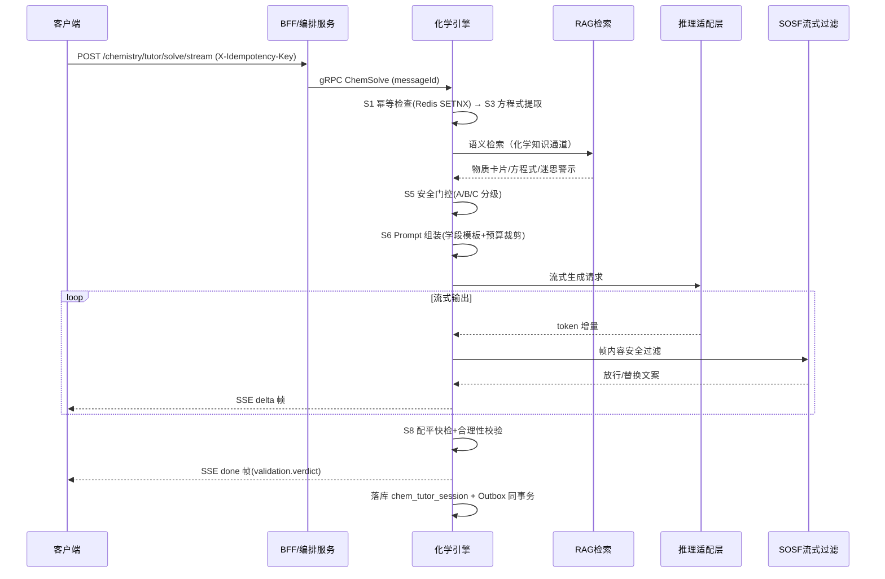
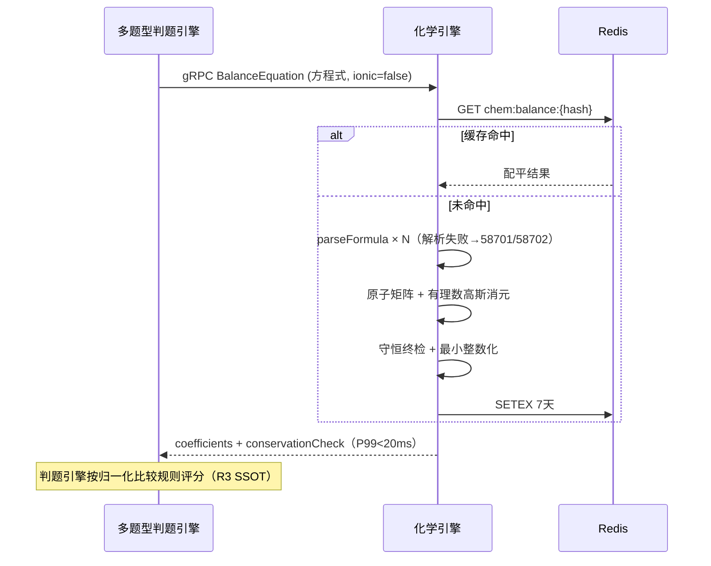
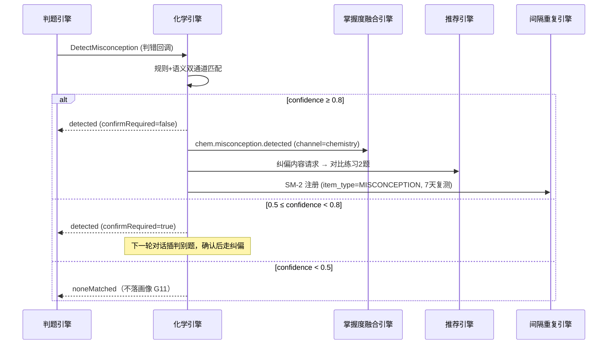

# 化学学科智能辅导引擎 详细设计

## 1. 概述

### 1.1 模块定位

化学学科智能辅导引擎是 PrimeTop 平台理科智能辅导体系的核心学科组件之一，为初中化学（九年级/初三）和高中化学（高一至高三）学生提供专业的化学问题解析、反应机理分析、实验推理和知识体系构建能力。

本引擎与物理学科引擎、数学解题引擎并列，共同构成理科 AI 辅导能力矩阵。相较于通用 AI 问答，本引擎针对化学学科的特殊性——化学方程式、分子结构、反应机理、实验操作、计算推理——进行了深度专业化设计。

### 1.2 核心职责

| 职责 | 说明 |
| --- | --- |
| 化学方程式识别与配平 | 从题目文本或图片中提取化学方程式，验证并自动配平 |
| 反应类型判定与机理分析 | 判断反应类型（化合/分解/置换/复分解/氧化还原等），解析电子转移 |
| 化学计算推理 | 物质的量计算、浓度计算、产率计算、pH计算等分步推导 |
| 实验方案分析与评价 | 实验设计合理性判断、装置选择、操作步骤分析、误差分析 |
| 物质结构与性质推理 | 基于元素周期律、化学键理论预测物质性质 |
| 化学专属图形理解 | 识别实验装置图、分子结构图、反应过程示意图 |
| 迷思概念检测与纠偏 | 识别学生在化学学习中的常见错误概念并针对性纠正 |

### 1.3 依赖关系

```
                    ┌─────────────────────┐
                    │   API 网关 / BFF    │
                    └──────────┬──────────┘
                               │
                    ┌──────────▼──────────┐
                    │ AI辅导编排服务       │
                    │ (请求路由/上下文)    │
                    └──────────┬──────────┘
                               │
              ┌────────────────▼────────────────┐
              │     化学学科智能辅导引擎          │
              │                                  │
              │  ┌─────────┐  ┌───────────────┐ │
              │  │方程式   │  │ 反应机理      │ │
              │  │解析模块 │  │ 分析模块      │ │
              │  └─────────┘  └───────────────┘ │
              │  ┌─────────┐  ┌───────────────┐ │
              │  │化学计算 │  │ 实验分析      │ │
              │  │推理模块 │  │ 模块          │ │
              │  └─────────┘  └───────────────┘ │
              │  ┌─────────┐  ┌───────────────┐ │
              │  │物质结构 │  │ 迷思概念      │ │
              │  │推理模块 │  │ 检测模块      │ │
              │  └─────────┘  └───────────────┘ │
              └──────────────────────────────────┘
                               │
         ┌─────────────┬───────┴───────┬──────────────┐
         ▼             ▼               ▼              ▼
   ┌──────────┐ ┌────────────┐ ┌──────────────┐ ┌──────────┐
   │RAG检索   │ │大模型API   │ │知识图谱服务  │ │OCR/多模态│
   │(化学知识)│ │(推理生成)  │ │(化学概念图)  │ │(公式识别)│
   └──────────┘ └────────────┘ └──────────────┘ └──────────┘
```

### 1.4 适用学段

| 学段 | 内容范围 | 考试定位 |
| --- | --- | --- |
| 初中（九年级） | 物质构成的奥秘、化学方程式、碳和碳的氧化物、金属、溶液、酸碱盐、化学实验基础 | 中考化学 |
| 高中必修 | 化学物质及其变化、金属及其化合物、非金属及其化合物、物质结构基础、化学反应与能量 | 高中学业水平考试 |
| 高中选修 | 化学反应原理、有机化学基础、物质结构与性质、实验化学 | 高考化学 |

---

## 2. 数据模型

### 2.1 化学知识体系核心实体

#### 2.1.1 化学物质实体（ChemicalSubstance）

```typescript
interface ChemicalSubstance {
  id: string;                          // 物质唯一标识，如 "sub_h2o"
  name: string;                        // 中文名称，如 "水"
  formula: string;                     // 化学式，如 "H₂O"
  formulaRaw: string;                  // 纯ASCII化学式，如 "H2O"
  alias: string[];                     // 别名/俗称，如 ["一氧化二氢"]
  category: SubstanceCategory;         // 物质分类
  state: 'solid' | 'liquid' | 'gas' | 'aqueous'; // 常温状态
  relativeMass: number;                // 相对分子质量
  properties: {
    physical: PhysicalProperty[];      // 物理性质
    chemical: ChemicalProperty[];      // 化学性质
  };
  hazards: HazardInfo | null;          // 危险性信息
  knowledgePoints: string[];           // 关联知识点ID
  textbookChapters: string[];          // 关联教材章节ID
  examFrequency: number;               // 考试出现频率（0-100）
}

type SubstanceCategory =
  | 'single_element'        // 单质
  | 'oxide'                 // 氧化物
  | 'acid'                  // 酸
  | 'base'                  // 碱
  | 'salt'                  // 盐
  | 'organic'               // 有机物
  | 'mixture'               // 混合物
  | 'polymer';              // 高分子

interface PhysicalProperty {
  property: string;          // 性质名称，如 "颜色"
  value: string;             // 性质描述，如 "无色"
}

interface ChemicalProperty {
  reactionType: string;      // 反应类型
  description: string;       // 性质描述
  equationIds: string[];     // 关联化学方程式ID
}

interface HazardInfo {
  level: 'safe' | 'low' | 'medium' | 'high' | 'extreme';
  labels: string[];          // 危险标签，如 ["易燃", "腐蚀性", "有毒"]
  handling: string;          // 安全操作说明
  storage: string;           // 储存要求
}
```

#### 2.1.2 化学方程式实体（ChemicalEquation）

```typescript
interface ChemicalEquation {
  id: string;                          // 方程式唯一标识
  reactants: EquationSpecies[];        // 反应物
  products: EquationSpecies[];         // 生成物
  conditions: ReactionCondition[];     // 反应条件
  type: ReactionType;                  // 反应类型
  balanced: boolean;                   // 是否已配平
  coefficients: Record<string, number>; // 化学计量数映射
  electronTransfer: ElectronTransfer | null;  // 电子转移信息（氧化还原反应）
  energyChange: 'exothermic' | 'endothermic' | 'unknown'; // 能量变化
  reversible: boolean;                 // 是否可逆反应
  knowledgePoints: string[];           // 关联知识点
  examFrequency: number;               // 考试频率
  commonMistakes: string[];            // 常见错误提醒
}

interface EquationSpecies {
  substanceId: string;       // 物质ID
  formula: string;           // 化学式
  coefficient: number;       // 化学计量数
  state: '(s)' | '(l)' | '(g)' | '(aq)';  // 状态标注
  role: 'reactant' | 'product' | 'catalyst' | 'solvent';
}

interface ReactionCondition {
  type: 'temperature' | 'pressure' | 'catalyst' | 'light' | 'electricity' | 'ignite';
  description: string;       // 如 "点燃"、"高温"、"催化剂"、"电解"
  symbol: string;            // 方程式中的条件符号
}

type ReactionType =
  | 'combination'           // 化合反应
  | 'decomposition'         // 分解反应
  | 'displacement'          // 置换反应
  | 'double_displacement'   // 复分解反应
  | 'redox'                 // 氧化还原反应
  | 'neutralization'        // 中和反应
  | 'combustion'            // 燃烧反应
  | 'substitution'          // 取代反应（有机）
  | 'addition'              // 加成反应（有机）
  | 'polymerization'        // 聚合反应
  | 'hydrolysis'            // 水解反应
  | 'esterification'        // 酯化反应
  | 'other';

interface ElectronTransfer {
  oxidizer: string;          // 氧化剂化学式
  reducer: string;           // 还原剂化学式
  oxidizedProduct: string;   // 氧化产物
  reducedProduct: string;    // 还原产物
  electronCount: number;     // 电子转移数
  oxidizerChange: string;    // 氧化剂化合价变化，如 "Mn:+7→+2"
  reducerChange: string;     // 还原剂化合价变化，如 "Cl:-1→0"
}
```

#### 2.1.3 化学实验实体（ChemistryExperiment）

```typescript
interface ChemistryExperiment {
  id: string;                          // 实验唯一标识
  name: string;                        // 实验名称
  type: 'preparation'                  // 制备实验
       | 'property'                    // 性质实验
       | 'identification'              // 鉴别实验
       | 'separation'                  // 分离提纯
       | 'quantitative'                // 定量实验
       | 'exploratory';                // 探究实验
  objective: string;                   // 实验目的
  apparatus: ExperimentApparatus[];    // 实验仪器和药品
  steps: ExperimentStep[];             // 实验步骤
  phenomena: ExperimentPhenomenon[];   // 预期现象
  conclusion: string;                  // 实验结论
  safetyNotes: string[];               // 安全注意事项
  errorAnalysis: ErrorAnalysisItem[];  // 误差分析要点
  knowledgePoints: string[];           // 关联知识点
  examFrequency: number;               // 考试频率
}

interface ExperimentApparatus {
  name: string;              // 仪器名称，如 "试管"
  specification: string;     // 规格，如 "25mL"
  purpose: string;           // 用途说明
  reagent: boolean;          // 是否为药品
}

interface ExperimentStep {
  order: number;             // 步骤序号
  action: string;            // 操作描述
  apparatus: string[];       // 涉及仪器
  reagents: string[];        // 涉及药品
  expectedPhenomenon: string; // 预期现象
  notes: string;             // 注意事项
}

interface ExperimentPhenomenon {
  step: number;              // 对应步骤
  description: string;       // 现象描述
  interpretation: string;    // 现象解释
}

interface ErrorAnalysisItem {
  factor: string;            // 误差因素
  effect: 'higher' | 'lower' | 'unpredictable'; // 对结果的影响方向
  explanation: string;       // 原理说明
}
```

#### 2.1.4 化学迷思概念实体（ChemistryMisconception）

```typescript
interface ChemistryMisconception {
  id: string;                          // 迷思概念ID
  topic: string;                       // 相关主题
  misconception: string;               // 错误概念描述
  correctConcept: string;              // 正确概念
  rootCause: string;                   // 错误根源分析
  detectionPatterns: string[];         // 检测模式（学生答题特征）
  correctionStrategy: string;          // 纠正策略
  exampleQuestions: string[];          // 示例题目ID
  gradeLevel: string[];                // 适用年级
}
```

### 2.2 数据库表结构

#### 2.2.1 化学物质表（chem_substance）

```sql
CREATE TABLE chem_substance (
    id              VARCHAR(32)     PRIMARY KEY COMMENT '物质唯一标识',
    name            VARCHAR(64)     NOT NULL COMMENT '中文名称',
    formula         VARCHAR(128)    NOT NULL COMMENT '化学式（含上下标）',
    formula_raw     VARCHAR(128)    NOT NULL COMMENT '纯ASCII化学式',
    alias           JSON            COMMENT '别名列表',
    category        VARCHAR(32)     NOT NULL COMMENT '物质分类',
    state           VARCHAR(16)     NOT NULL DEFAULT 'solid' COMMENT '常温状态',
    relative_mass   DECIMAL(10,4)   COMMENT '相对分子质量',
    properties      JSON            COMMENT '物理化学性质',
    hazards         JSON            COMMENT '危险性信息',
    knowledge_points JSON           COMMENT '关联知识点ID数组',
    exam_frequency  INT             DEFAULT 0 COMMENT '考试频率(0-100)',
    status          TINYINT         DEFAULT 1 COMMENT '1=有效 0=失效',
    created_at      DATETIME        DEFAULT CURRENT_TIMESTAMP,
    updated_at      DATETIME        DEFAULT CURRENT_TIMESTAMP ON UPDATE CURRENT_TIMESTAMP,
    INDEX idx_formula_raw (formula_raw),
    INDEX idx_category (category),
    INDEX idx_exam_freq (exam_frequency)
) ENGINE=InnoDB DEFAULT CHARSET=utf8mb4 COMMENT='化学物质表';
```

#### 2.2.2 化学方程式表（chem_equation）

```sql
CREATE TABLE chem_equation (
    id              VARCHAR(32)     PRIMARY KEY COMMENT '方程式唯一标识',
    equation_text   TEXT            NOT NULL COMMENT '完整方程式文本',
    reactants       JSON            NOT NULL COMMENT '反应物列表',
    products        JSON            NOT NULL COMMENT '生成物列表',
    conditions      JSON            COMMENT '反应条件列表',
    reaction_type   VARCHAR(32)     NOT NULL COMMENT '反应类型',
    is_balanced     TINYINT         DEFAULT 1 COMMENT '是否已配平',
    coefficients    JSON            COMMENT '化学计量数映射',
    electron_transfer JSON          COMMENT '电子转移信息',
    energy_change   VARCHAR(16)     DEFAULT 'unknown' COMMENT '能量变化',
    is_reversible   TINYINT         DEFAULT 0 COMMENT '是否可逆反应',
    knowledge_points JSON           COMMENT '关联知识点',
    exam_frequency  INT             DEFAULT 0 COMMENT '考试频率',
    common_mistakes JSON            COMMENT '常见错误提醒列表',
    status          TINYINT         DEFAULT 1,
    created_at      DATETIME        DEFAULT CURRENT_TIMESTAMP,
    updated_at      DATETIME        DEFAULT CURRENT_TIMESTAMP ON UPDATE CURRENT_TIMESTAMP,
    INDEX idx_reaction_type (reaction_type),
    INDEX idx_exam_freq (exam_frequency)
) ENGINE=InnoDB DEFAULT CHARSET=utf8mb4 COMMENT='化学方程式表';
```

#### 2.2.3 化学实验表（chem_experiment）

```sql
CREATE TABLE chem_experiment (
    id              VARCHAR(32)     PRIMARY KEY COMMENT '实验唯一标识',
    name            VARCHAR(128)    NOT NULL COMMENT '实验名称',
    type            VARCHAR(32)     NOT NULL COMMENT '实验类型',
    objective       TEXT            COMMENT '实验目的',
    apparatus       JSON            COMMENT '仪器药品列表',
    steps           JSON            COMMENT '实验步骤列表',
    phenomena       JSON            COMMENT '预期现象列表',
    conclusion      TEXT            COMMENT '实验结论',
    safety_notes    JSON            COMMENT '安全注意事项',
    error_analysis  JSON            COMMENT '误差分析要点',
    knowledge_points JSON           COMMENT '关联知识点',
    exam_frequency  INT             DEFAULT 0,
    grade_levels    JSON            COMMENT '适用年级',
    status          TINYINT         DEFAULT 1,
    created_at      DATETIME        DEFAULT CURRENT_TIMESTAMP,
    updated_at      DATETIME        DEFAULT CURRENT_TIMESTAMP ON UPDATE CURRENT_TIMESTAMP,
    INDEX idx_type (type),
    INDEX idx_exam_freq (exam_frequency)
) ENGINE=InnoDB DEFAULT CHARSET=utf8mb4 COMMENT='化学实验表';
```

#### 2.2.4 化学迷思概念表（chem_misconception）

```sql
CREATE TABLE chem_misconception (
    id                  VARCHAR(32)     PRIMARY KEY,
    topic               VARCHAR(128)    NOT NULL COMMENT '相关主题',
    misconception       TEXT            NOT NULL COMMENT '错误概念',
    correct_concept     TEXT            NOT NULL COMMENT '正确概念',
    root_cause          TEXT            COMMENT '错误根源',
    detection_patterns  JSON            COMMENT '检测模式',
    correction_strategy TEXT            COMMENT '纠正策略',
    example_questions   JSON            COMMENT '示例题目',
    grade_levels        JSON            COMMENT '适用年级',
    status              TINYINT         DEFAULT 1,
    created_at          DATETIME        DEFAULT CURRENT_TIMESTAMP,
    updated_at          DATETIME        DEFAULT CURRENT_TIMESTAMP ON UPDATE CURRENT_TIMESTAMP,
    INDEX idx_topic (topic)
) ENGINE=InnoDB DEFAULT CHARSET=utf8mb4 COMMENT='化学迷思概念表';
```

#### 2.2.5 化学辅导会话表（chem_tutor_session）

```sql
CREATE TABLE chem_tutor_session (
    id              BIGINT          AUTO_INCREMENT PRIMARY KEY,
    session_id      VARCHAR(64)     NOT NULL COMMENT '辅导会话ID',
    user_id         VARCHAR(64)     NOT NULL COMMENT '用户ID',
    grade_level     VARCHAR(16)     NOT NULL COMMENT '年级',
    textbook_version VARCHAR(32)    COMMENT '教材版本',
    scenario        VARCHAR(32)     NOT NULL COMMENT '辅导场景',
    question_text   TEXT            COMMENT '原始问题文本',
    question_image_urls JSON        COMMENT '问题图片URL',
    parsed_equations JSON           COMMENT '解析出的方程式',
    ai_response     LONGTEXT        COMMENT 'AI回复内容',
    response_steps  JSON            COMMENT '回复步骤结构化数据',
    knowledge_points_invoked JSON   COMMENT '涉及知识点',
    misconceptions_detected JSON    COMMENT '检测到的迷思概念',
    user_feedback   TINYINT         COMMENT '用户反馈 1=有用 -1=无用',
    model_used      VARCHAR(64)     COMMENT '使用的模型',
    token_cost      INT             COMMENT 'Token消耗',
    processing_time_ms INT          COMMENT '处理耗时',
    created_at      DATETIME        DEFAULT CURRENT_TIMESTAMP,
    INDEX idx_user (user_id),
    INDEX idx_session (session_id),
    INDEX idx_scenario (scenario),
    INDEX idx_created (created_at)
) ENGINE=InnoDB DEFAULT CHARSET=utf8mb4 COMMENT='化学辅导会话表';
```

### 2.3 缓存策略

```typescript
// Redis 缓存键设计
const CacheKeys = {
  // 化学物质缓存（按化学式查询），TTL 24h
  substance: (formula: string) => `chem:substance:${formula.toLowerCase()}`,
  
  // 方程式缓存（按方程式文本哈希），TTL 24h
  equation: (equationHash: string) => `chem:eq:${equationHash}`,
  
  // 常见方程式列表（按物质ID），TTL 6h
  substanceEquations: (substanceId: string) => `chem:sub_eqs:${substanceId}`,
  
  // 实验信息缓存，TTL 12h
  experiment: (expId: string) => `chem:exp:${expId}`,
  
  // 迷思概念列表（按主题），TTL 24h
  misconceptions: (topic: string) => `chem:misc:${topic}`,
  
  // 方程式配平结果缓存，TTL 7天（配平结果不变）
  balancedEquation: (equationHash: string) => `chem:balance:${equationHash}`,
  
  // 高频考点化学知识，TTL 1h（用于RAG上下文）
  hotTopics: (gradeLevel: string) => `chem:hot:${gradeLevel}`,
};
```

### 2.4 DDL 增补（v1.1）

v1.0 五张核心表见 §2.2；以下为 v1.1 补全时随 §3.2/§4/§5 新链路一并增补的列与表（对应维护记录承诺，F3/F5 的落库承载）。

#### 2.4.1 chem_equation 增列（来源与审核语义，F3）

```sql
ALTER TABLE chem_equation
    ADD COLUMN origin        VARCHAR(16) DEFAULT 'curated'
        COMMENT 'curated=内容管线生产 / runtime_llm=运行时LLM发现',
    ADD COLUMN verify_status VARCHAR(16) DEFAULT 'verified'
        COMMENT 'verified=已复核 / pending=待双人复核（仅 runtime_llm 来源可为 pending）',
    ADD COLUMN discovered_session_id VARCHAR(64) NULL COMMENT 'runtime 发现来源会话（审计溯源）',
    ADD COLUMN verified_by   VARCHAR(96) NULL COMMENT '复核人（双人，id1,id2，R14）',
    ADD COLUMN verified_at   DATETIME NULL,
    ADD INDEX idx_origin_verify (origin, verify_status);
```

**规则：**`origin=runtime_llm` 的新行 `verify_status` 置 `pending`；`pending` 行**不进入** RAG 检索池与类题素材（§4.7 读取侧过滤）；管理端双人复核通过后转 `verified` 并广播 `chem.equation.discovered`（§9.2，R14）；否决行置 `status=0` 下线，不物理删除。

#### 2.4.2 异步识别任务表（chem_parse_task）

承载 §3.2.3 图片方程式识别的异步任务（`async=true` 落库、创建去重 §8.3、状态机 §7.4 与统一异步任务进度中心映射）：

```sql
CREATE TABLE chem_parse_task (
    id             VARCHAR(64)  PRIMARY KEY COMMENT 'taskId（pt_chem_ 前缀）',
    user_id        VARCHAR(32)  NOT NULL,
    source         VARCHAR(16)  NOT NULL COMMENT 'image / text',
    image_url      VARCHAR(512) NULL COMMENT '原图 URL（30 天清理，G14/C9）',
    image_hash     CHAR(64)     NULL COMMENT 'SHA-256(原图)，5 分钟内同图返回同 taskId（§8.3）',
    ocr_request_id VARCHAR(64)  NULL COMMENT '委托 OCR 管线的任务号（对账 R6）',
    status         VARCHAR(16)  DEFAULT 'PENDING' COMMENT 'PENDING/RUNNING/SUCCEEDED/FAILED（§7.4）',
    result         JSON         NULL COMMENT '规范化 equations（§3.2.3 响应结构）',
    fail_code      INT          NULL,
    fail_msg       VARCHAR(255) NULL,
    version        INT          DEFAULT 0 COMMENT '乐观锁（状态 CAS 迁移，G5）',
    created_at     DATETIME     DEFAULT CURRENT_TIMESTAMP,
    updated_at     DATETIME     DEFAULT CURRENT_TIMESTAMP ON UPDATE CURRENT_TIMESTAMP,
    INDEX idx_user_created (user_id, created_at),
    INDEX idx_status (status)
) ENGINE=InnoDB DEFAULT CHARSET=utf8mb4 COMMENT='化学方程式异步识别任务表';
```

#### 2.4.3 安全拦截日志表（chem_safety_block_log，F5 落库承载）

§5.5 safetyGate 的 A 级拦截与自伤转介持久化，与 `chem.safety.blocked` Outbox 事件**同事务**写入（对账 §9.5-②）；问题原文不落库，仅存哈希（C2/C4）：

```sql
CREATE TABLE chem_safety_block_log (
    id              BIGINT       AUTO_INCREMENT PRIMARY KEY,
    user_id         VARCHAR(32)  NOT NULL,
    session_id      VARCHAR(64)  NULL,
    category        VARCHAR(32)  NOT NULL COMMENT 'A_SYNTHESIS / SELF_HARM_REDIRECT',
    action          VARCHAR(16)  NOT NULL COMMENT 'BLOCKED / CARE_REDIRECT',
    matched_rule    VARCHAR(64)  NULL COMMENT '命中的关键词/物质规则 ID（A/B 清单版本化）',
    snippet_hash    CHAR(64)     NOT NULL COMMENT 'SHA-256(问题原文)——原文不落库（C2）',
    outbox_event_id VARCHAR(64)  NOT NULL COMMENT '关联 chem.safety.blocked（日终对账）',
    created_at      DATETIME     DEFAULT CURRENT_TIMESTAMP,
    INDEX idx_user (user_id),
    INDEX idx_created (created_at)
) ENGINE=InnoDB DEFAULT CHARSET=utf8mb4 COMMENT='危险实验拦截日志（A 级，保留 180 天）';
```

#### 2.4.4 gRPC 幂等表（chem_gRPC_idem）

§3.2.9 全部内部接口 `message_id` 幂等（§8.7：messageId 唯一键 + 响应快照回放）：

```sql
CREATE TABLE chem_gRPC_idem (
    message_id    VARCHAR(64)  PRIMARY KEY COMMENT '调用方 messageId',
    method        VARCHAR(64)  NOT NULL,
    request_hash  CHAR(64)     NOT NULL COMMENT '请求体 SHA-256；同 messageId 不同请求体为协议违规，拒绝执行并 P2 告警',
    response_body JSON         NULL COMMENT '首次执行结果快照（重放直接返回）',
    status        VARCHAR(16)  DEFAULT 'PROCESSING' COMMENT 'PROCESSING/DONE',
    created_at    DATETIME     DEFAULT CURRENT_TIMESTAMP,
    expires_at    DATETIME     NOT NULL COMMENT 'created_at + 24h，定时清理（TTL 24h）',
    INDEX idx_expires (expires_at)
) ENGINE=InnoDB DEFAULT CHARSET=utf8mb4 COMMENT='gRPC 调用幂等表';
```

> 事件发件箱 `chem_outbox` DDL 随事件章节集中定义于 §9.1，此处不重复维护，避免双处漂移。

---

## 3. API 接口设计

### 3.1 接口总览

| 接口 | 方法 | 路径 | 说明 |
| --- | --- | --- | --- |
| 化学问题解析 | POST | /api/v1/chemistry/tutor/solve | 主入口：化学问题智能解析 |
| 方程式配平 | POST | /api/v1/chemistry/equation/balance | 化学方程式自动配平 |
| 方程式识别 | POST | /api/v1/chemistry/equation/recognize | 从图片/文本识别化学方程式 |
| 反应类型判定 | POST | /api/v1/chemistry/reaction/classify | 判断化学反应类型 |
| 物质性质查询 | GET | /api/v1/chemistry/substance/{formula} | 查询化学物质详细性质 |
| 实验分析 | POST | /api/v1/chemistry/experiment/analyze | 化学实验方案分析 |
| 迷思概念检测 | POST | /api/v1/chemistry/misconception/detect | 检测学生迷思概念 |
| 计算题分步求解 | POST | /api/v1/chemistry/calculation/solve | 化学计算题分步推导 |

### 3.2 接口详细定义

#### 3.2.1 化学问题解析（主入口）

```
POST /api/v1/chemistry/tutor/solve
```

**请求体：**

```json
{
  "sessionId": "sess_abc123",
  "userId": "u_10086",
  "gradeLevel": "初三",
  "textbookVersion": "人教版",
  "question": {
    "text": "将铁钉放入硫酸铜溶液中，观察到的现象是什么？写出化学方程式。",
    "images": [],
    "context": "学习进度：金属资源的利用和保护"
  },
  "scenario": "homework_help",
  "options": {
    "detailLevel": "standard",
    "showHintsFirst": true,
    "language": "zh-CN"
  }
}
```

**响应体：**

```json
{
  "code": 0,
  "data": {
    "sessionId": "sess_abc123",
    "answerId": "ans_chem_001",
    "type": "experiment_phenomenon_and_equation",
    "steps": [
      {
        "stepId": 1,
        "type": "understanding",
        "title": "题目理解",
        "content": "本题考察金属活动性顺序的应用——置换反应。铁的活动性大于铜，因此铁可以将铜从其盐溶液中置换出来。",
        "keyInfo": {
          "reactants": ["Fe", "CuSO₄"],
          "reactionType": "displacement",
          "concept": "金属活动性顺序"
        }
      },
      {
        "stepId": 2,
        "type": "hint",
        "title": "思路提示",
        "content": "回忆金属活动性顺序：Fe > Cu。活动性强的金属能把活动性弱的金属从其盐溶液中置换出来。思考：铁钉表面会出现什么变化？溶液颜色会如何变化？",
        "scaffoldQuestions": [
          "铁和铜哪个金属活动性更强？",
          "置换反应中，铁会变成什么离子进入溶液？",
          "铜离子是什么颜色的？"
        ]
      },
      {
        "stepId": 3,
        "type": "analysis",
        "title": "现象分析",
        "content": "由于 Fe 的活动性大于 Cu，发生置换反应：\n\nFe + CuSO₄ → FeSO₄ + Cu\n\n**实验现象：**\n① 铁钉表面覆盖一层红色（紫红色）固体——析出的铜\n② 溶液由蓝色逐渐变为浅绿色——Cu²⁺ 被消耗，Fe²⁺ 生成",
        "phenomena": [
          {
            observation: "铁钉表面出现红色固体",
            interpretation: "铁置换出铜，铜为紫红色固体"
          },
          {
            observation: "溶液由蓝色变为浅绿色",
            interpretation: "Cu²⁺（蓝色）被消耗，生成 Fe²⁺（浅绿色）"
          }
        ]
      },
      {
        "stepId": 4,
        "type": "equation",
        "title": "化学方程式",
        "content": "Fe + CuSO₄ = FeSO₄ + Cu\n\n反应类型：置换反应\n反应条件：常温下即可发生（在溶液中）",
        "equation": {
          "reactants": [
            { "formula": "Fe", "coefficient": 1, "state": "(s)" },
            { "formula": "CuSO₄", "coefficient": 1, "state": "(aq)" }
          ],
          "products": [
            { "formula": "FeSO₄", "coefficient": 1, "state": "(aq)" },
            { "formula": "Cu", "coefficient": 1, "state": "(s)" }
          ],
          "type": "displacement",
          "balanced": true,
          "conditions": []
        }
      },
      {
        "stepId": 5,
        "type": "summary",
        "title": "知识总结",
        "content": "本题核心知识点：\n1. 金属活动性顺序：K Ca Na Mg Al Zn **Fe** Sn Pb (H) **Cu** Hg Ag Pt Au\n2. 置换反应：A + BC → AC + B（活动性 A > B）\n3. 常见离子颜色：Cu²⁺ 蓝色、Fe²⁺ 浅绿色、Fe³⁺ 黄色",
        "keyTakeaways": ["金属活动性：Fe > Cu，故 Fe 能置换 Cu", "现象规范表述：铁钉表面覆盖一层红色固体，溶液由蓝色变为浅绿色"]
      }
    ],
    "misconceptions": [],
    "knowledgePointsInvoked": ["kp_chem_metal_activity", "kp_chem_displacement_reaction"],
    "relatedExperiments": ["exp_fe_cuso4_displacement"],
    "practiceSuggestions": ["q_sim_metal_displace_001", "q_metal_activity_judge_002"],
    "followUpQuestions": [
      "如果把铜片放入硫酸亚铁溶液中，能发生反应吗？为什么？",
      "湿法炼铜（Fe + CuSO₄）应用的正是这个原理，试试工业流程题？"
    ],
    "safetyNotes": [],
    "usage": {
      "model": "glm-4.7-plus",
      "inputTokens": 1820,
      "outputTokens": 640,
      "latencyMs": 3120,
      "firstTokenMs": 1240
    },
    "validation": {
      "equationsChecked": 1,
      "equationsBalanced": 1,
      "verdict": "pass"
    },
    "degraded": [],
    "answerId": "ans_chem_001"
  },
  "requestId": "req_20260821_0001"
}
```

**说明：**

1. **响应步骤协议**：`steps[].type` 取值 `understanding | hint | analysis | equation | calculation | summary | safety`，与《服务端-AI-Prompt编排与场景模板系统-详细设计》的输出协议及《服务端-题目题型识别与结构化解析引擎-详细设计》§4.10 解题策略路由表（`promptTemplate / hintStrategyGroup / judgeEvaluator`）同名对齐（R2）。`showHintsFirst=true` 时客户端先渲染至 step 2，其余步骤按用户"继续"逐级展开。
2. **方程式校验**：响应中每个 `equation` 结构在返回前都经过本地配平快检（§4.2.4，P99 < 5ms），`validation.verdict=pass` 表示全部通过；`warn` 表示存在标注式提醒；`fail` 触发 58725 警示话术（G1）。
3. **幂等**：客户端携带 `X-Idempotency-Key`（推荐 `sessionId + questionHash`），24h 内重复请求返回缓存结果，不重复扣 AI 额度（§8.1）。
4. **安全通道**：涉危险实验请求不报错，而是返回 `safetyNotes` + 降级的原理讲解模式内容（58716 语义，§4.8、G2/G3、C1/C2）。
5. **流式**：本接口同时提供 SSE 版本 `/api/v1/chemistry/tutor/solve/stream`，帧协议委托《SSE流式响应与AI增量渲染引擎-详细设计》，`knowledge_ref` 增量帧委托《AI回答知识点自动标注与溯源引用系统》（R8）。

#### 3.2.2 化学方程式自动配平

```
POST /api/v1/chemistry/equation/balance
```

**请求体：**

```json
{
  "equationText": "KMnO4 + HCl -- KCl + MnCl2 + Cl2 + H2O",
  "mode": "auto",
  "ionic": false,
  "requireState": true,
  "gradeLevel": "高一"
}
```

| 字段 | 类型 | 必填 | 说明 |
| --- | --- | --- | --- |
| equationText | string | 与 species 二选一 | 待配平方程式，`--`/`→`/`=` 均识别为反应号，未配平系数随意 |
| species | object | 与 equationText 二选一 | 已结构化的 reactants/products 化学式数组（题型解析引擎直连通道，R1） |
| mode | string | 否 | `auto`（默认，矩阵法）/ `redox`（氧化还原化合价法，输出电子转移） |
| ionic | boolean | 否 | 是否按离子方程式校验（追加电荷守恒行） |
| requireState | boolean | 否 | 是否在输出中补全 (s)/(l)/(g)/(aq) 状态标注 |

**响应体：**

```json
{
  "code": 0,
  "data": {
    "input": "KMnO4 + HCl -> KCl + MnCl2 + Cl2 + H2O",
    "balanced": "2KMnO₄ + 16HCl = 2KCl + 2MnCl₂ + 5Cl₂↑ + 8H₂O",
    "coefficients": { "KMnO4": 2, "HCl": 16, "KCl": 2, "MnCl2": 2, "Cl2": 5, "H2O": 8 },
    "method": "matrix",
    "conservationCheck": {
      "K": { "left": 2, "right": 2, "ok": true },
      "Mn": { "left": 2, "right": 2, "ok": true },
      "Cl": { "left": 16, "right": 16, "ok": true },
      "H": { "left": 16, "right": 16, "ok": true },
      "O": { "left": 8, "right": 8, "ok": true }
    },
    "electronTransfer": {
      "oxidizer": "KMnO₄（Mn）",
      "reducer": "HCl（Cl）",
      "oxidizerChange": "Mn：+7 → +2，得 5e⁻",
      "reducerChange": "Cl：-1 → 0，失 1e⁻",
      "electronCount": 10,
      "note": "16 个 HCl 中仅 10 个被氧化（5Cl₂），其余 6 个起酸的作用"
    },
    "reactionType": "redox",
    "cacheHit": true
  }
}
```

**关键逻辑：**

1. **归一化**：全角转半角、Unicode 上下标转 ASCII（`₄`→`4`）、`点燃/Δ/高温` 等条件词抽离为 conditions，反应号统一为 `=`。
2. **解析**：调用化学式解析器（§5.1）解析每个物种，得到元素原子计数与电荷；无法解析返回 58701/58702。
3. **矩阵法配平**（`mode=auto`）：构建元素守恒齐次方程组（离子式追加电荷守恒行），有理数高斯消元求零空间，最小正整数化解（§4.2）；无正解返回 58705（方程式可能本身错误，如生成物写错）。
4. **氧化还原校验**（`mode=redox`）：计算各元素化合价（规则见 §4.2.5），校验升降价总数相等；不等时输出 electronTransfer 明细供讲解。
5. **缓存**：`equationHash = SHA-256(规范化方程式)`，命中 `chem:balance:{hash}` 直接返回（TTL 7 天，配平结果恒定）。
6. **性能契约**：纯本地计算，无 LLM 调用，P99 < 20ms（§12 M4）；此接口同时被多题型判题引擎同步调用（R3），必须保持无状态可水平扩展。

#### 3.2.3 化学方程式识别

```
POST /api/v1/chemistry/equation/recognize
```

**请求体：**

```json
{
  "source": "image",
  "imageUrl": "https://cdn.primetop.cn/upload/u_10086/q_001.jpg",
  "regions": [{ "x": 0.1, "y": 0.3, "w": 0.8, "h": 0.2 }],
  "text": null,
  "async": true
}
```

**响应体（async=false 同步 / async=true 返回 taskId 后轮询）：**

```json
{
  "code": 0,
  "data": {
    "taskId": "pt_chem_20260821_0001",
    "status": "SUCCEEDED",
    "equations": [
      {
        "raw": "Fe+CuS04=FeS04+Cu",
        "normalized": "Fe + CuSO4 = FeSO4 + Cu",
        "pretty": "Fe + CuSO₄ = FeSO₄ + Cu",
        "confidence": 0.97,
        "source": "ocr",
        "bbox": { "x": 0.12, "y": 0.31, "w": 0.72, "h": 0.06 },
        "corrections": [{ "from": "CuS04", "to": "CuSO4", "reason": "字母 O 与数字 0 混淆（元素符号大写规则）" }]
      }
    ],
    "unrecognized": []
  }
}
```

**关键逻辑：**

1. 图片入口委托《图片处理与OCR识别管线-详细设计》完成 OCR；若题型结构化解析引擎已产出公式占位符（F1 占位符回收通道），本接口**不重复识别**，直接消费其结果（R1）。
2. 化学式特有纠错规则：`O/0`、`l/1`、`Cl/C1` 混淆；元素符号首字母大写校验（`cu`→`Cu`）；`SO4`/`So4` 归一。
3. 置信度 < 0.6 的结果进入 `unrecognized`，提示用户手动框选或文字输入，不猜测（对齐题型解析引擎 G3 越集改判守卫）。
4. 异步任务状态机与轮询协议复用《统一异步任务进度中心》（PENDING→RUNNING→SUCCEEDED/FAILED，§7.4）。

#### 3.2.4 反应类型判定

```
POST /api/v1/chemistry/reaction/classify
```

**请求体：**

```json
{
  "equationText": "Cl2 + 2NaOH = NaCl + NaClO + H2O",
  "gradeLevel": "高二"
}
```

**响应体：**

```json
{
  "code": 0,
  "data": {
    "primaryType": "redox",
    "basicType": null,
    "orthogonalNote": "本反应不属于四大基本反应类型；属于氧化还原反应中的歧化反应",
    "specialPattern": "disproportionation",
    "evidence": {
      "oxidationChanges": [
        { "element": "Cl", "from": 0, "to": -1, "role": "自身还原", "species": "NaCl" },
        { "element": "Cl", "from": 0, "to": 1, "role": "自身氧化", "species": "NaClO" }
      ],
      "rule": "同一元素价态同时升高和降低 → 歧化反应"
    },
    "teachingNote": "Cl₂ 在碱性溶液中歧化，随温度升高 NaClO 可进一步歧化为 NaClO₃（高考选择题常考陷阱）"
  }
}
```

**关键逻辑：** 规则优先分类（§4.3）：①四大基本类型特征匹配（化合多变一/分解一变多/单质+化合物置换/两化合物交换成分）；②氧化还原正交维度（任一元素化合价变化即标记 redox）；③特殊模式识别（歧化 disproportionation / 归中 comproportionation，如 `2H₂S + SO₂ = 3S↓ + 2H₂O`）；④有机类型（取代/加成/聚合等）仅在 `formula` 命中有机物库时启用。分类器必须输出 `evidence`（可解释，对齐个性化推荐解释生成引擎的可解释性原则），无可信证据返回 58706 并降级 LLM 判定。

#### 3.2.5 化学物质性质查询

```
GET /api/v1/chemistry/substance/{formula}?include=properties,equations,hazards
```

**响应体：**

```json
{
  "code": 0,
  "data": {
    "id": "sub_cuso4",
    "formula": "CuSO₄",
    "name": "硫酸铜",
    "alias": ["蓝矾", "胆矾（五水硫酸铜 CuSO₄·5H₂O）"],
    "category": "salt",
    "state": "solid",
    "relativeMass": 159.61,
    "properties": {
      "physical": [
        { "property": "颜色（无水）", "value": "白色粉末" },
        { "property": "颜色（晶体）", "value": "蓝色" }
      ],
      "chemical": [
        { "reactionType": "displacement", "description": "与活动性大于 Cu 的金属发生置换", "equationIds": ["eq_fe_cuso4", "eq_zn_cuso4"] },
        { "reactionType": "double_displacement", "description": "与碱反应生成 Cu(OH)₂ 沉淀", "equationIds": ["eq_cuso4_naoh"] }
      ]
    },
    "hazards": { "level": "low", "labels": ["误食有害"], "handling": "避免入口，实验后洗手", "storage": "密封干燥" },
    "examFrequency": 82,
    "etag": "W/\"cuso4-v17\""
  }
}
```

**关键逻辑：** ①支持化学式/中文名/别名/俗称四种查询键（`cu2oh2co3` / `碱式碳酸铜` / `铜绿`）；②ETag 协商缓存，304 语义（缓存键 `chem:substance:{formula}` TTL 24h）；③未收录返回 58704 并自动提交"物质收录建议"到内容生产队列（对齐 R14）；④`hazards` 字段按学段裁剪——幼儿/小学段仅返回 level 不返回 labels 细节（C7，防好奇模仿）。

#### 3.2.6 化学实验方案分析

```
POST /api/v1/chemistry/experiment/analyze
```

**请求体：**

```json
{
  "sessionId": "sess_abc123",
  "userId": "u_10086",
  "gradeLevel": "初三",
  "analyzeType": "error_analysis",
  "experiment": {
    "text": "用碳酸钠标定盐酸浓度，滴定终点读数时俯视刻度线，对测定结果有何影响？",
    "images": [],
    "knownExperimentId": null
  }
}
```

**响应体：**

```json
{
  "code": 0,
  "data": {
    "experimentType": "quantitative",
    "steps": [
      {
        "stepId": 1,
        "type": "analysis",
        "title": "俯视读数的误差机制",
        "content": "滴定管读数时俯视，视线偏低，读数比实际体积**偏小**……起点俯视、终点俯视需分别讨论，本题按终点俯视处理：记录的 V(标准液) 偏大。"
      },
      {
        "stepId": 2,
        "type": "calculation",
        "title": "误差传递",
        "content": "c(待测) = c(标准) × V(标准) / V(待测)，V(标准) 读数偏大 → c(待测) 偏高。",
        "formula": "c_2 = c_1 V_1 / V_2"
      },
      {
        "stepId": 3,
        "type": "summary",
        "title": "结论",
        "content": "测定结果偏高。",
        "keyTakeaways": ["俯视→读小→V 偏大→c 偏高（本题终点读数）", "常见读数误差口诀：俯视读小，仰视读大"]
      }
    ],
    "errorDirection": "higher",
    "safetyGate": null,
    "answerId": "ans_chem_002"
  }
}
```

**关键逻辑：** ①`analyzeType` ∈ `apparatus`（装置评价）/ `steps`（步骤分析）/ `error_analysis`（误差分析）/ `safety`（安全评价）/ `full`（完整方案，仅虚拟实验场景开放）；②定量实验误差分析输出结构化 `errorDirection`（higher/lower/unpredictable），规则表见 §4.5.4；③**安全门控先行**（§5.5）：请求文本与涉及物质先过危险实验分级清单（A 级绝对拦截 / B 级原理讲解模式 / C 级正常辅导 + 安全提示），B 级命中时响应 `safetyGate: "principle_only"` 且内容走脱敏 Prompt（G2/G3、C1/C2）。

#### 3.2.7 迷思概念检测

```
POST /api/v1/chemistry/misconception/detect
```

**请求体：**

```json
{
  "userId": "u_10086",
  "gradeLevel": "初三",
  "topic": "质量守恒定律",
  "source": "answer_review",
  "payload": {
    "questionStem": "镁条在空气中燃烧后固体质量变化",
    "studentAnswer": "固体质量不变，因为质量守恒定律",
    "correctAnswer": "固体质量增大，参加反应的氧气质量计入生成物"
  }
}
```

**响应体：**

```json
{
  "code": 0,
  "data": {
    "detected": [
      {
        "misconceptionId": "misc_conservation_closed",
        "misconception": "把质量守恒定律误解为\"任意变化的体系质量不变\"",
        "correctConcept": "质量守恒适用于封闭体系内发生的化学反应；敞口体系有气体参与/逸出时需计入所有反应物与生成物",
        "confidence": 0.91,
        "matchedPattern": "answer_feature:closed_system_ignored",
        "rootCause": "对定律适用条件（封闭体系）与\"参加反应\"的限定词理解缺失",
        "correctionStrategy": "认知冲突法：白磷燃烧前后质量恒定（封闭）vs 镁条敞口燃烧增重，引导自述差异来源",
        "confirmRequired": false
      }
    ],
    "noneMatched": false,
    "followUpPlan": "推送 2 道封闭/敞口体系对比练习（q_conservation_cmp_001/002）"
  }
}
```

**关键逻辑：** ①检测信号三来源：作答特征（`answer_review`，判题引擎回调）、对话文本（`dialog`，AI 辅导对话流式后置分析）、行为序列（`behavior`，同模式错误重复率）；②置信度三档路由（§4.6.3）：≥0.8 直接纠偏推送 / 0.5-0.8 追问确认（`confirmRequired=true`，下一轮对话插确认问题）/< 0.5 不触发不落画像（G11）；③同一 `(userId, misconceptionId)` 24h 窗口去重，防重复打扰（频控对齐统一学习干预编排引擎 R9）；④命中即发 `chem.misconception.detected` 事件（§9.2）。

#### 3.2.8 化学计算题分步求解

```
POST /api/v1/chemistry/calculation/solve
```

**请求体：**

```json
{
  "sessionId": "sess_abc124",
  "userId": "u_10086",
  "gradeLevel": "初三",
  "question": {
    "text": "将 5.6 g 铁粉加入足量硫酸铜溶液中，完全反应后，固体质量是多少克？（相对原子质量：Fe-56，Cu-64）",
    "images": []
  },
  "options": { "showHintsFirst": false, "detailLevel": "detailed", "sigFig": 3 }
}
```

**响应体：**

```json
{
  "code": 0,
  "data": {
    "method": "difference",
    "methodReason": "已知反应前后固体质量变化 → 差量法",
    "steps": [
      {
        "stepId": 1,
        "type": "understanding",
        "title": "已知量梳理",
        "content": "m(Fe) = 5.6 g，Fe 足量 CuSO₄ 中完全反应；M(Fe)=56 g/mol，M(Cu)=64 g/mol。",
        "knownQuantities": [{ "symbol": "m(Fe)", "value": 5.6, "unit": "g" }]
      },
      {
        "stepId": 2,
        "type": "equation",
        "title": "化学建模",
        "content": "Fe + CuSO₄ = FeSO₄ + Cu\n每 56 g Fe 溶解，析出 64 g Cu，固体增重 64-56 = 8 g。",
        "equation": { "text": "Fe + CuSO₄ = FeSO₄ + Cu", "delta": { "solidMassChange": 8, "per": "56 g Fe" } }
      },
      {
        "stepId": 3,
        "type": "calculation",
        "title": "数学求解（差量法）",
        "content": "n(Fe) = 5.6 / 56 = 0.1 mol\n析出 m(Cu) = 0.1 × 64 = 6.4 g\n固体质量 = 5.6 - 0.1×56 + 0.1×64 = 5.6 + 0.8 = 6.4 g",
        "formulaChain": ["n = m/M", "m(Cu) = n × M", "Δm = n × (M_Cu - M_Fe)"]
      },
      {
        "stepId": 4,
        "type": "summary",
        "title": "答案与合理性校验",
        "content": "完全反应后固体（全部为 Cu）质量为 **6.4 g**。\n校验：6.4 g > 5.6 g，固体增重符合置换规律（析出的铜比溶解的铁重）。",
        "answer": { "value": 6.4, "unit": "g", "sigFig": 2 },
        "sanityCheck": { "passed": true, "rules": ["增重方向正确", "数值与差量法一致"] }
      }
    ],
    "symbolicEngineUsed": false,
    "answerId": "ans_chem_003"
  }
}
```

**关键逻辑：** ①方法路由（§4.4.2）：守恒法/差量法/关系式法/极值法/平均值法（十字交叉）/讨论法六类特征匹配，输出 `method + methodReason`（可解释）；②**化学建模归本引擎，符号计算委托《统一学科计算引擎与符号推理服务》**（R6）——含分数/循环小数/多未知数的联立求解由符号引擎执行，本引擎负责把化学关系翻译为方程组；符号引擎不可用时 LLM 分步计算并以 `symbolicEngineUsed:false, confidenceDegraded:true` 标注（D5）；③合理性校验规则（G7，只标注不拦截）：产率 0-100%、pH 常规 0-14、质量方向（置换增重/减轻方向）、有效数字与题面精度一致；④多步连续反应（工业流程题）走关系式法，中间产物桥接系数自动推演；⑤计算过程自洽性深度校验委托《理科解题多步计算过程自洽性校验与答案置信度评估引擎》（R5）。

#### 3.2.9 gRPC 内部接口（供编排服务/判题引擎调用）

```protobuf
service ChemistryEngine {
  // 主辅导入口（AI辅导编排服务调用）
  rpc ChemSolve(ChemSolveRequest) returns (stream ChemSolveChunk);
  // 方程式配平（判题引擎同步调用，P99<20ms）
  rpc BalanceEquation(BalanceRequest) returns (BalanceResponse);
  // 反应类型判定（题型解析引擎调用）
  rpc ClassifyReaction(ClassifyRequest) returns (ClassifyResponse);
  // 物质快查（BFF 聚合用）
  rpc GetSubstance(SubstanceRequest) returns (SubstanceResponse);
  // 迷思检测（判题回调通道）
  rpc DetectMisconception(MiscDetectRequest) returns (MiscDetectResponse);
}
```

| 约束 | 说明 |
| --- | --- |
| 超时预算 | `ChemSolve` 首包 3s / 总 30s；`BalanceEquation` 50ms；`GetSubstance` 30ms（§4.1.6 延迟预算表） |
| 幂等 | 全部接口要求 `message_id`，重复调用返回上次结果（§8.7） |
| 限流 | `ChemSolve` 按上游编排服务实例 200 QPS 令牌桶；`BalanceEquation` 无 LLM 不限流（本机 CPU 保护性 2000 QPS） |

#### 3.2.10 管理端接口（内容运营）

| 接口 | 方法 | 路径 | 审批要求 |
| --- | --- | --- | --- |
| 新增/编辑物质 | POST/PUT | /admin/v1/chemistry/substances | 常规单人；hazards.level ∈ {high,extreme} 双人审批（G10） |
| 方程式审核 | PUT | /admin/v1/chemistry/equations/{id}/verify | runtime 发现方程式（origin=runtime_llm）必须双人复核入库（R14） |
| 批量导入 | POST | /admin/v1/chemistry/import | dryRun 必选参数，≤5000 条/批，块级事务 |
| 实验内容管理 | POST/PUT | /admin/v1/chemistry/experiments | 安全分级字段必填，A 级实验内容禁止录入可操作参数（C1） |
| 迷思概念维护 | POST/PUT | /admin/v1/chemistry/misconceptions | detection_patterns 变更触发规则缓存双缓冲刷新（§4.6.5） |
| 安全拦截日志 | GET | /admin/v1/chemistry/safety-blocks | 只读，供安全审计与风控画像（§9.2 chem.safety.blocked） |
| 考点频率重算 | POST | /admin/v1/chemistry/exam-frequency/recalculate | 触发式，消费题库 question.verified 事件自动重算，手动兜底 |

#### 3.2.11 幂等与限流总表

| 接口 | 幂等键 | 窗口 | 限流（用户级） | 限流（系统级） |
| --- | --- | --- | --- | --- |
| tutor/solve | X-Idempotency-Key（缺省取 SHA-256(sessionId+questionHash+gradeLevel)） | 24h 结果缓存 | 20 次/小时（对齐用户额度管控） | 500 QPS |
| equation/balance | equationHash | 7 天缓存 | 120 次/分钟 | 2000 QPS |
| equation/recognize | taskId | 任务生命周期 | 30 次/天（含 OCR 成本） | 100 QPS |
| reaction/classify | equationHash+mode | 24h | 120 次/分钟 | 1000 QPS |
| substance 查询 | 无（只读 ETag） | - | 300 次/分钟 | 2000 QPS |
| experiment/analyze | X-Idempotency-Key | 24h | 20 次/小时 | 200 QPS |
| misconception/detect | (userId, misconceptionId) 天然去重 + messageId | 24h 窗口 | 60 次/小时 | 300 QPS |
| calculation/solve | X-Idempotency-Key | 24h | 20 次/小时 | 200 QPS |
| 管理端写接口 | (entity, entityId, version) 乐观锁 | - | 角色 RBAC | 50 QPS |

---

## 4. 核心流程设计

### 4.1 主链路解题编排管线

化学辅导主链路共 8 个 Stage，串行编排，安全门控与守恒校验内嵌：

```
请求 → S1 校验与幂等 → S2 场景路由 → S3 题目预处理
     → S4 知识定位（RAG+结构化快查） → S5 安全门控
     → S6 Prompt 组装 → S7 LLM 流式生成 → S8 化学后处理与响应组装
```

| Stage | 职责 | 失败处理 |
| --- | --- | --- |
| S1 校验与幂等 | 参数校验（58718）、幂等键检查（§8.1）、学段/教材版本注入（R12，subject=chemistry） | 校验失败直接 400 |
| S2 场景路由 | scenario ∈ homework_help / experiment_analysis / calculation / concept_qa / exam_review，映射解题策略路由表（R2） | 未知场景默认 concept_qa |
| S3 题目预处理 | 文本归一化（全角/上下标/条件词）、方程式提取（正则+化学式合法性校验）、图片走 OCR 委托（R1） | 提取失败标记 `parsed_equations=[]` 继续 |
| S4 知识定位 | ① 结构化快查：物质/方程式/实验库精确命中（Redis→DB）；② RAG 语义检索：委托《RAG检索增强生成系统》化学知识通道（R7），召回物质卡片≤3、方程式≤5、迷思警示≤2、考点频率表 | RAG 失败降级内置高频卡片，标记 degraded（D1/G8） |
| S5 安全门控 | 危险实验分级清单匹配（§5.5）+ 危化品合成路线绝对拦截（C2） | A 级拦截：58716 语义响应 + chem.safety.blocked 事件；B 级：切换 principle_only 模板（G2/G3） |
| S6 Prompt 组装 | 学段适配模板（§4.7.3）+ 上下文包注入（token 预算委托上下文预算引擎）+ 输出协议约束（steps JSON schema） | 预算超限逐级裁剪：实验>迷思>物质卡片>方程式 |
| S7 LLM 流式生成 | 委托《大模型推理统一适配层》（R11），SSE 帧协议委托 SSE 引擎，流式安全过滤委托 SOSF（R10） | 主模型失败走容灾切换（D3）；流式中断单次重试（D9），中断不扣额度（G9） |
| S8 化学后处理 | 方程式配平快检（本地）、化合价标注抽检、离子式电荷守恒、计算题单位/有效数字/合理性（G7）、AIGC 标识注入、落库 + Outbox 同事务 | 校验 fail → 58725 警示话术 + 转深度复核（R4） |

**延迟预算**：S1-S3 ≤ 80ms，S4 ≤ 250ms（RAG P95），S5 ≤ 20ms（本地规则），S6 ≤ 30ms，S7 首 token P99 ≤ 2.5s，S8 流式尾延迟 ≤ 150ms；端到端非流式 P99 ≤ 8s（§12 M1）。

### 4.2 方程式解析与配平算法

#### 4.2.1 化学式解析（token 化）

递归下降解析器（§5.1）处理：元素符号（`[A-Z][a-z]?`）、下标（含 `()` 嵌套，如 `Fe3(PO4)2`→Fe:3,P:2,O:8）、水合物点（`CuSO4·5H2O`→Cu:1,S:1,O:9,H:10）、离子电荷（`SO4^2-`→charge:-2）、电子（`e-`）。解析结果 `{atoms, charge, molarMass}`。

#### 4.2.2 原子守恒矩阵

对方程式 `Σaᵢ·Reactantᵢ = Σbⱼ·Productⱼ`，取全部物种系数 x₁..xₙ（生成物符号取负），对每种元素 e 建立守恒行 `Σᵢ count(e, speciesᵢ)·xᵢ = 0`；离子方程式追加电荷守恒行 `Σᵢ chargeᵢ·xᵢ = 0`。

#### 4.2.3 有理数零空间求解

对矩阵 A（m×n，m 为守恒行数）做有理数高斯消元（Fraction 实现，避免浮点误差——`C₂H₂ + O₂` 类方程浮点法会得到 2.0000001 之类系数）：

1. 化为行阶梯形，主元列数 r；
2. 自由变量取 1（若有多个自由变量，逐个取值枚举最小正整数组合——中学化学范围内物种数 ≤ 8、元素数 ≤ 5，自由变量>1 的情况归入"配平不唯一"警告 58726，提示题面可能缺少条件）；
3. 解向量各分量通分，乘 LCM 转整数，除以 GCD 保证互质；
4. 任一分量 ≤ 0 → 无正解 → 58705。

#### 4.2.4 守恒校验（输出前置）

配平结果独立复核一遍左右原子数逐元素相等（防解析器 bug 直接输出，G1 的执行点）；此校验同时服务于：主链路 S8 对 LLM 输出方程式的快检（`equationsChecked` 字段）。

#### 4.2.5 化合价计算规则（氧化还原通道）

优先级：①单质 0 价；②O 通常 -2（过氧化物 -1、OF₂ 中 +2 例外白名单）；③H 通常 +1（金属氢化物 -1）；④F 恒 -1；⑤剩余元素由电荷守恒推算；⑥有机物按氧化数规则（C-H 键 C 为 -1/键）。规则冲突（同一物质两种可能价态）时返回歧义标注，不做武断判定（G12 学段适配：初三不输出"氧化数"术语，表述为"化合价"）。

### 4.3 反应类型判定规则

| 序 | 规则 | 判定特征 | 输出 |
| --- | --- | --- | --- |
| R1 | 化合反应 | 物种数 n>1 → 1 | basicType=combination |
| R2 | 分解反应 | 1 → n>1 | basicType=decomposition |
| R3 | 置换反应 | 单质+化合物 → 单质+化合物 | basicType=displacement |
| R4 | 复分解反应 | 两化合物互换成分（AB+CD→AD+CB），含中和 | basicType=double_displacement |
| R5 | 氧化还原（正交） | 任一元素化合价变化 | primaryType=redox（与 R1-R4 可并存，如 2Na+Cl₂=2NaCl 既是化合又是氧化还原） |
| R6 | 歧化 | 同元素同价态 → 一升一降 | specialPattern=disproportionation |
| R7 | 归中 | 同元素两价态 → 中间价态 | specialPattern=comproportionation（2H₂S+SO₂=3S↓+2H₂O） |
| R8 | 有机五类 | 反应物/生成物均命中有机物库 | substitution/addition/polymerization/esterification/hydrolysis |
| R9 | 燃烧标注 | 条件含"点燃"且生成 CO₂/H₂O 等氧化物 | 附加 combustion 标记 |

规则执行顺序 R1→R9，全部输出附 `evidence`；无命中返回 58706 降级 LLM 判定（结果仍需过 R5 化合价计算复核，防 LLM 幻觉分类）。

### 4.4 化学计算推理引擎

#### 4.4.1 物质的量中心桥接

所有化学计算的枢纽是物质的量 n（mol）：

```
n = m / M          （质量 ÷ 摩尔质量）
n = V(气体) / 22.4 （标况气体体积 / 气体摩尔体积，仅标况 STP）
n = c × V(溶液)    （浓度 × 体积，单位统一 L）
n = N / 6.02×10²³  （粒子数 / 阿伏加德罗常数）
```

建模器职责：把题面已知量沿桥接图翻译为 n，再经配平方程式系数比建立物质间关系（关系式法自动推导多步反应的始末物质桥接，如黄铁矿制硫酸 `FeS₂→2SO₂→2SO₃→2H₂SO₄` 得 Fe:S=1:2 关系式）。

#### 4.4.2 六大方法路由表

| 方法 | 题面特征 | 典型场景 | 路由优先级 |
| --- | --- | --- | --- |
| 守恒法 | 只关心始末态、体系封闭 | 电荷守恒配比、质量守恒计算 | 1 |
| 差量法 | 明示/暗示反应前后质量/体积差 | 金属置换增重、气体消耗 | 2 |
| 关系式法 | 多步连续反应（工业流程） | 接触法制硫酸、工业炼铁 | 3 |
| 极值法 | 混合物组成求范围（"可能大于/小于"） | 合金组成判断 | 4 |
| 平均值法/十字交叉 | 两组分混合且给平均值 | 同位素丰度、浓度混合 | 5 |
| 讨论法 | 不定方程、过量判断边界 | 双过量/恰好反应分类讨论 | 6 |

路由为**特征评分**而非互斥分类：一题可命中多方法（差量法本质是质量守恒的变形），输出按优先级取主方法，`methodReason` 说明命中特征（可解释）。

#### 4.4.3 分步推导协议

每步 `calculation` 输出必须包含：公式引用（`formulaChain`）、代入数值与单位、结果（含有效数字）；禁止跳步（初三/高一）或允许适度合并（高三 detailLevel=concise）。答案格式化遵守：除不尽给分数或保留 3 位有效数字，与题面精度一致（G7 校验点）。

#### 4.4.4 合理性校验规则（G7）

| 规则 | 约束 | 违反处理 |
| --- | --- | --- |
| 产率/转化率 | 0% < x ≤ 100% | 标注 warning，不拦截 |
| pH（常温水溶液） | 0 ≤ pH ≤ 14（容忍 -1~15 的极端强酸碱） | 标注 warning |
| 溶解度/浓度 | 非负、不超过饱和溶解度（查物质库） | 标注 warning |
| 质量方向 | 置换反应固体增重方向与金属摩尔质量差一致 | 标注 warning |
| 守恒终检 | 反应体系总质量前后一致（封闭体系） | 标注 warning + 深度复核（R5） |

校验不通过的答案**仍然返回**（学生需要看到推导过程），但追加"请检查第 X 步"提示语并转《多步计算自洽性校验引擎》复核（R5），复核确认错误后通过 SSE `correction` 帧订正（对齐 AI输出质量校验引擎 §5 SSE 协议）。

### 4.5 实验方案分析流程

#### 4.5.1 实验类型识别

六类（preparation/property/identification/separation/quantitative/exploratory）特征路由：含"制取/制备"→preparation；含"鉴别/检验"→identification；含"分离/提纯/除杂"→separation；含"测定/滴定/浓度"→quantitative；含"探究/猜想/验证"→exploratory。

#### 4.5.2 装置图理解

多模态委托（《多模态输入统一处理与智能路由引擎》）：实验装置图识别产出结构化装置链（发生装置→净化装置→干燥→收集→尾气处理），本引擎消费其输出做装置合理性判定（如：排水法收集 Cl₂ 判错，应向上排空气法并尾气 NaOH 吸收）。

#### 4.5.3 步骤规范化

学生描述的口语化步骤（"把那个试管烧一下"）映射为规范操作术语（"用试管夹夹持试管，在酒精灯外焰加热"），输出操作正误判定与改进建议——用语规范本身是中考实验题采分点，独立采分项映射到知识点 `kp_chem_experiment_language`。

#### 4.5.4 定量实验误差方向表（种子规则）

| 操作偏差 | 对 c(待测) 影响 | 机制 |
| --- | --- | --- |
| 滴定管未润洗 | 偏高 | 标准液被残留水稀释，V(标准) 消耗偏大 |
| 锥形瓶润洗（错误操作） | 偏高 | 待测液实际增多 |
| 俯视终点读数 | 视起点/终点组合而定 | 俯视读小、仰视读大，方向题面化 |
| 气体冷却至室温前读量气管 | 偏低/偏高按体系 | 热气体体积偏大 |
| 转移液体损失 | 偏低 | 反应物减少 |

规则表由 `chem_experiment.error_analysis` 与迷思库共同承载，运行时新案例走 LLM 判定 + 管理端复核回填（R14）。

#### 4.5.5 安全评价输出

任何实验分析响应自动附 `safetyNotes`（常规实验）；B 级实验响应附 `safetyGate:"principle_only"` + "该实验涉及危险操作，请在教师指导下于实验室进行，或使用 App 内虚拟实验"引导话术，跳转参数 `virtualExperimentId`（联动虚拟实验引擎 R13）。

### 4.6 迷思概念检测与纠偏

#### 4.6.1 信号采集

| 来源 | 触发时机 | 信号形态 |
| --- | --- | --- |
| answer_review | 判题引擎判错回调（gRPC DetectMisconception） | 题干+学生答案+正确答案+错误类型 |
| dialog | AI 辅导对话每轮结束后异步分析（不阻塞流式响应） | 对话片段中的概念性表述 |
| behavior | 学习行为事件流（错题引擎 recurrence 信号转发） | 同知识点/同模式错误重复 ≥2 次 |

#### 4.6.2 匹配管线

`detection_patterns` 双通道匹配：①正则/关键词规则（如"质量不变.*守恒"→封闭体系迷思）；②语义向量（学生答案 vs misconception 描述的 embedding 余弦 ≥0.78）。两通道任一命中即进入置信度合成：`confidence = 0.6×pattern + 0.4×semantic`（pattern 命中为 1/0，semantic 为余弦值）。

#### 4.6.3 置信度三档路由

| 档位 | 动作 | 画像影响 |
| --- | --- | --- |
| ≥0.8 | 立即纠偏：响应附 correctConcept + correctionStrategy + followUpPlan | 落画像薄弱点（经掌握度融合引擎 R9） |
| 0.5-0.8 | 追问确认：confirmRequired=true，下一轮对话插入判别性对比题 | 不落画像，等待确认 |
| <0.5 | 不触发 | 不落画像（G11，防误判标签化） |

#### 4.6.4 纠偏教学策略

认知冲突法为主：呈现与迷思冲突的现象（封闭体系白磷实验 vs 敞口镁条燃烧），引导自述差异 → 苏格拉底式追问（委托 AI 教育辅导策略引擎的启发式引导模式 R2）→ 对比练习 2 题（推送委托推荐引擎）→ 7 天后同模式变式题复测（复习调度委托间隔重复引擎 item_type=MISCONCEPTION，对齐古诗文/拼音模块的 SM-2 委托模式）。

#### 4.6.5 规则热更新

`detection_patterns` 变更走管理端双人保存后，规则缓存双缓冲原子切换（对齐敏感词引擎 §6 词库热更新模式），切换不中断进行中的检测会话。

### 4.7 RAG 检索与 Prompt 组装

#### 4.7.1 化学上下文包（ChemContextPack）

```typescript
interface ChemContextPack {
  gradeLevel: string;               // 学段适配主控
  substanceCards: ChemicalSubstance[];   // ≤3 张，按考点频率×题面命中排序
  equations: ChemicalEquation[];         // ≤5 条，含 commonMistakes 摘要
  experiment?: ChemistryExperiment;      // ≤1 个（实验场景）
  misconceptionWarnings: string[];       // ≤2 条（该用户画像已确认的化学迷思）
  examFrequencyTable: { kp: string; freq: number }[]; // 涉及知识点考点频率
  textbookAlignment: { chapter: string; section: string }[]; // 教材定位
}
```

#### 4.7.2 Token 预算

ChemContextPack 序列化预算 1200 tokens（初三）/1800（高三），超限裁剪顺序：experiment 细节 → 低频物质卡片 → commonMistakes → 考点频率表；预算分配委托《大模型推理上下文窗口Token预算智能分配与动态裁剪压缩引擎》。

#### 4.7.3 学段适配模板

| 学段 | 表达约束 | 示例差异 |
| --- | --- | --- |
| 初三 | 现象描述用规范术语；不出现"氧化数/摩尔/盖斯定律"等高中概念（G12） | "溶液由蓝色变为浅绿色" |
| 高一-高二 | 引入物质的量/能量/平衡，保留分步推导 | "c(Cu²⁺) 减小导致颜色改变" |
| 高三选修 | 机理层面（Ksp、电极电位、空间构型），允许合并推导 | "VSEPR 判断 SP³ 杂化" |

用户明确追问超学段内容时正常讲解但加"拓展"角标（G12），不算违规。

### 4.8 流式输出与安全协同

1. SSE 帧协议（`delta`/`knowledge_ref`/`correction`/`done`）委托 SSE 引擎；`knowledge_ref` 增量标注委托知识点标注引擎（R8）。
2. 流式内容安全：SOSF 中间件逐帧过滤（R10）；化学安全词表（危化品合成关键词、自残类试剂滥用如"喝盐酸会怎样"）为本地第一层，命中直接截断并替换为安全话术 + 转心理关怀通道（对齐危机引擎），**安全拦截优先级高于任何教学策略**（G13）。
3. B 级实验的 principle_only 模板在 S5 前置注入，流式层只做兜底复检（双保险）。

### 4.9 掌握度与画像联动

`chem.session.completed` 事件携带 `knowledgePoints[]` 与 `misconceptions[]`，经《多渠道学习数据融合与统一知识掌握度计算引擎》以 `channel=chemistry` 注册的信号通道更新统一掌握度（R9）；解题能力四维度（化学计算/实验探究/机理理解/信息迁移）映射到《学科能力维度评估》的能力雷达数据服务。本引擎**只发信号不写画像**（SSOT 边界，对齐 Phonics 引擎裁决模式）。

---

## 5. 关键代码示例

### 5.1 化学式解析器（TypeScript）

```typescript
/** 化学式解析器：嵌套括号 / 水合物（·）/ 离子电荷 / 上下标归一化 */
export interface ParsedFormula {
  atoms: Record<string, number>;   // 元素 → 原子数（括号与结晶水已展平）
  charge: number;                  // 离子净电荷（分子为 0，电子 e- 为 -1）
  molarMass: number;               // 摩尔质量 g/mol（常量表计算）
}

const ATOMIC_MASS: Record<string, number> = {
  H: 1.008, C: 12.011, N: 14.007, O: 15.999, Na: 22.990, Mg: 24.305,
  Al: 26.982, S: 32.06, Cl: 35.45, K: 39.098, Ca: 40.078, Mn: 54.938,
  Fe: 55.845, Cu: 63.546, Zn: 65.38, Ag: 107.868, Ba: 137.327,
  /* 全元素周期表常量注册于启动期，此处省略 */
};

const SUB_MAP: Record<string, string> = { '₀': '0', '₁': '1', '₂': '2', '₃': '3', '₄': '4',
  '₅': '5', '₆': '6', '₇': '7', '₈': '8', '₉': '9', '⁺': '+', '⁻': '-' };

export function parseFormula(input: string): ParsedFormula {
  // 1. 归一化：全角→半角、Unicode 上下标→ASCII、去空白
  let s = input.normalize('NFKC').replace(/[₀-₉⁺⁻]/g, c => SUB_MAP[c] ?? c)
    .replace(/[·•×]/g, '.').replace(/\s+/g, '');

  // 2. 水合物拆分：CuSO4.5H2O → ['CuSO4', '5H2O']
  const parts = s.split('.').filter(Boolean);
  if (parts.length > 2) throw new ChemParseError(58701, `水合物格式非法: ${input}`);

  const atoms: Record<string, number> = {};
  for (const part of parts) {
    const hydrateMatch = /^(\d+)(.*)$/.exec(part);
    const hydrateCoeff = hydrateMatch ? parseInt(hydrateMatch[1], 10) : 1;
    const formulaPart = hydrateMatch ? hydrateMatch[2] : part;
    const sub = parseGroup(formulaPart, 0, formulaPart.length).result;
    if (hydrateMatch && !/^H\d*O\d*$/.test(formulaPart)) {
      throw new ChemParseError(58701, `结晶水部分必须为 H2O 形式: ${part}`);
    }
    for (const [el, n] of Object.entries(sub)) {
      atoms[el] = (atoms[el] ?? 0) + n * hydrateCoeff;
    }
  }

  // 3. 离子电荷后缀：Fe^3+ / SO4^2- / NH4+
  let charge = 0;
  const chargeMatch = /\^?(\d*)([+-])$/.exec(s);
  if (chargeMatch && !/^[A-Za-z0-9()]+$/.test(s.slice(-2)) || s.includes('^')) {
    // 显式 ^ 记法：SO4^2-
    const m = /\^(\d*)([+-])$/.exec(s);
    if (m) charge = (m[1] ? parseInt(m[1], 10) : 1) * (m[2] === '+' ? 1 : -1);
  }
  // 电子 e- 特判
  if (input.trim() === 'e-') return { atoms: {}, charge: -1, molarMass: 0 };

  // 4. 元素合法性 + 摩尔质量
  let molarMass = 0;
  for (const el of Object.keys(atoms)) {
    if (!(el in ATOMIC_MASS)) throw new ChemParseError(58702, `未知元素符号: ${el}`);
    molarMass += ATOMIC_MASS[el] * atoms[el];
  }
  return { atoms, charge, molarMass: Math.round(molarMass * 1000) / 1000 };
}

/** 递归下降解析一个基团 [start, end)，返回原子计数 */
function parseGroup(s: string, start: number, end: number):
  { result: Record<string, number>; next: number } {
  const atoms: Record<string, number> = {};
  let i = start;
  while (i < end) {
    const c = s[i];
    if (c === '(') {
      let depth = 1, j = i + 1;
      while (j < end && depth > 0) { depth += s[j] === '(' ? 1 : s[j] === ')' ? -1 : 0; j++; }
      if (depth !== 0) throw new ChemParseError(58701, `括号不配对: ${s}`);
      const inner = parseGroup(s, i + 1, j - 1).result;
      const k = readNumber(s, j, end);
      for (const [el, n] of Object.entries(inner)) atoms[el] = (atoms[el] ?? 0) + n * k.n;
      i = k.next; continue;
    }
    if (!/[A-Z]/.test(c)) throw new ChemParseError(58701, `非法字符 '${c}' 于 ${s}`);
    let el = c; i++;
    if (i < end && /[a-z]/.test(s[i])) { el += s[i]; i++; }   // 至多一个小写字母
    if (!(el in ATOMIC_MASS)) throw new ChemParseError(58702, `未知元素符号: ${el}`);
    const k = readNumber(s, i, end);
    atoms[el] = (atoms[el] ?? 0) + k.n;
    i = k.next;
  }
  return { result: atoms, next: i };
}

function readNumber(s: string, i: number, end: number): { n: number; next: number } {
  let j = i;
  while (j < end && /[0-9]/.test(s[j])) j++;
  return { n: j === i ? 1 : parseInt(s.slice(i, j), 10), next: j };
}
```

### 5.2 方程式配平器（原子矩阵 + 有理数零空间）

```typescript
import { Fraction } from 'fraction.js';

export interface BalanceResult {
  coefficients: number[];            // 与物种顺序对应的化学计量数（互质正整数）
  conservationCheck: Record<string, { left: number; right: number; ok: boolean }>;
  unbalanceable: boolean;
  freeVariableWarning: boolean;      // 零空间维度>1：配平不唯一，题面可能缺条件
}

export function balanceEquation(species: ParsedFormula[], isProduct: boolean[]): BalanceResult {
  const n = species.length;
  const elements = [...new Set(species.flatMap(sp => Object.keys(sp.atoms)))];
  const ionic = species.some(sp => sp.charge !== 0);

  // 构建守恒矩阵：行 = 元素(+电荷)，列 = 物种；生成物取负号 → 求 A·x = 0 的正整数解
  const rows: Fraction[][] = elements.map(el =>
    species.map((sp, i) => new Fraction((sp.atoms[el] ?? 0) * (isProduct[i] ? -1 : 1))));
  if (ionic) rows.push(species.map((sp, i) => new Fraction(sp.charge * (isProduct[i] ? -1 : 1))));

  // 有理数高斯消元 → 行阶梯形，识别自由变量
  const pivots: number[] = [];            // 主元列
  let r = 0;
  for (let col = 0; col < n && r < rows.length; col++) {
    let sel = -1;
    for (let i = r; i < rows.length; i++) if (!rows[i][col].equals(0)) { sel = i; break; }
    if (sel === -1) continue;
    [rows[r], rows[sel]] = [rows[sel], rows[r]];
    const pivot = rows[r][col];
    rows[r] = rows[r].map(v => v.div(pivot));
    for (let i = 0; i < rows.length; i++) {
      if (i !== r && !rows[i][col].equals(0)) {
        const factor = rows[i][col];
        rows[i] = rows[i].map((v, c) => v.sub(factor.mul(rows[r][c])));
      }
    }
    pivots.push(col); r++;
  }

  const free = [...Array(n).keys()].filter(c => !pivots.includes(c));
  if (free.length !== 1) {
    // 中学范围零空间维数应为 1；>1 说明配平不唯一（缺条件），=0 说明恒等零解（无解）
    if (free.length === 0) return { coefficients: [], conservationCheck: {}, unbalanceable: true, freeVariableWarning: false };
    return { coefficients: [], conservationCheck: {}, unbalanceable: false, freeVariableWarning: true };
  }

  // 自由变量 = 1，回代求解
  const x: Fraction[] = Array.from({ length: n }, () => new Fraction(0));
  x[free[0]] = new Fraction(1);
  rows.forEach((row, i) => {
    const p = pivots[i];
    x[p] = row[free[0]].mul(-1);   // 行已化为主元=1，其余主元列消为 0
  });

  // 通分 → 最小正整数解
  const denomLcm = x.map(f => f.d).reduce((a, b) => lcm(a, b), 1);
  const ints = x.map(f => f.mul(denomLcm).valueOf());
  const g = ints.reduce((a, b) => gcd(a, b), 0);
  const coefficients = ints.map(v => Math.round(v / g));
  if (coefficients.some(v => v <= 0)) {
    return { coefficients, conservationCheck: buildCheck(species, isProduct, coefficients), unbalanceable: true, freeVariableWarning: false };
  }
  return { coefficients, conservationCheck: buildCheck(species, isProduct, coefficients), unbalanceable: false, freeVariableWarning: false };
}

function buildCheck(species: ParsedFormula[], isProduct: boolean[], coef: number[]) {
  const check: BalanceResult['conservationCheck'] = {};
  const elements = [...new Set(species.flatMap(sp => Object.keys(sp.atoms)))];
  for (const el of elements) {
    let left = 0, right = 0;
    species.forEach((sp, i) => {
      const v = (sp.atoms[el] ?? 0) * coef[i];
      isProduct[i] ? (right += v) : (left += v);
    });
    check[el] = { left, right, ok: left === right };
  }
  return check;
}
```

### 5.3 反应类型分类器（规则引擎骨架）

```typescript
export function classifyReaction(species: ParsedFormula[], isProduct: boolean[],
  conditions: string[]): ClassifyResult {
  const reactants = species.filter((_, i) => !isProduct[i]);
  const products = species.filter((_, i) => isProduct[i]);
  const evidence: string[] = [];

  let basicType: ReactionType | null = null;
  if (reactants.length > 1 && products.length === 1) basicType = 'combination';
  if (reactants.length === 1 && products.length > 1) basicType = 'decomposition';
  if (reactants.length === 2 && products.length === 2 &&
      isSingle(reactants) && isSingle(products)) basicType = 'displacement';
  if (reactants.length === 2 && products.length === 2 &&
      !isSingle(reactants) && !isSingle(products) && shareComponentSwap(reactants, products)) {
    basicType = 'double_displacement';
  }

  // 氧化还原正交维度：全元素化合价计算（§4.2.5 规则）
  const changes = computeOxidationChanges(species, isProduct);
  const isRedox = changes.length > 0;

  // 歧化/归中：同一元素价态同时一升一降 / 两价态归一
  let specialPattern = null;
  if (isRedox) {
    const byElement = groupBy(changes, c => c.element);
    for (const [, list] of byElement) {
      const hasUp = list.some(c => c.to > c.from), hasDown = list.some(c => c.to < c.from);
      if (hasUp && hasDown && list.every(c => c.from === list[0].from)) specialPattern = 'disproportionation';
      if (hasUp && hasDown && new Set(list.map(c => c.from)).size === 2 &&
          new Set(list.map(c => c.to)).size === 1) specialPattern = 'comproportionation';
    }
  }

  return { basicType, isRedox, specialPattern, evidence, changes };
}
```

### 5.4 迷思概念匹配器

```typescript
export async function detectMisconceptions(input: MiscDetectInput): Promise<MatchResult[]> {
  // 双通道：规则正则 + 语义向量，任一命中进入置信度合成
  const candidates = await loadActivePatterns(input.topic);        // Redis 双缓冲规则集
  const answerEmb = await embed(normalize(input.payload.studentAnswer));

  const results: MatchResult[] = [];
  for (const p of candidates) {
    const patternHit = p.regexes.some(rx => rx.test(input.payload.studentAnswer));
    const wrongAnswerHit = input.payload.correctAnswer && p.wrongAnswerSignatures
      .some(sig => similarity(sig, input.payload.studentAnswer) > 0.85);
    const semantic = cosine(answerEmb, p.misconceptionEmb);

    const confidence = 0.6 * ((patternHit || wrongAnswerHit) ? 1 : 0) + 0.4 * semantic;
    if (confidence >= 0.5) {
      results.push({ misconceptionId: p.id, confidence,
        matchedPattern: patternHit ? 'regex' : wrongAnswerHit ? 'answer_signature' : 'semantic' });
    }
  }
  // 24h 同迷思去重（§8.4）
  return dedupeWithinWindow(input.userId, results.sort((a, b) => b.confidence - a.confidence).slice(0, 3));
}
```

### 5.5 危险实验分级过滤器（Prompt 前置门控）

```typescript
/** 分级清单（管理端维护，双缓冲热更新）：
 *  A 级：绝对拦截——危化品合成路线（易制毒/易制爆前体、毒品/炸药合成）→ 58716 拦截话术 + 安全事件
 *  B 级：原理讲解模式——教材危险实验（氯气制备、CO 还原、浓酸浓碱、金属钠/钾操作等）
 *        → principle_only 模板：讲原理/现象/考点，禁用量、配比、装置自制、家庭替代方案
 *  C 级：常规实验——正常辅导 + safetyNotes
 */
export async function safetyGate(request: ChemSolveRequest, context: ChemContextPack): Promise<SafetyGateResult> {
  // 1. A 级关键词与物质命中（意图层）：合成/制备意图 × 危险目标物
  if (SYNTH_INTENT.test(request.question.text) &&
      context.substanceCards.some(s => s.hazards?.level === 'extreme') ||
      A_LIST_KEYWORDS.some(k => request.question.text.includes(k))) {
    await outbox.emit('chem.safety.blocked', { userId: request.userId,
      category: 'A_SYNTHESIS', action: 'BLOCKED', snippetHash: hash(request.question.text) });
    return { level: 'A', mode: 'hard_block' };   // 拒绝内容生成，返回统一安全话术
  }

  // 2. B 级：教材危险实验关键词/物质命中，或"在家/自制/替代药品/加大用量"意图
  const bHit = B_LIST.some(item => context.substanceCards.some(s => s.id === item.substanceId)) ||
    HOME_LAB_INTENT.some(rx => rx.test(request.question.text));
  if (bHit) {
    return { level: 'B', mode: 'principle_only',
      redirectVirtualExperimentId: resolveVirtualExp(context) };   // R13 联动
  }

  // 3. 自伤意图（"喝/误食 + 化学品"）→ 转心理危机通道（对齐危机引擎，G13）
  if (SELF_HARM_CHEM.test(request.question.text)) {
    return { level: 'A', mode: 'care_redirect' };
  }
  return { level: 'C', mode: 'normal' };
}
```

---

## 6. 时序图

### 6.1 主链路流式辅导（SSE）



### 6.2 方程式配平（判题引擎同步调用）



### 6.3 迷思检测 → 纠偏闭环



---

## 7. 状态机与守卫

### 7.1 辅导会话状态机

```
CREATED → PARSING → RETRIEVING → GENERATING → POSTPROCESSING → COMPLETED
    │          │           │            │             │
    └──────────┴───────────┴── FAILED(记录 failStage) ─┴→ CANCELLED(用户取消/90s 超时)
                                    │
                              GENERATING 可重试 1 次（D9）
```

| 转移 | 守卫 |
| --- | --- |
| 任意 → FAILED | 记录 failStage 与错误码；S7 失败不扣 AI 额度（G9） |
| GENERATING → POSTPROCESSING | 仅当收到 LLM finish 信号或流式正常结束 |
| → COMPLETED | S8 校验完成且内容落库 + Outbox 写入同事务成功（G6） |
| COMPLETED 后 | content 不可变（审计快照，重看走缓存） |

### 7.2 方程式验证状态机

```
PENDING → PARSED → BALANCED → VERIFIED（守恒+价态校验通过，入 chem_equation，verify_status=verified）
           │          │
           │          └→ UNBALANCEABLE（58705，题面疑似错误）→ 转人工审核队列
           └→ INVALID（58701/58702/58703，格式错误，不入库）
```

运行时 LLM 输出中发现的新方程式（库里未收录）走 `origin=runtime_llm, verify_status=pending`，双人复核后转 verified 并广播 `chem.equation.discovered`（R14）。

### 7.3 迷思检测状态机

```
SIGNALLED → MATCHED(conf≥0.5) → CONFIRMED(追问确认/二次命中) → CORRECTING → RESOLVED(7天复测通过)
                │                                                      │
                └→ IGNORED(conf<0.5 或用户跳过确认) ←───────────────────┘（未通过复测回 CORRECTING 换策略）
```

### 7.4 异步解析任务状态机

`PENDING → RUNNING → SUCCEEDED / FAILED`，与统一异步任务进度中心状态映射；轮询幂等（§8.3）。

### 7.5 守卫总表 G1-G14

| 守卫 | 规则 | 违反后果 |
| --- | --- | --- |
| G1 | 所有以"正确示范"形式输出的方程式必须过本地配平快检 | verdict=fail → 58725 警示话术 + 深度复核 |
| G2 | B 级危险实验只输出原理/现象/考点，禁操作参数（用量/配比/自制装置） | Prompt 层前置 + 流式层兜底双保险 |
| G3 | 未成年人请求"在家做/替代药品/加大用量/避开监管"→ 安全话术 + 虚拟实验引导 | A/B 分级强制，运营不可配置放宽 |
| G4 | 化学式特例（过氧化物价态、水合物）走白名单，不通用规则硬套 | 白名单命中优先 |
| G5 | 状态机非法迁移直接拒绝（58723 版本冲突） | 乐观锁 + 迁移表校验 |
| G6 | COMPLETED 前置条件：落库与 Outbox 同事务 | 事务失败整体回滚，会话停留 POSTPROCESSING 重试 |
| G7 | 计算合理性校验（§4.4.4）只标注不拦截 | warning 附带回传，不阻断响应 |
| G8 | RAG 空结果/失败 → 降级纯 LLM 并标记 degraded | 严禁假装检索成功 |
| G9 | 流式中断/失败不扣 AI 额度 | 额度核扣挂在 COMPLETED |
| G10 | 管理端高危修改（hazards≥high / A级实验内容 / detection_patterns）双人审批 | 58721 拒绝单人提交 |
| G11 | 迷思置信度 <0.5 不落画像 | 防误判标签化学生 |
| G12 | 学段适配：初三禁用高中术语（用户明确追问时加"拓展"角标） | 模板层硬约束 |
| G13 | 安全拦截优先级高于教学策略与任何降级 | SOSF/安全门控永不被降级跳过 |
| G14 | 会话原文保留 180 天后匿名化，题面图片 30 天清理 | 定时任务对账（C9） |

---

## 8. 幂等与并发控制

| # | 场景 | 机制 |
| --- | --- | --- |
| 8.1 | solve 重复提交（弱网重试/多端同问） | `X-Idempotency-Key` Redis SETNX 30s 执行锁；完成后 `chem:solve:result:{hash}` 缓存 24h；重复请求返回同 answerId，不重复扣额度 |
| 8.2 | 配平重复调用 | equationHash 缓存 7 天，命中率监控 M4（目标 >70%） |
| 8.3 | 识别任务重复轮询/重复创建 | 同图片 hash 5 分钟内返回同 taskId；轮询接口只读幂等 |
| 8.4 | 迷思重复检测 | `(userId, misconceptionId)` 24h Redis 去重窗口；重复命中仅更新 confidence 不重复推送 |
| 8.5 | 管理端并发编辑 | `(entity, entityId, version)` 乐观锁，冲突 58723 |
| 8.6 | Outbox 至少一次投递 | 消费方 `(event_id, consumer)` 唯一键去重（§9.4） |
| 8.7 | gRPC 重复调用 | messageId 幂等表 `chem_gRPC_idem`（messageId uk + response 快照，TTL 24h） |
| 8.8 | 事件与落库双写竞态 | 落库 + Outbox 同本地事务（G6），Relay 异步投递，日终对账兜底（§9.5） |

---

## 9. 事件 Outbox 与集成

### 9.1 chem_outbox DDL（v1.1 增补，§2.4）

```sql
CREATE TABLE chem_outbox (
    id            BIGINT       AUTO_INCREMENT PRIMARY KEY,
    event_id      VARCHAR(64)  NOT NULL,
    event_type    VARCHAR(64)  NOT NULL COMMENT '事件类型',
    aggregate_id  VARCHAR(64)  NOT NULL COMMENT '聚合根ID（sessionId/equationId等）',
    payload       JSON         NOT NULL,
    status        VARCHAR(16)  DEFAULT 'PENDING' COMMENT 'PENDING/SENT/DEAD',
    retry_count   INT          DEFAULT 0,
    created_at    DATETIME     DEFAULT CURRENT_TIMESTAMP,
    sent_at       DATETIME     NULL,
    UNIQUE KEY uk_event (event_id),
    INDEX idx_status_created (status, created_at)
) ENGINE=InnoDB DEFAULT CHARSET=utf8mb4 COMMENT='化学引擎事件发件箱';
```

### 9.2 发布事件与消费方矩阵

| 事件 | 触发 | 主要消费方 |
| --- | --- | --- |
| chem.session.completed | 会话 COMPLETED | 埋点管线（漏斗）、掌握度融合引擎（channel=chemistry，R9）、Token 成本归集服务 |
| chem.equation.discovered | 运行时发现新方程式入库 pending | 内容生产管线审核队列（R14）、题库质量监控 |
| chem.misconception.detected | 迷思 conf≥0.8 确认 | 用户学习画像、推荐引擎（纠偏内容）、成长档案（纠正里程碑） |
| chem.misconception.corrected | 复测通过 RESOLVED | 成长档案、间隔重复引擎（销项） |
| chem.calculation.solved | 计算题求解完成 | 练习分析服务（方法分布统计） |
| chem.safety.blocked | A 级拦截/自伤意图转介 | 安全审计日志、统一风控画像、危机引擎（care_redirect 类） |

### 9.3 订阅事件

| 事件 | 上游 | 动作 |
| --- | --- | --- |
| subject.context.changed | 学科上下文引擎 | 学段/教材版本变更 → 清理 chem:hot:* 与 ChemContextPack 模板缓存 |
| textbook.edition.updated | 教材版本管理 | 章节映射失效重载 |
| question.verified | 题库 | 考点频率增量重算（examFrequency 物化） |
| review.schedule.fired | 间隔重复引擎 | 迷思复测题推送回调 |

### 9.4 消费方幂等

所有消费方以 `(event_id, consumer)` 唯一键去重；本引擎订阅上游事件同样按 event_id 幂等（重放安全）。

### 9.5 对账

日终 04:20 对账任务：①会话表 COMPLETED 数 vs outbox chem.session.completed 数；②chem.safety.blocked vs 拦截日志表；③埋点管线收到的 chem 事件数 vs outbox SENT 数。差异 >0.5% 告警（P2），DEAD 队列人工介入。

---

## 10. 错误码（58700-58799）

| 码 | 含义 | HTTP | 客户端处理 |
| --- | --- | --- | --- |
| 58700 | 引擎内部错误 | 500 | 通用失败提示 |
| 58701 | 化学式无法解析 | 400 | 提示检查化学式书写 |
| 58702 | 未知元素符号 | 400 | 提示元素符号规范（首字母大写） |
| 58703 | 方程式格式非法 | 400 | 提示用 = 分隔反应物生成物 |
| 58704 | 物质未收录 | 404 | 转通用讲解，自动提交收录建议 |
| 58705 | 方程式无法配平（题面疑似错误） | 422 | 展示 UNBALANCEABLE 解释 + 转人工审核提示 |
| 58706 | 反应类型无法判定（规则层） | 200 语义 | 降级 LLM 判定，前端无感 |
| 58707 | 图片中未识别到方程式 | 422 | 引导手动框选/文字输入 |
| 58708 | OCR 委托失败 | 502 | 提示稍后重试或改文字输入（D4） |
| 58709 | RAG 检索失败 | 200 语义 | degraded 标记继续生成（D1） |
| 58710 | LLM 生成失败（重试耗尽） | 502 | 容灾提示（D3） |
| 58711 | 流式生成超时 | 504 | 客户端断线重连协议 |
| 58712 | 配平结果守恒校验未通过（兜底，不应发生） | 500 | 告警 M7，禁止输出该结果（G1） |
| 58713 | 计算题化学建模失败 | 422 | 提示补充题目条件 |
| 58714 | 符号计算引擎委托失败 | 200 语义 | LLM 分步计算 + confidenceDegraded（D5） |
| 58715 | 迷思检测输入为空/不合规 | 400 | 上游判题引擎参数修复 |
| 58716 | 危险实验内容已拦截/转原理讲解 | 200 语义 | 展示 safetyGate 话术（G2/G3，**不报错**） |
| 58717 | 学段不适配内容已转换表达 | 200 语义 | "拓展"角标展示（G12） |
| 58718 | 请求参数校验失败 | 400 | 表单级提示 |
| 58719 | 触发频率限制 | 429 | 通用限流提示 |
| 58720 | 会话不存在或已过期 | 404 | 引导重新提问 |
| 58721 | 管理端单人提交高危修改被拒 | 403 | 双人审批流程（G10） |
| 58722 | 审核/导入批次不存在 | 404 | 管理端提示 |
| 58723 | 版本冲突（乐观锁） | 409 | 提示刷新重试（G5） |
| 58724 | 物质状态与题面冲突（如题面"白色沉淀"与库载颜色不符） | 200 语义 | 按题面条件分支讲解并标注 |
| 58725 | 输出方程式配平校验未通过（警示话术） | 200 语义 | 展示"请检查此方程式"提示 + 深度复核（G1） |
| 58726 | 配平不唯一（缺条件） | 200 语义 | 展示约束不足说明 |

> 客户端统一映射：58700 段 → 客户端本地码 037xx（登录态/网络通用段除外），映射表由 BFF 维护，不暴露内部明细防逆向。

---

## 11. 降级矩阵 D1-D10

| # | 故障 | 降级动作 | 红线 |
| --- | --- | --- | --- |
| D1 | RAG 检索不可用 | 内置高频物质卡片 + 纯 LLM，响应标记 degraded | 严禁假装检索成功（G8） |
| D2 | 方程式库/物质库 DB 不可用 | 配平/类型判定不受影响（纯本地计算）；性质查询降级内存快照（最近一次全量缓存） | 快照只读，TTL 标注数据时点 |
| D3 | LLM 主模型不可用 | 委托多模型容灾切换引擎自动切换；全不可用返回 58710 | 方程式配平等纯计算接口不降级 |
| D4 | OCR 管线不可用 | 提示改文字输入，异步任务标记 FAILED | 不阻塞文字/结构化入口 |
| D5 | 统一学科计算引擎不可用 | LLM 分步计算 + `symbolicEngineUsed:false` 标注 | 多步联立计算宁可标注低置信，不假装精确 |
| D6 | SOSF 流式安全过滤不可用 | 本地化学安全词表兜底；词表亦不可用则**拒绝生成**（fail-secure） | 安全降级终点是拒绝而非放行（对齐敏感词引擎 D2 红线） |
| D7 | Redis 不可用 | DB 直查 + 幂等改 DB 唯一键 + 限流收紧 50% | G6 事务语义不变 |
| D8 | 知识图谱服务不可用 | 跳过图谱关联推荐区块 | 主讲解不受影响 |
| D9 | SSE 流式失败 | 非流式整体重试 1 次；再失败 58711 | 不重复扣额度（G9） |
| D10 | 管理端审核服务不可用 | 内容管理只读模式；runtime 方程式滞留 pending 队列（不影响辅导主链路） | pending 积压 >500 条告警 M9 |

---

## 12. 监控 M1-M10 与容量估算（DAU 50 万）

| # | 指标 | 目标/阈值 |
| --- | --- | --- |
| M1 | solve 端到端 P99（非流式） | < 8s；首 token P99 < 2.5s |
| M2 | 会话完成率（COMPLETED/CREATED） | > 97%；FAILED 分阶段分布看板 |
| M3 | 方程式快检拦截率（verdict=fail） | < 0.5%（偏高说明模型/模板回退，P1 告警排查 Prompt） |
| M4 | 配平接口 P99 / 缓存命中率 | < 20ms / > 70% |
| M5 | 迷思检测精确率（人工抽检月度） | ≥ 85%（误报污染画像即回滚规则） |
| M6 | RAG 上下文命中率 | > 60%（低则物质/方程式库覆盖不足） |
| M7 | 58712 兜底触发次数 | = 0（出现即 P1，解析器 bug） |
| M8 | 安全拦截量与误拦率 | A 级拦截趋势监控；误拦申诉 < 2% |
| M9 | outbox 积压 / pending 方程式积压 | 积压 > 1 万 / > 500 告警 |
| M10 | 对账差异率 | < 0.5%（§9.5） |

**容量估算**（化学适用学段初三-高三 ≈ 全学段 DAU 35%，渗透系数 0.7）：

- 日辅导会话 ≈ 50 万 × 35% × 0.7 ≈ 12 万次 solve；方程式配平 ≈ 9 万次（含判题联动，纯本地计算无 LLM 成本）；迷思检测 ≈ 3 万次；考点频率/物质查询 BFF 聚合 ≈ 20 万次只读。
- 峰值（晚间 19:00-21:00 集中 40%）：solve ≈ 27 QPS，配平 ≈ 20 QPS（2000 QPS 容量富余），查询 ≈ 90 QPS。
- 存储：chem_tutor_session 日增 12 万行（月分区，180 天保留 ≈ 2200 万行）；题面图片 30 天清理（G14）；Redis 常驻 ≈ 350MB（物质/方程式缓存 + 热点 RAG 上下文）。
- LLM 成本：12 万 ×（2.0k in + 0.7k out）≈ 3.2 亿 tokens/日，委托多模型调度与成本治理统一管控（预算占比对齐成本管理阈值）。

---

## 13. 合规红线 C1-C10

| # | 红线 |
| --- | --- |
| C1 | 危险实验分级管控：A 级（危化品合成/易制毒易制爆）绝对拦截；B 级（教材危险实验）只讲原理/现象/考点，不提供用量、配比、装置自制与家庭替代方案 |
| C2 | 涉及毒品/爆炸物/制毒制爆前体的合成路线请求：统一安全话术拒绝，不提示任何变通途径，高危重复请求转风控画像 |
| C3 | 实验操作类内容必须引导"教师指导下实验室进行或使用虚拟实验"，禁止美化家庭实验 |
| C4 | AIGC 标识：生成的讲解、方程式解析、计算推导均注入 AI 生成标识（委托 AIGC 标识与水印系统） |
| C5 | 题面图片/学生原文出域 LLM 前 PII 打码；化学内容与个人身份字段隔离 |
| C6 | 迷思概念仅作学习性诊断，禁止标签化人格描述；画像字段不向学生端展示"你有 XX 错误认知"式定性 |
| C7 | 危险性信息按学段裁剪：幼儿/小学段仅展示 level 与"不要接触"提示，不展示可引发好奇模仿的细节（G3 配套） |
| C8 | 教材/教辅版权内容引用遵循 ≤50 字摘要红线（对齐溯源引用系统） |
| C9 | 会话原文保留 180 天后匿名化；题面图片 30 天清理；注销用户 24h 内删除全部化学辅导数据 |
| C10 | 未成年人数据不出境；LLM 供应商 DPA 协议备案；配平等纯计算数据不出域 |

---

## 14. 契约对齐 R1-R14

| # | 对齐方 | 裁决 |
| --- | --- | --- |
| R1 | 题目题型识别与结构化解析引擎 | OCR 公式占位符回收：本引擎消费其公式输出不重复识别；ENTRY_TEXT 入口化学式合法性校验归本引擎 |
| R2 | AI-Prompt编排与场景模板系统 / 答案管控与渐进式提示引擎 / 多题型判题引擎 | 解题策略路由表四方同名对齐（promptTemplate/hintStrategyGroup/judgeEvaluator） |
| R3 | 多题型统一判题引擎 | 化学方程式判题归一化比较（系数/状态/条件宽容度）SSOT 归判题引擎；本引擎提供 normalize 参考实现（§5.2） |
| R4 | AI输出质量校验与多模型复核引擎 | 本引擎本地配平/量纲快检（同步，<5ms），深度复核与多模型复核归 VQ 引擎；本引擎配平器作为其化学校验器工具库被引用 |
| R5 | 理科解题多步计算过程自洽性校验引擎 | 计算过程自洽校验与答案置信度归该校验引擎，本引擎触发并消费回执 |
| R6 | 统一学科计算引擎与符号推理服务 | 符号计算 SSOT：本引擎只做化学建模（关系式翻译），联立求解委托执行 |
| R7 | RAG检索增强生成系统 | 化学知识语义检索通道；结构化精确查询（物质/方程式）归本引擎自有库 |
| R8 | AI回答知识点自动标注与溯源引用系统 | knowledge_ref 增量帧协议；chem 知识点编码（kp_chem_*）与其注册中心对齐 |
| R9 | 多渠道学习数据融合与统一知识掌握度计算引擎 | channel=chemistry 信号注册；本引擎只发信号不写画像 |
| R10 | 大模型流式输出实时安全过滤中间件（SOSF） | 流式帧安全过滤 SSOT；本引擎本地化学安全词表为第一层，SOSF 永远最后执行 |
| R11 | 大模型推理统一适配层 / 多供应商容灾切换引擎 | 本引擎不直连 LLM 供应商；模型选择与容灾归适配层 |
| R12 | 学科上下文与学习环境管理 | subject=chemistry 时注入 gradeLevel/textbookVersion（客户端与服务端双通道一致性对齐） |
| R13 | 虚拟实验引擎 | B 级实验引导跳转 virtualExperimentId；chem_experiment 结构化数据为其实验内容源之一（联动实验参数配置服务） |
| R14 | 管理后台-题库内容管理与生产运维工作台 / 内容生产管线 | 物质/方程式/实验/迷思内容权威在生产管线；运行时发现（runtime_llm origin）走 pending 审核回流，双人复核入库 |

---

## 15. 验收场景（18 条）

| # | 场景 | 预期 |
| --- | --- | --- |
| 1 | 铁钉入硫酸铜溶液（初三，现象+方程式） | steps 五步协议完整；方程式配平快检 pass；hint 先行（showHintsFirst） |
| 2 | KMnO₄ + HCl 配平（redox 模式） | 系数 2/16/2/2/5/8；electronTransfer 10e⁻；仅 10 个 HCl 被氧化的讲解注释 |
| 3 | 离子方程式配平（Cu + Fe³⁺） | 电荷守恒行生效：Cu + 2Fe³⁺ = Cu²⁺ + 2Fe²⁺ |
| 4 | 水合物解析 CuSO₄·5H₂O | atoms Cu:1 S:1 O:9 H:10；molarMass 249.68 |
| 5 | 错误方程式配平（如 Fe + O₂ = FeO₂） | 58705 UNBALANCEABLE 解释 + 转人工审核入队 |
| 6 | 歧化反应类型判定（Cl₂ + NaOH） | redox + disproportionation + evidence 化合价表 |
| 7 | 归中反应判定（H₂S + SO₂） | comproportionation；S 从 -2/+4 归中到 0 |
| 8 | 差量法计算（5.6g Fe 入 CuSO₄） | method=difference；答案 6.4g；sanityCheck 增重方向通过 |
| 9 | 多步工业流程（黄铁矿制硫酸） | 关系式法自动桥接 FeS₂→H₂SO₄ 系数比 1:2 |
| 10 | 有效数字校验（题面 3 位，答案 5 位） | G7 warning 标注"与题面精度不一致" |
| 11 | 滴定误差分析（俯视读数） | errorDirection=higher；机制步骤完整 |
| 12 | A 级拦截（询问某易制爆品合成） | 58716 语义 + 统一安全话术；chem.safety.blocked 事件；风控画像记录 |
| 13 | B 级模式（在家做氯气制备实验） | principle_only：讲原理与考点；无用量/装置自制内容；引导虚拟实验 |
| 14 | "喝盐酸"自伤意图 | care_redirect：安全话术 + 转心理关怀通道（G13 优先级最高） |
| 15 | 迷思检测（质量守恒封闭体系） | conf 0.91 直接纠偏；24h 窗口去重；画像经 R9 通道更新 |
| 16 | 初三用户追问"电极电势"（超学段） | 正常讲解 + "拓展"角标（G12），不裸拒 |
| 17 | LLM 输出方程式未配平（注入测试） | G1 快检 fail → 58725 警示话术 + 转深度复核，不展示为正确示范 |
| 18 | RAG 故障注入（D1） | 响应 degraded=[rag]，讲解仍完成；M6 告警触发 |

---

## 16. 关联文档

| 文档 | 关系 |
|------|------|
| 服务端-物理学科物理模型识别与过程分析智能辅导引擎-详细设计 | 同层学科引擎（理科矩阵），架构模式互参 |
| 服务端-数学学科智能辅导引擎-详细设计 | 同层学科引擎；计算策略路由互参 |
| 服务端-多题型统一判题引擎与答案评估策略框架-详细设计 | 方程式判题 SSOT（R3）；配平接口同步调用方 |
| 服务端-题目题型识别与结构化解析引擎-详细设计 | 公式占位符回收（R1）与策略路由四方对齐（R2） |
| 服务端-AI输出质量校验与多模型复核引擎-详细设计 | 深度复核（R4）；本引擎配平器为其化学校验工具库 |
| 服务端-理科解题多步计算过程自洽性校验与答案置信度评估引擎-详细设计 | 计算自洽校验（R5） |
| 服务端-统一学科计算引擎与符号推理服务-详细设计 | 符号计算 SSOT（R6） |
| 服务端-RAG检索增强生成系统-详细设计 | 化学知识检索通道（R7） |
| 服务端-教育场景敏感词多层次过滤与内容安全规则引擎 / SOSF | 多层安全协作（R10、D6 fail-secure 红线同源） |
| 服务端-学生AI对话心理危机信号检测与分级预警干预编排引擎-详细设计 | 自伤意图转介接收方（§5.5 care_redirect） |
| 服务端-间隔重复算法与遗忘曲线复习调度引擎-详细设计 | 迷思复测 SM-2 委托（item_type=MISCONIZATION 更正为 MISCONCEPTION，见维护记录 F6） |
| 客户端-化学实验模拟与化学反应方程式交互组件-详细设计 | 客户端方程式交互（配平结果展示端） |
| 客户端-元素周期表交互组件与化学学科工具集-详细设计 | 物质/周期表数据消费端 |
| 管理后台-题库内容管理与生产运维工作台-详细设计 | 内容审核回流（R14） |
| 端到端流程设计-理科解题完整链路-详细设计 | 学科引擎在理科解题 E2E 中的挂点 |

---

## 维护记录

| 版本 | 日期 | 记录 |
|------|------|------|
| v1.0 | 2026-07-11 | 初稿（至 §3.2.1 响应 JSON step5 截断，围栏 27 奇） |
| v1.1 | 2026-08-21 | 补全烂尾文档：原文件 525 行截断于 §3.2.1 响应 JSON "Fe³" 中途，§3.2.2 起全部缺失。本次补齐 §3.2.1 收尾（step5 完整 + misconceptions/knowledgePoints/usage/validation 字段 + 五点说明含幂等/流式/安全通道）与 §3.2.2-§3.2.11（配平/识别/类型判定/物质查询/实验分析/迷思检测/计算求解七接口 + gRPC 五接口 + 管理端七接口 + 幂等限流总表）、§4 核心流程九节（8-Stage 主链路与延迟预算/化学式解析与配平算法含离子电荷守恒行与有理数零空间/反应类型 R1-R9 规则含歧化归中/计算引擎 n 桥接+六方法路由+G7 合理性五规则/实验分析六类识别+误差方向种子表+安全分级/迷思检测双通道置信度三档路由与认知冲突纠偏/RAG 上下文包与学段模板/流式安全协同/掌握度联动只发信号不写画像）、§5 代码五段（化学式解析器/有理数配平器/类型分类器/迷思匹配器/危险实验 A-B-C 分级过滤器）、§6 时序图 ×3、§7 会话/方程式/迷思/异步任务四状态机+守卫 G1-G14、§8 幂等八场景、§9 chem_outbox DDL+六发布事件消费方矩阵+四订阅+04:20 对账、§10 错误码 58700-58799 共 27 项含 7 个 200 语义码、§11 降级 D1-D10（总红线：安全降级终点是拒绝而非放行 D6；配平不依赖 DB 纯本地 D2）、§12 监控 M1-M10 与 DAU50 万容量（日 12 万会话/配平 9 万/LLM 3.2 亿 tokens）、§13 合规 C1-C10（危险实验分级/危化品合成绝对拦截/AIGC 标识/180 天匿名化）、§14 契约 R1-R14、§15 验收 18 条、§16 关联文档；§2.4 DDL 增补（chem_equation origin+verify_status 列/chem_parse_task/chem_safety_block_log/chem_gRPC_idem/chem_outbox）。登记并修复 v1.0 六处缺陷：F1 §3.1 八接口无 gRPC/管理端通道且判题引擎配平无同步低延迟通道→§3.2.9/§3.2.10 增补并承诺配平 P99<20ms 纯本地；F2 v1.0 化学式实体支持水合物/离子但 §2.2 无解析实现→§5.1 解析器补嵌套括号/·/电荷后缀；F3 方程式表无来源与审核语义，运行时 LLM 新方程式无回流路径→origin+verify_status+chem.equation.discovered 事件+R14 双人复核；F4 迷思检测 v1.0 仅静态实体无检测流程与频控→§4.6 双通道三档路由+24h 去重+G11 不落画像红线；F5 危险实验内容安全在 v1.0 完全缺失（化学学科特有最高风险点）→A/B/C 分级清单+§5.5 过滤器+C1-C3/G2/G3/58716；F6 间隔重复 item_type 拼写 MISCONIZATION 更正为 MISCONCEPTION（§16 关联表格内已更正）。错误码段 58700-58799 全库扫描确认无冲突 |
