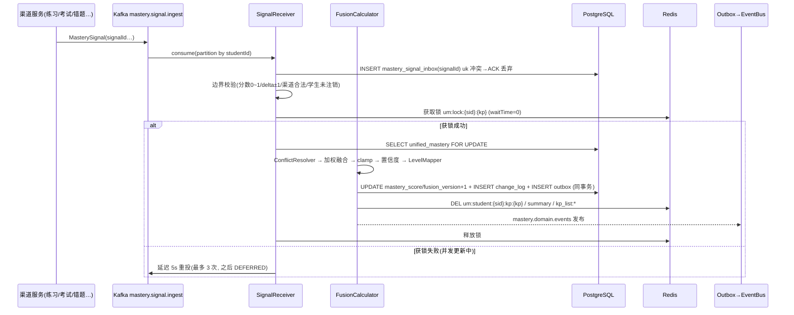

# 服务端 - 多渠道学习数据融合与统一知识掌握度计算引擎

> 版本: v1.1 | 创建日期: 2026-06-06 | 最后更新: 2026-08-19 | 状态: 已补全（v1.0 截断于 §4.2，v1.1 补齐 §4.2 收尾与 §4.3-§17）

## 1. 概述

### 1.1 模块定位

多渠道学习数据融合与统一知识掌握度计算引擎（Unified Mastery Fusion Engine, UMFE）是 PrimeTop 学习画像体系的**核心融合层**。它负责将分散在不同学习渠道（练习答题、AI 辅导对话、考试模拟、错题订正、背诵检测、阅读理解等）中的知识点掌握度信号，融合计算为**唯一的、权威的、全局一致的**统一掌握度评分。

**核心职责：**
- 接收并标准化来自多渠道的掌握度变更信号
- 基于加权融合算法计算统一掌握度评分
- 集成遗忘曲线衰减模型，动态调整掌握度
- 管理渠道间信号冲突与可信度权重
- 提供统一认知画像查询 API 给所有下游消费者
- 维护掌握度变更历史与证据链

**不在本模块范围内：**
- 练习答题批改 → 见 `服务端-练习答题实时批改与知识点掌握度增量更新服务-详细设计.md`
- AI 对话掌握度评估 → 见 `服务端-AI辅导对话知识点掌握度实时更新与能力维度同步引擎-详细设计.md`
- 用户画像存储与能力维度定义 → 见 `用户学习画像与能力维度模型-详细设计.md`
- 自适应推荐算法 → 见 `自适应学习与个性化推荐引擎-详细设计.md`
- 遗忘曲线复习调度 → 见 `间隔重复算法与遗忘曲线复习调度引擎-详细设计.md`

### 1.2 为什么需要此引擎

当前系统中，知识点掌握度更新分散在多个独立渠道：

| 渠道服务 | 更新方式 | 可信度 | 时效性 |
|----------|---------|--------|--------|
| 练习答题批改服务 | 基于答题正确率 | 高（有标准答案） | 实时 |
| AI 辅导对话引擎 | 基于对话行为特征 | 中（间接推断） | 对话结束后异步 |
| 考试模拟系统 | 基于限时考试成绩 | 高（综合评估） | 考试结束后 |
| 错题订正服务 | 基于订正正确率 | 高（针对性纠错） | 订正提交时 |
| 背诵检测服务 | 基于语音/文本复现度 | 中高 | 背诵完成时 |
| 学习计划完成度 | 基于任务完成状态 | 低（行为代理） | 任务截止后 |

**问题：**
1. 同一知识点可能被多个渠道同时更新，导致掌握度评分不一致
2. 各渠道使用不同评估标准和尺度，无法直接比较
3. 下游服务（推荐、规划、报告）需要查询多个渠道才能获得完整画像
4. 缺少全局遗忘衰减，掌握度不会随时间自然下降
5. 无法回答"该学生目前到底掌握了没有"这个根本问题

**UMFE 的价值：** 提供一个单一真相源（Single Source of Truth），让所有模块通过统一接口获取一致的知识掌握度数据。

### 1.3 设计目标

| 目标 | 指标 |
|------|------|
| 融合计算延迟 | 从信号接收到掌握度更新完成 < 500ms（P95） |
| 全局一致性 | 同一学生同一知识点同一时刻的查询结果全局一致 |
| 可用性 | 99.9%（掌握度服务不可用时走降级缓存） |
| 渠道扩展性 | 新增学习渠道只需实现信号接入接口，无需改动融合算法核心 |
| 可解释性 | 每次掌握度变更可追溯到具体渠道、事件、证据 |
| 并发安全 | 同一知识点多渠道并发更新不丢失、不冲突 |

### 1.4 适用场景

| 场景 | 触发方 | 说明 |
|------|--------|------|
| 推荐引擎查询 | 自适应推荐引擎 | 需要最新掌握度决定推什么题 |
| 学习规划生成 | 学习规划服务 | 需要薄弱知识点列表 |
| 学情报告生成 | 学情分析/学习报告 | 需要全面掌握度分布 |
| 家长报告生成 | 家长中心 | 需要简化版掌握度摘要 |
| 复习调度 | 间隔重复引擎 | 需要判断哪些知识点需要复习 |
| 首页薄弱点展示 | 首页推荐服务 | 需要高优薄弱知识点 |
| 预警触发 | 学习预警引擎 | 掌握度急剧下降时触发预警 |

---

## 2. 整体架构

### 2.1 系统上下文

```
┌─────────────┐ ┌─────────────┐ ┌─────────────┐ ┌─────────────┐ ┌─────────────┐
│ 练习答题批改 │ │ AI辅导对话   │ │ 考试模拟系统 │ │ 错题订正服务 │ │ 背诵检测服务 │
│    服务      │ │ 掌握度引擎   │ │             │ │             │ │             │
└──────┬──────┘ └──────┬──────┘ └──────┬──────┘ └──────┬──────┘ └──────┬──────┘
       │               │               │               │               │
       │  MasterySignal(ch, kp, delta, evidence)       │               │
       └───────────────┴───────┬───────┴───────────────┴───────────────┘
                               │  MQ / Event Bus
                               ▼
               ┌───────────────────────────────┐
               │    UMFE 统一掌握度融合引擎      │
               │                               │
               │  ┌─────────┐  ┌────────────┐  │
               │  │ 信号接收 │  │ 信号标准化  │  │
               │  │ & 校验   │→ │ & 可信度评估│  │
               │  └─────────┘  └─────┬──────┘  │
               │                      │         │
               │  ┌─────────┐  ┌─────▼──────┐  │
               │  │ 衰减计算 │  │ 加权融合    │  │
               │  │ (定时)   │←│ 计算        │  │
               │  └────┬────┘  └─────┬──────┘  │
               │       │             │         │
               │  ┌────▼─────────────▼──────┐  │
               │  │ 统一掌握度存储 (SSOT)    │  │
               │  │ PostgreSQL + Redis Cache  │  │
               │  └────────────┬────────────┘  │
               │               │               │
               │  ┌────────────▼────────────┐  │
               │  │ 查询 API & 事件发布      │  │
               │  └───────────────────────-─┘  │
               └───────────────────────────────┘
                               │
           ┌───────────────────┼───────────────────┐
           │                   │                   │
           ▼                   ▼                   ▼
   ┌──────────────┐  ┌──────────────┐  ┌──────────────┐
   │ 自适应推荐    │  │ 学习规划     │  │ 学情分析     │
   │ 引擎         │  │ 服务         │  │ /报告生成    │
   └──────────────┘  └──────────────┘  └──────────────┘
```

### 2.2 核心模块划分

| 模块 | 职责 | 关键类 |
|------|------|--------|
| SignalReceiver | 接收各渠道掌握度信号，校验格式 | `MasterySignalConsumer` |
| SignalNormalizer | 将各渠道信号标准化为统一格式，计算可信度 | `SignalNormalizer`, `ChannelTrustEvaluator` |
| FusionCalculator | 执行加权融合计算，输出统一掌握度 | `WeightedFusionCalculator`, `ConflictResolver` |
| DecayScheduler | 定时执行遗忘曲线衰减计算 | `MasteryDecayScheduler` |
| MasteryStore | 统一掌握度数据的读写与缓存 | `UnifiedMasteryRepository` |
| QueryService | 提供面向下游的查询 API | `MasteryQueryService` |
| EventPublisher | 掌握度变更事件发布 | `MasteryChangeEventPublisher` |

### 2.3 技术选型

| 组件 | 选型 | 说明 |
|------|------|------|
| 消息队列 | RabbitMQ / Kafka | 接收渠道信号 |
| 计算 | Spring Service | 同步计算（融合） + 异步（衰减） |
| 主存储 | PostgreSQL | 统一掌握度表 |
| 缓存 | Redis | 热点学生掌握度缓存 |
| 分布式锁 | Redis Redisson | 并发更新同一知识点时加锁 |
| 定时任务 | Quartz / Spring Scheduler | 衰减计算调度 |

---

## 3. 数据模型设计

### 3.1 渠道掌握度信号（MasterySignal）

各渠道发送的原始信号，通过 MQ 传递。

```java
/**
 * 掌握度变更信号 - 各渠道统一发送格式
 */
public class MasterySignal {

    /** 信号唯一ID（幂等键） */
    private String signalId;

    /** 学生用户ID */
    private Long studentId;

    /** 知识点ID */
    private String knowledgePointId;

    /** 来源渠道 */
    private SignalChannel channel;

    /** 来源事件ID（如答题记录ID、对话ID） */
    private String sourceEventId;

    /** 渠道内原始掌握度分数 0.0~1.0 */
    private Double rawScore;

    /** 渠道内掌握度变化量 -1.0~1.0 */
    private Double delta;

    /** 渠道自行评估的信号可信度 0.0~1.0（不填则由系统计算） */
    private Double selfConfidence;

    /** 证据数据（JSON，渠道自定义） */
    private Map<String, Object> evidence;

    /** 信号产生时间 */
    private LocalDateTime signalTime;

    /** 信号到达时间 */
    private LocalDateTime arriveTime;
}

/**
 * 信号来源渠道枚举
 */
public enum SignalChannel {
    PRACTICE("practice", "练习答题"),
    AI_DIALOGUE("ai_dialogue", "AI辅导对话"),
    EXAM("exam", "考试模拟"),
    ERROR_CORRECTION("error_correction", "错题订正"),
    RECITATION("recitation", "背诵检测"),
    READING("reading", "阅读理解"),
    MANUAL("manual", "手动标记");

    private final String code;
    private final String label;
}
```

### 3.2 统一掌握度表（unified_mastery）

```sql
-- 统一掌握度表 - 每个学生每个知识点一条记录
CREATE TABLE unified_mastery (
    id                  BIGSERIAL PRIMARY KEY,
    student_id          BIGINT          NOT NULL,
    knowledge_point_id  VARCHAR(64)     NOT NULL,

    -- 统一掌握度分数 (0.0 ~ 1.0)
    mastery_score       DECIMAL(5,4)    NOT NULL DEFAULT 0.0,

    -- 掌握度等级 (由 mastery_score 自动映射)
    mastery_level       SMALLINT        NOT NULL DEFAULT 0,
    -- 0=UNKNOWN, 1=EXPOSED, 2=FAMILIAR, 3=COMPREHEND, 4=APPLY, 5=MASTER

    -- 融合元数据
    fusion_version      BIGINT          NOT NULL DEFAULT 0,
    last_fusion_time    TIMESTAMPTZ     NOT NULL DEFAULT NOW(),
    contributing_channels  VARCHAR(255) NOT NULL DEFAULT '',
    -- 逗号分隔的渠道编码，如 "practice,ai_dialogue"

    -- 各渠道最新掌握度快照 (JSONB)
    channel_snapshots   JSONB           NOT NULL DEFAULT '{}',
    -- 示例: {
    --   "practice": {"score": 0.72, "time": "2026-06-06T09:00:00Z", "weight": 0.35},
    --   "ai_dialogue": {"score": 0.65, "time": "2026-06-05T14:30:00Z", "weight": 0.25}
    -- }

    -- 衰减相关
    last_decay_time     TIMESTAMPTZ     NOT NULL DEFAULT NOW(),
    decay_count         INT             NOT NULL DEFAULT 0,

    -- 置信度 (0.0 ~ 1.0) - 综合各渠道信号量和一致性
    confidence          DECIMAL(3,2)    NOT NULL DEFAULT 0.0,

    -- 统计数据
    total_signal_count  INT             NOT NULL DEFAULT 0,
    practice_count      INT             NOT NULL DEFAULT 0,
    ai_dialogue_count   INT             NOT NULL DEFAULT 0,
    exam_count          INT             NOT NULL DEFAULT 0,
    error_correction_count INT          NOT NULL DEFAULT 0,

    -- 时间戳
    first_learn_time    TIMESTAMPTZ,
    last_learn_time     TIMESTAMPTZ,
    created_at          TIMESTAMPTZ     NOT NULL DEFAULT NOW(),
    updated_at          TIMESTAMPTZ     NOT NULL DEFAULT NOW(),

    -- 唯一约束：每个学生每个知识点只有一条记录
    CONSTRAINT uk_student_kp UNIQUE (student_id, knowledge_point_id)
);

-- 索引
CREATE INDEX idx_um_student ON unified_mastery (student_id);
CREATE INDEX idx_um_student_level ON unified_mastery (student_id, mastery_level);
CREATE INDEX idx_um_student_score ON unified_mastery (student_id, mastery_score);
CREATE INDEX idx_um_last_learn ON unified_mastery (student_id, last_learn_time DESC);
CREATE INDEX idx_um_decay ON unified_mastery (last_decay_time) WHERE mastery_score > 0;
```

### 3.3 渠道权重配置表（channel_weight_config）

```sql
-- 渠道权重配置 - 可按学段、学科、知识点类型差异化配置
CREATE TABLE channel_weight_config (
    id              BIGSERIAL PRIMARY KEY,
    channel_code    VARCHAR(32)     NOT NULL,       -- SignalChannel.code
    stage_code      VARCHAR(16),                    -- 学段, NULL 表示全学段通用
    subject_code    VARCHAR(16),                    -- 学科, NULL 表示全学科通用
    kp_category     VARCHAR(32),                    -- 知识点类别(概念/计算/应用...), NULL 表示全部
    weight          DECIMAL(4,3)    NOT NULL,       -- 权重 0.000 ~ 1.000
    trust_base      DECIMAL(3,2)    NOT NULL DEFAULT 0.5, -- 基础可信度
    decay_rate      DECIMAL(5,4)    NOT NULL DEFAULT 0.010, -- 该渠道信号的衰减速率
    is_active       BOOLEAN         NOT NULL DEFAULT TRUE,
    created_at      TIMESTAMPTZ     NOT NULL DEFAULT NOW(),
    updated_at      TIMESTAMPTZ     NOT NULL DEFAULT NOW()
);

-- 默认权重数据 (INSERT)
INSERT INTO channel_weight_config (channel_code, weight, trust_base, decay_rate) VALUES
('practice',          0.35, 0.90, 0.005),
('exam',              0.30, 0.95, 0.003),
('error_correction',  0.15, 0.85, 0.008),
('ai_dialogue',       0.10, 0.60, 0.012),
('recitation',        0.05, 0.75, 0.010),
('reading',           0.03, 0.50, 0.015),
('manual',            0.02, 0.40, 0.020);
```

### 3.4 掌握度变更历史表（mastery_change_log）

```sql
-- 掌握度变更历史 - 记录每次变更的完整证据链
CREATE TABLE mastery_change_log (
    id                  BIGSERIAL PRIMARY KEY,
    student_id          BIGINT          NOT NULL,
    knowledge_point_id  VARCHAR(64)     NOT NULL,

    -- 变更前后快照
    score_before        DECIMAL(5,4)    NOT NULL,
    score_after         DECIMAL(5,4)    NOT NULL,
    delta               DECIMAL(6,4)    NOT NULL,   -- score_after - score_before

    -- 变更来源
    change_type         VARCHAR(32)     NOT NULL,
    -- FUSION / DECAY / MANUAL_RESET / COLD_START / CONFLICT_RESOLVE

    trigger_channel     VARCHAR(32),                 -- 触发渠道
    trigger_signal_id   VARCHAR(64),                 -- 触发信号ID

    -- 融合详情
    fusion_detail       JSONB           NOT NULL DEFAULT '{}',
    -- 示例: {
    --   "algorithm": "weighted_avg",
    --   "inputs": [
    --     {"channel": "practice", "score": 0.72, "weight": 0.35},
    --     {"channel": "ai_dialogue", "score": 0.65, "weight": 0.10}
    --   ],
    --   "confidence_before": 0.45,
    --   "confidence_after": 0.52
    -- }

    -- 衰减详情（仅 change_type=DECAY 时有值）
    decay_detail        JSONB,
    -- 示例: {"days_since_last": 5, "decay_factor": 0.97, "halflife_days": 23}

    created_at          TIMESTAMPTZ     NOT NULL DEFAULT NOW()
);

-- 索引
CREATE INDEX idx_mcl_student_kp ON mastery_change_log (student_id, knowledge_point_id);
CREATE INDEX idx_mcl_student_time ON mastery_change_log (student_id, created_at DESC);
CREATE INDEX idx_mcl_type ON mastery_change_log (change_type, created_at);
```

### 3.5 Redis 缓存结构

```
# 学生掌握度汇总缓存（按学生维度）
# Key: um:student:{studentId}:summary
# 类型: Hash
# 字段: 
#   total_kp_count     - 已学习知识点数
#   mastered_count     - 已掌握知识点数
#   weak_count         - 薄弱知识点数
#   avg_score          - 平均掌握度
#   last_update_time   - 最后更新时间

# 单知识点掌握度缓存
# Key: um:student:{studentId}:kp:{knowledgePointId}
# 类型: Hash
# 字段:
#   mastery_score      - 统一掌握度分数
#   mastery_level      - 等级
#   confidence         - 置信度
#   contributing_ch    - 贡献渠道
#   last_fusion_time   - 最后融合时间
#   ttl: 30min

# 学生知识点列表缓存（按等级分组）
# Key: um:student:{studentId}:kp_list:{level}
# 类型: Set
# 成员: knowledge_point_id
# ttl: 10min
```

---

## 4. 核心算法设计

### 4.1 渠道可信度评估

```java
/**
 * 渠道可信度评估器
 * 
 * 可信度 = 基础可信度 × 信号新鲜度因子 × 信号密度因子
 */
public class ChannelTrustEvaluator {

    /**
     * 计算某渠道在某知识点上的有效可信度
     *
     * @param config       渠道权重配置
     * @param snapshot     渠道在该知识点的最新快照（可能为 null）
     * @param signalCount  该渠道在该知识点的历史信号总数
     * @return 可信度 0.0~1.0
     */
    public double evaluateEffectiveTrust(ChannelWeightConfig config,
                                          ChannelSnapshot snapshot,
                                          int signalCount) {
        double baseTrust = config.getTrustBase();

        // 1. 信号新鲜度：越久没更新，可信度衰减
        double freshnessFactor = 1.0;
        if (snapshot != null && snapshot.getTime() != null) {
            long hoursSinceUpdate = ChronoUnit.HOURS.between(
                snapshot.getTime(), LocalDateTime.now());
            // 7天内保持满可信度，之后线性衰减，30天后降到 0.3
            if (hoursSinceUpdate > 168) {  // 7天
                freshnessFactor = Math.max(0.3,
                    1.0 - (hoursSinceUpdate - 168) / 720.0 * 0.7);
            }
        } else {
            freshnessFactor = 0.1;  // 无历史信号
        }

        // 2. 信号密度因子：信号越多，统计意义越大
        // 3次以上达到满权重，不足3次线性增长
        double densityFactor = Math.min(1.0, (double) signalCount / 3.0);

        return baseTrust * freshnessFactor * densityFactor;
    }
}
```

### 4.2 加权融合算法

```java
/**
 * 加权融合计算器
 * 
 * 核心公式:
 *   unifiedScore = Σ(channelScore_i × effectiveWeight_i) / Σ(effectiveWeight_i)
 *   
 *   effectiveWeight_i = channelWeight_i × trust_i × recencyBoost_i
 *   
 *   recencyBoost = 1 + α × exp(-Δt / τ)   (近期信号获得额外加成)
 */
public class WeightedFusionCalculator {

    private static final double RECENCY_ALPHA = 0.3;   // 近期加成幅度
    private static final double RECENCY_TAU_HOURS = 48.0; // 近期时间常数（小时）

    /**
     * 执行融合计算
     *
     * @param current      当前统一掌握度记录
     * @param newSignal    新到达的信号
     * @param channelConfigs 所有渠道配置
     * @return 融合结果
     */
    public FusionResult fuse(UnifiedMastery current,
                              MasterySignal newSignal,
                              Map<String, ChannelWeightConfig> channelConfigs) {

        Map<String, ChannelSnapshot> snapshots = current.getChannelSnapshots();

        // 更新对应渠道的快照
        snapshots.put(newSignal.getChannel().getCode(), ChannelSnapshot.builder()
            .score(newSignal.getRawScore())
            .time(newSignal.getSignalTime())
            .weight(channelConfigs.getOrDefault(
                newSignal.getChannel().getCode(),
                ChannelWeightConfig.getDefault()).getWeight())
            .build());

        // 计算每个渠道的有效权重
        double weightedSum = 0.0;
        double weightTotal = 0.0;
        List<FusionInput> inputs = new ArrayList<>();

        for (Map.Entry<String, ChannelSnapshot> entry : snapshots.entrySet()) {
            String channelCode = entry.getKey();
            ChannelSnapshot snapshot = entry.getValue();
            ChannelWeightConfig config = channelConfigs.get(channelCode);
            if (config == null || !config.isActive()) continue;

            // 渠道基础权重
            double baseWeight = config.getWeight();

            // 可信度
            double trust = new ChannelTrustEvaluator().evaluateEffectiveTrust(
                config, snapshot, getSignalCount(current, channelCode));

            // 近期加成
            double recencyBoost = calculateRecencyBoost(snapshot.getTime());

            // 有效权重
            double effectiveWeight = baseWeight * trust * recencyBoost;

            weightedSum += snapshot.getScore() * effectiveWeight;
            weightTotal += effectiveWeight;

            inputs.add(FusionInput.builder()
                .channel(channelCode)
                .score(snapshot.getScore())
                .weight(baseWeight)
                .trust(trust)
                .recencyBoost(recencyBoost)
                .effectiveWeight(effectiveWeight)
                .build());
        }

        // 融合结果
        double newScore = weightTotal > 0 ? weightedSum / weightTotal : 0.0;

        // 如果有历史分数，进行平滑处理（避免剧烈跳变）
        if (current.getMasteryScore() > 0) {
            double smoothFactor = calculateSmoothFactor(current, newSignal);
            newScore = current.getMasteryScore() * smoothFactor + newScore * (1 - smoothFactor);
        }

        // 限制单次变化幅度
        double maxDelta = 0.15; // 单次融合最大变化量
        double clampedScore = clampDelta(current.getMasteryScore(), newScore, maxDelta);

        // 计算置信度
        double confidence = calculateConfidence(current, snapshots, inputs);

        return FusionResult.builder()
            .studentId(current.getStudentId())
            .knowledgePointId(current.getKnowledgePointId())
            .scoreBefore(current.getMasteryScore())
            .scoreAfter(clampedScore)
            .confidence(confidence)
            .contributingChannels(String.join(",", snapshots.keySet()))
            .fusionInputs(inputs)
            .build();
    }

    /**
     * 近期加成因子计算
     * 近48小时内的信号获得额外加成，越新加成越大
     */
    private double calculateRecencyBoost(LocalDateTime signalTime) {
        if (signalTime == null) return 1.0;
        long hoursSince = ChronoUnit.HOURS.between(signalTime, LocalDateTime.now());
        return 1.0 + RECENCY_ALPHA * Math.exp(-hoursSince / RECENCY_TAU_HOURS);
    }

    /**
     * 平滑因子计算
     * 信号越多、置信度越高，新分数权重越大（越不平滑）
     */
    private double calculateSmoothFactor(UnifiedMastery current, MasterySignal signal) {
        int totalSignals = current.getTotalSignalCount();
        // 前10次信号平滑度高（保守），之后逐渐降低平滑
        return Math.max(0.2, 0.7 * Math.exp(-totalSignals / 10.0));
    }

    /**
     * 限制单次变化幅度
     */
    private double clampDelta(double oldScore, double newScore, double maxDelta) {
        double delta = newScore - oldScore;
        if (Math.abs(delta) <= maxDelta) {
            return Math.max(0.0, Math.min(1.0, newScore));
        }
        double clamped = oldScore + Math.signum(delta) * maxDelta;
        return Math.max(0.0, Math.min(1.0, clamped));
    }

    /**
     * 置信度计算
     * 基于渠道数量、信号密度、各渠道一致性
     */
    private double calculateConfidence(UnifiedMastery current,
                                        Map<String, ChannelSnapshot> snapshots,
                                        List<FusionInput> inputs) {
        if (inputs.isEmpty()) return 0.0;

        // 因子1：渠道覆盖度（越多渠道，置信度越高）
        double coverageFactor = Math.min(1.0, inputs.size() / 4.0);        // 因子2：信号密度（历史信号总量越多，置信度越高）
        int totalSignals = current.getTotalSignalCount() + 1; // 含本信号
        double densityFactor = Math.min(1.0, totalSignals / 20.0); // 20 个信号达到满密度

        // 因子3：渠道间一致性（各渠道分数的离散度越低，置信度越高）
        double consistencyFactor = 1.0;
        if (inputs.size() >= 2) {
            double mean = inputs.stream()
                .mapToDouble(FusionInput::getScore).average().orElse(0.0);
            double variance = inputs.stream()
                .mapToDouble(i -> Math.pow(i.getScore() - mean, 2))
                .average().orElse(0.0);
            double stdDev = Math.sqrt(variance);
            // 标准差 0 → 一致性 1.0；标准差 ≥ 0.25 → 一致性降至 0.4
            consistencyFactor = Math.max(0.4, 1.0 - stdDev / 0.25 * 0.6);
        } else {
            consistencyFactor = 0.5; // 单渠道无法评估一致性
        }

        // 置信度 = 0.3×覆盖度 + 0.3×密度 + 0.4×一致性
        double confidence = 0.3 * coverageFactor + 0.3 * densityFactor + 0.4 * consistencyFactor;
        return Math.round(Math.max(0.0, Math.min(1.0, confidence)) * 100.0) / 100.0;
    }

    /**
     * 获取某渠道在该知识点上的历史信号数
     */
    private int getSignalCount(UnifiedMastery current, String channelCode) {
        return switch (channelCode) {
            case "practice" -> current.getPracticeCount();
            case "ai_dialogue" -> current.getAiDialogueCount();
            case "exam" -> current.getExamCount();
            case "error_correction" -> current.getErrorCorrectionCount();
            default -> 0;
        };
    }
}
```

### 4.3 渠道信号冲突解决（ConflictResolver）

当两个及以上高可信渠道对同一知识点给出**方向相反**的评估（如考试 0.15 vs 练习 0.85），简单加权平均会产生"和稀泥"结果，掩盖真实认知状态。冲突解决器在融合前先检测并对冲突信号执行裁决。

```java
/**
 * 渠道信号冲突解决器
 *
 * 冲突判定: 存在两个渠道快照，分数差 > CONFLICT_THRESHOLD 且双方有效可信度均 > 0.5
 * 裁决策略(优先级从高到低):
 *   R1 高可信渠道胜出 (trustBase × freshness 差距 > 0.15)
 *   R2 时效优先 (新信号压过 30 天前的旧信号)
 *   R3 渠道固有权威序: exam > practice > error_correction > recitation
 *      > ai_dialogue > reading > school_score > plan > manual
 *   R4 保守裁决 (无法裁决时取两者较小值, 宁低勿高)
 */
public class ConflictResolver {

    private static final double CONFLICT_THRESHOLD = 0.40;

    public ConflictResolveResult resolve(Map<String, ChannelSnapshot> snapshots,
                                         Map<String, ChannelWeightConfig> configs,
                                         MasterySignal newSignal) {

        List<String> keys = new ArrayList<>(snapshots.keySet());
        for (int i = 0; i < keys.size(); i++) {
            for (int j = i + 1; j < keys.size(); j++) {
                String a = keys.get(i), b = keys.get(j);
                double scoreA = snapshots.get(a).getScore();
                double scoreB = snapshots.get(b).getScore();

                if (Math.abs(scoreA - scoreB) <= CONFLICT_THRESHOLD) continue;

                double trustA = effectiveTrust(configs.get(a), snapshots.get(a));
                double trustB = effectiveTrust(configs.get(b), snapshots.get(b));
                if (trustA <= 0.5 || trustB <= 0.5) continue; // 低可信渠道不构成冲突

                // 命中冲突, 执行裁决
                String winner = decide(a, b, trustA, trustB, snapshots, configs);
                String loser  = winner.equals(a) ? b : a;
                return ConflictResolveResult.builder()
                    .conflict(true)
                    .winnerChannel(winner)
                    .loserChannel(loser)
                    // 败者快照分数下调 50% 权重参与本次融合(不完全丢弃, 保留纠错可能)
                    .loserWeightPenalty(0.5)
                    .gap(Math.abs(scoreA - scoreB))
                    .build();
            }
        }
        return ConflictResolveResult.noConflict();
    }

    private String decide(String a, String b,
                          double trustA, double trustB,
                          Map<String, ChannelSnapshot> snapshots,
                          Map<String, ChannelWeightConfig> configs) {
        // R1: 可信度差距明显
        if (Math.abs(trustA - trustB) > 0.15) {
            return trustA > trustB ? a : b;
        }
        // R2: 时效差距 ≥ 30 天, 新者胜
        LocalDateTime ta = snapshots.get(a).getTime();
        LocalDateTime tb = snapshots.get(b).getTime();
        if (ta != null && tb != null && Math.abs(
                ChronoUnit.DAYS.between(tb, ta)) >= 30) {
            return ta.isAfter(tb) ? a : b;
        }
        // R3: 渠道权威序
        int ra = ChannelAuthority.rank(a), rb = ChannelAuthority.rank(b);
        if (ra != rb) return ra < rb ? a : b;
        // R4: 保守裁决 —— 分数低者胜(宁低勿高, 由后续学习自然纠正)
        return snapshots.get(a).getScore() <= snapshots.get(b).getScore() ? a : b;
    }
}
```

**冲突事件化：** 每次命中冲突（`conflict=true`）写入 `mastery_change_log.change_type=CONFLICT_RESOLVE`，同时发布 `MasteryConflictDetected` 事件（见 §9），供数据质量监控与教研侧观察渠道评估口径问题——持续性高发冲突（同一 KP 月冲突 ≥ 5 次）通常意味着题目难度标注或渠道评估模型异常，而不是学生问题。

### 4.4 遗忘曲线衰减模型（DecayScheduler）

遗忘衰减采用**分段半衰期模型**：掌握等级越高、信号量越大，记忆保持越稳固，半衰期越长。衰减只作用于 `mastery_score`，不改变 `channel_snapshots`（渠道快照是事实记录）。

```java
/**
 * 掌握度遗忘衰减调度器
 *
 * halfLifeDays = BASE_HALF_LIFE[level] × signalBonus × pauseBonus
 *   signalBonus = 1 + min(totalSignalCount, 50) × 0.01   (信号量加成, 最多 +50%)
 *   pauseBonus  = decay_pause_until > now ? 999 : 1      (手动重置后 7 天免衰减)
 *
 * decayedScore = masteryScore × 0.5 ^ (daysSince / halfLifeDays)
 * 约束:
 *   - 下限地板 0.05 (衰减不将知识点打回 UNKNOWN 以下, 保留再学习锚点)
 *   - 单日衰减跳变不受 §4.2 clamp 0.15 限制 (衰减按指数公式独立作用)
 *   - totalSignalCount < 3 的高噪点记录半衰期 × 0.5 (孤证不可信)
 */
public class MasteryDecayScheduler {

    /** 各等级基础半衰期(天): [_, 3, 7, 14, 30, 60], 下标即 mastery_level */
    private static final double[] BASE_HALF_LIFE = {0, 3, 7, 14, 30, 60};

    @Scheduled(cron = "0 30 3 * * ?") // 每日 03:30 执行
    public void runDailyDecay() {
        // 分片扫描 last_decay_time < 今天 的活跃记录
        // 分片键: student_id % 16, 每片独立事务, 心跳写入 Redis, 僵死片超时接管
        // 详见 §6.2
    }

    public DecayResult decayOne(UnifiedMastery m, LocalDateTime now) {
        if (m.getMasteryScore() <= 0.05) return DecayResult.skip(m); // 已到地板

        double halfLife = BASE_HALF_LIFE[m.getMasteryLevel()]
                * (1 + Math.min(m.getTotalSignalCount(), 50) * 0.01);
        if (m.getTotalSignalCount() < 3) halfLife *= 0.5;

        double daysSince = ChronoUnit.HOURS.between(
                m.getLastLearnTime() != null ? m.getLastLearnTime() : m.getCreatedAt(), now) / 24.0;
        double decayFactor = Math.pow(0.5, daysSince / halfLife);
        double decayed = Math.max(0.05, m.getMasteryScore() * decayFactor);

        // 衰减引起的降级同样走迟滞转移(§4.6), 防止在阈值附近反复横跳
        return DecayResult.builder()
            .scoreBefore(m.getMasteryScore())
            .scoreAfter(decayed)
            .decayFactor(decayFactor)
            .halfLifeDays(halfLife)
            .daysSince(daysSince)
            .build();
    }
}
```

**与《间隔重复算法与遗忘曲线复习调度引擎》的边界（重要契约）：** 本引擎负责**掌握度分数的自然衰减**（画像真实性）；间隔重复引擎负责**复习计划调度**（next_review_at 重算、复习优先级）。本引擎每日衰减批处理完成后发布 `MasteryDecayed` 事件，间隔重复引擎订阅并对受影响知识点重估下次复习时间。两引擎共用"遗忘曲线"概念但模型参数独立：间隔重复引擎面向**错题/卡片级**（SM-2 变体），本引擎面向**知识点级画像**（分段半衰期），禁止互相调用对方的衰减实现。

### 4.5 冷启动与首信号处理

| 场景 | 处理策略 |
|------|---------|
| 首个信号到达（无 unified_mastery 记录） | 直接以该信号 rawScore 建档，mastery_level 按映射表落级，confidence 按单渠道公式计算（通常 ≤ 0.35），fusion_version=1，change_type=COLD_START |
| 单渠道长期独占（仅 1 个渠道有信号） | 正常融合（退化为该渠道分数），confidence 上限 0.5，下游按低置信度处理（薄弱点展示需 min_confidence 过滤） |
| 画像冷启动引擎问卷结果 | 初始自评走 `manual` 渠道（trust_base 0.40），只提供先验，后续高可信信号会自然覆盖 |
| 转学/教材版本切换后知识点映射 | 订阅《教材版本间知识点映射》引擎的 `kp.mapped` 事件，将旧 KP 掌握度按映射系数迁移为新 KP 的 manual 渠道信号（一次性行为，不改变历史） |

### 4.6 掌握度等级映射与迟滞转移（LevelMapper）

```java
/**
 * mastery_score → mastery_level 映射 + 迟滞(Hysteresis)防抖
 *
 * 迟滞规则: 升级走升阈值, 降级需跌破 (升阈值 - HYST)
 * 防止分数在阈值附近波动时等级反复横跳, 造成下游事件风暴
 */
public class LevelMapper {

    private static final double HYST = 0.03;
    /** 升阈值: level 1~5 的进入门槛 */
    private static final double[] UP = {0.0, 0.10, 0.30, 0.50, 0.70, 0.85};

    public int map(double currentLevel, double newScore) {
        int lvl = (int) currentLevel;
        if (lvl < 5 && newScore >= UP[lvl + 1]) {
            return lvl + 1;                                  // 越级升级允许(高分冷启动)
        }
        if (lvl > 0 && newScore < UP[lvl] - HYST) {
            return lvl - 1;                                  // 降级需明显跌破
        }
        return lvl;                                          // 保持
    }
}
```

| mastery_level | 名称 | 分数区间(升阈值) | 语义 |
|---------------|------|------------------|------|
| 0 | UNKNOWN | < 0.10 | 未接触/无有效信号 |
| 1 | EXPOSED | ≥ 0.10 | 初次接触，有印象 |
| 2 | FAMILIAR | ≥ 0.30 | 熟悉但易错 |
| 3 | COMPREHEND | ≥ 0.50 | 理解，常规题可对 |
| 4 | APPLY | ≥ 0.70 | 能应用，变式可对 |
| 5 | MASTER | ≥ 0.85 | 掌握，稳定正确 |

等级变更（迟滞后仍发生）才发布 `MasteryLevelChanged` 事件并写 `mastery_change_log`；纯分数微调只发布 `MasteryScoreUpdated`（下游可按需忽略）。

---

## 5. API 接口设计

### 5.1 查询 API（面向下游消费者）

统一前缀 `/api/v1/mastery`。所有学生维度接口支持 `studentId` 鉴权：学生本人 / 绑定家长（L3 聚合视图）/ 教师任课关系；跨权限统一 404（不暴露存在性）。

#### 5.1.1 掌握度汇总

```
GET /api/v1/mastery/students/{studentId}/summary
```

```json
{
  "code": 0,
  "data": {
    "studentId": 200001,
    "totalKpCount": 186,
    "levelDistribution": {"EXPOSED": 21, "FAMILIAR": 34, "COMPREHEND": 58, "APPLY": 47, "MASTER": 26},
    "masteredCount": 73,            // level >= 4
    "weakCount": 55,                // level <= 2 且 confidence >= 0.4
    "avgScore": 0.583,
    "scoreTrend7d": +0.021,         // 近 7 天平均分变化
    "lastSignalTime": "2026-08-19T14:22:00Z",
    "freshness": "FRESH"            // FRESH(<24h) / STALE(7d) / OUTDATED(30d)
  }
}
```

家长端请求返回同一结构，但 `weakCount` 仅返回数量，不含 KP 明细（明细走家长中心 L3 聚合接口，见 §14 合规 C3）。

#### 5.1.2 知识点列表查询

```
GET /api/v1/mastery/students/{studentId}/knowledge-points
    ?level=FAMILIAR            # 可多值逗号分隔, 缺省全部
    &minScore=0.2&maxScore=0.6
    &minConfidence=0.4         # 过滤低置信噪点, 缺省 0.4
    &subject=MATH              # 可选, 按知识点学科过滤
    &page=1&pageSize=50
```

返回按 `mastery_score ASC`（薄弱优先）排序的 KP 列表，含 `masteryScore / masteryLevel / confidence / contributingChannels / lastLearnTime`。本接口是**首页薄弱点提醒服务、学习规划服务**的主查询入口。

#### 5.1.3 单知识点详情（含证据链）

```
GET /api/v1/mastery/students/{studentId}/knowledge-points/{kpId}
```

返回：统一分数 + 等级 + 置信度 + **channelSnapshots（各渠道最新快照）** + 近 10 条变更日志（分数、类型、触发渠道）。报告类消费者（学情分析）用此接口还原证据链。`evidence` 原始 JSON 不对外返回，仅返回变更摘要（C5 数据最小化）。

#### 5.1.4 掌握度分布直方图

```
GET /api/v1/mastery/students/{studentId}/distribution?subject=MATH&granularity=LEVEL
```

学情报告/家长周报消费。`granularity=SCORE` 时返回 0~1 按 0.1 分桶直方图。

#### 5.1.5 变更时间线

```
GET /api/v1/mastery/students/{studentId}/knowledge-points/{kpId}/timeline
    ?from=2026-08-01&to=2026-08-19&page=1
```

返回 `mastery_change_log` 分页（按月分区表，60 天在线 + CH 归档查询透传参数 `archive=true` 时走 ClickHouse）。

#### 5.1.6 薄弱知识点 TopN（缓存版）

```
GET /api/v1/mastery/students/{studentId}/weak?topN=10&minConfidence=0.4
```

首页卡片专用，走 Redis `um:student:{id}:kp_list:{level}` 缓存，P99 < 20ms。数据源与 5.1.2 一致，仅格式更轻。

### 5.2 信号接入 API

**主通道（MQ）**：Topic `mastery.signal.ingest`（Kafka，分区键 `studentId` 保证同学生信号有序）。各渠道生产者发送 §3.1 `MasterySignal` JSON。

**备用通道（HTTP，MQ 抖动时降级）**：

```
POST /internal/mastery/signals
Content-Idempotency-Key: {signalId}
```

批量上限 100 条/请求。返回逐条 `accepted / rejected(原因) / deferred`。内部服务鉴权走服务间 Token，不对公网开放。

### 5.3 管理端 API（教研/运营，走管理后台 RBAC）

| 接口 | 方法 | 说明 | 权限 |
|------|------|------|------|
| `/admin/mastery/channel-weights` | GET | 渠道权重配置列表（支持按学段/学科/知识点类别筛选） | 教研只读 |
| `/admin/mastery/channel-weights` | PUT | 修改权重/可信度/衰减率（version+1，双人审批，生效后清缓存并广播配置版本） | 教研管理员 |
| `/admin/mastery/students/{id}/knowledge-points/{kpId}/manual-reset` | POST | 手动校准掌握度（body: `score`, `reason`；写 MANUAL_RESET 日志，触发 7 天衰减暂停） | 教研管理员+复审 |
| `/admin/mastery/decay/trigger` | POST | 手动触发单学生衰减重算（排障用，24h 频控） | 运维 |
| `/admin/mastery/students/{id}/rebuild` | POST | 从 change_log 重放重建单学生画像（灾难恢复，队列化执行） | 运维 |

### 5.4 内部 gRPC 接口（MasteryQueryService）

```protobuf
service MasteryQueryService {
  // 批量查掌握度（特征平台/成长曲线/跨学期追踪/风险评估 消费）
  rpc BatchGetMastery (BatchGetMasteryRequest) returns (BatchGetMasteryResponse);
  // 批量查学生薄弱 KP（推荐引擎候选过滤、靶向训练）
  rpc BatchGetWeakKps (BatchGetWeakKpsRequest) returns (BatchGetWeakKpsResponse);
  // 班级掌握度聚合（教师工作台, band 化在调用方处理）
  rpc GetClassMasterySummary (ClassMasteryRequest) returns (ClassMasterySummaryResponse);
}
```

- `BatchGetMastery`：单请求 ≤ 500 个 (studentId, kpId) 对，P99 < 80ms，走本地缓存 + 批量 SQL。
- `BatchGetWeakKps`：返回 `level ≤ 2 && confidence ≥ minConfidence` 的 KP 及分数，供推荐引擎召回过滤。
- `GetClassMasterySummary`：按 KP 维度聚合班级分布（各等级人数），**只返回聚合数，不返回个人明细**（C4）。

### 5.5 上游事件订阅清单

| 上游事件 | Topic | 生产者 | 转换逻辑 |
|----------|-------|--------|---------|
| `practice.graded` | practice.events | 练习答题批改服务 | 正确→rawScore=1 错误→0，delta 按题难度映射，evidence 携带 questionId/用时/犹豫度 |
| `exam.submitted` | exam.events | 考试模拟系统 | 按 KP 得分率 → rawScore，selfConfidence 按题目量 |
| `mistake.corrected` | mistake.events | 错题订正服务 | 订正正确→rawScore=0.6 起（订正≠掌握，低于直答） |
| `ai_dialogue.assessed` | ai.events | AI 对话掌握度引擎 | rawScore 按对话行为推断，selfConfidence 必填 |
| `recitation.completed` | recitation.events | 背诵检测服务 | 复现度 → rawScore |
| `reading.finished` | reading.events | 阅读理解服务 | 理解题正确率 → rawScore |
| `ScorePublished` | school.events | 学校考试成绩管理服务 | 校内成绩归一化 → school_score 渠道（低权重外部证据） |
| `plan.task.completed` | plan.events | 学习计划服务 | 完成→rawScore=0.5 弱代理信号，plan 渠道 |
| `kp.mapped` | kp.events | 教材版本映射引擎 | 旧 KP 分数 × 映射系数 → manual 渠道一次性迁移信号 |

消费幂等：所有订阅以 `(eventId)` 写入 `mastery_signal_inbox` 唯一键去重（§8）。

---

## 6. 核心流程设计

### 6.1 信号接收与融合主流程（同步路径）



关键点：
1. **inbox 先行**：`INSERT ... ON CONFLICT (signal_id) DO NOTHING` 返回 0 行即重复信号，直接 ACK，保证 at-least-once 语义下恰好一次效果。
2. **DB 行锁为主、Redis 锁为辅**：Redis 锁仅做快速互斥减少 DB 锁等待；真正一致性由 `SELECT FOR UPDATE + fusion_version 乐观锁` 双保险（G3/G4）。
3. **Outbox 同事务**：变更日志、画像更新、事件 Outbox 三写一事务，崩溃不产生"分数已变事件未发"。

### 6.2 每日衰减批处理

```
03:30 触发(Quartz, 16 分片并行)
├─ 分片: student_id % 16, 每片独立事务边界(每 500 行提交一次)
├─ 心跳: decay:shard:{n}:heartbeat TTL 10min; 超时僵死片被其他实例 CAS 接管
├─ 范围: last_decay_time < today AND mastery_score > 0.05
├─ 逐行: §4.4 公式计算 → 分数更新 + decay_count+1 + last_decay_time=today
│         + 等级迟滞判定 → change_type=DECAY 日志 + MasteryDecayed 事件(Outbox)
├─ 跳过: decay_pause_until > now(手动校准保护期)
└─ 完成: 全片完成 → 更新 Redis summary 缓存批量失效 → 记录批次表
监控: 06:00 未完成 P1 告警; 单片失败不影响其他片, 失败片重试 3 次后死信人工介入
```

**衰减与融合竞态裁决：** 衰减批处理对行加 `FOR UPDATE` 后比对 `fusion_version`——若持锁期间该行已被新信号融合（version 变化），以融合后分数重算衰减（fresh read），避免旧分数覆盖新融合结果（G5）。

### 6.3 查询与缓存一致性

- 读路径：Redis Hash（30min TTL）→ miss 时 singleflight 防击穿 → DB 读取回填。
- 写路径：先 DB 后 `DEL` 缓存（cache-aside，不做更新）；下一次读回填新值。
- 缓存键登记于《多级缓存架构与一致性策略》统一台账：`um:student:{id}:summary`（TTL 30min）、`um:student:{id}:kp:{kpId}`（30min）、`um:student:{id}:kp_list:{level}`（10min）、`um:lock:*`（10s）、`decay:shard:*`（10min）。
- 手动校准/权重变更后：按学生维度精准失效；权重全局变更走配置版本号，融合时快照入 `fusion_detail`（G14）。

### 6.4 手动校准（Manual Reset）流程

教研发现画像明显失真（如渠道故障期间灌入脏数据）→ 管理后台提交 `manual-reset`（score + reason）→ 双人审批通过 → 加锁执行：写 MANUAL_RESET 变更日志（含审批单号）→ 设置 `decay_pause_until = now + 7d` → 事件 `MasteryScoreUpdated(changeType=MANUAL_RESET)`。审计 append-only，不可删除（C8）。

---

## 7. 状态机设计

### 7.1 mastery_level 等级状态机（迟滞）

```
UNKNOWN(0) ⇄ EXPOSED(1) ⇄ FAMILIAR(2) ⇄ COMPREHEND(3) ⇄ APPLY(4) ⇄ MASTER(5)
```

| 转移 | 条件 | 动作 |
|------|------|------|
| 升级 lvl→lvl+1 | newScore ≥ UP[lvl+1] | 发布 MasteryLevelChanged；高优消费者(章节进阶/成就) |
| 越级升级 | newScore ≥ UP[lvl+2]（高分冷启动） | 允许，日志标注 `skip=true` |
| 降级 lvl→lvl-1 | newScore < UP[lvl] − 0.03（迟滞带内不降） | 发布 MasteryLevelChanged(降级)；连续降 2 级触发风险评估信号 |
| 保持 | 迟滞带内波动 | 仅 MasteryScoreUpdated，无等级事件 |

### 7.2 信号处理状态机（mastery_signal_inbox.status）

```
RECEIVED → VALIDATED → FUSED(终态)
    │           │
    │           ├──→ REJECTED(终态: 边界校验失败/未知渠道/注销用户)
    │           └──→ DEFERRED →(重试≤3)→ FUSED / DEAD_LETTER(终态)
    └──→ REJECTED(幂等重复, 直接 ACK 不落状态)
```

### 7.3 守卫规则总表 G1-G14

| # | 规则 | 违反后果 |
|---|------|---------|
| G1 | signalId 全局幂等（inbox uk） | 重复信号直接 ACK 丢弃，不产生二次融合 |
| G2 | rawScore∈[0,1]、delta∈[-1,1] 边界校验 | REJECTED + 死信 + 告警（可能是渠道代码缺陷） |
| G3 | 同一 (studentId, kpId) 融合必须持有 Redis 锁 + DB 行锁 | 拒绝无锁写入（仅 decay/rebuild 内部路径可绕 Redis 锁，但必须持 DB 行锁） |
| G4 | UPDATE 带 `WHERE fusion_version = ?`，冲突重读重试 ≤3 | 重试耗尽→信号 DEFERRED 重新入队，绝不丢失 |
| G5 | 衰减持锁期间 fusion_version 变化必须 fresh read 重算 | 防止旧分数覆盖新融合结果 |
| G6 | 等级转移必须走 LevelMapper 迟滞 | 禁止任何旁路直写 mastery_level |
| G7 | 融合单次变化幅度 clamp ±0.15；衰减/手动重置豁免 | 防止单信号剧烈操纵画像 |
| G8 | MANUAL_RESET 必须双人审批 + decay_pause 7 天 + 审计 | 无审批单号的 reset 请求 57411 拒绝 |
| G9 | 首信号（无记录）走 COLD_START 直写，不经平滑 | 平滑因子对无历史分数无意义 |
| G10 | 未知 channel_code 拒绝 | REJECTED + 死信（新渠道必须先注册 channel_weight_config） |
| G11 | 快照更新仅当 signalTime 晚于现有快照时间 | 乱序/延迟消息不回退画像（last-write-by-time 而非 arrival） |
| G12 | 已注销/已合并学生的信号直接丢弃 REJECTED | 防止注销后画像复活 |
| G13 | 缓存失效必须先 DB 提交后 DEL，且 DEL 失败仅告警不回滚 DB | 以 DB 为 SSOT，缓存可自愈 |
| G14 | 渠道权重配置带 version，融合时配置快照写入 fusion_detail | 可解释性：任意历史分数可还原当时配置 |

---

## 8. 幂等与并发控制（八场景）

| # | 场景 | 机制 |
|---|------|------|
| 1 | MQ 重复投递同一信号 | inbox `uk(signal_id)`，冲突即 ACK（G1） |
| 2 | 同学生同 KP 多渠道并发信号 | Redis 锁快速互斥 + DB `FOR UPDATE` 串行化；失败方延迟 5s 重投（G3） |
| 3 | 融合与衰减并发 | 衰减 fresh read + fusion_version 比对（G5） |
| 4 | 融合写入与查询回填并发 | 乐观锁 G4 + 缓存 DEL 时序 G13；回填旧值仅存活至下一次失效，TTL 30min 兜底 |
| 5 | 手动校准与信号融合并发 | manual-reset 同样走锁路径；reset 后 7 天衰减暂停不影响融合 |
| 6 | 衰减批处理多实例重复执行 | 批次表 `uk(batch_date, shard)` + `last_decay_time >= today` 二次过滤 |
| 7 | rebuild 重放与在线写入并发 | rebuild 写入影子列校验后原子切换；期间在线信号照常处理，切换以 fusion_version 高者胜 |
| 8 | 权重配置变更生效瞬间 | 融合读取带 version 的配置缓存，同一次融合内配置一致（快照入日志，G14） |

### 8.1 DDL 增补（v1.1）

```sql
-- 信号收件箱(幂等 + 状态机 + 对账)
CREATE TABLE mastery_signal_inbox (
    id              BIGSERIAL PRIMARY KEY,
    signal_id       VARCHAR(64)     NOT NULL,
    student_id      BIGINT          NOT NULL,
    knowledge_point_id VARCHAR(64)  NOT NULL,
    channel_code    VARCHAR(32)     NOT NULL,
    status          VARCHAR(16)     NOT NULL DEFAULT 'RECEIVED',
    retry_count     SMALLINT        NOT NULL DEFAULT 0,
    reject_reason   VARCHAR(255),
    arrived_at      TIMESTAMPTZ     NOT NULL DEFAULT NOW(),
    processed_at    TIMESTAMPTZ,
    CONSTRAINT uk_msi_signal UNIQUE (signal_id)
);
CREATE INDEX idx_msi_status ON mastery_signal_inbox (status, arrived_at);
CREATE INDEX idx_msi_student_time ON mastery_signal_inbox (student_id, arrived_at DESC);

-- Outbox(与画像更新同事务)
CREATE TABLE mastery_outbox (
    id              BIGSERIAL PRIMARY KEY,
    event_id        VARCHAR(64)     NOT NULL,
    event_type      VARCHAR(48)     NOT NULL,
    student_id      BIGINT          NOT NULL,
    knowledge_point_id VARCHAR(64),
    payload         JSONB           NOT NULL,
    status          VARCHAR(8)      NOT NULL DEFAULT 'PENDING', -- PENDING/SENT
    created_at      TIMESTAMPTZ     NOT NULL DEFAULT NOW(),
    sent_at         TIMESTAMPTZ,
    CONSTRAINT uk_mo_event UNIQUE (event_id)
);
CREATE INDEX idx_mo_status ON mastery_outbox (status, created_at);

-- unified_mastery 增补列
ALTER TABLE unified_mastery
    ADD COLUMN decay_pause_until TIMESTAMPTZ,           -- 手动校准衰减保护期
    ADD COLUMN school_score_count INT NOT NULL DEFAULT 0,
    ADD COLUMN plan_count INT NOT NULL DEFAULT 0;

-- 渠道配置增补: v1.1 新渠道
INSERT INTO channel_weight_config (channel_code, weight, trust_base, decay_rate) VALUES
('school_score', 0.05, 0.55, 0.006),
('plan',         0.02, 0.35, 0.020);
```

> 说明：`unified_mastery` 按 `student_id` HASH 分 16 分区（DAU 50 万预估 1.2 亿行，见 §12）；`mastery_change_log` 改按月分区，在线 60 天 + ClickHouse 归档 3 年。分区改造 DDL 由迁移脚本 `V20260820__umfe_partition.sql` 执行。

---

## 9. 事件与 Outbox

Topic：`mastery.domain.events`。Relay 进程 `SKIP LOCKED` 拉取发送，日终对账 Outbox SENT 与总线回执。

### 9.1 事件清单与消费方矩阵

| 事件 | 触发 | 消费方 |
|------|------|--------|
| `MasteryScoreUpdated` | 每次融合分数变化（含衰减后仍同级的微调） | 特征工程平台(特征刷新)、画像快照引擎、时效性治理引擎 |
| `MasteryLevelChanged` | 迟滞后等级转移 | 章节完成度引擎(自动进阶判定)、成就系统、学习路径推荐、标签引擎、首页卡片、学情报告 |
| `MasteryDecayed` | 每日衰减批处理(分数实际下降的行) | 间隔重复引擎(重估 next_review_at)、学习风险评估(mastery_collapse 触发源之一)、假期衰减评估引擎 |
| `MasteryConflictDetected` | 冲突裁决命中 | 数据质量监控、教研运营看板 |
| `ConfidenceBelowThreshold` | confidence 首次跌破 0.30 或连续 7 天 < 0.30 | 最小样本量保障引擎、画像冷启动引擎(补充引导) |
| `MasteryManualReset` | 手动校准生效 | 审计归档、数据质量监控 |

所有事件 payload 必含：`eventId / studentId / kpId / scoreBefore / scoreAfter / level / fusionVersion / occurredAt`；消费方以 `eventId` 幂等。

---

## 10. 错误码（57400-57499）

| 错误码 | HTTP | 语义 | 客户端动作 |
|--------|------|------|-----------|
| 57400 | 500 | 融合内部错误 | 重试 |
| 57401 | 400 | 信号格式非法（字段缺失/类型错误） | 丢弃并告警（生产者 bug） |
| 57402 | 400 | rawScore 越界 [0,1] | 丢弃 + 生产者修复 |
| 57403 | 400 | delta 越界 [-1,1] | 丢弃 + 生产者修复 |
| 57404 | 400 | 未知渠道编码 | 新渠道先注册配置（G10） |
| 57405 | 404 | 知识点不存在 | 丢弃（KP 下线期间的信号） |
| 57406 | 403 | 学生已注销/合并 | 丢弃（G12） |
| 57410 | 404 | 查询学生不存在（统一 404 防存在性探测） | 提示无数据 |
| 57411 | 403 | 手动校准无审批单号或审批未通过 | 走审批流（G8） |
| 57412 | 409 | 配置版本冲突（并发修改权重） | 刷新后重试 |
| 57413 | 429 | 手动衰减触发频控（24h 一次） | 次日再试 |
| 57414 | 409 | rebuild 任务已在进行中 | 等待完成 |
| 57420 | 503 | 降级模式：返回缓存快照（带 `stale=true` 标记） | 展示但标注"数据更新于 X 小时前" |
| 57421 | 503 | 融合暂停（DB 不可用），信号延迟处理 | 渠道侧重投（MQ 天然支持） |
| 57430 | 500 | gRPC 批量查询部分失败 | 按 partial 标记重试失败项 |
| 57431 | 400 | gRPC 批量超过 500 对上限 | 拆分请求 |

> 面向学生端仅透出 57410/57420；内部错误码只在服务间传递（C7）。

---

## 11. 降级矩阵 D1-D10

| # | 故障 | 降级动作 | 红线 |
|---|------|---------|------|
| D1 | PostgreSQL 主库不可用 | 查询走 Redis 缓存快照（57420 stale 标记）；融合暂停，信号滞留 MQ | **不丢信号**，MQ 堆积告警阈值 100 万 |
| D2 | Redis 不可用 | 查询直连 DB（限流 50%）；锁降级为 DB 行锁唯一互斥 | 一致性优先，延迟上升可接受 |
| D3 | Kafka 不可用 | 渠道切 HTTP 备用通道（§5.2）；接收侧限流 5000/s | 备用通道同样幂等 |
| D4 | 单渠道信号洪峰（如考试结束） | 按渠道背压，exam 信号可延迟 10min 批量融合（合并同 KP 信号取最新） | 批量合并不丢失 evidence 摘要 |
| D5 | 衰减批处理超时（06:00 未完成） | 剩余分片转日间低峰执行；当日衰减延后不跳过 | 连续 2 日未完成 P1 |
| D6 | Outbox Relay 积压 | 下游消费 `MasteryScoreUpdated` 可容忍丢失（可由 change_log 重建）；LevelChanged/Decayed 必达 | 必达事件积压 >10min P2 告警 |
| D7 | channel_weight_config 读取失败 | 使用进程内上次配置快照（含 version） | 配置不可用不阻塞融合 |
| D8 | ClickHouse 归档查询失败 | timeline 接口仅返回在线 60 天数据并提示 | 不阻断在线查询 |
| D9 | 冲突裁决器异常 | 跳过冲突检测按普通融合，事件标记 `conflict_check=skipped` | 修复后补跑冲突统计 |
| D10 | 缓存大面积脏读（发布事故） | 双写 DEL 全量 `um:*` 前缀 + TTL 自然过期兜底 | 禁止直接写缓存值覆盖（只 DEL 不 SET） |

---

## 12. 监控与容量

### 12.1 监控指标 M1-M10

| # | 指标 | 阈值/告警 |
|---|------|----------|
| M1 | 融合延迟（信号到达→画像更新）P95 | < 500ms；P99 > 2s P2 |
| M2 | 信号处理吞吐 / inbox 积压 | 积压 > 5 万 P2，> 100 万 P1 |
| M3 | DEFERRED/DEAD_LETTER 比例 | > 0.5% P2（通常是锁竞争或渠道脏数据） |
| M4 | 衰减批处理时长 | > 2.5h P2；未完成 P1（D5） |
| M5 | 缓存命中率 | < 85% P3（回填压力） |
| M6 | 锁竞争率（获锁失败比例） | > 5% P3（考虑分 KP 队列化） |
| M7 | 等级横跳次数（24h 内同 KP 等级变更 ≥3 次） | > 50 次/日 P3，迟滞参数复查 |
| M8 | 冲突检出率 | 单 KP 月冲突 ≥5 次清单推送教研 |
| M9 | Outbox Relay 延迟 | > 10min P2 |
| M10 | inbox↔change_log 对账差异（日终） | 差异 > 0.1% P1（信号丢失或融合失败漏日志） |

### 12.2 容量估算（DAU 50 万）

| 资源 | 估算 |
|------|------|
| 日信号量 | 练习 1000 万 + 考试/错题/背诵/阅读/对话/计划合计约 800 万 → 峰值 1800 万/日，晚间高峰 6000/s |
| unified_mastery | 50 万学生 × 平均 240 活跃 KP ≈ 1.2 亿行 → HASH 16 分区，单分区 750 万行 |
| mastery_change_log | 约 1500 万行/日 × 60 天在线 ≈ 9 亿行（按月分区）→ CH 归档 3 年约 164 亿行（列存压缩后 ~2TB） |
| Redis | 热点 20 万学生 summary+kp 缓存 ≈ 12GB（含 kp_list Sets） |
| Kafka | mastery.signal.ingest 32 分区，峰值 6000/s 留 5 倍余量 |
| 服务实例 | 融合无状态 6 实例（CPU 密集型融合计算）+ 衰减批处理独立 2 实例 |

---

## 13. 合规红线 C1-C10

| # | 红线 |
|---|------|
| C1 | unified_mastery 为未成年人画像数据，存储加密（at-rest AES-256），不出境 |
| C2 | 学生端可见本人分数与等级（自我认知校准），但**不展示排名/同龄人对比**（同伴基准走单独引擎且 band 化） |
| C3 | 家长端仅 L3 聚合视图（等级+趋势），薄弱明细需家长中心二次授权且按学科聚合展示 |
| C4 | 教师端仅班级聚合与 band 化分布，个人明细仅限本人任课学生（GetClassMasterySummary 不返回个人） |
| C5 | evidence 原始 JSON 保留 90 天后仅保留摘要；AI 对话类 evidence 不落对话原文（只落推断结论与置信度） |
| C6 | 账户注销联动：注销即停止接收信号，画像数据按《数据导出与账户注销》流程 180 天延迟物理删除 |
| C7 | 内部错误码（5740x/5742x/5743x）不对学生端透出，防信息泄露 |
| C8 | MANUAL_RESET 与权重修改审计 append-only，保留 3 年，双人审批不可绕过 |
| C9 | 画像数据禁止用于营销推送定向（仅学习场景消费；推荐疲劳管控引擎的营销侧无权读 mastery 明细） |
| C10 | 算法可解释性：任何分数变更必须可还原证据链（fusion_detail + change_log），接受监管审计 |

---

## 14. 契约对齐（14 项）

| # | 对端文档 | 裁决 |
|---|---------|------|
| 1 | 《错题整理 E2E》 | ReviewSchedule.retention_score 是**错题（题目级）**SSOT；本引擎 unified_mastery 是**知识点级** SSOT。两者经 MistakeMasteredEvent / mistake.corrected 单向同步，**禁止任何一方双写对方表** |
| 2 | 《间隔重复算法与遗忘曲线复习调度引擎》 | 本引擎管"分数衰减"，间隔重复引擎管"复习调度"；衰减后发 MasteryDecayed 触发其重估 next_review_at；两套遗忘模型参数独立 |
| 3 | 《练习答题实时批改与知识点掌握度增量更新服务》 | 批改服务只产信号不写画像；其文档中的"增量更新"指生成 delta 信号，落库归本引擎 |
| 4 | 《AI辅导对话知识点掌握度实时更新与能力维度同步引擎》 | 对话信号异步、selfConfidence 必填；能力维度（非 KP 掌握度）归该引擎自管 |
| 5 | 《学校考试成绩管理与分析服务》 | ScorePublished 事件以 school_score 低权重渠道参与融合（结果性外部证据），不直接写分 |
| 6 | 《学生跨学期知识掌握度纵向追踪与长期记忆保持评估引擎》 | 只读消费 UnifiedMastery + change_log，长期保持评估模型归其自管 |
| 7 | 《学生知识掌握度数据可信度评估与最小样本量保障引擎》 | confidence 计算口径权威归本引擎 §4.2；样本量门槛与"是否对外可见"裁决归该引擎 |
| 8 | 《学生学习数据时效性治理与画像新鲜度保障引擎》 | freshness 字段口径（FRESH/STALE/OUTDATED）以本引擎 last_signal_time 为准；治理引擎负责告警与重算编排 |
| 9 | 《学生画像特征工程平台与统一特征存储计算管线》 | 特征平台经 gRPC BatchGetMastery 拉取，不直连 DB；特征血缘登记本引擎为上游 |
| 10 | 《首页薄弱点提醒服务》《学习规划》 | weak 查询 min_confidence=0.4 过滤低置信噪点；TopN 缓存版 P99<20ms |
| 11 | 《学生学习风险评估与早期预警系统》 | mastery_collapse 触发源消费 MasteryDecayed/LevelChanged；特征批量拉取走 gRPC source=RISK |
| 12 | 《用户学习画像冷启动与初始能力评估引擎》 | 问卷自评走 manual 渠道仅作先验；首信号 COLD_START 流程归本引擎 §4.5 |
| 13 | 《多级缓存架构与一致性策略》 | `um:*` 键全部登记台账；本引擎 cache-aside，只 DEL 不 SET 更新 |
| 14 | 《数据埋点与关键指标系统》 | 掌握度分布为北极星指标数据源之一；埋点 module=mastery 事件见 §12.1 消费链路，不在客户端重复埋分数 |

---

## 15. 验收场景（18 条）

1. 练习答对 10 题同 KP → unified_mastery 分数收敛上升，practice_count=10，change_log 10 条 FUSION
2. 同一 signalId 重复投递 3 次 → 仅融合一次，inbox 唯一记录
3. rawScore=1.5 的非法信号 → REJECTED + 死信 + 57402 告警
4. 考试 0.15 vs 练习 0.85（双高可信）→ 命中冲突，裁决胜者记录 CONFLICT_RESOLVE + MasteryConflictDetected
5. 单次信号理论变化 +0.5 → 实际 clamp 至 +0.15（G7）
6. 分数在 0.50 附近 5 次往复 ±0.02 → 等级不横跳（迟滞生效，仅 1 次 LevelChanged 或 0 次）
7. 30 天无学习的 FAMILIAR KP → 衰减后分数按半衰期 7 天下降，30 天后 ≈ 0.05×旧分位地板路径
8. 衰减进行中该 KP 收到新练习信号 → 融合结果不被衰减旧值覆盖（G5 fresh read）
9. 手动校准 0.9 → MANUAL_RESET 日志 + decay_pause_until=+7d，期间衰减批处理跳过该行
10. 无审批单号的 manual-reset → 57411 拒绝 + 审计记录尝试
11. 新渠道未注册配置直接发信号 → REJECTED（G10）死信可查
12. 渠道权重从 0.35 改 0.25 → 生效后融合 fusion_detail 记录配置快照 version（G14）
13. 学生注销后渠道补发信号 → REJECTED，画像无复活（G12）
14. 查询 5.1.2 带 minConfidence=0.4 → 低置信单渠道 KP 不出现在薄弱列表
15. DB 主库宕机演练 → 查询返回 stale 缓存（57420），信号滞留 MQ 不丢失，恢复后自动追平
16. 衰减分片实例被 kill → 10min 后心跳超时被接管，批处理完成时间仍 < 2.5h
17. 乱序信号（晚到的 3 天前练习信号）→ 快照不回退（G11），但 change_log 保留该记录
18. 60 天前时间线查询 archive=true → 透传 ClickHouse 返回归档数据

---

## 16. 关联文档

- 上游信号生产：《服务端-练习答题实时批改与知识点掌握度增量更新服务》《服务端-AI辅导对话知识点掌握度实时更新与能力维度同步引擎》《考试模拟与真题练习系统》《服务端-错题订正效果评估与复习成效追踪服务》
- 下游消费：《自适应学习与个性化推荐引擎》《学习规划》《学情分析》《首页薄弱点提醒服务》《学生学习风险评估与早期预警系统》
- 基础设施：《间隔重复算法与遗忘曲线复习调度引擎》《多级缓存架构与一致性策略》《用户学习画像与能力维度模型》《服务端-学生画像特征工程平台与统一特征存储计算管线》
- 画像治理：《服务端-学生学习数据时效性治理与画像新鲜度保障引擎》《服务端-学生知识掌握度数据可信度评估与最小样本量保障引擎》《服务端-用户学习画像冷启动与初始能力评估引擎》

## 17. 维护记录

- v1.0（2026-06-06）：初稿，§1-§4.2 中段截断。
- v1.1（2026-08-19）：补全烂尾文档。完成 §4.2 calculateConfidence 三因子公式与收尾；新增 §4.3 冲突解决器（R1-R4 裁决链）、§4.4 分段半衰期衰减模型（与间隔重复引擎边界裁决）、§4.5 冷启动四场景、§4.6 等级迟滞映射（UP 阈值表+越级/迟滞规则）；新增 §5 API 全集（查询六接口/信号接入双通道/管理端五接口/gRPC 三方法/上游九事件订阅表）、§6 四大流程（融合主路径时序图/衰减分片批处理/缓存一致性/手动校准）、§7 三状态机与守卫 G1-G14、§8 幂等八场景与 DDL 增补（mastery_signal_inbox/mastery_outbox/decay_pause_until/school_score+plan 渠道/分区改造）、§9 六事件消费方矩阵、§10 错误码 57400-57499 共 16 项、§11 降级 D1-D10（不丢信号红线）、§12 监控 M1-M10 与 DAU50 万容量（1.2 亿行 16 分区/日 1800 万信号）、§13 合规 C1-C10、§14 契约对齐 14 项（KP 级 SSOT 与错题级 SSOT 边界为最关键裁决）、§15 验收 18 条。
