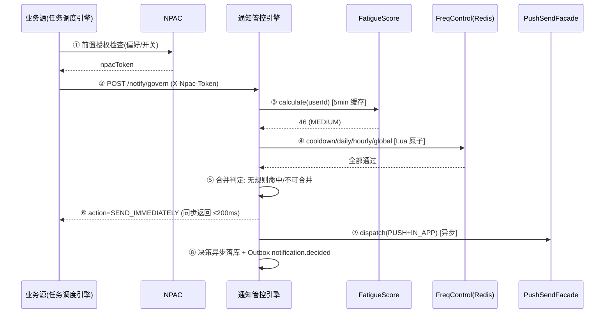
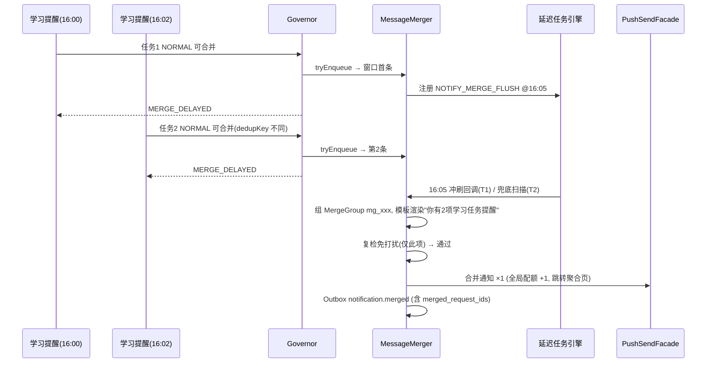
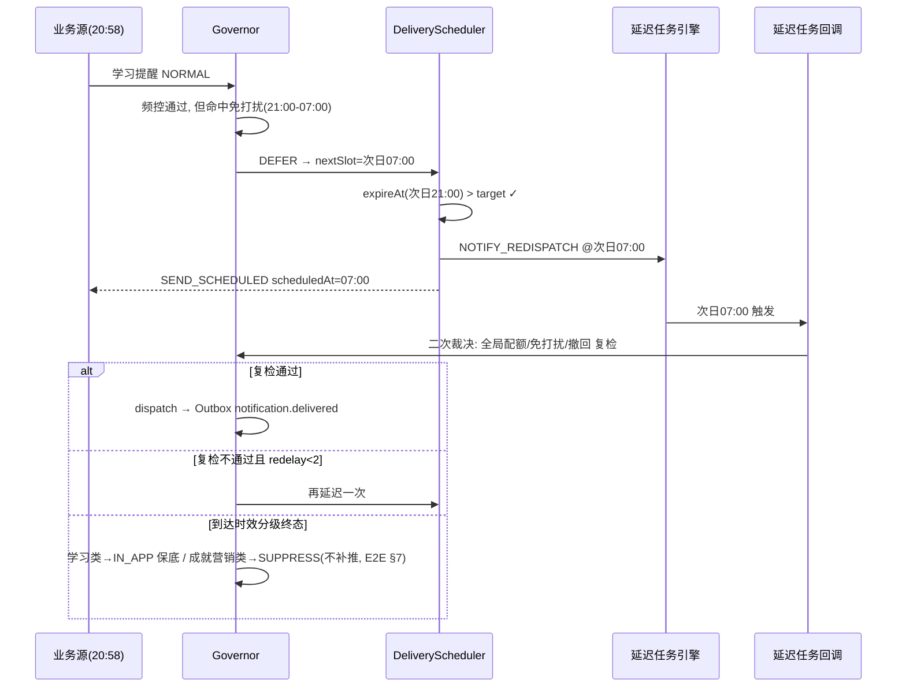

# 服务端 - 多源通知智能合并与用户通知疲劳度管控引擎 详细设计

## 1. 模块概述

### 1.1 背景与问题

PrimeTop 作为全学段 AI 辅助学习 APP，存在大量需要向用户发送通知的业务场景：

| 通知来源 | 典型场景 | 日均通知量(估算) |
| --- | --- | --- |
| 学习提醒 | 每日任务未完成、计划偏离、复习提醒 | 3-5 条/用户 |
| AI 辅导 | AI 回答完成、追问有新回复、批改完成 | 2-3 条/用户 |
| 社交互动 | 学习圈新消息、挑战赛邀请、同伴回复 | 2-4 条/用户 |
| 运营活动 | 打卡提醒、活动开启、优惠券到期 | 1-2 条/用户 |
| 系统通知 | 版本更新、维护公告、隐私政策变更 | 0-1 条/用户 |
| 家长提醒 | 孩子学习报告、异常预警、家长控制 | 0-2 条/用户 |

**问题**：如果各业务系统独立发送通知，用户日均可能收到 **8-17 条** 推送通知，导致：
1. **通知疲劳**：用户对通知逐渐麻木，打开率持续下降
2. **用户体验恶化**：频繁打扰导致用户关闭通知权限甚至卸载
3. **品牌信任下降**：家长可能认为 APP 过度打扰，尤其对未成年人产品
4. **合规风险**：未成年人保护法规对推送频次有隐性要求

### 1.2 模块定位

**多源通知智能合并与用户通知疲劳度管控引擎**（以下简称"通知管控引擎"）是位于各业务通知源与推送投递通道之间的**中间编排层**：

```
┌──────────────────────────────────────────────────────────────┐
│                    业务通知源 (Senders)                        │
│  学习提醒  AI辅导  社交互动  运营活动  系统通知  家长提醒      │
└──────────┬───────────────────────────────────────────────────┘
           │  统一通知发送 API
           ▼
┌──────────────────────────────────────────────────────────────┐
│              通知管控引擎 (Notification Governor)              │
│                                                                │
│  ┌─────────────┐  ┌──────────────┐  ┌────────────────────┐   │
│  │ 疲劳度评分   │  │ 频次控制      │  │ 消息合并器          │   │
│  │ FatigueScore│  │ FreqControl  │  │ MessageMerger      │   │
│  └─────────────┘  └──────────────┘  └────────────────────┘   │
│                                                                │
│  ┌─────────────────┐  ┌──────────────────────────────────┐   │
│  │ 优先级仲裁器     │  │ 智能调度器 (时间窗口/最佳时机)     │   │
│  │ PriorityArbiter │  │ DeliveryScheduler                │   │
│  └─────────────────┘  └──────────────────────────────────┘   │
└──────────┬───────────────────────────────────────────────────┘
           │  统一投递指令
           ▼
┌──────────────────────────────────────────────────────────────┐
│              推送投递通道 (Delivery Channels)                  │
│  APNs  FCM  华为推送  小米推送  vivo推送  OPPO推送  站内信    │
└──────────────────────────────────────────────────────────────┘
```

### 1.3 设计目标

| 目标 | 指标 |
| --- | --- |
| 控制日均通知量 | 普通用户 ≤ 3 条/天，会员用户 ≤ 5 条/天 |
| 提升通知打开率 | 目标 ≥ 25%（行业平均 15-20%） |
| 降低通知关闭率 | 月度通知权限关闭率 ≤ 2% |
| 消息合并率 | 同源通知合并率 ≥ 60% |
| 处理延迟 | 通知进入引擎到投递决策 ≤ 200ms (P99) |

---

## 2. 核心概念与领域模型

### 2.1 领域模型概览

```
NotificationRequest          NotificationDecision
┌─────────────────┐          ┌───────────────────┐
│ requestId       │          │ requestId         │
│ userId          │          │ userId            │
│ source          │   ───►   │ action            │
│ priority        │  Engine  │ channels          │
│ title           │          │ mergedWith[]      │
│ body            │          │ scheduledAt       │
│ channel         │          │ suppressionReason │
│ metadata        │          └───────────────────┘
│ expireAt        │
└─────────────────┘

UserNotificationProfile
┌─────────────────────────┐
│ userId                  │
│ fatigueScore            │  ← 0-100, 实时计算
│ dailyQuotaRemaining     │  ← 今日剩余可发量
│ lastNotificationAt      │  ← 最近一次收到通知时间
│ quietHoursStart         │  ← 免打扰开始 (如 22:00)
│ quietHoursEnd           │  ← 免打扰结束 (如 07:00)
│ preferredTimeSlots[]    │  ← 历史高打开率时段
│ notificationPreference  │  ← 用户设置
│ channelHealthScore      │  ← 推送通道健康度
└─────────────────────────┘
```

### 2.2 枚举定义

```java
/** 通知来源 */
public enum NotificationSource {
    LEARNING_REMINDER,      // 学习提醒（每日任务、复习计划）
    AI_TUTORING,            // AI 辅导（回答完成、批改完成）
    SOCIAL_INTERACTION,     // 社交互动（评论、点赞、挑战邀请）
    MARKETING_CAMPAIGN,     // 运营活动（打卡、活动、优惠券）
    SYSTEM_NOTICE,          // 系统通知（版本更新、维护公告）
    PARENT_ALERT,           // 家长提醒（学习报告、异常预警）
    EXAM_COUNTDOWN,         // 考试倒计时
    ERROR_RETRY             // 错误重试（上传失败、同步异常）
}

/** 通知优先级 */
public enum NotificationPriority {
    CRITICAL(0),   // P0: 必须立即送达（家长紧急提醒、考试倒计时最后1天）
    HIGH(1),       // P1: 高优送达（学习任务截止、AI批改完成）
    NORMAL(2),     // P2: 正常排队（社交互动、运营活动提醒）
    LOW(3)         // P3: 可合并/可丢弃（营销推广、非紧急公告）
}

/** 投递决策动作 */
public enum NotificationAction {
    SEND_IMMEDIATELY,   // 立即发送
    SEND_SCHEDULED,     // 定时发送（调度到最佳时机）
    MERGE_DELAYED,      // 合并后延迟发送
    SUPPRESS,           // 抑制不发送
    DIGEST_QUEUE        // 进入摘要队列，下次摘要统一发送
}

/** 投递通道 */
public enum NotificationChannel {
    PUSH,           // APP 推送通知
    IN_APP,         // 站内信
    SMS,            // 短信（仅 P0/P1）
    EMAIL           // 邮件（仅家长报告类）
}
```

---

## 3. 数据模型设计

### 3.1 MySQL 表结构

```sql
-- 通知配额规则表
CREATE TABLE notification_quota_rule (
    id              BIGINT PRIMARY KEY AUTO_INCREMENT,
    rule_name       VARCHAR(64) NOT NULL COMMENT '规则名称',
    user_tier       VARCHAR(32) NOT NULL COMMENT '用户层级: FREE/VIP/FAMILY',
    source          VARCHAR(32) NOT NULL COMMENT '通知来源',
    daily_limit     INT NOT NULL DEFAULT -1 COMMENT '每日限额, -1=不限',
    hourly_limit    INT NOT NULL DEFAULT -1 COMMENT '每小时限额',
    min_interval_s  INT NOT NULL DEFAULT 0 COMMENT '同来源最小间隔(秒)',
    cooldown_s      INT NOT NULL DEFAULT 0 COMMENT '冷却时间(秒)',
    effective_from  DATETIME NOT NULL,
    effective_to    DATETIME,
    is_active       TINYINT NOT NULL DEFAULT 1,
    created_at      DATETIME NOT NULL DEFAULT CURRENT_TIMESTAMP,
    updated_at      DATETIME NOT NULL DEFAULT CURRENT_TIMESTAMP ON UPDATE CURRENT_TIMESTAMP,
    INDEX idx_tier_source (user_tier, source, is_active)
) ENGINE=InnoDB DEFAULT CHARSET=utf8mb4 COMMENT='通知配额规则';

-- 通知发送日志表
CREATE TABLE notification_send_log (
    id              BIGINT PRIMARY KEY AUTO_INCREMENT,
    request_id      VARCHAR(64) NOT NULL UNIQUE COMMENT '请求唯一ID',
    user_id         BIGINT NOT NULL,
    source          VARCHAR(32) NOT NULL,
    priority        VARCHAR(16) NOT NULL,
    original_title  VARCHAR(256) NOT NULL,
    final_title     VARCHAR(256) COMMENT '合并后最终标题',
    action          VARCHAR(32) NOT NULL COMMENT '决策动作',
    channels        JSON COMMENT '实际投递通道',
    merged_request_ids JSON COMMENT '被合并的请求ID列表',
    suppression_reason VARCHAR(64) COMMENT '抑制原因',
    fatigue_score   INT COMMENT '决策时的疲劳度分数',
    scheduled_at    DATETIME COMMENT '计划投递时间',
    sent_at         DATETIME COMMENT '实际投递时间',
    opened_at       DATETIME COMMENT '用户打开时间',
    status          VARCHAR(16) NOT NULL DEFAULT 'PENDING' COMMENT 'PENDING/SENT/OPENED/FAILED',
    created_at      DATETIME NOT NULL DEFAULT CURRENT_TIMESTAMP,
    INDEX idx_user_date (user_id, created_at),
    INDEX idx_source_date (source, created_at),
    INDEX idx_status_action (status, action)
) ENGINE=InnoDB DEFAULT CHARSET=utf8mb4 COMMENT='通知发送日志';

-- 用户通知偏好表
CREATE TABLE user_notification_preference (
    user_id             BIGINT PRIMARY KEY,
    push_enabled        TINYINT NOT NULL DEFAULT 1 COMMENT '总推送开关',
    quiet_hours_start   TIME COMMENT '免打扰开始时间',
    quiet_hours_end     TIME COMMENT '免打扰结束时间',
    school_hours_mute   TINYINT NOT NULL DEFAULT 1 COMMENT '上课时间静默(未成年人)',
    school_start        TIME DEFAULT '08:00' COMMENT '上课开始时间',
    school_end          TIME DEFAULT '17:00' COMMENT '下课时间',
    -- 各来源开关
    learning_reminder_enabled  TINYINT NOT NULL DEFAULT 1,
    ai_tutoring_enabled        TINYINT NOT NULL DEFAULT 1,
    social_enabled             TINYINT NOT NULL DEFAULT 1,
    marketing_enabled          TINYINT NOT NULL DEFAULT 1,
    system_enabled             TINYINT NOT NULL DEFAULT 1,
    parent_alert_enabled       TINYINT NOT NULL DEFAULT 1,
    -- 偏好通道
    preferred_channels JSON COMMENT '["push","in_app"]',
    -- 每日上限(用户可自调)
    daily_max_push     INT NOT NULL DEFAULT 3 COMMENT '每日推送上限',
    digest_mode        TINYINT NOT NULL DEFAULT 0 COMMENT '摘要模式: 每日合并为一条',
    updated_at         DATETIME NOT NULL DEFAULT CURRENT_TIMESTAMP ON UPDATE CURRENT_TIMESTAMP
) ENGINE=InnoDB DEFAULT CHARSET=utf8mb4 COMMENT='用户通知偏好';

-- 通知疲劳度历史表（按天聚合）
CREATE TABLE notification_fatigue_daily (
    id              BIGINT PRIMARY KEY AUTO_INCREMENT,
    user_id         BIGINT NOT NULL,
    stat_date       DATE NOT NULL,
    total_sent      INT NOT NULL DEFAULT 0 COMMENT '总发送数',
    total_push      INT NOT NULL DEFAULT 0 COMMENT '推送数',
    total_opened    INT NOT NULL DEFAULT 0 COMMENT '打开数',
    open_rate       DECIMAL(5,4) DEFAULT 0 COMMENT '打开率',
    suppressed_count INT NOT NULL DEFAULT 0 COMMENT '被抑制数',
    merged_count    INT NOT NULL DEFAULT 0 COMMENT '被合并数',
    fatigue_score_avg INT NOT NULL DEFAULT 0 COMMENT '日均疲劳度',
    UNIQUE KEY uk_user_date (user_id, stat_date),
    INDEX idx_date (stat_date)
) ENGINE=InnoDB DEFAULT CHARSET=utf8mb4 COMMENT='通知疲劳度日统计';

-- 消息合并规则表
CREATE TABLE notification_merge_rule (
    id              BIGINT PRIMARY KEY AUTO_INCREMENT,
    rule_name       VARCHAR(64) NOT NULL,
    source_group    VARCHAR(256) NOT NULL COMMENT '来源组, 逗号分隔',
    merge_window_s  INT NOT NULL DEFAULT 300 COMMENT '合并窗口(秒)',
    max_merge_count INT NOT NULL DEFAULT 5 COMMENT '最大合并条数',
    merge_template  TEXT NOT NULL COMMENT '合并标题模板',
    priority_rule   VARCHAR(32) NOT NULL DEFAULT 'MAX' COMMENT 'MAX/LATEST',
    is_active       TINYINT NOT NULL DEFAULT 1,
    created_at      DATETIME NOT NULL DEFAULT CURRENT_TIMESTAMP
) ENGINE=InnoDB DEFAULT CHARSET=utf8mb4 COMMENT='消息合并规则';
```

### 3.2 Redis 数据结构

```lua
-- ============================================
-- 1. 用户每日配额计数器 (String + TTL)
-- ============================================
-- Key: notify:quota:{userId}:{channel}:{date}
-- TTL: 次日 00:05 过期
-- Example: notify:quota:10001:push:20260620 = "2"

SET notify:quota:10001:push:20260620 0
EXPIREAT notify:quota:10001:push:20260620 {next_midday_timestamp}
INCR notify:quota:10001:push:20260620

-- ============================================
-- 2. 用户通知疲劳度分数 (Hash)
-- ============================================
-- Key: notify:fatigue:{userId}
-- TTL: 1小时（自动刷新）
HSET notify:fatigue:10001 \
    score 45 \
    last_updated 1718900000 \
    notifications_today 3 \
    opens_today 1 \
    last_notification_ts 1718898000 \
    last_open_ts 1718898500

-- ============================================
-- 3. 来源冷却计时器 (String + TTL)
-- ============================================
-- Key: notify:cooldown:{userId}:{source}
-- TTL = 冷却时间(秒)
SET notify:cooldown:10001:LEARNING_REMINDER 1
EXPIRE notify:cooldown:10001:LEARNING_REMINDER 1800  -- 30分钟

-- ============================================
-- 4. 合并缓冲队列 (Sorted Set)
-- ============================================
-- Key: notify:merge:buffer:{userId}
-- Score = 当前时间戳
-- Member = 通知请求的 JSON
ZADD notify:merge:buffer:10001 \
    1718900000 '{"requestId":"req_001","source":"LEARNING_REMINDER","title":"数学任务未完成","priority":"NORMAL"}'
ZADD notify:merge:buffer:10001 \
    1718900120 '{"requestId":"req_002","source":"LEARNING_REMINDER","title":"英语复习提醒","priority":"NORMAL"}'

-- 合并窗口扫描
ZRANGEBYSCORE notify:merge:buffer:10001 {now - merge_window} {now}

-- ============================================
-- 5. 用户最佳发送时间模型 (Hash)
-- ============================================
-- Key: notify:besttime:{userId}
HSET notify:besttime:10001 \
    weekday_morning "07:30" \
    weekday_afternoon "16:30" \
    weekday_evening "19:00" \
    weekend_morning "09:00" \
    weekend_afternoon "14:00" \
    weekend_evening "19:30" \
    confidence 0.75 \
    last_recalculated 1718900000

-- ============================================
-- 6. 全局抑制名单 (Set)
-- ============================================
-- Key: notify:suppress:global
-- 临时加入的用户（如用户主动反馈打扰）
SADD notify:suppress:global 10001
```

### 3.3 配额规则初始数据

```sql
INSERT INTO notification_quota_rule (rule_name, user_tier, source, daily_limit, hourly_limit, min_interval_s, cooldown_s, effective_from) VALUES
-- 免费用户
('free_learning',     'FREE',  'LEARNING_REMINDER',  2, 1, 1800,  1800, '2026-01-01'),
('free_ai',           'FREE',  'AI_TUTORING',        3, 1, 600,   600,  '2026-01-01'),
('free_social',       'FREE',  'SOCIAL_INTERACTION', 1, 1, 3600,  3600, '2026-01-01'),
('free_marketing',    'FREE',  'MARKETING_CAMPAIGN', 1, -1, 7200, 7200, '2026-01-01'),
('free_system',       'FREE',  'SYSTEM_NOTICE',      -1, -1, 0,   0,    '2026-01-01'),
('free_parent',       'FREE',  'PARENT_ALERT',       2, -1, 1800, 1800, '2026-01-01'),
-- VIP 用户
('vip_learning',      'VIP',   'LEARNING_REMINDER',  3, 2, 900,   900,  '2026-01-01'),
('vip_ai',            'VIP',   'AI_TUTORING',        5, 2, 300,   300,  '2026-01-01'),
('vip_social',        'VIP',   'SOCIAL_INTERACTION', 3, 1, 1800,  1800, '2026-01-01'),
('vip_marketing',     'VIP',   'MARKETING_CAMPAIGN', 1, -1, 7200, 7200, '2026-01-01'),
('vip_system',        'VIP',   'SYSTEM_NOTICE',      -1, -1, 0,   0,    '2026-01-01'),
('vip_parent',        'VIP',   'PARENT_ALERT',       3, -1, 900,  900,  '2026-01-01'),
('vip_exam',          'VIP',   'EXAM_COUNTDOWN',     2, 1, 3600,  3600, '2026-01-01');
```

---

## 4. 核心算法设计

### 4.1 通知疲劳度评分算法

疲劳度分数范围 **0-100**，分为三档：

| 分数范围 | 等级 | 颜色 | 策略 |
| --- | --- | --- | --- |
| 0-29 | 低疲劳 | 🟢 | 正常发送 |
| 30-59 | 中疲劳 | 🟡 | 降频 + 合并 |
| 60-79 | 高疲劳 | 🟠 | 仅 P0/P1 + 摘要 |
| 80-100 | 极度疲劳 | 🔴 | 仅 P0 + 暂停 24h |

```java
/**
 * 疲劳度评分计算器
 * 
 * 核心思路: 综合考虑以下因子
 * 1. 近期通知密度 (权重 30%)
 * 2. 近期通知打开率 (权重 25%)
 * 3. 连续无中断天数 (权重 15%)
 * 4. 时间衰减因子 (权重 15%)
 * 5. 用户主动行为信号 (权重 15%)
 */
public class FatigueScoreCalculator {

    private final RedisTemplate<String, String> redis;
    private static final int LOOKBACK_HOURS = 24;
    private static final int RECENT_HOURS = 3;

    /**
     * 计算用户当前疲劳度分数
     * @param userId 用户ID
     * @return 0-100 的疲劳度分数
     */
    public int calculate(Long userId) {
        String key = "notify:fatigue:" + userId;
        
        // 尝试读取缓存（5分钟有效期）
        String cached = redis.opsForValue().get(key + ":cached");
        if (cached != null) {
            return Integer.parseInt(cached);
        }

        // 因子1: 近期通知密度 (0-100)
        int densityScore = calculateDensityScore(userId);
        
        // 因子2: 打开率反向分 (0-100, 打开率越低分越高)
        int openRateScore = calculateOpenRateScore(userId);
        
        // 因子3: 连续推送天数 (连续天数越多, 疲劳度越高)
        int streakScore = calculateStreakScore(userId);
        
        // 因子4: 最近一次通知的时间衰减 (越近, 疲劳度越高)
        int recencyScore = calculateRecencyScore(userId);
        
        // 因子5: 用户行为信号 (关闭推送、投诉等)
        int behaviorScore = calculateBehaviorScore(userId);

        // 加权汇总
        int totalScore = (int) (
            densityScore  * 0.30 +
            openRateScore * 0.25 +
            streakScore   * 0.15 +
            recencyScore  * 0.15 +
            behaviorScore * 0.15
        );

        totalScore = Math.min(100, Math.max(0, totalScore));

        // 缓存5分钟
        redis.opsForValue().set(key + ":cached", String.valueOf(totalScore), 
            Duration.ofMinutes(5));

        return totalScore;
    }

    /**
     * 通知密度评分
     * 基于过去24小时内的推送数量
     * 0条=0分, 3条=30分, 5条=50分, 8条=70分, 10+条=100分
     */
    private int calculateDensityScore(Long userId) {
        // 近3小时推送数 (权重高)
        int recentCount = getPushCount(userId, RECENT_HOURS);
        // 近24小时推送数
        int dayCount = getPushCount(userId, LOOKBACK_HOURS);

        int score = 0;
        // 近3小时: 每条+15分, 上限60
        score += Math.min(60, recentCount * 15);
        // 近24小时: 每条+5分(扣除近3小时), 上限40
        score += Math.min(40, Math.max(0, dayCount - recentCount) * 5);
        
        return Math.min(100, score);
    }

    /**
     * 打开率评分
     * 近7天内推送的打开率越低, 说明用户越不关注通知
     * 打开率 >= 50%: 0分
     * 打开率 30-50%: 20分
     * 打开率 10-30%: 50分
     * 打开率 < 10%: 80分
     * 打开率 0% 且推送 >= 5条: 100分
     */
    private int calculateOpenRateScore(Long userId) {
        NotificationOpenStats stats = loadOpenStats(userId, 7); // 近7天
        
        if (stats.totalSent == 0) return 0; // 无推送, 无疲劳
        
        double openRate = (double) stats.totalOpened / stats.totalSent;
        
        if (openRate >= 0.50) return 0;
        if (openRate >= 0.30) return 20;
        if (openRate >= 0.10) return 50;
        if (openRate > 0)     return 80;
        
        // 打开率为0但推送量 >= 5
        return stats.totalSent >= 5 ? 100 : 60;
    }

    /**
     * 连续推送天数评分
     * 连续每天收到推送的天数越多, 疲劳积累越高
     */
    private int calculateStreakScore(Long userId) {
        int streak = getConsecutivePushDays(userId);
        // 1天=10, 3天=30, 5天=50, 7天=70, 10+天=100
        return Math.min(100, streak * 10);
    }

    /**
     * 最近推送时间评分
     * 距离上次推送越近, 疲劳度越高
     */
    private int calculateRecencyScore(Long userId) {
        Long lastTs = getLastNotificationTimestamp(userId);
        if (lastTs == null) return 0;
        
        long minutesAgo = (System.currentTimeMillis() / 1000 - lastTs) / 60;
        
        if (minutesAgo < 5)   return 100; // 5分钟内
        if (minutesAgo < 15)  return 80;  // 15分钟内
        if (minutesAgo < 30)  return 60;  // 30分钟内
        if (minutesAgo < 60)  return 40;  // 1小时内
        if (minutesAgo < 180) return 20;  // 3小时内
        return 0;
    }

    /**
     * 用户行为信号评分
     * - 曾关闭推送权限又打开: +40
     * - 曾通过反馈渠道投诉通知过多: +60
     * - 近7天频繁清理通知栏: +20
     * - 长时间未打开APP: +30
     */
    private int calculateBehaviorScore(Long userId) {
        int score = 0;
        
        if (hasTogglePushOff(userId, 30))  score += 40;
        if (hasComplaintAboutNotify(userId, 30)) score += 60;
        if (isFrequentClearNotifications(userId)) score += 20;
        if (isAppInactive(userId, 7))      score += 30;
        
        return Math.min(100, score);
    }
}
```

### 4.2 频次控制决策器

```java
/**
 * 频次控制决策器
 * 
 * 在疲劳度评分的基础上，结合配额规则进行频次控制
 */
public class FrequencyController {

    private final NotificationQuotaRuleMapper quotaRuleMapper;
    private final RedisTemplate<String, String> redis;

    /**
     * 检查通知是否可以通过频次控制
     * 
     * @return DecisionResult 包含是否通过、拒绝原因
     */
    public FreqDecision check(Long userId, NotificationSource source, 
                               NotificationPriority priority, String channel,
                               String userTier) {
        
        // P0 级别通知跳过大部分频控（但仍检查免打扰和全局限制）
        if (priority == NotificationPriority.CRITICAL) {
            return checkCriticalBypass(userId, source, channel);
        }

        // 1. 检查来源冷却
        FreqDecision cooldownResult = checkCooldown(userId, source);
        if (cooldownResult.isDenied()) return cooldownResult;

        // 2. 检查来源每日限额
        FreqDecision dailyLimitResult = checkDailyLimit(userId, source, userTier);
        if (dailyLimitResult.isDenied()) return dailyLimitResult;

        // 3. 检查来源每小时限额
        FreqDecision hourlyResult = checkHourlyLimit(userId, source, userTier);
        if (hourlyResult.isDenied()) return hourlyResult;

        // 4. 检查用户全局每日推送上限
        FreqDecision globalResult = checkGlobalDailyLimit(userId, channel);
        if (globalResult.isDenied()) return globalResult;

        // 5. 检查免打扰与上课静默时段检查（未成年人默认开启，家长可调整）
        FreqDecision quietResult = checkQuietHoursAndSchoolMute(userId, channel);
        if (quietResult.isDenied()) return quietResult;

        // 6. 偏好开关兜底检查（权威在 NPAC，此处仅消费其同步镜像缓存做快速失败）
        FreqDecision prefResult = checkPreferenceFallback(userId, source);
        if (prefResult.isDenied()) return prefResult;

        // 7. 全局抑制名单（用户客诉"通知过多"/主动反馈打扰时临时静默）
        if (isGlobalSuppressed(userId)) {
            return FreqDecision.deny("GLOBAL_SUPPRESSED", DenyAction.SUPPRESS_SILENT);
        }

        return FreqDecision.pass();
    }

    /** P0 旁路：仍检查安全豁免矩阵与全局抑制，但不受来源配额/疲劳度限制 */
    private FreqDecision checkCriticalBypass(Long userId, NotificationSource source, String channel) {
        if (isGlobalSuppressed(userId)) {
            // 安全类 P0（异地登录/危机预警信号）即使全局抑制也放行，对齐 E2E §7 URGENT 豁免
            if (source == NotificationSource.PARENT_ALERT) return FreqDecision.pass();
            return FreqDecision.deny("GLOBAL_SUPPRESSED", DenyAction.SUPPRESS_SILENT);
        }
        // P0 不受免打扰限制，但仍受用户级"推送总开关关闭"约束（权限关闭是用户最高意志）
        if (isPushDisabled(userId)) {
            return FreqDecision.redirect(NotificationChannel.IN_APP);
        }
        return FreqDecision.pass();
    }

    /**
     * 免打扰与上课静默检查
     *
     * 时段规则（权威配置，运营不可放宽）：
     * - 学生端默认免打扰 21:00–07:00（对齐双减夜间红线与防沉迷机制）
     * - 家长端默认免打扰 22:00–07:00
     * - 未成年人上课静默 08:00–17:00 默认开启（user_notification_preference.school_hours_mute）
     * - URGENT 安全类（PARENT_ALERT 中的危机预警/异地登录）豁免免打扰，对齐 E2E §7
     */
    private FreqDecision checkQuietHoursAndSchoolMute(Long userId, String channel) {
        UserNotificationPreference pref = preferenceCache.get(userId);
        LocalTime now = LocalTime.now(ZoneId.of("Asia/Shanghai"));

        // 站内信不受免打扰限制（用户主动打开才可见）
        if (NotificationChannel.IN_APP.name().equals(channel)) return FreqDecision.pass();

        if (isInQuietHours(pref, now)) {
            Instant nextSlot = nextAvailableSlot(pref, now);
            return FreqDecision.defer(nextSlot, "QUIET_HOURS");
        }
        if (pref.isMinor() && pref.schoolHoursMute && isSchoolHours(pref, now)
                && LocalDate.now().getDayOfWeek().getValue() <= 5) {
            return FreqDecision.defer(pref.getSchoolEnd().atDate(LocalDate.now()).toInstant(ZONE),
                    "SCHOOL_HOURS_MUTE");
        }
        return FreqDecision.pass();
    }

    /** 配额检查的原子实现：Lua 保证"读计数+判定"原子，避免并发超发 */
    private FreqDecision checkDailyLimit(Long userId, NotificationSource source, String userTier) {
        NotificationQuotaRule rule = quotaRuleCache.getRule(userTier, source);
        if (rule == null || rule.getDailyLimit() < 0) return FreqDecision.pass();

        String key = String.format("notify:quota:src:%d:%s:%s", userId, source, today());
        String cnt = redis.opsForValue().get(key);
        if (cnt != null && Integer.parseInt(cnt) >= rule.getDailyLimit()) {
            return FreqDecision.deny("SOURCE_DAILY_LIMIT", DenyAction.SUPPRESS_TO_DIGEST);
        }
        return FreqDecision.pass();
    }

    // checkHourlyLimit / checkGlobalDailyLimit / checkCooldown 同构：
    // cooldown 直接依赖 SETNX notify:cooldown:{userId}:{source} + TTL；
    // global 检查 notify:quota:{userId}:{channel}:{date} 与 user_notification_preference.daily_max_push 取 min。
}

/** 频控决策结果 */
public class FreqDecision {
    private boolean allowed;          // 是否放行
    private String denyReason;        // 拒绝原因码
    private DenyAction denyAction;    // 拒绝后的处置
    private Instant deferredTo;       // defer 时的下一可投时刻
    private NotificationChannel redirectChannel; // 通道重定向（如推送关闭→站内信）

    public enum DenyAction {
        SUPPRESS_SILENT,     // 静默丢弃（记日志，不入摘要）
        SUPPRESS_TO_DIGEST,  // 抑制但进入摘要队列
        DEFER,               // 延迟到 deferredTo
        REDIRECT             // 降级到 redirectChannel
    }
}

/**
 * 【计数时机红线】
 * 1. 来源配额（notify:quota:src:*）：决策通过时即占用（含 MERGE_DELAYED 进入合并缓冲），
 *    防止上游刷量借合并窗口绕过来源限额；被抑制/被合并吸收的请求不占用全局配额。
 * 2. 全局推送配额（notify:quota:{userId}:{channel}:{date}）：仅实际 PUSH 投递时 INCR，
 *    合并组冲刷出的单条合并通知只计 1——这是合并机制的核心收益。
 * 3. 被抑制（SUPPRESS）请求不计数。计数 Lua 脚本与决策提交在同一事务边界内执行。
 */
```

### 4.3 消息合并器（MessageMerger）——同名核心组件

> v1.0 版本此组件仅有数据结构定义（`notification_merge_rule` 表与 `notify:merge:buffer` ZSET），完整算法缺失，本节补齐。

#### 4.3.1 可合并性判定

并非所有通知都可合并，进入合并缓冲前需满足全部条件：

| 判定条件 | 规则 | 说明 |
| --- | --- | --- |
| 优先级门槛 | 仅 NORMAL(2) / LOW(3) 可合并 | P0/P1 时效敏感，直接走独立通道 |
| 来源规则匹配 | source 命中某条 active 的 merge_rule.source_group | 无规则则不合并 |
| 用户摘要模式 | digest_mode=1 时跳过合并直接进摘要队列 | 摘要是合并的更强形式 |
| 时效余量 | expireAt - now > merge_window_s × 3 | 临期通知不进缓冲，防过期作废 |
| 去重键 | 同一 source 下 dedupKey 相同的请求直接丢弃 | dedupKey = hash(businessRef)，如 (taskId) / (postId) |
| 疲劳度联动 | 疲劳度 ≥ 60（高疲劳）时，可合并通知强制进合并/摘要 | 用合并对冲疲劳 |

#### 4.3.2 合并规则初始数据

```sql
INSERT INTO notification_merge_rule (rule_name, source_group, merge_window_s, max_merge_count,
                                     merge_template, priority_rule, is_active) VALUES
('learning_bundle',  'LEARNING_REMINDER,EXAM_COUNTDOWN', 300, 5,
 '你有 {count} 项学习任务提醒', 'MAX', 1),
('social_bundle',    'SOCIAL_INTERACTION', 600, 10,
 '学习圈有 {count} 条新动态', 'MAX', 1),
('marketing_digest', 'MARKETING_CAMPAIGN', 3600, 3,
 '{count} 个活动进行中，看看有没有感兴趣的', 'LATEST', 1),
('ai_batch',         'AI_TUTORING', 120, 3,
 '{count} 个辅导任务已完成', 'MAX', 1);
```

`merge_template` 占位符：`{count}` 合并条数、`{source_zh}` 来源中文名、`{latest}` 最新一条标题（截断 20 字）、`{first}` 最早一条标题。模板渲染失败按 v1.1 DDL 增补的 `fallback_template`（`'你有 {count} 条新提醒'`）兜底，禁止因模板错误丢弃通知。

#### 4.3.3 合并缓冲与冲刷机制（双触发）

```java
/**
 * 消息合并器
 *
 * 缓冲：Redis ZSET notify:merge:buffer:{userId}，score=入队时间戳，member=请求 JSON
 * 冲刷触发（双保险）：
 *   T1 精确触发：首条请求入队时向统一延迟任务调度引擎注册
 *       taskType=NOTIFY_MERGE_FLUSH, payload={userId, fireAt=now+merge_window_s}
 *   T2 兜底扫描：每 60s 扫描 notify:merge:pending ZSET（全局，member=userId, score=最早应冲刷时刻），
 *       防延迟任务丢失导致缓冲泄漏
 */
@Service
public class MessageMerger {

    private final RedisTemplate<String, String> redis;
    private final NotificationMergeRuleMapper mergeRuleMapper;
    private final DelayTaskClient delayTaskClient;
    private final StringRedisTemplate stringRedis;

    /** 判定 + 入队（在 Governor 决策管线内调用） */
    public MergeEnqueueResult tryEnqueue(NotificationRequest req, NotificationMergeRule rule) {
        String bufferKey = "notify:merge:buffer:" + req.getUserId();

        // 1. 窗口内去重：同 dedupKey 已在缓冲中 → 丢弃旧条，保留新条（LATEST 语义）
        String dupMember = findDedup(bufferKey, req.dedupKey());
        if (dupMember != null) {
            redis.opsForZSet().remove(bufferKey, dupMember);
        }

        // 2. 判定是否达到 max_merge_count：达到则立即冲刷成组，当前请求入新窗口
        Long buffered = redis.opsForZSet().zCard(bufferKey);
        boolean flushNow = buffered != null && buffered >= rule.getMaxMergeCount();

        String member = serialize(req);
        if (flushNow) {
            flushBuffer(req.getUserId(), rule, "MAX_COUNT_REACHED");
            // 冲刷后缓冲已清空，当前请求成为新窗口首条
        }

        redis.opsForZSet().add(bufferKey, member, Instant.now().getEpochSecond());

        if (buffered == null || buffered == 0 || flushNow) {
            // 首条入队：注册精确冲刷任务 + 兜底登记
            delayTaskClient.schedule(DelayTask.of(
                "NOTIFY_MERGE_FLUSH", req.getUserId(),
                Instant.now().plusSeconds(rule.getMergeWindowS())));
            stringRedis.opsForZSet().add("notify:merge:pending",
                String.valueOf(req.getUserId()),
                Instant.now().plusSeconds(rule.getMergeWindowS()).getEpochSecond());
        }
        return MergeEnqueueResult.enqueued(rule.getMergeWindowS());
    }

    /** 冲刷：把窗口内同规则请求组成 MergeGroup，产出合并通知 */
    public void flushBuffer(Long userId, NotificationMergeRule rule, String trigger) {
        RLock lock = redisson.getLock("notify:merge:lock:" + userId);
        if (!lock.tryLock()) return; // 已有冲刷在途，跳过（幂等）
        try {
            String bufferKey = "notify:merge:buffer:" + userId;
            long now = Instant.now().getEpochSecond();
            Set<String> members = redis.opsForZSet().rangeByScore(bufferKey, 0, now);
            if (members == null || members.isEmpty()) return;

            // 按命中的规则分组（一个用户可能同时有 learning_bundle 与 social_bundle 两个窗口）
            Map<NotificationMergeRule, List<NotificationRequest>> groups = groupByRule(members);

            for (var entry : groups.entrySet()) {
                List<NotificationRequest> batch = entry.getValue();
                NotificationMergeRule r = entry.getKey();
                if (batch.size() == 1) {
                    // 单条不成组：直接以原请求出队投递（不浪费合并语义）
                    dispatchSingle(batch.get(0));
                    redis.opsForZSet().remove(bufferKey, serialize(batch.get(0)));
                    continue;
                }
                String groupId = "mg_" + ULID.next();
                NotificationRequest merged = buildMerged(userId, batch, r, groupId);

                // 优先级聚合：MAX=取最高优先级；LATEST=取最新条优先级
                NotificationPriority p = "MAX".equals(r.getPriorityRule())
                    ? batch.stream().map(NotificationRequest::getPriority).min(Comparator.naturalOrder()).get()
                    : batch.get(batch.size() - 1).getPriority();

                // 合并通知重新过一遍免打扰（时间已推移），但不再过来源频控（成员已各自计数）
                FreqDecision quiet = freqController.checkQuietHoursOnly(userId, "push");
                if (quiet.isDenied()) {
                    deferOrExpire(merged, quiet.getDeferredTo(), batch, r);
                } else {
                    dispatchMerged(merged, batch, groupId, trigger);
                }
                batch.forEach(b -> redis.opsForZSet().remove(bufferKey, serialize(b)));
            }
            // 清理兜底登记
            stringRedis.opsForZSet().remove("notify:merge:pending", String.valueOf(userId));
        } finally {
            lock.unlock();
        }
    }

    /** 合并通知构建：标题模板渲染 + 聚合落地页 */
    private NotificationRequest buildMerged(Long userId, List<NotificationRequest> batch,
                                            NotificationMergeRule rule, String groupId) {
        String title;
        try {
            title = renderTemplate(rule.getMergeTemplate(), batch);
        } catch (Exception e) {
            log.warn("merge template render failed, rule={}, fallback", rule.getRuleName(), e);
            title = renderTemplate("你有 {count} 条新提醒", batch); // fallback_template
        }
        return NotificationRequest.builder()
            .requestId(groupId)                       // 合并组 ID 即请求 ID，幂等锚点
            .userId(userId)
            .source(parseSourceGroup(rule.getSourceGroup()))
            .title(title)
            .body("展开查看全部提醒")
            // 合并通知统一跳「通知聚合页」，聚合页按 merged_request_ids 反查成员（读时聚合，不建新表）
            .deepLink("primetop://notify/aggregate?group=" + groupId)
            .metadata(Map.of(
                "mergeGroup", groupId,
                "mergedRequestIds", batch.stream().map(NotificationRequest::getRequestId).toList(),
                "count", batch.size()))
            .expireAt(batch.stream().map(NotificationRequest::getExpireAt).min(Comparator.naturalOrder()).get())
            .build();
    }
}
```

#### 4.3.4 合并与频控/疲劳度联动规则

| 场景 | 规则 |
| --- | --- |
| 合并成员的来源配额 | 决策入队时已各自计数（见 §4.2 计数红线），冲刷不重复计数 |
| 合并通知的全局配额 | 冲刷投递时按 1 条 PUSH 计数（合并收益） |
| 冲刷时再次命中冷却 | 合并通知视为新实体，冷却键为 `merge:{groupId}`，不与成员来源冷却冲突 |
| 疲劳度 ≥ 80（极度疲劳） | 缓冲中的可合并通知不再冲刷投递，直接转摘要队列（DIGEST_QUEUE） |
| 冲刷时成员已过期 | 过期成员剔除；若剔除后仅剩 1 条且未过期，走单条投递 |
| 上游撤回（如作业撤回窗内撤回） | 上游发送 `notification.revoked` 事件，成员从缓冲移除；若组内全部撤回则取消冲刷任务 |

### 4.4 优先级仲裁器（PriorityArbiter）

当全局日推送上限仅剩 1 个名额、同一时间窗内有多个待投递请求竞争时：

```
仲裁排序键（依次比较）：
1. priority 升序（CRITICAL=0 最优先）
2. expireAt 升序（更早过期的先投，减少过期作废）
3. 疲劳度敏感度降序（对疲劳度贡献小的来源优先：SYSTEM_NOTICE < PARENT_ALERT < AI_TUTORING
   < LEARNING_REMINDER < EXAM_COUNTDOWN < SOCIAL < MARKETING）
4. createdAt 升序（FIFO 兜底）
```

```java
public class PriorityArbiter {

    /**
     * 在剩余名额内裁决，挤出者按规则降级。
     * 挤出规则：NORMAL → 转 IN_APP 站内信；LOW → 转 DIGEST_QUEUE；
     *           HIGH 被挤出属异常（配额规划应避免），告警并转 IN_APP。
     */
    public ArbitrationResult arbitrate(List<PendingCandidate> candidates, int remainingQuota) {
        List<PendingCandidate> sorted = candidates.stream()
            .sorted(Comparator.comparing(PendingCandidate::getPriority)
                .thenComparing(PendingCandidate::getExpireAt)
                .thenComparing(c -> -fatigueWeight(c.getSource()))
                .thenComparing(PendingCandidate::getCreatedAt))
            .collect(Collectors.toList());

        List<PendingCandidate> winners = sorted.subList(0, Math.min(remainingQuota, sorted.size()));
        List<PendingCandidate> losers  = sorted.subList(winners.size(), sorted.size());

        losers.forEach(loser -> {
            if (loser.getPriority() == NotificationPriority.LOW) {
                loser.redirectTo(NotificationAction.DIGEST_QUEUE);
            } else {
                loser.redirectTo(NotificationChannel.IN_APP);  // 保底站内信，不丢消息
            }
        });
        if (losers.stream().anyMatch(l -> l.getPriority().getLevel() <= 1)) {
            monitor.increment("notify_arbitration_high_evicted"); // P1 告警指标
        }
        return ArbitrationResult.of(winners, losers);
    }
}
```

### 4.5 智能调度器（DeliveryScheduler）

负责 `SEND_SCHEDULED` / `DEFER` 决策的落地。**时机数据的权威不在本引擎**（见 §15 契约对齐第 4 项）：

```java
@Service
public class DeliveryScheduler {

    private final DelayTaskClient delayTaskClient;
    private final BestTimeClient bestTimeClient;      // 学生个性化推送时间决策引擎 gRPC 客户端
    private final NotificationGovernor governor;      // 到期后重入决策管线

    /**
     * 三类调度：
     * A. 免打扰/上课静默 DEFER   → 调度到时段结束点（nextSlot 确定性计算）
     * B. 低优非紧急 SEND_SCHEDULED → 调度到用户最佳时机（besttime 只读消费）
     * C. 摘要队列 DIGEST_QUEUE   → 调度到每日摘要固定冲刷点（默认晚间 besttime，无模型时 19:00）
     */
    public ScheduleResult schedule(NotificationRequest req, FreqDecision decision) {
        Instant targetAt = switch (decision.getScheduleType()) {
            case QUIET_DEFER      -> decision.getDeferredTo();
            case BEST_TIME        -> bestTimeClient.nextBestSlot(req.getUserId(),
                                                req.getPriority().name());
            case DIGEST_FLUSH     -> nextDigestSlot(req.getUserId());
        };

        // 超过 expireAt 的调度没有意义：直接抑制并标记时效原因
        if (targetAt.isAfter(req.getExpireAt())) {
            return ScheduleResult.expired("SCHEDULE_PAST_EXPIRE",
                shouldBackfill(req) ? NotificationAction.SEND_IMMEDIATELY : NotificationAction.SUPPRESS);
        }

        // 委托统一延迟任务调度引擎，到期重入本引擎做二次裁决
        delayTaskClient.schedule(DelayTask.of("NOTIFY_REDISPATCH",
            Map.of("requestId", req.getRequestId()), targetAt));
        return ScheduleResult.scheduled(targetAt);
    }

    /**
     * 到期重入（延迟任务回调）：必须二次裁决而非直接投递——
     * 场景：延迟期间用户疲劳度可能已升级、全局配额可能已被占用、通知可能已被上游撤回。
     * 二次裁决规则：仅复检 [全局配额 + 免打扰 + 撤回标记]，跳过来源频控（已计数）；
     * 复检不通过 → 再延迟一次（最多 2 次）或按时效分级终态处理。
     */
    @KafkaListener(topics = "delay.task.NOTIFY_REDISPATCH")
    public void onRedispatch(DelayTaskFired event) {
        NotificationRequest req = requestStore.reload(event.getRequestId());
        if (req == null || req.isRevoked()) return;   // 已撤回，静默终止
        FreqDecision recheck = freqController.recheckForRedispatch(req);
        if (recheck.isAllowed()) {
            dispatcher.dispatch(req);
        } else if (recheck.getDenyAction() == DenyAction.DEFER && req.getRedelayCount() < 2) {
            req.incrementRedelay();
            schedule(req, recheck);
        } else {
            // 时效分级终态（引用 E2E 通知投递链路 §7 分级表，不重复定义）：
            // 学习/错题/周报/作业类 → 转 IN_APP 保底；成就/营销类 → 不补推，直接 SUPPRESS
            dispatcher.expireDispatch(req, recheck.getDenyReason());
        }
    }
}
```

### 4.6 决策管线编排器（NotificationGovernor）

把五个组件串成一条 ≤200ms（P99）的同步决策管线：

```java
@Service
public class NotificationGovernorImpl implements NotificationGovernor {

    /** 管线预算分配（总计 200ms P99） */
    // 偏好兜底读取(本地缓存)     ≤ 5ms
    // 疲劳度评分(5min 缓存)      ≤ 20ms（缓存未命中时异步计算用旧值，见 D3 降级）
    // 频控检查(Redis Lua ×4)     ≤ 40ms
    // 合并判定 + 入队            ≤ 30ms
    // 优先级仲裁(仅竞争时)        ≤ 15ms
    // 调度登记(gRPC 延迟引擎)     ≤ 40ms（超时转异步确认，不阻塞决策返回）
    // 决策落库(异步, 不在同步路径)  —
    public NotificationDecision govern(NotificationRequest req) {
        // 0. 幂等快速返回：同 requestId 已有终态决策 → 返回既有决策（结果回放语义）
        NotificationDecision existing = decisionCache.get(req.getRequestId());
        if (existing != null && existing.isTerminal()) return existing;

        // 1. NPAC 前置授权结果注入（调用方必须先过 NPAC，本引擎校验 token 存在性，不重复鉴权）
        requireNpacToken(req);

        // 2. 偏好兜底 + 疲劳度
        int fatigue = fatigueCalculator.calculate(req.getUserId());
        FatigueTier tier = FatigueTier.of(fatigue);

        // 3. 疲劳度分层直达（最高优先级短路）
        if (tier == FatigueTier.EXTREME && req.getPriority().getLevel() >= 1) {
            return decide(req, NotificationAction.SUPPRESS, "FATIGUE_EXTREME_24H_PAUSE",
                tier == FatigueTier.EXTREME && req.getPriority() == NotificationPriority.NORMAL
                    ? NotificationAction.DIGEST_QUEUE : NotificationAction.SUPPRESS);
        }
        if (tier == FatigueTier.HIGH && req.getPriority().getLevel() >= 2) {
            req.forceMergeable(); // 高疲劳：可合并通知强制走合并/摘要
        }

        // 4. 频控
        FreqDecision freq = freqController.check(req.getUserId(), req.getSource(),
            req.getPriority(), primaryChannel(req), userTier(req.getUserId()));
        if (!freq.isAllowed()) {
            return switch (freq.getDenyAction()) {
                case SUPPRESS_SILENT    -> decide(req, NotificationAction.SUPPRESS, freq.getDenyReason(), null);
                case SUPPRESS_TO_DIGEST -> decide(req, NotificationAction.DIGEST_QUEUE, freq.getDenyReason(), null);
                case DEFER              -> decideScheduled(req, freq);
                case REDIRECT           -> decide(req, NotificationAction.SEND_IMMEDIATELY,
                                                freq.getRedirectChannel(), freq.getDenyReason());
            };
        }

        // 5. 合并判定
        NotificationMergeRule mergeRule = mergeRuleMatcher.match(req);
        if (mergeRule != null && mergeability.canMerge(req, mergeRule, tier)) {
            MergeEnqueueResult mr = messageMerger.tryEnqueue(req, mergeRule);
            return decide(req, NotificationAction.MERGE_DELAYED, null, mr.getWindowEndsAt());
        }

        // 6. 竞争仲裁（仅当全局配额紧张时触发，常态跳过）
        if (quotaStore.isScarce(req.getUserId())) {
            return arbitrateAndDecide(req);
        }

        // 7. 立即投递
        return decide(req, NotificationAction.SEND_IMMEDIATELY, null, null);
    }
}
```

---

## 5. API 设计

### 5.1 统一发送入口（业务方调用）

```
POST /internal/v1/notify/govern
Headers:
  Idempotency-Key: {requestId}          ← 幂等锚点，缺省取 body.requestId
  X-Npac-Token: {npacAccessToken}       ← NPAC 授权凭证（证明已过偏好授权）
Content-Type: application/json

{
  "requestId": "req_20260819160001_0001",
  "userId": 10001,
  "source": "LEARNING_REMINDER",
  "priority": "NORMAL",
  "title": "数学每日任务还未完成",
  "body": "还剩 2 个练习，预计 15 分钟",
  "channels": ["PUSH", "IN_APP"],
  "deepLink": "primetop://task/today",
  "businessRef": { "type": "daily_task", "id": "dt_8821" },   // 去重键素材 + 撤回定位
  "expireAt": "2026-08-19T21:00:00+08:00",
  "sceneId": "daily_task_reminder"          // 埋点场景，对齐 E2E §9.1
}
```

**响应（决策性抑制不是错误，恒返回 200）**：

```json
{
  "requestId": "req_20260819160001_0001",
  "action": "MERGE_DELAYED",
  "channels": null,
  "scheduledAt": null,
  "mergeInfo": { "windowEndsAt": "2026-08-19T16:05:00+08:00", "rule": "learning_bundle" },
  "suppressionReason": null,
  "decisionId": "dec_7f3a2b",
  "decidedAt": "2026-08-19T16:00:01+08:00"
}
```

> **设计约束**：SUPPRESS / DIGEST_QUEUE / MERGE_DELAYED 均为正常决策，业务方**不得**据此重试；错误码（§10）仅用于真异常。此约定防止上游把"抑制"当失败重试造成重试风暴。

### 5.2 决策查询

```
GET /internal/v1/notify/govern/decisions/{requestId}
→ 200 { "requestId": "...", "action": "SENT", "mergedWith": [...], "sentAt": "...", "openedAt": null }
→ 404 (52518) 决策不存在或已过保留期（MySQL 180 天 + ClickHouse 长期）
```

### 5.3 合并缓冲状态查询（调试/客服用）

```
GET /internal/v1/notify/govern/merge-buffer?userId=10001
→ { "groups": [ { "rule": "learning_bundle", "count": 3, "windowEndsAt": "...", "members": [...] } ] }
```

### 5.4 用户疲劳度查询

```
GET /api/v1/notify/govern/fatigue        ← 学生/家长查自己（Bearer Token）
GET /api/v1/notify/govern/fatigue/{childId}   ← 家长查绑定孩子（家长门 V2 校验）
→ { "fatigueScore": 46, "tier": "MEDIUM", "todayPush": 2, "todayOpened": 1,
    "recent7dOpenRate": 0.33, "pausedUntil": null }
```

> 学生端仅返回分数与档位文案（"最近通知有点多，已为你自动降噪"），不暴露算法因子明细，防逆向规避；家长端返回因子概览（不含行为信号明细）。

### 5.5 打开回执上报

```
POST /api/v1/notify/govern/opened
{ "requestId": "mg_01J8...", "openedAt": "2026-08-19T19:02:11+08:00", "device": "android-xiaomi" }
```

幂等：`(requestId, openedAt)` 重复上报按成功收敛；打开数据写 `notification_send_log.opened_at` 并异步刷新疲劳度 Hash 与日聚合表。客户端侧由统一埋点 SDK 的 `push_clicked` 事件驱动（对齐 E2E §9.1），本接口为服务端回执兜底通道。

### 5.6 内部 gRPC

```protobuf
service NotifyGovernance {
  // 批量决策（群发场景：公告灰度、作业扇出），单批 ≤ 500
  rpc GovernBatch(stream GovernRequest) returns (stream NotificationDecision);
  // 疲劳度快照批量拉取（推荐引擎/时机引擎消费），单批 ≤ 100 用户
  rpc GetFatigueSnapshot(FatigueSnapshotQuery) returns (FatigueSnapshotBatch);
  // 撤回（作业撤回窗、运营撤券等），幂等
  rpc Revoke(RevokeRequest) returns (RevokeResult);
}
```

### 5.7 管理端 API（通知运营工作台）

| 接口 | 方法 | 说明 | 特殊约束 |
| --- | --- | --- | --- |
| `/admin/v1/notify-gov/quota-rules` | GET/POST/PUT | 配额规则 CRUD | 修改走乐观锁 version（52520）；限额放宽 >20% 需双人审批（52521） |
| `/admin/v1/notify-gov/merge-rules` | GET/POST/PUT | 合并规则 CRUD | 模板改动必须先 dry_run 渲染样例 |
| `/admin/v1/notify-gov/suppress` | GET/POST/DELETE | 全局抑制名单管理 | 客诉自动加入的记录需标注来源，解除不限时 |
| `/admin/v1/notify-gov/fatigue-dashboard` | GET | 疲劳度分布/抑制率/合并率看板 | 仅聚合数据，禁止按用户导出明细（C9） |
| `/admin/v1/notify-gov/decisions/search` | GET | 决策日志检索（排障） | 查询留审计日志；正文仅摘要哈希（C10） |
| `/admin/v1/notify-gov/users/{id}/unfreeze` | POST | 手动解除极度疲劳暂停 | 双人审批，24h 内同用户仅 1 次 |

**幂等与限流总表**：

| 接口 | 幂等键 | 限流 |
| --- | --- | --- |
| POST govern | requestId（DB 唯一 + Redis SETNX 10min） | 按调用方 appId 1000 QPS，突发 2000 |
| POST opened | (requestId, openedAt) | 用户级 10 QPS |
| GovernBatch | 批内每条各自 requestId | 调用方级 50 批/秒 |
| 管理端写接口 | (operatorId, requestNo) | 操作员级 10 QPS |

---

## 6. 关键流程时序图

### 6.1 正常频控通过 + 立即投递



### 6.2 多源合并流程



### 6.3 免打扰延迟 + 二次裁决



---

## 7. 状态机与守卫

### 7.1 决策状态机（NotificationDecision.status）

```
PENDING ──decide──► DECIDED ──┬─(SEND_IMMEDIATELY)──► DISPATCHED ──► SENT ──► OPENED
                              │                            │
                              ├─(MERGE_DELAYED)──► MERGING ─┘(随组投递)
                              │                      │
                              ├─(SEND_SCHEDULED)─► SCHEDULED ──redelay≤2──┐
                              │                      │                     │
                              │                      └──到期二次裁决──► DISPATCHED / EXPIRED_SUPPRESSED
                              ├─(DIGEST_QUEUE)──► DIGESTING ──► 随每日摘要 SENT
                              └─(SUPPRESS)──────► SUPPRESSED (终态)
SENT/OPENED/EXPIRED_SUPPRESSED/SUPPRESSED/FAILED 为终态。
```

### 7.2 守卫表 G1–G12

| 守卫 | 规则 |
| --- | --- |
| G1 | requestId 全局唯一（DB uk + Redis SETNX）；重复请求且载荷 hash 一致 → 回放既有决策；不一致 → 52502 拒绝 |
| G2 | P0/P1 通知禁止进入合并缓冲（MERGE_DELAYED 对其非法） |
| G3 | 合并组成员数 ≥2 才允许产出合并通知；单条不成组走原样投递 |
| G4 | 合并组冲刷投递前必须复检免打扰（时间推移）；复检不再消耗来源配额 |
| G5 | 到期重入最多 redelay 2 次，第 3 次直接进入时效分级终态，防无限延迟 |
| G6 | 极度疲劳（≥80）24h 暂停仅 P0 可穿透；PARENT_ALERT 安全子类按 P0 对待 |
| G7 | 摘要队列中的成员不可被单独投递（只能随摘要冲刷），但可被撤回移除 |
| G8 | 上游撤回（notification.revoked）仅允许原 businessRef 归属方发起，跨方撤回 403 |
| G9 | 已 SENT 的通知不可撤回推送（仅可撤站内信），撤回幂等 |
| G10 | 管理端配额放宽 >20% 必须双人审批通过才生效；审批流内规则处于 STAGED 不参与决策 |
| G11 | 决策日志（MySQL）仅保留 180 天，到期转 ClickHouse 归档；查询接口自动路由冷热 |
| G12 | 全局抑制名单删除（解除）后 5 分钟内决策管线缓存必须生效（偏好镜像 TTL ≤5min） |

### 7.3 send_log.status 与决策状态的映射

send_log 行在决策产生时创建（status=PENDING），action 列承载决策动作；status 只跟踪投递生命周期：PENDING → SENT → OPENED / FAILED。SUPPRESS 类决策**不落 MySQL**（仅 ClickHouse 决策日志），避免 600 万/日请求全量入库撑爆主表——这是 v1.1 对 §3.1 表用途的关键修订（见 §13 容量）。

---

## 8. 幂等与并发控制

| # | 场景 | 机制 |
| --- | --- | --- |
| 1 | 同一通知重复提交（上游重试） | requestId 幂等：Redis SETNX 10min 抢占 + DB uk 兜底 + 结果回放（G1） |
| 2 | 合并缓冲并发入队 | ZSET 单命令原子；dedupKey 去重为"先删后加"两命令，窗口极小且重复仅致多保留一条，冲刷时二次去重兜底 |
| 3 | 合并组并发冲刷（T1 精确任务与 T2 兜底扫描同时到达） | Redisson 用户级锁 `notify:merge:lock:{userId}`，后到者直接跳过；锁 TTL 30s |
| 4 | 冲刷与成员撤回竞态 | 撤回事件处理与冲刷同持用户锁；冲刷快照取成员时校验 revoked 标记 |
| 5 | 配额计数并发超发 | 计数检查与 INCR 在决策提交事务内以 Lua 原子执行（check-and-incr） |
| 6 | 到期重入与用户配额恢复竞态（次日 00:00 配额重置瞬间） | 重入复检使用当日新 Key，天然按新配额裁决 |
| 7 | 管理端规则热更新与在途决策 | 规则缓存 60s 双缓冲刷新；在途决策按旧规则执行完毕，不回溯 |
| 8 | 打开回执重复上报 | (requestId, openedAt) 唯一；opened_at 仅首次写入（UPDATE ... WHERE opened_at IS NULL） |

---

## 9. 事件 Outbox

### 9.1 Outbox 表（v1.1 DDL 增补）

```sql
CREATE TABLE gov_outbox (
    id             BIGINT PRIMARY KEY AUTO_INCREMENT,
    event_id       VARCHAR(64) NOT NULL UNIQUE COMMENT 'evt_{ulid}',
    event_type     VARCHAR(64) NOT NULL COMMENT 'notification.decided/merged/suppressed/scheduled/delivered',
    request_id     VARCHAR(64) NOT NULL,
    user_id        BIGINT NOT NULL,
    payload        JSON NOT NULL,
    relay_offset   BIGINT NOT NULL DEFAULT 0 COMMENT 'Relay 投递游标',
    status         VARCHAR(16) NOT NULL DEFAULT 'PENDING' COMMENT 'PENDING/RELAYED/DEAD',
    created_at     DATETIME(3) NOT NULL DEFAULT CURRENT_TIMESTAMP(3),
    relayed_at     DATETIME(3),
    INDEX idx_status_offset (status, relay_offset)
) ENGINE=InnoDB DEFAULT CHARSET=utf8mb4 COMMENT='通知管控引擎事件发件箱';

-- §3.1 增补 DDL（v1.1）
ALTER TABLE notification_send_log
    ADD COLUMN merge_group_id VARCHAR(64) NULL COMMENT '所属合并组',
    ADD COLUMN decision_detail JSON NULL COMMENT '决策因子快照(疲劳度/规则命中)',
    ADD COLUMN dedup_key CHAR(64) NULL COMMENT '业务去重键哈希',
    ADD INDEX idx_merge_group (merge_group_id);
-- 按月分区改造（PARTITION BY RANGE (TO_DAYS(created_at))，保留 180 天，到期归档 ClickHouse）

ALTER TABLE notification_merge_rule
    ADD COLUMN fallback_template VARCHAR(128) NOT NULL DEFAULT '你有 {count} 条新提醒',
    ADD COLUMN aggregate_deeplink VARCHAR(256) NULL COMMENT '聚合页链接模板',
    ADD COLUMN version INT NOT NULL DEFAULT 0 COMMENT '乐观锁';
```

Topic：`notify.governance.events`（与 E2E 管道 Topic `notify.pipeline.events` 分离，Relay 双 Topic 均注册）。

### 9.2 事件与消费方矩阵

| 事件 | 触发时机 | 消费方 | 幂等键 |
| --- | --- | --- | --- |
| notification.decided | 决策为 SEND_IMMEDIATELY/SEND_SCHEDULED 落定 | 投递管道（52200 段）执行实际发送；埋点平台 | (event_id, consumer) |
| notification.merged | 合并组冲刷产出 | 投递管道；通知中心（聚合页数据预热） | (event_id, consumer) |
| notification.suppressed | 抑制决策（含原因） | 上游业务方（端内兜底提示决策依据）；运营驾驶舱（抑制率统计） | (event_id, consumer) |
| notification.scheduled | 延迟任务登记成功 | 延迟任务引擎对账；E2E 链路追踪 | (event_id, consumer) |
| notification.delivered | 投递管道回执 | 本引擎（更新 send_log/计数核销）；打开率统计 | (event_id, consumer) |

### 9.3 对账

Relay 日终对账三方：`gov_outbox ↔ 投递管道 delivery_log ↔ PushSendFacade 发送记录`，差异 >0.5% 告警；对账不修复投递（通知时效已过），仅修复记账。

---

## 10. 错误码（52500–52599）

> 段位边界：`52200–52299` 归投递管道（E2E 文档 §8.3）、`52400–52499` 归厂商通道适配层。本段仅覆盖编排决策层异常。**决策性抑制（SUPPRESS/DIGEST/MERGE/SCHEDULED）不是错误，不占用错误码**。

| 错误码 | 含义 | HTTP | 客户端/调用方处理 |
| --- | --- | --- | --- |
| 52500 | 引擎内部错误 | 500 | 按推送适配层 fail-open 策略降级直投（见 D1） |
| 52501 | 参数校验失败（枚举/长度/时间格式） | 400 | 修正后重试 |
| 52502 | requestId 重复且载荷不一致 | 409 | 不得重试，排查上游 ID 生成 |
| 52503 | 用户不存在或已注销 | 404 | 终止，不重试 |
| 52504 | X-Npac-Token 缺失或失效 | 401 | 重新走 NPAC 授权后重试 |
| 52505 | 疲劳度引擎异常（已用缓存旧值兜底则不报） | 200 + degraded 标记 | 正常消费决策 |
| 52506 | 配额规则数据异常（规则缺失且无默认） | 500 | 按默认保守规则决策（D4） |
| 52507 | 合并模板渲染失败（fallback 已用则不报） | 200 + degraded 标记 | 正常消费决策 |
| 52508 | 延迟任务登记失败 | 202 + degraded | 决策已产生，调度转兜底扫描（D6） |
| 52509 | 决策查询不存在/过保留期 | 404 | 转冷存储查询 |
| 52510 | 合并组不存在或已冲刷 | 404 | 客服核对决策日志 |
| 52511 | 管理端规则版本冲突（乐观锁） | 409 | 刷新后重提交 |
| 52512 | 管理端双人审批未完成 | 403 | 等待审批流 |
| 52513 | 管理端操作越权 | 403 | 审计告警 |
| 52514 | 撤回发起方与 businessRef 不匹配 | 403 | 终止（G8） |
| 52515 | 批量决策超批量上限（>500） | 400 | 分批 |
| 52516 | 疲劳度快照批量超限（>100） | 400 | 分批 |
| 52517 | 重复撤回 | 200 幂等收敛 | 正常 |
| 52518 | 手动解冻超出频控（24h 内重复） | 429 | 次日再试 |
| 52519 | 引擎熔断中（降级模式运行） | 200 + degraded | 正常消费决策（D1/D2 语义） |

---

## 11. 降级矩阵 D1–D10

> **总红线**：编排层故障时按通知优先级分级处置——P0/P1 **fail-open** 直投（保底走管道层 52200 限流），营销/社交类 **fail-suppress**（宁可不发，不可打扰）。降级中的所有决策必须打 `degraded` 标记落 ClickHouse，供事后审计。

| # | 故障 | 降级动作 |
| --- | --- | --- |
| D1 | 引擎整体不可用 | 网关侧旁路：P0/P1 直通 PushSendFacade（管道自身限流兜底）；P2/P3 一律丢弃并记埋点；恢复后回放 Outbox 补投时效敏感类 |
| D2 | 疲劳度计算异常 | 使用 ≤24h 旧值；无旧值按 MEDIUM(45) 保守档处理 |
| D3 | Redis 不可用 | 频控降级为"仅本地配额规则静态判断 + 管道层限流"；合并缓冲停用（P2/P3 直投 IN_APP）；MySQL 权威不受影响 |
| D4 | 配额规则表读取失败 | 使用内置默认保守规则（各来源 daily=1） |
| D5 | 合并缓冲异常 | 可合并通知退化为单条直投（合并率下降但不阻断） |
| D6 | 延迟任务引擎不可用 | SEND_SCHEDULED 决策降级为立即投递或 IN_APP 保底（按优先级）；兜底扫描持续运行 |
| D7 | NPAC 不可达 | 调用方侧 fail-open（NPAC 自身降级策略），本引擎不阻断；偏好镜像缓存继续生效至 TTL |
| D8 | 时机引擎不可达 | BEST_TIME 调度退化为固定时段（默认 19:00） |
| D9 | Outbox Relay 积压 | 投递不受影响（决策同步返回）；积压 >10 万告警，通知时效类事件过期自动跳过（DEAD） |
| D10 | 打开回执链路异常 | 疲劳度因子退化为密度/连续天数（无打开率因子），权重归一化 |

---

## 12. 监控指标 M1–M10

| # | 指标 | 类型 | 告警阈值 |
| --- | --- | --- | --- |
| M1 | 决策延迟 P99 | Histogram | >200ms 持续 5min → P2 |
| M2 | 人均日推送数 | Gauge(日) | 全局均值 >3.5 → 产品复盘；未成年人 >3 → P1（违反 C1 硬上限 → P0） |
| M3 | 合并率（被合并请求数/可合并请求数） | Gauge | <60% 连续 3 天 → 规则调优 |
| M4 | 抑制率分布（按原因码） | Counter | QUIET_HOURS 占比 >50% → 检查上游发送时段 |
| M5 | 疲劳度分布（分档人数占比） | Gauge | HIGH+EXTREME 合计 >15% → P2 产品告警 |
| M6 | 合并缓冲积压 | Gauge | notify:merge:buffer 总量 >50 万或 pending 兜底积压 >1 万 → P2 |
| M7 | 免打扰延迟到期积压 | Gauge | 到期未重入 >500 → P1（延迟任务丢失） |
| M8 | 打开率（引用 E2E §9.2 漏斗） | Gauge | 待办类 <5% 连续 3 天 → 通知疲劳预警 |
| M9 | 仲裁挤出率（P1 被挤出占比） | Counter | >0.1% → P1（配额规划不足） |
| M10 | 降级决策占比（degraded 标记） | Counter | >1% → P2（依赖健康度） |

---

## 13. 容量估算（DAU 50 万）

| 项 | 估算 | 依据 |
| --- | --- | --- |
| 日决策请求 | ~600 万 | 12 条/人均（§1.1 上限 17 取活跃中位） |
| 峰值决策 QPS | ~700（早 07:30 / 晚 19:00 潮汐） | 定时任务集中触发 + 事件尖峰 ×10 均值 |
| MySQL send_log | ~250 万行/日（仅非 SUPPRESS 决策） | 月分区单分区 ≤8000 万行，180 天在线约 4.5 亿行 → 到期转 ClickHouse（G11） |
| ClickHouse 决策日志 | 600 万行/日，TTL 180 天 | 含 SUPPRESS 全量 + 决策因子快照 |
| Redis 内存 | ~1.5GB | 计数器（600 万 key/日 TTL 25h≈1.2GB 峰值）+ 疲劳度 Hash 50 万 + 合并缓冲 + 冷却键 |
| 合并收益 | 全局 PUSH 量 -25%~-35% | 可合并来源占请求 45%，合并率 60% 假设 |
| 决策计算 | 纯内存 + Redis O(1)，无同步 DB 读 | 200ms P99 预算成立前提：偏好/规则全部本地缓存 |

---

## 14. 合规红线 C1–C10

| # | 红线 |
| --- | --- |
| C1 | **未成年人日推送硬上限 3 条**在引擎层强制（`minor_quota_ceiling=3` 常量），任何运营配额配置不得覆盖；超限一律 IN_APP |
| C2 | 未成年人上课静默默认开启；家长仅可在 07:30–08:30 范围内微调起止，**只能收紧不能放宽**总静默时长 |
| C3 | 营销类（MARKETING_CAMPAIGN）不豁免免打扰、不补推、不进 SMS/EMAIL 通道（对齐 E2E §7 与家长门支付合规） |
| C4 | 用户关闭推送权限后，不得以 SMS/EMAIL 替代投递营销与社交类；仅安全类 P0 可短信触达 |
| C5 | 打开行为明细仅用于疲劳度/时机计算，保留 30 天滚动删除；不得用于广告定向 |
| C6 | 全局抑制名单必须有用户可感知的解除入口（设置-通知-恢复提醒）；客诉自动加入须在工单闭环话术中告知 |
| C7 | 免打扰时段、上课静默、C1 硬上限均为引擎级常量/受控配置，运营后台无放宽入口（配置项写入校验拒绝对这三项的修改） |
| C8 | PARENT_ALERT 类内容孩子端不可见；家长端疲劳度独立计算，不与孩子共用配额池 |
| C9 | 疲劳度评分与行为信号（关权限/客诉）仅用于通知治理，禁止输出给推荐/风控等其他域复用 |
| C10 | 决策日志与归档不含通知正文明文（仅标题哈希 + 摘要前 16 字）；send_log 归档时 original_title 脱敏 |

---

## 15. 契约对齐（12 项）

| # | 对齐对象 | 裁决 |
| --- | --- | --- |
| 1 | 服务端-统一通知偏好授权中心与消息频率智能管控引擎（NPAC） | 调用顺序固定"先授权、后合并"；来源开关/免打扰设置/推送总开关的**权威归 NPAC**，本文 §3.1 user_notification_preference 表降级为 NPAC 事件驱动的只读镜像（写路径仅 NPAC） |
| 2 | 服务端-多厂商推送通道适配层 | 本引擎是 PushSendFacade 的上游之一；通道侧错误（52400 段验签/Token/限流）不回传本段，由管道层消化 |
| 3 | 端到端流程设计-系统通知触发与消息推送投递完整链路 | 本引擎 = 编排层"合并/疲劳增强组件"；E2E 场景内嵌聚合（薄弱点 10min 缓冲、成就聚合）为**简化版优先执行**，跨来源通用合并走本引擎；免打扰时效分级表以 E2E §7 为权威，本文引用不重定义；管道错误码 52200 段与本文 52500 段边界如 §10 |
| 4 | 服务端-学生个性化推送时间智能决策与通知触达时机优化引擎 | `notify:besttime:{userId}` 数据权威归时机引擎，本引擎**只读消费**（v1.0 §3.2 中该 Key 定义修订为镜像）；BEST_TIME 调度委托其 gRPC |
| 5 | 服务端-统一延迟任务调度与到期事件触发引擎 | SEND_SCHEDULED/DEFER/合并冲刷的定时触发统一委托（taskType=NOTIFY_REDISPATCH / NOTIFY_MERGE_FLUSH），本文不再自建 @Scheduled 精确调度（保留 T2 兜底扫描） |
| 6 | 服务端-多源学习任务统一调度与优先级仲裁引擎 | 任务侧"优先级仲裁"解决任务排程，本引擎仲裁解决**投递名额**竞争，二者同名不同域；其提醒拉取（HOMEWORK 过期不重复提醒特例）产出的通知走本引擎统一频控，防提醒双计 |
| 7 | 防沉迷与未成年人保护机制 | 夜间红线（学生 21:00）、分龄时长、C1 硬上限以防沉迷文档为权威，本引擎启动时从其规则服务拉取并订阅变更 |
| 8 | 管理后台-系统通知与公告管理配置工作台 | 公告灰度群发以 SYSTEM_NOTICE 源走本引擎频控；其 G11 紧急广播（免审四条件）对应本引擎 P0 旁路；dry_run 测试发送豁免频控（带 test 标记，不计数） |
| 9 | 客户端-埋点事件体系 / E2E §9.1 | notify_* 埋点事件名与 sceneId 直接复用 E2E 事件表，不新增平行口径；打开率漏斗以 E2E §9.2 为准 |
| 10 | 服务端-在线人工客服会话与坐席智能调度服务 / 客服工单 | 工单归类"通知过多/打扰"结案时自动写全局抑制名单 30 天（C6 话术同步）；疲劳度查询接口供客服排障 |
| 11 | 服务端-运营弹窗规则引擎与个性化消息卡片调度服务 | 端内弹窗与推送共享同来源冷却键（notify:cooldown），双通道频控互认，防"推送被抑制但弹窗轰炸" |
| 12 | 服务端-学生学习风险评估与早期预警系统 | 风险预警通知（high_risk 升级穿透）对应本引擎 P1 投递；其"通知可全关"承诺由 NPAC 权威执行，本引擎尊重其决策结果 |

---

## 16. 验收场景（18 条）

1. 免费用户同日第 3 条 LEARNING_REMINDER 请求 → SUPPRESS_TO_DIGEST（free_learning daily=2），第 3 条出现在当晚摘要中
2. VIP 用户 AI_TUTORING 第 4 条（间隔 >5min）→ SEND_IMMEDIATELY（vip_ai daily=5）
3. 未成年人 21:30 学习提醒 → SEND_SCHEDULED 次日 07:00，且 expireAt 前完成二次裁决投递
4. 未成年人 10:00（周三、上课静默开）社交通知 → DEFER 至 17:00，家长端设置页可见静默生效
5. C1 红线：运营将某活动用户群配额改为 10 → 配置被写入校验拒绝，审计记录尝试
6. 两条学习提醒 3 分钟内先后到达 → 第一条 MERGE_DELAYED，5 分钟冲刷为"你有 2 项学习任务提醒"，全局 PUSH 计数仅 +1
7. 合并组冲刷时其中 1 条已被作业撤回 → 该成员剔除，剩 1 条单条直投，无空合并通知
8. dedupKey 相同的重复请求（上游重试）→ 第二次直接回放第一次决策，无重复通知
9. 疲劳度 85 用户请求 NORMAL 社交通知 → SUPPRESS（FATIGUE_EXTREME_24H_PAUSE），次日同时段恢复
10. 疲劳度 85 用户 PARENT_ALERT 危机预警 → 放行（G6 安全子类穿透）
11. 全局日上限剩 1，同时竞争 1 条 HIGH 作业截止 + 1 条 LOW 营销 → HIGH 胜出 PUSH，营销转摘要
12. 延迟到期重入时全局配额已被占满 → 第一次再延迟（redelay=1），仍满 → 学习类转 IN_APP 保底终态
13. 成就解锁通知在免打扰期间到达 → 不补推，仅端内展示（对齐 E2E §7）
14. digest_mode=1 用户当日 5 条 P2/P3 → 当晚 besttime 收到 1 条摘要 PUSH
15. 管理端将 social_bundle merge_window 从 600s 改 300s → 60s 内生效（双缓冲刷新），在途窗口按旧规则冲刷
16. Redis 宕机演练 → D3 生效：P0/P1 直投管道，P2/P3 转 IN_APP，恢复后无配额超发（MySQL 权威核对）
17. 引擎整体熔断演练 → D1 生效：网关旁路 P0/P1 直通 PushSendFacade，营销全丢弃并埋点，degraded 标记 100%
18. 决策日志 180 天到期 → 自动归档 ClickHouse 成功，查询接口冷热路由透明，original_title 已脱敏（C10）

---

## 17. 关联文档

- `docs2/端到端流程设计-系统通知触发与消息推送投递完整链路-详细设计.md`（投递管道权威 / 免打扰时效分级权威）
- `docs2/服务端-统一通知偏好授权中心与消息频率智能管控引擎-详细设计.md`（前置授权权威）
- `docs2/服务端-多厂商推送通道适配层与国内厂商推送平台集成引擎-详细设计.md`（下游投递通道）
- `docs2/服务端-学生个性化推送时间智能决策与通知触达时机优化引擎-详细设计.md`（最佳时机权威）
- `docs2/服务端-统一延迟任务调度与到期事件触发引擎-详细设计.md`（延迟触发基建）
- `docs2/服务端-多源学习任务统一调度与优先级仲裁引擎-详细设计.md`（上游提醒源/仲裁边界）
- `docs2/通知中心与站内消息系统-详细设计.md`（IN_APP 通道）
- `docs2/服务端-统一短信验证码服务与多渠道通知发送网关-详细设计.md`（SMS 通道）
- `docs2/防沉迷与未成年人保护机制-详细设计.md`（夜间红线/分龄权威）

---

## 18. 维护记录

| 版本 | 日期 | 说明 |
| --- | --- | --- |
| v1.0 | 2026-07-13 | 初始版本：领域模型/枚举/五表 DDL/Redis 结构/配额初始数据/疲劳度评分算法/频控决策器（截断） |
| v1.1 | 2026-08-19 | 烂尾补全：原文件 551 行截断于 §4.2 频控决策器 `// 5. 检查免` 处，同名核心组件"消息合并器"整体缺失。本次补齐：§4.2 收尾（免打扰与上课静默检查含学生 21:00/家长 22:00 默认窗、P0 旁路 checkCriticalBypass、FreqDecision 结构、配额 Lua 原子检查、计数时机三红线）；新增 §4.3 消息合并器（可合并性六条件判定、合并规则初始数据、ZSET 缓冲与双触发冲刷 T1 延迟任务+T2 兜底扫描、模板渲染与 fallback、MAX/LATEST 优先级聚合、聚合页读时聚合不建新表、合并与频控/疲劳度联动六规则、撤回竞态）、§4.4 优先级仲裁器（四键排序与挤出降级）、§4.5 智能调度器（三类调度/委托延迟任务引擎/到期二次裁决最多 redelay 2 次/时效分级引用 E2E §7）、§4.6 决策管线编排器（200ms 预算分配表/幂等回放/疲劳度分层短路）、§5 API 七组（统一发送入口决策性抑制恒 200 红线/决策查询/合并缓冲/疲劳度查询学生端防逆向/打开回执/gRPC×3/管理端六接口+幂等限流总表）、§6 时序图×3、§7 决策状态机+守卫 G1-G12+send_log 映射与 SUPPRESS 不落 MySQL 修订、§8 幂等并发八场景、§9 gov_outbox DDL 与五事件消费方矩阵+三方对账+§3.1 增补 DDL（merge_group_id/月分区/乐观锁/fallback_template）、§10 错误码 52500-52599 共 19 项与 52200/52400 段边界、§11 降级 D1-D10（P0/P1 fail-open 与营销 fail-suppress 分级红线）、§12 监控 M1-M10、§13 DAU50 万容量（日 600 万决策/Redis 1.5GB/合并收益 25-35%）、§14 合规 C1-C10（未成年人日推送硬上限 3 条引擎常量/上课静默只能收紧/营销不豁免/打开数据 30 天）、§15 契约对齐 12 项（NPAC 先授权后合并与偏好权威归属/推送适配层下游/E2E 简化版聚合优先/besttime 权威归时机引擎/延迟任务委托/与任务调度引擎仲裁同名不同域/公告工作台 G11 豁免）、§16 验收 18 条。修复 v1.0 五处缺陷：①FreqDecision 与 checkCriticalBypass 悬空引用未定义 ②配额计数时机未定义致抑制请求空耗配额 ③合并缓冲无冲刷触发机制 ④send_log 无分区与保留策略且 SUPPRESS 全量入库有撑爆风险 ⑤notify:besttime 与时机决策引擎数据权威冲突（修订为只读镜像） |
