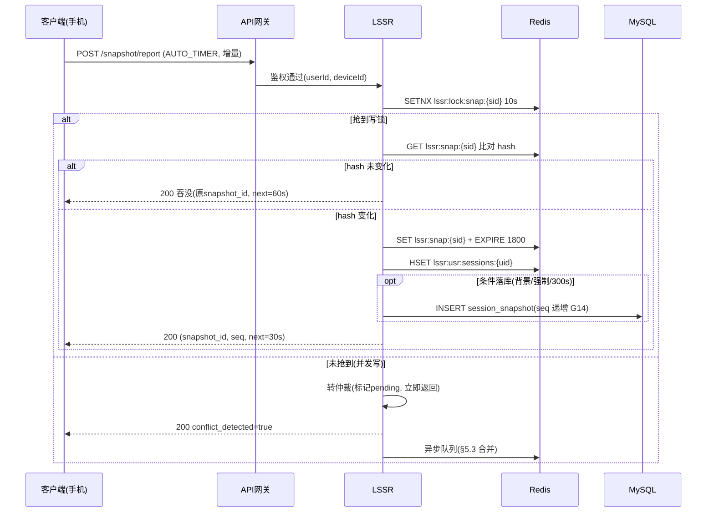
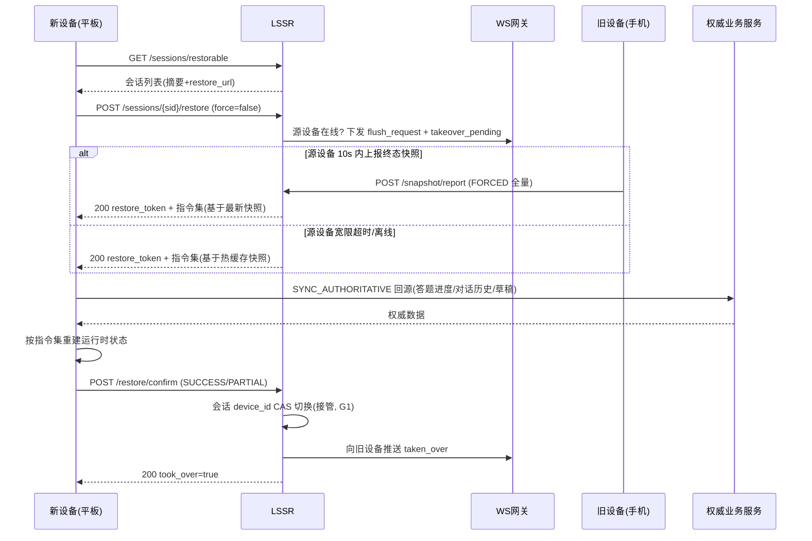

# 服务端-学习会话状态快照与跨设备无缝接续恢复引擎-详细设计

## 1. 概述

### 1.1 模块定位

学习会话状态快照与跨设备无缝接续恢复引擎（Learning Session Snapshot & Cross-Device Resume Engine，简称 LSSR）是 PrimeTop 平台实现"多端无缝学习体验"的核心基础设施服务。

当学生在手机上进行到一半的练习、未提交的作文草稿、正在进行的 AI 对话、翻到某一页的教材阅读等场景中切换设备（如从手机切换到平板、从平板切换到 Web 端）时，LSSR 负责确保学生能在新设备上**精确恢复到上次操作的状态**，包含页面位置、答题进度、草稿内容、AI 对话上下文等完整运行时状态。

### 1.2 核心职责

| 职责 | 说明 |
| --- | --- |
| 会话状态捕获 | 定期/事件驱动地捕获各端学习会话的完整运行时状态 |
| 状态持久化 | 将会话快照安全持久化到服务端，支持热存储与冷归档 |
| 状态恢复 | 在新设备请求时，快速加载最新快照并下发恢复指令集 |
| 多设备冲突解决 | 当多端同时活跃时，仲裁"最新有效状态"并合并非冲突区域 |
| 会话生命周期管理 | 快照过期清理、最大保留数量、会话终止与归档 |
| 隐私与安全 | 敏感内容加密、设备验证、跨账号隔离 |

### 1.3 依赖关系

```
                     ┌─────────────────────────────────────┐
                     │         LSSR 引擎服务               │
                     └─────────────┬───────────────────────┘
                                   │
          ┌────────────┬───────────┼───────────┬──────────────┐
          ▼            ▼           ▼           ▼              ▼
    ┌──────────┐ ┌──────────┐ ┌────────┐ ┌──────────┐ ┌────────────┐
    │  Redis   │ │  MySQL   │ │ S3/OSS │ │WebSocket │ │  消息总线   │
    │  热存储   │ │ 快照元数据│ │ 冷归档  │ │ 实时通知  │ │ (Kafka)    │
    └──────────┘ └──────────┘ └────────┘ └──────────┘ └────────────┘
          ▲            ▲                                   │
          │            │                                   │
   ┌──────┴─────┐ ┌────┴──────────┐                       │
   │ BFF/API    │ │ 会话快照       │                       │
   │ Gateway    │ │ 管理后台       │                       │
   └────────────┘ └───────────────┘                       │
                                                             │
                   ┌─────────────────────────────────────────┘
                   ▼
          ┌────────────────┐
          │ 各业务服务      │
          │ (用户/AI/题库/  │
          │  错题/规划等)   │
          └────────────────┘
```

### 1.4 与现有模块的关系

| 现有模块 | 关系 |
| --- | --- |
| `客户端-断点续学与学习上下文恢复` | 客户端侧消费 LSSR 下发的恢复指令集，负责 UI 层面重建 |
| `多端数据同步与冲突解决策略` | 关注持久化业务数据的同步；LSSR 关注**临时性运行时会话状态** |
| `实时用户Presence服务` | Presence 提供设备在线状态；LSSR 在检测到设备切换时触发快照恢复 |
| `WebSocket长连接管理` | 提供实时推送通道，LSSR 通过其下发跨设备状态变更通知 |
| 各业务服务（AI对话/练习/错题等） | 作为快照数据的生产者和恢复指令的消费者 |

---

## 2. 核心概念定义

### 2.1 学习会话（Learning Session）

学生在某设备上进入某个学习场景后产生的一次交互上下文。一个学生可同时拥有多个不同场景的会话。

**会话类型（SessionType）：**

| 类型 | 标识 | 典型内容 |
| --- | --- | --- |
| AI 对话 | `AI_CHAT` | 对话历史、当前输入草稿、选中知识点、模型参数 |
| 练习测评 | `PRACTICE` | 当前题目索引、已答答案列表、草稿纸内容、计时器状态 |
| 教材阅读 | `TEXTBOOK_READ` | 章节ID、页码/滚动位置、书签位置、批注内容 |
| 拍照搜题 | `PHOTO_SEARCH` | 拍照图片URL、识别结果、选中题目、解析展开状态 |
| 作文辅导 | `ESSAY_EDIT` | 作文文本内容、光标位置、批改反馈展开状态 |
| 错题复习 | `MISTAKE_REVIEW` | 错题列表筛选条件、当前错题索引、复习进度 |
| 学习规划 | `STUDY_PLAN` | 计划编辑草稿、拖拽中的任务、未保存修改 |
| 同步课堂 | `SYNC_CLASS` | 视频播放位置、章节展开状态、笔记内容 |

### 2.2 会话快照（Session Snapshot）

某一时刻会话状态的完整序列化数据。包含场景上下文、用户输入、界面状态等。

### 2.3 设备会话（Device Session）

设备与平台之间的连接会话。一个学生可能同时在手机和平板上各有活跃的设备会话。

### 2.4 恢复指令集（Restore Directive Set）

LSSR 下发给客户端的结构化指令列表，客户端按指令重建对应模块的运行时状态。

---

## 3. 数据模型

### 3.1 核心实体 ER 图

```
┌─────────────────────────┐     ┌──────────────────────────────┐
│    learning_session      │     │     session_snapshot          │
├─────────────────────────┤     ├──────────────────────────────┤
│ id (PK)                 │◄───┐│ id (PK)                      │
│ user_id                 │    ││ session_id (FK)              │
│ session_type            │    └│ snapshot_seq                 │
│ device_id               │     │ status_enum                  │
│ status                  │     │ snapshot_payload (JSON)       │
│ created_at              │     │ payload_hash                  │
│ last_active_at          │     │ payload_size_bytes            │
│ closed_at               │     │ created_at                   │
│ metadata (JSON)         │     │ expires_at                   │
└─────────────────────────┘     └──────────────────────────────┘
                                           │
                                           │ 1:N
                                           ▼
                               ┌──────────────────────────────┐
                               │   snapshot_diff_log           │
                               ├──────────────────────────────┤
                               │ id (PK)                       │
                               │ snapshot_id (FK)              │
                               │ diff_type (FULL/INCREMENTAL)  │
                               │ diff_payload (JSON)           │
                               │ base_snapshot_id              │
                               │ created_at                    │
                               └──────────────────────────────┘

┌─────────────────────────┐     ┌──────────────────────────────┐
│    device_session        │     │   session_restore_log         │
├─────────────────────────┤     ├──────────────────────────────┤
│ id (PK)                 │     │ id (PK)                      │
│ user_id                 │     │ user_id                      │
│ device_id               │     │ session_id                   │
│ device_type             │     │ from_device_id               │
│ app_version             │     │ to_device_id                 │
│ os_type                 │     │ restore_token                │
│ os_version              │     │ restore_status               │
│ push_token              │     │ restore_duration_ms          │
│ status                  │     │ failed_reason                │
│ last_heartbeat_at       │     │ created_at                   │
│ created_at              │     └──────────────────────────────┘
└─────────────────────────┘
```

### 3.2 数据库表结构

#### 3.2.1 `learning_session` — 学习会话主表

```sql
CREATE TABLE learning_session (
    id              BIGINT       NOT NULL COMMENT '会话ID（雪花ID）',
    user_id         BIGINT       NOT NULL COMMENT '用户ID',
    session_type    VARCHAR(32)  NOT NULL COMMENT '会话类型 AI_CHAT/PRACTICE/...',
    device_id       VARCHAR(64)  NOT NULL COMMENT '设备唯一标识',
    status          TINYINT      NOT NULL DEFAULT 1 COMMENT '1=ACTIVE 2=SUSPENDED 3=CLOSED 4=EXPIRED',
    scene_module    VARCHAR(64)  NULL COMMENT '场景模块标识（如 practice:exam_123）',
    scene_params    JSON         NULL COMMENT '场景入参（如考试ID、教材章节ID等）',
    metadata        JSON         NULL COMMENT '扩展元数据',
    created_at      DATETIME(3)  NOT NULL DEFAULT CURRENT_TIMESTAMP(3),
    last_active_at  DATETIME(3)  NOT NULL DEFAULT CURRENT_TIMESTAMP(3),
    closed_at       DATETIME(3)  NULL,
    PRIMARY KEY (id),
    INDEX idx_user_type_status (user_id, session_type, status),
    INDEX idx_user_active (user_id, status, last_active_at),
    INDEX idx_device_session (device_id, status),
    INDEX idx_last_active (last_active_at)
) ENGINE=InnoDB DEFAULT CHARSET=utf8mb4 COMMENT='学习会话主表';
```

#### 3.2.2 `session_snapshot` — 会话快照表

```sql
CREATE TABLE session_snapshot (
    id                  BIGINT       NOT NULL COMMENT '快照ID',
    session_id          BIGINT       NOT NULL COMMENT '关联会话ID',
    snapshot_seq        INT          NOT NULL COMMENT '快照序号（同一会话内递增）',
    status_enum         VARCHAR(16)  NOT NULL COMMENT 'ACTIVE/ARCHIVED/DEPRECATED',
    snapshot_payload    JSON         NOT NULL COMMENT '快照完整载荷（JSON）',
    payload_hash        VARCHAR(64)  NOT NULL COMMENT 'SHA-256载荷哈希（用于增量比对）',
    payload_size_bytes  INT          NOT NULL DEFAULT 0 COMMENT '载荷大小（字节）',
    storage_tier        VARCHAR(16)  NOT NULL DEFAULT 'HOT' COMMENT 'HOT/WARM/COLD',
    s3_object_key       VARCHAR(256) NULL COMMENT '冷存储对象Key（WARM/COLD时）',
    created_at          DATETIME(3)  NOT NULL DEFAULT CURRENT_TIMESTAMP(3),
    expires_at          DATETIME(3)  NOT NULL COMMENT '过期时间',
    PRIMARY KEY (id),
    UNIQUE INDEX uk_session_seq (session_id, snapshot_seq),
    INDEX idx_session_status (session_id, status_enum),
    INDEX idx_expires (expires_at, storage_tier)
) ENGINE=InnoDB DEFAULT CHARSET=utf8mb4 COMMENT='会话快照表';
```

#### 3.2.3 `device_session` — 设备会话表

```sql
CREATE TABLE device_session (
    id                  BIGINT       NOT NULL COMMENT '设备会话ID',
    user_id             BIGINT       NOT NULL COMMENT '用户ID',
    device_id           VARCHAR(64)  NOT NULL COMMENT '设备唯一标识',
    device_name         VARCHAR(128) NULL COMMENT '设备名称（如"张三的iPhone"）',
    device_type         VARCHAR(32)  NOT NULL COMMENT 'PHONE/TABLET/WEB/DESKTOP',
    app_version         VARCHAR(32)  NOT NULL COMMENT 'APP版本号',
    os_type             VARCHAR(32)  NOT NULL COMMENT 'IOS/ANDROID/WEB/...',
    os_version          VARCHAR(32)  NULL,
    push_token          VARCHAR(256) NULL COMMENT '推送Token',
    status              TINYINT      NOT NULL DEFAULT 1 COMMENT '1=ONLINE 2=OFFLINE 3=FORCE_OFFLINE',
    last_heartbeat_at   DATETIME(3)  NOT NULL DEFAULT CURRENT_TIMESTAMP(3),
    created_at          DATETIME(3)  NOT NULL DEFAULT CURRENT_TIMESTAMP(3),
    PRIMARY KEY (id),
    UNIQUE INDEX uk_user_device (user_id, device_id),
    INDEX idx_user_status (user_id, status),
    INDEX idx_heartbeat (last_heartbeat_at)
) ENGINE=InnoDB DEFAULT CHARSET=utf8mb4 COMMENT='设备会话表';
```

#### 3.2.4 `session_restore_log` — 恢复日志表

```sql
CREATE TABLE session_restore_log (
    id                  BIGINT       NOT NULL COMMENT '日志ID',
    user_id             BIGINT       NOT NULL,
    session_id          BIGINT       NOT NULL COMMENT '恢复的会话ID',
    from_device_id      VARCHAR(64)  NULL COMMENT '来源设备（NULL表示冷启动恢复）',
    to_device_id        VARCHAR(64)  NOT NULL COMMENT '目标设备',
    snapshot_id         BIGINT       NOT NULL COMMENT '基于哪个快照恢复',
    restore_token       VARCHAR(128) NOT NULL COMMENT '一次性恢复令牌',
    restore_status      VARCHAR(16)  NOT NULL DEFAULT 'PENDING' COMMENT 'PENDING/SUCCESS/PARTIAL/FAILED',
    restore_duration_ms INT          NULL COMMENT '恢复耗时',
    failed_reason       TEXT         NULL,
    created_at          DATETIME(3)  NOT NULL DEFAULT CURRENT_TIMESTAMP(3),
    PRIMARY KEY (id),
    INDEX idx_user_created (user_id, created_at),
    INDEX idx_token (restore_token),
    INDEX idx_session (session_id)
) ENGINE=InnoDB DEFAULT CHARSET=utf8mb4 COMMENT='会话恢复日志表';
```

### 3.3 快照载荷 Schema（snapshot_payload）

不同 `session_type` 的 `snapshot_payload` 结构不同，但共享统一的顶层框架：

```json
{
  "schema_version": "1.0",
  "session_type": "PRACTICE",
  "capture_trigger": "AUTO_TIMER|EVENT|DEVICE_SWITCH|APP_BACKGROUND|FORCED",
  "capture_timestamp": "2026-07-07T13:30:00.123Z",
  "device_id": "dev_a1b2c3d4",
  "scene_context": {
    "module": "practice",
    "entry": "exam_mode",
    "params": {
      "exam_id": "exam_2026_072_mid_math",
      "subject": "math",
      "grade_level": "G7",
      "textbook_version": "PEP_2024"
    }
  },
  "runtime_state": {
    "current_question_index": 12,
    "total_questions": 25,
    "answers": {
      "q_001": { "answer": "B", "marked": true, "time_spent_ms": 45000 },
      "q_002": { "answer": null, "marked": false, "time_spent_ms": 0 },
      "q_003": { "answer": "AC", "marked": false, "time_spent_ms": 62000 }
    },
    "draft_notes": "第3题用勾股定理...",
    "draft_image_url": null,
    "timer_state": {
      "elapsed_ms": 950000,
      "remaining_ms": 3250000,
      "is_paused": false
    },
    "scroll_position": { "x": 0, "y": 1240 },
    "expanded_panels": ["hint_q003", "analysis_q001"],
    "pinned_formulas": ["formula_pythagorean"]
  },
  "ui_state": {
    "theme": "LIGHT",
    "font_size": "LARGE",
    "orientation": "PORTRAIT",
    "sidebar_open": false
  },
  "checksum": "sha256:e3b0c44298fc1c149afbf4c8996fb924..."
}
```

#### 各会话类型的 runtime_state 定义

**AI_CHAT 类型：**
```json
{
  "runtime_state": {
    "conversation_id": "conv_xxx",
    "messages_summary": "讨论了二次函数顶点坐标求法，共12轮对话",
    "input_draft": "那如果开口向下呢？",
    "input_draft_cursor": 8,
    "selected_knowledge_tags": ["二次函数", "顶点公式"],
    "model_config": { "model_id": "gpt-4-edu", "temperature": 0.3 },
    "attached_images": ["oss://img/xxx_1.png"],
    "scroll_position": { "y": 3400 },
    "pinned_message_ids": ["msg_005", "msg_008"]
  }
}
```

**TEXTBOOK_READ 类型：**
```json
{
  "runtime_state": {
    "textbook_id": "tb_pep_2024_math_g7_u3",
    "chapter_id": "ch_3_2",
    "page_number": 45,
    "scroll_offset_percent": 32.5,
    "bookmarks": [
      { "page": 43, "note": "这里例题很重要" },
      { "page": 45, "note": "" }
    ],
    "annotations": [
      { "page": 44, "x": 120, "y": 300, "type": "HIGHLIGHT", "text": "系数a决定开口方向", "color": "#FFEB3B" }
    ],
    "media_playback": {
      "audio_url": "oss://audio/ch3_2.mp3",
      "position_ms": 120000,
      "playback_rate": 1.25
    }
  }
}
```

**ESSAY_EDIT 类型：**
```json
{
  "runtime_state": {
    "essay_id": "essay_draft_001",
    "title": "那一刻，我长大了",
    "content": "那是一个平凡的下午...",
    "cursor_position": 245,
    "selection_range": { "start": 200, "end": 215 },
    "word_count": 483,
    "feedback_panel_expanded": true,
    "feedback_items_read": ["fb_001", "fb_002"],
    "outline_expanded": true,
    "auto_save_timestamp": "2026-07-07T13:25:00Z"
  }
}
```

### 3.4 Redis 数据结构

#### 3.4.1 热快照缓存

```
# 最新快照（每个活跃会话只保留最新一份在热缓存）
KEY:    lssr:snap:{sessionId}
TYPE:   String（序列化 JSON：snapshot_id/snapshot_seq/payload_hash/capture_timestamp/payload）
TTL:    1800s（30 分钟，随心跳续期；SUSPENDED 后的保留策略见 §5.4）

# 会话列表索引（用户的所有可恢复会话）
KEY:    lssr:usr:sessions:{userId}
TYPE:   Hash
FIELD:  {session_type}
VALUE:  {session_id}:{snapshot_id}:{last_active_ts}
TTL:    3600s（任一会话上报/心跳续期）

# 用户级上报限流（计数器）
KEY:    lssr:rl:report:{userId}
TYPE:   String（INCR + EXPIRE）
TTL:    5s
```

#### 3.4.2 设备注册表

```
# 用户在线设备集合
KEY:    lssr:dev:online:{userId}
TYPE:   Set
MEMBER: {device_id}:{device_session_id}
TTL:    180s（心跳 60s × 3 周期宽限 G11；v1.0 为 120s 无宽限，见 F5）

# 设备→会话映射（某设备上活跃的会话集合）
KEY:    lssr:dev:sessions:{userId}:{deviceId}
TYPE:   Set
MEMBER: {session_id}
TTL:    180s
```

#### 3.4.3 恢复令牌

```
# 一次性恢复令牌
KEY:    lssr:token:{restoreToken}
TYPE:   String
VALUE:  {session_id}:{snapshot_id}:{to_device_id}
TTL:    30s（申请起 30 秒内必须 confirm）

# 已消费令牌墓碑（confirm 后写入，防重放窗口）
KEY:    lssr:token:consumed:{restoreToken}
TYPE:   String
VALUE:  {restore_log_id}
TTL:    300s（DB 函数唯一索引持久兜底，G3；v1.0 缺失，见 F4）

# 恢复申请去重（同设备重复申请幂等回放原令牌）
KEY:    lssr:token:grant:{sessionId}:{toDeviceId}
TYPE:   String
VALUE:  {restore_token}
TTL:    30s
```

#### 3.4.4 分布式锁

```
# 会话快照写入锁（防止并发写入冲突；抢不到不阻塞，转 §5.3 仲裁）
KEY:    lssr:lock:snap:{sessionId}
TYPE:   String（UUID - 锁持有者标识）
TTL:    10s

# 恢复操作锁（防止同一设备并发恢复）
KEY:    lssr:lock:restore:{deviceId}
TYPE:   String（UUID）
TTL:    15s

# 接管宽限期标记（源设备在线时的恢复申请触发，10s 内阻止二次强制接管）
KEY:    lssr:lock:takeover:{sessionId}
TYPE:   String（目标设备标识）
TTL:    10s
```

#### 3.4.5 GLCM 会话指针（LSSR 为唯一写方）

```
# 当前活跃会话指针（GLCM《学习上下文全局管理》Redis Key10 的镜像，本引擎权威写入，GLCM 只读）
KEY:    glcm:session:ptr:{userId}
TYPE:   Hash
FIELD:  sessionId / module / startTime
TTL:    2h（活跃续期；会话结束后由 GLCM 侧消费 session.ended 事件防抖处理）
写入时机：会话创建 / 恢复接管 confirm / 每 10 次心跳续期 1 次（R1/R2）
```

> **v1.1（F1 修复）**：v1.0 本节键名模板存在省略号截断（如 `lssr:s…_id}`），键名不可实现；本节为完整键名重写，并新增 3.4.3 令牌墓碑/申请去重、3.4.4 接管宽限锁、3.4.5 GLCM 指针键（对齐 §5.2 接管仲裁与 §9 事件契约）。

---

## 4. API 接口设计

### 4.1 接口总览

| # | 接口 | 方法 | 路径 | 说明 |
| --- | --- | --- | --- | --- |
| 1 | 上报会话快照 | POST | `/api/v1/lssr/snapshot/report` | 客户端定期/事件驱动上报当前会话状态 |
| 2 | 获取可恢复会话列表 | GET | `/api/v1/lssr/sessions/restorable` | 获取当前用户所有可恢复的活跃会话 |
| 3 | 恢复会话 | POST | `/api/v1/lssr/sessions/{sessionId}/restore` | 请求恢复指定会话，返回完整恢复指令集 |
| 4 | 查询会话详情 | GET | `/api/v1/lssr/sessions/{sessionId}` | 获取会话详情和最新快照摘要 |
| 5 | 关闭会话 | DELETE | `/api/v1/lssr/sessions/{sessionId}` | 主动关闭会话（完成或放弃） |
| 6 | 心跳续期 | PUT | `/api/v1/lssr/sessions/{sessionId}/heartbeat` | 保持会话活跃，续期热缓存 |
| 7 | 设备注册 | POST | `/api/v1/lssr/devices/register` | 设备首次连接时注册 |
| 8 | 设备注销 | DELETE | `/api/v1/lssr/devices/{deviceId}` | 设备断开连接 |
| 9 | 跨设备切换通知 | POST | `/api/v1/lssr/sessions/{sessionId}/device-switch` | 内部接口：通知跨设备切换事件 |

### 4.2 接口详细定义

#### 4.2.1 上报会话快照

```
POST /api/v1/lssr/snapshot/report
```

**请求头：**
```
Authorization: Bearer {access_token}
X-Device-Id: {device_id}
X-App-Version: {version}
Content-Type: application/json
```

**请求体：**
```json
{
  "session_id": "1938475620193847",
  "session_type": "PRACTICE",
  "capture_trigger": "AUTO_TIMER",
  "scene_context": {
    "module": "practice",
    "entry": "exam_mode",
    "params": { "exam_id": "exam_2026_072_mid_math" }
  },
  "runtime_state": {
    "current_question_index": 12,
    "answers": { "...": "..." },
    "timer_state": { "elapsed_ms": 950000, "remaining_ms": 3250000 }
  },
  "ui_state": {
    "theme": "LIGHT",
    "font_size": "LARGE"
  },
  "client_checksum": "sha256:e3b0c44298fc1c149afbf4c8996fb924..."
}
```

**响应（成功）：**
```json
{
  "code": 0,
  "message": "success",
  "data": {
    "snapshot_id": "snap_20260707_001",
    "snapshot_seq": 5,
    "server_timestamp": "2026-07-07T13:30:00.123Z",
    "next_report_after_ms": 30000,
    "conflict_detected": false
  }
}
```

**响应（检测到冲突）：**
```json
{
  "code": 0,
  "message": "success_with_conflict",
  "data": {
    "snapshot_id": "snap_20260707_001",
    "snapshot_seq": 5,
    "server_timestamp": "2026-07-07T13:30:00.123Z",
    "next_report_after_ms": 30000,
    "conflict_detected": true,
    "conflict_resolution": "MERGED",
    "merged_snapshot_id": "snap_20260707_002",
    "client_action_required": "RELOAD_SESSION"
  }
}
```

**错误码：**

| code | message | 说明 |
| --- | --- | --- |
| 0 | success | 成功 |
| 40001 | session_not_found | 会话不存在或已关闭 |
| 40002 | session_expired | 会话已过期 |
| 40003 | payload_too_large | 快照载荷超过限制（默认 256KB） |
| 40004 | checksum_mismatch | 校验和不匹配 |
| 40005 | device_not_registered | 设备未注册 |
| 40301 | permission_denied | 无权操作此会话 |
| 42901 | rate_limited | 上报频率超限（最快 5 秒一次） |

#### 4.2.2 获取可恢复会话列表

```
GET /api/v1/lssr/sessions/restorable?include_archived=false&limit=20
```

**响应：**
```json
{
  "code": 0,
  "data": {
    "sessions": [
      {
        "session_id": "1938475620193847",
        "session_type": "PRACTICE",
        "scene_context": {
          "module": "practice",
          "params": { "exam_id": "exam_2026_072_mid_math", "subject": "math" }
        },
        "last_device_id": "dev_a1b2c3d4",
        "last_device_name": "张三的iPhone",
        "last_device_type": "PHONE",
        "last_active_at": "2026-07-07T13:25:00Z",
        "is_current_device": false,
        "snapshot_summary": {
          "progress_text": "第12/25题",
          "elapsed_text": "已用时15分50秒",
          "has_unsaved_draft": true
        },
        "can_restore_on_this_device": true,
        "restore_url": "primetop://practice/session?uuid=exam_2026_072_mid_math&src=lssr",
        "requires_reauth": false,
        "restore_schema_version": "1.0"
      },
      {
        "session_id": "2938475610293847",
        "session_type": "AI_CHAT",
        "scene_context": {
          "module": "ai_chat",
          "params": { "conversation_id": "conv_xxx" }
        },
        "last_device_id": "dev_a1b2c3d4",
        "last_device_name": "张三的iPhone",
        "last_device_type": "PHONE",
        "last_active_at": "2026-07-07T13:10:00Z",
        "is_current_device": false,
        "snapshot_summary": {
          "progress_text": "12轮对话 · 二次函数",
          "elapsed_text": "已讨论23分钟",
          "has_unsaved_draft": true
        },
        "can_restore_on_this_device": true,
        "restore_url": "primetop://ai-chat?conversation_id=conv_xxx&src=lssr",
        "requires_reauth": false,
        "restore_schema_version": "1.0"
      }
    ],
    "total": 2,
    "current_device_id": "dev_x9y8z7w6",
    "server_timestamp": "2026-07-07T13:31:00.000Z"
  }
}
```

**字段说明：**

| 字段 | 说明 |
| --- | --- |
| `is_current_device` | 该会话最后活跃设备是否为当前请求设备（当前设备会话展示「继续」，其他设备会话展示「接续」） |
| `snapshot_summary.progress_text` | 按会话类型定制的进度摘要文案（服务端依 §3.3 schema 生成，**不透出内容明细**，C4） |
| `can_restore_on_this_device` | 目标设备能力判定（如 DESKTOP 无摄像头时 `PHOTO_SEARCH` 为 false；capability 表见 §5.2） |
| `restore_url` | 恢复深链，格式归各业务模块深链规范；`src=lssr` 供埋点归因（R13） |
| `requires_reauth` | 考试场景（`entry=exam_mode`）恒为 true（G7：需测评服务 55116 独占授权 + 重新核身） |

**过滤与排序规则：**

- 默认仅返回 `status ∈ {ACTIVE, SUSPENDED}` 的会话；`include_archived=true` 时附带 7 天内 `EXPIRED` 会话（标记 `read_only: true`，仅展示不可恢复）
- 排序 `last_active_at DESC`；`limit` 默认 20、上限 50
- 同一 `session_type` 存在多条活跃记录时（v1.0 历史脏数据）仅返回最新一条；v1.1 起由 G2 函数唯一索引保证新数据唯一
- 读路径：Redis 索引（§3.4.1 Key2）→ 未命中回源 MySQL `idx_user_active`

**错误码：** `58007 rate_limited`（>5 QPS/用户）。用户无可恢复会话时返回空列表而非错误。

#### 4.2.3 恢复会话（申请 + 令牌确认两段式）

**第一段——申请恢复：**

```
POST /api/v1/lssr/sessions/{sessionId}/restore
```

**请求体：**

```json
{
  "expected_snapshot_id": "snap_20260707_001",
  "accept_partial": false,
  "force": false
}
```

| 参数 | 说明 |
| --- | --- |
| `expected_snapshot_id` | 可选乐观锁：客户端在列表看到的快照；服务端已产生更新快照时返回 `conflict_warning` 提示重新拉取 |
| `accept_partial` | 是否接受部分恢复（true 时 confirm 可上报 PARTIAL；false 时 PARTIAL 视为 FAILED 回滚，G5） |
| `force` | 源设备仍在线时是否强制接管（用户显式意图优先，仲裁见 §5.2） |

**响应（源设备离线或宽限完成）：**

```json
{
  "code": 0,
  "data": {
    "restore_token": "rt_9f8e7d6c5b4a3210",
    "token_expires_in": 30,
    "restore_schema_version": "1.0",
    "session": {
      "session_id": "1938475620193847",
      "session_type": "PRACTICE",
      "status": "SUSPENDED",
      "scene_context": { "module": "practice", "params": { "exam_id": "exam_2026_072_mid_math" } }
    },
    "base_snapshot": {
      "snapshot_id": "snap_20260707_001",
      "snapshot_seq": 5,
      "capture_timestamp": "2026-07-07T13:25:00.123Z",
      "payload": { "...§3.3 瘦身载荷...": "..." }
    },
    "restore_directives": [
      { "seq": 1, "action": "OPEN_DEEP_LINK", "params": { "url": "primetop://practice/session?uuid=exam_2026_072_mid_math&src=lssr" } },
      { "seq": 2, "action": "SYNC_AUTHORITATIVE", "params": { "service": "assessment-session", "endpoint": "/api/v1/practice/sessions/exam_2026_072_mid_math/state", "merge_policy": "AUTHORITATIVE_OVERLAY" } },
      { "seq": 3, "action": "RESTORE_DRAFT", "params": { "fields": ["draft_notes", "draft_image_url"] } },
      { "seq": 4, "action": "RESTORE_UI_STATE", "params": { "fields": ["current_question_index", "scroll_position", "expanded_panels", "pinned_formulas", "timer_state"] } },
      { "seq": 5, "action": "SHOW_RESUME_BANNER", "params": { "from_device_name": "张三的iPhone" } }
    ],
    "source_device_status": "OFFLINE",
    "conflict_warning": null
  }
}
```

**响应（源设备仍在线且 force=false）：** `code=58012`，data 携带 `{ source_device_status: "ONLINE", grace_period_s: 10, snapshot_flush_requested: true }`——服务端同时经 WS 向源设备下发 `session.flush_request` 与 `session.takeover_pending`；10s 宽限后重试即可成功。

**恢复指令集（Restore Directives）action 枚举：**

| action | 说明 | 典型参数 |
| --- | --- | --- |
| `OPEN_DEEP_LINK` | 打开恢复深链进入目标模块 | url |
| `SYNC_AUTHORITATIVE` | 回源拉取权威数据并覆盖快照中的兜底缓存 | service / endpoint / merge_policy |
| `RESTORE_DRAFT` | 恢复纯客户端草稿（草稿纸/输入框） | fields |
| `RESTORE_UI_STATE` | 恢复界面态（滚动/展开/主题/计时器显示） | fields |
| `SHOW_RESUME_BANNER` | 展示「已从 XX 的 iPhone 接续」横幅 | from_device_name |
| `REAUTH_REQUIRED` | 考试场景重新核身（人脸/密码，由测评服务裁决） | auth_endpoint |

**各会话类型指令编排表：**

| session_type | 指令序列 | SYNC_AUTHORITATIVE 源 |
| --- | --- | --- |
| AI_CHAT | OPEN_DEEP_LINK → SYNC_AUTHORITATIVE(对话历史) → RESTORE_DRAFT(input_draft) → RESTORE_UI_STATE → SHOW_RESUME_BANNER | AI 对话服务 |
| PRACTICE(练习) | OPEN_DEEP_LINK → SYNC_AUTHORITATIVE(答题进度) → RESTORE_DRAFT(草稿纸) → RESTORE_UI_STATE → SHOW_RESUME_BANNER | 测评会话服务 |
| PRACTICE(考试) | REAUTH_REQUIRED → OPEN_DEEP_LINK → SYNC_AUTHORITATIVE(经 55116 独占授权) → RESTORE_UI_STATE（无 RESTORE_DRAFT：考试禁跨设备带草稿） | 测评会话服务（G7） |
| TEXTBOOK_READ | OPEN_DEEP_LINK → SYNC_AUTHORITATIVE(批注/书签) → RESTORE_UI_STATE(页码/滚动/播放位置) → SHOW_RESUME_BANNER | 教材服务/批注服务（R9） |
| PHOTO_SEARCH | OPEN_DEEP_LINK → RESTORE_UI_STATE(选中题目/解析展开) | —（识别结果 URL 即时失效则静默跳过，PARTIAL 记录） |
| ESSAY_EDIT | OPEN_DEEP_LINK → SYNC_AUTHORITATIVE(草稿正文) → RESTORE_UI_STATE(光标/选区/面板) → SHOW_RESUME_BANNER | 作文辅导服务（R10） |
| MISTAKE_REVIEW | OPEN_DEEP_LINK → SYNC_AUTHORITATIVE(筛选与进度) → RESTORE_UI_STATE | 错题本服务 |
| STUDY_PLAN | OPEN_DEEP_LINK → SYNC_AUTHORITATIVE(计划草稿) → RESTORE_UI_STATE | 学习规划服务 |
| SYNC_CLASS | OPEN_DEEP_LINK → SYNC_AUTHORITATIVE(课时进度) → RESTORE_UI_STATE(播放位置/笔记草稿) → SHOW_RESUME_BANNER | 同步课堂编排服务 |

**第二段——确认恢复（子接口）：**

```
POST /api/v1/lssr/sessions/{sessionId}/restore/confirm
```

**请求体：**

```json
{
  "restore_token": "rt_9f8e7d6c5b4a3210",
  "result": "SUCCESS",
  "restored_fields": ["runtime_state.current_question_index", "runtime_state.draft_notes", "ui_state"],
  "failed_fields": []
}
```

**语义：**

- 令牌一次性：confirm 消费令牌（Redis `DEL` + 墓碑写入 + DB 函数唯一索引兜底，G3）；同 result 重复 confirm 幂等返回原结果
- confirm 成功即**接管**：会话 `device_id` CAS 切换为目标设备（`WHERE device_id = {old}`），源设备后续上报被 G1 拒绝（`58022 session_taken_over`）
- 30s 未 confirm：令牌过期（`58009`），需重新申请（快照可能已更新，`expected_snapshot_id` 重新对齐）
- `result=PARTIAL` 必须携带 `failed_fields` 明细（G5：恢复失败绝不静默降级为新会话）；`accept_partial=false` 时 PARTIAL 按 FAILED 处理——会话不接管、令牌仍消费、恢复日志记录 FAILED

#### 4.2.4 查询会话详情

```
GET /api/v1/lssr/sessions/{sessionId}
```

**响应：**

```json
{
  "code": 0,
  "data": {
    "session": {
      "session_id": "1938475620193847",
      "session_type": "PRACTICE",
      "status": "SUSPENDED",
      "scene_context": { "module": "practice", "params": { "exam_id": "exam_2026_072_mid_math" } },
      "created_at": "2026-07-07T13:05:00Z",
      "last_active_at": "2026-07-07T13:25:00Z",
      "current_device_id": "dev_a1b2c3d4",
      "device_history": [
        { "device_id": "dev_a1b2c3d4", "device_name": "张三的iPhone", "since": "2026-07-07T13:05:00Z" }
      ]
    },
    "latest_snapshot": {
      "snapshot_id": "snap_20260707_001",
      "snapshot_seq": 5,
      "capture_trigger": "APP_BACKGROUND",
      "capture_timestamp": "2026-07-07T13:25:00.123Z",
      "payload_size_bytes": 18234,
      "storage_tier": "HOT",
      "summary": { "progress_text": "第12/25题", "has_unsaved_draft": true }
    },
    "snapshot_chain_ref": "lssr://snapshots/1938475620193847?seq=1..5",
    "restore_count_7d": 1
  }
}
```

**说明：** 详情接口不返回完整 `snapshot_payload`（仅摘要）——完整载荷只经 §4.2.3 恢复链路按一次性令牌下发，防越权批量拖取会话内容（C3）。

#### 4.2.5 关闭会话

```
DELETE /api/v1/lssr/sessions/{sessionId}
```

**请求体：**

```json
{
  "reason": "COMPLETED",
  "client_request_id": "cr_9a8b7c6d"
}
```

**`reason` 枚举：** `COMPLETED`（正常完成：交卷/提交作文/结束阅读）/ `ABANDONED`（用户放弃）/ `LOGOUT`（退出登录）/ `SWITCHED`（设备切换后旧设备关闭）/ `CLEANUP`（客户端存储压力自清理）。

**语义：**

- 关闭前服务端强制执行一次终态快照落库（`capture_trigger=FORCED`），保证最后 ≤30s 状态可追溯
- 会话转 CLOSED（终态）：热缓存 Key 删除、GLCM 指针清理、同事务写 `session.ended` Outbox（G13）
- 幂等：`client_request_id` 重复请求返回原结果；已 CLOSED 会话再次关闭幂等成功（吞没）

#### 4.2.6 心跳续期

```
PUT /api/v1/lssr/sessions/{sessionId}/heartbeat
```

**请求体：**

```json
{
  "device_id": "dev_x9y8z7w6",
  "client_elapsed_ms": 950000,
  "pending_ack": ["directive_7f6e5d"]
}
```

**响应：**

```json
{
  "code": 0,
  "data": {
    "server_timestamp": "2026-07-07T13:32:00.000Z",
    "next_heartbeat_ms": 60000,
    "session_status": "ACTIVE",
    "pending_directives": []
  }
}
```

**语义：**

- 续期热快照 TTL（1800s）与设备在线集合 TTL（180s）
- `pending_directives`：服务端待下发指令（`RELOAD_SESSION` 冲突重载 / `SESSION_TAKEN_OVER` 接管通知等），客户端经 `pending_ack` 确认后不再下发——WS 故障时的轮询降级通道（D4）
- 心跳与上报解耦：心跳 60s 轻量无载荷；快照上报 30s 带载荷（上报接口自带心跳语义，无需双发）
- `client_elapsed_ms` 仅作计时对齐参考；权威计时归各业务服务（考试计时归测评服务，R3/R4）

#### 4.2.7 设备注册

```
POST /api/v1/lssr/devices/register
```

**请求体：**

```json
{
  "device_id": "dev_x9y8z7w6",
  "device_name": "张三的iPad",
  "device_type": "TABLET",
  "app_version": "3.2.0",
  "os_type": "IOS",
  "os_version": "18.5",
  "push_token": "apk-token-xxx"
}
```

**响应：**

```json
{
  "code": 0,
  "data": {
    "device_session_id": "ds_88273645",
    "registered_at": "2026-07-07T13:00:00Z",
    "max_concurrent_sessions": 8,
    "snapshot_interval_ms": 30000,
    "schema_version": "1.0"
  }
}
```

**语义：**

- 幂等：命中 `uk_user_device` 走更新（设备名/push_token/app_version 变更覆盖）
- 同账号设备数上限 8，超出返回 `58021 device_limit_exceeded`（挤占策略：最老 OFFLINE 设备强制注销）
- `snapshot_interval_ms` / `schema_version` 为服务端策略下发口——上报间隔可远程调整（灰度/降载用）

#### 4.2.8 设备注销

```
DELETE /api/v1/lssr/devices/{deviceId}
```

**语义：**

- 该设备所有活跃会话立即执行终态快照落库（`capture_trigger=FORCED`）并转 **SUSPENDED**（不 CLOSED——可能只是断网，7 天内仍可恢复）
- 清理设备在线集合（§3.4.2 Key1）与设备→会话映射（Key2）
- 幂等：设备不存在返回成功

#### 4.2.9 跨设备切换通知（内部接口）

```
POST /api/v1/lssr/internal/sessions/{sessionId}/device-switch
X-Internal-Token: {internal_service_token}
```

**请求体：**

```json
{
  "from_device_id": "dev_a1b2c3d4",
  "to_device_id": "dev_x9y8z7w6",
  "trigger": "USER_REQUEST",
  "force": false
}
```

**调用方：** Presence 服务（设备离线且同账号新设备登录）、WS 网关（同账号新设备建连）。`trigger ∈ {USER_REQUEST, PRESENCE_OFFLINE, WS_RECONNECT}`。

**语义：** 触发源设备快照催收（WS `session.flush_request` + 10s 宽限）→ 宽限完成或超时后解锁目标设备恢复申请（§5.2 接管仲裁的内部入口）。仅内网服务令牌可调（G4），不对客户端开放。

#### 4.2.10 幂等与限流总表

| 接口 | 幂等键 | 限流 | 说明 |
| --- | --- | --- | --- |
| 上报快照 | (session_id, capture_timestamp, payload_hash) | 5s/会话；120 次/时/用户 | hash 相同重复上报吞没返回原 snapshot_id |
| 可恢复列表 | — | 5 QPS/用户 | 读 Redis 索引 |
| 恢复申请 | (session_id, to_device) 30s 窗口 | 3 次/分/用户 | grant 键回放原令牌 |
| 恢复确认 | restore_token（一次性） | — | 消费后重试幂等返回原结果 |
| 会话详情 | — | 3 QPS/用户 | 不含完整载荷 |
| 关闭会话 | client_request_id | 10 次/时/会话 | 终态重复关闭吞没 |
| 心跳 | — | 1 次/50s/会话（超频静默成功） | 无载荷轻量 |
| 设备注册 | (user_id, device_id) | 5 次/时/设备 | 冲突走更新 |
| 设备注销 | device_id | 10 次/时/设备 | 幂等成功 |
| 内部切换通知 | (session_id, trigger, to_device) 10s | 30 QPS/调用方 | 防重放 |

### 4.3 WebSocket 推送协议（服务端 → 客户端）

**订阅 Topic：** `lssr.user.{userId}`（复用《WebSocket 长连接管理》用户级通道，R8）。

| 消息类型 | 触发时机 | 载荷要点 | 客户端动作 |
| --- | --- | --- | --- |
| `session.flush_request` | 恢复申请时源设备在线 | sessionId, graceMs | 立即上报全量快照（APP_BACKGROUND 语义） |
| `session.takeover_pending` | 同上 | sessionId, toDeviceName | 展示「正在切换到其他设备」，停止本端写入 |
| `session.taken_over` | 目标设备 confirm 成功 | sessionId | 源设备终止会话写入，收起界面 |
| `session.conflict` | §5.3 仲裁产出合并快照 | sessionId, resolution, reloadDirective | 按 RELOAD_SESSION 重载 |
| `session.expiring` | SUSPENDED 满 6 天 | sessionId, expireAt | 提示用户最后恢复窗口 |

WS 不可达时全部消息退化为心跳响应 `pending_directives` 捎带（D4）；指令确认采用递增 `directive_id` 去重，重复下发幂等。

---

## 5. 核心流程

### 5.1 快照捕获与上报主链路

**客户端触发矩阵：**

| 触发源 | capture_trigger | 上报时机 | 载荷完整度 |
| --- | --- | --- | --- |
| 定时器 30s | AUTO_TIMER | 会话前台活跃 | 增量字段（仅变化部分） |
| 关键事件（切题/暂停/展开解析/翻页） | EVENT | 事件后 500ms 防抖合并 | 增量字段 |
| 退后台/锁屏/杀进程前 | APP_BACKGROUND | 立即（onPause，同步阻塞式） | 全量 |
| 收到 flush_request | FORCED | 立即 | 全量 |
| 被接管/设备切换 | DEVICE_SWITCH | 立即（源设备） | 全量 |

**服务端处理管线（8 步）：**

1. **网关鉴权** → 用户/设备/会话归属校验（G4 跨账号隔离）
2. **限流与硬校验**：5s/会话限流；载荷 >256KB 直接 `40003→58003` 拒绝（G6：拒绝不截断，不静默丢字段）
3. **checksum 校验**：`client_checksum` vs 服务端 SHA-256，不一致 `58004` 丢弃
4. **schema 校验**：`schema_version` 白名单 + 字段白名单（未知字段剔除并计数，M11）+ 载荷瘦身（§5.5）
5. **抢会话写锁**（`lssr:lock:snap:{sessionId}`，10s）：抢到进入 6；未抢到（并发写）转 §5.3 仲裁，**不阻塞返回**
6. **hash 去重**：与热缓存 `payload_hash` 相同 → 吞没（返回原 snapshot_id，`next_report_after_ms` 延长至 60s）
7. **写热缓存**：`lssr:snap:{sessionId}` 覆盖 SET + TTL 续期；更新用户会话索引；GLCM 指针低频续期（每 10 次 1 次）
8. **条件落库**（MySQL，满足任一）：`capture_trigger ∈ {APP_BACKGROUND, FORCED, DEVICE_SWITCH}`；或距上次落库 ≥300s 且 hash 变化；或会话关闭终态快照。否则仅热缓存（落库量降至上报量的 ~1/10，容量见 §13.6）



### 5.2 跨设备恢复与接管主链路



**接管仲裁规则：**

| 场景 | 仲裁 | 依据 |
| --- | --- | --- |
| 源设备 OFFLINE（心跳 >180s） | 立即接管，无需宽限 | §3.4.2 在线集合 |
| 源设备 ONLINE，force=false | `58012` + 10s 宽限催收，宽限后重试即成功 | 保数据新鲜 |
| 源设备 ONLINE，force=true | 直接接管；源设备在途写入按 G1 拒绝（`58022`），已写入部分进 §5.3 仲裁 | 用户显式意图优先 |
| 考试场景（entry=exam_mode） | 任何接管先经测评会话服务 55116 独占授权，未授权 `58013` | G7 防作弊 |
| 双端同时恢复申请 | `lssr:lock:restore:{deviceId}` + 会话级 CAS（`WHERE device_id=旧值`），仅一方成功，另一方 `58018` | 单写者 |

**设备能力判定表（can_restore_on_this_device）：**

| session_type | PHONE | TABLET | WEB | DESKTOP |
| --- | --- | --- | --- | --- |
| AI_CHAT / PRACTICE / TEXTBOOK_READ / ESSAY_EDIT / MISTAKE_REVIEW / STUDY_PLAN / SYNC_CLASS | ✅ | ✅ | ✅ | ✅ |
| PHOTO_SEARCH | ✅（相机） | ✅（相机） | ❌（无相机） | ❌ |
| PRACTICE(考试) | ✅ | ✅ | ❌（防作弊禁 Web 端考试，对齐测评服务） | ❌ |

### 5.3 多端并发冲突仲裁

**冲突面与合并策略**（字段级语义与《多端数据同步与冲突解决策略》对齐，R5）：

| 字段类别 | 合并策略 | 说明 |
| --- | --- | --- |
| 集合型（answers 映射、pinned_formulas、expanded_panels、bookmarks） | 按元素并集，元素级 LWW（capture_timestamp 新者胜） | 非冲突区域合并不丢 |
| 标量型（current_question_index、scroll_position、cursor_position） | 整体 LWW（capture_timestamp + device_seq 决胜） | 调序无意义 |
| 草稿文本（draft_notes、input_draft） | 复合裁决：时间新且长度 ≥ 旧值 50% 者胜；否则保留长文并标记 PARTIAL | 防闪断丢正文 |
| 计时器（timer_state） | 不裁决，归权威业务服务 | R3/R4 |

**仲裁流程：**

1. 写锁竞争失败方的载荷**不丢弃**：写 `snapshot_diff_log`（diff_type=INCREMENTAL，base_snapshot_id=当前热快照）
2. 异步仲裁器 500ms 批处理拉取同会话全部未仲裁分支
3. 按上表产出合并快照（新 snapshot_seq），热缓存覆盖
4. WS 通知双方 `session.conflict` + `RELOAD_SESSION` 指令（客户端整体重载，不做行级补丁）
5. 合并快照落库，参与方快照置 DEPRECATED

**深度分叉止损**：同会话双端各已产生 ≥5 个分叉快照 → 停止合并，时间新者胜（`conflict_resolution=NEWEST_WINS`），旧分支整体 DEPRECATED，双方收到重载指令。合并仅一轮，不递归。

### 5.4 会话生命周期与冷归档

| 迁移 | 触发 | 动作 |
| --- | --- | --- |
| (无) → ACTIVE | 首次快照上报隐式建会话 / 设备注册后首心跳 | 建会话行 + `session.started` Outbox + GLCM 指针写入 |
| ACTIVE → SUSPENDED | 心跳断 30 分钟（热缓存 TTL 到期兜底扫描） | 热缓存最后快照兜底落库（EXPIRE_FLUSH） |
| SUSPENDED → ACTIVE | 恢复 confirm 成功 / 原设备回归心跳 | device_id CAS 切换 + `session.resumed` |
| ACTIVE/SUSPENDED → CLOSED | §4.2.5 关闭 | 终态快照（FORCED）+ `session.ended` + GLCM 指针清理 |
| SUSPENDED → EXPIRED | SUSPENDED 满 7 天（每日 04:30 扫描） | 快照链打包 S3（storage_tier=COLD）+ `session.expired` |
| CLOSED/EXPIRED → (物理删除) | 终态满 90 天（月分区 DROP） | 元数据随分区清理；账号注销走 C5 快速通道 24h |

**冷归档**：EXPIRED 会话快照链（含 diff_log）zstd 压缩写 S3 `lssr-archive/{yyyy-MM}/{sessionId}.zst`；MySQL 仅保留元数据行（`s3_object_key` 指针，storage_tier=COLD），90 天后元数据行随月分区 DROP。归档完成发 `snapshot.archived` 事件。

### 5.5 服务端权威与客户端缓存边界（载荷瘦身原则）

**原则：LSSR 只存「界面态 + 指纹 + 指针」；一切有服务端权威存储的数据不落快照明文。**

| 数据 | 权威方 | LSSR 快照中的形态 |
| --- | --- | --- |
| 练习答案/批改结果 | 测评会话服务（R3） | answers 保留作 UI 视图兜底 + content_hash；恢复时 SYNC_AUTHORITATIVE 回源覆盖 |
| AI 对话历史 | AI 对话服务（R11） | 仅 messages_summary + conversation_id + pinned_message_ids |
| 作文正文 | 作文辅导服务草稿箱（R10） | 仅 content_hash + word_count + cursor/selection |
| 教材批注/书签 | 教材批注服务（R9） | 仅 ref + 数量统计 |
| 滚动/展开/草稿纸/输入框草稿/播放位置 | 无服务端权威（LSSR 即权威） | 全量存 |

> v1.0 §3.3 示例中的 `content` / `annotations` / `messages` 等字段按本节语义降级为「离线兜底缓存或引用」；`schema_version=1.1` 起服务端落库前执行白名单瘦身（§5.1 步骤 4），Redis 热缓存保留客户端上报原貌（接管前兜底渲染用，256KB 上限内）。

---

## 6. 关键代码示例

### 6.1 快照上报服务（含条件落库与幂等吞没）

```java
@Service
public class SnapshotReportService {

    private static final Set<String> PERSIST_TRIGGERS =
            Set.of("APP_BACKGROUND", "FORCED", "DEVICE_SWITCH");
    private static final long PERSIST_INTERVAL_MS = 300_000L;   // 兜底落库周期
    private static final int MAX_PAYLOAD_BYTES = 256 * 1024;    // G6

    @Autowired private StringRedisTemplate redis;
    @Autowired private SnapshotRepository snapshotRepo;
    @Autowired private SessionRepository sessionRepo;
    @Autowired private ConflictArbitrationService arbitrationService;
    @Autowired private OutboxWriter outbox;

    public ReportResult report(long userId, String deviceId, ReportRequest req) {
        // 1. 归属校验（G4：跨账号隔离）
        LearningSession session = sessionRepo.findById(req.getSessionId())
                .orElseThrow(() -> new BizException(58001));
        if (session.getUserId() != userId) throw new BizException(58006);
        if (session.getStatus() == CLOSED || session.getStatus() == EXPIRED)
            throw new BizException(session.getStatus() == EXPIRED ? 58002 : 58001);

        // 2. 载荷硬上限与校验和（G6：拒绝不截断）
        byte[] canonical = req.canonicalJson().getBytes(StandardCharsets.UTF_8);
        if (canonical.length > MAX_PAYLOAD_BYTES) throw new BizException(58003);
        if (!Checksums.sha256Hex(canonical).equals(req.getClientChecksum()))
            throw new BizException(58004);

        // 3. 瘦身（§5.5：白名单字段 + 权威数据剥离为指纹）
        JsonObject payload = SchemaThinner.thin(req.getSessionType(), req.getPayload());

        // 4. 写锁：抢不到不阻塞，转仲裁（§5.3）
        String lockKey = "lssr:lock:snap:" + session.getId();
        String lockId = UUID.randomUUID().toString();
        Boolean locked = redis.opsForValue()
                .setIfAbsent(lockKey, lockId, Duration.ofSeconds(10));
        if (!Boolean.TRUE.equals(locked)) {
            return arbitrationService.deferAndAck(session, deviceId, payload);
        }
        try {
            String cacheKey = "lssr:snap:" + session.getId();
            SnapshotCache cached = SnapshotCache.parse(
                    redis.opsForValue().get(cacheKey));

            // 5. hash 去重：吞没
            if (cached != null && cached.getPayloadHash().equals(req.payloadHash())) {
                return ReportResult.swallowed(cached.getSnapshotId(), 60_000);
            }

            // 6. 写热缓存 + 索引
            String snapshotId = persistIfNeeded(session, req, payload, cached);
            if (snapshotId == null) snapshotId = nextSnapshotId();
            redis.opsForValue().set(cacheKey,
                    SnapshotCache.serialize(snapshotId, payload, req),
                    Duration.ofSeconds(1800));
            redis.opsForHash().put("lssr:usr:sessions:" + userId,
                    session.getSessionType(),
                    session.getId() + ":" + snapshotId + ":" + nowMs());
            GlcmPointer.renewLowFrequency(redis, userId, session);   // R1：LSSR 唯一写方

            return ReportResult.ok(snapshotId, nextInterval(req));
        } finally {
            releaseLock(lockKey, lockId);   // Lua：GET==lockId 才 DEL，防误删他人锁
        }
    }

    /** 条件落库：触发器命中 / 距上次落库≥300s 且 hash 变化 */
    private String persistIfNeeded(LearningSession s, ReportRequest req,
                                   JsonObject payload, SnapshotCache cached) {
        boolean triggerHit = PERSIST_TRIGGERS.contains(req.getCaptureTrigger());
        boolean due = cached == null
                || (nowMs() - cached.getLastPersistAt() >= PERSIST_INTERVAL_MS
                    && !req.payloadHash().equals(cached.getPersistedHash()));
        if (!triggerHit && !due) return null;

        return TransactionTemplate.execute(status -> {           // G13：同事务
            int nextSeq = snapshotRepo.nextSeq(s.getId());       // G14：uk 单调
            String id = snapshotRepo.insert(s.getId(), nextSeq, payload, req);
            boolean first = sessionRepo.touchAndEnsureCreated(s, req);
            if (first) outbox.append(s.getId(), "session.started",
                    SessionEvents.started(s, req));              // 隐式建会话事件
            return id;
        });
    }
}
```

### 6.2 冲突仲裁器（元素级 LWW 并集 + 草稿复合裁决）

```java
@Component
public class SnapshotConflictResolver {

    private static final int DIVERGE_LIMIT = 5;   // 深度分叉止损

    public MergedSnapshot merge(List<SnapshotBranch> branches) {
        SnapshotBranch a = branches.get(0), b = branches.get(1);
        if (a.getDivergeDepth() + b.getDivergeDepth() >= DIVERGE_LIMIT) {
            SnapshotBranch winner = CaptureClock.newer(a, b);      // NEWEST_WINS
            return MergedSnapshot.of(winner, Resolution.NEWEST_WINS);
        }
        JsonObject base = CaptureClock.newer(a, b).runtimeState().deepCopy();

        mergeMapByElementLww(base, a, b, "answers");               // 逐题并集
        mergeSetUnion(base, a, b, "pinned_formulas", "expanded_panels",
                "pinned_message_ids", "bookmarks");
        resolveDraftComposite(base, a, b, "draft_notes");          // 时间+长度复合
        resolveDraftComposite(base, a, b, "input_draft");
        // timer_state 不裁决（R3/R4：归权威业务服务）

        return MergedSnapshot.of(base, Resolution.MERGED);
    }

    /** 草稿复合裁决：时间新且长度≥旧值50%者胜；否则保留长文并标记 PARTIAL */
    private void resolveDraftComposite(JsonObject base, SnapshotBranch a,
                                       SnapshotBranch b, String field) {
        JsonElement na = a.runtimeState().get(field), nb = b.runtimeState().get(field);
        if (na == null || nb == null) { base.add(field, na != null ? na : nb); return; }
        SnapshotBranch newer = CaptureClock.newer(a, b), older = CaptureClock.older(a, b);
        String newText = newer.runtimeState().get(field).getAsString();
        String oldText = older.runtimeState().get(field).getAsString();
        if (newText.length() >= oldText.length() * 0.5) {
            base.addProperty(field, newText);
        } else {
            base.addProperty(field, oldText);
            base.addProperty(field + "_merge_partial", true);      // G5：显式标记
        }
    }
}
```

### 6.3 恢复令牌确认（Lua 原子消费 + DB 兜底）

```lua
-- KEYS[1]=lssr:token:{t}  KEYS[2]=lssr:token:consumed:{t}
-- ARGV[1]=to_device_id    ARGV[2]=now_ms
if redis.call('EXISTS', KEYS[2]) == 1 then
  return {'CONSUMED', redis.call('GET', KEYS[2])}     -- 幂等回放原结果
end
local v = redis.call('GET', KEYS[1])
if not v then return {'EXPIRED', ''} end               -- 58009
redis.call('SET', KEYS[2], ARGV[1] .. ':' .. ARGV[2], 'EX', 300)
redis.call('DEL', KEYS[1])
return {'OK', v}
```

```java
@Transactional
public ConfirmResult confirm(long userId, ConfirmRequest req) {
    String[] tokenState = restoreTokenLua.consume(req.getRestoreToken(), currentDevice());
    if ("EXPIRED".equals(tokenState[0])) throw new BizException(58009);
    if ("CONSUMED".equals(tokenState[0]))                // 幂等：回放原恢复日志
        return restoreRepo.findByToken(req.getRestoreToken())
                .map(ConfirmResult::replay)
                .orElseThrow(() -> new BizException(58010));

    if ("PARTIAL".equals(req.getResult()) && !acceptPartialCtx.get())
        req.setResult("FAILED");                          // G5：不接受部分恢复则整体回滚

    // DB 兜底：uk_token_success 函数唯一索引（仅 SUCCESS 行参与约束）
    RestoreLog log = restoreRepo.insertTokenConsumed(sessionId, req);
    if (log.duplicated()) return ConfirmResult.replay(log.previous());

    boolean tookOver = sessionRepo.casSwitchDevice(sessionId, fromDevice(),
            currentDevice()) > 0;                         // 接管（G1 单写者切换）
    snapshotRepo.deprecateAfterTakeover(sessionId);
    redis.delete("lssr:snap:" + sessionId);
    outbox.append(sessionId, "session.resumed",
            SessionEvents.resumed(sessionId, currentDevice(), req.getResult()));
    GlcmPointer.rewrite(redis, userId, sessionRepo.findById(sessionId).orElseThrow());
    wsGateway.push(fromDevice(), "session.taken_over", sessionId);
    return ConfirmResult.of(tookOver, req.getResult(), req.getFailedFields());
}
```

### 6.4 生命周期调度器（SUSPENDED 兜底 / EXPIRED 归档）

```java
@Component
public class SessionLifecycleScheduler {

    /** 每 10s：心跳断 30 分钟的 ACTIVE 会话兜底落库并转 SUSPENDED */
    @Scheduled(fixedDelay = 10_000)
    public void suspendDeadActive() {
        List<LearningSession> dead = sessionRepo.findActiveNoHeartbeatSince(
                Instant.now().minus(30, ChronoUnit.MINUTES), 200);
        for (LearningSession s : dead) {
            String cacheKey = "lssr:snap:" + s.getId();
            String raw = redis.opsForValue().get(cacheKey);
            if (raw != null)                              // 热缓存最后快照兜底落库，不丢最后状态
                snapshotRepo.insertTerminal(s.getId(), raw, "EXPIRE_FLUSH");
            if (sessionRepo.casStatus(s.getId(), ACTIVE, SUSPENDED) > 0) {
                redis.delete(cacheKey, "lssr:dev:sessions:" + s.getUserId() + ":" + s.getDeviceId());
                outbox.append(s.getId(), "session.suspended", SessionEvents.suspended(s));
            }
        }
    }

    /** 每日 04:30：SUSPENDED 满 7 天转 EXPIRED + 快照链打包 S3（§5.4） */
    @Scheduled(cron = "0 30 4 * * ?")
    public void expireAndArchive() {
        List<LearningSession> expired = sessionRepo.findSuspendedSince(
                Instant.now().minus(7, ChronoUnit.DAYS), 500);
        for (LearningSession s : expired) {
            String objectKey = s3Archiver.packSessionChain(s.getId());   // zstd → lssr-archive/{yyyy-MM}/{id}.zst
            sessionRepo.casExpire(s.getId(), objectKey);                  // status=EXPIRED, storage_tier=COLD
            outbox.append(s.getId(), "session.expired", SessionEvents.expired(s));
            wsGateway.pushUser(s.getUserId(), "session.expiring.final",
                    Map.of("sessionId", s.getId()));
        }
    }
}
```

### 6.5 指令集编排器（按会话类型生成 directives）

```java
@Component
public class RestoreDirectiveComposer {

    private static final Map<String, List<String>> SEQUENCES = Map.ofEntries(
        Map.entry("AI_CHAT", List.of("OPEN_DEEP_LINK", "SYNC_AUTHORITATIVE",
                "RESTORE_DRAFT", "RESTORE_UI_STATE", "SHOW_RESUME_BANNER")),
        Map.entry("PRACTICE", List.of("OPEN_DEEP_LINK", "SYNC_AUTHORITATIVE",
                "RESTORE_DRAFT", "RESTORE_UI_STATE", "SHOW_RESUME_BANNER")),
        Map.entry("PRACTICE_EXAM", List.of("REAUTH_REQUIRED", "OPEN_DEEP_LINK",
                "SYNC_AUTHORITATIVE", "RESTORE_UI_STATE")),       // G7：无草稿指令
        Map.entry("ESSAY_EDIT", List.of("OPEN_DEEP_LINK", "SYNC_AUTHORITATIVE",
                "RESTORE_UI_STATE", "SHOW_RESUME_BANNER")),
        Map.entry("TEXTBOOK_READ", List.of("OPEN_DEEP_LINK", "SYNC_AUTHORITATIVE",
                "RESTORE_UI_STATE", "SHOW_RESUME_BANNER")),
        Map.entry("PHOTO_SEARCH", List.of("OPEN_DEEP_LINK", "RESTORE_UI_STATE")),
        Map.entry("MISTAKE_REVIEW", List.of("OPEN_DEEP_LINK", "SYNC_AUTHORITATIVE", "RESTORE_UI_STATE")),
        Map.entry("STUDY_PLAN", List.of("OPEN_DEEP_LINK", "SYNC_AUTHORITATIVE", "RESTORE_UI_STATE")),
        Map.entry("SYNC_CLASS", List.of("OPEN_DEEP_LINK", "SYNC_AUTHORITATIVE",
                "RESTORE_UI_STATE", "SHOW_RESUME_BANNER")));

    public List<Directive> compose(LearningSession s, SnapshotCache snap,
                                   DeviceCapability cap, String fromDeviceName) {
        String key = s.isExamMode() ? "PRACTICE_EXAM" : s.getSessionType();
        if (!cap.supports(s)) return List.of();     // can_restore_on_this_device=false
        return SEQUENCES.get(key).stream()
                .map(action -> Directive.of(action, s, snap, fromDeviceName))
                .collect(Collectors.toList());
    }
}
```

## 7. 状态机与守卫

### 7.1 会话状态机（learning_session.status）

```
            首次上报/首心跳                 心跳断30min
  (无) ─────────────► ACTIVE ─────────────► SUSPENDED
                        │  ▲                    │    │
        §4.2.5 关闭      │  │ 恢复confirm/原设备回归 │    │ 满七天(04:30扫描)
                        ▼  │ (device_id CAS)      ▼    ▼
                     CLOSED                     EXPIRED
                        │                           │
                        └────────90天───────────────┴──► 月分区物理删除
                                                  (注销走24h快速通道 C5)
```

| 迁移 | 守卫 |
| --- | --- |
| →ACTIVE | G2：同 (user, type, scene) 活跃唯一（函数唯一索引兜底） |
| ACTIVE→SUSPENDED | 仅调度器 CAS；进行中的恢复申请持锁期间暂停迁移 |
| SUSPENDED→ACTIVE | 仅两条路径：confirm 接管（G1）/ 原设备回归心跳（device_id 不变） |
| →CLOSED | 终态，不可逆；终态快照 FORCED 必落库 |
| SUSPENDED→EXPIRED | 仅 04:30 扫描 CAS；归档成功才置 EXPIRED（归档失败重试次日） |

### 7.2 快照状态机（session_snapshot.status_enum）

ACTIVE（最新有效）→ DEPRECATED（被合并/被更新取代，只读）→ ARCHIVED（随会话 EXPIRED 打包 S3 后的 MySQL 元数据态）。

### 7.3 恢复流程状态机（session_restore_log.restore_status）

PENDING（令牌签发）→ SUCCESS / PARTIAL / FAILED（confirm 落定，终态不可逆；PARTIAL 必带 failed_fields）。

### 7.4 守卫总表 G1-G14

| # | 守卫 | 违反后果 |
| --- | --- | --- |
| G1 | 单写者：同一会话同一时刻仅一个设备可写快照；接管后旧设备上报拒绝 `58022` | 旧设备写入被拒，客户端提示已被接管 |
| G2 | 同 (user_id, session_type, scene_module) 活跃会话唯一（函数唯一索引） | 插入冲突走复用已有会话 |
| G3 | 恢复令牌一次性：Redis Lua 原子消费 + DB 函数唯一索引双保险 | 重放返回 `58010` 或幂等回放原结果 |
| G4 | 跨账号隔离：所有接口校验 user_id 归属；内部接口仅服务令牌 | `58006`；内部接口 403 |
| G5 | 恢复失败绝不静默降级为新会话：PARTIAL 必须显式 failed_fields | confirm 拒绝 |
| G6 | 载荷 >256KB 拒绝不截断 | `58003` |
| G7 | 考试场景恢复需测评服务 55116 独占授权 + REAUTH；指令集剔除草稿类 | `58013` |
| G8 | 家长端不可见快照明细，仅「学习中断」级摘要 | 403/裁剪 |
| G9 | 账号注销：24h 内物理删除全部会话/快照/S3 归档链 | 审计告警 |
| G10 | ARCHIVED/EXPIRED 快照只读，不可逆向热更新 | 写拒绝 |
| G11 | 设备心跳宽限 3 周期（60s×3）后才判 OFFLINE | 误判计数监控 M10 |
| G12 | GLCM 会话指针（glcm:session:ptr）唯一写方为 LSSR | 双写告警（对齐 GLCM R1） |
| G13 | Outbox 与业务写同事务，禁止事后补偿写 | CI 门禁 |
| G14 | snapshot_seq 会话内严格单调（uk_session_seq） | 插入冲突自增重试 |

## 8. 幂等与并发场景

| # | 场景 | 机制 |
| --- | --- | --- |
| 1 | 客户端重复上报（同 hash） | 吞没返回原 snapshot_id，next 延长 60s |
| 2 | 上报网络超时重试（不同 hash，乱序到达） | capture_timestamp 旧于热缓存即丢弃并返回最新 |
| 3 | 令牌 confirm 重试 | 墓碑 + DB uk 回放原结果 |
| 4 | 双设备并发恢复申请 | 会话级 CAS 单赢家，输方 `58018` |
| 5 | 恢复申请与源设备上报竞态 | 接管宽限锁 10s；confirm 时 CAS 校验 device_id 旧值 |
| 6 | 设备注销与在途上报竞态 | 注销先落终态快照；后续上报命中 SUSPENDED 仍接受（同设备回归语义），不同设备拒绝 |
| 7 | 生命周期扫描与恢复竞态 | 扫描 CAS；恢复持锁期间跳过该会话（下轮处理） |
| 8 | 关闭会话与 confirm 竞态 | CLOSED 后 confirm 失败 `58011`；confirm 先到则关闭转交新设备处理（SWITCHED 语义幂等） |

## 9. 事件设计（Outbox）

**表：`lssr_outbox`（DDL 见 §10），Topic：`session.events`（Kafka，8 分区，key=sessionId）。**

| 事件 | 触发 | 载荷要点 | 消费方 |
| --- | --- | --- | --- |
| `session.started` | 隐式建会话首落库 | sessionId/userId/type/module/deviceId/startTime | GLCM（上下文切换，R2）、学习行为分析 |
| `session.suspended` | 心跳断 30min | sessionId/userId/lastActiveAt | 学习行为分析（有效时长切分） |
| `session.resumed` | confirm 成功 | sessionId/userId/fromDevice/toDevice/result | GLCM（指针重建）、埋点归因 |
| `session.takeover` | 在线源设备被强制接管 | sessionId/两设备 | Presence（设备状态）、客户端经 WS 通知 |
| `session.ended` | 关闭（reason 五类） | sessionId/reason/endedAt | GLCM（防抖消费）、学习行为分析、报表 |
| `session.expired` | 7 天过期 | sessionId/archiveKey | 归档审计 |
| `snapshot.archived` | S3 归档完成 | sessionId/objectKey/bytes | 存储治理对账 |

**投递语义：** Relay 500ms 批量拉取 PENDING → Kafka；`event_id={sessionId}:{seq}:{version}` 全局幂等；消费方按需做日终对账（Relay vs Kafka 计数恒等式：`SUM(outbox.sent)=Kafka 该日条数`）。

**上游订阅（LSSR 作为消费方）：**

| Topic | 事件 | 动作 |
| --- | --- | --- |
| `account.events` | `user.deleted` | G9：24h 物理删除链路触发 |
| `assessment.events` | `exam.session.terminated` | 考试会话强制 CLOSED（reason=COMPLETED） |
| `presence.events` | `device.offline` | 结合 §4.2.9 触发催收宽限（可选加速路径） |

## 10. DDL 增补（v1.1）

```sql
-- 1) Outbox 表（G13 同事务）
CREATE TABLE lssr_outbox (
    id            BIGINT       NOT NULL,
    event_id      VARCHAR(72)  NOT NULL COMMENT '幂等ID {sessionId}:{seq}:{version}',
    event_type    VARCHAR(48)  NOT NULL COMMENT 'session.started/...',
    aggregate_id  BIGINT       NOT NULL COMMENT '会话ID',
    payload       JSON         NOT NULL,
    status        TINYINT      NOT NULL DEFAULT 0 COMMENT '0=PENDING 1=SENT 2=DEAD',
    retry_count   INT          NOT NULL DEFAULT 0,
    created_at    DATETIME(3)  NOT NULL DEFAULT CURRENT_TIMESTAMP(3),
    sent_at       DATETIME(3)  NULL,
    PRIMARY KEY (id),
    UNIQUE INDEX uk_event (event_id),
    INDEX idx_status_created (status, created_at)
) ENGINE=InnoDB DEFAULT CHARSET=utf8mb4 COMMENT='LSSR Outbox';

-- 2) 同场景活跃会话唯一（F2 修复：MySQL 8.0 函数唯一索引，仅约束 status=1 行）
ALTER TABLE learning_session
    ADD UNIQUE INDEX uk_user_type_scene_active (
        (user_id), (session_type), (IFNULL(scene_module, '__none__')),
        (IF(status = 1, 1, NULL)));

-- 3) 恢复令牌消费幂等（F4 修复：仅 SUCCESS 行参与约束）
ALTER TABLE session_restore_log
    ADD UNIQUE INDEX uk_token_success (
        (restore_token), (IF(restore_status = 'SUCCESS', 1, NULL))),
    ADD COLUMN confirm_device_id VARCHAR(64) NULL COMMENT 'confirm 设备（回放校验）',
    ADD COLUMN restored_fields   JSON       NULL COMMENT 'PARTIAL 明细（G5）';

-- 4) 快照表月分区 + 保留（F-归档：90 天滚动）
ALTER TABLE session_snapshot
    PARTITION BY RANGE (TO_DAYS(created_at)) (
        PARTITION p202607 VALUES LESS THAN (TO_DAYS('2026-08-01')),
        PARTITION p202608 VALUES LESS THAN (TO_DAYS('2026-09-01')),
        PARTITION pmax    VALUES LESS THAN MAXVALUE
    );  -- 每月 1 号新建分区 + DROP 最老分区（与 §5.4 90 天策略联动）

-- 5) diff_log 归档索引
ALTER TABLE snapshot_diff_log
    ADD INDEX idx_session_pending (session_id, created_at),
    ADD COLUMN arbitration_status TINYINT NOT NULL DEFAULT 0 COMMENT '0=待仲裁 1=已合并 2=判负';
```

## 11. 错误码总表（58000-58099）

| code | message | 说明 | v1.0 通用段映射 |
| --- | --- | --- | --- |
| 58000 | success | 成功 | 0 |
| 58001 | session_not_found | 会话不存在或已关闭 | 40001 |
| 58002 | session_expired | 会话已过期（EXPIRED 只读） | 40002 |
| 58003 | payload_too_large | 载荷超 256KB 上限（拒绝不截断） | 40003 |
| 58004 | checksum_mismatch | 校验和不匹配 | 40004 |
| 58005 | device_not_registered | 设备未注册 | 40005 |
| 58006 | permission_denied | 非本人会话（统一不暴露存在性） | 40301 |
| 58007 | rate_limited | 限流（按 §4.2.10 各接口档位） | 42901 |
| 58008 | restore_token_invalid | 令牌不存在/格式非法 | — |
| 58009 | restore_token_expired | 令牌超 30s 未 confirm | — |
| 58010 | restore_token_consumed | 令牌已消费（重放） | — |
| 58011 | session_not_restorable | 会话状态不可恢复（CLOSED/EXPIRED） | — |
| 58012 | source_device_active | 源设备在线需宽限或 force | — |
| 58013 | exam_restore_requires_reauth | 考试恢复需测评服务授权+核身 | — |
| 58014 | payload_schema_invalid | schema_version/字段白名单不过 | — |
| 58015 | session_type_unsupported | 会话类型不支持 | — |
| 58016 | storage_unavailable | 存储层不可用（D1/D2 降级中） | — |
| 58017 | merge_conflict_unresolvable | 深度分叉 NEWEST_WINS 已生效，需重载 | — |
| 58018 | concurrent_restore_in_progress | 并发恢复单赢家 | — |
| 58019 | internal_error | 内部错误 | — |
| 58020 | snapshot_stale | expected_snapshot_id 落后（conflict_warning） | — |
| 58021 | device_limit_exceeded | 同账号设备数超 8 | — |
| 58022 | session_taken_over | 会话已被其他设备接管（源设备写入被拒） | — |
| 58023 | capability_unsupported | 目标设备能力不支持该会话类型 | — |

> v1.0 §4.2.1 使用 40001-42901 通用段，v1.1 起全部收敛至本服务专属段 58000-58099（注册于《服务端-统一响应封装与分页查询规范》，R12），网关保留旧码→新码映射一个版本周期。

## 12. 降级矩阵 D1-D10

| # | 故障 | 降级行为 |
| --- | --- | --- |
| D1 | Redis 不可用 | 上报直写 MySQL（降频至 120s/背景触发）；恢复走 DB 读；锁降级为 DB 乐观锁（snapshot_seq CAS） |
| D2 | MySQL 不可用 | 仅热缓存 + 本地磁盘队列缓冲（≤15 分钟）；**绝不因 DB 故障拒绝恢复**（恢复读 Redis 即可） |
| D3 | S3 不可用 | 归档暂停重试（指数退避），热/温数据与恢复链路不受影响 |
| D4 | WS 不可达 | 全部推送退化为心跳 `pending_directives` 捎带（§4.3）；接管宽限延长至 30s |
| D5 | Presence 不可用 | 设备在线判定以 LSSR 心跳在线集合为准（自足） |
| D6 | Kafka 不可用 | Outbox 积压（idx_status_created 扫描重投）；恢复主链路不依赖事件 |
| D7 | schema 校验器异常 | 降级为长度+顶层字段数校验（宽松模式），未知字段计数告警 |
| D8 | 客户端时钟偏移 | 一律以 server_timestamp 为准；capture_timestamp 偏差 >120s 的载荷标记 skew 不参与 LWW 决胜 |
| D9 | 限流器 Redis 故障 | 本地令牌桶宽松模式（宁可多存不可误拒上报） |
| D10 | 总红线 | **恢复失败绝不静默降级为新会话**——必须显式告知用户（错误页/可放弃入口），与 G5/D-全链路一致 |

## 13. 监控与容量

### 13.1 指标 M1-M11

| # | 指标 | 阈值/告警 |
| --- | --- | --- |
| M1 | 上报 QPS / P99 延迟 | 峰值 1700/s；P99 >150ms 告警 |
| M2 | 条件落库滞后（背景触发→落库） | >5s 告警 |
| M3 | 恢复成功率 / P95 恢复耗时（restore→confirm） | <99.5% 或 P95>3s 告警 |
| M4 | 令牌重放率（CONSUMED 回放/confirm 总数） | >1% 告警（客户端重试风暴） |
| M5 | 冲突仲裁触发率（defer/上报总数） | >5% 告警（客户端写锁互斥异常） |
| M6 | 接管通知到达率（WS+轮询双通道） | <99% 告警 |
| M7 | 过期扫描滞后（SUSPENDED>7.5d 存量） | >0 告警 |
| M8 | Redis 内存 / 快照命中率 | >3GB 或命中率 <95% 告警 |
| M9 | Outbox 积压 / DEAD 数 | 积压 >10 万或 DEAD>0 告警 |
| M10 | 心跳误判率（宽限期内被判 OFFLINE） | >0.1% 告警 |
| M11 | schema 未知字段剔除计数 | 环比突增告警（客户端版本兼容预警） |

### 13.2 容量估算（DAU 50 万）

- 同时在线 ~10%（5 万），峰值活跃会话 ~30 万（人均 6 类并发 0.6）
- 上报峰值 1700/s（30s 周期），读写比 ~40:1（列表/心跳读为主）
- Redis：30 万会话 × 8KB 平均载荷 ≈ 2.4GB + 索引/锁 <0.6GB → 4GB 集群（双副本）
- MySQL 落库量：条件落库后 ≈ 60 万行/日（avg 6KB 含索引）≈ 3.6GB/日？——实际背景/强制触发的落库仅占上报 1/10，约 6 万行/日 × 6KB ≈ 360MB/日，月分区单分区 ~11GB，90 天热存 ~33GB
- S3 归档：EXPIRED 会话 ~30 万/周 × 8KB zstd(~3KB) ≈ 1GB/周，年 <60GB
- 节点：4C8G × 3（上报/恢复无状态水平扩展）+ 调度器单实例（选主）

## 14. 合规红线 C1-C10

| # | 红线 |
| --- | --- |
| C1 | 快照含未成年人学习内容（草稿/笔记），属个人信息：MySQL 载荷列 KMS 信封加密（AES-256-GCM），S3 归档 SSE-KMS |
| C2 | 传输 TLS1.3；恢复令牌一次性 30s；令牌/快照不落网关日志 |
| C3 | 快照仅用于会话恢复，禁止回流画像/推荐/广告（与画像引擎物理隔离，消费方白名单仅 §9 所列） |
| C4 | 家长端不可见快照明细（G8）：仅「孩子在 XX 设备有未完成练习」级摘要 |
| C5 | 账号注销 24h 物理删除全部会话/快照/S3 链（G9），删除凭证留存 180 天 |
| C6 | 草稿类明文（draft_notes/input_draft）保留 ≤30 天：EXPIRED 归档时字段级抹除，仅存指纹 |
| C7 | restore/close 全量审计日志 180 天（谁在哪台设备恢复了什么会话） |
| C8 | 快照 schema 白名单：密码/token/身份证明文类字段硬拒绝（58014） |
| C9 | device_id 设备指纹不与第三方共享、不用于跨产品追踪 |
| C10 | 未成年人防沉迷不绕过：22:00-次日 6:00 夜间时段恢复指令下发前经防沉迷引擎校验，受限则拒绝并提示（对齐 22-07 总纲） |

## 15. 契约对齐 R1-R13

| # | 对齐对象 | 裁决 |
| --- | --- | --- |
| R1 | 《服务端-学生学习上下文全局管理与跨模块AI感知编排引擎》(GLCM) | `glcm:session:ptr:{userId}` 由 LSSR 唯一写（其 §6 Key10/§11.2 已声明只读镜像），会话内页面级状态恢复归 LSSR，GLCM 不存页面明细 |
| R2 | GLCM 事件消费 | 本服务为 `session.started/session.ended` 生产方（其 §10.3 引用）；10s 防抖归 GLCM 侧 |
| R3 | 《服务端-练习测评会话服务与答题流程状态机》 | 答题进度/答案权威归测评服务（`GET /sessions/active`）；LSSR 快照 answers 仅为 UI 视图兜底，恢复必经 SYNC_AUTHORITATIVE 回源覆盖；深链格式 `primetop://practice/session?uuid=` 对齐其 §7 |
| R4 | 测评服务 55116 考试独占 | 考试接管授权优先于 LSSR 仲裁（G7/58013）；考试计时权威归测评服务 |
| R5 | 《多端数据同步与冲突解决策略》 | 持久业务数据同步归该文档；LSSR 仅运行时会话态；字段级 LWW/元素并集语义与其对齐，不引入第二套合并语义 |
| R6 | 《客户端-断点续学与学习上下文恢复》 | 恢复指令集消费方；directives schema 以本服务 `restore_schema_version` 版本化，新增 action 需登记其扩展需求 |
| R7 | 《实时用户Presence服务》 | 设备在线状态权威归 Presence；LSSR `device_session` 为会话视角镜像，判定以自身心跳集合为准（D5 自足），两者差异经 `presence.events` 对账 |
| R8 | 《WebSocket长连接管理》 | 推送复用用户级通道，Topic `lssr.user.{userId}`；`session.flush_request` 等 5 消息类型注册为其合法载荷 |
| R9 | 教材批注/书签 | 批注与书签为持久数据归教材批注服务；LSSR 快照仅存 ref+数量（TEXTBOOK_READ 的 annotations 字段降级为引用，§5.5） |
| R10 | 《客户端-作文辅导页面架构与批改交互设计》 | 作文正文权威归作文服务草稿箱（其 §3.4 自动保存链路）；LSSR 仅存光标/选区/面板态/指纹 |
| R11 | AI 对话服务 | 对话历史权威归对话服务；LSSR 仅存 conversation_id/summary/input_draft/pinned |
| R12 | 《服务端-统一响应封装与分页查询规范》 | 错误码段 58000-58099 注册；v1.0 通用段映射一个版本周期后下线 |
| R13 | 埋点规范 | `resume_success/resume_fail/takeover/conflict_reload` 等事件注册，module=lssr；`src=lssr` 深链归因参数 |

## 16. 验收场景（18 条）

| # | 场景 | 预期 |
| --- | --- | --- |
| AC1 | 手机练习至第 12 题 → 平板打开列表点「接续」 | 恢复到第 12 题 + 草稿纸 + 滚动位置；横幅「已从张三的iPhone接续」 |
| AC2 | 考试进行中换设备 | REAUTH_REQUIRED → 核身 + 测评 55116 授权后才恢复；拒绝时 58013 |
| AC3 | 源设备在线时申请恢复（force=false） | 58012 + 源设备收到 flush_request，10s 宽限后重试成功 |
| AC4 | 强制接管后源设备继续上报 | 58022 被拒 + taken_over 通知，UI 收起会话 |
| AC5 | confirm 后重放同令牌 | 幂等回放原结果（不产生第二次接管） |
| AC6 | 双设备同时恢复同一会话 | 单赢家；输方 58018 |
| AC7 | 同 hash 重复上报 | 吞没返回原 snapshot_id，next=60s |
| AC8 | 上报 300KB 载荷 | 58003 拒绝（不截断不丢字段） |
| AC9 | 心跳断 30 分钟 | ACTIVE→SUSPENDED + 热缓存最后快照 EXPIRE_FLUSH 落库 |
| AC10 | SUSPENDED 满 7 天 | EXPIRED + S3 归档 + session.expired 事件；列表标记 read_only |
| AC11 | 用户 A 请求用户 B 的会话 | 58006（不暴露存在性） |
| AC12 | 家长端查询孩子会话明细 | 仅摘要级（G8/C4） |
| AC13 | 账号注销 | 24h 内会话/快照/S3 全删，删除凭证留存 |
| AC14 | 平板恢复成功后 GLCM 指针 | sessionId/module/startTime 立即切换为新设备视角（R1） |
| AC15 | 关闭会话 | session.ended 同事务 Outbox；GLCM 防抖消费生效 |
| AC16 | Redis 宕机演练 | 上报降频直写 DB，恢复链路可用（D1/D2），无数据丢失 |
| AC17 | 22:30 未成年人发起恢复 | 防沉迷校验拒绝并成长型话术提示（C10） |
| AC18 | PARTIAL 恢复（相机权限被拒的 PHOTO_SEARCH） | confirm PARTIAL + failed_fields 明细；accept_partial=false 时整体 FAILED 不接管 |

## 17. 关联文档

| 文档 | 关系 |
| --- | --- |
| 服务端-学生学习上下文全局管理与跨模块AI感知编排引擎 | 指针唯一写方 / 事件生产-消费（R1/R2） |
| 服务端-练习测评会话服务与答题流程状态机 | 答题权威回源源 / 考试独占授权（R3/R4） |
| 多端数据同步与冲突解决策略 | 冲突语义对齐基准（R5） |
| 客户端-断点续学与学习上下文恢复 | 指令集消费方（R6） |
| 服务端-实时用户Presence服务 / WebSocket长连接管理 | 在线状态与推送通道（R7/R8） |
| 服务端-统一响应封装与分页查询规范 | 错误码段注册（R12） |
| 客户端-作文辅导 / 教材批注 / AI对话 | 权威数据源边界（R9/R10/R11） |

## 18. 维护记录

| 版本 | 日期 | 记录 |
| --- | --- | --- |
| v1.0 | 2026-07 | 初版（§1-§3 完整；§4 写至 4.2.2 响应 JSON 中途截断，后续章节全缺） |
| v1.1 | 2026-08-21 | 补全烂尾文档（539→1627 行）：§3.4 键名重写（F1）；§4.2.2 收尾 + §4.2.3 恢复两段式（申请+confirm）+ 指令集编排表 ×9 会话类型 + §4.2.4-§4.2.10 + §4.3 WS 推送协议；§5 核心流程五节（上报管线 8 步/接管仲裁/冲突合并/生命周期冷归档/权威边界瘦身原则）+ 时序图 ×2；§6 代码五段；§7 四状态机 + 守卫 G1-G14；§8 幂等并发八场景；§9 lssr_outbox 七事件消费方矩阵 + 三上游订阅；§10 DDL 增补五项；§11 错误码 58000-58099 共 24 项含 v1.0 映射；§12 降级 D1-D10；§13 监控 M1-M11 + DAU50 万容量；§14 合规 C1-C10；§15 契约 R1-R13；§16 验收 18 条。修复 v1.0 六处缺陷：F1 §3.4 Redis 键名模板省略号截断不可实现；F2 learning_session 缺同场景活跃唯一约束（函数唯一索引）；F3 载荷 256KB 无超限策略（白名单瘦身 + 指纹化，§5.5）；F4 恢复令牌无消费幂等墓碑（Lua+DB 双保险）；F5 心跳 TTL 120s 无宽限（3 周期 180s）；F6 错误码 40001 通用段与平台服务段规范不一致（58000 段收敛映射） |
