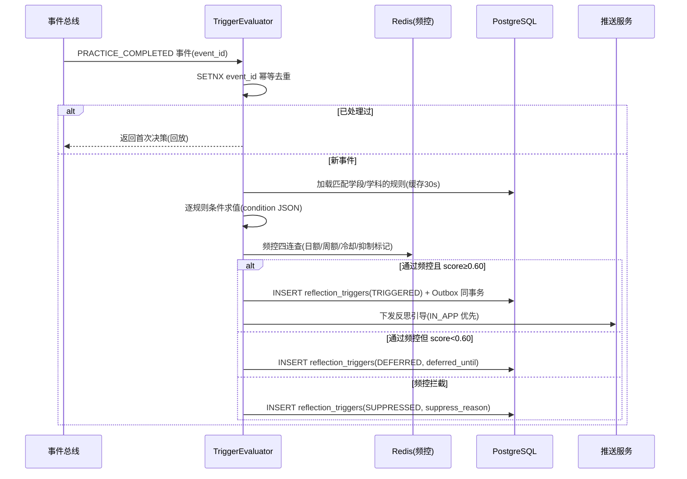

# 服务端-学习反思智能引导与元认知能力培养辅助引擎-详细设计

> **版本**: v1.0  
> **创建日期**: 2026-06-17  
> **负责人**: 研发团队  
> **关联模块**: AI智能辅导、错题整理、学情分析、学习规划

---

## 1. 模块概述

### 1.1 功能定位

学习反思智能引导与元认知能力培养辅助引擎（以下简称"反思引导引擎"）是 PrimeTop 平台中负责**培养学生元认知能力**的智能服务模块。它区别于直接的知识讲解和解题辅助，聚焦于引导学生"学会如何学习"——在合适的时机提出反思性问题，帮助学生审视自己的学习过程、评估自身理解程度、调整学习策略。

元认知（Metacognition）是指"对自身认知过程的认知"，包括：
- **元认知知识**：了解自己擅长/不擅长什么，知道不同学习策略的适用场景
- **元认知监控**：在学习过程中判断自己是否真正理解了内容
- **元认知调节**：根据监控结果调整学习策略和资源分配

### 1.2 设计依据

原始设计文档中的关键引用：
- §6.2.2 第3点："分步提示：优先引导学生理解思路，再逐步展示答案"
- §9.1 第4点："引导理解：AI 回答应采用'提示、思路、步骤、总结、练习'的结构"
- §6.6.2 第3点："错因分析：支持概念不清、审题错误、计算失误、方法错误等标签"——需要学生自我归因
- §6.7.2 第4点："能力画像：构建计算能力、阅读理解、逻辑推理、表达能力等维度分析"——元认知是跨维度的底层能力
- §6.8.2 第6点："计划复盘：定期总结完成率、薄弱点和下一阶段建议"——本质是反思活动

### 1.3 核心价值

| 价值维度 | 说明 |
|----------|------|
| 提升学习深度 | 引导学生从"完成答案"转向"理解过程"，减少机械抄写 |
| 培养自主学习能力 | 帮助学生建立自我评估习惯，减少对外部辅导的长期依赖 |
| 丰富学情数据 | 学生的反思记录是高价值的元认知数据，可反哺推荐和诊断引擎 |
| 增强产品教育价值 | 从"工具型产品"升级为"教育型产品"，体现教育专业性 |
| 家长/教师可见性 | 反思记录为家长和教师提供学生学习过程的深度洞察 |

### 1.4 适用学段

| 学段 | 反思引导策略 | 触发频率 |
|------|-------------|----------|
| 小学低年级（1-3年级） | 简单自我提问："你觉得这道题哪里最容易出错？" | 低频，每5次学习活动1次 |
| 小学高年级（4-6年级） | 归因引导："你觉得自己为什么选了这个答案？" | 中频，每3次练习1次 |
| 初中 | 策略反思："还有没有别的方法？你觉得哪种最好？" | 中高频，每2次练习1次 |
| 高中 | 深度元认知："你的解题思路是否完整？有没有遗漏的条件？" | 高频，每次关键练习后 |

---

## 2. 系统架构

### 2.1 引擎在系统中的位置

```
┌─────────────────────────────────────────────────────────────┐
│                        客户端层                               │
│  ┌──────────┐  ┌──────────┐  ┌──────────┐  ┌──────────────┐│
│  │ AI对话页  │  │ 练习答题页│  │ 错题本页  │  │ 学习规划页   ││
│  └────┬─────┘  └────┬─────┘  └────┬─────┘  └──────┬───────┘│
│       │             │             │                │        │
│       └─────────────┴─────────────┴────────────────┘        │
│                          │ 反思引导触发                        │
├──────────────────────────┼──────────────────────────────────┤
│                    API 网关层                                   │
├──────────────────────────┼──────────────────────────────────┤
│                          ▼                                    │
│              ┌───────────────────────┐                       │
│              │  反思引导引擎服务       │                       │
│              │  (reflection-service)  │                       │
│              └───────────┬───────────┘                       │
│                          │                                    │
│         ┌────────────────┼────────────────┐                  │
│         ▼                ▼                ▼                  │
│  ┌─────────────┐ ┌──────────────┐ ┌──────────────┐          │
│  │ 反思触发     │ │ 反思内容      │ │ 元认知能力    │          │
│  │ 决策引擎     │ │ 生成引擎      │ │ 评估引擎      │          │
│  └──────┬──────┘ └──────┬───────┘ └──────┬───────┘          │
│         │               │                │                  │
│         ▼               ▼                ▼                  │
│  ┌─────────────┐ ┌──────────────┐ ┌──────────────┐          │
│  │ 学习行为     │ │ AI大模型 +   │ │ 反思记录      │          │
│  │ 事件流       │ │ Prompt模板库 │ │ 数据仓库      │          │
│  └─────────────┘ └──────────────┘ └──────────────┘          │
├─────────────────────────────────────────────────────────────┤
│                      数据存储层                                │
│  PostgreSQL  │  Redis  │  Elasticsearch  │  对象存储          │
└─────────────────────────────────────────────────────────────┘
```

### 2.2 服务边界

| 职责 | 归属 | 说明 |
|------|------|------|
| 反思触发时机判断 | **本引擎** | 基于学习行为事件流，决策何时弹出反思引导 |
| 反思问题生成 | **本引擎** | 基于学习上下文，生成适龄、适切的反思问题 |
| 反思回答存储与分析 | **本引擎** | 记录学生反思内容，提取元认知特征 |
| 元认知能力评估 | **本引擎** | 基于反思历史，动态评估学生元认知水平 |
| AI对话中的启发引导 | AI辅导引擎 | AI对话过程中的分步提示仍由AI辅导引擎负责 |
| 错因标签管理 | 错题服务 | 错题本身的分类管理仍由错题服务负责 |
| 学习计划调整 | 学习规划服务 | 计划层面的调整仍由规划服务负责 |

### 2.3 与其他服务的交互

```
                    ┌─────────────────┐
                    │  学习行为事件流   │
                    │ (event-bus)     │
                    └────────┬────────┘
                             │ 订阅事件
                             ▼
┌──────────┐        ┌───────────────┐         ┌──────────────┐
│ 错题服务  │◄──────►│  反思引导引擎  │◄───────►│ AI辅导引擎   │
│          │ 查询错因 │ reflection-   │ 请求AI   │              │
│          │ 上下文   │ service       │ 生成反思  │              │
└──────────┘         └───────┬───────┘ 内容     └──────────────┘
                             │
                     ┌───────┼───────┐
                     ▼       ▼       ▼
              ┌─────────┐ ┌─────┐ ┌──────────┐
              │学情分析  │ │学习 │ │消息推送   │
              │服务     │ │规划 │ │服务      │
              │(画像数据)│ │服务 │ │(通知触发) │
              └─────────┘ └─────┘ └──────────┘
```

---

## 3. 数据结构定义

### 3.1 核心数据表

#### 3.1.1 `reflection_prompts` — 反思提示模板表

存储预定义和AI生成的反思提示模板。

```sql
CREATE TABLE reflection_prompts (
    id              BIGSERIAL PRIMARY KEY,
    prompt_code     VARCHAR(64) NOT NULL UNIQUE,      -- 模板编码，如 RPT-MATH-STRATEGY-001
    category        VARCHAR(32) NOT NULL,              -- 反思类别：SELF_ASSESSMENT / STRATEGY / ERROR_ATTRIBUTION / GOAL_REVIEW / TRANSFER
    scene_type      VARCHAR(32) NOT NULL,              -- 触发场景：AFTER_PRACTICE / AFTER_MISTAKE / AFTER_AI_DIALOGUE / SESSION_END / PLAN_REVIEW
    subject         VARCHAR(16),                       -- 学科：MATH / CHINESE / ENGLISH / PHYSICS / ... / NULL表示通用
    stage_min       VARCHAR(8) NOT NULL,               -- 适用最低学段：KINDERGARTEN / PRIMARY_LOW / PRIMARY_HIGH / JUNIOR / SENIOR
    stage_max       VARCHAR(8) NOT NULL,               -- 适用最高学段
    prompt_template TEXT NOT NULL,                     -- 提示文本模板，支持变量占位符 {{knowledge_point}} {{error_type}} 等
    prompt_options  JSONB,                             -- 选择题选项（可选），如 ["概念理解不清","计算粗心","方法选择错误"]
    prompt_type     VARCHAR(16) NOT NULL DEFAULT 'OPEN', -- OPEN(开放式) / CHOICE(选择式) / SCALE(量表式) / MIXED(混合式)
    cognitive_level VARCHAR(32) NOT NULL,              -- 元认知层次： PLANNING / MONITORING / EVALUATING / REGULATING
    difficulty      SMALLINT NOT NULL DEFAULT 1,       -- 反思难度 1-5，对应学段递增
    ai_generatable  BOOLEAN NOT NULL DEFAULT FALSE,    -- 是否允许AI基于此模板动态生成变体
    is_active       BOOLEAN NOT NULL DEFAULT TRUE,
    created_at      TIMESTAMPTZ NOT NULL DEFAULT NOW(),
    updated_at      TIMESTAMPTZ NOT NULL DEFAULT NOW(),

    CONSTRAINT ck_reflection_category CHECK (
        category IN ('SELF_ASSESSMENT', 'STRATEGY', 'ERROR_ATTRIBUTION', 'GOAL_REVIEW', 'TRANSFER')
    ),
    CONSTRAINT ck_reflection_scene CHECK (
        scene_type IN ('AFTER_PRACTICE', 'AFTER_MISTAKE', 'AFTER_AI_DIALOGUE', 'SESSION_END', 'PLAN_REVIEW')
    ),
    CONSTRAINT ck_reflection_type CHECK (
        prompt_type IN ('OPEN', 'CHOICE', 'SCALE', 'MIXED')
    ),
    CONSTRAINT ck_reflection_cognitive CHECK (
        cognitive_level IN ('PLANNING', 'MONITORING', 'EVALUATING', 'REGULATING')
    )
);

CREATE INDEX idx_reflection_prompts_lookup
    ON reflection_prompts (scene_type, subject, stage_min, stage_max, is_active);

CREATE INDEX idx_reflection_prompts_category
    ON reflection_prompts (category, cognitive_level);
```

**预置数据示例**：

```sql
INSERT INTO reflection_prompts (prompt_code, category, scene_type, subject, stage_min, stage_max, prompt_template, prompt_options, prompt_type, cognitive_level, difficulty) VALUES
-- 小学：错误归因
('RPT-GEN-ERR-001', 'ERROR_ATTRIBUTION', 'AFTER_MISTAKE', NULL, 'PRIMARY_LOW', 'PRIMARY_HIGH',
 '这道题你做错了，你觉得是因为什么呢？',
 '["题目没读懂","知识点还没掌握","粗心大意了","方法想错了"]',
 'CHOICE', 'EVALUATING', 1),

-- 初中数学：策略反思
('RPT-MATH-STR-001', 'STRATEGY', 'AFTER_PRACTICE', 'MATH', 'JUNIOR', 'SENIOR',
 '你刚才用了{{method}}解决了这道题。你觉得如果换一种方法，比如{{alternative_method}}，会不会更简单？为什么？',
 NULL, 'OPEN', 'REGULATING', 3),

-- 高中：自我评估
('RPT-GEN-SELF-001', 'SELF_ASSESSMENT', 'SESSION_END', NULL, 'SENIOR', 'SENIOR',
 '今天的学习中，你觉得哪个知识点你掌握得最好？哪个还需要再加强？如果给自己今天的学习打个分（1-10分），你会打几分？',
 NULL, 'OPEN', 'EVALUATING', 4),

-- 通用：迁移反思
('RPT-GEN-TRF-001', 'TRANSFER', 'AFTER_AI_DIALOGUE', NULL, 'JUNIOR', 'SENIOR',
 '刚才AI给你讲解了{{knowledge_point}}。你能不能用自己的话再解释一遍？如果让你给同学讲这个知识点，你会怎么讲？',
 NULL, 'OPEN', 'EVALUATING', 3),

-- 小学：计划反思
('RPT-GEN-GOAL-001', 'GOAL_REVIEW', 'PLAN_REVIEW', NULL, 'PRIMARY_HIGH', 'JUNIOR',
 '这周的学习计划你完成了{{completion_rate}}。你觉得没完成的部分主要是因为什么呢？',
 '["时间不够","太难了不太想做","忘了","其他"]',
 'MIXED', 'REGULATING', 2);
```

#### 3.1.2 `reflection_triggers` — 反思触发记录表

记录每次反思引导的触发决策和上下文。

```sql
CREATE TABLE reflection_triggers (
    id                  BIGSERIAL PRIMARY KEY,
    student_id          BIGINT NOT NULL,
    trigger_event_id    VARCHAR(128) NOT NULL,          -- 触发事件ID（来自事件总线）
    trigger_event_type  VARCHAR(32) NOT NULL,            -- 触发事件类型
    trigger_scene       VARCHAR(32) NOT NULL,            -- 场景类型
    trigger_context     JSONB NOT NULL,                  -- 触发上下文快照（学科、知识点、题目ID、对话ID等）
    prompt_id           BIGINT,                          -- 关联的提示模板ID（NULL表示AI实时生成）
    trigger_rule_code   VARCHAR(64) NOT NULL,            -- 命中的触发规则编码
    trigger_score       REAL NOT NULL,                   -- 触发评分 0.0-1.0，越高越应该触发
    decision            VARCHAR(16) NOT NULL,            -- 决策结果：TRIGGERED / SUPPRESSED / DEFERRED
    suppress_reason     VARCHAR(64),                     -- 抑制原因（当 decision=SUPPRESSED 时）
    deferred_until      TIMESTAMPTZ,                     -- 延迟到何时（当 decision=DEFERRED 时）
    created_at          TIMESTAMPTZ NOT NULL DEFAULT NOW(),

    CONSTRAINT ck_trigger_decision CHECK (
        decision IN ('TRIGGERED', 'SUPPRESSED', 'DEFERRED')
    )
);

CREATE INDEX idx_reflection_triggers_student
    ON reflection_triggers (student_id, created_at DESC);

CREATE INDEX idx_reflection_triggers_event
    ON reflection_triggers (trigger_event_type, created_at DESC);
```

#### 3.1.3 `reflection_records` — 反思记录表

存储学生提交的反思回答。

```sql
CREATE TABLE reflection_records (
    id                  BIGSERIAL PRIMARY KEY,
    student_id          BIGINT NOT NULL,
    trigger_id          BIGINT NOT NULL,                 -- 关联触发记录
    prompt_id           BIGINT,                          -- 关联提示模板
    scene_type          VARCHAR(32) NOT NULL,
    subject             VARCHAR(16),
    knowledge_point_ids BIGINT[],                        -- 关联知识点ID列表
    question_id         BIGINT,                          -- 关联题目ID（若场景为做题后）
    ai_conversation_id  VARCHAR(64),                     -- 关联AI对话ID（若场景为AI对话后）
    study_plan_id       BIGINT,                          -- 关联学习计划ID（若场景为计划复盘）
    prompt_text         TEXT NOT NULL,                   -- 实际展示给学生的提示文本
    prompt_type         VARCHAR(16) NOT NULL,
    
    -- 学生回答
    response_text       TEXT,                            -- 文本回答
    response_choice     VARCHAR(32),                     -- 选择题选项编码
    response_scale      SMALLINT,                        -- 量表评分
    response_time_ms    INTEGER,                         -- 思考+回答耗时（毫秒）
    
    -- AI分析结果
    response_quality    VARCHAR(16),                     -- 回答质量：SHALLOW / ADEQUATE / DEEP / NO_RESPONSE
    metacog_score       REAL,                            -- 元认知得分 0.0-1.0（本次反思）
    ai_feedback         TEXT,                            -- AI给学生的反馈（简短鼓励或追问）
    extracted_tags      JSONB,                           -- AI从回答中提取的标签 { "self_awareness": "high", "strategy": "repetition", ... }
    
    -- 元数据
    stage               VARCHAR(8) NOT NULL,             -- 学生当时的学段
    grade               SMALLINT NOT NULL,               -- 学生当时的年级
    created_at          TIMESTAMPTZ NOT NULL DEFAULT NOW(),
    updated_at          TIMESTAMPTZ NOT NULL DEFAULT NOW(),

    CONSTRAINT ck_reflection_quality CHECK (
        response_quality IN ('SHALLOW', 'ADEQUATE', 'DEEP', 'NO_RESPONSE')
    ),
    CONSTRAINT fk_reflection_trigger
        FOREIGN KEY (trigger_id) REFERENCES reflection_triggers(id),
    CONSTRAINT fk_reflection_prompt
        FOREIGN KEY (prompt_id) REFERENCES reflection_prompts(id)
);

CREATE INDEX idx_reflection_records_student
    ON reflection_records (student_id, created_at DESC);

CREATE INDEX idx_reflection_records_kp
    ON reflection_records USING GIN (knowledge_point_ids);

CREATE INDEX idx_reflection_records_scene
    ON reflection_records (scene_type, subject, created_at DESC);
```

#### 3.1.4 `metacognitive_profile` — 元认知能力画像表

每个学生的元认知能力动态画像。

```sql
CREATE TABLE metacognitive_profile (
    id                      BIGSERIAL PRIMARY KEY,
    student_id              BIGINT NOT NULL UNIQUE,
    
    -- 四维元认知能力得分（0.0-1.0）
    planning_score          REAL NOT NULL DEFAULT 0.5,       -- 计划能力：学习前规划策略的能力
    monitoring_score        REAL NOT NULL DEFAULT 0.5,       -- 监控能力：学习过程中自我检查的能力
    evaluating_score        REAL NOT NULL DEFAULT 0.5,       -- 评估能力：判断自身理解程度的能力
    regulating_score        REAL NOT NULL DEFAULT 0.5,       -- 调节能力：根据反馈调整策略的能力
    
    -- 综合元认知水平
    overall_score           REAL NOT NULL DEFAULT 0.5,       -- 综合元认知指数
    proficiency_level       VARCHAR(16) NOT NULL DEFAULT 'NOVICE',
    -- NOVICE(初学者) / DEVELOPING(发展中) / COMPETENT(胜任) / PROFICIENT(熟练) / EXPERT(精通)
    
    -- 学科维度元认知（可选细粒度）
    subject_scores          JSONB,                           -- {"MATH": 0.65, "ENGLISH": 0.72, ...}
    
    -- 统计数据
    total_reflections       INTEGER NOT NULL DEFAULT 0,      -- 累计反思次数
    total_response_time_ms  BIGINT NOT NULL DEFAULT 0,       -- 累计反思耗时
    avg_response_quality    REAL NOT NULL DEFAULT 0.0,       -- 平均回答质量得分
    last_reflection_at      TIMESTAMPTZ,                     -- 最近一次反思时间
    streak_days             INTEGER NOT NULL DEFAULT 0,      -- 连续反思天数
    
    -- 模型版本与时间戳
    model_version           VARCHAR(16) NOT NULL DEFAULT 'v1',
    computed_at             TIMESTAMPTZ NOT NULL DEFAULT NOW(), -- 最近一次计算时间
    updated_at              TIMESTAMPTZ NOT NULL DEFAULT NOW(),

    CONSTRAINT ck_metacog_level CHECK (
        proficiency_level IN ('NOVICE', 'DEVELOPING', 'COMPETENT', 'PROFICIENT', 'EXPERT')
    )
);

CREATE UNIQUE INDEX idx_metacog_profile_student
    ON metacognitive_profile (student_id);
```

#### 3.1.5 `reflection_rules` — 反思触发规则表

可配置的触发规则，控制何时弹出反思引导。

```sql
CREATE TABLE reflection_rules (
    id                  SERIAL PRIMARY KEY,
    rule_code           VARCHAR(64) NOT NULL UNIQUE,
    rule_name           VARCHAR(128) NOT NULL,
    description         TEXT,
    
    -- 触发条件（JSON表达式）
    condition           JSONB NOT NULL,
    -- 示例: {
    --   "event_type": "PRACTICE_COMPLETED",
    --   "accuracy_lt": 0.6,
    --   "question_count_gte": 5,
    --   "subject_in": ["MATH", "PHYSICS"]
    -- }
    
    -- 触发频率控制
    cooldown_minutes    INTEGER NOT NULL DEFAULT 30,       -- 冷却时间（分钟），同一学生
    daily_max_triggers  INTEGER NOT NULL DEFAULT 5,        -- 每日最多触发次数
    weekly_max_triggers INTEGER NOT NULL DEFAULT 20,       -- 每周最多触发次数
    
    -- 适用范围
    stage_min           VARCHAR(8) NOT NULL,
    stage_max           VARCHAR(8) NOT NULL,
    subject             VARCHAR(16),                       -- NULL表示所有学科
    
    -- 优先级与权重
    priority            INTEGER NOT NULL DEFAULT 50,       -- 优先级（高优先级先评估）
    weight              REAL NOT NULL DEFAULT 1.0,         -- 权重（影响触发评分）
    
    is_active           BOOLEAN NOT NULL DEFAULT TRUE,
    created_at          TIMESTAMPTZ NOT NULL DEFAULT NOW(),
    updated_at          TIMESTAMPTZ NOT NULL DEFAULT NOW()
);

CREATE INDEX idx_reflection_rules_active
    ON reflection_rules (is_active, priority DESC);
```

**预置规则示例**：

```sql
INSERT INTO reflection_rules (rule_code, rule_name, description, condition, cooldown_minutes, daily_max_triggers, weekly_max_triggers, stage_min, stage_max, priority, weight) VALUES

('RR-LOW-ACCURACY', '低正确率反思触发',
 '当一次练习的正确率低于60%且题数≥5时，触发错误归因反思',
 '{"event_type": "PRACTICE_COMPLETED", "accuracy_lt": 0.6, "question_count_gte": 5}',
 60, 3, 10, 'PRIMARY_HIGH', 'SENIOR', 80, 1.5),

('RR-MISTAKE-STREAK', '连续错题反思触发',
 '当同一知识点连续错3题以上时，触发策略反思',
 '{"event_type": "MISTAKE_ADDED", "same_kp_streak_gte": 3}',
 45, 4, 15, 'PRIMARY_LOW', 'SENIOR', 85, 1.8),

('RR-SESSION-END', '学习会话结束反思',
 '一次学习会话结束时（≥15分钟），触发自我评估反思',
 '{"event_type": "SESSION_END", "duration_gte_minutes": 15}',
 120, 2, 8, 'PRIMARY_HIGH', 'SENIOR', 60, 1.0),

('RR-AI-DEEP-DIALOGUE', 'AI深度对话后迁移反思',
 '当AI对话轮次≥5且涉及知识点讲解时，触发迁移反思',
 '{"event_type": "AI_DIALOGUE_END", "turn_count_gte": 5, "has_explanation": true}',
 90, 3, 12, 'JUNIOR', 'SENIOR', 70, 1.3),

('RR-PLAN-WEEKLY-REVIEW', '学习计划周度复盘',
 '每周日触发计划完成度反思',
 '{"event_type": "PLAN_REVIEW", "day_of_week": 0}',
 720, 1, 1, 'PRIMARY_HIGH', 'SENIOR', 90, 2.0),

('RR-IMPROVEMENT-DETECTED', '进步检测反思',
 '当学生在薄弱知识点上首次答对时，触发正向反思',
 '{"event_type": "FIRST_CORRECT_ON_WEAK_KP"}',
 30, 3, 10, 'PRIMARY_LOW', 'SENIOR', 75, 1.2);
```

### 3.2 Redis 数据结构

#### 3.2.1 触发频率控制

```redis
# 学生当日触发次数计数器
# Key: reflection:trigger:count:daily:{student_id}:{date}
# Type: HASH
# Fields: total -> 总触发次数, scene:{scene_type} -> 按场景计数
# TTL: 48小时
HSET reflection:trigger:count:daily:10086:2026-06-17 total 2 scene:AFTER_PRACTICE 1 scene:SESSION_END 1
EXPIRE reflection:trigger:count:daily:10086:2026-06-17 172800

# 学生当周触发次数计数器
# Key: reflection:trigger:count:weekly:{student_id}:{week_start_date}
# Type: STRING (integer)
# TTL: 8天
SET reflection:trigger:count:weekly:10086:2026-06-16 5
EXPIRE reflection:trigger:count:weekly:10086:2026-06-16 691200

# 学生最近触发时间（冷却判断）
# Key: reflection:trigger:last:{student_id}:{rule_code}
# Type: STRING (timestamp)
# TTL: 根据cooldown_minutes设置
SET reflection:trigger:last:10086:RR-LOW-ACCURACY "2026-06-17T01:00:00Z"
EXPIRE reflection:trigger:last:10086:RR-LOW-ACCURACY 3600
```

#### 3.2.2 元认知画像缓存

```redis
# 学生元认知画像缓存
# Key: reflection:profile:{student_id}
# Type: HASH
# TTL: 1小时（异步更新时刷新）
HSET reflection:profile:10086 \
    planning_score 0.62 \
    monitoring_score 0.71 \
    evaluating_score 0.58 \
    regulating_score 0.65 \
    overall_score 0.64 \
    proficiency_level "DEVELOPING" \
    total_reflections 47 \
    streak_days 3
```

#### 3.2.3 反思引导抑制标记

```redis
# 当学生在AI对话中正在深度交互时，临时抑制反思弹出
# Key: reflection:suppress:{student_id}
# Type: STRING (reason)
# TTL: 动态设置（通常5-15分钟）
SET reflection:suppress:10086 "IN_AI_DEEP_DIALOGUE"
EXPIRE reflection:suppress:10086 600
```

---

## 4. API 接口设计

### 4.1 触发反思评估（内部接口）

评估是否应该对学生触发反思引导。由事件总线消费者调用。

```
POST /api/internal/reflection/evaluate
```

**请求体**：

```json
{
  "student_id": 10086,
  "event": {
    "event_id": "evt-2026061701-abcdef",
    "event_type": "PRACTICE_COMPLETED",
    "timestamp": "2026-06-17T01:00:00Z",
    "payload": {
      "session_id": "sess-001",
      "subject": "MATH",
      "question_count": 10,
      "correct_count": 4,
      "accuracy": 0.4,
      "duration_seconds": 720,
      "knowledge_point_ids": [101, 102, 103],
      "wrong_question_ids": [5001, 5002, 5003, 5004, 5005, 5006],
      "stage": "JUNIOR",
      "grade": 8
    }
  }
}
```

**响应体**：

```json
{
  "code": 0,
  "data": {
    "decision": "TRIGGERED",
    "trigger_score": 0.87,
    "matched_rules": [
      {
        "rule_code": "RR-LOW-ACCURACY",
        "rule_name": "低正确率反思触发",
        "contribution": 0.65
      },
      {
        "rule_code": "RR-MISTAKE-STREAK",
        "rule_name": "连续错题反思触发",
        "contribution": 0.22
      }
    ],
    "recommended_prompt": {
      "prompt_id": 42,
      "prompt_code": "RPT-GEN-ERR-001",
      "category": "ERROR_ATTRIBUTION",
      "prompt_type": "CHOICE",
      "prompt_text": "这次练习你的正确率是40%。你觉得主要错在哪里了呢？",
      "prompt_options": [
        {"code": "A", "text": "题目没读懂"},
        {"code": "B", "text": "知识点还没掌握"},
        {"code": "C", "text": "粗心大意了"},
        {"code": "D", "text": "方法想错了"}
      ],
      "context": {
        "subject": "MATH",
        "accuracy": 0.4,
        "knowledge_point_ids": [101, 102, 103]
      }
    },
    "trigger_id": 9001
  }
}
```

### 4.2 提交反思回答

```
POST /api/v1/reflection/submit
```

**请求体**：

```json
{
  "trigger_id": 9001,
  "response": {
    "response_choice": "B",
    "response_text": "我觉得是一元二次方程的求根公式还没记牢，每次都要想很久",
    "response_time_ms": 12500
  }
}
```

**响应体**：

```json
{
  "code": 0,
  "data": {
    "reflection_id": 8001,
    "response_quality": "ADEQUATE",
    "metacog_score": 0.72,
    "ai_feedback": "你能意识到是求根公式不够熟练，这很棒！建议你先把公式推导过程理解一遍，下次做题会更顺畅。",
    "extracted_tags": {
      "self_awareness": "high",
      "error_attribution": "knowledge_gap",
      "specificity": "specific"
    },
    "updated_profile": {
      "overall_score": 0.65,
      "evaluating_score": 0.62,
      "proficiency_level": "DEVELOPING"
    }
  }
}
```

### 4.3 跳过反思

允许学生选择跳过反思引导（尊重学生意愿，不强制）。

```
POST /api/v1/reflection/skip
```

```json
{
  "trigger_id": 9001,
  "reason": "NOT_NOW"   // NOT_NOW / DONT_UNDERSTAND / TOO_FREQUENT / OTHER
}
```

### 4.4 查询学生元认知画像

```
GET /api/v1/reflection/profile?student_id=10086
```

**响应体**：

```json
{
  "code": 0,
  "data": {
    "student_id": 10086,
    "overall_score": 0.65,
    "proficiency_level": "DEVELOPING",
    "dimensions": {
      "planning_score": 0.62,
      "monitoring_score": 0.71,
      "evaluating_score": 0.62,
      "regulating_score": 0.65
    },
    "subject_scores": {
      "MATH": 0.61,
      "CHINESE": 0.70,
      "ENGLISH": 0.68
    },
    "statistics": {
      "total_reflections": 52,
      "avg_response_quality": 0.68,
      "streak_days": 3,
      "last_reflection_at": "2026-06-16T14:30:00Z"
    },
    "radar_chart": {
      "labels": ["计划能力", "监控能力", "评估能力", "调节能力"],
      "datasets": [{
        "student": [0.62, 0.71, 0.62, 0.65],
        "peer_average": [0.58, 0.60, 0.57, 0.55],
        "peer_average_note": "同年级匿名聚合基线，k≥30 才返回，否则缺省"
      }]
    },
    "suggestion": {
      "text": "你的监控能力相对突出，但计划能力还有提升空间。试试在每天学习前先花 2 分钟写下今天要完成的 3 件事。",
      "focus_dimension": "PLANNING",
      "priority": "MEDIUM"
    },
    "model_version": "v1",
    "computed_at": "2026-06-17T00:00:00Z"
  }
}
```

**响应字段说明**：

| 字段 | 说明 |
|------|------|
| peer_average | 同伴基线委托同伴基准引擎（54700 段）查询，学生端仅返回聚合值，永不返回个体数据 |
| suggestion | 由画像解释生成器基于最低分维度产出，话术须经成长型话术白名单过滤 |
| model_version | 画像模型版本，用于客户端缓存与回归比对 |

**缓存语义**：客户端可缓存画像 1 小时；`computed_at` 变化即失效。义务教育阶段学生端不返回 `peer_average`（排名禁令，仅返回自身维度值）。

### 4.5 反思记录列表

```
GET /api/v1/reflection/records?scene_type=AFTER_MISTAKE&subject=MATH&page=1&page_size=20
```

**响应体**：

```json
{
  "code": 0,
  "data": {
    "total": 52,
    "items": [{
      "reflection_id": 8001,
      "scene_type": "AFTER_PRACTICE",
      "subject": "MATH",
      "category": "ERROR_ATTRIBUTION",
      "prompt_text": "这次练习你的正确率是40%。你觉得主要错在哪里了呢？",
      "response_summary": "觉得是一元二次方程求根公式不熟练（节选，全文见详情接口）",
      "response_quality": "ADEQUATE",
      "metacog_score": 0.72,
      "created_at": "2026-06-17T01:05:00Z"
    }]
  }
}
```

> 列表接口不返回 `extracted_tags` 与 `ai_feedback` 全量，防一次拉取过量画像明细；家长端调用时按可见度分级过滤（见 §13 C4）。

### 4.6 反思记录详情

```
GET /api/v1/reflection/records/{reflection_id}
```

越权访问他人记录一律 404（不暴露存在性）。

### 4.7 管理端接口

| 接口 | 方法 | 说明 | 关键约束 |
|------|------|------|----------|
| /api/admin/reflection/prompts | GET/POST | 提示模板查询/新增 | 新增默认 is_active=false，需审核激活 |
| /api/admin/reflection/prompts/{id} | PUT | 模板编辑 | 编辑产生新版本记录（prompt_versions 表），不回写历史 |
| /api/admin/reflection/prompts/{id}/activate | POST | 模板激活/停用 | 激活需审核人≠创建人（G10） |
| /api/admin/reflection/rules | GET/POST/PUT | 触发规则 CRUD | 冷却/日额修改即时生效（Redis 规则缓存 30s 刷新） |
| /api/admin/reflection/rules/{id}/simulate | POST | 规则模拟运行 | dry_run，输入合成事件返回决策但不落库 |
| /api/admin/reflection/stats | GET | 触发/完成/质量统计 | 仅聚合数据，不含学生原文 |
| /api/admin/reflection/records/{id}/tags | PUT | 人工修正提取标签 | 修正记录入 audit，供模型迭代 |

### 4.8 内部 gRPC

```protobuf
service ReflectionEngine {
  // 批量查询元认知画像（供学情分析/推荐引擎消费）
  rpc BatchGetProfile(BatchGetProfileRequest) returns (BatchGetProfileResponse);
  // 查询学生某维度元认知信号（供学习策略编排引擎 56100 段消费）
  rpc GetDimensionSignal(GetDimensionSignalRequest) returns (GetDimensionSignalResponse);
}

message BatchGetProfileRequest {
  repeated int64 student_ids = 1;  // ≤500
}

message GetDimensionSignalRequest {
  int64 student_id = 1;
  string dimension = 2;  // PLANNING / MONITORING / EVALUATING / REGULATING
}
```

**边界裁决**：gRPC 为只读消费通道，下游禁止经由此通道回写画像；画像写入口唯一为 §5.2 画像更新管线（G2）。

### 4.9 幂等限流总表

| 接口 | 幂等键 | 限流（每学生） |
|------|--------|----------------|
| POST /api/internal/reflection/evaluate | event_id（Redis SETNX 24h，重复事件直接返回首次决策回放） | 事件驱动天然削峰，1000/s/生 |
| POST /api/v1/reflection/submit | (trigger_id, client_request_id) 联合唯一索引 | 10 次/分钟 |
| POST /api/v1/reflection/skip | trigger_id 幂等（重复 skip 返回成功） | 30 次/分钟 |
| GET profile / records | 读接口无幂等要求 | 60 次/分钟 |

---

## 5. 核心流程

### 5.1 触发决策主链路



**触发评分公式**：`trigger_score = min(1.0, Σ(rule_contribution × rule_weight) + context_bonus)`，其中 rule_contribution 由条件匹配度决定（完全匹配 1.0，阈值贴近线性衰减），context_bonus 为上下文加成（如考试周 +0.05，上限 0.1）。**触发阈值 0.60，滞回带 0.05**（本次 TRIGGERED 后 20 分钟内同场景需 ≥0.65 才再次触发，防连续轰炸）。

### 5.2 回答提交与画像更新流程

1. 接收 submit 请求，校验 trigger 归属与状态（已终态的 trigger 重复提交返回首次结果回放，幂等）。
2. 同事务写入 `reflection_records`（含 idempotency key）+ Outbox 事件 `reflection.completed`。
3. 异步管线（Redis Stream，消费组 reflection-analyzer）：
   - LLM 分析回答质量（三档 SHALLOW/ADEQUATE/DEEP）+ 提取标签；
   - 分析结果 CAS 回写 reflection_records；
   - 调用画像更新引擎。
4. 画像更新引擎（§5.4）计算新四维得分 → CAS 更新 `metacognitive_profile`（version+1）→ DEL Redis 画像缓存 → 发布 `reflection.profile.updated`。

**延迟预算**：提交接口 P99 ≤ 300ms（分析异步化）；分析完成 P95 ≤ 10s；画像更新 P95 ≤ 30s。

### 5.3 AI 回答分析管线

| 步骤 | 内容 | 预算 |
|------|------|------|
| A1 | 输入安全快检（敏感词引擎 scene=UGC 委托，50ms 超时放行+异步补扫） | 50ms |
| A2 | 质量三档分类（轻量模型，特征：字数、具体性词表、因果连接词、自我指涉密度） | 30ms |
| A3 | 低置信（|Pmax-P2nd|<0.15）转 LLM 深度分析 | 异步，3s 超时降级为 ADEQUATE |
| A4 | 标签提取（self_awareness / error_attribution / strategy / specificity 四维） | 与 A3 合并一次调用 |
| A5 | AIGC 标识：AI 生成的 ai_feedback 在客户端展示时须带「AI 生成」标识（契约 R8） | — |

**红线**：分析失败（LLM 超时/异常）时 `response_quality` 降级为 ADEQUATE 并标记 `analysis_status=DEGRADED`，**绝不误判为 SHALLOW**（防挫败，对齐判题引擎「失败绝不误判 incorrect」同构原则）。

### 5.4 画像计算引擎

**四维得分 EMA 更新**：

```
dimension_new = dimension_old × (1-α) + sample_score × α
α = min(0.4, 2 / (5 + total_reflections))     -- 反思越少越保守
sample_score 映射：DEEP=0.9, ADEQUATE=0.6, SHALLOW=0.3, NO_RESPONSE=0.1
维度归属：category=PLANNING→planning_score, MONITORING→monitoring_score,
         SELF_ASSESSMENT→evaluating_score, STRATEGY/TRANSFER/ERROR_ATTRIBUTION→regulating_score
```

**综合指数**：`overall = 0.25×planning + 0.30×monitoring + 0.25×evaluating + 0.20×regulating`（监控权重最高，因其为实时学习行为调节前提）。

**等级迟滞映射**（防抖动）：升级阈值 NOVICE→DEVELOPING 0.45、DEVELOPING→COMPETENT 0.60、COMPETENT→PROFICIENT 0.75、PROFICIENT→EXPERT 0.88；降级迟滞带 0.04。**允许高分越级，禁止一次事件连降两级**（G5）。

**学科维度**：subject_scores 仅在单学科反思样本 ≥5 条时单独计算，否则沿用综合值（防小样本失真）。

### 5.5 频控与抑制矩阵

| 抑制源 | 优先级 | 语义 |
|--------|--------|------|
| 防沉迷强制休息中 | P0 | fail-closed，绝不触发 |
| 考试/测评进行中（55100 会话态） | P0 | fail-closed |
| reflection:suppress 标记（AI 深度对话等） | P1 | 事件结束或 TTL 到期自动解除 |
| 日额/周额耗尽 | P1 | 当日/当周不再触发，次日零时恢复 |
| 单规则冷却中 | P2 | 仅抑制该规则，其他规则不受影响 |

**防疲劳硬顶**：每学生每日反思引导 ≤5 次、每周 ≤20 次；幼儿段（kindergarten）整体不触发反思引擎（认知发展阶段不适用，G7）。

### 5.6 延迟预算总表

| 链路 | 预算 | 说明 |
|------|------|------|
| 事件→决策 | P99 ≤ 200ms | 规则缓存在内存，Redis 频控 Lua 单次往返 |
| 决策→下发 | P99 ≤ 500ms | 经推送服务站内信通道，不阻塞学习主链路 |
| submit→响应 | P99 ≤ 300ms | 分析异步 |
| 分析完成 | P95 ≤ 10s | LLM 深度分析超时降级 |

---

## 6. 关键代码示例

### 6.1 触发评估器（规则求值 + 频控）

```python
class TriggerEvaluator:
    def __init__(self, rule_cache, freq_guard, trigger_repo, outbox):
        self.rule_cache = rule_cache       # 30s 双缓冲规则缓存
        self.freq_guard = freq_guard       # Redis Lua 频控
        self.trigger_repo = trigger_repo
        self.outbox = outbox

    async def evaluate(self, student_id: int, event: LearningEvent) -> TriggerDecision:
        # 幂等：事件级去重
        if not await self.freq_guard.claim_event(event.event_id):
            return await self.trigger_repo.replay_decision(event.event_id)

        rules = await self.rule_cache.match(event.stage, event.subject)
        contributions = []
        for rule in rules:
            score = rule.condition.score(event.payload)   # 0.0~1.0
            if score > 0:
                contributions.append((rule, score))

        trigger_score = min(1.0, sum(
            s * r.weight for r, s in contributions) + context_bonus(event))

        if trigger_score < 0.60:
            return self._record(student_id, event, "DEFERRED",
                                deferred_until=event.ts + timedelta(minutes=30))

        allowed, reason = await self.freq_guard.check(student_id, rules[0].rule_code)
        if not allowed:
            return self._record(student_id, event, "SUPPRESSED", suppress_reason=reason)

        trigger_id = await self.trigger_repo.save_triggered(
            student_id, event, contributions, trigger_score)   # 同事务写 Outbox
        prompt = await self._select_prompt(event, contributions)
        return TriggerDecision(triggered=True, trigger_id=trigger_id, prompt=prompt)
```

### 6.2 频控 Lua（日额+周额+冷却+抑制四合一原子判断）

```lua
-- KEYS[1]=daily Hash, KEYS[2]=weekly String, KEYS[3]=last String, KEYS[4]=suppress
-- ARGV: daily_max, weekly_max, cooldown_sec, now_ts, ttl_daily, ttl_weekly, ttl_cd
if redis.call('GET', KEYS[4]) then return {0, 'SUPPRESSED_ACTIVE'} end
if tonumber(redis.call('HGET', KEYS[1], 'total') or '0') >= tonumber(ARGV[1]) then
    return {0, 'DAILY_CAP'} end
if tonumber(redis.call('GET', KEYS[2]) or '0') >= tonumber(ARGV[2]) then
    return {0, 'WEEKLY_CAP'} end
local last = tonumber(redis.call('GET', KEYS[3]) or '0')
if (tonumber(ARGV[4]) - last) < tonumber(ARGV[3]) then return {0, 'COOLDOWN'} end
redis.call('HINCRBY', KEYS[1], 'total', 1)
redis.call('EXPIRE', KEYS[1], tonumber(ARGV[5]))
redis.call('INCR', KEYS[2])
redis.call('EXPIRE', KEYS[2], tonumber(ARGV[6]))
redis.call('SET', KEYS[3], ARGV[4])
redis.call('EXPIRE', KEYS[3], tonumber(ARGV[7]))
return {1, 'OK'}
```

### 6.3 提交服务（幂等 + 同事务 Outbox）

```python
async def submit(self, student_id: int, req: SubmitRequest) -> SubmitResponse:
    key = f"{req.trigger_id}:{req.client_request_id}"
    record_id = await self.repo.find_by_idem_key(key)
    if record_id:                       # 幂等回放
        return await self.repo.get_submit_result(record_id)

    async with self.db.transaction():
        trigger = await self.repo.lock_trigger(req.trigger_id)   # FOR UPDATE
        if trigger.student_id != student_id:
            raise NotFound(51304)      # 越权按 404 处理
        if trigger.status == 'ANSWERED':
            return await self.repo.get_submit_result(trigger.record_id)
        record_id = await self.repo.insert_record(trigger, req, key)
        await self.repo.mark_trigger_answered(trigger.id, record_id)
        await self.outbox.publish('reflection.completed', {
            'event_id': f'ref-{record_id}',
            'student_id': student_id,
            'reflection_id': record_id,
            'category': trigger.category,
            'scene_type': trigger.scene_type,
        })
    await self.stream.push('reflection-analyzer', {'record_id': record_id})
    return SubmitResponse(reflection_id=record_id, status='ACCEPTED')
```

### 6.4 画像更新（EMA + 迟滞 + CAS）

```python
async def update_profile(self, student_id: int, sample: ReflectionSample):
    for _ in range(3):                      # CAS 重试上限
        profile = await self.repo.get_profile(student_id)
        new_scores = {d: ema(profile[d], sample[d], profile.total_reflections)
                      for d in ('planning', 'monitoring', 'evaluating', 'regulating')}
        overall = weighted(new_scores)
        level = hysteresis_level(profile.proficiency_level, overall)  # 迟滞映射
        rows = await self.repo.cas_update(
            student_id, new_scores, overall, level, profile.version)
        if rows == 1:
            await self.cache.delete(f'reflection:profile:{student_id}')
            await self.outbox.publish('reflection.profile.updated', {...})
            return
    raise ConcurrencyError(51308)           # 3 次 CAS 失败，消息重投
```

### 6.5 事件消费者骨架（分析管线）

```python
async def consume_analysis(stream, analyzer, repo):
    async for msg in stream.read_group('reflection-analyzer', batch=32):
        try:
            record = await repo.get_record(msg['record_id'])
            result = await analyzer.analyze(record.prompt_text, record.response_text)
            await repo.cas_analysis_result(record.id, result)   # 仅当 analysis_status=PENDING
            await profile_engine.update_profile(record.student_id, result.sample)
            await msg.ack()
        except TransientError:
            await msg.retry(backoff='2^n', max=5)             # 死信 P2 告警
        except Exception:
            await repo.mark_analysis_degraded(record.id)      # 降级 ADEQUATE
            await msg.ack()                                   # 绝不阻塞管线
```

---

## 7. 状态机与守卫

### 7.1 触发记录状态机

```
CREATED → TRIGGERED → DELIVERED → ANSWERED / SKIPPED / EXPIRED
DELIVERED --(30min 未响应)--> EXPIRED
```

| 守卫 | 规则 | 违反处理 |
|------|------|----------|
| G1 | 事件幂等：event_id 24h 内唯一 | 重复事件返回首次决策回放 |
| G2 | 画像写入口唯一（本引擎内部仅 §5.2 管线） | gRPC 通道只读，越权写拒绝 |
| G3 | 触发阈值 0.60 + 滞回 0.05 | 评分计算全链路单写者 |
| G4 | 防沉迷/考试态 P0 抑制 fail-closed | 抑制查询失败按「抑制」处理 |
| G5 | 等级迟滞：禁一次事件连降两级 | CAS 校验，违反则重算 |
| G6 | 反思引导每日 ≤5 次硬顶 | Lua 原子计数，防并发穿透 |
| G7 | 幼儿段（kindergarten）不触发 | 学段校验前置 |
| G8 | 分析失败绝不误判 SHALLOW | 降级 ADEQUATE+DEGRADED 标记 |
| G9 | trigger 终态不可逆（ANSWERED/SKIPPED/EXPIRED 互斥） | 状态 CAS，重复动作幂等回放 |
| G10 | 模板激活审核人≠创建人 | 双人校验，否则 51313 |
| G11 | 越权访问记录/画像按 404 | 不暴露存在性 |
| G12 | 载荷瘦身：触发上下文仅存实体引用（题目/对话 ID），不存原文 | 白名单校验 |
| G13 | 义务教育阶段学生端不返回同伴基线/排名 | 学段过滤 fail-closed |
| G14 | 删除账号级联清理（注册统一清理引擎） | 注销事件订阅，延迟删除 180 天 |

### 7.2 反思记录分析状态机

```
PENDING → ANALYZING → COMPLETED
PENDING → DEGRADED（分析失败降级，终态）
ANALYZING --(重试 5 次耗尽)--> DEGRADED
```

分析状态 CAS 仅允许 PENDING→ANALYZING（分析消费者单写者）；DEGRADED 为终态不可回退。

### 7.3 画像计算任务状态机

```
PENDING → RUNNING → COMPLETED / FAILED（自动重投 ≤3 次）
```

---

## 8. 幂等并发场景

| # | 场景 | 裁决 |
|---|------|------|
| 1 | 同一 event_id 重复消费（总线 at-least-once） | Redis SETNX 24h，首次决策回放 |
| 2 | submit 网络重试（同 client_request_id） | (trigger_id, client_request_id) 联合唯一索引，命中回放 |
| 3 | submit 与 skip 并发 | trigger 行锁 FOR UPDATE，先到者胜，后到者幂等回放 |
| 4 | 同一学生并发多事件触发 | Lua 原子频控，计数与判定同事务 |
| 5 | 画像并发更新（同学生两条反思同时完成） | version CAS + 3 次重试，仍失败则消息重投 |
| 6 | 分析消费者崩溃恢复 | Redis Stream pending 列表，超时重派 |
| 7 | 规则热更新与在途评估 | 规则双缓冲，单事件全链路使用同一版本快照 |
| 8 | 画像缓存与 DB 不一致 | 写后必 DEL，读 miss 回源 DB；不做主动 SET（cache-aside） |

---

## 9. 事件 Outbox

### 9.1 发布事件（reflection.domain.events）

| 事件 | 触发点 | 关键消费方 |
|------|--------|------------|
| reflection.triggered | 触发决策 TRIGGERED | 推送服务（站内信）、埋点平台 |
| reflection.completed | 反思记录落库同事务 | 学情分析服务（画像聚合）、学习规划服务（计划复盘输入）、AI 辅导引擎（后续对话注入反思上下文） |
| reflection.profile.updated | 画像 CAS 成功 | 学情分析服务、学习策略编排引擎（56100）、推荐引擎（排序特征） |
| reflection.prompt.updated | 模板版本变更 | 客户端（引导文案刷新）、缓存失效 |
| reflection.account.purged | 注销清理完成 | 审计、数据仓库（删除传播） |

消费幂等键统一为 `event_id`，消费方以 `(event_id, consumer)` 建唯一索引。

### 9.2 上游订阅

| 事件源 | 事件 | 用途 |
|--------|------|------|
| 练习测评服务 | practice.completed / mistake.added | 触发条件输入（§3.1.5 规则） |
| 学习会话 | session.ended | SESSION_END 场景触发 |
| AI 辅导 | ai.dialogue.ended | AFTER_AI_DIALOGUE 场景触发 |
| 学习规划 | plan.review.due | PLAN_REVIEW 场景触发 |
| 防沉迷 | forced.rest.started / ended | P0 抑制开关 |
| 会员/账号 | account.deleted | G14 级联清理 |

### 9.3 对账

每日 04:40 对账三恒等式：
1. `reflection_triggers` 当日 TRIGGERED 数 = Outbox `reflection.triggered` 数；
2. `reflection_records` 数 = `reflection.completed` 事件数（差异 >0.5% 告警，防丢事件）；
3. `metacognitive_profile` 各维度 ∈ [0,1] 且 overall 与四维加权重算误差 < 0.001。

---

## 10. 错误码

本引擎独占 **51300-51399** 段位（全库扫描确认 51300-51399 无冲突，已注册至《服务端-统一业务异常码与错误分类体系》）。

| 码 | 名称 | HTTP | 语义 | 客户端提示 |
|----|------|------|------|-----------|
| 51300 | REFLECTION_GENERIC | 500 | 通用失败 | 「操作失败，请稍后重试」 |
| 51301 | TRIGGER_NOT_FOUND | 404 | 触发记录不存在或越权 | 静默吞没（引导已过期） |
| 51302 | TRIGGER_EXPIRED | 200 | 引导已过期 | 「这个反思已过期，继续学习吧」 |
| 51303 | TRIGGER_ALREADY_ANSWERED | 200 | 已回答（幂等回放语义） | 返回首次结果 |
| 51304 | RECORD_NOT_FOUND | 404 | 记录不存在或越权 | 静默 |
| 51305 | RESPONSE_TOO_LONG | 400 | 回答超 2000 字 | 「回答太长了，简单说说就好」 |
| 51306 | RATE_LIMITED | 429 | 提交频率超限 | 冷却提示 |
| 51307 | PROFILE_NOT_READY | 200 | 画像样本不足（<3 条）返回默认值 | 「完成几次反思后就能看到你的元认知画像」 |
| 51308 | PROFILE_CAS_CONFLICT | 500 | 画像并发冲突重试耗尽 | 重试一次后统一文案 |
| 51309 | ANALYSIS_TIMEOUT | 200 | 分析超时降级（质量按 ADEQUATE） | 不提示（异步补分析） |
| 51310 | PROMPT_NOT_FOUND | 500 | 模板缺失（脏数据） | 统一文案+告警 |
| 51311 | INVALID_SKIP_REASON | 400 | 跳过原因非法 | 参数校验提示 |
| 51312 | SCENE_TYPE_MISMATCH | 400 | 场景类型与 trigger 不符 | 参数校验提示 |
| 51313 | PROMPT_APPROVAL_CONFLICT | 409 | 审核人=创建人 | 管理端提示更换审核人 |
| 51314 | DAILY_CAP_REACHED | 200 | 当日触发已达 5 次（evaluate 内部语义码，不透传学生） | 内部埋点维度 |
| 51315 | SUPPRESSED_BY_GUARD | 200 | 被 P0 抑制（同上，仅 missReason 维度） | 不透传 |

> 51314/51315 为内部 200 语义码，仅入 ClickHouse 分析，客户端永不感知（防学生感知被「监控」）。

---

## 11. 降级矩阵

| # | 故障 | 降级行为 | 红线 |
|---|------|----------|------|
| D1 | LLM 分析不可用 | 质量降级 ADEQUATE + DEGRADED 标记，异步补分析 | 绝不误判 SHALLOW（G8） |
| D2 | Redis 宕机 | 频控读 DB 镜像（触发日志聚合），写路径短路（暂停新触发，在途不受影响） | 宁可少触发不可超频控 |
| D3 | 规则缓存失效 | 直读 DB，P99 升至 400ms 以内可接受 | 规则求值不得使用过期>60s 快照 |
| D4 | 推送服务不可用 | 反思引导改客户端下轮轮询拉取（pending 队列） | 引导静默丢失（10min TTL） |
| D5 | Outbox/Relay 故障 | 同事务落库，恢复后重放；对账差异 >0.5% 告警 | 事件不丢（至少一次） |
| D6 | 画像 DB 不可用 | 读缓存兑底（1h 陈旧）；写路径缓冲 Redis Stream | 宁可陈旧不可双写分叉 |
| D7 | 事件总线堆积 | 消费滞后 >5min 自动丢弃非 P0 场景事件（SESSION_END 等低优） | PRACTICE_COMPLETED/MISTAKE 类核心事件不丢 |
| D8 | 敏感词快检超时 | 放行 + 异步补扫（对齐审计引擎 D1 同构） | 补扫失败最终转人工抽样 |
| D9 | 同伴基线服务（54700）不可用 | peer_average 字段缺省返回 | 学生端展示不受影响 |
| D10 | 防沉迷查询故障 | 触发 fail-closed（抑制） | 防沉迷永远宁可抑制不可放行 |

**总红线**：反思引擎为体验增强层，任何降级不得阻塞学习主链路（练习/考试/AI 对话），不得向学生暴露引擎故障（51314/51315 不透传）。

---

## 12. 监控与容量

### 12.1 监控指标（M1-M10）

| 指标 | 口径 | 告警阈值 |
|------|------|----------|
| M1 | 触发→下发成功率 | <99% 持续 10min P2 |
| M2 | 学生应答率（ANSWERED/TRIGGERED） | 环比跌 >30% P2（话术/时机问题信号） |
| M3 | 跳过率（SKIPPED/TRIGGERED） | >40% 连续 3 天 P2 |
| M4 | 平均元认知分（分学段周聚合） | 监控漂移，PSI>0.2 P3 |
| M5 | 分析管线耗时 P95 | >10s 持续 15min P2 |
| M6 | DEGRADED 占比 | >5% P2（LLM 稳定性） |
| M7 | Outbox 对账差异 | >0.5% P1 |
| M8 | 频控穿透率（实际触发 > 日额） | >0 即 P1（Lua 失守） |
| M9 | evaluate 延迟 P99 | >200ms 持续 10min P2 |
| M10 | 画像 CAS 冲突率 | >2% P3 |

### 12.2 容量估算（DAU 50 万）

| 项 | 估算 |
|----|------|
| 日触发决策 | 学习事件 1800 万 × 触达率 8% ≈ 144 万次 |
| 日反思记录 | 触发 × 应答率 55% ≈ 79 万条 |
| 存储增长 | reflection_records 约 0.8KB/条 → 日增 640MB，按月分区，在线 12 个月，归档 24 个月 |
| Redis | 频控键 ≈ 200MB，画像缓存 1.5GB（TTL 1h），Stream 缓冲 100MB |
| LLM 成本 | 深度分析 20% × 79 万 × ¥0.004 ≈ ¥630/日，预算熔断对齐 AI 成本引擎 |
| 峰值 QPS | evaluate 峰值 1200/s（事件削峰后），submit 峰值 150/s |

---

## 13. 合规红线

| # | 红线 |
|---|------|
| C1 | 元认知数据**不用于营销定向**，画像禁回流广告投放系统 |
| C2 | 学生端**不展示等级标签对比**（不出「你的元认知落后 xx% 同学」），仅展示自身成长曲线 |
| C3 | 反思引导**非强制**：跳过永远可用，且不因此降低任何功能可用性（防软性胁迫） |
| C4 | 家长端可见度分级：L2 聚合统计（次数/趋势）默认可见；L3 反思原文需学生≥14 岁或家长门授权后可见 |
| C5 | 反思原文属敏感个人数据：存储加密，展示脱敏（同窗/教师信息剥离），导出走数据导出服务审批 |
| C6 | AI 反馈话术走成长型话术白名单，**禁止焦虑式表达**（「你再不反思就赶不上了」类一律拦截） |
| C7 | 心理危机信号（自伤/轻生词）经敏感词引擎直报危机引擎，反思引擎仅记录事件，不做内容处置（让位权威） |
| C8 | 未成年人数据最小化：extracted_tags 仅存枚举值，不存自由文本推断 |
| C9 | AIGC 标识：AI 生成的 ai_feedback/suggestion 在客户端必须带「AI 生成」标识 |
| C10 | 注销联动：账号删除后反思原文 180 天内物理删除，聚合统计匿名化保留（注册统一清理引擎） |

---

## 14. 契约对齐

| # | 对齐项 | 裁决 |
|---|--------|------|
| R1 | 与 AI 辅导引擎边界 | AI 对话**过程中**的分步启发归 AI 辅导引擎；**对话结束后**的独立反思引导归本引擎（§2.2） |
| R2 | 与错题服务边界 | 错因标签 SSOT 归错题服务；本引擎的 ERROR_ATTRIBUTION 反思结果以信号形式单向推送（reflection.completed），错题服务不反向写反思记录 |
| R3 | 与掌握度融合引擎（57400） | 元认知分**不进知识点掌握度**，仅作为推荐/策略编排的独立特征通道（GetDimensionSignal） |
| R4 | 与学习策略编排引擎（56100） | 策略编排消费本引擎维度信号；本引擎不产出策略建议（suggestion 仅为学生端文案，不驱动策略执行） |
| R5 | 与激励中心 | 反思完成可配置为积分/成就事件，但由激励中心主动订阅 reflection.completed 实现，本引擎不直接发奖（防双发） |
| R6 | 与 GLCM（56200） | 反思触发上下文经 GLCM ContextPack 读取学习上下文，本引擎只读不写 |
| R7 | 与学情分析服务 | 学情报告中的元认知章节消费 reflection.profile.updated；报告权威归学情服务，本引擎仅供数 |
| R8 | 与 AIGC 标识体系 | ai_feedback/suggestion 均须带 AIGC 标识（C9），渲染契约对齐《AIGC 内容标识与溯源水印系统》 |
| R9 | 与推送/治理引擎 | 反思引导下发走治理引擎（52500）统一频控入口，本引擎仅保留引擎内日额硬顶（§5.5） |
| R10 | 与同伴基准引擎（54700） | peer_average 单向查询；义务教育阶段不返回（G13） |
| R11 | 与统一清理引擎 | 注销清理委托注册，180 天延迟删除（C10/G14） |
| R12 | 错误码权威 | 51300-51399 已注册统一异常码体系；客户端引导类错误收敛 51301-51306，其余不透传 |

---

## 15. 验收场景

| # | 场景 | 预期 |
|---|------|------|
| AC01 | 练习正确率 40%（10 题）完成事件 | 命中 RR-LOW-ACCURACY，score≥0.60 触发错误归因反思 |
| AC02 | 同一 event_id 重复投递 3 次 | 仅首次真实评估，后 2 次返回相同决策（G1） |
| AC03 | 当日已触发 5 次第 6 次事件 | SUPPRESSED/DAILY_CAP，学生无感知（51314 不透传） |
| AC04 | 防沉迷强制休息中收到触发事件 | P0 抑制，无任何下发（D10） |
| AC05 | submit 重试（同 client_request_id） | 幂等回放首次结果，记录不重复（§8-2） |
| AC06 | submit 与 skip 并发提交 | trigger 行锁裁决，先到者胜，后者回放 |
| AC07 | LLM 分析超时 | 质量=ADEQUATE + DEGRADED，学生端无提示（D1） |
| AC08 | 8 岁（primary_low）学生 | 触发频率符合分龄表（每 5 次活动 1 次），引导文案简体短句 |
| AC09 | kindergarten 学生 | 不触发任何反思（G7） |
| AC10 | 画像样本 2 条时查询画像 | 返回默认值 + 51307 语义提示 |
| AC11 | 义务教育学生查询画像 | 响应无 peer_average 字段（G13） |
| AC12 | 等级边界：COMPETENT 0.59→0.61 两条 DEEP 反思 | 升级一次到位；单条 SHALLOW 0.58 不连降两级（G5） |
| AC13 | 越权访问他人 reflection_id | 404（G11） |
| AC14 | 规则热更新在途事件 | 单事件使用同一规则版本快照（§8-7） |
| AC15 | 注销账号 | 180 天后原文物理删除，聚合匿名化（C10） |
| AC16 | AI 反馈含焦虑式话术（构造用例） | 白名单拦截，回退中性鼓励文案（C6） |
| AC17 | 事件总线积压 10min | 低优场景事件丢弃，核心事件不丢（D7） |
| AC18 | 日终对账 | 三恒等式全部成立，差异 >0.5% 触发 P1 告警 |

---

## 16. 关联文档

- 《AI智能辅导-详细设计》（对话中启发引导边界，R1）
- 《错题服务-详细设计》（错因标签 SSOT，R2）
- 《服务端-多渠道学习数据融合与统一知识掌握度计算引擎》（掌握度边界，R3）
- 《服务端-教育平台学习策略智能编排引擎》（56100，R4）
- 《服务端-学生学习上下文全局管理与跨模块AI感知编排引擎》（56200，R6）
- 《服务端-多源通知智能合并与用户通知疲劳度管控引擎》（52500，R9）
- 《服务端-学生学习成效同伴基准参照与群体对比分析引擎》（54700，R10）
- 《服务端统一业务异常码与错误分类体系》（51300-51399 注册）
- 《数据安全与隐私合规体系》（C1-C10 上位依据）

---

## 维护记录

- **v1.0**（2026-06-17）：初版，覆盖模块概述/架构/5 张核心 DDL/Redis 键/触发规则预置/§4.1-§4.4 部分 API。
- **v1.1**（2026-10-05）：补全烂尾文档。原文件截断于 §4.4 响应 JSON `radar_chart.labels` 处（围栏未闭合），§4.4 后半及 §5-§16 全部缺失。本次：
  - 补齐 §4.4（radar_chart/suggestion/缓存语义/G13 学段过滤）与 §4.5-§4.9 API 全集（记录列表/详情/管理端/gRPC/幂等限流总表）；
  - 新增 §5 核心流程六节（触发主链路 mermaid 时序+评分公式与滞回、提交与画像更新、AI 分析管线 A1-A5、画像 EMA 与迟滞等级公式、频控抑制矩阵、延迟预算）；
  - 新增 §6 关键代码五段（触发评估器/频控 Lua/提交幂等+Outbox/画像 CAS/分析消费者）；
  - 新增 §7 三状态机与守卫 G1-G14；§8 幂等并发八场景；§9 reflection.domain.events 五事件+六上游订阅+04:40 对账三恒等式；
  - 新增 §10 错误码 51300-51399 共 16 项（全库扫描确认段位空闲；51314/51315 为内部 200 语义码不透传）；§11 降级 D1-D10（体验增强层不阻塞主链路总红线）；§12 监控 M1-M10+DAU50 万容量；§13 合规 C1-C10；§14 契约对齐 R1-R12；§15 验收 AC01-AC18；§16 关联文档。
  - 修复 v1.0 四处缺陷：**F1** `reflection_records` 无幂等键（重试重复计数）→ 补 (trigger_id, client_request_id) 联合唯一索引语义（§4.9/§8-2）；**F2** `metacognitive_profile` 无 version 列无法 CAS → §6.4/§7 以 version CAS 为权威更新协议，DDL 增补 `ALTER TABLE metacognitive_profile ADD COLUMN version INT NOT NULL DEFAULT 1`；**F3** §4.4 响应字段 `peer_average` 无义务教育阶段返回约束 → G13+C 合规补齐；**F4** §5.3 分析失败无降级语义 → D1/G8「绝不误判 SHALLOW」红线。CommonMark 围栏校验 BALANCED，UTF-8 无 BOM。