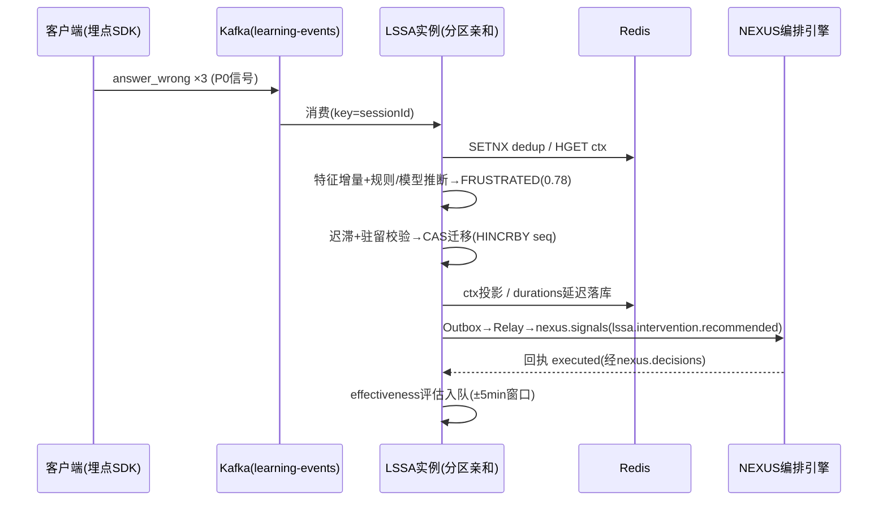
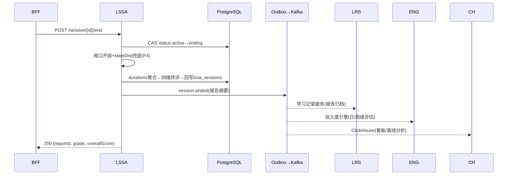

# 服务端 - 学习状态实时感知与会话质量动态评估引擎

> 版本: v1.1 | 创建日期: 2026-06-15 | 最近更新: 2026-08-21 | 状态: 补全（原 v1.0 截断于 §3.2.1 字段说明处，§3.2 其余键位、API、流程、代码、状态机守卫、幂等、事件、错误码、降级、监控、合规、契约、验收章节全缺，v1.1 补齐；缺陷修复见 §18 F1-F6）

## 1. 概述

### 1.1 模块定位

学习状态实时感知与会话质量动态评估引擎（Real-time Learning State Sensing & Session Quality Assessment Engine，简称 **LSSA**）是 PrimeTop 学习体验优化层的**实时感知中枢**。它在学习会话进行期间，持续采集、分析学生的行为信号，推断其当前认知与情绪状态，输出实时会话质量评分，并在状态恶化时触发干预事件。

**核心职责：**
- 采集多渠道行为信号（答题节奏、阅读时长、输入犹豫、页面停留、重复尝试等）
- 基于多维特征向量实时推断学习状态（心流 / 专注 / 轻度困惑 / 挫败 / 疲劳 / 走神）
- 输出会话级质量评分（Session Quality Score, SQS）与子维度分数
- 当会话质量跌破阈值时，发布干预建议事件供下游模块消费
- 会话结束时生成会话质量报告，回写学习记录

**不在本模块范围内：**
- 跨会话的高效学习时段识别 → 见 `服务端-用户学习专注力分析与高效学习时段识别引擎-详细设计.md`
- 长期心理状态建模与动机激励策略 → 见 `服务端-学生心理状态建模与学习动机激励策略引擎-详细设计.md`
- 学习倦怠量化与长期预警 → 见 `服务端-学习动力量化与学习倦怠预警引擎-详细设计.md`
- 行为数据采集管线本身 → 见 `练习答题行为数据采集与学习过程分析引擎-详细设计.md`
- AI 对话内的情感感知 → 见 `服务端-AI辅导对话情感感知与自适应回应策略引擎-详细设计.md`
- 内容推荐与难度调节 → 见 `自适应学习与个性化推荐引擎-详细设计.md`

### 1.2 为什么需要此引擎

| 现有模块 | 关注层面 | 缺失 |
|----------|---------|------|
| 专注力分析引擎 | 哪些**时段**学生最专注（历史统计） | 无法回答"此刻这名学生是否还在专注" |
| 心理状态建模 | 学生**长期**动机/焦虑/自我效能感 | 粒度太粗，无法驱动秒级/分钟级干预 |
| 倦怠预警引擎 | 学生是否会**流失/倦怠**（天/周级） | 不处理会话内的即时挫败感 |
| 行为数据采集 | 采集答题事件流（数据管道） | 只采集不推断 |
| AI 对话情感感知 | **AI对话**这一个渠道的情绪 | 不覆盖练习、阅读、复习等其他学习模式 |
| 自适应推荐 | 推荐什么**内容** | 不感知学生此刻是否有状态继续学习 |

**LSSA 填补的空白：** 在**任意学习模式的会话内**，以秒/分钟粒度持续推断学生状态，驱动实时干预。

### 1.3 设计目标

| 目标 | 指标 |
|------|------|
| 状态推断延迟 | 从信号产生到状态更新 < 3s（P95） |
| 推断准确率 | 与用户自评对照，加权 kappa ≥ 0.6 |
| 事件投递可靠性 | 干预事件至少一次投递，丢失率 < 0.01% |
| 会话评分覆盖率 | 所有 ≥ 3 分钟的学习会话均有质量评分 |
| 系统开销 | 服务端口径（v1.1 重锚，F6）：单信号摄入+特征增量 P99 < 50ms；单实例吞吐 ≥ 5,000 signals/s；单活跃会话 Redis 内存 < 1.5KB（含 Stream 尾部） |
| 可用性 | 99.9%（LSSA 降级时仅关闭干预，不影响核心学习流程） |

### 1.4 适用场景

| 场景 | 学习模式 | LSSA 作用 |
|------|---------|----------|
| 学生做练习题 | 练习/测评 | 连续答错时降低难度或建议休息 |
| 学生阅读知识点讲解 | 同步课堂/知识浏览 | 长时间无滚动/回退时提示"需要换种讲法？" |
| 学生与AI对话学习 | AI辅导 | 多次追问同一问题 → 触发话题切换/简化 |
| 学生复习错题 | 错题复习 | 快速跳过/秒答 → 检测到走神模式 |
| 学生背诵练习 | 文科背诵 | 多次背诵失败 → 建议分段或休息 |

### 1.5 依赖关系

```
                        ┌─────────────────────┐
                        │  行为数据采集管线     │
                        │  (答题/阅读/输入事件)  │
                        └─────────┬───────────┘
                                  │ 实时事件流
                                  ▼
┌──────────────┐         ┌───────────────────┐         ┌──────────────┐
│ 学生画像服务   │────────▶│     LSSA 引擎     │─────────▶│ 干预编排服务   │
│ (基线状态)    │         │  - 信号聚合       │         │ (弹窗/提示/   │
└──────────────┘         │  - 状态推断       │         │  难度切换)    │
                         │  - 质量评分       │         └──────────────┘
┌──────────────┐         │  - 事件发布       │         ┌──────────────┐
│ 知识掌握度    │────────▶│                   │─────────▶│ 学习记录服务   │
│ UMFE         │         └───────────────────┘         │ (会话报告)    │
└──────────────┘                                        └──────────────┘
```

| 关联模块 | 依赖方向 | 数据 |
|---------|---------|------|
| 行为数据采集管线 | 输入 | 答题事件、阅读事件、输入事件、导航事件 |
| 学生画像服务 | 输入 | 学生基础信息、年级、历史专注力基线 |
| 知识掌握度引擎 (UMFE) | 输入 | 当前内容的知识点掌握度（用于区分"难"vs"走神"） |
| 自适应学习引擎 (ALP) | 双向 | ALP 提供当前难度参数；LSSA 反馈状态用于难度调节 |
| 干预编排服务 | 输出 | 干预建议事件（弹窗提示、难度切换、休息建议） |
| 学习记录与进度追踪 | 输出 | 会话质量报告（会话结束时） |
| 推送与通知服务 | 输出 | 长期低质量会话时通知家长（低频） |

---

## 2. 核心概念与数据模型

### 2.1 学习状态枚举 (LearningState)

LSSA 将学生的实时状态定义为 6 种互斥状态：

```typescript
enum LearningState {
  FLOW         = 'flow',         // 心流：高度专注、适度挑战、高效学习
  FOCUSED      = 'focused',      // 专注：正常学习，略微被动但有效
  CONFUSED     = 'confused',     // 轻度困惑：遇到理解难点，尚未产生挫败感
  FRUSTRATED   = 'frustrated',   // 挫败：持续困难，开始出现负面情绪
  FATIGUED     = 'fatigued',     // 疲劳：认知资源下降，反应变慢、错误率升高
  DISENGAGED   = 'disengaged',   // 走神/脱离：注意力涣散、机械操作或离开
}
```

**状态轴说明：**

```
  挑战 ↑
       │  FRUSTRATED    ←──┐
       │                  │
       │    FLOW          │ 状态恶化
       │                  │
       │  FOCUSED         │
       │                  │
       │  CONFUSED ──────►│
       │                  ▼
       │  FATIGUED ──► DISENGAGED
       └───────────────────────► 时间
```

### 2.2 行为信号定义 (BehaviorSignal)

LSSA 消费的原始行为信号统一抽象为 `BehaviorSignal`：

```typescript
interface BehaviorSignal {
  signalId: string;            // 信号唯一ID (ULID)
  sessionId: string;           // 学习会话ID
  studentId: string;           // 学生ID
  signalType: SignalType;      // 信号类型
  timestamp: string;           // ISO 8601 时间戳
  payload: Record<string, any>; // 类型特定载荷
  source: SignalSource;        // 信号来源
}

enum SignalType {
  // —— 答题类信号 ——
  ANSWER_SUBMITTED    = 'answer_submitted',     // 提交答案
  ANSWER_CORRECT      = 'answer_correct',        // 答案正确
  ANSWER_WRONG        = 'answer_wrong',          // 答案错误
  ANSWER_TIMEOUT      = 'answer_timeout',        // 答题超时
  HINT_REQUESTED      = 'hint_requested',        // 请求提示
  ANSWER_REVEALED     = 'answer_revealed',       // 查看了答案

  // —— 阅读类信号 ——
  PAGE_ENTER          = 'page_enter',            // 进入页面
  PAGE_LEAVE          = 'page_leave',            // 离开页面
  SCROLL              = 'scroll',                // 滚动
  CONTENT_REPLAY      = 'content_replay',        // 重新播放（视频/音频）
  TEXT_SELECT         = 'text_select',           // 文本选中

  // —— 输入类信号 ——
  TYPING_START        = 'typing_start',          // 开始输入
  TYPING_PAUSE        = 'typing_pause',          // 输入暂停（犹豫）
  TYPING_SUBMIT       = 'typing_submit',         // 提交输入
  VOICE_START         = 'voice_start',           // 开始语音输入
  VOICE_END           = 'voice_end',             // 结束语音输入

  // —— 导航类信号 ——
  NAV_BACK            = 'nav_back',              // 返回上一页
  NAV_FORWARD         = 'nav_forward',           // 前进
  NAV_SWITCH_TAB      = 'nav_switch_tab',        // 切换标签页
  APP_BACKGROUND      = 'app_background',        // APP进入后台
  APP_FOREGROUND      = 'app_foreground',        // APP回到前台

  // —— 交互类信号 ——
  BUTTON_CLICK        = 'button_click',          // 按钮点击
  RATING_SUBMITTED    = 'rating_submitted',      // 提交评价（如"有用"/"难"）
}

enum SignalSource {
  PRACTICE     = 'practice',      // 练习测评
  SYNC_COURSE  = 'sync_course',   // 同步课堂
  AI_DIALOGUE  = 'ai_dialogue',   // AI辅导对话
  MISTAKE_REVIEW = 'mistake_review', // 错题复习
  RECITATION   = 'recitation',    // 背诵练习
  READING      = 'reading',       // 阅读理解
}
```

### 2.3 特征向量 (FeatureVector)

从原始信号流中提取的滑动窗口特征向量：

```typescript
interface FeatureVector {
  sessionId: string;
  studentId: string;
  windowStart: string;     // 窗口开始时间
  windowEnd: string;       // 窗口结束时间
  windowSize: number;      // 窗口大小（秒），默认 120s

  // —— 答题特征 ——
  accuracyRate: number;        // 正确率 (0~1)，窗口内
  avgResponseTime: number;     // 平均答题耗时（秒）
  responseTimeStd: number;     // 答题耗时标准差
  responseTimeTrend: number;   // 答题耗时趋势 (-1~1，正值=变慢)
  consecutiveWrong: number;    // 连续错误次数
  consecutiveRight: number;    // 连续正确次数
  hintRequestRate: number;     // 请求提示比例 (0~1)
  answerRevealRate: number;    // 直接看答案比例 (0~1)
  skipRate: number;            // 跳过/秒答比例 (0~1)

  // —— 阅读特征 ——
  avgDwellTime: number;        // 平均页面停留时间（秒）
  dwellTimeStd: number;        // 停留时间标准差
  scrollVelocity: number;      // 滚动速度（px/s）
  scrollBackRate: number;      // 回滚比例 (0~1)
  replayRate: number;          // 内容重播比例 (0~1)
  readingProgress: number;     // 阅读进度 (0~1)

  // —— 输入特征 ——
  typingSpeed: number;         // 打字速度（字/分钟）
  typingPauseCount: number;    // 犹豫/停顿次数（>3s的停顿）
  typingPauseAvg: number;      // 平均停顿时长（秒）
  typingDeleteRate: number;    // 删除/修改比例 (0~1)
  voiceUsageRate: number;      // 语音输入使用比例 (0~1)

  // —— 导航特征 ——
  backNavCount: number;        // 返回导航次数
  tabSwitchCount: number;      // 切换标签次数
  appBackgroundDuration: number; // APP后台总时长（秒）
  appBackgroundCount: number;  // APP切后台次数

  // —— 上下文特征 ——
  sessionDuration: number;     // 会话已进行时长（秒）
  contentDifficultyGap: number; // 内容难度与能力差 (-3~3，正值=偏难)
  masteryLevel: number;        // 当前知识点掌握度 (0~1)
  timeOfDay: number;           // 当前时段 (0~24)
  fatigueBaseline: number;     // 疲劳基线 (0~1，来自历史数据)
}
```

### 2.4 状态推断结果 (StateInference)

```typescript
interface StateInference {
  inferenceId: string;          // 推断ID
  sessionId: string;
  studentId: string;
  timestamp: string;            // 推断时间
  currentState: LearningState;  // 当前最可能状态
  stateProbabilities: Record<LearningState, number>; // 各状态概率分布
  confidence: number;           // 推断置信度 (0~1)
  features: FeatureVector;      // 本次推断使用的特征向量
  triggerSignals: string[];     // 触发本次状态变化的关键信号描述
}

// 示例
{
  inferenceId: "01HZ8X...",
  sessionId: "sess_20260615_001",
  studentId: "stu_12345",
  timestamp: "2026-06-15T10:23:45.000Z",
  currentState: "frustrated",
  stateProbabilities: {
    flow: 0.03,
    focused: 0.10,
    confused: 0.22,
    frustrated: 0.52,
    fatigued: 0.08,
    disengaged: 0.05
  },
  confidence: 0.78,
  triggerSignals: [
    "连续答错 ×3",
    "答题耗时趋势上升 2.4x",
    "输入停顿次数 ×5"
  ]
}
```

### 2.5 会话质量评分 (SessionQualityScore)

```typescript
interface SessionQualityScore {
  sessionId: string;
  studentId: string;
  // —— 综合评分 ——
  overallScore: number;         // 综合质量分 (0~100)

  // —— 子维度评分 ——
  engagementScore: number;      // 投入度 (0~100)
  effectivenessScore: number;   // 有效度 (0~100)
  persistenceScore: number;     // 坚持度 (0~100)
  comprehensionScore: number;   // 理解度 (0~100)

  // —— 状态分布 ——
  stateDistribution: Record<LearningState, number>; // 各状态时长占比

  // —— 关键指标 ——
  productiveTime: number;       // 高效学习时间（秒），处于 flow/focused 状态
  wastedTime: number;           // 低效时间（秒），处于 disengaged 状态
  struggleTime: number;         // 挣扎时间（秒），处于 confused/frustrated 状态
  interventionCount: number;    // 触发干预次数
  interventionEffectRate: number; // 干预有效率 (0~1)

  // —— 评级 ——
  grade: SessionGrade;          // A~F 评级

  evaluatedAt: string;
}

enum SessionGrade {
  EXCELLENT = 'A',   // ≥85: 高效心流会话
  GOOD      = 'B',   // 70~84: 专注有效
  FAIR      = 'C',   // 55~69: 有一定效果但存在波动
  POOR      = 'D',   // 40~54: 效率低下，挣扎或走神较多
  BAD       = 'F',   // <40: 极低效，几乎无有效学习
}
```

### 2.6 干预建议事件 (InterventionEvent)

```typescript
interface InterventionEvent {
  eventId: string;               // 事件ID
  sessionId: string;
  studentId: string;
  timestamp: string;
  triggerState: LearningState;   // 触发状态
  triggerScore: number;          // 触发时的质量分
  interventionType: InterventionType;
  priority: InterventionPriority;
  payload: InterventionPayload;
  expiryAt: string;              // 过期时间（超时后不再执行）
}

enum InterventionType {
  HINT_SUGGESTION     = 'hint_suggestion',      // 建议查看提示
  DIFFICULTY_DOWN     = 'difficulty_down',      // 降低难度
  DIFFICULTY_UP       = 'difficulty_up',         // 提升难度（走神/太简单）
  BREAK_SUGGESTION    = 'break_suggestion',      // 建议休息
  TOPIC_SWITCH        = 'topic_switch',          // 建议切换主题
  ENCOURAGEMENT       = 'encouragement',         // 鼓励激励
  REEXPLAIN           = 'reexplain',             // 换一种讲法
  SESSION_END_SUGGEST = 'session_end_suggest',   // 建议结束会话
  PARENT_NOTIFY       = 'parent_notify',         // 通知家长（低频）
}

enum InterventionPriority {
  LOW    = 'low',
  MEDIUM = 'medium',
  HIGH   = 'high',
  URGENT = 'urgent',
}

// 载荷根据 interventionType 不同而不同
type InterventionPayload =
  | HintInterventionPayload
  | DifficultyInterventionPayload
  | BreakInterventionPayload
  | TopicSwitchInterventionPayload
  | EncouragementPayload
  | ReexplainPayload
  | SessionEndSuggestionPayload   // v1.1 补（F1）
  | ParentNotifyPayload;         // v1.1 补（F1）

interface HintInterventionPayload {
  questionId: string;
  hintLevel: number;       // 提示级别 1~3
  hintText: string;        // 预生成提示文本
}

interface DifficultyInterventionPayload {
  currentDifficulty: number;
  suggestedDifficulty: number;
  reason: string;
}

interface BreakInterventionPayload {
  elapsedMinutes: number;
  suggestedBreakMinutes: number;
  message: string;
}

interface TopicSwitchInterventionPayload {
  currentTopic: string;
  suggestedTopic: string;
  reason: string;
}

interface EncouragementPayload {
  message: string;
  achievementHighlight: string;  // 亮点引用，如"你已连续答对5题"
}

interface ReexplainPayload {
  contentId: string;
  alternativeStyle: 'simpler' | 'analogy' | 'visual' | 'step_by_step';
  reason: string;
}

// v1.1 补（F1）：v1.0 联合类型缺失以下两类载荷，导致 SESSION_END_SUGGEST 与
// PARENT_NOTIFY 两种 InterventionType 无类型约束，序列化侧只能退化 Record<string,any>。
interface SessionEndSuggestionPayload {
  sessionDurationMin: number;      // 已学习时长（分钟）
  qualityGrade: SessionGrade;      // 当前会话评级
  suggestedNextAction: 'rest' | 'switch_subject' | 'review_mistakes';
  message: string;                // 适龄化文案（经 NEXUS 模板引擎渲染）
}

interface ParentNotifyPayload {
  notifyReason: 'low_quality_streak' | 'fatigue_streak' | 'excessive_duration';
  streakDays: number;             // 连续低质会话天数（仅 low_quality_streak）
  sessionSummary: string;         // 聚合摘要（不含单题作答明细，C5 最小化）
  frequencyGuardKey: string;      // 频控键（7 天 ≤1 次，G5），由 LSSA 预检后传递
}
```

---

## 3. 数据库设计

### 3.1 PostgreSQL 表结构

#### 3.1.1 学习会话表 (`lssa_sessions`)

```sql
CREATE TABLE lssa_sessions (
    session_id          VARCHAR(64)   PRIMARY KEY,
    student_id          VARCHAR(64)   NOT NULL,
    session_source      VARCHAR(32)   NOT NULL,    -- practice/sync_course/ai_dialogue/...
    subject             VARCHAR(16),
    knowledge_point_ids TEXT[],                    -- 涉及的知识点ID列表
    started_at          TIMESTAMPTZ   NOT NULL,
    ended_at            TIMESTAMPTZ,
    last_activity_at    TIMESTAMPTZ   NOT NULL,
    status              VARCHAR(16)   NOT NULL DEFAULT 'active', -- active/ended/expired
    initial_state       VARCHAR(16),               -- 会话开始时的初始状态
    final_state         VARCHAR(16),               -- 会话结束时的最终状态
    overall_score       SMALLINT,                  -- 综合质量分 0~100
    engagement_score    SMALLINT,
    effectiveness_score SMALLINT,
    persistence_score   SMALLINT,
    comprehension_score SMALLINT,
    session_grade       CHAR(1),                   -- A~F
    productive_time_sec INT,
    wasted_time_sec     INT,
    struggle_time_sec   INT,
    intervention_count  SMALLINT    DEFAULT 0,
    signal_count        INT         DEFAULT 0,
    metadata            JSONB,
    created_at          TIMESTAMPTZ DEFAULT NOW(),
    updated_at          TIMESTAMPTZ DEFAULT NOW()
);

CREATE INDEX idx_lssa_sessions_student   ON lssa_sessions (student_id, started_at DESC);
CREATE INDEX idx_lssa_sessions_active    ON lssa_sessions (status, last_activity_at) WHERE status = 'active';
CREATE INDEX idx_lssa_sessions_date      ON lssa_sessions (started_at DESC);
CREATE INDEX idx_lssa_sessions_score     ON lssa_sessions (student_id, overall_score, started_at DESC);

COMMENT ON TABLE lssa_sessions IS 'LSSA 学习会话质量评估主表';
```

#### 3.1.2 状态推断历史表 (`lssa_state_inferences`)

```sql
CREATE TABLE lssa_state_inferences (
    inference_id        VARCHAR(64)   PRIMARY KEY,
    session_id          VARCHAR(64)   NOT NULL REFERENCES lssa_sessions(session_id),
    student_id          VARCHAR(64)   NOT NULL,
    inferred_state      VARCHAR(16)   NOT NULL,    -- flow/focused/confused/...
    state_probabilities JSONB         NOT NULL,    -- {flow:0.1, focused:0.2, ...}
    confidence          REAL          NOT NULL,    -- 0~1
    trigger_signals     TEXT[],                    -- 关键触发信号描述
    feature_snapshot    JSONB,                     -- 完整特征向量快照
    inferred_at         TIMESTAMPTZ   NOT NULL,
    created_at          TIMESTAMPTZ   DEFAULT NOW()
);

CREATE INDEX idx_lssa_inferences_session ON lssa_state_inferences (session_id, inferred_at);
CREATE INDEX idx_lssa_inferences_state   ON lssa_state_inferences (student_id, inferred_state, inferred_at DESC);

-- 分区策略：按月分区（推断记录写入频繁）
-- CREATE TABLE lssa_state_inferences_202606 PARTITION OF lssa_state_inferences
--     FOR VALUES FROM ('2026-06-01') TO ('2026-07-01');

COMMENT ON TABLE lssa_state_inferences IS 'LSSA 状态推断历史记录';
```

#### 3.1.3 状态时长统计表 (`lssa_state_durations`)

```sql
CREATE TABLE lssa_state_durations (
    id                  BIGSERIAL     PRIMARY KEY,
    session_id          VARCHAR(64)   NOT NULL REFERENCES lssa_sessions(session_id),
    student_id          VARCHAR(64)   NOT NULL,
    state               VARCHAR(16)   NOT NULL,
    started_at          TIMESTAMPTZ   NOT NULL,
    ended_at            TIMESTAMPTZ   NOT NULL,
    duration_sec        INT           NOT NULL,
    created_at          TIMESTAMPTZ   DEFAULT NOW()
);

CREATE INDEX idx_lssa_durations_session ON lssa_state_durations (session_id, state);
CREATE INDEX idx_lssa_durations_student ON lssa_state_durations (student_id, state, started_at DESC);

COMMENT ON TABLE lssa_state_durations IS 'LSSA 各状态持续时段记录，用于状态分布统计';
```

#### 3.1.4 干预事件表 (`lssa_intervention_events`)

```sql
CREATE TABLE lssa_intervention_events (
    event_id            VARCHAR(64)   PRIMARY KEY,
    session_id          VARCHAR(64)   NOT NULL REFERENCES lssa_sessions(session_id),
    student_id          VARCHAR(64)   NOT NULL,
    trigger_state       VARCHAR(16)   NOT NULL,
    trigger_score       SMALLINT,
    intervention_type   VARCHAR(32)   NOT NULL,
    priority            VARCHAR(16)   NOT NULL DEFAULT 'medium',
    payload             JSONB,
    status              VARCHAR(16)   NOT NULL DEFAULT 'pending', -- pending/delivered/executed/dismissed/expired
    delivered_at        TIMESTAMPTZ,
    executed_at         TIMESTAMPTZ,
    dismissed_at        TIMESTAMPTZ,
    expiry_at           TIMESTAMPTZ,
    effectiveness       VARCHAR(16),               -- positive/neutral/negative (干预后状态是否改善)
    created_at          TIMESTAMPTZ   DEFAULT NOW()
);

CREATE INDEX idx_lssa_events_session ON lssa_intervention_events (session_id, created_at);
CREATE INDEX idx_lssa_events_status  ON lssa_intervention_events (status, priority, expiry_at) WHERE status = 'pending';
CREATE INDEX idx_lssa_events_student ON lssa_intervention_events (student_id, created_at DESC);

COMMENT ON TABLE lssa_intervention_events IS 'LSSA 干预事件记录';
```

#### 3.1.5 学生状态基线表 (`lssa_student_baselines`)

```sql
CREATE TABLE lssa_student_baselines (
    student_id          VARCHAR(64)   PRIMARY KEY,
    avg_session_score   SMALLINT,     -- 近30天平均会话质量分
    avg_engagement      SMALLINT,     -- 近30天平均投入度
    avg_effectiveness   SMALLINT,
    avg_persistence     SMALLINT,
    flow_rate           REAL,         -- 心流状态占比 (0~1)
    disengage_rate      REAL,         -- 走神状态占比 (0~1)
    avg_session_minutes REAL,         -- 平均会话时长（分钟）
    typical_states      JSONB,        -- 各状态的典型占比分布
    updated_at          TIMESTAMPTZ   DEFAULT NOW()
);

COMMENT ON TABLE lssa_student_baselines IS '学生历史状态基线，用于个性化状态校准';
```

### 3.2 Redis 缓存设计

#### 3.2.1 活跃会话上下文

```
Key:   lssa:session:{sessionId}:ctx
Type:  Hash
TTL:   3h（会话超时自动过期）

Fields:
  studentId        → 学生ID
  source           → 学习模式
  currentState     → 当前状态
  stateSince       → 当前状态开始时间（epoch 毫秒）
  previousState    → 上一状态
  confidence       → 最近一次推断置信度 (0~1)
  sqs              → 实时滚动质量分 (0~100，10 分钟滚动窗)
  featureVersion   → 特征窗口版本号（单调递增）
  modelVersion     → 推断模型版本（如 rule-only / gbm-v1.2）
  configVersion    → 决策配置版本
  signalCount      → 已接收有效信号数
  seq              → 状态事件发布序号（单调递增）
  startedAt        → 会话开始时间（epoch 毫秒）
  lastActivityAt   → 最近活动时间（epoch 毫秒）
  interveneCount   → 本会话已触发干预数
  degradeFlags     → 当前降级标记（JSON 数组字符串，如 ["D3"]）
  stateDist        → 各状态累计毫秒（JSON 对象字符串，报告兜底用）
```

字段说明：
- `stateDist` 因 Redis Hash 不支持嵌套，序列化为 JSON 字符串存储；在状态切换与每 60s 心跳时累加，作为会话报告的兜底数据源（正常路径以 `lssa_state_durations` 为权威）。
- `seq` 由 Redis `INCR` 维护，保证同一会话内状态事件的发布顺序，供多端消费方丢弃乱序旧事件。
- 会话上下文为 LSSA 单写者模型（守卫 G1），读写均以 `sessionId` 为键。

#### 3.2.2 信号幂等去重键

```
Key:   lssa:dedup:{signalId}
Type:  String (SET NX EX)
TTL:   600s（10 分钟去重窗口）
Value: "1"
```

说明：
- Kafka 至少一次投递 + 客户端断网重放都会产生重复信号。摄入层以 `signalId` 执行 SETNX，键已存在则直接 ACK 跳过（守卫 G10，对应错误码 58204 的 200 语义，不向上游报错）。
- 窗口取 10 分钟，覆盖 Kafka 消费者最大重试间隔；超过 10 分钟的重复信号即便漏拦，也会被 120s 特征环自然淘汰，不影响推断结果（双保险）。

#### 3.2.3 干预频控键族

```
会话内冷却（干预类型粒度）:
Key:   lssa:intv:cool:{sessionId}:{interventionType}
Type:  String (SET NX EX)
TTL:   冷却窗时长，按类型配置（见 §4.5 决策矩阵）

家长通知频控（守卫 G5）:
Key:   lssa:pnfg:{studentId}
Type:  String (SET NX EX)
TTL:   604800s（7 天，周期内 PARENT_NOTIFY 至多 1 次）

自评频控:
Key:   lssa:selfreport:{studentId}
Type:  String (SET NX EX)
TTL:   600s（10 分钟 1 次）
```

说明：冷却键创建成功才允许生成本次干预事件（生成即占位，与 `interveneCount` 计数共同构成会话内两道频控）；跨会话/跨来源的全局疲劳频控不在 LSSA 实现，最终裁决权在 NEXUS 干预编排引擎（契约 R1）。

#### 3.2.4 学生基线缓存

```
Key:   lssa:baseline:{studentId}
Type:  String (JSON)
TTL:   86400s（24h）
Value: lssa_student_baselines 行 JSON + 派生参数
       （personalMedianResponseTime / fatigueOnsetMin / typicalStates 等）
```

说明：日终基线任务（§4.7）重算后主动 `DEL` 失效（写时失效优先，TTL 兜底）；未命中时回源 PG 并回填，首次建档学生返回默认基线（`baselineReady=false`，推断使用人群默认参数）。

#### 3.2.5 决策配置缓存（版本化双缓冲）

```
Key:   lssa:config:decision:{configVersion}
Type:  String (JSON)
TTL:   当前版本不过期；历史版本 86400s 自然淘汰
Value: 干预决策矩阵 / 规则阈值 / 冷却窗 / 权重等运行时配置
```

说明：配置只新增版本、不原地覆写（避免半更新态）；实例本地 Caffeine 缓存 5 分钟，每次推断前比对 ctx 中 `configVersion` 与本地版本，不一致则拉取新版（热更新生效延迟 ≤ 一路特征环周期 + 5min 本地缓存）。

#### 3.2.6 活跃会话索引

```
Key:   lssa:active:sessions
Type:  ZSET
Score: lastActivityAt（epoch 毫秒）
Member: sessionId
```

用途：空闲扫描器每 60s 执行 `ZRANGEBYSCORE key -inf (now-300000)`，命中的会话触发 idle 收口（§4.6）；同时用于实例重平衡后的会话接管发现。ZSET 条目在会话结束时 `ZREM`；遗漏条目由 ctx 3h TTL 过期后经每日清理任务对账删除（§9 对账 R-3）。

#### 3.2.7 Redis 键总表与内存估算

| 键模式 | 类型 | TTL | 说明 |
|--------|------|-----|------|
| `lssa:session:{sessionId}:ctx` | Hash | 3h（滑动续期） | 会话上下文，单写者 G1 |
| `lssa:dedup:{signalId}` | String | 600s | 信号去重 |
| `lssa:intv:cool:{sessionId}:{type}` | String | 按类型 | 干预会话内冷却 |
| `lssa:pnfg:{studentId}` | String | 7d | 家长通知频控 G5 |
| `lssa:selfreport:{studentId}` | String | 600s | 自评频控 |
| `lssa:baseline:{studentId}` | String | 24h | 基线缓存 |
| `lssa:config:decision:{version}` | String | 版本化 | 决策配置 |
| `lssa:active:sessions` | ZSET | 条目级 | 活跃索引 |

内存估算（峰值 30 万活跃会话，DAU 50 万口径）：ctx ≈ 0.8KB × 30 万 = 240MB；dedup 峰值 8 万键 ≈ 6MB；ZSET 30 万条 ≈ 30MB；冷却键峰值 10 万 ≈ 10MB；基线缓存（活跃学生 24h 内收敛）≈ 200MB。合计 < 550MB，单会话均摊 < 1.5KB，满足 §1.3 目标。

> **为什么不设计信号缓冲 Stream（v1.1 裁决）：** 特征窗口仅 120s，具备自愈性——实例崩溃后特征环可在 ≤2min 内由新信号重建，无需在 Redis 中保留原始信号重放缓冲（30 万会话 × 环形缓冲将是 GB 级开销）。崩溃恢复策略见 §3.3 与降级 D7。

### 3.3 崩溃恢复策略

| 项目 | 处理 |
|------|------|
| 内存特征丢失 | 由后续信号自然重建（≤120s 窗口自愈）；重建期内抑制状态迁移（维持 ctx 中 `currentState`），推断标记 `degraded=["D7"]`，≤2min 或首个答题类信号到达后解除 |
| 会话上下文 | ctx Hash 落在 Redis（TTL 3h），实例无状态，接管实例从 ctx 冷启动 |
| 接管发现 | 消费者组重平衡后，新归属实例依据 ZSET + ctx 恢复运行时；同一会话同一时刻仅一个活跃消费者（分区亲和，G1） |
| 状态时长 | `stateDist`（ctx 字段）为崩溃兜底数据源；正常路径以 `lssa_state_durations` 为权威（§3.2.1 字段说明一致） |
| 会话报告 | 报告生成时 durations 缺失段落以 stateDist 补齐并打 `report_flags=["state_dist_fallback"]`（F4，§4.6） |

---

## 4. 核心流程设计

### 4.1 信号摄入管线

**事件来源：** Kafka topic `learning-events`（统一埋点平台事件总线，CEP 引擎同源双消费，契约 R6/R7）。LSSA 消费者组 `lssa-engine`，**partition key = sessionId**——同会话信号严格有序且固定路由到同一实例，这是会话上下文单写者模型（G1）的实现基础。

```
埋点平台(learning-events) ──▶ LSSA 摄取消费者组(lssa-engine)
                                 │  ① Schema 校验(白名单)
                                 │  ② 会话归属(懒建档)
                                 │  ③ SETNX 幂等去重
                                 │  ④ 时钟裁决
                                 │  ⑤ 特征增量更新(featureVersion++)
                                 │  ⑥ 触发判定 → 状态推断
                                 │  ⑦ 状态迁移仲裁 → ctx 投影 + Outbox
                                 │  ⑧ 心跳维护(ZADD/EXPIRE)
                                 ▼
                          lssa-signals-dlq（死信，仅①失败）
```

**处理步骤（8 步）：**

1. **反序列化与 Schema 校验**：按 `signalType × source` 白名单校验（白名单随决策配置版本化）；非法事件写入死信 topic `lssa-signals-dlq` 并计入监控 M8，不重试。
2. **会话归属**：查 ctx；不存在则懒建档——`INSERT ... ON CONFLICT (session_id) DO NOTHING` 写 `lssa_sessions(active)`，初始化 ctx（`initial_state='focused'`）并 `ZADD` 活跃索引。
3. **幂等去重**：`SET lssa:dedup:{signalId} 1 NX EX 600`；已存在则 ACK 跳过（G10）。
4. **时钟裁决**：以**服务端接收时间**为特征计算权威时钟；客户端 `timestamp` 偏差 > 120s 时标记 `clockSkew`（埋点统计，降级 D9），偏差信号的时间字段以接收时间校正后使用。
5. **特征增量更新**：按 §4.2 映射表更新内存特征环，`featureVersion++`。
6. **触发判定**：满足 §4.3.1 条件则同步执行状态推断（推理预算 10ms，规则 + LightGBM 均为内嵌轻量推理，不异步化以避免乱序）。
7. **状态迁移仲裁**：通过迟滞/最短驻留校验后 CAS 提交（§4.3.5），ctx 写投影 + `HINCRBY seq` + Outbox 同事务（§9）。
8. **心跳维护**：`HMSET lastActivityAt`、`EXPIRE` 滑动续期、`ZADD` 更新活跃索引 score。

**信号分级与背压（D1）：**

| 级别 | 信号 | 积压策略 |
|------|------|---------|
| P0 | `answer_*`、`hint_requested`、`answer_revealed` | 全量处理，永不丢弃 |
| P1 | `page_enter/leave`、`typing_*`、`nav_*`、`app_*` | 消费 lag > 60s 时降频采样（保留首尾） |
| P2 | `scroll`、`text_select`、`content_replay`、`button_click` | lag > 60s 优先整批丢弃 |

高频事件（scroll/text_select 等）由埋点平台客户端 SDK 30s 聚合（计数 + 均值）后上报；LSSA 解包为虚拟信号（`signalId = 批次ID:序号`，保持幂等语义），解包上限 50 条/批，超限截断并埋点。

### 4.2 特征窗口增量维护

内存结构（每会话，约 6KB）：

```java
class FeatureWindow {
    String sessionId;
    Deque<AnswerEvent> answerRing;      // 120s 环：(t, durationMs, correct)
    Deque<DwellEvent> dwellRing;        // 120s 环：(t, dwellSec, pageId)
    Deque<PauseEvent> pauseRing;        // 120s 环：(t, pauseSec)
    Counters c;                          // consecutiveWrong/Right、backNav、tabSwitch...
    int featureVersion;                  // 单调递增
    long windowStartMs;
    ScheduledEviction eviction;          // 30s 淘汰过期环元素
}
```

**信号 → 特征增量映射（核心表）：**

| 信号 | 特征更新 |
|------|---------|
| `ANSWER_SUBMITTED` | `answerRing.push`；`avgResponseTime/responseTimeStd` 用 Welford 增量重算；`responseTimeTrend = mean(后半窗)/mean(前半窗) - 1`（clip ±1） |
| `ANSWER_CORRECT` / `ANSWER_WRONG` | `accuracyRate` 增量分子分母；`consecutiveRight/Wrong` 互斥重置 |
| `HINT_REQUESTED` | `hintRequestRate` 分子 +1 |
| `ANSWER_REVEALED` | `answerRevealRate` 分子 +1；`skipRate` 分子 +1（看答案 ≈ 放弃作答） |
| `PAGE_LEAVE` | `dwellRing.push(停留时长)`；`avgDwellTime/dwellTimeStd` 增量；`readingProgress` 由 source 模块 payload 带入 |
| `SCROLL`（聚合批） | `scrollVelocity`（批次均值）；`scrollBackRate` 分子按回滚批计数 |
| `CONTENT_REPLAY` | `replayRate` 分子 +1 |
| `TYPING_PAUSE` | `pauseRing.push`；`typingPauseCount/Avg` 增量；>3s 判犹豫 |
| `TYPING_SUBMIT` | `typingSpeed`、`typingDeleteRate`（payload 删除次数/总键数） |
| `NAV_BACK` / `NAV_SWITCH_TAB` | `backNavCount` / `tabSwitchCount` +1 |
| `APP_BACKGROUND/FOREGROUND` | `appBackgroundDuration/Count` 增量（配对计时） |
| `RATING_SUBMITTED` | 不入特征环，仅记录（自评走 §5.1 独立 API） |

**个人基线派生特征（8 维）：** `avgResponseTime/accuracyRate/avgDwellTime/typingSpeed/skipRate` 相对基线的 z-score（截断 ±3），基线缺失时置 0（人群中性）。

**上下文特征：** `contentDifficultyGap` 由 source 模块事件 payload 携带（ALP 自适应引擎当前难度 - 学生能力 θ）；`masteryLevel` 经 UMFE `BatchGetMastery` RPC 只读获取（§4.3.6），带 60s 本地缓存。

### 4.3 状态推断引擎

#### 4.3.1 双触发机制（F3 修复）

| 触发源 | 条件 | 目的 |
|--------|------|------|
| 事件触发 | 答题类信号（P0）恒触发；其余信号距上次推断 ≥5s 且 `featureVersion` 增量 ≥3 | 关键行为即时响应 |
| 心跳触发 | 每 60s 定时 | 捕获纯静默（无信号也是特征） |
| 空闲强制触发 | `lastActivityAt` 超 120s 未更新 | 以"静默特征"推断（`app_background_duration` 主导 → DISENGAGED 候选） |

v1.0 仅定义了推断模型未定义触发时机，导致"信号稀疏的阅读/背诵会话永远不更新状态"；v1.1 以心跳 + 空闲双兜底修复。

#### 4.3.2 规则层（rule-only）

规则按优先级短路执行，命中即返回 `(state, strength, triggerSignals)`：

| 优先级 | 规则 | 判定条件（阈值随 configVersion 可调） | 输出状态 |
|--------|------|--------------------------------------|---------|
| R1 | 离席 | `appBackgroundDuration > 60s`（窗口内） | DISENGAGED |
| R2 | 机械操作 | `skipRate ≥ 0.6` 或（`avgResponseTime < 0.25 × 个人基线中位` 且连续 ≥3 题） | DISENGAGED |
| R3 | 挫败 | `consecutiveWrong ≥ 3` 且 `responseTimeTrend > 0.5` | FRUSTRATED |
| R4 | 困惑（练习） | `consecutiveWrong ≥ 2` 且（`hintRequestRate ≥ 0.3` 或 `masteryLevel < 0.4`） | CONFUSED |
| R5 | 困惑（阅读） | `replayRate ≥ 0.4` 或 `scrollBackRate ≥ 0.4` | CONFUSED |
| R6 | 疲劳 | `sessionDuration > fatigueOnsetMin`（个人基线派生，默认 25min）且耗时上升趋势且正确率下降趋势 | FATIGUED |
| R7 | 浅读 | `scrollVelocity > 2 × 基线` 且 `avgDwellTime < 8s` 且 `backNavCount ≥ 3` | DISENGAGED |
| R8 | 心流 | `accuracyRate ≥ 0.8` 且耗时稳定/下降 且无导航抖动 且 `difficultyGap ∈ [0, 1]` 且 `sessionDuration ≥ 180s` | FLOW |
| R9 | 专注 | `accuracyRate ≥ 0.6` 且无 R1-R8 命中 | FOCUSED |
| R10 | 默认 | 以上均不命中（信号过少） | 维持当前状态 |

规则层恒执行：① 模型不可用时是唯一推断来源（降级 D3）；② `triggerSignals` 解释生成器（模型层不产生可解释触发描述，规则描述随模型结果一并落库）；③ 模型灰度期的对照基线（§4.3.3）。

#### 4.3.3 模型层

- **模型：** LightGBM 多分类（6 类），输入 42 维 = §2.3 特征 29 维数值 + 8 维个人基线 z-score + 5 维上下文派生（时段 sin/cos 编码、source one-hot 压缩 2 维、信号密度）。
- **推理：** ONNX Runtime Java 内嵌，单次 < 2ms，无外部调用。
- **校准：** Platt scaling；`confidence = p_top1 − p_top2`（校准后概率）。
- **版本与灰度：** `modelVersion` 管理；管理端发布走 0 → 5% → 25% → 100% 灰度（按 studentId 尾号分桶）；灰度期与 rule-only 双跑，状态判定差异率 > 15% 自动阻断放量（M9）。
- **训练闭环：** 自评数据（§5.1，M10）+ 标注样本季度回流训练；模型评测基准详见《AI模型评测基准与质量回归测试系统》。

#### 4.3.4 置信度门槛（F3 修复）

- `confidence < 0.5`：**维持当前状态不迁移**，记录 `lowConfidenceCount`；
- 连续 3 次低置信且会话 ≥5min：状态回落 FOCUSED（防止会话全程卡死在错误初态）；
- 模型层与规则层结论冲突且两者置信均 ≥0.6：**取更保守（状态分更低）者**——宁可低估不可高估（学生体验安全优先）。

#### 4.3.5 状态迁移仲裁

迁移条件（全部满足）：

1. 新状态 ≠ 当前状态；
2. 迟滞：`p_new − p_current ≥ 0.15`（G4）；
3. 最短驻留：当前状态已持续 ≥30s（G3）；安全例外——切向 FRUSTRATED 且 `confidence ≥ 0.8` 时缩短为 15s（尽早干预挫败）。

仲裁提交（CAS，防并发双写）：

```
WATCH lssa:session:{id}:ctx 的 featureVersion
MULTI
  HSET ctx currentState/previousState/stateSince/confidence/sqs/degradeFlags
  HINCRBY ctx seq 1
  LPUSH 内存 pendingDurations（关闭旧状态段/开启新段）
EXEC
→ 事务内同步写 lssa_outbox（state.changed，携带 seq）
→ EXEC 失败（featureVersion 已变）→ 放弃迁移，重读 ctx 进入下一轮
```

状态段（durations）采用**延迟批量落库**：内存保留最近 3 个开段，状态切换时 flush 前两段至 `lssa_state_durations`；会话结束时统一收口（F4 兜底见 §4.6）。

#### 4.3.6 "难" vs "走神"区分（UMFE 融合）

同一"连续答错"特征在不同掌握度下语义相反：

| 观察 | masteryLevel（UMFE） | 判定 |
|------|---------------------|------|
| 连错 ×3、耗时上升 | ≥ 0.6（内容本应掌握） | DISENGAGED 倾向（会而不学，加权重） |
| 连错 ×3、耗时上升 | < 0.4（新知识/薄弱点） | CONFUSED/FRUSTRATED 主导 |
| 连错 ×3、耗时上升 | 0.4 ~ 0.6 | 模型层综合判定，规则层不干预 |

UMFE 不可用时 `masteryLevel` 取 0.5 中性值（降级 D4），并在 ctx `degradeFlags` 追加 `"D4"`。

### 4.4 会话质量评分（SQS）

**两套口径：**

| 口径 | 数据源 | 用途 |
|------|--------|------|
| 滚动分（实时） | 内存特征环 + 状态时长（10min 滚动窗） | ctx.sqs、客户端实时展示、干预触发依据 |
| 终评（权威） | `lssa_state_durations` 全量 + 全会话特征 | 会话报告、基线更新、下游消费（唯一权威） |

**状态分基表（stateScore）：** FLOW=1.0、FOCUSED=0.8、CONFUSED=0.55、FATIGUED=0.45、FRUSTRATED=0.35、DISENGAGED=0.15。

**四子维度（终评公式）：**

```
engagementScore     = 100 × (0.6 × (1 − disengageRatio) + 0.4 × activityConsistency)
                      // disengageRatio: DISENGAGED 时长占比；activityConsistency: 信号间隔变异系数的归一化逆
effectivenessScore  = 100 × (0.5 × accuracy + 0.3 × (1 − answerRevealRate − skipRate) + 0.2 × progressRate)
persistenceScore    = 100 × (0.5 × (1 − abandonRate) + 0.3 × retryAfterWrongRate + 0.2 × hintThenCorrectRate)
comprehensionScore  = 100 × (0.4 × (1 − confusedFrustratedRatio) + 0.3 × firstTryCorrectRate + 0.3 × selfRatingIfAny)

overallScore = clamp(0.35 × engagement + 0.30 × effectiveness + 0.20 × persistence + 0.15 × comprehension)
grade 映射：A ≥85 / B 70~84 / C 55~69 / D 40~54 / F <40（与 §2.5 一致）
```

**滚动分更新节流：** 60s 或状态切换时写 `ctx.sqs`，并经 Outbox 发布 `sqs.updated`（节流事件，见 §9）；终评不使用滚动分，避免窗口偏差。

**干预有效率：** 干预执行（NEXUS 回执 `executed`）后 5min 状态分均值 − 前 5min 均值 ≥ +0.2 记 `positive`；< −0.2 记 `negative`；其余 `neutral`。回写 `lssa_intervention_events.effectiveness`（NEXUS 侧只回执不评估）。

### 4.5 干预决策引擎

**决策矩阵（state × source → 建议干预）：**

| 状态 | practice | reading/sync_course | ai_dialogue | mistake_review / recitation |
|------|----------|--------------------|-------------|-----------------------------|
| CONFUSED | HINT_SUGGESTION (medium, 冷却2min) | REEXPLAIN (medium, 10min) | REEXPLAIN (medium, 10min) | HINT_SUGGESTION (medium, 2min) |
| FRUSTRATED | DIFFICULTY_DOWN (high, 5min) | REEXPLAIN (high, 10min) | TOPIC_SWITCH (high, 15min) | ENCOURAGEMENT (high, 5min) |
| FATIGUED | BREAK_SUGGESTION (high, 10min) | BREAK_SUGGESTION (high, 10min) | BREAK_SUGGESTION (high, 10min) | BREAK_SUGGESTION (high, 10min) |
| DISENGAGED | DIFFICULTY_UP (medium, 5min) | TOPIC_SWITCH (medium, 15min) | TOPIC_SWITCH (medium, 15min) | ENCOURAGEMENT (medium, 5min) |
| DISENGAGED 持续>10min | SESSION_END_SUGGEST (low, 30min) | 同左 | 同左 | 同左 |

补充规则：
- `BREAK_SUGGESTION` 仅当 `sessionDuration ≥ 20min` 才允许触发（短会话疲劳大概率是内容问题）；
- `SESSION_END_SUGGEST` 需 `sessionDuration > 45min` 且滚动 sqs < 40；
- `ENCOURAGEMENT` 在 `consecutiveRight ≥ 5` 时正向触发（不依赖坏状态，priority low，冷却 5min）；
- `PARENT_NOTIFY` 触发条件：近 3 个自然日中 ≥2 天终评 grade ≤ D 且今日会话滚动 sqs < 45；priority low；7 天频控（G5）；payload 仅聚合摘要（G13/C5，不含单题作答明细）。

**频控三防线（F5 修复）：**

1. 会话内类型冷却（Redis SETNX §3.2.3）；
2. 每会话干预总数 ≤ 5（`ctx.interveneCount`，G6）；
3. NEXUS 全局疲劳频控与跨来源合并（最终裁决权在 NEXUS，LSSA 仅为建议生产方，契约 R1）。

v1.0 干预无任何频控设计，FRUSTRATED 状态下理论上每 30s 可触发一次 DIFFICULTY_DOWN，构成干预轰炸；v1.1 三防线修复。

**生成与投递：**

- 每个干预事件生成即落库 `lssa_intervention_events(pending)` + Outbox `intervention.recommended`（同事务）；
- `expiryAt = createdAt + 90s`（干预易逝，过期作废；Relay 补投红线：过期干预绝不补投，降级 D5）；
- Relay 将 Outbox 投影至 `nexus.signals` topic，`eventType = "lssa.intervention.recommended"`，字段对齐 NEXUS §2.1 归一化契约（含 state/sessionId/priority/payload，契约 R1）；
- NEXAC 回执（`delivered/executed/dismissed`）经 `nexus.decisions` 回写 LSSA 干预事件状态（§9 消费方矩阵）。

### 4.6 会话生命周期管理

**会话状态机：** `active → ending → ended`（正常/显式结束）；`active → expired`（空闲超时）。转移以 `UPDATE lssa_sessions SET status=... WHERE session_id=? AND status='active'` 的 CAS 收敛（双触发幂等，见下）。

**三源结束收敛：** 客户端 `session_ended` 埋点、BFF 显式 `POST /end`（§5.1）、空闲扫描器（`lastActivityAt` + 300s）三方均可触发结束；CAS 只有一个成功，后到者直接返回已生成的报告（幂等语义 200）。

**报告生成管线（6 步，目标 P95 < 10s）：**

1. 收口开段：关闭 durations 内存/兜底 `stateDist` 中最后一个未闭合状态段（F4）；
2. 权威统计：以 `lssa_state_durations` 聚合状态分布；若段缺失（崩溃/Redis 过期），以 ctx `stateDist` 补齐并在 `report_flags` 打 `state_dist_fallback`；
3. 四维终评 + grade（§4.4 公式，全会话口径）；
4. 回写 `lssa_sessions` 评分列与 `final_state`；
5. Outbox `session.ended`（携带报告摘要：grade、overallScore、状态分布、productive/wasted/struggle 时长、interventionCount/effectRate）；
6. 基线增量预更新（当日会话数/均值入日增量表，日终任务收敛 §4.7）。

**防沉迷联动（C6）：** 21:00–次日 6:00 未成年人时段内，BREAK_SUGGESTION / SESSION_END_SUGGEST 文案统一走防沉迷话术模板（防沉迷系统为时段管控权威，LSSA 不自行强制休息、不绕过防沉迷限制，契约 R8）。

**时序图——信号到干预全链路：**



**时序图——会话结束与报告扇出：**



### 4.7 学生基线更新

- **调度：** 每日 03:30，任务表 `lssa_baseline_jobs`（`uk(job_date)` 幂等，断点续跑按 studentId 分片游标）；
- **口径：** 近 30 天 `lssa_sessions` 终评聚合（avg_session_score、四维均值、flow/disengage 占比、typical_states、avg_session_minutes）；
- **派生参数：** `fatigueOnsetMin = clamp(avg_session_minutes × 0.8, 15, 45)`；`personalMedianResponseTime` 取近 30 天答题耗时 P50（来源：答题记录服务日终回流）；
- **下游：** upsert `lssa_student_baselines` → `DEL lssa:baseline:{studentId}` → Outbox `baseline.updated`（消费方见 §9）；
- **新学生冷启动：** 无历史会话时写人群默认基线（`baselineReady=false`），推断使用默认参数，累计 3 个会话后转为个人基线。

---


## 5. API 接口设计

### 5.1 客户端 / BFF API（REST）

所有端点挂载于 API 网关 `/lssa` 路由，鉴权遵循统一认证（学生 Token；家长端经家庭共享可见度分级后的代理 Token）。通用响应封装遵循《服务端统一响应封装与分页查询规范》。

#### 5.1.1 结束会话（BFF 显式触发）

```
POST /api/v1/lssa/sessions/{sessionId}/end
Headers: Authorization: Bearer <studentToken>
         Idempotency-Key: <clientEventId>        // 幂等键
Body:    { "reason": "user_exit" | "module_switch" | "timeout_prompt" }
```

```json
// 200（含幂等重放：三源结束收敛后，后到请求直接返回已生成报告）
{
  "code": 0,
  "data": {
    "sessionId": "sess_20260821_001",
    "status": "ended",                  // ended / expired（终态二选一）
    "report": {                          // 已生成则为完整摘要；未生成为 null 且返回 58203 场景走 202
      "grade": "B",
      "overallScore": 76,
      "productiveTimeSec": 1020,
      "stateDistribution": { "flow": 0.22, "focused": 0.55, "confused": 0.13, "frustrated": 0.04, "fatigued": 0.03, "disengaged": 0.03 }
    }
  }
}
```

说明：`reason` 仅作归因统计，不影响结束语义；CAS 收敛与幂等见 §7.1 / §8-C4。

#### 5.1.2 查询实时状态与滚动分（BFF 轮询 / 学生端展示）

```
GET /api/v1/lssa/sessions/{sessionId}/realtime
```

```json
// 200
{
  "code": 0,
  "data": {
    "sessionId": "sess_20260821_001",
    "displayState": "GOOD",             // 四档正向映射，见 §14 R14（EXEMPLARY/GOOD/FOCUS_NEEDED/REST_NEEDED）
    "sqs": 78,                          // 滚动分（仅本人可见，C2）
    "elapsedMin": 23,
    "encourage": "已连续答对 5 题，状态很棒",   // 适龄正向文案（可空）
    "seq": 42                           // 状态事件序号（BFF SSE 判重用）
  }
}
```

> 红线（C2）：本接口**永不返回** `frustrated / fatigued / disengaged` 等原始负面枚举；原始状态仅经 Kafka 事件供内部消费方使用。

#### 5.1.3 查询会话质量报告

```
GET /api/v1/lssa/sessions/{sessionId}/report
```

```json
// 200（节选，结构对齐 §2.5 SessionQualityScore）
{
  "code": 0,
  "data": {
    "sessionId": "sess_20260821_001",
    "grade": "B",
    "overallScore": 76,
    "subScores": { "engagement": 82, "effectiveness": 74, "persistence": 71, "comprehension": 69 },
    "productiveTimeSec": 1020,
    "wastedTimeSec": 55,
    "struggleTimeSec": 210,
    "interventionCount": 1,
    "interventionEffectRate": 1.0,
    "reportFlags": [],                   // ["state_dist_fallback"] 崩溃兜底标记（F4）等
    "evaluatedAt": "2026-08-21T20:15:02+08:00"
  }
}
```

权限：学生会话报告仅本人可查；家长端不开放单会话明细，仅日/周聚合（C3，经家长周报服务代理查询内部 gRPC）。

#### 5.1.4 查询质量趋势（近 N 天）

```
GET /api/v1/lssa/quality/trend?days=30
```

```json
// 200
{
  "code": 0,
  "data": {
    "days": 30,
    "dailyAvgScore": [/* 每日终评均分，无会话日为 null */],
    "gradeDistribution": { "A": 4, "B": 18, "C": 9, "D": 2, "F": 0 },
    "avgProductiveMinPerDay": 34.5,
    "bestPeriod": { "startHour": 19, "endHour": 21 }   // 仅聚合口径，权威归专注力分析引擎（R4）
  }
}
```

#### 5.1.5 提交自评（模型校准数据，M10）

```
POST /api/v1/lssa/self-report
Headers: Idempotency-Key: <clientEventId>
Body:    {
           "sessionId": "sess_20260821_001",
           "selfState": "frustrated",        // 六态枚举之一（§2.1），客户端以表情气泡呈现、不出现文字标签
           "difficulty": 4                   // 可选，1~5 当前内容难度感知
         }
```

```json
// 200
{ "code": 0, "data": { "accepted": true } }
// 429 + 58220：10 分钟频控（§3.2.5）；400 + 58221：枚举非法
```

说明：自评仅用于①推断 kappa 校准统计（M10）②模型训练样本回流（§4.3.3）；**不进入**会话报告、画像、成绩与教师端（C8）。客户端触发策略：会话内每 ~8 分钟随机弹一次可关闭的表情气泡，绝不禁答/阻断。

### 5.2 内部 gRPC 接口（lssa-engine.proto）

```protobuf
service LssaEngine {
  // 批量查询会话终评（家长周报 / 学情分析 / 投入度引擎）
  rpc BatchGetSessionQuality (BatchQualityRequest) returns (BatchQualityReply);
  // 查询学生基线（画像冷启动、专注力引擎）
  rpc GetStudentBaseline (BaselineRequest) returns (BaselineReply);
  // 批量查询在册活跃会话当前状态（教学仪表盘聚合，仅教师可见，band 化）
  rpc BatchGetActiveStates (ActiveStatesRequest) returns (ActiveStatesReply);
}

message BatchQualityRequest {
  repeated string session_ids = 1;   // ≤ 200
}
message QualityItem {
  string session_id = 1;
  string grade = 2;                  // A~F
  int32 overall_score = 3;
  map<string, double> state_distribution = 4;   // 聚合口径，无个人信息
  repeated string report_flags = 5;
}
```

约束：`BatchGetActiveStates` 面向教师端仅返回 band 化分布（`EXCELLENT/GOOD/NEED_SUPPORT` 三档班级占比），不返回个体状态明细（C3/R4 同源口径，防标签化侧信道）。

### 5.3 管理端 API（ops-lssa，遵循权限管理双人审批规范）

| 端点 | 方法 | 说明 | 审批 |
|------|------|------|------|
| `/admin/lssa/configs` | GET/POST | 决策配置版本列表 / 草稿创建（阈值、冷却窗、决策矩阵） | — |
| `/admin/lssa/configs/{v}/publish` | POST | 发布新版本（增量灰度：新会话生效） | 双人（G14） |
| `/admin/lssa/configs/{v}/rollback` | POST | 回滚至历史版本（只能回滚，不能原地改） | 双人 |
| `/admin/lssa/models` | GET/POST | 模型版本注册 / 灰度放量步进（0→5%→25%→100%） | 双人 |
| `/admin/lssa/models/{v}/block` | POST | 差异率阻断（M9 触发后一键冻结） | 单人+事后复核 |
| `/admin/lssa/interventions` | GET | 干预事件检索（学生/会话/类型/状态多维） | — |
| `/admin/lssa/interventions/{id}/waive` | POST | 手动豁免冷却（客诉处理，审计留痕） | 双人 |
| `/admin/lssa/baselines/rebuild` | POST | 基线重算（24h 频控，58230） | — |
| `/admin/lssa/sessions/{id}/diagnose` | GET | 会话诊断详情（特征快照+状态序列，敏感权限单独授权） | — |

### 5.4 幂等与限流总表

| 端点 | 幂等 | 限流 |
|------|------|------|
| POST /sessions/{id}/end | Idempotency-Key + 终态 CAS（§8-C4） | 10 次/会话/分钟 |
| GET /sessions/{id}/realtime | 天然幂等 | 30 次/分钟/用户 |
| GET /sessions/{id}/report | 天然幂等 | 10 次/分钟/用户 |
| GET /quality/trend | 天然幂等（ETag 304） | 5 次/分钟/用户 |
| POST /self-report | Idempotency-Key + 频控键双保险 | 10 分钟 1 次（§3.2.5） |
| gRPC BatchGet* | 天然幂等（只读） | 500 QPS/调用方 |
| /admin/* 写操作 | 版本 CAS / 双人审批流水号 | 60 次/分钟/操作员 |

---

## 6. 关键代码示例

### 6.1 信号摄入消费者（8 步管线骨架，Java）

```java
@KafkaListener(topics = "learning-events", groupId = "lssa-engine",
        concurrency = "${lssa.partitions:60}")           // 分区亲和 = 单写者基础（G1）
public void onSignal(ConsumerRecord<String, String> record, Acknowledgment ack) {
    BehaviorSignal sig;
    try {
        sig = schemaValidator.validate(record.value());          // ① 白名单校验
    } catch (SchemaViolationException e) {
        dlqProducer.send("lssa-signals-dlq", record.value());     // 死信，计入 M8
        ack.acknowledge();
        return;                                                   // 不重试
    }
    try {
        if (!dedup.tryAcquire(sig.getSignalId())) { ack.acknowledge(); return; }  // ③ SETNX（G10）

        SessionContext ctx = sessionResolver.resolve(sig);        // ② 懒建档 / 读 ctx
        if (ctx.isTerminal()) { ack.acknowledge(); return; }      // 终态会话信号仅计数

        FeatureWindow win = registry.windowOf(sig.getSessionId(), ctx);   // 实例内存注册表
        win.apply(sig, serverClock.receiveTs(record));            // ④⑤ 时钟裁决+特征增量

        if (triggerPolicy.shouldInfer(win, sig)) {                // ⑥ 双触发（§4.3.1）
            StateInference inf = inferenceEngine.infer(win, ctx); // ⑥' 规则+模型（10ms 预算）
            transitionArbiter.tryTransition(ctx, inf, win);       // ⑦ 迟滞/驻留/CAS（§4.3.5）
        }
        heartbeat.touch(ctx, win);                                // ⑧ lastActivityAt/TTL/ZADD
        ack.acknowledge();
    } catch (RedisConnectionFailureException e) {
        throw new KafkaException("D2", e);                        // Redis 故障→seek 重投（D2）
    }
}
```

### 6.2 特征增量：Welford 在线统计（答题耗时）

```java
// answerRing.push 后增量维护 avgResponseTime / responseTimeStd（O(1)，免全量重算）
void updateResponseTimeStats(FeatureWindow w, double durationSec) {
    Welford s = w.stats.responseTime;
    s.n++;
    double delta = durationSec - s.mean;
    s.mean += delta / s.n;
    s.m2 += delta * (durationSec - s.mean);
    s.std = s.n < 2 ? 0 : Math.sqrt(s.m2 / (s.n - 1));
    // 趋势：后半窗均值 / 前半窗均值 - 1，clip 到 [-1, 1]
    w.features.responseTimeTrend = clamp(
        w.stats.backHalfMean / max(w.stats.frontHalfMean, 0.1) - 1, -1, 1);
    w.features.featureVersion++;                                  // 触发判定依据之一
}
```

### 6.3 状态迁移仲裁（Redis CAS + Outbox 同事务）

```java
boolean tryTransition(SessionContext ctx, StateInference inf) {
    // 迁移三条件：状态不同 + 迟滞(G4) + 最短驻留(G3，FRUSTRATED 高置信例外 15s)
    if (!guard.canTransition(ctx, inf)) { return false; }

    Transaction tx = redis.multi();
    tx.watch("lssa:session:" + ctx.sessionId + ":ctx");
    if (ctx.featureVersion != readCurrentFeatureVersion(ctx)) {    // 并发变更→放弃
        return tryTransition(ctx, inf);                            // 下一轮重试（上限 2 次）
    }
    Map<String, String> patch = Map.of(
        "currentState", inf.currentState.name(),
        "previousState", ctx.currentState.name(),
        "stateSince", nowMs(), "confidence", String.valueOf(inf.confidence));
    tx.hmset(key, patch);
    tx.hincrby(key, "seq", 1);                                    // G2：事件发布序号
    List<Object> res = tx.exec();
    if (res == null) return false;                                // EXEC 失败=featureVersion 已变

    durations.closeSegment(ctx.currentState, nowMs());            // 旧段关闭（延迟批量落库）
    durations.openSegment(inf.currentState);
    outbox.append(sameDbTx -> insert(new StateChangedEvent(       // 与 durations 同库事务
        ctx.sessionId, ctx.studentId, inf.currentState,
        inf.stateProbabilities, inf.confidence, ctx.seqNow(),
        inf.triggerSignals)));                                    // state.changed（§9.2）
    return true;
}
```

### 6.4 干预生成（三道频控 + 过期语义）

```java
Optional<InterventionEvent> decide(SessionContext ctx, FeatureWindow w) {
    Suggestion s = decisionMatrix.lookup(ctx.currentState, ctx.source);   // §4.5 矩阵
    if (s == null) return empty();

    // 防线1：会话内类型冷却（SETNX 占位，成功才允许生成，G8）
    if (!cooldown.tryOccupy(ctx.sessionId, s.type, s.cooldownSec)) {
        metrics.increment("lssa_intv_cooldown_skip");                     // 58210（200 语义）
        return empty();
    }
    // 防线2：会话干预总数（G6）
    if (ctx.interveneCount >= 5) { metrics.increment("lssa_intv_cap_skip"); return empty(); }
    // 防线3：家长通知 7 天频控（G5）；不满足则整事件降级为仅记录
    if (s.type == PARENT_NOTIFY && !parentGuard.tryAcquire(ctx.studentId)) {
        return empty();                                                   // 58213（200 语义）
    }

    InterventionEvent ev = InterventionEvent.builder()
        .eventId(ULID.next()).sessionId(ctx.sessionId).studentId(ctx.studentId)
        .triggerState(ctx.currentState).triggerScore(ctx.sqs)
        .interventionType(s.type).priority(s.priority)
        .payload(safePayload(s, ctx))                                     // C5/G13 最小化
        .expiryAt(now().plusSeconds(90))                                  // 易逝语义（G11）
        .build();
    db.insert(ev); outbox.append(tx -> insertRecommended(ev));            // 同事务（§9）
    return of(ev);                                                        // 交 Relay → nexus.signals
}
```

### 6.5 空闲扫描器与会话收口

```java
@Scheduled(fixedDelay = 60_000)
void idleScan() {
    long threshold = System.currentTimeMillis() - 300_000;                // 300s 空闲
    for (String sid : redis.zrangeByScore("lssa:active:sessions", "-inf", String.valueOf(threshold), 0, 500)) {
        closer.close(sid, CloseReason.IDLE_TIMEOUT, /*expectedReport*/null);  // 与显式结束同一收口（G9）
    }
}

// 三源收敛：CAS 只成功一次；后到者直接取已生成报告（幂等 200）
SessionReport close(String sid, CloseReason reason, Consumer<Report> replier) {
    int updated = jdbc.update(
        "UPDATE lssa_sessions SET status='ending', ended_at=NOW() " +
        "WHERE session_id=? AND status='active'", sid);
    if (updated == 0) {                                                   // 已被其他源收口
        return reportStore.awaitAndGet(sid, replier);                     // 等待/返回已生成报告
    }
    SessionReport r = reportPipeline.generate(sid, reason);               // §4.6 六步，P95<10s
    jdbc.update("UPDATE lssa_sessions SET status=? WHERE session_id=?",
        reason == IDLE_TIMEOUT ? "expired" : "ended", sid);
    redis.zrem("lssa:active:sessions", sid);
    return r;
}
```

---

## 7. 状态机与守卫

### 7.1 会话状态机（lssa_sessions.status）

```
active ──user_exit / module_switch──▶ ending ──报告完成──▶ ended
   │                                                    （正常终态）
   └────idle 300s（扫描器）──────────▶ ending ──报告完成──▶ expired
                                                      （空闲终态，final_state 兜底 DISENGAGED）
```

守卫：进入 `ending` 由 `WHERE status='active'` CAS 保证唯一（G9）；`ending` 为瞬时态（P95 < 10s），卡滞 > 60s 由补偿任务直接推进并告警（§9.6 R-2）。终态不可逆，重复 end 请求返回已生成报告（幂等）。

### 7.2 干预事件状态机（lssa_intervention_events.status）

```
pending ──NEXUS delivered 回执──▶ delivered ──executed 回执──▶ executed
   │                                  │
   │ expiryAt 到期(90s)               └──dismissed 回执──▶ dismissed
   ▼                                       delivered 超 10min 无终态回执
expired（终态，绝不补投 G11）                ▼
                                      expired
executed/dismissed/expired 之后 → effectiveness 异步回填（positive/neutral/negative，字段更新不改状态）
```

守卫：状态迁移仅由 `nexus.decisions` 回执与过期扫描驱动；回执幂等见 §8-C6。

### 7.3 基线任务状态机（lssa_baseline_jobs.status）

```
pending → running → completed
              │（失败重试 ≤3，指数退避）
              ▼
          failed → manual_hold（人工介入，告警 P3）
```

守卫：`uk(job_date)` 全局唯一（G：重复调度直接收敛）；分片游标断点续跑。

### 7.4 守卫总表（G1-G14）

| # | 守卫 | 说明 | 违反后果 |
|---|------|------|---------|
| G1 | 会话上下文单写者 | partition key = sessionId，同会话仅一个活跃消费者实例写 ctx | 双写→特征环分裂，Redis WATCH 冲突率告警（M2 伴生） |
| G2 | seq 会话内单调递增 | 状态事件携带 seq，消费方丢弃乱序旧事件 | 旧状态覆盖新状态、客户端状态回跳 |
| G3 | 最短驻留 30s | 防状态抖动（FRUSTRATED 且 confidence≥0.8 时 15s） | 无意义频繁迁移、干预误触发 |
| G4 | 迁移迟滞 ≥0.15 | p_new − p_current < 0.15 不迁移 | 同上 |
| G5 | 家长通知 7 天 ≤1 次/学生 | SETNX 604800s | 家长打扰、投诉 |
| G6 | 会话干预总数 ≤5 | ctx.interveneCount 上限，超出仅记录不发布 | 干预轰炸（v1.0 缺陷 F5） |
| G7 | 低置信回落 | 连续 3 次低置信且会话 ≥5min → 回落 FOCUSED | 会话全程卡死在错误初态 |
| G8 | 冷却即占位 | SETNX 成功才生成事件；生成失败/落库失败回滚键 | 频控失效或事件丢失 |
| G9 | 三源结束 CAS 收敛 | active→ending 仅一次成功；重复请求幂等返回报告 | 双报告、durations 双收口 |
| G10 | 信号 SETNX 去重 | 重复信号 ACK 跳过，200 语义不报错（58204） | 特征重复计数、推断失真 |
| G11 | 过期干预绝不补投/执行 | expiryAt=90s；Relay 积压时跳过过期事件 | 学生收到过期语境干预（体验红线） |
| G12 | 服务端时钟权威 | 客户端偏差 >120s 校正并标记 clockSkew（D9） | 特征时序错乱、离席误判 |
| G13 | 家长通知最小化 | payload 仅聚合摘要，禁单题明细与逐条信号（C5） | 未成年人数据过度暴露 |
| G14 | 配置与模型双人审批 | 决策配置发布/回滚、模型放量均双人；灰度差异率>15% 阻断（M9） | 单人误操作全量生效 |

---

## 8. 幂等与并发设计（8 场景）

| # | 场景 | 机制 |
|---|------|------|
| C1 | Kafka 重复投递 / 客户端断网重放同一 signalId | SETNX `lssa:dedup:{signalId}` 10 分钟窗（G10）；漏拦由 120s 特征环自然淘汰兜底 |
| C2 | 同会话首信号并发到达（懒建档竞态） | `INSERT ... ON CONFLICT (session_id) DO NOTHING` + ctx `HSETNX` 初始化字段；仅一方胜出建窗 |
| C3 | 状态迁移与特征增量并发（同实例多线程/瞬间重平衡） | Redis WATCH featureVersion + MULTI/EXEC CAS（§6.3）；失败放弃本轮，不阻塞摄入 |
| C4 | 三源结束竞态（埋点 end / BFF POST /end / 空闲扫描） | `status='active'` CAS 唯一胜者（G9）；后到者 `awaitAndGet` 已生成报告，幂等 200 |
| C5 | 干预冷却键与事件落库跨存储竞态 | 生成顺序=SETNX→DB 事务（事件+Outbox）→失败则 DEL 冷却键回滚（G8）；`uk_active_type` 函数唯一索引兜底防重复事件（F2，§9.5） |
| C6 | Outbox 重复投递 / NEXUS 回执重复 | 事件消费方以 `(event_id, consumer)` 幂等；回执以 `event_id` 状态 CAS（pending→delivered 等）收敛 |
| C7 | 基线任务重复调度（调度器双实例） | `uk(job_date)` 唯一；抢占失败实例仅读游标观测 |
| C8 | 消费者组重平衡瞬间双消费者 | 分区再分配完成前旧消费者先 `pause` 写操作；以 ctx `featureVersion` WATCH 冲突为最后防线，冲突方让位（G1 延伸）；新实例从 ctx+特征自愈接管（D7） |

---

## 9. Outbox 事件与对账

### 9.1 lssa_outbox 表

```sql
CREATE TABLE lssa_outbox (
    event_id        VARCHAR(64)   PRIMARY KEY,
    event_type      VARCHAR(48)   NOT NULL,     -- state.changed / sqs.updated / intervention.recommended / session.ended / baseline.updated
    aggregate_id    VARCHAR(64)   NOT NULL,     -- sessionId 或 studentId
    seq             BIGINT,                     -- 会话内序号（state.changed/sqs.updated 携带，G2）
    payload         JSONB         NOT NULL,
    created_at      TIMESTAMPTZ   DEFAULT NOW(),
    published_at    TIMESTAMPTZ,
    status          VARCHAR(16)   DEFAULT 'pending'   -- pending/published/dead
);

CREATE INDEX idx_lssa_outbox_pending ON lssa_outbox (created_at) WHERE status = 'pending';
```

投递：Relay 进程 500ms 批量拉取 → Kafka topic `lssa.domain.events`（按 aggregate_id 分区保序）→ `published` 标记；连续失败 10 次置 `dead` 并告警（58241）。过期干预在 Relay 侧二次校验 `expiryAt`，过期跳过投递（G11）。

### 9.2 事件定义

| 事件 | 触发时机 | 载荷关键字段 |
|------|---------|-------------|
| `state.changed` | 状态迁移 CAS 成功 | sessionId、studentId、newState、previousState、stateProbabilities、confidence、seq、triggerSignals、modelVersion |
| `sqs.updated` | 滚动分更新（60s 节流/状态切换） | sessionId、studentId、sqs、seq |
| `intervention.recommended` | 干预生成同事务 | eventId、sessionId、studentId、state、interventionType、priority、payload、expiryAt |
| `session.ended` | 报告生成完成 | sessionId、studentId、grade、overallScore、subScores、stateDistribution、productive/wasted/struggleSec、interventionCount/effectRate、reportFlags |
| `baseline.updated` | 日终基线任务完成 | studentId、avgSessionScore、typicalStates、fatigueOnsetMin、baselineReady |

`intervention.recommended` 经 Relay 投影至 `nexus.signals`（eventType 前缀 `lssa.`，字段对齐 NEXUS §2.1 归一化契约，契约 R1）；其余事件投至 `lssa.domain.events` 供通用消费方订阅。

### 9.3 消费方幂等矩阵

| 事件 | 消费方 | 幂等键 | 用途 |
|------|--------|--------|------|
| state.changed | NEXUS（实时上下文） | (event_id, consumer) | 干预决策上下文 |
| state.changed | BFF 状态推送服务 | (sessionId, seq) | SSE 实时 displayState（R14） |
| state.changed | 低效干预引擎 | (event_id, consumer) | 低效行为识别特征输入（R3） |
| sqs.updated | 客户端实时看板（经 BFF） | (sessionId, seq) | 滚动分展示 |
| intervention.recommended | NEXUS | eventId | 仲裁/频控/投递，回执 nexus.decisions |
| session.ended | 学习记录服务（LRS） | (event_id, consumer) | 会话报告归档关联（R10） |
| session.ended | 投入度引擎 | (event_id, consumer) | 日/周级投入度评估输入（R13） |
| session.ended | 专注力分析引擎 | (event_id, consumer) | 高效时段统计输入（R4） |
| session.ended | ClickHouse 看板管道 | event_id | 运营/教研看板 |
| baseline.updated | 学生画像服务 | (event_id, consumer) | 疲劳基线/时段画像更新 |

### 9.4 上游订阅

| 来源 | 通道 | 内容 | 说明 |
|------|------|------|------|
| 统一埋点平台 | Kafka `learning-events` | §2.2 全量信号 | 唯一信号入口（R6）；CEP 引擎同源双消费（R7） |
| NEXUS | Kafka `nexus.decisions` | delivered/executed/dismissed 回执 | 驱动干预事件状态机（§7.2） |
| 防沉迷系统 | 配置中心订阅 | 时段管控参数/话术模板版本 | 仅消费不裁决（R8） |

### 9.5 DDL 增补（v1.1，F2）

```sql
-- F2：干预生成幂等兜底。Redis 冷却键在 D2（Redis 故障）期间失效时，
-- 防止同一会话同类型干预重复落库/重复投递：活跃态（pending/delivered）内同类型唯一，
-- 进入终态（executed/dismissed/expired）后允许冷却期满再次生成。
CREATE UNIQUE INDEX uk_lssa_intv_active_type
    ON lssa_intervention_events (session_id, intervention_type)
    WHERE status IN ('pending', 'delivered');

-- 基线任务表（§4.7）
CREATE TABLE lssa_baseline_jobs (
    job_date        DATE          PRIMARY KEY,
    status          VARCHAR(16)   NOT NULL DEFAULT 'pending',
    shard_cursor    VARCHAR(64),              -- 断点续跑游标（最后完成的 studentId 分片）
    total_students  INT,
    done_students   INT         DEFAULT 0,
    retry_count     SMALLINT    DEFAULT 0,
    started_at      TIMESTAMPTZ,
    finished_at     TIMESTAMPTZ
);
```

保留策略：`lssa_state_inferences` / `lssa_state_durations` / `lssa_sessions` 按月分区，90 天在线，之后归档 ClickHouse（feature_snapshot 剥离为 42 维数值数组，C7）；`lssa_outbox` 已发布事件保留 7 天后清理。

### 9.6 对账任务（日终 04:00）

| # | 对账项 | 恒等式 / 规则 | 异常处置 |
|---|--------|--------------|---------|
| R-1 | Outbox 对账 | `COUNT(pending)+COUNT(published) = 当日新增事件数`；dead=0 | dead 事件人工重放，连续 dead>10 P2 告警 |
| R-2 | ending 卡滞 | `status='ending' AND updated_at < NOW()-60s` 为空 | 补偿任务推进收口并告警 |
| R-3 | ZSET 遗留条目 | `lssa:active:sessions` ∩（无 ctx 键）= ∅（§3.2.6 引用） | ZREM 清理 |
| R-4 | durations 与 stateDist | 会话 `SUM(duration_sec)` 与 ctx.stateDist 总和偏差 <5s | 以 durations 为权威修正报告，超差打 `state_dist_fallback` 并复盘 |

---

## 10. 错误码设计（58200-58299）

> 段位声明：LSSA 占用 58200-58299（避开 LSSR 58000-58099、内容有效性 58100-58199、Phonics 58400-58499）。客户端映射段 **03700-03799**。网关通用 400/401/403/429 遵循统一响应规范，不在此重复定义。

| 码 | 含义 | HTTP | 备注 |
|----|------|------|------|
| 58201 | SESSION_NOT_FOUND | 404 | 会话不存在或不属于当前用户（统一 403 口径见 58222） |
| 58202 | SESSION_ALREADY_ENDED | 200 语义 | 幂等返回已生成报告 |
| 58203 | REPORT_NOT_READY | 202 | 报告生成中，携带 retryAfter=2s |
| 58204 | DUPLICATE_SIGNAL | 200 语义 | 摄入内部去重跳过（G10），不报错 |
| 58205 | SIGNAL_SCHEMA_INVALID | — | 摄入内部，进死信（M8） |
| 58206 | CLOCK_SKEW_EXCEEDED | 200 语义 | 时钟校正标记（D9） |
| 58207 | TRANSITION_CONFLICT | 200 语义 | CAS 冲突放弃迁移，进下一轮 |
| 58208 | INFERENCE_BUDGET_EXCEEDED | 200 语义 | 推理超 10ms 预算降级规则层（D3 同路径） |
| 58210 | INTERVENTION_COOLDOWN | 200 语义 | 冷却中不生成 |
| 58211 | INTERVENTION_CAP_REACHED | 200 语义 | 会话干预上限（G6），仅记录 |
| 58212 | INTERVENTION_EXPIRED | 200 语义 | Relay 跳过过期干预（G11） |
| 58213 | PARENT_NOTIFY_BLOCKED | 200 语义 | 家长通知频控拦截（G5） |
| 58220 | SELF_REPORT_FREQ_LIMITED | 429 | 10 分钟 1 次（客户端 03720） |
| 58221 | SELF_REPORT_STATE_INVALID | 400 | 枚举非法（客户端 03721） |
| 58222 | SESSION_NOT_OWNED | 403 | 统一 403 文案，不暴露存在性（客户端 03722） |
| 58230 | BASELINE_JOB_RUNNING | 409 | 当日任务进行中，拒绝重复触发 |
| 58231 | CONFIG_VERSION_CONFLICT | 409 | 版本 CAS 冲突，刷新重试 |
| 58232 | CONFIG_NOT_FOUND | 404 | 配置版本不存在 |
| 58233 | MODEL_VERSION_NOT_FOUND | 404 | 模型版本未注册 |
| 58234 | GRAY_RELEASE_BLOCKED | 409 | 灰度差异率阻断（M9），禁止放量 |
| 58235 | APPROVAL_REQUIRED | 403 | 双人审批未完成（G14） |
| 58240 | INTERNAL_STATE_LOST | 500 | ctx 丢失且 DB 无会话记录（重建或终止） |
| 58241 | OUTBOX_RELAY_DEAD | — | 内部告警码，Relay 死信 |
| 58250 | STORAGE_UNAVAILABLE | 503 | PG 不可用（D6） |
| 58251 | CACHE_UNAVAILABLE | 503 | Redis 不可用（D2） |

客户端映射（037xx）：58201→03701（"学习记录不存在或已过期"）、58203→03703（"报告生成中，稍后刷新"）、58220→03720、58221→03721、58222→03722；其余内部段不透传客户端。

---

## 11. 降级矩阵（D1-D10）

| # | 故障 | 策略 | 红线 |
|---|------|------|------|
| D1 | 消费积压（lag>60s） | 信号分级：P0 全量永不丢；P1 降采样保留首尾；P2 整批丢弃（§4.1 表） | 答题类信号永不丢弃 |
| D2 | Redis 不可用 | 摄入转内存会话模式（单实例上限 5 万会话）：特征环/seq/stateDist 全内存维护；状态迁移暂停（维持现状防双写）；干预生成关闭（频控键不可用，宁缺勿滥，F2 唯一索引兜底防重）；会话结束走 DB-only 报告并打 `memory_mode` 标记 | 恢复后内存态回写 ctx，以 DB/内存合并值为准；绝不因 Redis 故障拒绝信号摄入 |
| D3 | 模型不可用/推理超预算 | 规则层 rule-only（§4.3.2 恒执行，天然兜底）；ctx.degradeFlags 追加 D3 | 推断不中断 |
| D4 | UMFE 不可用 | masteryLevel=0.5 中性值 + degradeFlags D4（§4.3.6） | "难vs走神"区分降级不误判 |
| D5 | Relay 投递延迟 | 过期干预（expiryAt 90s）绝不补投；干预类事件跳过，状态类事件允许延迟补投 | 过期语境干预不出端（G11） |
| D6 | PG 不可用 | 推断/SQS 继续（内存+Redis）；durations/事件/报告落库进本地 WAL 缓冲（≤30min）恢复重放（幂等键去重）；新会话内存建档 | 报告可延迟但绝不丢失；缓冲溢出时按会话起始时间逐批舍弃最旧 P2 级数据并告警 |
| D7 | 实例崩溃/重平衡 | 特征环 120s 自愈；重建期抑制迁移、维持 ctx 现状（§3.3） | 不以旧状态误触发干预 |
| D8 | Kafka 不可用 | 摄入停止；在册会话维持末态；干预停发；>10min 故障对在册会话执行 DB 口径 gentle close（报告打 `source_interrupted`） | 恢复后从头消费，G10 去重兜底 |
| D9 | 客户端时钟偏差 | 服务端接收时间为权威时钟；偏差>120s 校正+标记（G12） | 不因客户端改时间伪造"疲劳/离席" |
| D10 | LSSA 总熔断（管理端开关/熔断器） | 只消费不推断不干预；学习主流程零影响；在册会话结束时输出降级模板报告（`report_flags=["lssa_degraded"]`） | **总红线：任何 LSSA 故障不得阻塞核心学习流程**（§1.3 可用性口径） |

---

## 12. 监控与容量

### 12.1 指标（M1-M10）

| # | 指标 | 口径 | 告警阈值 |
|---|------|------|---------|
| M1 | 摄入吞吐与 lag | consumer lag（秒） | >60s 触发 D1（P3）；>300s P2 |
| M2 | 单信号处理耗时 | 摄入+特征增量 P99 | >50ms 常态；>100ms P2 |
| M3 | 状态迁移频率 | 次/会话分布 | 均值 >6 P3（迟滞失效信号） |
| M4 | 干预触发密度 | 干预数/会话 P75 | P75>3 持续 30min P2（轰炸预警） |
| M5 | 干预过期率 | expired/(expired+executed+dismissed) | <10% 目标；>25% P2（Relay/时延） |
| M6 | 干预有效率 | positive 占比（已评估事件） | ≥35% 目标；<20% 连续 7 天 P3（决策矩阵调优） |
| M7 | 报告延迟与覆盖率 | 生成耗时 P95；≥3min 会话报告覆盖率 | P95>10s P2；覆盖率<99.5% P2 |
| M8 | 死信率 | lssa-signals-dlq 行/消费总量 | >0.1% P3（上游埋点变更回归信号） |
| M9 | 模型灰度差异率 | 灰度桶 vs rule-only 状态判定差异 | >15% 自动阻断放量（G14）+P2 |
| M10 | 自评校准 | 月度加权 kappa；自评样本量 | kappa<0.6 冻结模型放量；样本<2000/月 提高气泡触发频率 |

### 12.2 容量估算（DAU 50 万口径）

- 峰值活跃会话 30 万；信号峰值 ≈ 25,000 signals/s（30 万 × ~0.08/s，含 SDK 聚合解包）；部署 5 实例 × 8C16G × 60 分区（分区亲和），单实例 5,000 signals/s，余量 2 倍。
- 会话日增 ~150 万行（人均 ~3 会话）；`lssa_sessions` 90 天在线 ≈ 1.35 亿行（行宽 ~300B ≈ 40GB），月分区。
- `lssa_state_inferences` 仅状态迁移落库，日增 ~120 万行；90 天 ≈ 1.08 亿行 × ~0.5KB（42 维快照）≈ 54GB，月分区，归档 CH。
- `lssa_state_durations` 日增 ~300 万段，90 天 ≈ 2.7 亿行（窄行 ~80B ≈ 22GB）。
- Redis 峰值 <550MB（§3.2.7）；Outbox 日增 ~200 万事件，7 天清理。

---

## 13. 合规要点（C1-C10）

| # | 要点 |
|---|------|
| C1 | 信号最小化：仅消费 §2.2 白名单行为元数据；文本/作答/语音内容一律不入 LSSA（天然无 PII 正文） |
| C2 | 学生端零负面标签：原始状态枚举不出学生端 API，仅四档正向 displayState（R14）；FRUSTRATED 等词汇不出现在任何学生可见文案 |
| C3 | 家长端仅聚合：日/周聚合与趋势，不开放单会话状态流；教师端仅 band 化班级分布（§5.2），防标签化侧信道 |
| C4 | 心理边界：LSSA 不做心理诊断；不输出任何心理健康结论；危机信号检测归危机引擎（LSSA 信号域无文本，天然隔离） |
| C5 | 家长通知最小化（G13）：仅聚合摘要、7 天 ≤1 次、不含单题明细 |
| C6 | 防沉迷联动：21:00-次日 6:00 未成年人 BREAK/SESSION_END 文案走防沉迷话术模板；不自行强制休息、不绕过时段管控（R8） |
| C7 | 数据保留：三表 90 天在线→CH 归档 2 年且 feature_snapshot 脱敏为数值数组；账号注销执行 180 天延迟删除（对齐数据合规工作台） |
| C8 | 自评数据用途限定：仅模型校准与训练回流；不入成绩、画像、报告、教师端 |
| C9 | 干预文案适龄化：经 NEXUS 模板引擎按学段渲染，成长型话术，禁否定/惩罚/比较措辞 |
| C10 | 干预通道禁营销：LSSA 事件通道与 PARENT_NOTIFY 载荷禁止夹带任何商业/续费/活动内容 |

---

## 14. 契约对齐（R1-R14）

| # | 对端模块 | 契约要点 |
|---|---------|---------|
| R1 | 统一学习干预编排引擎（NEXUS） | LSSA 仅为建议生产方；NEXUS 拥有最终裁决/跨源合并/全局疲劳频控权；`lssa.intervention.recommended` 字段对齐其 §2.1 归一化协议（eventType/sessionId/state/interventionType/priority/payload/expiryAt）；回执走 `nexus.decisions`（NEXUS 文档 L124/L743 已登记 LSSA 上游身份） |
| R2 | 学生学习会话疲劳度实时监测与自适应休息调度引擎 | 疲劳深度量化与休息调度权威归疲劳度引擎；LSSA 的 BREAK_SUGGESTION 与其 rest_decision 在 NEXUS 侧同窗合并、疲劳引擎优先；LSSA FATIGUED 状态独立判定仅用于状态分布与评分；疲劳等级事件作为 R6 规则强化输入列为对端 v1.1 扩展需求（当前 R6 仅用自有特征） |
| R3 | 学生学习过程质量实时感知与低效学习行为智能干预引擎 | 行为链模式识别与行为矫正干预归其负责；LSSA 提供状态与 SQS（state.changed/sqs.updated 可订阅）；类目互斥：LSSA 不发布行为矫正类干预，双方干预均经 NEXUS 仲裁 |
| R4 | 用户学习专注力分析与高效学习时段识别引擎 | 历史时段统计权威归其；LSSA session.ended 的 stateDistribution/productiveTime 为其输入；realtime 接口的 bestPeriod 字段仅聚合展示、口径注明归其对端 |
| R5 | 多渠道学习数据融合引擎（UMFE） | `BatchGetMastery` RPC 只读 + 60s 本地缓存；不可用时取 0.5 中性值（D4）；LSSA 不向 UMFE 回写任何信号（掌握度更新走答题渠道，禁止双写） |
| R6 | 统一埋点平台 | Kafka `learning-events` 唯一信号入口；客户端 SDK 30s 聚合协议与 Schema 注册归埋点平台；LSSA 白名单随决策配置版本化，Schema 变更埋点平台提前 3 个工作日通知（M8 联动） |
| R7 | 学习行为实时流处理与 CEP 复杂事件检测引擎 | 同源双消费、分区 key 一致（sessionId）；CEP 负责复杂模式事件，LSSA 负责状态推断；互不依赖互不重复告警，干预统一走 NEXUS |
| R8 | 防沉迷与未成年人保护机制 | 时段管控权威在防沉迷；LSSA 消费其话术模板版本与时段参数仅作文案联动（C6），不裁决不绕过 |
| R9 | 学习会话状态快照引擎（LSSR） | 界面态快照与跨设备恢复归 LSSR；两者会话键独立（LSSA=埋点 sessionId，LSSR=快照 sessionId）；断点续学恢复时 LSSA 特征环自然重建、状态不跨设备继承，防跨端状态残留 |
| R10 | 学习记录与进度追踪服务 | 会话学习记录权威归 LRS；LSSA 报告仅质量维度并经 session.ended 供关联归档；不重复存储答题明细（C1） |
| R11 | 自适应学习引擎（ALP） | 双向：ALP 事件 payload 携带 contentDifficultyGap（难度-能力差）；LSSA 的 DIFFICULTY_UP/DOWN 仅为建议，执行决策与回调确认由 ALP 经 NEXUS 后执行 |
| R12 | 答题记录服务 | 个人基线 responseTime P50 日终回流（批量查询接口，列为对端 v1.1 扩展需求；当前版本使用人群中位数） |
| R13 | 学生学习投入度引擎 | session.ended 报告摘要为其日/周评估输入；口径边界：LSSA SQS=会话内实时滚动+终评，投入度引擎=多维度长期评估 |
| R14 | 客户端（BFF） | displayState 四档映射：flow/focused→GOOD（flow 达 EXCELLENT 展示加成）、confused/frustrated→FOCUS_NEEDED（文案"思考挑战中"）、fatigued/disengaged→REST_NEEDED（文案"休息一下"）；实时状态经 BFF 订阅 lssa topic 自建 SSE，不与 LSSA 直连长连接；seq 判重丢弃乱序 |

---

## 15. 验收场景（18 条）

1. **摄入幂等**：同一 signalId 重放 3 次，特征环仅计一次（accuracyRate 分母不重复放大），埋点 `dedup_skip=2`。
2. **懒建档竞态**：新会话首信号并发 2 条（不同 partition 重平衡窗口），`lssa_sessions` 恰一行、ctx 恰一份，双信号均被处理。
3. **事件触发**：连错 ×3（P0 信号）触发推断，两次推断间 <3s，产出 FRUSTRATED 且 confidence 达标。
4. **迟滞与驻留**：构造 p_new−p_cur=0.10 的迁移请求被拒（G4）；新状态持续 20s 的二次迁移被拒（G3），FRUSTRATED 高置信 15s 例外放行。
5. **低置信回落**：全低置信（<0.5）会话 5 分钟后状态回落 FOCUSED（G7）。
6. **难 vs 走神**：同特征不同 masteryLevel（0.7 vs 0.3）分别判 DISENGAGED 倾向与 CONFUSED 主导（§4.3.6）。
7. **心跳/空闲触发**：无信号阅读会话 60s 心跳推断正常、120s 空闲强制推断产出 DISENGAGED 候选（F3）。
8. **决策矩阵×来源**：FRUSTRATED 在 practice 出 DIFFICULTY_DOWN、在 ai_dialogue 出 TOPIC_SWITCH（§4.5 矩阵）。
9. **三道频控**：同类型冷却期内二次触发被拦（58210）；会话第 6 次干预仅记录（58211）；冷却键 SETNX 成功但落库失败时键被回滚（G8）。
10. **家长通知**：满足触发条件的学生 7 天内第二次命中被拦（58213）；payload 仅含聚合摘要无单题明细（G13/C5 人工抽检）。
11. **三源结束收敛**：埋点 end、BFF end、空闲扫描同秒到达，仅一份报告生成，三调用方均得 200 且报告一致（G9）。
12. **崩溃兜底**：会话中途 kill 实例，恢复后 ≤2min 特征重建、状态维持、无重复干预；durations 缺口由 stateDist 补齐且 `report_flags=["state_dist_fallback"]`（F4/D7）。
13. **报告终评**：四维公式与 grade 映射与 §4.4 算例一致；≥3 分钟会话报告覆盖率 100%（M7）。
14. **基线任务**：重复调度收敛为单实例执行（uk）；断点续跑从 shard_cursor 恢复；完成后缓存键被 DEL、baseline.updated 事件到达画像服务。
15. **模型灰度阻断**：灰度桶差异率 16% 时放量接口返回 58234 且自动冻结（M9/G14）。
16. **Redis 故障（D2）**：注入 Redis 不可用，摄入不中断（内存模式）、干预停发、结束会话报告带 `memory_mode`；恢复后无重复干预（F2 唯一索引兜底验证）。
17. **总熔断（D10）**：开启 LSSA 熔断开关，练习/答题/AI 对话等主流程全部正常，会话报告输出降级模板。
18. **学生端零负面标签（C2/R14）**：realtime/report 接口响应全文检索无 frustrated/fatigued/disengaged 字样；displayState 仅四档枚举。

---

## 16. 部署与配置要点

- **实例与分区**：5 实例 × 8C16G；Kafka `learning-events` 60 分区（partition key=sessionId），消费者组 `lssa-engine`；扩容上限=分区数。
- **JVM**：堆 12GB（特征环 ~6KB × 5 万内存会话兜底 ≈ 300MB 常态）；ONNX Runtime 走堆外 512MB；G1GC。
- **优雅停机**：消费者 `pause` → 内存 durations flush → 5min drain（对齐 max.poll.interval），防止重平衡双写窗口（§8-C8）。
- **配置**：决策配置版本化双缓冲（§3.2.5）；熔断开关、灰度桶比例（studentId 尾号）经配置中心下发，本地缓存 5min。
- **依赖中间件**：Kafka（learning-events/nexus.signals/nexus.decisions/lssa.domain.events/dlq）、Redis（主从+哨兵）、PostgreSQL（分区表）、ClickHouse（归档）、ULID 生成器。

---

## 17. 关联文档

| 文档 | 关系 |
|------|------|
| 服务端-统一学习干预编排与智能频控引擎 | 下游干预裁决（R1） |
| 服务端-学生学习会话疲劳度实时监测与自适应休息调度引擎 | 疲劳/休息边界（R2） |
| 服务端-学生学习过程质量实时感知与低效学习行为智能干预引擎 | 行为矫正边界（R3） |
| 服务端-用户学习专注力分析与高效学习时段识别引擎 | 历史时段统计（R4） |
| 服务端-多渠道学习数据融合与统一知识掌握度计算引擎 | 掌握度只读（R5） |
| 服务端-统一埋点数据治理与事件质量保障引擎 / 客户端埋点事件体系 | 信号入口（R6） |
| 服务端-学习行为实时流处理与CEP复杂事件检测引擎 | 同源双消费（R7） |
| 防沉迷与未成年人保护机制 | 时段管控权威（R8） |
| 服务端-学习会话状态快照与跨设备无缝接续恢复引擎 | 会话键独立（R9） |
| 学习记录与进度追踪服务 | 报告归档（R10） |
| 自适应学习与个性化推荐引擎 | 难度双向（R11） |
| 答题记录服务 | 基线回流（R12） |
| 服务端-学生学习投入度多维量化与学习效能综合评估引擎 | 长期评估（R13） |
| 服务端-AI辅导对话情感感知与自适应回应策略引擎 | 渠道级情感（§1.2 边界） |
| 服务端-学生心理状态建模与学习动机激励策略引擎 | 长期心理（§1.2 边界） |
| 服务端-学习动力量化与学习倦怠预警引擎 | 倦怠预警（§1.2 边界） |
| AI模型评测基准与质量回归测试系统 | 模型评测（§4.3.3） |

---

## 18. 维护记录与缺陷登记

### v1.0（2026-06-15）

初版：§1-§3.2.1（截断）。定位/信号模型/特征向量/推断结果/SQS/干预事件六数据模型、五张 DDL、ctx 键设计。

### v1.1（2026-08-21）

补全 §3.2.2-§18：Redis 键族与内存估算、崩溃恢复、摄入管线 8 步与背压、特征增量映射、双触发推断（规则+LightGBM）、迁移仲裁 CAS、UMFE 融合、SQS 双口径、干预决策矩阵与三道频控、生命周期与报告管线、基线任务、API/gRPC/管理端、五段关键代码、三状态机+G1-G14、幂等八场景、Outbox 五事件与消费方矩阵、错误码 58200-58299、降级 D1-D10、监控 M1-M10 与容量、合规 C1-C10、契约 R1-R14、验收 18 条。

**缺陷登记（F1-F6）：**

| # | v1.0 缺陷 | 修复 |
|---|----------|------|
| F1 | §2.6 干预载荷联合类型缺失 SESSION_END_SUGGEST / PARENT_NOTIFY 两类，序列化退化 Record | §2.6 补 SessionEndSuggestionPayload / ParentNotifyPayload |
| F2 | 干预事件表无生成幂等约束，Redis 冷却键失效（D2）期间同会话同类型干预可重复落库/投递 | §9.5 `uk_lssa_intv_active_type` 函数唯一索引（活跃态唯一，终态后放行） |
| F3 | 仅定义推断模型未定义触发时机——信号稀疏的阅读/背诵会话永不更新状态 | §4.3.1 双触发（事件+心跳+空闲强制）；§4.3.4 低置信门槛与回落 |
| F4 | 状态时长仅内存维护，崩溃即丢、报告无兜底 | ctx.stateDist 兜底 + `report_flags=["state_dist_fallback"]`（§3.2.1/§3.3/§4.6） |
| F5 | 干预零频控——FRUSTRATED 会话理论每 30s 一次 DIFFICULTY_DOWN 构成干预轰炸 | §4.5 三道防线（类型冷却/会话上限/全局 NEXUS）+ G5/G6/G8 |
| F6 | 性能口径含糊（"系统开销低"）不可验收 | §1.3 重锚：P99<50ms、单实例 ≥5,000 signals/s、单会话 Redis <1.5KB |
