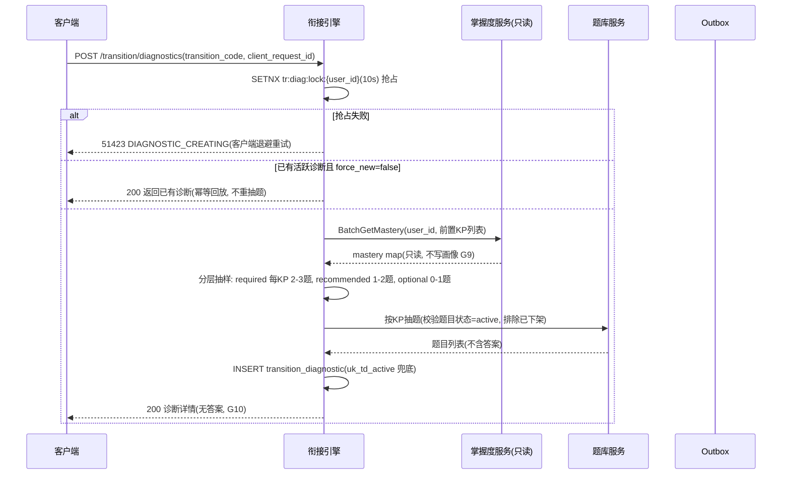
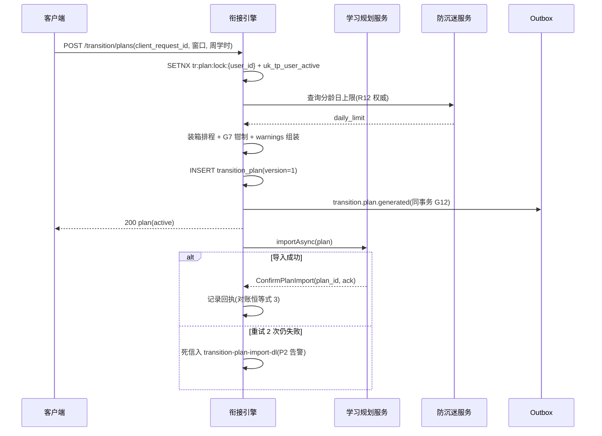
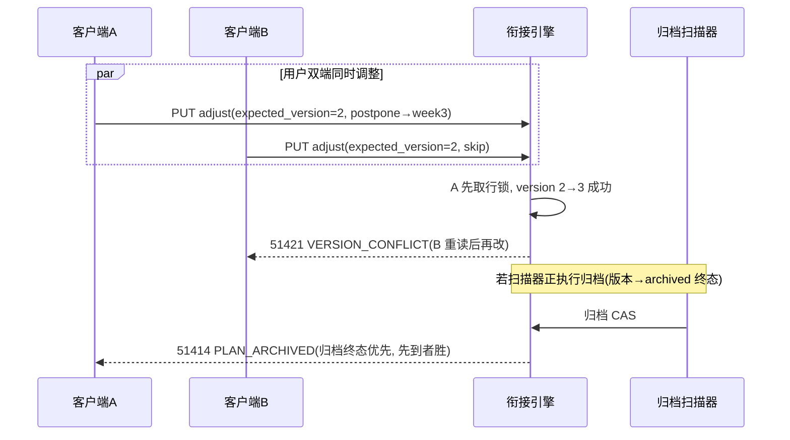

# 服务端-学段衔接知识桥梁课程与过渡期学习指导引擎 - 详细设计

> **版本**: v1.1 | **日期**: 2026-10-05 | **状态**: 已补全（可编码）
> **优先级**: P2（V1.5 阶段，需 MVP 阶段预留诊断数据采集点）
> **依赖**: 用户账号体系、知识点体系与教材映射引擎、学情分析服务、学习规划服务、内容服务、AI辅导对话引擎、通知服务
> **关联文档**: `服务端-用户年级升迁与学段转换服务-详细设计.md`、`服务端-教育知识点前置依赖检测与学习路径推荐服务-详细设计.md`、`学情分析-详细设计.md`、`学习规划-详细设计.md`、`端到端流程设计-学段年级升迁与教材版本切换完整链路-详细设计.md`

---

## 1. 模块概述

### 1.1 背景与问题

PrimeTop 覆盖幼儿园至高中全学段。学生在学段转换（幼儿园→小学、小学→初中、初中→高中）时面临三重挑战：

1. **知识断层**：新课段的知识体系以旧学段为基础，但不同学校、不同版本教材的教学深度存在差异，导致部分前置知识掌握不牢。
2. **能力跃迁**：新课段对自主学习能力、抽象思维能力、时间管理能力的要求显著提升。
3. **心理适应**：学习环境、评价标准、竞争压力的变化影响学习状态和自信心。

现有的「用户年级升迁与学段转换服务」负责**行政层面**的年级变更（教材版本重映射、学科列表调整、学习数据归档），但缺乏**教育层面**的过渡期诊断、知识衔接和学习指导能力。

### 1.2 功能定位

本引擎面向即将或刚刚完成学段转换的学生，提供：

| 能力 | 说明 | 优先级 |
|------|------|--------|
| 衔接诊断评估 | 基于新课段的前置知识要求，生成个性化诊断测试，识别知识薄弱点 | P0 |
| 知识断层检测 | 对比旧学段掌握度数据与新课段前置要求，自动发现知识缺口 | P0 |
| 桥梁课程推荐 | 针对知识缺口推荐短周期、高密度的衔接学习内容 | P0 |
| 过渡期学习计划 | 生成覆盖衔接期（暑假/寒假）的结构化学习计划 | P1 |
| 能力维度评估 | 评估学习方法、思维层次、自主学习能力等非知识维度 | P1 |
| 家长过渡指导 | 生成面向家长的过渡期教育建议和协同策略 | P2 |

### 1.3 服务边界

| 本服务负责 | 不负责（依赖其他服务） |
| --- | --- |
| 衔接诊断测试的生成与评分 | 题目渲染与答题交互（依赖客户端） |
| 知识缺口分析与桥梁课程匹配 | 题目与知识点的 CRUD（依赖内容服务） |
| 过渡期学习计划模板生成 | 计划执行与进度追踪（依赖学习规划服务） |
| 前置知识依赖图谱查询 | 知识点体系维护（依赖知识点映射引擎） |
| 诊断报告与家长指导生成 | AI 对话与批改（依赖 AI 辅导引擎） |
| 衔接期学习行为追踪 | 用户年级变更（依赖年级升迁服务） |

### 1.4 学段衔接模型

```
┌──────────────────────────────────────────────────────────────────┐
│                      学段衔接全景图                                │
│                                                                    │
│  幼儿(3-6)        小学(6-12)        初中(12-15)      高中(15-18)  │
│  ──────────     ──────────       ──────────      ──────────      │
│  │ 拼音识字 │     │ 全科基础 │      │ 理化生新 │     │ 学科深化 │   │
│  │ 数字认知 │     │ 同步课堂 │      │ 抽象思维 │     │ 专题突破 │   │
│  │ 语言表达 │     │ 习惯养成 │      │ 考试导向 │     │ 高考冲刺 │   │
│  └────┬─────┘     └────┬─────┘      └────┬─────┘     └────┬─────┘ │
│       │                │                 │                 │       │
│    [衔接期1]        [衔接期2]         [衔接期3]                │
│    幼→小过渡        小→初过渡          初→高过渡               │
│    学前准备诊断     小升初衔接          初升高衔接               │
│    习惯培养指导     思维跃迁评估       学科选择指导              │
│                                                                    │
└──────────────────────────────────────────────────────────────────┘
```

---

## 2. 核心数据模型

### 2.1 衔接阶段定义

```sql
-- 学段衔接配置表
CREATE TABLE transition_stage (
    id              BIGSERIAL PRIMARY KEY,
    code            VARCHAR(32) NOT NULL UNIQUE,     -- 'kindergarten_to_primary', 'primary_to_middle', 'middle_to_high'
    name            VARCHAR(64) NOT NULL,             -- '幼小衔接', '小升初衔接', '初升高衔接'
    from_stage      VARCHAR(32) NOT NULL,             -- 'kindergarten', 'primary', 'middle'
    to_stage        VARCHAR(32) NOT NULL,             -- 'primary', 'middle', 'high'
    description     TEXT,
    transition_months INT NOT NULL DEFAULT 3,          -- 衔接期典型时长（月）
    activation_rules JSONB NOT NULL DEFAULT '{}',     -- 触发规则配置
    status          VARCHAR(16) NOT NULL DEFAULT 'active',
    created_at      TIMESTAMPTZ NOT NULL DEFAULT NOW(),
    updated_at      TIMESTAMPTZ NOT NULL DEFAULT NOW()
);
```

**预置数据**：

| code | name | from_stage | to_stage | transition_months |
|------|------|-----------|----------|-------------------|
| kindergarten_to_primary | 幼小衔接 | kindergarten | primary | 6 |
| primary_to_middle | 小升初衔接 | primary | middle | 3 |
| middle_to_high | 初升高衔接 | middle | high | 3 |

### 2.2 前置知识依赖图谱

```sql
-- 跨学段知识点前置依赖关系
CREATE TABLE cross_stage_knowledge_dependency (
    id                  BIGSERIAL PRIMARY KEY,
    transition_code     VARCHAR(32) NOT NULL,            -- 关联衔接阶段
    prerequisite_kp_id  BIGINT NOT NULL,                  -- 前置知识点ID（旧学段）
    target_kp_id        BIGINT NOT NULL,                  -- 目标知识点ID（新课段）
    dependency_level    VARCHAR(16) NOT NULL DEFAULT 'required',  -- 'required', 'recommended', 'optional'
    weight              DECIMAL(3,2) NOT NULL DEFAULT 1.00,       -- 权重 0.01-1.00
    description         TEXT,                             -- 依赖说明
    FOREIGN KEY (prerequisite_kp_id) REFERENCES knowledge_point(id),
    FOREIGN KEY (target_kp_id) REFERENCES knowledge_point(id),
    UNIQUE (transition_code, prerequisite_kp_id, target_kp_id)
);

CREATE INDEX idx_cskd_transition ON cross_stage_knowledge_dependency(transition_code);
CREATE INDEX idx_cskd_target ON cross_stage_knowledge_dependency(target_kp_id);
```

**示例数据**（小升初）：

| prerequisite (小学) | target (初中) | level | weight |
|---------------------|---------------|-------|--------|
| 分数四则运算 | 有理数运算 | required | 1.00 |
| 简单方程 | 一元一次方程 | required | 1.00 |
| 基本几何图形 | 三角形全等 | required | 0.90 |
| 统计初步 | 数据收集与整理 | recommended | 0.70 |
| 英文自然拼读 | 英语音标系统 | required | 0.85 |

### 2.3 衔接诊断测试

```sql
-- 衔接诊断测试会话
CREATE TABLE transition_diagnostic (
    id                  BIGSERIAL PRIMARY KEY,
    user_id             BIGINT NOT NULL,
    transition_code     VARCHAR(32) NOT NULL,
    status              VARCHAR(16) NOT NULL DEFAULT 'created',  -- 'created', 'in_progress', 'completed', 'expired'
    question_ids        JSONB NOT NULL,                  -- 题目ID列表 [{id, kp_id, dependency_level, weight}]
    total_questions     INT NOT NULL,
    answers             JSONB DEFAULT '[]',              -- [{question_id, answer, is_correct, time_spent_ms}]
    score               DECIMAL(5,2),                    -- 总分
    knowledge_scores    JSONB,                           -- 各知识点得分 {kp_id: score}
    gap_analysis        JSONB,                           -- 缺口分析结果（详见 §2.4）
    started_at          TIMESTAMPTZ,
    completed_at        TIMESTAMPTZ,
    expires_at          TIMESTAMPTZ NOT NULL,
    created_at          TIMESTAMPTZ NOT NULL DEFAULT NOW(),
    updated_at          TIMESTAMPTZ NOT NULL DEFAULT NOW(),
    FOREIGN KEY (user_id) REFERENCES users(id)
);

CREATE INDEX idx_td_user ON transition_diagnostic(user_id, transition_code);
CREATE INDEX idx_td_status ON transition_diagnostic(status) WHERE status IN ('created', 'in_progress');
```

### 2.4 缺口分析结果模型

```json
{
  "gap_analysis": {
    "overall_readiness": 0.72,           // 整体衔接准备度 0-1
    "ready_level": "mostly_ready",       // 'well_ready', 'mostly_ready', 'needs_work', 'at_risk'
    "total_dependencies": 45,
    "strong_count": 28,                  // 掌握良好的前置知识点数
    "weak_count": 12,                    // 需要加强的前置知识点数
    "missing_count": 5,                  // 严重缺失的前置知识点数
    "gaps": [
      {
        "prerequisite_kp_id": 10234,
        "prerequisite_kp_name": "分数四则运算",
        "target_kp_id": 20001,
        "target_kp_name": "有理数运算",
        "dependency_level": "required",
        "weight": 1.00,
        "current_mastery": 0.35,          // 当前掌握度
        "severity": "critical",           // 'critical', 'moderate', 'minor'
        "estimated_hours": 4.5,           // 预估补强所需学时
        "bridge_course_id": "bc-math-fraction-01"
      }
    ],
    "strengths": [
      {
        "prerequisite_kp_id": 10056,
        "prerequisite_kp_name": "简单方程",
        "current_mastery": 0.92,
        "target_kp_name": "一元一次方程"
      }
    ],
    "recommendation_summary": "建议重点加强分数运算和基本几何，预计衔接期学习20-25小时可完成知识补强。"
  }
}
```

### 2.5 桥梁课程

```sql
-- 桥梁课程表
CREATE TABLE bridge_course (
    id                  VARCHAR(64) PRIMARY KEY,         -- 'bc-math-fraction-01'
    transition_code     VARCHAR(32) NOT NULL,
    title               VARCHAR(128) NOT NULL,            -- '分数运算强化'
    description         TEXT,
    target_kp_ids       JSONB NOT NULL,                   -- 覆盖的前置知识点ID列表
    difficulty_level    VARCHAR(16) NOT NULL,             -- 'beginner', 'intermediate', 'advanced'
    estimated_hours     DECIMAL(4,1) NOT NULL,            -- 预计学时
    module_count        INT NOT NULL,                     -- 模块数
    modules             JSONB NOT NULL,                   -- 课程模块列表（见下方结构）
    status              VARCHAR(16) NOT NULL DEFAULT 'active',
    created_at          TIMESTAMPTZ NOT NULL DEFAULT NOW(),
    updated_at          TIMESTAMPTZ NOT NULL DEFAULT NOW()
);

-- 桥梁课程学习记录
CREATE TABLE bridge_course_enrollment (
    id                  BIGSERIAL PRIMARY KEY,
    user_id             BIGINT NOT NULL,
    bridge_course_id    VARCHAR(64) NOT NULL,
    diagnostic_id       BIGINT,                          -- 关联的诊断测试ID
    status              VARCHAR(16) NOT NULL DEFAULT 'enrolled',  -- 'enrolled', 'in_progress', 'completed', 'abandoned'
    progress            DECIMAL(3,2) NOT NULL DEFAULT 0,  -- 完成进度 0-1
    module_progress     JSONB DEFAULT '[]',               -- 各模块进度
    started_at          TIMESTAMPTZ,
    completed_at        TIMESTAMPTZ,
    created_at          TIMESTAMPTZ NOT NULL DEFAULT NOW(),
    FOREIGN KEY (user_id) REFERENCES users(id),
    FOREIGN KEY (bridge_course_id) REFERENCES bridge_course(id)
);
```

**课程模块结构**（`modules` 字段）：

```json
[
  {
    "index": 1,
    "title": "分数基本概念回顾",
    "type": "knowledge_review",
    "kp_ids": [10234],
    "estimated_minutes": 30,
    "contents": [
      {"type": "ai_explanation", "topic": "分数的意义与分类"},
      {"type": "interactive_practice", "question_pool_id": "qp-fraction-basic", "count": 8},
      {"type": "key_point_summary", "kp_id": 10234}
    ]
  },
  {
    "index": 2,
    "title": "分数加减运算强化",
    "type": "skill_drill",
    "kp_ids": [10234],
    "estimated_minutes": 45,
    "contents": [
      {"type": "ai_explanation", "topic": "同分母与异分母分数加减"},
      {"type": "adaptive_practice", "difficulty_start": "easy", "difficulty_end": "medium", "count": 12},
      {"type": "mistake_analysis", "common_errors": ["未通分直接加减", "通分时分子未乘对应倍数"]}
    ]
  },
  {
    "index": 3,
    "title": "分数乘除运算",
    "type": "skill_drill",
    "kp_ids": [10235],
    "estimated_minutes": 45,
    "contents": [...]
  },
  {
    "index": 4,
    "title": "综合检测与新课段衔接",
    "type": "checkpoint",
    "kp_ids": [10234, 10235],
    "estimated_minutes": 30,
    "contents": [
      {"type": "mini_test", "question_count": 10, "pass_threshold": 0.7},
      {"type": "bridge_preview", "target_kp_id": 20001, "preview_topic": "有理数的概念"}
    ]
  }
]
```

### 2.6 过渡期学习计划模板

```sql
-- 过渡期学习计划模板
CREATE TABLE transition_plan_template (
    id                  BIGSERIAL PRIMARY KEY,
    transition_code     VARCHAR(32) NOT NULL,
    name                VARCHAR(128) NOT NULL,
    description         TEXT,
    total_weeks         INT NOT NULL,
    weekly_hours_min    DECIMAL(3,1) NOT NULL,            -- 每周最少建议学时
    weekly_hours_max    DECIMAL(3,1) NOT NULL,
    readiness_ranges    JSONB NOT NULL,                   -- 不同准备度对应的计划配置
    status              VARCHAR(16) NOT NULL DEFAULT 'active',
    created_at          TIMESTAMPTZ NOT NULL DEFAULT NOW()
);
```

**readiness_ranges 示例**：

```json
{
  "well_ready": {
    "description": "基础扎实，可适当预习新课段内容",
    "weeks": [
      {"week": 1, "focus": "查漏补缺", "bridge_courses": [], "preview_subjects": ["math", "chinese"]},
      {"week": 2, "focus": "新课预习", "bridge_courses": [], "preview_subjects": ["math", "english"]}
    ]
  },
  "needs_work": {
    "description": "存在知识缺口，需集中补强",
    "weeks": [
      {"week": 1, "focus": "数学衔接", "bridge_courses": ["bc-math-fraction-01"], "preview_subjects": []},
      {"week": 2, "focus": "英语衔接", "bridge_courses": ["bc-english-grammar-01"], "preview_subjects": []},
      {"week": 3, "focus": "综合巩固", "bridge_courses": [], "preview_subjects": ["math", "chinese"]}
    ]
  }
}
```

---

## 3. API 接口设计

### 3.1 衔接诊断

#### 3.1.1 获取衔接诊断测试

```
POST /api/v1/transition/diagnostics
```

**请求体**：

```json
{
  "transition_code": "primary_to_middle",
  "subject_ids": [1, 2, 3],       // 可选：仅检测指定学科，为空则检测全部
  "force_new": false              // 是否强制生成新测试（忽略已有未完成的）
}
```

**响应体**：

```json
{
  "diagnostic_id": 12345,
  "transition_code": "primary_to_middle",
  "transition_name": "小升初衔接",
  "status": "created",
  "total_questions": 30,
  "estimated_minutes": 40,
  "subjects": [
    {"subject_id": 1, "name": "数学", "question_count": 12},
    {"subject_id": 2, "name": "语文", "question_count": 8},
    {"subject_id": 3, "name": "英语", "question_count": 10}
  ],
  "expires_at": "2026-07-12T15:46:00.000Z",
  "questions": [
    {
      "index": 1,
      "question_id": 50001,
      "subject": "数学",
      "kp_name": "分数四则运算",
      "type": "choice",
      "content": "计算：1/2 + 1/3 - 1/6 = ?",
      "options": ["A. 2/3", "B. 1/2", "C. 5/6", "D. 1"],
      "dependency_level": "required"
    }
  ]
}
```

#### 3.1.2 提交诊断答案

```
PUT /api/v1/transition/diagnostics/{diagnostic_id}/submit
```

**请求体**：

```json
{
  "answers": [
    {
      "question_index": 1,
      "question_id": 50001,
      "answer": "A",
      "time_spent_ms": 15000
    },
    {
      "question_index": 2,
      "question_id": 50002,
      "answer": "这篇短文的主旨是...",
      "time_spent_ms": 45000
    }
  ]
}
```

**响应体**：

```json
{
  "diagnostic_id": 12345,
  "status": "completed",
  "score": 78.5,
  "overall_readiness": 0.72,
  "ready_level": "mostly_ready",
  "subject_scores": [
    {"subject_id": 1, "name": "数学", "score": 65.0, "readiness": 0.60, "ready_level": "needs_work"},
    {"subject_id": 2, "name": "语文", "score": 88.0, "readiness": 0.85, "ready_level": "well_ready"},
    {"subject_id": 3, "name": "英语", "score": 82.5, "readiness": 0.78, "ready_level": "mostly_ready"}
  ],
  "gap_count": {"critical": 2, "moderate": 4, "minor": 3},
  "recommendation_summary": "数学存在分数运算和基本几何两个关键缺口，建议优先补强。语文和英语基础较好，可进入新课预习。",
  "report_available": true
}
```

#### 3.1.3 获取诊断详细报告

```
GET /api/v1/transition/diagnostics/{diagnostic_id}/report
```

**响应体**：返回完整的 `gap_analysis` 结构（见 §2.4），包含每个前置知识点的掌握度、缺口严重程度、推荐桥梁课程等。

### 3.2 知识缺口查询

#### 3.2.1 基于历史学习数据的知识缺口预测

```
GET /api/v1/transition/gaps/predict?user_id={user_id}&transition_code={transition_code}
```

**说明**：无需学生参加诊断测试，基于其在旧学段的 `knowledge_mastery` 数据和 `cross_stage_knowledge_dependency` 表自动计算缺口。适用于衔接期前的早期预警。

**响应体**：

```json
{
  "user_id": 10086,
  "transition_code": "primary_to_middle",
  "prediction_source": "historical_mastery",
  "prediction_confidence": 0.75,
  "overall_readiness": 0.68,
  "predicted_gaps": [
    {
      "prerequisite_kp_id": 10234,
      "prerequisite_kp_name": "分数四则运算",
      "current_mastery": 0.42,
      "dependency_level": "required",
      "target_kp_name": "有理数运算",
      "severity": "critical"
    }
  ],
  "recommended_diagnostics": true,
  "message": "基于历史学习数据预测，建议参加衔接诊断测试获取更准确的评估结果。"
}
```

### 3.3 桥梁课程

#### 3.3.1 获取推荐桥梁课程列表

```
GET /api/v1/transition/bridge-courses?diagnostic_id={diagnostic_id}
```

**响应体**：

```json
{
  "diagnostic_id": 12345,
  "recommended_courses": [
    {
      "bridge_course_id": "bc-math-fraction-01",
      "title": "分数运算强化",
      "estimated_hours": 4.5,
      "module_count": 4,
      "severity": "critical",
      "target_kp_names": ["分数四则运算"],
      "priority_order": 1,
      "reason": "分数运算是有理数学习的核心前置能力，当前掌握度仅35%，建议优先补强。"
    },
    {
      "bridge_course_id": "bc-math-geometry-01",
      "title": "基本几何图形强化",
      "estimated_hours": 3.0,
      "module_count": 3,
      "severity": "critical",
      "target_kp_names": ["基本几何图形"],
      "priority_order": 2,
      "reason": "平面几何是初中几何证明的基础，当前掌握度不足50%。"
    }
  ],
  "total_estimated_hours": 7.5,
  "suggested_schedule": "建议每天学习1小时，分7-8天完成"
}
```

#### 3.3.2 报名桥梁课程

```
POST /api/v1/transition/bridge-courses/{bridge_course_id}/enroll
```

**请求体**：

```json
{
  "diagnostic_id": 12345   // 可选，关联诊断测试
}
```

**响应体**：

```json
{
  "enrollment_id": 67890,
  "bridge_course_id": "bc-math-fraction-01",
  "status": "enrolled",
  "progress": 0,
  "modules": [
    {
      "index": 1,
      "title": "分数基本概念回顾",
      "status": "locked",
      "estimated_minutes": 30
    },
    {
      "index": 2,
      "title": "分数加减运算强化",
      "status": "locked",
      "estimated_minutes": 45
    }
  ]
}
```

#### 3.3.3 更新桥梁课程进度

```
PUT /api/v1/transition/bridge-courses/enrollments/{enrollment_id}/progress
```

**请求体**：

```json
{
  "module_index": 1,
  "status": "completed",
  "time_spent_minutes": 28,
  "module_score": 0.85
}
```

### 3.4 过渡期学习计划

#### 3.4.1 生成过渡期学习计划

```
POST /api/v1/transition/plans
```

**请求体**：

```json
{
  "user_id": 10086,
  "transition_code": "primary_to_middle",
  "diagnostic_id": 12345,
  "available_hours_per_week": 5,
  "start_date": "2026-07-01",
  "end_date": "2026-08-31",
  "preferred_subjects": [1, 2, 3]
}
```

**响应体**：

```json
{
  "plan_id": "tp-10086-20260701",
  "transition_code": "primary_to_middle",
  "total_weeks": 9,
  "weekly_hours": 5,
  "ready_level": "mostly_ready",
  "phases": [
    {
      "phase": 1,
      "name": "知识补强期",
      "weeks": "1-4",
      "focus": "数学+英语薄弱点补强",
      "tasks": [
        {
          "week": 1,
          "task_type": "bridge_course",
          "bridge_course_id": "bc-math-fraction-01",
          "estimated_hours": 4.5,
          "priority": "critical"
        },
        {
          "week": 2,
          "task_type": "bridge_course",
          "bridge_course_id": "bc-math-geometry-01",
          "estimated_hours": 3.0,
          "priority": "critical"
        },
        {
          "week": 2,
          "task_type": "bridge_course",
          "bridge_course_id": "bc-english-grammar-01",
          "estimated_hours": 2.0,
          "priority": "moderate"
        }
      ]
    },
    {
      "phase": 2,
      "name": "新课预习期",
      "weeks": "5-7",
      "focus": "初中一年级重点章节预习",
      "tasks": [
        {
          "week": 5,
          "task_type": "chapter_preview",
          "subject_id": 1,
          "chapter_ids": [20001, 20002],
          "estimated_hours": 3.0
        }
      ]
    },
    {
      "phase": 3,
      "name": "衔接检测期",
      "weeks": "8-9",
      "focus": "综合检测与新学期准备",
      "tasks": [
        {
          "week": 8,
          "task_type": "comprehensive_test",
          "estimated_hours": 2.0
        },
        {
          "week": 9,
          "task_type": "learning_habits",
          "topic": "初中学习方法与时间管理入门",
          "estimated_hours": 1.0,
          "priority": "minor"
        }
      ]
    }
  ],
  "total_estimated_hours": 22.5,
  "warnings": [],
  "plan_status": "active",
  "created_at": "2026-06-20T10:00:00.000Z"
}
```

**响应字段补充说明**：

| 字段 | 类型 | 说明 |
| --- | --- | --- |
| `plan_id` | string | 计划唯一标识，`tp-{user_id}-{start_date}` |
| `phases[].tasks[].priority` | string | `critical`/`moderate`/`minor`，由缺口 severity 派生 |
| `total_estimated_hours` | decimal | 全部任务预估学时合计；不得超过窗口可用总学时，超出时截断并写入 `warnings` |
| `warnings` | array | 非阻断性提示（可用学时不足、某桥梁课程未排入等），恒返回数组不可为 null |
| `plan_status` | string | `active`；计划为服务端权威，客户端展示态派生自该字段 |

> **设计说明**：每周可用学时（`available_hours_per_week`）为软约束——排程优先满足，不足时在 `warnings` 中说明；硬约束为防沉迷分龄日上限（G7），任何情况下计划任务量不得突破。

#### 3.4.2 查询过渡期学习计划

```
GET /api/v1/transition/plans/{plan_id}
```

**响应体**：结构与 §3.4.1 生成响应一致，附加以下字段：

| 附加字段 | 说明 |
| --- | --- |
| `progress` | decimal 0-1，实际完成进度，由任务完成事件回填（委托学习规划服务回执，R3） |
| `adjustments` | 调整历史（最多保留最近 20 条，含 action/to_week/version/created_at） |
| `completed_tasks` | 已完成任务引用列表（phase/week/task_type/ref），供客户端勾选展示 |

**权限**：仅本人或绑定家长（L2 及以上可见性）可查；教师/管理端不暴露个人计划明细（聚合归教师端引擎）。

**缓存**：计划读多写少，Redis `tr:plan:{plan_id}` 缓存 5min，写路径 DEL（cache-aside，只删不 SET）。

#### 3.4.3 调整过渡期学习计划

```
PUT /api/v1/transition/plans/{plan_id}/adjust
```

**请求体**（四原子操作，每次请求仅允许一个操作）：

```json
{
  "action": "postpone",
  "task_ref": {"phase": 1, "week": 2, "bridge_course_id": "bc-math-geometry-01"},
  "value": {"to_week": 3},
  "confirm": false,
  "expected_version": 2,
  "client_request_id": "uuid-v4"
}
```

**action 枚举**：

| action | 语义 | value | 约束 |
| --- | --- | --- | --- |
| `postpone` | 任务顺延到指定周 | `to_week` | 不得晚于窗口末周；不得跨越"衔接检测期"（最后一相） |
| `skip` | 跳过任务 | 无 | `critical` 优先级任务跳过需 `confirm=true` 二次确认，并记 `warnings` |
| `replace` | 更换桥梁课程 | `new_bridge_course_id` | 新课程必须覆盖同一 `target_kp_ids` 子集且状态 active |
| `resize` | 调整每周可用学时 | `weekly_hours` | 1.0-20.0，重排后续未完成任务 |

**响应体**：返回调整后的完整计划（`version` 递增 1）。

**并发控制**：`expected_version` 乐观锁，不匹配返回 `51421 VERSION_CONFLICT`，客户端重读后再改；调整与归档扫描并发时归档终态优先（返回 `51414`）。

#### 3.4.4 生成家长过渡指导

```
POST /api/v1/transition/guidance
```

**请求体**：

```json
{
  "diagnostic_id": 12345,
  "client_request_id": "uuid-v4"
}
```

**响应体**：

```json
{
  "guidance_id": "g-12345",
  "diagnostic_id": 12345,
  "sections": [
    {
      "code": "overview",
      "title": "孩子当前衔接准备度",
      "content": "孩子整体准备度良好（72%），语文英语基础扎实……",
      "aigc_flag": true
    },
    {
      "code": "support_strategy",
      "title": "家庭协同建议",
      "content": "1. 暑期每周保持 4-5 次、每次 40 分钟内的数学练习节奏……",
      "aigc_flag": true
    },
    {
      "code": "mindset",
      "title": "心理适应提示",
      "content": "小升初后评价标准变化属正常现象，建议多关注过程进步而非单次排名……",
      "aigc_flag": true
    },
    {
      "code": "plan_overview",
      "title": "过渡期计划概览",
      "content": "已生成 9 周计划：第 1-4 周知识补强、第 5-7 周新课预习、第 8-9 周综合检测……",
      "aigc_flag": false
    }
  ],
  "degraded": false,
  "created_at": "2026-06-20T10:05:00.000Z"
}
```

**生成规则**：
- AI 生成（输入=诊断报告聚合字段白名单，**不含**逐题答案与孩子原话，C2），失败或超时（P99 预算 3s）降级为四段静态模板并 `degraded=true`（D4）；
- 全文经内容审核管线（fail-secure：未过审段落替换为模板句，整篇不过审返回 `51422 GUIDANCE_BLOCKED`）；
- 每篇逐段强制带 AIGC 标识（`aigc_flag`），家长端展示"AI 生成"角标（C3）；
- 幂等：同 `diagnostic_id` 24h 内重复请求返回已生成指导（`guidance_id` 相同）。

### 3.5 管理端与内部接口

**管理端**（运营/教研，维护前置依赖与桥梁课程内容；路由前缀 `/api/v1/admin/transition`）：

| 方法 | 路径 | 说明 | 幂等 |
| --- | --- | --- | --- |
| GET | `/bridge-courses` | 桥梁课程分页查询（transition_code/status 过滤） | 读 |
| POST | `/bridge-courses` | 创建桥梁课程（初始 `status=draft`，审核通过后方可 active） | client_request_id |
| PUT | `/bridge-courses/{id}` | 更新课程（modules 变更需重新过审，`content_version` 递增） | version CAS |
| POST | `/bridge-courses/{id}/activate` | 上架（校验审核 approved，双人审批） | 状态 CAS |
| POST | `/bridge-courses/{id}/deactivate` | 下架（在学用户不受影响，仅停止新报名） | 状态 CAS |
| GET | `/dependencies` | 跨学段依赖关系分页查询 | 读 |
| POST | `/dependencies` | 批量导入依赖关系（≤500 行/批，行级部分成功） | batch_id |
| GET | `/diagnostics/stats` | 诊断完成率/缺口分布统计（k≥5 聚合） | 读 |

> **边界裁决**：E2E 文档 §6 声明的 `GET/POST /api/v1/bridge-courses`、`PUT /api/v1/bridge-courses/{id}` 管理端端点即本组接口的对外别名，**权威命名归本表**（`/api/v1/admin/transition/bridge-courses`），E2E 侧登记为路由转发（R1）。

**内部 gRPC**（`transition-engine` service）：

```proto
service TransitionEngine {
  // 缺口预测（供编排层/E2E 阶段三批量调用, ≤200 用户/次）
  rpc PredictGaps(PredictGapsRequest) returns (PredictGapsResponse);
  // 诊断汇总（供学情分析/教师端聚合; 义务教育学段仅 band 级, G13）
  rpc GetDiagnosticSummary(GetDiagnosticSummaryRequest) returns (GetDiagnosticSummaryResponse);
  // 计划导入回执（学习规划服务确认计划任务已接收, R3）
  rpc ConfirmPlanImport(ConfirmPlanImportRequest) returns (ConfirmPlanImportResponse);
}
```

- E2E `POST /api/v1/transition/{id}/detect-gaps` 批量场景经 `PredictGaps` 内部委托（R5）；
- gRPC 幂等：`message_id` 唯一键 + 响应快照 24h；同 `message_id` 不同请求体属协议违规，拒绝并 P2 告警。

### 3.6 幂等限流总表

| 接口 | 幂等键 | 并发控制 | 限流（默认） |
| --- | --- | --- | --- |
| POST /transition/diagnostics | `client_request_id`（必填，客户端 UUID） | SETNX 10s + uk_td_active | 10 次/分/用户 |
| PUT /transition/diagnostics/{id}/submit | `(diagnostic_id, answers_hash)` | 状态 CAS `in_progress→completed` | 30 次/分/用户 |
| GET /transition/gaps/predict | 读接口（Redis 缓存 24h） | — | 30 次/分/用户 |
| POST /transition/bridge-courses/{id}/enroll | `client_request_id` | uk_bce_active | 20 次/分/用户 |
| PUT .../enrollments/{id}/progress | `(enrollment_id, module_index, client_request_id)` | version 乐观锁 | 60 次/分/用户 |
| POST /transition/plans | `client_request_id` + uk_tp_user_active | SETNX 10s | 5 次/分/用户 |
| PUT /transition/plans/{id}/adjust | `client_request_id` | expected_version 乐观锁 | 20 次/分/用户 |
| POST /transition/guidance | `diagnostic_id`（24h 去重） | — | 10 次/分/用户 |
| 管理端写接口 | `client_request_id` | version/状态 CAS | 60 次/分/操作人 |

---

## 4. 核心流程

### 4.1 衔接诊断生成主链路



**要点**：
- 选题总数上限 40 题（默认 30），预计用时按 60s/题估算返回 `estimated_minutes`；
- 抽样种子 = `(user_id, transition_code, 学期)` 哈希，同学生重复进入诊断可见同卷（配合幂等回放）；
- 诊断有效期 72h（`expires_at`），过期由 §5.5 扫描器置 `expired`（G11）。

### 4.2 提交评分与缺口分析管线

```
答案整包提交 → 题目归属校验(G3) → 判题引擎客观题同步判分(R6)
  → 主观题 AI 初评(置信度<0.6 转异步, 报告标 partial, 就绪后补全推送 D3)
  → KP 得分聚合(加权: required×1.0 / recommended×0.7 / optional×0.4)
  → 与历史掌握度取保守值(实测优先, 缺失用历史, 双缺记 low_confidence G4)
  → severity 判级(§4.2 表) → ready_level 映射 → gap_analysis 落库
  → Outbox 同事务: diagnostic.completed + gaps.detected
```

**severity 判级规则**：

| severity | 条件（满足其一即取较重档） |
| --- | --- |
| `critical` | required 且 mastery < 0.50 |
| `moderate` | required 且 0.50≤mastery<0.70；或 recommended 且 mastery<0.50 |
| `minor` | optional 且 mastery<0.70；或 recommended 且 0.50≤mastery<0.70 |

**ready_level 映射**：`overall_readiness`（全部依赖按 weight 加权的 mastery 均值）≥0.80 `well_ready`；≥0.65 `mostly_ready`；≥0.50 `needs_work`；否则 `at_risk`。缺数据 KP 按 0.35 计入并降低 `prediction_confidence`（fail-safe 宁低估不高估，G4）。

### 4.3 桥梁课程匹配算法

```
输入: gap_analysis.gaps + active 桥梁课程库
1. 按 target_kp_ids 反查候选课程(覆盖 gap 的 prerequisite_kp_id 越多优先级越高)
2. 排序键: severity 档位降序 → 覆盖 gap 数降序 → weight 和降序 → estimated_hours 升序
3. 学时预算约束贪心: 单日≤分龄上限, 单周≤weekly_hours_max, 窗口内装完优先 critical
4. 无法排入的 gap 写入 warnings, 并在 recommendation_summary 中说明
5. reason 字段: 模板拼装为主, AI 润色为辅(超时/降级用纯模板, degraded 标记)
```

### 4.4 过渡期计划生成编排

```
前置校验(G6 窗口钳制) → 读取诊断 ready_level → 选模板 readiness_ranges 配置
  → 桥梁课程学时装箱(首适装箱, critical 优先)
  → 新课预习章节来自教材版本推荐(只读委托年级升迁服务 §2.3, R12)
  → 周配额曲线: 前期密(适应期短任务)、中期稳、末期轻(综合检测+习惯培养)
  → 防沉迷分龄日上限校验(G7): 超上限截断任务并 warnings; 配置服务不可用则收紧重排(D10)
  → 落库 transition_plan(uk_tp_user_active) + Outbox plan.generated(同事务)
  → 异步委托学习规划服务导入执行任务(失败重试 2^n, 死信告警; 本引擎不执行计划 R3)
```

### 4.5 DDL 增补（v1.1）

> v1.0 缺陷修复与新增承载表，全部幂等可重入（`IF NOT EXISTS`/冲突忽略）。

```sql
-- F6 修复: 过渡期学习计划实例表(v1.0 生成 plan_id 但无承载表, 属悬空引用)
CREATE TABLE IF NOT EXISTS transition_plan (
    id                  VARCHAR(64) PRIMARY KEY,   -- 'tp-{user_id}-{start_date}'
    user_id             BIGINT NOT NULL,
    transition_code     VARCHAR(32) NOT NULL,
    diagnostic_id       BIGINT,
    client_request_id   VARCHAR(64),               -- 创建幂等键
    status              VARCHAR(16) NOT NULL DEFAULT 'active',
    start_date          DATE NOT NULL,
    end_date            DATE NOT NULL,
    weekly_hours        DECIMAL(3,1) NOT NULL,
    ready_level         VARCHAR(16) NOT NULL,
    phases              JSONB NOT NULL,
    total_estimated_hours DECIMAL(5,1) NOT NULL,
    version             INT NOT NULL DEFAULT 1,    -- 乐观锁
    warnings            JSONB NOT NULL DEFAULT '[]',
    created_at          TIMESTAMPTZ NOT NULL DEFAULT NOW(),
    updated_at          TIMESTAMPTZ NOT NULL DEFAULT NOW(),
    FOREIGN KEY (user_id) REFERENCES users(id)
);
-- 同用户同学段同窗口仅一个活跃计划(活跃态部分唯一索引)
CREATE UNIQUE INDEX IF NOT EXISTS uk_tp_user_active
    ON transition_plan(user_id, transition_code, start_date) WHERE status = 'active';

-- F2 修复: 诊断幂等键与乐观锁
ALTER TABLE transition_diagnostic
    ADD COLUMN IF NOT EXISTS client_request_id VARCHAR(64),
    ADD COLUMN IF NOT EXISTS version INT NOT NULL DEFAULT 1;
-- 单活跃诊断守卫(G1), 数据库兜底
CREATE UNIQUE INDEX IF NOT EXISTS uk_td_active
    ON transition_diagnostic(user_id, transition_code) WHERE status IN ('created', 'in_progress');

-- F3 修复: 报名乐观锁 + 单活跃报名守卫
ALTER TABLE bridge_course_enrollment
    ADD COLUMN IF NOT EXISTS version INT NOT NULL DEFAULT 1;
CREATE UNIQUE INDEX IF NOT EXISTS uk_bce_active
    ON bridge_course_enrollment(user_id, bridge_course_id) WHERE status IN ('enrolled', 'in_progress');

-- 事件 Outbox(Relay 中继消费)
CREATE TABLE IF NOT EXISTS transition_outbox (
    id          BIGSERIAL PRIMARY KEY,
    event_type  VARCHAR(64) NOT NULL,
    event_id    VARCHAR(64) NOT NULL UNIQUE,      -- 幂等键 UUID
    payload     JSONB NOT NULL,
    status      VARCHAR(16) NOT NULL DEFAULT 'pending',
    retry_count INT NOT NULL DEFAULT 0,
    created_at  TIMESTAMPTZ NOT NULL DEFAULT NOW(),
    sent_at     TIMESTAMPTZ
);

-- 日终对账日志(按月分区, 在线 90 天)
CREATE TABLE IF NOT EXISTS transition_recon_log (
    id          BIGSERIAL PRIMARY KEY,
    recon_date  DATE NOT NULL,
    check_item  VARCHAR(64) NOT NULL,             -- EVENT_INTEGRITY/PROGRESS_CONSISTENCY/PLAN_IMPORT
    diff_count  INT NOT NULL DEFAULT 0,
    detail      JSONB,
    created_at  TIMESTAMPTZ NOT NULL DEFAULT NOW()
) PARTITION BY RANGE (recon_date);
```

**Redis 键总表**（DB 权威、缓存展示层原则）：

| 键 | 类型 | TTL | 说明 |
| --- | --- | --- | --- |
| `tr:diag:lock:{user_id}` | STRING(SETNX) | 10s | 诊断创建互斥 |
| `tr:diag:active:{user_id}:{transition_code}` | STRING(JSON) | 2h | 活跃诊断缓存，写路径 DEL |
| `tr:enroll:lock:{user_id}:{course_id}` | STRING(SETNX) | 10s | 报名互斥 |
| `tr:plan:lock:{user_id}` | STRING(SETNX) | 10s | 计划生成互斥 |
| `tr:plan:{plan_id}` | STRING(JSON) | 5min | 计划读缓存，adjust 后 DEL |
| `tr:gap:predict:{user_id}:{transition_code}` | STRING(JSON) | 24h | 缺口预测缓存 |
| `tr:rate:{user_id}` | HASH | 1d | 限流计数（field=接口维度） |
---

## 5. 关键代码示例

### 5.1 诊断创建服务（互斥 + 幂等 + 分层抽样）

```java
@Service
public class DiagnosticCreateService {

    private static final int SETNX_TTL_SECONDS = 10;
    private static final int MAX_QUESTIONS = 40;

    public DiagnosticDetail create(Long userId, CreateDiagnosticRequest req) {
        // G1: 单活跃诊断——Redis 互斥 + DB 函数唯一索引双保险
        String lockKey = "tr:diag:lock:" + userId;
        Boolean acquired = redis.opsForValue()
            .setIfAbsent(lockKey, "1", SETNX_TTL_SECONDS, TimeUnit.SECONDS);
        if (!Boolean.TRUE.equals(acquired)) {
            throw new BizException(51423, "DIAGNOSTIC_CREATING"); // 客户端退避重试
        }
        try {
            // 幂等回放：同 transition_code 已有活跃诊断且 force_new=false → 原卷返回
            DiagnosticEntity active = diagnosticRepo.findActive(userId, req.transitionCode());
            if (active != null && !req.forceNew()) {
                return DiagnosticAssembler.toDetail(active); // 同卷可见，配合抽样种子
            }

            // 掌握度只读消费（G9：绝不写画像）
            List<KpDependency> deps = dependencyRepo.findByTransition(req.transitionCode());
            List<Long> kpIds = deps.stream().map(KpDependency::prerequisiteKpId).distinct().toList();
            Map<Long, Double> masteryMap = masteryGateway.batchGet(userId, kpIds);

            // 分层抽样：required 每 KP 2-3 题 / recommended 1-2 题 / optional 0-1 题
            Map<DependencyLevel, List<KpDependency>> byLevel = deps.stream()
                .collect(Collectors.groupingBy(KpDependency::dependencyLevel));
            List<QuestionDraw> draws = new ArrayList<>();
            draw(draws, byLevel.getOrDefault(DependencyLevel.REQUIRED, List.of()),
                 masteryMap, 2, 3, 1.0);
            draw(draws, byLevel.getOrDefault(DependencyLevel.RECOMMENDED, List.of()),
                 masteryMap, 1, 2, 0.7);
            draw(draws, byLevel.getOrDefault(DependencyLevel.OPTIONAL, List.of()),
                 masteryMap, 0, 1, 0.4);
            if (draws.size() > MAX_QUESTIONS) {
                draws = draws.subList(0, MAX_QUESTIONS); // 截断按 weight 降序
            }

            // 抽题委托题库服务（D2：抽题失败整体失败，不生成残缺卷）
            List<QuestionEntity> questions = questionGateway.drawByKp(
                draws, req.subjectIds(), req.samplingSeed(userId));

            DiagnosticEntity entity = DiagnosticEntity.create(
                userId, req.transitionCode(), questions, /*expiresAt*/ nowPlusHours(72));
            try {
                diagnosticRepo.insert(entity); // uk_td_active 兜底，撞键转 51423
            } catch (DuplicateKeyException e) {
                throw new BizException(51423, "DIAGNOSTIC_CREATING");
            }
            redis.delete("tr:diag:active:" + userId + ":" + req.transitionCode());
            return DiagnosticAssembler.toDetail(entity); // G10：组装时剥离答案
        } finally {
            redis.delete(lockKey);
        }
    }

    /** 抽样种子：同 (user, transition, 学期) 哈希恒定 → 重复进入可见同卷 */
    private void draw(List<QuestionDraw> out, List<KpDependency> deps,
                      Map<Long, Double> masteryMap, int min, int max, double levelWeight) {
        for (KpDependency dep : deps) {
            double mastery = masteryMap.getOrDefault(dep.prerequisiteKpId(), 0.35); // G4 宁低估
            int count = mastery < 0.5 ? max : min; // 越薄弱抽得越多
            out.add(new QuestionDraw(dep.prerequisiteKpId(), dep.dependencyLevel(),
                                     dep.weight() * levelWeight, count));
        }
    }
}
```

### 5.2 提交评分与缺口分析管线

```java
@Service
public class DiagnosticScoreService {

    @Transactional
    public SubmitResult submit(Long diagnosticId, SubmitRequest req) {
        DiagnosticEntity diag = diagnosticRepo.findByIdForUpdate(diagnosticId);
        // G11：过期不可提交；状态 CAS 防并发双结算
        if (diag.isExpired()) throw new BizException(51412, "DIAGNOSTIC_EXPIRED");
        if (!diag.casStatus("in_progress", "completed")) {
            return SubmitResult.replay(diag); // 幂等回放已算结果
        }

        // G3：题目归属校验——answers 中 question_id 必须属于本卷
        Set<Long> validIds = diag.questionIdSet();
        for (Answer a : req.answers()) {
            if (!validIds.contains(a.questionId())) {
                throw new BizException(51413, "ANSWER_NOT_IN_DIAGNOSTIC");
            }
        }

        // 判题委托统一判题引擎（R6），客观题同步 / 主观题低置信转异步
        JudgeResult judged = judgeGateway.judge(diag.questionIds(), req.answers());
        boolean partial = judged.hasPendingSubjective(); // G2：低置信绝不误判

        // KP 加权聚合：required×1.0 / recommended×0.7 / optional×0.4
        GapAnalysis gap = gapAnalyzer.analyze(diag, judged, masteryGateway);
        diag.complete(judged.score(), gap);
        diagnosticRepo.update(diag);

        // G12：Outbox 同事务发布
        outbox.publish("transition.diagnostic.completed",
            DiagnosticCompletedPayload.of(diag));
        outbox.publish("transition.gaps.detected",
            GapsDetectedPayload.of(diag.userId(), diag.transitionCode(), gap));
        return SubmitResult.of(diag, partial);
    }
}
```

### 5.3 计划生成编排器（装箱 + 防沉迷硬校验）

```java
@Service
public class TransitionPlanGenerator {

    public TransitionPlan generate(GeneratePlanRequest req) {
        // G6：窗口钳制——start/end 必须在衔接期有效范围内
        DateRange window = calendarService.transitionWindow(
            req.transitionCode(), req.startDate(), req.endDate());
        GapAnalysis gap = loadGap(req.diagnosticId());

        // 学时预算：周配额曲线（前期密、中期稳、末期轻）
        double weeklyCap = Math.min(req.availableHoursPerWeek(),
                                    antiAddictionService.dailyLimit(req.userId()) * 6.0);
        List<BridgeCourse> courses = bridgeCourseRepo.matchActive(gap.gaps());
        courses.sort(priorityOrder()); // severity → 覆盖 gap 数 → weight 和 → hours 升序

        // 首适装箱：critical 优先装，装不下的写 warnings（G5）
        List<PlanTask> tasks = new ArrayList<>();
        List<String> warnings = new ArrayList<>();
        int weekCursor = 1;
        for (BridgeCourse c : courses) {
            double hours = c.estimatedHours();
            while (hours > 0 && weekCursor <= window.totalWeeks()) {
                double remain = weeklyCap - tasksInWeek(tasks, weekCursor);
                if (remain <= 0) { weekCursor++; continue; }
                double assign = Math.min(remain, hours);
                tasks.add(PlanTask.bridge(weekCursor, c, assign));
                hours -= assign;
                if (tasksInWeek(tasks, weekCursor) >= weeklyCap) weekCursor++;
            }
            if (hours > 0.01) {
                warnings.add("课程「" + c.title() + "」学时超出窗口，建议开学后顺延补学");
            }
        }
        // G7：防沉迷分龄日上限为硬约束——超上限任务截断（fail-secure）
        tasks = antiAddictionService.clamp(tasks, req.userId(), warnings);

        TransitionPlan plan = TransitionPlan.create(req, window, gap.readyLevel(),
                                                    tasks, warnings);
        try {
            planRepo.insert(plan); // uk_tp_user_active：同学段同窗仅一个活跃计划
        } catch (DuplicateKeyException e) {
            throw new BizException(51420, "PLAN_ALREADY_EXISTS");
        }
        outbox.publish("transition.plan.generated", PlanGeneratedPayload.of(plan));
        // R3：执行权威归学习规划服务——异步委托导入，失败重试 2^n（见 §9）
        planImportClient.importAsync(plan).retry(2).deadLetter("transition-plan-import-dl");
        return plan;
    }
}
```

### 5.4 进度更新（乐观锁 + 幂等）

```java
@Transactional
public ProgressResult updateProgress(Long enrollmentId, ProgressRequest req) {
    String idemKey = enrollmentId + ":" + req.moduleIndex() + ":" + req.clientRequestId();
    if (redis.opsForValue().setIfAbsent("tr:prog:idem:" + idemKey, "1", 24, HOURS) == null) {
        return ProgressResult.replay(enrollmentRepo.findById(enrollmentId)); // 幂等回放
    }
    EnrollmentEntity en = enrollmentRepo.findByIdForUpdate(enrollmentId);
    if (!en.version().equals(req.expectedVersion())) {
        throw new BizException(51421, "VERSION_CONFLICT");
    }
    en.updateModule(req.moduleIndex(), req.status(), req.moduleScore()); // version+1
    if (en.allModulesCompleted()) {
        en.casStatus("in_progress", "completed");
        outbox.publish("transition.bridge_course.completed",
            BridgeCourseCompletedPayload.of(en));
    }
    enrollmentRepo.update(en);
    return ProgressResult.of(en);
}
```

### 5.5 过期扫描器（CAS 抢占，多节点安全）

```java
@Scheduled(cron = "0 7 * * * *") // 每小时第 7 分钟
public void expireDiagnostics() {
    List<Long> ids = diagnosticRepo.findExpiredPending(PageRequest.ofSize(500));
    for (Long id : ids) {
        // CAS 抢占：多节点扫描仅一个成功，防重复事件
        if (diagnosticRepo.casStatusIfPending(id, "in_progress", "expired") == 1) {
            outbox.publish("transition.diagnostic.expired",
                DiagnosticExpiredPayload.of(id)); // 供通知服务告知"可重新诊断"
        }
    }
}
```

---

## 6. 时序图

### 6.1 计划生成与委托导入时序



### 6.2 计划调整并发竞态裁决



---

## 7. 状态机与守卫

### 7.1 诊断状态机

```
created ──提交首题──▶ in_progress ──整包提交──▶ completed(终态)
   │                      │
   └──72h 过期扫描(G11)────┴──▶ expired(终态, 可重新创建)
```

守卫：仅 `in_progress` 可流转 `completed`（CAS）；`expired` 后禁止提交（51412）。

### 7.2 计划状态机

```
active ──窗口结束+任务全完成──▶ completed(终态)
   │──用户取消/升学完成────────▶ cancelled(终态)
   │──窗口结束后 T+30 天扫描──▶ archived(终态, 与 adjust 竞态时终态优先 51414)
```

### 7.3 报名状态机

```
enrolled ──首模块开始──▶ in_progress ──全模块完成──▶ completed(终态)
    │                        │
    └──在学课程下架(deactivate)─┴──▶ 保持原态(存量不受影响, 仅停新报名)
```

### 7.4 守卫总表

| 编号 | 规则 | 执行位置 |
| --- | --- | --- |
| G1 | 同用户同学段仅一个活跃诊断（SETNX + uk_td_active 双保险） | §5.1 |
| G2 | 主观题 AI 置信度 <0.6 绝不判对错，转异步补评，报告标 `partial` | §5.2 |
| G3 | 提交答案必须属于本卷题目集，否则 51413 | §5.2 |
| G4 | 缺数据 KP 按 mastery=0.35 计入并降 confidence（宁低估不高估） | §4.2 |
| G5 | 计划截断必记 `warnings`，禁止静默丢弃任务 | §5.3 |
| G6 | 计划窗口钳制在衔接期有效范围内 | §5.3 |
| G7 | 防沉迷分龄日上限为硬约束，排程不得突破；配置不可用时 fail-secure 收紧重排 | §5.3 |
| G8 | 桥梁课程 fail-closed：未过审（非 active）课程不可报名、不可下发 | §3.3 |
| G9 | 掌握度服务只读消费，本引擎绝不写掌握度画像 | §5.1 |
| G10 | 诊断题目永不下发答案/解析（含预测接口） | §5.1 |
| G11 | 诊断 72h 过期，过期扫描 CAS 置 expired，过期后不可提交 | §5.5 |
| G12 | 状态变更与 Outbox 事件发布同事务 | §5.2/5.4 |
| G13 | 义务教育学段诊断汇总仅 band 级（`GetDiagnosticSummary` 不返精确分/排名） | §3.5 |

---

## 8. 幂等并发八场景

| # | 场景 | 裁决 |
| --- | --- | --- |
| 1 | 诊断创建双击/重试 | SETNX 10s + uk_td_active 兜底；已有活跃诊断返回同卷幂等回放 |
| 2 | 提交重试/网络重发 | `(diagnostic_id, answers_hash)` 幂等键，重复提交返回已算结果（含 partial 标记） |
| 3 | 报名双击 | uk_bce_active（活跃态函数唯一索引）+ SETNX 10s |
| 4 | 进度更新重试 | `(enrollment_id, module_index, client_request_id)` Redis 幂等 24h，回放最新态 |
| 5 | 计划生成重试 | uk_tp_user_active 撞键返回已有计划（client_request_id 辅助追踪） |
| 6 | 双端同时调整 | expected_version 乐观锁，后到者 51421 重读；与归档扫描竞态时归档终态优先（51414，先到者胜） |
| 7 | gRPC PredictGaps 重发 | message_id 唯一键 + 响应快照 24h；同 message_id 不同请求体 = 协议违规，拒绝并 P2 告警 |
| 8 | 指导生成重试 | 同 diagnostic_id 24h 去重，返回同 guidance_id |

---

## 9. 事件与对账

### 9.1 发布事件（`transition.domain.events`，producer=transition-service）

| 事件 | 关键消费方 | 消费方幂等键 | 载荷要点 |
| --- | --- | --- | --- |
| `transition.diagnostic.completed` | 学情分析服务、运营漏斗 | (event_id, consumer) | diagnostic_id、score、ready_level |
| `transition.diagnostic.expired` | 通知服务（"可重新诊断"轻提醒，受未成年人频控） | (event_id, consumer) | user_id、transition_code |
| `transition.gaps.detected` | 学习规划服务、首页薄弱点服务、推荐引擎 | (event_id, consumer) | gaps（仅 kp_id/severity，不含孩子原话 C2） |
| `transition.plan.generated` | 学习规划服务（导入执行任务，R3） | (event_id, consumer) | plan_id、phases 摘要 |
| `transition.plan.adjusted` | 学习规划服务（增量同步） | (event_id, consumer) | plan_id、action、version |
| `transition.bridge_course.enrolled` | 学习时长归因、运营漏斗 | (event_id, consumer) | enrollment_id、course_id |
| `transition.bridge_course.completed` | 成就/成长激励、掌握度融合引擎（channel=transition 信号，R9） | (event_id, consumer) | user_id、kp_ids、module_score |

### 9.2 上游订阅

| 来源事件 | 用途 | 处理 |
| --- | --- | --- |
| `user.grade.promoted`（年级升迁服务） | 计算衔接资格并触发首次触达推荐 | 幂等 (user_id, to_grade)，重复事件吞没 |
| `term.calendar.updated`（学期日历服务） | 重算衔接期窗口，窗口变化时重排未开始任务 | 失效 `tr:plan:*` 缓存 |
| `content.kp.mapped`（知识点映射引擎） | 跨学段依赖图谱变化 | 失效 `tr:gap:predict:*` 缓存 |

### 9.3 日终 04:40 对账（transition_recon_log 落盘，差异 >0.1% P2 告警）

1. **事件完整性**：当日 Outbox 发布数 = `transition_*` 表状态变更审计行数；
2. **进度一致性**：`enrollment.progress` 汇总值 = `module_progress` 明细推导值（逐 enrollment 抽样 5%，偏差率 >10% 升全量）；
3. **计划导入闭环**：`transition.plan.generated` 事件数 = 学习规划服务 `ConfirmPlanImport` 回执数（委托失败重放上限 3 次，超限死信人工介入）。

---

## 10. 错误码（51400-51499）

| 码 | 名称 | 场景 | 客户端提示 |
| --- | --- | --- | --- |
| 51400 | TRANSITION_INVALID | transition_code 不存在/未激活 | 参数错误，请稍后重试 |
| 51401 | DIAGNOSTIC_NOT_FOUND | 诊断不存在或无权限 | 诊断记录不存在 |
| 51402 | QUESTION_DRAW_FAILED | 题库抽题失败（D2 快速失败） | 出题服务繁忙，请稍后重试 |
| 51403 | DIAGNOSTIC_SUBJECT_EMPTY | 过滤后无可用学科 | 暂无可检测学科 |
| 51404 | ENROLL_COURSE_INACTIVE | 课程未过审/已下架（G8） | 课程暂未开放 |
| 51405 | ENROLL_ALREADY_ACTIVE | 已有活跃报名 | 你已报名该课程 |
| 51406 | MODULE_LOCKED | 模块未解锁（需按序完成） | 请先完成前面的模块 |
| 51407 | MODULE_NOT_FOUND | module_index 越界 | 模块不存在 |
| 51408 | PLAN_NOT_FOUND | 计划不存在或无权限 | 计划不存在 |
| 51409 | PLAN_WINDOW_INVALID | 窗口超出衔接期范围（G6） | 日期范围不在衔接期内 |
| 51410 | PLAN_TASK_INVALID | task_ref 不存在于计划 | 任务不存在 |
| 51411 | GUIDANCE_NOT_READY | 指导异步生成中 | 正在生成，请稍后查看 |
| 51412 | DIAGNOSTIC_EXPIRED | 诊断已过期（G11） | 诊断已过期，请重新创建 |
| 51413 | ANSWER_NOT_IN_DIAGNOSTIC | 答案不属本卷（G3） | 答案与题目不匹配 |
| 51414 | PLAN_ARCHIVED | 计划已归档（与调整竞态，终态优先） | 计划已结束，请查看历史 |
| 51415 | GUIDANCE_DEGRADED | 指导降级为模板（200 语义码，随文下发） | —（静默标记） |
| 51416 | GAP_PREDICT_LOW_CONF | 预测置信度低（200 语义码，随文下发） | —（静默标记） |
| 51417 | DEPENDENCY_IMPORT_PARTIAL | 依赖批量导入部分成功 | 部分行失败，请查看明细 |
| 51420 | PLAN_ALREADY_EXISTS | 同窗已有活跃计划 | 已存在进行中的计划 |
| 51421 | VERSION_CONFLICT | 乐观锁冲突 | 数据已被更新，请刷新 |
| 51422 | GUIDANCE_BLOCKED | 指导内容未过审（fail-secure） | 内容审核中，请稍后重试 |
| 51423 | DIAGNOSTIC_CREATING | 创建互斥中/已有活跃诊断 | 正在准备，请稍候 |

> 51414/51421/51422/51423 已在前文各节引用，本表为权威全集；51415/51416 为 200 语义码不透传为错误，仅随响应字段标记。

---

## 11. 降级矩阵（D1-D10）

| # | 故障 | 降级策略 | 红线 |
| --- | --- | --- | --- |
| D1 | 掌握度服务不可用 | 预测接口降级为"仅诊断模式"（跳过历史融合，G4 全量 0.35） | 不误报准备度 |
| D2 | 题库服务不可用 | 诊断创建快速失败 51402，不生成残缺卷 | 不交付不完整试卷 |
| D3 | 主观题 AI 初评不可用 | 客观题先出分，主观题异步补评并推送 | G2：绝不误判 |
| D4 | 指导 AI 生成失败 | 四段静态模板，`degraded=true` | C3：AIGC 标识与降级标记不可省略 |
| D5 | 计划导入委托失败 | 2^n 重试（最多 3 次）→ 死信告警；计划仍 active，客户端显示"同步中" | 不双写执行状态（R3 权威单一） |
| D6 | 通知服务不可用 | Outbox 积压，恢复后补投 | 事件不丢（G12 同事务） |
| D7 | 家长中心投递失败 | 站内信兜底，24h 重试 | 指导不静默消失 |
| D8 | Redis 宕机 | 全部缓存/互斥/限流转 DB 直读直写（吞吐降 60%，扩容应对） | 互斥语义不降级（uk 兜底） |
| D9 | 限流计数丢失 | 宽松限流（默认阈值 ×2），恢复后回切 | 不 fail-closed 阻断正常学习 |
| D10 | 防沉迷配置服务不可用 | fail-secure 取学段最严档重排计划 | **总红线：任何降级不得突破防沉迷上限** |

---

## 12. 监控与容量

### 12.1 监控指标（M1-M10）

| 指标 | 口径 | 告警阈值 |
| --- | --- | --- |
| M1 | 诊断创建成功率 | <99% 持续 15min → P2 |
| M2 | 提交评分 P99 延迟 | >3s 持续 10min → P2（客观题同步路径） |
| M3 | 诊断完成率（completed/created） | 7 日均值 <55% → 产品观察；<40% → P3 |
| M4 | 主观题异步补评积压 | >1 万条 → P2；补评 SLA 2h 超时率 >5% → P2 |
| M5 | 计划导入死信量 | 单日 >50 → P2 |
| M6 | Outbox 投递延迟 P99 | >5min → P2 |
| M7 | 对账差异率（§9.3 三恒等式任一） | >0.1% → P2；>1% → P1 |
| M8 | 51421/51414 冲突率 | >5% → 观察（多双端并发迹象） |
| M9 | AI 指导生成成本（元/日） | 超预算 120% → 熔断转模板（D4） |
| M10 | gap 预测缓存命中率 | <60% → 检查 kp.mapped 失效风暴 |

### 12.2 容量估算（DAU 50 万）

- 触发模型：衔接期集中在每年 6-8 月，渗透率按学龄用户 8% 估算，峰值日诊断创建 ≈2 万、提交 ≈1.5 万、计划生成 ≈5 千；
- QPS：常态 <50，升学季峰值 300（10 倍余量按 3000 规划）；
- 存储：transition_diagnostic 日增 2 万行（JSON 卷面 ≈8KB/行）→ 年峰值季 180 万行 ≈15GB，在线保留 12 个月后转 OSS Parquet 归档；
- 计划/报名/事件：日增事件 ≈6 万，Outbox 在线 7 天；
- ClickHouse 审计宽表：日增 ≈10 万行，TTL 180 天。

---

## 13. 合规红线（C1-C10）

| # | 规则 |
| --- | --- |
| C1 | 不排名、不标签化：诊断结果禁止向学生展示"差/落后"类定级话术，统一成长型表达（ready_level 文案由话术白名单渲染） |
| C2 | 家长指导 AI 输入白名单：仅诊断聚合字段（readiness/gap 计数/KP 名），不含逐题答案与孩子原话 |
| C3 | AI 生成段落强制 AIGC 标识（`aigc_flag`），降级模板同样保留标识字段 |
| C4 | 家长可见度分级：诊断报告/计划/指导对绑定家长开放（L2 及以上），教师端仅聚合 band 级 |
| C5 | 数据保留：诊断原卷 180 天后字段级匿名化（剥离 user_id 关联，保留统计样本）；指导全文 1 年后删除，注册统一清理引擎 |
| C6 | 义务教育阶段汇总口径仅 band 级（G13），与学情分析服务口径一致 |
| C7 | 诊断/指导链路零商业内容与零营销推送 |
| C8 | 衔接提醒类通知受治理引擎未成年人频控硬约束，不可因"衔接紧迫"豁免 |
| C9 | 用户注销联动：诊断/计划/指导进入 180 天延迟删除队列，紧急数据包由数据导出服务统一处理 |
| C10 | 危机让位：诊断作答或指导生成中出现自伤/危机信号，立即转心理危机引擎（P0 直通），本链路不处置、不记录原文 |

---

## 14. 契约对齐（R1-R14）

| # | 契约 |
| --- | --- |
| R1 | E2E 文档声明的管理端 `/api/v1/bridge-courses*` 端点为本服务 `/api/v1/admin/transition/bridge-courses*` 的对外别名，权威命名归本服务（§3.5） |
| R2 | 诊断答题交互与题目渲染归客户端与 E2E 编排层，本服务只交付无答案题面（G10） |
| R3 | 计划执行任务与进度执行权威归学习规划服务；本服务经 `plan.generated` + `ConfirmPlanImport` 单向交接，不维护执行态（D5） |
| R4 | 新课预习章节内容归内容服务，本服务仅引用 chapter_id |
| R5 | E2E `POST /api/v1/transition/{id}/detect-gaps` 批量场景内部委托 gRPC `PredictGaps`（≤200 用户/次，R13） |
| R6 | 判题归统一判题引擎（多题型判题引擎与答案评估策略框架），本服务不内置判分逻辑 |
| R7 | 掌握度权威归多渠道融合引擎；本服务全链路只读（G9） |
| R8 | 通知投递归多源通知治理引擎与推送通道适配层，本服务只发事件 |
| R9 | 课程完成产生的掌握信号以 channel=transition 经融合引擎信号入口写入，不经本服务写画像 |
| R10 | 诊断题目与答案的准确性归题库生命周期管理与内容审核管线，本服务抽题时校验 `status=active` |
| R11 | 桥梁课程学习时长归学习时长统一归因引擎，与计划任务完成回执对账防双计 |
| R12 | 分龄防沉迷日上限归防沉迷与未成年人保护机制，本服务仅消费不复制数值 |
| R13 | gRPC `PredictGaps`/`GetDiagnosticSummary` 批量上限 200/次，超限拒绝并提示分批 |
| R14 | 错误码段 51400-51499 已全库扫描无冲突，登记为衔接域唯一段位 |

---

## 15. 验收场景（AC01-AC16）

| # | 场景 | 预期 |
| --- | --- | --- |
| AC01 | 正常创建诊断 | 返回 30 题无答案卷面，estimated_minutes 合理，72h 有效期 |
| AC02 | 重复创建（force_new=false） | 返回同卷幂等回放，不重复抽题 |
| AC03 | 断网后重新进入诊断 | 可见同卷（抽样种子恒定） |
| AC04 | 提交含非本卷题目 | 51413，整单拒绝不部分计分 |
| AC05 | 客观题+低置信主观题提交 | 客观题即时出分，报告标 partial，补评完成后推送更新 |
| AC06 | 72h 后提交 | 51412，提示重新创建；过期事件已发通知 |
| AC07 | 缺口预测（无诊断记录新生） | 全量 KP 按 0.35 计，confidence 低并建议参加诊断（G4） |
| AC08 | 推荐桥梁课程排序 | critical 优先；学时超限写 warnings 且 summary 有说明（G5） |
| AC09 | 报名未过审课程 | 51404（G8 fail-closed） |
| AC10 | 同窗重复生成计划 | 51420 返回已有计划 |
| AC11 | 排程超防沉迷上限 | G7 截断 + warnings，任何任务不超日上限 |
| AC12 | 双端同时调整 | 先到者胜，后到者 51421 重读后成功 |
| AC13 | 调整与归档竞态 | 归档终态优先，返回 51414 |
| AC14 | 指导生成 AI 超时 | 3s 内返回静态模板 degraded=true，AIGC 标识齐全（D4/C3） |
| AC15 | 对账日终跑批 | 三恒等式差异为 0；注入 1 条丢失事件后差异率 >0.1% 触发 P2 |
| AC16 | 注销用户 | 诊断/计划/指导进入 180 天延迟删除队列（C9） |

---

## 16. 关联文档与维护记录

**关联文档**：
- `端到端流程设计-学段衔接与升学过渡完整链路-详细设计.md`（编排层，R1/R5）
- `服务端-用户年级升迁与学段转换服务-详细设计.md`（行政升迁，user.grade.promoted 事件源）
- `服务端-教育知识点前置依赖检测与学习路径推荐服务-详细设计.md`（同阶段内前置依赖，本表管跨学段）
- `服务端-多渠道学习数据融合与统一知识掌握度计算引擎-详细设计.md`（掌握度只读来源，R7/G9）
- `服务端-多题型统一判题引擎与答案评估策略框架-详细设计.md`（判题委托，R6）
- `学情分析-详细设计.md`、`学习规划-详细设计.md`、`防沉迷与未成年人保护机制-详细设计.md`

**维护记录**：
- v1.0（初版）：§1-§3 完整，§3.4.1 响应 JSON 截断于 `"topic": "初中学习` 处（围栏未闭合），§3.4.2 起全部缺失，无状态机/事件/错误码/降级/监控/合规/契约/验收章节。
- v1.1（2026-10-05，烂尾补全 648→1496 行）：补齐 §3.4.1 响应收尾与 §3.4.2-§3.4.4（查询/调整四原子操作/家长指导，含 degraded 与 24h 去重）；新增 §3.5 管理端+gRPC（含 E2E 别名权威裁决 R1 与 gRPC 幂等协议）、§3.6 幂等限流总表、§4 核心流程五节（诊断生成主链路 mermaid/评分与缺口分析管线/桥梁课程匹配算法/计划生成编排/DDL 增补与 Redis 键总表）；新增 §5-§16 全套（关键代码五段/时序图×2/三状态机+守卫 G1-G13/幂等并发八场景/七事件+三订阅+04:40 对账三恒等式/51400-51499 错误码 22 项/降级 D1-D10/监控 M1-M10+DAU50 万容量/合规 C1-C10/契约 R1-R14/验收 AC01-AC16）。CommonMark 围栏 BALANCED + UTF-8 无 BOM 核验通过。
- v1.1 实际行数：648→1496 行（node 围栏计数 50/50 BALANCED）。
- 修复 v1.0 缺陷：F1 §3.4.1 响应 JSON 截断（文档级）；F2 诊断无幂等键/无单活跃约束 → client_request_id + uk_td_active；F3 报名无乐观锁/无活跃唯一 → version + uk_bce_active；F4 管理端与内部接口缺失 → §3.5；F5 事件 Outbox 与对账缺失 → §9；F6 transition_plan 表悬空（v1.0 生成 plan_id 但无承载表）→ §4.5 DDL。
