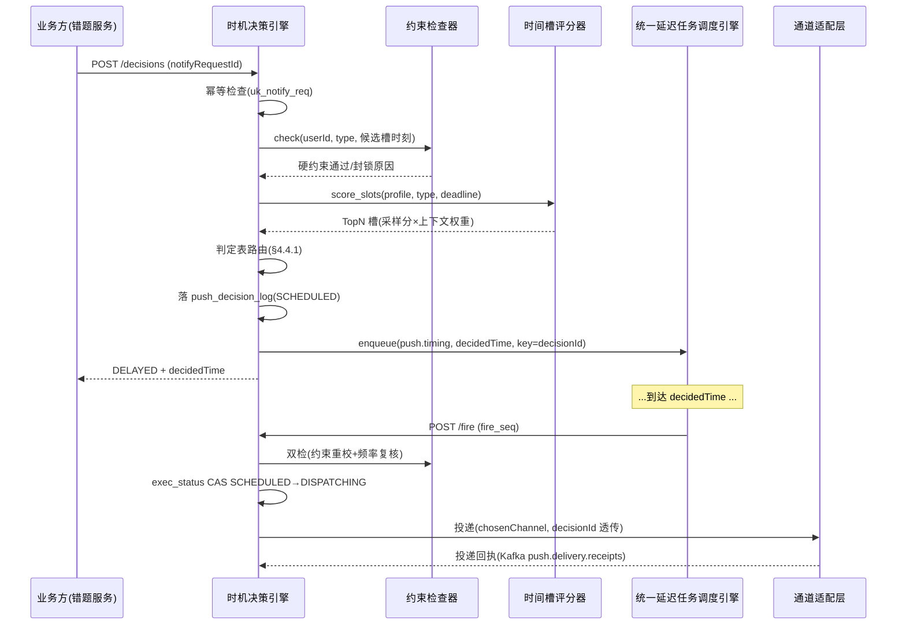
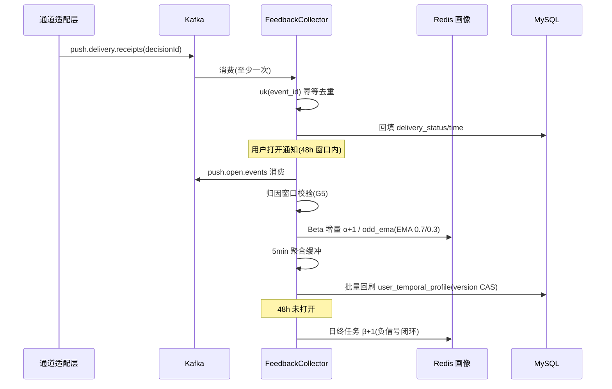
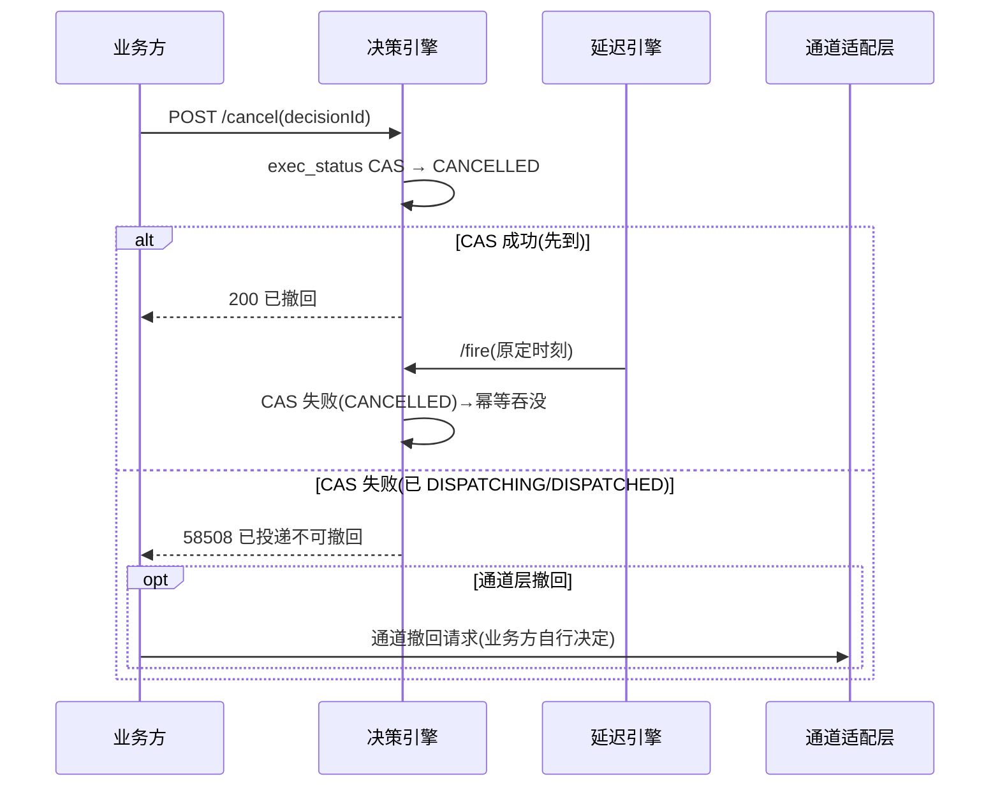

# 服务端-学生个性化推送时间智能决策与通知触达时机优化引擎-详细设计

## 1. 概述

### 1.1 功能定位

学生个性化推送时间智能决策引擎是 PrimeTop 教育平台通知体系中的**时机决策大脑**，负责为每个学生在最合适的时刻选择最合适的通道发送最合适的通知。

与现有通知系统的职责边界：

| 系统 | 职责 | 本引擎关系 |
|------|------|------------|
| 多厂商推送通道适配层 | 对接 APNs/FCM/华为/小米等厂商通道 | 消费本引擎的决策结果执行投递 |
| 统一通知消息模板引擎 | 管理通知文案模板、多渠道内容适配 | 为本引擎提供通知内容素材 |
| 多源通知智能合并与疲劳度管控 | 合并同源通知、限制频率上限 | 本引擎在频率限制内做精细时机选择 |
| 学习提醒与智能通知调度 | 管理提醒规则（学过的定时提醒） | 本引擎为其提供动态最佳发送时间 |
| 学生每日学情简报定时推送 | 生成日报内容并推送 | 本引擎决定日报的具体推送时刻 |

**核心差异**：现有系统回答的是"**发什么**"和"**怎么发**"，本引擎回答的是"**什么时候发**"——通过机器学习从每个学生的历史行为中挖掘个体化的最佳触达时机。

### 1.2 设计目标

| 指标 | 目标值 | 说明 |
|------|--------|------|
| 推送打开率提升 | ≥ 35% | 对比固定时间推送基线 |
| 决策延迟（P99） | ≤ 50ms | 单用户单通知时机决策 |
| 冷启动收敛周期 | ≤ 14 天 | 新用户从注册到获得个性化时机推荐 |
| 误打扰率 | ≤ 5% | 用户在静默/上课时间收到推送的占比 |
| 回调信号采集覆盖率 | ≥ 80% | 推送投递→打开→学习的完整漏斗数据 |

### 1.3 教育平台典型场景

| 场景 | 当前做法 | 本引擎优化 |
|------|----------|------------|
| 每日学情简报推送 | 固定 20:00 发送 | 根据学生晚间活跃高峰动态选择 19:00-21:00 间最优时刻 |
| 错题复习提醒 | 固定间隔（24h/3d/7d）触发 | 在间隔窗口内选择学生最可能响应的时刻 |
| 作业截止提醒 | 固定提前 1 天/2 小时 | 结合学生作息选择最佳提醒时刻 |
| 沉默用户唤醒 | 固定模板群发 | 选择用户历史活跃时段发送，提升回归率 |
| 考试倒计时提醒 | 固定时间 | 避免上课时间，选备考时段发送 |
| 学习打卡提醒 | 固定晚间 | 在学生最可能打卡的时刻精准推送 |
| 课程更新通知 | 实时推送 | 延迟到学生活跃窗口推送，减少打扰 |

---

## 2. 整体架构

### 2.1 架构总览

```
┌─────────────────────────────────────────────────────────────────────┐
│                        通知业务发起方                                 │
│  错题服务  作业服务  学情简报  打卡服务  运营活动  沉默唤醒  ...     │
└────────────────────────────┬────────────────────────────────────────┘
                             │ 通知请求 (userId, notifyType, content, priority)
                             ▼
┌─────────────────────────────────────────────────────────────────────┐
│                  推送时间智能决策引擎 (本设计)                        │
│                                                                     │
│  ┌──────────────┐   ┌──────────────┐   ┌──────────────┐            │
│  │  约束检查器   │   │  时机评分器   │   │  决策执行器   │            │
│  │              │   │              │   │              │            │
│  │ · 静默时段   │──▶│ · 时间槽评分 │──▶│ · 即发/延迟  │            │
│  │ · 上课时间   │   │ · 多臂老虎子 │   │ · 通道选择   │            │
│  │ · 家长管控   │   │ · 上下文特征 │   │ · 决策日志   │            │
│  │ · 频率上限   │   │ · 探索/利用  │   │              │            │
│  └──────────────┘   └──────────────┘   └──────┬───────┘            │
│                                                │                     │
│  ┌──────────────┐   ┌──────────────┐          │                     │
│  │  用户时序画像 │   │  反馈闭环     │          │                     │
│  │              │   │              │          │                     │
│  │ · 活跃热力图 │   │ · 打开回调   │          │                     │
│  │ · 时段响应率 │   │ · 学习行为   │          │                     │
│  │ · 个体特征   │   │ · 效果归因   │          │                     │
│  └──────────────┘   └──────────────┘          │                     │
└─────────────────────────────────────────────────┼───────────────────┘
                                                  │
                              ┌───────────────────▼──────────────────┐
                              │     通知投递执行层                    │
                              │  推送通道适配层 / 站内消息 / SMS      │
                              └──────────────────────────────────────┘
```

### 2.2 核心组件

| 组件 | 职责 | 技术选型 |
|------|------|----------|
| **ConstraintChecker** | 硬约束检查（静默、上课、家长管控、频率上限） | Rule Engine + Redis |
| **UserProfileStore** | 用户时序画像存储（活跃热力图、响应率、特征） | Redis Hash + MySQL |
| **TimeSlotScorer** | 时间槽评分（Thompson Sampling + 上下文特征） | Python/Java 在线推理 |
| **DecisionExecutor** | 决策执行（立即发送 / 延迟队列 / 放弃发送） | Redis ZSET + Worker |
| **FeedbackCollector** | 反馈信号采集与归因 | Kafka + Flink |
| **BanditModelManager** | 多臂老虎子模型管理与更新 | 在线学习 + 定期批量校正 |

---

## 3. 数据结构定义

### 3.1 用户时序画像表 (user_temporal_profile)

```sql
CREATE TABLE `user_temporal_profile` (
    `id` BIGINT PRIMARY KEY AUTO_INCREMENT,
    `user_id` BIGINT NOT NULL COMMENT '用户ID',
    `grade_stage` TINYINT NOT NULL COMMENT '学段: 1-幼儿 2-小学 3-初中 4-高中',
    `grade_level` INT NOT NULL COMMENT '年级',
    `school_type` TINYINT DEFAULT 0 COMMENT '0-未知 1-走读 2-寄宿',
    
    -- 时间槽响应率（7天 × 24小时 = 168 个时间槽）
    -- 以 JSON 存储便于整体读写
    `slot_open_rates` JSON NOT NULL COMMENT '168个时间槽的推送打开率（Beta分布alpha参数）',
    `slot_open_betas` JSON NOT NULL COMMENT '168个时间槽的推送打开率（Beta分布beta参数）',
    `slot_session_rates` JSON NOT NULL COMMENT '168个时间槽的发起学习会话率',
    
    -- 全局特征
    `total_pushes_sent` INT DEFAULT 0 COMMENT '累计推送数',
    `total_pushes_opened` INT DEFAULT 0 COMMENT '累计推送打开数',
    `avg_open_delay_sec` INT DEFAULT 0 COMMENT '平均打开延迟（秒）',
    `preferred_channels` JSON DEFAULT NULL COMMENT '通道偏好排序: ["push","in_app","sms"]',
    
    -- 时段偏好（聚合维度）
    `morning_score` FLOAT DEFAULT 0.0 COMMENT '晨间偏好得分(6-9h)',
    `forenoon_score` FLOAT DEFAULT 0.0 COMMENT '上午偏好得分(9-12h)',
    `afternoon_score` FLOAT DEFAULT 0.0 COMMENT '下午偏好得分(12-18h)',
    `evening_score` FLOAT DEFAULT 0.0 COMMENT '晚间偏好得分(18-22h)',
    `night_score` FLOAT DEFAULT 0.0 COMMENT '夜间偏好得分(22-6h)',
    
    -- 冷启动与状态
    `profile_status` TINYINT DEFAULT 0 COMMENT '0-冷启动 1-学习中 2-稳定 3-过期',
    `last_updated_at` DATETIME NOT NULL COMMENT '最后更新时间',
    `created_at` DATETIME NOT NULL DEFAULT CURRENT_TIMESTAMP,
    
    UNIQUE KEY `uk_user_id` (`user_id`),
    INDEX `idx_status_updated` (`profile_status`, `last_updated_at`)
) ENGINE=InnoDB DEFAULT CHARSET=utf8mb4 COMMENT='用户时序画像表';
```

### 3.2 时间槽索引说明

168 个时间槽 = 7（星期几） × 24（小时），编号规则：

```
slot_index = day_of_week * 24 + hour
```

| day_of_week | 值 |
|-------------|-----|
| 周一 | 0 |
| 周二 | 1 |
| ... | ... |
| 周日 | 6 |

示例：周三 20:00 → `slot_index = 2 * 24 + 20 = 68`

### 3.3 Beta 分布参数存储格式

每个时间槽用 Beta 分布建模响应概率，JSON 格式存储：

```json
{
  "68": {"alpha": 12.5, "beta": 7.3},
  "69": {"alpha": 15.2, "beta": 4.1},
  "140": {"alpha": 3.1, "beta": 18.7},
  "..."
}
```

- `alpha`：打开次数 + 先验伪计数（初始为 1.0）
- `beta`：未打开次数 + 先验伪计数（初始为 1.0）
- 当 alpha/(alpha+beta) > 某阈值时，该时间槽为高响应率时段

### 3.4 推送决策日志表 (push_decision_log)

```sql
CREATE TABLE `push_decision_log` (
    `id` BIGINT PRIMARY KEY AUTO_INCREMENT,
    `decision_id` VARCHAR(64) NOT NULL COMMENT '决策唯一ID',
    `user_id` BIGINT NOT NULL COMMENT '目标用户',
    `notify_type` VARCHAR(32) NOT NULL COMMENT '通知类型',
    `notify_request_id` VARCHAR(64) NOT NULL COMMENT '来源请求ID',
    
    -- 决策输入
    `request_time` DATETIME NOT NULL COMMENT '通知请求时间',
    `context_features` JSON DEFAULT NULL COMMENT '决策时上下文特征快照',
    `candidate_slots` JSON DEFAULT NULL COMMENT '候选时间槽及得分',
    
    -- 决策结果
    `decision` TINYINT NOT NULL COMMENT '0-立即发送 1-延迟发送 2-放弃 3-合并',
    `decided_slot` INT DEFAULT NULL COMMENT '决定发送的时间槽index',
    `decided_time` DATETIME DEFAULT NULL COMMENT '决定发送的精确时间',
    `chosen_channel` VARCHAR(16) DEFAULT NULL COMMENT '选择的通道',
    `decision_reason` VARCHAR(128) DEFAULT NULL COMMENT '决策原因编码',
    
    -- 反馈（异步填充）
    `delivery_status` TINYINT DEFAULT NULL COMMENT '0-未投递 1-已投递 2-投递失败',
    `delivery_time` DATETIME DEFAULT NULL,
    `open_status` TINYINT DEFAULT NULL COMMENT '0-未打开 1-已打开',
    `open_time` DATETIME DEFAULT NULL,
    `open_delay_sec` INT DEFAULT NULL COMMENT '打开延迟（秒）',
    `session_started` TINYINT DEFAULT 0 COMMENT '是否由此推送发起学习会话',
    
    `created_at` DATETIME NOT NULL DEFAULT CURRENT_TIMESTAMP,
    
    UNIQUE KEY `uk_decision_id` (`decision_id`),
    INDEX `idx_user_time` (`user_id`, `request_time`),
    INDEX `idx_notify_req` (`notify_request_id`),
    INDEX `idx_open_status` (`open_status`, `delivery_time`)
) ENGINE=InnoDB DEFAULT CHARSET=utf8mb4 COMMENT='推送决策日志';
```

### 3.5 静默约束规则表 (user_silence_rule)

```sql
CREATE TABLE `user_silence_rule` (
    `id` BIGINT PRIMARY KEY AUTO_INCREMENT,
    `user_id` BIGINT NOT NULL COMMENT '用户ID',
    `rule_type` TINYINT NOT NULL COMMENT '1-固定静默 2-上课时间 3-考试时间 4-家长设置 5-自定义',
    `start_time` TIME NOT NULL COMMENT '静默开始时间',
    `end_time` TIME NOT NULL COMMENT '静默结束时间',
    `day_mask` SMALLINT DEFAULT 127 COMMENT '星期掩码: bit0=周一 ... bit6=周日, 127=每天',
    `priority` INT DEFAULT 50 COMMENT '规则优先级(越大越高)',
    `expires_at` DATETIME DEFAULT NULL COMMENT '过期时间(NULL=永久)',
    `created_by` BIGINT DEFAULT NULL COMMENT '创建者(用户自己/家长/系统)',
    `created_at` DATETIME NOT NULL DEFAULT CURRENT_TIMESTAMP,
    
    INDEX `idx_user_type` (`user_id`, `rule_type`)
) ENGINE=InnoDB DEFAULT CHARSET=utf8mb4 COMMENT='用户静默约束规则';
```

### 3.6 通知类型策略配置表 (notify_type_strategy)

```sql
CREATE TABLE `notify_type_strategy` (
    `id` INT PRIMARY KEY AUTO_INCREMENT,
    `notify_type` VARCHAR(32) NOT NULL COMMENT '通知类型',
    `type_name` VARCHAR(64) NOT NULL COMMENT '类型名称',
    
    -- 时效性约束
    `max_delay_hours` INT DEFAULT 24 COMMENT '最大可延迟小时数(超过则强制发送)',
    `min_delay_minutes` INT DEFAULT 0 COMMENT '最小延迟分钟数(用于合并等待)',
    
    -- 优先级与穿透力
    `priority_level` TINYINT DEFAULT 3 COMMENT '1-紧急 2-高 3-正常 4-低',
    `can_break_silence` TINYINT DEFAULT 0 COMMENT '是否能突破静默约束(紧急通知)',
    `can_delay` TINYINT DEFAULT 1 COMMENT '是否允许延迟',
    
    -- 频率控制
    `daily_cap` INT DEFAULT 3 COMMENT '该类型每日上限',
    `weekly_cap` INT DEFAULT 10 COMMENT '该类型每周上限',
    
    -- 通道策略
    `channel_priority` JSON DEFAULT NULL COMMENT '通道优先级: ["push","in_app","sms"]',
    `fallback_enabled` TINYINT DEFAULT 1 COMMENT '是否允许通道降级',
    
    -- 学习行为目标
    `target_action` VARCHAR(32) DEFAULT 'open' COMMENT '目标行为: open/start_session/complete_task',
    
    `is_active` TINYINT DEFAULT 1,
    `created_at` DATETIME NOT NULL DEFAULT CURRENT_TIMESTAMP,
    `updated_at` DATETIME NOT NULL DEFAULT CURRENT_TIMESTAMP ON UPDATE CURRENT_TIMESTAMP,
    
    UNIQUE KEY `uk_notify_type` (`notify_type`)
) ENGINE=InnoDB DEFAULT CHARSET=utf8mb4 COMMENT='通知类型策略配置';
```

### 3.7 通知类型枚举

```java
public enum NotifyType {
    DAILY_REPORT("每日学情简报", 6, 360),      // 最大延迟6h，可等
    REVIEW_REMINDER("错题复习提醒", 12, 720),   // 最大延迟12h
    HOMEWORK_DEADLINE("作业截止提醒", 2, 120),   // 最大延迟2h
    EXAM_COUNTDOWN("考试倒计时", 24, 1440),     // 最大延迟24h
    CHECKIN_REMINDER("学习打卡提醒", 4, 240),    // 最大延迟4h
    COURSE_UPDATE("课程更新通知", 12, 720),      // 最大延迟12h
    DORMANT_WAKEUP("沉默用户唤醒", 48, 2880),   // 最大延迟48h
    MEMBERSHIP_EXPIRE("会员到期提醒", 168, 10080), // 最大延迟7天
    SYSTEM_ANNOUNCEMENT("系统公告", 1, 60),       // 最大延迟1h
    ACHIEVEMENT_UNLOCK("成就解锁通知", 2, 120),   // 最大延迟2h
    TEACHER_FEEDBACK("老师反馈通知", 1, 30),       // 最大延迟30min
    PARENT_REPORT("家长周报/月报", 48, 2880)       // 最大延迟48h
    ;
    // (type_name, max_delay_hours, max_delay_minutes)
}
```

---

## 4. 核心算法设计

### 4.1 整体决策流程

```
通知请求进入
    │
    ▼
┌─────────────────┐
│ Step 1: 约束检查 │ ──── 静默时段？上课时间？频率超限？家长管控？
└────────┬────────┘
         │ 通过
         ▼
┌─────────────────┐
│ Step 2: 时效判定 │ ──── 当前时间 vs max_delay_hours
└────────┬────────┘
         │
    ┌────┴────┐
    │         │
现在必须发   可以延迟
    │         │
    ▼         ▼
┌─────────┐ ┌─────────────────────┐
│ 立即发送 │ │ Step 3: 时间槽评分   │
│ (跳过)   │ │ Thompson Sampling   │
└─────────┘ │ + 上下文特征加权     │
            └──────────┬──────────┘
                       │
                       ▼
            ┌─────────────────────┐
            │ Step 4: 最优时间槽   │
            │ 选择 + 探索概率      │
            └──────────┬──────────┘
                       │
                       ▼
            ┌─────────────────────┐
            │ Step 5: 通道选择     │ ──── 按偏好+优先级选通道
            └──────────┬──────────┘
                       │
                       ▼
            ┌─────────────────────┐
            │ Step 6: 延迟队列注册 │ ──── 注册到延迟任务调度引擎
            └──────────┬──────────┘
                       │
                       ▼
            ┌─────────────────────┐
            │ Step 7: 决策日志记录 │ ──── 写入 push_decision_log
            └─────────────────────┘
```

### 4.2 约束检查器 (ConstraintChecker)

#### 4.2.1 硬约束（必须满足，不可跳过）

```python
class ConstraintChecker:
    """
    检查通知发送的硬约束。
    返回: (passed: bool, reason: str, blocked_until: datetime|None)
    """
    
    SILENCE_DEFAULTS = {
        # 学段默认静默时间（可被用户/家长覆盖）
        1: {"start": "20:00", "end": "07:00"},  # 幼儿: 20:00-07:00
        2: {"start": "21:00", "end": "06:30"},  # 小学: 21:00-06:30
        3: {"start": "22:00", "end": "06:00"},  # 初中: 22:00-06:00
        4: {"start": "23:00", "end": "06:00"},  # 高中: 23:00-06:00
    }
    
    # 全国统一上课时间（走读学生）
    SCHOOL_HOURS = {
        "weekday": {"start": "08:00", "end": "17:00"},
        "weekday_exception": {"start": "08:00", "end": "12:00"},  # 半天（周五部分学校）
    }
    
    def check(self, user_id: int, notify_type: str, 
              target_time: datetime, profile: dict) -> tuple:
        """主检查入口"""
        
        # 1. 频率上限检查
        freq_result = self._check_frequency(user_id, notify_type)
        if not freq_result.passed:
            return freq_result
        
        # 2. 静默时段检查
        silence_result = self._check_silence(user_id, target_time, profile, notify_type)
        if not silence_result.passed:
            return silence_result
        
        # 3. 上课时间检查（K12 走读学生）
        school_result = self._check_school_hours(user_id, target_time, profile, notify_type)
        if not school_result.passed:
            return school_result
        
        # 4. 考试时间检查
        exam_result = self._check_exam_period(user_id, target_time, profile)
        if not exam_result.passed:
            return exam_result
        
        # 5. 家长管控检查
        parent_result = self._check_parent_control(user_id, target_time, notify_type)
        if not parent_result.passed:
            return parent_result
        
        return ConstraintResult(passed=True)
```

#### 4.2.2 静默时段判定逻辑

```python
def _check_silence(self, user_id: int, target_time: datetime, 
                   profile: dict, notify_type: str) -> ConstraintResult:
    # 紧急通知可突破静默
    strategy = self.strategy_cache.get(notify_type)
    if strategy.priority_level == 1 and strategy.can_break_silence:
        return ConstraintResult(passed=True)
    
    # 查询用户自定义静默规则
    rules = self.silence_rule_cache.get_rules(user_id)
    if not rules:
        # 使用学段默认静默
        grade_stage = profile.get("grade_stage", 2)
        default = self.SILENCE_DEFAULTS.get(grade_stage)
        if default and self._is_in_time_range(target_time, default["start"], default["end"]):
            return ConstraintResult(
                passed=False, 
                reason="DEFAULT_SILENCE",
                blocked_until=self._next_available_time(target_time, default["end"])
            )
    else:
        for rule in rules:
            if self._matches_day_mask(target_time, rule.day_mask) and \
               self._is_in_time_range(target_time, rule.start_time, rule.end_time):
                return ConstraintResult(
                    passed=False,
                    reason=f"SILENCE_RULE_{rule.rule_type}",
                    blocked_until=self._next_available_time(target_time, rule.end_time)
                )
    
    return ConstraintResult(passed=True)


def _is_in_time_range(self, dt: datetime, start: str, end: str) -> bool:
    """处理跨午夜的时间范围"""
    t = dt.time()
    s = datetime.strptime(start, "%H:%M").time()
    e = datetime.strptime(end, "%H:%M").time()
    if s <= e:
        return s <= t < e
    else:
        # 跨午夜（如 22:00-06:00）
        return t >= s or t < e
```

### 4.3 时间槽评分器 (TimeSlotScorer)

#### 4.3.1 Thompson Sampling 核心算法

对每个候选时间槽，从 Beta 分布中采样得到响应概率估计，结合上下文特征加权得出最终得分。

```python
import numpy as np
from dataclasses import dataclass

@dataclass
class SlotScore:
    slot_index: int          # 时间槽编号 (0-167)
    day_of_week: int         # 星期几 (0-6)
    hour: int                # 小时 (0-23)
    raw_score: float         # Thompson采样原始分
    context_adjusted: float  # 上下文调整后得分
    is_exploration: bool     # 是否为探索性选择

class TimeSlotScorer:
    
    EXPLORATION_EPSILON = 0.1  # ε-greedy 探索率
    MIN_SAMPLES_FOR_EXPLOIT = 20  # 至少20个样本才进入利用阶段
    
    def score_slots(self, user_id: int, profile: dict, 
                    notify_type: str, deadline: datetime,
                    current_time: datetime) -> list[SlotScore]:
        """
        对所有候选时间槽评分。
        
        Args:
            user_id: 用户ID
            profile: 用户时序画像
            notify_type: 通知类型
            deadline: 最大可发送时间（时效约束）
            current_time: 当前时间
        Returns:
            按得分降序排列的时间槽列表
        """
        # 1. 枚举候选时间槽
        candidate_slots = self._enumerate_candidate_slots(
            current_time, deadline, profile
        )
        
        # 2. 对每个时间槽评分
        scores = []
        for slot_idx in candidate_slots:
            dow, hour = divmod(slot_idx, 24)
            
            # Thompson Sampling: 从 Beta(α, β) 采样
            alpha, beta = self._get_slot_params(profile, slot_idx)
            sampled_rate = np.random.beta(alpha, beta)
            
            # 上下文特征调整
            context_weight = self._compute_context_weight(
                profile, notify_type, dow, hour, slot_idx
            )
            adjusted_score = sampled_rate * context_weight
            
            # 探索/利用判定
            total_samples = alpha + beta - 2.0  # 减去先验
            is_exploring = total_samples < self.MIN_SAMPLES_FOR_EXPLOIT
            
            scores.append(SlotScore(
                slot_index=slot_idx,
                day_of_week=dow,
                hour=hour,
                raw_score=sampled_rate,
                context_adjusted=adjusted_score,
                is_exploration=is_exploring
            ))

        # 3. 探索配额守卫（G8）：当日探索性决策已满 1 次，过滤探索性槽；
        #    若全部为探索槽（极端冷启动），保留得分最高者避免无槽可用
        if self._explore_quota_used(user_id, current_time):
            non_explore = [s for s in scores if not s.is_exploration]
            scores = non_explore if non_explore else scores[:1]

        # 4. 按上下文调整后得分降序排列返回
        scores.sort(key=lambda s: s.context_adjusted, reverse=True)
        return scores
```

#### 4.3.2 候选时间槽枚举

```python
def _enumerate_candidate_slots(self, current_time: datetime,
                               deadline: datetime, profile: dict) -> list[int]:
    """
    枚举 [current_time, deadline] 内的全部候选小时槽。
    规则：
    - 当前小时剩余 >= 15 分钟才纳入当前槽（预留发送准备耗时）
    - 同一 slot_index（周内循环）去重，评分只算一次
    - 上限 168 个槽（一周全覆盖），超出按时间顺序截断
    """
    slots, seen = [], set()
    # 对齐到下一个整点
    t = current_time.replace(minute=0, second=0, microsecond=0)
    if current_time.minute <= 45 and current_time.minute > 0:
        cur_slot = current_time.weekday() * 24 + current_time.hour
        slots.append(cur_slot)
        seen.add(cur_slot)
        t = t + timedelta(hours=1)
    elif current_time.minute == 0:
        cur_slot = current_time.weekday() * 24 + current_time.hour
        slots.append(cur_slot)
        seen.add(cur_slot)
        t = t + timedelta(hours=1)

    while t <= deadline and len(slots) < 168:
        slot_idx = t.weekday() * 24 + t.hour
        if slot_idx not in seen:
            slots.append(slot_idx)
            seen.add(slot_idx)
        t = t + timedelta(hours=1)
    return slots
```

**物化说明**：`slot_index` 仅表示"周内哪一天哪个小时"的模式槽；最终 `decided_time` 由决策执行器取该槽在 `[now, deadline]` 内的**最早一次实际出现时刻**（见 §4.4.2）。

#### 4.3.3 个体参数读取与冷启动先验（F4 修复后口径）

```python
MIN_INDIVIDUAL_SAMPLES = 8   # 单槽个体有效样本低于此值时混入群体先验
PRIOR_EQUIV_SAMPLES = 12.0   # 群体先验等效样本量 w0

def _get_slot_params(self, profile: dict, slot_idx: int) -> tuple[float, float]:
    """读取槽参数；个体样本不足或长期无信号时按比例混入群体先验与时间衰减。"""
    key = str(slot_idx)
    alpha = float(profile["slot_open_alphas"].get(key, 1.0))
    beta = float(profile["slot_open_betas"].get(key, 1.0))
    n_ind = alpha + beta - 2.0          # 个体有效样本数
    n_eff = n_ind * self._decay_factor(profile)   # 时间衰减（F3，见 §4.7.2）

    if n_eff < self.MIN_INDIVIDUAL_SAMPLES:
        mu0, w0 = self._cohort_prior(profile, slot_idx)   # k>=50 匿名桶（G14）
        # 先验 Beta(1+mu0*w0, 1+(1-mu0)*w0) 与个体样本按有效量线性混合
        a_prior, b_prior = 1.0 + mu0 * w0, 1.0 + (1 - mu0) * w0
        w_mix = n_eff / (n_eff + w0)     # 个体权重随样本增长而上升
        alpha_eff = w_mix * alpha + (1 - w_mix) * a_prior
        beta_eff = w_mix * beta + (1 - w_mix) * b_prior
        return alpha_eff, beta_eff
    return alpha + (n_eff - n_ind), beta + (n_eff - n_ind)  # 衰减折算回计数
```

**群体先验桶（G14 k-匿名红线）**：分桶键为 `(grade_stage, grade_level, region_code)`；任一桶活跃样本数 `k < 50` 时逐级上卷（去 region → 去 grade_level），仍不足则使用学段全局先验并在决策日志标记 `prior_level`。桶内只聚合打开率，**绝不携带个体身份出桶**。

#### 4.3.4 上下文特征权重

```python
def _compute_context_weight(self, profile: dict, notify_type: str,
                            dow: int, hour: int, slot_idx: int) -> float:
    """上下文权重 = 类型时段适配 × 时效紧迫 × 打扰疲劳 × 校历 × 目标时刻，五因子乘法合成。"""
    w = 1.0
    w *= self._type_hour_fitness(notify_type, hour)      # 因子1：类型×时段适配
    w *= self._urgency_bias(slot_idx, profile)           # 因子2：临近 deadline 偏好早槽
    w *= self._fatigue_penalty(profile)                  # 因子3：近24h打扰惩罚
    w *= self._calendar_factor(profile, dow)             # 因子4：学期/假期/周末
    w *= self._target_action_bias(notify_type, profile, hour)  # 因子5：目标行为时刻前置
    return max(w, 0.05)   # 权重下限，防止全部候选被压成 0 分
```

| 因子 | 计算规则 | 示例 |
|------|----------|------|
| 类型×时段适配 | 类型×四时段（晨/上午/下午/晚）静态矩阵，运营侧可配置 | 简报×晚间=1.2、简报×晨间=0.6；作业提醒×下午=1.1 |
| 时效紧迫 | `1 + 0.15 × (1 − slot_offset / candidate_span)`，slot_offset 为候选槽在可行窗内的相对位置 | 距 deadline 仅 2h 时早槽权重约 1.13，晚槽约 1.02 |
| 打扰疲劳 | 近 24h 已投递 N 条：`(1 − 0.15N)`，下限 0.3 | 昨日已发 4 条 → 0.4 |
| 校历 | 学期工作日/学期周末/假期三态矩阵 | 假期×上午=1.2（假期上午可触达）；学期×工作日上午被上课约束拦截，不进评分 |
| 目标时刻前置 | CHECKIN_REMINDER 等目标型通知在"习惯打卡时刻−15min"槽 ×1.3 | 学生常 20:30 打卡 → 20:15 槽加权 |

**可解释性**：五因子分量值随 `candidate_slots` 一并写入 `push_decision_log.context_features`（仅数值，不含通知正文，G13），支撑家长申诉时的决策解释（C9）。

### 4.4 决策执行器 (DecisionExecutor)

#### 4.4.1 决策判定表（F1 修复：延迟注册委托统一延迟任务调度引擎）

| 判定条件 | 决策 | decision 码 | 后续动作 |
|----------|------|-------------|----------|
| `deadline ≤ now + 120s`（时效临期） | 立即发送 | 0 IMMEDIATE | 约束检查通过后直接交通道适配层；全约束封锁则降级站内信（G3） |
| `strategy.can_delay=1` 且最优槽得分 ≥ 0.05 | 延迟发送 | 1 DELAYED | 注册统一延迟任务调度引擎，topic=`push.timing`，幂等键=decisionId |
| `min_delay` 窗口内已存在同型待发决策 | 合并 | 3 MERGED | 委托多源通知智能合并引擎聚合，本引擎不重复注册 |
| 最优槽得分 < 0.05 且非强制类型 | 放弃 | 2 DROPPED | 记录决策日志，向业务方回执 dropped |
| 频率上限命中（疲劳度引擎裁决） | 放弃 | 2 DROPPED | reason=FREQ_CAP，权威归疲劳度引擎（R2/F8） |

> **F1 裁决**：v1.0 中 DecisionExecutor 选型"Redis ZSET + Worker"与《服务端-统一延迟任务调度与到期事件触发引擎》职责重叠。v1.1 起延迟投递一律注册该引擎；本引擎的 `pt:zset:due` ZSET 仅作为**到期补偿扫描兜底**（§4.4.4），不承担投递职责，不新建 Worker。

#### 4.4.2 执行主流程

```python
class DecisionExecutor:
    SEND_PREPARE_SECONDS = 120
    DROP_THRESHOLD = 0.05

    def execute(self, ctx: DecisionContext) -> DecisionResult:
        now = ctx.current_time
        strategy = ctx.strategy
        deadline = ctx.deadline or now + timedelta(hours=strategy.max_delay_hours)

        # Step 1: 时效临期 → 立即发送（仍过约束 G3）
        if deadline <= now + timedelta(seconds=self.SEND_PREPARE_SECONDS):
            ok, reason, blocked_until = self.checker.check(
                ctx.user_id, ctx.notify_type, now, ctx.profile)
            if ok:
                return self._dispatch_now(ctx, reason="DEADLINE_NOW")
            return self._fallback_inapp(ctx, blocked_reason=reason)  # G3 降级站内信

        # Step 2: 频率上限（委托疲劳度引擎，F8/R2）
        if not self.freq_client.check_quota(ctx.user_id, ctx.notify_type):
            return self._drop(ctx, reason="FREQ_CAP")

        # Step 3: 时间槽评分
        scores = self.scorer.score_slots(
            ctx.user_id, ctx.profile, ctx.notify_type, deadline, now)
        if not scores:
            return self._fallback_inapp(ctx, blocked_reason="NO_CANDIDATE_SLOT")

        best = scores[0]
        if best.context_adjusted < self.DROP_THRESHOLD and not strategy.is_mandatory:
            return self._drop(ctx, reason="LOW_SCORE")

        # Step 4: 约束校验最优槽的实际出现时刻
        decided_time = self._materialize_slot(best, now, deadline)
        ok, reason, _ = self.checker.check(
            ctx.user_id, ctx.notify_type, decided_time, ctx.profile)
        if not ok:
            for cand in scores[1:5]:        # 依次尝试次优槽（最多再试4个）
                decided_time = self._materialize_slot(cand, now, deadline)
                ok, reason, _ = self.checker.check(
                    ctx.user_id, ctx.notify_type, decided_time, ctx.profile)
                if ok:
                    best = cand
                    break
            if not ok:
                return self._fallback_inapp(ctx, blocked_reason=reason)

        # Step 5: 通道选择 + 写决策日志 + 注册延迟
        channel = self.channel_selector.select(ctx, best)
        decision_id = self._persist_decision(ctx, best, decided_time, channel)

        if decided_time <= now + timedelta(seconds=self.SEND_PREPARE_SECONDS):
            return self._dispatch_now(ctx, decision_id, reason="SLOT_NOW")
        self.delay_client.enqueue(
            topic="push.timing", execute_at=decided_time,
            payload={"decisionId": decision_id}, idempotency_key=decision_id)
        return DecisionResult(decision_id=decision_id, decision="DELAYED",
                              decided_time=decided_time, channel=channel)

    def _materialize_slot(self, score: SlotScore, now: datetime,
                          deadline: datetime) -> datetime:
        """模式槽 → [now, deadline] 内最早实际出现时刻"""
        t = now.replace(minute=0, second=0, microsecond=0) + timedelta(hours=1)
        while t <= deadline:
            if t.weekday() * 24 + t.hour == score.slot_index:
                return t
            t += timedelta(hours=1)
        return deadline   # 理论不可达（枚举保证），防御性兜底
```

#### 4.4.3 到期触发与双检（延迟引擎回调）

统一延迟任务调度引擎到期后回调内部端点 `POST /internal/push-timing/decisions/{decisionId}/fire`（由延迟引擎携带 `fire_seq` 幂等触发）：

1. **重校约束**：投递时刻的静默/上课/家长管控可能与决策时刻不同（规则中途变更），必须重跑 ConstraintChecker；
2. **频率复核**：窗口内该用户同型通知是否已被其他链路投出（防双发）；
3. **CAS 状态迁移**：`exec_status` 由 `SCHEDULED` CAS 至 `DISPATCHING`（带 version 乐观锁，G4/幂等场景 2）；
4. 重校失败 → 顺延至次优槽重新注册（每条决策最多顺延 3 次，超过降级站内信并记 `decision_reason=DEFER_EXHAUSTED`）；
5. CAS 失败（已被触发过/已撤回）→ 直接返回成功（幂等吞没），不重复投递。

#### 4.4.4 兜底扫描

每 5 分钟扫描 `pt:zset:due` 中 `fire_time < now − 2min` 且 `exec_status ∈ {SCHEDULED}` 的决策（延迟引擎回调丢失的补偿），重新触发 fire 流程；**兜底扫描命中率 > 0.1% 视为延迟引擎异常告警（M10）**。ZSET 与延迟引擎注册同事务写入（Outbox 模式），保证兜底全集不漏。

#### 4.4.5 撤回

业务方（如作业撤回、公告下架）调用 `POST /decisions/{decisionId}/cancel`：`exec_status` CAS 至 `CANCELLED`；若已 `DISPATCHED`（交通道）返回 58508 由业务方决定是否走通道层撤回；竞态裁决**先到者胜**（G9）。

### 4.5 通道选择器 (ChannelSelector)

```
选择算法：
  候选集 = 画像 preferred_channels ∩ 策略 channel_priority（保持策略序）
  逐通道检查健康度（通道适配层 health 接口，本地缓存 30s）：
    - 连续失败熔断中的通道跳过
    - push 不可用 → fallback_enabled=1 时降 in_app；再不可用降 sms
  约束：
    - 幼儿/小学低年级段禁用 SMS（家长通道除外）
    - SMS 仅 priority_level ≤ 2 且用户已授权
    - DELAYED 决策到期触发时重新执行本算法（通道健康度是时变的）
```

### 4.6 反馈闭环与归因 (FeedbackCollector)

#### 4.6.1 信号源与归因窗口（F4 修复后口径）

| 信号 | 来源 | Kafka Topic | 归因规则 |
|------|------|-------------|----------|
| 投递回执 | 多厂商推送通道适配层 | `push.delivery.receipts` | decisionId 直接匹配（通知透传 token 回传） |
| 打开事件 | 客户端埋点（经统一埋点平台） | `push.open.events` | 携带 decisionId；缺失时按 `(userId, notifyType, 投递后48h窗口)` 唯一匹配 |
| 学习会话 | 学习服务 | `learning.session.started` | 打开后 30min 内且 entry_source=notification → `session_started=1` |

**归因窗口红线（F4/G5）**：打开归因窗口 48h、会话归因窗口 open+30min；窗口外信号仅进全局统计（打开率日报），**不回写该决策的 Beta 参数**，防止陈旧信号污染个体模型。

#### 4.6.2 Beta 参数增量更新

```python
class FeedbackCollector:
    OPEN_ATTR_WINDOW = timedelta(hours=48)
    SESSION_ATTR_WINDOW = timedelta(minutes=30)

    def on_delivery_receipt(self, msg: dict):
        # 幂等：投递回执可能重复（厂商重试），uk=(decision_id, receipt_type)
        if not self.attr_dao.try_insert(msg["decision_id"], "DELIVERED", msg["event_id"]):
            return
        self.log_dao.update_delivery(msg["decision_id"], msg["status"], msg["ts"])

    def on_open(self, msg: dict):
        decision = self.log_dao.get(msg["decision_id"])
        if decision is None or decision.delivery_status != 1:
            return
        if now() - decision.delivery_time > self.OPEN_ATTR_WINDOW:
            self.metrics.inc("open_late_dropped")   # 窗外只统计不归因（G5）
            return
        if not self.attr_dao.try_insert(decision.decision_id, "OPEN", msg["event_id"]):
            return                                   # 重复打开只计一次（G6）
        delay = (msg["ts"] - decision.delivery_time).total_seconds()
        self.profile_store.beta_update(
            decision.user_id, decision.decided_slot, opened=True, open_delay=delay)

    def on_session(self, msg: dict):
        # 仅当会话由本通知触发（entry_source=notification 且 decision_id 匹配）
        ...

    def beta_update(self, user_id, slot_idx, opened, open_delay=None):
        """Redis 增量 + MySQL 批量回刷（5min 窗口聚合，F7 version CAS）"""
        key = f"pt:profile:{user_id}"
        pipe = self.redis.pipeline()
        pipe.hincrbyfloat(key, f"a.{slot_idx}", 1.0 if opened else 0.0)
        pipe.hincrbyfloat(key, f"b.{slot_idx}", 0.0 if opened else 1.0)
        if open_delay is not None:
            pipe.hset(key, "odd_ema",
                      0.7 * float(self.redis.hget(key, "odd_ema") or 0) + 0.3 * open_delay)
        pipe.hincrby(key, "version", 1)
        pipe.expire(key, 90 * 86400)
        pipe.execute()
        self.flush_buffer.append(user_id)   # 异步批量落 MySQL
```

**投递未打开**：决策 `DELIVERED` 后 48h 仍未打开，由日终任务补 `β += 1`（负信号必须闭环，否则 Beta 只会单调乐观）。

### 4.7 模型管理器 (BanditModelManager)

#### 4.7.1 在线更新与批量校正

- **在线层**：反馈闭环直接增量更新 Redis 画像（§4.6.2），5 分钟窗口聚合回刷 MySQL `user_temporal_profile`；
- **批量层（周任务）**：
  1. **时间衰减（F3）**：对每个用户，距其最后反馈信号每满 1 周，全部槽的 `(α, β)` 等效样本 ×0.95（`n_eff = n × 0.95^weeks`，在读取侧折算，物理参数不动，见 §4.3.3）；
  2. **漂移检测**：逐槽对比近 4 周与历史打开率分布，`PSI > 0.2` 的槽重置为群体先验（作息迁移场景：换学期、升学）；
  3. **画像状态迁移**：按 §7.2 矩阵评估 `profile_status`。

#### 4.7.2 时间衰减折算

```python
def _decay_factor(self, profile: dict) -> float:
    weeks = (now() - profile["last_feedback_at"]).days / 7.0
    return max(0.95 ** weeks, 0.3)   # 衰减下限 0.3，防止长沉默用户退化为纯先验
```

### 4.8 冷启动策略

| 阶段 | 判定 | 决策依据 | 附加约束 |
|------|------|----------|----------|
| COLD（0） | 注册后 0 条反馈信号 | 群体先验（§4.3.3 桶）+ 策略默认时段 | 运营类通知仅 17:00–19:00 窗口；探索配额 G8 生效 |
| LEARNING（1） | 首条归因信号到达 | 先验混合，个体权重随样本上升 | 无附加 |
| STABLE（2） | 累计推送 ≥ 40 且 ≥ 24 个槽有个体样本且覆盖 ≥ 14 天 | 纯个体参数 | 无附加 |
| STALE（3） | 30 天无任何反馈信号 | 衰减折算 + PSI 重置 | 恢复信号即回 LEARNING |

冷启动收敛目标（14 天）由 M6 监控：注册 14 天时画像仍处 COLD 的占比 ≤ 20%。

---

## 5. API 接口设计

### 5.1 业务方决策接口

#### POST /api/v1/push-timing/decisions

请求业务方（错题服务、简报服务、运营活动等）创建时机决策。`X-Idempotency-Key = notifyRequestId`。

**请求：**

```json
{
  "notifyRequestId": "nr_20260821_000123",
  "userId": 20260821001,
  "notifyType": "REVIEW_REMINDER",
  "priorityOverride": null,
  "contentRef": {"templateId": "tpl_review_001", "paramsVersion": 3},
  "deadline": null,
  "meta": {"sourceModule": "mistake", "traceId": "tr_abc"}
}
```

**响应：**

```json
{
  "code": 0,
  "data": {
    "decisionId": "pd_20260821_a1b2c3",
    "decision": "DELAYED",
    "decidedTime": "2026-08-21T19:40:00+08:00",
    "chosenChannel": "push",
    "reason": "TS_BEST_SLOT",
    "degraded": false,
    "priorLevel": "individual"
  }
}
```

| decision | 语义 | 业务方处理 |
|----------|------|------------|
| IMMEDIATE | 已立即交通道 | 无需处理 |
| DELAYED | 已注册延迟投递 | 可随时 cancel |
| MERGED | 已并入同型待发通知 | 等待合并引擎聚合结果 |
| DROPPED | 被放弃（频率/低分/约束） | reason 区分 FREQ_CAP / LOW_SCORE / HARD_CONSTRAINT |

#### GET /api/v1/push-timing/decisions/{decisionId}

返回决策详情与当前 `exec_status`、投递/打开反馈（不含通知正文）。

#### POST /api/v1/push-timing/decisions/{decisionId}/cancel

撤回；幂等；已投递返回 58508。

### 5.2 内部接口

| 接口 | 方向 | 说明 |
|------|------|------|
| POST /internal/push-timing/decisions/{decisionId}/fire | 延迟引擎 → 本引擎 | 到期触发（双检，§4.4.3），fire_seq 幂等 |
| POST /internal/push-timing/feedback | 通道/埋点网关 → 本引擎 | 投递回执与打开事件批量上报（Kafka 不可用时的同步兜底通道） |
| gRPC timing-engine/Decide | 业务服务 → 本引擎 | 同步单条决策（延迟敏感调用方） |
| gRPC timing-engine/BatchDecide | 运营/唤醒服务 → 本引擎 | 批量 ≤500 条（沉默唤醒场景），逐条独立决策 |
| gRPC timing-engine/GetBestSlots | 简报/打卡服务 → 本引擎 | 查询 TopN 最优槽（预取模式，返回槽+得分+置信度） |

### 5.3 学生/家长端接口

| 接口 | 说明 |
|------|------|
| GET /api/v1/push-timing/profile/me | 查看自己的活跃时段热力图与静默规则（家长端经家庭绑定鉴权） |
| PUT /api/v1/push-timing/profile/me:personalization | 开/关个性化时机（关闭后退化为策略表默认时刻，C5） |

### 5.4 管理端接口（ops-push-timing，双人审批）

| 接口 | 说明 | 审批 |
|------|------|------|
| POST/PUT /admin/push-timing/strategies | 通知类型策略增改（daily_cap/weekly_cap/max_delay 等） | 双人 |
| POST /admin/push-timing/profiles/{userId}:reset | 画像重置（用户申诉/数据纠错） | 双人 |
| GET /admin/push-timing/decisions?userId=&from=&to= | 决策审计查询（可解释性 C9） | 只读 |
| POST /admin/push-timing/simulate | 决策演练（dryRun，不落延迟队列） | 无 |
| GET /admin/push-timing/cohort-priors | 群体先验桶健康度（k 值/上卷层级） | 只读 |

### 5.5 幂等与限流总表

| 接口 | 幂等键 | 限流 |
|------|--------|------|
| POST /decisions | X-Idempotency-Key（=notifyRequestId）+ uk_decision_id + uk(idx_notify_req) | 业务方 200 QPS/实例 |
| /fire | (decisionId, fire_seq) + exec_status CAS | 延迟引擎白名单 |
| /feedback | (decision_id, event_id) uk | 5000 QPS 集群 |
| BatchDecide | 请求级 requestId，条目级 notifyRequestId | 10 并发 |
| /cancel | decisionId 终态幂等 | 100 QPS |
| 管理端写接口 | 操作单号 | 双人审批天然串行 |

---

## 6. 核心流程时序图

### 6.1 决策主链路（延迟场景）



### 6.2 反馈归因回流



### 6.3 撤回与到期竞态



---

## 7. 状态机与守卫

### 7.1 决策状态机（exec_status）

```
PENDING_EVAL ──决策──▶ IMMEDIATE_DISPATCH ──▶ DISPATCHED ──▶ DELIVERED ──▶ OPENED ──▶ ATTRIBUTED
      │                                        │              │(48h未打开)
      ├──▶ SCHEDULED ──fire──▶ DISPATCHING ────┘              └──▶ EXPIRED_OPEN(β闭环)
      │        │  └─重校失败─▶ 顺延(≤3次)──▶ SCHEDULED
      │        └─cancel──▶ CANCELLED
      ├──▶ MERGED(并入合并引擎, 终态)
      └──▶ DROPPED(终态: FREQ_CAP/LOW_SCORE/HARD_CONSTRAINT)
IMMEDIATE_DISPATCH/SCHEDULED ──deadline 到期仍未可投──▶ FAILED(降级站内信后终态)
```

**迁移守卫**：全部迁移带 `version` 乐观锁；终态不可迁出；`DISPATCHED` 后仅允许 `DELIVERED/FAILED`。

### 7.2 画像状态机（profile_status，F5 修复后口径）

| 从 | 到 | 触发条件 | 守卫 |
|----|----|----------|------|
| COLD(0) | LEARNING(1) | 首条有效归因信号（窗口内 open/delivery） | G6 归因去重后计数 |
| LEARNING(1) | STABLE(2) | total_pushes≥40 且 ≥24 槽有个体样本且跨度≥14 天 | 迁移发 `push.timing.profile.stable` 事件 |
| STABLE(2) | STALE(3) | 30 天无任何反馈信号 | 周任务判定 |
| STALE(3) | LEARNING(1) | 新反馈信号到达 | PSI 重置槽不恢复 |
| 任意 | ARCHIVED(4) | 账号注销（联动 C10） | 物理删除前置态 |

### 7.3 静默规则状态

`ACTIVE → EXPIRED(expires_at 到期自动) / REVOKED(用户或家长撤销)`；规则写方归家长中心与通知偏好中心（R13），本引擎只读缓存（TTL 1h + 变更事件主动失效）。

### 7.4 守卫总表 G1-G14

| 编号 | 守卫 | 违反后果 |
|------|------|----------|
| G1 | 紧急通知（priority=1 且 can_break_silence=1）仅可突破默认静默与上课约束，**不可突破家长管控与频率硬顶** | 拦截并记 DECISION_OVERRIDE 审计 |
| G2 | 学段默认静默时段对运营类通知不可放宽（合规硬约束） | 拦截，reason=DEFAULT_SILENCE |
| G3 | deadline 到期强制发送仍须过约束；全封锁降级站内信，绝不打扰通道硬闯 | 降级链留痕 |
| G4 | decisionId 唯一 + notify_request_id 唯一双索引；fire 触发 exec_status CAS | 重复投递=0 |
| G5 | 归因窗口：open 48h / session open+30min；窗外信号不回写模型 | 仅统计 |
| G6 | 每条决策的每种反馈事件只计一次（uk event_id + 归因表唯一键） | Beta 无重复计数 |
| G7 | 画像更新 version CAS；在线增量与批量校正冲突时**校正任务让位重试** | 防覆盖 |
| G8 | 探索性决策每用户每日 ≤1 次（pt:explore 计数） | 防探索骚扰 |
| G9 | 撤回与到期触发竞态：CAS 先到者胜，后到者幂等吞没 | 无双发 |
| G10 | 家长管控优先级最高，任何类型不可穿透 | 拦截 |
| G11 | 跨午夜静默区间（s>e）按 `t≥s or t<e` 判定 | 误投=0 |
| G12 | 寄宿生上课约束扩展为全周，周日 12:00–18:00 除外；寒暑假按校历豁免（F6） | 按校历 |
| G13 | 决策日志与 Outbox 载荷禁止通知正文与 PII，context_features 仅白名单数值字段 | 审计红线 |
| G14 | 群体先验桶 k≥50，不足逐级上卷；个体身份不出桶 | k-匿名 |

---

## 8. 幂等与并发八场景

| # | 场景 | 保障机制 |
|---|------|----------|
| 1 | 业务方重试重复请求 | X-Idempotency-Key + uk(idx_notify_req)，返回原决策 |
| 2 | 延迟引擎重复 fire / fire 与兜底扫描并发 | (decisionId, fire_seq) + exec_status CAS，后到吞没 |
| 3 | 厂商投递回执重复推送 | 归因表 uk(decision_id, receipt_type, event_id) |
| 4 | 打开事件多端重复上报 | uk(decision_id, 'OPEN')，第二次起只进全局统计 |
| 5 | Kafka 至少一次导致消费重放 | 消费侧 event_id 幂等表（同 3/4 机制） |
| 6 | 在线 Beta 增量与周批校正并发 | 画像 version CAS；校正任务冲突退避重试（G7） |
| 7 | 撤回与到期触发竞态 | exec_status CAS 先到者胜（G9） |
| 8 | 管理端策略重复提交 | 操作单号幂等 + 双人审批串行 |

---

## 9. Outbox 事件

### 9.1 发布事件（timing_outbox）

| 事件 | 载荷要点 | 消费方 |
|------|----------|--------|
| push.decision.made | decisionId/userId/notifyType/decision/decidedTime/channel/reason/priorLevel | 通知中心（未读数 R8）、数据看板 |
| push.decision.updated | decisionId/exec_status/变更原因 | 通知中心（撤回同步未读） |
| push.timing.profile.stable | userId/迁移时刻 | 通知中心（切换个性化模式标记） |
| push.feedback.attributed | decisionId/slotIdx/openDelay/sessionStarted | 数据仓库（打开漏斗）、AB 平台 |

### 9.2 订阅事件

| 事件 | 来源 | 处理 |
|------|------|------|
| push.delivery.receipts | 通道适配层 | 回填投递状态（§4.6） |
| push.open.events | 统一埋点平台 | 打开归因（§4.6） |
| learning.session.started | 学习服务 | 会话归因（30min 窗） |
| silence.rule.changed | 通知偏好中心/家长中心 | 失效 pt:silence 缓存 |
| parent.control.updated | 防沉迷与家长管控引擎 | 失效管控缓存 + 在途决策重校标记 |
| term.calendar.updated | 学期与学年管理服务 | 刷新校历缓存（假期/上课 F6） |
| notify.strategy.updated | 管理后台 | 双缓冲刷新策略缓存 |
| dormant.candidates.ready | 用户流失预警引擎 | 批量唤醒决策入口（R14，仅时机不含内容频次） |

### 9.3 对账

日终 04:10 三方对账：`push_decision_log`（本引擎）vs 通道回执（适配层）vs 归因记录；差异率 >2% 告警（M9 联动）。另外 ZSET 兜底扫描命中的决策集合与延迟引擎 fire 日志比对，防漏发（M10）。

---

## 10. 错误码（58500-58599）

| 码 | HTTP | 含义 | 处理建议 |
|----|------|------|----------|
| 58500 | 400 | 决策请求参数非法 | 校验 schema |
| 58501 | 404 | 通知类型未注册 | 检查 notify_type_strategy |
| 58502 | 200 | 画像读取失败（已降级群体先验，degraded=true） | 修复画像存储后自动恢复 |
| 58503 | 409 | decisionId 冲突 | 更换幂等键重试 |
| 58504 | 200 | notify_request_id 幂等命中，返回原决策 | 直接使用返回体 |
| 58505 | 200 | 候选槽全被约束封锁（已降级站内信） | 无需处理 |
| 58506 | 200 | deadline 已过（已降级站内信/放弃） | 业务方检查发起时序 |
| 58507 | 500 | 延迟注册失败 | 决策保持 SCHEDULED 由兜底扫描补偿 |
| 58508 | 409 | 决策已投递不可撤回 | 业务方走通道层撤回 |
| 58509 | 400 | 反馈信号格式非法 | 丢弃并计数 |
| 58510 | 200 | 归因窗口外信号丢弃 | 仅统计语义 |
| 58511 | 200 | 通道均不可用（已降级 in_app） | 查通道健康 |
| 58512 | 409 | 画像版本冲突 | 客户端重读重试 |
| 58513 | 400 | 管理端策略校验失败 | 修正后重新提交 |
| 58514 | 404 | 模拟/查询对象不存在 | 校验 userId |
| 58515 | 400 | 批量决策超限（>500） | 分批 |
| 58516 | 200 | 到期重校失败已顺延（deferred） | 观察顺延次数 |
| 58517 | 400 | 静默规则格式非法（跨午夜需显式标记） | 修正时间区间 |
| 58518 | 200 | 群体先验桶不足 k<50（已上卷，priorLevel 标记） | 无需处理 |
| 58519 | 500 | 系统内部错误 | 重试/告警 |
| 58520 | 429 | 触发限流 | 退避重试 |

> 客户端与业务方仅透传统一文案；`200 语义码`表示决策类拒绝不打断业务链路（沿用仓库 200 语义码惯例）。

---

## 11. 降级矩阵 D1-D10

| 编号 | 故障 | 降级动作 | 用户感知 |
|------|------|----------|----------|
| D1 | 统一延迟任务调度引擎不可用 | 决策仍落库 SCHEDULED；ZSET 兜底扫描接管触发 | 投递时刻可能漂移 ≤5min |
| D2 | 通道适配层全不可用 | 降级 in_app 站内信 | 无系统推送 |
| D3 | 画像 Redis 不可用 | DB 兜底读；再失败用群体先验（58502 degraded） | 时机个性化程度下降 |
| D4 | 疲劳度管控引擎不可用 | 本地缓存配额快照兜底（最后已知值），只紧不松 | 少收通知 |
| D5 | Kafka 反馈链路堆积 | 同步兜底通道 /internal/feedback；堆积 >100 万条 P1 告警 | 归因延迟 |
| D6 | 群体先验桶不足 | 逐级上卷至学段全局先验（58518） | 新用户时机偏保守 |
| D7 | 校历服务不可用 | 缓存最后已知校历；超 7 天按"学期工作日"保守处理 | 假期首日可能保守 |
| D8 | MySQL 决策日志写失败 | 决策放行（内存日志 + Kafka 补录），**绝不因日志失败阻塞投递** | 无感知 |
| D9 | 管理端策略配置异常回滚 | 双缓冲回退上一版本 | 无感知 |
| D10 | 本引擎整体不可用 | 业务方直连通知中心默认策略（固定 19:00 简报等） | 失去个性化时机 |

**总红线**：本引擎属于体验增强层，任何内部故障不得阻塞通知发送主链路（D8/D10）；但**静默与家长管控约束不可因降级而放宽**（约束检查失败=拦截，fail-closed）。

---

## 12. 监控与容量

### 12.1 监控指标 M1-M10

| 编号 | 指标 | 口径 | 告警阈值 |
|------|------|------|----------|
| M1 | 决策延迟 P99 | decide 入口→落库返回 | >50ms 持续 5min |
| M2 | 打开率提升 | AB 实验组 vs 固定时刻基线 | 上线 4 周未达 +15% 复盘 |
| M3 | 误打扰率 | 静默/上课期投递数/总投递 | >5% 立即 P1 |
| M4 | 延迟队列积压 | SCHEDULED 且 decided_time<now 的数量 | >1 万 P2 |
| M5 | 归因覆盖率 | 有投递回执的决策中打开归因成功占比 | <80% P2 |
| M6 | 冷启动画像占比 | 注册 14 天仍 COLD 的用户比 | >20% P3 |
| M7 | 探索占比 | 探索性决策/总决策 | 健康带 5–15%，越带告警 |
| M8 | 约束拦截分布 | 各 reason 占比日报 | 突变 ±20pp 人工分析 |
| M9 | 三方对账差异率 | §9.3 日终对账 | >2% P2 |
| M10 | 兜底扫描命中率 | 兜底触发 fire/延迟引擎 fire | >0.1% 延迟引擎异常 P2 |

### 12.2 容量估算（DAU 50 万）

| 项 | 估算 |
|----|------|
| 日决策量 | 人均 3.5 条 → 175 万/日；峰值 QPS ≈ 120（晚间高峰），BatchDecide 唤醒批另计 |
| 决策延迟预算 | 画像读 5ms + 约束 10ms + 评分(168 槽) 10ms + 落库异步 → P99 ≤50ms |
| 反馈事件 | 投递回执 175 万 + 打开 60 万 + 会话 30 万 ≈ 日 265 万，峰值 800/s |
| 存储量 | user_temporal_profile 50 万行 ×2KB ≈ 1GB；Redis 画像全量 ≈ 1.5GB（TTL 90 天滚动） |
| push_decision_log | 月增 5250 万行 → 按月分区，在线 180 天后归档 ClickHouse（TTL 2 年聚合永久） |
| 画像回刷 | 5min 聚合批量，写 QPS ≈ 2000/s 峰值，单实例可承载，2 实例冗余 |

---

## 13. 合规要点 C1-C10

| 编号 | 红线 |
|------|------|
| C1 | 未成年人默认禁用营销类通知；运营类 notify_type 走未成年人分群过滤 |
| C2 | 学段默认静默时段为合规硬约束，运营不可放宽（G2） |
| C3 | 打开行为数据仅用于时机优化，禁止回流营销画像/广告定向 |
| C4 | 决策日志与事件载荷不含通知正文与 PII（G13 白名单字段） |
| C5 | 用户/家长可关闭个性化时机，关闭后退化策略表默认时刻且不降低服务质量话术 |
| C6 | 归因明细保留 180 天，聚合指标保留 2 年 |
| C7 | 沉默用户唤醒 30 天 ≤2 次，仅教育唤起话术，禁优惠诱导 |
| C8 | 上课时间禁投一切非紧急通知（走读/寄宿分口径，G12/F6） |
| C9 | 决策可解释：家长申诉可提供该用户决策的 reason 与候选槽得分（脱敏数值） |
| C10 | 注销联动：进行中决策立即撤回，画像 7 天软删 → 30 天物理删除 |

---

## 14. 契约对齐 R1-R14

| 编号 | 裁决 |
|------|------|
| R1 | 延迟投递唯一执行方=统一延迟任务调度引擎（topic=push.timing）；本引擎 ZSET 仅兜底（F1） |
| R2 | 频率上限 SSOT=多源通知智能合并与疲劳度管控引擎；本引擎委托检查并缓存回执（F8） |
| R3 | 通道执行唯一方=多厂商推送通道适配层；本引擎不直连厂商 |
| R4 | 文案渲染唯一方=统一通知消息模板引擎；决策载荷只传 templateId+paramsVersion |
| R5 | 简报/打卡类推送时刻由本引擎 GetBestSlots 提供，调用方不得自建时机模型 |
| R6 | 上课时间/假期口径来自学期与学年管理服务校历（F6）；本引擎不维护校历 |
| R7 | 家长管控与防沉迷裁决权归防沉迷引擎；本引擎只消费结果（G10） |
| R8 | 通知中心未读数自 DISPATCHED 起计；DELAYED/SCHEDULED 期间不计未读不推多端 |
| R9 | 打开事件统一经埋点平台（module=push）入 Kafka；客户端不得直连本引擎上报 |
| R10 | 单条通知的归因 SSOT=push_decision_log + 归因表；数据仓库只消费事件不自算归因 |
| R11 | 群体先验特征只读自学生画像特征平台；本引擎不反向写画像 |
| R12 | 账号注销事件触发画像删除与在途决策撤回（C10），与账号注销服务对齐 |
| R13 | 静默规则写方=家长中心/通知偏好中心；本引擎只读+缓存失效订阅 |
| R14 | 唤醒名单与频次由流失预警引擎决定；本引擎仅决定发送时刻，不扩频次 |

---

## 15. 验收场景（18 条）

1. 晚间活跃学生 19:00–21:00 简报决策落在其历史打开峰值槽，且 priorLevel=individual；
2. 新注册用户（COLD）首条简报按群体先验 17:00–19:00 窗投递，标记 priorLevel=cohort；
3. 初中生 22:30 请求 REVIEW_REMINDER，默认静默拦截，决策延迟至次日 06:30 后首槽；
4. 跨午夜静默规则（22:00–06:30）在 00:10 请求被正确拦截（G11）；
5. HOMEWORK_DEADLINE 距 deadline 90s 请求 → IMMEDIATE，且过约束后 60s 内交通道；
6. deadline 到期但全约束封锁 → 降级 in_app，decision_reason=HARD_CONSTRAINT，无系统推送（G3）；
7. 同一 notifyRequestId 重放三次仅产生一条决策（幂等场景 1）；
8. 延迟引擎 fire 重复触发（fire_seq 重放）不产生双投递（幂等场景 2/G4）；
9. 撤回请求与 fire 并发：撤回先到 → fire 吞没；fire 先到 → 撤回返回 58508（G9）；
10. 打开事件重放仅计一次 α 增量（幂等场景 4/G6）；
11. 投递 50h 后打开：打开计数进全局统计，画像不更新（G5）；
12. 投递 48h 未打开：日终任务 β+1 生效，槽估计下降；
13. 近 24h 已发 5 条后第 6 条决策 fatigue 权重触底 0.3，且频率上限由疲劳度引擎先行拦截（R2）；
14. 家长管控开启后一切类型（含紧急）均被拦截并审计（G1/G10）；
15. 寄宿生周三 10:00 槽被 G12 拦截，周日 14:00 槽放行；寒暑假校历更新后工作日上午槽放行（F6）；
16. 群体先验桶 k=32 → 自动上卷 region 维度并在日志标记 priorLevel=cohort-rollup（G14/58518）；
17. 注销用户：在途决策 5 分钟内全部 CANCELLED，画像 30 天物理删除（C10）；
18. 决策演练（simulate）不注册延迟队列、不落 SCHEDULED，仅返回候选槽与得分（dryRun）。

---

## 16. 关联文档

- 服务端-统一延迟任务调度与到期事件触发引擎（R1 延迟执行方）
- 服务端-多源通知智能合并与用户通知疲劳度管控引擎（R2 频率权威）
- 服务端-多厂商推送通道适配层与国内厂商推送平台集成引擎（R3 通道执行）
- 服务端-统一通知消息模板引擎与多渠道内容适配渲染服务（R4 文案）
- 端到端流程设计-系统通知触发与消息推送投递完整链路（通知域总链路）
- 服务端-统一通知偏好授权中心与消息频率智能管控引擎（R13 静默规则写方）
- 服务端-学期与学年管理服务（R6 校历）
- 服务端-用户流失预警与智能挽留策略引擎（R14 唤醒名单）
- 服务端-统一埋点数据治理与事件质量保障引擎（R9 打开事件）

---

## 17. 维护记录

### v1.0（初版，2026-08-14）

初版仅完成 §1–§4.3.1 中段（511 行），截断于 TimeSlotScorer `scores.append(SlotScore(...))` 构造处，代码围栏未闭合；§4.4 起全部缺失。

### v1.0 遗留缺陷登记（本轮核验发现，共 8 项）

- **F1**：DecisionExecutor 选型"Redis ZSET + Worker"与统一延迟任务调度引擎职责重叠 → 裁决延迟注册委托该引擎，ZSET 仅兜底（§4.4.1/R1）；
- **F2**：NotifyType 枚举三参 `(type_name, max_delay_hours, max_delay_minutes)` 语义冲突（6h 与 360min 重复、min_delay 语义缺失）→ 延迟参数 SSOT 收敛至 `notify_type_strategy` 表，枚举仅承担类型注册与缺省 max_delay_hours；
- **F3**：Beta 参数无时间衰减机制，长假/升学后旧偏好固化 → 读取侧周衰减 ×0.95（下限 0.3）+ 周批 PSI>0.2 槽重置（§4.7）；
- **F4**：反馈归因窗口未定义 → 明确 open 48h / session open+30min，窗外只统计不归因（§4.6.1/G5）；
- **F5**：`profile_status` 四态无迁移条件 → 补 §7.2 迁移矩阵与事件；
- **F6**：上课时间检查未区分走读/寄宿、未处理周末与寒暑假 → school_type 分支 + 校历消费（G12/R6）；
- **F7**：`push_decision_log` 缺 `exec_status/version` 列，fire 双检无法 CAS → DDL 增补（§7.1 前置）；
- **F8**：本引擎与疲劳度管控引擎频率口径双写冲突 → 委托检查+回执缓存，唯一权威归疲劳度引擎（R2）。

**DDL 增补（v1.1）**：

```sql
ALTER TABLE `push_decision_log`
    ADD COLUMN `exec_status` TINYINT NOT NULL DEFAULT 0
        COMMENT '0待评估 1立即待发 2已排期 3触发中 4已交通道 5已投递 6已打开 7已归因 8已取消 9已放弃 10失败 11已过期',
    ADD COLUMN `version` INT NOT NULL DEFAULT 0 COMMENT '乐观锁',
    ADD COLUMN `prior_level` VARCHAR(24) DEFAULT 'individual'
        COMMENT 'individual/cohort/cohort-rollup/global',
    ADD COLUMN `defer_count` TINYINT DEFAULT 0 COMMENT '到期重校顺延次数(<=3)',
    ADD COLUMN `fire_seq` BIGINT DEFAULT NULL COMMENT '延迟引擎触发序号',
    ADD INDEX `idx_exec_status_time` (`exec_status`, `decided_time`);

ALTER TABLE `user_temporal_profile`
    ADD COLUMN `last_feedback_at` DATETIME DEFAULT NULL COMMENT '最后反馈信号时间(衰减基准)',
    ADD COLUMN `personalization_on` TINYINT DEFAULT 1 COMMENT '个性化时机开关(C5)',
    ADD COLUMN `version` INT NOT NULL DEFAULT 0 COMMENT '乐观锁(G7)';

CREATE TABLE `push_attribution` (
    `id` BIGINT PRIMARY KEY AUTO_INCREMENT,
    `decision_id` VARCHAR(64) NOT NULL,
    `user_id` BIGINT NOT NULL,
    `attr_type` VARCHAR(16) NOT NULL COMMENT 'DELIVERED/OPEN/SESSION',
    `event_id` VARCHAR(64) NOT NULL COMMENT '上游事件ID(幂等)',
    `slot_idx` INT DEFAULT NULL,
    `open_delay_sec` INT DEFAULT NULL,
    `attributed_at` DATETIME NOT NULL,
    UNIQUE KEY `uk_decision_type` (`decision_id`, `attr_type`),
    UNIQUE KEY `uk_event` (`event_id`),
    INDEX `idx_user_time` (`user_id`, `attributed_at`)
) ENGINE=InnoDB DEFAULT CHARSET=utf8mb4 COMMENT='推送归因记录(SSOT)';

CREATE TABLE `timing_outbox` (
    `id` BIGINT PRIMARY KEY AUTO_INCREMENT,
    `event_id` VARCHAR(64) NOT NULL,
    `event_type` VARCHAR(48) NOT NULL,
    `payload` JSON NOT NULL,
    `status` TINYINT DEFAULT 0 COMMENT '0待发 1已发 2失败',
    `created_at` DATETIME NOT NULL DEFAULT CURRENT_TIMESTAMP,
    `published_at` DATETIME DEFAULT NULL,
    UNIQUE KEY `uk_event` (`event_id`),
    INDEX `idx_status` (`status`, `created_at`)
) ENGINE=InnoDB DEFAULT CHARSET=utf8mb4 COMMENT='时机引擎Outbox';

CREATE TABLE `cohort_slot_prior` (
    `id` BIGINT PRIMARY KEY AUTO_INCREMENT,
    `grade_stage` TINYINT NOT NULL,
    `grade_level` INT NOT NULL,
    `region_code` VARCHAR(12) DEFAULT '*',
    `slot_idx` INT NOT NULL,
    `mu0` FLOAT NOT NULL COMMENT '群体打开率',
    `sample_k` INT NOT NULL COMMENT '桶样本量(k>=50)',
    `computed_at` DATETIME NOT NULL,
    UNIQUE KEY `uk_bucket_slot` (`grade_stage`, `grade_level`, `region_code`, `slot_idx`)
) ENGINE=InnoDB DEFAULT CHARSET=utf8mb4 COMMENT='群体先验桶(k-匿名聚合)';
```

**Redis 键总表（v1.1 汇总）**：

| 键 | 类型 | 用途 | TTL |
|----|------|------|-----|
| `pt:profile:{userId}` | Hash | α/β 参数、version、odd_ema、status | 90 天（写刷新） |
| `pt:silence:{userId}` | String(JSON) | 静默规则缓存 | 1h + 事件失效 |
| `pt:control:{userId}` | String(JSON) | 家长管控快照 | 5min |
| `pt:calendar:{schoolId}` | String(JSON) | 校历缓存 | 24h |
| `pt:strategy` | Hash(双缓冲) | 通知类型策略 | 永久(版本切换) |
| `pt:cohort:{stage}:{grade}:{region}` | String(JSON) | 群体先验缓存 | 12h |
| `pt:explore:{userId}:{yyyyMMdd}` | String | 探索配额计数（G8） | 25h |
| `pt:zset:due` | ZSET | 兜底扫描集（decisionId→fire_time） | fire+24h |
| `pt:idem:fire:{decisionId}:{fire_seq}` | String | fire 幂等标记 | 1h |

### v1.1（2026-08-21，本轮补全）

补全烂尾文档：原文件 511 行截断于 §4.3.1 代码块中段（围栏未闭合）。本轮补齐至全文完整——完成 §4.3.1（SlotScore 构造收尾/探索配额守卫 G8/排序返回）、§4.3.2 候选槽枚举（15 分钟预留/去重/168 上限/模式槽物化说明）、§4.3.3 个体参数与冷启动先验（k≥50 匿名桶/先验混合公式/衰减折算）、§4.3.4 五因子上下文权重（类型×时段/时效紧迫/打扰疲劳/校历/目标时刻前置，分量入决策日志可解释）；新增 §4.4 决策执行器（五分支判定表/F1 延迟委托裁决/到期双检 fire_seq 幂等/每决策顺延≤3/兜底扫描/撤回竞态）、§4.5 通道选择（交集排序/健康熔断/幼儿禁 SMS）、§4.6 反馈闭环（三信号源/归因窗口 F4/Beta 增量与 EMA/48h 负信号闭环）、§4.7 模型管理（在线+周批/时间衰减 F3/PSI 漂移重置）、§4.8 冷启动四阶段；§5 API 五组（业务方 REST×3/内部×5/学生家长端×2/管理端×5/幂等限流总表）、§6 时序图×3、§7 三状态机+守卫 G1-G14、§8 幂等八场景、§9 timing_outbox 四发布+八订阅+日终对账、§10 错误码 58500-58599 共 21 项（含 6 个 200 语义码）、§11 降级 D1-D10（总红线：不阻塞通知主链路但约束 fail-closed）、§12 监控 M1-M10 与 DAU50 万容量、§13 合规 C1-C10、§14 契约 R1-R14、§15 验收 18 条、§16 关联文档、§17 维护记录与 DDL/Redis 键增补。