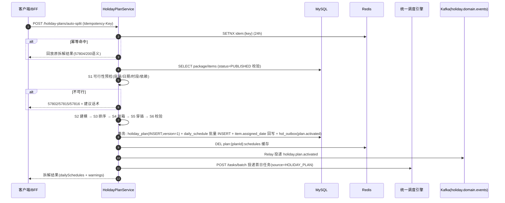
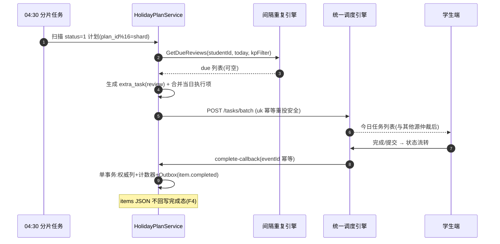
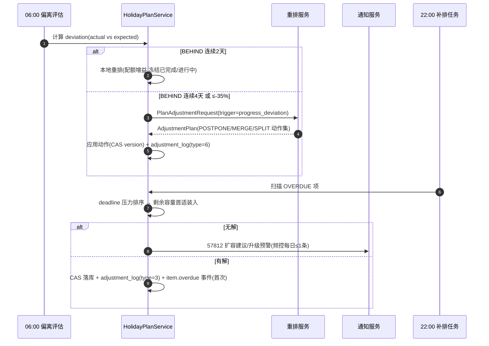

# 服务端-学生假期作业智能拆解与个性化每日执行计划自动编排引擎-详细设计

## 1. 概述

### 1.1 功能定位

本服务负责将学生收到的假期作业（寒暑假作业本、教师布置的专项练习、线上作业包等）进行智能拆解，生成个性化的每日执行计划，并在假期期间持续追踪完成进度、动态调整计划，确保学生在假期内以最优节奏完成全部作业，同时兼顾复习巩固与知识拓展。

### 1.2 设计目标

| 目标 | 描述 |
| --- | --- |
| 自动拆解 | 将一份完整的假期作业自动拆分为可执行的每日任务 |
| 个性化编排 | 根据学生年级、学力水平、假期日程、薄弱知识点等个性化因素编排执行顺序与节奏 |
| 动态调整 | 根据完成进度、答题正确率、遗忘曲线等因素实时调整后续计划 |
| 多源整合 | 整合教师布置的作业、平台推荐的复习任务、家长追加的学习要求 |
| 进度可视 | 为学生、家长、教师提供多视角的假期作业完成进度可视化 |
| 防前赶后赶 | 避免学生假期前期过度集中或假期末期突击补作业 |

### 1.3 适用范围

- 寒假作业、暑假作业的拆解与排期
- 法定长假（国庆、劳动节等）的作业安排
- 教师通过平台布置的假期专项作业包
- 学生自主添加的假期学习目标

### 1.4 与已有模块的关系

| 模块 | 关系 |
| --- | --- |
| 学生作业全生命周期管理服务 | 本服务是其在假期场景下的智能排期增强，作业元数据来源于此 |
| 每日任务智能生成与学习计划执行追踪服务 | 本服务生成的每日任务将推送至该服务执行统一追踪 |
| 多源学习任务统一调度与优先级仲裁引擎 | 本服务产生的假期任务作为一类任务源参与统一调度 |
| 学生假期学习衰减评估与开学前知识唤醒预热引擎 | 本服务提供作业完成节奏数据，供衰减评估引擎参考 |
| 学习计划动态调整与智能重排服务 | 本服务在计划偏离时调用该服务进行全局重排 |
| 间隔重复算法与遗忘曲线复习调度引擎 | 本服务在排期中嵌入复习任务，参考遗忘曲线时间点 |

---

## 2. 核心概念与领域模型

### 2.1 核心概念

```
假期作业包 (HolidayAssignmentPackage)
  ├── 作业项 (AssignmentItem) —— 每个具体的作业任务
  │     ├── 题目集/练习页范围
  │     ├── 预估完成时长
  │     ├── 难度等级
  │     └── 关联知识点列表
  └── 拆解约束 (SplitConstraint) —— 拆分时的业务约束

假期计划 (HolidayPlan)
  ├── 计划周期 (startDate ~ endDate)
  ├── 每日任务槽位 (DailySlot) —— 每天的可用学习时段
  └── 排除日期 (ExcludedDate) —— 旅游、过节等不学习日期

每日执行项 (DailyExecutionItem)
  ├── 关联的作业项
  ├── 计划完成日期
  ├── 计划耗时
  ├── 实际完成状态
  └── 实际完成数据
```

### 2.2 状态流转

#### 2.2.1 假期作业包状态机

```
                    ┌──────────┐
                    │  DRAFT   │  教师/系统创建作业包草稿
                    └────┬─────┘
                         │ 发布
                         ▼
                    ┌──────────┐
                    │ PUBLISHED│  已发布，等待学生接收
                    └────┬─────┘
                         │ 学生确认接收
                         ▼
                    ┌──────────┐
         ┌───────── │ SPLITTING│  正在智能拆解中
         │          └────┬─────┘
         │               │ 拆解完成
         │               ▼
         │          ┌──────────┐
         │          │ ACTIVE   │  计划已生成，执行中
         │          └────┬─────┘
         │               │ 全部完成 或 假期结束
         │               ▼
         │          ┌──────────┐
         │          │ COMPLETED│  已完结（正常完成 / 超期关闭）
         │          └──────────┘
         │
         └─────────►┌──────────┐
                    │ FAILED   │  拆解失败（数据异常，需人工干预）
                    └──────────┘
```

#### 2.2.2 每日执行项状态机

```
┌───────────┐     到达执行日期     ┌───────────┐     学生开始做题     ┌───────────┐
│ SCHEDULED │ ──────────────────► │  TODAY    │ ──────────────────► │ IN_PROGRESS│
└───────────┘                     └───────────┘                     └─────┬─────┘
                                        │                                  │
                                   学生提前完成                           完成提交
                                        │                                  │
                                        ▼                                  ▼
                                  ┌───────────┐                     ┌───────────┐
                                  │ COMPLETED │◄────────────────────│  SUBMITTED │
                                  └───────────┘                     └─────┬─────┘
                                                                         │ 批改完成
                                                                         ▼
                                                                   ┌───────────┐
                                                                   │ COMPLETED │
                                                                   └───────────┘

  任意状态 ────── 过期未完成 ──────► ┌───────────┐
                                    │ OVERDUE   │ ── 补排至后续日期 ──► SCHEDULED
                                    └───────────┘
```

---

## 3. 数据结构定义

### 3.1 核心表设计

#### 3.1.1 `holiday_assignment_package` — 假期作业包

```sql
CREATE TABLE holiday_assignment_package (
    id              BIGINT PRIMARY KEY AUTO_INCREMENT,
    package_code    VARCHAR(64) NOT NULL UNIQUE COMMENT '作业包编码，如 SCH2026SUMMER-G7-MATH',
    title           VARCHAR(200) NOT NULL COMMENT '作业包标题',
    holiday_type    TINYINT NOT NULL COMMENT '假期类型: 1=寒假 2=暑假 3=国庆 4=劳动节 5=自定义',
    school_id       BIGINT COMMENT '学校ID（教师布置时）',
    class_id        BIGINT COMMENT '班级ID',
    teacher_id      BIGINT COMMENT '布置教师ID',
    student_id      BIGINT COMMENT '所属学生ID',
    subject_id      TINYINT NOT NULL COMMENT '学科ID',
    grade_level     TINYINT NOT NULL COMMENT '年级',
    textbook_id     BIGINT COMMENT '教材版本ID',
    
    holiday_start   DATE NOT NULL COMMENT '假期开始日期',
    holiday_end     DATE NOT NULL COMMENT '假期结束日期',
    deadline_date   DATE NOT NULL COMMENT '最迟完成日期',
    
    total_items     INT NOT NULL DEFAULT 0 COMMENT '作业项总数',
    total_estimated_minutes INT NOT NULL DEFAULT 0 COMMENT '预估总完成时长（分钟）',
    
    source_type     TINYINT NOT NULL COMMENT '来源: 1=教师布置 2=系统推荐 3=学生自建 4=家长布置',
    source_ref_id   BIGINT COMMENT '来源引用ID（如教师作业ID）',
    
    status          TINYINT NOT NULL DEFAULT 0 COMMENT '状态: 0=DRAFT 1=PUBLISHED 2=SPLITTING 3=ACTIVE 4=COMPLETED 5=FAILED',
    split_strategy  TINYINT COMMENT '拆解策略: 1=均匀分配 2=前紧后松 3=前松后紧 4=自适应 5=集中突破',
    
    created_at      DATETIME NOT NULL DEFAULT CURRENT_TIMESTAMP,
    updated_at      DATETIME NOT NULL DEFAULT CURRENT_TIMESTAMP ON UPDATE CURRENT_TIMESTAMP,
    published_at    DATETIME,
    completed_at    DATETIME,
    
    INDEX idx_student_holiday (student_id, holiday_type, holiday_start),
    INDEX idx_class_subject (class_id, subject_id, holiday_start),
    INDEX idx_status (status, holiday_start)
) ENGINE=InnoDB DEFAULT CHARSET=utf8mb4 COMMENT='假期作业包';
```

#### 3.1.2 `holiday_assignment_item` — 作业项明细

```sql
CREATE TABLE holiday_assignment_item (
    id              BIGINT PRIMARY KEY AUTO_INCREMENT,
    package_id      BIGINT NOT NULL COMMENT '所属作业包ID',
    item_index      INT NOT NULL COMMENT '作业项序号',
    item_type       TINYINT NOT NULL COMMENT '类型: 1=题目集 2=练习页 3=阅读任务 4=作文 5=背诵任务 6=实验 7=项目式学习',
    title           VARCHAR(200) NOT NULL COMMENT '作业项标题',
    description     TEXT COMMENT '详细描述',
    
    -- 内容范围
    content_ref     VARCHAR(500) COMMENT '内容引用（题库集合ID/教材章节路径/资源URL）',
    question_ids    JSON COMMENT '题目ID列表（当item_type=1时）',
    chapter_ids     JSON COMMENT '关联章节ID列表',
    knowledge_point_ids JSON COMMENT '关联知识点ID列表',
    
    -- 估算信息
    estimated_minutes INT NOT NULL COMMENT '预估完成时长（分钟）',
    difficulty       TINYINT NOT NULL DEFAULT 3 COMMENT '难度: 1-5',
    question_count   INT COMMENT '题目数量',
    
    -- 依赖关系
    prerequisite_item_ids JSON COMMENT '前置依赖作业项ID列表',
    
    -- 状态
    status           TINYINT NOT NULL DEFAULT 0 COMMENT '0=待排期 1=已排期 2=进行中 3=已完成 4=已跳过',
    assigned_date    DATE COMMENT '被分配到的执行日期',
    actual_minutes   INT COMMENT '实际完成时长',
    completion_score DECIMAL(5,2) COMMENT '完成得分（正确率）',
    
    created_at       DATETIME NOT NULL DEFAULT CURRENT_TIMESTAMP,
    updated_at       DATETIME NOT NULL DEFAULT CURRENT_TIMESTAMP ON UPDATE CURRENT_TIMESTAMP,
    completed_at     DATETIME,
    
    INDEX idx_package (package_id, item_index),
    INDEX idx_assigned_date (assigned_date, status),
    INDEX idx_knowledge_points ((CAST(knowledge_point_ids AS CHAR(5000))))
) ENGINE=InnoDB DEFAULT CHARSET=utf8mb4 COMMENT='假期作业项明细';
```

#### 3.1.3 `holiday_plan` — 假期执行计划

```sql
CREATE TABLE holiday_plan (
    id              BIGINT PRIMARY KEY AUTO_INCREMENT,
    plan_code       VARCHAR(64) NOT NULL UNIQUE COMMENT '计划编码',
    student_id      BIGINT NOT NULL,
    package_id      BIGINT NOT NULL COMMENT '关联的作业包',
    
    plan_name       VARCHAR(200) NOT NULL COMMENT '计划名称',
    plan_start_date DATE NOT NULL COMMENT '计划开始日期',
    plan_end_date   DATE NOT NULL COMMENT '计划结束日期',
    
    -- 每日学习时段配置
    daily_time_slots JSON NOT NULL COMMENT '每日学习时段配置',
    /*
    示例:
    [
        {"day_of_week": [1,2,3,4,5], "start": "09:00", "end": "11:00", "label": "上午"},
        {"day_of_week": [1,2,3,4,5], "start": "15:00", "end": "16:30", "label": "下午"},
        {"day_of_week": [6,7], "start": "10:00", "end": "12:00", "label": "周末上午"}
    ]
    */
    
    target_daily_minutes INT NOT NULL DEFAULT 120 COMMENT '目标每日学习时长（分钟）',
    max_daily_minutes    INT NOT NULL DEFAULT 240 COMMENT '每日最大学习时长上限',
    min_daily_minutes    INT NOT NULL DEFAULT 30  COMMENT '每日最小学习时长',
    
    -- 排除日期（旅游、过节等）
    excluded_dates  JSON COMMENT '排除日期列表 ["2026-07-20", "2026-08-05"]',
    
    -- 编排策略
    strategy        TINYINT NOT NULL COMMENT '1=均匀 2=前紧后松 3=前松后紧 4=自适应',
    mix_review      BOOLEAN NOT NULL DEFAULT TRUE COMMENT '是否穿插复习任务',
    mix_preview     BOOLEAN NOT NULL DEFAULT FALSE COMMENT '是否穿插下学期预习',
    rest_frequency  TINYINT COMMENT '每N天休息一天（0=不强制休息）',
    
    -- 状态
    status          TINYINT NOT NULL DEFAULT 0 COMMENT '0=草稿 1=生效中 2=已暂停 3=已完成 4=已废弃',
    
    -- 统计
    total_scheduled_items  INT NOT NULL DEFAULT 0,
    total_completed_items  INT NOT NULL DEFAULT 0,
    total_overdue_items    INT NOT NULL DEFAULT 0,
    completion_percentage  DECIMAL(5,2) NOT NULL DEFAULT 0,
    
    created_at      DATETIME NOT NULL DEFAULT CURRENT_TIMESTAMP,
    updated_at      DATETIME NOT NULL DEFAULT CURRENT_TIMESTAMP ON UPDATE CURRENT_TIMESTAMP,
    
    UNIQUE KEY uk_student_package (student_id, package_id),
    INDEX idx_status_dates (status, plan_start_date, plan_end_date)
) ENGINE=InnoDB DEFAULT CHARSET=utf8mb4 COMMENT='假期执行计划';
```

#### 3.1.4 `holiday_daily_schedule` — 每日排程明细

```sql
CREATE TABLE holiday_daily_schedule (
    id              BIGINT PRIMARY KEY AUTO_INCREMENT,
    plan_id         BIGINT NOT NULL,
    student_id      BIGINT NOT NULL,
    schedule_date   DATE NOT NULL,
    day_index       INT NOT NULL COMMENT '假期第N天（从1开始）',
    is_rest_day     BOOLEAN NOT NULL DEFAULT FALSE COMMENT '是否休息日',
    is_excluded     BOOLEAN NOT NULL DEFAULT FALSE COMMENT '是否被排除（旅游等）',
    
    -- 当日任务项
    items           JSON NOT NULL COMMENT '当日任务列表',
    /*
    示例:
    [
        {
            "item_id": 1001,
            "assignment_item_id": 201,
            "type": "practice",
            "title": "数学暑假作业 P15-P18 函数练习",
            "estimated_minutes": 45,
            "difficulty": 3,
            "knowledge_points": ["二次函数", "函数图像"],
            "time_slot": "09:00-09:45",
            "priority": 1
        },
        {
            "item_id": 1002,
            "assignment_item_id": null,
            "type": "review",
            "title": "复习错题本：二次函数（5题）",
            "estimated_minutes": 25,
            "knowledge_points": ["二次函数"],
            "time_slot": "10:00-10:25",
            "priority": 2,
            "source": "spaced_repetition"
        }
    ]
    */
    
    planned_minutes    INT NOT NULL DEFAULT 0 COMMENT '当日计划总时长',
    actual_minutes     INT DEFAULT 0 COMMENT '当日实际学习时长',
    completed_count    INT NOT NULL DEFAULT 0,
    total_count        INT NOT NULL DEFAULT 0,
    
    -- 当日状态
    day_status     TINYINT NOT NULL DEFAULT 0 COMMENT '0=未到 1=今日 2=已完成 3=部分完成 4=未完成 5=休息日 6=已排除',
    
    -- AI生成的建议
    daily_tip      TEXT COMMENT '当日学习建议（AI生成）',
    motivation_msg VARCHAR(500) COMMENT '鼓励语',
    
    created_at     DATETIME NOT NULL DEFAULT CURRENT_TIMESTAMP,
    updated_at     DATETIME NOT NULL DEFAULT CURRENT_TIMESTAMP ON UPDATE CURRENT_TIMESTAMP,
    
    UNIQUE KEY uk_plan_date (plan_id, schedule_date),
    INDEX idx_student_date (student_id, schedule_date),
    INDEX idx_day_status (day_status, schedule_date)
) ENGINE=InnoDB DEFAULT CHARSET=utf8mb4 COMMENT='假期每日排程';
```

#### 3.1.5 `holiday_plan_adjustment_log` — 计划调整日志

```sql
CREATE TABLE holiday_plan_adjustment_log (
    id              BIGINT PRIMARY KEY AUTO_INCREMENT,
    plan_id         BIGINT NOT NULL,
    adjustment_type TINYINT NOT NULL COMMENT '1=手动调整 2=自动重排 3=补排逾期 4=新增作业 5=删除作业 6=进度偏离',
    trigger_reason  VARCHAR(500) COMMENT '调整原因',
    
    before_snapshot JSON COMMENT '调整前排程快照',
    after_snapshot  JSON COMMENT '调整后排程快照',
    
    affected_dates  JSON COMMENT '受影响的日期列表',
    affected_items  JSON COMMENT '受影响的任务项列表',
    
    operator_id     BIGINT COMMENT '操作人ID（学生/家长/教师/系统）',
    operator_type   TINYINT COMMENT '1=学生 2=家长 3=教师 4=系统自动',
    
    created_at      DATETIME NOT NULL DEFAULT CURRENT_TIMESTAMP,
    
    INDEX idx_plan_type (plan_id, adjustment_type),
    INDEX idx_created (created_at)
) ENGINE=InnoDB DEFAULT CHARSET=utf8mb4 COMMENT='计划调整日志';
```

### 3.2 数据模型类图

```
┌─────────────────────────┐       ┌──────────────────────────┐
│ HolidayAssignmentPackage│       │  HolidayAssignmentItem    │
├─────────────────────────┤ 1   * ├──────────────────────────┤
│ id                      │◄──────│ id                       │
│ package_code            │       │ package_id (FK)          │
│ title                   │       │ item_index               │
│ holiday_type            │       │ item_type                │
│ student_id              │       │ title / description      │
│ subject_id              │       │ content_ref              │
│ holiday_start/end       │       │ estimated_minutes        │
│ total_items             │       │ difficulty               │
│ status                  │       │ knowledge_point_ids      │
│ split_strategy          │       │ prerequisite_item_ids    │
└───────────┬─────────────┘       │ status                   │
            │                      │ assigned_date            │
            │ 1                    └──────────┬───────────────┘
            │                                 │
            │ 1                               │ *
            ▼                                 ▼
┌─────────────────────────┐       ┌──────────────────────────┐
│ HolidayPlan             │ 1   * │  HolidayDailySchedule     │
├─────────────────────────┤◄──────├──────────────────────────┤
│ id                      │       │ plan_id (FK)             │
│ student_id              │       │ schedule_date            │
│ package_id (FK)         │       │ day_index                │
│ plan_start/end_date     │       │ items (JSON)             │
│ daily_time_slots (JSON)│        │ planned/actual_minutes   │
│ target_daily_minutes    │       │ day_status               │
│ excluded_dates (JSON)   │       │ daily_tip                │
│ strategy                │       └──────────────────────────┘
│ completion_percentage   │
│ status                  │
└─────────────────────────┘
```

---

## 4. API 接口设计

### 4.1 创建假期作业包

```
POST /api/v1/holiday-assignment-packages
Content-Type: application/json
Authorization: Bearer {token}
```

**请求体：**

```json
{
    "title": "七年级数学暑假作业",
    "holidayType": 2,
    "subjectId": 3,
    "gradeLevel": 7,
    "textbookId": 1018,
    "holidayStart": "2026-07-15",
    "holidayEnd": "2026-08-31",
    "deadlineDate": "2026-08-31",
    "sourceType": 1,
    "classId": 2024001,
    "items": [
        {
            "itemType": 2,
            "title": "暑假作业本 P1-P10 整数运算",
            "estimatedMinutes": 50,
            "difficulty": 2,
            "chapterIds": [301, 302],
            "knowledgePointIds": [5001, 5002, 5003]
        },
        {
            "itemType": 2,
            "title": "暑假作业本 P11-P20 有理数",
            "estimatedMinutes": 55,
            "difficulty": 3,
            "chapterIds": [303],
            "knowledgePointIds": [5004, 5005]
        },
        {
            "itemType": 4,
            "title": "数学日记：生活中的数学（3篇）",
            "estimatedMinutes": 90,
            "difficulty": 3
        }
    ]
}
```

**响应：**

```json
{
    "code": 0,
    "data": {
        "packageId": 100001,
        "packageCode": "SCH2026SUMMER-G7-MATH-100001",
        "totalItems": 3,
        "totalEstimatedMinutes": 195,
        "status": "PUBLISHED"
    }
}
```

### 4.2 触发智能拆解

```
POST /api/v1/holiday-plans/auto-split
Content-Type: application/json
```

**请求体：**

```json
{
    "packageId": 100001,
    "studentId": 50001,
    "strategy": 4,          // 自适应
    "dailyTimeSlots": [
        {"dayOfWeek": [1,2,3,4,5], "start": "09:00", "end": "11:00", "label": "工作日上午"},
        {"dayOfWeek": [6,7], "start": "10:00", "end": "12:00", "label": "周末上午"}
    ],
    "targetDailyMinutes": 90,
    "excludedDates": ["2026-07-20", "2026-07-21", "2026-08-10"],
    "mixReview": true,
    "restFrequency": 6     // 每6天休息1天
}
```

**响应（拆解结果）：**

```json
{
    "code": 0,
    "data": {
        "planId": 80001,
        "planCode": "HOL-PLAN-2026SUMMER-50001-80001",
        "totalDays": 48,
        "studyDays": 35,
        "restDays": 8,
        "excludedDays": 3,
        "unallocatedDays": 2,
        "totalScheduledItems": 42,
        "dailySchedules": [
            {
                "scheduleDate": "2026-07-15",
                "dayIndex": 1,
                "dayStatus": "UPCOMING",
                "plannedMinutes": 90,
                "items": [
                    {
                        "itemId": 201,
                        "type": "assignment",
                        "title": "暑假作业本 P1-P5 整数运算（上）",
                        "estimatedMinutes": 25,
                        "difficulty": 2,
                        "knowledgePoints": ["有理数", "整数运算"],
                        "timeSlot": "09:00-09:25",
                        "priority": 1
                    },
                    {
                        "itemId": -90001,
                        "type": "review",
                        "title": "复习错题本：有理数运算（3题）",
                        "estimatedMinutes": 15,
                        "knowledgePoints": ["有理数"],
                        "timeSlot": "09:35-09:50",
                        "priority": 2,
                        "source": "spaced_repetition",
                        "externalRef": "review:due:2026-07-15"
                    }
                ]
            }
        ],
        "warnings": [
            "8月10日为排除日，当日任务已前移至8月9日前消化",
            "剩余 2 天容量富余，可作为机动缓冲日"
        ]
    }
}
```

**说明：**

1. `itemId > 0` 时为作业项（= `holiday_assignment_item.id`）；`itemId < 0` 时为穿插任务（= `-holiday_extra_task.id`，v1.1 增补表，见 §3.1.6）。
2. 作业项数量 > 200 或总预估时长 > 3000 分钟时转异步拆解：返回 `code=0` + `data.asyncTaskId`，客户端轮询 `GET /api/v1/holiday-plans/split-status?asyncTaskId=...`（状态机见 §8.4），错误码 57819（200 语义）标识本次为异步受理。
3. 幂等：请求头携带 `Idempotency-Key`（UUID，24h 窗口），重复提交返回原拆解结果（不重复生成计划），无 Key 的重复提交被 G1 函数唯一索引兜底拒绝（57804）。

### 4.3 查询每日排程

```
GET /api/v1/holiday-plans/{planId}/schedules?startDate=2026-07-15&endDate=2026-08-31&page=1&pageSize=30
Authorization: Bearer {token}
```

**响应（节选）：**

```json
{
    "code": 0,
    "data": {
        "total": 48,
        "page": 1,
        "pageSize": 30,
        "schedules": [
            {
                "scheduleDate": "2026-07-15",
                "dayIndex": 1,
                "dayStatus": "COMPLETED",
                "isRestDay": false,
                "plannedMinutes": 90,
                "actualMinutes": 82,
                "completedCount": 2,
                "totalCount": 2,
                "items": [
                    {
                        "itemId": 201,
                        "assignmentItemId": 201,
                        "type": "assignment",
                        "title": "暑假作业本 P1-P5 整数运算（上）",
                        "estimatedMinutes": 25,
                        "status": "COMPLETED",
                        "actualMinutes": 22,
                        "completionScore": 0.93
                    }
                ],
                "dailyTip": "今天正确率不错，明天我们将进入有理数混合运算，建议先回顾今天的错题。",
                "tipIsAIGenerated": true
            }
        ]
    }
}
```

**读路径说明：** `items` JSON 为渲染快照，项级完成态查询时以 `holiday_assignment_item.status` / `holiday_extra_task.status` 权威列合并返回（F4 裁决，见 §3.1.6 与 §8 守卫 G7），历史日期仅聚合计数不再回放明细合并。

### 4.4 今日任务视图（学生端首页卡片数据源）

```
GET /api/v1/holiday-plans/today?studentId=50001
```

**响应：**

```json
{
    "code": 0,
    "data": {
        "planId": 80001,
        "planName": "七年级数学暑假作业计划",
        "date": "2026-07-16",
        "dayIndex": 2,
        "dayStatus": "TODAY",
        "plannedMinutes": 90,
        "actualMinutes": 35,
        "items": [
            {
                "itemId": 202,
                "type": "assignment",
                "title": "暑假作业本 P6-P10 整数运算（下）",
                "estimatedMinutes": 25,
                "timeSlot": "09:00-09:25",
                "status": "IN_PROGRESS",
                "resourceUrl": "primetop://practice?set=1001"
            }
        ],
        "progressSummary": {
            "overallPercentage": 6.5,
            "expectedPercentage": 4.2,
            "paceStatus": "AHEAD",
            "remainingDays": 46,
            "remainingItems": 39
        }
    }
}
```

`paceStatus ∈ {AHEAD, ON_TRACK, BEHIND}`：偏差 ±15% 内为 ON_TRACK（计算公式见 §5.10）。

### 4.5 计划进度概览（多视角）

```
GET /api/v1/holiday-plans/{planId}/progress?viewerRole=student|parent|teacher
```

**学生视角响应（节选）：**

```json
{
    "code": 0,
    "data": {
        "completionPercentage": 6.5,
        "completedItems": 3,
        "totalItems": 42,
        "overdueItems": 0,
        "studyStreak": 2,
        "subjectBreakdown": [
            {"subjectId": 3, "subjectName": "数学", "completed": 3, "total": 36, "avgScore": 0.91}
        ],
        "rhythm": {
            "avgDailyMinutes": 86,
            "bestTimeSlot": "09:00-10:00",
            "restDaysUsed": 0
        },
        "deadlineInfo": {"deadline": "2026-08-31", "daysLeft": 46, "riskLevel": "LOW"}
    }
}
```

**视角差异：**

| viewerRole | 可见范围 | 额外数据 |
| --- | --- | --- |
| student | 全量 | 激励向文案、个人节奏建议 |
| parent | 聚合优先 | 家长绑定校验（57821）；提供日粒度完成情况、周报引用；不透出具体题目内容 |
| teacher | 班级聚合 + 本人布置包明细 | 班级维度完成率分布（委托班级学情服务聚合，本接口仅返回本人班级授权范围内的包级统计） |

### 4.6 手动调整排程

```
POST /api/v1/holiday-plans/{planId}/adjustments
Content-Type: application/json
X-Idempotency-Key: {uuid}
```

**请求体（支持四种原子操作，单次 ≤ 20 个操作）：**

```json
{
    "planVersion": 7,
    "operations": [
        {
            "op": "MOVE",
            "itemId": 205,
            "fromDate": "2026-07-18",
            "toDate": "2026-07-19",
            "timeSlot": "10:00-10:45"
        },
        {
            "op": "SWAP",
            "itemIdA": 205,
            "dateA": "2026-07-18",
            "itemIdB": 209,
            "dateB": "2026-07-21"
        },
        {
            "op": "REMOVE",
            "itemId": -90003,
            "date": "2026-07-19",
            "reason": "too_much"
        },
        {
            "op": "ADD_EXTRA",
            "date": "2026-07-19",
            "extraType": "preview",
            "title": "预习：一元一次方程概念阅读",
            "estimatedMinutes": 20,
            "requestedBy": "parent"
        }
    ],
    "operatorType": 1
}
```

**响应：**

```json
{
    "code": 0,
    "data": {
        "newPlanVersion": 8,
        "acceptedOperations": 3,
        "rejectedOperations": [
            {
                "opIndex": 1,
                "errorCode": 57814,
                "message": "目标日期容量已满（当日 240 分钟上限）",
                "suggestion": "可移至 2026-07-22（当日剩余 60 分钟）"
            }
        ],
        "adjustmentLogId": 9001
    }
}
```

**规则：** 逐操作独立事务（部分成功语义，与优惠券批量核销一致）；`MOVE/SWAP` 受 G7（完成冻结）、G8（不可移入过去）、G4（容量）守卫；`REMOVE` 仅允许作用于穿插任务与 `status=0` 作业项；`ADD_EXTRA` 受 G6 防沉迷时段与 C1 每日总时长硬顶约束。`planVersion` 不匹配返回 57807（G9）。

### 4.7 计划生命周期操作

```
PUT /api/v1/holiday-plans/{planId}/status
```

**请求体：**

```json
{
    "action": "pause | resume | discard | regenerate",
    "planVersion": 8,
    "reason": "外出旅游一周",
    "resumeHint": {
        "extendDeadline": false
    }
}
```

**状态动作矩阵：**

| 当前状态 | pause | resume | discard | regenerate |
| --- | --- | --- | --- | --- |
| 0=草稿 | - | - | ✅ | - |
| 1=生效中 | ✅ | - | ✅ | ✅（保留旧计划转废弃） |
| 2=已暂停 | - | ✅ | ✅ | ✅ |
| 3=已完成 | - | - | - | -（终态，G13） |
| 4=已废弃 | - | - | - | ✅（等价重建） |

- **pause**：暂停期间不生成每日任务、不判逾期（day_status 冻结）；暂停 ≤ 14 天，超时自动提醒（不自动恢复，避免静默变更）。
- **discard**：已完成项的完成事实保留并回写作业生命周期服务；未完成项回写为未拆解状态。
- **regenerate**：携带新策略参数重新走 §5 拆解管线，旧计划转废弃（G1 函数唯一索引允许多代计划共存历史）。

### 4.8 逾期补排

```
POST /api/v1/holiday-plans/{planId}/reschedule-overdue
X-Idempotency-Key: {uuid}
```

**响应：**

```json
{
    "code": 0,
    "data": {
        "overdueItemsRescheduled": 3,
        "newSchedule": [
            {"itemId": 210, "toDate": "2026-07-24", "timeSlot": "09:00-09:40"},
            {"itemId": 211, "toDate": "2026-07-25", "timeSlot": "09:00-09:30"}
        ],
        "unschedulableItems": [],
        "deadlineRisk": "MEDIUM"
    }
}
```

每日 22:00 定时任务自动执行同一逻辑（§5.11）；本接口供家长/学生手动触发提前补排。无可行解时 `unschedulableItems` 非空并返回 57812，响应附「扩容建议」（放宽 rest_frequency / 提高 max_daily_minutes 上限至政策允许值 / 取消排除日）。

### 4.9 作业项增删

```
POST /api/v1/holiday-assignment-packages/{packageId}/items     // 追加作业项（教师追加/家长布置/学生自建）
DELETE /api/v1/holiday-assignment-packages/{packageId}/items/{itemId}?reason=...
```

**追加后处理：** 若包已 ACTIVE，新增项自动进入待排池，触发一次增量重排（仅分配新项，不动既有排期，§5.10.3）；增量重排无解时返回 57812 并保留新项于待排池（不阻塞追加本身）。

**删除规则：** 已完成项不可删除（57809）；删除未完成项需 `operatorType=2(家长)/3(教师)` 或学生删除自建项；删除触发进度分母重算（同一事务）。

### 4.10 内部接口

#### 4.10.1 节奏数据供假期衰减引擎拉取

```
GET /api/internal/holiday-plans/{studentId}/pace-summary?holidayStart=2026-07-15&holidayEnd=2026-08-31
X-Internal-Service: vacation-decay-engine
```

**响应（节选）：**

```json
{
    "code": 0,
    "data": {
        "activeMinutesByDate": {"2026-07-15": 82, "2026-07-16": 96},
        "kpExposureByDate": {"2026-07-15": [5001, 5002, 5003]},
        "avgAccuracy": 0.89,
        "totalCompletedItems": 3,
        "lastActiveDate": "2026-07-16"
    }
}
```

供衰减引擎 `vacation_active_log` 日聚合对账（该引擎也可订阅 `holiday.item.completed` 事件流式获取，双通道日终对账，见 §10）。

#### 4.10.2 统一调度当日任务批量拉取（gRPC）

```protobuf
service HolidayPlanInternal {
    // 供统一调度引擎 05:00 批量预热拉取，一次往返替代 N 次投递回查
    rpc BatchGetTodayItems (BatchGetTodayItemsRequest) returns (BatchGetTodayItemsResponse);
    // 供家长周报/学情报告聚合
    rpc BatchGetPlanProgress (BatchGetPlanProgressRequest) returns (BatchGetPlanProgressResponse);
}

message BatchGetTodayItemsRequest {
    repeated int64 student_ids = 1;   // 单批 ≤ 200
    string date = 2;                  // yyyy-MM-dd
}
message BatchGetPlanProgressRequest {
    repeated int64 plan_ids = 1;      // 单批 ≤ 100
}
```

#### 4.10.3 完成回传回调（统一调度调用）

```
POST /api/internal/holiday-plans/items/{itemId}/complete-callback
```

```json
{
    "studentId": 50001,
    "taskUuid": "ut-20260716-000123",
    "externalRef": "extra:-90001",
    "actualMinutes": 14,
    "completionScore": 0.9,
    "completedAt": "2026-07-16T09:48:30+08:00",
    "eventId": "evt-sched-8899"
}
```

幂等键 = `(eventId)`；`externalRef` 前缀区分 `assign:{itemId}` / `extra:{extraTaskId}`。本回调是完成态的唯一写入口（G7 单写者），测评/作业批改结果经统一调度状态流转汇聚至此，避免多源双写（R6 裁决）。

### 4.11 管理端接口（RBAC + 审计）

| 接口 | 方法 | 说明 |
| --- | --- | --- |
| `/api/admin/holiday-plans/strategies` | GET/PUT | 策略参数配置（四策略曲线系数、容量系数），PUT 双人审批 |
| `/api/admin/holiday-plans/{planId}` | GET | 运维查任意计划（脱敏视图） |
| `/api/admin/holiday-plans/{planId}/force-rebalance` | POST | 强制重排（P2 事故处置），审计全量留痕 |
| `/api/admin/holiday-plans/metrics` | GET | 监控看板数据（§13 指标） |

## 5. 核心流程设计

### 5.1 智能拆解管线总览

拆解采用六阶段流水线，同步模式 P99 ≤ 800ms（48 天/40 项规模），超预算或大包转异步：

```
┌─────────┐   ┌─────────┐   ┌─────────┐   ┌─────────┐   ┌─────────┐   ┌─────────┐
│ S1 可行 │ ─► │ S2 约束 │ ─► │ S3 项排 │ ─► │ S4 时段 │ ─► │ S5 复习 │ ─► │ S6 平衡 │
│ 性预检  │   │ 建模    │   │ 序生成  │   │ 装箱    │   │ 预习穿插│   │ 校验落库│
└─────────┘   └─────────┘   └─────────┘   └─────────┘   └─────────┘   └─────────┘
     │失败→FAILED(57802/57815)      │            │容量不足→回退重试(≤3次)      │校验失败→S4重跑
     ▼                            ▼            ▼                              ▼
  拒绝并给建议              依赖拓扑序          装箱失败升级 57802           落库+Outbox+缓存
```

### 5.2 S1 可行性预检与 S2 约束建模

**S1 预检规则（任一失败即拒绝，给出生长型建议话术）：**

| 校验 | 规则 | 错误码 |
| --- | --- | --- |
| 空包 | total_items = 0 | 57817 |
| 日期 | holiday_end ≥ holiday_start；deadline_date ≤ holiday_end + 3 宽限天 | 57816 |
| 时段 | 时段起止落在 08:00~21:00（未成年人防沉迷红线，G6） | 57811 |
| 容量 | 可用容量 ≥ 总需求时长（公式见下） | 57802 |
| 依赖 | prerequisite_item_ids 无环、均在同包内（G3） | 57815 |

**容量可行性公式：**

```
study_days = 总天数 - ceil(总天数 / (rest_frequency+1)) - excluded_dates 数
日容量(d) = min(该日时段总分钟数, 策略日配额(d))
总可用容量 = Σ study_days 日容量(d)
可行性: 总可用容量 × 1.1(缓冲系数) ≥ total_estimated_minutes + 复习穿插预算(若 mixReview, 总量×18%)
```

不可行时响应附建议：`increaseDailyQuota / reduceExcludedDates / disableRestDay / dropLowPriorityItems`（仅建议，不自动降级学生作业量）。

**S2 约束建模输出 `SplitContext`：**

```java
class SplitContext {
    List<StudyDay> studyDays;          // 预生成 study/rest/excluded 标记的日历格
    Map<Integer, Integer> dayQuota;    // dayIndex -> 策略日配额（分钟）
    List<ItemNode> itemDag;            // 拓扑排序后的作业项 DAG
    Map<Long, List<KpRisk>> kpRisks;   // 知识点 -> 遗忘风险分（自适应策略用，来自掌握度融合引擎）
    int reviewBudgetPerDay;            // mixReview 时每日预留复习容量
}
```

### 5.3 S3 四策略时间分布函数与项排序

**策略日配额曲线（D = 总学习天数，d = 当前 dayIndex，B = target_daily_minutes）：**

| 策略 | 权重函数 w(d) | 日配额 | 适用 |
| --- | --- | --- | --- |
| 1=均匀 | 1.0 | round(B) | 默认，节奏稳定 |
| 2=前紧后松 | 1 + 0.5×(1 − d/D) | round(B × w(d)) | 开学前期集中，末期留白 |
| 3=前松后紧 | 1 + 0.5×(d/D) | round(B × w(d)) | 先休整后收心（不推荐毕业班） |
| 4=自适应 | 初始取前紧后松(0.3 系数)，执行期动态重估 | 见 §5.10 | 学力/进度驱动 |
| 5=集中突破 | 前 30% 天承担 70% 量 | 分段配额 | 短假/专项突击 |

所有曲线均受 `max_daily_minutes` 硬顶与 `min_daily_minutes`（末尾收尾日除外）地板约束；曲线系数管理端可配（§4.11）。

**项排序键（拓扑序内多级排序）：**

```
sort_key = (拓扑层级 ASC, chapter_order ASC,                  // 教材章节顺序优先
            difficulty 交错: 难(4-5)/中(3)/易(1-2) 轮转,   // 避免连续高难致挫败
            kp_risk DESC)                                    // 自适应: 薄弱 KP 项前置
```

同科目连续项 ≤ 2，之后强制轮换科目（多科目包）；单科目包在连续 2 项后插入穿插任务或短休息标记。

### 5.4 S4 时段装箱

采用「首适递减 + 日容量钳制」的贪心装箱：

1. 按排序序列逐项尝试放入当日（`dayQuota` 剩余量 ≥ 项时长则放入）；
2. 放不下则开启次日（不允许拆分单个作业项，保持任务原子性）；
3. **例外放行：** 单项时长 > 当日配额但 ≤ `max_daily_minutes` 时允许独占日（如 90 分钟作文）；仍超则 S1 阶段已被 57802 拒绝；
4. 项内分配 `timeSlot`：按时段配置顺序填入，同日多项间留 10 分钟间隔标记；
5. 装箱完成后校验：所有项均落位且无休息日/排除日落位（G5），违规则携带违例清单回退 S3 重新排序（≤ 3 次，仍失败升 57802 人工介入）。

### 5.5 S5 复习/预习穿插

**复习穿插（mixReview=true）：**

1. 每日预留 `reviewBudgetPerDay = min(30, dayQuota × 18%)` 分钟；
2. 拉取间隔重复引擎当日 due 队列（内部接口 `GetDueReviews(studentId, date, kpFilter=当日项关联 KP)`），与当日作业 KP 相关的 due 优先；
3. 生成 `holiday_extra_task(type=review)`，`external_ref = review:due:{date}`；无 due 时跳过当日（不强造复习任务）；
4. **双源去重裁决：** 错题复习服务自身也会向统一调度投递 `ERROR_REVIEW` 源任务；假期内两条链路同时投递时，由统一调度引擎的合并机制（`uk_task_source_ref_user` + 合并表）按 KP 重叠度去重合并，本服务不做对端抑制（R8 契约）。

**预习穿插（mixPreview=true，默认关）：** 仅允许下学期教材第一章范围内容（C6 学段边界），素材引用下学期章节 `content_ref`，不预先生成题目（仅阅读/导读类任务）。

### 5.6 S6 平衡校验与防前赶后赶

**落库前四项校验：**

| 校验 | 规则 | 失败处置 |
| --- | --- | --- |
| 覆盖率 | 所有非跳过项均已落位 | 回退 S3 |
| 日容量 | 单日 planned ≤ max_daily_minutes | 回退 S4 |
| 节奏平滑 | 相邻两日配额差 ≤ 40% | 重跑曲线（取平滑后配额） |
| 尾部缓冲 | 至少保留 2 个机动日（unallocated） | 无法保留时 warnings 提示，不阻断 |

**防前赶（G12）：** 学生可提前做未来排期项（「提前解锁」），但当日实际完成时长达 `max_daily_minutes` 后当日不再派发新项（统一调度侧也执行同规则，双保险）；提前完成不改变后续日配额分配（进度领先走 §5.10 重排收敛，而非一次性倒空）。

**防后赶：** T-7/T-3 预警（经通知服务，频率管控每日 ≤ 1 条，C9）；T-0 未完成项进入逾期补排；宽限 3 天后仍无法收口则强制关闭并回写作业生命周期（§5.12）。

### 5.7 每日任务生成与统一调度投递

```
04:30  定时任务(分片) ─ 扫描 status=1 生效中计划，过滤 is_rest/is_excluded 当日
  │     逐计划：合并 items 快照 + 权威状态 → 当日执行项集合
  ├─ 04:35  批量投递统一调度 POST /api/v1/task-scheduler/tasks/batch
  │         source_id=HOLIDAY_PLAN  external_ref=assign:{itemId}/extra:{extraTaskId}
  │         幂等键=(source_id, external_ref, user_id)重投安全
  ├─ 04:40  写当日 daily_tip（模板优先，10% 流量 AI 增强，AIGC 标识）
  └─ 05:00  发布 holiday.schedule.generated 事件（家长日报/推送引擎消费）
```

**分片与幂等：** 按 `plan_id % 16` 分片，断点游标续跑；任务级幂等由统一调度唯一键兜底，本地仅记录投递批次号（`holiday_schedule_generated` 表，uk (plan_id, date)）防重复发布事件。

### 5.8 完成回传与进度更新

```
统一调度 complete-callback ─► 幂等校验(eventId) ─► 单事务：
  ① 权威列更新（assignment_item.status/actual_minutes/completion_score 或 extra_task.status）
  ② daily_schedule 计数器自增（completed_count += 1, actual_minutes += n）
  ③ day_status 推导更新（2=完成/3=部分/1=今日）
  ④ plan 统计列重算（completion_percentage）
  ⑤ hol_outbox 写入 holiday.item.completed
```

**注意：** `items` JSON 快照不回写完成态（F4 裁决），读路径合并权威列渲染；避免 JSON 读写放大与并发覆写。

### 5.9 进度偏离检测与动态重排

#### 5.9.1 偏离度量（每日 06:00 评估）

```
expected_pct(d) = Σ_{i≤d} 配额(i) / 总配额
actual_pct(d)   = Σ已完成项权重 / 总项权重   （权重 = estimated_minutes）
deviation = (actual_pct - expected_pct) / expected_pct

pace_status: deviation ≥ +0.15 → AHEAD；≤ -0.15 → BEHIND；否则 ON_TRACK
```

#### 5.9.2 触发规则

| 条件 | 动作 |
| --- | --- |
| BEHIND 连续 2 天 | 本地重排：未来配额曲线增益（+10%/天渐进），未完成项压缩重排，不动已完成/进行中项 |
| BEHIND 连续 4 天或 deviation ≤ -35% | 委托《学习计划动态调整与智能重排服务》全局重排（PlanAdjustmentRequest，触发器 progress_deviation），含跨包权衡 |
| AHEAD 连续 3 天 | 配额曲线前移收敛（提前完成场景不增加每日总量，只提前结束） |
| 自适应策略 | 额外引入正确率信号：连续 2 日 completion_score < 0.6 → 该 KP 关联项难度降档重排（换 easier 变体）+ 拉长间隔 |

#### 5.9.3 增量重排（新增作业项）

仅对新增项独立装箱（S4 复用，容量=各日剩余配额），既有排期不动；无解时新项留待排池并返回 57812（不回滚追加）。

### 5.10 逾期补排（每日 22:00 + 手动触发）

```
扫描 day_status=4(未完成) 且非休息/排除日 ─► 汇集 OVERDUE 项
  │  剩余容量视图：各未来日剩余配额 = 配额 - 已排 - 当日已提前完成占用
  ├─ 有解：按 deadline 压力排序（压力 = 项权重 / 距 deadline 天数，大者先补）
  │        首适装入剩余容量；穿插任务(review)优先被挤占让位（降级移出，不改作业项）
  ├─ 无解：挤占仍无解 → 57812 + 扩容建议；穿插任务全部让位后仍无解 → 强制预警升级家长/教师
  └─ 补排落地：CAS 写入 + adjustment_log(type=3) + holiday.item.overdue 事件（首次逾期才发，防重复骚扰）
```

**同项补排次数上限：** 作业项累计补排 ≤ 3 次，第 4 次不再自动补排，转人工干预清单（G11 防无限滚动）。

### 5.11 假期结束结算与衰减引擎联动

```
holiday_end + 3 宽限天 到期 / 全部完成
  ├─ 全部完成 → plan COMPLETED + holiday.plan.completed 事件（成就/积分联动）
  ├─ 超期未完成 → 强制关闭 forced_close=1：剩余项回写作业生命周期服务(逾期未交)
  │     + 家长/教师汇总通知（聚合单条，C9）

## 6. 关键时序图

### 6.1 智能拆解主链路（同步模式）



### 6.2 每日生成与完成回传



### 6.3 偏离触发重排与逾期补排



---

## 7. 关键代码示例

### 7.1 拆解编排器骨架（Java，Spring）

```java
@Service
public class HolidaySplitOrchestrator {

    private final FeasibilityChecker feasibilityChecker;
    private final ConstraintModeler constraintModeler;
    private final ItemSequencer itemSequencer;
    private final SlotPacker slotPacker;
    private final InterleaveWeaver interleaveWeaver;
    private final BalanceValidator balanceValidator;
    private final HolidayPlanRepository planRepo;
    private final OutboxWriter outbox;

    @Transactional
    public SplitResult split(SplitCommand cmd) {
        // S1 可行性预检（失败抛业务异常，全局异常处理器转错误码）
        FeasibilityReport fr = feasibilityChecker.check(cmd);
        if (!fr.isFeasible()) {
            throw new BizException(ErrorCode.SPLIT_INFEASIBLE, fr.getSuggestions());
        }
        // S2 约束建模：日历格 + 配额曲线 + 项 DAG + 遗忘风险
        SplitContext ctx = constraintModeler.build(cmd);
        // S3-S6：排序 → 装箱 → 穿插 → 校验（失败回退重试 ≤3 次）
        for (int retry = 0; retry < 3; retry++) {
            List<ItemNode> seq = itemSequencer.sequence(ctx);
            PackingResult packing = slotPacker.pack(seq, ctx);
            if (packing.isOverflow()) { ctx.tightenQuota(); continue; }
            interleaveWeaver.weaveReviewTasks(packing, ctx);
            BalanceReport br = balanceValidator.validate(packing, ctx);
            if (br.isPassed()) {
                return persist(cmd, packing, br);          // 落库 + Outbox + 缓存失效
            }
            ctx.adjustCurve(br.getSmoothSuggestions());    // 节奏平滑重跑
        }
        throw new BizException(ErrorCode.SPLIT_INFEASIBLE, List.of("contact_support"));
    }

    private SplitResult persist(SplitCommand cmd, PackingResult p, BalanceReport br) {
        HolidayPlan plan = HolidayPlan.draftOf(cmd);        // version=1
        planRepo.insertPlanWithSchedules(plan, p.toDailySchedules());
        p.getAssignmentPlacements()
            .forEach(pl -> planRepo.updateItemPlacement(pl.getItemId(), pl.getDate()));
        p.getExtraTasks().forEach(planRepo::insertExtraTask);   // 复习/预习穿插任务落库(F3)
        outbox.append(HolidayEvents.planActivated(plan, p));     // 同事务 Outbox(G14)
        cacheEvict.planSchedules(plan.getId());
        return SplitResult.of(plan, p, br.getWarnings());
    }
}
```

### 7.2 策略配额曲线与容量装箱（Python，策略算法域）

```python
class QuotaCurve:
    """四策略日配额曲线。系数 hot_swap 自管理端策略配置，双人审批后生效。"""

    CURVES = {
        1: lambda d, D, B: B,                                      # 均匀
        2: lambda d, D, B: B * (1 + 0.5 * (1 - d / D)),           # 前紧后松
        3: lambda d, D, B: B * (1 + 0.5 * (d / D)),               # 前松后紧
    }

    def daily_quota(self, day_idx, total_days, base, max_cap, min_cap):
        if self.strategy == 5:  # 集中突破：前 30% 天承担 70% 量
            burst_days = max(1, int(total_days * 0.3))
            ratio = 2.333 if day_idx <= burst_days else 0.4365
            q = base * ratio
        elif self.strategy == 4:  # 自适应：初始取前紧后松弱化版
            q = base * (1 + 0.3 * (1 - day_idx / total_days))
            q *= self.pace_multiplier       # §5.9 重排增益因子，初始 1.0
        else:
            q = self.CURVES[self.strategy](day_idx, total_days, base)
        return int(min(max(q, min_cap), max_cap))   # 硬顶/地板钳制


def first_fit_pack(items, study_days):
    """首适递减装箱：items 已按 §5.3 排序；作业项不可拆分。"""
    placements = []
    for item in items:
        placed = False
        for day in study_days:
            if day.is_rest or day.is_excluded:
                continue                                    # G5：休息/排除日不排
            if day.remaining >= item.estimated_minutes:
                day.place(item); placements.append((item.id, day.date)); placed = True
                break
        if not placed:
            # 例外放行：独占日（≤max_daily_minutes），仍无解则上层回退重试
            day = next((d for d in study_days
                        if not d.is_rest and not d.is_excluded
                        and d.max_capacity >= item.estimated_minutes), None)
            if day is None:
                return None                                 # → 升 57802
            day.sole_occupy(item); placements.append((item.id, day.date))
    return placements
```

### 7.3 逾期补排 CAS 落库（Java）

```java
@Service
public class OverdueRescheduler {

    public RescheduleResult reschedule(Long planId, boolean manualTrigger, Long operatorId) {
        HolidayPlan plan = planRepo.findForUpdate(planId);           // plan 级写锁（G14：与手动调整互斥）
        List<AssignmentItem> overdue = planRepo.findOverdueItems(planId);
        if (overdue.isEmpty()) { return RescheduleResult.empty(plan.getVersion()); }

        // deadline 压力排序：权重 / 距 deadline 天数，大者先补
        overdue.sort(comparingDouble(i ->
            -i.getWeight() / Math.max(1.0, daysBetween(today, plan.getDeadlineDate()))));

        CapacityView capacity = capacityRepo.buildFutureView(planId); // 各日剩余配额（含提前完成占用）
        capacity.evictInterleavesFirst();                             // 穿插任务优先让位

        List<Placement> solved = new ArrayList<>();
        List<Long> unschedulable = new ArrayList<>();
        for (AssignmentItem item : overdue) {
            if (item.getRescheduleCount() >= 3) {                     // G11：补排上限
                unschedulable.add(item.getId()); continue;
            }
            Placement p = capacity.firstFit(item);
            if (p == null) { unschedulable.add(item.getId()); }
            else { solved.add(p); capacity.commit(p); }
        }

        planRepo.tx(() -> {
            solved.forEach(p -> planRepo.casMoveItem(p, plan.getVersion()));    // version CAS(G9)
            planRepo.bumpVersion(planId, plan.getVersion());
            planRepo.appendAdjustLog(planId, manualTrigger ? 1 : 3,
                    operatorId, solved, unschedulable);                          // 快照双写
            solved.stream().filter(Placement::isFirstOverdue)
                  .forEach(p -> outbox.append(HolidayEvents.itemOverdue(planId, p)));
        });

        return RescheduleResult.of(solved, unschedulable, plan.deadlineRisk());
    }
}
```

### 7.4 完成回调幂等处理（Java）

```java
@RestController
@RequestMapping("/api/internal/holiday-plans")
public class CompleteCallbackController {

    @PostMapping("/items/{itemId}/complete-callback")
    public ApiResponse<Void> onComplete(@PathVariable Long itemId,
                                        @RequestBody @Valid CompleteCallback cb) {
        // 幂等：eventId 先行（Redis SETNX + DB uk(event_id) 双保险）
        if (!idempotentGuard.tryAcquire(cb.getEventId())) {
            return ApiResponse.ok();                            // 重复回调直接 200 幂等返回
        }
        Ref ref = Ref.parse(cb.getExternalRef());               // assign:123 / extra:-90001
        return transactionTemplate.execute(st -> {
            int updated = ref.isAssignment()
                ? itemMapper.casComplete(ref.id(), cb)           // WHERE status IN (1,2) 防重
                : extraTaskMapper.casComplete(ref.id(), cb);
            if (updated == 0) { throw new BizException(ErrorCode.ITEM_COMPLETED_IMMUTABLE); }
            scheduleMapper.incrementCompletion(ref.planId(), cb.getCompletedAt(), cb.getActualMinutes());
            planMapper.recalcProgress(ref.planId());
            outbox.append(HolidayEvents.itemCompleted(ref, cb)); // 同事务
            return ApiResponse.ok();
        });
    }
}
```

---

## 8. 状态机与守卫

### 8.1 作业包状态机守卫（对 §2.2.1 的补全）

| 守卫 | 规则 |
| --- | --- |
| G-P1 | DRAFT→PUBLISHED 要求 total_items > 0 且 items 全部校验通过（57817） |
| G-P2 | SPLITTING→FAILED 仅允许拆解异常路径；FAILED 修复数据后可重新 PUBLISHED 重拆 |
| G-P3 | ACTIVE→COMPLETED 双条件：全部项终态（完成/跳过）或超期强制关闭（forced_close） |
| G-P4 | 终态（COMPLETED/FAILED）不可回退 |

### 8.2 计划状态机守卫

| 守卫 | 规则 |
| --- | --- |
| G1 | 同 (student_id, package_id) 至多一个非终态计划：`uk_student_package_active` 函数唯一索引（§10.3 F1 修复）；废弃后重建允许历史多代共存 |
| G13 | 终态计划只读；regenerate 新建新代计划而非复活旧计划 |
| G14 | 计划级排期写互斥：手动调整/自动重排/补排共享 plan 行锁 + version CAS，防止并发丢更新 |

### 8.3 每日执行项守卫总表

| 守卫 | 规则 | 错误码 |
| --- | --- |
| G2 | 拆解可行性：总可用容量×1.1 ≥ 总需求+复习预算 | 57802 |
| G3 | 依赖约束：无环、同包内、目标日 ≥ 前置项完成日+1 | 57815 |
| G4 | 单日容量：planned ≤ max_daily_minutes；穿插任务可被挤占让位，作业项不可 | 57814 |
| G5 | 休息日/排除日不可落位 | 57810 |
| G6 | 防沉迷红线：时段必须 ⊆ [08:00, 21:00]（未成年人） | 57811 |
| G7 | 完成冻结：COMPLETED/SUBMITTED 项不可移动/删除/重排；完成态唯一写入口=complete-callback（单写者） | 57809 |
| G8 | 时间单调：调整目标日 > max(今日, 当前日)；不可移入过去 | 57810 |
| G9 | 乐观锁：planVersion 不匹配拒绝，客户端携带新 version 重试 | 57807 |
| G10 | 补排不得晚于 deadline；无解时 57812 + 扩容建议（不静默丢弃） | 57812 |
| G11 | 单项累计补排/推迟 ≤ 3 次，超出转人工干预清单 | 57813 |
| G12 | 防前赶：当日实际时长达 max 后当日不再派发/补排新项 | 57814 |

### 8.4 异步拆解批次状态机

```
ACCEPTED ─► RUNNING ─► SUCCEEDED（回写 planId，客户端轮询取结果）
              │
              ├─► FAILED(可重试，≤2次) ─► FAILED_FINAL(告警+人工)
              └─► CANCELLED(用户主动取消，仅 RUNNING 后 30s 内可取消)
```

批次表 `holiday_split_batch`（uk async_task_id）；轮询接口 30s 间隔；10 分钟未完成提示稍后再试（不阻塞引导流程，可先跳过进入手动学习）。

## 9. 幂等与并发八场景

| # | 场景 | 幂等/裁决机制 |
| --- | --- | --- |
| 1 | 拆解请求超时重试 | Idempotency-Key Redis 24h + 57804 回放；无 Key 时 G1 唯一索引兜底 |
| 2 | 每日 04:30 任务重复执行（重启/分片重跑） | 投递幂等=统一调度 uk(source_id, external_ref, user_id)；本地 generated 表 uk(plan_id, date) 防事件重发 |
| 3 | 完成回调重复投递 | eventId Redis SETNX + holiday_complete_callback uk(event_id)；权威列条件 UPDATE 防重 |
| 4 | 手动调整与自动重排并发 | G14 plan 行锁互斥 + version CAS；后到方 409 重试携带新 version |
| 5 | 同项双端同时标记完成 | G7 单写者：权威列条件 UPDATE（status IN (1,2)），败者 57809 幂等返回 |
| 6 | 追加项与重排并发 | 增量重排仅装新项不动旧排期；无解新项留待排池不阻塞 |
| 7 | 22:00 补排与 06:00 重排窗口重叠 | 调度错峰（22:00/06:00）+ G14 互斥；取锁失败延迟 10min 重试 |
| 8 | 暂停期间当日任务已投递 | 统一调度 skip 回调（SOURCE_CANCEL）回收当日未开始项；已开始项保留完成态 |

## 10. 事件设计（Outbox 与订阅）

### 10.1 发布事件（hol_outbox → Kafka `holiday.domain.events`）

| 事件 | 触发 | 关键字段 | 主要消费方 |
| --- | --- | --- | --- |
| holiday.plan.activated | 拆解落库 | planId/packageId/strategy/totalDays | 每日任务服务（假期内暂停常规生成，R2）、通知服务（拆解完成提醒） |
| holiday.schedule.generated | 每日 05:00 | planId/date/itemIds | 家长日报聚合、推送引擎 |
| holiday.item.completed | 完成回调 | planId/itemId/kpIds/score/actualMinutes | 假期衰减引擎（活跃日志）、激励中心、掌握度融合（旁路校验） |
| holiday.item.overdue | 首次逾期 | planId/itemId/overdueDays | 通知服务（频控每日≤1条）、家长周报 |
| holiday.plan.rebalanced | 本地/委托重排落地 | planId/trigger/movedCount | 通知服务（变更摘要，单条聚合） |
| holiday.plan.completed | 正常完结 | planId/completionRate/streak | 成就引擎、积分结算、学习报告 |
| holiday.plan.settled | 结算（双路径） | planId/forcedClose/paceSummary | 衰减引擎 Round3、作业生命周期回写确认 |

Relay 投递 500ms 批量聚合，日终对账恒等式：`outbox 待投+已投 = Kafka 发送成功+重试中`，差异 > 0.1% 告警。

### 10.2 订阅上游事件（幂等键 = 上游 event_id）

| 上游事件 | 来源 | 处理 |
| --- | --- | --- |
| homework.assigned（假期类） | 学生作业全生命周期服务 | source_type=1 自动建包（PUBLISHED），学生确认后可拆解 |
| review.schedule.due | 间隔重复引擎 | 当日 due 进入 S5 穿插候选池 |
| mastery.kp.updated | 多渠道掌握度融合引擎 | 自适应策略 kp_risks 输入刷新（日批量，不实时） |
| practice.graded | 测评会话服务 | completion_score 回填校验（与回调值不一致时以批改事件为准回写，R6） |
| vacation.decay.risk.leveled | 假期衰减引擎 | 高风险学生（L3/L4）→ 下调配额/增复习占比的自适应建议 |

### 10.3 DDL 增补与勘误（v1.1）

```sql
-- F1: uk_student_package 与「废弃后重建」撞键 → 生成列函数唯一索引
ALTER TABLE holiday_plan
  DROP INDEX uk_student_package,
  ADD COLUMN active_uk BIGINT AS (IF(status IN (0,1,2), 0, id)) STORED,
  ADD UNIQUE KEY uk_student_package_active (student_id, package_id, active_uk);

-- F2: JSON 知识点索引改多值索引（支撑 MEMBER OF / JSON_CONTAINS）
ALTER TABLE holiday_assignment_item
  DROP INDEX idx_knowledge_points,
  ADD INDEX idx_kp_mv ((CAST(knowledge_point_ids AS UNSIGNED ARRAY)));

-- F5: 乐观锁列（G9/G14 CAS）
ALTER TABLE holiday_plan ADD COLUMN version INT NOT NULL DEFAULT 1;
ALTER TABLE holiday_daily_schedule ADD COLUMN version INT NOT NULL DEFAULT 1;

-- F7: AIGC 标识
ALTER TABLE holiday_daily_schedule ADD COLUMN tip_is_aigenerated BOOLEAN NOT NULL DEFAULT FALSE;

-- F3: 穿插任务承载表（items JSON 中 itemId<0 的映射目标）
CREATE TABLE holiday_extra_task (
    id              BIGINT PRIMARY KEY AUTO_INCREMENT,
    plan_id         BIGINT NOT NULL,
    task_type       TINYINT NOT NULL COMMENT '1=复习穿插 2=预习穿插 3=家长追加 4=机动',
    title           VARCHAR(200) NOT NULL,
    external_ref    VARCHAR(128) COMMENT '外部引用，如 review:due:2026-07-15',
    scheduled_date  DATE NOT NULL,
    time_slot       VARCHAR(32),
    estimated_minutes INT NOT NULL,
    status          TINYINT NOT NULL DEFAULT 0 COMMENT '0=待执行 1=已完成 2=已让位 3=已移除',
    actual_minutes  INT,
    source          VARCHAR(32) COMMENT 'spaced_repetition/parent/student',
    created_at      DATETIME NOT NULL DEFAULT CURRENT_TIMESTAMP,
    updated_at      DATETIME NOT NULL DEFAULT CURRENT_TIMESTAMP ON UPDATE CURRENT_TIMESTAMP,
    UNIQUE KEY uk_plan_date_type (plan_id, scheduled_date, task_type, external_ref),
    INDEX idx_status_date (status, scheduled_date)
) ENGINE=InnoDB DEFAULT CHARSET=utf8mb4 COMMENT='假期穿插任务（复习/预习/追加）';

-- 完成回调幂等表
CREATE TABLE holiday_complete_callback (
    id          BIGINT PRIMARY KEY AUTO_INCREMENT,
    event_id    VARCHAR(64) NOT NULL,
    item_ref    VARCHAR(64) NOT NULL,
    processed_at DATETIME NOT NULL DEFAULT CURRENT_TIMESTAMP,
    UNIQUE KEY uk_event (event_id)
) ENGINE=InnoDB DEFAULT CHARSET=utf8mb4 COMMENT='完成回调幂等记录';

-- 每日生成批次防重表
CREATE TABLE holiday_schedule_generated (
    id          BIGINT PRIMARY KEY AUTO_INCREMENT,
    plan_id     BIGINT NOT NULL,
    gen_date    DATE NOT NULL,
    batch_no    VARCHAR(64) NOT NULL,
    delivered_count INT NOT NULL DEFAULT 0,
    created_at  DATETIME NOT NULL DEFAULT CURRENT_TIMESTAMP,
    UNIQUE KEY uk_plan_date (plan_id, gen_date)
) ENGINE=InnoDB DEFAULT CHARSET=utf8mb4 COMMENT='每日生成批次记录';

-- Outbox
CREATE TABLE hol_outbox (
    id          BIGINT PRIMARY KEY AUTO_INCREMENT,
    event_id    VARCHAR(64) NOT NULL,
    event_type  VARCHAR(64) NOT NULL,
    aggregate_id BIGINT NOT NULL,
    payload     JSON NOT NULL,
    status      TINYINT NOT NULL DEFAULT 0 COMMENT '0=待投 1=已投 2=死信',
    retry_count INT NOT NULL DEFAULT 0,
    created_at  DATETIME NOT NULL DEFAULT CURRENT_TIMESTAMP,
    delivered_at DATETIME,
    UNIQUE KEY uk_event (event_id),
    INDEX idx_status (status, created_at)
) ENGINE=InnoDB DEFAULT CHARSET=utf8mb4 COMMENT='假期计划事件 Outbox';

-- 分析日志归 ClickHouse：holiday_item_complete_log 月分区 TTL 180 天，MySQL 不留明细
```

**Redis Key 总表：**

| Key | 类型 | TTL | 用途 |
| --- | --- | --- | --- |
| `hol:idem:{key}` | STRING | 24h | 拆解幂等 |
| `hol:plan:{planId}:schedules` | HASH | 5min | 排程读缓存（cache-aside，写路径只 DEL 不 SET） |
| `hol:plan:{planId}:today` | STRING(JSON) | 26h | 今日任务视图 |
| `hol:pace:{planId}` | HASH | 48h | 偏离度量中间结果 |
| `hol:cb:{eventId}` | STRING | 24h | 回调幂等 |

---

## 11. 错误码设计（57800-57899）

| 错误码 | 标识 | HTTP | 说明 |
| --- | --- | --- | --- |
| 57800 | HOLIDAY_PACKAGE_NOT_FOUND | 404 | 作业包不存在 |
| 57801 | PACKAGE_NOT_PUBLISHED | 409 | 包状态不允许拆解（非 PUBLISHED/SPLITTING） |
| 57802 | SPLIT_INFEASIBLE | 422 | 容量/约束不可行，附 suggestions（increaseDailyQuota 等） |
| 57803 | SPLIT_STRATEGY_INVALID | 400 | 策略参数非法（未知 strategy/参数越界） |
| 57804 | SPLIT_DUPLICATED | 200 | 幂等回放：返回原拆解结果（不重复生成计划） |
| 57805 | PLAN_NOT_FOUND | 404 | 计划不存在 |
| 57806 | PLAN_STATUS_INVALID | 409 | 计划状态不允许该操作（含 G13 终态只读） |
| 57807 | PLAN_VERSION_CONFLICT | 409 | 乐观锁冲突，携带新 version 重试 |
| 57808 | ITEM_NOT_IN_PLAN | 404 | 项不属于该计划 |
| 57809 | ITEM_COMPLETED_IMMUTABLE | 409 | 已完成/已提交项不可变更（G7）；重复完成回调时幂等返回 200 |
| 57810 | DATE_RANGE_INVALID | 400 | 日期非法：目标日在过去/休息日/排除日/越出假期范围 |
| 57811 | TIMESLOT_VIOLATION_ANTADDICTION | 422 | 时段违反防沉迷红线（未成年人 08:00-21:00） |
| 57812 | RESCHEDULE_NO_SOLUTION | 422 | 补排/重排无解，附扩容建议；不静默丢弃 |
| 57813 | DEFER_LIMIT_EXCEEDED | 429 | 单项补排/推迟次数超限（G11） |
| 57814 | DAILY_CAPACITY_EXCEEDED | 422 | 单日容量超限（G4/G12） |
| 57815 | PREREQUISITE_INVALID | 422 | 依赖非法：环/跨包/未落位 |
| 57816 | HOLIDAY_RANGE_INVALID | 400 | 假期日期非法（end<start / deadline>end+3 宽限） |
| 57817 | PACKAGE_EMPTY | 400 | 空包（total_items=0）不允许发布/拆解 |
| 57818 | EXTRA_TASK_NOT_FOUND | 404 | 穿插任务不存在或已让位移除 |
| 57819 | SPLIT_ASYNC_PENDING | 200 | 大包转异步受理，返回 asyncTaskId 轮询 |
| 57820 | SPLIT_ASYNC_FAILED | 500 | 异步拆解终失败（已重试 2 次），人工介入 |
| 57821 | FORBIDDEN_PARENT_VIEW | 403 | 家长未绑定/无查看权限（统一 403 不暴露存在性） |
| 57822 | TEACHER_SCOPE_DENIED | 403 | 教师越权查看非本班数据 |
| 57823 | PAUSE_LIMIT_EXCEEDED | 422 | 暂停时长超 14 天上限 |
| 57899 | INTERNAL_ERROR | 500 | 兜底（埋点告警，不透出内部细节） |

**200 语义码说明：** 57804/57819 为业务正常分支，客户端按响应 data 分支处理，不计入错误率告警。

## 12. 降级矩阵 D1-D10

| # | 故障 | 降级动作 | 红线 |
| --- | --- | --- | --- |
| D1 | 掌握度融合引擎不可用 | 自适应策略退化为前紧后松弱化版（kp_risks 置空） | 拆解功能不阻断 |
| D2 | 间隔重复引擎不可用 | 跳过复习穿插（mixReview 降级为不生效，提示恢复后重排） | 不阻塽作业项排期 |
| D3 | 统一调度引擎不可用 | 本地降级：今日视图直接读本服务（客户端备用数据源标识） | 已投递任务不重复投；恢复后按 uk 幂等补投 |
| D4 | 重排服务不可用 | 全局重排退化为本地重排（仅配额增益，无跨包权衡） | 已完成项永不重排 |
| D5 | AI daily_tip 生成失败/超时（800ms） | 模板文案兑底（tip_is_aigenerated=0） | 不阻塞排程生成 |
| D6 | Outbox Relay 积压 | 投递退避，日终对账补偿 | 事件不丢（status=0 持久化） |
| D7 | 通知服务不可用 | 预警/逾期通知入延迟队列，恢复后补发（URGENT 豁免时效） | 结算/强制关闭类事件不补发营销，仅补发事务性通知 |
| D8 | Redis 不可用 | 读路径直连 DB（限流 200QPS）；幂等退化为 DB 唯一键 | 拆解不阻断；回调幂等由 uk(event_id) 兑底 |
| D9 | ClickHouse 写入失败 | 完成日志本地暂存 24h，恢复后补写 | 分析链路降级不影响主流程 |
| D10 | 时钟/日历异常（跨时区/夏令时） | 以服务端 Asia/Shanghai 为唯一权威，客户端时区仅作展示 | 排期判定不信任客户端时钟 |

**总红线：** 任何降级不得突破防沉迷时段（G6）与每日时长硬顶（C1）；降级期间不向学生端暴露内部故障细节（文案统一「稍后重试」）。

## 13. 监控与容量估算（DAU 50 万基准）

### 13.1 监控指标 M1-M10

| 指标 | 定义 | 阈值/告警 |
| --- | --- | --- |
| M1 拆解成功率 | SUCCEEDED / 拆解请求总数 | < 95% P2；异步失败率 > 1% P1 |
| M2 拆解延迟 P99 | 同步模式端到端 | > 800ms 转异步比例监控；P99 > 1.2s P2 |
| M3 每日生成投递成功率 | 成功投递 / 应投递计划数 | < 99% P1（当日 05:30 前补投） |
| M4 回调处理延迟 P99 | complete-callback 端到端 | > 2s P2；幂等冲突率 > 1% 检查双发 |
| M5 逾期率 | OVERDUE 项 / 已到期项 | 周环比 +10pp P3 关注；单计划逾期 > 20% 触发干预清单 |
| M6 补排成功率 | 有解补排 / 触发补排 | 57812 占比 > 5% 提示容量策略过紧 |
| M7 偏离触发率 | 重排触发计划 / 生效计划 | 连续 3 天 > 15% 检查曲线参数 |
| M8 计划完成率 | COMPLETED / 到期结算计划 | 假期末 < 60% 关注（产品健康度） |
| M9 事件积压 | hol_outbox status=0 行数 | > 1 万 P2；> 10 万 P1 |
| M10 缓存命中率 | schedules/today 命中率 | < 85% 检查 TTL 与失效策略 |

### 13.2 容量估算（暑假峰值）

| 项 | 估算 | 说明 |
| --- | --- | --- |
| 活跃计划 | 17.5 万（渗透 35% × 1.2 包） | 拆解峰值：假期首日集中（7-15）≈ 10 万次/日，异步队列削峰 |
| daily_schedule | ≈ 1008 万行/假期（17.5万×48天） | 按假期类型+月份分区，假期结束+30 天冷归档 |
| assignment_item | ≈ 420 万行/假期 | 索引覆盖查询 |
| 每日投递 | 52 万任务/日（峰值 05:00 批量） | 统一调度批量接口，本服务 QPS < 50 |
| 完成回调 | 峰值 3500/min（晚间） | 幂等表按月分区，90 天在线 |
| Redis | ≈ 700MB（today 视图 17.5万×4KB） | 内存可控，26h TTL 自然回收 |
| ClickHouse | 日增 52 万行完成日志 ≈ 130MB/日 | TTL 180 天，双副本 ≈ 140GB |

## 14. 合规要点 C1-C10

| # | 要点 |
| --- | --- |
| C1 | 双减约束：义务教育阶段 target_daily_minutes 默认 ≤ 120 分钟，家长可调但 max_daily_minutes ≤ 240 分钟硬顶（服务端强制，不信任客户端参数） |
| C2 | 防沉迷联动：时段红线 08:00-21:00（G6）；20:30 后不派发新任务（护眼/睡眠保护）；总时长与防沉迷引擎日限额取交集 |
| C3 | 家长可见性：需绑定关系校验（57821，403 不暴露存在性）；家长端聚合优先，不透出具体题目内容 |
| C4 | AIGC 标识：daily_tip AI 生成的必须携带 tip_is_aigenerated=true，客户端渲染标识 |
| C5 | 数据保留：adjustment_log 180 天在线后归档；完成日志 ClickHouse TTL 180 天 |
| C6 | 学段边界：预习内容仅限下学期教材范围（不超前学段）；难度不超出在读年级+1 学段上限 |
| C7 | 内容版权：content_ref 仅引用不复制，展示时遵守内容授权服务决策 |
| C8 | 家长追加任务（source_type=4）计入防沉迷总预算，不得突破 C1/C2 上限 |
| C9 | 通知频率：逾期/预警类通知经疲劳度引擎管控，每日 ≤ 1 条；强制关闭汇总单条触达 |
| C10 | 账户注销：按平台统一 180 天延迟删除；删除前完成态数据匿名化聚合保留（不关联个人） |

## 15. 契约对齐 R1-R14

| # | 裁决 |
| --- | --- |
| R1 | 作业包元数据权威归《学生作业全生命周期管理与智能催交提醒调度引擎》，本服务仅维护排期衍生数据；结算后回写终态（holiday.plan.settled） |
| R2 | 假期内常规每日任务生成暂停：《每日任务智能生成服务》订阅 holiday.plan.activated/settled 切换生成模式；本服务不直接写该服务任务表 |
| R3 | 学生端「今日任务」聚合权威归统一调度引擎；本服务仅作 source=HOLIDAY_PLAN 投递方 + gRPC BatchGetTodayItems 预热提供方 |
| R4 | HOLIDAY_PLAN 任务源注册（base_priority=78，介于 PARENT_TASK 75 与 EXAM_PREP 80）：列为统一调度引擎 v1.1 注册项，本文档为需求方 |
| R5 | 完成态 SSOT：项级完成事实以本服务权威列为准；分数以批改链路（practice.graded/homework.graded）为准，不一致时批改事件胜（R6） |
| R6 | 本服务不重复生产复习题目：穿插任务仅时段占位+外部引用；内容生产归错题复习链路，双源投递由统一调度合并机制去重 |
| R7 | 《学习计划动态调整与智能重排服务》负责跨计划全局重排（PlanAdjustmentRequest trigger=progress_deviation）；计划内重排（配额增益/补排）归本服务 |
| R8 | 偏离度量口径：expected 基于配额曲线而非项数（时长加权），与重排服务 progress_deviation 维度对齐（归一化公式互认） |
| R9 | 衰减引擎双通道：事件流（holiday.item.completed）主通道 + 内部 pace-summary 接口对账通道，日终偏差 > 5% 告警 |
| R10 | 防沉迷时段红线归《防沉迷与未成年人保护机制》总规则，本服务 G6 为排期侧强制实施点，规则变更事件驱动同步 |
| R11 | 家长周报内容聚合归《家长端学情报告聚合与通知服务》，本服务仅提供 progress 接口与事件，不直接触达家长 |
| R12 | 成就/积分联动：holiday.plan.completed 事件携带 streak/completionRate，计萁归《学习打卡记录与成就解锁计算引擎》与积分结算服务，本服务不重复计算 |
| R13 | 客户端提醒推送（今日任务提醒 08:30）归《学习提醒与智能通知调度系统》，本服务 05:00 发布 schedule.generated 后由其决策触达 |
| R14 | daily_tip AI 生成走统一 LLM 网关（Prompt 场景 scene=HOLIDAY_TIP），预算与限流归多模型调度与成本治理体系，不私接供应商 |

## 16. 验收场景（18 条）

1. 教师发布 3 科 36 项暑假包，学生确认后自适应拆解：生成 48 天计划（35 学习日/8 休息日/3 排除日/2 机动日），首日 2 项 90 分钟，warnings 提示机动日。
2. 同一 Idempotency-Key 重复提交拆解：返回 57804 + 原结果，DB 仅一份计划；无 Key 重复提交被 G1 唯一索引拒绝。
3. 总需求 3000 分钟但可用容量仅 2400：拆解拒绝 57802，suggestions 含 increaseDailyQuota/reduceExcludedDates，不产生半成品计划。
4. 时段配置 22:00-23:30：拒绝 57811（G6 防沉迷红线），响应标注规则来源防沉迷引擎。
5. 前置依赖 A→B→A 成环：拒绝 57815；跨包依赖同样拒绝并提示拆包处理。
6. 90 分钟作文项落入日配额 60 分钟日：独占日放行（≤max 240）；300 分钟项目拒绝于 S1（57802）。
7. 学生 7-15 提前完成未来 3 日任务至当日时长达 max：当日不再派发新项（G12），后续日配额不提前倒空，偏离评估显示 AHEAD 走收敛重排。
8. 连续 2 天 BEHIND（-18%）：本地重排配额增益 +10%/天落地，adjustment_log(type=6) 记录 before/after 快照；已完成项未动。
9. 连续 4 天 BEHIND（-38%）：触发委托重排（R7），重排服务返回 MERGE/SPLIT 动作集应用成功，事件 rebalanced 发布。
10. 22:00 补排扫描：3 项 OVERDUE 按 deadline 压力装入未来容量，穿插任务优先让位（extra_task.status=2）；首次逾期才发通知（C9）。
11. 补排无解（剩余容量 60 < 需求 180）：返回 57812 + 扩容建议；不静默丢弃，T-7 预警同步触发。
12. 手动调整 planVersion 过期：57807 拒绝；携带新 version 重试成功，version 递增，adjustment_log 快照完整。
13. 家长 ADD_EXTRA 追加 20 分钟但当日已达硬顶：57814 拒绝并提示可移入次日；C8 预算约束生效。
14. 完成回调重复投递同 eventId：首次成功、二次幂等 200，计数器仅自增一次，事件仅一条（幂等表 uk 生效）。
15. 统一调度不可用时客户端今日视图：直读本服务备用数据源（D3 标识 degraded），恢复后补投不重复（uk 幂等）。
16. 假期结束全部完成：plan COMPLETED，事件链 plan.completed→成就/积分/报告，streak 正确；衰减引擎收到 settled 摘要。
17. 超期 3 天宽限后仍剩 5 项：强制关闭 forced_close=1，剩余项回写作业生命周期逾期未交，家长/教师单条聚合通知，无双发骚扰。
18. 暂停 10 天后恢复：暂停期日冻结不判逾期；恢复后 06:00 偏离评估按剩余容量重排，不回溯补作业堆积在恢复首日。

## 17. 关联文档

- 《服务端-学生作业全生命周期管理与智能催交提醒调度引擎-详细设计》（作业元数据权威与结算回写）
- 《服务端-每日任务智能生成与学习计划执行追踪服务-详细设计》（假期生成模式切换，R2）
- 《服务端-多源学习任务统一调度与优先级仲裁引擎-详细设计》（HOLIDAY_PLAN 源注册与合并去重，R3/R4/R6）
- 《服务端-学生假期学习衰减评估与开学前智能知识唤醒预热引擎-详细设计》（节奏数据双通道，R9）
- 《服务端-学习计划动态调整与智能重排服务-详细设计》（全局重排委托，R7/R8）
- 《间隔重复算法与遗忘曲线复习调度引擎-详细设计》（due 队列穿插，D2）
- 《服务端-多渠道学习数据融合与统一知识掌握度计算引擎-详细设计》（kp_risks 输入，D1）
- 《防沉迷与未成年人保护机制-详细设计》（时段红线与日限额交集，C1/C2/R10）
- 《服务端-家长端学情报告聚合与通知服务-详细设计》（家长周报聚合，R11）
- 《服务端-学习打卡记录与成就解锁计算引擎-详细设计》与《服务端-积分获取规则计算与虚拟资产交易结算服务-详细设计》（完结联动，R12）
- 《学习提醒与智能通知调度系统-详细设计》（今日任务提醒触达，R13）
- 《多模型调度与成本治理-详细设计》（daily_tip LLM 网关，R14）

## 18. 维护记录

- **v1.0（初稿）**：写到 §4.2 拆解响应 JSON `"title": "暑假作业本 P1-P5 整数运算（上` 字符串中途截断（507 行，围栏 29 奇），§4.2 后内容缺失。
- **v1.1（2026-08-20 补全）**：补齐 §4.2 响应（itemId 正负语义/warnings/异步拆解与幂等说明）；新增 §4.3-§4.11（排程查询/今日视图/多视角进度/手动调整四原子操作/生命周期矩阵/逾期补排/项增删/内部接口含 gRPC 与完成回调/管理端）；§5 核心流程十二节（六阶段拆解管线/可行性公式/四策略配额曲线/排序键/首适装箱与独占日例外/复习穿插与双源去重/平衡校验与防前赶后赶/04:30 分片生成投递/完成回传单事务/偏离度量与三级重排/22:00 补排压力排序/结束结算双路径）；§6 时序图×3；§7 关键代码四段（拆解编排器/配额曲线与装箱/补排 CAS/回调幂等）；§8 包/计划/项三状态机守卫 G1-G14 与异步批次状态机；§9 幂等八场景；§10 七发布事件+五订阅+hol_outbox 与 DDL 增补八项；§11 错误码 57800-57899 共 24 项（含 57804/57819 两个 200 语义码）；§12 降级 D1-D10（总红线：防沉迷与时长硬顶不可降级突破）；§13 监控 M1-M10 与暑假峰值容量；§14 合规 C1-C10；§15 契约对齐 R1-R14；§16 验收 18 条。修复 v1.0 缺陷：F1 uk_student_package 撞键改生成列函数唯一索引、F2 JSON 知识点 CAST CHAR(5000) 索引改多值索引、F3 items JSON 内负 itemId 悬空无承载补 holiday_extra_task 表、F4 完成态 JSON 与权威列双写歧义裁决为权威列单写、F5 无乐观锁列补 version CAS、F6 拆解无幂等键补 Idempotency-Key+57804、F7 daily_tip 无 AIGC 标识补列、F8 时段无防沉迷校验补 G6 红线。