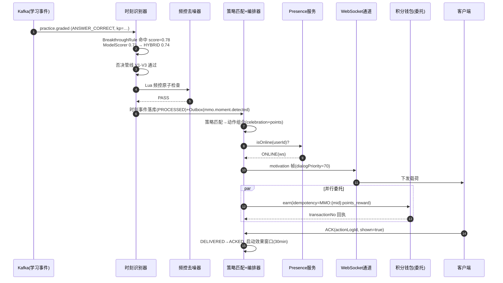
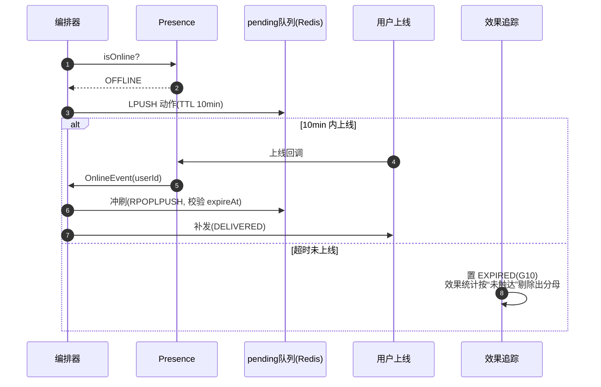
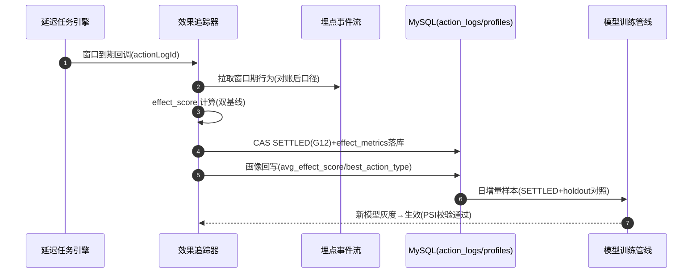

# 服务端 - 学生学习激励时刻智能编排与正反馈触发决策引擎 详细设计

## 1. 概述

### 1.1 模块定位

学生学习激励时刻智能编排引擎（Motivation Moment Orchestrator，简称 **MMO**）是 PrimeTop 服务端的正反馈决策中枢，负责在学生学习的关键节点**实时判定**是否触发激励动作（庆祝动画、成就解锁、鼓励语、积分奖励、社交分享提示等），并完成激励内容的最优编排与多通道分发。

### 1.2 核心职责

| 职责 | 说明 |
|------|------|
| 学习事件监听 | 实时消费答题、复习、打卡、对话等学习行为事件流 |
| 激励时刻识别 | 基于规则 + ML 模型判定当前事件是否构成"值得激励的时刻" |
| 激励内容编排 | 根据用户画像、历史激励记录、当前状态，选择最佳激励组合 |
| 频控与去噪 | 防止激励过载（短时间内多次触发导致体验疲劳） |
| 效果追踪 | 闭环追踪激励动作对后续学习行为的影响，持续优化触发策略 |

### 1.3 设计动机

现有文档中：

- `客户端-成就勋章与奖励展示组件` 定义了**前端如何展示**成就与动画
- `用户学习激励中心与行为奖励统一规则引擎` 定义了**积分/虚拟资产**的发放规则
- `学习打卡记录与成就解锁计算引擎` 定义了**成就解锁**的计算逻辑

但缺少一个**编排层**来回答三个核心问题：

1. **何时**（When）应该给学生一个正反馈？——不是每次答对都庆祝，也不是积满 100 分才弹窗
2. **给什么**（What）形式的激励？——同一个事件，小学一年级和高中生的反馈方式完全不同
3. **效果如何**（So What）？——发了激励之后，学生是更积极了还是无感？

本引擎正是回答这三个问题的服务端决策系统。

### 1.4 与现有模块的关系

```
┌──────────────────────────────────────────────────────────┐
│                    学习行为事件流 (Kafka)                   │
│  (答题完成/复习完成/打卡成功/AI对话结束/学习计划完成/...)    │
└──────────────┬───────────────────────────────────────────┘
               │
               ▼
┌──────────────────────────────────┐
│   激励时刻智能编排引擎 (MMO)       │  ← 本文档
│                                  │
│  ┌─────────┐  ┌───────────────┐  │
│  │时刻识别器│→│激励内容编排器  │  │
│  └─────────┘  └───────┬───────┘  │
│                       │          │
│  ┌─────────┐  ┌───────┴───────┐  │
│  │频控去噪器│←│效果追踪分析器  │  │
│  └─────────┘  └───────────────┘  │
└──────┬──────────────┬────────────┘
       │              │
       ▼              ▼
┌──────────────┐ ┌──────────────────┐
│ WebSocket /  │ │ 积分/成就/通知    │
│ SSE 推送通道  │ │ 服务(已有模块)    │
└──────────────┘ └──────────────────┘
       │
       ▼
┌──────────────────────────────────┐
│  客户端激励展示层(已有组件)        │
│  (成就勋章/动画特效/积分弹窗等)    │
└──────────────────────────────────┘
```

### 1.5 依赖关系

| 方向 | 模块 | 说明 |
|------|------|------|
| 输入 | 学习行为事件流 (Kafka) | 答题、复习、打卡、对话等事件 |
| 输入 | 用户画像服务 | 学段、年级、学习风格、最近情绪状态 |
| 输入 | 学习记录服务 | 历史激励记录、连续打卡天数、最近激励时间 |
| 输出 | WebSocket/SSE 推送 | 实时激励动作下发到客户端 |
| 输出 | 积分服务 | 积分发放指令（通过已有规则引擎） |
| 输出 | 成就服务 | 成就解锁触发（通过已有引擎） |
| 输出 | 通知服务 | 异步激励通知（如家长表扬通知） |
| 输出 | 埋点系统 | 激励事件埋点（用于效果分析） |

---

## 2. 核心概念定义

### 2.1 激励时刻（Motivation Moment）

激励时刻是指学习过程中**值得给予正反馈的关键节点**。不是每一个学习行为都需要激励——过度激励会导致"激励通货膨胀"和用户体验疲劳。

#### 激励时刻分类

| 类别 | 标签 | 说明 | 示例 |
|------|------|------|------|
| 突破时刻 | `BREAKTHROUGH` | 长期薄弱知识点首次正确 | 连续错5次的公式题终于做对 |
| 里程碑时刻 | `MILESTONE` | 累计量达到关键节点 | 累计学习100小时、错题清零 |
| 连续时刻 | `STREAK` | 保持连续学习行为 | 连续打卡7天/30天/100天 |
| 高光时刻 | `HIGHLIGHT` | 特殊表现的瞬间 | 满分通过模拟测试、全班第一 |
| 努力时刻 | `EFFORT` | 持续努力但未必成功 | 连续学习45分钟未分心 |
| 转变时刻 | `TURNING` | 学习状态由差转好 | 本周正确率比上周提升15% |
| 情感时刻 | `EMOTIONAL` | 检测到需要鼓励 | 连续答错3次后情绪低落 |
| 社交时刻 | `SOCIAL` | 协作/分享行为 | 帮助同学解答问题 |

### 2.2 激励动作（Motivation Action）

激励动作是引擎判定的**输出指令**，一个激励时刻可以触发多个激励动作的组合。

```typescript
/** 激励动作类型 */
enum MotivationActionType {
  CELEBRATION_ANIMATION = 'celebration_animation',  // 庆祝动画
  ACHIEVEMENT_UNLOCK    = 'achievement_unlock',     // 成就解锁
  POINTS_REWARD         = 'points_reward',           // 积分奖励
  ENCOURAGE_MESSAGE     = 'encourage_message',       // 鼓励语
  PROGRESS_BADGE        = 'progress_badge',          // 进度徽章
  SOCIAL_SHARE_PROMPT   = 'social_share_prompt',     // 社交分享提示
  PARENT_NOTIFICATION   = 'parent_notification',     // 家长通知
  LEADERBOARD_HIGHLIGHT = 'leaderboard_highlight',   // 排行榜高亮
  STUDY_MUSIC_UNLOCK    = 'study_music_unlock',      // 学习音乐解锁
  AI_PRAISE             = 'ai_praise',               // AI个性化表扬
  VIRTUAL_ITEM_GIFT     = 'virtual_item_gift',       // 虚拟物品赠送
}
```

### 2.3 激励策略（Motivation Strategy）

激励策略是针对不同用户群体、不同时刻类型的**编排规则**，定义"给什么、怎么给、给多少"。

---

## 3. 数据模型

### 3.1 激励时刻事件表 `motivation_moment_events`

记录每一次识别到的激励时刻。

```sql
CREATE TABLE motivation_moment_events (
    id              BIGINT PRIMARY KEY AUTO_INCREMENT,
    event_id        VARCHAR(64) NOT NULL UNIQUE COMMENT '事件唯一ID',
    user_id         BIGINT NOT NULL COMMENT '用户ID',
    
    -- 触发来源
    source_event_type VARCHAR(32) NOT NULL COMMENT '来源事件类型: ANSWER_CORRECT/REVIEW_DONE/CHECKIN/...',
    source_event_id   VARCHAR(64) NOT NULL COMMENT '来源事件ID',
    
    -- 时刻信息
    moment_category VARCHAR(32) NOT NULL COMMENT '时刻类别: BREAKTHROUGH/MILESTONE/STREAK/...',
    moment_metadata JSON NOT NULL COMMENT '时刻元数据: 知识点ID/连续天数/分数等',
    
    -- 判定信息
    trigger_score   DECIMAL(5,4) NOT NULL COMMENT '触发评分 0.0-1.0',
    decision_source VARCHAR(16) NOT NULL DEFAULT 'RULE' COMMENT 'RULE/MODEL/HYBRID',
    
    -- 时间
    created_at      TIMESTAMP NOT NULL DEFAULT CURRENT_TIMESTAMP,
    
    INDEX idx_user_created (user_id, created_at),
    INDEX idx_category (moment_category),
    INDEX idx_source (source_event_type, source_event_id)
) ENGINE=InnoDB DEFAULT CHARSET=utf8mb4 COMMENT='激励时刻事件记录';
```

### 3.2 激励动作执行记录表 `motivation_action_logs`

记录每一次实际执行的激励动作及其效果追踪。

```sql
CREATE TABLE motivation_action_logs (
    id              BIGINT PRIMARY KEY AUTO_INCREMENT,
    moment_event_id BIGINT NOT NULL COMMENT '关联激励时刻事件ID',
    user_id         BIGINT NOT NULL,
    
    -- 动作信息
    action_type     VARCHAR(32) NOT NULL COMMENT '动作类型: celebration_animation/points_reward/...',
    action_content  JSON COMMENT '动作内容: 动画ID/积分数量/鼓励语文本等',
    priority        INT NOT NULL DEFAULT 50 COMMENT '优先级 0-100',
    
    -- 执行状态
    status          VARCHAR(16) NOT NULL DEFAULT 'PENDING' COMMENT 'PENDING/DELIVERED/ACKED/FAILED/SKIPPED',
    delivered_at    TIMESTAMP NULL COMMENT '下发时间',
    acked_at        TIMESTAMP NULL COMMENT '用户确认时间',
    
    -- 效果追踪
    effect_window_start TIMESTAMP NULL COMMENT '效果观察窗口开始',
    effect_window_end   TIMESTAMP NULL COMMENT '效果观察窗口结束',
    effect_metrics JSON COMMENT '效果指标: {study_time_after, accuracy_after, engagement_score}',
    
    created_at      TIMESTAMP NOT NULL DEFAULT CURRENT_TIMESTAMP,
    
    INDEX idx_moment (moment_event_id),
    INDEX idx_user_status (user_id, status),
    INDEX idx_type_created (action_type, created_at),
    FOREIGN KEY (moment_event_id) REFERENCES motivation_moment_events(id)
) ENGINE=InnoDB DEFAULT CHARSET=utf8mb4 COMMENT='激励动作执行与效果追踪';
```

### 3.3 用户激励画像表 `user_motivation_profiles`

维护每个用户的激励偏好与历史统计，用于个性化编排。

```sql
CREATE TABLE user_motivation_profiles (
    user_id             BIGINT PRIMARY KEY,
    
    -- 激励偏好
    preferred_celebration_intensity VARCHAR(16) NOT NULL DEFAULT 'MEDIUM' 
        COMMENT 'SUBTLE/MEDIUM/ENTHUSIASTIC - 用户偏好的庆祝强度',
    preferred_action_types JSON COMMENT '偏好的激励动作类型排序',
    disliked_actions JSON COMMENT '用户关闭/跳过的激励类型列表',
    
    -- 频控状态
    last_celebration_at  TIMESTAMP NULL COMMENT '上次庆祝动画时间',
    last_encouragement_at TIMESTAMP NULL COMMENT '上次鼓励语时间',
    celebrations_today   INT NOT NULL DEFAULT 0 COMMENT '今日庆祝次数',
    total_actions_7d     INT NOT NULL DEFAULT 0 COMMENT '7天内激励动作总数',
    
    -- 效果统计
    avg_effect_score     DECIMAL(4,3) DEFAULT 0.5 COMMENT '平均效果评分(滚动30天)',
    best_action_type     VARCHAR(32) NULL COMMENT '对该用户效果最好的激励类型',
    
    -- 自适应学习
    fatigue_threshold    INT NOT NULL DEFAULT 5 COMMENT '每日激励疲劳阈值',
    cooldown_minutes     INT NOT NULL DEFAULT 30 COMMENT '同一类型激励冷却时间(分钟)',
    
    updated_at           TIMESTAMP NOT NULL DEFAULT CURRENT_TIMESTAMP ON UPDATE CURRENT_TIMESTAMP,
    
    INDEX idx_updated (updated_at)
) ENGINE=InnoDB DEFAULT CHARSET=utf8mb4 COMMENT='用户激励画像';
```

### 3.4 激励策略规则表 `motivation_strategies`

可配置的激励策略规则，支持运营后台动态调整。

```sql
CREATE TABLE motivation_strategies (
    id              BIGINT PRIMARY KEY AUTO_INCREMENT,
    name            VARCHAR(128) NOT NULL COMMENT '策略名称',
    code            VARCHAR(64) NOT NULL UNIQUE COMMENT '策略编码',
    enabled         BOOLEAN NOT NULL DEFAULT TRUE,
    
    -- 适用条件
    moment_categories TEXT[] COMMENT '适用的时刻类别，NULL=全部',
    grade_stages     TEXT[] COMMENT '适用学段，NULL=全部',
    user_tags        TEXT[] COMMENT '适用用户标签',
    
    -- 动作编排
    action_sequence JSON NOT NULL COMMENT '动作序列: [{type, weight, params}]',
    
    -- 频控规则
    max_per_day     INT COMMENT '每日最大触发次数',
    min_interval_min INT COMMENT '最小触发间隔(分钟)',
    
    -- 优先级
    priority        INT NOT NULL DEFAULT 50 COMMENT '策略优先级(越大越优先)',
    
    -- A/B测试
    experiment_id   VARCHAR(64) NULL COMMENT '关联实验ID',
    variant         VARCHAR(16) NULL COMMENT '实验变体',
    
    valid_from      TIMESTAMP NOT NULL DEFAULT CURRENT_TIMESTAMP,
    valid_until     TIMESTAMP NULL,
    created_at      TIMESTAMP NOT NULL DEFAULT CURRENT_TIMESTAMP,
    updated_at      TIMESTAMP NOT NULL DEFAULT CURRENT_TIMESTAMP ON UPDATE CURRENT_TIMESTAMP
) ENGINE=InnoDB DEFAULT CHARSET=utf8mb4 COMMENT='激励策略规则';
```

### 3.5 Redis 数据结构

| Key Pattern | Type | TTL | 说明 |
|-------------|------|-----|------|
| `mmo:user:{userId}:state` | Hash | 24h | 用户当日激励状态：各类型触发次数、最近触发时间 |
| `mmo:user:{userId}:cooldown` | Sorted Set | 1h | 冷却中的激励类型，score=到期时间戳 |
| `mmo:user:{userId}:pending` | List | 10min | 待下发的激励动作队列 |
| `mmo:strategy:active` | Set | 5min | 当前启用的策略ID集合（缓存） |
| `mmo:effect:realtime:{userId}` | Hash | 2h | 实时效果追踪数据（激励前后的行为指标） |
| `mmo:daily_counter:{userId}:{date}` | String | 25h | 每日激励计数器 |

---

## 4. 核心业务逻辑

### 4.1 总体处理流程

```
学习行为事件
    │
    ▼
┌─────────────────┐
│ 1. 事件预处理    │  → 解析事件、补充用户上下文
└────────┬────────┘
         │
         ▼
┌─────────────────┐
│ 2. 时刻识别      │  → 规则匹配 + ML模型评分 → trigger_score
└────────┬────────┘
         │ trigger_score >= threshold?
         │
    ┌────┴────┐
    │ Yes     │ No
    ▼         ▼
┌─────────┐  (跳过)
│3.频控检查│
└────┬────┘
     │ 通过?
     │
  ┌──┴──┐
  │ Yes │ No → 记录SKIPPED
  ▼
┌─────────────────┐
│ 4. 策略匹配      │  → 选择最优激励策略
└────────┬────────┘
         │
         ▼
┌─────────────────┐
│ 5. 内容编排      │  → 生成个性化激励动作组合
└────────┬────────┘
         │
         ▼
┌─────────────────┐
│ 6. 多通道分发    │  → WebSocket推送 + 积分/成就/通知
└────────┬────────┘
         │
         ▼
┌─────────────────┐
│ 7. 效果追踪      │  → 启动异步效果观察窗口
└─────────────────┘
```

### 4.2 时刻识别器（Moment Detector）

#### 4.2.1 规则引擎部分

每个时刻类别对应一组识别规则。规则采用 **条件-评分** 结构。

```java
/**
 * 时刻识别规则接口
 */
public interface MomentDetectionRule {
    
    /** 该规则检测的时刻类别 */
    MomentCategory getCategory();
    
    /** 该规则适用的来源事件类型 */
    Set<String> getApplicableSourceEvents();
    
    /**
     * 执行规则检测
     * @param context 事件上下文（含用户画像、历史记录等）
     * @return 检测结果：是否命中 + 触发评分
     */
    DetectionResult detect(EventContext context);
}
```

#### 4.2.2 各类别规则详解

**突破时刻 `BREAKTHROUGH` 规则：**

```java
@Component
public class BreakthroughRule implements MomentDetectionRule {
    
    private final MistakeRecordClient mistakeClient;
    private final KnowledgeTrackingClient trackingClient;
    
    @Override
    public MomentCategory getCategory() {
        return MomentCategory.BREAKTHROUGH;
    }
    
    @Override
    public Set<String> getApplicableSourceEvents() {
        return Set.of("ANSWER_CORRECT");
    }
    
    @Override
    public DetectionResult detect(EventContext ctx) {
        long userId = ctx.getUserId();
        long knowledgePointId = ctx.getLong("knowledgePointId");
        
        // 查询该知识点的历史错误次数
        int wrongCount = mistakeClient.countWrongRecords(userId, knowledgePointId);
        if (wrongCount < 2) {
            // 错误次数不够，不算突破
            return DetectionResult.miss();
        }
        
        // 查询最近连续错误次数
        int consecutiveWrong = trackingClient.getConsecutiveWrongCount(userId, knowledgePointId);
        if (consecutiveWrong < 2) {
            return DetectionResult.miss();
        }
        
        // 查询上次错误距今时间
        long daysSinceLastWrong = trackingClient.daysSinceLastWrong(userId, knowledgePointId);
        
        // 计算触发评分
        double score = calculateBreakthroughScore(wrongCount, consecutiveWrong, daysSinceLastWrong);
        
        Map<String, Object> metadata = Map.of(
            "knowledgePointId", knowledgePointId,
            "previousWrongCount", wrongCount,
            "consecutiveWrong", consecutiveWrong,
            "daysSinceLastWrong", daysSinceLastWrong
        );
        
        return DetectionResult.hit(score, metadata);
    }
    
    /**
     * 突破时刻评分算法
     * - 连续错误次数越多，突破价值越大
     * - 等待时间越长，突破越值得庆祝
     */
    private double calculateBreakthroughScore(int wrongCount, int consecutiveWrong, long daysSinceLastWrong) {
        double consecutiveFactor = Math.min(1.0, consecutiveWrong / 5.0);        // 0~1
        double historyFactor = Math.min(0.3, wrongCount * 0.05);                 // 0~0.3
        double timeFactor = Math.min(0.2, daysSinceLastWrong * 0.03);            // 0~0.2
        double baseScore = 0.4;  // 基础分
        
        return Math.min(0.99, baseScore + consecutiveFactor * 0.3 + historyFactor + timeFactor);
    }
}
```

**连续时刻 `STREAK` 规则：**

```java
@Component
public class StreakRule implements MomentDetectionRule {
    
    // 关键连续天数节点
    private static final int[] STREAK_MILESTONES = {3, 7, 14, 21, 30, 50, 100, 200, 365};
    
    @Override
    public DetectionResult detect(EventContext ctx) {
        int currentStreak = ctx.getInt("checkinStreak");
        
        // 检查是否命中里程碑
        boolean isMilestone = Arrays.stream(STREAK_MILESTONES)
            .anyMatch(m -> m == currentStreak);
        
        if (!isMilestone) {
            // 非里程碑日，给轻微连续激励
            if (currentStreak >= 3 && currentStreak % 7 == 0) {
                return DetectionResult.hit(0.35, Map.of("streakDays", currentStreak));
            }
            return DetectionResult.miss();
        }
        
        // 里程碑日，评分与天数正相关但有封顶
        double score = Math.min(0.95, 0.5 + Math.log10(currentStreak) * 0.15);
        
        return DetectionResult.hit(score, Map.of(
            "streakDays", currentStreak,
            "isMilestone", true,
            "milestoneLevel", getMilestoneLevel(currentStreak)
        ));
    }
    
    private int getMilestoneLevel(int days) {
        if (days >= 365) return 5;
        if (days >= 100) return 4;
        if (days >= 30) return 3;
        if (days >= 14) return 2;
        return 1;
    }
}
```

**情感时刻 `EMOTIONAL` 规则（使用最近学习状态数据）：**

```java
@Component
public class EmotionalSupportRule implements MomentDetectionRule {
    
    private final LearningStateClient stateClient;
    
    @Override
    public Set<String> getApplicableSourceEvents() {
        return Set.of("ANSWER_WRONG", "ANSWER_TIMEOUT", "SESSION_QUALITY_LOW");
    }
    
    @Override
    public DetectionResult detect(EventContext ctx) {
        long userId = ctx.getUserId();
        
        // 获取最近学习状态
        LearningStateSnapshot state = stateClient.getRecentState(userId, Duration.ofMinutes(30));
        
        int consecutiveWrong = state.getConsecutiveWrongCount();
        double recentAccuracy = state.getRecentAccuracy(5);
        long sessionDuration = state.getCurrentSessionDuration();
        
        // 触发条件判断
        boolean shouldEncourage = false;
        double score = 0;
        String reason = null;
        
        // 条件1: 连续答错3次以上
        // 条件1: 连续答错3次以上（越多分越高，但封顶 0.90，防止“鼓励”本身变成压力）
        if (consecutiveWrong >= 3) {
            shouldEncourage = true;
            score = Math.min(0.90, 0.45 + (consecutiveWrong - 3) * 0.08);
            reason = "CONSECUTIVE_WRONG_" + Math.min(consecutiveWrong, 9);
        }

        // 条件2: 近5题正确率骤降（原本掌握的领域突然崩塌，比“一直不会”更挫败）
        if (recentAccuracy < 0.30 && state.getHistoricalAccuracy() > 0.70) {
            shouldEncourage = true;
            double dropScore = 0.60 + (state.getHistoricalAccuracy() - recentAccuracy) * 0.3;
            score = Math.max(score, Math.min(0.90, dropScore));
            reason = (reason == null) ? "ACCURACY_DROP" : reason + "+ACCURACY_DROP";
        }

        // 条件3: 长会话后段连续碰壁（疲劳叠加挫败，只鼓励不复盘）
        if (sessionDuration > 1200 && consecutiveWrong >= 2 && recentAccuracy < 0.5) {
            shouldEncourage = true;
            score = Math.max(score, 0.62);
            reason = (reason == null) ? "FATIGUE_FRUSTRATION" : reason + "+FATIGUE_FRUSTRATION";
        }

        // 条件4: 会话质量评估为 LOW 且无任何积极信号
        if ("SESSION_QUALITY_LOW".equals(ctx.getEventType())
                && state.getEngagementScore() < 0.35) {
            shouldEncourage = true;
            score = Math.max(score, 0.58);
            reason = "LOW_ENGAGEMENT";
        }

        // ★ 危机否决（Veto，守卫 G3 硬红线，不可被任何策略/运营配置覆盖）
        // 心理状态引擎(PSM)标记 CRISIS、或危机干预进行中时，本引擎禁止产出
        // 任何娱乐庆祝类激励。情感时刻只允许“转交”，不允许“庆祝”。
        if (state.getPsychFlag() == PsychFlag.CRISIS || state.isCrisisIntervening()) {
            // 不返回 miss（静默丢弃），必须返回 veto 供链路上报 PSM/危机引擎复核
            return DetectionResult.veto(Map.of(
                "psychFlag", state.getPsychFlag().name(),
                "sourceEvent", ctx.getEventType(),
                "consecutiveWrong", consecutiveWrong
            ));
        }

        if (!shouldEncourage) {
            return DetectionResult.miss();
        }

        return DetectionResult.hit(score, Map.of(
            "reason", String.valueOf(reason),
            "consecutiveWrong", consecutiveWrong,
            "recentAccuracy", recentAccuracy,
            "sessionDurationSec", sessionDuration
        ));
    }
}
```

> **EMOTIONAL 特殊红线**：情感时刻是全引擎**唯一不允许进入 holdout 对照组**的类别（守卫 G13 例外条款）。对情绪低落的学生故意不发激励以采集基线数据，属于不可接受的伦理代价。效果基线对 EMOTIONAL 一律采用“该用户自身历史均值”单基线。

**里程碑时刻 `MILESTONE` 规则：**

```java
@Component
public class MilestoneRule implements MomentDetectionRule {

    /** 累计量里程碑注册表：来源计数器 → 节点序列（运营后台可配，此处为默认值） */
    private static final Map<String, long[]> COUNTER_MILESTONES = Map.of(
        "TOTAL_STUDY_MINUTES", new long[]{600, 3000, 6000, 12000, 30000},  // 10h/50h/100h/200h/500h
        "TOTAL_QUESTIONS",     new long[]{100, 500, 2000, 5000, 10000},
        "MISTAKE_CLEARED",     new long[]{10, 50, 100, 500},              // 错题清零批量节点
        "WORD_MASTERED",       new long[]{100, 500, 1000, 3000, 8000}
    );

    @Override
    public Set<String> getApplicableSourceEvents() {
        return Set.of("STUDY_TIME_ACCUMULATED", "PRACTICE_BATCH_DONE",
                      "MISTAKE_CLEARED", "WORD_LEARNED");
    }

    @Override
    public DetectionResult detect(EventContext ctx) {
        String counterKey = ctx.getString("counterKey");
        long[] milestones = COUNTER_MILESTONES.get(counterKey);
        if (milestones == null) return DetectionResult.miss();

        long newValue = ctx.getLong("counterValue");
        long oldValue = newValue - ctx.getLong("delta", 1L);

        // 幂等关键：只有“跨过节点”的那一次才触发。
        // 区间判定（oldValue < m <= newValue）而非相等判定——同一事件重复消费时
        // oldValue/newValue 不变，不会二次触发；补发历史事件同理安全。
        for (long m : milestones) {
            if (oldValue < m && newValue >= m) {
                double score = Math.min(0.92, 0.55 + Math.log10(m) * 0.12);
                return DetectionResult.hit(score, Map.of(
                    "counterKey", counterKey,
                    "milestone", m,
                    "currentValue", newValue
                ));
            }
        }
        return DetectionResult.miss();
    }
}
```

**高光时刻 `HIGHLIGHT` 规则：**

```java
@Component
public class HighlightRule implements MomentDetectionRule {

    @Override
    public Set<String> getApplicableSourceEvents() {
        return Set.of("EXAM_SUBMITTED", "CHALLENGE_FINISHED", "CLASS_RANK_PUBLISHED");
    }

    @Override
    public DetectionResult detect(EventContext ctx) {
        // 信号1：模拟测试/挑战赛满分（过小的卷面满分不算高光，防“3题满分”刷激励）
        if (ctx.has("score") && ctx.has("fullScore")
                && ctx.getLong("score") == ctx.getLong("fullScore")
                && ctx.getLong("fullScore") >= 50) {
            return DetectionResult.hit(0.90, Map.of("highlightType", "PERFECT_SCORE",
                "examId", ctx.getLong("examId")));
        }

        // 信号2：班级第一（数据来源裁决：排名权威归同伴基准引擎，本规则只读消费事件）
        if ("CLASS_RANK_PUBLISHED".equals(ctx.getEventType())) {
            int classSize = ctx.getInt("classSize");
            int rank = ctx.getInt("rank");
            // k-匿名护栏：班级人数 < 5 不出排名类高光（对齐同伴基准引擎“池≥5”红线），
            // 防止小群体内排名信息反推个体
            if (classSize >= 5 && rank == 1) {
                return DetectionResult.hit(0.85, Map.of(
                    "highlightType", "CLASS_TOP1", "classSize", classSize));
            }
        }
        return DetectionResult.miss();
    }
}
```

**努力时刻 `EFFORT` 规则：**

```java
@Component
public class EffortRule implements MomentDetectionRule {

    @Override
    public Set<String> getApplicableSourceEvents() {
        return Set.of("FOCUS_SESSION_ENDED", "SESSION_SUMMARY");
    }

    @Override
    public DetectionResult detect(EventContext ctx) {
        int focusMinutes = ctx.getInt("focusMinutes");
        int distractionCount = ctx.getInt("distractionCount", 0);
        boolean pomodoroCompleted = ctx.getBoolean("pomodoroCompleted", false);

        // 条件1：单次专注 ≥45 分钟且分心 ≤2 次
        // 学习时长口径以《服务端-学生学习时长跨模块统一归因与对账引擎》为准（防双计），
        // 本规则仅消费已对账的会话摘要事件，不做独立计时。
        if (focusMinutes >= 45 && distractionCount <= 2) {
            return DetectionResult.hit(0.68, Map.of(
                "effortType", "DEEP_FOCUS",
                "focusMinutes", focusMinutes,
                "distractionCount", distractionCount));
        }

        // 条件2：整组番茄钟完成且总专注 ≥100 分钟（肯定努力本身，不论答题对错）
        if (pomodoroCompleted && focusMinutes >= 100) {
            return DetectionResult.hit(0.62, Map.of("effortType", "POMODORO_SET",
                "focusMinutes", focusMinutes));
        }
        return DetectionResult.miss();
    }
}
```

> **EFFORT 话术红线**：努力时刻文案**禁止出现任何延时诱导措辞**（如“再来一轮”“继续挑战下一组”）。防沉迷剩余时间不足时（见 §4.3），EFFORT 激励自动降级为 SUBTLE 静默徽章。

**转变时刻 `TURNING` 规则：**

```java
@Component
public class TurningPointRule implements MomentDetectionRule {

    @Override
    public Set<String> getApplicableSourceEvents() {
        return Set.of("WEEKLY_REPORT_GENERATED", "MASTERY_SNAPSHOT_DIFF");
    }

    @Override
    public DetectionResult detect(EventContext ctx) {
        double accuracyDelta = ctx.getDouble("weeklyAccuracyDelta", 0);  // 本周-上周 正确率
        double masteryDelta  = ctx.getDouble("weeklyMasteryDelta", 0);   // 掌握度均值变化
        int minSamples = ctx.getInt("weeklySampleSize", 0);

        // 样本护栏：<30 题的周不产生“转变”结论（对齐掌握度融合引擎最小样本量保障），
        // 防止小样本波动被误判为“进步”
        if (minSamples < 30) return DetectionResult.miss();

        if (accuracyDelta >= 0.15) {
            double score = Math.min(0.88, 0.60 + accuracyDelta);
            return DetectionResult.hit(score, Map.of(
                "turningType", "ACCURACY_UP",
                "accuracyDelta", accuracyDelta,
                "sampleSize", minSamples));
        }
        if (masteryDelta >= 0.12 && accuracyDelta >= 0.08) {
            return DetectionResult.hit(0.66, Map.of(
                "turningType", "MASTERY_UP", "masteryDelta", masteryDelta));
        }
        return DetectionResult.miss();
    }
}
```

**社交时刻 `SOCIAL` 规则：**

```java
@Component
public class SocialMomentRule implements MomentDetectionRule {

    @Override
    public Set<String> getApplicableSourceEvents() {
        return Set.of("PEER_ANSWER_ACCEPTED", "STUDY_GROUP_CONTRIBUTION", "SHARE_CALLBACK");
    }

    @Override
    public DetectionResult detect(EventContext ctx) {
        // 信号1：帮助同学的解答被采纳/被感谢
        if ("PEER_ANSWER_ACCEPTED".equals(ctx.getEventType())) {
            int thanksReceived = ctx.getInt("thanksCount", 1);
            return DetectionResult.hit(Math.min(0.80, 0.55 + thanksReceived * 0.05),
                Map.of("socialType", "HELPED_PEER", "thanksCount", thanksReceived));
        }
        // 信号2：分享回流（他人通过我的分享注册/学习）——只轻微激励，防裂变诱导
        if ("SHARE_CALLBACK".equals(ctx.getEventType())) {
            return DetectionResult.hit(0.40, Map.of("socialType", "SHARE_CONVERSION"));
        }
        return DetectionResult.miss();
    }
}
```

> **SOCIAL 话术红线**：社交时刻文案仅对“已发生的利他行为”给予肯定，**禁止出现“邀请更多好友”“分享给 XX 人解锁”式裂变引导**（对齐《端到端流程设计-分享邀请与社交裂变获客完整链路》合规红线：未成年人场景激励与裂变指标解耦）。

#### 规则注册与执行模型

1. 所有 `MomentDetectionRule` 实现由 Spring 容器自动收集，注册中心按 `getApplicableSourceEvents()` 建立**事件类型 → 规则列表**倒排索引。
2. 单事件到达后，仅执行索引命中的规则（通常 1~3 条），在独立有界线程池中并行执行，单规则超时 50ms，超时按 miss 处理并告警。
3. 任一规则返回 `veto` → 整条链路立即终止（详见 §4.2.4 否决管线），veto 结果落库供审计。
4. 规则新增走灰度：新规则默认 `shadow` 模式（只记录不打扰），观察 7 天指标正常后切 `active`。

### 4.2.3 ML 模型评分器（Model Scorer）

规则评分解决“有没有戏”，模型评分解决“发了有没有用”。

#### 特征清单（24 维）

| 特征组 | 特征 | 来源 | 说明 |
|--------|------|------|------|
| 用户特征 | stage / grade / is_member | 用户服务 | 学段、年级、会员状态 |
| 用户特征 | historical_response_rate | 本引擎 action_logs | 历史激励正向响应率（ACK+效果达标占比） |
| 用户特征 | fatigue_state | 本引擎画像 | 当前疲劳档位（0-3） |
| 用户特征 | motivation_style | PSM 引擎 | 鼓励型/挑战型/社交型/成就型 |
| 上下文特征 | event_type / subject / daypart | 事件体 | 事件类型、学科、时段 |
| 上下文特征 | session_duration / position_in_session | 会话服务 | 会话时长与当前进度位置 |
| 上下文特征 | device_type / is_holiday | 设备指纹/日历 | 设备类型、是否假期 |
| 历史特征 | actions_7d / last_action_hours_ago | 本引擎 | 7 日激励密度、上次激励距今 |
| 历史特征 | recent_effect_score_avg | 本引擎 | 近 30 天平均效果分 |
| 历史特征 | streak_days / recent_accuracy / consecutive_wrong | 打卡/学情 | 连续天数、近端正确率、连续错误 |

#### 模型与推理

```java
@Component
public class ModelScorer {

    private final OnnxInferenceEngine onnx;        // ONNX Runtime, CPU 推理
    private volatile ModelVersion activeModel;      // 原子引用, 双缓冲热更新

    /**
     * 模型输出 P(positive_response)：发放该激励后用户产生正向响应的概率。
     * 正向响应定义：客户端 ACK 且效果窗口 engagement_score ≥ 用户历史基线。
     * 降级约定（D7）：模型不可用/超时(15ms)时返回 Optional.empty()，
     * 上层自动退化为纯 RULE 评分，decision_source 标记为 RULE。
     */
    public Optional<Double> score(FeatureVector fv) {
        try {
            return Optional.of(onnx.run(activeModel, fv));
        } catch (InferenceException e) {
            metricRegistry.increment("mmo.model.degraded");
            return Optional.empty();
        }
    }
}
```

* 训练目标：二分类 `P(正向响应 | 触发激励)`；训练样本来自 `motivation_action_logs`（DELIVERED 且效果已 SETTLED 的记录）+ holdout 组对照样本。
* 训练节奏：日增量 + 周全量；模型版本化发布，线上灰度双跑（新旧模型打分差异 >0.3 的样本占比 >5% 时阻断发布）。
* 特征读取总预算 20ms（本地缓存 + 特征快照表），超预算的特征按缺省值填充并标记 degraded。
* 输入 PSI 漂移监控：任一特征 PSI > 0.2 告警，> 0.3 自动切回 RULE-only（M8）。

### 4.2.4 评分合成与全局阈值

#### 合成公式

| 场景 | 公式 | decision_source |
|------|------|-----------------|
| 规则+模型均有 | `final = 0.55 × model + 0.45 × rule` | HYBRID |
| 模型不可用（D7） | `final = rule` | RULE |
| 无规则覆盖的新类别（灰度规则 shadow） | `final = model`（需运营显式开启 model_only） | MODEL |

#### 各类别触发阈值（运营可调，但受硬下限约束）

| 类别 | 默认阈值 | 硬下限 | 说明 |
|------|---------|--------|------|
| BREAKTHROUGH | 0.60 | 0.50 | 突破稀缺，宁缺毋滥 |
| MILESTONE | 0.60 | 0.50 | — |
| STREAK（里程碑） | 0.55 | 0.50 | 非里程碑 0.35 不可调低于 0.35 |
| HIGHLIGHT | 0.75 | 0.70 | 高光必须确凿 |
| EFFORT | 0.60 | 0.55 | — |
| TURNING | 0.65 | 0.60 | 样本护栏另见规则 |
| EMOTIONAL | 0.58 | 0.55 | 情感响应及时性优先 |
| SOCIAL | 0.55 | 0.50 | — |

> 硬下限在代码中定义（配置中心只允许在 `[硬下限, 0.95]` 区间内调整），防止运营误配导致激励滥发（守卫 G7 配套）。

#### 否决管线（Veto Pipeline，优先级从高到低）

```text
事件 → 规则/模型评分
  │
  ├─ V1 危机否决:  PSM CRISIS / 危机干预中           → VETOED(psych_crisis)  [G3 硬红线]
  ├─ V2 防沉迷否决: 当日/单次时长已超限               → VETOED(anti_addiction)
  ├─ V3 夜间静默:   未成年 21:30 后实时庆祝类          → DEFERRED(next_day_digest) [G5]
  ├─ V4 频控否决:   日上限/冷却/会话密度超限            → FREQUENCY_SKIPPED      [G6]
  ├─ V5 阈值否决:   final < threshold                  → MISS
  └─ PASS → 进入策略匹配(§4.4)
```

* V1/V2 为**硬否决**：不落激励、不进摘要、只审计；V3 为**延迟**：时刻事件保留，庆祝动作转入次日“昨日高光”温和摘要；V4/V5 时刻事件落库终态，供效果分析与策略调优。

### 4.3 频控去噪器（Frequency Guard）

#### 分龄日上限与会话密度（默认值，运营只可调低，不可调高——G7）

| 动作大类 | 幼儿 | 小学 | 初中 | 高中 | 会话内上限 |
|----------|------|------|------|------|-----------|
| CELEBRATION（庆祝动画类） | 6/日 | 8/日 | 6/日 | 4/日 | 2 次/会话 |
| ENCOURAGE（鼓励语类） | 8/日 | 8/日 | 6/日 | 6/日 | 3 次/会话 |
| POINTS（积分类） | 6/日 | 8/日 | 8/日 | 6/日 | 2 次/会话 |
| AI_PRAISE（AI 表扬） | 3/日 | 4/日 | 3/日 | 2/日 | 1 次/会话 |
| PARENT_NOTIFY（家长通知） | 1/日 | 1/日 | 1/日 | 1/日 | —（走疲劳度引擎） |
| 其余类型 | 4/日 | 6/日 | 6/日 | 4/日 | 2 次/会话 |

#### 频控原子检查（Lua）

```lua
-- KEYS[1]=用户状态Hash  KEYS[2]=冷却ZSet
-- ARGV: actionClass, dailyCap, cooldownSec, sessionCap, sessionId, nowEpochSec, dateKey
local st, cd = KEYS[1], KEYS[2]
local class, cap, cool, scap, sid, now, date = ARGV[1], tonumber(ARGV[2]), tonumber(ARGV[3]), tonumber(ARGV[4]), ARGV[5], tonumber(ARGV[6]), ARGV[7]

-- 1) 日上限
local cnt = tonumber(redis.call('HINCRBY', st, 'day:'..class..':'..date, 1)) or 1
if cnt > cap then
  redis.call('HINCRBY', st, 'day:'..class..':'..date, -1)
  return {'FREQ_CAP', cnt - 1}
end

-- 2) 同类型冷却
local expire = redis.call('ZSCORE', cd, class)
if expire and tonumber(expire) > now then
  redis.call('HINCRBY', st, 'day:'..class..':'..date, -1)
  return {'COOLDOWN', expire}
end

-- 3) 会话密度
local scnt = tonumber(redis.call('HINCRBY', st, 'sess:'..sid..':'..class, 1)) or 1
if scnt > scap then
  redis.call('HINCRBY', st, 'sess:'..sid..':'..class, -1)
  redis.call('HINCRBY', st, 'day:'..class..':'..date, -1)
  return {'SESSION_DENSITY', scnt - 1}
end

-- 4) 全部通过，登记冷却
redis.call('ZADD', cd, now + cool, class)
return {'PASS', cnt}
```

* Lua 返回非 PASS 时，编排器将时刻事件置 `FREQUENCY_SKIPPED`，**不生成动作记录**（v1.0 表述“记录 SKIPPED”有歧义，v1.1 勘误见 §4.8 F6）。

#### 疲劳自适应

* 用户连续 3 次主动跳过同类激励（skipReason ≠ SYSTEM）→ 该类 `fatigue_threshold - 1`（下限 2）、`cooldown +10min`；连续 5 次 → 该类暂停 7 天并写入 `disliked_actions`。
* 用户主动关闭某类激励（偏好设置）→ 该类全量抑制，画像 `disliked_actions` 持久化，运营策略不可覆盖（用户偏好 > 运营策略）。

#### 防沉迷联动（信号源：《防沉迷与未成年人保护机制》，只读消费）

| 条件 | 处理 |
|------|------|
| 当日剩余 ≤ 10 分钟 / 单次连续剩余 ≤ 5 分钟 | 强度自动降一级（ENTHUSIASTIC→MEDIUM→SUBTLE），CELEBRATION 类降为静默进度徽章 [G4] |
| 当日/单次已超限 | 全部动作 `VETOED(anti_addiction)`，不发实时激励、不进次日摘要（防“为了看庆祝动画再学一会”反向诱导） |
| 临近强制休息节点 | 推迟至休息结束后随“回来真好”场景触发（延迟队列 TTL 5min） |

#### 夜间静默

* 未成年人 21:30 后（对齐《服务端-多源学习任务统一调度》双减校日 21:00 不投递精神，实时弹窗取更严的 21:30）：庆祝/高光类实时动作转次日摘要；EMOTIONAL 鼓励语仍允许（文字轻量、非高唤醒）。
* 成年用户不受限，但尊重其免打扰偏好（委托通知偏好中心读取）。

### 4.4 策略匹配器（Strategy Matcher）

```text
1. 加载启用策略集  ← Redis Set mmo:strategy:active（5min 缓存 + version 失效）
2. 条件过滤        ← moment_category / grade_stage / user_tags 三维匹配（纯函数）
3. 时间窗过滤      ← valid_from ≤ now < valid_until
4. 实验过滤        ← experiment_id 非空 → 委托 AB 实验平台 assignVariant(userId, expId)
5. 优先级仲裁      ← priority 降序；同分取 code 字典序（保证确定性，多端一致）
```

* 匹配结果至多 1 条主策略 + 1 条兜底策略（`code = 'DEFAULT_FALLBACK'`，永不失效、优先级最低，防止“有时刻无策略”空转）。
* 策略条件中 `user_tags` 只允许引用《用户标签与智能分群引擎》已注册的标签编码，**禁止内联人群名单**（对齐资源位引擎同类裁决，防脏数据扩散）。
* AB 分流权威归实验平台：本地 SDK 缓存 variant 5 分钟，实验平台不可用时按 `DEFAULT` 变体降级（D8），并在恢复后补报曝光。

### 4.5 激励内容编排器（Action Composer）

#### 动作组合生成算法

```java
public List<MotivationAction> compose(Strategy strategy, MomentEvent moment,
                                      UserProfile profile) {
    List<ActionCandidate> pool = strategy.getActionSequence().stream()
        .filter(a -> !profile.getDislikedActions().contains(a.getType()))   // 1. 用户偏好硬过滤
        .filter(a -> withinBudget(a, profile))                              // 2. 日额度预算
        .collect(toList());

    // 3. ε-greedy：90% 按“权重 × 用户偏好系数”排序取 TopN，10% 随机探索新动作类型
    //    （探索结果标记 explore=true，效果追踪单列，用于偏好学习）
    boolean explore = random.nextDouble() < 0.10;
    List<ActionCandidate> ranked = explore
        ? shuffle(pool) : rankByWeightAndPreference(pool, profile);

    // 4. 动作数上限分龄约束：幼儿 ≤2、小学 ≤2、初中 ≤2、高中 ≤1
    int maxActions = switch (profile.getStage()) {
        case SENIOR -> 1; default -> 2;
    };
    return materialize(ranked, maxActions, moment, profile);
}
```

#### 分龄强度矩阵（与 PSM motivation_style 二次调制）

| 学段 | 默认庆祝强度 | 可调范围 | 说明 |
|------|--------------|----------|------|
| 幼儿 | ENTHUSIASTIC | MEDIUM~ENTHUSIASTIC | 高唤醒正向反馈符合认知发展 |
| 小学 | MEDIUM | SUBTLE~ENTHUSIASTIC | — |
| 初中 | MEDIUM | SUBTLE~ENTHUSIASTIC | — |
| 高中 | SUBTLE | SUBTLE~MEDIUM | 高中生对夸张动画普遍反感 |

* 用户偏好强度 > 学段上限时取学段上限（学段约束优先）。

#### 文案白名单与黑名单（AI_PRAISE / ENCOURAGE 共用）

| 类型 | 规则 | 示例 |
|------|------|------|
| ✅ 允许 | 成长型话术：肯定过程与策略 | “你用的‘先拆条件再列式’的方法很棒” |
| ✅ 允许 | 具体事实引用（时刻元数据） | “连续 7 天打卡，坚持本身就是天赋” |
| ❌ 禁止 | 焦虑制造 | “再不努力就被同学超过了” |
| ❌ 禁止 | 攀比贬低 | “连 XX 都做对了” |
| ❌ 禁止 | 延时诱导 | “再来一局”“继续挑战下一关” |
| ❌ 禁止 | 物质过度承诺 | “马上领 100 积分”超额暗示 |

* 文案库由运营维护、过《敏感词多层次过滤引擎》+ 人工审核后入库；运行期模板变量仅允许白名单字段（防注入）。

#### AI_PRAISE 生成管线

```text
输入装配（脱敏白名单：时刻类别/学段/学科/里程碑数值，禁止携带心理细粒度数据与原始对话）
  → Prompt 模板 scene=MOTIVATION_PRAISE（版本化，归《AI-Prompt编排与场景模板系统》）
  → LLM 生成（模型路由归《AI模型与Prompt模板配置工作台》，预算 ≤300 token）
  → SOSF 流式安全过滤（复用《大模型流式输出实时安全过滤中间件》Detect 通道）
  → ARPP 适龄化后处理（幼儿/小学低年级句式简化）
  → 结果缓存 key=(category, stage, subject)，TTL 24h（同组合命中直接复用，节省成本）
  → 失败降级：预审模板文案库随机取一（模板本身已过审，无需二次过滤但仍走本地快检）
  → AIGC 标识注入（对齐《AIGC内容标识与生成内容溯源水印系统》，客户端展示角标）
```

### 4.6 多通道分发器（Dispatcher）

#### 在线判定与通道选择

1. 查询 Presence 服务（只读）：在线 → WebSocket 长连接优先（帧类型 `motivation`，对齐《WebSocket长连接管理与实时双向通信引擎》帧协议注册表）；WS 不可用 → SSE 事件流（`mmo.action` 事件，对齐 SSE 引擎事件注册）；两者皆不可用 → 离线队列。
2. 离线 → `mmo:user:{userId}:pending` List（10min TTL，G10）。用户上线事件（Presence 上线回调）触发冲刷；**过期不补推**——激励时效性 > 完整性，过期转 `EXPIRED` 并计入效果统计（按未触达处理）。

#### 动作下发载荷（WS 帧）

```json
{
  "type": "motivation",
  "payload": {
    "actionLogId": 88231001,
    "momentEventId": 7000123,
    "actionType": "celebration_animation",
    "intensity": "MEDIUM",
    "content": {
      "animationId": "firework_v3",
      "durationMs": 1800,
      "text": "连续 7 天打卡达成！",
      "dialogPriority": 70
    },
    "clientHint": {
      "dismissible": true,
      "maxAutoCloseSec": 6,
      "aigcLabeled": false
    },
    "issuedAt": "2026-08-20T10:30:00+08:00",
    "expireAt": "2026-08-20T10:40:00+08:00"
  }
}
```

* `dialogPriority` 映射客户端《统一对话框与模态弹出层调度管理系统》：celebration=70~80（可打断运营弹窗 Normal 50，见 §14 R5）、encourage=50、徽章类=40（仅角标，不弹层）。
* 庆祝动画 `maxAutoCloseSec ≤ 6`：激励不得阻断学习流（幼儿 ≤ 8s 且可点击跳过）。

#### 下游委托调用（MMO 自身不落下游账本）

| 动作 | 委托对象 | 幂等键 | 失败处理 |
|------|----------|--------|----------|
| POINTS_REWARD | 积分钱包 earn 接口 | `MMO:{momentEventId}:{actionType}` | 重试 3 次（1s/4s/16s）后动作置 FAILED_RETRY，兜底任务 10min 内补投；仍失败则降级为 ENCOURAGE 文案（积分事后不追发，防重复发放）[G1] |
| ACHIEVEMENT_UNLOCK | 不调用。仅消费 `achievement.unlocked` 事件做展示编排 [G2] | — | — |
| PARENT_NOTIFICATION | 统一通知模板引擎 + 疲劳度管控引擎 | `MMO:{momentEventId}:parent_notify` | 疲劳度引擎拒绝则入次日家长日报聚合（非实时，不重试轰炸） |
| LEADERBOARD_HIGHLIGHT | Redis flag `mmo:lb:highlight:{userId}` TTL 24h | — | 排行榜服务读取渲染；未成年默认关闭，家长端可开启 [C2] |
| STUDY_MUSIC_UNLOCK / VIRTUAL_ITEM_GIFT | 权益/虚拟物品服务（走 Outbox 事件，异步） | event_id | 事件消费方幂等 |

* 家长通知内容聚合：同日多时刻合并为一条“今日 3 个高光时刻”摘要（频控引擎裁决后最多 1 条/日，G14）。

### 4.7 效果追踪分析器（Effect Tracker）

#### 效果观察窗口

| 动作大类 | 窗口 | 起点 |
|----------|------|------|
| CELEBRATION / ENCOURAGE / AI_PRAISE / POINTS | 30 分钟 | DELIVERED 时刻 |
| PARENT_NOTIFICATION | 24 小时（家长反馈链路长） | 通知送达 |
| 徽章/解锁类 | 24 小时 | DELIVERED 时刻 |

#### 效果指标采集

* 订阅窗口期内该用户的后续行为事件（答题、会话时长、次日打开），由埋点事件流回放计算：`study_time_after`、`questions_attempted`、`accuracy_after`、`next_session_gap`、`engagement_score`。
* **口径对齐**：学习时长一律采用《时长对账引擎》对账后口径，防止“激励后 30 分钟”与“多模块各自上报”双计（R13）。

#### effect_score 计算

```text
effect_score = 0.35 × engagement_delta + 0.35 × accuracy_delta_norm + 0.30 × retention_signal

engagement_delta   = clamp( (窗口内投入度 − 用户历史均值) / 用户历史均值, -1, 1 )
accuracy_delta_norm= clamp( 窗口内正确率 − 窗口前正确率, -1, 1 )
retention_signal   = next_session_gap ≤ 24h ? 1 : (≤48h ? 0.5 : 0)
```

* **双基线**：总体基线 = 当日 5% holdout 组（G13，EMOTIONAL 除外）+ 用户自身历史均值；effect_score 同时记录“相对 holdout”与“相对自身”两个口径，报表默认展示前者。

#### 窗口结算与偏好回写

1. 窗口到期由《统一延迟任务调度与到期事件触发引擎》回调（主）+ 每小时扫描兜底（补偿延迟任务丢失）。
2. 结算幂等：`UPDATE ... SET effect_status='SETTLED' WHERE id=? AND effect_status='OBSERVING'`（CAS，G12）。
3. 偏好回写：滚动更新 `user_motivation_profiles.avg_effect_score`（30 天窗口）；`best_action_type` 取该用户各类型平均 effect_score 最高且样本 ≥5 的类型。
4. 偏好学习闭环：ε-greedy 的探索记录单列统计，四周复盘一次探索收益，动态调整 ε（0.05~0.15）。

### 4.8 数据模型勘误与增补（v1.1）

> v1.0 遗留六处缺陷，本节统一勘误；编号 F1-F6 与 §17 维护记录对应。

**F1（语法缺陷）`motivation_strategies` 使用了 PostgreSQL `TEXT[]` 类型**，MySQL 不支持数组。修正：

```sql
ALTER TABLE motivation_strategies
  MODIFY moment_categories JSON NULL COMMENT '适用时刻类别数组(JSON), NULL=全部',
  MODIFY grade_stages     JSON NULL COMMENT '适用学段数组(JSON), NULL=全部',
  MODIFY user_tags        JSON NULL COMMENT '适用用户标签编码数组(JSON), 引用分群引擎注册编码';
```

**F2（缺失列）`motivation_action_logs` 缺实验与效果状态维度**，AB 归因与效果结算无承载：

```sql
ALTER TABLE motivation_action_logs
  ADD COLUMN decision_id    VARCHAR(64) NULL COMMENT '决策链路ID(串联识别→编排→分发日志)',
  ADD COLUMN experiment_id  VARCHAR(64) NULL COMMENT '命中实验ID',
  ADD COLUMN variant        VARCHAR(16) NULL COMMENT '实验变体',
  ADD COLUMN explore_flag   TINYINT NOT NULL DEFAULT 0 COMMENT 'ε-greedy探索标记',
  ADD COLUMN holdout_flag   TINYINT NOT NULL DEFAULT 0 COMMENT '对照组标记(不发激励仅记录)',
  ADD COLUMN effect_status  VARCHAR(12) NOT NULL DEFAULT 'NA' COMMENT 'NA/OBSERVING/SETTLED',
  ADD INDEX idx_effect (effect_status, created_at),
  ADD INDEX idx_decision (decision_id);
```

**F3（缺失列）`user_motivation_profiles` 缺并发控制与 veto 时效**：

```sql
ALTER TABLE user_motivation_profiles
  ADD COLUMN version INT NOT NULL DEFAULT 0 COMMENT '乐观锁版本号',
  ADD COLUMN psych_veto_until TIMESTAMP NULL COMMENT 'PSM危机否决生效截止(只读镜像,权威归PSM)',
  ADD COLUMN parent_notify_date DATE NULL COMMENT '当日家长通知已用标记',
  ADD COLUMN parent_notify_count TINYINT NOT NULL DEFAULT 0 COMMENT '当日家长通知计数(≤1)';
```

**F4（缺失列+分区）`motivation_moment_events` 缺否决审计与容量治理**：

```sql
ALTER TABLE motivation_moment_events
  ADD COLUMN final_state   VARCHAR(20) NOT NULL DEFAULT 'DETECTED'
    COMMENT 'DETECTED/PROCESSED/VETOED/DEFERRED/FREQUENCY_SKIPPED/MISS',
  ADD COLUMN veto_reason   VARCHAR(64) NULL COMMENT '否决原因: psych_crisis/anti_addiction/night_mute',
  ADD COLUMN decision_latency_ms INT NULL COMMENT '决策耗时',
  ADD INDEX idx_user_state_time (user_id, final_state, created_at);
-- 容量: 按月 RANGE 分区, 在线保留 90 天, 归档剥离 moment_metadata 后转 OSS Parquet(与统一清理引擎注册)
```

**F5（缺失表）`mmo_outbox` 事件外发盒**：

```sql
CREATE TABLE mmo_outbox (
    id           BIGINT PRIMARY KEY AUTO_INCREMENT,
    event_id     VARCHAR(64) NOT NULL COMMENT '全局唯一,上游事件幂等键来源',
    event_type   VARCHAR(64) NOT NULL COMMENT 'mmo.moment.detected 等',
    aggregate_id VARCHAR(64) NOT NULL COMMENT 'userId 或 actionLogId',
    payload      JSON NOT NULL,
    status       VARCHAR(12) NOT NULL DEFAULT 'PENDING' COMMENT 'PENDING/SENT/DEAD',
    retry_count  INT NOT NULL DEFAULT 0,
    next_retry_at TIMESTAMP NULL,
    created_at   TIMESTAMP NOT NULL DEFAULT CURRENT_TIMESTAMP,
    UNIQUE KEY uk_event (event_id),
    INDEX idx_status_retry (status, next_retry_at)
) ENGINE=InnoDB DEFAULT CHARSET=utf8mb4 COMMENT='MMO事件外发盒(与业务同事务写入)';
```

**F6（语义勘误）SKIPPED 歧义**：v1.0 §4.1 流程图“频控失败→记录SKIPPED”指代不明。v1.1 裁决：**频控/阈值拦截落在时刻事件层（`motivation_moment_events.final_state = FREQUENCY_SKIPPED / MISS`），不产生动作记录**；`action_logs.status = SKIPPED` **仅表示用户主动跳过**（含 skipReason=SYSTEM 的客户端环境降级跳过）。`action_logs.status` 枚举补 `EXPIRED`（离线队列超时）。

---

## 5. API 接口设计

### 5.1 事件接入（内部）

| 通道 | 说明 |
|------|------|
| Kafka topic `learning.behavior.events`（主） | 分区键 userId 保序；消费组 `mmo-consumer`；幂等见 §8-E1 |
| `POST /internal/mmo/events`（兜底） | 上游服务 HTTP 直投（Kafka 故障时），Header `Idempotency-Key: {eventId}`；内网鉴权服务间令牌 |

事件体通用信封：`{eventId, eventType, userId, occurredAt, payload{...}}`，校验失败进死信 + 告警（57621）。

### 5.2 客户端接口（用户端，需登录态）

**ACK 激励动作（展示完成/跳过）**

```
POST /api/v1/mmo/actions/{actionLogId}/ack
{ "shown": true, "skipReason": null }          // 或 { "shown": false, "skipReason": "TOO_FLASHY" }
→ 200 { "code": 0 }
```

* 幂等：首次 ACK 生效（G8）；重复 ACK 返回 200 幂等回放；`skipReason` 枚举：`TOO_FLASHY / NOT_INTERESTED / INTERRUPTED / SYSTEM`。
* 状态守卫：仅 `DELIVERED` 可 ACK（57604）。

**拉取待下发激励（上线冲刷/轮询兜底）**

```
GET /api/v1/mmo/pending?limit=5
→ 200 { "items": [ {actionLogId, actionType, intensity, content, expireAt, ...} ] }
```

* 按 priority 降序返回；条目 `expireAt` 已过直接置 EXPIRED 不返回（G10）。

**历史激励记录（分页）**

```
GET /api/v1/mmo/history?page=1&size=20&category=STREAK
→ 200 { "items": [...], "page": 1, "size": 20, "total": 132 }
```

**激励偏好读写**

```
GET /api/v1/mmo/preferences
→ 200 { "celebrationIntensity": "MEDIUM", "preferred": [...], "disliked": [...], "nightMute": true }

PUT /api/v1/mmo/preferences
{ "celebrationIntensity": "SUBTLE", "disliked": ["leaderboard_highlight"] }
→ 200 { "code": 0, "version": 7 }
```

* 乐观锁：请求携带 `version`，冲突返回 57607；值域校验失败 57606。用户关闭类型后 5 分钟内生效（缓存失效）。

**AI 表扬反馈（点赞/点踩）**

```
POST /api/v1/mmo/actions/{actionLogId}/feedback
{ "useful": true }        // false = 点踩, 进入 AI_PRAISE 文案召回流程(§4.5 管线同款模板复审)
```

### 5.3 管理端接口（RBAC + 审计全量留痕）

| 接口 | 说明 |
|------|------|------|
| `POST /admin/mmo/strategies` | 新建策略；编码冲突 57610；条件非法 57611 |
| `PUT /admin/mmo/strategies/{id}` | 修改；**双人审批流**（审批人 ≠ 创建人，G9），生效即失效策略缓存 |
| `DELETE /admin/mmo/strategies/{id}` | 逻辑下线（enabled=false），进行中动作不受影响 |
| `GET /admin/mmo/strategies?page&size` | 列表/检索 |
| `POST /admin/mmo/copywriting` `/…/:id` | 文案库 CRUD，入库前过敏感词引擎 + 人工审核 |
| `PUT /admin/mmo/config/thresholds` | 阈值调整（受 §4.2.4 硬下限约束，越界 57611） |
| `PUT /admin/mmo/config/caps` | 频控上限调整（**只可调低**，调高请求 57613，G7） |
| `GET /admin/mmo/effect/report?dim=action_type&from&to` | 效果报表（按类型/学段/时刻类别多维） |
| `POST /admin/mmo/simulate` | 演练：输入模拟事件，返回完整决策链（识别→评分→否决→编排），不真实下发 |

### 5.4 内部 gRPC

```protobuf
service MmoService {
  // 批量预检：供其他服务(如成就引擎/挑战赛)判断用户当前是否处于激励冷却
  rpc BatchCheckFrequency(FreqCheckRequest) returns (FreqCheckResponse);
  // 画像查询：供 PSM/推荐引擎读取激励偏好
  rpc GetMotivationProfile(ProfileRequest) returns (ProfileResponse);
}
message FreqCheckRequest { repeated int64 user_ids = 1; string action_class = 2; }
message FreqCheckResponse { map<int64, bool> pass = 1; }  // 只读预检,不占用频控额度
```

### 5.5 健康检查

* `/health`：进程存活；`/ready`：策略缓存已加载 **且**（模型可用 **或** 已声明 RULE 降级）**且** Kafka 消费组 lag < 10 万，否则摘流量。

---

## 6. 关键时序图

### 6.1 在线用户实时激励链路（主路径）



### 6.2 离线补偿与过期链路



### 6.3 效果结算与偏好回写链路



---

## 7. 状态机与守卫

### 7.1 动作日志状态机

```text
PENDING ──下发成功──▶ DELIVERED ──用户ACK──▶ ACKED(终态)
   │                    │
   │ 下发失败(重试耗尽)   │ 离线TTL过期
   ▼                    ▼
FAILED(终态)         EXPIRED(终态)
   │
   │ 用户主动跳过(仅DELIVERED可)
DELIVERED ──skip──▶ SKIPPED(终态)

效果维度(正交): NA → OBSERVING → SETTLED (仅 DELIVERED/ACKED/SKIPPED 进入观察)
```

### 7.2 时刻事件终态机

```text
DETECTED → PROCESSED(产生动作) | VETOED(psych_crisis/anti_addiction)
         → DEFERRED(夜间静默→次日摘要) | FREQUENCY_SKIPPED | MISS(阈值未达)
```

### 7.3 守卫总表 G1-G14

| 编号 | 守卫 | 违反后果 |
|------|------|----------|
| G1 | 积分发放唯一权威=积分钱包服务，MMO 只发委托请求 | 代码评审红线，绕过即资损事故 |
| G2 | 成就解锁判定唯一权威=成就解锁计算引擎，MMO 仅消费 `achievement.unlocked` | 双重解锁/重复发奖 |
| G3 | 危机否决（PSM CRISIS/干预中）不可被任何策略、运营配置、降级方案覆盖 | 重大合规与安全事故 |
| G4 | 防沉迷剩余 ≤10min 强度强制降级；已超限禁一切实时激励与次日摘要 | 未成年人保护违规 |
| G5 | 未成年 21:30 后实时庆祝类转次日摘要 | 打扰休息，合规风险 |
| G6 | 同类型冷却期未过禁止触发（Lua 原子裁决） | 激励通胀 |
| G7 | 分龄日上限为硬上限，运营只可调低 | 激励疲劳 |
| G8 | ACK 幂等：重复 ACK 首次生效，返回幂等回放 | 状态错乱 |
| G9 | 策略/阈值/文案变更双人审批 + 版本递增 + 缓存即时失效 | 误配置直达全量用户 |
| G10 | pending 队列 10min TTL，过期 EXPIRED 不补推 | 过时激励骚扰 |
| G11 | AI_PRAISE 必须过 SOSF+适龄化；失败降级预审模板；LLM 原文不得直出 | 内容安全事故 |
| G12 | 效果结算 CAS 幂等（OBSERVING→SETTLED 仅一次） | 指标污染 |
| G13 | holdout 5% 不发激励仅记录；EMOTIONAL 豁免 holdout | 实验污染/伦理问题 |
| G14 | 家长通知 ≤1 条/日且必须经疲劳度引擎 | 家长打扰与投诉 |

---

## 8. 幂等与并发八场景

| # | 场景 | 机制 |
|---|------|------|
| E1 | Kafka 重复消费同一学习事件 | `motivation_moment_events.uk event_id` 唯一键；撞键直接跳过（区间判定另见 §4.2.2 MILESTONE） |
| E2 | HTTP 兜底与 Kafka 双通道重复投递 | 同上 `event_id` 全局唯一收敛，双通道天然去重 |
| E3 | 客户端重复 ACK | 首次生效，后续返回幂等回放（G8） |
| E4 | pending 队列重复冲刷（上线回调+轮询并发） | `RPOPLPUSH` 原子弹出 + `DELIVERED` CAS（`WHERE status='PENDING'`） |
| E5 | 效果窗口重复结算（延迟任务重投+扫描兜底并发） | `effect_status` CAS（G12） |
| E6 | 偏好并发更新（多端同时 PUT） | 画像 `version` 乐观锁，冲突 57607 由客户端重试 |
| E7 | 频控计数并发 | Lua 单线程原子检查+自增（§4.3），无 check-then-set 竞态 |
| E8 | AB 分流多端不一致 | 实验平台 assign 幂等（userId×experimentId 确定性分桶），SDK 缓存 TTL 内一致 |

---

## 9. 事件设计（Outbox 与订阅）

### 9.1 发布事件（mmo_outbox → Kafka `mmo.domain.events`）

| 事件 | 时机 | 关键字段 | 消费方（幂等键） |
|------|------|----------|------------------|
| `mmo.moment.detected` | 时刻识别落库 | momentId/category/score/finalState | 埋点平台、运营看板（event_id） |
| `mmo.action.delivered` | 下发成功 | actionLogId/actionType/experiment/variant | 实验平台曝光（event_id+actionLogId） |
| `mmo.action.acked` | 用户 ACK | actionLogId/shown/skipReason | 效果分析、疲劳自适应（actionLogId） |
| `mmo.action.expired` | 离线超时 | actionLogId | 效果分析（剔除分母）（actionLogId） |
| `mmo.effect.settled` | 窗口结算 | actionLogId/effectScore/baseline | 模型训练管线、PSM 回流（actionLogId） |
| `mmo.reward.issued` | 积分/虚拟物委托成功 | momentId/transactionNo | 对账任务（transactionNo） |

### 9.2 订阅上游事件（幂等键 = 上游 event_id）

| 上游事件 | 用途 |
|----------|------|
| `practice.graded` / `exam.submitted` | BREAKTHROUGH/HIGHLIGHT 识别 |
| `mistake.corrected` / `mistake.cleared` | MILESTONE（错题清零） |
| `checkin.completed` | STREAK |
| `focus.session.ended` / `session.summary` | EFFORT |
| `plan.task.completed` | 里程碑类辅助信号 |
| `weekly.report.generated` / `mastery.snapshot.diff` | TURNING |
| `peer.answer.accepted` / `share.callback` | SOCIAL |
| `achievement.unlocked` | ACHIEVEMENT 展示编排（G2） |
| `psych.flag.updated` | veto 信号（PSM 只读镜像，R1） |
| `antiaddiction.quota.updated` | 防沉迷剩余额度联动（G4） |
| `presence.online` | pending 冲刷触发 |

* Relay 模式投递：Outbox 表 500ms 批量拉取 → Kafka，日终对账恒等式：`当日 outbox SENT 数 = Kafka 发送成功数 - 重试成功数`；差异 >0.1% 告警（对齐统一 Outbox 规范）。

---

## 10. 错误码（57600-57699）

| 错误码 | HTTP | 说明 | 客户端/调用方处理建议 |
|--------|------|------|------------------------|
| 57601 | 401 | 未登录 | 引导登录 |
| 57602 | 400 | 参数无效 | 检查请求体 |
| 57603 | 404 | 动作记录不存在 | 静默丢弃（可能已过期清理） |
| 57604 | 409 | 当前状态不允许 ACK | 刷新 pending 后忽略 |
| 57605 | 200 | 频控超限（仅 simulate/内部预检返回） | 客户端不提示“激励被限制”，静默即可 |
| 57606 | 400 | 偏好值非法 | 使用服务端回显值 |
| 57607 | 409 | 偏好版本冲突（乐观锁） | 携带新 version 重试 |
| 57610 | 409 | 策略编码冲突 | 更换编码 |
| 57611 | 400 | 策略条件/阈值非法（含越硬下限） | 修正参数 |
| 57612 | 202 | 变更已提交待审批 | 等待审批流回调 |
| 57613 | 403 | 审批人=创建人 / 尝试调高硬上限 | 换审批人 / 不允许操作 |
| 57620 | 422 | 事件类型不支持 | 上游检查事件注册表 |
| 57621 | 422 | 事件体校验失败 | 进死信，人工排查 |
| 57630 | 500 | 积分委托失败（重试耗尽） | 已自动降级文案，运维排查钱包链路 |
| 57631 | 502 | 成就事件消费超时 | 跳过本条，靠对账补偿 |
| 57640 | 200 | AI_PRAISE 生成失败已降级模板 | 透明，无需处理 |
| 57641 | 200 | 文案被过滤器拦截已替换 | 透明；拦截率突增转内容运营 |
| 57650 | 200 | Presence 查询失败按离线处理 | 透明，走 pending 队列 |
| 57660 | 200 | 推送通道失败已入 pending | 透明 |
| 57670 | 200 | 模型不可用已 RULE 降级 | 透明；连续触发告警 |
| 57690 | 500 | 内部错误 | 稍后重试 |
| 57699 | — | 保留段尾 | — |

> 约定：576xx 段为内部段；面向客户端的失败统一映射全局基础段（参数/鉴权/限流），**激励类“软失败”一律 HTTP 200 + code 语义**（57605/57640/57641/57650/57660/57670），保证学习主流程永不因激励系统弹错误提示。

---

## 11. 降级矩阵 D1-D10

| 编号 | 故障 | 降级动作 | 红线 |
|------|------|----------|------|
| D1 | Kafka 事件流中断 | HTTP 兜底通道 + 恢复后按 occurredAt 顺序补放（>5min 的事件直接丢弃计 EXPIRED） | 激励时效 > 完整性 |
| D2 | 积分钱包不可用 | POINTS 动作降级 ENCOURAGE 文案，委托转入 FAILED_RETRY 兜底任务 | 不阻塞、不重复发放（G1） |
| D3 | 成就引擎事件延迟 | 展示编排照常（unlocked 事件后至，最多延迟展示） | 不代行解锁判定（G2） |
| D4 | Presence 不可用 | 一律按离线走 pending | — |
| D5 | WS/SSE 全不可用 | pending 队列 + 上线冲刷 | 10min TTL 依旧（G10） |
| D6 | 通知网关不可用 | 家长通知丢弃转次日日报聚合 | 不重试轰炸（G14） |
| D7 | ML 模型不可用 | RULE-only 评分（decision_source=RULE） | PSI 异常同样触发 |
| D8 | AB 实验平台不可用 | DEFAULT 变体 + 恢复补报曝光 | 分流结果可追溯 |
| D9 | SOSF 过滤不可用 | AI_PRAISE 停用 LLM 生成，仅用**预审模板库**（fail-secure：宁可模板单调，不可未过滤 LLM 文本直出） | G11 |
| D10 | Redis 不可用 | 频控降级 DB 计数器（上限收紧 20%）+ P2 告警；pending 降级 DB 轮询表 | **G3 危机否决、G4 防沉迷联动永不降级**（改为事件到达时强制查询 PSM/防沉迷服务，查询失败按否决处理） |

---

## 12. 监控与容量

### 12.1 监控指标 M1-M10

| 编号 | 指标 | 告警阈值 |
|------|------|----------|
| M1 | 端到端延迟（事件→下发）P99 | > 500ms（决策段 > 50ms 单独看板） |
| M2 | 触发率（时刻/千事件） | 周环比漂移 > ±30%（策略误配信号） |
| M3 | ACK 率 | < 60% 持续 3 天（激励无效或打扰） |
| M4 | 用户主动 SKIP 率 | > 40%（策略疲劳，触发策略复审工单） |
| M5 | effect_score 均值 | 相对 holdout < 0（激励无正向价值，收缩策略） |
| M6 | 积分委托成功率 | < 99.5%（联动钱包服务排障） |
| M7 | pending 过期率 | > 15%（Presence 回调链路故障） |
| M8 | 模型分数分布 PSI | > 0.2 告警，> 0.3 自动 RULE-only |
| M9 | 策略缓存新鲜度 | 版本落后 > 2 个版本或 10min 未刷新 |
| M10 | 危机否决触发量 | 日环比突增 > 3 倍（转 PSM/危机引擎联合排查，可能有群体性事件） |

### 12.2 容量估算（DAU 50 万基准）

* 学习行为事件：日均 2000 万条；时刻命中率 ~3% → **60 万时刻/日**，动作约 **150 万条/日**。
* 峰值 QPS：事件消费 2500/s（Kafka 分区 32），决策段 CPU 为主，MMO 服务 4 实例 ×2C4G（决策 P99 50ms 预算内）。
* 存储：`motivation_action_logs` 按月分区，日增 150 万行 ≈ 400MB，在线 90 天；`moment_events` 日增 60 万行，90 天后归档剥离 metadata。
* Redis：用户状态/冷却/pending 合计 ≈ 600MB（50 万 DAU 活跃键 7 天滚动）。
* AI_PRAISE 成本：缓存命中率目标 ≥70%，LLM 调用 ≈ 日 1.5 万次 × ≤300 token。

---

## 13. 合规要点 C1-C10

| 编号 | 红线 |
|------|------|
| C1 | 激励文案与动画禁止延时诱导（防“为看庆祝而超时学习”），与防沉迷联动强制执行 |
| C2 | 排行榜高亮对未成年人默认关闭，家长明示开启后方可生效；禁止跨班排名激励 |
| C3 | 家长通知内容仅含学习事实性鼓励，禁止焦虑话术与细粒度心理数据外泄 |
| C4 | AI_PRAISE 输出必须携带 AIGC 标识（对齐 AIGC 水印系统） |
| C5 | 心理信号最小化：本引擎仅消费 PSM 的 flag 级结论（CRISIS 等），不接触原始对话与细粒度心理特征 |
| C6 | 危机优先：任何激励体验让位于危机干预（G3），veto 记录全量审计 |
| C7 | 激励与付费解耦：会员权益不得包含“更强/更多庆祝效果”，防未成年人氪金化设计 |
| C8 | holdout 伦理：EMOTIONAL 类豁免 holdout；任何实验不得以“故意不发情感支持”为对照组 |
| C9 | 数据保留：动作与时刻明细在线 90 天，归档剥离 moment_metadata 与文案原文（保留类别码与评分） |
| C10 | 埋点脱敏：mmo.* 埋点事件不含题目内容、对话原文；未成年人事件按埋点治理平台 minors 规则加严 |

---

## 14. 契约对齐 R1-R15

| # | 对齐对象 | 裁决 |
|---|----------|------|
| R1 | 学生心理状态建模与学习动机激励策略引擎（PSM） | PSM 管“跨会话画像级”激励策略生成，MMO 管“实时事件级”执行编排；PSM 的 motivation_style 是 MMO 编排输入（只读）；CRISIS veto 单向生效，MMO 不反向写 PSM 状态（效果事件 `mmo.effect.settled` 除外，供其回流） |
| R2 | 用户学习激励中心与行为奖励统一规则引擎 | 规则引擎管 rule_code 级配置与判定；MMO 的 POINTS 动作必须落在其已有 rule_code 上（如 MMO_BREAKTHROUGH_BONUS），不自造发放口径 |
| R3 | 积分获取规则计算与虚拟资产交易结算服务 | 钱包为账本唯一权威；MMO 委托幂等键 `MMO:{momentEventId}:{actionType}`；日上限以钱包 member_daily_cap 为终裁（G1） |
| R4 | 学习打卡记录与成就解锁计算引擎 | STREAK 天数、成就解锁判定以该引擎为权威；MMO 仅消费事件做展示编排（G2） |
| R5 | 运营弹窗规则引擎 / 客户端统一对话框调度系统 | 学习激励优先于运营弹窗：celebration priority 70-80 可打断运营 Normal 50 弹窗；运营弹窗引擎在收到 `mmo.action.delivered` 后 60s 内让位（其频控窗口不因此消耗）；对话框最终仲裁归客户端统一调度系统 |
| R6 | 防沉迷与未成年人保护机制 | 剩余额度信号只读消费 `antiaddiction.quota.updated`；超限后激励全禁（G4），防沉迷权威不变 |
| R7 | 多源通知智能合并与疲劳度管控引擎 | 家长通知必须经其频控/免打扰裁决（未成年人日推送 ≤3 条红线内，表扬类 ≤1，G14）；被抑制则入日报聚合 |
| R8 | 实时用户 Presence 服务 | 在线状态只读；上线回调驱动 pending 冲刷；Presence 故障按离线处理（D4） |
| R9 | AB 测试与实验平台 | 分流与 SRM 校验权威归实验平台；MMO 域内仅做素材/文案变体，跨模块实验归平台（对齐资源位引擎同类裁决） |
| R10 | 统一埋点数据治理与事件质量保障引擎 | mmo.* 事件全部在其 Schema 注册中心注册；effect 指标口径以对账后时长为准 |
| R11 | SOSF / ARPP / 敏感词引擎 | AI_PRAISE 文本过滤链固定为 SOSF(安全)→ARPP(适龄)；SOSF 故障时 fail-secure 用预审模板（D9） |
| R12 | 学生 AI 对话心理危机信号检测与分级预警干预编排引擎 | crisis veto 信号链：危机引擎→PSM→MMO 只读镜像 `psych_veto_until`；MMO 不直接订阅危机引擎原始事件（层级隔离） |
| R13 | 学生学习时长跨模块统一归因与对账引擎 | 效果窗口内 study_time_after 一律采用对账后口径，防多模块双计 |
| R14 | WebSocket / SSE 引擎 | 新增帧类型 `motivation` 与 SSE 事件 `mmo.action` 在两引擎注册表登记；重连回放窗口不含激励帧（时效短，靠 pending 兜底） |
| R15 | 客户端-成就勋章与奖励展示组件 | 动画素材 ID、时长、可跳过性以客户端组件契约为准；服务端只下发 `animationId + intensity + durationMs`，渲染细节客户端自治 |

---

## 15. 验收场景（18 条）

1. 连续错 5 次的知识点首次答对 → BREAKTHROUGH 命中，评分 ≥0.75，庆祝动画+积分组合下发，积分委托幂等键唯一。
2. 同一 `practice.graded` 事件重放 3 次 → 仅 1 次时刻落库（uk event_id），积分仅发放 1 次。
3. 未成年用户当日防沉迷额度耗尽后答题突破 → VETOED(anti_addiction)，无任何实时动作，次日摘要亦无该条。
4. 未成年用户 21:40 完成连续打卡 30 天 → STREAK 时刻 DEFERRED，次日 08:00 后摘要温和展示，不发实时弹窗。
5. PSM 标记 CRISIS 的用户触发 EMOTIONAL 场景 → veto 生效，无庆祝类动作；veto 记录可审计查询。
6. 用户 1 小时内第 3 次命中 CELEBRATION（日上限内但冷却期未过）→ FREQUENCY_SKIPPED，时刻事件终态正确，无动作记录。
7. 用户连续 3 次主动 SKIP 同类激励 → 画像疲劳档位下降，第 4 次同类被抑制，冷却延长 10min。
8. 离线用户触发激励 → 进 pending；9 分钟后上线 → 补发成功 DELIVERED；11 分钟后上线场景 → EXPIRED，效果统计剔除。
9. 重复 ACK 同一 actionLogId 两次 → 两次均 200，状态仅一次流转 ACKED。
10. 积分钱包故障 60s → POINTS 动作自动降级 ENCOURAGE 文案，主链路无报错；钱包恢复后兜底任务不重复发放。
11. AI_PRAISE 生成被 SOSF 拦截 → 替换预审模板文案，客户端展示无差异感，AIGC 角标保留。
12. 策略运营误将 CELEBRATION 日上限调为 50 → 接口 403（57613），硬上限不可调高（G7）。
13. AB 实验 50/50 分流 → 两组 action_logs 的 experiment/variant 落库正确，实验平台曝光对账 SRM < 0.01。
14. holdout 用户触发 MILESTONE → 时刻记录 holdout_flag=1，无动作下发，效果基线可计算；EMOTIONAL 场景例外照常发放。
15. 效果窗口到期，延迟任务丢失 → 小时扫描兜底 1 小时内完成结算，CAS 幂等无重复 SETTLED。
16. 多端同时修改激励偏好 → 后提交方 409（57607），携带新 version 重试成功。
17. 家长当日已收到 1 条表扬通知后再次触发高光 → 疲劳度引擎抑制，并入次日家长日报聚合，无第二条推送。
18. Kafka 堆积 8 分钟后恢复 >5min 旧事件 → 旧事件直接丢弃计 EXPIRED，不产生“迟到的庆祝”（D1）。

---

## 16. 关联文档

- 《服务端-学生心理状态建模与学习动机激励策略引擎-详细设计》（策略画像输入与 veto 信号源）
- 《服务端-用户学习激励中心与行为奖励统一规则引擎-详细设计》（rule_code 配置权威）
- 《服务端-积分获取规则计算与虚拟资产交易结算服务-详细设计》（积分账本权威与幂等）
- 《服务端-学习打卡记录与成就解锁计算引擎-详细设计》（STREAK/成就判定权威）
- 《防沉迷与未成年人保护机制-详细设计》（时限信号源）
- 《服务端-多源通知智能合并与用户通知疲劳度管控引擎-详细设计》（家长通知频控）
- 《服务端-实时用户Presence服务与多端活跃状态同步引擎-详细设计》（在线判定）
- 《客户端-统一对话框与模态弹出层调度管理系统-详细设计》（展示仲裁）
- 《客户端-成就勋章与奖励展示组件-详细设计》（渲染契约）
- 《服务端-大模型流式输出实时安全过滤中间件与动态拦截替换引擎-详细设计》（AI_PRAISE 过滤）
- 《AB测试与实验平台-详细设计》（分流权威）
- 《服务端-统一埋点数据治理与事件质量保障引擎-详细设计》（事件注册）
- 《服务端-学生学习时长跨模块统一归因与对账引擎-详细设计》（时长口径）

---

## 17. 维护记录

- **v1.0（初稿）**：初版写到 §4.2.2 EmotionalSupportRule 条件 1 中段截断（505 行，围栏 21 奇），§4.2.2 后内容缺失。
- **v1.1（2026-08-20 补全）**：补齐 §4.2.2 收尾（EMOTIONAL 四条件与危机否决 veto）与其余七类规则（MILESTONE 区间跨点幂等判定/HIGHLIGHT 满分与班级第一 k≥5 护栏/EFFORT 防延时诱导红线/TURNING 30 题样本护栏/SOCIAL 反裂变红线）；新增 §4.2.3 模型评分器（24 维特征/ONNX 15ms/PSI 漂移/D7 降级）、§4.2.4 评分合成与硬下限阈值表 + V1-V5 否决管线、§4.3 频控去噪器（分龄上限表/Lua 原子/疲劳自适应/防沉迷联动/夜间静默）、§4.4 策略匹配（AB 委托/兜底策略）、§4.5 内容编排（ε-greedy/分龄强度矩阵/文案黑白名单/AI_PRAISE 五步管线与 AIGC 标识）、§4.6 多通道分发（WS 帧契约/pending 10min/下游委托幂等表）、§4.7 效果追踪（窗口表/双基线 effect_score/偏好回写）、§4.8 DDL 勘误增补 F1-F6（TEXT[]→JSON、action_logs 七列、画像四列、moment_events 分区、mmo_outbox 新表、SKIPPED 语义裁决）；§5 API 五组（含 simulate 演练与 gRPC 预检）、§6 时序图 ×3、§7 状态机与守卫 G1-G14、§8 幂等八场景、§9 事件六发布+十一订阅矩阵与 Relay 对账、§10 错误码 57600-57699 共 22 项（软失败一律 200 语义）、§11 降级 D1-D10（G3/G4 永不降级红线）、§12 监控 M1-M10 与 DAU50 万容量、§13 合规 C1-C10、§14 契约对齐 R1-R15、§15 验收 18 条。