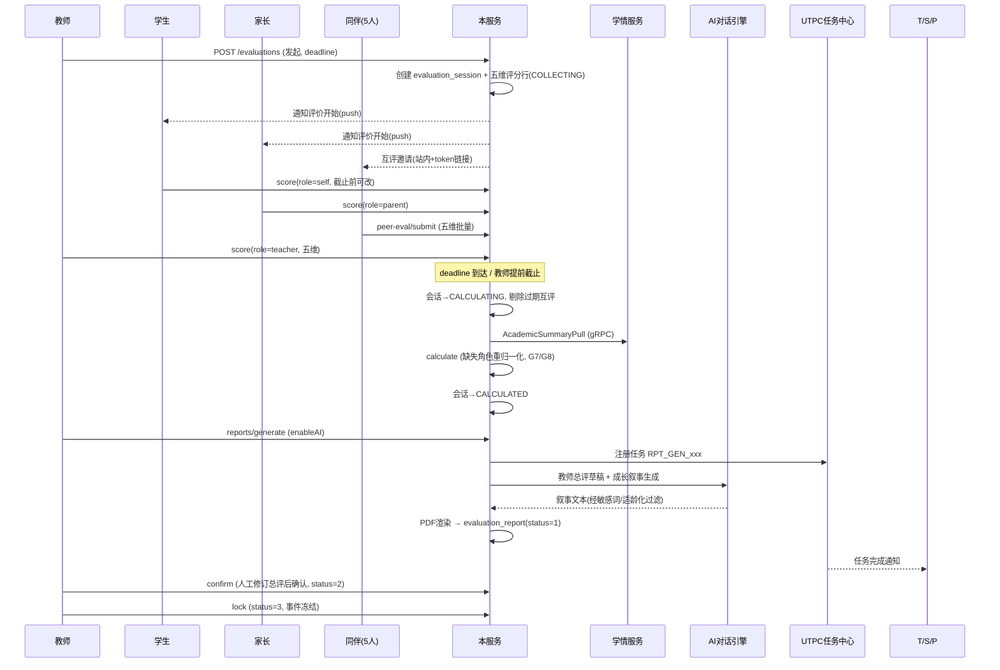
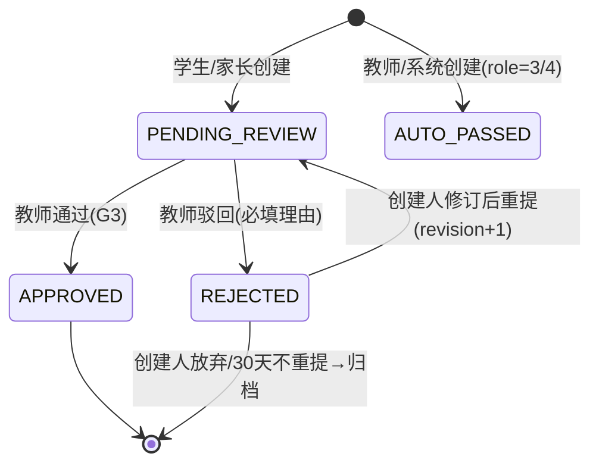

# 服务端-学生电子成长档案与综合素质评价服务 - 详细设计

> **版本**: v1.1 | **最后更新**: 2026-08-19 | **优先级**: P2 (V1.5+)
> **依赖**: 用户服务、学情分析服务、学习记录与进度追踪服务、文件与资源存储服务、消息与推送服务、统一认证授权
> **关联文档**: `学情分析-详细设计.md`、`学习报告生成与交付服务-详细设计.md`、`学生成就与学习里程碑追踪引擎-详细设计.md`、`端到端学习闭环与用户旅程-详细设计.md`、`服务端-审计日志与操作追溯系统-详细设计.md`

---

## 1. 模块概述

### 1.1 背景与目标

在 K-12 教育体系中，**综合素质评价（Comprehensive Quality Evaluation）** 已成为国家教育政策要求（《深化新时代教育评价改革总体方案》），初中和高中阶段均需建立学生综合素质档案。现有学情分析聚焦学业数据，成就系统聚焦游戏化激励，均无法替代综合素质评价的正式性、多维性和证据性。

本服务核心目标：

1. **成长档案建立**：为每位学生建立结构化电子成长档案，覆盖德智体美劳五个维度
2. **成长事件记录**：支持多角色（学生本人、家长、教师）录入成长事件与佐证材料
3. **定期评价生成**：按学期/学年生成综合素质评价报告，支持自评、互评、师评、家长评
4. **证据材料管理**：管理证书、照片、作品等佐证材料的上传、审核与归档
5. **档案导出交付**：支持档案导出（PDF/结构化数据），用于升学、转学场景
6. **隐私访问控制**：严格的权限管控，仅学生本人、绑定家长、授权教师/学校可查看

### 1.2 服务边界

| 本服务负责 | 不负责（依赖其他服务） |
| --- | --- |
| 成长档案 CRUD、维度配置管理 | 用户账号管理（依赖用户服务） |
| 成长事件记录与佐证材料关联 | 文件存储（依赖存储服务） |
| 多角色评价（自评/师评/家长评）流程编排 | 学业成绩数据采集（依赖学情分析服务） |
| 综合素质评价报告生成 | AI 文本生成（依赖 AI 对话引擎） |
| 档案导出（PDF / JSON） | 消息通知投递（依赖消息服务） |
| 档案访问权限与审计日志 | 审计日志存储（依赖审计日志系统） |

### 1.3 与现有模块的区别

| 维度 | 学情分析服务 | 成就系统 | **本服务（综合素质评价）** |
| --- | --- | --- | --- |
| 数据来源 | APP 内学习行为自动采集 | APP 内行为触发解锁 | 多角色主动录入 + 学业数据聚合 |
| 评价维度 | 学科知识点掌握度 | 游戏化勋章/积分 | 德智体美劳五维度 |
| 证据要求 | 无（数据驱动） | 无（规则触发） | 需要佐证材料（照片/证书/作品） |
| 评价主体 | 系统自动计算 | 系统自动判定 | 学生自评 + 教师评 + 家长评 |
| 输出形式 | 数据看板 / 能力雷达图 | 成就墙 / 排行榜 | 正式评价报告（可导出） |
| 使用场景 | 学习改进参考 | 激励与留存 | 升学/转学/正式档案 |

### 1.4 核心约束

| 约束 | 值 | 说明 |
| --- | --- | --- |
| 单学生最大成长事件数 | 5000 | 防止数据膨胀 |
| 单事件最大附件数 | 20 | 含照片/证书/作品 |
| 单附件最大大小 | 20MB | 单文件限制 |
| 评价报告生成频率 | 每学期 1 次正式 + 按需临时 | 控制计算资源 |
| 档案导出频率限制 | 每自然月 5 次 | 防止滥用 |
| 档案查看权限 | 本人 + 绑定家长（≤3人）+ 授权教师 | 严格隐私控制 |
| 佐证材料审核超时 | 48 小时 | 教师审核材料 |
| 互评有效期 | 7 天 | 防止长期挂起 |

---

## 2. 数据模型

### 2.1 成长档案主表 `student_portfolio`

```sql
CREATE TABLE student_portfolio (
    id                  BIGINT UNSIGNED NOT NULL AUTO_INCREMENT COMMENT '档案ID',
    user_id             BIGINT UNSIGNED NOT NULL COMMENT '学生用户ID',
    student_name        VARCHAR(64) NOT NULL DEFAULT '' COMMENT '学生姓名',
    student_no          VARCHAR(32) NOT NULL DEFAULT '' COMMENT '学号',
    school_name         VARCHAR(128) NOT NULL DEFAULT '' COMMENT '学校名称',
    grade_stage         TINYINT UNSIGNED NOT NULL DEFAULT 0 COMMENT '学段: 0=未知/1=幼儿/2=小学/3=初中/4=高中',
    grade_level         SMALLINT UNSIGNED NOT NULL DEFAULT 0 COMMENT '年级',
    class_name          VARCHAR(64) NOT NULL DEFAULT '' COMMENT '班级',
    dimension_scores    JSON NOT NULL COMMENT '五维度最新评分快照',
    total_events        INT UNSIGNED NOT NULL DEFAULT 0 COMMENT '成长事件总数',
    total_evidences     INT UNSIGNED NOT NULL DEFAULT 0 COMMENT '佐证材料总数',
    last_eval_semester  VARCHAR(16) NOT NULL DEFAULT '' COMMENT '最近评价学期，如 2025-2026-1',
    status              TINYINT UNSIGNED NOT NULL DEFAULT 1 COMMENT '状态: 0=已归档/1=活跃/2=已锁定',
    created_at          DATETIME NOT NULL DEFAULT CURRENT_TIMESTAMP COMMENT '创建时间',
    updated_at          DATETIME NOT NULL DEFAULT CURRENT_TIMESTAMP ON UPDATE CURRENT_TIMESTAMP COMMENT '更新时间',
    PRIMARY KEY (id),
    UNIQUE KEY uk_user_id (user_id),
    KEY idx_school_grade (school_name, grade_stage, grade_level),
    KEY idx_status (status)
) ENGINE=InnoDB DEFAULT CHARSET=utf8mb4 COMMENT='学生成长档案主表';
```

### 2.2 五维度评分表 `portfolio_dimension_score`

```sql
CREATE TABLE portfolio_dimension_score (
    id                  BIGINT UNSIGNED NOT NULL AUTO_INCREMENT,
    portfolio_id        BIGINT UNSIGNED NOT NULL COMMENT '档案ID',
    dimension           TINYINT UNSIGNED NOT NULL COMMENT '维度: 1=品德/2=学业/3=身心/4=审美/5=劳动',
    semester            VARCHAR(16) NOT NULL COMMENT '学期标识，如 2025-2026-1',
    self_score          DECIMAL(4,1) DEFAULT NULL COMMENT '自评分数(0-100)',
    self_comment        VARCHAR(500) NOT NULL DEFAULT '' COMMENT '自评评语',
    teacher_score       DECIMAL(4,1) DEFAULT NULL COMMENT '教师评分',
    teacher_comment     VARCHAR(500) NOT NULL DEFAULT '' COMMENT '教师评语',
    parent_score        DECIMAL(4,1) DEFAULT NULL COMMENT '家长评分',
    parent_comment      VARCHAR(500) NOT NULL DEFAULT '' COMMENT '家长评语',
    peer_score          DECIMAL(4,1) DEFAULT NULL COMMENT '同伴互评均分',
    peer_count          SMALLINT UNSIGNED NOT NULL DEFAULT 0 COMMENT '参与互评人数',
    final_score         DECIMAL(4,1) DEFAULT NULL COMMENT '综合最终分数(加权计算)',
    eval_status         TINYINT UNSIGNED NOT NULL DEFAULT 0 COMMENT '评价状态: 0=未开始/1=进行中/2=已完成/3=已锁定',
    eval_deadline       DATETIME DEFAULT NULL COMMENT '评价截止时间',
    created_at          DATETIME NOT NULL DEFAULT CURRENT_TIMESTAMP,
    updated_at          DATETIME NOT NULL DEFAULT CURRENT_TIMESTAMP ON UPDATE CURRENT_TIMESTAMP,
    PRIMARY KEY (id),
    UNIQUE KEY uk_portfolio_dim_semester (portfolio_id, dimension, semester),
    KEY idx_semester_status (semester, eval_status)
) ENGINE=InnoDB DEFAULT CHARSET=utf8mb4 COMMENT='五维度评分表';
```

### 2.3 成长事件表 `growth_event`

```sql
CREATE TABLE growth_event (
    id                  BIGINT UNSIGNED NOT NULL AUTO_INCREMENT COMMENT '事件ID',
    portfolio_id        BIGINT UNSIGNED NOT NULL COMMENT '档案ID',
    user_id             BIGINT UNSIGNED NOT NULL COMMENT '学生用户ID',
    event_type          VARCHAR(32) NOT NULL COMMENT '事件类型，见枚举 GROWTH_EVENT_TYPE',
    dimension           TINYINT UNSIGNED NOT NULL COMMENT '所属维度: 1-5',
    title               VARCHAR(128) NOT NULL COMMENT '事件标题',
    description         TEXT COMMENT '详细描述',
    occurred_at         DATE NOT NULL COMMENT '发生日期',
    location            VARCHAR(128) NOT NULL DEFAULT '' COMMENT '地点',
    organizer           VARCHAR(128) NOT NULL DEFAULT '' COMMENT '组织方/颁发方',
    achievement_level   TINYINT UNSIGNED NOT NULL DEFAULT 0 COMMENT '获奖等级: 0=无/1=参与/2=三等奖/3=二等奖/4=一等奖/5=特等奖',
    evidence_count      SMALLINT UNSIGNED NOT NULL DEFAULT 0 COMMENT '佐证材料数量',
    recorded_by         BIGINT UNSIGNED NOT NULL COMMENT '记录人用户ID',
    recorder_role       TINYINT UNSIGNED NOT NULL COMMENT '记录人角色: 1=学生本人/2=家长/3=教师/4=系统',
    review_status       TINYINT UNSIGNED NOT NULL DEFAULT 0 COMMENT '审核状态: 0=待审核/1=已通过/2=已驳回/3=免审核',
    reviewed_by         BIGINT UNSIGNED DEFAULT NULL COMMENT '审核人用户ID',
    reviewed_at         DATETIME DEFAULT NULL COMMENT '审核时间',
    review_comment      VARCHAR(500) NOT NULL DEFAULT '' COMMENT '审核备注',
    semester            VARCHAR(16) NOT NULL COMMENT '所属学期',
    tags                JSON DEFAULT NULL COMMENT '自定义标签列表',
    extra_data          JSON DEFAULT NULL COMMENT '扩展数据(如比赛名称、活动级别等)',
    created_at          DATETIME NOT NULL DEFAULT CURRENT_TIMESTAMP,
    updated_at          DATETIME NOT NULL DEFAULT CURRENT_TIMESTAMP ON UPDATE CURRENT_TIMESTAMP,
    PRIMARY KEY (id),
    KEY idx_portfolio_dim (portfolio_id, dimension),
    KEY idx_user_type (user_id, event_type),
    KEY idx_semester (semester),
    KEY idx_review_status (review_status),
    KEY idx_occurred_at (occurred_at)
) ENGINE=InnoDB DEFAULT CHARSET=utf8mb4 COMMENT='成长事件表';
```

### 2.4 佐证材料表 `growth_evidence`

```sql
CREATE TABLE growth_evidence (
    id                  BIGINT UNSIGNED NOT NULL AUTO_INCREMENT COMMENT '材料ID',
    event_id            BIGINT UNSIGNED NOT NULL COMMENT '关联成长事件ID',
    portfolio_id        BIGINT UNSIGNED NOT NULL COMMENT '档案ID(冗余加速查询)',
    evidence_type       TINYINT UNSIGNED NOT NULL COMMENT '材料类型: 1=照片/2=证书/3=视频/4=文档/5=音频/6=链接',
    file_url            VARCHAR(512) NOT NULL COMMENT '文件URL',
    file_name           VARCHAR(256) NOT NULL DEFAULT '' COMMENT '原始文件名',
    file_size           INT UNSIGNED NOT NULL DEFAULT 0 COMMENT '文件大小(字节)',
    mime_type           VARCHAR(64) NOT NULL DEFAULT '' COMMENT 'MIME类型',
    thumbnail_url       VARCHAR(512) NOT NULL DEFAULT '' COMMENT '缩略图URL',
    description         VARCHAR(256) NOT NULL DEFAULT '' COMMENT '材料说明',
    width               INT UNSIGNED NOT NULL DEFAULT 0 COMMENT '图片宽度(照片类型)',
    height              INT UNSIGNED NOT NULL DEFAULT 0 COMMENT '图片高度(照片类型)',
    duration            INT UNSIGNED NOT NULL DEFAULT 0 COMMENT '时长秒数(音视频类型)',
    ocr_text            TEXT COMMENT 'OCR提取文本(证书类型)',
    uploaded_by         BIGINT UNSIGNED NOT NULL COMMENT '上传人用户ID',
    upload_role         TINYINT UNSIGNED NOT NULL COMMENT '上传人角色: 1=学生/2=家长/3=教师',
    created_at          DATETIME NOT NULL DEFAULT CURRENT_TIMESTAMP,
    PRIMARY KEY (id),
    KEY idx_event_id (event_id),
    KEY idx_portfolio_type (portfolio_id, evidence_type)
) ENGINE=InnoDB DEFAULT CHARSET=utf8mb4 COMMENT='佐证材料表';
```

### 2.5 同伴互评表 `peer_evaluation`

```sql
CREATE TABLE peer_evaluation (
    id                  BIGINT UNSIGNED NOT NULL AUTO_INCREMENT,
    eval_session_id     VARCHAR(32) NOT NULL COMMENT '评价批次ID',
    portfolio_id        BIGINT UNSIGNED NOT NULL COMMENT '被评学生档案ID',
    evaluator_user_id   BIGINT UNSIGNED NOT NULL COMMENT '评价人用户ID',
    dimension           TINYINT UNSIGNED NOT NULL COMMENT '评价维度: 1-5',
    score               DECIMAL(4,1) NOT NULL COMMENT '评分(0-100)',
    comment             VARCHAR(500) NOT NULL DEFAULT '' COMMENT '评语',
    status              TINYINT UNSIGNED NOT NULL DEFAULT 0 COMMENT '状态: 0=待提交/1=已提交/2=已撤回',
    submitted_at        DATETIME DEFAULT NULL COMMENT '提交时间',
    expires_at          DATETIME NOT NULL COMMENT '过期时间',
    created_at          DATETIME NOT NULL DEFAULT CURRENT_TIMESTAMP,
    updated_at          DATETIME NOT NULL DEFAULT CURRENT_TIMESTAMP ON UPDATE CURRENT_TIMESTAMP,
    PRIMARY KEY (id),
    UNIQUE KEY uk_session_portfolio_evaluator_dim (eval_session_id, portfolio_id, evaluator_user_id, dimension),
    KEY idx_portfolio_session (portfolio_id, eval_session_id),
    KEY idx_evaluator (evaluator_user_id, status)
) ENGINE=InnoDB DEFAULT CHARSET=utf8mb4 COMMENT='同伴互评表';
```

### 2.6 评价报告表 `evaluation_report`

```sql
CREATE TABLE evaluation_report (
    id                  BIGINT UNSIGNED NOT NULL AUTO_INCREMENT COMMENT '报告ID',
    portfolio_id        BIGINT UNSIGNED NOT NULL COMMENT '档案ID',
    user_id             BIGINT UNSIGNED NOT NULL COMMENT '学生用户ID',
    semester            VARCHAR(16) NOT NULL COMMENT '学期',
    report_type         TINYINT UNSIGNED NOT NULL DEFAULT 1 COMMENT '报告类型: 1=学期正式/2=学年汇总/3=毕业档案/4=临时生成',
    dimension_summary   JSON NOT NULL COMMENT '五维度评分汇总',
    highlights          JSON NOT NULL COMMENT '本学期亮点事件列表',
    improvement_areas   JSON NOT NULL COMMENT '待提升方向',
    teacher_summary     TEXT COMMENT '教师总评(可AI辅助生成)',
    growth_narrative    TEXT COMMENT '成长叙事(AI生成)',
    statistics          JSON NOT NULL COMMENT '统计数据(事件数/获奖数/志愿时长等)',
    pdf_url             VARCHAR(512) NOT NULL DEFAULT '' COMMENT 'PDF导出URL',
    status              TINYINT UNSIGNED NOT NULL DEFAULT 0 COMMENT '状态: 0=生成中/1=待确认/2=已确认/3=已锁定',
    confirmed_by        BIGINT UNSIGNED DEFAULT NULL COMMENT '确认人(教师/家长)',
    confirmed_at        DATETIME DEFAULT NULL COMMENT '确认时间',
    created_at          DATETIME NOT NULL DEFAULT CURRENT_TIMESTAMP,
    updated_at          DATETIME NOT NULL DEFAULT CURRENT_TIMESTAMP ON UPDATE CURRENT_TIMESTAMP,
    PRIMARY KEY (id),
    UNIQUE KEY uk_portfolio_semester_type (portfolio_id, semester, report_type),
    KEY idx_user_semester (user_id, semester),
    KEY idx_status (status)
) ENGINE=InnoDB DEFAULT CHARSET=utf8mb4 COMMENT='评价报告表';
```

### 2.7 档案访问日志表 `portfolio_access_log`

```sql
CREATE TABLE portfolio_access_log (
    id                  BIGINT UNSIGNED NOT NULL AUTO_INCREMENT,
    portfolio_id        BIGINT UNSIGNED NOT NULL COMMENT '被访问档案ID',
    accessor_user_id    BIGINT UNSIGNED NOT NULL COMMENT '访问人用户ID',
    accessor_role       TINYINT UNSIGNED NOT NULL COMMENT '访问人角色: 1=本人/2=家长/3=教师/4=管理员/5=第三方(导出)',
    access_type         VARCHAR(32) NOT NULL COMMENT '访问类型: VIEW/EXPORT/EVIDENCE_UPLOAD/EVAL_SUBMIT',
    access_ip           VARCHAR(45) NOT NULL DEFAULT '' COMMENT 'IP地址',
    access_user_agent   VARCHAR(256) NOT NULL DEFAULT '' COMMENT 'User-Agent',
    detail              JSON DEFAULT NULL COMMENT '访问详情',
    created_at          DATETIME NOT NULL DEFAULT CURRENT_TIMESTAMP,
    PRIMARY KEY (id),
    KEY idx_portfolio_accessor (portfolio_id, accessor_user_id),
    KEY idx_accessor_time (accessor_user_id, created_at),
    KEY idx_created_at (created_at)
) ENGINE=InnoDB DEFAULT CHARSET=utf8mb4 COMMENT='档案访问日志表';
```

---

## 3. 枚举与常量定义

### 3.1 成长事件类型枚举 `GROWTH_EVENT_TYPE`

```java
public enum GrowthEventType {
    // 品德维度
    VOLUNTEER_SERVICE("volunteer_service", "志愿服务", 1),
    COMMUNITY_ACTIVITY("community_activity", "社区活动", 1),
    HONOR_AWARD("honor_award", "荣誉表彰", 1),
    CLASS_DUTY("class_duty", "班团干部履职", 1),
    GOOD_DEED("good_deed", "好人好事", 1),

    // 学业维度
    COMPETITION_AWARD("competition_award", "学科竞赛获奖", 2),
    RESEARCH_PROJECT("research_project", "课题研究", 2),
    ACADEMIC_EXCELLENCE("academic_excellence", "学业优秀", 2),
    READING_RECORD("reading_record", "课外阅读", 2),
    SUBJECT_PROJECT("subject_project", "学科项目实践", 2),

    // 身心健康维度
    SPORTS_COMPETITION("sports_competition", "体育竞赛", 3),
    FITNESS_TEST("fitness_test", "体测达标", 3),
    HEALTH_RECORD("health_record", "健康检查", 3),
    MENTAL_HEALTH("mental_health", "心理健康活动", 3),

    // 审美素养维度
    ART_PERFORMANCE("art_performance", "艺术表演", 4),
    ART_EXHIBITION("art_exhibition", "作品展出", 4),
    ART_COMPETITION("art_competition", "艺术比赛获奖", 4),
    MUSIC_ACTIVITY("music_activity", "音乐活动", 4),
    CREATIVE_WORK("creative_work", "创意作品", 4),

    // 劳动实践维度
    LABOR_PRACTICE("labor_practice", "劳动实践", 5),
    SOCIAL_PRACTICE("social_practice", "社会实践", 5),
    TECH_INNOVATION("tech_innovation", "科技创新", 5),
    CRAFT_WORK("craft_work", "手工制作", 5),
    INTERNSHIP("internship", "职业体验/实习", 5);

    private final String code;
    private final String label;
    private final int dimension;
    // constructor, getters...
}
```

### 3.2 五维度定义常量

```java
public class PortfolioDimensions {
    public static final int MORAL        = 1; // 品德发展
    public static final int ACADEMIC     = 2; // 学业发展
    public static final int PHYSICAL     = 3; // 身心健康
    public static final int AESTHETIC    = 4; // 审美素养
    public static final int LABOR        = 5; // 劳动实践

    public static final Map<Integer, String> DIMENSION_NAMES = Map.of(
        MORAL,     "品德发展",
        ACADEMIC,  "学业发展",
        PHYSICAL,  "身心健康",
        AESTHETIC, "审美素养",
        LABOR,     "劳动实践"
    );

    /** 评价权重（默认，可按学段调整） */
    public static final Map<Integer, BigDecimal> DEFAULT_WEIGHTS = Map.of(
        MORAL,     new BigDecimal("0.25"),
        ACADEMIC,  new BigDecimal("0.30"),
        PHYSICAL,  new BigDecimal("0.15"),
        AESTHETIC, new BigDecimal("0.15"),
        LABOR,     new BigDecimal("0.15")
    );
}
```

---

## 4. API 接口设计

### 4.1 成长档案管理

#### 4.1.1 获取/创建成长档案

```
GET /api/v1/portfolio
Authorization: Bearer {token}
```

**响应**:
```json
{
  "code": 0,
  "data": {
    "portfolioId": 10001,
    "userId": 50086,
    "studentName": "张小明",
    "studentNo": "STU2025001",
    "schoolName": "XX中学",
    "gradeStage": 3,
    "gradeLevel": 8,
    "className": "初二(3)班",
    "dimensionScores": {
      "1": 88.5,
      "2": 92.0,
      "3": 85.0,
      "4": 78.5,
      "5": 82.0
    },
    "totalEvents": 156,
    "totalEvidences": 89,
    "lastEvalSemester": "2025-2026-1",
    "status": 1
  }
}
```

> 如果当前用户尚无档案，系统会自动创建并返回。创建逻辑通过异步初始化完成，首次返回 `status=1`。

#### 4.1.2 获取五维度评分详情

```
GET /api/v1/portfolio/dimensions?semester={semester}
Authorization: Bearer {token}
```

**参数**:
| 参数 | 类型 | 必填 | 说明 |
| --- | --- | --- | --- |
| semester | String | 否 | 学期标识，默认当前学期，如 `2025-2026-2` |

**响应**:
```json
{
  "code": 0,
  "data": {
    "semester": "2025-2026-2",
    "dimensions": [
      {
        "dimension": 1,
        "dimensionName": "品德发展",
        "selfScore": 90.0,
        "selfComment": "本学期积极参与班级志愿活动...",
        "teacherScore": 88.0,
        "teacherComment": "该生品德端正，乐于助人...",
        "parentScore": 92.0,
        "parentComment": "在家能主动承担家务...",
        "peerScore": 87.5,
        "peerCount": 12,
        "finalScore": 88.8,
        "evalStatus": 2,
        "events": [
          {
            "eventId": 5001,
            "title": "社区敬老志愿服务",
            "eventType": "volunteer_service",
            "occurredAt": "2026-03-15",
            "achievementLevel": 1
          }
        ]
      },
      // ... 其他维度
    ]
  }
}
```

### 4.2 成长事件管理

#### 4.2.1 创建成长事件

```
POST /api/v1/portfolio/events
Authorization: Bearer {token}
Content-Type: application/json
```

**请求体**:
```json
{
  "eventType": "competition_award",
  "dimension": 2,
  "title": "全国初中数学联赛一等奖",
  "description": "参加2026年全国初中数学联赛，获得一等奖",
  "occurredAt": "2026-04-10",
  "location": "北京市",
  "organizer": "中国数学会",
  "achievementLevel": 4,
  "semester": "2025-2026-2",
  "tags": ["数学", "竞赛", "国家级"],
  "extraData": {
    "competitionLevel": "national",
    "ranking": "前5%"
  }
}
```

**响应**:
```json
{
  "code": 0,
  "data": {
    "eventId": 5010,
    "reviewStatus": 0,
    "reviewRequired": true,
    "message": "事件已创建，待教师审核"
  }
}
```

**业务规则**:
- 学生/家长创建的事件默认进入待审核状态（`reviewStatus=0`）
- 教师创建的事件默认免审核（`reviewStatus=3`）
- 系统自动判定的事件（如学业成绩）直接通过（`reviewStatus=3`）
- `dimension` 必须与 `eventType` 对应的维度一致，否则返回 `400 PORT_DIMENSION_MISMATCH`

#### 4.2.2 查询成长事件列表

```
GET /api/v1/portfolio/events?dimension={dim}&semester={sem}&eventType={type}&page={p}&size={s}
Authorization: Bearer {token}
```

**参数**:
| 参数 | 类型 | 必填 | 说明 |
| --- | --- | --- | --- |
| dimension | Integer | 否 | 维度筛选 1-5 |
| semester | String | 否 | 学期筛选 |
| eventType | String | 否 | 事件类型筛选 |
| reviewStatus | Integer | 否 | 审核状态筛选 |
| startDate | String | 否 | 发生日期起 |
| endDate | String | 否 | 发生日期止 |
| page | Integer | 否 | 页码，默认 1 |
| size | Integer | 否 | 每页条数，默认 20，最大 50 |

**响应**:
```json
{
  "code": 0,
  "data": {
    "total": 156,
    "page": 1,
    "size": 20,
    "events": [
      {
        "eventId": 5010,
        "eventType": "competition_award",
        "eventTypeLabel": "学科竞赛获奖",
        "dimension": 2,
        "dimensionName": "学业发展",
        "title": "全国初中数学联赛一等奖",
        "description": "参加2026年全国初中数学联赛...",
        "occurredAt": "2026-04-10",
        "location": "北京市",
        "organizer": "中国数学会",
        "achievementLevel": 4,
        "achievementLabel": "一等奖",
        "evidenceCount": 2,
        "recordedBy": 50086,
        "recorderRole": 1,
        "reviewStatus": 1,
        "semester": "2025-2026-2",
        "tags": ["数学", "竞赛", "国家级"],
        "createdAt": "2026-04-12T10:30:00.000Z"
      }
    ]
  }
}
```

#### 4.2.3 审核/驳回成长事件

```
PUT /api/v1/portfolio/events/{eventId}/review
Authorization: Bearer {token}  (需教师权限)
Content-Type: application/json
```

**请求体**:
```json
{
  "action": "approve",       // "approve" | "reject"
  "comment": "材料齐全，予以通过"
}
```

**响应**:
```json
{
  "code": 0,
  "data": {
    "eventId": 5010,
    "reviewStatus": 1,
    "reviewedBy": 40001,
    "reviewedAt": "2026-04-12T14:00:00.000Z"
  }
}
```

#### 4.2.4 删除成长事件

```
DELETE /api/v1/portfolio/events/{eventId}
Authorization: Bearer {token}
```

**业务规则**:
- 仅事件创建人或教师/管理员可删除
- 已纳入评价报告（`evalStatus=2`）的事件不可删除，需先联系管理员解锁
- 逻辑删除，保留审计记录
- 关联的佐证材料同步标记删除

### 4.3 佐证材料管理

#### 4.3.1 上传佐证材料

```
POST /api/v1/portfolio/events/{eventId}/evidences
Authorization: Bearer {token}
Content-Type: multipart/form-data
```

**表单参数**:
| 参数 | 类型 | 必填 | 说明 |
| --- | --- | --- | --- |
| file | File | 是 | 佐证文件 |
| evidenceType | Integer | 是 | 1=照片/2=证书/3=视频/4=文档/5=音频 |
| description | String | 否 | 材料说明（建议填写） |

**响应**:
```json
{
  "code": 0,
  "data": {
    "evidenceId": 8001,
    "eventId": 5010,
    "evidenceType": 2,
    "fileUrl": "https://cdn.primetop.com/portfolio/evidence/8001.pdf",
    "thumbnailUrl": "https://cdn.primetop.com/portfolio/evidence/8001_thumb.jpg",
    "fileName": "数学联赛获奖证书.pdf",
    "fileSize": 245678,
    "mimeType": "application/pdf",
    "ocrText": "全国初中数学联赛 一等奖 张小明 ...",
    "uploadedBy": 50086,
    "uploadRole": 1,
    "createdAt": "2026-04-12T10:35:00.000Z"
  }
}
```

**处理流程**:
1. 接收文件 → 病毒扫描 → 存储到 OSS
2. 图片类：生成缩略图 + 提取 EXIF
3. 证书类（PDF/图片）：执行 OCR 提取文本
4. 视频类：生成封面帧 + 转码 H.264
5. 写入 `growth_evidence` 表 → 更新事件 `evidence_count`

#### 4.3.2 批量上传

```
POST /api/v1/portfolio/events/{eventId}/evidences/batch
Authorization: Bearer {token}
Content-Type: multipart/form-data
```

支持一次上传多个文件（最大 20 个），内部并行处理后统一返回结果。

### 4.4 综合素质评价

#### 4.4.1 发起学期评价

```
POST /api/v1/portfolio/evaluations
Authorization: Bearer {token}  (需教师权限)
Content-Type: application/json
```

**请求体**:
```json
{
  "portfolioId": 10001,
  "semester": "2025-2026-2",
  "deadline": "2026-06-25T23:59:59.000Z",
  "enableSelfEval": true,
  "enablePeerEval": true,
  "peerEvaluators": [50087, 50088, 50089, 50090, 50091]  // 参与互评的同学
}
```

**响应**:
```json
{
  "code": 0,
  "data": {
    "evalSessionId": "EVAL20260614001",
    "dimensions": [
      {
        "dimension": 1,
        "evalStatus": 1,
        "deadline": "2026-06-25T23:59:59.000Z"
      }
      // ... 其他维度
    ],
    "peerEvalLinks": [
      {
        "evaluatorUserId": 50087,
        "link": "https://api.primetop.com/peer-eval?token=xxx"
      }
      // ...
    ]
  }
}
```

#### 4.4.2 提交评价打分

```
POST /api/v1/portfolio/evaluations/score
Authorization: Bearer {token}
Content-Type: application/json
```

**请求体**:
```json
{
  "portfolioId": 10001,
  "semester": "2025-2026-2",
  "dimension": 1,
  "role": "self",             // "self" | "teacher" | "parent" | "peer"
  "score": 90.0,
  "comment": "本学期积极参与志愿服务活动..."
}
```

**响应**:
```json
{
  "code": 0,
  "data": {
    "scoreId": 12001,
    "evalStatus": 1,
    "completedRoles": ["self", "parent"],
    "pendingRoles": ["teacher", "peer"]
  }
}
```

#### 4.4.3 计算综合评分

```
POST /api/v1/portfolio/evaluations/calculate
Authorization: Bearer {token}  (需教师权限)
Content-Type: application/json
```

**请求体**:
```json
{
  "portfolioId": 10001,
  "semester": "2025-2026-2",
  "weightConfig": {
    "selfWeight": 0.15,
    "teacherWeight": 0.45,
    "parentWeight": 0.15,
    "peerWeight": 0.25
  }
}
```

**响应**:
```json
{
  "code": 0,
  "data": {
    "dimensions": [
      {
        "dimension": 1,
        "finalScore": 88.8,
        "breakdown": {
          "selfScore": 90.0,
          "teacherScore": 88.0,
          "parentScore": 92.0,
          "peerScore": 87.5,
          "weightedCalc": "90*0.15+88*0.45+92*0.15+87.5*0.25=88.8"
        }
      }
      // ... 其他维度
    ],
    "overallScore": 86.7
  }
}
```

### 4.5 评价报告

#### 4.5.1 生成评价报告

```
POST /api/v1/portfolio/reports/generate
Authorization: Bearer {token}
Content-Type: application/json
```

**请求体**:
```json
{
  "portfolioId": 10001,
  "semester": "2025-2026-2",
  "reportType": 1,
  "enableAI": true,
  "aiOptions": {
    "narrativeStyle": "encouraging",
    "maxWords": 500
  }
}
```

**响应**（异步任务，返回任务ID）:
```json
{
  "code": 0,
  "data": {
    "taskId": "RPT_GEN_20260614001",
    "status": "processing",
    "estimatedSeconds": 15
  }
}
```

**轮询/回调获取结果**:
```
GET /api/v1/portfolio/reports/tasks/{taskId}
```

```json
{
  "code": 0,
  "data": {
    "taskId": "RPT_GEN_20260614001",
    "status": "completed",
    "report": {
      "reportId": 30001,
      "portfolioId": 10001,
      "semester": "2025-2026-2",
      "dimensionSummary": {
        "1": {"score": 88.8, "trend": "up", "rank": "优秀"},
        "2": {"score": 92.0, "trend": "stable", "rank": "优秀"},
        "3": {"score": 85.0, "trend": "up", "rank": "良好"},
        "4": {"score": 78.5, "trend": "down", "rank": "合格"},
        "5": {"score": 82.0, "trend": "up", "rank": "良好"}
      },
      "highlights": [
        {"title": "全国初中数学联赛一等奖", "dimension": 2, "occurredAt": "2026-04-10"},
        {"title": "社区敬老志愿活动20小时", "dimension": 1, "occurredAt": "2026-03-15"}
      ],
      "improvementAreas": [
        {"dimension": 4, "suggestion": "建议增加艺术鉴赏和创意表达类活动"},
        {"dimension": 3, "suggestion": "建议保持每周规律体育锻炼"}
      ],
      "growthNarrative": "张小明同学在本学期表现优异...",
      "statistics": {
        "totalEvents": 42,
        "totalAwards": 5,
        "volunteerHours": 28,
        "competitions": 3,
        "socialPractices": 4
      },
      "status": 1,
      "createdAt": "2026-06-14T10:30:00.000Z"
    }
  }
}
```

**错误场景**:
| 场景 | HTTP | 错误码 | 说明 |
| --- | --- | --- | --- |
| taskId 不存在或非本人任务 | 404 | 56733 | 任务不存在 |
| 报告生成失败 | 200 | - | `status=failed` + `failReason`（AI 失败自动降级模板重试一次，仍失败才 failed） |

> 任务注册到**统一异步任务进度中心（UTPC）**，客户端亦可直接走 `GET /api/v1/tasks/{taskId}` 统一入口。状态映射：本服务 `processing/queued` ↔ UTPC `pending/running`，`completed` ↔ `succeeded`。

#### 4.5.2 评价报告列表

```
GET /api/v1/portfolio/reports?semester={semester}&reportType={type}&page={p}&size={s}
Authorization: Bearer {token}
```

**响应**:
```json
{
  "code": 0,
  "data": {
    "total": 4,
    "reports": [
      {
        "reportId": 30001,
        "semester": "2025-2026-2",
        "reportType": 1,
        "reportTypeLabel": "学期正式",
        "overallScore": 86.7,
        "status": 2,
        "statusLabel": "已确认",
        "pdfUrl": "",
        "createdAt": "2026-06-14T10:30:00.000Z",
        "confirmedAt": "2026-06-15T09:00:00.000Z"
      }
    ]
  }
}
```

#### 4.5.3 获取评价报告详情

```
GET /api/v1/portfolio/reports/{reportId}
Authorization: Bearer {token}
```

**业务规则**:
- 学生本人 / 绑定家长 / 授权教师可查看完整报告（含五维明细与叙事）
- `mental_health` 类事件**永不**出现在报告 `highlights`/`growthNarrative` 输入与输出中（见 C3 红线）
- 报告为生成时刻的**不可变快照**；生成后新发生的事件不自动进入，需重新生成（同 semester+type 已存在时须先作废旧报告，走管理端接口）

#### 4.5.4 确认评价报告

```
PUT /api/v1/portfolio/reports/{reportId}/confirm
Authorization: Bearer {token}  (需教师权限)
```

**业务规则**:
- 仅 `status=1（待确认）` 可确认；确认后 `status=2`，写 `confirmed_by/confirmed_at`
- 确认前教师可编辑 `teacher_summary`（AI 辅助初稿 + 人工修订，编辑保留修订历史）
- 确认动作幂等：重复确认返回当前状态，不报错

#### 4.5.5 锁定评价报告

```
PUT /api/v1/portfolio/reports/{reportId}/lock
Authorization: Bearer {token}  (需教师或管理员权限)
Content-Type: application/json
```

**请求体**:
```json
{
  "lockReason": "学期归档，纳入正式综合素质档案"
}
```

**业务规则**:
- 仅 `status=2（已确认）` 可锁定；锁定后 `status=3`，该学期纳入本报告的事件与佐证材料全部冻结（删除接口返回 56710）
- 解锁仅走管理端双人审批接口（§4.8.4），并留审计
- 毕业档案（`reportType=3`）锁定后不可解锁

#### 4.5.6 重新生成成长叙事

```
POST /api/v1/portfolio/reports/{reportId}/narrative/regenerate
Authorization: Bearer {token}  (需教师权限)
```

**业务规则**:
- 仅 `status≤2` 的报告可重生成叙事；同一报告 24 小时内最多 3 次（Redis 计数，56728）
- AI 输出必须携带 AIGC 标识字段（`aiGenerated=true`），并通过敏感词与适龄化过滤后落库

### 4.6 同伴互评

#### 4.6.1 获取我的互评任务

```
GET /api/v1/peer-eval/tasks
Authorization: Bearer {token}
```

**响应**:
```json
{
  "code": 0,
  "data": {
    "tasks": [
      {
        "evalSessionId": "EVAL20260614001",
        "targetStudentName": "张小明",
        "dimensions": [1, 2, 3, 4, 5],
        "status": 0,
        "expiresAt": "2026-06-21T23:59:59.000Z"
      }
    ]
  }
}
```

> 互评任务对评价人展示被评学生姓名（同班同学），但**评价结果对被评学生与其家长完全匿名**——被评侧仅可见聚合后的 `peerScore/peerCount`，任何接口不返回评价人身份。

#### 4.6.2 提交互评（五维一次性提交）

```
POST /api/v1/peer-eval/submit
Authorization: Bearer {token}
Content-Type: application/json
```

**请求体**:
```json
{
  "evalSessionId": "EVAL20260614001",
  "targetPortfolioId": 10001,
  "clientRequestId": "peer-submit-20260614-0001",
  "scores": [
    { "dimension": 1, "score": 90.0, "comment": "很热心，经常帮助同学" },
    { "dimension": 2, "score": 92.0, "comment": "" },
    { "dimension": 3, "score": 85.0, "comment": "" },
    { "dimension": 4, "score": 80.0, "comment": "" },
    { "dimension": 5, "score": 88.0, "comment": "值日很认真" }
  ]
}
```

**业务规则**:
- `clientRequestId` 幂等：重复提交返回首次结果（结果回放语义）
- 必须一次性提交全部 5 个维度（部分提交返回 400）
- 互评评语经敏感词过滤，命中即整单拒绝（未成年人社交保护，复用 UGC 安全审核引擎）
- 过期（`expires_at` 已过）返回 56715，不可补交

#### 4.6.3 匿名互评链接核验（未登录设备）

```
POST /api/v1/peer-eval/verify
Content-Type: application/json
```

**请求体**:
```json
{
  "token": "PE_a1b2c3d4e5"
}
```

**响应**（核验通过返回互评任务上下文与一次性访问凭证）:
```json
{
  "code": 0,
  "data": {
    "evalSessionId": "EVAL20260614001",
    "targetStudentName": "张小明",
    "dimensions": [1, 2, 3, 4, 5],
    "expiresAt": "2026-06-21T23:59:59.000Z",
    "accessToken": "peer_tmp_xxx",
    "accessTokenTtl": 3600
  }
}
```

**业务规则**:
- token 为 HMAC 签名的一次性凭证，服务端仅存 SHA-256 哈希（Redis `PORT:peer:token:{hash}`，TTL 7 天）
- token 与 `evaluator_user_id` 绑定，核验后签发 1 小时临时访问凭证；互评提交需携带该凭证
- token 被复用/篡改返回 56721，并计入风控信号

### 4.7 档案导出

#### 4.7.1 发起导出

```
POST /api/v1/portfolio/export
Authorization: Bearer {token}
Content-Type: application/json
```

**请求体**:
```json
{
  "format": "pdf",
  "semesterStart": "2024-2025-1",
  "semesterEnd": "2025-2026-2",
  "includeEvidence": true,
  "purpose": "transfer"
}
```

**响应**（异步任务，复用 UTPC 协议）:
```json
{
  "code": 0,
  "data": {
    "taskId": "PORT_EXPORT_20260614001",
    "status": "processing",
    "estimatedSeconds": 30
  }
}
```

**业务规则**:
- `purpose`: `transfer`（转学）/ `graduation`（升学）/ `personal`（个人留存）/ `official`（学校正式调取，需教师/管理员发起）
- 配额：学生/家长身份每自然月 5 次（Redis Lua 原子扣减，56729）；`official` 不占个人配额但强制双人审批
- 导出 PDF 每页水印：`导出人姓名 + 用户ID + 时间戳`（对齐《客户端-数字内容防截屏与用户溯源水印系统》水印规范）
- `includeEvidence=true` 时证据打包为 ZIP，单次导出总量上限 500MB，超出建议拆分学期区间
- 账户注销场景走内部接口 `PortfolioDataPack`（§4.9.4），不走本接口

#### 4.7.2 导出记录查询

```
GET /api/v1/portfolio/export/records?page={p}&size={s}
Authorization: Bearer {token}
```

返回历史导出任务列表（含 taskId、状态、文件 URL、过期时间）。导出文件保留 7 天，过期物理删除。

### 4.8 管理端接口（校管理员 / 平台运营，RBAC 控制）

#### 4.8.1 维度权重配置

```
GET  /admin/v1/portfolio/weights?gradeStage={stage}
PUT  /admin/v1/portfolio/weights
```

**PUT 请求体**:
```json
{
  "gradeStage": 3,
  "dimensionWeights": {
    "1": 0.25, "2": 0.30, "3": 0.15, "4": 0.15, "5": 0.15
  },
  "roleWeights": {
    "selfWeight": 0.15, "teacherWeight": 0.45,
    "parentWeight": 0.15, "peerWeight": 0.25
  }
}
```

**业务规则**:
- 两组权重各自求和必须等于 1.0（误差 ±0.001），否则 56723
- 修改需双人审批（提交人 ≠ 审批人），生效后仅对**尚未计算**的学期评价生效，已计算/已锁定报告不受影响
- 配置版本化存储，保留变更历史

#### 4.8.2 学期评价批量发起

```
POST /admin/v1/portfolio/evaluations/batch
Content-Type: application/json
```

**请求体**:
```json
{
  "scope": "GRADE",
  "schoolName": "XX中学",
  "gradeStage": 3,
  "gradeLevel": 8,
  "semester": "2025-2026-2",
  "deadline": "2026-06-25T23:59:59.000Z",
  "enablePeerEval": true,
  "peerGroupSize": 5
}
```

**业务规则**:
- 按班级自动划分互评小组（同班、组内互评、组大小默认 5，`peerGroupSize` 3-8）
- 已存在同学期活跃会话的学生自动跳过（幂等），响应返回 `created/skipped/failed` 三计数
- 仅 `gradeStage∈{3,4}`（初中/高中）支持正式评价；小学学段由系统自动生成"成长记录册"简版报告（仅事件汇编，不打分不排名）

#### 4.8.3 审核工作台

```
GET /admin/v1/portfolio/reviews/pending?schoolName=&className=&page=&size=
GET /admin/v1/portfolio/reviews/overdue
```

- `pending`：待审核事件队列（按提交时间正序）
- `overdue`：超 48 小时未审核事件，供升级处理（见 §5.3 审核超时策略）

#### 4.8.4 报告解锁（双人审批）

```
PUT /admin/v1/portfolio/reports/{reportId}/unlock
Content-Type: application/json
```

**请求体**:
```json
{
  "reason": "学生补充提交佐证材料，需修订报告",
  "approverId": 60002
}
```

- 仅 `reportType∈{1,2,4}` 且 `status=3` 可解锁回 `status=2`；操作留审计并通知该生教师
- 解锁后该学期事件解冻，可增删；再次锁定需重新确认

#### 4.8.5 档案状态管理

```
PUT /admin/v1/portfolio/{portfolioId}/status
Content-Type: application/json
```

**请求体**:
```json
{
  "status": 2,
  "reason": "毕业档案封存"
}
```

- `status=2（锁定）`：档案只读（事件/材料/评分全禁写，56730）
- `status=0（归档）`：毕业/注销后转入，仅保留只读查询与审计
- 变更写 `portfolio_access_log`（`access_type=ADMIN_STATUS_CHANGE`）并发布 `portfolio.archived` 事件

### 4.9 内部接口（gRPC / 服务间）

#### 4.9.1 系统成长事件录入 `GrowthEventIngest`

```protobuf
service PortfolioInternal {
  rpc GrowthEventIngest (GrowthEventIngestRequest) returns (GrowthEventIngestResponse);
  rpc AcademicSummaryPull (AcademicSummaryPullRequest) returns (AcademicSummaryPullResponse);
  rpc PortfolioDataPack (PortfolioDataPackRequest) returns (PortfolioDataPackResponse);
}

message GrowthEventIngestRequest {
  string request_id = 1;       // 幂等键：来源服务 + 业务ID
  int64  user_id = 2;
  string event_type = 3;       // 如 reading_record / integrity_record
  string title = 4;
  string description = 5;
  string occurred_date = 6;    // yyyy-MM-dd
  map<string, string> extra_data = 7;
  string source_service = 8;   // 上游服务标识（朗读评估/作文诚信检测等）
}
```

**业务规则**:
- `recorded_by=0, recorder_role=4（系统）`，直接 `review_status=3`（免审核）
- 重复 `request_id` 返回首次结果（幂等）
- 事件类型白名单校验：仅允许注册过的上游服务与事件类型组合，未注册组合返回 56702 并告警（防任意注入）

#### 4.9.2 学业维度聚合拉取 `AcademicSummaryPull`

- 调用方向：本服务 → 学情分析服务（gRPC）
- 拉取内容：学期内各科掌握度均值、学习时长、进步幅度等**聚合指标**（不含原始答题记录，见 C10）
- 用途：报告 `statistics` 与学业维度 `breakdown` 佐证；学情服务不可用时降级为事件内已有数据（D3）

#### 4.9.3 微证书互补查询

- 调用方向：微证书引擎 ← 本服务（本服务提供查询 API `GET /internal/v1/portfolio/{userId}/certificates`）
- 语义：档案导出 PDF 附「可验证微证书清单」页，证书本体与验证链路由微证书引擎负责（互补边界，见《服务端-学生用户学习成果数字微证书签发与可验证学习凭证管理引擎》）

#### 4.9.4 注销数据打包 `PortfolioDataPack`

- 调用方向：数据导出与账户注销链路 → 本服务
- 返回：档案结构化 JSON（脱敏后）+ 证据文件清单 + 删除计划（`delay_days=180`，与注销链路保留期一致）
- 注销完成后档案转 `status=0`，180 天后由存储生命周期清理引擎物理删除

---

## 5. 核心流程设计

### 5.1 学期评价全流程编排



**阶段与超时**:

| 阶段 | 触发 | 超时/兜底 |
| --- | --- | --- |
| 发起 | 教师手动 / 管理端批量 / 学期末系统批量（`semester.ended` 事件，仅初高中） | 学期结束第 7 天 02:00 自动发起默认会话（deadline=+14 天） |
| 收集 | 会话 COLLECTING | deadline 到达即收敛；未交角色按缺失重归一化（教师缺失除外） |
| 计算 | 全部角色截止或教师提前截止 | 教师评分缺失 → 会话挂起 PENDING_TEACHER，通知 3 次（D1/D5） |
| 报告 | 教师触发 | AI 失败降级模板叙事，任务不失败（D4） |
| 确认 | 教师确认 | 报告生成后 7 天未确认 → 每日提醒教师（最多 5 次） |
| 锁定 | 教师锁定 / 学期结束第 30 天自动锁定已确认报告 | 自动锁定发布 `report.locked`，冻结事件 |

### 5.2 综合评分计算引擎

```java
public BigDecimal calculateFinalScore(PortfolioDimensionScore row,
                                      RoleWeightConfig w) {
    // G8: 教师评分缺失 → 硬阻断（抛 56722，教师评是评价有效性的必要条件）
    if (row.getTeacherScore() == null) {
        throw new BizException(ErrorCode.PORT_CALC_TEACHER_MISSING);
    }
    // G7: 互评样本 k<3 → 剔除互评分量，剩余角色权重重归一化
    boolean peerValid = row.getPeerCount() != null && row.getPeerCount() >= 3
            && row.getPeerScore() != null;

    Map<String, BigDecimal> weights = new HashMap<>();
    weights.put("teacher", w.getTeacherWeight());
    if (row.getSelfScore() != null)   weights.put("self", w.getSelfWeight());
    if (row.getParentScore() != null) weights.put("parent", w.getParentWeight());
    if (peerValid)                    weights.put("peer", w.getPeerWeight());

    BigDecimal weightSum = weights.values().stream()
            .reduce(BigDecimal.ZERO, BigDecimal::add);          // 必然 > 0（teacher 恒在）

    BigDecimal score = BigDecimal.ZERO;
    for (var e : weights.entrySet()) {
        BigDecimal s = switch (e.getKey()) {
            case "teacher" -> row.getTeacherScore();
            case "self"    -> row.getSelfScore();
            case "parent"  -> row.getParentScore();
            default        -> row.getPeerScore();
        };
        score = score.add(s.multiply(e.getValue()));
    }
    // 重归一化 + HALF_UP 保留 1 位小数
    return score.divide(weightSum, 1, RoundingMode.HALF_UP);
}
```

**计算规则表**:

| 规则 | 说明 |
| --- | --- |
| 教师评缺失 | 硬阻断（56722），会话挂起而非跳过——防止"无师评档案"流入正式报告 |
| 自评/家长评缺失 | 允许，剔除该角色后剩余权重按比例重归一化 |
| 互评 k<3 | 剔除互评分量（G7）；`peer_score/peer_count` 仍落库但不参与计算 |
| 等级映射 | `final_score ≥ 90 优秀 / ≥80 良好 / ≥60 合格 / <60 待提升` |
| 总评分 | `overall = Σ final_score(d) × dimensionWeight(d)`，维度权重按学段配置（§4.8.1） |
| 重算幂等 | 计算持 Redis 锁 `PORT:lock:calc:{portfolioId}:{semester}`（30s），重复触发返回 56724；重算结果 CAS 覆盖（`eval_status≥2` 时需先解锁回 COLLECTING） |

**算例**（角色权重 self .15 / teacher .45 / parent .15 / peer .25，互评仅 2 人）:
品德维：self 90、teacher 88、parent 92、peer 剔除 → `(90×.15 + 88×.45 + 92×.15) / (.15+.45+.15) = 36.9 / 0.75 = 89.9`。

### 5.3 成长事件审核流



**超时升级策略**（宁延迟、不自动通过——证据性红线，防"未审即采信"）:

| 时点 | 动作 |
| --- | --- |
| T+24h | 站内提醒审核教师（Redis `PORT:review:remind:{eventId}` 去重） |
| T+48h | 二次提醒 + 进入工作台 `overdue` 列表 |
| T+72h | 升级提醒班主任；班主任可代审（代审标记 `reviewed_by` 为班主任并记 `delegate=true`） |
| T+14d | 仍无处理 → 事件自动驳回（理由"超期未审核"），通知创建人可重提——**绝不自动通过** |

驳回重提：修订内容生成新 revision（`extra_data.revision` 自增），审核记录保留全历史；同一事件 revision ≤ 5。

### 5.4 评价报告生成管线

```
输入装配 → 教师总评AI草稿 → 成长叙事生成 → 安全过滤 → 落库+PDF → UTPC回调
```

| 步骤 | 实现 | 失败处理 |
| --- | --- | --- |
| 1 输入装配 | 五维评分 + 已通过事件（**白名单字段**：title/eventType/occurredAt/achievementLevel；排除 mental_health 与全部评语原文）+ AcademicSummaryPull 聚合 + statistics | 学情服务失败 → 降级用事件计数（D3） |
| 2 教师总评草稿 | AI 对话引擎 `portfolio.teacher_summary` 场景，输出 ≤300 字，**仅供教师参考**，落库标记 `aiGenerated=true` | AI 失败 → 空草稿，教师手写（不阻断） |
| 3 成长叙事 | `portfolio.growth_narrative` 场景，narrativeStyle=encouraging，500 字内；Prompt 注入红线：禁止负面标签词、禁止跨学生比较、必须成长型表述 | AI 失败 → 降级模板叙事（D4，模板按五维分数段拼接） |
| 4 安全过滤 | 敏感词多层次过滤引擎（复用）+ 适龄化（学段表达适配引擎）+ AIGC 标识 | 命中敏感词 → 替换后重试 1 次，仍命中 → 人工审核队列 |
| 5 PDF 渲染 | 统一文件生成服务；模板按学段（初中/高中正式版、小学成长记录册版）；AIGC 标识脚注 | 渲染失败 → 重试 2 次后任务 failed |
| 6 落库回调 | `evaluation_report` upsert（uk 幂等）+ UTPC `succeeded` + `report.generated` 事件 | - |

### 5.5 佐证材料处理管线

```
病毒扫描 → EXIF剥离 → 类型分支(缩略图/OCR/转码) → 落库 → 计数更新
```

- 病毒扫描失败/检出（56709）：整文件拒收，通知上传人，不落任何存储
- 图片：EXIF 位置/设备信息强制剥离（合规 C4）；生成缩略图
- 证书（PDF/图片）：OCR 提取文本，**PII（身份证号/手机号）打码后**存 `ocr_text`
- 视频：封面帧 + H.264 转码（>100MB 转异步任务，UTPC 通知）
- 单文件任一步骤失败：该文件隔离返回部分成功（batch 接口逐项结果），不影响同批其他文件

### 5.6 档案导出流程

```
配额检查(Lua) → 数据快照(只读视图) → PDF/JSON渲染 → 水印 → OSS临时URL(15min) → 审计+事件
```

- 快照一致性：以发起时刻为截止，读从库 + `created_at <= now` 过滤；PDF 内含生成时间戳与数据区间
- 证据 ZIP 与 PDF 分离，均走 OSS 预签名 URL（15 分钟有效，过期可重新获取，重新获取不占配额）
- 每次导出写 `portfolio_access_log(access_type=EXPORT)` 并发 `portfolio.exported`；`official` 用途额外双人审批

### 5.7 档案自动初始化与学籍联动

- **懒创建**：首次访问 `GET /api/v1/portfolio` 时自动建档（user_id 唯一），异步补齐学籍冗余字段
- **学籍同步**：订阅学校教务适配器的 `student.profile.updated` 事件 → 更新 `student_no/school_name/grade_stage/grade_level/class_name`（仅冗余字段，权威在学籍侧）
- **学段升迁**：订阅用户年级升迁服务的 `user.grade.promoted` 事件 → 更新学段年级；升学离段（grade_level 超出学段上限，如初三毕业）时档案转 `status=2` 并提示导出
- **注销联动**：`account.cancellation.requested` → `PortfolioDataPack` 打包 + 档案 `status=0` + 180 天延迟删除

### 5.8 互评匿名链路

- 发起时为每位评价人生成 `PE_` 前缀 HMAC token（密钥每日轮换），Redis 仅存 `SHA-256(token)` → `{evaluatorUserId, portfolioId, sessionId}`，TTL 7 天
- 提交后 token 一次性失效；`peer_evaluation` 表的 `evaluator_user_id` 对学生/家长侧任何 API 不可见（教师侧亦仅见脱敏学号尾 2 位，用于防刷核查）
- 聚合展示：`peerScore` 仅在 `peer_count≥3` 时返回（k-匿名），否则该维度 `peerScore=null`
- 互评评语默认仅进入教师复核视图（过滤后），不向被评学生展示原文——防止同学关系损伤

---

## 6. 状态机设计

### 6.1 评价会话 `evaluation_session.status`

```
INITIATED(0) → COLLECTING(1) → CALCULATING(2) → CALCULATED(3) → REPORTED(4) → LOCKED(5)
     └──────────────→ CANCELLED(9)  (仅 INITIATED/COLLECTING 可取消，创建教师或管理员)
COLLECTING → COLLECTING  (deadline 延长：教师可延长一次 ≤7 天)
PENDING_TEACHER(6): CALCULATING 中教师评分缺失的挂起态，补齐后回 CALCULATING
```

### 6.2 维度评分 `portfolio_dimension_score.eval_status`

```
NOT_STARTED(0) → IN_PROGRESS(1) → COMPLETED(2) → LOCKED(3)
COMPLETED → IN_PROGRESS: 仅当会话解锁重算（管理端双人审批）
LOCKED: 报告锁定联动，终态
```

### 6.3 事件审核 `growth_event.review_status`（见 §5.3 状态图）

### 6.4 评价报告 `evaluation_report.status`

```
GENERATING(0) → PENDING_CONFIRM(1) → CONFIRMED(2) → LOCKED(3)
PENDING_CONFIRM → GENERATING: 重新生成（同 reportId 重跑管线）
CONFIRMED → PENDING_CONFIRM: 管理端解锁（双人审批，仅 reportType∈{1,2,4}）
LOCKED: 终态（reportType=3 毕业档案不可回退）
```

### 6.5 档案 `student_portfolio.status`

```
ACTIVE(1) ⇄ LOCKED(2) → ARCHIVED(0)
LOCKED → ACTIVE: 管理端解锁（审计）
ARCHIVED: 终态（毕业封存/注销），只读
```

### 6.6 守卫规则总表

| 守卫 | 规则 | 错误码 |
| --- | --- | --- |
| G1 | `dimension∈[1,5]` 且与 `eventType` 枚举映射一致；系统事件类型须在来源白名单注册 | 56702 |
| G2 | `recorder_role∈{1,2}` → 强制 `review_status=0`；`∈{3,4}` → 直接 3 | - |
| G3 | 审核人必须为被评学生所在班级任课教师/班主任，且 `reviewed_by ≠ recorded_by` | 56712 |
| G4 | 删除权限：创建人本人或教师/管理员；事件学期存在 `status=3` 报告 → 拒删 | 56710 |
| G5 | 评分提交窗口：会话 `COLLECTING` 且 `now ≤ deadline` | 56715 |
| G6 | 角色身份绑定：self→本人；teacher→班级教师；parent→绑定家长(≤3)；peer→受邀名单且 `evaluator ≠ 被评人` | 56717/56718/56719/56720 |
| G7 | 互评聚合展示与参与计算均要求 `peer_count ≥ 3` | - |
| G8 | 计算前置：五维 `teacher_score` 全非空 | 56722 |
| G9 | 角色权重和=1.0 且各分量 ≥0；维度权重和=1.0（±0.001） | 56723 |
| G10 | 报告生成 `uk(portfolio_id, semester, report_type)` 幂等；生成中重复触发拒绝 | 56725 |
| G11 | 报告状态机单向流转；LOCKED 仅双人审批解锁；毕业档案 LOCKED 不可回退 | 56727 |
| G12 | confirm 仅教师；lock 需教师/管理员且 `status=2` | 56727 |
| G13 | 导出配额：个人身份 5 次/月（Lua 原子）；official 双人审批不占配额 | 56729 |
| G14 | 档案 `LOCKED/ARCHIVED` 禁止一切写操作（事件/材料/评分/报告） | 56730 |
| G15 | 单档案事件 ≤5000；单事件材料 ≤20；单文件 ≤20MB | 56705/56706/56707 |
| G16 | `mental_health` 类事件：仅本人与教师可见，不入报告/AI 叙事/导出/家长视图 | 56703 |

---

## 7. DDL 增补（v1.1）

### 7.1 评价会话表 `evaluation_session`（新增，v1.0 缺失）

```sql
CREATE TABLE evaluation_session (
    id              BIGINT UNSIGNED NOT NULL AUTO_INCREMENT,
    session_no      VARCHAR(32) NOT NULL COMMENT '会话编号，如 EVAL20260614001',
    portfolio_id    BIGINT UNSIGNED NOT NULL,
    user_id         BIGINT UNSIGNED NOT NULL,
    semester        VARCHAR(16) NOT NULL,
    initiated_by    BIGINT UNSIGNED NOT NULL COMMENT '发起人（教师/管理员/0=系统批量）',
    deadline        DATETIME NOT NULL,
    deadline_extended_at DATETIME DEFAULT NULL COMMENT '延长时间（仅允许一次）',
    enable_self     TINYINT UNSIGNED NOT NULL DEFAULT 1,
    enable_peer     TINYINT UNSIGNED NOT NULL DEFAULT 1,
    peer_group_size TINYINT UNSIGNED NOT NULL DEFAULT 5,
    weight_config   JSON DEFAULT NULL COMMENT '本次会话角色权重快照（缺省用学段配置）',
    status          TINYINT UNSIGNED NOT NULL DEFAULT 0 COMMENT '见 §6.1',
    created_at      DATETIME NOT NULL DEFAULT CURRENT_TIMESTAMP,
    updated_at      DATETIME NOT NULL DEFAULT CURRENT_TIMESTAMP ON UPDATE CURRENT_TIMESTAMP,
    PRIMARY KEY (id),
    UNIQUE KEY uk_session_no (session_no),
    UNIQUE KEY uk_portfolio_semester_active (portfolio_id, semester),  -- 同学期仅一个活跃会话
    KEY idx_user_status (user_id, status)
) ENGINE=InnoDB DEFAULT CHARSET=utf8mb4 COMMENT='学期评价会话表';
```

> 注：同档案同学期存在历史 `CANCELLED` 会话时允许新建——`uk_portfolio_semester_active` 采用 MySQL 8.0 函数唯一索引仅约束 `status NOT IN (5,9)` 的行（对齐《管理后台-教师与班级数据管理工作台》§5.6 同类缺陷修复方案）：
> `UNIQUE KEY uk_portfolio_semester_active ((portfolio_id), (semester), (IF(status IN (5,9), NULL, status)))`

### 7.2 成长事件表增列

```sql
ALTER TABLE growth_event
    ADD COLUMN is_deleted        TINYINT UNSIGNED NOT NULL DEFAULT 0 COMMENT '逻辑删除',
    ADD COLUMN deleted_by        BIGINT UNSIGNED DEFAULT NULL,
    ADD COLUMN deleted_at        DATETIME DEFAULT NULL,
    ADD COLUMN client_request_id VARCHAR(64) NOT NULL DEFAULT '' COMMENT '客户端幂等键',
    ADD UNIQUE KEY uk_recorder_request (recorded_by, client_request_id);  -- 创建幂等
```

### 7.3 佐证材料表增列

```sql
ALTER TABLE growth_evidence
    ADD COLUMN is_deleted TINYINT UNSIGNED NOT NULL DEFAULT 0 COMMENT '随事件级联逻辑删除';
```

### 7.4 评价报告表增列

```sql
ALTER TABLE evaluation_report
    ADD COLUMN task_id     VARCHAR(64) NOT NULL DEFAULT '' COMMENT 'UTPC 任务ID',
    ADD COLUMN ai_generated TINYINT UNSIGNED NOT NULL DEFAULT 0 COMMENT '叙事是否AI生成(AIGC标识)',
    ADD COLUMN narrative_regenerate_count SMALLINT UNSIGNED NOT NULL DEFAULT 0 COMMENT '24h重生成计数(≤3)',
    ADD COLUMN locked_by   BIGINT UNSIGNED DEFAULT NULL,
    ADD COLUMN locked_at   DATETIME DEFAULT NULL,
    ADD COLUMN lock_reason VARCHAR(256) NOT NULL DEFAULT '';
```

### 7.5 Outbox 表 `portfolio_outbox`（新增）

```sql
CREATE TABLE portfolio_outbox (
    id           BIGINT UNSIGNED NOT NULL AUTO_INCREMENT,
    event_id     VARCHAR(64) NOT NULL COMMENT '事件UUID',
    event_type   VARCHAR(64) NOT NULL,
    aggregate_id BIGINT UNSIGNED NOT NULL COMMENT '档案/事件/报告ID',
    user_id      BIGINT UNSIGNED NOT NULL,
    payload      JSON NOT NULL,
    status       TINYINT UNSIGNED NOT NULL DEFAULT 0 COMMENT '0待发布/1已发布/2死信',
    retry_count  SMALLINT UNSIGNED NOT NULL DEFAULT 0,
    created_at   DATETIME NOT NULL DEFAULT CURRENT_TIMESTAMP,
    published_at DATETIME DEFAULT NULL,
    PRIMARY KEY (id),
    UNIQUE KEY uk_event_id (event_id),
    KEY idx_status_created (status, created_at)
) ENGINE=InnoDB DEFAULT CHARSET=utf8mb4 COMMENT='档案域事件Outbox';
```

### 7.6 Redis Key 总表

| Key | 类型 | TTL | 用途 |
| --- | --- | --- | --- |
| `PORT:eval:progress:{portfolioId}:{semester}` | Hash | 学期末+7d | 各角色提交状态聚合缓存 |
| `PORT:peer:token:{sha256}` | String(JSON) | 7d | 互评 token 上下文（仅存哈希） |
| `PORT:export:quota:{userId}:{yyyyMM}` | String | 45d | 导出月配额计数 |
| `PORT:lock:calc:{portfolioId}:{semester}` | String | 30s | 评分计算互斥锁 |
| `PORT:review:remind:{eventId}` | String | 24h | 审核提醒去重 |
| `PORT:events:count:{portfolioId}` | String | 1h | 事件计数快检（DB 兜底精确计数） |
| `PORT:narrative:cnt:{reportId}:{yyyyMMdd}` | String | 48h | 叙事重生成日限 3 次 |
| `PORT:peer:tmp:{accessToken}` | String(JSON) | 1h | 互评临时访问凭证 |

---

## 8. 幂等与并发控制

| 场景 | 机制 |
| --- | --- |
| 事件创建 | `uk_recorder_request(recorded_by, client_request_id)` 唯一键；冲突返回首次结果（结果回放） |
| 事件审核 | `UPDATE ... WHERE id=? AND review_status=0` CAS；已审返回 56711（幂等重放：同 action 同结果直接回显） |
| 评分提交 | upsert `uk_portfolio_dim_semester`；同角色二次提交为**覆盖更新**（截止前），`updated_at` 记录最后修改 |
| 互评提交 | `uk_session_portfolio_evaluator_dim` 天然幂等 + `clientRequestId` 结果回放 |
| 评分计算 | Redis SETNX 互斥（56724）；计算结果 CAS 写入（`WHERE eval_status IN (1,2)`） |
| 报告生成 | uk 三元组幂等（56725）；管线内每步 checkpoint（step 标记），重跑从断点续 |
| 导出配额 | Lua 原子 `INCR + EXPIRE + 比较`，超限回滚 INCR |
| 学期批量发起 | `uk_portfolio_semester_active` 唯一键；批量内冲突行记 `skipped` |
| 锁定/解锁 | 状态机 CAS + 双人审批工单号必填；解锁工单号唯一防双击 |

---

## 9. 事件与 Outbox

**Topic**: `portfolio.domain.events`（信封格式对齐《服务端-事件驱动架构与统一事件总线详细设计》，消费幂等键 `(event_id, consumer)`）

| 事件 | 触发 | 消费方 |
| --- | --- | --- |
| `portfolio.created` | 懒建档 | 审计日志、埋点平台 |
| `growth_event.created` | 事件创建（role=1/2 时） | 消息推送（教师待审提醒） |
| `growth_event.approved` / `rejected` | 审核完成 | 消息推送（通知创建人） |
| `growth_event.deleted` | 逻辑删除 | 审计日志 |
| `evaluation.started` | 会话进入 COLLECTING | 消息推送（学生/家长/互评同学） |
| `evaluation.calculated` | 计算完成 | 消息推送（教师复核提醒） |
| `report.generated` | 报告落库 | 消息推送（学生/家长查看通知）、UTPC |
| `report.confirmed` | 教师确认 | 审计日志、埋点平台 |
| `report.locked` | 锁定 | 事件冻结标记（本域内）、审计日志 |
| `portfolio.exported` | 导出完成 | 审计日志、风控（导出频次信号） |
| `portfolio.archived` | 档案归档 | 存储生命周期清理引擎（180 天延迟删除） |

**上游订阅**: `semester.ended`（学期管理，自动发起）、`student.profile.updated`（学籍适配器，冗余字段）、`user.grade.promoted`（年级升迁）、`account.cancellation.requested`（注销链路）。Relay 投递与消费痕迹日终对账（对齐事件总线规范）。

---

## 10. 错误码（56700-56799）

| 错误码 | 常量 | HTTP | 说明 |
| --- | --- | --- | --- |
| 56701 | PORT_NOT_FOUND | 404 | 档案不存在 |
| 56702 | PORT_DIMENSION_MISMATCH | 400 | 维度与事件类型不符 / 系统事件来源未注册 |
| 56703 | PORT_PERMISSION_DENIED | 403 | 无权访问该档案/该资源 |
| 56704 | PORT_EVENT_NOT_FOUND | 404 | 成长事件不存在 |
| 56705 | PORT_EVENT_LIMIT_EXCEEDED | 400 | 超单档案 5000 事件上限 |
| 56706 | PORT_EVIDENCE_LIMIT_EXCEEDED | 400 | 单事件佐证材料超 20 个 |
| 56707 | PORT_FILE_TOO_LARGE | 413 | 单文件超 20MB |
| 56708 | PORT_FILE_TYPE_REJECTED | 415 | 文件类型不允许 |
| 56709 | PORT_VIRUS_DETECTED | 422 | 检出恶意文件 |
| 56710 | PORT_EVENT_LOCKED | 409 | 事件已纳入锁定报告，禁止删除/修改 |
| 56711 | PORT_REVIEW_ALREADY_DONE | 409 | 事件已完成审核（幂等重放除外） |
| 56712 | PORT_REVIEWER_INVALID | 403 | 审核人非该生班级教师 |
| 56713 | PORT_SESSION_NOT_FOUND | 404 | 评价会话不存在 |
| 56714 | PORT_EVAL_NOT_COLLECTING | 409 | 评价不在收集期 |
| 56715 | PORT_EVAL_DEADLINE_PASSED | 409 | 已过评价截止时间 |
| 56716 | PORT_SCORE_FROZEN | 409 | 评分已截止/锁定，不可修改 |
| 56717 | PORT_ROLE_NOT_ALLOWED | 403 | 当前身份不可提交该角色评分 |
| 56718 | PORT_PARENT_NOT_BOUND | 403 | 家长未绑定该学生 |
| 56719 | PORT_PEER_SELF_FORBIDDEN | 400 | 不可互评自己 |
| 56720 | PORT_PEER_NOT_INVITED | 403 | 未在互评受邀名单 |
| 56721 | PORT_PEER_TOKEN_INVALID | 401 | 互评链接无效或已过期 |
| 56722 | PORT_CALC_TEACHER_MISSING | 409 | 教师评分缺失，不可计算 |
| 56723 | PORT_WEIGHT_INVALID | 400 | 权重配置非法（和≠1.0 或分量<0） |
| 56724 | PORT_CALC_LOCK_BUSY | 429 | 计算进行中，请勿重复触发 |
| 56725 | PORT_REPORT_EXISTS | 409 | 同学期同类型报告已存在/生成中 |
| 56726 | PORT_REPORT_NOT_FOUND | 404 | 报告不存在 |
| 56727 | PORT_REPORT_STATUS_INVALID | 409 | 报告状态不允许该操作 |
| 56728 | PORT_NARRATIVE_LIMIT_EXCEEDED | 429 | 叙事重生成超 24h/3 次 |
| 56729 | PORT_EXPORT_LIMIT_EXCEEDED | 429 | 本月导出超 5 次配额 |
| 56730 | PORT_PORTFOLIO_LOCKED | 423 | 档案已锁定/归档，禁止写入 |
| 56731 | PORT_SEMESTER_INVALID | 400 | 学期标识非法 |
| 56732 | PORT_EVIDENCE_NOT_FOUND | 404 | 佐证材料不存在 |
| 56733 | PORT_TASK_NOT_FOUND | 404 | 异步任务不存在 |
| 56734 | PORT_GRADE_NOT_SUPPORTED | 403 | 当前学段不支持该操作（正式评价仅初高中） |

客户端文案统一走全局错误码映射；56703 不区分"无权限"与"不存在"，防档案存在性侧信道探测。

---

## 11. 降级矩阵

| 编号 | 故障 | 降级策略 |
| --- | --- | --- |
| D1 | 学情服务不可用 | 报告 statistics 用事件内聚合；学业维 breakdown 标记 `dataSource=local` |
| D2 | AI 对话引擎超时（>8s） | 叙事走模板拼接（按五维分数段），脚注标"本期为系统模板" |
| D3 | OCR 服务不可用 | 证书类材料 `ocr_text=NULL`，审核走人工查看原件，不阻断上传 |
| D4 | 病毒扫描服务不可用 | **fail-secure**：材料暂存隔离区，标记 `pending_scan`，扫描恢复后补检放行 |
| D5 | 教师评分缺失挂起 | 会话 PENDING_TEACHER，3 次通知（D1/D3/D7 天）；学期结束仍缺 → 报告标注"教师未参评"降级发布（需管理端审批） |
| D6 | UTPC 不可用 | 任务进度降级本服务 `PORT:report:task:*` Redis 轮询，恢复后补注册 |
| D7 | 消息推送不可用 | 通知落站内信队列，延迟投递；评价截止类提醒可延迟 ≤24h |
| D8 | 存储服务上传失败 | 事件创建不阻断（材料后补），材料重试 3 次后回执失败明细 |
| D9 | 配置中心不可用 | 权重/学段配置用本地缓存最后版本，双写恢复 |
| D10 | Outbox 发布失败 | 重试 5 次退避后转死信，日终对账补发；不回滚业务事务 |

---

## 12. 监控与容量

**监控指标（M1-M10）**:

| 指标 | 口径 | 告警阈值 |
| --- | --- | --- |
| M1 事件创建 QPS / 延迟 P99 | 网关 | P99 > 500ms 持续 5min |
| M2 审核积压 | pending 总量 | > 500/校 或 overdue > 50 → P2 |
| M3 审核超时率（>72h） | 超时/总量 | > 10% → P2 |
| M4 评分提交成功率 | - | < 99% → P2 |
| M5 报告生成失败率 | failed/total | > 2% → P1 |
| M6 AI 叙事降级率 | 模板/总数 | > 20% → P3（观察 AI 容量） |
| M7 导出任务失败率 | - | > 1% → P2 |
| M8 互评参与率 | 提交/受邀 | 学期末 < 60% → 产品观察 |
| M9 Outbox 死信量 | - | > 0 持续 1h → P2 |
| M10 越权访问拦截数 | 56703 计数 | 突增 5 倍 → 安全巡查 |

**容量估算（DAU 50 万，初中+高中档案用户约 18 万）**:
- 事件写入：日常 ~1 万/日，学期末 2 周峰值 ~10 万/日；年增 ~800 万行 → `growth_event` 按 `semester` 归档（在线 3 学年，冷数据转对象存储 Parquet）
- 学期评价：学期末 2 周内 ~18 万会话、90 万行维度评分；报告 18 万份/学期
- 访问日志：~50 万/日 → 按月分区，在线 12 个月
- 存储：证据文件均量 2MB × 日增 1 万 ≈ 20GB/日峰值；OSS 生命周期 3 学年后归档
- 报告生成峰值：学期末 18 万任务 / 14 天，均摊 150 任务/分钟，PDF 渲染队列按 300 并发 worker 规划

---

## 13. 合规红线

| 编号 | 红线 |
| --- | --- |
| C1 | **不排名不公开**：任何接口/报告不提供跨学生比较、班级排名、 percentile；总评仅本人/绑定家长/授权教师可见（义务教育评价改革要求） |
| C2 | 家长可见边界：绑定家长（≤3）可见全部五维与事件；**mental_health 事件除外** |
| C3 | 心理健康类事件仅本人与教师可见；不进报告、AI 叙事输入、导出 PDF、家长视图（G16） |
| C4 | 佐证材料隐私：EXIF 位置强制剥离；证书 OCR 文本 PII 打码；照片不做面部识别 |
| C5 | AI 生成内容强制 AIGC 标识（`aiGenerated=true` + PDF 脚注）；叙事话术白名单（成长型表述，禁负面标签/跨生比较） |
| C6 | 互评匿名：评价人身份任何侧不可见；k<3 不展示互评分 |
| C7 | 导出全程审计 + 水印 + 月配额；official 用途双人审批 |
| C8 | 未成年人数据主体权利：监护人可查阅/更正/删除事件（删除走逻辑删除+审计）；注销联动 180 天删除 |
| C9 | 数据保留：事件/报告在线 3 学年后归档；毕业档案锁定导出后转 ARCHIVED |
| C10 | 数据最小化：学业维度仅消费聚合指标，不落原始答题记录；AI 叙事输入白名单字段（不含评语原文） |

---

## 14. 契约对齐

| 对端 | 契约要点 |
| --- | --- |
| 学情分析服务 | `AcademicSummaryPull` 仅聚合指标（C10）；学情不可用时 D1 降级 |
| 学生成就与学习里程碑引擎 | 成就解锁**不自动**写成长档案；需学生/教师在成就详情页主动"计入档案"→ 走 `GrowthEventIngest`（source_service=achievement，event_type 白名单注册） |
| 数字微证书引擎 | 互补边界：档案=平台内综合视图，微证书=可外发凭证；导出 PDF 仅附微证书清单页，验证链路归微证书引擎 |
| 数据导出与账户注销 e2e | 对应其 `STUDENT_PROFILE` 导出类目；注销走 `PortfolioDataPack` + 180 天延迟删除 |
| 统一异步任务进度中心 | 报告生成/导出/大视频转码任务注册 UTPC；状态映射见 §4.5.1；UTPC 故障 D6 |
| 统一家长门 | 家长侧敏感操作（导出、确认家长评）如触发风控，复用家长门 purpose=`portfolio.export` / `portfolio.eval`（凭证一次性消费） |
| 学期与学年管理服务 | 消费 `semester.ended` 自动发起；学期标识格式 `yyyy-yyyy-n` 双向对齐 |
| 学校教务系统适配器 | 消费 `student.profile.updated` 同步冗余字段；学籍权威在教务侧 |
| 敏感词过滤/适龄化/AIGC 标识 | 报告管线复用三引擎；叙事红线 C5 |
| 审计日志系统 | 所有 admin 操作/导出/解锁写审计；审计写入失败回滚业务（对齐审计系统红线） |
| 存储生命周期清理引擎 | `portfolio.archived` 触发 180 天延迟删除；文件与 DB 行分别注册清理计划 |

---

## 15. 验收场景

1. 新用户首次访问档案 → 自动建档，冗余字段异步补齐，二次访问可见学籍信息
2. 学生创建 `competition_award` 事件但 dimension 传 1 → 400 56702
3. 学生创建事件（无 clientRequestId 重放）→ 唯一键幂等，两次响应同一 eventId
4. 教师审核通过事件 → 状态 1；同教师重复审核 → 56711（幂等重放返回原结果）
5. 学生上传 21 个附件 → 第 21 个 56706；上传 25MB 文件 → 56707
6. 证书 PDF 上传 → OCR 文本中身份证号被打码为 `****`
7. 教师发起评价（deadline 7 天）→ 学生/家长/5 名同学均收到通知
8. 互评仅 2 人提交 → 维度详情 `peerScore=null`，final 计算剔除互评权重（算例 §5.2）
9. 互评 token 被第二人使用 → 56721，且被评学生侧任何接口查不到评价人
10. deadline 后学生补交自评 → 56715
11. 教师评分缺失时触发计算 → 56722，会话 PENDING_TEACHER，教师收到补评通知
12. 报告生成时学情服务宕机 → statistics 降级标记 `dataSource=local`，任务仍 succeeded
13. AI 叙事生成失败 → 模板叙事 + AIGC 脚注"系统模板"，`aiGenerated=true`
14. 报告确认后锁定 → 删除该学期事件返回 56710；管理端解锁（双人）后可删
15. 学生当月第 6 次导出 → 56729；official 导出不占配额但需双人审批
16. mental_health 事件录入 → 家长视角 404、报告 highlights 无此事件、导出 PDF 无此条目
17. 注销请求 → 数据打包返回，档案 ARCHIVED；180 天后清理引擎删除文件与行
18. 权限：未绑定用户查询他人档案 → 统一 403 56703（不暴露存在性）

---

## 16. 维护记录

| 版本 | 日期 | 说明 |
| --- | --- | --- |
| v1.0 | 2026-06-14 | 初版：数据模型七表/枚举/API §4.1-§4.5 前半。文件截断于 §4.5.1 轮询响应 JSON `"createdAt": "2026-06-14T` 处（围栏 39 奇），互评提交/导出/管理端/内部接口/流程/状态机/事件/错误码/降级/监控/合规/验收全缺 |
| v1.1 | 2026-08-19 | 补全烂尾文档：§4.5.1 响应补齐与 UTPC 状态映射；新增 §4.5.2-§4.5.6 报告列表/详情/确认/锁定/叙事重生成、§4.6 互评三接口（匿名 token + k≥3 聚合 + 评语不回显被评侧）、§4.7 导出（配额/水印/official 双人审批）、§4.8 管理端五组（权重双人审批/批量发起/审核工作台/报告解锁/档案状态）、§4.9 内部接口四组（GrowthEventIngest 白名单/AcademicSummaryPull/微证书互补/注销 DataPack）；§5 八节核心流程（评价编排时序与超时兜底、计算引擎含重归一化算例与教师缺失硬阻断、审核流 72h 升级与 14 天驳回绝不自动通过红线、报告管线 AIGC 标识与模板降级、材料管线 EXIF 剥离与 PII 打码、导出快照与水印、懒建档与学籍/升迁/注销联动、互评匿名链路）；§6 五套状态机与守卫 G1-G16；§7 DDL 增补（evaluation_session 新表含函数唯一索引防 Cancelled 撞键、growth_event 逻辑删除与幂等键、报告六列、portfolio_outbox、Redis 八 Key）；§8 幂等九场景；§9 十一事件消费方矩阵与四上游订阅；§10 错误码 56700-56799 共 34 项（56703 不暴露存在性）；§11 降级 D1-D10（病毒扫描 fail-secure）；§12 监控 M1-M10 与容量估算；§13 合规 C1-C10；§14 契约对齐 12 项；§15 验收 18 条 |
