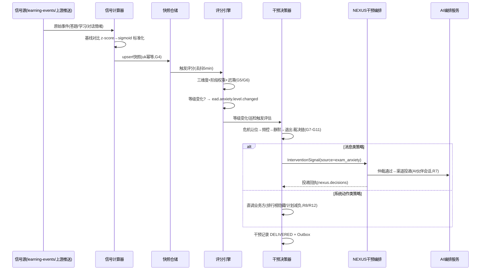
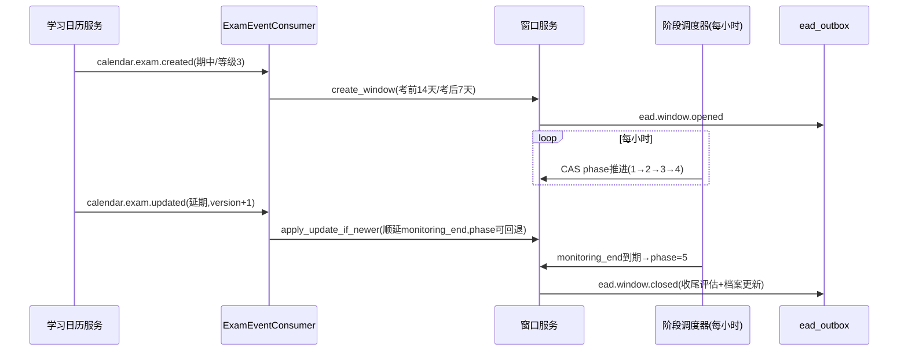
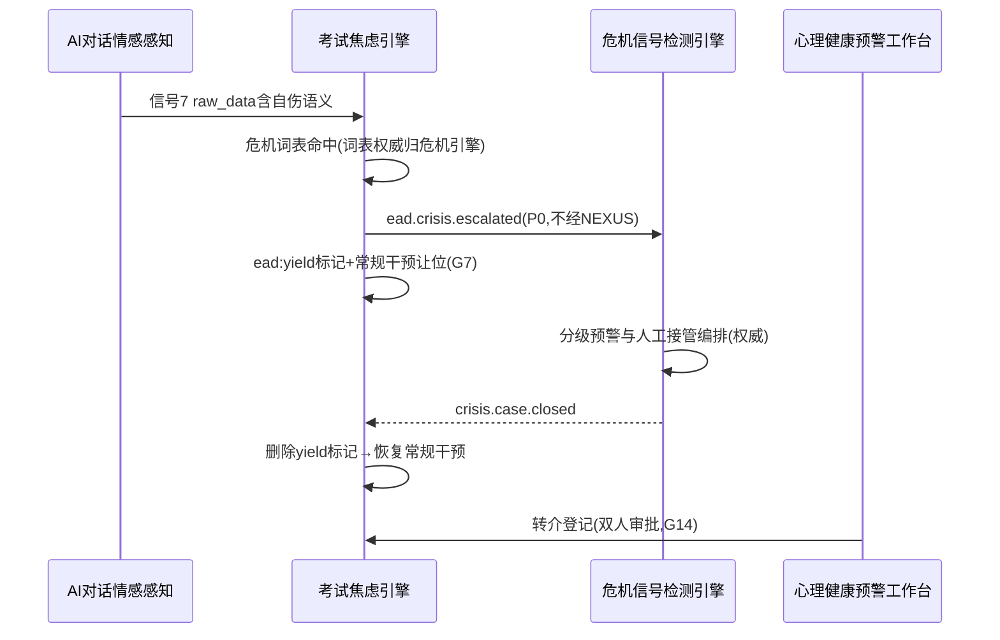

# 服务端 - 学生考试焦虑智能识别与心理调适辅助干预引擎

> **版本**: v1.0 | **日期**: 2026-07-11 | **状态**: 初稿
> **优先级**: P1 | **负责人**: 待定
> **英文名**: Exam Anxiety Detection & Psychological Adjustment Engine (EADAE)

---

## 1. 模块概述

### 1.1 定位

学生考试焦虑智能识别与心理调适辅助干预引擎（以下简称"考试焦虑引擎"或 EAD Engine）是 PrimeTop 学习闭环中专门针对**考前/考中/考后**三个阶段学生心理压力进行识别、评估和干预的专项服务。

与现有模块的分工差异：

| 模块 | 关注焦点 | 时间维度 | 核心职责 |
|------|----------|----------|----------|
| 学生心理状态建模与学习动机激励策略引擎 | **长期心理画像** | 跨学期 | 动机水平、自我效能感、倦怠趋势 |
| AI辅导对话情感感知引擎 | **单次对话情绪** | 单次会话 | 识别对话中的即时情绪（困惑/沮丧/兴奋） |
| 学习动力量化与学习倦怠预警引擎 | **学习行为统计** | 周/月 | 学习时长趋势、投入度下降预警 |
| 学生认知负荷监测引擎 | **认知负荷** | 学习单元 | 内容难度与认知能力的实时匹配 |
| **本引擎** | **考试焦虑专项** | 考试周期（考前2周～考后1周） | 考试压力识别、焦虑分级、精准干预 |

### 1.2 核心价值

1. **早识别**：在考前1-2周即捕捉焦虑信号，而非等到考试当天崩溃
2. **精分级**：区分正常紧张（有助于表现）与过度焦虑（损害表现），避免过度干预
3. **适干预**：根据焦虑级别和学生个性匹配干预策略，避免"一刀切"
4. **护心智**：履行教育产品对学生心理健康的社会责任，避免"唯分数论"加剧焦虑
5. **可追踪**：建立学生跨考试的焦虑模式档案，帮助家长和教师理解孩子的压力模式

### 1.3 核心能力

| 能力 | 说明 |
|------|------|
| 考试事件感知 | 感知即将到来的考试事件（期中/期末/模拟考/中高考），自动启动焦虑监测窗口 |
| 多维焦虑信号采集 | 从答题行为、学习模式、APP使用、AI对话、自评等多维度采集焦虑信号 |
| 焦虑等级评估 | 基于多维信号综合评估焦虑等级（正常轻度紧张 / 中度焦虑 / 重度焦虑） |
| 考试焦虑类型识别 | 区分不同类型的焦虑源：知识储备不足型、完美主义型、社交比较型、家长压力型 |
| 个性化干预策略 | 根据焦虑类型、学生年级、人格特征匹配干预策略 |
| 干预内容推荐 | 推荐放松练习、认知重构内容、考前策略指导等 |
| AI伙伴情感支持 | 驱动AI学习伙伴在考前提供情感支持对话 |
| 家长沟通建议生成 | 为家长生成"如何帮助孩子度过考前焦虑"的建议 |
| 效果追踪闭环 | 追踪干预效果，形成学生个人的焦虑应对策略知识库 |

### 1.4 适用场景

| 场景 | 触发条件 | 典型输出 |
|------|----------|----------|
| 考前学习强度突增 | 距考试<14天，日均学习时长较平时增长>50% | 温馨提示：合理安排复习，避免疲劳战术 |
| 考前答题异常 | 距考试<7天，简单题错误率突升，反复检查行为增加 | AI伙伴鼓励：知识点掌握已较好，保持心态稳定 |
| 模拟考成绩波动 | 模拟考成绩较上次下降>15%，且用户标记了"在意成绩" | 认知重构引导：单次模考≠最终成绩，分析提升空间 |
| 考前失眠迹象 | 深夜（23:00后）仍活跃使用APP，连续>3天 | 推送助眠建议，提醒休息对考试表现的重要性 |
| 考后情绪低落 | 考后正确率正常但自我评价极低，或考后长时间不登录 | 考后心态调适内容推送，必要时通知家长关注 |
| 过度比较行为 | 频繁查看排行榜（>5次/天），且自身排名下降 | 隐藏排行榜或切换为"超越自我"模式 |
| 家长压力传导 | 家长端频繁推送催促通知，学生答题焦虑指标上升 | 向家长推送"科学陪考建议"，建议减少催促 |

### 1.5 与其他模块的关系

```
┌──────────────────────────────────────────────────────────────────────┐
│                        上游数据源                                     │
│                                                                        │
│  ┌───────────────────────┐   ┌───────────────────────┐               │
│  │ 学习行为事件流          │   │ 考试日程管理服务        │               │
│  │ (答题/学习/浏览事件)    │   │ (考试日期/类型/科目)    │               │
│  └───────────┬───────────┘   └───────────┬───────────┘               │
│              │                           │                            │
│  ┌───────────┴───────────┐   ┌───────────┴───────────┐               │
│  │ 心理状态建模引擎        │   │ AI对话情感感知引擎      │               │
│  │ (基础心理画像)          │   │ (对话情绪标注)          │               │
│  └───────────┬───────────┘   └───────────┬───────────┘               │
│              │                           │                            │
│  ┌───────────┴───────────┐   ┌───────────┴───────────┐               │
│  │ 用户学习画像服务        │   │ 排行榜/挑战赛系统       │               │
│  │ (学段/年级/性格特征)    │   │ (排名变化/比较行为)     │               │
│  └───────────┬───────────┘   └───────────┬───────────┘               │
│              │                           │                            │
└──────────────┼───────────────────────────┼────────────────────────────┘
               │                           │
               ▼                           ▼
┌──────────────────────────────────────────────────────────────────────┐
│            学生考试焦虑智能识别与心理调适辅助干预引擎                     │
│                                                                        │
│   ┌───────────────┐   ┌───────────────┐   ┌───────────────┐          │
│   │ 考试事件感知   │──▶│ 焦虑信号采集   │──▶│ 焦虑等级评估   │          │
│   └───────────────┘   └───────────────┘   └───────┬───────┘          │
│                                                   │                    │
│   ┌───────────────┐   ┌───────────────┐           │                    │
│   │ 干预效果追踪   │◀──│ 干预策略执行   │◀─────────┘                    │
│   └───────┬───────┘   └───────────────┘                                │
│           │                                                            │
└───────────┼────────────────────────────────────────────────────────────┘
            │
            ▼
┌──────────────────────────────────────────────────────────────────────┐
│                        下游消费方                                      │
│                                                                        │
│  ┌───────────────┐   ┌───────────────┐   ┌───────────────┐           │
│  │ AI学习伙伴     │   │ 通知调度服务   │   │ 家长端推送     │           │
│  │ (情感支持对话) │   │ (干预消息推送) │   │ (陪考建议)     │           │
│  └───────────────┘   └───────────────┘   └───────────────┘           │
│                                                                        │
│  ┌───────────────┐   ┌───────────────┐                                │
│  │ 学习规划服务   │   │ 运营内容服务   │                                │
│  │ (计划减负调整) │   │ (考前心理专栏) │                                │
│  └───────────────┘   └───────────────┘                                │
└──────────────────────────────────────────────────────────────────────┘
```

---

## 2. 数据模型

### 2.1 核心实体定义

#### 2.1.1 考试焦虑监测窗口 (exam_anxiety_window)

| 字段 | 类型 | 必填 | 说明 |
|------|------|------|------|
| window_id | VARCHAR(32) | Y | 窗口唯一ID |
| user_id | VARCHAR(32) | Y | 学生用户ID |
| exam_event_id | VARCHAR(32) | Y | 关联考试事件ID |
| exam_type | TINYINT | Y | 考试类型: 1=周测 2=月考 3=期中 4=期末 5=模拟考 6=中考 7=高考 8=竞赛 |
| exam_date | DATE | Y | 考试日期 |
| monitoring_start | DATETIME | Y | 监测窗口开始时间（默认考前14天） |
| monitoring_end | DATETIME | Y | 监测窗口结束时间（默认考后7天） |
| phase | TINYINT | Y | 当前阶段: 1=考前准备期 2=考前冲刺期 3=考试中 4=考后恢复期 5=已结束 |
| baseline_anxiety_score | DECIMAL(4,2) | N | 基线焦虑分值（非考试期的平均焦虑水平） |
| current_anxiety_score | DECIMAL(4,2) | N | 当前焦虑分值（0-100，越高越焦虑） |
| peak_anxiety_score | DECIMAL(4,2) | N | 监测窗口内焦虑峰值 |
| anxiety_type | TINYINT | N | 焦虑类型: 0=未分类 1=知识储备不足型 2=完美主义型 3=社交比较型 4=家长压力型 5=综合型 |
| intervention_count | INT | N | 已执行干预次数 |
| last_intervention_at | DATETIME | N | 最后干预时间 |
| status | TINYINT | Y | 状态: 1=监测中 2=已结束-正常 3=已结束-需关注 4=已结束-已转介 |
| created_at | DATETIME | Y | 创建时间 |
| updated_at | DATETIME | Y | 更新时间 |

**建表SQL:**
```sql
CREATE TABLE `exam_anxiety_window` (
    `window_id` VARCHAR(32) NOT NULL COMMENT '窗口唯一ID',
    `user_id` VARCHAR(32) NOT NULL COMMENT '学生用户ID',
    `exam_event_id` VARCHAR(32) NOT NULL COMMENT '关联考试事件ID',
    `exam_type` TINYINT NOT NULL COMMENT '考试类型',
    `exam_date` DATE NOT NULL COMMENT '考试日期',
    `monitoring_start` DATETIME NOT NULL COMMENT '监测窗口开始时间',
    `monitoring_end` DATETIME NOT NULL COMMENT '监测窗口结束时间',
    `phase` TINYINT NOT NULL DEFAULT 1 COMMENT '当前阶段',
    `baseline_anxiety_score` DECIMAL(4,2) DEFAULT NULL COMMENT '基线焦虑分值',
    `current_anxiety_score` DECIMAL(4,2) DEFAULT NULL COMMENT '当前焦虑分值',
    `peak_anxiety_score` DECIMAL(4,2) DEFAULT NULL COMMENT '焦虑峰值',
    `anxiety_type` TINYINT DEFAULT 0 COMMENT '焦虑类型',
    `intervention_count` INT NOT NULL DEFAULT 0 COMMENT '已执行干预次数',
    `last_intervention_at` DATETIME DEFAULT NULL COMMENT '最后干预时间',
    `status` TINYINT NOT NULL DEFAULT 1 COMMENT '状态',
    `created_at` DATETIME NOT NULL DEFAULT CURRENT_TIMESTAMP COMMENT '创建时间',
    `updated_at` DATETIME NOT NULL DEFAULT CURRENT_TIMESTAMP ON UPDATE CURRENT_TIMESTAMP COMMENT '更新时间',
    PRIMARY KEY (`window_id`),
    UNIQUE KEY `uk_user_exam` (`user_id`, `exam_event_id`),
    KEY `idx_user_phase` (`user_id`, `phase`),
    KEY `idx_exam_date` (`exam_date`),
    KEY `idx_status` (`status`)
) ENGINE=InnoDB DEFAULT CHARSET=utf8mb4 COMMENT='考试焦虑监测窗口';
```

#### 2.1.2 焦虑信号快照 (anxiety_signal_snapshot)

| 字段 | 类型 | 必填 | 说明 |
|------|------|------|------|
| snapshot_id | VARCHAR(32) | Y | 快照唯一ID |
| window_id | VARCHAR(32) | Y | 关联监测窗口ID |
| user_id | VARCHAR(32) | Y | 学生用户ID |
| signal_type | TINYINT | Y | 信号类型（见2.1.2.1） |
| signal_value | DECIMAL(8,4) | Y | 信号数值（标准化后0-1） |
| raw_data | JSON | N | 原始数据（用于溯源） |
| captured_at | DATETIME | Y | 采集时间 |
| created_at | DATETIME | Y | 记录创建时间 |

**信号类型枚举 (signal_type):**

| 值 | 类型 | 说明 | 采集来源 |
|----|------|------|----------|
| 1 | 简单题错误率突升 | 考前简单题（难度1-2星）错误率较个人基线升高 | 答题批改服务 |
| 2 | 答题犹豫度 | 同一题目修改答案次数、停留时长异常增加 | 答题行为追踪 |
| 3 | 反复检查行为 | 完成试卷后反复回看已答题目 | 答题行为追踪 |
| 4 | 学习时长突增 | 日均学习时长较过去30天均值增长>50% | 学习行为事件流 |
| 5 | 深夜间歇 | 23:00-次日6:00期间APP活跃天数（考前14天内） | APP使用日志 |
| 6 | 排行榜查看频次 | 每日查看排行榜次数突增 | 行为埋点 |
| 7 | AI对话情绪信号 | AI对话中出现"紧张""害怕""考不好"等关键词频次 | AI对话情感感知 |
| 8 | 自评焦虑分值 | 学生主动填报的焦虑自评分数 | 用户自评入口 |
| 9 | 学习计划偏离度 | 实际完成情况与计划的偏差幅度增大 | 学习规划服务 |
| 10 | 科目回避行为 | 对弱势科目的学习时间占比异常下降 | 学习行为事件流 |
| 11 | 考后登录下降 | 考后APP日活骤降或长时间不登录 | APP使用日志 |
| 12 | 考后自我评价极低 | 考后AI对话中负面自我评价频次 | AI对话分析 |
| 13 | 任务放弃率 | 考前练习中途放弃率升高 | 答题行为追踪 |
| 14 | 生物钟紊乱指标 | 非常规时段（深夜/凌晨）学习占比 | APP使用日志 |

```sql
CREATE TABLE `anxiety_signal_snapshot` (
    `snapshot_id` VARCHAR(32) NOT NULL COMMENT '快照唯一ID',
    `window_id` VARCHAR(32) NOT NULL COMMENT '关联监测窗口ID',
    `user_id` VARCHAR(32) NOT NULL COMMENT '学生用户ID',
    `signal_type` TINYINT NOT NULL COMMENT '信号类型',
    `signal_value` DECIMAL(8,4) NOT NULL COMMENT '信号数值（标准化0-1）',
    `raw_data` JSON DEFAULT NULL COMMENT '原始数据',
    `captured_at` DATETIME NOT NULL COMMENT '采集时间',
    `created_at` DATETIME NOT NULL DEFAULT CURRENT_TIMESTAMP COMMENT '记录创建时间',
    PRIMARY KEY (`snapshot_id`),
    KEY `idx_window_type` (`window_id`, `signal_type`),
    KEY `idx_user_time` (`user_id`, `captured_at`),
    KEY `idx_signal_type` (`signal_type`)
) ENGINE=InnoDB DEFAULT CHARSET=utf8mb4 COMMENT='焦虑信号快照';
```

#### 2.1.3 焦虑干预记录 (anxiety_intervention)

| 字段 | 类型 | 必填 | 说明 |
|------|------|------|------|
| intervention_id | VARCHAR(32) | Y | 干预记录ID |
| window_id | VARCHAR(32) | Y | 关联监测窗口ID |
| user_id | VARCHAR(32) | Y | 学生用户ID |
| trigger_type | TINYINT | Y | 触发类型: 1=自动触发 2=学生求助 3=家长请求 4=系统调度 |
| anxiety_level | TINYINT | Y | 触发时焦虑等级: 1=轻度 2=中度 3=重度 |
| intervention_strategy | TINYINT | Y | 干预策略（见2.1.3.1） |
| intervention_channel | TINYINT | Y | 干预渠道: 1=APP内消息 2=AI伙伴对话 3=首页卡片 4=家长推送 5=全渠道 |
| content_id | VARCHAR(64) | N | 推荐内容ID（如放松练习、心理文章等） |
| ai_buddy_session_id | VARCHAR(32) | N | AI伙伴对话会话ID（如通过AI伙伴干预） |
| delivered_at | DATETIME | Y | 干预投递时间 |
| user_response | TINYINT | N | 用户响应: 0=未响应 1=积极接受 2=一般接受 3=忽略 4=抵触 |
| response_at | DATETIME | N | 用户响应时间 |
| effectiveness_score | DECIMAL(4,2) | N | 干预效果分值（-1到1，正数表示有效） |
| post_anxiety_score | DECIMAL(4,2) | N | 干预后焦虑分值 |
| notes | TEXT | N | 备注 |
| created_at | DATETIME | Y | 创建时间 |

**干预策略枚举 (intervention_strategy):**

| 值 | 策略 | 说明 | 适用焦虑等级 | 适用阶段 |
|----|------|------|-------------|----------|
| 1 | 轻度鼓励 | AI伙伴发送鼓励消息，肯定近期学习努力 | 轻度 | 考前 |
| 2 | 认知重构 | 引导学生重新认知考试意义，缓解灾难化思维 | 中度 | 考前 |
| 3 | 放松练习推荐 | 推荐呼吸放松法、肌肉放松法等练习 | 中度/重度 | 考前/考中 |
| 4 | 学习计划减负 | 自动调整学习计划，减少任务量，增加休息 | 中度/重度 | 考前 |
| 5 | 排行榜隐藏 | 隐藏排行榜或切换为"自我超越"模式 | 轻度/中度 | 考前 |
| 6 | 难度下调 | 临时降低练习题目难度，增加成就感 | 中度 | 考前 |
| 7 | 考前策略指导 | 提供应试技巧、时间分配、答题顺序等策略 | 轻度/中度 | 考前冲刺 |
| 8 | 助眠建议 | 推送睡眠卫生建议、助眠音频 | 中度/重度 | 考前 |
| 9 | 家长沟通建议 | 为家长生成科学陪考建议，减少压力传导 | 中度/重度 | 考前 |
| 10 | AI伙伴深度对话 | AI伙伴开展多轮情感支持对话，倾听和共情 | 中度/重度 | 全阶段 |
| 11 | 考后心态调适 | 考后引导理性看待成绩，关注过程而非结果 | 轻度/中度 | 考后 |
| 12 | 专业帮助建议 | 建议寻求学校心理老师或专业心理咨询 | 重度 | 全阶段 |
| 13 | 社交比较引导 | 引导关注自身进步而非与他人比较 | 轻度/中度 | 考前 |
| 14 | 正念冥想引导 | 推荐考前正念冥想练习 | 中度 | 考前 |

```sql
CREATE TABLE `anxiety_intervention` (
    `intervention_id` VARCHAR(32) NOT NULL COMMENT '干预记录ID',
    `window_id` VARCHAR(32) NOT NULL COMMENT '关联监测窗口ID',
    `user_id` VARCHAR(32) NOT NULL COMMENT '学生用户ID',
    `trigger_type` TINYINT NOT NULL COMMENT '触发类型',
    `anxiety_level` TINYINT NOT NULL COMMENT '触发时焦虑等级',
    `intervention_strategy` TINYINT NOT NULL COMMENT '干预策略',
    `intervention_channel` TINYINT NOT NULL COMMENT '干预渠道',
    `content_id` VARCHAR(64) DEFAULT NULL COMMENT '推荐内容ID',
    `ai_buddy_session_id` VARCHAR(32) DEFAULT NULL COMMENT 'AI伙伴对话会话ID',
    `delivered_at` DATETIME NOT NULL COMMENT '干预投递时间',
    `user_response` TINYINT DEFAULT 0 COMMENT '用户响应',
    `response_at` DATETIME DEFAULT NULL COMMENT '用户响应时间',
    `effectiveness_score` DECIMAL(4,2) DEFAULT NULL COMMENT '干预效果分值',
    `post_anxiety_score` DECIMAL(4,2) DEFAULT NULL COMMENT '干预后焦虑分值',
    `notes` TEXT DEFAULT NULL COMMENT '备注',
    `created_at` DATETIME NOT NULL DEFAULT CURRENT_TIMESTAMP COMMENT '创建时间',
    PRIMARY KEY (`intervention_id`),
    KEY `idx_window` (`window_id`),
    KEY `idx_user_strategy` (`user_id`, `intervention_strategy`),
    KEY `idx_delivered` (`delivered_at`),
    KEY `idx_level` (`anxiety_level`)
) ENGINE=InnoDB DEFAULT CHARSET=utf8mb4 COMMENT='焦虑干预记录';
```

#### 2.1.4 学生焦虑应对档案 (student_anxiety_profile)

该表存储学生跨考试的焦虑模式长期档案，用于个性化干预。

| 字段 | 类型 | 必填 | 说明 |
|------|------|------|------|
| profile_id | VARCHAR(32) | Y | 档案ID |
| user_id | VARCHAR(32) | Y | 学生用户ID（唯一） |
| total_windows | INT | Y | 经历的考试焦虑监测窗口总数 |
| avg_anxiety_score | DECIMAL(4,2) | N | 历次考试平均焦虑分值 |
| typical_anxiety_type | TINYINT | N | 最常见焦虑类型 |
| best_intervention_strategies | JSON | N | 最有效的干预策略列表（策略ID数组） |
| worst_intervention_strategies | JSON | N | 效果差/抵触的干预策略列表 |
| anxiety_trend | TINYINT | N | 焦虑趋势: 1=稳定 2=逐渐加重 3=逐渐改善 4=波动大 |
| resilience_score | DECIMAL(4,2) | N | 心理韧性分值（0-100，越高越强） |
| support_preference | TINYINT | N | 支持偏好: 1=AI伙伴对话 2=简洁消息 3=内容阅读 4=家长支持 |
| parent_pressure_level | TINYINT | N | 家长压力感知: 1=低 2=中 3=高 |
| self_awareness_level | TINYINT | N | 自我意识水平: 1=低 2=中 3=高 |
| last_updated_at | DATETIME | Y | 最后更新时间 |
| created_at | DATETIME | Y | 创建时间 |

```sql
CREATE TABLE `student_anxiety_profile` (
    `profile_id` VARCHAR(32) NOT NULL COMMENT '档案ID',
    `user_id` VARCHAR(32) NOT NULL COMMENT '学生用户ID',
    `total_windows` INT NOT NULL DEFAULT 0 COMMENT '监测窗口总数',
    `avg_anxiety_score` DECIMAL(4,2) DEFAULT NULL COMMENT '平均焦虑分值',
    `typical_anxiety_type` TINYINT DEFAULT NULL COMMENT '最常见焦虑类型',
    `best_intervention_strategies` JSON DEFAULT NULL COMMENT '最有效干预策略',
    `worst_intervention_strategies` JSON DEFAULT NULL COMMENT '效果差策略',
    `anxiety_trend` TINYINT DEFAULT NULL COMMENT '焦虑趋势',
    `resilience_score` DECIMAL(4,2) DEFAULT NULL COMMENT '心理韧性分值',
    `support_preference` TINYINT DEFAULT NULL COMMENT '支持偏好',
    `parent_pressure_level` TINYINT DEFAULT NULL COMMENT '家长压力感知',
    `self_awareness_level` TINYINT DEFAULT NULL COMMENT '自我意识水平',
    `last_updated_at` DATETIME NOT NULL DEFAULT CURRENT_TIMESTAMP ON UPDATE CURRENT_TIMESTAMP COMMENT '最后更新时间',
    `created_at` DATETIME NOT NULL DEFAULT CURRENT_TIMESTAMP COMMENT '创建时间',
    PRIMARY KEY (`profile_id`),
    UNIQUE KEY `uk_user` (`user_id`)
) ENGINE=InnoDB DEFAULT CHARSET=utf8mb4 COMMENT='学生焦虑应对档案';
```

#### 2.1.5 考试事件 (exam_event)

此表可复用学习日历中的考试事件，此处定义引擎所需的字段视图。

| 字段 | 类型 | 说明 |
|------|------|------|
| event_id | VARCHAR(32) | 事件ID |
| user_id | VARCHAR(32) | 学生ID |
| exam_type | TINYINT | 考试类型 |
| subject_ids | JSON | 涉及科目ID列表 |
| exam_date | DATE | 考试日期 |
| importance_level | TINYINT | 重要性等级: 1=日常测验 2=月考 3=期中/期末 4=模拟考 5=升学考 |
| days_until_exam | INT | 距考试天数（计算字段） |

---

### 2.2 缓存策略

| 缓存键 | TTL | 说明 |
|--------|-----|------|
| `ead:window:{userId}:{examEventId}` | 24h | 监测窗口对象缓存 |
| `ead:window:active:{userId}` | 1h | 学生当前活跃的监测窗口列表 |
| `ead:signals:recent:{windowId}` | 30min | 窗口最近24h信号快照列表 |
| `ead:score:{windowId}` | 15min | 当前焦虑综合评分 |
| `ead:profile:{userId}` | 7d | 学生焦虑应对档案 |
| `ead:intervention:cooldown:{userId}:{strategyId}` | 动态 | 干预冷却期（避免重复打扰） |
| `ead:exam:upcoming:{userId}` | 1h | 即将到来的考试事件列表 |

### 2.3 v1.1 DDL 增补（修复 F1/F2/F5，支撑 §4/§9）

```sql
-- F1：快照幂等唯一键（同窗口同信号同时段 upsert，守卫G4）
-- 注：stat_hour 采用哨兵值 -1（日聚合信号）而非 NULL——MySQL 唯一索引不约束 NULL，
-- 与《敏感词多层次过滤引擎》F3 哨兵方案同惯例，避免函数索引兼容性问题
ALTER TABLE `anxiety_signal_snapshot`
    ADD COLUMN `stat_date` DATE NOT NULL DEFAULT '1970-01-01' COMMENT '统计日' AFTER `signal_value`,
    ADD COLUMN `stat_hour` TINYINT NOT NULL DEFAULT -1 COMMENT '统计小时(0-23,日聚合信号=-1哨兵)',
    ADD UNIQUE KEY `uk_window_type_slot` (`window_id`, `signal_type`, `stat_date`, `stat_hour`);

-- F2：窗口乐观锁 + 危机升级标记 + 取消态
ALTER TABLE `exam_anxiety_window`
    ADD COLUMN `version` INT NOT NULL DEFAULT 0 COMMENT '乐观锁' AFTER `status`,
    ADD COLUMN `escalation_flag` TINYINT NOT NULL DEFAULT 0 COMMENT '危机升级标记' AFTER `version`,
    ADD COLUMN `current_level` TINYINT DEFAULT NULL COMMENT '当前等级0-3(派生自评分)' AFTER `escalation_flag`,
    MODIFY COLUMN `status` TINYINT NOT NULL DEFAULT 1 COMMENT '1监测中 2正常收尾 3需关注 4已转介 5已取消';

-- F5：干预幂等键 + 生命周期列（支撑 §3.2.4 六态）
ALTER TABLE `anxiety_intervention`
    ADD COLUMN `idempotency_key` VARCHAR(64) DEFAULT NULL COMMENT '幂等键' AFTER `notes`,
    ADD COLUMN `status` TINYINT NOT NULL DEFAULT 1 COMMENT '1PENDING 2DELIVERED 3RESPONDED 4FAILED 5EXPIRED 6CANCELLED 7CLOSED' AFTER `idempotency_key`,
    ADD COLUMN `expires_at` DATETIME DEFAULT NULL COMMENT '回执超时时刻(24h)' AFTER `status`,
    ADD COLUMN `delivered_channels` JSON DEFAULT NULL COMMENT '已投递渠道回执' AFTER `expires_at`,
    ADD UNIQUE KEY `uk_idem` (`idempotency_key`);

-- v1.1 新表：危机升级记录（修复F6，§4.5.6）
CREATE TABLE `ead_crisis_escalation` (
    `escalation_id` VARCHAR(64) NOT NULL,
    `window_id` VARCHAR(32) NOT NULL,
    `user_id` VARCHAR(32) NOT NULL,
    `signal_evidence` JSON NOT NULL COMMENT '命中快照ID列表(脱敏聚合,不含原文,C4/C8)',
    `lexicon_version` VARCHAR(16) NOT NULL COMMENT '危机词表版本(权威归危机引擎)',
    `case_ref` VARCHAR(64) DEFAULT NULL COMMENT '危机引擎CASE回填ID',
    `created_at` DATETIME NOT NULL DEFAULT CURRENT_TIMESTAMP,
    PRIMARY KEY (`escalation_id`),
    UNIQUE KEY `uk_window` (`window_id`),
    KEY `idx_user` (`user_id`)
) ENGINE=InnoDB DEFAULT CHARSET=utf8mb4 COMMENT='危机升级记录';

-- v1.1 新表：干预决策日志（§4.5.5，审计与效果分析数据源）
CREATE TABLE `ead_decision_log` (
    `log_id` VARCHAR(64) NOT NULL,
    `window_id` VARCHAR(32) NOT NULL,
    `user_id` VARCHAR(32) NOT NULL,
    `trigger_source` VARCHAR(24) NOT NULL COMMENT 'score_change/daily_patrol/self_help/parent_request',
    `input_fingerprint` CHAR(64) NOT NULL COMMENT '输入快照指纹(SHA-256)',
    `decision_path` JSON NOT NULL COMMENT '裁决链各关结果(危机让位/频控/静默/退出)',
    `candidates` JSON DEFAULT NULL COMMENT '候选策略与得分',
    `suppressed` JSON DEFAULT NULL COMMENT '被抑制策略及原因',
    `final_decision` VARCHAR(32) DEFAULT NULL,
    `created_at` DATETIME NOT NULL DEFAULT CURRENT_TIMESTAMP,
    PRIMARY KEY (`log_id`),
    KEY `idx_window_time` (`window_id`, `created_at`),
    KEY `idx_user` (`user_id`)
) ENGINE=InnoDB DEFAULT CHARSET=utf8mb4 COMMENT='干预决策日志(90天分区归档)';

-- v1.1 增补 Redis 键（评分串行锁/危机让位/日计数/基线缓存）
-- ead:score:lock:{windowId}       评分串行锁 10s（G5）
-- ead:yield:{userId}              危机让位标记 TTL=CASE期+14d上限（G7，crisis.case.closed 删除）
-- ead:interv:daily:{userId}:{yyyyMMdd}  日干预计数（Lua，G8）
-- ead:interv:cooldown:{userId}:{strategyId}  策略冷却 48h（G8）
-- ead:interv:parent:{userId}      家长通道冷却 3d（G8）
-- ead:interv:window:{windowId}    窗口干预总量计数 TTL=14d（G8）
-- ead:baseline:{userId}:{signalType}  个人基线缓存 24h
```

---

## 3. API 接口设计

### 3.1 接口列表

| # | 接口 | 方法 | 路径 | 说明 |
|---|------|------|------|------|
| 1 | 创建/更新监测窗口 | POST | /api/v1/ead/windows | 考试事件触发窗口创建 |
| 2 | 查询活跃窗口 | GET | /api/v1/ead/windows/active | 获取学生当前活跃监测窗口 |
| 3 | 获取窗口详情 | GET | /api/v1/ead/windows/{windowId} | 监测窗口完整数据 |
| 4 | 提交焦虑信号 | POST | /api/v1/ead/signals | 上游服务推送焦虑信号 |
| 5 | 批量提交焦虑信号 | POST | /api/v1/ead/signals/batch | 批量推送信号 |
| 6 | 获取当前焦虑评分 | GET | /api/v1/ead/score/{windowId} | 综合焦虑评分及分维度得分 |
| 7 | 触发干预评估 | POST | /api/v1/ead/interventions/evaluate | 评估是否需要干预及推荐策略 |
| 8 | 执行干预 | POST | /api/v1/ead/interventions | 执行具体干预动作 |
| 9 | 反馈干预效果 | PUT | /api/v1/ead/interventions/{id}/feedback | 用户响应和效果反馈 |
| 10 | 获取焦虑应对档案 | GET | /api/v1/ead/profile/{userId} | 学生长期焦虑模式档案 |
| 11 | 学生自评焦虑 | POST | /api/v1/ead/self-assessment | 学生主动填报焦虑自评 |
| 12 | 获取干预历史 | GET | /api/v1/ead/interventions | 查询干预历史记录 |
| 13 | 获取考试事件列表 | GET | /api/v1/ead/exam-events | 查询学生考试日程 |

### 3.2 核心接口详细设计

#### 3.2.1 创建/更新监测窗口

```
POST /api/v1/ead/windows
```

**请求体:**
```json
{
  "userId": "u_20240101_abc123",
  "examEventId": "exam_20260615_math_midterm",
  "examType": 3,
  "examDate": "2026-07-20",
  "importanceLevel": 3,
  "subjects": ["math", "chinese", "english", "physics"],
  "monitoringStartOffset": 14,
  "monitoringEndOffset": 7
}
```

**响应:**
```json
{
  "code": 0,
  "data": {
    "windowId": "ew_20260706_a1b2c3",
    "userId": "u_20240101_abc123",
    "examEventId": "exam_20260615_math_midterm",
    "examType": 3,
    "examDate": "2026-07-20",
    "monitoringStart": "2026-07-06T00:00:00+08:00",
    "monitoringEnd": "2026-07-27T23:59:59+08:00",
    "phase": 1,
    "currentAnxietyScore": null,
    "status": 1,
    "createdAt": "2026-07-06T08:00:00+08:00"
  }
}
```

#### 3.2.2 提交焦虑信号

```
POST /api/v1/ead/signals
```

**请求体:**
```json
{
  "windowId": "ew_20260706_a1b2c3",
  "userId": "u_20240101_abc123",
  "signals": [
    {
      "signalType": 1,
      "signalValue": 0.72,
      "rawData": {
        "simpleQuestionErrorRate": 0.28,
        "baselineErrorRate": 0.10,
        "sampleSize": 25,
        "subject": "math"
      },
      "capturedAt": "2026-07-12T14:30:00+08:00"
    },
    {
      "signalType": 4,
      "signalValue": 0.65,
      "rawData": {
        "avgStudyMinutes": 285,
        "baselineAvgMinutes": 165,
        "increaseRate": 0.727,
        "windowDays": 3
      },
      "capturedAt": "2026-07-12T22:00:00+08:00"
    }
  ]
}
```

**响应:**
```json
{
  "code": 0,
  "data": {
    "accepted": 2,
    "rejected": 0,
    "updatedScore": {
      "overall": 42.5,
      "dimensions": {
        "behavioral": 48.2,
        "emotional": 35.0,
        "physiological": 44.3
      },
      "level": 1,
      "levelLabel": "轻度紧张",
      "trend": "rising",
      "trendDelta": 8.3
    }
  }
}
```

#### 3.2.3 触发干预评估

```
POST /api/v1/ead/interventions/evaluate
```

**请求体:**
```json
{
  "windowId": "ew_20260706_a1b2c3",
  "userId": "u_20240101_abc123",
  "triggerSource": "scheduled_check",
  "context": {
    "currentPhase": 2,
    "daysUntilExam": 5,
    "recentInterventionCount": 1,
    "lastInterventionHours": 26
  }
}
```

**响应:**
```json
{
  "code": 0,
  "data": {
    "needIntervention": true,
    "urgency": "medium",
    "recommendedStrategies": [
      {
        "strategyId": 7,
        "strategyName": "考前策略指导",
        "priority": 1,
        "reason": "距考试5天，学生焦虑评估已连续3天处于中度水平（44.8→47.2→48.6），行为与情绪双维度抬升，处于考前冲刺期黄金干预窗口",
        "channel": "ai_buddy",
        "estimatedDurationMinutes": 8,
        "cooldownHours": 48,
        "fallbackStrategyId": 2
      },
      {
        "strategyId": 2,
        "strategyName": "认知重构",
        "priority": 2,
        "reason": "信号7（AI对话情绪）近3日命中'考不好/完了'类表达6次，存在灾难化思维特征",
        "channel": "ai_buddy",
        "estimatedDurationMinutes": 12,
        "cooldownHours": 72,
        "fallbackStrategyId": 14
      },
      {
        "strategyId": 3,
        "strategyName": "放松练习推荐",
        "priority": 3,
        "reason": "生理维度44.3分：深夜活跃天数4天（信号5），伴随生物钟紊乱迹象（信号14）",
        "channel": "app_message",
        "estimatedDurationMinutes": 5,
        "cooldownHours": 24,
        "fallbackStrategyId": 8
      }
    ],
    "suppressedStrategies": [
      {
        "strategyId": 6,
        "strategyName": "难度下调",
        "suppressedReason": "cooldown",
        "detail": "同策略48小时冷却期内（上次执行2026-07-11 20:15）"
      },
      {
        "strategyId": 9,
        "strategyName": "家长沟通建议",
        "suppressedReason": "parent_channel_frequency",
        "detail": "家长通道3天内已推送1次（2026-07-10），家长通道频控为3天1次"
      }
    ],
    "escalationCheck": {
      "crisisSignalDetected": false,
      "crisisCaseActive": false,
      "note": "未检出自伤/绝望类危机信号；若检出则本轮评估结果作废，直接走危机升级通道（见§4.5.6）"
    },
    "nextEvaluateAt": "2026-07-13T19:00:00+08:00",
    "evaluateTraceId": "evt_20260712_88f2e1"
  }
}
```

> **幂等说明**：`evaluate` 为纯计算接口（无副作用），同一窗口重复调用返回最新评估结果；`evaluateTraceId` 仅用于日志追踪，不作为幂等键。

#### 3.2.4 执行干预

```
POST /api/v1/ead/interventions
```

**请求体:**
```json
{
  "windowId": "ew_20260706_a1b2c3",
  "userId": "u_20240101_abc123",
  "strategyId": 7,
  "triggerType": 1,
  "idempotencyKey": "idem_eval_evt_20260712_88f2e1_s7",
  "contextOverride": {
    "preferredChannel": "ai_buddy",
    "scheduledAt": null
  }
}
```

**响应（成功）:**
```json
{
  "code": 0,
  "data": {
    "interventionId": "iv_20260712_d4e5f6",
    "windowId": "ew_20260706_a1b2c3",
    "strategyId": 7,
    "status": "PENDING",
    "channels": ["ai_buddy"],
    "aiBuddySessionId": "cs_20260712_9a8b7c",
    "scheduledAt": "2026-07-12T20:05:00+08:00",
    "expiresAt": "2026-07-13T20:05:00+08:00"
  }
}
```

**响应（冷却中，200 语义错误）:**
```json
{
  "code": 58606,
  "message": "同策略处于48小时冷却期内，本次执行被抑制",
  "data": {
    "lastInterventionId": "iv_20260711_c3d4e5",
    "cooldownRemainHours": 22
  }
}
```

**执行状态说明:**

| 状态 | 含义 | 后续流转 |
|------|------|----------|
| PENDING | 已受理，等待渠道投递 | → DELIVERED / FAILED / EXPIRED |
| DELIVERED | 渠道回执确认已触达 | → RESPONDED / EXPIRED |
| FAILED | 渠道投递失败（重试3次后） | → 站内信兜底 or CLOSED |
| RESPONDED | 用户已产生响应 | → CLOSED |
| EXPIRED | 24小时无响应 | 终态 |
| CANCELLED | 危机让位/窗口关闭撤销 | 终态 |

#### 3.2.5 反馈干预效果

```
PUT /api/v1/ead/interventions/{interventionId}/feedback
```

**请求体:**
```json
{
  "userResponse": 1,
  "comment": "呼吸练习之后确实放松了一些",
  "postSelfRating": 5,
  "clientEventId": "ce_20260713_u1_s3_fb1"
}
```

**响应:**
```json
{
  "code": 0,
  "data": {
    "interventionId": "iv_20260712_d4e5f6",
    "effectivenessScore": 0.62,
    "profileUpdated": false,
    "note": "档案仅在窗口收尾时批量更新（守卫G13），本次仅记录效果分"
  }
}
```

#### 3.2.6 学生自评焦虑

```
POST /api/v1/ead/self-assessment
```

**请求体:**
```json
{
  "windowId": "ew_20260706_a1b2c3",
  "userId": "u_20240101_abc123",
  "overallFeeling": 7,
  "emotionTags": ["紧张", "睡不好", "怕考不好"],
  "clientEventId": "ce_20260713_u1_sa1"
}
```

**响应:**
```json
{
  "code": 0,
  "data": {
    "accepted": true,
    "signalIngested": true,
    "soothingReply": {
      "type": "static_template",
      "templateId": "ead_selfassuage_t3",
      "content": "谢谢你告诉我的感受。考前有些紧张是正常的，说明你很在意这次考试。要不要试试1分钟的呼吸放松？"
    }
  }
}
```

**约束**: 每窗口每日仅接受 1 次自评（重复提交返回 58610 幂等成功语义）；`overallFeeling` 为 0-10 单题快评（0=完全放松，10=极度焦虑），映射信号8数值 = overallFeeling / 10。自评不弹出"焦虑分数"，学生端只见安抚回复（合规C2）。

#### 3.2.7 内部 gRPC 接口（ead-engine）

```protobuf
service EadService {
  // 备考状态引擎拉取焦虑快照（psychology.studyAnxietyScore 数据源，契约R5）
  rpc GetAnxietySnapshot(GetAnxietySnapshotRequest) returns (AnxietySnapshot);
  // 家长端聚合 / 心理健康预警工作台批量查询（≤500）
  rpc BatchGetWindowStatus(BatchGetWindowStatusRequest) returns (BatchGetWindowStatusResponse);
  // 干预历史（家长端/教师端带权限校验后调用）
  rpc GetInterventionHistory(GetInterventionHistoryRequest) returns (InterventionHistoryResponse);
}

message GetAnxietySnapshotRequest {
  string user_id = 1;
  string exam_event_id = 2;   // 可空=取当前最重要活跃窗口
}

message AnxietySnapshot {
  string window_id = 1;
  string exam_event_id = 2;
  double overall_score = 3;       // 0-100，无窗口时返回基线或 null
  int32 level = 4;                // 0-3
  string trend = 5;               // rising/falling/stable
  int32 anxiety_type = 6;
  int32 days_until_exam = 7;
  string scored_at = 8;
}
```

#### 3.2.8 管理端接口（对接《管理后台-学生安全事件与心理健康预警管理工作台》）

| 接口 | 方法 | 路径 | 说明 |
|------|------|------|------|
| 重度焦虑窗口列表 | GET | /api/v1/manage/ead/windows | 仅 status=1 且 level=3 聚合列表；**不返回原始信号明细**（明细需双人审批，守卫G14） |
| 窗口摘要详情 | GET | /api/v1/manage/ead/windows/{id} | 等级时间线+干预摘要；信号明细字段脱敏聚合 |
| 干预审计查询 | GET | /api/v1/manage/ead/interventions | 全量干预记录审计 |
| 转介登记 | POST | /api/v1/manage/ead/windows/{id}/refer | 转介学校心理老师/专业机构；**双人审批**，登记后窗口 status→4 |
| 信号明细审批查看 | POST | /api/v1/manage/ead/windows/{id}/signal-detail | 双人审批通过后返回信号明细（含raw_data），全量审计留痕 |

#### 3.2.9 幂等与限流总表

| 接口 | 幂等机制 | 限流 |
|------|----------|------|
| POST /windows | uk(user_id,exam_event_id) 冲突返回已有窗口（200） | 10 QPS/用户 |
| POST /signals | uk(window,signal_type,stat_date,stat_hour) upsert（守卫G4） | 上游服务 200 QPS；批量≤50条 |
| GET /score/{windowId} | 读接口，缓存15min | 30 QPS/用户 |
| POST /interventions/evaluate | 纯计算无副作用 | 5 QPS/用户 |
| POST /interventions | Idempotency-Key（uk_idem）+ 结果回放 | 5 QPS/用户 |
| PUT /interventions/{id}/feedback | status CAS（终态拒绝）+ clientEventId | 10 QPS/用户 |
| POST /self-assessment | clientEventId + 每日1次（58610） | 5 QPS/用户 |
| gRPC BatchGetWindowStatus | 读接口 | ≤500/批，100 QPS/调用方 |
| 管理端全部接口 | — | 50 QPS/IP + 双人审批类接口 10 QPS |

---

## 4. 核心流程设计

### 4.1 窗口生命周期管线

**触发源**（双源收敛，事件为主、定时兜底）:

| 源 | 机制 | 说明 |
|----|------|------|
| 事件驱动 | 订阅 `calendar.exam.created` / `calendar.exam.approaching` | 学习日历服务为考试日程权威（契约R1） |
| 定时兜底 | 每日 04:20 扫描 `ead:exam:upcoming` 缓存 + 日历服务拉取 | 事件丢失兜底；CAS 幂等（场景8） |

**窗口创建规则:**

| importance_level | 监测起点偏移 | 监测终点偏移 | 说明 |
|------------------|--------------|--------------|------|
| 1 日常测验 | 不建窗口 | — | 周测不触发焦虑监测（避免过度关注） |
| 2 月考 | 考前3天 | 考后2天 | 轻量监测 |
| 3 期中/期末 | 考前14天 | 考后7天 | 标准窗口（默认） |
| 4 模拟考 | 考前14天 | 考后7天 | 标准窗口 |
| 5 升学考（中考/高考） | 考前21天 | 考后14天 | 加强窗口，家长通道自动启用 |

**阶段推进**（每小时定时任务，CAS 更新，守卫G5）:

```
考前准备期(phase=1) ──daysUntilExam<=7──▶ 考前冲刺期(phase=2)
                                          │
                                    exam_date 当天
                                          ▼
                                     考试中(phase=3)
                                          │
                                    exam_date 次日 00:00
                                          ▼
                                     考后恢复期(phase=4)
                                          │
                                    monitoring_end
                                          ▼
                                     已结束(phase=5) → 窗口收尾(§4.8)
```

**考试延期**: 订阅 `calendar.exam.updated`，按事件携带的 `version` 丢弃乱序旧版本（场景7）；延期仅顺延 `monitoring_end` 与 `exam_date`，phase 可回退（如从3回退到2），已产生信号与干预保留。

**考试取消**: `calendar.exam.deleted`/状态=cancelled → 窗口置 CANCELLED（status=5，v1.1 增补），不再产生新干预，已投递干预不撤回。

### 4.2 信号采集与标准化管线

**三通道采集:**

| 通道 | 覆盖信号 | 频率 |
|------|----------|------|
| Kafka `learning-events` 总线 | 1简单题错误率 / 2犹豫度 / 3反复检查 / 4学习时长 / 10科目回避 / 11考后登录 / 13任务放弃 | 实时（信号计算器消费） |
| 上游推送 REST §3.2.2 | 7 AI对话情绪 / 12考后自评极低（AI对话情感感知引擎） | 事件驱动 |
| 定时聚合 | 5深夜活跃 / 6排行榜查看 / 14生物钟紊乱（埋点平台日聚合） | 每日 06:00 |
| 学习规划事件 | 9计划偏离度（`plan.deviation.updated`） | 事件驱动 |
| 学生自评 | 8自评焦虑 | 用户触发 §3.2.6 |

**信号计算器示例（信号1，其余同构）:**

```python
class SimpleErrorSurgeCalculator:
    """信号1：简单题错误率突升。
    基线 = 过去30天（不含当前监测窗口）难度1-2星题目错误率中位数。
    z = (当前3日错误率 - 基线中位数) / (1.4826 * MAD)   # MAD->sigma
    标准化值 = sigmoid(z - 1.0)  # z=1（超基线1个sigma）时约0.5，z>=2 接近1
    """
    SIGNAL_TYPE = 1
    MIN_SAMPLE = 20  # 3日内简单题作答数<20 则本周期不产出该信号（防小样本误报）

    async def calculate(self, user_id: str, window: AnxietyWindow) -> Optional[SignalValue]:
        recent = await self.answer_repo.simple_error_rate(user_id, days=3)
        if recent.answer_count < self.MIN_SAMPLE:
            return None
        baseline = await self.baseline_service.get_or_build(
            user_id, signal_type=self.SIGNAL_TYPE,
            fallback="grade_cohort"  # 个人样本<30天时回退同年级群体基线（修复F4配套）
        )
        z = (recent.error_rate - baseline.median) / max(1.4826 * baseline.mad, 1e-6)
        value = 1.0 / (1.0 + math.exp(-(z - 1.0)))
        return SignalValue(
            signal_type=self.SIGNAL_TYPE,
            value=round(value, 4),
            raw_data={"error_rate": recent.error_rate, "baseline_median": baseline.median,
                      "sample": recent.answer_count, "z": round(z, 3)},
        )
```

**落库与评分触发**: 快照按 `uk(window_id, signal_type, stat_date, stat_hour)` upsert（修复F1）；写入成功后发评分触发消息（Redis Stream），**去抖 5 分钟**——同窗口 5 分钟内多次信号只触发一次评分重算。

### 4.3 焦虑综合评分算法（修复F4：v1.0 响应中出现三维度但全文无定义）

**维度归属:**

| 维度 | 信号 | 说明 |
|------|------|------|
| behavioral 行为 | 1错误率突升 / 2犹豫度 / 3反复检查 / 4时长突增 / 6排行榜频次 / 9计划偏离 / 10科目回避 / 11考后登录下降 / 13任务放弃 | 可观测学习行为异变 |
| emotional 情绪 | 7 AI对话情绪 / 8自评 / 12考后自我评价极低 | 主观与语义情绪 |
| physiological 生理 | 5深夜活跃 / 14生物钟紊乱 | 睡眠与作息代理指标 |

**维度分（0-100）:**

```
dim_score = max( Σ(vᵢ·wᵢ)/Σwᵢ , second_max(vᵢ) × 0.85 ) × 100
```

- `vᵢ` 为该维度内各信号最近快照标准化值；尖峰保持项 `second_max×0.85` 保证单信号极值不被均值稀释（次大值而非最大值，防单点噪声主导）
- 信号8（自评）为金标准，权重 ×1.3

**阶段权重矩阵:**

| 阶段 | behavioral | emotional | physiological |
|------|-----------|-----------|---------------|
| 1 考前准备期 | 0.45 | 0.35 | 0.20 |
| 2 考前冲刺期 | 0.35 | 0.40 | 0.25 |
| 3 考试中 | 0.30 | 0.45 | 0.25 |
| 4 考后恢复期 | 0.25 | 0.55 | 0.20 |

```
overall = Σ dim_score × phase_weight
```

**等级判定（绝对分 + 相对基线增幅 + 信号广度三因子）:**

| 等级 | 判定条件（满足其一） | 语义 |
|------|----------------------|------|
| L0 正常 | overall≤30 且 Δbaseline<10 且 广度<4 | 正常状态，不干预 |
| L1 轻度紧张 | 30<overall≤45，或 Δ∈[10,20)，或广度∈[4,6) | 有益紧张，轻干预 |
| L2 中度焦虑 | 45<overall≤65，或 Δ∈[20,35]，或广度≥6 | 需主动干预 |
| L3 重度焦虑 | overall>65，或 Δ>35，或检出危机信号 | 必干预+升级检查（守卫G9） |

- `Δbaseline = overall - baseline_anxiety_score`（基线取该学生非考试期近90日评分均值，新用户用同年级群体基线）
- `广度` = 最近72小时内标准化值>0.5 的信号类型数
- **迟滞带（守卫G6）**: 等级升级立即生效（恶化优先）；降级需连续2次评估（间隔≥6h）低于下界-3

**趋势**: 3日移动均值线性斜率，`rising/falling/stable`（|日斜率|<1.5 为 stable），`trendDelta` 为近3日 overall 变化量。

### 4.4 焦虑类型识别

每窗口每日 19:00 巡检时重估（评分更新不触发类型重算，防抖动）:

| 类型 | 证据规则（命中累加权重） | 权重和阈值 |
|------|--------------------------|-----------|
| 1 知识储备不足型 | 信号1>0.6(+3) ∧ 近2次模考成绩低于个人均值10%以上(+2) ∧ 信号10科目回避>0.6(+2) | ≥5 |
| 2 完美主义型 | 信号3反复检查>0.7(+3) ∧ 信号9计划偏离>0.6(+2) ∧ 错题本同题重刷≥3次(+2) | ≥5 |
| 3 社交比较型 | 信号6排行榜频次>0.7(+3) ∧ 排行榜个人排名近7日下降(+2) ∧ AI对话出现同伴比较语义(+2) | ≥5 |
| 4 家长压力型 | 家长端催促类通知7日内≥5条(+3，家长端通知投递记录拉取式采集) ∧ 信号7含家长相关压力词(+2) | ≥4 |
| 5 综合型 | top2 类型分差<2 | — |

top1 领先第二名≥2 分才归类，否则=5 综合型；证据链全量存入窗口 `raw_data` 溯源字段（管理端审批可见）。

### 4.5 干预决策管线

#### 4.5.1 触发源

| 触发源 | 时机 | urgency |
|--------|------|---------|
| 评分更新 | 等级变化事件（`ead.anxiety.level.changed`） | 等级↑2级=IMMEDIATE，否则 HIGH |
| 每日巡检 | 19:00（学生晚间使用高峰前） | NORMAL |
| 学生求助 | AI伙伴"我很焦虑"类意图 / 自评高分 | HIGH |
| 家长请求 | 家长端"关注孩子状态"入口 | NORMAL |

#### 4.5.2 前置裁决链（顺序执行，任一拦截即调整）

1. **危机让位检查（守卫G7，修复F6）**: 查 `ead:yield:{userId}`（危机引擎 CASE 活跃时设置）→ 仅白名单策略（8助眠/12专业建议）放行，其余 CANCELLED 并记录
2. **危机信号升级检查（守卫G9）**: 信号7/12命中危机引擎词表（自伤/绝望语义）→ 不走常规干预，直接发布 `ead.crisis.escalated`（最高优先级），本窗口标记 `escalation_flag=1`，转危机引擎接管
3. **频控冷却（守卫G8，Lua 原子）**: 同策略48h / 同日≤2次 / 窗口累计≤10次 / 家长通道3天1次
4. **静默时段（守卫G10）**: 21:30-次日07:00（对齐防沉迷分龄静默，fail-secure，契约R10）→ WELLBEING 类延迟到次日 07:30 投递；IMMEDIATE（危机类）豁免
5. **用户退出（守卫G11）**: 学生或家长关闭"考前关怀"→ 消息类干预暂停（危机升级通道保留，法定义务）

#### 4.5.3 策略匹配矩阵（核心表，等级×类型×阶段×偏好）

| 等级\策略候选 | L1 | L2 | L3 |
|---------------|----|----|----|
| 通用 | 1轻度鼓励 / 13社交比较引导(类型3) | 2认知重构 / 7考前策略指导(冲刺期) / 14正念 | 12专业帮助建议+9家长沟通组合(必选) |
| 类型1 知识不足 | 7考前策略指导 | 4计划减负(委学习规划) / 7 | 12+9+4组合 |
| 类型2 完美主义 | 13 | 2认知重构(首选) / 14 | 12+9组合 |
| 类型3 社交比较 | 5排行榜隐藏 / 13 | 5+2组合 | 12+9组合 |
| 类型4 家长压力 | — | 9家长沟通建议(优先级提升) | 12+9组合(9提为首选) |
| 阶段加成 | 冲刺期: 7权重+0.2 | 考中: 3放松练习优先 | 考后: 11考后心态调适替代考前类 |

- `support_preference`（档案）命中的策略渠道权重 ×1.25（如偏好 AI 伙伴则优先 ai_buddy 渠道）
- 输出 Top3 + 抑制列表（suppressed，含原因），与 §3.2.3 响应结构一致

#### 4.5.4 NEXUS 委托（契约R3）

消息类干预（1/2/3/8/11/13/14）构造 `InterventionSignal` 发送 NEXUS 统一仲裁：

```
sourceEngine: "exam_anxiety"   # NEXUS v1.1 扩展需求：SourceEngine 枚举增补 EXAM_ANXIETY
interventionCategory: "wellbeing" | "encouragement" | "parent_notify"
interventionType: "ead_strategy_{id}"
urgency: 按触发源
priority: 40 + level×15   # L1=55 / L2=70 / L3=85，低于危机类信号
```

系统动作类（4计划减负/5排行榜隐藏/6难度下调）**不经 NEXUS**，直调业务方接口（NEXUS 的 suggestedActions 是消息展示层，不执行系统变更）。

#### 4.5.5 决策日志

每次评估（含巡检）写 `ead_decision_log`（v1.1 增补表）：输入快照指纹 / 各裁决点结果 / 候选与抑制原因 / 最终决策。管理端审计与效果分析数据源。

#### 4.5.6 危机升级协议（修复F6）

```
触发：信号7/12 raw_data 命中危机词表（自伤/绝望/无意义感语义，词表权威归危机引擎）
动作（同一事务）：
  1. 写 ead_crisis_escalation 记录（escalation_id, window_id, signal_evidence）
  2. 发布 ead.crisis.escalated 事件（最高优先级，不经 NEXUS 排队）
  3. 窗口 escalation_flag=1
边界：EAD 不做危机干预内容生成，不重复通知家长（危机引擎统一编排）；
      危机 CASE 关闭前本引擎常规消息类干预持续让位（ead:yield:{userId}）
```

### 4.6 干预执行编排

**渠道编排矩阵:**

| 策略 | 主渠道 | 兜底渠道 | 执行方式 |
|------|--------|----------|----------|
| 1/2/10/13 | ai_buddy | app_message | 经 AI 编排服务创建情感支持会话（契约R7，EAD 不直连 LLM） |
| 3/8/11/14 | app_message（内容卡片） | 站内信 | 消息中心，内容库双人审核（合规C9） |
| 4 | 系统动作 | — | 学习规划服务调整接口，source=EAD（契约R12），学生/家长可拒绝 |
| 5 | 系统动作 | — | 挑战赛系统 hide_leaderboard 标记（v1.1 扩展需求，契约R8），7天自动恢复，**不删数据**；学生端可见解释文案（合规C10） |
| 6 | 系统动作 | — | 练习服务难度标记，48h 自动恢复 |
| 7 | ai_buddy | app_message | 同1 |
| 9 | 家长推送 | 站内信(家长端) | 一律经通知链路（契约R9），受多源合并/疲劳度管控 |
| 12 | app_message + 家长推送 | — | 与9同链路 |

**执行器事务**: 同事务写 `anxiety_intervention`(status=PENDING) + `ead_outbox`(intervention.executed) → 渠道异步投递 → 回执回调 CAS 置 DELIVERED。投递 24h 无回执重试，3 次失败转站内信兜底，兜底不重复扣减频控（守卫G12）。

### 4.7 效果追踪闭环

```
T+0   干预投递 → 用户响应采集(§3.2.5 / 消息点击 / AI会话轮次完成)
T+24h 后评估：post_score = 干预后24h窗口评分
effectiveness = 0.4×response_score + 0.4×score_drop + 0.2×recurrence_penalty
  response_score: 积极接受=1.0 / 一般=0.6 / 忽略=0.2 / 抵触=-0.5
  score_drop: clamp((pre-post)/pre, -1, 1)   # 仅 L2/L3 计分，L1 分数波动小不参与
  recurrence_penalty: 7日内同等级复发=-1，否则=0
窗口收尾 → 档案批量更新（守卫G13）：
  best/worst_intervention_strategies: 按策略聚合 effectiveness 均值，滑动近10窗口取Top3/Bottom2
  resilience_score: 0.5×峰值回落速度(峰值→考后均值衰减率) + 0.3×干预响应率 + 0.2×跨窗口焦虑趋势改善
  support_preference: 响应率最高的渠道
  avg_anxiety_score / typical_anxiety_type / anxiety_trend 全量重算
```

### 4.8 窗口收尾

`monitoring_end` 到达后每日 05:30 收尾任务处理 phase=4 到期窗口：

1. 汇总评估：峰值/均值/干预次数/效果均值
2. status 判定: 2=正常收尾（峰值<L2 或已回落至基线+10以内）；3=需关注（峰值≥L2 且考后未回落）；4=已转介（存在 refer 记录或 escalation 未关闭）
3. 档案更新（§4.7）+ 发布 `ead.window.closed`
4. 缓存清理（`ead:window:*` / `ead:score:*`），档案缓存保留

---

## 5. 关键代码示例

### 5.1 评分引擎（含迟滞）

```python
class AnxietyScoringEngine:
    DIMENSIONS = {
        "behavioral": [1, 2, 3, 4, 6, 9, 10, 11, 13],
        "emotional": [7, 8, 12],
        "physiological": [5, 14],
    }
    PHASE_WEIGHTS = {
        1: (0.45, 0.35, 0.20), 2: (0.35, 0.40, 0.25),
        3: (0.30, 0.45, 0.25), 4: (0.25, 0.55, 0.20),
    }
    HYSTERESIS = 3  # 守卫G6

    async def score(self, window: AnxietyWindow) -> ScoreResult:
        async with self.window_lock(window.window_id):  # 守卫G5 串行化
            signals = await self.snapshot_repo.latest_by_type(window.window_id, hours=72)
            dims = {}
            for dim, types in self.DIMENSIONS.items():
                vals = [(signals[t].value, 1.3 if t == 8 else 1.0)
                        for t in types if t in signals]
                if not vals:
                    dims[dim] = None
                    continue
                weighted_avg = sum(v * w for v, w in vals) / sum(w for _, w in vals)
                second = sorted((v for v, _ in vals), reverse=True)[1] \
                         if len(vals) > 1 else vals[0][0]
                dims[dim] = round(max(weighted_avg, second * 0.85) * 100, 1)

            active = [d for d in dims.values() if d is not None]
            weights = self.PHASE_WEIGHTS[window.phase]
            dims_seq = [dims["behavioral"], dims["emotional"], dims["physiological"]]
            overall = sum(s * w for s, w in zip(dims_seq, weights)
                          if s is not None) / \
                      sum(w for s, w in zip(dims_seq, weights) if s is not None)

            breadth = sum(1 for s in signals.values() if s.value > 0.5)
            new_level = self._level(overall, overall - (window.baseline_anxiety_score or 0), breadth)

            # 迟滞：升级立即，降级需连续2次（守卫G6）
            prev = window.current_level or 0
            if new_level < prev:
                window._downvote = getattr(window, "_downvote", 0) + 1
                if window._downvote < 2 or abs(overall - self._lower_bound(prev)) < self.HYSTERESIS:
                    new_level = prev
            else:
                window._downvote = 0

            await self.window_repo.cas_update(window, version=window.version,
                current_anxiety_score=round(overall, 1),
                peak_anxiety_score=max(window.peak_anxiety_score or 0, overall),
                current_level=new_level)
            return ScoreResult(overall=overall, dims=dims, level=new_level, breadth=breadth)
```

### 5.2 干预频控冷却（Lua，守卫G8）

```lua
-- KEYS[1]=ead:interv:daily:{userId}:{yyyyMMdd}  KEYS[2]=ead:interv:cooldown:{userId}:{strategyId}
-- KEYS[3]=ead:interv:parent:{userId}            KEYS[4]=ead:interv:window:{windowId}
-- ARGV[1]=strategyId ARGV[2]=48*3600(策略冷却s) ARGV[3]=家长通道冷却3d
-- ARGV[4]=窗口编号便于计数 ARGV[5]=isParentChannel
-- 返回: {0=通过, 1=策略冷却, 2=日限, 3=窗口总量限, 4=家长通道限}
if redis.call('EXISTS', KEYS[2]) == 1 then return 1 end
if tonumber(redis.call('GET', KEYS[1]) or '0') >= 2 then return 2 end
if tonumber(redis.call('GET', KEYS[4]) or '0') >= 10 then return 3 end
if ARGV[5] == '1' and redis.call('EXISTS', KEYS[3]) == 1 then return 4 end
-- 占用（调用方仅在投递成功后执行扣减；此处预检+扣减一体，失败方负责回滚）
redis.call('INCR', KEYS[1]); redis.call('EXPIRE', KEYS[1], 86400)
redis.call('INCR', KEYS[4]); redis.call('EXPIRE', KEYS[4], 1209600)
redis.call('SET', KEYS[2], '1', 'EX', ARGV[2])
if ARGV[5] == '1' then redis.call('SET', KEYS[3], '1', 'EX', ARGV[3]) end
return 0
```

### 5.3 窗口阶段推进调度器

```python
class WindowPhaseScheduler:
    """每小时执行：阶段推进 + 到期收尾触发。CAS 防多实例并发（守卫G5）。"""

    async def run(self, shard: int):
        for window in await self.window_repo.scan_active(shard=shard):
            today = date.today()
            days_until = (window.exam_date - today).days
            new_phase = self._derive_phase(window, days_until)
            if new_phase != window.phase:
                updated = await self.window_repo.cas_update(
                    window, version=window.version, phase=new_phase)
                if updated and new_phase == 5:
                    await self.closing_queue.enqueue(window.window_id)  # 05:30 收尾任务
            elif window.phase == 4 and now() >= window.monitoring_end:
                await self.window_repo.cas_update(window, version=window.version, phase=5)
                await self.closing_queue.enqueue(window.window_id)

    def _derive_phase(self, w, days_until):
        if w.exam_date > date.today():
            return 2 if days_until <= 7 else 1
        if date.today() == w.exam_date:
            return 3
        return 4  # 考后恢复期，phase=5 由收尾任务置位
```

### 5.4 考试事件消费者骨架

```python
class ExamEventConsumer:
    """订阅 calendar.exam.* （契约R1：学习日历为考试日程权威）"""

    async def on_calendar_exam_created(self, event):
        data = event.data
        offsets = MONITORING_OFFSETS[data["importance_level"]]
        if offsets is None:  # 日常测验不监测
            return
        try:
            window = await self.window_service.create_window(
                user_id=data["user_id"], exam_event_id=data["event_id"],
                exam_type=data["exam_type"], exam_date=data["exam_date"],
                start_offset=offsets[0], end_offset=offsets[1])
            await self.outbox.emit("ead.window.opened", window)
        except DuplicateWindowError:  # 场景1 幂等
            logger.info("window exists", user_id=data["user_id"], exam=data["event_id"])

    async def on_calendar_exam_updated(self, event):
        data = event.data
        # 乱序防护：仅接受比本地记录新的 version（场景7）
        ok = await self.window_service.apply_update_if_newer(
            data["event_id"], data["version"],
            exam_date=data.get("exam_date"), status=data.get("status"))
        if ok and data.get("status") == "cancelled":
            await self.window_service.cancel_window(data["event_id"])  # 守卫G2
```

### 5.5 危机升级发布器

```python
class CrisisEscalator:
    async def escalate(self, window: AnxietyWindow, evidence: list[SignalSnapshot]):
        async with self.db.transaction():
            esc = await self.escalation_repo.create(
                window_id=window.window_id, user_id=window.user_id,
                signal_evidence=[s.snapshot_id for s in evidence],
                lexicon_version=await self.crisis_client.get_lexicon_version())
            await self.window_repo.cas_update(window, version=window.version,
                                              escalation_flag=1)
            await self.outbox.emit("ead.crisis.escalated", {
                "escalationId": esc.escalation_id, "userId": window.user_id,
                "windowId": window.window_id,
                "evidenceSummary": self._mask(evidence),  # 脱敏：仅聚合指标，不含对话原文（合规C4/C8）
            }, priority="P0")  # 不经 NEXUS 排队，最高优先级
        await self.redis.set(f"ead:yield:{window.user_id}", esc.escalation_id,
                             ex=14 * 86400)  # 守卫G7 让位标记（危机CASE关闭事件负责删除）
```

---

## 6. 时序图

### 6.1 信号→评分→干预主链



### 6.2 窗口创建与阶段推进



### 6.3 危机让位与升级



---

## 7. 状态机与守卫

### 7.1 监测窗口状态机

```
            ┌─────────┐  monitoring_start
            │ PENDING  │ ─────────────────▶ ┌─────────┐
            └─────────┘                     │ phase=1  │
       (创建即激活,                             │ 考前准备 │
        PENDING仅当日历事件                     └────┬────┘
        在监测期前创建)                              │ daysUntil<=7
                                                    ▼
┌──────────┐  exam_date次日  ┌─────────┐  <=7天  ┌─────────┐
│ phase=4   │ ◀───────────── │ phase=3  │ ◀────── │ phase=2  │
│ 考后恢复  │                │ 考试中    │         │ 考前冲刺 │
└────┬─────┘                └─────────┘         └─────────┘
     │ monitoring_end                            (延期可回退: 3→2, G-延)
     ▼
┌─────────┐    status: 1监测中 → 2正常收尾 / 3需关注 / 4已转介 / 5已取消(CANCELLED)
│ phase=5  │
│ 已结束    │
└─────────┘
```

**窗口 status 转移表:**

| from | to | 触发 | 守卫 |
|------|----|------|------|
| 1 | 5 | calendar.exam.deleted / cancelled | G2 |
| 1 | 2 | 收尾任务评估通过 | — |
| 1 | 3 | 收尾评估:峰值≥L2未回落 | — |
| 1 | 4 | 管理端转介登记(双人审批) | G14 |

### 7.2 干预记录状态机

```
EVALUATED ──execute──▶ PENDING ──渠道回执──▶ DELIVERED ──用户响应──▶ RESPONDED
                        │                      │                        │
                        │投递3次失败            │24h无响应               │效果闭环完成
                        ▼                      ▼                        ▼
                      FAILED ──站内信兜底──▶ DELIVERED               CLOSED
                                                                      ▲
                        任意非终态 ──危机让位/窗口关闭──▶ CANCELLED ────┘(不参与效果统计)
```

### 7.3 守卫总表 G1-G14

| 守卫 | 规则 | 级别 |
|------|------|------|
| G1 | 窗口唯一 uk(user_id,exam_event_id)，重复创建幂等返回已有窗口 | 数据 |
| G2 | 考试取消→窗口 CANCELLED，终止新干预，不撤回已投递 | 业务 |
| G3 | 信号 captured_at 必须落在监测区间内，区间外丢弃并计数告警 | 数据 |
| G4 | 快照 uk(window,signal_type,stat_date,stat_hour) upsert，重复推送不重复计分 | 数据 |
| G5 | 窗口更新全部走 version CAS；评分持窗口级锁串行化 | 并发 |
| G6 | 等级迟滞±3：升级立即生效，降级需连续2次评估 | 业务 |
| G7 | 危机 CASE 活跃期间仅策略8/12白名单放行，其余 CANCELLED | 安全 |
| G8 | 频控四顶：策略48h/日2次/窗口10次/家长通道3天1次 | 业务 |
| G9 | L3 必做升级检查：危机信号→危机引擎；纯焦虑→策略12+9组合必选 | 安全 |
| G10 | 静默时段(21:30-07:00,防沉迷权威R10)消息类延迟投递；IMMEDIATE危机类豁免 | 合规 |
| G11 | 学生/家长关闭考前关怀→消息类暂停；危机升级通道永不关闭 | 合规 |
| G12 | 投递24h无回执重试3次→站内信兜底，兜底不重复扣频控 | 业务 |
| G13 | 档案(best/worst/resilience)仅窗口收尾时批量更新，禁实时写 | 数据 |
| G14 | 管理端信号明细/转介双人审批，全量审计留痕 | 安全 |

---

## 8. 幂等与并发控制

| # | 场景 | 机制 |
|---|------|------|
| 1 | 窗口重复创建（事件重放/兜底扫描并发） | uk 冲突→返回已有窗口（200）；冲突计数监控 |
| 2 | 信号重复推送（上游重试） | uk upsert（G4）；评分消费最新快照语义 |
| 3 | 评分并发（多信号同时触发） | 窗口级 Redis 锁 10s + DB version CAS（G5）；失败方重读重算 |
| 4 | 干预执行重复提交（双击/重试） | Idempotency-Key uk + 结果回放；未知态客户端三退避重试取终态 |
| 5 | NEXUS 回执重复消费 | (event_id, consumer=ead) 幂等表 |
| 6 | 效果反馈重复提交 | status CAS：非 DELIVERED/RESPONDED 态拒绝（58609） |
| 7 | 考试延期事件乱序/重复 | 事件 version 单调，旧版本直接丢弃 |
| 8 | 定时兜底与事件双源激活窗口 | 窗口创建/激活均 CAS，双源天然幂等；日终对账恒等式见§9.3 |

---

## 9. 事件 Outbox 与集成

### 9.1 ead_outbox 表（v1.1 增补）

```sql
CREATE TABLE `ead_outbox` (
    `event_id` VARCHAR(64) NOT NULL COMMENT '事件ID(雪花)',
    `topic` VARCHAR(64) NOT NULL COMMENT 'ead.domain.events',
    `event_type` VARCHAR(64) NOT NULL,
    `aggregate_id` VARCHAR(32) NOT NULL COMMENT '窗口/干预/升级记录ID',
    `user_id` VARCHAR(32) NOT NULL,
    `payload` JSON NOT NULL,
    `priority` VARCHAR(8) NOT NULL DEFAULT 'NORMAL' COMMENT 'P0/NORMAL',
    `publish_status` TINYINT NOT NULL DEFAULT 0 COMMENT '0待发 1已发 2死信',
    `retry_count` INT NOT NULL DEFAULT 0,
    `created_at` DATETIME NOT NULL DEFAULT CURRENT_TIMESTAMP,
    `published_at` DATETIME DEFAULT NULL,
    PRIMARY KEY (`event_id`),
    KEY `idx_status_created` (`publish_status`, `created_at`),
    KEY `idx_user` (`user_id`)
) ENGINE=InnoDB DEFAULT CHARSET=utf8mb4 COMMENT='考试焦虑引擎Outbox';
```

### 9.2 发布事件与消费方矩阵

| 事件 | 触发 | 消费方 | 消费方幂等 |
|------|------|--------|-----------|
| ead.window.opened | 窗口创建 | 备考状态引擎(启动就绪度追踪) | (event_id) |
| ead.anxiety.level.changed | 等级变化(G6裁决后) | 备考状态引擎/心理状态建模/学习激励时刻(正向时) | (event_id, level) |
| ead.intervention.executed | 干预受理 | 家长端推送(经通知链路路由)/数据看板 | (event_id) |
| ead.intervention.feedback.collected | 效果闭环 | 数据看板/激励参数调优 | (event_id) |
| ead.crisis.escalated | 危机升级(P0) | 危机信号检测引擎/心理健康预警工作台 | (escalation_id) |
| ead.window.closed | 窗口收尾 | 备考状态引擎/心理状态建模/年度回顾 | (event_id) |

### 9.3 订阅事件与日终对账

| 事件源 | 事件 | 处理 | 幂等键 |
|--------|------|------|--------|
| 学习日历 | calendar.exam.created/updated/approaching/deleted | 窗口创建/顺延/取消 | uk_user_exam + version |
| 学习行为总线 | practice.graded / study_session.ended / ranking.viewed | 信号1/4/6/11/13/14 计算 | 快照uk |
| AI对话情感感知 | ai_dialogue.emotion.detected | 信号7/12 + 危机词表检查 | 快照uk |
| 学习规划 | plan.deviation.updated | 信号9 | 快照uk |
| NEXUS | nexus.decisions | 干预投递状态机推进 | (event_id, ead) |
| 危机引擎 | crisis.case.opened/closed | 让位标记设置/删除(§5.5) | CASE级天然幂等 |
| 答题记录 | answer.behavior.changed | 信号2/3 | 快照uk |

**日终 04:30 对账恒等式**（差异>0.5% 告警）:

```
① 窗口数: status∈(1,2,3,4) = 日历服务当日活跃考试事件数 × 开窗率(等级≥2)
② 干预数: anxiety_intervention(当日created) = ead_outbox(intervention.executed,当日)
③ 危机升级: ead_crisis_escalation(当日) = 危机引擎收到的 EAD 来源 CASE 数
④ 快照数: 各信号类型当日快照行数 = 计算器执行日志成功数
```

---

## 10. 错误码（58600-58699）

| 码 | 含义 | HTTP | 说明 |
|----|------|------|------|
| 58600 | 窗口不存在 | 404 | windowId 无效或已收尾 |
| 58601 | 考试事件无效 | 400 | 事件已取消/等级=1不监测 |
| 58602 | 窗口已存在 | 200 | 幂等语义，返回已有窗口 |
| 58603 | 信号类型无效 | 400 | signal_type 不在 1-14 |
| 58604 | 信号时间越界 | 200 | captured_at 超出监测区间，丢弃（G3） |
| 58605 | 策略与等级不匹配 | 400 | 如 L1 请求策略12 |
| 58606 | 策略冷却中 | 200 | 附剩余冷却时间 |
| 58607 | 窗口干预上限 | 200 | 累计10次（G8） |
| 58608 | 干预记录不存在 | 404 | — |
| 58609 | 反馈不可提交 | 200 | 终态/已反馈（幂等成功） |
| 58610 | 自评频次超限 | 200 | 每日1次（幂等成功，返回当日结果） |
| 58611 | 危机让位抑制 | 200 | 该策略被 G7 白名单拦截 |
| 58612 | 静默时段延迟投递 | 200 | 附预计投递时间 |
| 58613 | 档案不存在 | 404 | 新用户无档案（可懒建档） |
| 58614 | 权限不足 | 403 | 学生本人/绑定家长/授权教师；不暴露存在性 |
| 58615 | 转介需双人审批 | 400 | 审批人≠操作人 |
| 58616 | 上游信号源不可用 | 503 | 降级D2 |
| 58617 | 评分降级(规则式) | 200 | 语义：本轮为规则评分（D3），响应带 degraded 标记 |
| 58618 | AI伙伴会话创建失败 | 503 | 渠道降级 app_message（D4） |
| 58619 | 批量上限超限 | 400 | >500 |
| 58620 | 参数校验失败 | 400 | — |
| 58621 | 系统内部错误 | 500 | — |
| 58622 | 防沉迷配置不可用 | 503 | fail-secure：静默裁决按最严档（R10） |

---

## 11. 降级矩阵 D1-D10

> **总红线**：心理关怀链路可降级为"最少干预"（仅危机升级通道+静态内容），**绝不静默消失**；危机升级通道（P0）本身永不降级（D6 反向约束）。

| # | 故障 | 降级动作 | 恢复 |
|---|------|----------|------|
| D1 | Redis 宕机 | 窗口/评分直读 DB；频控退化为 DB 计数表（吞吐降为1/5，限流收紧）；冷却检查失败时**拒绝执行**新干预（宁漏勿扰） | 双活恢复后重建缓存 |
| D2 | learning-events 堆积 | 信号计算延迟>2h→评分标记 stale，干预决策仅用快照近24h数据 | 追赶后重算 |
| D3 | 评分引擎异常 | 规则式降级评分（仅信号8自评+信号5深夜+信号7情绪三因子），响应带 degraded | 修复后全量重算 |
| D4 | AI编排服务不可用 | ai_buddy 渠道→app_message 静态内容卡片（内容库预置，双人审核） | 渠道健康恢复 |
| D5 | NEXUS 不可用 | 消息类干预降级直发消息中心（**绕过仲裁但保留本引擎频控**），投放标记 bypass_nexus | 恢复后对账 |
| D6 | 危机引擎不可用 | **不降级**：P0 事件走 Outbox 持久化+告警值班（OnCall P0），同时管理工作台兜底列表生成 | 人工确认补偿 |
| D7 | 学习日历不可用 | 窗口创建暂停（无新窗口），已有窗口正常；日终对账差异告警 | 恢复后补建 |
| D8 | 通知链路不可用 | 家长推送转站内信待发队列（家长下次打开可见） | 恢复补推且重算时效 |
| D9 | 内容库不可用 | 干预内容回退内置 3 条静态模板（白名单文案） | 内容CDN恢复 |
| D10 | DB 主库故障 | 只读窗口查询走从库（容忍5min陈旧）；写类操作（干预/自评）熔断排队 | 主从切换后重放 |

---

## 12. 监控 M1-M10 与容量估算（DAU 50 万）

| 指标 | 口径 | 告警阈值 |
|------|------|----------|
| M1 窗口创建成功率 | 成功/日历事件 | <99% P2 |
| M2 信号摄取延迟 | 事件→快照 P99 | >10min P2；>2h P1（触发D2） |
| M3 评分计算延迟 | 触发→落库 P99 | >200ms P2 |
| M4 干预决策→投递延迟 | P99 | 巡检类>10min P2；IMMEDIATE>60s P1 |
| M5 L3 检出率漂移 | 日 L3 占活跃窗口比 | 环比>3σ 告警（防误报/漏报漂移） |
| M6 危机升级通道可用性 | 发布成功率 | <100% 即 P0（D6 红线） |
| M7 干预忽略+抵触率 | (3+4)/总响应 | >40% 连续3天 P2（策略质量回查） |
| M8 效果闭环完成率 | 反馈/DELIVERED | <30% P3（提示优化触达） |
| M9 NEXUS 委托失败率 | 失败/委托 | >1% P2（触发D5评估） |
| M10 Outbox 积压 | 待发事件 | >5000 P2；含 P0 积压即 P0 |

**容量估算（期中/期末考试季峰值）**:

- 活跃窗口 ≈ 35 万（约70%用户处于某考试监测期）；标准窗口 21 天
- 日信号快照 ≈ 35万×8 ≈ 280 万行/日；MySQL 月分区，在线 90 天 ≈ 2.5 亿行 → 90 天后归档 ClickHouse（TTL 2 年，仅聚合指标不含 raw_data）
- 评分重算（去抖后）≈ 120 万次/日，峰值 200 QPS；单实例可承载（评分 P99<200ms）
- 干预 ≈ 63 万次/日（窗口均 1.8 次），其中 NEXUS 委托 ≈ 45 万
- Redis：窗口缓存 35万×2KB + 评分 + 冷却/计数 ≈ 500MB
- 危机升级日均 <100 例，人工复核工作量与危机引擎共用工作台分摊

---

## 13. 合规红线 C1-C10

| # | 红线 |
|---|------|
| C1 | **非诊断红线**：全部输出仅"紧张/焦虑状态提示"用语；禁用"焦虑症/抑郁症/心理疾病"等医学诊断词汇；文案白名单双人审核 |
| C2 | **无标签化**：焦虑等级/分数不进入学生可见画像与对外标签；学生端不展示等级数值，仅呈现关怀内容与自评安抚 |
| C3 | **家长可见度分级**：家长端仅 L2+ 聚合提示与陪考建议；不含 AI 对话原文/自评明细/信号明细；家长通知频控 3 天 1 次 |
| C4 | **原文不入引擎**：情感信号仅接收聚合指标与命中标记；对话原文留存归 AI 对话存储，EAD 任何表不落原文 |
| C5 | **心理数据禁营销**：焦虑数据禁止回流营销/推荐/广告定向（与画像引擎 C 类红线对齐） |
| C6 | **退出权**：学生或家长可关闭"考前关怀"；关闭后消息类干预停止，**危机升级通道保留**（未成年人保护法定义务） |
| C7 | **数据保留**：窗口与快照在线 90 天，归档 2 年（仅聚合）；自评记录 2 年；账户注销即删（不做匿名保留） |
| C8 | **危机数据不出域**：escalated 事件载荷脱敏（仅聚合指标+CASE引用）；仅危机引擎与心理健康工作台可见 |
| C9 | **内容合规**：干预内容库双人审核+版本化；AI 生成内容带 AIGC 标识；D9 降级模板为白名单静态文案 |
| C10 | **可解释性**：排行榜隐藏等系统动作学生端可见解释文案（"临时帮你聚焦自身进步"），不无声篡改产品功能；干预可在设置中查看历史 |

---

## 14. 契约对齐 R1-R14

| # | 裁决 |
|---|------|
| R1 | 考试日程权威归《学习日历事件与考试日程管理服务》；本引擎 exam_event 为投影视图，不自建考试表 |
| R2 | 监测窗口生命周期 SSOT 归本引擎；备考状态引擎经 gRPC 只读快照，不复制状态 |
| R3 | NEXUS v1.1 扩展需求：SourceEngine 增补 `EXAM_ANXIETY='exam_anxiety'`；消息类干预经 NEXUS 仲裁，系统动作类直调业务方（NEXUS 不执行系统变更） |
| R4 | 危机边界（对齐危机引擎 §1 定位表）：自伤/绝望类信号判定与危机干预编排权威归危机引擎；EAD 仅升级让位，不重复通知家长 |
| R5 | 备考状态引擎 psychology.studyAnxietyScore 由本引擎 GetAnxietySnapshot 供给，口径=overall(0-100)，无窗口返回基线 |
| R6 | 长期心理画像权威归《心理状态建模引擎》；本引擎经 ead.window.closed 单向同步窗口汇总，禁止双写 |
| R7 | AI 伙伴情感支持会话一律经 AI 编排服务创建；EAD 不直连 LLM，不构造对话 Prompt |
| R8 | 挑战赛系统 v1.1 扩展需求：提供 hide_leaderboard 标记 API（7天自动恢复，不删数据）；EAD 不修改排行榜数据 |
| R9 | 家长推送一律经通知链路（多源合并+疲劳度管控+未成年人频控由其裁决）；EAD 不直连推送通道 |
| R10 | 静默时段/分龄时段权威归防沉迷引擎；EAD 投递时间校验 fail-secure（58622） |
| R11 | 答题行为信号经 learning-events 总线统一入口（与 LSSA/CEP 同源消费），不新增埋点 |
| R12 | 学习计划减负经学习规划服务调整接口执行，调整原因 source=EAD，学生/家长可一键拒绝并还原 |
| R13 | effectiveness_score SSOT 归本引擎；激励时刻引擎等下游消费需携带 source 标记，不得重复计算干预效果 |
| R14 | 客户端自评入口与干预卡片埋点 module=ead，注册至统一埋点平台事件字典 |

---

## 15. 验收场景（18 条）

| # | 场景 | 预期 |
|---|------|------|
| 1 | 日历发布期中考试(等级3) | 考前14天自动开窗，ead.window.opened 发出，重复事件幂等 |
| 2 | 考试延期3天 | 窗口 monitoring_end 顺延，phase 3→2 回退，历史信号保留 |
| 3 | 考试取消 | 窗口 CANCELLED，新干预终止，已投递不撤回 |
| 4 | 信号1重复推送3次 | 快照 upsert 单行，评分仅计一次（G4） |
| 5 | 新用户无个人基线 | 回退同年级群体基线，评分正常产出并标记 baseline_source=cohort |
| 6 | overall 从 62→43 波动 | 等级降级需连续2次评估（迟滞 G6），单次回升不降级 |
| 7 | 信号7命中"不想活了"语义 | 不走常规干预：crisis.escalated P0 发布+让位标记+窗口 escalation_flag=1 |
| 8 | 危机 CASE 活跃期间策略2请求 | 58611 抑制（G7 白名单外），记录 CANCELLED |
| 9 | 同策略48h内二次执行 | 58606 冷却抑制，附剩余时间 |
| 10 | 21:40 触发 WELLBEING 干预 | 58612 延迟到次日 07:30 投递（G10，防沉迷 fail-secure） |
| 11 | L2+类型3 匹配 | 推荐 5排行榜隐藏+2认知重构组合；排行榜 7 天后自动恢复且学生端可见解释（C10） |
| 12 | 家长通道 3 天内第2次推送 | 58606 家长通道频控拦截（G8） |
| 13 | 学生关闭考前关怀 | 消息类干预停止；模拟危机信号仍升级（C6/G11） |
| 14 | 干预投递渠道失败3次 | 站内信兜底送达，不重复扣频控（G12） |
| 15 | 窗口收尾：峰值58未回落 | status=3 需关注；档案 best/worst/resilience 批量更新（G13） |
| 16 | 备考状态引擎拉快照 | GetAnxietySnapshot 返回 overall 与 level，无窗口返回基线（R5） |
| 17 | 管理端单人尝试转介 | 58615 拒绝，双人审批通过后 status=4 且全审计（G14） |
| 18 | 日终对账 | 四恒等式差异<0.5%，超限告警（§9.3） |

---

## 16. 关联文档

| 文档 | 关系 |
|------|------|
| 服务端-学习日历事件与考试日程管理服务-详细设计 | 考试事件上游权威（R1） |
| 服务端-统一学习干预编排与智能频控引擎-详细设计 | 消息类干预仲裁（R3，需其 v1.1 增补 SourceEngine） |
| 服务端-学生AI对话心理危机信号检测与分级预警干预编排引擎-详细设计 | 危机边界与升级接收方（R4） |
| 服务端-学生考试备考状态智能评估与备考节奏动态调控引擎-详细设计 | studyAnxietyScore 消费方（R5） |
| 服务端-学生心理状态建模与学习动机激励策略引擎-详细设计 | 长期画像权威（R6） |
| 服务端-AI辅导对话情感感知与自适应回应策略引擎-详细设计 | 信号7/12 上游 |
| 服务端-学习挑战赛与排行榜竞技系统-详细设计 | 排行榜隐藏 v1.1 扩展（R8） |
| 服务端-学习规划服务/学习计划动态调整 | 计划减负接口（R12） |
| 管理后台-学生安全事件与心理健康预警管理工作台-详细设计 | 管理端对接（§3.2.8） |
| 端到端流程设计-学生AI学习伙伴全生命周期互动与成长进化完整链路-详细设计 | 伙伴能力矩阵含"考试焦虑检测"挂点 |

---

## 维护记录

| 版本 | 日期 | 记录 |
|------|------|------|
| v1.0 | 2026-07-11 | 初稿（至 §3.2.3 响应 JSON 截断） |
| v1.1 | 2026-08-21 | 补全烂尾文档：原文件 511 行截断于 §3.2.3 干预评估响应 `reason` 字段中途（围栏 27 奇），API 后半/评分算法/类型识别/干预管线/代码/时序/状态机/幂等/事件/错误码/降级/监控/合规/契约/验收全缺。本次补齐 §3.2.3 收尾与 §3.2.4-§3.2.9（执行干预六态/效果反馈/自评每日1次/gRPC 三接口含 GetAnxietySnapshot 供给备考状态引擎 R5/管理端五接口双人审批 G14/幂等限流总表）、§4 核心流程八节（窗口生命周期双源收敛与延期回退/信号三通道采集与 z-score→sigmoid 标准化及 MAD 基线/三维度评分公式与阶段权重矩阵及三因子等级判定含迟滞 G6/类型识别证据规则表/干预决策前置裁决链五关含危机让位 G7 与升级协议 G9/策略匹配矩阵与 NEXUS 委托 R3/渠道编排与事务性执行/效果追踪公式与档案批量更新 G13/窗口收尾 status 判定）、§5 代码五段（评分引擎含迟滞/频控 Lua 四顶/阶段调度器 CAS/考试事件消费者含乱序防护/危机升级发布器）、§6 时序×3、§7 窗口与干预双状态机+守卫 G1-G14、§8 幂等八场景、§9 ead_outbox DDL+六发布事件消费方矩阵+七订阅+日终对账四恒等式、§10 错误码 58600-58699 共 23 项含 7 个 200 语义码、§11 降级 D1-D10（总红线：关怀链路绝不静默消失，危机通道永不降级 D6）、§12 监控 M1-M10 与考试季容量、§13 合规 C1-C10（非诊断/无标签化/家长可见度分级/原文不入引擎/退出权保留危机通道）、§14 契约 R1-R14、§15 验收 18 条、§16 关联文档；DDL 增补（§2.3）：快照 uk 幂等键/窗口 version+escalation_flag/干预 idempotency_key+status/expires_at/ead_outbox/ead_crisis_escalation/ead_decision_log/窗口 CANCELLED 态。登记并修复 v1.0 六处缺陷：F1 快照表无幂等唯一键重复推送重复计分→uk(window,signal_type,stat_date,stat_hour)；F2 窗口表无乐观锁并发互覆→version CAS+窗口级锁；F3 §1.4"排行榜隐藏"无落地 API 与契约→挑战赛 hide_leaderboard 扩展 R8+可解释 C10；F4 三维度评分在响应中出现但全文无定义→§4.3 公式补齐；F5 档案 best/worst 无生成管线→§4.7 效果闭环+收尾批量更新；F6 危机信号与重度焦虑边界未定义→§4.5.6 升级协议+让位标记 G7/G9 |
