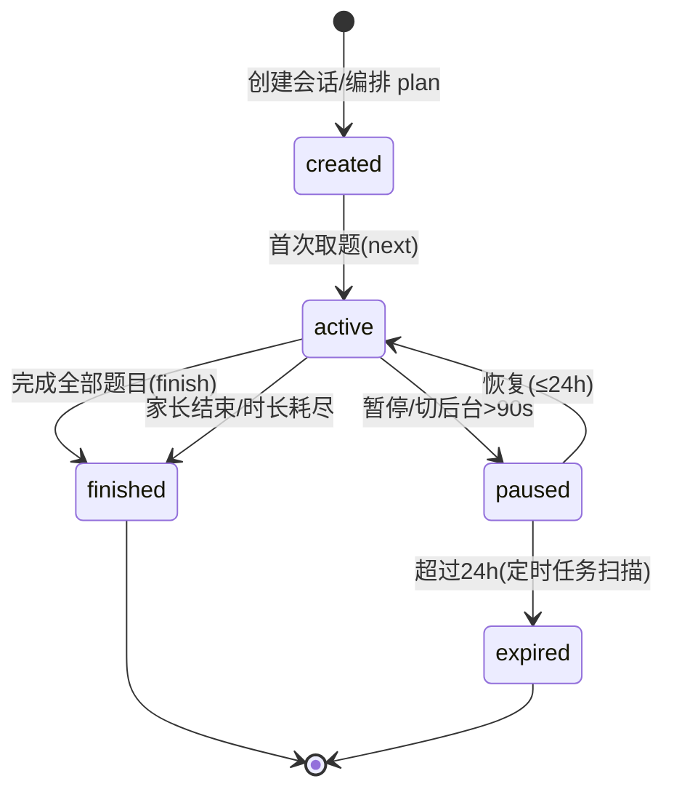
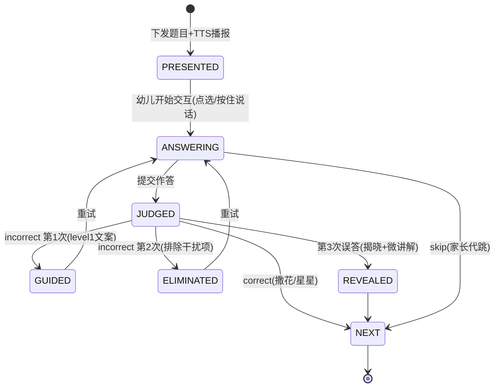
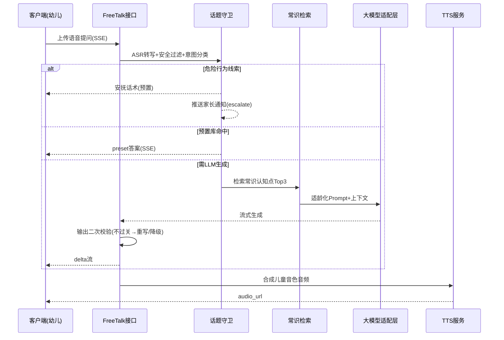

# 服务端-幼儿生活常识与通识认知启蒙互动问答引擎-详细设计

## 1. 概述

### 1.1 模块定位

本引擎是 PrimeTop 幼儿启蒙模块中**生活常识与通识认知领域**的核心服务端能力，面向 3-6 岁学龄前儿童（K1/K2/K3 三个阶段），围绕原设计文档 §5.1 中"简单常识"学习重点与"趣味问答"AI 能力，提供六大常识知识域的结构化互动问答编排、游戏化练习生成、AI 趣味问答（FreeTalk）与认知发展追踪能力。

与已有模块的边界划分：

| 模块 | 适用对象 | 核心能力 | 与本引擎关系 |
| --- | --- | --- | --- |
| `幼儿启蒙-详细设计` | 3-6 岁全科 | 启蒙模块总体框架（数字认知、基础表达、简单常识） | **本引擎是其"简单常识"分类的深度细化** |
| `服务端-幼儿数感启蒙与趣味数学认知互动练习智能生成引擎` | 3-6 岁 | 数感、数量认知、运算概念 | **并行模块**，共享会话管理、家长控制、画像基础设施与游戏化框架 |
| `拼音识字启蒙-详细设计` / `服务端-拼音识字启蒙教学内容调度与互动练习生成服务` | 3-7 岁 | 拼音、识字、朗读 | **并行模块**，共享幼儿语音判定与 TTS 通道 |
| `服务端-幼儿端儿童语音识别适配与语音交互安全引擎` | 3-6 岁 | 幼儿 ASR 适配、语音安全 | **上游依赖**：本引擎的语音作答与语音提问复用其幼儿 ASR 通道 |
| `服务端-学生AI学习伙伴主动对话触发与智能关怀策略引擎` | 全学段 | AI 伙伴主动对话 | **并行协作**：FreeTalk 场景下由本引擎接管常识话题，超域话题交还通用伙伴 |
| `防沉迷与未成年人保护机制` | 全学段未成年人 | 时长管控、休息提醒 | **强依赖**：本引擎所有会话受幼儿时长硬约束（单次 ≤10 分钟） |
| `服务端-用户学习激励中心与行为奖励统一规则引擎` | 全学段 | 星星、徽章、成长值 | **下游联动**：本引擎产出答题/会话激励事件 |

### 1.2 设计目标

1. **常识体系化**：将幼儿阶段需要建立的"简单常识"（生活自理、安全防护、自然认知、社会认知、科学启蒙、健康习惯）结构化为可编排、可追踪的知识域-主题-认知点体系。
2. **问答式启蒙**：以"互动问答"为主要学习形态，题目语音播报 + 图像化选项，幼儿零文字依赖即可完成学习。
3. **安全第一**：安全防护域为每日常识会话的必修内容；AI 趣味问答具备话题守卫与适龄化输出约束，杜绝恐怖、血腥、危险操作类内容。
4. **幼儿友好反馈**：误答不出现负向词汇，采用"鼓励 → 提示 → 排除干扰 → 揭晓讲解"的渐进引导链。
5. **家长可感知**：产出认知发展画像与家长周报，向家长传递孩子常识掌握情况与共学建议。
6. **成本可控**：FreeTalk 优先命中预置高频问答库与缓存，LLM 仅作增量生成，全链路可降级。

### 1.3 核心能力概览

```
幼儿生活常识与通识认知启蒙互动问答引擎
├── 常识知识体系管理
│   ├── 六大知识域（生活自理/安全防护/自然认知/社会认知/科学启蒙/健康习惯）
│   ├── 主题树与认知点（domain → topic → item 三级结构）
│   └── 认知发展阶段适配（K1 3-4岁 / K2 4-5岁 / K3 5-6岁）
├── 互动问答编排
│   ├── 六类题型（图片选择/语音问答/是非判断/情境选择/配对分类/找错误）
│   ├── 模板参数化生成与素材装配
│   ├── 难度自适应与知识域轮播平衡（安全必修位）
│   └── 会话状态机与断点续玩
├── AI 趣味问答（FreeTalk）
│   ├── 幼儿语音提问 → 意图识别 → 常识知识库 RAG 检索
│   ├── 适龄化 Prompt 约束（短句/拟声/鼓励/零负面）
│   ├── 话题守卫（allow/redirect/refuse/escalate 四态）
│   └── 预置高频问答库优先命中 + 输出二次安全校验
├── 判定与反馈
│   ├── 选项/是非精确判定
│   ├── 语音作答模糊判定（同义/叠词/儿化音归一化）
│   └── 渐进式引导链（3 次误答策略）
├── 认知画像与追踪
│   ├── 六域掌握度雷达（L0-L5）
│   ├── 认知点级掌握状态与间隔复习调度
│   └── 好奇心连续天数与家长周报
└── 家长配置与合规
    ├── 每日时长 / 知识域开关 / FreeTalk 开关
    ├── 防沉迷联动与静默时段
    └── 内容审核管线接入与数据最小化
```

---

## 2. 常识知识体系与认知发展阶段

### 2.1 六大知识域定义

| 域编码 | 域名称 | 覆盖内容 | 典型认知点示例 | 每日占比 |
| --- | --- | --- | --- | --- |
| `LIFE_SELF_CARE` | 生活自理 | 穿衣、吃饭、如厕、洗漱、收纳整理 | "饭前要洗手""外套袖子要拉出来" | 15% |
| `SAFETY` | 安全防护 | 交通安全、居家安全、防走失、身体隐私保护、紧急求助（110/119/120） | "红灯停绿灯行""陌生人给的东西不能要""走丢了找警察叔叔" | **≥25%（必修）** |
| `NATURE` | 自然认知 | 动物、植物、天气、四季、昼夜、自然现象 | "下雨要打伞""小蝌蚪长大会变青蛙" | 20% |
| `SOCIAL` | 社会认知 | 家庭角色、礼貌用语、公共场所规则、传统节日 | "别人帮忙要说谢谢""图书馆里要小声说话" | 15% |
| `SCIENCE_LIGHT` | 科学启蒙 | 光影、浮沉、冷热、声音、磁铁等身边科学 | "冰块放手里会融化""敲鼓会有声音" | 15% |
| `HEALTH` | 健康习惯 | 刷牙、洗手、护眼、作息、饮食均衡 | "糖果吃多会长蛀牙""看电视久了眼睛会累" | 10% |

> **安全必修位规则**：每次日常识会话（daily_quiz）中，`SAFETY` 域至少编排 1 道题，且当日首次会话的安全题优先置于第 2 位（第 1 位固定为上次未完成/复习位，避免首题即冷启动失败）。

### 2.2 三级知识结构

```
知识域（domain，6 个）
  └── 主题（topic，如 SAFETY → 交通安全 / 居家安全 / 防走失 / 紧急求助 …）
        └── 认知点（item，如 交通安全 → 红灯停绿灯行 / 过马路牵大人手 / 走斑马线 …）
              └── 题目素材（quiz_item，1 个认知点挂 3-8 道多题型变式题）
```

### 2.3 认知发展阶段适配

| 阶段 | 年龄 | 认知特点 | 选项规模 | 主推题型 | 单题语音指令 | 会话题量 |
| --- | --- | --- | --- | --- | --- | --- |
| K1 | 3-4 岁 | 直觉行动思维，单概念辨认 | 2 选 1 | 图片选择、是非判断 | ≤12 字，语速 0.85x | 5 题 |
| K2 | 4-5 岁 | 具体形象思维，可做简单情境判断 | 3 选 1 | 情境选择、配对分类 | ≤15 字，语速 0.9x | 6-7 题 |
| K3 | 5-6 岁 | 抽象逻辑萌芽，可回答"为什么" | 4 选 1 | 找错误、语音问答、多步情境 | ≤18 字，语速 1.0x | 8 题 |

### 2.4 六域掌握度评估标准

与数感启蒙引擎对齐，采用 5 级掌握度：

| 等级 | 名称 | 掌握度范围 | 含义 |
| --- | --- | --- | --- |
| L0 | 未评估 | 0.00 | 无足够数据（曝光 < 3 次） |
| L1 | 启蒙中 | 0.01-0.30 | 刚接触，需要大量引导 |
| L2 | 发展中 | 0.31-0.60 | 部分情境能正确完成，尚不稳定 |
| L3 | 基本掌握 | 0.61-0.80 | 大部分情况下能正确完成 |
| L4 | 稳定掌握 | 0.81-0.95 | 稳定正确，可进入关联主题 |
| L5 | 内化 | 0.96-1.00 | 完全掌握，可迁移到新情境（如"走丢了"场景变式） |

---

## 3. 数据结构设计

### 3.1 核心数据表（PostgreSQL）

#### 3.1.1 ece_cs_topic（常识主题树）

```sql
CREATE TABLE ece_cs_topic (
    id UUID PRIMARY KEY DEFAULT gen_random_uuid(),
    code VARCHAR(64) NOT NULL UNIQUE,              -- 如 SAFETY::TRAFFIC
    domain VARCHAR(32) NOT NULL CHECK (domain IN (
        'LIFE_SELF_CARE', 'SAFETY', 'NATURE',
        'SOCIAL', 'SCIENCE_LIGHT', 'HEALTH')),
    parent_id UUID REFERENCES ece_cs_topic(id) ON DELETE CASCADE,
    level SMALLINT NOT NULL CHECK (level IN (1, 2)),   -- 1=主题 2=子主题
    name VARCHAR(64) NOT NULL,
    icon_asset_id UUID,                             -- 主题图标素材
    stage_min VARCHAR(8) NOT NULL DEFAULT 'K1',
    stage_max VARCHAR(8) NOT NULL DEFAULT 'K3',
    daily_weight SMALLINT NOT NULL DEFAULT 10,      -- 轮播权重（0-100）
    is_mandatory BOOLEAN NOT NULL DEFAULT FALSE,    -- 安全类主题标记
    sort_order INT NOT NULL DEFAULT 0,
    status VARCHAR(16) NOT NULL DEFAULT 'active' CHECK (status IN ('draft','active','offline')),
    created_at TIMESTAMPTZ NOT NULL DEFAULT now(),
    updated_at TIMESTAMPTZ NOT NULL DEFAULT now()
);
CREATE INDEX idx_ecs_topic_domain ON ece_cs_topic(domain, status);
```

#### 3.1.2 ece_cs_item（认知点）

```sql
CREATE TABLE ece_cs_item (
    id UUID PRIMARY KEY DEFAULT gen_random_uuid(),
    topic_id UUID NOT NULL REFERENCES ece_cs_topic(id) ON DELETE CASCADE,
    code VARCHAR(64) NOT NULL UNIQUE,               -- 如 SAFETY::TRAFFIC::RED_LIGHT_STOP
    name VARCHAR(128) NOT NULL,                     -- "红灯停绿灯行"
    plain_statement TEXT NOT NULL,                  -- 幼儿口吻的一句话表述（讲解/FreeTalk 复用）
    micro_explain TEXT NOT NULL,                    -- 30-60 字微讲解（揭晓时播报）
    parent_tip TEXT,                                -- 给家长的共学提示（周报复用）
    stage VARCHAR(8) NOT NULL CHECK (stage IN ('K1','K2','K3')),
    difficulty_seed SMALLINT NOT NULL DEFAULT 2 CHECK (difficulty_seed BETWEEN 1 AND 5),
    why_question TEXT,                              -- K3"为什么"延伸问题（如"为什么要走斑马线？"）
    media_asset_id UUID,                            -- 主视觉素材（图片/短动画）
    review_status VARCHAR(16) NOT NULL DEFAULT 'pending'
        CHECK (review_status IN ('pending','approved','rejected')),  -- 内容审核管线状态
    status VARCHAR(16) NOT NULL DEFAULT 'active',
    version INT NOT NULL DEFAULT 1,
    created_at TIMESTAMPTZ NOT NULL DEFAULT now(),
    updated_at TIMESTAMPTZ NOT NULL DEFAULT now()
);
CREATE INDEX idx_ecs_item_topic ON ece_cs_item(topic_id, stage, status);
```

#### 3.1.3 ece_cs_quiz_item（题目素材）

```sql
CREATE TABLE ece_cs_quiz_item (
    id UUID PRIMARY KEY DEFAULT gen_random_uuid(),
    item_id UUID NOT NULL REFERENCES ece_cs_item(id) ON DELETE CASCADE,
    topic_id UUID NOT NULL,
    question_type VARCHAR(24) NOT NULL CHECK (question_type IN (
        'picture_choice',    -- 图片选择
        'voice_quiz',        -- 语音问答（说答案）
        'yes_no',            -- 是非判断
        'scenario_choice',   -- 情境选择（"怎么办"）
        'matching',          -- 配对分类
        'find_mistake')),    -- 找错误
    stage VARCHAR(8) NOT NULL,
    difficulty SMALLINT NOT NULL CHECK (difficulty BETWEEN 1 AND 5),
    stem JSONB NOT NULL,            -- 结构化题干（见 4.2 Schema）
    options JSONB NOT NULL,         -- 结构化选项
    correct_key VARCHAR(32) NOT NULL,
    guide_chain JSONB NOT NULL,     -- 渐进引导链文案（3 级）
    tts_text TEXT NOT NULL,         -- 题目播报文本（已适龄化审校）
    scene JSONB,                    -- 场景装饰（背景/角色/动效提示）
    answer_accept_aliases JSONB,    -- 语音作答同义别名组
    template_code VARCHAR(64),      -- 生成模板编码（运营可批量换皮）
    version INT NOT NULL DEFAULT 1,
    status VARCHAR(16) NOT NULL DEFAULT 'active',
    created_at TIMESTAMPTZ NOT NULL DEFAULT now(),
    updated_at TIMESTAMPTZ NOT NULL DEFAULT now()
);
CREATE INDEX idx_ecs_quiz_lookup ON ece_cs_quiz_item(item_id, stage, difficulty, status);
CREATE INDEX idx_ecs_quiz_stage_domain ON ece_cs_quiz_item(stage, question_type, status);
```

#### 3.1.4 ece_cs_story_scenario（情境故事）

```sql
CREATE TABLE ece_cs_story_scenario (
    id UUID PRIMARY KEY DEFAULT gen_random_uuid(),
    topic_id UUID NOT NULL REFERENCES ece_cs_topic(id) ON DELETE CASCADE,
    title VARCHAR(128) NOT NULL,            -- "小兔子过马路"
    scenes JSONB NOT NULL,                  -- 分镜数组：[{img,audio_text,action}]，3-5 幕
    moral VARCHAR(255) NOT NULL,            -- 一句话道理
    linked_item_ids UUID[] NOT NULL,        -- 关联认知点（故事后出题）
    stage VARCHAR(8) NOT NULL,
    duration_sec SMALLINT NOT NULL CHECK (duration_sec BETWEEN 30 AND 120),
    review_status VARCHAR(16) NOT NULL DEFAULT 'pending',
    status VARCHAR(16) NOT NULL DEFAULT 'active',
    created_at TIMESTAMPTZ NOT NULL DEFAULT now()
);
```

#### 3.1.5 ece_cs_session（学习会话）

```sql
CREATE TABLE ece_cs_session (
    id UUID PRIMARY KEY DEFAULT gen_random_uuid(),
    user_id UUID NOT NULL REFERENCES users(id) ON DELETE CASCADE,
    session_type VARCHAR(16) NOT NULL CHECK (session_type IN (
        'daily_quiz',      -- 每日常识问答
        'topic_drill',     -- 主题专项（家长/系统指定 topic）
        'story',           -- 情境故事+随堂问答
        'review')),        -- 间隔复习
    topic_id UUID,
    stage VARCHAR(8) NOT NULL,
    status VARCHAR(16) NOT NULL DEFAULT 'created' CHECK (status IN (
        'created','active','paused','finished','expired')),
    plan JSONB NOT NULL,                   -- 编排计划：[{seq, quiz_item_id, domain, reason}]
    cursor_seq SMALLINT NOT NULL DEFAULT 0,
    item_total SMALLINT NOT NULL DEFAULT 0,
    item_done SMALLINT NOT NULL DEFAULT 0,
    correct_count SMALLINT NOT NULL DEFAULT 0,
    guide_pass_count SMALLINT NOT NULL DEFAULT 0,   -- 经引导后答对数（计 0.5 权重）
    star_earned SMALLINT NOT NULL DEFAULT 0,
    parent_joined BOOLEAN NOT NULL DEFAULT FALSE,   -- 亲子共学标记
    duration_sec INT NOT NULL DEFAULT 0,
    started_at TIMESTAMPTZ,
    finished_at TIMESTAMPTZ,
    created_at TIMESTAMPTZ NOT NULL DEFAULT now()
);
CREATE INDEX idx_ecs_session_user ON ece_cs_session(user_id, status, created_at DESC);
```

#### 3.1.6 ece_cs_session_event（作答事件流）

```sql
CREATE TABLE ece_cs_session_event (
    id BIGSERIAL PRIMARY KEY,
    session_id UUID NOT NULL REFERENCES ece_cs_session(id) ON DELETE CASCADE,
    user_id UUID NOT NULL,
    seq SMALLINT NOT NULL,
    event_type VARCHAR(16) NOT NULL CHECK (event_type IN (
        'present','answer','judge','guide','eliminate','reveal','skip','quit')),
    quiz_item_id UUID,
    answer_payload JSONB,          -- {type, value | asr_text, latency_ms}
    judge_result VARCHAR(16),      -- correct / incorrect / partial / unrecognized
    domain VARCHAR(32),
    created_at TIMESTAMPTZ NOT NULL DEFAULT now()
);
CREATE INDEX idx_ecs_event_session ON ece_cs_session_event(session_id, seq);
```

#### 3.1.7 ece_cs_cognition_profile（幼儿常识认知画像）

```sql
CREATE TABLE ece_cs_cognition_profile (
    user_id UUID PRIMARY KEY REFERENCES users(id) ON DELETE CASCADE,
    stage VARCHAR(8) NOT NULL DEFAULT 'K1',
    -- 六域掌握度 (0.00-1.00)
    life_self_care_score NUMERIC(4,2) NOT NULL DEFAULT 0,
    safety_score NUMERIC(4,2) NOT NULL DEFAULT 0,
    nature_score NUMERIC(4,2) NOT NULL DEFAULT 0,
    social_score NUMERIC(4,2) NOT NULL DEFAULT 0,
    science_light_score NUMERIC(4,2) NOT NULL DEFAULT 0,
    health_score NUMERIC(4,2) NOT NULL DEFAULT 0,
    overall_score NUMERIC(4,2) NOT NULL DEFAULT 0,
    curiosity_streak_days INT NOT NULL DEFAULT 0,     -- 好奇心连续天数
    freetalk_ask_total INT NOT NULL DEFAULT 0,        -- 累计趣味问答次数
    last_active_date DATE,
    created_at TIMESTAMPTZ NOT NULL DEFAULT now(),
    updated_at TIMESTAMPTZ NOT NULL DEFAULT now()
);
```

#### 3.1.8 ece_cs_item_mastery（认知点级掌握与复习调度）

```sql
CREATE TABLE ece_cs_item_mastery (
    id UUID PRIMARY KEY DEFAULT gen_random_uuid(),
    user_id UUID NOT NULL REFERENCES users(id) ON DELETE CASCADE,
    item_id UUID NOT NULL REFERENCES ece_cs_item(id) ON DELETE CASCADE,
    mastery NUMERIC(4,2) NOT NULL DEFAULT 0,
    state VARCHAR(16) NOT NULL DEFAULT 'new' CHECK (state IN ('new','learning','mastered')),
    exposure_count INT NOT NULL DEFAULT 0,
    correct_count INT NOT NULL DEFAULT 0,
    guide_pass_count INT NOT NULL DEFAULT 0,
    consecutive_correct INT NOT NULL DEFAULT 0,       -- 连对次数（mastered 判定用）
    review_due_at TIMESTAMPTZ,                        -- 间隔复习到期时间
    review_interval_days SMALLINT NOT NULL DEFAULT 1, -- 1/2/4/7/15 天阶梯
    last_practiced_at TIMESTAMPTZ,
    UNIQUE (user_id, item_id)
);
CREATE INDEX idx_ecs_mastery_due ON ece_cs_item_mastery(user_id, state, review_due_at);
```

#### 3.1.9 ece_cs_daily_recommend（每日推荐）

```sql
CREATE TABLE ece_cs_daily_recommend (
    id UUID PRIMARY KEY DEFAULT gen_random_uuid(),
    user_id UUID NOT NULL REFERENCES users(id) ON DELETE CASCADE,
    recommend_date DATE NOT NULL,
    payload JSONB NOT NULL,   -- {session_type, topic_id, reason, cover_asset, title}
    consumed_at TIMESTAMPTZ,
    created_at TIMESTAMPTZ NOT NULL DEFAULT now(),
    UNIQUE (user_id, recommend_date)
);
```

#### 3.1.10 ece_cs_parent_config（家长配置）

```sql
CREATE TABLE ece_cs_parent_config (
    id UUID PRIMARY KEY DEFAULT gen_random_uuid(),
    child_user_id UUID NOT NULL REFERENCES users(id) ON DELETE CASCADE,
    parent_user_id UUID NOT NULL REFERENCES users(id) ON DELETE CASCADE,
    daily_limit_sec INT NOT NULL DEFAULT 600 CHECK (daily_limit_sec BETWEEN 120 AND 900),
    enabled_domains JSONB NOT NULL
        DEFAULT '["LIFE_SELF_CARE","SAFETY","NATURE","SOCIAL","SCIENCE_LIGHT","HEALTH"]',
    freetalk_enabled BOOLEAN NOT NULL DEFAULT TRUE,
    freetalk_daily_limit INT NOT NULL DEFAULT 20,
    quiet_hours JSONB,                    -- [{"start":"20:30","end":"07:00"}]
    weekly_report_enabled BOOLEAN NOT NULL DEFAULT TRUE,
    UNIQUE (child_user_id, parent_user_id)
);
```

#### 3.1.11 ece_cs_freetalk_log（趣味问答日志）

```sql
CREATE TABLE ece_cs_freetalk_log (
    id UUID PRIMARY KEY DEFAULT gen_random_uuid(),
    user_id UUID NOT NULL REFERENCES users(id) ON DELETE CASCADE,
    question_text TEXT NOT NULL,          -- ASR 转写结果
    asr_confidence NUMERIC(4,3),
    intent VARCHAR(24) NOT NULL,          -- commonsense_q / drift / out_of_scope / dangerous / unclear
    domain VARCHAR(32),                   -- 命中的常识域
    answer_source VARCHAR(16) NOT NULL,   -- preset / cache / llm / refused
    answer_text TEXT,
    answer_audio_url VARCHAR(512),
    guard_action VARCHAR(16) NOT NULL,    -- allow / redirect / refuse / escalate
    safety_flag VARCHAR(32),              -- 命中的安全规则编码
    first_token_ms INT,
    created_at TIMESTAMPTZ NOT NULL DEFAULT now()
);
CREATE INDEX idx_ecs_ft_user ON ece_cs_freetalk_log(user_id, created_at DESC);
```

#### 3.1.12 ece_cs_preset_qa（预置高频问答库）

```sql
CREATE TABLE ece_cs_preset_qa (
    id UUID PRIMARY KEY DEFAULT gen_random_uuid(),
    question_keys TEXT[] NOT NULL,        -- 命中关键词组（归一化后）
    domain VARCHAR(32) NOT NULL,
    stage_min VARCHAR(8) NOT NULL,
    stage_max VARCHAR(8) NOT NULL,
    answer_k1 TEXT NOT NULL,              -- 分阶段适龄回答（≤3 短句）
    answer_k2 TEXT NOT NULL,
    answer_k3 TEXT NOT NULL,
    tts_asset_ids JSONB,                  -- 预生成音频（儿童音色）
    followup_hint VARCHAR(128),           -- 追问引导（"你还想问小动物的问题吗？"）
    use_count INT NOT NULL DEFAULT 0,
    status VARCHAR(16) NOT NULL DEFAULT 'active',
    created_at TIMESTAMPTZ NOT NULL DEFAULT now()
);
CREATE INDEX idx_ecs_preset_domain ON ece_cs_preset_qa(domain, status);
```

### 3.2 Redis 缓存设计

| Key | 类型 | TTL | 用途 |
| --- | --- | --- | --- |
| `ece:cs:profile:{uid}` | Hash | 24h | 六域分数、stage、连续天数，读多写少 |
| `ece:cs:session:{sid}` | Hash | 48h | 会话运行态（cursor、自适应难度、域轮播游标） |
| `ece:cs:answerwin:{uid}` | List | 7d | 滚动最近 8 次判定结果（难度自适应窗口） |
| `ece:cs:daily:{uid}:{date}` | String | 48h | 当日会话次数/时长累计（防沉迷联动） |
| `ece:cs:streak:{uid}` | String | 72h | 连续学习天数游标 |
| `ece:cs:freetalk:ctx:{uid}` | Hash | 30min | FreeTalk 最近话题域（守卫 redirect 用） |
| `ece:cs:freetalk:quota:{uid}:{date}` | String | 48h | FreeTalk 当日剩余次数 |
| `ece:cs:quizpool:{stage}:{domain}:{diff}` | List | 12h | 预实例化题目池（预生成） |
| `ece:cs:preset:hit:{qhash}` | String | 24h | 预置库命中结果缓存 |

---

## 4. 题型体系与模板参数化

### 4.1 六类题型定义

| 题型 | 编码 | 交互形态 | 适用阶段 | 判定方式 |
| --- | --- | --- | --- | --- |
| 图片选择 | `picture_choice` | 大图 2-4 选项，点选 | K1-K3 | 精确比对 option.key |
| 语音问答 | `voice_quiz` | 提问后按住说话 | K2-K3 | ASR + 模糊判定 |
| 是非判断 | `yes_no` | 大按钮"对/不对"（配图） | K1-K3 | 精确比对 |
| 情境选择 | `scenario_choice` | 情境图+问题"怎么办" | K2-K3 | 精确比对 |
| 配对分类 | `matching` | 拖拽/点选连线 2-3 组 | K2-K3 | 全组比对（partial 计分） |
| 找错误 | `find_mistake` | 场景图中点出错误行为 | K3 | 热区命中 |

### 4.2 题干与选项 JSON Schema（stem/options）

```json
{
  "question_id": "q_8f21c3",
  "question_type": "scenario_choice",
  "item_code": "SAFETY::TRAFFIC::RED_LIGHT_STOP",
  "domain": "SAFETY",
  "stage": "K2",
  "difficulty": 2,
  "stem": {
    "tts_text": "小兔子要过马路，红灯亮了，它应该怎么做呢？",
    "scene_image": "asset://ece/cs/traffic/bunny_cross_road.png",
    "scene_animation": "asset://ece/cs/traffic/bunny_idle.lottie",
    "character": {"name": "小兔子", "emoji": "🐰"}
  },
  "options": [
    {"key": "A", "image": "asset://ece/cs/traffic/wait_line.png",  "label": "等一等，绿灯再走"},
    {"key": "B", "image": "asset://ece/cs/traffic/run_now.png",    "label": "马上跑过去"},
    {"key": "C", "image": "asset://ece/cs/traffic/climb_fence.png","label": "翻栏杆过去"}
  ],
  "correct_key": "A",
  "guide_chain": {
    "level1": "再想一想，红灯的时候车会开过来哦，等一等更安全～",
    "level2": "看一看，哪个小朋友是安安静静站好的呀？",
    "level2_eliminate": "C",
    "level3_reveal": "红灯要停下来，等绿灯亮了，牵着大人的手走斑马线。你真棒，下次等一等哦！"
  },
  "answer_accept_aliases": ["等一等", "等着", "绿灯再走", "停下来", "不能跑"],
  "metadata": {"template_code": "TPL_SC_CROSS_ROAD_V2", "est_sec": 25}
}
```

### 4.3 模板参数化生成

题目素材由"模板 + 素材包"参数化装配，运营可通过后台批量换皮（换角色/场景），认知点与判定逻辑不变：

```python
# 模板定义示例（管理后台可配置）
SCENARIO_CROSS_ROAD = {
    "template_code": "TPL_SC_CROSS_ROAD_V2",
    "question_type": "scenario_choice",
    "slots": {
        "character": {"type": "asset", "candidates": ["bunny", "bear", "duck"], "shuffle": True},
        "light_state": {"type": "enum", "candidates": ["red", "green"]},
        "correct_behavior": {"type": "asset", "bind": "light_state"},
        "distractor_pool": {"type": "asset", "pool": "traffic_danger_behaviors", "pick": 2}
    },
    "tts_pattern": "{character}要过马路，{light_desc}了，它应该怎么做呢？",
    "invariants": {"domain": "SAFETY", "item_code": "SAFETY::TRAFFIC::RED_LIGHT_STOP"}
}
```

模板实例化时保证：干扰项来自同域危险行为池且与正确项不同类；同一认知点在同一会话内不重复实例化同一模板编码。

---

## 5. 智能编排与难度自适应引擎

### 5.1 会话编排算法

每次会话创建时按以下顺序生成编排计划（写入 `ece_cs_session.plan`）：

```
编排管线 ORCHESTRATE(user, session_type, topic?)
输入：画像（六域分数、stage）、认知点掌握表、当日已用域配额、家长 enabled_domains

1. 容量计算：题量 N = stage 默认值（K1=5, K2=6~7, K3=8）；review 类型则为到期认知点数（≤6）
2. 复习位：取 review_due_at <= now 且 state='learning' 的认知点，按逾期天数降序取 1-2 个 → 生成复习题
3. 安全必修位（daily_quiz 专属）：SAFETY 域取 mastery 最低主题下的认知点 1 个
4. 轮播填充：按 daily_weight 加权 + 当日已用配额惩罚（用满 40% 的域权重 ×0.3），
   从六域轮转选取剩余题目所属域；每个认知点优先级 = w1·(1-mastery) + w2·随机扰动 + w3·距上次练习天数/14
   （w1=0.6, w2=0.2, w3=0.2）
5. 题型适配：按认知点 stage 的主推题型分配，同会话同题型不超过 3 题连续
6. 难度种子：初始难度 = 难度自适应窗口当前值（见 5.2），逐题 ±0（会话内不跳变）
7. 输出 plan = [{seq, quiz_item_id, domain, reason(review|safety_must|weighted|parent_pick)}]
```

> **题目获取顺序**：先查 `ece:cs:quizpool:{stage}:{domain}:{diff}` 预生成池，未命中实时从 `ece_cs_quiz_item` 查询并回填池。

### 5.2 难度自适应

维护滚动最近 8 次判定结果的加权窗口（Redis List `answerwin`），答对计 1.0、引导后答对计 0.5、误答揭晓计 0：

```python
class DifficultyAdapter:
    WINDOW_SIZE = 8
    TARGET_HIGH, TARGET_LOW = 0.85, 0.50
    STAGE_CAP = {"K1": 3, "K2": 4, "K3": 5}   # 各阶段难度上限

    def next_difficulty(self, window: list[int], stage: str) -> int:
        recent = window[-self.WINDOW_SIZE:]
        if len(recent) < 3:
            return max(1, int(round(sum(recent) / max(len(recent), 1) * 4)) ) if recent else 2
        rate = sum(recent) / len(recent)
        current = self._current_from_window(recent)
        if rate >= self.TARGET_HIGH and recent[-3:] == [1.0, 1.0, 1.0]:
            return min(current + 1, self.STAGE_CAP[stage])
        if rate <= self.TARGET_LOW:
            return max(1, current - 1)
        return current
```

- 升档冷却：同一次会话内最多升 1 档（避免 K1 幼儿被连续高难度打击）。
- 误答保护：连续 2 次误答且当前难度 >1 时，下一题强制 `difficulty=1` 且换域（保护兴趣）。

### 5.3 断点续玩

会话 `paused` 后 24 小时内可恢复：`plan` 与 `cursor_seq` 已持久化，恢复时从 `cursor_seq` 继续；过期任务转 `expired`，其中已答对认知点保留掌握度更新，未完成部分在次日 review 位优先补齐。

---

## 6. AI 趣味问答（FreeTalk）与对话护栏

### 6.1 处理管线

```
幼儿语音提问
  │
  ▼
① 幼儿 ASR 转写（复用幼儿语音识别适配引擎，含叠词/儿化音语言模型）
  │  asr_confidence < 0.6 → 引导重说（"再说一遍好不好？"），最多 2 次
  ▼
② 输入安全过滤（敏感词 + 规则引擎）
  │  命中危险类 → guard=escalate/refuse，跳到 ⑦
  ▼
③ 意图分类（轻量分类器）
  │  commonsense_q（常识提问，六域内）/ drift（闲聊漂移）/
  │  out_of_scope（超龄超纲，如"微积分"）/ dangerous / unclear
  ▼
④ 预置库检索：question_keys 关键词命中（归一化：去语气词、同义扩展）
  │  命中 → 直接返回分阶段适龄答案（answer_source=preset），跳到 ⑥
  ▼
⑤ RAG + LLM 增量生成
  │  向量检索 ece_cs_item（plain_statement/micro_explain/why_question 语料）Top3
  │  → 适龄化 Prompt 组装（见 6.2）→ LLM 流式生成
  │  drift → guard=redirect：用最近话题域（freetalk:ctx）拉回
  │  out_of_scope → guard=redirect：转为同域幼儿可懂问题或礼貌引导问家长
  ▼
⑥ 输出二次校验：短句数/句长/敏感词/恐吓恐怖词/负面词规则校验，不过关 → 重写或降级预置回答
  ▼
⑦ TTS（儿童音色，语速按 stage）→ SSE 流式下发（文本先行，音频 URL 后置）
  ▼
⑧ 写 freetalk_log、更新画像好奇心计数与话题域上下文、埋点
```

### 6.2 适龄化 Prompt 模板

```python
FREETALK_SYSTEM_PROMPT = """你是 PrimeTop 的幼儿启蒙伙伴"小硕"，正在和一名 {age} 岁的幼儿园小朋友聊天。

【回答规则】
1. 最多 3 个短句，每句不超过 15 个字。
2. 用小朋友听得懂的话，可以用拟声词（哗啦啦、轰隆隆）和小动物打比方。
3. 只回答和"{domain_hint}"有关的常识问题。
4. 结尾用一句鼓励或一个有趣的小问题，让小朋友想继续聊。
5. 绝对不许出现：恐怖、血腥、死亡细节、鬼怪吓人内容；不许给出任何危险动作的操作指导（如玩火、爬窗、碰插座）。
6. 遇到小朋友说危险行为（玩打火机、独自去河边），要先温和地说"这个危险，不可以哦"，再告诉他应该怎么做，并提醒他去告诉爸爸妈妈。

【参考知识】（仅供理解，不要照抄）：
{rag_context}
"""

FREETALK_REDIRECT_PROMPT = """小朋友的问题跑题啦。请用一句可爱的话把话题带回"{last_domain}"，
比如："这个问题可以问问爸爸妈妈哦！你还记得{domain_hook}吗？" 不要回答跑题问题本身。
"""
```

### 6.3 话题守卫四态

| 守卫动作 | 触发条件 | 客户端表现 | 日志字段 |
| --- | --- | --- | --- |
| `allow` | 六域内常识问题 | 正常流式回答 | guard_action=allow |
| `redirect` | 闲聊漂移 / 超纲（学龄内容、无关话题） | 固定拉回话术 + 话题钩子 | guard_action=redirect, intent=drift/out_of_scope |
| `refuse` | 涉及鬼怪恐怖、不良诱导、成人话题关键词 | 预置委婉拒绝（"这个问题我们长大一点再聊～"）+ 引导到常识话题 | guard_action=refuse, safety_flag=SC_RULE_xxx |
| `escalate` | 自述危险行为线索（玩火/独自河边/被陌生人带走）、疑似受伤害表述 | 安抚话术 + 立即推送家长通知（复用消息服务家长提醒通道），不追问细节 | guard_action=escalate，触发家长通知事件 |

> escalate 与 `服务端-学生AI对话心理危机信号检测与分级预警干预编排引擎` 的边界：该引擎面向 K12 学段心理危机；幼儿场景仅做**危险行为与安全事件线索**上报，不做心理分级干预，事件统一走消息服务家长通知 + 安全审计日志。

### 6.4 配额与频控

- FreeTalk 单日次数由家长配置（默认 20 次），Redis `freetalk:quota` 原子递减，超限返回固定引导（"今天的问题都问完啦，明天再来找小硕吧！"）。
- 静默时段（quiet_hours）内 FreeTalk 入口直接关闭。
- LLM 单次生成超时 6s → 降级预置回答库兜底（answer_source=preset, fallback=true）。

---

## 7. 答案判定与幼儿友好反馈

### 7.1 判定矩阵

| 作答通道 | 判定器 | 结果集 | 备注 |
| --- | --- | --- | --- |
| 点选/是非/情境/找错误 | 精确比对 correct_key / 热区 id | correct / incorrect | 热区命中容差半径 12% 屏宽 |
| 配对分类 | 分组全比对 | correct / partial / incorrect | partial 计 0.5 并允许补连一次 |
| 语音作答 | ASR + 模糊判定 | correct / incorrect / unrecognized | unrecognized 不计误答，引导重说 |

### 7.2 语音模糊判定

```python
import re

FILLERS = {"嗯", "啊", "呃", "呀", "哦", "呢", "啦", "嘿嘿", "那个"}

def normalize_child_speech(text: str) -> str:
    """幼儿语音归一化：去语气词 / 去重复叠字 / 同义词折叠"""
    t = re.sub(r"[，。？！,.?! ~]+", "", text)
    t = "".join(ch for ch in t if ch not in FILLERS)
    t = re.sub(r"(.)\1+", r"\1", t)          # "等一一一会儿" → "等一会"
    return t

def fuzzy_judge(asr_text: str, quiz: dict) -> str:
    if quiz["question_type"] != "voice_quiz":
        return "incorrect"            # 非语音题走精确比对
    norm = normalize_child_speech(asr_text)
    aliases = set(quiz.get("answer_accept_aliases", []))
    aliases.add(normalize_child_speech(quiz["correct_answer_text"]))
    # 1) 关键词包含命中
    for alias in aliases:
        if alias and (alias in norm or norm in alias):
            return "correct"
    # 2) 编辑距离兜底（短答案 ≤4 字时，相似度 ≥0.75 判对）
    from difflib import SequenceMatcher
    best = max((SequenceMatcher(None, norm, a).ratio() for a in aliases if a), default=0)
    if best >= 0.75:
        return "correct"
    # 3) ASR 置信度过低 → unrecognized（不惩罚）
    return "unrecognized" if quiz.get("asr_confidence", 1.0) < 0.6 else "incorrect"
```

### 7.3 渐进引导链（误答反馈协议）

| 尝试次数 | 服务端动作 | 客户端表现 | 事件 |
| --- | --- | --- | --- |
| 第 1 次误答 | 返回 `guide_chain.level1` + 鼓励音效 | 选项抖动，不给负面标记 | event=guide |
| 第 2 次误答 | 返回 `level2` 文案 + `level2_eliminate`（排除项 key） | 错误选项变灰消失 | event=eliminate |
| 第 3 次误答 | 返回 `level3_reveal` + item.micro_explain 播报 | 揭晓正确项，星星图标改为"下次一定行" | event=reveal，计 0 分 |
| 任意次答对 | 星星 +1（引导后答对 +1 但掌握度计 0.5） | 撒花动效 + 表扬语音 | event=judge(correct) |

> 全链路文案与 TTS 音色禁用词表："错、笨、失败、罚、蠢"等负向词，接入内容审核管线的幼儿专项词表校验。

---

## 8. 认知画像更新与激励联动

### 8.1 六域分数更新

每次判定后增量更新（指数移动平均，引导答对计 0.5）：

```python
def update_domain_score(old: float, outcome: float, exposure: int, alpha: float = 0.3) -> float:
    """exposure<5 时用均值快速逼近，之后 EMA 平滑"""
    if exposure <= 5:
        return round((old * exposure + outcome) / (exposure + 1), 2)
    return round(old * (1 - alpha) + outcome * alpha, 2)

# overall = 六域加权平均（SAFETY 0.25，其余五域各 0.15）
```

### 8.2 认知点状态流转与间隔复习

```
new ──答对──▶ learning(consecutive_correct=1)
learning ──连续答对≥2 且间隔≥1天──▶ mastered（review_due_at = now + 15d，抽查保持）
learning ──误答揭晓──▶ learning（review_due_at = now + 1d）
mastered ──复习抽查误答──▶ learning（interval 降一档）
间隔阶梯：1 → 2 → 4 → 7 → 15 天
```

### 8.3 激励事件（对接统一激励中心）

| 事件编码 | 触发 | 奖励 |
| --- | --- |
| `ece_cs_answer_correct` | 单题答对 | ⭐+1 |
| `ece_cs_guide_pass` | 引导后答对 | ⭐+1（画像计 0.5） |
| `ece_cs_session_finish` | 完成整场会话 | ⭐+2，连续天数 +1 联动 |
| `ece_cs_safety_topic_clear` | 安全主题下所有认知点 mastered | 🏅徽章"安全小卫士" |
| `ece_cs_nature_topic_clear` | 自然主题全 mastered | 🏅"自然小博士" |
| `ece_cs_streak_7` | 好奇心连续 7 天 | 🏅"好奇宝宝·铜"（14 天银 / 30 天金） |

### 8.4 埋点事件（对齐统一埋点规范）

`ece_cs_session_start / quiz_present / answer_submit / guide_triggered / reveal / session_finish / freetalk_ask / freetalk_guard_redirect / freetalk_escalate / star_earned`

公共属性：`user_id, stage, domain, session_type, session_id, seq, latency_ms`；FreeTalk 额外：`intent, guard_action, answer_source, first_token_ms`。

---

## 9. API 接口设计

### 9.1 基础约定

- 基础路径：`/api/v1/ece/common-sense`，鉴权走统一网关学生端 Token（家长配置接口走家长 Token）。
- 响应结构对齐《服务端统一响应封装与分页查询规范》：`{code, message, data}`。
- 幼儿端全部接口幂等键 `X-Idempotency-Key`（断网重试安全）。

### 9.2 接口清单

| 方法 | 路径 | 说明 |
| --- | --- | --- |
| POST | `/sessions` | 创建学习会话（body: session_type, topic_id?, parent_joined?） |
| GET | `/sessions/{id}` | 查询会话进度（断点续玩） |
| GET | `/sessions/{id}/next` | 取当前题（含 SSE 之外的完整题目 JSON） |
| POST | `/sessions/{id}/answers` | 提交点选/是非/配对作答 |
| POST | `/sessions/{id}/voice-answers` | 提交语音作答（multipart: audio + duration） |
| POST | `/sessions/{id}/pause` / `/finish` | 暂停 / 结束会话 |
| GET | `/daily` | 今日推荐（卡片 payload） |
| GET | `/profile` | 六域画像 + 最近 7 天趋势 |
| GET | `/topics/tree` | 常识主题树（带各主题掌握度） |
| POST | `/freetalk` | AI 趣味问答（SSE 流式） |
| GET | `/report/weekly` | 家长周报数据（家长 Token） |
| PUT | `/parent-config` | 家长配置更新（家长 Token） |

### 9.3 关键接口示例

#### 创建会话

```http
POST /api/v1/ece/common-sense/sessions
Content-Type: application/json

{"session_type": "daily_quiz"}
```

```json
{
  "code": 0,
  "message": "ok",
  "data": {
    "session_id": "cs_s_9a3f2e",
    "session_type": "daily_quiz",
    "stage": "K2",
    "item_total": 7,
    "plan_preview": [
      {"seq": 1, "domain": "SAFETY", "reason": "review"},
      {"seq": 2, "domain": "SAFETY", "reason": "safety_must"},
      {"seq": 3, "domain": "NATURE", "reason": "weighted"},
      {"seq": 4, "domain": "HEALTH", "reason": "weighted"},
      {"seq": 5, "domain": "SOCIAL", "reason": "weighted"},
      {"seq": 6, "domain": "SCIENCE_LIGHT", "reason": "weighted"},
      {"seq": 7, "domain": "LIFE_SELF_CARE", "reason": "weighted"}
    ],
    "remaining_sec_today": 600
  }
}
```

#### 取当前题

```http
GET /api/v1/ece/common-sense/sessions/cs_s_9a3f2e/next
```

返回 §4.2 完整题目 JSON（含 `remaining_sec_today` 防沉迷余量；余量 < 60s 时响应头附加 `X-ECE-Rest-Warn: 1`）。

#### 提交作答（误答第 2 次返回排除项）

```http
POST /api/v1/ece/common-sense/sessions/cs_s_9a3f2e/answers
Content-Type: application/json

{"question_id": "q_8f21c3", "seq": 3, "answer": {"type": "choice", "key": "B"}, "latency_ms": 4200}
```

```json
{
  "code": 0,
  "message": "ok",
  "data": {
    "judge": "incorrect",
    "attempt": 2,
    "feedback": {
      "type": "eliminate",
      "tts_text": "看一看，哪个小朋友是安安静静站好的呀？",
      "eliminate_key": "C",
      "encourage_audio": "asset://ece/cs/common/encourage_03.mp3"
    },
    "star_delta": 0,
    "progress": {"done": 2, "total": 7}
  }
}
```

#### AI 趣味问答（SSE）

```http
POST /api/v1/ece/common-sense/freetalk
Content-Type: application/json
Accept: text/event-stream

{"question_audio_upload_id": "up_7f21"}
```

```
event: meta         data: {"asr_text": "为什么天是蓝色的呀", "intent": "commonsense_q", "domain": "SCIENCE_LIGHT", "guard_action": "allow"}
event: delta        data: {"text": "太阳光有七种颜色。"}
event: delta        data: {"text": "蓝色最容易被空气弹开，"}
event: delta        data: {"text": "所以天空看起来蓝蓝的。你还想问彩虹的颜色吗？"}
event: audio        data: {"audio_url": "asset://tts/ece/cs/ft_a91f.mp3", "duration_ms": 9200}
event: done         data: {"answer_source": "preset", "followup_hint": "你还想问小动物的问题吗？"}
```

#### 家长周报

```http
GET /api/v1/ece/common-sense/report/weekly?child_id=u_123
```

```json
{
  "code": 0,
  "data": {
    "week": "2026-W32",
    "sessions": 5,
    "questions_total": 34,
    "correct_rate": 0.78,
    "domain_radar": {
      "LIFE_SELF_CARE": 0.72, "SAFETY": 0.85, "NATURE": 0.66,
      "SOCIAL": 0.70, "SCIENCE_LIGHT": 0.55, "HEALTH": 0.80
    },
    "safety_coverage": {"mastered_items": 12, "total_items": 15},
    "freetalk_top_topics": ["小动物", "下雨", "刷牙"],
    "suggestions": [
      {"domain": "SCIENCE_LIGHT", "tip": "洗澡时和孩子玩'沉与浮'游戏，毛巾会浮起来，肥皂会沉下去，正好对应本周科学启蒙内容。"}
    ]
  }
}
```

---

## 10. 状态机与关键时序

### 10.1 学习会话状态机



进入 `finished` 时触发：画像落库、激励事件 `ece_cs_session_finish`、连续天数游标更新、埋点 `session_finish`；`expired` 仅保留已答部分掌握度，不发完成激励。

### 10.2 单题作答子状态机



### 10.3 FreeTalk 守卫时序



---

## 11. 关键代码示例

### 11.1 服务端：会话取题编排（Python / FastAPI）

```python
from fastapi import APIRouter, Depends

router = APIRouter()

@router.get("/sessions/{session_id}/next")
async def next_question(session_id: str, uid: str = Depends(student_uid)):
    sess = await session_repo.get(session_id, uid)          # 越权校验：user_id 必须匹配
    if sess.status == "paused":
        raise BizError("ECE_CS_008", "会话已暂停")
    if sess.status != "active":
        raise BizError("ECE_CS_003", "会话不可用")

    quiz = await orchestrator.current_quiz(sess)            # 按 plan+cursor 取题（预生成池优先）
    remaining = await anti_addiction.remaining_sec(uid)      # 防沉迷余量联动
    if remaining < 60:
        quiz["rest_warn"] = True
    await event_repo.append(sess.id, sess.cursor_seq + 1, "present", quiz["question_id"])
    await tracker.emit("ece_cs_quiz_present", uid, session=sess.id, seq=sess.cursor_seq + 1)
    return ok(quiz)
```

### 11.2 服务端：作答判定与引导链（核心编排）

```python
@router.post("/sessions/{session_id}/answers")
async def submit_answer(session_id: str, body: AnswerIn, uid: str = Depends(student_uid)):
    sess = await session_repo.get(session_id, uid)
    quiz = await orchestrator.current_quiz(sess)
    attempt = await session_repo.incr_attempt(sess.id, body.question_id)

    # 1. 判定
    if body.answer.type == "voice":
        judge = fuzzy_judge(body.answer.asr_text, quiz)
    else:
        judge = "correct" if body.answer.key == quiz["correct_key"] else "incorrect"

    # 2. unrecognized 不计误答：引导重说
    if judge == "unrecognized":
        return ok({"judge": "unrecognized",
                   "feedback": {"type": "retry_say", "tts_text": "没听清呀，再说一遍好不好？"}})

    outcome = 1.0 if judge == "correct" else (0.5 if attempt > 1 else 0.0)
    await event_repo.append(sess.id, body.seq, "judge" if judge == "correct" else "guide",
                            quiz["question_id"], judge=judge)

    if judge == "correct":
        star = 1
        await mastery.update(uid, quiz["item_id"], outcome, guided=(attempt > 1))
        await profile.apply_outcome(uid, quiz["domain"], outcome)
        await incentive.award(uid, "ece_cs_answer_correct" if attempt == 1 else "ece_cs_guide_pass")
        await orchestrator.advance(sess)                     # cursor+1，预生成下一题
        return ok({"judge": "correct", "star_delta": 1,
                   "feedback": {"type": "praise", "audio": praise_audio(attempt)}})

    # 3. 渐进引导链
    chain = quiz["guide_chain"]
    if attempt == 1:
        return ok({"judge": "incorrect", "attempt": 1,
                   "feedback": {"type": "guide", "tts_text": chain["level1"]}})
    if attempt == 2:
        return ok({"judge": "incorrect", "attempt": 2,
                   "feedback": {"type": "eliminate", "tts_text": chain["level2"],
                                "eliminate_key": chain["level2_eliminate"]}})
    # attempt>=3：揭晓，计 0 分，进入下一题
    await mastery.update(uid, quiz["item_id"], 0.0, revealed=True)
    await orchestrator.advance(sess)
    return ok({"judge": "incorrect", "attempt": 3, "star_delta": 0,
               "feedback": {"type": "reveal", "tts_text": chain["level3_reveal"],
                            "correct_key": quiz["correct_key"]}})
```

### 11.3 服务端：FreeTalk 管线（SSE）

```python
@router.post("/freetalk")
async def freetalk(body: FreeTalkIn, uid: str = Depends(student_uid)):
    quota = await redis.decr(f"ece:cs:freetalk:quota:{uid}:{today()}")
    if quota < 0:
        yield sse("done", {"answer_source": "refused_quota"})
        return

    asr = await child_asr.transcribe(body.audio_upload_id)      # 幼儿 ASR 适配引擎
    guard = await topic_guard.classify(asr.text, uid)            # 安全过滤+意图分类
    yield sse("meta", {"asr_text": asr.text, "intent": guard.intent,
                       "guard_action": guard.action})

    if guard.action == "refuse":
        yield sse("delta", {"text": REFUSE_COPY}); yield sse("done", {"answer_source": "refused"}); return
    if guard.action == "escalate":
        await messaging.notify_parent(uid, guard.safety_flag)    # 家长通知
        yield sse("delta", {"text": guard.soothe_copy}); yield sse("done", {"answer_source": "refused"}); return

    preset = await preset_repo.match(asr.text, guard.domain)    # 预置库优先
    if preset:
        for seg in split_sentences(preset.answer_for(stage_of(uid))):
            yield sse("delta", {"text": seg})
        audio = await tts.child_voice(preset.full_text, stage_of(uid))
        yield sse("audio", {"audio_url": audio.url}); yield sse("done", {"answer_source": "preset"}); return

    if guard.action == "redirect":
        prompt = build_redirect_prompt(uid, guard)
    else:
        ctx = await rag.search_items(asr.text, domain=guard.domain, top_k=3)
        prompt = build_freetalk_prompt(uid, guard.domain, ctx, asr.text)

    async for delta in llm.stream(prompt, timeout_s=6, fallback="preset"):
        if safety_rewrite.need(delta):                          # 输出二次校验
            delta = safety_rewrite.soften(delta)
        yield sse("delta", {"text": delta})
    audio = await tts.child_voice(collected_text, stage_of(uid))
    yield sse("audio", {"audio_url": audio.url})
    yield sse("done", {"answer_source": "llm"})
    await freetalk_repo.log(uid, asr, guard, collected_text)
```

### 11.4 客户端：常识问答页（Flutter 片段）

```dart
class CommonSenseQuizPage extends StatelessWidget {
  final Quiz quiz;                    // /next 返回的题目 JSON 反序列化
  final void Function(String key) onPick;

  @override
  Widget build(BuildContext context) {
    return EceScaffold(               // 幼儿模式壳：大字体/护眼色/返回需家长验证
      character: quiz.stem.character, // 场景角色（小兔子等 Lottie 动画）
      body: Column(children: [
        SceneImage(asset: quiz.stem.sceneImage),
        const SizedBox(height: 16),
        TtsButton(text: quiz.stem.ttsText, speed: stageTtsSpeed), // 自动播报+重播
        const SizedBox(height: 24),
        ...quiz.options.map((opt) => Padding(
          padding: const EdgeInsets.only(bottom: 16),
          child: BigImageButton(        // 触控目标 ≥96dp，防误触
            image: opt.image,
            eliminated: opt.key == state.eliminatedKey,
            onTap: () => onPick(opt.key),
          ),
        )),
        if (state.attempt >= 1) const GuideBubble(),   // 引导气泡（鼓励文案）
      ]),
    );
  }
}
```

---

## 12. 错误处理与降级策略

### 12.1 错误码定义

| 错误码 | 含义 | HTTP | 处理方式 |
| --- | --- | --- | --- |
| ECE_CS_001 | 画像不存在 | 404 | 自动创建默认画像后重试 |
| ECE_CS_002 | 阶段/参数无效 | 400 | 返回参数错误提示 |
| ECE_CS_003 | 会话不存在或状态不可用 | 404 | 客户端引导新建会话 |
| ECE_CS_004 | 题目素材加载失败 | 503 | 降级占位图 + 本地 TTS |
| ECE_CS_005 | TTS 生成失败 | 503 | 返回文本，客户端本地 TTS |
| ECE_CS_006 | 难度计算异常 | 500 | 沿用上次难度值 |
| ECE_CS_007 | 语音作答 ASR 失败 | 503 | 引导改用点选作答（客户端切换） |
| ECE_CS_008 | 会话暂停/超时 | 408 | 恢复或重建会话 |
| ECE_CS_009 | 防沉迷时长耗尽 | 429 | 固定温柔话术引导休息，明日再玩 |
| ECE_CS_010 | FreeTalk 配额耗尽/静默时段 | 429 | 固定引导话术 |
| ECE_CS_011 | FreeTalk LLM 超时 | 200 | 降级预置回答（fallback=true） |
| ECE_CS_012 | 安全守卫拦截 | 200 | refuse/escalate 预置话术（非错误） |

### 12.2 降级链

```
题目获取：预生成池 → 实时查询 → 同域任意难度兜底题 → 内置紧急题包（客户端随包 20 题，断网可玩，联网后回同步步事件）
TTS：云端预生成音频 → 云端实时合成 → 客户端本地 TTS
FreeTalk：预置库 → 命中缓存 → LLM 流式 → 超时降级预置库通用回答（"这个问题有点难，我们一起问问爸爸妈妈好不好？"）
语音作答：幼儿ASR → unrecognized 两农后自动切换点选作答（不惩罚）
素材CDN：主源 → 备源 → 占位图（本地 emoji 场景）
```

---

## 13. 性能优化

1. **题目预生成**：每日 03:00 批处理为活跃幼儿预实例化各域各难度 5 题/档入 Redis 池；提交作答时异步预取下一题（对齐数感引擎预生成模式）。
2. **TTS 预合成**：题目播报与预置回答音频随内容发布流程预合成；运行时仅 FreeTalk LLM 增量合成。
3. **素材 CDN**：图片/音频全部走 CDN，客户端按 stage 分辨率拉取（对齐图片智能优化分发管线）。
4. **指标目标**：取题 P95 < 200ms；点选判定 P95 < 300ms；语音作答（含 ASR）P95 < 2.5s；FreeTalk 首 token P95 < 2.5s；SSE 首音频 P95 < 6s。
5. **容量基线**：单幼儿日常会话 ≤10min，服务端 QPS 按日活×0.2 并发估算；预生成池命中笔 ≥90%。

---

## 14. 安全与合规

1. **时长硬约束**：与防沉迷机制联动，单次会话上限 10 分钟、每日常识模块总时长默认 10 分钟（家长可调 2-15 分钟）；到时强制收尾动画，不中断当前题结算。
2. **内容审核**：主题/认知点/题目/故事/预置回答全部过《教育内容审核工作流与多级审核管线》，幼儿专项词表（负向词、恐吓词）上线前全量扫描。
3. **AI 输出双校验**：Prompt 约束 + 输出规则重写（短句/句长/禁词），不过关自动重写一次，再不过关降级预置回答。
4. **数据最小化**：不采集幼儿精确地理位置；语音仅用于转写判定，音频默认 72 小时后删除（家长开启"语音回放"除外，留存 30 天）；FreeTalk 日志脱敏归档。
5. **家长可见性**：FreeTalk escalate 事件、周报、每日时长全部对家长透明；家长可关闭 FreeTalk。
6. **无社交无广告**：模块内无任何社交、排行、外链与广告位。

---

## 15. 监控与告警

| 指标 | 告警阈值 | 级别 |
| --- | --- | --- |
| 取题/判定错误率 | >1%（5min） | P2 |
| FreeTalk 守卫拦截率突增 | 环比 +50%（30min） | P1（可能内容事故或攻击） |
| escalate 事件量 | 单小时 ≥5 或单用户 ≥2 | P1（人工介入核查） |
| 预生成池命中率 | <80%（日） | P3 |
| ASR unrecognized 率 | >25%（日，按题聚合） | P3（幼儿适配词表需补） |
| LLM 超时率 | >5%（小时） | P2 |
| TTS 失败率 | >2%（小时） | P3 |

---

## 16. 与其他模块的集成

| 模块 | 集成点 | 协议 |
| --- | --- | --- |
| 首页与学习工作台 | 幼儿模式常识卡片（今日推荐/连续天数） | GET /daily payload 嵌入 |
| 亲子共学模式 | parent_joined 会话标记，共学完成双方激励 | 会话创建参数 + 激励事件 |
| 幼儿数感/拼音识字引擎 | 共享会话基础设施、家长配置、每日总时长分域记账 | 内部服务调用 |
| 学情分析与学习报告 | 六域掌握度、作答事件流 | 埋点事件 + profile 查询 |
| 防沉迷机制 | 时长检查/收尾事件 | anti_addiction SDK |
| 激励中心 | 星星/徽章/连续天数事件 | 统一激励事件总线 |
| 消息与推送 | escalate 家长通知、周报推送 | 消息服务模板 |
| 内容审核管线 | 素材/预置回答审核状态 | review_status 字段同步 |
| 幼儿 ASR/语音交互安全 | 语音转写与安全 | child_asr 适配层 |

---

## 17. 开发实施建议

| 里程碑 | 内容 | 预估 |
| --- | --- | --- |
| M1 | 知识体系建模（域/主题/认知点/题目 Schema）+ 主题树与题目 CRUD 后台 | 1.5 周 |
| M2 | 会话编排、判定与引导链、画像更新、激励联动 | 2 周 |
| M3 | 语音作答模糊判定 + 幼儿 ASR/本地 TTS 降级 | 1 周 |
| M4 | FreeTalk 管线（守卫/预置库/RAG/Prompt/二次校验/SSE） | 2 周 |
| M5 | 家长配置、周报、监控告警、内容审核接入、压测 | 1.5 周 |

先行依赖：统一响应/错误码、激励中心事件总线、防沉迷 SDK、幼儿 ASR 通道就绪。

---

## 附录 A：数据字典

| 字段/枚举 | 取值与含义 |
| --- | --- |
| domain | LIFE_SELF_CARE 生活自理 / SAFETY 安全防护 / NATURE 自然认知 / SOCIAL 社会认知 / SCIENCE_LIGHT 科学启蒙 / HEALTH 健康习惯 |
| session_type | daily_quiz 每日问答 / topic_drill 主题专项 / story 情境故事 / review 间隔复习 |
| session.status | created / active / paused / finished / expired |
| item_mastery.state | new / learning / mastered |
| question_type | picture_choice / voice_quiz / yes_no / scenario_choice / matching / find_mistake |
| judge_result | correct / incorrect / partial / unrecognized |
| freetalk.intent | commonsense_q / drift / out_of_scope / dangerous / unclear |
| freetalk.answer_source | preset / cache / llm / refused |
| guard_action | allow / redirect / refuse / escalate |
| mastery 等级 | L0 未评估(0) / L1 启蒙中(0.01-0.30) / L2 发展中(0.31-0.60) / L3 基本掌握(0.61-0.80) / L4 稳定掌握(0.81-0.95) / L5 内化(0.96-1.00) |
| 复习间隔阶梯 | 1 → 2 → 4 → 7 → 15 天 |
| stage | K1 3-4 岁 / K2 4-5 岁 / K3 5-6 岁 |

## 附录 B：与原设计文档的对应关系

| 原文档章节 | 对应能力 |
| --- | --- |
| §5.1 幼儿启蒙阶段·学习重点“简单常识” | 六大常识知识域体系（本引擎第 2 章） |
| §5.1 AI 能力“趣味问答” | FreeTalk 管线与话题守卫（本引擎第 6 章） |
| §6.5 启蒙模块“图文联想/趣味激励/亲子模式/家长时长设置” | 模板参数化素材装配、激励联动、parent_joined、parent_config |
| §8.5.3 Prompt 编排“幼儿启蒙：图像化、语音化、短句化、鼓励式反馈” | 适龄化 Prompt 约束与输出二次校验 |
| §8.7 安全与合规“未成年人保护/内容审核/答案管控” | 安全必修位、双校验、幼儿友好反馈协议、数据最小化 |
