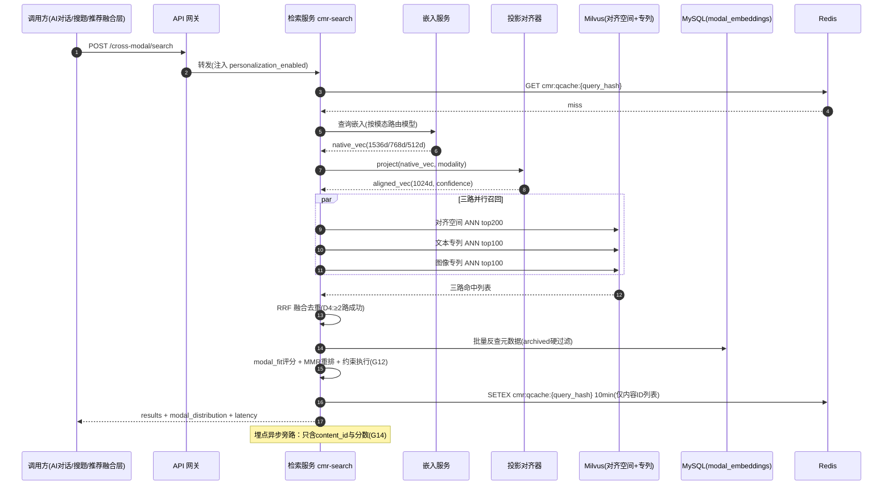
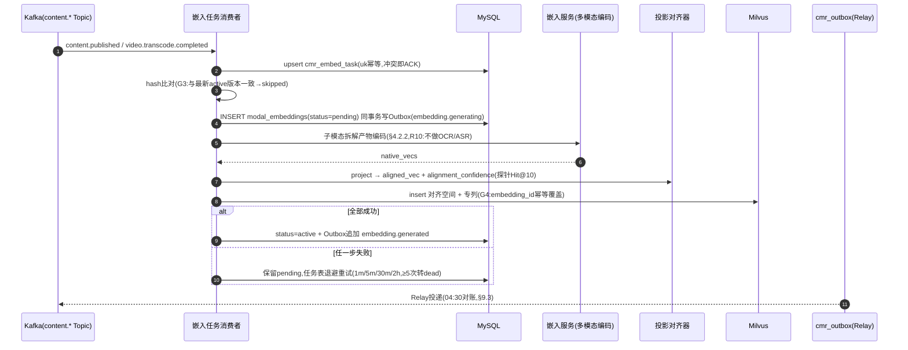
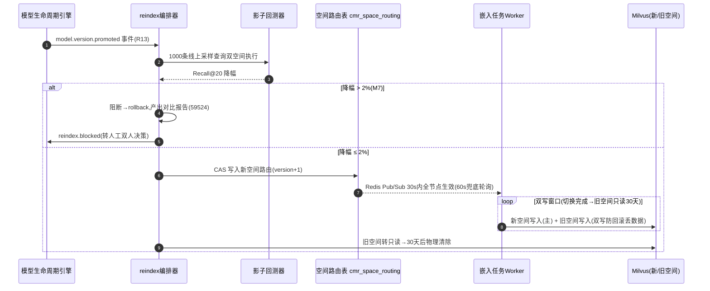

# 服务端-教育内容多模态语义对齐与跨模态智能检索推荐引擎 详细设计

## 1. 概述

### 1.1 模块定位

本引擎是 PrimeTop 教育平台内容检索与推荐体系的核心中间层，负责将不同模态的教育内容（文本、图片、视频、音频、公式、交互式练习）统一映射到共享语义空间，实现跨模态检索、关联推荐与知识补全。

**区别于已有模块：**

| 已有模块 | 职责边界 | 本引擎差异 |
| --- | --- | --- |
| 多模态输入统一处理与智能路由引擎 | 处理**用户输入侧**的多模态请求识别与路由 | 聚焦**内容侧**的多模态语义对齐与检索 |
| RAG 混合检索策略与知识检索质量优化引擎 | RAG 场景下的文本检索策略优化 | 覆盖全模态（视频、音频、图片、公式）的跨模态对齐 |
| 向量数据库基础设施与嵌入向量全生命周期管理 | 向量数据库基础设施运维 | 关注教育内容的嵌入策略与跨模态对齐算法 |
| 内容推荐与个性化推荐引擎 | 基于用户画像的个性化推荐排序 | 提供跨模态候选集召回与模态感知排序 |

### 1.2 核心职责

1. **统一嵌入空间构建**：将文本、图像、视频、音频、数学公式、化学方程式等教育内容映射到统一的向量空间
2. **跨模态检索**：支持用任意模态查询检索其他模态内容（如用文字描述搜视频、用公式截图搜讲解文章）
3. **模态感知推荐排序**：根据学习者偏好、当前学习场景与认知负荷，选择最优模态的内容进行推荐
4. **跨模态一致性校验**：检测同一知识点的不同模态内容是否存在语义偏差
5. **多模态知识图谱构建**：在传统知识图谱基础上扩展多模态实体与跨模态关系边

### 1.3 依赖关系

```
┌─────────────────────────────────────────────────────────────┐
│              跨模态语义对齐与检索推荐引擎                       │
├─────────────┬──────────────┬──────────────┬─────────────────┤
│  嵌入服务   │  对齐训练    │  检索引擎    │  推荐融合层      │
│  Embedding  │  Alignment   │  Retrieval   │  Fusion & Rank   │
│  Service    │  Training    │  Engine      │  Layer          │
└──────┬──────┴──────┬───────┴──────┬───────┴────────┬────────┘
       │             │              │                │
       ▼             ▼              ▼                ▼
┌─────────────┐ ┌───────────┐ ┌───────────┐ ┌──────────────┐
│ 向量数据库   │ │ 模型仓库   │ │ 内容元数据 │ │ 用户画像服务  │
│ (Milvus)    │ │ (MinIO)   │ │ (MySQL)   │ │ (Redis)      │
└─────────────┘ └───────────┘ └───────────┘ └──────────────┘
       │                                           │
       ▼                                           ▼
┌─────────────┐                           ┌──────────────────┐
│ 内容生产管线 │                           │ 学习上下文管理    │
│ (内容入库时  │                           │ (Session Context)│
│  触发嵌入)   │                           │                  │
└─────────────┘                           └──────────────────┘
```

**上游依赖：**
- 内容管理服务：提供内容的结构化元数据（学科、年级、知识点、难度等）
- 向量数据库基础设施：提供向量存储与检索能力
- 用户画像与学习上下文：提供学习者偏好与当前学习状态

**下游消费方：**
- AI 辅导对话引擎：对话中动态检索多模态教学素材
- 拍照搜题服务：用题目截图检索文字解析与视频讲解
- 同步课堂学习：章节学习时推荐多模态补充材料
- 错题整理与复习：根据错题知识点跨模态检索复习资源
- 个性化推荐引擎：作为候选集召回层提供多模态候选

---

## 2. 数据模型

### 2.1 核心实体定义

#### 2.1.1 多模态内容嵌入记录 (ModalEmbedding)

```python
from pydantic import BaseModel, Field
from enum import Enum
from datetime import datetime
from typing import Optional, List

class ModalityType(str, Enum):
    """内容模态类型"""
    TEXT = "text"
    IMAGE = "image"
    VIDEO = "video"
    AUDIO = "audio"
    FORMULA = "formula"          # LaTeX公式
    INTERACTIVE = "interactive"  # 交互式练习/动画
    CODE = "code"                # 代码片段

class EmbeddingModelVersion(str, Enum):
    """嵌入模型版本"""
    TEXT_EMBED_V1 = "bge-large-zh-v1.5"
    TEXT_EMBED_V2 = "bge-m3-multilingual"
    IMAGE_EMBED_V1 = "clip-vit-large-patch14"
    VIDEO_EMBED_V1 = "videoclip-edu-v1"
    AUDIO_EMBED_V1 = "clap-edu-chinese-v1"
    FORMULA_EMBED_V1 = "mathbert-formula-v1"
    MULTIMODAL_V1 = "primeclip-edu-v1"  # 自研跨模态对齐模型

class ModalEmbedding(BaseModel):
    embedding_id: str = Field(description="格式: emb_{modality}_{uuid}")
    content_id: str
    content_type: str            # question/lesson/video/audio/formula
    modality: ModalityType

    embedding_model: EmbeddingModelVersion
    embedding_version: str = "v1"
    vector_dimension: int
    vector_collection: str       # Milvus Collection名

    source_uri: str
    source_text_hash: Optional[str] = None
    thumbnail_uri: Optional[str] = None
    duration_ms: Optional[int] = None

    knowledge_point_ids: List[str] = []
    subject: str
    grade_range: str
    difficulty_level: Optional[int] = None  # 1-10

    aligned_space: str = "primeclip-v1"
    alignment_confidence: Optional[float] = None  # 0.0-1.0

    status: str = "active"       # active/deprecated/reindexing
    created_at: datetime = Field(default_factory=datetime.utcnow)
    updated_at: datetime = Field(default_factory=datetime.utcnow)
```

#### 2.1.2 跨模态对齐映射 (CrossModalAlignment)

```python
class AlignmentRelationType(str, Enum):
    EXPLAINS = "explains"          # A解释B
    VISUALIZES = "visualizes"      # A可视化B
    COMPLEMENTS = "complements"    # A补充B
    TRANSLATES = "translates"      # A翻译B（公式转文字）
    DEMONSTRATES = "demonstrates"  # A演示B
    SUMMARIZES = "summarizes"      # A概括B

class CrossModalAlignment(BaseModel):
    alignment_id: str
    source_content_id: str
    source_modality: ModalityType
    target_content_id: str
    target_modality: ModalityType
    relation_type: AlignmentRelationType
    alignment_score: float        # 0.0-1.0
    knowledge_point_id: Optional[str] = None
    created_by: str = "auto"      # auto/manual
    verified: bool = False
    created_at: datetime = Field(default_factory=datetime.utcnow)
```

#### 2.1.3 模态偏好画像 (ModalityPreferenceProfile)

```python
class ModalityPreferenceProfile(BaseModel):
    user_id: str
    # 各模态偏好权重（总和1.0）
    modality_weights: dict = Field(default_factory=lambda: {
        ModalityType.TEXT: 0.30,
        ModalityType.VIDEO: 0.25,
        ModalityType.IMAGE: 0.15,
        ModalityType.AUDIO: 0.10,
        ModalityType.INTERACTIVE: 0.15,
        ModalityType.FORMULA: 0.05
    })
    # 学科维度模态偏好
    subject_modality_bias: dict = Field(default_factory=dict)
    # 场景维度模态偏好
    context_modality_bias: dict = Field(default_factory=lambda: {
        "quick_review": {"text": 0.5, "image": 0.3},
        "deep_study": {"video": 0.4, "interactive": 0.3},
        "exam_prep": {"text": 0.35, "formula": 0.25},
        "commute": {"audio": 0.7, "video": 0.2}
    })
    last_updated: datetime = Field(default_factory=datetime.utcnow)
    interaction_count: int = 0
```

### 2.2 数据库表结构

#### 2.2.1 modal_embeddings 表 (MySQL)

```sql
CREATE TABLE modal_embeddings (
    embedding_id        VARCHAR(64)   NOT NULL,
    content_id          VARCHAR(64)   NOT NULL,
    content_type        VARCHAR(32)   NOT NULL,
    modality            VARCHAR(16)   NOT NULL COMMENT 'text/image/video/audio/formula/interactive/code',

    embedding_model     VARCHAR(64)   NOT NULL,
    embedding_version   VARCHAR(16)   NOT NULL DEFAULT 'v1',
    vector_dimension    INT           NOT NULL,
    vector_collection   VARCHAR(64)   NOT NULL,

    source_uri          VARCHAR(512)  NOT NULL,
    source_text_hash    CHAR(32)      DEFAULT NULL,
    thumbnail_uri       VARCHAR(512)  DEFAULT NULL,
    duration_ms         INT           DEFAULT NULL,

    knowledge_point_ids JSON          DEFAULT NULL,
    subject             VARCHAR(16)   NOT NULL,
    grade_range         VARCHAR(16)   NOT NULL,
    difficulty_level    TINYINT       DEFAULT NULL,

    aligned_space       VARCHAR(32)   NOT NULL DEFAULT 'primeclip-v1',
    alignment_confidence FLOAT(5,4)   DEFAULT NULL,

    status              VARCHAR(16)   NOT NULL DEFAULT 'active',
    created_at          DATETIME(3)   NOT NULL DEFAULT CURRENT_TIMESTAMP(3),
    updated_at          DATETIME(3)   NOT NULL DEFAULT CURRENT_TIMESTAMP(3) ON UPDATE CURRENT_TIMESTAMP(3),

    PRIMARY KEY (embedding_id),
    UNIQUE KEY uk_content_modality (content_id, modality, embedding_version),
    KEY idx_subject_grade (subject, grade_range),
    KEY idx_status_modality (status, modality),
    KEY idx_source_hash (source_text_hash)
) ENGINE=InnoDB DEFAULT CHARSET=utf8mb4 COMMENT='多模态内容嵌入元数据表';
```

#### 2.2.2 cross_modal_alignments 表 (MySQL)

```sql
CREATE TABLE cross_modal_alignments (
    alignment_id        VARCHAR(64)   NOT NULL,
    source_content_id   VARCHAR(64)   NOT NULL,
    source_modality     VARCHAR(16)   NOT NULL,
    target_content_id   VARCHAR(64)   NOT NULL,
    target_modality     VARCHAR(16)   NOT NULL,
    relation_type       VARCHAR(32)   NOT NULL COMMENT 'explains/visualizes/complements/translates/demonstrates/summarizes',
    alignment_score     FLOAT(5,4)   NOT NULL,
    knowledge_point_id  VARCHAR(64)   DEFAULT NULL,
    created_by          VARCHAR(16)   NOT NULL DEFAULT 'auto',
    verified            TINYINT(1)    NOT NULL DEFAULT 0,
    created_at          DATETIME(3)   NOT NULL DEFAULT CURRENT_TIMESTAMP(3),

    PRIMARY KEY (alignment_id),
    UNIQUE KEY uk_pair (source_content_id, target_content_id, relation_type),
    KEY idx_source (source_content_id),
    KEY idx_target (target_content_id),
    KEY idx_kp_relation (knowledge_point_id, relation_type),
    KEY idx_score (alignment_score DESC)
) ENGINE=InnoDB DEFAULT CHARSET=utf8mb4 COMMENT='跨模态对齐映射表';
```

#### 2.2.3 modality_preference_profiles 表 (MySQL)

```sql
CREATE TABLE modality_preference_profiles (
    user_id              VARCHAR(64)   NOT NULL,
    modality_weights     JSON          NOT NULL,
    subject_modality_bias JSON         DEFAULT NULL,
    context_modality_bias JSON         DEFAULT NULL,
    last_updated         DATETIME(3)   NOT NULL DEFAULT CURRENT_TIMESTAMP(3) ON UPDATE CURRENT_TIMESTAMP(3),
    interaction_count    INT           NOT NULL DEFAULT 0,

    PRIMARY KEY (user_id)
) ENGINE=InnoDB DEFAULT CHARSET=utf8mb4 COMMENT='模态偏好画像表';
```

#### 2.2.4 Milvus 向量集合

```python
# Collection: 统一对齐空间 — 所有模态投影到1024维
ALIGNED_COLLECTION_SCHEMA = {
    "name": "primeclip_aligned_v1",
    "fields": [
        {"name": "id", "type": "VARCHAR", "max_length": 64, "is_primary": True},
        {"name": "embedding", "type": "FLOAT_VECTOR", "dim": 1024},
        {"name": "content_id", "type": "VARCHAR", "max_length": 64},
        {"name": "modality", "type": "VARCHAR", "max_length": 16},
        {"name": "subject", "type": "VARCHAR", "max_length": 16},
        {"name": "grade_range", "type": "VARCHAR", "max_length": 16},
        {"name": "difficulty_level", "type": "INT8"},
    ],
    "index": {
        "field": "embedding",
        "index_type": "HNSW",
        "metric_type": "COSINE",
        "params": {"M": 48, "efConstruction": 512}
    }
}

# Collection: 文本专用高维检索 (1536维 bge-m3)
TEXT_COLLECTION_SCHEMA = {
    "name": "text_detailed_v1",
    "fields": [
        {"name": "id", "type": "VARCHAR", "max_length": 64, "is_primary": True},
        {"name": "embedding", "type": "FLOAT_VECTOR", "dim": 1536},
        {"name": "content_id", "type": "VARCHAR", "max_length": 64},
        {"name": "subject", "type": "VARCHAR", "max_length": 16},
    ],
    "index": {
        "field": "embedding",
        "index_type": "IVF_FLAT",
        "metric_type": "IP",
        "params": {"nlist": 4096}
    }
}

# Collection: 图像专用检索 (768维 ViT-large)
IMAGE_COLLECTION_SCHEMA = {
    "name": "image_detailed_v1",
    "fields": [
        {"name": "id", "type": "VARCHAR", "max_length": 64, "is_primary": True},
        {"name": "embedding", "type": "FLOAT_VECTOR", "dim": 768},
        {"name": "content_id", "type": "VARCHAR", "max_length": 64},
    ],
    "index": {
        "field": "embedding",
        "index_type": "HNSW",
        "metric_type": "COSINE",
        "params": {"M": 32, "efConstruction": 256}
    }
}
```

### 2.3 缓存策略

| 缓存层 | Key 格式 | TTL | 用途 |
| --- | --- | --- | --- |
| Redis L1 | `cmr:emb:{content_id}:{modality}` | 24h | 嵌入元数据缓存 |
| Redis L1 | `cmr:align:{content_id}` | 6h | 跨模态对齐关系列表 |
| Redis L1 | `cmr:pref:{user_id}` | 2h | 用户模态偏好画像 |
| Redis L1 | `cmr:hot:{subject}:{kp_id}` | 1h | 热门知识点跨模态候选集 |
| 本地 Caffeine | `cmr:model_meta:{model_id}` | 5m | 嵌入模型元信息 |

---

## 3. API 接口设计

### 3.1 接口总览

| # | 接口 | 方法 | 路径 | 描述 |
| --- | --- | --- | --- | --- |
| 1 | 跨模态检索 | POST | `/api/v1/cross-modal/search` | 用任意模态查询检索其他模态内容 |
| 2 | 批量嵌入生成 | POST | `/api/v1/cross-modal/embeddings/batch` | 内容入库时批量生成嵌入 |
| 3 | 跨模态推荐 | POST | `/api/v1/cross-modal/recommend` | 基于学习上下文推荐最优模态内容 |
| 4 | 对齐关系查询 | GET | `/api/v1/cross-modal/alignments/{contentId}` | 查询内容的跨模态对齐关系 |
| 5 | 一致性校验 | POST | `/api/v1/cross-modal/consistency-check` | 校验多模态内容语义一致性 |
| 6 | 模态偏好更新 | PUT | `/api/v1/cross-modal/preferences/{userId}` | 更新用户模态偏好画像 |
| 7 | 重新嵌入 | POST | `/api/v1/cross-modal/reindex` | 触发指定内容向量重计算 |

### 3.2 核心接口详细定义

#### 3.2.1 跨模态检索

```
POST /api/v1/cross-modal/search
```

**请求体：**

```json
{
  "query": {
    "modality": "text",
    "content": "二次函数的顶点坐标公式",
    "image_uri": null,
    "formula_latex": null
  },
  "target_modalities": ["video", "image", "interactive", "text"],
  "filters": {
    "subject": "math",
    "grade_range": "K12-9",
    "difficulty_min": 1,
    "difficulty_max": 7,
    "knowledge_point_ids": ["kp_quadratic_function"],
    "duration_max_sec": 300
  },
  "ranking": {
    "strategy": "modal_aware",
    "user_id": "u_12345",
    "context": "deep_study",
    "diversity_lambda": 0.3
  },
  "pagination": { "page": 1, "page_size": 20 }
}
```

**响应体：**

```json
{
  "code": 0,
  "message": "success",
  "data": {
    "total": 47,
    "results": [
      {
        "content_id": "vid_8842",
        "modality": "video",
        "content_type": "lesson_video",
        "title": "二次函数顶点公式推导（5分钟动画讲解）",
        "thumbnail_uri": "https://cdn.primetop.edu/thumb/vid_8842.jpg",
        "source_uri": "https://cdn.primetop.edu/video/vid_8842.m3u8",
        "duration_sec": 287,
        "subject": "math",
        "knowledge_point_ids": ["kp_quadratic_function", "kp_vertex"],
        "difficulty_level": 4,
        "similarity_score": 0.892,
        "modal_fit_score": 0.85,
        "final_score": 0.875,
        "relation_type": "visualizes",
        "excerpt": "本视频通过动画演示如何从一般式y=ax²+bx+c推导出顶点坐标..."
      }
    ],
    "modal_distribution": { "video": 12, "image": 15, "interactive": 8, "text": 12 },
    "search_latency_ms": 87
  }
}
```

#### 3.2.2 批量嵌入生成

```
POST /api/v1/cross-modal/embeddings/batch
```

**请求体：**

```json
{
  "items": [
    {
      "content_id": "vid_8842",
      "content_type": "lesson_video",
      "modality": "video",
      "source_uri": "https://cdn.primetop.edu/video/vid_8842.mp4",
      "metadata": {
        "subject": "math",
        "grade_range": "K12-9",
        "knowledge_point_ids": ["kp_quadratic_function"],
        "difficulty_level": 4,
        "duration_ms": 287000,
        "transcript_text": "今天我们来学习二次函数的顶点坐标公式...",
        "keyframe_uris": ["https://cdn.primetop.edu/kf/vid_8842_001.jpg"]
      }
    }
  ],
  "priority": "normal"
}
```

**响应体：**

```json
{
  "code": 0,
  "data": {
    "job_id": "job_emb_20260705_001",
    "submitted_count": 1,
    "status": "processing",
    "estimated_completion_sec": 45
  }
}
```

#### 3.2.3 跨模态推荐

```
POST /api/v1/cross-modal/recommend
```

**请求体：**

```json
{
  "user_id": "u_12345",
  "learning_context": {
    "subject": "math",
    "knowledge_point_id": "kp_quadratic_function",
    "current_modality": "text",
    "scene": "deep_study",
    "session_duration_min": 25,
    "recent_modalities": ["text", "text", "image"]
  },
  "count": 5,
  "constraints": {
    "prefer_novel_modality": true,
    "max_consecutive_same_modality": 3,
    "difficulty_delta": 1
  }
}
```

**响应体：**

```json
{
  "code": 0,
  "data": {
    "recommendations": [
      {
        "content_id": "vid_8842",
        "modality": "video",
        "title": "二次函数顶点公式推导（动画讲解）",
        "reason": "您已阅读了3段文字讲解，切换到视频形式可以帮助您更直观地理解",
        "scores": {
          "relevance": 0.89,
          "modal_fit": 0.92,
          "novelty": 0.85,
          "difficulty_match": 0.90
        },
        "final_score": 0.89
      }
    ],
    "modality_strategy": "rotate_to_video",
    "strategy_reason": "用户已连续消费3个文本内容，认知疲劳风险升高，建议切换到视频模态"
  }
}
```

### 3.3 错误码定义

> v1.1 裁决（缺陷 F4）：v1.0 使用局部 `CMR_xxx` 错误码与全库 `5xxxx` 全局错误码段规范冲突，本节已收敛至全局段 **59500-59599**（全库扫描无冲突），`CMR_xxx` 旧码废弃；完整错误码表（含 200 语义码）与旧码映射见 §10。

| 错误码 | HTTP 状态码 | 描述 | 处理建议 |
| --- | --- | --- | --- |
| `59501` | 400 | 不支持的模态类型 | 检查 modality 字段取值 |
| `59502` | 400 | 查询内容为空 | 至少提供一种模态的查询内容 |
| `59511` | 400 | 目标模态与查询模态相同且未启用同模态检索 | 设置 include_same_modality=true |
| `59504` | 404 | 内容不存在或未生成嵌入 | 先调用 embed/batch 接口 |
| `59505` | 422 | 嵌入模型不可用 | 检查模型服务状态，降级到备选模型 |
| `59506` | 429 | 检索QPS超限 | 客户端限流退避 |
| `59507` | 500 | 向量数据库查询失败 | 检查 Milvus 连接和索引状态 |
| `59508` | 500 | 嵌入生成失败 | 检查模型推理服务、GPU资源 |
| `59519` | 503 | 对齐模型服务不可用 | 降级到单模态检索模式 |
| `59513` | 504 | 嵌入生成超时 | 降低batch size或异步重试 |

---

## 4. 业务逻辑

### 4.1 整体处理流程

```
用户请求 / AI引擎触发
         │
         ▼
┌──────────────────┐
│ 1. 查询解析      │  解析查询模态、内容、过滤条件
│    Query Parsing │
└────────┬─────────┘
         │
         ▼
┌──────────────────┐
│ 2. 查询嵌入      │  将查询内容转为向量
│    Query Embed   │  text → bge-m3 / image → CLIP / formula → MathBERT
└────────┬─────────┘
         │
         ▼
┌──────────────────┐
│ 3. 投影对齐      │  非文本模态向量投影到统一空间
│    Project Align │  image_vec(768d) → aligned_vec(1024d)
└────────┬─────────┘
         │
         ▼
┌──────────────────────────────────────┐
│ 4. 多路召回                          │
│    Multi-way Recall                  │
│  ┌─────────┬─────────┬─────────┐    │
│  │对齐空间 │文本专列 │图像专列 │    │
│  │Ann检索  │Ann检索  │Ann检索  │    │
│  │1024d    │1536d    │768d     │    │
│  │top200   │top100   │top100   │    │
│  └────┬────┴────┬────┴────┬────┘    │
└───────┼─────────┼─────────┼─────────┘
        └─────────┼─────────┘
                  ▼
┌──────────────────┐
│ 5. 元数据补全    │  MySQL 反查内容元数据
│    Metadata Fill │  过滤 archived / 降权 deprecated
└────────┬─────────┘
         ▼
┌──────────────────┐
│ 6. 模态感知排序   │  final = 0.55×sim + 0.30×modal_fit
│    Modal-aware   │        + 0.15×quality_novelty
│    Ranking       │  MMR 多样性重排 (λ = diversity_lambda)
└────────┬─────────┘
         ▼
┌──────────────────┐
│ 7. 业务约束执行  │  学段/时长/同模态连刷/难度差约束
│    Constraints   │  模态配额与多样性兜底
└────────┬─────────┘
         ▼
┌──────────────────┐
│ 8. 结果组装      │  摘要/缩略图/relation_type/解释字段
│    Assemble      │  modal_distribution 统计
└────────┬─────────┘
         ▼
┌──────────────────┐
│ 9. 埋点与日志    │  cmr_search_executed（查询内容只落哈希）
│    Observability │  延迟分解打点 → Prometheus
└──────────────────┘
```

**步骤说明：**

| 步骤 | 关键逻辑 | 失败处理 |
| --- | --- | --- |
| 1 查询解析 | 模态识别（text/image/formula）、过滤条件归一化、学段学科上下文注入 | 参数非法返回 59501/59502 |
| 2 查询嵌入 | 按模态路由嵌入模型；查询向量 LRU 缓存（query_hash，TTL 10min） | 模型不可用走 D2 降级链 |
| 3 投影对齐 | 非文本模态向量经投影头映射到 1024d 统一空间；带 alignment_confidence | 投影失败仅走专列召回（D3） |
| 4 多路召回 | 对齐空间 top200 + 文本专列 top100 + 图像专列 top100，RRF 融合去重 | 单路失败不阻断，至少两路成功才继续（D4） |
| 5 元数据补全 | 按 content_id 批量反查 MySQL；archived 硬过滤，deprecated 降权 ×0.5 | 元数据缺失条目丢弃并计数 |
| 6 模态感知排序 | modal_fit 结合偏好/场景/疲劳/设备（§4.4）；MMR 重排 | 无画像走全局默认权重 |
| 7 业务约束执行 | duration_max/难度区间/连刷同模态上限/新颖模态偏好 | 违反约束条目剔除 |
| 8 结果组装 | 摘要与 relation_type 透出；modal_distribution 汇总 | — |
| 9 埋点与日志 | 埋点只含 content_id 与分数，不含查询原文（版权与隐私红线 C6） | 埋点失败不阻断返回 |

**延迟预算（内网 P99 ≤ 150ms）：**

| 步骤 | 预算 |
| --- | --- |
| 查询解析 + 缓存探测 | 5ms |
| 查询嵌入（含缓存命中路径） | 30ms（命中 2ms） |
| 投影对齐 | 5ms |
| 多路召回（Milvus 并行） | 40ms |
| 元数据补全（批量） | 20ms |
| 排序 + MMR（top 200 内） | 15ms |
| 约束 + 组装 | 15ms |
| 埋点异步化 | 0（旁路） |
| 合计 | ≤ 130ms（缓存命中 ≤ 100ms） |

---
### 4.2 内容入库嵌入管线

#### 4.2.1 触发与任务领取

嵌入任务由内容域事件驱动，经 Kafka 投递到 `cmr-embed-tasks` Topic。任务表如下：

```sql
CREATE TABLE cmr_embed_task (
    task_id          VARCHAR(64)   NOT NULL,
    content_id       VARCHAR(64)   NOT NULL,
    content_version  INT           NOT NULL DEFAULT 1,
    modality         VARCHAR(16)   NOT NULL,
    source_event     VARCHAR(64)   NOT NULL COMMENT 'content.published/content.updated/video.transcode.completed/question.created',
    priority         VARCHAR(16)   NOT NULL DEFAULT 'normal',
    status           VARCHAR(16)   NOT NULL DEFAULT 'queued' COMMENT 'queued/running/succeeded/failed/dead',
    retry_count      TINYINT       NOT NULL DEFAULT 0,
    next_retry_at    DATETIME(3)   DEFAULT NULL,
    last_error       VARCHAR(512)  DEFAULT NULL,
    idempotency_key  VARCHAR(128)  GENERATED ALWAYS AS (CONCAT(content_id, ':', modality, ':', content_version)) STORED,
    created_at       DATETIME(3)   NOT NULL DEFAULT CURRENT_TIMESTAMP(3),
    updated_at       DATETIME(3)   NOT NULL DEFAULT CURRENT_TIMESTAMP(3) ON UPDATE CURRENT_TIMESTAMP(3),
    PRIMARY KEY (task_id),
    UNIQUE KEY uk_task_content (content_id, modality, content_version),
    KEY idx_status_retry (status, next_retry_at)
) ENGINE=InnoDB DEFAULT CHARSET=utf8mb4 COMMENT='嵌入生成任务表';
```

- 消费者以 `uk_task_content` 天然幂等：重复事件 upsert 冲突即视为已受理，直接 ACK。
- 优先级通道：热门内容补嵌入（运营触发）走 `priority=high`，独立队列避免被批量回填淹没。
- 重试策略：指数退避（1min/5min/30min/2h），`retry_count >= 5` 转 `dead` 并告警，人工经管理端重放。

#### 4.2.2 模态拆解

复合内容先拆解为子模态再分别嵌入，子模态向量经加权池化聚合为内容级向量：

| 原生模态 | 拆解产物 | 嵌入通道 | 聚合权重 |
| --- | --- | --- | --- |
| video | 字幕文本（ASR/人工） | bge-m3 1536d | 0.5 |
| video | 关键帧图像（top8） | CLIP ViT-L 768d | 0.3 |
| video | 音频片段特征 | clap-edu-chinese | 0.2 |
| audio | ASR 转写文本 | bge-m3 1536d | 0.7 |
| audio | 声学特征 | clap-edu-chinese | 0.3 |
| interactive | 练习描述文本 + 截图 | bge-m3 + CLIP | 0.6/0.4 |
| formula | 规范化 LaTeX（委托《学科公式LaTeX统一解析管线》R9） | MathBERT | 1.0 |
| code | 代码文本 + 首层 AST 序列化 | **走 TEXT 通道**（v1.0 缺陷 F1 修复：`EmbeddingModelVersion` 未定义 CODE 专用模型，裁决为不新增专列，CODE 内容统一经 bge-m3 文本通道嵌入并加 code 结构特征前缀，见 §5.1） | 1.0 |
| text | 全文 + 摘要 | bge-m3（摘要优先，超长分段取 top3 段落池化） | 0.3/0.7 |

子模态拆解产物（关键帧 URI、转写文本）来自上游事件载荷；本引擎不做 OCR/ASR（R10）。

#### 4.2.3 原生嵌入与投影对齐

各模态原生向量经独立投影头映射到 1024d 统一空间：

```text
aligned_vec = L2_normalize(W_m × native_vec + b_m)
```

| 模态 | 原生维度 | 投影头 | 说明 |
| --- | --- | --- | --- |
| text | 1536 | W_t: 1536→1024 | bge-m3 输出 |
| image | 768 | W_i: 768→1024 | CLIP 输出 |
| video | 768 | W_v: 768→1024 | 与 image 共享底座、独立投影头 |
| audio | 512 | W_a: 512→1024 | clap 输出 |
| formula | 768 | W_f: 768→1024 | MathBERT 输出 |
| code | 1536 | W_t 复用 | F1：复用文本投影头 |

`alignment_confidence` 计算：每模态维护一个 512 对人工标注的跨模态检索探针集（query→期望内容），内容入库时以内容向量在探针集上的 Hit@10 命中率作为该条目的对齐置信度；低于 0.5 时标记 `alignment_confidence` 原值落库，检索融合时按 `0.5 + 0.5 × confidence` 对对齐空间召回分数打折。

#### 4.2.4 双写与元数据落库

Milvus 与 MySQL 无分布式事务，采用「先元数据后向量、状态机收敛」：

1. 写 `modal_embeddings`（status=`pending`）+ 同事务写 `cmr_outbox`（`embedding.generating`，用于超时补偿扫描）；
2. 投影后 insert 对齐空间 + 专列（同一内容多子模态仅主向量入对齐空间，专列按子模态多条目）；
3. 全部 insert 成功 → status=`active`，Outbox 追加 `embedding.generated`；
4. 任一步失败 → 保留 pending，重试由任务表驱动；Milvus 写入以 `embedding_id` 幂等（存在则覆盖）。

`uk_content_modality` 冲突处理：内容更新（content_version 递增）走 reindex 流程（§4.8），新版本 embedding_version+1 双写并存，切换后旧版本转 `deprecated`，30 天后物理删除向量。

#### 4.2.5 增量更新与 hash 跳过

任务执行前比对 `source_text_hash`（文本 SHA-256 / 图像 pHash / 视频 转写文本+关键帧 pHash 联合哈希）：与 active 版本一致则任务直接 `succeeded` 并记录 `skipped=hash_equal`，节约 GPU 成本。hash 比对必须基于 `content_version` 最新 active 记录，防止旧版本误判。

### 4.3 跨模态对齐关系自动挖掘

#### 4.3.1 候选生成（三源）

| 源 | 方法 | 日产出量级 | 截断 |
| --- | --- | --- | --- |
| 同知识点共现 | 同 kp_id 下不同模态 active 内容两两组合 | ~8 万对 | 每源内容最多取 200 候选 |
| 对齐空间近邻 | 内容向量 top50 近邻中模态不同者 | ~15 万对 | sim ≥ 0.55 才入候选 |
| 图谱二跳 | 知识图谱「讲解→知识点→讲解」路径（读副本） | ~3 万对 | 二跳即止，防爆炸 |

三源候选合并去重（source/target 规范序 + relation_type），与存量 `cross_modal_alignments` 比对后仅保留新对。

#### 4.3.2 关系类型判定

规则优先、模型兜底：

| 规则（contentType 组合） | relation_type | 基础置信 |
| --- | --- | --- |
| lesson_video ← question | EXPLAINS | 0.9 |
| interactive/image ← lesson | VISUALIZES | 0.85 |
| formula ← text | TRANSLATES | 0.9 |
| text ← video | SUMMARIZES | 0.8 |
| audio ← text | TRANSLATES | 0.8 |
| 其余组合 | 轻量分类器（对齐向量差 + 元数据特征，FastText） | 输出概率 |

#### 4.3.3 评分与验证路由

```text
alignment_score = 0.60 × aligned_cos_sim + 0.25 × min(quality_score,1.0) + 0.15 × version_fit
```

- `quality_score`：内容质量分（读《教育内容质量自动评估引擎》投影，0-1）；
- `version_fit`：教材版本一致 1.0 / 同学段跨版本 0.6 / 跨学段 0.3。

| 分数区间 | 处置 |
| --- | --- |
| ≥ 0.85 | 自动 `verified=1`、created_by=auto，直接生效 |
| 0.60 - 0.85 | 进人工复核队列（管理后台-内容生产运营工作台对齐复核 Tab） |
| < 0.60 | 丢弃，仅记挖掘统计 |

#### 4.3.4 防噪音约束

- 单内容出度上限 50（同 relation_type 下限 20），超出按分数截断；
- 同 kp_id 对齐总密度上限 200 对，防止头部知识点对齐爆炸；
- `created_by=manual` 条目永不因挖掘容量截断被清除；
- 挖掘任务窗口：增量每日 02:30，全量回挖每周日 01:00（分片 16，游标断点续跑）。

#### 4.3.5 uk_pair 缺陷修复（F2）

v1.0 `uk_pair(source_content_id, target_content_id, relation_type)` 未包含 knowledge_point_id，同一内容对在不同知识点下的合法多对齐会被唯一键拒绝。修复 DDL：

```sql
ALTER TABLE cross_modal_alignments
    MODIFY knowledge_point_id VARCHAR(64) NOT NULL DEFAULT 'ALL',
    DROP INDEX uk_pair,
    ADD UNIQUE KEY uk_pair (source_content_id, target_content_id, relation_type, knowledge_point_id);
```

存量 NULL kp 回填为哨兵 `ALL` 后执行；应用层写入统一以 `kp_id or 'ALL'` 参与（守卫 G8）。

### 4.4 模态感知排序算法

#### 4.4.1 modal_fit_score 计算

```text
modal_fit = 0.35 × pref_m + 0.25 × ctx_bias(m, scene) + 0.20 × fatigue_term + 0.20 × device_term

pref_m     = 用户模态偏好归一化权重
ctx_bias   = 场景模态偏差（quick_review/deep_study/exam_prep/commute，缺省 1/N 均匀）
fatigue    = 连续消费同模态次数 n 的惩罚：max(0, 1 - 0.25×(n-2))，n≥2 起衰减
device     = 设备模态适配（弱网/低端机视频 ×0.6、无音频外设 audio ×0.5、平板 interactive ×1.2）
```

#### 4.4.2 模态轮换策略

`modality_strategy` 决策表（推荐接口透出，用于解释与下游联动）：

| recent_modalities 特征 | strategy | 说明 |
| --- | --- | --- |
| 同模态连续 ≥3 | rotate_to_{other} | 认知疲劳风险，切换模态并在 reason 说明 |
| 深度学习场景且视频占比 <0.2 | rotate_to_video | 直观理解窗口 |
| 通勤场景 | prioritize_audio | 免提场景 |
| 考试冲刺 | prioritize_text_formula | 高信息密度 |
| 无明显特征 | keep_current | 不主动切换 |

#### 4.4.3 约束执行器

| 约束参数 | 执行逻辑 |
| --- | --- |
| prefer_novel_modality=true | 结果前 3 位中至少 1 个与 recent_modalities 最后一项不同模态 |
| max_consecutive_same_modality=3 | 滑窗内同模态超限即剔除（由推荐侧逐条消费时校验，本引擎在候选层预排） |
| difficulty_delta=1 | 候选难度与用户当前掌握度对应难度差 ≤1（掌握度经 gRPC BatchGetMastery 拉 ≤500 对，缓存 60s） |

#### 4.4.4 个性化关闭降级（F6 修复）

v1.0 检索接口 `ranking.user_id` 无条件取用户画像，未提供未成年人个性化关闭开关。修复：请求经网关注入 `personalization_enabled`（权威来自《统一通知偏好授权中心》的画像开关族，家长可代关），关闭时：

- 不读 `modality_preference_profiles`，使用学段默认权重；
- 不落个性化埋点维度，仅聚合统计；
- 返回头 `personalization: off` 供客户端透明展示（合规 C2）。

#### 4.4.5 final_score 与 MMR

```text
final = 0.55 × similarity + 0.30 × modal_fit + 0.15 × (0.6×quality + 0.4×novelty)
MMR(c) = argmax_{c∈C\S} [ final(c) − λ × max_{s∈S} modality_same(c,s) ]
```

`modality_same` 为 0/1 指示（同模态 1），λ 默认 0.3（请求可调 0-1，>0.5 触发 59509 参数告警）。`modal_distribution` 保证任一模态占比 ≤ 60%（约束兜底 G12）。


### 4.5 跨模态一致性校验

#### 4.5.1 触发

- 定时：每日 03:30 分片扫描（16 分片，按 kp_id hash），覆盖全部 active 对齐组；
- 事件：`content.updated` 时对该内容所在对齐组立即复检。

#### 4.5.2 校验方法

1. 组装「对齐组」：同 kp_id（非 ALL）下各模态代表内容集合（每模态取分数最高 1 条）；
2. 组内两两余弦，`min_cos < 0.35` 判定疑似语义偏差；
3. 疑似对提交 LLM 抽验（模型路由走推理增强模型，输入为两内容摘要 + kp 名称，输出一致性结论 + 证据句对，JSON Schema 约束）；
4. LLM 判定不一致 → 落 `cmr_consistency_task`（status=`deviation_open`）并 Outbox `consistency.deviation_detected`，由《教育内容审核工作流与多级审核管线》建复核工单；
5. 一致或无法判定 → task 关闭为 `ok` / `inconclusive`（后者仅计数，连续 7 天 inconclusive 升级人工）。

**红线：本引擎只产出偏差证据，绝不下架内容**——上下线权威归《教育内容生命周期与版本管理引擎》（R5）。

```sql
CREATE TABLE cmr_consistency_task (
    task_id         VARCHAR(64)  NOT NULL,
    group_key       VARCHAR(128) NOT NULL COMMENT 'kp:modality_a:content_a|modality_b:content_b 规范序',
    kp_id           VARCHAR(64)  NOT NULL,
    content_a       VARCHAR(64)  NOT NULL,
    content_b       VARCHAR(64)  NOT NULL,
    min_cos         FLOAT(5,4)   NOT NULL,
    llm_verdict     VARCHAR(16)  DEFAULT NULL COMMENT 'consistent/inconsistent/inconclusive',
    llm_evidence    JSON         DEFAULT NULL,
    status          VARCHAR(24)  NOT NULL DEFAULT 'pending',
    resolved_by     VARCHAR(64)  DEFAULT NULL,
    resolution      VARCHAR(24)  DEFAULT NULL COMMENT 'fixed/content_updated/wont_fix',
    created_at      DATETIME(3)  NOT NULL DEFAULT CURRENT_TIMESTAMP(3),
    updated_at      DATETIME(3)  NOT NULL DEFAULT CURRENT_TIMESTAMP(3) ON UPDATE CURRENT_TIMESTAMP(3),
    PRIMARY KEY (task_id),
    UNIQUE KEY uk_group_active (group_key, status) COMMENT '函数唯一索引替代见§7.3',
    KEY idx_kp (kp_id),
    KEY idx_status (status, created_at)
) ENGINE=InnoDB DEFAULT CHARSET=utf8mb4 COMMENT='跨模态一致性校验任务表';
```

（注：MySQL 8.0 以 `((CASE WHEN status IN ('pending','checking','deviation_open') THEN CONCAT(group_key,':',status) END))` 函数唯一索引实现「同组仅一个活跃任务」，DDL 见 §7.3，防 v1.0 式可空列唯一键失效问题。）

### 4.6 模态偏好画像学习

#### 4.6.1 隐式信号（事件驱动，EMA 更新）

| 信号 | 事件 | 权重增量 |
| --- | --- | --- |
| 深度消费 | 内容完成（视频播完/练习答完） | +0.010 |
| 中性消费 | 曝光未点击 | 0（仅计数） |
| 快速跳过 | 曝光后 <5s 离开 | −0.006 |
| 显性负反馈 | 「不感兴趣」 | −0.030 |
| 收藏/复看 | 收藏、二次进入 | +0.015 |

```text
w_m' = clamp(w_m + α × delta_m, 0.05, 0.60)  后归一化使 Σw=1，α=0.3
```

单模态下限 0.05 防画像坍缩（守卫 G10）；上限 0.60 防单模态垄断。

#### 4.6.2 显式设置与并发（F3 修复）

v1.0 `modality_preference_profiles` 无版本控制，显式 PUT 全量覆盖会吞掉并发到达的隐式学习增量。修复：

```sql
ALTER TABLE modality_preference_profiles
    ADD COLUMN version INT NOT NULL DEFAULT 0,
    ADD COLUMN updated_by VARCHAR(16) NOT NULL DEFAULT 'system' COMMENT 'system(隐式)/user(显式)/parent(家长)';
```

- 显式 PUT（学生/家长）：`WHERE user_id=? AND version=?` CAS，失败返回 59521 让客户端重读合并；
- 隐式更新：仅对 `updated_by != 'parent'`（家长锁定）的画像生效，家长锁定期间隐式信号只累积不应用（落 `cmr_pref_pending` 暂存，解锁后一次性 EMA 合并）；
- 画像 90 天未更新自动回落学段默认（`interaction_count=0` 判定）。

#### 4.6.3 冷启动默认权重

| 学段 | 默认权重（text/video/image/audio/interactive/formula） |
| --- | --- |
| 幼儿 | 0.10 / 0.30 / 0.25 / 0.15 / 0.20 / 0.00 |
| 小学 | 0.25 / 0.25 / 0.15 / 0.10 / 0.20 / 0.05 |
| 初中 | 0.30 / 0.25 / 0.12 / 0.08 / 0.15 / 0.10 |
| 高中 | 0.35 / 0.20 / 0.10 / 0.05 / 0.12 / 0.18 |

### 4.7 查询理解与改写

1. 短查询补全：查询 <6 字符时拼接学科上下文（本引擎不读用户会话，上下文由调用方显式传入，R1 边界）；
2. 公式规范化：`formula_latex` 先经《学科公式LaTeX统一解析管线》标准化（去宏差异、统一分式表示），失败返回 59503；
3. 图片查询预筛：pHASH 明细过滤（汉明距离 ≤10）先于向量检索，降低对齐空间 efSearch 压力；
4. 查询缓存：`query_hash = SHA256(modality + normalized_content + filters_v)` → 结果 ID 列表缓存 10min（内容上下线事件主动失效，见 §9.2）。

### 4.8 重建索引与模型版本切换

- reindex 全流程状态机见 §7.4；触发源：模型版本切换事件（`model.version.promoted`）、维度变更、索引重建；
- 影子回测：切换前以 1000 条线上采样查询在新旧双空间执行，Recall@20 降幅 >2% 自动阻断（转 `rollback`，告警 M7）；降幅 0-2% 产出对比报告供 AI 模型配置工作台双人决策；
- 切换执行：写 `cmr_space_routing`（空间路由表，CAS version），检索侧 30s 内全节点生效（Redis Pub/Sub 通知 + 60s 兜底轮询）；
- 回滚：保留旧空间只读 30 天，回滚即路由切回，期间旧空间增量写入不停止（双写窗口）。

---

## 5. 关键代码示例

### 5.1 统一投影对齐器（含 CODE 降级，F1）

```python
class ProjectionAligner:
    """原生模态向量 → 1024d 统一对齐空间投影"""

    MODEL_ROUTE = {
        ModalityType.TEXT:  EmbeddingModelVersion.TEXT_EMBED_V2,    # bge-m3 1536d
        ModalityType.IMAGE: EmbeddingModelVersion.IMAGE_EMBED_V1,   # CLIP 768d
        ModalityType.VIDEO: EmbeddingModelVersion.VIDEO_EMBED_V1,   # 768d
        ModalityType.AUDIO: EmbeddingModelVersion.AUDIO_EMBED_V1,   # 512d
        ModalityType.FORMULA: EmbeddingModelVersion.FORMULA_EMBED_V1,  # 768d
        ModalityType.CODE:  EmbeddingModelVersion.TEXT_EMBED_V2,    # F1: CODE 复用文本通道
    }

    def project(self, native_vec: list[float], modality: ModalityType) -> "AlignedVector":
        head = self._load_head(modality)          # W_m, b_m，模型仓库版本化加载
        vec = head["W"] @ np.asarray(native_vec) + head["b"]
        vec = vec / np.linalg.norm(vec)
        confidence = self._probe_hit_rate(vec, modality)   # 探针集 Hit@10
        return AlignedVector(vector=vec, confidence=confidence)

    def embed_content(self, content: "ContentForEmbedding") -> "NativeEmbeddings":
        if content.modality == ModalityType.CODE:
            # F1 修复：CODE 不新增专列——代码文本加结构前缀走 TEXT 通道
            text = f"[CODE lang={content.metadata.lang}]\n{content.source_text}"
            return self.text_encoder.encode(text)
        if content.modality == ModalityType.VIDEO:
            parts = self._split_submodalities(content)      # 字幕/关键帧/音频
            weighted = [
                (self.embed_content(p), w) for p, w in parts
            ]
            return pooled(weighted)                          # 加权平均后 L2 归一化
        return self._route(self.MODEL_ROUTE[content.modality]).encode(content)
```

### 5.2 多路召回融合器（RRF）

```python
class MultiWayRecallMerger:
    def merge(self, recalls: dict[str, list[Hit]], top_k: int = 200) -> list[Hit]:
        """recalls: {aligned: [...], text: [...], image: [...]}，RRF k=60"""
        scores: dict[str, float] = {}
        hit_map: dict[str, Hit] = {}
        for channel, hits in recalls.items():
            for rank, h in enumerate(hits):
                scores[h.content_id] = scores.get(h.content_id, 0.0) + 1.0 / (60 + rank + 1)
                hit_map.setdefault(h.content_id, h)
        merged = sorted(scores, key=scores.get, reverse=True)[:top_k]
        out = []
        for cid in merged:
            h = hit_map[cid]
            h.rrf_score = scores[cid]
            out.append(h)
        return out

    def recall_all(self, qv: "QueryVectors", flt: "SearchFilters") -> dict[str, list[Hit]]:
        """并行三路召回；单路失败不阻断（D4），至少两路成功才继续"""
        futures = {
            "aligned": self.pool.submit(self._ann, "primeclip_aligned_v1", qv.aligned, flt, 200),
            "text":    self.pool.submit(self._ann, "text_detailed_v1", qv.text, flt, 100),
            "image":   self.pool.submit(self._ann, "image_detailed_v1", qv.image, flt, 100),
        }
        ok, fail = {}, []
        for name, fu in futures.items():
            try:
                ok[name] = fu.result(timeout=0.04)
            except Exception as e:
                fail.append(name); self.metrics.channel_fail(name, e)
        if len(ok) < 2:
            raise RecallUnavailableError(code=59510, channels=fail)
        if "aligned" in fail:
            self.metrics.aligned_bypass.inc()   # 投影不可用仅专列（D3）
        return ok
```

### 5.3 模态感知排序器（modal_fit + MMR + 约束）

```python
class ModalAwareRanker:
    def rank(self, cands: list[Candidate], ctx: RankContext) -> list[RankedItem]:
        profile = self.prefs.get(ctx.user_id) if ctx.personalization_enabled \
                  else self.prefs.stage_default(ctx.stage)          # F6: 关闭走默认
        for c in cands:
            c.modal_fit = (
                0.35 * profile.weights[c.modality]
                + 0.25 * self._ctx_bias(c.modality, ctx.scene)
                + 0.20 * self._fatigue(c.modality, ctx.recent_modalities)
                + 0.20 * self._device_term(c.modality, ctx.device)
            )
            c.final = 0.55 * c.similarity + 0.30 * c.modal_fit \
                      + 0.15 * (0.6 * c.quality + 0.4 * c.novelty)
        selected: list[Candidate] = []
        pool = sorted(cands, key=lambda x: x.final, reverse=True)
        while pool and len(selected) < ctx.top_n:
            best = max(pool, key=lambda c: c.final - ctx.diversity_lambda
                       * max((s.modality == c.modality) for s in selected))
            pool.remove(best)
            if self._constraints_violated(best, ctx, selected):
                continue
            selected.append(best)
        return self._quota_balance(selected)    # 模态占比 ≤60% 兜底（G12）
```

### 5.4 对齐挖掘任务（幂等 + 出度限制）

```java
@Transactional
public void mineAlignmentBatch(List<AlignmentCandidate> batch) {
    for (AlignmentCandidate c : batch) {
        // F2: kp 哨兵参与唯一键
        String kp = c.getKpId() == null ? "ALL" : c.getKpId();
        if (alignmentMapper.existsPair(c.getSource(), c.getTarget(),
                                       c.getRelationType(), kp) > 0) {
            continue;                                   // 幂等：存量对跳过
        }
        int outDegree = alignmentMapper.countActiveOut(c.getSource());
        if (outDegree >= OUT_DEGREE_LIMIT               // 出度上限 50
                || alignmentMapper.countKpDensity(kp) >= KP_DENSITY_LIMIT) {  // 200
            metrics.mineTruncated(c.getSource(), kp);
            continue;
        }
        double score = 0.60 * c.getAlignedCos() + 0.25 * qualityClient.score(c.getTarget())
                     + 0.15 * versionFit(c);
        if (score < 0.60) { metrics.mineDropped(c); continue; }
        CrossModalAlignment a = new CrossModalAlignment(c, kp, score);
        a.setVerified(score >= 0.85);                   // 验证路由
        alignmentMapper.insert(a);                      // uk 冲突→跳过（并发幂等）
        outbox.append(a.isVerified() ? "alignment.verified" : "alignment.discovered", a);
    }
}
```

### 5.5 偏好画像 EMA 更新（乐观锁 CAS，F3）

```python
def apply_implicit_signal(user_id: str, modality: str, delta: float):
    for attempt in range(3):
        row = db.fetch_one(
            "SELECT modality_weights, version, updated_by FROM modality_preference_profiles "
            "WHERE user_id=%s", user_id)
        if row is None:
            row = {"modality_weights": stage_defaults(user_id), "version": 0}
        if row["updated_by"] == "parent":
            stash_pending(user_id, modality, delta)      # 家长锁定：暂存
            return
        w = row["modality_weights"]
        w[modality] = clamp(w.get(modality, 0.1) + 0.3 * delta, 0.05, 0.60)
        w = renormalize(w)
        updated = db.execute(
            "UPDATE modality_preference_profiles SET modality_weights=%s, version=version+1, "
            "interaction_count=interaction_count+1, updated_by='system' "
            "WHERE user_id=%s AND version=%s",
            json.dumps(w), user_id, row["version"])
        if updated == 1:
            return
    raise OptimisticLockExhausted(code=59522)
```


## 6. 关键时序图

### 6.1 跨模态检索主链路（缓存未命中）



### 6.2 内容入库嵌入管线（事件驱动 → 双写 → Outbox）



### 6.3 嵌入模型版本切换（影子回测 → 路由切换 → 双写窗口）



---

## 7. 状态机与守卫

### 7.1 嵌入任务状态机（cmr_embed_task.status）

```text
queued ──领取(CAS)──▶ running ──成功──▶ succeeded
  ▲                     │ │
  │                 失败│ │hash_equal(G3)
  │                     ▼ ▼
  └──退避重试(1m/5m/30m/2h)── failed(retry_count<5)   succeeded(skipped=hash_equal)
                        │
                        └─retry_count≥5──▶ dead(告警,人工管理端重放)
```

| 当前态 | 目标态 | 触发 | 守卫 |
| --- | --- | --- | --- |
| queued | running | Worker 领取 `WHERE status='queued' AND next_retry_at<=now LIMIT n` + CAS | 单 Worker 领取互斥（乐观锁） |
| running | succeeded | Milvus 全部写入成功 | G4 |
| running | succeeded | hash 与最新 active 版本一致 | G3，记 skipped=hash_equal |
| running | failed | 编码/投影/写入异常 | retry_count+1、next_retry_at 按退避表 |
| failed | queued | 退避到期扫描 | retry_count<5 |
| failed | dead | retry_count≥5 | P2 告警 M4 |
| dead | queued | 管理端人工重放 | 双人审批（管理接口） |

### 7.2 modal_embeddings 状态机

```text
pending ──Milvus写入成功──▶ active ──新版本切换完成──▶ deprecated ──30天──▶ 物理删除(向量+行)
   │                          │
   └─超时补偿扫描(embedding.generating超10min)──▶ 回queued重试
                              │
                          reindexing ──新旧双写完成──▶ active(新版本行)
```

- `active` 是检索唯一可见态；`deprecated` 降权 ×0.5 仍可召回（为在途会话兜底）；`archived` 内容对应向量在元数据补全层硬过滤（§4.1 步骤5）。
- 内容更新走 reindex 流程：`embedding_version+1` 新行从 pending 开始，切换后旧行转 deprecated（§4.2.4）。

### 7.3 cmr_consistency_task 函数唯一索引（缺陷 F5 修复 DDL）

v1.0 草案 `UNIQUE KEY uk_group_active (group_key, status)` 为可空列/多值列唯一键，MySQL 下多次终态（ok/fixed/wont_fix）同组任务会撞键失效。修复为函数唯一索引——同组仅允许一个活跃任务：

```sql
ALTER TABLE cmr_consistency_task
    DROP INDEX uk_group_active,
    ADD UNIQUE KEY uk_group_active_fn ((CASE
        WHEN status IN ('pending','checking','deviation_open')
        THEN CONCAT(group_key, ':', status) END));
```

终态（ok/inconclusive/fixed/content_updated/wont_fix）不参与唯一键，历史任务可无限累积；活跃态撞键即"同组校验已在途"，事件侧幂等跳过。

### 7.4 reindex 全流程状态机（模型版本切换，§4.8）

```text
idle → preparing → shadow_backtest ─降幅>2%→ blocked → rollback → idle
                        │降幅≤2%
                        ▼
                  switching(CAS路由) → dual_write(双写窗口) → switched
                        │
                        ▼
                  old_readonly(30天,增量不停止) → purged(物理清除旧行)
```

| 转移 | 守卫 |
| --- | --- |
| shadow_backtest→blocked | Recall@20 降幅>2% 自动阻断（M7），报告转 AI 模型配置工作台双人决策（R13） |
| switching | cmr_space_routing CAS version，Pub/Sub 30s 生效 + 60s 兜底轮询 |
| dual_write | 双写窗口内新空间主写、旧空间同步写；回滚即路由切回不丢数据 |
| old_readonly→purged | 30 天冷却后物理删除；期间接受回滚（switched→switching 反向 CAS） |

### 7.5 守卫总表 G1-G14

| 守卫 | 规则 | 出处 |
| --- | --- | --- |
| G1 | modal_embeddings 状态迁移单写者：仅嵌入管线/任务表/reindex 编排器可写，检索侧只读 | §7.2 |
| G2 | 嵌入任务幂等：uk_task_content 冲突即视为已受理，直接 ACK | §4.2.1 |
| G3 | hash 跳过必须基于 content_version 最新 active 记录比对，防旧版本误判 | §4.2.5 |
| G4 | Milvus 写入以 embedding_id 幂等（存在则覆盖），支持失败重试不产生重复向量 | §4.2.4 |
| G5 | 元数据补全：archived 硬过滤剔除；deprecated 降权 ×0.5 不剔除 | §4.1 步骤5 |
| G6 | 对齐挖掘容量护栏：单内容出度≤50（同 relation_type 下限20）、单 kp 密度≤200；created_by=manual 永不因容量截断清除 | §4.3.4 |
| G7 | 对齐验证路由：<0.60 丢弃仅计数 / 0.60-0.85 人工复核队列 / ≥0.85 自动 verified 生效 | §4.3.3 |
| G8 | 应用层对齐写入统一以 `kp_id or 'ALL'` 参与唯一键，与四列 uk_pair 对齐 | §4.3.5 |
| G9 | 一致性校验只产出偏差证据，绝不下架内容——上下线权威归生命周期引擎（R5） | §4.5.2 |
| G10 | 画像 EMA 单模态权重 clamp [0.05, 0.60] 后归一化：下限防画像坍缩、上限防单模态垄断 | §4.6.1 |
| G11 | 家长锁定（updated_by=parent）期间隐式信号只暂存 cmr_pref_pending 不应用，解锁后一次性 EMA 合并 | §4.6.2 |
| G12 | modal_distribution 任一模态占比 ≤60% 兜底（quota_balance 后处理） | §4.4.5 |
| G13 | 个性化关闭（personalization_enabled=false）：不读画像走学段默认、不落个性化埋点、返回头 personalization: off | §4.4.4 |
| G14 | 埋点与日志只含 content_id 与分数，不含查询原文（版权与隐私红线，对应 C6） | §4.1 步骤9 |

---

## 8. 幂等与并发场景

| # | 场景 | 机制 | 裁决 |
| --- | --- | --- | --- |
| 1 | 同一内容事件重复投递（Kafka at-least-once） | cmr_embed_task uk_task_content 冲突 | 视为已受理直接 ACK，不重复嵌入 |
| 2 | MySQL pending 落库成功、Milvus 写入失败 | 保留 pending + 任务表退避重试；Milvus 以 embedding_id 覆盖写（G4） | 重试成功后单次 status=active；embedding.generated 仅追加一次（Outbox 同事务） |
| 3 | 对齐挖掘两 Worker 并发处理同一候选对 | INSERT 撞四列 uk_pair → 跳过 | 先到者胜，后者视为已完成；出度计数以提交后重读为准，轻微低估可接受（护栏阈值留余量） |
| 4 | 同组一致性校验并发触发（定时+事件双源） | §7.3 函数唯一索引 | 仅一个活跃任务；后到侧幂等跳过（59523 200语义） |
| 5 | 画像 EMA 并发更新（多行为事件同刻到达） | version CAS，3 次退避重试 | 3 次失败抛 59522 入死信旁路计数，本条信号丢弃（画像统计可容忍） |
| 6 | 显式 PUT 与隐式 EMA 竞态 | 显式走 CAS（失败 59521 让客户端重读合并）；updated_by=parent 时隐式只暂存（G11） | 显式提交版本号优先；家长锁定期间显式修改仅 parent 本人可发起 |
| 7 | reindex 双写窗口内内容又发生更新 | 双写窗口内新旧空间同步写入；新 content_version 走新任务 | 以 content_version 单调递增收敛，旧空间行最终随 purged 清除 |
| 8 | 查询缓存命中后内容恰好下线 | 失效链路先置 deprecated 再删缓存（§9.2）；结果组装时对候选批量二次校验 status | 二次校验剔除 archived；deprecated 降权返回并标注 degraded |

---

## 9. 事件 Outbox

### 9.1 cmr_outbox 表与发布事件

```sql
CREATE TABLE cmr_outbox (
    event_id        VARCHAR(64)   NOT NULL,
    aggregate_type  VARCHAR(32)   NOT NULL COMMENT 'embedding/alignment/consistency/profile/space',
    aggregate_id    VARCHAR(64)   NOT NULL,
    event_type      VARCHAR(64)   NOT NULL,
    payload         JSON          NOT NULL,
    occurred_at     DATETIME(3)   NOT NULL DEFAULT CURRENT_TIMESTAMP(3),
    relay_offset    BIGINT        NOT NULL AUTO_INCREMENT,
    published       TINYINT(1)    NOT NULL DEFAULT 0,
    published_at    DATETIME(3)   DEFAULT NULL,
    PRIMARY KEY (event_id),
    KEY idx_relay (published, relay_offset),
    KEY idx_agg (aggregate_type, aggregate_id)
) ENGINE=InnoDB DEFAULT CHARSET=utf8mb4 COMMENT='跨模态引擎事务性发件箱';
```

**发布事件与消费方矩阵：**

| 事件 | 触发时机 | 消费方 | 消费方幂等键 |
| --- | --- | --- | --- |
| embedding.generating | pending 落库同事务 | 存储清理引擎（超时补偿扫描注册）、监控 | (event_id) |
| embedding.generated | active 落库同事务 | AI 对话引擎（素材可检索标记）、推荐融合层（候选新鲜度）、向量基础设施（容量统计） | (event_id, consumer) |
| alignment.discovered | 0.60-0.85 分数段插入 | 内容生产运营工作台（人工复核队列）、知识图谱构建引擎（仅统计） | (alignment_id) |
| alignment.verified | ≥0.85 自动或人工复核通过 | 推荐融合层（跨模态候选生效）、知识图谱构建引擎（多模态边投影，R8 只投影不写权威） | (alignment_id) |
| consistency.deviation_detected | LLM 判定不一致 | 教育内容审核工作流（复核工单，G9 只证据不下架） | (task_id) |
| space.switched | reindex 路由切换完成 | 向量基础设施（旧空间转只读调度）、监控 | (space_version) |
| reindex.blocked | 影子回测阻断 | AI 模型配置工作台（双人决策工单，R13） | (rebatch_id) |

### 9.2 上游订阅与缓存失效链路

| 订阅 Topic | 处理 | 备注 |
| --- | --- | --- |
| content.published / content.updated / video.transcode.completed / question.created | upsert cmr_embed_task（G2 幂等） | §4.2.1 四类 source_event |
| content.archived / content.offlined | ① modal_embeddings status→deprecated（G5）② DEL cmr:hot:{subject}:{kp} ③ 按 query_hash 前缀 SCAN 渐进失效查询缓存 ④ 当日全量重算 modal_distribution | 失效顺序固定：先置状态后删缓存，组装层二次校验兜底（§8 场景8） |
| model.version.promoted | 触发 reindex 影子回测流程（§4.8/§7.4） | 权威归模型生命周期引擎（R13），本引擎不发起上线 |
| behavior.content_consumed / behavior.content_exposure / behavior.content_feedback | 画像 EMA 隐式信号（§4.6.1） | 深度消费/跳过/负反馈/收藏复看五类权重增量 |

### 9.3 对账（04:30 日终任务）

三条恒等式（差异 >2% 触发 M10 告警）：

1. `当日 embedding.generated 事件数` = `modal_embeddings 当日新增 active 行数`；
2. `当日 alignment.discovered + alignment.verified 事件数` = `cross_modal_alignments 当日插入行数`；
3. `cmr_outbox published=1 的 relay_offset` 连续无空洞（Relay 位点回放比对）。

---

## 10. 错误码表（59500-59599，F4 裁决收敛）

> 全库扫描确认 59500-59599 段空闲（此前唯一疑似命中为时间戳数字误报）。200 语义码 = HTTP 200 且业务软失败，仅在响应 data.warning 透出，不进客户端错误提示。

| 错误码 | HTTP | 语义 | 说明 |
| --- | --- | --- | --- |
| 59500 | 500 | 内部未分类错误 | 兜底，Sentry 上报 |
| 59501 | 400 | 不支持的模态类型 | modality 不在七枚举内（原 CMR_001） |
| 59502 | 400 | 查询内容为空 | 未提供任何模态查询内容（原 CMR_002） |
| 59503 | 400 | 公式 LaTeX 规范化失败 | 委托公式管线标准化失败（R9），提示修正 LaTeX |
| 59504 | 404 | 内容不存在或未生成嵌入 | 原 CMR_004 |
| 59505 | 422 | 嵌入模型不可用 | 原 CMR_005，走 D2 降级链 |
| 59506 | 429 | 检索 QPS 超限 | 原 CMR_006，退避重试 |
| 59507 | 500 | 向量数据库查询失败 | 原 CMR_007 |
| 59508 | 500 | 嵌入生成失败 | 原 CMR_008 |
| 59509 | 200 | diversity_lambda 超安全区间已钳制 | λ>0.5 自动钳制 0.5 并告警埋点（200 语义，warning 透出） |
| 59510 | 503 | 多路召回不足两路成功 | RecallUnavailable（D4），建议调用方降级单模态检索 |
| 59511 | 400 | 同模态检索未启用 | 原 CMR_003 |
| 59512 | 400 | 请求参数非法（通用校验） | filters/ranking/pagination 校验失败 |
| 59513 | 504 | 嵌入生成超时 | 原 CMR_010，降 batch 或异步重试 |
| 59514 | 200 | 对齐投影降级专列召回 | D3 降级标记（degraded=true） |
| 59515 | 500 | 投影头版本不支持/加载失败 | 模型仓库校验，转 D3 |
| 59516 | 200 | 探针集未就绪，alignment_confidence 暂缺 | 按全局中位置信 0.5 处理（200 语义） |
| 59517 | 403 | 画像家长锁定中，显式修改被拒绝 | 仅 parent 本人可改（G11） |
| 59518 | 200 | 暂存画像队列溢出，丢弃最旧 | cmr_pref_pending >1000 条（200 语义+告警） |
| 59519 | 503 | 对齐模型服务不可用 | 原 CMR_009，D3/D5 |
| 59520 | 409 | 同 content_version 重复提交 reindex | 幂等返回已有批次 |
| 59521 | 409 | 画像版本冲突 | CAS 失败，客户端重读合并后重试（F3） |
| 59522 | 500 | 画像乐观锁重试耗尽 | 3 次退避后放弃本条信号（§8 场景5） |
| 59523 | 200 | 同组一致性校验已在途 | 幂等跳过（200 语义） |
| 59524 | 200 | 影子回测未达门槛已阻断切换 | 附对比报告链接（200 语义，管理端语义） |
| 59525 | 400 | 批量嵌入条目超上限 | items ≤200 |
| 59526 | 200 | 查询缓存写失败 | 旁路不影响结果（200 语义+计数） |
| 59527 | 200 | 元数据补全缺失条目已丢弃 | 计数+采样告警（200 语义） |
| 59528 | 500 | 画像暂存合并失败 | 解锁后合并异常，保留暂存重试 |
| 59529 | 200 | 掌握度服务不可用，难度约束已跳过 | D9（200 语义，degraded 标注） |

---

## 11. 降级矩阵 D1-D10

| 编号 | 故障 | 降级动作 | 红线 |
| --- | --- | --- | --- |
| D1 | MySQL 元数据不可用 | 检索降级返回 Milvus 标量字段子集（无标题/摘要/时长），响应标 degraded | 不返回 500；数据一致以元数据恢复后二次校验为准 |
| D2 | 查询嵌入模型不可用 | text→查询向量缓存兜底→仍不可用返回 59505；image 查询有 caption 时转文本通道 | 绝不返回空向量参与检索 |
| D3 | 对齐投影服务失败 | 仅走文本/图像专列召回，跨模态目标受限，响应 59514 degraded | 专列召回质量下限：单路 top100 |
| D4 | 多路召回单路失败 | ≥2 路成功继续；<2 路返回 59510 | 至少两路成功才允许跨模态融合（防单路偏差放大） |
| D5 | 对齐空间 Collection 不可用 | 专列检索兜底（等价 D3 路径） | 不阻塞学习主链路（调用方均有非本引擎兜底） |
| D6 | 画像服务不可用 | 走学段默认权重（与 §4.4.4 关闭态同路径） | 不阻塞检索 |
| D7 | 一致性 LLM 抽验不可用 | task 关闭 inconclusive，仅计数 | 连续 7 天 inconclusive 升级人工（§4.5.2） |
| D8 | 质量分服务不可用 | quality 置 0.5 中性分，final 退化为 0.85×sim+0.15×modal_fit | 不中断排序 |
| D9 | 掌握度 gRPC 失败 | difficulty_delta 约束跳过（59529 degraded），其余约束仍执行 | 剩余约束绝不联动跳过 |
| D10 | Outbox Relay 投递失败 | 指数退避重试 + 04:30 对账补投 | 绝不补发已确认事件；位点空洞必须告警 |

**总红线：本引擎为检索增强层，任何降级不得阻塞调用方主链路**——AI 对话/搜题/推荐均有自身兜底（R11/R12/R4），本引擎最坏返回空候选集 + degraded 标注。

---

## 12. 监控与容量

### 12.1 监控指标 M1-M10

| 指标 | 定义 | 告警阈值 |
| --- | --- | --- |
| M1 检索延迟 | P99 分缓存命中/未命中（§4.1 预算） | 未命中 P99>150ms 持续 5min → P2 |
| M2 召回通道失败率 | 各通道（aligned/text/image）失败计数与 aligned_bypass 比率 | 单通道失败率>5% → P2；59510 占比>1% → P1 |
| M3 查询缓存命中率 | 命中/总请求 | <30% 连续 3 天（容量或 TTL 失配）→ 提示优化 |
| M4 嵌入任务积压 | queued 数量与 dead 数量 | queued>50000 → P2；dead 新增>0 → P2 |
| M5 对齐挖掘产出健康度 | 产出/丢弃/复核率三漏斗 | 丢弃率>70% 连续 3 天（候选源质量退化）→ 提示 |
| M6 一致性偏差检出率 | deviation_open/total 与 LLM 复检一致率 | 检出率周环比>50% → 内容域排查 |
| M7 影子回测 Recall@20 降幅 | 切换前双空间对比 | >2% 自动阻断（§7.4） |
| M8 画像乐观锁冲突率 | 59521/59522 频次 | 59522 >0.1% → 检查热点用户 |
| M9 模态分布健康度 | modal_distribution 单模态占比分布 | 高中段 formula>45% 或幼儿段 video>50% → 策略审查 |
| M10 Outbox 投递与对账 | 投递延迟、位点空洞、对账差异 | 空洞/差异>2% → P2 |

### 12.2 容量估算（DAU 50 万）

| 资源 | 估算 | 依据 |
| --- | --- | --- |
| 检索 QPS | 日 80 万次（AI 对话素材检索 35 万 + 搜题图像通道 25 万 + 推荐融合层 20 万），峰值 200 QPS（考试季晚高峰放大 2×） | 3 节点 ×8C16G，单节点 ≥100 QPS 内网预算 |
| 嵌入吞吐 | 日新增 5000 条内容；批量回填窗口 01:00-05:00 独立队列 | GPU 推理集群与推理服务共享池，嵌入批次 32 |
| Milvus 存储 | 对齐空间 300 万条 ×1024d ×4B ≈12GB（HNSW ×1.5 ≈18GB）；文本专列 200 万 ×1536d ≈12GB；图像专列 80 万 ×768d ≈2.4GB；合计 ≈35GB | 3 节点集群 64GB 内存/节点 |
| MySQL | modal_embeddings 300 万行；cross_modal_alignments ≈30 万对；画像 50 万行 ≈1KB/行；cmr_embed_task 按月分区保留 90 天 | 主库写入 <200 TPS |
| Redis | 查询缓存峰值 20 万 key ≈200MB；画像 50 万 ≈500MB；hot 候选集 ≈100MB；合计 <1GB | 单实例 2GB 预留 2× |
| Outbox/Kafka | 日事件 ≈12 万条（embedding.generated 5000 + 对齐 2000 + 行为信号消费 10 万级别不走 Outbox） | Outbox 表按月分区保留 90 天 |

---

## 13. 合规 C1-C10

| # | 红线 |
| --- | --- |
| C1 | 未成年人画像个性化可关闭（家长可代关），关闭态零个性化维度采集（G13） |
| C2 | 个性化关闭时返回头 `personalization: off` 透明展示，客户端不得隐藏该状态 |
| C3 | 画像仅限模态偏好维度，禁止扩展至成绩评价/行为评判维度（最小化原则） |
| C4 | 家长锁定期间隐式信号只暂存不应用（G11），锁定与解锁动作入审计日志 |
| C5 | 查询内容可能含教材版权原文与手写照片，一律不落原文日志，只落 query_hash |
| C6 | 埋点只含 content_id 与分数，不含查询原文（版权与隐私双红线，G14） |
| C7 | 检索结果 excerpt 版权摘要 ≤50 字，对齐引用红线（与 FAQ/溯源引擎一致口径） |
| C8 | 一致性偏差证据含内容摘要，仅限内容审核工作台可见，绝不出学生端/家长端 |
| C9 | 注销用户：画像与 cmr_pref_pending 暂存 30 天内物理删除，删除动作入审计 |
| C10 | 跨模态对齐探针集人工标注数据仅用于置信度评估，禁入任何训练集（除非标注者单独授权） |

---

## 14. 契约对齐 R1-R14

| # | 裁决 |
| --- | --- |
| R1 | 本引擎不读用户会话存储，检索上下文（scene/subject/kp）由调用方显式传入（§4.7） |
| R2 | 向量库运维权威（Collection 建档/副本/compaction/资源限额）归《向量数据库基础设施与嵌入向量全生命周期管理服务》，本引擎只定义 schema 与写入协议 |
| R3 | 输入侧多模态请求识别与路由归《多模态输入统一处理与智能路由引擎》，本引擎收到的是已路由的内容侧任务 |
| R4 | 个性化最终排序权威归《学习内容推荐排序融合层》，本引擎仅提供候选集与 modal_fit 分量 |
| R5 | 内容上下线权威归《教育内容生命周期与版本管理引擎》，一致性校验只产偏差证据（G9） |
| R6 | 内容质量分读《教育内容质量自动评估引擎》投影接口，本引擎不自行评分 |
| R7 | 掌握度经 gRPC BatchGetMastery 拉取（《多渠道学习数据融合引擎》SSOT），本引擎只读缓存 60s |
| R8 | 知识图谱近邻（二跳）读副本；多模态对齐边仅向图谱引擎投影，图谱写权威归知识图谱构建引擎 |
| R9 | 公式 LaTeX 规范化委托《学科公式LaTeX统一解析与多端渲染管线引擎》，失败返回 59503 |
| R10 | 本引擎不做 OCR/ASR，子模态拆解产物（关键帧/转写文本）一律来自上游事件载荷 |
| R11 | AI 辅导对话消费检索统一走 search 接口并带 `source=ai_dialogue`，计入其延迟与成本预算 |
| R12 | 拍照搜题图像查询复用 image 通道，但题目匹配权威归《拍照搜题请求编排与题目智能匹配路由服务》 |
| R13 | 嵌入模型版本上线/灰度/回滚权威归《AI模型版本生命周期管理与灰度发布决策引擎》，本引擎消费 model.version.promoted |
| R14 | RAG 知识检索走《RAG混合检索引擎》自身管线，本引擎对齐空间不承载 RAG 语料 chunk（防双索引漂移与成本翻倍） |

---

## 15. 验收场景（18 条）

| # | 场景 | 预期 |
| --- | --- | --- |
| 1 | 文本查询"二次函数顶点公式" target=video | 返回视频候选，modal_distribution 无单模态 >60%（G12），latency ≤150ms |
| 2 | 公式截图查询（image 通道） | pHash 预筛后向量检索，返回 text/formula 讲解，relation_type 含 translates |
| 3 | LaTeX 查询携带宏差异（\dfrac vs \frac） | 规范化后命中同一候选（R9） |
| 4 | 同一内容事件重复投递 3 次 | 仅生成一批嵌入，任务表 1 行（G2），Milvus 无重复向量（G4） |
| 5 | 内容更新但正文 hash 未变 | 任务直达 succeeded(skipped=hash_equal)，不消耗 GPU（G3） |
| 6 | 视频内容入库 | 字幕/关键帧/音频三子模态按 0.5/0.3/0.2 加权池化，alignment_confidence 落库 |
| 7 | CODE 内容嵌入 | 走 TEXT 通道加 `[CODE lang=...]` 结构前缀，无专列（F1） |
| 8 | 对齐挖掘产出 0.88 分候选 | 自动 verified=1 并发 alignment.verified（G7） |
| 9 | 同内容对不同 kp 的两条对齐 | 四列唯一键均允许（F2/G8） |
| 10 | 单内容出度达 50 | 新候选被容量护栏截断并计数（G6），manual 条目不受影响 |
| 11 | 用户显式 PUT 偏好并发隐式信号 | CAS 成功路径版本+1；冲突返回 59521；parent 锁定期隐式进暂存（G11） |
| 12 | 个性化关闭（家长代关） | 走学段默认权重，响应头 personalization: off，无个性化埋点（G13/C2） |
| 13 | 对齐空间节点宕机 | 专列兜底返回，degraded=true（D5），调用方主链路不中断 |
| 14 | 三路召回仅 1 路成功 | 返回 59510，不输出融合结果（D4） |
| 15 | 同组一致性校验定时与事件并发触发 | 仅一个活跃任务（§7.3），后到侧 59523 幂等跳过 |
| 16 | 模型切换影子回测降幅 3% | 自动阻断转 rollback（M7），事件 reindex.blocked 进工作台（R13） |
| 17 | 内容下线后立即检索 | 缓存命中路径经二次校验剔除 archived（G5/§8 场景8） |
| 18 | 注销用户 30 天后 | 画像与暂存队列物理删除（C9），审计日志留痕 |

---

## 16. 关联文档

| 文档 | 关系 |
| --- | --- |
| 服务端-向量数据库基础设施与嵌入向量全生命周期管理服务 | 基础设施层（R2） |
| 服务端-多模态输入统一处理与智能路由引擎 | 输入侧对位模块（R3） |
| 服务端-学习内容推荐排序融合层与多目标加权决策引擎 | 下游排序权威（R4） |
| 服务端-教育内容质量自动评估与低质内容智能检测引擎 | 质量分供给（R6） |
| 服务端-多渠道学习数据融合与统一知识掌握度计算引擎 | 掌握度 SSOT（R7） |
| 服务端-学科公式LaTeX统一解析与多端渲染管线引擎 | 公式规范化（R9） |
| 服务端-AI模型版本生命周期管理与灰度发布决策引擎 | 模型版本权威（R13） |
| 服务端-RAG混合检索策略与知识检索质量优化引擎 | 检索域边界（R14） |
| 管理后台-内容生产运营与质量管控工作台 | 对齐复核队列消费 alignment.discovered |
| 管理后台-AI模型与Prompt模板配置工作台 | 影子回测报告双人决策（R13/§7.4） |

---

## 17. 维护记录

| 版本 | 日期 | 说明 |
|------|------|------|
| v1.0 | 2026-07-06 | 初稿，含 §1-§4.1（整体处理流程与延迟预算表后截断），数据模型与 API 初稿使用局部 CMR_xxx 错误码 |
| v1.1 | 2026-08-25 | 补全烂尾文档（上轮会话中断遗留 §4.2-§5.5 两份续写部件，本轮装配并续写 §6-§17）：§4.2 内容入库嵌入管线（任务表 uk 幂等/模态拆解加权池化/投影对齐与探针集置信/双写收敛/hash 跳过）、§4.3 对齐关系挖掘（三源候选/规则判定/评分路由/防噪音护栏/F2 修复）、§4.4 模态感知排序（modal_fit 四因子/轮换策略/约束执行器/F6 个性化关闭/final+MMR）、§4.5 跨模态一致性校验（双触发/LLM 抽验/只证据不下架 G9）、§4.6 偏好画像（EMA/显式并发 F3/冷启动分学段默认）、§4.7 查询理解改写、§4.8 reindex 与影子回测；§5 代码五段；新增 §6 时序×3、§7 四状态机+守卫 G1-G14（含 §7.3 函数唯一索引 F5、§7.4 reindex 状态机）、§8 幂等八场景、§9 cmr_outbox 七事件+四类订阅+04:30 对账三恒等式、§10 错误码 59500-59599 共 29 项含 9 个 200 语义码（F4 收敛，全库段位扫描无冲突）、§11 降级 D1-D10（总红线：任何降级不阻塞调用方主链路）、§12 监控 M1-M10 与 DAU50 万容量、§13 合规 C1-C10、§14 契约 R1-R14、§15 验收 18 条、§16 关联文档。修复 v1.0 六处缺陷：F1 CODE 模态无专用嵌入模型（裁决复用 TEXT 通道加结构前缀）；F2 cross_modal_alignments uk_pair 未含 knowledge_point_id 致多知识点合法对齐被拒（四列唯一键+ALL 哨兵）；F3 画像无版本控制显式覆盖吞并发增量（version CAS+updated_by+暂存表）；F4 局部 CMR_xxx 错误码与全库 5xxxx 段规范冲突（收敛 59500-59599 并保留映射）；F5 一致性任务可空列唯一键失效（函数唯一索引）；F6 检索无条件读画像缺未成年人个性化关闭开关（personalization_enabled+学段默认+透明头）。CommonMark 围栏校验通过。 |
