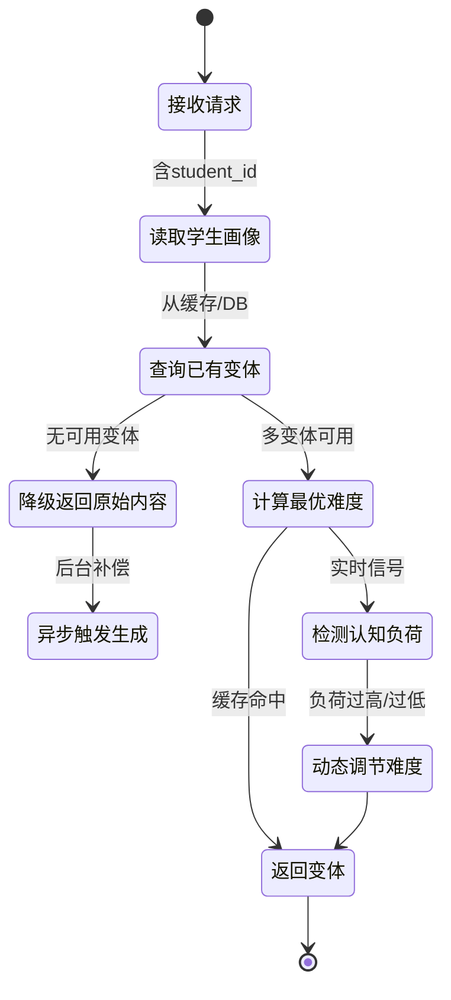

# 服务端-教育内容难度智能分级与多难度变体自动生成引擎 详细设计

## 1. 概述

### 1.1 模块定位

本引擎负责将平台中的教育内容（知识点讲解、题目解析、概念说明、例题演示等）根据学生当前能力水平，**自动生成多个难度层级的变体版本**，实现"同一内容、多种深度"的个性化内容供给。

与现有模块的边界划分：

| 现有模块 | 职责 | 与本引擎区别 |
| --- | --- | --- |
| 题目难度标定与能力评估模型 | 对题目进行难度标注（1-10标度） | 标注已有题目难度，不生成新内容 |
| 练习答题实时自适应难度调节与动态选题 | 从题库中选合适难度题目 | 做选择，不做内容变换 |
| 学生认知负荷监测与学习内容难度动态调节 | 监测学生认知负荷，触发调节 | 是触发方，本引擎是执行方之一 |
| 教育内容适龄性评估与分级 | 评估内容是否适合某年龄段 | 关注适龄性，非难度变换 |
| AI题目智能生成引擎 | 从零生成全新题目 | 本引擎不生成新题，而是变换已有内容 |

### 1.2 核心职责

1. **内容难度评估**：对输入的教育内容进行难度量化评估。
2. **多难度变体生成**：基于原始内容，通过AI生成"简化版""标准版""进阶版"等不同难度层级的变体。
3. **变体质量校验**：确保变体内容的学科准确性、知识完整性和表达适龄性。
4. **变体匹配服务**：根据学生能力画像，返回最匹配的难度版本。
5. **变体生命周期管理**：支持变体的缓存、失效、更新和版本追踪。

### 1.3 依赖关系

```
┌─────────────────────────────────────────────────────────┐
│              难度智能分级与多难度变体生成引擎               │
└──────────────┬──────────────────────────────────────────┘
               │
    ┌──────────┼──────────────┬──────────────┬────────────┐
    ▼          ▼              ▼              ▼            ▼
┌────────┐ ┌─────────┐ ┌──────────┐ ┌────────────┐ ┌────────┐
│ AI模型 │ │ 知识追踪 │ │ 内容审核  │ │ 学生能力   │ │ 内容存 │
 │ 调度层 │ │ 模型引擎 │ │ 过滤管线  │ │ 画像服务   │ │ 储服务 │
└────────┘ └─────────┘ └──────────┘ └────────────┘ └────────┘
```

- **上游输入**：内容管理服务（原始内容）、学生画像服务（能力数据）、认知负荷监测（实时难度调节信号）
- **下游消费**：同步课堂学习、AI辅导对话、练习系统、复习材料生成
- **外部依赖**：大模型API（内容变换）、向量数据库（相似内容检索）、内容安全审核服务

---

## 2. 难度分级体系

### 2.1 难度维度模型

采用 **多维难度模型**，而非单一标度：

```json
{
  "difficulty_dimensions": {
    "conceptual_depth": {
      "label": "概念深度",
      "levels": [1, 2, 3, 4, 5],
      "description": "涉及的概念抽象程度和逻辑层次"
    },
    "computational_complexity": {
      "label": "计算复杂度",
      "levels": [1, 2, 3, 4, 5],
      "description": "所需计算步骤数和运算难度"
    },
    "contextual_richness": {
      "label": "情境丰富度",
      "levels": [1, 2, 3, 4, 5],
      "description": "背景信息的复杂度和干扰项数量"
    },
    "expression_style": {
      "label": "表达风格",
      "levels": ["concrete", "mixed", "abstract"],
      "description": "生活化 → 抽象化的表达谱系"
    },
    "knowledge_breadth": {
      "label": "知识广度",
      "levels": [1, 2, 3, 4, 5],
      "description": "涉及知识点数量和跨章节程度"
    }
  }
}
```

### 2.2 难度等级映射

将多维难度映射为面向用户的统一难度等级：

| 等级 | 标签 | 目标受众 | 典型特征 |
| --- | --- | --- | --- |
| L1 | 基础版 | 预习/初学/薄弱基础 | 全生活化例子、分步详细、零跳步、口语化 |
| L2 | 标准版 | 课堂同步学习 | 部分抽象、适度跳步、含公式推导 |
| L3 | 进阶版 | 课后巩固/提升 | 较多抽象、省略中间步骤、涉及变式 |
| L4 | 拔高版 | 专题突破/竞赛预备 | 完全抽象化、多知识点综合、含拓展方法 |

### 2.3 学科难度调节因子

不同学科的难度维度权重不同：

```json
{
  "subject_weights": {
    "math": {
      "conceptual_depth": 0.35,
      "computational_complexity": 0.30,
      "contextual_richness": 0.10,
      "expression_style": 0.05,
      "knowledge_breadth": 0.20
    },
    "physics": {
      "conceptual_depth": 0.30,
      "computational_complexity": 0.25,
      "contextual_richness": 0.15,
      "expression_style": 0.05,
      "knowledge_breadth": 0.25
    },
    "chinese": {
      "conceptual_depth": 0.20,
      "computational_complexity": 0.05,
      "contextual_richness": 0.35,
      "expression_style": 0.25,
      "knowledge_breadth": 0.15
    },
    "english": {
      "conceptual_depth": 0.15,
      "computational_complexity": 0.05,
      "contextual_richness": 0.30,
      "expression_style": 0.30,
      "knowledge_breadth": 0.20
    }
  }
}
```

---

## 3. 数据模型

### 3.1 核心实体 ER 图

```
┌─────────────────────┐     ┌──────────────────────────┐     ┌──────────────────────┐
│   content_items      │     │   content_variants        │     │  variant_requests    │
│─────────────────────│     │──────────────────────────│     │──────────────────────│
│ id (PK)              │◄──┐│ id (PK)                   │◄──┐│ id (PK)               │
│ source_type          │   ││ content_item_id (FK)      │   ││ content_item_id (FK)  │
│ source_id            │   ││ difficulty_level (L1-L4)  │   ││ requested_levels      │
│ content_hash         │   ││ difficulty_scores (JSON)  │   ││ trigger_source        │
│ subject              │   ││ variant_content (TEXT)    │   ││ student_id            │
│ grade_range          │   ││ variant_format            │   ││ ability_snapshot      │
│ base_difficulty      │   ││ transformation_meta(JSON) │   ││ status                │
│ status               │   ││ quality_score             │   ││ created_at            │
│ created_at           │   ││ safety_check_status       │   ││ completed_at          │
│ updated_at           │   ││ version                   │   ││ error_info            │
└─────────────────────┘   ││ created_at                │   │└──────────────────────┘
                           ││ updated_at                │   │
                           ││ expires_at                │   │
                           │└──────────────────────────│   │
                           └────────────────────────────┘   │
                                                            │
                           ┌──────────────────────────┐     │
                           │   variant_usage_logs      │     │
                           │──────────────────────────│     │
                           │ id (PK)                   │     │
                           │ variant_id (FK)           │     │
                           │ student_id                │     │
                           │ served_difficulty          │     │
                           │ engagement_metrics (JSON) │     │
                           │ effectiveness_score        │     │
                           │ served_at                 │     │
                           └──────────────────────────┘
```

### 3.2 数据库表结构

#### 3.2.1 content_variants 表

```sql
CREATE TABLE content_variants (
    id              BIGINT PRIMARY KEY AUTO_INCREMENT,
    content_item_id BIGINT NOT NULL COMMENT '关联内容项ID',
    difficulty_level TINYINT NOT NULL COMMENT '难度等级 1-4 (L1基础-L4拔高)',

    -- 多维难度评分
    difficulty_scores JSON NOT NULL COMMENT '{
        "conceptual_depth": 1-5,
        "computational_complexity": 1-5,
        "contextual_richness": 1-5,
        "expression_style": "concrete|mixed|abstract",
        "knowledge_breadth": 1-5
    }',

    -- 变体内容
    variant_content  LONGTEXT NOT NULL COMMENT '变换后的内容主体',
    variant_summary  VARCHAR(500) COMMENT '变体摘要',
    variant_format   VARCHAR(20) NOT NULL DEFAULT 'markdown' COMMENT 'markdown|html|structured_json',

    -- 生成元信息
    transformation_meta JSON NOT NULL COMMENT '{
        "model": "模型标识",
        "prompt_version": "Prompt版本号",
        "transform_strategy": "simplify|enrich|restructure",
        "source_difficulty": "原始难度",
        "target_difficulty": "目标难度",
        "transformations_applied": ["具体变换操作列表"]
    }',

    -- 质量与安全
    quality_score    DECIMAL(4,2) DEFAULT 0 COMMENT '质量评分 0-100',
    safety_check_status VARCHAR(20) DEFAULT 'pending' COMMENT 'pending|passed|failed|reviewing',
    safety_check_detail JSON COMMENT '安全审核详情',

    -- 生命周期
    status           VARCHAR(20) DEFAULT 'active' COMMENT 'active|deprecated|draft|reviewing',
    version          INT DEFAULT 1 COMMENT '版本号',
    parent_variant_id BIGINT COMMENT '上一版本ID（用于版本追踪）',

    created_at       TIMESTAMP DEFAULT CURRENT_TIMESTAMP,
    updated_at       TIMESTAMP DEFAULT CURRENT_TIMESTAMP ON UPDATE CURRENT_TIMESTAMP,
    expires_at       TIMESTAMP NULL COMMENT '过期时间（教材更新触发）',

    INDEX idx_content_level (content_item_id, difficulty_level, status),
    INDEX idx_quality (quality_score),
    INDEX idx_safety (safety_check_status),
    INDEX idx_expires (expires_at)
) ENGINE=InnoDB DEFAULT CHARSET=utf8mb4 COMMENT='内容难度变体表';
```

#### 3.2.2 variant_generation_tasks 表

```sql
CREATE TABLE variant_generation_tasks (
    id              BIGINT PRIMARY KEY AUTO_INCREMENT,
    content_item_id BIGINT NOT NULL,
    target_levels   JSON NOT NULL COMMENT '["L1","L3"] 目标难度等级列表',
    trigger_source  VARCHAR(50) NOT NULL COMMENT 'manual|auto_batch|realtime|grade_change',
    priority        INT DEFAULT 5 COMMENT '1最高 9最低',

    -- 生成上下文
    subject         VARCHAR(20) NOT NULL,
    grade_range     VARCHAR(20) NOT NULL,
    source_content_hash VARCHAR(64) NOT NULL COMMENT '源内容Hash，用于判断是否需重新生成',

    -- 执行状态
    status          VARCHAR(30) DEFAULT 'pending'
                    COMMENT 'pending|processing|partially_completed|completed|failed|cancelled',
    progress        JSON COMMENT '{"L1": "completed", "L3": "processing", ...}',
    completed_variants JSON COMMENT '已完成的变体ID列表',

    -- 错误信息
    error_info      JSON COMMENT '{"level": "L1", "error_type": "model_timeout", "message": "..."}',
    retry_count     INT DEFAULT 0,
    max_retries     INT DEFAULT 3,

    created_at      TIMESTAMP DEFAULT CURRENT_TIMESTAMP,
    started_at      TIMESTAMP NULL,
    completed_at    TIMESTAMP NULL,

    INDEX idx_status_priority (status, priority),
    INDEX idx_content (content_item_id),
    INDEX idx_source_hash (source_content_hash)
) ENGINE=InnoDB DEFAULT CHARSET=utf8mb4 COMMENT='变体生成任务表';
```

#### 3.2.3 variant_usage_logs 表

```sql
CREATE TABLE variant_usage_logs (
    id              BIGINT PRIMARY KEY AUTO_INCREMENT,
    variant_id      BIGINT NOT NULL,
    content_item_id BIGINT NOT NULL,
    student_id      BIGINT NOT NULL,
    served_level    TINYINT NOT NULL COMMENT '实际服务的难度等级',

    -- 参与度指标
    engagement_metrics JSON COMMENT '{
        "read_time_seconds": 120,
        "scroll_depth": 0.85,
        "re_read_count": 0,
        "highlight_count": 2,
        "ask_followup": false
    }',

    -- 效果评分
    effectiveness_score DECIMAL(4,2) COMMENT '基于后续答题正确率计算的变体效果',
    student_feedback TINYINT COMMENT '学生反馈: -1太难, 0合适, 1太简单',

    served_at       TIMESTAMP DEFAULT CURRENT_TIMESTAMP,

    INDEX idx_variant (variant_id),
    INDEX idx_student (student_id),
    INDEX idx_content_student (content_item_id, student_id)
) ENGINE=InnoDB DEFAULT CHARSET=utf8mb4 COMMENT='变体使用日志表';
```

### 3.3 缓存策略

```json
{
  "cache_layers": {
    "l1_memory": {
      "type": "LRU",
      "ttl": "5min",
      "max_entries": 2000,
      "key_pattern": "variant:{content_item_id}:{difficulty_level}",
      "description": "热点内容变体本地内存缓存"
    },
    "l2_redis": {
      "ttl": "1h",
      "key_pattern": "variant:{content_item_id}:{difficulty_level}:v{version}",
      "description": "全量变体Redis缓存，版本化Key"
    },
    "l3_db": {
      "description": "持久化存储，通过status和expires_at管理有效性"
    }
  },
  "cache_invalidation": {
    "on_content_update": "源内容更新时，异步触发对应变体重新生成",
    "on_textbook_change": "教材版本切换时，批量失效关联变体",
    "on_quality_drop": "质量评分低于阈值时，标记为deprecated并触发重新生成"
  }
}
```

---

## 4. API 接口设计

### 4.1 接口总览

| API | 方法 | 路径 | 说明 |
| --- | --- | --- | --- |
| 获取适配难度变体 | POST | `/api/v1/content-variant/serve` | 根据学生能力返回最匹配的难度版本 |
| 指定难度获取变体 | GET | `/api/v1/content-variant/{contentItemId}` | 按指定难度等级获取变体 |
| 触发变体生成 | POST | `/api/v1/content-variant/generate` | 手动/系统触发生成任务 |
| 查询生成任务状态 | GET | `/api/v1/content-variant/task/{taskId}` | 查询批量生成进度 |
| 变体质量校验 | POST | `/api/v1/content-variant/{variantId}/validate` | 触发质量重新校验 |
| 变体效果反馈 | POST | `/api/v1/content-variant/{variantId}/feedback` | 上报变体使用效果 |
| 变体列表查询 | GET | `/api/v1/content-variant/{contentItemId}/list` | 查看某内容的全部变体 |
| 批量预热 | POST | `/api/v1/content-variant/preheat` | 预生成热门内容的变体 |

### 4.2 核心接口详情

#### 4.2.1 获取适配难度变体

**POST** `/api/v1/content-variant/serve`

根据学生当前能力画像、认知负荷状态和学习场景，返回最合适难度的内容变体。

**请求体：**

```json
{
  "content_item_id": 98765,
  "student_id": 12345,
  "scene": "sync_classroom",
  "context": {
    "knowledge_point_id": "kp_math_0712",
    "recent_mastery": 0.45,
    "cognitive_load": 0.72,
    "session_duration_min": 25,
    "subject": "math",
    "grade": "初二"
  },
  "force_level": null,
  "prefer_cache": true
}
```

**响应体：**

```json
{
  "code": 0,
  "data": {
    "variant_id": 54321,
    "difficulty_level": 1,
    "difficulty_scores": {
      "conceptual_depth": 2,
      "computational_complexity": 1,
      "contextual_richness": 2,
      "expression_style": "concrete",
      "knowledge_breadth": 1
    },
    "variant_content": "## 二次函数的开口方向\n\n想象一下你往天上扔一个球...",
    "variant_summary": "用生活化例子引入二次函数开口方向的概念",
    "quality_score": 87.5,
    "served_reason": "学生近期掌握度0.45（薄弱），认知负荷0.72（偏高），自动降级至L1基础版",
    "fallback_applied": false,
    "cache_hit": true
  }
}
```

#### 4.2.2 触发变体生成

**POST** `/api/v1/content-variant/generate`

**请求体：**

```json
{
  "content_item_id": 98765,
  "target_levels": ["L1", "L3", "L4"],
  "priority": 3,
  "trigger_source": "auto_batch",
  "generation_config": {
    "model": "glm-5",
    "temperature": 0.3,
    "max_tokens": 2000,
    "preserve_keywords": ["二次函数", "开口方向", "对称轴"],
    "subject_constraints": {
      "math": {
        "allow_calculator_steps": true,
        "formula_notation": "latex"
      }
    }
  }
}
```

**响应体：**

```json
{
  "code": 0,
  "data": {
    "task_id": "vgt-20260715-001",
    "status": "pending",
    "target_levels": ["L1", "L3", "L4"],
    "estimated_completion_seconds": 45
  }
}
```

#### 4.2.3 变体效果反馈

**POST** `/api/v1/content-variant/{variantId}/feedback`

```json
{
  "student_id": 12345,
  "engagement_metrics": {
    "read_time_seconds": 180,
    "scroll_depth": 1.0,
    "re_read_count": 1,
    "highlight_count": 3,
    "ask_followup": true,
    "followup_question": "那如果a是负数呢？"
  },
  "student_feedback": 0,
  "post_quiz_correct_rate": 0.8
}
```

### 4.3 错误码定义

| 错误码 | HTTP Status | 含义 | 处理建议 |
| --- | --- | --- | --- |
| `VARIANT_NOT_FOUND` | 404 | 内容项无可用变体 | 返回原始内容，后台触发生成 |
| `VARIANT_GENERATION_FAILED` | 500 | AI模型生成失败 | 降级返回原始内容或最近难度版本 |
| `VARIANT_SAFETY_REJECTED` | 422 | 变体未通过安全审核 | 返回原始内容，记录审核日志 |
| `VARIANT_QUALITY_LOW` | 422 | 变体质量分低于阈值 | 返回原始内容，标记需重新生成 |
| `TASK_DUPLICATE` | 409 | 相同生成任务已存在 | 返回已有任务ID |
| `CONTENT_HASH_MISMATCH` | 409 | 源内容已变更，变体过期 | 触发重新生成 |
| `MODEL_RATE_LIMITED` | 429 | AI模型调用频率受限 | 排队，返回预计完成时间 |
| `STUDENT_PROFILE_MISSING` | 400 | 学生能力画像不存在 | 降级返回L2标准版 |

---

## 5. 核心业务流程

### 5.1 变体生成全流程

```
 ┌──────────┐    ┌───────────┐    ┌────────────┐    ┌────────────┐    ┌───────────┐
 │ 内容变更  │───▶│ 难度评估   │───▶│ 变换策略选 │───▶│ AI多级变换 │───▶│ 质量校验  │
 │ 触发      │    │ (原始内容) │    │ 择与编排   │    │ 执行       │    │ 管线      │
 └──────────┘    └───────────┘    └────────────┘    └────────────┘    └─────┬─────┘
                                                                            │
                                              ┌─────────────────────────────┘
                                              ▼
                                       ┌────────────┐    ┌────────────┐    ┌───────────┐
                                       │ 安全审核    │───▶│ 入库缓存   │───▶│ 就绪通知  │
                                       │ 过滤管线    │    │ 版本管理   │    │ (下游消费) │
                                       └────────────┘    └────────────┘    └───────────┘
```

**详细步骤：**

1. **触发**：内容创建/更新、教材版本切换、批量预热、手动触发。
2. **难度评估**：AI模型对原始内容进行多维难度评分。
3. **变换策略选择**：根据目标难度等级和源内容难度差，确定变换操作序列。
4. **AI变换执行**：按策略调用大模型生成变体内容。
5. **质量校验**：知识点完整性检查、数值/公式准确性验证、逻辑连贯性评估。
6. **安全审核**：内容安全过滤、适龄性检查、价值观合规。
7. **入库缓存**：持久化 + 多级缓存写入。
8. **就绪通知**：通过事件总线通知下游服务。

### 5.2 实时变体匹配流程



### 5.3 难度匹配算法

```python
def calculate_optimal_difficulty(
    student_mastery: float,      # 知识点掌握度 [0, 1]
    cognitive_load: float,       # 当前认知负荷 [0, 1]
    learning_stage: str,         # preview | learn | review | exam_prep
    historical_effectiveness: dict  # {level: avg_effectiveness_score}
) -> int:
    """
    计算最优难度等级 (1-4)
    基于 Vygotsky 最近发展区理论：内容应略高于当前水平
    """

    # 基础难度：基于掌握度
    if student_mastery < 0.3:
        base_level = 1  # 基础版
    elif student_mastery < 0.6:
        base_level = 2  # 标准版
    elif student_mastery < 0.85:
        base_level = 3  # 进阶版
    else:
        base_level = 4  # 拔高版

    # 认知负荷调节
    if cognitive_load > 0.8:
        base_level = max(1, base_level - 1)  # 降一级
    elif cognitive_load < 0.3 and learning_stage == "review":
        base_level = min(4, base_level + 1)  # 升一级

    # 学习阶段调节
    stage_adjustments = {
        "preview": -1,    # 预习阶段降一级
        "learn": 0,       # 学习阶段不变
        "review": 0,      # 复习阶段不变
        "exam_prep": 1,   # 备考阶段升一级
    }
    base_level = max(1, min(4, base_level + stage_adjustments.get(learning_stage, 0)))

    # 历史效果反馈调节
    if historical_effectiveness:
        best_level = max(
            historical_effectiveness,
            key=lambda k: historical_effectiveness[k]
        )
        best_level_int = int(best_level.replace("L", ""))
        # 向历史最优难度靠拢，但不跳变超过1级
        if abs(best_level_int - base_level) <= 1:
            base_level = best_level_int

    return base_level
```

### 5.4 变换策略矩阵

源难度到目标难度的变换策略选择：

| 源难度 → 目标 | 变换方向 | 核心策略 |
| --- | --- | --- |
| L2 → L1 | 简化 | 生活化替换、补全跳步、口语化表达、去除抽象符号 |
| L2 → L3 | 增强 | 省略中间步骤、增加变式拓展、引入抽象表达、添加综合应用 |
| L2 → L4 | 大幅增强 | 完全重构、多知识点交叉、竞赛级深度、方法论提炼 |
| L3 → L1 | 大幅简化 | 概念拆解、逐字解释、大量类比、公式含义展开 |
| L1 → L4 | 逐级递进 | 不直接跳级，走 L1→L2→L3→L4 链式生成 |

**链式生成规则**：跨度超过2级时，采用链式中间变换，避免单次变换幅度过大导致质量下降。

---

## 6. AI驱动的内容变换引擎

### 6.1 Prompt 模板体系

```yaml
# 变换策略: L2 → L1 (简化)
prompt_template_simplify:
  system: |
    你是一位资深教育内容编辑，擅长将复杂的学科内容转化为学生易懂的解释。
    你的任务是：在保持知识准确性的前提下，将给定的教育内容简化为{target_grade}学生能理解的水平。

    简化规则：
    1. 用生活化场景替换抽象描述（如用"存钱"解释"累加"）
    2. 将每个推理步骤拆开，不跳过任何中间步骤
    3. 公式旁边必须附带文字解释和代入示例
    4. 避免使用未经解释的专业术语，如必须使用则添加括号注释
    5. 句子长度控制在20字以内，使用口语化表达
    6. 保留所有必须的知识点关键词: {preserve_keywords}
    7. 不得删除原始内容中的核心结论和公式

    输出格式：Markdown，含公式LaTeX

  user: |
    学科：{subject}
    目标学段：{target_grade}
    知识点：{knowledge_points}

    原始内容：
    ---
    {source_content}
    ---

    请输出简化后的内容。简化前后必须覆盖完全相同的知识点集合。

# 变换策略: L2 → L3 (增强)
prompt_template_enrich:
  system: |
    你是一位学科教育专家，擅长在基础内容上拓展深度和广度。
    你的任务是：在保持核心知识不变的前提下，将教育内容增强为进阶版本。

    增强规则：
    1. 压缩基础概念的详细解释，仅保留要点
    2. 增加变式题型和拓展应用场景
    3. 引入更高阶的解题方法和技巧
    4. 添加与其他知识点的综合应用示例
    5. 适当使用学科术语和符号化表达
    6. 在关键步骤后添加"易错提醒"
    7. 补充"方法总结"和"解题策略"模块
    8. 保留所有核心知识结论

    输出格式：Markdown，含公式LaTeX

  user: |
    学科：{subject}
    目标学段：{target_grade}
    知识点：{knowledge_points}
    原始内容难度评估：{source_difficulty_scores}

    原始内容：
    ---
    {source_content}
    ---

    请输出增强后的进阶版内容。
```

### 6.2 变换执行器

```java
/**
 * 内容变体生成执行器
 * 负责调用AI模型执行具体的内容变换操作
 */
@Service
@Slf4j
public class VariantGenerationExecutor {

    @Autowired
    private AIModelDispatcher modelDispatcher;

    @Autowired
    private PromptTemplateManager promptManager;

    @Autowired
    private VariantQualityChecker qualityChecker;

    @Autowired
    private ContentSafetyFilter safetyFilter;

    /**
     * 执行单难度级别的变体生成
     */
    public GenerationResult generateVariant(
            ContentItem sourceContent,
            int targetLevel,
            GenerationConfig config
    ) {
        // 1. 评估原始内容难度
        DifficultyAssessment sourceDifficulty = assessDifficulty(sourceContent);

        // 2. 选择变换路径（直接 or 链式）
        TransformationPath path = planTransformationPath(
            sourceDifficulty.getOverallLevel(),
            targetLevel
        );

        // 3. 构建Prompt
        String prompt = buildPrompt(sourceContent, path, config);

        // 4. 调用AI模型（支持重试和模型降级）
        String generatedContent = callModelWithFallback(prompt, config);

        // 5. 知识点完整性校验
        ValidationResult validation = qualityChecker.validateKnowledgeCompleteness(
            sourceContent,
            generatedContent,
            config.getPreserveKeywords()
        );

        if (!validation.isPassed()) {
            // 补全缺失的知识点
            generatedContent = qualityChecker.repairMissingKnowledge(
                generatedContent,
                validation.getMissingPoints()
            );
        }

        // 6. 难度评分校验（目标难度是否实际达成）
        DifficultyAssessment targetDifficulty = assessDifficulty(
            ContentItem.fromText(generatedContent)
        );

        if (Math.abs(targetDifficulty.getOverallLevel() - targetLevel) > 1) {
            // 目标难度偏差过大，调整后重新生成
            log.warn("难度偏差: 目标L{}, 实际L{}, 重新调整", targetLevel, targetDifficulty.getOverallLevel());
            generatedContent = regenerateWithAdjustment(prompt, targetLevel, targetDifficulty);
        }

        return GenerationResult.builder()
            .content(generatedContent)
            .sourceDifficulty(sourceDifficulty)
            .targetDifficulty(targetDifficulty)
            .transformPath(path.toString())
            .qualityScore(validation.getQualityScore())
            .build();
    }

    /**
     * 链式变换：当跨度>2级时，通过中间级别逐步变换
     */
    private String chainTransform(
            ContentItem source,
            int sourceLevel,
            int targetLevel,
            GenerationConfig config
    ) {
        int currentLevel = sourceLevel;
        String currentContent = source.getContent();

        List<Integer> intermediateLevels = calculateIntermediateSteps(sourceLevel, targetLevel);

        for (int step : intermediateLevels) {
            ContentItem stepContent = ContentItem.fromText(currentContent);
            GenerationResult stepResult = generateVariant(
                stepContent, step, config
            );
            currentContent = stepResult.getContent();
            currentLevel = step;

            // 每步质量检查
            if (stepResult.getQualityScore() < config.getMinQualityThreshold()) {
                log.warn("链式变换第{}步质量不达标: {}", step, stepResult.getQualityScore());
                // 使用上一步结果 + 记录降级
                break;
            }
        }

        return currentContent;
    }

    /**
     * 模型调用 + 降级策略
     */
    private String callModelWithFallback(String prompt, GenerationConfig config) {
        try {
            // 首选模型
            return modelDispatcher.call(
                config.getModel(),
                prompt,
                ModelCallOptions.builder()
                    .temperature(config.getTemperature())
                    .maxTokens(config.getMaxTokens())
                    .timeout(Duration.ofSeconds(30))
                    .build()
            );
        } catch (ModelCallException e) {
            log.warn("首选模型调用失败，降级到备选模型: {}", e.getMessage());
            // 降级到通用模型
            return modelDispatcher.call(
                "gpt-4o-mini",  // 备选模型
                prompt,
                ModelCallOptions.builder()
                    .temperature(config.getTemperature())
                    .maxTokens(config.getMaxTokens())
                    .timeout(Duration.ofSeconds(45))
                    .build()
            );
        }
    }
}
```

### 6.3 质量校验管线

```java
/**
 * 变体质量校验器
 */
@Service
public class VariantQualityChecker {

    /**
     * 知识点完整性校验
     * 确保变体内容覆盖了原始内容中的所有核心知识点
     */
    public ValidationResult validateKnowledgeCompleteness(
            ContentItem source,
            String variantContent,
            List<String> preserveKeywords
    ) {
        ValidationResult result = new ValidationResult();

        // 1. 关键词覆盖检查
        List<String> missingKeywords = preserveKeywords.stream()
            .filter(kw -> !variantContent.contains(kw))
            .collect(Collectors.toList());

        // 2. 知识点实体提取与比对
        Set<KnowledgeEntity> sourceEntities = knowledgeExtractor.extract(source.getContent());
        Set<KnowledgeEntity> variantEntities = knowledgeExtractor.extract(variantContent);

        Set<KnowledgeEntity> missingEntities = Sets.difference(sourceEntities, variantEntities);

        // 3. 核心结论验证
        List<String> sourceConclusions = conclusionExtractor.extract(source.getContent());
        ConclusionCheckResult conclusionResult = verifyConclusions(
            sourceConclusions,
            variantContent
        );

        // 4. 数值/公式一致性检查
        FormulaConsistencyResult formulaCheck = verifyFormulas(
            source.getContent(),
            variantContent
        );

        // 综合评分
        double score = calculateQualityScore(
            missingKeywords.size(),
            missingEntities.size(),
            conclusionResult.getCoverageRate(),
            formulaCheck.getConsistencyRate()
        );

        result.setPassed(score >= 60.0);
        result.setQualityScore(score);
        result.setMissingKeywords(missingKeywords);
        result.setMissingEntities(missingEntities);
        result.setFormulaIssues(formulaCheck.getIssues());

        return result;
    }

    private double calculateQualityScore(
            int missingKeywordCount,
            int missingEntityCount,
            double conclusionCoverage,
            double formulaConsistency
    ) {
        // 加权评分
        double keywordScore = Math.max(0, 100 - missingKeywordCount * 15);
        double entityScore = Math.max(0, 100 - missingEntityCount * 10);
        double conclusionScore = conclusionCoverage * 100;
        double formulaScore = formulaConsistency * 100;

        return keywordScore * 0.25
             + entityScore * 0.20
             + conclusionScore * 0.30
             + formulaScore * 0.25;
    }
}
```

---

## 7. 多版本内容存储与服务层

### 7.1 内容版本管理

```java
/**
 * 变体版本管理器
 * 管理同一内容项的多个难度变体及其版本迭代
 */
@Service
public class VariantVersionManager {

    /**
     * 获取内容项的活跃变体列表
     */
    public List<ContentVariant> getActiveVariants(Long contentItemId) {
        return variantMapper.selectActiveByContentItem(contentItemId).stream()
            .filter(v -> v.getSafetyCheckStatus().equals("passed"))
            .filter(v -> v.getQualityScore() >= MIN_QUALITY_THRESHOLD)
            .collect(Collectors.toList());
    }

    /**
     * 源内容更新时的变体失效处理
     */
    @EventListener
    public void onContentUpdated(ContentUpdatedEvent event) {
        Long contentItemId = event.getContentItemId();
        String newHash = event.getNewContentHash();

        List<ContentVariant> existingVariants = getActiveVariants(contentItemId);

        for (ContentVariant variant : existingVariants) {
            // 标记为过期
            variant.setStatus("deprecated");
            variant.setExpiresAt(LocalDateTime.now());
            variantMapper.updateById(variant);
        }

        // 异步触发重新生成
        if (event.isAutoRegenerate()) {
            generationTaskService.submitBatch(
                contentItemId,
                existingVariants.stream()
                    .map(ContentVariant::getDifficultyLevel)
                    .distinct()
                    .collect(Collectors.toList()),
                "content_update"
            );
        }

        // 清除缓存
        cacheService.invalidateByPattern("variant:" + contentItemId + ":*");
    }
}
```

### 7.2 变体匹配服务

```java
/**
 * 变体匹配服务
 * 根据学生画像和上下文返回最优难度变体
 */
@Service
@Slf4j
public class VariantMatchingService {

    @Autowired
    private VariantCacheService cacheService;

    @Autowired
    private StudentProfileClient profileClient;

    @Autowired
    private CognitiveLoadClient cognitiveLoadClient;

    @Autowired
    private VariantUsageLogger usageLogger;

    /**
     * 获取适配的变体
     */
    public VariantServeResult serveVariant(VariantServeRequest request) {
        Long contentItemId = request.getContentItemId();
        Long studentId = request.getStudentId();

        // 1. 获取学生能力画像
        StudentAbilityProfile profile = profileClient.getAbilityProfile(
            studentId,
            request.getContext().getSubject(),
            request.getContext().getKnowledgePointId()
        );

        if (profile == null) {
            return serveFallback(contentItemId, "学生画像不存在");
        }

        // 2. 获取认知负荷（如果可用）
        Double cognitiveLoad = cognitiveLoadClient.getRealtimeLoad(studentId);

        // 3. 获取历史效果数据
        Map<String, Double> historicalEffectiveness = usageLogger
            .getHistoricalEffectiveness(contentItemId, studentId);

        // 4. 计算最优难度
        int optimalLevel = DifficultyMatcher.calculateOptimalDifficulty(
            profile.getMastery(),
            cognitiveLoad != null ? cognitiveLoad : 0.5,
            request.getScene(),
            historicalEffectiveness
        );

        // 如果指定了强制难度，使用强制值
        if (request.getForceLevel() != null) {
            optimalLevel = request.getForceLevel();
        }

        // 5. 从缓存/DB获取变体
        ContentVariant variant = cacheService.getVariant(contentItemId, optimalLevel);

        if (variant == null) {
            // 无可用变体，触发异步生成 + 降级返回
            generationTaskService.submitAsync(contentItemId, optimalLevel, "realtime_miss");
            return serveFallback(contentItemId,
                String.format("L%d变体未生成，返回原始内容", optimalLevel));
        }

        // 6. 记录使用日志
        usageLogger.logUsage(VariantUsageLog.builder()
            .variantId(variant.getId())
            .contentItemId(contentItemId)
            .studentId(studentId)
            .servedLevel(optimalLevel)
            .servedReason(buildServeReason(profile, cognitiveLoad, optimalLevel))
            .build());

        return VariantServeResult.success(variant, optimalLevel);
    }

    /**
     * 降级返回原始内容
     */
    private VariantServeResult serveFallback(Long contentItemId, String reason) {
        log.info("变体降级: contentItemId={}, reason={}", contentItemId, reason);
        ContentItem original = contentItemService.getById(contentItemId);
        return VariantServeResult.fallback(original, reason);
    }
}
```

---

## 8. 状态机定义

### 8.1 变体生成任务状态机

```
                        ┌───────────┐
                        │  pending   │
                        └─────┬─────┘
                              │ (worker pickup)
                              ▼
                        ┌───────────┐
              ┌────────│ processing │
              │         └─────┬─────┘
              │               │
     (error)  │       ┌───────┴───────┐
     retry<max│       │               │
              ▼       │ (some done)   │ (all done)
        ┌──────────┐  ▼               ▼
        │processing│ ┌──────────┐  ┌─────────┐
        │(retry)   │ │ partially│  │completed│
        └──────────┘ │completed │  └─────────┘
                     └────┬─────┘       │
                     (continue)         │
                          │             │
                          └......      │
                                        ▼
                                   ┌─────────┐
                              ┌───▶│  closed │
                              │    └─────────┘
                              │
        ┌──────────┐          │
        │ failed   │──────────┘
        │(max retry)│  (人工介入后重新触发)
        └──────────┘

        ┌──────────┐
        │cancelled │  (外部取消)
        └──────────┘
```

### 8.2 变体内容状态机

```
 ┌────────┐     (AI生成完成)     ┌───────────┐    (安全审核通过)    ┌────────┐
 │ draft  │────────────────────▶│ reviewing │───────────────────▶│ active │
 └────────┘                     └─────┬─────┘                    └────┬───┘
                                      │                               │
                                (安全审核失败)                  (源内容更新)
                                      │                               │
                                      ▼                               ▼
                                ┌───────────┐                  ┌───────────┐
                                │  blocked  │                  │ deprecated│
                                └───────────┘                  └─────┬─────┘
                                                                     │
                                                               (重新生成完成)
                                                                     │
                                                                     ▼
                                                               ┌───────────┐
                                                               │ active    │
                                                               │(new ver)  │
                                                               └───────────┘
```

---

## 9. 错误处理与降级策略

### 9.1 错误处理矩阵

| 错误场景 | 检测方式 | 处理策略 | 用户感知 |
| --- | --- | --- | --- |
| AI模型调用超时 | 30s timeout | 重试1次 → 降级备选模型 → 返回原始内容 | 稍微等待，看到标准内容 |
| AI模型返回空/乱码 | 输出校验 | 重试2次 → 标记任务失败 → 返回原始内容 | 无感知，看到标准内容 |
| 知识点缺失 | 关键词/实体比对 | AI自动补全 → 人工审核队列 | 无感知 |
| 公式/数值错误 | LaTeX解析 + 数值验算 | 标记质量问题 → 降级返回原始内容 | 无感知 |
| 安全审核拦截 | 内容安全管线 | 变体标记blocked → 返回原始内容 → 告警 | 无感知 |
| 缓存击穿 | Redis空值标记 | 单flight机制 + 异步生成 | 首次访问稍慢 |
| 生成任务积压 | 队列深度监控 | 动态调整优先级 + 扩容Worker | 低优先级内容延迟可用 |

### 9.2 降级链

```
请求变体 L1
  ├─▶ 缓存命中 → 直接返回 ✅
  ├─▶ 缓存未命中 → DB查询
  │     ├─▶ DB有活跃变体 → 回填缓存 → 返回 ✅
  │     └─▶ DB无活跃变体 → 触发异步生成
  │           ├─▶ 查找相近难度变体 (L2) → 返回 + 标注"降级使用" ✅
  │           └─▶ 无任何变体 → 返回原始内容 + 记录miss ⚠️
  └─▶ 原始内容也不可用 → 返回错误码 → 上层兜底 🚫
```

### 9.3 熔断保护

```java
/**
 * 当AI模型连续失败时，触发熔断保护
 * 在熔断期间直接返回原始内容，不再尝试生成
 */
@Component
public class VariantGenerationCircuitBreaker {

    private final CircuitBreaker circuitBreaker = CircuitBreaker.builder()
        .failureRateThreshold(0.5f)           // 50%失败率触发
        .slowCallRateThreshold(0.6f)          // 60%慢调用触发
        .slowCallDurationThreshold(Duration.ofSeconds(20))
        .waitDurationInOpenState(Duration.ofMinutes(5))  // 开路5分钟
        .permittedNumberOfCallsInHalfOpenState(3)
        .slidingWindowSize(20)
        .minimumNumberOfCalls(10)
        .build();

    public <T> T executeWithCircuitBreaker(Supplier<T> operation, Supplier<T> fallback) {
        return Decorators.ofSupplier(operation)
            .withCircuitBreaker(circuitBreaker)
            .withFallback(
                List.of(
                    CallNotPermittedException.class,
                    ModelCallException.class,
                    TimeoutException.class
                ),
                ex -> fallback.get()
            )
            .get();
    }
}
```

---

## 10. 性能优化

### 10.1 异步预生成策略

```java
/**
 * 热门内容变体预热调度器
 * 定期分析内容访问热度，提前生成变体
 */
@Component
@Slf4j
public class VariantPreheatScheduler {

    /**
     * 每日凌晨3点执行预热任务
     */
    @Scheduled(cron = "0 0 3 * * ?")
    public void preheatHotContent() {
        // 1. 查询过去7天Top500热门内容（未有多难度变体的）
        List<ContentHeatRanking> hotContents = analyticsService
            .getTopHotContents(500, 7, VariantCoverageStatus.PARTIAL_OR_NONE);

        // 2. 按优先级排序：先处理高访问量 + 零覆盖的
        hotContents.sort(Comparator
            .comparing(ContentHeatRanking::getViewCount).reversed()
            .thenComparing(ContentHeatRanking::getVariantCoverageCount));

        // 3. 批量提交生成任务
        for (ContentHeatRanking content : hotContents) {
            List<Integer> missingLevels = content.getMissingLevels();

            generationTaskService.submitBatch(
                content.getContentItemId(),
                missingLevels,
                "auto_preheat",
                7  // 低优先级
            );

            // 限流：每批最多提交20个任务，避免压垮AI模型
            rateLimiter.acquire("variant_generation", 20);
        }

        log.info("变体预热完成: 处理{}条内容", hotContents.size());
    }

    /**
     * 新内容上架时自动生成L1-L4变体
     */
    @EventListener
    public void onNewContentPublished(ContentPublishedEvent event) {
        if (event.getContentType().isGeneratesVariants()) {
            generationTaskService.submitBatch(
                event.getContentItemId(),
                List.of(1, 2, 3, 4),
                "new_content_auto",
                3  // 中高优先级
            );
        }
    }
}
```

### 10.2 批量生成优化

```java
/**
 * 批量变体生成Worker
 * 采用优先级队列 + 并发控制
 */
@Service
public class BatchVariantWorker {

    @Value("${variant.generation.max_concurrency:5}")
    private int maxConcurrency;

    private final Semaphore concurrencyLimiter = new Semaphore(maxConcurrency);

    /**
     * Worker主循环
     */
    @Scheduled(fixedDelay = 5000)
    public void processTasks() {
        while (concurrencyLimiter.tryAcquire()) {
            VariantGenerationTask task = taskQueue.poll();
            if (task == null) {
                concurrencyLimiter.release();
                break;
            }

            CompletableFuture.runAsync(() -> {
                try {
                    processTask(task);
                } finally {
                    concurrencyLimiter.release();
                }
            }, variantGenerationExecutor);
        }
    }

    private void processTask(VariantGenerationTask task) {
        // 更新状态
        task.setStatus("processing");
        task.setStartedAt(LocalDateTime.now());
        taskMapper.updateById(task);

        try {
            ContentItem source = contentItemService.getById(task.getContentItemId());
            Map<String, Object> progress = new ConcurrentHashMap<>();

            // 并行生成多个级别
            List<CompletableFuture<GenerationResult>> futures = task.getTargetLevels()
                .stream()
                .map(level -> CompletableFuture.supplyAsync(
                    () -> {
                        GenerationResult result = executor.generateVariant(
                            source, level, task.getConfig()
                        );
                        progress.put("L" + level, "completed");
                        taskMapper.updateProgress(task.getId(), progress);
                        return result;
                    },
                    variantGenerationExecutor
                ))
                .collect(Collectors.toList());

            // 等待全部完成
            CompletableFuture.allOf(futures.toArray(new CompletableFuture[0])).join();

            // 处理结果
            List<GenerationResult> results = futures.stream()
                .map(CompletableFuture::join)
                .collect(Collectors.toList());

            // 安全审核 + 入库
            for (GenerationResult result : results) {
                ContentVariant variant = buildVariant(task, result);
                safetyFilter.processAsync(variant);
                variantMapper.insert(variant);
                cacheService.putVariant(variant);
            }

            task.setStatus("completed");
            task.setCompletedAt(LocalDateTime.now());

        } catch (Exception e) {
            log.error("变体生成失败: taskId={}", task.getId(), e);
            handleTaskFailure(task, e);
        }

        taskMapper.updateById(task);
    }
}
```

### 10.3 性能指标

| 指标 | 目标值 | 说明 |
| --- | --- | --- |
| 变体生成延迟（单级别） | < 15s | AI模型调用 + 质量校验 |
| 变体匹配请求延迟 | < 50ms (P99) | 缓存命中场景 |
| 变体匹配请求延迟（缓存未命中） | < 200ms | 含DB查询 |
| 预热覆盖率 | > 80% | 热门内容有变体覆盖 |
| 变体质量评分均值 | > 75 | 100分制 |
| AI模型调用成功率 | > 98% | 含重试和降级 |

---

## 11. 安全与合规

### 11.1 内容安全管线

```java
/**
 * 变体内容安全审核管线
 * 对AI生成的变体内容进行多层安全检查
 */
@Service
public class VariantSafetyPipeline {

    public SafetyCheckResult process(ContentVariant variant) {
        // 阶段1: 敏感词过滤
        SensitiveWordResult sensitiveResult = sensitiveWordFilter.check(variant.getVariantContent());
        if (sensitiveResult.hasHit()) {
            return SafetyCheckResult.blocked("敏感词命中: " + sensitiveResult.getHits());
        }

        // 阶段2: 价值观合规检查
        ValueComplianceResult valueResult = valueComplianceChecker.check(
            variant.getVariantContent(),
            variant.getSubject()
        );
        if (!valueResult.isPassed()) {
            return SafetyCheckResult.blocked("价值观不合规: " + valueResult.getIssues());
        }

        // 阶段3: 适龄性检查
        AgeAppropriatenessResult ageResult = ageAppropriatenessChecker.check(
            variant.getVariantContent(),
            variant.getTargetGradeRange()
        );
        if (!ageResult.isPassed()) {
            // 不阻断，但标记警告
            variant.setSafetyCheckDetail(Map.of("age_warning", ageResult.getWarnings()));
        }

        // 阶段4: AIGC水印
        String watermarked = aigcWatermark.embed(
            variant.getVariantContent(),
            WatermarkInfo.builder()
                .contentItemId(variant.getContentItemId())
                .variantId(variant.getId())
                .modelUsed(variant.getTransformationMeta().getModel())
                .timestamp(Instant.now())
                .build()
        );
        variant.setVariantContent(watermarked);

        return SafetyCheckResult.passed();
    }
}
```

### 11.2 审计日志

```json
{
  "audit_log": {
    "entity_type": "content_variant",
    "entity_id": "54321",
    "actions": [
      {
        "action": "variant_generated",
        "operator": "system",
        "timestamp": "2026-07-15T05:30:00Z",
        "details": {
          "source_content_id": 98765,
          "source_difficulty": "L2",
          "target_difficulty": "L1",
          "model_used": "glm-5",
          "prompt_version": "v2.3",
          "quality_score": 87.5,
          "generation_duration_ms": 12500
        }
      },
      {
        "action": "variant_served",
        "operator": "system",
        "timestamp": "2026-07-15T06:00:00Z",
        "details": {
          "student_id": 12345,
          "served_level": "L1",
          "served_reason": "mastery=0.45, cognitive_load=0.72"
        }
      }
    ]
  }
}
```

---

## 12. 测试策略

### 12.1 单元测试

```java
@DisplayName("难度匹配算法测试")
class DifficultyMatcherTest {

    @Test
    @DisplayName("低掌握度应返回L1基础版")
    void shouldReturnL1ForLowMastery() {
        int level = DifficultyMatcher.calculateOptimalDifficulty(
            0.2,   // mastery
            0.5,   // cognitive_load
            "learn",
            Map.of()
        );
        assertThat(level).isEqualTo(1);
    }

    @Test
    @DisplayName("高认知负荷应自动降级")
    void shouldDowngradeForHighCognitiveLoad() {
        int level = DifficultyMatcher.calculateOptimalDifficulty(
            0.7,   // mastery -> 本应L3
            0.85,  // cognitive_load -> 高
            "learn",
            Map.of()
        );
        assertThat(level).isEqualTo(2);  // 降级到L2
    }

    @Test
    @DisplayName("预习阶段应降一级")
    void shouldDowngradeForPreviewStage() {
        int level = DifficultyMatcher.calculateOptimalDifficulty(
            0.5,
            0.5,
            "preview",
            Map.of()
        );
        assertThat(level).isEqualTo(1);  // L2 -> L1
    }
}
```

### 12.2 集成测试

```java
@SpringBootTest
class VariantGenerationIntegrationTest {

    @Test
    @DisplayName("端到端：源内容→生成L1变体→安全审核→入库→服务匹配")
    void endToEndVariantGeneration() {
        // 1. 准备源内容
        ContentItem source = createTestContent("math", "初二", "二次函数开口方向讲解...");

        // 2. 触发生成
        GenerateResponse resp = variantApi.generate(GenerateRequest.builder()
            .contentItemId(source.getId())
            .targetLevels(List.of("L1"))
            .build());

        // 3. 等待生成完成
        Awaitility.waitAtMost(60, SECONDS).until(() -> {
            TaskStatus status = variantApi.getTaskStatus(resp.getTaskId());
            return "completed".equals(status.getStatus());
        });

        // 4. 验证变体已入库
        List<ContentVariant> variants = variantApi.listVariants(source.getId());
        assertThat(variants).hasSize(1);
        assertThat(variants.get(0).getDifficultyLevel()).isEqualTo(1);
        assertThat(variants.get(0).getSafetyCheckStatus()).isEqualTo("passed");

        // 5. 验证服务匹配
        VariantServeResult serveResult = variantApi.serve(VariantServeRequest.builder()
            .contentItemId(source.getId())
            .studentId(createStudentWithMastery(0.2, "math", "二次函数"))
            .scene("learn")
            .build());

        assertThat(serveResult.getDifficultyLevel()).isEqualTo(1);
    }
}
```

### 12.3 质量回归测试

| 测试维度 | 测试方法 | 通过标准 |
| --- | --- | --- |
| 知识点覆盖率 | 提取源内容知识点实体，检查变体覆盖 | ≥ 90% |
| 公式一致性 | 提取源内容公式，验算变体中数值 | 100% |
| 难度准确度 | 人工标注100样本，对比AI评估 | Pearson相关系数 > 0.8 |
| 内容流畅度 | 困惑度评估 + 人工抽检 | 困惑度 < 阈值，人工评分 ≥ 4/5 |
| 安全合规率 | 全量安全审核 | 100%通过 |

---

## 13. 监控与运维

### 13.1 关键监控指标

```json
{
  "metrics": {
    "variant.generation.total": {
      "type": "counter",
      "labels": ["subject", "target_level", "status"],
      "description": "变体生成总数"
    },
    "variant.generation.duration": {
      "type": "histogram",
      "labels": ["subject", "target_level"],
      "description": "单次变体生成耗时分布",
      "sla": { "p50": "8s", "p99": "20s" }
    },
    "variant.serve.cache_hit_rate": {
      "type": "gauge",
      "description": "变体匹配缓存命中率",
      "sla": { "min": 0.85 }
    },
    "variant.quality.score": {
      "type": "histogram",
      "labels": ["subject", "level"],
      "description": "变体质量评分分布",
      "sla": { "p50": "78", "p10": "60" }
    },
    "variant.safety.rejection_rate": {
      "type": "gauge",
      "description": "安全审核拒绝率",
      "alert": { "threshold": 0.05, "action": "告警值班人员" }
    },
    "variant.queue.depth": {
      "type": "gauge",
      "description": "生成队列深度",
      "alert": { "threshold": 200, "action": "触发扩容" }
    }
  }
}
```

### 13.2 告警规则

| 告警条件 | 级别 | 通知方式 |
| --- | --- | --- |
| 生成成功率连续5分钟 < 90% | P1 | 电话 + 钉钉 |
| 安全审核拒绝率 > 5% | P1 | 钉钉 + 邮件 |
| 队列深度 > 500 持续10分钟 | P2 | 钉钉 |
| 质量评分均值 < 60 | P2 | 钉钉 + 邮件 |
| 缓存命中率 < 70% | P3 | 邮件 |

---

## 14. 部署架构

```
                    ┌─────────────────┐
                    │   API Gateway   │
                    └────────┬────────┘
                             │
              ┌──────────────┼──────────────┐
              ▼              ▼              ▼
     ┌──────────────┐ ┌───────────┐ ┌────────────┐
     │ Variant Serve│ │ Generation│ │ Management │
     │   Service    │ │  Worker   │ │   API      │
     │ (无状态,3实例)│ │ (2-5实例) │ │ (1实例)    │
     └──────┬───────┘ └─────┬─────┘ └─────┬──────┘
            │               │             │
            ▼               ▼             ▼
     ┌──────────┐   ┌──────────┐  ┌──────────┐
     │  Redis   │   │   MQ     │  │  MySQL   │
     │ (缓存)   │   │ (任务队列)│  │ (持久化) │
     └──────────┘   └──────────┘  └──────────┘
                          │
                          ▼
                   ┌──────────────┐
                   │ AI Model     │
                   │ Dispatcher   │
                   │ (多供应商)   │
                   └──────────────┘
```

### 扩缩容策略

| 组件 | 扩缩容触发条件 | 范围 |
| --- | --- | --- |
| Variant Serve | CPU > 60% 或 QPS > 500/实例 | 3 - 10 实例 |
| Generation Worker | 队列深度 > 100 | 2 - 8 实例 |
| Redis | 内存使用 > 70% | 手动扩容 |

---

## 15. 附录

### 15.1 难度评估参考标准

#### 数学学科难度评估细则

| 维度 | 1分 | 3分 | 5分 |
| --- | --- | --- | --- |
| 概念深度 | 基本定义 | 多概念组合 | 抽象证明 |
| 计算复杂度 | 四则运算 | 多步推导 | 含参数讨论 |
| 情境丰富度 | 纯计算题 | 简单应用题 | 复杂实际场景 |
| 知识广度 | 单一知识点 | 2-3个知识点 | 跨章节综合 |

### 15.2 Prompt 版本管理

| 版本 | 变更内容 | 效果评估 |
| --- | --- | --- |
| v1.0 | 初始版本 | 质量评分均值 68 |
| v2.0 | 增加链式生成策略 | 质量评分均值 75 |
| v2.3 | 增加知识点保留约束 | 质量评分均值 82 |

### 15.3 术语表

| 术语 | 说明 |
| --- | --- |
| 变体(Variant) | 同一教育内容的不同难度版本 |
| 链式生成(Chain Transform) | 跨度>2级时通过中间级别逐步变换 |
| 最近发展区(ZPD) | Vygotsky理论，学习内容应略高于当前水平 |
| 认知负荷(Cognitive Load) | 学生当前认知处理负担 |
| 变体覆盖率 | 某内容项已生成的难度等级数/4 |

---

*文档版本: v1.0 | 创建日期: 2026-07-15 | 作者: PrimeTop 设计细化助手*
