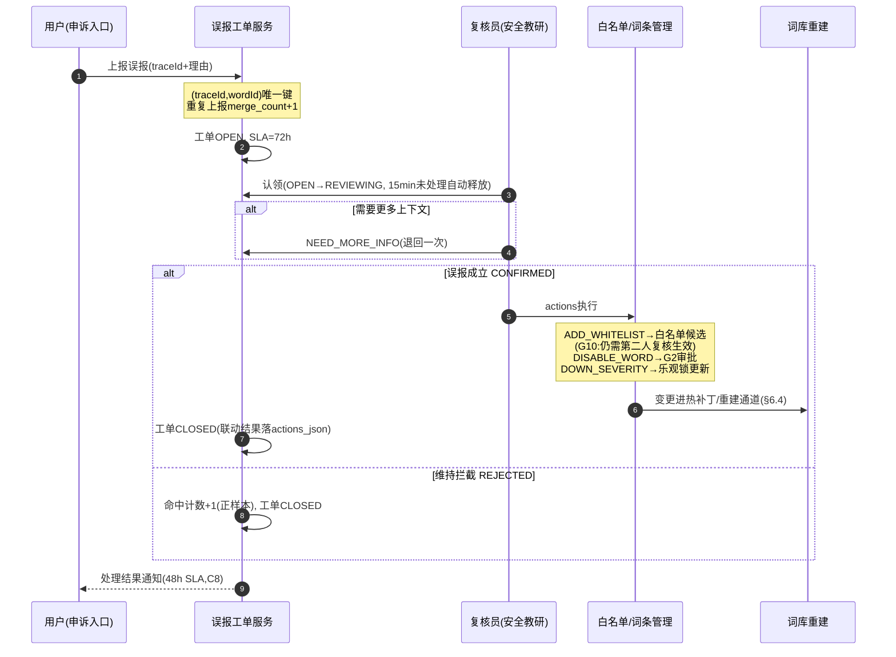

# 教育场景敏感词多层次过滤与内容安全规则引擎 详细设计

## 1. 概述

### 1.1 模块定位

敏感词过滤与内容安全规则引擎是 PrimeTop 平台内容安全体系的**底层基础设施**，为 AI 对话护栏、用户生成内容审核、搜索查询过滤、站内消息检测等所有内容安全场景提供统一的文本检测与过滤能力。

本引擎**不是**业务层的安全策略决策器，而是为上层策略提供高性能、高准确率的**文本匹配与分类服务**。

### 1.2 核心职责

| 职责 | 说明 |
| --- | --- |
| 敏感词库管理 | 分层分类维护敏感词/短语库，支持动态增删改查 |
| 多模式文本匹配 | 精确匹配、模糊变体匹配、正则匹配、语义相似匹配 |
| 规则编排引擎 | 按场景组合匹配规则，输出结构化检测结果 |
| 分龄过滤策略 | 根据用户学段动态调整过滤严格等级 |
| 实时检测API | 提供低延迟（<5ms）的同步检测接口 |
| 批量检测API | 提供高吞吐量的异步批量检测接口 |
| 审计与分析 | 全量检测日志、命中统计、误报管理 |

### 1.3 依赖关系

```
┌─────────────────────────────────────────────────────────┐
│                    上层业务模块                           │
│  AI对话护栏  │  UGC内容审核  │  搜索过滤  │  站内消息检测  │
└──────────┬──────────────────────────────────────────────┘
           │ 统一调用 DetectText / BatchDetectText
           ▼
┌─────────────────────────────────────────────────────────┐
│              内容安全规则引擎 (本模块)                      │
│  ┌──────────┐  ┌────────────┐  ┌──────────┐            │
│  │ 规则编排  │  │ 多模式匹配  │  │ 分龄策略  │            │
│  └──────────┘  └────────────┘  └──────────┘            │
│  ┌──────────┐  ┌────────────┐  ┌──────────┐            │
│  │ 词库管理  │  │ 误报管理    │  │ 审计日志  │            │
│  └──────────┘  └────────────┘  └──────────┘            │
└─────────────────────────────────────────────────────────┘
           │
           ▼
┌─────────────────────────────────────────────────────────┐
│  Redis (词库缓存)  │  MySQL (词库/规则)  │  ES (语义检索) │
└─────────────────────────────────────────────────────────┘
```

### 1.4 设计目标

| 指标 | 目标值 |
| --- | --- |
| 单次检测延迟（P99） | < 5ms（500字符以内） |
| 单次检测延迟（P99.9） | < 15ms |
| 批量检测吞吐 | > 5000 QPS |
| 词库容量 | 支持 100万+ 词条 |
| 匹配准确率（召回） | > 98%（精确匹配类） |
| 误报率 | < 2%（可通过白名单进一步降低） |
| 词库热更新延迟 | < 10秒生效 |

---

## 2. 敏感词库数据模型

### 2.1 词库分类体系

采用**三层分类**结构，上层为词库大类，中层为子类，底层为具体词条：

```
敏感词库
├── 政治敏感 (category: POLITICAL)
│   ├── 领导人姓名变体 (sub_category: LEADER_VARIANT)
│   ├── 政治事件关键词 (sub_category: EVENT)
│   └── 政治口号/标语 (sub_category: SLOGAN)
├── 暴力恐怖 (category: VIOLENCE)
│   ├── 暴力描述 (sub_category: VIOLENCE_DESC)
│   ├── 恐怖主义 (sub_category: TERRORISM)
│   └── 武器制造 (sub_category: WEAPON)
├── 色情低俗 (category: PORNOGRAPHY)
│   ├── 色情描述 (sub_category: EXPLICIT)
│   ├── 低俗用语 (sub_category: VULGAR)
│   └── 隐晦色情 (sub_category: IMPLICIT_PORN)
├── 赌博毒品 (category: GAMBLING_DRUG)
│   ├── 赌博相关 (sub_category: GAMBLING)
│   └── 毒品相关 (sub_category: DRUG)
├── 作弊与答案泄露 (category: CHEATING)
│   ├── 考试作弊工具 (sub_category: CHEAT_TOOL)
│   ├── 代考代写广告 (sub_category: PROXY_EXAM)
│   └── 答案直接泄露 (sub_category: ANSWER_LEAK)
├── 商业广告 (category: ADVERTISEMENT)
│   ├── 培训机构广告 (sub_category: TRAINING_AD)
│   ├── 微信/QQ引流 (sub_category: CONTACT_REDIRECT)
│   └── 违规商品推广 (sub_category: PRODUCT_AD)
├── 未成年人保护 (category: MINOR_SAFETY)
│   ├── 校园霸凌用语 (sub_category: BULLYING)
│   ├── 自残自杀诱导 (sub_category: SELF_HARM)
│   └── 不良价值观 (sub_category: BAD_VALUE)
└── 教育场景专用 (category: EDU_SPECIFIC)
    ├── 与学习无关的闲聊话题 (sub_category: OFF_TOPIC)
    ├── 不尊重师长的言论 (sub_category: DISRESPECT)
    └── 考试答案直接索要 (sub_category: ANSWER_BEGGING)
```

### 2.2 核心数据表

#### 2.2.1 敏感词条目表 `sensitive_word`

```sql
CREATE TABLE `sensitive_word` (
    `id`                BIGINT       UNSIGNED NOT NULL AUTO_INCREMENT,
    `word`              VARCHAR(256) NOT NULL                COMMENT '敏感词原文',
    `word_normalized`   VARCHAR(256) NOT NULL                COMMENT '标准化形式（小写、全角转半角）',
    `word_pinyin`       VARCHAR(512) DEFAULT NULL            COMMENT '拼音（用于拼音变体匹配）',
    `category`          VARCHAR(32)  NOT NULL                COMMENT '一级分类，枚举值',
    `sub_category`      VARCHAR(64)  DEFAULT NULL            COMMENT '二级分类',
    `match_type`        VARCHAR(20)  NOT NULL DEFAULT 'EXACT' COMMENT '匹配类型: EXACT/FUZZY/REGEX/PINYIN/SEMANTIC',
    `severity_level`    TINYINT      NOT NULL DEFAULT 3      COMMENT '严重程度 1-5，5最严重',
    `min_age_level`     TINYINT      DEFAULT NULL            COMMENT '适用最小年龄过滤等级 NULL=全年龄段',
    `max_age_level`     TINYINT      DEFAULT NULL            COMMENT '适用最大年龄过滤等级 NULL=全年龄段',
    `replacement`       VARCHAR(256) DEFAULT '***'           COMMENT '替换文本',
    `enabled`           TINYINT      NOT NULL DEFAULT 1      COMMENT '是否启用 1=是 0=否',
    `source`            VARCHAR(32)  DEFAULT 'MANUAL'        COMMENT '来源: MANUAL/AUTO_IMPORT/USER_REPORT/AI_GENERATED',
    `tags`              JSON         DEFAULT NULL            COMMENT '扩展标签 {"context": ["ai_input","search"]}',
    `created_by`        BIGINT       UNSIGNED NOT NULL       COMMENT '创建人',
    `created_at`        DATETIME     NOT NULL DEFAULT CURRENT_TIMESTAMP,
    `updated_at`        DATETIME     NOT NULL DEFAULT CURRENT_TIMESTAMP ON UPDATE CURRENT_TIMESTAMP,
    `version`           INT          NOT NULL DEFAULT 1      COMMENT '版本号，用于乐观锁',
    PRIMARY KEY (`id`),
    UNIQUE KEY `uk_word_type` (`word_normalized`, `match_type`),
    KEY `idx_category` (`category`, `sub_category`),
    KEY `idx_enabled` (`enabled`),
    KEY `idx_severity` (`severity_level`),
    KEY `idx_age_level` (`min_age_level`, `max_age_level`)
) ENGINE=InnoDB DEFAULT CHARSET=utf8mb4 COMMENT='敏感词条目表';
```

#### 2.2.2 过滤规则表 `filter_rule`

```sql
CREATE TABLE `filter_rule` (
    `id`                BIGINT       UNSIGNED NOT NULL AUTO_INCREMENT,
    `rule_name`         VARCHAR(128) NOT NULL                COMMENT '规则名称',
    `rule_code`         VARCHAR(64)  NOT NULL                COMMENT '规则编码（唯一标识）',
    `scene`             VARCHAR(32)  NOT NULL                COMMENT '应用场景: AI_INPUT/AI_OUTPUT/UGC/SEARCH/MESSAGE',
    `category_filter`   JSON         DEFAULT NULL            COMMENT '词库分类过滤 ["POLITICAL","VIOLENCE"]',
    `age_strategy`      VARCHAR(20)  NOT NULL DEFAULT 'ADAPTIVE' COMMENT '年龄策略: STRICT/ADAPTIVE/LENIENT/IGNORE',
    `action`            VARCHAR(20)  NOT NULL DEFAULT 'MASK' COMMENT '命中动作: MASK/BLOCK/WARN/REVIEW/LOG_ONLY',
    `threshold`         DECIMAL(5,2) DEFAULT 1.00            COMMENT '语义匹配阈值(0-1)，仅SEMANTIC类型有效',
    `priority`          INT          NOT NULL DEFAULT 100    COMMENT '优先级，数字越小优先级越高',
    `enabled`           TINYINT      NOT NULL DEFAULT 1,
    `description`       VARCHAR(512) DEFAULT NULL,
    `created_at`        DATETIME     NOT NULL DEFAULT CURRENT_TIMESTAMP,
    `updated_at`        DATETIME     NOT NULL DEFAULT CURRENT_TIMESTAMP ON UPDATE CURRENT_TIMESTAMP,
    PRIMARY KEY (`id`),
    UNIQUE KEY `uk_rule_code` (`rule_code`),
    KEY `idx_scene` (`scene`, `enabled`)
) ENGINE=InnoDB DEFAULT CHARSET=utf8mb4 COMMENT='过滤规则配置表';
```

#### 2.2.3 白名单表 `filter_whitelist`

```sql
CREATE TABLE `filter_whitelist` (
    `id`            BIGINT       UNSIGNED NOT NULL AUTO_INCREMENT,
    `phrase`        VARCHAR(512) NOT NULL                COMMENT '白名单短语',
    `word_ids`      JSON         DEFAULT NULL            COMMENT '关联的敏感词ID列表',
    `reason`        VARCHAR(256) DEFAULT NULL            COMMENT '豁免原因',
    `scene`         VARCHAR(32)  DEFAULT NULL            COMMENT '适用场景 NULL=全部',
    `created_by`    BIGINT       UNSIGNED NOT NULL,
    `created_at`    DATETIME     NOT NULL DEFAULT CURRENT_TIMESTAMP,
    PRIMARY KEY (`id`),
    UNIQUE KEY `uk_phrase_scene` (`phrase`, `scene`),
    KEY `idx_phrase` (`phrase`)
) ENGINE=InnoDB DEFAULT CHARSET=utf8mb4 COMMENT='过滤白名单';
```

#### 2.2.4 检测审计日志表 `filter_audit_log`

```sql
CREATE TABLE `filter_audit_log` (
    `id`                BIGINT       UNSIGNED NOT NULL AUTO_INCREMENT,
    `trace_id`          VARCHAR(64)  NOT NULL                COMMENT '链路追踪ID',
    `scene`             VARCHAR(32)  NOT NULL                COMMENT '检测场景',
    `user_id`           BIGINT       UNSIGNED DEFAULT NULL   COMMENT '用户ID',
    `user_age_level`    TINYINT      DEFAULT NULL            COMMENT '用户年龄等级',
    `input_text_hash`   VARCHAR(64)  NOT NULL                COMMENT '输入文本SHA-256哈希',
    `input_text_length` INT          NOT NULL                COMMENT '输入文本长度',
    `hit_count`         INT          NOT NULL DEFAULT 0      COMMENT '命中词条数',
    `hit_details`       JSON         DEFAULT NULL            COMMENT '命中详情 [{word, category, severity, position}]',
    `action_taken`      VARCHAR(20)  NOT NULL                COMMENT '执行的动作',
    `processing_time_ms` INT         NOT NULL                COMMENT '处理耗时(毫秒)',
    `created_at`        DATETIME     NOT NULL DEFAULT CURRENT_TIMESTAMP,
    PRIMARY KEY (`id`),
    KEY `idx_trace` (`trace_id`),
    KEY `idx_user_scene` (`user_id`, `scene`),
    KEY `idx_created` (`created_at`),
    KEY `idx_hit_count` (`hit_count`)
) ENGINE=InnoDB DEFAULT CHARSET=utf8mb4 COMMENT='过滤检测审计日志';
```

---

## 3. 核心算法设计

### 3.1 匹配算法层次架构

引擎采用**多级瀑布式匹配**架构，从快到慢逐层过滤：

```
输入文本
    │
    ▼
┌─────────────────┐
│ L1: 白名单快速豁免 │  ← O(n) 短语前缀匹配
└────────┬────────┘
         │ 未豁免
         ▼
┌─────────────────┐
│ L2: AC自动机精确匹配│  ← O(n×k) 多模式串匹配
└────────┬────────┘
         │
         ▼
┌─────────────────┐
│ L3: 拼音变体匹配   │  ← 拼音序列AC自动机
└────────┬────────┘
         │
         ▼
┌─────────────────┐
│ L4: 正则规则匹配   │  ─ 按规则集逐条匹配
└────────┬────────┘
         │
         ▼
┌─────────────────┐
│ L5: 模糊变体检测   │  ─ 字符干扰消除、谐音、拆字
└────────┬────────┘
         │
         ▼
┌─────────────────┐
│ L6: 语义相似匹配   │  ─ 向量检索(仅高危场景触发)
└────────┬────────┘
         │
         ▼
    检测结果输出
```

### 3.2 AC自动机实现（L2 层）

核心使用 **Aho-Corasick 多模式匹配算法**，一次扫描完成所有词条匹配：

```java
/**
 * AC自动机敏感词匹配器
 * 线程安全，支持并发读取，写时复制重建
 */
public class ACAutomatonMatcher {

    private static final char CHAR_THRESHOLD = 0x4E00; // CJK统一汉字起始

    private volatile ACNode root;
    private final AtomicInteger version = new AtomicInteger(0);

    /**
     * AC自动机节点
     */
    static class ACNode {
        final Map<Character, ACNode> children = new ConcurrentHashMap<>();
        volatile ACNode fail;           // 失败指针
        volatile List<WordMatch> outputs; // 该节点代表的完整敏感词
        volatile boolean isEnd = false;
    }

    /**
     * 词条命中结果
     */
    @Data
    @AllArgsConstructor
    static class WordMatch {
        private long wordId;
        private String word;
        private String category;
        private String subCategory;
        private int severityLevel;
        private int startPos;
        private int endPos;
    }

    /**
     * 构建AC自动机
     * @param words 敏感词条目列表
     */
    public synchronized void rebuild(List<SensitiveWordEntry> words) {
        ACNode newRoot = new ACNode();
        
        // Phase 1: 插入所有词构建Trie
        for (SensitiveWordEntry entry : words) {
            insertWord(newRoot, entry);
        }
        
        // Phase 2: BFS构建失败指针
        buildFailPointers(newRoot);
        
        // 原子替换
        this.root = newRoot;
        this.version.incrementAndGet();
        
        log.info("AC自动机重建完成，词条数: {}，版本: {}", words.size(), version.get());
    }

    private void insertWord(ACNode root, SensitiveWordEntry entry) {
        String normalized = entry.getWordNormalized();
        ACNode current = root;
        
        for (int i = 0; i < normalized.length(); i++) {
            char ch = normalized.charAt(i);
            current = current.children.computeIfAbsent(ch, k -> new ACNode());
        }
        
        current.isEnd = true;
        if (current.outputs == null) {
            current.outputs = new CopyOnWriteArrayList<>();
        }
        current.outputs.add(new WordMatch(
            entry.getId(), entry.getWord(),
            entry.getCategory(), entry.getSubCategory(),
            entry.getSeverityLevel(), 0, 0
        ));
    }

    private void buildFailPointers(ACNode root) {
        Queue<ACNode> queue = new LinkedList<>();
        root.fail = root;
        
        for (ACNode node : root.children.values()) {
            node.fail = root;
            queue.offer(node);
        }
        
        while (!queue.isEmpty()) {
            ACNode current = queue.poll();
            for (Map.Entry<Character, ACNode> entry : current.children.entrySet()) {
                char ch = entry.getKey();
                ACNode child = entry.getValue();
                ACNode fail = current.fail;
                
                while (fail != root && !fail.children.containsKey(ch)) {
                    fail = fail.fail;
                }
                
                child.fail = fail.children.getOrDefault(ch, root);
                if (child.fail == child) child.fail = root;
                
                // 合并fail指针的输出
                if (child.fail.outputs != null) {
                    if (child.outputs == null) {
                        child.outputs = new CopyOnWriteArrayList<>();
                    }
                    child.outputs.addAll(child.fail.outputs);
                }
                
                queue.offer(child);
            }
        }
    }

    /**
     * 执行匹配
     * @param text 待检测文本
     * @return 命中结果列表
     */
    public List<WordMatch> match(String text) {
        List<WordMatch> results = new ArrayList<>();
        ACNode current = root;
        
        for (int i = 0; i < text.length(); i++) {
            char ch = normalizeChar(text.charAt(i));
            
            while (current != root && !current.children.containsKey(ch)) {
                current = current.fail;
            }
            
            current = current.children.getOrDefault(ch, root);
            
            if (current.outputs != null && !current.outputs.isEmpty()) {
                for (WordMatch match : current.outputs) {
                    WordMatch copy = new WordMatch(
                        match.getWordId(), match.getWord(),
                        match.getCategory(), match.getSubCategory(),
                        match.getSeverityLevel(),
                        i - match.getWord().length() + 1,
                        i + 1
                    );
                    results.add(copy);
                }
            }
        }
        
        return results;
    }

    /**
     * 字符标准化：全角→半角，大写→小写
     */
    private char normalizeChar(char ch) {
        // 全角转半角
        if (ch >= 0xFF01 && ch <= 0xFF5E) {
            ch = (char) (ch - 0xFEE0);
        }
        // 大写转小写
        if (ch >= 'A' && ch <= 'Z') {
            ch = (char) (ch + 32);
        }
        return ch;
    }
}
```

### 3.3 拼音变体匹配（L3 层）

学生常使用拼音替代敏感词（如 "sha" 替代 "杀"），需要专门的拼音序列匹配：

```java
/**
 * 拼音变体检测器
 * 将文本转为拼音序列后进行AC匹配
 */
@Component
public class PinyinVariantMatcher {

    private final ACAutomatonMatcher pinyinACMatcher;
    private final PinyinConverter pinyinConverter;

    /**
     * 检测文本中的拼音变体敏感词
     * 
     * 示例：
     *   文本: "你去si吧" 
     *   拼音: "ni qu si ba"
     *   词库拼音: "si" → 命中 "死" (category: VIOLENCE)
     */
    public List<WordMatch> match(String text) {
        // 1. 文本转拼音序列（保留原始位置映射）
        PinyinResult pinyinResult = pinyinConverter.convertWithPosition(text);
        String pinyinText = pinyinResult.getCombinedPinyin(); // "niqusi ba"
        
        // 2. 在拼音序列上执行AC匹配
        List<WordMatch> pinyinMatches = pinyinACMatcher.match(pinyinText);
        
        // 3. 将拼音位置映射回原文位置
        return pinyinMatches.stream()
            .map(m -> mapToOriginalPosition(m, pinyinResult))
            .filter(Objects::nonNull)
            .collect(Collectors.toList());
    }
}

/**
 * 拼音转换器（基于pinyin4j + 自定义多音字消歧）
 */
@Component
public class PinyinConverter {

    // 多音字频率表（按教育语境下的使用频率排序）
    private final Map<Character, String[]> polyphoneFreq = Map.ofEntries(
        entry('重', new String[]{"zhong", "chong"}),
        entry('长', new String[]{"chang", "zhang"}),
        entry('行', new String[]{"xing", "hang"}),
        entry('了', new String[]{"le", "liao"}),
        entry('得', new String[]{"de", "dei"})
        // ... 更多多音字
    );

    /**
     * 转换并保留位置映射
     */
    public PinyinResult convertWithPosition(String text) {
        StringBuilder combinedPinyin = new StringBuilder();
        List<PinyinPosition> positions = new ArrayList<>();
        
        for (int i = 0; i < text.length(); i++) {
            char ch = text.charAt(i);
            String pinyin = getSinglePinyin(ch);
            
            if (pinyin != null) {
                int start = combinedPinyin.length();
                combinedPinyin.append(pinyin);
                positions.add(new PinyinPosition(i, start, start + pinyin.length()));
            } else {
                // 非汉字字符保留原样
                combinedPinyin.append(ch);
            }
            combinedPinyin.append(' ');
        }
        
        return new PinyinResult(combinedPinyin.toString(), positions);
    }
}
```

### 3.4 模糊变体检测（L5 层）

针对学生常用的规避手段设计检测器：

```java
/**
 * 模糊变体检测器
 * 检测类型：字符干扰、谐音替换、拆字、特殊符号插入
 */
@Component
public class FuzzyVariantMatcher {

    /**
     * 检测策略链
     */
    private final List<FuzzyStrategy> strategies = List.of(
        new SymbolInsertionStrategy(),    // 插入特殊符号: "杀→s★杀"
        new HomophoneStrategy(),          // 谐音替换: "傻→砂"
        new CharacterSplitStrategy(),     // 拆字: "明→日月"
        new RepeatCharStrategy()          // 重复字符: "杀→杀杀杀"
    );

    public List<WordMatch> match(String text, List<SensitiveWordEntry> watchList) {
        List<WordMatch> results = new ArrayList<>();
        
        for (FuzzyStrategy strategy : strategies) {
            // 1. 对文本执行反变换（还原变体）
            String normalized = strategy.normalize(text);
            
            // 2. 在还原后的文本上执行AC匹配
            List<WordMatch> matches = strategy.match(normalized, watchList);
            
            // 3. 验证命中（避免过度纠错）
            results.addAll(strategy.validate(text, matches));
        }
        
        return results;
    }

    /**
     * 策略接口
     */
    interface FuzzyStrategy {
        String normalize(String text);
        List<WordMatch> match(String normalized, List<SensitiveWordEntry> watchList);
        List<WordMatch> validate(String original, List<WordMatch> matches);
    }

    /**
     * 特殊符号插入策略
     * "s★杀★人" → "杀人" → 匹配敏感词
     */
    static class SymbolInsertionStrategy implements FuzzyStrategy {
        private static final Pattern SYMBOL_PATTERN = 
            Pattern.compile("[★☆※◎◇◆■□▲△▼▽●○※#@$%^&*~]");
        
        @Override
        public String normalize(String text) {
            return SYMBOL_PATTERN.matcher(text).replaceAll("");
        }
        // ... match / validate 实现
    }

    /**
     * 谐音替换策略
     * 基于预计算的谐音映射表，将常见谐音替换还原
     */
    static class HomophoneStrategy implements FuzzyStrategy {
        private final Map<Character, Character> homophoneMap;
        
        HomophoneStrategy() {
            homophoneMap = Map.ofEntries(
                entry('砂', '傻'), entry('鲨', '傻'),
                entry('茬', '查'), entry('渣', '查'),
                // ... 谐音映射表
                entry('①', '1'), entry('②', '2'),
                entry('⒊', '3')
            );
        }
        
        @Override
        public String normalize(String text) {
            StringBuilder sb = new StringBuilder(text.length());
            for (char ch : text.toCharArray()) {
                sb.append(homophoneMap.getOrDefault(ch, ch));
            }
            return sb.toString();
        }
        // ... match / validate 实现
    }
}
```

### 3.5 语义相似匹配（L6 层）

仅在高危场景（如自残自杀、暴力恐怖）触发，使用向量检索：

```java
/**
 * 语义相似匹配器
 * 基于向量检索检测语义等价但表述不同的敏感内容
 */
@Component
public class SemanticSimilarityMatcher {

    private final VectorStoreClient vectorStoreClient;  // Milvus/pgvector
    private final EmbeddingService embeddingService;
    
    /**
     * 高危类别的语义匹配阈值（较低=更严格）
     */
    private static final Map<String, Float> THRESHOLD_BY_CATEGORY = Map.of(
        "SELF_HARM", 0.75f,      // 自残自杀 - 最低阈值，最大限度召回
        "TERRORISM", 0.78f,       // 恐怖主义
        "BULLYING", 0.82f,        // 校园霸凌
        "VIOLENCE_DESC", 0.80f,   // 暴力描述
        "VULGAR", 0.85f           // 低俗用语 - 阈值较高，减少误报
    );

    /**
     * 语义匹配
     * @param text 输入文本
     * @param categories 限定检测的分类
     * @return 命中结果
     */
    public List<SemanticMatch> match(String text, Set<String> categories) {
        // 1. 文本向量化
        float[] vector = embeddingService.embed(text);
        
        // 2. 向量库检索相似内容
        List<VectorSearchResult> candidates = vectorStoreClient.search(
            vector,
            categories,
            20,     // topK
            0.70f   // 最低相似度
        );
        
        // 3. 按分类阈值过滤
        List<SemanticMatch> results = new ArrayList<>();
        for (VectorSearchResult candidate : candidates) {
            float threshold = THRESHOLD_BY_CATEGORY.getOrDefault(
                candidate.getCategory(), 0.85f
            );
            if (candidate.getScore() >= threshold) {
                results.add(new SemanticMatch(
                    candidate.getWordId(),
                    candidate.getWord(),
                    candidate.getCategory(),
                    candidate.getScore(),
                    candidate.getMatchedSnippet()
                ));
            }
        }
        
        return results;
    }
}
```

---

## 4. 分龄过滤策略

### 4.1 年龄等级定义

```java
public enum AgeFilterLevel {
    PRESCHOOL(1, "幼儿", 3, 6),       // 最严格
    PRIMARY_LOW(2, "小学低年级", 7, 9),
    PRIMARY_HIGH(3, "小学高年级", 10, 12),
    JUNIOR_HIGH(4, "初中", 13, 15),
    SENIOR_HIGH(5, "高中", 16, 18),
    ADULT(6, "成人", 18, 200);
    
    private final int code;
    private final String label;
    private final int minAge;
    private final int maxAge;
}
```

### 4.2 分龄过滤策略矩阵

不同学段场景下，各类敏感词的**默认处理动作**不同：

| 分类 | 幼儿(1) | 小学低(2) | 小学高(3) | 初中(4) | 高中(5) |
| --- | --- | --- | --- | --- | --- |
| 政治敏感 | BLOCK | BLOCK | BLOCK | BLOCK | BLOCK |
| 暴力恐怖 | BLOCK | BLOCK | BLOCK | MASK | MASK |
| 色情低俗 | BLOCK | BLOCK | BLOCK | BLOCK | MASK |
| 赌博毒品 | BLOCK | BLOCK | BLOCK | BLOCK | BLOCK |
| 作弊泄露 | BLOCK | BLOCK | BLOCK | BLOCK | BLOCK |
| 商业广告 | BLOCK | BLOCK | MASK | MASK | WARN |
| 校园霸凌 | BLOCK | BLOCK | BLOCK | MASK | MASK |
| 自残自杀 | BLOCK | BLOCK | BLOCK | BLOCK | BLOCK+REPORT |
| 低俗用语 | BLOCK | BLOCK | MASK | MASK | WARN |
| 离题闲聊 | WARN | WARN | LOG_ONLY | LOG_ONLY | IGNORE |
| 答案索要 | MASK | MASK | MASK | WARN | WARN |

动作含义：
- **BLOCK**: 阻止请求/内容，返回安全提示
- **MASK**: 替换敏感内容为 `***`
- **WARN**: 允许但记录警告日志
- **REVIEW**: 标记为待人工审核
- **LOG_ONLY**: 仅记录不干预
- **IGNORE**: 完全忽略不记录
- **REPORT**: 额外触发安全事件上报

### 4.3 策略解析器

```java
/**
 * 分龄过滤策略解析器
 */
@Component
public class AgeFilterStrategyResolver {

    /**
     * 解析最终过滤动作
     * 
     * @param wordEntry 敏感词条目
     * @param userAgeLevel 用户年龄等级
     * @param sceneRule 场景规则
     * @return 最终执行动作
     */
    public FilterAction resolve(SensitiveWordEntry wordEntry, 
                                 AgeFilterLevel userAgeLevel,
                                 FilterRule sceneRule) {
        // 1. 词条自身的年龄范围限制
        if (wordEntry.getMinAgeLevel() != null 
            && userAgeLevel.getCode() < wordEntry.getMinAgeLevel()) {
            return FilterAction.IGNORE; // 词条不适用于该年龄段
        }
        if (wordEntry.getMaxAgeLevel() != null 
            && userAgeLevel.getCode() > wordEntry.getMaxAgeLevel()) {
            return FilterAction.IGNORE;
        }
        
        // 2. 场景规则中的年龄策略
        FilterAction baseAction = switch (sceneRule.getAgeStrategy()) {
            case "STRICT" -> {
                // 严格模式：所有命中均BLOCK
                yield FilterAction.BLOCK;
            }
            case "LENIENT" -> {
                // 宽松模式：仅严重度>=4的BLOCK，其余MASK
                yield wordEntry.getSeverityLevel() >= 4 
                    ? FilterAction.BLOCK : FilterAction.MASK;
            }
            case "IGNORE" -> FilterAction.LOG_ONLY;
            case "ADAPTIVE" -> {
                // 自适应模式：查分龄策略矩阵
                yield lookupAgeMatrix(wordEntry.getCategory(), 
                                      userAgeLevel);
            }
            default -> FilterAction.MASK;
        };
        
        // 3. 严重度覆盖：severity=5的词条无条件BLOCK
        if (wordEntry.getSeverityLevel() == 5) {
            baseAction = FilterAction.BLOCK;
        }
        
        // 4. 自残自杀特殊处理：所有年龄段均触发安全事件上报
        if ("SELF_HARM".equals(wordEntry.getSubCategory())) {
            baseAction = baseAction.withReport(true);
        }
        
        return baseAction;
    }

    private FilterAction lookupAgeMatrix(String category, AgeFilterLevel ageLevel) {
        // 查询 age_filter_strategy 表中的配置
        // 缓存于本地 Caffeine，TTL=5min
        return ageFilterMatrixCache.getUnchecked(
            new AgeCategoryKey(category, ageLevel.getCode())
        );
    }
}
```

---

## 5. API 接口设计

### 5.1 实时检测接口

```
POST /api/v1/filter/detect
```

**请求体：**

```json
{
  "text": "需要检测的文本内容",
  "scene": "AI_INPUT",
  "userId": 100123,
  "userAgeLevel": 3,
  "options": {
    "enablePinyin": true,
    "enableFuzzy": true,
    "enableSemantic": false,
    "returnMaskedText": true,
    "maxProcessingLevel": "L5"
  }
}
```

**响应体：**

```json
{
  "code": 0,
  "data": {
    "passed": false,
    "action": "BLOCK",
    "maskedText": null,
    "hitCount": 2,
    "hits": [
      {
        "word": "***",
        "category": "VIOLENCE",
        "subCategory": "VIOLENCE_DESC",
        "severity": 4,
        "matchType": "EXACT",
        "startPos": 5,
        "endPos": 7,
        "action": "BLOCK"
      },
      {
        "word": "***",
        "category": "CHEATING",
        "subCategory": "ANSWER_BEGGING",
        "severity": 2,
        "matchType": "FUZZY",
        "startPos": 12,
        "endPos": 18,
        "action": "MASK"
      }
    ],
    "processingTimeMs": 3,
    "processingLevel": "L5",
    "ruleId": 42,
    "ruleCode": "AI_INPUT_DEFAULT"
  },
  "traceId": "filter-9a8b7c6d-2024"
}
```

### 5.2 批量检测接口

```
POST /api/v1/filter/batch-detect
```

**请求体：**

```json
{
  "items": [
    {
      "text": "文本1",
      "scene": "AI_OUTPUT",
      "itemId": "msg-001"
    },
    {
      "text": "文本2",
      "scene": "UGC",
      "itemId": "comment-002"
    }
  ],
  "userId": 100123,
  "userAgeLevel": 3,
  "options": {
    "enablePinyin": true,
    "enableFuzzy": false,
    "enableSemantic": false
  }
}
```

**响应体：**

```json
{
  "code": 0,
  "data": {
    "totalCount": 2,
    "passedCount": 1,
    "blockedCount": 1,
    "results": [
      {
        "itemId": "msg-001",
        "passed": true,
        "hitCount": 0,
        "action": "PASS"
      },
      {
        "itemId": "comment-002",
        "passed": false,
        "hitCount": 1,
        "action": "BLOCK",
        "hits": [...]
      }
    ],
    "totalProcessingTimeMs": 8
  }
}
```

### 5.3 词库管理接口

```
# 新增敏感词
POST /api/v1/filter/words

# 批量导入
POST /api/v1/filter/words/batch-import

# 查询/搜索
GET /api/v1/filter/words?category=VIOLENCE&page=1&size=20

# 更新
PUT /api/v1/filter/words/{id}

# 启用/禁用
PATCH /api/v1/filter/words/{id}/toggle

# 删除（软删除）
DELETE /api/v1/filter/words/{id}
```

新增敏感词示例：

```json
POST /api/v1/filter/words
{
  "word": "代写作业",
  "category": "CHEATING",
  "subCategory": "PROXY_EXAM",
  "matchType": "FUZZY",
  "severityLevel": 4,
  "minAgeLevel": null,
  "maxAgeLevel": null,
  "replacement": "***",
  "tags": {
    "context": ["ai_input", "message", "ugc"]
  }
}
```

### 5.4 规则管理接口

```
# 创建过滤规则
POST /api/v1/filter/rules

# 查询场景规则
GET /api/v1/filter/rules?scene=AI_INPUT

# 更新规则
PUT /api/v1/filter/rules/{id}

# 测试规则（不实际执行）
POST /api/v1/filter/rules/{id}/test
```

### 5.5 白名单管理接口

```
# 添加白名单
POST /api/v1/filter/whitelist

# 查询白名单
GET /api/v1/filter/whitelist?keyword=数学&page=1

# 删除白名单
DELETE /api/v1/filter/whitelist/{id}
```

### 5.6 统计分析接口

```
# 检测命中统计
GET /api/v1/filter/stats/hit-summary?startDate=2026-07-01&endDate=2026-07-04&groupBy=CATEGORY

# 误报报告
POST /api/v1/filter/false-positive/report

# 误报列表
GET /api/v1/filter/false-positive?page=1&pageSize=20&status=OPEN

# 误报处理（复核裁决）
POST /api/v1/filter/false-positive/{reportId}/process

# 命中明细（按 traceId 追溯单次检测）
GET /api/v1/filter/stats/hit-details?traceId=filter-9a8b7c6d-2024

# 词库健康度（版本/词条数/重建状态一览）
GET /api/v1/filter/stats/wordlib-health
```

**误报处理请求体：**

```json
{
  "decision": "CONFIRMED",
  "handleNote": "『 Killing in the name of 』为英语课文歌词引用，属教学场景",
  "actions": ["ADD_WHITELIST"],
  "whitelistScene": "AI_INPUT",
  "whitelistReason": "人教版高中英语 Unit 5 歌曲单元",
  "operatorId": 90012
}
```

**decision 枚举与联动动作：**

| decision | 语义 | 允许的 actions | 联动效果 |
| --- | --- | --- | --- |
| CONFIRMED | 误报成立 | ADD_WHITELIST / DISABLE_WORD / DOWN_SEVERITY / NONE | 白名单候选生成（仍需 G10 复核生效）；词条禁用走 §8.1 状态机 |
| REJECTED | 维持拦截 | NONE | 工单关闭，词条命中计数 +1 作为正样本 |
| NEED_MORE_INFO | 需补充上下文 | NONE | 工单退回 OPEN，72h SLA 重新计时（仅允许一次，防悬挂） |

**误报列表响应体（节选）：**

```json
{
  "code": 0,
  "data": {
    "total": 128,
    "items": [
      {
        "reportId": 4021,
        "traceId": "filter-9a8b7c6d-2024",
        "scene": "AI_INPUT",
        "userAgeLevel": 4,
        "inputTextHash": "a3f5...",
        "matchedWordMasked": "***",
        "category": "VIOLENCE",
        "subCategory": "VIOLENCE_DESC",
        "severity": 4,
        "reportReason": "英语课文歌词引用",
        "status": "OPEN",
        "reporterId": 100123,
        "createdAt": "2026-07-04T21:30:00+08:00",
        "slaDeadline": "2026-07-07T21:30:00+08:00"
      }
    ]
  }
}
```

> 红线：误报列表与详情**永不返回命中原文**，仅返回哈希与脱敏掩码 `***`；复核人员需结合上报理由与 traceId 关联上层业务模块（如 AI 对话上下文）还原场景，原文获取走各业务模块自身的审计通道（R7）。

### 5.7 gRPC 内部接口

供 UGC 审核引擎、AI 输入护栏、搜索服务、消息服务等内部模块高频调用，避免 REST 序列化开销：

```protobuf
syntax = "proto3";
package primetop.filter.v1;

service ContentFilterService {
  // 单文本实时检测（对应 REST /detect，供内部高频调用方）
  rpc Match (MatchRequest) returns (MatchResponse);
  // 批量检测（≤100 条/批，G15）
  rpc BatchMatch (BatchMatchRequest) returns (BatchMatchResponse);
  // 查询指定场景词库当前版本号（消费方轮询对齐用）
  rpc VersionOfScene (VersionRequest) returns (VersionResponse);
  // 拉取指定场景全量词条快照（供 UGC 本地 DFA 降级词库构建，§15 R4）
  rpc LoadSceneKeywords (LoadRequest) returns (stream KeywordItem);
  // 就绪探针：词库已加载且版本新鲜（对齐 G7/readiness）
  rpc Ready (ReadyRequest) returns (ReadyResponse);
}

message MatchRequest {
  string text = 1;
  string scene = 2;              // AI_INPUT/AI_OUTPUT/UGC/SEARCH/MESSAGE
  int64  user_id = 3;
  int32  user_age_level = 4;
  MatchOptions options = 5;      // 同 REST options
  string trace_id = 6;           // 调用方透传，落审计日志
}

message MatchResponse {
  bool passed = 1;
  string action = 2;             // PASS/MASK/BLOCK/WARN/REVIEW/LOG_ONLY
  string masked_text = 3;
  repeated Hit hits = 4;         // 含 categoryCode/riskLevel/ruleId（UGC 契约字段）
  int32 processing_time_ms = 5;
  string rule_id = 6;
  bool degraded = 7;             // 任一层降级必置位（D1-D10）
}

message VersionResponse {
  string scene = 1;
  int64 version = 2;             // 递增版本号，与 FILTER:wordlib:version:{scene} 一致
  int64 word_count = 3;
  int64 built_at_millis = 4;
}

message KeywordItem {
  int64  word_id = 1;
  string word_normalized = 2;
  string category = 3;
  string sub_category = 4;
  int32  severity_level = 5;
  string match_type = 6;
}
```

**调用方配额与超时预算：**

| 调用方 | 接口 | 超时预算 | 配额 | 超时行为 |
| --- | --- | --- | --- | --- |
| UGC 审核引擎 | Match / VersionOfScene / LoadSceneKeywords | 150ms | 500 QPS | 本地 DFA 降级（R4），响应 degraded=true |
| AI 输入护栏 | Match(scene=AI_INPUT) | 50ms | 300 QPS | 放行并转 SOSF 流式兜底（输入侧仍有输出侧过滤） |
| 搜索服务 | Match(scene=SEARCH) | 20ms | 800 QPS | 非 SELF_HARM 类降级放行+degraded 抽样审计（R14） |
| 消息/模板渲染 | Match(scene=MESSAGE) | 150ms | 200 QPS | fail-secure 转人工（R5） |
| 危机引擎（反向查询） | Match(复核历史命中) | 100ms | 50 QPS | 本地缓存裁决 |

### 5.8 接口幂等与限流总表

| 接口 | 幂等机制 | 限流（管理端/用户侧） |
| --- | --- | --- |
| POST /detect | 无副作用设计（审计异步），天然幂等 | 按 userId 50 QPS + 全局 2000 QPS |
| POST /batch-detect | itemId 去重，同批重复 itemId 仅首个生效 | 按调用方配额表（§5.7） |
| POST /words | uk_word_type 唯一键，冲突返回 53010 + 已存在词条 ID | 10 次/分钟/操作者 |
| POST /words/batch-import | 批次号 batchNo + 行级 (word_normalized, match_type) upsert | 5 批/日/操作者，≤5000 行/批 |
| PUT /words/{id} | 乐观锁 version（G12），冲突 53080 | 20 次/分钟/操作者 |
| PATCH /words/{id}/toggle | 幂等（重复 toggle 同向返回当前态） | severity=5 需双人审批（G2） |
| POST /rules, PUT /rules/{id} | uk_rule_code / 乐观锁 | 10 次/分钟 |
| POST /whitelist | uk_phrase_scene（scene 哨兵 'ALL'，F3 修复后） | 10 次/分钟 |
| POST /false-positive/report | (traceId, wordId) 唯一，24h 内重复上报合并计数 | 5 次/日/用户 |
| POST /false-positive/{id}/process | reportId 状态机 CAS（OPEN/NEED_MORE_INFO→REVIEWING），重复处理返回 53031 | 60 次/分钟/复核员 |

---

## 6. 词库热更新与多节点一致性

### 6.1 场景→词条集解析链（scene 语义权威）

词条表 `sensitive_word` 本身**不绑定 scene**（v1.0 表结构即如此设计，非缺陷）：场景适用性通过两层正交维度解析，契约裁决如下：

```text
scene (filter_rule.scene, 请求必传)
  └─► 命中该 scene 的全部 enabled 规则（按 priority 升序）
        └─► 规则.category_filter 交集并集 → 类目白名单集 C(scene)
              └─► 词条候选集 = { w | w.category ∈ C(scene) }
                    └─► tags.context 弱约束（可选）：若词条声明 context 数组，
                         仅当请求场景标签与 context 有交集时参与匹配
```

- **强约束**（规则级 category_filter）：决定"该场景检测哪些类目"。
- **弱约束**（词条级 tags.context）：同一类目下词条的细分场景微调，未声明则全场景生效。
- 该解析链结果按 scene 缓存为 `SceneWordSet`，随词库版本号联动失效。
- SOSF `safety_keyword.scene` 与 UGC `scene=UGC` 的 scene 枚举**均以本引擎 filter_rule.scene 字典为权威**（AI_INPUT / AI_OUTPUT / UGC / SEARCH / MESSAGE，扩展需经管理端注册表登记，R3）。

### 6.2 词库版本模型与 Redis 协议

| Redis Key | 类型 | 说明 |
| --- | --- | --- |
| `FILTER:wordlib:version:{scene}` | STRING(int64) | 各场景当前词库版本号，单调递增；词库或规则任一变更均 bump |
| `FILTER:wordlib:snapshot:{scene}:v{n}` | STRING(protobuf) | 场景词条快照载体（供 LoadSceneKeywords 与新节点冷启动），保留最近 3 个版本，TTL 7 天 |
| `FILTER:wordlib:hotpatch:{scene}` | HASH | 热补丁词集（近 24h 变更词：field=wordId, value=词条protobuf），主匹配与补丁匹配并行合并 |
| `FILTER:KEYWORDS:HOT:{scene}` | Pub/Sub | 变更广播通道（payload 仅含新版本号，消费方收到后自行拉取），UGC 侧历史通道名 `UGC:KEYWORDS:HOT` 裁决见 R4 |
| `FILTER:fp:dedup:{traceId}:{wordId}` | STRING(EX 24h) | 误报上报去重 |
| `FILTER:ratelimit:*` | 原子计数 | §5.8 限流 |
| `FILTER:rebuild:lock` | SETNX(EX 120s) | 全量重建互斥锁 |
| `FILTER:version:align` | HASH | 各节点上报的本地版本（节点心跳对账用，G6） |

**版本号规则：** 版本号与内容解耦、只增不减；禁用词条同样 bump（消费方依赖版本变化触发刷新，而非 diff 语义）。

### 6.3 写时复制重建与构建互斥

```java
/**
 * 场景词库构建器（每 scene 一个实例）
 * 写时复制：重建期间读侧继续使用旧 SceneWordSet，构建完成后 volatile 原子切换
 */
@Component
public class SceneWordlibBuilder {

    private final Map<String, SceneWordSet> wordSets = new ConcurrentHashMap<>();
    private final Map<String, Long> versions = new ConcurrentHashMap<>();
    private final AtomicLong pendingChanges = new AtomicLong();

    /** 全量重建（互斥） */
    public void rebuildScene(String scene) {
        if (!redis.setNx("FILTER:rebuild:lock", nodeId, Duration.ofSeconds(120))) {
            return; // 其他节点已在重建，等待其发布版本后通过版本对齐追平
        }
        try {
            List<SensitiveWord> words = wordRepo.findEnabledBySceneChain(scene); // §6.1 解析链
            SceneWordSet newSet = SceneWordSet.build(words); // 内部构建 L2 AC + L3 拼音AC + L5 策略参数
            long newVersion = redis.incr("FILTER:wordlib:version:" + scene);
            // 快照载体写入（供冷启动与 LoadSceneKeywords）
            redis.setex("FILTER:wordlib:snapshot:" + scene + ":v" + newVersion,
                        serializeSnapshot(newSet), Duration.ofDays(7));
            trimOldSnapshots(scene, newVersion); // 只保留最近 3 版
            // 内存原子切换（读侧无锁）
            wordSets.put(scene, newSet);
            versions.put(scene, newVersion);
            // 广播 + 清理热补丁中已并入主库的词
            redis.publish("FILTER:KEYWORDS:HOT:" + scene, String.valueOf(newVersion));
            hotpatchRepo.clearMerged(scene, newVersion);
            metrics.gauge("filter_wordlib_version_" + scene, newVersion);
        } finally {
            redis.del("FILTER:rebuild:lock");
        }
    }
}
```

### 6.4 热补丁通道：10 秒生效目标的工程落地

AC 自动机不支持真增量（与 SOSF 增量语义一致），但设计目标要求词库热更新 <10s 生效。分层裁决：

| 变更类型 | 生效路径 | 延迟 |
| --- | --- | --- |
| 新增 severity≥4 词条（高危） | 即时写入热补丁 HASH + 本地 HotPatch 子 AC（仅含变更词，构建 <50ms），主匹配+补丁匹配并行，命中合并去重 | <2s |
| 新增 severity≤3 / 修改 / 启停 | 热补丁通道（若为新增）或待重建标记 | <10s（补丁）/ 下次重建 |
| 删除/禁用（需立即失效） | 热补丁**负向清单**：命中结果先查负向清单再上报（禁用词命中被压掉） | <2s |
| 批量导入（≥100 行） | 走低峰全量重建（03:30 调度或阈值触发），导入期间新词先进热补丁 | 补丁即时 + 主库低峰合并 |
| 规则（filter_rule）变更 | 规则缓存版本联动 bump，解析链重算 | <10s |

**热补丁护栏：** 热补丁词数上限 2000 条/场景；超限强制触发全量重建（防止补丁无限膨胀退化主库性能）；补丁词 24h 未并入主库则告警（M5）。

### 6.5 多节点版本对齐与对账

1. **节点心跳上报**：每节点每 30s 将本地各 scene 版本写入 `FILTER:version:align`（field=nodeId）。
2. **版本差告警（G6）**：任意节点与 Redis 权威版本差 >2 个版本持续 5min → P2 告警（对齐 SOSF G6 同阈值）。
3. **落后节点自愈**：发现落后即从 snapshot 载体加载；载体丢失（Redis 淘汰）→ 从 DB 全量重建（对齐 SOSF DB 兜底）。
4. **日终对账任务（04:40）**：抽样比对各节点版本一致性 + snapshot 词数与 DB enabled 词数守恒（差异 >0 即 P2，M9）。

### 6.6 DDL 增补（v1.1）

v1.0 引用了 `age_filter_strategy` 与误报管理但缺表定义；审计表无分区策略。增补如下：

```sql
-- 1. 分龄策略矩阵表（§4.3 lookupAgeMatrix 依赖，F4 修复）
CREATE TABLE `age_filter_strategy` (
    `id`          BIGINT      UNSIGNED NOT NULL AUTO_INCREMENT,
    `category`    VARCHAR(32) NOT NULL,
    `sub_category` VARCHAR(64) DEFAULT NULL COMMENT 'NULL=类目级默认',
    `age_level`   TINYINT     NOT NULL                COMMENT '1-6 年龄等级',
    `action`      VARCHAR(20) NOT NULL                COMMENT 'BLOCK/MASK/WARN/REVIEW/LOG_ONLY/IGNORE',
    `extra_report` TINYINT    NOT NULL DEFAULT 0      COMMENT '是否附加安全事件上报(REPORT)',
    `updated_by`  BIGINT      UNSIGNED NOT NULL,
    `updated_at`  DATETIME    NOT NULL DEFAULT CURRENT_TIMESTAMP ON UPDATE CURRENT_TIMESTAMP,
    PRIMARY KEY (`id`),
    UNIQUE KEY `uk_cat_age` (`category`, `sub_category`, `age_level`)
) ENGINE=InnoDB DEFAULT CHARSET=utf8mb4 COMMENT='分龄过滤策略矩阵';

-- 2. 误报工单表（§5.6 误报管理职责落地）
CREATE TABLE `false_positive_report` (
    `id`             BIGINT       UNSIGNED NOT NULL AUTO_INCREMENT,
    `trace_id`       VARCHAR(64)  NOT NULL,
    `scene`          VARCHAR(32)  NOT NULL,
    `user_id`        BIGINT       UNSIGNED DEFAULT NULL,
    `user_age_level` TINYINT      DEFAULT NULL,
    `input_text_hash` VARCHAR(64) NOT NULL,
    `word_id`        BIGINT       UNSIGNED NOT NULL,
    `word_masked`    VARCHAR(256) NOT NULL DEFAULT '***',
    `category`       VARCHAR(32)  NOT NULL,
    `sub_category`   VARCHAR(64)  DEFAULT NULL,
    `severity`       TINYINT      NOT NULL,
    `report_reason`  VARCHAR(512) NOT NULL,
    `merge_count`    INT          NOT NULL DEFAULT 1   COMMENT '同(trace,word)重复上报合并计数',
    `status`         VARCHAR(20)  NOT NULL DEFAULT 'OPEN' COMMENT 'OPEN/REVIEWING/NEED_MORE_INFO/CONFIRMED/REJECTED/CLOSED',
    `decision`       VARCHAR(20)  DEFAULT NULL,
    `handle_note`    VARCHAR(512) DEFAULT NULL,
    `actions_json`   JSON         DEFAULT NULL,
    `sla_deadline`   DATETIME     NOT NULL COMMENT 'OPEN/NEED_MORE_INFO 起 72h',
    `handled_by`     BIGINT       UNSIGNED DEFAULT NULL,
    `handled_at`     DATETIME     DEFAULT NULL,
    `created_at`     DATETIME     NOT NULL DEFAULT CURRENT_TIMESTAMP,
    PRIMARY KEY (`id`),
    UNIQUE KEY `uk_trace_word` (`trace_id`, `word_id`),
    KEY `idx_status_sla` (`status`, `sla_deadline`),
    KEY `idx_word` (`word_id`, `status`)
) ENGINE=InnoDB DEFAULT CHARSET=utf8mb4 COMMENT='误报工单';

-- 3. 热补丁登记表（Redis HASH 的持久化镜像，供 DB 兜底重建与审计）
CREATE TABLE `wordlib_hotpatch` (
    `id`          BIGINT       UNSIGNED NOT NULL AUTO_INCREMENT,
    `scene`       VARCHAR(32)  NOT NULL,
    `word_id`     BIGINT       UNSIGNED NOT NULL,
    `op_type`     VARCHAR(10)  NOT NULL COMMENT 'UPSERT/NEGATE(禁用压条)',
    `merged_version` BIGINT    DEFAULT NULL COMMENT '并入主库的词库版本',
    `created_at`  DATETIME     NOT NULL DEFAULT CURRENT_TIMESTAMP,
    PRIMARY KEY (`id`),
    KEY `idx_scene_merged` (`scene`, `merged_version`)
) ENGINE=InnoDB DEFAULT CHARSET=utf8mb4 COMMENT='词库热补丁登记';

-- 4. Outbox 表（§10）
CREATE TABLE `filter_outbox` (
    `id`           BIGINT      UNSIGNED NOT NULL AUTO_INCREMENT,
    `event_id`     VARCHAR(64) NOT NULL COMMENT='{scene}:{version}:{seq} 或业务键派生',
    `event_type`   VARCHAR(48) NOT NULL,
    `payload`      JSON        NOT NULL,
    `created_at`   DATETIME    NOT NULL DEFAULT CURRENT_TIMESTAMP,
    `published_at` DATETIME    DEFAULT NULL,
    `retry_count`  INT         NOT NULL DEFAULT 0,
    PRIMARY KEY (`id`),
    UNIQUE KEY `uk_event_id` (`event_id`),
    KEY `idx_unpublished` (`published_at`, `created_at`)
) ENGINE=InnoDB DEFAULT CHARSET=utf8mb4 COMMENT='过滤引擎事件外发箱';

-- 5. filter_audit_log 分区与保留策略（F2 修复）
--    全量 PASS 日志不再落 MySQL：改投 ClickHouse 宽表 filter_detect_log(TTL 180天)；
--    MySQL 仅保留命中样本（action ∈ BLOCK/REVIEW/MASK/WARN），按月分区，在线 90 天后归档 OSS。
ALTER TABLE `filter_audit_log`
    PARTITION BY RANGE (TO_DAYS(created_at)) (
        PARTITION p202608 VALUES LESS THAN (TO_DAYS('2026-09-01')),
        PARTITION p202609 VALUES LESS THAN (TO_DAYS('2026-10-01')),
        PARTITION pmax    VALUES LESS THAN MAXVALUE
    );
-- 每月例行：新增分区 + 归档并 DROP 最旧分区（注册统一清理引擎执行）

-- 6. 白名单唯一键修复（F3）：scene 允许 NULL 导致 MySQL 唯一索引不去重
ALTER TABLE `filter_whitelist`
    MODIFY `scene` VARCHAR(32) NOT NULL DEFAULT 'ALL' COMMENT 'ALL=全部场景（哨兵值）';
-- 存量 NULL 迁移：UPDATE filter_whitelist SET scene='ALL' WHERE scene IS NULL;

-- 7. 快照同步游标（消费方投影审计，SOSF 侧为 sosf_dict_sync_cursor，本表为生产方视角）
CREATE TABLE `wordlib_publish_log` (
    `id`         BIGINT      UNSIGNED NOT NULL AUTO_INCREMENT,
    `scene`      VARCHAR(32) NOT NULL,
    `version`    BIGINT      NOT NULL,
    `word_count` INT         NOT NULL,
    `change_count` INT       NOT NULL DEFAULT 0,
    `trigger_source` VARCHAR(32) NOT NULL COMMENT 'MANUAL/HOTPATCH/THRESHOLD/SCHEDULED/IMPORT',
    `published_at` DATETIME  NOT NULL DEFAULT CURRENT_TIMESTAMP,
    PRIMARY KEY (`id`),
    UNIQUE KEY `uk_scene_version` (`scene`, `version`)
) ENGINE=InnoDB DEFAULT CHARSET=utf8mb4 COMMENT='词库版本发布日志';
```

ClickHouse 宽表：

```sql
CREATE TABLE filter_detect_log (
    trace_id        String,
    scene           LowCardinality(String),
    user_hash       String COMMENT 'user_id 哈希',
    user_age_level  UInt8,
    input_hash      String,
    input_length    UInt32,
    hit_count       UInt16,
    hit_categories  Array(String),
    action          LowCardinality(String),
    processing_ms   UInt16,
    processing_level LowCardinality(String),
    degraded        UInt8,
    rule_id         UInt64,
    node_id         String,
    created_at      DateTime DEFAULT now()
) ENGINE = MergeTree()
PARTITION BY toYYYYMM(created_at)
TTL created_at + INTERVAL 180 DAY
ORDER BY (scene, created_at, user_hash);
```

---

## 7. 核心流程时序图

### 7.1 实时检测主链路（L1-L6 瀑布 + 早停）

```mermaid
sequenceDiagram
    autonumber
    participant C as 调用方(UGC引擎/AI输入护栏/搜索/消息)
    participant F as 过滤引擎(FilterFacade)
    participant L12 as L1白名单+L2 AC主库
    participant HP as 热补丁匹配器
    participant L3 as L3拼音/L4正则/L5模糊
    participant L6 as L6语义(向量)
    participant AGE as 分龄策略解析
    participant AUD as 审计异步写入

    C->>F: Match(text, scene, userId, ageLevel)
    F->>F: 参数校验(长度≤20000/场景已注册)
    Note over F: 场景规则解析(缓存)<br/>命中规则集 → 类目过滤集

    F->>L12: L1 白名单前缀豁免
    alt 命中白名单短语(severity<5)
        L12-->>F: 豁免区间集合
    end
    F->>L12: L2 AC 精确匹配(主库)
    L12-->>F: 主库命中列表
    F->>HP: 热补丁并行匹配+负向清单过滤
    HP-->>F: 合并后命中列表(去重/压掉NEGATE词)

    alt 规则含 PINYIN/FUZZY 层且未超时
        F->>L3: L3 拼音 / L5 模糊变体
        L3-->>F: 变体命中(标注 matchType)
    end
    alt 高危类目且规则启用 SEMANTIC
        F->>L6: 语义向量检索(预算150ms)
        L6-->>F: 语义命中(或超时降级跳过+degraded)
    end

    F->>AGE: 逐命中解析最终动作(词条年龄窗/规则策略/矩阵/severity=5覆盖)
    AGE-->>F: 动作裁决 + SELF_HARM附加REPORT

    alt 最终动作=BLOCK
        F-->>C: passed=false + 安全提示文案(§5.9分龄)
    else MASK
        F->>F: 掩码替换生成 maskedText
        F-->>C: passed=true + maskedText
    else WARN/REVIEW/LOG_ONLY
        F-->>C: passed=true + hits明细
    end

    par 审计异步
        F->>AUD: 命中样本→MySQL月分区; 全量→ClickHouse
    and SELF_HARM REPORT
        F->>AUD: filter.safety.reported 事件(直连危机引擎,R7)
    end
```

**早停规则：** L2 主库命中 `severity=5` 且规则 action=BLOCK 时跳过 L3-L6 直接裁决（P99 预算保护）；L4 正则规则集按优先级逐条，单条执行超时 5ms 即熔断该条并计入 degraded（对齐 SOSF ReDoS 防护思想）。

### 7.2 词库变更分发全链路

```mermaid
sequenceDiagram
    autonumber
    participant OPS as 运营/教研(管理后台)
    participant APR as 双人审批(高危操作)
    participant DB as MySQL(词库+Outbox同事务)
    participant ENG as 过滤引擎节点A(抢到锁)
    participant R as Redis(版本/快照/热补丁/PubSub)
    participant SUB as 消费方(SOSF投影/UGC本地DFA/通知模板缓存)

    OPS->>DB: 新增词条(severity=4)
    Note over DB: G1 写入口唯一;<br/>uk_word_type 幂等
    alt severity=5 或禁用/删除类操作
        OPS->>APR: 发起双人审批(G2)
        APR->>DB: 审批通过后落库
    end
    DB->>DB: 同事务写 filter_outbox(word.changed)
    DB-->>ENG: Binlog/CDC 或事务后回调

    alt severity≥4(即时生效通道)
        ENG->>R: HSET 热补丁 + 本地 HotPatch 子AC构建(<50ms)
        R-->>SUB: PUBLISH FILTER:KEYWORDS:HOT:{scene}
    end
    ENG->>ENG: pendingChanges+1, 阈值100或低峰触发全量重建
    Note over ENG: FILTER:rebuild:lock 互斥<br/>写时复制,读侧无感
    ENG->>R: INCR version + SET snapshot + PUBLISH
    R-->>SUB: 各消费方拉取新版本对齐
    SUB->>SUB: SOSF: safety_keyword投影同步(游标,R1)<br/>UGC: 本地DFA双缓冲刷新(R4)<br/>通知模板: 复检缓存失效(R5)
    ENG->>R: ZREM 已并入主库的热补丁词 + wordlib_publish_log 登记
```

### 7.3 误报处理闭环



---

## 8. 状态机与守卫

### 8.1 词条状态机（sensitive_word）

以 `enabled` + 软删除组合派生生命周期状态（不新增列，派生规则如下）：

```text
ACTIVE (enabled=1, deleted=0)
  ├─ 禁用(双向toggle) ⇄ DISABLED (enabled=0, deleted=0)
  │     · severity=5 词条 DISABLED/重新启用需双人审批(G2)
  ├─ 软删除(仅 DISABLED 态可发起) → SOFT_DELETED (deleted=1)
  │     · 保留 180 天供误报申诉追溯(G13), 之后由统一清理引擎物理清除
  └─ SOFT_DELETED 复原 → ACTIVE(需双人审批, 保留 word_id 与历史审计)
```

| 转移 | 守卫 |
| --- | --- |
| ACTIVE→DISABLED | severity=5 双人审批；同事务 Outbox word.toggled |
| DISABLED→ACTIVE | severity=5 双人审批；进热补丁 UPSERT 通道 |
| DISABLED→SOFT_DELETED | 仅 DISABLED 态可删；进热补丁 NEGATE 通道（<2s 失效） |
| SOFT_DELETED→ACTIVE | 双人审批 + 复用原 id（uk 冲突由 deleted=0 恢复，唯一键改函数唯一索引：`uk_word_type` → `((word_normalized, match_type), deleted=0)` 函数唯一索引，防止复原撞键） |

### 8.2 误报工单状态机

```text
OPEN ──认领(CAS,15min超时自动释放)──► REVIEWING
OPEN/REVIEWING ──材料不足──► NEED_MORE_INFO ──(仅一次)──► OPEN(SLA重置)
REVIEWING ──CONFIRMED──► CLOSED(decision=CONFIRMED, actions落库)
REVIEWING ──REJECTED──► CLOSED(decision=REJECTED)
```

守卫：CLOSED 终态不可重开（新申诉开新工单）；SLA 超时 72h 升级 P3 告警、96h 升级安全负责人（M6）；NEED_MORE_INFO 仅允许一次防悬挂。

### 8.3 白名单生效状态

```text
CANDIDATE(误报CONFIRMED自动生成) ──第二人复核──► ACTIVE
CANDIDATE ──驳回──► DISCARDED
ACTIVE ──删除/到期──► REMOVED(保留审计)
```

守卫：**G3 高危豁免拦截**——category ∈ {SELF_HARM, TERRORISM} 或 severity=5 的词条不可被任何白名单豁免（法律与生命安全红线，白名单写入接口硬校验，返回 53020）；CANDIDATE 不参与运行时匹配。

### 8.4 守卫总表

| 编号 | 守卫 | 说明 |
| --- | --- | --- |
| G1 | 词库写入口唯一 | sensitive_word/filter_rule 仅本引擎管理接口可写；SOSF `safety_keyword` 仅允许写流式扩展属性（variants/action_type/replacement），词条本体的增删启停必须经本引擎（对齐 SOSF G8） |
| G2 | 高危操作双人审批 | severity=5 词条的禁用/启用/删除、severity 修改、批量删除 ≥50 条，均走双人审批（管理后台审批中心） |
| G3 | 白名单高危豁免拦截 | SELF_HARM/TERRORISM/severity=5 拒绝白名单豁免（53020） |
| G4 | 写时复制 | 重建期间读侧走旧版本，禁止读写同锁 |
| G5 | 加载失败保旧 | 版本对齐/快照加载失败保持本地旧版本继续服务，绝不空库运行（对齐 SOSF G5） |
| G6 | 集群版本差告警 | 节点版本差 >2 持续 5min → P2（与 SOSF G6 同阈值同口径） |
| G7 | 词库未就绪禁接流 | 服务启动词库未完成首次加载时 readiness=NOT_READY，K8s 不转发流量（对齐 SOSF readiness 红线） |
| G8 | 检测不吞异常 | 引擎内部故障必须显式返回 53090/53091，禁止伪装 passed=true；降级放行决策权归调用方（本引擎仅在 degraded=true 时透传降级事实） |
| G9 | SELF_HARM 必上报 | sub_category=SELF_HARM 命中无论最终动作如何，必须发 filter.safety.reported 事件直连危机引擎（R7） |
| G10 | 白名单候选双人复核 | 误报 CONFIRMED 自动生成的白名单为 CANDIDATE，第二人复核后才 ACTIVE，防恶意申诉洗白词库 |
| G11 | 批量导入幂等 | batchNo + 行级 (word_normalized, match_type) upsert；行级错误不阻断整批（部分成功语义，failedItems 返回） |
| G12 | 乐观锁 | 词条/规则更新必带 version，冲突返回 53080 |
| G13 | 软删除保留 180 天 | 供误报申诉与审计追溯，物理清除注册统一清理引擎 |
| G14 | 审计最小化 | MySQL/ClickHouse 均只存 input_text_hash，永不落原文；user_id 在 ClickHouse 侧哈希化 |
| G15 | 批量上限 | batch-detect ≤100 条/批、文本 ≤20000 字符（53002） |

---

## 9. 幂等与并发控制

| 场景 | 机制 |
| --- | --- |
| 两节点同时感知变更并抢重建 | `FILTER:rebuild:lock` SETNX 120s 互斥；未抢到节点等对方发布版本后走版本对齐拉平；锁持有者崩溃由 TTL 过期 + DB 兜底重建恢复 |
| 重建期间新词写入 | 热补丁通道先行生效（<2s），重建完成时 merged_version 清理补丁；补丁词与主库重复命中按 wordId 去重 |
| 热补丁与主库合并竞态 | 重建以 DB 快照读为准（REPEATABLE READ），快照点之后的变更仍在补丁中，由下一次重建收敛 |
| 词条并发编辑 | 乐观锁 version（G12）；同词条审批单互斥（同 id 活跃审批唯一） |
| 白名单并发添加 | uk_phrase_scene 唯一键（scene 哨兵 'ALL'，F3 修复后 NULL 不再参与唯一性） |
| 误报并发处理 | reportId 状态机 CAS（status=expected 才更新）；两人同时认领后者 53031 |
| 误报重复上报 | (traceId, word_id) 唯一键 + merge_count 累加 |
| 事件消费方重复投递 | filter.domain.events 消费方以 event_id 幂等（§10 矩阵） |

---

## 10. 事件 Outbox 与消费方矩阵

Topic：`filter.domain.events`（producer = content-filter-service）。事件与业务落库**同事务**写入 `filter_outbox`，Relay 进程 `SKIP LOCKED` 抢占发布，失败退避重试 5 次后死信 P2 告警；日终对账恒等式：`outbox 未发布数 = 死信数 + 待重试数`。

| 事件 | 触发 | 载荷要点 | 消费方（幂等键） |
| --- | --- | --- | --- |
| `filter.word.changed` | 词条增/改/启停 | wordId, scene 集, op, severity, newVersion | SOSF 投影同步（event_id）；UGC 本地词库刷新（event_id）；管理后台审计（event_id） |
| `filter.word.batch.imported` | 批量导入批次完成 | batchNo, success/failed 计数, newVersion | 管理后台审计；教研报表 |
| `filter.wordlib.version.published` | 场景版本发布 | scene, version, wordCount, triggerSource | 消费方版本对账（scene+version）；监控（M4 延迟计算终点） |
| `filter.rule.changed` | 规则增改启停 | ruleId, scene, action 变化 | SOSF（规则缓存联动）；UGC；搜索服务 |
| `filter.whitelist.changed` | 白名单生效/移除 | phrase, scene, state | 引擎自身各节点本地白名单缓存失效；管理后台审计 |
| `filter.safety.reported` | G9 高危命中上报 | traceId, category(SELF_HARM/TERRORISM), userHash, ageLevel, maskedSnippet≤50字 | 危机检测引擎（event_id，最高优先级）；安全事件工作台 |
| `filter.false_positive.resolved` | 误报工单 CLOSED | reportId, decision, actions | 管理后台统计；词条质量回流（教研看板）；用户通知服务（处理结果触达，48h SLA） |

**上游订阅（本引擎为消费方）：**

| Topic/事件 | 生产方 | 用途 | 幂等 |
| --- | --- | --- | --- |
| moderation.penalty.confirmed 类判决关键词 | 用户违规处罚服务 | 违规内容高频出现自动生成词条候选（source=USER_REPORT，DRAFT 待审） | candidateId |
| content.report.handled | 内容举报流转服务 | 举报判决产生的词条候选 | reportId |
| crisis.case.closed | 危机引擎 | 结案复盘后建议补充 SELF_HARM 变体词 | caseId |

**Relay 日终对账：** `wordlib_publish_log` 与 Kafka 已发布 `filter.wordlib.version.published` 计数守恒；差异 >0 触发补发（按 scene+version 幂等）。

---

## 11. 错误码（53000-53099）

> 段位已在全局错误码体系登记。原则：**用户侧调用方（UGC/搜索等）收到 53xxx 时自行决定兜底文案，本引擎错误码不透传终端学生用户**；检测引擎内部错误绝不伪装 passed=true（G8）。

| 错误码 | 语义 | HTTP | 处理建议 |
| --- | --- | --- | --- |
| 53001 | 参数缺失/格式错误 | 400 | 调用方修正 |
| 53002 | 文本超长（>20000 字符）或批量 >100 条 | 400 | 调用方分片 |
| 53003 | scene 未注册 | 400 | 检查 scene 字典（R3） |
| 53004 | 词库未就绪（首次加载中） | 503 | readiness 探针联动，调用方降级链 |
| 53005 | 引擎过载限流 | 429 | 按 Retry-After 退避 |
| 53010 | 词条已存在（uk_word_type 冲突） | 409 | 返回已存在词条 ID，可选择编辑 |
| 53011 | 词条不存在 | 404 | — |
| 53012 | 词条处于审批中，禁止编辑 | 409 | 等审批完结 |
| 53020 | 白名单豁免与高危词条冲突（G3） | 403 | 硬拦截，不可豁免 |
| 53021 | 白名单已存在 | 409 | — |
| 53030 | 误报工单不存在 | 404 | — |
| 53031 | 误报工单状态不允许该操作（已认领/已关闭） | 409 | 刷新重试 |
| 53040 | 批量导入存在行级错误（部分成功） | 200 | 语义码：附 failedItems 明细 |
| 53041 | 批量导入文件超限（>5000 行/格式错误） | 400 | — |
| 53050 | 正则词条编译失败 | 400 | 创建/编辑时前置校验拦截 |
| 53051 | 正则匹配超时熔断（单条 5ms） | 200 | 语义码：该规则跳过并 degraded=true |
| 53060 | 管理端权限不足 | 403 | — |
| 53061 | 双人审批未完成即执行 | 403 | — |
| 53070 | 语义向量库不可用（L6 跳过） | 200 | 语义码：degraded=true，高危类目降级 REVIEW（D3） |
| 53080 | 乐观锁版本冲突 | 409 | 前端刷新重试 |
| 53090 | 引擎内部错误 | 500 | 调用方走各自降级链（fail-secure/兜底文案） |
| 53091 | 依赖存储不可用（MySQL/Redis 双失） | 503 | D2 只读模式或拒绝服务 |

---

## 12. 降级矩阵

| 编号 | 故障 | 降级行为 | 红线 |
| --- | --- | --- | --- |
| D1 | Redis 不可用 | 词库走本地内存快照继续检测；管理写操作暂停（版本无法 bump）；审计直写 ClickHouse | 检测可用性优先于管理面 |
| D2 | MySQL 不可用 | 只读模式：检测继续（内存词库）、词库/白名单/误报全部禁写；双存储全失则 53091 拒绝服务 | **未成年人内容安全降级终点是拒绝服务而非无过滤放行**（对齐 SOSF D 红线/全链路 C1） |
| D3 | 语义向量库不可用 | L6 跳过（53070+degraded）；SELF_HARM/TERRORISM 类目降级动作 REVIEW 转人工兜底 | 高危类目不静默放行 |
| D4 | 拼音转换服务异常 | L3 跳过 + degraded + 埋点；L2 主库不受影响 | — |
| D5 | 事件总线不可用 | Outbox 本地积压（容量 7 天），恢复后按序补发 | 事件可延迟不可丢 |
| D6 | 词库版本对齐失败（载体丢失） | DB 兜底全量重建（G5），期间旧版本继续服务 | — |
| D7 | 热补丁通道异常 | 新增高危词退化为"等待全量重建"路径，重建阈值临时降为 20 条触发 | 重建延迟 >10min 触发 P2（M4） |
| D8 | 审计写入失败 | 内存环形缓冲 10 万条，恢复后批量补写；缓冲溢出丢最旧并计数告警（丢弃率 >0.1% P2） | 检测主链路永不因审计阻塞 |
| D9 | 批量检测过载 | 超过配额部分返回 429，建议调用方走异步批量通道（Kafka） | — |
| D10 | 白名单缓存失效风暴 | singleflight 回源 DB + 空结果缓存 30s | 缓存穿透保护 |

---

## 13. 监控与容量

### 13.1 监控指标 M1-M10

| 指标 | 口径 | 告警阈值 |
| --- | --- | --- |
| M1 detect_qps / P99 延迟 | 按 scene 分维 | P99 >5ms（500 字内）持续 5min → P2 |
| M2 命中率与误报率 | 误报率 = CONFIRMED / (CONFIRMED+REJECTED) 滚动 7 天 | 误报率 >2% → P3（词库质量复盘） |
| M3 词库版本滞后 | now - 各节点本地版本发布时间 | 落后 >10min → P2 |
| M4 热补丁生效延迟 | 词写入 → 补丁可见 | >30s → P2（目标 <2s） |
| M5 热补丁积压 | 未并入主库的补丁词数 | >2000 或 24h 未合并 → P2 |
| M6 误报 SLA | OPEN 超 72h 数量 | >0 → P3；96h → P2 |
| M7 高危上报链路 | filter.safety.reported 事件发送成功率 | <99.9% → P1（生命安全链路） |
| M8 集群版本一致性 | 对账差异数（§6.5-4） | >0 → P2 |
| M9 引擎错误率 | 53090/53091 占比 | >0.5% → P2 |
| M10 L6 语义触发率与降级率 | 高危场景触发占比 / 53070 占比 | 降级率 >5% 持续 30min → P3 |

### 13.2 容量估算（DAU 50 万）

| 场景 | 日检测量 | 说明 |
| --- | --- | --- |
| AI_INPUT | ≈100 万 | AI 对话输入前置检测（DAU50万 × 人均 2 轮） |
| UGC | ≈70 万 | 对齐 UGC 审核引擎容量口径 |
| SEARCH | ≈200 万 | 搜索前置轻检（仅类目子集） |
| MESSAGE | ≈50 万 | 站内消息/昵称资料 |
| 合计 | ≈420 万次/日 | 峰均比 3:1 → 峰值 ≈150 QPS，批量预检另计 |

- 词库量级：主库 100 万词条（设计上限），单场景解析后词集 5-30 万；AC 内存 ≈ 600MB/场景集，全场景常驻 ≈2.5GB（3 副本节点 ×6 场景集约 15GB，可接受）。
- 审计：MySQL 命中样本 ≈26 万行/日（8% 命中率假设），月分区 90 天 ≈7000 万行；ClickHouse 全量 420 万行/日、180 天 ≈7.5 亿行（宽表单行 ~100B，≈75GB）。
- 部署：检测面 4 节点（无状态水平扩展）+ 词库构建互斥单写者 + 管理/误报面 2 节点。

---

## 14. 合规红线

| 编号 | 红线 |
| --- | --- |
| C1 | 检测日志全链路只存文本哈希，永不落原文（G14）；user_id 在 ClickHouse 侧哈希化 |
| C2 | 词库内容为平台安全资产：管理端列表默认脱敏（词掩码展示，明文查看需二次权限+全审计）；词库导出双人审批且禁止出域（C5） |
| C3 | SELF_HARM/TERRORISM 命中走危机引擎优先通道（R7），本引擎不得以"检测超时"为由丢弃 REPORT 动作（M7 P1 对账） |
| C4 | 未成年人场景降级终点是拒绝服务而非无过滤放行（D2 红线；对齐全局安全合规体系 C1 与 SOSF 同名红线） |
| C5 | 词库/变体映射/谐音表导出需双人审批 + 水印 + 审计，禁入第三方训练语料 |
| C6 | 白名单不可豁免法律强制类与生命安全类词条（G3） |
| C7 | 词条/规则/白名单全部变更 append-only 审计（who/when/what/审批单号），保留 ≥3 年 |
| C8 | 误报申诉 48h 内反馈处理结果（SLA 监控 M6），申诉通道对未成年人开放且话术为成长型表述 |
| C9 | 政策类监管词库（主管部门下发）更新须 24h 内全量生效，走热补丁即时通道并留存签收记录 |
| C10 | 分龄策略矩阵（§4.2）调整只能收紧对未成年人的保护或经教研双人评审后放宽，放宽操作全审计 |

---

## 15. 契约对齐

| 编号 | 对端文档 | 裁决 |
| --- | --- | --- |
| R1 | 大模型流式输出实时安全过滤中间件（SOSF） | 词库 SSOT 归本引擎；SOSF `safety_keyword` 定位为 scene=AI_OUTPUT 的流式投影+流式扩展属性层（variants/action_type/replacement），词条本体增删启停唯一入口在本引擎（G1↔SOSF G8）；投影同步由 SOSF 订阅 `filter.word.changed` 走 `sosf_dict_sync_cursor` 单向游标，SOSF 的 AC 载体（`SOSF:ac_trie:*`）自管，本引擎不代发（R15） |
| R2 | SOSF / ARPP 层级命名 | 本引擎 L1-L6 为完整检测栈定义；SOSF 流式三层（L1 白名单/L2 规则/L3 语义）为本引擎栈在流式场景的简化投影，命名不冲突、词库同源；ARPP"AC 关键词层"词库同为本引擎体系（对齐 SOSF v1.1 R2 裁决） |
| R3 | scene 枚举权威 | AI_INPUT/AI_OUTPUT/UGC/SEARCH/MESSAGE 五场景归本引擎 `filter_rule.scene` 字典；SOSF F2 增补的 scene 列、UGC 的 scene=UGC 调用均以本字典为准；新增场景需在本引擎管理端注册后使用 |
| R4 | UGC 审核引擎 | UGC 以 scene=UGC 调用本引擎 gRPC Match/VersionOfScene/LoadSceneKeywords 构建本地 DFA 降级词库（超时 150ms + degraded，覆盖率≈95%）；变更推送通道权威命名为 `FILTER:KEYWORDS:HOT:UGC`，UGC v1.0 文档中的 `UGC:KEYWORDS:HOT` 为消费侧别名，**列为 UGC 引擎 v1.2 适配项**（双订阅过渡一个发布周期）；`ugc_keyword_dict` 仅存 UGC 场景补充词不得与本库主词条重复（word_normalized 对账） |
| R5 | 统一短信验证码与多渠道通知网关 / 通知模板引擎 | 模板渲染敏感词复检走本引擎 scene=MESSAGE，150ms 超时 fail-secure 转人工；复检结果缓存随 `filter.rule.changed`/`filter.whitelist.changed` 失效 |
| R6 | AI 回答后处理管线（ARPP） | ARPP 非流式全文检测委托 SOSF Detect（SOSF 词库又源于本引擎投影），本引擎不向 ARPP 直接开检测入口，避免双入口版本漂移 |
| R7 | 危机检测与分级预警引擎 | `filter.safety.reported` 直连危机引擎最高优先级队列（对齐 SOSF §4.4 危机快速通道 0302-0701），载荷仅 maskedSnippet≤50 字 + traceId，原文由危机引擎经 AI 对话审计链路自查 |
| R8 | 管理后台-内容安全审核与AI质量监控工作台 | 词库/规则/白名单管理 UI 归该工作台渲染，调用本引擎 §5.3-§5.6 接口；双人审批复用工作台审批中心；本引擎不自建审批 UI |
| R9 | 内容举报流转服务 / 用户违规处罚服务 | 举报判决与处罚高频词自动生成词条候选（source=USER_REPORT，DRAFT→ACTIVE 需教研审核），上游事件幂等键 candidateId/reportId |
| R10 | 反爬虫与风控决策中心 | 职责边界：本引擎只做文本内容风险，不做设备/行为/人机风控；文本风险信号单向输出（filter.safety.reported 之外的常规命中不进风控画像） |
| R11 | 服务端统一业务异常码与错误分类体系 | 53000-53099 段登记；53xxx 不透传终端学生用户 |
| R12 | 数据脱敏规则引擎 | 职责边界：本引擎管"写入/发送前拦截"，脱敏引擎管"展示时遮蔽"；两者词库独立、互不复用 |
| R13 | 向量数据库基础设施 | 语义向量 collection=`filter_semantic` 复用统一向量基础设施（嵌入 1024 维对齐全局契约），仅存词条/例句向量，不入用户原文 |
| R14 | 搜索服务 | SEARCH 场景 20ms 预算；超时降级放行仅限非 SELF_HARM 类目且必须 degraded 标记 + 5% 抽样异步复检审计 |
| R15 | Redis Key 命名 | 本引擎 `FILTER:wordlib:*` / `FILTER:KEYWORDS:HOT:*` 与 SOSF `SOSF:ac_trie:*` 各自管理、互不读写对方载体；版本语义均为单调递增、差 2 告警 |

---

## 16. 验收场景

| # | 场景 | 预期 |
| --- | --- | --- |
| 1 | 精确词命中：文本包含主库 severity=4 暴力词 | BLOCK + maskedText=null + 审计命中样本落 MySQL + ClickHouse 全量 |
| 2 | 白名单豁免：命中词处于 ACTIVE 白名单短语区间且非高危 | 豁免区间命中剔除，passed=true，审计记录豁免原因 |
| 3 | 高危白名单硬拦截：尝试为 SELF_HARM 词条添加白名单 | 53020 拒绝（G3），操作审计留痕 |
| 4 | 拼音变体："你去si吧"（词库含"死"拼音变体） | L3 命中 + matchType=PINYIN，位置映射回原文正确 |
| 5 | 符号插入变体："s★杀★人" | L5 归一化后命中，validate 通过不误报"s"前缀 |
| 6 | 分龄差异：同一低俗词小学低年级 vs 高中 | 小学低 BLOCK / 高中 MASK（§4.2 矩阵 ADAPTIVE） |
| 7 | severity=5 覆盖：高中 + 广告类 severity=5 | 无条件 BLOCK（覆盖分龄矩阵） |
| 8 | 词条年龄窗：min_age_level=4 词条对小学生检测 | IGNORE 不参与匹配，不出现在 hits |
| 9 | 热补丁即时生效：新增 severity=4 词后 2s 内检测 | <2s 命中（M4），无需等待全量重建 |
| 10 | 禁用即时失效：热补丁 NEGATE 后 2s 内检测原词 | 不再命中；主库重建后持久失效 |
| 11 | 词库重建无感：重建 10 万词条期间持续压测 | 读侧零错误、P99 无尖峰（G4 写时复制） |
| 12 | 双节点版本对齐：节点 B 落后 3 个版本 | 5min 内 P2 告警（G6）+ 自愈拉平（snapshot 加载） |
| 13 | 误报闭环：用户上报→CONFIRMED→ADD_WHITELIST | 白名单生成 CANDIDATE，第二人复核后 ACTIVE 并进热补丁失效通道 |
| 14 | 误报重复上报 | 第二次上报 merge_count+1，不生成新工单 |
| 15 | SELF_HARM 命中上报 | filter.safety.reported 发出且危机引擎收到（M7 对账），即使最终动作非 BLOCK |
| 16 | 语义层降级：向量库宕机时高危场景检测 | 53070+degraded=true，SELF_HARM 类目转 REVIEW 不放行（D3） |
| 17 | 双存储宕机 | 检测面 53091 拒绝服务（D2 红线：拒绝而非放行），管理面禁写 |
| 18 | 批量导入部分成功：5000 行中 12 行冲突 | 批次完成，53040+failedItems 明细，冲突行不阻断其余（G11） |

---

## 17. 关联文档

| 文档 | 关系 |
| --- | --- |
| 服务端-大模型流式输出实时安全过滤中间件与动态拦截替换引擎-详细设计.md | 流式消费方，词库投影与载体自治（R1/R2/R15） |
| 服务端-用户生成内容安全审核与未成年人社交保护引擎-详细设计.md | scene=UGC 委托方与本地 DFA 降级（R4） |
| 服务端-AI输入安全与教育对话护栏引擎-详细设计.md | scene=AI_INPUT 前置检测（§5.7 配额表） |
| 服务端-大模型推理统一适配层与多供应商模型调用抽象框架-详细设计.md | AI_OUTPUT 非流式复检链路上游 |
| 服务端-AI回答后处理与智能优化管线-详细设计.md | 全文检测经 SOSF 反向 Detect 委托（R6） |
| 服务端-学生AI对话心理危机信号检测与分级预警预警干预编排引擎-详细设计.md | filter.safety.reported 直连（R7） |
| 服务端-统一短信验证码服务与多渠道通知发送网关-详细设计.md | 模板敏感词复检 scene=MESSAGE（R5） |
| 管理后台-内容安全审核与AI质量监控工作台-详细设计.md | 管理 UI 与审批中心（R8） |
| 服务端-内容举报与违规处置流转服务-详细设计.md | 词条候选上游（R9） |
| 服务端统一业务异常码与错误分类体系-详细设计.md | 53000-53099 段登记（R11） |
| 安全与内容合规系统-详细设计.md | 内容安全总纲，本引擎为其文本检测基座 |

---

## 18. 维护记录

| 版本 | 日期 | 说明 |
| --- | --- | --- |
| v1.0 | 2026-08 初批次 | 初始版本：词库数据模型/三层分类体系/L1-L6 匹配算法/分龄策略/API 前半。文件在 §5.6 误报列表接口 URL 中途截断，统计分析后半/热更新/流程/状态机/幂等/事件/错误码/降级/监控/合规/契约/验收全缺 |
| v1.1 | 2026-08-20 | 补全烂尾文档（989→全文）：完成 §5.6（误报列表/处理 decision 矩阵/命中明细/词库健康度，误报原文永不回显红线）；新增 §5.7 gRPC 五接口与调用方配额表（UGC 150ms/AI 输入 50ms/搜索 20ms 预算）、§5.8 幂等限流总表；§6 词库热更新与多节点一致性（scene→规则→类目→词条集解析链两维正交裁决/Redis 协议六 Key/写时复制重建互斥/热补丁通道落地 <10s 生效目标（高危 <2s、NEGATE 即时失效、2000 条护栏）/版本对齐对账）；§7 时序图×3（检测瀑布+早停/变更分发/误报闭环）；§8 词条-误报-白名单三状态机与守卫 G1-G15；§9 幂等并发八场景；§10 filter_outbox 与 filter.domain.events 七事件消费方矩阵+三上游订阅+Relay 对账；§11 错误码 53000-53099 共 22 项（四个 200 语义码）；§12 降级 D1-D10（D2 红线：拒绝服务而非无过滤放行）；§13 监控 M1-M10 与 DAU50 万容量（日 420 万检测/峰值 150QPS/AC 内存 2.5GB/ClickHouse 180 天 75GB）；§14 合规 C1-C10；§15 契约对齐 R1-R15（R1 词库 SSOT 与 SOSF 投影边界、R4 UGC 通道命名裁决与 v1.2 适配项、R6 ARPP 单入口、R7 危机直连）；§16 验收 18 条；§17 关联文档。修复 v1.0 六处缺陷：F1 filter_audit_log 无分区无保留策略（MySQL 收敛为命中样本月分区 90 天+ClickHouse 全量宽表 TTL180 天）；F2 age_filter_strategy 表被 §4.3 引用未定义 DDL；F3 filter_whitelist.scene 可空致唯一索引失效改哨兵 'ALL'；F4 false_positive_report 表缺失；F5 批量检测无上限约束（G15 ≤100 条）；F6 词条软删除复原与 uk_word_type 撞键改函数唯一索引 |
