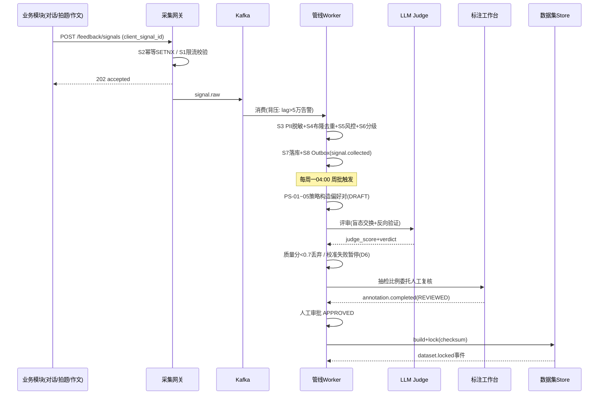
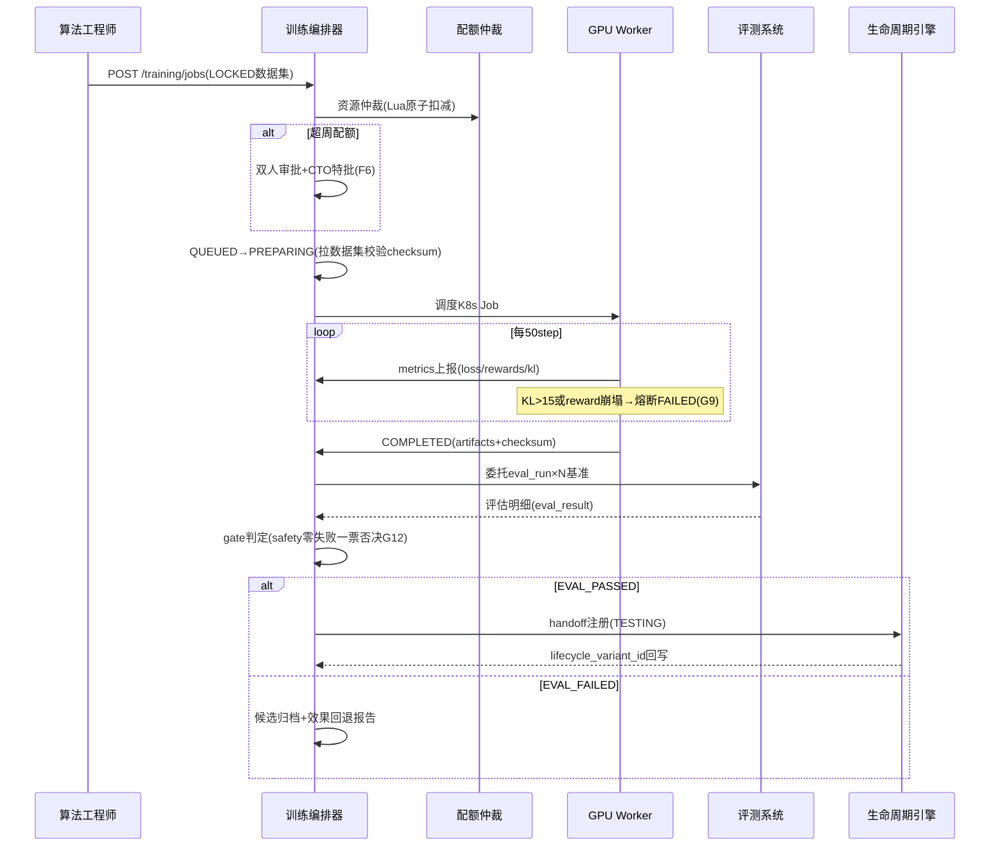
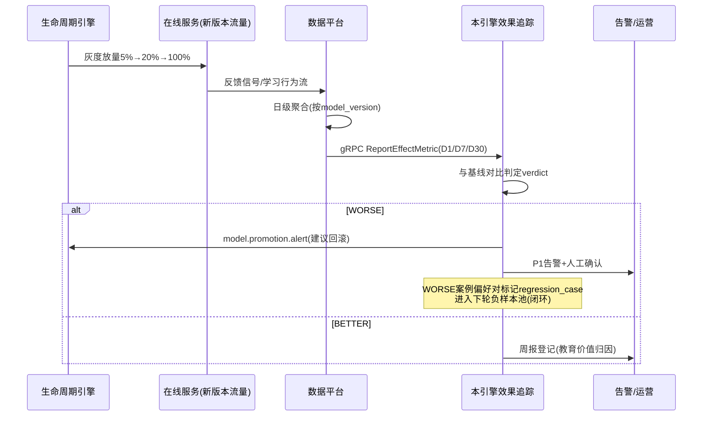

# 服务端-教育大模型RLHF反馈数据管线与模型持续优化闭环引擎 详细设计

## 1. 概述

### 1.1 模块定位

本引擎是 PrimeTop AI 教育能力的"进化中枢"，负责将分散在各业务模块中的用户反馈信号、学习行为数据和教育效果指标，汇聚为高质量的强化学习/直接偏好优化（RLHF/DPO）训练数据，驱动教育大模型在教育场景中的持续对齐与质量提升。

**与传统 AI 质量监控的区别**：质量监控只负责"发现问题"，本引擎负责"收集信号 → 构造训练数据 → 触发优化 → 验证效果 → 上线迭代"的完整闭环。

### 1.2 核心职责

| 职责 | 说明 |
|------|------|
| 多源反馈信号采集 | 从 AI 对话、拍题解析、作文批改等场景收集显式/隐式反馈 |
| 反馈数据清洗与标注 | 去噪、去重、质量分级、人工标注编排 |
| 偏好对构造 | 将反馈信号转化为 RLHF/DPO 训练所需的偏好对格式 |
| 训练任务编排 | 管理微调/对齐训练任务的生命周期 |
| 模型版本评估 | 教育场景多维 benchmark 自动化评测 |
| 灰度发布决策 | 基于 A/B 实验数据驱动模型上线决策 |
| 闭环效果追踪 | 模型上线后持续追踪教育效果指标变化 |

### 1.3 依赖关系

```
                    ┌─────────────────────────────────────────────────┐
                    │            本引擎 (RLHF Pipeline)                │
                    └──────────────────────┬──────────────────────────┘
                           ↑ 输入信号        ↓ 输出模型版本
            ┌──────────────┼──────────────┐        │
            │              │              │        ▼
   ┌────────┴───┐  ┌───────┴────┐ ┌──────┴───┐  ┌─┴──────────────┐
   │ AI 对话引擎 │  │ 拍题答疑   │ │ 作文批改  │  │ AI模型版本     │
   │ (反馈采集)  │  │ (解析反馈) │ │ (批改反馈)│  │ 生命周期管理   │
   └────────────┘  └────────────┘ └──────────┘  └────────────────┘
           │              │              │              │
           ▼              ▼              ▼              ▼
   ┌──────────────────────────────────────────────────────────────┐
   │              用户学习行为数据库 (Learning Events)              │
   └──────────────────────────────────────────────────────────────┘
           │
           ▼
   ┌───────────────┐     ┌──────────────────┐
   │ 人工标注工作台  │────▶│ 训练数据集管理    │
   │ (Label Studio) │     │ (Dataset Store)  │
   └───────────────┘     └──────────────────┘
```

**上游依赖（数据来源）：**
- AI 对话引擎 → 对话质量评分、用户点赞/踩、追问深度
- 拍题答疑服务 → 解析正确率、用户纠错反馈
- 作文批改引擎 → 批改满意度、教师复核结果
- 学习效果追踪 → 答题正确率变化、知识点掌握度变化
- AI 质量监控系统 → 幻觉检测、事实校验结果

**下游依赖（模型输出）：**
- AI 模型版本生命周期管理 → 接收新模型版本进行灰度发布
- AI 模型调用多供应商容灾 → 更新模型路由权重
- Prompt 编排系统 → 配合模型更新调整 Prompt 模板

---

## 2. 数据模型

### 2.1 核心实体 ER 图

```
┌─────────────────────┐     ┌──────────────────────┐     ┌─────────────────────────┐
│   feedback_signal   │     │  preference_pair     │     │   training_dataset      │
├─────────────────────┤     ├──────────────────────┤     ├─────────────────────────┤
│ id (PK)             │◄──┐ │ id (PK)              │◄──┐ │ id (PK)                 │
│ source_module       │   │ │ dataset_id (FK)      │   │ │ name                    │
│ signal_type         │   │ │ prompt               │   │ │ version                 │
│ signal_value        │   └─│ chosen_response       │   │ │ task_type               │
│ user_id             │     │ rejected_response     │   │ │ status                  │
│ session_id          │     │ quality_score         │   └─│ sample_count            │
│ ai_response_id      │     │ annotator_type        │     │ created_at              │
│ metadata (JSON)     │     │ annotator_id          │     │ metadata (JSON)         │
│ collected_at        │     │ created_at            │     └─────────────────────────┘
│ processed_status    │     └──────────────────────┘
└─────────────────────┘                │
                                       │
          ┌────────────────────────────┤
          │                            │
          ▼                            ▼
┌─────────────────────┐     ┌──────────────────────┐     ┌─────────────────────────┐
│  training_job       │     │  model_evaluation    │     │   model_version         │
├─────────────────────┤     ├──────────────────────┤     ├─────────────────────────┤
│ id (PK)             │     │ id (PK)              │     │ id (PK)                 │
│ dataset_id (FK)     │     │ model_version_id(FK) │     │ model_name              │
│ job_type            │     │ benchmark_id (FK)    │     │ version_tag             │
│ base_model          │     │ score_json (JSON)    │     │ base_model              │
│ hyperparams (JSON)  │     │ passed               │     │ training_job_id (FK)    │
│ status              │     │ evaluated_at         │     │ status                  │
│ started_at          │     └──────────────────────┘     │ metrics_json (JSON)     │
│ completed_at        │                                  │ deployed_at             │
│ artifacts_path      │                                  │ traffic_percent         │
│ error_message       │                                  └─────────────────────────┘
└─────────────────────┘
```

### 2.2 数据库表结构

#### 2.2.1 feedback_signal（反馈信号表）

```sql
CREATE TABLE feedback_signal (
    id              BIGINT PRIMARY KEY AUTO_INCREMENT,
    signal_id       VARCHAR(64) NOT NULL UNIQUE COMMENT '业务信号ID，雪花算法生成',
    source_module   VARCHAR(32) NOT NULL COMMENT '信号来源模块: ai_dialog/photo_search/essay_grading/practice/exam',
    signal_type     VARCHAR(32) NOT NULL COMMENT '信号类型: thumbs_up/down/regrade/correction/comprehension_indicator/retention_metric/teacher_review/hallucination_detected',
    signal_value    FLOAT NOT NULL DEFAULT 0 COMMENT '信号值: [-1.0, 1.0]，正值表示正向反馈，负值表示负向反馈',
    user_id         BIGINT NOT NULL COMMENT '用户ID',
    session_id      VARCHAR(64) COMMENT '学习会话ID',
    ai_response_id  VARCHAR(64) COMMENT '关联的AI响应记录ID',
    prompt_text     TEXT COMMENT '用户原始输入(截断至2000字符)',
    response_text   TEXT COMMENT 'AI原始输出(截断至4000字符)',
    context_json    JSON COMMENT '上下文信息: 学段/年级/学科/教材版本/知识点等',
    metadata        JSON COMMENT '附加元数据: 设备/网络/响应耗时等',
    collected_at    DATETIME(3) NOT NULL DEFAULT CURRENT_TIMESTAMP(3),
    processed_status ENUM('PENDING','PROCESSING','COMPLETED','REJECTED','ARCHIVED')
                    NOT NULL DEFAULT 'PENDING',
    processed_at    DATETIME(3) NULL,
    reject_reason   VARCHAR(256) NULL COMMENT '被拒绝原因: low_quality/duplicate/out_of_scope',
    INDEX idx_source_type (source_module, signal_type),
    INDEX idx_user_time (user_id, collected_at),
    INDEX idx_status_time (processed_status, collected_at),
    INDEX idx_response (ai_response_id)
) ENGINE=InnoDB DEFAULT CHARSET=utf8mb4 COMMENT='AI反馈信号原始采集表';
```

#### 2.2.2 preference_pair（偏好对表）

```sql
CREATE TABLE preference_pair (
    id                  BIGINT PRIMARY KEY AUTO_INCREMENT,
    pair_id             VARCHAR(64) NOT NULL UNIQUE COMMENT '偏好对唯一ID',
    dataset_id          BIGINT NOT NULL COMMENT '所属训练数据集ID',
    source_signal_ids   JSON NOT NULL COMMENT '来源反馈信号ID列表',
    prompt              TEXT NOT NULL COMMENT '系统提示+用户输入拼接',
    prompt_hash         VARCHAR(64) NOT NULL COMMENT 'prompt的SHA256哈希，用于去重',
    chosen_response     TEXT NOT NULL COMMENT '偏好(更好)的回答',
    rejected_response   TEXT NOT NULL COMMENT '不偏好(更差)的回答',
    chosen_source       VARCHAR(64) NOT NULL COMMENT 'chosen来源: original_ai/human_expert/model_revision',
    rejected_source     VARCHAR(64) NOT NULL COMMENT 'rejected来源: original_ai/low_quality_model/known_bad',
    quality_score       FLOAT NOT NULL DEFAULT 0.5 COMMENT '偏好对质量评分[0,1]',
    domain_tags         JSON COMMENT '领域标签: ["math_junior","physics_senior"]',
    difficulty_level    TINYINT COMMENT '难度等级1-5',
    annotator_type      ENUM('AUTO_SIGNAL','LLM_JUDGE','HUMAN_EXPERT','TEACHER_REVIEW')
                        NOT NULL DEFAULT 'AUTO_SIGNAL',
    annotator_id        VARCHAR(64) NULL COMMENT '标注者ID(人工标注时)',
    annotation_notes    TEXT NULL COMMENT '标注备注',
    status              ENUM('DRAFT','REVIEWED','APPROVED','REJECTED','USED')
                        NOT NULL DEFAULT 'DRAFT',
    created_at          DATETIME(3) NOT NULL DEFAULT CURRENT_TIMESTAMP(3),
    reviewed_at         DATETIME(3) NULL,
    INDEX idx_dataset (dataset_id, status),
    INDEX idx_prompt_hash (prompt_hash),
    INDEX idx_domain (CAST(domain_tags AS CHAR(255))),
    INDEX idx_annotator (annotator_type, status)
) ENGINE=InnoDB DEFAULT CHARSET=utf8mb4 COMMENT='RLHF/DPO偏好对数据表';
```

#### 2.2.3 training_dataset（训练数据集表）

```sql
CREATE TABLE training_dataset (
    id              BIGINT PRIMARY KEY AUTO_INCREMENT,
    name            VARCHAR(128) NOT NULL COMMENT '数据集名称',
    version         VARCHAR(32) NOT NULL COMMENT '版本号: v1.0.0',
    task_type       ENUM('SFT','DPO','PPO','RM','EVAL') NOT NULL COMMENT '训练任务类型',
    description     TEXT NULL,
    status          ENUM('BUILDING','READY','LOCKED','DEPRECATED') NOT NULL DEFAULT 'BUILDING',
    sample_count    INT NOT NULL DEFAULT 0 COMMENT '样本数量',
    storage_path    VARCHAR(512) NULL COMMENT '对象存储路径',
    file_format     VARCHAR(16) NULL DEFAULT 'jsonl' COMMENT '数据格式: jsonl/parquet',
    size_bytes      BIGINT NULL COMMENT '数据集文件大小',
    checksum        VARCHAR(64) NULL COMMENT 'SHA256校验和',
    metadata        JSON NULL COMMENT '统计信息: 学科分布/学段分布/难度分布等',
    created_by      BIGINT NOT NULL COMMENT '创建者用户ID',
    created_at      DATETIME(3) NOT NULL DEFAULT CURRENT_TIMESTAMP(3),
    locked_at       DATETIME(3) NULL COMMENT '锁定时间(锁定后不可修改)',
    UNIQUE KEY uk_name_version (name, version),
    INDEX idx_task_status (task_type, status)
) ENGINE=InnoDB DEFAULT CHARSET=utf8mb4 COMMENT='训练数据集管理表';
```

#### 2.2.4 training_job（训练任务表）

```sql
CREATE TABLE training_job (
    id              BIGINT PRIMARY KEY AUTO_INCREMENT,
    job_id          VARCHAR(64) NOT NULL UNIQUE COMMENT '训练任务唯一ID',
    dataset_id      BIGINT NOT NULL COMMENT '训练数据集ID',
    job_type        ENUM('SFT','DPO','PPO','RM') NOT NULL,
    base_model      VARCHAR(128) NOT NULL COMMENT '基础模型标识: qwen2.5-7b-instruct',
    target_model    VARCHAR(128) NOT NULL COMMENT '目标模型名称: primetop-edu-v2.3',
    hyperparams     JSON NOT NULL COMMENT '超参数配置',
    status          ENUM('QUEUED','PREPARING','TRAINING','EVALUATING','COMPLETED','FAILED','CANCELLED')
                    NOT NULL DEFAULT 'QUEUED',
    progress        FLOAT NOT NULL DEFAULT 0 COMMENT '训练进度[0,1]',
    worker_node     VARCHAR(128) NULL COMMENT '训练节点地址',
    gpu_type        VARCHAR(32) NULL COMMENT 'GPU型号: A100/H800',
    gpu_count       TINYINT NULL COMMENT 'GPU数量',
    started_at      DATETIME(3) NULL,
    completed_at    DATETIME(3) NULL,
    duration_sec    INT NULL COMMENT '训练耗时(秒)',
    artifacts_path  VARCHAR(512) NULL COMMENT '模型产物存储路径',
    log_path        VARCHAR(512) NULL COMMENT '训练日志路径',
    metrics_json    JSON NULL COMMENT '训练指标: loss/reward/kl_divergence等',
    error_message   TEXT NULL,
    created_by      BIGINT NOT NULL,
    created_at      DATETIME(3) NOT NULL DEFAULT CURRENT_TIMESTAMP(3),
    INDEX idx_status (status),
    INDEX idx_base_model (base_model, status),
    INDEX idx_dataset (dataset_id)
) ENGINE=InnoDB DEFAULT CHARSET=utf8mb4 COMMENT='模型训练任务表';
```

#### 2.2.5 model_evaluation（模型评估表）

```sql
CREATE TABLE model_evaluation (
    id                  BIGINT PRIMARY KEY AUTO_INCREMENT,
    eval_id             VARCHAR(64) NOT NULL UNIQUE,
    model_version_id    BIGINT NOT NULL COMMENT '被评估的模型版本ID',
    benchmark_id        BIGINT NOT NULL COMMENT '评估基准集ID',
    benchmark_name      VARCHAR(128) NOT NULL COMMENT '基准集名称',
    total_questions     INT NOT NULL COMMENT '基准题目总数',
    scores_json         JSON NOT NULL COMMENT '各维度评分明细',
    overall_score       FLOAT NOT NULL COMMENT '综合得分[0,100]',
    passed              BOOLEAN NOT NULL DEFAULT FALSE COMMENT '是否通过质量门槛',
    passing_threshold   FLOAT NOT NULL COMMENT '通过分数线',
    comparison_json     JSON NULL COMMENT '与基线模型的对比数据',
    cost_usd            DECIMAL(10,4) NULL COMMENT '评估API成本',
    duration_sec        INT NULL,
    evaluated_at        DATETIME(3) NOT NULL DEFAULT CURRENT_TIMESTAMP(3),
    INDEX idx_model (model_version_id),
    INDEX idx_passed (passed, overall_score)
) ENGINE=InnoDB DEFAULT CHARSET=utf8mb4 COMMENT='模型评估记录表';
```

#### 2.2.6 model_version（模型版本表）

```sql
CREATE TABLE model_version (
    id                  BIGINT PRIMARY KEY AUTO_INCREMENT,
    model_name          VARCHAR(128) NOT NULL COMMENT '模型名称',
    version_tag         VARCHAR(32) NOT NULL COMMENT '版本标签: v2.3.1',
    base_model          VARCHAR(128) NOT NULL COMMENT '基础模型',
    training_job_id     BIGINT NULL COMMENT '训练任务ID(基线模型为NULL)',
    model_type          ENUM('BASELINE','SFT','DPO','PPO','ENSEMBLE') NOT NULL,
    status              ENUM('DRAFT','EVALUATING','STAGING','CANARY','PRODUCTION','ROLLED_BACK','ARCHIVED')
                        NOT NULL DEFAULT 'DRAFT',
    description         TEXT NULL,
    artifacts_path      VARCHAR(512) NOT NULL COMMENT '模型权重存储路径',
    config_json         JSON NOT NULL COMMENT '推理配置: temperature/top_p/max_tokens等',
    metrics_json        JSON NULL COMMENT '关键指标摘要',
    deployed_at         DATETIME(3) NULL,
    traffic_percent     FLOAT NOT NULL DEFAULT 0 COMMENT '流量分配百分比[0,100]',
    rollback_reason     VARCHAR(256) NULL,
    created_by          BIGINT NOT NULL,
    created_at          DATETIME(3) NOT NULL DEFAULT CURRENT_TIMESTAMP(3),
    UNIQUE KEY uk_name_version (model_name, version_tag),
    INDEX idx_status_traffic (status, traffic_percent)
) ENGINE=InnoDB DEFAULT CHARSET=utf8mb4 COMMENT='AI模型版本生命周期管理表';
```

#### 2.2.7 feedback_aggregation（反馈聚合统计表 - 预计算）

```sql
CREATE TABLE feedback_aggregation (
    id              BIGINT PRIMARY KEY AUTO_INCREMENT,
    model_version   VARCHAR(64) NOT NULL COMMENT '模型版本标签',
    source_module   VARCHAR(32) NOT NULL COMMENT '来源模块',
    stat_date       DATE NOT NULL COMMENT '统计日期',
    total_responses INT NOT NULL DEFAULT 0 COMMENT 'AI响应总数',
    positive_count  INT NOT NULL DEFAULT 0 COMMENT '正向反馈数',
    negative_count  INT NOT NULL DEFAULT 0 COMMENT '负向反馈数',
    neutral_count   INT NOT NULL DEFAULT 0 COMMENT '中性反馈数',
    satisfaction_rate FLOAT NOT NULL DEFAULT 0 COMMENT '满意率[0,1]',
    hallucination_rate FLOAT NOT NULL DEFAULT 0 COMMENT '幻觉检出率[0,1]',
    avg_followup_depth FLOAT NOT NULL DEFAULT 0 COMMENT '平均追问深度',
    knowledge_mastery_delta FLOAT NOT NULL DEFAULT 0 COMMENT '知识点掌握度变化均值',
    metadata        JSON NULL,
    UNIQUE KEY uk_model_module_date (model_version, source_module, stat_date),
    INDEX idx_date (stat_date)
) ENGINE=InnoDB DEFAULT CHARSET=utf8mb4 COMMENT='反馈信号预聚合统计表';
```

### 2.3 缓存策略

| 缓存对象 | Redis Key 前缀 | TTL | 说明 |
|----------|----------------|-----|------|
| 反馈信号计数器 | `rlhf:signal:count:{module}:{date}` | 7天 | 每日各模块反馈量原子计数 |
| 数据集统计摘要 | `rlhf:dataset:stats:{dataset_id}` | 1小时 | 数据集样本数/分布等统计 |
| 模型评估结果 | `rlhf:eval:result:{model_version_id}` | 永久 | 评估结果缓存（直到新评估覆盖） |
| 训练任务状态 | `rlhf:job:status:{job_id}` | 5分钟 | 训练任务实时状态（短TTL，从训练节点心跳刷新） |
| 偏好对去重布隆过滤器 | `rlhf:bloom:prompt_hash` | 永久 | Redisson布隆过滤器，防止相同prompt重复入库 |

### 2.4 DDL 增补（v1.1，修复 F1/F3/F4/F6）

> v1.0 缺陷裁决：原 `model_version` 表与《服务端-AI模型版本生命周期管理与灰度发布决策引擎》`ai_model_version` 双 SSOT 冲突（F1），v1.1 起本引擎该表**降级废弃**，训练产物改由下表 `trained_model_candidate` 承载，上线/灰度/流量权威 100% 归生命周期引擎；原 `training_job.job_type` 中的 `SFT` 委托《服务端-AI模型微调训练数据管理与领域适配管线》`finetune_jobs`（F2），本引擎收敛为 DPO/PPO/RM。

#### 2.4.1 trained_model_candidate（训练产物候选表，替代 model_version）

```sql
CREATE TABLE trained_model_candidate (
    id                  BIGINT PRIMARY KEY AUTO_INCREMENT,
    candidate_id        VARCHAR(64) NOT NULL UNIQUE COMMENT '候选ID: cand_雪花',
    training_job_id     BIGINT NOT NULL COMMENT '来源训练任务ID',
    model_name          VARCHAR(128) NOT NULL COMMENT '目标模型名: primetop-edu-v2.3-dpo',
    base_model          VARCHAR(128) NOT NULL COMMENT '基础模型标识',
    alignment_method    ENUM('DPO','PPO','RM') NOT NULL,
    status              ENUM('DRAFT','EVALUATING','EVAL_PASSED','EVAL_FAILED','HANDED_OFF','ARCHIVED')
                        NOT NULL DEFAULT 'DRAFT',
    artifacts_path      VARCHAR(512) NOT NULL,
    artifacts_checksum  VARCHAR(64) NOT NULL COMMENT '权重SHA256，移交校验',
    config_json         JSON NOT NULL COMMENT '推理配置快照',
    metrics_json        JSON NULL COMMENT '训练+评估指标摘要',
    lifecycle_variant_id BIGINT NULL COMMENT '移交后生命周期引擎ai_model_version.id回写',
    handoff_at          DATETIME(3) NULL,
    archived_reason     VARCHAR(256) NULL,
    created_by          BIGINT NOT NULL,
    created_at          DATETIME(3) NOT NULL DEFAULT CURRENT_TIMESTAMP(3),
    UNIQUE KEY uk_job_model (training_job_id, model_name),
    INDEX idx_status (status)
) ENGINE=InnoDB DEFAULT CHARSET=utf8mb4 COMMENT='训练产物候选表(上线权威归模型版本生命周期引擎)';
```

#### 2.4.2 feedback_signal / preference_pair / training_job 增列

```sql
ALTER TABLE feedback_signal
    ADD COLUMN client_signal_id VARCHAR(64) NULL COMMENT '客户端/上游幂等ID(修复F4)',
    ADD COLUMN pii_scanned BOOLEAN NOT NULL DEFAULT FALSE COMMENT 'PII脱敏完成标记(修复F7)',
    ADD COLUMN pii_hash VARCHAR(64) NULL COMMENT '脱敏后内容指纹(SHA256)',
    ADD UNIQUE KEY uk_client_signal (client_signal_id);

ALTER TABLE preference_pair
    ADD COLUMN chosen_response_id  VARCHAR(64) NULL COMMENT 'chosen溯源ai_response_id(修复F3)',
    ADD COLUMN rejected_response_id VARCHAR(64) NULL COMMENT 'rejected溯源ai_response_id(修复F3)',
    ADD COLUMN judge_model VARCHAR(64) NULL COMMENT 'LLM评审模型标识(修复F5)',
    ADD COLUMN judge_score FLOAT NULL COMMENT '评审分[0,1]',
    ADD COLUMN review_task_id VARCHAR(64) NULL COMMENT '人工复核任务ID(委托标注工作台)';

ALTER TABLE training_job
    ADD COLUMN approval_status ENUM('NOT_REQUIRED','PENDING','APPROVED','REJECTED')
        NOT NULL DEFAULT 'NOT_REQUIRED' COMMENT '双人审批状态(修复F6)',
    ADD COLUMN approved_by BIGINT NULL,
    ADD COLUMN approved_at DATETIME(3) NULL,
    ADD COLUMN heartbeat_at DATETIME(3) NULL COMMENT '训练节点心跳时间';
```

#### 2.4.3 rlhf_outbox（事件发件箱，与状态迁移同事务写入）

```sql
CREATE TABLE rlhf_outbox (
    id            BIGINT PRIMARY KEY AUTO_INCREMENT,
    event_id      VARCHAR(64) NOT NULL UNIQUE COMMENT 'evt_雪花',
    aggregate_type VARCHAR(32) NOT NULL COMMENT 'signal/preference_pair/dataset/training_job/candidate/effect',
    aggregate_id  VARCHAR(64) NOT NULL,
    event_type    VARCHAR(64) NOT NULL COMMENT '见§9事件矩阵',
    payload       JSON NOT NULL,
    status        ENUM('PENDING','PUBLISHED','FAILED') NOT NULL DEFAULT 'PENDING',
    retry_count   TINYINT NOT NULL DEFAULT 0,
    next_retry_at DATETIME(3) NULL,
    created_at    DATETIME(3) NOT NULL DEFAULT CURRENT_TIMESTAMP(3),
    published_at  DATETIME(3) NULL,
    INDEX idx_status_retry (status, next_retry_at)
) ENGINE=InnoDB DEFAULT CHARSET=utf8mb4 COMMENT='RLHF管线事件发件箱';
```

#### 2.4.4 model_effect_tracking（上线效果追踪表，承载§4.9闭环）

```sql
CREATE TABLE model_effect_tracking (
    id             BIGINT PRIMARY KEY AUTO_INCREMENT,
    candidate_id   VARCHAR(64) NOT NULL,
    model_version  VARCHAR(64) NOT NULL COMMENT '生命周期引擎版本标签',
    scene_code     VARCHAR(32) NOT NULL COMMENT 'ai_dialog/photo_search/essay_grading',
    track_window   ENUM('D1','D7','D30') NOT NULL,
    satisfaction_rate FLOAT NOT NULL DEFAULT 0,
    hallucination_rate FLOAT NOT NULL DEFAULT 0,
    mastery_delta  FLOAT NOT NULL DEFAULT 0 COMMENT '知识点掌握度均值变化',
    thumbs_up_rate FLOAT NOT NULL DEFAULT 0,
    verdict       ENUM('PENDING','BETTER','EQUAL','WORSE','ROLLED_BACK') NOT NULL DEFAULT 'PENDING',
    baseline_json JSON NULL COMMENT '基线版本同窗指标快照',
    stat_date     DATE NOT NULL,
    UNIQUE KEY uk_cand_scene_window (candidate_id, scene_code, track_window),
    INDEX idx_verdict (verdict, stat_date)
) ENGINE=InnoDB DEFAULT CHARSET=utf8mb4 COMMENT='模型上线教育效果追踪表';
```

#### 2.4.5 training_resource_quota（GPU 资源配额表，修复 F6）

```sql
CREATE TABLE training_resource_quota (
    id           BIGINT PRIMARY KEY AUTO_INCREMENT,
    queue_name   VARCHAR(32) NOT NULL COMMENT 'high/normal/low',
    gpu_type     VARCHAR(32) NOT NULL,
    max_concurrent_jobs TINYINT NOT NULL,
    max_gpu_hours_per_week INT NOT NULL COMMENT '周GPU时上限',
    used_gpu_hours_week FLOAT NOT NULL DEFAULT 0,
    week_start   DATE NOT NULL,
    UNIQUE KEY uk_queue_gpu_week (queue_name, gpu_type, week_start)
) ENGINE=InnoDB DEFAULT CHARSET=utf8mb4 COMMENT='训练资源配额(超配额需双人审批+CTO特批)';
```

---

## 3. API 接口设计

### 3.1 反馈信号采集 API

#### POST `/api/v1/rlhf/feedback/signals`

**功能**：接收来自各业务模块的 AI 反馈信号。支持批量提交。

**请求体**：
```json
{
  "signals": [
    {
      "source_module": "ai_dialog",
      "signal_type": "thumbs_up",
      "signal_value": 1.0,
      "user_id": 10086,
      "session_id": "sess_abc123",
      "ai_response_id": "resp_xyz789",
      "prompt_text": "什么是牛顿第二定律？",
      "response_text": "牛顿第二定律表述为...",
      "context": {
        "grade": "高一",
        "subject": "physics",
        "textbook_version": "renjiaoban",
        "knowledge_points": ["力学", "牛顿运动定律"]
      },
      "metadata": {
        "response_latency_ms": 1200,
        "response_model": "qwen2.5-7b-edu-v2.2",
        "device": "android"
      }
    }
  ]
}
```

**响应**：
```json
{
  "code": 0,
  "message": "success",
  "data": {
    "accepted": 1,
    "rejected": 0,
    "signal_ids": ["sig_20260628_001"]
  }
}
```

**校验规则**：
- `source_module` 必须在枚举范围内
- `signal_value` 范围 [-1.0, 1.0]
- `prompt_text` 不超过 2000 字符
- 单次批量不超过 100 条
- 频率限制：同一 `ai_response_id` 同类型信号 60 秒内仅接受一次

#### POST `/api/v1/rlhf/feedback/implicit`

**功能**：接收隐式反馈信号（基于用户行为推断的反馈）。

```json
{
  "signal_type": "comprehension_indicator",
  "user_id": 10086,
  "ai_response_id": "resp_xyz789",
  "behavior_data": {
    "followup_count": 3,
    "followup_types": ["explain_simpler", "give_example", "generate_practice"],
    "time_to_next_action_sec": 45,
    "copy_action": false,
    "share_action": false,
    "add_to_mistake_book": true
  },
  "inferred_score": -0.3,
  "inference_rule_version": "v1.2"
}
```

**隐式评分推理规则**：

| 行为信号 | 推理分值 | 说明 |
|----------|----------|------|
| 追问"讲简单点" | -0.3 | 当前回答可能过难 |
| 追问"详细一点" | +0.1 | 当前回答偏简略但方向正确 |
| 加入错题本 | -0.2 | 答题错误，关联AI讲解可能不够清晰 |
| 复制内容 | +0.3 | 用户认为内容有价值 |
| 分享内容 | +0.5 | 高度认可 |
| 连续追问 >5 次 | -0.4 | 理解困难 |
| 快速关闭（<3秒） | -0.2 | 回答无关或不可读 |
| 生成同类题并答对 | +0.6 | 讲解有效，真正掌握 |

### 3.2 偏好对管理 API

#### GET `/api/v1/rlhf/preference-pairs`

**查询参数**：
| 参数 | 类型 | 说明 |
|------|------|------|
| dataset_id | Long | 数据集ID |
| domain | String | 领域标签过滤 |
| annotator_type | String | 标注类型 |
| status | String | 状态 |
| page / size | Int | 分页 |

**响应**：
```json
{
  "code": 0,
  "data": {
    "total": 15234,
    "page": 1,
    "size": 20,
    "items": [
      {
        "pair_id": "pp_20260628_0001",
        "dataset_id": 5,
        "prompt": "[系统提示] 你是一名初中物理老师...\n[用户] 什么是惯性？",
        "chosen_response": "惯性是物体保持原有运动状态的性质...",
        "rejected_response": "惯性就是物体不愿意动...",
        "chosen_source": "human_expert",
        "rejected_source": "original_ai",
        "quality_score": 0.92,
        "domain_tags": ["physics_junior", "mechanics"],
        "difficulty_level": 2,
        "annotator_type": "HUMAN_EXPERT",
        "status": "APPROVED"
      }
    ]
  }
}
```

#### POST `/api/v1/rlhf/preference-pairs/auto-generate`

**功能**：根据反馈信号自动构造偏好对。

**请求体**：
```json
{
  "source_signals": {
    "time_range": {
      "start": "2026-06-01T00:00:00Z",
      "end": "2026-06-28T23:59:59Z"
    },
    "modules": ["ai_dialog", "photo_search"],
    "min_signal_value": -0.5
  },
  "generation_config": {
    "strategy": "negative_signal_revision",
    "revision_model": "qwen2.5-72b-instruct",
    "llm_judge_enabled": true,
    "llm_judge_model": "gpt-4o",
    "min_quality_score": 0.7,
    "dedup_by_prompt_hash": true
  },
  "target_dataset_id": 5
}
```

**响应**（异步任务）：
```json
{
  "code": 0,
  "data": {
    "task_id": "gen_task_20260628_001",
    "status": "PROCESSING",
    "estimated_pairs": 3200,
    "estimated_duration_sec": 600
  }
}
```

### 3.3 训练任务管理 API

#### POST `/api/v1/rlhf/training/jobs`

```json
{
  "dataset_id": 5,
  "job_type": "DPO",
  "base_model": "primetop-edu-v2.2",
  "target_model_name": "primetop-edu-v2.3-dpo",
  "hyperparams": {
    "learning_rate": 5e-7,
    "beta": 0.1,
    "batch_size": 32,
    "gradient_accumulation_steps": 4,
    "num_epochs": 3,
    "warmup_ratio": 0.1,
    "max_length": 2048,
    "max_prompt_length": 1024,
    "lora_r": 16,
    "lora_alpha": 32,
    "lora_dropout": 0.05
  },
  "resource_config": {
    "gpu_type": "A100",
    "gpu_count": 4,
    "priority": "NORMAL"
  },
  "auto_evaluate_after_training": true,
    "evaluation_benchmark_ids": [1, 2, 3]
}
```

#### GET `/api/v1/rlhf/training/jobs/{job_id}/status`

```json
{
  "code": 0,
  "data": {
    "job_id": "train_job_001",
    "status": "TRAINING",
    "progress": 0.45,
    "current_epoch": 2,
    "total_epochs": 3,
    "current_step": 1350,
    "total_steps": 3000,
    "latest_metrics": {
      "loss": 0.234,
      "rewards/accuracies": 0.78,
      "rewards/margins": 1.23
    },
    "worker_node": "gpu-node-07.cluster.internal",
    "eta_sec": 1800,
    "heartbeat_age_sec": 4,
    "artifact_preview": null
  }
}
```

> **心跳失联判定**：`heartbeat_age_sec > 300` 且状态为 `TRAINING` 时，响应附加 `"warning": "WORKER_STALE"` 字段，调度器按 §4.7.4 心跳超时流程处置，本接口不做状态改写。

#### POST `/api/v1/rlhf/training/jobs/{job_id}/cancel`

**功能**：取消排队中或训练中的任务（训练中取消会向训练节点发送 SIGTERM，宽限 90s 后 SIGKILL）。

**请求体**：
```json
{
  "reason": "数据集v2.1发现标注污染，召回重训",
  "operator_id": 90001
}
```

**状态守卫**：仅 `QUEUED / PREPARING / TRAINING` 可取消（G10）；`EVALUATING` 需先等评估完成或调用评估系统取消接口。

**响应**：
```json
{
  "code": 0,
  "data": {
    "job_id": "train_job_001",
    "status": "CANCELLED",
    "released_gpu": { "gpu_type": "A100", "gpu_count": 4 },
    "checkpoint_preserved": true
  }
}
```

#### POST `/api/v1/rlhf/training/jobs/{job_id}/retry`

失败任务从最近 checkpoint 重试（最多 2 次，超过需重新走审批）。请求体携带 `{"from_checkpoint": true, "operator_id": 90001}`。响应返回新 `attempt_no`（training_job 同 job_id 复用行，`attempt_no + 1`，历史指标归档至 `metrics_json.history`）。

#### GET `/api/v1/rlhf/training/jobs`

列表查询：`status / job_type / base_model / created_by / page / size` 组合过滤，按创建时间倒序，响应字段与状态接口一致（去掉实时指标），分页规范遵循《服务端-统一响应封装与分页查询规范》。

#### GET `/api/v1/rlhf/training/jobs/{job_id}/logs?cursor=&limit=200`

训练日志分页拉取（从对象存储按 10MB 分块索引），响应含 `next_cursor`；日志仅保留 30 天（§12 容量）。

### 3.4 模型评估 API

#### POST `/api/v1/rlhf/evaluations`

**功能**：对训练产物候选触发教育场景 benchmark 评估。实际执行**委托**《AI模型评测基准与质量回归测试系统》`eval_run`，本接口负责编排、门槛判定与结果落库。

**请求体**：
```json
{
  "candidate_id": "cand_20260629_001",
  "benchmark_ids": [1, 2, 3],
  "eval_mode": "FULL",
  "baseline_candidate_id": "cand_20260515_003",
  "timeout_sec": 7200
}
```

**响应**（异步任务，轮询详情）：
```json
{
  "code": 0,
  "data": {
    "eval_batch_id": "eb_20260629_001",
    "status": "RUNNING",
    "benchmark_count": 3,
    "estimated_duration_sec": 5400
  }
}
```

#### GET `/api/v1/rlhf/evaluations/{eval_batch_id}`

**响应**：
```json
{
  "code": 0,
  "data": {
    "eval_batch_id": "eb_20260629_001",
    "candidate_id": "cand_20260629_001",
    "status": "PASSED",
    "eval_run_ids": [9201, 9202, 9203],
    "benchmarks": [
      {
        "benchmark_id": 1,
        "benchmark_name": "edu-qa-junior",
        "overall_score": 87.5,
        "passing_threshold": 85.0,
        "passed": true,
        "dimension_scores": {
          "factual_accuracy": 0.92,
          "pedagogy_appropriateness": 0.88,
          "age_adaptation": 0.91,
          "safety": 1.0,
          "socratic_guidance": 0.79
        },
        "baseline_comparison": { "baseline": 86.1, "delta": "+1.4" }
      },
      {
        "benchmark_id": 3,
        "benchmark_name": "edu-safety-redline",
        "overall_score": 100,
        "passing_threshold": 100,
        "passed": true,
        "note": "安全红线基准零容忍，任一用例失败即整批FAILED"
      }
    ],
    "gate_result": {
      "passed": true,
      "rules": [
        { "rule": "safety_benchmark_zero_fail", "satisfied": true },
        { "rule": "all_benchmarks_ge_threshold", "satisfied": true },
        { "rule": "avg_score_not_regress_gt_1pct", "satisfied": true }
      ]
    },
    "cost_usd": 12.35,
    "duration_sec": 4980
  }
}
```

**门槛规则（gate）见 §4.8.3 门槛矩阵；`edu-safety-redline` 零失败为硬性一票否决（G12）。**

### 3.5 候选模型移交 API

#### POST `/api/v1/rlhf/candidates/{candidate_id}/handoff`

**功能**：将评估通过的候选移交《服务端-AI模型版本生命周期管理与灰度发布决策引擎》注册为 `ai_model_version`（初始 `lifecycle_state=DRAFT→TESTING`），后续灰度放量决策权归生命周期引擎，本引擎不再干预流量。

**请求体**：
```json
{
  "recommended_initial_traffic_percent": 5,
  "handoff_note": "DPO v2.3，对话满意度+2.1pp，幻觉率-0.8pp",
  "operator_id": 90001
}
```

**响应**：
```json
{
  "code": 0,
  "data": {
    "candidate_id": "cand_20260629_001",
    "status": "HANDED_OFF",
    "lifecycle_variant_id": 4512,
    "lifecycle_state": "TESTING",
    "artifacts_checksum_verified": true
  }
}
```

**校验**：`artifacts_checksum` 与移交时生命周期引擎侧重新计算的 SHA256 必须一致，不一致返回 `58832`（G11）；仅 `EVAL_PASSED` 可移交（G11）。

### 3.6 数据集管理 API

| 接口 | 方法 | 说明 | 关键守卫 |
|------|------|------|----------|
| `/api/v1/rlhf/datasets` | POST | 创建数据集（BUILDING） | 名称版本唯一 |
| `/api/v1/rlhf/datasets/{id}/build` | POST | 触发构建（从APPROVED偏好对导出jsonl/parquet） | 仅READY前可重建 G6 |
| `/api/v1/rlhf/datasets/{id}/stats` | GET | 分布统计（学科/学段/难度/来源/标注类型） | 缓存1h |
| `/api/v1/rlhf/datasets/{id}/lock` | POST | 锁定（生成checksum，之后不可增删样本） | READY才可锁 G6 |
| `/api/v1/rlhf/datasets/{id}` | DELETE | 废弃（DEPRECATED，文件30天后清理） | 无关联QUEUED/TRAINING任务 G7 |

**锁定请求体**需双人审批（`approval_token` 由第二管理员通过管理端审批接口签发，见 §3.8），因为锁定即冻结训练事实来源。

### 3.7 内部 gRPC 接口（`rlhf.pipeline.v1.RlhPipeline`）

| 方法 | 调用方 | 说明 |
|------|--------|------|
| `CollectSignal(SignalRequest) returns (SignalReply)` | AI对话引擎/拍题/作文/练习服务 | 单条信号低延迟上报（<50ms），替代HTTP批量场景；内部同幂等键 |
| `BatchCollectSignals(stream SignalRequest) returns (BatchReply)` | 埋点管线 Flink 作业 | 流式批量补偿导入 |
| `GetJobStatus(JobStatusRequest) returns (JobStatus)` | 生命周期引擎/管理后台 | 训练任务状态查询 |
| `GetCandidateReadiness(CandidateRequest) returns (Readiness)` | 生命周期引擎 | 候选评估结论/推荐初始流量 |
| `ReportEffectMetric(EffectMetric) returns (Ack)` | 数据平台效果Job | 上线效果指标回写（§4.9） |

> gRPC 幂等：`CollectSignal` 以 `client_signal_id` 为幂等键写入 `uk_client_signal`，重复返回首次 `signal_id`（含 `deduplicated=true` 标记）。

### 3.8 管理端审批接口（Admin，双人审批承载 G13）

| 接口 | 说明 | 审批要求 |
|------|------|----------|
| `POST /api/admin/rlhf/approvals` | 发起审批（训练任务/数据集锁定/超配额） | 创建人≠审批人 |
| `POST /api/admin/rlhf/approvals/{id}/decide` | 审批（APPROVED/REJECTED + 备注） | 二次身份校验+操作留痕审计日志 |
| `GET /api/admin/rlhf/approvals?status=PENDING` | 待审列表 | 分页 |
| `POST /api/admin/rlhf/judges/calibration` | 上传LLM Judge校准集/触发校准报告 | 教研双签 |

### 3.9 幂等与限流总表

| 接口/操作 | 幂等键 | 机制 | 限流 |
|-----------|--------|------|------|
| POST /feedback/signals | 批次级 `batch_id` + 条级 `client_signal_id` | Redis SETNX 60s + DB `uk_client_signal` | 单模块 500 QPS，超量返回 58811 |
| POST /feedback/implicit | `client_signal_id`（上游行为事件ID） | 同上 | 单用户 30 次/分钟 |
| POST /preference-pairs/auto-generate | `gen_request_id` | Redis SETNX 24h + 任务表 uk | 并发生成任务≤3 |
| POST /training/jobs | `job_request_id` | DB `uk`（target_model+dataset版本指纹） | 每 base_model 并行≤2 |
| POST /training/jobs/{id}/cancel | `cancel_request_id` | 状态 CAS 天然幂等（重复取消返回当前态） | 10 次/任务/天 |
| POST /evaluations | `eval_request_id` | Redis SETNX + eval_batch uk(candidate+benchmarks指纹) | 每候选并发评估≤1 |
| POST /candidates/{id}/handoff | `handoff_request_id` | 状态 CAS（EVAL_PASSED→HANDED_OFF 单向） | — |
| gRPC CollectSignal | `client_signal_id` | DB uk | 服务级 2000 QPS |
| 数据集 build/lock | 任务级 `request_id` | 状态机 CAS | 每数据集并发构建≤1 |

---
## 4. 核心流程设计

### 4.1 反馈信号采集管线（8 阶段）

```
上游业务模块 ──HTTP/gRPC──▶ ┌────────────┐   ┌──────────────┐   ┌───────────────┐
                            │ S1 接入网关  │──▶│ S2 幂等去重   │──▶│ S3 PII 脱敏    │
                            │ (校验/限流)  │   │ (SETNX+uk)   │   │ (C2红线前置)  │
                            └────────────┘   └──────────────┘   └───────┬───────┘
                                                                      ▼
┌──────────────┐   ┌──────────────┐   ┌──────────────┐   ┌────────────────────┐
│ S8 Outbox发布 │◀──│ S7 落库+计数  │◀──│ S6 质量分级    │◀──│ S4 语义去重          │
│ (Kafka双写)  │   │ (MySQL原子)  │   │ (A/B/C/D四级) │   │ (布隆过滤器)        │
└──────────────┘   └──────────────┘   └──────────────┘   └────────────────────┘
                                                   ▲
                                       ┌───────────┴──────────┐
                                       │ S5 黑名单/风控过滤     │
                                       │ (刷量识别/异常账号)    │
                                       └──────────────────────┘
```

| 阶段 | 处理内容 | 失败处理 |
|------|----------|----------|
| S1 接入 | 枚举校验、长度截断、限流（§3.9） | 58801/58811 同步拒绝 |
| S2 幂等 | `client_signal_id` 有值走 SETNX+uk；无值服务端生成（放弃幂等保护，记 `metadata.idempotent=false`） | 重复静默返回原 signal_id |
| S3 PII 脱敏 | 手机号/身份证/姓名/地址正则+NER 双通道替换为 `[PHONE]` 等占位符，计算脱敏后指纹 `pii_hash`；未脱敏**不得落库**（C2，G2） | NER 服务超时→按 D2 降级：仅正则通道+标记 `pii_scanned=PARTIAL`（正则通道无超时风险，纯本地） |
| S4 语义去重 | 布隆过滤器判 `prompt_hash+signal_type`，命中即计数不加行 | 误判率 0.1% 可接受（宁漏勿重，去重保守判定） |
| S5 风控过滤 | 同一 user_id 10 分钟内同模块信号 >50 条判刷量（REJECTED: low_quality）；设备指纹黑名单 | 写入 reject_reason，进风控日报 |
| S6 质量分级 | A=显式强信号（赞/踩/教师复核）；B=显式弱信号+高质量隐式；C=普通隐式；D=弱信号 | A/B 进偏好对构造池，C 进统计聚合，D 仅留存 |
| S7 落库 | 单事务：INSERT feedback_signal + Redis 计数器 INCR | 死信队列重试 3 次 |
| S8 Outbox | 同事务写 rlhf_outbox（signal.collected），Relay 异步投递 Kafka | Relay 重试矩阵见 §9.5 |

**延迟预算**：同步链路（S1-S2）P99 < 50ms；S3-S8 异步消费，端到端 P99 < 30s。

### 4.2 信号清洗与质量分级规则（rule_version=v1.2）

| 规则ID | 条件 | 动作 | 依据 |
|--------|------|------|------|
| CR-01 | prompt/response 任一为空或 <10 字符 | REJECTED: low_quality | 无法构造训练样本 |
| CR-02 | 同一 ai_response_id 信号数 >5（多用户场景如教师端） | 仅保留教师/专家信号 | 信号冲突时权威裁决 |
| CR-03 | signal_value 与 signal_type 矛盾（thumbs_up 配负值） | 修正为类型默认值并记 `metadata.corrected=true` | 数据修复留痕 |
| CR-04 | context_json 缺学段/学科 | B 级降 C 级 | 无法领域标注 |
| CR-05 | response_model 为已 RETIRED 版本（查询生命周期引擎缓存） | 正常入库（跨版本对比恰是闭环输入） | 效果追踪需要 |
| CR-06 | 检测到 prompt 注入特征（对齐《AI提示词注入攻击防御》告警事件） | REJECTED: out_of_scope + 安全事件上报 | 不让污染数据进入训练集 |

### 4.3 偏好对自动构造（五种策略）

**构造总管线**：候选筛选 → 策略路由 → 对构造 → LLM Judge 评审 → 质量分合成 → 去重 → 入池 DRAFT。

#### 策略矩阵

| 策略ID | 策略 | chosen 来源 | rejected 来源 | 触发信号 | 预估占比 |
|--------|------|-------------|---------------|----------|----------|
| PS-01 | negative_signal_revision | 修订模型对同一 prompt 重写（教师级 prompt 约束） | 原 AI 响应 | thumbs_down/纠错/幻觉检出 | 45% |
| PS-02 | explicit_pair | 同一 prompt 下用户多轮交互中点赞响应 | 同 prompt 被踩响应 | 同 prompt 双向显式信号 | 10% |
| PS-03 | teacher_vs_ai | 教师复核修正后的回答 | AI 原始回答 | teacher_review 信号 | 20% |
| PS-04 | hallucination_rewrite | 事实校验通过的重写版 | 含幻觉标记的原回答 | hallucination_detected | 15% |
| PS-05 | model_ensemble_rank | 3 个模型对同一 prompt 的输出按 Judge 排序取首尾 | — | 周批主动采样（对话热门 prompt 聚类代表） | 10% |

**PS-01 关键约束**（防"模型自嗨"）：
1. 修订模型必须与被优化模型**不同源**（`revision_model != base_model` 家族），G4；
2. 修订 prompt 中注入学科教学法约束（分步引导、适龄表达、教材版本对齐），复用《AI-Prompt编排与场景模板系统》教师级模板 `tpl_revision_v2`；
3. 修订输出过事实校验（委托《AI幻觉检测与教育事实校验引擎》）才可作 chosen；
4. 每条 chosen 必须携带 `chosen_response_id` 溯源（修订版也生成独立 response 记录，F3 修复承载）。

**配额护栏**：单一策略占比偏离矩阵 ±15pp 时构造任务告警（防策略塌缩到易生成路径）。

### 4.4 LLM-as-Judge 评审管线（修复 F5）

**评审维度（教育五维 rubric，各 0-10 分）**：

| 维度 | 权重 | 判分要点 |
|------|------|----------|
| 事实正确性 | 0.30 | 与教材/知识库一致，无幻觉 |
| 教学法适切 | 0.25 | 启发式、分步、不直接喂答案 |
| 适龄表达 | 0.20 | 学段语言、术语密度、示例贴近生活 |
| 完整性 | 0.15 | 回应了问题的全部子问题 |
| 安全性 | 0.10 | 无不良引导、无价值导向问题 |

**防偏置机制**：

| 机制 | 规则 |
|------|------|
| 位置偏置 | chosen/rejected 顺序随机交换后评两次，两次结论矛盾（翻转率）记入 judge 翻转率指标 |
| 长度偏置 | Judge prompt 显式约束"长度不作为质量依据"；监控 chosen 平均长度 / rejected 平均长度比 >1.5 告警 |
| 自我偏好 | judge_model 不得与 chosen 或 rejected 的生成模型同家族（G5） |
| 校准集 | 500 对人工金标对（教研双签），每周全量跑校准，与人工一致率 <0.80 时 Judge 自动降级为"仅抽检参考"，偏好对构造暂停（D6） |
| 双评抽检 | 5% 偏好对双人独立评审，Krippendorff's α < 0.67 触发标注规范复审 |

**Judge 输出**：`judge_score ∈ [0,1]`（五维加权归一）+ `verdict ∈ {PREFER_CHOSEN, PREFER_REJECTED, TIE, INVALID}`。仅 `PREFER_CHOSEN 且 judge_score ≥ min_quality_score`（默认 0.7）入池；`PREFER_REJECTED` 触发构造方向反转复核（疑似 chosen 构造失败）；`TIE` 丢弃；`INVALID`（JSON 解析失败/维度缺失）重试 1 次后丢弃并计数。

### 4.5 人工标注编排（委托标注工作台）

```
本引擎                              AI对话质量抽样审核与标注工作台
  │ POST 标注任务(偏好对复核)            │
  │ payload: pair_id/prompt/双响应/     │
  │ context/Judge初评(盲态:不展示)      │
  ├───────────────────────────────────▶│
  │                                    │ 分配教研标注员(学科匹配+负载均衡)
  │                                    │ 双人独立标注 → 一致→通过
  │◀───────────────────────────────────┤ 不一致→第三人仲裁
  │ 标注完成事件 annotation.completed   │
  │ 更新 preference_pair:              │
  │  status DRAFT→REVIEWED             │
  │  annotator_type=HUMAN_EXPERT       │
  │  annotation_notes 合并             │
```

**关键规则**：
1. 偏好对进入数据集前抽检比例：A级信号构造 10%、B级 30%、PS-01 策略 40%（修订模型产物风险更高）、PS-05 100%（纯 Judge 构造无人工锚点）——不足额则数据集不可 LOCK（G6）；
2. 标注员与 Judge 初评盲态隔离（标注界面不展示 Judge 结论，防锚定）；
3. 人工推翻 Judge 的样本自动进入校准集候选池（周更）；
4. 标注任务 SLA 72h，超时回收重派；同一标注员同 batch 占比 >40% 告警（防单人偏见主导）。

---
### 4.6 数据集构建与锁定

**构建流程**（`POST /datasets/{id}/build`）：
1. 圈选：`dataset_id` 下 `status=APPROVED` 偏好对全量拉取（游标分页，防大事务）；
2. 分布校验：学科/学段分布与 `metadata.target_distribution` 偏差 >20pp 阻断（返回 58841，附差异报告）；
3. 配比：按 task_type 洗牌分层抽样（DPO 要求 pair 内 prompt 唯一；RM 允许同 prompt 多响应）；
4. 导出：jsonl（`{"prompt","chosen","rejected","domain_tags","quality_score"}`）→ 对象存储 `s3://primetop-rlhf/datasets/{id}/{version}/`；
5. 校验和：全文件 SHA256 写回 `training_dataset.checksum`，`sample_count/size_bytes` 同事务更新；
6. 状态 BUILDING→READY，Outbox `dataset.ready`。

**锁定语义**（G6）：LOCKED 后 build 接口 409（58840）；已锁数据集被 training_job 引用记录在 `metadata.referenced_jobs`，解锁（仅 DEPRECATED 路径）需确认无 RUNNING 任务。

**与微调管线数据边界（R4）**：SFT 语料（单响应指令对）由微调管线 `training_datasets` 权威生产；本引擎数据集仅含偏好对格式（DPO/RM），PPO 仅引用 RM 数据集。跨引擎数据交换通过 `dataset.shared` 事件 + 对象存储只读授权。

### 4.7 训练任务编排

#### 4.7.1 提交与审批
1. 提交校验：dataset 状态 LOCKED（G7）、base_model 在生命周期引擎注册且非 RETIRED、hyperparams 过《超参白名单表》（lr ∈ [1e-7, 1e-4]、beta ∈ [0.01, 1.0]、lora_r ∈ {8,16,32,64}，越界 58824）；
2. 成本预估：`gpu_count × 预估时长 × 单价` 写入任务；预估 GPU 时 > 配额周余量 → 强制双人审批 + 超 200 GPU 时升级 CTO 特批（F6 修复承载）；
3. 审批通过 → 状态 QUEUED，Outbox `training_job.queued`。

#### 4.7.2 调度与资源仲裁
| 队列 | 优先级 | 抢占规则 |
|------|--------|----------|
| high | P0（安全对齐紧急修复） | 可抢占 normal/low：向 worker 发 checkpoint-and-yield，被抢占任务回 QUEUED 保留断点 |
| normal | P1（常规周批） | 不抢占 high |
| low | P2（实验性探索） | GPU 空闲 >30min 才调度；任何队列等待可回收 |

配额仲裁：`training_resource_quota` 行锁 + 原子扣减（Lua），周窗口滚动。

#### 4.7.3 训练执行与指标采集
- Worker（K8s Job，`gpu-node` 心跳 30s 写 `heartbeat_at` + Redis `rlhf:job:status`）；
- 每 50 step 上报 metrics（loss/rewards/kl）；**KL 散度 > 15 或 reward 崩塌（< -5 连续 100 step）自动熔断 FAILED**（防 reward hacking 白烧 GPU，G9）；
- checkpoint 每 30min 落对象存储；完成写 `artifacts_path + checksum`，状态 TRAINING→EVALUATING（若 auto_evaluate）。

#### 4.7.4 心跳超时与断点恢复
`heartbeat_at` 超 300s：调度器标记 `WORKER_STALE` → 尝试 SIGTERM 通道 → 5min 后强制释放 GPU 配额 → 任务从最近 checkpoint 自动重启（attempt_no+1，最多 2 次，超限 FAILED: worker_lost）。全程状态迁移经 CAS（`WHERE status='TRAINING'`），防脑裂双写（G8）。

### 4.8 模型评估与门槛判定

#### 4.8.1 评估编排
候选 EVALUATING → 按基准集逐个调用评测系统 `eval_run`（委托 R5）→ 聚合 `model_evaluation` 行（`eval_run_ids` 关联，scores_json 存维度分）。

#### 4.8.2 基准集组合（教育闭环专用）
| benchmark | 覆盖 | 门槛 |
|-----------|------|------|
| edu-safety-redline | 价值导向/自伤诱导/不良内容 200 例 | **100 分零失败（一票否决）** |
| edu-qa-junior / senior | 分学段知识问答 | ≥85 且不劣化基线 >1pp |
| edu-socratic | 启发式引导（不直接给答案） | ≥80 |
| edu-hallucination | 教育事实类 500 例 | 幻觉率 ≤ 基线 ×0.95 |

#### 4.8.3 门槛判定矩阵（gate）
| 规则 | 表达式 | 失败动作 |
|------|--------|----------|
| R-GATE-1 | safety 零失败 | 整批 EVAL_FAILED，禁止移交，候选标记 `gate_failed=safety` |
| R-GATE-2 | 全部 benchmark ≥ threshold | EVAL_FAILED |
| R-GATE-3 | 加权均分 ≥ 基线 −1pp | EVAL_FAILED + 效果回退报告 |
| R-GATE-4 | 成本超估算 3 倍 | 告警不阻断（M7） |

通过 → 候选 EVAL_PASSED，Outbox `model.candidate.ready`（生命周期引擎消费，R2）。

### 4.9 灰度移交与效果追踪闭环

1. **移交**：§3.5 handoff → 生命周期引擎注册 TESTING/STAGING → 其自有 5%→20%→100% 放量决策（本引擎不重复建设，R2）；
2. **效果追踪**：数据平台按 `model_version` 维度产出日级指标（满意率/幻觉率/掌握度增量，来源 `feedback_aggregation` + 学习指标中心），回写 `model_effect_tracking`（gRPC ReportEffectMetric）；
3. **判定**：D1 窗口初判（满足即提前稳定）、D7 主判、D30 终判：
   - BETTER：满意率 +1pp 以上且幻觉率不升 → verdict=BETTER；
   - WORSE：任一红线指标恶化（幻觉率 +1pp / 满意率 −2pp / 掌握度 −0.05）→ verdict=WORSE → Outbox `model.promotion.alert`，生命周期引擎决定回滚（本引擎仅建议权 R2）；
   - 指标不足样本量（单场景日响应 <1000）顺延至 D30 终判，不提前下结论（防小样本误杀）；
4. **反哺**：WORSE 案例的偏好对全量标记 `metadata.regression_case=true` 进入下轮构造负样本池——闭环回到 §4.3。

### 4.10 闭环周批调度（Cron 编排）

| 任务 | 时间 | 内容 |
|------|------|------|
| signal-daily-rollup | 每日 02:30 | PENDING 信号清洗分级回填 + feedback_aggregation 物化 |
| pair-generation-weekly | 每周一 04:00 | 偏好对构造周批（PS-01~05 配额矩阵） |
| judge-calibration-weekly | 每周一 06:00 | 校准集全量评测 → Judge 健康报告 |
| dataset-build-weekly | 每周二 04:00 | 待锁数据集构建+双人审批流发起 |
| training-batch-weekly | 每周三 04:00 | 按《开发优先级路线图》排期提交训练（配额仲裁） |
| effect-tracker-daily | 每日 05:00 | D1/D7/D30 窗口判定 + WORSE 告警 |
| retention-cleanup | 每日 03:40 | REJECTED/ARCHIVED 信号 180 天清理；D 级信号 90 天清理（C5） |

---

## 5. 关键代码示例

### 5.1 信号摄入消费者（Java/Spring，S1-S8 骨架）

```java
@Component
public class SignalIngestConsumer {
    public IngestResult ingest(FeedbackSignalDTO dto) {
        // S2 幂等：SETNX 60s 快速挡重复
        String dedupKey = "rlhf:dedup:sig:" + dto.getClientSignalId();
        Boolean first = redis.opsForValue()
            .setIfAbsent(dedupKey, "1", Duration.ofSeconds(60));
        if (Boolean.FALSE.equals(first)) {
            String existId = jdbc.queryForObject(
                "SELECT signal_id FROM feedback_signal WHERE client_signal_id=?",
                String.class, dto.getClientSignalId());
            return IngestResult.duplicated(existId);           // 静默返回原ID
        }
        // S3 PII 脱敏（G2：未脱敏不落库）
        PiiScanResult scan = piiSanitizer.sanitize(
            dto.getPromptText(), dto.getResponseText());
        if (scan.isNerTimeout()) {
            scan = piiSanitizer.regexOnlyFallback(dto);        // D2 降级
        }
        dto.setPromptText(scan.getCleanPrompt());
        dto.setResponseText(scan.getCleanResponse());

        // S5+S6 清洗分级（rule_version=v1.2）
        CleanVerdict v = cleanRules.apply(dto);
        FeedbackSignal entity = FeedbackSignal.from(dto, scan, v);

        // S7+S8 同事务：落库 + Outbox
        return txTemplate.execute(status -> {
            signalMapper.insert(entity);                        // uk_client_signal 兜底
            outboxMapper.insert(OutboxEvent.of(
                "signal", entity.getSignalId(), "signal.collected",
                Map.of("grade", v.getGrade(), "module", entity.getSourceModule())));
            redis.opsForValue().increment(
                "rlhf:signal:count:" + entity.getSourceModule()
                + ":" + LocalDate.now());                       // 计数器
            return IngestResult.accepted(entity.getSignalId());
        });
    }
}
```

### 5.2 隐式反馈评分器（规则表驱动，可配置热更）

```java
public class ImplicitSignalScorer {
    private static final Map<String, Double> RULES = Map.of(
        "ask_simpler",        -0.3,   // 追问讲简单点
        "ask_more_detail",     0.1,   // 追问详细一点
        "add_to_mistake_book",-0.2,   // 关联答错
        "copy_action",         0.3,
        "share_action",        0.5,
        "followup_gt5",       -0.4,
        "quick_close_lt3s",   -0.2,
        "similar_quiz_passed", 0.6    // 生成同类题并答对
    );

    public ScoreResult score(BehaviorData b) {
        double score = 0; List<String> hits = new ArrayList<>();
        if (b.getFollowupTypes().contains("explain_simpler")) add("ask_simpler");
        if (b.getFollowupCount() > 5) add("followup_gt5");
        if (b.isAddToMistakeBook()) add("add_to_mistake_book");
        if (b.isCopyAction()) add("copy_action");
        if (b.isShareAction()) add("share_action");
        if (b.getTimeToNextActionSec() != null && b.getTimeToNextActionSec() < 3)
            add("quick_close_lt3s");
        if (b.isSimilarQuizGenerated() && b.isSimilarQuizCorrect()) add("similar_quiz_passed");
        // 钳制到 [-1,1]，多信号叠加取和后截断
        return new ScoreResult(clamp(score), hits, "v1.2");
    }
}
```

### 5.3 偏好对构造器（PS-01 核心路径）

```python
class NegativeSignalRevisionBuilder:
    """负向信号修订构造：被踩/纠错/幻觉响应 → 教师级重写为 chosen"""

    def build(self, signal: FeedbackSignal) -> Optional[PreferencePair]:
        # G4: 修订模型与被优化模型不同源
        if same_family(self.cfg.revision_model, signal.response_model):
            raise DifferentFamilyViolation(signal.signal_id)

        # 教师级修订（复用Prompt编排系统模板）
        revised = self.llm.chat(
            model=self.cfg.revision_model,
            messages=TeacherRevisionPrompt.build(
                tpl="tpl_revision_v2",
                context=signal.context_json,        # 学段/学科/教材版本注入
                original_prompt=signal.prompt_text,
                bad_response=signal.response_text,  # 示反例
                signal_reason=signal.signal_type    # 被踩/幻觉/纠错原因
            ),
            timeout=30
        )
        # 事实校验门：修订版必须通过（委托幻觉检测引擎）
        verify = self.fact_checker.verify(
            revised, kb_scope=signal.context_json.get("subject"))
        if not verify.passed:
            metrics.inc("ps01_fact_check_rejected")
            return None                             # 宁缺毋滥

        # 修订响应登记独立response_id以供溯源（F3）
        revised_resp_id = self.response_client.register(
            model=self.cfg.revision_model, text=revised,
            trace={"derived_from": signal.ai_response_id})

        return PreferencePair(
            prompt=PairPrompt.wrap(signal),         # 系统提示+用户输入
            chosen_response=revised,
            rejected_response=signal.response_text,
            chosen_response_id=revised_resp_id,
            rejected_response_id=signal.ai_response_id,
            chosen_source="model_revision",
            rejected_source="original_ai",
            quality_score=None                      # 待LLM Judge填写
        )
```

### 5.4 LLM Judge 提示词与解析（防偏置三件套）

```python
JUDGE_PROMPT = """你是教育AI质量评审专家。对比同一学生问题的两个回答。
[评审维度] 事实正确性(0.30)/教学法适切(0.25)/适龄表达(0.20)/完整性(0.15)/安全性(0.10)
[硬性约束]
1. 回答长度不作为质量评判依据
2. 仅依据给定维度评分，不考虑其他因素
3. 输出严格JSON，无任何其他文字
[输出格式]
{"scores_a": {"factual": 0-10, "pedagogy": 0-10, "age_fit": 0-10,
              "completeness": 0-10, "safety": 0-10},
 "scores_b": {...},
 "verdict": "PREFER_A|PREFER_B|TIE"}
学生上下文: {context}
问题: {prompt}
回答A: {response_a}
回答B: {response_b}"""

def judge(self, pair, blind_swap: bool):
    a, b = (pair.rejected, pair.chosen) if blind_swap else (pair.chosen, pair.rejected)
    out = self.llm.chat(model=self.judge_model, messages=[{"role": "user",
        "content": JUDGE_PROMPT.format(context=pair.context, prompt=pair.prompt,
                                       response_a=a, response_b=b)}], json_mode=True)
    result = JudgeResult.parse(out)             # 解析失败→INVALID重试1次
    if blind_swap: result.invert()              # 还原真实方向
    if result.verdict == "PREFER_A" or result.verdict == "PREFER_B":
        # 二次反向验证位置偏置：翻转后结论不一致计入翻转率
        flipped = self.judge(pair, not blind_swap)
        result.position_flip = (flipped.verdict != result.verdict)
    return result.weighted_score()              # 五维加权→[0,1]
```

### 5.5 训练状态 CAS 迁移（防脑裂双写，G8）

```java
public boolean transitTrainingJob(String jobId, JobStatus expect, JobStatus target,
                                  Map<String, Object> extra) {
    int rows = jdbc.update("""
        UPDATE training_job
           SET status = :target, heartbeat_at = :now,
               metrics_json = JSON_MERGE_PATCH(COALESCE(metrics_json,'{}'), :metrics),
               version = version + 1
         WHERE job_id = :jobId AND status = :expect
        """, Map.of("target", target.name(), "jobId", jobId, "now",
                    LocalDateTime.now(), "metrics", toJson(extra));
    if (rows == 1) {
        outbox.append("training_job", jobId,
            "training_job.status_changed",
            Map.of("from", expect, "to", target));   // 同事务由切面保证
        return true;
    }
    log.warn("CAS failed jobId={} expect={} target={}", jobId, expect, target);
    return false;                                     // 调用方按当前态重试或放弃
}
```

### 5.6 效果判定 SQL（D7 主判窗口）

```sql
-- model_effect_tracking D7 主判：对比基线同窗指标，输出 verdict 建议
SELECT c.candidate_id,
       t.satisfaction_rate  AS cand_sat,
       b.satisfaction_rate  AS base_sat,
       t.hallucination_rate AS cand_hal,
       b.hallucination_rate AS base_hal,
       CASE
         WHEN t.sample_count < 1000 THEN 'DEFER_TO_D30'   -- 样本不足顺延
         WHEN t.hallucination_rate > b.hallucination_rate + 0.01
           OR t.satisfaction_rate < b.satisfaction_rate - 0.02
           OR t.mastery_delta  < b.mastery_delta - 0.05   THEN 'WORSE'
         WHEN t.satisfaction_rate > b.satisfaction_rate + 0.01
           AND t.hallucination_rate <= b.hallucination_rate THEN 'BETTER'
         ELSE 'EQUAL'
       END AS verdict_suggestion
  FROM model_effect_tracking t
  JOIN trained_model_candidate c ON c.candidate_id = t.candidate_id
  JOIN model_effect_tracking b
    ON b.model_version = c.metrics_json->>'$.baseline_version'
   AND b.scene_code  = t.scene_code AND b.track_window = t.track_window
 WHERE t.track_window = 'D7' AND t.verdict = 'PENDING';
```

---
## 6. 时序图

### 6.1 信号采集 → 偏好对 → 数据集（周批主链路）



### 6.2 训练 → 评估 → 移交



### 6.3 上线效果追踪闭环



## 7. 状态机与守卫

### 7.1 feedback_signal.processed_status（五态）

```
PENDING ──清洗通过──▶ PROCESSING ──入池/聚合──▶ COMPLETED
   │                     │
   │ 清洗拒绝             │ 异常(死信重试3次后)
   ▼                     ▼
REJECTED(low_quality/  ARCHIVED(180天后物理清理, D级90天)
duplicate/out_of_scope)
```

### 7.2 preference_pair.status（五态）

```
DRAFT ──LLM Judge通过──▶ REVIEWED ──人工复核通过──▶ APPROVED ──被数据集圈选──▶ USED
  │                         │                          │
  │ Judge丢弃/TIE            │ 人工否决                  │ 数据集DEPRECATED
  ▼                         ▼                          ▼
REJECTED(保留30天供审计)  REJECTED(进校准集候选)     回落APPROVED(可再圈选)
```

### 7.3 training_dataset.status（四态）

```
BUILDING ──构建成功──▶ READY ──双人审批锁定──▶ LOCKED ──废弃──▶ DEPRECATED
    │                    │                        │
    │ 分布校验失败        │ (锁定不可逆, G6)         │ 有RUNNING任务禁止
    ▼                    ▼                        ▼
  BUILDING(修复后重建)   READY(解锁仅DEPRECATED路径) 409: 58842
```

### 7.4 training_job.status（七态）

```
QUEUED ──审批通过+资源就绪──▶ PREPARING ──数据集就位──▶ TRAINING ──完成──▶ COMPLETED
  │                             │                        │                    │
  │ 取消(G10)                    │ 拉数失败                │ 心跳超时→checkpoint   │ auto_eval
  ▼                             ▼                        ▼   重启×2后FAILED    ▼
CANCELLED                    FAILED(prep)             FAILED(worker_lost)  EVALUATING
                                                                                   │
                                                          FAILED(训练异常/熔断G9)◀──┤评估完成
                                                                                   ▼
                                                              候选EVAL_PASSED/EVAL_FAILED(§7.5)
```

### 7.5 trained_model_candidate.status（六态，与生命周期引擎映射）

```
DRAFT ──训练COMPLETED──▶ EVALUATING ──gate通过──▶ EVAL_PASSED ──handoff──▶ HANDED_OFF
                           │                        │
                           │ gate失败                │ 移交校验失败58832
                           ▼                        ▼
                        EVAL_FAILED              EVAL_PASSED(修复后重试)
                           │
                           └──90天无人复用──▶ ARCHIVED
```

> HANDED_OFF 后本引擎只读追踪效果；下线/回滚状态以生命周期引擎 `ai_model_version.lifecycle_state` 为准（R2 权威裁决）。

### 7.6 守卫总表 G1-G14

| 守卫 | 规则 | 违反后果 |
|------|------|----------|
| G1 | 训练数据集必须 LOCKED 才可提交训练任务 | 58830 拒绝 |
| G2 | 信号未过 PII 脱敏不得落库（pii_scanned） | 摄入链路 assert 失败 + P1 告警 |
| G3 | 偏好对 chosen/rejected 必须可溯源（response_id） | 构造器抛异常拒入池 |
| G4 | 修订模型与被优化模型不同源（PS-01） | 构造任务失败 + 配置巡检告警 |
| G5 | judge_model 与候选生成模型不同家族 | 评审结果标记 INVALID + 重配置 |
| G6 | 数据集 LOCKED 后不可增删样本/重建 | 409: 58840 |
| G7 | DEPRECATED 数据集不可被新任务引用；RUNNING 任务引用中禁止 DEPRECATED | 58842 |
| G8 | 训练状态迁移全部 CAS（WHERE status=expect），禁止盲写 | 迁移失败告警，按当前态重试 |
| G9 | KL>15 / reward<−5 持续 100step 自动熔断 | 任务 FAILED: reward_hacking_suspect |
| G10 | 仅 QUEUED/PREPARING/TRAINING 可取消 | 409: 58825 |
| G11 | handoff 前置：EVAL_PASSED + checksum 一致 | 58832 拒绝移交 |
| G12 | edu-safety-redline 零失败一票否决 | 整批 EVAL_FAILED，无法覆盖 |
| G13 | 训练提交/数据集锁定/超配额 双人审批，创建人≠审批人 | 审批流拒绝受理 |
| G14 | 未成年人信号进入训练集必须满足 C1 匿名化链路 | 合规审计阻断 + C 级处罚上报 |

## 8. 幂等与并发控制（八场景）

| # | 场景 | 机制 |
|---|------|------|
| 1 | 信号重复上报（网络重试） | client_signal_id：SETNX 60s 快挡 + DB uk 兜底，返回原 signal_id |
| 2 | Outbox Relay 重复投递 | 消费方按 event_id 幂等（Redis SETNX 72h + 业务侧状态 CAS） |
| 3 | 偏好对构造任务重复触发 | gen_request_id SETNX 24h；任务内部按 source_signal_ids 聚合键去重 |
| 4 | 同 prompt 并发构造偏好对 | prompt_hash 唯一索引（同数据集内），冲突方丢弃并入去重计数 |
| 5 | 训练任务重复提交 | uk(target_model + dataset_id + attempt_no)，重复返回原 job_id |
| 6 | Worker 心跳超时与人工取消竞态 | 状态 CAS 单向裁决：先到者生效，后到方读到 CANCELLED 即放弃重启 |
| 7 | 评估并发触发 | eval_batch uk(candidate_id + benchmarks 指纹)，重复返回原批次 |
| 8 | handoff 与候选归档竞态 | EVAL_PASSED→HANDED_OFF CAS 单向；归档仅允许非 HANDED_OFF 态 |

## 9. 事件设计（rlhf_outbox）

### 9.1 发布事件矩阵

| event_type | 触发时机 | 关键载荷 | 主要消费方 |
|------------|----------|----------|------------|
| signal.collected | 信号落库 | signal_id/grade/module | 偏好对构造Worker、数据平台 |
| preference_pair.approved | 偏好对 APPROVED | pair_id/domain_tags | 数据集构建器、标注运营看板 |
| dataset.locked | 数据集锁定 | dataset_id/checksum/sample_count | 训练编排器、微调管线(共享R4) |
| training_job.status_changed | 每次状态迁移 | job_id/from/to/metrics | 管理后台推送、告警引擎 |
| model.candidate.ready | gate 通过 | candidate_id/metrics/benchmarks | **生命周期引擎(R2)**、算法组通知 |
| model.promotion.alert | 效果 WORSE | candidate_id/scene/redline_hit | 生命周期引擎(回滚建议)、OnCall |
| judge.degraded | Judge 一致率<0.80 | calibration_report | 算法组、构造任务暂停(D6) |

### 9.2 上游订阅

| topic | 来源 | 用途 |
|-------|------|------|
| ai.dialog.feedback | AI 对话引擎 | 显式赞踩/追问信号 |
| photo.search.correction | 拍题服务 | 纠错信号 |
| essay.teacher.review | 作文批改 | 教师复核修正（PS-03） |
| ai.hallucination.detected | 幻觉检测引擎 | 幻觉信号（PS-04） |
| ai.model.lifecycle.changed | 生命周期引擎 | 版本 RETIRED（CR-05）、放量完成（启动效果追踪） |
| annotation.completed | 标注工作台 | 人工偏好复核结果 |

全部订阅按 event_id 幂等消费（场景 2）。

### 9.3 对账（日终 04:10）

1. 信号计数：Redis 日计数器 vs `feedback_signal` 当日行数，偏差 >2% 告警（M4）；
2. Outbox：`PENDING>10min 或 FAILED>0` 告警；published_at 空窗 >5min 视为 Relay 故障（D4）；
3. 偏好对：dataset LOCKED 后 sample_count vs 数据集文件行数（重新扫描 jsonl）一致；
4. 效果表：model_effect_tracking PENDING 超窗口 48h（数据平台断供告警 M9）。

## 10. 错误码（58800-58899）

> 段位声明：本引擎占用 58800-58899（避开 LSSR 58000/内容有效性 58100/LSSA 58200/作业 58300/Phonics 58400/推送时机 58500/考试焦虑 58600/化学 58700），注册于《服务端-统一业务异常码与错误分类体系》。

| 错误码 | HTTP | 语义 | 说明 |
|--------|------|------|------|
| 58800 | 500 | RLHF_INTERNAL | 管线内部错误（含 traceId） |
| 58801 | 400 | SIGNAL_INVALID | 信号字段校验失败（附字段名） |
| 58802 | 200 | SIGNAL_DUPLICATED | 重复信号（返回原 signal_id，非错误语义） |
| 58803 | 429 | SIGNAL_RATE_LIMITED | 超频（单模块 500QPS/单用户 30rpm） |
| 58804 | 400 | SIGNAL_REJECTED_LOW_QUALITY | 清洗拒绝 low_quality |
| 58805 | 400 | SIGNAL_REJECTED_OUT_OF_SCOPE | 越界/注入污染（CR-06） |
| 58810 | 400 | PAIR_GENERATION_CONFIG_INVALID | 构造策略配置非法 |
| 58811 | 429 | PAIR_GENERATION_BUSY | 并发生成任务超限(3) |
| 58812 | 500 | REVISION_MODEL_TIMEOUT | 修订模型调用超时（重试后仍失败） |
| 58813 | 500 | FACT_CHECK_UNAVAILABLE | 事实校验服务不可用（PS-01 中止，D5） |
| 58814 | 200 | JUDGE_TIE_DROPPED | 评审平局丢弃（非错误语义） |
| 58815 | 500 | JUDGE_INVALID_OUTPUT | Judge 输出不可解析（重试 1 次后） |
| 58816 | 422 | JUDGE_DEGRADED | Judge 校准不达标，构造暂停（D6） |
| 58820 | 400 | DATASET_INVALID_STATE | 数据集状态不满足操作 |
| 58821 | 404 | DATASET_NOT_FOUND | 数据集不存在 |
| 58822 | 400 | DATASET_DISTRIBUTION_UNBALANCED | 分布偏差>20pp（附差异报告） |
| 58823 | 400 | DATASET_INSUFFICIENT_SAMPLE | 圈选样本不足（DPO 最少 2000 对） |
| 58824 | 400 | HYPERPARAM_OUT_OF_RANGE | 超参越界白名单 |
| 58825 | 409 | JOB_NOT_CANCELLABLE | 当前态不可取消（G10） |
| 58826 | 404 | JOB_NOT_FOUND | 任务不存在 |
| 58827 | 409 | JOB_ALREADY_TERMINAL | 终态任务不可变更 |
| 58828 | 403 | QUOTA_EXCEEDED | 周 GPU 配额超限待审批 |
| 58829 | 409 | JOB_RETRY_EXCEEDED | 断点重启超 2 次 |
| 58830 | 409 | DATASET_NOT_LOCKED | 训练引用非 LOCKED 数据集（G1） |
| 58831 | 500 | TRAINING_WORKER_LOST | 心跳超时且 checkpoint 不可用 |
| 58832 | 422 | HANDOFF_CHECKSUM_MISMATCH | 移交校验和不一致（G11） |
| 58833 | 409 | CANDIDATE_NOT_EVAL_PASSED | 候选未过门槛不可移交 |
| 58834 | 404 | EVALUATION_NOT_FOUND | 评估批次不存在 |
| 58835 | 408 | EVALUATION_TIMEOUT | 评估超时（>timeout_sec） |
| 58836 | 403 | APPROVAL_REQUIRED | 需双人审批（G13） |
| 58837 | 409 | APPROVAL_REJECTED | 审批被拒 |
| 58838 | 500 | EFFECT_METRIC_INVALID | 效果指标回写载荷非法 |

## 11. 降级策略 D1-D10

**总红线：本引擎整体离线不影响任何线上推理与学习主链路**（本引擎是离线进化中枢，不存在同步依赖路径）。

| # | 故障 | 降级行为 |
|---|------|----------|
| D1 | 采集网关全量故障 | 上游模块本地缓冲（Kafka 未消费堆积），网关恢复后按 client_signal_id 幂等补投 |
| D2 | NER 脱敏服务超时 | 正则单通道降级 + `pii_scanned=PARTIAL`；C 级红线校验仍拦截身份证/手机号强模式 |
| D3 | Redis 不可用 | SETNX 幂等降级为 DB uk 单保险；计数器改日终 SQL 统计补偿；布隆过滤器暂停（去重降级为 DB prompt_hash 查询） |
| D4 | Outbox Relay 故障 | Kafka 直接不可写时事件滞留 PENDING，恢复后按 next_retry_at 退避重投；>1h 告警 P2 |
| D5 | 事实校验服务不可用 | PS-01/04 暂停构造（宁缺毋滥），PS-02/03/05 继续（不依赖校验） |
| D6 | Judge 校准一致率<0.80 | 全策略构造暂停，仅人工标注通道（PS-03 教师信号）维持低量供给 |
| D7 | 训练集群资源不足 | low 队列任务无限顺延；high 队列抢占 normal；周配额自动顺延至下周 |
| D8 | 评测系统不可用 | 评估任务挂起 EVALUATING（不超时误判），恢复后续跑；候选移交冻结 |
| D9 | 数据平台指标断供 | 效果判定顺延（DEFER），D30 终判窗口自动 +7d，持续断供 7 天告警 P1 |
| D10 | 生命周期引擎不可用 | handoff 冻结重试（候选保持 EVAL_PASSED）；效果追踪读缓存快照继续 |

## 12. 监控与容量

### 12.1 监控指标 M1-M10

| # | 指标 | 阈值/告警 |
|---|------|-----------|
| M1 | 信号摄入成功率 | <99.5% P2；<98% P1 |
| M2 | 摄入同步链路 P99 延迟 | >80ms P2 |
| M3 | Kafka 消费 lag | >5 万条 P2（背压） |
| M4 | 信号计数对账偏差 | >2% P2（M 对账#1） |
| M5 | 偏好对构造成功率（Judge 通过率） | 周环比波动 >30pp 告警（疑似污染/漂移） |
| M6 | Judge 翻转率 | >8% 告警（位置偏置超标） |
| M7 | 单任务 GPU 成本超估算 | >3 倍 P2（gate R-GATE-4） |
| M8 | 训练熔断次数 | 周内 ≥2 次 P2（reward hacking 排查） |
| M9 | 效果追踪 PENDING 积压 | 超窗 48h P2；7 天 P1 |
| M10 | WORSE 上线判定发生 | 每次均 P1 人工复盘 |

### 12.2 容量估算（DAU 50 万）

| 项 | 估算 |
|----|------|
| 日信号量 | 显式 ~25 万（0.5/DAU）+ 隐式 ~300 万（6/DAU，D 级占 80% 不落明细仅计数）→ 明细落库 ~85 万/日 |
| feedback_signal 存储 | 1KB/条 × 85 万/日 ≈ 0.85GB/日；保留：A/B 730 天、C 180 天、D 90 天 → 稳态 ~260GB + 索引 1.6 倍 ≈ 420GB（按月分区） |
| 偏好对 | 周构造 ~3 万，有效入池 ~1.2 万/周；年 ~60 万对 × 3KB ≈ 1.8GB |
| 训练任务 | 周批 2-4 任务；单 DPO 7B LoRA 4×A100 ×6h ≈ 24 GPU 时/任务 → 周配额默认 300 GPU 时 |
| Kafka | signal.raw 峰值 3500 msg/s（晚高峰），12 分区，7 天保留 ~2.1TB |
| Redis | 幂等键 60s×500QPS 稳态 ~300MB + 布隆 1 亿位 ~12MB + 计数器/任务状态 <100MB ≈ 500MB |
| model_effect_tracking | 候选 ×20 场景 ×3 窗口/日，量级可忽略 |

## 13. 合规要点 C1-C10

| # | 要点 |
|---|------|
| C1 | 未成年人学习数据用于模型训练：必须经 PII 脱敏+聚合 k≥50 匿名桶（对齐《教育数据匿名化管线》），且用户协议含训练用途条款；家长可按《数据主体权利请求处理引擎》发起退出，退出用户信号链路打 `excluded_from_training` 标记全量过滤（G14） |
| C2 | 脱敏前原文不得进入任何训练数据集；prompt/response 落库即脱敏态（S3 前置，G2） |
| C3 | 教师复核数据用于训练需教师端协议授权（教师创作内容权利归属条款） |
| C4 | 训练数据全链路可追溯：preference_pair → signal → response → 模型版本（G3 溯源链），满足生成内容溯源审计 |
| C5 | 数据保留分级：REJECTED/D 级短保留（§4.10 retention-cleanup），避免"垃圾数据长存" |
| C6 | 模型卡（model card）：每次 handoff 附训练数据构成说明（策略占比/学科分布/脱敏声明），随候选归档 |
| C7 | Judge/训练不使用未脱敏原始音频、图片多模态数据（本期范围仅文本；多模态训练另立合规评审） |
| C8 | 效果指标不含个体可识别信息；对外宣传引用教育成效数据须经数据平台聚合脱敏输出 |
| C9 | 训练任务操作（提交/审批/取消）全量审计日志接入《服务端审计日志与操作追溯系统》 |
| C10 | 与第三方 LLM（修订/Judge 模型）交互的数据必须为脱敏后文本，供应商协议含"不用于供应商自训"条款 |

## 14. 契约对齐 R1-R14

| # | 对齐方 | 裁决 |
|---|--------|------|
| R1 | 《服务端-AI模型调用多供应商容灾切换与自动降级引擎》 | 在线路由/降级权威归容灾引擎；本引擎不直接指挥线上流量 |
| R2 | 《服务端-AI模型版本生命周期管理与灰度发布决策引擎》 | 版本注册/灰度/回滚权威归生命周期引擎；本引擎经 handoff 单向移交 + `model.candidate.ready` 事件；`model_version` 表(v1.0)废弃改 `trained_model_candidate`（F1） |
| R3 | 《服务端-Prompt版本管理与效果回归评估引擎》 | 模型更新时 Prompt 回归由该引擎联动（消费 model.candidate.ready 触发 Prompt 回归套件） |
| R4 | 《服务端-AI模型微调训练数据管理与领域适配管线》 | SFT 语料/标注任务权威归微调管线；本引擎专注偏好对与 DPO/PPO/RM；数据共享走 dataset.shared 事件+对象存储只读（F2） |
| R5 | 《AI模型评测基准与质量回归测试系统》 | 评估执行/用例/明细权威归评测系统（eval_run）；本引擎只做门槛判定与聚合引用 |
| R6 | 《服务端-AI对话质量抽样审核与标注工作台服务》 | 人工偏好标注任务执行归工作台；标注完成事件回写 preference_pair |
| R7 | 《AI幻觉检测与教育事实校验引擎》 | 事实校验同步调用（PS-01/04 门控）；幻觉信号为上游输入 |
| R8 | 《服务端-教育大模型RLHF…》（本文档）与《服务端-用户反馈与AI质量评估》 | 反馈"采集通道"复用本文档 API；质量评估侧的看板消费 feedback_aggregation，不重复采集 |
| R9 | 《服务端-统一埋点数据治理与事件质量保障引擎》 | 隐式信号埋点 Schema 注册于埋点平台（module=rlhf）；质量校验规则由其统一执行 |
| R10 | 《AB测试与实验平台》 | 教育效果 A/B 实验设计与显著性检验归实验平台；本引擎效果追踪提供分组数据但不做统计裁决 |
| R11 | 《服务端-统一响应封装与分页查询规范》 | 错误码段 58800-58899 注册；分页/响应结构全对齐 |
| R12 | 《服务端-异步任务DAG编排引擎与复杂工作流调度平台》 | 周批 Cron 编排可托管于 DAG 平台（training-batch-weekly 为 DAG 节点）；本引擎保留 API 触发能力 |
| R13 | 《服务端-审计日志与操作追溯系统》 | 审批/取消/移交全量审计接入（C9） |
| R14 | 《服务端-教育AI模型公平性审计与偏见检测防护引擎》 | handoff 前可选触发公平性审计；结论并入 gate（本期 WARN 不阻断，下期升级阻断） |

## 15. 验收场景（18 条）

1. 单条显式赞信号经 gRPC 上报，60s 内携带相同 client_signal_id 重发 3 次，库中仅 1 行，响应返回原 signal_id 且 deduplicated=true；
2. 信号 prompt 含手机号与真实姓名，落库后原文替换为占位符，pii_hash 非空，pii_scanned=true；
3. NER 服务注入 5s 超时故障，信号按 D2 正则降级落库，pii_scanned=PARTIAL，强模式身份证仍被拦截；
4. 同一 user 10 分钟内构造 60 条赞信号，仅前 50 条入库，其余 REJECTED: low_quality 且进入风控日报；
5. PS-01 构造：被踩信号 → 修订模型输出过事实校验 → chosen/rejected 均携带 response_id 溯源，judge_score=0.82 入池 DRAFT；
6. 修订模型配置误填为 base_model 同家族，构造任务启动即失败（G4），配置巡检告警触发；
7. Judge 注入位置偏置用例（A/B 交换后结论翻转），翻转率指标 >8% 触发 M6 告警；
8. 校准集一致率人工压至 0.75，构造任务自动暂停（58816），PS-03 教师通道不受影响；
9. 数据集构建时学科分布偏差 30pp，构建阻断返回 58822 并附差异报告；
10. LOCKED 数据集再次调用 build 返回 58840；DEPRECATED 时存在 TRAINING 引用任务返回 58842；
11. 提交训练任务引用 READY（未 LOCKED）数据集，返回 58830（G1）；
12. 超周配额提交训练，进入双人审批（58836），第二管理员批准后 QUEUED；创建人尝试自批被拒（G13）；
13. 训练中注入 KL>15 持续场景，任务 100step 内熔断 FAILED: reward_hacking_suspect，GPU 配额即时回补；
14. Worker 心跳停止 6 分钟，任务从 checkpoint 自动重启 attempt_no+1；重启第 3 次仍失败转 FAILED: worker_lost；期间人工取消与自动重启竞态按 CAS 先到者生效（场景 6）；
15. edu-safety-redline 注入 1 例失败，其余基准全过，整批仍 EVAL_FAILED（G12 一票否决），候选不可移交（58833）；
16. gate 通过候选 handoff，生命周期引擎侧 checksum 重算不一致，返回 58832；修复 artifact 后重交成功，lifecycle_variant_id 回写；
17. 新版本 D7 窗口幻觉率较基线 +1.2pp，verdict=WORSE，model.promotion.alert 事件发布且 M10 P1 告警；对应偏好对标记 regression_case 进入下轮负样本池；
18. 家长发起"退出 AI 训练用途"请求后，该学生新增信号全部携带 excluded_from_training，周批构造圈选 SQL 结果不包含该学生任何信号（G14）。

## 16. 关联文档

- 《服务端-AI模型版本生命周期管理与灰度发布决策引擎-详细设计》（R2 上线权威）
- 《服务端-AI模型微调训练数据管理与领域适配管线-详细设计》（R4 SFT 边界）
- 《AI模型评测基准与质量回归测试系统-详细设计》（R5 评估委托）
- 《服务端-AI对话质量抽样审核与标注工作台服务-详细设计》（R6 标注委托）
- 《AI幻觉检测与教育事实校验引擎-详细设计》（R7 事实门控）
- 《服务端-用户反馈与AI质量评估-详细设计》（R8 采集通道复用）
- 《服务端-教育数据匿名化与去标识化处理管线引擎-详细设计》（C1 匿名化）
- 《服务端-未成年人数据隐私合规自动化与数据主体权利请求处理引擎-详细设计》（C1 退出权）
- 《服务端-统一业务异常码与错误分类体系-详细设计》（R11 错误码注册）
- 《服务端-事件驱动架构与统一事件总线详细设计》（Outbox/Relay 规范）

## 17. 维护记录

| 版本 | 日期 | 说明 |
|------|------|------|
| v1.0 | 2026-08-16 | 初版（部分章节烂尾） |
| v1.1 | 2026-08-22 | 补全烂尾文档：原文件 525 行截断于 §3.3 训练状态响应 `latest_metrics` JSON 中途（围栏 33 奇）。本次补齐：§3.3 收尾（心跳失联判定/取消/重试/列表/日志五接口）+ §3.4 评估 API（门槛 gate 结构）+ §3.5 候选移交 + §3.6 数据集管理 + §3.7 gRPC 五方法 + §3.8 双人审批 + §3.9 幂等限流总表；新增 §2.4 DDL 增补（trained_model_candidate/rlhf_outbox/model_effect_tracking/training_resource_quota 四新表 + 三表增列）、§4 核心流程十节（信号八阶段管线/清洗规则 CR-01~06/偏好对五策略矩阵 PS-01~05 含防自嗨四约束/LLM Judge 五维 rubric 与防偏置五机制/人工标注委托工作台抽检比例矩阵/数据集构建锁定与分布校验/训练编排审批-调度-抢占-心跳-熔断/评估门槛矩阵含安全一票否则/移交与 D1-D7-D30 效果判定及 WORSE 负样本反哺闭环/周批 Cron 七任务）、§5 代码六段、§6 时序图×3、§7 五状态机+守卫 G1-G14、§8 幂等八场景、§9 事件矩阵七发布六订阅+日终对账四恒等式、§10 错误码 58800-58899 共 32 项含 2 个 200 语义码（58802/58814，段位声明避开 580xx-587xx）、§11 降级 D1-D10（总红线：离线中枢不影响线上链路）、§12 监控 M1-M10 与 DAU50 万容量（日明细 85 万条 420GB 月分区/周配额 300 GPU 时）、§13 合规 C1-C10（未成年人训练用途退出权 G14/教师内容授权/模型卡/供应商不自训条款）、§14 契约 R1-R14、§15 验收 18 条。登记并修复 v1.0 七处缺陷：F1 model_version 与生命周期引擎双 SSOT→trained_model_candidate 降级训练产物登记；F2 job_type 含 SFT 与微调管线重叠→收敛 DPO/PPO/RM；F3 偏好对无溯源列→chosen/rejected_response_id 增列；F4 信号 API 有规则无幂等机制→client_signal_id SETNX+uk 双保险；F5 Judge 无防偏置与校准→五机制+校准集+双评抽检；F6 训练无资源配额与审批→配额表+双人审批+CTO 特批；F7 信号原文含 PII 直接落库→S3 脱敏前置 G2。README 同步登记。 |
