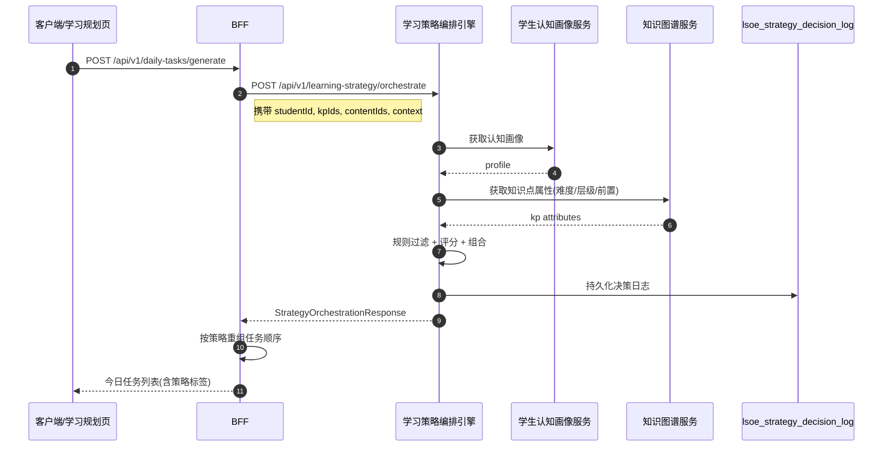
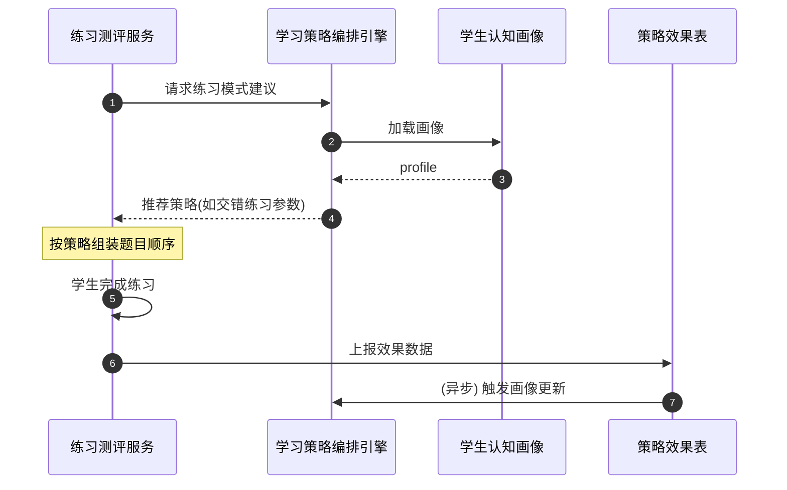

# 服务端-教育平台学习策略智能编排引擎-详细设计

## 1. 概述

### 1.1 功能定位

学习策略智能编排引擎（Learning Strategy Orchestration Engine，简称 LSOE）是 PrimeTop 教育平台的核心学习科学引擎，负责将认知科学研究所证实的有效学习策略**动态编排**到学生的日常学习流程中。

与传统的内容推荐引擎不同——后者决定"**学什么**"——本引擎决定"**用什么方式学**"：
- 同一个知识点，应该先看视频还是先做题？
- 练习时应采用集中练习还是交错练习？
- 何时插入检索练习（自测）？
- 间隔复习的最优间隔是多少？
- 何时提供工作示例（worked example），何时切换为独立解题？
- 如何结合文字与图像实现双重编码？

### 1.2 核心目标

| 目标 | 说明 |
| --- | --- |
| 提升学习效率 | 通过科学策略减少无效重复，提高单位时间学习效果 |
| 个性化适配 | 根据学生认知特征动态调整策略组合 |
| 策略可解释 | 向学生/家长/教师解释"为什么这样安排学习" |
| 数据驱动迭代 | 基于学习效果数据持续优化策略参数 |
| 无缝集成 | 作为底层服务为学习规划、练习系统、复习调度等模块提供策略决策 |

### 1.3 适用范围

- **学段**：小学至高中全学段（幼儿启蒙阶段因认知发展特殊性，仅部分策略适用）
- **学科**：全学科，理科侧重分步推导与交错练习，文科侧重检索练习与间隔重复
- **集成模块**：学习规划服务、每日任务生成、练习测评系统、错题复习调度、同步课堂学习、AI辅导对话

### 1.4 认知科学理论基础

本引擎基于以下经过大量实证研究支持的学习策略：

| 策略 | 核心原理 | 效果强度（证据等级） |
| --- | --- | --- |
| 间隔练习（Spaced Practice） | 将学习时间分散，而非集中突击 | 高（Dunlosky et al., 2013） |
| 交错练习（Interleaved Practice） | 混合不同类型问题，而非按类型顺序练习 | 高 |
| 检索练习（Retrieval Practice） | 通过测试/回忆强化记忆，优于反复阅读 | 高 |
| 工作示例→独立解题（Worked Example → Problem Solving） | 先看完整解题过程，逐步过渡到独立解题 | 高（认知负荷理论） |
| 双重编码（Dual Coding） | 同时使用文字和视觉信息增强理解 | 中高 |
| 具体化示例（Concrete Examples） | 用具体实例辅助理解抽象概念 | 中高 |
| 精细化加工（Elaboration） | 将新知识与已有知识建立联系 | 中高 |
| 元认知监控（Metacognitive Monitoring） | 引导学生反思"我学会了没有" | 中 |

---

## 2. 系统架构

### 2.1 引擎在平台中的位置

```
┌─────────────────────────────────────────────────────┐
│                  客户端 / BFF 层                      │
│  学习规划页 │ 练习页 │ 同步课堂 │ 错题本 │ AI对话    │
└───────────┬─────────────────────────────────────────┘
            │ API 调用
┌───────────▼─────────────────────────────────────────┐
│              API 网关 / BFF                          │
└───────────┬─────────────────────────────────────────┘
            │
┌───────────▼─────────────────────────────────────────┐
│         业务服务层                                    │
│  ┌──────────────────────────────────────────┐       │
│  │    学习策略智能编排引擎 (LSOE)            │       │
│  │  ┌─────────┐ ┌──────────┐ ┌───────────┐ │       │
│  │  │策略决策  │ │策略参数   │ │策略效果   │ │       │
│  │  │核心服务  │ │优化服务   │ │评估服务   │ │       │
│  │  └────┬────┘ └────┬─────┘ └─────┬─────┘ │       │
│  │       │          │              │       │       │
│  │  ┌────▼──────────▼──────────────▼─────┐ │       │
│  │  │      策略规则库 + ML 模型层         │ │       │
│  │  └────────────────────────────────────┘ │       │
│  └──────────────────────────────────────────┘       │
│         ▲                              ▲             │
│  ┌──────┴──────┐               ┌───────┴───────┐    │
│  │学生认知画像  │               │学习内容知识图谱│    │
│  │服务          │               │服务            │    │
│  └─────────────┘               └───────────────┘    │
└─────────────────────────────────────────────────────┘
```

### 2.2 内部模块划分

| 模块 | 职责 | 技术栈 |
| --- | --- | --- |
| **策略决策核心服务** | 根据学生画像、内容特征、上下文生成策略决策 | Java/Kotlin + Spring Boot |
| **策略参数优化服务** | 基于学习效果数据自动调整策略参数 | Python + scikit-learn/XGBoost |
| **策略效果评估服务** | A/B测试管理、效果统计、策略推荐 | Python + Pandas/SciPy |
| **策略规则库** | 静态规则、学段适配规则、学科规则 | Drools/规则引擎 |
| **ML 模型层** | 个性化间隔参数预测、策略效果预测 | Python + TensorFlow/PyTorch |

### 2.3 与其他模块的交互

```
学习规划服务 ──(学习目标, 截止时间, 可用时长)──→ LSOE ──(策略建议)──→ 学习规划服务
每日任务生成 ──(今日任务列表, 任务类型)──────→ LSOE ──(任务排序, 策略标注)──→ 每日任务生成
练习测评系统 ──(题目列表, 学生能力)──────────→ LSOE ──(练习模式建议)──→ 练习测评系统
错题复习调度 ──(待复习错题, 历史复习数据)────→ LSOE ──(复习间隔, 复习方式)──→ 错题复习调度
AI辅导对话   ──(对话上下文, 知识点)──────────→ LSOE ──(对话策略建议)──→ AI辅导对话
同步课堂     ──(章节内容, 学习进度)──────────→ LSOE ──(内容呈现顺序建议)──→ 同步课堂
```

---

## 3. 数据结构定义

### 3.1 核心数据表

#### 3.1.1 学习策略定义表 `lsoe_strategy_definition`

```sql
CREATE TABLE lsoe_strategy_definition (
    id              BIGINT PRIMARY KEY AUTO_INCREMENT,
    strategy_code   VARCHAR(64) NOT NULL COMMENT '策略编码，如 SPACED_PRACTICE',
    strategy_name   VARCHAR(128) NOT NULL COMMENT '策略名称，如 间隔练习',
    strategy_category VARCHAR(64) NOT NULL COMMENT '策略分类：MEMORY/PRACTICE/COMPREHENSION/METACOGNITION',
    description     TEXT COMMENT '策略描述',
    theoretical_basis TEXT COMMENT '理论基础引用',
    applicable_stages VARCHAR(256) COMMENT '适用学段，逗号分隔：PRIMARY,JUNIOR,SENIOR',
    applicable_subjects VARCHAR(256) COMMENT '适用学科，逗号分隔：MATH,PHYSICS,...',
    effectiveness_score DECIMAL(3,2) DEFAULT 0.00 COMMENT '总体效果评分(0-1)',
    status          TINYINT DEFAULT 1 COMMENT '1=启用 0=停用',
    created_at      DATETIME DEFAULT CURRENT_TIMESTAMP,
    updated_at      DATETIME DEFAULT CURRENT_TIMESTAMP ON UPDATE CURRENT_TIMESTAMP,
    UNIQUE KEY uk_strategy_code (strategy_code),
    INDEX idx_category (strategy_category),
    INDEX idx_stage_subject (applicable_stages, applicable_subjects)
) ENGINE=InnoDB DEFAULT CHARSET=utf8mb4 COMMENT='学习策略定义表';
```

#### 3.1.2 学生认知特征画像表 `lsoe_student_cognitive_profile`

```sql
CREATE TABLE lsoe_student_cognitive_profile (
    id                  BIGINT PRIMARY KEY AUTO_INCREMENT,
    student_id          BIGINT NOT NULL COMMENT '学生ID',
    working_memory_capacity TINYINT DEFAULT 4 COMMENT '工作记忆容量估计(3-7)',
    processing_speed_score DECIMAL(3,2) DEFAULT 0.50 COMMENT '信息处理速度评分(0-1)',
    prior_knowledge_strength DECIMAL(3,2) DEFAULT 0.50 COMMENT '先验知识强度(0-1)',
    self_regulation_score DECIMAL(3,2) DEFAULT 0.50 COMMENT '自我调节能力(0-1)',
    preference_visual_verbal VARCHAR(16) DEFAULT 'BALANCED' COMMENT '视觉/言语偏好：VISUAL/VERBAL/BALANCED',
    preference_active_reflective VARCHAR(16) DEFAULT 'BALANCED' COMMENT '主动/反思型偏好',
    optimal_session_length_min INT DEFAULT 25 COMMENT '最优单次学习时长(分钟)',
    forgetting_rate_lambda DECIMAL(5,4) DEFAULT 0.0500 COMMENT '个人遗忘曲线衰减率参数',
    interleaving_tolerance DECIMAL(3,2) DEFAULT 0.50 COMMENT '交错练习耐受度(0-1)',
    retrieval_difficulty_preference DECIMAL(3,2) DEFAULT 0.50 COMMENT '检索难度偏好(0-1)',
    strategy_effectiveness_cache JSON COMMENT '策略-效果缓存：{"SPACED_PRACTICE":0.82, ...}',
    model_version        VARCHAR(32) COMMENT '画像模型版本',
    last_computed_at     DATETIME COMMENT '最近计算时间',
    created_at           DATETIME DEFAULT CURRENT_TIMESTAMP,
    updated_at           DATETIME DEFAULT CURRENT_TIMESTAMP ON UPDATE CURRENT_TIMESTAMP,
    UNIQUE KEY uk_student (student_id),
    INDEX idx_updated (last_computed_at)
) ENGINE=InnoDB DEFAULT CHARSET=utf8mb4 COMMENT='学生认知特征画像';
```

#### 3.1.3 策略编排决策记录表 `lsoe_strategy_decision_log`

```sql
CREATE TABLE lsoe_strategy_decision_log (
    id              BIGINT PRIMARY KEY AUTO_INCREMENT,
    decision_id     VARCHAR(64) NOT NULL COMMENT '决策唯一标识(UUID)',
    student_id      BIGINT NOT NULL COMMENT '学生ID',
    source_module   VARCHAR(64) NOT NULL COMMENT '调用来源模块：DAILY_TASK/PRACTICE/REVIEW/SYNC_CLASS/AI_TUTOR',
    target_content_ids JSON COMMENT '关联内容ID列表',
    target_kp_ids   JSON COMMENT '关联知识点ID列表',
    recommended_strategies JSON NOT NULL COMMENT '推荐策略列表',
    decision_context JSON COMMENT '决策上下文(可用时长/时段/设备等)',
    strategy_params JSON COMMENT '策略参数(间隔天数/交错比例等)',
    confidence_score DECIMAL(3,2) COMMENT '决策置信度(0-1)',
    model_version    VARCHAR(32) COMMENT '决策模型版本',
    created_at       DATETIME DEFAULT CURRENT_TIMESTAMP,
    UNIQUE KEY uk_decision (decision_id),
    INDEX idx_student_time (student_id, created_at),
    INDEX idx_module (source_module, created_at)
) ENGINE=InnoDB DEFAULT CHARSET=utf8mb4 COMMENT='策略编排决策记录';
```

#### 3.1.4 策略效果追踪表 `lsoe_strategy_outcome`

```sql
CREATE TABLE lsoe_strategy_outcome (
    id                  BIGINT PRIMARY KEY AUTO_INCREMENT,
    decision_id         VARCHAR(64) NOT NULL COMMENT '关联的决策ID',
    student_id          BIGINT NOT NULL,
    strategy_code       VARCHAR(64) NOT NULL COMMENT '策略编码',
    outcome_type        VARCHAR(32) NOT NULL COMMENT '效果类型：RETENTION/TRANSFER/SPEED/ENGAGEMENT/ACCURACY',
    outcome_value       DECIMAL(6,3) COMMENT '效果值',
    measurement_method  VARCHAR(64) COMMENT '测量方式：QUIZ_SCORE/RECALL_RATE/TIME_COST/ENGAGEMENT_DURATION',
    measured_at         DATETIME NOT NULL COMMENT '测量时间',
    control_group_value DECIMAL(6,3) COMMENT '对照组效果值(A/B测试)',
    statistical_significance DECIMAL(4,3) COMMENT '统计显著性p值',
    created_at          DATETIME DEFAULT CURRENT_TIMESTAMP,
    INDEX idx_decision (decision_id),
    INDEX idx_strategy_outcome (strategy_code, outcome_type, measured_at),
    INDEX idx_student_time (student_id, measured_at)
) ENGINE=InnoDB DEFAULT CHARSET=utf8mb4 COMMENT='策略效果追踪表';
```

#### 3.1.5 策略参数个性化表 `lsoe_strategy_param_personalized`

```sql
CREATE TABLE lsoe_strategy_param_personalized (
    id              BIGINT PRIMARY KEY AUTO_INCREMENT,
    student_id      BIGINT NOT NULL,
    strategy_code   VARCHAR(64) NOT NULL,
    param_name      VARCHAR(64) NOT NULL COMMENT '参数名，如 spacing_interval_days',
    param_value     DECIMAL(10,4) COMMENT '参数值',
    param_unit      VARCHAR(32) COMMENT '参数单位：DAYS/RATIO/COUNT/MINUTES',
    confidence_interval_low DECIMAL(10,4) COMMENT '置信区间下界',
    confidence_interval_high DECIMAL(10,4) COMMENT '置信区间上界',
    sample_size     INT DEFAULT 0 COMMENT '样本量(已积累的学习数据点)',
    last_updated_at DATETIME COMMENT '最近更新时间',
    created_at      DATETIME DEFAULT CURRENT_TIMESTAMP,
    updated_at      DATETIME DEFAULT CURRENT_TIMESTAMP ON UPDATE CURRENT_TIMESTAMP,
    UNIQUE KEY uk_student_strategy_param (student_id, strategy_code, param_name),
    INDEX idx_strategy (strategy_code)
) ENGINE=InnoDB DEFAULT CHARSET=utf8mb4 COMMENT='策略参数个性化';
```

### 3.2 策略枚举定义

```java
public enum LearningStrategy {
    // 记忆巩固类
    SPACED_PRACTICE("间隔练习", "将学习时间分散到多个会话"),
    RETRIEVAL_PRACTICE("检索练习", "通过回忆测试强化记忆"),
    ELABORATION("精细化加工", "将新知识与已有知识建立联系"),

    // 练习编排类
    INTERLEAVED_PRACTICE("交错练习", "混合不同类型问题进行练习"),
    WORKED_EXAMPLE_FADE("工作示例渐退", "从完整示例逐步过渡到独立解题"),

    // 理解增强类
    DUAL_CODING("双重编码", "同时使用文字和视觉信息"),
    CONCRETE_EXAMPLES("具体化示例", "用具体实例辅助理解抽象概念"),
    COMPARE_CONTRAST("对比辨析", "对比相似但不同的概念/方法"),

    // 元认知类
    METACOGNITIVE_PROMPT("元认知提示", "引导学生反思自己的理解程度"),
    SELF_EXPLANATION("自我解释", "鼓励学生用自己的话解释学习内容"),
    ERROR_ANALYSIS("错误分析", "深度分析错误原因并归纳防范策略"),

    // 注意力管理类
    ATTENTION_SWITCH("注意力切换", "在不同类型任务间合理切换以维持专注"),
    MICRO_LEARNING("微学习会话", "将学习拆分为短时高频会话");

    private final String name;
    private final String description;
    // constructor, getters...
}
```

### 3.3 策略决策核心数据结构

```java
/**
 * 策略编排请求
 */
@Data
@Builder
public class StrategyOrchestrationRequest {
    private Long studentId;
    private String sourceModule;           // 调用来源
    private List<Long> knowledgePointIds;   // 涉及的知识点
    private List<String> contentIds;        // 涉及的内容
    private LearningContext context;        // 学习上下文
    private Integer availableMinutes;       // 可用学习时长
    private String subject;                 // 学科
    private String stage;                   // 学段
}

/**
 * 学习上下文
 */
@Data
@Builder
public class LearningContext {
    private LocalDateTime scheduledTime;    // 计划学习时间
    private String deviceType;              // 设备类型
    private Integer sessionSequenceOfDay;   // 今日第几次学习
    private Double recentFatigueIndex;      // 近期疲劳指数
    private List<String> recentStrategies;  // 最近使用的策略
    private boolean isPreExamPeriod;        // 是否处于备考期
}

/**
 * 策略编排响应
 */
@Data
@Builder
public class StrategyOrchestrationResponse {
    private String decisionId;
    private List<StrategyRecommendation> recommendations;
    private String explanation;              // 策略组合说明（面向用户）
    private Double confidenceScore;
}

/**
 * 单条策略推荐
 */
@Data
@Builder
public class StrategyRecommendation {
    private String strategyCode;
    private String strategyName;
    private Integer priority;                // 优先级 1-5
    private Double expectedEffectiveness;    // 预期效果评分
    private Map<String, Object> parameters;  // 策略参数
    private String implementationGuide;      // 实施指引
    private String rationale;                // 推荐理由（可解释性）
    private List<String> applicableContentIds; // 适用该策略的内容
}
```

---

## 4. API 接口设计

### 4.1 获取学习策略编排建议

```
POST /api/v1/learning-strategy/orchestrate
```

**请求体：**
```json
{
  "studentId": 10012345,
  "sourceModule": "DAILY_TASK",
  "knowledgePointIds": [2001, 2002, 2003],
  "contentIds": ["c_001", "c_002", "c_003", "c_004"],
  "context": {
    "scheduledTime": "2026-08-05T19:00:00+08:00",
    "deviceType": "MOBILE",
    "sessionSequenceOfDay": 2,
    "recentFatigueIndex": 0.35,
    "recentStrategies": ["SPACED_PRACTICE", "WORKED_EXAMPLE_FADE"],
    "isPreExamPeriod": false
  },
  "availableMinutes": 40,
  "subject": "MATH",
  "stage": "JUNIOR"
}
```

**响应体：**
```json
{
  "code": 0,
  "data": {
    "decisionId": "dec_20260805_001",
    "recommendations": [
      {
        "strategyCode": "INTERLEAVED_PRACTICE",
        "strategyName": "交错练习",
        "priority": 1,
        "expectedEffectiveness": 0.85,
        "parameters": {
          "interleavingRatio": 0.6,
          "blockSize": 2,
          "shuffleSeed": "r_20260805"
        },
        "implementationGuide": "将代数运算题与几何证明题按2:1交错排列，每2题一组后切换类型",
        "rationale": "检测到该学生在单一题型连续练习时容易产生惯性思维，交错练习可提升辨识能力",
        "applicableContentIds": ["c_001", "c_002", "c_003"]
      },
      {
        "strategyCode": "RETRIEVAL_PRACTICE",
        "strategyName": "检索练习",
        "priority": 2,
        "expectedEffectiveness": 0.78,
        "parameters": {
          "retrievalMode": "FREE_RECALL",
          "firstDelayMinutes": 10,
          "subsequentDelayMultiplier": 2.0
        },
        "implementationGuide": "学习新概念后10分钟插入一次自由回忆测试，而非仅阅读复习",
        "rationale": "检索练习对该学生的记忆巩固效果显著优于重复阅读（历史效果提升32%）",
        "applicableContentIds": ["c_004"]
      },
      {
        "strategyCode": "METACOGNITIVE_PROMPT",
        "strategyName": "元认知提示",
        "priority": 3,
        "expectedEffectiveness": 0.65,
        "parameters": {
          "promptFrequency": "EVERY_15_MIN",
          "promptTypes": ["UNDERSTANDING_CHECK", "CONFIDENCE_RATING"]
        },
        "implementationGuide": "每15分钟弹出一次理解度自评：'刚才学的内容你掌握了多少？'",
        "rationale": "该学生元认知准确度偏低（0.42），定期自评有助于校准学习判断",
        "applicableContentIds": ["c_001", "c_002", "c_003", "c_004"]
      }
    ],
    "explanation": "本次学习建议以交错练习为主线，穿插检索练习和元认知提示。理由：你今天第二次学习，精力中等，交错练习能有效训练题型辨识能力；学习完新概念后立即自测可以加深记忆。",
    "confidenceScore": 0.81
  }
}
```

### 4.2 提交策略效果反馈

```
POST /api/v1/learning-strategy/outcome
```

**请求体：**
```json
{
  "decisionId": "dec_20260805_001",
  "studentId": 10012345,
  "outcomes": [
    {
      "strategyCode": "INTERLEAVED_PRACTICE",
      "outcomeType": "ACCURACY",
      "outcomeValue": 0.82,
      "measurementMethod": "QUIZ_SCORE"
    },
    {
      "strategyCode": "INTERLEAVED_PRACTICE",
      "outcomeType": "ENGAGEMENT",
      "outcomeValue": 0.90,
      "measurementMethod": "ENGAGEMENT_DURATION"
    },
    {
      "strategyCode": "RETRIEVAL_PRACTICE",
      "outcomeType": "RETENTION",
      "outcomeValue": 0.75,
      "measurementMethod": "RECALL_RATE"
    }
  ],
  "measuredAt": "2026-08-05T19:45:00+08:00"
}
```

### 4.3 查询学生策略画像

```
GET /api/v1/learning-strategy/profile/{studentId}
```

**响应体：**
```json
{
  "code": 0,
  "data": {
    "studentId": 10012345,
    "cognitiveProfile": {
      "workingMemoryCapacity": 5,
      "processingSpeedScore": 0.62,
      "priorKnowledgeStrength": 0.71,
      "selfRegulationScore": 0.58,
      "preferenceVisualVerbal": "VISUAL",
      "optimalSessionLengthMin": 25,
      "forgettingRateLambda": 0.038,
      "interleavingTolerance": 0.72,
      "retrievalDifficultyPreference": 0.55
    },
    "topStrategies": [
      {
        "strategyCode": "SPACED_PRACTICE",
        "personalizedEffectiveness": 0.88,
        "sampleSize": 47,
        "params": {
          "spacingIntervalDays": 3.5,
          "expansionRatio": 2.1
        }
      },
      {
        "strategyCode": "INTERLEAVED_PRACTICE",
        "personalizedEffectiveness": 0.82,
        "sampleSize": 35,
        "params": {
          "interleavingRatio": 0.6
        }
      }
    ],
    "lastComputedAt": "2026-08-04T02:00:00+08:00",
    "modelVersion": "v2.3.1"
  }
}
```

### 4.4 策略效果对比查询（A/B测试）

```
GET /api/v1/learning-strategy/effectiveness/compare?strategy=INTERLEAVED_PRACTICE&control=BLOCKED_PRACTICE&stage=JUNIOR&subject=MATH
```

**响应体：**
```json
{
  "code": 0,
  "data": {
    "strategy": "INTERLEAVED_PRACTICE",
    "control": "BLOCKED_PRACTICE",
    "sampleSize": 1245,
    "strategyAvgEffect": 0.78,
    "controlAvgEffect": 0.65,
    "effectSize": 0.42,
    "pValue": 0.003,
    "confidenceInterval": [0.08, 0.23],
    "conclusion": "交错练习效果显著优于集中练习（p<0.01）"
  }
}
```

---

## 5. 核心策略编排算法

### 5.1 总体编排流程

```
输入: 学生ID + 知识点/内容列表 + 学习上下文
  │
  ├─→ 1. 加载学生认知特征画像
  │     (工作记忆容量, 遗忘率, 交错耐受度, ...)
  │
  ├─→ 2. 加载知识点属性
  │     (难度, 认知层级, 前置依赖, 内容类型)
  │
  ├─→ 3. 规则过滤: 排除不适用的策略
  │     (学段限制, 学科限制, 学生特征限制)
  │
  ├─→ 4. 候选策略评分
  │     对每个候选策略:
  │     - 历史效果分: 该策略对该学生的个性化效果 E(s)
  │     - 理论基线分: 认知科学实证效果分 B(s)
  │     - 情境适配分: 当前上下文(学段/学科/时段/疲劳)匹配度 C(s)
  │     - 多样性分:   与最近使用策略的重叠惩罚 D(s)
  │
  ├─→ 5. 策略组合与冲突消解
  │     - 避免同时启用互斥策略(如「工作示例渐退」与「检索练习」不宜同题并用)
  │     - 按优先级排序,限制单会话策略数 ≤3 个主策略 + 1 个元认知策略
  │
  └─→ 6. 输出策略建议 + 可解释理由
```

#### 5.1.1 候选策略评分公式

```
score(s) = w1 * norm(E(s)) + w2 * norm(B(s)) + w3 * C(s) + w4 * D(s)

其中:
- w1 = 0.40 (历史效果优先, 数据驱动)
- w2 = 0.25 (理论基线保底)
- w3 = 0.25 (情境适配)
- w4 = 0.10 (多样性激励)
- norm(x): min-max 归一化到 [0,1]
- E(s): 该学生近 90 天内该策略的实测效果(多 outcome 加权平均)
- B(s): 策略定义表 effectiveness_score, 按学段/学科修正
- C(s): 情境匹配度, 见 5.1.2
- D(s): 多样性分 = 1 - (最近 7 天使用次数 / 7), 下限 0.2
```

历史效果 `E(s)` 的具体计算:
```
E(s) = Σ[outcome_weight(o) * avg_outcome(s, o)] / Σ outcome_weight(o)

outcome_weight 表:
| outcome_type | 权重 | 适用策略示例 |
| --- | --- | --- |
| RETENTION | 0.25 | SPACED_PRACTICE, RETRIEVAL_PRACTICE |
| TRANSFER | 0.25 | INTERLEAVED_PRACTICE, COMPARE_CONTRAST |
| ACCURACY | 0.20 | WORKED_EXAMPLE_FADE, ERROR_ANALYSIS |
| ENGAGEMENT | 0.15 | DUAL_CODING, MICRO_LEARNING |
| SPEED | 0.15 | RETRIEVAL_PRACTICE, ATTENTION_SWITCH |

个人样本量 n<10 时, E(s) 向同年级同科学生均值收缩:
E_blended(s) = (n * E_personal(s) + 20 * E_cohort(s)) / (n + 20)
```

#### 5.1.2 情境匹配度 C(s)

```
C(s) = stage_match(s) * 0.30
     + subject_match(s) * 0.25
     + fatigue_match(s) * 0.20
     + session_match(s) * 0.15
     + preexam_match(s) * 0.10
```

| 因子 | 计算方式 | 说明 |
| --- | --- | --- |
| stage_match | 1 若 strategy.applicable_stages 含当前学段, 否则 0 | 学段硬约束,不启用则直接过滤 |
| subject_match | 1 若 applicable_subjects 含学科或 ALL, 否则 0 | 学科硬约束 |
| fatigue_match | 高疲劳时降低检索练习/交错练习权重,提升微学习/双重编码 | `fatigue_match = base - 0.3 * fatigue_index` |
| session_match | 晚间/碎片时段偏好微学习; 首次学习偏好工作示例 | 规则表驱动 |
| preexam_match | 备考期优先检索练习+交错练习,降低探索性策略 | `= is_pre_exam ? 1.0 : 0.7` |

#### 5.1.3 规则过滤(Rule Filtering)

过滤在评分前执行, 采用 fail-fast 硬约束:

```java
public List<LearningStrategy> filterStrategies(
        List<LearningStrategy> candidates,
        StrategyOrchestrationRequest request,
        StudentCognitiveProfile profile) {
    return candidates.stream()
        .filter(s -> stageAllowed(s, request.getStage()))
        .filter(s -> subjectAllowed(s, request.getSubject()))
        .filter(s -> !isRecentlyOverused(s, request.getStudentId(), 24)) // 24h 内用过 ≥5 次禁
        .filter(s -> cognitiveLoadOk(s, profile)) // 工作记忆容量不足时禁用高负荷策略
        .filter(s -> contentTypeCompatible(s, request.getContentIds()))
        .collect(Collectors.toList());
}
```

硬约束示例:
| 策略 | 禁用条件 |
| --- | --- |
| INTERLEAVED_PRACTICE | 可用题目类型 < 2 种 |
| WORKED_EXAMPLE_FADE | 内容库无工作示例 |
| RETRIEVAL_PRACTICE | 学习材料为首次接触(<20min前) |
| MICRO_LEARNING | 可用时长 ≥ 25 分钟 |
| ERROR_ANALYSIS | 无历史错题 |

#### 5.1.4 策略组合与冲突消解

互斥矩阵(同时出现时仅保留优先级高者):
| 策略 A | 策略 B | 裁决 |
| --- | --- | --- |
| WORKED_EXAMPLE_FADE | RETRIEVAL_PRACTICE | 分阶段: 先工作示例,后检索练习 |
| INTERLEAVED_PRACTICE | ERROR_ANALYSIS | 可共存, 但交错题目中不嵌入错题分析 |
| SPACED_PRACTICE | MICRO_LEARNING | 微学习是 spaced 的短时长变体,合并为 MICRO_SPACED |
| DUAL_CODING | CONCRETE_EXAMPLES | 可共存, 但单题不宜叠加 |

单会话输出上限:
- 主策略: ≤2 个(避免认知负荷过载)
- 辅助策略: ≤1 个
- 元认知策略: 固定 1 个(若适用)

### 5.2 分策略编排详解

#### 5.2.1 间隔练习 (SPACED_PRACTICE)

**输出参数:**
```json
{
  "spacingIntervalDays": 3.2,
  "expansionRatio": 2.0,
  "maxIntervals": 5,
  "minRetentionTarget": 0.75
}
```

**间隔计算:**
```
interval_k = interval_{k-1} * expansionRatio * retentionFactor

其中:
- interval_1 = baseInterval * forgettingAdjustment
- baseInterval = 1 天(小学)/2 天(初中)/3 天(高中)
- forgettingAdjustment = 1 + (forgettingRateLambda - cohortAvg) * 5
  (遗忘率高于同龄人则缩短间隔)
- retentionFactor = 1 - 0.2 * (recentAccuracy - 0.8)
  (近期准确率高则延长间隔)
```

**集成方式:**
- 学习规划服务: 将复习任务按间隔插入未来日程
- 错题复习调度: 调用 LSOE 计算 next_review_at
- 每日任务生成: 当 interval 到期且 mastery<0.85 时生成任务

#### 5.2.2 交错练习 (INTERLEAVED_PRACTICE)

**输出参数:**
```json
{
  "interleavingRatio": 0.6,
  "blockSize": 2,
  "shuffleSeed": "r_20260805",
  "categoryAttribute": "problem_type"
}
```

**编排规则:**
```
1. 将题目按 problem_type 聚类(如 一元一次方程/几何证明/应用题)
2. 计算各类题目数量 n_i
3. 若 min(n_i) < 2, 降级为 BLOCKED_PRACTICE
4. 按 blockSize 题为一组,组内允许同类;组间强制切换类型
5. interleavingRatio 控制全局交错程度:
   - ratio=0.0: 完全集中练习
   - ratio=0.5: 2题一组交错
   - ratio=1.0: 每题都切换类型
```

**个性化:**
- interleavingTolerance 低(<0.4)的学生 ratio 上限 0.5
- 备考期 ratio 提升 0.1-0.2

#### 5.2.3 检索练习 (RETRIEVAL_PRACTICE)

**输出参数:**
```json
{
  "retrievalMode": "FREE_RECALL",
  "firstDelayMinutes": 10,
  "subsequentDelayMultiplier": 2.0,
  "promptStyle": "CLOZE"
}
```

**模式选择:**
| 学段 | 首选模式 | 说明 |
| --- | --- | --- |
| 小学低年级 | CLOZE | 填空式,降低失败恐惧 |
| 小学高年级 | CUED_RECALL | 关键词提示回忆 |
| 初中 | FREE_RECALL | 自由回忆 |
| 高中 | GENERATION | 生成式(解题前先列公式) |

**插入时机:**
- 学习后首次: 10-20 分钟(基于首因/近因效应)
- 后续: 按 spaced interval 执行

#### 5.2.4 工作示例渐退 (WORKED_EXAMPLE_FADE)

**输出参数:**
```json
{
  "fadeStages": ["FULL", "PARTIAL_75", "PARTIAL_50", "PARTIAL_25", "INDEPENDENT"],
  "currentStage": "PARTIAL_50",
  "stepsToFade": 3,
  "hintLevel": "MEDIUM"
}
```

**阶段推进规则:**
```
若连续 3 题在该 stage 正确率 ≥ 0.80 且 无求助, 则进入下一阶段
若连续 2 题正确率 < 0.50, 则回退一级
```

**与答案管控联动:**
- FULL 阶段: 展示完整步骤
- PARTIAL 阶段: 隐藏部分步骤(由 ACPH 答案管控引擎执行)
- INDEPENDENT 阶段: 不展示步骤, 仅在提交后解析

#### 5.2.5 元认知提示 (METACOGNITIVE_PROMPT)

**输出参数:**
```json
{
  "promptFrequency": "EVERY_15_MIN",
  "promptTypes": ["UNDERSTANDING_CHECK", "CONFIDENCE_RATING"],
  "adaptiveThreshold": 0.60
}
```

**触发条件:**
- 固定时间间隔: 15min/每会话/每知识点
- 自适应: 当系统检测到学生连续 2 题耗时异常(过快或过慢)时触发
- 不用于 3-6 岁幼儿(认知未成熟)

**内容示例:**
- "你觉得刚才这道题的关键步骤是什么?"
- "给自己现在的掌握程度打几分(1-5)?"

#### 5.2.6 其他策略简述

| 策略 | 核心参数 | 典型编排场景 |
| --- | --- | --- |
| DUAL_CODING | mediaMixRatio, visualFirst | 理科公式/地理地图/生物结构 |
| CONCRETE_EXAMPLES | abstractionLevel, exampleCount | 小学数学应用题、抽象概念首次引入 |
| ELABORATION | connectionDepth, priorKpCount | 文科知识串联、章节复习 |
| ERROR_ANALYSIS | mistakeRecencyDays, focusLabels | 错题复习、考试后讲评 |
| SELF_EXPLANATION | minLength, promptTemplate | 阅读理解、理科推导 |
| ATTENTION_SWITCH | switchIntervalMin, taskTypes | 长时段学习(>40min) |
| MICRO_LEARNING | chunkDurationMin, restGapMin | 碎片化学习、幼儿启蒙 |

### 5.3 决策置信度计算

```
confidence = base_confidence
           - 0.15 * (1 - profile_completeness)
           - 0.10 * (1 - content_richness)
           - 0.10 * is_cold_start
           + 0.05 * (sample_size / 100) capped at 0.10

base_confidence 取决于策略间一致性:
- 若 top-1 与 top-2 分数差距 > 0.15: 0.85
- 差距 0.08-0.15: 0.75
- 差距 < 0.08: 0.65

输出规范:
- confidence >= 0.80: 直接推荐
- 0.60 <= confidence < 0.80: 推荐,但标注"建议尝试"
- < 0.60: 回退到理论基线策略,不个性化
```

### 5.4 可解释文本生成

根据推荐策略组合自动生成面向不同受众的解释:

```java
public String generateExplanation(
        List<StrategyRecommendation> recs,
        StudentCognitiveProfile profile,
        LearningContext ctx) {
    StringBuilder sb = new StringBuilder();
    sb.append("本次学习建议以").append(recs.get(0).getStrategyName()).append("为主线");
    if (recs.size() > 1) {
        sb.append("，穿插").append(recs.get(1).getStrategyName());
    }
    sb.append("。理由：");
    sb.append(contextRationale(ctx, profile));
    sb.append("；").append(recs.get(0).getRationale());
    return sb.toString();
}
```

分龄话术差异:
| 学段 | 话术风格 | 示例 |
| --- | --- | --- |
| 小学 | 鼓励式、具体 | "今天我们来混合练习几种题目,像闯关一样更有趣!" |
| 初中 | 简洁、说明收益 | "交错练习能帮你更快分辨题型,避免惯性错误。" |
| 高中 | 专业、效率导向 | "本轮采用交错练习+检索练习,针对你的薄弱点提升迁移能力。" |

---

## 6. 关键代码示例

### 6.1 策略编排主服务

```java
@Service
@Slf4j
public class LearningStrategyOrchestrationService {

    @Autowired
    private StudentCognitiveProfileRepository profileRepo;
    @Autowired
    private StrategyDefinitionRepository strategyRepo;
    @Autowired
    private StrategyOutcomeRepository outcomeRepo;
    @Autowired
    private StrategyDecisionLogRepository decisionLogRepo;
    @Autowired
    private IdempotencyKeyService idempotencyService;

    private static final int MAX_MAIN_STRATEGIES = 2;
    private static final int MAX_AUX_STRATEGIES = 1;

    public StrategyOrchestrationResponse orchestrate(
            StrategyOrchestrationRequest request,
            String idempotencyKey) {
        // 1. 幂等检查
        if (idempotencyService.isProcessed(idempotencyKey)) {
            return idempotencyService.getCachedResponse(idempotencyKey);
        }

        // 2. 加载画像与策略
        StudentCognitiveProfile profile = profileRepo
            .findByStudentId(request.getStudentId())
            .orElseGet(() -> createColdStartProfile(request));

        List<LearningStrategy> candidates = strategyRepo.findActive();

        // 3. 过滤 + 评分
        List<LearningStrategy> filtered = filterStrategies(
            candidates, request, profile);
        List<ScoredStrategy> scored = scoreStrategies(
            filtered, request, profile);

        // 4. 组合与冲突消解
        List<StrategyRecommendation> recommendations = composeRecommendations(
            scored, request, profile);

        // 5. 生成响应
        String decisionId = generateDecisionId(request);
        String explanation = generateExplanation(recommendations, profile, request.getContext());
        double confidence = calculateConfidence(recommendations, profile, request);

        StrategyOrchestrationResponse response = StrategyOrchestrationResponse.builder()
            .decisionId(decisionId)
            .recommendations(recommendations)
            .explanation(explanation)
            .confidenceScore(confidence)
            .build();

        // 6. 持久化 + 幂等缓存
        persistDecision(request, response);
        idempotencyService.cacheResponse(idempotencyKey, response, Duration.ofHours(24));
        return response;
    }
}
```

### 6.2 策略评分器

```java
@Component
public class StrategyScorer {

    public ScoredStrategy score(LearningStrategy strategy,
                                StrategyOrchestrationRequest request,
                                StudentCognitiveProfile profile,
                                List<StrategyOutcome> outcomes) {
        double historical = computeHistoricalEffect(strategy, profile, outcomes);
        double theoretical = strategy.getEffectivenessScore();
        double contextual = computeContextualMatch(strategy, request, profile);
        double diversity = computeDiversity(strategy, request.getStudentId());

        double score = 0.40 * normalize(historical)
                     + 0.25 * theoretical
                     + 0.25 * contextual
                     + 0.10 * diversity;

        return new ScoredStrategy(strategy, score, historical, theoretical,
                                  contextual, diversity);
    }

    private double computeHistoricalEffect(LearningStrategy strategy,
                                           StudentCognitiveProfile profile,
                                           List<StrategyOutcome> outcomes) {
        Map<String, Double> weights = Map.of(
            "RETENTION", 0.25,
            "TRANSFER", 0.25,
            "ACCURACY", 0.20,
            "ENGAGEMENT", 0.15,
            "SPEED", 0.15
        );

        double weightedSum = 0.0;
        double weightSum = 0.0;
        for (var outcome : outcomes) {
            if (outcome.getOutcomeValue() == null) continue;
            double w = weights.getOrDefault(outcome.getOutcomeType(), 0.10);
            weightedSum += w * outcome.getOutcomeValue();
            weightSum += w;
        }

        double personal = weightSum == 0 ? 0.5 : weightedSum / weightSum;
        int n = outcomes.size();
        // 向年级均值收缩(冷启动保护)
        return (n * personal + 20 * profile.getCohortAverage(strategy)) / (n + 20);
    }
}
```

### 6.3 间隔练习参数计算器

```java
@Component
public class SpacedPracticeScheduler {

    public SpacingParameters compute(
            Long studentId,
            List<Long> kpIds,
            StudentCognitiveProfile profile) {

        double lambda = profile.getForgettingRateLambda();
        double cohortAvg = 0.045; // 年级均值,可配置
        double forgettingAdjustment = 1.0 + (lambda - cohortAvg) * 5.0;

        double baseInterval = switch (profile.getStage()) {
            case "PRIMARY" -> 1.0;
            case "JUNIOR" -> 2.0;
            case "SENIOR" -> 3.0;
            default -> 2.0;
        };

        double interval1 = Math.max(0.5, baseInterval * forgettingAdjustment);
        double expansionRatio = 2.0;
        if (lambda > 0.07) expansionRatio = 1.5; // 易忘者少膨胀

        return SpacingParameters.builder()
            .spacingIntervalDays(round(interval1, 1))
            .expansionRatio(expansionRatio)
            .maxIntervals(5)
            .minRetentionTarget(0.75)
            .build();
    }

    private double round(double v, int decimals) {
        double factor = Math.pow(10, decimals);
        return Math.round(v * factor) / factor;
    }
}
```

### 6.4 策略决策日志持久化

```java
@Transactional
public void persistDecision(StrategyOrchestrationRequest request,
                            StrategyOrchestrationResponse response) {
    LsoeStrategyDecisionLog log = new LsoeStrategyDecisionLog();
    log.setDecisionId(response.getDecisionId());
    log.setStudentId(request.getStudentId());
    log.setSourceModule(request.getSourceModule());
    log.setTargetKpIds(JSON.toJSONString(request.getKnowledgePointIds()));
    log.setTargetContentIds(JSON.toJSONString(request.getContentIds()));
    log.setRecommendedStrategies(JSON.toJSONString(response.getRecommendations()));
    log.setDecisionContext(JSON.toJSONString(request.getContext()));
    log.setConfidenceScore(response.getConfidenceScore());
    log.setCreatedAt(LocalDateTime.now());
    decisionLogRepo.save(log);
}
```

---

## 7. 状态流转与核心流程

### 7.1 策略决策生命周期状态机

```
                    ┌──────────────┐
                    │  DECISION    │
                    │  REQUESTED   │
                    └──────┬───────┘
                           │ 调用 orchestrate
                           ▼
                    ┌──────────────┐
                    │  PROFILE     │  冷启动走默认画像
                    │   LOADED     │
                    └──────┬───────┘
                           │
                           ▼
                    ┌──────────────┐
                    │  FILTERED    │  规则过滤
                    └──────┬───────┘
                           │
                           ▼
                    ┌──────────────┐
                    │   SCORED     │  候选评分
                    └──────┬───────┘
                           │
                           ▼
            ┌──────────────────────────────┐
            │      COMPOSED                │
            │  (组合 + 冲突消解)            │
            └──────────────┬───────────────┘
                           │
              ┌────────────┼────────────┐
              ▼            ▼            ▼
        ┌─────────┐  ┌─────────┐  ┌─────────┐
        │ LOW_CONF│  │ READY   │  │ FALLBACK│
        │(尝试推荐)│  │(直接输出)│  │(基线策略)│
        └────┬────┘  └────┬────┘  └────┬────┘
             │            │            │
             └────────────┴────────────┘
                            │
                            ▼
                    ┌──────────────┐
                    │   DELIVERED  │
                    │  (已返回客户端)│
                    └──────┬───────┘
                           │ 等待效果反馈
                           ▼
                    ┌──────────────┐
                    │   OUTCOME    │
                    │   RECEIVED   │
                    └──────┬───────┘
                           │
                           ▼
                    ┌──────────────┐
                    │   UPDATED    │  更新画像/参数
                    └──────────────┘
```

状态说明:
| 状态 | 说明 |
| --- | --- |
| REQUESTED | 收到编排请求 |
| PROFILE_LOADED | 画像加载完成 |
| FILTERED | 规则过滤完成 |
| SCORED | 评分完成 |
| COMPOSED | 组合决策完成 |
| READY | 置信度 ≥0.60, 直接输出 |
| LOW_CONF | 0.50≤置信度<0.60, 标注"建议尝试" |
| FALLBACK | 置信度 <0.50 或画像缺失, 输出学段基线策略 |
| DELIVERED | 响应已返回 |
| OUTCOME_RECEIVED | 收到效果反馈 |
| UPDATED | 画像/参数已更新 |

### 7.2 策略效果反馈闭环

```
练习/学习任务完成
    │
    ▼
收集多维度效果(outcome)
    │
    ▼
按 decision_id 聚合(若 decision_id 缺失则按 student+strategy+time-window 匹配)
    │
    ▼
更新 lsoe_strategy_outcome
    │
    ▼
触发画像重算(异步, 日终批量)
    │
    ▼
更新 lsoe_student_cognitive_profile
    │
    ▼
更新 lsoe_strategy_param_personalized
    │
    ▼
发布 lsoe.profile.updated 事件
    │
    ▼
下游(学习规划/推荐/复习调度)消费更新
```

### 7.3 时序图: 每日任务生成调用 LSOE



### 7.4 时序图: 练习系统调用 LSOE



---

## 8. 错误处理

### 8.1 错误码设计(56100-56199)

| 错误码 | 名称 | HTTP 状态 | 说明 | 客户端处理 |
| --- | --- | --- | --- | --- |
| 0 | OK | 200 | 成功 | 正常展示 |
| 56100 | LSOE_INTERNAL_ERROR | 500 | 引擎内部错误 | 降级为基线策略,上报监控 |
| 56101 | LSOE_PROFILE_NOT_FOUND | 200 | 画像缺失,已使用冷启动默认 | 静默,使用默认策略 |
| 56102 | LSOE_INVALID_REQUEST_PARAM | 400 | 请求参数非法(如空 kpIds) | 提示参数错误 |
| 56103 | LSOE_NO_APPLICABLE_STRATEGY | 200 | 无可用策略(内容不足/画像限制) | 返回默认 BLOCKED_PRACTICE |
| 56104 | LSOE_STRATEGY_DISABLED | 200 | 请求策略已停用 | 忽略该策略 |
| 56105 | LSOE_OUTCOME_DECISION_NOT_FOUND | 404 | 效果反馈对应的 decision_id 不存在 | 丢弃或按时间窗匹配 |
| 56106 | LSOE_OUTCOME_ALREADY_RECORDED | 409 | 重复提交效果反馈 | 返回已记录结果 |
| 56107 | LSOE_MODEL_VERSION_MISMATCH | 200 | 模型版本不一致,已降级 | 静默降级 |
| 56108 | LSOE_IDEMPOTENCY_CONFLICT | 409 | 幂等键重复但请求体不同 | 返回 409,需业务方重试 |
| 56109 | LSOE_COHORT_DATA_UNAVAILABLE | 200 | 年级均值缺失 | 使用全局默认 |
| 56110 | LSOE_PERSONALIZATION_LIMITED | 200 | 个人数据不足,部分使用默认 | UI 可提示"正在了解你" |
| 56111 | LSOE_CONTENT_ATTR_MISSING | 200 | 部分 content 缺少属性 | 跳过缺失内容 |
| 56112 | LSOE_FATIGUE_SERVICE_TIMEOUT | 200 | 疲劳服务超时 | 忽略疲劳因子 |
| 56113 | LSOE_KNOWLEDGE_GRAPH_TIMEOUT | 200 | 知识图谱超时 | 使用 content 自带标签 |
| 56114 | LSOE_CONFIDENCE_TOO_LOW | 200 | 置信度过低 | 已回退基线策略 |
| 56115 | LSOE_STRATEGY_PARAM_INVALID | 500 | 策略参数计算异常 | 使用策略默认值 |
| 56116 | LSOE_DB_WRITE_SLOW | 200 | 决策日志写入慢 | 不影响响应,仅告警 |
| 56117 | LSOE_CACHE_MISS | 200 | 幂等缓存未命中 | 正常执行 |
| 56118 | LSOE_RATE_LIMITED | 429 | 限流 | 客户端指数退避重试 |

### 8.2 降级矩阵

| 故障场景 | 降级策略 | 红线 |
| --- | --- | --- |
| 画像服务不可用 | 使用冷启动默认画像 + 学段基线策略 | 必须返回可用策略,不可空返回 |
| 知识图谱超时 | 使用 content 自带 subject/kp 标签 | 不可因超时阻塞主链路 |
| 效果表写入失败 | 先返回成功,异步补偿写入 | 不可影响本次学习体验 |
| 模型版本不一致 | 使用上一版本参数,标记 degraded | 不可拒绝服务 |
| 规则引擎异常 | 跳过过滤,输出基线策略 | 安全第一,不过滤 |
| 评分计算异常 | 按理论基线分排序,忽略历史效果 | 必须返回结果 |
| 决策日志写入慢 | 响应后继续异步写入 | 响应时间 P99<200ms |

### 8.3 异常处理伪代码

```java
public StrategyOrchestrationResponse orchestrateWithFallback(
        StrategyOrchestrationRequest request) {
    try {
        return orchestrate(request);
    } catch (ProfileServiceException e) {
        log.warn("Profile unavailable, use cold-start", e);
        return coldStartOrchestrate(request);
    } catch (KnowledgeGraphTimeoutException e) {
        log.warn("KG timeout, degrade to content tags", e);
        return orchestrateWithContentTags(request);
    } catch (Exception e) {
        log.error("LSOE unexpected error", e);
        return baselineFallback(request);
    }
}

private StrategyOrchestrationResponse baselineFallback(
        StrategyOrchestrationRequest request) {
    return StrategyOrchestrationResponse.builder()
        .decisionId(generateDecisionId(request))
        .recommendations(List.of(
            StrategyRecommendation.builder()
                .strategyCode("SPACED_PRACTICE")
                .strategyName("间隔练习")
                .priority(1)
                .expectedEffectiveness(0.70)
                .build()))
        .explanation("当前使用系统默认学习策略,个性化推荐将在积累足够学习数据后生效。")
        .confidenceScore(0.50)
        .build();
}
```

---

## 9. 监控与容量

### 9.1 关键指标

| 指标名 | 类型 | 说明 | 告警阈值 |
| --- | --- | --- | --- |
| lsoe_request_qps | counter | 编排请求 QPS | 峰值 > 5000/s |
| lsoe_latency_p99 | histogram | 编排接口 P99 延迟 | > 200ms P1 |
| lsoe_latency_p95 | histogram | 编排接口 P95 延迟 | > 100ms P2 |
| lsoe_confidence_avg | gauge | 平均决策置信度 | < 0.65 P2 |
| lsoe_fallback_rate | gauge | 降级/基线 fallback 比例 | > 5% P1 |
| lsoe_profile_miss_rate | gauge | 画像缺失率 | > 10% P2 |
| lsoe_strategy_top1_distribution | gauge | top-1 策略分布熵 | 熵过低(<0.5)提示策略单一 |
| lsoe_outcome_feedback_rate | gauge | 决策收到效果反馈比例 | < 30% P2 |
| lsoe_db_write_latency | histogram | 决策日志写入耗时 | > 50ms P2 |
| lsoe_cache_hit_rate | gauge | 幂等缓存命中率 | < 80% P2 |

### 9.2 日志规范

```json
{
  "timestamp": "2026-08-05T19:00:01.234+08:00",
  "level": "INFO",
  "traceId": "trace_abc123",
  "studentId": 10012345,
  "decisionId": "dec_20260805_001",
  "sourceModule": "DAILY_TASK",
  "event": "LSOE_DECISION",
  "topStrategies": ["INTERLEAVED_PRACTICE", "RETRIEVAL_PRACTICE"],
  "confidence": 0.81,
  "latencyMs": 45
}
```

### 9.3 容量估算(DAU 50 万)

| 项 | 估算 |
| --- | --- |
| 日编排请求 | 约 300 万(每日任务 1 次 + 练习 2-3 次 + 复习 1 次) |
| 峰值 QPS | 约 1200(早晚上学/放学高峰) |
| 决策日志日增 | 300 万行,约 1.5GB(含 JSON) |
| MySQL 保留 | 90 天热数据 + 3 年归档至 OSS Parquet |
| Redis 幂等缓存 | 24h TTL,峰值约 500MB |
| 画像表 | 50 万行,约 2GB |
| 策略效果表 | 日增 150 万行,约 1GB |

### 9.4 性能优化

1. **画像本地缓存**: Caffeine 15min 本地缓存 + Redis 1h 共享缓存
2. **策略定义热加载**: 启动加载至内存,后台线程 30s 刷新
3. **效果数据预聚合**: 近 90 天效果按 student+strategy 日终预聚合,避免实时扫描
4. **幂等缓存**: Redis SETNX + 24h TTL
5. **异步日志**: 决策日志写入采用异步批处理,批大小 100,flush 间隔 1s

---

## 10. 合规与约束

### 10.1 未成年人保护

| 规则 | 说明 |
| --- | --- |
| 幼儿段(3-6岁) | 不使用元认知提示、自我解释、错误分析等需要抽象反思的策略 |
| 小学阶段 | 优先鼓励式策略(微学习、双重编码、具体化示例),避免过度强调效率 |
| 初中/高中 | 可启用完整策略集,但需避免焦虑话术("你必须...") |
| 防沉迷联动 | 晚间 21:00 后(小学生)/22:00 后(初中生)/23:00 后(高中生)降低任务难度,禁用高负荷策略 |

### 10.2 数据隐私

- 认知画像数据属于敏感学习数据,脱敏后存储
- 效果数据仅用于个人模型优化,禁止用于第三方训练
- 决策日志保留 90 天在线,3 年归档,注销账户后 180 天清除
- 可解释文本不得泄露其他学生数据

### 10.3 教育公平性

- 默认策略基于认知科学普遍证据,不得因付费状态差异化
- 个性化参数在免费/付费用户间仅受数据积累量影响,不受会员等级直接干预
- A/B 测试必须设置伦理审查护栏,避免对学习弱势群体造成系统性不利

### 10.4 反沉迷与过载保护

- 单会话策略数上限: 3 个
- 元认知提示频次上限: 每 15 分钟 1 次,每会话最多 3 次
- 高疲劳指数(>0.7)时强制降级为低负荷策略
- 连续学习超过学段阈值时,LSOE 建议休息

---

## 11. 契约对齐

### 11.1 与上游模块的接口契约

| 上游模块 | 输入 | 输出 | 关键约束 |
| --- | --- | --- | --- |
| 学习规划服务 | 学习目标、截止时间、可用时长 | 策略建议、间隔参数 | LSOE 不直接生成任务,只输出策略 |
| 每日任务生成 | 候选任务列表 | 任务排序、策略标注 | 任务数量不变,仅重排/加标签 |
| 练习测评系统 | 题目列表、学生能力 | 练习模式、题目顺序 | 不修改题目内容,只改顺序与模式 |
| 错题复习调度 | 待复习错题 | 复习间隔、复习方式 | 与间隔重复引擎协同,LSOE 提供初始间隔建议 |
| AI辅导对话 | 对话上下文、知识点 | 对话策略建议 | 建议以 meta 字段返回,不强制 |
| 同步课堂 | 章节内容、学习进度 | 内容呈现顺序建议 | 不改变课标顺序,仅调整小节呈现方式 |

### 11.2 与下游模块的数据流

- **学生认知画像服务**: LSOE 消费画像,消费后异步更新画像,画像服务为 SSOT
- **策略效果评估服务**: LSOE 产出决策日志,效果评估服务产出统计报告
- **A/B测试平台**: LSOE 参与策略对比实验,分流由 AB 平台决策,LSOE 执行
- **学情分析服务**: 消费 lsoe_strategy_outcome 事件,更新能力画像

### 11.3 命名规范

| 概念 | 命名 | 说明 |
| --- | --- | --- |
| 决策ID | decisionId | UUID 或 `dec_{studentId}_{timestamp}_{seq}` |
| 策略编码 | strategyCode | 大写下划线,如 SPACED_PRACTICE |
| 来源模块 | sourceModule | 大写下划线,如 DAILY_TASK |
| 效果类型 | outcomeType | 大写下划线,如 RETENTION |

### 11.4 幂等约定

- 编排接口幂等键: `idempotencyKey = sourceModule + ":" + studentId + ":" + date + ":" + contentHash`
- 效果反馈幂等键: `decisionId + ":" + outcomeType + ":" + measuredAt(分钟粒度)`
- 同一幂等键 24h 内重复请求返回缓存结果

---

## 12. 验收场景

| 编号 | 场景 | 预期结果 |
| --- | --- | --- |
| AC-01 | 初中生数学 4 道一元一次方程 + 2 道几何证明,请求练习策略 | 返回 INTERLEAVED_PRACTICE, blockSize=2, ratio≥0.5 |
| AC-02 | 小学生首次学习新课文,请求同步课堂策略 | 返回 DUAL_CODING + CONCRETE_EXAMPLES,禁用 RETRIEVAL_PRACTICE |
| AC-03 | 高中生备考期,请求复习策略 | 返回 RETRIEVAL_PRACTICE + SPACED_PRACTICE,降低工作示例权重 |
| AC-04 | 冷启动学生首次调用 | 返回学段基线策略,confidence≈0.50,提示"正在了解你" |
| AC-05 | 画像服务超时 | 正常返回默认策略,监控记录 fallback_rate 上升 |
| AC-06 | 元认知提示频次限制 | 单会话最多触发 3 次,超过不触发 |
| AC-07 | 交错练习题目类型不足 | 降级为 BLOCKED_PRACTICE,返回 56103(业务码)但 HTTP 200 |
| AC-08 | 决策重复提交(幂等) | 24h 内返回相同结果,不重复写库 |
| AC-09 | 效果反馈上报 | 正确更新 lsoe_strategy_outcome,触发画像更新任务 |
| AC-10 | 工作示例渐退阶段推进 | 连续 3 题 ≥80% 正确率后进入下一阶段 |
| AC-11 | 高疲劳指数(>0.7)调用 | 禁用 INTERLEAVED_PRACTICE,优先返回 MICRO_LEARNING |
| AC-12 | 幼儿段(3-6岁)调用 | 不返回 METACOGNITIVE_PROMPT/ERROR_ANALYSIS/SELF_EXPLANATION |
| AC-13 | 策略效果对比查询 | 返回样本量、p值、置信区间、结论文本 |
| AC-14 | 间隔参数计算 | 遗忘率高的学生 interval1 短于同年级均值 |
| AC-15 | 接口 P99 延迟 | 生产环境 P99 ≤ 200ms |
| AC-16 | 决策日志字段完整 | 包含 decisionId/sourceModule/recommendations/confidence/context |
| AC-17 | 可解释文本分龄 | 小学话术更鼓励,高中话术更专业 |
| AC-18 | 错误码不暴露内部堆栈 | 客户端仅收到 code/message,无堆栈 |

---

## 13. 关联文档

| 文档 | 关系 |
| --- | --- |
| `docs2/学习规划-详细设计.md` | LSOE 上游消费者,使用策略建议生成任务 |
| `docs2/练习与测评系统-详细设计.md` | LSOE 上游消费者,按策略组装练习 |
| `docs2/间隔重复算法与遗忘曲线复习调度引擎-详细设计.md` | 与 SPACED_PRACTICE 参数协同,LSOE 提供初始间隔 |
| `docs2/AI教育辅导策略引擎与启发式引导系统-详细设计.md` | AI 辅导对话的策略建议来源 |
| `docs2/学习记录与进度追踪服务-详细设计.md` | 提供学习行为数据用于画像计算 |
| `docs2/数据埋点与关键指标系统-详细设计.md` | 定义 LSOE 相关埋点事件与指标 |
| `docs2/防沉迷与未成年人保护机制-详细设计.md` | 定义策略禁用/降级规则 |

---

## 14. 维护记录

| 版本 | 日期 | 变更内容 | 作者 |
| --- | --- | --- | --- |
| v1.0 | 2026-08-05 | 初稿: 概述、架构、数据模型、API、策略枚举、算法流程开头 | - |
| v1.1 | 2026-08-22 | 补全 §5 核心编排算法(评分公式/分策略参数/置信度/可解释)、§6 关键代码、§7 状态机与时序图、§8 错误码与降级、§9 监控容量、§10 合规、§11 契约对齐、§12 验收场景,修复 5.1 截断问题 | cron |

### v1.1 修复记录

- F1: 原文件在 §5.1 候选策略评分处截断,补全评分公式、过滤规则、冲突消解、置信度与可解释生成
- F2: 新增 6 段关键代码(编排服务/评分器/间隔参数/日志持久化)
- F3: 新增决策生命周期状态机与 2 张时序图
- F4: 新增错误码段 56100-56118 与降级矩阵
- F5: 新增监控指标、容量估算、性能优化策略
- F6: 新增合规约束与未成年人保护规则
- F7: 新增与上游/下游模块的契约对齐表
- F8: 新增 18 条验收场景
