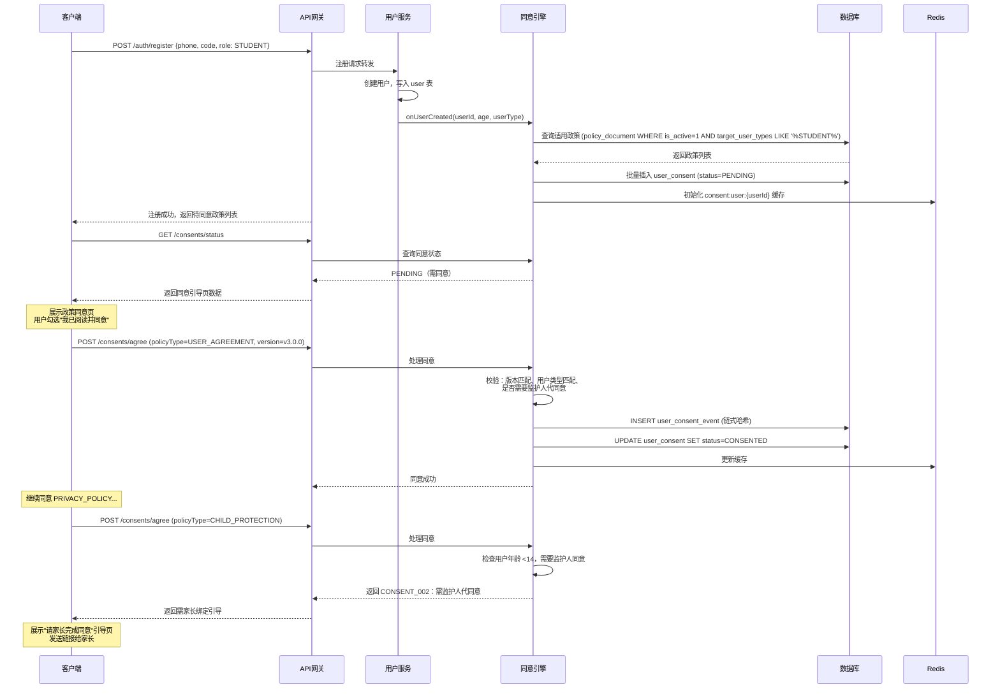

# 服务端-用户协议同意状态管理与合规审计追踪引擎-详细设计

## 1. 概述

### 1.1 功能定位

本引擎负责管理 PrimeTop 平台所有用户（学生、家长、教师、管理员）对各类法律政策文档（隐私政策、用户协议、儿童个人信息保护规则等）的**同意状态生命周期**，包括首次同意、版本变更触发的重新同意、未成年人特殊同意链路、以及不可篡改的合规审计追踪。

### 1.2 与现有模块的边界

| 模块 | 职责 | 与本引擎关系 |
| --- | --- | --- |
| 用户协议与法律文档管理服务 | 管理政策文档内容、版本、发布 | **上游**：提供政策文档元数据，本引擎消费其版本信息 |
| 未成年人数据隐私合规自动化 | 处理数据主体权利请求（查阅、删除、携带） | **协作**：本引擎提供同意状态查询，权利处理模块判断是否已获同意 |
| 统一认证授权 | 登录鉴权、Token 管理 | **下游消费**：登录时调用本引擎检查是否需要拦截引导同意 |
| 通知中心 | 推送、站内信 | **下游消费**：本引擎触发"政策更新通知"发送 |
| 功能门控引擎 | 会员权益、功能访问控制 | **协作**：本引擎提供"是否已同意所需政策"作为门控条件之一 |

### 1.3 设计目标

1. **合规优先**：满足《个人信息保护法》(PIPL)、《未成年人保护法》、《儿童个人信息网络保护规定》及 App Store/Google Play 对未成年人应用的合规要求。
2. **不可篡改**：所有同意记录采用追加写（append-only），不支持修改和删除，确保法律举证效力。
3. **精准触达**：政策版本更新时，仅通知受影响用户，支持渐进式灰度推送。
4. **低延迟**：同意状态查询 P99 < 20ms（Redis 缓存），同意写入异步持久化。
5. **可观测**：提供合规看板，展示各政策版本的同意覆盖率、待同意用户数、拒绝率等指标。

---

## 2. 核心概念与领域模型

### 2.1 政策文档分类

| 类型标识 | 说明 | 适用对象 | 强制级别 |
| --- | --- | --- | --- |
| `USER_AGREEMENT` | 用户服务协议 | 全部用户 | 强制（不同意则不可用） |
| `PRIVACY_POLICY` | 隐私政策 | 全部用户 | 强制 |
| `CHILD_PROTECTION` | 儿童个人信息保护规则 | 14 岁以下学生 | 强制（需监护人同意） |
| `MINOR_GUIDE` | 青少年模式使用须知 | 14-18 岁学生 | 强制 |
| `THIRD_PARTY_SHARE` | 第三方信息共享授权 | 全部用户（使用第三方功能时） | 可选（不同意则降级） |
| `MARKETING_CONSENT` | 营销信息接收同意 | 全部用户 | 可选（可随时撤回） |
| `DATA_ANONYMOUS_RESEARCH` | 匿名数据用于教育研究授权 | 全部用户 | 可选 |
| `BIOMETRIC_CONSENT` | 生物特征（声纹/面部）采集同意 | 使用相关功能的用户 | 强制（功能前置） |

### 2.2 用户分类与同意要求矩阵

| 用户类型 | 年龄范围 | 必须同意的政策 | 特殊要求 |
| --- | --- | --- | --- |
| 成人用户（家长/教师） | ≥18 岁 | USER_AGREEMENT + PRIVACY_POLICY | 自行同意即可 |
| 青少年学生（自主注册） | 14-18 岁 | USER_AGREEMENT + PRIVACY_POLICY + MINOR_GUIDE | 首次使用前需引导监护人确认 |
| 儿童学生 | <14 岁 | USER_AGREEMENT + PRIVACY_POLICY + CHILD_PROTECTION | **必须由监护人代为同意**，学生不可自行同意 |

### 2.3 同意状态机

```
                        ┌──────────────────────────────────────────┐
                        │                                          │
                        ▼                                          │
注册/首次使用    ┌─────────────┐    用户同意     ┌─────────────┐    │
──────────────► │ PENDING     │ ──────────────► │ CONSENTED   │    │
                │ (待同意)     │                 │ (已同意)     │    │
                └─────────────┘                 └──────┬──────┘    │
                       │                                │           │
                  用户拒绝同意                    政策版本更新       │
                       │                                │           │
                       ▼                                ▼           │
                ┌─────────────┐                 ┌─────────────┐    │
                │ REFUSED     │                 │ RE_CONSENT  │────┘
                │ (已拒绝)     │                 │ _REQUIRED   │
                └─────────────┘                 │ (需重新同意)  │
                       │                        └──────┬──────┘
                  强制政策拒绝→                       │
                  限制使用/注销                   用户同意/拒绝
                                                  │
                                          ┌───────┴───────┐
                                          ▼               ▼
                                   ┌─────────────┐ ┌─────────────┐
                                   │ CONSENTED   │ │ REFUSED     │
                                   └─────────────┘ └─────────────┘
```

### 2.4 可选政策状态补充

可选政策（如 `MARKETING_CONSENT`）额外支持：

- `WITHDRAWN`（已撤回）：用户曾同意后主动撤回
- 状态流转：`PENDING → CONSENTED → WITHDRAWN → CONSENTED → ...`（可循环）

---

## 3. 数据结构定义

### 3.1 数据库表设计

#### 3.1.1 `policy_document` — 政策文档版本注册表

```sql
CREATE TABLE `policy_document` (
    `id`                    BIGINT       NOT NULL AUTO_INCREMENT COMMENT '主键',
    `policy_type`           VARCHAR(40)  NOT NULL COMMENT '政策类型标识',
    `version`               VARCHAR(32)  NOT NULL COMMENT '语义化版本号，如 v2.1.0',
    `title`                 VARCHAR(200) NOT NULL COMMENT '文档标题',
    `document_url`          VARCHAR(500) NOT NULL COMMENT '文档内容 CDN URL（HTML/PDF）',
    `content_hash`          VARCHAR(64)  NOT NULL COMMENT '文档内容 SHA-256 摘要',
    `summary`               TEXT         NULL     COMMENT '变更摘要（与上一版对比）',
    `effective_at`          DATETIME     NOT NULL COMMENT '生效时间',
    `retire_at`             DATETIME     NULL     COMMENT '退役时间（新版生效后旧版设置）',
    `is_active`             TINYINT(1)   NOT NULL DEFAULT 1 COMMENT '是否当前有效',
    `mandatory`             TINYINT(1)   NOT NULL DEFAULT 1 COMMENT '是否强制同意',
    `target_user_types`     JSON         NULL     COMMENT '适用用户类型数组',
    `min_age`               INT          NULL     COMMENT '适用最小年龄（含）',
    `max_age`               INT          NULL     COMMENT '适用最大年龄（含）',
    `created_by`            BIGINT       NOT NULL COMMENT '创建人（管理员ID）',
    `created_at`            DATETIME     NOT NULL DEFAULT CURRENT_TIMESTAMP,
    `updated_at`            DATETIME     NOT NULL DEFAULT CURRENT_TIMESTAMP ON UPDATE CURRENT_TIMESTAMP,
    PRIMARY KEY (`id`),
    UNIQUE KEY `uk_type_version` (`policy_type`, `version`),
    KEY `idx_type_active` (`policy_type`, `is_active`),
    KEY `idx_effective` (`effective_at`)
) ENGINE=InnoDB DEFAULT CHARSET=utf8mb4 COMMENT='政策文档版本注册表';
```

#### 3.1.2 `user_consent` — 用户同意状态表（当前态）

```sql
CREATE TABLE `user_consent` (
    `id`                    BIGINT       NOT NULL AUTO_INCREMENT,
    `user_id`               BIGINT       NOT NULL COMMENT '用户ID',
    `policy_type`           VARCHAR(40)  NOT NULL COMMENT '政策类型',
    `policy_version`        VARCHAR(32)  NOT NULL COMMENT '同意的版本号',
    `policy_document_id`    BIGINT       NOT NULL COMMENT '关联政策文档ID',
    `consent_status`        VARCHAR(20)  NOT NULL COMMENT 'PENDING/CONSENTED/REFUSED/WITHDRAWN/RE_CONSENT_REQUIRED',
    `consent_method`        VARCHAR(20)  NULL     COMMENT 'EXPLICIT/CHECKBOX_CONTINUE/PARENTAL_DELEGATION',
    `consented_by`          BIGINT       NULL     COMMENT '实际操作人ID（监护人代同意时为家长ID）',
    `consented_by_role`     VARCHAR(20)  NULL     COMMENT '操作人角色：SELF/PARENT/GUARDIAN/ADMIN',
    `consented_at`          DATETIME     NULL     COMMENT '同意时间',
    `expired_at`            DATETIME     NULL     COMMENT '同意过期时间（如需要定期续签）',
    `client_ip`             VARCHAR(45)  NULL     COMMENT '同意时IP地址',
    `device_id`             VARCHAR(64)  NULL     COMMENT '设备标识',
    `app_version`           VARCHAR(20)  NULL     COMMENT 'APP版本号',
    `created_at`            DATETIME     NOT NULL DEFAULT CURRENT_TIMESTAMP,
    `updated_at`            DATETIME     NOT NULL DEFAULT CURRENT_TIMESTAMP ON UPDATE CURRENT_TIMESTAMP,
    PRIMARY KEY (`id`),
    UNIQUE KEY `uk_user_policy` (`user_id`, `policy_type`),
    KEY `idx_status` (`consent_status`),
    KEY `idx_policy_type` (`policy_type`),
    KEY `idx_consented_at` (`consented_at`)
) ENGINE=InnoDB DEFAULT CHARSET=utf8mb4 COMMENT='用户同意状态表';
```

#### 3.1.3 `user_consent_event` — 同意事件追加日志（不可变）

```sql
CREATE TABLE `user_consent_event` (
    `id`                    BIGINT       NOT NULL AUTO_INCREMENT,
    `event_id`              VARCHAR(36)  NOT NULL COMMENT '事件唯一ID（UUID）',
    `user_id`               BIGINT       NOT NULL COMMENT '用户ID',
    `policy_type`           VARCHAR(40)  NOT NULL COMMENT '政策类型',
    `policy_version`        VARCHAR(32)  NOT NULL COMMENT '版本号',
    `policy_document_id`    BIGINT       NOT NULL COMMENT '文档ID',
    `event_type`            VARCHAR(30)  NOT NULL COMMENT '事件类型',
    `prev_status`           VARCHAR(20)  NULL     COMMENT '变更前状态',
    `next_status`           VARCHAR(20)  NOT NULL COMMENT '变更后状态',
    `operated_by`           BIGINT       NOT NULL COMMENT '操作人ID',
    `operated_by_role`      VARCHAR(20)  NOT NULL COMMENT '操作人角色',
    `client_ip`             VARCHAR(45)  NOT NULL COMMENT '客户端IP',
    `device_id`             VARCHAR(64)  NULL     COMMENT '设备标识',
    `app_version`           VARCHAR(20)  NULL     COMMENT 'APP版本',
    `user_agent`            VARCHAR(500) NULL     COMMENT 'User-Agent',
    `geo_country`           VARCHAR(10)  NULL     COMMENT 'IP解析国家',
    `hash_chain_prev`       VARCHAR(64)  NULL     COMMENT '前一条事件的SHA-256（链式防篡改）',
    `hash_current`          VARCHAR(64)  NOT NULL COMMENT '本条记录的SHA-256摘要',
    `created_at`            DATETIME     NOT NULL DEFAULT CURRENT_TIMESTAMP,
    PRIMARY KEY (`id`),
    UNIQUE KEY `uk_event_id` (`event_id`),
    KEY `idx_user_id` (`user_id`),
    KEY `idx_user_policy` (`user_id`, `policy_type`),
    KEY `idx_event_type` (`event_type`),
    KEY `idx_created_at` (`created_at`)
) ENGINE=InnoDB DEFAULT CHARSET=utf8mb4 COMMENT='同意事件追加日志（不可篡改）';
```

> **链式哈希设计**：每条记录的 `hash_current` = SHA-256(`event_id|user_id|policy_type|policy_version|event_type|next_status|operated_by|created_at|hash_chain_prev`)。任何中间记录被篡改都会导致后续链断裂，确保审计日志的法律效力。

#### 3.1.4 `parental_consent_delegation` — 监护人代同意关联表

```sql
CREATE TABLE `parental_consent_delegation` (
    `id`                    BIGINT       NOT NULL AUTO_INCREMENT,
    `student_user_id`       BIGINT       NOT NULL COMMENT '学生用户ID',
    `parent_user_id`        BIGINT       NOT NULL COMMENT '家长用户ID',
    `parent_binding_id`     BIGINT       NOT NULL COMMENT '家庭绑定关系ID',
    `policy_type`           VARCHAR(40)  NOT NULL COMMENT '政策类型',
    `policy_version`        VARCHAR(32)  NOT NULL COMMENT '版本号',
    `verification_method`   VARCHAR(30)  NOT NULL COMMENT '验证方式：WECHAT_REALNAME/ALIPAY_REALNAME/SMS_OTP/MANUAL_REVIEW',
    `verification_ref`      VARCHAR(100) NULL     COMMENT '验证流水号',
    `verified_at`           DATETIME     NOT NULL COMMENT '验证完成时间',
    `expires_at`            DATETIME     NULL     COMMENT '授权过期（null=永久）',
    `created_at`            DATETIME     NOT NULL DEFAULT CURRENT_TIMESTAMP,
    PRIMARY KEY (`id`),
    UNIQUE KEY `uk_student_parent_policy` (`student_user_id`, `policy_type`),
    KEY `idx_parent` (`parent_user_id`),
    KEY `idx_student` (`student_user_id`)
) ENGINE=InnoDB DEFAULT CHARSET=utf8mb4 COMMENT='监护人代同意关联表';
```

#### 3.1.5 `feature_consent_requirement` — 功能同意前置要求映射

```sql
CREATE TABLE `feature_consent_requirement` (
    `id`                    BIGINT       NOT NULL AUTO_INCREMENT,
    `feature_code`          VARCHAR(60)  NOT NULL COMMENT '功能编码，如 ai_voice_chat',
    `feature_name`          VARCHAR(100) NOT NULL COMMENT '功能名称',
    `required_policies`     JSON         NOT NULL COMMENT '必须同意的政策类型数组',
    `optional_policies`     JSON         NULL     COMMENT '可选政策类型数组',
    `min_user_age`          INT          NULL     COMMENT '最低使用年龄',
    `priority`              INT          NOT NULL DEFAULT 100 COMMENT '检查优先级（小=先检查）',
    `created_at`            DATETIME     NOT NULL DEFAULT CURRENT_TIMESTAMP,
    `updated_at`            DATETIME     NOT NULL DEFAULT CURRENT_TIMESTAMP ON UPDATE CURRENT_TIMESTAMP,
    PRIMARY KEY (`id`),
    UNIQUE KEY `uk_feature_code` (`feature_code`),
    KEY `idx_priority` (`priority`)
) ENGINE=InnoDB DEFAULT CHARSET=utf8mb4 COMMENT='功能同意前置要求映射';
```

**示例数据：**

```json
{
  "feature_code": "ai_voice_chat",
  "feature_name": "AI语音对话",
  "required_policies": ["USER_AGREEMENT", "PRIVACY_POLICY", "BIOMETRIC_CONSENT"],
  "optional_policies": ["DATA_ANONYMOUS_RESEARCH"],
  "min_user_age": 6,
  "priority": 50
}
```

### 3.2 Redis 缓存结构

| Key 模式 | 类型 | TTL | 说明 |
| --- | --- | --- | --- |
| `consent:user:{userId}` | Hash | 24h | 用户所有政策类型的当前同意状态，field=policy_type，value=JSON{status,version,consented_at} |
| `consent:policy:active` | Hash | 1h | 各 policy_type 当前生效的文档摘要，field=policy_type，value=JSON{version,documentId,effectiveAt,mandatory} |
| `consent:reconsent:queue` | ZSet | - | 待重新同意队列，score=触发时间戳，member=`{userId}:{policyType}` |
| `consent:lock:{userId}` | String | 10s | 并发控制锁，防止重复写入同意事件 |

---

## 4. API 接口设计

### 4.1 获取用户当前同意状态概览

**场景**：APP 启动时、进入个人中心时调用

```
GET /api/v1/consents/status?userId={userId}
```

**响应：**

```json
{
  "code": 0,
  "data": {
    "userId": 1000234,
    "userType": "STUDENT",
    "age": 13,
    "requiresParentalConsent": true,
    "overallStatus": "ACTION_REQUIRED",
    "policies": [
      {
        "policyType": "USER_AGREEMENT",
        "currentVersion": "v3.0.0",
        "agreedVersion": "v3.0.0",
        "status": "CONSENTED",
        "consentedAt": "2026-07-15T10:23:00Z",
        "mandatory": true
      },
      {
        "policyType": "PRIVACY_POLICY",
        "currentVersion": "v4.1.0",
        "agreedVersion": "v4.0.0",
        "status": "RE_CONSENT_REQUIRED",
        "mandatory": true,
        "changelog": "更新了第三方数据共享条款，新增AI辅导服务提供商OpenAI的数据处理说明",
        "documentUrl": "https://cdn.primetop.com/policies/privacy_policy_v4.1.0.html"
      },
      {
        "policyType": "CHILD_PROTECTION",
        "currentVersion": "v2.0.0",
        "agreedVersion": null,
        "status": "PENDING",
        "mandatory": true,
        "requiresParentalAction": true,
        "parentalConsentUrl": "https://cdn.primetop.com/policies/child_protection_v2.0.0.html"
      },
      {
        "policyType": "MARKETING_CONSENT",
        "currentVersion": "v1.2.0",
        "agreedVersion": "v1.2.0",
        "status": "CONSENTED",
        "mandatory": false,
        "withdrawable": true
      }
    ],
    "blockingPolicies": ["PRIVACY_POLICY", "CHILD_PROTECTION"]
  }
}
```

### 4.2 提交同意/拒绝

**场景**：用户在同意页面勾选并点击"同意并继续"或"拒绝"

```
POST /api/v1/consents/agree
```

**请求体：**

```json
{
  "userId": 1000234,
  "policyType": "PRIVACY_POLICY",
  "policyVersion": "v4.1.0",
  "action": "CONSENT",
  ẹn "consentCheckboxText": "我已阅读并同意《隐私政策》",
  "clientTimestamp": "2026-08-05T10:00:00Z"
}
```

> `action` 枚举：`CONSENT`（同意）、`REFUSE`（拒绝）、`WITHDRAW`（撤回同意，仅可选政策）

**响应：**

```json
{
  "code": 0,
  "data": {
    "userId": 1000234,
    "policyType": "PRIVACY_POLICY",
    "policyVersion": "v4.1.0",
    "newStatus": "CONSENTED",
    "consentedAt": "2026-08-05T10:00:01Z",
    "eventId": "evt_8f7d6c5e-xxxx-xxxx-xxxx-xxxxxxxxxxxx"
  }
}
```

**错误码：**

| 错误码 | 说明 | HTTP 状态 |
| --- | --- | --- |
| `CONSENT_001` | 政策版本不存在或不活跃 | 404 |
| `CONSENT_002` | 需要监护人代为同意，当前用户无权自行同意 | 403 |
| `CONSENT_003` | 已是目标状态，无需重复操作 | 409 |
| `CONSENT_004` | 强制政策不可撤回 | 400 |
| `CONSENT_005` | 版本号与当前生效版本不匹配 | 409 |

### 4.3 监护人代为同意

**场景**：家长在家长端为 14 岁以下儿童完成政策同意

```
POST /api/v1/consents/parental-agree
```

**请求体：**

```json
{
  "parentUserId": 1000200,
  "studentUserId": 1000234,
  "policyType": "CHILD_PROTECTION",
  "policyVersion": "v2.0.0",
  "verificationMethod": "WECHAT_REALNAME",
  "verificationRef": "wx_verify_abc123",
  "action": "CONSENT"
}
```

**处理流程：**
1. 校验家长与学生的绑定关系是否有效
2. 校验学生年龄是否 <14 岁
3. 校验验证方式的有效性（调用实名认证服务）
4. 写入 `user_consent`（consented_by 为家长 ID）
5. 写入 `parental_consent_delegation`
6. 写入 `user_consent_event`（链式哈希）
7. 更新 Redis 缓存

### 4.4 检查功能访问的同意前置条件

**场景**：用户尝试使用某功能时，功能门控引擎或业务模块调用此接口进行前置校验

```
GET /api/v1/consents/feature-check?userId={userId}&featureCode={featureCode}
```

**响应（同意通过）：**

```json
{
  "code": 0,
  "data": {
    "allowed": true,
    "featureCode": "ai_voice_chat",
    "checkedPolicies": ["USER_AGREEMENT", "PRIVACY_POLICY", "BIOMETRIC_CONSENT"],
    "allSatisfied": true
  }
}
```

**响应（需要同意）：**

```json
{
  "code": 0,
  "data": {
    "allowed": false,
    "featureCode": "ai_voice_chat",
    "blockingPolicies": [
      {
        "policyType": "BIOMETRIC_CONSENT",
        "reason": "PENDING",
        "documentUrl": "https://cdn.primetop.com/policies/biometric_v1.0.0.html",
        "consentPageRoute": "/consent/biometric"
      }
    ],
    "allSatisfied": false
  }
}
```

### 4.5 获取用户同意审计轨迹

**场景**：合规审查、用户行使知情权、内部审计

```
GET /api/v1/consents/audit/{userId}?policyType={policyType}&page=1&size=20
```

**响应：**

```json
{
  "code": 0,
  "data": {
    "userId": 1000234,
    "totalEvents": 8,
    "page": 1,
    "size": 20,
    "events": [
      {
        "eventId": "evt_8f7d6c5e-xxxx-xxxx",
        "policyType": "PRIVACY_POLICY",
        "policyVersion": "v4.0.0",
        "eventType": "INITIAL_CONSENT",
        "prevStatus": null,
        "nextStatus": "CONSENTED",
        "operatedBy": 1000234,
        "operatedByRole": "SELF",
        "clientIp": "116.236.xxx.xxx",
        "geoCountry": "CN",
        "appVersion": "2.3.1",
        "hashChainPrev": null,
        "hashCurrent": "a3f5e8b2c1d4...",
        "createdAt": "2026-07-15T10:23:00Z"
      },
      {
        "eventId": "evt_9a8b7c6d-xxxx-xxxx",
        "policyType": "PRIVACY_POLICY",
        "policyVersion": "v4.1.0",
        "eventType": "RE_CONSENT",
        "prevStatus": "RE_CONSENT_REQUIRED",
        "nextStatus": "CONSENTED",
        "operatedBy": 1000234,
        "operatedByRole": "SELF",
        "clientIp": "116.236.xxx.xxx",
        "geoCountry": "CN",
        "appVersion": "2.4.0",
        "hashChainPrev": "a3f5e8b2c1d4...",
        "hashCurrent": "b7c9d3e1f2a5...",
        "createdAt": "2026-08-05T10:00:01Z"
      }
    ],
    "chainValid": true
  }
}
```

> `chainValid`：服务端实时校验哈希链完整性，若为 `false` 表示日志可能被篡改，需安全告警。

### 4.6 管理后台接口

#### 4.6.1 发布政策新版本

```
POST /api/v1/admin/consents/policies
```

```json
{
  "policyType": "PRIVACY_POLICY",
  "version": "v4.2.0",
  "title": "PrimeTop 隐私政策（2026年9月版）",
  "documentUrl": "https://cdn.primetop.com/policies/privacy_policy_v4.2.0.html",
  "summary": "新增学情数据跨省传输说明；更新 cookie 策略",
  "effectiveAt": "2026-09-01T00:00:00+08:00",
  "gracePeriodDays": 30,
  "targetUserTypes": ["STUDENT", "PARENT", "TEACHER"],
  "reConsentStrategy": "SOFT_GATE"
}
```

> `reConsentStrategy`：
> - `HARD_GATE`：生效日后不同意则禁止使用 APP（强制政策默认）
> - `SOFT_GATE`：仅在访问相关功能时提示，不全局拦截
> - `NOTIFY_ONLY`：仅发送通知告知变更，默认视为已同意（仅适用于轻微变更）

#### 4.6.2 合规概览看板

```
GET /api/v1/admin/consents/dashboard?policyType=PRIVACY_POLICY&version=v4.1.0
```

```json
{
  "code": 0,
  "data": {
    "policyType": "PRIVACY_POLICY",
    "version": "v4.1.0",
    "effectiveAt": "2026-08-01T00:00:00Z",
    "gracePeriodEndsAt": "2026-08-31T00:00:00Z",
    "totalAffectedUsers": 1250000,
    "statusBreakdown": {
      "CONSENTED": 1080000,
      "RE_CONSENT_REQUIRED": 145000,
      "REFUSED": 3000,
      "PENDING": 22000
    },
    "consentRate": 0.864,
    "dailyConsentTrend": [
      {"date": "2026-08-01", "consents": 45000},
      {"date": "2026-08-02", "consents": 32000},
      {"date": "2026-08-03", "consents": 28000}
    ],
    "refusalReasons": {
      "NOT_WANT_SHARE": 1800,
      "CONCERN_PRIVACY": 900,
      "OTHER": 300
    }
  }
}
```

---

## 5. 核心业务流程

### 5.1 新用户注册同意流程



### 5.2 政策版本更新触发重新同意

```mermaid
flowchart TD
    A[管理员发布政策新版本 v4.1.0] --> B[同意引擎创建 re-consent 任务]
    B --> C[定时任务扫描受影响用户批次]
    C --> D{用户当前同意版本 < 新版本?}
    D -- 是 --> E[将 user_consent.status 改为 RE_CONSENT_REQUIRED]
    D -- 否 --> F[跳过，不受影响]
    
    E --> G[策略判断]
    G -->{reConsentStrategy}
    
    G -->|HARD_GATE| H[APP 启动时拦截<br/>显示同意页面<br/>不同意则退出]
    G -->|SOFT_GATE| I[顶部横幅提示<br/>不拦截核心功能]
    G -->|NOTIFY_ONLY| J[站内信通知<br/>不修改状态]
    
    H --> K[用户同意/拒绝]
    I --> K
    K --> L{用户选择}
    L -->|同意| M[写入 CONSENTED<br/>记录事件]
    L -->|拒绝| N{政策是否强制?}
    N -->|强制| O[标记 REFUSED<br/>触发使用限制<br/>宽限期倒计时]
    N -->|可选| P[标记 REFUSED<br/>降级相关功能]
```

### 5.3 功能使用前同意校验

当用户尝试访问受同意管控的功能时（如 AI 语音对话、生物识别登录）：

```
客户端调用功能 API
    │
    ▼
API 网关 → 功能对应的服务
    │
    ├─ 业务服务向同意引擎校验
    │   GET /api/v1/consents/feature-check?
    │       userId=xxx&featureCode=ai_voice_chat
    │
    ├─ 同意引擎处理逻辑：
    │   1. 查 Redis 缓存 consent:user:{userId}
    │   2. 查 feature_consent_requirement 获取功能所需政策列表
    │   3. 逐项检查用户同意状态
    │   4. 若全部 CONSENTED → 返回 allowed=true
    │   5. 若有不满足 → 返回 allowed=false + blockingPolicies
    │
    ├─ 返回 allowed=false
    │   └─ 客户端弹出同意引导页
    │       └─ 用户完成同意后重试功能调用
    │
    └─ 返回 allowed=true
        └─ 正常执行业务逻辑
```

### 5.4 宽限期管理（Grace Period）

当政策更新采用 `HARD_GATE` 策略时，设置宽限期（默认 30 天）：

| 时间段 | 行为 |
| --- | --- |
| 宽限期内 | APP 内顶部横幅提醒，不拦截功能使用 |
| 宽限期过半 | 推送通知 + 站内信提醒 |
| 宽限期最后 3 天 | 每日强提醒（全屏引导页，可跳过） |
| 宽限期结束 | 拦截模式启动：不同意则核心功能不可用 |

宽限期数据结构：

```json
// Redis Key: consent:graceperiod:{userId}:{policyType}
{
  "policyType": "PRIVACY_POLICY",
  "newVersion": "v4.1.0",
  "effectiveAt": "2026-08-01T00:00:00Z",
  "graceEndsAt": "2026-08-31T00:00:00Z",
  "daysRemaining": 12,
  "hardGateActive": false,
  "notificationSent": ["2026-08-15", "2026-08-20", "2026-08-27"]
}
```

---

## 6. 关键代码示例

### 6.1 同意事件写入服务（含链式哈希）

```java
@Service
@Slf4j
public class ConsentEventWriter {

    @Autowired
    private UserConsentEventMapper eventMapper;
    @Autowired
    private UserConsentMapper consentMapper;
    @Autowired
    private RedisTemplate<String, Object> redisTemplate;

    private static final String HASH_ALGO = "SHA-256";

    /**
     * 记录同意状态变更事件（不可变，追加写）
     */
    @Transactional(rollbackFor = Exception.class)
    public ConsentResult recordConsentChange(ConsentChangeRequest req) {
        // 1. 分布式锁防并发
        String lockKey = "consent:lock:" + req.getUserId();
        Boolean locked = redisTemplate.opsForValue()
            .setIfAbsent(lockKey, "1", 10, TimeUnit.SECONDS);
        if (!Boolean.TRUE.equals(locked)) {
            throw new BusinessException("CONSENT_CONFLICT", "操作过于频繁，请稍后重试");
        }

        try {
            // 2. 查询当前状态
            UserConsent current = consentMapper.selectByUserAndPolicy(
                req.getUserId(), req.getPolicyType());
            
            // 3. 状态机校验
            validateTransition(current, req.getAction());

            // 4. 查询政策文档
            PolicyDocument doc = policyDocumentMapper
                .selectActiveByType(req.getPolicyType());
            if (!doc.getVersion().equals(req.getPolicyVersion())) {
                throw new BusinessException("CONSENT_005", 
                    "版本号与当前生效版本不匹配");
            }

            // 5. 未成年人监护人校验
            if (requiresParentalConsent(req.getUserId())) {
                validateParentalDelegation(req);
            }

            // 6. 计算链式哈希
            UserConsentEvent lastEvent = eventMapper.selectLastByUserAndPolicy(
                req.getUserId(), req.getPolicyType());
            String prevHash = (lastEvent != null) ? lastEvent.getHashCurrent() : null;
            String currentHash = computeChainHash(req, doc, prevHash);

            // 7. 写入事件日志（INSERT ONLY）
            UserConsentEvent event = UserConsentEvent.builder()
                .eventId(UUID.randomUUID().toString())
                .userId(req.getUserId())
                .policyType(req.getPolicyType())
                .policyVersion(req.getPolicyVersion())
                .policyDocumentId(doc.getId())
                .eventType(mapActionToEventType(req.getAction()))
                .prevStatus(current != null ? current.getConsentStatus() : null)
                .nextStatus(mapActionToStatus(req.getAction()))
                .operatedBy(req.getOperatedBy())
                .operatedByRole(req.getOperatedByRole())
                .clientIp(req.getClientIp())
                .deviceId(req.getDeviceId())
                .appVersion(req.getAppVersion())
                .userAgent(req.getUserAgent())
                .geoCountry(IpUtil.getCountry(req.getClientIp()))
                .hashChainPrev(prevHash)
                .hashCurrent(currentHash)
                .build();
            eventMapper.insert(event);

            // 8. 更新当前态（UPSERT）
            UserConsent newState = UserConsent.builder()
                .userId(req.getUserId())
                .policyType(req.getPolicyType())
                .policyVersion(req.getPolicyVersion())
                .policyDocumentId(doc.getId())
                .consentStatus(mapActionToStatus(req.getAction()))
                .consentMethod(req.getConsentMethod())
                .consentedBy(req.getOperatedBy())
                .consentedByRole(req.getOperatedByRole())
                .consentedAt(LocalDateTime.now())
                .clientIp(req.getClientIp())
                .deviceId(req.getDeviceId())
                .appVersion(req.getAppVersion())
                .build();
            consentMapper.upsert(newState);

            // 9. 更新 Redis 缓存
            updateConsentCache(req.getUserId(), req.getPolicyType(), newState);

            // 10. 发布领域事件（触发通知等后续流程）
            eventPublisher.publishEvent(new ConsentChangedEvent(event));

            return ConsentResult.builder()
                .userId(req.getUserId())
                .policyType(req.getPolicyType())
                .newStatus(newState.getConsentStatus())
                .eventId(event.getEventId())
                .consentedAt(newState.getConsentedAt())
                .build();
        } finally {
            redisTemplate.delete(lockKey);
        }
    }

    /**
     * 计算链式哈希
     */
    private String computeChainHash(ConsentChangeRequest req, 
                                     PolicyDocument doc, 
                                     String prevHash) {
        String payload = String.join("|",
            UUID.randomUUID().toString(),  // event_id 由调用方传入更佳
            String.valueOf(req.getUserId()),
            req.getPolicyType(),
            req.getPolicyVersion(),
            String.valueOf(doc.getId()),
            mapActionToEventType(req.getAction()),
            mapActionToStatus(req.getAction()),
            String.valueOf(req.getOperatedBy()),
            req.getClientIp(),
            LocalDateTime.now().toString(),
            prevHash != null ? prevHash : "GENESIS"
        );
        try {
            MessageDigest digest = MessageDigest.getInstance(HASH_ALGO);
            byte[] hash = digest.digest(payload.getBytes(StandardCharsets.UTF_8));
            return HexFormat.of().formatHex(hash);
        } catch (NoSuchAlgorithmException e) {
            throw new RuntimeException("SHA-256 not available", e);
        }
    }

    /**
     * 状态机校验
     */
    private void validateTransition(UserConsent current, ConsentAction action) {
        String fromStatus = (current != null) ? current.getConsentStatus() : null;
        
        switch (action) {
            case CONSENT:
                if ("CONSENTED".equals(fromStatus)) {
                    throw new BusinessException("CONSENT_003", "已是同意状态");
                }
                break;
            case REFUSE:
                if (!current.getPolicyDocument().isMandatory()) {
                    throw new BusinessException("CONSENT_004", 
                        "可选政策不支持拒绝操作，请使用 WITHDRAW");
                }
                break;
            case WITHDRAW:
                if (current != null && current.getPolicyDocument().isMandatory()) {
                    throw new BusinessException("CONSENT_004", 
                        "强制政策不可撤回");
                }
                if (!"CONSENTED".equals(fromStatus)) {
                    throw new BusinessException("CONSENT_004", 
                        "当前状态不支持撤回");
                }
                break;
        }
    }
}
```

### 6.2 功能同意前置检查（拦截器实现）

```java
/**
 * 功能同意校验 AOP 切面
 * 标注 @RequireConsent(featureCode = "xxx") 的方法自动拦截
 */
@Aspect
@Component
@Slf4j
public class ConsentCheckAspect {

    @Autowired
    private ConsentQueryService consentQueryService;

    @Around("@annotation(requireConsent)")
    public Object checkConsent(ProceedingJoinPoint pjp, 
                                RequireConsent requireConsent) throws Throwable {
        Long userId = SecurityContext.getCurrentUserId();
        String featureCode = requireConsent.featureCode();

        // 1. 查询功能所需政策列表
        FeatureConsentRequirement requirement = consentQueryService
            .getFeatureRequirement(featureCode);
        
        if (requirement == null) {
            // 未配置要求，直接放行
            return pjp.proceed();
        }

        // 2. 批量检查用户同意状态（走 Redis 缓存）
        ConsentCheckResult result = consentQueryService.batchCheck(
            userId, requirement.getRequiredPolicies());

        if (!result.isAllSatisfied()) {
            // 3. 返回需要同意的政策信息
            throw new ConsentRequiredException(
                result.getBlockingPolicies(),
                featureCode,
                requirement.getOptionalPolicies()
            );
        }

        // 4. 全部满足，放行
        return pjp.proceed();
    }
}

// 使用示例
@RestController
@RequestMapping("/api/v1/ai")
public class AiVoiceChatController {

    @PostMapping("/voice-chat")
    @RequireConsent(featureCode = "ai_voice_chat")
    public Result<VoiceChatResponse> startVoiceChat(@RequestBody VoiceChatRequest req) {
        // 只有通过同意校验才会执行到这里
        return Result.success(aiVoiceChatService.handle(req));
    }
}
```

### 6.3 政策版本更新批量处理调度

```java
/**
 * 政策版本发布后，批量处理受影响用户的重新同意标记
 */
@Component
@Slf4j
public class PolicyUpdateBatchProcessor {

    @Autowired
    private UserConsentMapper consentMapper;
    @Autowired
    private UserConsentEventMapper eventMapper;
    @Autowired
    private RedisTemplate<String, Object> redisTemplate;
    @Autowired
    private NotificationService notificationService;

    private static final int BATCH_SIZE = 5000;

    /**
     * 定时任务：扫描并标记需重新同意的用户
     * 每 5 分钟执行一次，直到全部处理完毕
     */
    @Scheduled(fixedDelay = 5 * 60 * 1000)
    public void processPolicyUpdateBatches() {
        List<PolicyUpdateTask> tasks = getPendingTasks();
        
        for (PolicyUpdateTask task : tasks) {
            processOneBatch(task);
        }
    }

    private void processOneBatch(PolicyUpdateTask task) {
        // 1. 分页查询当前同意版本 < 新版本的用户
        List<UserConsent> affectedUsers = consentMapper.selectUsersForReconsent(
            task.getPolicyType(),
            task.getOldVersion(),
            task.getNewVersion(),
            task.getLastProcessedId(),
            BATCH_SIZE
        );

        if (affectedUsers.isEmpty()) {
            markTaskComplete(task);
            return;
        }

        // 2. 根据策略决定处理方式
        ReConsentStrategy strategy = task.getStrategy();
        
        List<Long> userIdsToNotify = new ArrayList<>();
        
        for (UserConsent consent : affectedUsers) {
            if (strategy == ReConsentStrategy.NOTIFY_ONLY) {
                // 仅通知，不改状态
                userIdsToNotify.add(consent.getUserId());
            } else {
                // HARD_GATE 或 SOFT_GATE：标记需重新同意
                consentMapper.updateStatus(
                    consent.getUserId(),
                    consent.getPolicyType(),
                    "RE_CONSENT_REQUIRED"
                );
                
                // 清除缓存，下次查询时会从DB重建
                redisTemplate.delete("consent:user:" + consent.getUserId());
                
                userIdsToNotify.add(consent.getUserId());
            }
        }

        // 3. 批量发送通知（异步，通过消息队列）
        if (!userIdsToNotify.isEmpty()) {
            notificationService.batchSendPolicyUpdateNotification(
                userIdsToNotify,
                task.getPolicyType(),
                task.getNewVersion(),
                task.getSummary()
            );
        }

        // 4. 更新进度
        Long lastId = affectedUsers.get(affectedUsers.size() - 1).getUserId();
        task.setLastProcessedId(lastId);
        task.setProcessedCount(task.getProcessedCount() + affectedUsers.size());
        
        log.info("政策更新批次处理: policy={}, batch_size={}, progress={}/{}", 
            task.getPolicyType(), affectedUsers.size(), 
            task.getProcessedCount(), task.getTotalEstimate());
    }
}
```

### 6.4 哈希链完整性校验

```java
/**
 * 定期（每日）校验同意事件日志的哈希链完整性
 * 若发现断裂，立即安全告警
 */
@Component
@Slf4j
public class ConsentChainVerificationJob {

    @Scheduled(cron = "0 0 3 * * ?")  // 每天凌晨3点
    public void verifyChainIntegrity() {
        Long lastUserId = null;
        String lastPolicyType = null;
        String expectedPrevHash = null;
        int verifiedCount = 0;
        int brokenCount = 0;

        while (true) {
            List<UserConsentEvent> batch = eventMapper.selectOrderedBatch(
                lastUserId, lastPolicyType, 1000);
            if (batch.isEmpty()) break;

            for (UserConsentEvent event : batch) {
                // 重新计算 hash
                String recomputed = recomputeHash(event);
                
                if (!recomputed.equals(event.getHashCurrent())) {
                    log.error("哈希链断裂！eventId={}, userId={}, policyType={}, stored={}, computed={}",
                        event.getEventId(), event.getUserId(), 
                        event.getPolicyType(), event.getHashCurrent(), recomputed);
                    brokenCount++;
                    alertService.sendCriticalAlert(
                        "CONSENT_CHAIN_BROKEN",
                        "同意审计日志哈希链断裂，可能存在数据篡改",
                        Map.of("eventId", event.getEventId())
                    );
                }
                
                // 验证前驱链接
                if (expectedPrevHash != null 
                    && !expectedPrevHash.equals(event.getHashChainPrev())) {
                    log.error("哈希链前驱不匹配！eventId={}", event.getEventId());
                    brokenCount++;
                }
                
                expectedPrevHash = event.getHashCurrent();
                lastUserId = event.getUserId();
                lastPolicyType = event.getPolicyType();
                verifiedCount++;
            }
        }

        log.info("同意日志哈希链校验完成: verified={}, broken={}", 
            verifiedCount, brokenCount);
    }
}
```

---

## 7. 错误处理与降级策略

### 7.1 错误码体系

| 错误码 | HTTP | 说明 | 处理建议 |
| --- | --- | --- | --- |
| `CONSENT_001` | 404 | 政策文档不存在 | 检查版本号，获取最新活跃版本 |
| `CONSENT_002` | 403 | 需监护人代同意 | 引导家长绑定并完成同意 |
| `CONSENT_003` | 409 | 状态冲突（重复操作） | 忽略，刷新状态 |
| `CONSENT_004` | 400 | 操作不被允许（如撤回强制政策） | 提示用户规则 |
| `CONSENT_005` | 409 | 版本号不匹配 | 重新获取最新版本 |
| `CONSENT_006` | 429 | 操作过于频繁 | 触发限流，提示稍后重试 |
| `CONSENT_007` | 500 | 哈希链计算异常 | 记录日志，人工介入 |
| `CONSENT_008` | 503 | 同意引擎不可用 | 降级：允许功能使用，稍后补录 |

### 7.2 降级策略

| 场景 | 降级方案 |
| --- | --- |
| Redis 不可用 | 直接查询 DB（性能下降但功能正常），设置短超时 |
| 同意引擎服务不可用 | 网关层降级：对 `CONSENTED` 状态用户放行，对 `PENDING` 用户显示静态引导页 |
| 数据库写入超时 | 事件先写入 Kafka/本地队列，异步重试持久化，最终一致 |
| 管理后台发布新版本时处理超时 | 批处理任务分批执行，不阻塞用户正常使用 |

### 7.3 安全异常处理

| 异常 | 告警级别 | 处理 |
| --- | --- | --- |
| 哈希链断裂 | P0 | 立即安全团队介入，排查篡改范围 |
| 同一用户短时间大量同意/拒绝操作 | P1 | 限流 + 风控审核 |
| 管理员权限异常操作 | P0 | 拦截 + 二次验证 |
| 监护人绑定校验绕过尝试 | P0 | 拦截 + 封禁 + 安全审计 |

---

## 8. 性能优化

### 8.1 缓存策略

```
读路径：
客户端请求 → Redis 缓存命中？ → 返回（< 5ms）
                ↓ 未命中
           DB 查询 → 写入 Redis（TTL 24h）→ 返回（< 50ms）

写路径：
客户端同意 → 分布式锁 → DB 写入 → 更新 Redis → 返回
                    ↓ DB 写入失败
                    重试 3 次 → 仍失败则写入降级队列 → 异步补偿
```

### 8.2 批量查询优化

功能门控场景下，一个功能可能需要检查 3-5 个政策类型。使用 Redis Pipeline 批量查询：

```java
public ConsentCheckResult batchCheck(Long userId, List<String> policyTypes) {
    String cacheKey = "consent:user:" + userId;
    
    // Pipeline 批量获取
    List<Object> results = redisTemplate.executePipelined((RedisCallback<Object>) connection -> {
        HashCommands hashOps = connection.hashCommands();
        for (String type : policyTypes) {
            hashOps.hGet(cacheKey.getBytes(), type.getBytes());
        }
        return null;
    });
    
    // 解析结果
    List<PolicyConsent> consents = results.stream()
        .filter(Objects::nonNull)
        .map(r -> JSON.parseObject(new String((byte[]) r), PolicyConsent.class))
        .collect(Collectors.toList());
    
    return ConsentCheckResult.of(consents);
}
```

### 8.3 数据归档

| 数据 | 保留期 | 归档策略 |
| --- | --- | --- |
| `user_consent_event`（同意事件日志） | 永久保留（合规要求） | 超过 2 年的数据迁移至冷存储（S3/OSS），查询时透明拉取 |
| `user_consent`（当前态） | 用户注销后保留 3 年，然后匿名化 | 注销时不删除，标记为 `ACCOUNT_CLOSED` |
| `parental_consent_delegation` | 随用户注销同步归档 | 同上 |

---

## 9. 安全与合规

### 9.1 数据安全

1. **传输安全**：所有 API 强制 HTTPS，敏感字段（IP、设备ID）在日志中脱敏
2. **存储安全**：`user_consent_event` 表启用只读审计日志（DB 层面禁止 UPDATE/DELETE）
3. **访问控制**：审计轨迹查询仅限：用户本人、合规模块管理员、审计角色
4. **防重放**：同意请求携带客户端时间戳 + Nonce，服务端校验时间窗口（±5 分钟）

### 9.2 合规对齐

| 法规要求 | 本系统实现 |
| --- | --- |
| PIPL 第14条：同意应当由个人在充分知情的前提下自愿明确作出 | 同意页展示完整政策文本，用户必须主动勾选确认 |
| PIPL 第15条：个人有权撤回同意 | 可选政策支持 `WITHDRAW` 操作，API + 客户端入口 |
| PIPL 第31条：不满十四周岁未成年人需取得监护人同意 | `parental_consent_delegation` + 监护人实名验证链路 |
| App Store 5.1.1: Privacy Policy | 应用启动时检查隐私政策同意状态 |
| Google Play Families Policy | 儿童定向应用需可证明已获监护人同意 |
| 《儿童个人信息网络保护规定》 | 专门 CHILD_PROTECTION 政策类型 + 监护人同意全链路 |

### 9.3 审计日志防篡改机制

```
事件1: hash_chain_prev=null,     hash_current=H(event1_data | "GENESIS")
事件2: hash_chain_prev=H1,       hash_current=H(event2_data | H1)
事件3: hash_chain_prev=H2,       hash_current=H(event3_data | H2)
...

如果事件2被篡改 → H2' ≠ H2 → 事件3的 hash_chain_prev=H2 ≠ H2' → 断裂检测
```

每日凌晨全量校验 + 每次审计查询时校验查询范围内的链完整性。

---

## 10. 监控指标

| 指标名 | 类型 | 说明 |
| --- | --- | --- |
| `consent.pending.count` | Gauge | 当前待同意用户数（按政策类型） |
| `consent.consent_rate` | Gauge | 各政策同意率（CONSENTED / TOTAL） |
| `consent.refuse_rate` | Gauge | 拒绝率 |
| `consent.withdraw_rate` | Gauge | 撤回率（可选政策） |
| `consent.api.latency` | Histogram | API 响应延迟分布 |
| `consent.cache.hit_rate` | Gauge | Redis 缓存命中率 |
| `consent.chain.broken` | Counter | 哈希链断裂次数（应为0） |
| `consent.reconsent.queue.size` | Gauge | 待处理重新同意队列大小 |
| `consent.parental.verification.success_rate` | Gauge | 监护人验证成功率 |
| `consent.feature_block.count` | Counter | 功能被同意检查拦截次数（按功能） |

---

## 11. 部署与配置

### 11.1 服务配置

```yaml
# application-consent.yml
primetop:
  consent:
    # 缓存 TTL（小时）
    cache-ttl-hours: 24
    # 分布式锁超时（秒）
    lock-timeout-seconds: 10
    # 批处理批次大小
    batch-size: 5000
    # 批处理间隔（分钟）
    batch-interval-minutes: 5
    # 哈希链校验 cron
    chain-verify-cron: "0 0 3 * * ?"
    # 默认宽限期（天）
    default-grace-period-days: 30
    # 限流配置
    rate-limit:
      agree: 10/min
      withdraw: 5/min
    # 降级开关
    degradation:
      enabled: false
      fallback-strategy: ALLOW_CONSENTED  # ALLOW_CONSENTED | BLOCK_ALL
```

### 11.2 依赖关系

```
同意引擎
  ├── 依赖：用户协议与法律文档管理服务（获取政策文档元数据）
  ├── 依赖：用户服务（获取用户年龄、类型信息）
  ├── 依赖：实名认证服务（监护人身份校验）
  ├── 依赖：通知中心（发送政策更新通知）
  ├── 依赖：Redis（缓存、分布式锁）
  ├── 依赖：MySQL（持久化存储）
  └── 被依赖：
       ├── 统一认证授权（登录时检查同意状态）
       ├── 功能门控引擎（功能访问前检查同意）
       ├── BFF 聚合层（首页展示同意状态概览）
       └── 管理后台（政策发布、合规看板）
```

---

## 12. 演进方向

| 阶段 | 能力扩展 |
| --- | --- |
| V1（MVP） | 基础同意/拒绝、强制政策拦截、审计日志 |
| V1.5 | 监护人代同意全链路、可选政策撤回、宽限期管理 |
| V2.0 | 合规看板、哈希链完整性校验、批量政策更新编排 |
| V2.5 | 多地区/多语言政策适配、跨境数据传输合规检查 |
| V3.0 | 区块链存证（将哈希链锚定到联盟链，增强不可篡改性） |

---

## 附录 A：事件类型枚举

| 事件类型 | 说明 | 触发条件 |
| --- | --- | --- |
| `INITIAL_CONSENT` | 首次同意 | 新用户首次同意政策 |
| `RE_CONSENT` | 重新同意 | 政策版本更新后用户再次同意 |
| `REFUSE` | 拒绝 | 用户拒绝强制政策 |
| `WITHDRAW` | 撤回同意 | 用户撤回可选政策同意 |
| `RE_WITHDRAW` | 撤回后再次同意 | 用户撤回后改变主意重新同意 |
| `PARENTAL_DELEGATION` | 监护人代同意 | 家长为学生完成同意 |
| `ADMIN_OVERRIDE` | 管理员操作 | 管理员特殊情况下的同意/撤销（需双人审批） |
| `POLICY_VERSION_RETIRE` | 版本退役 | 旧版本因新版本生效而退役 |

## 附录 B：功能编码注册表（初始值）

| featureCode | 功能名称 | 必须政策 |
| --- | --- | --- |
| `app_core` | APP 基础功能 | USER_AGREEMENT, PRIVACY_POLICY |
| `ai_text_chat` | AI 文字对话 | USER_AGREEMENT, PRIVACY_POLICY |
| `ai_voice_chat` | AI 语音对话 | USER_AGREEMENT, PRIVACY_POLICY, BIOMETRIC_CONSENT |
| `photo_search` | 拍照搜题 | USER_AGREEMENT, PRIVACY_POLICY |
| `content_browse` | 学习内容浏览 | USER_AGREEMENT, PRIVACY_POLICY |
| `error_book` | 错题本 | USER_AGREEMENT, PRIVACY_POLICY |
| `social_share` | 学习成果分享 | USER_AGREEMENT, PRIVACY_POLICY, THIRD_PARTY_SHARE |
| `marketing_receive` | 营销消息接收 | MARKETING_CONSENT |
| `data_research` | 匿名数据研究 | DATA_ANONYMOUS_RESEARCH |
| `live_class` | 直播课堂 | USER_AGREEMENT, PRIVACY_POLICY |
