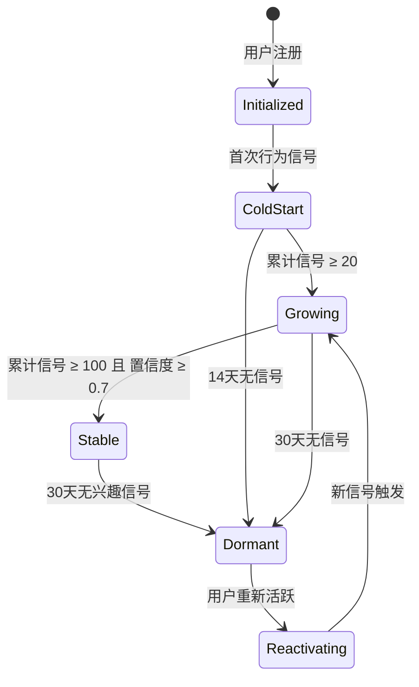

# 服务端 - 用户学习兴趣探索与学科偏好动态建模引擎 详细设计

> **模块定位**：AI 个性化推荐体系的核心基础设施之一。负责采集用户学习行为中的兴趣信号，构建多维度的学科偏好模型，并通过探索-利用平衡策略持续发现用户新的兴趣点，为首页推荐、题目推荐、内容编排等下游服务提供兴趣画像数据支撑。

---

## 1. 模块概述

### 1.1 设计目标

| 目标 | 说明 |
|------|------|
| 兴趣信号采集 | 统一采集来自多场景的用户学习行为，转化为标准化兴趣信号 |
| 学科偏好建模 | 构建学科 × 主题 × 难度三维兴趣向量，持续迭代更新 |
| 兴趣探索 | 在推荐中引入探索策略，避免兴趣画像过早收敛（信息茧房） |
| 兴趣趋势分析 | 追踪兴趣随时间的变化趋势，识别兴趣增长/衰退 |
| 下游服务赋能 | 提供统一的兴趣画像查询 API，供推荐、编排、学情分析等模块调用 |

### 1.2 核心挑战

1. **冷启动**：新用户缺乏行为数据，需通过注册时的学科选择和初始引导快速建立粗粒度兴趣画像。
2. **隐式兴趣提取**：用户很少显式表达兴趣，需从停留时长、完读率、主动追问、收藏等隐式行为中推断。
3. **兴趣漂移**：学生的兴趣会随学段升级、考试临近等因素发生变化，模型需具备时效性。
4. **探索-利用平衡**：过度依赖历史兴趣会导致推荐同质化，需适当引入探索性内容。
5. **跨学科关联**：学生对历史的兴趣可能延伸到语文古诗文，需建立跨学科兴趣传播机制。

### 1.3 与已有模块的边界

| 已有模块 | 关注点 | 本模块差异 |
|----------|--------|------------|
| 用户学习画像与能力维度模型 | 学术能力维度（计算、推理、表达等） | 本模块关注**兴趣偏好**，不是能力水平 |
| 学生学习风格识别与自适应内容呈现策略服务 | 学习风格（视觉/听觉/动手，序列/全局） | 本模块关注**喜欢什么内容**，不是怎么学 |
| 首页内容卡片推荐与聚合编排服务 | 首页推荐位的内容编排 | 本模块是**画像提供方**，不是推荐执行方 |
| 自适应学习与个性化推荐引擎 | 学习路径和练习推荐 | 本模块提供**兴趣信号**作为推荐输入之一 |
| 题目智能推荐与个性化练习编排服务 | 题目难度和知识点匹配 | 本模块提供**学科偏好权重**辅助选题 |

---

## 2. 数据结构设计

### 2.1 核心表结构

#### 2.1.1 `user_interest_profile` — 用户兴趣画像主表

```sql
CREATE TABLE user_interest_profile (
    id              BIGSERIAL PRIMARY KEY,
    user_id         BIGINT NOT NULL,
    subject_code    VARCHAR(20) NOT NULL,          -- 学科编码：CHINESE, MATH, ENGLISH, PHYSICS...
    interest_score  DECIMAL(5,4) NOT NULL DEFAULT 0.5000,  -- 兴趣分值 [0.0000, 1.0000]
    confidence      DECIMAL(5,4) NOT NULL DEFAULT 0.0000,  -- 置信度 [0.0000, 1.0000]，数据量越大越高
    trend_direction VARCHAR(10) DEFAULT 'STABLE',  -- RISING / FALLING / STABLE
    trend_momentum  DECIMAL(5,4) DEFAULT 0.0000,   -- 趋势动量 [-1.0000, 1.0000]
    last_signal_at  TIMESTAMPTZ,                    -- 最近一次兴趣信号时间
    signal_count    INT DEFAULT 0,                  -- 累计信号数
    created_at      TIMESTAMPTZ DEFAULT NOW(),
    updated_at      TIMESTAMPTZ DEFAULT NOW(),
    UNIQUE (user_id, subject_code)
);

CREATE INDEX idx_interest_profile_user ON user_interest_profile(user_id);
CREATE INDEX idx_interest_profile_subject ON user_interest_profile(subject_code, interest_score DESC);
```

#### 2.1.2 `user_topic_interest` — 用户主题级兴趣画像

```sql
CREATE TABLE user_topic_interest (
    id              BIGSERIAL PRIMARY KEY,
    user_id         BIGINT NOT NULL,
    subject_code    VARCHAR(20) NOT NULL,
    topic_code      VARCHAR(50) NOT NULL,           -- 主题编码，如 MATH_ALGEBRA, CHINESE_POETRY
    interest_score  DECIMAL(5,4) NOT NULL DEFAULT 0.5000,
    confidence      DECIMAL(5,4) NOT NULL DEFAULT 0.0000,
    exposure_count  INT DEFAULT 0,                  -- 曝光次数（被推荐/展示的次数）
    engage_count    INT DEFAULT 0,                  -- 交互次数（点击、学习、收藏等）
    last_exposure_at TIMESTAMPTZ,
    last_engage_at  TIMESTAMPTZ,
    created_at      TIMESTAMPTZ DEFAULT NOW(),
    updated_at      TIMESTAMPTZ DEFAULT NOW(),
    UNIQUE (user_id, subject_code, topic_code)
);

CREATE INDEX idx_topic_interest_user_subject ON user_topic_interest(user_id, subject_code);
```

#### 2.1.3 `interest_signal_log` — 兴趣信号事件日志

```sql
CREATE TABLE interest_signal_log (
    id              BIGSERIAL PRIMARY KEY,
    user_id         BIGINT NOT NULL,
    signal_source   VARCHAR(50) NOT NULL,           -- 信号来源：AI_DIALOG / PRACTICE / SEARCH / BROWSE / BOOKMARK / RATING
    subject_code    VARCHAR(20),                     -- 关联学科（可为空，表示跨学科行为）
    topic_code      VARCHAR(50),                     -- 关联主题
    content_id      VARCHAR(64),                     -- 关联内容ID
    signal_type     VARCHAR(30) NOT NULL,            -- DWELL / COMPLETE / BOOKMARK / SHARE / REVISIT / THUMBS_UP / SKIP / ABANDON
    signal_weight   DECIMAL(5,4) NOT NULL,           -- 信号权重（正/负）
    duration_ms     INT,                             -- 行为持续时间（毫秒）
    session_id      VARCHAR(64),                     -- 学习会话ID
    created_at      TIMESTAMPTZ DEFAULT NOW()
);

CREATE INDEX idx_signal_log_user_time ON interest_signal_log(user_id, created_at DESC);
CREATE INDEX idx_signal_log_subject ON interest_signal_log(subject_code, signal_type);
```

#### 2.1.4 `interest_exploration_log` — 探索投放记录

```sql
CREATE TABLE interest_exploration_log (
    id                  BIGSERIAL PRIMARY KEY,
    user_id             BIGINT NOT NULL,
    subject_code        VARCHAR(20) NOT NULL,
    topic_code          VARCHAR(50),                 -- 探索的主题
    exploration_strategy VARCHAR(30) NOT NULL,       -- RANDOM / SIMILAR_USER / CROSS_SUBJECT / TRENDING
    content_id          VARCHAR(64),                 -- 探索投放的内容ID
    exposure_placement  VARCHAR(50),                 -- 投放位置：HOME_FEED / RECOMMENDATION / RELATED
    user_response       VARCHAR(20),                 -- ENGAGED / IGNORED / DISMISSED / BLOCKED
    response_time_ms    INT,                         -- 响应时间
    created_at          TIMESTAMPTZ DEFAULT NOW()
);

CREATE INDEX idx_exploration_user ON interest_exploration_log(user_id, created_at DESC);
```

#### 2.1.5 `cross_subject_interest_map` — 跨学科兴趣关联规则

```sql
CREATE TABLE cross_subject_interest_map (
    id                  BIGSERIAL PRIMARY KEY,
    source_subject      VARCHAR(20) NOT NULL,        -- 源学科
    source_topic        VARCHAR(50) NOT NULL,        -- 源主题
    target_subject      VARCHAR(20) NOT NULL,        -- 目标学科
    target_topic        VARCHAR(50) NOT NULL,        -- 目标主题
    correlation_score   DECIMAL(5,4) NOT NULL,       -- 关联强度 [0, 1]
    rule_status         VARCHAR(20) DEFAULT 'ACTIVE',-- ACTIVE / INACTIVE / EXPERIMENTAL
    sample_count        INT DEFAULT 0,               -- 样本量
    created_at          TIMESTAMPTZ DEFAULT NOW(),
    updated_at          TIMESTAMPTZ DEFAULT NOW(),
    UNIQUE (source_subject, source_topic, target_subject, target_topic)
);
```

### 2.2 Redis 缓存结构

```
# 用户学科兴趣画像缓存（Hash）
interest:profile:{userId} 
  -> { subject_code: score_json, ... }
  # score_json = {"score": 0.72, "confidence": 0.85, "trend": "RISING", "updated": 1718300000}

# 用户主题级兴趣 Top-K 缓存（ZSet）
interest:topics:{userId}:{subjectCode}
  -> sorted set of topic_code by interest_score

# 兴趣信号缓冲队列（List，异步写入DB）
interest:signal:buffer
  -> [signal_json, ...]

# 探索冷却期（设置TTL）
interest:explore:cooldown:{userId}:{subjectCode}
  -> 1 (TTL 24h)

# 用户兴趣快照（按日，用于趋势分析）
interest:snapshot:{userId}:{dateStr}
  -> JSON of all subject scores at end of day
```

---

## 3. 兴趣信号采集与标准化

### 3.1 信号来源与权重体系

| 信号来源 | 信号类型 | 正/负 | 基础权重 | 说明 |
|----------|----------|-------|----------|------|
| AI 对话 | 主动提问 | 正 | +0.030 | 用户主动就某学科/主题发起对话 |
| AI 对话 | 追问拓展 | 正 | +0.050 | 对某话题追问 2 轮以上 |
| AI 对话 | 换种讲法 | 负 | -0.010 | 可能表示理解困难（兴趣或能力信号） |
| 练习答题 | 完成率高 | 正 | +0.040 | 某主题练习完成率 > 80% |
| 练习答题 | 主动加练 | 正 | +0.080 | 完成系统推荐后主动请求更多练习 |
| 练习答题 | 跳过/放弃 | 负 | -0.030 | 大量跳过某主题题目 |
| 浏览行为 | 停留时长 | 正 | +0.015 | 单内容停留 > 预期时长的 1.5 倍 |
| 浏览行为 | 完读 | 正 | +0.025 | 完整阅读一篇知识讲解 |
| 浏览行为 | 快速划过 | 负 | -0.010 | 停留 < 预期时长的 30% |
| 收藏笔记 | 收藏 | 正 | +0.060 | 收藏某内容 |
| 收藏笔记 | 笔记 | 正 | +0.070 | 为某内容添加笔记 |
| 搜索 | 主动搜索 | 正 | +0.050 | 搜索某学科/主题关键词 |
| 搜索 | 多次搜索 | 正 | +0.080 | 同主题一周内搜索 ≥ 3 次 |
| 评分反馈 | 点赞 | 正 | +0.040 | 对AI回答/内容点赞 |
| 评分反馈 | 点踩 | 负 | -0.050 | 对AI回答/内容点踩 |
| 分享 | 分享内容 | 正 | +0.090 | 分享给好友或社交平台 |
| 复访 | 7日内复访 | 正 | +0.035 | 7天内重新查看同一内容 |

### 3.2 信号权重动态调整

权重并非固定不变，系统支持通过配置动态调整：

```java
/** 信号权重配置（存储于配置中心，支持热更新） */
public class SignalWeightConfig {
    private Map<String, BigDecimal> baseWeights;        // 信号类型 → 基础权重
    private BigDecimal gradeMultiplier;                  // 年级调节系数
    private BigDecimal timeDecayFactor;                  // 时间衰减因子
    private int signalCap;                               // 单日单主题信号上限（防爆刷）
    private Map<String, BigDecimal> subjectAdjustments;  // 学科特殊调节
}
```

### 3.3 信号采集服务

```java
/**
 * 兴趣信号采集服务
 * 各业务模块通过事件总线或直接调用方式上报兴趣信号
 */
public interface InterestSignalCollector {

    /**
     * 上报兴趣信号（异步处理）
     * @param signal 兴趣信号事件
     */
    void collect(InterestSignal signal);

    /**
     * 批量上报兴趣信号
     * @param signals 信号列表
     */
    void collectBatch(List<InterestSignal> signals);
}

/**
 * 兴趣信号事件定义
 */
@Data
@Builder
public class InterestSignal {
    private Long userId;
    private String signalSource;     // AI_DIALOG / PRACTICE / SEARCH / ...
    private String subjectCode;
    private String topicCode;
    private String contentId;
    private String signalType;       // DWELL / COMPLETE / BOOKMARK / ...
    private BigDecimal rawWeight;    // 原始权重（null 时根据 signalType 自动查表）
    private Integer durationMs;
    private String sessionId;
    private LocalDateTime occurredAt;
}
```

### 3.4 信号采集接入示例（事件驱动）

```java
/**
 * 监听练习完成事件，自动采集兴趣信号
 */
@Component
public class PracticeEventListener {

    @Autowired
    private InterestSignalCollector signalCollector;

    @EventListener
    @Async("interestSignalExecutor")
    public void onPracticeCompleted(PracticeCompletedEvent event) {
        // 判断是否为主动加练
        boolean voluntaryExtra = event.isVoluntaryExtra();

        InterestSignal signal = InterestSignal.builder()
            .userId(event.getUserId())
            .signalSource("PRACTICE")
            .subjectCode(event.getSubjectCode())
            .topicCode(event.getTopicCode())
            .contentId(event.getPracticeId())
            .signalType(voluntaryExtra ? "EXTRA_PRACTICE" : "COMPLETE")
            .durationMs(event.getDurationMs())
            .sessionId(event.getSessionId())
            .occurredAt(LocalDateTime.now())
            .build();

        signalCollector.collect(signal);
    }

    @EventListener
    @Async("interestSignalExecutor")
    public void onAIDialogTurn(AIDialogTurnEvent event) {
        // 用户主动发起对话 = 强兴趣信号
        if (event.getTurnIndex() == 1) {
            InterestSignal signal = InterestSignal.builder()
                .userId(event.getUserId())
                .signalSource("AI_DIALOG")
                .subjectCode(event.getSubjectCode())
                .topicCode(event.getTopicCode())
                .signalType("ASK")
                .sessionId(event.getSessionId())
                .occurredAt(LocalDateTime.now())
                .build();
            signalCollector.collect(signal);
        }

        // 追问 2 轮以上
        if (event.getTurnIndex() >= 3) {
            InterestSignal deepSignal = InterestSignal.builder()
                .userId(event.getUserId())
                .signalSource("AI_DIALOG")
                .subjectCode(event.getSubjectCode())
                .topicCode(event.getTopicCode())
                .signalType("DEEP_FOLLOWUP")
                .sessionId(event.getSessionId())
                .occurredAt(LocalDateTime.now())
                .build();
            signalCollector.collect(deepSignal);
        }
    }
}
```

---

## 4. 兴趣评分算法

### 4.1 评分模型概述

采用 **加权指数移动平均（EWMA）** 模型，结合时间衰减和置信度调整：

```
score_new = α × weighted_signal_sum + (1 - α) × score_old

其中：
  α = learning_rate（学习率，默认 0.15，随数据量增大而减小）
  weighted_signal_sum = Σ(signal_weight_i × time_decay_i) / signal_count_in_window
  time_decay_i = exp(-λ × days_since_signal)   （λ = 0.05，半衰期约 14 天）
```

### 4.2 核心评分引擎

```java
/**
 * 兴趣评分引擎
 * 负责：信号聚合 → 权重计算 → 时间衰减 → EWMA 更新 → 置信度调整
 */
@Service
public class InterestScoringEngine {

    private static final BigDecimal LAMBDA = new BigDecimal("0.05");        // 时间衰减系数
    private static final BigDecimal HALF_LIFE_DAYS = new BigDecimal("14");  // 半衰期
    private static final int SIGNAL_WINDOW_DAYS = 30;                       // 信号窗口
    private static final int MIN_SIGNALS_FOR_CONFIDENCE = 5;                // 最低置信信号数
    private static final int MAX_SIGNALS_FOR_CONFIDENCE = 50;               // 满置信信号数

    /**
     * 计算兴趣评分更新
     * @param currentScore 当前分值 [0, 1]
     * @param currentConfidence 当前置信度 [0, 1]
     * @param signals 窗口期内信号列表
     * @return 更新后的评分结果
     */
    public InterestScoreUpdate computeUpdatedScore(
            BigDecimal currentScore,
            BigDecimal currentConfidence,
            List<InterestSignal> signals,
            LocalDateTime now) {

        if (signals.isEmpty()) {
            // 无新信号：分数按时间衰减趋向 0.5（中性）
            BigDecimal decayed = applyNoSignalDecay(currentScore);
            return InterestScoreUpdate.builder()
                .score(decayed)
                .confidence(adjustConfidence(currentConfidence, 0, now))
                .build();
        }

        // 1. 过滤窗口期内信号
        List<InterestSignal> windowSignals = filterByTimeWindow(signals, SIGNAL_WINDOW_DAYS, now);

        // 2. 计算每条信号的衰减后权重
        List<BigDecimal> weightedSignals = windowSignals.stream()
            .map(s -> computeSignalWeight(s, now))
            .collect(Collectors.toList());

        // 3. 汇总加权信号
        BigDecimal signalSum = weightedSignals.stream()
            .reduce(BigDecimal.ZERO, BigDecimal::add);
        BigDecimal avgSignal = signalSum.divide(
            new BigDecimal(windowSignals.size()), 4, RoundingMode.HALF_UP);

        // 4. 计算学习率（信号越多，学习率越小，防止突发行为过度影响）
        BigDecimal learningRate = computeLearningRate(windowSignals.size());

        // 5. EWMA 更新
        BigDecimal newScore = learningRate.multiply(avgSignal)
            .add(BigDecimal.ONE.subtract(learningRate).multiply(currentScore))
            .setScale(4, RoundingMode.HALF_UP);

        // 6. Clamp [0, 1]
        newScore = newScore.max(BigDecimal.ZERO).min(BigDecimal.ONE);

        // 7. 更新置信度
        BigDecimal newConfidence = adjustConfidence(currentConfidence, windowSignals.size(), now);

        // 8. 计算趋势
        TrendResult trend = computeTrend(currentScore, newScore, signals, now);

        return InterestScoreUpdate.builder()
            .score(newScore)
            .confidence(newConfidence)
            .trendDirection(trend.getDirection())
            .trendMomentum(trend.getMomentum())
            .build();
    }

    /**
     * 计算单条信号的衰减后权重
     */
    private BigDecimal computeSignalWeight(InterestSignal signal, LocalDateTime now) {
        BigDecimal baseWeight = signal.getRawWeight() != null
            ? signal.getRawWeight()
            : getBaseWeight(signal.getSignalType());

        // 时间衰减
        long daysBetween = ChronoUnit.DAYS.between(signal.getOccurredAt(), now);
        BigDecimal timeDecay = BigDecimal.valueOf(Math.exp(
            -LAMBDA.doubleValue() * daysBetween));

        return baseWeight.multiply(timeDecay);
    }

    /**
     * 学习率：信号少时快速适应，信号多时稳定
     * α = 0.3 - 0.15 × min(signalCount / 10, 1) → [0.15, 0.30]
     */
    private BigDecimal computeLearningRate(int signalCount) {
        double factor = Math.min((double) signalCount / 10.0, 1.0);
        double alpha = 0.30 - 0.15 * factor;
        return BigDecimal.valueOf(alpha).setScale(4, RoundingMode.HALF_UP);
    }

    /**
     * 无信号时分数衰减趋向中性 0.5
     */
    private BigDecimal applyNoSignalDecay(BigDecimal currentScore) {
        // 每次更新朝 0.5 移动 2%
        BigDecimal neutral = new BigDecimal("0.5");
        BigDecimal diff = neutral.subtract(currentScore);
        return currentScore.add(diff.multiply(new BigDecimal("0.02")))
            .setScale(4, RoundingMode.HALF_UP);
    }

    /**
     * 置信度调整
     */
    private BigDecimal adjustConfidence(BigDecimal currentConfidence, int newSignalCount, LocalDateTime now) {
        // 置信度基于累计信号量和近期活跃度
        double confidence;
        if (newSignalCount == 0) {
            // 无新信号，置信度略微下降
            confidence = currentConfidence.multiply(new BigDecimal("0.98")).doubleValue();
        } else {
            // 有新信号，置信度上升
            double increment = Math.min((double) newSignalCount / MAX_SIGNALS_FOR_CONFIDENCE, 1.0);
            confidence = Math.min(1.0, currentConfidence.doubleValue() + increment * 0.1);
        }
        return BigDecimal.valueOf(confidence).setScale(4, RoundingMode.HALF_UP);
    }

    /**
     * 趋势计算：比较最近7天 vs 前7天的信号密度和强度
     */
    private TrendResult computeTrend(BigDecimal oldScore, BigDecimal newScore,
                                      List<InterestSignal> signals, LocalDateTime now) {
        BigDecimal delta = newScore.subtract(oldScore);
        BigDecimal threshold = new BigDecimal("0.02");

        String direction;
        if (delta.abs().compareTo(threshold) < 0) {
            direction = "STABLE";
        } else if (delta.compareTo(BigDecimal.ZERO) > 0) {
            direction = "RISING";
        } else {
            direction = "FALLING";
        }

        // 动量：归一化到 [-1, 1]
        BigDecimal momentum = delta.divide(new BigDecimal("0.1"), 4, RoundingMode.HALF_UP)
            .max(new BigDecimal("-1"))
            .min(BigDecimal.ONE);

        return new TrendResult(direction, momentum);
    }

    private BigDecimal getBaseWeight(String signalType) {
        return switch (signalType) {
            case "SHARE" -> new BigDecimal("0.090");
            case "EXTRA_PRACTICE" -> new BigDecimal("0.080");
            case "MULTI_SEARCH" -> new BigDecimal("0.080");
            case "NOTE" -> new BigDecimal("0.070");
            case "BOOKMARK" -> new BigDecimal("0.060");
            case "DEEP_FOLLOWUP" -> new BigDecimal("0.050");
            case "SEARCH" -> new BigDecimal("0.050");
            case "THUMBS_UP" -> new BigDecimal("0.040");
            case "COMPLETE" -> new BigDecimal("0.040");
            case "ASK" -> new BigDecimal("0.030");
            case "DWELL" -> new BigDecimal("0.015");
            case "FINISH_READ" -> new BigDecimal("0.025");
            case "SKIP" -> new BigDecimal("-0.030");
            case "FAST_SCROLL" -> new BigDecimal("-0.010");
            case "THUMBS_DOWN" -> new BigDecimal("-0.050");
            case "ABANDON" -> new BigDecimal("-0.050");
            default -> new BigDecimal("0.010");
        };
    }
}
```

---

## 5. 探索-利用平衡策略

### 5.1 策略概述

系统采用 **Multi-Armed Bandit（多臂老虎机）** 思路，具体使用 **ε-Greedy + UCB 混合策略**：

```
对于每次推荐决策：
  以概率 (1 - ε)：从用户已知高兴趣主题中选择（利用/Exploit）
  以概率 ε：从探索池中选择（探索/Explore）

其中 ε 动态调整：
  ε = base_epsilon × (1 - confidence) × novelty_factor
  
  base_epsilon = 0.15（默认探索率）
  confidence = 用户画像置信度（越高，探索越少）
  novelty_factor = 新用户更高（前2周探索率提升至 0.30）
```

### 5.2 探索策略矩阵

| 策略 | 适用场景 | 实现方式 |
|------|----------|----------|
| `RANDOM` | 新用户冷启动期 | 从当前学段全部主题中随机选择 |
| `SIMILAR_USER` | 有基础画像的用户 | 基于协同过滤：找到相似兴趣用户的偏好主题 |
| `CROSS_SUBJECT` | 单科兴趣突出的用户 | 利用跨学科关联表：历史兴趣高 → 推荐语文古诗文 |
| `TRENDING` | 全体用户 | 全局热门主题（备考季的高频考点） |
| `CURRICULUM` | 按教材进度学习 | 当前章节的关联拓展主题 |

### 5.3 探索策略引擎

```java
/**
 * 兴趣探索策略引擎
 */
@Service
public class InterestExplorationEngine {

    @Autowired
    private UserInterestProfileService profileService;

    @Autowired
    private CrossSubjectInterestMapService crossSubjectMapService;

    @Autowired
    private InterestExplorationLogRepository explorationLogRepo;

    private static final BigDecimal BASE_EPSILON = new BigDecimal("0.15");
    private static final BigDecimal NEW_USER_EPSILON = new BigDecimal("0.30");
    private static final int NEW_USER_DAYS = 14;

    /**
     * 决定本次推荐是否进行探索，以及探索策略
     */
    public ExplorationDecision decideExploration(Long userId, String subjectCode) {
        UserInterestProfile profile = profileService.getOrCreate(userId);
        
        // 1. 计算当前探索率 ε
        BigDecimal epsilon = computeEpsilon(profile);

        // 2. 以 ε 概率探索
        if (random.nextDouble() < epsilon.doubleValue()) {
            ExplorationStrategy strategy = selectStrategy(profile, subjectCode);
            String targetTopic = selectExplorationTopic(userId, strategy, subjectCode);

            // 记录探索投放
            logExploration(userId, subjectCode, targetTopic, strategy);

            return ExplorationDecision.explore(strategy, subjectCode, targetTopic);
        }

        // 3. 利用：返回已知高兴趣主题
        return ExplorationDecision.exploit(subjectCode);
    }

    /**
     * 计算动态探索率
     */
    private BigDecimal computeEpsilon(UserInterestProfile profile) {
        // 新用户探索率提升
        if (profile.getDaysSinceRegistration() <= NEW_USER_DAYS) {
            return NEW_USER_EPSILON;
        }

        // 置信度越低，探索越多
        BigDecimal confidenceFactor = BigDecimal.ONE.subtract(profile.getAvgConfidence());
        return BASE_EPSILON.multiply(confidenceFactor).min(BASE_EPSILON);
    }

    /**
     * 选择探索策略（加权随机）
     */
    private ExplorationStrategy selectStrategy(UserInterestProfile profile, String subjectCode) {
        Map<ExplorationStrategy, BigDecimal> weights = new EnumMap<>(ExplorationStrategy.class);

        // 根据用户画像成熟度分配策略权重
        if (profile.getSignalCount() < 10) {
            // 信号少：偏随机和课程引导
            weights.put(ExplorationStrategy.RANDOM, new BigDecimal("0.40"));
            weights.put(ExplorationStrategy.CURRICULUM, new BigDecimal("0.40"));
            weights.put(ExplorationStrategy.TRENDING, new BigDecimal("0.20"));
        } else {
            // 有基础数据：偏精准探索
            weights.put(ExplorationStrategy.SIMILAR_USER, new BigDecimal("0.35"));
            weights.put(ExplorationStrategy.CROSS_SUBJECT, new BigDecimal("0.30"));
            weights.put(ExplorationStrategy.CURRICULUM, new BigDecimal("0.20"));
            weights.put(ExplorationStrategy.TRENDING, new BigDecimal("0.15"));
        }

        return weightedRandom(weights);
    }

    /**
     * 检查探索冷却期，避免对同一学科频繁探索
     */
    public boolean isInCooldown(Long userId, String subjectCode) {
        String key = String.format("interest:explore:cooldown:%d:%s", userId, subjectCode);
        return redisTemplate.hasKey(key);
    }

    /**
     * 设置探索冷却期（24小时）
     */
    public void setCooldown(Long userId, String subjectCode) {
        String key = String.format("interest:explore:cooldown:%d:%s", userId, subjectCode);
        redisTemplate.opsForValue().set(key, "1", 24, TimeUnit.HOURS);
    }
}
```

### 5.4 探索结果反馈闭环

```java
/**
 * 探索结果跟踪
 * 当用户对探索投放的内容产生交互后，更新探索效果评估
 */
@Service
public class ExplorationFeedbackTracker {

    /**
     * 记录用户对探索内容的响应
     */
    public void recordExplorationResponse(Long userId, String contentId, 
                                           ExplorationResponse response) {
        // 1. 查找探索记录
        InterestExplorationLog log = explorationLogRepo
            .findLatestByUserAndContent(userId, contentId)
            .orElse(null);

        if (log == null) return;

        // 2. 更新探索记录
        log.setUserResponse(response.getStatus()); // ENGAGED / IGNORED / DISMISSED / BLOCKED
        log.setResponseTimeMs(response.getResponseTimeMs());
        explorationLogRepo.save(log);

        // 3. 如果用户产生了正向交互，自动触发兴趣信号采集
        if (response.getStatus().equals("ENGAGED")) {
            InterestSignal positiveSignal = InterestSignal.builder()
                .userId(userId)
                .signalSource("EXPLORATION")
                .subjectCode(log.getSubjectCode())
                .topicCode(log.getTopicCode())
                .signalType("EXPLORE_ENGAGE")
                .rawWeight(new BigDecimal("0.060"))  // 探索性交互给较高正权重
                .build();
            signalCollector.collect(positiveSignal);
        }

        // 4. 如果用户明确拒绝（DISMISSED），降低该主题探索权重
        if (response.getStatus().equals("DISMISSED") || response.getStatus().equals("BLOCKED")) {
            InterestSignal negativeSignal = InterestSignal.builder()
                .userId(userId)
                .signalSource("EXPLORATION")
                .subjectCode(log.getSubjectCode())
                .topicCode(log.getTopicCode())
                .signalType("EXPLORE_DISMISS")
                .rawWeight(new BigDecimal("-0.040"))
                .build();
            signalCollector.collect(negativeSignal);
        }
    }
}
```

---

## 6. 跨学科兴趣传播

### 6.1 设计思路

学生在一个学科中表现出的主题兴趣，可能关联到另一个学科的相邻主题。例如：

| 源兴趣 | 目标关联 | 传播机制 |
|--------|----------|----------|
| 历史三国 | 语文古诗文（出师表） | 历史事件 → 相关文学作品 |
| 数学函数 | 物理运动学 | 数学工具 → 物理应用 |
| 生物生态 | 地理自然环境 | 学科交叉领域 |
| 英语阅读 | 语文写作 | 语言学科能力迁移 |
| 化学元素 | 物理原子结构 | 微观世界交叉 |

### 6.2 关联规则维护

```java
/**
 * 跨学科兴趣传播服务
 */
@Service
public class CrossSubjectInterestPropagator {

    /**
     * 基于用户的源学科兴趣，计算目标学科的潜在兴趣增量
     */
    public List<InterestPropagation> computePropagations(
            Long userId, String sourceSubject, BigDecimal sourceInterestScore) {

        // 查询以源学科为起点的所有活跃关联规则
        List<CrossSubjectInterestMap> rules = crossSubjectMapService
            .findActiveRulesBySource(sourceSubject);

        return rules.stream()
            .filter(rule -> rule.getCorrelationScore().compareTo(new BigDecimal("0.3")) > 0)
            .map(rule -> {
                // 传播强度 = 源兴趣 × 关联强度 × 衰减系数
                BigDecimal propagatedScore = sourceInterestScore
                    .multiply(rule.getCorrelationScore())
                    .multiply(new BigDecimal("0.6"))  // 传播衰减
                    .setScale(4, RoundingMode.HALF_UP);

                return InterestPropagation.builder()
                    .targetSubject(rule.getTargetSubject())
                    .targetTopic(rule.getTargetTopic())
                    .propagatedScore(propagatedScore)
                    .sourceRuleId(rule.getId())
                    .build();
            })
            .filter(p -> p.getPropagatedScore().compareTo(new BigDecimal("0.05")) > 0)
            .collect(Collectors.toList());
    }

    /**
     * 定期任务：基于全局用户数据挖掘新的跨学科关联规则
     * 每周执行一次，使用协同过滤思路
     */
    @Scheduled(cron = "0 0 3 * * MON")  // 每周一凌晨3点
    public void mineCrossSubjectRules() {
        // 1. 提取过去30天内多学科均有交互的用户群体
        // 2. 对每对 (源主题, 目标主题) 计算皮尔逊相关系数
        // 3. 相关系数 > 0.5 且样本量 > 100 的新规则入库（EXPERIMENTAL 状态）
        // 4. 已有规则的 correlation_score 基于新数据更新
        // 5. 长期低关联度的规则置为 INACTIVE
    }
}
```

---

## 7. API 接口设计

### 7.1 查询用户兴趣画像

```http
GET /api/v1/interest/profile/{userId}
```

**请求参数**

| 参数 | 类型 | 必填 | 说明 |
|------|------|------|------|
| userId | Long | 是 | 用户ID |
| subject | String | 否 | 过滤学科，不传返回全部 |
| includeTopics | Boolean | 否 | 是否包含主题级画像，默认 false |
| topicLimit | Integer | 否 | 每学科返回的主题数上限，默认 10 |

**响应示例**

```json
{
  "code": 0,
  "data": {
    "userId": 100123,
    "subjects": [
      {
        "subjectCode": "MATH",
        "subjectName": "数学",
        "interestScore": 0.7820,
        "confidence": 0.8500,
        "trendDirection": "RISING",
        "trendMomentum": 0.3200,
        "lastSignalAt": "2026-06-13T10:30:00Z",
        "signalCount": 128,
        "topTopics": [
          {"topicCode": "MATH_ALGEBRA", "topicName": "代数", "score": 0.85, "confidence": 0.90},
          {"topicCode": "MATH_GEOMETRY", "topicName": "几何", "score": 0.72, "confidence": 0.80},
          {"topicCode": "MATH_FUNCTIONS", "topicName": "函数", "score": 0.68, "confidence": 0.75}
        ]
      },
      {
        "subjectCode": "PHYSICS",
        "subjectName": "物理",
        "interestScore": 0.6530,
        "confidence": 0.7200,
        "trendDirection": "STABLE",
        "trendMomentum": 0.0100,
        "lastSignalAt": "2026-06-12T15:00:00Z",
        "signalCount": 64
      }
    ],
    "overallProfile": {
      "dominantSubject": "MATH",
      "diversityScore": 0.62,
      "explorationRate": 0.12,
      "profileAge": 45
    }
  }
}
```

### 7.2 上报兴趣信号

```http
POST /api/v1/interest/signal
```

**请求体**

```json
{
  "userId": 100123,
  "signals": [
    {
      "signalSource": "AI_DIALOG",
      "subjectCode": "MATH",
      "topicCode": "MATH_ALGEBRA",
      "contentId": "conv_20260613_001",
      "signalType": "DEEP_FOLLOWUP",
      "durationMs": 180000,
      "sessionId": "sess_abc123"
    },
    {
      "signalSource": "PRACTICE",
      "subjectCode": "MATH",
      "topicCode": "MATH_FUNCTIONS",
      "contentId": "practice_8801",
      "signalType": "COMPLETE",
      "durationMs": 420000,
      "sessionId": "sess_abc123"
    }
  ]
}
```

**响应**

```json
{
  "code": 0,
  "data": {
    "accepted": 2,
    "rejected": 0,
    "message": "信号已异步处理"
  }
}
```

### 7.3 获取探索推荐

```http
GET /api/v1/interest/explore/{userId}
```

**请求参数**

| 参数 | 类型 | 必填 | 说明 |
|------|------|------|------|
| subject | String | 否 | 限定学科 |
| strategy | String | 否 | 指定探索策略（默认自动选择） |
| limit | Integer | 否 | 返回数量，默认 3 |

**响应**

```json
{
  "code": 0,
  "data": {
    "isExploration": true,
    "strategy": "CROSS_SUBJECT",
    "items": [
      {
        "subjectCode": "CHINESE",
        "topicCode": "CHINESE_POETRY_TANG",
        "topicName": "唐诗鉴赏",
        "reason": "基于您对历史(唐宋时期)的兴趣，推荐探索相关古诗文",
        "estimatedInterest": 0.58,
        "contentIds": ["lesson_poetry_001", "lesson_poetry_002"]
      }
    ]
  }
}
```

### 7.4 获取兴趣相似用户群

```http
GET /api/v1/interest/similar-users/{userId}
```

**响应**

```json
{
  "code": 0,
  "data": {
    "userId": 100123,
    "userSegment": "MATH_ENTHUSIAST_HIGH_SCHOOL",
    "segmentLabel": "高中数学爱好者",
    "similarUserCount": 1247,
    "topSharedInterests": [
      {"topicCode": "MATH_FUNCTIONS", "avgScore": 0.82},
      {"topicCode": "PHYSICS_MECHANICS", "avgScore": 0.71}
    ]
  }
}
```

### 7.5 获取兴趣趋势报告

```http
GET /api/v1/interest/trends/{userId}?period=30d
```

**响应**

```json
{
  "code": 0,
  "data": {
    "userId": 100123,
    "period": "30d",
    "trends": [
      {
        "subjectCode": "MATH",
        "startScore": 0.6500,
        "endScore": 0.7820,
        "delta": 0.1320,
        "direction": "RISING",
        "keyEvents": [
          {"date": "2026-06-01", "event": "voluntary_extra_practice", "impact": 0.05},
          {"date": "2026-06-08", "event": "shared_content", "impact": 0.04}
        ]
      },
      {
        "subjectCode": "ENGLISH",
        "startScore": 0.7000,
        "endScore": 0.6200,
        "delta": -0.0800,
        "direction": "FALLING",
        "keyEvents": []
      }
    ]
  }
}
```

---

## 8. 冷启动策略

### 8.1 新用户注册时兴趣初始化

```java
/**
 * 新用户兴趣画像初始化服务
 */
@Service
public class InterestColdStartService {

    /**
     * 注册引导阶段：根据用户选择的感兴趣学科初始化画像
     */
    public void initializeFromRegistration(Long userId, RegistrationProfile profile) {
        // 用户在注册引导中选择的感兴趣学科
        List<String> selectedSubjects = profile.getSelectedSubjects();
        int gradeLevel = profile.getGradeLevel();

        for (String subject : selectedSubjects) {
            // 主动选择的学科：初始兴趣分 0.65，置信度 0.20（低，待验证）
            UserInterestProfile p = UserInterestProfile.builder()
                .userId(userId)
                .subjectCode(subject)
                .interestScore(new BigDecimal("0.65"))
                .confidence(new BigDecimal("0.20"))
                .trendDirection("STABLE")
                .trendMomentum(BigDecimal.ZERO)
                .signalCount(0)
                .build();
            profileRepo.save(p);
        }

        // 未选择的学科：初始兴趣分 0.40（略低于中性），置信度 0.10
        List<String> allSubjects = subjectService.getSubjectsForGrade(gradeLevel);
        for (String subject : allSubjects) {
            if (!selectedSubjects.contains(subject)) {
                UserInterestProfile p = UserInterestProfile.builder()
                    .userId(userId)
                    .subjectCode(subject)
                    .interestScore(new BigDecimal("0.40"))
                    .confidence(new BigDecimal("0.10"))
                    .build();
                profileRepo.save(p);
            }
        }
    }

    /**
     * 首次学习行为后快速修正画像
     * 前5次行为给予额外权重加成，帮助新用户快速建立画像
     */
    public BigDecimal getNewUserBoostFactor(Long userId) {
        int signalCount = signalLogRepo.countByUserId(userId);
        if (signalCount >= 20) return BigDecimal.ONE;

        // 前20条信号获得递减加成：5.0x → 1.0x
        double boost = 5.0 - (signalCount / 20.0) * 4.0;
        return BigDecimal.valueOf(boost).setScale(2, RoundingMode.HALF_UP);
    }
}
```

### 8.2 冷启动阶段推荐策略

| 阶段 | 条件 | 推荐策略 |
|------|------|----------|
| T0 (注册时) | 0 条信号 | 基于注册时选择的学科 + 年级默认热门主题 |
| T1 (首次学习后) | 1-5 条信号 | 首次行为所在学科获得高权重，穿插探索其他学科 |
| T2 (活跃期) | 5-20 条信号 | 新用户加成系数生效，快速调整画像 |
| T3 (稳定期) | > 20 条信号 | 正常 EWMA 更新，标准探索-利用策略 |

---

## 9. 状态流转

### 9.1 兴趣画像生命周期

```
[初始化] → [冷启动期] → [成长期] → [稳定期] → [休眠/重新激活]
    ↑           |             |          |              |
    |           ↓             ↓          ↓              ↓
  注册触发   信号<20条     信号20-100  信号>100     30天无行为
```



### 9.2 信号处理状态机

```
信号上报 → [验证] → [去重] → [缓冲队列] → [批量聚合] → [评分计算] → [画像更新] → [缓存刷新]
              ↓          ↓                         ↓           ↓
           无效信号    重复信号                异常权重     计算失败
           丢弃+日志   丢弃                    告警+降级    重试队列
```

---

## 10. 定时任务

| 任务名 | 调度 | 说明 |
|--------|------|------|
| `interest-score-update` | 每 15 分钟 | 从信号缓冲队列读取信号，批量更新用户兴趣画像 |
| `interest-snapshot` | 每日 23:00 | 对活跃用户生成当日兴趣画像快照（用于趋势分析） |
| `interest-trend-recompute` | 每日 01:00 | 基于 7 天快照重新计算趋势方向和动量 |
| `cross-subject-rule-mine` | 每周一 03:00 | 挖掘和更新跨学科关联规则 |
| `exploration-effect-analysis` | 每日 02:00 | 分析昨日探索投放的命中率，调整策略权重 |
| `dormant-user-check` | 每日 04:00 | 检查休眠用户，触发挽留策略通知 |
| `confidence-recalculate` | 每小时 | 重算置信度，处理无信号衰减 |

### 定时任务实现示例

```java
/**
 * 每15分钟批量更新兴趣画像
 */
@Component
public class InterestScoreUpdateTask {

    @Scheduled(cron = "0 */15 * * * *")
    public void updateInterestScores() {
        // 1. 从 Redis 缓冲队列拉取信号
        List<InterestSignal> signals = signalBuffer.drainAll();

        // 2. 按 userId 分组
        Map<Long, List<InterestSignal>> userSignalMap = signals.stream()
            .collect(Collectors.groupingBy(InterestSignal::getUserId));

        // 3. 并行处理每个用户的画像更新
        userSignalMap.entrySet().parallelStream().forEach(entry -> {
            try {
                scoringEngine.updateUserProfile(entry.getKey(), entry.getValue());
            } catch (Exception e) {
                log.error("兴趣画像更新失败 userId={}", entry.getKey(), e);
                // 失败信号回退到重试队列
                retryQueue.push(entry.getValue());
            }
        });

        log.info("兴趣画像批量更新完成：{} 个用户，{} 条信号", 
            userSignalMap.size(), signals.size());
    }
}
```

---

## 11. 错误处理与容错

### 11.1 信号采集异常

| 异常场景 | 处理策略 |
|----------|----------|
| 信号格式不合法 | 丢弃 + 记录 warning 日志 + 统计计数 |
| 信号缓冲队列积压 > 10000 | 启用降级模式：丢弃低权重信号(SKIP, FAST_SCROLL) |
| DB 写入失败 | 信号保留在 Redis 队列，下次重试，最多 3 次 |
| 用户不存在 | 丢弃信号 + 记录 error 日志 |

### 11.2 评分计算异常

```java
/**
 * 评分计算容错包装
 */
@Aspect
@Component
public class InterestScoringFallbackAspect {

    @Around("execution(* InterestScoringEngine.computeUpdatedScore(..))")
    public Object handleScoringFailure(ProceedingJoinPoint pjp) throws Throwable {
        try {
            return pjp.proceed();
        } catch (Exception e) {
            log.error("兴趣评分计算异常，返回降级结果", e);
            // 降级：返回当前画像不变
            Object[] args = pjp.getArgs();
            BigDecimal currentScore = (BigDecimal) args[0];
            BigDecimal currentConfidence = (BigDecimal) args[1];
            return InterestScoreUpdate.builder()
                .score(currentScore)
                .confidence(currentConfidence.multiply(new BigDecimal("0.95"))) // 略降置信度
                .trendDirection("STABLE")
                .trendMomentum(BigDecimal.ZERO)
                .fallback(true)
                .build();
        }
    }
}
```

### 11.3 缓存一致性

```java
/**
 * 兴趣画像缓存刷新策略
 * 采用 Write-Behind 模式：先更新缓存，异步持久化到DB
 */
@Service
public class InterestCacheManager {

    private static final long CACHE_TTL_SECONDS = 3600; // 1小时

    /**
     * 更新画像（缓存 + DB）
     */
    @Transactional
    public void updateProfile(UserInterestProfile profile) {
        // 1. 写入 DB
        profileRepo.save(profile);

        // 2. 更新 Redis 缓存
        String key = String.format("interest:profile:%d", profile.getUserId());
        String field = profile.getSubjectCode();
        String value = JsonUtils.toJson(ScoreCacheEntry.from(profile));

        redisTemplate.opsForHash().put(key, field, value);
        redisTemplate.expire(key, CACHE_TTL_SECONDS, TimeUnit.SECONDS);
    }

    /**
     * 缓存 miss 时从 DB 回填
     */
    public UserInterestProfile getProfile(Long userId, String subjectCode) {
        String key = String.format("interest:profile:%d", userId);
        Object cached = redisTemplate.opsForHash().get(key, subjectCode);

        if (cached != null) {
            return ScoreCacheEntry.toProfile(userId, subjectCode, cached.toString());
        }

        // 缓存 miss：查 DB
        UserInterestProfile profile = profileRepo.findByUserIdAndSubject(userId, subjectCode)
            .orElseGet(() -> createDefault(userId, subjectCode));

        // 回填缓存
        String value = JsonUtils.toJson(ScoreCacheEntry.from(profile));
        redisTemplate.opsForHash().put(key, subjectCode, value);
        redisTemplate.expire(key, CACHE_TTL_SECONDS, TimeUnit.SECONDS);

        return profile;
    }
}
```

---

## 12. 监控与告警

### 12.1 关键指标

| 指标 | 阈值 | 说明 |
|------|------|------|
| `interest.signal.queue.size` | > 5000 告警 | 信号缓冲队列积压 |
| `interest.score.update.latency` | > 2000ms 告警 | 单次画像更新延迟 |
| `interest.signal.daily.count` | 下降 > 50% 告警 | 日信号量异常下降 |
| `interest.exploration.hit_rate` | < 5% 告警 | 探索命中率过低，策略需调整 |
| `interest.profile.coverage` | < 80% 告警 | 画像覆盖率（有画像用户 / 活跃用户） |
| `interest.fallback.rate` | > 1% 告警 | 评分降级触发率 |

### 12.2 Prometheus 指标埋点

```java
@Component
public class InterestMetrics {
    private final Counter signalReceivedCounter;
    private final Counter signalRejectedCounter;
    private final Timer scoreUpdateTimer;
    private final Gauge queueSizeGauge;
    private final Counter explorationHitCounter;
    private final Counter explorationTotalCounter;

    public InterestMetrics(MeterRegistry registry) {
        this.signalReceivedCounter = Counter.builder("interest.signal.received")
            .description("接收的兴趣信号总数")
            .tag("source", "all")
            .register(registry);

        this.scoreUpdateTimer = Timer.builder("interest.score.update.duration")
            .description("兴趣画像更新耗时")
            .register(registry);

        this.queueSizeGauge = Gauge.builder("interest.signal.queue.size",
                () -> redisTemplate.opsForList().size("interest:signal:buffer").orElse(0))
            .description("信号缓冲队列大小")
            .register(registry);

        this.explorationHitCounter = Counter.builder("interest.exploration.hit")
            .description("探索投放下用户产生正向交互的次数")
            .register(registry);

        this.explorationTotalCounter = Counter.builder("interest.exploration.total")
            .description("探索投放总次数")
            .register(registry);
    }
}
```

---

## 13. 性能优化

### 13.1 批量更新策略

```java
/**
 * 信号按用户分组批量处理，避免逐条更新DB
 */
public void batchUpdate(List<InterestSignal> signals) {
    // 按 userId 分组
    Map<Long, List<InterestSignal>> grouped = signals.stream()
        .collect(Collectors.groupingBy(InterestSignal::getUserId));

    // 使用批量 UPDATE
    List<UserInterestProfile> updates = new ArrayList<>();
    for (Map.Entry<Long, List<InterestSignal>> entry : grouped.entrySet()) {
        // 按学科再分组，每个学科一条画像记录
        Map<String, List<InterestSignal>> bySubject = entry.getValue().stream()
            .filter(s -> s.getSubjectCode() != null)
            .collect(Collectors.groupingBy(InterestSignal::getSubjectCode));

        for (Map.Entry<String, List<InterestSignal>> subjectEntry : bySubject.entrySet()) {
            UserInterestProfile profile = getProfile(entry.getKey(), subjectEntry.getKey());
            InterestScoreUpdate update = scoringEngine.computeUpdatedScore(
                profile.getInterestScore(),
                profile.getConfidence(),
                subjectEntry.getValue(),
                LocalDateTime.now());

            profile.applyUpdate(update);
            updates.add(profile);
        }
    }

    // 批量保存（JPA saveAll 或自定义 batch UPDATE）
    profileRepo.saveAll(updates);
}
```

### 13.2 主题级画像懒加载

主题级画像（`user_topic_interest`）数据量大，采用懒加载策略：
- 学科级画像始终加载（数据量小，每个用户最多 9 条）
- 主题级画像仅在需要时查询（如推荐服务请求 Top-K 主题时）
- 查询结果缓存 30 分钟

---

## 14. 安全与隐私

### 14.1 数据访问控制

| 数据 | 访问权限 | 说明 |
|------|----------|------|
| 用户自身兴趣画像 | 本人可查 | 学生可查看自己的兴趣分析 |
| 家长查看孩子画像 | 需家长绑定关系验证 | 仅展示学科级，不展示详细行为日志 |
| 兴趣信号原始日志 | 仅系统内部 | 用户不可见，不含敏感内容 |
| 跨用户统计分析 | 仅运营/管理员 | 聚合数据，不暴露个体 |

### 14.2 隐私保护

- 兴趣信号日志仅保留 90 天，超期自动归档/删除
- 用户可在隐私设置中关闭"个性化兴趣分析"开关
- 关闭后系统仅使用匿名化的全局热门内容进行推荐
- 账户注销时删除所有兴趣相关数据

---

## 15. 扩展性设计

### 15.1 算法插件化

```java
/**
 * 兴趣评分算法接口，支持未来替换为更复杂的模型（如深度学习）
 */
public interface InterestScoringAlgorithm {
    String getName();
    InterestScoreUpdate compute(BigDecimal currentScore, 
                                 BigDecimal currentConfidence,
                                 List<InterestSignal> signals,
                                 LocalDateTime now);
}

// 当前默认实现
@Component
@ConditionalOnProperty(name = "interest.scoring.algorithm", 
                       havingValue = "ewma", matchIfMissing = true)
public class EWMAScoringAlgorithm implements InterestScoringAlgorithm { ... }

// 未来扩展：深度学习模型
// @Component
// @ConditionalOnProperty(name = "interest.scoring.algorithm", havingValue = "dnn")
// public class DNNScoringAlgorithm implements InterestScoringAlgorithm { ... }
```

### 15.2 信号源扩展

新的业务场景产生兴趣信号时，只需：
1. 定义新的 `signalType`
2. 在权重配置中添加对应权重
3. 在事件源处发布 `InterestSignal`
4. 无需修改评分引擎和画像存储

---

## 16. 附录

### 16.1 学科编码

| 编码 | 学科 |
|------|------|
| CHINESE | 语文 |
| MATH | 数学 |
| ENGLISH | 英语 |
| PHYSICS | 物理 |
| CHEMISTRY | 化学 |
| BIOLOGY | 生物 |
| HISTORY | 历史 |
| GEOGRAPHY | 地理 |
| POLITICS | 政治 |

### 16.2 主题编码示例

| 学科 | 主题编码 | 主题名称 |
|------|----------|----------|
| MATH | MATH_ALGEBRA | 代数 |
| MATH | MATH_GEOMETRY | 几何 |
| MATH | MATH_FUNCTIONS | 函数 |
| MATH | MATH_STATISTICS | 统计与概率 |
| CHINESE | CHINESE_POETRY_TANG | 唐诗鉴赏 |
| CHINESE | CHINESE_POETRY_SONG | 宋词鉴赏 |
| CHINESE | CHINESE_CLASSICAL | 文言文 |
| CHINESE | CHINESE_WRITING | 作文 |
| PHYSICS | PHYSICS_MECHANICS | 力学 |
| PHYSICS | PHYSICS_ELECTRICITY | 电磁学 |
| PHYSICS | PHYSICS_OPTICS | 光学 |
| CHEMISTRY | CHEMISTRY_INORGANIC | 无机化学 |
| CHEMISTRY | CHEMISTRY_ORGANIC | 有机化学 |

### 16.3 配置项

| 配置项 | 默认值 | 说明 |
|--------|--------|------|
| `interest.scoring.algorithm` | ewma | 评分算法选择 |
| `interest.scoring.learning_rate` | 0.15 | 基础学习率 |
| `interest.scoring.half_life_days` | 14 | 信号半衰期（天） |
| `interest.scoring.signal_window_days` | 30 | 信号窗口期 |
| `interest.exploration.base_epsilon` | 0.15 | 基础探索率 |
| `interest.exploration.new_user_epsilon` | 0.30 | 新用户探索率 |
| `interest.exploration.new_user_days` | 14 | 新用户期天数 |
| `interest.exploration.cooldown_hours` | 24 | 探索冷却时间 |
| `interest.signal.daily_cap` | 200 | 单用户日信号上限 |
| `interest.signal.queue_threshold` | 10000 | 降级阈值 |

---

## 变更记录

| 日期 | 变更说明 |
|------|----------|
| 2026-06-14 | 初版创建 |
