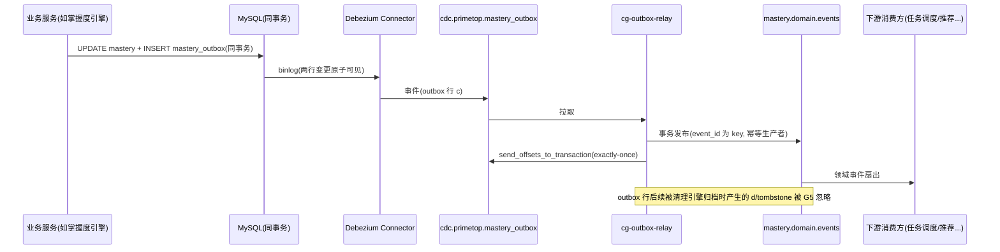

# 服务端 - 统一变更数据捕获(CDC)管道与数据同步总线 详细设计

## 1. 概述

### 1.1 模块定位

统一变更数据捕获（Change Data Capture，简称 CDC）管道是 PrimeTop 平台的**核心数据基础设施**，负责在业务数据库发生变更时，以**低延迟、高可靠**的方式将变更事件捕获并分发给所有下游消费方（搜索引擎、缓存、数据仓库、推荐系统、消息推送等）。

CDC 管道是跨服务数据一致性的基石——它将"数据写入"与"数据传播"解耦，使业务服务无需关心下游同步逻辑。

### 1.2 核心职责

| 职责 | 说明 |
|------|------|
| 变更捕获 | 实时捕获 MySQL/PostgreSQL 的 INSERT/UPDATE/DELETE 事件 |
| 事件标准化 | 将不同数据源的变更转为统一的 `ChangeEvent` 标准格式 |
| 事件分发 | 将变更事件投递到 Kafka Topic，支持多消费者独立消费 |
| 顺序保证 | 保证同一主键的变更事件按发生顺序投递 |
| 幂等支持 | 消费者可安全重试，不会产生副作用 |
| 断点续传 | 记录消费位移(offset)，支持故障恢复后从断点继续 |
| Schema 演进 | 支持表结构变更后的兼容处理 |

### 1.3 依赖关系

```
┌────────────────────────────────────────────────────────────────────┐
│                     上游 (数据生产者)                                │
│  ┌──────────┐  ┌──────────┐  ┌──────────┐  ┌──────────┐           │
│  │ 用户服务  │  │ 题目服务  │  │ 学习服务  │  │ 内容服务  │  ...      │
│  │ MySQL-A  │  │ MySQL-B  │  │ MySQL-C  │  │ MySQL-D  │           │
│  └────┬─────┘  └────┬─────┘  └────┬─────┘  └────┬─────┘           │
└───────┼─────────────┼─────────────┼─────────────┼─────────────────┘
        │             │             │             │
        ▼             ▼             ▼             ▼
┌────────────────────────────────────────────────────────────────────┐
│                  CDC 管道 (本模块)                                   │
│  ┌──────────┐  ┌──────────────────────────────────┐               │
│  │ Debezium │→ │ Kafka (cdc.{db}.{table} topics)  │               │
│  │ Connect  │  │                                  │               │
│  └──────────┘  └──────────────┬───────────────────┘               │
└────────────────────────────────┼───────────────────────────────────┘
                                 │
        ┌────────────┬───────────┼───────────┬────────────┐
        ▼            ▼           ▼           ▼            ▼
┌──────────┐ ┌──────────┐ ┌──────────┐ ┌──────────┐ ┌──────────┐
│ ES 索引   │ │ Redis    │ │ 数据仓库  │ │ 推荐     │ │ Outbox   │
│ 同步消费  │ │ 缓存失效  │ │ ODS 入库  │ │ 特征更新  │ │ 中继     │
│ 方        │ │ 消费方    │ │ 消费方    │ │ 消费方    │ │ 消费方    │
└──────────┘ └──────────┘ └──────────┘ └──────────┘ └──────────┘
```

**上游依赖：**
- MySQL 8.0+（必须开启 Binlog，ROW 模式）
- Kafka 3.x（CDC 事件传输骨干）
- Debezium 2.x（开源 CDC 引擎，基于 Kafka Connect）

**下游消费方（已知）：**
- 搜索服务（Elasticsearch 索引同步）
- 缓存层（Redis 缓存失效）
- 数据仓库（ClickHouse ODS 层入库）
- 推荐系统（用户特征/物品特征实时更新）
- 学习行为事件流（跨模块级联处理）
- 统一数据对账（一致性校验）

### 1.4 设计原则

1. **对业务零侵入**：业务代码无需任何修改，CDC 在数据库层面工作
2. **至少一次语义**：事件可能重复投递，但不会丢失（消费者需实现幂等）
3. **最终一致性**：秒级延迟，非强一致（适合搜索索引、缓存、分析等场景）
4. **可观测性**：全链路延迟监控、积压告警、数据校验
5. **优雅降级**：单个消费者故障不影响其他消费者

---

## 2. 整体架构

### 2.1 架构全景

```
                        PrimeTop CDC Pipeline Architecture

┌─────────────────────────────────────────────────────────────────────────────┐
│  业务数据库集群                                                               │
│                                                                             │
│  ┌─────────────────┐     ┌─────────────────┐     ┌─────────────────┐      │
│  │ MySQL: primetop │     │ MySQL: content  │     │ MySQL: analytics│      │
│  │ (用户/题/错题)   │     │ (教材/课程/资源)  │     │ (日志/统计)      │      │
│  │ Binlog: ROW     │     │ Binlog: ROW     │     │ Binlog: ROW     │      │
│  └────────┬────────┘     └────────┬────────┘     └────────┬────────┘      │
└───────────┼───────────────────────┼───────────────────────┼──────────────┘
            │                       │                       │
            │ TCP (Binlog Dump)     │                       │
            ▼                       ▼                       ▼
┌─────────────────────────────────────────────────────────────────────────────┐
│  Kafka Connect 集群 (3 nodes, Debezium Connectors)                           │
│                                                                             │
│  ┌──────────────┐    ┌──────────────┐    ┌──────────────┐                  │
│  │ Connector:   │    │ Connector:   │    │ Connector:   │                  │
│  │ primetop-cdc │    │ content-cdc  │    │ analytics-cdc│                  │
│  │              │    │              │    │              │                  │
│  │ Source:      │    │ Source:      │    │ Source:      │                  │
│  │ Debezium     │    │ Debezium     │    │ Debezium     │                  │
│  └──────┬───────┘    └──────┬───────┘    └──────┬───────┘                  │
└─────────┼───────────────────┼───────────────────┼──────────────────────────┘
          │                   │                   │
          ▼                   ▼                   ▼
┌─────────────────────────────────────────────────────────────────────────────┐
│  Kafka Cluster (5 brokers)                                                  │
│                                                                             │
│  Topic: cdc.primetop.users           (PARTITIONS=6)                        │
│  Topic: cdc.primetop.student_profiles (PARTITIONS=3)                       │
│  Topic: cdc.primetop.questions        (PARTITIONS=6)                       │
│  Topic: cdc.primetop.mistake_records  (PARTITIONS=6)                       │
│  Topic: cdc.primetop.orders           (PARTITIONS=3)                       │
│  Topic: cdc.content.textbooks         (PARTITIONS=3)                       │
│  Topic: cdc.content.chapters          (PARTITIONS=3)                       │
│  Topic: cdc.content.knowledge_points  (PARTITIONS=6)                       │
│  Topic: cdc.content.questions         (PARTITIONS=6)                       │
│  Topic: cdc.analytics.*               (PARTITIONS=3)                       │
│  ...                                                                        │
│                                                                             │
│  Consumer Groups:                                                           │
│  - cg-es-sync         (ES 索引同步)                                          │
│  - cg-cache-invalidate(Redis 缓存失效)                                       │
│  - cg-dw-ods          (数据仓库 ODS 入库)                                    │
│  - cg-recommend       (推荐特征更新)                                         │
│  - cg-reconciliation  (数据对账)                                             │
│  - cg-outbox-relay    (Outbox→领域事件中继, 见 §5.5)                        │
└─────────────────────────────────────────────────────────────────────────────┘
```

### 2.2 技术选型

| 组件 | 选型 | 理由 |
|------|------|------|
| CDC 引擎 | **Debezium 2.5+** | 开源成熟、社区活跃、原生支持 MySQL/PostgreSQL、基于 Kafka Connect 标准框架 |
| 消息队列 | **Apache Kafka 3.6+** | 高吞吐、持久化、多消费者独立 offset、Exactly-Once 支持 |
| Schema 注册 | **Confluent Schema Registry** | Avro/JSON Schema 管理、向前/向后兼容检查 |
| 连接管理 | **Kafka Connect** | 分布式 Connector 管理、自动故障转移、REST API 管理 |
| 监控 | **Prometheus + Debezium Exporter** | Connector 延迟、Kafka 积压标准监控方案 |

> **为何不用 Canal？** Canal 在国内也很流行，但 Debezium 在 Kafka Connect 生态中集成更自然，Schema Registry 支持更好，且社区迭代更活跃。Canal 适合纯 Java/Spring 技术栈且不需要 Kafka 的场景。

---

## 3. 数据模型

### 3.1 Debezium 标准变更事件格式

Debezium 产生的原始事件为 `Envelope` 格式：

```json
{
  "payload": {
    "before": {
      "id": 1001,
      "name": "张三",
      "grade": 7,
      "updated_at": "2026-06-27T10:00:00Z"
    },
    "after": {
      "id": 1001,
      "name": "张三",
      "grade": 8,
      "updated_at": "2026-06-27T12:30:00Z"
    },
    "source": {
      "version": "2.5.0.Final",
      "connector": "mysql",
      "name": "primetop",
      "ts_ms": 1719486600000,
      "snapshot": "false",
      "db": "primetop",
      "sequence": null,
      "ts_us": 1719486600000000,
      "table": "students",
      "server_id": 1,
      "gtid": null,
      "file": "mysql-bin.000123",
      "pos": 4567,
      "row": 0,
      "thread": null,
      "query": null
    },
    "op": "u",
    "ts_ms": 1719486600123,
    "transaction": null
  }
}
```

| 字段 | 说明 |
|------|------|
| `before` | 变更前的行数据快照（INSERT 时为 null） |
| `after` | 变更后的行数据快照（DELETE 时为 null） |
| `source` | 变更来源元数据（数据库、表、Binlog 位置等） |
| `op` | 操作类型：`c`=CREATE, `u`=UPDATE, `d`=DELETE, `r`=READ(快照) |
| `ts_ms` | Connector 处理时间戳 |
| `transaction` | 事务元数据（可选） |

### 3.2 PrimeTop 统一变更事件格式

在各消费者侧，建议将 Debezium Envelope 转换为 PrimeTop 统一的 `ChangeEvent` 格式：

```python
# domain/events/change_event.py

from dataclasses import dataclass, field
from datetime import datetime
from enum import Enum
from typing import Any, Optional

class ChangeOp(str, Enum):
    CREATE = "c"
    UPDATE = "u"
    DELETE = "d"
    SNAPSHOT = "r"  # 初始全量快照

@dataclass
class ChangeEvent:
    """PrimeTop 统一 CDC 变更事件"""

    # ── 标识 ──
    event_id: str                    # 全局唯一事件ID (UUID)
    table: str                       # 源表名 (如 "students")
    database: str                    # 源数据库名 (如 "primetop")
    op: ChangeOp                     # 操作类型

    # ── 数据 ──
    before: Optional[dict[str, Any]] # 变更前行数据
    after: Optional[dict[str, Any]]  # 变更后行数据
    primary_key: dict[str, Any]      # 主键字段 {列名: 值}，支持复合主键

    # ── 元数据 ──
    source_ts: int                   # 数据库变更时间 (毫秒时间戳)
    ingest_ts: int                   # CDC 采集时间 (毫秒时间戳)
    binlog_file: str                 # MySQL Binlog 文件名
    binlog_pos: int                  # Binlog 位置
    transaction_id: Optional[str]    # 事务ID (如果是事务内变更)

    # ── 扩展 ──
    metadata: dict[str, Any] = field(default_factory=dict)
```

### 3.3 Kafka Topic 命名规范

```
命名模式: cdc.{database}.{table}

示例:
cdc.primetop.users               # 用户表变更
cdc.primetop.student_profiles    # 学生档案变更
cdc.primetop.questions           # 题目表变更
cdc.primetop.mistake_records     # 错题记录变更
cdc.primetop.orders              # 订单变更
cdc.primetop.ai_conversations    # AI对话记录变更
cdc.content.textbooks            # 教材变更
cdc.content.chapters             # 章节变更
cdc.content.knowledge_points     # 知识点变更
```

**Topic 配置策略：**

| 参数 | 推荐值 | 理由 |
|------|--------|------|
| `partitions` | 3~6 (按表写入量决定) | 高频表(questions/mistake_records) 6分区，低频表(textbooks) 3分区 |
| `replication.factor` | 3 | 高可用 |
| `retention.ms` | 7天 (604800000) | 给消费者足够的恢复时间 |
| `cleanup.policy` | delete | 精确消费，不用 compact（compact 会删除中间状态） |
| `min.insync.replicas` | 2 | 保证数据可靠性 |

> **注意**：CDC Topic 不适合用 Log Compaction，因为变更事件是"动作"而非"状态"，中间状态不可丢弃。如果需要表状态快照，应使用单独的 compact topic。

### 3.4 分区策略

按**主键 Hash** 分区，保证同一实体的所有变更事件进入同一分区，从而保证顺序性：

```
partition = hash(primary_key) % partition_count
```

Debezium 默认使用主键哈希分区，无需额外配置。

对于没有主键的表（不推荐但可能存在），使用表名+行 Hash。

---

## 4. Debezium Connector 配置

### 4.1 MySQL 侧前置准备

```sql
-- my.cnf 必须配置
-- [mysqld]
-- server-id         = 1
-- log_bin           = mysql-bin
-- binlog_format     = ROW          -- 必须 ROW 模式
-- binlog_row_image  = FULL         -- 记录完整的 before/after
-- binlog_expire_logs_seconds = 604800  -- 保留7天
-- expire_logs_days  = 7            -- MySQL 8.0.29 之前用这个

-- 创建 CDC 专用账号
CREATE USER 'debezium'@'%' IDENTIFIED BY '<strong_password>';
GRANT SELECT, RELOAD, SHOW DATABASES, REPLICATION SLAVE, REPLICATION CLIENT
  ON *.* TO 'debezium'@'%';
GRANT ALL PRIVILEGES ON primetop.* TO 'debezium'@'%';
FLUSH PRIVILEGES;

-- 确认 Binlog 配置
SHOW VARIABLES LIKE 'binlog_format';       -- 必须为 ROW
SHOW VARIABLES LIKE 'binlog_row_image';    -- 必须为 FULL
SHOW VARIABLES LIKE 'log_bin';             -- 必须为 ON
```

### 4.2 Debezium Connector 配置（主库 - primetop）

```json
{
  "name": "primetop-cdc-connector",
  "config": {
    "connector.class": "io.debezium.connector.mysql.MySqlConnector",
    "database.hostname": "mysql-primetop.internal",
    "database.port": "3306",
    "database.user": "debezium",
    "database.password": "${vault:secret/cdc/primetop:password}",
    "database.server.id": "184054",
    "database.server.name": "primetop",
    "database.include.list": "primetop",
    "table.include.list": "primetop.users,primetop.student_profiles,primetop.questions,primetop.mistake_records,primetop.orders,primetop.memberships,primetop.ai_conversations,primetop.learning_sessions,primetop.study_plans,primetop.parent_bindings,primetop.answers",
    "database.history.kafka.bootstrap.servers": "kafka-1:9092,kafka-2:9092,kafka-3:9092",
    "database.history.kafka.topic": "schema-changes.primetop",
    "snapshot.mode": "initial",
    "snapshot.locking.mode": "minimal",
    "snapshot.fetch.size": "2000",
    "tombstones.on.delete": "true",
    "converters": "datetimeConvert",
    "datetimeConvert.type": "com.primetop.cdc.converter.TimestampConverter",
    "datetimeConvert.format.date": "yyyy-MM-dd",
    "datetimeConvert.format.time": "HH:mm:ss",
    "datetimeConvert.format.datetime": "yyyy-MM-dd HH:mm:ss",
    "decimal.handling.mode": "string",
    "time.precision.mode": "connect",
    "max.batch.size": "2048",
    "max.queue.size": "8192",
    "poll.interval.ms": "500",
    "heartbeat.interval.ms": "5000",
    "heartbeat.topics.prefix": "heartbeat",
    "errors.tolerance": "none",
    "errors.log.enable": "true",
    "errors.log.include.messages": "true",
    "value.converter": "io.confluent.connect.avro.AvroConverter",
    "value.converter.schema.registry.url": "http://schema-registry:8081",
    "key.converter": "io.confluent.connect.avro.AvroConverter",
    "key.converter.schema.registry.url": "http://schema-registry:8081"
  }
}
```

**关键参数解释：**

| 参数 | 值 | 说明 |
|------|-----|------|
| `snapshot.mode` | `initial` | 首次启动时做全量快照，之后转为增量 Binlog |
| `snapshot.locking.mode` | `minimal` | 快照期间短暂加全局读锁，最小化业务影响 |
| `tombstones.on.delete` | `true` | DELETE 操作后追加一个 tombstone(null值)，通知 Stream 处理框架清理状态 |
| `decimal.handling.mode` | `string` | 金额等 DECIMAL 字段转字符串，避免浮点精度丢失 |
| `heartbeat.interval.ms` | `5000` | 每5秒发送心跳，防止 Binlog 位点过期 |
| `max.batch.size` | `2048` | 每批次最多处理 2048 条变更 |
| `max.queue.size` | `8192` | 内部队列大小，起缓冲作用 |

### 4.3 Connector 注册（REST API）

```bash
# 注册 Connector
curl -X POST http://kafka-connect:8083/connectors \
  -H "Content-Type: application/json" \
  -d @primetop-cdc-connector.json

# 查看状态
curl http://kafka-connect:8083/connectors/primetop-cdc-connector/status

# 暂停/恢复
curl -X PUT http://kafka-connect:8083/connectors/primetop-cdc-connector/pause
curl -X PUT http://kafka-connect:8083/connectors/primetop-cdc-connector/resume

# 删除（谨慎！）
curl -X DELETE http://kafka-connect:8083/connectors/primetop-cdc-connector
```

### 4.4 新增表 CDC 接入流程

当业务需要新表接入 CDC 时：

```
Step 1: 在 table.include.list 中添加新表名
Step 2: 更新 Connector 配置 (PUT /connectors/{name}/config)
Step 3: Connector 自动对新表触发 initial snapshot
Step 4: 在 Schema Registry 注册新表的 Avro Schema
Step 5: 消费者侧注册新的消费逻辑
Step 6: 在 CDC 管理后台确认新表 Topic 有数据流入
```

```bash
# 更新 Connector 配置，新增表
curl -X PUT http://kafka-connect:8083/connectors/primetop-cdc-connector/config \
  -H "Content-Type: application/json" \
  -d '{
    ...原配置...,
    "table.include.list": "primetop.users,...,primetop.new_table"
  }'
```

---

## 5. 消费者设计

### 5.1 ES 索引同步消费者

将 MySQL 变更实时同步到 Elasticsearch，保持搜索索引与源数据库一致。

```python
# consumers/es_sync_consumer.py

import json
import logging
import time
from kafka import KafkaConsumer, KafkaProducer, TopicPartition as TP
from kafka.structs import OffsetAndMetadata

logger = logging.getLogger("cdc.es_sync")
from kafka import KafkaConsumer
from elasticsearch import Elasticsearch, helpers
from dataclasses import asdict

class ESSyncConsumer:
    """CDC → Elasticsearch 索引同步消费者"""

    # 表名到ES索引的映射
    TABLE_INDEX_MAP = {
        "questions":       "idx_questions",
        "knowledge_points": "idx_knowledge_points",
        "textbooks":       "idx_textbooks",
        "chapters":        "idx_chapters",
    }

    # 表名到需要同步的字段白名单（避免同步敏感字段）
    FIELD_WHITELIST = {
        "questions": ["id", "subject", "grade", "difficulty", "type",
                       "stem", "options", "answer", "analysis", "kp_ids",
                       "tags", "status", "created_at", "updated_at"],
        "knowledge_points": ["id", "name", "subject", "grade",
                       "parent_id", "description", "kp_code", "sort_order"],
    }

    def __init__(self, kafka_servers: list[str], es_hosts: list[str]):
        self.consumer = KafkaConsumer(
            *self._build_topics(),
            bootstrap_servers=kafka_servers,
            group_id="cg-es-sync",
            enable_auto_commit=False,
            auto_offset_reset="earliest",
            max_poll_records=500,
            session_timeout_ms=30000,
            heartbeat_interval_ms=10000,
            value_deserializer=lambda m: json.loads(m.decode("utf-8")),
        )
        self.es = Elasticsearch(es_hosts)
        self._buffer: list[dict] = []
        self._buffer_size = 0
        self.MAX_BUFFER = 200  # 批量提交大小

    def _build_topics(self) -> list[str]:
        """根据 TABLE_INDEX_MAP 构建 Topic 列表"""
        return [f"cdc.primetop.{table}" for table in self.TABLE_INDEX_MAP]

    def consume(self):
        """主消费循环"""
        for record in self.consumer:
            try:
                self._process_event(record.value, record)
                self._maybe_flush()
            except Exception as e:
                self._handle_error(record, e)

        # 循环结束后刷新剩余缓冲
        self._flush()

    def _process_event(self, event: dict, record=None):
        """处理单条变更事件"""
        # tombstone（DELETE 后追加的 null 值消息）直接跳过，防止 NPE（v1.0 缺陷修复）
        if event is None:
            return
        payload = event.get("payload", event)
        if payload is None:
            return
        # 记录本批起点 offset（供 flush 失败后 seek 回退重放）
        if record is not None:
            tp = TP(record.topic, record.partition)
            if tp not in self._batch_offsets:
                self._batch_offsets[tp] = record.offset

        op = payload.get("op", "r")
        before = payload.get("before")
        after = payload.get("after")
        source = payload.get("source", {})
        table = source.get("table", "")

        if table not in self.TABLE_INDEX_MAP:
            return

        index_name = self.TABLE_INDEX_MAP[table]
        doc_id = str(after["id"] if after else before["id"])
        # 以源库 binlog 时间戳为外部版本号，防止重试/重放乱序旧事件覆盖新文档
        self._versions[doc_id] = source.get("ts_ms", 0)

        if op == "d":
            # DELETE: 从ES中删除文档
            self._buffer.append({
                "_op_type": "delete",
                "_index": index_name,
                "_id": doc_id,
            })
        elif op in ("c", "u", "r"):
            # CREATE / UPDATE / SNAPSHOT: upsert 文档
            doc = self._filter_fields(table, after)
            doc["_op_type"] = "index"
            doc["_index"] = index_name
            doc["_id"] = doc_id
            self._buffer.append(doc)

        self._buffer_size += 1

    def _filter_fields(self, table: str, data: dict) -> dict:
        """字段白名单过滤"""
        whitelist = self.FIELD_WHITELIST.get(table, list(data.keys()))
        return {k: v for k, v in data.items() if k in whitelist}

    def _maybe_flush(self):
        """缓冲满后批量提交"""
        if self._buffer_size >= self.MAX_BUFFER:
            self._flush()

    def _flush(self):
        """批量写入ES；成功后才提交 offset（G7，at-least-once 语义）"""
        if not self._buffer:
            return
        try:
            for doc in self._buffer:
                if doc["_op_type"] == "index":
                    doc["_version"] = self._versions[doc["_id"]]
                    doc["_version_type"] = "external"
            success, errors = helpers.bulk(
                self.es, self._buffer,
                raise_on_error=False,
                ignore_status=[404],  # DELETE 目标不存在时容忍（幂等）
            )
            if errors:
                for err in errors:
                    logger.warning(f"ES bulk partial failure: {err}")
            self.consumer.commit()            # 写入成功 → 提交本批 offset
            self._buffer.clear()
            self._buffer_size = 0
            self._versions.clear()
            self._batch_offsets.clear()
            self._backoff = 1
        except Exception as e:
            # 写入失败：不提交 offset，seek 回本批起点，指数退避后重试
            # ES 按 _id + external version 幂等收敛，重复消费无副作用
            logger.error(f"ES flush failed: {e}; seek back, backoff={self._backoff}s")
            self._seek_back_to_batch_start()
            time.sleep(self._backoff)
            self._backoff = min(self._backoff * 2, 30)

    def _seek_back_to_batch_start(self):
        """将本批涉及分区 seek 回批次起点，触发重新拉取"""
        for tp, offset in self._batch_offsets.items():
            self.consumer.seek(tp, offset)
        self._buffer.clear()
        self._buffer_size = 0
        self._versions.clear()

    def _handle_error(self, record, e: Exception):
        """毒丸消息：单条格式异常事件直投 DLQ 并单独提交，不阻塞分区（D9）"""
        logger.error(f"poison message {record.topic}/{record.partition}/{record.offset}: {e}")
        self._dlq_producer.send(
            "cdc.dlq.cg-es-sync",
            key=record.key,
            value=record.value,
            headers={"error": str(e)[:500], "source_topic": record.topic,
                     "partition": str(record.partition), "offset": str(record.offset)},
        )
        self.consumer.commit({TP(record.topic, record.partition):
                              OffsetAndMetadata(record.offset + 1, None)})
```

`__init__` 增补（v1.1）：

```python
self._versions: dict[str, int] = {}      # doc_id -> binlog ts_ms（external 版本）
self._batch_offsets: dict[TP, int] = {}  # 分区 -> 本批起始 offset（失败回退）
self._backoff = 1                        # flush 失败退避秒数（指数退避，上限 30s）
self._dlq_producer = KafkaProducer(...)  # 毒丸消息直投 DLQ topic
```

#### 5.1.1 设计要点

| 维度 | 方案 |
|------|------|
| 幂等性 | ES 文档 `_id` = 源表主键；`version_type=external` + `_version`=binlog ts_ms，乱序旧事件自动丢弃 |
| 顺序性 | Debezium 按主键 Hash 分区，同一实体事件严格有序；ES external version 兑底 |
| 失败语义 | 批量写入失败不提交 offset，seek 回批次起点整体重放（写入幂等所以安全） |
| 毒丸隔离 | 单条反序列化/结构异常事件进 `cdc.dlq.cg-es-sync`，单独提交越过，不阻塞分区 |
| 提交时机 | 仅在 ES bulk 成功后手动 commit（G7），杜绝"未处理完即提交" |
| 索引权威 | 本消费者只负责文档投递；索引 mapping/别名/分片策略权威归《搜索服务与全文检索》 |
| 敏感字段 | `FIELD_WHITELIST` 白名单过滤，`answer` 等控敏字段是否入索引由搜索服务定义，默认剔除（G9） |

### 5.2 Redis 缓存失效消费者

订阅高频读表的变更事件，做**缓存失效（DEL）**，保持 cache-aside 一致性。**红线：只 DEL 不 SET**——缓存重建只允许由读路径触发（对齐《多级缓存架构与一致性策略》与《多渠道学习数据融合引擎》cache-aside 契约）。

```python
# consumers/cache_invalidate_consumer.py

CACHE_KEY_MAP = {
    # 表名 -> (缓存键模板, 键字段抽取函数)
    "questions":        ("Q:INFO:{id}",            lambda a: {"id": a["id"]}),
    "users":            ("U:PROFILE:{id}",          lambda a: {"id": a["id"]}),
    "memberships":      ("MB:STATE:{user_id}",      lambda a: {"user_id": a["user_id"]}),
    "knowledge_points": ("KP:NODE:{id}",            lambda a: {"id": a["id"]}),
    "textbooks":        ("TB:TREE:{id}",            lambda a: {"id": a["id"]}),
}

class CacheInvalidateConsumer(BaseCDCConsumer):
    """CDC → Redis 缓存失效消费者（cg-cache-invalidate）"""

    group_id = "cg-cache-invalidate"

    def process(self, payload: dict, meta) -> bool:
        table = meta.table
        if table not in CACHE_KEY_MAP:
            return True
        template, extract = CACHE_KEY_MAP[table]
        op, before, after = payload["op"], payload.get("before"), payload.get("after")

        keys: list[str] = []
        # 主键或键字段变更时双删（before 键 + after 键）
        if op == "d":
            keys.append(template.format(**extract(before)))
        elif op == "u" and before is not None:
            k_before, k_after = template.format(**extract(before)), template.format(**extract(after))
            keys.extend([k_before, k_after]) if k_before != k_after else keys.append(k_after)
        else:
            keys.append(template.format(**extract(after)))

        try:
            pipe = self.redis.pipeline(transaction=False)
            for k in keys:
                pipe.delete(k)          # G8：只 DEL，绝不 SET
            pipe.execute()
            return True
        except RedisError:
            # D6：Redis 不可用 → 失效意图落本地 RocksDB 重放队列，恢复后重放；TTL 兑底
            self.failover_store.append("cache-invalidate", keys)
            return True                # 不阻塞分区，意图队列保证最终失效
```

**规则：**

1. 删除失败进本地重放队列（ RocksDB，容量 100 万条上限，溢出 P1 告警），恢复后按序重放；
2. 所有 CDC 关联缓存键**必须设置 TTL ≤ 24h**（接入注册时校验），作为失效丢失的最后兑底；
3. 批量 pipeline DEL，500 键/批；键模板变更（字段更名）需在 `cdc_table_registry.filter_config` 登记并走双人审批（G2）。

### 5.3 数据仓库 ODS 入库消费者

对齐《学习数据仓库与 BI 分析平台》契约：**ODS 任务消费 `cdc.primetop.{table}`，offset 管理归 CDC 总线（本模块），ODS 任务仅落地去重**。

```python
# consumers/dw_ods_consumer.py

class DwOdsConsumer(BaseCDCConsumer):
    """CDC → ClickHouse ODS 入库消费者（cg-dw-ods）"""

    group_id = "cg-dw-ods"
    BATCH_ROWS = 5000        # 或 3s 时间窗，先到先触发

    def process_batch(self, batch: list[tuple[dict, Meta]]) -> bool:
        rows = []
        for payload, meta in batch:
            data = payload.get("after") or payload.get("before")
            if data is None:
                continue                      # tombstone 已由基类吞掉，双保险
            data = data.copy()
            # 去重版本：binlog ts_ms 与位点合成单调版本，ReplacingMergeTree 按 max 收敛
            data["_version"] = meta.source_ts * 10**6 + (meta.source.get("pos", 0) % 10**6)
            data["_op"] = payload["op"]      # d 事件由下游按保留策略处理
            data["dt"] = to_date(meta.source_ts)
            rows.append(data)

        self.ch.insert(
            table=f"ods_mysql_{{table}}",      # 目标表映射由 cdc_table_registry.ods_table 配置
            rows=rows,
            settings={"async_insert": 0},
        )
        return True                            # 返回 True 后基类才提交 offset（G7）
```

**规则：**

| 项 | 值 | 说明 |
|------|------|------|
| 去重 | ReplacingMergeTree `_version` | 同主键乱序/重复写入自动保留 `_version` 最大行 |
| 分区 | `dt`（按 source_ts 归属） | 对齐数据仓库业务日期口径，快照事件按行数据 `created_at` 兜底 |
| 提交 | CH insert ack 后 commit | 写入失败整批 seek 回退重试，CH 幂等 |
| 保留边界 | Topic retention 7 天 | lag 年龄 > 6.3 天（90%）触发 P0 告警 + 批量补拉预案（G11，对齐数据仓库 D1） |
| 权威 | 数据仓库为分析权威 | 本消费者只搬运不改值，类型映射登记于 `cdc_table_registry.ch_type_map` |

### 5.4 推荐特征更新消费者

订阅 `users / student_profiles / mistake_records / orders` 等画像相关表，将行变更转写为特征层增量信号。**特征存储与计算权威归《学生画像特征工程平台》与《推荐候选集多路召回引擎》，本消费者只做信号投递。**

```python
class RecommendFeatureConsumer(BaseCDCConsumer):
    """CDC → 推荐特征信号消费者（cg-recommend）"""

    group_id = "cg-recommend"

    # 表 → 特征信号类型映射
    SIGNAL_MAP = {
        "users": "PROFILE_CHANGED",
        "student_profiles": "PROFILE_CHANGED",
        "mistake_records": "MISTAKE_CHANGED",
        "orders": "CONSUME_CHANGED",
        "memberships": "MEMBERSHIP_CHANGED",
    }

    def process(self, payload, meta) -> bool:
        signal = self.SIGNAL_MAP.get(meta.table)
        if not signal:
            return True
        key_field = "user_id" if "user_id" in (payload.get("after") or payload.get("before") or {}) else "id"
        row = payload.get("after") or payload.get("before")
        if row is None:
            return True
        user_id = row.get(key_field)
        if user_id is None:
            return True
        # 只投信号（实体ID+信号类型+版本），不携带画像原文——特征重算归特征平台
        self.redis.xadd(
            "STREAM:FEATURE:SIGNAL",
            {"user_id": user_id, "signal": signal,
             "version": meta.source_ts, "entity": f"{meta.table}:{row.get('id')}"},
        )
        return True
```

DELETE 事件同样投 `PROFILE_CHANGED`（特征平台自行决定清除或墓碑）；用户注销传播见 §14-C5。

### 5.5 Outbox 中继消费者（事务性发件箱 → 事件总线）

**平台 40+ 引擎采用「业务写 `*_outbox` 表（与业务同事务）+ Relay 发布」的事务性发件箱模式。本节定义的 cg-outbox-relay 就是各文档中的 "Relay"**：通过 tail 各库 `*_outbox` 表的 CDC topic 完成发布，替代轮询数据库的 Relay 进程——与业务提交原子一致、不给业务库增加轮询压力、天然获得精确一次投递语义（配合 Kafka 幂等生产者）。

#### 5.5.1 中继协议

```json
// outbox 行（各引擎同事务写入，命名规范 {domain}_outbox）
{
  "event_id": "evt_01HZ...",            // 全局唯一，中继幂等键
  "aggregate_type": "mastery",          // 领域
  "event_type": "MasteryDecayed",       // 事件类型
  "target_topic": "mastery.domain.events", // 目标 Topic（白名单校验）
  "payload": { ... },                    // 事件载荷（JSON）
  "created_at": "2026-08-20T01:23:45Z"
}
```

**中继规则：**

| 规则 | 内容 |
|------|------|
| R-1 订阅 | `cdc.primetop.*_outbox`、`cdc.content.*_outbox`（表名以 `_outbox` 结尾自动纳入中继白名单） |
| R-2 发布 | 行 `c` 事件 → 按信封发布到 `target_topic`；key=event_id，开启幂等生产者（`enable.idempotence=true`）+ `acks=all` |
| R-3 幂等 | 生产者序列号去重 + 目标 Topic 消费方按 event_id 幂等（各引擎已约定 `(event_id, consumer)` 唯一） |
| R-4 DELETE/tombstone | outbox 行被清理产生的 `d` 事件与 tombstone **一律忽略**（G5）——行清理 ≠ 事件撤回 |
| R-5 不回写 | 中继**不回写** outbox 行状态、不 UPDATE、不 DELETE（G6）——回写会再次触发 CDC 形成回环；行清理归各引擎归档策略与统一清理引擎 |
| R-6 Topic 白名单 | `target_topic` 必须命中注册表白名单（防业务服务错写 Topic 造成越权广播），未命中 → DLQ + P1 告警 |
| R-7 延迟 | outbox commit → 领域 Topic 可见 P99 ≤ 2s（M6） |

#### 5.5.2 中继实现

```python
# consumers/outbox_relay_consumer.py

class OutboxRelayConsumer(BaseCDCConsumer):
    """事务性发件箱中继（cg-outbox-relay）：*_outbox 表 → 领域事件 Topic"""

    group_id = "cg-outbox-relay"

    def __init__(self, ...):
        super().__init__(...)
        self.producer = KafkaProducer(
            acks="all",
            enable_idempotence=True,
            transactional_id="cdc-outbox-relay",   # 跨批次 exactly-once
            compression_type="lz4",
        )
        self.target_whitelist = load_topic_whitelist()   # cdc_consumer_registry.topic_whitelist

    def process_batch(self, batch) -> bool:
        pending = []
        for payload, meta in batch:
            # G5：outbox 行清理产生的 DELETE/tombstone 一律忽略
            if payload.get("op") != "c":
                continue
            row = payload.get("after")
            if row is None or not meta.table.endswith("_outbox"):
                continue
            # G6 前置：target_topic 白名单校验，未命中进 DLQ
            target = row["target_topic"]
            if target not in self.target_whitelist:
                self.send_to_dlq(payload, meta, reason="TARGET_TOPIC_NOT_WHITELISTED")
                continue
            pending.append(row)

        if not pending:
            return True
        self.producer.begin_transaction()
        try:
            for row in pending:
                self.producer.send(
                    row["target_topic"],
                    key=row["event_id"].encode(),
                    value=build_envelope(row),   # 事件信封见《学习行为事件标准化Schema注册中心》
                )
            # 消费位移与生产同事务提交（consume-transform-produce exactly-once）
            self.producer.send_offsets_to_transaction(
                self.consumer_offsets(), self.group_id)
            self.producer.commit_transaction()
            return True
        except Exception as e:
            self.producer.abort_transaction()
            raise                             # 基类 seek 回退重放，幂等生产者保证不重发
```

#### 5.5.3 端到端时序



#### 5.5.4 Relay 对账（委托统一对账引擎）

日终由《服务端统一数据对账与跨服务一致性校验引擎》执行恒等式：

```
Σ 领域Topic 当日事件 = Σ outbox 表当日新增行 − DLQ 行数 − 未发布滞留行数(lag>0)
```

差异 > 0.01% 触发 P2 告警并回放缺口（从 outbox 表按 event_id 重发，天然幂等）。

### 5.6 消费者通用框架（BaseCDCConsumer）

所有 CDC 消费者继承统一基类，固化「手动提交 / 批次回退 / 重试拓扑 / DLQ / lag 上报」五件套：

```python
# consumers/base_cdc_consumer.py

class BaseCDCConsumer:
    """CDC 消费者基类：统一 at-least-once + 幂等框架"""

    group_id: str = ""
    MAX_RETRY = 3

    def run(self):
        self.consumer = KafkaConsumer(
            *self.topics(),
            bootstrap_servers=CFG.kafka,
            group_id=self.group_id,
            enable_auto_commit=False,          # G7：手动提交
            max_poll_records=500,
            session_timeout_ms=30000,
            heartbeat_interval_ms=10000,
            partition_assignment_strategy=[StickyAssignor],  # 减少重平衡迁移
        )
        self.consumer.subscribe(self.topics(), listener=RebalanceLogger(self.group_id))
        while not self.stopped:
            records = self.consumer.poll(timeout_ms=1000)
            batch = [(r.value, Meta.from_record(r)) for r in records]
            try:
                ok = self.process_batch(batch) if hasattr(self, "process_batch") \
                     else all(self.process(p, m) for p, m in batch)
                if ok:
                    self.consumer.commit()      # 处理成功才提交
                self.report_lag()
            except Exception as e:
                self._on_batch_error(records, e)  # 退避重试 → 3 次后逐条隔离进 DLQ

    def _on_batch_error(self, records, e):
        self.retry_count += 1
        if self.retry_count >= self.MAX_RETRY:
            for r in records:                   # D9：逐条隔离，毒丸进 DLQ，其余重放
                try:
                    self.process_single_with_isolation(r)
                except Exception as ie:
                    self._dlq(r, ie)
            self.consumer.commit()
            self.retry_count = 0
        else:
            self.seek_to_batch_start(records)   # 整批回退，指数退避
            time.sleep(min(2 ** self.retry_count, 60))
```

**消费者接入规范：**

1. 必须实现 `process`（逐条）或 `process_batch`（批量）之一，返回 True 才允许提交；
2. 必须自带幂等（ES `_id`/CH ReplacingMergeTree/Redis DEL/下游 `(event_id,consumer)` 表）；
3. 禁止订阅白名单以外的 topic（注册于 `cdc_consumer_registry`）；
4. 新消费者上线前必须通过「重放兼容性测试」：从 earliest 重放 1 万条历史事件结果收敛（验收 V18）。

## 6. 管理面 API 设计（CDC 管控台）

管理面面向平台/SRE，独立部署 `cdc-admin-service`，仅内网可达，操作类接口全部双人审批 + 审计（G2/G3）。

### 6.1 Connector 管理

```http
GET    /api/v1/cdc/connectors                       # 列表(含状态/延迟)
GET    /api/v1/cdc/connectors/{name}/status          # 任务级状态与错误堆栈
PUT    /api/v1/cdc/connectors/{name}/pause           # 暂停(审批)
PUT    /api/v1/cdc/connectors/{name}/resume          # 恢复(审批)
POST   /api/v1/cdc/connectors/{name}/restart         # 重启(失败任务,无需审批)
POST   /api/v1/cdc/connectors                        # 新建(双人审批)
PUT    /api/v1/cdc/connectors/{name}/config           # 配置变更(双人审批,含 table.include.list)
```

**响应示例（status）：**

```json
{
  "code": 0,
  "data": {
    "name": "primetop-cdc-connector",
    "state": "RUNNING",
    "worker_id": "connect-1:8083",
    "tasks": [{"id": 0, "state": "RUNNING"}],
    "millis_behind_source": 1240,
    "snapshot_progress": null,
    "auto_restart_count": 0
  }
}
```

### 6.2 表接入管理（cdc_table_registry）

```http
POST   /api/v1/cdc/tables                            # 登记接入(含字段过滤配置,双人审批)
GET    /api/v1/cdc/tables?state=STREAMING             # 表清单与状态
POST   /api/v1/cdc/tables/{table}/resnapshot          # 重快照(仅 PAUSED/漂移修复,审批)
POST   /api/v1/cdc/tables/{table}/decommission        # 下线(审批,先摘白名单再移除 include.list)
```

接入请求体：

```json
{
  "database": "primetop",
  "table": "ai_conversations",
  "partitions": 3,
  "consumers": ["cg-cache-invalidate"],
  "filter_config": {
    "column_whitelist": ["id", "user_id", "subject", "status", "updated_at"],
    "sensitive_columns_masked": ["content", "content_hash"]
  },
  "ods_config": {"enabled": true, "ch_table": "ods_mysql_ai_conversation", "ttl_days": 730}
}
```

> 敏感表（含对话原文/身份字段）无 `filter_config` 拒绝接入（G9，错误码 52617）；`content` 等原文列仅允许以哈希形态出库。

### 6.3 消费者组与 offset 治理

```http
GET    /api/v1/cdc/consumer-groups                    # 各组 lag/速率/最老未消费年龄
GET    /api/v1/cdc/consumer-groups/{group}/offsets    # 位点明细
POST   /api/v1/cdc/consumer-groups/{group}/offsets/reset   # 位点重置(双人审批+G3/G9 守卫)
GET    /api/v1/cdc/dlq?consumer=cg-es-sync            # DLQ 查询
POST   /api/v1/cdc/dlq/replay                         # DLQ 重放(≤7天,超期 52614)
```

### 6.4 Schema 变更公告

```http
GET    /api/v1/cdc/schema-changes?state=PENDING_ADAPT   # 待适配变更
POST   /api/v1/cdc/schema-changes/{id}/consumers-adapted # 消费方适配确认(全部确认后放行)
```

## 7. 关键流程

### 7.1 初始快照（Initial Snapshot）

```
Step 1  Connector 启动 → 记录当前 binlog 位点 S（GTID 集合）→ 释放
Step 2  按表加一致性快照读（REPEATABLE READ + minimal 锁窗口）全量扫描
        → 每行产生 op=r 事件(带 snapshot=true 标记)
Step 3  全量完成 → 从位点 S 切换增量流 → 快照期间的并发写入不会丢失/重复
        (快照行与其后增量行可能在同主键上重叠，消费者以 _version/_ts 收敛, §9)
Step 4  灰度放量：新接入表快照完成 → 通知消费者灰度开启(1%→100% 流量订阅)
```

**约束：** 快照期间执行 DDL 会中断快照（Debezium 抛异常）→ 管理面在快照窗口内冻结该库 DDL 发布（对齐《数据迁移与 Schema 版本管理》发布窗口，G14）；单表快照速率限流（`snapshot.fetch.size=2000`/批，可下调），避免拖垮从库读压力。

### 7.2 Schema 变更处理

```
DDL 提交 → Debezium 捕获 → schema-changes.primetop topic → 管理面解析
  ├─ 加列(可空/带默认) → 兼容性 BACKWARD 通过 → Schema Registry 自动注册新版本
  │    → 通知消费者（容忍未知字段是框架默认行为）→ 完成
  ├─ 删列/改类型/改主键 → 不兼容 → 冻结发布：进入 PENDING_ADAPT
  │    → 公告所有消费方适配（保留期 7 天）→ 全部确认 → 放行
  │    → 任一消费方未确认 → 阻断并升级人工（G10）
  └─ 敏感列新增 → 追加必须登记 filter_config，否则该列载荷置 null（fail-secure）
```

| 变更类型 | 兼容性 | 消费者动作 |
|----------|--------|-----------|
| 加列（可空/默认值） | BACKWARD 兼容 | 容忍（未知字段透传） |
| 加列（NOT NULL 无默认） | 兼容 | 同上，旧事件无该列由消费者默认值兜底 |
| 删列 | 不兼容 | 适配窗口内改造 → 确认 |
| 改类型 | 不兼容 | 同上 |
| 改主键 | 不兼容 + 分区路由变化 | 必须重快照（6.2 resnapshot） |
| 改表名/换库 | 等价下线+新接入 | 走 §6.2 新流程 |

### 7.3 断点恢复与 offset 治理

| 场景 | 恢复机制 |
|------|----------|
| Connector 崩溃 | Kafka Connect 集群 rebalance 接管任务（≤30s），从 `connect-offsets` topic 恢复 binlog 位点（D8） |
| MySQL 主从切换 | GTID 集合续读；GTID 缺失（位点在旧主丢失）→ 该库自动重快照（52619 告警） |
| 消费者崩溃 | 消费组 rebalance，未提交批次由接管者重放（消费幂等收敛） |
| 位点重置 | 仅双人审批 + 滞留积压时拒绝（G3/52609），审计留痕 |
| Binlog 已过期 | retention 7 天边界：lag 年龄 > 6.3 天 P0（G11）→ 停止消费走批量补拉 → 重置位点续新流 |

### 7.4 积压治理

```
lag 分级告警：
  P2: lag > 10 万条 或 最老事件年龄 > 10 分钟
  P1: lag > 100 万条 或 最老事件年龄 > 2 小时
  P0: 最老事件年龄 > 6.3 天(retention 90%) 或 heartbeat 连续丢失 3 个周期
处置：
  1. 消费者横向扩容(≤ 分区数；超过需先扩分区——只能增不能减，扩分区会改变主键路由，
     仅允许在积压清零后执行并全量重同步兑底)
  2. 降级下游写入批量化(§12)
  3. 红线：任何情况下禁止 offset 跳越式丢弃事件；确需丢弃(数据已腐烂)必须
     双人审批 + 审计 + 对账引擎登记差异豁免 + 批量补拉预案四件套（G11）
```

### 7.5 端到端延迟预算

| 链路段 | 预算 | 度量 |
|----------|------|------|
| MySQL commit → Connector 捕获入 Kafka | P99 ≤ 1.5s | Debezium `millis_behind_source` |
| Kafka 内部复制 | P99 ≤ 100ms | broker 延迟 |
| 消费者拉取 → 处理完成 | P99 ≤ 2s | 消费者埋点 |
| **搜索/缓存端到端** | **P99 ≤ 5s** | M1 |
| Outbox commit → 领域 Topic 可见 | P99 ≤ 2s | M6 |
| 数据仓库 ODS | T+1（当日批次） | M2（dw 组 lag 年龄 < 24h） |

## 8. 状态机与守卫

### 8.1 Connector 状态机

```
UNASSIGNED → RUNNING ⇄ PAUSED
     ↘ FAILED → RESTARTING(自动,≤5 次) → RUNNING
                  └─ 连续 5 次失败 → DEGRADED(人工介入,P1 告警)
```

| 转移 | 守卫 |
|------|------|
| RUNNING→PAUSED | 仅审批操作；暂停期间 binlog 位点由心跳推进，超 7 天位点过期自动转 FAILED |
| FAILED→RESTARTING | 自动重试计数器；重启不重做快照（位点健在） |
| 任意→删除 | 仅 DECOMMISSIONED 表全部摘除后允许（防误删丢流） |

### 8.2 表接入状态机

```
REGISTERED → SNAPSHOTTING → STREAMING ⇄ PAUSED(表级暂停=从 include.list 摘除,位点保留)
                                  └→ DECOMMISSIONED(位点与 schema 历史归档,topic 保留至 retention 自然过期)
```

### 8.3 消费者组健康状态

| 状态 | 判定 | 动作 |
|------|------|------|
| ACTIVE | lag < 10 万且速率正常 | — |
| LAGGING | lag > 10 万 | 自动扩容(≤分区数)/告警 P2 |
| STALLED | lag 不再前进 + heartbeat 停滞 | 消费者强制重启 + P1 |
| DLQ_ALARM | DLQ 速率 > 100 条/分 | P1，冻结 DLQ 重放入口 |

### 8.4 守卫总表

| 守卫 | 规则 |
|------|------|
| G1 | 仅 REGISTERED 态表允许进入 `table.include.list` |
| G2 | Connector 配置变更（表清单/过滤规则/Topic 参数）双人审批 + 审计 |
| G3 | 消费位点重置双人审批；lag 积压 > 1 万条时拒绝重置（防甩积压） |
| G4 | 禁止任何服务向 `cdc.*` topic 生产消息（DLQ/Retry 由框架生成；Kafka ACL 强制） |
| G5 | Outbox 中继必须忽略 outbox 表的 DELETE 与 tombstone 事件 |
| G6 | 中继不回写 outbox 行（防 CDC 回环） |
| G7 | 消费者处理成功前禁止提交 offset（框架级强制，业务代码无 commit 权限） |
| G8 | 缓存失效消费者只 DEL 不 SET（cache-aside 重建归读路径） |
| G9 | 敏感表无 filter_config 拒绝接入；敏感列载荷未登记一律置 null（fail-secure） |
| G10 | 不兼容 Schema 变更须全部消费方适配确认后才放行 |
| G11 | 禁止跳过/丢弃事件；确需丢弃须审批+审计+对账豁免+补拉预案四件套 |
| G12 | 框架统一吞掉 tombstone(null value)，不向业务 process 投递（防 NPE） |
| G13 | 单表下线先摘消费者白名单再移除 include.list（防下游订阅悬空） |
| G14 | 快照窗口内冻结该库 DDL 发布（对齐 Schema 版本管理发布窗口） |

## 9. 数据模型增补（CDC 管理库 DDL）

```sql
-- MySQL: cdc_meta 库（管理元数据，不存事件载荷）
CREATE TABLE cdc_table_registry (
  id            BIGINT AUTO_INCREMENT PRIMARY KEY,
  database_name VARCHAR(64)  NOT NULL,
  table_name    VARCHAR(64)  NOT NULL,
  topic_name    VARCHAR(128) NOT NULL COMMENT 'cdc.{db}.{table}',
  partitions    INT NOT NULL DEFAULT 3,
  state         VARCHAR(16)  NOT NULL DEFAULT 'REGISTERED'
                COMMENT 'REGISTERED/SNAPSHOTTING/STREAMING/PAUSED/DECOMMISSIONED',
  filter_config JSON NULL COMMENT '列白名单与敏感列掩蔽规则(G9)',
  ods_config    JSON NULL COMMENT '数据仓库 ODS 落地配置',
  approved_by   VARCHAR(64) NOT NULL,
  created_at    DATETIME(3) NOT NULL DEFAULT CURRENT_TIMESTAMP(3),
  updated_at    DATETIME(3) NOT NULL DEFAULT CURRENT_TIMESTAMP(3) ON UPDATE CURRENT_TIMESTAMP(3),
  UNIQUE KEY uk_db_table (database_name, table_name)
) ENGINE=InnoDB COMMENT='CDC 表接入注册表';

CREATE TABLE cdc_consumer_registry (
  id             BIGINT AUTO_INCREMENT PRIMARY KEY,
  group_id       VARCHAR(128) NOT NULL,
  owner_team     VARCHAR(64)  NOT NULL,
  topics         JSON NOT NULL COMMENT '订阅的 cdc topic 清单',
  topic_whitelist JSON NULL COMMENT '仅 cg-outbox-relay:可发布目标 Topic 白名单(R-6)',
  idempotency    VARCHAR(32) NOT NULL COMMENT '幂等机制声明: ES_ID/CH_RMT/REDIS_DEL/EVENT_ID',
  state          VARCHAR(16) NOT NULL DEFAULT 'ACTIVE',
  UNIQUE KEY uk_group (group_id)
) ENGINE=InnoDB COMMENT='消费者组注册表';

CREATE TABLE cdc_offset_reset_audit (
  id           BIGINT AUTO_INCREMENT PRIMARY KEY,
  group_id     VARCHAR(128) NOT NULL,
  topic        VARCHAR(128) NOT NULL,
  partition_no INT NOT NULL,
  old_offset   BIGINT NOT NULL,
  new_offset   BIGINT NOT NULL,
  reason       VARCHAR(500) NOT NULL,
  applied_by   VARCHAR(64) NOT NULL,
  approved_by  VARCHAR(64) NOT NULL,
  created_at   DATETIME(3) NOT NULL DEFAULT CURRENT_TIMESTAMP(3),
  KEY idx_group_time (group_id, created_at)
) ENGINE=InnoDB COMMENT='位点重置审计(G3)，append-only 不可 UPDATE/DELETE';

CREATE TABLE cdc_schema_change_log (
  id           BIGINT AUTO_INCREMENT PRIMARY KEY,
  database_name VARCHAR(64) NOT NULL,
  table_name   VARCHAR(64) NOT NULL,
  ddl          TEXT NOT NULL,
  compatibility VARCHAR(16) NOT NULL COMMENT 'COMPATIBLE/PENDING_ADAPT/BLOCKED',
  adapted_consumers JSON NULL COMMENT '已确认适配的消费者组',
  state        VARCHAR(16) NOT NULL DEFAULT 'DETECTED',
  created_at   DATETIME(3) NOT NULL DEFAULT CURRENT_TIMESTAMP(3),
  KEY idx_table_time (database_name, table_name, created_at)
) ENGINE=InnoDB COMMENT='Schema 变更日志';

CREATE TABLE cdc_admin_action_log (
  id         BIGINT AUTO_INCREMENT PRIMARY KEY,
  action     VARCHAR(64) NOT NULL,
  target     VARCHAR(256) NOT NULL,
  payload    JSON NULL,
  operator   VARCHAR(64) NOT NULL,
  approver   VARCHAR(64) NULL,
  created_at DATETIME(3) NOT NULL DEFAULT CURRENT_TIMESTAMP(3),
  KEY idx_action_time (action, created_at)
) ENGINE=InnoDB COMMENT='管理操作审计，保留 3 年';
```

**ClickHouse：** DLQ 与管道审计宽表（`cdc_dlq_log` / `cdc_pipeline_audit`）按月分区，TTL 180 天，存于数据仓库集群，载荷列写入前经 G9 过滤脱敏。

**Redis Key 总表：**

| Key | 类型 | 用途 | TTL |
|-----|------|------|-----|
| `CDC:LAG:{group}:{topic}` | HASH(partition→lag) | lag 快照/告警 | 60s |
| `CDC:HEARTBEAT:{connector}` | STRING(ts) | 低流量表位点活跃度 | 15s |
| `CDC:DLQ:RATE:{group}` | INCR(窗口) | DLQ 速率告警 | 60s |
| `CDC:ADMIN:LOCK:{action}` | SETNX | 双人审批会话锁 | 10min |

## 10. 幂等与并发控制（八场景）

| # | 场景 | 机制 |
|---|------|------|
| 1 | 快照 r 事件与增量 c/u 事件同主键重叠 | ES external version / CH `_version` 收敛，保留 ts 最大行 |
| 2 | 消费者 rebalance 后批次重放 | 同上 + 下游 `(event_id, consumer)` 唯一键（领域事件侧） |
| 3 | flush 失败 seek 回退整批重放 | 批处理幂等（bulk upsert / pipeline DEL / CH RMT） |
| 4 | Outbox 中继重试重发 | 幂等生产者序列号 + 目标 Topic 消费方 event_id 去重（R-3） |
| 5 | 毒丸消息隔离后重放 DLQ | DLQ 重放以原 offset 幂等键去重（52614 超 7 天拒绝） |
| 6 | 缓存 DEL 失败进重放队列 | 队列按 key 幂等重放，DEL 天然幂等 |
| 7 | 位点重置导致区间重复消费 | 消费幂等兜底 + 对账引擎日终差异检测（差异 < 0.01%） |
| 8 | 主从切换 GTID 断裂重快照 | 全量 r 事件与存量下游数据按主键 upsert 收敛（等价重建） |

## 11. 错误码（52600-52699）

| 错误码 | 含义 | 处理建议 |
|--------|------|----------|
| 52600 | Connector 不存在 | 检查名称 |
| 52601 | Connector 创建失败 | 查看错误详情（连接/权限/binlog 配置） |
| 52602 | Connector 配置非法 | 参数校验失败明细 |
| 52603 | Connector 状态冲突（如 RUNNING 下删除） | 先暂停再操作 |
| 52604 | 表未注册（G1） | 先走 §6.2 接入流程 |
| 52605 | 表已注册 | 唯一冲突 |
| 52606 | 快照进行中，操作被拒 | 等待完成或先暂停 |
| 52607 | 当前状态禁止触发重快照 | 仅 PAUSED/漂移修复场景 |
| 52608 | 位点重置需双人审批 | 发起审批流 |
| 52609 | 积压未清禁止重置位点（G3） | 先治理 lag |
| 52610 | Schema 不兼容变更被阻断（G10） | 走适配公告流程 |
| 52611 | 存在未适配的消费者（放行前置） | 催办消费方确认 |
| 52612 | 消费者组未注册 | 先注册接入 |
| 52613 | 消费者 lag 超限，操作保护性拒绝 | 先治理积压 |
| 52614 | DLQ 事件超 7 天保留期，拒绝重放 | 走批量补拉 |
| 52615 | Topic 保留期接近耗尽（G11） | 立即 P0 预案 |
| 52616 | 过滤规则非法（模板/语法错误） | 修正 filter_config |
| 52617 | 敏感表缺少过滤配置（G9） | 补齐列白名单 |
| 52618 | 心跳停滞（低流量表位点风险） | 检查 connector 心跳配置 |
| 52619 | Binlog 位点过期（需重快照） | 自动重快照已触发，确认范围 |
| 52620 | 管理操作审批未通过/未完成 | 完成双人审批 |
| 52621 | 消费组 offset 提交失败 | 框架自动重试，持续失败重启消费者 |
| 52622 | Outbox 中继发布失败 | 已退避重试，持续失败查目标 Topic 权限 |

> 管理面错误码不透传至学生端 App；消费者侧错误仅表现为同步延迟，由 M1/M2 监控承载。

## 12. 降级矩阵

| # | 故障 | 降级行为 | 红线 |
|---|------|----------|------|
| D1 | 源 MySQL 不可用 | Connector 断线重连；主从切换按 GTID 续读；位点丢失自动重快照 | 重快照期间不丢增量（位点原子记录） |
| D2 | Kafka 不可用 | Connector 内部队列缓冲（8192）；持续不可用暂停 Connector，binlog 7 天兜底 | 暂停期间业务库写入不受影响 |
| D3 | Schema Registry 不可用 | 存量流量不受影响；新 schema 注册阻塞，兼容检查 fail-secure | 不兼容变更宁可阻断不可放行 |
| D4 | ES 不可用 | 消费者 backpressure（事件滞留 Kafka，不消费不丢） | 恢复后自动追平，搜索降级话术归搜索服务 |
| D5 | ClickHouse 不可用 | ODS 停摆，lag 增长；超 24h 转 T+1 批量补拉 | 分析延迟可容忍，事件不丢 |
| D6 | Redis 不可用 | 失效意图落本地 RocksDB 队列重放；TTL 兑底 | 意图队列容量 100 万，溢出 P1 |
| D7 | Outbox 中继下游发布失败 | 事务中止整体重试 → DLQ；不回写 outbox（G6） | 事件绝不丢（outbox 表是持久事实源） |
| D8 | Connect 单节点故障 | 集群 rebalance 接管任务 ≤ 30s | 接管期间 binlog 位点不丢 |
| D9 | 消费者持续失败 | 3 次退避后逐条隔离，毒丸进 DLQ，其余继续 | DLQ 速率 > 100/min 冻结重放并 P1 |
| D10 | CDC 管控台不可用 | 管理操作冻结（只读），管道自愈能力继续 | 任何自动自愈不越权做需审批操作 |

**总红线：任何降级不得丢弃变更事件。** at-least-once 语义下宁可堆积延迟，不做静默丢单。

## 13. 监控与容量

### 13.1 监控指标

| 指标 | 口径 | 告警 |
|------|------|------|
| M1 端到端同步延迟 | `now - source.ts_ms` 的 P99（按表） | > 5s P2 / > 30s P1 |
| M2 消费组 lag | 条数与最老事件年龄 | §7.4 分级 |
| M3 DLQ 速率 | 条/分钟（按组） | > 100/min P1 |
| M4 Schema 阻断数 | PENDING_ADAPT 停留 > 48h | P2 升级 |
| M5 快照进度 | 百分比与 ETA；停滞 > 10min | P2 |
| M6 Outbox 中继延迟 | outbox commit → 领域 Topic 可见 P99 | > 2s P2 / > 10s P1 |
| M7 消费处理错误率 | 失败/总条数 | > 0.5% P2 |
| M8 心跳连续性 | heartbeat topic 周期丢失 | 丢 3 周期 P1（52618） |
| M9 保留期余量 | retention − 最老事件年龄 | < 16h P0（52615） |
| M10 对账差异率 | 日终恒等式（§5.5.4 + 索引漂移） | > 0.01% P2 |

### 13.2 容量估算（DAU 50 万）

| 项 | 估算 |
|-----|------|
| 日变更行数 | 答题/会话/错题/订单等活跃表合计 ≈ 1500 万行/日（含 UPDATE） |
| 峰值事件速率 | ≈ 5000 events/s（晚间 19:00-21:00，为均值 3 倍） |
| 平均事件大小 | Avro 压缩后 ≈ 0.8KB |
| Topic 存储 | 日 ≈ 12GB，7 天保留 ≈ 84GB（3 副本 ≈ 250GB） |
| Kafka 集群 | 复用主集群 5 broker，cdc.* 独立占用 ≈ 250GB + 页缓存建议 32GB |
| Connect 集群 | 3 节点（每库 1 connector，单 connector 峰值 2000 events/s 余量 2.5 倍） |
| 消费者 | cg-es-sync 6 实例 / cg-cache-invalidate 3 / cg-dw-ods 3 / cg-outbox-relay 3 |
| Outbox 日事件量 | ≈ 300 万条/日（各引擎领域事件合计） |

## 14. 安全与合规

| # | 红线 |
|---|------|
| C1 | cdc 载荷含 PII（姓名/手机号）——敏感表必须配置列白名单，未列入白名单的列不出数据库边界（G9 fail-secure） |
| C2 | 对话原文、心理预警等高敏表接入 CDC 需合规审批 + 列级掩蔽（仅哈希/聚合形态出库） |
| C3 | binlog 含全量行数据：binlog 端口仅 Connect 集群网络可达，CDC 专用账号最小权限（§4.1） |
| C4 | cdc topic 保留 7 天自动过期；DLQ 载荷写入 ClickHouse 前过 G9 脱敏；管理库不存事件载荷 |
| C5 | 账户注销：源表 DELETE 自动传播至 ES/CH/特征层；已删数据禁止经 DLQ 重放/补拉恢复（注销优先） |
| C6 | offset 重置/事件丢弃/DLQ 清理等高危操作全审计，append-only 保留 3 年 |
| C7 | Schema Registry 仅存结构不存数据样本；schema 文件不含生产数据 |
| C8 | 数据库口令经 Vault 引用（`${vault:...}`），不落配置明文与代码仓 |
| C9 | cdc topic 不出域（不做外网镜像）；分析用途经数据仓库单向离线链路（对齐其 C 系红线） |
| C10 | 以 CDC 事件作为 AI 训练数据源须合规审批，且仅允许脱敏聚合形态（对齐 RLHF 管线/埋点平台边界） |

## 15. 契约对齐

| # | 契约 |
|---|------|
| R1 | 《学习数据仓库与 BI 分析平台》：ODS 消费 `cdc.primetop.{table}`；**offset 管理归本总线**，ODS 仅 ReplacingMergeTree 去重落地；7 天保留与批量补拉边界对齐其 D1 |
| R2 | 《多级缓存架构与一致性策略》及各引擎：CDC 缓存失效**只 DEL 不 SET**，缓存重建归读路径（G8） |
| R3 | 《搜索服务与全文检索》：其文中 "Canal CDC → Kafka" 为历史占位表述，**统一裁决为 Debezium 总线**（本文 §2.2）；索引 mapping/别名权威归搜索服务，本模块仅投递文档 |
| R4 | 《服务端-事件驱动架构与统一事件总线》：领域事件双通道——事务一致性要求的事件一律走 Outbox 中继（§5.5），HTTP publish API 仅限低价值/无事务要求事件；各引擎文档中 "Relay" 即本文 cg-outbox-relay |
| R5 | 各引擎 `*_outbox` 表规范：命名 `{domain}_outbox`，必含 event_id/target_topic/payload/created_at；行清理归各引擎归档策略与统一清理引擎，中继忽略 outbox DELETE/tombstone（G5/G6） |
| R6 | 《服务端统一数据对账与跨服务一致性校验引擎》：其消费 cdc topic 做"索引漂移"检测；§5.5.4 Relay 对账恒等式由对账引擎日终执行 |
| R7 | 《统一用户行为埋点平台》/《数据埋点与关键指标系统》：**行为埋点事件不走 CDC**（客户端/SDK 直报埋点管线）；CDC 只承载表状态变更，`events.clean` 行为流权威归埋点平台 |
| R8 | 《学习行为事件标准化 Schema 注册中心与事件溯源基础设施》：领域事件信封 Schema 权威归注册中心，中继只透传不解析业务语义 |
| R9 | 《数据迁移与 Schema 版本管理》：DDL 发布窗口与本管道 §7.2 适配公告联动（G10/G14） |
| R10 | 《数据备份与容灾策略》：Kafka cdc topic **不作为恢复源**（是传播通道不是备份），恢复权威归备份体系 |
| R11 | 《服务端数据库读写分离与分库分表演进策略》：Connector 只连主库 binlog；从库延迟会引入位点乱序风险，禁止连从库捕获 |
| R12 | 分库演进：新增分库时按库新建 Connector（命名 `{db}-cdc-connector`），topic 命名空间 `cdc.{db}.*` 天然隔离，无需迁移存量 |

## 16. 验收场景（18 条）

| # | 场景 | 预期 |
|---|------|------|
| V1 | 新表接入全流程：登记→快照→STREAMING | 快照行数=源表行数；增量衔接无丢失（对账差 0） |
| V2 | 同一主键连续 3 次 UPDATE | 下游按序收敛至最终值；乱序重放不回退（external version） |
| V3 | 源表 DELETE | ES 文档删除、缓存 DEL、ODS 落 `_op=d`；tombstone 被框架吞掉无异常 |
| V4 | 消费者 crash 后重启 | 从最后提交 offset 续传；重复批次幂等收敛 |
| V5 | 快照期间执行 DDL | 快照中断告警；DDL 窗口冻结生效（G14）；重启快照成功 |
| V6 | 加列变更 | 消费者容忍未知字段；新事件含新列；旧事件无该列取默认 |
| V7 | 删列变更未获全部消费方确认 | 发布阻断（52610/52611）；全部确认后放行 |
| V8 | flush 失败注入（ES 503） | 不提交 offset，seek 回退重试；恢复后追平且无重复副作用 |
| V9 | 毒丸消息注入（非法 JSON） | 单条进 DLQ，分区继续消费，其余事件不受影响 |
| V10 | DLQ 重放 | 幂等重放成功；超 7 天拒绝（52614） |
| V11 | 缓存失效正确性 | UPDATE 后缓存键被 DEL；键字段变更双删；全程无 SET 操作 |
| V12 | ODS 去重 | 同主键重复/乱序事件仅保留 `_version` 最大行（ReplacingMergeTree FINAL） |
| V13 | Outbox 中继端到端 | 业务事务提交 → 领域 Topic 事件 P99 ≤ 2s；event_id 全局唯一 |
| V14 | outbox 行清理 | 清理产生的 DELETE/tombstone 被中继忽略（G5）；不产生回环（G6） |
| V15 | 积压 6.3 天模拟 | P0 告警（52615）；批量补拉接管；恢复后位点续新流 |
| V16 | 敏感表无 filter_config 接入 | 拒绝（52617）；补齐白名单后通过，敏感列以 null/哈希出库 |
| V17 | 位点重置无审批/带积压 | 均被拒绝（52608/52609）；审计留痕 |
| V18 | 新消费者重放兼容性 | earliest 重放 1 万条历史事件，结果与存量状态收敛一致 |

## 17. 关联文档

| 文档 | 关系 |
|------|------|
| 学习数据仓库与 BI 分析平台 | ODS 消费方（R1） |
| 服务端-事件驱动架构与统一事件总线 | 领域事件总线（R4） |
| 多级缓存架构与一致性策略 | 缓存失效消费方（R2） |
| 搜索服务与全文检索 | ES 同步消费方（R3） |
| 服务端统一数据对账与跨服务一致性校验引擎 | 对账与漂移检测（R6） |
| 数据迁移与 Schema 版本管理 | DDL 发布窗口联动（R9） |
| 数据备份与容灾策略 | 恢复权威边界（R10） |
| 学习行为事件标准化 Schema 注册中心与事件溯源基础设施 | 事件信封 Schema 权威（R8） |

---

## 维护记录

| 版本 | 日期 | 说明 |
|------|------|------|
| v1.0 | 2026-08-13 | 初稿（架构/数据模型/Connector 配置/ES 消费者前半） |
| v1.1 | 2026-08-20 | 补全烂尾文档：原 533 行截断于 §5.1 `_flush` 代码 `self.consumer` 处，消费者后半/管理面/流程/状态机/DDL/幂等/错误码/降级/监控/合规/契约/验收全缺。本次补齐 §5.1 收尾与设计要点、§5.2-§5.6（缓存失效/ODS/推荐特征/Outbox 中继/通用框架）、§6 管理面 API、§7 关键流程（快照/Schema/恢复/积压/延迟预算）、§8 状态机与守卫 G1-G14、§9 管理库 DDL 与 Redis Key、§10 幂等八场景、§11 错误码 52600-52699 共 23 项、§12 降级 D1-D10、§13 监控 M1-M10 与 DAU50 万容量、§14 合规 C1-C10、§15 契约对齐 R1-R12（含 Canal→Debezium 裁决、offset 归属裁决、Outbox Relay 身份落地、埋点不走 CDC 裁决）、§16 验收 18 条。修复 v1.0 三处缺陷：①tombstone(null value) 未防护致消费者 NPE；②flush 失败无 offset 回退机制（重试会丢批）；③logger/time/TP 等导入缺失。新增 cg-outbox-relay 消费组登记至架构图。 |