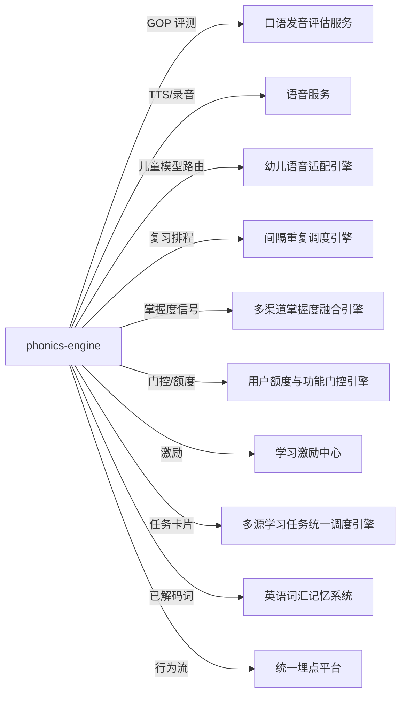

# 服务端-英语字母认知与自然拼读Phonics启蒙教学引擎 - 详细设计

> 文档版本：v1.0（2026-08-21）
> 上游设计：《启硕-PrimeTop-全学段AI辅助学习软件项目设计文档》§5.1 幼儿启蒙阶段、§5.2 小学阶段、§6.5 拼音识字启蒙模块（英语侧对位模块）、§8.5 AI 能力架构
> 模块代码：`phonics-engine`
> 错误码段：58400-58499（服务端内部）；客户端映射段 03600-03699

---

## 1. 模块概述

### 1.1 功能定位

本引擎为 **幼儿大班～小学低年级（5-9 岁）** 学生提供英语"解码能力（Decoding）"地基训练，即：**字母认知 → 字母音（Letter Sound）→ CVC 拼读（Blending）→ 词族（Word Family）→ 辅音组合与二合音（Digraph/Blend）→ Magic-e 长元音 → 元音组合（Vowel Team）→ R-controlled 元音 → 高频词（Sight Words）→ 可解码句（Decodable Sentence）** 的完整自然拼读（Phonics）学习闭环。

自然拼读是国内小学低年级英语教学与主流启蒙产品的标配能力（课标一级二级"语音"要求：认读字母、感知拼读规律、拼读简单单词）。原设计文档 §5.2 明确小学阶段覆盖"英语及科学基础知识"，其语文侧对位能力"拼音识字启蒙"已有完整模块（模块/服务端/客户端/端到端四份文档），而英语侧的字母与拼读启蒙在本目录中此前**零覆盖**——现有英语文档（词汇记忆/语法/阅读/听力/写作/口语）均假设学习者已具备字母认读与基本解码能力，音标仅作为单词卡片的展示字段。本引擎补齐该空缺，并作为后续《英语词汇记忆与单词本系统》的前置依赖。

**本模块不做的事：**

1. 不做整句自由对话与情景对话（归属《服务端-英语口语发音评估与AI情景对话编排服务》）。
2. 不做单词中文释义、例句记忆与拼写听写闯关（归属《英语词汇记忆与单词本系统》；本引擎产出的"已解码词"通过事件同步给单词本作为"已认读"标记）。
3. 不做音标（IPA）系统教学——幼儿阶段先建立字母音直觉，音标认知在小学中高年级由词汇系统承接；本引擎内容包中 `phonetic` 字段仅供家长端展示。
4. 不做汉字/拼音教学（归属《服务端-拼音识字启蒙教学内容调度与互动练习生成服务》，两者架构同构、内容体系独立）。

### 1.2 设计目标

| 目标 | 度量 |
| --- | --- |
| 每次学习会话短平快，符合幼儿注意力曲线 | 单次会话 6-10 个练习项，3-8 分钟 |
| 听说先行、认读跟上、书写最后 | L1-L7 阶段语音类练习占比 ≥ 60% |
| 弱项精准回注 | 每次练习生成中新学:复习 = 7:3（可配置），复习配额 100% 来自薄弱项与到期项 |
| 发音可评测可纠错 | 字母音/拼读词 GOP 评测覆盖率 100%，音素级反馈延迟 P99 ≤ 1.5s |
| 防沉迷与幼儿保护硬红线 | 单会话 ≤ 10 分钟自动收束；每日幼儿学段总时长联动防沉迷（40 分钟硬顶）不可突破 |
| 数据资产沉淀 | 混淆对（Confusion Pair）资产自动挖掘，反哺干扰项生成，周更 |

### 1.3 服务边界

```
┌────────────────────────────────────────────────────────────────┐
│                     phonics-engine（本引擎）                     │
│  内容调度 │ 路径推进 │ 练习生成 │ 作答判定 │ 掌握度 │ 混淆对挖掘   │
└──────┬───────────────┬───────────────┬───────────────┬─────────┘
       │               │               │               │
  依赖（调用方）    依赖（被调用方）      发布事件        消费事件
```

**对外依赖（本引擎为消费方）：**

| 依赖服务 | 用途 | 契约位置 |
| --- | --- | --- |
| 语音服务（ASR/TTS） | 字母/单词标准音频、跟读录音上报 | 《语音服务(ASR-TTS)-详细设计》 |
| 英语口语发音评估 | GOP 音素级评分（代理调用） | `POST /api/v1/oral/pronunciation/evaluate`，`granularity=phoneme/word` |
| 幼儿端儿童语音识别适配 | 3-6 岁儿童声学模型路由、音频不留存红线 | 《服务端-幼儿端儿童语音识别适配与语音交互安全引擎》 |
| 间隔重复复习调度 | 字母音/高频词复习排程 | `POST /api/v1/review/items`，`item_type=MEMORIZATION` |
| 多渠道掌握度融合 | 知识点级掌握度信号 | Kafka `mastery.signal.inggest`（备用 HTTP `/internal/mastery/signals`） |
| 用户额度与功能门控 | `phonics_exercise` 功能门控与每日次数额度 | `CheckAndReserve` gRPC |
| 学习激励中心 | 星星/成就触发 | 《服务端-用户学习激励中心与行为奖励统一规则引擎》 |
| 统一埋点平台 | 漏斗与行为分析 | 《服务端-统一用户行为埋点平台与事件流处理管线》 |

**被依赖（本引擎为提供方）：**

| 消费方 | 提供内容 |
| --- | --- |
| 英语词汇记忆系统 | `phonics.word.decoded` 事件（该生已能解码的词表，用于单词本"已认读"标记与生词优先级） |
| 首页学习工作台 | 今日拼读任务卡片（经多源学习任务统一调度引擎投递） |
| 家长端学情报告 | 拼读能力雷达（字母音/拼读/高频词三维度） |
| 学情分析 | 阶段完成度与掌握度信号 |
| 英语学习兴趣建模 | 原始作答行为流（授权只读） |

### 1.4 与拼音识字启蒙模块的镜像关系

本引擎与《服务端-拼音识字启蒙教学内容调度与互动练习生成服务》**架构同构**（路径-步骤-会话-作答四层模型、掌握度五级、SM-2 复习委托、每日新学上限、Outbox 事件），差异仅在：

| 维度 | 拼音识字（语文） | 本引擎（英语） |
| --- | --- | --- |
| 最小教学单元 | 声母/韵母/声调/汉字 | 字母名/字母音/图形单元/词族/高频词 |
| 语音评测侧重 | 声调（Tone）正确率 | 音素（Phoneme）GOP 与拼读连贯性 |
| 特色练习 | 笔顺描红、声调辨别 | Blending 滑读、最小对立对（Minimal Pair）听辨、Word Family 归类 |
| 干扰项来源 | 形近字/音近字 | 混淆对矩阵（b/d/p/q 视觉混淆、/eɪ/-/e/ 音近混淆等） |
| 书写环节 | P1 即引入 | L8 之后才引入字母描红（书写最晚） |

两模块不共享业务表，但共用：练习会话框架代码模板、掌握度等级定义（0-4）、复习调度与掌握度信号契约。新增第三语种（如后续拼音双拼类工具）时按同一骨架扩展。

---

## 2. 系统架构

### 2.1 整体架构

```
┌──────────────────────────── 客户端（Flutter）────────────────────────────┐
│  拼读学习首页 │ 阶段地图 │ 练习互动页(16类) │ 跟读录音 │ 家长入口        │
└───────────────────────────────┬──────────────────────────────────────────┘
                                │ HTTPS / WSS（录音流）
┌───────────────────────────────▼──────────────────────────────────────────┐
│                            API 网关 / BFF                                  │
│  鉴权 · 未成年人会话校验 · 限流 · 幼儿端响应体精简                          │
└───────┬───────────────┬───────────────┬───────────────┬──────────────────┘
        │               │               │               │
┌───────▼──────┐ ┌──────▼───────┐ ┌─────▼────────┐ ┌───▼──────────────┐
│ PathService  │ │ ExerciseGen  │ │ AssessService│ │ Pronunciation    │
│ 路径与阶段门控│ │ 练习生成器    │ │ 判定与掌握度  │ │ Proxy(评测代理)   │
└───────┬──────┘ └──────┬───────┘ └─────┬────────┘ └───┬──────────────┘
        │               │               │               │
┌───────▼───────────────▼───────────────▼───────────────▼──────────────────┐
│                      ContentRepo（内容仓储，只读缓存）                      │
│  phonics_stage │ phonics_item │ phonics_word │ 混淆对矩阵（热更新）        │
└───────────────────────────────┬──────────────────────────────────────────┘
                                │
┌───────────────────────────────▼──────────────────────────────────────────┐
│  AsyncWorkers：混淆对周挖掘 │ 复习到期扫描 │ 事件 Outbox Relay │ 报表预聚合 │
└──────────────────────────────────────────────────────────────────────────┘
```

### 2.2 依赖关系



**关键边界裁决：**

1. **本引擎是英语启蒙解码数据的唯一权威源**（`user_phonics_item_mastery` 为字母/字母音/词族/高频词四类项的 SSOT）；知识点级掌握度以融合引擎的 `unified_mastery` 为 SSOT，本引擎只发信号不写画像（对齐《多渠道学习数据融合》§14 契约）。
2. GOP 评测不自建：统一走口语发音评估服务的独立评估接口（其 §4.6 明确"可用于朗读评估、单词发音练习等独立场景"），本引擎做代理 + 结果裁剪（幼儿端不透出音素级分数明细，仅出三档表情反馈）。
3. 复习排程不自建：字母音与高频词注册为 `MEMORIZATION` 复习项；`item_source_id` = `phonics_item.id`，`subject_code=EN`。

---

## 3. 数据模型

### 3.1 ER 关系图

```
phonics_stage 1───N phonics_item（阶段包含教学项）
phonics_item 1───N phonics_word（教学项关联示例词/拼读词）
phonics_item N───N phonics_item（混淆对，经 phonics_confusion_pair）
user 1───1 user_phonics_path（每生一条主路径）
user_phonics_path 1───N phonics_path_step
user 1───N user_phonics_item_mastery（每教学项一条）
user 1───N phonics_session 1───N phonics_response
phonics_session 1───0..1 phonics_session_report
```

### 3.2 核心表定义

#### 3.2.1 `phonics_stage` 自然拼读阶段定义

```sql
CREATE TABLE phonics_stage (
    id              BIGINT UNSIGNED PRIMARY KEY AUTO_INCREMENT,
    stage_code      VARCHAR(16)  NOT NULL COMMENT 'L1..L10',
    title           VARCHAR(64)  NOT NULL COMMENT '阶段标题，如 Letter Sounds A-Z',
    stage_type      VARCHAR(32)  NOT NULL COMMENT 'LETTER_NAME|LETTER_SOUND|CVC_BLENDING|WORD_FAMILY|DIGRAPH|MAGIC_E|VOWEL_TEAM|R_CONTROLLED|SIGHT_WORD|DECODABLE_SENTENCE',
    sequence_no     INT          NOT NULL COMMENT '全局顺序 10,20,30...',
    min_age_month   INT          NOT NULL DEFAULT 60 COMMENT '建议最小月龄（默认5岁）',
    unlock_rule     JSON         NOT NULL COMMENT '解锁规则，见 §5.1',
    session_quota   INT          NOT NULL DEFAULT 6 COMMENT '单次会话练习项上限（阶段可覆盖全局）',
    estimate_days   INT          NOT NULL DEFAULT 14 COMMENT '教研预估标准学习天数',
    status          VARCHAR(16)  NOT NULL DEFAULT 'PUBLISHED' COMMENT 'DRAFT|PUBLISHED|HIDDEN',
    version         INT          NOT NULL DEFAULT 1,
    updated_at      DATETIME     NOT NULL DEFAULT CURRENT_TIMESTAMP ON UPDATE CURRENT_TIMESTAMP,
    UNIQUE KEY uk_stage_code (stage_code),
    KEY idx_seq (sequence_no)
) ENGINE=InnoDB COMMENT='自然拼读阶段定义（教研维护，全量缓存）';
```

#### 3.2.2 `phonics_item` 教学项

```sql
CREATE TABLE phonics_item (
    id              BIGINT UNSIGNED PRIMARY KEY AUTO_INCREMENT,
    stage_id        BIGINT UNSIGNED NOT NULL,
    item_type       VARCHAR(32)  NOT NULL COMMENT 'LETTER_NAME|LETTER_SOUND|WORD_FAMILY|DIGRAPH_UNIT|VOWEL_UNIT|SIGHT_WORD|BLENDING_WORD|SENTENCE',
    grapheme        VARCHAR(64)  NOT NULL COMMENT '字面表达：a / b / -at / sh / a_e / ai / the / cat / I am a cat.',
    phonemes        JSON         NULL COMMENT '音素序列 ["k","æ","t"]，SENTENCE 为 null',
    ipa             VARCHAR(100) NULL COMMENT '整项 IPA（词级），仅家长端展示',
    example_words   JSON         NULL COMMENT '示例词 id 数组，指向 phonics_word',
    audio_key       VARCHAR(128) NOT NULL COMMENT '标准发音 TTS/录音资产 key（CDN）',
    picture_key     VARCHAR(128) NULL COMMENT '配图资产 key',
    mnemonic        VARCHAR(255) NULL COMMENT '记忆口诀（如 b: /b/ /b/ ball）',
    difficulty_tier TINYINT      NOT NULL DEFAULT 2 COMMENT '1-5，供复习调度初始稳定性',
    kp_id           BIGINT UNSIGNED NULL COMMENT '关联知识点ID（映射到英语知识点体系，发掌握度信号用）',
    status          VARCHAR(16)  NOT NULL DEFAULT 'PUBLISHED',
    UNIQUE KEY uk_stage_grapheme (stage_id, item_type, grapheme),
    KEY idx_type (item_type, status)
) ENGINE=InnoDB COMMENT='拼读教学项（字母/字母音/词族/高频词/拼读词/可解码句）';
```

#### 3.2.3 `phonics_word` 拼读词库

```sql
CREATE TABLE phonics_word (
    id              BIGINT UNSIGNED PRIMARY KEY AUTO_INCREMENT,
    word            VARCHAR(64)  NOT NULL COMMENT '小写单词',
    phonemes        JSON         NOT NULL COMMENT '["k","æ","t"]',
    syllable_count  TINYINT      NOT NULL DEFAULT 1,
    decodable_level TINYINT      NOT NULL DEFAULT 1 COMMENT '可解码级别：1=CVC 2=CVCE 3=双音节规则词',
    picture_key     VARCHAR(128) NULL,
    audio_key       VARCHAR(128) NOT NULL,
    cn_gloss        VARCHAR(64)  NULL COMMENT '中文释义（仅家长端与"看词选图"选项展示）',
    vocab_word_id   BIGINT UNSIGNED NULL COMMENT '关联词汇系统 word_id（跨系统"已解码"同步）',
    status          VARCHAR(16)  NOT NULL DEFAULT 'PUBLISHED',
    UNIQUE KEY uk_word (word),
    KEY idx_level (decodable_level, status)
) ENGINE=InnoDB COMMENT='拼读词库（可解码词优先，教研人工审核）';
```

#### 3.2.4 `user_phonics_path` 用户学习路径

```sql
CREATE TABLE user_phonics_path (
    id              BIGINT UNSIGNED PRIMARY KEY AUTO_INCREMENT,
    user_id         BIGINT UNSIGNED NOT NULL,
    current_stage   BIGINT UNSIGNED NOT NULL COMMENT '当前阶段 phonics_stage.id',
    plan_version    INT          NOT NULL DEFAULT 1 COMMENT '路径编排版本（教研调整阶段表时+1，触发差量重算）',
    status          VARCHAR(16)  NOT NULL DEFAULT 'ACTIVE' COMMENT 'ACTIVE|PAUSED|GRADUATED|ARCHIVED',
    started_at      DATETIME     NOT NULL DEFAULT CURRENT_TIMESTAMP,
    finished_at     DATETIME     NULL,
    version         INT          NOT NULL DEFAULT 1 COMMENT '乐观锁',
    updated_at      DATETIME     NOT NULL DEFAULT CURRENT_TIMESTAMP ON UPDATE CURRENT_TIMESTAMP,
    UNIQUE KEY uk_user (user_id)
) ENGINE=InnoDB COMMENT='用户拼读主路径（每生一条）';
```

#### 3.2.5 `phonics_path_step` 路径步骤

```sql
CREATE TABLE phonics_path_step (
    id              BIGINT UNSIGNED PRIMARY KEY AUTO_INCREMENT,
    path_id         BIGINT UNSIGNED NOT NULL,
    user_id         BIGINT UNSIGNED NOT NULL COMMENT '冗余，便于直查',
    stage_id        BIGINT UNSIGNED NOT NULL,
    item_id         BIGINT UNSIGNED NOT NULL,
    step_seq        INT          NOT NULL COMMENT '步骤顺序',
    status          VARCHAR(16)  NOT NULL DEFAULT 'LOCKED' COMMENT 'LOCKED|ACTIVE|PASSED|SKIPPED',
    passed_at       DATETIME     NULL,
    UNIQUE KEY uk_path_item (path_id, item_id),
    KEY idx_user_status (user_id, status, step_seq)
) ENGINE=InnoDB COMMENT='路径步骤（阶段内教学项逐一展开）';
```

#### 3.2.6 `user_phonics_item_mastery` 单项掌握度（本模块 SSOT）

```sql
CREATE TABLE user_phonics_item_mastery (
    id              BIGINT UNSIGNED PRIMARY KEY AUTO_INCREMENT,
    user_id         BIGINT UNSIGNED NOT NULL,
    item_id         BIGINT UNSIGNED NOT NULL,
    mastery         DECIMAL(4,3) NOT NULL DEFAULT 0 COMMENT '0.000-1.000',
    level           TINYINT      NOT NULL DEFAULT 0 COMMENT '0-4：0未学/1初识/2巩固中/3基本掌握/4熟练',
    correct_cnt     INT          NOT NULL DEFAULT 0,
    wrong_cnt       INT          NOT NULL DEFAULT 0,
    gop_avg         DECIMAL(4,3) NULL COMMENT '最近5次跟读GOP均值（0-1，归一化）',
    last_seen_at    DATETIME     NULL,
    mastered_at     DATETIME     NULL COMMENT '首次达到 level=4 时间',
    status          VARCHAR(16)  NOT NULL DEFAULT 'LEARNING' COMMENT 'LEARNING|MASTERED|DECAYED',
    version         INT          NOT NULL DEFAULT 1 COMMENT '乐观锁',
    updated_at      DATETIME     NOT NULL DEFAULT CURRENT_TIMESTAMP ON UPDATE CURRENT_TIMESTAMP,
    UNIQUE KEY uk_user_item (user_id, item_id),
    KEY idx_user_status (user_id, status, mastery)
) ENGINE=InnoDB COMMENT='拼读教学项掌握度（字母/字母音/词族/高频词粒度 SSOT）';
```

#### 3.2.7 `phonics_session` 练习会话

```sql
CREATE TABLE phonics_session (
    id              BIGINT UNSIGNED PRIMARY KEY AUTO_INCREMENT,
    user_id         BIGINT UNSIGNED NOT NULL,
    stage_id        BIGINT UNSIGNED NOT NULL,
    session_type    VARCHAR(16)  NOT NULL DEFAULT 'LEARN' COMMENT 'LEARN|REVIEW|ASSESS',
    status          VARCHAR(16)  NOT NULL DEFAULT 'CREATED' COMMENT 'CREATED|IN_PROGRESS|COMPLETED|ABANDONED|EXPIRED',
    exercise_count  INT          NOT NULL DEFAULT 0,
    correct_count   INT          NOT NULL DEFAULT 0,
    duration_sec    INT          NOT NULL DEFAULT 0,
    started_at      DATETIME     NULL,
    finished_at     DATETIME     NULL,
    expire_at       DATETIME     NOT NULL COMMENT '创建后30分钟未开始则过期',
    client_session  VARCHAR(64)  NULL COMMENT '客户端会话标识（多端接续）',
    created_at      DATETIME     NOT NULL DEFAULT CURRENT_TIMESTAMP,
    KEY idx_user_time (user_id, created_at),
    KEY idx_expire (status, expire_at)
) ENGINE=InnoDB COMMENT='拼读练习会话';
```

#### 3.2.8 `phonics_response` 作答记录

```sql
CREATE TABLE phonics_response (
    id              BIGINT UNSIGNED PRIMARY KEY AUTO_INCREMENT,
    session_id      BIGINT UNSIGNED NOT NULL,
    user_id         BIGINT UNSIGNED NOT NULL,
    exercise_id     VARCHAR(64)  NOT NULL COMMENT '练习实例ID（生成时分配，服务端权威）',
    item_id         BIGINT UNSIGNED NOT NULL,
    exercise_type   VARCHAR(32)  NOT NULL,
    answer          JSON         NULL COMMENT '作答内容（选项/字母序列/音频引用）',
    is_correct      TINYINT      NOT NULL COMMENT '0/1；语音类为 GOP 达标判定',
    gop_score       DECIMAL(4,3) NULL COMMENT '语音类练习 GOP 归一化分',
    latency_ms      INT          NOT NULL DEFAULT 0 COMMENT '题目曝光到提交耗时',
    attempt_no      TINYINT      NOT NULL DEFAULT 1 COMMENT '同题第几次作答（幼儿允许当场重试1次）',
    client_event_id VARCHAR(64)  NOT NULL COMMENT '客户端幂等键',
    created_at      DATETIME     NOT NULL DEFAULT CURRENT_TIMESTAMP,
    UNIQUE KEY uk_client_event (user_id, client_event_id),
    KEY idx_session (session_id),
    KEY idx_user_item_time (user_id, item_id, created_at)
) ENGINE=InnoDB COMMENT='拼读练习作答记录';
```

#### 3.2.9 `phonics_confusion_pair` 混淆对资产

```sql
CREATE TABLE phonics_confusion_pair (
    id              BIGINT UNSIGNED PRIMARY KEY AUTO_INCREMENT,
    item_a          BIGINT UNSIGNED NOT NULL,
    item_b          BIGINT UNSIGNED NOT NULL,
    pair_type       VARCHAR(16)  NOT NULL COMMENT 'VISUAL|PHONETIC|SEQUENTIAL',
    confusions      INT          NOT NULL DEFAULT 0 COMMENT '累计混淆次数（B误选为A或反之）',
    sample_size     INT          NOT NULL DEFAULT 0 COMMENT '累计暴露次数',
    confusion_rate  DECIMAL(4,3) NOT NULL DEFAULT 0 COMMENT 'confusions/sample_size（周任务重算）',
    source          VARCHAR(16)  NOT NULL DEFAULT 'MINED' COMMENT 'SEEDED（教研预置）|MINED（自动挖掘）',
    is_active       TINYINT      NOT NULL DEFAULT 1,
    updated_at      DATETIME     NOT NULL DEFAULT CURRENT_TIMESTAMP ON UPDATE CURRENT_TIMESTAMP,
    UNIQUE KEY uk_pair (item_a, item_b),
    KEY idx_rate (is_active, confusion_rate DESC)
) ENGINE=InnoDB COMMENT='混淆对（干扰项生成与弱项诊断核心资产）';
```

#### 3.2.10 `phonics_outbox` 事件发件箱

```sql
CREATE TABLE phonics_outbox (
    id              BIGINT UNSIGNED PRIMARY KEY AUTO_INCREMENT,
    event_id        VARCHAR(64)  NOT NULL,
    event_type      VARCHAR(64)  NOT NULL,
    aggregate_id    VARCHAR(64)  NOT NULL,
    payload         JSON         NOT NULL,
    status          VARCHAR(16)  NOT NULL DEFAULT 'PENDING' COMMENT 'PENDING|SENT|DEAD',
    retry_count     INT          NOT NULL DEFAULT 0,
    next_retry_at   DATETIME     NULL,
    created_at      DATETIME     NOT NULL DEFAULT CURRENT_TIMESTAMP,
    UNIQUE KEY uk_event (event_id),
    KEY idx_status_retry (status, next_retry_at)
) ENGINE=InnoDB COMMENT='拼读引擎事件发件箱（与业务同事务写入）';
```

#### 3.2.11 `phonics_daily_progress` 每日进度（防沉迷联动）

```sql
CREATE TABLE phonics_daily_progress (
    id              BIGINT UNSIGNED PRIMARY KEY AUTO_INCREMENT,
    user_id         BIGINT UNSIGNED NOT NULL,
    stat_date       DATE         NOT NULL,
    new_item_cnt    INT          NOT NULL DEFAULT 0 COMMENT '当日新学项数',
    session_cnt     INT          NOT NULL DEFAULT 0,
    learn_sec       INT          NOT NULL DEFAULT 0 COMMENT '当日累计学习秒数（对账用，防沉迷以全局引擎为准）',
    unique_key_date DATE         NOT NULL,
    PRIMARY KEY (id),
    UNIQUE KEY uk_user_date (user_id, stat_date)
) ENGINE=InnoDB COMMENT='拼读每日进度（每日新学上限闸门）';
```

### 3.3 Redis 缓存设计

| Key | 类型 | TTL | 内容 | 失效策略 |
| --- | --- | --- | --- | --- |
| `phx:stage:all` | String(JSON) | 24h | 全部阶段+教学项+词只读快照（版本号 `phx:content:ver`） | 内容发布后台主动 DEL + 版本号+1，读时比对版本 |
| `phx:user:{uid}:path` | Hash | 2h | 当前阶段/步骤游标/待解锁 | 步骤状态变更时 DEL（cache-aside 重建） |
| `phx:user:{uid}:mastery:hot` | ZSET | 1h | member=item_id，score=mastery（会话生成热读） | 掌握度落库同事务后 DEL |
| `phx:user:{uid}:daily:{date}` | String | 48h | 当日新学数/会话数/秒数（Lua 原子递增） | 自然过期；与 DB 每日 04:30 对账 |
| `phx:confuse:active` | ZSET | 24h | member=`a:b`，score=confusion_rate Top500 | 周任务重建 |
| `phx:session:{sid}` | Hash | 30min | 会话进行态（已出题列表/答题数） | 会话完成/过期 DEL |
| `phx:idem:resp:{uid}:{clientEventId}` | String | 10min | 作答幂等标记 | 自然过期 + DB 唯一键兜底 |
| `phx:lock:mastery:{uid}` | String | 3s | 掌握度更新串行锁（单写者） | 主动释放/超时 |

---

## 4. API 接口设计

### 4.1 练习类型枚举

```go
// PhonicsExerciseType 拼读练习类型（16 类）
type PhonicsExerciseType string

const (
    // L1-L2 字母认知与字母音
    ExLetterNameMatch    PhonicsExerciseType = "letter_name_match"    // 看字母选发音（听辨）
    ExLetterSoundMatch   PhonicsExerciseType = "letter_sound_match"   // 听音选字母
    ExLetterTrace        PhonicsExerciseType = "letter_trace"         // 字母描写（L8+，端侧笔画判定）
    ExInitialSound       PhonicsExerciseType = "initial_sound"        // 听词选首音/首字母（cat→c）
    // L3 CVC 拼读
    ExBlendingTap        PhonicsExerciseType = "blending_tap"         // 依序点读音素→合成整词
    ExBlendingSlide      PhonicsExerciseType = "blending_slide"       // 滑读条拖动连续发音
    ExWordBuild          PhonicsExerciseType = "word_build"           // 拖拽字母组词 /c/+/a/+/t/→cat
    ExWordToPicture      PhonicsExerciseType = "word_to_picture"      // 看词选图（词义锚定）
    // L4-L7 规则进阶
    ExWordFamilySort     PhonicsExerciseType = "word_family_sort"     // 词族归类（-at/-an 拖拽分箱）
    ExMinimalPairListen  PhonicsExerciseType = "minimal_pair_listen"  // 最小对立对听辨（ship/sheep）
    ExRhymeMatch         PhonicsExerciseType = "rhyme_match"          // 押韵配对（cat/hat）
    ExDigraphSpot        PhonicsExerciseType = "digraph_spot"         // 圈出二合音字母组合
    // L8 高频词与句子
    ExSightWordFlash     PhonicsExerciseType = "sight_word_flash"     // 高频词闪认（限时应答）
    ExSightWordSpell     PhonicsExerciseType = "sight_word_spell"     // 高频词字母排序拼写
    ExSentenceDecode     PhonicsExerciseType = "sentence_decode"      // 可解码句朗读（GOP 句级）
    // 通用语音
    ExPronunciationRead  PhonicsExerciseType = "pronunciation_read"   // 跟读评测（字母音/词）
)
```

**分龄适配硬规则：** 3-6 岁默认仅启用 `*_match / blending_* / word_to_picture / sight_word_flash / pronunciation_read`（纯点选与语音，无拖拽精度要求与计时压力）；`letter_trace / sight_word_spell / word_family_sort` 仅 7 岁以上或家长在"亲子共学-进阶开关"中显式开启后投放。

### 4.2 学习路径接口

```
GET /api/v1/phonics/path
Authorization: Bearer <student_token>
```

**响应（幼儿端由 BFF 裁剪）：**

```json
{
  "code": 0,
  "data": {
    "planVersion": 3,
    "currentStage": { "stageCode": "L3", "title": "CVC Blending: Short a", "progress": "6/18" },
    "stageMap": [
      { "stageCode": "L1", "status": "COMPLETED", "starRate": 0.94 },
      { "stageCode": "L2", "status": "COMPLETED", "starRate": 0.88 },
      { "stageCode": "L3", "status": "ACTIVE" },
      { "stageCode": "L4", "status": "LOCKED", "unlockHint": "完成 L3 趣味测试" }
    ],
    "todayPlan": { "newItems": 3, "reviewItems": 2, "estimatedMin": 6 },
    "abilityRadar": { "letterSound": 0.82, "blending": 0.45, "sightWord": 0.10 }
  }
}
```

首次访问自动建档：`PUT /api/v1/phonics/path/init`（body 可带 `entryAssessment: true`，走 §4.9 快测定级）。

### 4.3 阶段内容包接口

```
GET /api/v1/phonics/stages/{stageCode}/bundle?version=3
```

返回阶段全量静态内容（items + words + 音频/图片 CDN 清单 + 口诀），带 `ETag`；`version` 与缓存版本一致时返回 `304`。客户端进阶段前一次性拉取并预加载音频（对齐《客户端-学习内容预加载策略与智能预渲染引擎》）。

### 4.4 练习生成接口

```
POST /api/v1/phonics/sessions
Content-Type: application/json

{ "stageCode": "L3", "sessionType": "LEARN", "clientRequestId": "c7f3..." }
```

**响应：**

```json
{
  "code": 0,
  "data": {
    "sessionId": 88123,
    "expireAt": "2026-08-21T04:10:00Z",
    "sessionType": "LEARN",
    "exercises": [
      {
        "exerciseId": "ex_01H9...",
        "seq": 1,
        "type": "blending_tap",
        "item": { "itemId": 3021, "grapheme": "cat", "phonemes": ["k", "æ", "t"], "pictureKey": "...", "audioKey": "..." },
        "interaction": { "phonemeAudioKeys": ["...", "...", "..."], "wholeWordAudioKey": "..." },
        "retryAllowed": true,
        "maxDurationSec": 30
      }
    ]
  }
}
```

**幂等：** `clientRequestId` 15 分钟内重复提交返回同一 `sessionId` 与练习列表（`uk`：Redis `phx:idem:session:{uid}:{clientRequestId}` + `phonics_session.client_session` 唯一兜底，见 §10.1）。

**生成规则见 §5.2。** 单会话练习项数 = `min(stage.session_quota, 全局 6-10)`；LEARN 型 7:3 新旧配比；REVIEW 型 100% 到期+薄弱。

### 4.5 作答提交接口

```
POST /api/v1/phonics/sessions/{sessionId}/responses
Content-Type: application/json
Idempotency-Key: {clientEventId}

{
  "exerciseId": "ex_01H9...",
  "answer": { "choice": "cat" },
  "latencyMs": 4200,
  "attemptNo": 1
}
```

**响应：**

```json
{
  "code": 0,
  "data": {
    "isCorrect": true,
    "feedback": { "emoji": "star", "audioKey": "...", "phrase": "Great job!" },
    "retryAllowed": false,
    "progress": { "answered": 1, "total": 8 }
  }
}
```

**判定语义：**

1. 点选/拖拽类：服务端比对 `exercise.answer_key`（生成时写入 `phx:session:{sid}`，不随题目下发，防幼儿端乱点被误判 + 防逆向刷题）。
2. 语音类（`pronunciation_read / sentence_decode / blending_slide`）：本接口仅受理"提交录音引用"，评分结果由 §4.6 异步回填，回填前 `progress.answered` 不递增，客户端展示等待动效（最长 1.5s 超时转"先继续，稍后告诉你"）。
3. `attemptNo=1` 且错误：幼儿端不判负，播放鼓励音频并允许重试一次；`attemptNo=2` 才记 `is_correct=0`（计分口径：一次通过=1，二次通过=0.6 折算，二次仍错=0——掌握度使用折算分而非布尔值）。

### 4.6 语音跟读评测接口（代理）

```
POST /api/v1/phonics/exercises/{exerciseId}/voice
Content-Type: multipart/form-data
```

| 字段 | 类型 | 必填 | 说明 |
| --- | --- | --- | --- |
| audio | file | 是 | 录音（≤10s，m4a/aac，客户端按《客户端-音频播放器与录制引擎》采集 16kHz 单声道） |
| attemptNo | int | 是 | 1 或 2 |

**内部流程：**

1. 校验会话有效性与额度（`phonics_exercise` 门控 `CheckAndReserve`，幼儿免费段位默认 30 次/日）。
2. 上传录音至语音服务临时区，**不落业务库**（红线 C1：3-6 岁原始音频即时销毁，`store_audio=false`；仅留存 GOP 评分与音素错标记，对齐《幼儿端儿童语音识别适配》§audio_stored=0 默认）。
3. 代理调用 `POST /api/v1/oral/pronunciation/evaluate`，`referenceText=item.grapheme`，`granularity=phoneme`（句子类 `sentence`），儿童声学路由标记 `child_mode=preschool`。
4. 结果裁剪写回 `phonics_response`（`gop_score` 归一化 0-1）。

**响应（幼儿端三档，不出数字分）：**

```json
{
  "code": 0,
  "data": {
    "band": "GOOD" ,
    "feedback": { "emoji": "super_star", "audioKey": "...", "phrase": "Super!" },
    "weakestPhonemeHint": "æ"
  }
}
```

`band` 映射：GOP ≥ 0.80 `GOOD`；0.60-0.79 `OK`（提示"再试一次会更棒"）；< 0.60 `TRY_AGAIN`。`weakestPhonemeHint` 仅家长端报告透出，幼儿端只给正反馈（合规 C4：不对幼儿做负面标签化输出）。

### 4.7 会话完成接口

```
POST /api/v1/phonics/sessions/{sessionId}/complete
```

服务端聚合本次会话：正确率、一次性通过率、新学项、掌握度变化、星星奖励（经激励中心），生成报告快照并触发事件扇出（§9.1）。重复调用幂等返回首次报告。

```json
{
  "code": 0,
  "data": {
    "report": {
      "total": 8, "firstTryCorrect": 6, "accuracy": 0.875,
      "newMasteredItems": ["/k/", "cat"],
      "stars": 4,
      "stageProgress": "9/18",
      "badges": ["first_blending_win"]
    }
  }
}
```

### 4.8 复习队列接口

```
GET /api/v1/phonics/review/today
```

聚合来源：间隔重复引擎到期项（`item_type=MEMORIZATION`，`subject_code=EN`，source=phonics）∪ 本模块 `status=LEARNING && mastery<0.6` 的薄弱项，去重后按"到期优先→掌握度升序"排序，上限 10 项。客户端"复习"入口直接创建 `sessionType=REVIEW` 会话（§4.4）。

```
POST /api/v1/phonics/review/ack        # 批量确认已复习（练习会话完成时服务端自动调用，兜底手动）
```

### 4.9 入门定级快测接口

```
POST /api/v1/phonics/placement
{ "clientRequestId": "..." }
```

8 题快测（L1 字母名 2 题、L2 字母音 3 题、L3 拼读 2 题、高频词 1 题），规则化判级：

| 结果 | 定级 |
| --- | --- |
| 字母名正确 < 50% | L1 起步 |
| 字母名 ≥50% 且字母音 <50% | L2 |
| 字母音 ≥50% 且拼读 <50% | L3 |
| 拼读 ≥50% 且高频词 <50% | L4-L7（按规则细项递归） |
| 全对 | L8 高频词 |

定级仅前移路径游标，不清零历史掌握度；可跳过（默认 L1）。7 岁以上新用户 BFF 强制弹窗建议快测。

### 4.10 统计与家长端接口

```
GET /api/v1/phonics/stats/summary          # 学生端：今日/累计/连续天数
GET /api/v1/phonics/stats/confusion-matrix # 家长端（需家长绑定关系）：Top 混淆对与辅导建议
GET /internal/phonics/users/{uid}/decoded-words   # 内部：已解码词表（词汇系统拉取）
```

---

## 5. 核心业务逻辑

### 5.1 阶段门控与路径推进

**解锁规则（`phonics_stage.unlock_rule` JSON）：**

```json
{ "prereqStage": "L2", "minStageMastery": 0.75, "requireAssess": true, "assessPassLine": 0.70 }
```

- `minStageMastery`：前置阶段全部教学项掌握度均值阈值。
- `requireAssess`：阶段末"趣味测试"（ASSESS 会话，10 题随机抽自本阶段，无重试、无提示）须达 `assessPassLine` 方解锁下一阶段。
- L1 无前置，注册后随路径初始化激活。

**推进触发点：**

1. 会话完成（§4.7）→ 重算当前阶段掌握度均值 → 达阈值自动投放 ASSESS 会话卡（今日任务内）。
2. ASSESS 会话完成且达标 → `user_phonics_path.current_stage` CAS 前移 + 下一阶段步骤批量 `LOCKED→ACTIVE` + 发布 `phonics.stage.completed`。
3. 未达标 → 保持当前阶段，ASSESS 冷却 1 天（防挫败循环），薄弱项自动回注 REVIEW。

**路径版本升级（教研调整阶段表）：** `plan_version` 变更触发热迁移任务：已通过项按 `grapheme` 比对映射保留状态；新增项插入为 `LOCKED`，排在前向位置；删除项其步骤转 `SKIPPED` 且掌握度行保留（不清数据）。

### 5.2 练习生成算法

```
输入：user, stage, sessionType(LEARN|REVIEW|ASSESS)
输出：N=6..10 个练习实例（顺序即投放顺序）

LEARN:
  newQuota = ceil(N * 0.7)   // 新学配额（每日新学上限内，见 §10.3）
  revQuota = N - newQuota
  1) 新学池：当前阶段 path_step.status=ACTIVE 的 item，按 step_seq 升序取 newQuota 个
  2) 复习池：REVIEW 聚合规则（§4.8）取 revQuota 个；不足则回填新学池
  3) 练习类型映射：按 item_type 查 §4.1 适配表，同 item 在同一会话内类型不重复
  4) 顺序重排：前 2 题固定为复习项（热身），新学项两两之间插入已掌握项微复习（若配额允许）
  5) 干扰项：§5.3
REVIEW:
  全部来自复习池，类型优先选择该 item 历史错误率最高的题型
ASSESS:
  阶段内全量 item 均匀随机 10 题，固定类型池（match/build/decode），无 retryAllowed
```

**题型-项类适配表（节选）：**

| item_type | 首选题型 | 次选 |
| --- | --- | --- |
| LETTER_NAME | letter_name_match | letter_sound_match |
| LETTER_SOUND | letter_sound_match | pronunciation_read |
| BLENDING_WORD | blending_tap → word_build → word_to_picture（三步递进，按该项掌握度选） | pronunciation_read |
| WORD_FAMILY | word_family_sort | rhyme_match |
| DIGRAPH_UNIT / VOWEL_UNIT | digraph_spot | minimal_pair_listen |
| SIGHT_WORD | sight_word_flash → sight_word_spell | pronunciation_read |
| SENTENCE | sentence_decode | - |

**递进规则：** 同一 `BLENDING_WORD` 项，掌握度 <0.4 用 `blending_tap`（分解点读），0.4-0.7 用 `word_build`（组词），>0.7 用 `word_to_picture`/`pronunciation_read`（整词认读）——练习难度随掌握度爬坡，避免"会了还反复点同一个低阶交互"。

### 5.3 干扰项生成策略

干扰项（选项 B/C/D）是拼读教学的核心杠杆——**好干扰 = 学生刚好会混淆的对**。

```
DistractorPicker(item, k=3):
  1) 混淆对池：phonics_confusion_pair 中含 item 且 is_active 的对端（按 confusion_rate 降序）
  2) 兜底池（无混淆对数据时）：
     - LETTER_NAME/LETTER_SOUND：视觉相似组（b d p q / m n / u v w / i j l）与音近组（/eɪ/-/iː/-/e/）
     - BLENDING_WORD：同词族异首字母（cat→bat/hat/mat，首音最小变化）
     - SIGHT_WORD：形近高频词（then/them、where/here）
     - DIGRAPH_UNIT：同位置竞争组合（sh/ch/th）
  3) 采样：混淆对池取 min(2, len)，兜底池补足；同题干扰项互不相同且 ≠ 正确项
  4) 难度微调：item.mastery 高 → 优先高混淆率干扰（练精准辨别）；低 → 优先低混淆率（防挫败）
  5) 记录 exposure：命中干扰项写入 response.answer.distractor_ids → 供 §5.6 挖掘
```

### 5.4 Blending 教学法分解（"Sound It Out"）

拼读（而非整词死记）是本引擎与"单词卡"产品的本质差异。`blending_tap` 交互的服务端编排数据：

```json
{
  "type": "blending_tap",
  "item": { "grapheme": "cat", "phonemes": ["k", "æ", "t"] },
  "interaction": {
    "steps": [
      { "phoneme": "k",  "audioKey": "p_k", "highlight": "letters[0]" },
      { "phoneme": "æ",  "audioKey": "p_ae", "highlight": "letters[1]" },
      { "phoneme": "t",  "audioKey": "p_t",  "highlight": "letters[2]" }
    ],
    "blendAudioKeys": ["blend_ca", "blend_at"],
    "wholeAudioKey": "w_cat",
    "tempo": "SLOW"
  }
}
```

三步教学法（客户端按 `steps` 编排）：**单音（tap each sound）→ 滑读（blend two by two）→ 整词（say it fast）**。`tempo` 随该项掌握度从 SLOW → NORMAL 过渡。判定：依序完成三步点读（顺序敏感）+ 末步可选跟读（跟读结果只加成不计负）。

### 5.5 掌握度计算引擎

单项掌握度（0-1）由三因子构成，会话完成时批量重算（非逐题更新，降低写放大）：

```
mastery_new = clamp01( 0.55 * accFactor + 0.30 * gopFactor + 0.15 * fluencyFactor )

accFactor   = Σ(折算分) / Σ(权重)   // 一次通过=1.0/二次通过=0.6/未通过=0；近10次作答，指数衰减 λ=0.5（近5次为主）
gopFactor   = mean(近5次 GOP)        // 无语音数据时按 0.5 中性值并入并将权重让渡给 accFactor(0.85)
fluencyFactor = median(同题型历史 latency) 映射：幼儿不设快奖励，仅识别超长犹豫(>P90)标记 hesitation=true 供诊断，不计负
```

**等级映射（迟滞防横跳，对齐拼音模块五级）：**

| level | 语义 | 进入条件 | 退出条件 |
| --- | --- | --- | --- |
| 0 | 未学 | - | 首次作答 |
| 1 | 初识 | 首次作答 | - |
| 2 | 巩固中 | mastery ≥ 0.30 | mastery < 0.15 降回 1 |
| 3 | 基本掌握 | mastery ≥ 0.60 | mastery < 0.40 降回 2 |
| 4 | 熟练（MASTERED） | mastery ≥ 0.80 且样本 ≥ 6 | 60 天无曝光且 mastery < 0.5 → DECAYED（复习引擎接管） |

达到 level=4：写 `mastered_at`、状态 `MASTERED`、发布 `phonics.item.mastered`、向复习引擎注册/确认 MEMORIZATION 项（若未注册）。

### 5.6 混淆对挖掘（周任务）

```
每周日 02:00（cron: phx-confuse-mine）：
  1) 扫描近 28 天 phonics_response：answer.choice 与正确项构成 (correct, chosen) 有向对
  2) 按 (item_a=min_id, item_b=max_id) 聚合 exposure 与 confusions（双向合并）
  3) sample_size ≥ 200 的对计算 confusion_rate；>0.15 且非 SEED 预置 → 新增/更新 MINED 对
  4) 重建 Redis phx:confuse:active Top500
  5) 产出教研周报：新晋 Top20 混淆对 + 学段分布 → 内容运营工作台（人工决定是否补专项口诀内容）
```

挖掘任务幂等：按周分区处理，`(week_start, pair)` 唯一，重跑覆盖式更新。

### 5.7 语音评测集成

```
GOP 归一化：evaluate 返回 phoneme_detail[]（每音素 gop 0-1）
  word_gop = weighted_mean(phoneme gops, 权重=音素在词中出现频次的倒数，稀有音素错误惩罚更重)
  sentence_gop = word 级均分 × 0.7 + fluency(语速/停顿) × 0.3

quality 映射（供复习调度 §5.2 提交评分，SM-2 quality 0-5）：
  gop ≥ 0.85 → 5；0.75-0.85 → 4；0.60-0.75 → 3；0.40-0.60 → 2；< 0.40 → 1

音素错标记：gop < 0.60 的音素记入 phonics_confusion_pair（PHONETIC 对，与视觉混淆同表）
幼儿裁剪：三档 band + 正向文案（§4.6），负向诊断仅进家长报告与教研数据
```

---

## 6. 关键代码示例

### 6.1 服务端（Go）：练习生成器

```go
// phonics/exercise/generator.go
func (g *Generator) BuildSession(ctx context.Context, uid int64,
    stage *Stage, st enums.SessionType) (*SessionPlan, error) {

    quota := g.quota(stage) // 6..10
    var picks []Pick

    if st == enums.LEARN {
        newQ := (quota*7 + 9) / 10
        newItems, err := g.repo.NextActiveItems(ctx, uid, stage.ID, newQ) // step_seq asc
        if err != nil { return nil, err }
        revItems, err := g.review.WeakAndDue(ctx, uid, quota-len(newItems))
        if err != nil { return nil, err } // 复习不足回填新学
        picks = warmupFirst(revItems, newItems) // 前2题复习热身
    } else {
        var err error
        picks, err = g.review.WeakAndDue(ctx, uid, quota)
        if err != nil { return nil, err }
    }

    for i := range picks {
        p := &picks[i]
        p.ExerciseType = g.mapType(p, g.distractorLevel(p))  // §5.2 递进 + §5.3 难度微调
        p.Distractors = g.distractorPicker.Pick(ctx, p.Item, 3)
        p.AnswerKey = shuffleWithKey(p.Item, p.Distractors)   // 服务端留存，不下发
    }
    return &SessionPlan{Picks: picks, TTL: 30 * time.Minute}, nil
}
```

### 6.2 服务端（Go）：掌握度批量重算（会话完成事务内）

```go
// phonics/mastery/recalculator.go
func (r *Recalculator) RecalcAfterSession(ctx context.Context, tx *sql.Tx,
    uid int64, rs []Response) error {

    byItem := groupByItem(rs)
    for itemID, list := range byItem {
        m, err := r.loadForUpdate(ctx, tx, uid, itemID) // SELECT ... FOR UPDATE，行锁串行
        if err != nil { return err }

        acc := weightedAccuracy(list, m.RecentWindow(10, 0.5)) // 一次1.0/二次0.6/失败0
        gop := m.GopAvgOf(5)
        next := computeMastery(acc, gop, list) // §5.5 公式

        if err := r.casUpdate(ctx, tx, m, next); err != nil { return err } // version+1
        if m.Level < 4 && levelOf(next) == 4 {
            r.evts.Append(tx, EventItemMastered(uid, itemID))          // 同事务 Outbox
            r.review.EnsureRegistered(ctx, tx, uid, itemID, "EN")      // MEMORIZATION 注册
        }
    }
    return nil
}
```

### 6.3 服务端：语音评测代理与裁剪

```go
// phonics/assess/proxy.go
func (p *Proxy) Evaluate(ctx context.Context, uid int64, ex *Exercise,
    audio io.Reader, attempt int) (*VoiceResult, error) {

    if err := p.quota.CheckAndReserve(ctx, uid, "phonics_exercise", 1); err != nil {
        return nil, errCode(58412) // 额度不足
    }
    // 幼儿红线：音频即时销毁，不留存原文（store_audio=false）
    rep, err := p.oral.Evaluate(ctx, &oral.Req{
        Audio: audio, ReferenceText: ex.Item.Grapheme,
        Granularity: granOf(ex.Type), ChildMode: childModeOf(uid),
        StoreAudio: false,
    })
    if err != nil {
        return &VoiceResult{Band: "OK", Degraded: true}, nil // 评测不可用降级：按中性档放行，不阻断幼儿（D2）
    }
    gop := normalizeGOP(rep.PhonemeDetail, ex.Item.Phonemes)
    band := bandOf(gop) // GOOD/OK/TRY_AGAIN
    if weakest := weakestPhoneme(rep.PhonemeDetail); weakest != "" {
        p.miner.RecordPhoneticMiss(ctx, uid, ex.Item, weakest) // 音近混淆对采集
    }
    return &VoiceResult{Band: band, GOP: gop}, nil
}
```

### 6.4 客户端（Flutter）：Blending 交互编排片段

```dart
// lib/phonics/widgets/blending_tap_board.dart
class BlendingTapBoard extends StatefulWidget {
  final BlendingExercise exercise; // 含 steps / blendAudioKeys / wholeAudioKey
  final void Function({required bool finished, int? attemptNo}) onDone;
  @override
  State<BlendingTapBoard> createState() => _BlendingTapBoardState();
}

class _BlendingTapBoardState extends State<BlendingTapBoard> {
  int _step = 0;
  Future<void> _tap(int i) async {
    if (i != _step) return;                    // 顺序敏感：只能点当前步
    await player.play(exercise.steps[i].audioKey);
    setState(() => _step++);
    if (_step == exercise.steps.length) {
      await player.playSeq(exercise.blendAudioKeys); // 滑读示范
      await player.play(exercise.wholeAudioKey);     // 整词
      widget.onDone(finished: true);                  // 可选跟读由录音条承接
    }
  }
  // 大号触达区域 ≥ 88dp、防误触抖动过滤 300ms，对齐《客户端-全局防误触与儿童安全交互保护机制》
}
```

---

## 7. 状态流转

### 7.1 用户路径状态机

```
ACTIVE ──家长暂停──▶ PAUSED ──恢复──▶ ACTIVE
   │                                   ▲
   └── L10 ASSESS 通过 ──▶ GRADUATED    │
   └── 账户注销/数据删除 ──▶ ARCHIVED（数据按 §13 合规处置）
```

### 7.2 路径步骤状态机

```
LOCKED ──前序步骤 PASSED──▶ ACTIVE ──掌握度≥0.8──▶ PASSED
                              │
                              └──路径版本迁移删除项──▶ SKIPPED（保留掌握度行）
```

**守卫 G1：** 仅 `ACTIVE` 步骤项可进入新学池；`PASSED` 项只能经复习池回流。
**守卫 G2：** 步骤状态迁移须携带 `path.version` 乐观锁，版本冲突重读后重试（教研调版与学生在学并发）。

### 7.3 练习会话状态机

```
CREATED ──首题作答──▶ IN_PROGRESS ──全部答完──▶ COMPLETED
   │                     │
   └──30min未开始──▶ EXPIRED
                         └──中途退出超10min未回──▶ ABANDONED（已答部分照常计掌握度）
```

**守卫 G3：** `COMPLETED` 后拒绝一切作答提交（`58405`）；重复 `complete` 幂等返回首份报告。
**守卫 G4：** 会话进行中若防沉迷全局引擎判定今日时长已到硬顶，客户端收全局事件收束 UI，服务端将该会话置 `ABANDONED` 并标记 `reason=SCREEN_TIME`——本引擎**不得**以任何降级路径绕过防沉迷（红线，对齐《服务端-多源学习任务统一调度与优先级仲裁引擎》降级总红线）。

### 7.4 单项掌握度等级流转

见 §5.5 等级映射表（迟滞阈值）。**守卫 G5：** 等级只允许相邻档迁移，禁止 0→4 跳级（单会话再好也最多 1→2→3 连升两档）；`MASTERED` 后再错不即时降级，由 60 天衰减任务统一下调（防单次手滑抹掉长期成果）。

### 7.5 状态-动作权限矩阵（摘要）

| 动作 \ 状态 | CREATED | IN_PROGRESS | COMPLETED | ABANDONED/EXPIRED |
| --- | --- | --- | --- | --- |
| 提交作答 | ✔（首题转 IN_PROGRESS） | ✔ | ✘ 58405 | ✘ 58405 |
| 语音评测 | ✔ | ✔ | ✘ 58405 | ✘ 58405 |
| complete | ✘ 58406 | ✔（全部答完） | 幂等 | ✘ 58407 |
| 生成下一会话 | ✔ | ✘ 58408（先完成或放弃） | ✔ | ✔ |

---

## 8. 错误处理

### 8.1 错误码定义（58400-58499）

| 错误码 | 场景 | 客户端映射 | 用户提示（幼儿端/家长端） |
| --- | --- | --- | --- |
| 58400 | 通用业务错误 | 03600 | 兜底：稍后再试一次吧 |
| 58401 | 阶段不存在或未发布 | 03601 | 内容准备中 |
| 58402 | 阶段未解锁 | 03602 | 家长端：完成前置阶段后解锁 |
| 58403 | 会话不存在 | 03603 | 重新开始 |
| 58404 | 会话已过期 | 03604 | 我们重新开始吧（自动建新会话） |
| 58405 | 会话已结束仍提交作答 | 03605 | 静默丢弃（客户端不应出现） |
| 58406 | 会话未完成调用 complete | 03606 | 静默重试 |
| 58407 | 终态会话调用 complete | 03607 | 幂等返回已有报告 |
| 58408 | 进行中重复建会话 | 03608 | 客户端恢复原会话 |
| 58409 | 每日新学上限已到 | 03609 | 今天的新知识学完啦，明天见！（复习不受限） |
| 58410 | 防沉迷硬顶拦截 | 03610 | 转防沉迷全局提示，本模块不自证文案 |
| 58411 | 作答幂等冲突（同 clientEventId 不同体） | 03611 | 静默以首次结果返回 |
| 58412 | 语音评测额度不足 | 03612 | 家长端：今日跟读次数用完，明天再来 |
| 58413 | 语音评测服务不可用 | 03613 | 我们先练点读，跟读稍后再试（降级 D2） |
| 58414 | 录音格式/时长非法 | 03614 | 重新录（客户端预检后不应出现） |
| 58415 | 定级快测重复提交 | 03615 | 幂等返回首次定级 |
| 58416 | 路径版本冲突（教研调版竞态） | 03616 | 静默重读路径后重试 |
| 58417 | 内容包版本不存在 | 03617 | 拉最新版本 |
| 58418 | 年龄门控（题型未开放） | 03618 | 家长端：可在亲子设置中开启进阶练习 |
| 58419 | 复习项注册失败（复习引擎不可用） | 03619 | 静默入补偿队列（E3），不阻断主流程 |
| 58490-58499 | 保留：系统级（DB/Redis/MQ 故障透传全局码） | - | 全局兜底 |

### 8.2 降级策略

| # | 故障 | 降级行为 | 一致性补偿 |
| --- | --- | --- | --- |
| D1 | 内容缓存 Redis 不可用 | 直查 DB + 本地 Caffeine（全量阶段表 <1MB，常驻） | 恢复后预热 |
| D2 | 口语评测服务不可用 | 语音类练习转点读模式（`pronunciation_read`→`letter_sound_match`），中性 band 放行 | 丢分不丢进度；GOP 缺口按 §5.5 让渡权重 |
| D3 | TTS/音频 CDN 失败 | 客户端本地包兜底（L1-L3 音频随安装包内置） | 资源包增量更新引擎补齐 |
| D4 | 复习调度引擎不可用 | 本模块内存队列临时排程（到期项 Redis ZSET 快照），不注册新项 | 恢复后补注册（Outbox E3） |
| D5 | 掌握度融合 MQ 堆积 | 切备用 HTTP `/internal/mastery/signals` 批量补发 | 融合引擎幂等去重 |
| D6 | 混淆对缓存缺失 | 退化为兜底池（§5.3-2 静态预置） | 周任务重建 |
| D7 | 激励中心不可用 | 星星本地暂计，会话报告标注 `stars_pending` | 事件 Outbox 重投 |
| D8 | 埋点通道不可用 | 客户端本地缓冲 24h | 埋点平台补偿协议 |
| D9 | 额度引擎不可用 | 幼儿学段 fail-open（放行并记 `quota_degraded` 标记，事后对账）；付费段 fail-closed | 对账任务修正 |
| D10 | DB 主库故障（只读期） | 查询类走从库；作答提交排队客户端本地持久化 | 网络恢复按 clientEventId 重放（幂等保障） |

### 8.3 重试策略

- 客户端 → 网关：作答提交指数退避 1s/2s/4s 共 3 次，最终失败本地持久化待重放（对齐《客户端网络请求治理与弱网适配方案》）。
- 服务端 → 口语评测：超时 1.5s 不重试（幼儿等待体验优先），直接 D2。
- Outbox Relay：指数退避 1/2/4/8/16/30min，6 次后 `DEAD` + 告警。

---

## 9. 事件集成

### 9.1 发布事件（Topic：`phonics.events`，经 `phonics_outbox` 同事务投递）

| 事件 | 时机 | 关键字段 | 消费方 |
| --- | --- | --- | --- |
| `phonics.session.completed` | 会话完成 | sessionId、stageCode、accuracy、firstTryRate、durationSec、stars | 埋点平台、学情简报、激励中心 |
| `phonics.stage.completed` | 阶段 ASSESS 通过 | stageCode、avgMastery、days | 激励中心（阶段勋章）、家长报告、首页任务调度 |
| `phonics.item.mastered` | 单项达 level=4 | itemId、itemType、grapheme、mastery | 复习引擎（确认注册）、掌握度融合（经信号转换） |
| `phonics.word.decoded` | BLENDING_WORD 掌握 | wordId、vocabWordId | 英语词汇记忆系统（"已认读"标记、生词本降权） |
| `phonics.placement.done` | 定级完成 | placedStage、scoreVector | 学情分析、冷启动画像 |

事件体统一信封：`{eventId, eventType, occurredAt, aggregateId, payload}`；消费幂等键 `(eventId)`。

### 9.2 掌握度信号（对接融合引擎）

本引擎在以下时点向 `mastery.signal.ingest` 发送 `MasterySignal`：

| 时点 | 映射 |
| --- | --- |
| 会话完成（每涉及 item 一条，仅 LEARN/REVIEW） | `channel="phonics"`（经融合引擎渠道注册机制新增，权重默认 0.85——启蒙互动式强证据，低于 exam 高于 plan）、`rawScore=item 本次折算分`、`selfConfidence=样本量因子（首答 0.5，≥6 样本 0.9）`、`evidence={itemId, sessionType, gop}` |
| 阶段 ASSESS 完成（按 kp 聚合） | `rawScore=阶段测试得分率`、`selfConfidence=0.95` |

**红线：** 信号只发不写——本引擎不直接调用融合引擎写接口改 `unified_mastery`；`kp.mapped` 等迁移信号照常消费处理（映射后 item 的 kp_id 更新）。

### 9.3 复习调度对接

- 注册：`item.mastered` 或首答后（首次作答即注册可更早进入遗忘曲线管理），`POST /api/v1/review/items`，`item_type=MEMORIZATION`、`item_source_id=phonics_item.id`、`difficulty_tier=item.difficulty_tier`。
- 提交复习结果：REVIEW 会话完成时按 item 批量提交，`quality` 由 §5.7 映射（非语音项按通过折算分映射 0-5）。
- 幂等：`(user_id, MEMORIZATION, item_source_id)` 唯一，重复注册返回已存在。

### 9.4 消费事件

| 订阅事件 | 来源 | 处理 |
| --- | --- | --- |
| `user.stage.changed`（升年级） | 用户年级升迁服务 | 5 岁以下不推送 letter_trace；跨入小学段解锁进阶题型开关 |
| `parent.control.updated` | 家长管控服务 | 亲子共学进阶开关、每日次数上限收紧 |
| `plan.task.completed`（外部来源） | 任务调度引擎 | 首页任务卡打勾联动（不产生掌握度信号） |
| `vocab.word.added` | 词汇系统 | 词表关联 `vocab_word_id` 回填（已解码词优先级调整） |

---

## 10. 并发与一致性

### 10.1 并发控制

1. **会话创建互斥：** 同用户存在 `CREATED/IN_PROGRESS` 会话时，重复创建返回 `58408` + 原会话句柄（多端双开场景以服务端为准）。
2. **掌握度串行：** 会话完成重算走 `user_phonics_item_mastery` 行锁（`SELECT ... FOR UPDATE`）+ `version` CAS；跨会话并发（学习会话与复习会话同时结束）由行锁天然串行。
3. **路径推进 CAS：** `current_stage` 前移与步骤批量解锁同事务，携带 `path.version`。

### 10.2 作答幂等

- 第一层：Redis `phx:idem:resp:{uid}:{clientEventId}` SETNX，10min。
- 第二层：`phonics_response.uk_client_event (user_id, client_event_id)` 唯一键。
- 冲突语义：同 key 不同 body → `58411`，返回首次判定结果（弱网重放友好）。

### 10.3 每日新学数量限制

默认上限（可按学段配置）：幼儿 5 项/日、小学低年级 8 项/日。Lua 原子扣减 `phx:user:{uid}:daily:{date}`，超限返回 `58409`（仅限新学，复习不限）。每日 04:30 对账任务以 DB 重算覆盖 Redis（时区以用户画像时区为准）。

### 10.4 数据保留

- `phonics_response` 在线 12 个月，之后按月归档至 ClickHouse（诊断与混淆对挖掘走 CH，TTL 3 年）。
- 录音文件**不留存**（§4.6 红线）；GOP 分数与音素错标记为派生统计，不含可复原音频信息。
- 账户注销：随统一数据导出与注销服务的 `PortfolioDataPack` 打包拼读掌握度概要；明细按未成年人数据合规引擎的延迟删除策略（180 天）物理清除。

---

## 11. 部署与配置

### 11.1 服务配置项（配置中心热更，双人审批）

| 配置键 | 默认 | 说明 |
| --- | --- | --- |
| `phonics.session.quota` | 8 | 单会话练习项数（6-10） |
| `phonics.session.new_ratio` | 0.7 | LEARN 新学配比 |
| `phonics.daily.new_limit.preschool` | 5 | 幼儿每日新学上限 |
| `phonics.daily.new_limit.primary` | 8 | 小学低年级每日新学上限 |
| `phonics.gop.band` | 0.80/0.60 | GOOD/OK 阈值 |
| `phonics.assess.cooldown_days` | 1 | 阶段测试冷却 |
| `phonics.voice.quota_free` | 30 | 幼儿免费跟读次/日 |
| `phonics.stage_unlock` | 见 §5.1 | 各阶段解锁参数（随阶段表下发，此处仅兜底） |

### 11.2 资源预估（DAU 50 万、拼读渗透率 8%=4 万日活幼儿/低龄）

- QPS 峰值：会话生成/提交 ≈ 80/s（早晚间高峰），语音评测代理 ≈ 40/s——2 实例（2C4G）+ 网关水平扩展即可，CPU 主要在 JSON 组装与缓存。
- 存储：`phonics_response` ≈ 40 万日活 × 8 题 ≈ 320 万行/日 ≈ 月增 1 亿行 12GB（月分区）；mastery 表 ≈ 4 万用户 × 120 项 ≈ 480 万行。
- Redis ≈ 800MB（含热掌握度 ZSET 与内容快照）。

### 11.3 监控指标

| 指标 | 告警阈值 |
| --- | --- |
| 会话生成 P99 | > 300ms |
| 语音评测代理 P99 | > 1500ms（降级率 >20% 持续 5min 告警） |
| 会话完成率（完成/创建） | < 60%（幼儿端体验问题信号） |
| 一次通过率分布漂移 | 周环比 ±15pp（题目难度异常） |
| Outbox 积压 | > 1000 或 DEAD 出现 |
| 每日新学上限触发率 | > 30%（上限配置过紧或内容过少） |
| 复习到期积压 | 人均 > 12 项 |
| 阶段 ASSESS 通过率 | < 40% 连续 3 天（阶段编排过难，教研介入） |

---

## 12. 安全与隐私（幼儿场景专项）

1. **音频不留存红线：** 3-6 岁跟读录音即时销毁，仅留评分与音素错标记；留存策略对齐幼儿语音适配引擎（家长显式授权且 `store_audio=true` 才可留存，本模块默认不申请该授权）。
2. **答案不可逆向：** 点选类 `answer_key` 与干扰项正确位置仅存服务端会话态；练习实例 ID 不可预测（ULID）。
3. **幼儿端无负面标签：** TRY_AGAIN 文案固定正向话术；`weakestPhonemeHint`、混淆对明细仅家长端/教研可见。
4. **家长可见边界：** 家长报告为聚合视图（阶段进度/能力雷达/Top 混淆对 + 辅导建议），不可回放孩子单题录音（不存在）；对齐《学生学习数据家庭共享可见度分级》L2 级。
5. **营销隔离：** 拼读模块内不出现在幼儿端的任何运营弹窗/广告位；家长端推荐内容走统一运营位治理。
6. **防沉迷硬顶不可降级绕过**（§7.4 守卫 G4）。
7. **数据最小化：** 混淆对挖掘仅使用 `(item_id 对, 混淆方向)`，不含任何用户标识；CH 归档表不含 `user_id` 明文（哈希盐化）。

---

## 13. 附录

### 13.1 阶段编排默认表（教研初始化数据）

| 阶段 | 内容 | 项数 | 预估天数 |
| --- | --- | --- | --- |
| L1 | Letter Names A-Z（字母名认读） | 26 | 21 |
| L2 | Letter Sounds A-Z（字母音，s/a/t/p/i/n 高频音先行） | 26 | 28 |
| L3 | CVC Blending（短元音 a/e/i/o/u，-at/-an/-ap 词族入门） | 60 词 | 35 |
| L4 | Word Families（-en/-et/-ig/-og/-ug 等 18 族） | 90 词 | 30 |
| L5 | Consonant Digraphs（sh/ch/th/ng/wh）+ Initial Blends（bl/cr/st…） | 24 单元 | 28 |
| L6 | Magic e（a_e/i_e/o_e/u_e 长元音） | 20 单元 | 21 |
| L7 | Vowel Teams（ai/ay/ee/ea/oa/oo）+ R-controlled（ar/or/er/ir/ur） | 22 单元 | 28 |
| L8 | Sight Words Level 1（Dolch Pre-Primer+Primer 92 词） | 92 | 42 |
| L9 | Sight Words Level 2（Dolch 1st Grade 41 词）+ 双音节规则词 | 60 | 28 |
| L10 | Decodable Sentences（可解码短句朗读 40 句 + 综合趣味测试） | 40 | 21 |

### 13.2 混淆对预置种子（SEED，节选）

| 对 | 类型 | 说明 |
| --- | --- | --- |
| b/d | VISUAL | 镜像字形，幼儿最高频混淆 |
| p/q | VISUAL | 镜像字形 |
| m/n、u/v/w、i/l | VISUAL | 形近 |
| /eɪ/-/e/（a 短音 vs name 长音） | PHONETIC | 字母名与字母音干扰 |
| /iː/-/ɪ/（sheep/ship） | PHONETIC | 长短元音 |
| /θ/-/s/（three/tree） | PHONETIC | 汉语母语者 th 替代 |
| sh/ch、ai/ia | SEQUENTIAL | 字母序颠倒 |

### 13.3 幼儿反馈文案库（EN 主 CN 辅，正向三档）

- GOOD：`Super!` / `You got it!` / `Wonderful!`（配超级星星动效）
- OK：`Nice try! One more time.`（配小星星）
- TRY_AGAIN：`Let's try together!`（配示范音频重播，永不出现 ❌ 图标与"错误"字样）

### 13.4 关联文档

| 方向 | 文档 |
| --- | --- |
| 对位镜像（语文） | 服务端-拼音识字启蒙教学内容调度与互动练习生成服务-详细设计 |
| GOP 评测 | 服务端-英语口语发音评估与AI情景对话编排服务-详细设计（§4.6/§5.2） |
| 复习排程 | 间隔重复算法与遗忘曲线复习调度引擎-详细设计（§5.1/§5.2） |
| 掌握度信号 | 服务端-多渠道学习数据融合与统一知识掌握度计算引擎-详细设计（§3.1/§5.2） |
| 幼儿语音安全 | 服务端-幼儿端儿童语音识别适配与语音交互安全引擎-详细设计 |
| 门控额度 | 服务端-用户额度管控与功能门控引擎-详细设计 |
| 下游词汇 | 英语词汇记忆与单词本系统-详细设计 |
| 客户端（待补） | 客户端-自然拼读学习页面架构与交互设计（后续批次） |
| 端到端（待补） | 端到端流程设计-英语自然拼读启蒙完整链路-详细设计（后续批次） |

### 13.5 维护记录

- v1.0（2026-08-21）：初版。补齐 docs2 英语启蒙解码能力空白（字母认知/自然拼读/拼读训练/高频词/可解码句服务端引擎），与拼音识字模块架构对齐；定义 16 类练习、10 阶段编排、掌握度五级、混淆对资产闭环、58400-58499 错误码段、10 项降级矩阵与幼儿隐私红线。
