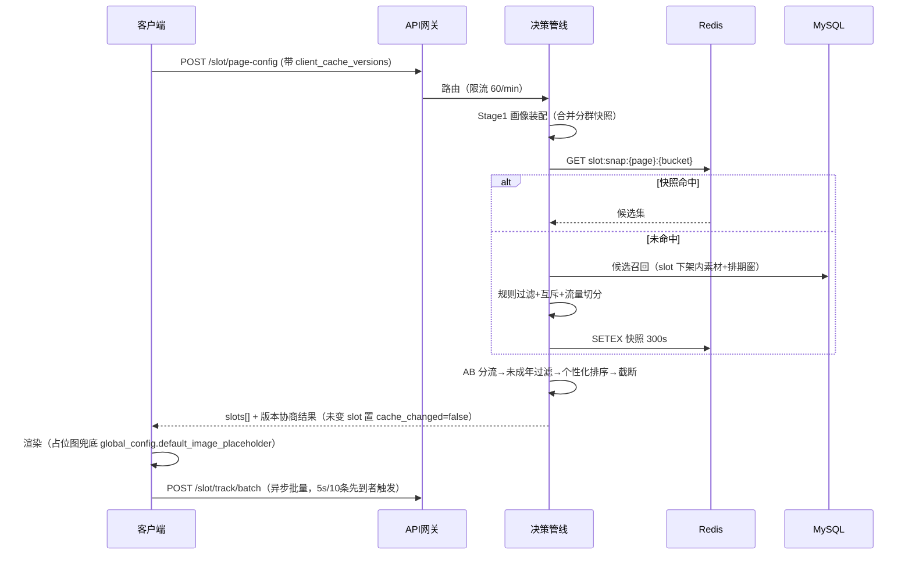
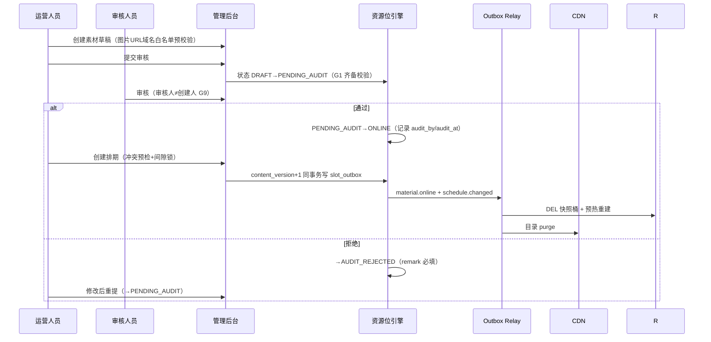
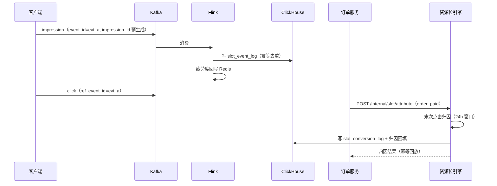

# 服务端-运营资源位统一调度与个性化Banner智能编排管理引擎-详细设计

## 1. 模块概述

### 1.1 模块定位

运营资源位统一调度与个性化 Banner 智能编排管理引擎（以下简称"资源位引擎"）负责管理 APP 各页面中**内嵌于页面布局的持久性运营展示位**——包括首页轮播 Banner、学科入口图标网格、学习专区推荐卡、个人中心活动横幅、支付成功页推广位等。

与"运营弹窗规则引擎"的区别：

| 维度 | 运营弹窗（已有） | 运营资源位（本模块） |
|------|-----------------|---------------------|
| 展示形式 | 覆盖式弹窗/浮窗/对话框 | 页面内嵌的布局元素 |
| 触发方式 | 事件触发（启动、页面进入等） | 随页面渲染加载 |
| 用户感知 | 打断型（需关闭才消失） | 原生型（随页面内容一起呈现） |
| 生命周期 | 短时弹出 → 用户关闭 | 持续展示直到页面切换 |
| 频次控制 | 需严格防骚扰 | 由页面浏览自然约束 |
| 内容形态 | 图片/HTML/组件 | 图片轮播、图标网格、卡片、视频 |
| 典型场景 | 活动弹窗、公告对话框 | 首页 Banner、快捷入口、专区推荐 |

### 1.2 核心职责

1. **资源位注册与管理**：统一定义 APP 中所有可运营的展示位置，支持动态新增
2. **素材管理**：管理 Banner 图片、图标、文案等素材的上传、审核与版本管理
3. **投放规则引擎**：根据用户画像、学段、年级、会员状态、地域等条件精准投放
4. **个性化排序**：基于用户兴趣和行为数据对同一资源位的多条素材进行个性化排序
5. **调度与排期**：支持素材的定时上线/下线、优先级排期、互斥规则
6. **效果分析**：曝光、点击、转化（注册/购买/参与）全链路数据采集与分析
7. **A/B 实验**：支持资源位内容的 A/B 测试与效果对比
8. **未成年人保护**：对未成年用户过滤不适宜的商业推广内容

### 1.3 系统边界

```
┌─────────────────────────────────────────────────────────────────────┐
│                     管理后台（运营人员 / 内容编辑）                    │
│   资源位配置 ｜ 素材上传 ｜ 投放规则 ｜ 排期日历 ｜ 数据看板 ｜ AB实验  │
└──────────────────────────┬──────────────────────────────────────────┘
                           │ REST API
┌──────────────────────────▼──────────────────────────────────────────┐
│                     资源位引擎服务（本模块）                           │
│                                                                     │
│  ┌──────────────┐  ┌──────────────┐  ┌──────────────────────────┐  │
│  │ 资源位注册     │  │ 素材管理       │  │ 投放规则匹配引擎           │  │
│  │ Registry     │  │ Material Mgr │  │ Rule Engine              │  │
│  └──────────────┘  └──────────────┘  └──────────────────────────┘  │
│                                                                     │
│  ┌──────────────┐  ┌──────────────┐  ┌──────────────────────────┐  │
│  │ 排期调度器     │  │ 个性化排序     │  │ 效果分析 & 归因            │  │
│  │ Scheduler    │  │ Ranker       │  │ Analytics               │  │
│  └──────────────┘  └──────────────┘  └──────────────────────────┘  │
│                                                                     │
│  ┌──────────────┐  ┌──────────────┐                                │
│  │ A/B 实验分流   │  │ 缓存与预热     │                                │
│  │ Splitter     │  │ Cache Layer  │                                │
│  └──────────────┘  └──────────────┘                                │
└──────────────────────────┬──────────────────────────────────────────┘
                           │ REST API + CDN
┌──────────────────────────▼──────────────────────────────────────────┐
│                       客户端（Flutter APP）                           │
│   资源位渲染 ｜ 轮播组件 ｜ 图标网格 ｜ 卡片展示 ｜ 行为埋点上报        │
└─────────────────────────────────────────────────────────────────────┘
```

### 1.4 设计原则

1. **配置驱动**：所有资源位内容由后台配置，客户端零硬编码
2. **体验优先**：资源位内容不干扰核心学习流程，未成年用户无商业广告
3. **性能极致**：首屏资源位数据通过 CDN 预热 + 客户端预加载，做到零等待
4. **数据闭环**：从配置→投放→曝光→点击→转化→分析完整闭环
5. **渐进增强**：支持从简单图片 Banner 到富媒体交互卡片的平滑升级

---

## 2. 数据模型

### 2.1 资源位定义表 (slot_definition)

资源位是 APP 中可投放运营内容的抽象位置。每个资源位有唯一的位置编码。

```sql
CREATE TABLE slot_definition (
    id                  BIGINT PRIMARY KEY AUTO_INCREMENT,
    slot_code           VARCHAR(64) NOT NULL UNIQUE COMMENT '资源位编码，全局唯一',
    slot_name           VARCHAR(128) NOT NULL COMMENT '资源位名称',
    page_code           VARCHAR(64) NOT NULL COMMENT '所属页面编码',
    page_name           VARCHAR(128) COMMENT '所属页面名称',
    slot_type           VARCHAR(32) NOT NULL COMMENT '资源位类型: banner_carousel/icon_grid/content_card/strip_banner/video_card/float_icon',
    display_area        VARCHAR(64) COMMENT '页面区域: top/middle/bottom/sidebar',
    max_items           INT NOT NULL DEFAULT 1 COMMENT '最大同时展示素材数',
    min_items           INT NOT NULL DEFAULT 0 COMMENT '最小展示素材数（不足则隐藏该区域）',
    width_ratio         DECIMAL(5,2) COMMENT '建议宽比',
    height_ratio        DECIMAL(5,2) COMMENT '建议高比',
    carousel_interval   INT DEFAULT 3000 COMMENT '轮播间隔(ms)，仅轮播类型',
    support_personalize TINYINT DEFAULT 0 COMMENT '是否支持个性化排序: 0=否, 1=是',
    support_ab_test     TINYINT DEFAULT 0 COMMENT '是否支持AB实验: 0=否, 1=是',
    audit_required      TINYINT DEFAULT 1 COMMENT '素材是否需要审核: 0=否, 1=是',
    status              TINYINT NOT NULL DEFAULT 1 COMMENT '状态: 0=禁用, 1=启用',
    client_version_min  VARCHAR(32) COMMENT '要求的最低客户端版本',
    client_version_max  VARCHAR(32) COMMENT '要求的最高客户端版本（空=不限）',
    description         TEXT COMMENT '资源位描述说明',
    created_by          BIGINT NOT NULL COMMENT '创建人',
    created_at          DATETIME NOT NULL DEFAULT CURRENT_TIMESTAMP,
    updated_by          BIGINT COMMENT '最后修改人',
    updated_at          DATETIME NOT NULL DEFAULT CURRENT_TIMESTAMP ON UPDATE CURRENT_TIMESTAMP,
    deleted_at          DATETIME COMMENT '软删除时间',
    INDEX idx_page (page_code, status),
    INDEX idx_status (status)
) ENGINE=InnoDB DEFAULT CHARSET=utf8mb4 COMMENT='资源位定义表';
```

#### 预置资源位编码规范

```
格式：{page}.{area}.{type}_{sequence}

示例：
  home.top.banner_carousel_1     → 首页顶部轮播 Banner
  home.middle.icon_grid_1        → 首页中部快捷入口图标网格
  home.middle.content_card_1     → 首页中部推荐内容卡片
  home.bottom.strip_banner_1     → 首页底部条幅
  ai_chat.bottom.strip_banner_1  → AI对话页底部条幅
  profile.top.content_card_1     → 个人中心顶部卡片
  practice.result.content_card_1 → 练习结果页推荐卡片
  error_book.top.banner_carousel_1 → 错题本顶部Banner
  payment.success.strip_banner_1  → 支付成功页推广条幅
  member.center.banner_carousel_1 → 会员中心轮播
```

### 2.2 素材表 (slot_material)

素材是投放到资源位的具体内容单元。

```sql
CREATE TABLE slot_material (
    id                  BIGINT PRIMARY KEY AUTO_INCREMENT,
    material_code       VARCHAR(64) NOT NULL UNIQUE COMMENT '素材编码',
    title               VARCHAR(256) NOT NULL COMMENT '素材标题（管理用）',
    slot_code           VARCHAR(64) NOT NULL COMMENT '投放的目标资源位编码',
    material_type       VARCHAR(32) NOT NULL COMMENT '素材类型: image/rich_card/video/mini_program_link',
    
    -- 图片素材
    image_url           VARCHAR(512) COMMENT '主图URL（CDN地址）',
    image_url_night     VARCHAR(512) COMMENT '夜间模式图片URL',
    image_url_pad       VARCHAR(512) COMMENT '平板适配图片URL',
    
    -- 富文本卡片
    card_title          VARCHAR(128) COMMENT '卡片标题',
    card_subtitle       VARCHAR(256) COMMENT '卡片副标题',
    card_icon           VARCHAR(512) COMMENT '卡片图标URL',
    card_bg_color       VARCHAR(32) COMMENT '卡片背景色',
    card_text_color     VARCHAR(32) COMMENT '卡片文字颜色',
    card_tag            VARCHAR(64) COMMENT '卡片标签文字（如"热门""新上线"）',
    
    -- 跳转配置
    action_type         VARCHAR(32) NOT NULL DEFAULT 'none' COMMENT '点击动作: none/page/deeplink/url/app_page',
    action_url          VARCHAR(1024) COMMENT '跳转地址或深链接',
    action_params       JSON COMMENT '跳转附加参数',
    
    -- 排序与权重
    weight              INT NOT NULL DEFAULT 100 COMMENT '基础权重（数字越大越靠前）',
    
    -- 排期
    start_time          DATETIME NOT NULL COMMENT '上线时间',
    end_time            DATETIME NOT NULL COMMENT '下线时间',
    is_persistent       TINYINT DEFAULT 0 COMMENT '是否常驻（1=忽略排期，手动下架）',
    
    -- 状态
    status              TINYINT NOT NULL DEFAULT 0 COMMENT '状态: 0=草稿, 1=待审核, 2=审核拒绝, 3=已上架, 4=已下架, 5=已过期',
    audit_remark        VARCHAR(512) COMMENT '审核备注',
    audit_by            BIGINT COMMENT '审核人',
    audit_at            DATETIME COMMENT '审核时间',
    
    -- 版本管理
    version             INT NOT NULL DEFAULT 1 COMMENT '版本号',
    source_material_id  BIGINT COMMENT '源素材ID（版本迭代时关联）',
    
    -- 创建信息
    created_by          BIGINT NOT NULL COMMENT '创建人',
    created_at          DATETIME NOT NULL DEFAULT CURRENT_TIMESTAMP,
    updated_at          DATETIME NOT NULL DEFAULT CURRENT_TIMESTAMP ON UPDATE CURRENT_TIMESTAMP,
    deleted_at          DATETIME COMMENT '软删除时间',
    
    INDEX idx_slot_status (slot_code, status, start_time, end_time),
    INDEX idx_time_range (start_time, end_time, status),
    INDEX idx_created (created_by, created_at)
) ENGINE=InnoDB DEFAULT CHARSET=utf8mb4 COMMENT='资源位素材表';
```

### 2.3 投放规则表 (delivery_rule)

每条素材可关联多条投放规则，规则之间为 AND 关系。

```sql
CREATE TABLE delivery_rule (
    id                  BIGINT PRIMARY KEY AUTO_INCREMENT,
    material_id         BIGINT NOT NULL COMMENT '素材ID',
    rule_type           VARCHAR(32) NOT NULL COMMENT '规则类型',
    rule_operator       VARCHAR(16) NOT NULL COMMENT '操作符: eq/neq/in/not_in/gt/lt/gte/lte/between/contains',
    rule_value          VARCHAR(1024) NOT NULL COMMENT '规则值（JSON数组或单值）',
    priority            INT DEFAULT 0 COMMENT '规则优先级（多条同类规则时）',
    created_at          DATETIME NOT NULL DEFAULT CURRENT_TIMESTAMP,
    
    INDEX idx_material (material_id),
    INDEX idx_rule_type (rule_type)
) ENGINE=InnoDB DEFAULT CHARSET=utf8mb4 COMMENT='投放规则表';
```

#### 规则类型枚举

| rule_type | 说明 | operator 示例 | value 示例 |
|-----------|------|--------------|-----------|
| `user_segment` | 用户分群 | `in` | `["new_user","active_7d"]` |
| `grade` | 年级 | `in` | `["grade_7","grade_8","grade_9"]` |
| `stage` | 学段 | `eq` | `"middle_school"` |
| `membership_level` | 会员等级 | `in` | `["free","monthly"]` |
| `province` | 省份 | `in` | `["广东","北京"]` |
| `textbook_version` | 教材版本 | `eq` | `"renjiao"` |
| `register_days` | 注册天数 | `gte` | `"30"` |
| `last_active_days` | 最近活跃天数 | `lte` | `"3"` |
| `subject_preference` | 学科偏好 | `contains` | `"math"` |
| `age_group` | 年龄段 | `between` | `"[6,12]"` |
| `is_minor` | 是否未成年 | `eq` | `"true"` |
| `device_type` | 设备类型 | `in` | `["ios","android"]` |
| `app_version` | APP 版本 | `gte` | `"2.0.0"` |
| `custom_tag` | 自定义标签 | `in` | `["tag_a","tag_b"]` |
| `learning_goal` | 学习目标 | `eq` | `"zhongkao"` |
| `weak_subject` | 薄弱学科 | `contains` | `"physics"` |

### 2.4 排期与互斥表 (slot_schedule)

```sql
CREATE TABLE slot_schedule (
    id                  BIGINT PRIMARY KEY AUTO_INCREMENT,
    slot_code           VARCHAR(64) NOT NULL COMMENT '资源位编码',
    material_id         BIGINT NOT NULL COMMENT '素材ID',
    priority            INT NOT NULL DEFAULT 100 COMMENT '排期优先级（同时间段高优先级在前）',
    effective_start     DATETIME NOT NULL COMMENT '排期生效开始时间',
    effective_end       DATETIME NOT NULL COMMENT '排期生效结束时间',
    daily_start_time    TIME COMMENT '每日展示开始时间（如 08:00:00），空=全天',
    daily_end_time      TIME COMMENT '每日展示结束时间（如 22:00:00），空=全天',
    week_days           VARCHAR(32) COMMENT '星期几展示（逗号分隔：1,2,3,4,5），空=每天',
    exclude_holidays    TINYINT DEFAULT 0 COMMENT '是否节假日不展示',
    
    -- 互斥组：同一互斥组内同一时间只展示一条素材
    mutex_group         VARCHAR(64) COMMENT '互斥组编码（同组素材同时段只取优先级最高）',
    
    -- 流量控制
    traffic_percentage  DECIMAL(5,2) DEFAULT 100.00 COMMENT '流量分配比例（%）',
    
    status              TINYINT NOT NULL DEFAULT 1 COMMENT '0=禁用, 1=启用',
    created_by          BIGINT NOT NULL,
    created_at          DATETIME NOT NULL DEFAULT CURRENT_TIMESTAMP,
    updated_at          DATETIME NOT NULL DEFAULT CURRENT_TIMESTAMP ON UPDATE CURRENT_TIMESTAMP,
    
    INDEX idx_slot_time (slot_code, effective_start, effective_end, status),
    INDEX idx_mutex (mutex_group, effective_start, effective_end),
    INDEX idx_material (material_id)
) ENGINE=InnoDB DEFAULT CHARSET=utf8mb4 COMMENT='资源位排期表';
```

### 2.5 曝光与点击日志表 (slot_event_log)

```sql
CREATE TABLE slot_event_log (
    id                  BIGINT PRIMARY KEY AUTO_INCREMENT,
    event_id            VARCHAR(64) NOT NULL COMMENT '事件唯一ID（防重）',
    event_type          VARCHAR(16) NOT NULL COMMENT '事件类型: impression/click/close/convert',
    material_id         BIGINT NOT NULL COMMENT '素材ID',
    slot_code           VARCHAR(64) NOT NULL COMMENT '资源位编码',
    page_code           VARCHAR(64) NOT NULL COMMENT '页面编码',
    user_id             BIGINT NOT NULL COMMENT '用户ID',
    device_id           VARCHAR(64) COMMENT '设备ID',
    session_id          VARCHAR(64) COMMENT '会话ID',
    experiment_id       VARCHAR(64) COMMENT 'AB实验ID（如有）',
    experiment_group    VARCHAR(32) COMMENT 'AB实验分组',
    
    -- 用户画像快照（便于离线分析）
    user_grade          VARCHAR(32) COMMENT '用户年级',
    user_stage          VARCHAR(32) COMMENT '用户学段',
    membership_level    VARCHAR(32) COMMENT '会员等级',
    is_minor            TINYINT COMMENT '是否未成年',
    
    -- 环境
    device_type         VARCHAR(16) COMMENT '设备类型',
    app_version         VARCHAR(32) COMMENT 'APP版本',
    os_version          VARCHAR(32) COMMENT '系统版本',
    network_type        VARCHAR(16) COMMENT '网络类型',
    ip_province         VARCHAR(32) COMMENT 'IP省份',
    
    -- 转化追踪
    ref_event_id        VARCHAR(64) COMMENT '关联的上游事件ID（如点击关联曝光）',
    conversion_target   VARCHAR(64) COMMENT '转化目标（如 order_create, activity_join）',
    conversion_value    DECIMAL(12,2) COMMENT '转化金额（分）',
    
    event_time          DATETIME NOT NULL COMMENT '事件发生时间',
    server_time         DATETIME NOT NULL DEFAULT CURRENT_TIMESTAMP COMMENT '服务端接收时间',
    
    INDEX idx_material_event (material_id, event_type, event_time),
    INDEX idx_user_event (user_id, event_type, event_time),
    INDEX idx_slot_event (slot_code, event_type, event_time),
    INDEX idx_event_id (event_id)
) ENGINE=InnoDB DEFAULT CHARSET=utf8mb4 COMMENT='资源位事件日志表';
```

### 2.6 A/B 实验配置表 (slot_experiment)

```sql
CREATE TABLE slot_experiment (
    id                  BIGINT PRIMARY KEY AUTO_INCREMENT,
    experiment_code     VARCHAR(64) NOT NULL UNIQUE COMMENT '实验编码',
    experiment_name     VARCHAR(128) NOT NULL COMMENT '实验名称',
    slot_code           VARCHAR(64) NOT NULL COMMENT '实验资源位编码',
    description         TEXT COMMENT '实验描述',
    
    -- 实验组配置
    groups_config       JSON NOT NULL COMMENT '实验组配置',
    /*
    groups_config 结构示例:
    {
      "groups": [
        {
          "group_name": "control",
          "group_label": "对照组",
          "traffic_percentage": 50,
          "material_ids": [1001, 1002]
        },
        {
          "group_name": "variant_a",
          "group_label": "实验组A",
          "traffic_percentage": 50,
          "material_ids": [1003, 1004]
        }
      ]
    }
    */
    
    -- 实验指标
    primary_metric      VARCHAR(64) NOT NULL COMMENT '主指标: ctr/conversion_rate/engagement_rate',
    secondary_metrics   JSON COMMENT '辅助指标',
    
    -- 分流配置
    salt                VARCHAR(32) NOT NULL COMMENT '分流盐值（保证不同实验独立性）',
    targeting_rules     JSON COMMENT '实验定向条件（复用delivery_rule格式）',
    
    -- 状态
    status              TINYINT NOT NULL DEFAULT 0 COMMENT '0=草稿, 1=运行中, 2=已暂停, 3=已完成, 4=已归档',
    start_time          DATETIME COMMENT '实验开始时间',
    end_time            DATETIME COMMENT '实验结束时间',
    
    created_by          BIGINT NOT NULL,
    created_at          DATETIME NOT NULL DEFAULT CURRENT_TIMESTAMP,
    updated_at          DATETIME NOT NULL DEFAULT CURRENT_TIMESTAMP ON UPDATE CURRENT_TIMESTAMP,
    
    INDEX idx_slot_status (slot_code, status),
    INDEX idx_code (experiment_code)
) ENGINE=InnoDB DEFAULT CHARSET=utf8mb4 COMMENT='资源位AB实验配置表';
```

### 2.7 资源位缓存快照表 (slot_cache_snapshot)

用于 CDN 缓存和客户端预加载的精简数据结构。

```sql
CREATE TABLE slot_cache_snapshot (
    id                  BIGINT PRIMARY KEY AUTO_INCREMENT,
    cache_key           VARCHAR(256) NOT NULL UNIQUE COMMENT '缓存键',
    cache_version       VARCHAR(64) NOT NULL COMMENT '缓存版本号',
    user_segment        VARCHAR(128) NOT NULL DEFAULT 'default' COMMENT '用户分群标识',
    slot_data           JSON NOT NULL COMMENT '资源位数据快照（精简后）',
    ttl_seconds         INT NOT NULL DEFAULT 300 COMMENT '缓存有效期（秒）',
    created_at          DATETIME NOT NULL DEFAULT CURRENT_TIMESTAMP,
    expires_at          DATETIME NOT NULL COMMENT '过期时间',
    
    INDEX idx_key_version (cache_key, cache_version),
    INDEX idx_segment (user_segment, expires_at),
    INDEX idx_expires (expires_at)
) ENGINE=InnoDB DEFAULT CHARSET=utf8mb4 COMMENT='资源位缓存快照表';
```

### 2.8 DDL 增补（v1.1）

修复 v1.0 缺陷 F1/F2/F3 的承载列与新表（缺陷说明见 §16 维护记录）：

```sql
-- F1：素材商业类型与个性化标签承载列（未成年过滤 G3 与个性化排序依赖）
ALTER TABLE slot_material
    ADD COLUMN commercial_type VARCHAR(32) NOT NULL DEFAULT 'EDUCATION'
        COMMENT '商业类型: EDUCATION/PLATFORM/MEMBERSHIP_PROMO/PAID_SERVICE/THIRD_PARTY' AFTER material_type,
    ADD COLUMN subject_tags JSON COMMENT '学科/兴趣标签数组，供个性化兴趣匹配（Jaccard）',
    ADD COLUMN is_aigc TINYINT DEFAULT 0 COMMENT '素材图片是否AI生成（合规标识 C3）',
    ADD COLUMN source VARCHAR(256) COMMENT '素材版权来源登记（C9），无来源不入库';
ALTER TABLE slot_material
    ADD INDEX idx_commercial (slot_code, commercial_type, status);

-- F3：缓存版本权威来源（G10 只增不减，任何影响该 slot 的写操作同事务 +1）
ALTER TABLE slot_definition
    ADD COLUMN content_version BIGINT NOT NULL DEFAULT 1 COMMENT '内容版本号，cache_version=v{content_version}';
```

**F2 裁决：v1.0 §2.5 MySQL `slot_event_log` 废弃**，曝光/点击明细主存储改 ClickHouse（DAU 50 万下日增约 1300 万行，MySQL 无分区无保留策略 30 天内爆表）；转化事件低频且需与订单对账，保留 MySQL：

```sql
-- 曝光/点击明细（ClickHouse，ReplacingMergeTree 幂等去重，180 天 TTL）
CREATE TABLE clickhouse.slot_event_log (
    event_id        String,
    event_type      LowCardinality(String),          -- impression/click/close/convert
    material_id     UInt64,
    slot_code       String,
    page_code       LowCardinality(String),
    user_id         UInt64,
    device_id       String,
    experiment_id   String DEFAULT '',
    experiment_group LowCardinality(String) DEFAULT '',
    ref_event_id    String DEFAULT '',
    user_grade      LowCardinality(String) DEFAULT '',
    membership_level LowCardinality(String) DEFAULT '',
    is_minor        UInt8 DEFAULT 0,
    device_type     LowCardinality(String) DEFAULT '',
    app_version     LowCardinality(String) DEFAULT '',
    network_type    LowCardinality(String) DEFAULT '',
    ip_province     LowCardinality(String) DEFAULT '',
    dwell_ms        UInt32 DEFAULT 0,
    visible_ratio   Float32 DEFAULT 0,
    carousel_index  Int8 DEFAULT -1,
    event_time      DateTime,
    server_time     DateTime DEFAULT now()
) ENGINE = ReplacingMergeTree()
PARTITION BY toYYYYMM(event_time)
ORDER BY (event_id)
TTL event_time + INTERVAL 180 DAY;

-- 小时聚合物化视图（看板与告警直读，避免扫明细）
CREATE MATERIALIZED VIEW clickhouse.slot_mv_hour
ENGINE = SummingMergeTree()
PARTITION BY toYYYYMM(stat_hour)
ORDER BY (slot_code, material_id, stat_hour)
AS SELECT
    slot_code, material_id,
    toStartOfHour(event_time) AS stat_hour,
    countIf(event_type = 'impression') AS impressions,
    countIf(event_type = 'click')     AS clicks
FROM clickhouse.slot_event_log
GROUP BY slot_code, material_id, stat_hour;

-- 转化归因日志（MySQL，幂等回放与订单对账权威；按月分区，在线 12 个月 + 归档 24 个月）
CREATE TABLE slot_conversion_log (
    id                BIGINT PRIMARY KEY AUTO_INCREMENT,
    idempotent_key    VARCHAR(128) NOT NULL COMMENT '幂等键 attr:{target_ref_id}:{material_code}',
    conversion_target VARCHAR(64) NOT NULL COMMENT 'order_create/order_paid/activity_join/member_subscribe/page_reach',
    target_ref_id     VARCHAR(64) NOT NULL COMMENT '转化单据号（订单号/参与记录号）',
    material_id       BIGINT NOT NULL,
    slot_code         VARCHAR(64) NOT NULL,
    user_id           BIGINT NOT NULL,
    ref_event_id      VARCHAR(64) COMMENT '归因关联的末次点击事件ID',
    attribution_model VARCHAR(32) NOT NULL DEFAULT 'last_click' COMMENT 'last_click/view_through',
    conversion_value  DECIMAL(12,2) COMMENT '转化金额（分）',
    occurred_at       DATETIME NOT NULL,
    created_at        DATETIME NOT NULL DEFAULT CURRENT_TIMESTAMP,
    UNIQUE KEY uk_idem (idempotent_key),
    INDEX idx_material (material_id, occurred_at),
    INDEX idx_user (user_id, occurred_at)
) ENGINE=InnoDB DEFAULT CHARSET=utf8mb4 COMMENT='资源位转化归因日志';
```

---

## 3. API 接口设计

### 3.1 客户端聚合获取接口

客户端进入页面时一次性获取该页面所有资源位数据。

```
POST /api/v1/slot/page-config
```

**请求参数：**

```json
{
  "page_code": "home",
  "user_context": {
    "user_id": 1000234,
    "grade": "grade_8",
    "stage": "middle_school",
    "membership_level": "monthly",
    "is_minor": true,
    "province": "广东",
    "textbook_version": "renjiao",
    "device_type": "ios",
    "app_version": "2.1.0",
    "register_days": 45,
    "last_active_days": 0,
    "custom_tags": ["active_7d", "math_lover"],
    "learning_goal": "zhongkao",
    "weak_subjects": ["physics"]
  },
  "client_cache_versions": {
    "home.top.banner_carousel_1": "v20260813_1",
    "home.middle.icon_grid_1": "v20260812_3"
  }
}
```

**响应：**

```json
{
  "code": 0,
  "message": "success",
  "data": {
    "page_code": "home",
    "request_id": "req_abc123",
    "server_cache_version": "v20260813_2",
    "slots": [
      {
        "slot_code": "home.top.banner_carousel_1",
        "slot_type": "banner_carousel",
        "cache_version": "v20260813_2",
        "cache_changed": true,
        "carousel_interval": 4000,
        "items": [
          {
            "material_id": 50012,
            "material_type": "image",
            "image_url": "https://cdn.primetop.com/banner/zk_sprint_2026.png",
            "image_url_night": "https://cdn.primetop.com/banner/zk_sprint_2026_night.png",
            "action_type": "page",
            "action_url": "/exam_sprint/detail?id=zs2026",
            "action_params": {"source": "home_banner"},
            "tag": "热门",
            "tracking_params": {
              "impression_id": "imp_x1y2z3",
              "click_url": "/api/v1/slot/track/click",
              "material_code": "M20260813001"
            }
          },
          {
            "material_id": 50013,
            "material_type": "rich_card",
            "card_title": "暑期数学特训营",
            "card_subtitle": "7天突破函数与几何",
            "card_icon": "https://cdn.primetop.com/icons/math_camp.png",
            "card_bg_color": "#E8F5E9",
            "card_tag": "限时",
            "action_type": "page",
            "action_url": "/camp/detail?id=math_camp_2026",
            "tracking_params": {
              "impression_id": "imp_a4b5c6",
              "click_url": "/api/v1/slot/track/click",
              "material_code": "M20260813002"
            }
          }
        ]
      },
      {
        "slot_code": "home.middle.icon_grid_1",
        "slot_type": "icon_grid",
        "cache_version": "v20260812_3",
        "cache_changed": false,
        "items": []
      },
      {
        "slot_code": "home.middle.content_card_1",
        "slot_type": "content_card",
        "cache_version": "v20260813_1",
        "cache_changed": true,
        "items": [
          {
            "material_id": 50020,
            "material_type": "rich_card",
            "card_title": "你的物理有3个薄弱点待突破",
            "card_subtitle": "基于本周练习分析",
            "card_icon": "https://cdn.primetop.com/icons/weak_alert.png",
            "card_bg_color": "#FFF3E0",
            "action_type": "page",
            "action_url": "/analysis/weak_subjects",
            "tracking_params": {
              "impression_id": "imp_d7e8f9",
              "click_url": "/api/v1/slot/track/click",
              "material_code": "M20260813003"
            }
          }
        ]
      }
    ],
    "global_config": {
      "default_image_placeholder": "https://cdn.primetop.com/placeholder/banner_default.png",
      "image_load_timeout_ms": 3000,
      "preload_next": true,
      "track_flush_interval_ms": 5000,
      "track_batch_size": 10
    }
  }
}
```

**关键字段说明：**

| 字段 | 说明 |
|------|------|
| `server_cache_version` | 整页聚合版本（所有 slot `cache_version` 的最大值），仅用于日志与灰度排查，协商以 slot 级为准 |
| `slots[].cache_changed` | `false` 表示客户端本地版本已是最新，`items` 返回空数组省流量（304 语义） |
| `items[].tracking_params.impression_id` | 服务端预生成的曝光事件 ID，客户端上报曝光时必须回带，用于曝光-点击弱关联 |
| `items[].tracking_params.material_code` | 业务侧素材编码，供转化归因反查（管理后台展示用 material_id，日志关联用 code） |
| `global_config` | 资源位渲染全局兜底配置：占位图、加载超时、预加载、埋点批量上报参数 |

**缓存协商语义：**

1. `cache_version` 权威来源为 `slot_definition.content_version`（BIGINT 自增，见 §2.8 DDL 增补），格式化为 `v{content_version}`；任何影响该 slot 内容的写操作（素材上架/下架/过期、排期变更、实验启停）在**同一事务**内 +1。
2. 客户端请求携带 `client_cache_versions`；服务端逐 slot 比较，相同则 `cache_changed=false` 且 `items=[]`。
3. 未登录（`user_id=0`）允许请求，使用匿名画像（无 grade/membership），仅投放在投放规则中不含身份类规则或显式允许匿名的素材。

**限流：** 用户级 60 次/分钟、设备级 120 次/分钟（复用统一限流框架 `scene=slot.page_config`），超限返回 429。

**错误码：**

| code | HTTP | 说明 |
|------|------|------|
| 53300 | 400 | 参数错误（page_code 缺失/非法、user_context 字段类型错误） |
| 53301 | 200 | page_code 不存在或未注册，`slots=[]` 200 语义返回 |
| 53302 | 200 | 客户端版本低于 slot 要求的 `client_version_min`，该 slot 返回 `cache_changed=false, items=[]` |
| 53303 | 429 | 限流 |

### 3.2 埋点上报接口

客户端按 `global_config.track_flush_interval_ms` / `track_batch_size` 批量上报曝光与点击。

```
POST /api/v1/slot/track/batch
```

**请求体（单批 ≤ 20 条）：**

```json
{
  "events": [
    {
      "event_id": "evt_9f8e7d6c",
      "event_type": "impression",
      "material_id": 50012,
      "slot_code": "home.top.banner_carousel_1",
      "page_code": "home",
      "impression_id": "imp_x1y2z3",
      "experiment_id": "exp_home_banner_0813",
      "experiment_group": "variant_a",
      "client_time": "2026-08-20T10:23:45+08:00",
      "ext": {"visible_ratio": 1.0, "dwell_ms": 4200, "carousel_index": 0}
    },
    {
      "event_id": "evt_1a2b3c4d",
      "event_type": "click",
      "material_id": 50012,
      "slot_code": "home.top.banner_carousel_1",
      "page_code": "home",
      "ref_event_id": "evt_9f8e7d6c",
      "client_time": "2026-08-20T10:24:12+08:00",
      "ext": {"carousel_index": 0}
    }
  ]
}
```

**响应（恒 200，部分丢弃不报错）：**

```json
{
  "code": 0,
  "message": "success",
  "data": {"accepted": 2, "dropped": 0}
}
```

**服务端处理规则：**

1. `event_id` 幂等：Redis `SETNX slot:evt:{event_id}`（TTL 24h）前置去重，Kafka 生产成功后消费侧再以 ClickHouse `event_id` 去重兜底（ReplacingMergeTree）。
2. 服务端补齐环境字段：user_id、device_id、app_version、network_type、ip_province 由请求头与会话上下文注入，客户端不可伪造敏感字段（is_minor、membership_level 以服务端画像快照覆盖）。
3. **曝光判定口径（客户端执行）**：素材可视面积 ≥ 50% 且停留 ≥ 500ms 才上报；轮播类曝光按帧累计。服务端不做二次校验，只做超界过滤（dwell_ms > 30min 丢弃）。
4. `close` 事件仅对 `video_card` / 可关闭条幅类素材上报。
5. 事件写入 Kafka topic `slot.events`（12 分区，按 user_id 哈希），见 §4.8。

### 3.3 转化归因接口（内部）

供订单服务、活动服务在转化发生时回调，完成"素材曝光 → 转化"归因闭环。

```
POST /internal/v1/slot/attribute
```

```json
{
  "conversion_target": "order_create",
  "target_ref_id": "ORD202608201234",
  "material_code": "M20260813002",
  "user_id": 1000234,
  "conversion_value": 19900,
  "occurred_at": "2026-08-20T10:30:02+08:00",
  "idempotent_key": "attr:ORD202608201234:M20260813002"
}
```

**归因窗口规则：**

| 转化目标 | 归因窗口 | 归因口径 |
|---------|---------|---------|
| order_create / order_paid | 点击后 24h | 末次点击优先（Last Click） |
| activity_join | 点击后 48h | 末次点击优先 |
| member_subscribe | 点击后 7 天 | 末次点击优先，同窗口无点击回退曝光后 24h（View-Through 仅记录不参与 CTR 主指标） |
| page_reach（深链到达） | 点击后 5min | 直接关联 ref_event_id |

幂等键 `idempotent_key` 对应 MySQL `slot_conversion_log` 唯一索引（见 §2.8），重复回调返回已有归因结果（200 幂等回放）。

### 3.4 管理后台 API

统一前缀 `/admin/v1/slot`，全部走管理后台 BFF 鉴权（RBAC 见 §13 契约 R11），写操作全部落审计日志（契约 R12）。

| 分组 | 接口 | 方法 | 说明 |
|------|------|------|------|
| 资源位 | `/definitions` | POST | 注册资源位（slot_code 唯一校验） |
| 资源位 | `/definitions/{id}` | PUT | 修改基础配置（max_items/轮播间隔等，content_version 同事务 +1） |
| 资源位 | `/definitions/{id}/disable` | POST | 禁用资源位（**全站级高危，双人审批**，G6） |
| 资源位 | `/definitions` | GET | 分页查询（page/slot_type/status 筛选） |
| 素材 | `/materials` | POST | 创建草稿（图片 URL 域名白名单预校验，G5） |
| 素材 | `/materials/{id}` | PUT | 编辑草稿/被拒素材（被拒后编辑自动回到草稿态） |
| 素材 | `/materials/{id}/submit` | POST | 提交审核（G1：素材与排期信息齐备才可提交） |
| 素材 | `/materials/{id}/audit` | POST | 审核通过/拒绝（**审核人 ≠ 创建人**，G9；拒绝必填 remark） |
| 素材 | `/materials/{id}/online` | POST | 上架（仅审核通过态可执行） |
| 素材 | `/materials/{id}/offline` | POST | 手动下架（记录操作人与原因） |
| 素材 | `/materials/batch-online` | POST | 批量上架（≤50 条，逐条独立事务，返回 failed_items；**≥10 条触发双人审批**） |
| 排期 | `/schedules` | POST | 创建排期（服务端冲突预检 + 间隙范围锁，见 §7.3） |
| 排期 | `/schedules/conflict-check` | POST | 排期冲突预检（返回同 slot 时间窗重叠清单，不含互斥组信息则只做同位重叠检测） |
| 排期 | `/schedules/{id}` | PUT | 变更排期（时间窗变更重新做冲突检测，content_version +1） |
| 排期 | `/schedules/{id}/disable` | POST | 停用排期 |
| 实验 | `/experiments` | POST | 创建实验（G7/G8 校验：组内素材必须属同一 slot、流量比例总和=100） |
| 实验 | `/experiments/{id}/start` | POST | 启动实验（校验组内素材全部处于上架态） |
| 实验 | `/experiments/{id}/pause`、`/finish` | POST | 暂停/结束（结束后写入选优胜组结论字段） |
| 看板 | `/stats/overview` | GET | 全局看板：分 slot 的曝光/点击/CTR/转化汇总（小时/天粒度） |
| 看板 | `/stats/material/{id}` | GET | 单素材漏斗：曝光→点击→转化→ROI（关联计费成本时） |
| 看板 | `/stats/experiment/{id}` | GET | 实验组对比：主指标+辅助指标+SRM 检验结果 |
| 巡检 | `/inspections/image-url` | POST | 手动触发素材图片 URL 可用性巡检（M8，自动巡检见 §11） |

---

## 4. 核心流程与关键代码

### 4.1 投放决策管线（主流程）

`POST /api/v1/slot/page-config` 的服务端决策管线共 8 个 Stage，组件化编排，任一 Stage 异常按 §10 降级矩阵处理，**绝不抛错中断整页**：

```
请求解析 → 画像装配 → 候选召回 → 规则过滤 → 互斥与流量裁决
    → AB 实验分流 → 未成年保护过滤 → 个性化排序与截断 → 快照组装
```

**延迟预算（P99 ≤ 150ms，缓存命中 ≤ 30ms）：**

| Stage | 预算 | 说明 |
|-------|------|------|
| 画像装配 | 10ms | 请求携带 user_context + 服务端分群快照合并（分群缺失走基础画像） |
| 候选召回 | 20ms | Redis 分群快照命中直接取候选集，未命中查 MySQL |
| 规则过滤 | 30ms | 纯内存求值，无 IO |
| 互斥与流量 | 10ms | 纯函数 |
| AB 分流 | 10ms | 纯函数（SHA-256 取模） |
| 未成年过滤 | 5ms | 纯内存，系统级最后执行 |
| 个性化排序 | 20ms | 疲劳度查 Redis（Pipeline 批量） |
| 组装序列化 | 30ms | 版本协商 + JSON 组装 |

```java
/**
 * 投放决策管线。fail-open：非安全类 Stage 异常返回空 slots + degraded 标记；
 * 但 Stage7 未成年保护过滤器是安全 Stage，异常时 fail-closed（剔除全部商业内容）。
 */
@Service
public class SlotDecisionPipeline {

    private final List<Stage> stages; // 按固定顺序注入

    public PageConfigResult decide(PageConfigRequest req) {
        PipelineContext ctx = new PipelineContext(req);
        for (Stage stage : stages) {
            try {
                stage.execute(ctx);
            } catch (SafetyStageException e) {
                // 安全 Stage（未成年过滤）失败：保守放行教育类，剔除其余
                ctx.applyMinorSafeFallback();
                ctx.markDegraded(stage.name(), "SAFETY_FAIL_CLOSED");
                break;
            } catch (Exception e) {
                ctx.markDegraded(stage.name(), e.getClass().getSimpleName());
                if (stage.required()) {          // 召回/组装为核心 Stage
                    return PageConfigResult.emptyWithDegraded(ctx);
                }
                // 可降级 Stage 跳过继续
            }
        }
        return ctx.assemble();
    }
}
```

### 4.2 规则匹配器

规则求值为纯内存 AND 语义；字段取值器注册表将 `rule_type` 映射到画像字段，未知 `rule_type` **fail-safe 不投放并告警**（防止规则类型扩容后旧版本服务误放行）：

```java
@Component
public class RuleEvaluator {

    private final Map<String, Function<UserProfile, Object>> extractors = Map.ofEntries(
        Map.entry("user_segment",     UserProfile::getSegmentCodes),   // List<String>，来自分群引擎快照
        Map.entry("grade",            UserProfile::getGrade),
        Map.entry("stage",            UserProfile::getStage),
        Map.entry("membership_level", UserProfile::getMembershipLevel),
        Map.entry("province",         UserProfile::getProvince),
        Map.entry("register_days",    UserProfile::getRegisterDays),
        Map.entry("last_active_days", UserProfile::getLastActiveDays),
        Map.entry("is_minor",         UserProfile::isMinor),
        Map.entry("device_type",      UserProfile::getDeviceType),
        Map.entry("app_version",      UserProfile::getAppVersion),
        Map.entry("custom_tag",       UserProfile::getCustomTags),
        Map.entry("learning_goal",    UserProfile::getLearningGoal),
        Map.entry("weak_subject",     UserProfile::getWeakSubjects)
    );

    /** AND 语义：任一规则不满足即过滤；未知 rule_type 不投放并计数告警 */
    public boolean match(List<DeliveryRule> rules, UserProfile profile) {
        for (DeliveryRule r : rules) {
            Function<UserProfile, Object> extractor = extractors.get(r.getRuleType());
            if (extractor == null) {
                Metrics.unknownRuleType(r.getRuleType());
                return false;                       // fail-safe
            }
            if (!OperatorPredicate.of(r.getOperator())
                    .test(extractor.apply(profile), r.parsedValue())) {
                return false;
            }
        }
        return true;
    }
}
```

**`user_segment` 规则值契约（契约 R3）**：规则值只能是分群引擎已注册的分群编码（如 `new_user`、`active_7d`），**禁止内联人群名单**；`rule_value` 超过 1024 字符在保存时直接拒绝（53314）。分群引擎发布分群变更事件时，本引擎订阅并失效对应分群桶快照（§4.7）。

### 4.3 互斥组与流量切分

```java
/** 互斥组裁决：同组同时刻只保留 priority 最高者（平级比 weight，再比 materialId 小者胜） */
public List<Candidate> resolveMutex(List<Candidate> candidates, LocalDateTime now) {
    Map<String, List<Candidate>> groups = candidates.stream()
        .filter(c -> c.getMutexGroup() != null)
        .collect(Collectors.groupingBy(Candidate::getMutexGroup));
    Set<Long> losers = new HashSet<>();
    groups.forEach((group, list) -> {
        list.stream()
            .filter(c -> c.inScheduleWindow(now))     // 排期窗内才参与裁决
            .sorted(Comparator.comparingInt(Candidate::getPriority).reversed()
                .thenComparing(Comparator.comparingInt(Candidate::getWeight).reversed())
                .thenComparing(Candidate::getMaterialId))
            .skip(1)
            .forEach(c -> losers.add(c.getMaterialId()));
    });
    return candidates.stream()
        .filter(c -> !losers.contains(c.getMaterialId()))
        .collect(Collectors.toList());
}

/** 流量切分：稳定哈希，同用户对同素材结果恒定 */
public boolean passTrafficGate(long userId, long materialId, BigDecimal pct) {
    if (pct.compareTo(BigDecimal.valueOf(100)) >= 0) return true;
    String key = userId + ":" + materialId + ":" + TRAFFIC_SALT;
    int bucket = Math.abs(Hashing.sha256().hashString(key, UTF_8).asInt() % 10000);
    return bucket < pct.multiply(BigDecimal.valueOf(100)).intValue();
}
```

流量切分不通过的素材直接剔除，**不用低流量素材补位**；若剔除后数量低于 `min_items`，该区域整体隐藏（客户端按 `slots` 缺席处理）。

### 4.4 AB 实验分流

```java
/** 域内实验分流：与 AB 平台使用同一哈希构造（SHA-256(salt:user_id) % 10000），保证可复现 */
public Optional<ExperimentAssignment> assign(SlotExperiment exp, long userId) {
    int bucket = Math.abs(Hashing.sha256()
        .hashString(exp.getSalt() + ":" + userId, UTF_8).asInt() % 10000);
    int cursor = 0;
    for (ExperimentGroup g : exp.getGroups()) {        // 按 groups_config 顺序分配桶区间
        cursor += g.getTrafficPercentage() * 100;
        if (bucket < cursor) {
            return Optional.of(new ExperimentAssignment(
                exp.getExperimentCode(), g.getGroupName(), g.getMaterialIds()));
        }
    }
    return Optional.empty();                            // 理论不可达（比例和=100 由 G8 保证）
}
```

**与《AB测试与实验平台》的边界裁决（契约 R2）：**

| 维度 | 归属 |
|------|------|
| 单资源位素材级实验（哪张 Banner 效果好） | 本引擎 `slot_experiment`，轻量自持 |
| 跨模块/产品形态实验（新版首页 vs 旧版首页） | AB 测试平台，本引擎只透传 `experiment_id` |
| 分流算法 | 双方统一 SHA-256(salt:user_id) % 10000，盐值不同保证实验独立 |
| 曝光记录 | 本引擎 impression 事件带 `experiment_id/experiment_group`；AB 平台曝光以其 SDK 上报为准，双方日终对账 SRM |
| 冲突 | 同一 slot 同时命中平台实验与域内实验时，**平台实验优先**（G11） |

exposure 延迟记录：分流结果仅缓存于决策结果，**首次真实曝光**（impression 事件到达）才计入实验样本，避免"分配未曝光"稀释指标。

### 4.5 个性化排序器

```java
/** 分数 = 基础权重 + 兴趣匹配 + 新鲜度 − 疲劳惩罚 − 已点击降权 */
public double score(Candidate c, UserProfile p, FatigueStat f) {
    double s = c.getWeight();                                     // 0~100
    if (c.getSlot().isSupportPersonalize() && !p.isAnonymous()) {
        s += interestBonus(c.getSubjectTags(), p.getInterestTags());   // 0~30, Jaccard×30
        s += freshnessBonus(c.getOnlineAt());                          // 0~10, 上线72h内线性衰减
        s -= fatiguePenalty(f.getImpressions7d());                     // 0~40, n≥10 封顶，线性
        if (f.getClicked7d() > 0) s -= 15;                             // 已点击转化类降权
    }
    return s;
}
```

个性化仅对 `support_personalize=1` 的 slot 生效，且在**分群快照候选集之上做轻量重排**（不破坏快照命中）；匿名/无画像用户退化为 `weight + freshness` 排序。疲劳度统计源为 Redis `slot:fatigue:{user_id}`（Hash，field=material_id，§4.8 消费端维护，TTL 7 天滚动）。

### 4.6 未成年人保护过滤器（安全 Stage）

**系统级最后执行，任何运营规则不可 bypass；过滤器自身异常 fail-closed。**

`commercial_type`（§2.8 DDL 增补）与可见性矩阵：

| commercial_type | 含义 | 未成年可见 | 成年免费可见 | 成年会员可见 |
|-----------------|------|-----------|-------------|-------------|
| EDUCATION | 学习功能/免费内容导流 | ✅ | ✅ | ✅ |
| PLATFORM | 平台公告/活动（非付费） | ✅ | ✅ | ✅ |
| MEMBERSHIP_PROMO | 会员订阅促销 | ❌ | ✅ | ❌（已订阅过滤，G12） |
| PAID_SERVICE | 付费增值服务推广 | ❌ | ✅ | ✅ |
| THIRD_PARTY | 第三方合作/广告 | ❌ | ✅（可配置） | ✅ |

```java
public class MinorProtectionFilter implements Stage {
    @Override
    public void execute(PipelineContext ctx) {
        if (!ctx.getProfile().isMinor()) return;
        // 权威来源：实名核验服务的 is_minor 快照（契约 R12），请求参数仅作初筛
        ctx.removeCandidates(c -> c.getCommercialType() == MembershipPromo
                               || c.getCommercialType() == PaidService
                               || c.getCommercialType() == ThirdParty);
        // 防打扰：22:00~06:00 对未成年额外剔除强引导型素材（card_tag 含"限时/秒杀"）
        if (ctx.now().isNightQuietHours()) {
            ctx.removeCandidates(c -> c.hasUrgencyTag());
        }
    }
}
```

`is_minor` 权威：以《用户实名认证与未成年人身份核验服务》落库的年龄分组为准，决策时读画像快照缓存（TTL 10min），核验状态变更事件触发缓存失效。

### 4.7 缓存与预热

**分群桶（segment_bucket）设计**：`bucket = {stage}:{grade_band}:{membership_flag}:{minor_flag}` 四维有限枚举，理论上限约 200 桶 × 每页 5 slot × 40 页 ≈ 4 万快照，单快照 ≤ 5KB，Redis 预算 ≤ 200MB，可控。

```
读路径：客户端版本协商 → Redis slot:snap:{page}:{bucket} 命中 → 组装
                                      ↓ miss
                        MySQL 候选召回 → 规则求值 → 快照构建 → 回写 Redis（TTL 300s）
```

**失效与预热**：素材/排期/实验写操作在**同事务**内完成两件事——`slot_definition.content_version + 1` 与写 `slot_outbox` 失效消息；Relay 消费后：①DEL 该 slot 全部桶的 Redis 快照；②CDN 目录 purge（`/slot/{page}/*`）；③200ms 内异步重建该 slot 全部桶（预热线程池独立，防慢查询拖垮写路径）；④每日 04:00 全量重建兜底。

**快照只存"规则过滤 + 互斥 + 流量"之后的候选集**（个性化排序与未成年过滤不进快照，保证用户级实时性）；未成年人单独桶 `minor=1` 维度使未成年快照天然只含安全内容，双保险。

### 4.8 事件日志管道

```
客户端批量上报 → 网关 → Kafka slot.events（12 分区，key=user_id）
                                ↓
              Flink Consumer：字段补齐（服务端画像快照覆盖 is_minor/membership）
              + 幂等去重（event_id，Redis 24h + CH ReplacingMergeTree 双保险）
                                ↓
              ClickHouse slot_event_log（月分区，TTL 180 天）
                                ↓
              物化视图：slot_mv_hour（slot×material×hour 聚合）/ slot_mv_day
                                ↓
              疲劳度回写：slot:fatigue:{user_id}（impression INCR / click 置位，TTL 7d）
```

**v1.0 缺陷修正（F2）**：v1.0 将 `slot_event_log` 定义为 MySQL 表且无分区无保留策略——DAU 50 万下日增曝光+点击约 1300 万行，30 天即撑爆 MySQL。v1.1 裁决：MySQL 不存曝光/点击明细，主存储改 ClickHouse（DDL 见 §2.8）；转化事件低频（日万级）且需与订单对账，保留 MySQL `slot_conversion_log`。

---

## 5. 关键时序图

### 5.1 页面配置获取（缓存命中与未命中）



### 5.2 素材上架全流程



### 5.3 曝光-点击-转化归因链路



---

## 6. 状态机与守卫

### 6.1 素材状态机

```
DRAFT(0) ──submit──▶ PENDING_AUDIT(1) ──approve──▶ ONLINE(3) ──offline──▶ OFFLINE(4)
   ▲                      │reject                       │                    │
   │                      ▼                             │ expire_scan        │ re_online(24h内免重审)
   └──── edit ──── AUDIT_REJECTED(2)                    ▼                    │
                        (被拒编辑回DRAFT)            EXPIRED(5) ◀────────────┘
                                     EXPIRED ──copy_as_new──▶ DRAFT(新版本链)
```

| 转移 | 守卫 |
|------|------|
| DRAFT→PENDING_AUDIT | G1：图片/跳转/排期基础信息齐备，图片 URL 过域名白名单 |
| PENDING_AUDIT→ONLINE | G9：audit_by ≠ created_by |
| PENDING_AUDIT→AUDIT_REJECTED | 拒绝必填 audit_remark（≥5 字） |
| ONLINE→OFFLINE | 手动下架记录操作原因；有进行中实验引用时给出警告但放行（实验侧同步剔除 G7） |
| OFFLINE→ONLINE | 仅下架 24h 内且素材未过期免重审；超时回 PENDING_AUDIT |
| ONLINE/OFFLINE→EXPIRED | 每日 05:10 过期扫描物化（`is_persistent=1` 跳过）；EXPIRED 素材从快照候选剔除 |

**排期权威裁决（F6 修正）**：素材是否投放以 `slot_schedule` 时间窗为权威（互斥/流量/日时段/星期全在排期），`slot_material.start_time/end_time` 仅作素材自身生命周期兜底；`is_persistent=1` 表示忽略素材级时间但**不忽略排期**。

### 6.2 实验状态机

DRAFT(0) → RUNNING(1) ⇄ PAUSED(2) → FINISHED(3) → ARCHIVED(4)；FINISHED 必填优胜组结论；ARCHIVED 后 groups_config 不可修改。

### 6.3 守卫总表

| 守卫 | 规则 | 级别 |
|------|------|------|
| G1 | 素材提交审核前信息齐备 + 图片域名白名单 + HTTPS 强制 | 阻断 |
| G2 | 互斥组裁决：排期窗内 priority 最高者胜（平级 weight，再 materialId） | 决策 |
| G3 | 未成年保护过滤为管线最后 Stage，运营规则不可覆盖；异常 fail-closed | 红线 |
| G4 | 排期窗与素材生命周期双校验：素材 EXPIRED/OFFLINE 不投 | 决策 |
| G5 | `action_url` 域名必须在管理端白名单内（保存校验 + 渲染期二次校验防后置篡改） | 阻断 |
| G6 | slot 禁用为高危操作：双人审批 + 二次确认；有 in-flight 素材时列明细提示 | 流程 |
| G7 | 实验组 material_ids 必须全部属于实验的 slot_code；素材下架时实验组自动剔除并告警 | 阻断 |
| G8 | 实验各组 traffic_percentage 总和必须 = 100；单素材 traffic_percentage ∈ (0,100] | 阻断 |
| G9 | 审核人与创建人不可同一人 | 阻断 |
| G10 | cache_version（content_version）只增不减，同事务递增 | 一致性 |
| G11 | 平台级实验与域内实验同 slot 冲突时平台优先 | 决策 |
| G12 | MEMBERSHIP_PROMO 对当前会员等级已达标用户过滤 | 决策 |
| G13 | 曝光计入实验样本以真实 impression 为准（延迟曝光） | 口径 |
| G14 | 批量上架 ≥10 条双人审批；单批 ≤50 条 | 流程 |

---

## 7. 幂等与并发

| 场景 | 机制 |
|------|------|
| 埋点重复上报 | Redis SETNX `slot:evt:{event_id}`（24h）+ CH ReplacingMergeTree(event_id) 兜底 |
| 转化归因重复回调 | `slot_conversion_log` uk(`idempotent_key`)，冲突返回首次结果（200 幂等回放） |
| 排期并发创建重叠 | 创建事务内 `SELECT ... FOR UPDATE` 同 slot 已有排期行 + 内存区间重叠检测；预检接口只做提示不作为唯一防线 |
| 缓存版本并发 | content_version 为 BIGINT 单调递增，DB 权威；Redis DEL 消息至少一次投递 + 幂等 DEL，重建读最新版本 |
| 审核与下架并发 | 状态转移全部 CAS（`WHERE status=期望值`）；下架优先于重审上架 |
| 互斥组并发 | 决策期纯函数裁决，无共享可变状态，天然并发安全 |
| AB 分流多端一致 | SHA-256(salt:user_id) 纯函数，任何节点结果一致 |
| 批量上架部分成功 | 逐条独立事务，响应带 failed_items 及原因码，整体 200 |

---

## 8. 事件与 Outbox

```sql
CREATE TABLE slot_outbox (
    id             BIGINT PRIMARY KEY AUTO_INCREMENT,
    event_id       VARCHAR(64) NOT NULL UNIQUE COMMENT '幂等键',
    aggregate_type VARCHAR(32) NOT NULL COMMENT 'material/schedule/experiment/slot',
    aggregate_id   BIGINT NOT NULL,
    event_type     VARCHAR(64) NOT NULL,
    payload        JSON NOT NULL,
    status         TINYINT NOT NULL DEFAULT 0 COMMENT '0=PENDING,1=SENT,2=DEAD',
    created_at     DATETIME NOT NULL DEFAULT CURRENT_TIMESTAMP,
    sent_at        DATETIME,
    INDEX idx_status (status, created_at)
) ENGINE=InnoDB DEFAULT CHARSET=utf8mb4 COMMENT='资源位引擎Outbox';
```

**slot.domain.events 事件与消费方矩阵：**

| 事件 | 触发 | 消费方 |
|------|------|--------|
| material.online / material.offline / material.expired | 状态机转移 | 缓存失效器（DEL+预热）、审计日志、AB 实验（剔除组内素材） |
| schedule.changed | 排期创建/变更/停用 | 缓存失效器 |
| experiment.started / finished | 实验状态机 | 埋点平台（实验元数据同步）、数据看板 |
| segment.changed（订阅） | 分群引擎发布 | 失效对应分群桶快照 |
| user.verification.updated（订阅） | 实名核验服务 | 失效 is_minor 画像快照缓存 |

Relay 每 500ms 扫描 PENDING 批量投递 Kafka `slot.domain.events`，失败退避 2^n 重试 8 次后置 DEAD 并 P2 告警；日终对账：`slot_outbox SENT 数 = Kafka 对应 topic 当日该生产者消息数`。

---

## 9. 错误码（53300-53399）

| code | 端 | HTTP | 说明 |
|------|----|------|------|
| 53300 | 客户端 | 400 | 参数错误 |
| 53301 | 客户端 | 200 | page_code 未注册（空 slots） |
| 53302 | 客户端 | 200 | 客户端版本不满足 slot 要求（该 slot 空） |
| 53303 | 客户端 | 429 | 限流 |
| 53304 | 客户端 | 200 | 埋点批 dropped（超界/非白名单字段被剥除，accepted 正常） |
| 53310 | 管理端 | 404 | 素材/资源位/排期不存在 |
| 53311 | 管理端 | 409 | material_code / slot_code 重复 |
| 53312 | 管理端 | 409 | 素材状态转移非法（对照 §6.1） |
| 53313 | 管理端 | 409 | 排期时间窗与已有排期重叠（返回重叠明细） |
| 53314 | 管理端 | 400 | 规则值超长或引用未注册分群编码 |
| 53315 | 管理端 | 400 | 实验组素材不属于实验 slot |
| 53316 | 管理端 | 400 | 实验流量比例总和 ≠ 100 |
| 53317 | 管理端 | 403 | 高危操作未完成双人审批 |
| 53318 | 管理端 | 403 | 审核人与创建人相同 |
| 53319 | 管理端 | 400 | action_url 域名不在白名单 |
| 53320 | 管理端 | 400 | 批量操作超上限（>50） |
| 53321 | 管理端 | 409 | 实验状态转移非法 |
| 53330 | 内部 | - | 归因回调素材编码不存在（记录死信，不重试） |
| 53331 | 内部 | - | 归因窗口外事件（记录但不参与主指标） |
| 53350 | 内部 | - | 决策管线 Stage 异常（degraded 上报，含 stage 名） |

客户端段（53300-53304）与管理端段（53310-53321）透传原文；内部段（53330+）仅日志与监控，不透出。

---

## 10. 降级矩阵

| 编号 | 故障 | 降级动作 | 红线 |
|------|------|---------|------|
| D1 | Redis 不可用 | 直查 MySQL + 本地 Caffeine 缓存 60s；疲劳度读不到按 0 处理 | 决策不中断 |
| D2 | 分群快照缺失/超时 | 退化为请求携带的基础画像（grade/stage/membership） | 无画像只投全员素材 |
| D3 | AB 分流异常 | 走 control 组（不标注实验分组） | 分流失败不阻塞主链路 |
| D4 | 个性化排序异常 | weight+freshness 纯排序 | - |
| D5 | 埋点 Kafka 堆积 | 客户端本地缓冲 500 条 LRU 覆盖；服务端消费追平后补算疲劳度 | 疲劳度延迟可接受 |
| D6 | CDN 预热失败 | TTL 300s 自然过期兜底 + 客户端占位图 | - |
| D7 | MySQL 不可用 | 只读副本提供快照（可容忍 5min 陈旧，标注 stale） | 陈旧快照里的未成年过滤仍由管线实时执行 |
| D8 | 素材图片 URL 故障 | 客户端 image_load_timeout 后显示占位图，URL 巡检自动下线（M8） | 崩图不出端 |
| D9 | 管线整体故障 | 返回空 slots（客户端隐藏资源位区域，布局自动收起） | **任何降级不得向未成年放行商业内容（对齐 G3/C1）** |
| D10 | 审核服务故障 | 素材保持 PENDING_AUDIT 不放行（fail-secure） | 不因降级绕过审核 |

---

## 11. 监控与容量

| 指标 | 口径 | 告警阈值 |
|------|------|---------|
| M1 page-config 延迟 | P99 / 缓存命中 P99 | P99 > 200ms 持续 5min → P2；命中 P99 > 50ms → P3 |
| M2 快照命中率 | Redis hit / total | < 70% 持续 10min → P3（预热不足或失效风暴） |
| M3 埋点丢失率 | 1 − CH 入库 / 网关 accepted | > 1% → P2 |
| M4 CTR 异动 | 分 slot CTR 环比 | 跌幅 > 40% 且样本 > 1 万 → P3（素材故障或布局异常） |
| M5 过期未下线积压 | EXPIRED 扫描后仍在线素材数 | > 0 → P3 |
| M6 审核积压 | PENDING_AUDIT 停留 > 24h 数量 | > 20 → P3 提醒运营 |
| M7 实验 SRM | 实际分流比 vs 配置比卡方检验 | p < 0.001 → P2（分流哈希或曝光链路异常） |
| M8 素材 URL 可用性 | 每日 3 次全量 HEAD 巡检 | 非 200 素材自动下线 + 告警运营 |
| M9 Outbox DEAD | status=2 条数 | > 0 → P2 |
| M10 未成年过滤拦截量 | 被 G3 剔除的候选次数（抽样 1%） | 突增 > 5 倍 → P2（可能误配商业素材投未成年） |

**容量估算（DAU 50 万口径）：**

- page-config：日均 300 万次（人均 6 页），峰值 1200 QPS，快照命中 85% 时 MySQL 读 QPS ≈ 180，4 实例决策服务（4C8G）余量 3 倍。
- 事件量：曝光 1200 万/日 + 点击 100 万/日 ≈ 1300 万行/日，单行 ~250B，ClickHouse 日增 ~3.3GB，180 天 TTL ≈ 600GB（双副本 ~1.2TB）；物化视图日聚合 40 万行/日。
- Redis：快照 4 万 × 5KB ≈ 200MB + 疲劳度 50 万活跃用户 × 20 field × 64B ≈ 640MB + 事件去重 24h 窗口 ~1.5GB，单实例 8GB 预算内。
- MySQL：素材/排期/定义/转化合计 < 5000 万行/年，转化日志月分区在线 12 个月 + 归档 24 个月（注册统一清理引擎契约）。

---

## 12. 合规红线

| 编号 | 红线 |
|------|------|
| C1 | **未成年用户零商业广告**：MEMBERSHIP_PROMO / PAID_SERVICE / THIRD_PARTY 三类对未成年一律剔除，系统级过滤最后执行，不可被运营配置覆盖（G3） |
| C2 | 所有素材图片与文案过内容安全审核（复用教育场景敏感词与内容审核管线），审核通过才可上架 |
| C3 | AI 生成素材图片必须携带 AIGC 标识（委托 AIGC 水印系统），素材表记录 `is_aigc` 来源标记 |
| C4 | 跳转 URL 域名白名单（保存 + 渲染双校验），白名单外一律拒绝，防钓鱼与私跳 |
| C5 | page-config 请求只携带投放决策必需画像字段，禁止打包全量画像下发客户端 |
| C6 | 埋点数据未成年人字段 180 天后自动脱敏归档（grade/stage 保留、device_id 哈希化） |
| C7 | 资源位素材不得伪装成系统通知/学习任务（视觉与文案规范由审核把关，"限时/紧急"类话术对未成年禁用） |
| C8 | MEMBERSHIP_PROMO 对已达标会员不重复推销（G12），退订用户 30 天内不推订阅类素材 |
| C9 | 素材图片需有版权来源登记（source 字段），无来源不入库 |
| C10 | 高危操作双人审批：slot 禁用、批量上架 ≥10、全站 Banner 替换任务；操作全量审计留痕 |

---

## 13. 契约对齐

| 编号 | 对齐方 | 裁决 |
|------|--------|------|
| R1 | 运营弹窗规则引擎 | 弹窗引擎管**打断型**（popup_campaign + 消息卡片 message_card，其 `slot` 短码 home_top/home_mid 仅在该文档内部使用）；本引擎管**页面内嵌布局元素**；两者素材库、排期、频控互相独立，命名空间不冲突 |
| R2 | AB测试与实验平台 | 平台管跨模块实验，域内素材实验归本引擎；分流算法统一 SHA-256(salt:user_id)%10000；曝光双记日终对账；冲突时平台优先（G11） |
| R3 | 用户标签与智能分群引擎 | `user_segment` 规则值仅允许引用已注册分群编码；分群变更事件触发快照桶失效；禁止内联人群名单 |
| R4 | 服务端-首页内容卡片推荐与聚合编排服务 | 学习内容推荐卡片归编排服务；运营卡插入推荐流时**至多 1 张**且位次由编排服务预留（本引擎只提供素材），编排服务有权挤占运营位 |
| R5 | 客户端动态化运营活动页面与JSON驱动渲染引擎 | 素材 action_type=page 落地页若为动态活动页，URL 指向其 Page Schema 端点，渲染归该引擎 |
| R6 | 统一埋点数据治理平台 | impression/click 同步镜像至埋点平台事件总线（module=slot），字段命名对齐埋点 Schema 注册中心；两处口径不一致时以本域 CH 为准、埋点侧修数 |
| R7 | 统一家长门与监护人授权核验引擎 | 未成年付费推广素材直接过滤不展示（C1），**不走家长门放行通道**；不产生 grant 消费 |
| R8 | 内容审核管线 | 素材图片机审 + 人工审核委托审核管线；本引擎只管流程状态与审计字段 |
| R9 | 教育内容图片资源智能优化管线 | 素材图上传后自动进入多端自适应处理，本引擎 image_url/pad/night 三列由该管线回填 |
| R10 | 文件与资源存储服务 | 素材文件存储归存储服务，本引擎只存 CDN URL；URL 巡检委托其健康检查能力 |
| R11 | 权限管理与角色访问控制 | 管理端操作与 RBAC 角色绑定（运营/审核/管理员三分），审核权限独立 |
| R12 | 用户实名认证与未成年人身份核验服务 | `is_minor` 以该服务落库年龄分组为唯一权威，核验变更事件失效画像快照 |
| R13 | 审计日志与操作追溯系统 | 全部管理端写操作落审计日志；双人审批流程状态同步登记 |

---

## 14. 验收场景

1. 首页首次进入：page-config 返回 3 个 slot，各 slot `cache_changed=true` 且 items 非空，P99 < 150ms。
2. 二次进入同页：客户端带 `client_cache_versions`，未变化 slot 返回 `items=[]`，流量较首次下降 > 70%。
3. 素材排期到期：05:10 扫描后 EXPIRED，缓存失效 200ms 内完成，客户端下次请求不再返回该素材。
4. 互斥组冲突：同组两条素材排期重叠，仅 priority 高者投放，看板可查 loser 记录。
5. 流量切分：traffic_percentage=50 的素材，对 1 万抽样用户实际可见比例 49.5%~50.5%。
6. 未成年过滤：is_minor=true 用户请求首页，MEMBERSHIP_PROMO/PAID_SERVICE/THIRD_PARTY 素材全部不可见（含规则误配场景，系统级过滤兜底）。
7. 未成年过滤 fail-closed：过滤器模拟异常时，未成年用户仅可见 EDUCATION/PLATFORM 素材（商业类剔除），接口不报错。
8. AB 实验分流：实验组比例 50/50，10 万用户分流实际比例卡方检验 p > 0.001；同用户多次请求分组恒定。
9. 曝光幂等：同一 event_id 重复上报 3 次，CH 入库仅 1 条，疲劳度计数仅 +1。
10. 点击-转化归因：点击 Banner 后 2h 下单，归因接口回调成功，`slot_conversion_log` 记录 ref_event_id 与 material_id；重复回调幂等回放。
11. 归因窗口外：点击后 25h 下单，记录 53331 但不计入 CTR 主指标。
12. 排期冲突拦截：两条排期时间窗重叠，第二条创建返回 53313 与重叠明细。
13. 审核隔离：审核人 = 创建人时提交审核返回 53318。
14. 批量上架：50 条批量上架含 2 条非法（状态不符），48 条成功，failed_items 返回明细，整体 200。
15. 降级 D1：Redis 宕机演练，page-config 可用性 99.9%，延迟 P99 < 400ms，未成年过滤仍然生效。
16. 降级 D9：决策管线整体故障，客户端资源位区域自动隐藏，首页核心功能不受影响。
17. 高危操作：禁用全站 slot 未完成双人审批时返回 53317。
18. 埋点丢失：Kafka 堆积 10 分钟，客户端本地缓冲后恢复补发，日终 CH 对账丢失率 < 1%。

---

## 15. 关联文档

- `docs2/服务端-运营弹窗规则引擎与个性化消息卡片调度服务-详细设计.md`（打断型弹窗与消息卡片）
- `docs2/AB测试与实验平台-详细设计.md`（跨模块实验与统计引擎）
- `docs2/用户标签与智能分群引擎-详细设计.md`（分群编码与分群变更事件）
- `docs2/服务端-首页内容卡片推荐与聚合编排服务-详细设计.md`（推荐流运营位预留）
- `docs2/客户端动态化运营活动页面与JSON驱动渲染引擎-详细设计.md`（落地页渲染）
- `docs2/客户端-首页与学习工作台页面架构与交互设计-详细设计.md`（客户端资源位渲染容器）
- `docs2/服务端-用户实名认证与未成年人身份核验服务-详细设计.md`（is_minor 权威）
- `docs2/服务端-教育平台统一风控决策中心与用户安全画像引擎-详细设计.md`（点击刷量风控联动）

## 16. 维护记录

| 版本 | 日期 | 说明 |
|------|------|------|
| v1.0 | 2026-05-16 | 初始版（烂尾：截断于 §3.1 响应 JSON `default_image_placeholder` URL 中途，API 后半/流程/状态机/事件/错误码/降级/监控/合规/验收全缺） |
| v1.1 | 2026-08-20 | 补全烂尾文档：完成 §3.1 响应与缓存协商语义；新增 §3.2 埋点批量上报（event_id 双层幂等/曝光判定口径/服务端画像覆盖）、§3.3 转化归因（末次点击优先/四类窗口/View-Through 仅记录口径/idempotent_key 幂等回放）、§3.4 管理端 23 接口（含排期冲突预检与批量部分成功）、§4 决策管线与延迟预算（150ms/命中 30ms）/规则匹配 fail-safe/互斥与流量纯函数裁决/AB 分流与平台边界/个性化排序五因子/未成年过滤 fail-closed/分群桶缓存与预热/事件管道（Kafka→Flink→CH+疲劳度回写）、§5 时序图×3、§6 素材六态+实验五态状态机与守卫 G1-G14、§7 幂等并发八场景、§8 slot_outbox 与 slot.domain.events 消费方矩阵、§9 错误码 53300-53399 共 21 项、§10 降级 D1-D10、§11 监控 M1-M10 与 DAU50 万容量、§12 合规 C1-C10、§13 契约对齐 R1-R13、§14 验收 18 条。修复 v1.0 六处缺陷：F1 slot_material 缺 commercial_type/subject_tags/is_aigc 列致未成年商业过滤与个性化排序无承载（DDL 增补）；F2 slot_event_log 直写 MySQL 无分区无保留在 DAU50 万下 30 天爆表（改 ClickHouse 主存储+转化分离 MySQL slot_conversion_log）；F3 slot_definition 缺 content_version 列致 cache_version 无单调递增权威来源（增补+同事务递增 G10）；F4 slot_cache_snapshot 未定义分群桶维度与数量上界（四维枚举口径+4 万快照/200MB 护栏）；F5 action_url 无域名白名单约束（保存+渲染双校验 G5/C4）；F6 is_persistent 与 slot_schedule 时间权威冲突（裁决：排期为投放权威，素材时间为生命周期兜底） |
