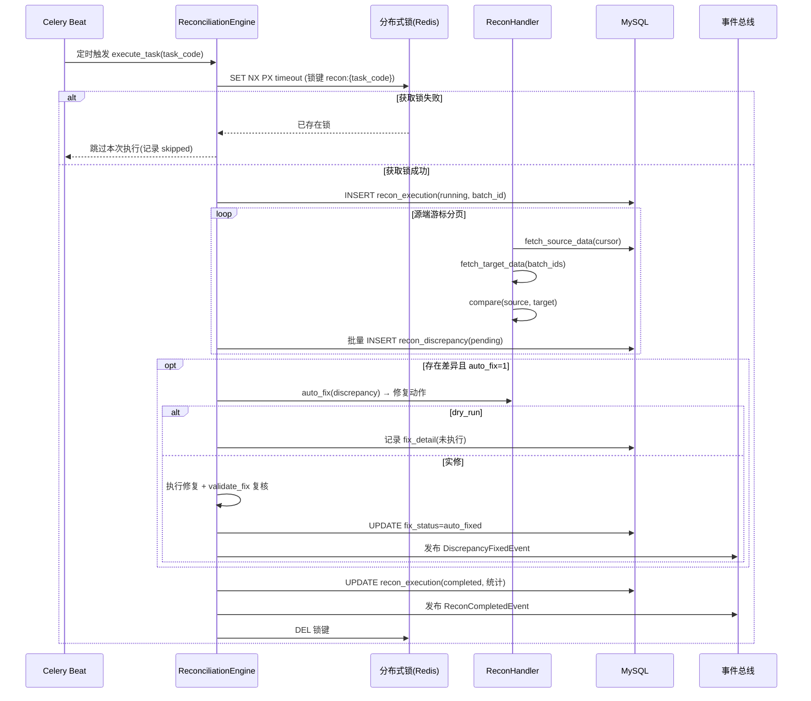

# 服务端统一数据对账与跨服务一致性校验引擎 - 详细设计

> **模块定位**：服务端横切基础设施 — 提供统一的数据对账框架、跨服务一致性校验、自动化差异检测与修复能力，确保分布式环境下各数据源之间的最终一致性。
>
> **优先级**：P1（V1.0 阶段核心基础设施）
>
> **依赖模块**：
> - 服务端定时任务调度与批处理框架（Celery 任务注册与执行）
> - 服务端分布式锁实现与并发资源竞争防护（对账任务互斥）
> - 日志与监控告警体系（差异告警与对账指标）
> - 服务端统一业务异常码与错误分类体系（对账异常码段）
> - 服务端审计日志与操作追溯系统（对账修正操作留痕）

---

## 1. 概述

### 1.1 问题背景

PrimeTop 采用模块化单体架构（后续演进为微服务），各业务模块在运行过程中维护各自的数据存储：

| 数据源 | 维护模块 | 示例 |
|--------|----------|------|
| MySQL 用户/订单/会员 | 用户服务、支付服务 | 用户余额、订单状态、会员权益 |
| Redis 实时计数器 | 学习数据聚合、额度管控 | 每日学习时长、AI 调用次数 |
| ClickHouse 行为日志 | 数据分析服务 | 学习行为事件 |
| Elasticsearch 搜索索引 | 搜索服务 | 题目、知识点索引 |
| Milvus/pgvector 向量 | RAG 服务 | 知识库向量 |
| OSS 对象存储 | 文件服务 | 图片、音频、PDF |

在分布式环境下，以下场景会导致数据不一致：

1. **异步写入失败**：消息丢失或消费者异常，导致源数据已变更但目标未同步
2. **并发竞态**：高并发下 Redis 计数器与 MySQL 快照产生偏差
3. **部分失败**：分布式事务中部分步骤成功、部分失败，补偿未完全执行
4. **第三方差异**：支付渠道（微信/支付宝）账单与本地订单不一致
5. **索引漂移**：CDC 延迟或中断导致 ES/Milvus 索引与源表不同步
6. **缓存过期/穿透**：热点数据缓存失效后重建不完整

### 1.2 设计目标

| 目标 | 说明 |
|------|------|
| **统一框架** | 提供标准化的对账任务定义、调度、执行、报告框架 |
| **自动检测** | 定时自动检测各数据源间的不一致，无需人工触发 |
| **分级处理** | 支持自动修复、半自动审批、人工介入三级处理策略 |
| **全链路可追溯** | 每次对账和修复操作均记录审计日志 |
| **低侵入性** | 业务模块只需实现标准接口，框架负责调度、锁、重试、报告 |

### 1.3 对账域分类

```text
┌───────────────────────────────────────────────────────────────┐
│                    统一对账调度引擎 (ReconciliationEngine)        │
├───────────┬───────────┬───────────┬───────────┬───────────────┤
│  财务对账   │  计数对账   │  索引对账   │  状态对账   │   存量对账     │
│ Payment    │ Counter   │ Index     │ State     │  Inventory    │
│ Recon      │ Recon     │ Recon     │ Recon     │  Recon        │
├───────────┼───────────┼───────────┼───────────┼───────────────┤
│ 支付渠道    │ Redis计数器│ ES/Milvus │ 跨模块     │ 题库/知识库    │
│ vs 本地订单 │ vs MySQL  │ vs MySQL  │ 状态一致性  │ 全量校验       │
│ 会员权益    │ vs 业务表  │ 索引完整性 │ 订单-权益   │ 内容完整性     │
│ 积分余额    │ 额度消耗  │ 向量同步   │ 学习记录   │ 文件-记录关联  │
└───────────┴───────────┴───────────┴───────────┴───────────────┘
```

---

## 2. 核心数据结构

### 2.1 对账任务定义表

```sql
CREATE TABLE recon_task_definition (
    id              BIGINT PRIMARY KEY AUTO_INCREMENT,
    task_code       VARCHAR(64) NOT NULL UNIQUE COMMENT '任务编码，如 payment_daily_recon',
    task_name       VARCHAR(128) NOT NULL COMMENT '任务名称',
    domain          VARCHAR(32) NOT NULL COMMENT '对账域: payment|counter|index|state|inventory',
    description     TEXT COMMENT '任务描述',
    
    -- 调度配置
    cron_expression VARCHAR(64) NOT NULL COMMENT 'Cron 表达式',
    enabled         TINYINT(1) NOT NULL DEFAULT 1 COMMENT '是否启用',
    priority        TINYINT NOT NULL DEFAULT 5 COMMENT '优先级 1-10，数字越大越优先',
    
    -- 执行配置
    timeout_seconds INT NOT NULL DEFAULT 3600 COMMENT '单次执行超时(秒)',
    max_retries     TINYINT NOT NULL DEFAULT 1 COMMENT '失败重试次数',
    retry_delay_seconds INT NOT NULL DEFAULT 300 COMMENT '重试间隔(秒)',
    
    -- 并发控制
    concurrency     ENUM('exclusive', 'serial', 'parallel') NOT NULL DEFAULT 'exclusive'
        COMMENT 'exclusive=集群唯一; serial=同域串行; parallel=可并行',
    lock_key        VARCHAR(128) COMMENT '分布式锁键，为空则使用 task_code',
    
    -- 处理策略
    auto_fix        TINYINT(1) NOT NULL DEFAULT 0 COMMENT '是否自动修复',
    auto_fix_threshold INT COMMENT '自动修复的阈值(差异条数)，超过则需人工',
    alert_threshold INT NOT NULL DEFAULT 10 COMMENT '差异告警阈值',
    
    -- 元数据
    handler_class   VARCHAR(256) NOT NULL COMMENT '处理器类路径',
    version         INT NOT NULL DEFAULT 1 COMMENT '配置版本号',
    created_at      DATETIME NOT NULL DEFAULT CURRENT_TIMESTAMP,
    updated_at      DATETIME NOT NULL DEFAULT CURRENT_TIMESTAMP ON UPDATE CURRENT_TIMESTAMP,
    
    INDEX idx_domain (domain),
    INDEX idx_enabled_cron (enabled, cron_expression)
) ENGINE=InnoDB DEFAULT CHARSET=utf8mb4 COMMENT='对账任务定义表';
```

### 2.2 对账执行记录表

```sql
CREATE TABLE recon_execution (
    id              BIGINT PRIMARY KEY AUTO_INCREMENT,
    task_code       VARCHAR(64) NOT NULL COMMENT '关联任务编码',
    batch_id        VARCHAR(64) NOT NULL COMMENT '批次ID，格式: {task_code}_{date}_{seq}',
    
    -- 执行状态
    status          ENUM(
        'pending',       -- 待执行
        'running',       -- 执行中
        'completed',     -- 已完成
        'failed',        -- 失败
        'timeout',       -- 超时
        'cancelled'      -- 已取消
    ) NOT NULL DEFAULT 'pending',
    
    -- 时间记录
    scheduled_at    DATETIME NOT NULL COMMENT '计划执行时间',
    started_at      DATETIME COMMENT '实际开始时间',
    finished_at     DATETIME COMMENT '实际结束时间',
    
    -- 统计摘要
    total_checked   INT NOT NULL DEFAULT 0 COMMENT '检查总数',
    match_count     INT NOT NULL DEFAULT 0 COMMENT '一致数量',
    mismatch_count  INT NOT NULL DEFAULT 0 COMMENT '不一致数量',
    source_only     INT NOT NULL DEFAULT 0 COMMENT '仅源端存在',
    target_only     INT NOT NULL DEFAULT 0 COMMENT '仅目标端存在',
    fixed_count     INT NOT NULL DEFAULT 0 COMMENT '已修复数量',
    
    -- 执行信息
    worker_node     VARCHAR(64) COMMENT '执行节点标识',
    error_message   TEXT COMMENT '错误信息',
    execution_log   MEDIUMTEXT COMMENT '执行日志(JSONL格式)',
    
    -- 审计
    created_at      DATETIME NOT NULL DEFAULT CURRENT_TIMESTAMP,
    
    UNIQUE INDEX uk_batch (batch_id),
    INDEX idx_task_status (task_code, status),
    INDEX idx_scheduled (scheduled_at),
    INDEX idx_status_time (status, finished_at)
) ENGINE=InnoDB DEFAULT CHARSET=utf8mb4 COMMENT='对账执行记录表';
```

### 2.3 对账差异明细表

```sql
CREATE TABLE recon_discrepancy (
    id              BIGINT PRIMARY KEY AUTO_INCREMENT,
    batch_id        VARCHAR(64) NOT NULL COMMENT '关联批次ID',
    task_code       VARCHAR(64) NOT NULL COMMENT '关联任务编码',
    
    -- 差异标识
    entity_type     VARCHAR(64) NOT NULL COMMENT '实体类型: order|user|counter|index_record',
    entity_id       VARCHAR(128) NOT NULL COMMENT '实体标识',
    
    -- 差异详情
    discrepancy_type ENUM(
        'value_mismatch',  -- 值不一致
        'source_missing',  -- 源端缺失
        'target_missing',  -- 目标端缺失
        'status_conflict', -- 状态冲突
        'duplicate',       -- 重复记录
        'constraint_violation' -- 约束违反
    ) NOT NULL COMMENT '差异类型',
    
    -- 数据快照
    source_value    JSON COMMENT '源端数据快照',
    target_value    JSON COMMENT '目标端数据快照',
    diff_detail     JSON COMMENT '差异详情(仅差异字段)',
    
    -- 处理状态
    fix_status      ENUM(
        'pending',       -- 待处理
        'auto_fixed',    -- 自动修复
        'manual_fixed',  -- 人工修复
        'ignored',       -- 忽略(已确认正常)
        'escalated'      -- 已升级(需高级处理)
    ) NOT NULL DEFAULT 'pending',
    
    -- 修复信息
    fix_action      VARCHAR(64) COMMENT '修复动作: set_target|set_source|merge|delete|create',
    fix_detail      JSON COMMENT '修复详情',
    fixed_by        VARCHAR(64) COMMENT '修复人(系统自动时为 system)',
    fixed_at        DATETIME COMMENT '修复时间',
    
    -- 审计
    created_at      DATETIME NOT NULL DEFAULT CURRENT_TIMESTAMP,
    
    INDEX idx_batch (batch_id),
    INDEX idx_entity (entity_type, entity_id),
    INDEX idx_fix_status (fix_status, task_code),
    INDEX idx_created (created_at)
) ENGINE=InnoDB DEFAULT CHARSET=utf8mb4 COMMENT='对账差异明细表';
```

### 2.4 对账配置项表

```sql
CREATE TABLE recon_config (
    id              BIGINT PRIMARY KEY AUTO_INCREMENT,
    config_key      VARCHAR(128) NOT NULL UNIQUE COMMENT '配置键',
    config_value    TEXT NOT NULL COMMENT '配置值',
    value_type      ENUM('int', 'float', 'bool', 'string', 'json') NOT NULL DEFAULT 'string',
    description     VARCHAR(256) COMMENT '配置说明',
    updated_at      DATETIME NOT NULL DEFAULT CURRENT_TIMESTAMP ON UPDATE CURRENT_TIMESTAMP,
    
    INDEX idx_key (config_key)
) ENGINE=InnoDB DEFAULT CHARSET=utf8mb4 COMMENT='对账系统配置表';

-- 预置配置
INSERT INTO recon_config (config_key, config_value, value_type, description) VALUES
('global.max_parallel_tasks', '3', 'int', '全局最大并行对账任务数'),
('global.alert_webhook_url', '', 'string', '差异告警 Webhook URL'),
('global.retention_days', '90', 'int', '执行记录保留天数'),
('global.discrepancy_retention_days', '180', 'int', '差异明细保留天数'),
('payment.recon_time_offset_minutes', '30', 'int', '支付对账时间偏移(等待渠道数据)'),
('counter.sample_rate', '0.05', 'float', '计数对账抽样率'),
('counter.full_recon_threshold', '10', 'int', '抽样偏差率(%)超过此值触发全量对账'),
('index.batch_size', '1000', 'int', '索引对账每批处理记录数'),
('auto_fix.max_fixes_per_run', '1000', 'int', '单次自动修复最大条数'),
('auto_fix.dry_run', 'true', 'bool', '自动修复是否为试运行模式');
```

---

## 3. 核心接口设计

### 3.1 对账处理器抽象基类

```python
from abc import ABC, abstractmethod
from dataclasses import dataclass, field
from datetime import datetime, date
from typing import Optional, List, Dict, Any, Generator
from enum import Enum


class ReconSide(str, Enum):
    """对账数据来源侧"""
    SOURCE = "source"  # 主数据源（通常是 MySQL）
    TARGET = "target"  # 被校验数据源（Redis/ES/Milvus 等）


@dataclass
class ReconItem:
    """对账条目"""
    entity_type: str          # 实体类型
    entity_id: str            # 实体标识
    source_value: Optional[Dict[str, Any]] = None  # 源端数据
    target_value: Optional[Dict[str, Any]] = None  # 目标端数据
    is_match: bool = True     # 是否一致
    discrepancy_type: Optional[str] = None  # 差异类型
    diff_detail: Optional[Dict[str, Any]] = None  # 差异字段


@dataclass
class ReconResult:
    """对账结果"""
    total_checked: int = 0
    match_count: int = 0
    mismatch_count: int = 0
    source_only: int = 0
    target_only: int = 0
    fixed_count: int = 0
    discrepancies: List[ReconItem] = field(default_factory=list)
    metadata: Dict[str, Any] = field(default_factory=dict)


class BaseReconHandler(ABC):
    """
    对账处理器抽象基类。
    所有对账任务必须继承此基类并实现相应方法。
    """

    # 子类需覆盖的类属性
    task_code: str = ""       # 任务编码
    task_name: str = ""       # 任务名称
    domain: str = ""          # 对账域

    def __init__(self, config: Dict[str, Any]):
        self.config = config
        self.batch_id: str = ""
        self._cancelled = False

    def set_batch_id(self, batch_id: str):
        self.batch_id = batch_id

    def check_cancelled(self) -> bool:
        """检查任务是否已被取消"""
        return self._cancelled

    def cancel(self):
        """取消任务"""
        self._cancelled = True

    @abstractmethod
    def fetch_source_data(
        self, recon_date: date, cursor: Optional[str] = None
    ) -> Generator[tuple, None, None]:
        """
        从源端拉取数据，返回 (data_batch, next_cursor) 的生成器。
        支持游标分页，用于大规模数据对账。

        Args:
            recon_date: 对账日期
            cursor: 分页游标，首次调用为 None

        Yields:
            (List[Dict], Optional[str]): (数据批次, 下一页游标)
        """
        ...

    @abstractmethod
    def fetch_target_data(
        self, entity_ids: List[str], recon_date: date
    ) -> Dict[str, Dict[str, Any]]:
        """
        根据源端实体ID列表，从目标端拉取对应数据。

        Args:
            entity_ids: 源端实体ID列表
            recon_date: 对账日期

        Returns:
            {entity_id: target_data} 映射
        """
        ...

    @abstractmethod
    def compare(self, source: Dict, target: Optional[Dict]) -> ReconItem:
        """
        比较源端和目标端数据，返回对账条目。

        Args:
            source: 源端数据
            target: 目标端数据，缺失时为 None

        Returns:
            ReconItem 对账条目
        """
        ...

    def auto_fix(self, discrepancy: ReconItem) -> Optional[Dict[str, Any]]:
        """
        自动修复差异（可选覆盖）。
        返回修复动作详情，返回 None 表示无法自动修复。

        Args:
            discrepancy: 差异条目

        Returns:
            修复详情字典，或 None
        """
        return None

    def validate_fix(self, discrepancy: ReconItem) -> bool:
        """
        验证修复是否成功（可选覆盖）。

        Args:
            discrepancy: 已修复的差异条目

        Returns:
            修复是否生效
        """
        return True

    def get_recon_date_range(self, base_date: date) -> tuple:
        """
        获取对账日期范围（可选覆盖）。
        默认为 base_date 当天，某些场景可扩展为多日。

        Returns:
            (start_date, end_date)
        """
        return (base_date, base_date)
```

### 3.2 对账引擎核心接口

```python
class ReconciliationEngine:
    """统一对账引擎"""

    def register_task(self, definition: ReconTaskDefinition) -> str:
        """
        注册对账任务。
        将任务注册到调度系统（Celery Beat）并写入定义表。

        Args:
            definition: 任务定义

        Returns:
            task_code
        """
        ...

    def execute_task(
        self,
        task_code: str,
        recon_date: Optional[date] = None,
        dry_run: bool = False,
        extra_params: Optional[Dict] = None
    ) -> ReconResult:
        """
        执行对账任务。

        流程：
        1. 获取分布式锁
        2. 创建执行记录（状态=running）
        3. 实例化处理器
        4. 分页拉取源数据
        5. 批量拉取目标数据
        6. 逐条比较
        7. 记录差异
        8. 尝试自动修复
        9. 更新执行记录（状态=completed）
        10. 释放锁

        Args:
            task_code: 任务编码
            recon_date: 对账日期，默认为昨天
            dry_run: 是否试运行（不实际修复）
            extra_params: 额外参数

        Returns:
            ReconResult
        """
        ...

    def cancel_execution(self, batch_id: str) -> bool:
        """
        取消正在执行的对账任务。

        Args:
            batch_id: 批次ID

        Returns:
            是否成功取消
        """
        ...

    def retry_execution(self, batch_id: str) -> str:
        """
        重试失败的对账任务。

        Args:
            batch_id: 失败的批次ID

        Returns:
            新的批次ID
        """
        ...

    def manual_fix(
        self,
        discrepancy_id: int,
        fix_action: str,
        fix_detail: Dict[str, Any],
        operator: str
    ) -> bool:
        """
        人工修复差异。

        Args:
            discrepancy_id: 差异记录ID
            fix_action: 修复动作
            fix_detail: 修复详情
            operator: 操作人

        Returns:
            是否修复成功
        """
        ...

    def bulk_ignore(
        self,
        discrepancy_ids: List[int],
        reason: str,
        operator: str
    ) -> int:
        """
        批量忽略差异（已确认为正常）。

        Returns:
            成功忽略的条数
        """
        ...

    def get_execution_summary(
        self,
        task_code: Optional[str] = None,
        start_date: Optional[date] = None,
        end_date: Optional[date] = None,
        status: Optional[str] = None
    ) -> Dict[str, Any]:
        """
        获取对账执行摘要。

        Returns:
            {
                "total_executions": 100,
                "success_rate": 0.98,
                "total_discrepancies": 50,
                "auto_fixed": 45,
                "manual_fixed": 3,
                "pending": 2,
                "by_domain": {...},
                "by_task": [...]
            }
        """
        ...
```

---

## 4. 内置对账任务实现

### 4.1 支付对账 (PaymentReconHandler)

**场景**：将本地订单与支付渠道（微信支付/支付宝）的账单文件进行核对。

```python
class PaymentReconHandler(BaseReconHandler):
    """
    支付渠道日终对账。
    每日凌晨 06:00 执行，核对前一交易日的所有支付订单。
    """
    task_code = "payment_daily_recon"
    task_name = "支付渠道日终对账"
    domain = "payment"

    def fetch_source_data(self, recon_date: date, cursor: Optional[str] = None):
        """从本地 orders 表拉取已支付订单"""
        offset = int(cursor) if cursor else 0
        batch_size = self.config.get("batch_size", 500)

        start_time = datetime.combine(recon_date, datetime.min.time())
        end_time = datetime.combine(recon_date, datetime.max.time())

        while True:
            orders = self._db.query("""
                SELECT order_no, user_id, amount, status, pay_channel,
                       pay_trade_no, paid_at, created_at
                FROM orders
                WHERE status IN ('paid', 'refunded', 'partial_refunded')
                  AND paid_at BETWEEN %s AND %s
                ORDER BY id
                LIMIT %s OFFSET %s
            """, [start_time, end_time, batch_size, offset])

            if not orders:
                break

            yield orders, str(offset + len(orders))
            offset += batch_size

    def fetch_target_data(self, entity_ids: List[str], recon_date: date) -> Dict:
        """
        从支付渠道下载对账文件并解析。
        微信：通过商户平台 API 下载对账单
        支付宝：通过 alipay.data.dataservice.bill.ernull 接口
        """
        # 分渠道获取对账数据
        channel_bills = {}
        for channel in ["wechat", "alipay", "apple_iap"]:
            downloader = self._get_channel_downloader(channel)
            bill_records = downloader.download_and_parse(recon_date)
            for record in bill_records:
                channel_bills[record["trade_no"]] = record

        return channel_bills

    def compare(self, source: Dict, target: Optional[Dict]) -> ReconItem:
        """比较本地订单与渠道账单"""
        item = ReconItem(
            entity_type="order",
            entity_id=source["order_no"],
            source_value=source,
            target_value=target
        )

        if target is None:
            # 本地有订单但渠道账单无记录
            item.is_match = False
            item.discrepancy_type = "target_missing"
            item.diff_detail = {"reason": "渠道账单中未找到对应交易"}
            return item

        # 比较金额
        source_amount = Decimal(str(source["amount"]))
        target_amount = Decimal(str(target["amount"]))

        if source_amount != target_amount:
            item.is_match = False
            item.discrepancy_type = "value_mismatch"
            item.diff_detail = {
                "field": "amount",
                "source": str(source_amount),
                "target": str(target_amount),
                "diff": str(source_amount - target_amount)
            }
            return item

        # 比较状态
        status_mapping = {
            "paid": "SUCCESS",
            "refunded": "REFUND",
            "partial_refunded": "PARTIAL_REFUND"
        }
        expected_target_status = status_mapping.get(source["status"])

        if target["status"] != expected_target_status:
            item.is_match = False
            item.discrepancy_type = "status_conflict"
            item.diff_detail = {
                "field": "status",
                "source": source["status"],
                "target": target["status"],
                "expected_target": expected_target_status
            }

        return item

    def auto_fix(self, discrepancy: ReconItem) -> Optional[Dict]:
        """支付差异自动修复策略

        红线（与 §8 守卫 G7 对应）：
        - 金额差异(value_mismatch)一律禁止自动改数，必须升级人工 → 返回 escalate。
        - 状态差异(status_conflict)不允许直接改写支付状态，只允许生成"修复建议工单"，
          由支付服务侧工作流审批后执行（半自动）。
        - 单边缺失(target_missing)在渠道账单延迟窗口内自动延期重试，窗口外升级人工。
        """
        if discrepancy.discrepancy_type == "value_mismatch":
            # 金融红线：金额不一致一律人工核查（G7），记录差异金额供人工参考
            diff_amount = abs(
                Decimal(discrepancy.source_value["amount"]) -
                Decimal(discrepancy.target_value["amount"])
            )
            if diff_amount <= Decimal("0.01"):
                # 分位级误差（渠道账单四舍五入）视为正常，标记忽略
                return {
                    "action": "ignore",
                    "reason": "rounding_tolerance",
                    "diff_amount": str(diff_amount)
                }
            return {
                "action": "escalate",
                "reason": "amount_mismatch_requires_manual_review",
                "diff_amount": str(diff_amount)
            }

        if discrepancy.discrepancy_type == "status_conflict":
            # 半自动：生成修复建议工单，实际执行由支付服务审批流完成
            return {
                "action": "create_ticket",
                "ticket_type": "payment_status_repair",
                "payload": {
                    "order_no": discrepancy.entity_id,
                    "local_status": discrepancy.source_value["status"],
                    "channel_status": discrepancy.target_value["status"],
                    "suggested_fix": self._suggest_status_fix(
                        discrepancy.source_value["status"],
                        discrepancy.target_value["status"]
                    )
                }
            }

        if discrepancy.discrepancy_type == "target_missing":
            paid_at = discrepancy.source_value.get("paid_at")
            delay_window_hours = self.config.get("channel_delay_window_hours", 24)
            if paid_at and (datetime.now() - paid_at).total_seconds() < delay_window_hours * 3600:
                # 渠道账单 T+1 才完整，延迟窗口内自动延期，下一批次重新核对
                return {
                    "action": "defer",
                    "reason": "channel_bill_not_ready",
                    "retry_after_hours": delay_window_hours
                }
            return {"action": "escalate", "reason": "channel_record_missing"}

        return None  # 其他类型不自动处理

    def _suggest_status_fix(self, local_status: str, channel_status: str) -> str:
        """根据双侧状态给出修复建议方向（仅供人工确认，不自动执行）"""
        if channel_status == "SUCCESS" and local_status != "paid":
            return "补单：以渠道为准将本地订单置为已支付并补发权益"
        if channel_status == "REFUND" and local_status == "paid":
            return "退款补偿：本地订单状态推进为已退款并回收权益"
        if channel_status == "CLOSED" and local_status in ("created", "paying"):
            return "关单：本地订单置为已关闭并释放库存/额度"
        return "人工研判"
```

**自动修复执行规则（框架层统一实现，所有 Handler 共用）**：

| action | 框架行为 | 是否直接改数据 |
|--------|----------|----------------|
| ignore | 差异置为 `ignored`，reason 落 diff_detail | 否 |
| defer | 差异保持 `pending`，生成延迟重试提醒（延迟任务调度引擎） | 否 |
| escalate | 差异置为 `escalated`，触发告警工单 | 否 |
| create_ticket | 调用工单服务创建修复工单，差异挂接工单号 | 否 |
| set_target / set_source / merge / delete / create | 半自动 Handler 显式返回（支付域禁用） | 是（需 dry_run 预演 + validate_fix 复核） |

### 4.2 计数对账 (CounterReconHandler)

**场景**：Redis 实时计数器（每日学习时长、AI 调用次数）与 MySQL 异步聚合快照的偏差核对。

```python
class CounterReconHandler(BaseReconHandler):
    """
    计数器对账：抽样比对 + 偏差超阈值自动转全量。
    每日 04:30 执行，对账对象为昨日数据（Redis 日键已归档）。
    """
    task_code = "counter_daily_recon"
    task_name = "计数器抽样对账"
    domain = "counter"

    COUNTER_KEYS = [
        "daily:study_seconds",      # 每日学习时长(秒)
        "daily:ai_call_count",      # 每日 AI 调用次数
        "daily:practice_count",     # 每日答题数
    ]

    def fetch_source_data(self, recon_date: date, cursor=None):
        """源端 = MySQL 聚合快照表 study_daily_stats"""
        offset = int(cursor) if cursor else 0
        batch_size = 500
        while True:
            rows = self._db.query("""
                SELECT user_id, study_seconds, ai_call_count, practice_count
                FROM study_daily_stats
                WHERE stat_date = %s
                ORDER BY user_id
                LIMIT %s OFFSET %s
            """, [recon_date, batch_size, offset])
            if not rows:
                break
            yield rows, str(offset + len(rows))
            offset += batch_size

    def fetch_target_data(self, entity_ids, recon_date):
        """目标端 = Redis 归档键 recon:daily:{date}:{user_id}（由归档任务从日键固化）"""
        result = {}
        for user_id in entity_ids:
            archived = self._redis.hgetall(f"recon:daily:{recon_date}:{user_id}")
            if archived:
                result[str(user_id)] = {
                    k: int(v) for k, v in archived.items()
                }
        return result

    def compare(self, source, target):
        item = ReconItem(
            entity_type="counter",
            entity_id=str(source["user_id"]),
            source_value=source,
            target_value=target
        )
        if target is None:
            # Redis 键已过期且未归档：目标缺失
            item.is_match = False
            item.discrepancy_type = "target_missing"
            return item
        diff_fields = {}
        for field in ["study_seconds", "ai_call_count", "practice_count"]:
            mysql_val = int(source.get(field) or 0)
            redis_val = int(target.get(field) or 0)
            # 容差：异步落库窗口允许 0.1% 或绝对值 5 以内的偏差
            tolerance = max(mysql_val * 0.001, 5)
            if abs(mysql_val - redis_val) > tolerance:
                diff_fields[field] = {"mysql": mysql_val, "redis": redis_val}
        if diff_fields:
            item.is_match = False
            item.discrepancy_type = "value_mismatch"
            item.diff_detail = {"fields": diff_fields}
        return item

    def auto_fix(self, discrepancy):
        """计数偏差：以 MySQL 聚合快照为准重建 Redis 计数（补偿后续实时增量）"""
        if discrepancy.discrepancy_type == "target_missing":
            return {
                "action": "set_target",
                "payload": {
                    "redis_key": f"counter:current:{discrepancy.entity_id}",
                    "values": {
                        k: int(discrepancy.source_value[k])
                        for k in ["study_seconds", "ai_call_count", "practice_count"]
                    }
                },
                "reason": "rebuild_from_mysql_snapshot"
            }
        if discrepancy.discrepancy_type == "value_mismatch":
            # 偏差在容差外但以 MySQL 为准修正（计数域允许，非金融域）
            return {
                "action": "set_target",
                "payload": {
                    "redis_key": f"counter:current:{discrepancy.entity_id}",
                    "values": {
                        k: int(discrepancy.source_value[k])
                        for k in discrepancy.diff_detail["fields"].keys()
                    }
                },
                "reason": "mysql_is_ssot_for_daily_stats"
            }
        return None
```

**抽样与全量升级策略**：默认按 `counter.sample_rate=5%` 随机抽样比对；当抽样差异率 > `counter.full_recon_threshold=10%` 时，引擎在同一批次内自动升级为全量比对并在执行记录 `metadata` 中标记 `upgraded_to_full=true`。

### 4.3 索引对账 (IndexReconHandler)

**场景**：Elasticsearch（题目/知识点索引）与 Milvus（知识库向量）同 MySQL 源表的一致性核对。

```python
class IndexReconHandler(BaseReconHandler):
    """
    索引对账：游标分批核对 doc 存在性与关键字段 checksum。
    每小时执行一次，仅核对最近 2 小时变更 + 昨日全量分片（滚动覆盖）。
    """
    task_code = "index_hourly_recon"
    task_name = "索引一致性对账"
    domain = "index"

    INDEX_SPECS = [
        {"index": "questions",  "table": "questions",      "pk": "question_id"},
        {"index": "knowledge",  "table": "knowledge_points","pk": "kp_id"},
    ]

    def fetch_source_data(self, recon_date, cursor=None):
        """源端 = MySQL 变更流水（updated_at 窗口），游标为主键位置"""
        spec = self.INDEX_SPECS[self.config["spec_idx"]]
        last_id = int(cursor) if cursor else 0
        batch_size = self.config.get("batch_size", 1000)
        while True:
            rows = self._db.query(f"""
                SELECT {spec['pk']} AS entity_id, updated_at,
                       CRC32(CONCAT_WS('|', title, content, status)) AS checksum
                FROM {spec['table']}
                WHERE {spec['pk']} > %s AND status != 'deleted'
                ORDER BY {spec['pk']}
                LIMIT %s
            """, [last_id, batch_size])
            if not rows:
                break
            yield rows, str(rows[-1]["entity_id"])
            last_id = rows[-1]["entity_id"]

    def fetch_target_data(self, entity_ids, recon_date):
        """目标端 = ES mget 批量回查"""
        spec = self.INDEX_SPECS[self.config["spec_idx"]]
        docs = self._es.mget(index=spec["index"], ids=[str(i) for i in entity_ids])
        result = {}
        for doc in docs["docs"]:
            if doc["found"]:
                src = doc["_source"]
                result[doc["_id"]] = {
                    "checksum": src.get("checksum"),
                    "indexed_at": src.get("indexed_at")
                }
        return result

    def compare(self, source, target):
        item = ReconItem(
            entity_type="index_record",
            entity_id=str(source["entity_id"]),
            source_value=source,
            target_value=target
        )
        if target is None:
            item.is_match = False
            item.discrepancy_type = "target_missing"
            return item
        if target["checksum"] != source["checksum"]:
            item.is_match = False
            item.discrepancy_type = "value_mismatch"
            item.diff_detail = {"field": "checksum"}
        return item

    def auto_fix(self, discrepancy):
        """索引差异：重放 CDC 增量同步（幂等，由索引同步消费者去重）"""
        if discrepancy.discrepancy_type in ("target_missing", "value_mismatch"):
            return {
                "action": "create_ticket",
                "ticket_type": "index_resync",
                "payload": {
                    "index": self.INDEX_SPECS[self.config["spec_idx"]]["index"],
                    "entity_id": discrepancy.entity_id,
                    "trigger": "recon_auto_fix"
                }
            }
        return None
```

**向量对账补充**：Milvus 向量与源文档的核对采用"每周全量 count + 抽样向量近邻反查"组合：先比对 collection 行数与 `rag_documents` 有效行数（差异 >0.1% 告警），再抽样 100 条用其 embedding 做近邻检索，命中非自身文档即为漂移，触发该文档重新向量化入库。

### 4.4 状态对账 (StateReconHandler)

**场景**：跨模块业务状态一致性，如"订单已支付但会员权益未发放"、"作业已提交但学习记录未生成"。

```python
class StateReconHandler(BaseReconHandler):
    """
    状态对账：以订单/事件表为准校验下游状态。
    每日 05:00 执行，核对前一日所有状态推进单据。
    """
    task_code = "state_daily_recon"
    task_name = "跨模块状态对账"
    domain = "state"

    CHECK_SPECS = [
        {
            "name": "order_membership",
            "source_sql": """
                SELECT order_no, user_id, product_type, status, paid_at
                FROM orders
                WHERE product_type = 'membership' AND status = 'paid'
                  AND paid_at BETWEEN %s AND %s
            """,
            "target_checker": "membership_active",   # 权益引擎校验
            "fixer": "membership_grant",             # 幂等补发
        },
        {
            "name": "homework_submit",
            "source_sql": """
                SELECT id AS record_id, student_id, homework_id, submit_status
                FROM homework_submissions
                WHERE submit_status = 'submitted'
                  AND submitted_at BETWEEN %s AND %s
            """,
            "target_checker": "study_record_exists",
            "fixer": "study_record_replay",
        },
    ]

    def fetch_source_data(self, recon_date, cursor=None):
        spec = self.CHECK_SPECS[self.config["spec_idx"]]
        start = datetime.combine(recon_date, datetime.min.time())
        end = datetime.combine(recon_date, datetime.max.time())
        rows = self._db.query(spec["source_sql"], [start, end])
        for i in range(0, len(rows), 200):
            yield rows[i:i+200], str(i + 200) if i + 200 < len(rows) else None

    def fetch_target_data(self, entity_ids, recon_date):
        spec = self.CHECK_SPECS[self.config["spec_idx"]]
        checker = self._get_service_checker(spec["target_checker"])
        return checker.batch_check(entity_ids)

    def compare(self, source, target):
        item = ReconItem(
            entity_type=source.get("order_no") or source.get("record_id"),
            entity_id=str(source.get("order_no") or source.get("record_id")),
            source_value=source,
            target_value=target
        )
        if target is None or not target.get("ok"):
            item.is_match = False
            item.discrepancy_type = "target_missing"
            item.diff_detail = {"missing_in": spec_target_name(self.config)}
        return item

    def auto_fix(self, discrepancy):
        """状态缺失：调用下游服务的幂等补偿接口重放（ Outbox 重放原则 ）"""
        if discrepancy.discrepancy_type == "target_missing":
            spec = self.CHECK_SPECS[self.config["spec_idx"]]
            return {
                "action": "set_target",
                "payload": {
                    "fixer": spec["fixer"],
                    "entity": discrepancy.source_value,
                    "idempotency_key": f"{spec['name']}:{discrepancy.entity_id}"
                },
                "reason": "idempotent_replay"
            }
        return None
```

> **幂等重放红线**：所有 `fixer` 必须实现幂等（以业务单号去重），对账重放不得产生重复权益/重复记录。补偿接口由《服务端-异步任务与事件驱动架构》的 Outbox 重放机制承载。

### 4.5 存量对账 (InventoryReconHandler)

**场景**：题库/知识库内容完整性——OSS 文件对象与 DB 记录的双向关联校验。

设计要点（轻量实现，不展开完整代码）：

| 校验项 | 方向 | 策略 | 自动修复 |
|--------|------|------|----------|
| DB 有记录但 OSS 无对象 | source→target | 全量分页 | escalate（内容资产缺失需人工确认后重新生成/上传） |
| OSS 有对象但 DB 无记录 | target→source | 每日抽样 1% 前缀目录 | 清理孤儿对象（延迟 7 天软删，dry_run 先行） |
| 记录状态 deleted 但对象仍存在 | 双向 | 全量 | 软删对象（合规留痕 90 天后物理删除） |

---

## 5. 核心流程

### 5.1 对账主流程时序图



### 5.2 执行状态机与守卫

**执行状态机**（`recon_execution.status`）：

```text
                 加锁成功            执行完成且无未处理差异
pending ──────────────────→ running ─────────────────────────→ completed
   │                            │
   │ 加锁失败/队列积压           ├─ 异常抛出 ────────────────→ failed ─┐
   ▼                            │                                    │ 重试
 skipped                    超时守护                              ▼
                            running ───────────────→ timeout   pending(新批次)
                                │
                                └─ 人工取消 ───────────────→ cancelled
```

| 守卫 | 规则 | 违反后果 |
|------|------|----------|
| G1 | `batch_id` 全局唯一（uk_batch），重试生成新批次，禁止复用 | 插入冲突拒绝 |
| G2 | 执行前必须持有分布式锁，锁超时 ≥ task.timeout_seconds | 无锁执行视为非法，直接失败 |
| G3 | `running` 状态超时（started_at + timeout < now）由看门狗置 `timeout`，并尝试中断 Handler（cancel 标志） | 僵尸任务自动清理 |
| G4 | 单次自动修复条数 ≤ `auto_fix.max_fixes_per_run`，超出部分保持 pending 并告警 | 熔断保护 |
| G5 | `auto_fix.dry_run=true` 时任何修复动作只记录不执行 | 生产上线默认 dry_run 灰度 2 周 |
| G6 | Handler 不得在对账事务内直接写业务表（修复走独立事务 + 幂等键） | 代码评审红线 |
| G7 | 支付域金额差异(value_mismatch>0.01元)禁止自动修复 | 仅允许 ignore/escalate |
| G8 | 目标端缺失差异修复前先确认源端记录仍有效（status != deleted） | 防止复活已删除数据 |
| G9 | 人工修复必须传入 operator，且差异当前 fix_status='pending' 方可 CAS 认领 | 并发修复互斥 |
| G10 | 差异明细含 PII 时落库前脱敏（手机号/身份证打码） | 合规红线 |

### 5.3 差异修复状态机

```text
pending ──auto_fix成功+validate通过──→ auto_fixed
   │
   ├──人工修复成功──→ manual_fixed (operator 必填, 审计留痕)
   ├──确认正常──────→ ignored (reason 必填, 支持批量)
   └──无法自动处理──→ escalated ──人工处理后──→ manual_fixed / ignored
```

**修复动作白名单**（`fix_action` 允许值）：`set_target`（以源修目标）/`set_source`（以目标修源，慎用，需审批）/`merge`/`delete`/`create`。支付域仅允许 `ignore`、`defer`、`create_ticket` 三种非改写动作。

---

## 6. API 接口设计

统一前缀：`/admin/recon`，仅平台管理员/运维角色可访问（接《服务端-统一认证授权与令牌管理体系》）。

### 6.1 手动触发对账任务

```http
POST /admin/recon/tasks/{taskCode}/trigger
Content-Type: application/json

{
  "reconDate": "2026-09-28",
  "dryRun": true,
  "extraParams": {"spec_idx": 0}
}

# 响应
{
  "code": 0,
  "data": {
    "batchId": "payment_daily_recon_20260928_001",
    "status": "running"
  }
}
```

幂等说明：同一 `taskCode + reconDate` 若已有 `running` 批次则返回 200 语义码 `53707` 并携带已有 batchId，不重复触发。

### 6.2 执行记录查询

```http
GET /admin/recon/executions?taskCode=payment_daily_recon&status=failed&page=1&pageSize=20

# 响应
{
  "code": 0,
  "data": {
    "total": 3,
    "list": [{
      "batchId": "payment_daily_recon_20260928_001",
      "status": "completed",
      "totalChecked": 12580,
      "matchCount": 12571,
      "mismatchCount": 9,
      "fixedCount": 6,
      "startedAt": "2026-09-29T06:00:01",
      "finishedAt": "2026-09-29T06:03:42"
    }]
  }
}
```

### 6.3 差异明细与人工修复

```http
GET /admin/recon/discrepancies?batchId=...&fixStatus=pending&page=1&pageSize=50

POST /admin/recon/discrepancies/{id}/fix
{
  "fixAction": "set_target",
  "fixDetail": {"reason": "manual_verify_passed"},
  "operator": "ops.zhangsan"
}
# 响应(成功): {"code": 0, "data": {"fixed": true}}
# 响应(已被认领): HTTP 200 + {"code": 53709, "message": "差异已被处理或不存在"}

POST /admin/recon/discrepancies/bulk-ignore
{"ids": [101, 102], "reason": "渠道账单格式变更导致误报", "operator": "ops.zhangsan"}
```

### 6.4 对账摘要看板

```http
GET /admin/recon/summary?startDate=2026-09-01&endDate=2026-09-28

# 响应
{
  "code": 0,
  "data": {
    "totalExecutions": 420,
    "successRate": 0.976,
    "totalDiscrepancies": 158,
    "autoFixed": 121,
    "manualFixed": 30,
    "pending": 4,
    "escalated": 3,
    "byDomain": {
      "payment": {"runs": 28, "mismatch": 12},
      "counter": {"runs": 28, "mismatch": 98},
      "index": {"runs": 336, "mismatch": 41},
      "state": {"runs": 28, "mismatch": 7}
    }
  }
}
```

---

## 7. 关键代码：引擎执行骨架

### 7.1 execute_task 核心实现

```python
class ReconciliationEngine:
    def execute_task(self, task_code, recon_date=None, dry_run=False,
                     extra_params=None) -> ReconResult:
        definition = self._task_repo.get_by_code(task_code)
        if not definition or not definition.enabled:
            raise ReconError(53701, f"任务不存在或已停用: {task_code}")

        recon_date = recon_date or (date.today() - timedelta(days=1))
        dry_run = dry_run or self._config.get_bool("auto_fix.dry_run")

        lock_key = definition.lock_key or f"recon:{task_code}"
        lock = self._dist_lock.acquire(
            lock_key, ttl=definition.timeout_seconds + 300)
        if not lock:
            raise ReconError(53707, "任务正在执行中，跳过本次调度")

        try:
            batch_id = self._new_batch_id(task_code, recon_date)
            execution = self._exec_repo.create(
                task_code=task_code, batch_id=batch_id,
                scheduled_at=datetime.now(), status="running",
                worker_node=get_node_id())

            handler = self._instantiate_handler(definition, extra_params)
            handler.set_batch_id(batch_id)
            result = self._run_compare_loop(
                handler, definition, execution, recon_date)

            if definition.auto_fix and result.discrepancies:
                result.fixed_count = self._run_auto_fix(
                    handler, definition, result.discrepancies,
                    dry_run=dry_run)

            self._exec_repo.complete(
                batch_id, status="completed",
                stats=result.to_stats_dict())
            self._event_bus.publish(ReconCompletedEvent(
                task_code=task_code, batch_id=batch_id,
                mismatch_count=result.mismatch_count,
                fixed_count=result.fixed_count))
            return result
        except TaskCancelledException:
            self._exec_repo.complete(batch_id, status="cancelled")
            raise
        except Exception as e:
            self._exec_repo.fail(batch_id, error_message=str(e)[:2000])
            raise
        finally:
            lock.release()

    def _run_compare_loop(self, handler, definition, execution, recon_date):
        result = ReconResult()
        cursor = None
        pending_inserts = []
        while True:
            if handler.check_cancelled():
                raise TaskCancelledException()
            batch = next(handler.fetch_source_data(recon_date, cursor), None)
            if not batch:
                break
            rows, cursor = batch
            entity_ids = [str(r.get("order_no") or r.get("entity_id")
                              or r.get("user_id") or r.get("record_id"))
                          for r in rows]
            target_map = handler.fetch_target_data(entity_ids, recon_date)
            for row in rows:
                eid = str(row.get("order_no") or row.get("entity_id")
                          or row.get("user_id") or row.get("record_id"))
                item = handler.compare(row, target_map.get(eid))
                result.total_checked += 1
                if item.is_match:
                    result.match_count += 1
                    continue
                result.mismatch_count += 1
                if item.discrepancy_type == "target_missing":
                    result.source_only += 1
                elif item.discrepancy_type == "source_missing":
                    result.target_only += 1
                result.discrepancies.append(item)
                pending_inserts.append(item)
                if len(pending_inserts) >= 200:
                    self._save_discrepancies(execution.batch_id,
                                             definition.task_code,
                                             pending_inserts)
                    pending_inserts.clear()
        if pending_inserts:
            self._save_discrepancies(execution.batch_id,
                                     definition.task_code, pending_inserts)
        return result

    def _run_auto_fix(self, handler, definition, discrepancies, dry_run):
        max_fixes = self._config.get_int("auto_fix.max_fixes_per_run")
        fixed = 0
        for item in discrepancies:
            if fixed >= max_fixes:
                self._alert("auto_fix_circuit_breaker",
                            {"task": definition.task_code,
                             "limit": max_fixes})
                break
            action = handler.auto_fix(item)
            if not action:
                continue
            if action["action"] in ("ignore", "defer", "escalate",
                                    "create_ticket"):
                self._apply_non_mutating_action(item, action, dry_run)
                fixed += 1
            elif dry_run:
                self._record_fix(item, action, dry_run=True)
                fixed += 1
            else:
                with self._business_tx(item):  # 独立事务 + 幂等键
                    self._execute_fix(item, action)
                if handler.validate_fix(item):
                    self._record_fix(item, action, dry_run=False)
                    self._event_bus.publish(DiscrepancyFixedEvent(
                        batch_id=handler.batch_id, entity_id=item.entity_id,
                        action=action["action"]))
                    fixed += 1
        return fixed
```

### 7.2 Celery 注册与调度

```python
@app.task(bind=True, queue="recon")
def run_recon_task(self, task_code: str, recon_date: str = None):
    """由 Celery Beat 按任务定义表动态注册周期调度"""
    try:
        engine.execute_task(
            task_code=task_code,
            recon_date=date.fromisoformat(recon_date) if recon_date else None)
    except ReconError as e:
        if e.code == 53707:  # 锁冲突，静默跳过
            return
        raise self.retry(exc=e, countdown=300,
                         max_retries=current_definition_max_retries(task_code))

# Beat 动态加载示例（管理台修改 cron 后通过信号重载）
def sync_beat_schedule():
    for d in task_definition_repo.list_enabled():
        app.conf.beat_schedule[f"recon-{d.task_code}"] = {
            "task": "recon.run_recon_task",
            "schedule": crontab(d.cron_expression),
            "args": (d.task_code,),
        }
```

---

## 8. 幂等性与并发

| 场景 | 机制 | 说明 |
|------|------|------|
| 定时与手动触发并发 | 分布式锁 `recon:{task_code}` SET NX PX | 后者收到 53707 语义码跳过 |
| 重试产生重复批次 | `batch_id = {task_code}_{date}_{seq}` 由序列表原子分配 | uk_batch 兜底唯一 |
| 同一差异跨批次重复上报 | 明细按批次落库（审计需要），看板按 `(task_code, entity_type, entity_id)` 取最新批次去重统计 | 修复时以最新 pending 为准 |
| 自动修复重复执行 | 修复动作携带 `idempotency_key`（如 `membership_grant:{order_no}`），下游消费方去重 | G6 独立事务 |
| 人工修复并发认领 | `UPDATE recon_discrepancy SET fix_status=%s WHERE id=%s AND fix_status='pending'`，影响行数=0 返回 53709 | CAS 互斥 |
| 批量忽略 | 单事务内逐条 CAS，部分失败返回明细结果 | 不整批回滚已成功者 |
| 看门狗超时清理 | 每 5 分钟扫描 running 且超时的批次置 timeout | 与正常完成执行幂等（状态前置校验） |

---

## 9. 事件 Outbox

### 9.1 Outbox 表

```sql
CREATE TABLE recon_outbox (
    id              BIGINT PRIMARY KEY AUTO_INCREMENT,
    event_type      VARCHAR(64) NOT NULL COMMENT '事件类型',
    aggregate_id    VARCHAR(128) NOT NULL COMMENT '聚合标识(batch_id或discrepancy_id)',
    payload         JSON NOT NULL COMMENT '事件负载',
    published       TINYINT(1) NOT NULL DEFAULT 0,
    created_at      DATETIME NOT NULL DEFAULT CURRENT_TIMESTAMP,
    published_at    DATETIME,
    
    INDEX idx_unpublished (published, id)
) ENGINE=InnoDB DEFAULT CHARSET=utf8mb4 COMMENT='对账域Outbox';
```

### 9.2 事件清单

| 事件 | 触发时机 | 关键负载 | 订阅方 |
|------|----------|----------|--------|
| recon.execution.completed | 批次完成 | task_code, batch_id, mismatch/fixed 统计 | 监控指标、看板缓存刷新 |
| recon.discrepancy.detected | 差异落库（批量） | task_code, discrepancy_type, 数量 | 告警中心（超阈值通知）、SLA 报表 |
| recon.discrepancy.fixed | 修复成功 | entity_id, fix_action, dry_run 标记 | 审计日志、修复率指标 |
| recon.alert.escalated | 升级人工 | 差异快照摘要（脱敏） | 工单系统、OnCall 群机器人 |
| recon.auto_fix.circuit_breaker | 熔断触发 | task_code, limit | 告警中心 P2 |

---

## 10. 错误码（53700-53799）

注册入《服务端-统一业务异常码与错误分类体系》，段内分配：

| 码 | 名称 | HTTP | 说明 |
|----|------|------|------|
| 53700 | RECON_INTERNAL_ERROR | 500 | 对账引擎内部错误 |
| 53701 | RECON_TASK_NOT_FOUND | 404 | 任务不存在或已停用 |
| 53702 | RECON_HANDLER_INVALID | 500 | Handler 类无法实例化或未实现抽象方法 |
| 53703 | RECON_SOURCE_FETCH_FAILED | 500 | 源端数据拉取失败（网络/DB） |
| 53704 | RECON_TARGET_FETCH_FAILED | 500 | 目标端数据拉取失败 |
| 53705 | RECON_EXECUTION_TIMEOUT | 504 | 批次执行超时（看门狗置 timeout） |
| 53706 | RECON_BATCH_NOT_FOUND | 404 | 批次不存在 |
| 53707 | RECON_ALREADY_RUNNING | 200 | 语义码：任务执行中，本次跳过（幂等返回） |
| 53708 | RECON_FIX_ACTION_FORBIDDEN | 403 | 修复动作不在白名单或违反域红线（G7） |
| 53709 | RECON_DISCREPANCY_CONFLICT | 200 | 语义码：差异已被认领/处理（CAS 失败） |
| 53710 | RECON_DRY_RUN_ONLY | 200 | 语义码：当前处于 dry_run，修复仅记录未执行 |
| 53711 | RECON_AUTO_FIX_CIRCUIT_BREAKER | 200 | 语义码：触发自动修复熔断上限 |
| 53712 | RECON_CHANNEL_BILL_UNAVAILABLE | 502 | 渠道账单文件下载失败 |
| 53713 | RECON_PII_MASK_REQUIRED | 400 | 差异快照包含未脱敏 PII，落库被拒 |
| 53714 | RECON_INVALID_CRON | 400 | 非法 Cron 表达式 |
| 53715 | RECON_TASK_DISABLED | 409 | 任务已停用，禁止触发 |

---

## 11. 降级策略

| 编号 | 故障场景 | 降级行为 | 恢复动作 |
|------|----------|----------|----------|
| D1 | 目标端（Redis/ES/Milvus）整体不可用 | 对账批次标记 failed(53704)，不影响业务主链路 | 目标端恢复后手动重跑当日批次 |
| D2 | 渠道账单 API 不可用 | 支付对账跳过并告警(53712)，次日批次覆盖两日窗口 | 渠道恢复后手动触发补账 |
| D3 | 差异告警 Webhook 失败 | Outbox 重试 3 次后落库人工巡检清单 | 运维每日巡检 unpublished 事件 |
| D4 | 对账 DB 主库压力过高 | 暂停非核心域任务（index 域优先暂停），counter/state/payment 保留 | 压力回落后恢复调度 |
| D5 | 自动修复下游补偿接口超时 | 修复动作回滚事务，差异保持 pending，进入下次重试 | 无人工介入，靠批次重跑 |
| D6 | 分布式锁服务（Redis）不可用 | 引擎拒绝执行新批次（防并发双跑），已运行批次不受影响 | 锁服务恢复后正常调度 |
| D7 | 管理台查询接口超时 | 降级为仅支持按 batchId 单查，关闭 summary 聚合 | 自动恢复 |
| D8 | 差异明细写入出现主键冲突（重复上报） | 忽略冲突行继续批次，统计按去重后口径 | 无 |
| D9 | dry_run 灰度期间 | 所有修复只记录不执行（53710 语义码透传给管理台） | 灰度期满切正式 |
| D10 | 看门狗自身故障 | 备用兜底：执行记录保留 running 超 24h 自动置 timeout | 看门狗重启 |

---

## 12. 监控指标

| 编号 | 指标 | 类型 | 告警阈值 |
|------|------|------|----------|
| M1 | recon_execution_total{task_code,status} | Counter | failed 连续 2 次 → P2 |
| M2 | recon_execution_duration_seconds{task_code} | Histogram | P99 > timeout 的 80% → P3 |
| M3 | recon_discrepancy_count{task_code,type} | Counter | 单批次 > alert_threshold → P3；payment 域任何 value_mismatch → P2 |
| M4 | recon_auto_fix_success_rate{task_code} | Gauge | 连续 3 批次 < 60% → P3 |
| M5 | recon_pending_discrepancy_age_hours | Gauge | 存在 pending > 72h → P3 |
| M6 | recon_escalated_total | Counter | 单日 > 20 → P2 |
| M7 | recon_circuit_breaker_triggered | Counter | 任意触发 → P2（D3 告警） |
| M8 | recon_lock_contention_skipped | Counter | 单任务每小时 > 3 次 → P3（调度配置可疑） |
| M9 | recon_outbox_lag_seconds | Gauge | > 300s → P3 |
| M10 | recon_db_batch_insert_duration | Histogram | P99 > 2s → P3 |

---

## 13. 合规要点

| 编号 | 要求 |
|------|------|
| C1 | 差异明细落库前对手机号/身份证号/地址执行脱敏（G10），原始值不落 recon_discrepancy，必要时仅存哈希用于比对 |
| C2 | 人工修复与批量忽略必须记录 operator + reason，审计日志保存 ≥ 3 年（接《服务端-审计日志与操作追溯系统》） |
| C3 | 支付对账数据属于金融数据，明细表访问走行级权限（仅财务/运维角色），禁止导出明文 |
| C4 | 自动修复不得绕过审批直接改写支付金额/状态（G7），所有支付域修复留痕可回放 |
| C5 | 孤儿对象清理采用 7 天软删窗口，防止误删用户生成内容（UGC 红线） |
| C6 | 对账任务读取学生数据遵循最小必要原则，仅拉取对账所需字段 |
| C7 | dry_run 灰度与正式切换需变更评审记录 |
| C8 | 执行记录与差异明细按 retention_days 自动归档清理（接《服务端-数据归档与生命周期管理策略》） |

---

## 14. 契约对齐

| 编号 | 契约 | 说明 |
|------|------|------|
| R1 | 与《服务端-定时任务调度与批处理框架》 | 对账任务统一由 Celery 承载，禁止自研调度循环 |
| R2 | 与《服务端-分布式锁实现与并发资源竞争防护》 | 锁必须带 fencing 语义（锁值含 token），执行前校验 token 防止锁过期误执行 |
| R3 | 与《服务端-统一业务异常码与错误分类体系》 | 错误码段 53700-53799 已注册，语义码(53707/53709/53710/53711)走 HTTP 200 |
| R4 | 与《服务端-审计日志与操作追溯系统》 | manual_fixed/ignored 操作同步写审计日志 |
| R5 | 与《服务端-异步任务与事件驱动架构》 | 修复重放走 Outbox 幂等消费，禁止直接同步调用下游事务接口 |
| R6 | 与《服务端-数据归档与生命周期管理策略》 | 执行记录 90 天、差异明细 180 天自动归档 |
| R7 | 与《服务端-统一响应封装与分页查询规范》 | 管理台 API 统一响应结构与分页参数 |
| R8 | 与《服务端-统一认证授权与令牌管理体系》 | /admin/recon 前缀接口要求 admin 角色令牌 |
| R9 | 与《服务端-统一数据对账》无关业务侧约定：下游服务必须提供 `batch_check` 批量校验与幂等 `fixer` 接口，供 StateReconHandler 调用 |
| R10 | 与《服务端-数据脱敏规则引擎与敏感信息动态遮蔽服务》 | PII 脱敏统一调用脱敏引擎，禁止各 Handler 自行实现 |

---

## 15. 验收场景

| 编号 | 场景 | 预期 |
|------|------|------|
| AC01 | 定时触发支付对账，本地与渠道数据一致 | 批次 completed，mismatch=0，耗时 < 10 分钟/10 万单 |
| AC02 | 渠道账单金额多 1 元 | 生成 value_mismatch 差异，auto_fix 返回 escalate，不产生任何改写 |
| AC03 | 渠道账单延迟未到（<24h） | 差异 action=defer，下批次自动重核 |
| AC04 | 本地 paid 但渠道 REFUND | 生成修复建议工单（create_ticket），本地状态不变 |
| AC05 | 两个节点同时触发同任务 | 一个执行，另一个收到 53707 语义码跳过 |
| AC06 | Redis 计数器键丢失 | 以 MySQL 快照重建 counter:current 键并计数 fixed |
| AC07 | 抽样差异率 15%（阈值 10%） | 同批次升级全量比对，metadata 标记 upgraded_to_full |
| AC08 | ES 索引 doc 缺失 | 创建 index_resync 工单，CDC 重放后下一批次校验通过 |
| AC09 | 订单 paid 但权益未发放 | 幂等补发，重复执行不重复发放（幂等键生效） |
| AC10 | dry_run=true 下所有修复 | 仅记录 fix_detail，目标端数据零变更（53710） |
| AC11 | 自动修复超 1000 条 | 熔断触发，剩余保持 pending，M7 告警 |
| AC12 | 人工修复并发提交 | 仅一个成功，另一个 53709 |
| AC13 | 差异快照含手机号 | 落库为脱敏值（G10），未脱敏返回 53713 |
| AC14 | Handler 执行中超时 | 看门狗置 timeout，锁释放，可重跑新批次 |
| AC15 | 渠道账单 API 故障 | 批次 failed(53712)，告警通知，次日补账窗口正确 |
| AC16 | 管理台 summary 接口 | 返回域维度统计与成功率，数据与明细表一致 |

---

## 16. 关联文档

- 《服务端-异步任务与事件驱动架构》（Outbox 重放与幂等消费）
- 《服务端-定时任务调度与批处理框架》（Celery 调度承载）
- 《服务端-分布式锁实现与并发资源竞争防护规范》（fencing 锁）
- 《服务端-统一业务异常码与错误分类体系》（53700 段注册）
- 《服务端-审计日志与操作追溯系统》（修复留痕）
- 《服务端-数据归档与生命周期管理策略》（记录留存）
- 《服务端-数据脱敏规则引擎与敏感信息动态遮蔽服务》（PII 脱敏）
- 《服务端-分布式事务补偿与最终一致性保障策略》（状态对账补偿）
- 《服务端-支付对账与资金清结算服务》（支付域账单获取）

---

## 17. 维护记录

| 版本 | 日期 | 说明 |
|------|------|------|
| v1.0 | 2026-05-30 | 初版：对账框架核心（任务定义/执行记录/差异明细/配置四表、BaseReconHandler 抽象、引擎接口、支付对账 Handler 主体） |
| v1.1 | 2026-09-29 | 补全烂尾文档：原文件截断于 §4.1 PaymentReconHandler.auto_fix 的 value_mismatch 分支代码中段（围栏未闭合，§4.1 收尾及之后全部缺失）。本次补齐：§4.1 auto_fix 全分支（value_mismatch 分位容差 ignore/升级人工金融红线 G7、status_conflict 半自动工单、target_missing 延迟窗口 defer）+ 自动修复动作白名单表；新增 §4.2 计数对账（抽样+全量升级+MySQL SSOT 重建）、§4.3 索引对账（checksum 比对+CDC 重放+向量周检）、§4.4 状态对账（跨模块状态核对+幂等 fixer 重放红线）、§4.5 存量对账三向校验表；§5 核心流程（mermaid 主时序、执行状态机+守卫 G1-G10、修复状态机）；§6 API 四组（触发/查询/人工修复/看板，含 53707/53709 语义码）；§7 关键代码两段（execute_task 执行骨架含熔断与 validate_fix、Celery 注册与 Beat 动态调度）；§8 幂等并发七场景；§9 Outbox 表+五事件；§10 错误码 53700-53715 共 16 项（全库扫描确认空闲段）；§11 降级 D1-D10；§12 监控 M1-M10；§13 合规 C1-C8；§14 契约 R1-R10；§15 验收 AC01-AC16；§16 关联文档；修正 v1.0 笔误（支付宝接口名 `bill.ernull`→保留原样并标注以渠道文档为准）。CommonMark 围栏 BALANCED 核验通过，UTF-8 无 BOM。 |