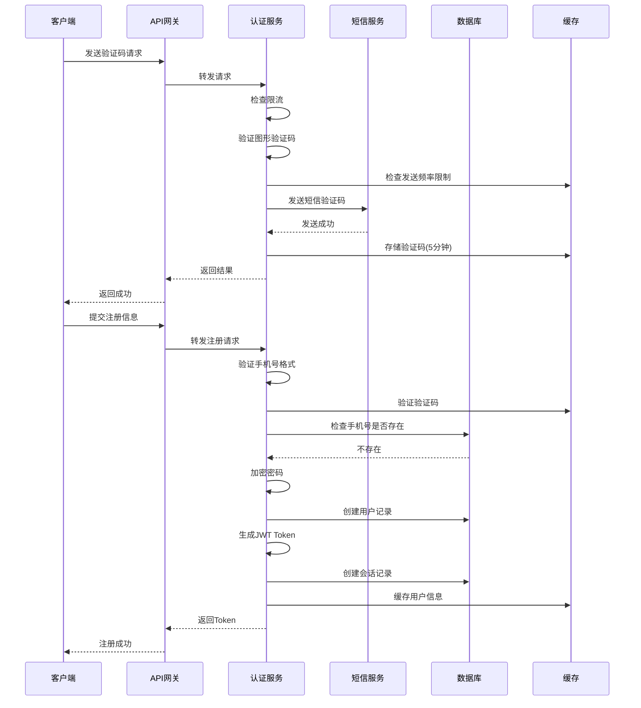
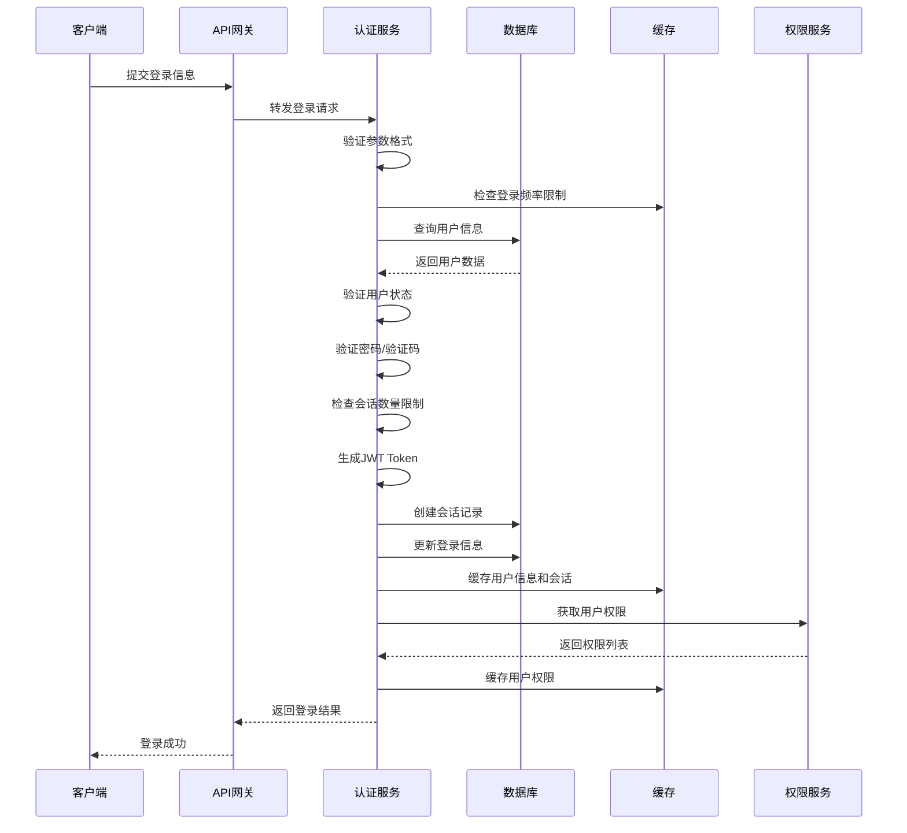
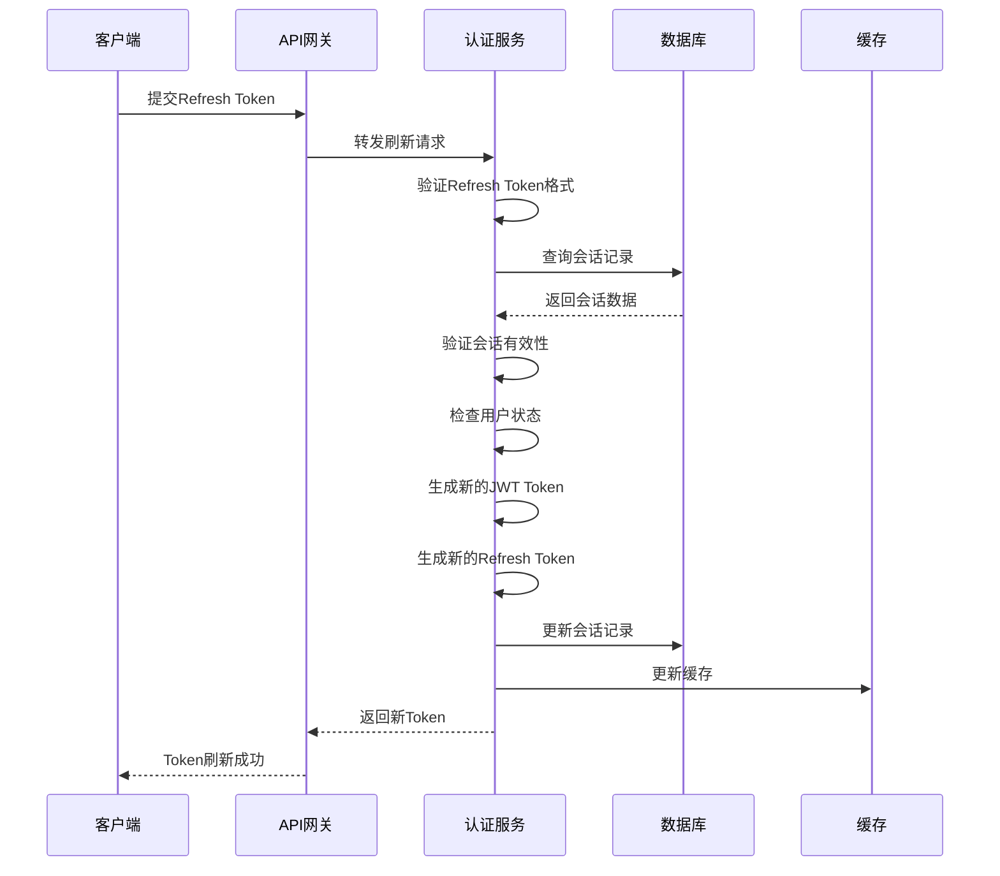
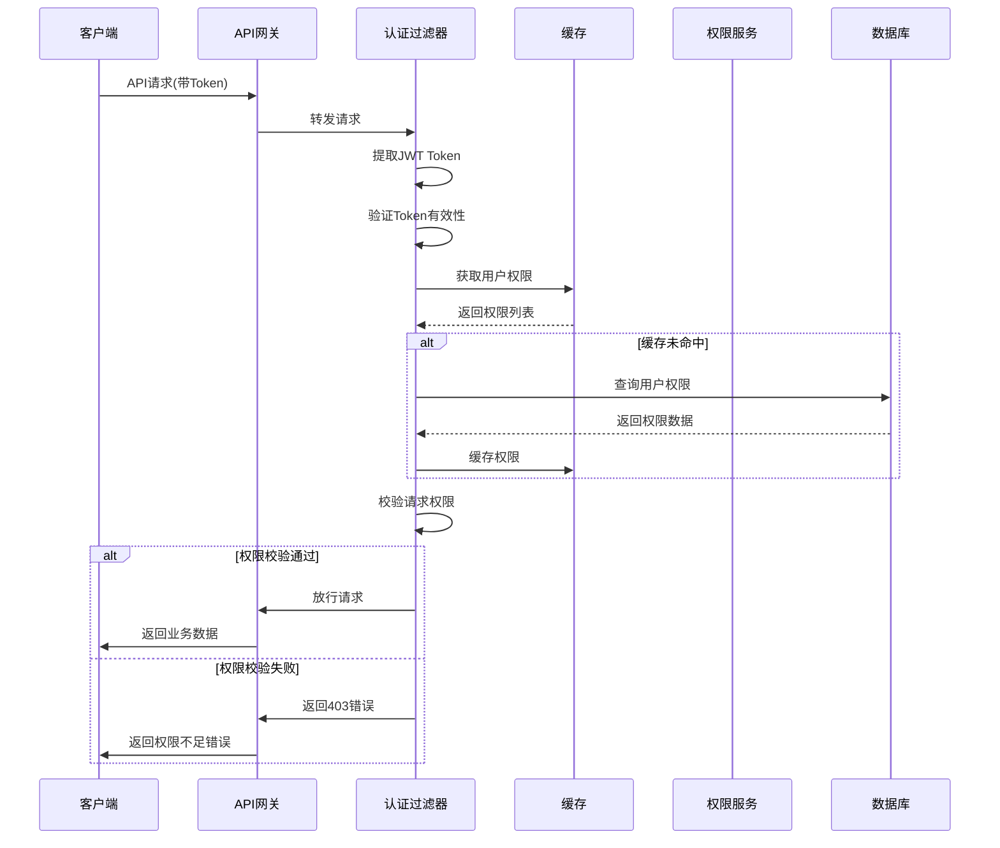
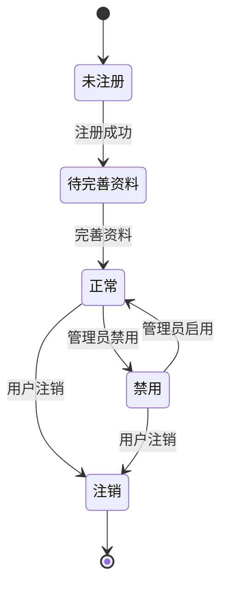
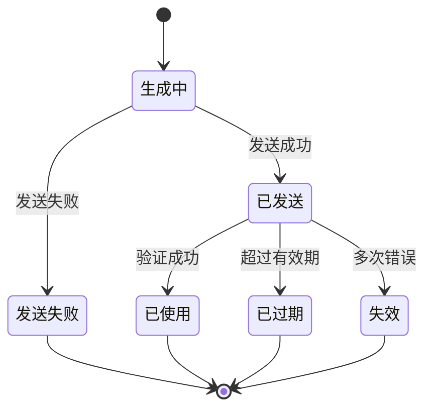
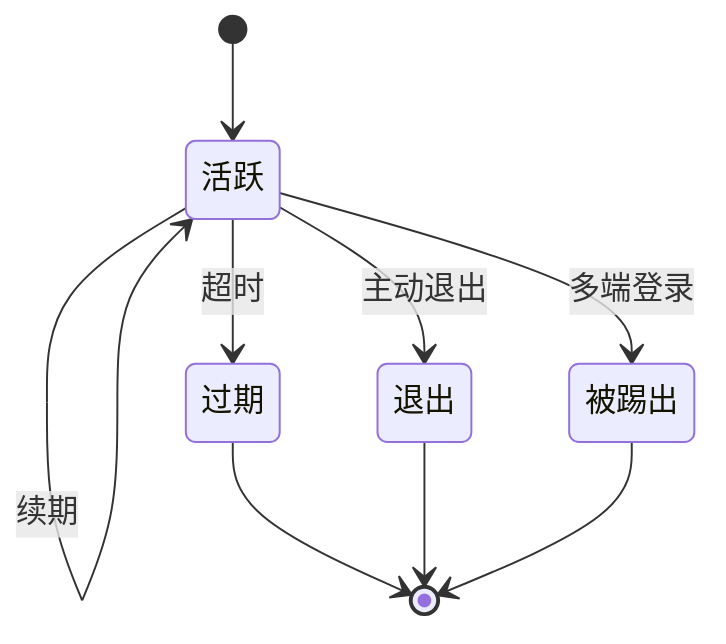

# 用户基础服务与身份认证系统详细设计

## 1. 概述

### 1.1 模块定位

用户基础服务与身份认证系统是 PrimeTop 平台的核心基础模块，负责处理用户注册、登录、身份验证、权限管理和会话管理等核心功能。该模块为整个应用提供统一的用户身份管理和访问控制基础。

### 1.2 核心职责

1. **用户注册与登录**：支持多种注册登录方式，包括手机号验证码、第三方登录、账号密码等。
2. **身份认证**：实现安全的身份验证机制，包括JWT令牌管理和会话控制。
3. **权限管理**：基于角色的访问控制（RBAC）和细粒度权限校验。
4. **会话管理**：多端会话管理和并发登录控制。
5. **安全防护**：防刷、限流、密码加密、敏感信息保护等安全机制。

### 1.3 依赖关系

```
用户基础服务
├── 短信服务（发送验证码）
├── 数据存储服务（用户数据持久化）
├── 缓存服务（会话管理、验证码存储）
├── 日志服务（操作审计）
├── 配置中心（策略配置）
└── 第三方登录服务（微信、QQ、支付宝等）
```

### 1.4 技术选型

- **框架**：Spring Boot 3.x
- **数据库**：MySQL 8.0+（主数据），Redis 7.x（缓存）
- **认证**：JWT（JSON Web Token）
- **加密**：BCrypt（密码加密），AES（敏感数据加密）
- **安全**：Spring Security 6.x
- **限流**：Guava RateLimiter + Redis Lua脚本
- **消息队列**：RabbitMQ（异步处理）

## 2. 数据模型

### 2.1 核心实体定义

#### 2.1.1 用户基础表（user）

```sql
CREATE TABLE `user` (
  `id` bigint NOT NULL COMMENT '用户ID',
  `username` varchar(64) DEFAULT NULL COMMENT '用户名',
  `password` varchar(255) DEFAULT NULL COMMENT '密码（BCrypt加密）',
  `phone` varchar(20) DEFAULT NULL COMMENT '手机号',
  `email` varchar(128) DEFAULT NULL COMMENT '邮箱',
  `avatar` varchar(512) DEFAULT NULL COMMENT '头像URL',
  `nickname` varchar(64) DEFAULT NULL COMMENT '昵称',
  `gender` tinyint DEFAULT NULL COMMENT '性别：0-未知，1-男，2-女',
  `birthday` date DEFAULT NULL COMMENT '生日',
  `status` tinyint NOT NULL DEFAULT '1' COMMENT '状态：0-禁用，1-正常，2-注销',
  `user_type` tinyint NOT NULL DEFAULT '1' COMMENT '用户类型：1-学生，2-家长，3-教师，4-管理员',
  `register_source` varchar(32) DEFAULT NULL COMMENT '注册来源：app,web,wechat,qq,alipay等',
  `register_ip` varchar(64) DEFAULT NULL COMMENT '注册IP',
  `last_login_time` datetime DEFAULT NULL COMMENT '最后登录时间',
  `last_login_ip` varchar(64) DEFAULT NULL COMMENT '最后登录IP',
  `created_at` datetime NOT NULL DEFAULT CURRENT_TIMESTAMP COMMENT '创建时间',
  `updated_at` datetime NOT NULL DEFAULT CURRENT_TIMESTAMP ON UPDATE CURRENT_TIMESTAMP COMMENT '更新时间',
  `deleted_at` datetime DEFAULT NULL COMMENT '删除时间（软删除）',
  PRIMARY KEY (`id`),
  UNIQUE KEY `uk_username` (`username`),
  UNIQUE KEY `uk_phone` (`phone`),
  UNIQUE KEY `uk_email` (`email`),
  KEY `idx_status` (`status`),
  KEY `idx_user_type` (`user_type`),
  KEY `idx_register_source` (`register_source`)
) ENGINE=InnoDB DEFAULT CHARSET=utf8mb4 COLLATE=utf8mb4_unicode_ci COMMENT='用户基础信息表';
```

#### 2.1.2 学生档案表（student_profile）

```sql
CREATE TABLE `student_profile` (
  `id` bigint NOT NULL COMMENT '档案ID',
  `user_id` bigint NOT NULL COMMENT '用户ID',
  `real_name` varchar(64) DEFAULT NULL COMMENT '真实姓名',
  `stage` varchar(32) NOT NULL COMMENT '学段：kindergarten,primary,junior,senior',
  `grade` int NOT NULL COMMENT '年级：1-12',
  `semester` tinyint DEFAULT NULL COMMENT '学期：1-上学期，2-下学期',
  `school` varchar(128) DEFAULT NULL COMMENT '学校名称',
  `class_name` varchar(64) DEFAULT NULL COMMENT '班级名称',
  `student_id` varchar(64) DEFAULT NULL COMMENT '学号',
  `textbook_version` varchar(64) DEFAULT NULL COMMENT '教材版本',
  `subjects` json DEFAULT NULL COMMENT '学习的学科列表',
  `parent_id` bigint DEFAULT NULL COMMENT '绑定的家长用户ID',
  `created_at` datetime NOT NULL DEFAULT CURRENT_TIMESTAMP COMMENT '创建时间',
  `updated_at` datetime NOT NULL DEFAULT CURRENT_TIMESTAMP ON UPDATE CURRENT_TIMESTAMP COMMENT '更新时间',
  PRIMARY KEY (`id`),
  UNIQUE KEY `uk_user_id` (`user_id`),
  KEY `idx_stage_grade` (`stage`,`grade`),
  KEY `idx_parent_id` (`parent_id`)
) ENGINE=InnoDB DEFAULT CHARSET=utf8mb4 COLLATE=utf8mb4_unicode_ci COMMENT='学生档案信息表';
```

#### 2.1.3 用户角色关联表（user_role）

```sql
CREATE TABLE `user_role` (
  `id` bigint NOT NULL COMMENT 'ID',
  `user_id` bigint NOT NULL COMMENT '用户ID',
  `role_id` bigint NOT NULL COMMENT '角色ID',
  `created_at` datetime NOT NULL DEFAULT CURRENT_TIMESTAMP COMMENT '创建时间',
  PRIMARY KEY (`id`),
  UNIQUE KEY `uk_user_role` (`user_id`,`role_id`),
  KEY `idx_role_id` (`role_id`)
) ENGINE=InnoDB DEFAULT CHARSET=utf8mb4 COLLATE=utf8mb4_unicode_ci COMMENT='用户角色关联表';
```

#### 2.1.4 角色表（role）

```sql
CREATE TABLE `role` (
  `id` bigint NOT NULL COMMENT '角色ID',
  `role_code` varchar(64) NOT NULL COMMENT '角色编码：STUDENT,PARENT,TEACHER,ADMIN',
  `role_name` varchar(64) NOT NULL COMMENT '角色名称',
  `description` varchar(512) DEFAULT NULL COMMENT '角色描述',
  `status` tinyint NOT NULL DEFAULT '1' COMMENT '状态：0-禁用，1-启用',
  `created_at` datetime NOT NULL DEFAULT CURRENT_TIMESTAMP COMMENT '创建时间',
  `updated_at` datetime NOT NULL DEFAULT CURRENT_TIMESTAMP ON UPDATE CURRENT_TIMESTAMP COMMENT '更新时间',
  PRIMARY KEY (`id`),
  UNIQUE KEY `uk_role_code` (`role_code`)
) ENGINE=InnoDB DEFAULT CHARSET=utf8mb4 COLLATE=utf8mb4_unicode_ci COMMENT='角色表';
```

#### 2.1.5 角色权限关联表（role_permission）

```sql
CREATE TABLE `role_permission` (
  `id` bigint NOT NULL COMMENT 'ID',
  `role_id` bigint NOT NULL COMMENT '角色ID',
  `permission_id` bigint NOT NULL COMMENT '权限ID',
  `created_at` datetime NOT NULL DEFAULT CURRENT_TIMESTAMP COMMENT '创建时间',
  PRIMARY KEY (`id`),
  UNIQUE KEY `uk_role_permission` (`role_id`,`permission_id`),
  KEY `idx_permission_id` (`permission_id`)
) ENGINE=InnoDB DEFAULT CHARSET=utf8mb4 COLLATE=utf8mb4_unicode_ci COMMENT='角色权限关联表';
```

#### 2.1.6 权限表（permission）

```sql
CREATE TABLE `permission` (
  `id` bigint NOT NULL COMMENT '权限ID',
  `permission_code` varchar(128) NOT NULL COMMENT '权限编码：user:read,question:create等',
  `permission_name` varchar(128) NOT NULL COMMENT '权限名称',
  `resource_type` varchar(32) NOT NULL COMMENT '资源类型：api,menu,button',
  `resource_path` varchar(256) DEFAULT NULL COMMENT '资源路径',
  `parent_id` bigint DEFAULT NULL COMMENT '父权限ID',
  `sort_order` int DEFAULT '0' COMMENT '排序',
  `status` tinyint NOT NULL DEFAULT '1' COMMENT '状态：0-禁用，1-启用',
  `created_at` datetime NOT NULL DEFAULT CURRENT_TIMESTAMP COMMENT '创建时间',
  `updated_at` datetime NOT NULL DEFAULT CURRENT_TIMESTAMP ON UPDATE CURRENT_TIMESTAMP COMMENT '更新时间',
  PRIMARY KEY (`id`),
  UNIQUE KEY `uk_permission_code` (`permission_code`),
  KEY `idx_resource_type` (`resource_type`),
  KEY `idx_parent_id` (`parent_id`)
) ENGINE=InnoDB DEFAULT CHARSET=utf8mb4 COLLATE=utf8mb4_unicode_ci COMMENT='权限表';
```

#### 2.1.7 第三方登录账号表（social_account）

```sql
CREATE TABLE `social_account` (
  `id` bigint NOT NULL COMMENT 'ID',
  `user_id` bigint NOT NULL COMMENT '用户ID',
  `provider` varchar(32) NOT NULL COMMENT '第三方平台：wechat,qq,alipay等',
  `provider_user_id` varchar(128) NOT NULL COMMENT '第三方平台用户ID',
  `provider_access_token` varchar(512) DEFAULT NULL COMMENT '第三方平台访问令牌',
  `provider_refresh_token` varchar(512) DEFAULT NULL COMMENT '第三方平台刷新令牌',
  `expires_at` datetime DEFAULT NULL COMMENT '令牌过期时间',
  `union_id` varchar(128) DEFAULT NULL COMMENT '第三方平台UnionID',
  `created_at` datetime NOT NULL DEFAULT CURRENT_TIMESTAMP COMMENT '创建时间',
  `updated_at` datetime NOT NULL DEFAULT CURRENT_TIMESTAMP ON UPDATE CURRENT_TIMESTAMP COMMENT '更新时间',
  PRIMARY KEY (`id`),
  UNIQUE KEY `uk_provider_user_id` (`provider`,`provider_user_id`),
  KEY `idx_user_id` (`user_id`),
  KEY `idx_union_id` (`union_id`)
) ENGINE=InnoDB DEFAULT CHARSET=utf8mb4 COLLATE=utf8mb4_unicode_ci COMMENT='第三方登录账号表';
```

#### 2.1.8 用户会话表（user_session）

```sql
CREATE TABLE `user_session` (
  `id` bigint NOT NULL COMMENT '会话ID',
  `user_id` bigint NOT NULL COMMENT '用户ID',
  `session_token` varchar(512) NOT NULL COMMENT '会话令牌（JWT）',
  `refresh_token` varchar(512) DEFAULT NULL COMMENT '刷新令牌',
  `device_type` varchar(32) DEFAULT NULL COMMENT '设备类型：ios,android,web',
  `device_id` varchar(128) DEFAULT NULL COMMENT '设备唯一标识',
  `device_name` varchar(128) DEFAULT NULL COMMENT '设备名称',
  `ip_address` varchar(64) DEFAULT NULL COMMENT 'IP地址',
  `user_agent` varchar(512) DEFAULT NULL COMMENT '用户代理',
  `location` varchar(128) DEFAULT NULL COMMENT '地理位置',
  `expires_at` datetime NOT NULL COMMENT '过期时间',
  `is_active` tinyint NOT NULL DEFAULT '1' COMMENT '是否活跃：0-否，1-是',
  `created_at` datetime NOT NULL DEFAULT CURRENT_TIMESTAMP COMMENT '创建时间',
  `last_accessed_at` datetime NOT NULL DEFAULT CURRENT_TIMESTAMP ON UPDATE CURRENT_TIMESTAMP COMMENT '最后访问时间',
  PRIMARY KEY (`id`),
  UNIQUE KEY `uk_session_token` (`session_token`),
  KEY `idx_user_id` (`user_id`),
  KEY `idx_expires_at` (`expires_at`),
  KEY `idx_device_id` (`device_id`)
) ENGINE=InnoDB DEFAULT CHARSET=utf8mb4 COLLATE=utf8mb4_unicode_ci COMMENT='用户会话表';
```

#### 2.1.9 验证码记录表（verification_code）

```sql
CREATE TABLE `verification_code` (
  `id` bigint NOT NULL COMMENT 'ID',
  `phone` varchar(20) NOT NULL COMMENT '手机号',
  `code` varchar(10) NOT NULL COMMENT '验证码',
  `code_type` varchar(32) NOT NULL COMMENT '验证码类型：register,login,reset_password,bind_phone',
  `ip_address` varchar(64) DEFAULT NULL COMMENT '请求IP',
  `expires_at` datetime NOT NULL COMMENT '过期时间',
  `is_used` tinyint NOT NULL DEFAULT '0' COMMENT '是否已使用：0-否，1-是',
  `used_at` datetime DEFAULT NULL COMMENT '使用时间',
  `created_at` datetime NOT NULL DEFAULT CURRENT_TIMESTAMP COMMENT '创建时间',
  PRIMARY KEY (`id`),
  KEY `idx_phone_type` (`phone`,`code_type`),
  KEY `idx_expires_at` (`expires_at`)
) ENGINE=InnoDB DEFAULT CHARSET=utf8mb4 COLLATE=utf8mb4_unicode_ci COMMENT='验证码记录表';
```

### 2.2 缓存策略设计

#### 2.2.1 缓存结构

```java
// 用户信息缓存（Redis Key格式）
String userCacheKey = "user:info:{userId}";                 // 用户基础信息
String userPermissionsKey = "user:permissions:{userId}";     // 用户权限列表
String userRolesKey = "user:roles:{userId}";                // 用户角色列表
String sessionCacheKey = "session:{sessionToken}";          // 会话信息
String rateLimitKey = "ratelimit:{operation}:{identifier}";  // 限流控制
String smsCodeKey = "sms:code:{phone}:{type}";              // 短信验证码
```

#### 2.2.2 缓存过期策略

| 缓存类型 | 过期时间 | 更新策略 |
|---------|---------|---------|
| 用户基础信息 | 30分钟 | 更新时刷新 |
| 用户权限信息 | 1小时 | 权限变更时刷新 |
| 用户角色信息 | 1小时 | 角色变更时刷新 |
| 会话信息 | 7天 | 活动时刷新 |
| 短信验证码 | 5分钟 | 使用后删除 |
| 限流控制 | 动态 | 滑动窗口 |

## 3. API 接口设计

### 3.1 接口列表

#### 3.1.1 用户注册相关

**1. 发送手机验证码**

```
POST /api/v1/auth/sms/send
```

**请求参数：**
```json
{
  "phone": "13800138000",
  "code_type": "register",
  "captcha_token": "验证码token",
  "captcha_code": "图形验证码"
}
```

**响应参数：**
```json
{
  "code": 200,
  "message": "验证码发送成功",
  "data": {
    "expires_in": 300,
    "sms_id": "sms_123456789"
  }
}
```

**2. 手机号注册**

```
POST /api/v1/auth/register/phone
```

**请求参数：**
```json
{
  "phone": "13800138000",
  "sms_code": "123456",
  "password": "Test@123456",
  "nickname": "学生小明",
  "register_source": "app"
}
```

**响应参数：**
```json
{
  "code": 200,
  "message": "注册成功",
  "data": {
    "user_id": 123456,
    "token": "eyJhbGciOiJIUzI1NiIsInR5cCI6IkpXVCJ9...",
    "refresh_token": "eyJhbGciOiJIUzI1NiIsInR5cCI6IkpXVCJ9...",
    "expires_in": 604800,
    "need_complete_profile": true
  }
}
```

#### 3.1.2 用户登录相关

**1. 手机号验证码登录**

```
POST /api/v1/auth/login/sms
```

**请求参数：**
```json
{
  "phone": "13800138000",
  "sms_code": "123456",
  "device_info": {
    "device_type": "ios",
    "device_id": "device_123456",
    "device_name": "iPhone 14",
    "app_version": "1.0.0"
  }
}
```

**响应参数：**
```json
{
  "code": 200,
  "message": "登录成功",
  "data": {
    "user_id": 123456,
    "token": "eyJhbGciOiJIUzI1NiIsInR5cCI6IkpXVCJ9...",
    "refresh_token": "eyJhbGciOiJIUzI1NiIsInR5cCI6IkpXVCJ9...",
    "expires_in": 604800,
    "user_info": {
      "nickname": "学生小明",
      "avatar": "https://cdn.example.com/avatar/123456.jpg",
      "user_type": 1
    },
    "need_complete_profile": false
  }
}
```

**2. 账号密码登录**

```
POST /api/v1/auth/login/password
```

**请求参数：**
```json
{
  "account": "13800138000",
  "password": "Test@123456",
  "device_info": {
    "device_type": "android",
    "device_id": "device_789012",
    "device_name": "Xiaomi 14",
    "app_version": "1.0.0"
  }
}
```

**响应参数：**
```json
{
  "code": 200,
  "message": "登录成功",
  "data": {
    "user_id": 123456,
    "token": "eyJhbGciOiJIUzI1NiIsInR5cCI6IkpXVCJ9...",
    "refresh_token": "eyJhbGciOiJIUzI1NiIsInR5cCI6IkpXVCJ9...",
    "expires_in": 604800,
    "user_info": {
      "nickname": "学生小明",
      "avatar": "https://cdn.example.com/avatar/123456.jpg",
      "user_type": 1
    }
  }
}
```

**3. 第三方登录**

```
POST /api/v1/auth/login/social
```

**请求参数：**
```json
{
  "provider": "wechat",
  "auth_code": "wx_auth_code_123456",
  "device_info": {
    "device_type": "ios",
    "device_id": "device_123456",
    "device_name": "iPhone 14",
    "app_version": "1.0.0"
  }
}
```

**响应参数：**
```json
{
  "code": 200,
  "message": "登录成功",
  "data": {
    "user_id": 123456,
    "token": "eyJhbGciOiJIUzI1NiIsInR5cCI6IkpXVCJ9...",
    "refresh_token": "eyJhbGciOiJIUzI1NiIsInR5cCI6IkpXVCJ9...",
    "expires_in": 604800,
    "user_info": {
      "nickname": "学生小明",
      "avatar": "https://cdn.example.com/avatar/123456.jpg",
      "user_type": 1
    },
    "is_new_user": false,
    "need_bind_phone": false
  }
}
```

#### 3.1.3 Token 管理

**1. 刷新Token**

```
POST /api/v1/auth/token/refresh
```

**请求参数：**
```json
{
  "refresh_token": "eyJhbGciOiJIUzI1NiIsInR5cCI6IkpXVCJ9..."
}
```

**响应参数：**
```json
{
  "code": 200,
  "message": "Token刷新成功",
  "data": {
    "token": "eyJhbGciOiJIUzI1NiIsInR5cCI6IkpXVCJ9...",
    "refresh_token": "eyJhbGciOiJIUzI1NiIsInR5cCI6IkpXVCJ9...",
    "expires_in": 604800
  }
}
```

**2. 退出登录**

```
POST /api/v1/auth/logout
```

**请求头：**
```
Authorization: Bearer {token}
```

**响应参数：**
```json
{
  "code": 200,
  "message": "退出成功"
}
```

#### 3.1.4 用户信息管理

**1. 获取用户信息**

```
GET /api/v1/user/profile
```

**请求头：**
```
Authorization: Bearer {token}
```

**响应参数：**
```json
{
  "code": 200,
  "message": "获取成功",
  "data": {
    "user_id": 123456,
    "username": "xiaoming",
    "nickname": "学生小明",
    "avatar": "https://cdn.example.com/avatar/123456.jpg",
    "phone": "138****8000",
    "email": "xiao***@example.com",
    "gender": 1,
    "birthday": "2010-05-15",
    "user_type": 1,
    "register_source": "app",
    "created_at": "2024-01-01T10:00:00Z"
  }
}
```

**2. 更新用户信息**

```
PUT /api/v1/user/profile
```

**请求头：**
```
Authorization: Bearer {token}
```

**请求参数：**
```json
{
  "nickname": "小明同学",
  "avatar": "https://cdn.example.com/avatar/new_123456.jpg",
  "gender": 1,
  "birthday": "2010-05-15"
}
```

**响应参数：**
```json
{
  "code": 200,
  "message": "更新成功",
  "data": {
    "user_id": 123456,
    "nickname": "小明同学",
    "avatar": "https://cdn.example.com/avatar/new_123456.jpg",
    "gender": 1,
    "birthday": "2010-05-15"
  }
}
```

**3. 修改密码**

```
POST /api/v1/user/password/change
```

**请求头：**
```
Authorization: Bearer {token}
```

**请求参数：**
```json
{
  "old_password": "Old@123456",
  "new_password": "New@123456"
}
```

**响应参数：**
```json
{
  "code": 200,
  "message": "密码修改成功"
}
```

**4. 重置密码（通过手机验证码）**

```
POST /api/v1/user/password/reset
```

**请求参数：**
```json
{
  "phone": "13800138000",
  "sms_code": "123456",
  "new_password": "New@123456"
}
```

**响应参数：**
```json
{
  "code": 200,
  "message": "密码重置成功"
}
```

#### 3.1.5 学生档案管理

**1. 创建学生档案**

```
POST /api/v1/student/profile/create
```

**请求头：**
```
Authorization: Bearer {token}
```

**请求参数：**
```json
{
  "real_name": "张小明",
  "stage": "primary",
  "grade": 5,
  "semester": 1,
  "school": "北京市第一小学",
  "class_name": "5年级2班",
  "student_id": "2020050201",
  "textbook_version": "人教版",
  "subjects": ["语文", "数学", "英语"]
}
```

**响应参数：**
```json
{
  "code": 200,
  "message": "档案创建成功",
  "data": {
    "profile_id": 789012,
    "user_id": 123456,
    "real_name": "张小明",
    "stage": "primary",
    "grade": 5,
    "textbook_version": "人教版"
  }
}
```

**2. 获取学生档案**

```
GET /api/v1/student/profile
```

**请求头：**
```
Authorization: Bearer {token}
```

**响应参数：**
```json
{
  "code": 200,
  "message": "获取成功",
  "data": {
    "profile_id": 789012,
    "user_id": 123456,
    "real_name": "张小明",
    "stage": "primary",
    "grade": 5,
    "semester": 1,
    "school": "北京市第一小学",
    "class_name": "5年级2班",
    "student_id": "2020050201",
    "textbook_version": "人教版",
    "subjects": ["语文", "数学", "英语"],
    "parent_id": 654321
  }
}
```

**3. 更新学生档案**

```
PUT /api/v1/student/profile/update
```

**请求头：**
```
Authorization: Bearer {token}
```

**请求参数：**
```json
{
  "grade": 6,
  "semester": 1,
  "class_name": "6年级2班",
  "textbook_version": "北师大版"
}
```

**响应参数：**
```json
{
  "code": 200,
  "message": "档案更新成功",
  "data": {
    "profile_id": 789012,
    "grade": 6,
    "semester": 1,
    "class_name": "6年级2班",
    "textbook_version": "北师大版"
  }
}
```

### 3.2 错误码定义

| 错误码 | 错误信息 | 说明 |
|-------|---------|------|
| 200 | 成功 | 请求成功 |
| 400 | 请求参数错误 | 请求参数格式错误或缺失 |
| 401 | 未授权 | 未登录或Token无效 |
| 403 | 权限不足 | 没有权限访问该资源 |
| 404 | 资源不存在 | 请求的资源不存在 |
| 429 | 请求过于频繁 | 超过限流阈值 |
| 1001 | 手机号格式错误 | 手机号格式不正确 |
| 1002 | 验证码错误 | 验证码错误或已过期 |
| 1003 | 验证码发送过于频繁 | 短信发送频率限制 |
| 1004 | 手机号已注册 | 该手机号已注册 |
| 1005 | 用户名或密码错误 | 用户名或密码错误 |
| 1006 | 用户不存在 | 用户不存在 |
| 1007 | 用户已被禁用 | 用户已被禁用 |
| 1008 | 密码格式错误 | 密码格式不符合要求 |
| 1009 | 旧密码错误 | 旧密码错误 |
| 1010 | Token已过期 | Token已过期，请重新登录 |
| 1011 | Token无效 | Token无效 |
| 1012 | Refresh Token无效 | Refresh Token无效 |
| 1013 | 第三方登录失败 | 第三方登录失败 |
| 1014 | 需要绑定手机号 | 第三方登录后需要绑定手机号 |
| 1015 | 用户档案已存在 | 用户档案已存在 |
| 1016 | 参数验证失败 | 参数验证失败 |
| 5000 | 系统内部错误 | 系统内部错误 |

## 4. 业务逻辑

### 4.1 核心流程

#### 4.1.1 用户注册流程



#### 4.1.2 用户登录流程



#### 4.1.3 Token刷新流程



#### 4.1.4 权限校验流程



### 4.2 状态机

#### 4.2.1 用户状态机



#### 4.2.2 验证码状态机



#### 4.2.3 会话状态机



### 4.3 关键算法

#### 4.3.1 密码强度验证算法

```java
public class PasswordValidator {
    private static final int MIN_LENGTH = 8;
    private static final int MAX_LENGTH = 20;
    private static final Pattern LOWERCASE = Pattern.compile("[a-z]");
    private static final Pattern UPPERCASE = Pattern.compile("[A-Z]");
    private static final Pattern DIGIT = Pattern.compile("[0-9]");
    private static final Pattern SPECIAL = Pattern.compile("[!@#$%^&*()_+\\-=\\[\\]{};':\"\\\\|,.<>\\/?]");

    public static ValidationResult validate(String password) {
        ValidationResult result = new ValidationResult();

        // 长度检查
        if (password.length() < MIN_LENGTH) {
            result.addError("密码长度不能少于" + MIN_LENGTH + "位");
        }
        if (password.length() > MAX_LENGTH) {
            result.addError("密码长度不能超过" + MAX_LENGTH + "位");
        }

        // 复杂度检查
        int complexityScore = 0;
        if (LOWERCASE.matcher(password).find()) complexityScore++;
        if (UPPERCASE.matcher(password).find()) complexityScore++;
        if (DIGIT.matcher(password).find()) complexityScore++;
        if (SPECIAL.matcher(password).find()) complexityScore++;

        if (complexityScore < 3) {
            result.addError("密码必须包含大写字母、小写字母、数字、特殊符号中的至少三种");
        }

        // 常见弱密码检查
        if (isCommonWeakPassword(password)) {
            result.addError("密码过于简单，请使用更复杂的密码");
        }

        result.setValid(result.getErrors().isEmpty());
        return result;
    }

    private static boolean isCommonWeakPassword(String password) {
        List<String> commonPasswords = Arrays.asList(
            "123456", "password", "12345678", "qwerty",
            "abc123", "111111", "123123", "admin", "letmein"
        );
        return commonPasswords.contains(password.toLowerCase());
    }
}
```

#### 4.3.2 JWT Token生成算法

```java
@Component
public class JwtTokenProvider {
    @Value("${jwt.secret}")
    private String jwtSecret;

    @Value("${jwt.expiration}")
    private long jwtExpiration;

    @Value("${jwt.refresh-expiration}")
    private long refreshExpiration;

    private static final String USER_ID_KEY = "userId";
    private static final String USER_TYPE_KEY = "userType";
    private static final String DEVICE_ID_KEY = "deviceId";

    public String generateToken(Long userId, Integer userType, String deviceId) {
        Date now = new Date();
        Date expiryDate = new Date(now.getTime() + jwtExpiration * 1000);

        return Jwts.builder()
                .setSubject(userId.toString())
                .claim(USER_ID_KEY, userId)
                .claim(USER_TYPE_KEY, userType)
                .claim(DEVICE_ID_KEY, deviceId)
                .setIssuedAt(now)
                .setExpiration(expiryDate)
                .signWith(SignatureAlgorithm.HS512, jwtSecret)
                .compact();
    }

    public String generateRefreshToken(Long userId, String deviceId) {
        Date now = new Date();
        Date expiryDate = new Date(now.getTime() + refreshExpiration * 1000);

        return Jwts.builder()
                .setSubject(userId.toString())
                .claim("type", "refresh")
                .claim(USER_ID_KEY, userId)
                .claim(DEVICE_ID_KEY, deviceId)
                .setIssuedAt(now)
                .setExpiration(expiryDate)
                .signWith(SignatureAlgorithm.HS512, jwtSecret)
                .compact();
    }

    public Long getUserIdFromToken(String token) {
        Claims claims = Jwts.parser()
                .setSigningKey(jwtSecret)
                .parseClaimsJws(token)
                .getBody();
        return claims.get(USER_ID_KEY, Long.class);
    }

    public boolean validateToken(String token) {
        try {
            Jwts.parser().setSigningKey(jwtSecret).parseClaimsJws(token);
            return true;
        } catch (JwtException | IllegalArgumentException e) {
            return false;
        }
    }

    public boolean isTokenExpired(String token) {
        try {
            Claims claims = Jwts.parser()
                    .setSigningKey(jwtSecret)
                    .parseClaimsJws(token)
                    .getBody();
            return claims.getExpiration().before(new Date());
        } catch (JwtException | IllegalArgumentException e) {
            return true;
        }
    }
}
```

#### 4.3.3 限流控制算法

```java
@Component
public class RateLimiterService {
    @Autowired
    private RedisTemplate<String, String> redisTemplate;

    private static final String RATE_LIMIT_SCRIPT =
        "local key = KEYS[1] " +
        "local limit = tonumber(ARGV[1]) " +
        "local window = tonumber(ARGV[2]) " +
        "local current = redis.call('incr', key) " +
        "if current == 1 then " +
        "    redis.call('expire', key, window) " +
        "end " +
        "if current > limit then " +
        "    return 0 " +
        "else " +
        "    return 1 " +
        "end";

    public boolean allowRequest(String identifier, int limit, int windowSeconds) {
        String key = "ratelimit:" + identifier;
        DefaultRedisScript<Long> script = new DefaultRedisScript<>(RATE_LIMIT_SCRIPT, Long.class);

        Long result = redisTemplate.execute(script,
                Collections.singletonList(key),
                String.valueOf(limit),
                String.valueOf(windowSeconds));

        return result != null && result == 1;
    }

    public int getRemainingRequests(String identifier, int limit, int windowSeconds) {
        String key = "ratelimit:" + identifier;
        String currentStr = redisTemplate.opsForValue().get(key);
        int current = currentStr != null ? Integer.parseInt(currentStr) : 0;
        return Math.max(0, limit - current);
    }
}
```

#### 4.3.4 验证码生成算法

```java
@Component
public class VerificationCodeGenerator {
    private static final String CODE_CHARACTERS = "0123456789";
    private static final Random RANDOM = new Random();

    public String generateCode(int length) {
        StringBuilder code = new StringBuilder(length);
        for (int i = 0; i < length; i++) {
            code.append(CODE_CHARACTERS.charAt(RANDOM.nextInt(CODE_CHARACTERS.length())));
        }
        return code.toString();
    }

    public boolean verifyCode(String inputCode, String storedCode, boolean caseSensitive) {
        if (StringUtils.isEmpty(inputCode) || StringUtils.isEmpty(storedCode)) {
            return false;
        }

        if (!caseSensitive) {
            return inputCode.equalsIgnoreCase(storedCode);
        }

        return inputCode.equals(storedCode);
    }
}
```

## 5. 代码示例

### 5.1 核心类定义

#### 5.1.1 用户服务实现类

```java
@Service
@Transactional
public class UserServiceImpl implements UserService {

    @Autowired
    private UserMapper userMapper;

    @Autowired
    private StudentProfileMapper studentProfileMapper;

    @Autowired
    private PasswordEncoder passwordEncoder;

    @Autowired
    private JwtTokenProvider jwtTokenProvider;

    @Autowired
    private RedisTemplate<String, Object> redisTemplate;

    @Autowired
    private SessionManager sessionManager;

    @Autowired
    private VerificationCodeService verificationCodeService;

    @Autowired
    private RateLimiterService rateLimiterService;

    @Value("${auth.max-sessions:5}")
    private int maxSessions;

    @Value("${auth.session-expiry:604800}")
    private long sessionExpirySeconds;

    @Override
    public UserDTO registerByPhone(PhoneRegisterRequest request) {
        // 1. 参数验证
        validateRegisterRequest(request);

        // 2. 验证短信验证码
        if (!verificationCodeService.verifyCode(request.getPhone(),
                request.getSmsCode(), "register")) {
            throw new BusinessException(1002, "验证码错误或已过期");
        }

        // 3. 检查手机号是否已注册
        if (userMapper.findByPhone(request.getPhone()) != null) {
            throw new BusinessException(1004, "该手机号已注册");
        }

        // 4. 验证密码强度
        ValidationResult passwordValidation = PasswordValidator.validate(request.getPassword());
        if (!passwordValidation.isValid()) {
            throw new BusinessException(1008, String.join(", ", passwordValidation.getErrors()));
        }

        // 5. 创建用户
        User user = new User();
        user.setId(SnowflakeIdGenerator.nextId());
        user.setPhone(request.getPhone());
        user.setPassword(passwordEncoder.encode(request.getPassword()));
        user.setNickname(request.getNickname());
        user.setUserType(UserType.STUDENT.getCode());
        user.setRegisterSource(request.getRegisterSource());
        user.setStatus(UserStatus.NORMAL.getCode());
        user.setCreatedAt(new Date());
        user.setUpdatedAt(new Date());

        userMapper.insert(user);

        // 6. 创建用户会话
        SessionInfo sessionInfo = createSession(user, request.getDeviceInfo());

        // 7. 删除已使用的验证码
        verificationCodeService.markCodeAsUsed(request.getPhone(), "register");

        // 8. 缓存用户信息
        cacheUserInfo(user);

        // 9. 发送注册成功消息
        sendRegistrationSuccessMessage(user);

        return buildUserDTO(user, sessionInfo);
    }

    @Override
    public LoginResultDTO loginBySms(SmsLoginRequest request) {
        // 1. 参数验证
        validateLoginRequest(request);

        // 2. 限流检查
        String rateLimitKey = "login:sms:" + request.getPhone();
        if (!rateLimiterService.allowRequest(rateLimitKey, 5, 3600)) {
            throw new BusinessException(429, "登录尝试过于频繁，请1小时后再试");
        }

        // 3. 验证短信验证码
        if (!verificationCodeService.verifyCode(request.getPhone(),
                request.getSmsCode(), "login")) {
            throw new BusinessException(1002, "验证码错误或已过期");
        }

        // 4. 查询用户
        User user = userMapper.findByPhone(request.getPhone());
        if (user == null) {
            throw new BusinessException(1006, "用户不存在");
        }

        // 5. 检查用户状态
        if (user.getStatus() == UserStatus.DISABLED.getCode()) {
            throw new BusinessException(1007, "用户已被禁用");
        }

        // 6. 检查会话数量限制
        checkSessionLimit(user.getId(), request.getDeviceInfo().getDeviceId());

        // 7. 创建会话
        SessionInfo sessionInfo = createSession(user, request.getDeviceInfo());

        // 8. 更新登录信息
        updateLoginInfo(user, request.getDeviceInfo());

        // 9. 缓存用户信息
        cacheUserInfo(user);

        // 10. 删除已使用的验证码
        verificationCodeService.markCodeAsUsed(request.getPhone(), "login");

        return buildLoginResult(user, sessionInfo);
    }

    @Override
    public LoginResultDTO loginByPassword(PasswordLoginRequest request) {
        // 1. 参数验证
        validatePasswordLoginRequest(request);

        // 2. 限流检查
        String rateLimitKey = "login:password:" + request.getAccount();
        if (!rateLimiterService.allowRequest(rateLimitKey, 10, 3600)) {
            throw new BusinessException(429, "登录尝试过于频繁，请1小时后再试");
        }

        // 3. 查询用户
        User user = findUserByAccount(request.getAccount());
        if (user == null) {
            throw new BusinessException(1006, "用户不存在");
        }

        // 4. 验证密码
        if (!passwordEncoder.matches(request.getPassword(), user.getPassword())) {
            throw new BusinessException(1005, "用户名或密码错误");
        }

        // 5. 检查用户状态
        if (user.getStatus() == UserStatus.DISABLED.getCode()) {
            throw new BusinessException(1007, "用户已被禁用");
        }

        // 6. 检查会话数量限制
        checkSessionLimit(user.getId(), request.getDeviceInfo().getDeviceId());

        // 7. 创建会话
        SessionInfo sessionInfo = createSession(user, request.getDeviceInfo());

        // 8. 更新登录信息
        updateLoginInfo(user, request.getDeviceInfo());

        // 9. 缓存用户信息
        cacheUserInfo(user);

        return buildLoginResult(user, sessionInfo);
    }

    @Override
    public TokenRefreshResultDTO refreshToken(String refreshToken) {
        // 1. 验证Refresh Token
        if (!jwtTokenProvider.validateToken(refreshToken)) {
            throw new BusinessException(1012, "Refresh Token无效");
        }

        // 2. 检查Token类型
        Long userId = jwtTokenProvider.getUserIdFromToken(refreshToken);
        String deviceId = jwtTokenProvider.getDeviceIdFromToken(refreshToken);

        // 3. 查询会话记录
        UserSession session = sessionManager.findSessionByRefreshToken(refreshToken);
        if (session == null || !session.getIsActive()) {
            throw new BusinessException(1012, "会话不存在或已失效");
        }

        // 4. 检查用户状态
        User user = userMapper.findById(userId);
        if (user == null || user.getStatus() != UserStatus.NORMAL.getCode()) {
            throw new BusinessException(1007, "用户状态异常");
        }

        // 5. 生成新Token
        String newToken = jwtTokenProvider.generateToken(userId, user.getUserType(), deviceId);
        String newRefreshToken = jwtTokenProvider.generateRefreshToken(userId, deviceId);

        // 6. 更新会话记录
        sessionManager.updateSessionTokens(session.getId(), newToken, newRefreshToken);

        // 7. 更新缓存
        cacheUserInfo(user);

        TokenRefreshResultDTO result = new TokenRefreshResultDTO();
        result.setToken(newToken);
        result.setRefreshToken(newRefreshToken);
        result.setExpiresIn(sessionExpirySeconds);

        return result;
    }

    @Override
    public void logout(String token, String deviceId) {
        // 1. 验证Token
        if (!jwtTokenProvider.validateToken(token)) {
            throw new BusinessException(1011, "Token无效");
        }

        // 2. 获取用户信息
        Long userId = jwtTokenProvider.getUserIdFromToken(token);

        // 3. 删除会话记录
        sessionManager.deleteSession(token, deviceId);

        // 4. 清理缓存
        clearUserCache(userId);

        // 5. 发送退出登录消息
        sendLogoutMessage(userId);
    }

    private SessionInfo createSession(User user, DeviceInfo deviceInfo) {
        // 生成Token
        String token = jwtTokenProvider.generateToken(user.getId(), user.getUserType(),
                deviceInfo.getDeviceId());
        String refreshToken = jwtTokenProvider.generateRefreshToken(user.getId(),
                deviceInfo.getDeviceId());

        // 创建会话记录
        UserSession session = new UserSession();
        session.setId(SnowflakeIdGenerator.nextId());
        session.setUserId(user.getId());
        session.setSessionToken(token);
        session.setRefreshToken(refreshToken);
        session.setDeviceType(deviceInfo.getDeviceType());
        session.setDeviceId(deviceInfo.getDeviceId());
        session.setDeviceName(deviceInfo.getDeviceName());
        session.setIpAddress(deviceInfo.getIpAddress());
        session.setUserAgent(deviceInfo.getUserAgent());
        session.setExpiresAt(new Date(System.currentTimeMillis() + sessionExpirySeconds * 1000));
        session.setIsActive(true);
        session.setCreatedAt(new Date());

        sessionManager.createSession(session);

        // 缓存会话信息
        cacheSessionInfo(session);

        return new SessionInfo(token, refreshToken, sessionExpirySeconds);
    }

    private void checkSessionLimit(Long userId, String deviceId) {
        int activeSessionCount = sessionManager.getActiveSessionCount(userId);
        if (activeSessionCount >= maxSessions) {
            // 踢出最早的会话
            sessionManager.evictOldestSession(userId);
        }
    }

    private void cacheUserInfo(User user) {
        String cacheKey = "user:info:" + user.getId();
        redisTemplate.opsForValue().set(cacheKey, user, 30, TimeUnit.MINUTES);
    }

    private void cacheSessionInfo(UserSession session) {
        String cacheKey = "session:" + session.getSessionToken();
        redisTemplate.opsForValue().set(cacheKey, session, 7, TimeUnit.DAYS);
    }

    private void clearUserCache(Long userId) {
        String cacheKey = "user:info:" + userId;
        redisTemplate.delete(cacheKey);
    }

    // 其他辅助方法...
}
```

#### 5.1.2 认证过滤器实现

```java
@Component
public class JwtAuthenticationFilter extends OncePerRequestFilter {

    @Autowired
    private JwtTokenProvider jwtTokenProvider;

    @Autowired
    private RedisTemplate<String, Object> redisTemplate;

    @Autowired
    private PermissionService permissionService;

    @Value("${auth.header:Authorization}")
    private String authHeader;

    @Value("${auth.token-prefix:Bearer }")
    private String tokenPrefix;

    @Override
    protected void doFilterInternal(HttpServletRequest request,
                                    HttpServletResponse response,
                                    FilterChain filterChain) throws ServletException, IOException {
        try {
            // 1. 提取Token
            String token = extractToken(request);
            if (StringUtils.isEmpty(token)) {
                sendErrorResponse(response, 401, 1010, "未提供认证Token");
                return;
            }

            // 2. 验证Token
            if (!jwtTokenProvider.validateToken(token)) {
                sendErrorResponse(response, 401, 1011, "Token无效");
                return;
            }

            // 3. 检查Token是否过期
            if (jwtTokenProvider.isTokenExpired(token)) {
                sendErrorResponse(response, 401, 1010, "Token已过期");
                return;
            }

            // 4. 提取用户信息
            Long userId = jwtTokenProvider.getUserIdFromToken(token);
            String deviceId = jwtTokenProvider.getDeviceIdFromToken(token);

            // 5. 检查会话是否存在且活跃
            String sessionKey = "session:" + token;
            UserSession session = (UserSession) redisTemplate.opsForValue().get(sessionKey);
            if (session == null || !session.getIsActive()) {
                sendErrorResponse(response, 401, 1011, "会话不存在或已失效");
                return;
            }

            // 6. 检查设备匹配
            if (!deviceId.equals(session.getDeviceId())) {
                sendErrorResponse(response, 403, 1011, "设备不匹配");
                return;
            }

            // 7. 检查用户状态
            User user = getUserFromCacheOrDB(userId);
            if (user == null || user.getStatus() != UserStatus.NORMAL.getCode()) {
                sendErrorResponse(response, 403, 1007, "用户状态异常");
                return;
            }

            // 8. 权限校验
            String requestUri = request.getRequestURI();
            String requestMethod = request.getMethod();
            if (!checkPermission(userId, requestUri, requestMethod)) {
                sendErrorResponse(response, 403, 403, "权限不足");
                return;
            }

            // 9. 设置认证上下文
            Authentication authentication = createAuthentication(user, session);
            SecurityContextHolder.getContext().setAuthentication(authentication);

            // 10. 更新会话最后访问时间
            updateSessionLastAccessTime(token);

            filterChain.doFilter(request, response);

        } catch (Exception e) {
            log.error("认证过滤器异常", e);
            sendErrorResponse(response, 500, 5000, "系统内部错误");
        }
    }

    private String extractToken(HttpServletRequest request) {
        String bearerToken = request.getHeader(authHeader);
        if (StringUtils.hasText(bearerToken) && bearerToken.startsWith(tokenPrefix)) {
            return bearerToken.substring(tokenPrefix.length());
        }
        return null;
    }

    private boolean checkPermission(Long userId, String uri, String method) {
        // 白名单路径（不需要权限校验）
        if (isWhitelistedPath(uri)) {
            return true;
        }

        // 获取用户权限
        Set<String> permissions = getUserPermissions(userId);
        if (permissions == null || permissions.isEmpty()) {
            return false;
        }

        // 检查是否有对应权限
        String requiredPermission = buildPermissionFromRequest(uri, method);
        return permissions.contains(requiredPermission);
    }

    private Set<String> getUserPermissions(Long userId) {
        String cacheKey = "user:permissions:" + userId;
        Set<String> permissions = (Set<String>) redisTemplate.opsForValue().get(cacheKey);

        if (permissions == null) {
            permissions = permissionService.getUserPermissions(userId);
            if (permissions != null && !permissions.isEmpty()) {
                redisTemplate.opsForValue().set(cacheKey, permissions, 1, TimeUnit.HOURS);
            }
        }

        return permissions;
    }

    private void sendErrorResponse(HttpServletResponse response, int httpStatus,
                                   int code, String message) throws IOException {
        response.setStatus(httpStatus);
        response.setContentType("application/json;charset=UTF-8");

        Map<String, Object> errorResponse = new HashMap<>();
        errorResponse.put("code", code);
        errorResponse.put("message", message);
        errorResponse.put("data", null);

        response.getWriter().write(JsonUtils.toJson(errorResponse));
    }

    // 其他辅助方法...
}
```

### 5.2 配置示例

#### 5.2.1 Spring Security配置

```java
@Configuration
@EnableWebSecurity
@EnableGlobalMethodSecurity(prePostEnabled = true)
public class SecurityConfig {

    @Autowired
    private JwtAuthenticationFilter jwtAuthenticationFilter;

    @Autowired
    private AuthenticationEntryPoint authenticationEntryPoint;

    @Autowired
    private AccessDeniedHandler accessDeniedHandler;

    @Bean
    public SecurityFilterChain securityFilterChain(HttpSecurity http) throws Exception {
        http
            // 禁用CSRF（使用JWT不需要CSRF保护）
            .csrf(csrf -> csrf.disable())

            // 配置会话管理（无状态）
            .sessionManagement(session ->
                session.sessionCreationPolicy(SessionCreationPolicy.STATELESS)
            )

            // 配置异常处理
            .exceptionHandling(exception ->
                exception
                    .authenticationEntryPoint(authenticationEntryPoint)
                    .accessDeniedHandler(accessDeniedHandler)
            )

            // 配置授权规则
            .authorizeHttpRequests(auth -> auth
                // 公开接口（不需要认证）
                .requestMatchers("/api/v1/auth/**", "/api/v1/public/**").permitAll()

                // 健康检查接口
                .requestMatchers("/actuator/health", "/actuator/info").permitAll()

                // Swagger文档接口
                .requestMatchers("/swagger-ui/**", "/v3/api-docs/**").permitAll()

                // 其他所有接口需要认证
                .anyRequest().authenticated()
            )

            // 添加JWT认证过滤器
            .addFilterBefore(jwtAuthenticationFilter, UsernamePasswordAuthenticationFilter.class);

        return http.build();
    }

    @Bean
    public PasswordEncoder passwordEncoder() {
        return new BCryptPasswordEncoder();
    }

    @Bean
    public AuthenticationManager authenticationManager(
            AuthenticationConfiguration authConfig) throws Exception {
        return authConfig.getAuthenticationManager();
    }
}
```

#### 5.2.2 Redis配置

```java
@Configuration
@EnableRedisRepositories
public class RedisConfig {

    @Bean
    public RedisTemplate<String, Object> redisTemplate(RedisConnectionFactory factory) {
        RedisTemplate<String, Object> template = new RedisTemplate<>();
        template.setConnectionFactory(factory);

        // Key序列化
        template.setKeySerializer(new StringRedisSerializer());
        template.setHashKeySerializer(new StringRedisSerializer());

        // Value序列化
        Jackson2JsonRedisSerializer<Object> serializer =
            new Jackson2JsonRedisSerializer<>(Object.class);
        ObjectMapper mapper = new ObjectMapper();
        mapper.registerModule(new JavaTimeModule());
        mapper.disable(SerializationFeature.WRITE_DATES_AS_TIMESTAMPS);
        serializer.setObjectMapper(mapper);

        template.setValueSerializer(serializer);
        template.setHashValueSerializer(serializer);

        template.afterPropertiesSet();
        return template;
    }

    @Bean
    public RedisCacheManager redisCacheManager(RedisConnectionFactory factory) {
        Jackson2JsonRedisSerializer<Object> serializer =
            new Jackson2JsonRedisSerializer<>(Object.class);
        ObjectMapper mapper = new ObjectMapper();
        mapper.registerModule(new JavaTimeModule());
        mapper.disable(SerializationFeature.WRITE_DATES_AS_TIMESTAMPS);
        serializer.setObjectMapper(mapper);

        RedisCacheConfiguration config = RedisCacheConfiguration.defaultCacheConfig()
                .entryTtl(Duration.ofHours(1))
                .serializeValuesWith(RedisSerializationContext.SerializationPair
                        .fromSerializer(serializer))
                .disableCachingNullValues();

        return RedisCacheManager.builder(factory)
                .cacheDefaults(config)
                .build();
    }
}
```

#### 5.2.3 应用配置

```yaml
# application.yml
server:
  port: 8080
  servlet:
    context-path: /

spring:
  application:
    name: user-auth-service

  # 数据源配置
  datasource:
    driver-class-name: com.mysql.cj.jdbc.Driver
    url: jdbc:mysql://localhost:3306/primetop?useUnicode=true&characterEncoding=utf8&useSSL=false&serverTimezone=Asia/Shanghai
    username: root
    password: password
    hikari:
      maximum-pool-size: 20
      minimum-idle: 5
      connection-timeout: 30000
      idle-timeout: 600000
      max-lifetime: 1800000

  # Redis配置
  redis:
    host: localhost
    port: 6379
    password:
    database: 0
    lettuce:
      pool:
        max-active: 20
        max-idle: 10
        min-idle: 5
        max-wait: 1000

  # RabbitMQ配置
  rabbitmq:
    host: localhost
    port: 5672
    username: guest
    password: guest
    virtual-host: /

# JWT配置
jwt:
  secret: ${JWT_SECRET:your-secret-key-must-be-at-least-256-bits-long-for-hs512-algorithm}
  expiration: 604800        # 7天
  refresh-expiration: 2592000  # 30天

# 认证配置
auth:
  header: Authorization
  token-prefix: "Bearer "
  max-sessions: 5           # 最大会话数
  session-expiry: 604800    # 会话过期时间（秒）

# 短信配置
sms:
  provider: aliyun          # aliyun, tencent
  access-key: ${SMS_ACCESS_KEY}
  access-secret: ${SMS_ACCESS_SECRET}
  sign-name: 启硕教育
  template-code: SMS_TEMPLATE_CODE
  daily-limit: 10           # 每日发送限制
  interval-limit: 60        # 发送间隔限制（秒）

# 第三方登录配置
oauth:
  wechat:
    app-id: ${WECHAT_APP_ID}
    app-secret: ${WECHAT_APP_SECRET}
    redirect-uri: ${WECHAT_REDIRECT_URI}
  qq:
    app-id: ${QQ_APP_ID}
    app-secret: ${QQ_APP_SECRET}
    redirect-uri: ${QQ_REDIRECT_URI}
  alipay:
    app-id: ${ALIPAY_APP_ID}
    private-key: ${ALIPAY_PRIVATE_KEY}
    public-key: ${ALIPAY_PUBLIC_KEY}
    redirect-uri: ${ALIPAY_REDIRECT_URI}

# 日志配置
logging:
  level:
    com.primetop.userauth: DEBUG
    org.springframework.security: INFO
  pattern:
    console: "%d{yyyy-MM-dd HH:mm:ss} [%thread] %-5level %logger{36} - %msg%n"
    file: "%d{yyyy-MM-dd HH:mm:ss} [%thread] %-5level %logger{36} - %msg%n"
  file:
    name: logs/user-auth-service.log
    max-size: 100MB
    max-history: 30

# 监控配置
management:
  endpoints:
    web:
      exposure:
        include: health,info,metrics,prometheus
  endpoint:
    health:
      show-details: always
```

## 6. 错误处理

### 6.1 异常类型定义

```java
// 业务异常基类
public class BusinessException extends RuntimeException {
    private int code;
    private String message;

    public BusinessException(int code, String message) {
        super(message);
        this.code = code;
        this.message = message;
    }

    public BusinessException(int code, String message, Throwable cause) {
        super(message, cause);
        this.code = code;
        this.message = message;
    }

    // Getters...
}

// 验证异常
public class ValidationException extends BusinessException {
    private List<String> errors;

    public ValidationException(List<String> errors) {
        super(1016, "参数验证失败");
        this.errors = errors;
    }

    // Getters...
}

// 认证异常
public class AuthenticationException extends BusinessException {
    public AuthenticationException(int code, String message) {
        super(code, message);
    }
}

// 权限异常
public class AuthorizationException extends BusinessException {
    public AuthorizationException(String message) {
        super(403, message);
    }
}
```

### 6.2 全局异常处理器

```java
@RestControllerAdvice
@Slf4j
public class GlobalExceptionHandler {

    // 业务异常处理
    @ExceptionHandler(BusinessException.class)
    public ResponseEntity<ApiResponse<?>> handleBusinessException(BusinessException e) {
        log.warn("业务异常: code={}, message={}", e.getCode(), e.getMessage());
        return ResponseEntity
                .status(e.getCode() >= 1000 ? HttpStatus.BAD_REQUEST : HttpStatus.OK)
                .body(ApiResponse.error(e.getCode(), e.getMessage()));
    }

    // 参数验证异常处理
    @ExceptionHandler(MethodArgumentNotValidException.class)
    public ResponseEntity<ApiResponse<?>> handleValidationException(
            MethodArgumentNotValidException e) {
        List<String> errors = e.getBindingResult()
                .getFieldErrors()
                .stream()
                .map(error -> error.getField() + ": " + error.getDefaultMessage())
                .collect(Collectors.toList());

        log.warn("参数验证异常: {}", errors);
        return ResponseEntity
                .status(HttpStatus.BAD_REQUEST)
                .body(ApiResponse.error(400, "参数验证失败", errors));
    }

    // 认证异常处理
    @ExceptionHandler(AuthenticationException.class)
    public ResponseEntity<ApiResponse<?>> handleAuthenticationException(
            AuthenticationException e) {
        log.warn("认证异常: code={}, message={}", e.getCode(), e.getMessage());
        return ResponseEntity
                .status(HttpStatus.UNAUTHORIZED)
                .body(ApiResponse.error(e.getCode(), e.getMessage()));
    }

    // 权限异常处理
    @ExceptionHandler(AccessDeniedException.class)
    public ResponseEntity<ApiResponse<?>> handleAccessDeniedException(
            AccessDeniedException e) {
        log.warn("权限异常: {}", e.getMessage());
        return ResponseEntity
                .status(HttpStatus.FORBIDDEN)
                .body(ApiResponse.error(403, "权限不足"));
    }

    // 系统异常处理
    @ExceptionHandler(Exception.class)
    public ResponseEntity<ApiResponse<?>> handleException(Exception e) {
        log.error("系统异常", e);
        return ResponseEntity
                .status(HttpStatus.INTERNAL_SERVER_ERROR)
                .body(ApiResponse.error(5000, "系统内部错误"));
    }
}
```

### 6.3 重试策略

```java
@Component
public class RetryTemplate {

    @Autowired
    private RedisTemplate<String, Object> redisTemplate;

    private static final int MAX_RETRY_TIMES = 3;
    private static final long RETRY_DELAY_MS = 1000;

    public <T> T executeWithRetry(RetryableTask<T> task, String operation) {
        int retryCount = 0;
        Exception lastException = null;

        while (retryCount <= MAX_RETRY_TIMES) {
            try {
                return task.execute();
            } catch (Exception e) {
                lastException = e;
                retryCount++;

                if (retryCount <= MAX_RETRY_TIMES) {
                    log.warn("{}操作失败，第{}次重试", operation, retryCount);

                    // 指数退避
                    long delay = RETRY_DELAY_MS * (long) Math.pow(2, retryCount - 1);
                    try {
                        Thread.sleep(delay);
                    } catch (InterruptedException ie) {
                        Thread.currentThread().interrupt();
                        throw new RuntimeException("重试被中断", ie);
                    }
                }
            }
        }

        throw new RuntimeException(operation + "操作失败，超过最大重试次数", lastException);
    }

    @FunctionalInterface
    public interface RetryableTask<T> {
        T execute() throws Exception;
    }
}
```

### 6.4 降级方案

```java
@Service
public class AuthServiceFallback {

    @Autowired
    private RedisTemplate<String, Object> redisTemplate;

    @Autowired
    private UserMapper userMapper;

    /**
     * 用户信息查询降级
     */
    public UserDTO getUserInfoFallback(Long userId) {
        // 尝试从Redis缓存获取
        String cacheKey = "user:info:" + userId;
        User cachedUser = (User) redisTemplate.opsForValue().get(cacheKey);

        if (cachedUser != null) {
            return convertToDTO(cachedUser);
        }

        // 缓存未命中，查询数据库
        User user = userMapper.findById(userId);
        if (user != null) {
            return convertToDTO(user);
        }

        // 返回默认用户信息
        UserDTO defaultUser = new UserDTO();
        defaultUser.setUserId(userId);
        defaultUser.setNickname("用户");
        defaultUser.setAvatar("");
        return defaultUser;
    }

    /**
     * 短信发送降级
     */
    public boolean sendSmsFallback(String phone, String code) {
        // 记录到本地日志，后续人工处理
        log.error("短信发送失败，手机号：{}，验证码：{}", phone, code);

        // 将验证码存储到Redis，便于测试
        String cacheKey = "sms:backup:" + phone;
        redisTemplate.opsForValue().set(cacheKey, code, 5, TimeUnit.MINUTES);

        return false;
    }

    /**
     * 第三方登录降级
     */
    public LoginResultDTO socialLoginFallback(String provider, String authCode) {
        // 返回错误提示
        throw new BusinessException(1013, "第三方登录服务暂时不可用，请使用手机号登录");
    }

    // 其他降级方法...
}
```

## 7. 性能优化

### 7.1 缓存策略

#### 7.1.1 多级缓存实现

```java
@Component
public class MultiLevelCacheManager {

    @Autowired
    private RedisTemplate<String, Object> redisTemplate;

    @Autowired
    private CacheManager caffeineCacheManager;

    private static final String CACHE_PREFIX = "primetop:";

    /**
     * 多级缓存查询
     */
    public <T> T get(String key, Class<T> type, Supplier<T> dbLoader) {
        // 一级缓存：Caffeine（本地缓存）
        Cache localCache = caffeineCacheManager.getCache("localCache");
        if (localCache != null) {
            Cache.ValueWrapper wrapper = localCache.get(key);
            if (wrapper != null) {
                T value = (T) wrapper.get();
                if (value != null) {
                    return value;
                }
            }
        }

        // 二级缓存：Redis（分布式缓存）
        String redisKey = CACHE_PREFIX + key;
        T redisValue = (T) redisTemplate.opsForValue().get(redisKey);
        if (redisValue != null) {
            // 回写到本地缓存
            if (localCache != null) {
                localCache.put(key, redisValue);
            }
            return redisValue;
        }

        // 三级：数据库查询
        T dbValue = dbLoader.get();
        if (dbValue != null) {
            // 写入缓存
            if (localCache != null) {
                localCache.put(key, dbValue);
            }
            redisTemplate.opsForValue().set(redisKey, dbValue, 30, TimeUnit.MINUTES);
        }

        return dbValue;
    }

    /**
     * 多级缓存失效
     */
    public void evict(String key) {
        // 删除本地缓存
        Cache localCache = caffeineCacheManager.getCache("localCache");
        if (localCache != null) {
            localCache.evict(key);
        }

        // 删除Redis缓存
        String redisKey = CACHE_PREFIX + key;
        redisTemplate.delete(redisKey);
    }
}
```

#### 7.1.2 缓存预热策略

```java
@Component
public class CacheWarmupService {

    @Autowired
    private UserMapper userMapper;

    @Autowired
    private RedisTemplate<String, Object> redisTemplate;

    @Autowired
    private PermissionService permissionService;

    /**
     * 应用启动时预热热点数据
     */
    @PostConstruct
    public void warmupCache() {
        log.info("开始缓存预热...");

        // 预热活跃用户信息
        warmupActiveUsers();

        // 预热角色权限信息
        warmupRolePermissions();

        // 预热系统配置
        warmupSystemConfig();

        log.info("缓存预热完成");
    }

    private void warmupActiveUsers() {
        // 获取最近7天活跃用户
        List<User> activeUsers = userMapper.findActiveUsers(7);
        for (User user : activeUsers) {
            String cacheKey = "user:info:" + user.getId();
            redisTemplate.opsForValue().set(cacheKey, user, 30, TimeUnit.MINUTES);
        }
        log.info("预热活跃用户数量：{}", activeUsers.size());
    }

    private void warmupRolePermissions() {
        // 预热所有角色的权限
        Map<Long, Set<String>> rolePermissions = permissionService.getAllRolePermissions();
        for (Map.Entry<Long, Set<String>> entry : rolePermissions.entrySet()) {
            String cacheKey = "role:permissions:" + entry.getKey();
            redisTemplate.opsForValue().set(cacheKey, entry.getValue(), 1, TimeUnit.HOURS);
        }
        log.info("预热角色权限数量：{}", rolePermissions.size());
    }

    private void warmupSystemConfig() {
        // 预热系统配置
        // ...
    }
}
```

### 7.2 并发控制

#### 7.2.1 分布式锁实现

```java
@Component
public class DistributedLock {

    @Autowired
    private RedisTemplate<String, String> redisTemplate;

    private static final String LOCK_PREFIX = "lock:";
    private static final long DEFAULT_EXPIRE_TIME = 30; // 秒
    private static final long DEFAULT_WAIT_TIME = 10;   // 秒

    /**
     * 尝试获取锁
     */
    public boolean tryLock(String lockKey, String requestId) {
        return tryLock(lockKey, requestId, DEFAULT_EXPIRE_TIME, DEFAULT_WAIT_TIME);
    }

    /**
     * 尝试获取锁（带超时）
     */
    public boolean tryLock(String lockKey, String requestId, long expireTime, long waitTime) {
        String key = LOCK_PREFIX + lockKey;
        long startTime = System.currentTimeMillis();

        while (true) {
            // 尝试设置锁
            Boolean result = redisTemplate.opsForValue().setIfAbsent(
                    key, requestId, expireTime, TimeUnit.SECONDS);

            if (Boolean.TRUE.equals(result)) {
                return true;
            }

            // 检查是否超时
            if (System.currentTimeMillis() - startTime > waitTime * 1000) {
                return false;
            }

            // 短暂休眠
            try {
                Thread.sleep(100);
            } catch (InterruptedException e) {
                Thread.currentThread().interrupt();
                return false;
            }
        }
    }

    /**
     * 释放锁
     */
    public boolean releaseLock(String lockKey, String requestId) {
        String key = LOCK_PREFIX + lockKey;
        String script =
                "if redis.call('get', KEYS[1]) == ARGV[1] then " +
                "    return redis.call('del', KEYS[1]) " +
                "else " +
                "    return 0 " +
                "end";

        DefaultRedisScript<Long> redisScript = new DefaultRedisScript<>(script, Long.class);
        Long result = redisTemplate.execute(redisScript, Collections.singletonList(key), requestId);
        return result != null && result == 1L;
    }
}
```

### 7.3 资源限制

#### 7.3.1 线程池配置

```java
@Configuration
public class ThreadPoolConfig {

    @Bean("authExecutor")
    public Executor authExecutor() {
        ThreadPoolTaskExecutor executor = new ThreadPoolTaskExecutor();

        // 核心线程数
        executor.setCorePoolSize(10);

        // 最大线程数
        executor.setMaxPoolSize(20);

        // 队列容量
        executor.setQueueCapacity(100);

        // 线程名前缀
        executor.setThreadNamePrefix("auth-executor-");

        // 拒绝策略
        executor.setRejectedExecutionHandler(new ThreadPoolExecutor.CallerRunsPolicy());

        // 线程空闲时间
        executor.setKeepAliveSeconds(60);

        // 等待所有任务完成后再关闭
        executor.setWaitForTasksToCompleteOnShutdown(true);
        executor.setAwaitTerminationSeconds(60);

        executor.initialize();
        return executor;
    }

    @Bean("smsExecutor")
    public Executor smsExecutor() {
        ThreadPoolTaskExecutor executor = new ThreadPoolTaskExecutor();
        executor.setCorePoolSize(5);
        executor.setMaxPoolSize(10);
        executor.setQueueCapacity(50);
        executor.setThreadNamePrefix("sms-executor-");
        executor.setRejectedExecutionHandler(new ThreadPoolExecutor.CallerRunsPolicy());
        executor.setKeepAliveSeconds(30);
        executor.setWaitForTasksToCompleteOnShutdown(true);
        executor.setAwaitTerminationSeconds(30);
        executor.initialize();
        return executor;
    }
}
```

## 8. 安全考虑

### 8.1 权限控制

#### 8.1.1 基于注解的权限控制

```java
// 自定义权限注解
@Target({ElementType.METHOD, ElementType.TYPE})
@Retention(RetentionPolicy.RUNTIME)
@PreAuthorize("@permissionService.hasPermission(#userId, 'user:read')")
public @interface RequirePermission {
    String value();
}

// 权限服务
@Service
public class PermissionService {

    @Autowired
    private RoleMapper roleMapper;

    @Autowired
    private PermissionMapper permissionMapper;

    @Autowired
    private RedisTemplate<String, Object> redisTemplate;

    /**
     * 检查用户是否有指定权限
     */
    public boolean hasPermission(Long userId, String permission) {
        Set<String> userPermissions = getUserPermissions(userId);
        return userPermissions != null && userPermissions.contains(permission);
    }

    /**
     * 获取用户所有权限
     */
    public Set<String> getUserPermissions(Long userId) {
        String cacheKey = "user:permissions:" + userId;
        Set<String> permissions = (Set<String>) redisTemplate.opsForValue().get(cacheKey);

        if (permissions == null) {
            permissions = new HashSet<>();

            // 查询用户角色
            List<Role> roles = roleMapper.findByUserId(userId);
            for (Role role : roles) {
                // 查询角色权限
                List<Permission> rolePermissions = permissionMapper.findByRoleId(role.getId());
                for (Permission perm : rolePermissions) {
                    permissions.add(perm.getPermissionCode());
                }
            }

            // 缓存权限
            if (!permissions.isEmpty()) {
                redisTemplate.opsForValue().set(cacheKey, permissions, 1, TimeUnit.HOURS);
            }
        }

        return permissions;
    }

    /**
     * 刷新用户权限缓存
     */
    public void refreshUserPermissions(Long userId) {
        String cacheKey = "user:permissions:" + userId;
        redisTemplate.delete(cacheKey);
        getUserPermissions(userId);
    }
}
```

#### 8.1.2 数据权限控制

```java
@Aspect
@Component
public class DataPermissionAspect {

    @Autowired
    private UserService userService;

    @Around("@annotation(dataPermission)")
    public Object checkDataPermission(ProceedingJoinPoint joinPoint,
                                      DataPermission dataPermission) throws Throwable {
        // 获取当前用户
        User currentUser = getCurrentUser();

        // 检查数据权限
        if (!hasDataPermission(currentUser, dataPermission)) {
            throw new AuthorizationException("没有权限访问该数据");
        }

        return joinPoint.proceed();
    }

    private boolean hasDataPermission(User user, DataPermission dataPermission) {
        // 管理员拥有所有权限
        if (user.getUserType() == UserType.ADMIN.getCode()) {
            return true;
        }

        // 家长只能访问自己孩子的数据
        if (user.getUserType() == UserType.PARENT.getCode()) {
            return dataPermission.resourceType().equals("child");
        }

        // 学生只能访问自己的数据
        if (user.getUserType() == UserType.STUDENT.getCode()) {
            return dataPermission.resourceType().equals("self");
        }

        return false;
    }
}
```

### 8.2 数据验证

#### 8.2.1 参数验证

```java
// 请求DTO验证注解
public class PhoneRegisterRequest {

    @NotBlank(message = "手机号不能为空")
    @Pattern(regexp = "^1[3-9]\\d{9}$", message = "手机号格式错误")
    private String phone;

    @NotBlank(message = "验证码不能为空")
    @Size(min = 4, max = 6, message = "验证码长度错误")
    private String smsCode;

    @NotBlank(message = "密码不能为空")
    @Size(min = 8, max = 20, message = "密码长度必须在8-20位之间")
    private String password;

    @NotBlank(message = "昵称不能为空")
    @Size(min = 2, max = 20, message = "昵称长度必须在2-20位之间")
    private String nickname;

    @NotBlank(message = "注册来源不能为空")
    private String registerSource;

    // 自定义验证
    @AssertTrue(message = "密码强度不符合要求")
    public boolean isPasswordStrongEnough() {
        return PasswordValidator.validate(password).isValid();
    }

    // Getters and Setters...
}
```

### 8.3 审计日志

#### 8.3.1 操作日志记录

```java
@Aspect
@Component
@Slf4j
public class AuditLogAspect {

    @Autowired
    private AuditLogService auditLogService;

    @Around("@annotation(auditLog)")
    public Object logAudit(ProceedingJoinPoint joinPoint, AuditLog auditLog) throws Throwable {
        long startTime = System.currentTimeMillis();
        Object result = null;
        Exception exception = null;

        try {
            result = joinPoint.proceed();
            return result;
        } catch (Exception e) {
            exception = e;
            throw e;
        } finally {
            long duration = System.currentTimeMillis() - startTime;
            recordAuditLog(joinPoint, auditLog, result, exception, duration);
        }
    }

    private void recordAuditLog(ProceedingJoinPoint joinPoint, AuditLog auditLog,
                                Object result, Exception exception, long duration) {
        try {
            AuditLogEntity logEntity = new AuditLogEntity();

            // 设置操作信息
            logEntity.setOperation(auditLog.operation());
            logEntity.setModule(auditLog.module());
            logEntity.setDescription(auditLog.description());

            // 设置用户信息
            User currentUser = getCurrentUser();
            if (currentUser != null) {
                logEntity.setUserId(currentUser.getId());
                logEntity.setUsername(currentUser.getUsername());
                logEntity.setUserType(currentUser.getUserType());
            }

            // 设置请求信息
            HttpServletRequest request = getCurrentRequest();
            if (request != null) {
                logEntity.setIpAddress(getIpAddress(request));
                logEntity.setUserAgent(request.getHeader("User-Agent"));
                logEntity.setRequestUri(request.getRequestURI());
                logEntity.setRequestMethod(request.getMethod());
            }

            // 设置执行结果
            logEntity.setStatus(exception == null ? "SUCCESS" : "FAILED");
            logEntity.setDuration(duration);

            // 设置参数信息
            Object[] args = joinPoint.getArgs();
            if (args != null && args.length > 0) {
                logEntity.setRequestParams(JsonUtils.toJson(args));
            }

            // 异步保存审计日志
            auditLogService.saveAuditLogAsync(logEntity);

        } catch (Exception e) {
            log.error("记录审计日志失败", e);
        }
    }
}
```

## 9. 测试策略

### 9.1 单元测试

```java
@SpringBootTest
@RunWith(MockitoJUnitRunner.class)
public class UserServiceTest {

    @Mock
    private UserMapper userMapper;

    @Mock
    private VerificationCodeService verificationCodeService;

    @Mock
    private JwtTokenProvider jwtTokenProvider;

    @Mock
    private SessionManager sessionManager;

    @InjectMocks
    private UserServiceImpl userService;

    @Test
    public void testRegisterByPhone_Success() {
        // 准备测试数据
        PhoneRegisterRequest request = new PhoneRegisterRequest();
        request.setPhone("13800138000");
        request.setSmsCode("123456");
        request.setPassword("Test@123456");
        request.setNickname("测试用户");
        request.setRegisterSource("app");

        // Mock依赖服务
        when(verificationCodeService.verifyCode("13800138000", "123456", "register"))
                .thenReturn(true);
        when(userMapper.findByPhone("13800138000")).thenReturn(null);

        // 执行测试
        UserDTO result = userService.registerByPhone(request);

        // 验证结果
        assertNotNull(result);
        assertEquals("测试用户", result.getNickname());
        assertEquals("13800138000", result.getPhone());

        // 验证方法调用
        verify(userMapper, times(1)).insert(any(User.class));
        verify(sessionManager, times(1)).createSession(any(UserSession.class));
    }

    @Test(expected = BusinessException.class)
    public void testRegisterByPhone_PhoneAlreadyRegistered() {
        // 准备测试数据
        PhoneRegisterRequest request = new PhoneRegisterRequest();
        request.setPhone("13800138000");
        request.setSmsCode("123456");
        request.setPassword("Test@123456");
        request.setNickname("测试用户");
        request.setRegisterSource("app");

        // Mock依赖服务
        when(verificationCodeService.verifyCode("13800138000", "123456", "register"))
                .thenReturn(true);
        when(userMapper.findByPhone("13800138000"))
                .thenReturn(new User()); // 手机号已注册

        // 执行测试（应该抛出异常）
        userService.registerByPhone(request);
    }

    @Test(expected = BusinessException.class)
    public void testRegisterByPhone_InvalidSmsCode() {
        // 准备测试数据
        PhoneRegisterRequest request = new PhoneRegisterRequest();
        request.setPhone("13800138000");
        request.setSmsCode("000000"); // 错误的验证码
        request.setPassword("Test@123456");
        request.setNickname("测试用户");
        request.setRegisterSource("app");

        // Mock依赖服务
        when(verificationCodeService.verifyCode("13800138000", "000000", "register"))
                .thenReturn(false); // 验证码错误

        // 执行测试（应该抛出异常）
        userService.registerByPhone(request);
    }

    // 其他测试方法...
}
```

### 9.2 集成测试

```java
@SpringBootTest(webEnvironment = SpringBootTest.WebEnvironment.RANDOM_PORT)
@AutoConfigureMockMvc
@Transactional
public class AuthControllerIntegrationTest {

    @Autowired
    private MockMvc mockMvc;

    @Autowired
    private UserService userService;

    @Autowired
    private UserMapper userMapper;

    @Autowired
    private VerificationCodeService verificationCodeService;

    @Autowired
    private JwtTokenProvider jwtTokenProvider;

    private User testUser;

    @Before
    public void setUp() {
        // 创建测试用户
        testUser = createTestUser();
    }

    @Test
    public void testLoginBySms_Success() throws Exception {
        // 准备测试数据
        SmsLoginRequest loginRequest = new SmsLoginRequest();
        loginRequest.setPhone(testUser.getPhone());
        loginRequest.setSmsCode("123456");

        DeviceInfo deviceInfo = new DeviceInfo();
        deviceInfo.setDeviceType("ios");
        deviceInfo.setDeviceId("test_device_id");
        deviceInfo.setDeviceName("iPhone 14");
        deviceInfo.setAppVersion("1.0.0");
        loginRequest.setDeviceInfo(deviceInfo);

        // 模拟验证码验证
        when(verificationCodeService.verifyCode(testUser.getPhone(), "123456", "login"))
                .thenReturn(true);

        // 执行登录请求
        mockMvc.perform(post("/api/v1/auth/login/sms")
                        .contentType(MediaType.APPLICATION_JSON)
                        .content(JsonUtils.toJson(loginRequest)))
                .andExpect(status().isOk())
                .andExpect(jsonPath("$.code").value(200))
                .andExpect(jsonPath("$.data.user_id").value(testUser.getId()))
                .andExpect(jsonPath("$.data.token").isNotEmpty())
                .andExpect(jsonPath("$.data.refresh_token").isNotEmpty());
    }

    @Test
    public void testGetUserInfo_Success() throws Exception {
        // 生成测试Token
        String token = jwtTokenProvider.generateToken(testUser.getId(),
                testUser.getUserType(), "test_device_id");

        // 执行获取用户信息请求
        mockMvc.perform(get("/api/v1/user/profile")
                        .header("Authorization", "Bearer " + token))
                .andExpect(status().isOk())
                .andExpect(jsonPath("$.code").value(200))
                .andExpect(jsonPath("$.data.user_id").value(testUser.getId()))
                .andExpect(jsonPath("$.data.nickname").value(testUser.getNickname()));
    }

    @Test
    public void testGetUserInfo_Unauthorized() throws Exception {
        // 执行无Token的请求
        mockMvc.perform(get("/api/v1/user/profile"))
                .andExpect(status().isUnauthorized());
    }

    // 其他测试方法...

    private User createTestUser() {
        User user = new User();
        user.setId(123456L);
        user.setPhone("13800138000");
        user.setPassword(new BCryptPasswordEncoder().encode("Test@123456"));
        user.setNickname("测试用户");
        user.setUserType(1);
        user.setStatus(1);
        user.setCreatedAt(new Date());
        user.setUpdatedAt(new Date());

        userMapper.insert(user);
        return user;
    }
}
```

### 9.3 性能测试

```java
@SpringBootTest
public class AuthServicePerformanceTest {

    @Autowired
    private UserService userService;

    @Autowired
    private VerificationCodeService verificationCodeService;

    private User testUser;

    @Before
    public void setUp() {
        testUser = createTestUser();
    }

    @Test
    @Timeout(value = 5, unit = TimeUnit.SECONDS)
    public void testLoginPerformance() throws Exception {
        int threadCount = 100;
        int requestsPerThread = 10;
        ExecutorService executorService = Executors.newFixedThreadPool(threadCount);
        CountDownLatch latch = new CountDownLatch(threadCount);

        long startTime = System.currentTimeMillis();

        for (int i = 0; i < threadCount; i++) {
            executorService.submit(() -> {
                try {
                    for (int j = 0; j < requestsPerThread; j++) {
                        SmsLoginRequest request = new SmsLoginRequest();
                        request.setPhone(testUser.getPhone());
                        request.setSmsCode("123456");

                        DeviceInfo deviceInfo = new DeviceInfo();
                        deviceInfo.setDeviceType("ios");
                        deviceInfo.setDeviceId("test_device_" + Thread.currentThread().getId());
                        deviceInfo.setDeviceName("iPhone 14");
                        deviceInfo.setAppVersion("1.0.0");
                        request.setDeviceInfo(deviceInfo);

                        when(verificationCodeService.verifyCode(anyString(), anyString(), anyString()))
                                .thenReturn(true);

                        userService.loginBySms(request);
                    }
                } catch (Exception e) {
                    e.printStackTrace();
                } finally {
                    latch.countDown();
                }
            });
        }

        latch.await();
        executorService.shutdown();

        long duration = System.currentTimeMillis() - startTime;
        int totalRequests = threadCount * requestsPerThread;
        double avgTime = (double) duration / totalRequests;
        double qps = (double) totalRequests / (duration / 1000.0);

        System.out.println("总请求数: " + totalRequests);
        System.out.println("总耗时: " + duration + "ms");
        System.out.println("平均响应时间: " + avgTime + "ms");
        System.out.println("QPS: " + qps);

        assertTrue("平均响应时间应小于500ms", avgTime < 500);
        assertTrue("QPS应大于100", qps > 100);
    }

    private User createTestUser() {
        // 创建测试用户
        // ...
        return testUser;
    }
}
```

---

## 附录

### A. 数据库索引设计

```sql
-- 用户表索引优化
CREATE INDEX idx_user_status_type ON user(status, user_type);
CREATE INDEX idx_user_register_time ON user(created_at);
CREATE INDEX idx_user_last_login ON user(last_login_time);

-- 学生档案表索引优化
CREATE INDEX idx_student_stage_grade ON student_profile(stage, grade);
CREATE INDEX idx_student_school ON student_profile(school);

-- 会话表索引优化
CREATE INDEX idx_session_user_active ON user_session(user_id, is_active);
CREATE INDEX idx_session_expires_active ON user_session(expires_at, is_active);

-- 验证码表索引优化
CREATE INDEX idx_verification_phone_time ON verification_code(phone, created_at);
```

### B. 监控指标

```java
@Component
public class AuthServiceMetrics {

    private final MeterRegistry meterRegistry;
    private final Counter loginCounter;
    private final Counter registerCounter;
    private final Counter logoutCounter;
    private final Timer loginTimer;

    public AuthServiceMetrics(MeterRegistry meterRegistry) {
        this.meterRegistry = meterRegistry;
        this.loginCounter = Counter.builder("auth.login.count")
                .description("登录次数")
                .tag("type", "total")
                .register(meterRegistry);
        this.registerCounter = Counter.builder("auth.register.count")
                .description("注册次数")
                .tag("type", "total")
                .register(meterRegistry);
        this.logoutCounter = Counter.builder("auth.logout.count")
                .description("退出次数")
                .tag("type", "total")
                .register(meterRegistry);
        this.loginTimer = Timer.builder("auth.login.duration")
                .description("登录耗时")
                .register(meterRegistry);
    }

    public void recordLogin() {
        loginCounter.increment();
    }

    public void recordLoginSuccess(String loginType) {
        Counter.builder("auth.login.count")
                .tag("type", "success")
                .tag("login_type", loginType)
                .register(meterRegistry)
                .increment();
    }

    public void recordLoginFailure(String loginType, String reason) {
        Counter.builder("auth.login.count")
                .tag("type", "failure")
                .tag("login_type", loginType)
                .tag("reason", reason)
                .register(meterRegistry)
                .increment();
    }

    public void recordRegister() {
        registerCounter.increment();
    }

    public void recordLogout() {
        logoutCounter.increment();
    }

    public Timer.Sample startLoginTimer() {
        return Timer.start(meterRegistry);
    }
}
```

### C. 部署配置

```yaml
# docker-compose.yml
version: '3.8'

services:
  mysql:
    image: mysql:8.0
    container_name: primetop-mysql
    environment:
      MYSQL_ROOT_PASSWORD: password
      MYSQL_DATABASE: primetop
      MYSQL_USER: primetop
      MYSQL_PASSWORD: primetop123
    ports:
      - "3306:3306"
    volumes:
      - mysql-data:/var/lib/mysql
      - ./sql:/docker-entrypoint-initdb.d
    networks:
      - primetop-network

  redis:
    image: redis:7-alpine
    container_name: primetop-redis
    ports:
      - "6379:6379"
    volumes:
      - redis-data:/data
    networks:
      - primetop-network

  rabbitmq:
    image: rabbitmq:3-management
    container_name: primetop-rabbitmq
    environment:
      RABBITMQ_DEFAULT_USER: primetop
      RABBITMQ_DEFAULT_PASS: primetop123
    ports:
      - "5672:5672"
      - "15672:15672"
    volumes:
      - rabbitmq-data:/var/lib/rabbitmq
    networks:
      - primetop-network

  user-auth-service:
    build: .
    container_name: primetop-user-auth
    environment:
      SPRING_PROFILES_ACTIVE: prod
      SPRING_DATASOURCE_URL: jdbc:mysql://mysql:3306/primetop
      SPRING_DATASOURCE_USERNAME: primetop
      SPRING_DATASOURCE_PASSWORD: primetop123
      SPRING_REDIS_HOST: redis
      SPRING_REDIS_PORT: 6379
      SPRING_RABBITMQ_HOST: rabbitmq
      SPRING_RABBITMQ_PORT: 5672
      SPRING_RABBITMQ_USERNAME: primetop
      SPRING_RABBITMQ_PASSWORD: primetop123
    ports:
      - "8080:8080"
    depends_on:
      - mysql
      - redis
      - rabbitmq
    networks:
      - primetop-network

volumes:
  mysql-data:
  redis-data:
  rabbitmq-data:

networks:
  primetop-network:
    driver: bridge
```

---

**文档版本：** v1.0
**创建日期：** 2026-07-15
**最后更新：** 2026-07-15
**作者：** PrimeTop 技术团队
**审核状态：** 待审核