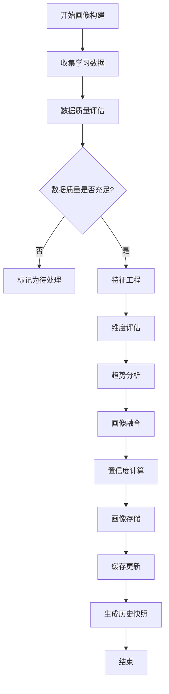
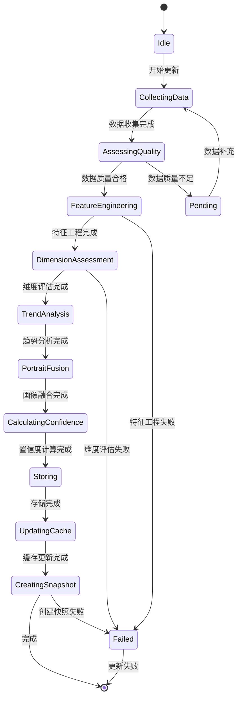

# 用户学习画像与能力维度模型详细设计

## 1. 概述

### 1.1 模块定位

用户学习画像与能力维度模型是 PrimeTop 平台的数据智能基础模块，负责构建、维护和更新学生的学习画像，包括多维度的能力评估、学习特征建模和动态画像演化追踪。

### 1.2 核心职责

- **多维度能力评估**：构建覆盖计算能力、阅读理解、逻辑推理、表达能力等多个维度的能力评估模型
- **动态画像构建**：基于学习行为、答题数据、错题记录等实时构建和更新学习画像
- **学习特征提取**：识别学习风格、学习习惯、认知水平等个性化特征
- **画像服务化**：为推荐系统、学习规划、内容适配等模块提供画像数据服务
- **可视化呈现**：支持多端的能力维度可视化展示和趋势分析

### 1.3 依赖关系

**依赖的模块：**
- 题目服务（获取答题记录）
- 学习服务（获取学习行为数据）
- 错题服务（获取错题数据）
- 学科数据服务（获取学科、知识点元数据）

**被依赖的模块：**
- 个性化推荐引擎（依赖画像进行推荐决策）
- 学习规划服务（依赖画像制定学习计划）
- 内容适配引擎（依赖画像适配内容难度）
- 学情分析服务（依赖画像生成分析报告）

### 1.4 设计目标

- **准确性**：画像数据准确反映学生的真实能力和学习状态
- **实时性**：画像更新延迟不超过 5 分钟
- **可解释性**：画像维度和指标具有明确的业务含义和可解释性
- **扩展性**：支持新的维度和指标的灵活扩展
- **隐私保护**：画像数据符合隐私合规要求，支持数据匿名化

## 2. 数据模型

### 2.1 核心实体定义

#### 2.1.1 UserAbilityProfile（用户能力画像）

```json
{
  "user_id": "string",
  "grade_level": "string",
  "grade_update_time": "datetime",
  "update_time": "datetime",
  "version": "int",
  "overall_score": "float",
  "overall_level": "string",
  "dimensions": {
    "computation": {
      "score": "float",
      "level": "string",
      "trend": "string",
      "confidence": "float",
      "assessment_count": "int",
      "last_assessment_time": "datetime"
    },
    "reading": {
      "score": "float",
      "level": "string",
      "trend": "string",
      "confidence": "float",
      "assessment_count": "int",
      "last_assessment_time": "datetime"
    },
    "logic": {
      "score": "float",
      "level": "string",
      "trend": "string",
      "confidence": "float",
      "assessment_count": "int",
      "last_assessment_time": "datetime"
    },
    "expression": {
      "score": "float",
      "level": "string",
      "trend": "string",
      "confidence": "float",
      "assessment_count": "int",
      "last_assessment_time": "datetime"
    },
    "memory": {
      "score": "float",
      "level": "string",
      "trend": "string",
      "confidence": "float",
      "assessment_count": "int",
      "last_assessment_time": "datetime"
    },
    "attention": {
      "score": "float",
      "level": "string",
      "trend": "string",
      "confidence": "float",
      "assessment_count": "int",
      "last_assessment_time": "datetime"
    }
  },
  "subject_mastery": {
    "chinese": {
      "score": "float",
      "level": "string",
      "strength_points": ["string"],
      "weakness_points": ["string"]
    },
    "math": {
      "score": "float",
      "level": "string",
      "strength_points": ["string"],
      "weakness_points": ["string"]
    },
    "english": {
      "score": "float",
      "level": "string",
      "strength_points": ["string"],
      "weakness_points": ["string"]
    }
  },
  "learning_style": {
    "visual_preference": "float",
    "auditory_preference": "float",
    "kinesthetic_preference": "float",
    "dominant_style": "string"
  },
  "behavior_features": {
    "avg_study_duration": "int",
    "preferred_study_time": "string",
    "learning_frequency": "int",
    "consistency_score": "float",
    "engagement_level": "string"
  },
  "confidence_intervals": {
    "computation": {"lower": "float", "upper": "float"},
    "reading": {"lower": "float", "upper": "float"},
    "logic": {"lower": "float", "upper": "float"},
    "expression": {"lower": "float", "upper": "float"},
    "memory": {"lower": "float", "upper": "float"},
    "attention": {"lower": "float", "upper": "float"}
  }
}
```

#### 2.1.2 AbilityAssessmentRecord（能力评估记录）

```json
{
  "assessment_id": "string",
  "user_id": "string",
  "dimension": "string",
  "assessment_type": "string",
  "score": "float",
  "confidence": "float",
  "assessment_data": "object",
  "source_type": "string",
  "source_id": "string",
  "assessment_time": "datetime",
  "data_quality_score": "float"
}
```

#### 2.1.3 LearningBehaviorRecord（学习行为记录）

```json
{
  "behavior_id": "string",
  "user_id": "string",
  "behavior_type": "string",
  "session_id": "string",
  "duration": "int",
  "interaction_count": "int",
  "content_type": "string",
  "subject": "string",
  "difficulty_level": "string",
  "timestamp": "datetime",
  "device_type": "string",
  "context_data": "object"
}
```

#### 2.1.4 PortraitHistory（画像历史快照）

```json
{
  "snapshot_id": "string",
  "user_id": "string",
  "snapshot_data": "object",
  "snapshot_time": "datetime",
  "trigger_reason": "string",
  "data_version": "string"
}
```

### 2.2 数据库表结构

#### 2.2.1 user_ability_profiles 表

```sql
CREATE TABLE user_ability_profiles (
    user_id VARCHAR(64) PRIMARY KEY,
    grade_level VARCHAR(32) NOT NULL,
    grade_update_time DATETIME NOT NULL,
    update_time DATETIME NOT NULL,
    version INT NOT NULL DEFAULT 1,
    overall_score DECIMAL(5,2) NOT NULL,
    overall_level VARCHAR(16) NOT NULL,
    dimensions JSON NOT NULL,
    subject_mastery JSON NOT NULL,
    learning_style JSON NOT NULL,
    behavior_features JSON NOT NULL,
    confidence_intervals JSON NOT NULL,
    created_at DATETIME NOT NULL DEFAULT CURRENT_TIMESTAMP,
    updated_at DATETIME NOT NULL DEFAULT CURRENT_TIMESTAMP ON UPDATE CURRENT_TIMESTAMP,
    INDEX idx_grade_level (grade_level),
    INDEX idx_update_time (update_time),
    INDEX idx_overall_level (overall_level)
) ENGINE=InnoDB DEFAULT CHARSET=utf8mb4 COLLATE=utf8mb4_unicode_ci;
```

#### 2.2.2 ability_assessment_records 表

```sql
CREATE TABLE ability_assessment_records (
    assessment_id VARCHAR(64) PRIMARY KEY,
    user_id VARCHAR(64) NOT NULL,
    dimension VARCHAR(32) NOT NULL,
    assessment_type VARCHAR(32) NOT NULL,
    score DECIMAL(5,2) NOT NULL,
    confidence DECIMAL(3,2) NOT NULL,
    assessment_data JSON,
    source_type VARCHAR(32) NOT NULL,
    source_id VARCHAR(64) NOT NULL,
    assessment_time DATETIME NOT NULL,
    data_quality_score DECIMAL(3,2) NOT NULL,
    created_at DATETIME NOT NULL DEFAULT CURRENT_TIMESTAMP,
    INDEX idx_user_dimension (user_id, dimension),
    INDEX idx_assessment_time (assessment_time),
    INDEX idx_source (source_type, source_id),
    FOREIGN KEY (user_id) REFERENCES users(user_id) ON DELETE CASCADE
) ENGINE=InnoDB DEFAULT CHARSET=utf8mb4 COLLATE=utf8mb4_unicode_ci;
```

#### 2.2.3 learning_behavior_records 表

```sql
CREATE TABLE learning_behavior_records (
    behavior_id VARCHAR(64) PRIMARY KEY,
    user_id VARCHAR(64) NOT NULL,
    behavior_type VARCHAR(32) NOT NULL,
    session_id VARCHAR(64) NOT NULL,
    duration INT NOT NULL,
    interaction_count INT NOT NULL DEFAULT 0,
    content_type VARCHAR(32) NOT NULL,
    subject VARCHAR(32),
    difficulty_level VARCHAR(16),
    timestamp DATETIME NOT NULL,
    device_type VARCHAR(16) NOT NULL,
    context_data JSON,
    created_at DATETIME NOT NULL DEFAULT CURRENT_TIMESTAMP,
    INDEX idx_user_time (user_id, timestamp),
    INDEX idx_behavior_type (behavior_type),
    INDEX idx_session (session_id),
    INDEX idx_subject (subject),
    FOREIGN KEY (user_id) REFERENCES users(user_id) ON DELETE CASCADE
) ENGINE=InnoDB DEFAULT CHARSET=utf8mb4 COLLATE=utf8mb4_unicode_ci
PARTITION BY RANGE (UNIX_TIMESTAMP(timestamp)) (
    PARTITION p202401 VALUES LESS THAN (UNIX_TIMESTAMP('2024-02-01')),
    PARTITION p202402 VALUES LESS THAN (UNIX_TIMESTAMP('2024-03-01')),
    PARTITION p202403 VALUES LESS THAN (UNIX_TIMESTAMP('2024-04-01')),
    PARTITION p202404 VALUES LESS THAN (UNIX_TIMESTAMP('2024-05-01')),
    PARTITION p202405 VALUES LESS THAN (UNIX_TIMESTAMP('2024-06-01')),
    PARTITION p202406 VALUES LESS THAN (UNIX_TIMESTAMP('2024-07-01')),
    PARTITION pmax VALUES LESS THAN MAXVALUE
);
```

#### 2.2.4 portrait_history_snapshots 表

```sql
CREATE TABLE portrait_history_snapshots (
    snapshot_id VARCHAR(64) PRIMARY KEY,
    user_id VARCHAR(64) NOT NULL,
    snapshot_data JSON NOT NULL,
    snapshot_time DATETIME NOT NULL,
    trigger_reason VARCHAR(32) NOT NULL,
    data_version VARCHAR(16) NOT NULL,
    created_at DATETIME NOT NULL DEFAULT CURRENT_TIMESTAMP,
    INDEX idx_user_time (user_id, snapshot_time),
    INDEX idx_trigger (trigger_reason),
    FOREIGN KEY (user_id) REFERENCES users(user_id) ON DELETE CASCADE
) ENGINE=InnoDB DEFAULT CHARSET=utf8mb4 COLLATE=utf8mb4_unicode_ci;
```

### 2.3 缓存策略

#### 2.3.1 Redis 缓存设计

```python
# 缓存键设计
USER_PORTRAIT_KEY = "user:portrait:{user_id}"
USER_DIMENSION_KEY = "user:dimension:{user_id}:{dimension}"
BEHAVIOR_SUMMARY_KEY = "user:behavior:summary:{user_id}:{date}"

# 缓存过期时间
PORTRAIT_CACHE_TTL = 3600  # 1小时
DIMENSION_CACHE_TTL = 1800  # 30分钟
BEHAVIOR_CACHE_TTL = 7200  # 2小时

# 缓存数据结构
# User Portrait (Hash)
{
    "user_id": "12345",
    "overall_score": "78.5",
    "overall_level": "中等",
    "dimensions": "{json_string}",
    "update_time": "2024-01-15 10:30:00"
}

# Behavior Summary (Sorted Set - for recent behaviors)
# Key: user:behavior:timeline:{user_id}
# Score: timestamp
# Member: behavior_id
```

#### 2.3.2 缓存更新策略

- **写穿透**：画像更新时同步更新缓存
- **懒加载**：首次访问时从数据库加载并缓存
- **定时刷新**：每 30 分钟检查画像更新时间，必要时刷新
- **多级缓存**：本地缓存 + Redis 缓存

## 3. API 接口设计

### 3.1 接口列表

| 接口路径 | 方法 | 描述 |
|---------|------|------|
| `/api/v1/portrait/{userId}` | GET | 获取用户完整画像 |
| `/api/v1/portrait/{userId}/dimension/{dimension}` | GET | 获取特定维度能力 |
| `/api/v1/portrait/{userId}/history` | GET | 获取画像历史趋势 |
| `/api/v1/portrait/{userId}/subjects` | GET | 获取学科掌握度 |
| `/api/v1/portrait/{userId}/behavior` | GET | 获取学习行为特征 |
| `/api/v1/portrait/{userId}/radar` | GET | 获取能力雷达图数据 |
| `/api/v1/portrait/{userId}/update` | POST | 触发画像更新 |
| `/api/v1/portrait/batch/update` | POST | 批量更新画像 |
| `/api/v1/portrait/{userId}/export` | GET | 导出画像数据 |
| `/api/v1/portrait/analytics/dimensions` | GET | 维度统计分析 |

### 3.2 接口详细设计

#### 3.2.1 获取用户完整画像

```http
GET /api/v1/portrait/{userId}
```

**请求参数：**
```json
{
  "include_history": false,
  "include_behavior": false,
  "include_subjects": true
}
```

**响应格式：**
```json
{
  "code": 200,
  "message": "success",
  "data": {
    "user_id": "12345",
    "grade_level": "小学四年级",
    "update_time": "2024-01-15T10:30:00Z",
    "overall_score": 78.5,
    "overall_level": "中等",
    "dimensions": {
      "computation": {
        "score": 82.3,
        "level": "良好",
        "trend": "上升",
        "confidence": 0.87,
        "assessment_count": 45
      },
      "reading": {
        "score": 75.6,
        "level": "中等",
        "trend": "稳定",
        "confidence": 0.79,
        "assessment_count": 38
      }
    },
    "subject_mastery": {
      "chinese": {
        "score": 76.8,
        "level": "中等",
        "strength_points": ["古诗文", "阅读理解"],
        "weakness_points": ["写作", "成语"]
      }
    },
    "learning_style": {
      "visual_preference": 0.35,
      "auditory_preference": 0.28,
      "kinesthetic_preference": 0.37,
      "dominant_style": "动觉型"
    },
    "behavior_features": {
      "avg_study_duration": 45,
      "preferred_study_time": "晚上",
      "learning_frequency": 5.2,
      "consistency_score": 0.72,
      "engagement_level": "较高"
    }
  }
}
```

#### 3.2.2 获取能力雷达图数据

```http
GET /api/v1/portrait/{userId}/radar
```

**请求参数：**
```json
{
  "dimensions": ["computation", "reading", "logic", "expression", "memory", "attention"],
  "compare_with": ["grade_average", "last_month"]
}
```

**响应格式：**
```json
{
  "code": 200,
  "message": "success",
  "data": {
    "current": {
      "dimensions": [
        {"name": "计算能力", "value": 82.3},
        {"name": "阅读理解", "value": 75.6},
        {"name": "逻辑推理", "value": 71.2},
        {"name": "表达能力", "value": 68.9},
        {"name": "记忆力", "value": 79.4},
        {"name": "注意力", "value": 74.1}
      ],
      "overall": 75.3
    },
    "comparisons": {
      "grade_average": {
        "dimensions": [
          {"name": "计算能力", "value": 75.0},
          {"name": "阅读理解", "value": 72.0},
          {"name": "逻辑推理", "value": 68.0},
          {"name": "表达能力", "value": 65.0},
          {"name": "记忆力", "value": 74.0},
          {"name": "注意力", "value": 70.0}
        ],
        "overall": 70.7
      },
      "last_month": {
        "dimensions": [
          {"name": "计算能力", "value": 78.5},
          {"name": "阅读理解", "value": 73.2},
          {"name": "逻辑推理", "value": 69.8},
          {"name": "表达能力", "value": 67.5},
          {"name": "记忆力", "value": 77.1},
          {"name": "注意力", "value": 72.3}
        ],
        "overall": 73.1
      }
    }
  }
}
```

#### 3.2.3 获取画像历史趋势

```http
GET /api/v1/portrait/{userId}/history
```

**请求参数：**
```json
{
  "start_date": "2024-01-01",
  "end_date": "2024-01-15",
  "dimensions": ["overall", "computation", "reading"],
  "granularity": "day"
}
```

**响应格式：**
```json
{
  "code": 200,
  "message": "success",
  "data": {
    "time_range": {
      "start": "2024-01-01",
      "end": "2024-01-15"
    },
    "series": [
      {
        "dimension": "overall",
        "name": "综合能力",
        "data": [
          {"date": "2024-01-01", "value": 72.3},
          {"date": "2024-01-02", "value": 72.5},
          {"date": "2024-01-03", "value": 73.1},
          {"date": "2024-01-04", "value": 73.0},
          {"date": "2024-01-05", "value": 74.2}
        ]
      },
      {
        "dimension": "computation",
        "name": "计算能力",
        "data": [
          {"date": "2024-01-01", "value": 75.2},
          {"date": "2024-01-02", "value": 76.0},
          {"date": "2024-01-03", "value": 77.5},
          {"date": "2024-01-04", "value": 78.1},
          {"date": "2024-01-05", "value": 79.3}
        ]
      }
    ],
    "milestones": [
      {"date": "2024-01-03", "type": "milestone", "description": "完成100道计算练习"},
      {"date": "2024-01-05", "type": "breakthrough", "description": "计算能力突破80分"}
    ]
  }
}
```

#### 3.2.4 触发画像更新

```http
POST /api/v1/portrait/{userId}/update
```

**请求参数：**
```json
{
  "update_type": "incremental",
  "force_update": false,
  "data_sources": ["answers", "behavior", "mistakes"],
  "priority": "normal"
}
```

**响应格式：**
```json
{
  "code": 200,
  "message": "画像更新任务已提交",
  "data": {
    "task_id": "portrait_update_1234567890",
    "status": "queued",
    "estimated_completion_time": "2024-01-15T10:35:00Z",
    "update_type": "incremental"
  }
}
```

### 3.3 错误码定义

| 错误码 | 描述 | HTTP 状态码 |
|-------|------|------------|
| 10001 | 用户不存在 | 404 |
| 10002 | 画像数据不存在 | 404 |
| 10003 | 维度名称无效 | 400 |
| 10004 | 时间范围无效 | 400 |
| 10005 | 画像更新任务已存在 | 409 |
| 10006 | 画像服务暂时不可用 | 503 |
| 10007 | 数据质量不足，无法生成画像 | 400 |
| 10008 | 画像导出失败 | 500 |
| 10009 | 批量更新超出限制 | 400 |

## 4. 业务逻辑

### 4.1 核心流程

#### 4.1.1 画像构建流程



#### 4.1.2 维度评估算法

**计算能力评估：**
```python
def assess_computation_ability(answers: List[AnswerRecord]) -> Dict:
    """
    评估计算能力
    基于答题正确率、解题速度、题目类型等维度
    """
    computation_answers = [a for a in answers if is_computation_question(a)]
    if not computation_answers:
        return {"score": 0, "confidence": 0, "level": "未知"}
    
    # 正确率
    accuracy = sum(a.is_correct for a in computation_answers) / len(computation_answers)
    
    # 速度得分（基于平均答题时间）
    avg_time = sum(a.duration for a in computation_answers) / len(computation_answers)
    speed_score = calculate_speed_score(avg_time)
    
    # 难度适应性
    difficulty_adaptability = assess_difficulty_adaptation(computation_answers)
    
    # 稳定性评估
    stability = assess_answer_stability(computation_answers)
    
    # 综合得分
    final_score = (
        accuracy * 0.4 +
        speed_score * 0.2 +
        difficulty_adaptability * 0.25 +
        stability * 0.15
    ) * 100
    
    # 置信度计算
    confidence = min(len(computation_answers) / 30, 1.0)  # 至少30题才能达到最高置信度
    
    # 能力等级
    level = map_score_to_level(final_score)
    
    return {
        "score": round(final_score, 2),
        "level": level,
        "confidence": round(confidence, 2),
        "assessment_count": len(computation_answers),
        "details": {
            "accuracy": round(accuracy * 100, 2),
            "speed_score": round(speed_score * 100, 2),
            "stability": round(stability * 100, 2)
        }
    }
```

**阅读理解评估：**
```python
def assess_reading_ability(answers: List[AnswerRecord], behaviors: List[BehaviorRecord]) -> Dict:
    """
    评估阅读理解能力
    基于阅读理解答题正确率、阅读时长、理解深度等维度
    """
    reading_answers = [a for a in answers if is_reading_question(a)]
    reading_behaviors = [b for b in behaviors if b.content_type == 'reading']
    
    if not reading_answers:
        return {"score": 0, "confidence": 0, "level": "未知"}
    
    # 阅读正确率
    accuracy = sum(a.is_correct for a in reading_answers) / len(reading_answers)
    
    # 阅读速度和效率
    reading_efficiency = assess_reading_efficiency(reading_behaviors)
    
    # 理解深度（基于题目类型）
    comprehension_depth = assess_comprehension_depth(reading_answers)
    
    # 阅读习惯（重读、笔记等）
    reading_habits = assess_reading_habits(reading_behaviors)
    
    # 综合得分
    final_score = (
        accuracy * 0.5 +
        reading_efficiency * 0.2 +
        comprehension_depth * 0.2 +
        reading_habits * 0.1
    ) * 100
    
    # 置信度
    confidence = min(len(reading_answers) / 25, 1.0)
    
    # 能力等级
    level = map_score_to_level(final_score)
    
    return {
        "score": round(final_score, 2),
        "level": level,
        "confidence": round(confidence, 2),
        "assessment_count": len(reading_answers),
        "details": {
            "accuracy": round(accuracy * 100, 2),
            "reading_efficiency": round(reading_efficiency * 100, 2),
            "comprehension_depth": round(comprehension_depth * 100, 2)
        }
    }
```

#### 4.1.3 趋势分析算法

```python
def analyze_trend(historical_data: List[Dict], window_size: int = 7) -> Dict:
    """
    分析能力变化趋势
    """
    if len(historical_data) < window_size:
        return {"trend": "数据不足", "change_rate": 0}
    
    # 计算最近window_size天的平均分
    recent_avg = sum(d['score'] for d in historical_data[-window_size:]) / window_size
    
    # 计算前window_size天的平均分
    previous_avg = sum(d['score'] for d in historical_data[-(window_size*2):-window_size]) / window_size
    
    # 变化率
    change_rate = ((recent_avg - previous_avg) / previous_avg) * 100
    
    # 趋势判断
    if change_rate > 5:
        trend = "快速上升"
    elif change_rate > 2:
        trend = "稳步上升"
    elif change_rate > -2:
        trend = "稳定"
    elif change_rate > -5:
        trend = "略有下降"
    else:
        trend = "明显下降"
    
    # 线性回归分析长期趋势
    scores = [d['score'] for d in historical_data]
    linear_trend = calculate_linear_regression(scores)
    
    return {
        "trend": trend,
        "change_rate": round(change_rate, 2),
        "recent_avg": round(recent_avg, 2),
        "previous_avg": round(previous_avg, 2),
        "linear_trend": {
            "slope": round(linear_trend['slope'], 4),
            "direction": "上升" if linear_trend['slope'] > 0 else "下降",
            "r_squared": round(linear_trend['r_squared'], 3)
        },
        "volatility": calculate_volatility(scores)
    }
```

#### 4.1.4 学习风格识别算法

```python
def identify_learning_style(behaviors: List[BehaviorRecord]) -> Dict:
    """
    识别学习风格（视觉型、听觉型、动觉型）
    """
    style_indicators = {
        'visual': 0,
        'auditory': 0,
        'kinesthetic': 0
    }
    
    for behavior in behaviors:
        # 视觉型特征：喜欢看图表、视频、图像
        if behavior.content_type in ['video', 'image', 'chart']:
            style_indicators['visual'] += behavior.duration * 0.1
        
        # 听觉型特征：喜欢音频、语音交互
        if behavior.content_type in ['audio', 'voice_interaction']:
            style_indicators['auditory'] += behavior.duration * 0.1
        
        # 动觉型特征：喜欢互动练习、操作
        if behavior.behavior_type in ['practice', 'interactive', 'experiment']:
            style_indicators['kinesthetic'] += behavior.duration * 0.15
    
    # 归一化
    total = sum(style_indicators.values())
    if total > 0:
        for style in style_indicators:
            style_indicators[style] = style_indicators[style] / total
    
    # 找出主导风格
    dominant_style = max(style_indicators, key=style_indicators.get)
    
    return {
        "visual_preference": round(style_indicators['visual'], 3),
        "auditory_preference": round(style_indicators['auditory'], 3),
        "kinesthetic_preference": round(style_indicators['kinesthetic'], 3),
        "dominant_style": map_style_to_name(dominant_style),
        "confidence": round(total / (len(behaviors) * 100), 3)  # 基于行为数据量
    }
```

### 4.2 状态机

#### 4.2.1 画像更新状态机



### 4.3 关键算法

#### 4.3.1 置信度计算算法

```python
def calculate_confidence(
    data_points: int,
    data_quality_score: float,
    time_span: int,
    recency_score: float
) -> float:
    """
    计算画像数据的置信度
    考虑数据量、数据质量、时间跨度、数据新鲜度等因素
    
    Args:
        data_points: 数据点数量
        data_quality_score: 数据质量分数 (0-1)
        time_span: 数据覆盖的时间跨度（天）
        recency_score: 数据新鲜度分数 (0-1)
    
    Returns:
        置信度分数 (0-1)
    """
    # 数据量因子（至少需要20个数据点才能达到基本置信度）
    data_volume_factor = min(data_points / 50, 1.0)
    
    # 数据质量因子
    data_quality_factor = data_quality_score
    
    # 时间跨度因子（太短或太长都不好，理想是7-30天）
    if 7 <= time_span <= 30:
        time_span_factor = 1.0
    elif time_span < 7:
        time_span_factor = time_span / 7
    else:
        time_span_factor = max(0.5, 1.0 - (time_span - 30) / 90)
    
    # 新鲜度因子
    recency_factor = recency_score
    
    # 综合置信度
    confidence = (
        data_volume_factor * 0.3 +
        data_quality_factor * 0.3 +
        time_span_factor * 0.2 +
        recency_factor * 0.2
    )
    
    return round(confidence, 3)
```

#### 4.3.2 画像融合算法

```python
def fuse_portrait(
    dimension_scores: Dict[str, float],
    subject_mastery: Dict[str, float],
    behavior_features: Dict[str, Any],
    learning_style: Dict[str, float]
) -> Dict:
    """
    融合多维度数据生成完整画像
    """
    # 计算综合得分
    dimension_weights = {
        'computation': 0.2,
        'reading': 0.15,
        'logic': 0.15,
        'expression': 0.1,
        'memory': 0.1,
        'attention': 0.1
    }
    
    weighted_sum = sum(
        dimension_scores[dim] * weight
        for dim, weight in dimension_weights.items()
        if dim in dimension_scores
    )
    total_weight = sum(
        weight for dim, weight in dimension_weights.items()
        if dim in dimension_scores
    )
    
    overall_score = weighted_sum / total_weight if total_weight > 0 else 0
    overall_level = map_score_to_level(overall_score)
    
    # 计算学科强弱点
    subject_scores = subject_mastery
    sorted_subjects = sorted(subject_scores.items(), key=lambda x: x[1], reverse=True)
    
    strength_points = []
    weakness_points = []
    
    if len(sorted_subjects) >= 2:
        threshold = sum(score for _, score in sorted_subjects) / len(sorted_subjects)
        for subject, score in sorted_subjects:
            if score >= threshold:
                strength_points.append(subject)
            else:
                weakness_points.append(subject)
    
    return {
        "overall_score": round(overall_score, 2),
        "overall_level": overall_level,
        "dimensions": dimension_scores,
        "subject_mastery": subject_mastery,
        "learning_style": learning_style,
        "behavior_features": behavior_features,
        "meta": {
            "data_completeness": len(dimension_scores) / len(dimension_weights),
            "fusion_timestamp": datetime.now().isoformat(),
            "version": generate_version()
        }
    }
```

## 5. 代码示例

### 5.1 核心类定义

```python
# portrait_service.py
from typing import Dict, List, Optional
from datetime import datetime, timedelta
from dataclasses import dataclass
import numpy as np
from scipy import stats

@dataclass
class DimensionScore:
    """维度得分"""
    dimension: str
    score: float
    level: str
    trend: str
    confidence: float
    assessment_count: int
    last_assessment_time: datetime
    
    def to_dict(self) -> Dict:
        return {
            "score": self.score,
            "level": self.level,
            "trend": self.trend,
            "confidence": self.confidence,
            "assessment_count": self.assessment_count,
            "last_assessment_time": self.last_assessment_time.isoformat()
        }

@dataclass
class LearningStyle:
    """学习风格"""
    visual_preference: float
    auditory_preference: float
    kinesthetic_preference: float
    dominant_style: str
    
    def to_dict(self) -> Dict:
        return {
            "visual_preference": self.visual_preference,
            "auditory_preference": self.auditory_preference,
            "kinesthetic_preference": self.kinesthetic_preference,
            "dominant_style": self.dominant_style
        }

@dataclass
class BehaviorFeatures:
    """学习行为特征"""
    avg_study_duration: int  # 平均学习时长（分钟）
    preferred_study_time: str  # 首选学习时间段
    learning_frequency: float  # 学习频率（次/周）
    consistency_score: float  # 学习一致性分数
    engagement_level: str  # 参与度等级
    
    def to_dict(self) -> Dict:
        return {
            "avg_study_duration": self.avg_study_duration,
            "preferred_study_time": self.preferred_study_time,
            "learning_frequency": self.learning_frequency,
            "consistency_score": self.consistency_score,
            "engagement_level": self.engagement_level
        }

class PortraitService:
    """画像服务核心类"""
    
    def __init__(self, db_client, cache_client):
        self.db_client = db_client
        self.cache_client = cache_client
        self.dimension_assessors = {
            'computation': self.assess_computation,
            'reading': self.assess_reading,
            'logic': self.assess_logic,
            'expression': self.assess_expression,
            'memory': self.assess_memory,
            'attention': self.assess_attention
        }
    
    async def get_user_portrait(self, user_id: str, **options) -> Dict:
        """获取用户完整画像"""
        # 尝试从缓存获取
        cache_key = f"user:portrait:{user_id}"
        cached_portrait = await self.cache_client.get(cache_key)
        if cached_portrait:
            return json.loads(cached_portrait)
        
        # 从数据库获取
        portrait_data = await self.db_client.query(
            "SELECT * FROM user_ability_profiles WHERE user_id = %s",
            (user_id,)
        )
        
        if not portrait_data:
            # 触发画像构建
            await self.trigger_portrait_update(user_id, update_type='initial')
            return {"error": "画像正在构建中"}
        
        portrait = self._format_portrait_data(portrait_data[0])
        
        # 缓存结果
        await self.cache_client.setex(
            cache_key,
            3600,
            json.dumps(portrait)
        )
        
        return portrait
    
    async def update_portrait(self, user_id: str, update_type: str = 'incremental') -> Dict:
        """更新用户画像"""
        # 检查是否有正在进行的更新任务
        existing_task = await self._check_existing_task(user_id)
        if existing_task and update_type != 'force':
            return {"error": "画像更新任务正在进行中"}
        
        # 创建更新任务
        task_id = f"portrait_update_{datetime.now().timestamp()}"
        await self._create_update_task(task_id, user_id, update_type)
        
        # 异步执行更新
        asyncio.create_task(self._execute_portrait_update(task_id, user_id, update_type))
        
        return {
            "task_id": task_id,
            "status": "queued",
            "estimated_completion_time": (datetime.now() + timedelta(minutes=2)).isoformat()
        }
    
    async def _execute_portrait_update(self, task_id: str, user_id: str, update_type: str):
        """执行画像更新的核心逻辑"""
        try:
            await self._update_task_status(task_id, "processing")
            
            # 1. 收集数据
            learning_data = await self._collect_learning_data(user_id)
            
            # 2. 数据质量评估
            quality_score = self._assess_data_quality(learning_data)
            
            if quality_score < 0.5:
                await self._update_task_status(task_id, "low_quality")
                return
            
            # 3. 维度评估
            dimension_scores = {}
            for dimension, assessor in self.dimension_assessors.items():
                try:
                    score_data = await assessor(learning_data)
                    dimension_scores[dimension] = score_data
                except Exception as e:
                    logging.error(f"维度评估失败: {dimension}, 错误: {e}")
            
            # 4. 学科掌握度评估
            subject_mastery = await self._assess_subject_mastery(learning_data)
            
            # 5. 学习风格识别
            learning_style = await self._identify_learning_style(learning_data['behaviors'])
            
            # 6. 行为特征提取
            behavior_features = await self._extract_behavior_features(learning_data['behaviors'])
            
            # 7. 趋势分析
            historical_data = await self._get_historical_data(user_id)
            for dimension in dimension_scores:
                if dimension in historical_data:
                    trend_data = self._analyze_trend(historical_data[dimension])
                    dimension_scores[dimension].trend = trend_data['trend']
            
            # 8. 画像融合
            portrait = self._fuse_portrait(
                dimension_scores,
                subject_mastery,
                behavior_features,
                learning_style
            )
            
            # 9. 置信度计算
            confidence_intervals = self._calculate_confidence_intervals(dimension_scores)
            
            # 10. 存储画像
            await self._save_portrait(user_id, portrait, confidence_intervals)
            
            # 11. 创建历史快照
            await self._create_snapshot(user_id, portrait)
            
            # 12. 更新缓存
            await self._update_cache(user_id, portrait)
            
            await self._update_task_status(task_id, "completed")
            
        except Exception as e:
            logging.error(f"画像更新失败: {user_id}, 错误: {e}")
            await self._update_task_status(task_id, "failed")
```

### 5.2 关键方法实现

```python
# dimension_assessors.py
from typing import Dict, List
import numpy as np

class DimensionAssessors:
    """维度评估器集合"""
    
    @staticmethod
    async def assess_computation(learning_data: Dict) -> Dict:
        """评估计算能力"""
        answers = learning_data.get('answers', [])
        computation_answers = [a for a in answers if a.get('subject') == '数学' and 
                               a.get('question_type') in ['计算题', '应用题']]
        
        if len(computation_answers) < 5:
            return DimensionScore(
                dimension='computation',
                score=0,
                level='数据不足',
                trend='稳定',
                confidence=0,
                assessment_count=len(computation_answers),
                last_assessment_time=datetime.now()
            ).to_dict()
        
        # 正确率
        correct_count = sum(1 for a in computation_answers if a.get('is_correct'))
        accuracy = correct_count / len(computation_answers)
        
        # 速度评估
        durations = [a.get('duration', 0) for a in computation_answers if a.get('duration')]
        avg_duration = np.mean(durations) if durations else 0
        speed_score = max(0, 1 - (avg_duration / 300))  # 5分钟为满分基准
        
        # 难度适应性
        difficulties = [a.get('difficulty', 0.5) for a in computation_answers]
        difficulty_adaptability = np.mean(difficulties) if difficulties else 0.5
        
        # 稳定性
        recent_scores = [a.get('score', 0) for a in computation_answers[-10:]]
        stability = 1 - np.std(recent_scores) if len(recent_scores) > 1 else 0.5
        
        # 综合得分
        final_score = (
            accuracy * 0.4 +
            speed_score * 0.2 +
            difficulty_adaptability * 0.25 +
            stability * 0.15
        ) * 100
        
        # 置信度
        confidence = min(len(computation_answers) / 30, 1.0)
        
        # 能力等级
        level = DimensionAssessors._map_score_to_level(final_score)
        
        return DimensionScore(
            dimension='computation',
            score=round(final_score, 2),
            level=level,
            trend='稳定',
            confidence=round(confidence, 2),
            assessment_count=len(computation_answers),
            last_assessment_time=datetime.now()
        ).to_dict()
    
    @staticmethod
    async def assess_reading(learning_data: Dict) -> Dict:
        """评估阅读理解能力"""
        answers = learning_data.get('answers', [])
        reading_answers = [a for a in answers if a.get('subject') in ['语文', '英语'] and 
                          a.get('question_type') in ['阅读理解', '完形填空']]
        
        behaviors = learning_data.get('behaviors', [])
        reading_behaviors = [b for b in behaviors if b.get('content_type') == 'reading']
        
        if len(reading_answers) < 5:
            return DimensionScore(
                dimension='reading',
                score=0,
                level='数据不足',
                trend='稳定',
                confidence=0,
                assessment_count=len(reading_answers),
                last_assessment_time=datetime.now()
            ).to_dict()
        
        # 正确率
        correct_count = sum(1 for a in reading_answers if a.get('is_correct'))
        accuracy = correct_count / len(reading_answers)
        
        # 阅读效率
        if reading_behaviors:
            reading_durations = [b.get('duration', 0) for b in reading_behaviors]
            word_counts = [b.get('word_count', 500) for b in reading_behaviors]
            reading_speeds = [w/d * 60 if d > 0 else 0 for w, d in zip(word_counts, reading_durations)]
            avg_reading_speed = np.mean(reading_speeds) if reading_speeds else 0
            # 理想阅读速度为300-500词/分钟
            efficiency_score = 1 - abs(avg_reading_speed - 400) / 400
            efficiency_score = max(0, efficiency_score)
        else:
            efficiency_score = 0.5
        
        # 理解深度（基于题目难度）
        difficulties = [a.get('difficulty', 0.5) for a in reading_answers]
        comprehension_depth = np.mean(difficulties) if difficulties else 0.5
        
        # 阅读习惯（重读、标记等）
        deep_reading_count = sum(1 for b in reading_behaviors 
                                 if b.get('interaction_count', 0) > 3)
        habit_score = min(deep_reading_count / len(reading_behaviors), 1.0) if reading_behaviors else 0.5
        
        # 综合得分
        final_score = (
            accuracy * 0.5 +
            efficiency_score * 0.2 +
            comprehension_depth * 0.2 +
            habit_score * 0.1
        ) * 100
        
        # 置信度
        confidence = min(len(reading_answers) / 25, 1.0)
        
        # 能力等级
        level = DimensionAssessors._map_score_to_level(final_score)
        
        return DimensionScore(
            dimension='reading',
            score=round(final_score, 2),
            level=level,
            trend='稳定',
            confidence=round(confidence, 2),
            assessment_count=len(reading_answers),
            last_assessment_time=datetime.now()
        ).to_dict()
    
    @staticmethod
    def _map_score_to_level(score: float) -> str:
        """将分数映射为能力等级"""
        if score >= 90:
            return '优秀'
        elif score >= 80:
            return '良好'
        elif score >= 70:
            return '中等'
        elif score >= 60:
            return '及格'
        else:
            return '需提升'
```

### 5.3 配置示例

```yaml
# config/portrait_config.yaml
portrait:
  # 维度配置
  dimensions:
    computation:
      name: "计算能力"
      weight: 0.2
      min_data_points: 5
      ideal_data_points: 30
      update_frequency: "daily"
    reading:
      name: "阅读理解"
      weight: 0.15
      min_data_points: 5
      ideal_data_points: 25
      update_frequency: "daily"
    logic:
      name: "逻辑推理"
      weight: 0.15
      min_data_points: 5
      ideal_data_points: 25
      update_frequency: "daily"
    expression:
      name: "表达能力"
      weight: 0.1
      min_data_points: 3
      ideal_data_points: 20
      update_frequency: "weekly"
    memory:
      name: "记忆力"
      weight: 0.1
      min_data_points: 3
      ideal_data_points: 20
      update_frequency: "weekly"
    attention:
      name: "注意力"
      weight: 0.1
      min_data_points: 5
      ideal_data_points: 30
      update_frequency: "daily"
  
  # 学科配置
  subjects:
    chinese:
      name: "语文"
      dimensions: ["reading", "expression", "memory"]
    math:
      name: "数学"
      dimensions: ["computation", "logic"]
    english:
      name: "英语"
      dimensions: ["reading", "memory", "expression"]
  
  # 更新策略
  update_strategy:
    auto_update: true
    update_interval_hours: 6
    batch_update_size: 100
    priority_update_threshold: 0.8  # 数据变化超过80%时优先更新
  
  # 缓存配置
  cache:
    enabled: true
    portrait_ttl: 3600
    dimension_ttl: 1800
    behavior_summary_ttl: 7200
  
  # 数据质量阈值
  data_quality:
    min_confidence_threshold: 0.5
    min_data_points_threshold: 5
    max_age_days: 90  # 数据超过90天视为过期
  
  # 趋势分析配置
  trend_analysis:
    window_size: 7
    min_data_points: 5
    volatility_threshold: 0.3
  
  # 学习风格配置
  learning_style:
    min_behavior_records: 20
    confidence_threshold: 0.6
    update_frequency: "weekly"
```

## 6. 错误处理

### 6.1 异常类型

```python
# exceptions.py
class PortraitException(Exception):
    """画像异常基类"""
    pass

class InsufficientDataError(PortraitException):
    """数据不足异常"""
    def __init__(self, dimension: str, required: int, actual: int):
        self.dimension = dimension
        self.required = required
        self.actual = actual
        super().__init__(f"维度 {dimension} 数据不足: 需要 {required} 条，实际 {actual} 条")

class LowDataQualityError(PortraitException):
    """低数据质量异常"""
    def __init__(self, quality_score: float):
        self.quality_score = quality_score
        super().__init__(f"数据质量过低: {quality_score:.2f} < 0.5")

class PortraitUpdateConflictError(PortraitException):
    """画像更新冲突异常"""
    def __init__(self, user_id: str, existing_task: str):
        self.user_id = user_id
        self.existing_task = existing_task
        super().__init__(f"用户 {user_id} 已有更新任务 {existing_task} 正在进行")

class PortraitNotFoundError(PortraitException):
    """画像不存在异常"""
    def __init__(self, user_id: str):
        self.user_id = user_id
        super().__init__(f"用户 {user_id} 的画像不存在")

class DimensionAssessmentError(PortraitException):
    """维度评估异常"""
    def __init__(self, dimension: str, reason: str):
        self.dimension = dimension
        self.reason = reason
        super().__init__(f"维度 {dimension} 评估失败: {reason}")
```

### 6.2 重试策略

```python
# retry_utils.py
from tenacity import retry, stop_after_attempt, wait_exponential, retry_if_exception_type

class PortraitRetryHandler:
    """画像服务重试处理器"""
    
    @staticmethod
    @retry(
        stop=stop_after_attempt(3),
        wait=wait_exponential(multiplier=1, min=2, max=10),
        retry=retry_if_exception_type((ConnectionError, TimeoutError))
    )
    async def retry_portrait_update(user_id: str, update_type: str):
        """重试画像更新"""
        portrait_service = PortraitService(get_db_client(), get_cache_client())
        return await portrait_service.update_portrait(user_id, update_type)
    
    @staticmethod
    @retry(
        stop=stop_after_attempt(2),
        wait=wait_exponential(multiplier=1, min=1, max=5),
        retry=retry_if_exception_type((ConnectionError, TimeoutError))
    )
    async def retry_dimension_assessment(user_id: str, dimension: str):
        """重试维度评估"""
        portrait_service = PortraitService(get_db_client(), get_cache_client())
        return await portrait_service.assess_dimension(user_id, dimension)
```

### 6.3 降级方案

```python
# fallback_handler.py
class PortraitFallbackHandler:
    """画像服务降级处理器"""
    
    @staticmethod
    async def get_cached_portrait(user_id: str) -> Dict:
        """获取缓存的画像（降级方案1）"""
        cache_client = get_cache_client()
        cached_portrait = await cache_client.get(f"user:portrait:{user_id}")
        if cached_portrait:
            return {
                "portrait": json.loads(cached_portrait),
                "source": "cache",
                "warning": "使用缓存数据，可能不是最新"
            }
        return {"error": "无可用缓存数据"}
    
    @staticmethod
    async def get_grade_level_average(user_id: str, grade_level: str) -> Dict:
        """获取年级平均水平（降级方案2）"""
        db_client = get_db_client()
        avg_portrait = await db_client.query(
            "SELECT AVG(overall_score) as avg_score, overall_level "
            "FROM user_ability_profiles WHERE grade_level = %s",
            (grade_level,)
        )
        
        if avg_portrait:
            return {
                "portrait": {
                    "overall_score": float(avg_portrait[0]['avg_score']),
                    "overall_level": avg_portrait[0]['overall_level'],
                    "source": "grade_average",
                    "warning": "使用年级平均水平，非个性化数据"
                }
            }
        return {"error": "无法获取年级平均水平"}
    
    @staticmethod
    async def get_default_portrait(grade_level: str) -> Dict:
        """获取默认画像（降级方案3）"""
        default_portraits = {
            "小学一年级": {"overall_score": 60.0, "overall_level": "中等"},
            "小学二年级": {"overall_score": 62.0, "overall_level": "中等"},
            "小学三年级": {"overall_score": 65.0, "overall_level": "中等"},
            # ... 其他年级默认值
        }
        
        default = default_portraits.get(grade_level, {"overall_score": 60.0, "overall_level": "中等"})
        return {
            "portrait": {
                **default,
                "source": "default",
                "warning": "使用默认值，请尽快完成评估"
            }
        }
```

## 7. 性能优化

### 7.1 缓存策略

#### 7.1.1 多级缓存实现

```python
# cache_manager.py
class PortraitCacheManager:
    """画像缓存管理器"""
    
    def __init__(self):
        self.local_cache = {}  # 进程内缓存
        self.redis_client = get_redis_client()
        self.cache_lock = asyncio.Lock()
    
    async def get_portrait(self, user_id: str) -> Optional[Dict]:
        """获取画像（多级缓存）"""
        # L1: 本地缓存
        if user_id in self.local_cache:
            cache_data = self.local_cache[user_id]
            if not self._is_expired(cache_data):
                return cache_data['data']
        
        # L2: Redis 缓存
        redis_key = f"user:portrait:{user_id}"
        redis_data = await self.redis_client.get(redis_key)
        if redis_data:
            portrait = json.loads(redis_data)
            # 回填本地缓存
            self.local_cache[user_id] = {
                'data': portrait,
                'timestamp': time.time(),
                'ttl': 300  # 本地缓存5分钟
            }
            return portrait
        
        return None
    
    async def set_portrait(self, user_id: str, portrait: Dict, ttl: int = 3600):
        """设置画像缓存"""
        # 更新 Redis
        redis_key = f"user:portrait:{user_id}"
        await self.redis_client.setex(redis_key, ttl, json.dumps(portrait))
        
        # 更新本地缓存
        async with self.cache_lock:
            self.local_cache[user_id] = {
                'data': portrait,
                'timestamp': time.time(),
                'ttl': min(ttl, 300)  # 本地缓存最多5分钟
            }
    
    def _is_expired(self, cache_data: Dict) -> bool:
        """检查缓存是否过期"""
        return time.time() - cache_data['timestamp'] > cache_data['ttl']
```

#### 7.1.2 缓存预热策略

```python
# cache_warmer.py
class PortraitCacheWarmer:
    """画像缓存预热器"""
    
    def __init__(self, portrait_service: PortraitService):
        self.portrait_service = portrait_service
        self.warmup_queue = asyncio.Queue()
    
    async def start_warmup(self):
        """启动缓存预热"""
        while True:
            user_id = await self.warmup_queue.get()
            try:
                await self._warmup_user_portrait(user_id)
            except Exception as e:
                logging.error(f"缓存预热失败: {user_id}, 错误: {e}")
    
    async def _warmup_user_portrait(self, user_id: str):
        """预热单个用户画像"""
        # 预加载完整画像
        await self.portrait_service.get_user_portrait(user_id)
        
        # 预加载各维度数据
        for dimension in ['computation', 'reading', 'logic', 'expression', 'memory', 'attention']:
            try:
                await self.portrait_service.get_dimension_score(user_id, dimension)
            except Exception as e:
                logging.warning(f"维度预热失败: {user_id}/{dimension}")
    
    async def add_warmup_task(self, user_id: str, priority: int = 0):
        """添加预热任务"""
        await self.warmup_queue.put((priority, user_id))
```

### 7.2 并发控制

```python
# concurrency_controller.py
class PortraitConcurrencyController:
    """画像并发控制器"""
    
    def __init__(self, max_concurrent_updates: int = 50):
        self.semaphore = asyncio.Semaphore(max_concurrent_updates)
        self.update_tasks = {}
        self.lock = asyncio.Lock()
    
    async def acquire_update_slot(self, user_id: str) -> bool:
        """获取更新槽位"""
        async with self.lock:
            if user_id in self.update_tasks:
                return False  # 已有更新任务
            
            if self.semaphore.locked():
                return False  # 槽位已满
            
            self.update_tasks[user_id] = {
                'start_time': time.time(),
                'status': 'running'
            }
            return True
    
    async def release_update_slot(self, user_id: str):
        """释放更新槽位"""
        async with self.lock:
            if user_id in self.update_tasks:
                del self.update_tasks[user_id]
    
    async def get_running_tasks(self) -> List[Dict]:
        """获取运行中的任务"""
        async with self.lock:
            return [
                {
                    'user_id': user_id,
                    'start_time': task['start_time'],
                    'duration': time.time() - task['start_time']
                }
                for user_id, task in self.update_tasks.items()
            ]
```

### 7.3 资源限制

```python
# resource_limiter.py
class PortraitResourceLimiter:
    """画像资源限制器"""
    
    def __init__(self):
        self.rate_limiter = RateLimiter(max_requests=1000, window=60)  # 每分钟1000次
        self.memory_limiter = MemoryLimiter(max_memory_mb=512)
        self.cpu_limiter = CPULimiter(max_cpu_percent=80)
    
    async def check_resource_availability(self) -> Dict[str, bool]:
        """检查资源可用性"""
        return {
            'rate_available': await self.rate_limiter.check_available(),
            'memory_available': self.memory_limiter.check_available(),
            'cpu_available': self.cpu_limiter.check_available()
        }
    
    async def acquire_resources(self) -> bool:
        """获取资源"""
        if not await self.rate_limiter.acquire():
            return False
        if not self.memory_limiter.acquire():
            await self.rate_limiter.release()
            return False
        if not self.cpu_limiter.acquire():
            await self.memory_limiter.release()
            await self.rate_limiter.release()
            return False
        return True
    
    async def release_resources(self):
        """释放资源"""
        await self.rate_limiter.release()
        self.memory_limiter.release()
        self.cpu_limiter.release()
```

## 8. 安全考虑

### 8.1 权限控制

```python
# auth_controller.py
class PortraitAuthController:
    """画像权限控制器"""
    
    def __init__(self):
        self.permission_checker = PermissionChecker()
    
    async def check_read_permission(self, requester_id: str, target_user_id: str) -> bool:
        """检查读取权限"""
        # 学生只能查看自己的画像
        if requester_id == target_user_id:
            return True
        
        # 家长可以查看绑定孩子的画像
        if await self._is_parent_child_relation(requester_id, target_user_id):
            return True
        
        # 教师可以查看班级学生的画像
        if await self._is_teacher_student_relation(requester_id, target_user_id):
            return True
        
        return False
    
    async def check_update_permission(self, requester_id: str, target_user_id: str) -> bool:
        """检查更新权限"""
        # 只有系统服务可以更新画像
        return await self.permission_checker.is_system_service(requester_id)
    
    async def check_export_permission(self, requester_id: str, target_user_id: str) -> bool:
        """检查导出权限"""
        # 继承读取权限
        if not await self.check_read_permission(requester_id, target_user_id):
            return False
        
        # 额外检查导出权限
        return await self.permission_checker.has_permission(requester_id, 'portrait:export')
```

### 8.2 数据验证

```python
# data_validator.py
class PortraitDataValidator:
    """画像数据验证器"""
    
    @staticmethod
    def validate_dimension_score(dimension: str, score: float) -> bool:
        """验证维度分数"""
        valid_dimensions = ['computation', 'reading', 'logic', 'expression', 'memory', 'attention']
        
        if dimension not in valid_dimensions:
            return False
        
        if not (0 <= score <= 100):
            return False
        
        return True
    
    @staticmethod
    def validate_portrait_data(portrait: Dict) -> Dict[str, List[str]]:
        """验证画像数据"""
        errors = []
        
        # 验证必需字段
        required_fields = ['user_id', 'overall_score', 'overall_level', 'dimensions']
        for field in required_fields:
            if field not in portrait:
                errors.append(f"缺少必需字段: {field}")
        
        # 验证综合分数
        if 'overall_score' in portrait:
            if not (0 <= portrait['overall_score'] <= 100):
                errors.append("综合分数必须在0-100之间")
        
        # 验证维度数据
        if 'dimensions' in portrait:
            for dimension, data in portrait['dimensions'].items():
                if not isinstance(data, dict):
                    errors.append(f"维度 {dimension} 数据格式错误")
                    continue
                
                if 'score' not in data:
                    errors.append(f"维度 {dimension} 缺少分数")
                elif not (0 <= data['score'] <= 100):
                    errors.append(f"维度 {dimension} 分数超出范围")
        
        return {"valid": len(errors) == 0, "errors": errors}
```

### 8.3 审计日志

```python
# audit_logger.py
class PortraitAuditLogger:
    """画像审计日志记录器"""
    
    def __init__(self):
        self.log_client = get_audit_log_client()
    
    async def log_portrait_access(self, user_id: str, requester_id: str, action: str, result: str):
        """记录画像访问日志"""
        log_entry = {
            'timestamp': datetime.now().isoformat(),
            'user_id': user_id,
            'requester_id': requester_id,
            'action': action,
            'result': result,
            'ip_address': self._get_client_ip(),
            'user_agent': self._get_user_agent()
        }
        
        await self.log_client.write(log_entry)
    
    async def log_portrait_update(self, user_id: str, update_type: str, old_data: Dict, new_data: Dict):
        """记录画像更新日志"""
        log_entry = {
            'timestamp': datetime.now().isoformat(),
            'user_id': user_id,
            'action': 'portrait_update',
            'update_type': update_type,
            'changes': self._compute_changes(old_data, new_data),
            'trigger': self._get_update_trigger()
        }
        
        await self.log_client.write(log_entry)
    
    def _compute_changes(self, old_data: Dict, new_data: Dict) -> Dict:
        """计算数据变化"""
        changes = {}
        
        for key in new_data:
            if key not in old_data:
                changes[key] = {'action': 'added', 'value': new_data[key]}
            elif old_data[key] != new_data[key]:
                changes[key] = {
                    'action': 'modified',
                    'old_value': old_data[key],
                    'new_value': new_data[key]
                }
        
        return changes
```

## 9. 测试策略

### 9.1 单元测试

```python
# test_dimension_assessors.py
import pytest
from unittest.mock import Mock, patch
from portrait_service import DimensionAssessors

class TestDimensionAssessors:
    """维度评估器单元测试"""
    
    @pytest.fixture
    def sample_learning_data(self):
        """样本学习数据"""
        return {
            'answers': [
                {
                    'subject': '数学',
                    'question_type': '计算题',
                    'is_correct': True,
                    'duration': 120,
                    'difficulty': 0.6,
                    'score': 10
                },
                {
                    'subject': '数学',
                    'question_type': '应用题',
                    'is_correct': False,
                    'duration': 180,
                    'difficulty': 0.7,
                    'score': 5
                }
            ],
            'behaviors': []
        }
    
    @pytest.mark.asyncio
    async def test_assess_computation_with_sufficient_data(self, sample_learning_data):
        """测试计算能力评估（数据充足）"""
        # 补充数据以满足最小需求
        for i in range(8):
            sample_learning_data['answers'].append({
                'subject': '数学',
                'question_type': '计算题',
                'is_correct': i % 2 == 0,
                'duration': 120 + i * 10,
                'difficulty': 0.5 + i * 0.05,
                'score': 10 if i % 2 == 0 else 5
            })
        
        result = await DimensionAssessors.assess_computation(sample_learning_data)
        
        assert 'score' in result
        assert 0 <= result['score'] <= 100
        assert 'level' in result
        assert 'confidence' in result
        assert result['assessment_count'] == 10
    
    @pytest.mark.asyncio
    async def test_assess_computation_with_insufficient_data(self, sample_learning_data):
        """测试计算能力评估（数据不足）"""
        result = await DimensionAssessors.assess_computation(sample_learning_data)
        
        assert result['score'] == 0
        assert result['level'] == '数据不足'
        assert result['confidence'] == 0
        assert result['assessment_count'] == 2
    
    def test_map_score_to_level(self):
        """测试分数等级映射"""
        assert DimensionAssessors._map_score_to_level(95) == '优秀'
        assert DimensionAssessors._map_score_to_level(85) == '良好'
        assert DimensionAssessors._map_score_to_level(75) == '中等'
        assert DimensionAssessors._map_score_to_level(65) == '及格'
        assert DimensionAssessors._map_score_to_level(55) == '需提升'
```

### 9.2 集成测试

```python
# test_portrait_service_integration.py
import pytest
from httpx import AsyncClient
from portrait_service import PortraitService

class TestPortraitServiceIntegration:
    """画像服务集成测试"""
    
    @pytest.fixture
    async def client(self):
        """测试客户端"""
        async with AsyncClient(app=app, base_url="http://test") as ac:
            yield ac
    
    @pytest.mark.asyncio
    async def test_full_portrait_update_flow(self, client):
        """测试完整画像更新流程"""
        user_id = "test_user_001"
        
        # 1. 触发画像更新
        response = await client.post(f"/api/v1/portrait/{user_id}/update")
        assert response.status_code == 200
        
        task_id = response.json()['data']['task_id']
        assert task_id is not None
        
        # 2. 等待更新完成
        await asyncio.sleep(3)
        
        # 3. 获取更新后的画像
        response = await client.get(f"/api/v1/portrait/{user_id}")
        assert response.status_code == 200
        
        portrait = response.json()['data']
        assert portrait['user_id'] == user_id
        assert 'overall_score' in portrait
        assert 'dimensions' in portrait
        assert len(portrait['dimensions']) > 0
    
    @pytest.mark.asyncio
    async def test_portrait_history_tracking(self, client):
        """测试画像历史追踪"""
        user_id = "test_user_002"
        
        # 第一次更新
        await client.post(f"/api/v1/portrait/{user_id}/update")
        await asyncio.sleep(3)
        
        # 第二次更新
        await client.post(f"/api/v1/portrait/{user_id}/update")
        await asyncio.sleep(3)
        
        # 获取历史趋势
        response = await client.get(
            f"/api/v1/portrait/{user_id}/history",
            params={"start_date": "2024-01-01", "end_date": "2024-12-31"}
        )
        
        assert response.status_code == 200
        history_data = response.json()['data']
        assert 'series' in history_data
        assert len(history_data['series']) > 0
```

### 9.3 性能测试

```python
# test_portrait_performance.py
import pytest
import time
from concurrent.futures import ThreadPoolExecutor
from portrait_service import PortraitService

class TestPortraitPerformance:
    """画像性能测试"""
    
    @pytest.mark.asyncio
    async def test_portrait_query_performance(self):
        """测试画像查询性能"""
        portrait_service = PortraitService(get_db_client(), get_cache_client())
        
        user_ids = [f"test_user_{i:04d}" for i in range(1000)]
        
        start_time = time.time()
        
        with ThreadPoolExecutor(max_workers=50) as executor:
            results = list(executor.map(
                lambda uid: portrait_service.get_user_portrait(uid),
                user_ids
            ))
        
        end_time = time.time()
        duration = end_time - start_time
        
        # 验证性能指标
        assert duration < 30  # 1000次查询应在30秒内完成
        avg_latency = duration / len(user_ids)
        assert avg_latency < 0.03  # 平均延迟应小于30ms
    
    @pytest.mark.asyncio
    async def test_concurrent_update_performance(self):
        """测试并发更新性能"""
        portrait_service = PortraitService(get_db_client(), get_cache_client())
        
        user_ids = [f"test_user_{i:04d}" for i in range(100)]
        
        start_time = time.time()
        
        tasks = [
            portrait_service.update_portrait(user_id)
            for user_id in user_ids
        ]
        
        await asyncio.gather(*tasks, return_exceptions=True)
        
        end_time = time.time()
        duration = end_time - start_time
        
        # 验证性能指标
        assert duration < 60  # 100次并发更新应在60秒内完成
```

## 10. 监控与告警

### 10.1 关键指标监控

```python
# metrics.py
class PortraitMetrics:
    """画像服务指标"""
    
    def __init__(self):
        self.prometheus_client = get_prometheus_client()
    
    def record_portrait_query(self, user_id: str, latency: float, cache_hit: bool):
        """记录画像查询指标"""
        self.prometheus_client.histogram(
            'portrait_query_latency_seconds',
            latency,
            labels={'cache_hit': str(cache_hit)}
        )
        self.prometheus_client.counter('portrait_query_total').inc()
    
    def record_portrait_update(self, user_id: str, duration: float, success: bool):
        """记录画像更新指标"""
        self.prometheus_client.histogram(
            'portrait_update_duration_seconds',
            duration,
            labels={'success': str(success)}
        )
        self.prometheus_client.counter('portrait_update_total').inc()
    
    def record_dimension_assessment(self, dimension: str, duration: float, success: bool):
        """记录维度评估指标"""
        self.prometheus_client.histogram(
            'dimension_assessment_duration_seconds',
            duration,
            labels={'dimension': dimension, 'success': str(success)}
        )
```

### 10.2 告警规则配置

```yaml
# alerting_rules.yaml
groups:
  - name: portrait_service_alerts
    interval: 30s
    rules:
      - alert: HighPortraitUpdateLatency
        expr: histogram_quantile(0.95, portrait_update_duration_seconds) > 10
        for: 5m
        labels:
          severity: warning
        annotations:
          summary: "画像更新延迟过高"
          description: "95分位画像更新延迟超过10秒"
      
      - alert: LowPortraitCacheHitRate
        expr: rate(portrait_query_total{cache_hit="false"}[5m]) / rate(portrait_query_total[5m]) > 0.3
        for: 10m
        labels:
          severity: warning
        annotations:
          summary: "画像缓存命中率过低"
          description: "画像查询缓存命中率低于70%"
      
      - alert: PortraitUpdateFailureRate
        expr: rate(portrait_update_total{success="false"}[5m]) / rate(portrait_update_total[5m]) > 0.1
        for: 5m
        labels:
          severity: critical
        annotations:
          summary: "画像更新失败率过高"
          description: "画像更新失败率超过10%"
```

## 11. 部署与运维

### 11.1 部署架构

```yaml
# docker-compose.yml
version: '3.8'
services:
  portrait-service:
    image: primetop/portrait-service:latest
    ports:
      - "8080:8080"
    environment:
      - DATABASE_URL=mysql://user:pass@db:3306/primetop
      - REDIS_URL=redis://redis:6379
      - PROMETHEUS_ENABLED=true
    depends_on:
      - db
      - redis
    deploy:
      replicas: 3
      resources:
        limits:
          cpus: '2'
          memory: 2G
        reservations:
          cpus: '1'
          memory: 1G
  
  portrait-worker:
    image: primetop/portrait-service:latest
    command: python -m portrait.worker
    environment:
      - DATABASE_URL=mysql://user:pass@db:3306/primetop
      - REDIS_URL=redis://redis:6379
      - WORKER_CONCURRENCY=10
    depends_on:
      - db
      - redis
    deploy:
      replicas: 5
      resources:
        limits:
          cpus: '1'
          memory: 1G
```

### 11.2 健康检查

```python
# health_check.py
from fastapi import FastAPI
app = FastAPI()

@app.get("/health")
async def health_check():
    """健康检查接口"""
    checks = {
        'database': await check_database_health(),
        'redis': await check_redis_health(),
        'portrait_service': await check_portrait_service_health()
    }
    
    overall_healthy = all(checks.values())
    status_code = 200 if overall_healthy else 503
    
    return JSONResponse(
        status_code=status_code,
        content={
            'status': 'healthy' if overall_healthy else 'unhealthy',
            'checks': checks
        }
    )

@app.get("/ready")
async def readiness_check():
    """就绪检查接口"""
    # 检查画像服务是否就绪
    if await is_portrait_service_ready():
        return {"status": "ready"}
    else:
        return JSONResponse(
            status_code=503,
            content={"status": "not_ready"}
        )
```

## 12. 总结

用户学习画像与能力维度模型是 PrimeTop 平台的数据智能核心，通过多维度的能力评估、动态画像构建和实时数据更新，为个性化学习推荐、智能学习规划和内容适配提供了重要的数据支撑。

本设计文档详细描述了：

1. **数据模型**：定义了用户能力画像、评估记录、行为记录等核心实体
2. **API 接口**：提供了完整的画像查询、更新、历史追踪等接口设计
3. **业务逻辑**：详细说明了维度评估算法、趋势分析、学习风格识别等核心逻辑
4. **代码实现**：提供了核心类、关键方法和配置示例
5. **错误处理**：设计了异常类型、重试策略和降级方案
6. **性能优化**：实现了多级缓存、并发控制和资源限制机制
7. **安全考虑**：包含了权限控制、数据验证和审计日志
8. **测试策略**：提供了单元测试、集成测试和性能测试方案
9. **监控告警**：定义了关键指标和告警规则
10. **部署运维**：提供了部署架构和健康检查方案

通过本设计，开发团队可以清晰地理解用户学习画像与能力维度模型的技术实现细节，并能够直接开始编码实现。